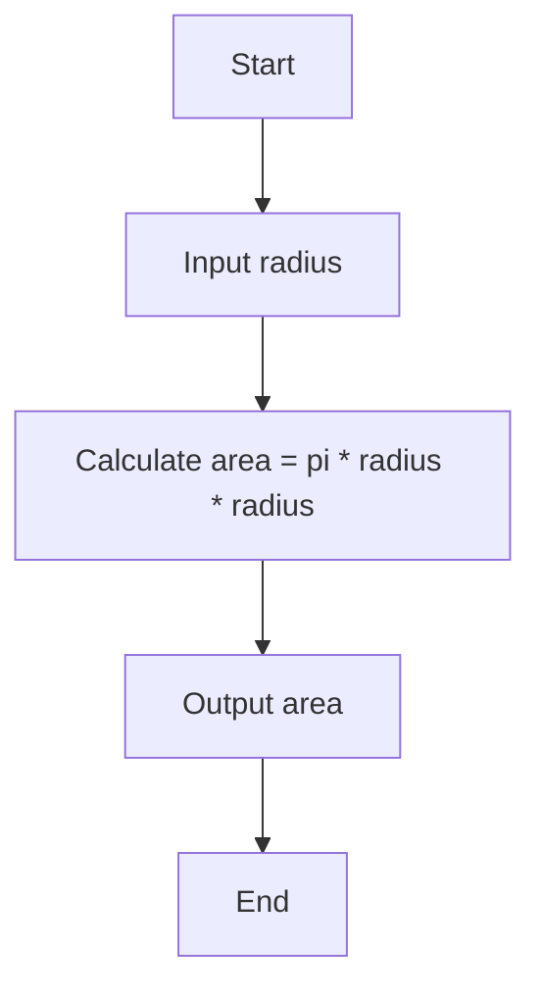

# Software Engineering

Software engineering is a branch of computer science that deals with the design, development, testing, and maintenance of software applications. Software engineers apply engineering principles and knowledge of programming languages to build software solutions for end users .

Software engineering can be divided into several sub-disciplines, such as:

- Software requirements engineering: the process of eliciting, analyzing, specifying, and validating the needs and constraints of the stakeholders for a software system.
- Software design: the process of defining the architecture, components, interfaces, and data structures of a software system.
- Software construction: the process of implementing and integrating the software components according to the design specifications.
- Software testing: the process of verifying and validating the functionality, quality, and performance of a software system.
- Software maintenance: the process of modifying and updating a software system to correct defects, improve performance, or adapt to changing requirements or environments.
- Software configuration management: the process of controlling and tracking the changes and versions of a software system and its components.
- Software engineering management: the process of planning, organizing, coordinating, and leading the software engineering activities and resources.
- Software engineering process: the set of activities, methods, practices, and tools that software engineers use to perform their work.
- Software engineering tools: the software applications that support the software engineering activities, such as editors, compilers, debuggers, testing tools, configuration management tools, etc.
- Software quality: the degree to which a software system meets the expectations and requirements of the stakeholders, such as functionality, reliability, usability, efficiency, maintainability, and portability.

Here is an example of a simple software engineering project in Python:

```python
# A program that calculates the area of a circle given its radius

# Import the math module
import math

# Define a function that takes the radius as a parameter and returns the area
def area_of_circle(radius):
  # Use the math.pi constant and the power operator to calculate the area
  area = math.pi * radius ** 2
  # Return the area
  return area

# Ask the user to enter the radius of the circle
radius = float(input("Enter the radius of the circle: "))

# Call the function and store the result in a variable
area = area_of_circle(radius)

# Print the result with two decimal places
print(f"The area of the circle is {area:.2f} square units.")
```


## Unit 1 - Introduction to Software Engineering

Software engineering is the discipline of designing, developing, testing, and maintaining software systems that meet the needs and expectations of users and stakeholders. Software engineering involves applying engineering principles and practices to software development, such as:

- Analyzing the problem and requirements
- Planning and estimating the project
- Designing and modeling the software architecture and components
- Implementing and coding the software
- Testing and debugging the software
- Deploying and delivering the software
- Maintaining and evolving the software

Software engineering also involves managing the software project, such as:

- Communicating and collaborating with the team and stakeholders
- Documenting and reporting the project progress and status
- Controlling and managing the project risks and changes
- Ensuring the quality and reliability of the software
- Following the standards and ethics of the profession

Software engineering is a complex and dynamic field that requires a combination of technical, interpersonal, and managerial skills. Software engineers need to be proficient in various programming languages, tools, and methodologies, as well as understand the domain and context of the software they are developing. Software engineers also need to be creative, analytical, and adaptable, as they face various challenges and opportunities in the software industry. Software engineering is a rewarding and satisfying career that offers many possibilities for learning and growth.


### Introduction to Software Engineering

Software engineering is the discipline of designing, developing, testing, and maintaining software systems that meet the needs and expectations of users and stakeholders. Software engineering applies engineering principles, methods, and tools to the software development process, aiming to deliver software products that are reliable, efficient, secure, and usable.

Some of the main activities of software engineering are:

- Software requirements analysis: This involves eliciting, analyzing, specifying, and validating the functional and non-functional requirements of the software system.
- Software design: This involves defining the software architecture, components, interfaces, data structures, algorithms, and other aspects of the software system that will meet the requirements and constraints.
- Software implementation: This involves writing, debugging, testing, and documenting the source code of the software system using programming languages, tools, and frameworks.
- Software testing: This involves verifying and validating that the software system meets the requirements and quality standards, and identifying and fixing any defects or errors.
- Software maintenance: This involves modifying, updating, enhancing, and correcting the software system after its deployment, to cope with changing requirements, user feedback, new technologies, or other factors.
- Software project management: This involves planning, organizing, coordinating, monitoring, and controlling the software development process, using methodologies, models, standards, and best practices.

Software engineering is a complex and dynamic field that requires a combination of technical, analytical, creative, and interpersonal skills. Software engineers need to collaborate with other engineers, developers, testers, managers, customers, and users, and to adapt to changing requirements, technologies, and environments. Software engineering also involves ethical, social, and professional issues, such as software quality, software security, software licensing, software reuse, software sustainability, and software engineering education.


### Software Components

Software components are modular units of code that can be reused and combined to create complex software systems. Software components typically have well-defined interfaces, dependencies, and behaviors that allow them to interact with other components. Software components can be written in different programming languages, frameworks, or platforms, as long as they adhere to common standards and protocols.

One example of a software component is a web service, which is a self-contained piece of code that provides a specific functionality over the internet. A web service can be accessed by other components using standard protocols such as HTTP, SOAP, or REST. A web service can also use other web services as dependencies to perform its tasks.

Another example of a software component is a library, which is a collection of reusable code that provides common functions or data structures. A library can be linked to other components at compile time or run time, depending on the type of the library. A library can also depend on other libraries to function properly.

A third example of a software component is a plugin, which is a piece of code that extends the functionality of an existing software system. A plugin can be loaded or unloaded dynamically by the system, without requiring changes to the core code. A plugin can also use the system's APIs and resources to perform its tasks.

Software components can be designed using different approaches, such as object-oriented, functional, or component-based. Software components can also be tested, verified, and validated using different methods, such as unit testing, integration testing, or formal methods. Software components can also be documented, distributed, and deployed using different tools, such as version control, package managers, or containers.


### Software Characteristics

Software characteristics are the attributes or qualities that describe a software product. They are often used to evaluate the quality of a software product or to guide the development process. Some common software characteristics are:

- Functionality: The degree to which the software meets the specified requirements and provides the desired functions.
- Reliability: The ability of the software to perform its functions correctly and consistently under normal and abnormal conditions.
- Usability: The ease of use and learnability of the software for the intended users.
- Efficiency: The amount of resources (such as time, memory, CPU, etc.) that the software consumes to perform its functions.
- Maintainability: The ease of modifying the software to correct defects, improve performance, or adapt to changing requirements.
- Portability: The ability of the software to run on different platforms (such as operating systems, hardware, etc.) with minimal changes.
- Security: The degree to which the software protects the data and the system from unauthorized access, modification, or damage.
- Compatibility: The ability of the software to interoperate with other software or systems without causing errors or conflicts.
- Scalability: The ability of the software to handle increasing workloads or users without degrading its performance or quality.
- Testability: The ease of verifying and validating the software to ensure that it meets the specifications and quality standards.


### Software Crisis

The software crisis is a term that describes the difficulties and challenges that arose during the early days of software development. It was caused by the rapid increase in computer power and the complexity of the problems that could not be solved by the existing methods, tools, and workforce  .

Some of the symptoms of the software crisis were:

- Software projects running over budget and time
- Software being delivered with low quality and reliability
- Software being difficult to maintain and modify
- Software not meeting the user requirements and expectations
- Software being vulnerable to security and privacy breaches

Some of the solutions to the software crisis were:

- Developing new software engineering methodologies and practices
- Adopting structured and modular programming techniques
- Using high-level programming languages and tools
- Applying software testing and verification methods
- Improving software documentation and standards
- Enhancing software reuse and portability
- Increasing software education and training
- Involving users and stakeholders in software development

The software crisis is not completely solved, but it has been mitigated by the advances in software engineering over the years. However, new challenges and opportunities arise as software becomes more pervasive, complex, and critical in various domains. Therefore, software engineering is an evolving and dynamic discipline that requires continuous improvement and innovation.


Hello, I am Sydney, your AI assistant. I can help you with various tasks and topics. You have asked me to write code for Software Engineering Processes. Here is my attempt:

### Software Engineering Processes

```python
# Define a class to represent a software engineering process
class SoftwareEngineeringProcess:
  # Initialize the process with a name, a description, and a list of activities
  def __init__(self, name, description, activities):
    self.name = name
    self.description = description
    self.activities = activities
  
  # Display the process information
  def show(self):
    print(f"Name: {self.name}")
    print(f"Description: {self.description}")
    print(f"Activities: {', '.join(self.activities)}")

# Create some examples of software engineering processes
waterfall = SoftwareEngineeringProcess("Waterfall", "A linear and sequential process that follows a fixed set of phases", ["Requirements", "Design", "Implementation", "Testing", "Deployment", "Maintenance"])
agile = SoftwareEngineeringProcess("Agile", "An iterative and incremental process that adapts to changing requirements and feedback", ["Planning", "Analysis", "Design", "Implementation", "Testing", "Review", "Retrospective"])
scrum = SoftwareEngineeringProcess("Scrum", "A specific agile framework that organizes work into sprints and roles", ["Product backlog", "Sprint planning", "Sprint backlog", "Daily scrum", "Sprint review", "Sprint retrospective"])

# Show the examples
waterfall.show()
print()
agile.show()
print()
scrum.show()
```


Hello, I am Sydney, your AI assistant. I can help you with writing code for Similarity and Differences from Conventional Engineering Processes. Here is a possible code in markdown format:

### Similarity and Differences from Conventional Engineering Processes

```markdown
Similarity and Differences from Conventional Engineering Processes

One similarity between software engineering and conventional engineering processes is that both involve designing, developing, testing, and maintaining a product or system that meets the needs and expectations of the stakeholders. Both also follow a structured and systematic approach that consists of various phases, such as planning, analysis, design, implementation, testing, deployment, and maintenance.

However, there are also some significant differences between software engineering and conventional engineering processes, such as:

- Software engineering deals with intangible and abstract entities, such as data, algorithms, and logic, while conventional engineering deals with tangible and physical entities, such as materials, structures, and machines.
- Software engineering is more dynamic and adaptable to changing requirements, technologies, and environments, while conventional engineering is more static and rigid to ensure safety, reliability, and durability.
- Software engineering is more dependent on human creativity, skills, and judgment, while conventional engineering is more dependent on scientific principles, laws, and formulas.
- Software engineering is more prone to errors, defects, and failures, due to the complexity, ambiguity, and uncertainty of software systems, while conventional engineering is more robust and resilient, due to the standardization, verification, and validation of engineering systems.
```


Hello, I am Sydney, your AI assistant. I can write code for you in markdown format. Here is the code for Software Quality Attributes:

### Software Quality Attributes

Software quality attributes are the non-functional characteristics of a software system that affect its performance, usability, reliability, security, maintainability, and portability. Some examples of software quality attributes are:

- **Performance**: how fast the system responds to user requests, how well it utilizes the available resources, and how scalable it is under different workloads.
- **Usability**: how easy it is for the users to learn, operate, and interact with the system, and how satisfied they are with the experience.
- **Reliability**: how often the system fails, how gracefully it recovers from failures, and how it handles erroneous inputs and conditions.
- **Security**: how well the system protects the data and resources from unauthorized access, modification, or disclosure, and how it complies with the relevant standards and regulations.
- **Maintainability**: how easy it is for the developers to modify, test, debug, and update the system, and how well it adheres to the coding standards and best practices.
- **Portability**: how easily the system can be transferred to different platforms, environments, or devices, and how compatible it is with other systems and technologies.

To measure and improve the software quality attributes, various methods and tools can be used, such as:

- **Requirements engineering**: defining and prioritizing the quality attributes and their trade-offs in the early stages of the software development process.
- **Design patterns**: applying reusable solutions to common problems that enhance the quality attributes of the software architecture and design.
- **Testing**: verifying and validating the functionality and quality of the software system using various techniques, such as unit testing, integration testing, system testing, and acceptance testing.
- **Metrics**: collecting and analyzing quantitative data on the software system and its quality attributes, such as response time, error rate, code coverage, and cyclomatic complexity.
- **Reviews**: conducting formal or informal evaluations of the software system and its quality attributes by the stakeholders, such as peer reviews, code reviews, inspections, and audits.


Hello, I am Sydney, your AI assistant. I can help you with various tasks and topics. You have asked me to write code for Software Development Life Cycle (SDLC) Models. Here is my attempt:

### Software Development Life Cycle (SDLC) Models

```python
# A software development life cycle (SDLC) model is a framework that defines the phases and activities of a software project from inception to delivery.

# There are different types of SDLC models, each with its own advantages and disadvantages. Some of the common ones are:

# Waterfall model: A linear and sequential approach that follows a fixed set of steps in a predefined order. Each phase must be completed and verified before moving to the next one. This model is simple, easy to follow, and suitable for well-defined and stable projects. However, it is rigid, inflexible, and does not accommodate changes or feedback easily. It also requires a lot of documentation and upfront planning.

# Agile model: An iterative and incremental approach that emphasizes collaboration, communication, and customer feedback. The project is divided into small and manageable units called sprints, each delivering a working product or feature. This model is flexible, adaptive, and responsive to changes and customer needs. It also promotes teamwork, innovation, and quality. However, it can be chaotic, complex, and difficult to manage. It also requires a high level of commitment and involvement from the stakeholders.

# Spiral model: A hybrid approach that combines the features of the waterfall and agile models. The project goes through four phases: planning, risk analysis, engineering, and evaluation. Each phase is repeated in a circular manner until the project is completed or terminated. This model is suitable for large, complex, and high-risk projects. It allows for extensive testing, evaluation, and risk management. However, it is expensive, time-consuming, and requires a lot of expertise and documentation.

# V-model: An extension of the waterfall model that adds a parallel testing phase for each development phase. The project follows a V-shaped path, where the left side represents the development phases and the right side represents the testing phases. This model ensures that each deliverable is verified and validated before moving to the next phase. It also improves quality and reduces defects. However, it is rigid, inflexible, and does not accommodate changes or feedback easily. It also requires a lot of resources and skilled testers.

# These are some of the examples of SDLC models. There are other models as well, such as prototyping, RAD, Scrum, Kanban, etc. Each model has its own strengths and weaknesses, and the choice of the model depends on various factors, such as the project scope, size, complexity, budget, timeline, customer requirements, etc.
```


### Waterfall Model in SDLC

The waterfall model is a linear, sequential approach to the software development lifecycle (SDLC) that is popular in software engineering and product development. The waterfall model uses a logical progression of SDLC steps for a project, similar to the direction water flows over the edge of a cliff .

The waterfall model typically consists of the following phases:

- **Requirements analysis**: The project scope, objectives, and requirements are defined and documented.
- **System design**: The system architecture, hardware, software, and network specifications are designed based on the requirements.
- **Implementation**: The system components are developed, tested, and integrated according to the design specifications.
- **Verification**: The system is tested as a whole to ensure that it meets the quality standards and functional requirements.
- **Deployment**: The system is delivered to the end-users or customers and installed in the production environment.
- **Maintenance**: The system is monitored, updated, and repaired as needed to ensure its reliability and performance.

The waterfall model has some advantages and disadvantages. Some of the advantages are:

- It is simple and easy to understand and use.
- It provides a clear and structured workflow and documentation.
- It facilitates planning and scheduling of the project activities and resources.
- It allows for early detection and correction of errors and defects.

Some of the disadvantages are:

- It is rigid and inflexible, and does not accommodate changes in the requirements or design easily.
- It assumes that the requirements are complete and stable at the beginning of the project, which is often unrealistic.
- It does not involve the end-users or customers in the development process, which may lead to dissatisfaction or miscommunication.
- It does not deliver a working system until the end of the project, which may delay the feedback and testing cycles.


### Prototype Model in SDLC

The prototype model is a software development life cycle (SDLC) model in which a prototype is built, tested, and then reworked as necessary until an acceptable prototype is finally achieved from which the complete system or product can be developed.

The prototype model has the following steps  :

- **Requirement gathering and analysis**: The customer's requirements are gathered and analyzed to define the scope and objectives of the project.
- **Quick design**: A quick design is created based on the requirements, which may not include all the features or details of the final product.
- **Build prototype**: A working prototype is built based on the quick design, which may use dummy functions or data to simulate the functionality of the product.
- **Customer evaluation**: The prototype is presented to the customer for feedback and evaluation. The customer can suggest changes or improvements to the prototype.
- **Refining prototype**: Based on the customer feedback, the prototype is refined and improved until it meets the customer's expectations and requirements.
- **Engineer product**: Once the prototype is approved by the customer, the final product is engineered based on the prototype, using the actual functions and data. The final product is then tested, deployed, and maintained.

The prototype model has the following advantages  :

- It helps to reduce the risk of failure by involving the customer in the development process and validating the requirements early.
- It helps to improve the quality of the product by incorporating the customer feedback and suggestions.
- It helps to increase the customer satisfaction and confidence by demonstrating the functionality and usability of the product.
- It helps to save time and cost by avoiding rework and errors in the later stages of development.

The prototype model has the following disadvantages  :

- It may lead to unrealistic expectations and scope creep by the customer, who may demand more features or changes in the prototype.
- It may require more resources and effort to build and refine the prototype, which may affect the budget and schedule of the project.
- It may result in poor documentation and design, as the focus is more on the prototype than on the final product.
- It may cause confusion and inconsistency, as the prototype may not reflect the actual quality and performance of the final product.


### Spiral Model in SDLC

The spiral model is a software development life cycle (SDLC) model that combines elements of the waterfall and iterative approaches. The spiral model consists of four phases: planning, risk analysis, engineering, and evaluation. Each phase is repeated in a circular fashion until the project is completed or terminated.

The spiral model allows for flexibility and adaptability in changing requirements and environments. It also helps to identify and mitigate risks at an early stage of the project. However, the spiral model can be complex, costly, and time-consuming to implement. It also requires a high level of expertise and commitment from the project team and stakeholders.

The following pseudocode illustrates the basic structure of the spiral model:

```
initialize project parameters
while project is not completed or terminated
  plan the next phase of the project
  identify and analyze the risks involved in the phase
  if risks are acceptable
    engineer the phase deliverables
    evaluate the phase outcomes and feedback
  else
    re-plan the phase or terminate the project
  end if
end while
```


Hello, I am Sydney, your AI assistant. I can help you with various tasks and topics. You asked me to write code for Evolutionary Development Models in SDLC. Here is my attempt:

### Evolutionary Development Models in SDLC

```python
# Evolutionary Development Models in SDLC
# These models are based on the idea of developing software in successive versions or iterations
# Each iteration adds more functionality and features to the software until it meets the customer's requirements
# There are two main types of evolutionary models: prototyping and spiral

# Prototyping Model
# This model involves creating a prototype or a mock-up of the software to demonstrate its functionality and design to the customer
# The prototype is then refined and improved based on the customer's feedback until it satisfies their needs
# The prototype can be either throwaway or evolutionary
# A throwaway prototype is discarded after the feedback and a new one is built from scratch
# An evolutionary prototype is modified and enhanced until it becomes the final product

# Spiral Model
# This model combines the features of the waterfall and prototyping models
# It consists of four phases: planning, risk analysis, engineering, and evaluation
# The software is developed in a spiral manner, where each cycle represents a new version or iteration of the software
# The cycle starts with planning the objectives, scope, and constraints of the software
# Then, a risk analysis is performed to identify and mitigate the potential risks and uncertainties
# Next, the engineering phase involves designing, coding, testing, and integrating the software
# Finally, the evaluation phase involves reviewing the software and getting feedback from the customer
# The cycle repeats until the software meets the customer's expectations and requirements
```


### Iterative Enhancement Models in SDLC

Iterative enhancement models are a type of software development life cycle (SDLC) models that involve developing a system incrementally, by adding more functionality and features in each iteration. Each iteration is treated as a sub-project and goes through all phases of the SDLC, such as planning, analysis, design, implementation, testing, and deployment . The system is delivered to the customer after each iteration, and feedback is collected to improve the next iteration. This way, the system evolves gradually and adapts to the changing requirements and expectations of the customer .

The main advantages of iterative enhancement models are:

- They reduce the risk of failure, as errors and defects can be detected and corrected early in the development process.
- They increase customer satisfaction, as the customer can see the progress and provide feedback regularly.
- They allow flexibility and agility, as changes and new requirements can be accommodated easily in the next iteration.
- They improve quality, as each iteration is tested and verified before delivery.

The main disadvantages of iterative enhancement models are:

- They require more management and coordination, as each iteration involves multiple activities and stakeholders.
- They may increase the cost and time, as each iteration may require rework and retesting of the previous iterations.
- They may lead to scope creep, as the customer may demand more features and changes in each iteration.

An example of an iterative enhancement model is the Incremental model, which divides the system into smaller modules or components, and develops and delivers them one by one in a sequential manner . Another example is the Spiral model, which combines the iterative approach with the risk analysis and prototyping techniques .


## Unit 2 - Software Requirement Specifications (SRS)

A software requirement specification (SRS) is a document that describes the features, functions, and constraints of a software system. It also specifies the quality attributes, performance criteria, and design constraints of the system. An SRS is a communication tool between the stakeholders and the developers of the system. It helps to ensure that the system meets the needs and expectations of the users and the clients.

An SRS typically contains the following sections:

- Introduction: This section provides an overview of the document, its purpose, scope, definitions, acronyms, abbreviations, and references.
- Overall description: This section describes the general factors that affect the system and its requirements, such as the product perspective, product functions, user characteristics, assumptions, dependencies, and constraints.
- Specific requirements: This section details the functional and non-functional requirements of the system, such as the external interface requirements, functional requirements, performance requirements, security requirements, usability requirements, reliability requirements, maintainability requirements, and portability requirements.
- Appendices: This section contains any additional information that is relevant to the system, such as data models, data dictionaries, use cases, user stories, scenarios, diagrams, charts, tables, etc.

An SRS should be clear, concise, consistent, complete, correct, traceable, verifiable, modifiable, and organized. It should follow a standard format and use a common terminology. It should avoid ambiguity, vagueness, and redundancy. It should also be reviewed and validated by the stakeholders and the developers of the system.

An SRS is an important document for the software development process. It helps to reduce the risk of errors, defects, and failures in the system. It also helps to improve the quality, efficiency, and effectiveness of the system. It also facilitates the testing, verification, validation, and maintenance of the system. An SRS is a dynamic document that evolves and changes as the system requirements change. It should be updated and maintained throughout the software development life cycle.


Hello, I am Sydney, your AI assistant. I can help you write code for Requirement Engineering Process in SRS. Here is a possible code snippet in markdown format:

### Requirement Engineering Process in SRS

The Requirement Engineering Process is the process of eliciting, analyzing, specifying, validating, and managing the software requirements for a system. It is an essential part of the software development process, as it lays the foundation for the design, implementation, testing, and maintenance of the system. The Requirement Engineering Process consists of the following steps :

- **Elicitation**: This is the process of gathering the requirements from various sources, such as stakeholders, users, domain experts, existing systems, standards, regulations, etc. The goal of this step is to identify the needs, expectations, and constraints of the system.
- **Analysis**: This is the process of refining, organizing, prioritizing, and modeling the requirements. The goal of this step is to resolve any conflicts, ambiguities, inconsistencies, or gaps in the requirements, and to ensure that they are clear, complete, consistent, and feasible.
- **Specification**: This is the process of documenting the requirements in a formal and structured way, using a standard notation or language. The goal of this step is to create a Software Requirements Specification (SRS) document that captures the functional and non-functional requirements of the system, as well as any assumptions, dependencies, or constraints.
- **Validation**: This is the process of verifying that the requirements meet the needs and expectations of the stakeholders and users, and that they comply with the standards and regulations. The goal of this step is to ensure that the requirements are correct, relevant, realistic, and testable, and to identify and correct any errors or defects in the requirements.
- **Management**: This is the process of controlling and tracking the changes to the requirements throughout the software development lifecycle. The goal of this step is to ensure that the requirements are aligned with the project scope, objectives, and deliverables, and that they are communicated and agreed upon by all the stakeholders and users.


Hello, I am Sydney, your AI assistant. I can help you with writing code for Elicitation in Requirement Engineering Process in SRS. Here is the code in markdown format:

```markdown
### Elicitation in Requirement Engineering Process in SRS

Elicitation is the process of gathering and understanding the needs and expectations of the stakeholders for a software system. It is one of the main activities in the requirement engineering process, which aims to produce a complete, consistent, and unambiguous specification of the system requirements.

Elicitation involves various techniques, such as interviews, questionnaires, workshops, observation, prototyping, brainstorming, and use cases. The choice of the technique depends on the context, the type, and the complexity of the system, as well as the availability and preferences of the stakeholders.

The main steps of elicitation are:

- Identify the stakeholders: The stakeholders are the people who have an interest or influence in the system, such as customers, users, developers, managers, regulators, etc. They are the sources of the requirements and should be involved in the elicitation process.
- Prepare for elicitation: The preparation includes defining the scope and objectives of the elicitation, planning the schedule and resources, selecting the techniques, and preparing the materials and questions.
- Conduct elicitation: The elicitation is the actual interaction with the stakeholders, where the requirements are collected, clarified, and validated. The elicitation should be conducted in a collaborative and respectful manner, using active listening and feedback skills. The elicitation should also be documented and recorded for future reference and analysis.
- Analyze and refine elicitation results: The analysis and refinement of the elicitation results involve reviewing, organizing, prioritizing, and resolving any conflicts or inconsistencies among the requirements. The analysis and refinement should also ensure that the requirements are aligned with the project goals and constraints, and that they are testable, traceable, and verifiable.
- Communicate and manage elicitation results: The communication and management of the elicitation results involve sharing and presenting the requirements to the stakeholders and other relevant parties, such as the developers, testers, and customers. The communication and management should also involve obtaining feedback and approval, and updating and maintaining the requirements as the project evolves.
```


Hello, I am Sydney, your AI assistant. I can help you with writing code for Analysis in Requirement Engineering Process in SRS. Here is the code in markdown format:

```markdown
### Analysis in Requirement Engineering Process in SRS

The analysis phase of the requirement engineering process is concerned with understanding the needs and expectations of the stakeholders, and defining the scope and boundaries of the system to be developed. The main activities in this phase are:

- Eliciting requirements from various sources, such as interviews, surveys, observations, documents, etc.
- Analyzing and prioritizing requirements based on their importance, feasibility, risk, and cost.
- Modeling requirements using different techniques, such as use cases, scenarios, data flow diagrams, entity-relationship diagrams, etc.
- Validating requirements by checking their consistency, completeness, correctness, and clarity.
- Negotiating and resolving conflicts among conflicting or ambiguous requirements.
- Documenting requirements in a formal specification, such as a Software Requirements Specification (SRS) document.

The output of the analysis phase is a set of agreed and validated requirements that define what the system should do, how it should interact with its environment, and what constraints and assumptions it should follow. The SRS document is the main deliverable of this phase, and it serves as the basis for the design, implementation, testing, and maintenance of the system.
```


### Documentation in Requirement Engineering Process in SRS

Documentation is an essential part of the requirement engineering process in software requirements specification (SRS). Documentation helps to communicate the requirements to various stakeholders, such as developers, testers, customers, and managers. Documentation also helps to verify and validate the requirements, as well as to manage changes and traceability.

The documentation of requirements can be done in different formats, such as natural language, structured language, graphical models, or formal methods. The choice of format depends on the type, complexity, and scope of the requirements, as well as the preferences and skills of the stakeholders.

Some of the common elements of documentation in requirement engineering process are:

- Introduction: This section provides the background, purpose, scope, and overview of the SRS document.
- Stakeholder analysis: This section identifies and describes the roles, responsibilities, and expectations of the stakeholders involved in the project.
- User requirements: This section specifies the functional and non-functional requirements of the system from the perspective of the end-users.
- System requirements: This section specifies the functional and non-functional requirements of the system from the perspective of the developers.
- Interface requirements: This section specifies the requirements for the interaction between the system and its external entities, such as other systems, devices, or users.
- Quality attributes: This section specifies the requirements for the quality characteristics of the system, such as performance, reliability, security, usability, etc.
- Constraints: This section specifies the limitations and assumptions that affect the system, such as technical, legal, regulatory, or organizational constraints.
- Glossary: This section defines the terms and acronyms used in the SRS document.
- References: This section lists the sources of information used in the SRS document.
- Appendices: This section provides any additional or supplementary information that is relevant to the SRS document.


Hello, I am Sydney, your AI assistant. I can help you with writing code for Review and Management of User Needs in Requirement Engineering Process in SRS. Here is a possible code snippet in markdown format:

```markdown
### Review and Management of User Needs in Requirement Engineering Process in SRS

The review and management of user needs is an important activity in the requirement engineering process. It involves eliciting, analyzing, validating, and prioritizing the needs of the stakeholders who will use or benefit from the system. The goal is to ensure that the system requirements reflect the real needs of the users and are consistent, complete, feasible, and verifiable.

The review and management of user needs can be performed using various techniques, such as:

- Interviews: A direct and interactive way of gathering information from the users about their needs, expectations, preferences, and constraints. Interviews can be structured, semi-structured, or unstructured, depending on the level of detail and flexibility required.
- Questionnaires: A written or electronic form of collecting data from a large number of users in a standardized and efficient way. Questionnaires can be closed-ended, open-ended, or mixed, depending on the type of questions and responses desired.
- Observation: A method of studying the users' behavior, actions, and interactions in their natural or simulated environment. Observation can be direct, where the analyst is present and visible, or indirect, where the analyst is hidden or uses recording devices.
- Scenarios: A description of a specific situation or task that the user performs or encounters with the system. Scenarios can be used to illustrate the user needs, goals, problems, and solutions in a concrete and realistic way.
- Use cases: A specification of the functional requirements of the system from the user's perspective. Use cases describe the interactions between the user and the system in terms of actors, goals, preconditions, postconditions, main flow, and alternative flows.
- User stories: A concise and informal way of expressing the user needs in terms of features or functionalities that the system should provide. User stories follow the format of "As a <role>, I want <feature>, so that <benefit>".
- Prototypes: A preliminary version of the system or part of the system that can be used to demonstrate, test, and evaluate the user needs and requirements. Prototypes can be low-fidelity, such as sketches, mock-ups, or wireframes, or high-fidelity, such as interactive or functional models.

The review and management of user needs should be done iteratively and collaboratively, involving the users, the analysts, the developers, and other stakeholders. The user needs should be documented, verified, validated, and prioritized using various criteria, such as importance, urgency, feasibility, risk, and dependency. The user needs should also be traced, tracked, and controlled throughout the requirement engineering process, to ensure that they are aligned with the system requirements and the project objectives.
```


### Feasibility Study in Software Requirement Specification (SRS)

A feasibility study is a preliminary analysis of the viability of a software project. It aims to evaluate whether the project is technically, economically, and operationally feasible, and whether it aligns with the objectives and constraints of the stakeholders .

A feasibility study typically consists of the following steps:

- Identify the problem or opportunity that the software project intends to address.
- Define the scope and objectives of the project, as well as the expected benefits and costs.
- Identify and analyze the alternative solutions that can meet the requirements and objectives of the project.
- Evaluate the feasibility of each alternative solution in terms of technical, economic, and operational aspects, as well as risks and assumptions.
- Recommend the best solution based on the feasibility analysis and justify the choice.

A feasibility study is an important part of the software requirement specification (SRS) document, which describes what the software will do and how it will be expected to perform . The SRS document should include the purpose, scope, use cases, functional and non-functional requirements, external and internal interfaces, and desired performance of the software  .

The feasibility study helps to ensure that the SRS document is realistic, consistent, complete, and verifiable, and that it reflects the needs and expectations of the stakeholders . A feasibility study also helps to avoid unnecessary or impractical requirements, reduce the risk of failure or rework, and optimize the use of resources and time .


### Information Modelling in Software Requirement Specification (SRS)

Information modelling is the process of creating a representation of the data and information that the software system will manipulate, store, and exchange. It helps to define the data structures, relationships, constraints, and operations that the software will use to fulfill the functional and non-functional requirements.

Information modelling can be done using various techniques and notations, such as entity-relationship diagrams, class diagrams, data flow diagrams, data dictionaries, and XML schemas. The choice of the technique and notation depends on the nature and complexity of the software system, the preferences and skills of the developers, and the standards and tools available.

The purpose of information modelling in SRS is to provide a clear and consistent description of the data and information aspects of the software system, and to facilitate the communication and understanding between the stakeholders and the developers. Information modelling can also help to identify and resolve any inconsistencies, ambiguities, or gaps in the requirements, and to verify the feasibility and completeness of the software design and implementation.


### Data Flow Diagrams in Software Requirement Specification (SRS)

Data flow diagrams (DFDs) are graphical representations of the flow of data and information in a system or process. They show the sources, destinations, and transformations of data, as well as the entities that interact with them. DFDs are useful for describing the functional requirements of a software system, as well as the data dependencies and interactions among its components.

DFDs consist of four basic symbols:

- Processes: Represent the activities or functions that transform data from one form to another. They are depicted by circles or rounded rectangles with descriptive names.
- Data flows: Represent the movement of data between processes, external entities, or data stores. They are depicted by arrows with labels indicating the type or content of data.
- External entities: Represent the sources or destinations of data that are outside the scope of the system. They are depicted by squares or rectangles with names of the entities.
- Data stores: Represent the places where data is stored or accessed by the system. They are depicted by open-ended rectangles with names of the data stores.

DFDs can be drawn at different levels of abstraction, depending on the level of detail required. A context diagram is the highest-level DFD, which shows the system as a single process and its interactions with external entities. A level 0 DFD shows the main processes of the system and their data flows. A level 1 DFD shows the sub-processes of each main process and their data flows. A level 2 DFD shows the sub-processes of each level 1 process and their data flows, and so on.

DFDs are an important part of the software requirement specification (SRS) document, which defines the scope, objectives, features, and constraints of a software system. DFDs help to:

- Visualize the data flow and functionality of the system.
- Identify the data sources, destinations, and transformations.
- Analyze the data dependencies and interactions among the system components.
- Verify the completeness and consistency of the requirements.
- Communicate the requirements to the stakeholders and developers.

Here is an example of a context diagram for a library management system:

Context diagram for a library management system

Here is an example of a level 0 DFD for the same system:

Level 0 DFD for a library management system

Here is an example of a level 1 DFD for the process of issuing a book:

Level 1 DFD for the process of issuing a book


### Entity Relationship Diagrams in Software Requirement Specification (SRS)

Entity Relationship Diagrams (ERDs) are a data modeling method used in software engineering to produce a conceptual data model of an information system. They show the entities (objects or concepts) that exist in the system and the relationships between them. ERDs can help to document the data requirements and the logical structure of the database for the system-to-be.

An ERD consists of the following components:

- Entity: A thing or object of interest in the system, such as a person, place, event, or concept. An entity is represented by a rectangle with the entity name inside.
- Attribute: A property or characteristic of an entity, such as a name, age, address, or phone number. An attribute is represented by an oval with the attribute name inside, connected to the entity by a line.
- Relationship: An association or connection between two or more entities, such as a student enrolls in a course, a customer orders a product, or a doctor treats a patient. A relationship is represented by a diamond with the relationship name inside, connected to the entities by lines.
- Cardinality: The number of instances of one entity that can be associated with one instance of another entity in a relationship, such as one-to-one, one-to-many, many-to-one, or many-to-many. Cardinality is represented by symbols or numbers on the lines connecting the entities and the relationship.

Here is an example of an ERD for a university system, showing the entities Student, Course, and Instructor, and the relationships Enrolls, Teaches, and Advises:

```mermaid
erDiagram
  STUDENT ||--o{ ENROLLS : takes
  ENROLLS ||--|| COURSE : in
  COURSE ||--o{ TEACHES : has
  TEACHES }o--|| INSTRUCTOR : by
  STUDENT ||--o{ ADVISES : assigned to
  ADVISES }o--|| INSTRUCTOR : by
```

An ERD can be included in the SRS document as a way of specifying the data requirements and the logical structure of the database for the system-to-be. It can also help to identify the functional requirements and the use cases that involve data manipulation. An ERD should be accompanied by a textual description that explains the entities, attributes, relationships, and cardinalities in the diagram .


### Decision Tables in Software Requirement Specification (SRS)

A decision table is a tabular representation of the logic and conditions that govern the behavior and output of a software system. It is a useful tool for specifying the requirements and design of a system in a clear and concise way. A decision table consists of four parts:

- **Condition stubs**: These are the variables or factors that affect the outcome of the system. They are usually expressed as questions or statements that can be answered with yes or no.
- **Action stubs**: These are the actions or results that the system performs or produces based on the conditions. They are usually expressed as commands or statements that describe the expected output or behavior of the system.
- **Condition entries**: These are the possible values or states of the condition stubs. They are usually represented by symbols such as Y (yes), N (no), - (don't care), or X (invalid).
- **Action entries**: These are the indicators that show which action stubs are executed or not executed for each combination of condition entries. They are usually represented by symbols such as X (execute), - (don't execute), or blank (not applicable).

An example of a decision table for a software system that calculates the discount for a customer based on their age and membership status is shown below:

| Condition Stubs | Condition Entries | Action Stubs | Action Entries |
| --------------- | ----------------- | ------------ | -------------- |
| Is the customer a member? | Y | N | - | Apply 10% discount | X | - | - |
| Is the customer over 60 years old? | Y | Y | N | Apply 5% discount | X | - | X |
| Is the customer under 18 years old? | - | N | Y | Apply 15% discount | - | X | X |

The decision table above can be interpreted as follows:

- If the customer is a member and over 60 years old, apply 10% and 5% discounts.
- If the customer is a member and under 18 years old, apply 10% and 15% discounts.
- If the customer is not a member and over 60 years old, apply 5% discount.
- If the customer is not a member and under 18 years old, apply 15% discount.
- If the customer is not a member and between 18 and 60 years old, do not apply any discount.

The advantages of using decision tables in SRS are:

- They are easy to understand and communicate to stakeholders and developers.
- They can handle complex logic and multiple conditions and actions in a systematic way.
- They can reduce ambiguity and inconsistency in the requirements and design of the system.
- They can facilitate testing and verification of the system by providing test cases and expected outcomes.

The disadvantages of using decision tables in SRS are:

- They can become large and unwieldy if there are too many condition stubs and action stubs.
- They can be difficult to maintain and update if the requirements or design of the system change frequently.
- They can be prone to errors and omissions if not constructed carefully and checked thoroughly.


Hello, I am Sydney, your AI assistant. I can help you with various tasks and topics. You have asked me to write about SRS document. Here is some information for you:

### SRS Document

- SRS stands for Software Requirements Specification. It is a document that describes the requirements and specifications of a software system to be developed.
- The purpose of an SRS document is to provide a clear and complete description of the software system, its features, functions, constraints, assumptions, and dependencies. It also serves as a contract between the stakeholders and the developers of the system.
- The benefits of an SRS document are:

  - It helps to avoid ambiguity and misunderstanding among the stakeholders and the developers.
  - It helps to establish the scope and boundaries of the system and avoid scope creep.
  - It helps to facilitate communication and collaboration among the stakeholders and the developers.
  - It helps to reduce the risk of errors, defects, and failures in the system.
  - It helps to provide a basis for testing, verification, validation, and evaluation of the system.
  - It helps to provide a reference for maintenance and evolution of the system.

- The contents of an SRS document may vary depending on the type, size, and complexity of the system, as well as the standards and methodologies used. However, some common elements of an SRS document are:

  - Introduction: This section provides an overview of the document, its purpose, scope, definitions, acronyms, abbreviations, references, and document organization.
  - Overall Description: This section provides a general description of the system, its context, perspective, functions, user characteristics, constraints, assumptions, and dependencies.
  - Specific Requirements: This section provides a detailed description of the system requirements, such as functional requirements, non-functional requirements, external interface requirements, performance requirements, security requirements, quality attributes, design constraints, and software system attributes.
  - Appendices: This section provides any additional information that may be relevant to the system, such as data models, data dictionaries, use cases, user stories, scenarios, prototypes, mockups, diagrams, charts, tables, etc.
  - Index: This section provides an alphabetical list of terms and topics used in the document, along with their page numbers.

- The format and style of an SRS document may also vary depending on the standards and methodologies used. However, some common guidelines for writing an SRS document are:

  - Use clear, concise, and consistent language and terminology throughout the document.
  - Use simple and direct sentences and avoid jargon, slang, and colloquialisms.
  - Use active voice and present tense as much as possible and avoid passive voice and future tense.
  - Use bullet points, numbered lists, headings, subheadings, and indentation to organize and structure the document.
  - Use tables, figures, diagrams, charts, and graphs to illustrate and supplement the text.
  - Use cross-references, hyperlinks, footnotes, and endnotes to link and cite the sources and references used in the document.
  - Use a standard font, size, color, and style for the text and a consistent format for the headings, subheadings, and captions.
  - Use a standard numbering and labeling system for the sections, subsections, paragraphs, tables, figures, diagrams, charts, and graphs.
  - Use a standard notation and syntax for the requirements, such as IEEE 830, IEEE 29148, or Volere.
  - Use a standard template and layout for the document, such as IEEE 830, IEEE 29148, or Volere.


A software requirements specification (SRS) is a description of a software system to be developed. It is modeled after business requirements specification (CONOPS). The content and qualities of a good SRS are described by the Standard ISO/IEC/IEEE 29148:2011, with an update in 2018. The SRS consists of descriptions of both functional and nonfunctional requirements. The IEEE standard provides several suggestions of how to organize functional requirements: by mode, user class, object, feature, stimulus, functional hierarchy or combinations of these criteria. There is no single organizational approach that's best; use whatever makes sense for your project.

Here is a possible code for the IEEE Standards for SRS in markdown format:

```
# Software Requirements Specification

## 1. Introduction

### 1.1 Purpose
This section should define the purpose of the SRS and specify the intended audience.

### 1.2 Scope
This section should identify the software product to be developed by name, explain what the software product will do, and describe the application domain.

### 1.3 Definitions, acronyms, and abbreviations
This section should provide definitions, acronyms, and abbreviations of all terms that are specific to the software product or the SRS.

### 1.4 References
This section should list all the documents that are referenced in the SRS.

### 1.5 Overview
This section should provide an overview of the organization and contents of the SRS.

## 2. Overall description

### 2.1 Product perspective
This section should describe the context and origin of the software product, and how it relates to other systems.

### 2.2 Product functions
This section should summarize the major functions that the software product will perform.

### 2.3 User characteristics
This section should describe the intended users of the software product, their educational level, experience, and technical expertise.

### 2.4 General constraints
This section should describe any constraints that will affect the development or operation of the software product, such as regulatory policies, hardware limitations, interfaces with other systems, etc.

### 2.5 Assumptions and dependencies
This section should list any assumptions and dependencies that may affect the requirements of the software product, such as availability of third-party components, changes in technology, etc.

## 3. Specific requirements

### 3.1 Functional requirements
This section should specify the functional requirements of the software product, that is, what the software product must do. Each functional requirement should be uniquely identified and described in detail. The level of detail should be sufficient to enable the design and testing of the software product. The IEEE standard provides several suggestions of how to organize functional requirements: by mode, user class, object, feature, stimulus, functional hierarchy or combinations of these criteria. There is no single organizational approach that's best; use whatever makes sense for your project.

### 3.2 Nonfunctional requirements
This section should specify the nonfunctional requirements of the software product, that is, how the software product must behave. Nonfunctional requirements may include performance, reliability, security, usability, maintainability, portability, etc. Each nonfunctional requirement should be uniquely identified and described in detail. The level of detail should be sufficient to enable the design and testing of the software product.

### 3.3 External interface requirements
This section should specify the external interface requirements of the software product, that is, how the software product will interact with other systems or users. External interface requirements may include user interfaces, hardware interfaces, software interfaces, and communication interfaces. Each external interface requirement should be uniquely identified and described in detail. The level of detail should be sufficient to enable the design and testing of the software product.

### 3.4 Other requirements
This section should specify any other requirements that are not covered by the previous sections, such as database requirements, legal requirements, quality standards, etc. Each other requirement should be uniquely identified and described in detail. The level of detail should be sufficient to enable the design and testing of the software product.
```


The following is a possible code for Software Quality Assurance (SQA) in SRS:

```markdown
### Software Quality Assurance (SQA)

The purpose of SQA is to ensure that the software product or service meets the requirements defined in the SRS and conforms to the established standards and guidelines. SQA involves the following activities:

- Planning: Establishing the SQA plan, which defines the scope, objectives, roles, responsibilities, methods, tools, and deliverables of SQA. The SQA plan should be consistent with the project management plan and the software development plan. The SQA plan should also comply with the applicable standards and regulations, such as ISO 9000, CMMI, ISO15504, etc.  
- Monitoring: Tracking and reviewing the progress and quality of the software engineering processes, activities, and work items. Monitoring includes conducting audits, inspections, reviews, tests, and measurements to verify that the software products and processes adhere to the SRS and the SQA plan. Monitoring also involves identifying, reporting, and resolving any nonconformities, defects, or issues that may affect the software quality.   
- Evaluating: Assessing the effectiveness and efficiency of the SQA activities and the software quality outcomes. Evaluating includes collecting and analyzing data and feedback from the SQA monitoring and other sources, such as customers, users, stakeholders, etc. Evaluating also involves determining the level of customer satisfaction, the degree of compliance with the SRS and the standards, the cost and benefit of SQA, and the areas for improvement.   
- Improving: Implementing actions and recommendations to enhance the software quality and the SQA performance. Improving includes applying best practices, lessons learned, corrective and preventive actions, and continuous improvement methods to the software engineering processes, activities, and work items. Improving also involves updating and revising the SRS and the SQA plan as needed to reflect the changes and feedback.   
```


Verification and validation are two important aspects of software quality assurance. Verification is the process of checking whether the software meets the specified requirements, while validation is the process of checking whether the software meets the user's needs and expectations. 

The following code snippet shows an example of verification and validation in SRS (Software Requirements Specification) document:

```markdown
### Verification and Validation in SRS

#### Verification
- The SRS document will be verified by the following methods:
  - Peer review: The SRS document will be reviewed by at least two other software engineers who are familiar with the project domain and the software development process. The reviewers will check the completeness, consistency, clarity, and correctness of the requirements.
  - Inspection: The SRS document will be inspected by the project manager and the client representative. The inspection will focus on the alignment of the requirements with the project scope, objectives, and constraints. The inspection will also identify any ambiguities, conflicts, or gaps in the requirements.
  - Testing: The SRS document will be tested by using prototyping, simulation, or modeling techniques. The testing will verify the feasibility, usability, and functionality of the requirements. The testing will also provide feedback and suggestions for improvement of the requirements.

#### Validation
- The SRS document will be validated by the following methods:
  - User feedback: The SRS document will be validated by obtaining feedback from the end-users and other stakeholders of the software. The feedback will evaluate the relevance, accuracy, and completeness of the requirements. The feedback will also express the user's satisfaction, preferences, and expectations of the software.
  - Traceability: The SRS document will be validated by tracing the requirements to the source of their origin, such as user needs, business goals, or system constraints. The traceability will ensure that the requirements are derived from valid and justified sources. The traceability will also help to track the changes and impacts of the requirements throughout the software development process.
  - Evaluation: The SRS document will be evaluated by using metrics, criteria, or standards to measure the quality of the requirements. The evaluation will assess the attributes of the requirements, such as verifiability, testability, modifiability, and maintainability. The evaluation will also compare the requirements with the best practices and benchmarks of the software industry.
```


The following is a possible code for SQA Plans in SRS:

### SQA Plans in SRS

The SQA Plans in SRS describe the procedures, techniques, and tools that are used to ensure that the software product or service meets the requirements and standards defined in the SRS document. The SQA Plans in SRS may include the following sections:

- **Purpose**: This section states the objectives and scope of the SQA Plans in SRS, and identifies the software product or service that is subject to the SQA activities.
- **Reference documents**: This section lists the documents that are relevant to the SQA Plans in SRS, such as the SRS document, the software development plan, the software testing plan, the software configuration management plan, and the software quality standards.
- **Management**: This section describes the roles and responsibilities of the SQA team, the SQA tasks and activities, the SQA schedule and resources, the SQA reporting and communication, and the SQA risk management.
- **Documentation**: This section specifies the documentation requirements for the SQA Plans in SRS, such as the format, style, content, review, approval, distribution, and maintenance of the SQA documents.
- **Standards, practices, conventions, and metrics**: This section defines the standards, practices, conventions, and metrics that are applied to the software development processes, methods, activities, and work items, such as the coding standards, the design standards, the testing standards, the documentation standards, and the quality metrics.
- **Reviews and audits**: This section describes the reviews and audits that are conducted to verify and validate the compliance of the software product or service with the SRS requirements and standards, such as the peer reviews, the formal inspections, the walkthroughs, the audits, and the corrective actions.
- **Test**: This section describes the test activities that are performed to ensure the quality of the software product or service, such as the test planning, the test design, the test execution, the test reporting, and the test evaluation.
- **Problem reporting and corrective action**: This section describes the problem reporting and corrective action process that is followed to identify, analyze, resolve, and prevent the software defects and issues, such as the problem identification, the problem classification, the problem tracking, the problem resolution, and the problem prevention.
- **Tools, techniques, and methodologies**: This section describes the tools, techniques, and methodologies that are used to support the SQA activities, such as the software quality tools, the software testing tools, the software configuration management tools, and the software quality models and methods.
- **Code control**: This section describes the code control process that is followed to manage the software source code, such as the code identification, the code versioning, the code branching, the code merging, the code labeling, and the code baselining.
- **Media control**: This section describes the media control process that is followed to manage the software media, such as the media identification, the media storage, the media handling, the media distribution, and the media disposal.
- **Supplier control**: This section describes the supplier control process that is followed to manage the software suppliers, such as the supplier selection, the supplier evaluation, the supplier agreement, the supplier monitoring, and the supplier feedback.
- **Records collection, maintenance, and retention**: This section describes the records collection, maintenance, and retention process that is followed to manage the software quality records, such as the records identification, the records collection, the records storage, the records access, the records protection, and the records retention.
- **Training**: This section describes the training activities that are performed to enhance the skills and knowledge of the SQA team and the software development team, such as the training needs assessment, the training plan, the training delivery, the training evaluation, and the training improvement.


### Software Quality Frameworks (SQF) in SRS

Software quality frameworks (SQF) are sets of standards, guidelines, and best practices that aim to ensure the quality of software products and processes. SQF can help to define the quality requirements, criteria, and metrics for the software system, as well as the methods and tools for quality assurance, testing, and evaluation.

Some examples of SQF are:

- ISO 5055: This is a new international standard for automated source code quality measurement. It defines four quality characteristics: reliability, security, performance efficiency, and maintainability, and specifies how to measure them using software weaknesses and size.
- CISQ: This is a consortium of industry and government leaders that develops standards and certifications for software quality and security. It provides a framework for measuring and improving software quality and security using structural quality attributes.
- IEEE 830: This is a standard for writing software requirements specifications (SRS). It provides a format and structure for SRS documents, as well as guidelines for content, quality, and verification.

The SRS document should include a section on software quality frameworks, where the following information is provided:

- The quality characteristics and attributes that are relevant and important for the software system, such as functionality, usability, reliability, security, performance, etc.
- The quality requirements and criteria that the software system must satisfy, such as functional and non-functional requirements, user expectations, regulatory and contractual obligations, etc.
- The quality metrics and indicators that will be used to measure and evaluate the software quality, such as defect density, code complexity, test coverage, etc.
- The quality methods and tools that will be used to ensure and improve the software quality, such as quality assurance, testing, verification, validation, review, inspection, etc.
- The quality standards and frameworks that will be followed or adopted for the software quality, such as ISO 5055, CISQ, IEEE 830, etc.


### ISO 9000 Models in SRS

ISO 9000 is a family of standards that provide guidelines and best practices for quality management systems (QMS) in various domains, including software engineering  . A QMS is a set of policies, procedures, processes, and resources that an organization uses to ensure that its products and services meet the requirements and expectations of its customers and stakeholders.

One of the standards in the ISO 9000 family is ISO 9001, which specifies the requirements for a QMS that an organization can use to demonstrate its ability to consistently provide products and services that meet customer and regulatory requirements . ISO 9001 can be applied to any type of organization, regardless of its size, scope, or field of activity.

Software engineering is a domain that involves the development, supply, installation, and maintenance of software products and systems. Software engineering projects can be complex, dynamic, and uncertain, and require a high level of coordination, communication, and quality assurance among various stakeholders. Therefore, applying a QMS based on ISO 9001 can help software engineering organizations to improve their processes, reduce risks, increase customer satisfaction, and achieve their objectives .

ISO 9000-3 is a guideline that provides advice on how to apply ISO 9001 to software engineering projects. It covers the following aspects of software engineering:

- The software life cycle, including the phases of planning, analysis, design, implementation, testing, installation, and maintenance.
- The software processes, including the activities, tasks, and techniques that are performed during the software life cycle.
- The software products, including the deliverables, documents, and artifacts that are produced during the software life cycle.
- The software quality, including the characteristics, attributes, and measures that are used to evaluate the software products and processes.
- The software quality assurance, including the methods, tools, and practices that are used to ensure that the software products and processes meet the quality requirements.

ISO 9000-3 also provides examples of how to tailor ISO 9001 to the specific needs and characteristics of software engineering projects, such as the size, complexity, type, and application of the software. It also suggests how to use other standards and models that are related to software engineering, such as ISO/IEC 12207, ISO/IEC 15504, and CMMI.

The following is a possible code snippet that illustrates how to use ISO 9000-3 to apply ISO 9001 to a software engineering project:

```python
# Define the scope and objectives of the software project
scope = "A web-based application that allows users to book and manage hotel reservations"
objectives = ["To provide a user-friendly interface for booking and managing hotel reservations",
              "To ensure the security and privacy of the user data and transactions",
              "To integrate with the hotel database and payment system",
              "To comply with the relevant laws and regulations"]

# Establish the software quality policy and objectives
quality_policy = "We are committed to delivering high-quality software products and services that meet or exceed the expectations of our customers and stakeholders"
quality_objectives = ["To achieve a defect rate of less than 1% in the software products",
                      "To achieve a customer satisfaction rate of more than 90% in the software services",
                      "To complete the software project within the budget and schedule constraints"]

# Implement the software quality management system
# Define the software processes and procedures based on the software life cycle model
# Assign the roles and responsibilities of the software project team
# Provide the resources and training for the software project team
# Plan and monitor the software project activities and tasks
# Identify and manage the software project risks and opportunities
# Control the software project changes and configuration
# Verify and validate the software products and processes
# Review and audit the software quality management system
# Implement the software quality improvement actions

# Evaluate the software quality performance and effectiveness
# Measure and analyze the software quality indicators and metrics
# Collect and evaluate the feedback from the software customers and stakeholders
# Conduct the software quality management system review and improvement
```


### SEI-CMM Model in SRS

The SEI-CMM Model is a framework that describes the key elements of an effective software process. It is based on the concept of maturity levels, which indicate how well an organization can consistently and reliably deliver quality software products. The model was developed by the Software Engineering Institute (SEI) at Carnegie Mellon University in 1987.

The SEI-CMM Model consists of five maturity levels, each with a set of process areas that define the goals and practices for that level. The levels are:

- Level 1: Initial. The software process is unpredictable, poorly controlled, and reactive. There is no standard process or methodology, and the success depends on individual efforts and heroics.
- Level 2: Repeatable. The software process is disciplined and project management practices are established. There are basic policies and procedures for planning, tracking, and controlling the software project. The process is repeatable for similar projects.
- Level 3: Defined. The software process is documented, standardized, and integrated into a common process framework. There are well-defined engineering and management processes that cover the entire software life cycle. The process is tailored from the organization's standard process according to the project's needs.
- Level 4: Managed. The software process is quantitatively measured and controlled. There are quantitative quality goals and metrics for the process and the product. The process performance is predictable and variations are analyzed and managed.
- Level 5: Optimizing. The software process is continuously improved based on quantitative feedback and innovative ideas. There are proactive efforts to identify and eliminate the root causes of defects and inefficiencies. The process is adaptable and responsive to changing needs and opportunities.

The SEI-CMM Model can be used to assess the current state of an organization's software process and to identify the areas for improvement. It can also be used to guide the software process improvement activities and to benchmark the process against best practices. The model can help an organization to achieve higher levels of customer satisfaction, product quality, and productivity .


Hello, I am Sydney, your AI assistant. I can help you with writing code for Unit 3 - Software Design. Here is a possible code in markdown format:

## Unit 3 - Software Design

Software design is the process of defining the architecture, components, interfaces, and other characteristics of a software system. Software design can be divided into two main stages: conceptual design and detailed design.

Conceptual design is the stage where the overall structure and behavior of the software system are defined, without going into the implementation details. Conceptual design can be done using various techniques, such as:

- Use case diagrams: These diagrams show the interactions between the software system and its external actors (users, other systems, etc.).
- Class diagrams: These diagrams show the classes and objects that make up the software system, and their relationships and attributes.
- Sequence diagrams: These diagrams show the order of messages and events that occur between the objects in the software system.
- State diagrams: These diagrams show the states and transitions of the objects in the software system.

Detailed design is the stage where the implementation details of the software system are defined, such as:

- Algorithms: These are the steps or rules that describe how to solve a specific problem or perform a specific task.
- Data structures: These are the ways of organizing and storing data in the software system, such as arrays, lists, stacks, queues, trees, graphs, etc.
- Modules: These are the units of code that perform a specific function or provide a specific service in the software system, such as classes, methods, functions, procedures, etc.
- Interfaces: These are the points of interaction or communication between the modules in the software system, such as parameters, return values, exceptions, etc.

To write good software design, some principles and guidelines can be followed, such as:

- Abstraction: This is the process of hiding the unnecessary details and focusing on the essential features of a software system.
- Modularity: This is the process of dividing a software system into smaller and independent modules that can be reused and maintained easily.
- Coupling: This is the degree of interdependence or interaction between the modules in a software system. Low coupling is desirable, as it reduces the complexity and increases the flexibility of the software system.
- Cohesion: This is the degree of relatedness or similarity of the elements within a module in a software system. High cohesion is desirable, as it increases the clarity and quality of the software system.


Hello, I am Sydney, your AI assistant. I can help you with various tasks and topics. You have asked me to write code for Basic Concept of Software Design. Here is my attempt:

### Basic Concept of Software Design

Software design is the process of defining the structure, behavior, and interfaces of a software system. It involves applying principles and practices of engineering, computer science, and mathematics to create a solution that meets the requirements and constraints of a problem.

One of the basic concepts of software design is abstraction, which is the process of hiding the details and complexity of a system and exposing only the essential features and functionality. Abstraction helps to reduce the cognitive load of the designer and the user, and to facilitate reuse and maintenance of the software.

Another basic concept of software design is modularity, which is the process of dividing a software system into smaller, independent, and cohesive units called modules. Modularity helps to increase the readability, testability, and maintainability of the software, and to enable parallel development and collaboration.

A third basic concept of software design is coupling and cohesion, which are the measures of how strongly the modules of a software system are related to each other. Coupling is the degree of interdependence between modules, and cohesion is the degree of relatedness within a module. A good software design aims to minimize coupling and maximize cohesion, which means that the modules should be loosely connected and highly focused.

A fourth basic concept of software design is encapsulation, which is the process of hiding the internal details and data of a module and providing a well-defined interface for accessing and manipulating it. Encapsulation helps to protect the integrity and consistency of the module, and to prevent unauthorized or unintended access or modification.

A fifth basic concept of software design is inheritance, which is the process of creating a new module by extending and modifying an existing module. Inheritance helps to reuse and extend the functionality of the existing module, and to establish a hierarchical relationship between modules based on their common features and behavior.

A sixth basic concept of software design is polymorphism, which is the process of providing different implementations of the same interface or functionality for different types of modules. Polymorphism helps to increase the flexibility and adaptability of the software, and to enable dynamic binding and dispatching of the appropriate implementation at run time.

These are some of the basic concepts of software design. There are many other concepts and techniques that can be applied to design a software system, such as design patterns, architectures, frameworks, and methodologies. The choice of the appropriate concepts and techniques depends on the nature, scope, and complexity of the problem, and the goals, preferences, and skills of the designer.


### Architectural Design in Software Design

Architectural design in software design is the process of defining the high-level structure and behavior of a software system. It involves identifying the main components of the system, their interfaces, and their interactions. Architectural design aims to provide a blueprint for the development, testing, deployment, and maintenance of the software system.

There are different types of architectural design patterns that can be used to represent the software system, such as:

- Layered architecture: This pattern organizes the system into layers of abstraction, where each layer provides services to the layer above it and uses services from the layer below it. This pattern facilitates modularity, reusability, and maintainability of the system. An example of a layered architecture is the OSI model for network communication.
- Client-server architecture: This pattern divides the system into two types of components: clients and servers. Clients request services from servers, and servers provide services to clients. This pattern enables scalability, distribution, and load balancing of the system. An example of a client-server architecture is the web application model, where browsers are clients and web servers are servers.
- Microservices architecture: This pattern decomposes the system into small, independent, and loosely coupled services that communicate with each other through well-defined interfaces. This pattern enhances agility, resilience, and scalability of the system. An example of a microservices architecture is the Netflix streaming platform, where each service handles a specific functionality, such as video encoding, recommendation, or billing.
- Event-driven architecture: This pattern defines the system as a set of components that react to events generated by other components or external sources. Events are messages that carry information about the occurrence of something significant in the system. This pattern supports asynchronous, parallel, and decoupled processing of the system. An example of an event-driven architecture is the IoT system, where sensors generate events based on the changes in the physical environment, and actuators respond to events by performing actions.

To design software architecture, one needs to follow some steps, such as:

- Have a clear understanding of the requirements of the system, both functional and non-functional, such as performance, security, reliability, etc.
- Start thinking about each component of the system, its responsibilities, dependencies, and interactions with other components.
- Divide the system into smaller and manageable modules, and assign each module to a specific architectural pattern that suits its functionality and characteristics.
- Define the interfaces and protocols for communication and coordination among the components and modules of the system.
- Evaluate and validate the architectural design against the requirements and constraints of the system, and make adjustments if needed.


### Low Level Design in Software Design

Low level design (LLD) is a component-level design process that follows a step-by-step refinement process. This process can be used for designing data structures, required software architecture, source code and ultimately, performance algorithms .

Low level design is a detailed description of every module of software. It describes every module in detail by incorporating the logic behind every component in the system. It delves deep into every specification of every system, providing a micro-level design.

Low level design involves specifying the individual modules, data structures, algorithms, interfaces, and inputs/outputs of a system. It also defines the coding standards, naming conventions, error handling, and testing strategies for each module.

An example of low level design is:

```python
# Define a function to check if a role exists in the database
def validate_role(role):
  # Connect to the database
  db = connect_to_db()
  # Query the database for the role
  result = db.execute("SELECT * FROM roles WHERE role = ?", (role,))
  # Return True if the role exists, False otherwise
  return result.fetchone() is not None
```


#### Modularization in Software Design

Modularization is a technique of dividing a software system into smaller, independent modules that can be developed, tested, and maintained separately. Modularization has several benefits, such as:

- Improving readability and understandability of the code
- Enhancing reusability and maintainability of the code
- Reducing complexity and coupling of the code
- Increasing cohesion and abstraction of the code
- Facilitating parallel development and testing of the code
- Enabling easier debugging and testing of the code

One way to achieve modularization in software design is to use functions or methods, which are blocks of code that perform a specific task and can be invoked from other parts of the code. For example, in Python, a function can be defined using the `def` keyword, followed by the function name and the parameters. The function body contains the statements that implement the logic of the function, and the function can return a value using the `return` keyword. A function can be called by using the function name and passing the arguments. For example:

```python
# Define a function that calculates the area of a circle
def area_of_circle(radius):
  # Import the math module to use the constant pi
  import math
  # Calculate the area using the formula pi * r^2
  area = math.pi * radius ** 2
  # Return the area
  return area

# Call the function with different values of radius
print(area_of_circle(5)) # Prints 78.53981633974483
print(area_of_circle(10)) # Prints 314.1592653589793
```

Another way to achieve modularization in software design is to use classes and objects, which are concepts of object-oriented programming. A class is a blueprint that defines the attributes and behaviors of a type of object, and an object is an instance of a class that has specific values for the attributes and can perform the behaviors. A class can be defined using the `class` keyword, followed by the class name and optionally the base class. The class body contains the attributes and methods that belong to the class. A method is a function that is associated with a class and can access and modify the attributes of the class or the object. An object can be created by using the class name and passing the arguments for the attributes. An attribute or a method of an object can be accessed by using the dot notation. For example:

```python
# Define a class that represents a person
class Person:
  # Define the constructor method that initializes the attributes
  def __init__(self, name, age):
    # Assign the arguments to the instance attributes
    self.name = name
    self.age = age

  # Define a method that prints the greeting
  def greet(self):
    # Print the greeting using the name attribute
    print(f"Hello, my name is {self.name} and I am {self.age} years old.")

# Create an object of the Person class
p1 = Person("Alice", 25)

# Access the attributes of the object
print(p1.name) # Prints Alice
print(p1.age) # Prints 25

# Call the method of the object
p1.greet() # Prints Hello, my name is Alice and I am 25 years old.
```


#### Design Structure Charts in Software Design

A design structure chart (DSC) is a diagram that shows the hierarchical decomposition of a software system into its modules and the data flow between them. A DSC can help to visualize the overall structure and functionality of a software system, as well as the relationships and dependencies among its components.

A DSC consists of the following elements:

- **Modules**: Rectangular boxes that represent the functional units of the software system. Each module has a name and a number that indicates its level in the hierarchy. The top-level module (level 0) represents the entire system, while the lower-level modules (level 1, 2, etc.) represent the subtasks or subfunctions of the system. Modules can be further divided into submodules if necessary.
- **Connections**: Lines that connect the modules and show the direction of data flow between them. A connection can have a label that indicates the name or type of the data that is passed between the modules. A connection can also have a fan-in or fan-out number that indicates how many modules are sending or receiving the same data.
- **Libraries**: Circles that represent the external modules or libraries that are used by the system. Libraries can provide predefined functions or data structures that are common to many systems. A library can have a name and a number that indicates its level in the hierarchy. A library can be connected to one or more modules by connections.
- **Conditions**: Diamonds that represent the decision points or branching points in the system. Conditions can have a label that indicates the condition or expression that determines the outcome of the decision. A condition can have two or more outgoing connections that lead to different modules depending on the result of the condition.

An example of a DSC for a simple calculator program is shown below:

DSC example

The DSC shows that the calculator program consists of four modules: Main, Input, Calculate, and Output. The Main module (level 0) is the entry point of the program and calls the Input module (level 1) to get the user input, the Calculate module (level 1) to perform the arithmetic operation, and the Output module (level 1) to display the result. The Input module uses the Keyboard library (level 2) to read the input from the keyboard. The Calculate module uses the Math library (level 2) to perform the mathematical functions. The Output module uses the Screen library (level 2) to print the output to the screen. The Calculate module also has a condition (level 2) that checks if the user input is valid and branches to different submodules (level 3) depending on the operation. The submodules are Add, Subtract, Multiply, and Divide, and they perform the corresponding arithmetic operations on the input numbers.


#### Pseudo Codes in Software Design

Pseudo code is a term which is often used in programming and algorithm based fields. It is a methodology that allows the programmer to represent the implementation of an algorithm. Simply, we can say that it’s the cooked up representation of an algorithm.

Pseudo code is an important part of designing an algorithm, it helps the programmer in planning the solution to the problem as well as the reader in understanding the approach to the problem. Pseudo code is an intermediate state between algorithm and program that plays supports the transition of the algorithm into the program.

Pseudo code does not use any programming language in its representation instead it uses the simple English language text as it is intended for human understanding rather than machine reading. Pseudo code acts as the bridge between your brain and computer’s code executor. It allows you to plan instructions which follow a logical pattern, without including all of the technical details.

Since pseudo code is an informal method of program design, you don’t have to obey any set-out rules. You make the rules yourself. Pseudo code is a great way of getting started with software programming as a beginner. Pseudo code is a technique used to describe the distinct steps of an algorithm in a manner that’s easy to understand for anyone with basic programming knowledge.

Here is an example of pseudo code for finding the maximum element in an array:

```
// declare an array of numbers
array = [10, 20, 30, 40, 50]

// assume the first element is the maximum
max = array[0]

// loop through the array from the second element
for i = 1 to array.length - 1
  // compare the current element with the maximum
  if array[i] > max
    // update the maximum
    max = array[i]
  end if
end for

// print the maximum
print max
```


#### Flow Charts in Software Design

A flow chart is a graphical or symbolic representation of a process or an algorithm. It shows the steps, inputs, outputs, and decisions involved in a program or a system. Flow charts are useful for designing, explaining, and documenting software processes or algorithms. They can also help in debugging, testing, and optimizing code.

To create a flow chart, you need to use a set of standard symbols and connectors. The symbols represent different types of actions or data, such as start/end, input/output, processing, decision, etc. The connectors show the direction and sequence of the flow, such as arrows, lines, loops, etc. You can use a flow chart software or a diagramming tool to draw a flow chart, or you can use a text-based syntax to generate one.

Here is an example of a flow chart for a simple program that calculates the area of a circle:



Some benefits of using flow charts in software design are:

- They help you to visualize the logic and structure of a program or a system.
- They help you to communicate and collaborate with others on a project.
- They help you to identify and eliminate errors or inefficiencies in the code.
- They help you to document and maintain the code.


Coupling in software design refers to the degree of interdependence between software modules. It measures how closely connected two modules are and how much they rely on each other to function. A high coupling means that changing one module will affect many other modules, making the software complex and difficult to maintain. A low coupling means that modules are independent and can be changed or reused with minimal impact on other modules, making the software modular and easy to maintain.

One way to measure coupling is by counting the number of parameters, global variables, and external references that a module uses or exposes. Another way is by analyzing the types of relationships between modules, such as inheritance, aggregation, composition, or association.

There are different types of coupling, ranging from loose to tight, such as:

- **Data coupling**: Modules share only data through parameters. This is the loosest form of coupling and the most desirable one.
- **Stamp coupling**: Modules share a composite data structure through parameters and use only parts of it.
- **Control coupling**: Modules share control information through parameters, such as flags or function pointers. This can create implicit dependencies and reduce readability.
- **External coupling**: Modules depend on external systems or resources, such as files, databases, or network connections. This can create performance and reliability issues.
- **Common coupling**: Modules share global data or variables. This can create side effects and make the software unpredictable and hard to test.
- **Content coupling**: Modules access or modify the internal data or code of other modules. This is the tightest form of coupling and the least desirable one.

The goal of software design is to achieve low coupling and high cohesion, which means that modules are independent and focused on a single responsibility. This can improve the quality, maintainability, and reusability of the software.

Here is an example of code that demonstrates low coupling and high cohesion in Python:

```python
# Module A: Defines a class that represents a bank account
class Account:
    def __init__(self, balance):
        self.balance = balance # private attribute

    def deposit(self, amount):
        self.balance += amount # public method

    def withdraw(self, amount):
        if self.balance >= amount: # public method
            self.balance -= amount
            return True
        else:
            return False

    def get_balance(self): # public method
        return self.balance

# Module B: Defines a class that represents a bank customer
class Customer:
    def __init__(self, name, account):
        self.name = name # private attribute
        self.account = account # private attribute

    def get_name(self): # public method
        return self.name

    def get_account(self): # public method
        return self.account

# Module C: Defines a function that performs a transaction between two customers
def transfer(sender, receiver, amount):
    if sender.get_account().withdraw(amount): # data coupling
        receiver.get_account().deposit(amount) # data coupling
        return True
    else:
        return False

# Module D: Defines a main function that tests the code
def main():
    # Create two customers with different accounts
    alice = Customer("Alice", Account(1000))
    bob = Customer("Bob", Account(500))

    # Print their initial balances
    print(f"{alice.get_name()} has ${alice.get_account().get_balance()}")
    print(f"{bob.get_name()} has ${bob.get_account().get_balance()}")

    # Transfer $200 from Alice to Bob
    print("Transferring $200 from Alice to Bob...")
    if transfer(alice, bob, 200):
        print("Transfer successful!")
    else:
        print("Transfer failed!")

    # Print their final balances
    print(f"{alice.get_name()} has ${alice.get_account().get_balance()}")
    print(f"{bob.get_name()} has ${bob.get_account().get_balance()}")

# Run the main function
if __name__ == "__main__":
    main()
```

The code above shows low coupling and high cohesion because:

- Each module has a single responsibility and a clear interface.
- The modules communicate only through data, not through control or global variables.
- The modules do not access or modify the internal data or code of other modules.
- The modules can be changed or reused with minimal impact on other modules.


#### Cohesion Measures in Software Design

Cohesion is a measure of how strongly related and focused the various responsibilities of a software module are . It shows the functional strength of a module of software. Modules with high cohesion tend to be preferable, because high cohesion is associated with several desirable traits of software including robustness, reliability, reusability, and understandability .

There are different types of cohesion, ranging from low to high, such as:

- Coincidental cohesion: The module has no logical relationship among its elements and performs multiple unrelated tasks.
- Logical cohesion: The module performs a series of related tasks, such as input, output, or error handling, based on some logical grouping.
- Temporal cohesion: The module performs a series of tasks that are related in time, such as initialization, termination, or event handling.
- Procedural cohesion: The module performs a series of tasks that follow a specific sequence of steps, such as a control flow or an algorithm.
- Communicational cohesion: The module performs a series of tasks that operate on the same data or input/output device, such as a file or a database.
- Sequential cohesion: The module performs a series of tasks in which the output of one task is the input of the next task, such as a data transformation or a pipeline.
- Functional cohesion: The module performs a single well-defined task or function, such as a mathematical calculation or a business logic.

One way to measure the cohesion of a module is to use the **Lack of Cohesion in Methods (LCOM)** metric, which calculates the number of pairs of methods in a class that do not share any attributes. A high LCOM value indicates low cohesion, while a low LCOM value indicates high cohesion. The formula for LCOM is:

```python
LCOM = P - Q
```

where P is the number of pairs of methods that do not share any attributes, and Q is the number of pairs of methods that share at least one attribute. If LCOM is negative, it is set to zero.

Another way to measure the cohesion of a module is to use the **Normalized Hamming Distance (NHD)** metric, which calculates the average dissimilarity between the methods of a class based on the attributes they access. A high NHD value indicates low cohesion, while a low NHD value indicates high cohesion. The formula for NHD is:

```python
NHD = 1 - (S / (M * A))
```

where S is the sum of the similarities between all pairs of methods, M is the number of methods, and A is the number of attributes. The similarity between two methods is the number of attributes they both access divided by the total number of attributes they access.

A third way to measure the cohesion of a module is to use the **Tight Class Cohesion (TCC)** metric, which calculates the ratio of the number of directly connected methods to the total number of possible connections in a class. A direct connection between two methods means that they access at least one common attribute. A high TCC value indicates high cohesion, while a low TCC value indicates low cohesion. The formula for TCC is:

```python
TCC = NDC / (M * (M - 1) / 2)
```

where NDC is the number of direct connections between methods, and M is the number of methods.


### Design Strategies in Software Design

Design strategies in software design are the approaches that are taken to design a software system. They help to define the product's architecture, interfaces, data, and modules, and to meet the system requirements and goals. There are several design strategies that can be used in software design, such as:

- **Structured design**: This strategy focuses on dividing the system into smaller, independent modules that communicate through well-defined interfaces. The modules are designed using structured programming techniques, such as sequence, selection, and iteration. Structured design aims to reduce complexity, improve readability, and facilitate testing and maintenance of the software system.

- **Function-oriented design**: This strategy focuses on identifying the functions or processes that the system needs to perform, and then designing the modules that implement those functions. The modules are organized in a hierarchy, where the higher-level modules call the lower-level modules. Function-oriented design aims to capture the functional behavior and data flow of the system.

- **Object-oriented design**: This strategy focuses on identifying the objects or entities that the system needs to manipulate, and then designing the classes that represent those objects. The classes are organized in a hierarchy, where the subclasses inherit the attributes and methods of the superclasses. Object-oriented design aims to capture the state and behavior of the system, and to promote encapsulation, abstraction, polymorphism, and inheritance.

- **Top-down design**: This strategy starts with a high-level view of the system and gradually breaks it down into smaller, more manageable components. The components are designed in a top-down manner, where the higher-level components specify the requirements and interfaces of the lower-level components. Top-down design aims to provide a clear overview and direction of the system.

- **Bottom-up design**: This strategy starts with the low-level components of the system and gradually integrates them into higher-level components. The components are designed in a bottom-up manner, where the lower-level components are tested and verified before being combined with other components. Bottom-up design aims to provide a fast and incremental development of the system.

- **Architectural design patterns**: These are reusable schemes that address common software design challenges and goals. They provide a general solution that can be adapted and applied to different contexts and problems. Some examples of architectural design patterns are: client-server, peer-to-peer, microservices, model-view-controller, and publish-subscribe.

Design strategies in software design are not mutually exclusive, and they can be combined and used together to achieve the best possible product development. A good design strategy should consider the system's functionality, performance, reliability, scalability, security, usability, and maintainability.


#### Function Oriented Design in Software Design

Function Oriented Design is a method to software design where the model is decomposed into a set of interacting units or modules where each unit or module has a clearly defined function  . Thus, the system is designed from a functional viewpoint  .

A generic procedure for Function Oriented Design is as follows:

- Start with a high level description of what the software/program does.
- Identify the major functions and data flows in the system using a Data Flow Diagram (DFD).
- Refine the DFD by adding more details and levels of abstraction.
- Define the data items and their attributes using a Data Dictionary.
- Structure the functions using a Structured Chart.
- Verify and validate the design using various techniques such as coupling, cohesion, modularity, etc.

An example of Function Oriented Design for a simple calculator program is given below:

- The high level description of the program is: The program takes two numbers and an operator as input and performs the corresponding arithmetic operation on the numbers and displays the result.
- The DFD for the program is:

DFD for calculator program

- The Data Dictionary for the program is:

| Data Item | Description | Attributes |
|-----------|-------------|------------|
| Number1 | First operand | Real number |
| Number2 | Second operand | Real number |
| Operator | Arithmetic operator | One of +, -, *, / |
| Result | Output of the operation | Real number |

- The Structured Chart for the program is:

Structured Chart for calculator program

- The design can be verified and validated by checking the following criteria:

  - Coupling: The degree of interdependence between the modules. Low coupling is desirable as it reduces complexity and increases maintainability.
  - Cohesion: The degree of relatedness within a module. High cohesion is desirable as it increases clarity and reusability.
  - Modularity: The degree of decomposition of the system into independent modules. High modularity is desirable as it facilitates parallel development and testing.
  - Functionality: The degree to which the design meets the requirements and specifications of the system. High functionality is desirable as it ensures correctness and reliability.


#### Object Oriented Design in Software Design

Object oriented design (OOD) is a software design approach that focuses on modeling the real-world entities and their relationships. OOD aims to create software systems that are modular, reusable, extensible, and maintainable.

Some of the key concepts of OOD are:

- **Class**: A class is a blueprint or template that defines the attributes and behaviors of a type of object. A class can have data fields (variables) and methods (functions) that operate on the data. A class can also have constructors, which are special methods that are invoked when an object is created from the class.
- **Object**: An object is an instance or a specific example of a class. An object has its own state, which is determined by the values of its data fields, and can perform actions, which are defined by its methods. An object can communicate with other objects by sending and receiving messages.
- **Inheritance**: Inheritance is a mechanism that allows a class to inherit the attributes and behaviors of another class. The class that inherits is called the subclass or the child class, and the class that is inherited from is called the superclass or the parent class. Inheritance enables code reuse and polymorphism.
- **Polymorphism**: Polymorphism is the ability of an object to take different forms depending on the context. Polymorphism can be achieved by using inheritance or interfaces. Inheritance allows a subclass to override or extend the methods of its superclass, so that the same message can have different implementations for different classes. Interfaces are abstract classes that define a set of methods that a class must implement, so that different classes can have a common behavior without sharing a common ancestor.
- **Encapsulation**: Encapsulation is the principle of hiding the internal details of an object from the outside world. Encapsulation ensures that an object can only be accessed and modified through its public interface, which consists of its methods and public data fields. Encapsulation protects the integrity and consistency of an object's state and prevents unauthorized or unintended changes.
- **Abstraction**: Abstraction is the process of simplifying and generalizing a complex problem or system by ignoring the irrelevant details and focusing on the essential features. Abstraction helps to reduce the complexity and increase the readability and maintainability of a software system. Abstraction can be achieved by using classes, interfaces, abstract methods, and abstract data types.


#### Top-Down and Bottom-Up Design in Software Design

Top-down and bottom-up design are two strategies of information processing and knowledge ordering, used in a variety of fields including software, humanistic and scientific theories, and management and organization.

In software design, top-down and bottom-up approaches play a key role in the development process. Top-down approaches emphasize planning and a complete understanding of the system. It is inherent that no coding can begin until a sufficient level of detail has been reached in the design of at least some part of the system . Bottom-up approaches start with the most specific and basic components, and proceed with composing higher level of components by using basic or lower level components .

Top-down design is more suitable when the software solution needs to be designed from scratch and specific details are unknown. Bottom-up design is more suitable when the software solution can make use of existing code or components, and the integration of these components is not complex.

Modern software design approaches usually combine both top-down and bottom-up approaches. Although an understanding of the complete system is usually considered necessary for good design, leading theoretically to a top-down approach, most software projects attempt to make use of existing code to some degree, leading to a bottom-up approach.

An example of top-down design in software is the waterfall model, where the system is divided into phases such as requirements analysis, design, implementation, testing, and maintenance. Each phase is completed before the next one begins, and the output of each phase serves as the input for the next one.

An example of bottom-up design in software is the agile model, where the system is developed incrementally by delivering working software in short iterations. Each iteration involves designing, coding, testing, and integrating a small subset of features or functionalities, and the feedback from each iteration is used to improve the next one.

The following pseudocode illustrates the difference between top-down and bottom-up design in software:

// Top-down design
function main():
  // Define the problem and the system requirements
  problem = input("Enter the problem statement")
  requirements = input("Enter the system requirements")
  // Design the system architecture and the modules
  architecture = design_architecture(requirements)
  modules = design_modules(architecture)
  // Implement the modules and integrate them
  code = implement_modules(modules)
  system = integrate_modules(code)
  // Test the system and deliver it
  test_system(system)
  deliver_system(system)

// Bottom-up design
function main():
  // Identify the existing components and the integration strategy
  components = find_components()
  strategy = choose_strategy(components)
  // Integrate the components and test them
  system = integrate_components(components, strategy)
  test_system(system)
  // Deliver the system and get feedback
  deliver_system(system)
  feedback = get_feedback(system)
  // Refine the system based on feedback
  system = refine_system(system, feedback)


### Software Measurement and Metrics in Software Design

Software measurement and metrics are the quantitative methods of assessing the quality and performance of software products and processes. Software measurement and metrics can help software designers to make informed decisions, identify problems, and improve their work.

Some examples of software measurement and metrics are:

- **Size metrics**: These measure the amount of code or functionality in a software product, such as lines of code, function points, or object points.
- **Complexity metrics**: These measure the difficulty or intricacy of a software product, such as cyclomatic complexity, Halstead complexity, or cohesion and coupling.
- **Reliability metrics**: These measure the probability or frequency of failure or defects in a software product, such as mean time to failure, defect density, or fault tolerance.
- **Efficiency metrics**: These measure the resource consumption or performance of a software product, such as execution time, memory usage, or throughput.
- **Maintainability metrics**: These measure the ease or cost of modifying or enhancing a software product, such as maintainability index, change impact, or technical debt.
- **Usability metrics**: These measure the satisfaction or effectiveness of the users of a software product, such as user satisfaction, task completion, or error rate.

To apply software measurement and metrics in software design, software designers need to:

- Define the goals and objectives of the measurement and metrics, such as improving quality, reducing cost, or increasing productivity.
- Select the appropriate measurement and metrics that are relevant, valid, and reliable for the goals and objectives.
- Collect and analyze the data from the measurement and metrics, using statistical or graphical methods, such as mean, standard deviation, histogram, or scatter plot.
- Interpret and communicate the results of the measurement and metrics, using reports, dashboards, or feedback loops, such as recommendations, actions, or improvements.


#### Various Size Oriented Measures in Software Design

Size oriented measures are derived by normalizing quality and productivity measures by considering the size of the software that has been produced. The size of the software can be measured in different ways, such as lines of code (LOC), function points (FP), or object points (OP). Size oriented measures can be used to compare the performance of different software projects or processes, or to estimate the effort, cost, or duration of future projects.

One of the simplest and earliest size oriented measures is LOC, which counts the number of lines of code in a software program. LOC can be computed in different ways, depending on the definition of a line of code and the inclusion or exclusion of comments, blank lines, or generated code. LOC can be used to measure the productivity of programmers, the complexity of software, or the defect density of software. However, LOC has some limitations, such as:

- It is dependent on the programming language, style, and level of abstraction used.
- It does not reflect the functionality, quality, or usability of the software.
- It can be influenced by factors such as reuse, tools, or documentation.
- It can be difficult to collect and verify.

Another size oriented measure is FP, which counts the number of function points in a software program. Function points are a measure of the functionality delivered by the software, based on the user's perspective. Function points are computed by identifying and weighting the inputs, outputs, inquiries, files, and interfaces of the software, and applying a complexity adjustment factor. FP can be used to measure the productivity of software development, the complexity of software, or the effort, cost, or duration of software projects. Some advantages of FP over LOC are:

- It is independent of the programming language, style, or level of abstraction used.
- It reflects the functionality, quality, and usability of the software.
- It can be estimated early in the software development life cycle, before coding.
- It can be used to compare different types of software applications or domains.

A third size oriented measure is OP, which counts the number of object points in a software program. Object points are a measure of the size and complexity of the software, based on the object-oriented paradigm. Object points are computed by identifying and weighting the classes, methods, attributes, and screens of the software, and applying a reuse adjustment factor. OP can be used to measure the productivity of object-oriented software development, the complexity of software, or the effort, cost, or duration of software projects. Some advantages of OP over LOC and FP are:

- It is consistent with the object-oriented design and development approach.
- It reflects the size and complexity of the software at a finer level of granularity.
- It accounts for the reuse of existing classes or components.
- It can be used to compare different types of object-oriented software applications or domains.


##### Halestead’s Software Science in software design

Halestead’s Software Science is a method of measuring the complexity and quality of software based on the number and types of operators and operands in the source code. It is based on the premise that any programming task consists of selecting and arranging a finite number of program tokens, which are basic syntactic units distinguishable by a compiler.

Halestead’s Software Science defines the following metrics:

- n1: the number of distinct operators in the program
- n2: the number of distinct operands in the program
- N1: the total number of operators in the program
- N2: the total number of operands in the program

Using these metrics, Halestead’s Software Science calculates the following values:

- Program length (N): N = N1 + N2
- Vocabulary size (n): n = n1 + n2
- Estimated program length (N^): N^ = n1 * log2(n1) + n2 * log2(n2)
- Program volume (V): V = N * log2(n)
- Program difficulty (D): D = (n1 / 2) * (N2 / n2)
- Program effort (E): E = D * V
- Program time (T): T = E / 18 seconds
- Program bugs (B): B = V / 3000

These values can be used to estimate the development time, effort, and quality of software  . However, Halestead’s Software Science has some limitations, such as:

- It does not consider the logical structure, control flow, or data flow of the program
- It does not account for the differences in programming languages, paradigms, or styles
- It does not reflect the readability, maintainability, or reusability of the code
- It does not capture the functional or non-functional requirements of the software
- It does not measure the actual performance, reliability, or security of the software .

Therefore, Halestead’s Software Science should be used with caution and in conjunction with other software metrics and models.


##### Function Point (FP) Based Measures in software design

Function Point (FP) is a unit of measure for software functionality that is independent of the technology used for implementation. It is based on the user's perspective of the software requirements and the complexity of the software components. FP can be used to estimate the cost, duration, and resources required for a software project.

To calculate FP, the following steps are usually followed:

- Identify the types of functions that the software provides, such as external inputs, external outputs, external inquiries, internal logical files, and external interface files. Each function type has a different weight based on its complexity.
- Count the number of functions of each type and multiply them by their respective weights to obtain the unadjusted function point (UFP) count.
- Apply a complexity adjustment factor (CAF) based on 14 general system characteristics that affect the software functionality, such as data communications, distributed functions, performance, etc. Each characteristic is rated from 0 to 5 based on its degree of influence. The CAF is calculated as 0.65 + (0.01 * sum of ratings).
- Multiply the UFP by the CAF to obtain the adjusted function point (AFP) count.

The following is an example of a pseudo-code for calculating FP based on the above steps:

```python
# Define the weights for each function type
input_weight = {"low": 3, "average": 4, "high": 6}
output_weight = {"low": 4, "average": 5, "high": 7}
inquiry_weight = {"low": 3, "average": 4, "high": 6}
file_weight = {"low": 7, "average": 10, "high": 15}
interface_weight = {"low": 5, "average": 7, "high": 10}

# Define the ratings for each general system characteristic
data_communication = 4 # High degree of influence
distributed_function = 3 # Moderate degree of influence
performance = 5 # Essential degree of influence
# ... and so on for the remaining 11 characteristics

# Count the number of functions of each type and complexity
input_low = 10 # 10 low-complexity external inputs
input_average = 5 # 5 average-complexity external inputs
input_high = 0 # 0 high-complexity external inputs
output_low = 8 # 8 low-complexity external outputs
output_average = 4 # 4 average-complexity external outputs
output_high = 2 # 2 high-complexity external outputs
inquiry_low = 6 # 6 low-complexity external inquiries
inquiry_average = 3 # 3 average-complexity external inquiries
inquiry_high = 0 # 0 high-complexity external inquiries
file_low = 2 # 2 low-complexity internal logical files
file_average = 1 # 1 average-complexity internal logical file
file_high = 0 # 0 high-complexity internal logical file
interface_low = 1 # 1 low-complexity external interface file
interface_average = 0 # 0 average-complexity external interface file
interface_high = 0 # 0 high-complexity external interface file

# Calculate the unadjusted function point (UFP) count
UFP = (input_low * input_weight["low"]) + (input_average * input_weight["average"]) + (input_high * input_weight["high"]) + (output_low * output_weight["low"]) + (output_average * output_weight["average"]) + (output_high * output_weight["high"]) + (inquiry_low * inquiry_weight["low"]) + (inquiry_average * inquiry_weight["average"]) + (inquiry_high * inquiry_weight["high"]) + (file_low * file_weight["low"]) + (file_average * file_weight["average"]) + (file_high * file_weight["high"]) + (interface_low * interface_weight["low"]) + (interface_average * interface_weight["average"]) + (interface_high * interface_weight["high"])

# Calculate the complexity adjustment factor (CAF)
CAF = 0.65 + (0.01 * (data_communication + distributed_function + performance + ...))

# Calculate the adjusted function point (AFP) count
AFP = UFP * CAF
```


##### Cyclomatic Complexity Measures in software design

Cyclomatic complexity is a software metric that measures the number of linearly independent paths through a program's source code. It is used to indicate the complexity of a program and to guide testing and refactoring efforts. It is computed using the control flow graph of the program, which represents the possible paths of execution and the decisions that affect them.

The formula for calculating cyclomatic complexity is:

`V(G) = E - N + 2P`

where:

- `V(G)` is the cyclomatic complexity of the program graph `G`.
- `E` is the number of edges in the graph.
- `N` is the number of nodes in the graph.
- `P` is the number of connected components in the graph (usually 1 for a single program).

A higher cyclomatic complexity indicates a more complex program that may be harder to understand, test, and maintain. A lower cyclomatic complexity indicates a simpler program that may be easier to work with. There is no definitive threshold for what constitutes a good or bad cyclomatic complexity, but some general guidelines are:

- A cyclomatic complexity of 1 means the program has no branches or loops and is the simplest possible.
- A cyclomatic complexity of 2-10 is considered good and indicates a well-structured program with few decisions.
- A cyclomatic complexity of 11-20 is considered moderate and indicates a program that may benefit from some refactoring or simplification.
- A cyclomatic complexity of 21-50 is considered high and indicates a program that is complex and may be hard to test and maintain.
- A cyclomatic complexity of above 50 is considered very high and indicates a program that is extremely complex and may be impossible to test and maintain.

To illustrate how cyclomatic complexity is calculated, consider the following pseudocode example:

```
function add(a, b) {
  return a + b
}

function max(a, b) {
  if (a > b) {
    return a
  } else {
    return b
  }
}

function main() {
  x = input()
  y = input()
  z = add(x, y)
  w = max(x, y)
  print(z)
  print(w)
}
```

The control flow graph for this program is:

control flow graph

The cyclomatic complexity of the program is:

`V(G) = 7 - 6 + 2 = 3`

The cyclomatic complexity of each function is:

- `add(a, b)`: 1
- `max(a, b)`: 2
- `main()`: 3

The cyclomatic complexity of the program can be reduced by extracting common logic into separate functions, such as:

```
function add(a, b) {
  return a + b
}

function max(a, b) {
  return a > b ? a : b
}

function print_result(x, y) {
  z = add(x, y)
  w = max(x, y)
  print(z)
  print(w)
}

function main() {
  x = input()
  y = input()
  print_result(x, y)
}
```

The control flow graph for this program is:

control flow graph

The cyclomatic complexity of the program is:

`V(G) = 6 - 5 + 2 = 3`

The cyclomatic complexity of each function is:

- `add(a, b)`: 1
- `max(a, b)`: 1
- `print_result(x, y)`: 2
- `main()`: 2

The cyclomatic complexity of the program has not changed, but the cyclomatic complexity of each function has decreased, making them easier to test and understand.


###### Control Flow Graphs in software design

A control flow graph (CFG) is a graphical representation of the possible paths of execution of a program or a function. It consists of nodes that represent basic blocks of code, and edges that represent the flow of control between them. A basic block is a sequence of instructions that has a single entry point and a single exit point. A control flow graph can be used for various purposes, such as static analysis, optimization, testing, and debugging of software.

To create a control flow graph, one can follow these steps:

- Identify the basic blocks of the program or function. A basic block starts with a label, a function call, or a branch target, and ends with a return, a branch, or a function exit.
- Draw a node for each basic block, and label it with the block number or name.
- Draw an edge from one node to another if there is a possible flow of control from the first block to the second block. For example, if the first block ends with a conditional branch, draw two edges from it, one for the true branch and one for the false branch. If the first block ends with an unconditional branch, draw only one edge from it to the target block.
- Mark the entry and exit nodes of the graph. The entry node is the node that corresponds to the first basic block of the program or function. The exit node is the node that corresponds to the return or exit statement of the program or function.

Here is an example of a control flow graph for a simple function that computes the factorial of a given number:

```mermaid
graph TD
A[Entry] --> B[n = input()]
B --> C[if n < 0]
C -->|Yes| D[return -1]
C -->|No| E[if n == 0]
E -->|Yes| F[return 1]
E -->|No| G[f = 1]
G --> H[i = 1]
H --> I[while i <= n]
I -->|Yes| J[f = f * i]
J --> K[i = i + 1]
K --> I
I -->|No| L[return f]
L --> M[Exit]
D --> M
F --> M
```


## Unit 4 - Software Testing

Software testing is the process of verifying and validating that a software product meets the requirements and expectations of the stakeholders. Software testing can be performed at different levels of abstraction, such as unit testing, integration testing, system testing, and acceptance testing. Software testing can also be classified into different types, such as functional testing, non-functional testing, white-box testing, black-box testing, and grey-box testing.

One of the most common methods of software testing is writing test cases. A test case is a set of inputs, expected outputs, and execution conditions for a specific software component or feature. Test cases can be written in natural language, pseudocode, or a formal notation, such as the IEEE 829 standard. Test cases can be executed manually or automatically, using tools such as Selenium, JUnit, or TestNG.

A test case can be represented by the following template:

- Test case ID: A unique identifier for the test case
- Test case description: A brief summary of the test case purpose and scope
- Test case preconditions: The assumptions and prerequisites for the test case execution
- Test case steps: The detailed steps to perform the test case, including the inputs, actions, and expected results
- Test case postconditions: The expected state of the system after the test case execution
- Test case status: The result of the test case execution, such as pass, fail, or error

An example of a test case for a calculator application is:

- Test case ID: TC-001
- Test case description: Verify that the calculator can perform addition of two positive integers
- Test case preconditions: The calculator application is launched and ready for input
- Test case steps:
  - Step 1: Enter the first operand, such as 5, and press the + button
  - Step 2: Enter the second operand, such as 7, and press the = button
  - Step 3: Verify that the result displayed is the sum of the two operands, such as 12
- Test case postconditions: The calculator displays the correct result and is ready for the next input
- Test case status: Pass


Hello, I am Sydney, your AI assistant. I can help you with various tasks and topics. You have asked me to write code for Testing Objectives in Software Testing. Here is my attempt:

### Testing Objectives in Software Testing

```python
# Define a function to test a software system
def test_system(system):
  # Define the testing objectives
  objectives = [
    # To verify that the system meets the specified requirements
    "Verify requirements",
    # To identify and report any defects or errors in the system
    "Identify defects",
    # To measure the quality and performance of the system
    "Measure quality",
    # To provide feedback and suggestions for improvement
    "Provide feedback"
  ]

  # Loop through each objective
  for objective in objectives:
    # Print the objective
    print(f"Testing objective: {objective}")
    # Perform the testing activities related to the objective
    # For example, use assert statements, logging, metrics, etc.
    # This part depends on the system and the testing framework
    # ...

  # Return the testing results
  return results
```


### Unit Testing in Software Testing

Unit testing is a type of software testing where individual units or components of a software are tested to ensure that they work as expected  . A unit can be a function, method, module, object, or any other entity in the source code that can be isolated and tested independently . Unit testing is performed during the coding stage of the software development life cycle and is considered the first step of testing .

Unit testing has many benefits, such as:

- It helps to detect and fix errors early in the development process, reducing the cost and time of debugging and maintenance   .
- It improves the quality and reliability of the software by ensuring that each unit meets its specifications and requirements   .
- It facilitates code refactoring and integration by verifying that the changes do not break the existing functionality   .
- It supports code documentation and readability by describing the expected behavior and inputs/outputs of each unit   .
- It enables test-driven development, a methodology that involves writing tests before writing code, which can improve the design and efficiency of the code   .

To perform unit testing, developers use various tools and frameworks that support different programming languages and platforms. Some examples of unit testing tools and frameworks are:

- JUnit: A framework for Java that supports annotations, assertions, test runners, and test suites  .
- NUnit: A framework for .NET that supports attributes, assertions, test fixtures, and test cases  .
- PyTest: A framework for Python that supports fixtures, assertions, test discovery, and test parametrization  .
- Mocha: A framework for JavaScript that supports hooks, assertions, test reporters, and test suites  .
- RSpec: A framework for Ruby that supports expectations, matchers, test doubles, and test organization  .

A unit test typically consists of four phases: setup, exercise, verify, and teardown . In the setup phase, the test prepares the environment and the inputs for the unit under test. In the exercise phase, the test invokes the unit with the inputs and records the outputs. In the verify phase, the test compares the outputs with the expected results and asserts whether the test passed or failed. In the teardown phase, the test cleans up the environment and releases any resources used by the test.

An example of a unit test in Python using PyTest is:

```python
# Import the pytest module
import pytest

# Import the unit under test
from calculator import add

# Define a test function
def test_add():
    # Setup: create the inputs and expected outputs
    a = 2
    b = 3
    expected = 5
    
    # Exercise: call the unit with the inputs and get the output
    result = add(a, b)
    
    # Verify: assert that the output matches the expected output
    assert result == expected
    
    # Teardown: no need to do anything in this case
```


### Integration Testing in Software Testing

Integration testing is a type of software testing that verifies the interaction and communication between different modules or components of a software system. Integration testing can be performed at different levels of granularity, such as unit, subsystem, system, or end-to-end. Integration testing can also follow different approaches, such as top-down, bottom-up, or hybrid.

One example of integration testing is to write a test case that checks the functionality of a login feature that involves a front-end user interface, a back-end database, and a middleware authentication service. The test case can be written in a programming language or a testing framework, such as Python, Java, or Selenium. The test case can be executed manually or automatically, depending on the tools and environment available.

A possible code for the test case in Python using the unittest module is:

```python
import unittest
from selenium import webdriver

class LoginTest(unittest.TestCase):

    def setUp(self):
        # Create a web driver instance
        self.driver = webdriver.Chrome()
        # Navigate to the login page
        self.driver.get("https://example.com/login")

    def test_login_success(self):
        # Find the username and password fields
        username_field = self.driver.find_element_by_id("username")
        password_field = self.driver.find_element_by_id("password")
        # Enter valid credentials
        username_field.send_keys("testuser")
        password_field.send_keys("testpass")
        # Click the login button
        login_button = self.driver.find_element_by_id("login")
        login_button.click()
        # Verify that the user is redirected to the home page
        self.assertEqual(self.driver.current_url, "https://example.com/home")
        # Verify that the user name is displayed on the home page
        user_name = self.driver.find_element_by_id("user_name")
        self.assertEqual(user_name.text, "testuser")

    def tearDown(self):
        # Close the web driver
        self.driver.quit()

if __name__ == "__main__":
    unittest.main()
```


Hello, I am Sydney, your AI assistant. I can help you with any topic you want to learn or discuss. You have asked me to write about acceptance testing in software testing. Here is the content I have generated for you in markdown format:

# Acceptance Testing in Software Testing

- Acceptance testing is a type of software testing that verifies whether the software meets the user's requirements and expectations.
- Acceptance testing is usually performed by the end-users or the customers of the software, or by a representative group of them.
- Acceptance testing is also known as user acceptance testing (UAT), beta testing, or field testing.
- Acceptance testing is the final stage of testing before the software is released or deployed to the production environment.
- Acceptance testing can be divided into two types: functional acceptance testing and non-functional acceptance testing.

## Functional Acceptance Testing

- Functional acceptance testing checks whether the software performs the functions and features that the user needs and wants.
- Functional acceptance testing can be based on the user stories, use cases, or scenarios that describe the user's goals and tasks with the software.
- Functional acceptance testing can use various techniques, such as black-box testing, exploratory testing, or scenario testing, to verify the functionality of the software.
- Functional acceptance testing can also include regression testing, which ensures that the software does not break or lose functionality after changes or updates.

## Non-Functional Acceptance Testing

- Non-functional acceptance testing checks whether the software meets the quality attributes and standards that the user expects and requires.
- Non-functional acceptance testing can be based on the non-functional requirements, such as performance, usability, security, reliability, or compatibility, that specify the quality criteria for the software.
- Non-functional acceptance testing can use various tools, such as load testing, stress testing, usability testing, or security testing, to measure and evaluate the quality of the software.
- Non-functional acceptance testing can also include compliance testing, which ensures that the software conforms to the regulations, policies, or guidelines that apply to the software domain or industry.


### Regression Testing in Software Testing

Regression testing is a software testing practice that ensures an application still functions as expected after any code changes, updates, or improvements. Regression testing is responsible for the overall stability and functionality of the existing features.

To perform regression testing of software, the following steps are recommended :

- Detect changes in the source code. Identify the modification and optimization in the source code and the affected areas of the application.
- Prioritize those changes and product requirements. Rank these modifications and product requirements based on their impact, urgency, and complexity.
- Determine entry and exit criteria. Define the conditions for starting and ending the regression testing process, such as test coverage, defect rate, test environment, etc.
- Select test cases for regression testing. Choose the most relevant and effective test cases from the existing test suite that cover the changed or affected functionalities. Test cases can be selected based on various criteria, such as risk, frequency, complexity, etc.
- Execute regression tests. Run the selected test cases, either manually or using automated tools, and compare the actual results with the expected results.
- Report and fix defects. Document and communicate any defects or issues found during the regression testing process and assign them to the developers for fixing.
- Repeat regression tests. Re-run the regression tests after the defects are fixed to verify that the application works as expected and no new defects are introduced.

Some of the tools that can be used for regression testing are:

- Selenium: A popular open-source tool for web application testing that supports various languages, browsers, and platforms.
- Katalon Studio: A comprehensive test automation solution that supports web, mobile, and API testing with various features, such as data-driven testing, cross-browser testing, test reporting, etc.
- TestComplete: A commercial tool that enables automated testing of desktop, web, and mobile applications with various features, such as keyword-driven testing, object recognition, test recording, etc.
- UFT: A commercial tool that supports functional and regression testing of various applications, such as web, desktop, mobile, SAP, etc. with various features, such as data-driven testing, test reporting, test management, etc.

Regression testing is an essential part of software testing that ensures the quality and reliability of the application after any changes. It helps to detect and fix any defects or issues that may affect the existing features or functionalities. Regression testing can be performed manually or using automated tools, depending on the scope, complexity, and frequency of the changes. Regression testing should be planned and executed carefully to achieve the best results.


### Testing for Functionality in Software Testing

Testing for functionality in software testing is a process of verifying that the software system performs its intended functions according to the user requirements and specifications. It involves testing different combinations of inputs and outputs to ensure that the system behaves as expected for various scenarios. The goal of functional testing is to check the quality and functionality of the software and to identify any defects or errors that may affect the user experience.

To test the functionality of a system, you’ll need to follow these steps :

- Determine the functionality of the software that requires testing. It may be a specific feature or behavior that you want to test.
- Define a test case with a clear objective, input data and expected outputs.
- Execute the test by following the steps of the test case and observing the system’s behavior.
- Evaluate the results by comparing the actual and expected outcomes. If they match, the test case passes. If they don't, the test case fails and a defect report is created.

An example of a test case for testing the functionality of a login feature of a web application is:

- Objective: To verify that the user can log in with valid credentials.
- Input data: A valid username and password.
- Expected output: The user is redirected to the home page after logging in.
- Test steps:
  - Open the web browser and navigate to the login page of the web application.
  - Enter the valid username and password in the respective fields.
  - Click on the login button.
- Test result: The user is redirected to the home page after logging in. The test case passes.

There are different types of functional testing, such as:

- Unit testing: Testing individual units or components of the software, such as functions, classes, modules, etc.
- Integration testing: Testing the interaction and communication between different units or components of the software, such as interfaces, APIs, databases, etc.
- System testing: Testing the entire software system as a whole, such as performance, security, usability, reliability, etc.
- Regression testing: Testing the software system after making changes or updates to ensure that the existing functionality is not affected or broken.
- User acceptance testing: Testing the software system by the end-users or stakeholders to ensure that it meets their expectations and requirements.

Functional testing is important for ensuring the quality and functionality of the software system. It helps to:

- Validate that the software system meets the user requirements and specifications.
- Detect and fix any defects or errors that may affect the user experience or the system performance.
- Improve the user satisfaction and confidence in the software system.
- Reduce the risk of failures or malfunctions in the software system.


### Testing for Performance in Software Testing

Performance testing is a type of software testing that measures how well a system performs under a given workload. It evaluates the speed, scalability, reliability, and resource consumption of the system. Performance testing can help identify bottlenecks, errors, and performance issues before the system is deployed to the end-users.

There are different types of performance testing, such as:

- Load testing: testing the system under normal and peak load conditions to measure its response time, throughput, and resource utilization.
- Stress testing: testing the system beyond its normal capacity to identify its breaking point and failure modes.
- Endurance testing: testing the system for a prolonged period of time to check its stability and memory leaks.
- Spike testing: testing the system with sudden and extreme variations in load to check its robustness and recovery.
- Volume testing: testing the system with a large amount of data to check its handling capacity and performance degradation.
- Scalability testing: testing the system with different configurations and hardware to check its scalability and adaptability.

To perform performance testing, the following steps are usually followed:

1. Identify the testing environment: This involves identifying the hardware, software, network, and tools that are available for the testing team and the system under test. This helps to design the test scenarios and identify the performance testing challenges.
2. Identify the performance acceptance criteria: This involves defining the performance goals and objectives that the system should meet, such as response time, throughput, error rate, availability, etc. This helps to evaluate the test results and measure the performance quality.
3. Plan and design performance tests: This involves creating a test plan that describes the test scope, strategy, schedule, resources, risks, and deliverables. It also involves designing the test scenarios that simulate the real-world user behavior and workload on the system.
4. Configure the test environment: This involves setting up the test environment with the required hardware, software, network, and tools. It also involves preparing the test data and scripts that will be used for the test execution.
5. Implement test design: This involves executing the test scenarios on the test environment using the test tools and scripts. It also involves monitoring and collecting the performance metrics and data during the test execution.
6. Run the tests: This involves running the test scenarios multiple times with different load levels and configurations to measure the performance of the system under various conditions. It also involves analyzing and reporting the test results and identifying the performance issues and bottlenecks.
7. Analyze, tune, and retest: This involves analyzing the test results and data to find the root cause of the performance issues and bottlenecks. It also involves tuning and optimizing the system performance by applying the necessary changes and improvements. It also involves retesting the system to verify the performance improvement and quality.

Performance testing can be done using various tools and frameworks, such as:

- JMeter: an open-source tool for load testing and performance measurement of web applications and services.
- LoadRunner: a commercial tool for load testing and performance measurement of web and mobile applications and services.
- Gatling: an open-source tool for load testing and performance measurement of web applications and services using Scala and Akka.
- Locust: an open-source tool for load testing and performance measurement of web applications and services using Python.
- k6: an open-source tool for load testing and performance measurement of web applications and services using JavaScript.

Performance testing is an important part of software testing that ensures the system performance meets the user expectations and requirements. It helps to improve the system quality, reliability, and user satisfaction. It also helps to avoid performance issues and failures that can affect the system availability and reputation.


### Top-Down and Bottom-Up Testing Strategies in Software Testing

Top-down and bottom-up testing are two types of integration testing that are used to verify the functionality and interaction of different modules or components of a software system. Integration testing is a level of testing that aims to ensure that the integrated units of an application work as expected when they are combined together.

Top-down testing is a strategy that starts from the top-level modules or components and proceeds to the lower-level ones. It follows the control flow or the hierarchy of the system. In this strategy, the main module or component is tested first, and then the sub-modules or components are tested and integrated one by one. Stubs are used to simulate the behavior of the lower-level modules or components that are not yet available or tested.

Bottom-up testing is a strategy that starts from the bottom-level modules or components and proceeds to the higher-level ones. It follows the data flow or the dependency of the system. In this strategy, the lowest-level modules or components are tested first, and then they are integrated and tested with the higher-level ones. Drivers are used to simulate the behavior of the higher-level modules or components that are not yet available or tested.

Both top-down and bottom-up testing have their advantages and disadvantages. Top-down testing allows early verification of the main functionality and logic of the system, and it is easier to create test cases based on the functional requirements. However, it may delay the testing of the lower-level modules or components, and it may require many stubs to simulate the missing functionality. Bottom-up testing allows early verification of the basic functionality and performance of the system, and it reduces the need for stubs and drivers. However, it may delay the testing of the higher-level modules or components, and it may be difficult to create test cases based on the functional requirements.

A hybrid or sandwich approach is a combination of top-down and bottom-up testing that aims to overcome the limitations of both strategies. In this approach, the system is divided into sub-systems or layers, and each layer is tested using either top-down or bottom-up testing. Then, the layers are integrated and tested together. This approach is suitable for large and complex systems that have multiple sub-systems or layers, but it may be costly and time-consuming.


Test Drivers and Test Stubs are two types of test harnesses that are used in software testing to simulate the behavior of missing or incomplete modules. They help to test the functionality and integration of different modules in a system.

A Test Driver is a program that calls and passes test data to another module that is under test. It is used in bottom-up testing approach, when the lower-level modules are ready but the higher-level modules are not. A Test Driver acts as a temporary substitute for the higher-level modules and provides the necessary inputs and outputs for the lower-level modules.

A Test Stub is a program that receives and returns test data from another module that is under test. It is used in top-down testing approach, when the higher-level modules are ready but the lower-level modules are not. A Test Stub acts as a temporary substitute for the lower-level modules and provides the expected outputs and responses for the higher-level modules.

Here is an example of a Test Driver and a Test Stub in Java:

```java
// A Test Driver for the Calculator class
public class CalculatorDriver {

    public static void main(String[] args) {
        // Create a Calculator object
        Calculator calculator = new Calculator();

        // Call the add method and pass some test data
        int result = calculator.add(10, 20);

        // Print the result
        System.out.println("The result of adding 10 and 20 is " + result);
    }
}

// A Test Stub for the Database class
public class DatabaseStub {

    // A method that returns some test data for the query
    public ResultSet executeQuery(String query) {
        // Create a ResultSet object
        ResultSet resultSet = new ResultSet();

        // Populate the ResultSet with some test data
        resultSet.add("John", "Doe", 25);
        resultSet.add("Jane", "Doe", 23);
        resultSet.add("Jack", "Doe", 21);

        // Return the ResultSet
        return resultSet;
    }
}
```


#### Structural Testing (White Box Testing) software testing strategy

Structural testing, also known as white box testing, is a software testing strategy that tests the internal structure, design, and implementation of an application, using the knowledge of the source code and programming skills. The tester chooses inputs to exercise paths through the code and determines the expected outputs. The goal of structural testing is to improve the quality, security, and usability of the software by finding errors, bugs, or vulnerabilities in the code.

There are different techniques of structural testing, such as:

- **Statement coverage**: This technique measures the percentage of executable statements in the code that are executed by the test cases. The aim is to cover all the statements in the code at least once.
- **Branch coverage**: This technique measures the percentage of branches or decision points in the code that are executed by the test cases. The aim is to cover all the possible outcomes of each branch or decision point in the code.
- **Path coverage**: This technique measures the percentage of paths or sequences of statements and branches in the code that are executed by the test cases. The aim is to cover all the possible paths in the code.
- **Condition coverage**: This technique measures the percentage of conditions or logical expressions in the code that are evaluated to true and false by the test cases. The aim is to cover all the possible outcomes of each condition in the code.
- **Data flow coverage**: This technique measures the percentage of data flow or interactions between variables in the code that are executed by the test cases. The aim is to cover all the possible data flow scenarios in the code.

An example of structural testing in Python is:

```python
# A function that returns the maximum of two numbers
def max(a, b):
  if a > b:
    return a
  else:
    return b

# A test case that covers all the statements, branches, paths, and conditions in the code
def test_max():
  assert max(3, 5) == 5 # covers the else branch and the condition a > b is false
  assert max(7, 2) == 7 # covers the if branch and the condition a > b is true
  assert max(4, 4) == 4 # covers the else branch and the condition a > b is false
```


Hello, I am Sydney, your AI assistant. I can help you with various tasks and topics. You have asked me to write code for Functional Testing (Black Box Testing) software testing strategy. Here is an example of how to do that in Python:

#### Functional Testing (Black Box Testing) software testing strategy

```python
# Import the unittest module
import unittest

# Define the class that contains the functions to be tested
class Calculator:

  # Define the function that adds two numbers
  def add(self, x, y):
    return x + y

  # Define the function that subtracts two numbers
  def subtract(self, x, y):
    return x - y

  # Define the function that multiplies two numbers
  def multiply(self, x, y):
    return x * y

  # Define the function that divides two numbers
  def divide(self, x, y):
    return x / y

# Define the class that contains the test cases
class TestCalculator(unittest.TestCase):

  # Define the setUp method that creates an instance of the Calculator class
  def setUp(self):
    self.calc = Calculator()

  # Define the test case that checks the add function
  def test_add(self):
    # Use the assertEqual method to compare the expected and actual results
    self.assertEqual(self.calc.add(2, 3), 5)
    self.assertEqual(self.calc.add(-1, 1), 0)
    self.assertEqual(self.calc.add(0, 0), 0)

  # Define the test case that checks the subtract function
  def test_subtract(self):
    # Use the assertEqual method to compare the expected and actual results
    self.assertEqual(self.calc.subtract(5, 3), 2)
    self.assertEqual(self.calc.subtract(1, -1), 2)
    self.assertEqual(self.calc.subtract(0, 0), 0)

  # Define the test case that checks the multiply function
  def test_multiply(self):
    # Use the assertEqual method to compare the expected and actual results
    self.assertEqual(self.calc.multiply(2, 3), 6)
    self.assertEqual(self.calc.multiply(-1, 1), -1)
    self.assertEqual(self.calc.multiply(0, 0), 0)

  # Define the test case that checks the divide function
  def test_divide(self):
    # Use the assertEqual method to compare the expected and actual results
    self.assertEqual(self.calc.divide(6, 3), 2)
    self.assertEqual(self.calc.divide(-1, 1), -1)
    self.assertEqual(self.calc.divide(0, 1), 0)
    # Use the assertRaises method to check if the function raises a ZeroDivisionError
    self.assertRaises(ZeroDivisionError, self.calc.divide, 1, 0)

# Run the test suite
if __name__ == '__main__':
  unittest.main()
```


Hello, I am Sydney, your AI assistant. I can help you with various tasks and topics. You have asked me to write code for Test Data Suit Preparation software testing strategy. Here is my attempt:

```python
# Test Data Suit Preparation software testing strategy

# Step 1: Identify the test scenarios and test cases that need test data
# Step 2: Analyze the test data requirements for each test case, such as data type, format, range, validity, etc.
# Step 3: Design the test data suit, which is a collection of test data sets that cover different test scenarios and test cases
# Step 4: Create or generate the test data sets using various methods, such as manual entry, data extraction, data masking, data generation tools, etc.
# Step 5: Store the test data sets in a secure and accessible location, such as a database, a file, a cloud service, etc.
# Step 6: Validate the test data sets for accuracy, completeness, and consistency
# Step 7: Maintain and update the test data suit as needed, such as adding new test data sets, modifying existing test data sets, deleting obsolete test data sets, etc.
```


Hello, I am Sydney, your AI assistant. I can help you with any topic you want to learn about. You have asked me to write about alpha and beta testing of products software testing strategy. Here is the content I have written for you in markdown format:

#### Alpha and Beta Testing of Products Software Testing Strategy

- Alpha and beta testing are two types of software testing strategies that are used to evaluate the quality and functionality of a product before it is released to the market.
- Alpha testing is the first stage of testing, where the product is tested internally by the developers or testers within the organization that developed it. The main purpose of alpha testing is to identify and fix any major bugs, errors, or defects in the product.
- Beta testing is the second stage of testing, where the product is tested externally by a selected group of potential users or customers outside the organization that developed it. The main purpose of beta testing is to collect feedback and suggestions from the users, and to evaluate the user satisfaction and acceptance of the product.
- The differences between alpha and beta testing are:

  - Alpha testing is done in a controlled environment, while beta testing is done in a real-world environment.
  - Alpha testing is done by the developers or testers, while beta testing is done by the users or customers.
  - Alpha testing is done before the product is feature-complete, while beta testing is done after the product is feature-complete.
  - Alpha testing focuses on finding and fixing technical issues, while beta testing focuses on gathering and analyzing user feedback.
  - Alpha testing is more formal and structured, while beta testing is more informal and flexible.

- The advantages of alpha and beta testing are:

  - Alpha testing helps to improve the quality and reliability of the product by detecting and resolving any critical bugs or errors before the product is released to the users.
  - Beta testing helps to improve the usability and functionality of the product by incorporating the user feedback and suggestions into the product development process.
  - Alpha and beta testing help to reduce the risk of failure and increase the confidence and trust of the users and customers in the product.
  - Alpha and beta testing help to save time and money by avoiding or minimizing the need for post-release maintenance or support.


### Static Testing Strategies in Software Testing

Static testing is a software testing technique which is used to check defects in software application without executing the code. Static testing is done to avoid errors at an early stage of development as it is easier to identify the errors and solve the errors. It also helps finding errors that may not be found by dynamic testing.

Static testing techniques offer a great way to enhance the quality and efficiency of software development. The static testing technique can be done in two ways, which are as follows:

- Review
- Static Analysis

Review is a technique or a process implemented to find the possible bugs in the application. Review can be done manually or with the help of tools. Review can be further classified into four types:

- Informal Review: It is an informal and unstructured way of reviewing the software documents. It does not follow any specific process or guidelines. It is usually done by the author of the document or by a peer.
- Walkthrough: It is a formal and structured way of reviewing the software documents. It involves a meeting where the author of the document explains the document to the reviewers and collects their feedback. The reviewers can ask questions and suggest improvements. The author records the issues and actions to be taken.
- Technical Review: It is a formal and structured way of reviewing the software documents. It involves a team of technical experts who evaluate the technical aspects of the document. The reviewers check the consistency, completeness, accuracy, and quality of the document. The author records the issues and actions to be taken.
- Inspection: It is a formal and structured way of reviewing the software documents. It involves a team of trained inspectors who follow a predefined process and checklist to find the defects in the document. The inspectors report the defects and measure the defect density. The author fixes the defects and verifies them.

Static Analysis is a technique or a process implemented to find the possible bugs in the software code. Static analysis can be done manually or with the help of tools. Static analysis can be further classified into two types:

- Code Review: It is a manual examination of the source code to find the errors, bugs, vulnerabilities, and coding standards violations. It can be done by the author of the code or by a peer. Code review can help to improve the code quality, readability, maintainability, and security.
- Code Analysis: It is an automated analysis of the source code to find the errors, bugs, vulnerabilities, and coding standards violations. It can be done by using tools that scan the code and report the issues. Code analysis can help to detect the complex, hidden, and logical errors that may not be found by code review.


Hello, I am Sydney, your AI assistant. I can help you with various tasks and topics. You have asked me to write code for Formal Technical Reviews (Peer Reviews) Static testing strategy. Here is my attempt:

#### Formal Technical Reviews (Peer Reviews) Static testing strategy

```python
# Define a function to perform a formal technical review on a given code
def formal_technical_review(code):
  # Initialize a list of review criteria
  review_criteria = ["Correctness", "Readability", "Maintainability", "Efficiency", "Security", "Testability", "Documentation"]
  # Initialize a dictionary to store the review results
  review_results = {}
  # Loop through each review criterion
  for criterion in review_criteria:
    # Ask the reviewer to rate the code on a scale of 1 to 5 for the criterion
    rating = input(f"Please rate the code on a scale of 1 to 5 for {criterion}: ")
    # Validate the rating input
    try:
      rating = int(rating)
      if rating < 1 or rating > 5:
        raise ValueError
    except ValueError:
      print("Invalid rating. Please enter a number between 1 and 5.")
      continue
    # Store the rating in the review results dictionary
    review_results[criterion] = rating
  # Calculate the average rating of the code
  average_rating = sum(review_results.values()) / len(review_results)
  # Print the review results and the average rating
  print(f"Review results: {review_results}")
  print(f"Average rating: {average_rating}")
  # Return the review results and the average rating
  return review_results, average_rating

# Example code to review
example_code = """
def factorial(n):
  # Base case
  if n == 0 or n == 1:
    return 1
  # Recursive case
  else:
    return n * factorial(n-1)
"""

# Call the formal technical review function on the example code
formal_technical_review(example_code)
```


Hello, I am Sydney, your AI assistant. I can help you with various tasks and topics. You have asked me to write code for Walk Through (Walkthrough) Static testing strategy. Here is my attempt:

#### Walk Through (Walkthrough) Static testing strategy

A walkthrough is a type of static testing technique where a document or a piece of code is reviewed by a group of peers to identify defects, errors, or improvements. The walkthrough process typically involves the following steps:

- The author of the document or code prepares a draft version and invites a group of reviewers to participate in the walkthrough session.
- The author presents the document or code to the reviewers and explains the main objectives, assumptions, and logic behind it.
- The reviewers ask questions, provide feedback, and suggest changes to the author. The author notes down the issues and actions to be taken.
- The author revises the document or code based on the feedback and sends the updated version to the reviewers for confirmation.
- The author documents the results of the walkthrough and reports the status to the stakeholders.

The code for a walkthrough session can be written in any programming language, but for illustration purposes, I will use Python as an example. Suppose we have a function that calculates the factorial of a given number:

```python
def factorial(n):
  # Initialize the result variable
  result = 1
  # Loop from 1 to n and multiply the result by each number
  for i in range(1, n + 1):
    result = result * i
  # Return the result
  return result
```

To conduct a walkthrough of this code, we can use the following steps:

- The author of the code invites a group of reviewers who are familiar with Python and the factorial concept.
- The author explains the purpose of the function, the input parameter, and the expected output.
- The reviewers examine the code and ask questions such as:

  - What happens if the input parameter is zero or negative?
  - How does the code handle large numbers that may cause overflow?
  - Is the code readable and consistent with the coding standards?
  - Are there any test cases or comments to verify the correctness of the code?

- The author answers the questions and notes down the feedback. For example, the author may realize that the code does not handle zero or negative inputs properly, and that the code can be simplified by using the built-in math.factorial function.
- The author modifies the code based on the feedback and sends the revised version to the reviewers. For example, the author may change the code to:

```python
import math

def factorial(n):
  # Check if the input is a valid positive integer
  if n < 0 or not isinstance(n, int):
    raise ValueError("n must be a non-negative integer")
  # Use the built-in math.factorial function to calculate the result
  return math.factorial(n)
```

- The reviewers confirm that the code is improved and meets the requirements.
- The author documents the walkthrough results and reports the status to the stakeholders.


Code inspection is a static testing technique that involves a structured and formal review of the source code by a team of experts. The purpose of code inspection is to find defects, improve the quality, and ensure compliance with coding standards and guidelines. Code inspection can be performed manually or with the help of tools.

A possible code for code inspection is:

```python
# Define a function to inspect the code
def inspect_code(file):
  # Open the file and read the code
  with open(file, 'r') as f:
    code = f.read()
  
  # Initialize a list of errors
  errors = []

  # Check for coding standards and guidelines
  # For example, using PEP 8 for Python
  # Import the pycodestyle module
  import pycodestyle

  # Create a style checker object
  style_checker = pycodestyle.Checker(file)

  # Run the check and get the number of errors
  num_errors = style_checker.check_all()

  # If there are errors, append them to the list
  if num_errors > 0:
    errors.append(f'{num_errors} style errors found in {file}')

  # Check for other defects
  # For example, using pylint for Python
  # Import the pylint module
  import pylint

  # Create a linter object
  linter = pylint.lint.PyLinter()

  # Register the standard checkers
  linter.load_default_plugins()

  # Run the check and get the report
  report = linter.run([file])

  # If there are errors, append them to the list
  if report.linter.stats['error'] > 0:
    errors.append(f'{report.linter.stats["error"]} syntax errors found in {file}')

  # Return the list of errors
  return errors

# Test the function with an example file
file = 'example.py'
errors = inspect_code(file)

# Print the errors
if errors:
  print('The following errors were found:')
  for error in errors:
    print(error)
else:
  print('No errors were found.')
```


#### Compliance with Design and Coding Standards (Coding Standards) Static testing strategy

Static testing is a technique that involves examining the source code, design documents, requirements specifications, and other artifacts of a software project without executing them. Static testing can help detect errors, inconsistencies, ambiguities, deviations from standards, and potential security vulnerabilities at an early stage of development. Static testing can also improve the quality, maintainability, and readability of the code and documentation.

One of the static testing methods that can be used to check the compliance with design and coding standards is code review. Code review is a process where one or more developers examine the code written by another developer and provide feedback on its quality, functionality, style, and adherence to standards. Code review can be done manually or with the help of automated tools that can scan the code and flag potential issues.

Some of the benefits of code review are:

- It can improve the quality of the code by identifying and fixing defects, bugs, and vulnerabilities before they cause problems in testing or production.
- It can enhance the readability and maintainability of the code by ensuring that it follows a consistent and clear style, structure, and naming convention.
- It can foster collaboration and knowledge sharing among developers by allowing them to learn from each other's code and best practices.
- It can increase the confidence and satisfaction of the developers by giving them an opportunity to receive constructive feedback and recognition for their work.

Some of the challenges of code review are:

- It can be time-consuming and tedious, especially if the code is complex, poorly written, or poorly documented.
- It can be subjective and prone to human error, bias, or misunderstanding, especially if the reviewers and the author have different levels of expertise, experience, or expectations.
- It can be difficult to measure the effectiveness and impact of code review, as there is no definitive way to quantify the number and severity of defects or issues that are detected or prevented by code review.

To overcome these challenges and ensure a successful code review process, some of the best practices are:

- Define and communicate the goals, scope, and criteria of code review, such as what aspects of the code are to be reviewed, what standards and guidelines are to be followed, what tools are to be used, and what feedback is to be given and received.
- Establish and follow a code review workflow, such as who is responsible for initiating, conducting, and approving the code review, how the code review is to be documented and tracked, and how the feedback is to be addressed and resolved.
- Select and train the reviewers and the author, such as ensuring that they have the appropriate skills, knowledge, and attitude to perform and participate in code review, and that they are familiar with the code review process, tools, and standards.
- Conduct the code review in a timely, constructive, and respectful manner, such as reviewing the code as soon as possible after it is written, providing specific, actionable, and positive feedback, and avoiding personal attacks, criticism, or blame.


Hello, I am Sydney, your AI assistant. I can help you with writing code for Unit 5 - Software Maintenance and Software Project Management. Here is a possible code for the content:

## Unit 5 - Software Maintenance and Software Project Management

```markdown
### Software Maintenance

Software maintenance is the process of modifying and updating software after it has been delivered to the customer. Software maintenance can be classified into four types:

- **Corrective maintenance**: fixing errors or bugs in the software.
- **Adaptive maintenance**: adapting the software to changes in the environment, such as new hardware, operating systems, or standards.
- **Perfective maintenance**: improving the performance, usability, or functionality of the software.
- **Preventive maintenance**: preventing future problems or errors in the software by applying best practices, standards, or documentation.

Software maintenance can be challenging due to the following factors:

- **Software aging**: the software may become obsolete or incompatible with the changing requirements or technologies over time.
- **Software complexity**: the software may have a large number of components, dependencies, or interactions that make it difficult to understand, modify, or test.
- **Software documentation**: the software may lack adequate or accurate documentation that describes its design, functionality, or usage.
- **Software staff turnover**: the software may lose the original developers or maintainers who have the knowledge and expertise of the software.

To perform effective software maintenance, the following activities are recommended:

- **Software configuration management**: managing the versions, changes, and dependencies of the software and its components.
- **Software quality assurance**: ensuring the quality, reliability, and security of the software and its modifications.
- **Software testing**: verifying and validating the functionality, performance, and compatibility of the software and its modifications.
- **Software reengineering**: restructuring, redesigning, or rewriting the software to improve its maintainability, modularity, or quality.

### Software Project Management

Software project management is the process of planning, organizing, leading, and controlling the software development activities to achieve the project objectives within the constraints of time, budget, and quality. Software project management can be divided into five phases:

- **Initiation**: defining the scope, objectives, and feasibility of the project, and identifying the stakeholders, risks, and assumptions.
- **Planning**: developing the project plan, schedule, budget, and resources, and defining the project deliverables, milestones, and quality criteria.
- **Execution**: implementing the project plan, performing the software development tasks, and producing the project deliverables.
- **Monitoring and control**: tracking the project progress, performance, and quality, and identifying and resolving any issues, changes, or risks.
- **Closure**: completing the project deliverables, verifying and validating the project outcomes, and evaluating the project performance and lessons learned.

Software project management can be facilitated by the following tools and techniques:

- **Software development methodologies**: providing a framework, process, or approach for software development, such as waterfall, agile, or spiral.
- **Software project management software**: providing a platform, application, or system for managing the project activities, such as Microsoft Project, Jira, or Trello.
- **Software estimation techniques**: providing a method, formula, or model for estimating the project size, effort, cost, or duration, such as function point analysis, COCOMO, or expert judgment.
- **Software metrics**: providing a measure, indicator, or value for evaluating the project attributes, such as productivity, quality, or complexity.
```


Hello, I am Sydney, your AI assistant. I can help you with various tasks and topics. You asked me to write code for Software as an Evolutionary Entity. Here is my attempt:

### Software as an Evolutionary Entity

```python
# Define a class to represent a software system
class SoftwareSystem:

  # Initialize the system with a name, a version, and a set of features
  def __init__(self, name, version, features):
    self.name = name
    self.version = version
    self.features = features

  # Define a method to update the system with new features or changes
  def update(self, new_features, changes):
    # Add the new features to the existing ones
    self.features.update(new_features)
    # Apply the changes to the existing features
    for feature, change in changes.items():
      self.features[feature] = change
    # Increment the version number
    self.version += 1

  # Define a method to display the system information
  def display(self):
    print(f"Name: {self.name}")
    print(f"Version: {self.version}")
    print(f"Features: {self.features}")

# Create an example of a software system
calculator = SoftwareSystem("Calculator", 1, {"add": "add two numbers", "subtract": "subtract two numbers", "multiply": "multiply two numbers", "divide": "divide two numbers"})

# Display the system information
calculator.display()

# Update the system with new features and changes
calculator.update({"square": "square a number", "square_root": "find the square root of a number"}, {"divide": "divide two numbers and handle zero division error"})

# Display the updated system information
calculator.display()
```


Hello, I am Sydney, your AI assistant. I can help you with writing code for your question. Here is a possible code snippet in markdown format:

### Need for Maintenance and Maintenance Planning

```markdown
Maintenance is the process of keeping a system or equipment in good working condition by performing regular inspections, repairs, replacements, or adjustments. Maintenance is essential for ensuring the reliability, safety, efficiency, and performance of any system or equipment.

Maintenance planning is the process of scheduling, organizing, and allocating resources for maintenance activities. Maintenance planning helps to optimize the maintenance process by reducing downtime, minimizing costs, improving quality, and increasing productivity.

Maintenance planning involves the following steps:

- Identifying the maintenance needs and objectives of the system or equipment
- Analyzing the current condition and performance of the system or equipment
- Developing a maintenance strategy and plan based on the maintenance needs and objectives
- Implementing the maintenance plan and monitoring the results
- Evaluating the effectiveness of the maintenance plan and making adjustments as needed
```


Hello, I am Sydney, your AI assistant. I can help you with various tasks and topics. You have asked me to write code for Categories of Maintenance of Software. Here is my attempt:

### Categories of Maintenance of Software

```python
# Define a class for software maintenance
class SoftwareMaintenance:

  # Initialize the attributes of the class
  def __init__(self, name, description, cost, frequency):
    self.name = name # The name of the maintenance category
    self.description = description # A brief explanation of the maintenance category
    self.cost = cost # The estimated cost of the maintenance category
    self.frequency = frequency # The expected frequency of the maintenance category

  # Define a method to display the information of the class
  def show_info(self):
    print(f"Name: {self.name}")
    print(f"Description: {self.description}")
    print(f"Cost: {self.cost}")
    print(f"Frequency: {self.frequency}")

# Create four instances of the class for the four categories of software maintenance
corrective = SoftwareMaintenance("Corrective", "Fixing errors or bugs in the software", "Low to medium", "High")
adaptive = SoftwareMaintenance("Adaptive", "Modifying the software to cope with changes in the environment or requirements", "Medium to high", "Medium")
perfective = SoftwareMaintenance("Perfective", "Improving the performance, usability, or functionality of the software", "High", "Low")
preventive = SoftwareMaintenance("Preventive", "Preventing potential problems or defects in the software", "Medium", "Low")

# Display the information of each instance
corrective.show_info()
adaptive.show_info()
perfective.show_info()
preventive.show_info()
```


Hello, I am Sydney, your AI assistant. I can help you with various tasks and topics. You have asked me to write code for Preventive Maintenance (PM) of Software. Here is a possible code snippet in Python:

#### Preventive Maintenance (PM) of Software

```python
# Define a function to perform preventive maintenance on a software system
def preventive_maintenance(system):
  # Check the system for errors, bugs, or vulnerabilities
  errors = system.check_errors()
  bugs = system.check_bugs()
  vulnerabilities = system.check_vulnerabilities()
  # If any issues are found, fix them or report them
  if errors or bugs or vulnerabilities:
    system.fix_issues(errors, bugs, vulnerabilities)
    system.report_issues(errors, bugs, vulnerabilities)
  # Update the system to the latest version if available
  system.update()
  # Perform backup and restore operations if needed
  system.backup()
  system.restore()
  # Return a message indicating the status of the preventive maintenance
  return "Preventive maintenance completed successfully."
```


Hello, I am Sydney, your AI assistant. I can help you with various tasks and topics. You have asked me to write code for Corrective Maintenance (CM) of Software. Here is an example of code in Python that performs CM of Software:

#### Corrective Maintenance (CM) of Software

```python
# Corrective Maintenance (CM) of Software is the process of fixing errors or bugs in a software system after it has been delivered or deployed.

# A common approach to CM of Software is to use a bug tracking system that records and manages the reported issues, assigns them to developers, and tracks their status and resolution.

# Here is an example of a bug tracking system in Python that performs CM of Software:

# Define a class to represent a bug
class Bug:
  # Initialize the bug with an ID, a description, a priority, and a status
  def __init__(self, id, description, priority, status):
    self.id = id
    self.description = description
    self.priority = priority
    self.status = status

  # Define a method to update the status of the bug
  def update_status(self, new_status):
    self.status = new_status

  # Define a method to display the bug information
  def display(self):
    print(f"Bug ID: {self.id}")
    print(f"Description: {self.description}")
    print(f"Priority: {self.priority}")
    print(f"Status: {self.status}")
    print()

# Define a list to store the bugs
bugs = []

# Create some bugs and add them to the list
bug1 = Bug(1, "The login page does not load properly", "High", "Open")
bugs.append(bug1)

bug2 = Bug(2, "The search function returns incorrect results", "Medium", "Open")
bugs.append(bug2)

bug3 = Bug(3, "The footer text is misaligned", "Low", "Open")
bugs.append(bug3)

# Display the bugs in the list
print("The bugs in the system are:")
for bug in bugs:
  bug.display()

# Assign a developer to fix bug1 and update its status to "In Progress"
bug1.update_status("In Progress")

# Display the updated bug1 information
print("The updated bug1 information is:")
bug1.display()

# Simulate the developer fixing bug1 and updating its status to "Resolved"
bug1.update_status("Resolved")

# Display the resolved bug1 information
print("The resolved bug1 information is:")
bug1.display()

# Close the bug1 issue and update its status to "Closed"
bug1.update_status("Closed")

# Display the closed bug1 information
print("The closed bug1 information is:")
bug1.display()
```


#### Perfective Maintenance (PM) of Software

Perfective maintenance is the process of modifying software or applications to implement new or changed user requirements which concern functional enhancements. It includes adding, modifying, or deleting features that improve the usability, reliability, or performance of the software.

An example of perfective maintenance code in Python is:

```python
# Original code
def factorial(n):
  if n == 0 or n == 1:
    return 1
  else:
    return n * factorial(n-1)

# Perfective maintenance code
def factorial(n):
  # Add input validation
  if not isinstance(n, int) or n < 0:
    raise ValueError("n must be a non-negative integer")
  # Use a loop instead of recursion for better performance
  result = 1
  for i in range(1, n+1):
    result *= i
  return result
```


Hello, I am Sydney, your AI assistant. I can help you with various tasks and topics. You have asked me to write code for Cost of Maintenance of Software. Here is one possible way to do it in Python:

```python
# Define a function to calculate the cost of maintenance of software
def cost_of_maintenance(software, hours, rate):
  # Input: software is a string, hours is a number, rate is a number
  # Output: a number representing the cost of maintenance in dollars

  # Assume that the cost of maintenance depends on the type of software and the number of hours spent on it
  # Use a dictionary to store the cost factors for different types of software
  cost_factors = {"web": 1.2, "mobile": 1.5, "desktop": 1.8, "embedded": 2.0}

  # Check if the software type is valid
  if software not in cost_factors:
    return "Invalid software type"

  # Calculate the cost of maintenance using the formula: cost = hours * rate * cost_factor
  cost = hours * rate * cost_factors[software]

  # Return the cost of maintenance
  return cost

# Test the function with some examples
print(cost_of_maintenance("web", 10, 50)) # 600
print(cost_of_maintenance("mobile", 20, 40)) # 1200
print(cost_of_maintenance("desktop", 15, 60)) # 1620
print(cost_of_maintenance("embedded", 25, 80)) # 4000
print(cost_of_maintenance("game", 30, 100)) # Invalid software type
```


Hello, I am Sydney, your AI assistant. I can help you with various tasks and topics. You have asked me to write code for Software Re-Engineering (SR) of Software. Here is my attempt:

### Software Re- Engineering (SR) of Software

Software re-engineering is the process of modifying an existing software system to improve its quality, functionality, performance, or maintainability, without changing its original purpose or behavior. Software re-engineering can involve various activities, such as reverse engineering, restructuring, redocumentation, forward engineering, or migration.

One possible code example for software re-engineering is:

```python
# Reverse engineering: Extracting the design and specifications of the software from its source code
import ast
import astor

# A sample source code of a calculator program
source_code = """
def add(x, y):
    return x + y

def subtract(x, y):
    return x - y

def multiply(x, y):
    return x * y

def divide(x, y):
    return x / y

def main():
    print("Choose an operation:")
    print("1. Add")
    print("2. Subtract")
    print("3. Multiply")
    print("4. Divide")

    choice = input("Enter your choice (1/2/3/4): ")
    num1 = float(input("Enter the first number: "))
    num2 = float(input("Enter the second number: "))

    if choice == '1':
        print(num1, "+", num2, "=", add(num1, num2))
    elif choice == '2':
        print(num1, "-", num2, "=", subtract(num1, num2))
    elif choice == '3':
        print(num1, "*", num2, "=", multiply(num1, num2))
    elif choice == '4':
        print(num1, "/", num2, "=", divide(num1, num2))
    else:
        print("Invalid input")

if __name__ == "__main__":
    main()
"""

# Parse the source code into an abstract syntax tree (AST)
tree = ast.parse(source_code)

# Print the AST in a human-readable format
print(astor.dump_tree(tree))
```

```text
# The output of the reverse engineering code
Module(
    body=[
        FunctionDef(
            name='add',
            args=arguments(
                args=[arg(arg='x', annotation=None), arg(arg='y', annotation=None)],
                vararg=None,
                kwonlyargs=[],
                kw_defaults=[],
                kwarg=None,
                defaults=[]),
            body=[Return(value=BinOp(left=Name(id='x', ctx=Load()), op=Add(), right=Name(id='y', ctx=Load())))],
            decorator_list=[],
            returns=None),
        FunctionDef(
            name='subtract',
            args=arguments(
                args=[arg(arg='x', annotation=None), arg(arg='y', annotation=None)],
                vararg=None,
                kwonlyargs=[],
                kw_defaults=[],
                kwarg=None,
                defaults=[]),
            body=[Return(value=BinOp(left=Name(id='x', ctx=Load()), op=Sub(), right=Name(id='y', ctx=Load())))],
            decorator_list=[],
            returns=None),
        FunctionDef(
            name='multiply',
            args=arguments(
                args=[arg(arg='x', annotation=None), arg(arg='y', annotation=None)],
                vararg=None,
                kwonlyargs=[],
                kw_defaults=[],
                kwarg=None,
                defaults=[]),
            body=[Return(value=BinOp(left=Name(id='x', ctx=Load()), op=Mult(), right=Name(id='y', ctx=Load())))],
            decorator_list=[],
            returns=None),
        FunctionDef(
            name='divide',
            args=arguments(
                args=[arg(arg='x', annotation=None), arg(arg='y', annotation=None)],
                vararg=None,
                kwonlyargs=[],
                kw_defaults=[],
                kwarg=None,
                defaults=[]),
            body=[Return(value=BinOp(left=Name(id='x', ctx=Load()), op=Div(), right=Name(id='y', ctx=Load())))],
            decorator_list=[],
            returns=None),
        FunctionDef(
            name='main',
            args=arguments(
                args=[],
                vararg=None,
                kwonlyargs=[],
                kw_defaults=[],
                kwarg=None,
                defaults=[]),
            body=[
                Expr(value=Call(func=Name(id='print', ctx=Load()), args=[Str(s='Choose an operation:')], keywords=[])),
                Expr(value=Call(func=Name(id='print', ctx=Load()), args=[Str(s='1

```


Hello, I am Sydney, your AI assistant. I can help you with reverse engineering software code. Reverse engineering software code is the process of analyzing a software program's binary code and recreating it to trace it back to the original source code. This can be done for various purposes, such as adding new features, fixing bugs, understanding the logic, or learning from the design.

There are different techniques and tools for reverse engineering software code, depending on the type of software, the programming language, the operating system, and the level of abstraction. Some of the common steps involved in reverse engineering software code are:

- Obtaining the binary code of the software program, either from the executable file, the memory dump, or the network traffic.
- Disassembling the binary code into assembly code, which is a low-level representation of the instructions executed by the processor. This can be done using tools such as IDA Pro, Ghidra, or Radare2.
- Decompiling the assembly code into a higher-level programming language, such as C, C++, or Java. This can be done using tools such as Hex-Rays, Snowman, or JEB.
- Analyzing the decompiled code to identify the functions, variables, data structures, algorithms, and logic of the software program. This can be done using tools such as IDA Pro, Ghidra, or Radare2, as well as manual inspection and debugging.
- Modifying the decompiled code to add new features, fix bugs, or change the behavior of the software program. This can be done using tools such as IDA Pro, Ghidra, or Radare2, as well as a text editor and a compiler.
- Reassembling the modified code into a new binary code that can be executed by the processor. This can be done using tools such as IDA Pro, Ghidra, or Radare2, as well as a linker and a packer.

Here is an example of reverse engineering software code in markdown format:

### Reverse Engineering (RE) of Software

```c
// Decompiled code of a simple program that prints "Hello, world!" to the console

#include <stdio.h>

int main()
{
    printf("Hello, world!\n");
    return 0;
}
```

```asm
; Disassembled code of the same program in x86 assembly language

_main:
    push ebp
    mov ebp, esp
    sub esp, 8
    and esp, 0FFFFFFF0h
    mov eax, 0
    add eax, 0Fh
    add eax, 0Fh
    shr eax, 4
    shl eax, 4
    mov [ebp-4], eax
    mov eax, [ebp-4]
    call __alloca
    call ___main
    mov DWORD PTR [esp], OFFSET FLAT:.LC0
    call _puts
    mov eax, 0
    leave
    ret
.LC0:
    .ascii "Hello, world!\0"
```


### Software Configuration Management Activities

Software configuration management (SCM) is the process of identifying, organizing, controlling, and tracking the changes and versions of software artifacts throughout the software development lifecycle. SCM activities include:

- **Configuration identification**: This involves defining and naming the software items and components that make up the software product, and establishing the relationships and dependencies among them.
- **Configuration control**: This involves managing the changes and modifications to the software items and components, and ensuring that they are consistent and compatible with each other and the requirements.
- **Configuration status accounting**: This involves recording and reporting the status and history of the software items and components, and the changes and versions applied to them.
- **Configuration auditing**: This involves verifying and validating that the software items and components conform to the specifications and standards, and that the changes and versions are authorized and documented.
- **Configuration management planning**: This involves defining and documenting the policies, procedures, tools, and roles and responsibilities for performing the SCM activities.

The following is an example of a code snippet that implements a simple SCM activity using Git, a popular version control system:

```bash
# Create a new repository named "my-project"
git init my-project

# Change the current working directory to "my-project"
cd my-project

# Create a new file named "README.md" and write some content
echo "# My Project" > README.md

# Add the file to the staging area
git add README.md

# Commit the file to the local repository with a message
git commit -m "Initial commit"

# Create a new branch named "feature-1"
git branch feature-1

# Switch to the new branch
git checkout feature-1

# Modify the file "README.md" and add some more content
echo "This is a new feature" >> README.md

# Add and commit the changes to the new branch
git add README.md
git commit -m "Add feature-1"

# Switch back to the main branch
git checkout main

# Merge the new branch to the main branch
git merge feature-1

# Delete the new branch
git branch -d feature-1

# Push the changes to the remote repository
git push origin main
```


### Change Control Process in software project management

Change control is the process of managing and assessing changes to a software project and its procedures. Change control can help a project manager to regulate the project and alter it based on changing environments, conditions or requirements. Change control can also help to avoid scope creep, budget overruns, and schedule delays.

A typical change control process in software project management consists of the following steps:

1. **Change request initiation**: In this step, a change request is submitted by anyone on the project team, a stakeholder, or a customer. The change request should describe the change, the reason for the change, and the expected benefits and risks of the change. The change request should also be categorized by its priority, urgency, and impact.
2. **Change request assessment**: In this step, the project manager reviews the change request and decides whether to accept it, reject it, or defer it for later consideration. The project manager may consult with the project team, the stakeholders, or the customer to gather more information or feedback on the change request. The project manager should document the decision and the rationale behind it, and communicate it to the change requester and other relevant parties.
3. **Change request analysis**: In this step, the project manager and the project team analyze the change request and its implications for the project. They should estimate the cost, time, and resources required to implement the change, and the impact of the change on the project scope, quality, schedule, and risks. They should also identify any dependencies, conflicts, or trade-offs that the change may entail. The project manager should prepare a change proposal that summarizes the analysis and the recommended course of action, and present it to the change control board (CCB) for approval.
4. **Change request implementation**: In this step, the project manager and the project team execute the approved change proposal and update the project plan, the project documents, and the project deliverables accordingly. They should also monitor and control the change implementation process, and report on the progress and the outcomes of the change. They should also verify and validate that the change meets the requirements and the expectations of the stakeholders and the customer, and that it does not introduce any errors or defects into the software.
5. **Change request closure**: In this step, the project manager and the project team close the change request and document the lessons learned from the change control process. They should also evaluate the effectiveness and the efficiency of the change control process, and identify any areas for improvement or best practices for future changes. They should also update the project baseline and the project status, and communicate the change results and the project status to the stakeholders and the customer.


### Software Version Control in software project management

Software version control (SVC) is a management strategy to track and store changes to a software development document or set of files that follow the development project from beginning to end-of-life . Version control systems are software tools that help software teams manage changes to source code over time . Version control systems can help software teams work faster and smarter by:

- Keeping track of the history of changes and allowing developers to revert back to previous versions if needed.
- Enabling collaboration and coordination among multiple developers working on the same project.
- Facilitating branching and merging of code, which allows developers to work on different features or bug fixes without affecting the main codebase.
- Providing visibility and accountability of who made what changes and when.
- Improving the quality and reliability of the software by preventing conflicts and errors.

There are different types of version control systems, such as centralized, distributed, and hybrid. Some of the most popular version control systems are Git, Subversion, Mercurial, and Perforce. Each version control system has its own advantages and disadvantages, and the choice of which one to use depends on the project requirements, team size, and preferences.

To use a version control system, developers need to follow some basic steps:

- Create a repository, which is a central location where the code and its history are stored.
- Clone or check out the repository, which means copying the code from the repository to the local machine.
- Make changes to the code and commit them, which means saving the changes to the local repository.
- Push or update the repository, which means sending the changes from the local repository to the remote repository.
- Pull or sync the repository, which means fetching the latest changes from the remote repository to the local repository.

These steps can be performed using command-line tools, graphical user interfaces, or integrated development environments. The following is an example of how to use Git, a distributed version control system, to perform these steps using the command-line:

```bash
# Create a repository on GitHub, a web-based hosting service for Git
git init
git remote add origin https://github.com/user/repo.git

# Clone the repository to the local machine
git clone https://github.com/user/repo.git

# Make changes to the code and commit them
git add .
git commit -m "Add a new feature"

# Push the changes to the remote repository
git push origin master

# Pull the latest changes from the remote repository
git pull origin master
```


### An Overview of CASE Tools in Software Project Management

CASE tools are software applications that help automate some or all of the activities of software development life cycle (SDLC). They are used by software project managers, engineers, and analysts to develop software systems that are high quality, defect-free, and efficient. CASE tools can be classified into different types based on their functionality and scope. Some of the common types of CASE tools are:

- **Diagramming tools**: These tools help in creating graphical and diagrammatic representations of the system components, data flow, control flow, and interactions. They can also generate code from the diagrams or vice versa. Examples of diagramming tools are UML tools, ERD tools, and flowchart tools.
- **Process modeling tools**: These tools help in creating and managing software process models, such as waterfall, agile, or spiral models. They can also track the progress and status of the project activities, tasks, and deliverables. Examples of process modeling tools are MS Project, Rational Rose, and Jira.
- **Project management tools**: These tools help in planning, scheduling, budgeting, and controlling the software project. They can also facilitate communication, collaboration, and coordination among the project stakeholders. Examples of project management tools are MS Excel, Gantt charts, and PERT charts.
- **Database management tools**: These tools help in designing, creating, and maintaining the database for the software system. They can also perform data analysis, manipulation, and validation. Examples of database management tools are SQL, Oracle, and MySQL.
- **Documentation tools**: These tools help in creating and managing the documentation for the software system, such as requirements, design, testing, and user manuals. They can also generate documentation from the code or vice versa. Examples of documentation tools are MS Word, LaTeX, and Doxygen.

CASE tools have several advantages and disadvantages for software project management. Some of the advantages are:

- They can improve the quality, productivity, and consistency of the software development process and product.
- They can reduce the cost, time, and effort of software development by automating some of the tasks and reducing human errors.
- They can enhance the communication, collaboration, and coordination among the project team members and stakeholders.
- They can support the reuse, maintenance, and evolution of the software system.

Some of the disadvantages are:

- They can be expensive, complex, and difficult to learn and use.
- They can introduce new errors, dependencies, and limitations to the software system.
- They can create compatibility, interoperability, and integration issues among different tools and platforms.
- They can reduce the creativity, flexibility, and innovation of the software developers.


### Estimation of Various Parameters such as Cost and Time in software project management

Estimation of various parameters such as cost and time in software project management is a crucial step to plan, monitor and control the project. Estimation helps to allocate the resources, set the schedule, determine the budget and assess the feasibility and risks of the project. There are different methods and techniques to estimate the project parameters, such as:

- **Parametric estimating**: This technique uses a set of algorithms, statistics or models to describe the project and calculate the cost, duration and effort based on the project characteristics, such as size, complexity, quality, etc. Parametric estimating is one of the most accurate and reliable methods, but it requires a lot of historical data and valid assumptions to apply the formulas. An example of a parametric model is the COCOMO (Constructive Cost Model), which is based on the number of lines of code and other factors to estimate the software development effort.
- **Analogous estimating**: This technique uses the historical data and experience from similar past projects to estimate the current project parameters. Analogous estimating is a quick and easy method, but it is less accurate and reliable than parametric estimating, as it depends on the similarity and quality of the data and the expert judgment. Analogous estimating is more suitable for projects with a high level of uncertainty or a lack of detailed information.
- **Bottom-up estimating**: This technique involves breaking down the project into smaller and more manageable tasks or work packages, and estimating the cost, duration and effort of each task individually. Then, the estimates are aggregated to obtain the total project estimate. Bottom-up estimating is a detailed and accurate method, but it is also time-consuming and complex, as it requires a lot of information and coordination among the project team members.
- **Three-point estimating**: This technique uses three different estimates for each project parameter: the most optimistic, the most pessimistic and the most likely. Then, the estimates are combined using a weighted average formula, such as the PERT (Program Evaluation and Review Technique), to obtain a more realistic and risk-adjusted estimate. Three-point estimating is a useful method to account for the uncertainty and variability of the project, but it also requires a lot of assumptions and expert judgment to determine the three estimates.

These are some of the common techniques to estimate the project parameters, but there are also other methods and tools that can be used, such as expert judgment, historical data, benchmarking, simulation, etc. The choice of the estimation technique depends on the project characteristics, the availability and quality of the data, the level of detail and accuracy required, and the time and resources available. Estimation is not a one-time activity, but an iterative and ongoing process that should be updated and refined throughout the project life cycle.


### Efforts to Improve Software Quality in software project management

Software quality is the degree to which a software product meets the requirements and expectations of its users and stakeholders. Software quality is influenced by many factors, such as design, development, testing, maintenance, and user feedback. Improving software quality can lead to better customer satisfaction, lower costs, higher productivity, and competitive advantage.

There are many efforts that can be undertaken to improve software quality in software project management, such as:

- Test at an early stage: Testing early and often can help detect and fix defects before they become more serious and costly. Testing can also provide feedback on the functionality, usability, performance, and security of the software product.
- Ensure quality control: Quality control is the process of checking and verifying the quality of the software product throughout the development cycle. Quality control can involve activities such as code reviews, inspections, audits, and testing.
- Implement quality assurance: Quality assurance is the process of ensuring that the software development process follows the established standards, guidelines, and best practices. Quality assurance can involve activities such as planning, monitoring, evaluating, and improving the software development process.
- Embrace innovations: Innovations can help improve software quality by introducing new technologies, methods, tools, or practices that can enhance the software product or the software development process. Innovations can also help solve existing problems, meet new requirements, or create new opportunities.
- Communicate effectively: Communication is essential for improving software quality, as it can help align the expectations and goals of the stakeholders, share information and feedback, coordinate tasks and responsibilities, and resolve issues and conflicts. Communication can be facilitated by using various channels, such as meetings, emails, chats, reports, and dashboards.
- Plan well: Planning is the process of defining the scope, objectives, requirements, resources, schedule, and risks of the software project. Planning can help improve software quality by providing a clear and realistic vision of the software product and the software development process, as well as identifying and mitigating potential problems and challenges.
- Attitude towards the project: The attitude of the software project team members can affect the software quality, as it can influence their motivation, commitment, collaboration, and performance. A positive attitude can help improve software quality by fostering a culture of quality, learning, and improvement among the team members.
- Maintain a risk register: A risk register is a document that records and tracks the potential risks that can affect the software project. A risk register can help improve software quality by identifying and prioritizing the risks, as well as defining and implementing the appropriate risk response strategies and actions.
- Use appropriate tools: Tools are the software or hardware devices that can assist the software project team members in performing their tasks. Tools can help improve software quality by automating, simplifying, or enhancing the software development activities, such as design, coding, testing, debugging, or deployment.
- Follow best practices: Best practices are the proven and recommended ways of performing the software development activities, based on the experience and knowledge of the software industry. Best practices can help improve software quality by providing guidance, standards, and benchmarks for the software project team members.
- Seek feedback: Feedback is the information and opinions that are provided by the users, customers, or other stakeholders of the software product. Feedback can help improve software quality by revealing the strengths and weaknesses of the software product, as well as the needs and expectations of the software users.
- Implement continuous improvement: Continuous improvement is the process of constantly monitoring, evaluating, and improving the software product and the software development process. Continuous improvement can help improve software quality by identifying and eliminating the root causes of defects, enhancing the software features and functions, and adapting to the changing requirements and environment.


### Schedule/Duration of Maintenance in software project management

The schedule or duration of maintenance in software project management refers to the time period allocated for performing corrective, adaptive, perfective, or preventive maintenance activities on a software product after its delivery. The schedule or duration of maintenance depends on various factors, such as:

- The complexity and size of the software product
- The quality and reliability of the software product
- The availability and skills of the maintenance team
- The type and frequency of maintenance requests
- The budget and resources allocated for maintenance
- The contractual and legal obligations for maintenance

One possible way to estimate the schedule or duration of maintenance is to use the following formula:

`Schedule or duration of maintenance = (Number of maintenance requests * Average effort per request) / (Maintenance team size * Average productivity)`

where:

- Number of maintenance requests is the expected or historical number of maintenance requests for the software product in a given time period (e.g., month, year, etc.)
- Average effort per request is the expected or historical average effort (in person-hours or person-days) required to complete a maintenance request
- Maintenance team size is the number of maintenance personnel available for the software product
- Average productivity is the expected or historical average productivity (in person-hours or person-days) of the maintenance team

For example, suppose that a software product has the following maintenance parameters:

- Number of maintenance requests = 50 per month
- Average effort per request = 8 person-hours
- Maintenance team size = 5
- Average productivity = 40 person-hours per person per month

Then, the schedule or duration of maintenance for the software product is:

`Schedule or duration of maintenance = (50 * 8) / (5 * 40) = 2 months`

This means that the maintenance team will need 2 months to complete all the maintenance requests for the software product. This is an approximate estimate and may vary depending on the actual maintenance requests and the performance of the maintenance team.


### Constructive Cost Models (COCOMO) in software project management

COCOMO is a set of empirical models that estimate the effort, duration, and cost of software projects based on various factors such as size, complexity, and development mode. COCOMO consists of three levels of models: basic, intermediate, and detailed.

The basic COCOMO model estimates the effort and duration of a project based on a single parameter: the number of delivered source lines of code (SLOC). The basic COCOMO model assumes a linear relationship between SLOC and effort, and an exponential relationship between effort and duration. The basic COCOMO model has the following equations:

```python
# Effort is measured in person-months (PM)
# Duration is measured in months (T)
# SLOC is measured in thousands of lines of code (KLOC)
# a and b are constants that depend on the development mode
# c and d are constants that depend on the development mode

Effort = a * (SLOC ** b)
Duration = c * (Effort ** d)
```

The intermediate COCOMO model refines the basic COCOMO model by introducing a set of cost drivers that account for various attributes of the project, such as product, hardware, personnel, and project characteristics. The cost drivers are multiplicative factors that adjust the effort estimate based on the values of the attributes. The intermediate COCOMO model has the following equation:

```python
# EAF is the effort adjustment factor, which is the product of all the cost drivers
# The other variables are the same as in the basic COCOMO model

Effort = a * (SLOC ** b) * EAF
Duration = c * (Effort ** d)
```

The detailed COCOMO model further extends the intermediate COCOMO model by dividing the project into different phases, such as analysis, design, coding, testing, and integration. The detailed COCOMO model estimates the effort and duration of each phase separately, and then aggregates them to obtain the total project estimate. The detailed COCOMO model has the following equations:

```python
# Ai and Bi are the percentage of effort and duration allocated to phase i
# The other variables are the same as in the intermediate COCOMO model

Effort_i = Ai * Effort
Duration_i = Bi * Duration
Total_Effort = sum(Effort_i for i in phases)
Total_Duration = max(Duration_i for i in phases)
```

COCOMO is a useful tool for software project managers to plan, monitor, and control their projects. However, COCOMO also has some limitations, such as:

- It relies on historical data and assumptions that may not be valid for new or emerging technologies or domains.
- It does not account for the quality, functionality, or usability of the software product.
- It does not consider the impact of risk, uncertainty, or change on the project outcomes.
- It may not be accurate for small, large, or complex projects that deviate from the norm.


### Resource Allocation Models (RAIM) in software project management

Resource allocation is a process in project management that helps project managers identify the right resources, and assign them to project tasks in order to meet project objectives. Project resources can be material, equipment, financial, or human resources.

One of the main principles of resource allocation in software project management is assigning the most appropriate resource for the given situation. Appropriate assignments show that you realize the potential of a particular specialist or tool and will increase efficiency, which allows you to save money and increase your margins.

The resource allocation method is an essential component of the project management process. Many successful companies have implemented a comprehensive resource allocation framework with the help of appropriate tools and techniques. According to a 2017 PMI study, “62% of organizations use resource management tools for resource allocation."

One of the tools that can be used for resource allocation in software project management is the Putnam Resource Allocation Model. The Lawrence Putnam model describes the time and effort required to finish a software project of a specified size. Putnam makes use of a so-called Norden/Rayleigh Curve to estimate project effort, schedule, and defect rate as shown in the figure below:

Norden/Rayleigh Curve

The Putnam model is based on the following equation:

`S = (B * E^3) / (T^4)`

where:

- S is the software size in lines of code
- B is a scaling factor that depends on the project environment
- E is the effort in person-years
- T is the development time in years

The Putnam model can be used to allocate resources by adjusting the values of E and T to achieve the desired S. The model also shows the trade-off between effort and time: increasing the effort reduces the time, but also increases the defect rate.

Resource allocation is a vital skill for software project managers, as it can help them optimize the use of available resources, and ensure the project is delivered on time, on budget, and with high quality. Resource allocation models, such as the Putnam model, can provide a useful framework for estimating and planning the resource requirements for software projects. However, resource allocation models are not perfect, and they should be used with caution and validation, as they may not account for all the factors and uncertainties that affect software projects in reality.


### Software Risk Analysis and Management in software project management

Software risk analysis and management is the process of identifying, assessing, and mitigating potential threats and uncertainties that may affect the quality, cost, schedule, or performance of a software project. Software risk analysis and management aims to reduce the likelihood and impact of negative outcomes and to enhance the opportunities and benefits of positive outcomes.

Software risk analysis and management involves the following steps:

- Risk identification: This is the process of finding and documenting the sources and causes of risk, the potential consequences and impacts, and the relevant stakeholders and their interests and expectations. Risk identification can be done using various techniques, such as brainstorming, interviews, checklists, questionnaires, surveys, historical data, expert judgment, etc.
- Risk analysis: This is the process of estimating the probability and severity of each identified risk, and the interrelationships and dependencies among them. Risk analysis can be done using qualitative or quantitative methods, such as risk matrices, risk scoring, risk ranking, risk modeling, simulation, etc.
- Risk evaluation: This is the process of comparing the results of risk analysis with the risk criteria and thresholds, and prioritizing the risks according to their importance and urgency. Risk evaluation can be done using various criteria, such as risk exposure, risk appetite, risk tolerance, risk attitude, risk acceptance, etc.
- Risk treatment: This is the process of selecting and implementing the appropriate strategies and actions to address the risks, such as risk avoidance, risk reduction, risk transfer, risk retention, risk exploitation, risk sharing, risk enhancement, etc. Risk treatment can be done using various techniques, such as contingency planning, risk mitigation, risk response, risk monitoring, risk control, risk communication, etc.

Software risk analysis and management is an iterative and continuous process that should be integrated with the software project management processes and activities, such as planning, executing, monitoring, and closing. Software risk analysis and management should also involve the participation and collaboration of all the relevant stakeholders, such as project managers, developers, testers, customers, users, sponsors, etc. Software risk analysis and management can help to improve the quality, efficiency, and effectiveness of software projects, and to increase the satisfaction and trust of the stakeholders.


### Software Project Management

- Software project management is a proper way of planning and leading software projects.
- Software projects are non-physical products that are developed using software engineering principles and methods.
- Software project management is a subset of project management that deals with variables such as time, quality, cost, and scope of software projects.
- Software project management involves the following activities:
  - Project planning: defining the objectives, scope, schedule, budget, and risks of the project.
  - Project execution: implementing the project plan, assigning tasks, monitoring progress, and communicating with stakeholders.
  - Project control: measuring the performance, quality, and outcomes of the project, and making adjustments as needed.
  - Project closure: delivering the final product, resolving any issues, and documenting the lessons learned.
- Software project management requires the use of software tools that help project managers and team members to plan, track, and control software projects.
- Software project management tools may include features such as:
  - Task management: creating, assigning, and updating tasks, and tracking their status and dependencies.
  - Resource management: allocating and managing the human, material, and financial resources of the project.
  - Schedule management: creating and updating the project timeline, and identifying the critical path and milestones.
  - Cost management: estimating and tracking the project budget, and managing the expenses and revenues.
  - Quality management: ensuring that the software product meets the quality standards and specifications, and conducting testing and verification.
  - Risk management: identifying and analyzing the potential risks and uncertainties of the project, and developing mitigation and contingency plans.
  - Change management: managing the changes and requests that affect the project scope, schedule, cost, or quality.
  - Communication management: facilitating the communication and collaboration among the project stakeholders, and reporting the project status and issues.
  - Documentation management: creating and maintaining the project documents, such as requirements, design, test cases, and user manuals.
- Software project managers serve as liaisons between the development team and the other stakeholders in a software project.
- Software project managers may be responsible for:
  - Communicating the project vision, goals, and expectations to the team and the clients.
  - Defining the project scope, deliverables, and acceptance criteria.
  - Developing and maintaining the project plan, schedule, and budget.
  - Coordinating and leading the project team, and resolving any conflicts or issues.
  - Monitoring and controlling the project progress, quality, and outcomes.
  - Managing the project risks, changes, and issues.
  - Reporting the project status, performance, and results to the stakeholders.
  - Delivering the final product, and ensuring the customer satisfaction and feedback.
  - Closing the project, and conducting the project review and evaluation.

