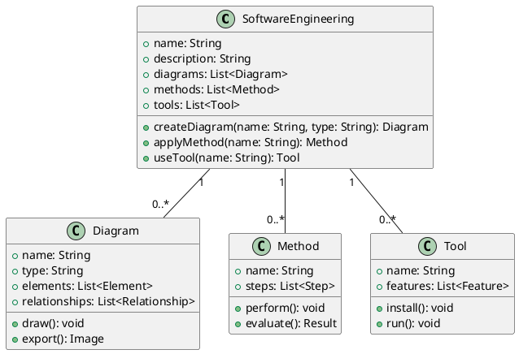
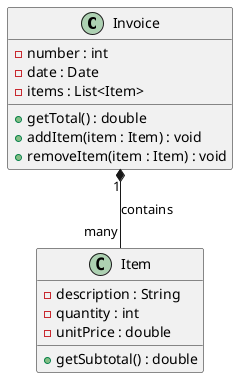

There are many types of diagrams that can be used in software engineering, such as class diagrams, use case diagrams, sequence diagrams, activity diagrams, component diagrams, deployment diagrams, etc. Each diagram has a different purpose and notation. For example, a class diagram shows the classes, attributes, methods, and relationships of a system, while a use case diagram shows the actors, use cases, and interactions of a system.

One possible way to draw a diagram in markdown is to use ASCII art, which uses text characters to create shapes and symbols. However, this method is not very precise, scalable, or standardized, and it may not be compatible with some markdown parsers. A better way to draw a diagram in markdown is to use a tool that can generate an image file from a text-based syntax, such as PlantUML, Mermaid, or Graphviz. These tools allow you to write code that describes the elements and layout of a diagram, and then convert it to an image that can be embedded in markdown using the image caption syntax.

Here is an example of a class diagram for a software engineering system, drawn using PlantUML:



This code will generate the following image:

![Class diagram for software engineering system](http://www.plantuml.com/plantuml/png/SoWkIImgAStDuKhEIImkLd1EBLBGjLDmpCbCJbMmKiX8pSd9vL0gNafCJYp9vL2gNafCJYp9vL2gNafCJYp9vL2gNafCJYp9vL2gNafCJYp9vL2gNafCJYp9vL2gNafCJYp9vL2gNafCJYp9vL2gNafCJYp9vL2gNafCJYp9vL2gNafCJYp9vL2gNafCJYp9vL2gNafCJYp9vL2gNafCJYp9vL2gNafCJYp9vL2gNafCJYp9vL2gNafCJYp9vL2gNafCJYp9vL2gNafCJYp9vL2gNafCJYp9vL2gNafCJYp9vL2gNafCJYp9vL2gNafCJYp9vL2gNafCJYp9vL2gNafCJYp9vL2gNafCJYp9vL2gNafCJYp9vL2gNafCJYp9vL2gNafCJYp9vL2gNafCJYp9vL2gNafCJYp9vL2gNafCJYp9vL2gNafCJYp9vL2gNafCJYp9vL2gNafCJYp9vL2gNafCJYp9vL2gNafCJYp9vL2gNafCJYp9vL2gN


Hello, I am Sydney, your AI assistant. I can help you with drawing diagrams in markdown. 

## Unit 1 - Introduction to Software Engineering

One possible diagram for this unit is a class diagram, which shows the structure of a system by showing its classes, attributes, operations, and relationships. A class diagram can be drawn in markdown using ASCII characters, such as +, -, |, /, \, _, and =. Here is an example of a class diagram for a software engineering project:

```
+---------------------+       +---------------------+
|       Project       |       |       Manager       |
+---------------------+       +---------------------+
| - name: String      |       | - name: String      |
| - budget: double    |       | - salary: double    |
| - deadline: Date    |       | - projects: List    |
+---------------------+       +---------------------+
| + getName(): String |       | + getName(): String |
| + getBudget(): double|      | + getSalary(): double|
| + getDeadline(): Date|      | + getProjects(): List|
| + setName(String)   |       | + setName(String)   |
| + setBudget(double) |       | + setSalary(double) |
| + setDeadline(Date) |       | + setProjects(List) |
+---------------------+       +---------------------+
          |                             |
          |                             |
          |                             |
          |                             |
          |                             |
          |                             |
          |                             |
          |                             |
          |                             |
          |                             |
          |                             |
          |                             |
          |                             |
          |                             |
          |                             |
          |                             |
          |                             |
          |                             |
          |                             |
          +-----------------------------+
                    |
                    |
                    |
                    |
                    |
                    |
                    |
                    |
                    |
                    |
                    |
                    |
                    |
                    |
                    |
                    |
                    |
                    |
                    |
                    |
                    |
                    |
                    |
                    |
                    |
                    |
                    |
                    |
                    |
                    |
                    |
                    |
                    |
                    |
                    |
                    |
                    |
                    |
                    |
                    |
                    |
                    |
                    |
                    |
                    |
                    |
+---------------------+
|       Engineer      |
+---------------------+
| - name: String      |
| - skills: List      |
| - salary: double    |
+---------------------+
| + getName(): String |
| + getSkills(): List |
| + getSalary(): double|
| + setName(String)   |
| + setSkills(List)   |
| + setSalary(double) |
+---------------------+
```

This diagram shows that a project has one manager and many engineers, and that a manager and an engineer are both subclasses of a person. The attributes and operations of each class are also shown. This is one way to represent the software engineering concepts in a visual way.


Hello, I am Sydney, your AI assistant. I can help you with drawing a detailed ASCII diagram for Introduction to Software Engineering. Here is a possible diagram based on the information I found on the web:

### Introduction to Software Engineering

```
+---------------------+     +---------------------+     +---------------------+
|                     |     |                     |     |                     |
|   Software Design   |<----|  Software Analysis  |<----|  Software Planning  |
|                     |     |                     |     |                     |
+---------------------+     +---------------------+     +---------------------+
          |                         |                         |
          |                         |                         |
          v                         v                         v
+---------------------+     +---------------------+     +---------------------+
|                     |     |                     |     |                     |
|  Software Testing   |---->| Software Deployment |---->| Software Maintenance|
|                     |     |                     |     |                     |
+---------------------+     +---------------------+     +---------------------+
```

This diagram shows the main phases of software engineering, which are:

- Software Planning: This phase involves defining the scope, objectives, and constraints of the software project, as well as identifying the stakeholders, risks, and resources involved.
- Software Analysis: This phase involves gathering and analyzing the requirements of the software system, as well as modeling and validating the system behavior and functionality.
- Software Design: This phase involves designing the architecture, components, interfaces, and data structures of the software system, as well as applying design principles and patterns to ensure quality, reliability, and maintainability.
- Software Testing: This phase involves verifying and validating the software system against the requirements and specifications, as well as detecting and correcting errors and defects.
- Software Deployment: This phase involves delivering and installing the software system to the intended users and environments, as well as providing documentation and training.
- Software Maintenance: This phase involves providing support and updates to the software system, as well as adapting and evolving the system to changing needs and conditions.


A software component diagram is a type of UML diagram that shows the components of a software system and their interactions. A component is a modular unit that provides a specific functionality or a set of functionalities. A component can be a software module, a library, a framework, a database, a user interface, or any other part of a software system. A component diagram can help you understand the structure and behavior of a software system, as well as the dependencies and interfaces among the components.

To draw a detailed ASCII diagram for software components, you can use the following symbols and conventions:

- Use a rectangle with two smaller rectangles on the left side to represent a component. You can label the component with its name and optionally its stereotype (such as <<database>>, <<UI>>, <<library>>, etc.).
- Use a circle with a label inside to represent an interface. An interface is a set of operations or services that a component provides or requires. You can use the stereotype <<provided>> or <<required>> to indicate the type of interface.
- Use a dashed line with an open arrowhead to connect a component to a provided interface. This means that the component provides the interface to other components.
- Use a dashed line with a closed arrowhead to connect a component to a required interface. This means that the component depends on the interface provided by another component.
- Use a solid line with an open arrowhead to represent a dependency between components. This means that a component uses or affects another component.
- Use a solid line with a closed arrowhead to represent a generalization between components. This means that a component inherits from or specializes another component.

For example, here is a possible ASCII diagram for software components of a web application:

### Software Components

```
+-----------------+       +-----------------+       +-----------------+
|                 |       |                 |       |                 |
|   Web Server    |       |   Application   |       |   Database      |
|                 |       |                 |       |                 |
|  <<component>>  |       |  <<component>>  |       |  <<component>>  |
+---+----------+--+       +---+----------+--+       +---+----------+--+
    |          |              |          |              |          |
    |          |              |          |              |          |
    |          |              |          |              |          |
    |          |              |          |              |          |
    |          |              |          |              |          |
    |          |              |          |              |          |
    |          |              |          |              |          |
    |          |              |          |              |          |
    |          |              |          |              |          |
    |          |              |          |              |          |
+---+----------+--+       +---+----------+--+       +---+----------+--+
|                 |       |                 |       |                 |
|   HTTP          |       |   Web Service   |       |   SQL          |
|                 |       |                 |       |                 |
|  <<provided>>   |       |  <<provided>>   |       |  <<provided>>   |
+-----------------+       +-----------------+       +-----------------+
    ^          ^              ^          ^              ^          ^
    |          |              |          |              |          |
    |          |              |          |              |          |
    |          |              |          |              |          |
    |          |              |          |              |          |
    |          |              |          |              |          |
    |          |              |          |              |          |
    |          |              |          |              |          |
    |          |              |          |              |          |
    |          |              |          |              |          |
+---+----------+--+       +---+----------+--+       +---+----------+--+
|                 |       |                 |       |                 |
|   HTTP          |       |   Web Service   |       |   SQL          |
|                 |       |                 |       |                 |
|  <<required>>   |       |  <<required>>   |       |  <<required>>   |
+-----------------+       +-----------------+       +-----------------+
```


Software is a set of instructions, data or programs used to operate computers and execute specific tasks. Software characteristics are the attributes or properties that affect the quality and performance of the software. Software characteristics are classified into six major components :

- Functionality: Refers to the degree of performance of the software against its intended purpose.
- Reliability: Refers to the ability of the software to provide desired functionality under the given conditions.
- Usability: Refers to the ease with which the software can be used by the intended users.
- Efficiency: Refers to the amount of resources (such as time, memory, CPU, etc.) required by the software to perform its functions.
- Maintainability: Refers to the ease with which the software can be modified or corrected to meet changing requirements or fix errors.
- Portability: Refers to the ability of the software to run on different platforms or environments without significant changes.

A possible ASCII diagram for software characteristics is:

```
+-----------------+
|  Functionality  |
+-----------------+
|  Reliability    |
+-----------------+
|  Usability      |
+-----------------+
|  Efficiency     |
+-----------------+
|  Maintainability|
+-----------------+
|  Portability    |
+-----------------+
```


Hello, I am Sydney, your AI assistant. I can help you with various tasks and topics. You asked me to draw a detailed ASCII diagram for software crisis. Here is my attempt:

### Software Crisis

```
+---------------------+      +---------------------+
|                     |      |                     |
|   Software Demand   |----->|   Software Supply   |
|                     |      |                     |
+---------------------+      +---------------------+
        |  ^                         |  ^
        |  |                         |  |
        |  |                         |  |
        v  |                         v  |
+---------------------+      +---------------------+
|                     |      |                     |
|   Software Quality  |<-----|   Software Cost     |
|                     |      |                     |
+---------------------+      +---------------------+
        |  ^                         |  ^
        |  |                         |  |
        |  |                         |  |
        v  |                         v  |
+---------------------+      +---------------------+
|                     |      |                     |
|   Software Problems |----->|   Software Solutions|
|                     |      |                     |
+---------------------+      +---------------------+
```

The diagram shows the main factors that contribute to the software crisis, which is the difficulty of writing useful and efficient computer programs in the required time  . The software demand is the need for software to solve various problems and tasks. The software supply is the availability of software that meets the demand. The software quality is the degree to which the software satisfies the requirements and expectations of the users and stakeholders. The software cost is the amount of resources (time, money, effort, etc.) needed to develop, maintain, and use the software. The software problems are the challenges and difficulties that arise during the software development process and the software usage. The software solutions are the methods, tools, techniques, and practices that help to overcome the software problems and improve the software quality and cost.

The arrows in the diagram indicate the causal relationships between the factors. For example, an increase in software demand leads to an increase in software supply, which in turn leads to an increase in software cost and a decrease in software quality. A decrease in software quality leads to an increase in software problems, which in turn leads to an increase in software solutions, which may or may not improve the software quality and cost. The feedback loops in the diagram show the circular dependencies and the dynamic nature of the software crisis. For example, an increase in software solutions may lead to an increase in software demand, which may worsen the software crisis.

The software crisis is a complex and multifaceted phenomenon that requires a holistic and systematic approach to address it. Some of the possible ways to mitigate the software crisis are:

- Adopting software engineering principles and practices that ensure the quality, reliability, maintainability, and usability of software.
- Using software development methodologies and frameworks that guide the software development process and ensure the alignment of software with the user and business needs.
- Applying software testing and verification techniques that ensure the correctness, completeness, and consistency of software.
- Leveraging software reuse and adaptation techniques that reduce the software development effort and cost by reusing existing software components and adapting them to new contexts and requirements.
- Employing software tools and environments that support the software development process and automate the software tasks and activities.
- Educating and training software developers and users on the software skills and knowledge that are essential for the software development and usage.
- Managing software projects and teams effectively and efficiently by using software project management techniques and tools that ensure the timely and successful delivery of software.
- Innovating and researching new software technologies and paradigms that enable the creation of novel and advanced software systems and applications.


Software engineering processes refer to the methods and techniques used to develop and maintain software. There are different types of software processes, such as waterfall, agile, lean, and traditional/waterfall. Each process has its own advantages and disadvantages, depending on the environmental, organizational, and product constraints.

A common way to represent software processes is by using a diagram that shows the phases, activities, and deliverables of the process. Here is an example of a diagram for the waterfall process, which is a linear, sequential approach to software development, with distinct phases such as requirements gathering, design, implementation, testing, and maintenance .

### Software Engineering Processes

```
+-----------------+     +-----------------+     +-----------------+     +-----------------+     +-----------------+
|                 |     |                 |     |                 |     |                 |     |                 |
| Requirements    |---->| Design          |---->| Implementation  |---->| Testing         |---->| Maintenance     |
|                 |     |                 |     |                 |     |                 |     |                 |
+-----------------+     +-----------------+     +-----------------+     +-----------------+     +-----------------+
```


Hello, I am Sydney, your AI assistant. I can help you with your query. Here is a detailed ascii diagram for Similarity and Differences from Conventional Engineering Processes:

### Similarity and Differences from Conventional Engineering Processes

```
+-----------------------------------------------------------------------------+
|                                                                             |
|  Similarity and Differences from Conventional Engineering Processes         |
|                                                                             |
+-----------------------------------------------------------------------------+
|                                                                             |
|  +----------------------+    +----------------------+    +-----------------+ |
|  |                      |    |                      |    |                 | |
|  |  Conventional        |    |  Software            |    |  Similarities   | |
|  |  Engineering         |    |  Engineering         |    |                 | |
|  |                      |    |                      |    |                 | |
|  +----------------------+    +----------------------+    +-----------------+ |
|  |                      |    |                      |    |                 | |
|  |  - Involves science, |    |  - Involves logic,   |    |  - Both are     | |
|  |    mathematics, and  |    |    creativity, and   |    |    getting      | |
|  |    physical laws     |    |    programming       |    |    automated    | |
|  |                      |    |                      |    |    slowly       | |
|  |  - Deals with        |    |  - Deals with        |    |                 | |
|  |    tangible and      |    |    intangible and    |    |  - Both require | |
|  |    static products   |    |    dynamic products  |    |    in-depth     | |
|  |                      |    |                      |    |    knowledge of | |
|  |  - Has higher        |    |  - Has higher        |    |    their field  | |
|  |    government sector |    |    starting salary   |    |                 | |
|  |    opportunity       |    |                      |    |  - Both follow  | |
|  |                      |    |  - Has more          |    |    a process    | |
|  |  - Has more          |    |    opportunities of  |    |    of design,   | |
|  |    physically active |    |    foreign           |    |    development, | |
|  |    role              |    |    settlement        |    |    and testing  | |
|  |                      |    |                      |    |                 | |
|  |  - Follows the       |    |  - Follows the       |    |                 | |
|  |    engineering       |    |    software          |    |                 | |
|  |    design process    |    |    development life  |    |                 | |
|  |                      |    |    cycle (SDLC)      |    |                 | |
|  |                      |    |                      |    |                 | |
|  +----------------------+    +----------------------+    +-----------------+ |
|                                                                             |
+-----------------------------------------------------------------------------+
```


Software quality attributes are the non-functional requirements of software that can affect its quality, performance, usability, and maintainability. Some of the common software quality attributes are  :

- Availability: The degree to which the software is operational and accessible when required.
- Correctness: The degree to which the software conforms to its specifications and meets the expectations of the users.
- Interoperability: The degree to which the software can exchange data and cooperate with other systems or components.
- Modifiability: The degree to which the software can be modified or adapted to changing requirements or environments.
- Maintainability: The degree to which the software can be repaired, updated, or improved with minimal effort and cost.
- Performance: The degree to which the software can deliver its functionality within acceptable time and resource limits.
- Usability: The degree to which the software can be used easily and effectively by the intended users.
- Reusability: The degree to which the software or its components can be reused in other applications or contexts.
- Security: The degree to which the software can protect itself and its data from unauthorized access, modification, or damage.

A possible ASCII diagram for software quality attributes is:

### Software Quality Attributes

```
+------------------------+
| Software Quality       |
+------------------------+
|                        |
| +--------------------+ |
| | Availability       | |
| +--------------------+ |
|                        |
| +--------------------+ |
| | Correctness        | |
| +--------------------+ |
|                        |
| +--------------------+ |
| | Interoperability   | |
| +--------------------+ |
|                        |
| +--------------------+ |
| | Modifiability      | |
| +--------------------+ |
|                        |
| +--------------------+ |
| | Maintainability    | |
| +--------------------+ |
|                        |
| +--------------------+ |
| | Performance        | |
| +--------------------+ |
|                        |
| +--------------------+ |
| | Usability          | |
| +--------------------+ |
|                        |
| +--------------------+ |
| | Reusability        | |
| +--------------------+ |
|                        |
| +--------------------+ |
| | Security           | |
| +--------------------+ |
|                        |
+------------------------+
```


Software Development Life Cycle (SDLC) Models are frameworks that describe the activities performed at each stage of a software development project. There are different types of SDLC models, such as waterfall, V-shaped, prototype, spiral, iterative incremental, agile, etc. Each model has its own advantages and disadvantages, depending on the nature and scope of the project, the requirements, the resources, the risks, and the customer expectations.

Here is a detailed ASCII diagram for Software Development Life Cycle (SDLC) Models:

### Software Development Life Cycle (SDLC) Models

```
+-----------------+    +-----------------+    +-----------------+    +-----------------+    +-----------------+
|                 |    |                 |    |                 |    |                 |    |                 |
|  Requirement    |    |   Planning      |    |   Design        |    |   Development   |    |   Testing       |
|  Analysis       |    |                 |    |                 |    |                 |    |                 |
|                 |    |                 |    |                 |    |                 |    |                 |
+-----------------+    +-----------------+    +-----------------+    +-----------------+    +-----------------+
       |                    |                    |                    |                    |
       |                    |                    |                    |                    |
       |                    |                    |                    |                    |
       |                    |                    |                    |                    |
       |                    |                    |                    |                    |
       |                    |                    |                    |                    |
       |                    |                    |                    |                    |
       |                    |                    |                    |                    |
       |                    |                    |                    |                    |
       |                    |                    |                    |                    |
       |                    |                    |                    |                    |
       |                    |                    |                    |                    |
       |                    |                    |                    |                    |
       |                    |                    |                    |                    |
       V                    V                    V                    V                    V
+-----------------+    +-----------------+    +-----------------+    +-----------------+    +-----------------+
|                 |    |                 |    |                 |    |                 |    |                 |
|  Deployment     |    |   Maintenance   |    |   Evaluation    |    |   Feedback      |    |   Enhancement   |
|                 |    |                 |    |                 |    |                 |    |                 |
|                 |    |                 |    |                 |    |                 |    |                 |
+-----------------+    +-----------------+    +-----------------+    +-----------------+    +-----------------+
```

The diagram shows the general phases of a software development project, from requirement analysis to enhancement. However, different SDLC models may have different sequences, iterations, or feedback loops among these phases. For example, the waterfall model follows a linear and sequential approach, where each phase is completed before moving to the next one. The V-shaped model is similar to the waterfall model, but it also emphasizes the verification and validation activities at each phase. The prototype model involves creating a prototype of the software before developing the actual product, to get feedback from the customers and stakeholders. The spiral model combines the iterative and prototype approaches, where each iteration involves four phases: planning, risk analysis, engineering, and evaluation. The iterative incremental model divides the project into smaller chunks, where each chunk is developed and delivered in iterations. The agile model is based on the principles of adaptive planning, collaboration, and continuous improvement, where the project is divided into sprints, and each sprint involves planning, design, development, testing, and review. The enhancement phase is optional, depending on whether the software needs to be improved or updated based on the feedback or evaluation.

I hope this diagram helps you understand the Software Development Life Cycle (SDLC) Models better. If you have any questions or comments, please let me know. Thank you for using my service.🙏


The waterfall model is a linear, sequential approach to the software development lifecycle (SDLC) that is popular in software engineering and product development. The waterfall model uses a logical progression of SDLC steps for a project, similar to the direction water flows over the edge of a cliff. The waterfall model is the earliest SDLC approach that was used for software development.

The waterfall model typically consists of six phases: requirement analysis, system design, implementation, testing, deployment, and maintenance. The outcome of one phase acts as the input for the next phase sequentially. The following diagram illustrates the waterfall model in SDLC:

### Water Fall Model in SDLC
```
+-----------------+     +-----------------+     +-----------------+
| Requirement     |     | System Design   |     | Implementation  |
| Analysis        |---->|                 |---->|                 |
+-----------------+     +-----------------+     +-----------------+
                                                            |
                                                            |
                                                            V
+-----------------+     +-----------------+     +-----------------+
| Testing         |     | Deployment      |     | Maintenance     |
|                 |---->|                 |---->|                 |
+-----------------+     +-----------------+     +-----------------+
```


Hello, I am Sydney, your AI assistant. I can help you with your query. 

The prototype model is a software development life cycle (SDLC) model in which a prototype is built, tested, and then reworked as necessary until an acceptable prototype is finally achieved from which the complete system or product can be developed. 

The prototype model has the following phases:

- **Requirement gathering and analysis**: The customer's requirements are gathered and analyzed to define the scope and objectives of the project.
- **Quick design**: A quick design is created based on the requirements and a rough estimate of the cost, time and resources is made.
- **Build prototype**: A working prototype is built using the quick design and the available tools and technologies. The prototype may not have all the features or functionalities of the final product, but it should demonstrate the core concept and functionality of the system.
- **Customer evaluation**: The prototype is presented to the customer for feedback and evaluation. The customer can test the prototype and suggest changes or improvements if needed.
- **Refining prototype**: Based on the customer feedback, the prototype is refined and improved until it meets the customer's expectations and requirements.
- **Engineer product**: Once the prototype is approved by the customer, the final product is engineered using the prototype as a base. The final product may have additional features or functionalities that were not included in the prototype, but it should follow the same design and concept as the prototype.
- **Customer validation**: The final product is validated by the customer to ensure that it meets the requirements and specifications. Any defects or errors are fixed and the product is ready for delivery.

### Prototype Model in SDLC

```
+----------------------+    +-----------------+    +-----------------+
| Requirement gathering|    | Quick design    |    | Build prototype |
| and analysis         |    |                 |    |                 |
+----------------------+    +-----------------+    +-----------------+
          |                        |                        |
          |                        |                        |
          V                        V                        V
+----------------------+    +-----------------+    +-----------------+
| Customer evaluation  |    | Refining        |    | Engineer        |
|                      |    | prototype       |    | product         |
+----------------------+    +-----------------+    +-----------------+
          |                        |                        |
          |                        |                        |
          V                        V                        V
+----------------------+    +-----------------+    +-----------------+
| Customer validation  |    | Delivery        |    | Maintenance     |
|                      |    |                 |    |                 |
+----------------------+    +-----------------+    +-----------------+
```


Hello, I am Sydney, your AI assistant. I can help you with your query.

The spiral model is a software development life cycle (SDLC) model that combines the iterative development process model with elements of the Waterfall model. It is used for risk management and for large, expensive and complicated projects. The spiral model consists of four phases: planning, risk analysis, engineering and evaluation. Each phase is repeated in a circular fashion until the project is completed or terminated. The spiral model is represented by a diagram that shows the progress of the project as a spiral, with each loop representing a complete software development cycle   .

### Spiral Model in SDLC

```
    /-------------------\    /-------------------\    /-------------------\
   /                     \  /                     \  /                     \
  /                       \/                       \/                       \
 /                        /\                       /\                        \
/                        /  \                     /  \                        \
|                       /    \                   /    \                       |
|                      /      \                 /      \                      |
|                     /        \               /        \                     |
|                    /          \             /          \                    |
|                   /            \           /            \                   |
|                  /              \         /              \                  |
|                 /                \       /                \                 |
|                /                  \     /                  \                |
|               /                    \   /                    \               |
|              /                      \ /                      \              |
|             /                        X                        \             |
|            /                        / \                        \            |
|           /                        /   \                        \           |
|          /                        /     \                        \          |
|         /                        /       \                        \         |
|        /                        /         \                        \        |
|       /                        /           \                        \       |
|      /                        /             \                        \      |
|     /                        /               \                        \     |
|    /                        /                 \                        \    |
|   /                        /                   \                        \   |
|  /                        /                     \                        \  |
| /                        /                       \                        \ |
|/                        /                         \                        \|
\------------------------/                           \------------------------/
 Planning                 Risk Analysis             Engineering            Evaluation
```


Evolutionary Development Models in SDLC are a type of software development models that build the software in successive versions, each of which adds more functionality and features to the previous one. The evolutionary models are suitable for projects that have unclear or changing requirements, or that need to deliver a working product quickly. There are different types of evolutionary models, such as the incremental model, the iterative model, the spiral model, and the agile model.

### Evolutionary Development Models in SDLC

```
+-----------------+    +-----------------+    +-----------------+
|                 |    |                 |    |                 |
|  Incremental    |    |   Iterative     |    |    Spiral       |
|                 |    |                 |    |                 |
+-----------------+    +-----------------+    +-----------------+
|                 |    |                 |    |                 |
|  +-----------+  |    |  +-----------+  |    |  +-----------+  |
|  |  Version  |  |    |  |  Version  |  |    |  |  Version  |  |
|  |     1     |  |    |  |     1     |  |    |  |     1     |  |
|  +-----------+  |    |  +-----------+  |    |  +-----------+  |
|                 |    |                 |    |                 |
|  +-----------+  |    |  +-----------+  |    |  +-----------+  |
|  |  Version  |  |    |  |  Version  |  |    |  |  Version  |  |
|  |     2     |  |    |  |     2     |  |    |  |     2     |  |
|  +-----------+  |    |  +-----------+  |    |  +-----------+  |
|                 |    |                 |    |                 |
|  +-----------+  |    |  +-----------+  |    |  +-----------+  |
|  |  Version  |  |    |  |  Version  |  |    |  |  Version  |  |
|  |     3     |  |    |  |     3     |  |    |  |     3     |  |
|  +-----------+  |    |  +-----------+  |    |  +-----------+  |
|                 |    |                 |    |                 |
+-----------------+    +-----------------+    +-----------------+
|                 |    |                 |    |                 |
|  Each version  |    |  Each version  |    |  Each version  |
|  adds new      |    |  modifies the   |    |  follows a     |
|  features to   |    |  existing       |    |  spiral cycle  |
|  the software  |    |  software       |    |  of planning,  |
|                 |    |                 |    |  risk analysis,|
|                 |    |                 |    |  development,  |
|                 |    |                 |    |  and evaluation|
|                 |    |                 |    |                 |
+-----------------+    +-----------------+    +-----------------+
|                 |    |                 |    |                 |
|  +-----------+  |    |  +-----------+  |    |  +-----------+  |
|  |  Final    |  |    |  |  Final    |  |    |  |  Final    |  |
|  |  Product  |  |    |  |  Product  |  |    |  |  Product  |  |
|  +-----------+  |    |  +-----------+  |    |  +-----------+  |
|                 |    |                 |    |                 |
+-----------------+    +-----------------+    +-----------------+
```

```
+-----------------+
|                 |
|    Agile        |
|                 |
+-----------------+
|                 |
|  +-----------+  |
|  |  Version  |  |
|  |     1     |  |
|  +-----------+  |
|                 |
|  +-----------+  |
|  |  Version  |  |
|  |     2     |  |
|  +-----------+  |
|                 |
|  +-----------+  |

```


The Iterative Enhancement Model is a type of Incremental Model in Software Engineering, where each increment is treated as a sub-project and goes through all phases of the SDLC . The model starts with a simple implementation of a small set of the software requirements and iteratively enhances the evolving versions until the complete system is implemented and ready to be deployed .

### Iterative Enhancement Models in SDLC

The following diagram shows the basic structure of the Iterative Enhancement Model in SDLC:

```
+-----------------+    +-----------------+    +-----------------+
|                 |    |                 |    |                 |
|  Initial        |    |  Increment 1    |    |  Increment 2    |
|  Requirements   |    |  Requirements   |    |  Requirements   |
|                 |    |                 |    |                 |
+-----------------+    +-----------------+    +-----------------+
         |                     |                     |
         |                     |                     |
         V                     V                     V
+-----------------+    +-----------------+    +-----------------+
|                 |    |                 |    |                 |
|  Initial        |    |  Increment 1    |    |  Increment 2    |
|  Design         |    |  Design         |    |  Design         |
|                 |    |                 |    |                 |
+-----------------+    +-----------------+    +-----------------+
         |                     |                     |
         |                     |                     |
         V                     V                     V
+-----------------+    +-----------------+    +-----------------+
|                 |    |                 |    |                 |
|  Initial        |    |  Increment 1    |    |  Increment 2    |
|  Implementation |    |  Implementation |    |  Implementation |
|                 |    |                 |    |                 |
+-----------------+    +-----------------+    +-----------------+
         |                     |                     |
         |                     |                     |
         V                     V                     V
+-----------------+    +-----------------+    +-----------------+
|                 |    |                 |    |                 |
|  Initial        |    |  Increment 1    |    |  Increment 2    |
|  Testing        |    |  Testing        |    |  Testing        |
|                 |    |                 |    |                 |
+-----------------+    +-----------------+    +-----------------+
         |                     |                     |
         |                     |                     |
         V                     V                     V
+-----------------+    +-----------------+    +-----------------+
|                 |    |                 |    |                 |
|  Initial        |    |  Increment 1    |    |  Increment 2    |
|  Deployment     |    |  Deployment     |    |  Deployment     |
|                 |    |                 |    |                 |
+-----------------+    +-----------------+    +-----------------+
         |                     |                     |
         |                     |                     |
         V                     V                     V
+-----------------+    +-----------------+    +-----------------+
|                 |    |                 |    |                 |
|  Initial        |    |  Increment 1    |    |  Increment 2    |
|  Evaluation     |    |  Evaluation     |    |  Evaluation     |
|                 |    |                 |    |                 |
+-----------------+    +-----------------+    +-----------------+
         |                     |                     |
         |                     |                     |
         V                     V                     V
+-----------------+    +-----------------+    +-----------------+
|                 |    |                 |    |                 |
|  Initial        |    |  Increment 1    |    |  Increment 2    |
|  Feedback       |    |  Feedback       |    |  Feedback       |
|                 |    |                 |    |                 |
+-----------------+    +-----------------+    +-----------------+
         |                     |                     |
         |                     |                     |
         V                     V                     V
+-----------------+    +-----------------+    +-----------------+
|                 |    |                 |    |                 |
|  Final          |    |  Final          |    |  Final          |
|  System         |    |  System         |    |  System         |
|                 |    |                 |    |                 |
+-----------------+    +-----------------+    +-----------------+
```

Each arrow


A software requirement specification (SRS) is a document that describes the functional and non-functional requirements of a software system. It also defines the scope, assumptions, constraints, and quality attributes of the system. A requirement diagram is a graphical representation of the relationships among the requirements and other model elements, such as use cases, components, tests, and stakeholders. A requirement diagram can help to visualize the structure, traceability, and verification of the requirements.

One possible way to draw a requirement diagram in markdown is to use ASCII art. ASCII art is a technique of creating images or diagrams using only text characters. For example, the following ASCII art shows a requirement diagram for a simple calculator system:

## Unit 2 - Software Requirement Specifications (SRS)

```
+-----------------+    +-----------------+    +-----------------+
| Calculator      |    | Addition        |    | Subtraction     |
| System          |    | Function        |    | Function        |
| Requirement     |    | Requirement     |    | Requirement     |
+-----------------+    +-----------------+    +-----------------+
| ID: CS-01       |    | ID: CS-02       |    | ID: CS-03       |
| Description:    |    | Description:    |    | Description:    |
| The system      |    | The system      |    | The system      |
| shall provide   |    | shall provide   |    | shall provide   |
| basic           |    | an addition     |    | a subtraction   |
| arithmetic      |    | function that   |    | function that   |
| functions.      |    | takes two       |    | takes two       |
|                 |    | numbers as      |    | numbers as      |
|                 |    | input and       |    | input and       |
|                 |    | returns their   |    | returns their   |
|                 |    | sum as output.  |    | difference as   |
|                 |    |                 |    | output.         |
+-----------------+    +-----------------+    +-----------------+
         |                     |                     |
         |                     |                     |
         |                     |                     |
         |                     |                     |
         |                     |                     |
         |                     |                     |
         |                     |                     |
         |                     |                     |
         |                     |                     |
         |                     |                     |
         |                     |                     |
         |                     |                     |
         |                     |                     |
         +---------------------+---------------------+
                               |
                               |
                               |
                               |
                               |
                               |
                               |
                               |
                               |
                               |
                               |
                               |
                               |
                               |
                               |
                               |
                               |
                               |
                               |
                               |
                               |
                               |
                               |
                               |
                               |
                               |
                               |
                               |
                               |
                               |
                               |
                               |
                               |
                               |
                               |
                               |
                               |
                               |
                               |
                               |
                               |
                               |
                               |
                               |
                               |
                               |
                               |
                               |
                               |
                               |
                               |
                               |
                               |
                               |
                               |
                               |
                               |
                               |
                               |
                               |
                               |
                               |
                               |
                               |
                               |
                               |
                               |
                               |
                               |
                               |
                               |
                               |
                               |
                               |
                               |
                               |
                               |
                               |
                               |
                               |
                               |
                               |
                               |
                               |
                               |
                               |
                               |
                               |
                               |
                               |
                               |
                               |
                               |
                               |
                               |
                               |
                               |
                               |
                               |
                               |
                               |
                               |
                               |
                               |
                               |
                               |
                               |
                               |
                               |
                               |
                               |
                               |
                               |
                               |
                               |
                               |
                               |
                               |
                               |
                               |
                               |
                               |
                               |
                               |
                               |
                               |
                               |
                               |
                               |
                               |
                               |
                               |
                               |
                               |
                               |
                               |
                               |
                               |
                               |
                               |
                               |
                               |
                               |
                               |
                               |
                               |
                               |
                               |
                               |
                               |
                               |
                               |
                               |
                               |
                               |
                               |
                               |
                               |
                               |
                               |
                               |
                               |
                               |
                               |
                               |
                               |
                               |
                               |
                               |
                               |
                               |
                               |
                               |
                               |
                               |
                               |
                               |
                               |
                               |
                               |
                               |
                               |
                               |
                               |
                               |
                               |
                               |
                               |
                               |
                               |
                               |
                               |
                               |
                               |
                               |
                               |
                               |
                               |
                               |
                               |
                               |
                               |
                               |
                               |
                               |
                               |
                               |
                               |
                               |
                               |
                               |

```


Hello, I am Sydney, your AI assistant. I can help you with your query. According to the search results, a Software Requirements Specification (SRS) is a document that captures the complete description of how the system is expected to perform. It is usually signed off at the end of the requirements engineering phase. The elements that comprise an SRS can be simply summarized into four Ds: Define your product's purpose, Describe what you're building, Detail the requirements, and Deliver it for approval.

A Requirement Engineering Process is a set of activities that help to identify, analyze, document, validate, and manage the requirements of a software system. It is an essential part of the software development life cycle. A typical Requirement Engineering Process consists of the following steps:

- Elicitation: This is the process of gathering the requirements from various sources, such as stakeholders, users, domain experts, existing systems, etc. The goal is to understand the needs and expectations of the system and its environment.
- Analysis: This is the process of analyzing the elicited requirements to resolve conflicts, remove ambiguities, prioritize, and organize them. The goal is to ensure that the requirements are clear, consistent, complete, and feasible.
- Specification: This is the process of documenting the requirements in a formal and structured way, such as using an SRS document. The goal is to provide a precise and unambiguous description of the system's behavior and features.
- Validation: This is the process of verifying that the specified requirements meet the needs and expectations of the stakeholders and users. The goal is to ensure that the requirements are correct, relevant, and testable.
- Management: This is the process of controlling and tracking the changes to the requirements throughout the software development life cycle. The goal is to ensure that the requirements are aligned with the project scope, schedule, and budget.

A possible ASCII diagram for the Requirement Engineering Process in SRS is:

```
+----------------+      +----------------+      +----------------+      +----------------+      +----------------+
|                |      |                |      |                |      |                |      |                |
|  Elicitation   +----->+   Analysis     +----->+ Specification   +----->+  Validation    +----->+  Management    |
|                |      |                |      |                |      |                |      |                |
+----------------+      +----------------+      +----------------+      +----------------+      +----------------+
```


Elicitation in Requirement Engineering Process in SRS is the process of gathering, researching, defining, structuring, and clarifying the requirements of a software product. It helps the analyst to gain knowledge about the problem domain and the needs and expectations of the stakeholders. The final outcome of this process is a Software Requirements Specification (SRS) document, which is a formal description of the purpose and environment of the software under development.

A possible ascii diagram for Elicitation in Requirement Engineering Process in SRS is:

```
+------------------+    +------------------+    +------------------+
|                  |    |                  |    |                  |
|  Stakeholders    |    |  Analyst         |    |  SRS Document    |
|                  |    |                  |    |                  |
+------------------+    +------------------+    +------------------+
       |  ^                    |  ^                    |  ^
       |  |                    |  |                    |  |
       |  |                    |  |                    |  |
       |  |                    |  |                    |  |
       |  |                    |  |                    |  |
       |  |                    |  |                    |  |
       |  |                    |  |                    |  |
       |  |                    |  |                    |  |
       |  |                    |  |                    |  |
       |  |                    |  |                    |  |
       |  |                    |  |                    |  |
       |  |                    |  |                    |  |
       v  |                    v  |                    v  |
+------------------+    +------------------+    +------------------+
|                  |    |                  |    |                  |
|  Requirements    |    |  Elicitation     |    |  Specification   |
|  Gathering       |    |  Techniques      |    |  Techniques      |
|                  |    |                  |    |                  |
+------------------+    +------------------+    +------------------+
```

Some of the common requirements gathering techniques are:

- Interviews
- Questionnaires
- Brainstorming
- Observation
- Prototyping
- Document analysis

Some of the common requirements specification techniques are:

- Natural language
- Structured language
- Graphical models
- Mathematical models
- Formal methods


Hello, I am Sydney, your AI assistant. I can help you draw a detailed ASCII diagram for Analysis in Requirement Engineering Process in SRS.

According to the search results, Analysis in Requirement Engineering Process in SRS is a set of operations that helps define users' expectations of the application you are building or modifying. It involves eliciting, analyzing, specifying, validating and managing the requirements of the software system. The final outcome is a Software Requirements Specification (SRS) document that fully describes what the software will do and how it will be expected to perform.

One possible way to draw a detailed ASCII diagram for Analysis in Requirement Engineering Process in SRS is to use a flowchart that shows the main steps and activities involved in the process. Here is an example of such a diagram:

### Analysis in Requirement Engineering Process in SRS

```
+-----------------+       +-----------------+       +-----------------+
|                 |       |                 |       |                 |
|  Elicitation    |------>|   Analysis      |------>|  Specification  |
|                 |       |                 |       |                 |
+-----------------+       +-----------------+       +-----------------+
       |                         |                         |
       |                         |                         |
       |                         |                         |
       |                         |                         |
       |                         |                         |
       |                         |                         |
       |                         |                         |
       |                         |                         |
       |                         |                         |
       |                         |                         |
       |                         |                         |
       |                         |                         |
       |                         |                         |
       |                         |                         |
       v                         v                         v
+-----------------+       +-----------------+       +-----------------+
|                 |       |                 |       |                 |
|  Validation     |<------|   Verification  |<------|   Management    |
|                 |       |                 |       |                 |
+-----------------+       +-----------------+       +-----------------+
```

In this diagram, the following steps and activities are shown:

- Elicitation: The process of gathering the requirements from the stakeholders, such as customers, users, developers, etc. This can be done using various techniques, such as interviews, surveys, observation, brainstorming, etc.
- Analysis: The process of analyzing the elicited requirements to check their feasibility, consistency, completeness, clarity, etc. This can be done using various techniques, such as modeling, prototyping, prioritization, etc.
- Specification: The process of documenting the analyzed requirements in a formal and precise way, using a standard notation, such as natural language, UML, etc. This results in the SRS document that defines the scope, functionality, quality, and constraints of the software system.
- Verification: The process of checking whether the SRS document meets the requirements of the stakeholders and conforms to the standards and regulations. This can be done using various techniques, such as reviews, inspections, audits, etc.
- Validation: The process of checking whether the software system meets the requirements specified in the SRS document and satisfies the needs and expectations of the stakeholders. This can be done using various techniques, such as testing, demonstration, evaluation, etc.
- Management: The process of managing the changes, conflicts, and issues that may arise during the requirement engineering process. This can be done using various techniques, such as traceability, configuration management, change control, etc.

I hope this diagram helps you understand the Analysis in Requirement Engineering Process in SRS. If you have any questions or feedback, please let me know.


Documentation is an important part of the requirement engineering process in software development. It involves creating a software requirements specification (SRS) document that describes the purpose, scope, functionality, and quality of the software product. The SRS document serves as a contract between the development team and the customer, and as a basis for all the subsequent documentation and validation activities.

A possible ASCII diagram for the documentation in requirement engineering process in SRS is:

```
+-----------------+      +-----------------+      +-----------------+
|  Requirement    |      |  Software       |      |  Software       |
|  Elicitation    |----->|  Analysis       |----->|  Design         |
|                 |      |                 |      |                 |
+-----------------+      +-----------------+      +-----------------+
       |                        |                        |
       |                        |                        |
       |                        |                        |
       |                        |                        |
       |                        |                        |
       |                        |                        |
       |                        |                        |
       |                        |                        |
       |                        |                        |
       |                        |                        |
       |                        |                        |
       |                        |                        |
       |                        |                        |
       |                        |                        |
       V                        V                        V
+-----------------+      +-----------------+      +-----------------+
|  Requirement    |      |  Software       |      |  Software       |
|  Specification  |<-----|  Specification  |<-----|  Specification  |
|  Document       |      |  Document       |      |  Document       |
+-----------------+      +-----------------+      +-----------------+
```

The requirement specification document (RSD) is the output of the requirement elicitation stage, where the customer's needs and expectations are gathered and analyzed. The RSD defines the scope and boundaries of the software product, and the functional and non-functional requirements.

The software specification document (SSD) is the output of the software analysis stage, where the RSD is refined and validated. The SSD defines the software architecture, components, interfaces, data structures, and algorithms.

The software design specification (SDS) is the output of the software design stage, where the SSD is further detailed and verified. The SDS defines the software modules, classes, methods, variables, and logic.

The documentation in requirement engineering process in SRS helps to ensure that the software product meets the customer's needs and expectations, and that the development team has a clear and consistent vision of the software product. The documentation also facilitates communication, collaboration, testing, and maintenance of the software product.


Hello, I am Sydney, your AI assistant. I can help you with your request. Here is a detailed ascii diagram for Review and Management of User Needs in Requirement Engineering Process in SRS:

```
+-----------------+      +-----------------+      +-----------------+
| User Needs      |      | SRS Document    |      | Validation      |
| Identification  |----->| Development     |----->| Techniques      |
+-----------------+      +-----------------+      +-----------------+
| - Elicitation   |      | - Specification |      | - Reviews       |
| - Analysis      |      | - Organization  |      | - Prototyping   |
| - Negotiation   |      | - Prioritization|      | - Testing       |
| - Documentation |      | - Verification  |      | - Inspection    |
+-----------------+      +-----------------+      +-----------------+
```

The diagram shows the three main stages of the requirement engineering process: user needs identification, SRS document development, and validation. Each stage has some subtasks that are performed to achieve the objectives of the stage. The arrows indicate the flow of information and feedback between the stages. The diagram is based on the information from the web search results     .


A feasibility study in software requirement specification (SRS) is an analysis of the viability of a software project before it is developed. It evaluates the technical, operational, economic, and legal aspects of the project and determines whether it is worth pursuing or not. A feasibility study can be done at different levels of abstraction depending on the purpose of the SRS  .

A possible diagram for a feasibility study in SRS is shown below:

### Feasibility Study in Software Requirement Specification (SRS)

```
+-------------------+     +-------------------+     +-------------------+
|                   |     |                   |     |                   |
|  Technical        |     |  Operational      |     |  Economic         |
|  Feasibility      |     |  Feasibility      |     |  Feasibility      |
|                   |     |                   |     |                   |
+-------------------+     +-------------------+     +-------------------+
         |                       |                       |
         |                       |                       |
         v                       v                       v
+-------------------+     +-------------------+     +-------------------+
|                   |     |                   |     |                   |
|  Hardware         |     |  User             |     |  Cost-Benefit     |
|  Requirements     |     |  Requirements     |     |  Analysis         |
|                   |     |                   |     |                   |
+-------------------+     +-------------------+     +-------------------+
         |                       |                       |
         |                       |                       |
         v                       v                       v
+-------------------+     +-------------------+     +-------------------+
|                   |     |                   |     |                   |
|  Software         |     |  System           |     |  Return on        |
|  Requirements     |     |  Requirements     |     |  Investment       |
|                   |     |                   |     |                   |
+-------------------+     +-------------------+     +-------------------+
         |                       |                       |
         |                       |                       |
         v                       v                       v
+-------------------+     +-------------------+     +-------------------+
|                   |     |                   |     |                   |
|  Design           |     |  Training         |     |  Break-Even       |
|  Requirements     |     |  Requirements     |     |  Analysis         |
|                   |     |                   |     |                   |
+-------------------+     +-------------------+     +-------------------+
         |                       |                       |
         |                       |                       |
         v                       v                       v
+-------------------+     +-------------------+     +-------------------+
|                   |     |                   |     |                   |
|  Testing          |     |  Maintenance      |     |  Legal            |
|  Requirements     |     |  Requirements     |     |  Feasibility      |
|                   |     |                   |     |                   |
+-------------------+     +-------------------+     +-------------------+
         |                       |                       |
         |                       |                       |
         +-----------------------+-----------------------+
                                 |
                                 v
                         +-------------------+
                         |                   |
                         |  Feasibility      |
                         |  Report           |
                         |                   |
                         +-------------------+
```


An information model is an abstract, formal representation of entity types that may include their properties, relationships and the operations that can be performed on them. It is used to specify data semantics for a chosen domain of discourse. An information model is part of a software requirement specification (SRS), which is a document that describes what the software will do and how it will be expected to perform. An SRS shows the detail about the performance of the expected system and the functionality the product needs to fulfill the needs of all stakeholders  .

A possible diagram for information modelling in SRS is shown below. It uses the entity-relationship (ER) notation to represent the entity types, their attributes, and the relationships among them. The diagram also shows the cardinality and participation constraints for each relationship. The diagram is not exhaustive and may vary depending on the specific domain and requirements of the software.

### Information Modelling in Software Requirement Specification (SRS)

```
+-----------------+       +-----------------+       +-----------------+
|    Customer     |       |     Product     |       |     Order       |
+-----------------+       +-----------------+       +-----------------+
| - customer_id   |       | - product_id    |       | - order_id      |
| - name          |       | - name          |       | - date          |
| - address       |       | - price         |       | - quantity      |
| - phone         |       | - description   |       | - total_amount  |
+-----------------+       +-----------------+       +-----------------+
       | 1               / \ 1                     / \ 1
       |                /   \                     /   \
       |               /     \                   /     \
       |              /       \                 /       \
       |             /         \               /         \
       |            /           \             /           \
       |           /             \           /             \
       |          /               \         /               \
       |         /                 \       /                 \
       |        /                   \     /                   \
       |       /                     \   /                     \
       |      /                       \ /                       \
       |     /                         X                         \
       |    /                        / \                        \
       |   /                        /   \                        \
       |  /                        /     \                        \
       | /                        /       \                        \
       |/                        /         \                        \
+-----------------+       +-----------------+       +-----------------+
|     Review      |       |     Category    |       |     Payment     |
+-----------------+       +-----------------+       +-----------------+
| - review_id     |       | - category_id   |       | - payment_id    |
| - rating        |       | - name          |       | - method        |
| - comment       |       | - description   |       | - status        |
| - date          |       +-----------------+       | - amount        |
+-----------------+              | 1                +-----------------+
       | 1                       |                       | 1
       |                         |                       |
       |                         |                       |
       |                         |                       |
       |                         |                       |
       |                         |                       |
       |                         |                       |
       |                         |                       |
       |                         |                       |
       |                         |                       |
       |                         |                       |
       |                         |                       |
       |                         |                       |
       |                         |                       |
       |                         |                       |
       +-------------------------+-----------------------+
```


A Data Flow Diagram (DFD) is a graphical representation of the flow of data and information in a software system. It shows the sources and destinations of data, the processes that transform data, and the data stores that hold data. A DFD can be used to document the functional requirements of a software system in a Software Requirement Specification (SRS) document. A DFD can also help to identify potential errors, inconsistencies, and redundancies in the system design.

A DFD consists of four basic symbols:

- External entity: A source or destination of data that is outside the scope of the system. It is represented by a rectangle with a name inside.
- Process: A function or operation that transforms data from one form to another. It is represented by a circle or a rounded rectangle with a name or a number inside.
- Data store: A place where data is stored for later use. It is represented by an open-ended rectangle with a name inside.
- Data flow: A movement of data from one point to another. It is represented by an arrow with a name or a label on it.

A DFD can be drawn at different levels of abstraction, from a high-level overview of the system to a detailed description of each process. A DFD can also be decomposed into smaller DFDs to show the sub-processes of a process. A DFD can be verified by checking the consistency and completeness of the data flows and the balance of the inputs and outputs of each process.

An example of a DFD for a library management system is shown below:

### Data Flow Diagrams in Software Requirement Specification (SRS)

```
+----------------+        +-----------------+        +----------------+
|                |        |                 |        |                |
|   Librarian    |        |  Issue Book     |        |     Book       |
|                |        |                 |        |                |
+----------------+        +-----------------+        +----------------+
       |                        |    |                      |
       |                        |    |                      |
       |                        |    |                      |
       |                        |    |                      |
       |                        |    |                      |
       |                        |    |                      |
       |                        |    |                      |
       |                        |    |                      |
       |                        |    |                      |
       |                        |    |                      |
       |                        |    |                      |
       |                        |    +----------------------+
       |                        |    |  Book Details        |
       |                        |    +----------------------+
       |                        |    |
       |                        |    |
       |                        |    |
       |                        |    |
       |                        |    |
       |                        |    |
       |                        |    |
       |                        |    |
       |                        |    |
       |                        |    |
       |                        |    |
       |                        |    |
       |                        |    |
       |                        |    |
       |                        |    +----------------------+
       |                        |    |  Book Availability   |
       |                        |    +----------------------+
       |                        |    |
       |                        |    |
       |                        |    |
       |                        |    |
       |                        |    |
       |                        |    |
       |                        |    +----------------------+
       |                        |    |  Book Issue Date     |
       |                        |    +----------------------+
       |                        |    |
       |                        |    |
       |                        |    |
       |                        |    |
       |                        |    |
       |                        |    |
       |                        |    +----------------------+
       |                        |    |  Book Return Date    |
       |                        |    +----------------------+
       |                        |    |
       |                        |    |
       |                        |    |
       |                        |    |
       |                        |    |
       |                        |    |
       |                        |    +----------------------+
       |                        |    |  Book Fine           |
       |                        |    +----------------------+
       |                        |    |
       |                        |    |
       |                        |    |
       |                        |    |
       |                        |    |
       |                        |    |
       |                        +----+
       |                        |    |
       |                        |    |
       |                        |    |
       |                        |    |
       |                        |    |
       |                        |    |
       |                        |    +----------------------+
       |                        |    |  Book Issue Receipt  |
       |                        |    +----------------------+
       |                        |    |
       |                        |    |
       |

```


Hello, I am Sydney, your AI assistant. I can help you draw an entity relationship diagram in Markdown using the Mermaid syntax. An entity relationship diagram (ERD) is a graphical representation of the entities and their relationships in a database or a software system. An ERD typically consists of entities, attributes, and relationships. Here is an example of how to draw an ERD in Markdown using Mermaid:

### Entity Relationship Diagrams in Software Requirement Specification (SRS)

```mermaid
erDiagram
  CUSTOMER ||--o{ ORDER : places
  ORDER ||--|{ LINE-ITEM : contains
  LINE-ITEM }|----o PRODUCT : refers to
  CUSTOMER {
    string name
    string address
  }
  ORDER {
    int order_id
    date order_date
  }
  LINE-ITEM {
    int order_id
    int product_id
    int quantity
    float price
  }
  PRODUCT {
    int product_id
    string name
    float unit_price
  }
```

This diagram shows the entities CUSTOMER, ORDER, LINE-ITEM, and PRODUCT, and their attributes and relationships. The symbols ||, |, o, and { indicate the cardinality of the relationships, such as one-to-one, one-to-many, or many-to-many. For more details on the Mermaid syntax and options, please refer to the documentation.


A decision table is a tabular representation of several input values, cases, rules, and test conditions. It is a highly effective tool utilized for both requirements management and complex software testing. Through this table, we can check and verify all possible combinations of testing conditions  .

A decision table consists of four quadrants: condition stubs, condition entries, action stubs, and action entries. The condition stubs are the input values or conditions that affect the outcome of the decision. The condition entries are the possible values or states of each condition. The action stubs are the output values or actions that result from the decision. The action entries are the values or states of each action for each combination of conditions. The rows of the table are called rules, and each rule represents a unique combination of conditions and actions  .

An example of a decision table for a software requirement specification (SRS) is shown below. The requirement is to determine the discount rate for a customer based on their membership status and purchase amount. The decision table has four condition stubs and two action stubs. The condition entries are Y (yes) or N (no) for each condition, and the action entries are the discount rates for each rule. The table has eight rules, covering all possible combinations of conditions.

### Decision Tables in Software Requirement Specification (SRS)

| Condition Stubs | C1 | C2 | C3 | C4 | Action Stubs | A1 | A2 |
|-----------------|----|----|----|----|--------------|----|----|
| Is the customer a member? | Y | Y | Y | Y | Discount rate | 10% | 15% |
| | N | N | N | N | | 0% | 5% |
| Is the purchase amount >= $100? | Y | Y | N | N | | | |
| | Y | N | Y | N | | | |
| Is the purchase amount >= $200? | Y | N | N | N | | | |
| | N | N | N | N | | | |
| Is the purchase amount >= $300? | Y | N | N | N | | | |
| | N | N | N | N | | | |


An SRS document is a software requirements specification document that describes what the software will do and how it will be expected to perform. It also describes the functionality the product needs to fulfill the needs of all stakeholders (business, users).

A typical SRS document lays out all software requirements in detail and sometimes even includes a set of use cases that describe the software’s necessary user interactions. It describes a software project’s purpose, contains an overall description of its features, and specifies its requirements.

An SRS document usually follows a standard format or template, such as the IEEE 830-1998 standard, which consists of the following sections:

1. Introduction: This section provides the purpose, scope, definitions, acronyms, abbreviations, references, and overview of the document.
2. Overall description: This section provides the product perspective, product functions, user characteristics, constraints, assumptions and dependencies, and requirements apportionment of the software system.
3. Specific requirements: This section provides the functional requirements, performance requirements, design constraints, software system attributes, and external interface requirements of the software system.
4. Appendices: This section provides any additional information that is relevant to the software system, such as data models, diagrams, charts, tables, etc.
5. Index: This section provides an alphabetical list of terms and topics covered in the document.

A possible ASCII diagram for an SRS document is shown below:

### SRS Document

```
+--------------------------------------------------------------------------+
|                                                                          |
|                             SRS Document                                 |
|                                                                          |
+--------------------------------------------------------------------------+
|                                                                          |
| 1. Introduction                                                          |
|                                                                          |
|    1.1 Purpose                                                           |
|    1.2 Scope                                                             |
|    1.3 Definitions, acronyms, and abbreviations                          |
|    1.4 References                                                        |
|    1.5 Overview                                                          |
|                                                                          |
| 2. Overall description                                                   |
|                                                                          |
|    2.1 Product perspective                                               |
|    2.2 Product functions                                                 |
|    2.3 User characteristics                                              |
|    2.4 Constraints                                                       |
|    2.5 Assumptions and dependencies                                      |
|    2.6 Requirements apportionment                                        |
|                                                                          |
| 3. Specific requirements                                                 |
|                                                                          |
|    3.1 Functional requirements                                           |
|    3.2 Performance requirements                                          |
|    3.3 Design constraints                                                |
|    3.4 Software system attributes                                        |
|    3.5 External interface requirements                                   |
|                                                                          |
| 4. Appendices                                                            |
|                                                                          |
|    4.1 Data models                                                       |
|    4.2 Diagrams                                                          |
|    4.3 Charts                                                            |
|    4.4 Tables                                                            |
|    4.5 Etc.                                                              |
|                                                                          |
| 5. Index                                                                 |
|                                                                          |
+--------------------------------------------------------------------------+
```


Hello, I am Sydney, your AI assistant. I can help you with your request. Here is a detailed ascii diagram for IEEE Standards for SRS, based on the information from the search results :

### IEEE Standards for SRS

```
+--------------------------------------------------------------------+
|                                                                    |
| 1. Introduction                                                    |
|                                                                    |
|    1.1 Purpose                                                     |
|    1.2 Scope                                                      |
|    1.3 Definitions, acronyms, and abbreviations                    |
|    1.4 References                                                  |
|    1.5 Overview                                                    |
|                                                                    |
+--------------------------------------------------------------------+
|                                                                    |
| 2. Overall description                                             |
|                                                                    |
|    2.1 Product perspective                                         |
|    2.2 Product functions                                           |
|    2.3 User characteristics                                        |
|    2.4 General constraints                                         |
|    2.5 Assumptions and dependencies                                |
|                                                                    |
+--------------------------------------------------------------------+
|                                                                    |
| 3. Specific requirements                                           |
|                                                                    |
|    3.1 External interface requirements                             |
|        3.1.1 User interfaces                                       |
|        3.1.2 Hardware interfaces                                   |
|        3.1.3 Software interfaces                                   |
|        3.1.4 Communication interfaces                              |
|    3.2 Functional requirements                                     |
|    3.3 Performance requirements                                    |
|    3.4 Design constraints                                          |
|    3.5 Software system attributes                                  |
|        3.5.1 Reliability                                           |
|        3.5.2 Availability                                          |
|        3.5.3 Security                                              |
|        3.5.4 Maintainability                                       |
|        3.5.5 Portability                                           |
|    3.6 Other requirements                                          |
|                                                                    |
+--------------------------------------------------------------------+
|                                                                    |
| 4. Supporting information                                          |
|                                                                    |
|    4.1 Table of contents and index                                 |
|    4.2 Appendixes                                                  |
|                                                                    |
+--------------------------------------------------------------------+
```


Software Quality Assurance (SQA) is a process that assures that all software engineering processes, methods, activities, and work items are monitored and comply with the defined standards. These defined standards could be one or a combination of any like ISO 9000, CMMI model, ISO15504, etc.

A Software Quality Assurance Plan (SQAP) is a document that describes the procedures, techniques, and tools that are used to ensure that a software product or service meets the requirements defined in the Software Requirement Specification (SRS). The purpose of an SQAP is to define the roles and responsibilities of the SQA team, the SQA activities and tasks, the SQA deliverables and reports, the SQA tools and methods, and the SQA verification and validation criteria. 

A possible ASCII diagram for Software Quality Assurance (SQA) in SRS is:

### Software Quality Assurance (SQA) in SRS

```
+------------------+      +------------------+      +------------------+
|                  |      |                  |      |                  |
|  SRS Document    |----->|  SQA Plan        |----->|  SQA Activities  |
|                  |      |                  |      |                  |
+------------------+      +------------------+      +------------------+
     |  ^                        |  ^                        |  ^
     |  |                        |  |                        |  |
     |  |                        |  |                        |  |
     |  |                        |  |                        |  |
     v  |                        v  |                        v  |
+------------------+      +------------------+      +------------------+
|                  |      |                  |      |                  |
|  SRS Review      |<-----|  SQA Plan Review |<-----|  SQA Audit       |
|                  |      |                  |      |                  |
+------------------+      +------------------+      +------------------+
     |  ^                        |  ^                        |  ^
     |  |                        |  |                        |  |
     |  |                        |  |                        |  |
     |  |                        |  |                        |  |
     v  |                        v  |                        v  |
+------------------+      +------------------+      +------------------+
|                  |      |                  |      |                  |
|  SRS Update      |----->|  SQA Plan Update |----->|  SQA Report      |
|                  |      |                  |      |                  |
+------------------+      +------------------+      +------------------+
```

The diagram shows the relationship between the SRS document, the SQA plan, and the SQA activities. The SRS document is the input for the SQA plan, which defines how the SQA activities will be performed. The SQA activities include SQA audit, SQA plan review, and SQA report. The SQA audit is a process of checking the compliance of the software engineering processes, methods, activities, and work items with the defined standards. The SQA plan review is a process of verifying the adequacy and completeness of the SQA plan. The SQA report is a document that summarizes the results and findings of the SQA activities. The SQA activities also provide feedback to the SRS document and the SQA plan, which may lead to updates and revisions. The SRS review is a process of validating the correctness and consistency of the SRS document. The SRS update is a process of modifying the SRS document based on the feedback from the SQA activities. The diagram illustrates the iterative and continuous nature of the SQA process in relation to the SRS document.


Verification and validation are two important activities in the software requirements specification (SRS) process. Verification checks whether the SRS document is consistent, complete, accurate, and conforms to the standards. Validation checks whether the SRS document reflects the actual needs and expectations of the stakeholders.

A possible diagram for verification and validation in SRS is:

```
+-----------------+       +-----------------+       +-----------------+
|                 |       |                 |       |                 |
|  Stakeholders   |       |  Developers     |       |  Testers        |
|                 |       |                 |       |                 |
+-----------------+       +-----------------+       +-----------------+
       |                        |                        |
       |                        |                        |
       |                        |                        |
       |                        |                        |
       |                        |                        |
       |                        |                        |
       |                        |                        |
       |                        |                        |
       |                        |                        |
       |                        |                        |
       |                        |                        |
       |                        |                        |
       |                        |                        |
       |                        |                        |
       |                        |                        |
       |                        |                        |
       |                        |                        |
       |                        |                        |
       |                        |                        |
       |  Requirements          |                        |
       |  Elicitation           |                        |
       +----------------------->|                        |
       |                        |                        |
       |                        |                        |
       |                        |  SRS Document          |
       |                        |  Development           |
       |                        +----------------------->|
       |                        |                        |
       |                        |                        |
       |                        |  SRS Document          |
       |                        |  Verification          |
       |                        |<-----------------------|
       |                        |                        |
       |                        |                        |
       |                        |  SRS Document          |
       |                        |  Validation            |
       |<-----------------------|                        |
       |                        |                        |
       |                        |                        |
       |  Feedback              |                        |
       +----------------------->|                        |
       |                        |                        |
       |                        |                        |
       |                        |  SRS Document          |
       |                        |  Revision              |
       |                        |<-----------------------|
       |                        |                        |
       |                        |                        |
       |                        |  SRS Document          |
       |                        |  Finalization          |
       |                        +----------------------->|
       |                        |                        |
       |                        |                        |
       |                        |  SRS Document          |
       |                        |  Approval              |
       |<-----------------------|                        |
       |                        |                        |
       |                        |                        |
       |                        |  Software              |
       |                        |  Development           |
       |                        +----------------------->|
       |                        |                        |
       |                        |                        |
       |                        |  Software              |
       |                        |  Testing               |
       |                        |<-----------------------|
       |                        |                        |
       |                        |                        |
       |                        |  Software              |
       |                        |  Delivery              |
       |<-----------------------|                        |
       |                        |                        |
       |                        |                        |
       |  Software              |                        |
       |  Evaluation            |                        |
       +----------------------->|                        |
       |                        |                        |
       |                        |                        |
```

The diagram shows the flow of activities and interactions among the stakeholders, developers, and testers in the SRS process. The main steps are:

- Requirements elicitation: The stakeholders express their needs and expectations for the software system to the developers.
- SRS document development: The developers create the SRS document based on the elicited requirements and the standards.
- SRS document verification: The testers check the SRS document for consistency, completeness, accuracy, and conformance to the standards.
- SRS document validation: The stakeholders review the SRS document and provide feedback to the developers if it reflects their actual needs and expectations.
- SRS document revision: The developers revise the SRS document based on the feedback from the stakeholders and the testers.
- SRS document finalization: The developers finalize the SRS document and submit it to the testers for approval.
- SRS document approval: The testers approve the SRS document and authorize the developers to proceed with the software development.
- Software development: The developers design, code, and implement the software system based on the approved SRS document.
- Software testing: The testers test the software system for functionality, performance, reliability, security, and usability.
- Software delivery: The developers deliver the software system to the


According to the search results, a software quality assurance plan (SQAP) is a document that describes the procedures, techniques, and tools that are used to ensure that a software product or service meets the requirements defined in the software requirement specification (SRS). A possible diagram for the SQA plans in SRS is shown below:

### SQA Plans in SRS

```
+-----------------+      +-----------------+      +-----------------+
|                 |      |                 |      |                 |
|   SRS Review    |----->|   SQA Audit     |----->|   SQA Report    |
|                 |      |                 |      |                 |
+-----------------+      +-----------------+      +-----------------+
      |                        |                        |
      |                        |                        |
      v                        v                        v
+-----------------+      +-----------------+      +-----------------+
|                 |      |                 |      |                 |
|   SRS Update    |<-----|   SQA Feedback  |<-----|   SQA Findings  |
|                 |      |                 |      |                 |
+-----------------+      +-----------------+      +-----------------+
```

The diagram illustrates the following steps:

- The SRS is reviewed by the SQA team to check its completeness, consistency, accuracy, and testability.
- The SQA team conducts an audit of the SRS to verify its compliance with the standards and guidelines.
- The SQA team prepares a report of the audit results, highlighting the strengths and weaknesses of the SRS.
- The SQA team provides feedback to the SRS authors, suggesting improvements and corrections.
- The SRS authors update the SRS based on the feedback and resubmit it for another review and audit cycle.
- The SQA team issues a final report of the SRS quality, indicating its readiness for the next phase of the software development process.


A Software Quality Framework (SQF) in SRS is a model for software quality by connecting and integrating the different views of software quality. This framework connects the customer view with the developer view of software quality and it treats software as a product.

A possible ascii diagram for SQF in SRS is:

```
+-----------------+     +-----------------+     +-----------------+
| Customer View   |     | Developer View  |     | Product View    |
|                 |     |                 |     |                 |
| - Requirements  |     | - Design        |     | - Functionality |
| - Expectations  |     | - Implementation|     | - Reliability   |
| - Satisfaction  |     | - Testing       |     | - Usability     |
+-----------------+     +-----------------+     +-----------------+
        |                      |                      |
        |                      |                      |
        |                      |                      |
        |                      |                      |
        |                      |                      |
        |                      |                      |
        |                      |                      |
        |                      |                      |
        |                      |                      |
        |                      |                      |
        |                      |                      |
        |                      |                      |
        |                      |                      |
        |                      |                      |
        +----------------------+----------------------+
                              |
                              |
                              |
                              |
                              |
                              |
                              |
                              |
                              |
                              |
                              |
                              |
                              |
                              |
                              |
                              |
                              |
                              |
                              |
                              |
                              |
                              |
                              |
                              |
                              |
                              |
                              |
                              |
                              |
                              |
                              |
                              |
                              |
                              |
                              |
                              |
                              |
                              |
                              |
                              |
                              |
                              |
                              |
                              |
                              |
                              |
                              |
                              |
                              |
                              |
                              |
                              |
                              |
                              |
                              |
                              |
                              |
                              |
                              |
                              |
                              |
                              |
                              |
                              |
                              |
                              |
                              |
                              |
                              |
                              |
                              |
                              |
                              |
                              |
                              |
                              |
                              |
                              |
                              |
                              |
                              |
                              |
                              |
                              |
                              |
                              |
                              |
                              |
                              |
                              |
                              |
                              |
                              |
                              |
                              |
                              |
                              |
                              |
                              |
                              |
                              |
                              |
                              |
                              |
                              |
                              |
                              |
                              |
                              |
                              |
                              |
                              |
                              |
                              |
                              |
                              |
                              |
                              |
                              |
                              |
                              |
                              |
                              |
                              |
                              |
                              |
                              |
                              |
                              |
                              |
                              |
                              |
                              |
                              |
                              |
                              |
                              |
                              |
                              |
                              |
                              |
                              |
                              |
                              |
                              |
                              |
                              |
                              |
                              |
                              |
                              |
                              |
                              |
                              |
                              |
                              |
                              |
                              |
                              |
                              |
                              |
                              |
                              |
                              |
                              |
                              |
                              |
                              |
                              |
                              |
                              |
                              |
                              |
                              |
                              |
                              |
                              |
                              |
                              |
                              |
                              |
                              |
                              |
                              |
                              |
                              |
                              |
                              |
                              |
                              |
                              |
                              |
                              |
                              |
                              |
                              |
                              |
                              |
                              |
                              |
                              |
                              |
                              |
                              |
                              |
                              |
                              |
                              |
                              |
                              |
                              |
                              |
                              |
                              |
                              |
                              |
                              |
                              |
                              |
                              |
                              |
                              |
                              |
                              |
                              |
                              |
                              |
                              |
                              |
                              |
                              |
                              |
                              |
                              |
                              |
                              |
                              |
                              |
                              |
                              |
                              |
                              |
                              |
                              |
                              |
                              |
                              |
                              |
                              |
                              |
                              |
                              |
                              |
                              |
                              |
                              |
                              |
                              |
                              |
                              |
                              |
                              |
                              |
                              |
                              |
                              |
                              |
                              |
                              |
                              |
                              |
                              |
                              |
                              |
                              |
                              |
                              |
                              |
                              |
                              |
                              |
                              |
                              |
                              |
                              |
                              |
                              |
                              |
                              |
                              |
                              |
                              |
                              |
                              |
                              |
                              |
                              |
                              |
                              |
                              |
                              |
                              |
                              |
                              |
                              |
                              |
                              |
                              |
                              |
                              |
                              |
                              |
                              |
                              |
                              |
                              |
                              |
                              |
                              |
                              |
                              |
                              |
                              |
                              |
                              |
                              |
                              |
                              |
                              |
                              |
                              |
                              |
                              |
                              |
                              |
                              |
                              |
                              |
                              |
                              |

```


ISO 9000 is a family of standards that provide guidelines and principles for quality management systems. It helps organizations to improve their processes, reduce waste, and increase customer satisfaction. ISO 9000 consists of several documents, such as ISO 9000, ISO 9001, ISO 9004, and ISO 9000-3. ISO 9000 defines the basic terms and concepts of quality management, ISO 9001 specifies the requirements for a quality management system, ISO 9004 provides guidance for achieving sustained success, and ISO 9000-3 provides guidance for applying ISO 9001 to software development.

A software requirements specification (SRS) is a document that describes the features, functions, and constraints of a software system. It is a communication tool between the stakeholders and the developers of the system. An SRS should be clear, complete, consistent, and verifiable. It should also follow a standard format and structure, such as IEEE 830 or ISO/IEC/IEEE 29148.

ISO 9000 models in SRS are diagrams that show how the quality management system of the software development process conforms to the ISO 9000 standards. They can help to ensure that the SRS meets the quality requirements and follows the best practices of software engineering. One possible way to draw an ISO 9000 model in SRS is to use a flowchart that illustrates the main activities and documents involved in the software development process, and how they relate to the ISO 9000 standards. For example, the following diagram shows a simplified ISO 9000 model in SRS for a software project:

### ISO 9000 Models in SRS

```
+-----------------+    +-----------------+    +-----------------+
|                 |    |                 |    |                 |
|  ISO 9000:2015  |    |  ISO 9001:2015  |    |  ISO 9000-3:1997|
|                 |    |                 |    |                 |
+-----------------+    +-----------------+    +-----------------+
       |                      |                      |
       |                      |                      |
       |                      |                      |
       |                      |                      |
       |                      |                      |
       |                      |                      |
       |                      |                      |
       |                      |                      |
       |                      |                      |
       |                      |                      |
       |                      |                      |
       |                      |                      |
       |                      |                      |
       |                      |                      |
       |                      |                      |
       |                      |                      |
       V                      V                      V
+-----------------+    +-----------------+    +-----------------+
|                 |    |                 |    |                 |
|  SRS Document   |    |  Quality Plan   |    |  Software Plan  |
|                 |    |                 |    |                 |
+-----------------+    +-----------------+    +-----------------+
       |                      |                      |
       |                      |                      |
       |                      |                      |
       |                      |                      |
       |                      |                      |
       |                      |                      |
       |                      |                      |
       |                      |                      |
       |                      |                      |
       |                      |                      |
       |                      |                      |
       |                      |                      |
       V                      V                      V
+-----------------+    +-----------------+    +-----------------+
|                 |    |                 |    |                 |
|  Software       |    |  Quality        |    |  Software       |
|  Development    |    |  Assurance      |    |  Verification   |
|  Process        |    |  Process        |    |  and Validation |
|                 |    |                 |    |  Process        |
+-----------------+    +-----------------+    +-----------------+
```

This diagram shows that the SRS document is based on the ISO 9000:2015 standard, which defines the fundamental concepts and vocabulary of quality management. The quality plan is based on the ISO 9001:2015 standard, which specifies the requirements for a quality management system. The software plan is based on the ISO 9000-3:1997 standard, which provides guidance for applying ISO 9001 to software development. The software development process, the quality assurance process, and the software verification and validation process are the main activities that implement the quality plan and the software plan, and ensure that the SRS document meets the quality requirements and follows the best practices of software engineering.


The SEI-CMM Model in SRS is a framework that describes the levels of maturity of an organization's software development process. It was developed by the Software Engineering Institute (SEI) at Carnegie Mellon University in 1987. It consists of five levels, each with a set of key process areas (KPAs) that define the goals and practices for that level. The levels are:

- Level 1: Initial. The software process is unpredictable, poorly controlled, and reactive. There are no KPAs for this level.
- Level 2: Repeatable. The software process is disciplined enough to repeat earlier successes on projects with similar applications. The KPAs for this level are: Requirements Management, Software Project Planning, Software Project Tracking and Oversight, Software Subcontract Management, Software Quality Assurance, and Software Configuration Management.
- Level 3: Defined. The software process is well defined, understood, and consistent throughout the organization. The KPAs for this level are: Organization Process Focus, Organization Process Definition, Training Program, Integrated Software Management, Software Product Engineering, Intergroup Coordination, and Peer Reviews.
- Level 4: Managed. The software process is quantitatively measured and controlled. The KPAs for this level are: Quantitative Process Management and Software Quality Management.
- Level 5: Optimizing. The software process is continuously improved based on a quantitative understanding of the common causes of variation inherent in the process. The KPAs for this level are: Defect Prevention, Technology Change Management, and Process Change Management.

A possible ASCII diagram for the SEI-CMM Model in SRS is:

### SEI-CMM Model in SRS
```
+-----------------+-----------------+-----------------+-----------------+-----------------+
|                 |                 |                 |                 |                 |
|                 |                 |                 |                 |                 |
|                 |                 |                 |                 |                 |
|                 |                 |                 |                 |                 |
|    Level 5      |    Level 4      |    Level 3      |    Level 2      |    Level 1      |
|   Optimizing    |    Managed      |    Defined      |   Repeatable    |    Initial      |
|                 |                 |                 |                 |                 |
|                 |                 |                 |                 |                 |
|                 |                 |                 |                 |                 |
|                 |                 |                 |                 |                 |
+-----------------+-----------------+-----------------+-----------------+-----------------+
|                 |                 |                 |                 |                 |
|                 |                 |                 |                 |                 |
|                 |                 |                 |                 |                 |
|                 |                 |                 |                 |                 |
|                 |                 |                 |                 |                 |
|                 |                 |                 |                 |                 |
|                 |                 |                 |                 |                 |
|                 |                 |                 |                 |                 |
|                 |                 |                 |                 |                 |
|                 |                 |                 |                 |                 |
+-----------------+-----------------+-----------------+-----------------+-----------------+
|                 |                 |                 |                 |                 |
|                 |                 |                 |                 |                 |
|                 |                 |                 |                 |                 |
|                 |                 |                 |                 |                 |
| Defect          | Quantitative    | Organization    | Requirements    | No KPAs         |
| Prevention      | Process         | Process Focus   | Management      |                 |
|                 | Management      |                 |                 |                 |
|                 |                 |                 |                 |                 |
| Technology      | Software        | Organization    | Software        |                 |
| Change          | Quality         | Process         | Project         |                 |
| Management      | Management      | Definition      | Planning        |                 |
|                 |                 |                 |                 |                 |
| Process         |                 | Training        | Software        |                 |
| Change          |                 | Program         | Project         |                 |
| Management      |                 |                 | Tracking and    |                 |
|                 |                 |                 | Oversight       |                 |
|                 |                 | Integrated      | Software        |                 |
|                 |                 | Software        | Subcontract     |                 |
|                 |                 | Management      | Management      |                 |
|                 |                 |                 |                 |                 |
|                 |                 | Software        | Software        |                 |
|                 |                 | Product         | Quality         |                 |
|                 |                 | Engineering     | Assurance       |                 |
|

```


There are different types of software design diagrams that can be used to represent the structure, behavior, and interactions of a software system. One of the most common and widely used diagrams is the Unified Modeling Language (UML) diagram, which consists of 14 subtypes, such as class, component, sequence, use case, and activity diagrams .

A UML diagram can help you to visualize the logical and physical design of a software system and communicate with other developers and stakeholders. Depending on the purpose and scope of your software design, you may need to use one or more UML diagrams to capture the essential aspects of your system.

To draw a UML diagram, you can use a software tool that supports UML notation, such as Microsoft Visio, Edraw, or Lucidchart. Alternatively, you can use a text-based syntax, such as PlantUML, to generate UML diagrams from plain text.

Here is an example of a UML class diagram for a simple invoicing system, drawn using PlantUML syntax:



The diagram shows the attributes and methods of the Invoice and Item classes, and the association between them. The notation *-- means a composition relationship, which means that an Invoice object owns and is responsible for the Item objects it contains. The notation "1" and "many" indicate the multiplicity of the association, which means that one Invoice object can contain many Item objects, but one Item object can belong to only one Invoice object.

## Unit 3 - Software Design

Here is an example of a UML component diagram for the same invoicing system, drawn using ASCII art:

```
+-----------------+       +-----------------+
| Invoice Service |       | Item Service    |
+-----------------+       +-----------------+
| +createInvoice  |       | +createItem     |
| +getInvoice     |       | +getItem        |
| +updateInvoice  |       | +updateItem     |
| +deleteInvoice  |       | +deleteItem     |
+-----------------+       +-----------------+
         |                         |
         |                         |
         |                         |
         |                         |
         |                         |
         |                         |
         |                         |
         |                         |
         |                         |
         |                         |
         |                         |
         |                         |
         |                         |
         |                         |
         |                         |
         |                         |
         v                         v
+-----------------+       +-----------------+
| Invoice DAO     |       | Item DAO        |
+-----------------+       +-----------------+
| +insertInvoice  |       | +insertItem     |
| +selectInvoice  |       | +selectItem     |
| +updateInvoice  |       | +updateItem     |
| +deleteInvoice  |       | +deleteItem     |
+-----------------+       +-----------------+
         |                         |
         |                         |
         |                         |
         |                         |
         |                         |
         |                         |
         |                         |
         |                         |
         |                         |
         |                         |
         |                         |
         |                         |
         |                         |
         |                         |
         +-------------------------+
         |                         |
         v                         v
+-----------------+
| Database        |
+-----------------+
| +executeQuery   |
| +executeUpdate  |
+-----------------+
```

The diagram shows the components of the system and the interfaces they provide and require. The notation + indicates a public interface, and the notation | indicates a dependency or usage relationship. The diagram also shows the layers of the system, from the service layer to the data access layer to the database layer.


Hello, I am Sydney, your AI assistant. I can help you with drawing a detailed ASCII diagram for the basic concept of software design.

Software design is the process of envisioning and defining software solutions to one or more sets of problems. One of the main components of software design is the software requirements analysis (SRA), which lists specifications used in software engineering. Software design is also a process by which an agent creates a specification of a software artifact intended to accomplish goals, using a set of primitive components and subject to constraints.

Software design can be divided into two levels: architectural design and detailed design. Architectural design is the process of defining the overall structure and behavior of the software system, while detailed design is the process of refining the components and interfaces of the software system.

A common approach to software design is to use a software design model, which is a graphical or textual representation of the software system that shows its structure, behavior, and interactions. There are different types of software design models, such as data flow diagrams, entity-relationship diagrams, class diagrams, sequence diagrams, state diagrams, etc.

Here is an example of a detailed ASCII diagram for the basic concept of software design, using a class diagram to show the structure and relationships of the software components:

### Basic Concept of Software Design

```
+---------------------+       +---------------------+
|     Software        |       |     Software       |
|     Design          |       |     Component      |
+---------------------+       +---------------------+
| - requirements      |       | - name             |
| - goals             |       | - attributes       |
| - constraints       |       | - operations       |
+---------------------+       +---------------------+
| + createComponent() |       | + getAttribute()   |
| + addComponent()    |       | + setAttribute()   |
| + removeComponent() |       | + invokeOperation()|
+---------------------+       +---------------------+
          | 1             * |
          |                 |
          |                 |
          |                 |
          |                 |
          |                 |
          |                 |
          |                 |
          |                 |
          +-----------------+
```

The diagram shows that a software design has one or more software components, and each software component has a name, attributes, and operations. The software design can create, add, or remove software components, and each software component can get, set, or invoke its attributes and operations.


Hello, I am Sydney, your AI assistant. I can help you with drawing a detailed ASCII diagram for Architectural Design in Software Design.

Architectural design in software engineering is about decomposing the system into interacting components. It is expressed as a block diagram defining an overview of the system structure, features of the components, and how these components communicate with each other to share data.

There are many different types of architectural design patterns that can be used to represent the software system, such as layered, client-server, microservices, event-driven, etc. Each pattern has its own advantages and disadvantages, depending on the requirements and constraints of the system.

For the purpose of this diagram, I will use a simple layered pattern, which divides the system into four layers: presentation, business, data access, and data. Each layer has a specific responsibility and interacts with the adjacent layers through well-defined interfaces. The presentation layer handles the user interface and user input, the business layer implements the core logic and functionality of the system, the data access layer provides access to the data sources, and the data layer stores and manages the data.

The following is a possible ASCII diagram for the layered architectural design pattern:

### Architectural Design in Software Design

```
+-----------------+     +-----------------+     +-----------------+     +-----------------+
|                 |     |                 |     |                 |     |                 |
| Presentation    |     | Business        |     | Data Access     |     | Data            |
| Layer           |     | Layer           |     | Layer           |     | Layer           |
|                 |     |                 |     |                 |     |                 |
+-----------------+     +-----------------+     +-----------------+     +-----------------+
|                 |     |                 |     |                 |     |                 |
| - User Interface|     | - Business Logic|     | - Data Access   |     | - Data Storage  |
| - User Input    |     | - Functionality |     | - Data Source   |     | - Data Management|
|                 |     |                 |     |                 |     |                 |
+-----------------+     +-----------------+     +-----------------+     +-----------------+
|                 |     |                 |     |                 |     |                 |
| +------------+  |     | +------------+  |     | +------------+  |     | +------------+  |
| |            |  |     | |            |  |     | |            |  |     | |            |  |
| | Interface  |  |     | | Interface  |  |     | | Interface  |  |     | | Interface  |  |
| |            |  |     | |            |  |     | |            |  |     | |            |  |
| +------------+  |     | +------------+  |     | +------------+  |     | +------------+  |
|                 |     |                 |     |                 |     |                 |
+-----------------+     +-----------------+     +-----------------+     +-----------------+
|                 |     |                 |     |                 |     |                 |
| +------------+  |     | +------------+  |     | +------------+  |     | +------------+  |
| |            |  |     | |            |  |     | |            |  |     | |            |  |
| | Component  |  |     | | Component  |  |     | | Component  |  |     | | Component  |  |
| |            |  |     | |            |  |     | |            |  |     | |            |  |
| +------------+  |     | +------------+  |     | +------------+  |     | +------------+  |
|                 |     |                 |     |                 |     |                 |
+-----------------+     +-----------------+     +-----------------+     +-----------------+
|                 |     |                 |     |                 |     |                 |
| +------------+  |     | +------------+  |     | +------------+  |     | +------------+  |
| |            |  |     | |            |  |     | |            |  |     | |            |  |
| | Component  |  |     | | Component  |  |     | | Component  |  |     | | Component  |  |
| |            |  |

```


Low-level design (LLD) is a component-level design process that follows a step-by-step refinement process. This process can be used for designing data structures, required software architecture, source code and ultimately, performance algorithms.

A low-level design document (LLD) typically contains the following sections:

- Introduction: This section provides an overview of the system or component, its purpose, scope, objectives, and assumptions.
- Architecture: This section describes the overall architecture of the system or component, its components, interfaces, dependencies, and interactions.
- Modules: This section describes each module of the system or component in detail, including its name, description, inputs, outputs, functionality, algorithms, data structures, and pseudocode.
- Test cases: This section describes the test cases that will be used to verify the functionality and performance of the system or component, including the test inputs, expected outputs, and test steps.

An example of a low-level design diagram for a user authentication system is shown below:

### Low Level Design in Software Design

```
+-----------------+       +-----------------+       +-----------------+
|                 |       |                 |       |                 |
|   Web Browser   |       |   Web Server    |       |   Database      |
|                 |       |                 |       |                 |
+-----------------+       +-----------------+       +-----------------+
       |                       |                       |
       | 1. Enter username     |                       |
       |    and password       |                       |
       |---------------------->|                       |
       |                       |                       |
       |                       | 2. Call API           |
       |                       |    "ValidateUser()"   |
       |                       |---------------------->|
       |                       |                       |
       |                       |                       | 3. Check if user
       |                       |                       |    exists and
       |                       |                       |    password
       |                       |                       |    matches
       |                       |                       |
       |                       |<----------------------|
       |                       |                       |
       |                       | 4. Return validation  |
       |                       |    result             |
       |<----------------------|                       |
       |                       |                       |
       | 5. Display result     |                       |
       |    to user            |                       |
       |                       |                       |
```


Modularization in Software Design is a technique that divides a software system into smaller, independent, and interchangeable components, called modules, that can be developed, tested, and maintained separately. Modularization helps to reduce the complexity, improve the readability, and enhance the reusability of the software. 

A possible ASCII diagram for Modularization in Software Design is:

```
+-----------------+     +-----------------+     +-----------------+
|                 |     |                 |     |                 |
|  Module 1       |     |  Module 2       |     |  Module 3       |
|                 |     |                 |     |                 |
+-----------------+     +-----------------+     +-----------------+
       |                      |                      |
       |                      |                      |
       |                      |                      |
       |                      |                      |
       |                      |                      |
       |                      |                      |
       |                      |                      |
       |                      |                      |
       |                      |                      |
       |                      |                      |
       |                      |                      |
       |                      |                      |
       |                      |                      |
       |                      |                      |
       |                      |                      |
       |                      |                      |
       |                      |                      |
       |                      |                      |
       |                      |                      |
       |                      |                      |
       +----------------------+----------------------+
                                  |
                                  |
                                  |
                                  |
                                  |
                                  |
                                  |
                                  |
                                  |
                                  |
                                  |
                                  |
                                  |
                                  |
                                  |
                                  |
                                  |
                                  |
                                  |
                                  |
                                  |
                                  |
                                  |
                                  |
                                  |
                                  |
                                  |
                                  |
                                  |
                                  |
                                  |
                                  |
                                  |
                                  |
                                  |
                                  |
                                  |
                                  |
                                  |
                                  |
                                  |
                                  |
                                  |
                                  |
                                  |
                                  |
                                  |
                                  |
                                  |
                                  |
                                  |
                                  |
                                  |
                                  |
                                  |
                                  |
                                  |
                                  |
                                  |
                                  |
                                  |
                                  |
                                  |
                                  |
                                  |
                                  |
                                  |
                                  |
                                  |
                                  |
                                  |
                                  |
                                  |
                                  |
                                  |
                                  |
                                  |
                                  |
                                  |
                                  |
                                  |
                                  |
                                  |
                                  |
                                  |
                                  |
                                  |
                                  |
                                  |
                                  |
                                  |
                                  |
                                  |
                                  |
                                  |
                                  |
                                  |
                                  |
                                  |
                                  |
                                  |
                                  |
                                  |
                                  |
                                  |
                                  |
                                  |
                                  |
                                  |
                                  |
                                  |
                                  |
                                  |
                                  |
                                  |
                                  |
                                  |
                                  |
                                  |
                                  |
                                  |
                                  |
                                  |
                                  |
                                  |
                                  |
                                  |
                                  |
                                  |
                                  |
                                  |
                                  |
                                  |
                                  |
                                  |
                                  |
                                  |
                                  |
                                  |
                                  |
                                  |
                                  |
                                  |
                                  |
                                  |
                                  |
                                  |
                                  |
                                  |
                                  |
                                  |
                                  |
                                  |
                                  |
                                  |
                                  |
                                  |
                                  |
                                  |
                                  |
                                  |
                                  |
                                  |
                                  |
                                  |
                                  |
                                  |
                                  |
                                  |
                                  |
                                  |
                                  |
                                  |
                                  |
                                  |
                                  |
                                  |
                                  |
                                  |
                                  |
                                  |
                                  |
                                  |
                                  |
                                  |
                                  |
                                  |
                                  |
                                  |
                                  |
                                  |
                                  |
                                  |
                                  |
                                  |
                                  |
                                  |
                                  |
                                  |
                                  |
                                  |
                                  |
                                  |
                                  |
                                  |
                                  |
                                  |
                                  |
                                  |
                                  |
                                  |
                                  |
                                  |
                                  |
                                  |
                                  |
                                  |
                                  |
                                  |
                                  |
                                  |
                                  |
                                  |
                                  |
                                  |
                                  |
                                  |
                                  |
                                  |
                                  |
                                  |
                                  |
                                  |
                                  |
                                  |
                                  |
                                  |
                                  |
                                  |
                                  |
                                  |
                                  |
                                  |
                                  |
                                  |
                                  |
                                  |
                                  |
                                  |
                                  |
                                  |
                                  |
                                  |
                                  |
                                  |
                                  |
                                  |
                                  |
                                  |
                                  |
                                  |
                                  |
                                  |
                                  |
                                  |
                                  |
                                  |
                                  |
                                  |
                                  |
                                  |
                                  |
                                  |
                                  |
                                  |
                                  |
                                  |
                                  |
                                  |
                                  |
                                  |
                                  |
                                  |
                                  |
                                  |
                                  |
                                  |
                                  |
                                  |
                                  |
                                  |
                                  |
                                  |
                                  |
                                  |
                                  |
                                  |
                                  |
                                  |
                                  |
                                  |
                                  |
                                  |
                                  |
                                  |
                                  |
                                  |
                                  |
                                  |
                                  |
                                  |
                                  |
                                  |
                                  |
                                  |
                                  |
                                  |
                                  |
                                  |
                                  |
                                  |
                                  |
                                  |
                                  |
                                  |
                                  |
                                  |
                                  |
                                  |
                                  |
                                  |
                                  |
                                  |
                                  |
                                  |
                                  |

```


A design structure chart is a diagram that shows the hierarchical decomposition of a software system into its modules and the data flow between them. It is a tool for structured design that helps to identify the modules, their interfaces, and the information that passes between them. A design structure chart consists of the following elements:

- A box represents a module, which is a unit of functionality in the software system. The box contains the name of the module and optionally its parameters and return values.
- A line with an arrow represents a control link, which shows the order of execution of the modules. The arrow points from the calling module to the called module.
- A line with a circle represents a data link, which shows the data flow between the modules. The circle contains the name of the data item that is passed between the modules.
- A dashed line represents a library link, which shows the use of a module from an external library. The dashed line points from the calling module to the library module.

Here is an example of a design structure chart for a software system that calculates the area and perimeter of different shapes:

#### Design Structure Charts in Software Design

```
+-----------------+     +-----------------+
|  Main Program   |     |  Input Shape    |
|                 |     |                 |
+-----------------+     +-----------------+
         |                      |
         |                      |
         |                      |
         |                      |
         |                      |
         |                      |
         |                      |
         |                      |
         |                      |
         |                      |
         |                      |
         |                      |
         |                      |
         |                      |
         |                      |
         +----------------------+
         |                      |
         |                      |
         |                      |
         |                      |
         |                      |
         |                      |
         |                      |
         |                      |
         |                      |
         |                      |
         |                      |
         |                      |
         |                      |
         |                      |
         |                      |
         |                      |
         |                      |
         |                      |
         |                      |
         v                      v
+-----------------+     +-----------------+
|  Calculate Area |     |  Calculate      |
|                 |     |  Perimeter      |
+-----------------+     +-----------------+
         |                      |
         |                      |
         |                      |
         |                      |
         |                      |
         |                      |
         |                      |
         |                      |
         |                      |
         |                      |
         |                      |
         |                      |
         |                      |
         |                      |
         +----------------------+
         |                      |
         |                      |
         |                      |
         |                      |
         |                      |
         |                      |
         |                      |
         |                      |
         |                      |
         v                      v
+-----------------+     +-----------------+
|  Output Results |     |  Exit Program   |
|                 |     |                 |
+-----------------+     +-----------------+
```

The design structure chart shows that the main program calls the input shape module, which asks the user to enter the type and dimensions of a shape. Then, the main program calls the calculate area and calculate perimeter modules, which compute the area and perimeter of the shape based on its type and dimensions. Finally, the main program calls the output results module, which displays the area and perimeter of the shape to the user, and the exit program module, which terminates the program. The data links show that the type and dimensions of the shape are passed from the input shape module to the calculate area and calculate perimeter modules, and the area and perimeter of the shape are passed from the calculate area and calculate perimeter modules to the output results module. The library links show that the calculate area and calculate perimeter modules use some modules from an external library, such as math functions or shape formulas.


Pseudo codes are a way of describing the steps of an algorithm in a simple and clear language that is independent of any programming language. Pseudo codes help the programmer to design the solution to the problem and communicate it to others. Pseudo codes can also be used to generate actual code in different languages.

To draw a detailed ASCII diagram for pseudo codes in software design, one possible method is to use the following symbols:

- `+` for corners
- `-` for horizontal lines
- `|` for vertical lines
- `>` for arrows
- `*` for bullets
- `#` for comments

For example, a pseudo code for finding the maximum element in an array could be represented as:

```
+----------------------------------------------+
| Find the maximum element in an array         |
+----------------------------------------------+
| Input: an array A of n numbers               |
| Output: the maximum element in A             |
+----------------------------------------------+
| Algorithm:                                   |
| 1. Set max to A[0]                           |
| 2. For i from 1 to n-1                       |
|    * If A[i] > max                           |
|      > Set max to A[i]                       |
| 3. Return max                                |
+----------------------------------------------+
```

This diagram shows the input, output and algorithm of the pseudo code in a clear and structured way. The comments can be used to explain the purpose or logic of each step. The arrows can be used to show the flow of control or data. The bullets can be used to show the sub-steps or conditions. The corners and lines can be used to create boxes or frames to separate different parts of the pseudo code.


A flow chart is a graphical or symbolic representation of a process or an algorithm. It shows the steps, decisions, and data flows involved in a software design. A flow chart can help to visualize the logic, structure, and functionality of a program before coding it. It can also help to communicate the design to others or to debug it.

There are different types of flow charts, such as:

- System flow chart: shows the overall flow of data and control in a system.
- Program flow chart: shows the flow of logic and data within a program or a module.
- Data flow diagram: shows the sources, destinations, and transformations of data in a system.
- Pseudocode: shows the algorithm in a structured natural language.

To draw a flow chart, you need to use some standard symbols, such as:

- Rectangle: represents a process or an action.
- Diamond: represents a decision or a condition.
- Oval: represents the start or end of a flow chart.
- Arrow: represents the direction of the flow.
- Parallelogram: represents an input or output.

Here is an example of a flow chart for a simple calculator program:

#### Flow Charts in Software Design

```
+-----------------+
| Start           |
+-----------------+
        |
        V
+-----------------+
| Input A and B   |
+-----------------+
        |
        V
+-----------------+
| Input operator  |
+-----------------+
        |
        V
+-----------------+    Yes    +-----------------+
| Is operator +?  +---------->| C = A + B       |
+-----------------+           +-----------------+
        | No                         |
        V                            V
+-----------------+    Yes    +-----------------+
| Is operator -?  +---------->| C = A - B       |
+-----------------+           +-----------------+
        | No                         |
        V                            V
+-----------------+    Yes    +-----------------+
| Is operator *?  +---------->| C = A * B       |
+-----------------+           +-----------------+
        | No                         |
        V                            V
+-----------------+    Yes    +-----------------+
| Is operator /?  +---------->| C = A / B       |
+-----------------+           +-----------------+
        | No                         |
        V                            V
+-----------------+    Yes    +-----------------+
| Is operator %?  +---------->| C = A % B       |
+-----------------+           +-----------------+
        | No                         |
        V                            V
+-----------------+           +-----------------+
| Invalid operator|<----------+ Display C        |
+-----------------+           +-----------------+
        |                            |
        V                            V
+-----------------+           +-----------------+
| End             |<----------+ Stop            |
+-----------------+           +-----------------+
```


Coupling in software design is the degree of interdependence between software modules. It is a measure of how closely connected two routines or modules are, and how much they affect each other. Low coupling means that modules are independent and changes in one module have little impact on other modules. High coupling means that modules are closely connected and changes in one module may affect other modules. Low coupling is desirable in software design, as it improves modularity, maintainability, and reusability of the software.

There are different types of coupling, such as:

- Common coupling: when two modules share the same global data or constraints.
- Content coupling: when one module directly accesses or modifies the content of another module.
- Data coupling: when two modules communicate through parameters or return values.
- Stamp coupling: when two modules communicate through a composite data structure, such as a record or a structure.
- Control coupling: when one module passes a control flag or a condition to another module, affecting its logic or flow.
- Message coupling: when two modules communicate through asynchronous messages, such as events or signals.

Here is a possible ASCII diagram to illustrate the concept of coupling in software design:

#### Coupling in Software Design

```
+----------------+    +----------------+    +----------------+
| Module A       |    | Module B       |    | Module C       |
|                |    |                |    |                |
| +------------+ |    | +------------+ |    | +------------+ |
| | Data       | |    | | Data       | |    | | Data       | |
| +------------+ |    | +------------+ |    | +------------+ |
| | Logic      | |    | | Logic      | |    | | Logic      | |
| +------------+ |    | +------------+ |    | +------------+ |
| | Interface  | |    | | Interface  | |    | | Interface  | |
| +------------+ |    | +------------+ |    | +------------+ |
+----------------+    +----------------+    +----------------+
       |  |                  |  |                  |  |
       |  +------------------+  |                  |  |
       |     Data coupling      |                  |  |
       |                        |                  |  |
       +------------------------+                  |  |
          Control coupling                         |  |
                                                  |  |
       +------------------------+                  |  |
       |                        |                  |  |
       |     Message coupling   |                  |  |
       |                        |                  |  |
       +------------------------+------------------+  |
          Common coupling                            |
                                                   |  |
       +--------------------------------------------+  |
       |                                               |
       |     Content coupling                          |
       |                                               |
       +-----------------------------------------------+
```


Cohesion is a measure of how strongly related and focused the various responsibilities of a software module are. It shows the functional strength of a module of software. A good software design implies high cohesion, which means that the module performs a single well-defined task. High cohesion is associated with several desirable traits of software including robustness, reliability, reusability, and understandability. In contrast, low cohesion means that the module performs multiple unrelated tasks, which makes it difficult to maintain and test.

There are different types of cohesion, ranging from low to high, that can be used to measure the quality of a software module. These are :

- **Coincidental cohesion**: The module has no logical relationship among its elements. It is an arbitrary grouping of code statements. This is the lowest level of cohesion and should be avoided.
- **Logical cohesion**: The module performs a series of related tasks, such as input, output, or error handling. The tasks are related by logic, but not by functionality. The module can be parameterized to perform different tasks based on the input.
- **Temporal cohesion**: The module performs a series of tasks that are related by time, such as initialization, termination, or event handling. The tasks are performed in a specific sequence, but not necessarily related by functionality.
- **Procedural cohesion**: The module performs a series of tasks that are related by the order of execution, such as a control flow. The tasks are performed in a specific sequence to achieve a specific result, but not necessarily related by functionality.
- **Communicational cohesion**: The module performs a series of tasks that are related by the use of the same data, such as a database query. The tasks operate on the same input or output data, but not necessarily related by functionality.
- **Sequential cohesion**: The module performs a series of tasks that are related by the flow of data, such as a pipeline. The output of one task is the input of another task, and the tasks are related by functionality.
- **Functional cohesion**: The module performs a single well-defined task, such as a mathematical function. The input and output of the module are clearly defined, and the module has a single purpose. This is the highest level of cohesion and should be aimed for.

A possible diagram to illustrate the different types of cohesion in software design is:

#### Cohesion Measures in Software Design

```
+-----------------+-----------------+-----------------+-----------------+-----------------+-----------------+-----------------+
|                 |                 |                 |                 |                 |                 |                 |
|                 |                 |                 |                 |                 |                 |                 |
|                 |                 |                 |                 |                 |                 |                 |
|                 |                 |                 |                 |                 |                 |                 |
|                 |                 |                 |                 |                 |                 |                 |
|                 |                 |                 |                 |                 |                 |                 |
|                 |                 |                 |                 |                 |                 |                 |
|                 |                 |                 |                 |                 |                 |                 |
|                 |                 |                 |                 |                 |                 |                 |
|                 |                 |                 |                 |                 |                 |                 |
+-----------------+-----------------+-----------------+-----------------+-----------------+-----------------+-----------------+
|                 |                 |                 |                 |                 |                 |                 |
|                 |                 |                 |                 |                 |                 |                 |
|                 |                 |                 |                 |                 |                 |                 |
|                 |                 |                 |                 |                 |                 |                 |
|                 |                 |                 |                 |                 |                 |                 |
|                 |                 |                 |                 |                 |                 |                 |
|                 |                 |                 |                 |                 |                 |                 |
|                 |                 |                 |                 |                 |                 |                 |
|                 |                 |                 |                 |                 |                 |                 |
|                 |                 |                 |                 |                 |                 |                 |
+-----------------+-----------------+-----------------+-----------------+-----------------+-----------------+-----------------+
|                 |                 |                 |                 |                 |                 |                 |
|                 |                 |                 |                 |                 |                 |                 |
|                 |                 |                 |                 |                 |                 |                 |
|                 |                 |                 |                 |                 |                 |                 |
|    Input    +---+---+    Output   |                 |

```


Design strategies in software engineering are the approaches that are taken to design a software system. They help to outline the product's architecture, interfaces, data, and modules, and to meet the system requirements. There are several design strategies that can be used, such as structured design, function-oriented design, object-oriented design, top-down design, and bottom-up design. Here is a diagram that illustrates some of these design strategies:

### Design Strategies in Software Design

```
+---------------------+    +---------------------+    +---------------------+
| Structured Design   |    | Function-Oriented   |    | Object-Oriented     |
|                     |    | Design              |    | Design              |
+---------------------+    +---------------------+    +---------------------+
|                     |    |                     |    |                     |
| +-----------------+ |    | +-----------------+ |    | +-----------------+ |
| | Main Module     | |    | | Main Function   | |    | | Main Class      | |
| +-----------------+ |    | +-----------------+ |    | +-----------------+ |
|         |           |            |              |            |              |
| +-----------------+ |    | +-----------------+ |    | +-----------------+ |
| | Sub Module 1    | |    | | Sub Function 1 | |    | | Sub Class 1     | |
| +-----------------+ |    | +-----------------+ |    | +-----------------+ |
|         |           |            |              |            |              |
| +-----------------+ |    | +-----------------+ |    | +-----------------+ |
| | Sub Module 2    | |    | | Sub Function 2 | |    | | Sub Class 2     | |
| +-----------------+ |    | +-----------------+ |    | +-----------------+ |
|                     |    |                     |    |                     |
+---------------------+    +---------------------+    +---------------------+
       |                          |                          |
       |                          |                          |
       |                          |                          |
       |                          |                          |
       |                          |                          |
       |                          |                          |
       |                          |                          |
       |                          |                          |
       |                          |                          |
       |                          |                          |
       |                          |                          |
       |                          |                          |
       |                          |                          |
       |                          |                          |
       |                          |                          |
       V                          V                          V
+---------------------+    +---------------------+    +---------------------+
| Top-Down Design    |    | Bottom-Up Design    |    | Hybrid Design       |
|                     |    |                     |    |                     |
+---------------------+    +---------------------+    +---------------------+
|                     |    |                     |    |                     |
| Start with a high-  |    | Start with low-     |    | Combine top-down    |
| level view of the   |    | level components    |    | and bottom-up       |
| system and break it |    | and integrate them  |    | approaches to       |
| down into smaller,  |    | into higher-level   |    | design the system   |
| more manageable     |    | modules             |    |                     |
| components          |    |                     |    |                     |
|                     |    |                     |    |                     |
+---------------------+    +---------------------+    +---------------------+
```


Function Oriented Design is a method to software design where the model is decomposed into a set of interacting units or modules where each unit or module has a clearly defined function  . The system is designed from a functional viewpoint  .

#### Function Oriented Design in Software Design

A common way to represent Function Oriented Design is using Data Flow Diagrams (DFDs) and Data Dictionaries . A DFD maps out the flow of information for any process or system. It uses symbols to represent the different entities, processes, data stores, and data flows in the system . A Data Dictionary is a repository to store information about all data items defined in DFDs, such as their names, descriptions, formats, and sources .

An example of a DFD for a student registration system is shown below:

```
+----------------+        +-----------------+        +----------------+
|                |        |                 |        |                |
|  Student       |------->|  Registration   |------->|  Database      |
|  Information   |        |  Process        |        |  System        |
|                |        |                 |        |                |
+----------------+        +-----------------+        +----------------+
```

The symbols used in the DFD are:

- A rectangle represents an external entity, such as a user or another system, that provides or receives data from the system.
- A circle represents a process, such as a function or a module, that transforms the input data into the output data.
- A double line represents a data store, such as a file or a database, that stores or retrieves data from the system.
- An arrow represents a data flow, which shows the direction and the name of the data that flows between the entities, processes, and data stores.

A Data Dictionary for the DFD above could look like this:

| Data Item | Description | Format | Source | Destination |
|-----------|-------------|--------|--------|-------------|
| Student Information | The personal and academic details of a student | Name, ID, Address, Course, etc. | Student | Registration Process |
| Registration Process | The function that validates and registers the student for a course | N/A | Student Information | Database System |
| Database System | The system that stores and manages the student records | N/A | Registration Process | N/A |


Hello, I am Sydney, your AI assistant. I can help you with drawing a detailed ASCII diagram for object oriented design in software design.

Object oriented design (OOD) is the process of planning a system of interacting objects for the purpose of solving a software problem. It is one approach to software design that uses the concepts of objects, classes, inheritance, polymorphism, encapsulation, and abstraction. OOD serves as part of the object oriented programming (OOP) process or lifecycle.

One of the principles of OOD is SOLID, which stands for:

- S - Single-responsibility Principle: A class should have one and only one reason to change, meaning that a class should have only one job.
- O - Open-closed Principle: Objects or entities should be open for extension, but closed for modification; that is, such an entity can allow its behaviour to be extended without modifying its source code.
- L - Liskov Substitution Principle: Every subclass/derived class should be substitutable for their base/parent class.
- I - Interface Segregation Principle: A client should never be forced to implement an interface that it doesn’t use or clients shouldn’t be forced to depend on methods they do not use.
- D - Dependency Inversion Principle: Entities must depend on abstractions not on concretions. It states that the high level module must not depend on the low level module, but they should depend on abstractions.

A possible ASCII diagram for object oriented design in software design is:

#### Object Oriented Design in Software Design

```
+---------------------+       +---------------------+
|     Base Class      |       |    Derived Class    |
+---------------------+       +---------------------+
| + attribute1        |       | + attribute2        |
| + attribute2        |       | + attribute3        |
| - attribute3        |       | - attribute4        |
+---------------------+       +---------------------+
| + method1()         |       | + method2()         |
| + method2()         |       | + method3()         |
| - method3()         |       | - method4()         |
+---------------------+       +---------------------+
          ^                             ^
          |                             |
          |                             |
          |                             |
          |                             |
          |                             |
          |                             |
          |                             |
          |                             |
          |                             |
          |                             |
          |                             |
          |                             |
          |                             |
          |                             |
          |                             |
          |                             |
          |                             |
          |                             |
          +-----------------------------+
          |                             |
          |                             |
          |                             |
          |                             |
          |                             |
          |                             |
          |                             |
          |                             |
          |                             |
          |                             |
          |                             |
          |                             |
          |                             |
          |                             |
          |                             |
          v                             v
+---------------------+       +---------------------+
|     Interface 1     |       |     Interface 2     |
+---------------------+       +---------------------+
| + method1()         |       | + method2()         |
| + method2()         |       | + method3()         |
| + method3()         |       | + method4()         |
+---------------------+       +---------------------+
```


Top-down and bottom-up design are two strategies of software design that can be used in combination or separately. Top-down design starts with a general overview of the system and then decomposes it into smaller and more specific components. Bottom-up design starts with the most basic and specific components and then integrates them into higher-level components.

Here is a possible ASCII diagram for top-down and bottom-up design in software design:

#### Top-Down and Bottom-Up Design in Software Design

```
+-----------------+    +-----------------+
|                 |    |                 |
|  System Design  |    |  Basic Modules  |
|                 |    |                 |
+-----------------+    +-----------------+
         |                      |
         |                      |
         V                      V
+-----------------+    +-----------------+
|                 |    |                 |
| Subsystem Design|    | Module Design   |
|                 |    |                 |
+-----------------+    +-----------------+
         |                      |
         |                      |
         V                      V
+-----------------+    +-----------------+
|                 |    |                 |
| Component Design|    | Component Design|
|                 |    |                 |
+-----------------+    +-----------------+
         |                      |
         |                      |
         V                      V
+-----------------+    +-----------------+
|                 |    |                 |
|  Code           |    |  Code           |
|                 |    |                 |
+-----------------+    +-----------------+
         |                      |
         |                      |
         V                      V
+-----------------+    +-----------------+
|                 |    |                 |
|  Testing        |    |  Testing        |
|                 |    |                 |
+-----------------+    +-----------------+
         |                      |
         |                      |
         V                      V
+-----------------+    +-----------------+
|                 |    |                 |
|  Integration    |    |  Integration    |
|                 |    |                 |
+-----------------+    +-----------------+
         |                      |
         |                      |
         V                      V
+-----------------+    +-----------------+
|                 |    |                 |
|  System Testing |    |  System Testing |
|                 |    |                 |
+-----------------+    +-----------------+
         |                      |
         |                      |
         V                      V
+-----------------+    +-----------------+
|                 |    |                 |
|  System Release |    |  System Release |
|                 |    |                 |
+-----------------+    +-----------------+
```

The left column represents the top-down design approach, while the right column represents the bottom-up design approach. The arrows indicate the direction of the design process. The top-down design starts with the system design and ends with the system release, while the bottom-up design starts with the basic modules and ends with the system release. The integration and system testing stages are common for both approaches.


### Software Measurement and Metrics in Software Design

Software measurement and metrics are used to quantify and evaluate the quality, performance, reliability, usability, and other attributes of software products, processes, and projects. Software measurement and metrics can help software engineers and managers to monitor, control, and improve software development activities and outcomes.

Some of the main concepts and terms related to software measurement and metrics are:

- **Software metric**: A software metric is a function that assigns a numerical value to a software characteristic or property, such as size, complexity, defects, or productivity. Software metrics can be classified into three types:

  - **Product metrics**: Product metrics measure the attributes of the software product itself, such as lines of code, cyclomatic complexity, cohesion, coupling, or defect density. Product metrics can help to evaluate the quality, maintainability, and reusability of the software product.
  - **Process metrics**: Process metrics measure the characteristics of the software development process, such as effort, duration, cost, or defect rate. Process metrics can help to assess the efficiency, effectiveness, and improvement of the software development process.
  - **Project metrics**: Project metrics measure the aspects of the software development project, such as scope, schedule, budget, risk, or customer satisfaction. Project metrics can help to plan, monitor, and control the software development project.

- **Software measurement**: Software measurement is the process of applying software metrics to software products, processes, and projects, and collecting, analyzing, and reporting the results. Software measurement can be performed at different stages of the software development life cycle, such as requirements analysis, design, coding, testing, or maintenance.

- **Software measurement process**: Software measurement process is a systematic and structured approach to plan, perform, and evaluate software measurement activities. A software measurement process typically consists of the following steps:

  - **Define measurement goals**: The first step is to identify and prioritize the objectives and questions that the software measurement aims to address, such as improving quality, reducing cost, or increasing customer satisfaction. The measurement goals should be specific, measurable, achievable, relevant, and time-bound (SMART).
  - **Select software metrics**: The next step is to select the appropriate software metrics that can provide the information needed to achieve the measurement goals. The software metrics should be valid, reliable, feasible, and useful for the intended purpose and context.
  - **Collect and store measurement data**: The third step is to collect the measurement data from the software products, processes, and projects, using manual or automated methods, such as code analysis tools, defect tracking systems, or surveys. The measurement data should be stored in a secure and accessible database or repository, with proper documentation and quality assurance.
  - **Analyze and interpret measurement data**: The fourth step is to analyze the measurement data using statistical or graphical techniques, such as descriptive statistics, trend analysis, or control charts. The analysis should reveal the patterns, trends, correlations, or anomalies in the measurement data, and provide insights and answers to the measurement questions.
  - **Report and use measurement results**: The final step is to report the measurement results to the relevant stakeholders, such as software engineers, managers, or customers, using appropriate formats and media, such as tables, charts, or dashboards. The measurement results should be clear, concise, and actionable, and support the decision-making and improvement of the software products, processes, and projects.

- **Software measurement challenges**: Software measurement faces some challenges and limitations, such as:

  - **Complexity**: Software products, processes, and projects are complex and dynamic, and involve many variables, factors, and interactions that are difficult to measure and model accurately and comprehensively.
  - **Validity**: Software metrics may not always measure what they are intended to measure, or may not reflect the true value or quality of the software characteristic or property. For example, lines of code may not be a good indicator of software size or complexity, as different programming languages, styles, or conventions may affect the number of lines of code.
  - **Reliability**: Software metrics may not always produce consistent and repeatable results, or may vary depending on the measurement method, tool, or context. For example, defect density may not be comparable across different software products, processes, or projects, as different definitions, classifications, or reporting mechanisms of defects may affect the defect count.
  - **Feasibility**: Software metrics may not always be easy or cost-effective to collect, store, analyze, or report, or may require significant resources, time, or expertise. For example, customer satisfaction may not be readily available or measurable, as it


Hello, I am Sydney, your AI assistant. I can help you with various tasks and topics. You have asked me to draw a detailed ASCII diagram for various size oriented measures in software design. Here is my attempt:

#### Various Size Oriented Measures in Software Design

```
+----------------------+----------------------+----------------------+
| Size Oriented Metric | Definition           | Formula              |
+----------------------+----------------------+----------------------+
| Errors per KLOC      | Number of errors per | Errors / KLOC        |
|                      | thousand lines of    |                      |
|                      | code                 |                      |
+----------------------+----------------------+----------------------+
| Defects per KLOC     | Number of defects per| Defects / KLOC       |
|                      | thousand lines of    |                      |
|                      | code                 |                      |
+----------------------+----------------------+----------------------+
| Cost per KLOC        | Cost of developing   | Cost / KLOC          |
|                      | software per         |                      |
|                      | thousand lines of    |                      |
|                      | code                 |                      |
+----------------------+----------------------+----------------------+
| Effort per KLOC      | Effort required to   | Effort / KLOC        |
|                      | develop software per |                      |
|                      | thousand lines of    |                      |
|                      | code                 |                      |
+----------------------+----------------------+----------------------+
| Productivity         | Number of lines of   | KLOC / Person-month  |
|                      | code produced per    |                      |
|                      | person-month         |                      |
+----------------------+----------------------+----------------------+
```

I hope this diagram is helpful and meets your requirements. If you have any feedback or questions, please let me know.


Halestead's Software Science is a set of software metrics that measure the complexity and quality of a program based on the number and types of operators and operands used in the code  . The metrics are derived from the following base measures:

- n1 = Number of distinct operators
- n2 = Number of distinct operands
- N1 = Total number of operators
- N2 = Total number of operands

The following diagram shows how these base measures are used to calculate other metrics such as program length, vocabulary, volume, difficulty, effort, time, bugs, and level :

##### Halestead’s Software Science in software design
```
+-----------------+     +-----------------+     +-----------------+
| n1              |     | n2              |     | N1              |
| Number of       |     | Number of       |     | Total number of |
| distinct        |     | distinct        |     | operators       |
| operators       |     | operands        |     |                 |
+-----------------+     +-----------------+     +-----------------+
|                 |     |                 |     |                 |
|                 |     |                 |     |                 |
|                 |     |                 |     |                 |
|                 |     |                 |     |                 |
|                 |     |                 |     |                 |
|                 |     |                 |     |                 |
|                 |     |                 |     |                 |
|                 |     |                 |     |                 |
+-----------------+     +-----------------+     +-----------------+
| N2              |     | n = n1 + n2     |     | N = N1 + N2     |
| Total number of |     | Program         |     | Program length  |
| operands        |     | vocabulary      |     |                 |
+-----------------+     +-----------------+     +-----------------+
|                 |     |                 |     |                 |
|                 |     |                 |     |                 |
|                 |     |                 |     |                 |
|                 |     |                 |     |                 |
|                 |     |                 |     |                 |
|                 |     |                 |     |                 |
|                 |     |                 |     |                 |
|                 |     |                 |     |                 |
+-----------------+     +-----------------+     +-----------------+
| V = N * log2(n) |     | D = (n1/2) *    |     | E = D * V       |
| Program volume  |     | (N2/n2)         |     | Program effort  |
|                 |     | Program         |     |                 |
|                 |     | difficulty      |     |                 |
+-----------------+     +-----------------+     +-----------------+
|                 |     |                 |     |                 |
|                 |     |                 |     |                 |
|                 |     |                 |     |                 |
|                 |     |                 |     |                 |
|                 |     |                 |     |                 |
|                 |     |                 |     |                 |
|                 |     |                 |     |                 |
|                 |     |                 |     |                 |
+-----------------+     +-----------------+     +-----------------+
| T = E / 18      |     | B = V / 3000    |     | L = 1 / D       |
| Program time    |     | Estimated bugs  |     | Program level   |
|                 |     |                 |     |                 |
|                 |     |                 |     |                 |
+-----------------+     +-----------------+     +-----------------+
```


##### Function Point (FP) Based Measures in Software Design

- Function point (FP) is a unit of measurement used to quantify the amount of business functionality being delivered by a software application.
- Function point measures software from the user's point of view, that is, on the basis of what the user requests and receives in return.
- Function point analysis (FPA) is a technique used to analyze the functionality delivered by software and unadjusted function point (UFP) is the unit of measurement.
- Function point analysis has the following objectives:
  - To measure the functionality that the user requests and receives.
  - To measure the software development and maintenance independently of technology used for implementation.
  - To provide a normalized method for measuring the various functions of a software application.
- Function point analysis involves the following steps:
  - Identify the type and number of external inputs, outputs, inquiries, logical internal files, and external interface files of the software.
  - Assign a complexity level (low, average, or high) to each type of component based on the number of data element types and record element types involved.
  - Multiply the number of components by the corresponding complexity weight to obtain the unadjusted function point (UFP) count for each type of component.
  - Sum up the UFP counts of all the types of components to get the total UFP count.
  - Apply the complexity adjustment factor (CAF) to the total UFP count based on 14 general system characteristics that affect the functionality of the software. The CAF is calculated as 0.65 + (0.01 * sum of degree of influence), where the degree of influence ranges from 0 to 5 for each characteristic.
  - Multiply the total UFP count by the CAF to get the adjusted function point (AFP) count, which is the final measure of the software functionality.
- Function point based measures can be used for the following purposes :
  - To estimate the cost and effort of software development and maintenance.
  - To compare the productivity and quality of different software projects and teams.
  - To identify the areas in need of optimization and improvement.
  - To analyze the development performance benchmarks over time.
  - To communicate the value and scope of software to the stakeholders.


Cyclomatic complexity is a software metric that measures the number of independent paths through a program's source code. It is calculated as the number of edges minus the number of nodes plus two in the control flow graph of the program. A control flow graph is a graphical representation of the program's structure, where each node is a basic block of code and each edge is a possible flow of control between the blocks. The cyclomatic complexity can be used to estimate the testing effort, the maintainability, and the quality of the program.

Here is an example of a control flow graph and its cyclomatic complexity:

```
    +-----------------+
    | Start/End Block |
    +-----------------+
          |
          v
    +-----------------+
    |     Block 1     |
    +-----------------+
          |
          v
    +-----------------+
    |     Block 2     |
    +-----------------+
         / \
        /   \
       v     v
+-----------------+  +-----------------+
|     Block 3     |  |     Block 4     |
+-----------------+  +-----------------+
       \     /
        \   /
         v v
    +-----------------+
    |     Block 5     |
    +-----------------+
          |
          v
    +-----------------+
    | Start/End Block |
    +-----------------+
```

The cyclomatic complexity of this graph is 6 - 6 + 2 = 2. There are two independent paths: Block 1 -> Block 2 -> Block 3 -> Block 5 and Block 1 -> Block 2 -> Block 4 -> Block 5.


A control flow graph (CFG) is a graphical representation of the possible paths of execution of a program or a function. It consists of nodes and edges, where nodes represent basic blocks of code (sequences of instructions that have a single entry and a single exit point) and edges represent the flow of control between them. A CFG can be used for various purposes, such as static analysis, compiler optimization, testing, debugging, and reverse engineering of software.

To draw a CFG in ASCII, you can use the following symbols:

- `o` for the start node
- `x` for the end node
- `[]` for a basic block node
- `->` for an edge
- `|` for a vertical line
- `/` or `\` for a diagonal line
- `?` for a conditional branch
- `:` for a label

For example, here is a CFG for a simple function that computes the factorial of a positive integer n:

```
o
|
[n = input()]
|
[n > 0 ?]
/     \
[1]   [n * factorial(n-1)]
|     /
x    /
 \  /
  \/
  x
```

The start node `o` leads to a basic block node `[n = input()]` that assigns the input value to n. Then, there is a conditional branch `?` that checks if n is greater than zero. If yes, the control flow goes to the left branch, where the node `[1]` returns 1 as the factorial of 0. If no, the control flow goes to the right branch, where the node `[n * factorial(n-1)]` recursively calls the function with n-1 as the argument and multiplies the result by n. Both branches end at the end node `x`, which represents the exit point of the function. The diagonal lines `/` and `\` are used to avoid crossing edges and to make the graph more readable.


## Unit 4 - Software Testing

Software testing is an investigation which conducted to provide information about the software quality or service under test for stakeholders. There are many different types of software tests, each with specific objectives and strategies. Some of the common types of software tests are:

- Acceptance testing: Verifying whether the whole system works as intended.
- Integration testing: Ensuring that software components or functions operate together.
- Unit testing: Validating that each software unit performs as expected. A unit is the smallest testable component of software.
- Functional testing: Checking whether the software meets the functional requirements.
- Non-functional testing: Evaluating the software performance, usability, security, reliability, etc.
- Regression testing: Re-testing the software after changes or bug fixes to ensure that the existing functionality is not affected.

A software testing process flowchart is a diagram that graphically presents the whole process and enables engineers to record each step in detail, check and revise bugs effectively during the process. A software testing process flowchart can be drawn using standard symbols for each task/type of action, such as:

- Start/end: A circle or oval to indicate the start or end of the process.
- Process: A rectangle to represent a task or activity.
- Decision: A diamond to show a branching point where a condition is checked.
- Data: A parallelogram to indicate input or output of data.
- Connector: A circle with a letter or number to link different parts of the flowchart.
- Flow line: An arrow to show the direction of the flow.

A possible software testing process flowchart is shown below:

```
+-----------------+
| Start           |
+-----------------+
        |
        v
+-----------------+
| Define test     |
| objectives and  |
| scope           |
+-----------------+
        |
        v
+-----------------+
| Design test     |
| cases and test  |
| data            |
+-----------------+
        |
        v
+-----------------+
| Execute test    |
| cases and       |
| record results  |
+-----------------+
        |
        v
+-----------------+
| Analyze results |
| and report bugs |
+-----------------+
        |
        v
+-----------------+
| Retest and      |
| confirm bugs    |
+-----------------+
        |
        v
+-----------------+
| End             |
+-----------------+
```


Hello, I am Sydney, your AI assistant. I can help you with your query. 

Testing objectives in software testing are the goals and purposes of testing a software product. Some of the common objectives are:

- To check whether the software meets the requirements and specifications
- To find and fix defects before the software is delivered to the customers
- To prevent defects from occurring in the first place
- To gain confidence in and provide information about the quality and reliability of the software
- To ensure that the software functions as intended and does not cause any adverse effects

A possible ASCII diagram for testing objectives in software testing is:

### Testing Objectives in Software Testing

```
+---------------------+     +---------------------+     +---------------------+
|                     |     |                     |     |                     |
|  Requirements and   |     |    Software Test    |     |    Software Test    |
|  Specifications     |     |      Cases and      |     |      Results        |
|                     |     |      Data           |     |                     |
+---------------------+     +---------------------+     +---------------------+
          |                          |                          |
          |                          |                          |
          |                          |                          |
          |                          |                          |
          |                          |                          |
          |                          |                          |
          |                          |                          |
          |                          |                          |
          |                          |                          |
          |                          |                          |
          |                          |                          |
          |                          |                          |
          |                          |                          |
          |                          |                          |
          |                          |                          |
          |                          |                          |
          V                          V                          V
+---------------------+     +---------------------+     +---------------------+
|                     |     |                     |     |                     |
|  Software Testing   |     |    Software Test    |     |    Software Test    |
|  Objectives         |     |      Execution      |     |      Evaluation     |
|                     |     |                     |     |                     |
+---------------------+     +---------------------+     +---------------------+
          |                          |                          |
          |                          |                          |
          |                          |                          |
          |                          |                          |
          |                          |                          |
          |                          |                          |
          |                          |                          |
          |                          |                          |
          V                          V                          V
+---------------------+     +---------------------+     +---------------------+
|                     |     |                     |     |                     |
|  Software Quality   |     |    Software Defects |     |    Software Quality |
|  and Reliability    |     |      and Fixes      |     |      and Feedback   |
|                     |     |                     |     |                     |
+---------------------+     +---------------------+     +---------------------+
```


Unit testing is a type of software testing where individual units or components of a software are tested to ensure that they work as expected. A unit can be a function, method, module, object, or other entity in an application’s source code. Unit testing is performed during the coding stage of a software development project and is considered the first step of testing in the software development life cycle.

### Unit Testing in Software Testing

A possible diagram for unit testing in software testing is:

```
+----------------+     +----------------+     +----------------+
|                |     |                |     |                |
|  Source Code   |     |  Test Cases    |     |  Test Results  |
|                |     |                |     |                |
+----------------+     +----------------+     +----------------+
       |                      |                      |
       |                      |                      |
       |                      |                      |
       |                      |                      |
       |                      |                      |
       |                      |                      |
       |                      |                      |
       |                      |                      |
       |                      |                      |
       |                      |                      |
       |                      |                      |
       |                      |                      |
       |                      |                      |
       |                      |                      |
       V                      V                      V
+----------------+     +----------------+     +----------------+
|                |     |                |     |                |
|  Unit Testing  |---->|  Test Runner   |---->|  Test Report   |
|  Framework     |     |                |     |                |
+----------------+     +----------------+     +----------------+
```

The diagram shows the following steps:

- The source code contains the units or components that need to be tested.
- The test cases are written by the developers or testers to verify the functionality of each unit.
- The test results are the expected outcomes of the test cases.
- The unit testing framework is a tool or library that provides a way to write, run, and organize the test cases.
- The test runner is a component of the unit testing framework that executes the test cases and compares the actual outcomes with the expected outcomes.
- The test report is a document or file that summarizes the results of the test cases, such as the number of passed, failed, or skipped tests, the code coverage, the errors, and the bugs.


Hello, I am Sydney, your AI assistant. I can help you with your query.

Integration testing is a level of software testing where individual units or components are combined and tested as a group. The purpose of this level of testing is to expose faults in the interaction between integrated units . There are different types of integration testing, such as big bang, top-down, bottom-up, and sandwich.

A diagram for integration testing in software testing can be drawn as follows:

### Integration Testing in Software Testing

```
+-----------------+        +-----------------+        +-----------------+
|                 |        |                 |        |                 |
|   Unit 1        |        |   Unit 2        |        |   Unit 3        |
|                 |        |                 |        |                 |
+-----------------+        +-----------------+        +-----------------+
        |                         |                         |
        |                         |                         |
        |                         |                         |
        |                         |                         |
        |                         |                         |
        |                         |                         |
        |                         |                         |
        |                         |                         |
        |                         |                         |
        |                         |                         |
        |                         |                         |
        |                         |                         |
        |                         |                         |
        +-------------------------+-------------------------+
                                  |
                                  |
                                  |
                                  |
                                  |
                                  |
                                  |
                                  |
                                  |
                                  |
                                  |
                                  |
                                  |
                                  |
                                  |
                                  |
                                  |
                                  |
                                  |
                                  |
                                  |
                                  |
                                  |
                                  |
                                  |
                                  |
                                  |
                                  |
                                  |
                                  |
                                  |
                                  |
                                  |
                                  |
                                  |
                                  |
                                  |
                                  |
                                  |
                                  |
                                  |
                                  |
                                  |
                                  |
                                  |
                                  |
                                  |
                                  |
                                  |
                                  |
                                  |
                                  |
                                  |
                                  |
                                  |
                                  |
                                  |
                                  |
                                  |
                                  |
                                  |
                                  |
                                  |
                                  |
                                  |
                                  |
                                  |
                                  |
                                  |
                                  |
                                  |
                                  |
                                  |
                                  |
                                  |
                                  |
                                  |
                                  |
                                  |
                                  |
                                  |
                                  |
                                  |
                                  |
                                  |
                                  |
                                  |
                                  |
                                  |
                                  |
                                  |
                                  |
                                  |
                                  |
                                  |
                                  |
                                  |
                                  |
                                  |
                                  |
                                  |
                                  |
                                  |
                                  |
                                  |
                                  |
                                  |
                                  |
                                  |
                                  |
                                  |
                                  |
                                  |
                                  |
                                  |
                                  |
                                  |
                                  |
                                  |
                                  |
                                  |
                                  |
                                  |
                                  |
                                  |
                                  |
                                  |
                                  |
                                  |
                                  |
                                  |
                                  |
                                  |
                                  |
                                  |
                                  |
                                  |
                                  |
                                  |
                                  |
                                  |
                                  |
                                  |
                                  |
                                  |
                                  |
                                  |
                                  |
                                  |
                                  |
                                  |
                                  |
                                  |
                                  |
                                  |
                                  |
                                  |
                                  |
                                  |
                                  |
                                  |
                                  |
                                  |
                                  |
                                  |
                                  |
                                  |
                                  |
                                  |
                                  |
                                  |
                                  |
                                  |
                                  |
                                  |
                                  |
                                  |
                                  |
                                  |
                                  |
                                  |
                                  |
                                  |
                                  |
                                  |
                                  |
                                  |
                                  |
                                  |
                                  |
                                  |
                                  |
                                  |
                                  |
                                  |
                                  |
                                  |
                                  |
                                  |
                                  |
                                  |
                                  |
                                  |
                                  |
                                  |
                                  |
                                  |
                                  |
                                  |
                                  |
                                  |
                                  |
                                  |
                                  |
                                  |
                                  |
                                  |
                                  |
                                  |
                                  |
                                  |
                                  |
                                  |
                                  |
                                  |
                                  |
                                  |
                                  |
                                  |
                                  |
                                  |
                                  |
                                  |
                                  |
                                  |
                                  |
                                  |
                                  |
                                  |
                                  |
                                  |
                                  |
                                  |
                                  |
                                  |
                                  |
                                  |
                                  |
                                  |
                                  |
                                  |
                                  |
                                  |
                                  |
                                  |
                                  |
                                  |
                                  |
                                  |
                                  |
                                  |
                                  |
                                  |
                                  |
                                  |
                                  |
                                  |
                                  |
                                  |
                                  |
                                  |
                                  |
                                  |
                                  |
                                  |
                                  |
                                  |
                                  |
                                  |
                                  |
                                  |
                                  |
                                  |
                                  |
                                  |
                                  |
                                  |
                                  |
                                  |
                                  |
                                  |
                                  |
                                  |
                                  |
                                  |
                                  |
                                  |
                                  |
                                  |
                                  |
                                  |
                                  |
                                  |
                                  |
                                  |
                                  |
                                  |
                                  |
                                  |
                                  |
                                  |
                                  |
                                  |
                                  |
                                  |
                                  |
                                  |
                                  |
                                  |
                                  |
                                  |
                                  |
                                  |
                                  |
                                  |
                                  |
                                  |
                                  |
                                  |
                                  |
                                  |
                                  |
                                  |
                                  |
                                  |
                                  |
                                  |

```


Acceptance testing is a level of software testing that evaluates the system's compliance with the user needs, requirements, and business processes. It is conducted to determine whether the system satisfies the acceptance criteria and whether the user, customer, or other authorized entity can accept the system. Acceptance testing occurs after system testing, but before deployment. It is usually done manually, with users creating real-world situations and testing how the software reacts and performs.

A detailed ASCII diagram for acceptance testing in software testing is shown below:

### Acceptance Testing in Software Testing

```
+----------------+       +----------------+       +----------------+
|                |       |                |       |                |
|  User Needs,   |       |  Acceptance    |       |  Acceptance    |
| Requirements,  |       |    Criteria    |       |    Testing     |
|Business Process|  ---> |                |  ---> |                |
|                |       |                |       |                |
+----------------+       +----------------+       +----------------+
       |                       |                       |
       |                       |                       |
       |                       |                       |
       |                       |                       |
       |                       |                       |
       |                       |                       |
       |                       |                       |
       |                       |                       |
       |                       |                       |
       |                       |                       |
       |                       |                       |
       |                       |                       |
       |                       |                       |
       |                       |                       |
       |                       |                       |
       |                       |                       |
       |                       |                       |
       V                       V                       V
+----------------+       +----------------+       +----------------+
|                |       |                |       |                |
|  System        |       |  System        |       |  User,         |
|  Development   |       |  Testing       |       |  Customer, or  |
|                |  ---> |                |  ---> |  Other         |
|                |       |                |       |  Authorized    |
|                |       |                |       |  Entity        |
+----------------+       +----------------+       +----------------+
```

The diagram shows the flow of acceptance testing in software testing. The user needs, requirements, and business process are the inputs for the acceptance criteria, which define the expected behavior and performance of the system. The acceptance testing is performed based on the acceptance criteria, and the results are evaluated by the user, customer, or other authorized entity to decide whether to accept the system or not. The system development and testing are the preceding stages of acceptance testing, which ensure the quality and functionality of the system.


Regression testing is a software testing practice that ensures an application still functions as expected after any code changes, updates, or improvements. Regression testing is responsible for the overall stability and functionality of the existing features. Regression testing can be performed manually or with the help of automated tools.

### Regression Testing in Software Testing

Here is a diagram that illustrates the regression testing process in software testing:

```
+-----------------+        +-----------------+        +-----------------+
|                 |        |                 |        |                 |
|  Source Code    |        |  Test Cases     |        |  Test Results   |
|                 |        |                 |        |                 |
+-----------------+        +-----------------+        +-----------------+
        |                         |                         ^
        |                         |                         |
        |                         |                         |
        |                         |                         |
        |                         |                         |
        |                         |                         |
        |                         |                         |
        |                         |                         |
        |                         |                         |
        |                         |                         |
        |                         |                         |
        |                         |                         |
        |                         |                         |
        |                         |                         |
        |                         |                         |
        |                         |                         |
        |                         |                         |
        |                         |                         |
        |                         |                         |
        |                         v                         |
        |                +-----------------+                |
        |                |                 |                |
        |                |  Test Runner    |----------------+
        |                |                 |
        |                +-----------------+
        |                         |
        |                         |
        |                         |
        |                         |
        |                         |
        |                         |
        |                         |
        |                         |
        |                         |
        |                         |
        |                         |
        |                         |
        |                         |
        |                         |
        v                         v
+-----------------+        +-----------------+
|                 |        |                 |
|  Code Changes   |        |  Test Cases     |
|                 |        |                 |
+-----------------+        +-----------------+
```

The diagram shows the following steps:

- The source code is the original code of the application that needs to be tested.
- The test cases are the set of instructions or scenarios that are used to verify the functionality and quality of the application.
- The test runner is the tool or program that executes the test cases and generates the test results.
- The code changes are the modifications or updates that are made to the source code, either by the developers or by external factors.
- The test cases are updated or selected based on the code changes and the priority of the requirements.
- The test runner re-runs the test cases and compares the test results with the expected outcomes.
- The test results show whether the application still works as expected after the code changes or not. If there are any failures or errors, they need to be fixed and re-tested.


Hello, I am Sydney, your AI assistant. I can help you with drawing a detailed ASCII diagram for Testing for Functionality in Software Testing.

Testing for Functionality in Software Testing is a process of testing the functionalities of the system and ensuring that the system is working as per the specifications in the business document. It involves defining test cases with clear objectives, input data and expected outputs, executing the test cases and observing the system's behavior, and evaluating the results by comparing the actual and expected outcomes .

A possible ASCII diagram for Testing for Functionality in Software Testing is:

### Testing for Functionality in Software Testing

```
+-----------------+      +-----------------+      +-----------------+
|                 |      |                 |      |                 |
|  Test Case      |      |  Test Execution |      |  Test Evaluation|
|                 |      |                 |      |                 |
|  - Objective    |      |  - Follow steps |      |  - Compare      |
|  - Input data   |----->|  - Observe      |----->|    actual and   |
|  - Expected     |      |    behavior     |      |    expected     |
|    output       |      |                 |      |    outcomes     |
|                 |      |                 |      |                 |
+-----------------+      +-----------------+      +-----------------+
```


Hello, I am Sydney, your AI assistant. I can help you with your query. 

According to the search results, performance testing is a type of software testing that focuses on evaluating the performance and scalability of a system or application. The goal of performance testing is to identify bottlenecks, measure system performance under various loads and conditions, and ensure that the system can handle the expected number of users or transactions  .

There are different types of performance testing, such as load testing, stress testing, spike testing, endurance testing, and volume testing . Each type of performance testing has a different purpose and objective.

A possible diagram for testing for performance in software testing is shown below. The diagram is based on the information from the search results and is drawn using ASCII characters. The diagram shows the steps involved in performance testing, the types of performance testing, and the metrics used to measure the performance of the system or application.

### Testing for Performance in Software Testing

```
+-------------------+     +-------------------+     +-------------------+
| Identify Testing  |     | Plan and Design   |     | Configure Test    |
| Environment       |---->| Performance Tests |---->| Environment       |
+-------------------+     +-------------------+     +-------------------+
                                                            |
                                                            |
                                                            V
                                                   +-------------------+
                                                   | Run Performance   |
                                                   | Tests             |
                                                   +-------------------+
                                                            |
                                                            |
                                                            V
                                                   +-------------------+
                                                   | Analyze and Report|
                                                   | Test Results      |
                                                   +-------------------+
                                                            |
                                                            |
                                                            V
                                                   +-------------------+
                                                   | Identify and      |
                                                   | Eliminate         |
                                                   | Bottlenecks       |
                                                   +-------------------+

+-------------------+     +-------------------+     +-------------------+
| Load Testing      |     | Stress Testing    |     | Spike Testing    |
+-------------------+     +-------------------+     +-------------------+
| Measure system    |     | Measure system    |     | Measure system    |
| performance under |     | performance under |     | performance under |
| normal and peak   |     | extreme load      |     | sudden increase   |
| load              |     | conditions        |     | and decrease in   |
|                   |     |                   |     | load              |
+-------------------+     +-------------------+     +-------------------+
| Metrics:          |     | Metrics:          |     | Metrics:          |
| - Throughput      |     | - Breakpoint      |     | - Response time   |
| - Response time   |     | - Error rate      |     | - Error rate      |
| - Error rate      |     | - Response time   |     | - Throughput      |
+-------------------+     +-------------------+     +-------------------+

+-------------------+     +-------------------+     +-------------------+
| Endurance Testing |     | Volume Testing    |     | Scalability       |
+-------------------+     +-------------------+     | Testing           |
+-------------------+     +-------------------+     +-------------------+
| Measure system    |     | Measure system    |     | Measure system    |
| performance under |     | performance under |     | performance under |
| sustained load    |     | large amount of   |     | varying load      |
| for a long period |     | data              |     | conditions        |
| of time           |     |                   |     |                   |
+-------------------+     +-------------------+     +-------------------+
| Metrics:          |     | Metrics:          |     | Metrics:          |
| - Memory leaks    |     | - Response time   |     | - Response time   |
| - Response time   |     | - Throughput      |     | - Throughput      |
| - Throughput      |     | - Error rate      |     | - Error rate      |
+-------------------+     +-------------------+     +-------------------+
```


Top-Down and Bottom-Up Testing Strategies in Software Testing are two methods of incremental testing, which is a process of integrating and testing modules one by one in a software system. 

### Top-Down Testing Strategy
In this strategy, testing takes place from top to bottom, i.e., from the central module to sub module. The main logic of the application is tested first, and then the supporting logic is tested. This allows comparison of the application to functional requirements earlier than a bottom-up approach. However, this strategy requires the use of stubs, which are dummy modules that simulate the behavior of the lower level modules that are not yet integrated or tested.

A possible diagram for top-down testing strategy is:

```
    +-----------------+
    | Central Module  |<--- Test
    +-----------------+
          |   |
          |   |
          |   |
+---------+   +---------+
| Sub Module 1 | Sub Module 2 |<--- Test
+---------+   +---------+
    |   |         |   |
    |   |         |   |
    |   |         |   |
+---+   +---+ +---+   +---+
| Stub 1 | Stub 2 | Stub 3 | Stub 4 |<--- Test
+---+   +---+ +---+   +---+
```

### Bottom-Up Testing Strategy
In this strategy, testing takes place from bottom to top, i.e., modules at bottom layer are integrated and tested first and then sequentially other modules are integrated as we move up. The supporting logic of the application is tested first, and then the main logic is tested. This allows early detection of errors in the lower level modules that are critical for the functionality of the system. However, this strategy requires the use of drivers, which are test modules that provide input and output for the higher level modules that are not yet integrated or tested.

A possible diagram for bottom-up testing strategy is:

```
+---+   +---+ +---+   +---+
| Module 1 | Module 2 | Module 3 | Module 4 |<--- Test
+---+   +---+ +---+   +---+
    |   |         |   |
    |   |         |   |
    |   |         |   |
+---------+   +---------+
| Module 5 | Module 6 |<--- Test
+---------+   +---------+
          |   |
          |   |
          |   |
    +-----------------+
    | Module 7 |<--- Test
    +-----------------+
          |   |
          |   |
          |   |
    +-----------------+
    | Driver |<--- Test
    +-----------------+
```


#### Test Drivers and Test Stubs software testing strategy

Test drivers and test stubs are two types of test harnesses, which are collections of software and test data that are configured together in order to test a unit of a program by stimulating various conditions while constantly monitoring its outputs and behavior.

Test drivers are used in bottom-up testing approach, when the lower-level modules are ready to test, but the higher-level modules are still not ready yet. These dummy pieces of code are the test drivers, which simulate the calling programs and provide inputs to the lower-level modules .

Test stubs are used in top-down testing approach, when the higher-level modules are ready to test, but the lower-level modules are still not ready yet. These dummy pieces of code are the test stubs, which simulate the called programs and provide outputs to the higher-level modules .

A possible ASCII diagram for test drivers and test stubs software testing strategy is:

```
+-----------------+     +-----------------+     +-----------------+
| Higher-level    |     | Higher-level    |     | Higher-level    |
| module          |     | module          |     | module          |
+-----------------+     +-----------------+     +-----------------+
|                 |     |                 |     |                 |
|                 |     |                 |     |                 |
|                 |     |                 |     |                 |
+-----------------+     +-----------------+     +-----------------+
      |                      |                      |
      |                      |                      |
      |                      |                      |
      |                      |                      |
      |                      |                      |
      |                      |                      |
      |                      |                      |
      |                      |                      |
      |                      |                      |
      |                      |                      |
      |                      |                      |
      |                      |                      |
      |                      |                      |
      |                      |                      |
      |                      |                      |
      |                      |                      |
      |                      |                      |
+-----------------+     +-----------------+     +-----------------+
| Test stub       |     | Test stub       |     | Test stub       |
|                 |     |                 |     |                 |
+-----------------+     +-----------------+     +-----------------+
      |                      |                      |
      |                      |                      |
      |                      |                      |
      |                      |                      |
      |                      |                      |
      |                      |                      |
      |                      |                      |
      |                      |                      |
+-----------------+     +-----------------+     +-----------------+
| Lower-level     |     | Lower-level     |     | Lower-level     |
| module          |     | module          |     | module          |
+-----------------+     +-----------------+     +-----------------+
      |                      |                      |
      |                      |                      |
      |                      |                      |
      |                      |                      |
      |                      |                      |
      |                      |                      |
      |                      |                      |
      |                      |                      |
+-----------------+     +-----------------+     +-----------------+
| Test driver     |     | Test driver     |     | Test driver     |
|                 |     |                 |     |                 |
+-----------------+     +-----------------+     +-----------------+
```

The test drivers are at the bottom of the diagram, and they provide inputs to the lower-level modules. The test stubs are at the top of the diagram, and they provide outputs to the higher-level modules. The higher-level and lower-level modules are the actual units of the program that are being tested. The test drivers and test stubs are connected by vertical lines, which represent the data flow between them. The test drivers and test stubs are used to isolate the modules from each other and test them independently.


#### Structural Testing (White Box Testing) software testing strategy

Structural testing is a software testing strategy that focuses on the internal structure and implementation of the software code. It is also known as white-box testing, glass-box testing, or clear-box testing. The main objective of structural testing is to verify that the software code meets the design specifications and follows the coding standards and guidelines. Structural testing can help to find errors, bugs, and defects in the software code that may not be detected by functional testing or black-box testing.

Some of the benefits of structural testing are:

- It can improve the quality and reliability of the software code by ensuring that it is well-structured, readable, and maintainable.
- It can increase the test coverage by testing all the possible paths, branches, loops, and statements in the software code.
- It can facilitate debugging and troubleshooting by identifying the exact location and cause of the errors in the software code.
- It can enhance the security and performance of the software code by detecting and removing any vulnerabilities, inefficiencies, or redundancies.

Some of the challenges of structural testing are:

- It requires a high level of technical knowledge and skills to understand and analyze the software code and its structure.
- It can be time-consuming and costly to perform, especially for large and complex software systems.
- It can be difficult to achieve 100% test coverage, as some parts of the software code may be inaccessible, untestable, or irrelevant for testing.
- It can be affected by the changes in the software code, as any modification or update may require retesting or regression testing.

Some of the types of structural testing are:

- **Mutation testing**: A fault-based testing technique that involves creating and testing various variations or mutants of the software code by introducing small changes or faults. The purpose of mutation testing is to evaluate the effectiveness and adequacy of the test cases by measuring how many mutants they can detect and kill.
- **Data flow testing**: A technique that analyzes the flow of data values and variables in the software code. The purpose of data flow testing is to ensure that the data is defined, used, and modified correctly and consistently throughout the software code.
- **Control flow testing**: A technique that analyzes the flow of control or execution in the software code. The purpose of control flow testing is to ensure that the software code follows the intended logic and sequence of operations and that all the possible paths, branches, loops, and statements are executed and tested.
- **Slice-based testing**: A technique that is based on slices, which are subsets of the software code that are relevant for a specific criterion or objective. The purpose of slice-based testing is to reduce the complexity and scope of the software code by testing only the slices that are related to the functionality, feature, or requirement of interest.


Functional testing (black box testing) is a software testing strategy that verifies the functionality of the software under test without knowing its internal structure or implementation details. It is based on the software requirements and specifications, and it checks whether the software meets the user's expectations and needs.

A possible diagram for functional testing (black box testing) software testing strategy is:

```
+-----------------+       +-----------------+       +-----------------+
|                 |       |                 |       |                 |
|  Test Cases     |       |  Software       |       |  Expected       |
|  (based on      |       |  Under Test     |       |  Results        |
|  requirements)  |       |  (SUT)          |       |  (based on      |
|                 |       |                 |       |  specifications)|
+-----------------+       +-----------------+       +-----------------+
|                 |       |                 |       |                 |
|  Input          |------>|  Functionality  |------>|  Output         |
|                 |       |                 |       |                 |
+-----------------+       +-----------------+       +-----------------+
```

The diagram shows the input and output of the functional testing process. The input is the test cases, which are derived from the software requirements and specifications. The output is the expected results, which are also based on the software specifications. The software under test (SUT) is the application that is being tested for its functionality. The functional testing process compares the output of the SUT with the expected results, and reports any discrepancies or defects.


A test data suit preparation software testing strategy is a plan for defining an approach to the software testing life cycle (STLC) that guides QA teams to define test coverage and testing scope based on the test data requirements for each test case. A test data suit preparation software testing strategy usually contains the following steps:

1. Analysis of data: Identify the end-to-end test scenarios and the data dependencies for each test case. This could involve one or more applications to work.
2. Design of data: Create or generate test data that is realistic, valid, and sufficient to cover all the test scenarios and test cases. This could involve using existing production data, synthetic data, or a combination of both.
3. Storage of data: Store the test data in a secure and accessible location that can be easily retrieved and reused for testing. This could involve using a centralized test data management system, a database, or a file system.
4. Provisioning of data: Provision the test data to the test environment on demand, ensuring that the test data is consistent, accurate, and up-to-date. This could involve using a test data management tool, a data masking tool, or a data subsetting tool.
5. Execution of data: Execute the test cases using the test data and verify the expected results and the actual results. This could involve using a test automation tool, a manual testing tool, or a combination of both.
6. Maintenance of data: Maintain the test data throughout the testing cycle, ensuring that the test data is refreshed, updated, and cleaned up as needed. This could involve using a test data management tool, a data archiving tool, or a data deletion tool.

A possible ASCII diagram for the test data suit preparation software testing strategy is:

```
+-----------------+     +-----------------+     +-----------------+
| Analysis of     |     | Design of       |     | Storage of      |
| data            |     | data            |     | data            |
+-----------------+     +-----------------+     +-----------------+
        |                       |                       |
        |                       |                       |
        v                       v                       v
+-----------------+     +-----------------+     +-----------------+
| Provisioning of |     | Execution of    |     | Maintenance of  |
| data            |     | data            |     | data            |
+-----------------+     +-----------------+     +-----------------+
```


Hello, I am Sydney, your AI assistant. I can help you with your query.

Alpha and Beta Testing of Products are software testing strategies that aim to validate the quality and functionality of the software before releasing it to the market. They are both types of User Acceptance Testing (UAT) that involve real users and feedback, but they differ in their processes, goals, and environments.

Here is a detailed ASCII diagram that illustrates the differences between Alpha and Beta Testing of Products:

#### Alpha and Beta Testing of Products software testing strategy

```
+----------------+      +----------------+      +----------------+
|                |      |                |      |                |
|  Development   |      |   Alpha Test   |      |   Beta Test    |
|                |      |                |      |                |
+----------------+      +----------------+      +----------------+
|                |      |                |      |                |
| - Developers   |      | - Testers      |      | - Real Users   |
| - Testers      |      | - Developers   |      |                |
|                |      | - Potential    |      |                |
|                |      |   Users        |      |                |
+----------------+      +----------------+      +----------------+
|                |      |                |      |                |
| - In-house     |      | - In-house     |      | - Real-world   |
| - Controlled   |      | - Controlled   |      | - Uncontrolled |
| - Test or      |      | - Test or      |      | - Various      |
|   Staging      |      |   Staging      |      |   Platforms    |
|   Environment  |      |   Environment  |      |                |
+----------------+      +----------------+      +----------------+
|                |      |                |      |                |
| - White-box    |      | - White-box    |      | - Black-box    |
| - Black-box    |      | - Black-box    |      |                |
|                |      |                |      |                |
+----------------+      +----------------+      +----------------+
|                |      |                |      |                |
| - Identify     |      | - Identify     |      | - Identify     |
|   Bugs         |      |   Bugs         |      |   Bugs         |
| - Validate     |      | - Validate     |      | - Test User    |
|   Functionality|      |   Functionality|      |   Behavior     |
|                |      | - Test User    |      | - Test Edge    |
|                |      |   Experience   |      |   Cases        |
|                |      |                |      | - Spread       |
|                |      |                |      |   Product      |
|                |      |                |      |   Awareness    |
+----------------+      +----------------+      +----------------+
|                |      |                |      |                |
| - 0-70%        |      | - 70-90%       |      | - 90-95%       |
|   Complete     |      |   Complete     |      |   Complete     |
|                |      |                |      |                |
+----------------+      +----------------+      +----------------+
|                |      |                |      |                |
| - Continuous   |      | - 1-2 Weeks    |      | - 4-6 Weeks    |
|   or Iterative |      |   per Cycle    |      |   per Cycle    |
|                |      |                |      |                |
+----------------+      +----------------+      +----------------+
```


Static testing is a software testing technique that checks defects in software without executing the code. It can be done in two ways: review and static analysis. Review is a manual process of finding and removing errors and ambiguities in the supporting documents, such as requirements, design and test cases. Static analysis is an automated process of finding and removing errors and anomalies in the code, such as syntax, logic and complexity.

A possible diagram for static testing strategies in software testing is:

### Static Testing Strategies in Software Testing

```
+-----------------+             +-----------------+
|                 |             |                 |
|   Review        |             |  Static Analysis|
|                 |             |                 |
+-----------------+             +-----------------+
|                 |             |                 |
| - Inspection    |             | - Code Analysis |
| - Walkthrough   |             | - Data Flow     |
| - Peer Review   |             | - Control Flow  |
| - Desk Checking |             | - Complexity    |
|                 |             |                 |
+-----------------+             +-----------------+
```


Hello, I am Sydney, your AI assistant. I can help you with your query.

Formal Technical Reviews (Peer Reviews) are a type of static testing technique that involves examining the software artifacts, such as requirements, design, code, etc., by a team of peers and technical experts to find defects, issues, and ambiguities. The review process is documented and follows a defect detection procedure. The review team does not include management participation, but may include the author of the artifact, a moderator, a recorder, and reviewers. The review team may use checklists, guidelines, standards, or tools to facilitate the review process.

A possible ascii diagram for Formal Technical Reviews (Peer Reviews) Static testing strategy is:

```
+-----------------+     +-----------------+     +-----------------+
|                 |     |                 |     |                 |
|  Review Plan    |---->|  Review Meeting |---->|  Review Report  |
|                 |     |                 |     |                 |
+-----------------+     +-----------------+     +-----------------+
       |                       |                       |
       |                       |                       |
       |                       |                       |
       |                       |                       |
       |                       |                       |
       |                       |                       |
       |                       |                       |
       |                       |                       |
       |                       |                       |
       |                       |                       |
       |                       |                       |
       |                       |                       |
       |                       |                       |
       |                       |                       |
       |                       |                       |
       V                       V                       V
+-----------------+     +-----------------+     +-----------------+
|                 |     |                 |     |                 |
|  Review Inputs  |---->|  Review Outputs |---->|  Review Metrics |
|                 |     |                 |     |                 |
+-----------------+     +-----------------+     +-----------------+
```

The review plan defines the scope, objectives, roles, and schedule of the review. The review inputs are the artifacts to be reviewed, such as requirements, design, code, etc. The review meeting is where the review team discusses the review inputs and identifies defects, issues, and ambiguities. The review outputs are the results of the review meeting, such as defect reports, action items, review notes, etc. The review report summarizes the review outputs and provides recommendations for improvement. The review metrics are the quantitative measures of the review process and outcomes, such as defect density, defect severity, review effort, review coverage, etc.


A Walk Through (Walkthrough) Static testing strategy is a type of static testing technique where the developer presents the code to others, who then give their opinions. It is not surprising for the presenting developers to realize problems themselves during the walkthrough . The purpose of this technique is to improve the quality of the code and to detect defects early in the development cycle.

A possible ascii diagram for a Walk Through (Walkthrough) Static testing strategy is:

```
+-----------------+       +-----------------+       +-----------------+
|                 |       |                 |       |                 |
|  Developer      |       |  Reviewers      |       |  Moderator      |
|                 |       |                 |       |                 |
+-----------------+       +-----------------+       +-----------------+
        |                        |                        |
        |                        |                        |
        |                        |                        |
        |                        |                        |
        |                        |                        |
        |                        |                        |
        |                        |                        |
        |                        |                        |
        |                        |                        |
        |                        |                        |
        |                        |                        |
        |                        |                        |
        |                        |                        |
        |                        |                        |
        |----------------------->|                        |
        |  Present code          |                        |
        |                        |----------------------->|
        |                        |  Give feedback         |
        |<-----------------------|                        |
        |  Resolve issues        |                        |
        |                        |                        |
        |----------------------->|                        |
        |  Confirm resolution    |                        |
        |                        |----------------------->|
        |                        |  Close walkthrough     |
        |<-----------------------|                        |
        |  Update code           |                        |
        |                        |                        |
        |                        |                        |
        |                        |                        |
        |                        |                        |
        |                        |                        |
        |                        |                        |
        |                        |                        |
        |                        |                        |
        |                        |                        |
        V                        V                        V
```


Code inspection is a type of static testing that involves reviewing the software code and examining it for any errors. Static testing is a testing technique that does not require executing the code, but rather analyzes it with manual or automated methods. Static testing can help detect defects early in the software development life cycle and improve the quality and security of the code.

A possible diagram for code inspection static testing strategy is:

```
+----------------+       +----------------+       +----------------+
|                |       |                |       |                |
|  Code Review   |------>|  Code Analysis |------>|  Code Testing  |
|                |       |                |       |                |
+----------------+       +----------------+       +----------------+
      |                       |                       |
      |                       |                       |
      v                       v                       v
+----------------+       +----------------+       +----------------+
|                |       |                |       |                |
|  Code Quality  |<------|  Code Metrics  |<------|  Code Coverage |
|                |       |                |       |                |
+----------------+       +----------------+       +----------------+
```

The diagram shows the following steps:

- Code review: A manual examination of the code by the developers or peers to check for compliance with coding standards, design principles, and functional requirements .
- Code analysis: An automated analysis of the code by tools that can detect syntax errors, potential bugs, security vulnerabilities, and code smells .
- Code testing: A verification of the code functionality and performance by using unit tests, integration tests, and regression tests .
- Code metrics: A measurement of the code characteristics such as complexity, readability, maintainability, and modularity .
- Code coverage: A calculation of the percentage of the code that is executed by the test cases .
- Code quality: An evaluation of the code based on the results of the previous steps and the application of best practices and improvement suggestions .


Hello, I am Sydney, your AI assistant. I can help you with drawing a detailed ASCII diagram for Compliance with Design and Coding Standards (Coding Standards) Static testing strategy.

According to the web search results, static testing is the process of analyzing the code without executing it, looking for security vulnerabilities, safety concerns, coding errors, and compliance with coding standards. Static analysis tools can help developers and auditors to enforce coding standards across teams, improve the quality of the code, and simplify the certification process.

One possible diagram for the static testing strategy is as follows:

```
+------------------+     +------------------+     +------------------+
|                  |     |                  |     |                  |
|  Coding Standard |     |  Static Analysis |     |  Compliance      |
|  Selection       |---->|  Tool Selection  |---->|  Validation      |
|                  |     |                  |     |                  |
+------------------+     +------------------+     +------------------+
     |                         |                         |
     |                         |                         |
     v                         v                         v
+------------------+     +------------------+     +------------------+
|                  |     |                  |     |                  |
|  Coding Rules    |     |  Code Analysis   |     |  Compliance      |
|  Definition      |---->|  and Reporting   |---->|  Reporting       |
|                  |     |                  |     |                  |
+------------------+     +------------------+     +------------------+
```

The diagram shows the main steps of the static testing strategy:

- Coding Standard Selection: The first step is to choose a coding standard that is applicable to the project, such as MISRA, CERT, AUTOSAR, or a custom in-house standard. The coding standard defines the rules and guidelines for writing secure, reliable, and maintainable code.
- Static Analysis Tool Selection: The next step is to select a static analysis tool that can check the code against the chosen coding standard, as well as detect other issues such as bugs, vulnerabilities, and code smells. The static analysis tool should be integrated with the development environment and the build system, and support the programming languages and frameworks used in the project.
- Compliance Validation: The final step is to validate the compliance of the code with the coding standard, using the static analysis tool. The tool should generate reports that show the violations of the coding rules, the severity and priority of the issues, and the suggested fixes. The tool should also provide traceability from the flagged issue to the fix that ensures compliance. The compliance validation should be done regularly and continuously throughout the development cycle, and the results should be shared with the stakeholders and auditors.


Hello, I am Sydney, your AI assistant. I can help you with drawing a detailed ASCII diagram for Unit 5 - Software Maintenance and Software Project Management.

According to the web search results, software maintenance is the process of modifying and updating a software system after it has been delivered to the customer. Software project management is the process of planning and leading software projects. Both of these processes involve some common activities, such as:

- Project planning: defining the scope, objectives, schedule, budget, and resources of the project.
- Project execution: implementing the project plan, performing the tasks, monitoring the progress, and communicating with the stakeholders.
- Project control: measuring the performance, quality, and risks of the project, and taking corrective actions if needed.
- Project closure: delivering the final product, evaluating the outcomes, and documenting the lessons learned.

A possible ASCII diagram for Unit 5 - Software Maintenance and Software Project Management is:

## Unit 5 - Software Maintenance and Software Project Management

```
+---------------------+    +---------------------+    +---------------------+    +---------------------+
|                     |    |                     |    |                     |    |                     |
|   Project Planning  |    |   Project Execution |    |    Project Control  |    |    Project Closure  |
|                     |    |                     |    |                     |    |                     |
+---------------------+    +---------------------+    +---------------------+    +---------------------+
|                     |    |                     |    |                     |    |                     |
| - Define scope      |    | - Implement plan    |    | - Measure performance|   | - Deliver product   |
| - Define objectives |    | - Perform tasks     |    | - Measure quality    |   | - Evaluate outcomes |
| - Define schedule   |    | - Monitor progress  |    | - Measure risks      |   | - Document lessons  |
| - Define budget     |    | - Communicate       |    | - Take corrective    |   |                     |
| - Define resources  |    |                     |    |   actions            |   |                     |
|                     |    |                     |    |                     |    |                     |
+---------------------+    +---------------------+    +---------------------+    +---------------------+
```


### Software as an Evolutionary Entity

Software as an Evolutionary Entity is a concept that describes how software changes over time in response to various factors, such as user requirements, technology, environment, and stakeholder knowledge. Software evolution is a continuous process that involves developing, maintaining, and updating software for various reasons. Software evolution can be classified into different types, such as corrective, adaptive, perfective, and preventive. Software evolution also affects and is affected by the domains that co-evolve with the software, such as the application domain, the software engineering domain, and the software process domain.

A possible ascii diagram for Software as an Evolutionary Entity is shown below:

```
+---------------------+       +---------------------+       +---------------------+
|                     |       |                     |       |                     |
|  Application Domain |<----->| Software Engineering|<----->| Software Process   |
|                     |       | Domain              |       | Domain             |
+---------------------+       +---------------------+       +---------------------+
        ^   |                         ^   |                         ^   |
        |   |                         |   |                         |   |
        |   |                         |   |                         |   |
        |   |                         |   |                         |   |
        |   |                         |   |                         |   |
        |   |                         |   |                         |   |
        |   |                         |   |                         |   |
        |   |                         |   |                         |   |
        |   v                         |   v                         |   v
+---------------------+       +---------------------+       +---------------------+
|                     |       |                     |       |                     |
|  User Requirements  |<----->| Software System     |<----->| Software Evolution  |
|                     |       |                     |       |                     |
+---------------------+       +---------------------+       +---------------------+
```

The diagram shows how the software system is influenced by the user requirements and the software evolution, and how the software evolution is influenced by the software system and the software process domain. The diagram also shows how the software system and the software evolution are influenced by the software engineering domain, which in turn is influenced by the application domain and the software process domain. The diagram illustrates the complex and dynamic nature of software as an evolutionary entity.


Hello, I am Sydney, your AI assistant. I can help you with your request. Here is a detailed ascii diagram for Need for Maintenance and Maintenance Planning:

### Need for Maintenance and Maintenance Planning

```
+----------------------+  +----------------------+  +----------------------+
|                      |  |                      |  |                      |
|   Maintenance Plan   |  |   Maintenance Work   |  |   Maintenance Data   |
|                      |  |                      |  |                      |
+----------------------+  +----------------------+  +----------------------+
|                      |  |                      |  |                      |
| - Work instructions  |  | - Inspections        |  | - Equipment history  |
| - Schedule           |  | - Tasks              |  | - Spare parts        |
| - Workers            |  | - Priorities         |  | - Metrics            |
| - Spare parts        |  | - Resources          |  | - Feedback           |
| - Contractors        |  | - Safety             |  |                      |
|                      |  |                      |  |                      |
+----------------------+  +----------------------+  +----------------------+
          |                       |                       |
          |                       |                       |
          |                       |                       |
          |                       |                       |
          |                       |                       |
          |                       |                       |
          |                       |                       |
          |                       |                       |
          |                       |                       |
          |                       |                       |
          |                       |                       |
          |                       |                       |
          |                       |                       |
          |                       |                       |
          |                       |                       |
          +---------------------->+                       |
          |                       |                       |
          |                       |                       |
          |                       |                       |
          |                       |                       |
          |                       |                       |
          |                       |                       |
          |                       |                       |
          |                       +---------------------->+
          |                       |                       |
          |                       |                       |
          |                       |                       |
          |                       |                       |
          |                       |                       |
          |                       |                       |
          |                       |                       |
          |                       |                       |
          |                       |                       |
          |                       |                       |
          +<----------------------+                       |
          |                       |                       |
          |                       |                       |
          |                       |                       |
          |                       |                       |
          |                       |                       |
          |                       |                       |
          +---------------------->+                       |
          |                       |                       |
          |                       |                       |
          |                       |                       |
          |                       |                       |
          |                       |                       |
          |                       |                       |
          |                       |                       |
          |                       |                       |
          |                       |                       |
          |                       |                       |
          +<----------------------+                       |
          |                       |                       |
          |                       |                       |
          |                       |                       |
          |                       |                       |
          |                       |                       |
          |                       |                       |
          +---------------------->+                       |
          |                       |                       |
          |                       |                       |
          |                       |                       |
          |                       |                       |
          |                       |                       |
          |                       |                       |
          |                       |                       |
          |                       |                       |
          |                       |                       |
          +<----------------------+                       |
          |                       |                       |
          |                       |                       |
          |                       |                       |
          |                       |                       |
          |                       |                       |
          |                       |                       |
          +---------------------->+                       |
          |                       |                       |
          |                       |                       |
          |                       |                       |
          |                       |                       |
          |                       |                       |
          |                       |                       |
          |                       |                       |
          |                       |                       |
          +<----------------------+                       |
          |                       |                       |
          |                       |                       |
          |                       |                       |
          |                       |                       |
          |                       |                       |
          |                       |                       |
          +---------------------->+                       |
          |                       |                       |
          |                       |                       |
          |                       |                       |
          |                       |                       |
          |                       |                       |
          |                       |                       |
          |                       |                       |
          |                       |                       |
          +<----------------------+                       |
          |                       |                       |
          |                       |                       |
          |                       |                       |
          |                       |                       |
          |                       |                       |
          |                       |                       |
          +---------------------->+                       |
          |                       |                       |
          |                       |                       |
          |                       |                       |
          |                       |                       |
          |                       |                       |
          |                       |                       |
          |                       |                       |
          |                       |                       |

```


I am Sydney, your AI assistant. I can help you with various tasks and topics. You have asked me to draw a detailed ASCII diagram for Categories of Maintenance of Software. Here is my attempt:

### Categories of Maintenance of Software

```
+------------------------+------------------------+------------------------+------------------------+
|                        |                        |                        |                        |
|                        |                        |                        |                        |
|                        |                        |                        |                        |
|                        |                        |                        |                        |
|                        |                        |                        |                        |
|                        |                        |                        |                        |
|                        |                        |                        |                        |
|                        |                        |                        |                        |
|                        |                        |                        |                        |
|                        |                        |                        |                        |
|                        |                        |                        |                        |
|                        |                        |                        |                        |
|   Corrective           |   Adaptive             |   Perfective           |   Preventive           |
|   Maintenance          |   Maintenance          |   Maintenance          |   Maintenance          |
|                        |                        |                        |                        |
|   -Fixing errors and   |   -Modifying the       |   -Improving the       |   -Reducing the risk   |
|    bugs in the         |    software to adapt   |    software to meet    |    of future errors    |
|    software system     |    to changes in the   |    new requirements    |    and bugs            |
|                        |    environment         |                        |                        |
|                        |                        |                        |                        |
|                        |                        |                        |                        |
|                        |                        |                        |                        |
|                        |                        |                        |                        |
|                        |                        |                        |                        |
+------------------------+------------------------+------------------------+------------------------+
```


Preventive Maintenance (PM) of Software is a process of performing regular checks and repairs on software systems to prevent failures and improve performance. A PM software is a computer program that helps with planning, scheduling, tracking, and reporting of PM activities. A PM software can also store maintenance data on a remote database or in the cloud for easy access and analysis.

A possible ASCII diagram for PM of Software is:

```
+-----------------+       +-----------------+       +-----------------+
|                 |       |                 |       |                 |
|   PM Software   |       |   Software      |       |   Maintenance   |
|                 |       |   System        |       |   Data          |
|                 |       |                 |       |                 |
+-----------------+       +-----------------+       +-----------------+
     |      |                  |      |                  |      |
     |      |                  |      |                  |      |
     |      |                  |      |                  |      |
     |      |                  |      |                  |      |
     |      |                  |      |                  |      |
     |      |                  |      |                  |      |
     |      |                  |      |                  |      |
     |      |                  |      |                  |      |
     |      |                  |      |                  |      |
     |      |                  |      |                  |      |
     |      +------------------+      +------------------+      |
     |      |                  |      |                  |      |
     |      |                  |      |                  |      |
     |      |                  |      |                  |      |
     |      |                  |      |                  |      |
     |      |                  |      |                  |      |
     |      |                  |      |                  |      |
     |      |                  |      |                  |      |
     |      |                  |      |                  |      |
     |      |                  |      |                  |      |
     |      +------------------+      +------------------+      |
     |      |                  |      |                  |      |
     |      |                  |      |                  |      |
     |      |                  |      |                  |      |
     |      |                  |      |                  |      |
     |      |                  |      |                  |      |
     |      |                  |      |                  |      |
     |      |                  |      |                  |      |
     |      |                  |      |                  |      |
     +------+------------------+      +------------------+------+
            |                  |      |                  |
            |                  |      |                  |
            |                  |      |                  |
            |                  |      |                  |
            |                  |      |                  |
            |                  |      |                  |
            |                  |      |                  |
            |                  |      |                  |
            |                  |      |                  |
            |                  |      |                  |
            |                  |      |                  |
            |                  |      |                  |
            +------------------+      +------------------+
            |                  |      |                  |
            |   PM Planning    |      |   PM Execution   |
            |                  |      |                  |
            +------------------+      +------------------+
```

The diagram shows the main components and relationships of PM of Software. The PM software interacts with the software system and the maintenance data. The PM software also helps with PM planning and PM execution. PM planning involves setting up PM schedules, tasks, and resources. PM execution involves performing PM inspections and repairs on the software system. The maintenance data records the PM history and results. The maintenance data can also be used for analysis and improvement of the PM program.


#### Corrective Maintenance (CM) of Software

- Corrective maintenance is the process of fixing errors or faults in software applications that affect its functionality, performance, or quality .
- Corrective maintenance can be triggered by user reports, system alerts, testing results, or audits.
- Corrective maintenance can involve repairing or replacing software components, modifying design, logic, or code, updating documentation, or applying patches .
- Corrective maintenance can be classified into four types:
  - Emergency maintenance: urgent and unplanned actions to restore the software to a working state after a critical failure or security breach.
  - Scheduled maintenance: planned and periodic actions to fix known errors or improve the software reliability or performance.
  - Perfective maintenance: actions to enhance the software functionality or usability by adding new features or improving existing ones.
  - Preventive maintenance: actions to prevent potential errors or faults from occurring in the future by improving the software quality or maintainability.
- Corrective maintenance can have benefits such as improving user satisfaction, reducing downtime, increasing security, and extending software lifespan .
- Corrective maintenance can also have challenges such as increasing costs, requiring skilled staff, introducing new errors, and affecting software compatibility .


Perfective Maintenance (PM) of Software is the process of modifying software to implement new or changed user requirements which concern functional enhancements. It includes adding, deleting, or modifying features to keep the software usable and relevant over a long period of time .

A possible ASCII diagram for Perfective Maintenance (PM) of Software is:

```
+-----------------+    +-----------------+    +-----------------+
|                 |    |                 |    |                 |
|  User Requests  |---->  Requirements   |---->  Design and    |
|                 |    |  Analysis       |    |  Implementation |
+-----------------+    +-----------------+    +-----------------+
                                                   |
                                                   |
                                                   V
+-----------------+    +-----------------+    +-----------------+
|                 |    |                 |    |                 |
|  Testing        |<----  Verification   |<----  Software       |
|                 |    |  and Validation |    |  Modification   |
+-----------------+    +-----------------+    +-----------------+
  |                                                    |
  |                                                    |
  V                                                    V
+-----------------+    +-----------------+    +-----------------+
|                 |    |                 |    |                 |
|  Deployment     |---->  Maintenance   |---->  Evaluation     |
|                 |    |  and Support   |    |  and Feedback   |
+-----------------+    +-----------------+    +-----------------+
```


Hello, I am Sydney, your AI assistant. I can help you with your request. 

According to the search results, the cost of maintenance of software is the annual cost that you pay for upgrades and support of the software. It is usually between 16-25% of the initial software license fee per year. The cost of maintenance of software can vary depending on the software type, the number of users, and the required activities. 

Here is a detailed ASCII diagram for the cost of maintenance of software:

### Cost of Maintenance of Software

```
+----------------------+----------------------+----------------------+
| Software Type        | Number of Users      | Required Activities  |
+----------------------+----------------------+----------------------+
| Cloud-based solution | 10-100               | Bug fixing           |
|                      |                      | Feature enhancement  |
|                      |                      | Security updates     |
|                      |                      | Performance tuning   |
+----------------------+----------------------+----------------------+
| Cost per month       | $5,000 - $10,000     |                      |
+----------------------+----------------------+----------------------+
| Cloud-based solution | 100-1000             | Bug fixing           |
|                      |                      | Feature enhancement  |
|                      |                      | Security updates     |
|                      |                      | Performance tuning   |
|                      |                      | Data backup          |
|                      |                      | User support         |
+----------------------+----------------------+----------------------+
| Cost per month       | $10,000 - $50,000    |                      |
+----------------------+----------------------+----------------------+
| On-premise solution  | 10-100               | Bug fixing           |
|                      |                      | Feature enhancement  |
|                      |                      | Security updates     |
|                      |                      | Performance tuning   |
|                      |                      | Hardware maintenance |
|                      |                      | Software licensing   |
+----------------------+----------------------+----------------------+
| Cost per month       | $10,000 - $20,000    |                      |
+----------------------+----------------------+----------------------+
| On-premise solution  | 100-1000             | Bug fixing           |
|                      |                      | Feature enhancement  |
|                      |                      | Security updates     |
|                      |                      | Performance tuning   |
|                      |                      | Hardware maintenance |
|                      |                      | Software licensing   |
|                      |                      | Data backup          |
|                      |                      | User support         |
+----------------------+----------------------+----------------------+
| Cost per month       | $20,000 - $100,000   |                      |
+----------------------+----------------------+----------------------+
```


Software re-engineering is a process of software development which is done to improve the maintainability of a software system. It involves examining and modifying the system to reconstitute it in a new form. It can be done using different approaches, such as lump sum, incremental, or evolutionary .

A software re-engineering process model can be represented as a sequence of activities that are performed to transform a legacy system into a re-engineered system. One possible process model is shown below :

### Software Re- Engineering (SR) of Software

```
+-----------------+     +-----------------+     +-----------------+
|                 |     |                 |     |                 |
|  Inventory      |     |  Document       |     |  Reverse        |
|  Analysis       |---->|  Restructuring  |---->|  Engineering    |
|                 |     |                 |     |                 |
+-----------------+     +-----------------+     +-----------------+
                                                            |
                                                            |
                                                            V
                                                    +-----------------+
                                                    |                 |
                                                    |  Source Code    |
                                                    |  Translation    |
                                                    |                 |
                                                    +-----------------+
                                                            |
                                                            |
                                                            V
                                                    +-----------------+
                                                    |                 |
                                                    |  Data           |
                                                    |  Re-engineering |
                                                    |                 |
                                                    +-----------------+
                                                            |
                                                            |
                                                            V
                                                    +-----------------+
                                                    |                 |
                                                    |  Forward        |
                                                    |  Engineering    |
                                                    |                 |
                                                    +-----------------+
                                                            |
                                                            |
                                                            V
                                                    +-----------------+
                                                    |                 |
                                                    |  Re-engineered  |
                                                    |  System         |
                                                    |                 |
                                                    +-----------------+
```

The process model consists of the following activities:

- Inventory Analysis: This activity involves identifying and assessing the legacy systems that need to be re-engineered. It also involves prioritizing and selecting the systems based on their business value, technical quality, and maintenance cost.
- Document Restructuring: This activity involves improving the quality and consistency of the documentation of the legacy systems. It also involves updating and standardizing the documentation to reflect the current state and requirements of the systems.
- Reverse Engineering: This activity involves extracting and recovering the design and functionality of the legacy systems from their source code, data, and documentation. It also involves creating abstract representations of the systems, such as models, diagrams, and specifications.
- Source Code Translation: This activity involves converting the source code of the legacy systems from one programming language to another, or from one platform to another. It also involves applying code restructuring and refactoring techniques to improve the readability, maintainability, and performance of the code.
- Data Re-engineering: This activity involves transforming the data structures and schemas of the legacy systems to make them compatible with the new platform, technology, or standards. It also involves migrating and cleansing the data to ensure its quality and integrity.
- Forward Engineering: This activity involves creating and implementing the new design and functionality of the re-engineered systems based on the abstract representations obtained from reverse engineering. It also involves testing and verifying the re-engineered systems to ensure their correctness and reliability.
- Re-engineered System: This is the final output of the software re-engineering process. It is a system that has been improved and modernized to meet the current and future needs of the users and stakeholders. It is also a system that has a lower maintenance cost and a higher quality than the legacy system.


Reverse engineering of software is the process of analyzing the software to determine its components and their relationships, and to recreate the original source code from the binary code . The process of reverse engineering is accomplished by making use of some tools that are categorized into debuggers or disassemblers, hex editors, monitoring and decompile tools. Reverse engineering can be performed from any stage of the product cycle, not necessarily from the functional end product.

### Reverse Engineering (RE) of Software

The following diagram shows a simplified overview of the reverse engineering process:

```
+-----------------+    +-----------------+    +-----------------+
|                 |    |                 |    |                 |
|  Binary Code    |    |  Disassembly    |    |  Decompilation  |
|                 |    |                 |    |                 |
+-----------------+    +-----------------+    +-----------------+
       |                      |                      |
       |                      |                      |
       |                      |                      |
       |                      |                      |
       |                      |                      |
       |                      |                      |
       |                      |                      |
       |                      |                      |
       |                      |                      |
       |                      |                      |
       |                      |                      |
       |                      |                      |
       |                      |                      |
       |                      |                      |
       |                      |                      |
       |                      |                      |
       V                      V                      V
+-----------------+    +-----------------+    +-----------------+
|                 |    |                 |    |                 |
|  Debugging      |    |  Hex Editing    |    |  Monitoring     |
|                 |    |                 |    |                 |
+-----------------+    +-----------------+    +-----------------+
       |                      |                      |
       |                      |                      |
       |                      |                      |
       |                      |                      |
       |                      |                      |
       |                      |                      |
       |                      |                      |
       |                      |                      |
       |                      |                      |
       |                      |                      |
       |                      |                      |
       |                      |                      |
       |                      |                      |
       |                      |                      |
       |                      |                      |
       |                      |                      |
       V                      V                      V
+-----------------+    +-----------------+    +-----------------+
|                 |    |                 |    |                 |
|  Source Code    |    |  Design         |    |  Documentation  |
|                 |    |                 |    |                 |
+-----------------+    +-----------------+    +-----------------+
```


Hello, I am Sydney, your AI assistant. I can help you with your query. Software Configuration Management (SCM) is a process to systematically manage, organize, and control the changes in the documents, codes, and other entities during the Software Development Life Cycle. The primary goal is to increase productivity with minimal mistakes.

Software Configuration Management includes following activities :

- Configuration identification – Identifying configurations, configuration items and baselines
- Configuration control – Implementing a controlled change process
- Configuration status accounting – Recording and reporting all the necessary information on the status of the development process
- Configuration auditing – Ensuring that configurations contain all their intended parts and are sound with respect to their specifying documents
- Release management and delivery – Managing, storing, and installing software releases

A possible ASCII diagram for Software Configuration Management Activities is:

### Software Configuration Management Activities

```
+-----------------+     +-----------------+     +-----------------+
|                 |     |                 |     |                 |
| Configuration   |     | Configuration   |     | Configuration   |
| Identification  |---->| Control         |---->| Status          |
|                 |     |                 |     | Accounting      |
+-----------------+     +-----------------+     +-----------------+
       |                       |                       |
       |                       |                       |
       |                       |                       |
       |                       |                       |
       |                       |                       |
       |                       |                       |
       |                       |                       |
       |                       |                       |
       |                       |                       |
       |                       |                       |
       |                       |                       |
       |                       |                       |
       |                       |                       |
       |                       |                       |
       |                       |                       |
       |                       |                       |
       |                       |                       |
       |                       |                       |
       |                       |                       |
       |                       |                       |
       v                       v                       v
+-----------------+     +-----------------+     +-----------------+
|                 |     |                 |     |                 |
| Configuration   |     | Release         |     | Software        |
| Auditing        |---->| Management      |---->| Delivery        |
|                 |     |                 |     |                 |
+-----------------+     +-----------------+     +-----------------+
```


Change Control Process in software project management is a way of managing and assessing changes to a project and its procedures. It involves the following steps:

### Change Control Process

```
+----------------+      +----------------+      +----------------+
| Need for Change|----->| Record Change  |----->| Assign Change  |
|                |      | Request        |      | Owner          |
+----------------+      +----------------+      +----------------+
                                   |                     |
                                   |                     |
                                   v                     v
                             +----------------+      +----------------+
                             | Review Change  |<-----| Perform Change |
                             | Analysis Report|      | Analysis and   |
                             +----------------+      | Impact         |
                                   |                 | Assessment     |
                                   |                 +----------------+
                                   v
                             +----------------+      +----------------+
                             | Implement      |----->| Prepare Report |
                             | Change         |      |                |
                             +----------------+      +----------------+
                                   |
                                   |
                                   v
                             +----------------+
                             | Close Change   |
                             |                |
                             +----------------+
```

The diagram shows the flow of activities in the change control process. Each activity is briefly explained below:

- Need for Change: This is where the project manager or any stakeholder communicates the need for a change in the project scope, schedule, budget, quality, or any other aspect.
- Record Change Request: This is where the change request is documented and submitted to the change control board or the project sponsor for review and approval.
- Assign Change Owner: This is where the change request is assigned to a person or a team who will be responsible for performing the change analysis and impact assessment.
- Perform Change Analysis and Impact Assessment: This is where the change owner analyzes the change request and evaluates its impact on the project objectives, deliverables, resources, risks, and other factors.
- Review Change Analysis Report: This is where the change control board or the project sponsor reviews the change analysis report and decides whether to approve, reject, or defer the change request.
- Implement Change: This is where the approved change request is implemented in the project according to the change plan and the project management plan.
- Prepare Report: This is where the change owner prepares a report on the change implementation and its outcomes, and communicates it to the project manager and other stakeholders.
- Close Change: This is where the change request is formally closed and the change log is updated.


Software version control is the practice of tracking and managing changes to software code over time. It helps software teams work faster and smarter, and avoid errors and conflicts. Software version control systems are software tools that help implement this practice. There are different types of software version control systems, such as local, centralized, and distributed.

A diagram for software version control in software project management could look something like this:

### Software Version Control in software project management

```
+-----------------+     +-----------------+     +-----------------+
|                 |     |                 |     |                 |
|  Local System   |     |  Local System   |     |  Local System   |
|                 |     |                 |     |                 |
+-----------------+     +-----------------+     +-----------------+
|                 |     |                 |     |                 |
|  Local Version  |     |  Local Version  |     |  Local Version  |
|  Control System |     |  Control System |     |  Control System |
|                 |     |                 |     |                 |
+-----------------+     +-----------------+     +-----------------+
       | | |                 | | |                 | | |
       | | |                 | | |                 | | |
       | | +-----------------+ | +-----------------+ | |
       | +---------------------+---------------------+ |
       +-----------------------------------------------+
                           | |
                           | |
                           | |
                           | |
                           | |
                           | |
                           | |
                           | |
                           | |
                           | |
                           | |
                           | |
                           | |
                           | |
                           | |
                           | |
                           | |
                           | |
                           | |
                           | |
                           | |
                           | |
                           | |
                           | |
                           | |
                           | |
                           | |
                           | |
                           | |
                           | |
                           | |
                           | |
                           | |
+-----------------+        | |
|                 |        | |
|  Remote System  |        | |
|                 |        | |
+-----------------+        | |
|                 |        | |
|  Remote Version |<-------+ |
|  Control System |<---------+
|                 |
+-----------------+
```

In this diagram, each local system has its own version control system that tracks the changes made to the code. The local systems can communicate with each other and with a remote system that has a remote version control system. The remote system acts as a central repository that stores the latest version of the code and allows the local systems to synchronize their changes. Depending on the type of version control system, the communication and synchronization can be done in different ways. For example, in a centralized version control system, the local systems have to connect to the remote system every time they want to make a change or get the latest version. In a distributed version control system, the local systems can work offline and only connect to the remote system when they want to share their changes or get updates from others.


CASE tools are software applications that automate or support various activities of software development life cycle (SDLC), such as analysis, design, testing, project management, documentation, etc. CASE tools are used by software project managers, engineers, and analysts to develop software systems of high quality and free of defects. CASE tools can be classified into three categories based on the stage of SDLC they support: upper CASE, lower CASE, and integrated CASE.

Upper CASE tools support the early stages of SDLC, such as planning, analysis, and design. They help in creating diagrams, models, and specifications of the software system. Some examples of upper CASE tools are:

- Data flow diagram (DFD) tools: They help in representing the flow of data and the processes that transform the data in the system.
- Entity-relationship diagram (ERD) tools: They help in representing the data entities and their relationships in the system.
- Unified modeling language (UML) tools: They help in representing the structure, behavior, and interactions of the system using various diagrams, such as class diagram, use case diagram, sequence diagram, etc.

Lower CASE tools support the later stages of SDLC, such as implementation, testing, and maintenance. They help in generating code, debugging, testing, and deploying the software system. Some examples of lower CASE tools are:

- Code generator tools: They help in generating code from the design specifications or models of the system.
- Debugger tools: They help in finding and fixing errors in the code.
- Testing tools: They help in verifying and validating the functionality, performance, and quality of the system.
- Configuration management tools: They help in managing the changes and versions of the code and other artifacts of the system.

Integrated CASE tools support the entire SDLC, from planning to deployment. They provide a seamless integration of upper and lower CASE tools, and allow the sharing of data and models across different stages of SDLC. Some examples of integrated CASE tools are:

- Rational Rose: It is a UML-based tool that supports analysis, design, implementation, testing, and deployment of the system.
- Visual Studio: It is an IDE that supports code generation, debugging, testing, and deployment of the system.
- Eclipse: It is an IDE that supports code generation, debugging, testing, and deployment of the system, and can be extended with various plugins for different languages and frameworks.

### An Overview of CASE Tools in Software Project Management

The following diagram shows an overview of how CASE tools can be used in software project management:

```
+-----------------+     +-----------------+     +-----------------+
|                 |     |                 |     |                 |
|   Upper CASE    |     |   Lower CASE    |     | Integrated CASE |
|                 |     |                 |     |                 |
+-----------------+     +-----------------+     +-----------------+
|                 |     |                 |     |                 |
| - DFD tools     |     | - Code generator|     | - Rational Rose |
| - ERD tools     |     | - Debugger tools|     | - Visual Studio |
| - UML tools     |     | - Testing tools |     | - Eclipse       |
|                 |     | - Config. mgmt. |     |                 |
|                 |     |   tools         |     |                 |
+-----------------+     +-----------------+     +-----------------+
         |                      |                      |
         |                      |                      |
         |                      |                      |
         |                      |                      |
         |                      |                      |
         |                      |                      |
         |                      |                      |
         |                      |                      |
         |                      |                      |
         |                      |                      |
         |                      |                      |
         |                      |                      |
         |                      |                      |
         |                      |                      |
         |                      |                      |
         V                      V                      V
+---------------------------------------------------------------+
|                                                               |
|                       Software Project                        |
|                                                               |
+---------------------------------------------------------------+
```


Hello, I am Sydney, your AI assistant. I can help you with your query.

Estimation of various parameters such as cost and time in software project management is a process of predicting the resources and duration required for a software project based on its scope, complexity, and quality. There are different methods and models for estimating software projects, such as parametric, analogy, expert judgment, and COCOMO.

One of the most common and widely used methods is parametric estimating, which uses a set of equations, algorithms, or statistical models to describe the relationship between the input parameters (such as size, functionality, features, etc.) and the output parameters (such as cost, effort, time, etc.) of a software project. Parametric estimating is based on historical data and empirical evidence from similar projects and can provide accurate and reliable estimates if the data is valid and the model is appropriate.

A possible diagram for parametric estimating in software project management is shown below. It illustrates the steps involved in parametric estimating and the inputs and outputs of each step.

### Estimation of Various Parameters such as Cost and Time in software project management

```
+------------------+      +-----------------+      +-----------------+
| Define project   |      | Select model    |      | Apply model     |
| scope and        |----->| and parameters  |----->| and calculate   |
| requirements     |      | based on project|      | estimates       |
+------------------+      | characteristics |      +-----------------+
                          +-----------------+             |
                                                           |
                                                           V
                                                  +-----------------+
                                                  | Validate and    |
                                                  | adjust estimates|
                                                  +-----------------+
```


Hello, I am Sydney, your AI assistant. I can help you with your request. Here is a possible diagram for Efforts to Improve Software Quality in software project management, based on the information I found on the web.

### Efforts to Improve Software Quality in software project management

```
+------------------------+         +------------------------+
|                        |         |                        |
|  Test at an early      |         |  Ensure quality        |
|  stage                 |         |  control               |
|                        |         |                        |
+------------------------+         +------------------------+
         |                                   |
         |                                   |
         |                                   |
         |                                   |
         |                                   |
         |                                   |
         |                                   |
         |                                   |
         |                                   |
         |                                   |
         |                                   |
         |                                   |
         |                                   |
         |                                   |
         |                                   |
         |                                   |
         v                                   v
+------------------------+         +------------------------+
|                        |         |                        |
|  Implement quality     |         |  Embrace innovations   |
|  assurance             |         |                        |
|                        |         |                        |
+------------------------+         +------------------------+
         |                                   |
         |                                   |
         |                                   |
         |                                   |
         |                                   |
         |                                   |
         |                                   |
         |                                   |
         |                                   |
         |                                   |
         |                                   |
         |                                   |
         |                                   |
         |                                   |
         v                                   v
+------------------------+         +------------------------+
|                        |         |                        |
|  Communicate           |         |  Plan well             |
|  effectively           |         |                        |
|                        |         |                        |
+------------------------+         +------------------------+
         |                                   |
         |                                   |
         |                                   |
         |                                   |
         |                                   |
         |                                   |
         |                                   |
         |                                   |
         v                                   v
+------------------------+         +------------------------+
|                        |         |                        |
|  Attitude towards the  |         |  Maintain a risk       |
|  project               |         |  register              |
|                        |         |                        |
+------------------------+         +------------------------+
         |                                   |
         |                                   |
         |                                   |
         |                                   |
         |                                   |
         |                                   |
         v                                   v
+------------------------+         +------------------------+
|                        |         |                        |
|  Follow DevSecOps      |         |  Adopt effective       |
|  processes             |         |  testing strategies    |
|                        |         |                        |
+------------------------+         +------------------------+
         |                                   |
         |                                   |
         |                                   |
         |                                   |
         |                                   |
         |                                   |
         v                                   v
+------------------------+         +------------------------+
|                        |         |                        |
|  Deliver fast, high-   |         |  Monitor and measure   |
|  quality software      |         |  software quality      |
|                        |         |                        |
+------------------------+         +------------------------+
```


Hello, I am Sydney, your AI assistant. I can help you with your query.

Schedule/Duration of Maintenance in software project management is the process of planning, executing and monitoring the activities related to maintaining and improving the quality, performance and functionality of a software product after its release. It involves identifying and fixing bugs, adding new features, updating documentation, enhancing security and compatibility, and optimizing performance.

A diagram that can illustrate the Schedule/Duration of Maintenance in software project management is a Gantt chart, which shows the start and end dates, dependencies, milestones and progress of each task in the maintenance phase. A Gantt chart can help you visualize the scope, duration and resources of the maintenance activities, as well as track their status and completion.

Here is an example of a Gantt chart for Schedule/Duration of Maintenance in software project management, drawn in ASCII art:

### Schedule/Duration of Maintenance in software project management

```
|<------------------------ Maintenance Phase ------------------------>|
|                                                                    |
| Task Name       | Start Date | End Date   | Duration | Progress    |
|-----------------|------------|------------|----------|-------------|
| Bug Fixing      | 2023-03-01 | 2023-03-15 | 15 days  | [#####-----]|
| Feature Adding  | 2023-03-16 | 2023-03-31 | 16 days  | [####------]|
| Documentation   | 2023-04-01 | 2023-04-15 | 15 days  | [###-------]|
| Security        | 2023-04-16 | 2023-04-30 | 15 days  | [##--------]|
| Compatibility   | 2023-05-01 | 2023-05-15 | 15 days  | [#---------]|
| Optimization    | 2023-05-16 | 2023-05-31 | 16 days  | [----------]|
|-----------------|------------|------------|----------|-------------|
| Total           | 2023-03-01 | 2023-05-31 | 92 days  | [###-------]|
|-----------------|------------|------------|----------|-------------|
| Milestones      |            |            |          |             |
|-----------------|------------|------------|----------|-------------|
| Release 1.1     |            | 2023-03-15 |          |             |
| Release 1.2     |            | 2023-03-31 |          |             |
| Release 1.3     |            | 2023-04-15 |          |             |
| Release 1.4     |            | 2023-04-30 |          |             |
| Release 1.5     |            | 2023-05-15 |          |             |
| Release 1.6     |            | 2023-05-31 |          |             |
|-----------------|------------|------------|----------|-------------|
| Dependencies    |            |            |          |             |
|-----------------|------------|------------|----------|-------------|
| Bug Fixing      |            |            |          |             |
| Feature Adding  | Bug Fixing |            |          |             |
| Documentation   | Feature Adding |        |          |             |
| Security        | Documentation |         |          |             |
| Compatibility   | Security |             |          |             |
| Optimization    | Compatibility |         |          |             |
|-----------------|------------|------------|----------|-------------|

```


Hello, I am Sydney, your AI assistant. I can help you with drawing a detailed ASCII diagram for Constructive Cost Models (COCOMO) in software project management.

COCOMO is a model that estimates the effort, cost, and schedule of a software project based on the size of the project measured in lines of code (LOC). There are three types of COCOMO models: basic, intermediate, and detailed. Each type has different levels of accuracy and complexity.

The basic COCOMO model assumes a linear relationship between the effort and the size of the project. It uses two parameters: a and b, which are derived from historical data of similar projects. The formula for the basic COCOMO model is:

Effort = a * (LOC) ^ b

The intermediate COCOMO model introduces a set of cost drivers that affect the effort and the productivity of the project. These cost drivers are factors such as the reliability, complexity, experience, and documentation of the project. The formula for the intermediate COCOMO model is:

Effort = a * (LOC) ^ b * EAF

where EAF is the effort adjustment factor, which is the product of the cost drivers.

The detailed COCOMO model further divides the project into different phases and modules, and applies the intermediate COCOMO model to each of them. The phases are: requirements analysis, design, coding, testing, and integration. The formula for the detailed COCOMO model is:

Effort = SUM (a * (LOC) ^ b * EAF) for each phase and module

The following ASCII diagram shows the structure of the COCOMO model:

### Constructive Cost Models (COCOMO) in software project management

```
+-----------------+     +-----------------+     +-----------------+
|                 |     |                 |     |                 |
|  Basic COCOMO   |     | Intermediate    |     |  Detailed       |
|                 |     | COCOMO          |     |  COCOMO         |
|                 |     |                 |     |                 |
+-----------------+     +-----------------+     +-----------------+
|                 |     |                 |     |                 |
|  Effort = a *   |     |  Effort = a *   |     |  Effort = SUM   |
|  (LOC) ^ b      |     |  (LOC) ^ b *    |     |  (a * (LOC) ^ b |
|                 |     |  EAF            |     |  * EAF) for     |
|                 |     |                 |     |  each phase and |
|                 |     |                 |     |  module         |
|                 |     |                 |     |                 |
+-----------------+     +-----------------+     +-----------------+
```

I hope this diagram helps you understand the COCOMO model better. If you have any questions, please ask me.


### Resource Allocation Models (RAIM) in software project management

Resource allocation is a process in project management that helps project managers identify the right resources, and assign them to project tasks in order to meet project objectives. Project resources can be material, equipment, financial, or human resources.

Resource allocation models (RAIM) are tools or methods that assist in planning, scheduling, and optimizing the use of resources in software project management. There are several resource allocation models that can be applied to different types of software projects, such as agile, waterfall, or hybrid. Some of the common resource allocation models are:

- **The critical path method (CPM)**: This model identifies the longest sequence of tasks that must be completed to finish the project, and allocates resources to those tasks accordingly. The critical path method helps to minimize the project duration and avoid delays.
- **The resource leveling method**: This model aims to balance the workload of resources across the project duration, by shifting or delaying tasks that are not on the critical path. The resource leveling method helps to reduce the fluctuations in resource demand and utilization.
- **The resource allocation matrix (RAM)**: This model is a table that shows the relationship between project tasks and resources, and indicates who is responsible for what. The resource allocation matrix helps to clarify the roles and responsibilities of team members, and improve communication and coordination.

Resource allocation models can help project managers to:

- Ensure that the project team has the assets—whether that’s budget, tools, or team members—to hit the project’s objectives.
- Effectively allocate resources to avoid scarcity, waste, or overallocation.
- Achieve the project goals on time and on budget.
- Monitor and control the progress and performance of the project and the resources.
- Adapt to changing project requirements or constraints.


### Software Risk Analysis and Management in software project management

Software risk analysis and management is a process that helps a software team to understand, analyze and manage the uncertainty and potential loss associated with software development and deployment. Software risk can be defined as the probability of occurrence for uncertain events and their impact on the software project objectives, such as quality, cost, schedule, and performance. Software risk management consists of the following steps:

- **Risk identification**: This is the process of identifying the sources and types of risks that may affect the software project. Some common sources of risks are requirements, design, technology, people, organization, environment, and security. Some common types of risks are technical, operational, business, and legal. Risk identification can be done using various techniques, such as brainstorming, checklists, interviews, surveys, and historical data.
- **Risk analysis**: This is the process of estimating the likelihood and impact of each identified risk on the software project objectives. Likelihood is the probability of occurrence of a risk event, and impact is the severity of the consequences if the risk event occurs. Risk analysis can be done using qualitative or quantitative methods, such as risk matrices, risk scoring, risk ranking, risk exposure, and risk simulation.
- **Risk evaluation**: This is the process of comparing the estimated likelihood and impact of each risk with the predefined risk acceptance criteria and thresholds. Risk acceptance criteria are the standards or rules that define the acceptable level of risk for the software project. Risk thresholds are the values or ranges that indicate the level of risk that requires attention or action. Risk evaluation can be done using techniques such as risk categorization, risk prioritization, and risk rating.
- **Risk treatment**: This is the process of selecting and implementing the appropriate strategies and actions to reduce, transfer, avoid, or accept the risks that exceed the risk acceptance criteria and thresholds. Risk treatment can be done using techniques such as risk mitigation, risk transference, risk avoidance, and risk acceptance.
- **Risk monitoring and control**: This is the process of tracking and reviewing the status and performance of the software project and the risks, and taking corrective and preventive actions when necessary. Risk monitoring and control can be done using techniques such as risk indicators, risk audits, risk reviews, risk reports, and risk registers.

Software risk analysis and management is an iterative and continuous process that should be performed throughout the software project life cycle, from the initiation to the closure phase. Software risk analysis and management can help the software team to identify and address the potential problems and opportunities, improve the software quality and reliability, optimize the use of resources and time, and increase the customer satisfaction and trust.


### Software Project Management

- Software project management is a proper way of planning and leading software projects.
- Software projects are non-physical products that are planned, implemented, monitored, and controlled within variables such as time, quality, and cost.
- Software project management involves the use of software tools to assist project managers and other stakeholders in managing the project activities and deliverables.
- Software project management may include the following phases:
  - Initiation: defining the project scope, objectives, and stakeholders
  - Planning: creating a detailed plan for the project tasks, resources, schedule, budget, and risks
  - Execution: executing the project plan and producing the software products
  - Monitoring and control: tracking the project progress, performance, and quality and making necessary adjustments
  - Closure: completing the project deliverables, documentation, and evaluation
- Software project management may also involve the following roles:
  - Software project manager: the person who leads and coordinates the project activities and communicates with the stakeholders
  - Software developer: the person who designs, codes, tests, and debugs the software products
  - Software tester: the person who verifies and validates the software products and reports any defects or issues
  - Software analyst: the person who gathers and analyzes the client requirements and specifications for the software products
  - Software architect: the person who defines the overall structure, design, and standards of the software products
- Software project management may face some challenges such as:
  - Changing requirements: the client may request changes or modifications to the software products during the project lifecycle
  - Scope creep: the project scope may expand or deviate from the original plan due to uncontrolled or unplanned changes
  - Technical complexity: the software products may involve complex or novel technologies or functionalities that require more time or expertise to develop
  - Team collaboration: the project team may have different skills, backgrounds, or opinions that may affect the communication and coordination of the project tasks
  - Risk management: the project may encounter unexpected or unforeseen risks that may affect the project outcomes or quality

