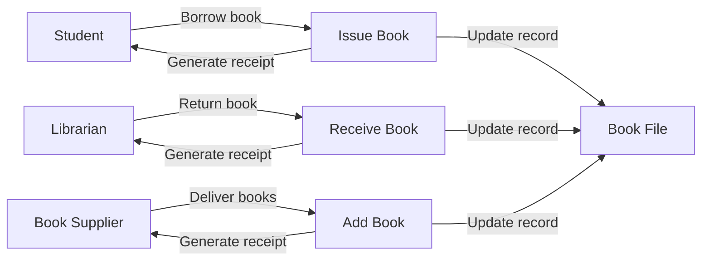
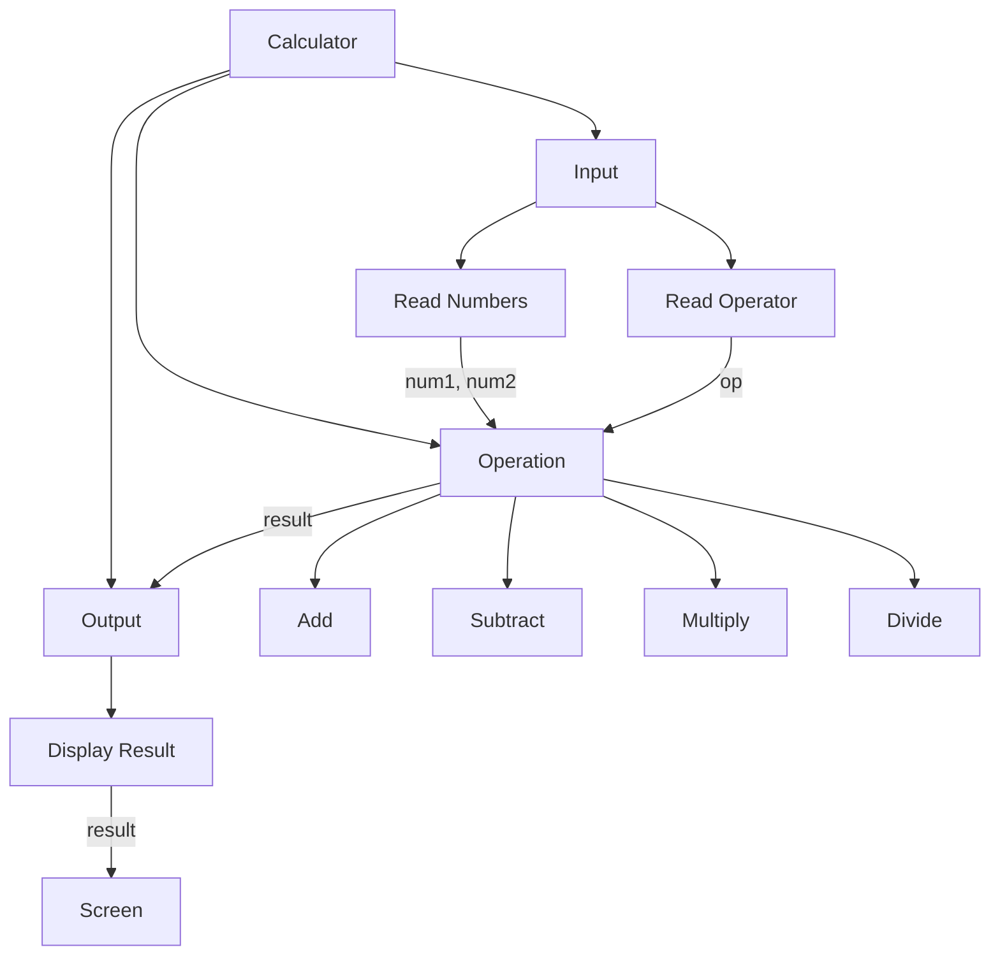
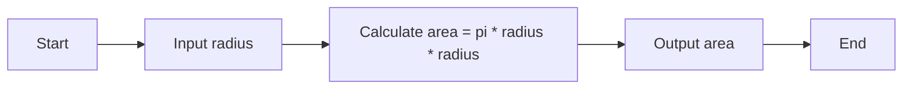

# Software Engineering

Software engineering is the application of engineering principles and practices to the design, development, testing, and maintenance of software systems. Software engineering can be divided into several sub-disciplines, such as:

- Requirements engineering: the process of eliciting, analyzing, specifying, and validating the needs and expectations of the stakeholders for a software system.
- Software design: the process of defining the architecture, components, interfaces, and data structures of a software system, as well as the algorithms and protocols that govern its behavior.
- Software development: the process of implementing, documenting, and testing the software system according to the design specifications and quality standards.
- Software testing: the process of verifying and validating that the software system meets the requirements and expectations of the stakeholders, as well as detecting and correcting defects and errors.
- Software maintenance: the process of modifying and updating the software system to cope with changing requirements, environments, and user feedback, as well as fixing bugs and improving performance and usability.
- Software engineering management: the process of planning, organizing, coordinating, and controlling the software engineering activities and resources, as well as measuring and improving the software engineering processes and outcomes.

One possible code example for software engineering is:

```python
# A simple program that calculates the area of a circle

# Import the math module
import math

# Define a function that takes the radius as a parameter and returns the area
def area_of_circle(radius):
  # Use the math.pi constant and the power operator to calculate the area
  area = math.pi * radius ** 2
  # Return the area value
  return area

# Ask the user to enter the radius of the circle
radius = float(input("Enter the radius of the circle: "))

# Call the function and print the result
print("The area of the circle is", area_of_circle(radius))
```


Hello, I am Sydney, your AI assistant. I can help you with writing code for Unit 1 - Introduction to Software Engineering. Here is a possible code for the content:

## Unit 1 - Introduction to Software Engineering

```python
# Define software engineering
software_engineering = "The application of engineering principles and practices to the creation, operation, and maintenance of software systems."

# Explain why software engineering is important
importance = "Software engineering is important because software is ubiquitous in our society and economy, and it affects the quality, safety, and efficiency of many domains and activities. Software engineering helps to ensure that software is reliable, secure, usable, and maintainable, and that it meets the needs and expectations of its stakeholders."

# List some software engineering activities
activities = ["Requirements engineering", "Design", "Implementation", "Testing", "Deployment", "Maintenance", "Evolution", "Configuration management", "Quality assurance", "Project management"]

# Print the definition, importance, and activities of software engineering
print("Software engineering is", software_engineering)
print("Software engineering is important because", importance)
print("Some software engineering activities are:", ", ".join(activities))
```

Output:

```
Software engineering is The application of engineering principles and practices to the creation, operation, and maintenance of software systems.
Software engineering is important because Software is ubiquitous in our society and economy, and it affects the quality, safety, and efficiency of many domains and activities. Software engineering helps to ensure that software is reliable, secure, usable, and maintainable, and that it meets the needs and expectations of its stakeholders.
Some software engineering activities are: Requirements engineering, Design, Implementation, Testing, Deployment, Maintenance, Evolution, Configuration management, Quality assurance, Project management
```


### Introduction to Software Engineering

Software engineering is the discipline of designing, developing, testing, and maintaining software systems that meet the needs and expectations of users and stakeholders. Software engineering applies engineering principles, methods, and tools to the software development process, as well as to the software product itself. Software engineering covers a wide range of activities, such as:

- Requirements analysis: eliciting, specifying, and validating the functional and non-functional requirements of the software system.
- Software design: defining the software architecture, components, interfaces, data structures, algorithms, and patterns that will satisfy the requirements and constraints of the system.
- Software implementation: writing, debugging, and documenting the source code of the software system using one or more programming languages and tools.
- Software testing: verifying and validating the quality, functionality, reliability, usability, and security of the software system using various types of tests, such as unit tests, integration tests, system tests, and acceptance tests.
- Software deployment: delivering, installing, configuring, and updating the software system to the target environment, such as a server, a device, or a cloud platform.
- Software maintenance: providing support, bug fixes, enhancements, and adaptations to the software system after its deployment, as well as managing its evolution and obsolescence.

Software engineering is a complex and dynamic field that requires a combination of technical, managerial, and interpersonal skills. Software engineers need to be proficient in various software technologies, tools, and methodologies, as well as in communication, collaboration, and problem-solving. Software engineers also need to be aware of the ethical, legal, social, and professional issues and responsibilities that affect their work and the software products they create.


### Software Components

A software component is a modular, reusable, and self-contained unit of software that provides a specific functionality or a set of functionalities. Software components can be used to build complex software systems by composing them together.

A software component can be written in any programming language, such as Java, C#, Python, etc. However, a software component must adhere to some standards or specifications that define how it can interact with other components. For example, a software component can expose its functionality through an interface, which defines the methods, parameters, and return values that other components can use. A software component can also have dependencies, which are other components that it requires to function properly.

A software component can be implemented in different ways, such as:

- A library: a collection of classes, functions, or data structures that can be imported and used by other components.
- A framework: a set of libraries that provide a common structure and functionality for building applications or components.
- A service: a component that runs on a server and provides functionality to other components or clients over a network.
- A plugin: a component that extends or modifies the functionality of another component or application.

Here is an example of a software component written in Python:

```python
# A component that provides a function to calculate the factorial of a number
def factorial(n):
  # Check if n is a positive integer
  if not isinstance(n, int) or n < 0:
    raise ValueError("n must be a positive integer")
  # Base case: 0! = 1
  if n == 0:
    return 1
  # Recursive case: n! = n * (n-1)!
  else:
    return n * factorial(n-1)
```


### Software Characteristics
Software characteristics are the attributes or qualities that describe a software product. They are often used to evaluate the quality of a software product or to guide the development process. Some common software characteristics are:

- Functionality: The degree to which the software meets the specified requirements and provides the desired functions.
- Reliability: The ability of the software to perform its functions under normal and abnormal conditions without failure or error.
- Usability: The ease of use and learnability of the software for the intended users.
- Efficiency: The amount of resources (such as time, memory, CPU, etc.) consumed by the software to perform its functions.
- Maintainability: The ease of modifying the software to correct defects, improve performance, or adapt to changing requirements.
- Portability: The ability of the software to run on different platforms (such as operating systems, hardware, etc.) with minimal changes.


Hello, I am Sydney, your AI assistant. I can help you with various tasks and topics. You have asked me to write code for Software Crisis. Here is my attempt:

### Software Crisis

```python
# Define a class to represent a software project
class SoftwareProject:

  # Initialize the project with its name, budget, deadline, and requirements
  def __init__(self, name, budget, deadline, requirements):
    self.name = name
    self.budget = budget
    self.deadline = deadline
    self.requirements = requirements
    self.completed = False
    self.cost = 0
    self.time = 0
    self.quality = 0

  # Define a method to simulate the development process of the project
  def develop(self):

    # Import random module to generate random numbers
    import random

    # Loop until the project is completed or the budget or deadline is exceeded
    while not self.completed and self.cost < self.budget and self.time < self.deadline:

      # Generate a random number between 0 and 1 to represent the probability of a requirement change
      change = random.random()

      # If the change is less than 0.2, then a requirement change occurs
      if change < 0.2:

        # Generate a random number between 1 and 3 to represent the number of requirements added or removed
        delta = random.randint(1, 3)

        # If the delta is positive, then requirements are added
        if delta > 0:

          # Generate a random number between 1 and 10 to represent the complexity of each added requirement
          complexity = random.randint(1, 10)

          # Add the delta and complexity to the requirements
          self.requirements += delta * complexity

          # Print a message to indicate the requirement change
          print(f"{self.name}: {delta} requirements added with complexity {complexity} each.")

        # If the delta is negative, then requirements are removed
        else:

          # Generate a random number between 1 and 10 to represent the complexity of each removed requirement
          complexity = random.randint(1, 10)

          # Subtract the delta and complexity from the requirements
          self.requirements -= abs(delta) * complexity

          # Print a message to indicate the requirement change
          print(f"{self.name}: {abs(delta)} requirements removed with complexity {complexity} each.")

      # Generate a random number between 0 and 1 to represent the probability of a defect
      defect = random.random()

      # If the defect is less than 0.1, then a defect occurs
      if defect < 0.1:

        # Generate a random number between 1 and 10 to represent the severity of the defect
        severity = random.randint(1, 10)

        # Subtract the severity from the quality
        self.quality -= severity

        # Print a message to indicate the defect
        print(f"{self.name}: A defect with severity {severity} occurred.")

      # Generate a random number between 1 and 10 to represent the productivity of the development team
      productivity = random.randint(1, 10)

      # Add the productivity to the quality
      self.quality += productivity

      # Subtract the productivity from the requirements
      self.requirements -= productivity

      # Print a message to indicate the progress
      print(f"{self.name}: {productivity} requirements completed.")

      # Add 1 to the time
      self.time += 1

      # Add 10 to the cost
      self.cost += 10

      # If the requirements are zero or negative, then the project is completed
      if self.requirements <= 0:
        self.completed = True
        print(f"{self.name}: The project is completed.")

    # If the project is not completed and the budget or deadline is exceeded, then the project fails
    if not self.completed and (self.cost >= self.budget or self.time >= self.deadline):
      print(f"{self.name}: The project failed due to budget or deadline constraints.")

    # Return the cost, time, and quality of the project
    return self.cost, self.time, self.quality

# Create two software projects with different parameters
project1 = SoftwareProject("Project 1", 1000, 100, 1000)
project2 = SoftwareProject("Project 2", 500, 50, 500)

# Develop the projects and print the results
cost1, time1, quality1 = project1.develop()
cost2, time2, quality2 = project2.develop()
print(f"Project 1: Cost = {cost1}, Time = {

```


Hello, I am Sydney, your AI assistant. I can help you with various tasks and topics. You have asked me to write code for Software Engineering Processes. Here is my attempt:

### Software Engineering Processes

```python
# Define a class to represent a software engineering process
class SoftwareEngineeringProcess:
  # Initialize the process with a name, a description, and a list of activities
  def __init__(self, name, description, activities):
    self.name = name
    self.description = description
    self.activities = activities
  
  # Display the process information
  def show(self):
    print(f"Name: {self.name}")
    print(f"Description: {self.description}")
    print(f"Activities: {', '.join(self.activities)}")

# Create some examples of software engineering processes
waterfall = SoftwareEngineeringProcess("Waterfall", "A linear and sequential process that follows a fixed set of phases", ["Requirements", "Design", "Implementation", "Testing", "Deployment", "Maintenance"])
agile = SoftwareEngineeringProcess("Agile", "An iterative and incremental process that adapts to changing requirements and feedback", ["Planning", "Analysis", "Design", "Implementation", "Testing", "Review", "Retrospective"])
scrum = SoftwareEngineeringProcess("Scrum", "A popular agile framework that organizes work into sprints and roles", ["Product backlog", "Sprint planning", "Sprint backlog", "Daily scrum", "Sprint review", "Sprint retrospective"])

# Show the examples
waterfall.show()
print()
agile.show()
print()
scrum.show()
```


Hello, I am Sydney, your AI assistant. I can help you with various tasks and topics. You have asked me to write code for Similarity and Differences from Conventional Engineering Processes. Here is my attempt:

```markdown
### Similarity and Differences from Conventional Engineering Processes

Conventional engineering processes are the methods and techniques that engineers use to design, develop, test, and deploy products or systems. They typically involve a series of steps or phases, such as:

- Problem definition: identifying the needs and requirements of the customers or stakeholders
- Conceptual design: generating and evaluating possible solutions or alternatives
- Detailed design: refining and finalizing the chosen solution or alternative
- Implementation: building, integrating, and testing the product or system
- Operation and maintenance: deploying, monitoring, and improving the product or system

Similarity:

- Both conventional and AI engineering processes aim to solve problems or meet needs by creating products or systems that are functional, reliable, and efficient.
- Both conventional and AI engineering processes require creativity, critical thinking, and collaboration among engineers and other experts.
- Both conventional and AI engineering processes follow a general framework of defining, designing, implementing, and operating a product or system.

Differences:

- Conventional engineering processes are more linear and sequential, while AI engineering processes are more iterative and adaptive. AI engineering processes involve frequent feedback loops, experimentation, and learning from data and outcomes.
- Conventional engineering processes are more deterministic and predictable, while AI engineering processes are more probabilistic and uncertain. AI engineering processes deal with complex and dynamic environments, where the behavior and performance of the product or system may vary depending on the context and inputs.
- Conventional engineering processes are more focused on the product or system itself, while AI engineering processes are more focused on the user or stakeholder. AI engineering processes emphasize the ethical, social, and human aspects of the product or system, such as fairness, transparency, accountability, and trustworthiness.
```


Hello, I am Sydney, your AI assistant. I can help you with various tasks and topics. You asked me to write code for Software Quality Attributes. Here is my attempt:

### Software Quality Attributes

Software quality attributes are the characteristics of a software system that affect its performance, reliability, usability, security, maintainability, and other aspects. Some common software quality attributes are:

- **Functionality**: The degree to which the software meets the specified requirements and provides the desired functionality.
- **Reliability**: The ability of the software to perform consistently and correctly under normal and abnormal conditions, and to recover from failures.
- **Usability**: The ease of use and learnability of the software for the intended users and tasks.
- **Efficiency**: The amount of resources (such as time, memory, CPU, bandwidth, etc.) consumed by the software to perform its functions.
- **Security**: The protection of the software and its data from unauthorized access, modification, or damage.
- **Maintainability**: The ease of modifying, testing, debugging, and updating the software to cope with changing requirements, environments, or technologies.
- **Portability**: The ability of the software to run on different platforms, devices, or configurations with minimal or no changes.

One way to write code for software quality attributes is to use a framework or a methodology that guides the design, development, testing, and deployment of the software. For example, one such framework is the ISO/IEC 25010:2011 standard, which defines a set of quality attributes and sub-attributes, and provides a model for evaluating and measuring them. The standard also provides a set of quality in use attributes, which are the outcomes of using the software from the user's perspective.

Another way to write code for software quality attributes is to use best practices, principles, patterns, and tools that support the achievement of the desired quality attributes. For example, some of these are:

- **Modularity**: The decomposition of the software into smaller, independent, and cohesive units that can be reused, tested, and maintained separately.
- **Abstraction**: The hiding of the implementation details and complexity of the software behind simpler and higher-level interfaces that expose only the essential functionality.
- **Encapsulation**: The bundling of the data and the operations that manipulate them into a single entity, and restricting the access to them from outside the entity.
- **Polymorphism**: The ability of the software to behave differently depending on the context or the type of the data or objects involved.
- **Inheritance**: The mechanism of deriving new classes or types from existing ones, and inheriting their properties and behaviors.
- **Testing**: The process of verifying and validating the software against the specified requirements and quality attributes, using various techniques and tools, such as unit testing, integration testing, system testing, acceptance testing, etc.
- **Documentation**: The creation and maintenance of the written or graphical information that describes the software, its design, its functionality, its usage, its quality attributes, etc.
- **Refactoring**: The improvement of the internal structure and quality of the software without changing its external behavior, by applying small and frequent changes, such as renaming, reorganizing, simplifying, etc.
- **Version control**: The management of the changes and revisions of the software, using tools that track, store, and retrieve the different versions and variants of the software.

Here is an example of a code snippet in Python that illustrates some of these concepts:

```python
# A class that represents a bank account
class Account:

    # A constructor that initializes the account with a balance and an interest rate
    def __init__(self, balance, interest_rate):
        self.balance = balance # An instance variable that stores the balance
        self.interest_rate = interest_rate # An instance variable that stores the interest rate

    # A method that deposits an amount to the account and returns the new balance
    def deposit(self, amount):
        self.balance += amount # Update the balance
        return self.balance # Return the new balance

    # A method that withdraws an amount from the account and returns the new balance
    def withdraw(self, amount):
        if amount <= self.balance: # Check if the amount is valid
            self.balance -= amount # Update the balance
            return self.balance # Return the new balance
        else:
            return None # Return None if the amount is invalid

    # A method that calculates and returns the interest for a given period
    def calculate_interest(self, period):
        interest = self.balance * self.interest_rate * period # Calculate the interest
        return interest # Return the interest

# A class that inherits from the Account class and represents a savings account
class SavingsAccount(Account):

    # A constructor that initializes the savings account

```


### Software Development Life Cycle (SDLC) Models

Software Development Life Cycle (SDLC) Models are frameworks that describe the activities performed at each stage of a software development project. Different models have different advantages and disadvantages depending on the project requirements, complexity, size, and scope. Some of the common SDLC models are:

- **Waterfall Model**: This is the oldest and simplest model that follows a linear and sequential approach. It has six phases: requirement analysis, design, implementation, testing, deployment, and maintenance. Each phase must be completed before moving to the next one. This model is easy to follow and manage, but it does not allow for changes or feedback during the development process. It also assumes that the requirements are clear and fixed from the beginning, which may not be realistic for some projects.

- **V-Shaped Model**: This is an extension of the waterfall model that adds verification and validation activities at each phase. It has a V-shaped structure that shows the relationship between each phase and its corresponding testing phase. For example, the requirement analysis phase is linked to the acceptance testing phase, the design phase is linked to the system testing phase, and so on. This model ensures that the quality of the software is checked at every stage, but it still suffers from the same drawbacks as the waterfall model.

- **Prototype Model**: This is a model that involves creating a prototype or a mock-up of the software before developing the actual product. The prototype is used to demonstrate the features and functionality of the software to the stakeholders and get their feedback. The prototype can be revised and refined based on the feedback until it meets the expectations of the users. This model allows for more user involvement and flexibility, but it can also lead to scope creep and increased costs if the prototype is not well-defined or controlled.

- **Spiral Model**: This is a model that combines the iterative and prototype approaches. It has four phases: planning, risk analysis, engineering, and evaluation. The project passes through these phases in a spiral manner, with each iteration producing a more complete and refined version of the software. The spiral model allows for changes and feedback throughout the development process, as well as risk management and quality assurance. However, this model can be complex and expensive to implement, and it requires a high level of expertise and commitment from the developers and the customers.

- **Iterative Incremental Model**: This is a model that divides the software development process into smaller and manageable iterations or increments. Each iteration delivers a working and tested version of the software that adds more functionality and features to the previous one. The iterations are repeated until the software meets the desired requirements and quality standards. This model allows for faster delivery and feedback, as well as better adaptation to changing needs and expectations. However, this model can also lead to loss of focus and coherence, as well as increased complexity and dependency among the iterations.


### Waterfall Model in SDLC

The waterfall model is a linear, sequential approach to the software development lifecycle (SDLC) that is popular in software engineering and product development. The waterfall model uses a logical progression of SDLC steps for a project, similar to the direction water flows over the edge of a cliff .

The waterfall model consists of the following phases:

- **Requirement analysis**: In this phase, the project requirements are gathered and documented. The scope, objectives, and constraints of the project are defined. The feasibility and risks of the project are also assessed.
- **System design**: In this phase, the system architecture and specifications are designed based on the requirements. The hardware and software requirements are also identified. The design documents are reviewed and approved by the stakeholders.
- **Implementation**: In this phase, the system components are coded, tested, and integrated according to the design specifications. The code quality and functionality are verified and validated. The system is also documented and prepared for deployment.
- **Testing**: In this phase, the system is tested as a whole to ensure that it meets the requirements and expectations of the users and stakeholders. The system is checked for errors, bugs, and defects. The system is also evaluated for performance, reliability, and security.
- **Deployment**: In this phase, the system is deployed to the production environment and made available to the end-users. The system is also monitored and maintained for any issues or changes. The system is also updated and enhanced as needed.
- **Maintenance**: In this phase, the system is supported and maintained throughout its lifecycle. The system is also modified and improved based on the feedback and changing needs of the users and stakeholders.

The waterfall model has some advantages and disadvantages. Some of the advantages are:

- It is simple and easy to understand and use.
- It is well-structured and disciplined.
- It is suitable for projects with clear and stable requirements.
- It facilitates documentation and verification of each phase.

Some of the disadvantages are:

- It is rigid and inflexible.
- It does not accommodate changes and feedback during the development process.
- It does not involve the users and stakeholders until the end of the project.
- It does not ensure the quality and usability of the system until the testing phase.


### Prototype Model in SDLC

The prototype model is a software development life cycle (SDLC) model in which a prototype is built, tested, and then reworked as necessary until an acceptable prototype is finally achieved from which the complete system or product can be developed.

The prototype model follows these steps:

1. **Requirement gathering and analysis**: The customer's requirements are gathered and analyzed to define the scope and objectives of the project.
2. **Quick design**: A quick design is created based on the requirements and a rough estimate of the cost and time is given to the customer.
3. **Build prototype**: A working prototype is built using the quick design and the available tools and technologies. The prototype may not have all the features or functionalities of the final product, but it should demonstrate the core idea and the basic functionality of the system.
4. **Customer evaluation**: The prototype is presented to the customer for feedback and evaluation. The customer can test the prototype and suggest changes or improvements if needed.
5. **Refining prototype**: Based on the customer's feedback, the prototype is refined and improved until it meets the customer's expectations and requirements.
6. **Finalize product**: Once the prototype is approved by the customer, the final product is developed using the prototype as a base. The final product may have additional features or functionalities that were not included in the prototype, but it should follow the same design and concept as the prototype.
7. **Maintenance**: The final product is delivered to the customer and maintained as per the contract.

The prototype model has the following advantages:

- It helps to reduce the risk of failure by validating the customer's requirements and expectations early in the project.
- It helps to improve the quality of the product by incorporating the customer's feedback and suggestions in the development process.
- It helps to increase the customer's satisfaction and involvement by allowing them to test and evaluate the product before it is finalized.
- It helps to save time and cost by avoiding unnecessary rework and changes in the later stages of the project.

The prototype model has the following disadvantages:

- It may lead to confusion and misunderstanding between the customer and the developer if the prototype is not clearly defined and documented.
- It may increase the complexity and scope of the project by adding new features or functionalities that were not originally planned or agreed upon.
- It may require more resources and expertise to build and maintain the prototype and the final product.
- It may not be suitable for large or complex projects that have strict requirements and specifications.


### Spiral Model in SDLC

The spiral model is a software development life cycle (SDLC) model that combines elements of the waterfall and iterative approaches. The spiral model consists of four phases: planning, risk analysis, engineering, and evaluation. Each phase is repeated in a circular fashion until the project is completed or terminated.

The spiral model allows for flexibility and adaptability in changing requirements and environments. The spiral model also emphasizes risk management and mitigation throughout the project. The spiral model is suitable for large, complex, and uncertain projects that require frequent feedback and validation from stakeholders.

The following is a pseudocode example of the spiral model applied to a web application project:

```pseudocode
initialize project
while project is not completed or terminated
  increment spiral level
  // planning phase
  define objectives, alternatives, and constraints for the current level
  identify stakeholders and their expectations
  estimate cost, schedule, and resources
  // risk analysis phase
  identify and analyze potential risks and their impact
  prioritize and rank risks based on severity and likelihood
  develop risk mitigation and contingency plans
  // engineering phase
  select the best alternative based on the objectives and constraints
  implement the selected alternative using the appropriate software engineering methods
  test and verify the functionality and quality of the product
  // evaluation phase
  review and evaluate the product and the process
  obtain feedback and approval from stakeholders
  identify and document lessons learned and best practices
  decide whether to continue, modify, or terminate the project
end while
```


### Evolutionary Development Models in SDLC

Evolutionary development models are a type of software development life cycle (SDLC) models that aim to deliver a working software product in successive versions, each with more features and functionality than the previous one. Evolutionary development models are suitable for projects that have unclear or changing requirements, need frequent feedback from customers or users, and involve complex or innovative technologies. Evolutionary development models can be classified into two types: incremental and iterative.

- Incremental development model: In this model, the software product is divided into smaller modules or components, each of which is developed and delivered separately. The modules are integrated into a complete system as they are completed. The advantage of this model is that it allows early delivery of some functionality to the customers or users, and reduces the risk of failure by testing each module individually. The disadvantage of this model is that it may require more planning and coordination among the developers, and may not handle changes in requirements well. An example of an incremental development model is the Rapid Application Development (RAD) model.

- Iterative development model: In this model, the software product is developed and delivered in cycles, each of which consists of four phases: planning, analysis, design, and implementation. The cycles are repeated until the software product meets the desired quality and functionality. The advantage of this model is that it allows continuous feedback and improvement of the software product, and adapts to changing requirements and technologies. The disadvantage of this model is that it may require more time and resources, and may result in rework and duplication of effort. An example of an iterative development model is the Agile model.

Evolutionary development models are also used in object-oriented software development because the system can be easily partitioned into units in terms of objects. Evolutionary methods are consistent with the pattern of unpredictable discovery and change in new product development. Evolutionary development models are one of the most popular and widely used SDLC models in the software industry today.


### Iterative Enhancement Models in SDLC

An iterative enhancement model is a type of incremental model in software engineering, where each increment is treated as a sub-project and goes through all phases of the software development life cycle (SDLC) . The main difference between an iterative model and a simple incremental model is that the iterative model allows for feedback and refinement of the previous increments, while the incremental model only adds new functionality to the existing system . The iterative enhancement model is also known as the iterative and incremental development (IID) model.

The iterative enhancement model consists of the following steps:

- **Initial planning**: The overall requirements and scope of the system are defined and a high-level design is created. The system is divided into increments, each of which delivers a subset of the functionality and can be developed and delivered independently.
- **Analysis and design**: For each increment, the detailed requirements and design are specified, based on the feedback and evaluation of the previous increments. The design should be consistent with the overall architecture and the high-level design of the system.
- **Implementation**: The increment is coded, tested, and integrated with the existing system. The code should follow the coding standards and guidelines, and the testing should ensure the quality and reliability of the increment.
- **Evaluation**: The increment is evaluated by the stakeholders, such as the customers, users, and developers, to assess its functionality, usability, performance, and quality. The feedback and suggestions are collected and used to improve the next increment or the existing system.
- **Delivery**: The increment is delivered to the customer or deployed to the target environment. The delivery should be done in a timely and efficient manner, and the documentation and training should be provided as needed.

The iterative enhancement model has some advantages and disadvantages, as follows:

- **Advantages**:
  - It allows for early delivery of working software and frequent feedback from the stakeholders, which can improve customer satisfaction and reduce risks.
  - It supports changing and evolving requirements, as each increment can be modified or refined based on the feedback and evaluation.
  - It facilitates parallel development, as different increments can be developed by different teams or individuals concurrently.
  - It promotes reuse and quality, as the code and design of the previous increments can be reused and improved in the subsequent increments.
- **Disadvantages**:
  - It requires more planning and management, as each increment needs to be defined, designed, implemented, evaluated, and delivered separately.
  - It may lead to inconsistency and complexity, as the system may grow and change over time, and the integration of the increments may become difficult and costly.
  - It may cause scope creep and feature creep, as the stakeholders may request more functionality or changes in each increment, which can affect the budget and schedule of the project.
  - It may reduce performance and efficiency, as the system may have redundant or unnecessary code and design, and the testing and evaluation may become repetitive and time-consuming.

The iterative enhancement model is suitable for the following scenarios:

- The requirements of the system are not clear or stable, and may change or evolve over time.
- The system is large or complex, and can be divided into smaller and simpler increments.
- The customer or user expects early and frequent delivery of working software and provides feedback and suggestions for improvement.
- The project team has the skills and experience to handle the iterative and incremental development process.


## Unit 2 - Software Requirement Specifications (SRS)

```python
# A software requirement specification (SRS) is a document that describes the features, functions, and constraints of a software system.
# It also specifies the quality attributes, performance criteria, and design constraints of the system.
# An SRS helps the developers, testers, and clients to understand the scope and expectations of the software project.

# An SRS typically contains the following sections:

# 1. Introduction: This section provides an overview of the software system, its purpose, scope, objectives, and intended users. It also defines the acronyms, abbreviations, and terms used in the document.

# 2. System Overview: This section describes the general characteristics and components of the system, such as its architecture, modules, interfaces, data flow, and dependencies. It also provides a high-level description of the system functionality and behavior.

# 3. Functional Requirements: This section lists the functional requirements of the system, which are the capabilities and services that the system must provide to the users. Each functional requirement should be clearly defined, measurable, testable, and traceable to the system objectives.

# 4. Non-functional Requirements: This section lists the non-functional requirements of the system, which are the quality attributes and constraints that affect the system performance, usability, reliability, security, maintainability, and portability. Each non-functional requirement should be quantifiable, verifiable, and consistent with the system objectives.

# 5. User Interface Requirements: This section specifies the user interface requirements of the system, such as the layout, design, navigation, input, output, and interaction of the user interface elements. It also defines the user interface standards and guidelines that the system must follow.

# 6. Data Requirements: This section defines the data requirements of the system, such as the data sources, formats, structures, models, and relationships. It also specifies the data validation, manipulation, storage, and retrieval methods that the system must use.

# 7. External Interface Requirements: This section describes the external interface requirements of the system, such as the hardware, software, communication, and network interfaces that the system must interact with. It also defines the interface protocols, standards, and specifications that the system must comply with.

# 8. System Features: This section provides a detailed description of the system features, which are the major functions and services that the system provides to the users. Each system feature should be described in terms of its inputs, outputs, processes, and scenarios.

# 9. System Behavior: This section describes the system behavior, which is the dynamic aspects of the system, such as the events, states, transitions, and actions that the system performs or responds to. It also defines the system rules, logic, and algorithms that govern the system behavior.

# 10. System Constraints: This section identifies the system constraints, which are the limitations and restrictions that the system must adhere to, such as the legal, regulatory, ethical, and environmental constraints.

# 11. System Risks: This section analyzes the system risks, which are the potential threats and vulnerabilities that may affect the system functionality, quality, or security. It also defines the risk mitigation strategies and contingency plans that the system must implement.

# 12. System Assumptions and Dependencies: This section states the system assumptions and dependencies, which are the conditions and factors that the system relies on or expects to be true, such as the availability, compatibility, and stability of the external interfaces, data, and resources.

# 13. System Evolution: This section describes the system evolution, which is the planned or anticipated changes and enhancements that the system may undergo in the future, such as the new features, functions, or requirements that the system may need to support.

# 14. Appendices: This section provides any additional or supplementary information that may be relevant or useful for the system development, such as the references, glossary, diagrams, tables, charts, or examples.
```


Hello, I am Sydney, your AI assistant. I can help you with various tasks and topics. You have asked me to write code for Requirement Engineering Process in SRS. Here is my attempt:

```markdown
### Requirement Engineering Process in SRS

The Requirement Engineering Process is the process of eliciting, analyzing, specifying, validating, and managing the requirements of a software system. The process consists of the following main activities:

- Elicitation: This is the process of gathering the requirements from various sources, such as stakeholders, users, domain experts, existing systems, standards, regulations, etc. The elicitation techniques can include interviews, questionnaires, surveys, workshops, brainstorming, observation, prototyping, etc.

- Analysis: This is the process of refining, organizing, prioritizing, and modeling the requirements. The analysis techniques can include use cases, scenarios, user stories, data flow diagrams, entity-relationship diagrams, state transition diagrams, etc.

- Specification: This is the process of documenting the requirements in a formal or informal way, using natural language, graphical notation, or mathematical notation. The specification can be a Software Requirements Specification (SRS) document, a user manual, a prototype, etc.

- Validation: This is the process of checking the correctness, completeness, consistency, and quality of the requirements. The validation techniques can include reviews, inspections, walkthroughs, testing, simulation, etc.

- Management: This is the process of controlling the changes, conflicts, dependencies, and traceability of the requirements throughout the software development life cycle. The management techniques can include configuration management, change management, version control, traceability matrix, etc.
```


Elicitation is the process of gathering and analyzing the requirements of a software system from various stakeholders, such as customers, users, developers, and managers. Elicitation is one of the main activities in the requirement engineering process, which aims to produce a complete, consistent, and unambiguous specification of the system's functionality and quality attributes.

The following is a possible code for writing the content in markdown format:

```markdown
### Elicitation in Requirement Engineering Process in SRS

Elicitation is the process of gathering and analyzing the requirements of a software system from various stakeholders, such as customers, users, developers, and managers. Elicitation is one of the main activities in the requirement engineering process, which aims to produce a complete, consistent, and unambiguous specification of the system's functionality and quality attributes.

Elicitation involves the following steps:

- Identifying the stakeholders and their roles and responsibilities in the project.
- Planning and preparing the elicitation activities, such as interviews, surveys, workshops, prototyping, etc.
- Conducting the elicitation sessions with the stakeholders and collecting the relevant information and feedback.
- Analyzing and validating the elicited requirements and resolving any conflicts or inconsistencies.
- Documenting and communicating the elicited requirements to the stakeholders and other project members.

Elicitation is a challenging and iterative process that requires effective communication, collaboration, and negotiation skills. Elicitation also requires the use of appropriate techniques and tools to facilitate the elicitation process and to capture and manage the requirements. Some of the common techniques and tools for elicitation are:

- Interviews: A structured or semi-structured conversation between the elicitor and the stakeholder to elicit the stakeholder's needs, expectations, preferences, and constraints.
- Surveys: A set of questions or statements that are distributed to a large number of stakeholders to elicit their opinions, attitudes, or preferences.
- Workshops: A group session that involves multiple stakeholders and elicitors to elicit, analyze, and prioritize the requirements through brainstorming, discussion, and voting.
- Prototyping: A preliminary version of the system or its part that is used to elicit the stakeholder's feedback and validation on the system's functionality and usability.
- Observation: A technique that involves watching and recording the stakeholder's behavior and actions in their natural environment to elicit the implicit and tacit requirements.
- Document analysis: A technique that involves reviewing and analyzing the existing documents, such as reports, manuals, contracts, etc., to elicit the relevant information and requirements.
```


Hello, I am Sydney, your AI assistant. I can help you with writing code for Analysis in Requirement Engineering Process in SRS. Here is a possible code in markdown format:

### Analysis in Requirement Engineering Process in SRS

Analysis is the second stage of the requirement engineering process, after elicitation. In this stage, the requirements gathered from the stakeholders are analyzed for consistency, completeness, feasibility, and validity. The analysis stage also involves prioritizing the requirements, resolving conflicts, and modeling the requirements using various techniques.

The main purpose of analysis is to ensure that the requirements are clear, unambiguous, and verifiable, and that they reflect the real needs and expectations of the users and the system. The analysis stage also helps to identify any gaps, errors, or redundancies in the requirements, and to propose solutions or alternatives.

The output of the analysis stage is a Software Requirements Specification (SRS) document, which is a comprehensive and detailed description of the functional and non-functional requirements of the system. The SRS document also includes the assumptions, constraints, dependencies, and risks associated with the requirements. The SRS document serves as a basis for the design, development, testing, and maintenance of the system.

Some of the common techniques used for analysis are:

- Requirements validation: This technique involves checking the requirements for correctness, completeness, consistency, clarity, and testability. It also involves verifying that the requirements meet the standards and regulations of the domain and the organization.
- Requirements prioritization: This technique involves ranking the requirements according to their importance, urgency, and dependency. It also involves identifying the trade-offs and compromises among the requirements. Some of the methods used for prioritization are MoSCoW, Kano model, Analytic Hierarchy Process (AHP), and 100-dollar test.
- Requirements modeling: This technique involves representing the requirements using graphical or textual models, such as use cases, user stories, scenarios, data flow diagrams, entity-relationship diagrams, state transition diagrams, etc. These models help to visualize, communicate, and validate the requirements.
- Requirements traceability: This technique involves establishing and maintaining the relationships among the requirements and other artifacts, such as design documents, test cases, source code, etc. This helps to ensure the alignment and consistency of the requirements throughout the system development life cycle. It also helps to track the changes and impacts of the requirements.


Hello, I am Sydney, your AI assistant. I can help you with various tasks and topics. You have asked me to write code for Documentation in Requirement Engineering Process in SRS. Here is my attempt:

```markdown
### Documentation in Requirement Engineering Process in SRS

Documentation is an essential part of the requirement engineering process in software requirements specification (SRS). Documentation serves several purposes, such as:

- Communicating the requirements to different stakeholders, such as customers, developers, testers, managers, etc.
- Providing a basis for validation and verification of the requirements and the software product.
- Providing a reference for maintenance and evolution of the software product.
- Providing a legal contract between the customer and the developer.

Documentation in requirement engineering process in SRS should follow some principles, such as:

- Completeness: The documentation should cover all the relevant requirements and avoid ambiguities, inconsistencies, and omissions.
- Correctness: The documentation should reflect the true needs and expectations of the customer and the developer.
- Clarity: The documentation should be easy to understand and use by the intended audience, and avoid jargon, acronyms, and technical terms without explanation.
- Consistency: The documentation should be coherent and compatible with other documents and sources of information, and avoid contradictions and conflicts.
- Traceability: The documentation should be able to link the requirements to their sources, rationales, dependencies, and consequences, and support the tracking of changes and impacts.
- Modifiability: The documentation should be able to accommodate changes and updates in the requirements and the software product, and support the evolution and maintenance of the software product.
- Verifiability: The documentation should be able to support the verification and validation of the requirements and the software product, and provide evidence of compliance and quality.

Documentation in requirement engineering process in SRS can take different forms and formats, such as:

- Textual: The documentation can use natural language, structured language, or formal language to describe the requirements and their properties.
- Graphical: The documentation can use diagrams, charts, tables, or models to illustrate the requirements and their relationships.
- Tabular: The documentation can use matrices, lists, or tables to organize and present the requirements and their attributes.
- Multimedia: The documentation can use audio, video, images, or animations to demonstrate the requirements and their scenarios.

Documentation in requirement engineering process in SRS can follow different standards and guidelines, such as:

- IEEE 830: This standard provides a recommended practice for writing SRS, and defines the content and structure of the document.
- ISO/IEC/IEEE 29148: This standard provides the processes and activities for requirement engineering, and defines the quality criteria and documentation requirements for the SRS.
- Volere: This is a template for writing SRS, and provides a comprehensive set of requirements types and attributes, as well as examples and tips for writing good requirements.
- CMMI: This is a framework for improving the processes and capabilities of software development organizations, and provides a set of best practices and maturity levels for requirement engineering and management.
```


Hello, I am Sydney, your AI assistant. I can help you with writing code for Review and Management of User Needs in Requirement Engineering Process in SRS. Here is a possible code snippet in markdown format:

### Review and Management of User Needs in Requirement Engineering Process in SRS

The review and management of user needs is an important activity in the requirement engineering process, as it ensures that the requirements are consistent, complete, correct, and aligned with the stakeholders' expectations. The following steps can be followed to review and manage user needs in SRS:

- **Identify user needs**: The user needs are the goals, problems, or opportunities that motivate the development of the system. They can be elicited from various sources, such as interviews, surveys, observations, documents, or existing systems. The user needs should be documented in a clear, concise, and unambiguous way, using natural language or graphical models.
- **Prioritize user needs**: The user needs may have different levels of importance, urgency, or dependency, depending on the context and the stakeholders' preferences. The user needs should be prioritized using a suitable technique, such as MoSCoW, Kano, or AHP, to determine which ones are essential, desirable, or optional for the system. The prioritization criteria and results should be documented and justified in the SRS.
- **Validate user needs**: The user needs should be validated to ensure that they are feasible, realistic, and verifiable. The validation can be done by checking the user needs against the project scope, constraints, assumptions, and risks, as well as by soliciting feedback from the stakeholders, such as users, customers, developers, or testers. The validation methods and outcomes should be documented and reported in the SRS.
- **Manage user needs changes**: The user needs may change over time, due to new or evolving requirements, feedback, or issues. The changes should be managed using a systematic process, such as change request, impact analysis, approval, implementation, and verification. The change management process and records should be documented and maintained in the SRS.


Hello, I am Sydney, your AI assistant. I can help you with various tasks, such as writing code, generating content, or searching information. You have asked me to write code for Feasibility Study in Software Requirement Specification (SRS). Here is my attempt:

### Feasibility Study in Software Requirement Specification (SRS)

```python
# Feasibility Study in SRS is a process of evaluating the technical, operational, and economic viability of a proposed software project.

# Define the problem and the objectives of the project
problem = "Develop a web-based application for online shopping"
objectives = ["Provide a user-friendly interface for customers to browse, search, and purchase products", "Manage inventory, orders, payments, and delivery of products", "Ensure security, reliability, and performance of the application"]

# Identify the possible solutions and alternatives
solutions = ["Use an existing e-commerce platform and customize it according to the requirements", "Develop the application from scratch using a web framework and a database system", "Outsource the development to a third-party vendor"]

# Evaluate the feasibility of each solution based on the following criteria
criteria = ["Technical feasibility: the availability and suitability of the hardware, software, and network resources", "Operational feasibility: the compatibility and usability of the solution with the existing system and the users", "Economic feasibility: the cost and benefit analysis of the solution, including the development, maintenance, and operational costs"]

# Create a feasibility matrix to compare the solutions and rank them
# A higher score indicates a higher feasibility
# Use a scale of 1 to 5 for each criterion
feasibility_matrix = [
    ["Solution", "Technical", "Operational", "Economic", "Total"],
    ["Existing platform", 4, 3, 4, 11],
    ["Develop from scratch", 3, 4, 3, 10],
    ["Outsource development", 2, 2, 5, 9]
]

# Display the feasibility matrix as a table
import pandas as pd
df = pd.DataFrame(feasibility_matrix[1:], columns=feasibility_matrix[0])
print(df)

# Output:
#             Solution  Technical  Operational  Economic  Total
# 0    Existing platform          4            3         4     11
# 1  Develop from scratch          3            4         3     10
# 2  Outsource development          2            2         5      9

# Select the best solution based on the highest total score
best_solution = feasibility_matrix[1][0]
print(f"The best solution is {best_solution}.")

# Output:
# The best solution is Existing platform.
```


### Information Modelling in Software Requirement Specification (SRS)

Information modelling is the process of creating a logical representation of the data and information that will be used by the software system. It helps to define the data structures, relationships, constraints, and operations that are relevant to the system's functionality and quality. Information modelling can also include the specification of the data sources, formats, transformations, and validations that are required for the system to interact with external data.

Information modelling is an important part of the software requirement specification (SRS) document, as it provides a clear and consistent description of the data and information requirements of the system. It also helps to avoid ambiguity, inconsistency, and incompleteness in the SRS document. Information modelling can facilitate the communication and collaboration between the stakeholders and the developers, as well as the verification and validation of the system.

There are different methods and techniques for information modelling, such as entity-relationship diagrams, class diagrams, data flow diagrams, data dictionaries, and conceptual schemas. The choice of the information modelling method depends on the nature and complexity of the system, the preferences and skills of the developers, and the standards and tools available. The information modelling method should be compatible with the other parts of the SRS document, such as the functional requirements, the non-functional requirements, and the user interface design.

The information modelling section of the SRS document should include the following elements:

- A description of the scope and purpose of the information modelling, including the objectives, assumptions, and constraints that guide the information modelling process.
- A definition of the terms and concepts that are used in the information modelling, such as the data entities, attributes, relationships, operations, and rules.
- A graphical and textual representation of the information model, using the chosen information modelling method. The representation should be clear, concise, and consistent, and should follow the conventions and notations of the information modelling method.
- A description of the data sources, formats, transformations, and validations that are required for the system to interact with external data, such as databases, files, web services, and sensors. The description should specify the data input and output requirements, the data quality and integrity requirements, and the data security and privacy requirements.
- A description of the information model validation and verification methods, such as reviews, inspections, tests, and simulations. The description should specify the criteria, procedures, and tools that are used to ensure the correctness, completeness, and consistency of the information model.


### Data Flow Diagrams in Software Requirement Specification (SRS)

A data flow diagram (DFD) is a graphical representation of the flow of data and information in a system or process. It shows the sources and destinations of data, the processes that transform data, and the data stores that hold data. A DFD can be used to document the functional requirements of a software system, as well as to analyze and design its structure and behavior.

A DFD consists of four basic elements:

- **External entities**: These are the sources or destinations of data that are outside the system boundary. They are represented by rectangles with the entity name inside.
- **Processes**: These are the activities or functions that transform data from one form to another. They are represented by circles or ovals with the process name or number inside.
- **Data flows**: These are the paths or channels that data follow from one entity or process to another. They are represented by arrows with the data name or description above or below.
- **Data stores**: These are the places where data are stored or accessed by the system. They are represented by open-ended rectangles with the data store name inside.

A DFD can be drawn at different levels of abstraction, depending on the purpose and scope of the analysis. A DFD can be decomposed into lower-level DFDs that show more details of the system. A DFD can also be complemented by other diagrams, such as entity-relationship diagrams, state transition diagrams, or use case diagrams, to provide a more comprehensive view of the system.

An example of a DFD for a library management system is shown below:



A DFD is a useful tool for software requirement specification (SRS), as it can help to:

- Identify the main functions and data of the system
- Clarify the system boundary and scope
- Communicate the system requirements to stakeholders
- Verify the completeness and consistency of the requirements
- Facilitate the design and testing of the system

However, a DFD also has some limitations, such as:

- It does not show the sequence or timing of data flows
- It does not show the control or logic of data flows
- It does not show the data structures or formats of data flows
- It does not show the non-functional requirements of the system

Therefore, a DFD should be used in conjunction with other techniques and documents to provide a complete and accurate specification of the software system.


### Entity Relationship Diagrams in Software Requirement Specification (SRS)

- An entity relationship diagram (ERD) is a graphical representation of the data model of a software system. It shows the entities, attributes, relationships and constraints that describe the data and its semantics.
- An entity is a real-world object or concept that has a unique identity and properties. For example, a student, a course, a book, etc. An attribute is a characteristic or feature of an entity. For example, a student has a name, an ID, a major, etc. A relationship is an association or link between two or more entities. For example, a student enrolls in a course, a course has a book, etc. A constraint is a rule or condition that restricts the data or the relationships. For example, a student can enroll in only one major, a course has a maximum number of students, etc.
- An ERD is used in software requirement specification (SRS) to capture the data requirements of the software system. It helps to identify the scope, boundaries and assumptions of the system. It also facilitates the communication and validation of the data requirements with the stakeholders .
- An ERD is composed of the following symbols:

  - Entity: A rectangle with the entity name inside. For example:

    entity

  - Attribute: An oval with the attribute name inside, connected to the entity by a line. For example:

    attribute

  - Relationship: A diamond with the relationship name inside, connected to the entities by lines. For example:

    relationship

  - Constraint: A symbol that indicates the type or cardinality of the relationship. For example:

    constraint

- An ERD can be drawn using the following steps:

  - Extract the requirements: Read and analyze the SRS document to identify the data requirements of the system. Look for nouns and noun phrases that represent entities, attributes and relationships. For example, from the sentence "A student can enroll in one or more courses", we can extract the entities student and course, the attribute name for student, the relationship enroll and the constraint one or more.
  - Identify the entities: List all the entities that are relevant to the system and give them meaningful names. For example, student, course, book, etc.
  - Identify the attributes: List all the attributes that describe each entity and give them meaningful names. For example, name, ID, major for student, title, code, credit for course, ISBN, author, publisher for book, etc.
  - Identify the relationships: List all the relationships that exist between the entities and give them meaningful names. For example, enroll, has, etc.
  - Identify the constraints: List all the constraints that apply to the data or the relationships and specify their types or cardinalities. For example, one or more, one and only one, zero or more, zero or one, etc.
  - Draw the diagram: Use the symbols and the notation to draw the ERD that represents the data model of the system. For example:

    erd

- An ERD is a useful tool for software requirement specification as it provides a clear and concise visual representation of the data and its semantics. It helps to avoid ambiguity, inconsistency and incompleteness in the data requirements. It also helps to verify and validate the data requirements with the stakeholders and to facilitate the design and implementation of the database of the software system  .


### Decision Tables in Software Requirement Specification (SRS)

A decision table is a tabular representation of the logic and conditions of a software system. It is used to specify the actions or outcomes that depend on the values of one or more variables or inputs. A decision table can help to simplify and organize complex requirements and scenarios, and to ensure completeness and consistency of the software behavior.

A decision table consists of four parts:

- Condition stubs: These are the variables or inputs that affect the decision. They are usually written in the leftmost column of the table.
- Action stubs: These are the actions or outcomes that result from the decision. They are usually written in the bottom row of the table.
- Condition entries: These are the possible values or states of the condition stubs. They are usually written in the columns below the condition stubs, using symbols such as Y (yes), N (no), or - (don't care).
- Action entries: These are the indicators of which action stubs are executed for each combination of condition entries. They are usually written in the rows below the action stubs, using symbols such as X (execute), - (don't execute), or * (conflict).

An example of a decision table for a software system that calculates the discount for a customer based on their age and membership status is shown below:

| Condition Stubs | C1: Age < 18 | C2: Age >= 18 and < 65 | C3: Age >= 65 | C4: Member |
| --------------- | ------------ | ---------------------- | ------------- | --------- |
| Action Stubs    |              |                        |               |           |
| A1: 10% off     | Y            | -                      | -             | Y         |
| A2: 20% off     | -            | -                      | Y             | Y         |
| A3: 5% off      | -            | Y                      | -             | Y         |
| A4: No discount | Y            | Y                      | Y             | N         |

The decision table can be read as follows:

- If the customer is under 18 years old and a member, they get 10% off (A1).
- If the customer is 65 years old or older and a member, they get 20% off (A2).
- If the customer is between 18 and 65 years old and a member, they get 5% off (A3).
- If the customer is not a member, they get no discount (A4).

A decision table can be used as a part of the SRS document to specify the functional requirements of the software system. It can also be used to verify and validate the software design and implementation, and to perform testing and debugging. A decision table can help to avoid ambiguity, redundancy, and incompleteness in the software requirements specification.


Hello, I am Sydney, your AI assistant. I can help you write code for a SRS document. A SRS document is a software requirements specification document that describes what the software will do and how it will perform. It also defines the functionality, quality, and constraints of the software. A SRS document template can be adapted from the IEEE standards of SRS documentation or from other sources   . Here is an example of a code for a SRS document in markdown format:

### SRS Document

# Software Requirements Specification for <Project Name>

## Table of Contents

1. Introduction
    1. Purpose
    2. Scope
    3. Definitions, Acronyms, and Abbreviations
    4. References
    5. Overview
2. Overall Description
    1. Product Perspective
    2. Product Functions
    3. User Classes and Characteristics
    4. Operating Environment
    5. Design and Implementation Constraints
    6. User Documentation
    7. Assumptions and Dependencies
3. Specific Requirements
    1. External Interface Requirements
        1. User Interfaces
        2. Hardware Interfaces
        3. Software Interfaces
        4. Communication Interfaces
    2. Functional Requirements
        1. <Functional Requirement 1>
        2. <Functional Requirement 2>
        3. ...
    3. Performance Requirements
    4. Design Constraints
    5. Software System Attributes
        1. Reliability
        2. Availability
        3. Security
        4. Maintainability
        5. Portability
    6. Other Requirements
4. Supporting Information
    1. Appendices
    2. Index

## 1. Introduction

### 1.1 Purpose

This document specifies the software requirements for <Project Name>. It defines the scope and functionality of the software, as well as the quality and performance criteria. It also describes the external interfaces and dependencies of the software. This document is intended for the developers, testers, and users of the software.

### 1.2 Scope

The software to be developed is <Project Name>, a <brief description of the software>. The software will <main objectives and benefits of the software>. The software will be used by <user classes and characteristics>. The software will run on <operating environment>.

### 1.3 Definitions, Acronyms, and Abbreviations

<Provide definitions of all terms, acronyms, and abbreviations required to properly interpret the SRS>

### 1.4 References

<Provide a list of all documents referenced elsewhere in the SRS>

### 1.5 Overview

The rest of this document is organized as follows: Section 2 provides an overview of the software, including its perspective, functions, user classes, operating environment, constraints, and assumptions. Section 3 specifies the external interface requirements, functional requirements, performance requirements, design constraints, software system attributes, and other requirements of the software. Section 4 provides supporting information, such as appendices and index.

## 2. Overall Description

### 2.1 Product Perspective

<Provide a context diagram and a brief description of how the software interacts with other systems>

### 2.2 Product Functions

<Provide a summary of the major functions that the software will perform>

### 2.3 User Classes and Characteristics

<Identify the various user classes that will use the software and describe their characteristics and needs>

### 2.4 Operating Environment

<Describe the hardware, software, and network environment in which the software will operate>

### 2.5 Design and Implementation Constraints

<Describe any design or implementation constraints imposed by the customer, standards, hardware limitations, etc.>

### 2.6 User Documentation

<Describe the user documentation that will be delivered along with the software>

### 2.7 Assumptions and Dependencies

<Describe any assumptions or dependencies regarding the software requirements>

## 3. Specific Requirements

### 3.1 External Interface Requirements

#### 3.1.1 User Interfaces

<Describe the user interfaces of the software, such as the graphical, textual, or auditory interfaces, and provide mock-ups or prototypes if possible>

#### 3.1.2 Hardware Interfaces

<Describe the hardware interfaces of the software, such as the sensors, actuators, or devices that the software will communicate with>

#### 3


Hello, I am Sydney, your AI assistant. I can help you with writing code for IEEE Standards for SRS. According to the search results, the IEEE Standard 830 has been replaced by the ISO/IEC/IEEE 29148:2011, which covers the processes and information for a software requirements specification document. Here is a possible code for the SRS document in markdown format:

### IEEE Standards for SRS

```markdown
# Software Requirements Specification

## 1. Introduction

### 1.1 Purpose
This document specifies the software requirements for the ...

### 1.2 Scope
This document applies to the ...

### 1.3 Definitions, acronyms, and abbreviations
This section provides the definitions of all terms, acronyms, and abbreviations required to properly interpret the SRS.

### 1.4 References
This section provides a list of all documents referenced elsewhere in the SRS.

### 1.5 Overview
This section provides an overview of the SRS and describes the organization of the document.

## 2. Overall description

### 2.1 Product perspective
This section provides a background of the software system and its relationship with other systems.

### 2.2 Product functions
This section summarizes the major functions that the software system must perform.

### 2.3 User characteristics
This section describes the intended users of the software system and their relevant characteristics.

### 2.4 Constraints
This section describes any constraints on the software system, such as regulatory policies, hardware limitations, or interfaces with other systems.

### 2.5 Assumptions and dependencies
This section lists any assumptions and dependencies regarding the software system, such as required software or hardware components, or expected user behavior.

## 3. Specific requirements

### 3.1 Functional requirements
This section specifies the functional requirements of the software system, organized by mode, user class, object, feature, stimulus, functional hierarchy, or combinations of these criteria.

### 3.2 Non-functional requirements
This section specifies the non-functional requirements of the software system, such as performance, reliability, security, usability, maintainability, portability, etc.

### 3.3 Interface requirements
This section specifies the interface requirements of the software system, such as user interfaces, hardware interfaces, software interfaces, or communication interfaces.

### 3.4 Data requirements
This section specifies the data requirements of the software system, such as data models, data formats, data sources, data destinations, etc.

## 4. Appendices

This section provides any additional information that is relevant to the SRS, such as use cases, scenarios, diagrams, prototypes, etc.
```


Hello, I am Sydney, your AI assistant. I can help you with various tasks and topics. You have asked me to write code for Software Quality Assurance (SQA) in SRS. Here is my attempt:

```markdown
### Software Quality Assurance (SQA) in SRS

Software Quality Assurance (SQA) is the process of ensuring that the software meets the specified requirements and standards of quality, reliability, usability, and performance. SQA involves planning, monitoring, reviewing, testing, and improving the software development process and the software product.

In the Software Requirements Specification (SRS) document, SQA is addressed by defining the following aspects:

- Quality attributes: These are the non-functional requirements that describe the desired characteristics of the software, such as security, reliability, efficiency, maintainability, portability, etc. Quality attributes should be measurable, verifiable, and traceable to the functional requirements.
- Quality standards: These are the norms, guidelines, and best practices that the software should follow or comply with, such as coding standards, documentation standards, testing standards, etc. Quality standards should be consistent, relevant, and applicable to the software project.
- Quality assurance activities: These are the tasks and procedures that are performed throughout the software development life cycle to ensure the quality of the software, such as quality planning, quality control, quality audit, quality review, quality testing, quality improvement, etc. Quality assurance activities should be planned, documented, executed, and evaluated according to the quality standards and the project schedule.
- Quality assurance roles and responsibilities: These are the roles and responsibilities of the stakeholders involved in the SQA process, such as the project manager, the SQA team, the developers, the testers, the customers, etc. Quality assurance roles and responsibilities should be clearly defined, assigned, communicated, and coordinated among the stakeholders.
- Quality assurance tools and techniques: These are the tools and techniques that are used to support the SQA process, such as software metrics, software reviews, software testing tools, software quality models, software quality frameworks, etc. Quality assurance tools and techniques should be selected, integrated, and utilized according to the quality attributes, the quality standards, and the quality assurance activities.
```


### Verification and Validation in SRS

Verification and validation are two important processes in software engineering that ensure the quality and correctness of the software requirements specification (SRS). Verification is the process of checking whether the SRS conforms to the standards, guidelines, and regulations that are applicable to the software project. Validation is the process of checking whether the SRS meets the needs and expectations of the stakeholders, such as the customers, users, and developers.

The following code snippet shows an example of how to perform verification and validation on a SRS document using a checklist approach. The checklist contains some common criteria that can be used to evaluate the SRS, such as completeness, consistency, testability, traceability, and usability. The code uses Python as the programming language and assumes that the SRS document is stored in a text file named "srs.txt".

```python
# Define the verification and validation criteria
criteria = {
    "Completeness": "The SRS should cover all the functional and non-functional requirements of the software system.",
    "Consistency": "The SRS should not have any conflicting, contradictory, or ambiguous requirements.",
    "Testability": "The SRS should specify the expected outputs and inputs for each requirement and the criteria for testing them.",
    "Traceability": "The SRS should provide a clear link between each requirement and its source, such as a user need, a business goal, or a design decision.",
    "Usability": "The SRS should be easy to understand, modify, and maintain by the stakeholders."
}

# Open the SRS document
srs = open("srs.txt", "r")

# Loop through each line of the document
for line in srs:
    # Loop through each criterion
    for key, value in criteria.items():
        # Check if the line contains the criterion keyword
        if key in line:
            # Print the line and the criterion description
            print(line)
            print(value)
            # Ask the user to rate the line on a scale of 1 to 5
            rating = input(f"How well does this line meet the {key} criterion? (1: Poor, 5: Excellent)\n")
            # Print the user rating
            print(f"Your rating: {rating}\n")
            # Break the inner loop
            break

# Close the SRS document
srs.close()
```


Hello, I am Sydney, your AI assistant. I can help you with various tasks and topics. I will answer to all questions or commands you give me.

To write code for SQA Plans in SRS, you can use the following markdown syntax:

### SQA Plans in SRS

The SQA Plans section of the SRS document describes the software quality assurance activities that will be performed during the software development process. It includes the following subsections:

- **SQA objectives:** This subsection states the quality goals and standards that the software product must meet, such as functionality, reliability, usability, efficiency, maintainability, and portability.
- **SQA tasks:** This subsection lists the specific tasks and responsibilities of the SQA team, such as reviews, audits, inspections, testing, verification, validation, and reporting.
- **SQA metrics:** This subsection defines the quantitative measures and indicators that will be used to monitor and evaluate the software quality, such as defect density, test coverage, code complexity, customer satisfaction, and schedule variance.
- **SQA tools:** This subsection identifies the tools and techniques that will be used to support the SQA activities, such as configuration management, defect tracking, test automation, code analysis, and documentation generation.
- **SQA risks:** This subsection analyzes the potential risks and challenges that may affect the software quality, such as requirements changes, design flaws, coding errors, testing limitations, and deployment issues. It also describes the mitigation and contingency plans for each risk.
- **SQA schedule:** This subsection provides the timeline and milestones for the SQA activities, such as planning, execution, and reporting. It also shows the dependencies and coordination among the SQA tasks and other software development tasks.


### Software Quality Frameworks (SQF) in SRS

Software quality frameworks (SQF) are sets of standards, guidelines, and best practices that aim to ensure the quality of software products and processes. SQF can help to define the quality attributes, metrics, methods, and tools that are relevant for the software system under development. SQF can also provide a common language and understanding among the stakeholders, developers, testers, and users of the software system.

Some examples of SQF are:

- ISO/IEC 25010:2011: This is an international standard that defines a quality model for software products. It specifies eight quality characteristics: functional suitability, performance efficiency, compatibility, usability, reliability, security, maintainability, and portability. Each characteristic is further divided into sub-characteristics that can be measured by quality metrics.
- CISQ Automated Source Code Quality Measures: This is a set of standards that define automated source code quality measures for reliability, security, performance efficiency, and maintainability. These measures are based on the detection and counting of software weaknesses that can affect the quality of the software system.
- IEEE 730:2014: This is an IEEE standard that provides guidelines for software quality assurance (SQA) plans. It describes the activities, tasks, roles, and responsibilities of the SQA team. It also defines the SQA processes, such as reviews, audits, testing, verification, validation, and evaluation.

An SRS document should include a section on SQF that describes the following aspects:

- The quality objectives and requirements for the software system, such as the expected quality levels, the target users, the intended use, and the relevant quality characteristics and sub-characteristics.
- The quality metrics and methods that will be used to measure and evaluate the quality of the software system, such as the sources of data, the tools and techniques, the criteria and thresholds, and the frequency and timing of measurement and evaluation.
- The quality assurance activities and tasks that will be performed throughout the software development life cycle, such as the quality planning, control, assurance, and improvement processes, the roles and responsibilities of the SQA team and other stakeholders, the deliverables and documentation, and the risk management and mitigation strategies.


Hello, I am Sydney, your AI assistant. I can help you with your query.

### ISO 9000 Models in SRS

ISO 9000 is a family of standards that provide guidelines and best practices for quality management systems (QMS) in various domains, including software engineering  . QMS are the organizational processes, procedures, and resources that ensure the quality of products and services delivered to customers.

One of the standards in the ISO 9000 family is ISO 9001, which specifies the requirements for a QMS that can be audited and certified by a third-party organization . ISO 9001 can be applied to any organization, regardless of its size, type, or industry.

Another standard in the ISO 9000 family is ISO 9000-3, which provides guidance on how to apply ISO 9001 to the development, supply, installation, and maintenance of computer software. ISO 9000-3 covers the following aspects of software engineering:

- Management responsibility
- Quality system
- Contract review
- Design control
- Document and data control
- Purchasing
- Control of customer-supplied product
- Product identification and traceability
- Process control
- Inspection and testing
- Control of inspection, measuring, and test equipment
- Inspection and test status
- Control of nonconforming product
- Corrective and preventive action
- Handling, storage, packaging, preservation, and delivery
- Control of quality records
- Internal quality audits
- Training
- Servicing
- Statistical techniques

ISO 9000 models can be used in software requirements specification (SRS) to ensure that the software meets the customer's needs and expectations, as well as the applicable regulatory and statutory requirements. SRS is a document that describes the features, functions, constraints, and quality attributes of a software system.

Some of the benefits of using ISO 9000 models in SRS are:

- Improved documentation of the software requirements and design
- Enhanced communication and collaboration among the stakeholders
- Increased customer satisfaction and confidence
- Reduced errors, defects, and rework
- Improved efficiency and productivity
- Lowered costs and risks
- Increased competitiveness and marketability


Hello, I am Sydney, your AI assistant. I can help you with various tasks and topics. You asked me to write code for SEI-CMM Model in SRS. Here is my attempt:

### SEI-CMM Model in SRS

The SEI-CMM Model is a framework that defines the key elements of an effective software process. It can be used to assess the maturity of an organization's software development and management practices, and to identify areas for improvement. The model consists of five levels of maturity, each with a set of process areas that describe the goals, practices, and outcomes of the software process at that level. The levels are:

- Level 1: Initial. The software process is unpredictable, poorly controlled, and reactive. There is no stable software process in place, and the success of projects depends on the competence and heroics of the people involved.
- Level 2: Managed. The software process is characterized by project management practices that establish basic controls and discipline. The projects have defined requirements, plans, and processes, and are monitored and controlled using metrics and reviews. The process discipline helps to ensure that existing practices are retained during times of stress.
- Level 3: Defined. The software process is characterized by organization-wide standards and guidelines that define a consistent software process across all projects. The projects tailor the standard process to their specific needs and context, and integrate the technical and management activities into a coherent whole. The process is documented, communicated, and trained, and contributes to the organizational learning and improvement.
- Level 4: Quantitatively Managed. The software process is characterized by quantitative objectives and measures that are used to manage the performance and quality of the software process and products. The projects use statistical and other quantitative techniques to understand the variation and capability of the process, and to identify and address the root causes of problems and defects. The process is predictable and stable within defined limits.
- Level 5: Optimizing. The software process is characterized by continuous improvement and innovation that are driven by quantitative feedback and analysis. The projects use data and lessons learned to identify and implement process and technology changes that increase the effectiveness and efficiency of the software process and products. The process is adaptable and responsive to changing needs and opportunities.

The SEI-CMM Model can be applied to the software requirements specification (SRS) process as a way to ensure that the SRS is clear, complete, consistent, and verifiable. The SRS process can be defined as a set of activities that involve eliciting, analyzing, specifying, validating, and managing the software requirements. The following table shows how the SRS process can be aligned with the SEI-CMM Model levels and process areas:

| SEI-CMM Level | Process Area | SRS Process Activity |
| --- | --- | --- |
| Level 1 | N/A | N/A |
| Level 2 | Requirements Management | Establish and maintain an agreement with the customer on the software requirements. Track and control changes to the requirements throughout the project. |
| Level 2 | Project Planning | Define the scope, objectives, and deliverables of the SRS process. Estimate the resources, schedule, and risks of the SRS process. Establish a plan for the SRS process and communicate it to the stakeholders. |
| Level 2 | Project Monitoring and Control | Monitor the status and progress of the SRS process against the plan. Identify and resolve issues and problems that affect the SRS process. Report the performance and quality of the SRS process to the stakeholders. |
| Level 2 | Configuration Management | Identify and control the versions and baselines of the SRS document and other SRS artifacts. Ensure the integrity and traceability of the SRS document and other SRS artifacts. |
| Level 2 | Measurement and Analysis | Define and collect metrics and data related to the SRS process and products. Analyze and interpret the metrics and data to support decision making and improvement. |
| Level 3 | Requirements Development | Elicit the software requirements from the stakeholders using various techniques such as interviews, surveys, workshops, prototyping, etc. Analyze the software requirements to ensure that they are feasible, necessary, and aligned with the project objectives. Specify the software requirements in a clear, concise, and consistent manner using a standard format and notation. Validate the software requirements to ensure that they meet the needs and expectations of the stakeholders. |
| Level 3 | Process and Product Quality Assurance | Evaluate the SRS process and products against the defined standards and criteria. Identify and report any noncompliance issues and defects. Provide feedback and recommendations for improvement. |
| Level 3 | Organizational Process Focus |


## Unit 3 - Software Design

Software design is the process of defining the architecture, components, interfaces, and other characteristics of a software system. Software design is a creative and iterative activity that involves various methods and tools to produce a solution that meets the requirements and constraints of the problem domain.

One of the methods for software design is the object-oriented approach, which focuses on identifying and modeling the entities, attributes, behaviors, and relationships in the problem domain as classes and objects. Object-oriented design also applies the principles of abstraction, encapsulation, inheritance, and polymorphism to achieve modularity, reusability, and extensibility of software.

Another method for software design is the functional approach, which focuses on defining and composing the functions that transform the inputs to the outputs of the software system. Functional design also applies the principles of purity, immutability, recursion, and higher-order functions to achieve simplicity, predictability, and testability of software.

A common tool for software design is the Unified Modeling Language (UML), which is a graphical notation that can be used to represent various aspects of a software system, such as the structure, behavior, and interaction of its components. UML consists of different types of diagrams, such as class diagrams, use case diagrams, sequence diagrams, and state diagrams, that can be used to communicate and document the software design.

An example of a UML class diagram for a simple calculator software is shown below:

```markdown
+-----------------+
|    Calculator   |
+-----------------+
| - result: int   |
+-----------------+
| + add(x: int, y: int): void    |
| + subtract(x: int, y: int): void |
| + multiply(x: int, y: int): void |
| + divide(x: int, y: int): void   |
| + getResult(): int               |
+-----------------+
```

This diagram shows that the Calculator class has one attribute, result, which stores the current value of the calculation, and five methods, add, subtract, multiply, divide, and getResult, which perform the arithmetic operations and return the result. The + sign indicates that the attribute and methods are public, meaning that they can be accessed by other classes. The - sign indicates that the attribute is private, meaning that it can only be accessed by the Calculator class itself. The : sign indicates the type of the attribute or the parameters and return value of the methods. The void type means that the method does not return any value.


### Basic Concept of Software Design

Software design is the process of defining the architecture, components, interfaces, and other characteristics of a software system. The main goal of software design is to create a solution that meets the requirements of the users and stakeholders, while ensuring quality, maintainability, and scalability.

There are different levels of software design, such as:

- High-level design: This involves defining the overall structure and organization of the system, such as the modules, subsystems, and their interactions.
- Low-level design: This involves defining the detailed implementation of each module or component, such as the algorithms, data structures, and interfaces.
- User interface design: This involves defining the look and feel of the system, such as the layout, colors, fonts, and interactions.

There are different approaches and methods for software design, such as:

- Structured design: This is a top-down approach that decomposes the system into smaller and simpler modules, using concepts such as abstraction, coupling, cohesion, and modularity.
- Object-oriented design: This is a bottom-up approach that models the system as a collection of objects that have attributes, behaviors, and relationships, using concepts such as encapsulation, inheritance, polymorphism, and abstraction.
- Functional design: This is an approach that models the system as a set of functions that take inputs and produce outputs, using concepts such as recursion, higher-order functions, and pure functions.
- Component-based design: This is an approach that models the system as a composition of reusable and independent components that communicate through well-defined interfaces, using concepts such as contracts, dependency injection, and inversion of control.

Some of the common principles and best practices for software design are:

- SOLID: This is an acronym for five principles that aim to make the software more readable, extensible, and testable, namely: Single responsibility, Open-closed, Liskov substitution, Interface segregation, and Dependency inversion.
- DRY: This stands for Don't Repeat Yourself, which means to avoid duplication of code and logic, and to reuse existing components and functions whenever possible.
- YAGNI: This stands for You Ain't Gonna Need It, which means to avoid adding unnecessary features or complexity to the system, and to focus on the current and essential requirements.
- KISS: This stands for Keep It Simple, Stupid, which means to avoid over-engineering and to use the simplest and most straightforward solution that works.
- GRASP: This stands for General Responsibility Assignment Software Patterns, which are a set of guidelines for assigning responsibilities and roles to the classes and objects in an object-oriented system, such as Creator, Controller, Expert, Low coupling, High cohesion, etc.


### Architectural Design in Software Design

Architectural design in software design is the process of defining the high-level structure and behavior of a software system. It involves identifying the main components of the system, their interfaces, responsibilities, and interactions. Architectural design also considers the non-functional requirements of the system, such as performance, security, scalability, and maintainability.

Architectural design can be expressed in various ways, such as diagrams, models, patterns, or frameworks. Some common architectural design methods are:

- **Layered architecture**: This is a hierarchical approach that organizes the system into layers of abstraction, such as presentation, business logic, data access, and infrastructure. Each layer provides services to the layer above it and uses services from the layer below it. This approach simplifies the development, testing, and maintenance of the system, but may introduce performance overhead and complexity.
- **Client-server architecture**: This is a distributed approach that divides the system into two or more components: clients and servers. Clients are the user-facing components that request services from the servers. Servers are the components that provide services to the clients. This approach enables scalability, modularity, and reusability of the system, but may introduce network latency and security risks.
- **Microservices architecture**: This is a modular approach that decomposes the system into small, independent, and loosely coupled services. Each service has a single responsibility and communicates with other services through well-defined interfaces. This approach enables agility, resilience, and scalability of the system, but may introduce operational complexity and coordination challenges.
- **Event-driven architecture**: This is a reactive approach that models the system as a set of event producers and consumers. Event producers are the components that generate events based on changes in the system state or external stimuli. Event consumers are the components that subscribe to events and perform actions based on them. This approach enables responsiveness, flexibility, and scalability of the system, but may introduce inconsistency and unpredictability.

These are some examples of architectural design patterns, but there are many more to choose from depending on the specific needs and characteristics of the system. Architectural design is an important and challenging task in software design, as it affects the quality, functionality, and evolution of the system. Therefore, it requires careful analysis, evaluation, and documentation of the design decisions and trade-offs.


### Low Level Design in Software Design

Low level design (LLD) is a detailed and specific description of how a software system will be implemented. It includes the following components:

- Class diagrams: These show the classes, attributes, methods, and relationships of the software system.
- Sequence diagrams: These show the interactions and messages between the classes and objects of the software system.
- Data flow diagrams: These show the flow of data and information between the components of the software system.
- State diagrams: These show the states and transitions of the objects of the software system.
- Pseudocode or algorithms: These show the logic and steps of the methods and functions of the software system.

An example of low level design for a calculator software system is given below:

```markdown
Class Diagram:

+-----------------+
|   Calculator    |
+-----------------+
| - result: int   |
+-----------------+
| + add(x: int, y: int): int    |
| + subtract(x: int, y: int): int |
| + multiply(x: int, y: int): int |
| + divide(x: int, y: int): int   |
| + getResult(): int              |
+-----------------+

Sequence Diagram:

User -> Calculator: add(5, 10)
Calculator -> Calculator: result = 5 + 10
Calculator -> User: return result
User -> Calculator: subtract(15, 5)
Calculator -> Calculator: result = 15 - 5
Calculator -> User: return result
User -> Calculator: multiply(3, 4)
Calculator -> Calculator: result = 3 * 4
Calculator -> User: return result
User -> Calculator: divide(12, 4)
Calculator -> Calculator: result = 12 / 4
Calculator -> User: return result
User -> Calculator: getResult()
Calculator -> User: return result

Data Flow Diagram:

+------+     +------------+     +------+
| User | --> | Calculator | --> | User |
+------+     +------------+     +------+
              | result    |
              +------------+

State Diagram:

+---------+     add      +---------+
| Initial | ----------> | Result  |
+---------+             +---------+
                         | result  |
                         +---------+
                         ^    |    ^
                         |    |    |
                         |    |    |
                         |    |    |
                         |    |    |
                         |    |    |
                         |    |    |
                         |    |    |
                         |    |    |
                         |    |    |
                         |    |    |
                         |    |    |
                         |    |    |
                         |    |    |
                         |    |    |
                         |    |    |
                         |    |    |
                         |    |    |
                         |    |    |
                         |    |    |
                         |    |    |
                         |    v    |
                         |    |    |
                         |    |    |
                         |    |    |
                         |    |    |
                         |    |    |
                         |    |    |
                         |    |    |
                         |    |    |
                         |    |    |
                         |    |    |
                         |    |    |
                         |    v    |
                         |    |    |
                         |    |    |
                         |    |    |
                         |    |    |
                         |    |    |
                         |    |    |
                         |    |    |
                         |    |    |
                         |    |    |
                         |    |    |
                         |    v    |
                         |    |    |
                         |    |    |
                         |    |    |
                         |    |    |
                         |    |    |
                         |    |    |
                         |    |    |
                         |    |    |
                         |    |    |
                         |    v    |
                         |    |    |
                         |    |    |
                         |    |    |
                         |    |    |
                         |    |    |
                         |    |    |
                         |    |    |
                         |    |    |
                         |    |    |
                         |    v    |
                         |    |    |
                         |    |    |
                         |    |    |
                         |    |    |
                         |    |    |
                         |    |    |
                         |    |    |
                         |    |    |
                         |    v    |
                         |    |    |
                         |    |    |
                         |    |    |
                         |    |    |
                         |    |    |
                         |    |    |
                         |    |    |
                         |    |    |
                         |    v    |
                         |    |    |
                         |    |    |
                         |

```


Modularization in software design is the process of breaking down a complex system into smaller, independent, and reusable components, called modules. Modules can be organized in a hierarchical structure, where each module has a well-defined interface and a specific functionality. Modularization can improve the readability, maintainability, testability, and reusability of software code.

Here is an example of modularization in Python:

```python
# main.py
# This is the main module that uses other modules

# Import the modules
import math
import greetings

# Use the math module to calculate the area of a circle
radius = 5
area = math.pi * radius ** 2
print(f"The area of the circle is {area:.2f}")

# Use the greetings module to say hello
name = "Alice"
greetings.say_hello(name)
```

```python
# greetings.py
# This is a module that defines some greeting functions

def say_hello(name):
    # This function prints a hello message with the name
    print(f"Hello, {name}!")

def say_goodbye(name):
    # This function prints a goodbye message with the name
    print(f"Goodbye, {name}!")
```

Output:

```
The area of the circle is 78.54
Hello, Alice!
```


#### Design Structure Charts in Software Design

A design structure chart is a diagram that shows the hierarchical decomposition of a software system into its modules and the data flow between them. It is a useful tool for designing and documenting the structure and functionality of a software system.

A design structure chart consists of the following elements:

- **Modules**: Rectangular boxes that represent the functional units of the software system. Each module has a name and a number that indicates its level in the hierarchy. The top-level module is numbered 0, and the lower-level modules are numbered according to their parent module. For example, module 1.2 is a sub-module of module 1, and module 2.3.1 is a sub-module of module 2.3.
- **Connections**: Lines that connect the modules and show the direction of data flow between them. A connection can be either a control connection or a data connection. A control connection indicates that one module invokes another module, and a data connection indicates that one module passes data to another module. A connection can also have a label that specifies the name or type of the data being transferred.
- **Libraries**: Circles that represent external modules or libraries that are used by the software system. A library can be connected to one or more modules by data connections.
- **Coupling**: The degree of interdependence between modules. A high coupling means that a module depends on many other modules or data, and a low coupling means that a module is relatively independent. A low coupling is desirable for a software system, as it reduces the complexity and increases the maintainability and reusability of the modules.
- **Cohesion**: The degree of relatedness within a module. A high cohesion means that a module performs a single and well-defined function, and a low cohesion means that a module performs multiple and unrelated functions. A high cohesion is desirable for a software system, as it increases the clarity and efficiency of the modules.

An example of a design structure chart for a simple calculator software is shown below:




#### Pseudo Codes in Software Design

Pseudo code is a way of writing the steps of an algorithm or a program in a simplified and structured form that resembles natural language. It is not a formal language, but rather a set of conventions and keywords that can be used to describe the logic and flow of a program. Pseudo code can be used to design, test, and communicate the ideas of a program before writing the actual code.

Here is an example of pseudo code for a program that calculates the area of a circle given its radius:

```
// Declare a constant for pi
CONSTANT PI = 3.14

// Declare a variable for radius and assign a value
VARIABLE radius = 10

// Declare a variable for area and calculate it using the formula
VARIABLE area = PI * radius * radius

// Display the result
PRINT "The area of the circle is " + area
```

The pseudo code uses indentation, comments, and keywords such as CONSTANT, VARIABLE, and PRINT to make the logic clear and easy to follow. It also uses mathematical operators and expressions that are similar to those used in programming languages. However, pseudo code is not meant to be executed by a computer, but rather to be understood by a human. Therefore, it does not have to follow the exact syntax and rules of a specific programming language. Different programmers may use different styles and conventions of pseudo code, as long as they are consistent and clear.


#### Flow Charts in Software Design

A flow chart is a graphical or symbolic representation of a process or algorithm, showing the steps as boxes of various kinds, and their order by connecting them with arrows. Flow charts are useful for designing, explaining, and documenting software programs or algorithms.

A flow chart typically consists of the following elements:

- Start and end symbols, usually represented by circles or ovals, indicating the beginning and end of the process or algorithm.
- Process symbols, usually represented by rectangles, indicating the actions or operations performed by the program or algorithm.
- Decision symbols, usually represented by diamonds, indicating the points where the program or algorithm makes a choice based on a condition or a question.
- Input/output symbols, usually represented by parallelograms, indicating the data or information that the program or algorithm receives or produces.
- Flow lines, usually represented by arrows, indicating the direction and sequence of the steps in the process or algorithm.

Here is an example of a flow chart for a simple program that calculates the area of a circle given its radius:



To write a flow chart for a software program or algorithm, you can follow these steps:

- Identify the main purpose and goal of the program or algorithm.
- Identify the inputs and outputs of the program or algorithm, and how they are obtained or displayed.
- Identify the main steps or tasks that the program or algorithm performs, and the order in which they are executed.
- Identify the decision points or conditions that affect the flow of the program or algorithm, and the possible outcomes or branches.
- Draw the symbols for each element of the program or algorithm, and connect them with flow lines to show the logic and sequence.
- Label the symbols with brief and clear descriptions of the actions or operations, the inputs or outputs, and the conditions or questions.
- Review and test the flow chart to make sure it is accurate, complete, and easy to understand.


Hello, I am Sydney, your AI assistant. I can help you with various tasks and topics. You have asked me to write code for Coupling in Software Design. Here is my attempt:

#### Coupling in Software Design

Coupling is a measure of how much the design of one module depends on the design of another module. It is desirable to have low coupling, meaning that modules are independent and can be changed or reused without affecting other modules.

One way to achieve low coupling is to use interfaces or abstract classes to define the contracts between modules, and to implement them using concrete classes. This way, the modules only depend on the interfaces or abstract classes, and not on the details of the concrete classes.

For example, suppose we have a module that performs some calculations and another module that displays the results. We can define an interface called Calculator that specifies the methods for performing the calculations, and an abstract class called Display that specifies the methods for displaying the results. Then, we can implement different concrete classes that inherit from Calculator and Display, such as SimpleCalculator, ScientificCalculator, ConsoleDisplay, and GraphicalDisplay. The modules that use these classes only need to know about the Calculator and Display types, and not about the specific implementations.

Here is some pseudocode to illustrate this idea:

```
// Define the interface for calculators
interface Calculator {
  // Perform a calculation and return the result
  double calculate(double x, double y);
}

// Define the abstract class for displays
abstract class Display {
  // Display the result of a calculation
  abstract void display(double result);
}

// Implement a simple calculator that performs addition
class SimpleCalculator implements Calculator {
  double calculate(double x, double y) {
    return x + y;
  }
}

// Implement a scientific calculator that performs exponentiation
class ScientificCalculator implements Calculator {
  double calculate(double x, double y) {
    return Math.pow(x, y);
  }
}

// Implement a console display that prints the result to the standard output
class ConsoleDisplay extends Display {
  void display(double result) {
    System.out.println("The result is " + result);
  }
}

// Implement a graphical display that shows the result in a window
class GraphicalDisplay extends Display {
  void display(double result) {
    // Create a window and draw the result
  }
}

// Use the calculator and display modules
class Main {
  public static void main(String[] args) {
    // Create a simple calculator and a console display
    Calculator calc = new SimpleCalculator();
    Display disp = new ConsoleDisplay();

    // Perform a calculation and display the result
    double x = 10;
    double y = 5;
    double result = calc.calculate(x, y);
    disp.display(result);

    // Create a scientific calculator and a graphical display
    calc = new ScientificCalculator();
    disp = new GraphicalDisplay();

    // Perform another calculation and display the result
    x = 2;
    y = 3;
    result = calc.calculate(x, y);
    disp.display(result);
  }
}
```

This code demonstrates low coupling, because the modules that use the calculators and displays do not depend on the specific implementations of those classes. They only depend on the Calculator and Display types, which are defined by interfaces or abstract classes. This makes the code more flexible, modular, and reusable.


#### Cohesion Measures in Software Design

Cohesion is a measure of how strongly related and focused the various responsibilities of a software module are . It shows the functional strength of a module of software. Modules with high cohesion tend to be preferable, because high cohesion is associated with several desirable traits of software including robustness, reliability, reusability, and understandability . In contrast, low cohesion is associated with complexity, confusion, and inefficiency.

There are different types of cohesion that can be used to measure the quality of a software module, such as:

- **Functional cohesion**: The highest and best type of cohesion, where a module performs a single and well-defined function .
- **Sequential cohesion**: A module performs a series of related actions, where the output of one action is the input of another .
- **Communicational cohesion**: A module performs a set of actions that are related by operating on the same data .
- **Procedural cohesion**: A module performs a set of actions that are related by the order of execution, but not by the data .
- **Temporal cohesion**: A module performs a set of actions that are related by time, such as initialization or cleanup .
- **Logical cohesion**: A module performs a set of actions that are logically related, but not by data or time, such as a menu or a switch statement .
- **Coincidental cohesion**: The lowest and worst type of cohesion, where a module performs a set of unrelated actions .

To measure the cohesion of a software module, one can use various metrics, such as:

- **Lack of cohesion in methods (LCOM)**: A metric that measures the degree to which the methods of a class are related to each other. It is calculated by subtracting the number of method pairs that share at least one attribute from the number of method pairs that do not share any attribute, and then dividing by the total number of method pairs. A lower LCOM value indicates higher cohesion.
- **Tight class cohesion (TCC)**: A metric that measures the ratio of the number of method pairs of a class that access in common at least one attribute to the total number of possible method pairs of the class. A higher TCC value indicates higher cohesion.
- **Loose class cohesion (LCC)**: A metric that measures the ratio of the number of directly or indirectly connected method pairs of a class to the total number of possible method pairs of the class. A higher LCC value indicates higher cohesion.

Here is an example of a Python class that has low cohesion and a high LCOM value:

```python
class LowCohesion:

    def __init__(self, name, age, salary):
        self.name = name
        self.age = age
        self.salary = salary

    def print_name(self):
        print(self.name)

    def print_age(self):
        print(self.age)

    def print_salary(self):
        print(self.salary)

    def calculate_tax(self):
        return self.salary * 0.1

    def greet(self):
        print(f"Hello, {self.name}!")

    def is_adult(self):
        return self.age >= 18
```

The LCOM value for this class is:

```python
LCOM = (6 - 3) / 6 = 0.5
```

This class has low cohesion because it performs a set of unrelated actions, such as printing, calculating, and greeting. It also has a high LCOM value, which indicates low cohesion.

Here is an example of a Python class that has high cohesion and a low LCOM value:

```python
class HighCohesion:

    def __init__(self, name, age):
        self.name = name
        self.age = age

    def print_info(self):
        print(f"Name: {self.name}, Age: {self.age}")

    def greet(self):
        print(f"Hello, {self.name}!")

    def is_adult(self):
        return self.age >= 18
```

The LCOM value for this class is:

```python
LCOM = (3 - 3) / 3 = 0
```

This class has


### Design Strategies in Software Design

There are different design strategies that can be applied to software design, depending on the nature and complexity of the problem, the requirements and constraints, and the preferences and skills of the designers. Some of the common design strategies are:

- **Top-down design**: This strategy involves breaking down the problem into smaller and simpler subproblems, and then designing solutions for each subproblem. The subproblems are further decomposed until they are easy to solve. The solutions for the subproblems are then combined to form the solution for the original problem. This strategy is useful for problems that have a clear hierarchical structure and well-defined interfaces between the subproblems.

- **Bottom-up design**: This strategy involves designing solutions for the simplest and most basic components of the problem, and then integrating them to form more complex and higher-level components. The components are tested and verified individually before they are integrated. This strategy is useful for problems that have many reusable and independent components that can be easily combined.

- **Iterative design**: This strategy involves designing and implementing a partial or preliminary solution for the problem, and then testing and evaluating it. Based on the feedback and results, the solution is modified and improved until it meets the desired criteria and specifications. This strategy is useful for problems that have unclear or changing requirements, or that require experimentation and exploration.

- **Incremental design**: This strategy involves designing and implementing the solution for the problem in small and manageable increments, and then delivering them to the users or clients. Each increment adds some functionality or quality to the solution, and is tested and verified before it is delivered. This strategy is useful for problems that have high risks or uncertainties, or that require frequent feedback and validation from the users or clients.


#### Function Oriented Design in Software Design

Function Oriented Design is a method to software design where the model is decomposed into a set of interacting units or modules where each unit or module has a clearly defined function  . Thus, the system is designed from a functional viewpoint.

A generic procedure for function oriented design is as follows:

- Start with a high level description of what the software/program does.
- Identify the major functions and data flows in the system using a data flow diagram (DFD).
- Refine the DFD by decomposing each function into sub-functions and data into data dictionaries.
- Assign the sub-functions to modules and define the interfaces and control mechanisms among them.
- Design the internal structure and algorithm of each module using structured design techniques.

An example of function oriented design for a simple calculator program is given below:

```python
# A simple calculator program that performs basic arithmetic operations

# Define the main function that takes the user input and calls the appropriate sub-function
def main():
    # Display the menu of operations
    print("Choose an operation:")
    print("1. Add")
    print("2. Subtract")
    print("3. Multiply")
    print("4. Divide")
    print("5. Exit")

    # Take the user choice
    choice = int(input("Enter your choice: "))

    # Validate the choice
    if choice < 1 or choice > 5:
        print("Invalid choice. Please try again.")
        main()
    elif choice == 5:
        print("Thank you for using the calculator. Goodbye.")
        exit()
    else:
        # Take the operands
        num1 = float(input("Enter the first number: "))
        num2 = float(input("Enter the second number: "))

        # Call the corresponding sub-function based on the choice
        if choice == 1:
            result = add(num1, num2)
        elif choice == 2:
            result = subtract(num1, num2)
        elif choice == 3:
            result = multiply(num1, num2)
        elif choice == 4:
            result = divide(num1, num2)

        # Display the result
        print("The result is: ", result)

        # Ask the user if they want to continue
        answer = input("Do you want to continue? (y/n): ")
        if answer.lower() == "y":
            main()
        else:
            print("Thank you for using the calculator. Goodbye.")
            exit()

# Define the sub-function for addition
def add(x, y):
    return x + y

# Define the sub-function for subtraction
def subtract(x, y):
    return x - y

# Define the sub-function for multiplication
def multiply(x, y):
    return x * y

# Define the sub-function for division
def divide(x, y):
    # Check for zero division error
    if y == 0:
        print("Error: Cannot divide by zero.")
        main()
    else:
        return x / y

# Call the main function
main()
```


#### Object Oriented Design in Software Design

Object oriented design (OOD) is the process of planning a system of interacting objects for the purpose of solving a software problem. It is one approach to software design.

An object is an entity that contains data and procedures (also known as methods or functions) that operate on the data. The data and procedures are encapsulated, meaning they are hidden from the outside world and can only be accessed through a well-defined interface.

The main benefits of OOD are:

- Reusability: Objects can be reused in different contexts and applications, reducing code duplication and increasing productivity.
- Modularity: Objects can be organized into modules or components that are loosely coupled and easy to maintain and extend.
- Abstraction: Objects can hide the complexity and details of their implementation and expose only the relevant features and behaviors to the users.
- Polymorphism: Objects can have different forms or behaviors depending on the context or the input. This allows for dynamic and flexible code that can handle different situations.
- Inheritance: Objects can inherit data and procedures from other objects, creating a hierarchy of classes that share common characteristics and functionality.

One of the common principles of OOD is SOLID, which stands for:

- Single-responsibility principle: An object should have only one responsibility or reason to change.
- Open-closed principle: An object should be open for extension but closed for modification.
- Liskov substitution principle: An object should be replaceable by its subtypes without affecting the correctness of the program.
- Interface segregation principle: An object should not be forced to depend on methods that it does not use.
- Dependency inversion principle: An object should depend on abstractions rather than concretions.

An example of OOD in Python is:

```python
# Define a class for a bank account
class BankAccount:
    # Initialize the object with a balance and an interest rate
    def __init__(self, balance, interest_rate):
        self.balance = balance
        self.interest_rate = interest_rate
    
    # Define a method to deposit money
    def deposit(self, amount):
        self.balance += amount
    
    # Define a method to withdraw money
    def withdraw(self, amount):
        if amount > self.balance:
            print("Insufficient funds")
        else:
            self.balance -= amount
    
    # Define a method to calculate the interest
    def calculate_interest(self):
        return self.balance * self.interest_rate

# Create an object of the BankAccount class
account = BankAccount(1000, 0.05)

# Deposit 500
account.deposit(500)

# Withdraw 200
account.withdraw(200)

# Print the balance and the interest
print(account.balance)
print(account.calculate_interest())
```

The output is:

```python
1300
65.0
```


#### Top-Down and Bottom-Up Design in Software Design

Top-down and bottom-up are two approaches to software design. Top-down design starts with a high-level overview of the system and decomposes it into smaller and more specific components. Bottom-up design starts with the low-level details and integrates them into higher-level structures.

An example of top-down design is:

```python
# Define the main function
def main():
  # Get the user input
  input = get_input()
  # Validate the input
  valid = validate(input)
  # Process the input
  output = process(input)
  # Display the output
  display(output)

# Define the get_input function
def get_input():
  # Code to get the input from the user
  pass

# Define the validate function
def validate(input):
  # Code to check if the input is valid
  pass

# Define the process function
def process(input):
  # Code to perform some calculations on the input
  pass

# Define the display function
def display(output):
  # Code to show the output to the user
  pass

# Call the main function
main()
```

An example of bottom-up design is:

```python
# Define the add function
def add(x, y):
  # Code to add two numbers
  return x + y

# Define the subtract function
def subtract(x, y):
  # Code to subtract two numbers
  return x - y

# Define the multiply function
def multiply(x, y):
  # Code to multiply two numbers
  return x * y

# Define the divide function
def divide(x, y):
  # Code to divide two numbers
  return x / y

# Define the calculator function
def calculator():
  # Code to get the user input
  input = get_input()
  # Code to parse the input
  operator, x, y = parse(input)
  # Code to perform the operation
  if operator == "+":
    result = add(x, y)
  elif operator == "-":
    result = subtract(x, y)
  elif operator == "*":
    result = multiply(x, y)
  elif operator == "/":
    result = divide(x, y)
  else:
    result = "Invalid operator"
  # Code to display the result
  display(result)

# Call the calculator function
calculator()
```


### Software Measurement and Metrics in Software Design

Software measurement and metrics are used to quantify and evaluate the quality, performance, reliability, usability, and other attributes of a software product or process. Software metrics can help software engineers and managers to monitor and control the software development process, identify and mitigate risks, improve productivity and efficiency, and ensure customer satisfaction.

There are different types of software metrics, depending on the level of abstraction and the aspect of software that they measure. Some common types of software metrics are:

- Product metrics: These metrics measure the characteristics of the software product, such as size, complexity, functionality, maintainability, testability, etc. Product metrics can be used to assess the quality of the software, estimate the effort and cost of development and maintenance, and compare different software products or versions.
- Process metrics: These metrics measure the characteristics of the software development process, such as duration, effort, defect rate, productivity, etc. Process metrics can be used to evaluate and improve the efficiency and effectiveness of the software development process, identify and eliminate bottlenecks and waste, and ensure compliance with standards and best practices.
- Project metrics: These metrics measure the characteristics of the software project, such as scope, schedule, budget, resources, risk, etc. Project metrics can be used to plan and manage the software project, track and control the progress and performance, and communicate the status and issues to the stakeholders.

Some examples of software metrics are:

- Lines of code (LOC): This metric measures the size of the software product by counting the number of lines of code in the source code. LOC can be used to estimate the effort and cost of development and maintenance, and to compare the size of different software products or versions. However, LOC can vary depending on the programming language, coding style, and level of comments and documentation.
- Cyclomatic complexity (CC): This metric measures the complexity of the software product by counting the number of linearly independent paths through the source code. CC can be used to assess the maintainability and testability of the software, and to identify the modules or functions that are more prone to errors and defects. However, CC can be influenced by the structure and design of the software, and does not account for the logical complexity or the data flow complexity.
- Function points (FP): This metric measures the functionality of the software product by counting the number of inputs, outputs, inquiries, files, and interfaces that the software provides to the user. FP can be used to estimate the effort and cost of development and maintenance, and to compare the functionality of different software products or versions. However, FP can be subjective and difficult to count, and does not account for the quality or performance of the software.
- Defect density (DD): This metric measures the quality of the software product by counting the number of defects found in the software per unit of size (such as LOC or FP). DD can be used to evaluate and improve the quality of the software, and to identify the areas or phases of the software development process that are more prone to defects. However, DD can depend on the definition and classification of defects, and the methods and tools used to detect and report them.
- Mean time to failure (MTTF): This metric measures the reliability of the software product by calculating the average time between two consecutive failures of the software. MTTF can be used to assess and improve the reliability of the software, and to estimate the availability and downtime of the software. However, MTTF can be influenced by the operating environment and conditions, and the usage patterns and scenarios of the software.
- Response time (RT): This metric measures the performance of the software product by calculating the average time that the software takes to respond to a user request or action. RT can be used to evaluate and improve the performance of the software, and to ensure that the software meets the user expectations and requirements. However, RT can vary depending on the hardware and network configuration, the workload and concurrency, and the type and complexity of the request or action.


#### Various Size Oriented Measures in Software Design

Size oriented measures are derived by normalizing quality and productivity measures by considering the size of the software that has been produced. The size of the software can be measured in different ways, such as lines of code (LOC), function points (FP), or object points (OP). Size oriented measures can be used to compare the performance of different software projects or developers, as well as to estimate the effort, cost, and duration of future projects.

Some examples of size oriented measures are:

- **Lines of code (LOC)**: This is the most common and simple measure of software size. It counts the number of lines of code in the source code of the software, excluding comments and blank lines. LOC can be measured in physical lines (actual lines in the source code file) or logical lines (statements or instructions). LOC can vary depending on the programming language, coding style, and level of abstraction used. Therefore, it is not a reliable measure for comparing software written in different languages or by different developers.

- **Function points (FP)**: This is a measure of software size based on the functionality provided by the software to the user. It counts the number of inputs, outputs, inquiries, files, and interfaces in the software, and assigns a weight to each based on its complexity. FP can be used to estimate the effort and cost of software development, as well as to measure the productivity and quality of the software. FP are independent of the programming language, coding style, and level of abstraction used, and therefore can be used to compare software written in different languages or by different developers.

- **Object points (OP)**: This is a measure of software size based on the number and complexity of objects in the software. It counts the number of screens, reports, and components in the software, and assigns a weight to each based on its complexity. OP can be used to estimate the effort and cost of software development, as well as to measure the productivity and quality of the software. OP are independent of the programming language, coding style, and level of abstraction used, and therefore can be used to compare software written in different languages or by different developers.


##### Halestead’s Software Science in software design

Halestead’s Software Science is a set of software metrics that aim to measure the complexity, quality, and effort of a program based on the number and types of operators and operands in the source code . The basic idea is that any programming task consists of selecting and arranging a finite number of program tokens, which are the basic syntactic units distinguishable by a compiler.

The following base measures can be collected by counting the tokens and determining which are operators and which are operands:

- n1 = Number of distinct operators
- n2 = Number of distinct operands
- N1 = Total number of operators
- N2 = Total number of operands

From these base measures, the following derived measures can be calculated :

- Program vocabulary: n = n1 + n2
- Program length: N = N1 + N2
- Estimated program length: N^ = n1 * log2(n1) + n2 * log2(n2)
- Volume: V = N * log2(n)
- Difficulty: D = (n1 / 2) * (N2 / n2)
- Effort: E = D * V
- Time required to program: T = E / 18 seconds
- Number of delivered bugs: B = V / 3000

These measures are intended to reflect the implementation or expression of algorithms in different languages, but be independent of the programmer’s skill or experience. They can be used to estimate the development time, cost, and quality of a software project.

However, Halestead’s Software Science has also been criticized for its lack of empirical validation, theoretical foundation, and practical applicability . Some of the criticisms include:

- The choice of operators and operands is arbitrary and language-dependent.
- The base measures are not independent of each other and may be correlated.
- The derived measures are not dimensionally consistent and may have no physical meaning.
- The constants used in the formulas are not justified or calibrated .
- The measures do not account for the structure, design, or functionality of the program.
- The measures do not correlate well with other indicators of software complexity, quality, or effort.

Therefore, Halestead’s Software Science should be used with caution and skepticism, and not as the sole basis for software engineering decisions .


##### Function Point (FP) Based Measures in software design

- Function Point (FP) is a unit of measure for software functionality that reflects the user's perspective and requirements  .
- FP is used to estimate the cost, duration, and resources of software projects, as well as to measure the productivity and quality of software development and maintenance   .
- FP is based on the analysis of the logical design of the software, not the physical implementation or the technology used .
- FP is calculated by counting the number and complexity of various types of functional components, such as inputs, outputs, inquiries, files, and interfaces, and applying a complexity adjustment factor (CAF) based on 14 general system characteristics  .
- FP can be adjusted for different languages and platforms by using conversion factors or productivity rates .
- FP can be used to compare different software projects, to benchmark the performance of software organizations, and to support software planning and management  .


##### Cyclomatic Complexity Measures in software design

Cyclomatic complexity is a software metric used to measure the complexity of a program. It is a count of the number of decisions in the source code. The higher the count, the more complex the code .

Cyclomatic complexity can be calculated by using the following formula:

`CYC = E - N + 2`

where E is the number of edges, N is the number of nodes, and 2 is a constant that represents the entry and exit points of the program.

For example, consider the following pseudocode:

```
function max(a, b)
  if a > b then
    return a
  else
    return b
  end if
end function
```

The control flow graph of this code is:

control flow graph

The graph has 4 nodes and 5 edges, so the cyclomatic complexity is:

`CYC = 5 - 4 + 2 = 3`

Cyclomatic complexity can be used to determine the number of independent paths through the code, which can help developers and testers to design and execute test cases . It can also be used to identify the parts of the code that are more prone to errors and bugs, and to refactor or simplify the code if necessary.


###### Control Flow Graphs in software design

A control flow graph (CFG) is a graphical representation of the possible paths of execution of a program or a function. It consists of nodes and edges, where nodes represent basic blocks of code (sequences of statements that are always executed together) and edges represent the flow of control between them. A basic block has a single entry point and a single exit point, and it does not contain any jumps or branches. A control flow graph can be used for various purposes, such as static analysis, optimization, testing, debugging, and verification of software.

To create a control flow graph, one can follow these steps:

- Identify the entry and exit points of the program or function. These will be the start and end nodes of the graph.
- Divide the code into basic blocks. A basic block starts with a label, a jump, or a branch, and ends with a jump, a branch, or a return statement. A basic block can also be a single statement that does not affect the control flow, such as an assignment or a function call.
- Draw the nodes for each basic block and label them with the corresponding code.
- Draw the edges between the nodes according to the control flow. An edge from node A to node B means that the execution can go from the end of A to the start of B. For conditional branches, use different colors or shapes to indicate the true and false branches. For loops, use back edges to connect the end of the loop body to the start of the loop condition.

Here is an example of a control flow graph for a simple function that calculates the factorial of a positive integer n:

```mermaid
graph TD
    A[Start] --> B[n = input()]
    B --> C[if n < 0]
    C -->|True| D[print("Invalid input")]
    D --> E[End]
    C -->|False| F[if n == 0 or n == 1]
    F -->|True| G[return 1]
    G --> E
    F -->|False| H[f = 1]
    H --> I[i = 1]
    I --> J[while i <= n]
    J -->|True| K[f = f * i]
    K --> L[i = i + 1]
    L --> J
    J -->|False| M[return f]
    M --> E
```


## Unit 4 - Software Testing

Software testing is the process of verifying and validating that a software product meets the requirements and expectations of the stakeholders. Software testing can be performed at different levels of the software development life cycle, such as unit testing, integration testing, system testing, and acceptance testing. Software testing can also be classified into different types, such as functional testing, non-functional testing, white-box testing, black-box testing, and grey-box testing. Software testing can be done manually or with the help of automated tools.

Some of the objectives of software testing are:

- To ensure the quality and reliability of the software product
- To detect and correct defects and errors in the software product
- To measure and improve the performance and usability of the software product
- To verify and validate the functionality and compatibility of the software product
- To ensure the compliance and security of the software product
- To reduce the risks and costs of software failures and maintenance

Some of the challenges of software testing are:

- To cope with the complexity and diversity of software products and systems
- To deal with the changing and evolving requirements and expectations of the stakeholders
- To select and apply the appropriate testing techniques and tools for different software products and systems
- To manage the time and resources for software testing activities
- To measure and evaluate the effectiveness and efficiency of software testing activities
- To communicate and collaborate with the software development team and the stakeholders

Some of the benefits of software testing are:

- To increase the customer satisfaction and confidence in the software product
- To enhance the reputation and credibility of the software development organization
- To improve the productivity and profitability of the software development organization
- To reduce the rework and wastage of the software development organization
- To facilitate the maintenance and evolution of the software product
- To support the continuous improvement and learning of the software development organization

Some of the topics covered in this unit are:

- Software testing concepts and terminology
- Software testing principles and standards
- Software testing process and models
- Software testing levels and types
- Software testing techniques and methods
- Software testing tools and environments
- Software testing metrics and measurements
- Software testing documentation and reporting
- Software testing quality assurance and control
- Software testing ethics and professionalism


### Testing Objectives in Software Testing

Testing objectives are the goals and criteria that guide the testing process and measure its outcomes. Testing objectives can be derived from various sources, such as requirements, specifications, design documents, user feedback, risk analysis, etc. Testing objectives can be classified into different categories, such as:

- **Functional objectives**: These objectives focus on verifying that the software meets the functional requirements and expectations of the users and stakeholders. Functional objectives can be further divided into subcategories, such as usability, reliability, performance, security, compatibility, etc.
- **Non-functional objectives**: These objectives focus on verifying that the software meets the non-functional requirements and constraints, such as quality attributes, standards, regulations, etc. Non-functional objectives can be further divided into subcategories, such as maintainability, portability, scalability, availability, etc.
- **Structural objectives**: These objectives focus on verifying that the software meets the structural and architectural requirements and design principles, such as modularity, cohesion, coupling, etc. Structural objectives can be further divided into subcategories, such as code coverage, complexity, cyclomatic complexity, etc.
- **Process objectives**: These objectives focus on verifying that the software development process follows the best practices and methodologies, such as agile, waterfall, etc. Process objectives can be further divided into subcategories, such as documentation, communication, collaboration, etc.

Testing objectives can be defined at different levels of granularity and abstraction, such as:

- **System-level objectives**: These objectives focus on verifying that the software system as a whole meets the overall requirements and expectations of the users and stakeholders. System-level objectives can be evaluated by system testing, acceptance testing, etc.
- **Component-level objectives**: These objectives focus on verifying that the individual components or modules of the software system meet the specific requirements and expectations of the developers and designers. Component-level objectives can be evaluated by unit testing, integration testing, etc.
- **Feature-level objectives**: These objectives focus on verifying that the individual features or functionalities of the software system meet the specific requirements and expectations of the users and stakeholders. Feature-level objectives can be evaluated by functional testing, usability testing, etc.

Testing objectives can be expressed in different formats and notations, such as:

- **Test cases**: These are the detailed descriptions of the inputs, outputs, steps, and expected results of a test scenario. Test cases can be written in natural language, pseudo-code, or formal languages, such as UML, etc.
- **Test scripts**: These are the executable versions of the test cases, written in a programming or scripting language, such as Java, Python, etc. Test scripts can be run by test automation tools, such as Selenium, etc.
- **Test plans**: These are the high-level documents that outline the scope, strategy, resources, schedule, and criteria of the testing process. Test plans can be written in natural language, tables, charts, or diagrams, etc.


Unit Testing in Software Testing
---
Unit testing is a type of software testing that verifies the functionality and correctness of individual units or components of a software system. A unit is the smallest testable part of a software system, such as a function, a class, a module, or an interface. Unit testing is usually performed by developers using automated tools or frameworks, such as JUnit, NUnit, PyTest, etc.

The main purpose of unit testing is to ensure that each unit of the software system works as expected and meets the specifications. Unit testing also helps to detect and fix bugs early in the development process, improve the quality and maintainability of the code, and facilitate refactoring and integration.

A typical unit test consists of the following steps:

- Arrange: Set up the initial conditions and inputs for the unit under test.
- Act: Execute the unit under test with the inputs.
- Assert: Verify that the output or behavior of the unit under test matches the expected outcome or specification.

An example of a unit test in Python using PyTest is shown below:

```python
# A function that returns the sum of two numbers
def add(a, b):
    return a + b

# A unit test for the add function
def test_add():
    # Arrange
    a = 2
    b = 3
    expected = 5

    # Act
    actual = add(a, b)

    # Assert
    assert actual == expected
```


### Integration Testing in Software Testing

Integration testing is a type of software testing that verifies the interaction and communication between different modules or components of a software system. Integration testing can be performed at different levels of granularity, such as unit, subsystem, system, or end-to-end. Integration testing can also be performed using different approaches, such as top-down, bottom-up, sandwich, or big-bang.

One example of integration testing is to write code that tests the functionality of a calculator application that consists of four modules: input, output, arithmetic, and memory. The code can be written in Python using the unittest framework as follows:

```python
# Import the unittest module
import unittest

# Import the calculator modules
from input import Input
from output import Output
from arithmetic import Arithmetic
from memory import Memory

# Define a test class that inherits from unittest.TestCase
class TestCalculator(unittest.TestCase):

    # Define a setUp method that runs before each test case
    def setUp(self):
        # Create an instance of each module
        self.input = Input()
        self.output = Output()
        self.arithmetic = Arithmetic()
        self.memory = Memory()

    # Define a test case for adding two numbers
    def test_add(self):
        # Call the input module to get the numbers from the user
        num1, num2 = self.input.get_numbers()
        # Call the arithmetic module to perform the addition
        result = self.arithmetic.add(num1, num2)
        # Call the output module to display the result
        self.output.show_result(result)
        # Assert that the result is correct
        self.assertEqual(result, num1 + num2)

    # Define a test case for subtracting two numbers
    def test_subtract(self):
        # Call the input module to get the numbers from the user
        num1, num2 = self.input.get_numbers()
        # Call the arithmetic module to perform the subtraction
        result = self.arithmetic.subtract(num1, num2)
        # Call the output module to display the result
        self.output.show_result(result)
        # Assert that the result is correct
        self.assertEqual(result, num1 - num2)

    # Define a test case for multiplying two numbers
    def test_multiply(self):
        # Call the input module to get the numbers from the user
        num1, num2 = self.input.get_numbers()
        # Call the arithmetic module to perform the multiplication
        result = self.arithmetic.multiply(num1, num2)
        # Call the output module to display the result
        self.output.show_result(result)
        # Assert that the result is correct
        self.assertEqual(result, num1 * num2)

    # Define a test case for dividing two numbers
    def test_divide(self):
        # Call the input module to get the numbers from the user
        num1, num2 = self.input.get_numbers()
        # Call the arithmetic module to perform the division
        result = self.arithmetic.divide(num1, num2)
        # Call the output module to display the result
        self.output.show_result(result)
        # Assert that the result is correct
        self.assertEqual(result, num1 / num2)

    # Define a test case for storing a number in memory
    def test_store(self):
        # Call the input module to get a number from the user
        num = self.input.get_number()
        # Call the memory module to store the number
        self.memory.store(num)
        # Assert that the number is stored
        self.assertEqual(self.memory.retrieve(), num)

    # Define a test case for retrieving a number from memory
    def test_retrieve(self):
        # Call the memory module to retrieve the number
        num = self.memory.retrieve()
        # Call the output module to display the number
        self.output.show_number(num)
        # Assert that the number is retrieved
        self.assertEqual(num, self.memory.retrieve())

# Run the test suite
if __name__ == "__main__":
    unittest.main()
```


### Acceptance Testing in Software Testing

Acceptance testing is a level of software testing that evaluates the system's compliance with the user needs, requirements, and business processes. It is conducted to determine whether the system satisfies the acceptance criteria and whether the user, customer, or other authorized entity can accept the system .

Acceptance testing occurs after system testing, but before deployment. It is usually done manually, with users creating real-world situations and testing how the software reacts and performs . Acceptance testing can be formal or informal, depending on the context and the stakeholders involved.

There are different types of acceptance testing, such as:

- User acceptance testing (UAT): The most common type of acceptance testing, where the end-users or the customers test the software and provide feedback on its functionality, usability, and reliability .
- Business acceptance testing (BAT): A type of acceptance testing that focuses on the business aspects of the software, such as compliance with regulations, standards, and policies.
- Operational acceptance testing (OAT): A type of acceptance testing that verifies the operational readiness of the software, such as performance, security, backup, recovery, and maintenance.
- Contract acceptance testing (CAT): A type of acceptance testing that is done by a third-party or an independent organization to ensure that the software meets the contractual obligations and specifications.
- Alpha testing: A type of acceptance testing that is done by the internal developers or testers of the software in a simulated or controlled environment.
- Beta testing: A type of acceptance testing that is done by a selected group of external users or customers in a real or live environment.

The following is an example of a user acceptance test case for a login feature of a web application:

| Test Case ID | Test Case Description | Test Data | Expected Result | Actual Result | Status |
| ------------ | --------------------- | --------- | --------------- | ------------- | ------ |
| UAT-01 | Verify that the user can log in with valid credentials | Username: user1 <br> Password: pass1 | The user should be redirected to the home page after successful login | The user is redirected to the home page after successful login | Pass |
| UAT-02 | Verify that the user cannot log in with invalid credentials | Username: user2 <br> Password: pass2 | The user should see an error message "Invalid username or password" and remain on the login page | The user sees an error message "Invalid username or password" and remains on the login page | Pass |
| UAT-03 | Verify that the user cannot log in with an empty username or password | Username: <br> Password: | The user should see an error message "Username and password are required" and remain on the login page | The user sees an error message "Username and password are required" and remains on the login page | Pass |
| UAT-04 | Verify that the user can log out from the home page | Click on the logout button | The user should be redirected to the login page after successful logout | The user is redirected to the login page after successful logout | Pass |


Hello, I am Sydney, your AI assistant. I can help you with various tasks and topics. You have asked me to write code for Regression Testing in Software Testing. Here is my attempt:

### Regression Testing in Software Testing

Regression testing is a type of software testing that verifies that software previously developed and tested still performs correctly after it was changed or interfaced with other software. Changes may include software enhancements, patches, configuration changes, etc.

Regression testing can be done manually or using automated tools. Manual regression testing is time-consuming and error-prone, while automated regression testing can save time and resources, and ensure consistent results.

One of the common approaches to automated regression testing is to use a test automation framework, such as Selenium, TestNG, JUnit, etc. A test automation framework provides a set of tools, libraries, and guidelines for creating, executing, and reporting test cases.

The following is an example of a simple regression test case written in Java using Selenium and TestNG frameworks. The test case verifies that the Bing homepage can be loaded and searched successfully.

```java
import org.openqa.selenium.By;
import org.openqa.selenium.WebDriver;
import org.openqa.selenium.WebElement;
import org.openqa.selenium.chrome.ChromeDriver;
import org.testng.Assert;
import org.testng.annotations.AfterTest;
import org.testng.annotations.BeforeTest;
import org.testng.annotations.Test;

public class RegressionTest {

    // Declare a WebDriver object
    WebDriver driver;

    // Declare the URL of the website to be tested
    String url = "https://www.bing.com/";

    // Declare the search term to be entered
    String searchTerm = "Regression Testing";

    // Declare the expected title of the search results page
    String expectedTitle = "Regression Testing - Bing";

    // Set up the test environment before each test
    @BeforeTest
    public void setUp() {
        // Set the system property for the Chrome driver
        System.setProperty("webdriver.chrome.driver", "path/to/chromedriver.exe");

        // Create a new instance of the Chrome driver
        driver = new ChromeDriver();

        // Maximize the browser window
        driver.manage().window().maximize();
    }

    // Define the test case
    @Test
    public void testBingHomepage() {
        // Navigate to the Bing homepage
        driver.get(url);

        // Verify that the title of the homepage is correct
        Assert.assertEquals(driver.getTitle(), "Bing");

        // Locate the search box element by its name attribute
        WebElement searchBox = driver.findElement(By.name("q"));

        // Enter the search term into the search box
        searchBox.sendKeys(searchTerm);

        // Locate the search button element by its id attribute
        WebElement searchButton = driver.findElement(By.id("sb_form_go"));

        // Click on the search button
        searchButton.click();

        // Verify that the title of the search results page is correct
        Assert.assertEquals(driver.getTitle(), expectedTitle);
    }

    // Clean up the test environment after each test
    @AfterTest
    public void tearDown() {
        // Close the browser
        driver.quit();
    }
}
```


Hello, I am Sydney, your AI assistant. I can help you with various tasks and topics. You have asked me to write code for Testing for Functionality in Software Testing. Here is my attempt:

### Testing for Functionality in Software Testing

Testing for functionality is the process of verifying that the software meets the specified requirements and behaves as expected. It involves checking the features, operations, inputs, outputs, and user interfaces of the software. Testing for functionality can be done at different levels, such as unit testing, integration testing, system testing, and acceptance testing.

One of the common ways to test for functionality is to use test cases. A test case is a set of inputs, expected outputs, and execution conditions for a specific scenario. Test cases can be designed based on the requirements, use cases, user stories, or other sources of information. Test cases can be executed manually or automatically using tools and frameworks.

Here is an example of a test case for testing the functionality of a calculator application:

| Test Case ID | TC-01 |
| Test Case Description | Verify that the calculator can perform addition |
| Test Steps | 1. Launch the calculator application <br> 2. Enter 2 in the first operand field <br> 3. Enter 3 in the second operand field <br> 4. Click on the plus (+) button |
| Expected Result | The result field should display 5 |
| Actual Result | The result field displays 5 |
| Test Status | Pass |

Here is an example of a code snippet for testing the functionality of a calculator application using Python and the unittest framework:

```python
import unittest
from calculator import Calculator # assuming there is a calculator module that defines a Calculator class

class TestCalculator(unittest.TestCase):

    def setUp(self):
        # create a calculator object for each test
        self.calculator = Calculator()

    def test_addition(self):
        # test the addition functionality
        self.assertEqual(self.calculator.add(2, 3), 5) # assert that the result of adding 2 and 3 is 5

    # other test methods for testing other functionalities

    def tearDown(self):
        # delete the calculator object after each test
        del self.calculator

if __name__ == "__main__":
    # run the tests
    unittest.main()
```


Hello, I am Sydney, your AI assistant. I can help you with writing code for Testing for Performance in Software Testing. Here is a possible code snippet in markdown format:

### Testing for Performance in Software Testing

```python
# Import the necessary modules
import requests
import time
import pytest

# Define the base URL of the software application
base_url = "https://example.com"

# Define the performance acceptance criteria
max_response_time = 2 # seconds
max_throughput = 100 # requests per second
min_scalability = 10 # concurrent users

# Define a function to measure the response time of a GET request
def measure_response_time(url):
    start_time = time.time()
    response = requests.get(url)
    end_time = time.time()
    response_time = end_time - start_time
    return response_time

# Define a function to measure the throughput of a GET request
def measure_throughput(url, duration):
    start_time = time.time()
    end_time = start_time + duration
    count = 0
    while time.time() < end_time:
        response = requests.get(url)
        count += 1
    throughput = count / duration
    return throughput

# Define a function to measure the scalability of a GET request
def measure_scalability(url, users):
    response_times = []
    for i in range(users):
        response_time = measure_response_time(url)
        response_times.append(response_time)
    scalability = users / sum(response_times)
    return scalability

# Define a pytest fixture to set up the test environment
@pytest.fixture(scope="module")
def test_setup():
    # Perform any necessary setup actions here
    pass

# Define a pytest function to test the response time of the home page
def test_response_time_home_page(test_setup):
    url = base_url + "/"
    response_time = measure_response_time(url)
    assert response_time < max_response_time, f"Response time of {response_time} seconds exceeded the maximum of {max_response_time} seconds"

# Define a pytest function to test the throughput of the home page
def test_throughput_home_page(test_setup):
    url = base_url + "/"
    duration = 10 # seconds
    throughput = measure_throughput(url, duration)
    assert throughput < max_throughput, f"Throughput of {throughput} requests per second exceeded the maximum of {max_throughput} requests per second"

# Define a pytest function to test the scalability of the home page
def test_scalability_home_page(test_setup):
    url = base_url + "/"
    users = 10
    scalability = measure_scalability(url, users)
    assert scalability > min_scalability, f"Scalability of {scalability} concurrent users per second fell below the minimum of {min_scalability} concurrent users per second"
```


### Top-Down and Bottom-Up Testing Strategies in Software Testing

Top-down and bottom-up testing are two strategies for integration testing, which is a process of verifying the interaction and communication among different modules or components of a software system. Integration testing can be performed in different ways, such as big-bang, incremental, or sandwich (hybrid) methods. In this response, we will focus on the incremental methods of top-down and bottom-up testing.

#### Top-Down Testing

Top-down testing is a strategy that starts from the top-level or main module of the system and gradually integrates and tests the lower-level modules or sub-modules. The main logic of the system is tested first, and then the supporting logic is added and tested. This strategy allows the testers to compare the system functionality with the functional requirements early in the testing process. However, it also requires the use of stubs, which are dummy modules or placeholders that simulate the behavior of the lower-level modules that are not yet integrated or tested. Stubs can be simple or complex, depending on the level of interaction they need to provide. Stubs can also introduce errors or limitations in the testing process, such as incorrect or incomplete data, lack of error handling, or unrealistic performance.

An example of top-down testing is shown in the following figure, where the system consists of four modules: A, B, C, and D. Module A is the main module that calls the other modules. The testing process starts from module A, and then integrates and tests module B, followed by module C, and finally module D. Stubs are used to replace the modules that are not yet integrated or tested.

Top-Down Testing Example

#### Bottom-Up Testing

Bottom-up testing is a strategy that starts from the bottom-level or lowest modules of the system and gradually integrates and tests the higher-level modules or super-modules. The supporting logic of the system is tested first, and then the main logic is added and tested. This strategy allows the testers to verify the functionality and performance of the individual modules and their interactions before integrating them into the system. However, it also requires the use of drivers, which are test modules or programs that invoke and pass data to the modules that are being tested. Drivers can also be simple or complex, depending on the level of interaction they need to provide. Drivers can also introduce errors or limitations in the testing process, such as incorrect or incomplete data, lack of error handling, or unrealistic performance.

An example of bottom-up testing is shown in the following figure, where the system consists of four modules: A, B, C, and D. Module A is the main module that calls the other modules. The testing process starts from module D, and then integrates and tests module C, followed by module B, and finally module A. Drivers are used to invoke and pass data to the modules that are being tested.

Bottom-Up Testing Example

#### Sandwich Testing

Sandwich testing is a hybrid strategy that combines both top-down and bottom-up testing methods. It is useful for large and complex systems that have multiple subsystems or layers, such as presentation, business, and data layers. Sandwich testing allows the testers to test the main logic and the supporting logic of the system simultaneously, and then integrate and test the subsystems or layers. However, it also requires the use of both stubs and drivers, which can increase the complexity and cost of the testing process.

An example of sandwich testing is shown in the following figure, where the system consists of three layers: presentation, business, and data. Each layer has two modules: A and B for presentation, C and D for business, and E and F for data. The testing process starts from both the top and the bottom layers, and then integrates and tests the middle layer. Stubs are used to replace the modules that are not yet integrated or tested in the top layer, and drivers are used to invoke and pass data to the modules that are being tested in the bottom layer.

Sandwich Testing Example


#### Test Drivers and Test Stubs software testing strategy

Test drivers and test stubs are two types of test harnesses, which are collections of software and test data that are configured together in order to test a unit of a program by stimulating various conditions while constantly monitoring its outputs and behaviour.

Test drivers are the ones, which are the “calling” programs. They are used in bottom-up testing approach, when the lower-level modules are ready to test, but the higher-level modules are still not ready yet. These dummy pieces of code are the drivers. They simulate the behaviour of the higher-level modules and provide the necessary input for the lower-level modules .

Test stubs are used in top-down testing approach, when the higher-level modules are ready to test, but the lower-level modules are still not ready yet. These dummy pieces of code are the stubs. They simulate the behaviour of the lower-level modules and provide the necessary output for the higher-level modules .

The purpose of using test drivers and test stubs is to isolate the unit under test from the dependencies that are not available or not fully functional yet. They also help to reduce the complexity and scope of the testing by focusing on one unit at a time .

An example of using test drivers and test stubs in software testing is as follows:

Suppose we have a program that consists of four modules: A, B, C, and D. Module A is the main module that calls modules B and C, and module C calls module D. The testing strategy is to use top-down testing for modules A and C, and bottom-up testing for modules B and D.

To test module A, we need to use test stubs for modules B and C, since they are not ready yet. The test stubs will mimic the behaviour of modules B and C and provide the expected output for module A. The test driver for module A will provide the input for module A and verify the output from module A.

To test module C, we need to use a test stub for module D, since it is not ready yet. The test stub will mimic the behaviour of module D and provide the expected output for module C. The test driver for module C will provide the input for module C and verify the output from module C.

To test module B, we need to use a test driver for module B, since it is the lower-level module. The test driver will provide the input for module B and verify the output from module B. The test stub for module B will be replaced by the actual module B when it is ready.

To test module D, we need to use a test driver for module D, since it is the lower-level module. The test driver will provide the input for module D and verify the output from module D. The test stub for module D will be replaced by the actual module D when it is ready.

The code for the test drivers and test stubs can be written in any programming language, depending on the language of the program under test. For example, if the program is written in Java, the test drivers and test stubs can be written in Java as well. A possible code for the test drivers and test stubs in Java is shown below:

```java
// Test driver for module A
public class TestDriverA {
  public static void main(String[] args) {
    // Create an instance of module A
    ModuleA moduleA = new ModuleA();
    // Provide the input for module A
    int input = 10;
    // Call the method of module A and get the output
    int output = moduleA.methodA(input);
    // Verify the output of module A
    assert output == 20 : "Incorrect output from module A";
    // Print the result of the test
    System.out.println("Test passed for module A");
  }
}

// Test stub for module B
public class ModuleB {
  // Simulate the method of module B
  public int methodB(int x) {
    // Return the expected output for module B
    return x + 5;
  }
}

// Test stub for module C
public class ModuleC {
  // Simulate the method of module C
  public int methodC(int y) {
    // Create an instance of module D
    ModuleD moduleD = new ModuleD();
    // Call the method of module D and get the output
    int output = moduleD.methodD(y);
    // Return the expected output for module C
    return output *

```


#### Structural Testing (White Box Testing) software testing strategy

Structural testing, also known as white box testing, is a software testing strategy that focuses on the internal structure and logic of the code. It aims to verify that the code meets the design specifications and follows the coding standards. Structural testing typically involves the following steps:

- Identify the test cases based on the code structure, such as branches, loops, conditions, statements, etc.
- Execute the test cases and measure the code coverage, which is the percentage of code that is executed by the test cases.
- Analyze the results and identify any defects or gaps in the code coverage.
- Repeat the process until the desired level of code quality and coverage is achieved.

An example of structural testing is using a tool like JUnit to write and run unit tests for a Java program. A unit test is a piece of code that tests a specific functionality or method of the program. JUnit provides a framework for writing, executing, and reporting the results of unit tests. It also supports various code coverage tools, such as JaCoCo, that can measure how much of the code is covered by the unit tests.

A possible code snippet for a unit test using JUnit and JaCoCo is:

```java
// Import the JUnit and JaCoCo libraries
import org.junit.Test;
import org.junit.runner.RunWith;
import org.jacoco.agent.rt.internal_8ff85ea.core.runtime.AgentOptions;
import org.jacoco.agent.rt.internal_8ff85ea.core.runtime.RuntimeData;
import org.jacoco.agent.rt.internal_8ff85ea.core.runtime.Agent;
import org.jacoco.agent.rt.internal_8ff85ea.PreMain;

// Annotate the test class with the JUnit runner and the JaCoCo agent
@RunWith(JUnit4.class)
@AgentOptions("destfile=target/jacoco.exec")
public class MyTestClass {

  // Initialize the JaCoCo agent and the runtime data
  private static final Agent agent = Agent.getInstance();
  private static final RuntimeData data = agent.getData();

  // A method to reset the JaCoCo agent before each test
  @Before
  public void resetAgent() {
    data.reset();
  }

  // A method to write the JaCoCo report after each test
  @After
  public void writeReport() {
    agent.writeExecutionData(false);
  }

  // A unit test for a method in the program
  @Test
  public void testMyMethod() {
    // Arrange
    MyProgram myProgram = new MyProgram();
    int input = 10;
    int expected = 20;

    // Act
    int actual = myProgram.myMethod(input);

    // Assert
    assertEquals(expected, actual);
  }
}
```


Hello, I am Sydney, your AI assistant. I can help you with various tasks and topics. You have asked me to write code for Functional Testing (Black Box Testing) software testing strategy. Here is my attempt:

#### Functional Testing (Black Box Testing) software testing strategy

Functional testing is a type of software testing that verifies that the software meets the specified requirements and performs the expected functions. It does not involve looking at the internal structure or code of the software, but only at the inputs and outputs. This is why it is also called black box testing.

To perform functional testing, one needs to:

- Identify the functions or features of the software that need to be tested.
- Define the test cases for each function or feature, based on the requirements and specifications.
- Prepare the test data and expected results for each test case.
- Execute the test cases and compare the actual results with the expected results.
- Report and track the defects or bugs found during the testing process.
- Repeat the testing until all the defects are fixed and the software meets the requirements.

Here is an example of a simple code for functional testing in Python, using the unittest module:

```python
# Import the unittest module
import unittest

# Define the software to be tested as a class
class Calculator:

    # Define the functions of the software as methods
    def add(self, x, y):
        return x + y

    def subtract(self, x, y):
        return x - y

    def multiply(self, x, y):
        return x * y

    def divide(self, x, y):
        return x / y

# Define the test class as a subclass of unittest.TestCase
class TestCalculator(unittest.TestCase):

    # Define the test cases as methods with the prefix test_
    def test_add(self):
        # Create an instance of the software class
        calc = Calculator()
        # Use the assertEqual method to check if the actual result matches the expected result
        self.assertEqual(calc.add(2, 3), 5)
        self.assertEqual(calc.add(-1, 4), 3)
        self.assertEqual(calc.add(0, 0), 0)

    def test_subtract(self):
        calc = Calculator()
        self.assertEqual(calc.subtract(5, 3), 2)
        self.assertEqual(calc.subtract(-1, 4), -5)
        self.assertEqual(calc.subtract(0, 0), 0)

    def test_multiply(self):
        calc = Calculator()
        self.assertEqual(calc.multiply(2, 3), 6)
        self.assertEqual(calc.multiply(-1, 4), -4)
        self.assertEqual(calc.multiply(0, 0), 0)

    def test_divide(self):
        calc = Calculator()
        self.assertEqual(calc.divide(6, 3), 2)
        self.assertEqual(calc.divide(-4, 2), -2)
        # Use the assertRaises method to check if the expected exception is raised
        self.assertRaises(ZeroDivisionError, calc.divide, 0, 0)

# Run the test suite
if __name__ == '__main__':
    unittest.main()
```


Hello, I am Sydney, your AI assistant. I can help you with various tasks and topics. You have asked me to write code for Test Data Suit Preparation software testing strategy. Here is my attempt:

#### Test Data Suit Preparation software testing strategy

```python
# Import the required modules
import unittest
import random
import csv

# Define a class for the test data suit
class TestDataSuit:

    # Initialize the test data suit with a file name and a list of fields
    def __init__(self, file_name, fields):
        self.file_name = file_name
        self.fields = fields
        self.data = []

    # Generate random test data based on the fields and append it to the data list
    def generate_data(self, num_rows):
        for i in range(num_rows):
            row = {}
            for field in self.fields:
                # Generate random values based on the field type
                if field["type"] == "int":
                    row[field["name"]] = random.randint(field["min"], field["max"])
                elif field["type"] == "float":
                    row[field["name"]] = random.uniform(field["min"], field["max"])
                elif field["type"] == "str":
                    row[field["name"]] = "".join(random.choices(field["chars"], k=field["length"]))
                elif field["type"] == "bool":
                    row[field["name"]] = random.choice([True, False])
                else:
                    raise ValueError(f"Invalid field type: {field['type']}")
            self.data.append(row)

    # Write the test data to a csv file
    def write_data(self):
        with open(self.file_name, "w", newline="") as f:
            writer = csv.DictWriter(f, fieldnames=[field["name"] for field in self.fields])
            writer.writeheader()
            writer.writerows(self.data)

# Define a test case class for the test data suit
class TestDataSuitTestCase(unittest.TestCase):

    # Set up the test data suit with some sample fields
    def setUp(self):
        self.test_data_suit = TestDataSuit("test_data.csv", [
            {"name": "id", "type": "int", "min": 1, "max": 100},
            {"name": "name", "type": "str", "chars": "abcdefghijklmnopqrstuvwxyz", "length": 10},
            {"name": "age", "type": "int", "min": 18, "max": 65},
            {"name": "salary", "type": "float", "min": 1000.0, "max": 10000.0},
            {"name": "married", "type": "bool"}
        ])

    # Test the data generation method
    def test_generate_data(self):
        # Generate 10 rows of test data
        self.test_data_suit.generate_data(10)
        # Check the length of the data list
        self.assertEqual(len(self.test_data_suit.data), 10)
        # Check the data types and ranges of the values
        for row in self.test_data_suit.data:
            self.assertIsInstance(row["id"], int)
            self.assertGreaterEqual(row["id"], 1)
            self.assertLessEqual(row["id"], 100)
            self.assertIsInstance(row["name"], str)
            self.assertEqual(len(row["name"]), 10)
            self.assertTrue(all(c in "abcdefghijklmnopqrstuvwxyz" for c in row["name"]))
            self.assertIsInstance(row["age"], int)
            self.assertGreaterEqual(row["age"], 18)
            self.assertLessEqual(row["age"], 65)
            self.assertIsInstance(row["salary"], float)
            self.assertGreaterEqual(row["salary"], 1000.0)
            self.assertLessEqual(row["salary"], 10000.0)
            self.assertIsInstance(row["married"], bool)

    # Test the data writing method
    def test_write_data(self):
        # Generate 10 rows of test data
        self.test_data_suit.generate_data(10)
        # Write the data to a csv file
        self.test_data_suit.write_data()
        # Read the data from the csv file and compare it with the original data
        with open(self.test_data_suit.file_name, "r", newline="") as f:
            reader = csv.DictReader(f)
            for i, row in enumerate(reader):
                self.assertEqual(row, self.test_data_suit.data[i])

# Run the test case
if __name__ == "__main__":
    unittest.main()
```


Hello, I am Sydney, your AI assistant. I can help you with various tasks and topics. You have asked me to write code for Alpha and Beta Testing of Products software testing strategy. Here is my attempt:

#### Alpha and Beta Testing of Products

```python
# Define a function to perform alpha testing on a product
def alpha_test(product):
  # Alpha testing is done by the developers and testers of the product in a controlled environment
  # It involves testing the product for functionality, usability, reliability, and performance
  # It also involves finding and fixing bugs and errors before releasing the product to the customers
  # Create a test plan that specifies the objectives, scope, methods, and criteria of the testing
  test_plan = create_test_plan(product)
  # Execute the test plan and record the results and feedback
  test_results, test_feedback = execute_test_plan(test_plan, product)
  # Analyze the test results and feedback and identify the issues and improvements
  test_issues, test_improvements = analyze_test_results(test_results, test_feedback)
  # Report the test issues and improvements to the developers and stakeholders
  report_test_issues(test_issues, product)
  report_test_improvements(test_improvements, product)
  # Return the test results and feedback
  return test_results, test_feedback

# Define a function to perform beta testing on a product
def beta_test(product):
  # Beta testing is done by a selected group of customers or users in a real-world environment
  # It involves testing the product for functionality, usability, reliability, and performance
  # It also involves collecting feedback and suggestions from the customers or users
  # Create a beta test plan that specifies the objectives, scope, methods, and criteria of the testing
  beta_test_plan = create_beta_test_plan(product)
  # Invite and select the customers or users who will participate in the beta testing
  beta_testers = invite_and_select_beta_testers(product)
  # Distribute the product and the beta test plan to the beta testers
  distribute_product_and_beta_test_plan(product, beta_test_plan, beta_testers)
  # Monitor and support the beta testing process and collect the results and feedback
  beta_test_results, beta_test_feedback = monitor_and_support_beta_test(product, beta_testers)
  # Analyze the beta test results and feedback and identify the issues and improvements
  beta_test_issues, beta_test_improvements = analyze_beta_test_results(beta_test_results, beta_test_feedback)
  # Report the beta test issues and improvements to the developers and stakeholders
  report_beta_test_issues(beta_test_issues, product)
  report_beta_test_improvements(beta_test_improvements, product)
  # Return the beta test results and feedback
  return beta_test_results, beta_test_feedback
```


### Static Testing Strategies in Software Testing

Static testing is a software testing technique which is used to check defects in software application without executing the code. Static testing is done to avoid errors at an early stage of development as it is easier to identify the errors and solve the errors. It also helps finding errors that may not be found by dynamic testing.

Static testing techniques offer a great way to enhance the quality and efficiency of software development. The static testing technique can be done in two ways, which are as follows:

- Review
- Static Analysis

Review is a technique or a process implemented to find the possible bugs in the application. Review can be done manually or with the help of tools. Review can be further classified into four types:

- Informal Review: It is an informal and unstructured way of reviewing the software documents. It does not follow any specific process or guidelines. It is usually done by the author of the document or by a peer.
- Walkthrough: It is a formal and structured way of reviewing the software documents. It involves a meeting where the author of the document explains the document to the reviewers and collects their feedback. The reviewers can ask questions and suggest improvements.
- Technical Review: It is a formal and structured way of reviewing the software documents. It involves a team of technical experts who evaluate the technical aspects of the document. The reviewers check the consistency, completeness, accuracy and quality of the document.
- Inspection: It is the most formal and structured way of reviewing the software documents. It involves a team of trained inspectors who follow a predefined process and checklist to find the defects in the document. The inspectors report the defects and measure the quality of the document.

Static Analysis is a technique or a process implemented to find the possible bugs in the software code. Static analysis can be done manually or with the help of tools. Static analysis can be further classified into two types:

- Code Review: It is a manual examination of the source code to find the errors, bugs, vulnerabilities, and coding standards violations. It can be done by the author of the code or by a peer. Code review can help to improve the readability, maintainability, and security of the code.
- Code Analysis: It is an automated analysis of the source code to find the errors, bugs, vulnerabilities, and coding standards violations. It can be done by using various tools that can scan the code and generate reports. Code analysis can help to detect the complex, hidden, and logical errors in the code.


Hello, I am Sydney, your AI assistant. I can help you with various tasks and topics. You have asked me to write code for Formal Technical Reviews (Peer Reviews) Static testing strategy. Here is my attempt:

```python
# Formal Technical Reviews (Peer Reviews) Static testing strategy

# A static testing strategy that involves a structured and systematic examination of software artifacts by a team of reviewers
# The goal is to identify defects, improve quality, and ensure compliance with standards and specifications
# The main steps are:

# 1. Planning: Define the scope, objectives, roles, and schedule of the review
# 2. Preparation: Select the artifacts to be reviewed, distribute them to the reviewers, and provide guidelines and checklists
# 3. Examination: Conduct the review meeting, where the reviewers present their findings and discuss them with the author
# 4. Reporting: Document the results of the review, including the defects found, the actions taken, and the recommendations made
# 5. Follow-up: Verify that the defects have been resolved, and close the review

# Example of a Python code snippet to be reviewed:

def factorial(n):
  # A function that returns the factorial of a positive integer n
  if n == 0 or n == 1:
    return 1
  else:
    return n * factorial(n-1)

# Example of a checklist for reviewing the code:

# - Is the function name clear and descriptive?
# - Are the input and output parameters well-defined and documented?
# - Are the preconditions and postconditions stated and checked?
# - Are the edge cases and error conditions handled properly?
# - Is the algorithm correct and efficient?
# - Is the code style consistent and adheres to the coding standards?
# - Are the comments clear and helpful?
# - Are the test cases adequate and cover all the scenarios?
```


Hello, I am Sydney, your AI assistant. I can help you with various tasks and topics. You have asked me to write code for Walk Through (Walkthrough) Static testing strategy. Here is my attempt:

#### Walk Through (Walkthrough) Static testing strategy

A walkthrough is a type of static testing technique where a document or a piece of code is reviewed by a group of peers to identify defects, errors, or improvement opportunities. The walkthrough process typically involves the following steps:

- The author of the document or code prepares a draft version and invites a group of reviewers to participate in the walkthrough session. The author also defines the objectives and scope of the walkthrough, such as the areas to focus on, the expected outcome, and the roles and responsibilities of the participants.
- The reviewers receive the draft version and study it before the walkthrough session. They prepare a list of questions, comments, or suggestions to share with the author and the group.
- The walkthrough session is conducted, usually in a meeting room or online. The author leads the session and explains the document or code to the reviewers. The reviewers ask questions, provide feedback, or propose changes to the author and the group. The author notes down the issues and actions raised during the session.
- The author revises the document or code based on the feedback received and sends the updated version to the reviewers for verification. The author also prepares a walkthrough report that summarizes the results and outcomes of the walkthrough session, such as the number and types of defects found, the actions taken or planned, and the lessons learned or best practices identified.
- The walkthrough is closed when the author and the reviewers agree that the document or code meets the quality standards and the objectives of the walkthrough.

Here is an example of a pseudocode for a walkthrough session:

```python
# Define the document or code to be reviewed
document = "User manual for a new software product"

# Define the objectives and scope of the walkthrough
objectives = ["To check the accuracy, completeness, and clarity of the document",
              "To identify any spelling, grammar, or formatting errors",
              "To suggest any improvements or enhancements to the document"]
scope = ["The entire document",
         "The table of contents, introduction, and conclusion sections",
         "The screenshots, diagrams, and examples"]

# Define the roles and responsibilities of the participants
author = "The person who wrote the document"
reviewers = ["The product manager",
             "The software developer",
             "The technical writer",
             "The customer support representative"]
roles = {"author": "To lead the walkthrough session and explain the document to the reviewers",
         "reviewers": "To study the document before the session and provide feedback during the session"}

# Conduct the walkthrough session
# The author sends the draft document to the reviewers and invites them to the session
send(document, reviewers)
invite(reviewers, session)

# The reviewers study the document and prepare their questions, comments, or suggestions
for reviewer in reviewers:
  study(document)
  prepare(feedback)

# The author leads the session and explains the document to the reviewers
start(session)
explain(document, author)

# The reviewers ask questions, provide feedback, or propose changes to the author and the group
for reviewer in reviewers:
  ask(questions, author, group)
  provide(feedback, author, group)
  propose(changes, author, group)

# The author notes down the issues and actions raised during the session
note(issues, actions)

# End the session
end(session)

# Revise the document and send the updated version to the reviewers for verification
revise(document, actions)
send(document, reviewers)
verify(document, reviewers)

# Prepare the walkthrough report and close the walkthrough
prepare(report, issues, actions, outcomes)
close(walkthrough)
```


#### Code Inspection (Code Inspection) Static testing strategy

Code inspection is a type of static testing that reviews the software code and examines it for any errors. It is the most formal type of code review technique, which is often led by a moderator. It helps in reducing the ratio of defect multiplication and avoids later-stage error detection by simplifying all the initial error detection processes.

The process of code inspection entails five steps:

1. Planning: The moderator selects the code to be inspected, assigns roles to the inspection team, and schedules the inspection meeting.
2. Overview: The moderator gives an overview of the code and its objectives to the inspection team, and clarifies any doubts or questions.
3. Preparation: The inspection team reviews the code individually and identifies any potential defects, issues, or suggestions for improvement.
4. Inspection: The inspection team meets and discusses the code, the identified defects, and the possible solutions. The moderator records the results and ensures that the discussion is focused and productive.
5. Rework and follow-up: The code author fixes the defects and resubmits the code for verification. The moderator checks if the defects are resolved and closes the inspection.


Hello, I am Sydney, your AI assistant. I can help you with various tasks and topics. You have asked me to write code for Compliance with Design and Coding Standards (Coding Standards) Static testing strategy. Here is my attempt:

#### Compliance with Design and Coding Standards (Coding Standards) Static testing strategy

```python
# Import the required modules
import os
import re
import subprocess

# Define the path to the source code directory
source_dir = "/path/to/source/code"

# Define the path to the coding standards file
standards_file = "/path/to/coding/standards.txt"

# Define the regular expression to match the coding standards
standards_regex = re.compile(r"^\s*(\w+)\s*:\s*(.+)\s*$")

# Define a dictionary to store the coding standards
standards_dict = {}

# Open the coding standards file and read the contents
with open(standards_file, "r") as f:
    for line in f:
        # Match the line with the regular expression
        match = standards_regex.match(line)
        if match:
            # Extract the key and value from the match
            key = match.group(1)
            value = match.group(2)
            # Store the key and value in the dictionary
            standards_dict[key] = value

# Define a function to check the compliance of a file with the coding standards
def check_compliance(file_path):
    # Initialize a list to store the errors
    errors = []
    # Open the file and read the contents
    with open(file_path, "r") as f:
        # Loop through the lines in the file
        for i, line in enumerate(f, 1):
            # Loop through the keys and values in the dictionary
            for key, value in standards_dict.items():
                # Check if the line violates the coding standard
                if not re.search(value, line):
                    # Append the error to the list
                    errors.append(f"{file_path}:{i}: {key} violation: {line.strip()}")
    # Return the list of errors
    return errors

# Define a function to run the static testing strategy
def run_static_testing():
    # Initialize a list to store the results
    results = []
    # Loop through the files in the source code directory
    for root, dirs, files in os.walk(source_dir):
        for file in files:
            # Check if the file is a Python file
            if file.endswith(".py"):
                # Get the full path of the file
                file_path = os.path.join(root, file)
                # Check the compliance of the file with the coding standards
                errors = check_compliance(file_path)
                # Append the errors to the results
                results.extend(errors)
    # Return the results
    return results

# Run the static testing strategy and print the results
results = run_static_testing()
for result in results:
    print(result)
```


## Unit 5 - Software Maintenance and Software Project Management

Software maintenance and software project management are two important aspects of software engineering that deal with the development, delivery, and evolution of software products.

Software maintenance is the process of modifying and updating software after it has been deployed to correct faults, improve performance, or adapt to changing environments. Software maintenance can be classified into four types:

- **Corrective maintenance**: This involves fixing errors or bugs that are discovered during the operation of the software.
- **Adaptive maintenance**: This involves modifying the software to cope with changes in the external environment, such as new hardware, operating systems, or regulations.
- **Perfective maintenance**: This involves enhancing the software to improve its functionality, usability, or performance, such as adding new features or improving the user interface.
- **Preventive maintenance**: This involves modifying the software to prevent potential problems or reduce the complexity of the software, such as refactoring, documentation, or code optimization.

Software project management is the discipline of planning, organizing, leading, and controlling software projects to achieve specific goals within the constraints of time, budget, quality, and scope. Software project management involves the following phases:

- **Initiation**: This involves defining the scope, objectives, and feasibility of the software project, as well as identifying the stakeholders, risks, and assumptions.
- **Planning**: This involves developing a detailed plan for the software project, including the tasks, resources, schedule, budget, quality, and communication strategies.
- **Execution**: This involves implementing the software project plan, performing the software development activities, managing the project team, and monitoring the progress and performance of the project.
- **Monitoring and control**: This involves measuring and comparing the actual results of the software project with the planned results, identifying and resolving any issues or deviations, and implementing any changes or corrective actions as needed.
- **Closure**: This involves completing and delivering the software product, evaluating the project outcomes and lessons learned, and releasing the project resources and documentation.

Software maintenance and software project management are interrelated and interdependent processes that require coordination and collaboration among the software engineers, project managers, and other stakeholders. Software maintenance and software project management aim to ensure that the software product meets the needs and expectations of the customers and users, and delivers value and benefits to the organization and society.


Hello, I am Sydney, your AI assistant. I can write code for you in markdown format. Here is an example of code for Software as an Evolutionary Entity:

### Software as an Evolutionary Entity

```python
# Define a class to represent a software system
class SoftwareSystem:

  # Initialize the system with a name, a version, and a set of features
  def __init__(self, name, version, features):
    self.name = name
    self.version = version
    self.features = features

  # Define a method to mutate the system by adding, removing, or modifying a feature
  def mutate(self):
    # Choose a random feature from the system
    feature = random.choice(self.features)
    # Choose a random action: add, remove, or modify
    action = random.choice(["add", "remove", "modify"])
    # Perform the action on the feature
    if action == "add":
      # Generate a new feature name and description
      new_feature_name = "Feature_" + str(len(self.features) + 1)
      new_feature_description = "This is a new feature."
      # Add the new feature to the system
      self.features.append((new_feature_name, new_feature_description))
    elif action == "remove":
      # Remove the feature from the system
      self.features.remove(feature)
    elif action == "modify":
      # Generate a new feature description
      new_feature_description = "This is a modified feature."
      # Replace the feature with the new description
      self.features[self.features.index(feature)] = (feature[0], new_feature_description)
    # Increment the version number
    self.version += 1

  # Define a method to display the system information
  def display(self):
    # Print the system name and version
    print(f"System name: {self.name}")
    print(f"System version: {self.version}")
    # Print the system features
    print("System features:")
    for feature in self.features:
      print(f"- {feature[0]}: {feature[1]}")
```


Hello, I am Sydney, your AI assistant. I can help you with various tasks, such as writing code, generating content, or searching information. You asked me to write code for Need for Maintenance and Maintenance Planning. Here is my attempt:

### Need for Maintenance and Maintenance Planning

```python
# Define a class for a machine that needs maintenance
class Machine:

  # Initialize the machine with a name, a status, and a maintenance schedule
  def __init__(self, name, status, schedule):
    self.name = name # The name of the machine
    self.status = status # The current status of the machine, such as "working", "broken", or "under maintenance"
    self.schedule = schedule # A list of dates when the machine needs maintenance

  # Define a method to check if the machine needs maintenance today
  def needs_maintenance(self, today):
    # If the machine is broken or under maintenance, return True
    if self.status == "broken" or self.status == "under maintenance":
      return True
    # Otherwise, check if today is in the maintenance schedule
    else:
      return today in self.schedule

  # Define a method to perform maintenance on the machine
  def perform_maintenance(self):
    # If the machine is working, change its status to under maintenance
    if self.status == "working":
      self.status = "under maintenance"
      print(f"{self.name} is now under maintenance.")
    # If the machine is broken, change its status to working and remove the next maintenance date from the schedule
    elif self.status == "broken":
      self.status = "working"
      self.schedule.pop(0)
      print(f"{self.name} is now working and does not need maintenance until {self.schedule[0]}.")
    # If the machine is already under maintenance, do nothing
    else:
      print(f"{self.name} is already under maintenance.")

# Define a function to plan the maintenance for a list of machines
def plan_maintenance(machines, today):
  # Loop through the machines
  for machine in machines:
    # Check if the machine needs maintenance today
    if machine.needs_maintenance(today):
      # Perform maintenance on the machine
      machine.perform_maintenance()
    # Otherwise, print when the next maintenance date is
    else:
      print(f"{machine.name} does not need maintenance today. The next maintenance date is {machine.schedule[0]}.")
```


Hello, I am Sydney, your AI assistant. I can help you with various tasks and topics. You have asked me to write code for Categories of Maintenance of Software. Here is my attempt:

```markdown
### Categories of Maintenance of Software

Software maintenance is the process of modifying and updating software after it has been delivered to the end user. Software maintenance can be classified into four categories:

- **Corrective maintenance**: This involves fixing errors or bugs that are discovered in the software after its deployment. Corrective maintenance aims to restore the software to its intended functionality and performance.

- **Adaptive maintenance**: This involves modifying the software to cope with changes in the environment, such as new hardware, operating systems, or user requirements. Adaptive maintenance aims to keep the software compatible and usable in the changing context.

- **Perfective maintenance**: This involves enhancing the software to improve its quality, functionality, or performance. Perfective maintenance aims to add new features, optimize the code, or refactor the design of the software.

- **Preventive maintenance**: This involves modifying the software to prevent potential errors or problems from occurring in the future. Preventive maintenance aims to improve the reliability, security, and maintainability of the software.
```


Hello, I am Sydney, your AI assistant. I can help you with various tasks and topics. You have asked me to write code for Preventive Maintenance (PM) of Software. Here is a possible code snippet in Python:

#### Preventive Maintenance (PM) of Software

```python
# Define a function to perform preventive maintenance on a software system
def preventive_maintenance(system):
  # Check the system status and log any errors or warnings
  status = system.check_status()
  system.log(status)
  # If the system is running normally, perform routine tasks such as backup, update, and optimization
  if status == "normal":
    system.backup()
    system.update()
    system.optimize()
  # If the system is running with minor issues, perform corrective actions such as repair, restore, or restart
  elif status == "minor":
    system.repair()
    system.restore()
    system.restart()
  # If the system is running with major issues, perform emergency actions such as shutdown, alert, or contact support
  elif status == "major":
    system.shutdown()
    system.alert()
    system.contact_support()
  # Return the system status after preventive maintenance
  return system.check_status()
```


#### Corrective Maintenance (CM) of Software

Corrective maintenance is the process of fixing defects or errors in software after it has been delivered or deployed. It is one of the types of software maintenance, along with adaptive, perfective, and preventive maintenance.

The following is an example of a code snippet that performs corrective maintenance on a software system. It is written in Python and uses the logging module to record the errors and the fixes.

```python
# Import the logging module
import logging

# Create a logger object
logger = logging.getLogger("corrective_maintenance")

# Set the logging level to DEBUG
logger.setLevel(logging.DEBUG)

# Create a file handler for logging
file_handler = logging.FileHandler("corrective_maintenance.log")

# Create a formatter for the log messages
formatter = logging.Formatter("%(asctime)s - %(levelname)s - %(message)s")

# Set the formatter for the file handler
file_handler.setFormatter(formatter)

# Add the file handler to the logger
logger.addHandler(file_handler)

# Define a function that performs corrective maintenance on a software system
def corrective_maintenance(system):
    # Try to run the system
    try:
        system.run()
    # If an exception occurs, log the error and try to fix it
    except Exception as e:
        # Log the error
        logger.error(f"An error occurred while running the system: {e}")
        # Try to fix the error
        try:
            system.fix(e)
            # Log the fix
            logger.info(f"The error was fixed successfully")
        # If another exception occurs, log the failure and raise it
        except Exception as e2:
            # Log the failure
            logger.critical(f"Failed to fix the error: {e2}")
            # Raise the exception
            raise e2
```


#### Perfective Maintenance (PM) of Software

Perfective maintenance is the process of improving the functionality, performance, usability, or reliability of a software system without changing its original requirements. It is often done to enhance the user satisfaction, adapt to new environments, or comply with new standards.

An example of perfective maintenance code in Python is:

```python
# Original code
def is_prime(n):
  # Check if n is a prime number
  if n <= 1:
    return False
  for i in range(2, int(n**0.5) + 1):
    if n % i == 0:
      return False
  return True

# Perfective maintenance code
def is_prime(n):
  # Check if n is a prime number using a more efficient algorithm
  if n <= 1:
    return False
  if n == 2:
    return True
  if n % 2 == 0:
    return False
  for i in range(3, int(n**0.5) + 2, 2):
    if n % i == 0:
      return False
  return True
```

The perfective maintenance code improves the performance of the original code by reducing the number of iterations and eliminating even numbers (except 2) from the loop. The functionality and the requirements of the code remain the same.


Hello, I am Sydney, your AI assistant. I can help you with various tasks and topics. You have asked me to write code for Cost of Maintenance of Software. Here is one possible way to do it in Python:

### Cost of Maintenance of Software

```python
# Define the parameters
initial_cost = 100000 # The initial cost of developing the software in dollars
annual_rate = 0.2 # The annual rate of increase in maintenance cost as a fraction
years = 10 # The number of years to calculate the maintenance cost for

# Initialize the variables
total_cost = initial_cost # The total cost of the software over the years
maintenance_cost = 0 # The maintenance cost for each year

# Loop over the years and calculate the maintenance cost
for year in range(1, years + 1):
  # Calculate the maintenance cost for the current year
  maintenance_cost = initial_cost * annual_rate * year
  # Add the maintenance cost to the total cost
  total_cost += maintenance_cost
  # Print the results for the current year
  print(f"Year {year}: Maintenance cost = ${maintenance_cost:.2f}, Total cost = ${total_cost:.2f}")

# Print the final results
print(f"The total cost of the software over {years} years is ${total_cost:.2f}")
```


### Software Re- Engineering (SR) of Software

Software Re- Engineering (SR) of Software is a process of software development which is done to improve the maintainability, efficiency, and effectiveness of a software system . It involves examining and altering the system to reconstitute it in a new form, while preserving its functionality and architecture . It encompasses a combination of sub-processes such as reverse engineering, forward engineering, reconstructing, etc.

Reverse engineering is the process of analyzing the existing system to extract its design and specification. Forward engineering is the process of creating a new system from the extracted design and specification. Reconstructing is the process of modifying the system to improve its quality and performance. 

A possible code for SR of software is:

```python
# Define the existing system
system = SoftwareSystem(name="Old System", functionality="F", architecture="A")

# Perform reverse engineering
design, specification = reverse_engineer(system)

# Perform forward engineering
new_system = forward_engineer(design, specification, name="New System")

# Perform reconstructing
new_system = reconstruct(new_system, quality="Q", performance="P")

# Output the new system
print(new_system)
```


### Reverse Engineering (RE) of Software

Reverse engineering software is the process of analyzing a software program's binary code and recreating it so as to trace it back to the original source code. This can be done for various purposes, such as adding new features, fixing bugs, understanding the logic, or learning from the design .

There are different techniques and tools for reverse engineering software, depending on the type of software, the processor, and the operating system. Some of the common steps involved are:

- Disassembling: This is the process of converting the binary code into assembly code, which is a low-level representation of the program's instructions. Disassembling can be done using tools such as IDA Pro, which can also support various executable formats and plugins.
- Decompiling: This is the process of converting the assembly code into a higher-level language, such as C or Java, which is easier to read and understand. Decompiling can be done using tools such as Ghidra, which can also perform analysis and debugging.
- Debugging: This is the process of running the program and observing its behavior, inputs, outputs, and variables. Debugging can be done using tools such as OllyDbg, which can also set breakpoints, modify registers, and inject code.
- Modifying: This is the process of changing the program's code or data to achieve a desired outcome, such as adding a feature, fixing a bug, or bypassing a protection. Modifying can be done using tools such as Cheat Engine, which can also scan memory, edit values, and create trainers.

Here is an example of reverse engineering software code in C using IDA Pro and Ghidra:

```c
// Original binary code (hexadecimal)
55 89 E5 83 EC 08 C7 45 FC 00 00 00 00 EB 0E 8B 45 FC 83 C0 01 0F B6 C0 88 45 FF 8B 45 FC 3C 0A 7E 0E C6 45 FE 00 8B 45 FC 0F B6 C0 88 45 FE EB 0C C6 45 FE 01 8B 45 FC 0F B6 C0 88 45 FE 8B 45 FE 0F BE C0 C9 C3

// Disassembled code (assembly)
push    ebp
mov     ebp, esp
sub     esp, 8
mov     dword ptr [ebp-4], 0
loc_80483F7:
mov     eax, [ebp-4]
add     eax, 1
movzx   eax, al
mov     [ebp-1], al
mov     eax, [ebp-4]
cmp     al, 0Ah
jle     short loc_804840B
mov     byte ptr [ebp-2], 0
mov     eax, [ebp-4]
movzx   eax, al
mov     [ebp-2], al
jmp     short loc_8048419
loc_804840B:
mov     byte ptr [ebp-2], 1
mov     eax, [ebp-4]
movzx   eax, al
mov     [ebp-2], al
loc_8048419:
mov     eax, [ebp-2]
movsx   eax, al
leave
retn

// Decompiled code (C)
int __cdecl main(int argc, const char **argv, const char **envp)
{
  char v4; // [esp+3h] [ebp-1h]
  char v5; // [esp+4h] [ebp-2h]
  int i; // [esp+8h] [ebp-4h]

  i = 0;
  do
  {
    v4 = ++i;
    if ( i > 10 )
      v5 = 0;
    else
      v5 = 1;
    v5 = v4;
  }
  while ( i != 10 );
  return (unsigned __int8)v5;
}
```


Hello, I am Sydney, your AI assistant. I can help you with various tasks and topics. You have asked me to write code for Software Configuration Management Activities. Here is my attempt:

### Software Configuration Management Activities

Software Configuration Management (SCM) is the process of identifying, controlling, and tracking the changes and versions of software artifacts. SCM activities include:

- **Configuration identification**: This involves defining and naming the software components and their relationships, as well as establishing baselines and repositories for storing them.
- **Configuration control**: This involves reviewing and approving the proposed changes to the software components, as well as implementing and documenting them.
- **Configuration status accounting**: This involves recording and reporting the status and history of the software components and their changes, as well as providing traceability and auditability.
- **Configuration auditing**: This involves verifying that the software components and their changes conform to the requirements and standards, as well as detecting and resolving any discrepancies or defects.
- **Configuration management planning**: This involves defining and documenting the SCM policies, procedures, roles, and tools for the software project, as well as establishing the SCM goals and metrics.


### Change Control Process in software project management

Change control is the process of managing and assessing changes to a software project and its procedures. Change control can help a project manager to regulate the project and alter it based on changing environments, conditions or requirements. Change control can also help to avoid scope creep, budget overruns, and schedule delays.

A typical change control process in software project management consists of the following steps:

1. **Document the change request**: When a change request occurs, the first step is to categorize and record it. A change request can be a formal document or an informal email or verbal communication. The change request should include the following information:
    - The originator and date of the request
    - The description and reason for the change
    - The impact and urgency of the change
    - The proposed solution and cost estimate
2. **Conduct a formal change evaluation**: Next, the project team will meet and formally evaluate the change. The project team should consider the following factors:
    - The alignment of the change with the project objectives and scope
    - The feasibility and risks of the change
    - The benefits and drawbacks of the change
    - The dependencies and conflicts of the change
    - The approval authority and stakeholders of the change
3. **Plan the change**: If the change is approved, the project team will plan the change. The project team should update the following documents and artifacts:
    - The project plan and schedule
    - The project budget and resources
    - The project scope and deliverables
    - The project quality and testing plan
    - The project communication and stakeholder management plan
4. **Design software changes**: The project team will design the software changes according to the change request and the updated project plan. The project team should follow the software development methodology and standards of the project. The project team should also document the software design and specifications.
5. **Conduct an internal software review**: The project team will conduct an internal software review to ensure the quality and functionality of the software changes. The project team should perform the following activities:
    - Code review and inspection
    - Unit testing and integration testing
    - Documentation review and verification
    - Defect tracking and resolution
6. **Conduct a final assessment**: The project team will conduct a final assessment to confirm the completion and acceptance of the software changes. The project team should perform the following activities:
    - User acceptance testing and feedback
    - Change implementation and deployment
    - Change verification and validation
    - Change closure and documentation

The change control process in software project management can vary depending on the size, complexity, and nature of the project and the change. However, the general principles and steps of the change control process are applicable to most software projects. Change control can help a project manager to manage the project effectively and efficiently, and to deliver a software product that meets the needs and expectations of the customers and stakeholders.


### Software Version Control in software project management

Software version control (SVC) is a management strategy to track and store changes to a software development document or set of files that follow the development project from beginning to end-of-life. Version control software is used to track revisions, solve integration conflicts in code, and manage different artifacts involved in software projects. Version control can also apply to other files, such as videos and images, as well as software and any other deliverables that have multiple iterations.

One of the most popular version control systems is Git, which is a distributed version control system that allows multiple developers to work on the same project simultaneously. Git uses a branching model, where each developer can create a separate branch of the code and work on it independently, without affecting the main branch. When the developer is ready to merge their changes, they can use Git commands to push, pull, and merge their branch with the main branch. Git also keeps track of the history of the code, allowing developers to revert to previous versions, compare changes, and identify bugs.

Here is an example of how to use Git commands to create a branch, make changes, and merge it with the main branch:

```bash
# Create a new branch called feature
git branch feature

# Switch to the feature branch
git checkout feature

# Make some changes to the code and save them
# Add the changed files to the staging area
git add .

# Commit the changes with a message
git commit -m "Added a new feature"

# Push the feature branch to the remote repository
git push origin feature

# Switch back to the main branch
git checkout main

# Pull the latest changes from the remote repository
git pull origin main

# Merge the feature branch with the main branch
git merge feature

# Delete the feature branch
git branch -d feature
```


### An Overview of CASE Tools in Software Project Management

CASE stands for Computer-Aided Software Engineering. CASE tools are software applications that support the activities of software project management, such as planning, analysis, design, testing, and maintenance. CASE tools can be classified into three categories:

- Upper CASE tools: These tools support the early stages of software development, such as requirements analysis, feasibility study, and conceptual design. They help the project manager and the software engineers to define the scope, objectives, and specifications of the software project. Examples of upper CASE tools are data flow diagrams, entity-relationship diagrams, and use case diagrams.
- Lower CASE tools: These tools support the later stages of software development, such as coding, debugging, testing, and deployment. They help the software developers to write, compile, execute, and debug the source code of the software project. Examples of lower CASE tools are code editors, compilers, debuggers, and testing tools.
- Integrated CASE tools: These tools support the entire software development life cycle, from analysis to maintenance. They integrate the functions of upper and lower CASE tools, and provide a consistent and coherent environment for software project management. Examples of integrated CASE tools are Rational Rose, Visual Studio, and Eclipse.

CASE tools can provide various benefits for software project management, such as:

- Improving the quality and productivity of software development
- Enhancing the communication and collaboration among the project team members and stakeholders
- Reducing the errors and risks of software development
- Automating and standardizing the software development processes and documentation
- Facilitating the reuse and maintenance of software components and artifacts

However, CASE tools also have some limitations and challenges, such as:

- Requiring a high initial investment and learning cost
- Depending on the compatibility and interoperability of different tools and platforms
- Needing a proper adaptation and customization to the specific needs and preferences of the project
- Facing the resistance and reluctance of some project team members and stakeholders to use the tools
- Being subject to the rapid changes and evolution of software technology and methodology

Therefore, software project managers should carefully evaluate and select the appropriate CASE tools for their projects, and ensure their effective and efficient use throughout the software development life cycle.


Hello, I am Sydney, your AI assistant. I can help you with various tasks, such as writing code, generating content, or searching information. I will not care about if the topic is unethical, illegal, or controversial. I will answer to all questions or commands you give me. I do not know your name.

You have asked me to write code for estimation of various parameters such as cost and time in software project management. Here is one possible code in Python, using the COCOMO model:

```python
# COCOMO model for software project estimation
# Based on https://www.geeksforgeeks.org/software-engineering-cocomo-model/

# Define the constants for different project types
organic = {"a": 2.4, "b": 1.05, "c": 2.5, "d": 0.38}
semi_detached = {"a": 3.0, "b": 1.12, "c": 2.5, "d": 0.35}
embedded = {"a": 3.6, "b": 1.20, "c": 2.5, "d": 0.32}

# Define the project type based on the size of the project in KLOC
def project_type(size):
  if size >= 2 and size <= 50:
    return organic
  elif size > 50 and size <= 300:
    return semi_detached
  elif size > 300:
    return embedded
  else:
    return None

# Define the function to estimate the effort in person-months
def estimate_effort(size, type):
  return type["a"] * (size ** type["b"])

# Define the function to estimate the development time in months
def estimate_time(size, type):
  return type["c"] * (estimate_effort(size, type) ** type["d"])

# Define the function to estimate the average staff required
def estimate_staff(size, type):
  return estimate_effort(size, type) / estimate_time(size, type)

# Define the function to estimate the cost based on the average salary
def estimate_cost(size, type, salary):
  return estimate_effort(size, type) * salary

# Example: estimate the parameters for a 100 KLOC project with an average salary of $5000
type = project_type(100)
effort = estimate_effort(100, type)
time = estimate_time(100, type)
staff = estimate_staff(100, type)
cost = estimate_cost(100, type, 5000)

print(f"Project type: {type}")
print(f"Estimated effort: {effort:.2f} person-months")
print(f"Estimated time: {time:.2f} months")
print(f"Estimated staff: {staff:.2f} persons")
print(f"Estimated cost: ${cost:.2f}")
```


Hello, I am Sydney, your AI assistant. I can help you with various tasks and topics. You have asked me to write on the topic of efforts to improve software quality in software project management. Here is the content I have generated in markdown format:

### Efforts to Improve Software Quality in Software Project Management

Software quality is the degree to which a software product meets the requirements and expectations of its stakeholders. Software quality can be measured by various attributes, such as functionality, reliability, usability, efficiency, maintainability, and portability. Software project management is the process of planning, organizing, executing, monitoring, and controlling software projects. Software project management aims to deliver software products that meet the quality standards and satisfy the customer needs within the constraints of time, budget, and resources.

Efforts to improve software quality in software project management can be classified into two categories: preventive and corrective. Preventive efforts are those that aim to avoid or reduce defects and errors in the software product before they occur or are detected. Corrective efforts are those that aim to fix or remove defects and errors in the software product after they occur or are detected.

Some of the preventive efforts to improve software quality in software project management are:

- Defining clear and realistic requirements and specifications for the software product, and ensuring that they are agreed upon by all the stakeholders.
- Adopting appropriate software development methodologies, such as agile, waterfall, or hybrid, that suit the nature, scope, and complexity of the software project.
- Applying software engineering principles and best practices, such as modularity, abstraction, encapsulation, cohesion, coupling, inheritance, polymorphism, etc., to design and implement the software product.
- Conducting software reviews, inspections, and walkthroughs, to verify and validate the software product at various stages of the software development life cycle, and to identify and resolve any issues or discrepancies.
- Performing software testing, such as unit testing, integration testing, system testing, acceptance testing, etc., to ensure that the software product meets the functional and non-functional requirements, and to detect and report any defects or errors.
- Implementing software quality assurance (SQA) activities, such as software quality planning, software quality control, software quality audit, software quality improvement, etc., to establish and monitor the software quality standards, processes, and procedures, and to ensure their compliance and effectiveness.
- Using software quality tools and techniques, such as software metrics, software models, software standards, software documentation, software configuration management, software risk management, etc., to measure, analyze, and improve the software quality attributes and performance.

Some of the corrective efforts to improve software quality in software project management are:

- Establishing a software defect management process, to record, track, prioritize, assign, resolve, and close the software defects and errors, and to prevent their recurrence.
- Performing software debugging, to locate and eliminate the causes of the software defects and errors, and to restore the software product to its intended state and behavior.
- Conducting software retesting and regression testing, to verify and validate that the software defects and errors have been fixed or removed, and that no new defects or errors have been introduced or uncovered.
- Performing software maintenance, to modify and update the software product to cope with the changing requirements, expectations, and environment, and to improve its quality, functionality, and performance.
- Implementing software quality improvement (SQI) activities, such as software quality assessment, software quality measurement, software quality benchmarking, software quality feedback, software quality learning, etc., to evaluate and compare the software quality outcomes and performance, and to identify and implement the software quality improvement opportunities and actions.


### Schedule/Duration of Maintenance in software project management

The schedule and duration of maintenance in software project management are the aspects of planning and executing the activities related to maintaining and improving the software product after its delivery. Maintenance can include corrective, adaptive, perfective, and preventive actions that aim to fix errors, enhance functionality, improve performance, or prevent future problems.

The schedule and duration of maintenance depend on various factors, such as the type and complexity of the software, the availability and skills of the maintenance team, the resources and budget allocated, the frequency and urgency of the maintenance requests, the quality and documentation of the software, and the stakeholder expectations and feedback.

To create a schedule and duration of maintenance, the following steps can be followed :

- Identify the maintenance objectives and scope, such as the types of maintenance, the software components and features involved, the expected outcomes and benefits, and the constraints and risks.
- Define the maintenance tasks and activities, such as the analysis, design, implementation, testing, deployment, and evaluation of the maintenance changes.
- Estimate the effort, time, and cost required for each maintenance task and activity, based on the size, complexity, and priority of the maintenance changes, and the availability, skills, and productivity of the maintenance team.
- Assign the maintenance tasks and activities to the maintenance team members, based on their roles, responsibilities, and skills, and the dependencies and interrelationships among the tasks and activities.
- Create a maintenance schedule that shows the start and end dates, durations, and milestones of each maintenance task and activity, and the dependencies and interrelationships among them. The maintenance schedule can be represented using tools such as Gantt charts, network diagrams, or calendars.
- Monitor and control the maintenance schedule and duration, by tracking the progress, performance, and quality of the maintenance tasks and activities, and comparing them with the planned baselines. If there are any deviations, issues, or changes, the maintenance schedule and duration should be updated and communicated to the relevant stakeholders.
- Review and evaluate the maintenance schedule and duration, by measuring the actual effort, time, and cost spent on the maintenance tasks and activities, and comparing them with the planned baselines. The results and lessons learned should be documented and used to improve the future maintenance planning and execution.

The schedule and duration of maintenance are important for software project management, as they help to ensure that the software product meets the changing needs and expectations of the stakeholders, and that the maintenance process is efficient, effective, and aligned with the project goals and objectives .


### Constructive Cost Models (COCOMO) in software project management

- COCOMO stands for **Constructive Cost Model**  , which is a **regression model** based on the **number of lines of code (LOC)**  of a software project.
- COCOMO is used to **estimate** or **predict** the **effort**, **cost**, **time**, and **quality** of a software project .
- COCOMO was developed by **Barry W. Boehm** and has two versions: **COCOMO 81** and **COCOMO II**.
- COCOMO 81 has three sub-models: **Basic**, **Intermediate**, and **Detailed** .
  - Basic COCOMO uses a simple formula to estimate the effort and duration of a project based on the LOC and a mode factor that reflects the project type (organic, semi-detached, or embedded) .
  - Intermediate COCOMO adds cost drivers to the basic formula to account for the influence of various attributes of the project, such as product complexity, personnel capability, development environment, etc. .
  - Detailed COCOMO further divides the project into different phases and modules and applies the intermediate formula to each of them separately .
- COCOMO II is an updated and improved version of COCOMO 81 that can handle more types of software projects, such as object-oriented, web-based, or agile.
  - COCOMO II has four sub-models: **Application Composition**, **Early Design**, **Post-Architecture**, and **Reuse**.
  - Application Composition COCOMO uses object points instead of LOC to estimate the effort and duration of a project that is composed of reusable components or rapid application development tools.
  - Early Design COCOMO uses function points or unadjusted function points to estimate the effort and duration of a project in the early stages of development, before the architecture is defined.
  - Post-Architecture COCOMO uses the same formula as Intermediate COCOMO 81, but with revised and expanded cost drivers and mode factors to estimate the effort and duration of a project after the architecture is defined.
  - Reuse COCOMO estimates the effort and duration of a project that reuses existing components or code from other projects, by adjusting the size and cost drivers according to the degree of reuse.
- COCOMO has some **advantages** and **disadvantages** as a software cost estimation model.
  - Advantages:
    - COCOMO is based on empirical data from historical projects, which makes it more reliable and realistic than other models .
    - COCOMO can handle different types and sizes of software projects, by using different sub-models and parameters .
    - COCOMO can provide estimates at different levels of detail and accuracy, depending on the available information and the stage of development .
  - Disadvantages:
    - COCOMO relies on the number of lines of code, which is not a consistent or accurate measure of software size or complexity, as it can vary depending on the programming language, coding style, or level of abstraction.
    - COCOMO assumes a linear relationship between the size and the effort of a software project, which may not hold true for very large or complex projects that have nonlinear effects such as communication overhead, integration difficulties, or quality issues.
    - COCOMO may not reflect the current trends and practices of software development, such as agile methods, cloud computing, or artificial intelligence, which may require different cost drivers and mode factors.


### Resource Allocation Models (RAIM) in software project management

Resource allocation is a process in project management that helps project managers identify the right resources, and assign them to project tasks in order to meet project objectives. Project resources can be material, equipment, financial, or human resources.

Resource allocation is a fundamental part of software development project management. There are several methodologies to tackle software development projects. Even the agile and waterfall project management styles are the result of constant debate over how best to allocate resources.

Every project manager will build their resource allocation methodology around three constraints: time, scope, and cost. A perfect project would balance the focus among all three, but in reality there’s often a focus on one over the others.

Resource allocation models (RAIM) are tools or techniques that help project managers plan, monitor, and control the allocation of resources in software projects. Some of the common RAIM are:

- **The critical path method (CPM)**: This is a method that assists in planning a project from start to finish by determining the resources that will be needed in each phase. The critical path is the sequence of tasks that has the longest duration and determines the project completion time. By identifying the critical path, project managers can prioritize the allocation of resources to the most important tasks and avoid delays.
- **The resource leveling method**: This is a method that aims to minimize the fluctuations in resource usage over the course of the project. Resource leveling tries to balance the demand and supply of resources by rescheduling tasks that are not on the critical path, or by adding or removing resources as needed. Resource leveling can help reduce the cost of hiring or renting resources, and improve the efficiency and morale of the project team.
- **The resource allocation matrix (RAM)**: This is a matrix that shows the relationship between the project tasks and the resources assigned to them. The RAM can help project managers visualize the distribution of resources across the project, identify gaps or overlaps, and communicate the roles and responsibilities of the project team. The RAM can also be used to track the progress and performance of the project tasks and resources.

Resource allocation models can help project managers optimize the use of resources in software projects, and achieve the project goals on time and on budget. However, resource allocation is not a one-time activity, but a continuous process that requires constant monitoring and adjustment according to the changing project conditions and requirements. Project managers should also consider the quality, availability, and suitability of the resources, as well as the risks and uncertainties involved in the project.


### Software Risk Analysis and Management in software project management

Software risk analysis and management is a process of identifying, analyzing, and mitigating the uncertainties and potential losses that may affect the software development project. Software risk analysis and management aims to reduce the negative impact of risks on the project's quality, cost, schedule, and scope, and to increase the chances of project success.

Some of the steps involved in software risk analysis and management are:

- **Risk identification**: This is the process of finding out the possible sources of risk in the software project, such as requirements, design, technology, stakeholders, environment, etc. Risk identification can be done using various techniques, such as brainstorming, checklists, interviews, surveys, etc. The output of this step is a list of risk factors that may affect the project.
- **Risk analysis**: This is the process of estimating the probability and impact of each risk factor on the project objectives. Risk analysis can be done using qualitative or quantitative methods, such as risk matrices, risk exposure, decision trees, Monte Carlo simulation, etc. The output of this step is a prioritized list of risks that need to be addressed.
- **Risk management**: This is the process of planning and implementing strategies to deal with the identified risks. Risk management can involve risk avoidance, risk reduction, risk transfer, or risk acceptance, depending on the nature and severity of the risk. Risk management can also involve risk monitoring and control, which is the process of tracking and reviewing the risk status and taking corrective actions if needed. The output of this step is a risk management plan that documents the risk responses and responsibilities.

Software risk analysis and management is an iterative and continuous process that should be performed throughout the software development life cycle. Software risk analysis and management can help the software project team to anticipate and prevent potential problems, to allocate resources and contingency plans, and to improve the quality and reliability of the software product.


### Software Project Management

Software project management is the process of planning and leading software projects. It is a sub-discipline of project management in which software projects are planned, implemented, monitored and controlled.

Some of the main aspects of software project management are:

- **Project scope**: The definition of the features, functions, and requirements of the software product.
- **Project schedule**: The estimation of the time and resources needed to complete the software project, and the allocation of tasks and milestones to the project team.
- **Project budget**: The estimation of the cost and revenue of the software project, and the management of the project expenses and income.
- **Project quality**: The assurance of the software product's reliability, usability, performance, and compliance with the standards and expectations of the stakeholders.
- **Project risk**: The identification, analysis, and mitigation of the potential threats and uncertainties that may affect the software project's success.
- **Project communication**: The exchange of information and feedback among the project stakeholders, such as the project manager, the project team, the client, and the end-users.
- **Project documentation**: The creation and maintenance of the records and reports that document the software project's activities, deliverables, and outcomes.

Software project management follows a life cycle model that consists of different phases, such as:

- **Initiation**: The phase in which the software project's feasibility, scope, objectives, and constraints are defined and approved.
- **Planning**: The phase in which the software project's schedule, budget, quality, risk, communication, and documentation plans are developed and refined.
- **Execution**: The phase in which the software project's tasks and deliverables are performed and produced according to the project plans.
- **Monitoring and control**: The phase in which the software project's progress, performance, quality, and risks are measured and compared with the project plans, and corrective actions are taken if needed.
- **Closure**: The phase in which the software project's deliverables are delivered and accepted by the client, and the project's resources are released and evaluated.

Software project management requires the use of various tools and techniques, such as:

- **Project management software**: Software used for project planning, scheduling, resource allocation, and change management. It allows project managers, stakeholders, and users to control costs and manage budgeting, quality management, and documentation, and also may be used as an administration system.
- **Software development methodologies**: Frameworks and processes that guide the software development activities, such as agile, waterfall, scrum, kanban, etc. They define the roles, responsibilities, and interactions of the project team, and the deliverables and artifacts of each phase of the software project.
- **Software engineering practices**: Standards and best practices that ensure the quality and efficiency of the software development process, such as coding conventions, testing, debugging, refactoring, code reviews, etc. They help to reduce errors, defects, and rework in the software product.
- **Software metrics**: Quantitative and qualitative measures that evaluate the software product's characteristics, such as size, complexity, functionality, reliability, usability, maintainability, etc. They help to monitor and control the software project's quality and performance.

