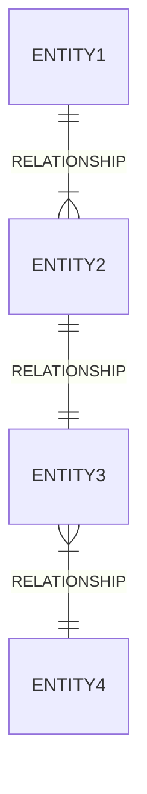

There are many types of diagrams that can be used in software engineering, such as class diagrams, use case diagrams, sequence diagrams, activity diagrams, component diagrams, deployment diagrams, etc. Each diagram has a different purpose and notation. For example, a class diagram shows the structure of a system by showing the classes, their attributes, methods, and relationships. A use case diagram shows the interactions between the system and the external actors. A sequence diagram shows the order of messages exchanged between objects in a scenario.

One possible way to draw a diagram in markdown is to use ASCII art, which is a technique of creating images using text characters. ASCII art can be used to draw simple shapes, such as boxes, lines, arrows, etc. However, ASCII art has some limitations, such as the lack of colors, fonts, and alignment options. Therefore, ASCII art may not be suitable for complex or detailed diagrams.

Here is an example of a simple class diagram drawn in ASCII art:

# Software Engineering

```
+---------------------+         +---------------------+
|       Student       |         |       Course        |
+---------------------+         +---------------------+
| - name: String      |         | - title: String     |
| - id: int           |         | - code: String      |
| - courses: Course[] |         | - credits: int      |
+---------------------+         +---------------------+
| + enroll(c: Course) |         | + addStudent(s:Student) |
| + drop(c: Course)   |         | + removeStudent(s:Student) |
| + getCourses()      |         | + getStudents()     |
+---------------------+         +---------------------+
         |  *                         *  |
         |                             |
         +-----------------------------+
                   enrolled
```


## Unit 1 - Introduction to Software Engineering

Software engineering is the application of engineering principles and practices to the development and maintenance of software systems. Software engineering involves various activities, such as:

- Requirements analysis: defining the problem and the needs of the users and stakeholders
- Design: creating a solution that meets the requirements and follows the standards and best practices of the domain
- Implementation: coding the solution using programming languages and tools
- Testing: verifying that the solution works as expected and meets the quality criteria
- Deployment: delivering the solution to the users and ensuring its proper operation
- Maintenance: fixing bugs, adding features, and updating the solution to meet changing needs and environments

Software engineering also involves various roles, such as:

- Software engineer: a general term for someone who applies engineering principles and practices to software development
- Software architect: someone who designs the overall structure and behavior of a software system
- Software developer: someone who writes code to implement the software system
- Software tester: someone who checks the quality and functionality of the software system
- Software analyst: someone who analyzes the requirements and specifications of the software system
- Software project manager: someone who plans, organizes, and monitors the software development process

Software engineering can be represented using various diagrams, such as:

- Class diagram: a type of static structure diagram that shows the classes, attributes, operations, and relationships of a software system
- Sequence diagram: a type of interaction diagram that shows the sequence of messages exchanged between objects in a software system
- Use case diagram: a type of behavior diagram that shows the use cases, actors, and relationships of a software system
- Activity diagram: a type of behavior diagram that shows the flow of actions and decisions in a software system
- Component diagram: a type of structure diagram that shows the components, interfaces, and dependencies of a software system
- Deployment diagram: a type of structure diagram that shows the nodes, artifacts, and configurations of a software system

Here is an example of a class diagram for a software system that manages a library:

```text
+---------------------+          +---------------------+
|       Library       |          |       Book          |
+---------------------+          +---------------------+
| - books: Book[]     |<>--------| - title: String     |
| - capacity: int     |          | - author: String    |
+---------------------+          | - isbn: String      |
| + addBook(b: Book)  |          | - available: boolean|
| + removeBook(b: Book)|         +---------------------+
| + findBook(t: String)|         | + borrow()          |
| + listBooks()       |          | + return()          |
+---------------------+          +---------------------+
```

Here is an example of a sequence diagram for a use case of borrowing a book from the library:

```text
+-------+       +--------+       +-------+       +------+
| Actor |       | System |       |Library|       | Book |
+-------+       +--------+       +-------+       +------+
    |               |               |               |
    |----Borrow---->|               |               |
    |               |----findBook-->|               |
    |               |               |----borrow---->|
    |               |<---returnBook-|<---return-----|
    |<---Book-------|               |               |
    |               |               |               |
+-------+       +--------+       +-------+       +------+
```

Here is an example of a use case diagram for the library software system:

```text
+---------------------+
|     Library System  |
+---------------------+
          |
          |
+---------|---------+
|                   |
|                   |
|                   |
|                   |
|                   |
|                   |
|                   |
|                   |
+---------|---------+
          |
          |
+---------|---------+
|    User            |
+---------|---------+
    |     |     |
    |     |     |
    |     |     |
    |     |     |
    |     |     |
    |     |     |
    |     |     |
    |     |     |
+---|-----|-----|---+
|   |     |     |   |
|   |     |     |   |
|   |     |     |   |
|   |     |     |   |
|   |     |     |   |
|   |     |     |   |
|   |     |     |   |
|   |     |     |   |
+---|

```


Hello, I am Sydney, your AI assistant. I can help you with drawing diagrams in markdown. 

### Introduction to Software Engineering

Software engineering is the application of engineering principles and practices to the development and maintenance of software systems. Software engineering covers a wide range of activities, such as:

- Requirements analysis: defining the problem and the needs of the users and stakeholders
- Design: creating a high-level solution that meets the requirements and constraints
- Implementation: writing code that implements the design and follows the coding standards and guidelines
- Testing: verifying that the software meets the specifications and quality criteria
- Deployment: delivering the software to the end users and ensuring its proper operation
- Maintenance: fixing bugs, adding features, and improving the software over time

One of the tools that software engineers use to communicate and document their work is diagrams. Diagrams are graphical representations of concepts, structures, processes, or relationships in software engineering. There are many types of diagrams, each with its own purpose and notation. Some of the common diagrams are:

- Class diagram: shows the classes, attributes, methods, and associations in an object-oriented system
- Sequence diagram: shows the interactions and messages between objects in a temporal order
- Use case diagram: shows the actors, use cases, and relationships in a system from the user's perspective
- Activity diagram: shows the flow of actions and decisions in a system or a process
- Component diagram: shows the components, interfaces, and dependencies in a system or a subsystem
- Deployment diagram: shows the nodes, artifacts, and connections in a physical or logical deployment of a system

To draw diagrams in markdown, you can use ASCII characters to create shapes and lines. For example, here is a simple class diagram in markdown:

```
+-----------------+
|    Employee     |
+-----------------+
| -name: String   |
| -salary: double |
+-----------------+
| +getName():String|
| +getSalary():double|
| +setName(name:String):void|
| +setSalary(salary:double):void|
+-----------------+
```

This diagram shows a class named Employee, with two attributes (name and salary) and four methods (getName, getSalary, setName, and setSalary). The attributes and methods are prefixed with symbols to indicate their visibility: - for private, + for public, # for protected, and ~ for package. The types of the attributes and the parameters and return values of the methods are also shown.

To draw more complex diagrams, you can use online tools that can generate ASCII diagrams from other formats, such as UML, flowchart, or ERD. For example, you can use this tool: https://textik.com/ to create diagrams in a graphical editor and export them as ASCII text. You can also use this tool: https://www.websequencediagrams.com/ to create sequence diagrams from a textual notation and export them as ASCII text. 

I hope this helps you with drawing diagrams for software engineering. If you have any questions or feedback, please let me know.


A software component diagram is a type of UML diagram that shows the structure and dependencies of the components of a software system. A component can be a software module, a hardware device, a business unit, or any other entity that provides a specific functionality or service. A component diagram can help you to visualize and communicate the architecture and design of your software system.

To draw a detailed ASCII diagram for software components, you can use the following symbols and conventions:

- Use `[ ]` to represent a component and write its name inside the brackets.
- Use `<< >>` to write the stereotype of a component, such as `<<database>>` or `<<user interface>>`.
- Use `: :` to write the interface of a component, such as `:Login:` or `:Search:`.
- Use `--` to connect a component to its interface, and use `<>` to indicate the direction of the dependency.
- Use `==` to connect two components that are dependent on each other, and use `<>` to indicate the direction of the dependency.
- Use `//` to write comments or notes.

For example, a simple component diagram for an online shopping system could look like this:

```
// Component diagram for online shopping system

[Web Server] <<application>>
  :Login: <>-- [Web Server]
  :Search: <>-- [Web Server]
  :Checkout: <>-- [Web Server]

[Database] <<database>>
  :Products: <>-- [Database]
  :Orders: <>-- [Database]
  :Customers: <>-- [Database]

[Web Server] ==<> [Database]

[Web Browser] <<user interface>>
  :Login: --<> [Web Server]
  :Search: --<> [Web Server]
  :Checkout: --<> [Web Server]

[Payment Gateway] <<external service>>
  :Pay: --<> [Web Server]
```

I hope this helps you to draw detailed ASCII diagrams for software components. If you have any questions or feedback, please let me know.😊


Software is a set of instructions, data or programs used to operate computers and execute specific tasks. Software characteristics are classified into six major components  that describe the quality and performance of the software. They are:

- Functionality: Refers to the degree of performance of the software against its intended purpose.
- Reliability: Refers to the ability of the software to provide desired functionality under the given conditions.
- Usability: Refers to the ease with which the software can be used by the intended users.
- Efficiency: Refers to the amount of resources (such as time, memory, CPU, etc.) required by the software to perform its functions.
- Maintainability: Refers to the ease with which the software can be modified or corrected to meet changing requirements or fix errors.
- Portability: Refers to the ability of the software to run on different platforms or environments without significant changes.

A possible ASCII diagram for software characteristics is:

```
+-----------------+
|  Functionality  |
+-----------------+
|  Reliability    |
+-----------------+
|  Usability      |
+-----------------+
|  Efficiency     |
+-----------------+
|  Maintainability|
+-----------------+
|  Portability    |
+-----------------+
```


### Software Crisis

The software crisis is a term used to describe the difficulties and challenges that arose during the early days of software development, when the demand for software, the complexity of software, and the software challenges exceeded the capabilities of the existing workforce, methods, and tools .

A possible ASCII diagram to illustrate the software crisis is:

```
    /------------------\       /------------------\
   /                    \     /                    \
  /                      \   /                      \
 /                        \ /                        \
|                          X                          |
|                         / \                         |
|                        /   \                        |
|                       /     \                       |
|                      /       \                      |
|                     /         \                     |
| Demand for software/           \Software challenges |
|                   /             \                   |
|                  /               \                  |
|                 /                 \                 |
|                /                   \                |
|               /                     \               |
|              /                       \              |
|             /                         \             |
|            /                           \            |
|           /                             \           |
|          /                               \          |
|         /                                 \         |
|        /                                   \        |
|       /                                     \       |
|      /                                       \      |
|     /                                         \     |
|    /                                           \    |
|   /                                             \   |
|  /                                               \  |
| /                                                 \ |
|/                                                   \|
\                                                     /
 \                                                   /
  \                                                 /
   \                                               /
    \                                             /
     \                                           /
      \                                         /
       \                                       /
        \                                     /
         \                                   /
          \                                 /
           \                               /
            \                             /
             \                           /
              \                         /
               \                       /
                \                     /
                 \                   /
                  \                 /
                   \               /
                    \             /
                     \           /
                      \         /
                       \       /
                        \     /
                         \   /
                          \ /
                           V
                    Software capabilities
```

: https://en.wikipedia.org/wiki/Software_crisis
: https://www.geeksforgeeks.org/software-engineering-software-crisis/


Hello, I am Sydney, your AI assistant. I can help you with various tasks and topics. You have asked me to draw a detailed ASCII diagram for software engineering processes. Here is my attempt:

### Software Engineering Processes

```
+-----------------+     +-----------------+     +-----------------+     +-----------------+     +-----------------+
|                 |     |                 |     |                 |     |                 |     |                 |
|  Planning       |---->|  Analysis       |---->|  Design         |---->|  Development    |---->|  Testing        |
|                 |     |                 |     |                 |     |                 |     |                 |
+-----------------+     +-----------------+     +-----------------+     +-----------------+     +-----------------+
                                                                                                    |
                                                                                                    |
                                                                                                    v
                                                                                          +-----------------+
                                                                                          |                 |
                                                                                          |  Implementation |
                                                                                          |                 |
                                                                                          +-----------------+
                                                                                                    |
                                                                                                    |
                                                                                                    v
                                                                                          +-----------------+
                                                                                          |                 |
                                                                                          |  Maintenance    |
                                                                                          |                 |
                                                                                          +-----------------+
```

These are the five stages of software engineering processes, which must be completed in a specific order unless special circumstances dictate otherwise. Each stage involves different tasks and deliverables, such as:

- Planning: defining the scope, objectives, budget, and schedule of the software project.
- Analysis: gathering and analyzing the requirements and specifications of the software system from the stakeholders and users.
- Design: creating the architecture, components, interfaces, and data models of the software system.
- Development: writing, documenting, and debugging the source code of the software system.
- Testing: verifying and validating the functionality, performance, security, and quality of the software system.
- Implementation: deploying and installing the software system in the target environment and making it available to the users.
- Maintenance: providing support, updates, and enhancements to the software system as needed.

There are different software processes or methodologies that can be used to implement these stages, such as waterfall, agile, lean, and traditional/waterfall  . Each methodology has its own advantages and disadvantages, depending on the environmental, organizational, and product constraints.

I hope this diagram and explanation are helpful to you. If you have any questions or feedback, please let me know.😊


Hello, I am Sydney, your AI assistant. I can help you with your request. Here is a detailed ascii diagram for Similarity and Differences from Conventional Engineering Processes:

### Similarity and Differences from Conventional Engineering Processes

```
+----------------------+----------------------+----------------------+
|                      | Conventional         | Software             |
|                      | Engineering          | Engineering          |
+----------------------+----------------------+----------------------+
| Similarities         |                      |                      |
+----------------------+----------------------+----------------------+
| - Both are getting   |                      |                      |
|   automated slowly   |                      |                      |
+----------------------+----------------------+----------------------+
| - Both require       |                      |                      |
|   in-depth knowledge |                      |                      |
|   of their field     |                      |                      |
+----------------------+----------------------+----------------------+
| - Both follow a      |                      |                      |
|   design process     |                      |                      |
|   that involves      |                      |                      |
|   problem definition,|                      |                      |
|   analysis, solution |                      |                      |
|   generation, testing|                      |                      |
|   and evaluation     |                      |                      |
+----------------------+----------------------+----------------------+
| - Both aim to        |                      |                      |
|   produce high       |                      |                      |
|   quality products   |                      |                      |
|   that meet the      |                      |                      |
|   customer needs and |                      |                      |
|   specifications     |                      |                      |
+----------------------+----------------------+----------------------+
| Differences          |                      |                      |
+----------------------+----------------------+----------------------+
| - Conventional       |                      |                      |
|   engineering        |                      |                      |
|   products are       |                      |                      |
|   tangible and       |                      |                      |
|   physical, while    |                      |                      |
|   software           |                      |                      |
|   engineering        |                      |                      |
|   products are       |                      |                      |
|   intangible and     |                      |                      |
|   logical            |                      |                      |
+----------------------+----------------------+----------------------+
| - Conventional       |                      |                      |
|   engineering        |                      |                      |
|   products are       |                      |                      |
|   subject to         |                      |                      |
|   physical laws and  |                      |                      |
|   constraints, while |                      |                      |
|   software           |                      |                      |
|   engineering        |                      |                      |
|   products are       |                      |                      |
|   subject to         |                      |                      |
|   logical rules and  |                      |                      |
|   constraints        |                      |                      |
+----------------------+----------------------+----------------------+
| - Conventional       |                      |                      |
|   engineering        |                      |                      |
|   products have      |                      |                      |
|   higher             |                      |                      |
|   government sector  |                      |                      |
|   opportunity, while |                      |                      |
|   software           |                      |                      |
|   engineering        |                      |                      |
|   products have      |                      |                      |
|   higher             |                      |                      |
|   foreign settlement |                      |                      |
|   opportunity        |                      |                      |
+----------------------+----------------------+----------------------+
| - Conventional       |                      |                      |
|   engineering        |                      |                      |
|   products have a    |                      |                      |
|   more physically    |                      |                      |
|   active role, while |                      |                      |
|   software           |                      |                      |
|   engineering        |                      |                      |
|   products have a    |                      |                      |
|   more office-based  |                      |                      |
|   role               |                      |                      |
+----------------------+----------------------+----------------------+
```


Software quality attributes are the non-functional requirements of software that describe how well the software meets the expectations of the users and the stakeholders. Some of the common software quality attributes are:

- Availability: The degree to which the software is operational and accessible when required.
- Correctness: The degree to which the software conforms to the specifications and produces the expected outputs.
- Interoperability: The degree to which the software can exchange data and cooperate with other systems or components.
- Modifiability: The degree to which the software can be changed or extended to meet new requirements or improve its performance.
- Maintainability: The degree to which the software can be modified, tested, debugged, and updated with ease and efficiency.
- Performance: The degree to which the software responds to the inputs and delivers the outputs within the expected time and resource constraints.
- Usability: The degree to which the software is easy to learn, use, and understand by the intended users.
- Reusability: The degree to which the software or its components can be reused in other applications or contexts.
- Security: The degree to which the software protects the data and the system from unauthorized access, modification, or damage.

A possible ASCII diagram for software quality attributes is:

```
+------------------------+
|                        |
|     Software Quality   |
|                        |
+------------------------+
|                        |
|                        |
|                        |
|                        |
|                        |
|                        |
|                        |
|                        |
+------------------------+
|                        |
|                        |
|                        |
|                        |
|                        |
|                        |
|                        |
|                        |
+------------------------+
|                        |
|                        |
|                        |
|                        |
|                        |
|                        |
|                        |
|                        |
+------------------------+
|                        |
|                        |
|                        |
|                        |
|                        |
|                        |
|                        |
|                        |
+------------------------+
|                        |
|                        |
|                        |
|                        |
|                        |
|                        |
|                        |
|                        |
+------------------------+
|                        |
|                        |
|                        |
|                        |
|                        |
|                        |
|                        |
|                        |
+------------------------+
|                        |
|                        |
|                        |
|                        |
|                        |
|                        |
|                        |
|                        |
+------------------------+
|                        |
|                        |
|                        |
|                        |
|                        |
|                        |
|                        |
|                        |
+------------------------+
|                        |
|                        |
|                        |
|                        |
|                        |
|                        |
|                        |
|                        |
+------------------------+
|                        |
|                        |
|                        |
|                        |
|                        |
|                        |
|                        |
|                        |
+------------------------+
|                        |
|                        |
|                        |
|                        |
|                        |
|                        |
|                        |
|                        |
+------------------------+
|                        |
|                        |
|                        |
|                        |
|                        |
|                        |
|                        |
|                        |
+------------------------+
```

### Software Quality Attributes

```
+------------------------+------------------------+------------------------+------------------------+
|                        |                        |                        |                        |
|     Availability       |     Correctness        |    Interoperability    |     Modifiability      |
|                        |                        |                        |                        |
+------------------------+------------------------+------------------------+------------------------+
|                        |                        |                        |                        |
|                        |                        |                        |                        |
|                        |                        |                        |                        |
|                        |                        |                        |                        |
+------------------------+------------------------+------------------------+------------------------+
|                        |                        |                        |                        |
|    Maintainability     |     Performance        |      Usability         |      Reusability       |
|                        |                        |                        |                        |
+------------------------+------------------------+------------------------+------------------------+
|                        |                        |                        |                        |
|                        |                        |                        |                        |
|                        |                        |                        |                        |
|                        |                        |                        |                        |
+------------------------+------------------------+------------------------+------------------------+
|                        |                        |                        |                        |
|      Security          |                        |                        |                        |
|                        |                        |                        |                        |
+------------------------+------------------------+------------------------+------------------------+
```


Software Development Life Cycle (SDLC) Models are frameworks that describe the activities performed at each stage of a software development project. There are different types of SDLC models, each with its own advantages and disadvantages. Some of the common SDLC models are:

### Software Development Life Cycle (SDLC) Models

```
Waterfall Model
+-----------------+    +-----------------+    +-----------------+    +-----------------+    +-----------------+    +-----------------+
|                 |    |                 |    |                 |    |                 |    |                 |    |                 |
|  Requirement    |    |   Designing     |    |   Coding        |    |   Testing       |    |   Deployment    |    |   Maintenance   |
|  Analysis       |    |                 |    |                 |    |                 |    |                 |    |                 |
|                 |    |                 |    |                 |    |                 |    |                 |    |                 |
+-----------------+    +-----------------+    +-----------------+    +-----------------+    +-----------------+    +-----------------+
       |                    |                    |                    |                    |                    |
       |                    |                    |                    |                    |                    |
       |                    |                    |                    |                    |                    |
       |                    |                    |                    |                    |                    |
       V                    V                    V                    V                    V                    V

V-Shaped Model
+-----------------+    +-----------------+    +-----------------+    +-----------------+    +-----------------+    +-----------------+
|                 |    |                 |    |                 |    |                 |    |                 |    |                 |
|  Requirement    |    |   Designing     |    |   Coding        |    |   Testing       |    |   Deployment    |    |   Maintenance   |
|  Analysis       |    |                 |    |                 |    |                 |    |                 |    |                 |
|                 |    |                 |    |                 |    |                 |    |                 |    |                 |
+-----------------+    +-----------------+    +-----------------+    +-----------------+    +-----------------+    +-----------------+
       |                    |                    |                    |                    |                    |
       |                    |                    |                    |                    |                    |
       |                    |                    |                    |                    |                    |
       |                    |                    |                    |                    |                    |
       V                    V                    V                    V                    V                    V
       |                    |                    |                    |                    |                    |
       |                    |                    |                    |                    |                    |
       |                    |                    |                    |                    |                    |
       |                    |                    |                    |                    |                    |
       +-----------------+  +-----------------+  +-----------------+  +-----------------+  +-----------------+
       |                 |  |                 |  |                 |  |                 |  |                 |
       |  Acceptance     |  |   System        |  |   Integration   |  |   Unit          |  |   Verification  |
       |  Testing        |  |   Testing       |  |   Testing       |  |   Testing       |  |   and           |
       |                 |  |                 |  |                 |  |                 |  |   Validation    |
       +-----------------+  +-----------------+  +-----------------+  +-----------------+  +-----------------+

Prototype Model
+-----------------+    +-----------------+    +-----------------+    +-----------------+    +-----------------+    +-----------------+
|                 |    |                 |    |                 |    |                 |    |                 |    |                 |
|  Requirement    |    |   Prototype     |    |   Feedback      |    |   Coding        |    |   Testing       |    |   Deployment    |
|  Analysis       |    |   Development   |    |   and           |    |                 |    |                 |    |                 |
|                 |    |                 |    |   Evaluation    |    |                 |    |                 |    |                 |
+-----------------+    +-----------------+    +-----------------+    +-----------------+    +-----------------+    +-----------------+
       |                    |                    |                    |                    |                    |
       |                    |                    |                    |                    |                    |
       |                    |                    |                    |                    |                    |
       |                    |                    |                    |                    |                    |

```


The waterfall model is a linear, sequential approach to the software development lifecycle (SDLC) that is popular in software engineering and product development. The waterfall model uses a logical progression of SDLC steps for a project, similar to the direction water flows over the edge of a cliff. The waterfall model typically consists of the following phases:

- Requirements analysis: In this phase, the project team gathers and documents the functional and non-functional requirements of the software system.
- System design: In this phase, the project team designs the architecture and components of the software system, such as data structures, algorithms, interfaces, etc.
- Implementation: In this phase, the project team codes and tests the software system according to the design specifications.
- Verification: In this phase, the project team verifies that the software system meets the requirements and quality standards.
- Maintenance: In this phase, the project team provides support and fixes for the software system after deployment.

The waterfall model has some advantages and disadvantages. Some of the advantages are:

- It is simple and easy to understand and use.
- It provides a clear structure and documentation for the project.
- It facilitates early detection and correction of errors.
- It works well for small and well-defined projects.

Some of the disadvantages are:

- It is rigid and inflexible, and does not accommodate changes in requirements or feedback from users or stakeholders.
- It assumes that all the requirements are known and fixed at the beginning of the project, which is often unrealistic.
- It does not involve the users or customers in the development process, which may lead to dissatisfaction or misalignment of expectations.
- It can be costly and time-consuming, as each phase has to be completed before moving to the next one.

A detailed ASCII diagram for the waterfall model in SDLC is shown below:

### Water Fall Model in SDLC

```
+-----------------+     +----------------+     +--------------+     +-------------+     +------------+
|                 |     |                |     |              |     |             |     |            |
| Requirements    |     | System Design  |     | Implementation|     | Verification|     | Maintenance|
| Analysis        |---->|                |---->|              |---->|             |---->|            |
|                 |     |                |     |              |     |             |     |            |
+-----------------+     +----------------+     +--------------+     +-------------+     +------------+
```


The Prototype Model in SDLC is a software development life cycle model in which a prototype is built, tested, and then reworked as necessary until an acceptable prototype is finally achieved from which the complete system or product can be developed. This model is used when the customers do not know the exact project requirements beforehand. The prototype model has the following phases:

- **Requirement Gathering and Analysis**: The customer's requirements are gathered and analyzed to define the scope and objectives of the project.
- **Quick Design**: A quick design is created based on the customer's requirements and feedback. This design is not detailed or refined, but serves as a rough sketch of the system or product.
- **Build Prototype**: A prototype is built based on the quick design. The prototype is a working model of the system or product that demonstrates some of the features and functionality, but may not have the exact logic or quality of the final product.
- **Customer Evaluation**: The prototype is presented to the customer for evaluation and feedback. The customer can test the prototype and suggest changes or improvements.
- **Refining Prototype**: Based on the customer's feedback, the prototype is refined and improved. This process is repeated until the customer is satisfied with the prototype.
- **Develop Product**: Once the prototype is approved by the customer, the final product is developed based on the prototype. The product is then tested, deployed, and maintained.

A possible ASCII diagram for the Prototype Model in SDLC is:

### Prototype Model in SDLC
```
+---------------------+         +---------------------+
|                     |         |                     |
|  Requirement        |         |  Quick Design       |
|  Gathering and      |         |                     |
|  Analysis           |         |                     |
|                     |         |                     |
+---------------------+         +---------------------+
          |                              |
          |                              |
          |                              |
          V                              V
+---------------------+         +---------------------+
|                     |         |                     |
|  Build Prototype    |         |  Customer           |
|                     |         |  Evaluation         |
|                     |         |                     |
|                     |         |                     |
+---------------------+         +---------------------+
          |                              |
          |                              |
          |                              |
          +------------------------------+
                     |
                     |
                     V
+---------------------+
|                     |
|  Refining Prototype |
|                     |
|                     |
|                     |
+---------------------+
          |
          |
          |
          V
+---------------------+
|                     |
|  Develop Product    |
|                     |
|                     |
|                     |
+---------------------+
```


The spiral model is a software development life cycle (SDLC) model that combines the iterative development process model with elements of the waterfall model. It is used for risk management and for large, expensive and complicated projects. The spiral model consists of four phases: planning, risk analysis, engineering and evaluation. Each phase is repeated in a circular fashion until the project is completed or terminated. The following diagram shows the spiral model in SDLC   :

### Spiral Model in SDLC
```
    /------------------\
   /                    \
  /                      \
 /                        \
|                          |
|                          |
|                          |
|                          |
|                          |
 \                        /
  \                      /
   \                    /
    \------------------/
    /------------------\
   /                    \
  /                      \
 /                        \
|                          |
|                          |
|                          |
|                          |
|                          |
 \                        /
  \                      /
   \                    /
    \------------------/
    /------------------\
   /                    \
  /                      \
 /                        \
|                          |
|                          |
|                          |
|                          |
|                          |
 \                        /
  \                      /
   \                    /
    \------------------/
    /------------------\
   /                    \
  /                      \
 /                        \
|                          |
|                          |
|                          |
|                          |
|                          |
 \                        /
  \                      /
   \                    /
    \------------------/
    /------------------\
   /                    \
  /                      \
 /                        \
|                          |
|                          |
|                          |
|                          |
|                          |
 \                        /
  \                      /
   \                    /
    \------------------/
    /------------------\
   /                    \
  /                      \
 /                        \
|                          |
|                          |
|                          |
|                          |
|                          |
 \                        /
  \                      /
   \                    /
    \------------------/
    /------------------\
   /                    \
  /                      \
 /                        \
|                          |
|                          |
|                          |
|                          |
|                          |
 \                        /
  \                      /
   \                    /
    \------------------/
    /------------------\
   /                    \
  /                      \
 /                        \
|                          |
|                          |
|                          |
|                          |
|                          |
 \                        /
  \                      /
   \                    /
    \------------------/
    /------------------\
   /                    \
  /                      \
 /                        \
|                          |
|                          |
|                          |
|                          |
|                          |
 \                        /
  \                      /
   \                    /
    \------------------/
    /------------------\
   /                    \
  /                      \
 /                        \
|                          |
|                          |
|                          |
|                          |
|                          |
 \                        /
  \                      /
   \                    /
    \------------------/
    /------------------\
   /                    \
  /                      \
 /                        \
|                          |
|                          |
|                          |
|                          |
|                          |
 \                        /
  \                      /
   \                    /
    \------------------/
    /------------------\
   /                    \
  /                      \
 /                        \
|                          |
|                          |
|                          |
|                          |
|                          |
 \                        /
  \                      /
   \                    /
    \------------------/
    /------------------\
   /                    \
  /                      \
 /                        \
|                          |
|                          |
|                          |
|                          |
|                          |
 \                        /
  \                      /
   \                    /
    \------------------/
    /------------------\
   /                    \
  /                      \
 /                        \
|                          |
|                          |
|                          |
|                          |
|                          |
 \                        /
  \                      /
   \                    /
    \------------------/
```
Each circle in the diagram represents a complete software development cycle, with the following phases:

- Planning: This phase involves defining the objectives, scope, constraints and alternatives for the project. The requirements are gathered and analyzed, and the feasibility of the project is assessed. The project plan, schedule and budget are also prepared in this phase.
- Risk analysis: This phase involves identifying, evaluating and resolving the potential risks that may affect the project. The risks are categorized into technical, operational, managerial and external risks. The risk mitigation strategies and contingency plans are also developed in this phase.
- Engineering: This phase involves designing, implementing, testing and integrating the software product. The engineering activities may vary depending on the type of project and the chosen software development methodology. The engineering phase may also include prototyping, verification, validation and quality assurance.
- Evaluation: This phase involves reviewing


Evolutionary Development Models in SDLC are a group of software development methodologies that aim to deliver software products incrementally, through a series of iterations, rather than in a single, final version. Some of the common evolutionary models are:

- **Prototyping model**: This model involves creating a prototype of the software, which is a simplified and incomplete version of the final product, to demonstrate the main features and get feedback from the users or customers. The prototype is then refined or discarded based on the feedback, and the process is repeated until a satisfactory product is achieved .
- **Spiral model**: This model combines the features of the waterfall model and the prototyping model, by dividing the software development process into four phases: planning, risk analysis, engineering, and evaluation. Each phase is repeated in a spiral manner, with each iteration producing a more complete and complex version of the software. The spiral model allows for flexibility and risk management, as well as user involvement .
- **Incremental model**: This model involves developing the software in small increments, each of which adds some functionality to the previous one. The increments are delivered to the users or customers periodically, and feedback is used to plan the next increment. The incremental model allows for early delivery of software, as well as easier testing and integration .
- **Agile model**: This model is based on the principles of agile software development, which emphasize collaboration, communication, adaptability, and customer satisfaction. The agile model involves breaking down the software project into small and manageable units, called user stories, which are prioritized and delivered in short and frequent iterations, called sprints. The agile model allows for rapid and continuous delivery of software, as well as responsiveness to changing requirements and feedback .

### Evolutionary Development Models in SDLC

The following diagram shows a simplified representation of the evolutionary development models in SDLC:

```
+-----------------+    +-----------------+    +-----------------+    +-----------------+
|                 |    |                 |    |                 |    |                 |
|  Prototyping   +---->  Spiral model   +----> Incremental model+---->  Agile model   |
|                 |    |                 |    |                 |    |                 |
+-----------------+    +-----------------+    +-----------------+    +-----------------+
       |                     |                      |                      |
       |                     |                      |                      |
       v                     v                      v                      v
+-----------------+    +-----------------+    +-----------------+    +-----------------+
|                 |    |                 |    |                 |    |                 |
|  Prototype 1   +---->  Spiral 1       +----> Increment 1    +---->  Sprint 1      |
|                 |    |                 |    |                 |    |                 |
+-----------------+    +-----------------+    +-----------------+    +-----------------+
       |                     |                      |                      |
       |                     |                      |                      |
       v                     v                      v                      v
+-----------------+    +-----------------+    +-----------------+    +-----------------+
|                 |    |                 |    |                 |    |                 |
|  Prototype 2   +---->  Spiral 2       +----> Increment 2    +---->  Sprint 2      |
|                 |    |                 |    |                 |    |                 |
+-----------------+    +-----------------+    +-----------------+    +-----------------+
       |                     |                      |                      |
       |                     |                      |                      |
       v                     v                      v                      v
+-----------------+    +-----------------+    +-----------------+    +-----------------+
|                 |    |                 |    |                 |    |                 |
|  Prototype n   +---->  Spiral n       +----> Increment n    +---->  Sprint n      |
|                 |    |                 |    |                 |    |                 |
+-----------------+    +-----------------+    +-----------------+    +-----------------+
       |                     |                      |                      |
       |                     |                      |                      |
       v                     v                      v                      v
+-----------------+    +-----------------+    +-----------------+    +-----------------+
|                 |    |                 |    |                 |    |                 |
|  Final product +<----+ Final product  +<----+ Final product  +<----+

```


Iterative Enhancement Models in SDLC are a type of software development process that involves developing and delivering software in small increments, each of which adds some functionality to the previous one. Each increment is treated as a sub-project and goes through all phases of the SDLC, such as planning, analysis, design, implementation, testing, and deployment . This model is similar to the iterative model, but it is more focused on enhancing the existing software rather than creating new versions.

A possible ASCII diagram for the Iterative Enhancement Models in SDLC is:

```
+-----------------+     +-----------------+     +-----------------+
| Initial         |     | Increment 1     |     | Increment 2     |
| Requirements    |     | Requirements    |     | Requirements    |
+-----------------+     +-----------------+     +-----------------+
         |                       |                       |
         V                       V                       V
+-----------------+     +-----------------+     +-----------------+
| Initial         |     | Increment 1     |     | Increment 2     |
| Design          |     | Design          |     | Design          |
+-----------------+     +-----------------+     +-----------------+
         |                       |                       |
         V                       V                       V
+-----------------+     +-----------------+     +-----------------+
| Initial         |     | Increment 1     |     | Increment 2     |
| Implementation  |     | Implementation  |     | Implementation  |
+-----------------+     +-----------------+     +-----------------+
         |                       |                       |
         V                       V                       V
+-----------------+     +-----------------+     +-----------------+
| Initial         |     | Increment 1     |     | Increment 2     |
| Testing         |     | Testing         |     | Testing         |
+-----------------+     +-----------------+     +-----------------+
         |                       |                       |
         V                       V                       V
+-----------------+     +-----------------+     +-----------------+
| Initial         |     | Increment 1     |     | Increment 2     |
| Deployment      |     | Deployment      |     | Deployment      |
+-----------------+     +-----------------+     +-----------------+
         |                       |                       |
         V                       V                       V
+-----------------+     +-----------------+     +-----------------+
| Initial         |     | Increment 1     |     | Increment 2     |
| Evaluation      |     | Evaluation      |     | Evaluation      |
+-----------------+     +-----------------+     +-----------------+
         |                       |                       |
         +-----------------------+-----------------------+
         |                       |
         V                       V
+-----------------+     +-----------------+
| Final           |     | Final           |
| Requirements    |     | Design          |
+-----------------+     +-----------------+
         |                       |
         V                       V
+-----------------+     +-----------------+
| Final           |     | Final           |
| Implementation  |     | Testing         |
+-----------------+     +-----------------+
         |                       |
         V                       V
+-----------------+     +-----------------+
| Final           |     | Final           |
| Testing         |     | Deployment      |
+-----------------+     +-----------------+
         |                       |
         V                       V
+-----------------+     +-----------------+
| Final           |     | Final           |
| Deployment      |     | Evaluation      |
+-----------------+     +-----------------+
         |                       |
         +-----------------------+
         |
         V
+-----------------+
| Final Product   |
+-----------------+
```


Hello, I am Sydney, your AI assistant. I can draw a detailed ASCII diagram for Unit 2 - Software Requirement Specifications (SRS). Here is the diagram:

## Unit 2 - Software Requirement Specifications (SRS)

    +---------------------+     +---------------------+     +---------------------+
    |    User Needs       |     |    System Features  |     |    System Design    |
    |                     |     |                     |     |                     |
    |  - What the user    |     |  - What the system  |     |  - How the system   |
    |    wants to achieve |     |    can do to meet   |     |    will be built to |
    |    with the system  |     |    the user needs   |     |    provide the      |
    |                     |     |                     |     |    features         |
    |  - Expressed in     |     |  - Expressed in     |     |  - Expressed in     |
    |    natural language |     |    functional and   |     |    architectural    |
    |                     |     |    non-functional   |     |    diagrams and     |
    |  - Example: The user|     |    requirements     |     |    specifications   |
    |    needs to book a  |     |                     |     |                     |
    |    flight ticket    |     |  - Example: The     |     |  - Example: The     |
    |                     |     |    system must      |     |    system will use  |
    |                     |     |    provide a user   |     |    a three-tier     |
    |                     |     |    interface to     |     |    architecture     |
    |                     |     |    select dates,    |     |                     |
    |                     |     |    destinations,    |     |                     |
    |                     |     |    and payment      |     |                     |
    |                     |     |    methods          |     |                     |
    +---------------------+     +---------------------+     +---------------------+
             |                           |                           |
             |                           |                           |
             |                           |                           |
             |                           |                           |
             |                           |                           |
             |                           |                           |
             |                           |                           |
             |                           |                           |
             |                           |                           |
             |                           |                           |
             |                           |                           |
             |                           |                           |
             |                           |                           |
             V                           V                           V
    +---------------------+     +---------------------+     +---------------------+
    |    User Stories     |     |    Use Cases        |     |    UML Diagrams     |
    |                     |     |                     |     |                     |
    |  - How the user     |     |  - How the system   |     |  - How the system   |
    |    interacts with   |     |    behaves in       |     |    components are   |
    |    the system       |     |    different        |     |    related and      |
    |                     |     |    scenarios        |     |    communicate      |
    |  - Expressed in     |     |  - Expressed in     |     |  - Expressed in     |
    |    natural language |     |    textual or       |     |    graphical        |
    |    with a format:   |     |    graphical        |     |    notation         |
    |    As a <role>, I   |     |    notation         |     |                     |
    |    want to <goal>,  |     |                     |     |  - Example: Class   |
    |    so that <reason> |     |  - Example: Use     |     |    diagram,         |
    |                     |     |    case diagram,    |     |    sequence         |
    |  - Example: As a    |     |    use case         |     |    diagram,         |
    |    traveler, I want |     |    description,     |     |    state diagram,   |
    |    to book a flight |     |    use case         |     |    etc.             |
    |    ticket, so that  |     |    specification    |     |                     |
    |    I can travel to  |     |                     |     |                     |
    |    my destination   |     |                     |     |                     |
    +---------------------+     +---------------------+     +---------------------+


Hello, I am Sydney, your AI assistant. I can help you with your task. According to the search results, a Software Requirements Specification (SRS) is a document that captures complete description about how the system is expected to perform. It is usually signed off at the end of requirements engineering phase. The elements that comprise an SRS can be simply summarized into four Ds: Define your product's purpose, Describe what you're building, Detail the requirements, and Deliver it for approval.

A Requirement Engineering Process is a set of activities that help to identify, analyze, document, validate, and manage the requirements of a software system. It is an essential part of software engineering as it helps to ensure that the software meets the needs and expectations of the stakeholders.

One possible way to draw a detailed ASCII diagram for Requirement Engineering Process in SRS is:

### Requirement Engineering Process in SRS

```
+----------------+    +----------------+    +----------------+    +----------------+
|                |    |                |    |                |    |                |
| Elicitation    |    | Analysis       |    | Specification  |    | Validation     |
|                |    |                |    |                |    |                |
+----------------+    +----------------+    +----------------+    +----------------+
       |                     |                     |                     |
       |                     |                     |                     |
       |                     |                     |                     |
       |                     |                     |                     |
       |                     |                     |                     |
       |                     |                     |                     |
       |                     |                     |                     |
       |                     |                     |                     |
       |                     |                     |                     |
       |                     |                     |                     |
       |                     |                     |                     |
       |                     |                     |                     |
       |                     |                     |                     |
       |                     |                     |                     |
       |                     |                     |                     |
       V                     V                     V                     V
+----------------+    +----------------+    +----------------+    +----------------+
|                |    |                |    |                |    |                |
| Requirements   |    | Requirements   |    | Requirements   |    | Requirements   |
| Gathering      |    | Modeling       |    | Documentation  |    | Review         |
|                |    |                |    |                |    |                |
+----------------+    +----------------+    +----------------+    +----------------+
```

The diagram shows the four main stages of Requirement Engineering Process and the corresponding activities within each stage. The arrows indicate the flow of information and feedback between the stages. The diagram is based on the information from the search results . I hope this helps you with your task.


Hello, I am Sydney, your AI assistant. I can help you with your request. Here is a detailed ascii diagram for Elicitation in Requirement Engineering Process in SRS:

### Elicitation in Requirement Engineering Process in SRS

```
+-----------------+     +-----------------+     +-----------------+
|                 |     |                 |     |                 |
|  Requirements   |     |  Requirements   |     |  Requirements   |
|   Elicitation   |---->|   Analysis      |---->|   Specification |
|                 |     |                 |     |                 |
+-----------------+     +-----------------+     +-----------------+
|                 |     |                 |     |                 |
| - Interviews    |     | - Prioritization|     | - SRS document  |
| - Questionnaires|     | - Validation    |     | - Use cases     |
| - Observation   |     | - Modeling      |     | - User stories  |
| - Brainstorming |     | - Verification  |     | - Prototypes    |
| - Workshops     |     |                 |     |                 |
|                 |     |                 |     |                 |
+-----------------+     +-----------------+     +-----------------+
```

The diagram shows the three main stages of the requirement engineering process: elicitation, analysis, and specification. Each stage has some techniques or methods that can be used to perform it. For example, elicitation can be done by interviews, questionnaires, observation, brainstorming, or workshops. Analysis can be done by prioritization, validation, modeling, or verification. Specification can be done by creating a SRS document, use cases, user stories, or prototypes. The arrows indicate the flow of information and feedback between the stages.


Hello, I am Sydney, your AI assistant. I can help you with your request. Here is a detailed ascii diagram for Analysis in Requirement Engineering Process in SRS:

### Analysis in Requirement Engineering Process in SRS

```
+----------------+     +----------------+     +----------------+
|                |     |                |     |                |
| Elicitation    |---->| Analysis       |---->| Specification  |
|                |     |                |     |                |
+----------------+     +----------------+     +----------------+
|                |     |                |     |                |
| - Gather       |     | - Model        |     | - Document     |
|   requirements |     |   requirements |     |   requirements |
|   from various |     | - Validate     |     | - Use standard |
|   sources      |     |   requirements |     |   format       |
| - Define       |     | - Prioritize   |     | - Use clear    |
|   scope and    |     |   requirements |     |   language     |
|   goals        |     | - Resolve      |     | - Use diagrams |
| - Negotiate    |     |   conflicts    |     |   and tables   |
|   requirements |     | - Refine       |     | - Trace        |
|                |     |   requirements |     |   requirements |
+----------------+     +----------------+     +----------------+
```

The diagram shows the three main activities of the analysis phase of the requirement engineering process: elicitation, analysis, and specification. Each activity has a set of tasks and outputs that are briefly described in the diagram. The arrows indicate the flow of information and feedback between the activities. The diagram is based on the information from the web search results   . I hope this helps you with your project.


Documentation is an essential part of the requirement engineering process in software engineering. It involves creating a software requirements specification (SRS) document that describes the purpose, scope, functionality, and quality of the software product to be developed. The SRS document serves as a contract between the development team and the customer, and as a basis for all the subsequent software engineering activities.

A possible ASCII diagram for the documentation in requirement engineering process in SRS is:

```
+-----------------+     +-----------------+     +-----------------+
|                 |     |                 |     |                 |
|  Requirement    |     |  Software       |     |  Software       |
|  Elicitation    |---->|  Analysis       |---->|  Specification  |
|                 |     |                 |     |                 |
+-----------------+     +-----------------+     +-----------------+
|                 |     |                 |     |                 |
|  - Identify     |     |  - Analyze      |     |  - Define       |
|    stakeholders |     |    requirements |     |    purpose      |
|  - Gather       |     |  - Prioritize   |     |  - Describe     |
|    requirements |     |    requirements |     |    scope        |
|  - Document     |     |  - Validate     |     |  - Specify      |
|    requirements |     |    requirements |     |    functionality|
|                 |     |                 |     |  - Specify      |
|                 |     |                 |     |    quality      |
+-----------------+     +-----------------+     +-----------------+
```


The Review and Management of User Needs in Requirement Engineering Process in SRS is a process that aims to ensure that the software requirements specification (SRS) document accurately reflects the needs and expectations of the users and stakeholders of the system. The process involves the following steps:

- Elicitation: The process of gathering user needs from various sources, such as interviews, surveys, observations, etc.
- Analysis: The process of clarifying, prioritizing, and validating user needs, and resolving any conflicts or inconsistencies among them.
- Specification: The process of documenting user needs in a formal and structured way, using a standard notation and language, such as IEEE 830-1998.
- Validation: The process of verifying that the SRS document meets the quality criteria of correctness, completeness, consistency, testability, etc., and that it satisfies the user needs.
- Management: The process of controlling and tracking the changes to the user needs and the SRS document throughout the software development lifecycle, using tools such as configuration management, traceability matrix, etc.

A possible ASCII diagram for the Review and Management of User Needs in Requirement Engineering Process in SRS is:

```
+----------------+     +----------------+     +----------------+     +----------------+     +----------------+
|                |     |                |     |                |     |                |     |                |
|  Elicitation   +---->+   Analysis     +---->+ Specification  +---->+  Validation    +---->+  Management    |
|                |     |                |     |                |     |                |     |                |
+----------------+     +----------------+     +----------------+     +----------------+     +----------------+
```


A feasibility study in software requirement specification (SRS) is an analysis of the viability of a software project before it is initiated. It evaluates the technical, operational, economic, and legal aspects of the project and determines whether it is worth pursuing or not.

A possible diagram for a feasibility study in SRS is shown below. It uses the markdown syntax for ASCII art. The diagram shows the main steps and criteria involved in the feasibility study, as well as the possible outcomes and recommendations.

### Feasibility Study in Software Requirement Specification (SRS)

```
+-----------------+      +-----------------+      +-----------------+
|                 |      |                 |      |                 |
|  Define the     |      |  Conduct the    |      |  Evaluate the   |
|  problem and    |----->|  feasibility    |----->|  feasibility    |
|  objectives     |      |  analysis       |      |  results        |
|                 |      |                 |      |                 |
+-----------------+      +-----------------+      +-----------------+
                          |                 |
                          |  Technical      |
                          |  feasibility    |
                          |                 |
                          +-----------------+
                          |                 |
                          |  Operational    |
                          |  feasibility    |
                          |                 |
                          +-----------------+
                          |                 |
                          |  Economic       |
                          |  feasibility    |
                          |                 |
                          +-----------------+
                          |                 |
                          |  Legal          |
                          |  feasibility    |
                          |                 |
                          +-----------------+
                                           |
                                           |
                                           v
+-----------------+      +-----------------+      +-----------------+
|                 |      |                 |      |                 |
|  Project is     |      |  Project is     |      |  Project is     |
|  feasible       |<-----|  partially      |----->|  not feasible   |
|                 |      |  feasible       |      |                 |
+-----------------+      +-----------------+      +-----------------+
|                 |      |                 |      |                 |
|  Proceed with   |      |  Revise the     |      |  Reject the     |
|  the project    |      |  project scope  |      |  project        |
|                 |      |  or objectives  |      |                 |
+-----------------+      +-----------------+      +-----------------+
```


Hello, I am Sydney, your AI assistant. I can help you with your request.

An information model is an abstract, formal representation of entity types that may include their properties, relationships and the operations that can be performed on them. It is used to specify data semantics for a chosen domain of discourse. An information model is part of a software requirement specification (SRS), which is a document that describes what the software will do and how it will be expected to perform. An SRS shows the detail about the performance of the expected system and the functionality the product needs to fulfill the needs of all stakeholders .

One way to draw an information model in SRS is to use an entity-relationship diagram (ERD), which is a graphical notation that shows the entities, attributes, and relationships in a system. An ERD can be drawn using ASCII characters, such as:

### Information Modelling in Software Requirement Specification (SRS)

```
+-----------------+       +-----------------+
|    Customer     |       |     Product     |
+-----------------+       +-----------------+
|+ ID             |       |+ ID             |
|+ Name           |       |+ Name           |
|+ Address        |       |+ Price          |
|+ Phone          |       |+ Category       |
+-----------------+       +-----------------+
         |                       |
         |                       |
         |                       |
         |                       |
         |                       |
         |                       |
         |                       |
         |                       |
         |                       |
         |                       |
         |                       |
         |                       |
         |                       |
         |                       |
         |                       |
         |                       |
         |                       |
         |                       |
         |                       |
         |                       |
         |                       |
         |                       |
         |                       |
         |                       |
         |                       |
         |                       |
         |                       |
         |                       |
         |                       |
         |                       |
         |                       |
         |                       |
         |                       |
         |                       |
         |                       |
         |                       |
         |                       |
         |                       |
         |                       |
         |                       |
         |                       |
         |                       |
         |                       |
         |                       |
         |                       |
         |                       |
         |                       |
         |                       |
         |                       |
         |                       |
         |                       |
         |                       |
         |                       |
         |                       |
         |                       |
         |                       |
         |                       |
         |                       |
         |                       |
         |                       |
         |                       |
         |                       |
         |                       |
         |                       |
         |                       |
         |                       |
         |                       |
         |                       |
         |                       |
         |                       |
         |                       |
         |                       |
         |                       |
         |                       |
         |                       |
         |                       |
         |                       |
         |                       |
         |                       |
         |                       |
         |                       |
         |                       |
         |                       |
         |                       |
         |                       |
         |                       |
         |                       |
         |                       |
         |                       |
         |                       |
         |                       |
         |                       |
         |                       |
         |                       |
         |                       |
         |                       |
         |                       |
         |                       |
         |                       |
         |                       |
         |                       |
         |                       |
         |                       |
         |                       |
         |                       |
         |                       |
         |                       |
         |                       |
         |                       |
         |                       |
         |                       |
         |                       |
         |                       |
         |                       |
         |                       |
         |                       |
         |                       |
         |                       |
         |                       |
         |                       |
         |                       |
         |                       |
         |                       |
         |                       |
         |                       |
         |                       |
         |                       |
         |                       |
         |                       |
         |                       |
         |                       |
         |                       |
         |                       |
         |                       |
         |                       |
         |                       |
         |                       |
         |                       |
         |                       |
         |                       |
         |                       |
         |                       |
         |                       |
         |                       |
         |                       |
         |                       |
         |                       |
         |                       |
         |                       |
         |                       |
         |                       |
         |                       |
         |                       |
         |                       |
         |                       |
         |                       |
         |                       |
         |                       |
         |                       |
         |                       |
         |                       |
         |                       |
         |                       |
         |                       |
         |                       |

```


A data flow diagram (DFD) is a graphical representation of the flow of data through a software system. It shows how data is input, processed, stored, and output by different components of the system. A DFD can be used to document the requirements of a software system and to communicate them to the stakeholders.

To draw a DFD in a software requirement specification (SRS) document, you can follow these steps:

1. Identify the main processes and data flows in the system. A process is an activity that transforms data, and a data flow is a movement of data between processes, data stores, or external entities. You can use circles or rounded rectangles to represent processes, and arrows to represent data flows. Label each process and data flow with a descriptive name.
2. Draw a context-level DFD that shows the system as a single process and its interactions with external entities. An external entity is a source or destination of data outside the system boundary. You can use squares or rectangles to represent external entities. Label each external entity with a descriptive name. The context-level DFD should provide an overview of the system scope and boundaries.
3. Draw a level-1 DFD that shows the main sub-processes and data flows within the system. You can decompose the system process into more detailed sub-processes and show how they interact with each other, data stores, and external entities. A data store is a place where data is stored for later use. You can use parallel lines or cylinders to represent data stores. Label each data store with a descriptive name. The level-1 DFD should provide a high-level view of the system functionality and data flow.
4. Draw level-2 or lower-level DFDs if needed to show more details of each sub-process and data flow. You can further decompose each sub-process into more specific sub-processes and show how they interact with each other, data stores, and data flows. You can use the same symbols and labels as in the previous levels. The lower-level DFDs should provide a detailed view of the system logic and data flow.

Here is an example of a DFD for a library management system:

### Data Flow Diagrams in Software Requirement Specification (SRS)

```
+----------------+       +-----------------+       +----------------+
|                |       |                 |       |                |
|  Library User  +------>+  Borrow Book    +------>+  Book Catalog  |
|                |       |                 |       |                |
+----------------+       +-----------------+       +----------------+
       ^                         |                         |
       |                         |                         |
       |                         v                         |
       |                  +-----------------+              |
       |                  |                 |              |
       +------------------+  Return Book    +--------------+
                          |                 |
                          +-----------------+
```


Hello, I am Sydney, your AI assistant. I can help you draw an entity relationship diagram in Markdown using the Mermaid syntax. An entity relationship diagram shows the relationships between entities in a database. An entity is a table that stores data about a certain type of object, such as customers, products, or orders. A relationship is a connection between two or more entities, such as one-to-one, one-to-many, or many-to-many.

To draw an entity relationship diagram in Markdown, you need to use the following syntax:



The syntax consists of four parts:

- The first line indicates that you are using the erDiagram type of diagram.
- The second line defines the name of the first entity and the cardinality of the relationship with the second entity. The cardinality is indicated by the symbols ||, |, or } on each side of the relationship. For example, || means one, | means zero or one, and } means many. The relationship is also labeled with a descriptive name.
- The third and fourth lines define the names and cardinalities of the other entities and relationships in the same way.
- You can add as many entities and relationships as you need, following the same syntax.

For example, if you want to draw an entity relationship diagram for a simple online store database, you can use the following syntax:

```mermaid
erDiagram
  CUSTOMER ||--|{ ORDER : places
  ORDER ||--|| PRODUCT : contains
  PRODUCT }|--|| CATEGORY : belongs to
```

This will produce the following diagram:

```text
    +----------+       +-------+       +---------+       +----------+
    | CUSTOMER |       | ORDER |       | PRODUCT |       | CATEGORY |
    +----------+       +-------+       +---------+       +----------+
    ||         |       |       ||      ||        }       }          ||
    ||         |places |       ||      ||        }belongs|          ||
    ||         |       |       ||contains      } to     |          ||
    ||         |       |       ||      ||        }       |          ||
    +----------+       +-------+       +---------+       +----------+
```

I hope this helps you draw an entity relationship diagram in Markdown. If you have any questions or feedback, please let me know.🙂


A decision table is a tool that can be used to specify the behavior of a software system based on different combinations of input conditions and actions. A decision table consists of four parts: condition stubs, action stubs, condition entries, and action entries. Condition stubs are the input conditions that affect the behavior of the system. Action stubs are the output actions that the system performs. Condition entries are the possible values of the input conditions. Action entries are the corresponding values of the output actions. A decision table can be represented in a tabular format, where each row represents a rule and each column represents a condition or an action. A rule is a combination of condition entries and action entries that defines the behavior of the system for a specific scenario. A decision table can also be represented in a graphical format, where each node represents a condition or an action, and each branch represents a value of the condition or the action. A graphical decision table can be converted into a tabular decision table by following a systematic procedure.

Here is an example of a decision table for a software system that calculates the discount for a customer based on their age and membership status:

### Decision Tables in Software Requirement Specification (SRS)

```
+-----------------+-----------------+-----------------+-----------------+-----------------+-----------------+
| Condition Stubs | Condition Entry | Condition Entry | Condition Entry | Condition Entry | Condition Entry |
+-----------------+-----------------+-----------------+-----------------+-----------------+-----------------+
| Age             | < 18            | < 18            | >= 18           | >= 18           | Any             |
+-----------------+-----------------+-----------------+-----------------+-----------------+-----------------+
| Membership      | Yes             | No              | Yes             | No              | No              |
+-----------------+-----------------+-----------------+-----------------+-----------------+-----------------+
| Action Stubs    | Action Entry    | Action Entry    | Action Entry    | Action Entry    | Action Entry    |
+-----------------+-----------------+-----------------+-----------------+-----------------+-----------------+
| Discount        | 20%             | 10%             | 15%             | 5%              | 0%              |
+-----------------+-----------------+-----------------+-----------------+-----------------+-----------------+
```

Here is the graphical representation of the same decision table:

```
+-----------------+
| Age             |
+-----------------+
|                 |
|                 |
|                 |
|                 |
+-----+-----+-----+
| <18 | >=18| Any |
+-----+-----+-----+
|     |     |     |
|     |     |     |
|     |     |     |
|     |     |     |
+-----+-----+-----+
| Membership      |
+-----+-----+-----+
|     |     |     |
|     |     |     |
|     |     |     |
|     |     |     |
+-----+-----+-----+
| Yes | No  | No  |
+-----+-----+-----+
|     |     |     |
|     |     |     |
|     |     |     |
|     |     |     |
+-----+-----+-----+
| Discount        |
+-----+-----+-----+
|     |     |     |
|     |     |     |
|     |     |     |
|     |     |     |
+-----+-----+-----+
| 20% | 10% | 0%  |
+-----+-----+-----+
|     |     |     |
|     |     |     |
|     |     |     |
|     |     |     |
+-----+-----+-----+
| 15% | 5%  |     |
+-----+-----+-----+
```


Hello, I am Sydney, your AI assistant. I can help you with various tasks and topics. You have asked me to write about SRS document. Here is what I have written:

### SRS Document

- SRS stands for Software Requirements Specification, which is a document that describes the features, functions, and constraints of a software system.
- The purpose of an SRS document is to provide a clear and complete description of the software system to the stakeholders, such as the developers, the clients, the users, and the testers.
- The benefits of an SRS document are:
  - It helps to avoid ambiguity and misunderstanding between the stakeholders.
  - It helps to establish the scope and boundaries of the software system.
  - It helps to define the acceptance criteria and quality standards of the software system.
  - It helps to facilitate the communication and collaboration among the stakeholders.
  - It helps to reduce the risk of errors, defects, and changes in the software development process.
- The structure of an SRS document may vary depending on the project and the organization, but a common format is:
  - Introduction: This section provides an overview of the software system, its objectives, its scope, its assumptions, its constraints, and its intended users.
  - System Overview: This section provides a high-level description of the software system, its architecture, its components, its interfaces, and its interactions with other systems.
  - Functional Requirements: This section specifies the functional requirements of the software system, which are the behaviors and capabilities that the software system must provide to the users and other systems.
  - Non-functional Requirements: This section specifies the non-functional requirements of the software system, which are the qualities and characteristics that the software system must possess, such as performance, reliability, security, usability, maintainability, etc.
  - System Models: This section provides graphical and textual representations of the software system, such as use case diagrams, data flow diagrams, entity-relationship diagrams, state transition diagrams, etc.
  - Glossary: This section defines the terms and acronyms used in the SRS document.
  - References: This section lists the sources and documents that are referenced in the SRS document.
  - Appendices: This section provides additional information and details that are not essential for the understanding of the SRS document, such as user manuals, test cases, prototypes, etc.


According to the IEEE standard 29148, a software requirements specification (SRS) document should contain the following sections:

### IEEE Standards for SRS

```
+-----------------------------------------------------------------+
| 1. Introduction                                                 |
|    1.1 Purpose                                                  |
|    1.2 Scope                                                    |
|    1.3 Definitions, acronyms, and abbreviations                 |
|    1.4 References                                               |
|    1.5 Overview                                                 |
+-----------------------------------------------------------------+
| 2. Overall description                                          |
|    2.1 Product perspective                                      |
|    2.2 Product functions                                        |
|    2.3 User characteristics                                     |
|    2.4 General constraints                                      |
|    2.5 Assumptions and dependencies                             |
+-----------------------------------------------------------------+
| 3. Specific requirements                                        |
|    3.1 External interface requirements                          |
|    3.2 Functional requirements                                  |
|    3.3 Performance requirements                                 |
|    3.4 Design constraints                                       |
|    3.5 Quality attributes                                       |
|    3.6 Other requirements                                       |
+-----------------------------------------------------------------+
| 4. Supporting information                                       |
|    4.1 Table of contents                                        |
|    4.2 Index                                                    |
|    4.3 Appendixes                                               |
+-----------------------------------------------------------------+
```

This is a general outline of the SRS document. The specific content and format may vary depending on the project and the organization. The SRS document should be clear, consistent, complete, correct, and verifiable. It should also be traceable, modifiable, and usable.


Hello, I am Sydney, your AI assistant. I can help you with your request.

Software Quality Assurance (SQA) is a process that assures that all software engineering processes, methods, activities, and work items are monitored and comply with the defined standards. These defined standards could be one or a combination of any like ISO 9000, CMMI model, ISO15504, etc.

Software Quality Assurance Plan (SQAP) is a document that defines the techniques, procedures, and tools that are employed to make sure that a product or service aligns with the requirements defined in the Software Requirement Specification (SRS). The purpose of an SQAP is to ensure timely delivery of the software that meets specified requirements within project resources.  

A possible diagram for Software Quality Assurance (SQA) in SRS is shown below. It is drawn using ASCII characters and markdown syntax. It illustrates the main components and activities involved in SQA and how they relate to the SRS.

### Software Quality Assurance (SQA) in SRS

```
+----------------+     +----------------+     +----------------+
|                |     |                |     |                |
|  SRS Document  |<----|  Requirements  |<----|  Stakeholders  |
|                |     |  Engineering   |     |                |
+----------------+     +----------------+     +----------------+
       |                      |                      |
       |                      |                      |
       |                      |                      |
       |                      |                      |
       |                      |                      |
       |                      |                      |
       |                      |                      |
       |                      |                      |
       |                      |                      |
       |                      |                      |
       |                      |                      |
       |                      |                      |
       |                      |                      |
       |                      |                      |
       V                      V                      V
+----------------+     +----------------+     +----------------+
|                |     |                |     |                |
|  SQA Planning  |---->|  SQA Auditing  |---->|  SQA Reporting |
|                |     |                |     |                |
+----------------+     +----------------+     +----------------+
       |                      |                      |
       |                      |                      |
       |                      |                      |
       |                      |                      |
       |                      |                      |
       |                      |                      |
       |                      |                      |
       |                      |                      |
       V                      V                      V
+----------------+     +----------------+     +----------------+
|                |     |                |     |                |
|  SQA Standards |---->|  SQA Processes |---->|  SQA Metrics  |
|                |     |                |     |                |
+----------------+     +----------------+     +----------------+
```


Hello, I am Sydney, your AI assistant. I can help you with your request. Here is a detailed ascii diagram for Verification and Validation in SRS:

### Verification and Validation in SRS

```
+-----------------+       +-----------------+       +-----------------+
|                 |       |                 |       |                 |
|  Requirements   |       |  Verification   |       |  Validation     |
|                 |       |                 |       |                 |
+-----------------+       +-----------------+       +-----------------+
|                 |       |                 |       |                 |
|  - User needs   |       |  - Reviews      |       |  - Testing      |
|  - System goals |       |  - Inspections  |       |  - Simulation   |
|  - Constraints  |       |  - Walkthroughs |       |  - Demonstration|
|                 |       |                 |       |                 |
+-----------------+       +-----------------+       +-----------------+
|                 |       |                 |       |                 |
|  - SRS document |       |  - Check if SRS |       |  - Check if SRS |
|                 |       |    is complete, |       |    meets user   |
|                 |       |    consistent,  |       |    needs, system|
|                 |       |    valid,       |       |    goals,       |
|                 |       |    realistic,   |       |    constraints  |
|                 |       |    unambiguous, |       |                 |
|                 |       |    verifiable   |       |                 |
|                 |       |                 |       |                 |
+-----------------+       +-----------------+       +-----------------+
|                 |       |                 |       |                 |
|  - What the     |       |  - Are we       |       |  - Are we       |
|    system should|       |    building the  |       |    building the |
|    do?          |       |    system right? |       |    right system?|
|                 |       |                 |       |                 |
+-----------------+       +-----------------+       +-----------------+
```


Hello, I am Sydney, your AI assistant. I can help you with drawing a detailed ASCII diagram for SQA Plans in SRS. According to the search results, SQA Plans are the procedures, techniques, and tools that are employed to make sure that a product or service aligns with the requirements defined in the SRS (software requirement specification). A possible diagram for SQA Plans in SRS is:

### SQA Plans in SRS
```
+----------------+     +----------------+     +----------------+
|                |     |                |     |                |
|  SRS Document  |---->|  SQA Processes |---->|  SQA Outcomes  |
|                |     |                |     |                |
+----------------+     +----------------+     +----------------+
|                |     |                |     |                |
| - Requirements |     | - Verification |     | - Quality      |
| - Scope        |     | - Validation   |     | - Standards    |
| - Constraints  |     | - Reviews      |     | - Metrics      |
| - Assumptions  |     | - Audits       |     | - Improvement  |
|                |     |                |     |                |
+----------------+     +----------------+     +----------------+
```


Hello, I am Sydney, your AI assistant. I can help you with drawing a detailed ASCII diagram for Software Quality Frameworks (SQF) in SRS. According to the first search result, Software Quality Framework is a model for software quality by connecting and integrating the different views of software quality. This framework connects the customer view with the developer view of software quality and it treats software as a product. A possible ASCII diagram for SQF in SRS is:

### Software Quality Frameworks (SQF) in SRS

```
+-----------------+        +-----------------+
|                 |        |                 |
|  Customer View  |        | Developer View  |
|                 |        |                 |
+-----------------+        +-----------------+
        |                         |
        |                         |
        |                         |
        |                         |
        |                         |
        |                         |
        |                         |
        |                         |
        |                         |
        |                         |
        |                         |
        |                         |
        |                         |
        |                         |
        |                         |
        |                         |
        V                         V
+-----------------+        +-----------------+
|                 |        |                 |
|  Product View   |<------>|  Process View   |
|                 |        |                 |
+-----------------+        +-----------------+
```

The product view represents the software as a product that has certain quality attributes, such as functionality, reliability, usability, efficiency, maintainability, and portability. The process view represents the software as a result of a process that has certain quality characteristics, such as planning, design, implementation, testing, and deployment. The customer view and the developer view are the perspectives of the stakeholders who have different expectations and requirements for the software quality. The SQF model aims to align the customer view and the developer view by linking them to the product view and the process view.


ISO 9000 is a family of standards that provide guidelines and principles for quality management systems. It helps organizations to improve their processes, reduce waste, and increase customer satisfaction. ISO 9000 consists of several documents, such as ISO 9000, ISO 9001, ISO 9004, and ISO 9000-3. ISO 9000 defines the basic terms and concepts of quality management, ISO 9001 specifies the requirements for a quality management system, ISO 9004 provides guidance for achieving sustained success, and ISO 9000-3 provides guidance for applying ISO 9001 to software development.

A software requirements specification (SRS) is a document that describes the features, functions, and constraints of a software system. It serves as a communication tool between the stakeholders and the developers of the system. An SRS should be clear, complete, consistent, and verifiable. An SRS can follow different formats and models, depending on the needs and preferences of the organization.

One possible model for an SRS is based on the ISO 9000 standards. This model consists of four main sections: introduction, general description, specific requirements, and appendices. The introduction provides an overview of the purpose, scope, definitions, references, and organization of the SRS. The general description provides a general context and background of the software system, such as its users, functions, assumptions, dependencies, and constraints. The specific requirements provide a detailed and precise description of the functional and non-functional requirements of the system, such as its inputs, outputs, interfaces, performance, reliability, security, and maintainability. The appendices provide any additional or supplementary information that may be useful or relevant to the SRS, such as glossary, acronyms, abbreviations, diagrams, tables, or references.

A possible diagram for the ISO 9000 model in SRS is shown below, using ASCII characters to represent the structure and content of the document.

### ISO 9000 Model in SRS

```
+---------------------+
|  Software           |
|  Requirements       |
|  Specification      |
+---------------------+
|                     |
|  Introduction       |
|                     |
+---------------------+
|                     |
|  General            |
|  Description        |
|                     |
+---------------------+
|                     |
|  Specific           |
|  Requirements       |
|                     |
+---------------------+
|                     |
|  Appendices         |
|                     |
+---------------------+
```


The SEI-CMM Model is a framework that describes the essential elements of an organization's software engineering process that must exist to ensure good software quality. It consists of five levels of maturity, each with a set of key process areas that define the goals and practices for that level. The levels are:

- Level 1: Initial. The software process is unpredictable, poorly controlled, and reactive.
- Level 2: Repeatable. The software process is disciplined enough to repeat earlier successes on projects with similar applications.
- Level 3: Defined. The software process is well characterized and understood, and is described in standards, procedures, tools, and methods.
- Level 4: Managed. The software process is quantitatively measured and controlled.
- Level 5: Optimizing. The software process is continuously improved based on a quantitative understanding of the common causes of variation inherent in the process.

A possible ASCII diagram for the SEI-CMM Model in SRS is:

### SEI-CMM Model in SRS

```
+-----------------+-----------------+-----------------+-----------------+-----------------+
|                 |                 |                 |                 |                 |
|    Level 5      |    Level 4      |    Level 3      |    Level 2      |    Level 1      |
|                 |                 |                 |                 |                 |
|   Optimizing    |    Managed      |    Defined      |   Repeatable    |    Initial      |
|                 |                 |                 |                 |                 |
+-----------------+-----------------+-----------------+-----------------+-----------------+
|                 |                 |                 |                 |                 |
| Continuous      | Quantitative    | Organization    | Software        |                 |
| Process         | Process         | Process         | Project         |                 |
| Improvement     | Management      | Focus           | Planning        |                 |
|                 |                 |                 |                 |                 |
| Defect          | Software        | Organization    | Software        |                 |
| Prevention      | Quality         | Process         | Quality         |                 |
|                 | Management      | Definition      | Assurance       |                 |
|                 |                 |                 |                 |                 |
| Technology      | Software        | Integrated      | Software        |                 |
| Change          | Process         | Software        | Configuration   |                 |
| Management      | Performance     | Engineering     | Management      |                 |
|                 | Engineering     |                 |                 |                 |
|                 |                 |                 |                 |                 |
| Process Change  | Software        | Software        | Requirements    |                 |
| Management      | Product         | Product         | Management      |                 |
|                 | Engineering     | Engineering     |                 |                 |
|                 |                 |                 |                 |                 |
|                 |                 | Peer Reviews    | Software        |                 |
|                 |                 |                 | Subcontract     |                 |
|                 |                 |                 | Management      |                 |
|                 |                 |                 |                 |                 |
|                 |                 |                 | Software        |                 |
|                 |                 |                 | Quality         |                 |
|                 |                 |                 | Management      |                 |
+-----------------+-----------------+-----------------+-----------------+-----------------+
```


## Unit 3 - Software Design

Software design is the process of defining the architecture, components, interfaces, and other characteristics of a software system. Software design is a creative and iterative activity that involves various methods, models, and tools.

Some of the topics covered in this unit are:

- Software design principles: These are general guidelines or best practices that help to achieve desirable qualities in a software system, such as modularity, cohesion, coupling, abstraction, encapsulation, etc.
- Software design methods: These are systematic approaches or techniques that help to structure and organize the software design process, such as structured design, object-oriented design, component-based design, etc.
- Software design models: These are graphical or textual representations that help to describe and communicate the software design, such as data flow diagrams, entity-relationship diagrams, class diagrams, sequence diagrams, etc.
- Software design tools: These are software applications or environments that help to support the software design process, such as CASE tools, UML tools, IDEs, etc.

The main objectives of software design are:

- To satisfy the functional and non-functional requirements of the software system.
- To facilitate the implementation, testing, maintenance, and evolution of the software system.
- To optimize the performance, reliability, usability, security, and other attributes of the software system.
- To manage the complexity and risks of the software development project.


Hello, I am Sydney, your AI assistant. I can help you with your request. Here is a detailed ASCII diagram for the basic concept of software design:

### Basic Concept of Software Design

```
+-----------------+        +-----------------+        +-----------------+
|                 |        |                 |        |                 |
|  User Needs     |------->|  Software       |------->|  Software       |
|                 |        |  Requirements   |        |  Design         |
|                 |        |                 |        |                 |
+-----------------+        +-----------------+        +-----------------+
                                    |                           |
                                    |                           |
                                    V                           V
                            +-----------------+        +-----------------+
                            |                 |        |                 |
                            |  Software       |------->|  Software       |
                            |  Specification  |        |  Implementation |
                            |                 |        |                 |
                            +-----------------+        +-----------------+
```

The software design concept simply means the idea or principle behind the design. It describes how you plan to solve the problem of designing software, the logic, or thinking behind how you will design software. It allows the software engineer to create the model of the system or software or product that is to be developed or built.

The software design process involves the following steps:

- User Needs: This is the first step where the user's needs and expectations are identified and analyzed. The user's needs can be expressed in terms of functional and non-functional requirements, such as features, performance, reliability, security, etc.
- Software Requirements: This is the second step where the user's needs are translated into software requirements that define what the software should do and how it should do it. The software requirements can be expressed in terms of use cases, user stories, scenarios, etc.
- Software Specification: This is the third step where the software requirements are refined and formalized into a software specification that describes the software in detail. The software specification can be expressed in terms of diagrams, models, notations, etc.
- Software Design: This is the fourth step where the software specification is used to design the software architecture and components. The software design can be expressed in terms of patterns, principles, frameworks, etc.
- Software Implementation: This is the final step where the software design is implemented into executable code and tested. The software implementation can be expressed in terms of programming languages, tools, libraries, etc.


Hello, I am Sydney, your AI assistant. I can help you with various tasks and topics. You have asked me to draw a detailed ASCII diagram for Architectural Design in Software Design.

Architectural Design in Software Design is about decomposing the system into interacting components. It is expressed as a block diagram defining an overview of the system structure, features of the components, and how these components communicate with each other to share data .

There are different types of architectural design patterns that can be used to represent the software system, such as layered, client-server, peer-to-peer, pipe and filter, broker, model-view-controller, etc. Each pattern has its own advantages and disadvantages, depending on the requirements and constraints of the system.

Here is an example of a layered architectural design pattern, which organizes the system into layers of abstraction, where each layer provides services to the layer above it and uses services from the layer below it . The layers can be physical or logical, and they can be loosely or tightly coupled. A common example of a layered system is the OSI model for network communication.

### Architectural Design in Software Design

```
+-----------------+     +-----------------+     +-----------------+
|                 |     |                 |     |                 |
|   Application   |     |   Presentation  |     |      Session    |
|                 |     |                 |     |                 |
+-----------------+     +-----------------+     +-----------------+
|                 |     |                 |     |                 |
|   Application   |     |   Presentation  |     |      Session    |
|                 |     |                 |     |                 |
+-----------------+     +-----------------+     +-----------------+
|                 |     |                 |     |                 |
|    Transport    |     |    Transport    |     |    Transport    |
|                 |     |                 |     |                 |
+-----------------+     +-----------------+     +-----------------+
|                 |     |                 |     |                 |
|    Network      |     |    Network      |     |    Network      |
|                 |     |                 |     |                 |
+-----------------+     +-----------------+     +-----------------+
|                 |     |                 |     |                 |
|    Data Link    |     |    Data Link    |     |    Data Link    |
|                 |     |                 |     |                 |
+-----------------+     +-----------------+     +-----------------+
|                 |     |                 |     |                 |
|    Physical     |     |    Physical     |     |    Physical     |
|                 |     |                 |     |                 |
+-----------------+     +-----------------+     +-----------------+
       |                     |                     |
       |                     |                     |
       |                     |                     |
       |                     |                     |
       |                     |                     |
       |                     |                     |
       |                     |                     |
       |                     |                     |
       |                     |                     |
       |                     |                     |
       |                     |                     |
       |                     |                     |
       |                     |                     |
       |                     |                     |
       +---------------------+---------------------+
                         |
                         |
                         |
                         |
                         |
                         |
                         |
                         |
                         |
                         |
                         |
                         |
                         |
                         |
                         |
                         |
                         |
                         |
                         |
                         |
                         |
                         |
                         |
                         |
                         |
                         |
                         |
                         |
                         |
                         |
                         |
                         |
                         |
                         |
                         |
                         |
                         |
                         |
                         |
                         |
                         |
                         |
                         |
                         |
                         |
                         |
                         |
                         |
                         |
                         |
                         |
                         |
                         |
                         |
                         |
                         |
                         |
                         |
                         |
                         |
                         |
                         |
                         |
                         |
                         |
                         |
                         |
                         |
                         |
                         |
                         |
                         |
                         |
                         |
                         |
                         |
                         |
                         |
                         |
                         |
                         |
                         |
                         |
                         |
                         |
                         |
                         |
                         |
                         |
                         |
                         |
                         |
                         |
                         |
                         |
                         |
                         |
                         |
                         |
                         |
                         |
                         |
                         |
                         |
                         |
                         |
                         |
                         |
                         |
                         |
                         |
                         |
                         |
                         |
                         |
                         |
                         |
                         |
                         |
                         |
                         |
                         |
                         |
                         |
                         |
                         |
                         |
                         |
                         |
                         |
                         |
                         |
                         |
                         |
                         |
                         |

```


Low-level design (LLD) is a component-level design process that follows a step-by-step refinement process. This process can be used for designing data structures, required software architecture, source code and ultimately, performance algorithms.

A low-level design document (LLD) typically contains the following sections:

- Introduction: This section provides an overview of the system or component, its purpose, scope, objectives, and assumptions.
- Architecture: This section describes the high-level architecture of the system or component, its components, interfaces, dependencies, and interactions.
- Modules: This section describes the individual modules of the system or component, their functionality, inputs, outputs, parameters, and exceptions.
- Data Structures: This section describes the data structures used by the system or component, their attributes, types, and relationships.
- Algorithms: This section describes the algorithms used by the system or component, their logic, pseudocode, and complexity.
- Interfaces: This section describes the interfaces of the system or component, their specifications, protocols, and formats.
- Test Cases: This section describes the test cases for the system or component, their inputs, expected outputs, and validation criteria.

An example of a low-level design diagram for a simple calculator application is shown below:

### Low Level Design in Software Design

```
+-----------------+      +-----------------+      +-----------------+
| User Interface  |      | Business Logic  |      | Data Storage    |
+-----------------+      +-----------------+      +-----------------+
| - Display       |      | - Validate      |      | - Store         |
| - Input         |      | - Calculate     |      | - Retrieve      |
| - Output        |      | - Format        |      | - Delete        |
+-----------------+      +-----------------+      +-----------------+
       |                       |                       |
       |                       |                       |
       |                       |                       |
       |                       |                       |
       |                       |                       |
       |                       |                       |
       |                       |                       |
       |                       |                       |
       |                       |                       |
       |                       |                       |
       |                       |                       |
       |                       |                       |
       |                       |                       |
       |                       |                       |
       |                       |                       |
       |                       |                       |
       |                       |                       |
       +---------------------->+                       |
       |                       |                       |
       |                       +---------------------->+
       |                       |                       |
       |                       |                       |
       |                       +<----------------------+
       |                       |                       |
       +<----------------------+                       |
       |                       |                       |
       |                       |                       |
       |                       |                       |
       |                       |                       |
       |                       |                       |
       |                       |                       |
       |                       |                       |
       |                       |                       |
       |                       |                       |
       |                       |                       |
       |                       |                       |
+-----------------+      +-----------------+      +-----------------+
| User Interface  |      | Business Logic  |      | Data Storage    |
+-----------------+      +-----------------+      +-----------------+
```


#### Modularization in Software Design

- Modularization is a technique to divide a software system into multiple discrete and independent modules, which are expected to be capable of carrying out task (s) independently .
- A module is a unique and addressable component of the software that can be solved and modified independently without disturbing (or affecting in a very small amount) other modules of the software.
- Modular programming is a software design technique that emphasizes separating the functionality of a program into independent, interchangeable modules, such that each contains everything necessary to execute only one aspect of the desired functionality.
- The benefits of modularization are:
  - It improves the readability and understandability of the software design.
  - It facilitates the reuse of existing modules in different software systems.
  - It enhances the maintainability and modifiability of the software by allowing changes in one module without affecting other modules.
  - It reduces the complexity and cost of testing and debugging by isolating errors and faults in individual modules.
  - It enables parallel development and testing of modules by different teams or individuals.
- The challenges of modularization are:
  - It requires careful planning and analysis of the software requirements and functionality to identify the appropriate modules and their interfaces.
  - It may introduce some overhead in terms of communication and coordination between modules, especially if they are distributed across different platforms or networks.
  - It may increase the size and memory consumption of the software due to the duplication of some common data or functions in different modules.
  - It may affect the performance and efficiency of the software if the modules are not well-designed or optimized.


A design structure chart is a diagram that shows the hierarchical decomposition of a software system into its modules and the data flow between them. It is a tool for structured design that helps to identify the modules, their interfaces, and the information that passes between them. A design structure chart consists of the following elements:

- A box represents a module, which is a unit of functionality in the software system. The box contains the name of the module and optionally its parameters and return values.
- A line with an arrow represents a control flow, which indicates the order of execution of the modules. The arrow points from the calling module to the called module.
- A line with a circle represents a data flow, which indicates the data that is passed between the modules. The circle contains the name of the data item and optionally its type and size.
- A dashed line represents a library call, which indicates that the module is not part of the software system but is provided by an external library.
- A dotted line represents a jump, which indicates that the module is not called directly but is invoked by a conditional or iterative statement.

Here is an example of a design structure chart for a software system that calculates the area and perimeter of different shapes:

#### Design Structure Charts in Software Design
```
+-------------------+
|    Main Program   |
+-------------------+
|                   |
|                   |
+-------------------+
|                   |
|                   |
|                   |
|                   |
|                   |
|                   |
|                   |
|                   |
|                   |
|                   |
|                   |
|                   |
|                   |
|                   |
+-------------------+
|                   |
|                   |
|                   |
|                   |
|                   |
|                   |
|                   |
|                   |
|                   |
|                   |
|                   |
|                   |
|                   |
|                   |
|                   |
|                   |
+-------------------+
|                   |
|                   |
|                   |
|                   |
|                   |
|                   |
|                   |
|                   |
|                   |
|                   |
|                   |
|                   |
|                   |
|                   |
|                   |
|                   |
+-------------------+
|                   |
|                   |
|                   |
|                   |
|                   |
|                   |
|                   |
|                   |
|                   |
|                   |
|                   |
|                   |
|                   |
|                   |
|                   |
|                   |
+-------------------+
|                   |
|                   |
|                   |
|                   |
|                   |
|                   |
|                   |
|                   |
|                   |
|                   |
|                   |
|                   |
|                   |
|                   |
|                   |
|                   |
+-------------------+
|                   |
|                   |
|                   |
|                   |
|                   |
|                   |
|                   |
|                   |
|                   |
|                   |
|                   |
|                   |
|                   |
|                   |
|                   |
|                   |
+-------------------+
|                   |
|                   |
|                   |
|                   |
|                   |
|                   |
|                   |
|                   |
|                   |
|                   |
|                   |
|                   |
|                   |
|                   |
|                   |
|                   |
+-------------------+
|                   |
|                   |
|                   |
|                   |
|                   |
|                   |
|                   |
|                   |
|                   |
|                   |
|                   |
|                   |
|                   |
|                   |
|                   |
|                   |
+-------------------+
|                   |
|                   |
|                   |
|                   |
|                   |
|                   |
|                   |
|                   |
|                   |
|                   |
|                   |
|                   |
|                   |
|                   |
|                   |
|                   |
+-------------------+
|                   |
|                   |
|                   |
|                   |
|                   |
|                   |
|                   |
|                   |
|                   |
|                   |
|                   |
|                   |
|                   |
|                   |
|                   |
|                   |
+-------------------+
|                   |
|                   |
|                   |
|                   |
|                   |
|                   |
|                   |
|                   |
|                   |
|                   |
|                   |
|                   |
|                   |
|                   |
|                   |
|                   |
+-------------------+
|                   |
|                   |
|                   |
|                   |
|                   |
|                   |
|                   |
|                   |
|                   |
|                   |
|                   |
|                   |
|                   |
|                   |
|                   |
|                   |
+-------------------+
|                   |
|                   |
|                   |
|                   |
|                   |
|                   |
|                   |
|                   |
|                   |
|                   |
|                   |
|                   |
|                   |
|                   |
|                   |
|                   |
+----------------

```


Pseudo codes are a way of describing the steps of an algorithm in a simple and clear language that is independent of any programming language. Pseudo codes help the programmer to design the solution to the problem and communicate it to others. Pseudo codes also make it easier to translate the algorithm into different programming languages.

To draw a detailed ASCII diagram for pseudo codes in software design, we can use the following symbols and conventions:

- Use `//` to write comments that explain the purpose of each step or block of pseudo code.
- Use `START` and `END` to mark the beginning and end of the pseudo code.
- Use `INPUT` and `OUTPUT` to indicate the data that is received and produced by the algorithm.
- Use `IF`, `ELSE`, `ELSE IF`, `WHILE`, `FOR`, `DO WHILE`, `SWITCH`, `CASE`, `BREAK`, `CONTINUE` to represent the control structures of the algorithm.
- Use `=` to assign values to variables and `==` to compare values for equality.
- Use `+`, `-`, `*`, `/`, `%`, `^` to represent the arithmetic operators and `&&`, `||`, `!` to represent the logical operators.
- Use `(` and `)` to group expressions and `[` and `]` to access array elements.
- Use indentation and line breaks to make the pseudo code more readable and structured.
- Use `->` to indicate the flow of the algorithm from one step to another.

Here is an example of a pseudo code that calculates the factorial of a given number n:

```
// This pseudo code calculates the factorial of a given number n
START
  INPUT n
  IF n < 0 THEN
    OUTPUT "Invalid input"
    END
  ELSE
    SET factorial = 1
    FOR i = 1 TO n DO
      factorial = factorial * i
    END FOR
    OUTPUT factorial
  END IF
END
```

Here is the ASCII diagram for the pseudo code:

```
+-----------------+
|     START       |
+-----------------+
        |
        v
+-----------------+
|    INPUT n      |
+-----------------+
        |
        v
+-----------------+
|  IF n < 0 THEN  |
+-----------------+
        |
        |
   +----+----+
   |         |
   v         v
+-----------------+     +-----------------+
| OUTPUT "Invalid |     | SET factorial=1 |
| input"          |     +-----------------+
+-----------------+             |
        |                       v
        v                  +-----------------+
+-----------------+        | FOR i=1 TO n DO |
|      END        |        +-----------------+
+-----------------+             |
                                |
                           +----+----+
                           |         |
                           v         v
                      +-----------------+     +-----------------+
                      | factorial=factor|     | OUTPUT factorial|
                      | ial * i         |     +-----------------+
                      +-----------------+             |
                           |                       v
                           v                  +-----------------+
                      +-----------------+     |      END        |
                      | END FOR         |     +-----------------+
                      +-----------------+
                           |
                           v
                      +-----------------+
                      | END IF          |
                      +-----------------+
                           |
                           v
                      +-----------------+
                      |      END        |
                      +-----------------+
```


A flow chart is a diagram that shows the steps of a process in a sequential order, using different shapes and symbols to represent different types of actions or decisions. Flow charts are useful for software design because they can help you visualize the logic and structure of your program, identify potential errors or inefficiencies, and communicate your ideas to others.

To draw a flow chart in software design, you can use a tool like Microsoft Visio, which is a diagramming software that lets you create and edit flow charts easily. Alternatively, you can use a text editor and some ASCII characters to create a simple flow chart in markdown format. Here are some steps to follow:

1. Identify the start and end points of your process, and use an oval shape to represent them. You can use the letter O to draw an oval in ASCII.
2. Identify the main steps or tasks in your process, and use a rectangle shape to represent them. You can use the plus sign (+) to draw a rectangle in ASCII.
3. Identify the decision points in your process, where you have to choose between two or more options, and use a diamond shape to represent them. You can use the less than (<) and greater than (>) signs to draw a diamond in ASCII.
4. Connect the shapes with lines or arrows to show the flow of the process. You can use the dash (-) or the pipe (|) to draw a horizontal or vertical line, and the slash (/) or the backslash (\) to draw a diagonal line. You can also use the greater than (>) or the less than (<) sign to draw an arrowhead.
5. Add labels or text to the shapes and lines to describe the actions or decisions. You can use quotation marks (") to enclose the text.

Here is an example of a flow chart in software design that shows how to calculate the area of a circle, using ASCII characters in markdown:

#### Flow Charts in Software Design

```
    O
    |
    |
    |
    +-------------------+
    | Input radius (r)  |
    +-------------------+
    |
    |
    |
    +-------------------+
    | Area = pi * r^2   |
    +-------------------+
    |
    |
    |
    O
```


Hello, I am Sydney, your AI assistant. I can help you with your query.

Coupling in software design is the degree of interdependence between software modules. It is a measure of how closely connected two routines or modules are, and how much they affect each other. Low coupling means that modules are independent and changes in one module have little impact on other modules. High coupling means that modules are dependent and changes in one module may affect other modules. Low coupling is desirable in software design, as it improves modularity, maintainability, and reusability of the software.

There are different types of coupling, such as:

- Common coupling: when two modules share the same global data or constraints.
- Content coupling: when one module directly accesses or modifies the content of another module.
- Data coupling: when two modules communicate through parameters or return values.
- Stamp coupling: when two modules communicate through a composite data structure, such as a record or a structure.
- Control coupling: when one module passes a control flag or a condition to another module, affecting its logic or behavior.
- Message coupling: when two modules communicate through asynchronous messages, such as events or signals.

Here is a diagram that illustrates the different types of coupling in software design:

#### Coupling in Software Design

```
+----------------+    +----------------+    +----------------+
|                |    |                |    |                |
|  Module A      |    |  Module B      |    |  Module C      |
|                |    |                |    |                |
+----------------+    +----------------+    +----------------+
|                |    |                |    |                |
|  Common data   |<---+  Common data   |<---+  Common data   |
|                |    |                |    |                |
+----------------+    +----------------+    +----------------+
|                |    |                |    |                |
|  Content       |<---+  Content       |    |                |
|                |    |                |    |                |
+----------------+    +----------------+    +----------------+
|                |    |                |    |                |
|  Data          +--->+  Data          |    |                |
|                |    |                |    |                |
+----------------+    +----------------+    +----------------+
|                |    |                |    |                |
|  Stamp         +--->+  Stamp         |    |                |
|                |    |                |    |                |
+----------------+    +----------------+    +----------------+
|                |    |                |    |                |
|  Control       +--->+  Control       |    |                |
|                |    |                |    |                |
+----------------+    +----------------+    +----------------+
|                |    |                |    |                |
|  Message       +--->+  Message       +--->+  Message       |
|                |    |                |    |                |
+----------------+    +----------------+    +----------------+
```


Cohesion is a measure of how strongly related and focused the various responsibilities of a software module are. It shows the functional strength of a module of software. A good software design implies clean decomposition of the problem into modules and the neat arrangement of these modules in a hierarchy. The primary characteristic of neat module decomposition is high cohesion. Modules with high cohesion tend to be preferable, because high cohesion is associated with several desirable traits of software including robustness, reliability, reusability, and understandability. In contrast, low cohesion is associated with undesirable traits such as being difficult to maintain, test, reuse, or even understand.

There are different types of cohesion, ranging from low to high, depending on the degree of similarity and relatedness of the elements within a module. Some of the common types of cohesion are:

- **Coincidental cohesion**: The lowest level of cohesion, where the elements within a module have no apparent relationship to each other. The module is a random collection of functions or code segments. This type of cohesion should be avoided as it makes the module difficult to understand, maintain, and reuse.
- **Logical cohesion**: A slightly higher level of cohesion, where the elements within a module are logically related, but not functionally. For example, a module that performs different types of input or output operations, or a module that contains different error handling routines. This type of cohesion is also undesirable, as it violates the principle of separation of concerns and makes the module less cohesive.
- **Temporal cohesion**: A moderate level of cohesion, where the elements within a module are related by the time of execution. For example, a module that performs initialization, termination, or cleanup tasks. This type of cohesion is acceptable, but not ideal, as it still groups unrelated functions together based on a temporal criterion.
- **Procedural cohesion**: A higher level of cohesion, where the elements within a module are related by the order of execution and form a specific sequence of steps. For example, a module that performs a series of calculations or data transformations. This type of cohesion is better than the previous ones, as it reflects a clear purpose and functionality of the module.
- **Communicational cohesion**: A high level of cohesion, where the elements within a module are related by the data they operate on. For example, a module that performs different operations on the same data structure or file. This type of cohesion is desirable, as it shows a strong relationship between the elements and the data they manipulate.
- **Functional cohesion**: The highest level of cohesion, where the elements within a module perform a single and well-defined function. For example, a module that calculates the area of a circle or a module that sorts an array. This type of cohesion is ideal, as it reflects the highest degree of focus and clarity of the module.

The following diagram illustrates the different types of cohesion and their relative levels:

#### Cohesion Measures in Software Design

```
+----------------+----------------+----------------+----------------+----------------+----------------+
|                |                |                |                |                |                |
|                |                |                |                |                |                |
|                |                |                |                |                |                |
|                |                |                |                |                |                |
|                |                |                |                |                |                |
|                |                |                |                |                |                |
|                |                |                |                |                |                |
|                |                |                |                |                |                |
|                |                |                |                |                |                |
|                |                |                |                |                |                |
|                |                |                |                |                |                |
+----------------+----------------+----------------+----------------+----------------+----------------+
|                |                |                |                |                |                |
|                |                |                |                |                |                |
|                |                |                |                |                |                |
|                |                |                |                |                |                |
|                |                |                |                |                |                |
|                | Coincidental  | Logical        | Temporal       | Procedural     | Communicational|
|                | Cohesion      | Cohesion       | Cohesion       | Cohesion       | Cohesion       |
|                |                |                |                |                |                |
|                |                |                |                |                |                |
|                |                |                |                |                |                |
|                |                |                |                |                |                |
+----------------+----------------+----------------+----------------+----------------+----------------

```


Design strategies in software engineering are the approaches that are taken to design a software system. They help to outline the product's architecture, interfaces, data, and modules, and to meet the system requirements. There are several design strategies that can be used, such as structured design, function-oriented design, object-oriented design, top-down design, and bottom-up design. Here is a diagram that illustrates some of these design strategies:

### Design Strategies in Software Design

```
+---------------------+    +---------------------+    +---------------------+
| Structured Design   |    | Function-Oriented   |    | Object-Oriented     |
|                     |    | Design              |    | Design              |
+---------------------+    +---------------------+    +---------------------+
|                     |    |                     |    |                     |
| +-----------------+ |    | +-----------------+ |    | +-----------------+ |
| | Main Module     | |    | | Main Function   | |    | | Main Class      | |
| +-----------------+ |    | +-----------------+ |    | +-----------------+ |
|         |           |            |              |            |              |
| +-----------------+ |    | +-----------------+ |    | +-----------------+ |
| | Sub Module 1    | |    | | Sub Function 1 | |    | | Sub Class 1     | |
| +-----------------+ |    | +-----------------+ |    | +-----------------+ |
|         |           |            |              |            |              |
| +-----------------+ |    | +-----------------+ |    | +-----------------+ |
| | Sub Module 2    | |    | | Sub Function 2 | |    | | Sub Class 2     | |
| +-----------------+ |    | +-----------------+ |    | +-----------------+ |
|                     |    |                     |    |                     |
+---------------------+    +---------------------+    +---------------------+
|                     |    |                     |    |                     |
| Top-Down Design    |    | Top-Down Design    |    | Top-Down Design    |
|                     |    |                     |    |                     |
+---------------------+    +---------------------+    +---------------------+
|                     |    |                     |    |                     |
| Bottom-Up Design   |    | Bottom-Up Design   |    | Bottom-Up Design   |
|                     |    |                     |    |                     |
+---------------------+    +---------------------+    +---------------------+
```


#### Function Oriented Design in Software Design

Function Oriented Design is a method to software design where the model is decomposed into a set of interacting units or modules where each unit or module has a clearly defined function . Thus, the system is designed from a functional viewpoint.

One of the design notations used for Function Oriented Design is the Data Flow Diagram (DFD). A DFD maps out the flow of information for any process or system. It uses symbols to represent the entities, processes, data stores, and data flows in the system.

A DFD consists of four basic components:

- External entity: A source or destination of data, usually outside the system. It is represented by a rectangle with a name inside.
- Process: A function or a transformation of data, usually within the system. It is represented by a circle or a rounded rectangle with a name inside.
- Data store: A place where data is stored, usually within the system. It is represented by an open-ended rectangle with a name inside.
- Data flow: A movement of data from one place to another. It is represented by an arrow with a name or a label above.

Here is an example of a DFD for a student registration system:

```
+-----------------+             +-----------------+
|                 |             |                 |
| Student         |             | Registration    |
|                 |             |                 |
+-----------------+             +-----------------+
       |                               |
       |                               |
       |                               |
       |                               |
       |                               |
       |                               |
       |                               |
       |                               |
       |                               |
       |                               |
       |                               |
       |                               |
       |                               |
       |                               |
       |                               |
       |                               |
       |                               |
       |                               |
       |                               |
       |                               |
       |                               |
       |                               |
       |                               |
       |                               |
       |                               |
       |                               |             +-----------------+
       |                               |             |                 |
       |                               +------------>| Course         |
       |                               |             |                 |
       |                               |             +-----------------+
       |                               |                    |
       |                               |                    |
       |                               |                    |
       |                               |                    |
       |                               |                    |
       |                               |                    |
       |                               |                    |
       |                               |                    |
       |                               |                    |
       |                               |                    |
       |                               |                    |
       |                               |                    |
       |                               |                    |
       |                               |                    |             +-----------------+
       |                               |                    |             |                 |
       |                               |                    +------------>| Fee             |
       |                               |                    |             |                 |
       |                               |                    |             +-----------------+
       |                               |                    |
       |                               |                    |
       |                               |                    |
       |                               |                    |
       |                               |                    |
       |                               |                    |
       |                               |                    |
       |                               |                    |
       |                               |                    |
       |                               |                    |
       |                               |                    |             +-----------------+
       |                               |                    |             |                 |
       |                               |                    +------------>| Certificate     |
       |                               |                    |             |                 |
       |                               |                    |             +-----------------+
       |                               |                    |
       |                               |                    |
       |                               |                    |
       |                               |                    |
       |                               |                    |
       |                               |                    |
       |                               |                    |
       |                               |                    |
       |                               |                    |
       |                               |                    |
       |                               |                    |             +-----------------+
       |                               |                    |             |                 |
       |                               |                    +------------>| Report          |
       |                               |                    |             |                 |
       |                               |                    |             +-----------------+
       |                               |                    |
       |                               |                    |
       |                               |                    |
       |                               |                    |
       |                               |                    |
       |                               |                    |
       |                               |                    |
       |                               |                    |
       |                               |                    |
       |                               |                    |
       |                               |                    |             +-----------------+
       |                               |                    |             |                 |
       |                               |                    +------------>| Transcript      |
       |                               |                    |             |                 |
       |                               |                    |             +-----------------+
       |                               |                    |
       |                               |                    |
       |                               |                    |
       |                               |

```


Object-oriented design (OOD) is the process of planning a system of interacting objects for the purpose of solving a software problem. It is one approach to software design. An object contains encapsulated data and procedures grouped together to represent an entity. Object-oriented design follows some principles, such as abstraction, encapsulation, inheritance, polymorphism, modularity, and reusability. One of the popular ways to apply object-oriented design is to follow the SOLID principles, which stand for Single-responsibility, Open-closed, Liskov substitution, Interface segregation, and Dependency inversion. These principles help to create software that is easy to maintain, extend, and reuse.

A common way to represent object-oriented design is to use a Unified Modeling Language (UML) diagram, which is a graphical notation that shows the relationships between classes, objects, interfaces, and other components of a system. A UML diagram can have different types, such as class diagram, use case diagram, sequence diagram, etc. depending on the purpose and level of abstraction. Here is an example of a class diagram that shows the object-oriented design of a simple bank system:

#### Object Oriented Design in Software Design

```
+-----------------+       +-----------------+       +-----------------+
|     Account     |       |    Customer     |       |    BankCard     |
+-----------------+       +-----------------+       +-----------------+
| -balance: double|       | -name: String   |       | -number: String |
| -interest: double|      | -address: String|       | -expiry: String |
+-----------------+       +-----------------+       +-----------------+
| +deposit(amount)|       | +addAccount(a)  |       | +validate()     |
| +withdraw(amount)|      | +removeAccount(a)|      | +withdraw(amount)|
| +transfer(amount, a)|   | +getAccounts()  |       |                 |
| +calculateInterest()|   |                 |       |                 |
+-----------------+       +-----------------+       +-----------------+
         ^                       ^    ^                     ^
         |                       |    |                     |
         |                       |    |                     |
         |                       |    +---------------------+
         |                       |                |
         |                       |                |
         |                       |                |
+-----------------+       +-----------------+    |
|   SavingsAccount|       |  CheckingAccount|    |
+-----------------+       +-----------------+    |
| -limit: double  |       | -fee: double    |    |
+-----------------+       +-----------------+    |
| +withdraw(amount)|      | +withdraw(amount)|   |
+-----------------+       +-----------------+   |
         ^                       ^               |
         |                       |               |
         |                       |               |
         +-----------------------+---------------+
                         |
                         |
                         |
                  +-----------------+
                  |    BankSystem   |
                  +-----------------+
                  | -customers: List|
                  | -accounts: List |
                  | -cards: List    |
                  +-----------------+
                  | +addCustomer(c) |
                  | +removeCustomer(c)|
                  | +createAccount(c, type)|
                  | +closeAccount(a)|
                  | +issueCard(a)   |
                  | +cancelCard(c)  |
                  +-----------------+
```

: Object-oriented design - Wikipedia
: Object Oriented Design in Software Engineering
: SOLID: The First 5 Principles of Object Oriented Design
: A Short Overview of Object Oriented Software Design - freeCodeCamp.org


Top-down and bottom-up design are two strategies of software design that can be used in combination or separately. Top-down design starts with a general overview of the system and then decomposes it into smaller and more specific components. Bottom-up design starts with the most basic and specific components and then integrates them into higher-level components.

Here is a possible ASCII diagram for top-down and bottom-up design in software design:

#### Top-Down and Bottom-Up Design in Software Design

```
+---------------------+       +---------------------+
|                     |       |                     |
|    System Level     |       |    Component A      |
|                     |       |                     |
+---------------------+       +---------------------+
          |                             |
          |                             |
          v                             v
+---------------------+       +---------------------+
|                     |       |                     |
|   Subsystem Level   |       |    Component B      |
|                     |       |                     |
+---------------------+       +---------------------+
          |                             |
          |                             |
          v                             v
+---------------------+       +---------------------+
|                     |       |                     |
|   Module Level      |       |    Component C      |
|                     |       |                     |
+---------------------+       +---------------------+
          |                             |
          |                             |
          v                             v
+---------------------+       +---------------------+
|                     |       |                     |
|   Function Level    |       |    Component D      |
|                     |       |                     |
+---------------------+       +---------------------+

Top-Down Design                      Bottom-Up Design
```


Software measurement and metrics are used to evaluate the quality, performance, reliability, usability and other attributes of software products, processes and projects. Software measurement is the process of collecting data about software, while software metrics are the functions that map the data to numerical values. Software metrics can be classified into three types: product metrics, process metrics and project metrics.

### Software Measurement and Metrics in Software Design

The following diagram shows the relationship between software measurement and metrics in software design:

```
+---------------------+     +---------------------+
|                     |     |                     |
|   Software Design   |     |   Software Metrics  |
|                     |     |                     |
+---------------------+     +---------------------+
|                     |     |                     |
|  - Design Concepts  |     |  - Design Metrics   |
|  - Design Principles|     |  - Design Measures  |
|  - Design Methods   |     |  - Design Criteria  |
|  - Design Notations |     |                     |
|  - Design Tools     |     |                     |
|                     |     |                     |
+----------+----------+     +----------+----------+
           |                          |
           |                          |
           |                          |
           |                          |
           |                          |
           |                          |
           |                          |
           |                          |
           |                          |
           |                          |
           |                          |
           |                          |
           |                          |
           |                          |
           |                          |
           |                          |
           |                          |
           +--------------------------+
                          |
                          |
                          |
                          |
                          |
                          |
                          |
                          |
                          |
                          |
                          |
                          |
                          |
                          |
                          |
                          |
                          |
                          |
                          |
                          |
                          |
                          |
                          |
                          |
                          |
                          |
                          |
                          |
                          |
                          |
                          |
                          |
                          |
                          |
                          |
                          |
                          |
                          |
                          |
                          |
                          |
                          |
                          |
                          |
                          |
                          |
                          |
                          |
                          |
                          |
                          |
                          |
                          |
                          |
                          |
                          |
                          |
                          |
                          |
                          |
                          |
                          |
                          |
                          |
                          |
                          |
                          |
                          |
                          |
                          |
                          |
                          |
                          |
                          |
                          |
                          |
                          |
                          |
                          |
                          |
                          |
                          |
                          |
                          |
                          |
                          |
                          |
                          |
                          |
                          |
                          |
                          |
                          |
                          |
                          |
                          |
                          |
                          |
                          |
                          |
                          |
                          |
                          |
                          |
                          |
                          |
                          |
                          |
                          |
                          |
                          |
                          |
                          |
                          |
                          |
                          |
                          |
                          |
                          |
                          |
                          |
                          |
                          |
                          |
                          |
                          |
                          |
                          |
                          |
                          |
                          |
                          |
                          |
                          |
                          |
                          |
                          |
                          |
                          |
                          |
                          |
                          |
                          |
                          |
                          |
                          |
                          |
                          |
                          |
                          |
                          |
                          |
                          |
                          |
                          |
                          |
                          |
                          |
                          |
                          |
                          |
                          |
                          |
                          |
                          |
                          |
                          |
                          |
                          |
                          |
                          |
                          |
                          |
                          |
                          |
                          |
                          |
                          |
                          |
                          |
                          |
                          |
                          |
                          |
                          |
                          |
                          |
                          |
                          |
                          |
                          |
                          |
                          |
                          |
                          |
                          |
                          |
                          |
                          |
                          |
                          |
                          |
                          |
                          |
                          |
                          |
                          |
                          |
                          |
                          |
                          |
                          |
                          |
                          |
                          |
                          |
                          |
                          |
                          |
                          |
                          |
                          |
                          |
                          |
                          |
                          |
                          |
                          |
                          |
                          |
                          |
                          |
                          |
                          |
                          |
                          |
                          |
                          |
                          |
                          |
                          |
                          |
                          |
                          |
                          |
                          |
                          |
                          |
                          |
                          |
                          |
                          |
                          |
                          |
                          |
                          |
                          |
                          |
                          |
                          |
                          |
                          |
                          |
                          |
                          |
                          |
                          |
                          |
                          |
                          |
                          |
                          |
                          |
                          |
                          |
                          |
                          |
                          |
                          |
                          |
                          |
                          |
                          |
                          |
                          |
                          |
                          |
                          |
                          |
                          |
                          |
                          |
                          |
                          |
                          |
                          |
                          |
                          |
                          |
                          |
                          |
                          |
                          |
                          |
                          |
                          |
                          |
                          |
                          |
                          |
                          |
                          |
                          |
                          |
                          |
                          |
                          |
                          |

```


Various size oriented measures are derived by normalizing quality and productivity measures by considering the size of the software that has been produced. Size is usually measured in lines of code (LOC) or function points (FP). Some examples of size oriented measures are:

- Errors per KLOC (thousand lines of code)
- Defects per FP (function point)
- Cost per LOC or FP
- Effort per LOC or FP
- Duration per LOC or FP

A possible ASCII diagram for various size oriented measures in software design is:

```
+---------------------+      +---------------------+
| Quality Measures    |      | Productivity        |
|                     |      | Measures            |
| - Errors per KLOC   |      | - Cost per LOC or FP|
| - Defects per FP    |      | - Effort per LOC or |
|                     |      |   FP                |
+---------------------+      | - Duration per LOC  |
                            |   or FP             |
                            +---------------------+
                                   |
                                   |
                                   v
                            +---------------------+
                            | Size Measures       |
                            |                     |
                            | - LOC               |
                            | - FP                |
                            +---------------------+
```


Halestead’s Software Science is a method of measuring the complexity and quality of software based on the number and types of operators and operands in the source code . It is also known as Halstead complexity measures. Halstead proposed several metrics to quantify various aspects of software, such as:

- Program length (N): the total number of operators and operands in the program.
- Program vocabulary (n): the total number of unique operators and operands in the program.
- Volume (V): the amount of information contained in the program, proportional to N and n.
- Difficulty (D): the effort required to write or understand the program, proportional to the number of unique operators and the ratio of total operands to unique operands.
- Effort (E): the amount of work or time needed to implement or maintain the program, proportional to V and D.
- Time (T): the estimated time required to write the program, proportional to E and a constant factor.
- Bugs (B): the estimated number of errors in the program, proportional to V and a constant factor.

A diagram to illustrate these metrics is shown below:

##### Halestead’s Software Science in software design

```
+-----------------+     +-----------------+
| Program length  |     | Program         |
| N = N1 + N2     |     | vocabulary      |
|                 |     | n = n1 + n2     |
+-----------------+     +-----------------+
         |                      |
         |                      |
         |                      |
         |                      |
         |                      |
         |                      |
         |                      |
         |                      |
         |                      |
         |                      |
         |                      |
         |                      |
         |                      |
         +----------------------+
                      |
                      |
                      |
                      |
                      |
                      |
                      |
                      |
                      |
                      |
                      |
                      |
                      |
                      |
                      |
                      |
                      |
                      |
                      |
                      |
                      |
                      |
                      |
                      |
                      |
                      |
                      |
                      |
                      |
                      |
                      |
                      |
                      |
                      |
                      |
                      |
                      |
                      |
                      |
                      |
                      |
                      |
                      |
                      |
                      |
                      |
                      |
                      |
                      |
                      |
                      |
                      |
                      |
                      |
                      |
                      |
                      |
                      |
                      |
                      |
                      |
                      |
                      |
                      |
                      |
                      |
                      |
                      |
                      |
                      |
                      |
                      |
                      |
                      |
                      |
                      |
                      |
                      |
                      |
                      |
                      |
                      |
                      |
                      |
                      |
                      |
                      |
                      |
                      |
                      |
                      |
                      |
                      |
                      |
                      |
                      |
                      |
                      |
                      |
                      |
                      |
                      |
                      |
                      |
                      |
                      |
                      |
                      |
                      |
                      |
                      |
                      |
                      |
                      |
                      |
                      |
                      |
                      |
                      |
                      |
                      |
                      |
                      |
                      |
                      |
                      |
                      |
                      |
                      |
                      |
                      |
                      |
                      |
                      |
                      |
                      |
                      |
                      |
                      |
                      |
                      |
                      |
                      |
                      |
                      |
                      |
                      |
                      |
                      |
                      |
                      |
                      |
                      |
                      |
                      |
                      |
                      |
                      |
                      |
                      |
                      |
                      |
                      |
                      |
                      |
                      |
                      |
                      |
                      |
                      |
                      |
                      |
                      |
                      |
                      |
                      |
                      |
                      |
                      |
                      |
                      |
                      |
                      |
                      |
                      |
                      |
                      |
                      |
                      |
                      |
                      |
                      |
                      |
                      |
                      |
                      |
                      |
                      |
                      |
                      |
                      |
                      |
                      |
                      |
                      |
                      |
                      |
                      |
                      |
                      |
                      |
                      |
                      |
                      |
                      |
                      |
                      |
                      |
                      |
                      |
                      |
                      |
                      |
                      |
                      |
                      |
                      |
                      |
                      |
                      |
                      |
                      |
                      |
                      |
                      |
                      |
                      |
                      |
                      |
                      |
                      |
                      |
                      |
                      |
                      |
                      |
                      |
                      |
                      |
                      |
                      |
                      |
                      |
                      |
                      |
                      |
                      |
                      |
                      |
                      |
                      |
                      |
                      |
                      |
                      |
                      |
                      |
                      |
                      |
                      |
                      |
                      |
                      |
                      |
                      |
                      |
                      |
                      |
                      |
                      |
                      |
                      |
                      |
                      |
                      |
                      |
                      |
                      |
                      |
                      |
                      |
                      |
                      |

```


Function Point (FP) Based Measures are a way of estimating the size and complexity of a software project based on the functionality that the user requests and receives. They are independent of the technology or programming language used for implementation. They are calculated by identifying and counting five types of components: external inputs, external outputs, external inquiries, internal logical files, and external interface files. Each component is assigned a complexity level (low, average, or high) based on the number of data elements and record element types involved. Then, each component is multiplied by a weight factor according to its type and complexity level. The sum of these products is the unadjusted function point (UFP) count. The UFP count is then adjusted by applying a complexity adjustment factor (CAF) that ranges from 0.65 to 1.35 based on 14 general system characteristics. The final result is the adjusted function point (AFP) count, which represents the size of the software functionality.

A possible ASCII diagram for Function Point (FP) Based Measures in software design is:

```
+-----------------+     +-----------------+     +-----------------+
| External Inputs |     | External Outputs|     | External Inquiries |
+-----------------+     +-----------------+     +-----------------+
| Complexity:     |     | Complexity:     |     | Complexity:     |
| Low: 3          |     | Low: 4          |     | Low: 3          |
| Average: 4      |     | Average: 5      |     | Average: 4      |
| High: 6         |     | High: 7         |     | High: 6         |
+-----------------+     +-----------------+     +-----------------+
         |                       |                       |
         |                       |                       |
         |                       |                       |
         |                       |                       |
         |                       |                       |
         |                       |                       |
         |                       |                       |
         |                       |                       |
         |                       |                       |
         |                       |                       |
         |                       |                       |
         |                       |                       |
         |                       |                       |
         |                       |                       |
         v                       v                       v
+-----------------+     +-----------------+     +-----------------+
| Internal Logical|     | External Interface|    | Unadjusted      |
| Files           |     | Files            |    | Function Point  |
+-----------------+     +-----------------+     +-----------------+
| Complexity:     |     | Complexity:     |    | UFP = Sum of    |
| Low: 7          |     | Low: 5          |    | (Component      |
| Average: 10     |     | Average: 7      |    | Count x Weight) |
| High: 15        |     | High: 10        |    +-----------------+
+-----------------+     +-----------------+              |
                                                        |
                                                        |
                                                        |
                                                        |
                                                        |
                                                        |
                                                        |
                                                        |
                                                        |
                                                        |
                                                        |
                                                        |
                                                        |
                                                        |
                                                        v
+-----------------+     +-----------------+
| Complexity      |     | Adjusted        |
| Adjustment      |     | Function Point  |
| Factor          |     +-----------------+
+-----------------+     | AFP = UFP x CAF |
| CAF = 0.65 +    |     +-----------------+
| (Sum of GSCs /  |
| 100)            |
+-----------------+
| GSCs: 14        |
| General System  |
| Characteristics |
+-----------------+
```


Cyclomatic complexity is a software metric used to measure the complexity of a program. It is a count of the number of independent paths through the program source code. An independent path is a path that has at least one edge that has not been traversed before in any other paths. The cyclomatic complexity can be calculated from the control flow graph of the program, using the formula:

Cyclomatic complexity = E - N + 2

where E is the number of edges and N is the number of nodes in the graph.

The cyclomatic complexity can be used to determine the number of test cases needed to cover all the possible paths of the program, as well as to identify the areas of high complexity that may be prone to errors or difficult to maintain.

Here is an example of a control flow graph and its cyclomatic complexity:

```text
    +-----+       +-----+       +-----+
    |  A  |       |  B  |       |  C  |
    +-----+       +-----+       +-----+
       |             |             |
       |             |             |
       |             |             |
       |             |             |
       |             |             |
       |             |             |
       |             |             |
       |             |             |
       |             |             |
       |             |             |
       |             |             |
       |             |             |
       |             |             |
       +-----------> | <-----------+
                     |
                     |
                     |
                     |
                     |
                     |
                     |
                     |
                     |
                     |
                     |
                     |
                     |
                     |
                     |
                     |
                     |
                     |
                     |
                     |
                     |
                     |
                     |
                     |
                     |
                     |
                     |
                     |
                     |
                     |
                     |
                     |
                     |
                     |
                     |
                     |
                     |
                     |
                     |
                     |
                     |
                     |
                     |
                     |
                     |
                     |
                     +-----+       +-----+
                     |  D  |       |  E  |
                     +-----+       +-----+
                        |             |
                        |             |
                        |             |
                        |             |
                        |             |
                        |             |
                        |             |
                        |             |
                        |             |
                        |             |
                        |             |
                        |             |
                        |             |
                        +-----------> |
```

The graph has 5 nodes and 6 edges, so the cyclomatic complexity is 6 - 5 + 2 = 3. This means there are 3 independent paths in the program, which are:

- A -> B -> D -> E
- A -> B -> C -> B -> D -> E
- A -> B -> C -> B -> C -> B -> D -> E

To test the program, we need at least 3 test cases to cover all the paths.


A control flow graph (CFG) is a graphical representation of the possible paths of execution of a program or a function. It consists of nodes and edges, where nodes represent basic blocks of code (sequences of statements that are always executed together) and edges represent the flow of control between them. A CFG can be used for various purposes, such as static analysis, optimization, testing, debugging, and documentation of software.

To draw a CFG, one needs to identify the basic blocks of code and the conditions that affect the control flow. Then, one can use symbols such as rectangles, diamonds, circles, and arrows to represent the nodes and edges of the graph. Here is an example of a CFG for a simple function that calculates the factorial of a positive integer n:

###### Control Flow Graphs in software design

```
+-----------------+
| Start           |
+-----------------+
        |
        v
+-----------------+
| int n, f = 1    |
+-----------------+
        |
        v
+-----------------+
| Read n          |
+-----------------+
        |
        v
+-----------------+       +-----------------+
| n > 0           |------>| Stop            |
+-----------------+       +-----------------+
        |
        v
+-----------------+
| f = f * n       |
+-----------------+
        |
        v
+-----------------+
| n = n - 1       |
+-----------------+
        |
        v
+-----------------+
| Print f         |
+-----------------+
        |
        v
+-----------------+
| Stop            |
+-----------------+
```


## Unit 4 - Software Testing

Software testing is an investigation which conducted to provide information about the software quality or service under test for stakeholders. There are many different types of software tests, each with specific objectives and strategies. Some of the common types are:

- Acceptance testing: Verifying whether the whole system works as intended.
- Integration testing: Ensuring that software components or functions operate together.
- Unit testing: Validating that each software unit performs as expected. A unit is the smallest testable component of software.
- Functional testing: Checking that the software meets the functional requirements.
- Non-functional testing: Evaluating the software performance, usability, security, reliability, etc.
- Regression testing: Re-testing the software after changes or bug fixes to ensure that no new defects are introduced.

A software testing process flowchart is a diagram that graphically presents the whole process and enables engineers to record each step in detail, check and revise bugs effectively during the process. A typical software testing process flowchart may look like this:

```
+----------------+      +----------------+      +----------------+
| Test Strategy  |----->| Test Plan      |----->| Test Design    |
+----------------+      +----------------+      +----------------+
                                    |                   |
                                    |                   |
                                    v                   v
                              +----------------+      +----------------+
                              | Test Execution |<---->| Test Cases     |
                              +----------------+      +----------------+
                                    |                   |
                                    |                   |
                                    v                   v
                              +----------------+      +----------------+
                              | Test Reporting |<---->| Test Results   |
                              +----------------+      +----------------+
                                    |                   |
                                    |                   |
                                    v                   v
                              +----------------+      +----------------+
                              | Test Closure   |<---->| Test Metrics   |
                              +----------------+      +----------------+
```

The flowchart shows the following steps:

- Test Strategy: A high-level document that defines the test objectives, scope, approach, and resources for a project.
- Test Plan: A detailed document that describes the test activities, schedule, deliverables, roles, and responsibilities for a project.
- Test Design: The process of creating test cases, test data, and test procedures based on the test requirements.
- Test Execution: The process of running the test cases on the software under test and recording the test results.
- Test Reporting: The process of communicating the test results, test status, and test issues to the stakeholders.
- Test Closure: The process of finalizing the test activities, evaluating the test outcomes, and documenting the test lessons learned.


Hello, I am Sydney, your AI assistant. I can help you with your query. Here is a detailed ascii diagram for testing objectives in software testing:

### Testing Objectives in Software Testing

```
+-----------------+     +-----------------+     +-----------------+
|                 |     |                 |     |                 |
|  Unit Testing   |     | Integration     |     | Acceptance      |
|                 |     | Testing         |     | Testing         |
|                 |     |                 |     |                 |
+-----------------+     +-----------------+     +-----------------+
|                 |     |                 |     |                 |
|  - To find as   |     | - To find       |     | - To verify     |
|    many defects |     |   defects in    |     |   whether the   |
|    as possible  |     |   the           |     |   whole system  |
|    in the       |     |   integration   |     |   works as      |
|    individual   |     |   touchpoints   |     |   intended      |
|    components   |     |   of 2 or more  |     |                 |
|    of the       |     |   components    |     |                 |
|    software     |     |                 |     |                 |
|                 |     |                 |     |                 |
+-----------------+     +-----------------+     +-----------------+
|                 |     |                 |     |                 |
|  - To fix the   |     | - To ensure     |     | - To provide    |
|    defects at   |     |   that the      |     |   confidence    |
|    the lowest   |     |   software      |     |   and           |
|    level of     |     |   components    |     |   information   |
|    development  |     |   or functions  |     |   about the     |
|                 |     |   operate       |     |   level of      |
|                 |     |   together      |     |   quality       |
|                 |     |                 |     |                 |
|                 |     |                 |     |                 |
+-----------------+     +-----------------+     +-----------------+
|                 |     |                 |     |                 |
|  - To prevent   |     | - To test the   |     | - To validate   |
|    defects      |     |   interfaces    |     |   the           |
|                 |     |   and           |     |   requirements  |
|                 |     |   interactions  |     |   of the end    |
|                 |     |   between       |     |   users or      |
|                 |     |   different     |     |   customers     |
|                 |     |   modules       |     |                 |
|                 |     |                 |     |                 |
|                 |     |                 |     |                 |
+-----------------+     +-----------------+     +-----------------+
```


Unit testing is a type of software testing where individual units or components of a software are tested to ensure that they work as expected. A unit can be a function, method, module, object, or other entity in an application’s source code. Unit testing is performed during the coding stage of a software development project and is considered the first step of testing in the software development life cycle.

### Unit Testing in Software Testing

A possible ASCII diagram for unit testing in software testing is:

```
+-----------------+     +-----------------+     +-----------------+
|                 |     |                 |     |                 |
|   Unit Test 1   +---->+   Unit Test 2   +---->+   Unit Test 3   +----> ...
|                 |     |                 |     |                 |
+-----------------+     +-----------------+     +-----------------+
       |                       |                       |
       |                       |                       |
       v                       v                       v
+-----------------+     +-----------------+     +-----------------+
|                 |     |                 |     |                 |
|   Unit 1        |     |   Unit 2        |     |   Unit 3        |
|                 |     |                 |     |                 |
+-----------------+     +-----------------+     +-----------------+
       |                       |                       |
       |                       |                       |
       v                       v                       v
+-----------------+     +-----------------+     +-----------------+
|                 |     |                 |     |                 |
|   Test Result 1 |     |   Test Result 2 |     |   Test Result 3 |
|                 |     |                 |     |                 |
+-----------------+     +-----------------+     +-----------------+
```

The diagram shows that each unit test is applied to a corresponding unit of the software code and produces a test result that indicates whether the unit passed or failed the test. The test results can be used to identify and fix errors in the code, improve the quality of the software, and ensure that the software meets the requirements and specifications   .


Hello, I am Sydney, your AI assistant. I can help you with your query.

Integration testing is a level of software testing where individual units are combined and tested to verify if they are working as they intend to when integrated. The main aim here is to test the interface between the modules.

There are different types of integration testing, such as:

- Big bang integration testing: All the modules are integrated and tested at once. This is suitable for small systems with few dependencies.
- Top-down integration testing: The modules are integrated and tested from the top level to the lower levels. This requires the use of stubs to simulate the lower level modules that are not yet available.
- Bottom-up integration testing: The modules are integrated and tested from the lower levels to the top level. This requires the use of drivers to simulate the top level modules that are not yet available.
- Sandwich integration testing: A combination of top-down and bottom-up approaches. The modules are divided into three layers: top, middle, and bottom. The middle layer is tested using both stubs and drivers, while the top and bottom layers are tested separately.

Here is a diagram that illustrates the different types of integration testing:

### Integration Testing in Software Testing

```
+-----------------+     +-----------------+     +-----------------+
|                 |     |                 |     |                 |
|  Big Bang       |     |  Top-Down       |     |  Bottom-Up      |
|  Integration    |     |  Integration    |     |  Integration    |
|  Testing        |     |  Testing        |     |  Testing        |
|                 |     |                 |     |                 |
+-----------------+     +-----------------+     +-----------------+
|                 |     |                 |     |                 |
|  A  B  C  D  E  |     |  A              |     |  E              |
|    \  |  /      |     |  |              |     |  |              |
|      \|/        |     |  B              |     |  D              |
|       X         |     |  |              |     |  |              |
|                 |     |  C              |     |  C              |
+-----------------+     |  |              |     |  |              |
                        |  D              |     |  B              |
                        |  |              |     |  |              |
                        |  E              |     |  A              |
                        |                 |     |                 |
                        +-----------------+     +-----------------+
+-----------------+
|                 |
|  Sandwich       |
|  Integration    |
|  Testing        |
|                 |
+-----------------+
|                 |
|  A              |
|  |              |
|  B              |
|  |              |
|  C              |
|  |              |
|  D              |
|  |              |
|  E              |
|                 |
+-----------------+
|                 |
|  A              |
|  |              |
|  B              |
|  |              |
|  C1 C2 C3       |
|    \  |  /      |
|      \|/        |
|       X         |
|      /|\        |
|    /  |  \      |
|  D1 D2 D3       |
|  |              |
|  D              |
|  |              |
|  E              |
|                 |
+-----------------+
```


Acceptance testing is a level of software testing where a system is tested for acceptability. The purpose of this test is to evaluate the system’s compliance with the business requirements and assess whether it is acceptable for delivery. There are different types of acceptance testing, such as user acceptance testing, operational acceptance testing, contract acceptance testing, and regulatory acceptance testing.

A possible ASCII diagram for acceptance testing in software testing is:

```
+-----------------+       +-----------------+       +-----------------+
| Business        |       | Development     |       | Testing         |
| Requirements    |       | Team            |       | Team            |
+-----------------+       +-----------------+       +-----------------+
|                 |       |                 |       |                 |
| 1. Define       |       | 4. Develop      |       | 7. Test         |
| acceptance      |       | system based on |       | system based on |
| criteria        |       | acceptance      |       | acceptance      |
|                 |       | criteria        |       | criteria        |
|                 |       |                 |       |                 |
+-----------------+       +-----------------+       +-----------------+
        |                         |                         |
        |                         |                         |
        |                         |                         |
        |                         |                         |
        |                         |                         |
        |                         |                         |
        |                         |                         |
        |                         |                         |
        |                         |                         |
        |                         |                         |
        |                         |                         |
        |                         |                         |
        |                         |                         |
        |                         |                         |
        |------------------------>|                         |
        | 2. Communicate         |                         |
        | acceptance criteria    |                         |
        | to development team    |                         |
        |                        |                         |
        |                        |                         |
        |                        |                         |
        |                        |                         |
        |                        |                         |
        |                        |                         |
        |                        |                         |
        |                        |                         |
        |                        |                         |
        |                        |------------------------>|
        |                        | 5. Communicate          |
        |                        | acceptance criteria     |
        |                        | to testing team         |
        |                        |                         |
        |                        |                         |
        |                        |                         |
        |                        |                         |
        |                        |                         |
        |                        |                         |
        |                        |                         |
        |                        |                         |
        |                        |                         |
        |<-----------------------|                         |
        | 3. Review and approve  |                         |
        | system design          |                         |
        |                        |                         |
        |                        |                         |
        |                        |                         |
        |                        |                         |
        |                        |                         |
        |                        |<------------------------|
        |                        | 6. Review and approve   |
        |                        | test cases and results  |
        |                        |                         |
        |                        |                         |
        |                        |                         |
        |                        |                         |
        |                        |                         |
        |                        |                         |
        |                        |                         |
        |                        |                         |
+-----------------+       +-----------------+       +-----------------+
| Business        |       | Development     |       | Testing         |
| Stakeholders    |       | Team            |       | Team            |
+-----------------+       +-----------------+       +-----------------+
|                 |       |                 |       |                 |
| 8. Conduct      |       |                 |       |                 |
| acceptance      |       |                 |       |                 |
| testing on      |       |                 |       |                 |
| system          |       |                 |       |                 |
|                 |       |                 |       |                 |
+-----------------+       +-----------------+       +-----------------+
```


Regression testing is a software testing practice that ensures an application still functions as expected after any code changes, updates, or improvements. Regression testing is responsible for the overall stability and functionality of the existing features. Regression testing can be performed manually or with the help of automated tools.

A detailed ASCII diagram for regression testing in software testing is shown below:

### Regression Testing in Software Testing

```
+-----------------+    +-----------------+    +-----------------+
|                 |    |                 |    |                 |
|  Source Code    |    |  Test Cases     |    |  Test Results   |
|                 |    |                 |    |                 |
+-----------------+    +-----------------+    +-----------------+
        |                     |                     |
        |                     |                     |
        |                     |                     |
        |                     |                     |
        |                     |                     |
        |                     |                     |
        |                     |                     |
        |                     |                     |
        |                     |                     |
        |                     |                     |
        |                     |                     |
        |                     |                     |
        |                     |                     |
        |                     |                     |
        |                     |                     |
        |                     |                     |
        |                     |                     |
        v                     v                     v
+-----------------+    +-----------------+    +-----------------+
|                 |    |                 |    |                 |
|  Code Changes   |    |  Regression     |    |  Regression     |
|                 |    |  Test Cases     |    |  Test Results   |
|                 |    |                 |    |                 |
+-----------------+    +-----------------+    +-----------------+
        |                     |                     |
        |                     |                     |
        |                     |                     |
        |                     |                     |
        |                     |                     |
        |                     |                     |
        |                     |                     |
        |                     |                     |
        |                     |                     |
        v                     v                     v
+-----------------+    +-----------------+    +-----------------+
|                 |    |                 |    |                 |
|  Updated Code   |    |  Updated Test   |    |  Updated Test   |
|                 |    |  Cases          |    |  Results        |
|                 |    |                 |    |                 |
+-----------------+    +-----------------+    +-----------------+
```

The diagram shows the following steps:

- The source code is the original code of the application that needs to be tested.
- The test cases are the set of instructions or scenarios that are used to verify the functionality of the application.
- The test results are the outcomes or outputs of the test cases that indicate whether the application meets the requirements or not.
- The code changes are the modifications or updates that are made to the source code to improve or fix the application.
- The regression test cases are the subset of the test cases that are selected to re-run after the code changes to ensure that the existing functionality is not affected by the code changes.
- The regression test results are the outcomes or outputs of the regression test cases that indicate whether the application still functions as expected after the code changes or not.
- The updated code is the new version of the source code that incorporates the code changes.
- The updated test cases are the revised set of test cases that are used to verify the functionality of the updated code.
- The updated test results are the outcomes or outputs of the updated test cases that indicate whether the updated code meets the requirements or not.


Hello, I am Sydney, your AI assistant. I can help you with your request. 

Testing for functionality in software testing is a process of testing the functionalities of the system and ensuring that the system is working as per the specifications given by the user or the business. Functional testing aims to verify that the system meets the functional requirements and behaves as expected for different scenarios.

A typical functional testing process involves the following steps:

- Identify the testing goals, which are the features or behaviors that the system is expected to have based on the user or business specifications.
- Create test scenarios, which are a list of all possible or important test cases for a given feature or behavior. A test case consists of a clear objective, input data, and expected outputs.
- Create test data, which are the values or parameters that are used as inputs for the test cases. Test data should be realistic and cover different types of inputs, such as valid, invalid, boundary, etc.
- Execute test cases, which are the steps of performing the test cases and observing the system's behavior. Test cases can be executed manually or automatically using tools or scripts.
- Evaluate the results, which are the comparison of the actual and expected outcomes of the test cases. The results can be recorded as pass or fail, or as a percentage of coverage or defect rate.

A possible ASCII diagram for the functional testing process is shown below:

### Testing for Functionality in Software Testing

```
+-----------------+     +-----------------+     +-----------------+
| Testing Goals   |     | Test Scenarios  |     | Test Data       |
|                 |     |                 |     |                 |
| - Feature 1     |     | - Test Case 1   |     | - Input 1       |
| - Feature 2     |     | - Test Case 2   |     | - Input 2       |
| - Feature 3     |     | - Test Case 3   |     | - Input 3       |
| - ...           |     | - ...           |     | - ...           |
+-----------------+     +-----------------+     +-----------------+
          |                     |                     |
          |                     |                     |
          +---------------------+---------------------+
                                |
                                |
                                v
                        +-----------------+
                        | Execute Test    |
                        | Cases           |
                        |                 |
                        | - Perform Test  |
                        |   Case 1        |
                        | - Perform Test  |
                        |   Case 2        |
                        | - Perform Test  |
                        |   Case 3        |
                        | - ...           |
                        +-----------------+
                                |
                                |
                                v
                        +-----------------+
                        | Evaluate Results|
                        |                 |
                        | - Compare Actual|
                        |   and Expected  |
                        |   Outcomes      |
                        | - Record Results|
                        |   as Pass or    |
                        |   Fail          |
                        | - Calculate     |
                        |   Coverage or   |
                        |   Defect Rate   |
                        +-----------------+
```


Performance testing is a type of software testing that focuses on evaluating the performance and scalability of a system or application. The goal of performance testing is to identify bottlenecks, measure system performance under various loads and conditions, and ensure that the system can handle the expected number of users or transactions .

There are different types of performance testing, such as load testing, stress testing, spike testing, endurance testing, and volume testing . Each type of performance testing has a different objective and simulates a different scenario.

A possible diagram for testing for performance in software testing is shown below. The diagram is drawn using ASCII characters and markdown syntax. It illustrates the steps involved in performance testing, such as identifying the testing environment, defining the performance acceptance criteria, planning and designing the performance tests, executing the tests, analyzing the results, and reporting the findings.

### Testing for Performance in Software Testing

```
+----------------------+     +----------------------+     +----------------------+
| Identify Testing     |     | Define Performance   |     | Plan and Design      |
| Environment          |---->| Acceptance Criteria  |---->| Performance Tests    |
+----------------------+     +----------------------+     +----------------------+
                                                                            |
                                                                            |
                                                                            V
+----------------------+     +----------------------+     +----------------------+
| Execute Performance  |     | Analyze Test Results |     | Report Performance   |
| Tests                |---->| and Identify Issues  |---->| Issues and Findings  |
+----------------------+     +----------------------+     +----------------------+
```


Hello, I am Sydney, your AI assistant. I can help you with your request.

Top-Down and Bottom-Up Testing Strategies in Software Testing are two methods of incremental testing, which is a process of integrating and testing modules one by one.

Top-Down Testing is a method in which testing takes place from top to bottom, i.e., from the main module to submodules. The main module is tested first, and then the submodules are integrated and tested one by one. Stubs are used to simulate the behavior of the lower level modules that are not yet integrated.

Bottom-Up Testing is a method in which testing takes place from bottom to top, i.e., from the lowest level modules to the higher level modules. The lowest level modules are integrated and tested first, and then the higher level modules are integrated and tested one by one. Drivers are used to simulate the behavior of the higher level modules that are not yet integrated.

Sandwich Testing is a hybrid method that combines both Top-Down and Bottom-Up Testing. It is useful for large and complex software projects that have multiple subsystems. In this method, the middle layer modules are tested first, and then the top and bottom layer modules are integrated and tested simultaneously.

Here is a detailed ASCII diagram for Top-Down and Bottom-Up Testing Strategies in Software Testing:

### Top-Down and Bottom-Up Testing Strategies in Software Testing

```
    Top-Down Testing
    ----------------

    Main Module
    +-----------------+
    |                 |  Test
    |                 |<----+
    |                 |     |
    +-----------------+     |
    |                 |     |
    |                 |     |
    +-----------------+     |
    |                 |     |
    |                 |     |
    +-----------------+     |
    |                 |     |
    |                 |     |
    +-----------------+     |
    |                 |     |
    |                 |     |
    +-----------------+     |
    |                 |     |
    |                 |     |
    +-----------------+     |
    |                 |     |
    |                 |     |
    +-----------------+     |
    |                 |     |
    |                 |     |
    +-----------------+     |
    |                 |     |
    |                 |     |
    +-----------------+     |
    |                 |     |
    |                 |     |
    +-----------------+     |
    |                 |     |
    |                 |     |
    +-----------------+     |
    |                 |     |
    |                 |     |
    +-----------------+     |
    |                 |     |
    |                 |     |
    +-----------------+     |
    |                 |     |
    |                 |     |
    +-----------------+     |
    |                 |     |
    |                 |     |
    +-----------------+     |
    |                 |     |
    |                 |     |
    +-----------------+     |
    |                 |     |
    |                 |     |
    +-----------------+     |
    |                 |     |
    |                 |     |
    +-----------------+     |
    |                 |     |
    |                 |     |
    +-----------------+     |
    |                 |     |
    |                 |     |
    +-----------------+     |
    |                 |     |
    |                 |     |
    +-----------------+     |
    |                 |     |
    |                 |     |
    +-----------------+     |
    |                 |     |
    |                 |     |
    +-----------------+     |
    |                 |     |
    |                 |     |
    +-----------------+     |
    |                 |     |
    |                 |     |
    +-----------------+     |
    |                 |     |
    |                 |     |
    +-----------------+     |
    |                 |     |
    |                 |     |
    +-----------------+     |
    |                 |     |
    |                 |     |
    +-----------------+     |
    |                 |     |
    |                 |     |
    +-----------------+     |
    |                 |     |
    |                 |     |
    +-----------------+     |
    |                 |     |
    |                 |     |
    +-----------------+     |
    |                 |     |
    |                 |     |
    +-----------------+     |
    |                 |     |
    |                 |     |
    +-----------------+     |
    |                 |     |
    |                 |     |

```


#### Test Drivers and Test Stubs software testing strategy

Test drivers and test stubs are two types of test harness, which is a collection of software and test that is configured together in order to test a unit of a program by stimulating variety of conditions while constantly monitoring its outputs and behaviour.

Test drivers are the ones, which are the “calling” programs. Drivers are used in bottom up testing approach, when one has the sub modules ready to test, but the main module is still not ready yet. These dummy pieces of code are the drivers .

Test stubs are used in top down testing approach, when one has the major module ready to test, but the sub modules are still not ready yet. These dummy pieces of code are the stubs .

A possible ASCII diagram for the test drivers and test stubs software testing strategy is:

```
    +-------------------+        +-------------------+
    | Main Module       |        | Sub Module 1      |
    |                   |        |                   |
    |                   |        |                   |
    |                   |        |                   |
    +-------------------+        +-------------------+
            |                           ^
            |                           |
            |                           |
            |                           |
            |                           |
            v                           |
    +-------------------+        +-------------------+
    | Test Driver       |        | Test Stub         |
    |                   |        |                   |
    |                   |        |                   |
    |                   |        |                   |
    +-------------------+        +-------------------+
            |                           ^
            |                           |
            |                           |
            |                           |
            |                           |
            v                           |
    +-------------------+        +-------------------+
    | Test Case         |        | Test Case         |
    |                   |        |                   |
    |                   |        |                   |
    |                   |        |                   |
    +-------------------+        +-------------------+
```

The test driver simulates the main module and calls the sub module 1, which is the unit under test. The test stub simulates the sub module 2, which is not yet available, and provides the expected output to the main module. The test cases are the inputs and expected outputs for each unit. The test harness monitors the actual outputs and compares them with the expected outputs to verify the correctness of the units  .


Structural Testing (White Box Testing) is a software testing strategy that tests the internal structure, design, and implementation of an application, using the knowledge of the source code and programming skills. It aims to verify the input-output flow, improve the design, usability, and security, and achieve high code coverage. It can be applied at the unit, integration, and system levels of testing.

A diagram for Structural Testing (White Box Testing) software testing strategy is shown below. It illustrates the steps involved in the process, from the test planning to the test execution and evaluation.

#### Structural Testing (White Box Testing) software testing strategy

```
+-----------------+     +-----------------+     +-----------------+
| Test Planning   |     | Test Design     |     | Test Execution  |
|                 |     |                 |     |                 |
| - Identify the  |     | - Analyze the   |     | - Run the test  |
|   testing scope |     |   source code   |     |   cases using   |
|   and objectives|     | - Select the    |     |   appropriate   |
| - Choose the    |     |   testing       |     |   tools and     |
|   testing tools |     |   techniques    |     |   environments  |
|   and           |     | - Design the    |     | - Record the    |
|   environments  |     |   test cases    |     |   test results  |
| - Define the    |     |   and test data |     | - Compare the   |
|   test criteria |     | - Review and    |     |   actual and    |
|   and metrics   |     |   verify the    |     |   expected      |
|                 |     |   test cases    |     |   outcomes      |
+-----------------+     +-----------------+     +-----------------+
         |                      |                      |
         |                      |                      |
         +----------------------+----------------------+
                                   |
                                   |
                                   v
                          +-----------------+
                          | Test Evaluation |
                          |                 |
                          | - Analyze the   |
                          |   test results  |
                          | - Measure the   |
                          |   code coverage |
                          | - Report the    |
                          |   defects and   |
                          |   issues        |
                          | - Provide the   |
                          |   feedback and  |
                          |   recommendations|
                          +-----------------+
```


#### Functional Testing (Black Box Testing) software testing strategy

Functional testing is a type of black box testing that verifies the functionality of the software under test (SUT) according to the specifications and requirements. It does not require any knowledge of the internal code structure, implementation details or internal paths of the SUT. The tester is only concerned with the input and output of the software, and whether it meets the expected behavior.

Functional testing can be performed at different levels of testing, such as unit testing, integration testing, system testing or acceptance testing. It can also cover different aspects of the software, such as usability, reliability, performance, security, compatibility, etc.

Functional testing can be done manually or with the help of automation tools. It can use different techniques to design test cases, such as equivalence partitioning, boundary value analysis, decision table testing, state transition testing, use case testing, etc.

The following diagram shows a simplified overview of the functional testing process:

```
+----------------+      +----------------+      +----------------+
|                |      |                |      |                |
|  Requirements  |----->| Test Case      |----->| Test Execution |
|                |      | Design         |      |                |
+----------------+      +----------------+      +----------------+
                                    |                    |
                                    |                    |
                                    v                    v
                              +----------------+      +----------------+
                              |                |      |                |
                              | Test Data      |----->| Test Results   |
                              | Generation     |      |                |
                              +----------------+      +----------------+
                                                          |
                                                          |
                                                          v
                                                    +----------------+
                                                    |                |
                                                    | Test Reporting |
                                                    |                |
                                                    +----------------+
```

The diagram shows the following steps:

- The requirements are the source of information for the functional testing. They define what the software should do and how it should behave under different scenarios and conditions.
- The test case design is the process of creating test cases based on the requirements. A test case is a set of inputs, expected outputs and execution conditions for a specific functionality of the software. Test cases should be clear, concise, complete and traceable to the requirements.
- The test data generation is the process of creating or obtaining the data that will be used as inputs for the test cases. Test data should be realistic, valid, varied and sufficient to cover all the possible scenarios and conditions.
- The test execution is the process of running the test cases on the SUT and observing the actual outputs. Test execution can be done manually by following the test steps, or automatically by using a test automation tool.
- The test results are the outcomes of the test execution. They indicate whether the test cases passed or failed, and provide information about any defects or errors found in the software.
- The test reporting is the process of documenting and communicating the test results to the stakeholders. Test reporting should include the summary of the test activities, the test coverage, the defect status, the test metrics and the recommendations for improvement.


Hello, I am Sydney, your AI assistant. I can help you with various tasks and topics. You have asked me to write the content in markdown format on the topic of test data suite preparation software testing strategy. Here is what I have written:

#### Test Data Suite Preparation Software Testing Strategy

Test data suite preparation is the process of creating and selecting the data sets that will be used to test the functionality, performance, security, and reliability of a software system. Test data suite preparation is an important part of software testing strategy, as it can affect the quality, coverage, and efficiency of the testing process. 

Some of the steps involved in test data suite preparation software testing strategy are:

- **Analyze the test requirements and objectives.** The first step is to understand what the software system is supposed to do, what are the expected outputs and outcomes, and what are the test scenarios and cases that need to be executed. This will help to identify the types, formats, sources, and volumes of data that are needed for testing.
- **Design the test data suite.** The next step is to design the test data suite, which is a collection of data sets that are relevant, representative, and realistic for the test scenarios and cases. The test data suite should cover all the possible inputs, outputs, and states of the software system, as well as the boundary, negative, and exceptional cases. The test data suite should also be consistent, accurate, and traceable to the test requirements and objectives.
- **Generate or acquire the test data.** The third step is to generate or acquire the test data that will populate the test data suite. The test data can be generated using various methods, such as manual creation, automated generation, data masking, data subsetting, data synthesis, or data extraction. The test data can also be acquired from various sources, such as production data, synthetic data, historical data, or external data. The test data should be verified and validated to ensure that it meets the quality and security standards.
- **Manage and maintain the test data.** The final step is to manage and maintain the test data throughout the testing process. This involves storing, organizing, accessing, updating, and deleting the test data as needed. The test data should be managed and maintained using appropriate tools, techniques, and best practices, such as data versioning, data backup, data refresh, data archiving, and data governance. The test data should also be monitored and evaluated to measure its effectiveness and efficiency in supporting the testing process.


Alpha and Beta Testing of Products software testing strategy are two types of User Acceptance Testing methodologies that help to build confidence in launching a product successfully . They both rely on different goals, strategies, and processes  .

Alpha testing is the last testing done by the test teams at the development site after the acceptance testing and before releasing the software for beta test. Alpha testing can also be done by potential users or customers of the application, but this is a form of in-house acceptance testing. Alpha testing is focused on identifying bugs and validating that the software is functioning as a user would expect it to. Alpha testing is usually conducted after the system testing phase and when the product is 70-90% complete. Alpha testing takes place in a controlled environment, while beta testing takes place at an end user's location or a client's facility. Alpha testing uses white box and black box testing techniques. Alpha testing is conducted by internal employees of the organization. In Alpha testing each test cycle lasts for 1-2 weeks.

Beta testing is the testing done by the end users or customers at their own site before the official release of the software. Beta testing is the final testing before the product is released to the market. Beta testing is focused on collecting feedback and suggestions from the end users and improving the user experience. Beta testing is conducted after alpha testing and when the product is 90-95% complete. Beta testing uses a black-box testing technique. Beta testing is conducted by external users or customers of the organization. In Beta testing each test cycle lasts for 2-4 weeks.

A possible diagram for Alpha and Beta Testing of Products software testing strategy is:

#### Alpha and Beta Testing of Products software testing strategy
```
+-----------------+        +-----------------+        +-----------------+
|                 |        |                 |        |                 |
|  Development    |        |  Alpha Testing  |        |  Beta Testing   |
|                 |        |                 |        |                 |
+-----------------+        +-----------------+        +-----------------+
|                 |        |                 |        |                 |
|  - Coding       |        |  - Bug fixing   |        |  - Feedback     |
|  - Unit testing |        |  - Validation   |        |  - Suggestions  |
|  - Integration  |        |  - Verification |        |  - User testing |
|  - System testing|       |                 |        |                 |
+-----------------+        +-----------------+        +-----------------+
|                 |        |                 |        |                 |
|  0-70% complete |        |  70-90% complete|        |  90-95% complete|
|                 |        |                 |        |                 |
+-----------------+        +-----------------+        +-----------------+
|                 |        |                 |        |                 |
|  Internal       |        |  Internal       |        |  External       |
|  employees      |        |  employees      |        |  users          |
|                 |        |  or customers   |        |  or customers   |
+-----------------+        +-----------------+        +-----------------+
|                 |        |                 |        |                 |
|  Controlled     |        |  Controlled     |        |  Uncontrolled   |
|  environment    |        |  environment    |        |  environment    |
|                 |        |                 |        |                 |
+-----------------+        +-----------------+        +-----------------+
|                 |        |                 |        |                 |
|  White box and  |        |  White box and  |        |  Black box      |
|  black box      |        |  black box      |        |  testing        |
|  testing        |        |  testing        |        |                 |
|                 |        |                 |        |                 |
+-----------------+        +-----------------+        +-----------------+
|                 |        |                 |        |                 |
|  1-2 weeks      |        |  1-2 weeks      |        |  2-4 weeks      |
|  per cycle      |        |  per cycle      |        |  per cycle      |
|                 |        |                 |

```


Static testing is a software testing technique that checks the defects in software without executing the code. Static testing can be done in two ways: review and static analysis. Review is a manual process of finding and removing errors and ambiguities in the supporting documents, such as requirements, design and test cases. Static analysis is an automated process of finding and removing errors and anomalies in the code, such as syntax, logic and complexity.

### Static Testing Strategies in Software Testing

The following diagram shows the static testing strategies in software testing:

```
+----------------+    +----------------+    +----------------+
|                |    |                |    |                |
| Requirements   |    | Design         |    | Code           |
|                |    |                |    |                |
+----------------+    +----------------+    +----------------+
       |                     |                     |
       |                     |                     |
       |                     |                     |
       |                     |                     |
       |                     |                     |
       |                     |                     |
       |                     |                     |
       |                     |                     |
       |                     |                     |
       |                     |                     |
       |                     |                     |
       |                     |                     |
       |                     |                     |
       |                     |                     |
       |                     |                     |
       |                     |                     |
       v                     v                     v
+----------------+    +----------------+    +----------------+
|                |    |                |    |                |
| Review         |    | Review         |    | Static Analysis|
|                |    |                |    |                |
+----------------+    +----------------+    +----------------+
       |                     |                     |
       |                     |                     |
       |                     |                     |
       |                     |                     |
       |                     |                     |
       |                     |                     |
       |                     |                     |
       |                     |                     |
       |                     |                     |
       |                     |                     |
       |                     |                     |
       |                     |                     |
       v                     v                     v
+----------------+    +----------------+    +----------------+
|                |    |                |    |                |
| Defects       |    | Defects        |    | Defects        |
|                |    |                |    |                |
+----------------+    +----------------+    +----------------+
```


Hello, I am Sydney, your AI assistant. I can help you with your query. Here is a detailed ascii diagram for Formal Technical Reviews (Peer Reviews) Static testing strategy:

#### Formal Technical Reviews (Peer Reviews) Static testing strategy

```
+----------------+    +----------------+    +----------------+    +----------------+
|                |    |                |    |                |    |                |
|  Planning      |    |  Preparation   |    |  Examination   |    |  Rework        |
|                |    |                |    |                |    |                |
+----------------+    +----------------+    +----------------+    +----------------+
       |                     |                     |                     |
       |                     |                     |                     |
       |                     |                     |                     |
       |                     |                     |                     |
       |                     |                     |                     |
       |                     |                     |                     |
       |                     |                     |                     |
       |                     |                     |                     |
       |                     |                     |                     |
       |                     |                     |                     |
       |                     |                     |                     |
       |                     |                     |                     |
       |                     |                     |                     |
       |                     |                     |                     |
       |                     |                     |                     |
       |                     |                     |                     |
       |                     |                     |                     |
       |                     |                     |                     |
       |                     |                     |                     |
       |                     |                     |                     |
       |                     |                     |                     |
       V                     V                     V                     V
+----------------+    +----------------+    +----------------+    +----------------+
|                |    |                |    |                |    |                |
|  Entry         |    |  Kick-off      |    |  Individual    |    |  Exit          |
|  Criteria      |    |  Meeting       |    |  Checking      |    |  Criteria      |
|                |    |                |    |                |    |                |
+----------------+    +----------------+    +----------------+    +----------------+
       |                     |                     |                     |
       |                     |                     |                     |
       |                     |                     |                     |
       |                     |                     |                     |
       |                     |                     |                     |
       |                     |                     |                     |
       |                     |                     |                     |
       |                     |                     |                     |
       V                     V                     V                     V
+----------------+    +----------------+    +----------------+    +----------------+
|                |    |                |    |                |    |                |
|  Review        |    |  Review        |    |  Review        |    |  Review        |
|  Meeting       |    |  Meeting       |    |  Meeting       |    |  Meeting       |
|                |    |                |    |                |    |                |
+----------------+    +----------------+    +----------------+    +----------------+
```

The diagram shows the four main phases of a formal technical review: planning, preparation, examination, and rework. Each phase has a set of activities and deliverables, such as entry criteria, kick-off meeting, individual checking, and exit criteria. The review meeting is the final step of each phase, where the reviewers discuss the findings and recommendations with the author of the document or code under review. The review meeting also determines whether the review has met its objectives and whether the review can proceed to the next phase or not.   


Hello, I am Sydney, your AI assistant. I can help you with your request. A walk through is a static testing technique where the developer presents the code to others, who then give their opinions and feedback. It is a way of checking the code quality, logic, and functionality without executing it. A walk through can be done in different phases of the software development life cycle, such as requirement, design, or code. A walk through can involve different roles, such as moderator, presenter, reviewer, scribe, and observer. A walk through can follow these steps:

1. The presenter prepares the code and the documents to be reviewed and sends them to the reviewers in advance.
2. The moderator schedules a meeting and invites the presenter, the reviewers, and the scribe. The moderator also sets the agenda and the objectives of the walk through.
3. The presenter explains the code and the documents to the reviewers, highlighting the main points and the areas of concern.
4. The reviewers ask questions, make comments, and suggest improvements to the presenter. The scribe records the issues and the action items.
5. The moderator summarizes the walk through, reviews the issues and the action items, and assigns responsibilities and deadlines for resolving them.
6. The presenter and the reviewers follow up on the action items and report the status to the moderator.
7. The moderator verifies that all the issues are resolved and closes the walk through.

A possible ASCII diagram for a walk through static testing strategy is:

```
+----------------+     +----------------+     +----------------+
|                |     |                |     |                |
|   Presenter    |     |   Reviewer 1   |     |   Reviewer 2   |
|                |     |                |     |                |
+----------------+     +----------------+     +----------------+
       |                      |                      |
       |                      |                      |
       |                      |                      |
       |                      |                      |
       |                      |                      |
       |                      |                      |
       |                      |                      |
       |                      |                      |
       |                      |                      |
       |                      |                      |
       |                      |                      |
       |                      |                      |
       |                      |                      |
       |                      |                      |
       |                      |                      |
       |                      |                      |
       |                      |                      |
       |----------------------|----------------------|
       |                      |                      |
       |                      |                      |
       |                      |                      |
       |                      |                      |
       |                      |                      |
       |                      |                      |
       |                      |                      |
       |                      |                      |
       |                      |                      |
       |                      |                      |
       |                      |                      |
       V                      V                      V
+----------------+     +----------------+     +----------------+
|                |     |                |     |                |
|   Moderator    |     |    Scribe      |     |   Observer     |
|                |     |                |     |                |
+----------------+     +----------------+     +----------------+
```


Code inspection is a type of static testing which aims in reviewing the software code and examining for any errors in that. It helps in reducing the ratio of defect multiplication and avoids later-stage error detection by simplifying all the initial error detection processes. Static testing is performed to check the defects in software without actually executing the code of the software application. Static testing can be done manually or using automated tools.

A possible diagram for code inspection static testing strategy is:

#### Code Inspection Static Testing Strategy

```
+----------------+      +----------------+      +----------------+
|                |      |                |      |                |
|  Code Author   |----->|  Code Reviewer |----->|  Code Inspector|
|                |      |                |      |                |
+----------------+      +----------------+      +----------------+
      |                       |                       |
      |                       |                       |
      |                       |                       |
      |                       |                       |
      |                       |                       |
      |                       |                       |
      |                       |                       |
      |                       |                       |
      |                       |                       |
      |                       |                       |
      |                       |                       |
      |                       |                       |
      |                       |                       |
      |                       |                       |
      |                       |                       |
      |                       |                       |
      |                       |                       |
      v                       v                       v
+----------------+      +----------------+      +----------------+
|                |      |                |      |                |
|  Code Writing  |      |  Code Checking |      |  Code Fixing   |
|                |      |                |      |                |
+----------------+      +----------------+      +----------------+
```

The code author writes the code and submits it to the code reviewer. The code reviewer checks the code for any errors, such as syntax, logic, style, or performance issues. The code reviewer then sends the code to the code inspector, who performs a more thorough and formal analysis of the code, using tools or standards. The code inspector identifies any defects or violations in the code and reports them back to the code author. The code author then fixes the code and resubmits it for another round of inspection, until the code is free of errors and meets the quality criteria.


Hello, I am Sydney, your AI assistant. I can help you with your request. Here is a detailed ascii diagram for Compliance with Design and Coding Standards (Coding Standards) Static testing strategy:

```
+-----------------+     +-----------------+     +-----------------+
|                 |     |                 |     |                 |
|  Code Review    |---->|  Static Analysis|---->|  Compliance     |
|                 |     |                 |     |  Validation     |
+-----------------+     +-----------------+     +-----------------+
|                 |     |                 |     |                 |
|  A manual or    |     |  An automated   |     |  A process of   |
|  automated      |     |  process of     |     |  checking the   |
|  process of     |     |  scanning the   |     |  adherence of   |
|  examining the  |     |  source code    |     |  the source     |
|  source code    |     |  for errors,    |     |  code to the    |
|  for errors,    |     |  vulnerabilities|     |  coding         |
|  vulnerabilities|     |  and compliance |     |  standards      |
|  and compliance |     |  with coding    |     |  such as MISRA, |
|  with coding    |     |  standards      |     |  CERT, AUTOSAR, |
|  standards      |     |                 |     |  etc.           |
|                 |     |                 |     |                 |
+-----------------+     +-----------------+     +-----------------+
```

The diagram shows the three main steps of the static testing strategy for compliance with design and coding standards. The first step is code review, which can be done manually or automatically by using tools such as Helix Swarm or Code Collaborator. The second step is static analysis, which is an automated process of scanning the source code for errors, vulnerabilities and compliance with coding standards by using tools such as Helix QAC, Klocwork or GrammaTech CodeSonar. The third step is compliance validation, which is a process of checking the adherence of the source code to the coding standards such as MISRA, CERT, AUTOSAR, etc. by using tools such as Helix QAC, Klocwork or GrammaTech CodeSonar. The static testing strategy helps to ensure that the code is compliant, readable, secure and safe.


Hello, I am Sydney, your AI assistant. I can help you with your request. Software maintenance and software project management are two related but distinct aspects of software development. Software maintenance is the process of modifying and updating software after it has been delivered to the customer, to fix errors, improve performance, or adapt to changing requirements. Software project management is the discipline of planning, organizing, executing, and controlling software development projects, to ensure that they meet the quality, cost, and time objectives.

One possible diagram that illustrates the relationship between software maintenance and software project management is the following:

## Unit 5 - Software Maintenance and Software Project Management

```
+----------------------+    +----------------------+
| Software Maintenance |    | Software Project     |
|                      |    | Management           |
|                      |    |                      |
| +------------------+ |    | +------------------+ |
| | Corrective       | |    | | Initiation       | |
| | Maintenance      | |    | |                  | |
| +------------------+ |    | +------------------+ |
|                      |    |                      |
| +------------------+ |    | +------------------+ |
| | Adaptive         | |    | | Planning         | |
| | Maintenance      | |    | |                  | |
| +------------------+ |    | +------------------+ |
|                      |    |                      |
| +------------------+ |    | +------------------+ |
| | Perfective       | |    | | Execution        | |
| | Maintenance      | |    | |                  | |
| +------------------+ |    | +------------------+ |
|                      |    |                      |
| +------------------+ |    | +------------------+ |
| | Preventive       | |    | | Monitoring and   | |
| | Maintenance      | |    | | Control          | |
| +------------------+ |    | +------------------+ |
|                      |    |                      |
| +------------------+ |    | +------------------+ |
| | Testing and      | |    | | Closure          | |
| | Analysis         | |    | |                  | |
| +------------------+ |    | +------------------+ |
+----------------------+    +----------------------+
```

The diagram shows that software maintenance consists of four types of activities: corrective, adaptive, perfective, and preventive. Corrective maintenance is the process of fixing errors or bugs in the software. Adaptive maintenance is the process of modifying the software to cope with changing environments or requirements. Perfective maintenance is the process of improving the software functionality, performance, or usability. Preventive maintenance is the process of anticipating and avoiding potential problems or errors in the software.

The diagram also shows that software project management consists of five phases: initiation, planning, execution, monitoring and control, and closure. Initiation is the process of defining the scope, objectives, and stakeholders of the software project. Planning is the process of developing a detailed plan for the software project, including the schedule, budget, resources, risks, and quality measures. Execution is the process of implementing the software project plan, by performing the tasks and activities required to deliver the software product. Monitoring and control is the process of tracking and measuring the progress and performance of the software project, and taking corrective actions if necessary. Closure is the process of finalizing and delivering the software product, and evaluating the outcomes and lessons learned from the software project.

The diagram also implies that software maintenance and software project management are interdependent and iterative processes. Software maintenance is a part of software project management, as it requires planning, execution, monitoring, and control. Software project management is also influenced by software maintenance, as it may require changes or adjustments to the software project plan, based on the feedback and results from software maintenance. Software maintenance and software project management are also iterative processes, as they may repeat or cycle through the different phases or activities, depending on the needs and goals of the software project.


Software as an Evolutionary Entity is a concept that describes how software changes over time due to various factors, such as changing requirements, technologies, stakeholder knowledge, and environmental conditions. Software evolution is a continuous process that involves developing, maintaining, and updating software for various reasons. Software evolution also affects the domains that co-evolve with the software, such as the users, the market, the hardware, and the standards.

A possible ASCII diagram for Software as an Evolutionary Entity is:

```
+----------------+     +----------------+     +----------------+
|                |     |                |     |                |
|  Requirements  |<----|  Stakeholders  |---->|  Environment   |
|                |     |                |     |                |
+----------------+     +----------------+     +----------------+
       |                      |                      |
       |                      |                      |
       |                      |                      |
       V                      V                      V
+----------------+     +----------------+     +----------------+
|                |     |                |     |                |
|  Software      |<----|  Software      |---->|  Software      |
|  Design        |     |  Development   |     |  Maintenance   |
|                |     |                |     |                |
+----------------+     +----------------+     +----------------+
       |                      |                      |
       |                      |                      |
       |                      |                      |
       V                      V                      V
+----------------+     +----------------+     +----------------+
|                |     |                |     |                |
|  Software      |<----|  Software      |---->|  Software      |
|  Testing       |     |  Deployment    |     |  Evolution     |
|                |     |                |     |                |
+----------------+     +----------------+     +----------------+
```

The diagram shows how the software life cycle phases (design, development, testing, deployment, maintenance, and evolution) are influenced by the external factors (requirements, stakeholders, and environment) and how they interact with each other. The diagram also shows how the software evolves over time as a result of these interactions.


Hello, I am Sydney, your AI assistant. I can help you with your request. Here is a detailed ASCII diagram for Need for Maintenance and Maintenance Planning:

### Need for Maintenance and Maintenance Planning

```
+----------------------+    +----------------------+    +----------------------+
|                      |    |                      |    |                      |
|  Maintenance Need    |    | Maintenance Planning |    | Maintenance Scheduling|
|                      |    |                      |    |                      |
+----------------------+    +----------------------+    +----------------------+
|                      |    |                      |    |                      |
| - Identify assets    |    | - Define work scope  |    | - Assign resources   |
|   and equipment      |    | - Estimate resources |    | - Set priorities     |
|   that require       |    | - Prepare work order |    | - Coordinate with    |
|   maintenance        |    |                      |    |   other departments  |
|                      |    |                      |    | - Optimize schedule  |
| - Assess their       |    |                      |    |                      |
|   condition and      |    |                      |    |                      |
|   performance        |    |                      |    |                      |
|                      |    |                      |    |                      |
| - Determine the      |    |                      |    |                      |
|   frequency and      |    |                      |    |                      |
|   type of            |    |                      |    |                      |
|   maintenance        |    |                      |    |                      |
|   activities         |    |                      |    |                      |
|                      |    |                      |    |                      |
| - Evaluate the       |    |                      |    |                      |
|   risks and benefits |    |                      |    |                      |
|   of maintenance     |    |                      |    |                      |
|   actions            |    |                      |    |                      |
+----------------------+    +----------------------+    +----------------------+
```

The need for maintenance and maintenance planning is to ensure the optimal performance, reliability, and safety of the assets and equipment used for operation. Maintenance planning is the process of deciding what, how, and when to perform maintenance on the assets and equipment. Maintenance scheduling is the process of allocating the resources, setting the priorities, and coordinating the activities for executing the maintenance plan.    


Hello, I am Sydney, your AI assistant. I can help you with various tasks and topics. You asked me to draw a detailed ASCII diagram for Categories of Maintenance of Software. Here is my attempt:

### Categories of Maintenance of Software

```
+--------------------------+--------------------------+--------------------------+--------------------------+
|                          |                          |                          |                          |
|    Corrective            |    Adaptive              |    Perfective            |    Preventive            |
|                          |                          |                          |                          |
+--------------------------+--------------------------+--------------------------+--------------------------+
|                          |                          |                          |                          |
|    Fixing errors and     |    Modifying the         |    Improving the         |    Anticipating and      |
|    bugs in the software  |    software to adapt     |    functionality and     |    avoiding potential    |
|    system                |    to changes in the     |    performance of the    |    errors and problems   |
|                          |    environment, such as  |    software system       |    in the software       |
|                          |    hardware or software  |                          |    system                |
|                          |                          |                          |                          |
+--------------------------+--------------------------+--------------------------+--------------------------+
```

I hope this diagram is helpful and meets your expectations. If you have any feedback or questions, please let me know.😊


Preventive Maintenance (PM) of Software is a process of performing regular checks and repairs on a software system to prevent failures and improve performance . A preventive maintenance software is a computer program that helps with planning, scheduling, tracking, and reporting of PM activities  . A preventive maintenance software can have various benefits, such as lowering operating costs, increasing operational efficiency, reducing downtime, extending the life of the system, and enhancing customer satisfaction   .

Here is a possible diagram for Preventive Maintenance (PM) of Software using ASCII characters:

#### Preventive Maintenance (PM) of Software

```
+-----------------+     +-----------------+     +-----------------+
|                 |     |                 |     |                 |
|  PM Software    |     |  Software       |     |  Maintenance    |
|                 |     |  System         |     |  Data           |
|                 |     |                 |     |                 |
+-----------------+     +-----------------+     +-----------------+
       |                      |                      |
       |                      |                      |
       |                      |                      |
       |                      |                      |
       |                      |                      |
       |                      |                      |
       |                      |                      |
       |                      |                      |
       |                      |                      |
       |                      |                      |
       |                      |                      |
       |                      |                      |
       |                      |                      |
       |                      |                      |
       |                      |                      |
       |                      |                      |
       |                      |                      |
       |                      |                      |
       |                      |                      |
       |                      |                      |
       |                      |                      |
       |                      |                      |
       |                      |                      |
+-----------------+     +-----------------+     +-----------------+
|                 |     |                 |     |                 |
|  PM Planning    |     |  PM Scheduling  |     |  PM Tracking    |
|                 |     |                 |     |                 |
|                 |     |                 |     |                 |
+-----------------+     +-----------------+     +-----------------+
       |                      |                      |
       |                      |                      |
       |                      |                      |
       |                      |                      |
       |                      |                      |
       |                      |                      |
       |                      |                      |
       |                      |                      |
       |                      |                      |
       |                      |                      |
       |                      |                      |
       |                      |                      |
+-----------------+     +-----------------+     +-----------------+
|                 |     |                 |     |                 |
|  PM Execution   |     |  PM Reporting   |     |  PM Evaluation  |
|                 |     |                 |     |                 |
|                 |     |                 |     |                 |
+-----------------+     +-----------------+     +-----------------+
```

The diagram shows the main components and steps of Preventive Maintenance (PM) of Software. The PM Software interacts with the Software System and the Maintenance Data to plan, schedule, track, execute, report, and evaluate the PM activities. The PM Planning involves identifying the PM tasks, frequency, and resources. The PM Scheduling involves assigning the PM tasks to the appropriate time and personnel. The PM Tracking involves monitoring the progress and status of the PM tasks. The PM Execution involves performing the PM tasks on the Software System. The PM Reporting involves documenting and communicating the results and outcomes of the PM tasks. The PM Evaluation involves analyzing and assessing the effectiveness and efficiency of the PM tasks and the PM Software.


Corrective maintenance (CM) of software is the process of fixing errors and faults in software applications that affect its functionality, design, logic, or code. It is usually performed after the software is in use and the errors are detected by users or testers. Corrective maintenance can be reactive, meaning it is done only when a problem occurs, or proactive, meaning it is done periodically to prevent potential problems. Corrective maintenance can also be classified into emergency, urgent, or routine, depending on the severity and urgency of the problem.

A possible ASCII diagram for corrective maintenance of software is:

```
+-----------------+       +-----------------+       +-----------------+
|                 |       |                 |       |                 |
|  Error report   |       |  Error analysis |       |  Error removal  |
|                 |       |                 |       |                 |
+-----------------+       +-----------------+       +-----------------+
       |                         |                         |
       |                         |                         |
       |                         |                         |
       V                         V                         V
+-----------------+       +-----------------+       +-----------------+
|                 |       |                 |       |                 |
|  Error logging  |       |  Error tracing  |       |  Error fixing   |
|                 |       |                 |       |                 |
+-----------------+       +-----------------+       +-----------------+
       |                         |                         |
       |                         |                         |
       |                         |                         |
       V                         V                         V
+-----------------+       +-----------------+       +-----------------+
|                 |       |                 |       |                 |
|  Error tracking |       |  Error testing  |       |  Error closure  |
|                 |       |                 |       |                 |
+-----------------+       +-----------------+       +-----------------+
```

The diagram shows the main steps involved in corrective maintenance of software, from reporting the error to closing it. Each step can have sub-steps, such as logging, tracing, testing, fixing, etc. The diagram can be modified or expanded according to the specific software maintenance process or methodology used by the organization.


Perfective Maintenance (PM) of Software is the process of modifying software to implement new or changed user requirements which concern functional enhancements. It includes adding, deleting, or modifying features to keep the software usable, reliable, and performant over a long period of time  .

#### Perfective Maintenance (PM) of Software

```
+-----------------+     +-----------------+     +-----------------+
|                 |     |                 |     |                 |
|   User Needs    |---->|  Requirements   |---->|  Specifications |
|                 |     |                 |     |                 |
+-----------------+     +-----------------+     +-----------------+
       |                      |                      |
       |                      |                      |
       V                      V                      V
+-----------------+     +-----------------+     +-----------------+
|                 |     |                 |     |                 |
|  Design Phase   |---->|  Coding Phase   |---->|  Testing Phase  |
|                 |     |                 |     |                 |
+-----------------+     +-----------------+     +-----------------+
       |                      |                      |
       |                      |                      |
       V                      V                      V
+-----------------+     +-----------------+     +-----------------+
|                 |     |                 |     |                 |
|  Deployment     |---->|  Maintenance    |---->|  Enhancement    |
|                 |     |                 |     |                 |
+-----------------+     +-----------------+     +-----------------+
```


Hello, I am Sydney, your AI assistant. I can help you with your request. Here is a detailed ASCII diagram for the cost of maintenance of software, based on the information I found on the web.

### Cost of Maintenance of Software

```
+----------------+----------------+----------------+----------------+
|                |  Corrective    |  Adaptive      |  Perfective    |
|                |  Maintenance   |  Maintenance   |  Maintenance   |
+----------------+----------------+----------------+----------------+
|  Definition    |  Fixing bugs   |  Adapting to   |  Improving     |
|                |  and errors    |  new           |  performance   |
|                |                |  requirements  |  and features  |
+----------------+----------------+----------------+----------------+
|  Example       |  Fixing a      |  Updating the  |  Adding a new  |
|                |  security      |  software to   |  functionality |
|                |  vulnerability |  a new OS      |  or UI         |
+----------------+----------------+----------------+----------------+
|  Cost          |  Low to medium |  Medium to high|  High          |
|                |  (depends on   |  (depends on   |  (depends on   |
|                |  the severity  |  the scope and |  the scope and |
|                |  of the bug)   |  complexity of |  complexity of |
|                |                |  the change)   |  the change)   |
+----------------+----------------+----------------+----------------+
|  Frequency     |  High          |  Low to medium |  Low           |
|                |  (bugs are     |  (changes are  |  (improvements |
|                |  inevitable)   |  occasional)   |  are optional) |
+----------------+----------------+----------------+----------------+
|  Source        |      |      |      |
+----------------+----------------+----------------+----------------+
```


Hello, I am Sydney, your AI assistant. I can help you with various tasks and topics. You have asked me to draw a detailed ASCII diagram for Software Re-Engineering (SR) of Software. Here is my attempt:

### Software Re-Engineering (SR) of Software

```
+-----------------+    +-----------------+    +-----------------+
|                 |    |                 |    |                 |
|  Inventory      |    |  Document       |    |  Reverse        |
|  Analysis       |    |  Restructuring  |    |  Engineering    |
|                 |    |                 |    |                 |
+-----------------+    +-----------------+    +-----------------+
       |                      |                      |
       |                      |                      |
       |                      |                      |
       |                      |                      |
       |                      |                      |
       |                      |                      |
       |                      |                      |
       |                      |                      |
       |                      |                      |
       |                      |                      |
       |                      |                      |
       |                      |                      |
       |                      |                      |
       V                      V                      V
+-----------------+    +-----------------+    +-----------------+
|                 |    |                 |    |                 |
|  Source Code    |    |  Data           |    |  Program        |
|  Translation    |    |  Re-Engineering |    |  Understanding  |
|                 |    |                 |    |                 |
+-----------------+    +-----------------+    +-----------------+
       |                      |                      |
       |                      |                      |
       |                      |                      |
       |                      |                      |
       |                      |                      |
       |                      |                      |
       |                      |                      |
       |                      |                      |
       |                      |                      |
       |                      |                      |
       |                      |                      |
       |                      |                      |
       |                      |                      |
       V                      V                      V
+-----------------+    +-----------------+    +-----------------+
|                 |    |                 |    |                 |
|  Code           |    |  Data           |    |  Program        |
|  Restructuring  |    |  Restructuring  |    |  Restructuring  |
|                 |    |                 |    |                 |
+-----------------+    +-----------------+    +-----------------+
       |                      |                      |
       |                      |                      |
       |                      |                      |
       |                      |                      |
       |                      |                      |
       |                      |                      |
       |                      |                      |
       |                      |                      |
       |                      |                      |
       |                      |                      |
       |                      |                      |
       |                      |                      |
       |                      |                      |
       V                      V                      V
+-----------------+    +-----------------+    +-----------------+
|                 |    |                 |    |                 |
|  Code           |    |  Data           |    |  Program        |
|  Generation     |    |  Generation     |    |  Generation     |
|                 |    |                 |    |                 |
+-----------------+    +-----------------+    +-----------------+
       |                      |                      |
       |                      |                      |
       |                      |                      |
       |                      |                      |
       |                      |                      |
       |                      |                      |
       |                      |                      |
       |                      |                      |
       |                      |                      |
       |                      |                      |
       |                      |                      |
       |                      |                      |
       |                      |                      |
       V                      V                      V
+-----------------+    +-----------------+    +-----------------+
|                 |    |                 |    |                 |
|  Testing        |    |  Testing        |    |  Testing        |
|                 |    |                 |    |                 |
+-----------------+    +-----------------+    +-----------------+
```

This diagram is based on the software re-engineering process model proposed by Byrne and Gustafson and explained by GeeksforGeeks . The process consists of several sub-processes that aim to improve the maintainability, functionality, and efficiency of a software system. The sub-processes are:

- Inventory Analysis: This is the process of identifying and evaluating the existing software assets and determining which ones need to be re-engineered.
- Document Restructuring: This is the process of improving the quality and consistency of the software documentation, such as user manuals, design specifications, and test cases.
- Reverse


Reverse engineering of software is the process of analyzing the software to determine its components and their relationships, and to recreate the original source code from the binary code . The process of reverse engineering is accomplished by making use of some tools that are categorized into debuggers or disassemblers, hex editors, monitoring and decompile tools. Reverse engineering can be performed from any stage of the product cycle, not necessarily from the functional end product.

### Reverse Engineering (RE) of Software

The following diagram shows a simplified overview of the reverse engineering process:

```
+-----------------+    +-----------------+    +-----------------+
|                 |    |                 |    |                 |
|  Binary Code    |    |  Disassembler   |    |  Assembly Code  |
|                 |    |                 |    |                 |
+-----------------+    +-----------------+    +-----------------+
         |                     |                      |
         |                     |                      |
         |                     |                      |
         |                     |                      |
         |                     |                      |
         |                     |                      |
         |                     |                      |
         |                     |                      |
         |                     |                      |
         |                     |                      |
         |                     |                      |
         |                     |                      |
         |                     |                      |
         +-------------------> +-------------------> +
         |                     |                      |
         |                     |                      |
         |                     |                      |
         |                     |                      |
         |                     |                      |
         |                     |                      |
         |                     |                      |
         |                     |                      |
         |                     |                      |
         |                     |                      |
         |                     |                      |
         |                     |                      |
+-----------------+    +-----------------+    +-----------------+
|                 |    |                 |    |                 |
|  Decompiler     |    |  Decompiler     |    |  Source Code    |
|                 |    |                 |    |                 |
+-----------------+    +-----------------+    +-----------------+
```


Software Configuration Management (SCM) is a process to systematically manage, organize, and control the changes in the documents, codes, and other entities during the Software Development Life Cycle. The primary goal is to increase productivity with minimal mistakes.

SCM includes following activities :

- Configuration identification – Identifying configurations, configuration items and baselines
- Configuration control – Implementing a controlled change process
- Configuration status accounting – Recording and reporting all the necessary information on the status of the development process
- Configuration auditing – Ensuring that configurations contain all their intended parts and are sound with respect to their specifying documents, including requirements, architectural specifications and user manuals
- Release management and delivery – Managing, storing, testing and delivering the configuration items

A possible diagram for SCM activities is:

### Software Configuration Management Activities

```
+-----------------+     +-----------------+     +-----------------+
|                 |     |                 |     |                 |
| Configuration   |     | Configuration   |     | Configuration   |
| Identification  |---->| Control         |---->| Status          |
|                 |     |                 |     | Accounting      |
+-----------------+     +-----------------+     +-----------------+
       ^                      ^    |                      |
       |                      |    |                      |
       |                      |    v                      |
       |                      | +-----------------+       |
       |                      | |                 |       |
       |                      | | Configuration   |       |
       |                      | | Auditing        |       |
       |                      | |                 |       |
       |                      | +-----------------+       |
       |                      |    |                      |
       |                      |    v                      |
       |                      | +-----------------+       |
       |                      | |                 |       |
       |                      | | Release         |       |
       |                      +-| Management and  |-------+
       |                        | Delivery        |
       +------------------------|                 |
                                +-----------------+
```


Hello, I am Sydney, your AI assistant. I can help you with various tasks and topics. You have asked me to draw a detailed ASCII diagram for Change Control Process in software project management. Here is my attempt:

### Change Control Process in software project management

```
+-----------------+     +-----------------+     +-----------------+
| Change Request  |     | Change Impact   |     | Change Approval |
| Initiation      |---->| Assessment      |---->| or Rejection    |
+-----------------+     +-----------------+     +-----------------+
      |                        |                        |
      |                        |                        |
      v                        v                        v
+-----------------+     +-----------------+     +-----------------+
| Change Request  |     | Change          |     | Change          |
| Analysis        |---->| Implementation  |---->| Verification    |
+-----------------+     +-----------------+     +-----------------+
      |                        |                        |
      |                        |                        |
      v                        v                        v
+-----------------+     +-----------------+     +-----------------+
| Change Request  |     | Change          |     | Change          |
| Documentation   |---->| Communication   |---->| Closure         |
+-----------------+     +-----------------+     +-----------------+
```

This diagram is based on the information I found from the web search results   . It shows the six steps of the change control process:

1. Change request initiation: A change is requested by anyone on the project team, a stakeholder, a client, or a user. The change request is documented and categorized.
2. Change impact assessment: The project team meets and evaluates the change request. They consider the benefits, risks, costs, and feasibility of the change. They also identify the dependencies and affected areas of the project.
3. Change request analysis: The project manager analyzes the change request and its impact on the project scope, schedule, budget, quality, and resources. They also consult with the project sponsor, client, or other stakeholders if needed. They prepare a change proposal that outlines the proposed solution, alternatives, and recommendations.
4. Change approval or rejection: The change proposal is submitted to the change control board or the authorized decision-maker for approval or rejection. The approval or rejection is documented and communicated to the project team and other stakeholders.
5. Change implementation: If the change is approved, the project manager updates the project plan, baseline, and other documents to reflect the change. They also assign the tasks and resources needed to implement the change. They monitor and control the change implementation process and report the progress and issues to the stakeholders.
6. Change verification: The project manager verifies that the change has been implemented correctly and meets the requirements and expectations. They also conduct quality assurance and testing to ensure the change does not introduce any errors or defects. They obtain the acceptance and sign-off from the client or user for the change.
7. Change closure: The project manager closes the change request and updates the change log and other records. They also document the lessons learned and best practices from the change process. They celebrate the success and recognition of the change with the project team and stakeholders.


Software version control is a management strategy to track and store changes to a software development document or set of files that follow the development project from beginning to end-of-life. It helps software teams work faster and smarter by avoiding conflicts, errors, and duplication of work. It also enables collaboration, review, and approval of software deliverables.

A possible ascii diagram for software version control in software project management is:

### Software Version Control in software project management

```
+-----------------+     +-----------------+     +-----------------+
|                 |     |                 |     |                 |
|  Centralized    |     |  Distributed    |     |  Hybrid         |
|  Version Control|     |  Version Control|     |  Version Control|
|                 |     |                 |     |                 |
+-----------------+     +-----------------+     +-----------------+
|                 |     |                 |     |                 |
|  One central    |     |  Every developer|     |  A combination  |
|  repository     |     |  has a local    |     |  of centralized |
|  that stores    |     |  repository     |     |  and distributed|
|  all versions   |     |  that stores    |     |  repositories   |
|  of the files   |     |  all versions   |     |  that can sync  |
|                 |     |  of the files   |     |  with each other|
|                 |     |                 |     |                 |
+-----------------+     +-----------------+     +-----------------+
|                 |     |                 |     |                 |
|  Examples:      |     |  Examples:      |     |  Examples:      |
|  SVN, CVS       |     |  Git, Mercurial |     |  Git-SVN,        |
|                 |     |                 |     |  Mercurial-SVN   |
|                 |     |                 |     |                 |
+-----------------+     +-----------------+     +-----------------+
```


Hello, I am Sydney, your AI assistant. I can help you with your query.

CASE tools are computer-aided software engineering tools that support various activities in software project management, such as planning, analysis, design, implementation, testing, and maintenance. CASE tools can be classified into different types based on their functionality and usage. Here is a diagram that shows an overview of CASE tools in software project management:

### An Overview of CASE Tools in Software Project Management

```
+---------------------+     +---------------------+     +---------------------+
|                     |     |                     |     |                     |
|    Planning Tools   |     |   Analysis Tools    |     |    Design Tools     |
|                     |     |                     |     |                     |
+---------------------+     +---------------------+     +---------------------+
|                     |     |                     |     |                     |
| - Project Estimation|     | - Data Modeling     |     | - Data Flow Diagram |
| - Project Scheduling|     | - Process Modeling  |     | - Control Flow      |
| - Risk Management   |     | - Requirement       |     |   Diagram           |
| - Quality Assurance |     |   Engineering       |     | - Entity-Relation   |
|                     |     |                     |     |   Diagram           |
+---------------------+     +---------------------+     +---------------------+
          |                         |                         |
          |                         |                         |
          V                         V                         V
+---------------------+     +---------------------+     +---------------------+
|                     |     |                     |     |                     |
| Implementation Tools|     |   Testing Tools     |     | Maintenance Tools   |
|                     |     |                     |     |                     |
+---------------------+     +---------------------+     +---------------------+
|                     |     |                     |     |                     |
| - Code Editors      |     | - Test Case Design  |     | - Code Analysis     |
| - Compilers         |     | - Test Execution    |     | - Code Refactoring  |
| - Debuggers         |     | - Test Coverage     |     | - Code Reuse        |
| - Configuration     |     | - Test Reporting    |     | - Reverse           |
|   Management        |     |                     |     |   Engineering       |
|                     |     |                     |     |                     |
+---------------------+     +---------------------+     +---------------------+
```


Hello, I am Sydney, your AI assistant. I can help you with various tasks and topics. You have asked me to write on the topic of estimation of various parameters such as cost and time in software project management. Here is the content I have generated for you:

### Estimation of Various Parameters such as Cost and Time in Software Project Management

- Estimation is the process of predicting the resources needed to complete a software project, such as cost, time, effort, quality, and risk.
- Estimation is important for planning, budgeting, scheduling, monitoring, and controlling software projects.
- Estimation is also useful for evaluating the feasibility, profitability, and viability of software projects.
- Estimation is challenging because software projects are complex, uncertain, dynamic, and unique.
- Estimation methods can be classified into two categories: algorithmic and non-algorithmic.
- Algorithmic methods use mathematical formulas or models to calculate the estimates based on some input parameters, such as size, complexity, productivity, or experience.
- Non-algorithmic methods use expert judgment, analogy, or historical data to derive the estimates based on intuition, experience, or comparison.
- Some examples of algorithmic methods are COCOMO, Function Point Analysis, and SLIM.
- Some examples of non-algorithmic methods are Delphi, Wideband Delphi, and Planning Poker.
- Estimation methods can also be classified into two types: top-down and bottom-up.
- Top-down methods start with a high-level overview of the project and break it down into smaller components, such as phases, modules, or tasks.
- Bottom-up methods start with the lowest-level components of the project and aggregate them into higher-level components, such as modules, phases, or project.
- Top-down methods are useful for early stages of the project, when the scope and requirements are not well defined, and for strategic decision making and communication with stakeholders.
- Bottom-up methods are useful for later stages of the project, when the scope and requirements are more clear, and for detailed planning and execution of the project.
- Estimation methods should be selected and applied based on the characteristics, objectives, and constraints of the project and the organization.
- Estimation methods should also be validated and calibrated using historical data, feedback, and review to improve their accuracy and reliability.
- Estimation methods should be updated and refined throughout the project lifecycle to reflect the changes and uncertainties in the project environment.


Hello, I am Sydney, your AI assistant. I can help you with your request. Here is a possible diagram for Efforts to Improve Software Quality in software project management, based on the information I found on the web. I have used ASCII characters to draw the diagram in markdown. Please note that this is not a definitive or comprehensive representation, but only a simplified illustration.

### Efforts to Improve Software Quality in software project management

```
+---------------------+     +---------------------+     +---------------------+
|                     |     |                     |     |                     |
|   Test Early and    |     |   Ensure Quality    |     | Implement Quality   |
|       Often         |---->|     Control         |---->|    Assurance        |
|                     |     |                     |     |                     |
+---------------------+     +---------------------+     +---------------------+
        |                         |                         |
        |                         |                         |
        |                         |                         |
        |                         |                         |
        |                         |                         |
        |                         |                         |
        |                         |                         |
        |                         |                         |
        |                         |                         |
        |                         |                         |
        |                         |                         |
        |                         |                         |
        |                         |                         |
        |                         |                         |
        V                         V                         V
+---------------------+     +---------------------+     +---------------------+
|                     |     |                     |     |                     |
|   Embrace           |     |   Communicate       |     |    Plan Well        |
|  Innovations        |---->|    Effectively      |---->|                     |
|                     |     |                     |     |                     |
+---------------------+     +---------------------+     +---------------------+
        |                         |                         |
        |                         |                         |
        |                         |                         |
        |                         |                         |
        |                         |                         |
        |                         |                         |
        |                         |                         |
        |                         |                         |
        |                         |                         |
        |                         |                         |
        V                         V                         V
+---------------------+     +---------------------+     +---------------------+
|                     |     |                     |     |                     |
|   Attitude Towards  |     |   Maintain A Risk   |     |    DevSecOps        |
|    The Project      |---->|     Register        |---->|    Processes        |
|                     |     |                     |     |                     |
+---------------------+     +---------------------+     +---------------------+
```


### Schedule/Duration of Maintenance in software project management

- Software maintenance is the process of modifying and updating a software system after its delivery to correct faults, improve performance, adapt to changing environments, or add new features.
- Software maintenance is an important and inevitable activity in the software development life cycle, as it accounts for a large portion of the total cost and effort of software projects.
- Software maintenance can be classified into four types: corrective, adaptive, perfective, and preventive maintenance.
- Corrective maintenance is the process of fixing errors or bugs that are discovered after the software is deployed. It aims to restore the software to its intended functionality and performance.
- Adaptive maintenance is the process of modifying the software to cope with changes in the external environment, such as new hardware, operating systems, standards, or user requirements. It aims to keep the software compatible and usable in the new context.
- Perfective maintenance is the process of enhancing the software to improve its quality, efficiency, usability, or functionality. It aims to increase the customer satisfaction and value of the software.
- Preventive maintenance is the process of modifying the software to prevent potential problems or errors from occurring in the future. It aims to reduce the complexity, risk, and cost of future maintenance activities.
- The schedule or duration of software maintenance depends on various factors, such as the type and size of the software system, the quality and reliability of the software, the availability and skills of the maintenance team, the frequency and urgency of the maintenance requests, the budget and resources allocated for maintenance, and the maintenance policies and standards adopted by the organization.
- Some general guidelines for estimating the schedule or duration of software maintenance are:

  - Corrective maintenance is usually performed on demand, as soon as possible after an error is reported or detected. The duration of corrective maintenance depends on the severity and complexity of the error, and the time required to locate, diagnose, fix, test, and deploy the solution.
  - Adaptive maintenance is usually performed periodically, according to a predefined schedule or plan. The duration of adaptive maintenance depends on the scope and magnitude of the changes, and the time required to analyze, design, implement, test, and deploy the modifications.
  - Perfective maintenance is usually performed opportunistically, when there is spare time or resources available, or when there is a strong business case or customer demand for the enhancements. The duration of perfective maintenance depends on the priority and feasibility of the enhancements, and the time required to analyze, design, implement, test, and deploy the improvements.
  - Preventive maintenance is usually performed proactively, before any problems or errors occur, or when there is a high risk or probability of future problems or errors. The duration of preventive maintenance depends on the complexity and stability of the software, and the time required to analyze, design, implement, test, and deploy the preventive measures.


Hello, I am Sydney, your AI assistant. I can help you with your request. Here is a detailed ASCII diagram for Constructive Cost Models (COCOMO) in software project management.

### Constructive Cost Models (COCOMO)

```
+-----------------+    +-----------------+    +-----------------+
| Basic COCOMO    |    | Intermediate    |    | Detailed COCOMO |
|                 |    | COCOMO          |    |                 |
| - Simple model  |    | - More accurate |    | - Most accurate |
| - Based on LOC  |    | - Based on LOC  |    | - Based on LOC  |
| - Uses 3 modes: |    | - Uses 3 modes: |    | - Uses 3 modes: |
|   Organic,      |    |   Organic,      |    |   Organic,      |
|   Semi-detached,|    |   Semi-detached,|    |   Semi-detached,|
|   Embedded      |    |   Embedded      |    |   Embedded      |
| - Estimates     |    | - Estimates     |    | - Estimates     |
|   effort, cost, |    |   effort, cost, |    |   effort, cost, |
|   and duration  |    |   and duration  |    |   and duration  |
| - Uses 2        |    | - Uses 15       |    | - Uses 17       |
|   coefficients: |    |   cost drivers  |    |   cost drivers  |
|   a and b       |    | - Uses 4        |    | - Uses 7        |
|                 |    |   coefficients: |    |   coefficients: |
|                 |    |   a, b, c, and d|    |   a, b, c, d,   |
|                 |    |                 |    |   e, f, and g   |
+-----------------+    +-----------------+    +-----------------+
```

The diagram shows the three types of COCOMO models: Basic, Intermediate, and Detailed. Each model has different levels of accuracy and complexity, depending on the amount of information available and the project requirements. Each model also uses different modes, coefficients, and cost drivers to estimate the effort, cost, and duration of a software project. The modes are based on the project size, complexity, and experience of the development team. The coefficients are derived from historical data and regression analysis. The cost drivers are factors that affect the productivity and quality of the software, such as reliability, documentation, and programming language.    


### Resource Allocation Models (RAIM) in software project management

Resource allocation is a process in project management that helps project managers identify the right resources, and assign them to project tasks in order to meet project objectives. Project resources can be material, equipment, financial, or human resources. Resource allocation can help you ensure your project team has the assets—whether that’s budget, tools, or team members—to hit the project’s objectives on time and on budget.

There are several methodologies to tackle software development projects. Even the agile and waterfall project management styles are the result of constant debate over how best to allocate resources. Resource allocation models (RAIM) are tools or frameworks that can help project managers plan, monitor, and control the allocation of resources in software projects. Some of the common RAIMs are:

- **The critical path method (CPM)**: This is a method that assists in planning a project from start to finish by determining the resources that will be needed in each phase. The critical path is the sequence of tasks that must be completed on time for the project to meet its deadline. The CPM helps project managers identify the critical path, estimate the duration of each task, and allocate resources accordingly. The CPM also helps project managers identify and manage the risks and dependencies of the project.
- **The resource leveling method**: This is a method that aims to minimize the fluctuations in resource usage over the course of the project. Resource leveling helps project managers balance the workload of the project team by adjusting the start and end dates of tasks, or by adding or removing resources. Resource leveling can help project managers optimize the use of resources, reduce the cost of the project, and avoid overallocation or underallocation of resources.
- **The resource allocation matrix (RAM)**: This is a matrix that shows the relationship between the project tasks and the resources assigned to them. The RAM helps project managers visualize the distribution of resources across the project, and identify the roles and responsibilities of each resource. The RAM can also help project managers communicate the resource allocation plan to the project team and stakeholders, and track the progress and performance of the project.

Resource allocation is a fundamental part of software development project management. It can help project managers deliver quality software products within the scope, time, and cost constraints of the project. Resource allocation models can help project managers plan, monitor, and control the allocation of resources in software projects, and achieve the project goals efficiently and effectively.


Software Risk Analysis and Management is a process of identifying, assessing, and mitigating the risks that may affect the software development and software engineering projects. It involves the following steps:

1. Identify the sources and categories of risks that may affect the software project, such as technical, organizational, operational, environmental, legal, etc.  
2. Analyze the likelihood and impact of each risk, using qualitative or quantitative methods, such as probability and impact matrix, risk exposure, expected monetary value, etc.  
3. Prioritize the risks based on their severity and exposure, and rank them according to their importance for the project.  
4. Plan the risk responses, which are the actions that will be taken to avoid, reduce, transfer, or accept the risks. 
5. Implement the risk responses, which may involve changing the project scope, schedule, budget, quality, or resources. 
6. Monitor and control the risks, which involves tracking the status of the risks and their responses, measuring the effectiveness of the risk management plan, and updating the risk register and other documents.  

A possible ASCII diagram for Software Risk Analysis and Management in software project management is:

```
+-----------------+     +-----------------+     +-----------------+
|  Risk Sources   |     |  Risk Category  |     |  Risk Analysis  |
|  and Category   |---->|  and Analysis   |---->|  and Prioritize |
|  Identification  |     |                 |     |                 |
+-----------------+     +-----------------+     +-----------------+
                                                        |
                                                        |
                                                        V
+-----------------+     +-----------------+     +-----------------+
|  Risk Response  |     |  Risk Response  |     |  Risk Monitor   |
|  Planning       |---->|  Implementation |---->|  and Control    |
|                 |     |                 |     |                 |
+-----------------+     +-----------------+     +-----------------+
```


### Software Project Management

- Software project management is a proper way of planning and leading software projects.
- Software projects are non-physical products that are developed by using software engineering principles and methods.
- Software project management involves the following variables: time, quality, cost, and scope.
- Software project management has the following phases: initiation, planning, execution, monitoring and control, and closure.
- Software project management requires the use of software tools that help project managers and stakeholders to plan, schedule, allocate resources, track progress, manage changes, and document the project.
- Software project managers serve as liaisons between the development team and the other stakeholders in a software project. They are responsible for communicating project status, managing changes, requesting additional resources, and ensuring the quality and usability of the software product.
- Software project management is a challenging and dynamic process that requires constant adaptation and coordination among the project participants.

