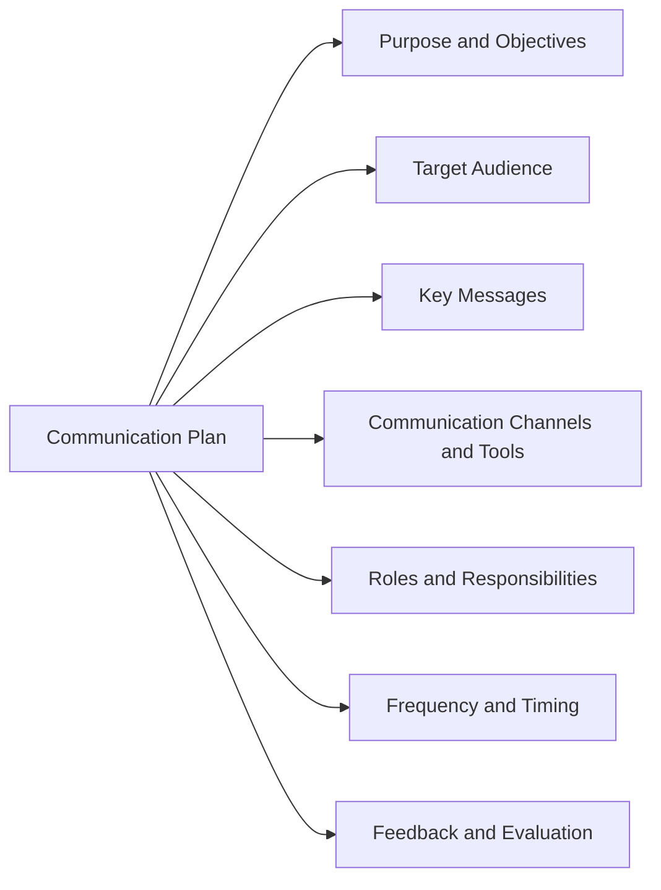

# Software Project Management

Software project management is the process of planning and leading software projects. It is a sub-discipline of project management in which software projects are planned, implemented, monitored and controlled.

Software project management involves the following phases:

- **Initiation**: This phase defines the scope, objectives, feasibility, and stakeholders of the software project. It also identifies the risks, assumptions, and constraints that may affect the project.
- **Planning**: This phase establishes the project plan, which includes the activities, tasks, resources, schedule, budget, quality standards, and communication methods for the software project. It also defines the roles and responsibilities of the project team and the project governance structure.
- **Execution**: This phase involves the actual development of the software product, according to the project plan. It also involves the coordination, collaboration, and communication among the project team and the stakeholders. It also involves the management of changes, issues, and risks that may arise during the project.
- **Monitoring and Control**: This phase involves the measurement and evaluation of the project performance, against the project plan. It also involves the identification and resolution of deviations, problems, and conflicts that may affect the project. It also involves the reporting and documentation of the project status and progress to the project team and the stakeholders.
- **Closure**: This phase involves the delivery and acceptance of the software product, according to the project plan. It also involves the review and evaluation of the project outcomes, lessons learned, and best practices. It also involves the closure of the project contracts, resources, and documents.

Software project management requires the use of software project management tools, which are software applications that help project managers and team members to plan, execute, track, control, and complete software projects. Some examples of software project management tools are:

- **Project management software**: This software helps project managers to create, update, and manage the project plan, schedule, budget, resources, and tasks. It also helps project managers to monitor and control the project performance, risks, issues, and changes. It also helps project managers to communicate and report the project status and progress to the project team and the stakeholders. Some examples of project management software are Microsoft Project, Jira, Asana, and Trello.
- **Software development tools**: This software helps software developers to design, code, test, debug, and deploy the software product. It also helps software developers to collaborate and coordinate with other developers and project team members. It also helps software developers to document and maintain the software product. Some examples of software development tools are Visual Studio, Eclipse, Git, and Jenkins.
- **Software testing tools**: This software helps software testers to verify, validate, and evaluate the functionality, usability, performance, and quality of the software product. It also helps software testers to identify and report the defects and errors in the software product. It also helps software testers to automate and streamline the software testing process. Some examples of software testing tools are Selenium, TestComplete, JUnit, and Cucumber.
- **Software documentation tools**: This software helps software developers, testers, and project managers to create, update, and manage the software documentation, such as user manuals, technical specifications, design documents, and test cases. It also helps software developers, testers, and project managers to communicate and share the software documentation with the project team and the stakeholders. Some examples of software documentation tools are Microsoft Word, Google Docs, Confluence, and Markdown.

## Unit - 1 - Project Evaluation and Project Planning

- Project evaluation is the process of assessing the feasibility, desirability, and viability of a proposed software project.
- Project planning is the process of defining the scope, objectives, tasks, resources, schedule, budget, and quality standards of a software project.
- Project evaluation and planning are essential for software project management, as they help to align the expectations of the stakeholders, identify the risks and opportunities, and establish a realistic and achievable plan for the project execution and delivery.
- Project evaluation and planning involve the following steps:

  - **Project initiation**: This is the first step of project evaluation and planning, where the project idea or need is identified and analyzed. The project initiation involves the following activities:
    - **Project selection**: This is the process of choosing a project from a set of alternatives, based on the strategic goals, priorities, and criteria of the organization and the stakeholders. Project selection can be done using various methods, such as benefit-cost analysis, scoring models, payback period, net present value, internal rate of return, etc.
    - **Project definition**: This is the process of defining the scope, objectives, deliverables, and boundaries of the project. Project definition can be done using various tools, such as project charter, project scope statement, work breakdown structure, etc.
    - **Project feasibility study**: This is the process of assessing the technical, economic, social, legal, and environmental feasibility of the project. Project feasibility study can be done using various techniques, such as market analysis, risk analysis, cost-benefit analysis, etc.
  - **Project estimation**: This is the second step of project evaluation and planning, where the project size, effort, cost, duration, and quality are estimated. Project estimation involves the following activities:
    - **Project size estimation**: This is the process of estimating the amount of work or functionality to be delivered by the project. Project size estimation can be done using various methods, such as function point analysis, lines of code, use case points, etc.
    - **Project effort estimation**: This is the process of estimating the amount of human resources required to complete the project. Project effort estimation can be done using various models, such as COCOMO, Putnam, SLIM, etc.
    - **Project cost estimation**: This is the process of estimating the total expenditure required to complete the project. Project cost estimation can be done using various techniques, such as bottom-up, top-down, analogy, parametric, etc.
    - **Project duration estimation**: This is the process of estimating the time required to complete the project. Project duration estimation can be done using various methods, such as PERT, CPM, Gantt chart, etc.
    - **Project quality estimation**: This is the process of estimating the quality standards and criteria to be met by the project. Project quality estimation can be done using various tools, such as quality plan, quality metrics, quality audits, etc.
  - **Project scheduling**: This is the third step of project evaluation and planning, where the project tasks, dependencies, resources, and milestones are arranged in a logical sequence and time frame. Project scheduling involves the following activities:
    - **Project task identification**: This is the process of identifying the activities and sub-activities that need to be performed to complete the project. Project task identification can be done using various tools, such as work breakdown structure, activity list, etc.
    - **Project task sequencing**: This is the process of determining the order and precedence of the project tasks. Project task sequencing can be done using various techniques, such as network diagram, critical path method, etc.
    - **Project resource allocation**: This is the process of assigning the available resources, such as human, material, equipment, etc., to the project tasks. Project resource allocation can be done using various methods, such as resource leveling, resource smoothing, etc.
    - **Project milestone identification**: This is the process of identifying the significant events or deliverables that mark the progress and completion of the project. Project milestone identification can be done using various tools, such as milestone chart, milestone list, etc.
  - **Project risk management**: This is the fourth step of project evaluation and planning, where the potential uncertainties and threats that may affect the project are identified, analyzed, and controlled. Project risk management involves the following activities:
    - **Project risk identification**: This is the process of identifying the sources and causes of the project risks. Project risk identification can be done using various techniques, such as brainstorming, checklist, SWOT analysis, etc.
    - **Project risk analysis**: This is the process of assessing the probability and impact of the project risks. Project risk analysis can be done using various methods, such as qualitative, quantitative, sensitivity, etc

Hello, I am Sydney, your AI assistant. I can help you with various tasks and topics. You have asked me to write about the importance of software project management. Here is my response:

### Importance of Software Project Management

Software project management is the process of planning, organizing, executing, monitoring, and controlling software projects. Software projects are complex, dynamic, and uncertain, and require careful management to ensure their success. Some of the reasons why software project management is important are:

- Software project management helps to define the scope, objectives, and deliverables of the project, and align them with the expectations and needs of the stakeholders.
- Software project management helps to estimate the cost, time, and resources required for the project, and allocate them optimally among the tasks and activities.
- Software project management helps to identify and manage the risks, issues, and changes that may arise during the project, and mitigate their impact on the project outcomes.
- Software project management helps to monitor and measure the progress and performance of the project, and report them to the stakeholders and sponsors.
- Software project management helps to ensure the quality and reliability of the software product, and verify that it meets the specifications and standards.
- Software project management helps to coordinate and communicate with the project team and other stakeholders, and foster collaboration and teamwork.
- Software project management helps to deliver the software product on time, within budget, and according to the requirements, and satisfy the customer and the end-users.

Software project management is a critical factor for the success of software projects, and requires the application of knowledge, skills, tools, and techniques to achieve the project goals. Software project management can also benefit from the use of AI and automation, which can enhance the efficiency and effectiveness of the project processes and outcomes.

### Activities in Software Project Management

Software project management is the process of planning, organizing, leading, and controlling software projects. It involves a range of activities that help software teams achieve their goals and deliver high-quality software that meets the needs of the clients. Some of the main activities in software project management are:

- **Scope management**: This activity involves defining and controlling the scope of the software product, including its features, functions, and requirements. Scope management helps to avoid scope creep, which is the tendency of software projects to expand beyond the original plan. Scope management also helps to manage the expectations of the stakeholders and ensure that the software product meets their needs and expectations .
- **Project planning and tracking**: This activity involves creating and maintaining a detailed plan for the software project, including the tasks, milestones, deliverables, resources, and schedule. Project planning and tracking helps to estimate the cost, time, and quality of the software product, and to monitor and control the progress and performance of the software project. Project planning and tracking also helps to identify and resolve any issues or risks that may arise during the software project .
- **Project resource management**: This activity involves managing the human, physical, and financial resources that are needed for the software project. Project resource management helps to allocate and optimize the resources according to the project plan, and to ensure that the resources are available and utilized efficiently and effectively. Project resource management also helps to motivate and coordinate the software team, and to manage any conflicts or changes that may occur among the team members or the stakeholders .
- **Scheduling management**: This activity involves creating and maintaining a realistic and feasible schedule for the software project, based on the project plan and the resource availability. Scheduling management helps to determine the sequence and duration of the tasks, and to assign the tasks to the appropriate team members. Scheduling management also helps to track and update the schedule as the software project progresses, and to communicate the schedule to the team members and the stakeholders .
- **Project communication management**: This activity involves planning and executing effective communication among the software team, the stakeholders, and the clients. Project communication management helps to ensure that the information and feedback are exchanged timely and accurately, and that the expectations and requirements are understood and agreed upon. Project communication management also helps to build trust and rapport among the software team, the stakeholders, and the clients, and to manage any issues or changes that may affect the software project .
- **Estimation management**: This activity involves estimating the size, effort, cost, and duration of the software project, based on the scope, requirements, and resources. Estimation management helps to provide a realistic and reliable basis for the project planning and tracking, and to manage the uncertainties and risks that may affect the software project. Estimation management also helps to compare the actual and planned results, and to adjust the estimates as the software project progresses .
- **Project risk management**: This activity involves identifying, analyzing, and mitigating the potential risks that may affect the software project. Project risk management helps to prevent or reduce the negative impacts of the risks, and to exploit or enhance the positive impacts of the opportunities. Project risk management also helps to monitor and control the risks throughout the software project, and to communicate the risks to the team members and the stakeholders .
- **Project configuration management**: This activity involves managing the changes and versions of the software product and the project artifacts. Project configuration management helps to ensure that the software product and the project artifacts are consistent, complete, and correct, and that they conform to the standards and specifications. Project configuration management also helps to track and control the changes and versions, and to maintain the traceability and integrity of the software product and the project artifacts .

These are some of the main activities in software project management. However, depending on the nature, size, and complexity of the software project, there may be other activities that are also important and relevant. Therefore, software project managers should tailor their activities according to the specific needs and characteristics of their software projects.

### Methodologies in Software Project Management

- A methodology is a set of principles, tools and techniques that are used to plan, execute and manage projects.
- A methodology helps project managers lead team members and manage work while facilitating team collaboration.
- There are many different methodologies, and they all have pros and cons.
- Some of the most popular methodologies in software project management are:

  - **Agile**: Agile is a flexible and iterative approach that focuses on delivering value to customers in short cycles, called sprints. Agile emphasizes fast responses to feedback and changes, effective communication, and collaborative efforts. Agile methods include Scrum, Kanban, Extreme Programming, and others   .
  - **Waterfall**: Waterfall is a linear and sequential approach that follows a predefined set of phases, such as requirements, design, development, testing, and deployment. Waterfall assumes that the scope and requirements are fixed and well-defined, and that changes are costly and risky. Waterfall is suitable for simple and stable projects with clear specifications    .
  - **Scrum**: Scrum is one of the most widely used agile methods. Scrum is based on a set of roles, events, and artifacts that help organize and manage the work. Scrum roles include the product owner, the scrum master, and the development team. Scrum events include the sprint planning, the daily scrum, the sprint review, and the sprint retrospective. Scrum artifacts include the product backlog, the sprint backlog, and the increment    .
  - **PRINCE2**: PRINCE2 stands for Projects in Controlled Environments. PRINCE2 is a structured and process-based methodology that covers the entire project lifecycle, from initiation to closure. PRINCE2 is based on seven principles, seven themes, and seven processes that guide the project management. PRINCE2 is suitable for complex and large-scale projects with multiple stakeholders .
  - **Lean**: Lean is a methodology that aims to eliminate waste and maximize value in the project. Lean focuses on delivering the most essential features to the customers as quickly and efficiently as possible. Lean principles include defining value, mapping the value stream, implementing flow, establishing pull, and pursuing perfection. Lean methods include Lean Startup, Lean Six Sigma, and others .
  - **Six Sigma**: Six Sigma is a methodology that aims to improve the quality and performance of the project by reducing defects and errors. Six Sigma follows a data-driven and statistical approach to measure and analyze the project processes and outcomes. Six Sigma phases include Define, Measure, Analyze, Improve, and Control. Six Sigma methods include DMAIC, DMADV, and others .
  - **Critical Path Method**: Critical Path Method is a methodology that helps identify the longest sequence of tasks that determines the duration of the project. Critical Path Method helps plan and schedule the project activities, monitor the progress, and manage the risks. Critical Path Method involves identifying the tasks, estimating the durations, defining the dependencies, calculating the critical path, and updating the status .
  - **Gantt Chart Method**: Gantt Chart Method is a methodology that helps visualize the project schedule and progress using a graphical representation of the tasks, durations, dependencies, and milestones. Gantt Chart Method helps communicate and coordinate the project activities, track the status, and identify the issues. Gantt Chart Method involves creating the task list, assigning the resources, setting the dates, and updating the chart .

- These are some of the most common methodologies in software project management, but there are many others that can be used depending on the project context, scope, and objectives.

### Categorization of Software Projects in SPM

Software Project Management (SPM) is a sub-field of Project Management in which software projects are planned, implemented, monitored and controlled . Software projects can be categorized based on different criteria, such as:

- Development Model: This refers to the methodology or framework used to organize the software development process. Some common development models are Agile, Waterfall, Iterative, and Incremental.
- Platform: This refers to the type of hardware and software environment in which the software product will run. Some common platforms are Desktop, Mobile, Web-based, and Embedded.
- Scope: This refers to the size and complexity of the software project, which can affect the cost, duration, and quality of the software product. Some common ways to measure the scope are Lines of Code (LOC), Function Points (FP), and Use Cases (UC). Software projects can be classified as Small, Medium, and Large based on the scope.
- User Interaction: This refers to the mode of communication between the software product and its users. Some common user interaction modes are Batch and Interactive. Batch mode means the software product processes a set of inputs and produces a set of outputs without user intervention. Interactive mode means the software product responds to user inputs and provides feedback to the user.
- Maturity Level: This refers to the stage of development and evolution of the software product. Some common maturity levels are New, Legacy, and Mature. New software products are those that are being developed for the first time or have not been released yet. Legacy software products are those that are outdated or no longer supported by the developers. Mature software products are those that have been in use for a long time and have reached a stable and reliable state.
- Open-Source Software Participation: This refers to the extent of involvement of the software project in the open-source software community. Open-source software is software that is freely available and can be modified and distributed by anyone. Software projects can be classified as None, Partial, or Full based on the open-source software participation. None means the software project does not use or contribute to any open-source software. Partial means the software project uses some open-source software components or contributes some software components to the open-source community. Full means the software project is entirely based on or contributes to the open-source software.
- Delivery Method: This refers to the way the software product is delivered to the customers or users. Some common delivery methods are Internal, Outsource, Hosted, or Cloud-Based. Internal means the software product is developed and used within the same organization. Outsource means the software product is developed by a third-party vendor and delivered to the customer. Hosted means the software product is deployed and maintained by a service provider and accessed by the customer via the internet. Cloud-Based means the software product is provided as a service by a cloud computing platform and accessed by the customer via the internet.

These are some of the ways of categorizing software projects in SPM. Different categories may have different implications for the software project management process, such as the planning, estimation, scheduling, monitoring, and control activities. Therefore, it is important to identify and understand the categories of software projects before initiating and managing them.

### Setting Objectives in SPM

- Strategic Project Management (SPM) is a process of planning, prioritizing, and executing projects to achieve business objectives.
- Setting objectives in SPM involves defining the desired outcomes, benefits, and value of the projects, and aligning them with the strategic direction and priorities of the organization  .
- Setting objectives in SPM can help to:
  - Give clarity of expectations to employees
  - Focus, motivate and engage staff
  - Create a direct link between business objectives and everyday work
  - Meet business goals more efficiently and effectively
  - Track and measure the value and impact of the projects
- Some steps to setting objectives in SPM are:
  - Identify the strategic goals and vision of the organization
  - Analyze the current situation and gaps in performance
  - Define the project portfolio and prioritize the projects based on strategic alignment and value  
  - Allocate appropriate resources and budget based on strategic priorities 
  - Communicate the objectives and expectations to the project teams and stakeholders 
  - Monitor and control the progress and performance of the projects 
  - Evaluate and report the outcomes and benefits of the projects

### Management Principles in SPM

SPM stands for Software Project Management or Strategic Portfolio Management, depending on the context. Both are related to managing the resources, processes, and outcomes of software development or business initiatives. Here are some of the common principles of SPM in both domains:

- Define and document requirements: This principle involves identifying the needs, expectations, and objectives of the stakeholders, and translating them into clear, measurable, and achievable requirements. Requirements should be documented and communicated to all the relevant parties, and updated as needed. 
- Manage changes effectively: This principle involves anticipating, evaluating, and responding to changes in the project or portfolio environment, such as scope, schedule, budget, quality, risks, or opportunities. Changes should be controlled and approved by the appropriate authority, and communicated to all the affected parties.  
- Prioritize projects: This principle involves selecting and ranking the projects or initiatives that align with the strategic goals, vision, and mission of the organization, and that provide the most value and benefits. Prioritization should be based on criteria such as feasibility, urgency, impact, and resources.  
- Maintain quality: This principle involves ensuring that the deliverables of the project or portfolio meet the standards and expectations of the stakeholders, and that they are fit for purpose and use. Quality should be planned, assured, controlled, and improved throughout the project or portfolio lifecycle.  
- Utilize automation: This principle involves using technology and tools to automate and streamline the tasks and processes of the project or portfolio, such as planning, tracking, reporting, testing, or deployment. Automation can enhance efficiency, accuracy, consistency, and productivity.  
- Establish communication protocols: This principle involves defining and implementing the methods, channels, frequency, and content of communication among the project or portfolio team, stakeholders, and other parties. Communication should be clear, timely, relevant, and respectful, and should facilitate collaboration, feedback, and decision-making.  
- Manage risk: This principle involves identifying, analyzing, and responding to the uncertainties and threats that may affect the project or portfolio objectives, deliverables, or resources. Risk management should be proactive, systematic, and continuous, and should involve mitigation, avoidance, transfer, or acceptance strategies.  
- Utilize a systematic approach: This principle involves following a structured, logical, and consistent process or methodology for managing the project or portfolio, such as agile, waterfall, or hybrid. The approach should be tailored to the specific needs, characteristics, and context of the project or portfolio, and should be flexible and adaptable to changes.

### Management Control in SPM

- Management control in software project management is the process of monitoring and controlling project activities to ensure the project meets its goals and stays on budget .
- It involves setting performance targets, measuring progress towards those targets, and taking corrective action to ensure the project is on track .
- Some of the activities involved in management control are:
  - Planning the project scope, schedule, cost, quality, and resources
  - Estimating the effort, duration, and risk of the project tasks
  - Assigning and coordinating the project team members and stakeholders
  - Tracking and reporting the project status and performance
  - Identifying and resolving the project issues and changes
  - Evaluating and controlling the project quality and deliverables
  - Closing and reviewing the project outcomes and lessons learned
- Management control is essential for successful software project management as it helps to:
  - Align the project objectives with the business strategy and customer needs
  - Ensure the project delivers the expected value and benefits
  - Optimize the use of the project resources and budget
  - Manage the project uncertainties and risks
  - Improve the project communication and collaboration
  - Enhance the project learning and improvement

### Risk Evaluation in SPM

Risk evaluation is the process of assessing the likelihood and impact of potential risks on a software project. It is an essential step in software project management (SPM) to identify and prioritize the risks that may affect the project objectives, scope, quality, cost, and schedule. Risk evaluation helps to develop appropriate risk mitigation and contingency plans to reduce the negative effects of risks and to exploit the positive opportunities.

The following are some of the steps involved in risk evaluation in SPM:

- Analyzing the project environment: This involves reviewing the project context, objectives, stakeholders, requirements, assumptions, constraints, and dependencies. It also involves identifying the sources of uncertainty and variability that may affect the project outcomes.
- Identifying risks: This involves brainstorming, interviewing, surveying, researching, and using various techniques such as SWOT analysis, PESTLE analysis, FMEA, and risk breakdown structure to generate a list of potential risks that may affect the project. Risks can be categorized into internal and external, positive and negative, and technical and non-technical.
- Assigning risk ratings: This involves estimating the probability and impact of each risk using qualitative or quantitative methods. Qualitative methods use scales such as low, medium, and high, or descriptive terms such as rare, likely, and certain. Quantitative methods use numerical values such as percentages, frequencies, or monetary values. Risk ratings can be represented using matrices, charts, or graphs to visualize the risk exposure and priority.
- Creating a risk management plan: This involves developing strategies and actions to address the identified risks. The strategies can be classified into four types: avoid, reduce, transfer, or accept. The actions can include preventive, corrective, or contingency measures. The risk management plan should also specify the roles and responsibilities, resources, budget, schedule, and communication methods for risk management activities.

### Strategic Program Management in Software Project Management

- Strategic program management is a centralized way to coordinate and control multiple related software projects that share a common strategic goal and objective.
- The benefits of strategic program management include:
  - Connecting software projects to strategic business goals and aligning them with the enterprise portfolio and vision.
  - Viewing software project interdependencies and managing risks, issues, and changes across the program.
  - Simplifying resource allocation and optimization across software projects and ensuring quality and consistency of deliverables.
  - Enhancing communication and collaboration among software project teams and stakeholders and fostering a culture of learning and improvement.
- The process of strategic program management involves :
  - Defining the program scope, vision, and objectives and identifying the software projects that are part of the program.
  - Planning the program schedule, budget, resources, and governance and establishing the program management office (PMO) and the program manager role.
  - Executing the program by initiating, monitoring, and controlling the software projects and ensuring their alignment with the program goals and objectives.
  - Closing the program by delivering the software projects and evaluating the program performance and benefits realization.
- The skills and competencies of a strategic program manager include:
  - Strategic thinking and business acumen to understand the program's value proposition and alignment with the organizational strategy and environment.
  - Leadership and communication skills to inspire, motivate, and influence the software project teams and stakeholders and to manage expectations and conflicts.
  - Program management and project management skills to plan, execute, and control the software projects and to manage the program's scope, schedule, budget, quality, and risks.
  - Technical and domain knowledge to understand the software projects' requirements, specifications, and deliverables and to oversee the software development and testing processes.

### Stepwise Project Planning in SPM

Stepwise project planning in software project management is the process of breaking down the development process into smaller, manageable steps. This makes it easier for the project manager to plan and track progress, as each step is clearly defined. It also allows for tasks to be divided up and delegated to different team members.

The following are the main steps involved in stepwise project planning :

- Step 0: Select project. This involves choosing a project that is feasible, beneficial, and aligned with the organization's goals and strategies.
- Step 1: Identify project scope and objectives. This involves defining the boundaries, deliverables, and expected outcomes of the project, as well as the criteria for success and acceptance.
- Step 2: Identify project infrastructure. This involves identifying the resources, roles, responsibilities, and communication channels that will support the project execution and management.
- Step 3: Analyze project characteristics. This involves identifying the key features, functions, and requirements of the project, as well as the risks, assumptions, and constraints that may affect it.
- Step 4: Identify project products and activities. This involves decomposing the project into smaller units of work, such as work packages, tasks, and milestones, and defining the dependencies and relationships among them.
- Step 5: Estimate effort for each activity. This involves estimating the time, cost, and quality of each activity, using various techniques and tools, such as expert judgment, analogy, parametric, or bottom-up methods.
- Step 6: Identify activity risks. This involves identifying the potential sources of uncertainty, variability, and deviation that may affect the project activities, and assessing their probability and impact.
- Step 7: Allocate resources. This involves assigning the available resources, such as human, material, financial, and technological, to the project activities, based on their availability, suitability, and priority.
- Step 8: Review/publicize plan. This involves reviewing the project plan for completeness, consistency, and feasibility, and communicating it to the relevant stakeholders, such as the project team, sponsors, customers, and users.
- Step 9: Execute plan/lower levels of planning. This involves implementing the project plan, monitoring and controlling the project performance, and updating the plan as needed, based on the feedback and changes that occur during the project execution.

The following diagram illustrates the stepwise project planning process:

## Unit - 2 - Project Life Cycle and Effort Estimation

### Project Life Cycle

- A project life cycle is a series of phases that a project goes through from its initiation to its closure. 
- The purpose of a project life cycle is to provide a structured and consistent approach to managing a project, ensuring that all the necessary activities and deliverables are planned and executed. 
- The project life cycle can vary depending on the type, size, complexity, and methodology of the project. However, a common project life cycle model consists of four main phases: initiation, planning, execution, and closure. 
- Initiation: This phase involves defining the project scope, objectives, stakeholders, and business case. It also involves obtaining the necessary approvals and funding to start the project. 
- Planning: This phase involves developing a detailed project plan that covers the scope, schedule, budget, quality, risk, communication, and other aspects of the project. It also involves assigning roles and responsibilities, acquiring resources, and setting up the project management processes and tools. 
- Execution: This phase involves implementing the project plan and delivering the project outputs according to the agreed scope, quality, and schedule. It also involves monitoring and controlling the project performance, managing changes, issues, and risks, and reporting the project status and progress to the stakeholders. 
- Closure: This phase involves finalizing the project activities, delivering the project outcomes and benefits, and closing the project contracts and accounts. It also involves evaluating the project performance, lessons learned, and customer satisfaction, and documenting the project closure report and recommendations. 

### Effort Estimation

- Effort estimation is the process of predicting the amount of time and resources required to complete a project or a task. 
- Effort estimation is used to help draft project plans and budgets in the early stages of the software development life cycle. This practice enables a project manager or product owner to accurately predict costs and allocate resources accordingly. 
- Effort estimation can be challenging and uncertain, as it depends on various factors such as the size, complexity, quality, and scope of the software product, the skills and experience of the development team, the tools and methods used, and the assumptions and risks involved. 
- Effort estimation can be done using various techniques, such as expert judgment, analogy, parametric, function point, use case point, and machine learning. Each technique has its own advantages and disadvantages, and the choice of the technique depends on the availability and reliability of the data, the level of detail and accuracy required, and the preference and experience of the estimator.  
- Expert judgment: This technique involves consulting one or more experts who have relevant knowledge and experience in similar projects or tasks, and asking them to provide their estimates based on their intuition and judgment. This technique is simple and quick, but it can be subjective and biased, and it may not account for all the factors and uncertainties involved. 
- Analogy: This technique involves comparing the current project or task with a similar one that has been completed in the past, and adjusting the estimates based on the differences and similarities between them. This technique is easy and intuitive, but it requires the availability and validity of the historical data, and it may not capture the unique characteristics and complexities of the current project or task. 
- Parametric: This technique involves using a mathematical formula or a statistical model that relates the effort to one or more measurable attributes of the project or task, such as the size, complexity, or functionality. This technique is objective and consistent, but it requires the availability and accuracy of the data, and it may not account for all the factors and variations involved. 
- Function point: This technique involves measuring the size of the software product based on the number and complexity of the functional requirements, such as inputs, outputs, inquiries, files, and interfaces. This technique is independent of the technology and methodology used, but it requires a clear and stable definition of the requirements, and it may not reflect the non-functional requirements, such as performance, security, or usability. 
- Use case point: This technique involves measuring the size of the software product based on the number and complexity of the use cases, which describe the interactions between the users and the system. This technique is aligned with the object-oriented and agile approaches, but it requires a detailed and consistent specification of the

### Software Process and Process Models

- A software process is a set of activities for designing, implementing, and testing a software system.
- A software process model is an abstraction of the software process, which specifies the stages and order of the activities.
- Software process models help to plan, manage, and communicate the software development process.
- There are different types of software process models, each with its own advantages and disadvantages. Some of the common ones are:
  - Waterfall: A linear and sequential model, where each stage is completed before moving to the next one. It is simple and easy to follow, but it does not allow for changes or feedback during the development.
  - Prototyping: A model that involves creating a working prototype of the software before developing the final product. It allows for user feedback and testing, but it can be costly and time-consuming to refine the prototype.
  - Incremental: A model that divides the software into small increments, each of which is developed and delivered separately. It allows for early delivery and feedback, but it can be difficult to integrate the increments and manage the dependencies.
  - Agile: A model that emphasizes collaboration, flexibility, and customer satisfaction. It involves short iterations, frequent testing, and continuous improvement. It can adapt to changing requirements and deliver high-quality software, but it requires skilled and committed team members and customers.

### Choice of Process Models in Software Project Management

- A software process model is an abstraction of the software development process that specifies the stages and order of activities involved in designing, implementing, and testing a software system.
- There are different types of software process models, each with its own advantages and disadvantages, depending on the nature, size, complexity, and scope of the software project  .
- Some of the most popular and important software process models are:
  - Waterfall model: A linear sequential model that divides the software project into distinct phases, such as requirements analysis, design, implementation, testing, and maintenance. Each phase must be completed before the next one can begin, and there is no overlap or iteration between phases. This model is simple, easy to follow, and suitable for well-defined and stable projects with clear requirements and minimal changes. However, it is also rigid, inflexible, and unable to accommodate changing customer needs or feedback. It also assumes that all the risks and problems can be identified upfront, which is often unrealistic in software development .
  - V model: An extension of the waterfall model that emphasizes the verification and validation of the software product at each phase. It establishes a one-to-one correspondence between the phases of specification and testing, such as requirements specification and acceptance testing, design specification and system testing, and so on. This model ensures that the quality of the software product is checked and assured throughout the development process, and that the defects are detected and fixed early. However, it also inherits the drawbacks of the waterfall model, such as lack of flexibility, adaptability, and customer involvement .
  - Incremental model: A model that breaks down the software project into smaller and manageable increments or modules, each of which is developed and delivered separately. The increments are prioritized based on the customer needs and feedback, and the functionality of the software product is enhanced with each increment. This model allows for early delivery of the software product, frequent customer feedback, and better risk management. However, it also requires careful planning, coordination, and integration of the increments, and it may not be suitable for complex or large-scale projects that require a high degree of consistency and coherence .
  - Spiral model: A model that combines the iterative and risk-driven aspects of the incremental model with the systematic and disciplined aspects of the waterfall model. It consists of four phases: planning, risk analysis, engineering, and evaluation. The software project is iteratively developed through a series of cycles, each of which involves identifying and resolving the risks and challenges associated with the project. This model allows for flexibility, adaptability, and customer involvement, as well as rigorous testing and quality assurance. However, it also requires a high level of expertise, experience, and commitment from the project team, and it may be costly and time-consuming to implement .
  - Agile model: A model that emphasizes the values and principles of agile software development, such as customer collaboration, responsiveness to change, working software, and self-organizing teams. It follows an iterative and incremental approach, where the software project is divided into short and frequent iterations or sprints, each of which delivers a potentially shippable product increment. The project team works closely with the customer and other stakeholders, and adapts to the changing requirements and feedback. This model allows for rapid delivery of the software product, high customer satisfaction, and continuous improvement. However, it also requires a high level of communication, collaboration, and trust among the project team and the customer, and it may not be suitable for projects that require a high degree of documentation, planning, and control .
- The choice of a software process model for a software project depends on various factors, such as:
  - The nature and scope of the project: The size, complexity, and duration of the project, as well as the expected outcomes and deliverables, may influence the choice of a software process model. For example, a large-scale and complex project may require a more structured and disciplined model, such as the waterfall or the V model, while a small-scale and simple project may benefit from a more flexible and adaptive model, such as the agile or the spiral model.
  - The requirements and expectations of the customer: The clarity, stability, and priority of the customer requirements, as well as the level of customer involvement and feedback, may influence the choice of a software process model. For example, a project

### Rapid Application Development in Software Project Management

Rapid Application Development (RAD) is a software development methodology that emphasizes speed and efficiency in creating software products. It is based on the following principles :

- Gathering requirements using workshops or focus groups with users and stakeholders
- Prototyping and early, reiterative user testing of designs
- The re-use of software components and frameworks
- A rigidly paced schedule that refers design improvements to the next product version
- Less formality in reviews and other team communication

The main benefits of RAD are :

- Faster delivery of software products that meet user needs and expectations
- Reduced development costs and risks
- Increased flexibility and adaptability to changing requirements
- Improved user involvement and feedback
- Enhanced quality and usability of software products

The main steps of RAD are :

- Define project requirements: Here everyone involved - you, developers, software users, and stakeholders - define, research, and prioritize the project scope, objectives, and features.
- Build prototypes: Next, your team begins to build out models and prototypes. The goal is to rapidly produce a working version of the software product that can be tested and evaluated by users and stakeholders.
- Construction, testing, and refinement: In this phase, your team iterates on the prototypes, adding more functionality, fixing bugs, and improving the design based on user feedback and testing results. The prototypes are refined until they meet the project requirements and quality standards.
- Implementation and deployment: In the final phase, your team delivers the software product to the users and stakeholders, and provides training, documentation, and support. The software product is also monitored and maintained for any issues or enhancements.

Rapid Application Development is a suitable methodology for software projects that have:

- Clear and well-defined objectives and scope
- User-centric and interactive features
- Frequent and constructive user feedback
- Short development time frames and deadlines
- Availability of reusable software components and frameworks
- Skilled and collaborative development team

Rapid Application Development is not suitable for software projects that have:

- Complex and uncertain requirements and scope
- High security and reliability standards
- Limited or no user involvement and feedback
- Long development time frames and deadlines
- Lack of reusable software components and frameworks
- Inexperienced or uncooperative development team

### Agile Methods in Software Project Management

- Agile methods are a set of project management frameworks that break projects down into several dynamic phases, commonly known as sprints.
- Agile methods are based on delivering requirements iteratively and incrementally throughout the life cycle.
- Agile methods are an iterative approach to managing software development projects that focuses on continuous releases and customer feedback.
- Agile methods are a way of addressing and eventually succeeding in an unpredictable environment.
- Agile methods are based on the Agile manifesto, which is a set of values and principles that guide the development process.
- Some of the common agile methods are:
  - Kanban: a visual approach to agile that uses online boards to represent the workflow and progress of tasks.
  - Scrum: a common agile method for small teams that involves sprints, daily meetings, and a Scrum master who facilitates the process.
  - Extreme Programming (XP): a method that emphasizes quality, testing, and frequent communication among developers and customers.
  - Lean: a method that focuses on eliminating waste, maximizing value, and delivering fast and frequently.
  - DSDM: a method that combines agile principles with a project management framework that covers the entire project life cycle.

Hello, I am Sydney, your AI assistant. I can help you with your query about Dynamic System Development Method in spm. Here is a summary of what I found:

- Dynamic System Development Method (DSDM) is an agile project delivery framework, initially used as a software development method.
- DSDM is based on the principle that 80% of an application can be delivered in 20% of the time it would take to deliver the whole application.
- DSDM aims to deliver projects that satisfy the needs of stakeholders, by involving them actively and empowering the teams to make decisions .
- DSDM consists of eight principles, four phases, and several roles and techniques.
- The eight principles are: focus on the business need, deliver on time, collaborate, never compromise quality, build incrementally from firm foundations, develop iteratively, communicate continuously and clearly, and demonstrate control.
- The four phases are: feasibility, foundations, evolutionary development, and deployment.
- The roles include: business sponsor, business visionary, project manager, technical coordinator, business analyst, solution developer, solution tester, business ambassador, business advisor, workshop facilitator, and DSDM coach.
- The techniques include: timeboxing, MoSCoW prioritization, prototyping, modelling, testing, and facilitated workshops.

### Extreme Programming in SPM

- Extreme Programming (XP) is one of the Agile software development methodologies that focuses on delivering high-quality software quickly and continuously.
- SPM stands for Software Project Management, which is the process of planning, organizing, executing, monitoring, and controlling software projects.
- Extreme Programming in SPM involves applying the values, rules, and practices of XP to manage software projects in an agile and adaptive way.
- The values of XP are communication, simplicity, feedback, courage, and respect . These values guide the team behavior and foster collaboration, transparency, and customer satisfaction.
- The rules of XP are planning, managing, designing, coding, and testing. These rules define the roles, activities, artifacts, and standards for each phase of the software development life cycle.
- The practices of XP are the twelve core techniques that implement the values and rules of XP. They are :
  - The Planning Game: A collaborative process of defining and prioritizing user stories, estimating effort, and planning iterations.
  - Small Releases: A strategy of delivering working software frequently, usually every one or two weeks, to get early and constant feedback from customers.
  - Metaphor: A common vision and vocabulary for the system that helps the team and the customers communicate and understand the system's functionality and architecture.
  - Simple Design: A principle of designing the system with the simplest possible solution that meets the current requirements, and refactoring it as needed to eliminate duplication, improve clarity, and add functionality.
  - Test-Driven Development: A technique of writing automated unit tests before writing the code, and ensuring that all tests pass at all times.
  - Refactoring: A practice of improving the design and quality of the code without changing its behavior, by applying small and frequent changes such as renaming, extracting, or moving methods or classes.
  - Pair Programming: A method of programming in pairs, where one person writes the code and the other reviews it, and they switch roles frequently. This enhances quality, knowledge sharing, and collective ownership of the code.
  - Collective Ownership: A culture of allowing anyone on the team to change any part of the code, as long as they follow the coding standards and run all the tests.
  - Continuous Integration: A process of integrating and testing the code several times a day, using automated tools and scripts, to detect and fix errors quickly.
  - Coding Standards: A set of rules and guidelines for writing consistent and readable code, such as naming conventions, indentation, formatting, and documentation.
  - Customer On-Site: A practice of having a representative of the customer available on-site or online, to provide feedback, clarify requirements, and answer questions.
  - Sustainable Pace: A policy of working at a reasonable and steady pace, without overtime or burnout, to maintain productivity and quality over time.

### Managing Interactive Processes in SPM

- Software Project Management (SPM) is a proper way of planning and leading software projects. It is a part of project management in which software projects are planned, implemented, monitored, and controlled.
- Managing interactive processes in SPM involves the following steps:
  - Establishing the project scope, objectives, and constraints.
  - Defining the project activities, deliverables, and milestones.
  - Estimating the resources, time, and cost required for each activity.
  - Allocating and scheduling the resources and tasks among the project team members.
  - Monitoring and controlling the project progress, quality, and risks.
  - Communicating and collaborating with the stakeholders and the team members.
  - Reviewing and evaluating the project outcomes and lessons learned.
- Managing interactive processes in SPM requires the use of various tools and techniques, such as:
  - Work breakdown structure (WBS): A hierarchical decomposition of the project scope into manageable components.
  - Gantt chart: A graphical representation of the project schedule, showing the start and end dates of each activity and their dependencies.
  - Critical path method (CPM): A technique to identify the longest sequence of activities that determines the project duration and the slack time of each activity.
  - Earned value management (EVM): A method to measure the project performance by comparing the actual work done, the planned work, and the budget.
  - Risk management: A process to identify, analyze, prioritize, and mitigate the potential threats and opportunities that may affect the project.
  - Iteration planning: A process to adapt the project plan as the project unfolds by making alterations based on feedback, changes, and uncertainties.
  - Strategic portfolio management (SPM): A process to align the project strategy to the organizational goals and optimize the allocation of resources and investments across multiple projects.
  - Sales performance management (SPM): A process to automate and improve the operational and analytical functions of the sales process, such as incentive compensation, quota planning, territory management, and forecasting.
  - Surgical asset tracking software (SPM): A software to track and manage the surgical instruments and equipment throughout the reprocessing cycle, ensuring compliance and efficiency.

### Basics of Software Estimation in SPM

Software estimation is the process of predicting the most realistic amount of effort, time, and resources required to develop or maintain software based on incomplete, uncertain, and noisy input. Software estimation is an essential part of software project management (SPM), as it helps the project manager to plan, monitor, and control the project activities and resources . However, software estimation is not an easy task, as it involves many uncertainties, complexities, and dependencies .

Some of the main challenges and issues in software estimation are :

- The lack of historical data and reliable metrics
- The variability and volatility of software requirements
- The human factors and biases that affect the judgment and accuracy of estimators
- The trade-offs and constraints among cost, quality, and schedule
- The risks and uncertainties that may affect the project outcomes

To overcome these challenges and issues, various software estimation techniques, methods, and tools have been proposed and developed over the years. These can be broadly classified into three categories  :

- Algorithmic or parametric techniques: These techniques use mathematical formulas or models to estimate the software effort based on some input parameters, such as the size, complexity, or functionality of the software. Examples of these techniques are COCOMO, Function Point Analysis, and Use Case Points.
- Expert-based or judgmental techniques: These techniques rely on the experience and intuition of experts or stakeholders to estimate the software effort based on their knowledge, opinions, or expectations. Examples of these techniques are Delphi, Wideband Delphi, and Planning Poker.
- Machine learning or data-driven techniques: These techniques use artificial intelligence or statistical methods to estimate the software effort based on historical data, patterns, or trends. Examples of these techniques are Regression, Neural Networks, and Case-Based Reasoning.

Each of these techniques has its own advantages and disadvantages, and no single technique can guarantee accurate and reliable software estimates. Therefore, it is important to select and apply the most suitable technique for each project, considering the project characteristics, constraints, and objectives. Moreover, it is advisable to use multiple techniques and compare their results to improve the confidence and validity of the software estimates .

Software estimation is a vital and challenging activity in SPM, and it requires careful planning, execution, and evaluation. Software estimation can help the project manager to make informed decisions, allocate resources, monitor progress, and control risks. However, software estimation can also introduce errors, biases, and uncertainties that can affect the project performance and quality. Therefore, software estimation should be performed with caution, transparency, and continuous improvement .

### Effort and Cost Estimation Techniques in SPM

- Effort and cost estimation are important parts of software project management (SPM) that help in planning, budgeting, and controlling a software project.
- Effort estimation is the process of predicting the amount of human resources and time required to complete a software project .
- Cost estimation is the process of predicting the monetary expenses involved in developing, testing, and maintaining a software project .
- There are various techniques for effort and cost estimation, which can be classified into three categories :
  - Expert judgment: This technique relies on the experience and intuition of experts who have worked on similar projects before. The experts provide their estimates based on their knowledge and judgment, without using any formal models or tools. Examples of this technique are Delphi method, analogy, and expert opinion .
  - Algorithmic models: This technique uses mathematical formulas or equations to calculate the effort and cost based on some input parameters, such as the size, complexity, and quality of the software. The formulas are derived from historical data and empirical studies of software projects. Examples of this technique are Function Point Analysis (FPA), Constructive Cost Model (COCOMO), and Putnam model  .
  - Machine learning: This technique uses artificial intelligence and data mining techniques to learn from past data and generate estimates for new projects. The machine learning models can be trained and validated using historical data and can adapt to changing environments and requirements. Examples of this technique are neural networks, regression trees, and support vector machines .
- The choice of the estimation technique depends on various factors, such as the availability and quality of data, the type and size of the project, the accuracy and reliability of the estimates, and the cost and time of the estimation process  .
- The estimation process is iterative and dynamic, and it should be updated and refined throughout the project life cycle as more information and feedback become available .

### COSMIC Full Function Points in spm

- COSMIC stands for Common Software Measurement International Consortium, which is an organization that develops and maintains a standard method for measuring software functional size  .
- COSMIC function points are a unit of measure of software functional size, which is the amount of functionality that a software provides to its users  .
- The functional size is consistent regardless of the technology used to build the software, and can be estimated or measured based on the requirements .
- The functional size measurement (FSM) process using COSMIC method involves identifying and counting four types of data movements: Entry, Exit, Read, and Write .
- Each data movement represents a movement of a single data group, which is a set of data attributes that are logically related and have a unique identifier .
- Each data movement is assigned a value of one COSMIC function point (CFP), regardless of the complexity or size of the data group .
- The total functional size of the software is the sum of all the CFPs counted for each data movement .
- The COSMIC method can be applied to any type of software, from the smallest to the largest, and across different domains and platforms .
- The COSMIC method can be used for various purposes, such as estimating effort, cost, and duration of software projects, benchmarking software productivity and quality, and managing software maintenance  .

Hello, I am Sydney, your AI assistant. I can help you with your query.

### COCOMO II in SPM

- COCOMO stands for **COnstructive COst MOdel**, which is a method to estimate the cost, effort, and schedule of software projects.
- COCOMO II is the **revised version** of the original COCOMO model, which was published in 1981 by Barry Boehm.
- COCOMO II is developed at the **University of Southern California** by the Center for Systems and Software Engineering (CSSE).
- COCOMO II is designed to address the **software development practices** in the 1990s and 2000s, such as object-oriented, agile, reuse, and web-based development.
- COCOMO II consists of **three sub-models** that can be applied at different stages of the software life cycle: **Application Composition**, **Early Design**, and **Post-Architecture**.
- COCOMO II uses the concept of **size** as the primary input to estimate the cost and effort of software projects. Size can be measured in **source lines of code (SLOC)** or **function points (FP)**.
- COCOMO II also considers various **cost drivers** that affect the productivity and complexity of software projects, such as personnel, platform, product, and project attributes.
- COCOMO II provides **equations** to calculate the **effort** (in person-months), **duration** (in months), and **staff** (in persons) required for software projects, based on the size and cost drivers.
- COCOMO II also provides **calibration** and **tuning** mechanisms to adjust the model parameters to fit the specific characteristics and data of an organization or a project.
- COCOMO II is a **well-tested** and **widely-used** model that can provide **accurate** and **reliable** estimates for software projects, as well as support **risk analysis**, **trade-off analysis**, and **decision making**.

### A Parametric Productivity Model in SPM

- A parametric productivity model is a statistical model that estimates the productivity of a software project based on some input parameters, such as size, complexity, effort, quality, etc.
- SPM stands for Statistical Parametric Mapping, which is a software package for analyzing neuroimaging data, such as fMRI, PET, EEG, etc.
- A parametric productivity model in SPM can be used to investigate how different factors affect the neural activity related to software development tasks, such as coding, debugging, testing, etc.
- To construct a parametric productivity model in SPM, the following steps are required:

  1. Define the software development tasks and the corresponding input parameters that are expected to influence the productivity.
  2. Collect the neuroimaging data from the software developers while they perform the tasks, and preprocess the data using SPM.
  3. Specify the design matrix for the first-level analysis, which includes the task regressors and the parametric modulators that represent the input parameters.
  4. Estimate the model parameters and perform the contrast analysis to test the hypotheses about the effects of the input parameters on the neural activity.
  5. Perform the second-level analysis to evaluate the group effects and the between-subjects variability using the Parametric Empirical Bayes (PEB) model in SPM.
  6. Interpret the results and draw conclusions about the parametric productivity model.

- A parametric productivity model in SPM can provide insights into the cognitive and neural mechanisms of software development, and help to optimize the productivity and quality of software projects.

## Unit - 3 - Activity Planning and Risk Management

### Activity Planning

- Activity planning is the process of defining and sequencing the tasks, milestones, and deliverables of a software project.
- Activity planning helps to estimate the time, cost, and resources required for the project, as well as to identify the dependencies and constraints among the tasks.
- Activity planning involves the following steps:
  - Define the project scope and objectives
  - Identify the project deliverables and acceptance criteria
  - Decompose the project into manageable work packages or activities
  - Estimate the effort, duration, and cost of each activity
  - Assign resources and responsibilities to each activity
  - Create a network diagram or a Gantt chart to show the sequence and dependencies of the activities
  - Review and refine the activity plan and obtain approval from the stakeholders

### Risk Management

- Risk management is the process of identifying, analyzing, and responding to the uncertainties and threats that may affect the project outcomes.
- Risk management helps to reduce the negative impacts of risks and to exploit the positive opportunities that may arise during the project.
- Risk management involves the following steps:
  - Plan risk management: Define how to perform risk management activities for the project, such as the roles and responsibilities, the tools and techniques, and the risk categories and criteria.
  - Identify risks: Identify the potential sources of risk that may affect the project, such as technical, programmatic, process, or external factors, and document them in a risk register.
  - Analyze risks: Assess the probability and impact of each risk, and prioritize them according to their severity and urgency.
  - Evaluate risks: Determine the best response strategy for each risk, such as avoiding, accepting, reducing, or transferring the risk, and assign a risk owner and a contingency plan for each risk.
  - Monitor risks: Track the status and performance of the risks and the risk responses, and update the risk register and the risk management plan as needed.

Hello, I am Sydney, your AI assistant. I can help you with your query. Here is the content I have generated for you in markdown format:

### Objectives of Activity Planning in SPM

Activity planning is one of the most important management activities in software project management. It involves identifying, sequencing, estimating, and scheduling the activities required to complete the project. The objectives of activity planning are:

- To ensure that the appropriate resources will be available precisely when required ;
- To avoid different activities competing for the same resources at the same time;
- To produce a detailed schedule showing which staff carry out each activity;
- To produce a detailed plan against which actual achievement may be measured;
- To produce a timed cash flow forecast;
- To provide a framework that enables the manager to make reasonable estimates of resources, cost, and schedule;
- To assess the feasibility of the project within the required timescales and resource constraints;
- To identify the dependencies and risks among the activities;
- To determine the critical path and the slack time of the project.

Hello, I am Sydney, your AI assistant. I can help you with your study material on project schedules in software project management. Here is some content that you can use for your exams:

### Project Schedules

- A project schedule is a graphical representation of the activities and tasks that need to be performed in a project, along with their dependencies, durations, and resources.
- A project schedule helps to plan, monitor, and control the project progress, as well as to communicate the project status and expectations to the stakeholders.
- A project schedule can be created using various techniques, such as Gantt charts, network diagrams, critical path method, critical chain method, agile methods, etc.
- A project schedule should be realistic, flexible, and updated regularly to reflect the changes and uncertainties in the project environment.
- A project schedule should also consider the project scope, quality, cost, risk, and human factors that may affect the project performance and outcomes.

Some of the benefits of using a project schedule are:

- It provides a clear and visual overview of the project activities and milestones.
- It helps to identify and resolve the potential conflicts and bottlenecks in the project workflow.
- It helps to allocate and optimize the project resources and budget.
- It helps to track and measure the project progress and performance against the baseline and the objectives.
- It helps to identify and manage the project risks and issues.
- It helps to improve the project communication and collaboration among the project team and the stakeholders.

Hello, I am Sydney, your AI assistant. I can help you with your studies and other tasks. You have asked me to write the content in markdown format on the topic of activities in SPM. Here is what I have written:

### Activities in SPM

SPM stands for Software Project Management, which is the discipline of planning, organizing, directing, and controlling the activities of a software project. Some of the activities involved in SPM are:

- **Project initiation**: This is the first phase of SPM, where the project scope, objectives, deliverables, constraints, assumptions, risks, and stakeholders are defined. The project charter, which is a document that summarizes the project information, is created in this phase.
- **Project planning**: This is the second phase of SPM, where the project activities, resources, schedule, budget, quality, communication, and risk management plans are developed. The project plan, which is a document that describes how the project will be executed, monitored, and controlled, is created in this phase.
- **Project execution**: This is the third phase of SPM, where the project team performs the tasks and produces the deliverables according to the project plan. The project manager monitors and controls the project performance, scope, schedule, cost, quality, communication, and risks, and reports the project status to the stakeholders.
- **Project closure**: This is the fourth and final phase of SPM, where the project team completes the project work, delivers the final product, obtains the customer acceptance, and conducts the project review and lessons learned. The project closure report, which is a document that summarizes the project outcomes, achievements, issues, and recommendations, is created in this phase.

### Sequencing and Scheduling in SPM

- SPM stands for Software Project Management, which is the discipline of planning, organizing, and managing software projects.
- Sequencing and scheduling are two important techniques that are used to organize and execute software projects in a timely and efficient manner.
- Sequencing is the process of determining the order of tasks or activities that need to be performed in a software project. It involves identifying the dependencies and constraints among the tasks, such as precedence, resource availability, and deadlines.
- Scheduling is the process of assigning start and end dates to each task or activity in a software project. It involves estimating the duration, effort, and cost of each task, and allocating the resources and personnel needed to complete them.
- Sequencing and scheduling are interrelated and iterative processes that require constant monitoring and updating throughout the project life cycle. They help to achieve the following objectives:
  - Define the scope and deliverables of the project
  - Establish the critical path and milestones of the project
  - Identify and manage the risks and uncertainties of the project
  - Control the quality and performance of the project
  - Communicate and coordinate with the stakeholders and team members of the project
- Sequencing and scheduling can be done using various tools and methods, such as:
  - Work breakdown structure (WBS), which is a hierarchical decomposition of the project into manageable units of work
  - Activity network diagram (AND), which is a graphical representation of the tasks and their dependencies in the project
  - Gantt chart, which is a bar chart that shows the start and end dates of each task and the progress of the project
  - Critical path method (CPM), which is a technique that calculates the shortest time and the longest time to complete the project, and identifies the tasks that are critical for the project completion
  - Program evaluation and review technique (PERT), which is a technique that incorporates uncertainty and variability in the task duration estimates, and calculates the expected time and the probability of completing the project on time
  - Resource leveling and allocation, which are techniques that optimize the use of resources and personnel in the project, and resolve any conflicts or overloads

### Network Planning Models in spm

- Network planning models are used to visualize and analyze the sequence of tasks and events required to complete a software project.
- They help to identify the duration, order, and dependencies of activities, as well as the critical path and the slack time of the project.
- They can also be used to monitor and control the progress and performance of the project, and to handle uncertainties and risks.
- There are two main types of network planning models: activity-on-node (AON) and activity-on-arrow (AOA).
- In AON, the activities are represented by nodes (boxes) and the dependencies are represented by arrows (lines) between nodes.
- In AOA, the activities are represented by arrows and the nodes represent the start and end points of the activities.
- Both AON and AOA use the same notation to indicate the duration and the earliest and latest start and finish times of each activity.
- The duration of an activity is denoted by D, the earliest start time by ES, the earliest finish time by EF, the latest start time by LS, the latest finish time by LF, and the slack time by S.
- The slack time of an activity is the difference between its latest and earliest start or finish times. It indicates how much an activity can be delayed without affecting the project completion time.
- The critical path of a project is the longest path of activities from the start node to the end node. It determines the minimum time required to complete the project. Any delay in a critical activity will delay the project completion time.
- The critical activities are those that have zero slack time. They are marked by double lines in the network diagram.
- The following is an example of an AON network diagram for a software project:

AON network diagram

- The following is an example of an AOA network diagram for the same project:

AOA network diagram

- Both network diagrams show that the critical path of the project is A-B-C-D-E-F-G-H-I-J-K, with a total duration of 36 weeks.
- The slack time of each activity can be calculated by using the following formulas:

S = LS - ES = LF - EF

ES = max(EF of predecessors)

EF = ES + D

LS = min(LS of successors)

LF = LS - D

- For example, the slack time of activity L is:

S = LS - ES = LF - EF

S = 18 - 12 = 24 - 18

S = 6 weeks

- This means that activity L can be delayed by up to 6 weeks without affecting the project completion time.

### Formulating Network Model in SPM

- SPM stands for Software Project Management, which is the process of planning, organizing, executing, and controlling software projects.
- A network model is a graphical representation of the activities and events involved in a software project, and their dependencies and durations.
- Formulating a network model is the first stage of network planning, which is a technique for estimating the time and resources required for a software project.
- There are two main types of network models: activity-on-node (AON) and activity-on-arrow (AOA).
- In AON, each node (box) represents an activity, and each arrow (line) represents a dependency between activities. The arrows show the direction of the dependency, and may also indicate the minimum or maximum time lag between activities.
- In AOA, each arrow (line) represents an activity, and each node (circle) represents an event, which is the start or end of an activity. The arrows show the direction and duration of the activity, and may also indicate the earliest or latest time for the event.
- To formulate a network model, the following steps are usually followed:
  - Identify the activities and events that make up the software project, and their dependencies and durations.
  - Choose a network model type (AON or AOA) and a notation (e.g. PERT, CPM, Gantt) to represent the activities and events.
  - Draw the network diagram, using nodes and arrows to show the activities and events, and their dependencies and durations.
  - Check the network diagram for errors, such as missing or redundant activities or dependencies, or inconsistent durations or lags.
  - Analyze the network diagram, using techniques such as critical path analysis, to determine the total project duration, the critical activities, the slack time, and the resource requirements.

### Forward Pass & Backward Pass Techniques in SPM

- SPM stands for Software Project Management, which is the process of planning, organizing, executing, monitoring, and controlling software projects.
- One of the tools used in SPM is the network diagram, which is a graphical representation of the project activities and their dependencies.
- A network diagram consists of nodes (representing activities) and arrows (representing dependencies or precedence relationships).
- A network diagram can help to determine the project duration, the critical path, and the float or slack of each activity.
- The critical path is the longest path in the network diagram, which determines the minimum time required to complete the project.
- The float or slack of an activity is the amount of time that the activity can be delayed without affecting the project duration or the start of the next activity.
- Forward pass and backward pass are two techniques used to calculate the early and late start and finish dates of each activity in the network diagram.
- Early start (ES) and early finish (EF) are the earliest possible dates that an activity can start and finish, respectively.
- Late start (LS) and late finish (LF) are the latest possible dates that an activity can start and finish, respectively, without delaying the project completion.
- Forward pass is a technique to move forward through the network diagram, starting from the first activity, and calculate the ES and EF of each activity.
- Backward pass is a technique to move backward through the network diagram, starting from the last activity, and calculate the LS and LF of each activity.
- The steps for forward pass are:
  - Assign ES = 0 and EF = duration to the first activity in the network diagram.
  - For each subsequent activity, calculate ES as the maximum EF of its predecessors, and EF as ES + duration.
  - Repeat until all activities have ES and EF values.
- The steps for backward pass are:
  - Assign LF = EF and LS = LF - duration to the last activity in the network diagram.
  - For each preceding activity, calculate LF as the minimum LS of its successors, and LS as LF - duration.
  - Repeat until all activities have LS and LF values.
- The float or slack of an activity can be calculated as:
  - Total float = LF - EF or LS - ES
  - Free float = minimum LS of successors - EF
  - Independent float = minimum LS of successors - maximum EF of predecessors - duration
- The critical path can be identified as the path with zero total float in the network diagram.

### Critical Path Method (CPM) in SPM

- The critical path method (CPM) is a technique where you identify tasks that are necessary for project completion and determine scheduling flexibilities .
- A critical path in project management is the longest sequence of activities that must be finished on time in order for the entire project to be complete .
- The critical path method helps you to plan, schedule, monitor, and control your project efficiently and effectively.
- There are six steps in the critical path method:
  - Step 1: Specify Each Activity. List all the tasks or activities that are required to complete the project.
  - Step 2: Establish Dependencies (Activity Sequence). Identify the logical relationships and dependencies among the activities. For example, some activities may need to be done before others, or some activities may be done in parallel.
  - Step 3: Draw the Network Diagram. Represent the activities and dependencies as a network diagram, using nodes to represent activities and arrows to represent dependencies. The network diagram shows the sequence and duration of the activities, as well as the start and end points of the project.
  - Step 4: Estimate Activity Completion Time. Assign a time estimate to each activity, based on the resources, scope, and complexity of the task. The time estimate can be optimistic, pessimistic, or most likely, depending on the level of uncertainty and risk involved.
  - Step 5: Identify the Critical Path. The critical path is the longest path in the network diagram, which determines the minimum time required to complete the project. To find the critical path, you need to calculate the earliest start and finish times (ES and EF) and the latest start and finish times (LS and LF) for each activity, using the forward and backward pass techniques. The activities on the critical path have zero slack or float, which means they cannot be delayed without affecting the project completion time.
  - Step 6: Update the Critical Path Diagram to Show Progress. As the project progresses, you need to monitor and control the actual performance of the activities and compare them with the planned performance. You can update the network diagram to reflect the current status of the activities, such as completed, in progress, or delayed. You can also identify any changes in the critical path, and take corrective actions if necessary to keep the project on track.

- Here is an example of a network diagram for a simple project with four activities:

Network diagram example

- The critical path for this project is A-B-D, with a total duration of 15 days. Activity C is not on the critical path, and has a slack of 5 days, which means it can be delayed by up to 5 days without affecting the project completion time.

Hello, I am Sydney, your AI assistant. I can help you with your study material on risk identification in software project management. Here is some content that you can use for your exams:

### Risk Identification in Software Project Management

- Risk identification is the process of identifying and documenting the potential sources of uncertainty and variability that may affect the objectives and outcomes of a software project.
- Risk identification is an essential step in risk management, as it provides the basis for risk analysis, risk response planning, and risk monitoring and control.
- Risk identification should be performed throughout the project life cycle, as new risks may emerge or existing risks may change due to internal or external factors.
- Risk identification can be done using various techniques, such as:

  - Brainstorming: A group of stakeholders generate a list of possible risks by sharing their ideas and perspectives.
  - Interviews: A risk manager interviews key project participants, such as the project sponsor, the project manager, the team members, the customers, and the suppliers, to elicit their views and concerns about the project risks.
  - Checklists: A risk manager uses a predefined list of common risks or risk categories that are relevant to the project domain, scope, and context, and checks whether they apply to the current project.
  - Questionnaires: A risk manager distributes a set of questions or surveys to a large number of project stakeholders, and collects and analyzes their responses to identify the project risks.
  - SWOT analysis: A risk manager evaluates the strengths, weaknesses, opportunities, and threats of the project, and identifies the risks that may arise from them.
  - Assumption analysis: A risk manager examines the assumptions and constraints that underlie the project plan, and identifies the risks that may result from their invalidity or violation.
  - Cause-and-effect analysis: A risk manager uses a diagram or a tool, such as a fishbone diagram or a fault tree analysis, to trace the root causes and the potential effects of a problem or a risk.
  - Scenario analysis: A risk manager creates and evaluates different scenarios or situations that may occur during the project, and identifies the risks that may be associated with them.
  - Expert judgment: A risk manager consults with experts or experienced practitioners who have knowledge and expertise in the project domain, scope, and context, and solicits their opinions and recommendations on the project risks.

- Risk identification should result in a risk register, which is a document that records and describes the identified risks, their characteristics, their sources, their impacts, and their probabilities. The risk register should be updated and maintained throughout the project, as new information and changes occur.

### Risk Assessment in SPM

Risk assessment is a process of identifying, analyzing, and evaluating the potential risks that may affect a project or an organization. Risk assessment helps to prioritize the risks and decide on the appropriate risk management strategies to reduce or eliminate the negative impacts of the risks. Risk assessment is an essential component of project management, as it helps to ensure that the project objectives are met within the constraints of time, cost, quality, and scope.

Some of the steps involved in risk assessment are:

- Identify the sources and causes of risks that may affect the project or the organization. These may include internal factors, such as resources, skills, processes, or external factors, such as market, competitors, regulations, or natural disasters.
- Analyze the probability and impact of each risk on the project or the organization. Probability refers to how likely the risk is to occur, and impact refers to how severe the consequences are if the risk occurs. Probability and impact can be quantified using numerical scales, such as 1 to 5, or qualitative terms, such as low, medium, or high.
- Evaluate the level of risk for each risk by multiplying the probability and impact scores. The level of risk indicates the priority of the risk and the urgency of the risk management actions. The level of risk can be categorized into different zones, such as green, yellow, or red, depending on the threshold values set by the organization or the project.
- Mitigate or avoid the risks by implementing risk management strategies, such as risk avoidance, risk reduction, risk transfer, or risk acceptance. Risk avoidance means eliminating the risk by changing the project plan or scope. Risk reduction means minimizing the probability or impact of the risk by taking preventive or corrective actions. Risk transfer means shifting the responsibility or liability of the risk to a third party, such as an insurance company or a contractor. Risk acceptance means acknowledging the risk and its consequences and being prepared to deal with them.

Risk assessment is an iterative and continuous process that should be performed throughout the project life cycle. Risk assessment should be updated and reviewed regularly to reflect the changes in the project environment and the risk status. Risk assessment should also involve the participation and communication of all the relevant stakeholders, such as the project team, the sponsor, the customer, and the suppliers.

Risk assessment in SPM (Strategic Portfolio Management) is a similar process, but it applies to a portfolio of projects or programs that are aligned with the strategic goals and objectives of the organization. Risk assessment in SPM helps to ensure that the portfolio delivers the expected value and benefits to the organization and its stakeholders. Risk assessment in SPM also helps to balance the risk and reward trade-offs among the projects or programs in the portfolio and to optimize the allocation of resources and capabilities across the portfolio. Risk assessment in SPM can be performed at different levels, such as the portfolio level, the program level, or the project level, depending on the scope and complexity of the portfolio.

Some of the benefits of performing risk assessment in project management and SPM are:

- Reduction of project or portfolio risk exposure by identifying and managing the potential threats and opportunities that may affect the project or portfolio performance and outcomes.
- Precise and clear decision making on key issues within every project or portfolio phase by using a systematic and structured approach to assess and prioritize the risks and their impacts.
- Clearer definition of risks related to particular projects or portfolios with the risk assessment approach that considers the context, objectives, and stakeholders of the projects or portfolios.
- Identification of risk interdependencies and synergies among the projects or programs in the portfolio by using a holistic and integrated perspective of the portfolio risks and their effects on the portfolio value and benefits.

Hello, I am Sydney, your AI assistant. I can help you with your study material on risk planning in software project management. Here is some content that you can use for your exams:

### Risk Planning in Software Project Management

- Risk planning is the process of identifying, analyzing, and responding to potential risks that may affect the software project's objectives, scope, schedule, budget, quality, or stakeholders.
- Risk planning is important because it helps to reduce uncertainty, avoid or mitigate threats, exploit or enhance opportunities, and improve decision making and communication in the software project.
- Risk planning involves the following steps:

  - Risk identification: This is the process of finding and documenting the sources and causes of risks that may affect the software project. Some common techniques for risk identification are brainstorming, checklists, interviews, questionnaires, SWOT analysis, assumption analysis, and cause-and-effect diagrams.
  - Risk analysis: This is the process of assessing the probability and impact of each identified risk on the software project's objectives. Some common techniques for risk analysis are qualitative analysis, quantitative analysis, expected monetary value analysis, decision tree analysis, and Monte Carlo simulation.
  - Risk response: This is the process of developing and implementing strategies to deal with the risks that may affect the software project. Some common techniques for risk response are risk avoidance, risk mitigation, risk transfer, risk acceptance, risk exploitation, risk enhancement, risk sharing, and risk contingency.
  - Risk monitoring and control: This is the process of tracking, reviewing, and updating the risk status, risk response plans, and risk metrics throughout the software project. Some common techniques for risk monitoring and control are risk audits, risk reviews, risk registers, risk reports, risk triggers, and risk reserves.

- Risk planning is an iterative and ongoing process that should be performed throughout the software project life cycle. Risk planning should be aligned with the software project's scope, schedule, budget, quality, and stakeholder expectations. Risk planning should also be integrated with other software project management processes, such as scope management, time management, cost management, quality management, human resource management, communication management, procurement management, and stakeholder management.

Hello, I am Sydney, your AI assistant. I can help you with your topic of risk management in software project management. Here is some content that you can use for your study material:

### Risk Management in Software Project Management

- Risk management is the process of identifying, analyzing, and responding to the uncertainties and potential threats that may affect the software project's objectives, scope, schedule, budget, quality, or stakeholders.
- Risk management involves the following steps:
  - Risk identification: This is the process of finding and documenting the sources and causes of risks that may affect the software project. Some common techniques for risk identification are brainstorming, checklists, interviews, questionnaires, SWOT analysis, and historical data analysis.
  - Risk analysis: This is the process of assessing the probability and impact of each identified risk on the software project. Probability is the likelihood of the risk occurring, and impact is the severity of the consequences if the risk occurs. Some common techniques for risk analysis are qualitative analysis, quantitative analysis, expected monetary value analysis, and decision tree analysis.
  - Risk response planning: This is the process of developing strategies and actions to reduce, avoid, transfer, or accept the risks that may affect the software project. Some common strategies for risk response planning are risk mitigation, risk avoidance, risk transfer, and risk acceptance.
  - Risk monitoring and control: This is the process of tracking, reviewing, and updating the risk status and the effectiveness of the risk responses throughout the software project. Some common techniques for risk monitoring and control are risk audits, risk reviews, risk registers, risk reports, and risk metrics.
- Risk management is important for software project management because it helps to:
  - Increase the chances of project success by proactively addressing the potential problems and opportunities.
  - Reduce the negative impacts and enhance the positive impacts of risks on the project performance and quality.
  - Improve the communication and collaboration among the project team and stakeholders by creating a common understanding and awareness of the project risks and responses.
  - Support the decision making and planning processes by providing relevant and reliable information and analysis of the project risks and uncertainties.

### PERT Technique in SPM

- PERT stands for Program Evaluation and Review Technique. It is a statistical tool used in project management to analyze and represent the tasks involved in completing a given project.
- PERT was first developed by the US Navy in 1958 during the Polaris missile development program and then applied to other industries .
- PERT is used to identify task dependencies and critical paths, plan resources, estimate task duration, and identify potential risks  .
- PERT helps to define and sequence activities, coordinate resources, and track progress .
- PERT uses a network diagram to represent the project activities and their interrelationships. Each activity is represented by a node and each dependency is represented by an arrow.
- PERT uses a three-point estimating technique to calculate the expected duration of each activity. The three points are optimistic, pessimistic, and most likely estimates. The expected duration is calculated by using a weighted average formula .
- PERT identifies the critical path of the project, which is the longest sequence of activities that determines the minimum time required to complete the project. Any delay in the critical path activities will delay the project completion .
- PERT helps to identify the slack or float of each activity, which is the amount of time that an activity can be delayed without affecting the project completion. Slack can be used to allocate resources, manage risks, or accommodate changes.
- PERT is useful for complex and uncertain projects that involve many interdependent activities and have high variability in task duration  .

### Monte Carlo Simulation in SPM

- Monte Carlo simulation is a mathematical technique that uses random sampling to estimate the possible outcomes of an uncertain event or process.
- SPM stands for service parts management, which is the process of planning, stocking, and delivering spare parts for products or systems that require maintenance or repair.
- Monte Carlo simulation can be helpful for SPM in the following ways:
  - It can evaluate the performance of different stocking plans under various scenarios of demand, lead time, and cost.
  - It can provide a time-phased picture of inventory and service levels resulting from a stocking plan.
  - It can account for the risks and uncertainties associated with SPM, such as demand variability, supply disruptions, and obsolescence.
  - It can optimize the trade-off between inventory cost and service level, and find the optimal balance between overstocking and understocking.
  - It can support decision making under uncertain conditions, and improve the efficiency and effectiveness of SPM.

- To perform a Monte Carlo simulation for SPM, the following steps are required:
  - Define the problem and the objective of the simulation.
  - Identify the input variables and their probability distributions, such as demand, lead time, cost, etc.
  - Generate random samples from the input distributions using a random number generator.
  - Run the simulation model using the random samples as inputs, and calculate the output variables, such as inventory, service level, etc.
  - Repeat the simulation for a large number of times, and collect the output data.
  - Analyze the output data and derive the statistics, such as mean, standard deviation, confidence interval, etc.
  - Interpret the results and draw conclusions.

- An example of a Monte Carlo simulation for SPM is shown in the following diagram:

Monte Carlo simulation for SPM

- The diagram illustrates how a Monte Carlo simulation can compare two different stocking plans for a service part: Plan A and Plan B. Plan A has a lower stocking level but a higher lead time, while Plan B has a higher stocking level but a lower lead time. The simulation can generate random samples of demand and lead time for each plan, and calculate the inventory and service level for each plan. The simulation can then compare the results of the two plans, and find the optimal plan that minimizes the inventory cost and maximizes the service level.

### Resource Allocation in SPM

Resource allocation in SPM (software project management) is the process of assigning, sequencing, and managing resources for a given project. Resources can include staff, budgets, materials, and equipment needed for the successful completion of a project .

Some of the main objectives of resource allocation in SPM are:

- To optimize the use of available resources and avoid wastage or overallocation
- To balance the workload and ensure that the project team members have the right skills and experience for their tasks
- To align the resource allocation with the project scope, schedule, quality, and cost objectives
- To monitor and control the resource utilization and performance throughout the project lifecycle
- To identify and resolve any resource conflicts or issues that may arise during the project execution

Some of the main challenges of resource allocation in SPM are:

- The uncertainty and variability of the project requirements, scope, and deliverables
- The dynamic and complex nature of the software development process and the dependencies among tasks
- The limited availability and accessibility of the resources and the constraints imposed by the project environment
- The trade-offs and compromises that may be required to balance the resource allocation with the project objectives and stakeholder expectations
- The communication and coordination among the project team members and other stakeholders involved in the resource allocation process

Some of the main techniques and tools for resource allocation in SPM are:

- Resource breakdown structure (RBS): A hierarchical representation of the resources required for the project, organized by type, category, and level of detail
- Resource estimation: A process of estimating the quantity and quality of the resources needed for each project activity, based on the project scope, schedule, and quality requirements
- Resource leveling: A technique of adjusting the start and finish dates of the project activities to smooth out the fluctuations in the resource demand and availability
- Resource allocation matrix: A table that shows the allocation of the resources to the project activities, indicating the resource type, quantity, duration, and responsibility
- Resource histogram: A graphical representation of the resource allocation over time, showing the resource demand and availability for each time period
- Resource management software: A software application that supports the resource allocation process by providing features such as resource planning, scheduling, tracking, reporting, and analysis

Hello, I am Sydney, your AI assistant. I can help you with your query. Here is some information on the topic of creation of critical paths in project management.

### Creation of Critical Paths in Project Management

- The critical path method (CPM) is a popular and effective approach to planning in project management  .
- The CPM identifies the longest sequence of dependent tasks within a project that determines the minimum time required to complete the project  .
- The CPM also identifies the tasks that can be completed in parallel to the critical tasks with more buffer time around them .
- The CPM allows project managers to develop realistic timelines, identify opportunities to accelerate progress, and prioritize key components  .
- The CPM involves the following steps  :
  - List all project tasks and their durations.
  - Identify dependencies and estimates for each task.
  - Use a network diagram or a Gantt chart to visualize the project structure and sequence of tasks.
  - Calculate the earliest and latest start and finish times for each task using the forward and backward pass methods.
  - Identify the critical path by finding the tasks that have zero or negative slack or float, meaning they cannot be delayed without affecting the project completion date.
  - Monitor and update the critical path as the project progresses and changes occur.

- The CPM can help project managers to  :
  - Compress schedules by shortening or overlapping the critical tasks or adding more resources to them.
  - Resolve resource shortages by reallocating resources from non-critical tasks to critical tasks or outsourcing some tasks.
  - Compile data for future projects by analyzing the actual performance and duration of tasks compared to the planned ones.
  - Improve communication and collaboration among project stakeholders by sharing the critical path and its status.

### Cost Schedules in SPM

- Cost schedules are detailed and accurate estimates of the weekly or monthly costs of a software project over its life cycle.
- Cost schedules are used to analyze and forecast the project's total costs and help the project manager allocate the project's budget .
- Cost schedules also allow the project manager to keep track of actual costs vs. planned costs and identify any cost variances .
- Cost schedules are derived from the project plan, which includes the cost and schedule baselines.
- The cost baseline is the approved version of the time-phased project budget, which is used to measure and monitor cost performance.
- The schedule baseline is the approved version of the project schedule, which is used to measure and monitor schedule performance.
- Cost schedules are created by using cost estimation techniques, such as analogous, parametric, bottom-up, or three-point estimating.
- Cost schedules are updated and controlled throughout the project by using cost management processes, such as estimate costs, determine budget, and control costs.
- Cost schedules are influenced by various factors, such as project scope, quality, resources, risks, and changes.
- Cost schedules are essential for ensuring that the project is executed within the approved budget and delivered on time.

## Unit - 4 - Project Management and Control

- Project management and control is the process of planning, executing, monitoring, and closing software projects.
- It involves defining the project scope, objectives, deliverables, schedule, budget, and quality standards.
- It also involves managing the project team, stakeholders, risks, issues, changes, and communication.
- Project management and control follows a project lifecycle that consists of four phases: initiation, planning, execution, and closure.
- Each phase has specific activities, outputs, and reviews that ensure the project meets its goals and stays on track.
- Project management and control uses various tools and techniques to support the project processes, such as:
  - Work breakdown structure (WBS): a hierarchical decomposition of the project scope into manageable tasks and deliverables.
  - Gantt chart: a graphical representation of the project schedule, showing the start and end dates, dependencies, and milestones of each task.
  - Critical path method (CPM): a technique to identify the longest sequence of tasks that determines the project duration and the earliest and latest possible start and finish times of each task.
  - Earned value management (EVM): a method to measure the project performance by comparing the actual work done, the planned work, and the budget spent at any point in time.
  - Risk register: a document that lists the potential risks that may affect the project, their probability and impact, and the mitigation and contingency plans for each risk.
  - Issue log: a document that records the problems that arise during the project, their status, and the actions taken to resolve them.
  - Change request: a formal request to modify the project scope, schedule, budget, or quality, that requires approval from the project sponsor or a change control board.
  - Status report: a periodic report that summarizes the project progress, achievements, challenges, and risks, and provides recommendations for improvement.

### Framework for Management and Control in SPM

- SPM stands for Software Project Management, which is the process of planning, organizing, leading, and controlling software projects.
- A framework for management and control in SPM is a set of guidelines, tools, and techniques that help software project managers to monitor and control the project's progress, quality, cost, and risks.
- A framework for management and control in SPM typically consists of the following elements :
  - Creating a framework: This involves defining the project scope, objectives, deliverables, milestones, tasks, resources, and schedule, as well as establishing the project baseline and the performance measurement criteria.
  - Collecting the data: This involves gathering and analyzing the project data, such as the actual work done, the actual cost incurred, the actual quality achieved, and the actual risks encountered, and comparing them with the planned values.
  - Visualizing the progress: This involves using various tools and techniques, such as charts, graphs, dashboards, and reports, to present the project data in a clear and concise way, and to highlight the deviations, trends, and issues.
  - Cost monitoring: This involves tracking and controlling the project budget, and ensuring that the project is within the approved cost limits, or taking corrective actions if necessary.
  - Earned value: This involves using a technique that integrates the project scope, schedule, and cost, and measures the project performance in terms of the value earned by the project, and the variance from the planned value.
  - Prioritizing monitoring: This involves focusing on the most critical and important aspects of the project, such as the key deliverables, the major milestones, the high-risk areas, and the stakeholder expectations, and allocating the appropriate resources and attention to them.
  - Getting the project back to target: This involves identifying and resolving the project issues, problems, and changes, and implementing the corrective and preventive actions to bring the project back on track, or to adjust the project plan if needed.
  - Change control: This involves managing and controlling the changes that occur during the project, such as the changes in the requirements, scope, schedule, cost, quality, or risks, and ensuring that they are properly evaluated, approved, communicated, and implemented.
  - Managing contracts: This involves managing and controlling the contracts that are involved in the project, such as the contracts with the customers, suppliers, vendors, or subcontractors, and ensuring that they are properly defined, negotiated, executed, and closed.
  - Types of contract: This involves choosing the appropriate type of contract for the project, such as the fixed-price, cost-reimbursable, time-and-material, or incentive-based contracts, and understanding the advantages and disadvantages of each type.
  - Stages in contract placement: This involves following the steps in the contract placement process, such as the solicitation, evaluation, selection, award, administration, and termination of the contracts.
  - Typical terms of a contract: This involves understanding the common terms and clauses of a contract, such as the scope of work, the deliverables, the payment terms, the warranties, the liabilities, the penalties, the dispute resolution, and the termination conditions.

### Collection of Data in SPM

- Software Project Management (SPM) is the process of planning, organizing, monitoring, and controlling software projects.
- Data collection is an essential part of SPM, as it helps to measure the progress, performance, quality, and risks of software projects.
- Data collection methods in SPM can be classified into two types: primary and secondary.
  - Primary data collection methods involve gathering data directly from the project stakeholders, such as customers, developers, testers, managers, etc.
  - Secondary data collection methods involve analysing data that has already been collected by other sources, such as previous projects, reports, databases, etc.
- Some of the common data collection methods in SPM are:
  - Interviews: Personal interviews are a great way to collect data in SPM. These can be conducted in person, over the phone, or online. Interviews can help to understand the requirements, expectations, feedback, and opinions of the project stakeholders. Interviews can be structured, semi-structured, or unstructured, depending on the level of flexibility and detail needed.
  - Surveys: Surveys are a common method used to collect data in SPM. This can include online surveys, paper surveys, or even in-person surveys. Surveys can help to gather quantitative and qualitative data from a large number of respondents. Surveys can be closed-ended, open-ended, or mixed, depending on the type of questions and answers needed.
  - Focus Groups: Focus groups are an important method of collecting data in SPM. This involves inviting a small group of people who represent the target audience or users of the software project, and facilitating a discussion on a specific topic or issue. Focus groups can help to explore the needs, preferences, attitudes, and perceptions of the project stakeholders. Focus groups can be moderated, unmoderated, or hybrid, depending on the level of guidance and interaction needed.
  - Secondary Data Analysis: Secondary data analysis is a way to collect data in SPM without the need for primary data collection. This type of data collection involves analysing data that has already been collected by other sources, such as previous projects, reports, databases, etc. Secondary data analysis can help to save time, cost, and effort, as well as to validate and supplement the primary data. Secondary data analysis can be descriptive, inferential, or predictive, depending on the purpose and scope of the analysis.
- Data collection methods in SPM should be chosen based on the following criteria:
  - Relevance: The data collected should be relevant to the objectives and scope of the software project.
  - Reliability: The data collected should be consistent, accurate, and trustworthy.
  - Validity: The data collected should measure what it is intended to measure.
  - Timeliness: The data collected should be available and up-to-date.
  - Cost-effectiveness: The data collected should be worth the resources and effort spent.

### Visualizing Progress in spm

- spm is a software project management tool that helps teams track and monitor their progress, issues, risks, and deliverables.
- spm provides various features for visualizing progress, such as dashboards, charts, reports, and notifications.
- Some of the benefits of visualizing progress in spm are:

  - It helps teams and stakeholders to see the current status and trends of the project, such as scope, schedule, quality, and budget.
  - It helps teams and stakeholders to identify and address any problems, risks, or deviations from the plan, such as delays, defects, or scope creep.
  - It helps teams and stakeholders to communicate and collaborate more effectively, by sharing information, feedback, and suggestions.
  - It helps teams and stakeholders to celebrate achievements and milestones, by recognizing and rewarding the efforts and contributions of the team members.

- Some of the best practices for visualizing progress in spm are:

  - Define and agree on the key performance indicators (KPIs) and metrics that will measure the progress and success of the project, such as completion rate, quality rate, or customer satisfaction rate.
  - Choose and customize the appropriate visualization tools and formats that will suit the needs and preferences of the team and the stakeholders, such as graphs, tables, or maps.
  - Update and review the visualization regularly and consistently, to ensure that the data is accurate, relevant, and timely.
  - Analyze and interpret the visualization, to draw insights, conclusions, and recommendations from the data, such as identifying trends, patterns, or anomalies.
  - Share and discuss the visualization, to communicate the progress, issues, and risks to the team and the stakeholders, and to solicit feedback and suggestions for improvement.

### Cost Monitoring in SPM

Cost monitoring in Software Performance Management (SPM) is a process or function that monitors the expenses related to a software project, including hardware, development, maintenance and operations. Cost monitoring helps project managers to track progress and make sure they stay within budget.

Some of the steps involved in cost monitoring are:

- Establishing a baseline budget for the project, based on the estimated costs of the resources, activities, and deliverables.
- Measuring the actual costs incurred during the project execution, and comparing them with the baseline budget.
- Identifying and analyzing any variances between the actual and planned costs, and determining the causes and impacts of the deviations.
- Taking corrective actions to adjust the project plan, scope, schedule, or quality, if necessary, to bring the project back on track.
- Reporting and communicating the cost performance and status of the project to the stakeholders, sponsors, and team members.

One of the tools used for cost monitoring is Earned Value Analysis (EVA), which provides an integrated view of the project by measuring planned effort (costs), actual progress (earned value), and effort (actual costs) in terms of monetary values. EVA uses three key metrics to monitor the cost performance of the project:

- Cost Variance (CV) = Earned Value (EV) - Actual Cost (AC)
- Cost Performance Index (CPI) = EV / AC
- Estimate at Completion (EAC) = Budget at Completion (BAC) / CPI

CV indicates whether the project is over or under budget, CPI indicates how efficiently the project is using its resources, and EAC indicates the projected total cost of the project at completion. EVA helps project managers to identify and control the cost risks and issues, and to forecast the future performance and outcomes of the project.

### Earned Value Analysis in SPM

- Earned Value Analysis (EVA) is a project management technique that allows to measure performance and progress of a project based on scope, time and cost.
- EVA involves three key metrics: Planned Value (PV), Actual Cost (AC) and Earned Value (EV).
- PV is the budgeted cost of the work scheduled to be completed by a given date.
- AC is the actual cost of the work performed by a given date.
- EV is the budgeted cost of the work actually completed by a given date.
- EVA can be used to calculate the following indicators :
  - Cost Variance (CV) = EV - AC
  - Schedule Variance (SV) = EV - PV
  - Cost Performance Index (CPI) = EV / AC
  - Schedule Performance Index (SPI) = EV / PV
  - Estimate at Completion (EAC) = BAC / CPI
  - Estimate to Complete (ETC) = EAC - AC
  - Variance at Completion (VAC) = BAC - EAC
- EVA can help to identify deviations from the plan, forecast the final outcome, and take corrective actions if needed.
- EVA can be represented graphically using a Gantt chart or a S-curve .

Hello, I am Sydney, your AI assistant. I can help you with any topic you want to learn or discuss. You have asked me to write the content in markdown format on the topic of prioritizing monitoring in spm. Here is what I have written:

### Prioritizing Monitoring in SPM

- SPM stands for Software Performance Monitoring, which is the process of measuring and analyzing the performance of software applications and systems.
- Monitoring is essential for ensuring the reliability, availability, and efficiency of software products and services, as well as identifying and resolving performance issues and bottlenecks.
- However, monitoring can also be costly and complex, especially for large-scale and distributed systems that generate a lot of data and metrics.
- Therefore, prioritizing monitoring is a key challenge for software developers and operators, who need to balance the benefits and costs of monitoring, and decide what, when, where, and how to monitor.
- Some of the factors that can influence the prioritization of monitoring are:

  - The business value and impact of the software product or service, such as its revenue, customer satisfaction, reputation, and competitive advantage.
  - The performance requirements and expectations of the software product or service, such as its response time, throughput, availability, and scalability.
  - The performance risks and challenges of the software product or service, such as its complexity, dependencies, variability, and unpredictability.
  - The monitoring objectives and goals, such as detecting and diagnosing performance problems, optimizing and improving performance, and providing performance insights and feedback.
  - The monitoring resources and constraints, such as the budget, time, expertise, and tools available for monitoring.

- Based on these factors, software developers and operators can prioritize monitoring by:

  - Defining and prioritizing the key performance indicators (KPIs) and metrics that reflect the business value and impact, performance requirements and expectations, and performance risks and challenges of the software product or service.
  - Selecting and prioritizing the monitoring methods and techniques that can measure and analyze the KPIs and metrics, such as logging, tracing, profiling, benchmarking, testing, and alerting.
  - Choosing and prioritizing the monitoring tools and platforms that can support the monitoring methods and techniques, such as open-source, commercial, or custom-built solutions.
  - Planning and prioritizing the monitoring activities and tasks, such as setting up, configuring, running, and maintaining the monitoring tools and platforms, collecting and storing the monitoring data and metrics, and analyzing and reporting the monitoring results and insights.

- Prioritizing monitoring can help software developers and operators to:

  - Focus on the most important and relevant aspects of software performance, and avoid wasting time and resources on unnecessary or redundant monitoring.
  - Achieve the optimal level and quality of monitoring, and avoid under-monitoring or over-monitoring the software product or service.
  - Maximize the value and benefits of monitoring, and avoid missing or ignoring performance issues and opportunities.

Hello, I am Sydney, your AI assistant. I can help you with your topic of project tracking in software project management. Here is some information that you might find useful:

### Project Tracking in Software Project Management

- Project tracking is the process of monitoring and controlling the progress, performance, and quality of a software project.
- Project tracking involves collecting, analyzing, and reporting data on the project status, issues, risks, changes, and deliverables.
- Project tracking helps to ensure that the project objectives are met, the project scope is maintained, the project schedule and budget are followed, and the project stakeholders are satisfied.
- Project tracking requires effective communication, coordination, and collaboration among the project team, the project manager, the project sponsor, and the project customers.
- Project tracking can be done using various tools and techniques, such as:

  - Project management software: This is a software application that helps to plan, execute, monitor, and control software projects. It can provide features such as task management, resource allocation, time tracking, cost estimation, risk management, change management, quality management, and reporting.
  - Project dashboard: This is a graphical representation of the key performance indicators (KPIs) of a software project, such as scope, schedule, budget, quality, and customer satisfaction. It can provide a quick and easy way to visualize the project status and identify any issues or deviations.
  - Project reports: These are documents that provide detailed information on the project progress, performance, and quality. They can include metrics, charts, tables, and narratives to communicate the project data and analysis. They can be prepared for different audiences and purposes, such as status reports, progress reports, issue reports, risk reports, change reports, and quality reports.
  - Project meetings: These are formal or informal gatherings of the project team, the project manager, the project sponsor, and the project customers to discuss the project status, issues, risks, changes, and deliverables. They can be held at regular intervals or as needed, depending on the project complexity and stakeholder expectations. They can be conducted face-to-face, online, or by phone.
  - Project reviews: These are structured evaluations of the project progress, performance, and quality by the project team, the project manager, the project sponsor, and the project customers. They can be done at different stages of the project life cycle, such as inception, planning, execution, and closure. They can be used to verify the project deliverables, validate the project requirements, assess the project risks, approve the project changes, and measure the project outcomes.

### Change Control in SPM

- SPM stands for Strategic Portfolio Management, which is a process of managing the alignment, prioritization, and execution of projects and programs that support an organization's strategy and objectives.
- Change control is a subset of change management, which is a discipline that aims to control, support, and manage changes to artifacts, such as code, process, or documentation, in a software development project.
- Change control in SPM involves the following steps:
  - Propose change: Identify the need for a change and document its scope, impact, benefits, and risks.
  - Impact summary: Analyze the effect of the change on the project's scope, schedule, cost, quality, and resources, and identify any dependencies or conflicts with other changes or projects.
  - Making a decision: Review the change proposal and impact summary, and approve, reject, or defer the change based on the criteria and authority defined in the change control plan.
  - Make the change: Implement the approved change according to the agreed plan and timeline, and communicate the status and progress to the relevant stakeholders.
  - Closure: Verify that the change has been completed and meets the expected outcomes, and document any lessons learned or best practices for future reference.
- Change control in SPM helps to ensure that changes are aligned with the organization's strategy and objectives, and that they are implemented in a controlled and efficient manner, minimizing the risk of errors, delays, or conflicts .

### Software Configuration Management in SPM

Software Configuration Management (SCM) is a process to systematically manage, organize, and control the changes in the documents, codes, and other entities during the Software Development Life Cycle (SDLC). The primary goal is to increase productivity with minimal mistakes .

Some of the benefits of SCM are:

- It ensures the consistency and quality of the software products.
- It facilitates the coordination and collaboration among the project team members.
- It enables the traceability and accountability of the software changes.
- It reduces the risks of errors, conflicts, and rework.
- It supports the reuse and integration of the software components.

The main activities of SCM are:

- SCM Planning: It involves defining the scope, objectives, roles, responsibilities, policies, procedures, and tools for the SCM process. The outcome of the planning phase is the SCM Plan, which might be stretched or revised during the project. The SCM Plan can follow a public standard like the IEEE 828 or organization specific standard .
- Configuration Identification: It involves identifying and naming the software configuration items (SCIs), which are the entities that are subject to change and control. SCIs can include requirements, design documents, source code, test cases, user manuals, etc. Configuration identification also involves defining the relationships and dependencies among the SCIs, and establishing the baselines, which are the stable and approved versions of the SCIs .
- Configuration Control: It involves controlling and managing the changes to the SCIs, and ensuring that only authorized and approved changes are implemented. Configuration control also involves evaluating the impact and feasibility of the proposed changes, and maintaining the records of the change requests, approvals, and implementations .
- Configuration Status Accounting: It involves tracking and reporting the status and history of the SCIs, and providing the visibility and transparency of the software configuration. Configuration status accounting also involves maintaining the configuration management database (CMDB), which stores the information and metadata of the SCIs, baselines, and changes .
- Configuration Audit: It involves verifying and validating that the SCIs are consistent, complete, and conform to the requirements and standards. Configuration audit also involves checking that the SCM process is followed and executed properly, and identifying and resolving any discrepancies or issues .

SCM is a vital part of Software Project Management (SPM), which is a proper way of planning and leading software projects. SCM helps SPM to ensure that the software products are delivered on time, within budget, and with the desired quality.

Hello, I am Sydney, your AI assistant. I can help you with your topic of managing contracts in spm. Here is some content that you can use for your study material:

### Managing Contracts in spm

- Contract management is the process of planning, executing, and monitoring the performance of contracts between an organization and its suppliers, customers, or partners.
- Contract management involves the following activities:
  - Contract planning: defining the objectives, scope, risks, and terms of the contract, as well as selecting the appropriate contract type and procurement method.
  - Contract execution: negotiating, signing, and implementing the contract, as well as managing changes, disputes, and claims.
  - Contract monitoring: measuring and evaluating the performance of the contract, as well as identifying and resolving issues, risks, and opportunities.
- Contract management is important for spm because it can help to:
  - Achieve the desired outcomes and benefits of the contract, such as quality, cost, time, and customer satisfaction.
  - Minimize the risks and liabilities of the contract, such as delays, defects, disputes, and penalties.
  - Maximize the value and efficiency of the contract, such as savings, innovation, and collaboration.
  - Ensure the compliance and alignment of the contract with the organizational policies, standards, and regulations.
- Contract management requires the following skills and competencies:
  - Contract knowledge: understanding the legal, technical, and commercial aspects of the contract, as well as the roles and responsibilities of the parties involved.
  - Communication skills: communicating effectively and professionally with the internal and external stakeholders of the contract, as well as documenting and reporting the contract information and status.
  - Negotiation skills: negotiating the best possible terms and conditions for the contract, as well as resolving conflicts and disputes in a constructive and collaborative manner.
  - Analytical skills: analyzing the contract data and performance, as well as identifying and assessing the issues, risks, and opportunities of the contract.
  - Problem-solving skills: solving the contract problems and challenges, as well as implementing the appropriate actions and solutions.

### Contract Management in SPM

- SPM stands for Supplier Performance Management, which is a process of measuring, analyzing, and managing the performance of suppliers in a project or a business.
- Contract management is a subset of SPM, which focuses on the contractual aspects of the relationship between the buyer and the supplier, such as the terms and conditions, the deliverables, the payments, the risks, and the disputes.
- Contract management in SPM involves the following stages:

  - Contract planning: This is the stage where the buyer identifies the needs and requirements of the project, and prepares the contract specifications, the evaluation criteria, and the budget.
  - Contract sourcing: This is the stage where the buyer selects the most suitable supplier from a pool of potential candidates, based on the contract specifications and the evaluation criteria.
  - Contract negotiation: This is the stage where the buyer and the supplier finalize the contract terms and conditions, and sign the contract agreement.
  - Contract execution: This is the stage where the supplier delivers the goods or services according to the contract agreement, and the buyer monitors and evaluates the supplier's performance, and makes the payments.
  - Contract closure: This is the stage where the buyer and the supplier complete the contract obligations, and resolve any outstanding issues or disputes, and terminate the contract relationship.

- Contract management in SPM aims to achieve the following objectives:

  - To ensure that the supplier meets the quality, cost, and time expectations of the buyer.
  - To minimize the risks and liabilities associated with the contract.
  - To maximize the value and benefits of the contract for both parties.
  - To foster a long-term and mutually beneficial relationship between the buyer and the supplier.

## Unit - 5 - Staffing in Software Projects

Staffing in software projects is the process of selecting, assigning, and managing the human resources needed to complete a software project successfully. Staffing in software projects involves the following steps:

- Creating a software development staffing plan that defines the roles, responsibilities, skills, and availability of the software developers and other staff members required for the project.
- Creating a staffing calendar that specifies the start and end dates, duration, and effort of each staff member for each project activity.
- Creating the job specifications for the software developers and other staff members that describe the qualifications, experience, and competencies needed for each role.
- Recruiting, hiring, and onboarding the software developers and other staff members that match the job specifications and the staffing plan.
- Managing the performance, motivation, and retention of the software developers and other staff members throughout the project lifecycle.
- Adjusting the staffing plan and the staffing calendar as needed to cope with changes in the project scope, schedule, budget, or quality.

Staffing in software projects is a critical factor for the success of the project, as it affects the quality, productivity, and satisfaction of the software developers and other staff members, as well as the delivery of the software product to the customer. Staffing in software projects requires careful planning, coordination, and communication among the project manager, the software development team, the human resources department, and the senior management of the software development organization.

Hello, I am Sydney, your AI assistant. I can help you with your study material on the topic of managing people in software project management. Here is some content that you can use for your learning and revision:

### Managing People in Software Project Management

- Software project management is the process of planning, organizing, leading, and controlling software projects to achieve specific goals and objectives.
- Managing people is one of the key aspects of software project management, as it involves motivating, communicating, coordinating, and collaborating with the project team and other stakeholders.
- Some of the main challenges of managing people in software projects are:

  - Dealing with diverse and distributed teams, which may have different cultures, languages, time zones, and skill levels.
  - Balancing the competing demands of quality, cost, time, and scope, which may require trade-offs and compromises among the project team and stakeholders.
  - Managing the human factors of software development, such as creativity, innovation, learning, problem-solving, and decision-making, which are influenced by psychological, social, and organizational factors.
  - Coping with the uncertainty and complexity of software projects, which may involve changing requirements, emerging technologies, and unforeseen risks and issues.

- Some of the best practices of managing people in software projects are:

  - Establishing a clear and shared vision, mission, and objectives for the project, which can align the expectations and interests of the project team and stakeholders.
  - Adopting a suitable software development methodology, such as agile, waterfall, or hybrid, which can define the roles, responsibilities, processes, and deliverables of the project team and stakeholders.
  - Building a high-performing and cohesive project team, which can foster trust, respect, communication, and collaboration among the team members and stakeholders.
  - Providing effective leadership and guidance, which can inspire, motivate, empower, and support the project team and stakeholders to achieve the project goals and objectives.
  - Implementing a comprehensive and systematic communication plan, which can ensure timely, accurate, and relevant information exchange and feedback among the project team and stakeholders.
  - Applying appropriate human resource management techniques, such as recruitment, training, performance appraisal, reward, and recognition, which can enhance the skills, competencies, and satisfaction of the project team and stakeholders.
  - Managing the conflicts and issues that may arise during the project, which can be resolved through negotiation, mediation, or arbitration, depending on the nature and severity of the problem.
  - Encouraging continuous improvement and learning, which can enable the project team and stakeholders to adapt to the changing needs and expectations of the project and the environment.

### Organizational Behavior in SPM

Organizational behavior (OB) is the systematic study and application of knowledge about how individuals and groups act within the organizations where they work. OB is important for software project management (SPM) because it helps managers understand, predict, and influence the behavior of their team members and stakeholders. Some of the topics that OB covers are:

- **Motivation**: the process that initiates, directs, and sustains behavior to achieve a goal. Motivation is essential for SPM because it affects the performance, satisfaction, and retention of software developers and other project participants. Managers can use various theories and techniques to motivate their team, such as setting clear and challenging goals, providing feedback and recognition, creating a supportive and fair work environment, and offering rewards and incentives.
- **Communication**: the exchange of information and meaning among people through verbal and nonverbal channels. Communication is vital for SPM because it facilitates coordination, collaboration, and knowledge sharing among project members and stakeholders. Managers can use various tools and methods to communicate effectively, such as choosing the appropriate medium, encoding and decoding messages accurately, listening actively, giving and receiving feedback, and overcoming barriers and noise.
- **Managing groups and teams**: the process of forming, developing, and leading groups of people who work together to achieve a common goal. Groups and teams are common in SPM because they allow for division of labor, specialization, creativity, and synergy. Managers can use various strategies to manage groups and teams effectively, such as defining roles and responsibilities, establishing norms and rules, resolving conflicts, building trust and cohesion, and fostering diversity and inclusion.
- **Conflict resolution**: the process of managing and resolving disagreements and disputes among people with different interests, goals, values, or perspectives. Conflict is inevitable in SPM because of the complexity, uncertainty, and interdependence of software projects. Managers can use various approaches to resolve conflict, such as avoiding, accommodating, competing, compromising, or collaborating, depending on the situation and the desired outcome.
- **Power and politics**: the ability to influence others and the use of tactics to achieve one's goals in an organizational setting. Power and politics are prevalent in SPM because of the multiple and diverse stakeholders involved in software projects, such as customers, users, developers, testers, managers, sponsors, etc. Managers can use various sources and types of power, such as legitimate, reward, coercive, expert, or referent, to influence others and achieve their objectives. They can also use various political tactics, such as networking, coalition building, impression management, or rational persuasion, to gain support and resources for their projects.
- **Making decisions**: the process of choosing among alternatives based on criteria and preferences. Making decisions is crucial for SPM because it affects the quality, cost, and time of software projects. Managers can use various models and methods to make decisions, such as rational, bounded rational, intuitive, or creative, depending on the situation and the available information. They can also use various tools and techniques to support decision making, such as decision trees, cost-benefit analysis, brainstorming, or voting.

: https://open.lib.umn.edu/organizationalbehavior/chapter/1-2-understanding-organizational-behavior/
: https://www.geeksforgeeks.org/organizational-behaviour-role-of-managers/

### Best Methods of Staff Selection in SPM

Staff selection is the process of choosing the most suitable candidates for a particular job position. It involves evaluating the candidates' qualifications, skills, abilities, personality, and fit with the organization's culture and goals. Staff selection is a crucial step in software project management (SPM), as it affects the quality, productivity, and success of the project team.

Some of the best methods of staff selection in SPM are:

- **Application**: This is the first step in the selection process, where candidates submit their resumes, cover letters, and other relevant documents to express their interest in the job. The application should provide a clear and concise overview of the candidates' education, experience, skills, and achievements. The application should also highlight the candidates' motivation, goals, and expectations from the job. 

- **Resume screening**: This is the process of reviewing the applications and filtering out the candidates who do not meet the minimum requirements for the job. The resume screening can be done manually or with the help of software tools that scan the resumes for keywords, skills, and qualifications. The resume screening should focus on the relevance, accuracy, and completeness of the information provided by the candidates. 

- **Screening call**: This is a short phone or video interview that aims to verify the candidates' information, assess their communication skills, and gauge their interest and suitability for the job. The screening call should ask open-ended questions that allow the candidates to showcase their knowledge, skills, and personality. The screening call should also provide the candidates with more information about the job, the project, and the organization. 

- **Assessment test**: This is a selection technique that examines the candidates' handling of simulated or real job situations and evaluates their potential by observing their performance in experiential activities designed to mimic daily work. The assessment test can include technical tests, personality tests, situational judgment tests, case studies, role plays, presentations, or group exercises. The assessment test should measure the candidates' hard and soft skills, such as problem-solving, creativity, teamwork, leadership, and adaptability.  

- **In-person interviewing**: This is the most common and important method of staff selection, where the candidates meet face-to-face with the hiring team and answer questions about their background, skills, experience, and fit with the organization. The in-person interview can be structured or unstructured, depending on the level of standardization and flexibility of the questions. The in-person interview should explore the candidates' strengths, weaknesses, motivations, values, and expectations from the job. The in-person interview should also allow the candidates to ask questions and clarify any doubts or concerns they may have. 

- **Background checks**: This is the process of verifying the candidates' information, such as education, employment history, references, criminal records, and credit history. The background checks should be done with the consent of the candidates and in compliance with the relevant laws and regulations. The background checks should aim to confirm the candidates' identity, integrity, and reliability. The background checks should also identify any potential risks or red flags that may affect the candidates' performance or suitability for the job. 

- **Reference checks**: This is the process of contacting the candidates' previous employers, supervisors, colleagues, or clients and asking them about their work performance, behavior, and attitude. The reference checks should be done with the permission of the candidates and in accordance with the best practices and ethical standards. The reference checks should seek to obtain honest and objective feedback about the candidates' strengths, weaknesses, achievements, and areas of improvement. The reference checks should also compare the information provided by the candidates with the information obtained from the references. 

- **Decision and job offer**: This is the final step in the selection process, where the hiring team evaluates the candidates based on the results of the previous methods and selects the best one for the job. The decision should be based on the criteria and goals established at the beginning of the process and should consider the candidates' qualifications, skills, abilities, personality, and fit with the organization. The decision should also be fair, transparent, and consistent. The job offer should be made in writing and should include the details of the job, such as the title, responsibilities, salary, benefits, and start date. The job offer should also specify the conditions and expectations of the employment contract. 

These are some of the best methods of staff selection in SPM. They can help the hiring team to find the most qualified

### Motivation in SPM

- Motivation is the process that energizes, directs and sustains human behavior towards a certain goal.
- Motivation is important in SPM because it influences the performance, satisfaction and retention of software project team members.
- There are different theories and models of motivation that can be applied to SPM, such as:
  - Public Service Motivation (PSM), which is the desire to serve the public and link one's personal actions with the public interest.
  - Expectancy Theory, which states that motivation depends on the belief that working harder will lead to better performance, better performance will be rewarded, and the reward will be valued.
  - Maslow's Hierarchy of Needs, which proposes that human needs are arranged in a pyramid, from the most basic (physiological) to the most advanced (self-actualization), and that motivation is driven by the desire to satisfy the next higher level of need.
- Some of the strategies to enhance motivation in SPM are:
  - Setting clear and realistic goals and providing feedback on progress and performance.
  - Providing recognition and rewards for achievements and contributions.
  - Creating a supportive and collaborative work environment that fosters trust and respect.
  - Providing opportunities for learning and development, as well as autonomy and creativity.
  - Aligning the project vision and objectives with the personal values and interests of the team members.

The Oldham-Hackman Job Characteristic Model in SPM

- The Oldham-Hackman Job Characteristic Model is a framework that businesses use to design jobs that facilitate employee motivation.
- The model is based on the idea that the key to maintaining motivation is in the job itself . It assumes that employees are more satisfied and productive when their jobs are enriched with certain characteristics.
- The model identifies five core job characteristics that affect three psychological states of employees, which in turn influence their work outcomes.
- The five core job characteristics are:
  - Skill variety: the degree to which a job requires a variety of different activities and skills.
  - Task identity: the degree to which a job involves completing a whole, identifiable piece of work .
  - Task significance: the degree to which a job has a substantial impact on the lives or work of other people.
  - Autonomy: the degree to which a job provides freedom, independence, and discretion to the individual in scheduling the work and determining the procedures to be used.
  - Feedback: the degree to which carrying out the work activities required by a job results in the individual obtaining direct and clear information about the effectiveness of his or her performance.
- The three psychological states of employees are:
  - Experienced meaningfulness of the work: the degree to which the individual experiences the job as intrinsically meaningful and worthwhile.
  - Experienced responsibility for outcomes of the work: the degree to which the individual feels personally accountable and responsible for the results of the work.
  - Knowledge of the actual results of the work activities: the degree to which the individual knows and understands, on a continuous basis, how effectively he or she is performing the job.
- The work outcomes of employees are:
  - Motivation: the internal drive to perform the job well.
  - Performance: the effectiveness and efficiency of the individual's work.
  - Satisfaction: the degree to which the individual is happy and content with the job.
  - Absenteeism: the frequency and duration of the individual's absence from work.
  - Turnover: the rate at which the individual leaves the organization.
- The model also proposes that the relationship between the core job characteristics and the psychological states is moderated by the individual's growth need strength, which is the degree to which the individual desires to develop and grow personally and professionally.
- The model suggests that managers can use job design techniques such as job rotation, job enlargement, job enrichment, and job crafting to increase the core job characteristics and enhance the employee's motivation, performance, and satisfaction  .

### Stress in SPM

- SPM stands for Single Particle Model, a mathematical model that describes the behavior of lithium-ion batteries.
- SPM can also refer to Sijil Pelajaran Malaysia, a national examination taken by students in Malaysia.
- Stress is a state of mental or emotional strain or tension resulting from adverse or demanding circumstances.
- Stress can affect the performance, health, and well-being of individuals and groups, especially in project management and education settings.
- Some of the causes of stress in SPM are:

  - Project management: unrealistic deadlines, scope creep, resource constraints, stakeholder conflicts, team dynamics, etc. 
  - Education: academic pressure, peer pressure, parental expectations, future uncertainty, lack of support, etc. 

- Some of the effects of stress in SPM are:

  - Project management: reduced productivity, poor quality, low morale, high turnover, burnout, etc. 
  - Education: anxiety, depression, low self-esteem, poor grades, dropout, etc. 
  - Battery: mechanical stress, particle fracture, capacity fade, reduced battery life, etc.  

- Some of the strategies to cope with stress in SPM are:

  - Project management: prioritizing tasks, setting realistic goals, delegating responsibilities, communicating effectively, managing conflicts, seeking feedback, etc. 
  - Education: planning ahead, managing time, studying smart, seeking help, relaxing, exercising, etc. 
  - Battery: optimizing charging and discharging conditions, using advanced materials, improving design and control, etc.  

- Some of the benefits of stress in SPM are:

  - Project management: moderate level of stress can improve performance, motivation, creativity, and innovation. 
  - Education: moderate level of stress can enhance learning, memory, and resilience. 
  - Battery: mechanical stress can facilitate lithium ion intercalation and deintercalation, improving battery performance.

### Health and Safety in SPM

- SPM stands for Sahaviriya Plate Mill, a public company in Thailand that produces steel plates for various industries.
- Health and safety are important aspects of SPM's operations, as the company cares about the quality of life of its employees and the surrounding communities.
- SPM has been awarded for its occupational health and safety compliance to TIS 18001 standards, which are based on the international standards of OHSAS 18001.
- TIS 18001 standards require SPM to implement a systematic approach to identify, assess, and control the hazards and risks associated with its activities, products, and services.
- Some of the benefits of following TIS 18001 standards are:
  - Reducing the potential for accidents, injuries, and illnesses at the workplace and in the community.
  - Improving the performance and efficiency of the company's processes and operations.
  - Enhancing the reputation and image of the company as a socially responsible organization.
  - Complying with the legal and regulatory requirements related to occupational health and safety.
- Some of the elements of SPM's health and safety management system are:
  - Establishing a health and safety policy that reflects the company's commitment and objectives.
  - Assigning roles and responsibilities for health and safety to all levels of the organization.
  - Providing adequate resources, training, and communication for health and safety.
  - Conducting regular audits, inspections, and reviews to monitor and evaluate the effectiveness of the system.
  - Implementing corrective and preventive actions to address any nonconformities or opportunities for improvement.
  - Continually improving the system based on feedback and lessons learned.

### Ethical and Professional Concerns in spm

Software project management (spm) is the process of planning, organizing, leading, and controlling software projects. It involves making decisions and taking actions that affect the quality, cost, and schedule of software products and services. Software project managers have to deal with ethical and professional concerns that arise in the course of their work. Some of these concerns are:

- **Honesty**: Software project managers should be truthful and accurate in their communications and reports. They should not misrepresent or conceal facts, data, or opinions. They should also avoid conflicts of interest and disclose any potential or actual ones to the relevant stakeholders.
- **Transparency**: Software project managers should be open and clear about the goals, scope, risks, assumptions, constraints, and status of their projects. They should also share relevant information and feedback with the project team, clients, sponsors, and other stakeholders. They should not withhold or manipulate information for personal or organizational gain.
- **Confidentiality**: Software project managers should respect the privacy and security of the information and data they handle. They should not disclose or use confidential or proprietary information without proper authorization or consent. They should also protect the intellectual property rights of the software products and services they produce or use.
- **Accountability**: Software project managers should be responsible and accountable for their actions and decisions. They should also hold their project team members and other stakeholders accountable for their roles and responsibilities. They should admit and correct their mistakes and learn from them. They should also report and address any unethical or unprofessional conduct they observe or encounter.
- **Obedience to the law**: Software project managers should comply with the laws and regulations that apply to their projects and activities. They should also respect the cultural and social norms of the countries and communities they work in. They should not engage in or support any illegal or unethical practices, such as bribery, fraud, plagiarism, or discrimination.
- **Objectivity**: Software project managers should be impartial and unbiased in their judgments and evaluations. They should not let their personal feelings, preferences, or interests influence their decisions or actions. They should also avoid any situations that may compromise their objectivity or create a perception of bias.
- **Respect**: Software project managers should treat their project team members and other stakeholders with dignity and respect. They should also value and appreciate their diversity, skills, contributions, and opinions. They should not harass, abuse, or exploit anyone, or tolerate such behavior from others.
- **Integrity**: Software project managers should adhere to the highest standards of ethical and professional conduct. They should also uphold the values and principles of the Project Management Institute (PMI) and its Code of Ethics and Professional Conduct. They should not compromise their integrity or reputation for personal or organizational benefit.
- **Loyalty**: Software project managers should be loyal and faithful to their project team, clients, sponsors, and other stakeholders. They should also protect and promote their interests and goals. They should not betray their trust or confidence, or act against their best interests.

These ethical and professional concerns are important for software project managers because they affect the quality, success, and reputation of their projects and organizations. They also affect the satisfaction, motivation, and performance of their project team members and other stakeholders. By following these ethical and professional guidelines, software project managers can ensure that their projects are conducted in a responsible, fair, and respectful manner. They can also enhance their credibility, trustworthiness, and professionalism in the software industry.

: https://www.c-sharpcorner.com/article/issues-in-professional-ethics-in-software-project-management/
: https://www.techrepublic.com/article/the-importance-of-being-ethical-in-project-management/

Hello, I am Sydney, your AI assistant. I can help you with your study material on the topic of working in teams in software project management. Here is some content that you can use for your learning and revision:

### Working in Teams in Software Project Management

- A team is a group of people who work together to achieve a common goal or objective.
- A software project team consists of various roles and responsibilities, such as project manager, software engineer, tester, designer, etc.
- Working in teams has many benefits, such as:
  - Increased productivity and quality
  - Enhanced creativity and innovation
  - Improved communication and collaboration
  - Reduced risk and uncertainty
  - Shared learning and knowledge
- Working in teams also has some challenges, such as:
  - Conflicts and disagreements
  - Coordination and integration issues
  - Diverse and complex personalities
  - Cultural and ethical differences
  - Motivation and performance problems
- To work effectively in teams, some best practices are:
  - Define clear and realistic goals and expectations
  - Establish roles and responsibilities for each team member
  - Communicate frequently and openly
  - Respect and trust each other
  - Provide feedback and recognition
  - Manage conflicts and issues constructively
  - Adapt to changing situations and requirements
  - Celebrate successes and learn from failures

### Decision Making in SPM

- SPM stands for Software Product Management, which is the discipline of managing software products throughout their lifecycle, from inception to retirement.
- Decision making is the process of choosing among alternatives based on available information, preferences, and criteria.
- Decision making in SPM is crucial for the success of software products, as it affects the quality, functionality, usability, and profitability of the products.
- Decision making in SPM can be classified into three levels: strategic, tactical, and operational.
  - Strategic decisions are related to the overall vision, mission, and goals of the software product, such as defining the target market, value proposition, and business model.
  - Tactical decisions are related to the planning and execution of the software product development, such as defining the product roadmap, release plan, and lifecycle management.
  - Operational decisions are related to the technical and operational aspects of the software product, such as choosing the product architecture, infrastructure, and deployment methods.
- Decision making in SPM can also be influenced by various factors, such as the type of product, the size and complexity of the project, the organizational structure and culture, the stakeholder involvement and expectations, and the availability and quality of data and evidence.
- Decision making in SPM can be improved by adopting evidence-based practices, which involve collecting and analyzing relevant data and research to support and justify the decisions. Evidence-based practices can help reduce uncertainty, bias, and errors in decision making, and increase the transparency, accountability, and effectiveness of the decisions.
- Decision making in SPM can also be enhanced by using appropriate tools and methods, such as decision matrices, decision trees, analytic hierarchy process, cost-benefit analysis, and risk analysis. These tools and methods can help structure and simplify the decision making process, and facilitate the comparison and evaluation of alternatives.
- Decision making in SPM is a dynamic and iterative process, which requires constant monitoring and evaluation of the outcomes and impacts of the decisions, and adjustment and revision of the decisions as needed. Decision making in SPM also requires communication and collaboration among the decision makers and stakeholders, and alignment of the decisions with the strategic objectives and customer needs.

### Organizational Structures in SPM

Organizational structures are the ways in which an organization arranges its people, roles, and responsibilities to achieve its goals and objectives. Organizational structures can influence the performance, communication, coordination, and control of projects and programs. Different types of organizational structures can be used in SPM, depending on the nature, scope, and complexity of the strategic initiatives and the organizational context. Some of the common organizational structures in SPM are:

- **Functional/Hierarchical**: This is a traditional structure that groups people by their functions or departments, such as marketing, finance, human resources, etc. Each function has its own manager who reports to a higher-level manager. Projects and programs are usually managed within the functional units, and the project managers have limited authority and resources. This structure is suitable for stable and routine environments, where the functional expertise is more important than the cross-functional integration. However, this structure can also create silos, conflicts, and delays in SPM, especially when the strategic initiatives involve multiple functions or require innovation and change. 

- **Matrix**: This is a hybrid structure that combines the functional and project-based structures. In a matrix structure, people have dual reporting relationships: one to their functional manager and one to their project or program manager. The project or program managers have more authority and resources than in a functional structure, and they can coordinate and integrate the cross-functional activities. However, this structure can also create role ambiguity, power struggles, and communication challenges in SPM, especially when the priorities and expectations of the functional and project or program managers are not aligned. There are different types of matrix structures, such as weak, balanced, and strong, depending on the degree of power and influence of the project or program managers. 

- **RACI**: This is a tool that defines the roles and responsibilities of the stakeholders in SPM, using four categories: Responsible, Accountable, Consulted, and Informed. Responsible means the person who performs the task or activity. Accountable means the person who has the authority and accountability for the task or activity. Consulted means the person who provides input or advice for the task or activity. Informed means the person who needs to be notified of the outcome or status of the task or activity. A RACI matrix can help to clarify the expectations, avoid duplication, and improve communication and collaboration in SPM. However, a RACI matrix can also be complex, time-consuming, and subject to changes in SPM, especially when the number of stakeholders and tasks or activities is large or dynamic. 

- **Agile**: This is a flexible and adaptive structure that empowers the teams and individuals to deliver value to the customers and stakeholders in SPM. In an agile structure, the teams are self-organizing, cross-functional, and customer-centric. They work in short iterations, deliver incremental and iterative outputs, and respond to feedback and changes. The teams are supported by agile coaches, product owners, and sponsors, who provide guidance, direction, and alignment. This structure is suitable for uncertain and complex environments, where the customer needs and expectations are evolving and changing. However, this structure can also create challenges in SPM, such as scaling, governance, coordination, and alignment, especially when the strategic initiatives involve multiple teams or organizations.

Hello, I am Sydney, your AI assistant. I can help you with your query. Here is some information on dispersed and virtual teams in spm:

### Dispersed and Virtual Teams in spm

- Dispersed teams are teams that have members who are not located in the same place. They can span organizational, geographical, cultural, and temporal boundaries.
- Virtual teams are a type of dispersed teams that rely on online communication and collaboration tools to work together .
- Dispersed and virtual teams can have some advantages, such as:
  - Access to a wider pool of talent and expertise
  - Reduced travel costs and environmental impact
  - Increased flexibility and autonomy for team members
  - Enhanced creativity and innovation from diverse perspectives
- Dispersed and virtual teams can also face some challenges, such as:
  - Communication and coordination difficulties due to different time zones, languages, and cultures
  - Lack of trust and social cohesion among team members
  - Difficulty in managing team performance and accountability
  - Increased risk of conflict and misunderstanding
- To manage dispersed and virtual teams effectively, some best practices are:
  - Establish clear and shared goals, roles, and norms for the team
  - Use appropriate and reliable communication and collaboration technologies
  - Communicate frequently and transparently with the team
  - Provide feedback and recognition to team members
  - Foster a sense of team identity and belonging
  - Encourage informal and social interactions among team members
  - Monitor and evaluate team progress and outcomes
  - Be aware of and address potential problems and risks

### Communications Genres in SPM

- Communication genres are the types and forms of communication that are used in software project management (SPM).
- Communication genres can be classified into three categories: verbal, written and visual.
- Verbal communication is the use of spoken words to convey information, ideas, opinions, feedback, instructions, etc. Verbal communication can be formal or informal, synchronous or asynchronous, and can take place in different settings, such as meetings, presentations, phone calls, video conferences, etc.
- Written communication is the use of written words to document, record, report, inform, persuade, propose, etc. Written communication can be formal or informal, synchronous or asynchronous, and can take various formats, such as emails, memos, letters, reports, proposals, plans, specifications, etc.
- Visual communication is the use of images, graphics, diagrams, charts, tables, etc. to illustrate, explain, clarify, simplify, or emphasize information, concepts, processes, relationships, etc. Visual communication can be formal or informal, synchronous or asynchronous, and can be integrated with verbal or written communication, such as slides, posters, flyers, brochures, etc.
- Communication genres are important for SPM because they help to achieve the following objectives:
  - Establish and maintain effective communication among project stakeholders, such as clients, users, managers, developers, testers, etc.
  - Ensure that the project requirements, scope, objectives, deliverables, schedule, budget, risks, quality, etc. are clearly defined, agreed upon, and communicated.
  - Monitor and control the project progress, performance, issues, changes, etc. and report them to the relevant stakeholders.
  - Coordinate and collaborate with the project team and other external parties, such as vendors, contractors, consultants, etc.
  - Manage and resolve conflicts, disputes, misunderstandings, etc. that may arise during the project lifecycle.
  - Promote and enhance the project visibility, reputation, trust, and satisfaction among the stakeholders.
- Communication genres should be selected and used appropriately according to the following factors:
  - The purpose and goal of the communication, such as informing, persuading, proposing, requesting, etc.
  - The audience and context of the communication, such as their roles, interests, expectations, preferences, etc.
  - The content and complexity of the information, such as the level of detail, technicality, ambiguity, etc.
  - The medium and channel of the communication, such as face-to-face, online, print, etc.
  - The timing and frequency of the communication, such as when, how often, and for how long the communication should take place.
- Communication genres should be evaluated and improved continuously based on the following criteria:
  - The effectiveness and efficiency of the communication, such as whether the communication achieved its intended purpose and goal, and whether it used the optimal amount of time and resources.
  - The quality and accuracy of the communication, such as whether the communication was clear, concise, coherent, consistent, correct, and complete.
  - The feedback and response of the communication, such as whether the communication elicited the desired reaction and action from the audience, and whether it addressed their questions, concerns, feedback, etc.

### Communication Plans in SPM

- SPM stands for Strategic Performance Management, which is a process that guides an organization's leadership in designing and revising a system of strategic performance management.
- Communication is a critical component of the SPM process, as it helps to engage and collaborate with external and internal stakeholders, and to communicate the vision, goals, and progress of the organization.
- A communication plan is an outline of how to communicate important, ongoing information to key stakeholders in the SPM process. It helps to ensure that everyone is on the same page, and that the communication is consistent, clear, and timely.
- A communication plan typically includes the following elements:
  - The purpose and objectives of the communication plan
  - The target audience and their communication needs and preferences
  - The key messages and the tone and style of the communication
  - The communication channels and tools to be used
  - The roles and responsibilities of the communication team and stakeholders
  - The frequency and timing of the communication
  - The feedback mechanisms and evaluation methods to measure the effectiveness of the communication
- A communication plan can be presented in a table or a diagram format, depending on the complexity and scope of the SPM process. Here is an example of a communication plan diagram:

### Leadership in SPM

- Leadership is the ability to influence, motivate, and guide others to achieve a common goal or vision.
- Leadership is essential for effective project management, as it helps to align the team, communicate the expectations, resolve conflicts, and foster a positive work environment.
- Leadership can be demonstrated by anyone in the organization, regardless of their position or title, as long as they have the skills, attributes, and actions that inspire others to follow them.
- Leadership can be learned and developed through various methods, such as training, mentoring, coaching, feedback, and self-reflection.
- Leadership can be influenced by various factors, such as the organizational culture, the project context, the stakeholder expectations, and the personal preferences of the leader and the followers.
- Leadership can be evaluated by various criteria, such as the project outcomes, the team performance, the stakeholder satisfaction, and the leader's self-assessment.

Some of the sources of information for this response are:

-  Strategic Performance Management: A Communication Lens
-  15 Effective Ways To Strengthen Senior Leadership’s Management Skills - Forbes
-  Management & Leadership in Sport - University of Florida
-  Understanding The Role of Leadership in Project Management

