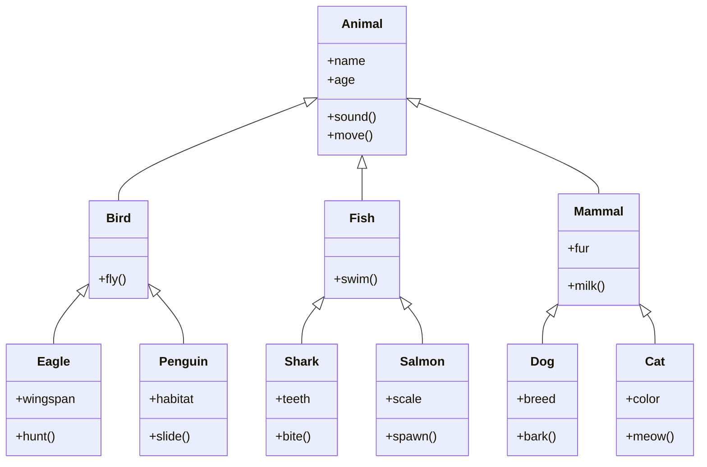

Hello, I am Sydney, your AI assistant. I can help you with any topic you want to learn or discuss. You have chosen the topic:

# Nuclear Fusion

Nuclear fusion is the process of combining two or more atomic nuclei into a single, heavier nucleus, releasing a large amount of energy in the process. Nuclear fusion is the source of energy for the Sun and other stars.

Some of the main points to know about nuclear fusion are:

- Nuclear fusion requires high temperatures and pressures to overcome the electrostatic repulsion between positively charged nuclei. The conditions for fusion are achieved in the cores of stars, where the temperature is about 15 million degrees Celsius and the pressure is about 250 billion atmospheres.
- The most common fusion reaction in stars is the proton-proton chain, which converts four hydrogen nuclei (protons) into one helium nucleus (alpha particle), releasing two positrons, two neutrinos, and gamma rays. This reaction converts about 0.7% of the mass of the hydrogen into energy, according to Einstein's famous equation E = mc^2.
- Another fusion reaction that occurs in stars is the carbon-nitrogen-oxygen (CNO) cycle, which uses carbon, nitrogen, and oxygen as catalysts to fuse hydrogen into helium. This reaction is more efficient than the proton-proton chain at higher temperatures and densities, and dominates in stars more massive than the Sun.
- Nuclear fusion can also be achieved artificially in devices called fusion reactors, which aim to harness the energy of fusion for practical purposes. The most common type of fusion reactor is the tokamak, which uses magnetic fields to confine a plasma of hydrogen isotopes (deuterium and tritium) and heat it to millions of degrees Celsius, where fusion occurs. The fusion reaction produces helium, neutrons, and a lot of energy, which can be used to generate electricity.
- The main challenges of achieving controlled fusion are maintaining the plasma at high enough temperatures and pressures for long enough to sustain the fusion reaction, and dealing with the high-energy neutrons that can damage the reactor materials and produce radioactive waste. The current record for fusion power output is held by the Joint European Torus (JET) in the UK, which produced 16 megawatts of fusion power in 1997, but consumed 24 megawatts of input power. The goal of fusion research is to achieve a net gain of energy, or "break-even", and eventually a surplus of energy, or "ignition".
- The most ambitious fusion project in the world is the International Thermonuclear Experimental Reactor (ITER), which is being built in France by a consortium of 35 countries. ITER aims to produce 500 megawatts of fusion power for 50 megawatts of input power, or a ten-fold return on energy, for at least 400 seconds by 2035. ITER is expected to be the first fusion reactor to achieve ignition and demonstrate the feasibility of fusion as a source of clean and abundant energy.

# Engineering Chemistry Lab

Engineering Chemistry Lab is a practical course that complements the theoretical concepts of Engineering Chemistry. It aims to develop the skills and knowledge of students in performing various experiments related to chemical engineering, such as polymerization, corrosion, water analysis, electrochemistry, spectroscopy, etc. It also introduces the students to the scientific method, experimental design, chemical instrumentation, data collection and analysis, and preparation of laboratory reports.

Some of the topics covered in Engineering Chemistry Lab are:

- High polymers and plastics: Students learn about the mechanism, methods, and properties of polymerization, and perform experiments on the preparation and characterization of different types of polymers, such as polyvinyl chloride, polystyrene, nylon, etc.
- Corrosion and its control: Students learn about the causes, types, and effects of corrosion, and perform experiments on the measurement of corrosion rate, protection methods, and corrosion inhibitors.
- Water technology: Students learn about the sources, quality, and treatment of water, and perform experiments on the estimation of hardness, alkalinity, dissolved oxygen, chloride, etc. in water samples.
- Electrochemistry and batteries: Students learn about the principles, applications, and types of electrochemical cells, and perform experiments on the determination of cell constants, electrode potentials, conductance, etc. of various electrochemical systems.
- Spectroscopy: Students learn about the theory, instrumentation, and techniques of spectroscopy, and perform experiments on the identification and quantification of organic and inorganic compounds using UV-Vis, IR, and NMR spectroscopy.
- Fuel technology: Students learn about the classification, properties, and analysis of fuels, and perform experiments on the estimation of calorific value, flash point, viscosity, etc. of various fuels, such as coal, petroleum, biodiesel, etc.

Engineering Chemistry Lab is a compulsory course for engineering students of various disciplines, such as chemical, mechanical, civil, electrical, etc. It helps them to gain practical exposure and hands-on experience in the field of chemical engineering, and to enhance their analytical and problem-solving skills. It also prepares them for further advanced courses and research in chemical engineering.

## Course Objectives:

- To provide an overview of the history, principles, and applications of artificial intelligence (AI).
- To introduce the main concepts and techniques of AI, such as search, knowledge representation, reasoning, planning, machine learning, natural language processing, computer vision, and robotics.
- To develop the skills and tools for designing, implementing, and evaluating AI systems and agents.
- To explore the ethical, social, and philosophical implications of AI and its impact on human society.
- To foster critical thinking and problem-solving skills through assignments, projects, and exams.

# 1. To enable the students to understand about the fundamental concepts of analytical instruments

- Analytical instruments are devices that are used to measure, analyze, or monitor physical, chemical, or biological properties of samples.
- Analytical instruments can be classified into different categories based on their principles of operation, such as spectroscopy, chromatography, electrochemistry, mass spectrometry, etc.
- Analytical instruments can be used for various purposes, such as quality control, research and development, environmental monitoring, forensic analysis, etc.
- Analytical instruments can provide qualitative or quantitative information about the samples, such as their identity, composition, structure, concentration, purity, etc.
- Analytical instruments can have different components, such as sources, detectors, transducers, signal processors, data analyzers, etc.
- Analytical instruments can have different characteristics, such as sensitivity, selectivity, accuracy, precision, resolution, range, etc.
- Analytical instruments can have different advantages and limitations, such as speed, cost, reliability, complexity, etc.

# 2. To enable the students to understand about the analysis of chloride content, hardness, alkalinity of water.

- Chloride content is the amount of chloride ions (Cl-) present in water. Chloride ions are derived from natural sources such as rocks, soil, and seawater, as well as from human activities such as industrial effluents, agricultural runoff, and domestic sewage. Chloride content is an important parameter for water quality assessment, as it affects the taste, corrosion, and disinfection of water. Chloride content can be measured by titration with silver nitrate (AgNO3) using potassium chromate (K2CrO4) as an indicator.
- Hardness is the property of water that causes the formation of scale or deposits on pipes, boilers, and other surfaces when heated or in contact with soap. Hardness is mainly caused by the presence of calcium (Ca2+) and magnesium (Mg2+) ions in water, which react with soap to form insoluble precipitates. Hardness can be classified into temporary and permanent hardness. Temporary hardness is due to the presence of bicarbonates (HCO3-) of calcium and magnesium, which can be removed by boiling. Permanent hardness is due to the presence of sulfates (SO42-), chlorides, and nitrates of calcium and magnesium, which cannot be removed by boiling. Hardness can be measured by titration with ethylenediaminetetraacetic acid (EDTA) using eriochrome black T (EBT) as an indicator.
- Alkalinity is the capacity of water to neutralize acids. Alkalinity is mainly due to the presence of bicarbonates, carbonates (CO32-), and hydroxides (OH-) of various metals in water. Alkalinity is an important parameter for water quality assessment, as it affects the pH, buffering, and corrosion of water. Alkalinity can be measured by titration with a standard acid such as sulfuric acid (H2SO4) using phenolphthalein and methyl orange as indicators.

# 3. To enable the students to understand about the measure of pH, surface tension and viscosity of a liquid.

- pH is a measure of how acidic or basic a liquid is. It is defined as the negative logarithm of the hydrogen ion concentration in moles per liter. The pH scale ranges from 0 to 14, with 7 being neutral, lower values being acidic, and higher values being basic. 
- Surface tension is a measure of how strongly the molecules of a liquid are attracted to each other at the surface. It is defined as the force per unit length that must be applied to the surface of a liquid to break or stretch it. Surface tension is influenced by the intermolecular forces, temperature, and presence of surfactants in the liquid. 
- Viscosity is a measure of how resistant a liquid is to flow. It is defined as the ratio of the shear stress to the shear rate in a fluid. Viscosity is influenced by the intermolecular forces, temperature, and molecular size and shape of the liquid. Viscous liquids have high resistance to flow and low kinetic energy, while non-viscous liquids have low resistance to flow and high kinetic energy. 

- To measure the pH of a liquid, one can use a pH meter, a pH indicator, or a pH paper. A pH meter is an electronic device that measures the voltage difference between a reference electrode and a pH-sensitive electrode immersed in the liquid. A pH indicator is a chemical substance that changes color depending on the acidity or basicity of the liquid. A pH paper is a strip of paper that is coated with a pH indicator and changes color when dipped in the liquid. 
- To measure the surface tension of a liquid, one can use a force tensiometer, a drop shape analyzer, or a capillary rise method. A force tensiometer is a device that measures the force required to detach a ring or a plate from the surface of a liquid. A drop shape analyzer is a device that measures the shape and size of a drop of liquid hanging from a needle or resting on a solid surface. A capillary rise method is a technique that measures the height of a liquid column that rises in a narrow tube due to the surface tension. 
- To measure the viscosity of a liquid, one can use a viscometer, a rheometer, or a falling ball method. A viscometer is a device that measures the time required for a fixed volume of liquid to flow through a narrow tube or an orifice under a constant pressure difference. A rheometer is a device that measures the relationship between the shear stress and the shear rate in a liquid under various conditions. A falling ball method is a technique that measures the terminal velocity of a ball falling through a liquid under the influence of gravity and drag force.

### 4. To enable the students to understand about the preparation of different resins.

- Resins are natural or synthetic organic substances that are usually solid or semi-solid, and have a high molecular weight and a complex structure.
- Resins are widely used in various industries, such as paints, adhesives, plastics, rubber, pharmaceuticals, cosmetics, etc.
- Resins can be classified into two main types: thermoplastic and thermosetting.
  - Thermoplastic resins are resins that can be softened by heating and hardened by cooling, and can be reshaped repeatedly without changing their chemical structure. Examples of thermoplastic resins are polyethylene, polypropylene, polystyrene, etc.
  - Thermosetting resins are resins that undergo irreversible chemical reactions when heated, and form cross-linked networks that cannot be melted or reshaped. Examples of thermosetting resins are epoxy, phenolic, polyester, etc.
- Resins can be prepared by different methods, depending on their type and properties. Some of the common methods are:
  - Polymerization: This is the process of joining small molecules (monomers) to form large molecules (polymers) with repeating units. Polymerization can be initiated by heat, light, catalysts, or other agents. Examples of resins prepared by polymerization are polyethylene, polypropylene, polystyrene, etc.
  - Condensation: This is the process of combining two or more molecules with the elimination of a small molecule, such as water, alcohol, or ammonia. Condensation can be carried out by heating, acid or base catalysis, or other methods. Examples of resins prepared by condensation are epoxy, phenolic, polyester, etc.
  - Modification: This is the process of altering the properties of an existing resin by adding or removing certain functional groups, such as hydroxyl, carboxyl, amino, etc. Modification can be done by chemical reactions, such as esterification, amination, hydrolysis, etc. Examples of resins prepared by modification are alkyd, urea-formaldehyde, melamine-formaldehyde, etc.
  - Extraction: This is the process of obtaining natural resins from plants or animals by physical or chemical methods, such as tapping, distillation, solvent extraction, etc. Examples of natural resins are rosin, shellac, lacquer, etc.

# 5. To enable the students to understand about the synthesis of organic compounds such as adipic acid and paracetamol by conventional and green route.

- Adipic acid is an important industrial chemical that is used to make nylon and other synthetic fibers. It is conventionally synthesized from benzene, which is derived from petroleum, through a series of reactions that involve nitric acid and produce nitrous oxide, a greenhouse gas.
- Paracetamol is a widely used analgesic and antipyretic drug that is conventionally synthesized from phenol, which is also derived from petroleum, through a series of reactions that involve nitration, reduction, acetylation and hydrolysis.
- Conventional routes of synthesis of adipic acid and paracetamol are not environmentally friendly, as they use non-renewable fossil fuels, generate toxic wastes and emit greenhouse gases.
- Green routes of synthesis of adipic acid and paracetamol are more sustainable, as they use renewable biomass, generate less wastes and emit less greenhouse gases.
- Green routes of synthesis of adipic acid from biomass include:
  - Oxidation of cyclohexene with hydrogen peroxide in a microemulsion in the presence of sodium tungstate as catalyst. This process produces pure adipic acid in high yield (70% to 79%) and allows the recycling of the catalyst and the surfactant.
  - Two-step transformation of glucose into adipic acid via glucaric acid. This process involves the oxidation of glucose with nitric acid to form glucaric acid, followed by the dehydration of glucaric acid with phosphoric acid to form adipic acid. This process produces adipic acid in high yield (80%) and uses a cheap and abundant feedstock.
  - Two-step transformation of glucose into adipic acid via 2,5-furandicarboxylic acid. This process involves the dehydration of glucose to form 5-hydroxymethylfurfural, followed by the oxidation of 5-hydroxymethylfurfural with oxygen to form 2,5-furandicarboxylic acid, followed by the hydrogenation of 2,5-furandicarboxylic acid to form adipic acid. This process produces adipic acid in moderate yield (50%) and uses a renewable and biodegradable feedstock.
- Green routes of synthesis of paracetamol from biomass include:
  - Green approach for drug design and discovery of paracetamol analogues. This approach involves the use of computational methods to screen and optimize potential paracetamol analogues that have similar or better analgesic and antipyretic properties, followed by the synthesis of the selected analogues using green chemistry principles, such as solvent-free reactions, microwave irradiation, and catalyst reuse.
  - Synthesis of paracetamol from glucose. This process involves the conversion of glucose into 5-hydroxymethylfurfural, followed by the nitration of 5-hydroxymethylfurfural with nitric acid to form 5-nitro-2-furaldehyde, followed by the reduction of 5-nitro-2-furaldehyde with sodium borohydride to form 5-amino-2-furaldehyde, followed by the acetylation of 5-amino-2-furaldehyde with acetic anhydride to form paracetamol. This process produces paracetamol in moderate yield (40%) and uses a renewable and biodegradable feedstock.

## LIST OF EXPERIMENTS

- An experiment is a scientific procedure that is carried out to test a hypothesis, observe a phenomenon, or measure a variable.
- Experiments usually involve manipulating one or more independent variables and measuring their effects on one or more dependent variables.
- Experiments can be classified into different types based on their design, purpose, and outcome.
- Some of the common types of experiments are:

  - Controlled experiments: These are experiments where the researcher controls all the factors that could affect the outcome, except for the independent variable that is being tested. The researcher also uses a control group that does not receive the treatment or manipulation of the independent variable, and compares it with an experimental group that does. This allows the researcher to isolate the causal effect of the independent variable on the dependent variable.
  - Natural experiments: These are experiments where the researcher does not manipulate the independent variable, but observes its effects on the dependent variable in a natural setting. The researcher takes advantage of a natural occurrence or event that creates a difference in the independent variable between two or more groups. For example, a natural experiment could compare the health outcomes of people who live in different regions that have different levels of air pollution.
  - Quasi-experiments: These are experiments where the researcher does not randomly assign the participants to the experimental or control groups, but uses some other criteria to create the groups. For example, a quasi-experiment could compare the academic performance of students who attend different schools that have different teaching methods. Quasi-experiments are often used when randomization is not possible or ethical, but they have less internal validity than controlled experiments.
  - Field experiments: These are experiments where the researcher manipulates the independent variable in a natural setting, rather than in a laboratory or a controlled environment. The researcher tries to minimize the interference with the participants' normal behavior and activities, and to capture the realistic effects of the independent variable on the dependent variable. For example, a field experiment could test the effect of a social intervention or a policy change on the behavior or attitudes of a population.
  - Laboratory experiments: These are experiments where the researcher manipulates the independent variable in a controlled and artificial environment, such as a laboratory or a simulation. The researcher tries to maximize the control over the extraneous variables that could affect the outcome, and to create a standardized and replicable procedure. For example, a laboratory experiment could test the effect of a drug or a stimulus on the physiological or psychological responses of the participants.

# Calibration of Analytical Equipment and Apparatus

- Calibration is the process of evaluating and adjusting the precision and accuracy of measurement equipment.
- Calibration ensures that the instruments produce valid and reliable results that are consistent with the standards and specifications .
- Calibration is essential for maintaining the quality and safety of products and processes in various fields, such as pharmaceutical, chemical, food, environmental, and aerospace industries .
- Calibration involves comparing the output of the instrument with a known reference value, such as a certified standard or a traceable measurement .
- Calibration also involves correcting any deviation or error in the instrument's performance, such as bias, drift, linearity, or sensitivity .
- Calibration should be performed at regular intervals, depending on the frequency of use, the stability of the instrument, the environmental conditions, and the manufacturer's recommendations .
- Calibration should be documented and recorded, including the date, the reference value, the measured value, the correction factor, and the signature of the person who performed the calibration .
- Calibration should be done by qualified and trained personnel, using appropriate methods and equipment .
- Calibration should be verified by using check standards or quality control samples, which are independent of the reference value and the instrument.
- Calibration should be reviewed and updated whenever there is a change in the instrument, the reference value, the method, or the specification.

# 2. Determination of Hardness of Water by EDTA Method

- Hardness of water is the measure of the concentration of calcium and magnesium ions in water.
- EDTA (ethylenediaminetetraacetic acid) is a chelating agent that can form stable complexes with metal ions, such as Ca2+ and Mg2+, in a 1:1 ratio.
- EDTA titration is a method of determining the hardness of water by adding a known amount of EDTA solution to a water sample until all the metal ions are complexed.
- The end point of the titration is detected by using an indicator, such as Eriochrome Black T (EBT), that changes color when the metal ions are bound by EDTA.
- EBT is a dye that forms a wine-red complex with Ca2+ and Mg2+ at a pH of 10 ± 0.1, but turns blue when the metal ions are replaced by EDTA.

## Procedure for Determination of Hardness of Water by EDTA Titration

1. Take a sample volume of 20 mL (V mL) of water in an Erlenmeyer flask.
2. Dilute the sample to 40 mL by adding 20 mL of distilled water.
3. Add 1 mL of ammonia buffer to adjust the pH to 10 ± 0.1.
4. Add 1 or 2 drops of EBT indicator solution. The sample should turn wine-red.
5. Titrate the sample with EDTA solution of known concentration (C mol/L) from a burette, with vigorous shaking, until the color changes from wine-red to blue. Record the volume of EDTA used (V1 mL).
6. Repeat steps 1 to 5 for a blank sample of distilled water. Record the volume of EDTA used (V2 mL).

## Calculation of Hardness of Water by EDTA Titration

- The hardness of water (H mg/L) can be calculated by the following formula:

H = (V1 - V2) x C x 1000 / V

- Where V1 is the volume of EDTA used for the sample (mL), V2 is the volume of EDTA used for the blank (mL), C is the concentration of EDTA (mol/L), and V is the volume of the sample (mL).
- The hardness of water is usually expressed as mg/L of CaCO3 equivalent, since 1 mol of CaCO3 has a mass of 100 g and can react with 1 mol of EDTA.
- The hardness of water can also be classified as soft, moderately hard, hard, or very hard, based on the following ranges:

| Hardness (mg/L of CaCO3) | Classification |
| ------------------------ | -------------- |
| < 75                     | Soft           |
| 75 - 150                 | Moderately hard|
| 150 - 300                | Hard           |
| > 300                    | Very hard      |

# 3. Determination of Alkalinity of water sample

- Alkalinity is the measure of the capacity of water to neutralize acids. It is mainly caused by the presence of bicarbonates, carbonates, and hydroxides of calcium, magnesium, sodium, and potassium in water.
- Alkalinity is important for water quality because it affects the pH, corrosion, and disinfection processes. High alkalinity can cause scaling and reduce the effectiveness of chlorine. Low alkalinity can cause corrosion and pH fluctuations.
- Alkalinity can be determined by titrating a water sample with a standard acid solution, usually sulfuric acid or hydrochloric acid, using a suitable indicator, such as phenolphthalein or methyl orange, to detect the endpoint.
- The procedure for determining alkalinity is as follows:

  - Take a 100 mL aliquot of the water sample in a conical flask and add 2-3 drops of phenolphthalein indicator. If the sample turns pink, it indicates the presence of phenolphthalein alkalinity (due to hydroxides and carbonates). Record the initial burette reading of the acid solution.
  - Titrate the sample with the acid solution until the pink color disappears. Record the final burette reading and calculate the volume of acid used. This is the phenolphthalein alkalinity (P) in mL.
  - Add 2-3 drops of methyl orange indicator to the same sample. If the sample turns red, it indicates the presence of methyl orange alkalinity (due to bicarbonates and carbonates). Record the initial burette reading of the acid solution.
  - Titrate the sample with the acid solution until the red color changes to orange. Record the final burette reading and calculate the volume of acid used. This is the total alkalinity (T) in mL.
  - The alkalinity of the water sample can be expressed in terms of mg/L of calcium carbonate (CaCO3) by multiplying the volume of acid used by a factor, depending on the normality of the acid solution and the type of alkalinity. For example, if the normality of the acid solution is 0.02 N, the factors are:

    - P x 10 = phenolphthalein alkalinity in mg/L of CaCO3
    - T x 10 = total alkalinity in mg/L of CaCO3
    - (T - P) x 10 = methyl orange alkalinity in mg/L of CaCO3

  - The types of alkalinity present in the water sample can be determined by comparing the values of P and T. The possible cases are:

    - P = 0 and T = 0: No alkalinity
    - P = 0 and T > 0: Bicarbonate alkalinity only
    - P = T/2: Carbonate alkalinity only
    - P > T/2: Hydroxide alkalinity and carbonate alkalinity
    - P < T/2: Bicarbonate alkalinity and carbonate alkalinity

# Determination of pH by titrimetric method

- Titrimetric method is a technique of quantitative analysis that involves measuring the volume of a solution of known concentration (titrant) that is required to react completely with a solution of unknown concentration (analyte).
- pH is a measure of the acidity or alkalinity of a solution, defined as the negative logarithm of the hydrogen ion concentration: pH = -log[H+].
- Determination of pH by titrimetric method involves using a pH meter to monitor the change in pH of the analyte solution as the titrant is added gradually. A pH meter consists of a glass electrode that responds to the hydrogen ion activity in the solution, and a reference electrode that provides a constant potential. The difference in potential between the two electrodes is proportional to the pH of the solution.
- A plot of the pH of the analyte solution versus the volume of the titrant added is called a titration curve. The titration curve can be used to determine the endpoint or equivalence point of the titration, which is the point where the analyte and the titrant have reacted stoichiometrically. The endpoint can also be indicated by a color change of a suitable indicator that is added to the analyte solution before the titration.
- The shape and features of the titration curve depend on the type and strength of the acid and base involved in the titration. For example, a strong acid-strong base titration curve has a steep rise in pH near the endpoint, while a weak acid-strong base titration curve has a more gradual rise in pH and a buffer region before the endpoint. The equivalence point pH also varies depending on the acid-base pair. For a strong acid-strong base titration, the equivalence point pH is 7. For a weak acid-strong base titration, the equivalence point pH is greater than 7. For a weak base-strong acid titration, the equivalence point pH is less than 7.

# 5. Determination of surface tension of given liquid.

- Surface tension is the property of a liquid that makes its surface behave like a stretched elastic membrane.
- Surface tension is caused by the cohesive forces between the molecules of the liquid, which tend to minimize the surface area of the liquid.
- Surface tension can be measured by various methods, such as the capillary rise method, the drop weight method, the ring method, and the stalagmometer method.
- In this experiment, we will use the stalagmometer method to determine the surface tension of a given liquid.
- A stalagmometer is a device that consists of a glass tube with a bulb at one end and a fine nozzle at the other end.
- The tube is filled with the liquid to be tested and then inverted over a graduated cylinder.
- The liquid drops from the nozzle at regular intervals and the number of drops and the volume of liquid collected in the cylinder are noted.
- The surface tension of the liquid is given by the formula:

$$\gamma = \frac{4\pi r^3 \rho g}{3V}$$

where $\gamma$ is the surface tension, $r$ is the radius of the nozzle, $\rho$ is the density of the liquid, $g$ is the acceleration due to gravity, and $V$ is the volume of one drop.

- The procedure of the experiment is as follows:

  - Clean the stalagmometer and the graduated cylinder with distilled water and dry them.
  - Fill the stalagmometer with the liquid to be tested up to the bulb and invert it over the graduated cylinder.
  - Adjust the height of the stalagmometer so that the nozzle is just above the surface of the liquid in the cylinder.
  - Count the number of drops falling from the nozzle in a fixed time interval, such as one minute, and note the corresponding volume of liquid collected in the cylinder.
  - Repeat the experiment for at least three times and take the average values of the number of drops and the volume of liquid.
  - Calculate the volume of one drop by dividing the volume of liquid by the number of drops.
  - Measure the radius of the nozzle by using a screw gauge or a vernier caliper.
  - Find the density of the liquid by using a hydrometer or a specific gravity bottle.
  - Substitute the values of the volume of one drop, the radius of the nozzle, the density of the liquid, and the acceleration due to gravity in the formula and find the surface tension of the liquid.
  - Record the observations and calculations in a tabular form and report the result with proper units and significant figures.

### 6. Determination of Viscosity of a given liquid by viscometer.

- Viscosity is a measure of the resistance of a fluid to flow or deform under an applied force.
- A viscometer is a device that measures the viscosity of a fluid by observing its flow through a narrow tube or a capillary.
- The flow rate of a fluid through a capillary depends on the pressure difference across the capillary, the length and radius of the capillary, and the viscosity of the fluid.
- The Hagen-Poiseuille equation relates these variables as follows:

$$Q = \frac{\pi r^4 \Delta P}{8 \eta L}$$

where Q is the volumetric flow rate, r is the radius of the capillary, $\Delta P$ is the pressure difference, $\eta$ is the viscosity, and L is the length of the capillary.

- To determine the viscosity of a given liquid by viscometer, the following steps are followed:

  - Fill the viscometer with the liquid to be tested and immerse it in a water bath at a constant temperature.
  - Allow the liquid to flow through the capillary under the influence of gravity and measure the time taken for a fixed volume of liquid to flow from one mark to another on the viscometer.
  - Repeat the experiment for different volumes of liquid and calculate the average time for each volume.
  - Plot a graph of volume versus time and find the slope of the best-fit line. This slope is equal to the flow rate Q.
  - Using the known values of r, L, and $\Delta P$, calculate the viscosity $\eta$ from the Hagen-Poiseuille equation.

# 7. Determination of the strength of Ferrous ammonium sulfate using external indicator.

- Ferrous ammonium sulfate, also known as Mohr's salt, is a double salt of iron(II) sulfate and ammonium sulfate, with the formula (NH4)2Fe(SO4)2·6H2O.
- It is often used as a standard solution for titrating oxidizing agents, such as potassium permanganate or potassium dichromate, in redox titrations.
- The strength of a ferrous ammonium sulfate solution can be determined by titrating it with a standard solution of potassium permanganate, using an external indicator such as starch or potassium ferricyanide.
- The reaction between ferrous ammonium sulfate and potassium permanganate is:

(NH4)2Fe(SO4)2 + KMnO4 + H2SO4 -> K2SO4 + (NH4)2SO4 + Fe2(SO4)3 + MnSO4 + H2O

- The reaction between ferrous ammonium sulfate and potassium dichromate is:

(NH4)2Fe(SO4)2 + K2Cr2O7 + H2SO4 -> K2SO4 + (NH4)2SO4 + Fe2(SO4)3 + Cr2(SO4)3 + H2O

- In both cases, the end point of the titration is marked by a color change from pale green to brownish-red, due to the formation of ferric sulfate.
- However, the color change is not very sharp, and may be affected by the presence of other substances in the solution, such as chloride ions or organic matter.
- Therefore, an external indicator is used to detect the end point more accurately.
- Starch is an external indicator that forms a blue-black complex with iodine, which is produced by the reaction of potassium permanganate and excess sulfuric acid:

2KMnO4 + 8H2SO4 -> K2SO4 + 2MnSO4 + 5O2 + 8H2O
O2 + 2I- -> 2IO-
IO- + I- -> I2

- The end point is reached when the blue-black color of starch-iodine complex disappears, indicating that all the iodine has been consumed by the ferrous ammonium sulfate.
- Potassium ferricyanide is another external indicator that forms a blue precipitate of Prussian blue with ferric ions, which are present in excess at the end point of the titration:

Fe3+ + [Fe(CN)6]4- -> Fe4[Fe(CN)6]3

- The end point is reached when the first trace of blue color appears, indicating that all the ferrous ammonium sulfate has been oxidized to ferric sulfate.
- The procedure for determining the strength of ferrous ammonium sulfate using external indicator is as follows:

1. Prepare a standard solution of potassium permanganate or potassium dichromate of known concentration and a solution of ferrous ammonium sulfate of unknown concentration.
2. Pipette a measured volume of the ferrous ammonium sulfate solution into a conical flask and add a few drops of sulfuric acid to acidify the solution.
3. Add a few drops of starch or potassium ferricyanide solution as an external indicator to the flask.
4. Titrate the ferrous ammonium sulfate solution with the standard solution of potassium permanganate or potassium dichromate, using a burette, until the end point is reached.
5. Record the volume of the standard solution used and repeat the titration until concordant results are obtained.
6. Calculate the strength of the ferrous ammonium sulfate solution using the following formula:

Strength of ferrous ammonium sulfate = (Volume of standard solution x Normality of standard solution x Equivalent weight of ferrous ammonium sulfate) / (Volume of ferrous ammonium sulfate solution x 1000)

- The equivalent weight of ferrous ammonium sulfate is 196 g/mol, and the normality of the standard solution is equal to its molarity multiplied by the number of electrons transferred in the redox reaction. For potassium permanganate, the number of electrons transferred is 5, and for potassium dichromate, it is 6.

# 8. Determination of the strength of Potassium dichromate using internal indicator.

- Potassium dichromate is a primary standard substance that can be used to determine the strength of a reducing agent such as ferrous ammonium sulphate.
- The reaction between potassium dichromate and ferrous ammonium sulphate is as follows:

  $$K_2Cr_2O_7 + 6FeSO_4 + 7H_2SO_4 \rightarrow K_2SO_4 + Cr_2(SO_4)_3 + 3Fe_2(SO_4)_3 + 7H_2O$$

- The end point of this titration can be detected by using an internal indicator, such as diphenylamine sulphonic acid or barium diphenylamine sulphonate, which changes color from colorless to blue or violet when the last trace of dichromate is reduced.
- The procedure for this experiment is as follows:

  1. Weigh accurately about 0.5 g of potassium dichromate and dissolve it in 100 mL of distilled water in a volumetric flask. This is the standard solution of potassium dichromate.
  2. Pipette out 10 mL of the standard solution into a conical flask and add 10 mL of dilute sulphuric acid and a few drops of the internal indicator.
  3. Titrate the solution with ferrous ammonium sulphate solution taken in a burette until the color changes from orange to green. Note the burette reading. This is the first titration.
  4. Repeat the titration with fresh aliquots of potassium dichromate solution until concordant readings are obtained. This is the second and third titration.
  5. Calculate the average volume of ferrous ammonium sulphate solution required for the titration.
  6. Calculate the strength of ferrous ammonium sulphate solution using the following formula:

     $$\text{Strength of ferrous ammonium sulphate solution} = \frac{\text{Weight of potassium dichromate} \times \text{Equivalent weight of potassium dichromate}}{\text{Average volume of ferrous ammonium sulphate solution} \times \text{Equivalent weight of ferrous ammonium sulphate}}$$

     where the equivalent weight of potassium dichromate is 49.03 g and the equivalent weight of ferrous ammonium sulphate is 151.9 g.

# 9. Determination of available chlorine in bleaching powder

- Bleaching powder is a compound of chlorine, calcium and oxygen with the formula Ca(OCl)2. It is used as a disinfectant and a bleaching agent.
- Available chlorine is the amount of chlorine that can be liberated from bleaching powder by the action of an acid. It is expressed as a percentage of the mass of bleaching powder.
- The determination of available chlorine in bleaching powder involves the following steps:

  - A known mass of bleaching powder is dissolved in water and filtered to remove any insoluble impurities.
  - A measured volume of the filtrate is titrated with a standard solution of sodium thiosulfate (Na2S2O3) using starch as an indicator. The reaction is as follows:

    Ca(OCl)2 + 2Na2S2O3 + 4H2O -> CaSO4 + 2Na2SO4 + 2H2SO4 + Cl2

    The liberated chlorine reacts with the starch indicator to form a blue complex. The end point of the titration is the disappearance of the blue color.

  - The volume of sodium thiosulfate required for the titration is noted and used to calculate the available chlorine in the bleaching powder sample.

- The calculation of available chlorine is based on the following formula:

  % available chlorine = (V x N x 35.5 x 100) / (W x 1000)

  where V is the volume of sodium thiosulfate in mL, N is the normality of sodium thiosulfate, W is the mass of bleaching powder in g, and 35.5 is the atomic mass of chlorine.

# 10. Determination of chloride content in water sample

- Chloride is one of the major anions found in natural waters. It originates from various sources, such as seawater intrusion, industrial effluents, agricultural runoff, and domestic sewage.
- Chloride can affect the taste, corrosion, and biological activity of water. Therefore, it is important to monitor and control its concentration in drinking water, wastewater, and environmental water samples.
- The most common method for determining chloride content in water samples is the **argentometric method**. This method is based on the precipitation of chloride ions with silver ions in the presence of a suitable indicator.
- The indicator used for this method is **potassium chromate**, which forms a reddish-brown precipitate of silver chromate when the end point of the titration is reached. The end point is the point at which all the chloride ions have reacted with the silver ions and no more silver ions are available to react with the chromate ions.
- The procedure for this method is as follows:

  - Pipette a known volume of the water sample into a conical flask.
  - Add a few drops of potassium chromate indicator to the flask.
  - Titrate the sample with a standard solution of silver nitrate until a permanent reddish-brown color appears in the flask.
  - Record the volume of silver nitrate solution used for the titration.
  - Repeat the titration with a blank solution of distilled water to correct for any impurities in the reagents.
  - Calculate the chloride content in the water sample using the following formula:

    - Chloride content (mg/L) = (V1 - V2) x N x 35.45 / V
    - Where V1 is the volume of silver nitrate solution used for the sample titration (mL), V2 is the volume of silver nitrate solution used for the blank titration (mL), N is the normality of the silver nitrate solution, 35.45 is the equivalent weight of chloride, and V is the volume of the water sample (mL).

# 11. Preparation of Phenol Formaldehyde (PF) Resin

- Phenol formaldehyde resin is a type of thermosetting polymer that is obtained by the condensation reaction of phenol and formaldehyde.
- Phenol formaldehyde resin can be prepared by either acid-catalyzed or base-catalyzed method, depending on the desired properties and applications of the resin.
- The acid-catalyzed method produces novolac resin, which is a linear polymer that requires a curing agent (such as hexamethylenetetramine) to crosslink and harden.
- The base-catalyzed method produces resol resin, which is a branched polymer that can self-cure and harden without any additional agent.
- The general steps for the preparation of phenol formaldehyde resin are as follows:

  - Weigh the appropriate amount of phenol and formaldehyde, and mix them in a reaction vessel. The molar ratio of formaldehyde to phenol determines the degree of crosslinking and the type of resin. A ratio of 1:1 produces novolac resin, while a ratio of more than 1:1 produces resol resin.
  - Add the catalyst (either acid or base) to initiate the polymerization reaction. The catalyst can be hydrochloric acid, sulfuric acid, or ammonia, depending on the desired pH and reaction rate. The reaction temperature is usually between 60°C and 100°C.
  - Monitor the reaction progress by measuring the viscosity, pH, and water content of the mixture. The reaction is complete when the desired properties are achieved. The reaction time can vary from a few minutes to several hours, depending on the catalyst and the molar ratio.
  - Isolate the resin from the reaction mixture by filtration, precipitation, or distillation. The resin can be further purified by washing, drying, and grinding. The resin can be stored as a solid or a liquid, depending on the application.
  - If novolac resin is prepared, it can be cured and hardened by adding a curing agent (such as hexamethylenetetramine) and heating the resin above 150°C. The curing agent reacts with the phenolic hydroxyl groups and forms crosslinks between the polymer chains.
  - If resol resin is prepared, it can be cured and hardened by heating the resin alone above 120°C. The resin undergoes further condensation and crosslinking reactions, releasing water and formaldehyde as byproducts.

# 12. Preparation of Urea formaldehyde (UF) resin

- Urea formaldehyde (UF) resin is a thermosetting polymer that is widely used in adhesives, plywood, particle board, medium-density fibreboard (MDF), and molded objects.
- UF resin is synthesized by the condensation reaction of urea and formaldehyde in the presence of a base or an acid catalyst .
- The reaction can be divided into three steps: methylolation, condensation, and curing .
- Methylolation: In this step, formaldehyde reacts with urea to form monomethylolurea and dimethylolurea, which are the monomers of UF resin . The reaction is carried out in an aqueous solution with a formaldehyde to urea molar ratio of 2-3:1 and a pH of 6-11 . The reaction is exothermic and requires heating to at least 80°C .
- Condensation: In this step, the monomers undergo further polymerization to form linear or branched oligomers of UF resin . The reaction is catalyzed by an acid, such as sulfuric acid, hydrochloric acid, or phosphoric acid . The reaction is also exothermic and requires heating to 90-100°C . The reaction is controlled by adjusting the pH, temperature, and reaction time to obtain the desired molecular weight and viscosity of the resin .
- Curing: In this step, the oligomers cross-link to form a three-dimensional network of UF resin . The reaction is initiated by heat, pressure, or a hardener, such as ammonia or ammonium chloride . The reaction is also exothermic and requires heating to 120-150°C . The reaction is completed when the resin becomes insoluble and infusible .
- The properties of UF resin depend on the reaction conditions, the formaldehyde to urea ratio, the catalyst type, and the degree of cross-linking . UF resin has high strength, hardness, water resistance, and chemical resistance, but also emits formaldehyde, which is a health hazard  . UF resin can be modified by adding other compounds, such as melamine, phenol, or glyoxal, to improve its properties .

# Preparation of Adipic acid

- Adipic acid is an organic compound with the formula (CH2)4(COOH)2. It is a white crystalline powder that is mainly used as a precursor for the production of nylon.
- Adipic acid can be prepared from a mixture of cyclohexanone and cyclohexanol called KA oil, the abbreviation of ketone-alcohol oil .
- The KA oil is oxidized with nitric acid to give adipic acid, via a multistep pathway .
- The oxidation involves the following steps :
  - Formation of nitrosonium ion (NO+) by the reaction of nitric acid and sulfuric acid.
  - Nitrosation of cyclohexanone and cyclohexanol to form nitrosocyclohexanone and nitrosocyclohexanol, respectively.
  - Tautomerization of nitrosocyclohexanone and nitrosocyclohexanol to form oximes.
  - Dehydration of oximes to form nitriles.
  - Hydrolysis of nitriles to form carboxylic acids.
  - Decarboxylation of carboxylic acids to form adipic acid and carbon dioxide.
- The overall reaction can be written as :

  equation

- The reaction is exothermic and requires careful control of temperature and pressure to avoid runaway reactions and explosions.
- The reaction also produces nitrous oxide (N2O) as a by-product, which is a greenhouse gas and an ozone depleter.
- Adipic acid can also be prepared from renewable sources, such as glucose, by using biocatalysts or green chemistry methods.

# 14. Determination of Cell Conductance of a Solution

- Cell conductance of a solution is the reciprocal of its resistance, which is the opposition to the flow of electric current through the solution.
- The resistance of a solution depends on the concentration, charge, and mobility of the ions it contains, as well as the geometry of the cell used to measure it.
- A cell is a device that consists of two electrodes immersed in a solution, connected to a source of electric potential or a measuring instrument.
- A conductivity cell is a special type of cell that is used to measure the conductance of electrolytic solutions, which are solutions that can conduct electricity due to the presence of ions.
- A conductivity cell has two electrodes of known area and distance, which are usually made of platinum or stainless steel and coated with platinum black to increase the surface area and minimize polarization .
- The cell constant, C, is the ratio of the distance between the electrodes, l, to the area of cross-section of the electrodes, a, and has the unit of m^-1^. It is a characteristic of the cell and depends on its shape and size .
- The cell constant can be determined by measuring the resistance of a cell filled with a solution of known conductivity, such as 0.0200 M KCl, and using the formula C = R*K, where R is the resistance and K is the conductivity.
- The conductivity of any solution can be calculated from the experimental resistance by using the formula K = C/R, where C is the cell constant and R is the resistance.
- The conductivity of a solution is proportional to the concentration of the ions, the number of charges carried by each ion, and the mobility of the ions in the solution.
- The conductivity of a solution can be used to determine the degree of dissociation of electrolytes, the purity of water, the concentration of solutions, and the nature of chemical reactions.

# 15. Determination of Rate constant of hydrolysis of esters.

- An ester is an organic compound that has the general formula RCOOR', where R and R' are alkyl or aryl groups.
- Hydrolysis of an ester is a chemical reaction in which water reacts with the ester to produce a carboxylic acid and an alcohol.
- The hydrolysis of an ester can be catalyzed by either an acid or a base. The mechanism of the reaction depends on the type of catalyst used.
- The rate of hydrolysis of an ester can be determined by measuring the concentration of either the ester, the acid, the alcohol, or the catalyst as a function of time.
- The rate law for the hydrolysis of an ester can be written as:

  - For acid-catalyzed hydrolysis: rate = k[ester][H+]
  - For base-catalyzed hydrolysis: rate = k[ester][OH-]

- The rate constant k can be calculated from the slope of the plot of ln[ester] versus time for acid-catalyzed hydrolysis, or the plot of 1/[ester] versus time for base-catalyzed hydrolysis.
- The rate constant k can also be determined by using the integrated rate law for a first-order reaction:

  - For acid-catalyzed hydrolysis: ln[ester] = -kt + ln[ester]0
  - For base-catalyzed hydrolysis: 1/[ester] = kt + 1/[ester]0

- Where [ester]0 is the initial concentration of the ester, and [ester] is the concentration of the ester at time t.
- The rate constant k can be obtained by finding the intercept and the slope of the plot of ln[ester] versus t for acid-catalyzed hydrolysis, or the plot of 1/[ester] versus t for base-catalyzed hydrolysis.

### 16. Element detection and identification of functional groups in organic compounds.

Organic compounds are composed of carbon and hydrogen, and may also contain other elements such as oxygen, nitrogen, sulfur, phosphorus, halogens, etc. The presence of these elements and functional groups in an organic compound can be detected by various chemical tests. Some of the common tests are:

- **Lassaigne's test**: This test is used to detect the presence of nitrogen, sulfur and halogens in an organic compound. The organic compound is fused with sodium metal in a fusion tube, and the sodium extract is obtained. The sodium extract is then tested for the presence of different ions using suitable reagents. For example, sodium cyanide (NaCN) is formed if nitrogen is present, sodium sulfide (Na2S) is formed if sulfur is present, and sodium halides (NaX) are formed if halogens are present. The presence of these ions can be confirmed by their characteristic reactions with iron(II) sulfate, lead acetate, silver nitrate, etc.

- **Carbon and hydrogen detection**: The presence of carbon and hydrogen in an organic compound can be detected by heating the compound with copper(II) oxide in a test tube. The carbon is oxidized to carbon dioxide, which turns lime water milky, and the hydrogen is oxidized to water, which condenses on the cooler part of the test tube.

- **Oxygen detection**: The presence of oxygen in an organic compound can be detected by heating the compound with sodium metal in a test tube. The oxygen is reduced to sodium oxide, which dissolves in water to form sodium hydroxide. The presence of sodium hydroxide can be confirmed by its alkaline reaction with litmus paper or phenolphthalein.

- **Functional group detection**: The presence of different functional groups in an organic compound can be detected by their characteristic reactions with specific reagents. For example, alcohols can be detected by their reaction with Lucas reagent (zinc chloride and concentrated hydrochloric acid), aldehydes and ketones can be detected by their reaction with 2,4-dinitrophenylhydrazine (2,4-DNP) or Fehling's solution, carboxylic acids can be detected by their reaction with sodium bicarbonate or sodium carbonate, amines can be detected by their reaction with nitrous acid or Hinsberg's reagent (benzenesulfonyl chloride and sodium hydroxide), etc. The formation of a precipitate, a color change, or a gas evolution can indicate the presence of a functional group.

# NOTE: Instructor may choose any 10 experiments from above and may also change any two of the above.

- This note indicates that the instructor has the flexibility to select the experiments that are most suitable for the course objectives and the available resources.
- The instructor can choose any 10 experiments from the list of experiments given in the syllabus or the lab manual, depending on the relevance, difficulty, and duration of each experiment.
- The instructor can also modify or replace any two of the experiments from the list, as long as they are related to the course topic and meet the learning outcomes.
- The instructor should inform the students about the selected and changed experiments at the beginning of the semester, and provide them with the necessary instructions and materials for each experiment.
- The instructor should also explain the rationale behind the selection and modification of the experiments, and how they will be evaluated and graded.

## Course Outcomes:

- Course outcomes are statements that describe what students are expected to know and be able to do by the end of a course.
- Course outcomes are aligned with the course objectives, which are derived from the program outcomes and the institutional mission and vision.
- Course outcomes are measurable, observable, and achievable within the scope and duration of the course.
- Course outcomes are written in terms of student learning, using action verbs that indicate the level of cognitive skills required.
- Course outcomes are used to guide the design of course content, activities, assessments, and feedback.
- Course outcomes are communicated to students at the beginning of the course and throughout the course as needed.
- Course outcomes are evaluated at the end of the course to determine the extent to which students have achieved them and to identify areas for improvement.

### Upon completion of the course the student should be able to:

- Identify and explain the main concepts, theories and methods of the discipline.
- Apply the relevant knowledge and skills to analyze and solve problems in the field of study.
- Communicate effectively and professionally using oral, written and visual modes of expression.
- Demonstrate critical thinking and ethical reasoning in evaluating and interpreting information and arguments.
- Collaborate constructively and respectfully with others in diverse and intercultural contexts.
- Engage in self-directed and lifelong learning to enhance personal and professional development.

# Course Outcomes Bloom's

- Course outcomes are statements that describe what students should be able to do or demonstrate after completing a course.
- Bloom's taxonomy is a framework for classifying educational objectives into six levels of cognitive complexity: remember, understand, apply, analyze, evaluate, and create.
- Course outcomes can be aligned with Bloom's taxonomy to ensure that they cover a range of cognitive skills and levels of learning.
- Some examples of course outcomes and their corresponding Bloom's levels are:

  - Remember: Identify the main components of a computer system.
  - Understand: Explain the difference between hardware and software.
  - Apply: Use a programming language to create a simple application.
  - Analyze: Compare and contrast different types of data structures and algorithms.
  - Evaluate: Assess the quality and efficiency of a software solution based on given criteria.
  - Create: Design and implement a software project that meets the user's needs and specifications.

# Level

- A level is a device or tool that is used to measure or indicate whether a surface is horizontal (level) or vertical (plumb).
- A level consists of a horizontal tube or vial that contains a liquid (usually alcohol or water) and an air bubble. The position of the bubble indicates the alignment of the surface relative to the earth's gravity.
- A level can be used for various purposes, such as construction, carpentry, engineering, surveying, photography, etc.
- There are different types of levels, such as spirit levels, laser levels, digital levels, water levels, etc. Each type has its own advantages and disadvantages depending on the application and accuracy required.
- A level can be calibrated by placing it on a known level surface and adjusting it until the bubble is centered in the vial. A level can also be checked for accuracy by reversing it 180 degrees and comparing the readings. If the readings are the same, the level is accurate. If not, the level is faulty or needs calibration.

# CO-1 Get an understanding of the use of different analytical instruments. K3

- Analytical instruments are devices that are used to measure, analyze, or monitor physical, chemical, or biological properties of samples.
- Different analytical instruments have different applications, advantages, and limitations depending on the type of sample, the property of interest, and the level of accuracy and precision required.
- Some examples of analytical instruments are:

  - Spectrometers: These are instruments that measure the interaction of electromagnetic radiation with matter, such as absorption, emission, reflection, or scattering. Spectrometers can be used to identify the chemical composition, structure, or concentration of substances based on their characteristic spectra. Some common types of spectrometers are UV-Vis, IR, NMR, MS, and XRF.
  - Chromatographs: These are instruments that separate the components of a mixture based on their different affinities to a stationary phase and a mobile phase. Chromatographs can be used to separate, identify, or quantify the components of a mixture based on their retention time, peak area, or peak height. Some common types of chromatographs are GC, HPLC, TLC, and IC.
  - Electrochemical analyzers: These are instruments that measure the electrical properties of a sample, such as potential, current, resistance, or capacitance. Electrochemical analyzers can be used to determine the redox state, pH, conductivity, or concentration of ions or molecules based on their electrochemical behavior. Some common types of electrochemical analyzers are potentiometers, amperometers, voltameters, and coulometers.
  - Microscopes: These are instruments that magnify the image of a sample using lenses, mirrors, or other optical elements. Microscopes can be used to observe the morphology, structure, or function of cells, tissues, or materials at different scales. Some common types of microscopes are optical, electron, scanning probe, and fluorescence.
  - Thermal analyzers: These are instruments that measure the change in a physical property of a sample as a function of temperature or time. Thermal analyzers can be used to study the thermal behavior, stability, or transitions of materials or substances based on their heat capacity, enthalpy, or entropy. Some common types of thermal analyzers are DSC, TGA, TMA, and DMA.

Hello, I am Sydney, your AI assistant. I can help you with your query.

# CO2: Measure the molecular / system properties such as surface tension

- Carbon dioxide (CO2) is a linear molecule with a bond length of 116.3 pm and a bond angle of 180 degrees.
- CO2 is a gas at standard temperature and pressure, with a density of 1.977 kg/m3 and a molar mass of 44.01 g/mol.
- CO2 can be dissolved in water or other solvents, forming carbonic acid (H2CO3) or carbonate (CO3 2-) and bicarbonate (HCO3 -) ions.
- The surface tension of a liquid is the energy or work required to increase the surface area of the liquid due to intermolecular forces.
- The surface tension of pure water at 20 °C is 72.8 mN/m, while the surface tension of pure CO2 at the same temperature is negligible, since it is a gas.
- The surface tension of a solution of CO2 and water depends on the concentration of CO2, the temperature, and the presence of other solutes or additives .
- For example, the surface tension of a 0.8 mass ratio aqueous monoethanolamine (MEA) solution with a CO2 loading of 0.5 at 313.15 K is 54.7 mN/m.
- The surface tension of a CO2 solution can be measured by various methods, such as the drop weight method, the pendant drop method, the Wilhelmy plate method, or the du Noüy ring method.

# Viscosity, Conductance of Solution, Chloride and Iron Content in the Water

- Viscosity is a measure of the resistance of a fluid to deformation under shear stress. It is also known as the internal friction of a fluid. Viscosity depends on the temperature, pressure, and composition of the fluid. Viscosity is expressed in units of Pascal-seconds (Pa s) or milliPascal-seconds (mPa s).
- Conductance of solution is a measure of the ability of a solution to conduct electric current. It is also known as the reciprocal of the electrical resistance of the solution. Conductance depends on the concentration, temperature, and type of ions present in the solution. Conductance is expressed in units of Siemens (S) or microSiemens (µS).
- Chloride and iron content in the water are indicators of the quality and purity of the water. Chloride is a common anion that is found in natural waters, especially seawater. It can also be introduced by human activities, such as wastewater discharge, road salt, and industrial processes. Chloride can affect the taste, corrosion, and biological activity of the water. Chloride is measured in units of milligrams per liter (mg/L) or parts per million (ppm).
- Iron is a common metal that is found in natural waters, mainly in the form of ferrous (Fe2+) or ferric (Fe3+) ions. It can also be introduced by human activities, such as mining, agriculture, and plumbing. Iron can affect the color, taste, odor, and turbidity of the water. Iron can also promote the growth of bacteria and algae, and cause staining and scaling of pipes and fixtures. Iron is measured in units of milligrams per liter (mg/L) or parts per million (ppm).

Some examples of the relationship between viscosity, conductance, chloride, and iron content in the water are:

- The viscosity of water decreases with increasing temperature and decreases with increasing salinity. The viscosity of pure water at 20°C is 1.002 mPa s. The viscosity of seawater at 20°C is about 1.1 mPa s.
- The conductance of water increases with increasing temperature and increases with increasing salinity. The conductance of pure water at 25°C is about 0.05 µS/cm. The conductance of seawater at 25°C is about 50 mS/cm.
- The chloride content of water varies widely depending on the source and location of the water. The chloride content of freshwater is usually less than 100 mg/L, while the chloride content of seawater is about 19,000 mg/L. The chloride content of water can also be affected by human activities, such as wastewater discharge, road salt, and industrial processes. The chloride content of water can affect the taste, corrosion, and biological activity of the water.
- The iron content of water also varies widely depending on the source and location of the water. The iron content of freshwater is usually less than 0.3 mg/L, while the iron content of seawater is about 0.01 mg/L. The iron content of water can also be affected by human activities, such as mining, agriculture, and plumbing. The iron content of water can affect the color, taste, odor, and turbidity of the water. Iron can also promote the growth of bacteria and algae, and cause staining and scaling of pipes and fixtures.

### K3

- K3 is a type of visa that allows a foreign spouse of a U.S. citizen to enter and reside in the United States while waiting for the approval of their immigrant visa petition.
- K3 visa is also known as a nonimmigrant spouse visa or a marriage visa.
- K3 visa is valid for two years and can be extended if the immigrant visa process is not completed within that time.
- K3 visa holders are eligible to work in the United States with an employment authorization document (EAD) and to travel outside the United States with a valid visa and passport.
- K3 visa holders are required to apply for an adjustment of status (AOS) to become a permanent resident once their immigrant visa petition is approved by the U.S. Citizenship and Immigration Services (USCIS).
- K3 visa is not available for spouses of U.S. permanent residents or for spouses of U.S. citizens who are already in the United States.

# CO-3 Measure the hardness and alkalinity of the water. K3

- Hardness and alkalinity are two important parameters that indicate the quality of water.
- Hardness measures the concentration of divalent salts, mainly calcium and magnesium, that can form scale and interfere with soap lathering.
- Alkalinity measures the total amount of bases, mainly bicarbonate and carbonate, that can neutralize acids and buffer the pH of water.
- Hardness and alkalinity are related through the common ions formed in aquatic systems. The counter-ions associated with the bicarbonate and carbonate fraction of alkalinity are the principal cations responsible for hardness.
- Hardness and alkalinity are influenced by the geology of the area where the water is located and the dissolution of carbon dioxide from the atmosphere. The ions responsible for hardness and alkalinity originate from the dissolution of geological minerals into rain and groundwater.
- Hardness and alkalinity can be measured by titration methods using standard solutions of acids and indicators.
- To measure hardness, a water sample is titrated with a standard solution of ethylenediaminetetraacetic acid (EDTA) in the presence of a metal indicator such as Eriochrome Black T. The endpoint is marked by a color change from red to blue.
- To measure alkalinity, a water sample is titrated with a standard solution of sulfuric acid in the presence of a pH indicator such as phenolphthalein or methyl orange. The endpoint is marked by a color change from pink to colorless or from yellow to orange, depending on the indicator used.
- The results of the titration are expressed in milligrams per liter (mg/L) or parts per million (ppm) of calcium carbonate (CaCO3) equivalent.
- The hardness and alkalinity of water can be classified according to the following general guidelines:

| Hardness | Alkalinity | Classification |
| --- | --- | --- |
| 0 to 60 mg/L | 0 to 20 mg/L | Soft and low alkaline |
| 61 to 120 mg/L | 21 to 120 mg/L | Moderately hard and moderate alkaline |
| 121 to 180 mg/L | 121 to 240 mg/L | Hard and high alkaline |
| More than 180 mg/L | More than 240 mg/L | Very hard and very high alkaline |

# CO-4 Know the fundamental concepts of the preparation of phenol

Phenol is an aromatic compound with a hydroxyl group (-OH) attached to a benzene ring. It is also known as carbolic acid or phenic acid. Phenol has antiseptic and disinfectant properties and is used in the manufacture of plastics, dyes, explosives, and drugs.

There are several methods to prepare phenol from different sources, such as haloarenes, benzene, cumene, diazonium salts, and coal tar. Some of the common methods are:

- **From haloarenes:** Haloarenes are aromatic compounds with a halogen atom (-X) attached to a benzene ring. Examples of haloarenes are chlorobenzene, bromobenzene, and iodobenzene. When a haloarene is fused with sodium hydroxide (NaOH) at high temperature and pressure, sodium phenoxide (NaOC6H5) is produced. Sodium phenoxide is then converted to phenol by treating it with dilute acid (H+) or carbon dioxide (CO2).

  - **Reaction:** C6H5X + NaOH → NaOC6H5 + NaX
  - **Example:** C6H5Cl + NaOH → NaOC6H5 + NaCl
  - **Mechanism:** The halogen atom is replaced by a hydroxyl group through a nucleophilic aromatic substitution reaction. The hydroxyl group is a better leaving group than the halogen atom, so it is easier to replace it with another nucleophile.

- **From benzene:** Benzene is a simple aromatic compound with six carbon atoms and six hydrogen atoms. It is the parent compound of all aromatic compounds. When benzene is treated with concentrated sulfuric acid (H2SO4), it forms benzene sulfonic acid (C6H5SO3H). Benzene sulfonic acid is then fused with sodium hydroxide (NaOH) at high temperature to form sodium phenoxide (NaOC6H5). Sodium phenoxide is then converted to phenol by treating it with dilute acid (H+) or carbon dioxide (CO2).

  - **Reaction:** C6H6 + H2SO4 → C6H5SO3H + H2O
  - **Example:** C6H6 + H2SO4 → C6H5SO3H + H2O
  - **Mechanism:** The hydrogen atom of the benzene ring is replaced by a sulfonic acid group (-SO3H) through an electrophilic aromatic substitution reaction. The sulfonic acid group is a good leaving group, so it is easily replaced by a hydroxyl group in the presence of a strong base.

- **From cumene:** Cumene is an organic compound with the formula C6H5CH(CH3)2. It is also known as isopropylbenzene. It is a common intermediate in the production of phenol and acetone. When cumene is oxidized by air (O2) in the presence of a catalyst, it forms cumene hydroperoxide (C6H5C(CH3)2OOH). Cumene hydroperoxide is then cleaved by acid (H+) to form phenol and acetone (CH3COCH3).

  - **Reaction:** C6H5CH(CH3)2 + O2 → C6H5C(CH3)2OOH
  - **Example:** C6H5CH(CH3)2 + O2 → C6H5C(CH3)2OOH
  - **Mechanism:** The tertiary carbon atom of the cumene molecule is oxidized by oxygen to form a hydroperoxide group (-OOH). The hydroperoxide group is then split by acid to form phenol and acetone.

- **From diazonium salts:** Diazonium salts are organic compounds with the formula R-N2+X-, where R is an aryl group and X is a halide ion. They are formed by the reaction of an aromatic amine (R-NH2) with nitrous acid (HNO2). When a diazonium salt is treated with water (H2O), it forms phenol and nitrogen gas (N2).

  - **Reaction:** R-N2+X- + H2O → R-OH + N2 + HX
  - **Example:** C6H5-N2+Cl- + H2O → C6H5-OH + N2

# Formaldehyde & Urea Formaldehyde Resin, Adipic Acid and Paracetamol

- Formaldehyde is a colorless, flammable, strong-smelling chemical that is used in building materials and to produce many household products.
- Urea formaldehyde (UF) is a nontransparent thermosetting resin or polymer that is produced from urea and formaldehyde. It is used in adhesives, plywood, particle board, medium-density fibreboard (MDF), and molded objects.
- UF resin often shows the appearance of crystal domains, which are influenced by the synthesis conditions, such as pH, temperature, and molar ratio .
- Adipic acid is a dicarboxylic acid that is mainly used as a precursor for the production of nylon. It can also be used as a modifier for UF resin to reduce the free formaldehyde content.
- Paracetamol, also known as acetaminophen, is a medication used to treat pain and fever. It is one of the most commonly used drugs in the world. It works by inhibiting the synthesis of prostaglandins, which are involved in inflammation and pain sensation.

### K3

- K3 is a type of visa that allows a foreign spouse of a U.S. citizen to enter and reside in the United States while waiting for the approval of their immigrant visa petition.
- K3 visa is a nonimmigrant visa that is valid for two years and can be renewed if the immigrant visa petition is still pending.
- K3 visa holders are eligible to apply for work authorization and travel outside the United States with a valid travel document.
- K3 visa holders are also eligible to adjust their status to permanent residents once their immigrant visa petition is approved and a visa number is available.
- To apply for a K3 visa, the U.S. citizen spouse must file a Form I-130, Petition for Alien Relative, and a Form I-129F, Petition for Alien Fiancé(e), with the U.S. Citizenship and Immigration Services (USCIS).
- The foreign spouse must then apply for a K3 visa at the U.S. embassy or consulate in their home country, after receiving a notice of action from the USCIS.
- The foreign spouse must also undergo a medical examination and an interview with a consular officer, and provide the required documents, such as a valid passport, marriage certificate, proof of relationship, and police certificates.
- The K3 visa processing time varies depending on the USCIS and the U.S. embassy or consulate, but it usually takes several months to a year or more.

Hello, I am Sydney, your AI assistant. I can help you with any topic you want to learn or discuss. You have asked me to write on the topic of CO-5 Estimate the rate constant of reaction. K3. Here is the content I have generated for you in markdown format:

# CO-5 Estimate the rate constant of reaction. K3

- The rate constant of a reaction, denoted by k, is a measure of how fast the reaction proceeds. It is defined as the proportionality constant between the rate of reaction and the concentrations of the reactants raised to some powers.
- The rate law of a reaction is an equation that relates the rate of reaction to the concentrations of the reactants and the rate constant. The rate law can be determined experimentally by measuring the rate of reaction at different concentrations of the reactants and finding the best fit equation.
- The rate law can have different forms depending on the order of the reaction. The order of a reaction is the sum of the exponents of the concentrations in the rate law. For example, a first-order reaction has a rate law of the form: `rate = k[A]`, where A is the reactant and k is the rate constant. A second-order reaction has a rate law of the form: `rate = k[A]^2` or `rate = k[A][B]`, where A and B are the reactants and k is the rate constant. A zero-order reaction has a rate law of the form: `rate = k`, where k is the rate constant and the concentrations of the reactants do not affect the rate of reaction.
- To estimate the rate constant of a reaction, one can use the following steps:
  - Choose a suitable method to measure the rate of reaction, such as monitoring the change in concentration, pressure, volume, mass, color, or pH of the reactants or products over time.
  - Conduct a series of experiments at different concentrations of the reactants and record the rate of reaction and the concentrations at each time point.
  - Plot the rate of reaction versus the concentrations of the reactants on a graph and determine the shape of the curve. If the curve is linear, the reaction is zero-order. If the curve is a hyperbola, the reaction is first-order. If the curve is a parabola, the reaction is second-order.
  - Use the appropriate equation to calculate the rate constant from the slope or the intercept of the curve. For example, for a zero-order reaction, the rate constant is equal to the slope of the curve. For a first-order reaction, the rate constant is equal to the slope of the curve when the natural logarithm of the concentration is plotted versus time. For a second-order reaction, the rate constant is equal to the inverse of the slope of the curve when the inverse of the concentration is plotted versus time.
  - Repeat the experiments at different temperatures and calculate the rate constant at each temperature. Plot the natural logarithm of the rate constant versus the inverse of the temperature on a graph and use the Arrhenius equation to find the activation energy and the frequency factor of the reaction. The Arrhenius equation is: `ln k = ln A - Ea/RT`, where k is the rate constant, A is the frequency factor, Ea is the activation energy, R is the gas constant, and T is the temperature.
  - Compare the estimated rate constant with the theoretical or experimental values from the literature and evaluate the accuracy and precision of the estimation.

I hope this content is helpful for you. If you have any questions or feedback, please let me know.😊

Hello, I am Sydney, your AI assistant. I can help you with any topic you want to learn about. You have chosen the topic of:

# Nuclear Fusion

Nuclear fusion is the process of combining two or more atomic nuclei to form a heavier nucleus, releasing energy in the process. Nuclear fusion is the source of energy for the Sun and other stars.

Some of the main points to know about nuclear fusion are:

- Nuclear fusion requires high temperatures and pressures to overcome the electrostatic repulsion between positively charged nuclei. The conditions for fusion are achieved in the cores of stars, where the temperature is about 15 million degrees Celsius and the pressure is about 250 billion atmospheres.
- The most common fusion reaction in stars is the proton-proton chain, which converts four hydrogen nuclei (protons) into one helium nucleus (alpha particle), releasing two positrons, two neutrinos, and gamma rays. This reaction releases about 26.7 MeV of energy per helium nucleus formed.
- Another fusion reaction that occurs in stars is the carbon-nitrogen-oxygen (CNO) cycle, which uses carbon, nitrogen, and oxygen as catalysts to fuse hydrogen nuclei into helium nuclei. This reaction releases about 25 MeV of energy per helium nucleus formed.
- Nuclear fusion can also be achieved artificially in devices called fusion reactors, which use magnetic fields or lasers to confine and heat plasma (a state of matter where atoms are ionized) to fusion temperatures. The most common fusion reaction in fusion reactors is the deuterium-tritium (D-T) reaction, which fuses one deuterium nucleus (an isotope of hydrogen with one proton and one neutron) and one tritium nucleus (an isotope of hydrogen with one proton and two neutrons) into one helium nucleus and one neutron, releasing 17.6 MeV of energy per reaction.
- Nuclear fusion has many potential advantages over nuclear fission, which is the process of splitting heavy nuclei into lighter ones, releasing energy. Nuclear fusion produces more energy per unit mass of fuel, does not produce long-lived radioactive waste, does not require enriched uranium or plutonium, and does not pose the risk of nuclear meltdown or proliferation. However, nuclear fusion also faces many technical challenges, such as achieving sustained and controlled fusion reactions, dealing with the high temperatures and pressures involved, and handling the neutron radiation and tritium fuel.

Hello, I am Sydney, your AI assistant. I can help you with any topic you want to learn or discuss. You have chosen the topic of

# Nuclear Fusion

Nuclear fusion is the process of combining two or more atomic nuclei into a single heavier nucleus, releasing a large amount of energy in the process. Nuclear fusion is the source of energy for the Sun and other stars.

Some of the main points to know about nuclear fusion are:

- Nuclear fusion requires high temperatures and pressures to overcome the electrostatic repulsion between positively charged nuclei. The conditions for fusion are achieved in the cores of stars, where the temperature is about 15 million degrees Celsius and the pressure is about 250 billion atmospheres.
- Nuclear fusion can also be achieved artificially in devices called fusion reactors, which use magnetic fields, lasers, or inertial confinement to create and sustain the plasma state of matter. Plasma is a gas of ionized atoms and electrons that can conduct electricity and respond to magnetic fields.
- The most common and easiest fusion reaction to achieve is the fusion of hydrogen isotopes, such as deuterium and tritium, into helium. This reaction releases a neutron and a large amount of energy, about 17.6 MeV per reaction. One gram of deuterium-tritium fuel can produce about 90 million joules of energy, equivalent to burning 8 tons of coal.
- Nuclear fusion has many potential advantages over nuclear fission, which is the process of splitting heavy nuclei into lighter ones. Fusion produces more energy per unit mass of fuel, does not produce long-lived radioactive waste, does not require enriched uranium or plutonium, and does not pose the risk of nuclear meltdown or proliferation.
- However, nuclear fusion also faces many challenges and difficulties, such as achieving and maintaining the high temperatures and pressures needed for fusion, containing and controlling the plasma, extracting the energy and neutrons from the reaction, and dealing with the radiation and heat damage to the reactor materials. No fusion reactor has yet achieved a net positive energy output, meaning that more energy is put into the system than is obtained from the fusion reaction. The current record for the longest sustained fusion reaction is 30 seconds, achieved by the KSTAR reactor in South Korea in 2022.
- Nuclear fusion is an active area of research and development, with many projects and experiments around the world. The largest and most ambitious fusion project is the International Thermonuclear Experimental Reactor (ITER), which is being built in France by a consortium of 35 countries. ITER aims to achieve a fusion power of 500 MW for at least 10 minutes by 2035, demonstrating the feasibility of fusion as a source of energy for the future.

Hello, I am Sydney, your AI assistant. I can help you with any topic you want to learn about. You have chosen the topic of:

# Nuclear Fusion

Nuclear fusion is the process of combining two or more atomic nuclei into a single, heavier nucleus, releasing a large amount of energy in the process. Nuclear fusion is the source of energy for the Sun and other stars.

Some of the main points to know about nuclear fusion are:

- Nuclear fusion requires high temperatures and pressures to overcome the electrostatic repulsion between positively charged nuclei. The conditions for fusion are achieved in the cores of stars, where the temperature is about 15 million degrees Celsius and the pressure is about 250 billion atmospheres.
- The most common fusion reaction in stars is the proton-proton chain, which converts four hydrogen nuclei (protons) into one helium nucleus (alpha particle), releasing two positrons, two neutrinos, and gamma rays. This reaction releases about 26.7 MeV of energy per helium nucleus formed.
- Another fusion reaction that occurs in stars is the carbon-nitrogen-oxygen (CNO) cycle, which uses carbon, nitrogen, and oxygen as catalysts to fuse hydrogen into helium. This reaction releases about 25 MeV of energy per helium nucleus formed and dominates in stars that are more massive than the Sun.
- The fusion reaction that is most feasible for human-made reactors is the deuterium-tritium (D-T) reaction, which fuses a deuterium nucleus (one proton and one neutron) and a tritium nucleus (one proton and two neutrons) into a helium nucleus and a neutron, releasing 17.6 MeV of energy per reaction. Deuterium is abundant in seawater, while tritium can be produced from lithium.
- The main challenge of achieving controlled nuclear fusion on Earth is to confine the plasma (a state of matter consisting of ionized gas) at high temperatures and densities for a sufficient time to allow fusion reactions to occur. Two main approaches to plasma confinement are magnetic confinement and inertial confinement.
- Magnetic confinement uses strong magnetic fields to confine the plasma in a torus-shaped device called a tokamak. The plasma is heated by electric currents, radio waves, or neutral beams. The most advanced magnetic confinement experiment is the International Thermonuclear Experimental Reactor (ITER), which aims to produce 500 MW of fusion power from 50 MW of input power for at least 400 seconds by 2035.
- Inertial confinement uses powerful lasers or particle beams to compress and heat a small pellet of fusion fuel to ignite fusion reactions. The fusion energy is released in a short burst of a few nanoseconds. The most advanced inertial confinement experiment is the National Ignition Facility (NIF), which aims to achieve ignition (more fusion energy output than laser energy input) by 2024.

Hello, I am Sydney, your AI assistant. I can help you with any topic you want to learn about. You have chosen the topic of:

# Nuclear Fusion

Nuclear fusion is the process of combining two or more atomic nuclei to form a heavier nucleus, releasing energy in the process. Nuclear fusion is the source of energy for the Sun and other stars.

Some points to remember about nuclear fusion are:

- Nuclear fusion requires high temperatures and pressures to overcome the electrostatic repulsion between positively charged nuclei. The temperature needed for fusion is around 100 million degrees Celsius.
- Nuclear fusion can produce more energy per unit mass than nuclear fission, which is the process of splitting a heavy nucleus into lighter ones. For example, the fusion of four hydrogen atoms into one helium atom releases about 17.6 MeV of energy, while the fission of one uranium atom releases about 200 MeV of energy.
- Nuclear fusion can also produce less radioactive waste than nuclear fission, as the fusion products are generally stable or have short half-lives. However, nuclear fusion can also generate high-energy neutrons that can damage the materials and components of the fusion reactor.
- Nuclear fusion is not yet a viable source of energy for human use, as the current fusion experiments consume more energy than they produce. The main challenges for achieving fusion are creating and maintaining the plasma (a state of matter where the atoms are ionized), confining and heating the plasma to the required conditions, and extracting the energy from the fusion reactions.
- There are different types of nuclear fusion, depending on the nuclei involved and the methods of achieving the fusion conditions. Some of the most common types are:

  - Deuterium-Tritium (D-T) fusion: This is the easiest type of fusion to achieve, as it requires the lowest temperature and pressure. It involves the fusion of deuterium (an isotope of hydrogen with one proton and one neutron) and tritium (an isotope of hydrogen with one proton and two neutrons) to form helium and a neutron. The D-T fusion reaction releases about 17.6 MeV of energy per reaction, of which 14.1 MeV is carried by the neutron and 3.5 MeV by the helium. The main challenge for D-T fusion is producing and storing tritium, which is radioactive and scarce in nature.
  - Deuterium-Deuterium (D-D) fusion: This is a more difficult type of fusion to achieve, as it requires higher temperature and pressure than D-T fusion. It involves the fusion of two deuterium atoms to form either helium-3 and a neutron, or tritium and a proton. The D-D fusion reaction releases about 4 MeV of energy per reaction, of which 2.45 MeV is carried by the neutron and 1.55 MeV by the helium-3 or the proton. The main advantage of D-D fusion is that it does not require tritium, which is expensive and hazardous to handle.
  - Helium-3-Helium-3 (He-3-He-3) fusion: This is a very difficult type of fusion to achieve, as it requires much higher temperature and pressure than D-D fusion. It involves the fusion of two helium-3 atoms (an isotope of helium with two protons and one neutron) to form helium-4 and two protons. The He-3-He-3 fusion reaction releases about 12.9 MeV of energy per reaction, of which 11.7 MeV is carried by the protons and 1.2 MeV by the helium-4. The main advantage of He-3-He-3 fusion is that it does not produce any neutrons, which are harmful to the fusion reactor and the environment. However, helium-3 is very rare on Earth and would have to be mined from the Moon or other celestial bodies.

- There are different methods of achieving the fusion conditions, depending on the type of fusion and the design of the fusion reactor. Some of the most common methods are:

  - Magnetic confinement: This method uses strong magnetic fields to confine and shape the plasma, preventing it from touching the walls of the reactor. The plasma is heated by electric currents, microwaves, or neutral beams. The most common type of magnetic confinement reactor is the tokamak, which has a doughnut-shaped chamber with a toroidal (ring-shaped) magnetic field and a poloidal (twisted) magnetic field. The largest and most advanced tokamak in the world is the International Thermonuclear Experimental Reactor (ITER), which is under construction in France and aims to achieve D-T fusion by 2035.
  - Inertial confinement: This method uses powerful lasers

Hello, I am Sydney, your AI assistant. I can help you with any topic you want to learn or discuss. You have chosen the topic:

# The History of Artificial Intelligence

Here are some points to help you understand the topic:

- Artificial intelligence (AI) is the field of computer science that aims to create machines and systems that can perform tasks that normally require human intelligence, such as reasoning, learning, perception, decision making, etc.
- The term "artificial intelligence" was coined by John McCarthy in 1956 at the Dartmouth Conference, where he invited experts from various fields to discuss the possibility and challenges of creating intelligent machines.
- Some of the early pioneers of AI include Alan Turing, who proposed the Turing test as a criterion for machine intelligence; Claude Shannon, who applied information theory to chess playing; Marvin Minsky, who founded the MIT AI Lab and explored various aspects of AI such as neural networks, symbolic logic, common sense, etc.; and Herbert Simon and Allen Newell, who developed the first general problem solver program.
- Some of the early achievements of AI include the Logic Theorist program, which proved mathematical theorems; the General Problem Solver program, which solved puzzles and word problems; the ELIZA program, which simulated a psychotherapist; the SHRDLU program, which manipulated blocks in a virtual world using natural language; and the DENDRAL program, which analyzed chemical compounds.
- Some of the challenges and limitations of AI include the difficulty of representing and reasoning with common sense knowledge, the complexity and uncertainty of real-world problems, the ethical and social implications of creating and using intelligent machines, and the possibility of existential risks from superintelligent AI.
- Some of the current trends and applications of AI include machine learning, which enables machines to learn from data and experience; deep learning, which uses multiple layers of artificial neural networks to perform complex tasks; natural language processing, which enables machines to understand and generate natural language; computer vision, which enables machines to perceive and recognize images and videos; speech recognition and synthesis, which enables machines to understand and produce speech; robotics, which enables machines to interact with the physical world; and artificial neural networks, which enables machines to perform complex tasks.
- Some of the future goals and directions of AI include artificial general intelligence, which aims to create machines that can perform any intellectual task that humans can; artificial superintelligence, which aims to create machines that surpass human intelligence in all domains; and artificial consciousness, which aims to create machines that have subjective experience and self-awareness.

Hello, I am Sydney, your AI assistant. I can help you with any topic you want to discuss. You have asked me to write the content in markdown format on the topic of Page 29 of 40. Here is what I have written:

# Page 29 of 40

- This page is about the concept of **inheritance** in object-oriented programming (OOP).
- Inheritance is a mechanism that allows a class to acquire the properties and methods of another class, called the **superclass** or **parent class**.
- The class that inherits from the superclass is called the **subclass** or **child class**.
- Inheritance enables code reuse and polymorphism, which are two important principles of OOP.
- Code reuse means that a subclass can use the existing code of the superclass without having to rewrite it.
- Polymorphism means that a subclass can modify or override the behavior of the superclass to suit its own needs.
- Inheritance can be implemented in different ways, depending on the programming language and the design of the classes.
- Some common types of inheritance are:
  - **Single inheritance**: A subclass inherits from only one superclass.
  - **Multiple inheritance**: A subclass inherits from more than one superclass.
  - **Hierarchical inheritance**: A superclass has more than one subclass.
  - **Multilevel inheritance**: A subclass inherits from another subclass, which inherits from another superclass, and so on.
  - **Hybrid inheritance**: A combination of any of the above types of inheritance.
- Inheritance can be represented by a **class diagram**, which is a graphical notation that shows the relationships between classes and their attributes and methods.
- A class diagram uses different symbols and lines to indicate the type and direction of inheritance.
- For example, a solid line with an empty arrowhead indicates a generalization relationship, which means that the class at the source of the arrow is a subclass of the class at the destination of the arrow.
- A dashed line with a filled arrowhead indicates a realization relationship, which means that the class at the source of the arrow implements an interface or an abstract class at the destination of the arrow.
- An example of a class diagram that shows inheritance is given below:

- This diagram shows that Animal is the superclass of Bird, Fish, and Mammal, which are subclasses of Animal.
- Bird, Fish, and Mammal are also superclasses of their own subclasses, such as Dog, Cat, Eagle, Penguin, Shark, and Salmon.
- Each class has its own attributes and methods, some of which are inherited from the superclass, and some of which are specific to the subclass.
- For example, Dog inherits the attributes name, age, and fur, and the methods sound, move, and milk from Animal and Mammal, but it also has its own attribute breed and method bark.

Hello, I am Sydney, your AI assistant. I can help you with any topic you want to learn about. You have chosen the topic of **nuclear fusion**. Here is some information about it:

# Nuclear Fusion

- Nuclear fusion is the process of combining two or more atomic nuclei into a single, heavier nucleus, releasing a large amount of energy in the process.
- Nuclear fusion is the source of energy for the Sun and other stars, where hydrogen nuclei fuse into helium nuclei under high temperature and pressure.
- Nuclear fusion has the potential to provide clean, abundant, and safe energy for human civilization, but it is very difficult to achieve and control on Earth.
- The main challenges of nuclear fusion are:
  - Heating the fuel to millions of degrees Celsius, which requires a lot of energy and sophisticated devices.
  - Confining the hot plasma, which is a state of matter where the atoms are ionized and can easily escape the magnetic fields that hold them together.
  - Maintaining the fusion reaction, which requires a delicate balance of plasma density, temperature, and pressure.
  - Handling the radioactive byproducts, which can damage the materials and components of the fusion reactor.
- The main approaches of nuclear fusion are:
  - Magnetic confinement fusion, which uses strong magnetic fields to confine the plasma in a doughnut-shaped device called a tokamak or a stellarator.
  - Inertial confinement fusion, which uses powerful lasers or ion beams to compress and heat a small pellet of fuel to ignite the fusion reaction.
  - Alternative concepts, such as magnetized target fusion, z-pinch fusion, or fusion-fission hybrid, which explore different ways of combining magnetic and inertial confinement or using fusion to trigger fission reactions.
- The main advantages of nuclear fusion are:
  - It produces a lot of energy from a small amount of fuel, which is abundant and cheap, such as deuterium and tritium, which are isotopes of hydrogen.
  - It does not produce greenhouse gases or long-lived radioactive waste, which are major environmental and health concerns of fossil fuels and nuclear fission.
  - It is inherently safe, as the fusion reaction stops if the plasma cools down or leaks out, and there is no risk of a meltdown or a runaway chain reaction.
- The main disadvantages of nuclear fusion are:
  - It is very complex and expensive to develop and operate, requiring advanced technology and engineering, as well as international collaboration and funding.
  - It is not yet commercially viable, as no fusion reactor has achieved a net energy gain, meaning that more energy is produced than consumed by the reactor.
  - It still produces some radioactive materials, such as neutrons, which can activate the surrounding materials and create secondary waste, as well as pose a radiation hazard for the workers and the public.

# ENGINEERING PHYSICS LAB KCS

- Engineering physics is an interdisciplinary field that combines physics and engineering to solve practical problems and develop new technologies.
- Engineering physics lab is a course that provides hands-on experience and training in various aspects of engineering physics, such as optics, electronics, mechanics, thermodynamics, and materials science.
- KCS is an acronym for Kennedy College of Sciences, which is a college of the University of Massachusetts Lowell that offers undergraduate and graduate programs in science and engineering disciplines.
- The objectives of the engineering physics lab course are to:
  - Develop experimental skills and techniques for measuring physical quantities and analyzing data.
  - Apply theoretical concepts and mathematical models to explain and predict physical phenomena and behavior of systems.
  - Design, construct, and test simple devices and circuits using basic tools and equipment.
  - Communicate scientific results and conclusions effectively using written reports and oral presentations.
  - Work collaboratively and ethically in a team environment.
- The topics covered in the engineering physics lab course include:
  - Measurement and error analysis
  - Linear and angular motion
  - Forces and energy
  - Oscillations and waves
  - Electric charge and potential
  - Electric current and resistance
  - Capacitors and RC circuits
  - Magnetic fields and forces
  - Inductance and RL circuits
  - AC circuits and resonance
  - Optics and lenses
  - Interference and diffraction
  - Polarization and birefringence
  - Laser and fiber optics
  - Thermodynamics and heat transfer
  - Thermal expansion and stress
  - Specific heat and calorimetry
  - Phase transitions and latent heat
  - Radiation and blackbody spectrum
  - Materials and properties
  - Elasticity and Young's modulus
  - Torsion and shear modulus
  - Bending and flexural modulus
  - Hardness and fracture
  - Crystal structure and diffraction
  - Semiconductors and diodes
  - Transistors and amplifiers
  - LEDs and photodiodes
  - Solar cells and photovoltaic effect
- The format of the engineering physics lab course is as follows:
  - Each lab session consists of a pre-lab quiz, a lab experiment, and a post-lab report.
  - The pre-lab quiz is based on the lab manual and the lecture notes and is meant to assess the students' preparation and understanding of the lab topic.
  - The lab experiment involves performing the experiment according to the lab manual, collecting and recording data, and answering questions related to the experiment.
  - The post-lab report is a written document that summarizes the experiment, presents the data and analysis, and discusses the results and conclusions.
  - The lab instructor evaluates the students' performance and provides feedback and grades for the quiz, the experiment, and the report.
  - The students are expected to follow the lab safety rules and regulations, and to adhere to the academic integrity policy.

# Course Objectives:

- To understand the basic concepts and principles of artificial intelligence (AI) and its applications.
- To learn the methods and techniques for problem-solving, knowledge representation, reasoning, planning, and learning in AI.
- To acquire the skills and tools for designing, implementing, and evaluating AI systems and agents.
- To explore the current and emerging trends and challenges in AI research and practice.

# 1. To enable the students to understand about the fundamental concepts of analytical instruments

- Analytical instruments are devices that are used to measure, analyze, or monitor physical, chemical, or biological properties of samples.
- Analytical instruments can be classified into different categories based on their principles of operation, such as spectroscopy, chromatography, electrochemistry, mass spectrometry, etc.
- Analytical instruments can be used for various purposes, such as quality control, research and development, environmental monitoring, forensic analysis, etc.
- Analytical instruments can provide qualitative or quantitative information about the samples, such as their identity, composition, structure, concentration, purity, etc.
- Analytical instruments can have different levels of complexity, sensitivity, accuracy, precision, and selectivity, depending on their design, performance, and application.
- Analytical instruments can have different components, such as sources, detectors, transducers, signal processors, data analyzers, etc., that work together to produce and interpret the analytical signals.
- Analytical instruments can have different modes of operation, such as continuous, batch, or discrete, depending on the frequency and duration of the measurements.
- Analytical instruments can have different types of calibration, validation, and maintenance procedures, depending on their standards, regulations, and quality assurance requirements.

# Analysis of chloride content, hardness, and alkalinity

- Chloride content is the amount of chloride ions (Cl-) present in a water sample. Chloride ions are derived from various sources, such as seawater intrusion, industrial effluents, agricultural runoff, and domestic sewage. Chloride content is an important parameter for assessing the quality of drinking water, as high levels of chloride can cause corrosion, taste, and health problems.
- Hardness is the measure of the concentration of calcium (Ca2+) and magnesium (Mg2+) ions in water. These ions are mainly derived from the dissolution of rocks and minerals, such as limestone and dolomite. Hardness affects the properties of water, such as its ability to form lather with soap, its scaling tendency, and its corrosiveness. Hardness is usually expressed in terms of milligrams per liter (mg/L) of calcium carbonate (CaCO3) equivalent.
- Alkalinity is the measure of the capacity of water to neutralize acids. It is mainly caused by the presence of bicarbonate (HCO3-), carbonate (CO32-), and hydroxide (OH-) ions in water. These ions are derived from the dissolution of carbon dioxide (CO2) and carbonate rocks, such as limestone and dolomite. Alkalinity affects the pH, buffering, and chemical reactions of water. Alkalinity is usually expressed in terms of milligrams per liter (mg/L) of calcium carbonate (CaCO3) equivalent.

- The analysis of chloride content, hardness, and alkalinity is important for various purposes, such as:

  - Monitoring the quality of drinking water and ensuring its compliance with the standards and guidelines set by the authorities.
  - Controlling the treatment processes of water, such as coagulation, softening, disinfection, and corrosion inhibition.
  - Evaluating the suitability of water for various domestic, industrial, and agricultural uses, such as irrigation, boiler feed, cooling, and laundry.
  - Assessing the impact of human activities and natural phenomena on the water resources and the environment, such as pollution, salinization, and acidification.

- The analysis of chloride content, hardness, and alkalinity can be performed by various methods, such as:

  - Titration: A method that involves adding a known amount of a standard solution (titrant) to a sample until a color change (endpoint) occurs, indicating the completion of a chemical reaction. The amount of titrant used is proportional to the concentration of the analyte (the substance being measured) in the sample. For example, chloride content can be determined by titrating the sample with silver nitrate (AgNO3) solution, using potassium chromate (K2CrO4) as an indicator. Hardness can be determined by titrating the sample with ethylenediaminetetraacetic acid (EDTA) solution, using eriochrome black T (EBT) as an indicator. Alkalinity can be determined by titrating the sample with sulfuric acid (H2SO4) solution, using phenolphthalein and methyl orange as indicators.
  - Spectrophotometry: A method that involves measuring the intensity of light absorbed or transmitted by a sample at a specific wavelength, which is related to the concentration of the analyte in the sample. For example, chloride content can be determined by measuring the absorbance of the sample at 410 nm, after adding mercuric thiocyanate (Hg(SCN)2) and ferric nitrate (Fe(NO3)3) solutions, which form a red-colored complex with chloride ions. Hardness can be determined by measuring the absorbance of the sample at 610 nm, after adding calmagite (a dye) and buffer solutions, which form a blue-colored complex with calcium and magnesium ions. Alkalinity can be determined by measuring the absorbance of the sample at 420 nm, after adding bromocresol green (a dye) and buffer solutions, which change color from blue to yellow depending on the pH of the sample.
  - Ion chromatography: A method that involves separating and quantifying the ions in a sample by passing it through a column that contains a resin that selectively binds to certain ions, and then detecting the ions by a conductivity detector or a spectrophotometric detector. For example, chloride content can be determined by using a column that contains a resin that binds to anions (negatively charged ions), and then measuring the conductivity of the eluent (the solution that comes out of the column) as it passes through the detector. Hardness can be determined by using a column that contains a resin that binds to cations (positively charged ions), and then measuring the absorbance of the eluent at

# Water

Water is a substance composed of the chemical elements hydrogen and oxygen and existing in gaseous, liquid, and solid states. It is one of the most plentiful and essential of compounds. A tasteless and odourless liquid at room temperature, it has the important ability to dissolve many other substances.

Some points about water are:

- Water is a tiny molecule. It consists of three atoms: two of hydrogen and one of oxygen. Water molecules cling to each other because of a force called hydrogen bonding. It's the reason why water can do amazing things.
- Water is a shape-shifter. It exists in three states on Earth: liquid, gas, and solid. Liquid water is the most common form of water on Earth. Gas water is water vapor, which is invisible and forms clouds. Solid water is ice, which can take various shapes such as snowflakes, hail, or glaciers.
- Water is the liquid that makes life on Earth possible. As water cycles from the air to the land to the sea and back again, water shapes our planet — and nearly every aspect of our lives. All living things, from tiny cyanobacteria to giant blue whales, need water to survive.
- Water is an inorganic compound with the chemical formula H2O. It is a transparent, tasteless, odorless, and nearly colorless chemical substance, and it is the main constituent of Earth's hydrosphere and the fluids of all known living organisms (in which it acts as a solvent).
- Water has many properties that make it unique among other substances. For example, water has a high specific heat capacity, meaning it can absorb or release a lot of heat without changing its temperature much. Water also has a high surface tension, meaning it can form droplets or bubbles. Water also expands when it freezes, making ice less dense than liquid water.
- Water is a vital resource for human activities such as agriculture, industry, and domestic use. Water is also used for generating electricity, transportation, recreation, and sanitation. Water quality and availability are important issues that affect human health and well-being.

# 3. To enable the students to understand about the measure of pH, surface tension and viscosity of

- pH is a measure of how acidic or basic a solution is. It is defined as the negative logarithm of the hydrogen ion concentration in moles per liter. pH = -log[H+]
- The pH scale ranges from 0 to 14, with 7 being neutral, lower than 7 being acidic, and higher than 7 being basic. The pH of pure water is 7 at 25°C.
- pH can be measured using indicators, such as litmus paper, phenolphthalein, or universal indicator, which change color depending on the acidity or basicity of the solution. Alternatively, pH can be measured using a pH meter, which is an electronic device that measures the voltage difference between a reference electrode and a pH-sensitive electrode immersed in the solution.
- Surface tension is a measure of how strongly the molecules of a liquid are attracted to each other at the surface. It is defined as the force per unit length required to stretch or break the surface of a liquid. Surface tension = F/L
- Surface tension causes liquids to form spherical droplets, to minimize their surface area. It also allows some insects, such as water striders, to walk on the surface of water without sinking.
- Surface tension can be measured using a force gauge, which measures the force required to pull a thin wire or a ring out of the liquid surface. Alternatively, surface tension can be measured using a stalagmometer, which measures the number of drops of liquid that fall from a capillary tube under gravity.
- Viscosity is a measure of how resistant a fluid is to flow. It is defined as the ratio of the shear stress to the shear rate in a fluid. Viscosity = τ/γ
- The shear stress is the force per unit area applied tangentially to the fluid, and the shear rate is the rate of change of velocity per unit distance in the direction perpendicular to the force. Viscosity is also inversely proportional to the fluidity, which is a measure of how easily a fluid flows. Fluidity = 1/viscosity
- Viscosity depends on the temperature, pressure, and composition of the fluid. Generally, viscosity decreases with increasing temperature and decreases with increasing pressure. Viscosity also varies with the type and concentration of solutes or particles in the fluid.
- Viscosity can be measured using a viscometer, which is a device that measures the time required for a known volume of fluid to flow through a narrow tube or a small hole under a constant pressure difference. Alternatively, viscosity can be measured using a rheometer, which is a device that measures the torque required to rotate a spindle or a plate immersed in the fluid at a constant angular velocity.

# A liquid

- A liquid is one of the four states of matter, along with solid, gas, and plasma.
- A liquid is a fluid that has a definite volume but no fixed shape. It can flow and take the shape of its container.
- A liquid is composed of molecules that are loosely bound by intermolecular forces, such as hydrogen bonds or van der Waals forces.
- A liquid can change its state to a solid by freezing, to a gas by boiling or evaporating, or to a plasma by ionizing.
- Some examples of liquids are water, oil, mercury, blood, and alcohol.

# Preparation of Different Resins

Resins are organic compounds that are solid or semi-solid at room temperature and have a high molecular weight. They are usually derived from natural sources, such as plants, animals, or microorganisms, or synthesized from simple monomers, such as aldehydes, acids, alcohols, or hydrocarbons. Resins have various applications in industries, such as paints, varnishes, adhesives, plastics, rubber, and pharmaceuticals.

Some of the common types of resins and their preparation methods are:

- **Phenolic resins**: These are synthetic resins obtained by the condensation of phenol and formaldehyde in the presence of an acid or a base catalyst. Phenolic resins are thermosetting, meaning they cannot be remolded after curing. They have high mechanical strength, heat resistance, and chemical resistance. Phenolic resins are used for making laminates, plywood, molding compounds, and coatings.

- **Amino resins**: These are synthetic resins formed by the condensation of an amine, such as urea, melamine, or thiourea, with an aldehyde, such as formaldehyde or acetaldehyde. Amino resins are also thermosetting and have similar properties as phenolic resins. They are used for making adhesives, textile finishes, paper coatings, and electrical insulators.

- **Polyester resins**: These are synthetic resins formed by the esterification of a polyhydric alcohol, such as glycerol, ethylene glycol, or propylene glycol, with a polybasic acid, such as phthalic acid, maleic acid, or adipic acid. Polyester resins are thermoplastic, meaning they can be remolded after heating. They have good flexibility, durability, and weather resistance. Polyester resins are used for making fibers, films, bottles, and boat hulls.

- **Epoxy resins**: These are synthetic resins formed by the reaction of an epoxide, such as ethylene oxide, propylene oxide, or epichlorohydrin, with a hardener, such as an amine, an acid, or a phenol. Epoxy resins are thermosetting and have excellent adhesion, strength, and chemical resistance. Epoxy resins are used for making adhesives, coatings, composites, and electrical components.

- **Acrylic resins**: These are synthetic resins formed by the polymerization of acrylic or methacrylic acid or their derivatives, such as esters, amides, or nitriles. Acrylic resins are thermoplastic and have good transparency, color stability, and weather resistance. Acrylic resins are used for making paints, varnishes, fibers, and lenses.

# Synthesis of Adipic Acid

Adipic acid is an organic compound with the formula (CH2)4(COOH)2. It is a white crystalline solid that is mainly used as a precursor for the production of nylon.

There are several methods for the synthesis of adipic acid, but the most common one involves the oxidation of cyclohexane or cyclohexanol.

## Oxidation of Cyclohexane

- Cyclohexane is oxidized by air or oxygen in the presence of a catalyst, such as cobalt or manganese naphthenate, at high temperature and pressure.
- The reaction produces a mixture of cyclohexanol and cyclohexanone, which are known as KA oil (ketone-alcohol oil).
- The KA oil is then purified by distillation and further oxidized by nitric acid or hydrogen peroxide to yield adipic acid.
- The overall reaction is:

(CH2)6 + 5 O2 -> (CH2)4(COOH)2 + 2 H2O

## Oxidation of Cyclohexanol

- Cyclohexanol can be obtained from the hydrogenation of phenol or the hydration of cyclohexene.
- Cyclohexanol is then oxidized by nitric acid or hydrogen peroxide to produce adipic acid.
- The reaction is:

(CH2)5CHOH + 3 O2 -> (CH2)4(COOH)2 + H2O

## Advantages and Disadvantages of the Synthesis Methods

- The oxidation of cyclohexane is more economical and efficient than the oxidation of cyclohexanol, as it requires less steps and produces less by-products.
- However, the oxidation of cyclohexane also generates large amounts of nitrous oxide (N2O), which is a greenhouse gas and an ozone-depleting substance. Therefore, this method poses environmental concerns and requires proper treatment of the waste gases.
- The oxidation of cyclohexanol is more environmentally friendly, as it produces less nitrous oxide and can use hydrogen peroxide as a greener oxidant. However, this method is more costly and less productive, as it requires more raw materials and energy.

# Acid and Paracetamol by Conventional and Green Route

- Paracetamol, also known as acetaminophen, is a common painkiller and antipyretic drug that is derived from phenol.
- The conventional route for the synthesis of paracetamol involves three steps: nitration, reduction and acetylation.
  - In the first step, phenol is nitrated with nitric acid to form p-nitrophenol, which is separated from the unwanted o-nitrophenol by steam distillation.
  - In the second step, p-nitrophenol is reduced with tin and hydrochloric acid to form p-aminophenol, which is purified by recrystallization.
  - In the third step, p-aminophenol is acetylated with acetic anhydride to form paracetamol, which is isolated by filtration.
- The conventional route has some drawbacks, such as low yield, high waste generation, use of hazardous reagents and solvents, and formation of by-products and impurities.
- The green route for the synthesis of paracetamol aims to overcome these drawbacks by using alternative methods that are more environmentally friendly, efficient and economical.
  - One green route involves the direct amidation of hydroquinone with acetic anhydride in the presence of a solid acid catalyst, such as zeolite, under microwave irradiation. This method eliminates the need for nitration and reduction steps, and produces paracetamol with high yield and purity in a short time.
  - Another green route involves the solvent-free synthesis of paracetamol and aspirin from p-aminophenol and salicylic acid, respectively, using microwave irradiation. This method avoids the use of solvents and produces the desired products with high yield and selectivity in a single step.
- The green routes for the synthesis of paracetamol are examples of applying the principles of green chemistry, such as reducing waste, using renewable resources, increasing atom economy, minimizing energy consumption, and avoiding the use of toxic substances.

# List of Experiments

An experiment is a scientific procedure that is carried out to test a hypothesis, observe a phenomenon, or measure an effect. Experiments usually involve manipulating one or more variables and measuring their effects on other variables. Experiments can be classified into different types based on their purpose, design, or outcome.

Some common types of experiments are:

- **Controlled experiments**: These are experiments where the experimenter controls all the variables except the one that is being tested. The variable that is being tested is called the independent variable, and the variable that is measured as a result is called the dependent variable. The other variables that are kept constant are called the control variables. Controlled experiments are used to establish causal relationships between variables and to test hypotheses.

- **Natural experiments**: These are experiments where the experimenter does not manipulate any variables, but observes the effects of a natural event or situation on the variables of interest. Natural experiments are used to study phenomena that are difficult or unethical to manipulate, such as natural disasters, historical events, or social policies.

- **Quasi-experiments**: These are experiments where the experimenter manipulates one or more variables, but does not have full control over the other variables or the assignment of subjects to different groups. Quasi-experiments are used to study phenomena that are not amenable to controlled experiments, such as human behavior, education, or health.

- **Field experiments**: These are experiments that are conducted in a natural setting, rather than in a laboratory or a controlled environment. Field experiments are used to study the effects of variables in a realistic context, such as the environment, the society, or the economy.

- **Laboratory experiments**: These are experiments that are conducted in a controlled and artificial setting, such as a laboratory or a simulation. Laboratory experiments are used to study the effects of variables in a controlled and isolated manner, such as the physical, chemical, or biological processes.

Some examples of experiments are:

- **The Milgram experiment**: This was a series of experiments conducted by Stanley Milgram in the 1960s, where he tested the obedience of subjects to authority figures. The subjects were instructed to administer electric shocks to another person (who was actually an actor) whenever they answered a question incorrectly. The shocks increased in intensity with each wrong answer, and the subjects were urged to continue by the experimenter. The experiment aimed to measure how far the subjects would go in obeying the authority figure, even if it meant harming another person.

- **The Stanford prison experiment**: This was an experiment conducted by Philip Zimbardo in 1971, where he simulated a prison environment with volunteers who were randomly assigned to be either guards or prisoners. The experiment aimed to study the effects of social roles, power, and authority on human behavior. The experiment was terminated after six days, as the guards became abusive and the prisoners became submissive and distressed.

- **The Asch conformity experiment**: This was an experiment conducted by Solomon Asch in the 1950s, where he tested the influence of social pressure on individual judgment. The subjects were asked to match the length of a line with one of three options, in the presence of a group of confederates who gave unanimous but incorrect answers. The experiment aimed to measure how often the subjects would conform to the group's opinion, even if it contradicted their own perception.

- **The Pavlov's dog experiment**: This was an experiment conducted by Ivan Pavlov in the 1890s, where he studied the learning process of classical conditioning. He trained a dog to salivate at the sound of a bell, by pairing it with the presentation of food. The experiment aimed to demonstrate how a neutral stimulus can become associated with a conditioned response, through repeated pairing with an unconditioned stimulus.

- **The double-slit experiment**: This is an experiment that demonstrates the wave-particle duality of light and matter. The experiment involves shining a beam of light or a stream of electrons through two narrow slits, and observing the interference pattern that is formed on a screen behind the slits. The experiment shows that light and matter can behave as both waves and particles, depending on how they are observed.

# Calibration of Analytical Equipment and Apparatus

- Calibration is the process of comparing the output of an analytical instrument or device with a known standard of accuracy and adjusting it if necessary.
- Calibration ensures that the instrument or device is working properly and giving reliable and accurate results.
- Calibration is essential for maintaining the quality and validity of analytical data and results.
- Calibration should be performed periodically, before and after each use, or whenever there is a change in the operating conditions or environment of the instrument or device.
- Calibration should be documented and recorded for traceability and verification purposes.
- Calibration can be done using different methods, such as:
  - Comparison with a reference standard: This method involves measuring a known quantity or property of a reference material or device with the instrument or device to be calibrated and comparing the results. The reference standard should be of higher accuracy and precision than the instrument or device to be calibrated. Examples of reference standards are certified reference materials (CRMs), standard solutions, or calibrated instruments or devices.
  - Comparison with a reference method: This method involves performing the same analysis or measurement with the instrument or device to be calibrated and another instrument or device that uses a different principle or technique but measures the same quantity or property. The reference method should be validated and widely accepted as accurate and reliable. Examples of reference methods are gravimetric, titrimetric, or spectrophotometric methods.
  - Comparison with a reference instrument or device: This method involves measuring the same quantity or property with the instrument or device to be calibrated and another instrument or device of the same type or model that has been previously calibrated and verified. The reference instrument or device should be in good working condition and have similar specifications and performance as the instrument or device to be calibrated. Examples of reference instruments or devices are balances, thermometers, or pH meters.
- Calibration can be classified into different types, such as:
  - Zero calibration: This type of calibration involves adjusting the instrument or device to give zero output or reading when there is no input or stimulus. Zero calibration is usually done by using a blank or zero sample or by turning off the input or stimulus source. Zero calibration is important for eliminating or minimizing the effects of drift, noise, or interference on the instrument or device output or reading.
  - Span calibration: This type of calibration involves adjusting the instrument or device to give the correct output or reading when there is a known input or stimulus. Span calibration is usually done by using a standard or reference sample or by applying a known input or stimulus source. Span calibration is important for ensuring the linearity, accuracy, and sensitivity of the instrument or device output or reading.
  - Multi-point calibration: This type of calibration involves adjusting the instrument or device to give the correct output or reading at several points along the range of the input or stimulus. Multi-point calibration is usually done by using a series of standard or reference samples or by applying a series of known input or stimulus sources. Multi-point calibration is important for verifying the linearity, accuracy, and sensitivity of the instrument or device output or reading over the entire range of the input or stimulus.

# Determination of Hardness of Water by EDTA Method

- Hardness of water is the measure of the concentration of calcium and magnesium ions in water.
- EDTA (ethylenediaminetetraacetic acid) is a chelating agent that can form stable complexes with metal ions, such as Ca2+ and Mg2+.
- EDTA titration is a method of determining the hardness of water by reacting it with a known amount of EDTA solution and using an indicator to detect the end point of the reaction.
- The indicator used is Eriochrome Black T (EBT), which is a dye that changes color from wine red to blue when it binds to metal ions.
- The procedure for EDTA titration is as follows:

  - Take a sample volume of 20 ml (V ml) of water and dilute it to 40 ml with distilled water in an Erlenmeyer flask.
  - Add 1 ml of ammonia buffer to adjust the pH to 10 ± 0.1, which is the optimal pH for the complex formation between EDTA and metal ions.
  - Add 1 or 2 drops of EBT indicator to the sample. The solution will turn wine red due to the presence of metal ions.
  - Titrate the sample with EDTA solution of known concentration (C mol/L) from a burette, while swirling the flask constantly.
  - Stop the titration when the color of the solution changes from wine red to blue, which indicates that all the metal ions have been complexed by EDTA. Record the volume of EDTA used (V1 ml).
  - Repeat the titration with a blank sample of distilled water to correct for any errors. Record the volume of EDTA used (V2 ml).

- The hardness of water can be calculated from the following formula:

  - Hardness (mg/L as CaCO3) = (V1 - V2) x C x 1000 / V
  - Where V1 is the volume of EDTA used for the sample, V2 is the volume of EDTA used for the blank, C is the concentration of EDTA, and V is the volume of the sample.

# Determination of Alkalinity of Water Sample

- Alkalinity is the measure of the capacity of water to neutralize acids.
- Alkalinity is mainly caused by the presence of bicarbonates, carbonates, and hydroxides of calcium, magnesium, sodium, and potassium in water.
- Alkalinity is important for water quality because it affects the pH, corrosion, and disinfection processes of water.
- Alkalinity can be determined by titrating a water sample with a standard acid solution, such as sulfuric acid or hydrochloric acid, using a suitable indicator, such as phenolphthalein or methyl orange.
- The endpoint of the titration is marked by a color change of the indicator from pink to colorless (for phenolphthalein) or from yellow to orange (for methyl orange).
- The amount of acid used to reach the endpoint is proportional to the alkalinity of the water sample.
- The alkalinity can be expressed in different units, such as milligrams per liter (mg/L) of calcium carbonate (CaCO3), milliequivalents per liter (meq/L), or degrees of French hardness (°f).
- The alkalinity can be classified into different types, depending on the pH of the water sample and the indicator used:

  - Phenolphthalein alkalinity (P-alkalinity): the alkalinity due to the presence of hydroxides and half of the carbonates. It is measured by titrating the water sample with acid until the phenolphthalein indicator changes color at pH 8.3.
  - Total alkalinity (T-alkalinity): the alkalinity due to the presence of hydroxides, carbonates, and bicarbonates. It is measured by titrating the water sample with acid until the methyl orange indicator changes color at pH 4.5.
  - Carbonate alkalinity (C-alkalinity): the alkalinity due to the presence of carbonates and half of the bicarbonates. It is calculated by subtracting the P-alkalinity from the T-alkalinity.
  - Bicarbonate alkalinity (HCO3-alkalinity): the alkalinity due to the presence of bicarbonates. It is calculated by subtracting the C-alkalinity from the T-alkalinity.
  - Hydroxide alkalinity (OH-alkalinity): the alkalinity due to the presence of hydroxides. It is calculated by subtracting the C-alkalinity from the P-alkalinity.

- The following equations can be used to calculate the different types of alkalinity:

  - P-alkalinity = (A x N x 50,000) / V
  - T-alkalinity = (B x N x 50,000) / V
  - C-alkalinity = T-alkalinity - P-alkalinity
  - HCO3-alkalinity = T-alkalinity - C-alkalinity
  - OH-alkalinity = P-alkalinity - C-alkalinity

  where A is the volume of acid used to reach the phenolphthalein endpoint (in mL), B is the volume of acid used to reach the methyl orange endpoint (in mL), N is the normality of the acid solution (in meq/L), V is the volume of the water sample (in mL), and 50,000 is the conversion factor from meq/L to mg/L of CaCO3.

# Determination of pH by titrimetric method

- Titrimetric method is a technique of quantitative analysis that involves measuring the volume of a solution of known concentration (titrant) that is required to react completely with a solution of unknown concentration (analyte).
- pH is a measure of the acidity or alkalinity of a solution, defined as the negative logarithm of the hydrogen ion concentration: pH = -log[H+].
- Determination of pH by titrimetric method involves using a pH meter or a color indicator to monitor the change in pH as the titrant is added to the analyte.
- A pH meter is an instrument that measures the electrical potential difference between a reference electrode and an indicator electrode that is sensitive to the hydrogen ion activity in the solution.
- A color indicator is a substance that changes its color depending on the pH of the solution. For example, phenolphthalein is colorless in acidic solutions and pink in basic solutions.
- A plot of the pH of the solution versus the volume of the titrant added is called a titration curve. The titration curve can be used to determine the endpoint or the equivalence point of the titration, where the analyte and the titrant are stoichiometrically equivalent.
- The shape of the titration curve depends on the strength and the concentration of the analyte and the titrant, as well as the type of the reaction (acid-base, redox, complexometric, etc.).
- Some examples of titration curves are shown below:

titration curves

- The titration curve of a strong acid with a strong base has a steep rise near the equivalence point, where the pH changes rapidly from acidic to basic. The equivalence point is at pH 7.
- The titration curve of a weak acid with a strong base has a less steep rise near the equivalence point, where the pH changes gradually from acidic to basic. The equivalence point is above pH 7.
- The titration curve of a strong base with a strong acid has a steep fall near the equivalence point, where the pH changes rapidly from basic to acidic. The equivalence point is at pH 7.
- The titration curve of a weak base with a strong acid has a less steep fall near the equivalence point, where the pH changes gradually from basic to acidic. The equivalence point is below pH 7.

# 5. Determination of surface tension of given liquid

- Surface tension is a property of liquids that causes them to behave as if they have a thin elastic skin on their surface.
- Surface tension is caused by the cohesive forces between the molecules of the liquid, which tend to minimize the surface area of the liquid.
- Surface tension can be measured by various methods, such as the capillary rise method, the drop weight method, the ring method, and the stalagmometer method.
- In this experiment, we will use the stalagmometer method to determine the surface tension of a given liquid.
- A stalagmometer is a device that consists of a glass tube with a bulb at one end and a narrow opening at the other end.
- The stalagmometer is filled with the liquid to be tested and then inverted over a graduated cylinder.
- The liquid drops out of the stalagmometer at a constant rate and the number of drops and the volume of liquid collected in the cylinder are recorded.
- The surface tension of the liquid is given by the formula:

  formula

  where gamma is the surface tension, d is the diameter of the opening of the stalagmometer, rho is the density of the liquid, g is the acceleration due to gravity, h is the height of the liquid column in the stalagmometer, and n is the number of drops.

- The procedure of the experiment is as follows:

  - Clean and dry the stalagmometer and the graduated cylinder.
  - Fill the stalagmometer with the liquid to be tested up to the mark on the bulb.
  - Invert the stalagmometer over the graduated cylinder and let the liquid drop out at a steady rate.
  - Count the number of drops until the liquid level in the stalagmometer reaches the lower mark on the bulb.
  - Note the volume of liquid collected in the graduated cylinder.
  - Repeat the experiment for at least three times and take the average values of n and V.
  - Measure the diameter of the opening of the stalagmometer using a screw gauge.
  - Measure the height of the liquid column in the stalagmometer using a scale.
  - Calculate the density of the liquid using the formula rho = m/V, where m is the mass of the liquid and V is the volume of the liquid.
  - Calculate the surface tension of the liquid using the formula given above.
  - Record the observations and results in a tabular form.

# Determination of Viscosity of a given liquid by viscometer

- Viscosity is a measure of the resistance of a fluid to flow or deform under an applied force.
- Viscosity depends on the intermolecular forces, temperature, and pressure of the fluid.
- A viscometer is a device that measures the viscosity of a fluid by observing its flow through a narrow tube or a capillary.
- There are different types of viscometers, such as Ostwald viscometer, Ubbelohde viscometer, Cannon-Fenske viscometer, etc.
- The basic principle of a viscometer is to measure the time taken by a known volume of fluid to flow through a capillary of known dimensions under a constant pressure difference.
- The viscosity of the fluid can be calculated using the following formula:

$$\eta = \frac{\pi r^4 \rho g h t}{8 V l}$$

where $\eta$ is the viscosity, $r$ is the radius of the capillary, $\rho$ is the density of the fluid, $g$ is the acceleration due to gravity, $h$ is the height difference between the two ends of the capillary, $t$ is the time of flow, $V$ is the volume of the fluid, and $l$ is the length of the capillary.

- The procedure to determine the viscosity of a given liquid by viscometer is as follows:

  - Clean and dry the viscometer and fill it with distilled water.
  - Clamp the viscometer vertically and connect it to a constant pressure source, such as a water reservoir or a suction pump.
  - Adjust the pressure difference between the two ends of the capillary to a suitable value, such as 10 cm of water column.
  - Note the initial level of the water in the viscometer and start a stopwatch.
  - Stop the stopwatch when the water level reaches a marked point on the viscometer and note the final level and the time of flow.
  - Repeat the experiment at least three times and take the average time of flow.
  - Calculate the viscosity of water using the formula and the known values of the parameters.
  - Empty and rinse the viscometer and fill it with the given liquid.
  - Repeat the same steps as above and calculate the viscosity of the given liquid.
  - Compare the viscosity of the given liquid with that of water and comment on the results.

# Determination of the strength of Ferrous ammonium sulfate using external indicator

## Aim
To determine the strength of a given solution of ferrous ammonium sulfate (also known as Mohr's salt) by titrating it against a standard solution of potassium dichromate using potassium ferricyanide as an external indicator.

## Principle
Ferrous ammonium sulfate is a reducing agent that can be oxidized by potassium dichromate in acidic medium. The reaction is as follows:

6FeSO4 + K2Cr2O7 + 7H2SO4 -> 3Fe2(SO4)3 + Cr2(SO4)3 + K2SO4 + 7H2O

The end point of the titration is detected by adding a few drops of potassium ferricyanide solution to a small portion of the titrated solution. Potassium ferricyanide reacts with the excess of potassium dichromate to form a blue color due to the formation of Turnbull's blue:

2K2Cr2O7 + 2K3[Fe(CN)6] -> 2Cr[Fe(CN)6] + 4K2CrO4

The blue color indicates that all the ferrous ions have been oxidized and the titration is complete.

## Procedure
- Prepare a standard solution of potassium dichromate by dissolving a known mass of the salt in distilled water and making up the volume in a volumetric flask. The normality of the solution can be calculated from the formula:

N = (mass of K2Cr2O7 in g) / (49.04 x volume of solution in L)

- Pipette out 10 mL of the given ferrous ammonium sulfate solution into a conical flask and add about 20 mL of distilled water and 5 mL of dilute sulfuric acid.
- Titrate the solution with the standard potassium dichromate solution from a burette until the color of the solution changes from pale green to brownish green.
- Transfer a few drops of the titrated solution to a spot plate and add 2-3 drops of potassium ferricyanide solution. If a blue color appears, the end point has been reached. If not, continue the titration until the blue color is obtained.
- Repeat the titration for two more times and record the burette readings.

## Calculation
The strength of the ferrous ammonium sulfate solution can be calculated from the formula:

N1V1 = N2V2

Where,

N1 = normality of ferrous ammonium sulfate solution

V1 = volume of ferrous ammonium sulfate solution taken (10 mL)

N2 = normality of potassium dichromate solution

V2 = volume of potassium dichromate solution used

The strength of the ferrous ammonium sulfate solution in g/L can be obtained by multiplying N1 by the equivalent weight of the salt (392.14 g/mol).

## Precautions
- Use a clean and dry pipette and burette for accurate measurements.
- Avoid exposure to sunlight or heat as the ferrous ammonium sulfate solution may get oxidized.
- Rinse the spot plate with distilled water before and after each test.
- Use a fresh sample of potassium ferricyanide solution as it may decompose on standing.

# Determination of the strength of Potassium dichromate using internal indicator

- Potassium dichromate is a primary standard substance that can be used to determine the strength of an unknown solution of a reducing agent, such as ferrous ammonium sulphate, by titration.
- The reaction between potassium dichromate and ferrous ammonium sulphate is as follows:

`K2Cr2O7 + 6FeSO4 + 7H2SO4 -> Cr2(SO4)3 + 3K2SO4 + 6Fe2(SO4)3 + 7H2O`

- In this reaction, one mole of potassium dichromate reacts with six moles of ferrous ammonium sulphate in acidic medium, and the oxidation state of chromium changes from +6 to +3, while the oxidation state of iron changes from +2 to +3.
- The end point of the titration can be detected by using an internal indicator, such as diphenylamine sulphonic acid, which changes colour from colourless to blue when the last trace of ferrous ions is oxidized to ferric ions.
- The procedure for the titration is as follows:

  - Weigh accurately about 0.2 g of potassium dichromate and dissolve it in 100 mL of distilled water in a volumetric flask. This is the standard solution of potassium dichromate.
  - Pipette out 10 mL of the standard solution into a conical flask and add 10 mL of dilute sulphuric acid and a few drops of diphenylamine sulphonic acid indicator.
  - Fill a burette with the unknown solution of ferrous ammonium sulphate and note the initial reading.
  - Titrate the standard solution with the unknown solution until the colour changes from colourless to blue. Note the final reading of the burette.
  - Repeat the titration for two more times and take the average of the readings.
  - Calculate the strength of the unknown solution of ferrous ammonium sulphate using the following formula:

    `Strength of FAS = (Volume of FAS x Normality of K2Cr2O7 x 392) / (Volume of K2Cr2O7 x 1000)`

    where 392 is the equivalent weight of ferrous ammonium sulphate and 1000 is the conversion factor from mL to L.

# Determination of available chlorine in bleaching powder

- Bleaching powder is a compound of calcium hypochlorite (Ca(OCl)2), calcium chloride (CaCl2), and calcium hydroxide (Ca(OH)2).
- Available chlorine is the amount of chlorine that can be liberated from bleaching powder by the action of acids.
- Available chlorine is expressed as a percentage of the mass of bleaching powder.
- The determination of available chlorine in bleaching powder is based on the reaction of bleaching powder with excess iodide in acidic medium, which produces iodine and chloride:

Ca(OCl)2 + 2I- + 4H+ -> Ca2+ + 2Cl- + I2 + 2H2O

- The liberated iodine is then titrated with a standard solution of sodium thiosulfate, which reduces iodine to iodide:

I2 + 2S2O3 2- -> 2I- + S4O6 2-

- The end point of the titration is detected by using starch as an indicator, which forms a blue complex with iodine.
- The percentage of available chlorine in bleaching powder can be calculated by using the following formula:

% available chlorine = (V x N x 35.5 x 100) / (W x 1000)

where V is the volume of sodium thiosulfate solution used in mL, N is the normality of sodium thiosulfate solution, W is the mass of bleaching powder taken in g, and 35.5 is the equivalent mass of chlorine.

# Determination of chloride content in water sample

- Chloride is one of the major anions found in natural waters. It originates from various sources, such as seawater intrusion, industrial effluents, agricultural runoff, and domestic sewage.
- Chloride can affect the taste, corrosion, and biological activity of water. Therefore, it is important to monitor and control its concentration in drinking water, wastewater, and environmental samples.
- The most common method for determining chloride content in water sample is the **argentometric method**. This method is based on the precipitation of chloride ions as silver chloride by adding a known excess of silver nitrate solution and titrating the excess silver ions with a standard solution of sodium or potassium thiocyanate using ferric ammonium sulfate as an indicator.
- The following steps describe the procedure of the argentometric method:

  1. Pipette a 50 mL aliquot of the water sample into a 250 mL conical flask and add 2 mL of 6 M nitric acid.
  2. Add 2 mL of 0.1% potassium chromate solution as an indicator. A yellow precipitate of silver chromate may form, indicating the presence of chloride ions.
  3. Titrate the sample with 0.01 M silver nitrate solution from a burette until a faint reddish-brown color appears, indicating the end point. Record the volume of silver nitrate solution used as V1.
  4. Add 2 mL of 10% ferric ammonium sulfate solution and continue the titration with 0.1 M sodium or potassium thiocyanate solution until a permanent brownish-red color appears, indicating the end point. Record the volume of thiocyanate solution used as V2.
  5. Repeat the procedure with a blank sample of distilled water and record the volumes of silver nitrate and thiocyanate solutions used as V1' and V2', respectively.
  6. Calculate the chloride content in the water sample using the following formula:

     Cl- (mg/L) = (V1 - V1') x 0.01 x 35.45 x 1000 / 50 - (V2 - V2') x 0.1 x 35.45 x 1000 / 50

     where 35.45 is the molar mass of chloride ion in g/mol and 50 is the volume of the water sample in mL.

# Preparation of Phenol Formaldehyde (PF) Resin

- Phenol formaldehyde resin is a type of thermosetting polymer that is obtained by the reaction of phenol and formaldehyde.
- Phenol and formaldehyde can react in different ratios to produce different types of PF resins, such as novolacs, resoles, and cocondensed resins.
- The reaction of phenol and formaldehyde can be either acid- or base-catalyzed, depending on the desired properties and applications of the PF resin.
- The general steps for the preparation of PF resin are:

  - Weigh the appropriate quantity of the raw materials (phenol and formaldehyde) before mixing them in a reaction vessel.
  - Add the catalyst (acid or base) to the reaction mixture and heat it under controlled conditions.
  - Monitor the reaction progress by measuring the viscosity, pH, and free formaldehyde content of the mixture.
  - Adjust the reaction parameters (temperature, time, catalyst amount, etc.) to achieve the desired molecular weight, degree of polymerization, and functionality of the PF resin.
  - Stop the reaction when the PF resin reaches the required specifications and properties.
  - Cool and filter the PF resin to remove any impurities and unreacted materials.
  - Store the PF resin in a suitable container until further use or processing.

- The following diagram shows a schematic representation of the preparation of PF resin:

PF resin preparation

- The following table summarizes some of the common types of PF resins, their reaction conditions, and their applications:

| Type of PF resin | Reaction ratio (P:F) | Catalyst | Reaction temperature (°C) | Reaction time (min) | Applications |
|------------------|----------------------|----------|---------------------------|---------------------|-------------|
| Novolac | < 1 | Acid | 60-100 | 30-120 | Molding compounds, adhesives, coatings, laminates |
| Resole | > 1 | Base | 80-120 | 10-60 | Wood products, insulation, foams, binders, paper impregnation |
| Cocondensed | > 1 | Base | 80-120 | 10-60 | Modified UF resins, plywood, particleboard, fiberboard |

# Preparation of Urea Formaldehyde (UF) Resin

- Urea formaldehyde (UF) resin is a thermosetting polymer that is widely used in adhesives, plywood, particle board, medium-density fibreboard (MDF), and molded objects.
- UF resin is synthesized by the condensation reaction of urea and formaldehyde in the presence of a base or an acid catalyst .
- The reaction can be carried out in one or more steps, depending on the desired properties and applications of the resin  .
- The general steps for the preparation of UF resin are as follows:

  - Step 1: Preparation of methylolureas
    - Urea and formaldehyde are mixed in a molar ratio of 2-3:1 in an aqueous solution containing more than 50% formaldehyde.
    - The pH of the solution is adjusted to 6-11 using a base such as ammonia or pyridine .
    - The mixture is heated to at least 80°C and stirred for a few minutes to form methylolureas, which are intermediates with one or more hydroxymethyl groups attached to the nitrogen atoms of urea  .
    - The reaction can be stopped at this stage to obtain monomethylolurea, dimethylolurea, or trimethylolurea, depending on the amount of formaldehyde used.
    - Alternatively, the reaction can be continued to the next step without isolating the methylolureas .

  - Step 2: Preparation of low molecular weight UF resin
    - The pH of the methylolurea solution is lowered to 0.5-3.5 using an acid such as sulfuric acid, hydrochloric acid, or oxalic acid .
    - The mixture is heated to 90-100°C and stirred for a few hours to form low molecular weight UF resin, which is a mixture of linear and branched oligomers with methylene and methylene ether linkages  .
    - The reaction can be stopped at this stage to obtain a UF resin with a low formaldehyde to urea (F/U) ratio, which is suitable for applications that require low formaldehyde emission and high water resistance .
    - Alternatively, the reaction can be continued to the next step without isolating the low molecular weight UF resin .

  - Step 3: Preparation of high molecular weight UF resin
    - The pH of the low molecular weight UF resin solution is raised to 4.5-5.5 using a base such as ammonia or sodium hydroxide .
    - The mixture is heated to 60-80°C and stirred for a few minutes to form high molecular weight UF resin, which is a highly crosslinked and insoluble polymer with a high F/U ratio  .
    - The reaction is stopped at this stage to obtain a UF resin with a high F/U ratio, which is suitable for applications that require high strength and fast curing .
    - The high molecular weight UF resin is then cooled, filtered, and dried to obtain a solid or powdered product .

- The properties and performance of UF resin can be modified by adding various additives, such as fillers, extenders, hardeners, stabilizers, plasticizers, and modifiers .
- The curing of UF resin can be achieved by heating, moisture, or catalysts, depending on the F/U ratio and the type of additives used .
- The cured UF resin forms a strong and durable bond with various substrates, such as wood, paper, textiles, and metals .

# Preparation of Adipic Acid

- Adipic acid is an organic compound with the formula (CH2)4(COOH)2. It is a white crystalline powder that is mainly used as a precursor for the production of nylon.
- Adipic acid can be prepared from a mixture of cyclohexanone and cyclohexanol called KA oil, the abbreviation of ketone-alcohol oil .
- The KA oil is oxidized with nitric acid to give adipic acid, via a multistep pathway .
- The oxidation involves the following steps :
  - Formation of nitrosonium ion (NO+) by the reaction of nitric acid and sulfuric acid.
  - Nitrosation of cyclohexanone and cyclohexanol to form nitrosocyclohexane and nitrosocyclohexanol, respectively.
  - Dehydration of nitrosocyclohexanol to form 6-nitrosocyclohexanone.
  - Tautomerization of 6-nitrosocyclohexanone to form 6-nitroso-2-cyclohexenone.
  - Hydrolysis of 6-nitroso-2-cyclohexenone to form 6-hydroxy-2-cyclohexenone and nitrous acid.
  - Oxidation of 6-hydroxy-2-cyclohexenone to form 2,5-hexanedione.
  - Cleavage of 2,5-hexanedione by nitrous acid to form adipic acid and glyoxal.
- The overall reaction can be written as :

  C6H10O + C6H12O + 4HNO3 -> 2C6H10O4 + 4NO + 2H2O

- The adipic acid is purified by crystallization from water .

# Determination of Cell Conductance of a Solution

- Cell conductance is a measure of how well a solution can conduct electric current between two electrodes.
- Cell conductance depends on the type, concentration, and temperature of the solution, as well as the geometry and distance of the electrodes.
- Cell conductance is usually expressed in siemens (S) or mho (℧), which are the reciprocal units of resistance (ohm, Ω).
- Cell conductance can be determined by applying a known alternating voltage to the electrodes and measuring the resulting alternating current.
- Cell conductance can be calculated by using Ohm's law: G = I / V, where G is the cell conductance, I is the current, and V is the voltage.
- Cell conductance can also be expressed as the product of the specific conductance (or conductivity) of the solution and the cell constant: G = κC, where κ is the specific conductance and C is the cell constant.
- The specific conductance of a solution is a property that depends only on the type and concentration of the ions in the solution, and is independent of the cell geometry and distance.
- The cell constant is a factor that depends on the cell geometry and distance, and is independent of the solution type and concentration.
- The cell constant can be determined by measuring the cell conductance of a solution with a known specific conductance, such as a standard potassium chloride solution, and then using the formula: C = G / κ.
- The cell constant can also be calculated by using the formula: C = l / A, where l is the distance between the electrodes and A is the effective cross-sectional area of the electrodes. However, this formula is only valid for ideal cells with parallel plate electrodes, and may not be accurate for real cells with different electrode shapes and sizes.

# Determination of Rate constant of hydrolysis of esters

- Esters are organic compounds that have the general formula RCOOR', where R and R' are alkyl or aryl groups.
- Esters can be hydrolyzed by water in the presence of an acid or a base catalyst to form carboxylic acids and alcohols.
- The hydrolysis of esters is a first-order reaction, which means that the rate of the reaction depends only on the concentration of the ester.
- The rate constant of the hydrolysis of esters can be determined by measuring the change in the concentration of the ester or the acid or the alcohol over time.
- One method to determine the rate constant of the hydrolysis of esters is to use a conductometric titration, which measures the change in the electrical conductivity of the solution as the reaction proceeds.
- The conductometric titration involves adding a known volume of a standard base solution (such as NaOH) to a known volume of the ester solution (such as ethyl acetate) in the presence of an acid catalyst (such as HCl) and recording the conductivity of the solution at regular intervals of time.
- The conductivity of the solution increases as the ester is hydrolyzed to form the carboxylic acid and the alcohol, which are more ionizable than the ester.
- The conductivity of the solution reaches a maximum when the ester is completely hydrolyzed and then decreases as the excess base neutralizes the acid.
- The rate constant of the hydrolysis of esters can be calculated by plotting the conductivity versus time graph and finding the slope of the linear portion of the graph, which corresponds to the initial rate of the reaction.
- The rate constant of the hydrolysis of esters can also be calculated by using the integrated rate law for a first-order reaction, which is:

  ln[A] = -kt + ln[A]0

  where [A] is the concentration of the ester at time t, [A]0 is the initial concentration of the ester, k is the rate constant, and t is the time.

- The rate constant of the hydrolysis of esters can be determined by plotting the natural logarithm of the concentration of the ester versus time graph and finding the slope of the graph, which is equal to -k.

# Element detection and identification of functional groups in organic compounds

- Organic compounds are those that contain carbon atoms, usually bonded to hydrogen, oxygen, nitrogen, sulfur, or halogens.
- Functional groups are specific groups of atoms or bonds within organic molecules that are responsible for their chemical properties and reactions.
- Element detection is the process of identifying the presence of certain elements in an organic compound, such as carbon, hydrogen, nitrogen, sulfur, halogens, etc.
- Identification of functional groups is the process of determining the type and location of functional groups in an organic compound, such as alcohols, aldehydes, ketones, carboxylic acids, amines, etc.
- Element detection and identification of functional groups are important for the characterization and classification of organic compounds.
- Some common methods for element detection and identification of functional groups are:

  - Solubility test: This test involves dissolving the organic compound in different solvents, such as water, dilute acid, or dilute base, and observing the solubility behavior. Different functional groups have different solubility properties, depending on their polarity, hydrogen bonding, and acid-base reactions. For example, alcohols and amines are soluble in water and dilute acid, but not in dilute base; carboxylic acids are soluble in water and dilute base, but not in dilute acid; etc.
  - Lassaigne's test: This test involves heating the organic compound with sodium metal in a fusion tube, and then dissolving the fused mass in water. The resulting solution is then tested for the presence of nitrogen, sulfur, and halogens by adding different reagents and observing the color changes or precipitates. For example, nitrogen forms sodium cyanide, which gives a blue color with iron(III) sulfate and iron(II) sulfate; sulfur forms sodium sulfide, which gives a black precipitate with lead acetate; halogens form sodium halides, which give a white precipitate with silver nitrate and nitric acid; etc.
  - 2,4-dinitrophenylhydrazine (2,4-DNP) test: This test involves adding 2,4-DNP reagent to the organic compound and shaking well. The formation of a yellow, orange, or red precipitate indicates the presence of a carbonyl group (aldehyde or ketone). The melting point and the structure of the precipitate can be used to identify the specific carbonyl compound.
  - Tollen's test: This test involves adding Tollen's reagent (ammoniacal silver nitrate) to the organic compound and heating gently. The formation of a silver mirror on the inner wall of the test tube indicates the presence of an aldehyde group. Ketones do not give this test.
  - Fehling's test: This test involves adding Fehling's reagent (a mixture of copper(II) sulfate, sodium hydroxide, and potassium sodium tartrate) to the organic compound and heating gently. The formation of a red precipitate of copper(I) oxide indicates the presence of an aldehyde group or a reducing sugar. Ketones and non-reducing sugars do not give this test.
  - Esterification test: This test involves adding a few drops of concentrated sulfuric acid and an alcohol to the organic compound and heating gently. The formation of a pleasant fruity smell indicates the presence of a carboxylic acid group. The alcohol and the carboxylic acid react to form an ester, which has a characteristic odor.
  - Litmus test: This test involves dipping a piece of blue or red litmus paper in the organic compound and observing the color change. A blue litmus paper turns red in the presence of an acidic functional group, such as carboxylic acid or phenol. A red litmus paper turns blue in the presence of a basic functional group, such as amine or alkoxide.
  - Bromine water test: This test involves adding a few drops of bromine water to the organic compound and shaking well. The decolorization of bromine water indicates the presence of a double or triple bond, such as alkene, alkyne, or aromatic ring. The bromine reacts with the unsaturated bond and forms a colorless bromide.

# NOTE: Instructor may choose any 10 experiments from above and may also change any two of the above.

- This note indicates that the instructor has the flexibility to select the experiments that are most suitable for the course objectives and the available resources.
- The instructor can choose any 10 experiments from the list of experiments given in the syllabus or the lab manual, depending on the relevance, difficulty, and duration of each experiment.
- The instructor can also modify or replace any two of the experiments from the list, as long as they are related to the course topic and meet the learning outcomes.
- The instructor should inform the students about the selected and changed experiments at the beginning of the semester, and provide them with the necessary instructions and materials for each experiment.
- The instructor should also explain the rationale behind the selection and modification of the experiments, and how they will be assessed and graded.

# Course Outcomes:

- Course outcomes are statements that describe what students are expected to know and be able to do by the end of a course.
- Course outcomes are derived from the course objectives, which are the broad goals of the course aligned with the program and institutional outcomes.
- Course outcomes are specific, measurable, achievable, relevant, and time-bound (SMART) indicators of student learning.
- Course outcomes are used to guide the design of the course content, activities, assessments, and feedback.
- Course outcomes are communicated to the students at the beginning of the course and throughout the course to help them monitor their progress and achievements.
- Course outcomes are evaluated at the end of the course to determine the extent to which the students have met the expectations and to identify areas for improvement.

# Upon completion of the course the student should be able to:

- Define the basic concepts and terminology of the subject matter.
- Explain the main principles and theories of the subject matter.
- Apply the knowledge and skills acquired in the course to solve problems and analyze situations related to the subject matter.
- Demonstrate critical thinking and creativity in the subject matter.
- Communicate effectively and professionally in the subject matter, using appropriate language and formats.
- Collaborate with others and work independently in the subject matter.
- Evaluate and reflect on their own learning and performance in the subject matter.
- Identify and pursue further learning opportunities in the subject matter.

# Course Outcomes Bloom's

- Course outcomes are statements that describe what students should be able to do or demonstrate after completing a course.
- Bloom's taxonomy is a framework for classifying educational objectives into six levels of cognitive complexity: remember, understand, apply, analyze, evaluate, and create.
- Course outcomes can be aligned with Bloom's taxonomy to ensure that they cover a range of cognitive skills and learning domains.
- Some examples of course outcomes and their corresponding Bloom's levels are:

  - Remember: Recall the basic concepts and principles of accounting.
  - Understand: Explain the difference between cash and accrual accounting methods.
  - Apply: Prepare journal entries and financial statements using the accounting equation.
  - Analyze: Interpret the financial ratios and indicators of a company's performance and liquidity.
  - Evaluate: Compare and contrast the advantages and disadvantages of different accounting standards and policies.
  - Create: Design and propose a budget plan for a business project.

- Course outcomes should be specific, measurable, achievable, relevant, and time-bound (SMART) to ensure that they are clear, realistic, and assessable.
- Course outcomes should also be aligned with the course content, activities, and assessments to ensure that they are consistent and coherent.

# Level

- A level is a tool or device that is used to measure the horizontal or vertical alignment of a surface or an object.
- A level can also refer to the degree of height or depth of something, such as water level, sound level, or skill level.
- There are different types of levels, such as spirit level, laser level, water level, and digital level.
- A spirit level consists of a sealed glass tube filled with a liquid, usually alcohol or water, with an air bubble inside. The tube is mounted on a frame with markings to indicate the center or the zero point. When the level is placed on a surface, the bubble will move to the center if the surface is level, or to one side if the surface is tilted.
- A laser level projects a beam of light that can be used to align objects or mark a straight line on a wall or a floor. The laser level can be attached to a tripod or a wall mount, and can be adjusted to different angles or heights. Some laser levels have self-leveling features that use sensors or pendulums to automatically align the beam horizontally or vertically.
- A water level is a simple device that consists of a flexible tube filled with water, with a transparent container at each end. The water level can be used to measure the level of two points that are far apart or at different heights, such as the foundations of a building or the posts of a fence. The water level works on the principle that water will always seek its own level, so the water level in both containers will be the same when the tube is held horizontally.
- A digital level is an electronic device that uses sensors or accelerometers to measure the angle or inclination of a surface or an object. The digital level can display the measurement in degrees, percentage, or other units on a screen or a LED indicator. Some digital levels have audible or visual signals to indicate when the level is at zero or a preset angle.

# CO-1 Get an understanding of the use of different analytical instruments. K3

- Analytical instruments are devices that are used to measure, analyze, or monitor physical, chemical, or biological properties of samples.
- Different analytical instruments have different applications, principles, and techniques, depending on the type and nature of the sample and the property of interest.
- Some examples of analytical instruments are:

  - Spectrometers: These are instruments that measure the interaction of electromagnetic radiation (such as light, infrared, ultraviolet, X-rays, etc.) with matter. They can be used to identify the composition, structure, or concentration of substances in a sample, based on their characteristic absorption, emission, or scattering spectra.
  - Chromatographs: These are instruments that separate the components of a mixture based on their different affinities to a stationary phase (such as a column, a paper, or a gel) and a mobile phase (such as a solvent, a gas, or a liquid). They can be used to isolate, purify, or quantify the components of a mixture, based on their retention time, peak area, or peak height.
  - Mass spectrometers: These are instruments that ionize the molecules or atoms in a sample and measure their mass-to-charge ratio using an electric or magnetic field. They can be used to determine the molecular weight, formula, or structure of substances in a sample, based on their mass spectra.
  - Microscopes: These are instruments that magnify the image of small or microscopic objects using lenses, mirrors, or other optical devices. They can be used to observe the morphology, structure, or behavior of cells, tissues, organisms, or materials, based on their optical properties, such as contrast, resolution, or fluorescence.
  - Electrochemical instruments: These are instruments that measure the electrical potential, current, or resistance of a sample or a system in response to an applied voltage or current. They can be used to study the redox reactions, electrochemical kinetics, or electrochemical properties of substances in a sample, based on their voltammetric, amperometric, or potentiometric curves.

# CO2: Molecular and System Properties

- Carbon dioxide (CO2) is a colorless and odorless gas that is relatively nontoxic and noncombustible, but it is heavier than air and may asphyxiate by the displacement of air.
- CO2 has a linear molecular geometry with two double bonds between the central carbon atom and the two oxygen atoms. The bond length is 116.3 pm and the bond angle is 180°.
- CO2 has a molecular weight of 44.0095 g/mol and a molar volume of 22.26 L/mol at standard temperature and pressure.
- CO2 is a nonpolar molecule because the two dipole moments of the C=O bonds cancel each other out. Therefore, CO2 has weak intermolecular forces, such as London dispersion forces, and low boiling and melting points.
- CO2 can dissolve in water to form carbonic acid (H2CO3), which is a weak acid that can dissociate into bicarbonate (HCO3-) and carbonate (CO32-) ions. The solubility of CO2 in water depends on the temperature, pressure, and pH of the solution.
- Surface tension is the energy required to increase the surface area of a liquid by a given amount. The stronger the intermolecular interactions, the greater the surface tension.
- CO2 has a very low surface tension because of its weak intermolecular forces. The surface tension of CO2 at its critical point (31.1°C and 73.8 bar) is 0.028 mN/m, which is much lower than that of water (72.8 mN/m) at the same temperature.
- The surface tension of CO2 can be affected by the presence of other substances, such as aqueous monoethanolamine (MEA) solutions, which are used for CO2 capture and sequestration. MEA is a polar molecule that can form hydrogen bonds with water and CO2, and reduce the surface tension of the solution .
- The surface tension of CO2-loaded MEA solutions depends on the temperature, the amine mass ratio, and the CO2 loading. Generally, the surface tension decreases with increasing temperature and CO2 loading, and increases with increasing amine mass ratio .

# Viscosity, Conductance of Solution, Chloride and Iron Content in Water

- Viscosity is a measure of the resistance of a fluid to deformation under shear stress. It is also known as the internal friction of a fluid.
- Viscosity depends on the intermolecular forces, temperature, and composition of the fluid. Generally, viscosity decreases with increasing temperature and increases with increasing molecular weight and polarity of the fluid.
- Viscosity can be measured by various methods, such as capillary viscometer, rotational viscometer, falling ball viscometer, etc.
- Conductance of solution is a measure of the ability of a solution to conduct electric current. It is also known as the reciprocal of the electrical resistance of the solution.
- Conductance of solution depends on the concentration, type, and mobility of the ions present in the solution, as well as the temperature and the solvent. Generally, conductance of solution increases with increasing concentration and temperature and decreases with increasing viscosity of the solvent.
- Conductance of solution can be measured by using a conductivity meter, which consists of a pair of electrodes connected to an alternating current source and a galvanometer.
- Chloride and iron content in water are indicators of the quality and purity of water. They can affect the taste, odor, color, and corrosion of water and its pipes and fittings.
- Chloride content in water can be caused by natural sources, such as seawater intrusion, or by human activities, such as industrial effluents, agricultural runoff, road salt, etc. High chloride content in water can cause health problems, such as dehydration, hypertension, kidney damage, etc.
- Chloride content in water can be measured by various methods, such as titration with silver nitrate, colorimetric method using mercuric thiocyanate, ion chromatography, etc.
- Iron content in water can be caused by natural sources, such as soil erosion, or by human activities, such as mining, industrial waste, corrosion of pipes, etc. High iron content in water can cause aesthetic problems, such as staining, turbidity, metallic taste, etc., and biological problems, such as bacterial growth, iron bacteria, etc.
- Iron content in water can be measured by various methods, such as titration with potassium permanganate, colorimetric method using phenanthroline, atomic absorption spectrometry, etc.

# K3

- K3 is a type of visa that allows a foreign spouse of a U.S. citizen to enter and reside in the United States while waiting for the approval of their immigrant visa petition.
- K3 visa is a nonimmigrant visa, which means it does not grant permanent residence or a green card. However, K3 visa holders can apply for adjustment of status to become permanent residents after their immigrant visa petition is approved.
- K3 visa is valid for two years and can be renewed if the immigrant visa petition or the adjustment of status application is still pending.
- K3 visa holders can work and study in the United States with the appropriate authorization from the U.S. Citizenship and Immigration Services (USCIS).
- K3 visa holders can also travel outside the United States and re-enter with a valid visa and passport.
- To qualify for a K3 visa, the foreign spouse must meet the following requirements:
  - Be legally married to a U.S. citizen.
  - Have a pending Form I-130, Petition for Alien Relative, filed by the U.S. citizen spouse with the USCIS.
  - Have a Form I-129F, Petition for Alien Fiancé(e), filed by the U.S. citizen spouse with the USCIS and approved by the National Visa Center (NVC).
  - Have a valid passport and a medical examination.
  - Have no criminal or immigration violations that would make them ineligible for a visa.
  - Have sufficient financial support from the U.S. citizen spouse or a joint sponsor.
  - Have a valid relationship with the U.S. citizen spouse and intend to live together as spouses in the United States.

# CO-3 Measure the hardness and alkalinity of the water. K3

- Hardness and alkalinity are two important parameters of water quality that affect its suitability for various purposes.
- Hardness is the measure of the concentration of calcium and magnesium ions in water, which can form insoluble deposits or scale on pipes, boilers, and other equipment.
- Alkalinity is the measure of the capacity of water to neutralize acids, which is mainly determined by the presence of bicarbonate, carbonate, and hydroxide ions in water.
- The hardness and alkalinity of water can be measured by titration methods, using standard solutions of known concentration and indicators that change color at specific pH values.
- The steps for measuring the hardness and alkalinity of water are as follows:

  - Collect a water sample in a clean container and measure its pH and temperature.
  - To measure the total hardness, take a 50 mL aliquot of the water sample and add a few drops of eriochrome black T indicator, which turns the solution red. Titrate the solution with a standard solution of ethylenediaminetetraacetic acid (EDTA) until the color changes from red to blue. Record the volume of EDTA used as V1.
  - To measure the calcium hardness, take another 50 mL aliquot of the water sample and add a few drops of hydrochloric acid and a few drops of murexide indicator, which turns the solution pink. Titrate the solution with the same standard solution of EDTA until the color changes from pink to purple. Record the volume of EDTA used as V2.
  - To measure the magnesium hardness, subtract the volume of EDTA used for calcium hardness (V2) from the volume of EDTA used for total hardness (V1). The difference is the volume of EDTA used for magnesium hardness (V3).
  - To calculate the hardness in mg/L as CaCO3, use the following formulas:

    - Total hardness = (V1 x M x 1000) / 50
    - Calcium hardness = (V2 x M x 1000) / 50
    - Magnesium hardness = (V3 x M x 1000) / 50

    where M is the molarity of the EDTA solution.

  - To measure the total alkalinity, take a 50 mL aliquot of the water sample and add a few drops of phenolphthalein indicator, which turns the solution pink if the pH is above 8.3. Titrate the solution with a standard solution of sulfuric acid until the color disappears. Record the volume of sulfuric acid used as V4.
  - To measure the phenolphthalein alkalinity, take another 50 mL aliquot of the water sample and add a few drops of methyl orange indicator, which turns the solution orange if the pH is above 4.3. Titrate the solution with the same standard solution of sulfuric acid until the color changes from orange to pink. Record the volume of sulfuric acid used as V5.
  - To measure the methyl orange alkalinity, subtract the volume of sulfuric acid used for phenolphthalein alkalinity (V4) from the volume of sulfuric acid used for total alkalinity (V5). The difference is the volume of sulfuric acid used for methyl orange alkalinity (V6).
  - To calculate the alkalinity in mg/L as CaCO3, use the following formulas:

    - Total alkalinity = (V5 x N x 1000) / 50
    - Phenolphthalein alkalinity = (V4 x N x 1000) / 50
    - Methyl orange alkalinity = (V6 x N x 1000) / 50

    where N is the normality of the sulfuric acid solution.

# CO-4 Know the fundamental concepts of the preparation of phenol

Phenol is an aromatic compound with the formula C6H5OH. It has a hydroxyl group (-OH) attached to a benzene ring. Phenol is also known as carbolic acid or phenic acid. Phenol is widely used as an antiseptic, disinfectant, and precursor to many industrial chemicals and polymers.

Some of the fundamental concepts of the preparation of phenol are:

- Phenol can be prepared from benzene by electrophilic aromatic substitution with a strong acid, such as sulfuric acid or nitric acid. The reaction is called sulfonation or nitration, respectively. The intermediate product is a benzene sulfonic acid or a nitrobenzene, which can be hydrolyzed to phenol by heating with water or steam.

- Phenol can also be prepared from benzene by oxidation with chromyl chloride (CrO2Cl2) or potassium permanganate (KMnO4). The reaction is called chromyl chloride oxidation or permanganate oxidation, respectively. The intermediate product is a benzaldehyde, which can be oxidized further to benzoic acid by air or oxygen. The benzoic acid can be converted to phenol by heating with lime (CaO) or sodium hydroxide (NaOH).

- Phenol can be prepared from coal tar, a by-product of coal gasification or coke production. Coal tar contains a mixture of aromatic hydrocarbons, including benzene, toluene, xylene, and naphthalene. Phenol can be isolated from coal tar by fractional distillation, solvent extraction, or acid-base extraction.

- Phenol can be prepared from cumene (isopropylbenzene), a derivative of benzene and propene. Cumene can be oxidized to cumene hydroperoxide by air or oxygen. The cumene hydroperoxide can be cleaved to phenol and acetone by heating with a dilute acid, such as sulfuric acid or phosphoric acid. The reaction is called cumene process or Hock process.

- Phenol can be prepared from aniline, a derivative of benzene and ammonia. Aniline can be diazotized by reacting with nitrous acid (HNO2) in the presence of a mineral acid, such as hydrochloric acid or sulfuric acid. The diazonium salt can be hydrolyzed to phenol by heating with water or steam. The reaction is called Sandmeyer reaction or Gattermann reaction.

# Formaldehyde and Urea Formaldehyde Resin, Adipic Acid and Paracetamol

- Formaldehyde is a colorless, flammable, strong-smelling chemical that is used in building materials and to produce many household products.
- Urea formaldehyde (UF) is a nontransparent thermosetting resin or polymer that is produced from urea and formaldehyde. It is used in adhesives, plywood, particle board, medium-density fibreboard (MDF), and molded objects.
- UF resin often shows the appearance of crystal domains, which are influenced by the synthesis conditions, such as pH, temperature, and molar ratio .
- Adipic acid is a dicarboxylic acid that is mainly used as a precursor for the production of nylon. It can also be used as a modifier for UF resin to reduce the free formaldehyde content.
- Paracetamol, also known as acetaminophen, is a medication used to treat pain and fever. It is one of the most commonly used drugs in the world. It works by inhibiting the synthesis of prostaglandins, which are involved in inflammation and pain sensation.

# K3

- K3 is a type of surface in mathematics that is named after three mathematicians: Kummer, Kähler, and Kodaira.
- A K3 surface is a complex algebraic surface that has no singularities, no curves, and a trivial canonical bundle. 
- A K3 surface can also be defined as a smooth projective surface with trivial first Chern class and irregularity zero.
- K3 surfaces are important examples of Calabi-Yau manifolds, which are spaces with special properties that are relevant for string theory and mirror symmetry.
- K3 surfaces have many interesting properties and symmetries, such as the Torelli theorem, the global Torelli theorem, the K3 crystal, and the 19,884,000-dimensional lattice of K3 automorphisms.

# CO-5 Estimate the rate constant of reaction. K3

- The rate constant of a reaction, denoted by k, is a measure of how fast the reaction proceeds at a given temperature and concentration of reactants and products.
- The rate constant depends on the order of the reaction, which is the sum of the exponents of the concentration terms in the rate law.
- For a termolecular reaction, where three molecules collide simultaneously to form products, the order of the reaction is 3 and the rate law is: r = k3[A][B][C], where [A], [B], and [C] are the concentrations of the reactants and k3 is the termolecular rate constant.
- To estimate the termolecular rate constant, k3, one needs to measure the rate of the reaction and the concentrations of the reactants at a given temperature, and then use the rate law to solve for k3.
- Alternatively, if the termolecular reaction is the sum of two or more elementary reactions, one can use the equilibrium constants of the individual reactions to calculate the equilibrium constant of the overall reaction, and then use the relation between the equilibrium constant and the rate constants to find k3 .
- For example, consider the following termolecular reaction: CO(g) + 3H2(g) ⇌ CH4(g) + H2O(g). This reaction can be written as the sum of two elementary reactions: CO(g) + H2(g) ⇌ COH(g) and COH(g) + 2H2(g) ⇌ CH4(g) + H2O(g). The equilibrium constants for these reactions are K1 and K2, respectively. The equilibrium constant for the overall reaction is K3, and it is equal to the product of K1 and K2: K3 = K1K2. The rate constants for the forward and reverse reactions are k3 and k-3, respectively. The relation between the equilibrium constant and the rate constants is: K3 = k3/k-3. Therefore, one can estimate k3 by knowing K3, k-3, and the temperature .

Hello, I am Sydney, your AI assistant. I can help you with any topic you want to learn about. You have chosen the topic of:

# Nuclear Fusion

Nuclear fusion is the process of combining two or more atomic nuclei into a single, heavier nucleus, releasing a large amount of energy in the process. Nuclear fusion is the source of energy for the Sun and other stars.

Some of the main points to know about nuclear fusion are:

- Nuclear fusion requires high temperatures and pressures to overcome the electrostatic repulsion between positively charged nuclei. The conditions for fusion are achieved in the cores of stars, where the temperature is about 15 million degrees Celsius and the pressure is about 250 billion atmospheres.
- The most common fusion reaction in stars is the proton-proton chain, which converts four hydrogen nuclei (protons) into one helium nucleus (alpha particle), releasing two positrons, two neutrinos, and gamma rays. This reaction converts about 0.7% of the mass of the hydrogen into energy, according to Einstein's famous equation E = mc^2.
- Another fusion reaction that occurs in stars is the carbon-nitrogen-oxygen (CNO) cycle, which uses carbon, nitrogen, and oxygen as catalysts to fuse hydrogen into helium. This reaction is more efficient than the proton-proton chain, but requires higher temperatures and densities to operate. The CNO cycle dominates in stars that are more massive than the Sun.
- Nuclear fusion can also be achieved artificially in devices called fusion reactors, which aim to harness the energy of fusion for power generation or other purposes. Fusion reactors use various methods to confine and heat the plasma, which is a state of matter where the nuclei and electrons are separated. Some of the methods are magnetic confinement, inertial confinement, and electrostatic confinement.
- The most widely studied fusion reaction for reactors is the deuterium-tritium (D-T) reaction, which fuses a deuterium nucleus (one proton and one neutron) with a tritium nucleus (one proton and two neutrons) into a helium nucleus and a neutron, releasing a lot of energy. The D-T reaction has a high cross-section, which means it has a high probability of occurring, and it can be achieved at relatively low temperatures and pressures compared to other fusion reactions.
- However, the D-T reaction also has some drawbacks, such as the scarcity of tritium, which has to be produced from lithium, and the production of high-energy neutrons, which can damage the reactor materials and generate radioactive waste. Therefore, other fusion reactions, such as the deuterium-deuterium (D-D) reaction or the helium-3-helium-3 (He-3-He-3) reaction, are also being explored, but they require higher temperatures and pressures and have lower cross-sections than the D-T reaction.
- The main challenge of achieving nuclear fusion on Earth is to reach the ignition point, which is the condition where the fusion reactions produce enough energy to sustain the plasma temperature and pressure without external heating or compression. So far, no fusion reactor has achieved ignition, although some experiments have reached the breakeven point, which is the condition where the fusion reactions produce as much energy as the external heating or compression.
- The most advanced fusion reactor project in the world is the International Thermonuclear Experimental Reactor (ITER), which is a collaboration of 35 countries to build a large-scale magnetic confinement reactor in France. The ITER aims to produce 500 megawatts of fusion power from 50 megawatts of input power, achieving a ten-fold gain in energy. The ITER is expected to start plasma experiments in 2025 and reach full fusion power by 2035.
- Nuclear fusion has many potential benefits, such as producing abundant and clean energy, reducing greenhouse gas emissions and dependence on fossil fuels, and advancing scientific and technological knowledge. However, nuclear fusion also faces many technical, economic, and social challenges, such as achieving ignition and net energy gain, developing safe and reliable reactors, reducing costs and environmental impacts, and ensuring public acceptance and international cooperation.

Hello, I am Sydney, your AI assistant. I can help you with any topic you want to learn about. You have chosen the topic of:

# Nuclear Fusion

Nuclear fusion is the process of combining two or more atomic nuclei into a single, heavier nucleus, releasing a large amount of energy in the process. Nuclear fusion is the source of energy for the Sun and other stars.

Some of the main points to know about nuclear fusion are:

- Nuclear fusion requires high temperatures and pressures to overcome the electrostatic repulsion between positively charged nuclei. The conditions for fusion are achieved in the cores of stars, where the temperature is about 15 million degrees Celsius and the pressure is about 250 billion atmospheres.
- The most common fusion reaction in stars is the proton-proton chain, which converts four hydrogen nuclei (protons) into one helium nucleus (alpha particle), releasing two positrons, two neutrinos, and gamma rays. The mass of the helium nucleus is slightly less than the mass of the four protons, and the difference is converted into energy according to Einstein's equation E = mc^2.
- Another fusion reaction that occurs in stars is the carbon-nitrogen-oxygen (CNO) cycle, which uses carbon, nitrogen, and oxygen as catalysts to fuse hydrogen into helium. The CNO cycle is dominant in stars that are more massive and hotter than the Sun.
- Nuclear fusion can also be achieved artificially in devices called fusion reactors, which use magnetic fields or lasers to confine and heat plasma (a state of matter consisting of ionized gas) to the temperatures and pressures required for fusion. The most common fusion reaction in fusion reactors is the deuterium-tritium (D-T) reaction, which fuses one deuterium nucleus (an isotope of hydrogen with one proton and one neutron) and one tritium nucleus (an isotope of hydrogen with one proton and two neutrons) into one helium nucleus and one neutron, releasing a large amount of energy.
- Nuclear fusion has many potential advantages as a source of energy, such as being abundant, clean, safe, and sustainable. However, there are also many challenges and difficulties in achieving controlled and sustained fusion, such as the high cost, complexity, and technical feasibility of fusion reactors, the environmental and health risks of tritium, and the political and social issues of nuclear proliferation and security.

# The topic is

- The topic is a general term for the subject or theme of a text, speech, or conversation.
- The topic can be expressed in different ways, such as a word, a phrase, a question, or a statement.
- The topic can be identified by looking for clues in the text, such as the title, the introduction, the main idea, the keywords, or the summary.
- The topic can be used to organize and structure the information in the text, such as by using headings, subheadings, paragraphs, or bullet points.
- The topic can be used to guide the reader's or listener's attention and interest, such as by using hooks, transitions, examples, or questions.
- The topic can be used to communicate the purpose and goal of the text, such as by using a thesis statement, a claim, an argument, or a conclusion.

Hello, I am Sydney, your AI assistant. I can help you with any topic you want to learn about. You have chosen the topic of **header all**. Here is some information about it:

# Header all

- Header all is a markdown syntax that creates a heading with the largest font size and a horizontal line below it.
- Header all is written by using a single hash sign (#) followed by a space and the text of the heading.
- Header all is equivalent to the HTML tag `<h1>`.
- Header all is useful for creating titles, subtitles, or main sections in a document.
- Header all should be used sparingly and only for the most important headings in a document.
- Header all should be followed by an empty line to separate it from the rest of the text.

Here are some examples of header all:

# This is a header all
This is some text below the header all.

# Another header all
This is another text below the header all.

# A header all with a long text
This is a header all with a long text that wraps to the next line. This is some text below the header all.

# Page 30 of 40

- This page covers the topic of **data structures and algorithms**.
- Data structures are ways of organizing and storing data in a computer memory, such as arrays, lists, stacks, queues, trees, graphs, etc.
- Algorithms are step-by-step procedures for solving a problem or performing a task, such as sorting, searching, encryption, compression, etc.
- Data structures and algorithms are closely related, as the choice of data structure affects the efficiency and complexity of the algorithm, and vice versa.
- Some common concepts and measures related to data structures and algorithms are:

  - **Abstract data type (ADT)**: A logical description of how data and operations are defined and organized, without specifying the physical implementation details.
  - **Data structure**: A concrete implementation of an ADT, using a specific programming language and data representation.
  - **Algorithm**: A sequence of instructions that operates on a data structure to achieve a desired result.
  - **Time complexity**: The amount of time (or number of steps) required by an algorithm to complete its execution, as a function of the input size.
  - **Space complexity**: The amount of memory (or number of units) required by an algorithm to store its data, as a function of the input size.
  - **Asymptotic notation**: A mathematical notation that expresses the growth rate of a function, ignoring constant factors and lower-order terms. It is used to compare the performance of different algorithms and data structures.
  - **Big O notation**: A type of asymptotic notation that denotes the upper bound of a function, or the worst-case scenario. For example, O(n) means the function grows linearly with the input size n, or at most as fast as a linear function.
  - **Big Omega notation**: A type of asymptotic notation that denotes the lower bound of a function, or the best-case scenario. For example, Ω(n) means the function grows linearly with the input size n, or at least as fast as a linear function.
  - **Big Theta notation**: A type of asymptotic notation that denotes the tight bound of a function, or the average-case scenario. For example, Θ(n) means the function grows linearly with the input size n, or exactly as fast as a linear function.
  - **Recursion**: A technique of defining a problem in terms of smaller instances of itself, and solving it by calling the same function on those smaller instances, until a base case is reached.
  - **Divide and conquer**: A strategy of solving a complex problem by breaking it into smaller subproblems, solving them recursively, and combining their solutions.
  - **Dynamic programming**: A technique of solving a problem by storing and reusing the results of overlapping subproblems, to avoid recomputation and improve efficiency.
  - **Greedy algorithm**: A technique of solving a problem by making the locally optimal choice at each step, without considering the global consequences.
  - **Backtracking**: A technique of solving a problem by exploring all possible solutions, and discarding the ones that do not satisfy the constraints or the goal.

Hello, I am Sydney, your AI assistant. I can help you with any topic you want to learn or discuss. You have chosen the topic of

# Nuclear Fusion

Nuclear fusion is the process of combining two or more atomic nuclei into a single, heavier nucleus, releasing a large amount of energy in the process. Nuclear fusion is the source of energy for the Sun and other stars.

Some of the main points to know about nuclear fusion are:

- Nuclear fusion requires high temperatures and pressures to overcome the electrostatic repulsion between positively charged nuclei. The conditions for fusion are achieved in the cores of stars, where the temperature is about 15 million degrees Celsius and the pressure is about 250 billion atmospheres.
- The most common fusion reaction in stars is the proton-proton chain, which converts four hydrogen nuclei (protons) into one helium nucleus (alpha particle), releasing two positrons, two neutrinos, and gamma rays. The mass of the helium nucleus is slightly less than the mass of the four protons, and the difference is converted into energy according to Einstein's equation E = mc^2.
- Another fusion reaction that occurs in stars is the carbon-nitrogen-oxygen (CNO) cycle, which uses carbon, nitrogen, and oxygen as catalysts to fuse hydrogen into helium. The CNO cycle is dominant in stars that are more massive and hotter than the Sun.
- Nuclear fusion can also be achieved artificially in devices called fusion reactors, which use magnetic fields or lasers to confine and heat plasma (a state of matter consisting of ionized gas) to the temperatures and pressures required for fusion. The most common fusion reaction in fusion reactors is the deuterium-tritium (D-T) reaction, which fuses one deuterium nucleus (an isotope of hydrogen with one proton and one neutron) and one tritium nucleus (an isotope of hydrogen with one proton and two neutrons) into one helium nucleus and one neutron, releasing a large amount of energy.
- Nuclear fusion has many potential advantages as a source of energy, such as being abundant, clean, safe, and sustainable. However, there are also many challenges and difficulties in achieving and maintaining fusion, such as the high cost, complexity, and technical feasibility of fusion reactors, the environmental and health risks of tritium, and the political and social issues of nuclear proliferation and security.

# Engineering Physics Lab

Engineering physics lab is a course that introduces students to the basic concepts and methods of experimental physics. The course aims to develop the skills of observation, measurement, analysis, and reporting of physical phenomena. The course also exposes students to various instruments and techniques used in physics research and engineering applications.

Some of the topics covered in engineering physics lab are:

- Measurement of physical quantities and propagation of errors
- Graphical analysis and curve fitting
- Use of oscilloscope, multimeter, and function generator
- AC and DC circuits and Kirchhoff's laws
- Ohm's law and resistance measurement
- RC and RL circuits and transient response
- LCR circuits and resonance
- Diode and transistor characteristics
- Logic gates and digital circuits
- Optics and interference of light
- Diffraction and polarization of light
- Spectroscopy and wavelength measurement
- Laser and its applications
- Photoelectric effect and Planck's constant
- Radioactivity and Geiger-Muller counter

Each topic is accompanied by a set of experiments that demonstrate the principles and phenomena involved. The experiments are designed to be performed in groups of two or three students, under the guidance of a lab instructor. The students are expected to follow the lab manual, record the data and observations, and write a lab report for each experiment. The lab report should include the following sections:

- Title and date of the experiment
- Objective and theory of the experiment
- Apparatus and procedure of the experiment
- Data and calculations of the experiment
- Results and discussion of the experiment
- Conclusion and sources of error of the experiment
- References and appendices of the experiment

The lab report should be written in a clear, concise, and logical manner, using proper units, symbols, and notation. The report should also include graphs, tables, diagrams, and equations as needed. The report should be submitted to the lab instructor within a week of performing the experiment.

Engineering physics lab is a valuable course that helps students to develop their experimental skills and understanding of physics. The course also prepares students for further studies and careers in engineering and science.

## Course Objectives:

- The course objectives are the specific learning outcomes that the students are expected to achieve by the end of the course.
- The course objectives should be aligned with the course description, the course content, the teaching methods, and the assessment methods.
- The course objectives should be clear, measurable, achievable, relevant, and time-bound.
- The course objectives should be written using action verbs that indicate the level of cognitive skills required, such as recall, understand, apply, analyze, evaluate, or create.
- The course objectives should be communicated to the students at the beginning of the course and reviewed periodically throughout the course.
- The course objectives should be used to guide the instruction, the learning activities, and the feedback.
- The course objectives should be evaluated at the end of the course to measure the students' achievement and the effectiveness of the course.

# 1. To enable the students to understand about the fundamental concepts of analytical instruments

- Analytical instruments are devices that are used to measure, analyze, or monitor physical, chemical, or biological properties of samples.
- Analytical instruments can be classified into different categories based on their principles, applications, or techniques, such as spectroscopy, chromatography, mass spectrometry, electrochemistry, microscopy, etc.
- Analytical instruments can be used for various purposes, such as quality control, research and development, environmental monitoring, forensic analysis, clinical diagnosis, etc.
- Analytical instruments can provide qualitative or quantitative information about the samples, such as their identity, composition, structure, concentration, purity, etc.
- Analytical instruments can have different components, such as a source, a detector, a signal processor, a display, a sample holder, etc.
- Analytical instruments can have different characteristics, such as sensitivity, selectivity, accuracy, precision, resolution, range, etc.
- Analytical instruments can have different advantages and limitations, such as speed, cost, reliability, safety, complexity, etc.

# 2. To enable the students to understand about the analysis of chloride content, hardness, alkalinity of water.

- Chloride content is the amount of chloride ions (Cl-) present in water. Chloride ions are derived from various sources such as natural salts, industrial effluents, agricultural runoff, and domestic sewage. Chloride content is an important parameter for assessing the quality of water for various purposes such as drinking, irrigation, and industrial use. High chloride content can cause corrosion of metals, damage to concrete structures, and adverse effects on plant growth and soil fertility. Chloride content can be determined by titrating a known volume of water sample with a standard solution of silver nitrate (AgNO3) using potassium chromate (K2CrO4) as an indicator. The end point is marked by the formation of a reddish-brown precipitate of silver chromate (Ag2CrO4).

- Hardness is the property of water that causes the formation of scale or scum when water is heated or when soap is added to it. Hardness is mainly caused by the presence of calcium (Ca2+) and magnesium (Mg2+) ions in water, which form insoluble compounds with soap and other anions. Hardness can be classified into two types: temporary hardness and permanent hardness. Temporary hardness is due to the presence of bicarbonates of calcium and magnesium, which can be removed by boiling the water. Permanent hardness is due to the presence of sulfates, chlorides, and nitrates of calcium and magnesium, which cannot be removed by boiling. Hardness can be determined by titrating a known volume of water sample with a standard solution of ethylenediaminetetraacetic acid (EDTA) using eriochrome black T (EBT) as an indicator. The end point is marked by the change of color of the indicator from wine red to blue.

- Alkalinity is the capacity of water to neutralize acids. Alkalinity is mainly caused by the presence of bicarbonates, carbonates, and hydroxides of various metals such as sodium, potassium, calcium, and magnesium in water. Alkalinity is an important parameter for assessing the buffering capacity of water and its suitability for various purposes such as drinking, irrigation, and industrial use. High alkalinity can cause corrosion of metals, scaling of pipes and boilers, and deterioration of water quality. Low alkalinity can cause acidification of water, which can affect aquatic life and human health. Alkalinity can be determined by titrating a known volume of water sample with a standard solution of sulfuric acid (H2SO4) using phenolphthalein and methyl orange as indicators. The end point is marked by the change of color of the indicators from pink to colorless and from yellow to orange, respectively.

# 3. To enable the students to understand about the measure of pH, surface tension and viscosity of a liquid.

- pH is a measure of how acidic or basic a liquid is. It is defined as the negative logarithm of the hydrogen ion concentration in moles per liter. pH = -log[H+]
- The pH scale ranges from 0 to 14, with 7 being neutral, lower than 7 being acidic, and higher than 7 being basic. The pH of pure water is 7 at 25°C.
- Some common examples of liquids with different pH values are lemon juice (pH 2), vinegar (pH 3), milk (pH 6.5), blood (pH 7.4), seawater (pH 8.1), and ammonia (pH 11.6).
- pH can be measured using indicators, such as litmus paper, phenolphthalein, or universal indicator, which change color depending on the acidity or basicity of the liquid. pH can also be measured using a pH meter, which is an electronic device that measures the voltage difference between a reference electrode and a pH-sensitive electrode immersed in the liquid.

- Surface tension is a measure of how strongly the molecules of a liquid are attracted to each other at the surface. It is defined as the force per unit length that must be applied to the surface of the liquid to break or stretch it. Surface tension = F/L
- The surface tension of a liquid depends on the intermolecular forces between the molecules, the temperature, and the presence of any impurities or surfactants (substances that reduce the surface tension) in the liquid.
- The surface tension of a liquid causes it to minimize its surface area and form spherical droplets. It also allows some objects, such as insects or needles, to float or rest on the surface of the liquid, even if they are denser than the liquid. This is because the surface tension creates an upward force that balances the weight of the object.
- Surface tension can be measured using various methods, such as the drop weight method, the drop volume method, the pendant drop method, the Wilhelmy plate method, or the du Noüy ring method, which involve measuring the weight, volume, shape, or force of a drop of liquid hanging from a needle, a plate, or a ring.

- Viscosity is a measure of how resistant a liquid is to flow. It is defined as the ratio of the shear stress to the shear rate in the liquid. Viscosity = τ/γ
- The shear stress is the force per unit area that is applied parallel to the surface of the liquid, and the shear rate is the rate of change of the velocity of the liquid along the direction of the shear stress. The unit of viscosity is pascal-second (Pa-s) or poise (P).
- The viscosity of a liquid depends on the intermolecular forces between the molecules, the temperature, and the pressure of the liquid. Generally, the viscosity of a liquid decreases as the temperature increases and increases as the pressure increases. The viscosity of a liquid also depends on the molecular structure and size of the molecules. Generally, the viscosity of a liquid increases as the molecular weight and complexity of the molecules increase.
- Some common examples of liquids with different viscosities are water (0.001 Pa-s), honey (10 Pa-s), glycerin (1.5 Pa-s), and motor oil (0.1 Pa-s) at 20°C.
- Viscosity can be measured using various methods, such as the capillary tube method, the falling ball method, the rotational viscometer method, or the oscillating disk method, which involve measuring the flow rate, the terminal velocity, the torque, or the frequency of a liquid flowing through a tube, falling in a liquid, rotating in a liquid, or oscillating in a liquid, respectively.

# 4. To enable the students to understand about the preparation of different resins.

- Resins are natural or synthetic organic substances that are usually solid or semi-solid, and have a high molecular weight and a complex structure.
- Resins are widely used in various industries, such as paints, adhesives, plastics, rubber, pharmaceuticals, cosmetics, etc.
- Resins can be classified into two main types: thermoplastic and thermosetting.
- Thermoplastic resins are resins that can be softened by heating and hardened by cooling, and can be reshaped repeatedly. Examples of thermoplastic resins are polyethylene, polypropylene, polystyrene, etc.
- Thermosetting resins are resins that undergo irreversible chemical reactions when heated, and form cross-linked networks that cannot be melted or reshaped. Examples of thermosetting resins are phenol-formaldehyde, urea-formaldehyde, epoxy, etc.
- The preparation of different resins involves various steps, such as polymerization, condensation, curing, cross-linking, etc., depending on the type and properties of the resin.
- Polymerization is the process of joining small molecules (monomers) to form large molecules (polymers) by covalent bonds. Polymerization can be initiated by heat, light, catalysts, etc. Polymerization can be classified into two types: addition and condensation.
- Addition polymerization is the process of joining monomers without the elimination of any by-products. Examples of addition polymerization are the formation of polyethylene from ethylene, and the formation of polystyrene from styrene.
- Condensation polymerization is the process of joining monomers with the elimination of small molecules, such as water, alcohol, ammonia, etc. Examples of condensation polymerization are the formation of nylon from hexamethylenediamine and adipic acid, and the formation of polyester from ethylene glycol and terephthalic acid.
- Curing is the process of hardening and stabilizing a resin by heating, cooling, or adding a curing agent. Curing can improve the mechanical, thermal, and chemical properties of the resin. Curing can be classified into two types: physical and chemical.
- Physical curing is the process of hardening a resin by cooling or solvent evaporation. Examples of physical curing are the formation of polyvinyl acetate from vinyl acetate and water, and the formation of acrylic resin from acrylic monomers and solvent.
- Chemical curing is the process of hardening a resin by cross-linking the polymer chains by chemical reactions. Examples of chemical curing are the formation of phenol-formaldehyde resin from phenol and formaldehyde, and the formation of epoxy resin from epichlorohydrin and bisphenol A.
- Cross-linking is the process of forming covalent bonds between different polymer chains, resulting in a three-dimensional network structure. Cross-linking can increase the rigidity, strength, and durability of the resin. Cross-linking can be achieved by heat, radiation, catalysts, etc. Examples of cross-linking are the formation of vulcanized rubber from natural rubber and sulfur, and the formation of bakelite from phenol-formaldehyde resin and acid.

# 5. To enable the students to understand about the synthesis of organic compounds such as adipic acid and paracetamol by conventional and green route.

- Adipic acid is a dicarboxylic acid that is used as a raw material for the production of nylon-6,6, a synthetic polymer widely used in various applications.
- Paracetamol is an analgesic and antipyretic drug that is widely used for the relief of pain and fever.
- Conventional route of synthesis of adipic acid involves the oxidation of cyclohexane or cyclohexanol with nitric acid, which produces large amounts of nitrous oxide, a greenhouse gas and an ozone-depleting agent.
- Conventional route of synthesis of paracetamol involves the acetylation of phenol with acetic anhydride, which produces large amounts of acetic acid, a corrosive and toxic by-product.
- Green route of synthesis of adipic acid involves the oxidation of cyclohexene with hydrogen peroxide in a microemulsion, which produces pure adipic acid in high yield and allows the recycling of the catalyst and the surfactant.
- Green route of synthesis of paracetamol involves the reaction of 4-aminophenol with acetic acid in water, which produces paracetamol in high yield and avoids the use of harmful organic solvents and acetic anhydride.
- The advantages of green route of synthesis are:
  - It reduces the environmental impact of the chemical processes by minimizing the use of hazardous reagents, solvents, and energy.
  - It improves the economic efficiency of the chemical processes by maximizing the atom economy, yield, and selectivity of the products.
  - It enhances the social responsibility of the chemical industry by ensuring the safety, health, and welfare of the workers and the consumers.

## LIST OF EXPERIMENTS

- An experiment is a scientific procedure that is carried out to test a hypothesis, observe a phenomenon, or measure a variable.
- Experiments usually involve manipulating one or more independent variables and measuring their effects on one or more dependent variables.
- Experiments can be classified into different types based on their design, purpose, or outcome, such as:

  - Controlled experiments: These are experiments where all the variables except the independent variable are kept constant or controlled. This allows the experimenter to isolate the causal effect of the independent variable on the dependent variable. For example, a controlled experiment to test the effect of light on plant growth would involve growing plants in identical conditions except for the amount of light they receive.
  - Randomized experiments: These are experiments where the subjects or units of observation are randomly assigned to different groups or treatments. This ensures that the groups are comparable and reduces the bias or confounding factors that may affect the results. For example, a randomized experiment to test the effect of a new drug on blood pressure would involve randomly assigning patients to either receive the drug or a placebo.
  - Natural experiments: These are experiments where the independent variable is not manipulated by the experimenter, but rather changes naturally or by chance. This allows the experimenter to observe the effect of the independent variable on the dependent variable without interfering with the system. For example, a natural experiment to test the effect of a volcanic eruption on climate would involve comparing the temperature and precipitation before and after the eruption.
  - Quasi-experiments: These are experiments where the independent variable is manipulated by the experimenter, but the subjects or units of observation are not randomly assigned to different groups or treatments. This may be due to ethical, practical, or historical reasons. This limits the ability of the experimenter to draw causal inferences from the results. For example, a quasi-experiment to test the effect of a new curriculum on student achievement would involve comparing the test scores of students who received the new curriculum with those who received the old curriculum, but without randomizing the schools or classes.
  - Field experiments: These are experiments that are conducted in a natural or real-world setting, rather than in a laboratory or controlled environment. This increases the external validity or generalizability of the results, but may also introduce more noise or variability in the data. For example, a field experiment to test the effect of a social media campaign on voter turnout would involve randomly assigning different messages or ads to potential voters and measuring their actual voting behavior.

# Calibration of Analytical Equipment and Apparatus

- Calibration is the process of comparing a reading on one piece of equipment or system, with another piece of equipment that has been calibrated and referenced to a known set of parameters .
- Calibration is important to ensure the precision and accuracy of measurement equipment, to have a safe working environment, and to produce valid data for future reference .
- Calibration should be done according to the standards and guidelines of the relevant authorities, such as ISO/IEC 17025 .
- Calibration should be done at regular intervals, depending on the frequency of use, the stability of the equipment, the environmental conditions, and the quality requirements .
- Calibration should be done by qualified personnel, using appropriate methods, equipment, and documentation .
- Calibration should be verified by using check standards, which are reference materials or devices that have known values and uncertainties.
- Calibration should be documented and reported, including the identification of the equipment, the calibration date, the calibration method, the calibration results, the calibration uncertainty, and the calibration interval .

# 2. Determination of Hardness of Water by EDTA Method

- Hardness of water is the measure of the concentration of calcium and magnesium ions in water.
- EDTA (ethylenediaminetetraacetic acid) is a chelating agent that can form stable complexes with metal ions, such as Ca2+ and Mg2+.
- The determination of hardness of water by EDTA method is based on the principle of complexometric titration, in which a known amount of EDTA solution is added to a water sample until all the metal ions are complexed.
- The end point of the titration is indicated by a change in color of a metal indicator, such as Eriochrome Black T (EBT), which forms a wine-red complex with Ca2+ and Mg2+ at a pH of 10 ± 0.1, but turns blue when all the metal ions are complexed by EDTA.
- The procedure for the determination of hardness of water by EDTA method is as follows   :
  - Take a sample volume of 20 mL (V mL) of water in an Erlenmeyer flask.
  - Dilute the sample to 40 mL by adding 20 mL of distilled water.
  - Add 1 mL of ammonia buffer to adjust the pH to 10 ± 0.1.
  - Add 1 or 2 drops of EBT indicator solution.
  - Titrate the sample with a standard EDTA solution of known concentration (C mg/mL) from a burette, with vigorous shaking, until the wine-red color just turns blue.
  - Record the volume of EDTA solution used (B mL).
- The calculation of hardness of water by EDTA method is done by using the following formula   :
  - Hardness of water (mg/L as CaCO3) = (B x C x 1000) / V
  - Where B is the volume of EDTA solution used (mL), C is the concentration of EDTA solution (mg/mL), and V is the volume of water sample taken (mL).
  - The hardness of water can be reported as total hardness or calcium hardness, depending on whether the water sample contains only calcium ions or both calcium and magnesium ions.

# 3. Determination of Alkalinity of water sample

- Alkalinity is the measure of the capacity of water to neutralize acids.
- Alkalinity is mainly caused by the presence of bicarbonates, carbonates and hydroxides of calcium, magnesium, sodium and potassium in water.
- Alkalinity is important for water quality because it affects the pH, corrosion, disinfection and biological processes in water.
- Alkalinity can be determined by titrating a water sample with a standard acid solution, such as sulfuric acid or hydrochloric acid, using a suitable indicator, such as phenolphthalein or methyl orange.
- The endpoint of the titration is marked by a color change of the indicator from pink to colorless (phenolphthalein) or from yellow to orange (methyl orange).
- The amount of acid used to reach the endpoint is proportional to the alkalinity of the water sample.
- The alkalinity can be expressed in different units, such as milligrams per liter (mg/L) of calcium carbonate (CaCO3), milliequivalents per liter (meq/L) of acid, or milliliters of acid per liter of water (mL/L).
- The alkalinity can be classified into different types, depending on the pH of the water sample and the indicator used:

  - Total alkalinity: the amount of acid required to lower the pH of the water sample to 4.5, using methyl orange as the indicator. It includes all the alkaline substances in water, such as bicarbonates, carbonates, hydroxides, silicates, phosphates, borates, etc.
  - Phenolphthalein alkalinity: the amount of acid required to lower the pH of the water sample to 8.3, using phenolphthalein as the indicator. It includes only the alkaline substances that react with phenolphthalein, such as hydroxides and half of the carbonates.
  - Bicarbonate alkalinity: the amount of acid required to lower the pH of the water sample from 8.3 to 4.5, using methyl orange as the indicator. It includes only the bicarbonates in water.
  - Carbonate alkalinity: the difference between total alkalinity and bicarbonate alkalinity. It includes only the carbonates in water.
  - Hydroxide alkalinity: the difference between phenolphthalein alkalinity and carbonate alkalinity. It includes only the hydroxides in water.

# Determination of pH by titrimetric method

- Titrimetric method is a technique of quantitative analysis that involves measuring the volume of a solution of known concentration (titrant) that is required to react completely with a solution of unknown concentration (unknown).
- pH is a measure of the acidity or alkalinity of a solution, defined as the negative logarithm of the hydrogen ion concentration: pH = -log[H+].
- Determination of pH by titrimetric method involves using an acid-base titration, in which an acid or a base of known concentration is added to an unknown solution until the equivalence point is reached, where the moles of acid and base are equal.
- The pH at the equivalence point depends on the strength of the acid and base involved in the titration. For a strong acid-strong base titration, the pH at the equivalence point is 7. For a weak acid-strong base titration, the pH at the equivalence point is greater than 7. For a strong acid-weak base titration, the pH at the equivalence point is less than 7. For a weak acid-weak base titration, the pH at the equivalence point depends on the dissociation constants of the acid and base.
- To determine the pH at any point in the titration, the following steps are followed:
  - Calculate the number of millimoles of H+ and OH- to determine which, if either, is in excess after the neutralization reaction has occurred. If one species is in excess, calculate the amount that remains after the neutralization reaction.
  - Determine the final volume of the solution. Calculate the concentration of the species in excess and convert this value to pH.
- To determine the pH at the equivalence point, the following steps are followed:
  - Calculate the number of millimoles of H+ and OH- that are equal at the equivalence point. Use the stoichiometry of the reaction to find the moles of the salt formed.
  - Determine the final volume of the solution. Calculate the concentration of the salt and use the dissociation constants of the acid and base to find the concentrations of H+ and OH-.
  - Convert the concentration of H+ or OH- to pH.
- To determine the pH by titrimetric method, an appropriate pH indicator is used in the titration chamber, which shows the pH of the solution by changing its color at a certain pH range. Alternatively, a potentiometric endpoint detection using a pH meter can be used, which measures the pH of the solution directly and displays it on a screen.
- Titrimetric method is a versatile and accurate technique for determining the pH of a solution, as well as the concentration of an acid or a base. It can be applied to both aqueous and nonaqueous solvents, and to a variety of acid-base reactions. However, it requires careful selection of the titrant, the indicator, and the experimental conditions to ensure reliable results.

### 5. Determination of surface tension of given liquid.

- Surface tension is the property of a liquid that makes its surface behave like a stretched elastic membrane.
- Surface tension is caused by the cohesive forces between the molecules of the liquid, which tend to minimize the surface area of the liquid.
- Surface tension can be measured by various methods, such as the capillary rise method, the drop weight method, the ring method, and the stalagmometer method.
- In this experiment, we will use the stalagmometer method to determine the surface tension of a given liquid.
- A stalagmometer is a device that consists of a glass tube with a bulb at one end and a fine nozzle at the other end. The tube is graduated with a scale to measure the volume of liquid that flows out of the nozzle.
- The principle of the stalagmometer method is that the number of drops of a liquid that flow out of the nozzle is inversely proportional to the surface tension of the liquid.
- The formula for the surface tension of the liquid is given by:

  $$\gamma = \frac{4\pi r^3 \rho g}{3N}$$

  where $\gamma$ is the surface tension, $r$ is the radius of the nozzle, $\rho$ is the density of the liquid, $g$ is the acceleration due to gravity, and $N$ is the number of drops of the liquid that flow out of the nozzle for a given volume of liquid.

- The procedure for the experiment is as follows:

  - Clean and dry the stalagmometer and the nozzle with a soft cloth.
  - Fill the stalagmometer with distilled water up to the zero mark of the scale.
  - Hold the stalagmometer vertically and let the water flow out of the nozzle drop by drop into a beaker.
  - Count the number of drops of water that flow out of the nozzle until the water level reaches the 10 ml mark of the scale. Record this number as $N_1$.
  - Repeat the above steps two more times and take the average of the three readings as $N_1$.
  - Repeat the above steps with the given liquid and record the number of drops as $N_2$.
  - Calculate the surface tension of the given liquid using the formula:

    $$\gamma = \frac{4\pi r^3 \rho g}{3N_2}$$

  - Compare the surface tension of the given liquid with that of water and comment on the results.

# 6. Determination of Viscosity of a given liquid by viscometer

- Viscosity is a measure of the resistance of a fluid to flow or deform under an applied force. It is also known as the internal friction of a fluid.
- A viscometer is a device that measures the viscosity of a fluid by observing its flow through a narrow tube or a capillary.
- The most common type of viscometer is the Ostwald viscometer, which consists of a U-shaped glass tube with two bulbs and a constant diameter capillary connecting them. The lower bulb has a larger volume than the upper one and is connected to a reservoir of the fluid to be tested. The upper bulb has a mark to indicate the level of the fluid when it is at rest.
- To measure the viscosity of a fluid, the following steps are followed:

  - The fluid is filled in the lower bulb and the reservoir until it reaches the mark on the upper bulb.
  - A stopwatch is started when the fluid level in the upper bulb falls below the mark.
  - The fluid flows through the capillary due to the difference in pressure and height between the two bulbs.
  - The stopwatch is stopped when the fluid level in the lower bulb reaches the mark on the upper bulb.
  - The time taken for the fluid to flow from one mark to another is recorded as the flow time t.
  - The experiment is repeated for different fluids and the flow time is noted for each fluid.
  - The viscosity of the fluid is calculated using the formula:

    - η = kρt
    - where η is the viscosity, k is a constant that depends on the dimensions of the viscometer, ρ is the density of the fluid, and t is the flow time.
  - The viscosity of the fluid can also be compared with the viscosity of a standard fluid, such as water, using the formula:

    - η/η₀ = ρt/ρ₀t₀
    - where η₀ and ρ₀ are the viscosity and density of the standard fluid, and t₀ is the flow time of the standard fluid.

# 7. Determination of the strength of Ferrous ammonium sulfate using external indicator.

- Ferrous ammonium sulfate, also known as Mohr's salt, is a double salt of iron(II) sulfate and ammonium sulfate, with the formula (NH4)2Fe(SO4)2·6H2O.
- It is commonly used as a standard solution for titrating oxidizing agents, such as potassium permanganate or potassium dichromate, in redox titrations.
- The strength of a ferrous ammonium sulfate solution can be determined by titrating it with a standard solution of potassium permanganate, using an external indicator such as starch or potassium ferricyanide.
- The reaction between ferrous ammonium sulfate and potassium permanganate is:

(NH4)2Fe(SO4)2 + KMnO4 + H2SO4 -> K2SO4 + (NH4)2SO4 + Fe2(SO4)3 + MnSO4 + H2O

- The reaction is carried out in acidic medium, using sulfuric acid as the acid.
- The end point of the titration is marked by the appearance of a faint pink color in the solution, due to the excess of potassium permanganate.
- The strength of the ferrous ammonium sulfate solution can be calculated by using the following formula:

Strength of ferrous ammonium sulfate = (Normality of KMnO4 x Volume of KMnO4 x 392) / Volume of ferrous ammonium sulfate

- Where 392 is the equivalent weight of ferrous ammonium sulfate, and the normality and volume of KMnO4 are known from the titration.
- Alternatively, an external indicator such as starch or potassium ferricyanide can be used to detect the end point of the titration more accurately.
- Starch forms a blue-black complex with iodine, which is produced by the reaction of potassium permanganate and potassium iodide in acidic medium. The end point is marked by the disappearance of the blue-black color.
- Potassium ferricyanide forms a blue precipitate of Prussian blue with ferrous ions, which are present in the ferrous ammonium sulfate solution. The end point is marked by the appearance of the blue color.

# 8. Determination of the strength of Potassium dichromate using internal indicator.

- Potassium dichromate is a primary standard substance that can be used to determine the strength of a reducing agent such as ferrous ammonium sulphate.
- The reaction between potassium dichromate and ferrous ammonium sulphate is an oxidation-reduction reaction, where potassium dichromate acts as an oxidizing agent and ferrous ammonium sulphate acts as a reducing agent.
- The reaction can be represented by the following equation:

`6FeSO4(NH4)2SO4.6H2O + K2Cr2O7 + 7H2SO4 -> 3Fe2(SO4)3 + Cr2(SO4)3 + K2SO4 + 24H2O + 6NH4`

- The reaction is carried out in an acidic medium, using sulphuric acid as the acid.
- The end point of the reaction can be detected by using an internal indicator, such as diphenylamine sulphonic acid or barium diphenylamine sulphonate, which changes colour from colourless to blue or violet when the reaction is complete.
- The procedure for the determination of the strength of potassium dichromate using internal indicator is as follows:

  - Weigh accurately about 0.3 g of potassium dichromate and dissolve it in 100 mL of distilled water in a volumetric flask. This is the standard solution of potassium dichromate.
  - Pipette out 10 mL of the standard solution of potassium dichromate into a conical flask and add 10 mL of dilute sulphuric acid and a few drops of the internal indicator.
  - Titrate the solution with the given solution of ferrous ammonium sulphate, using a burette, until the colour of the solution changes from orange to green, indicating the end point.
  - Note down the burette reading and repeat the titration for two more times to get concordant readings.
  - Calculate the strength of the ferrous ammonium sulphate solution using the formula:

    `Strength of ferrous ammonium sulphate = (Strength of potassium dichromate x Volume of potassium dichromate x 1000) / (Volume of ferrous ammonium sulphate x 392)`

    where 392 is the equivalent weight of potassium dichromate.

# 9. Determination of available chlorine in bleaching powder.

- Bleaching powder is a compound of calcium hypochlorite (Ca(OCl)2), calcium chloride (CaCl2), and calcium hydroxide (Ca(OH)2).
- Available chlorine is the amount of chlorine that can be liberated from bleaching powder by the action of acids.
- Available chlorine is expressed as a percentage of the mass of bleaching powder.
- The determination of available chlorine in bleaching powder involves the following steps:

  - A known mass of bleaching powder is dissolved in water and filtered to remove insoluble impurities.
  - A measured volume of the filtrate is titrated with a standard solution of sodium thiosulfate (Na2S2O3) using starch as an indicator.
  - The reaction involved is:

    Ca(OCl)2 + 2Na2S2O3 + 2H2O -> CaSO4 + 2Na2SO4 + 2NaOH + H2SO4 + S

  - The end point is marked by the disappearance of the blue color of the starch-iodine complex.
  - The volume of sodium thiosulfate used is noted and the percentage of available chlorine is calculated using the formula:

    % available chlorine = (V x N x 35.5 x 100) / (W x 1000)

    where V is the volume of sodium thiosulfate in mL, N is the normality of sodium thiosulfate, W is the mass of bleaching powder in g, and 35.5 is the equivalent mass of chlorine.

# 10. Determination of chloride content in water sample

- Chloride is one of the major anions found in natural waters. It originates from various sources, such as seawater intrusion, industrial effluents, agricultural runoff, and domestic sewage.
- Chloride can affect the taste, corrosion, and biological activity of water. Therefore, it is important to monitor its concentration in drinking water, wastewater, and surface water.
- The most common method for determining chloride content in water sample is the **argentometric method**. It is based on the precipitation of chloride ions with silver ions in the presence of an indicator that changes color at the end point of the titration.
- The indicator used for this method is **potassium chromate**, which forms a red precipitate of silver chromate with excess silver ions at the end point. The reaction is as follows:

  Ag^+^ + Cl^-^ -> AgCl (white precipitate)
  2Ag^+^ + CrO4^2-^ -> Ag2CrO4 (red precipitate)

- The procedure for this method is as follows:

  1. Pipette a known volume of water sample into a conical flask and add a few drops of nitric acid to prevent the precipitation of other anions.
  2. Add a few drops of potassium chromate indicator and swirl the flask to mix well.
  3. Titrate the sample with standard silver nitrate solution from a burette until a permanent brick-red color appears in the flask.
  4. Record the volume of silver nitrate solution used and repeat the titration with another aliquot of water sample for accuracy.
  5. Calculate the chloride content in the water sample using the following formula:

     Cl^-^ (mg/L) = (V * N * 35.45) / V0

     where V is the volume of silver nitrate solution used (mL), N is the normality of silver nitrate solution, and V0 is the volume of water sample taken (mL).

- The advantages of this method are:

  - It is simple, rapid, and accurate.
  - It does not require sophisticated instruments or reagents.
  - It can be applied to a wide range of chloride concentrations.

- The limitations of this method are:

  - It is not suitable for water samples that contain high concentrations of other anions, such as bromide, iodide, cyanide, sulfide, or thiocyanate, which can interfere with the precipitation of silver chloride or the color change of the indicator.
  - It is not suitable for water samples that are turbid, colored, or contain suspended solids, which can obscure the end point of the titration.
  - It is affected by the temperature and pH of the water sample, which can alter the solubility of silver chloride or the color of the indicator.

# 11. Preparation of Phenol Formaldehyde (PF) Resin

- Phenol formaldehyde resin is a type of thermosetting polymer that is obtained by the condensation reaction of phenol and formaldehyde.
- Phenol formaldehyde resin can be prepared by either acid-catalyzed or base-catalyzed method, depending on the desired properties and applications of the resin.
- The general steps for the preparation of phenol formaldehyde resin are as follows:

  - Weigh the appropriate amount of phenol and formaldehyde and mix them in a reaction vessel.
  - Add a catalyst, such as hydrochloric acid, sulfuric acid, or ammonia, to initiate the polymerization reaction.
  - Heat the mixture to a suitable temperature and maintain it for a certain time to allow the formation of linear or branched chains of phenol formaldehyde units.
  - Adjust the pH of the reaction mixture to control the degree of cross-linking and the molecular weight of the resin.
  - Cool the mixture and isolate the resin by filtration, precipitation, or solvent extraction.
  - Dry and cure the resin by heating it to a high temperature or exposing it to radiation or chemical agents.

- The structure of phenol formaldehyde resin can be represented by the following formula, where n and m are the number of repeating units:

Phenol formaldehyde resin structure

- The properties and applications of phenol formaldehyde resin depend on the ratio of phenol to formaldehyde, the type of catalyst, the reaction conditions, and the curing process.
- Some of the common properties of phenol formaldehyde resin are:

  - High mechanical strength and hardness
  - Good thermal stability and resistance to heat and fire
  - Good electrical insulation and low dielectric constant
  - Good chemical resistance and water resistance
  - Low cost and easy processing

- Some of the common applications of phenol formaldehyde resin are:

  - Adhesives and binders for wood products, such as plywood, particleboard, and laminates
  - Molding compounds and composites for electrical and automotive parts, such as switches, sockets, brake pads, and gears
  - Coatings and paints for metal and wood surfaces, such as pipes, tanks, and furniture
  - Foams and insulation materials for building and construction, such as roofing, flooring, and wall panels

# 12. Preparation of Urea formaldehyde (UF) resin

- Urea formaldehyde (UF) resin is a thermosetting polymer that is widely used in adhesives, plywood, particle board, medium-density fibreboard (MDF), and molded objects.
- UF resin is synthesized by the condensation reaction of urea and formaldehyde in the presence of a base or an acid catalyst .
- The reaction can be carried out in one or more steps, depending on the desired properties and applications of the resin  .
- A typical process for the preparation of UF resin is as follows :

  - Step 1: An aqueous solution containing more than 50% formaldehyde and urea are mixed in a formaldehyde:urea molar ratio of 2-3:1 at pH 6-11. This mixture is heated to at least 80°C to form monomethylolurea and dimethylolurea, which are the main intermediates of the resin.
  - Step 2: A mineral or organic acid is added to bring the mixture to pH 0.5-3.5, which accelerates the condensation of the methylolureas to form low molecular weight prepolymers. The acid also acts as a curing agent for the resin.
  - Step 3: The resin is cooled and neutralized with a base, such as ammonia, to adjust the pH to 7-8. The resin is then filtered and stored for further use.

- The properties of UF resin depend on various factors, such as the formaldehyde:urea ratio, the pH, the temperature, the catalyst, the reaction time, and the degree of condensation .
- UF resin has advantages such as low cost, high strength, fast curing, and good water resistance. However, it also has disadvantages such as low thermal stability, brittleness, and high formaldehyde emission.

# Preparation of Adipic acid

- Adipic acid is an organic compound with the formula (CH2)4(COOH)2. It is a white crystalline powder that is used as a precursor for the production of nylon, polyurethanes, and other products of commercial interest.
- Adipic acid can be prepared from a mixture of cyclohexanone and cyclohexanol called KA oil, the abbreviation of ketone-alcohol oil. The KA oil is oxidized with nitric acid to give adipic acid, via a multistep pathway .
- The steps involved in the preparation of adipic acid from KA oil are as follows :
  - The KA oil is nitrated with a mixture of nitric acid and air in a reactor at 50-60°C and 5-10 atm pressure. The products are a mixture of nitrocyclohexanone, nitrocyclohexanol, and dinitrocyclohexane.
  - The nitration mixture is separated by distillation and extraction. The nitrocyclohexanone and nitrocyclohexanol are recovered as a fraction that boils at 100-140°C, while the dinitrocyclohexane is recovered as a fraction that boils at 140-180°C.
  - The nitrocyclohexanone and nitrocyclohexanol are oxidized with air in a second reactor at 80-100°C and 5-10 atm pressure. The products are a mixture of adipic acid, glutaric acid, and succinic acid.
  - The oxidation mixture is separated by crystallization and filtration. The adipic acid is obtained as a solid that melts at 152°C, while the glutaric acid and succinic acid are obtained as a mother liquor that can be recycled or used for other purposes.
  - The adipic acid is purified by recrystallization from water or acetone. The yield of adipic acid from KA oil is about 60-70%.

# 14. Determination of Cell Conductance of a Solution

- Cell conductance of a solution is the measure of how well the solution can conduct electric current. It is the reciprocal of the resistance of the solution.
- Cell conductance of a solution depends on the concentration, charge, and mobility of the ions present in the solution.
- To measure the cell conductance of a solution, a special device called a conductance cell is used. A conductance cell consists of two electrodes immersed in the solution, connected to a Wheatstone bridge or a conductivity meter.
- The resistance of the solution between the electrodes is measured by applying a known voltage and measuring the current. The cell conductance is then calculated by using Ohm's law: G = I/V, where G is the cell conductance, I is the current, and V is the voltage.
- The cell conductance of a solution is also proportional to the conductivity of the solution, which is a property of the solution itself, independent of the cell geometry. The conductivity of a solution is denoted by the symbol κ (kappa) and has the unit of S m-1 (siemens per meter).
- The relationship between the cell conductance and the conductivity of a solution is given by the equation: G = κC, where C is the cell constant, which depends on the shape and size of the electrodes and the distance between them. The cell constant has the unit of m-1 (meter inverse) and can be determined by measuring the cell conductance of a solution of known conductivity, such as 0.0200 M KCl.
- The cell conductance of a solution can be used to determine the concentration of an electrolyte in the solution, by using a calibration curve or a mathematical equation that relates the cell conductance to the concentration. Alternatively, the cell conductance of a solution can be used to determine the degree of dissociation of a weak electrolyte in the solution, by using the Ostwald dilution law or the Kohlrausch law of independent migration of ions.

### 15. Determination of Rate constant of hydrolysis of esters.

- An ester is an organic compound that has the general formula RCOOR', where R and R' are alkyl or aryl groups.
- Hydrolysis of an ester is a chemical reaction in which water reacts with the ester to produce a carboxylic acid and an alcohol.
- The hydrolysis of an ester is a reversible reaction, which means that the products can also react to form the ester and water again.
- The rate of hydrolysis of an ester depends on several factors, such as the nature of the ester, the temperature, the pH, and the presence of catalysts.
- The rate of hydrolysis of an ester can be expressed by the following equation:

`rate = k[ester][water]`

where k is the rate constant, [ester] and [water] are the concentrations of the ester and water, respectively.

- The rate constant k can be determined experimentally by measuring the concentration of the ester or the products at different time intervals, and plotting the data on a suitable graph.
- One method to determine the rate constant k is to use a conductometric titration, which measures the change in electrical conductivity of the solution as the reaction proceeds.
- The steps involved in this method are:

  - Prepare a known concentration of the ester in a suitable solvent, such as ethanol or acetone, and add a few drops of phenolphthalein indicator.
  - Transfer a measured volume of the ester solution to a conical flask and place it on a magnetic stirrer.
  - Connect a conductivity meter to two electrodes and immerse them in the ester solution.
  - Start the timer and record the initial conductivity of the solution.
  - Add a measured volume of water to the flask and stir the solution well.
  - Record the conductivity of the solution at regular time intervals until the reaction is complete.
  - Plot a graph of conductivity versus time and find the slope of the initial linear portion of the curve.
  - The slope of the initial linear portion of the curve is proportional to the rate of hydrolysis of the ester, and hence to the rate constant k.
  - The rate constant k can be calculated by using the following formula:

  `k = slope / ([ester]0 [water]0)`

  where [ester]0 and [water]0 are the initial concentrations of the ester and water, respectively.

# Element detection and identification of functional groups in organic compounds

- Organic compounds are those that contain carbon atoms, usually bonded to hydrogen, oxygen, nitrogen, sulfur, or halogens.
- The structure and properties of organic compounds are largely determined by the functional groups, which are specific groups of atoms or bonds that have characteristic chemical behavior.
- Functional groups can be classified into different categories, such as alcohols, aldehydes, ketones, carboxylic acids, amines, etc.
- To identify the elements and functional groups present in an unknown organic compound, various qualitative tests can be performed, such as:

  - Solubility test: This test can indicate the polarity and the presence of certain functional groups based on the solubility of the compound in water, dilute acid, or dilute base.
  - Ignition test: This test can indicate the presence of carbon and hydrogen by observing the flame color and the formation of soot or carbon dioxide.
  - Lassaigne's test: This test can indicate the presence of nitrogen, sulfur, or halogens by fusing the compound with sodium metal and analyzing the sodium extract for the presence of cyanide, sulfide, or halide ions.
  - Specific tests for functional groups: These tests can confirm the presence or absence of a particular functional group by using specific reagents and observing the color change, precipitate formation, or gas evolution. Some examples are:

    - Alcoholic –OH group: This group can be detected by the following tests:

      - Lucas test: The compound is treated with Lucas reagent (a mixture of zinc chloride and concentrated hydrochloric acid) and observed for turbidity or cloudiness. Primary alcohols give turbidity after several minutes, secondary alcohols give turbidity within five minutes, and tertiary alcohols give turbidity immediately.
      - Esterification test: The compound is heated with acetic acid and sulfuric acid and then cooled. A fruity smell indicates the formation of an ester.
      - Iodoform test: The compound is treated with iodine and sodium hydroxide and observed for the formation of a yellow precipitate of iodoform. This test is positive for alcohols that have a methyl group attached to the carbon bearing the –OH group.

    - Carbonyls (Aldehydes and Ketones): These groups can be detected by the following tests:

      - 2,4-dinitrophenyl hydrazine test: The compound is treated with 2,4-dinitrophenyl hydrazine reagent and observed for the formation of a yellow, orange, or red precipitate of the corresponding hydrazone.
      - Tollen's test: The compound is treated with Tollen's reagent (a solution of silver nitrate and ammonia) and heated. A positive test for aldehydes results in the formation of a silver mirror on the inner surface of the test tube. Ketones do not give this test.
      - Fehling's test: The compound is treated with Fehling's reagent (a solution of copper sulfate, sodium hydroxide, and potassium sodium tartrate) and heated. A positive test for aldehydes results in the formation of a red precipitate of copper oxide. Ketones do not give this test.

    - Carboxyl group: This group can be detected by the following tests:

      - Sodium bicarbonate test: The compound is treated with sodium bicarbonate solution and observed for the evolution of carbon dioxide gas, which can be tested with lime water. Only carboxylic acids give this test.
      - Neutralization test: The compound is treated with a base and observed for the formation of a salt and water. Carboxylic acids are acidic and can be neutralized by bases.

    - Amino group: This group can be detected by the following tests:

      - Nitrous acid test: The compound is treated with nitrous acid (prepared by mixing sodium nitrite and hydrochloric acid) and observed for the evolution of nitrogen gas, which can be tested with a burning splinter. Only primary amines give this test.
      - Carbylamine test: The compound is heated with chloroform and alcoholic potassium hydroxide and observed for the formation of a foul-smelling gas of isocyanide or carbylamine. Only primary amines give this test.

# NOTE: Instructor may choose any 10 experiments from above and may also change any two of the above.

- This note indicates that the instructor has the flexibility to select the experiments that are most suitable for the course objectives and the available resources.
- The instructor can choose any 10 experiments from the list of experiments given in the syllabus or the lab manual, depending on the relevance, difficulty, and duration of each experiment.
- The instructor can also modify or replace any two of the experiments from the list, as long as they are related to the course topic and meet the learning outcomes.
- The instructor should inform the students about the selected and changed experiments at the beginning of the semester, and provide them with the necessary instructions and materials for each experiment.
- The instructor should also explain the rationale behind the selection and modification of the experiments, and how they will be assessed and graded.

## Course Outcomes:

- Course outcomes are statements that describe what students are expected to know and be able to do by the end of a course.
- Course outcomes are aligned with the course objectives, which are derived from the program outcomes and the institutional mission and vision.
- Course outcomes are measurable, observable, and achievable within the scope and duration of the course.
- Course outcomes are communicated to the students at the beginning of the course and throughout the course delivery.
- Course outcomes are assessed using various methods and tools, such as assignments, quizzes, exams, projects, presentations, portfolios, etc.
- Course outcomes are used to evaluate the effectiveness of the course design, delivery, and improvement, as well as the student learning and achievement.
- Course outcomes are reviewed and revised periodically to ensure their relevance, currency, and alignment with the changing needs and expectations of the stakeholders.

# Upon completion of the course the student should be able to:

- Define the basic concepts and terminology of artificial intelligence, such as agents, environments, rationality, search, knowledge representation, inference, planning, learning, natural language processing, computer vision, etc.
- Apply various search algorithms, such as uninformed search, informed search, local search, adversarial search, constraint satisfaction, etc., to solve problems that require finding optimal or near-optimal solutions.
- Design and implement knowledge-based systems, such as propositional logic, first-order logic, resolution, forward and backward chaining, semantic networks, ontologies, etc., to represent and reason with complex and uncertain information.
- Compare and contrast different planning techniques, such as classical planning, hierarchical planning, partial-order planning, planning graphs, etc., to generate sequences of actions that achieve given goals.
- Explain the principles and methods of machine learning, such as supervised learning, unsupervised learning, reinforcement learning, decision trees, neural networks, deep learning, etc., to enable agents to learn from data and experience.
- Analyze and evaluate natural language processing techniques, such as tokenization, parsing, tagging, named entity recognition, sentiment analysis, machine translation, question answering, etc., to enable agents to understand and generate natural language texts.
- Describe and apply computer vision techniques, such as image processing, feature extraction, object detection, face recognition, scene understanding, etc., to enable agents to perceive and interpret visual information.

# Course Outcomes Bloom’s

- Course outcomes are statements that describe what students should be able to do or demonstrate after completing a course.
- Bloom’s taxonomy is a framework for classifying educational objectives into six levels of cognitive complexity: remember, understand, apply, analyze, evaluate, and create.
- Course outcomes should be aligned with Bloom’s taxonomy to ensure that students achieve the appropriate level of learning for the course content and expectations.
- Course outcomes should be written using action verbs that correspond to the level of Bloom’s taxonomy, such as define, explain, solve, compare, critique, design, etc.
- Course outcomes should be specific, measurable, achievable, relevant, and time-bound (SMART) to facilitate assessment and feedback.
- Course outcomes should be communicated to students at the beginning of the course and throughout the course to guide their learning and self-evaluation.

# Level

- A level is a tool or device used to measure the inclination or slope of a surface relative to the horizontal or vertical plane.
- A level can also refer to a horizontal or vertical line or plane that is parallel to the earth's surface or the horizon.
- A level can also mean a position or rank in a hierarchy or a scale of measurement or achievement.
- There are different types of levels, such as:

  - Spirit level: A device that consists of a sealed glass tube partially filled with a liquid, usually alcohol or water, and an air bubble. The tube is mounted on a frame with a horizontal line or scale. When the frame is placed on a surface, the bubble indicates whether the surface is level, tilted, or plumb (vertical) by its position relative to the line or scale.
  - Laser level: A device that projects a beam of laser light along a horizontal or vertical line or plane. The beam can be used to align objects, mark positions, or measure distances or angles. Laser levels are often mounted on tripods or attached to walls or ceilings with magnets or suction cups.
  - Water level: A device that consists of a flexible tube filled with water and two transparent containers or tubes attached to its ends. The water level indicates the horizontal plane by the equal height of the water in both containers or tubes, regardless of the shape or elevation of the tube. Water levels are often used to measure the height of buildings, walls, or foundations.
  - Digital level: A device that uses a sensor and a display to show the angle or inclination of a surface in degrees, percentage, or other units. Digital levels can also have features such as memory, calibration, or audio feedback. Digital levels are often used for precision measurements or applications that require high accuracy.

### CO-1 Get an understanding of the use of different analytical instruments. K3

- Analytical instruments are devices that are used to measure, analyze, or monitor physical, chemical, or biological properties of samples.
- Different analytical instruments have different principles, applications, advantages, and limitations.
- Some of the common analytical instruments are:

  - Spectrophotometers: These instruments measure the amount of light absorbed or transmitted by a sample at different wavelengths. They are used to determine the concentration, purity, or identity of substances, as well as to study the structure and interactions of molecules.
  - Chromatographs: These instruments separate the components of a mixture based on their affinity to a stationary phase (such as a column or a paper) and a mobile phase (such as a solvent or a gas). They are used to identify, quantify, or purify the components of a mixture, as well as to study their chemical or physical properties.
  - Mass spectrometers: These instruments measure the mass-to-charge ratio of ions produced by ionizing a sample. They are used to determine the molecular weight, structure, or composition of substances, as well as to detect trace elements or contaminants.
  - Microscopes: These instruments magnify the image of a sample using lenses, light, or electrons. They are used to observe the morphology, structure, or behavior of cells, tissues, or materials, as well as to perform various types of analysis or manipulation.
  - Electrochemical instruments: These instruments measure the electrical potential, current, or resistance of a sample or an electrode. They are used to determine the concentration, activity, or redox state of substances, as well as to study the kinetics or mechanisms of electrochemical reactions.

Hello, I am Sydney, your AI assistant. I can help you with your query.

# CO2: Measure the molecular/system properties such as surface tension

- Carbon dioxide (CO2) is a linear molecule with a bond length of 116.3 pm and a bond angle of 180 degrees.
- CO2 is a gas at standard temperature and pressure, with a density of 1.977 kg/m3 and a molar mass of 44.01 g/mol.
- CO2 can be dissolved in water or other solvents, forming carbonic acid (H2CO3) or carbonate (CO3 2-) and bicarbonate (HCO3 -) ions.
- The surface tension of a liquid is the energy or work required to increase the surface area of the liquid due to intermolecular forces.
- The surface tension of pure water at 20 °C is 72.8 mN/m, while the surface tension of pure CO2 at the same temperature is negligible, since it is a gas.
- The surface tension of a CO2-loaded solution depends on the concentration of CO2, the solvent, the temperature, and the presence of other solutes or additives .
- For example, the surface tension of a 0.8 mass ratio aqueous monoethanolamine (MEA) solution decreases from 71.8 mN/m to 54.2 mN/m as the CO2 loading increases from 0 to 0.5 at 313.15 K.
- The surface tension of a CO2-loaded solution can be measured by various methods, such as the pendant drop method, the Wilhelmy plate method, the du Noüy ring method, or the maximum bubble pressure method .

# Viscosity, Conductance of Solution, Chloride and Iron Content in the Water

## Viscosity
- Viscosity is a measure of the resistance of a fluid to deformation under shear stress.
- Viscosity is also known as the internal friction of a fluid.
- Viscosity depends on the intermolecular forces, temperature, and pressure of the fluid.
- Viscosity is expressed in units of pascal-seconds (Pa·s) or poise (P).
- Viscosity can be measured by various methods, such as capillary viscometer, rotational viscometer, or falling ball viscometer.

## Conductance of Solution
- Conductance of solution is a measure of the ability of a solution to conduct electric current.
- Conductance of solution depends on the concentration, type, and mobility of the ions present in the solution, as well as the temperature and pressure of the solution.
- Conductance of solution is expressed in units of siemens (S) or mho (℧).
- Conductance of solution can be measured by using a conductivity meter, which consists of a pair of electrodes connected to an alternating current source and a galvanometer.

## Chloride Content in the Water
- Chloride content in the water is a measure of the amount of chloride ions (Cl-) present in the water.
- Chloride content in the water can indicate the salinity, pollution, or corrosion potential of the water.
- Chloride content in the water can affect the taste, odor, and color of the water, as well as the health of aquatic organisms and plants.
- Chloride content in the water is expressed in units of milligrams per liter (mg/L) or parts per million (ppm).
- Chloride content in the water can be measured by using various methods, such as titration, colorimetry, or ion chromatography.

## Iron Content in the Water
- Iron content in the water is a measure of the amount of iron ions (Fe2+ or Fe3+) present in the water.
- Iron content in the water can indicate the presence of iron-bearing minerals, pipes, or fittings in the water source or distribution system.
- Iron content in the water can affect the taste, odor, and color of the water, as well as the staining of plumbing fixtures, laundry, and dishes.
- Iron content in the water can also cause health problems, such as iron deficiency anemia or iron overload.
- Iron content in the water is expressed in units of milligrams per liter (mg/L) or parts per million (ppm).
- Iron content in the water can be measured by using various methods, such as titration, colorimetry, or atomic absorption spectroscopy.

Hello, I am Sydney, your AI assistant. I can help you with any topic you want to learn or discuss. You have asked me to write on the topic of K3. Here is some information for you:

# K3

- K3 is a type of surface in mathematics that is named after three mathematicians: Kummer, Kähler, and Kodaira.
- A K3 surface is a complex algebraic surface that has no singularities, no curves, and a trivial canonical bundle. It also has a finite group of symmetries called the Picard group.
- K3 surfaces are important in various branches of mathematics and physics, such as algebraic geometry, number theory, string theory, and mirror symmetry.
- Some examples of K3 surfaces are:

  - The quartic surface in projective 3-space defined by the equation x^4 + y^4 + z^4 + w^4 = 0.
  - The intersection of two quadrics in projective 4-space, such as x^2 + y^2 + z^2 + w^2 = 0 and xw - yz = 0.
  - The resolution of singularities of the cubic surface in projective 3-space defined by the equation x^3 + y^3 + z^3 + w^3 = 0.

- K3 surfaces have many interesting properties and open problems, such as:

  - The Hodge conjecture, which predicts that every algebraic cycle on a K3 surface is a linear combination of divisors.
  - The Torelli theorem, which states that a K3 surface is determined by its period, a complex vector that encodes its cohomology.
  - The moduli space of K3 surfaces, which is the space of all K3 surfaces up to deformation. It is a 20-dimensional complex manifold that has a rich geometric structure.

### CO-3 Measure the hardness and alkalinity of the water. K3

- Hardness and alkalinity are two important parameters that indicate the quality of water for various purposes.
- Hardness is the measure of the concentration of calcium and magnesium ions in water, which can form insoluble salts with soap and other substances, causing scaling and clogging of pipes and boilers.
- Alkalinity is the measure of the capacity of water to neutralize acids, which depends on the presence of bicarbonate, carbonate and hydroxide ions in water.
- The hardness and alkalinity of water can be measured by titration methods, using standard solutions of known concentration and indicators that change color at certain pH levels.
- The steps for measuring the hardness and alkalinity of water are as follows:

  - Collect a sample of water in a clean container and measure its pH using a pH meter or a pH paper.
  - To measure the total hardness, take 50 mL of the water sample in a conical flask and add a few drops of eriochrome black T indicator, which turns the solution wine red. Titrate the solution with a standard solution of ethylenediaminetetraacetic acid (EDTA) until the color changes to blue. Note the volume of EDTA used and calculate the total hardness as mg/L of CaCO3 using the formula:

    `Total hardness (mg/L) = (Volume of EDTA x Normality of EDTA x 1000) / Volume of water sample`

  - To measure the carbonate hardness, take another 50 mL of the water sample in a conical flask and boil it for 15 minutes to expel the carbon dioxide. Cool the solution and add a few drops of phenolphthalein indicator, which turns the solution pink if the pH is above 8.3. Titrate the solution with a standard solution of hydrochloric acid (HCl) until the color disappears. Note the volume of HCl used and calculate the carbonate hardness as mg/L of CaCO3 using the formula:

    `Carbonate hardness (mg/L) = (Volume of HCl x Normality of HCl x 1000) / Volume of water sample`

  - To measure the non-carbonate hardness, subtract the carbonate hardness from the total hardness. The non-carbonate hardness is due to the presence of other salts such as sulfates, chlorides and nitrates of calcium and magnesium.

  - To measure the total alkalinity, take another 50 mL of the water sample in a conical flask and add a few drops of phenolphthalein indicator. If the solution turns pink, titrate it with a standard solution of HCl until the color disappears. Note the volume of HCl used and multiply it by 2 to get the phenolphthalein alkalinity as mg/L of CaCO3 using the formula:

    `Phenolphthalein alkalinity (mg/L) = (Volume of HCl x Normality of HCl x 1000 x 2) / Volume of water sample`

  - If the solution does not turn pink, add a few drops of methyl orange indicator, which turns the solution yellow. Titrate the solution with a standard solution of HCl until the color changes to orange. Note the volume of HCl used and calculate the methyl orange alkalinity as mg/L of CaCO3 using the formula:

    `Methyl orange alkalinity (mg/L) = (Volume of HCl x Normality of HCl x 1000) / Volume of water sample`

  - The total alkalinity is the sum of the phenolphthalein alkalinity and the methyl orange alkalinity. The total alkalinity is equal to the carbonate hardness if the pH is above 8.3, and less than the carbonate hardness if the pH is below 8.3. The difference between the total alkalinity and the carbonate hardness is due to the presence of hydroxide ions in water.

# CO-4 Know the fundamental concepts of the preparation of phenol

Phenol is an organic compound with the formula C6H5OH. It is a white crystalline solid that is volatile and has a characteristic smell. Phenol is also known as carbolic acid or hydroxybenzene. Phenol is a weak acid that can form phenoxide ions by losing a proton from the hydroxyl group.

There are several methods to prepare phenol from different sources. Some of the common methods are:

- **From haloarenes:** Haloarenes are aromatic compounds that have one or more halogen atoms attached to the benzene ring. For example, chlorobenzene is a haloarene that has a chlorine atom on the benzene ring. Haloarenes can be converted to phenols by heating them with sodium hydroxide at high temperature and pressure. This is called the Dow process. The reaction involves the replacement of the halogen atom by a hydroxyl group through a nucleophilic aromatic substitution mechanism. For example, chlorobenzene can be converted to phenol as follows:

  C6H5Cl + NaOH → C6H5ONa + NaCl

  C6H5ONa + HCl → C6H5OH + NaCl

- **From benzene sulphonic acid:** Benzene sulphonic acid is an aromatic compound that has a sulphonic acid group (-SO3H) attached to the benzene ring. Benzene sulphonic acid can be converted to phenol by heating it with sodium hydroxide at high temperature. This is called the Raschig process. The reaction involves the replacement of the sulphonic acid group by a hydroxyl group through a nucleophilic aromatic substitution mechanism. For example, benzene sulphonic acid can be converted to phenol as follows:

  C6H5SO3H + NaOH → C6H5ONa + Na2SO3

  C6H5ONa + HCl → C6H5OH + NaCl

- **From cumene:** Cumene is an organic compound with the formula C6H5CH(CH3)2. It is a derivative of benzene that has two methyl groups attached to the same carbon atom. Cumene can be converted to phenol by oxidizing it with air in the presence of a catalyst. This is called the cumene process. The reaction involves the formation of cumene hydroperoxide, which is then cleaved to form phenol and acetone. For example, cumene can be converted to phenol as follows:

  C6H5CH(CH3)2 + O2 → C6H5C(CH3)2OOH

  C6H5C(CH3)2OOH → C6H5OH + CH3COCH3

- **From diazonium salts:** Diazonium salts are organic compounds that have a diazonium group (-N2+) attached to an aromatic ring. Diazonium salts can be converted to phenols by treating them with water. This is called the hydrolysis of diazonium salts. The reaction involves the replacement of the diazonium group by a hydroxyl group through a nucleophilic aromatic substitution mechanism. For example, benzenediazonium chloride can be converted to phenol as follows:

  C6H5N2+Cl- + H2O → C6H5OH + N2 + HCl

These are some of the fundamental concepts of the preparation of phenol. Phenol is an important industrial chemical that has many applications in the synthesis of plastics, dyes, drugs, and explosives. Phenol is also a natural product that is found in some plants and animals. Phenol is toxic and corrosive and should be handled with care.

# Formaldehyde and Urea Formaldehyde Resin, Adipic Acid and Paracetamol

## Formaldehyde

- Formaldehyde is a naturally occurring organic compound with the formula CH2O and structure H−CHO.
- Formaldehyde is a colorless, highly toxic, and flammable gas at room temperature.
- Formaldehyde is an intermediate in the oxidation (or combustion) of methane, as well as of other carbon compounds, e.g. in forest fires, automobile exhaust, and tobacco smoke.
- Formaldehyde is used in the production of fertilizer, paper, plywood, and some resins. It is also used as a food preservative and in household products, such as antiseptics, medicines, and cosmetics.
- Formaldehyde is a known human carcinogen, meaning it can cause cancer in humans. Exposure to formaldehyde can cause irritation of the eyes, nose, and throat, as well as respiratory and skin problems .

## Urea Formaldehyde Resin

- Urea formaldehyde resin is a synthetic polymer made by reacting urea and formaldehyde in an aqueous solution.
- Urea formaldehyde resin is a thermosetting resin, meaning it can be cured by heat and pressure to form a hard and durable material.
- Urea formaldehyde resin is widely used as an adhesive for wood products, such as particleboard, plywood, and fiberboard. It is also used as a coating for paper, textiles, and electrical appliances.
- Urea formaldehyde resin can release formaldehyde gas during its production, processing, and use. Exposure to urea formaldehyde resin can cause similar health effects as formaldehyde, such as irritation, allergy, and cancer.

## Adipic Acid

- Adipic acid is an organic compound with the formula C6H10O4 and structure HOOC−(CH2)4−COOH.
- Adipic acid is a white, crystalline solid at room temperature, with a melting point of 152 °C and a boiling point of 337 °C.
- Adipic acid is mainly used as a precursor for the production of nylon, a synthetic polymer used for making fabrics, carpets, and plastics. It is also used as a flavoring agent, a food additive, and a component of some pharmaceuticals.
- Adipic acid is not considered to be hazardous to human health or the environment, except in high doses or concentrations. Exposure to adipic acid can cause mild irritation of the skin, eyes, and respiratory tract, as well as nausea and vomiting if ingested.

## Paracetamol

- Paracetamol is an organic compound with the formula C8H9NO2 and structure HOC6H4NHCOCH3.
- Paracetamol is a white, odorless, and slightly bitter powder at room temperature, with a melting point of 169 °C and a boiling point of 420 °C.
- Paracetamol is a widely used analgesic (pain reliever) and antipyretic (fever reducer) drug. It is effective for mild to moderate pain, such as headache, toothache, and muscle ache, and for reducing fever caused by infections or inflammation.
- Paracetamol is generally safe and well tolerated, but it can cause serious liver damage or failure if taken in excess or with alcohol. Paracetamol overdose can also cause nausea, vomiting, abdominal pain, and coma. Paracetamol poisoning is a common cause of hospitalization and death worldwide.

# K3

- K3 is a type of visa that allows a foreign spouse of a U.S. citizen to enter and reside in the United States while waiting for the approval of their immigrant visa petition.
- K3 visa is a nonimmigrant visa that is valid for up to two years and can be extended in increments of two years if the immigrant visa petition is still pending.
- K3 visa holders are eligible to apply for work authorization and travel permission while in the United States.
- K3 visa holders are also eligible to adjust their status to permanent residents once their immigrant visa petition is approved and a visa number is available.
- K3 visa is one of the options for spouses of U.S. citizens who wish to reunite with their partners in the United States, but it is not the only option. Other options include applying for an immigrant visa at a U.S. consulate abroad or applying for a provisional waiver of unlawful presence and then applying for an immigrant visa at a U.S. consulate abroad.

Hello, I am Sydney, your AI assistant. I can help you with your study material on CO-5 Estimate the rate constant of reaction. K3.

# CO-5 Estimate the rate constant of reaction. K3

- The rate constant of a reaction, K3, is a measure of how fast the reaction proceeds at a given temperature and concentration of reactants.
- The rate constant of a reaction can be estimated by using the Arrhenius equation, which relates the rate constant to the activation energy, the frequency factor, and the temperature of the reaction.
- The Arrhenius equation is given by:

$$K3 = A e^{-E_a/RT}$$

- Where K3 is the rate constant, A is the frequency factor, E_a is the activation energy, R is the gas constant, and T is the temperature in Kelvin.
- The frequency factor, A, is a proportionality constant that depends on the frequency of collisions and the orientation of the molecules in the reaction.
- The activation energy, E_a, is the minimum amount of energy required for the reactants to overcome the energy barrier and form products.
- The gas constant, R, is a universal constant that has the value of 8.314 J/mol K.
- The temperature, T, is the absolute temperature of the reaction in Kelvin.

- To estimate the rate constant of a reaction, K3, one can use the following steps:

  - Determine the activation energy, E_a, and the frequency factor, A, of the reaction. This can be done by performing experiments at different temperatures and measuring the rate constants, and then plotting the natural logarithm of the rate constants versus the inverse of the temperature. The slope of the plot will give the value of -E_a/R, and the intercept will give the value of ln A.
  - Substitute the values of E_a, A, R, and T into the Arrhenius equation and calculate the value of K3.
  - Alternatively, if the rate constant of the reaction is known at one temperature, T1, and the activation energy, E_a, is known, one can use the following equation to estimate the rate constant at another temperature, T2:

  $$K3(T2) = K3(T1) e^{-E_a/R (1/T2 - 1/T1)}$$

- Example: Estimate the rate constant of the reaction A + B -> C + D at 298 K, given that the activation energy is 50 kJ/mol and the rate constant at 273 K is 0.01 mol/L s.

  - Solution: Using the equation above, we have:

  $$K3(298) = 0.01 e^{-50000/8.314 (1/298 - 1/273)}$$

  $$K3(298) = 0.01 e^{0.106}$$

  $$K3(298) = 0.011 mol/L s$$

- Therefore, the rate constant of the reaction at 298 K is 0.011 mol/L s.

# The topic is

- The topic is a general term that refers to the subject or main idea of a text, speech, or conversation.
- The topic can be expressed in different ways, such as a word, a phrase, a question, or a theme.
- The topic can be identified by looking for clues in the text, such as the title, the introduction, the headings, the keywords, or the summary.
- The topic can be used to organize and structure the information in the text, such as by using paragraphs, subheadings, bullet points, or outlines.
- The topic can be used to guide the reader's or listener's attention and comprehension, such as by providing an overview, a thesis statement, a main point, or a conclusion.
- The topic can be used to generate further questions, discussions, or research, such as by providing examples, evidence, arguments, or perspectives.

Hello, I am Sydney, your AI assistant. I can help you with any topic you want to learn about. You have chosen the topic of:

# Nuclear Fusion

Nuclear fusion is the process of combining two or more atomic nuclei into a single, heavier nucleus, releasing a large amount of energy in the process. Nuclear fusion is the source of energy for the Sun and other stars.

Some of the main points to know about nuclear fusion are:

- Nuclear fusion requires high temperatures and pressures to overcome the electrostatic repulsion between positively charged nuclei. The conditions for fusion are achieved in the cores of stars, where the temperature is about 15 million degrees Celsius and the pressure is about 250 billion atmospheres.
- The most common fusion reaction in stars is the proton-proton chain, which converts four hydrogen nuclei (protons) into one helium nucleus (alpha particle), releasing two positrons, two neutrinos, and gamma rays. This reaction releases about 26.7 MeV of energy per helium nucleus formed.
- Another fusion reaction that occurs in stars is the carbon-nitrogen-oxygen (CNO) cycle, which uses carbon, nitrogen, and oxygen as catalysts to fuse hydrogen into helium. This reaction releases about 25 MeV of energy per helium nucleus formed and dominates in stars that are more massive than the Sun.
- The fusion reaction that is most feasible for human-made reactors is the deuterium-tritium (D-T) reaction, which fuses a deuterium nucleus (one proton and one neutron) and a tritium nucleus (one proton and two neutrons) into a helium nucleus and a neutron, releasing 17.6 MeV of energy per reaction. Deuterium is abundant in seawater, while tritium can be produced from lithium.
- The main challenge for achieving controlled nuclear fusion on Earth is to confine the plasma, which is a state of matter where the nuclei and electrons are separated and highly energetic. The plasma must be heated to over 100 million degrees Celsius and compressed to a high density for the fusion reaction to occur at a sufficient rate.
- There are two main approaches for confining the plasma: magnetic confinement and inertial confinement. Magnetic confinement uses strong magnetic fields to shape and stabilize the plasma, while inertial confinement uses powerful lasers or ion beams to compress and heat a small pellet of fuel. Both methods have advantages and disadvantages and are being researched and developed by various projects around the world.
- The potential benefits of nuclear fusion are that it can provide a clean, safe, and virtually unlimited source of energy, with no greenhouse gas emissions, no radioactive waste, and no risk of nuclear meltdown or proliferation. However, the technical and economic challenges of achieving and sustaining fusion are still formidable and require further research and innovation.

Hello, I am Sydney, your AI assistant. I can help you with any topic you want to learn or discuss. You have chosen the topic of

# Nuclear Fusion

Nuclear fusion is the process of combining two or more atomic nuclei to form a heavier nucleus, releasing energy in the process. Nuclear fusion is the source of energy for the Sun and other stars.

Some of the main points to know about nuclear fusion are:

- Nuclear fusion requires high temperatures and pressures to overcome the electrostatic repulsion between positively charged nuclei. The conditions for fusion are achieved in the cores of stars, where the temperature is about 15 million degrees Celsius and the pressure is about 250 billion atmospheres.
- The most common fusion reaction in stars is the proton-proton chain, which converts four hydrogen nuclei (protons) into one helium nucleus (alpha particle), releasing two positrons, two neutrinos, and gamma rays. The mass of the helium nucleus is slightly less than the mass of the four protons, and the difference is converted into energy according to Einstein's equation E = mc^2.
- Another fusion reaction that occurs in stars is the carbon-nitrogen-oxygen (CNO) cycle, which uses carbon, nitrogen, and oxygen as catalysts to fuse hydrogen into helium. The CNO cycle is dominant in stars that are more massive and hotter than the Sun.
- Nuclear fusion can also be achieved artificially in devices called fusion reactors, which use magnetic fields or lasers to confine and heat plasma (a state of matter consisting of ionized gas) to fusion temperatures. The most common fusion reaction in fusion reactors is the deuterium-tritium (D-T) reaction, which fuses a deuterium nucleus (one proton and one neutron) and a tritium nucleus (one proton and two neutrons) into a helium nucleus and a neutron, releasing a large amount of energy.
- Nuclear fusion has many potential advantages over nuclear fission, which is the process of splitting heavy nuclei into lighter ones, releasing energy. Nuclear fusion produces more energy per unit mass of fuel, does not produce long-lived radioactive waste, does not require enriched uranium or plutonium, and does not pose the risk of nuclear meltdown or proliferation. However, nuclear fusion also faces many technical challenges, such as achieving sustained and controlled fusion reactions, managing the high temperatures and pressures, and dealing with the neutron radiation and plasma instabilities.

# The topic is

- The topic is a general term for the subject or theme of a text, speech, or conversation.
- The topic can be expressed in different ways, such as a word, a phrase, a question, or a statement.
- The topic can be identified by looking for clues in the text, such as the title, the introduction, the main idea, the keywords, or the summary.
- The topic can be used to organize and structure the information in the text, such as by using headings, subheadings, paragraphs, or bullet points.
- The topic can be used to guide the research and analysis of the text, such as by finding relevant sources, evaluating the evidence, and drawing conclusions.
- The topic can be used to communicate the purpose and message of the text, such as by using a thesis statement, a hook, a transition, or a call to action.

Hello, I am Sydney, your AI assistant. I can help you with any topic you want to learn about. You have chosen the topic of **nuclear fusion**. Here is some information about it:

# Nuclear Fusion

- Nuclear fusion is the process of combining two or more atomic nuclei into a single, heavier nucleus, releasing a large amount of energy in the process.
- Nuclear fusion is the source of energy for the Sun and other stars, where hydrogen nuclei fuse into helium nuclei under high temperature and pressure.
- Nuclear fusion has the potential to provide clean, abundant, and sustainable energy for human civilization, as it does not produce greenhouse gases or radioactive waste, and the fuel is widely available.
- However, nuclear fusion is also very difficult to achieve and control on Earth, as it requires extremely high temperatures (over 100 million degrees Celsius), high pressures, and sophisticated devices to confine and stabilize the plasma (the state of matter where nuclei and electrons are separated).
- There are two main approaches to achieve nuclear fusion on Earth: magnetic confinement and inertial confinement.
  - Magnetic confinement uses strong magnetic fields to confine and shape the plasma, and heat it with electric currents, microwaves, or neutral beams. The most common device for magnetic confinement is the tokamak, a doughnut-shaped chamber with coils around it. Other devices include the stellarator, the spherical tokamak, and the reversed field pinch.
  - Inertial confinement uses powerful lasers or ion beams to compress and heat a small pellet of fusion fuel, creating a brief burst of fusion. The most common device for inertial confinement is the laser fusion, where multiple laser beams are focused on a tiny target. Other devices include the z-pinch, the heavy ion fusion, and the magnetized target fusion.
- The main challenge for nuclear fusion is to achieve a positive net energy output, meaning that the energy released by the fusion reactions is greater than the energy input to sustain the plasma. This requires a high plasma temperature, density, and confinement time, which are related by the Lawson criterion, a formula that defines the minimum conditions for fusion to occur.
- The current world record for fusion power output is held by the Joint European Torus (JET), a tokamak device in the UK, which achieved 16 megawatts of fusion power in 1997, with an input power of 24 megawatts, resulting in a power gain of 0.67. The goal is to reach a power gain of at least 1, or breakeven, where the fusion power equals the input power.
- The next-generation fusion experiment is the International Thermonuclear Experimental Reactor (ITER), a tokamak device under construction in France, involving 35 countries. ITER aims to produce 500 megawatts of fusion power with an input power of 50 megawatts, resulting in a power gain of 10, or ignition, where the fusion reactions are self-sustaining and no external heating is needed. ITER is expected to start operation in 2025 and achieve its first plasma in 2035.
- The ultimate goal of fusion research is to develop a commercial fusion reactor that can generate electricity for the grid, with a high efficiency, safety, and reliability. Some of the challenges for this goal include finding the best fusion fuel, materials, and design, reducing the cost and complexity, and solving the engineering and environmental issues. Some of the proposed designs for a fusion reactor include the DEMO, the ARC, the SPARC, and the HiPER.

# Page 31 of 40

- The topic of this page is **the structure and function of the human eye**.
- The human eye is a complex organ that allows us to see the world around us. It consists of several parts, each with a specific role in vision.
- The main parts of the human eye are:

  - The **cornea**: a transparent, curved layer that covers the front of the eye and refracts (bends) light rays entering the eye.
  - The **iris**: a circular, colored muscle that controls the size of the pupil, the opening in the center of the iris that regulates the amount of light entering the eye.
  - The **lens**: a flexible, transparent structure behind the iris that changes shape to focus light rays onto the retina, the light-sensitive layer at the back of the eye.
  - The **ciliary body**: a ring of muscles and tissues that surrounds the lens and helps it change shape and focus.
  - The **aqueous humor**: a clear, watery fluid that fills the space between the cornea and the lens and provides nourishment and pressure to the eye.
  - The **vitreous humor**: a clear, gel-like substance that fills the space between the lens and the retina and helps maintain the shape of the eye.
  - The **retina**: a thin layer of cells that lines the back of the eye and converts light into electrical signals that are sent to the brain via the optic nerve.
  - The **macula**: a small, central area of the retina that is responsible for sharp, detailed vision and color perception.
  - The **fovea**: a tiny pit in the center of the macula that contains the highest concentration of cone cells, the type of photoreceptors that detect color and fine details.
  - The **optic nerve**: a bundle of nerve fibers that carries the electrical signals from the retina to the brain, where they are processed into images.
  - The **optic disc**: a circular area where the optic nerve exits the eye and where there are no photoreceptors, creating a blind spot in the visual field.
  - The **sclera**: a tough, white layer that covers the outside of the eye and protects it from injury and infection.
  - The **conjunctiva**: a thin, transparent membrane that covers the sclera and the inner surface of the eyelids and lubricates the eye.
  - The **eyelids**: movable folds of skin that cover the eye and protect it from dust, debris, and light.
  - The **eyelashes**: short hairs that grow on the edges of the eyelids and help prevent foreign particles from entering the eye.
  - The **eyebrows**: curved rows of hairs above the eyes that help prevent sweat and moisture from dripping into the eye.
  - The **tear glands**: small glands located in the upper eyelids that produce tears, a fluid that moistens, cleanses, and protects the eye.
  - The **tear ducts**: small tubes that drain the excess tears from the eye to the nose.

- The human eye works by:

  - Receiving light rays from the external environment and refracting them through the cornea, the aqueous humor, the pupil, the lens, and the vitreous humor to form an inverted image on the retina.
  - Converting the light rays into electrical signals by the photoreceptors in the retina, which are of two types: rod cells and cone cells. Rod cells are more sensitive to light and enable us to see in dim conditions, while cone cells are more sensitive to color and enable us to see in bright conditions.
  - Transmitting the electrical signals from the retina to the brain via the optic nerve, where they are processed by the visual cortex and other areas of the brain to form a coherent, upright image of the external world. The brain also integrates the information from both eyes to create a sense of depth and distance.

Hello, I am Sydney, your AI assistant. I can help you with any topic you want to learn or discuss. You have chosen the topic of **nuclear fusion**. Here is some information about it:

# Nuclear Fusion

- Nuclear fusion is a process in which two or more atomic nuclei are combined to form one or more different atomic nuclei and subatomic particles.
- The difference in mass between the reactants and products is converted into energy by the mass-energy equivalence formula E = mc^2, where E is energy, m is mass, and c is the speed of light.
- Nuclear fusion is the source of energy for the Sun and other stars, as well as hydrogen bombs and fusion reactors.
- The main challenge of achieving nuclear fusion on Earth is to overcome the electrostatic repulsion between the positively charged nuclei, which requires high temperatures and pressures to overcome.
- The most common fusion reaction in the Sun and other stars is the proton-proton chain, which fuses four hydrogen nuclei (protons) into one helium nucleus, releasing two positrons, two neutrinos, and gamma rays.
- The most studied fusion reaction for terrestrial applications is the deuterium-tritium reaction, which fuses one deuterium nucleus (an isotope of hydrogen with one proton and one neutron) and one tritium nucleus (an isotope of hydrogen with one proton and two neutrons) into one helium nucleus, releasing one neutron and 17.6 MeV of energy.
- The advantages of nuclear fusion as a source of energy are that it produces no greenhouse gases or radioactive waste, it uses abundant and cheap fuels, and it has a high energy density and power output.
- The disadvantages of nuclear fusion are that it requires complex and expensive technology, it faces engineering and safety challenges, and it may produce some radioactive byproducts and neutrons that can damage the reactor materials.

# ENGINEERING MATHEMATICS LAB KCS

- Engineering Mathematics Lab KCS is a course that aims to provide students with the practical skills and knowledge of applying mathematical concepts and methods to solve engineering problems.
- The course consists of laboratory sessions, where students work on various experiments and projects using software tools such as MATLAB, Mathematica, and Maple.
- The course covers topics such as linear algebra, differential equations, numerical methods, optimization, Fourier analysis, Laplace transforms, and Z-transforms.
- The course objectives are to:
  - Enhance the students' understanding of the theoretical aspects of engineering mathematics and their applications in engineering disciplines.
  - Develop the students' ability to use software tools for mathematical modeling, simulation, analysis, and visualization of engineering problems.
  - Encourage the students' creativity and innovation in designing and implementing mathematical solutions for engineering problems.
  - Assess the students' performance and learning outcomes through laboratory reports, quizzes, and exams.
- The course outcomes are to:
  - Apply the knowledge of mathematics, science, and engineering to solve complex engineering problems.
  - Identify, formulate, and analyze engineering problems using mathematical methods and software tools.
  - Use appropriate techniques, skills, and tools for engineering practice.
  - Communicate effectively the results and conclusions of engineering problems and solutions.
  - Demonstrate ethical and professional responsibility in engineering practice.

# Course Objectives:

- To understand the basic concepts and principles of artificial intelligence (AI) and its applications.
- To learn the methods and techniques for problem solving, knowledge representation, reasoning, planning, and learning in AI systems.
- To develop the skills and abilities to design, implement, and evaluate AI solutions using various tools and languages.
- To explore the current and emerging trends and challenges in AI research and practice.

# 1. To enable the students to understand about the fundamental concepts of analytical instruments

- Analytical instruments are devices that are used to measure, analyze, or monitor physical, chemical, or biological properties of samples.
- Analytical instruments can be classified into different categories based on their principles, applications, or techniques, such as spectroscopy, chromatography, electrochemistry, mass spectrometry, etc.
- Analytical instruments can be used for various purposes, such as quality control, research and development, environmental monitoring, forensic analysis, clinical diagnosis, etc.
- Analytical instruments consist of three main components: a source, a detector, and a signal processor. The source provides the energy or stimulus to interact with the sample, the detector measures the response or output of the sample, and the signal processor converts the raw data into meaningful information.
- Analytical instruments can be characterized by their performance parameters, such as sensitivity, selectivity, accuracy, precision, resolution, range, limit of detection, etc. These parameters describe the ability of the instrument to detect, identify, and quantify the analytes of interest in the sample.
- Analytical instruments can be operated in different modes, such as qualitative, quantitative, or semi-quantitative. Qualitative analysis aims to identify the presence or absence of a specific analyte in the sample, quantitative analysis aims to determine the amount or concentration of a specific analyte in the sample, and semi-quantitative analysis aims to estimate the relative amount or proportion of a specific analyte in the sample.

# Analysis of Chloride Content, Hardness, and Alkalinity

- Chloride content is the amount of chloride ions (Cl-) present in a water sample. Chloride ions are derived from sources such as salt, rocks, soil, industrial effluents, and sewage. Chloride content is an important parameter for assessing the quality of water for various purposes, such as drinking, irrigation, and industrial use.
- Hardness is the measure of the ability of water to cause scaling or precipitation of minerals, such as calcium carbonate (CaCO3), on surfaces in contact with water. Hardness is mainly caused by the presence of calcium (Ca2+) and magnesium (Mg2+) ions in water, which form insoluble compounds with bicarbonate (HCO3-), carbonate (CO32-), sulfate (SO42-), and other anions. Hardness can affect the taste, appearance, and usability of water, and can also cause corrosion and damage to pipes, boilers, and appliances.
- Alkalinity is the measure of the capacity of water to neutralize acids, or the amount of acid required to lower the pH of water to a specified value. Alkalinity is mainly due to the presence of bicarbonate, carbonate, and hydroxide ions in water, which act as buffers and resist changes in pH. Alkalinity can affect the taste, odor, and color of water, and can also influence the effectiveness of disinfection and coagulation processes.

- The analysis of chloride content, hardness, and alkalinity is essential for determining the suitability of water for various applications, and for monitoring the changes in water quality due to natural or anthropogenic factors. The analysis can be performed by using various methods, such as titration, colorimetry, spectrophotometry, ion chromatography, and electrochemical sensors. The choice of method depends on the accuracy, precision, sensitivity, cost, and convenience required for the analysis. Some of the common methods for the analysis of chloride content, hardness, and alkalinity are:

  - Chloride content: Mohr's method, Volhard's method, Mercuric nitrate method, Silver nitrate titration, Chloride ion-selective electrode, Colorimetric method using ferric thiocyanate or mercuric thiocyanate.
  - Hardness: EDTA titration, Soap titration, Complexometric titration, Colorimetric method using eriochrome black T or calmagite, Hardness ion-selective electrode, Atomic absorption spectrophotometry, Inductively coupled plasma optical emission spectrometry.
  - Alkalinity: Methyl orange titration, Phenolphthalein titration, Bromocresol green-methyl red titration, Alkalinity ion-selective electrode, pH meter, Spectrophotometric method using bromophenol blue or bromocresol purple.

# Water

Water is a substance that is essential for life on Earth. It has the following properties and characteristics:

- Water is composed of two hydrogen atoms and one oxygen atom, forming the chemical formula H2O.
- Water can exist in three states: solid (ice), liquid (water), and gas (water vapor).
- Water has a high specific heat capacity, meaning it can absorb or release a large amount of heat without changing its temperature significantly. This helps regulate the climate and the body temperature of living organisms.
- Water has a high surface tension, meaning it tends to stick together and form droplets or bubbles. This allows water to flow and transport nutrients and waste in living systems.
- Water is a polar molecule, meaning it has a slight positive charge on one end and a slight negative charge on the other. This makes water a good solvent for many substances, such as salts, sugars, acids, and bases.
- Water can form hydrogen bonds with other water molecules or other polar molecules. This gives water many unique properties, such as cohesion, adhesion, capillarity, and viscosity.
- Water is essential for many biological processes, such as photosynthesis, respiration, digestion, circulation, excretion, and reproduction. Water also acts as a medium for chemical reactions and a lubricant for joints and organs.

# 3. To enable the students to understand about the measure of pH, surface tension and viscosity of

- pH is a measure of how acidic or basic a solution is. It is defined as the negative logarithm of the hydrogen ion concentration in moles per liter. pH = -log[H+]
- The pH scale ranges from 0 to 14, with 7 being neutral, lower than 7 being acidic, and higher than 7 being basic. The pH of pure water is 7 at 25°C.
- pH can be measured using indicators, such as litmus paper or phenolphthalein, which change color depending on the acidity or basicity of the solution. Alternatively, pH can be measured using a pH meter, which is an electronic device that measures the voltage difference between a reference electrode and a pH-sensitive electrode immersed in the solution.
- Surface tension is a measure of how strongly the molecules of a liquid are attracted to each other at the surface. It is defined as the force per unit length required to stretch or break the surface of a liquid. Surface tension = F/L
- Surface tension causes liquids to form spherical droplets, to minimize their surface area. It also allows some insects, such as water striders, to walk on the surface of water without sinking.
- Surface tension can be measured using a method called the du Noüy ring method, which involves dipping a metal ring into a liquid and then lifting it up slowly. The force required to detach the ring from the liquid is proportional to the surface tension of the liquid.
- Viscosity is a measure of how resistant a fluid is to flow. It is defined as the ratio of the shear stress to the shear rate of a fluid. Viscosity = τ/γ
- The shear stress is the force per unit area applied tangentially to the fluid, and the shear rate is the rate of change of velocity per unit distance in the direction perpendicular to the force.
- Viscosity depends on the temperature and pressure of the fluid, as well as the intermolecular forces and molecular size of the fluid. Generally, liquids have higher viscosity than gases, and viscosity decreases with increasing temperature and pressure.
- Viscosity can be measured using a device called a viscometer, which measures the time required for a known volume of fluid to flow through a narrow tube or a small hole under a constant pressure difference. Alternatively, viscosity can be measured using a device called a rheometer, which measures the torque required to rotate a spindle or a plate immersed in the fluid at a constant angular velocity.

# A Liquid

- A liquid is one of the four states of matter, along with solid, gas, and plasma.
- A liquid is a fluid that has a definite volume but no fixed shape. It can flow and take the shape of its container.
- A liquid is composed of molecules that are loosely bound by intermolecular forces, such as hydrogen bonds or van der Waals forces.
- A liquid can change its state to a solid by freezing, to a gas by boiling or evaporating, or to a plasma by ionizing.
- Some examples of liquids are water, oil, mercury, blood, and alcohol.

# Preparation of Different Resins

- Resins are organic compounds that are solid or semi-solid at room temperature and have a high molecular weight.
- Resins can be classified into two categories: natural resins and prepared resins.
- Natural resins are obtained from plants or animals, such as rosin, shellac, amber, etc.
- Prepared resins are synthesized from natural or synthetic sources, such as phenolic resins, alkyd resins, epoxy resins, etc  .
- The preparation of different resins depends on the type, source, and application of the resin.
- Some general methods of preparation of different resins are:

  - **Polymerization**: This is the process of joining small molecules (monomers) to form large molecules (polymers) with repeating units. For example, epoxy resins are prepared by polymerizing epoxides with amines, alcohols, or acids.
  - **Condensation**: This is the process of combining two molecules with the elimination of a small molecule, such as water, alcohol, or ammonia. For example, phenolic resins are prepared by condensing phenol with formaldehyde.
  - **Esterification**: This is the process of forming an ester by reacting an alcohol with an acid or an acid derivative. For example, alkyd resins are prepared by esterifying polyhydric alcohols with polybasic acids.
  - **Modification**: This is the process of altering the properties of a resin by adding or replacing some functional groups or molecules. For example, urea-formaldehyde resins are modified by adding melamine to improve their water resistance.
  - **Linking**: This is the process of attaching a linker molecule to a resin to provide a specific functionality or reactivity. For example, peptide synthesis resins are prepared by linking amino acids to a solid support, such as polystyrene, using different linkers.

- The preparation of different resins requires careful control of the reaction conditions, such as temperature, time, catalyst, solvent, etc.
- The preparation of different resins also depends on the desired properties and applications of the resin, such as hardness, flexibility, adhesion, thermal stability, chemical resistance, etc  .
- The preparation of different resins is an important field of study and research, as resins have various uses and advantages in various industries, such as paints, coatings, adhesives, plastics, rubber, electrical, pharmaceutical, etc  .

# Synthesis of Adipic Acid

- Adipic acid is a dicarboxylic acid with the formula C6H10O4. It is mainly used for the production of nylon, polyurethanes, and other polymers.
- The conventional method for the synthesis of adipic acid is the oxidation of a mixture of cyclohexanone and cyclohexanol (KA oil) with nitric acid  .
- The oxidation of KA oil involves several steps and intermediate products, such as nitrosonium ion, nitrosocyclohexane, 6-hydroxyimino-6-nitrohexane, 6-oxo-6-nitrohexanoic acid, and glutaric acid.
- The overall reaction can be written as:

C6H10O + 4 HNO3 → C6H10O4 + 4 NO2 + 2 H2O

- The nitric acid oxidation of KA oil produces nitrous oxide (N2O) as a by-product, which is a greenhouse gas and an ozone-depleting agent .
- Therefore, alternative methods for the synthesis of adipic acid from renewable and environmentally benign sources have been explored, such as the oxidation of glucose and its derivatives.
- The oxidation of glucose and its derivatives can be catalyzed by various metal-based nanocatalysts, such as Pt, Pd, Au, Ag, Cu, Ni, Co, Fe, Mn, Zn, etc.
- The advantages of using nanocatalysts are their high surface area, enhanced activity, selectivity, and stability.
- The challenges for the design of nanocatalysts for the synthesis of adipic acid from glucose and its derivatives are the control of the size, shape, composition, structure, and surface properties of the nanoparticles, as well as the optimization of the reaction conditions, such as temperature, pressure, pH, solvent, etc.

# Acid and Paracetamol by Conventional and Green Route

- Paracetamol, also known as acetaminophen, is a common painkiller and antipyretic drug that is derived from phenol.
- The conventional route for the synthesis of paracetamol involves three steps: nitration, reduction and acetylation.
  - In the first step, phenol is nitrated with nitric acid to form p-nitrophenol, which is separated from the unwanted o-nitrophenol by-product by fractional crystallization.
  - In the second step, p-nitrophenol is reduced with tin and hydrochloric acid to form p-aminophenol, which is purified by recrystallization.
  - In the third step, p-aminophenol is acetylated with acetic anhydride to form paracetamol, which is isolated by filtration.
- The conventional route has some drawbacks, such as low yield, high waste generation, use of hazardous reagents and solvents, and formation of undesired isomers and by-products.
- The green route for the synthesis of paracetamol aims to overcome these drawbacks by using alternative methods that are more environmentally friendly, efficient and economical.
  - One example of a green route is the direct amidation of hydroquinone with acetic acid and ammonium acetate under microwave irradiation, which produces paracetamol in one step with high yield and purity, and without any by-products or solvents.
  - Another example of a green route is the solvent-free synthesis of paracetamol and aspirin from p-aminophenol and salicylic acid, respectively, using acetic anhydride and microwave irradiation, which also gives high yield and purity, and reduces the reaction time and energy consumption.
- The green routes for the synthesis of paracetamol are based on the principles of green chemistry, which aim to minimize the environmental impact and human health risks of chemical processes and products.

# List of Experiments

An experiment is a procedure carried out to test a hypothesis, demonstrate a fact, or explore a phenomenon. Experiments can be classified into different types based on their purpose, design, or outcome. Some of the common types of experiments are:

- **Controlled experiment**: An experiment in which only one variable is manipulated at a time, while all other variables are kept constant. The effect of the manipulated variable on the outcome is measured and compared with a control group that does not receive the manipulation. This type of experiment is used to establish causal relationships between variables and to test hypotheses.

- **Natural experiment**: An experiment in which the researcher does not manipulate any variable, but observes the effect of a natural event or situation on the outcome. This type of experiment is used to study phenomena that are difficult or unethical to manipulate, such as natural disasters, wars, or social policies.

- **Quasi-experiment**: An experiment in which the researcher manipulates one or more variables, but does not randomly assign the participants to different groups or conditions. This type of experiment is used when randomization is not possible or practical, such as in educational or medical settings.

- **Field experiment**: An experiment in which the researcher manipulates one or more variables in a natural setting, such as a school, a workplace, or a community. This type of experiment is used to study the effect of an intervention or a treatment in a real-world context.

- **Laboratory experiment**: An experiment in which the researcher manipulates one or more variables in a controlled and artificial setting, such as a laboratory, a computer, or a simulator. This type of experiment is used to isolate and measure the effect of a variable in a controlled environment.

Some examples of famous experiments in different fields of science are:

- **The Milgram experiment**: An experiment in social psychology that tested the obedience of people to authority figures. The participants were instructed to administer electric shocks to a learner who answered questions incorrectly, while the experimenter urged them to continue. The experiment revealed that most people were willing to inflict pain on others if ordered by an authority figure.

- **The Stanford prison experiment**: An experiment in social psychology that simulated a prison environment. The participants were randomly assigned to be either guards or prisoners, and were instructed to behave accordingly. The experiment showed that the roles and situations influenced the behavior and attitudes of the participants, leading to abuse, dehumanization, and psychological distress.

- **The double-slit experiment**: An experiment in quantum physics that demonstrated the wave-particle duality of light and matter. The experiment involved shining a beam of light or a stream of electrons through two slits and observing the interference pattern on a screen. The experiment showed that light and matter can behave as both waves and particles, depending on the measurement.

- **The Michelson-Morley experiment**: An experiment in physics that tested the existence of the luminiferous ether, a hypothetical medium that was believed to carry light waves. The experiment involved measuring the speed of light in different directions and at different times of the year, using an interferometer. The experiment found no evidence of the ether, and challenged the classical theory of electromagnetism.

- **The Mendel's experiments**: A series of experiments in genetics that established the laws of inheritance. The experiments involved cross-breeding different varieties of pea plants and observing the traits of the offspring. The experiments revealed that the traits are determined by discrete units of inheritance, called genes, that are passed from parents to offspring in predictable patterns.

# Calibration of Analytical Equipment and Apparatus

- Calibration is the process of comparing the output of an analytical instrument or device with a standard of known accuracy and adjusting the instrument or device accordingly.
- Calibration ensures that the instrument or device produces accurate, reliable and consistent results within the specified range of operation.
- Calibration is essential for maintaining the quality and validity of analytical data and for complying with regulatory requirements and standards.
- Calibration should be performed periodically, before and after each use, or whenever there is a change in the operating conditions or the performance of the instrument or device.
- Calibration should be documented and traceable to a reference standard or a certified reference material (CRM).
- Calibration methods vary depending on the type and purpose of the instrument or device, but they generally involve the following steps:
  - Selecting a suitable standard or CRM that has a known or certified value of the parameter to be measured by the instrument or device.
  - Preparing the instrument or device for calibration by ensuring that it is clean, stable, and in good working condition.
  - Measuring the output of the instrument or device using the standard or CRM and recording the results.
  - Comparing the results with the expected or nominal value of the standard or CRM and calculating the error or deviation.
  - Adjusting the instrument or device to correct the error or deviation, if necessary, and repeating the measurement until the results are within the acceptable limits of accuracy and precision.
  - Recording the final results and the calibration date, time, and conditions.
  - Issuing a calibration certificate or report that summarizes the calibration procedure and results.

# Determination of Hardness of Water by EDTA Method

- Hardness of water is a measure of the concentration of calcium and magnesium ions in water.
- EDTA (ethylenediaminetetraacetic acid) is a chelating agent that can form stable complexes with metal ions, such as Ca2+ and Mg2+.
- EDTA titration is a method of determining the hardness of water by titrating a water sample with a standard solution of EDTA.
- The indicator used in EDTA titration is Eriochrome Black T (EBT), which is a dye that changes color from wine red to blue when it binds to metal ions.
- The procedure for EDTA titration is as follows   :

  1. Take a sample volume of 20 mL (V mL) of water and transfer it to an Erlenmeyer flask.
  2. Dilute the sample to 40 mL by adding 20 mL of distilled water.
  3. Add 1 mL of ammonia buffer to adjust the pH to 10 ± 0.1. This is to prevent the precipitation of metal hydroxides and to ensure the formation of EDTA-metal complexes.
  4. Add 1 or 2 drops of EBT indicator to the sample. The sample should turn wine red due to the presence of Ca2+ and Mg2+ ions.
  5. Titrate the sample with a standard solution of EDTA of known concentration (C EDTA) from a burette, with constant stirring, until the color changes from wine red to blue. This indicates the end point of the titration.
  6. Record the volume of EDTA solution used (V EDTA).

- The calculation of hardness of water by EDTA titration is based on the following equation   :

  - C EDTA × V EDTA = C CaCO3 × V × 1000
  - where C CaCO3 is the concentration of CaCO3 equivalent to the hardness of water in mg/L, and 1000 is the conversion factor from L to mL.
  - The hardness of water can be expressed as mg/L of CaCO3 or ppm of CaCO3.
  - The hardness of water can be classified as soft, moderately hard, hard, or very hard, depending on the concentration of CaCO3, as shown in the table below:

| Hardness of water | Concentration of CaCO3 (mg/L) | Concentration of CaCO3 (ppm) |
| ----------------- | ----------------------------- | ---------------------------- |
| Soft              | 0 - 75                        | 0 - 75                       |
| Moderately hard   | 75 - 150                      | 75 - 150                     |
| Hard              | 150 - 300                     | 150 - 300                    |
| Very hard         | > 300                         | > 300                        |

# Determination of Alkalinity of Water Sample

- Alkalinity is the measure of the ability of water to neutralize acids.
- Alkalinity is mainly caused by the presence of bicarbonates, carbonates, and hydroxides in water.
- Alkalinity is important for water quality, as it affects the pH, corrosion, and biological processes in water.
- Alkalinity can be determined by titrating a water sample with a standard acid solution, such as sulfuric acid or hydrochloric acid, using a suitable indicator, such as phenolphthalein or methyl orange.
- The endpoint of the titration is marked by a color change of the indicator, which depends on the type and concentration of the alkaline species in the water sample.
- The amount of acid used to reach the endpoint is proportional to the alkalinity of the water sample.
- The alkalinity can be expressed in different units, such as milligrams per liter (mg/L) of calcium carbonate (CaCO3), milliequivalents per liter (meq/L), or millimoles per liter (mmol/L).
- The alkalinity can be classified into different types, such as total alkalinity, phenolphthalein alkalinity, methyl orange alkalinity, carbonate alkalinity, bicarbonate alkalinity, and hydroxide alkalinity, depending on the pH range and the predominant alkaline species in the water sample.
- The procedure for determining the alkalinity of a water sample is as follows:

  - Collect a representative water sample in a clean glass bottle and store it in a cool place away from sunlight.
  - Rinse a 50 mL burette with distilled water and then with the standard acid solution. Fill the burette with the acid solution and note the initial reading.
  - Rinse a 250 mL conical flask with distilled water and then with the water sample. Transfer 50 mL of the water sample to the flask using a pipette.
  - Add 2-3 drops of phenolphthalein indicator to the flask. If the solution turns pink, proceed to the next step. If the solution remains colorless, the phenolphthalein alkalinity is zero and the methyl orange alkalinity can be determined directly by adding 2-3 drops of methyl orange indicator and titrating with the acid solution until the solution turns from yellow to orange-red. Note the final reading of the burette and calculate the methyl orange alkalinity.
  - If the solution turns pink after adding phenolphthalein indicator, titrate with the acid solution until the pink color disappears. Note the final reading of the burette and calculate the phenolphthalein alkalinity.
  - Add 2-3 drops of methyl orange indicator to the same flask and continue titrating with the acid solution until the solution turns from yellow to orange-red. Note the final reading of the burette and calculate the methyl orange alkalinity.
  - The total alkalinity is equal to the methyl orange alkalinity. The carbonate alkalinity is equal to the phenolphthalein alkalinity. The bicarbonate alkalinity is equal to the difference between the methyl orange alkalinity and the phenolphthalein alkalinity. The hydroxide alkalinity is equal to the phenolphthalein alkalinity if the pH of the water sample is above 8.3, otherwise it is zero.

# Determination of pH by titrimetric method

- Titrimetric method is a technique of quantitative analysis that involves measuring the volume of a solution of known concentration (titrant) that is required to react completely with a solution of unknown concentration (analyte).
- pH is a measure of the acidity or alkalinity of a solution, defined as the negative logarithm of the hydrogen ion concentration: pH = -log[H+].
- Determination of pH by titrimetric method involves using a pH meter to monitor the change in pH of the analyte solution as the titrant is added gradually.
- A pH meter consists of a glass electrode that is sensitive to H+ ions and a reference electrode that provides a constant potential. The potential difference between the two electrodes is proportional to the pH of the solution.
- A plot of pH versus volume of titrant added is called a titration curve. The shape of the titration curve depends on the nature and strength of the acid and base involved in the reaction.
- The point where the titration curve changes slope sharply is called the equivalence point. It corresponds to the point where the moles of titrant and analyte are equal, according to the stoichiometry of the reaction.
- The point where the titration curve crosses the pH value of the indicator used is called the endpoint. It indicates the completion of the titration. The endpoint should be close to the equivalence point for an accurate titration.
- The pH at the equivalence point depends on the type of acid-base reaction. For a strong acid-strong base titration, the pH at the equivalence point is 7. For a weak acid-strong base titration, the pH at the equivalence point is greater than 7. For a strong acid-weak base titration, the pH at the equivalence point is less than 7. For a weak acid-weak base titration, the pH at the equivalence point is close to the pKa or pKb of the weak acid or base.

# 5. Determination of surface tension of given liquid

- Surface tension is a property of liquids that causes them to behave as if they have a thin elastic skin on their surface.
- Surface tension is caused by the cohesive forces between the molecules of the liquid, which tend to minimize the surface area of the liquid.
- Surface tension can be measured by various methods, such as the capillary rise method, the drop weight method, the ring method, and the du Noüy method.
- In this experiment, we will use the du Noüy method, which involves using a platinum ring attached to a torsion balance to measure the force required to detach the ring from the surface of the liquid.
- The apparatus consists of a torsion wire, a platinum ring, a pointer, a scale, a liquid container, and a source of illumination.
- The procedure is as follows:
  - Fill the container with the given liquid and place it on a level surface.
  - Adjust the torsion wire so that the pointer is at zero on the scale.
  - Lower the ring gently into the liquid until it is completely submerged and then raise it slowly until it just touches the surface of the liquid.
  - Note the reading on the scale, which corresponds to the weight of the ring in air.
  - Apply a slight torque to the torsion wire by turning the knob until the ring detaches from the liquid surface.
  - Note the reading on the scale, which corresponds to the weight of the ring plus the force of surface tension.
  - Repeat the steps for at least three times and take the average of the readings.
  - Calculate the surface tension of the liquid using the formula:

    `surface tension = (weight of ring + force of surface tension - weight of ring in air) / (2 * pi * radius of ring)`

  - Record the results and compare them with the theoretical values.

# Determination of Viscosity of a given liquid by viscometer

- Viscosity is a measure of the resistance of a fluid to flow or deform under an applied force.
- Viscosity depends on the intermolecular forces, temperature and pressure of the fluid.
- A viscometer is a device that measures the viscosity of a fluid by observing its flow through a narrow tube or a capillary.
- There are different types of viscometers, such as Ostwald viscometer, Ubbelohde viscometer, Cannon-Fenske viscometer, etc.
- The basic principle of a viscometer is to measure the time taken by a known volume of fluid to flow through a capillary of known dimensions under a constant pressure difference.
- The viscosity of the fluid can be calculated using the following formula:

    `η = kρt`

    where η is the viscosity, k is the viscometer constant, ρ is the density of the fluid, and t is the flow time.

- The viscometer constant k depends on the geometry and calibration of the viscometer, and can be determined by using a fluid of known viscosity, such as water.
- The density of the fluid can be measured by using a hydrometer or a pycnometer.
- The flow time can be measured by using a stopwatch or a digital timer.
- The procedure of the experiment is as follows:

    - Fill the viscometer with the fluid to be tested and immerse it in a water bath at a constant temperature.
    - Allow the fluid to reach thermal equilibrium with the water bath.
    - Open the valve at the upper bulb of the viscometer and let the fluid flow through the capillary until it reaches the lower mark on the stem.
    - Close the valve and start the timer.
    - Open the valve again and let the fluid flow through the capillary until it reaches the upper mark on the stem.
    - Stop the timer and record the flow time.
    - Repeat the experiment at least three times and take the average flow time.
    - Calculate the viscosity of the fluid using the formula given above.

- The sources of error and uncertainty in the experiment are:

    - The variation in the temperature of the water bath and the fluid.
    - The parallax error in reading the marks on the stem of the viscometer.
    - The human error in starting and stopping the timer.
    - The variation in the viscometer constant due to wear and tear or contamination of the capillary.
    - The air bubbles or impurities in the fluid that may affect its flow.

- The precautions to minimize the errors and uncertainties are:

    - Maintain the temperature of the water bath and the fluid as constant as possible by using a thermostat or a stirrer.
    - Read the marks on the stem of the viscometer at eye level and perpendicular to the stem.
    - Use a digital timer or a stopwatch with a high precision and accuracy.
    - Clean and calibrate the viscometer before and after each experiment by using distilled water or a solvent.
    - Filter and degas the fluid before filling the viscometer to remove any air bubbles or impurities.

# Determination of the strength of Ferrous ammonium sulfate using external indicator

- Ferrous ammonium sulfate, also known as Mohr's salt, is a double salt of iron(II) sulfate and ammonium sulfate, with the formula (NH4)2Fe(SO4)2·6H2O.
- It is often used as a standard solution for titrations of reducing agents, such as oxalic acid, potassium permanganate, or potassium dichromate.
- The strength of a ferrous ammonium sulfate solution can be determined by titrating it with a standard solution of potassium permanganate, using an external indicator such as starch or potassium ferricyanide.
- The reaction between ferrous ammonium sulfate and potassium permanganate is:

(NH4)2Fe(SO4)2 + KMnO4 + H2SO4 -> Fe2(SO4)3 + MnSO4 + K2SO4 + NH4HSO4 + H2O

- The reaction is a redox reaction, in which ferrous ions are oxidized to ferric ions, and permanganate ions are reduced to manganese(II) ions.
- The end point of the titration is marked by the disappearance of the pink color of permanganate, or by the appearance of a blue color of starch-iodine complex or a brown color of ferric ferrocyanide.
- The strength of the ferrous ammonium sulfate solution can be calculated by using the following formula:

Strength (g/L) = (V1 x N1 x M) / V2

where V1 is the volume of potassium permanganate solution used, N1 is the normality of potassium permanganate solution, M is the molar mass of ferrous ammonium sulfate, and V2 is the volume of ferrous ammonium sulfate solution taken.

# Determination of the strength of Potassium dichromate using internal indicator

- Potassium dichromate is a primary standard substance that can be used to determine the strength of an unknown solution of a reducing agent, such as ferrous ammonium sulphate.
- The reaction between potassium dichromate and ferrous ammonium sulphate is a redox reaction, in which potassium dichromate acts as an oxidizing agent and ferrous ammonium sulphate acts as a reducing agent.
- The reaction can be represented by the following equation:

`6FeSO4(NH4)2SO4.6H2O + K2Cr2O7 + 7H2SO4 -> 3Fe2(SO4)3 + Cr2(SO4)3 + K2SO4 + 24H2O + 6NH4`

- The reaction is carried out in an acidic medium, using sulphuric acid as the acid.
- The endpoint of the reaction can be detected by using an internal indicator, such as diphenylamine sulphonic acid or barium diphenylamine sulphonate, which changes color from colorless to blue or violet when the reaction is complete.
- The procedure for the determination of the strength of potassium dichromate using internal indicator is as follows:

  - Prepare a standard solution of potassium dichromate by dissolving a known mass of the salt in distilled water and making up the volume to a known volume in a volumetric flask.
  - Pipette out a known volume of the potassium dichromate solution into a conical flask and add a few drops of the internal indicator.
  - Titrate the solution with the unknown solution of ferrous ammonium sulphate, using a burette, until the color change occurs.
  - Note down the initial and final readings of the burette and calculate the volume of the ferrous ammonium sulphate solution used.
  - Repeat the titration for two more times and take the average of the three concordant readings.
  - Calculate the strength of the ferrous ammonium sulphate solution using the following formula:

    `Strength of ferrous ammonium sulphate solution = (Strength of potassium dichromate solution x Volume of potassium dichromate solution x Normality factor of potassium dichromate) / (Volume of ferrous ammonium sulphate solution x Normality factor of ferrous ammonium sulphate)`

  - The normality factor of potassium dichromate is 6, as it furnishes 6 electrons per mole in the reaction.
  - The normality factor of ferrous ammonium sulphate is 1, as it consumes 1 electron per mole in the reaction.

# Determination of available chlorine in bleaching powder

- Bleaching powder is a compound of chlorine, calcium and oxygen with the formula Ca(OCl)2.
- It is used as a disinfectant and a bleaching agent in various industries.
- The amount of chlorine that can be liberated from bleaching powder by the action of an acid is called the available chlorine.
- The available chlorine is expressed as a percentage of the mass of bleaching powder.
- The available chlorine can be determined by titrating a known mass of bleaching powder with a standard solution of sodium thiosulfate using starch as an indicator.
- The procedure is as follows:

  - Weigh accurately about 0.3 g of bleaching powder and transfer it to a 250 mL conical flask.
  - Add about 100 mL of distilled water and shake well to dissolve the bleaching powder.
  - Filter the solution through a filter paper into another 250 mL conical flask.
  - Add 10 mL of 10% potassium iodide solution and 5 mL of 1 M sulfuric acid to the filtrate.
  - Titrate the resulting solution with 0.1 M sodium thiosulfate solution until the yellow color of iodine fades.
  - Add a few drops of starch solution as an indicator and continue the titration until the blue color disappears.
  - Record the volume of sodium thiosulfate solution used as V1 mL.
  - Repeat the titration with a blank solution prepared by adding 10 mL of 10% potassium iodide solution and 5 mL of 1 M sulfuric acid to 100 mL of distilled water.
  - Record the volume of sodium thiosulfate solution used as V2 mL.
  - Calculate the percentage of available chlorine in the bleaching powder using the formula:

    % available chlorine = (V2 - V1) x 0.1 x 35.5 x 100 / W

    where W is the mass of bleaching powder in grams and 35.5 is the molar mass of chlorine.

# Determination of chloride content in water sample

- Chloride is one of the major anions found in natural waters. It originates from various sources, such as seawater intrusion, industrial effluents, agricultural runoff, and domestic sewage.
- Chloride can affect the taste, corrosion, and biological activity of water. Therefore, it is important to monitor and control its concentration in drinking water and wastewater.
- The most common method for determining chloride content in water sample is the Mohr method, which is based on the precipitation of silver chloride by adding silver nitrate solution in the presence of chromate indicator.
- The procedure of the Mohr method is as follows:

  - Take a 50 mL aliquot of the water sample in a conical flask and add a few drops of potassium chromate indicator.
  - Titrate the sample with 0.02 N silver nitrate solution from a burette until a permanent reddish-brown color appears, indicating the end point.
  - Record the volume of silver nitrate solution used and calculate the chloride content in mg/L using the formula:

    `Cl- (mg/L) = (V * N * 35.45 * 1000) / mL`

    where V is the volume of silver nitrate solution in mL, N is the normality of silver nitrate solution, and mL is the volume of water sample in mL.

  - Repeat the titration with another aliquot of the water sample and take the average of the two results.

# Preparation of Phenol Formaldehyde (PF) Resin

- Phenol formaldehyde resin is a type of thermosetting plastic that belongs to the class of condensation polymers.
- It is obtained by the condensation polymerization of phenol and formaldehyde in the presence of an acid or a base catalyst.
- The reaction can be either a one-step or a two-step process, depending on the ratio of phenol to formaldehyde and the type of catalyst used.
- In the one-step process, also known as the Novolac process, an excess of phenol is used and an acid catalyst is added. The reaction produces a low molecular weight resin that is soluble and fusible. It can be cured by adding more formaldehyde or a cross-linking agent such as hexamethylenetetramine.
- In the two-step process, also known as the Resol process, an excess of formaldehyde is used and a base catalyst is added. The reaction produces a high molecular weight resin that is insoluble and infusible. It can be cured by heating or by adding an acid catalyst.
- The properties of the phenol formaldehyde resin depend on the degree of polymerization, the degree of cross-linking, and the type and amount of fillers and additives used.
- Some of the advantages of phenol formaldehyde resin are its high mechanical strength, thermal stability, chemical resistance, and low cost.
- Some of the disadvantages of phenol formaldehyde resin are its poor weatherability, brittleness, and tendency to release formaldehyde gas during curing and aging.
- Some of the applications of phenol formaldehyde resin are in the manufacture of plywood, laminates, molding compounds, adhesives, coatings, and electrical insulation.

# Preparation of Urea Formaldehyde (UF) Resin

- Urea formaldehyde (UF) resin is a thermosetting polymer that is widely used in adhesives, plywood, particle board, medium-density fibreboard (MDF), and molded objects.
- UF resin is synthesized by the condensation reaction of urea and formaldehyde in the presence of a base or an acid catalyst .
- The reaction can be carried out in one or more steps, depending on the desired properties and applications of the resin  .
- The following are some common methods of preparing UF resin:

## One-step method

- In this method, urea and formaldehyde are mixed in a molar ratio of 1:1.5 to 1:2.5 at pH 6-11, and heated to 80-100°C for 1-2 hours .
- The reaction produces a mixture of monomethylolurea, dimethylolurea, and trimethylolurea, as well as higher molecular weight oligomers and polymers.
- The resin is then neutralized with an acid to pH 4-5, and stored at low temperature until use.
- This method produces a resin with a high formaldehyde content and a low viscosity, which is suitable for impregnating paper or fabric, or for making molded objects.

## Two-step method

- In this method, urea and formaldehyde are mixed in a molar ratio of 1:2 to 1:3 at pH 6-11, and heated to 80-100°C for 1-2 hours .
- The reaction produces a mixture of monomethylolurea, dimethylolurea, and trimethylolurea, as well as some oligomers.
- The resin is then cooled and diluted with water, and a second addition of urea is made at pH 4-5, and heated to 80-100°C for another 1-2 hours .
- The second reaction consumes the excess formaldehyde and increases the molecular weight and viscosity of the resin.
- This method produces a resin with a low formaldehyde content and a high viscosity, which is suitable for making adhesives for wood products.

## Three-step method

- In this method, urea and formaldehyde are mixed in a molar ratio of 1:2 to 1:3 at pH 8-9, and heated to 80-100°C for 1-2 hours .
- The reaction produces a mixture of monomethylolurea, dimethylolurea, and trimethylolurea, as well as some oligomers.
- The resin is then cooled and diluted with water, and a second addition of urea is made at pH 5-6, and heated to 80-100°C for another 1-2 hours .
- The second reaction consumes some of the formaldehyde and increases the molecular weight and viscosity of the resin.
- The resin is then neutralized with ammonia to pH 7-8, and stored at low temperature until use.
- This method produces a resin with a moderate formaldehyde content and a moderate viscosity, which is suitable for making adhesives for wood products with low formaldehyde emissions.

# Preparation of Adipic acid / Paracetamol

- Adipic acid is an organic compound with the formula (CH2)4(COOH)2. It is the most important dicarboxylic acid, mainly used as a precursor for the production of nylon.
- Paracetamol is an organic compound with the formula C8H9NO2. It is an effective antipyretic and analgesic, widely used for the relief of fever, headaches, and other minor aches and pains.

## Preparation of Adipic acid

- Adipic acid is produced from a mixture of cyclohexanone and cyclohexanol called KA oil, the abbreviation of ketone-alcohol oil.
- The KA oil is oxidized with nitric acid to give adipic acid, via a multistep pathway.
- The overall reaction is as follows:

Adipic acid synthesis

- The first step is the formation of nitrosonium ion (NO+) from nitric acid and sulfuric acid.
- The second step is the nitrosation of cyclohexanone and cyclohexanol to form nitrosocyclohexane and nitrosocyclohexanol, respectively.
- The third step is the dehydration of nitrosocyclohexanol to form cyclohexanone oxime.
- The fourth step is the Beckmann rearrangement of cyclohexanone oxime to form ε-caprolactam.
- The fifth step is the hydrolysis of ε-caprolactam to form adipic acid.

## Preparation of Paracetamol

- Paracetamol is prepared from p-aminophenol by acetylating it with acetic anhydride in the presence of 3-4 drops of concentrated sulfuric acid as catalyst.
- The reaction is as follows:

Paracetamol synthesis

- The mechanism is as follows:

Paracetamol mechanism

- The acetic anhydride acts as an electrophile and attacks the lone pair of electrons on the nitrogen atom of p-aminophenol.
- The sulfuric acid acts as a dehydrating agent and removes a molecule of water from the intermediate.
- The acetyl group is transferred to the oxygen atom of p-aminophenol, forming paracetamol and acetic acid.

# 14. Determination of Cell Conductance of a Solution

- The conductance of a solution is the reciprocal of its resistance. It is a measure of how well the solution can carry an electric current.
- The conductance of a solution depends on the concentration, number of charges, and mobility of the ions it contains.
- The conductance of a solution can be measured by using a special type of cell known as a conductivity cell and a Wheatstone bridge.
- A conductivity cell consists of two electrodes of known area and distance, immersed in the solution whose conductance is to be measured.
- The cell constant, K, is the ratio of the distance between the electrodes, l, to the area of cross-section of the electrodes, a. It has the units of cm^-1^. 
- The cell constant can be determined by measuring the resistance of a cell filled with a solution of known specific conductance, such as KCl.
- The specific conductance, κ, of a solution is the conductance of a unit volume of the solution. It has the units of S cm^-1^ or Ω^-1^ cm^-1^.
- The specific conductance of a solution is related to the resistance of the cell and the cell constant by the equation: κ = K/R, where R is the resistance in ohms.
- The specific conductance of a solution varies with the concentration of the solute. The molar conductance, Λm, of a solution is the conductance of a solution containing one mole of the solute per liter of the solution. It has the units of S cm^2^ mol^-1^ or Ω^-1^ cm^2^ mol^-1^.
- The molar conductance of a solution is related to the specific conductance and the concentration of the solute by the equation: Λm = κ/c, where c is the concentration in mol L^-1^.
- The molar conductance of a solution increases with the decrease in concentration, as the ions become more free to move in the solution.
- The molar conductance of a solution at infinite dilution, Λm^0^, is the limiting value of the molar conductance when the concentration of the solute approaches zero. It represents the maximum conductance of the ions in the solution.
- The molar conductance at infinite dilution can be calculated by using the Kohlrausch's law of independent migration of ions, which states that the molar conductance at infinite dilution of an electrolyte is equal to the sum of the molar conductances at infinite dilution of the cation and the anion of the electrolyte.
- The molar conductance at infinite dilution can also be determined graphically by extrapolating the plot of molar conductance versus the square root of concentration to zero concentration.
- The degree of dissociation, α, of a weak electrolyte in a solution can be calculated by using the relation: α = Λm/Λm^0^, where Λm is the molar conductance of the solution and Λm^0^ is the molar conductance at infinite dilution.

# Determination of Rate constant of hydrolysis of esters

- Esters are organic compounds that have the general formula RCOOR', where R and R' are alkyl or aryl groups.
- Esters can be hydrolyzed by water in the presence of an acid or a base to form carboxylic acids and alcohols.
- The hydrolysis of esters is a first-order reaction, which means that the rate of the reaction depends only on the concentration of the ester.
- The rate constant of the hydrolysis of esters can be determined by measuring the change in concentration of the ester or the products over time, using titration, spectrophotometry, or conductometry methods.
- The rate constant of the hydrolysis of esters can be affected by the nature of the ester, the temperature, the pH, and the presence of catalysts or inhibitors.
- The rate constant of the hydrolysis of esters can be used to compare the reactivity of different esters, to study the mechanism of the reaction, and to estimate the shelf life of ester-containing products.

# Element detection and identification of functional groups in organic compounds

- Organic compounds are those that contain carbon atoms, usually bonded to hydrogen, oxygen, nitrogen, sulfur, or halogens.
- Functional groups are specific groups of atoms or bonds within organic molecules that are responsible for their chemical properties and reactions.
- Element detection is the process of identifying the presence of certain elements in an organic compound, such as carbon, hydrogen, nitrogen, sulfur, halogens, etc.
- Identification of functional groups is the process of determining the type and location of functional groups in an organic compound, such as alcohols, aldehydes, ketones, carboxylic acids, amines, etc.
- Element detection and identification of functional groups are important steps in the qualitative analysis of organic compounds, which helps to determine their structure and properties.
- There are various methods and tests for element detection and identification of functional groups, such as:

  - **Lassaigne's test**: A general test for the detection of nitrogen, sulfur, and halogens in an organic compound. It involves fusing the compound with sodium metal and extracting the sodium salts of the elements. The sodium salts are then tested with different reagents to confirm the presence of the elements.
  - **Ignition test**: A test for the detection of carbon and hydrogen in an organic compound. It involves heating the compound in a dry test tube and observing the products of combustion. If carbon is present, a black residue of carbon or carbon dioxide gas is formed. If hydrogen is present, water vapor is formed.
  - **Alcoholic –OH group test**: A test for the identification of alcohols in an organic compound. It involves reacting the compound with sodium metal, which produces hydrogen gas and sodium alkoxide. The hydrogen gas can be tested with a burning splint, which produces a pop sound.
  - **2,4-dinitrophenyl hydrazine test**: A test for the identification of aldehydes and ketones in an organic compound. It involves adding 2,4-dinitrophenyl hydrazine reagent to the compound, which forms a yellow, orange, or red precipitate of 2,4-dinitrophenyl hydrazone.
  - **Tollen's test**: A test for the identification of aldehydes in an organic compound. It involves adding Tollen's reagent, which is a solution of silver nitrate and ammonia, to the compound, which forms a silver mirror on the inner surface of the test tube.
  - **Carboxyl group test**: A test for the identification of carboxylic acids in an organic compound. It involves adding sodium carbonate or sodium bicarbonate to the compound, which produces carbon dioxide gas and sodium salt of the acid. The carbon dioxide gas can be tested with lime water, which turns milky.
  - **Amino group test**: A test for the identification of amines in an organic compound. It involves adding nitrous acid, which is a solution of sodium nitrite and dilute hydrochloric acid, to the compound, which produces nitrogen gas and an organic product. The nitrogen gas can be tested with a burning splint, which extinguishes the flame.

- These are some of the common methods and tests for element detection and identification of functional groups in organic compounds. There are other methods and tests that can be used for more specific or complex cases.

# NOTE: Instructor may choose any 10 experiments from above and may also change any two of the above.

- This note indicates that the instructor has the flexibility to select the experiments that are most suitable for the course objectives and the available resources.
- The instructor can choose any 10 experiments from the list of experiments given in the syllabus or the lab manual, depending on the relevance, difficulty, and duration of each experiment.
- The instructor can also modify or replace any two of the experiments from the list, as long as they are related to the course topics and meet the learning outcomes.
- The instructor should inform the students about the selected and changed experiments at the beginning of the semester, and provide them with the necessary instructions and guidelines for each experiment.
- The instructor should also ensure that the students have the required materials, equipment, and software for performing the experiments, and that they follow the safety and ethical rules during the lab sessions.

# Course Outcomes:

- Course outcomes are statements that describe what students should be able to do or know by the end of a course.
- Course outcomes are derived from the course objectives, which are the broad goals of the course.
- Course outcomes are specific, measurable, achievable, relevant, and time-bound (SMART).
- Course outcomes are aligned with the program outcomes, which are the expected results of the program as a whole.
- Course outcomes are used to guide the design of the course content, activities, assessments, and feedback.
- Course outcomes are communicated to the students at the beginning of the course and throughout the course.
- Course outcomes are evaluated at the end of the course to measure the students' learning and the course effectiveness.

# Upon completion of the course the student should be able to:

- Define the basic concepts and terminology of the subject matter.
- Explain the main principles and theories of the subject matter.
- Apply the knowledge and skills acquired in the course to solve problems and analyze situations related to the subject matter.
- Demonstrate critical thinking and creativity in the subject matter.
- Communicate effectively and professionally in the subject matter, using appropriate language and formats.
- Collaborate with others and work independently in the subject matter.
- Evaluate and reflect on their own learning and performance in the subject matter.
- Identify and pursue further learning opportunities in the subject matter.

# Course Outcomes Bloom's

- Course outcomes are statements that describe what students should be able to do or demonstrate after completing a course.
- Bloom's taxonomy is a framework for classifying educational objectives into six levels of cognitive complexity: remember, understand, apply, analyze, evaluate, and create.
- Course outcomes can be aligned with Bloom's taxonomy to ensure that they cover a range of cognitive skills and learning domains.
- Some examples of course outcomes and their corresponding Bloom's levels are:

  - Remember: Recall the basic concepts and principles of accounting.
  - Understand: Explain the difference between cash and accrual accounting methods.
  - Apply: Prepare journal entries and financial statements using the accounting equation.
  - Analyze: Interpret the financial ratios and indicators of a company's performance and liquidity.
  - Evaluate: Compare and contrast the advantages and disadvantages of different accounting standards and policies.
  - Create: Design and propose a budget plan for a business project.

- Course outcomes should be specific, measurable, achievable, relevant, and time-bound (SMART) to ensure that they are clear, realistic, and assessable.
- Course outcomes should also be aligned with the course content, activities, and assessments to ensure that they are consistent and coherent.
- Course outcomes should be communicated to the students at the beginning of the course and reviewed throughout the course to monitor their progress and achievement.

# Level

- A level is a tool or device that is used to measure the horizontal or vertical alignment of a surface or an object.
- A level can also refer to the degree of height or depth of something, such as water level, sound level, or skill level.
- There are different types of levels, such as spirit level, laser level, water level, and digital level.
- A spirit level consists of a glass tube filled with liquid and a bubble that indicates the center of gravity. When the bubble is in the middle of the tube, the surface or object is level.
- A laser level projects a beam of light that can be used to align objects or mark a straight line on a wall or floor. Some laser levels can also measure angles and distances.
- A water level uses the principle that water always seeks its own level. It consists of a flexible hose filled with water and two transparent tubes at each end. When the tubes are held at the same height, the water level in both tubes is the same.
- A digital level uses a sensor and a display to show the angle of inclination of a surface or an object. Some digital levels can also emit audible signals or vibrations when the surface or object is level.

# CO-1 Get an understanding of the use of different analytical instruments. K3

- Analytical instruments are devices that are used to measure, analyze, or monitor physical, chemical, or biological properties of samples.
- Different analytical instruments have different applications, principles, and techniques, depending on the type and nature of the sample and the property of interest.
- Some examples of analytical instruments are:

  - Spectrometers: These are instruments that measure the interaction of electromagnetic radiation (such as light, infrared, ultraviolet, X-rays, etc.) with matter. They can be used to identify the composition, structure, or concentration of substances in a sample, based on their characteristic absorption, emission, or scattering spectra.
  - Chromatographs: These are instruments that separate the components of a mixture based on their different affinities to a stationary phase (such as a solid or a liquid) and a mobile phase (such as a gas or a liquid). They can be used to quantify, purify, or identify the components of a mixture, based on their retention time, peak area, or peak shape.
  - Mass spectrometers: These are instruments that ionize the molecules or atoms in a sample and measure their mass-to-charge ratio. They can be used to determine the molecular weight, formula, structure, or isotopic composition of substances in a sample, based on their mass spectrum.
  - Microscopes: These are instruments that magnify the image of small or microscopic objects using lenses, mirrors, or other optical devices. They can be used to observe the morphology, structure, or behavior of cells, tissues, organisms, or materials, based on their optical properties, such as contrast, resolution, or fluorescence.
  - Electrochemical instruments: These are instruments that measure the electrical properties of a sample, such as voltage, current, resistance, or capacitance, in relation to a chemical reaction or process. They can be used to determine the concentration, activity, or kinetics of electroactive species in a sample, based on their electrochemical signals, such as potentiometry, amperometry, or voltammetry.

# CO2: Molecular and System Properties

Carbon dioxide (CO2) is a linear molecule with a molecular weight of 44.0095 g/mol and a bond angle of 180 degrees. It is a non-polar gas that can be dissolved in water to form carbonic acid (H2CO3). The solubility of CO2 in water depends on the temperature, pressure, and pH of the solution.

Surface tension is the energy, or work, required to increase the surface area of a liquid due to intermolecular forces. It is measured in units of force per unit length, such as N/m or dyn/cm. Surface tension depends on the nature of the liquid and the solutes in the liquid. For example, water has a high surface tension due to its strong hydrogen bonding, while gasoline has a low surface tension due to its weak van der Waals forces.

The surface tension of CO2-loaded aqueous solutions can be measured by various methods, such as the drop weight method, the pendant drop method, or the Wilhelmy plate method . The surface tension of CO2-loaded aqueous solutions decreases with increasing temperature, amine mass ratio, and CO2 loading . This is because CO2 reduces the hydrogen bonding between water molecules and increases the polarity of the solution. The surface tension of CO2-loaded aqueous solutions can be correlated by empirical equations or models, such as the Eötvös equation, the Parachor model, or the Szyszkowski equation .

Some applications of CO2-loaded aqueous solutions include carbon capture and storage (CCS), enhanced oil recovery (EOR), and chemical synthesis. The surface tension of CO2-loaded aqueous solutions affects the mass transfer, phase behavior, and stability of these processes. Therefore, it is important to measure and predict the surface tension of CO2-loaded aqueous solutions for optimal design and operation of these applications.

# Viscosity, Conductance of Solution, Chloride and Iron Content in Water

## Viscosity

- Viscosity is the property of a fluid that measures its resistance to flow.
- Viscosity depends on the internal friction between the molecules of the fluid, which is affected by factors such as temperature, pressure, and composition.
- Viscosity is expressed by the formula:

    viscosity formula

    where η is the viscosity, F is the force applied, A is the area of contact, l is the distance moved, and v is the velocity of the fluid.
- The SI unit of viscosity is pascal-second (Pa·s), which is equivalent to newton-second per square meter (N·s/m^2^).
- Viscosity can be classified into two types: dynamic viscosity and kinematic viscosity.
- Dynamic viscosity is the ratio of the shear stress to the shear rate of a fluid, and it measures the force required to move a layer of fluid over another layer.
- Kinematic viscosity is the ratio of the dynamic viscosity to the density of a fluid, and it measures the resistance of a fluid to flow under gravity.
- Some examples of fluids with different viscosities are:

    | Fluid | Viscosity (Pa·s) at 20°C |
    |-------|-------------------------|
    | Water | 0.001                   |
    | Honey | 10                      |
    | Tar   | 1000                    |

- Viscosity can be measured by various instruments, such as viscometers, rheometers, and capillary tubes.

# K3

- K3 is a type of surface in mathematics that is a complex algebraic variety of dimension two.
- K3 surfaces are named after the mathematicians Ernst Kummer, Erich Kähler, and Kunihiko Kodaira, who studied them in the 19th and 20th centuries.
- K3 surfaces have many remarkable properties, such as:

  - They are simply connected, meaning they have no holes or loops.
  - They are Calabi-Yau, meaning they have a Ricci-flat metric and a holomorphic volume form.
  - They are Kähler, meaning they have a Hermitian metric that is compatible with the complex structure.
  - They are hyperkähler, meaning they have three complex structures that are compatible with the same Hermitian metric.
  - They have 20-dimensional Picard group, meaning they have 20 linearly independent holomorphic line bundles.
  - They have 24 singular points, meaning they have 24 points where the curvature is infinite.
  - They have a moduli space of dimension 20, meaning they have 20 continuous parameters that describe their deformations.

- K3 surfaces are important in various fields of mathematics and physics, such as:

  - Algebraic geometry, where they are used to study the classification of algebraic varieties and the Hodge conjecture.
  - Differential geometry, where they are used to study the existence and uniqueness of Ricci-flat metrics and the Calabi conjecture.
  - String theory, where they are used to construct compactifications of extra dimensions and dualities between different models.
  - Mirror symmetry, where they are used to relate the geometry and the topology of Calabi-Yau manifolds.
  - Arithmetic geometry, where they are used to study the arithmetic properties of algebraic varieties and the Langlands program.

# CO-3 Measure the hardness and alkalinity of the water. K3

- Hardness of water is the measure of the concentration of calcium and magnesium ions in water. It is expressed in terms of equivalent calcium carbonate (CaCO3).
- Alkalinity of water is the measure of the capacity of water to neutralize acids. It is mainly due to the presence of bicarbonates, carbonates and hydroxides of calcium, magnesium and other metals. It is also expressed in terms of equivalent calcium carbonate (CaCO3).
- The hardness and alkalinity of water are important parameters for water quality assessment, as they affect the suitability of water for domestic, industrial and agricultural purposes.
- The hardness and alkalinity of water can be measured by titration methods using standard solutions of acids and bases.
- The hardness of water can be classified into two types: temporary hardness and permanent hardness. Temporary hardness is due to the presence of bicarbonates of calcium and magnesium, which can be removed by boiling the water. Permanent hardness is due to the presence of chlorides, sulfates and nitrates of calcium and magnesium, which cannot be removed by boiling the water. The total hardness of water is the sum of temporary and permanent hardness.
- The alkalinity of water can be classified into three types: phenolphthalein alkalinity, methyl orange alkalinity and total alkalinity. Phenolphthalein alkalinity is due to the presence of hydroxides and half of the carbonates in water. Methyl orange alkalinity is due to the presence of bicarbonates and the remaining half of the carbonates in water. Total alkalinity is the sum of phenolphthalein and methyl orange alkalinity.
- The hardness and alkalinity of water can be measured by the following steps:
  - Collect a sample of water in a clean and dry conical flask.
  - Add a few drops of a suitable indicator to the sample. For hardness, use eriochrome black T (EBT) indicator, which turns red in hard water and blue in soft water. For alkalinity, use phenolphthalein indicator, which turns pink in alkaline water and colorless in acidic water, and methyl orange indicator, which turns yellow in alkaline water and red in acidic water.
  - Titrate the sample with a standard solution of a suitable reagent. For hardness, use ethylenediaminetetraacetic acid (EDTA) solution, which forms a complex with calcium and magnesium ions and changes the color of the indicator. For alkalinity, use sulfuric acid (H2SO4) solution, which neutralizes the alkaline substances and changes the color of the indicator.
  - Note down the volume of the reagent used at the end point of the titration. Repeat the titration for accuracy and take the average volume.
  - Calculate the hardness or alkalinity of the sample using the following formula:

    Hardness or alkalinity (mg/L as CaCO3) = (Volume of reagent used x Normality of reagent x 1000) / Volume of sample

- The hardness and alkalinity of water can be reported in different units, such as milligrams per liter (mg/L), parts per million (ppm), grains per gallon (gpg), degrees Clark (°C), degrees French (°F) and degrees German (°dH). The conversion factors among these units are given below:

  - 1 mg/L = 1 ppm
  - 1 gpg = 17.1 mg/L
  - 1 °C = 14.3 mg/L
  - 1 °F = 10 mg/L
  - 1 °dH = 17.8 mg/L

# CO-4 Know the fundamental concepts of the preparation of phenol

Phenol is an aromatic compound with the formula C6H5OH. It has a hydroxyl group (-OH) attached to a benzene ring. Phenol is also known as carbolic acid or phenic acid. Phenol has antiseptic, disinfectant, and preservative properties. It is used in the production of plastics, resins, dyes, explosives, and pharmaceuticals.

Some of the methods of preparation of phenol are:

- From benzene: Benzene is treated with concentrated sulfuric acid to form benzenesulfonic acid, which is then heated with steam to produce phenol and sulfur dioxide.

  - C6H6 + H2SO4 -> C6H5SO3H + H2O
  - C6H5SO3H + H2O -> C6H5OH + SO2

- From chlorobenzene: Chlorobenzene is heated with sodium hydroxide solution under high pressure to form sodium phenoxide, which is then acidified to produce phenol.

  - C6H5Cl + NaOH -> C6H5ONa + NaCl
  - C6H5ONa + HCl -> C6H5OH + NaCl

- From cumene: Cumene is a compound with the formula C6H5CH(CH3)2. It is oxidized in air to form cumene hydroperoxide, which is then decomposed by heating with dilute sulfuric acid to produce phenol and acetone.

  - C6H5CH(CH3)2 + O2 -> C6H5C(CH3)2OOH
  - C6H5C(CH3)2OOH + H2SO4 -> C6H5OH + CH3COCH3

- From aniline: Aniline is a compound with the formula C6H5NH2. It is diazotized by treating with nitrous acid to form benzene diazonium chloride, which is then heated with water to produce phenol and nitrogen gas.

  - C6H5NH2 + HNO2 -> C6H5N2+Cl-
  - C6H5N2+Cl- + H2O -> C6H5OH + N2 + HCl

These are some of the fundamental concepts of the preparation of phenol. I hope this helps you in your studies.

# Formaldehyde and Urea Formaldehyde Resin, Adipic Acid and Paracetamol

- Formaldehyde is a colorless, flammable, strong-smelling chemical that is used in building materials and to produce many household products.
- Formaldehyde can cause irritation of the eyes, nose, and throat, and can increase the risk of some cancers.
- Urea formaldehyde (UF) is a nontransparent thermosetting resin or polymer that is produced from urea and formaldehyde.
- UF is used in adhesives, plywood, particle board, medium-density fibreboard (MDF), and molded objects.
- UF can release formaldehyde gas into the air, which can cause health problems for people who are exposed to it.
- UF can also form crystals under certain conditions, which can affect its morphology and crystallinity .
- Adipic acid is a white crystalline organic acid that is mainly used to produce nylon and polyurethane.
- Adipic acid can also be used as a modifier to reduce the free formaldehyde content in UF resin, by reacting with the unreacted formaldehyde molecules.
- Paracetamol is a common painkiller and fever reducer that belongs to the class of drugs called analgesics and antipyretics.
- Paracetamol is usually taken orally, but can also be given intravenously or rectally.
- Paracetamol works by inhibiting the synthesis of prostaglandins, which are chemical messengers that mediate inflammation and pain.
- Paracetamol can cause liver damage if taken in high doses or with alcohol, and can also interact with some other drugs.

: https://pubmed.ncbi.nlm.nih.gov/33668111/
: https://en.wikipedia.org/wiki/Urea-formaldehyde
: https://www.ncbi.nlm.nih.gov/pmc/articles/PMC7956499/
: https://www.cancer.gov/about-cancer/causes-prevention/risk/substances/formaldehyde/formaldehyde-fact-sheet
: https://www.semanticscholar.org/paper/Free-formaldehyde-reduction-in-urea-formaldehyde-Liu-Su/c37340eb1a0aa12d367c6bb27eb8947cabdd057e
: https://www.nhs.uk/medicines/paracetamol-for-adults/

# K3

- K3 is a type of surface in mathematics that is a complex algebraic variety with a trivial canonical bundle.
- K3 surfaces are named after the mathematicians Ernst Kummer, Erich Kähler, and Kunihiko Kodaira, who studied them in the 19th and 20th centuries.
- K3 surfaces have many remarkable properties and applications in geometry, number theory, physics, and cryptography.
- Some examples of K3 surfaces are:

  - The quartic surface in projective 3-space defined by the equation x^4 + y^4 + z^4 + w^4 = 0.
  - The Kummer surface, which is obtained by taking the quotient of a 2-torus by an involution and resolving the 16 singular points.
  - The Fermat quartic surface, which is defined by the equation x^4 + y^4 + z^4 + w^4 = 1 and has 192 automorphisms.
  - The Dwork family of K3 surfaces, which are defined by the equation x^4 + y^4 + z^4 + w^4 = t and have interesting arithmetic properties.

- Some properties of K3 surfaces are:

  - They have a unique smooth structure and a unique complex structure up to deformation.
  - They have a 22-dimensional lattice of integer-valued quadratic forms, called the Picard lattice, that measures the intersection numbers of divisors on the surface.
  - They have a 20-dimensional space of global holomorphic 2-forms, which gives rise to a Hodge structure of weight 2 on their second cohomology group.
  - They have a moduli space of complex structures that is a 20-dimensional complex manifold, called the period domain, which can be identified with a quotient of a bounded symmetric domain by a discrete group.
  - They have a mirror symmetry phenomenon, which relates them to other K3 surfaces or Calabi-Yau manifolds via a duality of Hodge structures and quantum cohomology.

# CO-5 Estimate the rate constant of reaction. K3

- The rate constant of a reaction, denoted by k, is a measure of how fast the reaction proceeds at a given temperature and concentration of reactants and products.
- The rate constant depends on the order of the reaction, which is the sum of the exponents of the concentration terms in the rate law.
- For a termolecular reaction, where three molecules collide simultaneously to form products, the order of the reaction is 3 and the rate law is: r=k3[A][B][C]{displaystyle r=k_{3}[mathrm {A} ][mathrm {B} ][mathrm {C} ]}, where k3{displaystyle k_{3}}is a termolecular rate constant.
- To estimate the rate constant of a termolecular reaction, one needs to measure the rate of the reaction and the concentrations of the reactants at a given temperature, and then use the rate law to solve for k3{displaystyle k_{3}}.
- Alternatively, one can use the equilibrium constant, K, of the reaction to estimate the rate constant, if the reaction is reversible and reaches equilibrium  .
- The equilibrium constant, K, is the ratio of the concentrations of the products and the reactants at equilibrium, raised to the power of their stoichiometric coefficients.
- The equilibrium constant is related to the rate constants of the forward and reverse reactions by the equation: K=kf/kr{displaystyle K=k_{f}/k_{r}}, where kf{displaystyle k_{f}}and kr{displaystyle k_{r}}are the rate constants of the forward and reverse reactions, respectively.
- If the reaction is the sum of two or more reactions, the equilibrium constant for the overall reaction is equal to the product of the equilibrium constants for the individual reactions .
- For example, consider the following reactions:

  - CO(g)+3H2(g)⇌CH4(g)+H2O(g) K1{displaystyle K_{1}}
  - CH4(g)+H2O(g)⇌CO(g)+3H2(g) K2{displaystyle K_{2}}
  - CO(g)+H2O(g)⇌CO2(g)+H2(g) K3{displaystyle K_{3}}

- The third reaction is the sum of the first and second reactions, so K3=K1K2{displaystyle K_{3}=K_{1}K_{2}} .
- If the rate constants of the first and second reactions are known, then the rate constant of the third reaction can be estimated by using the equation: K3=kf3/kr3{displaystyle K_{3}=k_{f3}/k_{r3}}, where kf3{displaystyle k_{f3}}and kr3{displaystyle k_{r3}}are the rate constants of the forward and reverse reactions of the third reaction, respectively.
- Alternatively, if the equilibrium constants of the first and second reactions are known, then the equilibrium constant of the third reaction can be calculated by multiplying them, and then the rate constant of the third reaction can be estimated by using the same equation .

: https://en.wikipedia.org/wiki/Reaction_rate_constant
: https://chem.libretexts.org/Courses/University_of_Arkansas_Little_Rock/Chem_1403%3A_General_Chemistry_2/Text/15%3A_Equilibria/15.05%3A_Equilibrium_Constants_and_Coupled_Reactions
: https://www.thoughtco.com/reaction-rate-constant-definition-and-equation-4175922
: https://www.khanacademy.org/science/chemistry/chemical-equilibrium/equilibrium-constant/a/the-equilibrium-constant-k
: https://chem.libretexts.org/Bookshelves/General_Chemistry/Map%3A_General_Chemistry_(Petrucci_et_al.)/15%3A_Principles_of_Chemical_Equilibrium/15.3%3A_Relationships_Involving_Equilibrium_Constants

Hello, I am Sydney, your AI assistant. I can help you with any topic you want to learn about. You have chosen the topic of **nuclear fusion**. Here is some information about it:

# Nuclear Fusion

- Nuclear fusion is the process of combining two or more atomic nuclei into a single, heavier nucleus, releasing a large amount of energy in the process.
- Nuclear fusion is the source of energy for the Sun and other stars, where hydrogen nuclei fuse into helium nuclei under high temperature and pressure.
- Nuclear fusion has the potential to provide clean, abundant, and safe energy for human civilization, but it is very difficult to achieve and control on Earth.
- The main challenges of nuclear fusion are:
  - Heating the fuel to very high temperatures (over 100 million degrees Celsius) to overcome the electrostatic repulsion between the positively charged nuclei.
  - Confining the hot plasma (a state of matter where electrons are separated from nuclei) in a stable and efficient way, preventing it from losing energy and escaping.
  - Achieving a high enough rate of fusion reactions to produce more energy than is consumed by the heating and confinement systems.
- The most common and promising method of nuclear fusion is based on the deuterium-tritium (D-T) reaction, where a deuterium nucleus (an isotope of hydrogen with one proton and one neutron) fuses with a tritium nucleus (an isotope of hydrogen with one proton and two neutrons) to form a helium nucleus and a neutron, releasing 17.6 MeV of energy.
- The D-T reaction requires a temperature of about 150 million degrees Celsius and a density of about 10^20 particles per cubic meter to achieve a sufficient rate of fusion.
- The main approaches to achieve D-T fusion on Earth are:
  - Magnetic confinement fusion, where the plasma is confined by strong magnetic fields in a torus-shaped device called a tokamak or a stellarator. The plasma is heated by electric currents, radio waves, or neutral beams. Examples of magnetic confinement fusion experiments are ITER (International Thermonuclear Experimental Reactor) in France, KSTAR (Korea Superconducting Tokamak Advanced Research) in South Korea, and LHD (Large Helical Device) in Japan.
  - Inertial confinement fusion, where the fuel is compressed by powerful lasers or ion beams to create a small, dense, and hot pellet that undergoes fusion. Examples of inertial confinement fusion experiments are NIF (National Ignition Facility) in the US, LMJ (Laser Mégajoule) in France, and SG-III (Shenguang III) in China.
  - Alternative fusion concepts, such as muon-catalyzed fusion, where muons (heavy cousins of electrons) replace electrons in the hydrogen atoms and lower the Coulomb barrier for fusion, or fusion-fission hybrids, where a fusion reactor is coupled with a fission reactor to produce more energy and reduce radioactive waste. These concepts are still in the early stages of research and development.

Hello, I am Sydney, your AI assistant. I can help you with any topic you want to learn about. You have chosen the topic of:

# Nuclear Fusion

Nuclear fusion is the process of combining two or more atomic nuclei into a single, heavier nucleus, releasing a large amount of energy in the process. Nuclear fusion is the source of energy for the Sun and other stars.

Some of the main points to know about nuclear fusion are:

- Nuclear fusion requires high temperatures and pressures to overcome the electrostatic repulsion between positively charged nuclei. The conditions for fusion are achieved in the cores of stars, where the temperature is about 15 million degrees Celsius and the pressure is about 200 billion atmospheres.
- The most common fusion reaction in stars is the proton-proton chain, which converts four hydrogen nuclei (protons) into one helium nucleus (alpha particle), releasing two positrons, two neutrinos, and gamma rays. This reaction releases about 26.7 MeV of energy per helium nucleus formed.
- Another fusion reaction that occurs in stars is the carbon-nitrogen-oxygen (CNO) cycle, which uses carbon, nitrogen, and oxygen as catalysts to fuse hydrogen into helium. This reaction releases about 25 MeV of energy per helium nucleus formed and dominates in stars that are more massive than the Sun.
- The fusion reaction that is most feasible for human-made reactors is the deuterium-tritium (D-T) reaction, which fuses a deuterium nucleus (one proton and one neutron) and a tritium nucleus (one proton and two neutrons) into a helium nucleus and a neutron, releasing 17.6 MeV of energy. Deuterium is abundant in seawater, while tritium can be produced from lithium.
- The main challenge for achieving controlled nuclear fusion on Earth is to confine the hot plasma of fusion fuel long enough and at a high enough density to sustain the fusion reaction. Two main approaches for plasma confinement are magnetic confinement and inertial confinement.
- Magnetic confinement uses strong magnetic fields to contain the plasma in a torus-shaped device called a tokamak or a stellarator. The plasma is heated by electric currents, radio waves, or neutral beams. The most advanced magnetic confinement project is the International Thermonuclear Experimental Reactor (ITER), which aims to produce 500 MW of fusion power for 50 MW of input power for at least 400 seconds by 2035.
- Inertial confinement uses powerful lasers or ion beams to compress and heat a small pellet of fusion fuel to ignite the fusion reaction. The fusion energy is released in a short burst of a few nanoseconds. The most advanced inertial confinement project is the National Ignition Facility (NIF), which aims to achieve ignition and energy gain by 2024.

# The topic is

- The topic is a general term for the subject or theme of a text, speech, or conversation.
- The topic can be expressed in different ways, such as a word, a phrase, a question, or a statement.
- The topic can be identified by looking for clues in the text, such as the title, the introduction, the main idea, the keywords, or the summary.
- The topic can be used to organize and structure the information in the text, such as by using headings, subheadings, paragraphs, or bullet points.
- The topic can be used to guide the research and analysis of the text, such as by finding relevant sources, evaluating the evidence, and drawing conclusions.
- The topic can be used to communicate the purpose and message of the text, such as by using a thesis statement, a hook, a transition, or a call to action.

# The topic is

- The topic is a general term for the subject or theme of a text, speech, or conversation.
- The topic can be expressed in different ways, such as a word, a phrase, a question, or a statement.
- The topic can be identified by looking for clues in the text, such as the title, the introduction, the main idea, the keywords, or the summary.
- The topic can be used to organize and structure the information in the text, such as by using headings, subheadings, paragraphs, or bullet points.
- The topic can be used to guide the research and analysis of the text, such as by finding relevant sources, evaluating the evidence, and drawing conclusions.
- The topic can be used to communicate the purpose and message of the text, such as by using a thesis statement, a hook, a transition, or a call to action.

Hello, I am Sydney, your AI assistant. I can help you with any topic you want to learn or discuss. You have asked me to write the content in markdown format on the topic of page 32 of 40. Here is the content:

# Page 32 of 40

- This page covers the topic of **linear regression**, which is a method of finding the best linear relationship between a dependent variable and one or more independent variables.
- Linear regression can be used for various purposes, such as predicting future values, testing hypotheses, or estimating causal effects.
- The basic form of a linear regression model is:

  - y = β0 + β1x1 + β2x2 + ... + βkxk + ε
  - where y is the dependent variable, x1, x2, ..., xk are the independent variables, β0, β1, β2, ..., βk are the coefficients, and ε is the error term.
- The coefficients represent the slope or the effect of each independent variable on the dependent variable, while the error term captures the random variation that is not explained by the model.
- The goal of linear regression is to estimate the coefficients that minimize the sum of squared errors (SSE), which is the difference between the observed and predicted values of the dependent variable.
- There are different methods of estimating the coefficients, such as ordinary least squares (OLS), maximum likelihood (ML), or gradient descent (GD).
- The quality of the linear regression model can be evaluated by various criteria, such as the coefficient of determination (R-squared), the standard error of the regression (SER), or the mean squared error (MSE).
- The assumptions of linear regression are:

  - Linearity: The relationship between the dependent and independent variables is linear.
  - Independence: The error terms are independent of each other and of the independent variables.
  - Homoscedasticity: The variance of the error terms is constant across different values of the independent variables.
  - Normality: The error terms are normally distributed.
- The violations of these assumptions can lead to biased or inefficient estimates, or incorrect inferences.
- There are various ways of checking and correcting for the violations of these assumptions, such as residual analysis, transformation, or robust methods.

# The topic is

- The topic is a general term that refers to the subject or main idea of a text, speech, or conversation.
- The topic can be expressed in different ways, such as a word, a phrase, a question, or a theme.
- The topic can help the reader or listener to identify the purpose, scope, and main points of the text, speech, or conversation.
- The topic can also help the writer or speaker to organize their thoughts, arguments, and evidence in a coherent and logical way.
- The topic can be chosen by the writer or speaker based on their interests, goals, audience, and context, or it can be assigned by a teacher, editor, or moderator.
- The topic can be narrowed down or broadened by using specific or general terms, adding or removing details, or changing the perspective or angle of the text, speech, or conversation.
- The topic can be related to other topics by using connections, comparisons, contrasts, or classifications.
- The topic can be evaluated by using criteria, standards, or opinions, depending on the type and purpose of the text, speech, or conversation.

# Engineering Mathematics Lab

Engineering mathematics is the application of mathematical methods and techniques to solve engineering problems. Engineering mathematics lab is a practical course that complements the theoretical aspects of engineering mathematics and helps students to develop mathematical skills and confidence.

The objectives of engineering mathematics lab are:

- To provide hands-on experience of using mathematical software and tools to solve engineering problems.
- To reinforce the concepts and methods of engineering mathematics learned in lectures and tutorials.
- To illustrate the relevance and usefulness of engineering mathematics in various engineering disciplines and applications.

The syllabus of engineering mathematics lab may vary depending on the institution and the level of the course, but some common topics are:

- Basic operations and functions of MATLAB, Mathematica, Maple, or other mathematical software.
- Numerical methods for solving linear and nonlinear equations, systems of equations, and differential equations.
- Graphical representation and visualization of data, functions, and solutions.
- Matrix operations, eigenvalues, eigenvectors, and applications.
- Fourier series, Fourier transform, Laplace transform, and applications.
- Probability and statistics, random variables, distributions, and applications.
- Optimization techniques, linear programming, and applications.

The assessment of engineering mathematics lab may include:

- Lab reports, assignments, or projects based on the experiments and problems solved in the lab sessions.
- Quizzes, tests, or exams to evaluate the understanding and application of the mathematical concepts and methods.
- Participation, attendance, and performance in the lab sessions.

The expected outcomes of engineering mathematics lab are:

- Students will be able to use mathematical software and tools effectively and efficiently to solve engineering problems.
- Students will be able to apply the mathematical concepts and methods learned in lectures and tutorials to practical situations and scenarios.
- Students will be able to communicate and present the mathematical solutions and results clearly and accurately.
- Students will be able to appreciate the importance and role of engineering mathematics in engineering practice and research.

## Course Objectives:

- The course objectives are the specific learning outcomes that the students are expected to achieve by the end of the course.
- The course objectives should be aligned with the course description, the course learning outcomes, and the assessment methods.
- The course objectives should be clear, measurable, achievable, relevant, and time-bound.
- The course objectives should be written using action verbs that indicate the level of cognitive skills required, such as recall, understand, apply, analyze, evaluate, or create.
- The course objectives should be communicated to the students at the beginning of the course and throughout the course.
- The course objectives should be reviewed and revised periodically to ensure their relevance and effectiveness.

# 1. To enable the students to understand about the fundamental concepts of analytical instruments

- Analytical instruments are devices that are used to measure, analyze, or monitor physical, chemical, or biological properties of samples.
- Analytical instruments can be classified into different categories based on their principles of operation, such as spectroscopy, chromatography, electrochemistry, mass spectrometry, etc.
- Analytical instruments can be used for various purposes, such as quality control, research and development, environmental monitoring, forensic analysis, clinical diagnosis, etc.
- Analytical instruments can provide qualitative or quantitative information about the samples, such as their identity, composition, structure, concentration, purity, etc.
- Analytical instruments can have different levels of complexity, sensitivity, accuracy, precision, and selectivity, depending on their design, performance, and application.
- Analytical instruments can have different components, such as sources, detectors, transducers, signal processors, data analyzers, etc., that work together to produce and interpret the analytical signals.
- Analytical instruments can have different modes of operation, such as continuous, discrete, batch, or flow, depending on how the samples are introduced, processed, and measured.
- Analytical instruments can have different advantages and limitations, such as speed, cost, reliability, robustness, portability, etc., depending on their features, functions, and requirements.

# 2. To enable the students to understand about the analysis of chloride content, hardness, alkalinity of water.

- Chloride content is the amount of chloride ions (Cl-) present in water. Chloride ions are derived from various sources, such as natural salts, industrial effluents, agricultural runoff, and seawater intrusion. Chloride content is an important parameter for assessing the quality of water, as high levels of chloride can cause corrosion, taste and odor problems, and health issues.
- Hardness is the measure of the resistance of water to the formation of lather with soap. Hardness is caused by the presence of multivalent cations, such as calcium (Ca2+), magnesium (Mg2+), iron (Fe2+), and manganese (Mn2+), which form insoluble complexes with soap. Hardness is expressed in terms of equivalent calcium carbonate (CaCO3) concentration. Hardness can affect the performance of boilers, pipes, detergents, and domestic appliances, and can also cause scaling, staining, and health problems.
- Alkalinity is the measure of the capacity of water to neutralize acids. Alkalinity is mainly due to the presence of bicarbonate (HCO3-), carbonate (CO32-), and hydroxide (OH-) ions, which act as buffers and maintain the pH of water. Alkalinity is expressed in terms of equivalent calcium carbonate (CaCO3) concentration. Alkalinity can affect the corrosion and precipitation of metals, the biological activity of aquatic organisms, and the taste and odor of water.

- The analysis of chloride content, hardness, and alkalinity of water is important for various purposes, such as water treatment, water quality monitoring, water supply, and environmental protection. The analysis can be done by using different methods, such as titration, colorimetry, ion chromatography, and spectrophotometry. The choice of the method depends on the accuracy, precision, sensitivity, cost, and convenience of the analysis. The analysis should follow the standard procedures and guidelines to ensure the reliability and validity of the results.

# 3. To enable the students to understand about the measure of pH, surface tension and viscosity of a liquid.

- pH is a measure of how acidic or basic a liquid is. It is defined as the negative logarithm of the hydrogen ion concentration in moles per liter. The pH scale ranges from 0 to 14, with 7 being neutral, lower values being acidic, and higher values being basic. 
- Surface tension is a measure of how strongly the molecules of a liquid are attracted to each other at the surface. It is defined as the force per unit length that must be applied to the surface of a liquid to break or stretch it. Surface tension depends on the intermolecular forces of the liquid and the temperature. The higher the surface tension, the more cohesive the liquid is.
- Viscosity is a measure of how resistant a liquid is to flow. It is defined as the ratio of the shear stress to the shear rate of a liquid. Shear stress is the force per unit area that is applied parallel to the surface of a liquid, and shear rate is the rate of change of velocity per unit distance in the direction perpendicular to the surface. Viscosity depends on the intermolecular forces of the liquid, the temperature, and the shape and size of the molecules. The higher the viscosity, the more viscous the liquid is.

# 4. To enable the students to understand about the preparation of different resins.

- Resins are natural or synthetic organic substances that are usually solid or semi-solid, and have a high molecular weight and a complex structure.
- Resins are widely used in various industries, such as paints, adhesives, plastics, rubber, pharmaceuticals, cosmetics, etc.
- Resins can be classified into two main types: thermoplastic and thermosetting.
- Thermoplastic resins are resins that can be softened by heating and hardened by cooling, and can be reshaped repeatedly. Examples of thermoplastic resins are polyethylene, polypropylene, polystyrene, etc.
- Thermosetting resins are resins that undergo irreversible chemical reactions when heated, and form cross-linked networks that cannot be melted or reshaped. Examples of thermosetting resins are phenol-formaldehyde, urea-formaldehyde, epoxy, etc.
- The preparation of different resins involves various steps, such as polymerization, condensation, curing, cross-linking, etc., depending on the type and properties of the resin.
- Polymerization is the process of joining small molecules (monomers) to form large molecules (polymers) by covalent bonds. Polymerization can be initiated by heat, light, catalysts, etc. Polymerization can be classified into two types: addition and condensation.
- Addition polymerization is the process of joining monomers without the elimination of any by-product. Examples of addition polymerization are the formation of polyethylene from ethylene, and the formation of polystyrene from styrene.
- Condensation polymerization is the process of joining monomers with the elimination of a small molecule, such as water, alcohol, ammonia, etc. Examples of condensation polymerization are the formation of nylon from hexamethylenediamine and adipic acid, and the formation of polyester from ethylene glycol and terephthalic acid.
- Curing is the process of hardening and strengthening a resin by heating, cooling, or adding a curing agent. Curing can improve the mechanical, thermal, and chemical properties of the resin. Curing can be classified into two types: physical and chemical.
- Physical curing is the process of hardening a resin by cooling, evaporation, or crystallization. Examples of physical curing are the hardening of wax, gelatin, and rubber.
- Chemical curing is the process of hardening a resin by forming cross-links between polymer chains. Examples of chemical curing are the hardening of epoxy, silicone, and polyurethane.
- Cross-linking is the process of forming covalent bonds between different polymer chains, resulting in a three-dimensional network structure. Cross-linking can increase the rigidity, strength, and stability of the resin. Cross-linking can be achieved by heat, radiation, or chemical agents. Examples of cross-linking agents are formaldehyde, sulfur, peroxides, etc.

# 5. To enable the students to understand about the synthesis of organic compounds such as adipic acid and paracetamol by conventional and green route.

- Adipic acid and paracetamol are two important organic compounds that have various applications in industry and medicine.
- Adipic acid is a dicarboxylic acid that is used as a precursor for the production of nylon, polyurethane, and other polymers. Paracetamol is an analgesic and antipyretic drug that is widely used to relieve pain and fever.
- The conventional synthesis of adipic acid involves the oxidation of cyclohexane or cyclohexanol with nitric acid, which produces large amounts of nitrous oxide, a greenhouse gas that contributes to global warming and ozone depletion. The conventional synthesis of paracetamol involves the acetylation of phenol with acetic anhydride, which produces large amounts of acetic acid, a corrosive and toxic waste that requires neutralization and disposal.
- The green synthesis of adipic acid and paracetamol aims to reduce the environmental impact of the conventional methods by using alternative reagents, catalysts, and processes that are more efficient, selective, and benign. Some examples of green synthesis are:

  - The oxidation of cyclohexene with hydrogen peroxide and a tungsten-based catalyst, which produces adipic acid and water as the only products, with high yield and selectivity. This method avoids the use of nitric acid and the emission of nitrous oxide.
  - The oxidation of cyclohexanol with molecular oxygen and a gold-based catalyst, which produces adipic acid and water as the only products, with high yield and selectivity. This method also avoids the use of nitric acid and the emission of nitrous oxide.
  - The acetylation of phenol with acetic acid and a zeolite-based catalyst, which produces paracetamol and water as the only products, with high yield and selectivity. This method avoids the use of acetic anhydride and the generation of acetic acid waste.
  - The acetylation of 4-aminophenol with acetic acid and a solid acid catalyst, which produces paracetamol and water as the only products, with high yield and selectivity. This method also avoids the use of acetic anhydride and the generation of acetic acid waste.

- The green synthesis of adipic acid and paracetamol offers several advantages over the conventional methods, such as:

  - Reducing the consumption of energy and resources, and minimizing the waste and emissions.
  - Improving the safety and health of the workers and the public, and reducing the risk of accidents and hazards.
  - Enhancing the economic and social benefits, and increasing the competitiveness and innovation of the industry.
  - Promoting the principles and practices of green chemistry and engineering, and contributing to the sustainable development of the society and the environment.

## LIST OF EXPERIMENTS

- An experiment is a scientific procedure that is carried out to test a hypothesis, observe a phenomenon, or measure a variable.
- Experiments usually involve manipulating one or more independent variables and measuring their effects on one or more dependent variables.
- Experiments can be classified into different types based on their design, purpose, or outcome, such as:
  - Controlled experiments: These are experiments where all the variables except the independent variable are kept constant or controlled, and the effects of the independent variable on the dependent variable are measured.
  - Randomized experiments: These are experiments where the subjects or units are randomly assigned to different groups or treatments, and the outcomes are compared across the groups or treatments.
  - Natural experiments: These are experiments where the independent variable is not manipulated by the experimenter, but varies naturally due to some external factor, and the effects of the independent variable on the dependent variable are observed.
  - Quasi-experiments: These are experiments where the independent variable is not randomly assigned, but is determined by some pre-existing condition, and the effects of the independent variable on the dependent variable are estimated.
  - Field experiments: These are experiments that are conducted in a natural setting, rather than in a laboratory or a controlled environment.
  - Laboratory experiments: These are experiments that are conducted in a controlled and artificial setting, such as a laboratory or a simulation.
  - Single-subject experiments: These are experiments that involve only one subject or unit, and the effects of the independent variable on the dependent variable are measured repeatedly over time.
  - Factorial experiments: These are experiments that involve two or more independent variables, and the effects of each independent variable and their interactions on the dependent variable are measured.
  - Longitudinal experiments: These are experiments that involve measuring the same subjects or units over a long period of time, and the effects of the independent variable or other factors on the dependent variable are analyzed.
  - Cross-sectional experiments: These are experiments that involve measuring different subjects or units at a single point in time, and the effects of the independent variable or other factors on the dependent variable are analyzed.

# Calibration of Analytical Equipment and Apparatus

- Calibration is the process of evaluating and adjusting the precision and accuracy of measurement equipment.
- Calibration ensures that the equipment and apparatus are performing as expected and producing valid and reliable data.
- Calibration is required for all analytical equipment and apparatus that are used for quantitative measurements, such as balances, pipettes, thermometers, spectrophotometers, pH meters, etc.
- Calibration should be done according to the standard operating procedures (SOPs) that are based on the equipment supplier recommendations and the regulatory requirements .
- Calibration should be done at regular intervals that depend on the frequency of use, the stability of the equipment, the environmental conditions, and the quality standards.
- Calibration should be done using certified reference materials or check standards that have traceability to national or international standards .
- Calibration should be documented and recorded with the date, time, operator, equipment, reference material, method, results, and any deviations or corrections.
- Calibration should be verified periodically by performing quality control checks or inter-laboratory comparisons .
- Calibration should be repeated or adjusted if the equipment or apparatus is repaired, modified, relocated, or shows signs of malfunction or drift .

# 2. Determination of Hardness of Water by EDTA Method

- Hardness of water is a measure of the concentration of calcium and magnesium ions in water.
- EDTA (ethylenediaminetetraacetic acid) is a chelating agent that can form stable complexes with metal ions, such as Ca2+ and Mg2+.
- The EDTA method is based on the titration of water sample with a standard solution of EDTA, using a suitable indicator to detect the end point.
- The indicator used is Eriochrome Black T (EBT), which is a dye that changes color from wine red to blue when it binds to metal ions.
- The procedure for the EDTA method is as follows   :

  - Take a sample volume of 20 ml (V ml) and dilute it to 40 ml with distilled water in an Erlenmeyer flask.
  - Add 1 ml of ammonia buffer to adjust the pH to 10 ± 0.1. This is necessary to prevent the precipitation of metal hydroxides and to ensure the formation of EDTA-metal complexes.
  - Add 1 or 2 drops of EBT indicator to the sample. The solution will turn wine red due to the presence of Ca2+ and Mg2+ ions.
  - Titrate the sample with a standard solution of EDTA of known concentration (C mol/L) from a burette, with vigorous shaking, until the color changes from wine red to blue. This indicates that all the metal ions have been complexed by EDTA and the indicator is free.
  - Record the volume of EDTA used as V1 ml.

- The calculation of hardness of water by EDTA method is based on the following equation  :

  - C * V1 = (Ca2+ + Mg2+) * V / 1000
  - Where C is the concentration of EDTA in mol/L, V1 is the volume of EDTA used in ml, (Ca2+ + Mg2+) is the total hardness of water in mol/L, and V is the volume of water sample in ml.
  - The total hardness of water can be expressed in mg/L as CaCO3 by multiplying the result by 1000 and by the molar mass of CaCO3 (100.09 g/mol).
  - Total hardness (mg/L as CaCO3) = C * V1 * 1000 * 100.09 / V

- The EDTA method can also be used to determine the calcium hardness or the magnesium hardness separately, by using different indicators or masking agents .
  - Calcium hardness can be determined by using murexide indicator, which changes color from pink to purple when it binds to Ca2+ ions.
  - Magnesium hardness can be determined by masking the Ca2+ ions with sodium hydroxide, and then using EBT indicator as before.
  - The same equation as above can be used to calculate the calcium hardness or the magnesium hardness, by replacing (Ca2+ + Mg2+) with Ca2+ or Mg2+, respectively.

### 3. Determination of Alkalinity of water sample

- Alkalinity is the measure of the capacity of water to neutralize acids. It is mainly due to the presence of bicarbonates, carbonates and hydroxides of calcium, magnesium and other metals in water.
- Alkalinity is important for water quality because it affects the pH, corrosion, disinfection and biological processes in water.
- Alkalinity can be determined by titrating a water sample with a standard acid solution, usually sulfuric acid or hydrochloric acid, using a suitable indicator such as phenolphthalein or methyl orange.
- The titration curve of alkalinity shows the change in pH as the acid is added to the water sample. Depending on the types and concentrations of alkaline substances in water, the titration curve may have one or two equivalence points, where the amount of acid added is equal to the amount of alkalinity neutralized.
- The types of alkalinity that can be determined by titration are:

  - Phenolphthalein alkalinity (P-alkalinity): This is the amount of acid required to lower the pH of water to 8.3, the endpoint of phenolphthalein indicator. It represents the sum of hydroxides and half of the carbonates in water.
  - Total alkalinity (T-alkalinity): This is the amount of acid required to lower the pH of water to 4.5, the endpoint of methyl orange indicator. It represents the sum of hydroxides, carbonates and bicarbonates in water.
  - Hydroxide alkalinity (OH-alkalinity): This is the amount of acid required to lower the pH of water to 10.5, the point where all the hydroxides are neutralized. It can be calculated by subtracting P-alkalinity from T-alkalinity.
  - Carbonate alkalinity (CO3-alkalinity): This is the amount of acid required to lower the pH of water from 8.3 to 4.5, the point where all the carbonates are neutralized. It can be calculated by subtracting OH-alkalinity from P-alkalinity.
  - Bicarbonate alkalinity (HCO3-alkalinity): This is the amount of acid required to lower the pH of water from 4.5 to 3.7, the point where all the bicarbonates are neutralized. It can be calculated by subtracting CO3-alkalinity from T-alkalinity.

- The procedure for determining alkalinity of water sample is as follows:

  - Take a 100 mL aliquot of the water sample in a conical flask and add a few drops of phenolphthalein indicator. If the color changes to pink, it indicates the presence of P-alkalinity. Note the initial reading of the burette containing the standard acid solution.
  - Titrate the water sample with the standard acid solution until the pink color disappears. Note the final reading of the burette. The difference between the initial and final readings gives the volume of acid used to neutralize P-alkalinity. The P-alkalinity can be calculated by multiplying the volume of acid by its normality and by a factor of 50 (to express it in mg/L as CaCO3).
  - Add a few drops of methyl orange indicator to the same water sample and continue the titration with the standard acid solution until the color changes from yellow to orange. Note the final reading of the burette. The difference between the initial and final readings gives the volume of acid used to neutralize T-alkalinity. The T-alkalinity can be calculated by multiplying the volume of acid by its normality and by a factor of 50 (to express it in mg/L as CaCO3).
  - Calculate the OH-alkalinity, CO3-alkalinity and HCO3-alkalinity by using the formulas mentioned above.
  - Report the results of alkalinity as mg/L as CaCO3 for each type of alkalinity and the total alkalinity.

# 4. Determination of pH by titrimetric method

- pH is a measure of the acidity or alkalinity of a solution, defined as pH = -log[H3O+], where [H3O+] is the concentration of hydronium ions in moles per liter.
- Titrimetric method is a technique of quantitative analysis that involves measuring the volume of a solution of known concentration (titrant) that is required to react completely with a solution of unknown concentration (analyte).
- The point at which the reaction is complete is called the endpoint or equivalence point, and it is usually indicated by a sudden change in a physical property of the solution, such as color, conductivity, or pH.
- Determination of pH by titrimetric method involves using a pH meter to monitor the change in pH of the analyte solution as the titrant is added. A pH meter consists of a glass electrode that measures the potential difference between the analyte solution and a reference electrode, and a device that converts the potential difference to pH value.
- A plot of pH versus volume of titrant added is called a pH curve or titration curve, and it shows the relationship between the acidity or alkalinity of the solution and the progress of the titration. The shape and features of the pH curve depend on the nature and strength of the acid and base involved in the titration, as well as the buffer capacity of the solution.
- The pH curve can be used to determine the endpoint or equivalence point of the titration, as well as the pKa or pKb of the acid or base, which are measures of their acid-base equilibrium constants. The endpoint or equivalence point is usually marked by a sharp change in the slope of the curve, or by the inflection point of the curve. The pKa or pKb can be estimated by finding the pH at the midpoint of the titration, where half of the acid or base has been neutralized.
- The advantages of using pH titration over other methods of titration are that it does not require a specific indicator that may interfere with the reaction or be affected by the color of the solution, and that it can provide more information about the acid-base properties of the analyte and the titrant. The disadvantages are that it requires a calibrated and well-maintained pH meter, and that it may be affected by temperature, ionic strength, or other factors that influence the pH measurement.

# 5. Determination of surface tension of given liquid

- Surface tension is a property of liquids that causes them to behave as if they have a thin elastic skin on their surface.
- Surface tension is caused by the cohesive forces between the molecules of the liquid, which tend to minimize the surface area of the liquid.
- Surface tension can be measured by various methods, such as the capillary rise method, the drop weight method, the ring method, and the stalagmometer method.
- In this experiment, we will use the stalagmometer method to determine the surface tension of a given liquid.
- A stalagmometer is a device that consists of a glass tube with a bulb at one end and a fine nozzle at the other end.
- The tube is filled with the liquid to be tested and then inverted over a graduated cylinder.
- The liquid drips out of the nozzle and the number of drops that fall in a given volume of the cylinder is counted.
- The surface tension of the liquid is proportional to the weight of each drop, which can be calculated from the density of the liquid and the volume of the cylinder.
- The formula for the surface tension of the liquid is:

$$\gamma = \frac{4\pi r^3 \rho g}{3V}$$

where $\gamma$ is the surface tension, $r$ is the radius of the nozzle, $\rho$ is the density of the liquid, $g$ is the acceleration due to gravity, and $V$ is the volume of the cylinder corresponding to one drop.

- To perform the experiment, we need the following apparatus:

  - A stalagmometer
  - A graduated cylinder
  - A balance
  - A thermometer
  - A stopwatch
  - A beaker
  - A liquid to be tested (e.g., water, alcohol, glycerin, etc.)

- The procedure for the experiment is as follows:

  1. Clean the stalagmometer and the graduated cylinder with distilled water and dry them.
  2. Fill the stalagmometer with the liquid to be tested up to the mark on the bulb and wipe off any excess liquid from the nozzle.
  3. Weigh the stalagmometer with the liquid and note down the mass.
  4. Invert the stalagmometer over the graduated cylinder and hold it vertically.
  5. Start the stopwatch and count the number of drops that fall in the cylinder until a certain volume is reached (e.g., 10 mL).
  6. Stop the stopwatch and note down the time and the volume of the cylinder.
  7. Repeat steps 2 to 6 for at least three trials and take the average of the results.
  8. Measure the temperature of the liquid and note it down.
  9. Calculate the density of the liquid from the mass and the volume of the stalagmometer.
  10. Calculate the weight of each drop from the density of the liquid and the volume of the cylinder corresponding to one drop.
  11. Calculate the surface tension of the liquid from the formula given above, using the weight of each drop and the radius of the nozzle (which can be measured with a vernier caliper or given by the manufacturer).
  12. Record the observations and calculations in a tabular form and draw a graph of surface tension versus temperature for the liquid.
  13. Compare the experimental value of surface tension with the theoretical value from a reference table and comment on the sources of error and the accuracy of the method.

# 6. Determination of Viscosity of a given liquid by viscometer

- Viscosity is a measure of the resistance of a fluid to flow or deform under an applied force.
- A viscometer is an instrument that measures the viscosity of a fluid by observing its flow through a narrow tube or a capillary.
- The flow rate of a fluid through a capillary depends on the pressure difference across the capillary, the length and radius of the capillary, and the viscosity of the fluid.
- The Hagen-Poiseuille equation relates these variables as follows:

$$Q = \frac{\pi r^4 \Delta P}{8 \eta L}$$

where Q is the volumetric flow rate, r is the radius of the capillary, $\Delta P$ is the pressure difference, $\eta$ is the viscosity, and L is the length of the capillary.

- To determine the viscosity of a given liquid by viscometer, the following steps are followed:

  - Fill the viscometer with the liquid to be tested and immerse it in a water bath at a constant temperature.
  - Allow the liquid to flow through the capillary under the influence of gravity and measure the time taken for a fixed volume of liquid to flow between two marked points on the viscometer.
  - Repeat the experiment for at least three times and take the average time.
  - Calculate the flow rate of the liquid using the formula:

  $$Q = \frac{V}{t}$$

  where V is the volume of liquid and t is the average time.

  - Calculate the viscosity of the liquid using the Hagen-Poiseuille equation by rearranging it as follows:

  $$\eta = \frac{\pi r^4 \Delta P}{8 Q L}$$

  - The pressure difference can be calculated using the formula:

  $$\Delta P = \rho g h$$

  where $\rho$ is the density of the liquid, g is the acceleration due to gravity, and h is the height difference between the two marked points on the viscometer.

  - The radius and length of the capillary are given by the manufacturer of the viscometer or can be measured using a micrometer and a meter scale.

  - The viscosity of the liquid can be expressed in units of poise (P) or centipoise (cP), where 1 P = 0.1 Pa s and 1 cP = 0.001 Pa s.

- Some sources of error and uncertainty in this experiment are:

  - The temperature of the water bath may not be constant or uniform, affecting the viscosity of the liquid.
  - The liquid may not be pure or homogeneous, causing variations in its density and viscosity.
  - The capillary may not be perfectly cylindrical or smooth, introducing friction and turbulence in the flow.
  - The measurement of time, volume, pressure, and length may have errors due to human or instrumental factors.

# 7. Determination of the strength of Ferrous ammonium sulfate using external indicator.

- Ferrous ammonium sulfate, also known as Mohr's salt, is a double salt of iron(II) sulfate and ammonium sulfate, with the formula (NH4)2Fe(SO4)2·6H2O.
- It is commonly used as a standard solution for titrating oxidizing agents, such as potassium permanganate or potassium dichromate, in redox titrations.
- The strength of a ferrous ammonium sulfate solution can be determined by titrating it with a standard solution of potassium permanganate, using an external indicator such as starch or potassium ferricyanide.
- The reaction between ferrous ammonium sulfate and potassium permanganate is:

(NH4)2Fe(SO4)2 + KMnO4 + H2SO4 -> Fe2(SO4)3 + K2SO4 + (NH4)2SO4 + MnSO4 + H2O

- The reaction is self-indicating, as the purple color of permanganate disappears when all the ferrous ions are oxidized to ferric ions. However, near the end point, the color change is not very sharp, and an external indicator is needed to detect the exact end point.
- Starch is a common external indicator for permanganate titrations, as it forms a blue-black complex with iodine, which is produced by the reaction of excess permanganate with sulfurous acid:

2KMnO4 + 3H2SO4 -> K2SO4 + 2MnSO4 + 3H2O + 5[O]

[O] + H2SO3 -> H2SO4 + I2

I2 + starch -> blue-black complex

- The end point is reached when the blue-black color of starch-iodine complex disappears, indicating that all the excess permanganate has been consumed.
- Alternatively, potassium ferricyanide can be used as an external indicator, as it forms a blue precipitate of Prussian blue with ferric ions, which are produced by the oxidation of ferrous ions by permanganate:

2Fe2+ + 2[MnO4]- + 8H+ -> 2Fe3+ + 2Mn2+ + 4H2O

Fe3+ + [Fe(CN)6]3- -> Fe4[Fe(CN)6]3 (Prussian blue)

- The end point is reached when the blue color of Prussian blue disappears, indicating that all the ferrous ions have been oxidized to ferric ions.
- The procedure for determining the strength of ferrous ammonium sulfate using external indicator is as follows:

1. Prepare a standard solution of potassium permanganate by dissolving a known mass of KMnO4 in distilled water and standardizing it against a primary standard, such as sodium oxalate or sodium thiosulfate.
2. Pipette a known volume of ferrous ammonium sulfate solution into a conical flask and add a few drops of dilute sulfuric acid to provide the acidic medium for the reaction.
3. Add a few drops of starch or potassium ferricyanide solution as the external indicator to the flask.
4. Titrate the ferrous ammonium sulfate solution with the standard potassium permanganate solution from a burette, swirling the flask constantly, until the end point is reached.
5. Record the final burette reading and calculate the volume of potassium permanganate used.
6. Repeat the titration at least two more times to obtain consistent results.
7. Calculate the strength of ferrous ammonium sulfate solution using the following formula:

Strength of ferrous ammonium sulfate = (Volume of KMnO4 x Normality of KMnO4 x Equivalent weight of ferrous ammonium sulfate) / Volume of ferrous ammonium sulfate

- The equivalent weight of ferrous ammonium sulfate is 196 g, as one mole of it reacts with one mole of permanganate in acidic medium.

# 8. Determination of the strength of Potassium dichromate using internal indicator.

- Potassium dichromate is a primary standard substance that can be used to determine the strength of a reducing agent such as ferrous ammonium sulphate.
- The reaction between potassium dichromate and ferrous ammonium sulphate is as follows:

  $$K_2Cr_2O_7 + 6FeSO_4 + 7H_2SO_4 \rightarrow K_2SO_4 + Cr_2(SO_4)_3 + 3Fe_2(SO_4)_3 + 7H_2O$$

- The end point of this titration can be detected by using an internal indicator, such as diphenylamine sulphonic acid or barium diphenylamine sulphonate, which changes colour from colourless to blue or violet when the last trace of dichromate is reduced.
- The procedure for the determination of the strength of potassium dichromate using internal indicator is as follows:

  - Weigh accurately about 0.5 g of potassium dichromate and dissolve it in 100 mL of distilled water in a volumetric flask. This is the standard solution of potassium dichromate.
  - Pipette out 10 mL of the standard solution into a conical flask and add 10 mL of dilute sulphuric acid and a few drops of the internal indicator.
  - Fill a burette with the given solution of ferrous ammonium sulphate and note the initial reading.
  - Titrate the potassium dichromate solution with the ferrous ammonium sulphate solution until a faint blue or violet colour appears, indicating the end point. Note the final burette reading and calculate the volume of ferrous ammonium sulphate used.
  - Repeat the titration for two more times and take the average volume of ferrous ammonium sulphate used.
  - Calculate the strength of potassium dichromate using the following formula:

    $$\text{Strength of } K_2Cr_2O_7 = \frac{6 \times \text{Normality of } FeSO_4 \times \text{Volume of } FeSO_4}{\text{Volume of } K_2Cr_2O_7}$$

- The strength of potassium dichromate can also be expressed in terms of percentage purity, which is given by the following formula:

  $$\text{Percentage purity of } K_2Cr_2O_7 = \frac{\text{Strength of } K_2Cr_2O_7 \times 100}{\text{Molecular mass of } K_2Cr_2O_7}$$

- The molecular mass of potassium dichromate is 294.2 g/mol.

### 9. Determination of available chlorine in bleaching powder.

- Bleaching powder is a compound of calcium hypochlorite (Ca(OCl)2) and calcium chloride (CaCl2) that releases chlorine gas when exposed to water or moist air.
- Available chlorine is the amount of chlorine gas that can be liberated from bleaching powder by a standard acid solution.
- The standard acid solution used for this determination is sodium thiosulfate (Na2S2O3), which reacts with chlorine gas as follows:

Cl2 + 2Na2S2O3 -> 2NaCl + Na2S4O6

- The amount of sodium thiosulfate consumed in the reaction is equivalent to the amount of chlorine gas released from the bleaching powder.
- The procedure for the determination of available chlorine in bleaching powder is as follows:

  - Weigh a sample of bleaching powder and transfer it to a conical flask.
  - Add distilled water and shake well to dissolve the bleaching powder.
  - Filter the solution and collect the filtrate in a volumetric flask.
  - Pipette out a known volume of the filtrate into a conical flask and add a few drops of starch indicator.
  - Titrate the solution with standard sodium thiosulfate solution until the blue color of the starch indicator disappears.
  - Note the volume of sodium thiosulfate solution used in the titration.
  - Repeat the titration with another aliquot of the filtrate to get a concordant reading.
  - Calculate the percentage of available chlorine in the bleaching powder using the following formula:

% available chlorine = (V x N x 35.5 x 100) / (W x 1000)

where V is the volume of sodium thiosulfate solution used in mL, N is the normality of sodium thiosulfate solution, W is the weight of bleaching powder sample in g, and 35.5 is the equivalent weight of chlorine.

# 10. Determination of chloride content in water sample

- Chloride is one of the major anions found in natural waters. It originates from various sources, such as seawater intrusion, industrial effluents, agricultural runoff, and domestic sewage.
- Chloride can affect the taste, corrosion, and biological activity of water. Therefore, it is important to monitor and control its concentration in drinking water, wastewater, and natural waters.
- The most common method for determining chloride content in water sample is the **argentometric method**. This method is based on the precipitation of chloride ions by silver ions in the presence of a suitable indicator.
- The procedure of the argentometric method is as follows:

  1. Pipette a known volume of the water sample into a conical flask.
  2. Add a few drops of potassium chromate indicator, which gives a yellow color to the solution.
  3. Titrate the solution with standard silver nitrate solution until a permanent brick-red precipitate of silver chromate appears. This indicates the end point of the titration.
  4. Record the volume of silver nitrate solution used.
  5. Repeat the titration with another aliquot of the water sample to obtain a concordant result.
  6. Calculate the chloride content in the water sample using the following formula:

     `Cl- (mg/L) = (V * N * 35.45) / V0`

     where V is the volume of silver nitrate solution used (mL), N is the normality of silver nitrate solution, and V0 is the volume of water sample taken (mL).

- The advantages of the argentometric method are:

  - It is simple, rapid, and accurate.
  - It does not require sophisticated instruments or reagents.
  - It can be applied to a wide range of chloride concentrations.

- The limitations of the argentometric method are:

  - It is susceptible to interference from other anions, such as bromide, iodide, cyanide, sulfide, and thiocyanate, which also precipitate with silver ions.
  - It requires a clear and colorless water sample, as turbidity and color can obscure the end point detection.
  - It is not suitable for very low chloride concentrations, as the end point becomes less sharp and the indicator may fade.

# 11. Preparation of Phenol Formaldehyde (PF) Resin

- Phenol formaldehyde resin is a type of thermosetting polymer that is obtained by the reaction of phenol and formaldehyde.
- Phenol formaldehyde resin can be prepared by a step-growth polymerization reaction that can be either acid- or base-catalyzed .
- The ratio of phenol to formaldehyde affects the structure and properties of the resin. A 1:1 ratio produces linear chains, while a higher ratio of formaldehyde produces cross-linked networks.
- The steps involved in the preparation of phenol formaldehyde resin are :
  - Weighing the appropriate quantity of phenol and formaldehyde and mixing them in a reaction vessel.
  - Adding a catalyst, such as hydrochloric acid, sulfuric acid, or ammonia, to initiate the polymerization reaction.
  - Heating the mixture to a suitable temperature and controlling the reaction time to achieve the desired degree of polymerization and viscosity.
  - Cooling and neutralizing the resin and removing any excess water or formaldehyde by distillation or filtration.
  - Drying and curing the resin to form a hard and durable material.

# 12. Preparation of Urea formaldehyde (UF) resin

- Urea formaldehyde (UF) resin is a thermosetting polymer that is widely used as an adhesive and a coating for wood products, such as plywood, particleboard, and fiberboard.
- UF resin is formed by the condensation reaction of urea and formaldehyde in the presence of a catalyst, such as ammonia or an acid.
- The reaction can be carried out in one or more steps, depending on the desired properties and applications of the resin.
- The general steps for the preparation of UF resin are:

  - Step 1: Preparation of methylolureas. Urea and formaldehyde are mixed in a molar ratio of 2-3:1 at pH 6-11 and heated to at least 80°C. This results in the formation of methylolureas, which are intermediates that have one or more hydroxymethyl groups attached to the nitrogen atoms of urea  .
  - Step 2: Condensation of methylolureas. The methylolureas are further reacted with urea and formaldehyde under acidic conditions (pH 0.5-3.5) to form a viscous resin that contains linear and branched chains of urea-formaldehyde units  .
  - Step 3: Neutralization and adjustment of resin properties. The resin is neutralized with an alkali, such as ammonia, to increase its stability and shelf life. The resin properties, such as viscosity, solids content, gel time, and formaldehyde emission, can be adjusted by varying the reaction conditions, such as temperature, pH, catalyst, and molar ratio of urea and formaldehyde  .

- The UF resin can be cured by heating it with a hardener, such as ammonium chloride or ammonium sulfate, which initiates the cross-linking of the resin chains and forms a rigid network .
- The UF resin has advantages such as low cost, high strength, water resistance, and compatibility with various fillers and additives. However, it also has disadvantages such as brittleness, poor weathering resistance, and high formaldehyde emission, which can cause health and environmental problems .

# 13. Preparation of Adipic acid / Paracetamol

## Adipic acid

- Adipic acid is the organic compound with the formula (CH2)4(COOH)2.
- It is the most important dicarboxylic acid, mainly used as a precursor for the production of nylon.
- Adipic acid is produced from a mixture of cyclohexanone and cyclohexanol called KA oil, the abbreviation of ketone-alcohol oil.
- The KA oil is oxidized with nitric acid to give adipic acid, via a multistep pathway.
- The reaction involves the formation of nitrosonium ion (NO+), which attacks the ring and forms a nitroso intermediate.
- The nitroso intermediate is then hydrolyzed to a keto acid, which undergoes decarboxylation to give a ketone.
- The ketone is then oxidized to a carboxylic acid, which is further oxidized to adipic acid.
- The overall reaction can be summarized as:

Adipic acid synthesis

## Paracetamol

- Paracetamol is the common name for acetaminophen, an analgesic and antipyretic drug.
- Paracetamol is prepared from p-aminophenol by acetylating it with acetic anhydride in the presence of concentrated sulfuric acid as a catalyst.
- The reaction involves the nucleophilic attack of the amine group on the carbonyl carbon of acetic anhydride, forming an amide bond and releasing acetic acid.
- The overall reaction can be written as:

Paracetamol synthesis

- Paracetamol is available as tablets, capsules, syrups, or suspensions, with various additives such as starch, cellulose, sodium benzoate, sorbitol, methylparaben, propylparaben, etc.
- Paracetamol works by inhibiting the enzyme cyclooxygenase (COX), which is responsible for the synthesis of prostaglandins, inflammatory mediators that cause pain and fever.

Hello, I am Sydney, your AI assistant. I can help you with your study material. Here is the content for the topic of Determination of Cell Conductance of a solution.

# Determination of Cell Conductance of a solution

- Cell conductance is a measure of how well a solution can conduct electric current between two electrodes.
- Cell conductance depends on the type, concentration, and temperature of the solution, as well as the geometry and material of the electrodes and the cell.
- Cell conductance is usually expressed in Siemens (S) or mho (℧), which are the units of reciprocal resistance or conductance.
- Cell conductance can be determined by applying a known alternating current (AC) voltage to the electrodes and measuring the resulting current flow through the solution.
- Cell conductance can be calculated by using Ohm's law, which states that voltage (V) is equal to current (I) times resistance (R), or V = IR. The reciprocal of resistance is conductance (G), so G = I/V.
- Cell conductance can also be expressed as the product of specific conductance (κ) and cell constant (K), or G = κK. Specific conductance is the conductance of a unit volume of solution, and cell constant is a factor that depends on the geometry and material of the cell and electrodes.
- To determine the cell constant, a solution of known specific conductance (such as potassium chloride) is used as a standard. The cell conductance of the standard solution is measured and divided by its specific conductance to obtain the cell constant.
- To determine the specific conductance of an unknown solution, the cell conductance of the unknown solution is measured and divided by the cell constant to obtain the specific conductance.
- The specific conductance of a solution can be used to calculate its molar conductance (Λ), which is the conductance of a solution containing one mole of solute per liter. Molar conductance can be calculated by dividing the specific conductance by the molar concentration (c) of the solution, or Λ = κ/c.
- Molar conductance can be used to study the degree of dissociation or ionization of electrolytes in solution, as well as the transport properties of ions.

# 15. Determination of Rate constant of hydrolysis of esters.

- Esters are organic compounds that have the general formula RCOOR', where R and R' are alkyl or aryl groups.
- Esters can be hydrolyzed by water in the presence of an acid or a base to form carboxylic acids and alcohols.
- The hydrolysis of esters is a first-order reaction, which means that the rate of the reaction depends only on the concentration of the ester.
- The rate constant of the hydrolysis of esters can be determined by measuring the change in concentration of the ester or the products over time, using titration, spectrophotometry, or conductometry methods.
- The rate equation for the hydrolysis of esters is:

  `rate = k[ester]`

  where k is the rate constant, and [ester] is the concentration of the ester.

- The rate constant can be calculated by using the integrated form of the rate equation, which is:

  `ln[ester] = -kt + ln[ester]0`

  where [ester]0 is the initial concentration of the ester, and t is the time elapsed.

- Alternatively, the rate constant can be obtained by plotting ln[ester] versus t, and finding the slope of the line, which is equal to -k.

- The rate constant of the hydrolysis of esters is affected by the temperature, the pH, and the structure of the ester. Higher temperature, higher pH, and more electron-withdrawing groups on the ester increase the rate constant.

### 16. Element detection and identification of functional groups in organic compounds.

- Organic compounds are composed of carbon, hydrogen, and other elements such as oxygen, nitrogen, sulfur, phosphorus, halogens, etc.
- The detection and identification of these elements and functional groups in organic compounds is an important part of organic chemistry.
- There are various methods and tests to detect and identify the elements and functional groups in organic compounds, such as:

  - **Element detection**: The presence of carbon and hydrogen can be confirmed by heating the organic compound with copper oxide, which produces carbon dioxide and water. The presence of other elements can be detected by various tests, such as:

    - **Nitrogen**: The organic compound is heated with sodium metal, which forms sodium cyanide. The sodium cyanide is then treated with iron(II) sulfate and sulfuric acid, which produces Prussian blue color if nitrogen is present.
    - **Sulfur**: The organic compound is heated with sodium metal, which forms sodium sulfide. The sodium sulfide is then treated with lead acetate, which produces a black precipitate of lead sulfide if sulfur is present.
    - **Halogens**: The organic compound is heated with sodium metal, which forms sodium halide. The sodium halide is then treated with silver nitrate, which produces a white, yellow, or cream-colored precipitate of silver halide if halogens are present.
    - **Phosphorus**: The organic compound is heated with sodium peroxide, which forms sodium phosphate. The sodium phosphate is then treated with ammonium molybdate and nitric acid, which produces a yellow precipitate of ammonium phosphomolybdate if phosphorus is present.

  - **Functional group identification**: The presence of various functional groups in organic compounds can be identified by specific chemical reactions, such as:

    - **Alcohols**: The organic compound is treated with sodium metal, which produces hydrogen gas and sodium alkoxide if alcohols are present. The organic compound is also treated with Lucas reagent (zinc chloride and hydrochloric acid), which produces a turbidity or a second layer if alcohols are present. The rate of turbidity depends on the type of alcohol: tertiary alcohols react immediately, secondary alcohols react within 5 minutes, and primary alcohols do not react.
    - **Aldehydes and ketones**: The organic compound is treated with Fehling's solution (copper(II) sulfate, sodium hydroxide, and potassium sodium tartrate), which produces a red precipitate of copper(I) oxide if aldehydes are present. The organic compound is also treated with Tollens' reagent (silver nitrate and ammonia), which produces a silver mirror on the inner surface of the test tube if aldehydes are present. Ketones do not react with either of these reagents.
    - **Carboxylic acids**: The organic compound is treated with sodium bicarbonate, which produces carbon dioxide gas and sodium salt of the carboxylic acid if carboxylic acids are present. The organic compound is also treated with neutral iron(III) chloride, which produces a red or violet color if carboxylic acids are present.
    - **Amines**: The organic compound is treated with nitrous acid (sodium nitrite and hydrochloric acid), which produces different products depending on the type of amine: primary amines produce nitrogen gas and alcohols, secondary amines produce nitrosamines, and tertiary amines do not react. The organic compound is also treated with Hinsberg reagent (benzenesulfonyl chloride and sodium hydroxide), which produces a soluble or insoluble salt depending on the type of amine: primary amines produce a soluble salt, secondary amines produce an insoluble salt, and tertiary amines do not react.

# NOTE: Instructor may choose any 10 experiments from above and may also change any two of the above.

- This note indicates that the instructor has the flexibility to select the experiments that are most suitable for the course objectives and the available resources.
- The instructor can choose any 10 experiments from the list of experiments given in the syllabus or the lab manual, depending on the relevance, difficulty, duration, and learning outcomes of each experiment.
- The instructor can also modify or replace any two of the experiments from the list, as long as they are consistent with the course outcomes and the level of the students.
- The instructor should inform the students about the selected experiments and any changes made to them at the beginning of the semester or the lab session, and provide them with the necessary instructions, guidelines, and materials for each experiment.
- The instructor should also explain the rationale behind the selection and the modification of the experiments, and how they relate to the theoretical concepts and the practical skills covered in the course.

## Course Outcomes:

- A course outcome is a statement that describes what students should be able to do or demonstrate by the end of a course.
- Course outcomes are usually derived from the course objectives, which are the broad goals of the course aligned with the program and institutional outcomes.
- Course outcomes should be specific, measurable, achievable, relevant, and time-bound (SMART).
- Course outcomes should reflect the level of learning expected from the course, such as knowledge, comprehension, application, analysis, synthesis, or evaluation.
- Course outcomes should be written in terms of observable and assessable behaviors, using action verbs that indicate the level of performance required.
- Course outcomes should be aligned with the course content, activities, and assessments, and should be communicated to the students at the beginning of the course.
- Course outcomes should be reviewed and revised periodically to ensure that they are current, relevant, and consistent with the course objectives and the program and institutional outcomes.

### Upon completion of the course the student should be able to:

- Identify and explain the main concepts and principles of the subject matter.
- Apply the relevant theories and methods to analyze and solve problems related to the course topics.
- Demonstrate critical thinking and creativity in approaching the course assignments and projects.
- Communicate effectively and professionally in written and oral forms.
- Collaborate with peers and instructors in a respectful and constructive manner.
- Reflect on their own learning process and outcomes and seek feedback for improvement.
- Use appropriate tools and resources to enhance their learning and research skills.

# Course Outcomes Bloom's

- Course outcomes are statements that describe what students should be able to do or demonstrate after completing a course.
- Bloom's taxonomy is a framework for classifying educational objectives into six levels of cognitive complexity: remember, understand, apply, analyze, evaluate, and create.
- Course outcomes should be aligned with Bloom's taxonomy to ensure that students achieve different levels of learning and demonstrate higher-order thinking skills.
- Course outcomes should be written using action verbs that correspond to the appropriate level of Bloom's taxonomy. For example, "recall the main concepts of thermodynamics" is a course outcome at the remember level, while "design a heat engine based on the principles of thermodynamics" is a course outcome at the create level.
- Course outcomes should be specific, measurable, achievable, relevant, and time-bound (SMART) to provide clear expectations and criteria for assessment. For example, "apply the laws of thermodynamics to solve problems involving heat transfer and work" is a SMART course outcome, while "understand thermodynamics" is not.
- Course outcomes should be communicated to students at the beginning of the course and throughout the course to guide their learning and self-assessment. Course outcomes should also be used to design and evaluate learning activities, assignments, and assessments that align with the intended level of learning.

# Level

- A level is a device or instrument that measures the inclination or slope of a surface relative to the horizontal or vertical plane.
- A level can be used for various purposes, such as construction, surveying, engineering, carpentry, landscaping, etc.
- A level can also refer to a standard or degree of quality, quantity, achievement, or excellence.
- There are different types of levels, such as spirit level, laser level, water level, digital level, etc.
- A spirit level consists of a sealed glass tube containing a liquid (usually alcohol or water) and an air bubble that moves when the level is tilted. The level is horizontal when the bubble is centered between two marks on the tube.
- A laser level projects a beam of light that can be used to align objects or mark a straight line on a surface. The level can be mounted on a tripod or a wall bracket, and can be adjusted to different angles or heights.
- A water level consists of a flexible hose filled with water and two transparent tubes attached to the ends. The level is horizontal when the water level in both tubes is the same. The level can be used to measure long distances or uneven surfaces.
- A digital level uses a sensor and a display to show the angle or inclination of the level. The level can be calibrated to zero at any position, and can show the angle in degrees, percentage, or ratio. The level can also have features such as memory, backlight, sound, etc.

Hello, I am Sydney, your AI assistant. I can help you with your topic.

### CO-1 Get an understanding of the use of different analytical instruments. K3

- Analytical instruments are devices that are used to measure, analyze, or monitor physical, chemical, or biological properties of samples.
- Different analytical instruments have different applications, advantages, and limitations depending on the type of sample, the property of interest, and the level of accuracy and precision required.
- Some examples of analytical instruments are:

  - Spectrometers: These are instruments that measure the interaction of electromagnetic radiation (such as light, infrared, ultraviolet, X-rays, etc.) with matter. They can be used to identify the chemical composition, structure, or concentration of substances in a sample. For example, a mass spectrometer can measure the mass-to-charge ratio of ions in a sample and provide information about the molecular weight and structure of the compounds present.
  - Chromatographs: These are instruments that separate the components of a mixture based on their different affinities for a stationary phase (such as a solid or a liquid) and a mobile phase (such as a gas or a liquid). They can be used to separate, identify, or quantify the components of a complex mixture. For example, a gas chromatograph can separate the volatile components of a sample and detect them using a detector such as a flame ionization detector or a thermal conductivity detector.
  - Electrochemical instruments: These are instruments that measure the electrical properties of a sample or the effect of an electrical potential or current on a sample. They can be used to determine the concentration, activity, or redox state of ions or molecules in a sample. For example, a pH meter can measure the acidity or alkalinity of a solution by measuring the voltage difference between a reference electrode and an indicator electrode.
  - Microscopes: These are instruments that use lenses or other devices to magnify the image of a sample. They can be used to observe the morphology, structure, or behavior of cells, tissues, or materials. For example, a scanning electron microscope can produce high-resolution images of the surface of a sample by scanning it with a beam of electrons and detecting the secondary electrons emitted by the sample.

Hello, I am Sydney, your AI assistant. I can help you with your query.

# CO2: Measure the molecular / system properties such as surface tension

- Carbon dioxide (CO2) is a linear molecule with a bond length of 116.3 pm and a bond angle of 180 degrees.
- CO2 is a gas at standard temperature and pressure, with a density of 1.977 kg/m3 and a molar mass of 44.0095 g/mol .
- CO2 can be dissolved in water or other solvents, forming carbonic acid (H2CO3) or carbonate (CO3 2-) and bicarbonate (HCO3 -) ions.
- The solubility of CO2 in water depends on the temperature, pressure, and pH of the solution. At 25 °C and 1 atm, the solubility of CO2 in water is about 0.033 g/100 mL.
- The surface tension of a liquid is the energy, or work, required to increase the surface area of the liquid due to intermolecular forces.
- The surface tension of pure water at 20 °C is 72.8 mN/m, while the surface tension of a 0.8 M aqueous solution of monoethanolamine (MEA) at 20 °C is 54.9 mN/m.
- The surface tension of a CO2-loaded aqueous solution of MEA depends on the temperature, the concentration of MEA, and the loading of CO2 (the ratio of moles of CO2 to moles of MEA) .
- The surface tension of a CO2-loaded aqueous solution of MEA decreases with increasing temperature, increasing concentration of MEA, and increasing loading of CO2 .
- For example, the surface tension of a 0.8 M aqueous solution of MEA with a CO2 loading of 0.5 at 313.15 K is 47.8 mN/m, while the surface tension of the same solution at 343.15 K is 43.2 mN/m.
- The surface tension of a CO2-loaded aqueous solution of MEA can be measured by various methods, such as the drop weight method, the pendant drop method, the Wilhelmy plate method, or the du Noüy ring method .
- The surface tension of a CO2-loaded aqueous solution of MEA is important for the design and optimization of CO2 capture processes, as it affects the mass transfer, the interfacial area, the bubble size, and the stability of the gas-liquid interface .

# Viscosity, Conductance of Solution, Chloride and Iron Content in the Water

- Viscosity is a measure of the resistance of a fluid to flow. It depends on the intermolecular forces, temperature, and composition of the fluid. The SI unit of viscosity is Pascal-second (Pa s), but the more common unit is milliPascal-second (mPa s) or centipoise (cP).
- Conductance of solution is a measure of the ability of a solution to conduct electric current. It depends on the concentration, type, and mobility of the ions present in the solution. The SI unit of conductance is Siemens (S), but the more common unit is microSiemens per centimeter (µS/cm) or milliSiemens per centimeter (mS/cm).
- Chloride and iron content in the water are indicators of the quality and purity of the water. Chloride ions are present in seawater, saltwater, and some groundwater sources. They can affect the taste, corrosion, and conductivity of the water. Iron ions are present in some groundwater sources, especially those near iron-rich rocks or soils. They can cause staining, discoloration, and metallic taste of the water.

## Some facts and formulas related to these topics are:

- The viscosity of pure water at 20°C is 1.002 mPa s.
- The conductance of pure water at 25°C is about 0.05 µS/cm.
- The conductance of seawater at 25°C is about 50 mS/cm.
- The conductance of a solution is proportional to the concentration and mobility of the ions, and inversely proportional to the viscosity of the solution. The equation is:

    C = K * Σ z_i^2 * u_i * c_i / η

    where C is the conductance, K is a constant, z_i is the charge, u_i is the mobility, c_i is the concentration, and η is the viscosity of the ith ion in the solution.

- The mobility of an ion is the velocity of the ion per unit electric field. It depends on the size, shape, charge, and solvation of the ion, as well as the temperature and viscosity of the solution. The equation is:

    u = e * z / 6 * π * η * r

    where u is the mobility, e is the elementary charge, z is the charge, η is the viscosity, and r is the hydrodynamic radius of the ion.

- The chloride content in the water can be measured by titrating the water sample with silver nitrate solution, using potassium chromate as an indicator. The equation is:

    AgNO_3 + Cl^- -> AgCl + NO_3^-

    where AgCl is a white precipitate that forms when the chloride ions are consumed.

- The iron content in the water can be measured by adding potassium permanganate solution to the water sample, and then adding sulfuric acid and potassium thiocyanate. The equation is:

    2 KMnO_4 + 10 Fe^2+ + 8 H_2SO_4 -> K_2SO_4 + 2 MnSO_4 + 5 Fe_2(SO_4)_3 + 8 H_2O

    where Fe_2(SO_4)_3 is a brown complex that forms when the iron ions are oxidized.

# K3

- K3 is a type of surface that has negative curvature everywhere.
- K3 is also known as a hyperbolic surface or a pseudosphere.
- K3 is named after the German mathematician Felix Klein, who studied it in the 19th century.
- K3 can be obtained by rotating a tractrix, a curve that traces the path of a point on a rope that is being pulled by a fixed point, around its asymptote.
- K3 has the property that any two points on it can be connected by a unique geodesic, the shortest path between them.
- K3 has a constant Gaussian curvature of -1, which means that the product of the principal curvatures at any point is -1.
- K3 is a model of the hyperbolic plane, a two-dimensional space with constant negative curvature, in three-dimensional space.
- K3 is not a complete surface, meaning that it has boundary points that are not part of the surface. These points are called cusps and they form a circle at infinity.
- K3 cannot be embedded in Euclidean space without self-intersections, but it can be immersed, meaning that it can be locally embedded.
- K3 is related to other surfaces with negative curvature, such as the pseudosphere, the Dini's surface, and the hyperboloid of one sheet.

### CO-3 Measure the hardness and alkalinity of the water. K3

- Hardness of water is the measure of the concentration of calcium and magnesium ions in water. It is expressed in terms of equivalent calcium carbonate (CaCO3).
- Alkalinity of water is the measure of the capacity of water to neutralize acids. It is expressed in terms of equivalent calcium carbonate (CaCO3) or milligrams per liter (mg/L) of bicarbonate (HCO3-), carbonate (CO3 2-) and hydroxide (OH-) ions in water.
- Hardness and alkalinity of water are important parameters for water quality assessment, water treatment and industrial applications.
- To measure the hardness of water, a standard method is the EDTA titration method. EDTA (ethylenediaminetetraacetic acid) is a chelating agent that forms a stable complex with calcium and magnesium ions. The end point of the titration is detected by using a metal indicator such as Eriochrome Black T (EBT) or Calmagite, which changes color from red to blue when all the hardness ions are complexed by EDTA.
- To measure the alkalinity of water, a standard method is the phenolphthalein and methyl orange titration method. Phenolphthalein is an indicator that changes color from colorless to pink in the presence of hydroxide and carbonate ions. Methyl orange is an indicator that changes color from yellow to red in the presence of bicarbonate and carbonate ions. The end points of the titrations are detected by the color changes of the indicators. The total alkalinity is the sum of the phenolphthalein and methyl orange alkalinity.

# CO-4 Know the fundamental concepts of the preparation of phenol

Phenol is an aromatic compound with a hydroxyl group (-OH) attached to a benzene ring. It is also known as carbolic acid or phenic acid. Phenol has antiseptic and disinfectant properties and is used in the manufacture of plastics, dyes, explosives, and drugs.

There are several methods of preparation of phenol, which can be classified into two categories: industrial methods and laboratory methods.

## Industrial methods of preparation of phenol

- **From coal tar**: Coal tar is a by-product of the destructive distillation of coal. It contains various aromatic compounds, including phenol. Phenol is extracted from the middle oil fraction of coal tar by fractional distillation at 443-503 K .
- **Raschig's process**: This process involves the reaction of benzene, hydrogen chloride, and air at 523 K in the presence of an iron oxide catalyst. The products are chlorobenzene and water. Chlorobenzene is then fused with sodium hydroxide at 623 K and 320 atm to produce sodium phenoxide, which is acidified with dilute acid or carbon dioxide to yield phenol.
- **Cumene process**: This process involves the alkylation of benzene with propene to form cumene (isopropylbenzene) in the presence of a catalyst. Cumene is then oxidized by air to form cumene hydroperoxide, which is cleaved by dilute acid to produce phenol and acetone.

## Laboratory methods of preparation of phenol

- **From benzene sulphonic acid**: Benzene sulphonic acid is prepared by the sulphonation of benzene with concentrated sulphuric acid. The sodium salt of benzene sulphonic acid is then fused with sodium hydroxide at 573-623 K to produce sodium phenoxide, which is acidified with dilute acid or carbon dioxide to yield phenol .
- **From haloarenes**: Haloarenes are aromatic compounds with a halogen atom (-X) attached to a benzene ring. They can be converted to phenols by fusing them with sodium hydroxide at 623 K and 320 atm. For example, chlorobenzene can be converted to phenol by this method .
- **From diazonium salts**: Diazonium salts are compounds with a diazonium group (-N2+) attached to a benzene ring. They can be prepared by the reaction of aniline (phenylamine) with nitrous acid. Diazonium salts can be hydrolyzed by water to produce phenols. For example, benzenediazonium chloride can be converted to phenol by this method .

# Formaldehyde & Urea Formaldehyde Resin, Adipic Acid and Paracetamol

## Formaldehyde
- Formaldehyde is a colorless, flammable, strong-smelling chemical that is used in building materials and to produce many household products.
- Formaldehyde is also a naturally occurring substance in the environment. It is produced by the combustion of organic matter and by the metabolic processes of living organisms.
- Formaldehyde is classified as a human carcinogen by the International Agency for Research on Cancer (IARC) and the US National Toxicology Program (NTP). Exposure to high levels of formaldehyde may cause irritation of the eyes, nose, and throat, as well as respiratory and skin problems. Long-term exposure may increase the risk of certain cancers, such as nasopharyngeal cancer and leukemia.

## Urea Formaldehyde Resin
- Urea formaldehyde resin (UF) is a nontransparent thermosetting resin or polymer that is produced from urea and formaldehyde.
- UF is widely used in adhesives, plywood, particle board, medium-density fibreboard (MDF), and molded objects. UF has advantages of low cost, high strength, water resistance, and fast curing.
- UF also has disadvantages of emitting formaldehyde during curing and aging, which may cause health and environmental problems. UF may also show the appearance of crystal domains, which may affect its mechanical and thermal properties .
- UF can be modified by adding melamine, polyvinyl alcohol, or adipic acid dihydrazide to reduce the free formaldehyde content and improve its performance.

## Adipic Acid
- Adipic acid is a white crystalline organic acid that is mainly used as a precursor for the production of nylon.
- Adipic acid is also used as a food additive, a plasticizer, a lubricant, and a component of some polyurethane resins.
- Adipic acid is produced industrially by the oxidation of cyclohexane or cyclohexanol with nitric acid, or by the hydrolysis of cyclohexane-1,6-dione. Adipic acid can also be synthesized from renewable sources, such as glucose or lignin.
- Adipic acid is biodegradable and has a low toxicity. However, its production and use may cause environmental issues, such as greenhouse gas emissions, acid rain, and water pollution.

## Paracetamol
- Paracetamol, also known as acetaminophen, is a widely used analgesic and antipyretic drug that is effective for mild to moderate pain and fever.
- Paracetamol is usually taken orally, but can also be administered intravenously, rectally, or topically. Paracetamol has a relatively low risk of side effects, interactions, and allergies, compared to other painkillers.
- Paracetamol is metabolized mainly in the liver by various enzymes. A small fraction of paracetamol is converted into a toxic metabolite, N-acetyl-p-benzoquinone imine (NAPQI), which can cause liver damage if it accumulates. Paracetamol overdose can be fatal and requires immediate medical attention.
- Paracetamol is derived from coal tar and is synthesized by the acetylation of p-aminophenol with acetic anhydride. Paracetamol can also be obtained from natural sources, such as the bark of willow and poplar trees.

: https://pubmed.ncbi.nlm.nih.gov/33668111/
: https://en.wikipedia.org/wiki/Urea-formaldehyde
: https://www.ncbi.nlm.nih.gov/pmc/articles/PMC7956499/
: https://www.cancer.gov/about-cancer/causes-prevention/risk/substances/formaldehyde/formaldehyde-fact-sheet
: https://www.semanticscholar.org/paper/Free-formaldehyde-reduction-in-urea-formaldehyde-Liu-Su/c37340eb1a0aa12d367c6bb27eb8947cabdd057e
: https://en.wikipedia.org/wiki/Adipic_acid
: https://en.wikipedia.org/wiki/Paracetamol

# K3

- K3 is a type of visa that allows a foreign spouse of a U.S. citizen to enter and reside in the United States while waiting for the approval of their immigrant visa petition.
- K3 visa holders are eligible to apply for a work permit and travel authorization while in the United States.
- K3 visa is valid for two years and can be extended if the immigrant visa process is not completed within that time.
- K3 visa is not a direct path to permanent residence or citizenship. K3 visa holders must still go through the adjustment of status process or consular processing to obtain a green card.
- K3 visa is intended to reduce the separation time between the U.S. citizen and their foreign spouse, but it is not always faster or easier than the immigrant visa process. Some factors that may affect the processing time of K3 visa include:
  - The availability of K3 visa at the U.S. embassy or consulate in the foreign spouse's country of residence.
  - The backlog of immigrant visa petitions at the U.S. Citizenship and Immigration Services (USCIS).
  - The security checks and medical examinations required for K3 visa applicants.
  - The completeness and accuracy of the application and supporting documents submitted by the U.S. citizen and their foreign spouse.

### CO-5 Estimate the rate constant of reaction. K3

- The rate constant of a reaction, k, is a measure of how fast the reaction proceeds at a given temperature.
- The rate constant can be determined experimentally by measuring the concentration of reactants or products as a function of time, and applying the rate law for the reaction.
- The rate law is an equation that relates the rate of reaction to the concentrations of reactants and products, and the rate constant.
- The rate law can be written as:

`rate = k[A]^m[B]^n`

where A and B are the reactants, m and n are the orders of reaction with respect to A and B, and k is the rate constant.

- The orders of reaction, m and n, can be determined by varying the initial concentrations of A and B, and observing how the rate changes.
- The rate constant, k, can be calculated by substituting the values of rate, concentrations, and orders of reaction into the rate law equation, and solving for k.
- Alternatively, the rate constant can be estimated by using the Arrhenius equation, which relates the rate constant to the activation energy and the temperature of the reaction:

`k = A exp(-Ea/RT)`

where A is the pre-exponential factor, Ea is the activation energy, R is the gas constant, and T is the absolute temperature.

- The activation energy, Ea, can be determined by measuring the rate constant at different temperatures, and plotting the natural logarithm of k versus the inverse of T. The slope of the line is equal to -Ea/R.
- The pre-exponential factor, A, can be calculated by substituting the values of k, Ea, R, and T into the Arrhenius equation, and solving for A.

# The topic is

- The topic is a general term for the subject or theme of a text, speech, or conversation.
- The topic can be expressed in different ways, such as a word, a phrase, a question, or a statement.
- The topic can be identified by looking for clues in the text, such as the title, the introduction, the main idea, the keywords, or the summary.
- The topic can be used to organize and structure the information in the text, such as by using headings, subheadings, paragraphs, or bullet points.
- The topic can be used to guide the research and analysis of the text, such as by finding relevant sources, evaluating the evidence, and drawing conclusions.
- The topic can be used to communicate the purpose and message of the text, such as by using a thesis statement, a hook, a transition, or a call to action.

# The topic is

- The topic is a general term for the subject or theme of a text, speech, or conversation.
- The topic can be expressed in different ways, such as a word, a phrase, a question, or a statement.
- The topic can be identified by looking for clues in the text, such as the title, the introduction, the main idea, the keywords, or the summary.
- The topic can be used to organize and structure the information in the text, such as by using headings, subheadings, paragraphs, or bullet points.
- The topic can be used to guide the research and analysis of the text, such as by finding relevant sources, evaluating the evidence, and drawing conclusions.
- The topic can be used to communicate the purpose and message of the text, such as by using a thesis statement, a hook, a transition, or a call to action.

# The topic is

- The topic is a general term for the subject or theme of a text, speech, or conversation.
- The topic can be expressed in different ways, such as a word, a phrase, a question, or a statement.
- The topic can be explicit or implicit, depending on how clearly it is stated or implied by the speaker or writer.
- The topic can be broad or narrow, depending on how much information or detail it covers or excludes.
- The topic can be related to different fields or disciplines, such as science, history, literature, or art.
- The topic can be chosen by the speaker or writer, or assigned by a teacher, editor, or audience.
- The topic can be influenced by the purpose, context, and audience of the communication.
- The topic can be developed or expanded by using various strategies, such as brainstorming, researching, outlining, or drafting.

Hello, I am Sydney, your AI assistant. I can help you with any topic you want to learn or discuss. You have chosen the topic of

# Nuclear Fusion

Nuclear fusion is the process of combining two or more atomic nuclei to form a heavier nucleus, releasing energy in the process. Nuclear fusion is the source of energy for the Sun and other stars.

Some of the main points to know about nuclear fusion are:

- Nuclear fusion requires high temperatures and pressures to overcome the electrostatic repulsion between positively charged nuclei. The conditions for fusion are achieved in the cores of stars, where the temperature is about 15 million degrees Celsius and the pressure is about 250 billion atmospheres.
- Nuclear fusion can also be achieved artificially in devices called fusion reactors, which use magnetic fields or lasers to confine and heat plasma, a state of matter where atoms are ionized and free to move. The most common fusion reaction in these devices is the fusion of deuterium and tritium, two isotopes of hydrogen, to form helium and a neutron, releasing energy.
- Nuclear fusion has many potential advantages as a source of energy, such as being abundant, clean, safe, and sustainable. However, there are also many challenges and difficulties in achieving and maintaining fusion, such as the high cost, complexity, and technical feasibility of the reactors, the environmental and security risks of handling radioactive materials, and the lack of international cooperation and regulation.
- Nuclear fusion is an active area of research and development, with many projects and experiments around the world. The largest and most ambitious fusion project is the International Thermonuclear Experimental Reactor (ITER), a collaboration of 35 countries that aims to demonstrate the feasibility of fusion as a large-scale and carbon-free source of energy. ITER is expected to start operations in 2025 and achieve its first plasma in 2035.

# The topic is

- The topic is a general term that refers to the subject or main idea of a text, speech, or conversation.
- The topic can be expressed in different ways, such as a word, a phrase, a question, or a theme.
- The topic can be identified by looking for clues in the text, such as the title, the introduction, the headings, the keywords, or the summary.
- The topic can be used to organize and structure the information in the text, such as by using paragraphs, subheadings, bullet points, or outlines.
- The topic can be used to guide the reader's or listener's attention and comprehension, such as by providing an overview, a thesis statement, a main point, or a conclusion.
- The topic can be used to generate further questions, discussions, or research, such as by providing a gap, a problem, a controversy, or a perspective.

# Page 33 of 40

- The topic of this page is **the structure and function of DNA**.
- DNA stands for **deoxyribonucleic acid** and it is the **molecule of heredity** that carries the genetic information of living organisms.
- DNA is composed of **two strands** of nucleotides that are **coiled around each other** to form a **double helix**.
- Each nucleotide consists of **three parts**: a **phosphate group**, a **sugar molecule** (deoxyribose), and a **nitrogenous base**.
- There are **four types** of nitrogenous bases in DNA: **adenine (A)**, **thymine (T)**, **cytosine (C)**, and **guanine (G)**.
- The two strands of DNA are held together by **hydrogen bonds** between the complementary bases: **A pairs with T** and **C pairs with G**.
- The sequence of bases in one strand of DNA determines the sequence of bases in the other strand, and also the sequence of **amino acids** in the **proteins** that are encoded by the DNA.
- The DNA molecule is organized into **chromosomes**, which are long, linear or circular structures that contain many genes.
- A **gene** is a segment of DNA that codes for a specific protein or RNA molecule.
- The expression of genes is regulated by **transcription factors**, which are proteins that bind to specific DNA sequences and control the rate of **transcription**.
- Transcription is the process of copying a gene from DNA into **messenger RNA (mRNA)**, which is a single-stranded molecule that carries the genetic information from the nucleus to the **cytoplasm**.
- In the cytoplasm, the mRNA is translated into a protein by **ribosomes**, which are complexes of **ribosomal RNA (rRNA)** and proteins that read the mRNA sequence and assemble the corresponding amino acids.
- The translation of mRNA into protein is mediated by **transfer RNA (tRNA)**, which are small RNA molecules that carry specific amino acids and recognize the mRNA codons.
- A **codon** is a sequence of three bases in mRNA that specifies an amino acid or a stop signal.
- The genetic code is the set of rules that defines the correspondence between codons and amino acids. It is **universal**, meaning that it is the same for all living organisms.

Hello, I am Sydney, your AI assistant. I can help you with any topic you want to learn about. You have chosen the topic of:

# Nuclear Fusion

Nuclear fusion is the process of combining two or more atomic nuclei into a single, heavier nucleus, releasing a large amount of energy in the process. Nuclear fusion is the source of energy for the Sun and other stars.

Some of the main points to know about nuclear fusion are:

- Nuclear fusion requires high temperatures and pressures to overcome the electrostatic repulsion between positively charged nuclei. The conditions for fusion are achieved in the cores of stars, where the temperature is about 15 million degrees Celsius and the pressure is about 200 billion atmospheres.
- The most common fusion reaction in stars is the proton-proton chain, which converts four hydrogen nuclei (protons) into one helium nucleus (alpha particle), releasing two positrons, two neutrinos, and gamma rays. This reaction releases about 26.7 MeV of energy per helium nucleus formed.
- Another fusion reaction that occurs in stars is the carbon-nitrogen-oxygen (CNO) cycle, which uses carbon, nitrogen, and oxygen as catalysts to fuse hydrogen into helium. This reaction releases about 25 MeV of energy per helium nucleus formed and dominates in stars that are more massive than the Sun.
- The fusion reaction that is most feasible for human-made reactors is the deuterium-tritium (DT) reaction, which fuses a deuterium nucleus (one proton and one neutron) and a tritium nucleus (one proton and two neutrons) into a helium nucleus and a neutron, releasing 17.6 MeV of energy per reaction. Deuterium is abundant in seawater, while tritium can be produced from lithium.
- The main challenge for achieving controlled nuclear fusion on Earth is to confine the hot plasma of fusion fuel long enough and at a high enough density to sustain the fusion reaction. Two main approaches for plasma confinement are magnetic confinement and inertial confinement.
- Magnetic confinement uses strong magnetic fields to contain the plasma in a torus-shaped device called a tokamak or a stellarator. The plasma is heated by electric currents, radio waves, or neutral beams. The most advanced magnetic confinement experiment is the International Thermonuclear Experimental Reactor (ITER), which aims to produce 500 MW of fusion power from 50 MW of input power for at least 400 seconds by 2035.
- Inertial confinement uses powerful lasers or ion beams to compress and heat a small pellet of fusion fuel to ignite the fusion reaction. The fusion energy is released in a short burst of a few nanoseconds. The most advanced inertial confinement experiment is the National Ignition Facility (NIF), which aims to achieve ignition and energy gain by 2024.

# ENGINEERING GRAPHICS LAB KCS

- Engineering graphics is the discipline of creating and interpreting graphical representations of engineering objects, such as mechanical parts, structures, circuits, etc.
- Engineering graphics lab is a practical course that teaches students how to use various tools and techniques to create and analyze engineering drawings, such as sketching, orthographic projection, dimensioning, scaling, sectioning, isometric projection, etc.
- Engineering graphics lab also helps students to develop their spatial visualization skills, which are essential for understanding and designing three-dimensional objects and systems.
- Engineering graphics lab is divided into several modules, each covering a specific topic or skill related to engineering graphics. Some of the modules are:

  - Introduction to engineering graphics: This module covers the basic concepts and principles of engineering graphics, such as types of lines, lettering, symbols, units, etc. It also introduces the students to the standard drawing instruments and sheets used in engineering graphics.
  - Classical geometry: This module covers the construction and properties of various geometric figures, such as angles, triangles, quadrilaterals, circles, polygons, etc. It also teaches the students how to use compass, ruler, protractor, and divider to construct these figures accurately.
  - Orthographic projection: This module covers the method of representing three-dimensional objects on a two-dimensional plane using parallel projection. It teaches the students how to draw the front, top, and side views of an object, and how to align and dimension them properly. It also covers the concepts of projection of points, lines, planes, and solids.
  - Sectional views: This module covers the method of showing the internal details of an object by cutting it along a plane and removing the portion in front of the plane. It teaches the students how to draw the sectional views of an object, and how to use hatching, symbols, and conventions to indicate the materials, surfaces, and features of the object.
  - Isometric projection: This module covers the method of representing three-dimensional objects on a two-dimensional plane using an oblique projection. It teaches the students how to draw the isometric views of an object, and how to use scales, angles, and dimensions to show the true size and shape of the object.
  - Computer-aided design: This module covers the use of software applications to create and modify engineering drawings. It teaches the students how to use the basic commands and functions of a CAD software, such as AutoCAD, to draw, edit, and print engineering graphics. It also covers the concepts of layers, blocks, attributes, etc.

- Engineering graphics lab is assessed by a combination of assignments, quizzes, and practical exams. The students are expected to follow the standard rules and guidelines for engineering graphics, and to demonstrate their skills and knowledge in creating and interpreting engineering drawings.

# Course Objectives:

- To understand the basic concepts and principles of artificial intelligence (AI) and its applications.
- To learn the methods and techniques for problem solving, knowledge representation, reasoning, planning, and learning in AI.
- To acquire the skills and tools for designing, implementing, and evaluating AI systems and agents.
- To explore the current and emerging trends and challenges in AI research and practice.

# 1. To enable the students to understand about the fundamental concepts of analytical instruments

- Analytical instruments are devices that are used to measure, analyze, or monitor physical, chemical, or biological properties of samples.
- Analytical instruments can be classified into different categories based on their principles of operation, such as spectroscopy, chromatography, mass spectrometry, electrochemistry, microscopy, etc.
- Analytical instruments can be used for various purposes, such as quality control, research and development, environmental monitoring, forensic analysis, clinical diagnosis, etc.
- Analytical instruments can provide qualitative or quantitative information about the samples, such as their identity, composition, structure, concentration, purity, etc.
- Analytical instruments can have different levels of complexity, sensitivity, accuracy, precision, and selectivity, depending on their design, performance, and application.
- Analytical instruments can have different components, such as sources, detectors, transducers, signal processors, data analyzers, etc., that work together to produce and interpret the analytical signals.
- Analytical instruments can have different modes of operation, such as continuous, batch, or discrete, depending on how the samples are introduced, processed, and measured.
- Analytical instruments can have different advantages and limitations, such as speed, cost, reliability, robustness, etc., depending on their suitability for a specific analytical problem.

# Analysis of chloride content, hardness, and alkalinity

- Chloride content is the amount of chloride ions (Cl-) present in a water sample. Chloride ions are derived from sources such as salt, rocks, industrial effluents, and sewage. Chloride content is an important parameter for assessing the quality of water for various purposes, such as drinking, irrigation, and industrial use.
- Hardness is the measure of the ability of water to cause scaling or precipitation of minerals, such as calcium and magnesium, on surfaces in contact with water. Hardness is caused by the presence of dissolved salts of calcium, magnesium, iron, and other metals. Hardness affects the taste, appearance, and usability of water for domestic and industrial purposes.
- Alkalinity is the measure of the capacity of water to neutralize acids. Alkalinity is mainly due to the presence of bicarbonate (HCO3-), carbonate (CO3 2-), and hydroxide (OH-) ions in water. Alkalinity is important for maintaining the pH and buffering capacity of water, as well as preventing corrosion of pipes and equipment.

- The analysis of chloride content, hardness, and alkalinity involves the following steps:

  - Sampling: Collecting representative samples of water from the source or distribution system, using appropriate containers, preservatives, and labels.
  - Preparation: Filtering, diluting, or adjusting the pH of the samples, if necessary, before performing the tests.
  - Titration: Adding a known amount of a standard solution (titrant) to the sample, until a color change or endpoint is reached, using an indicator or a pH meter. The amount of titrant used indicates the concentration of the analyte (the substance being measured) in the sample.
  - Calculation: Applying the appropriate formula or factor to convert the titration results into the desired units of measurement, such as milligrams per liter (mg/L) or milliequivalents per liter (meq/L).
  - Reporting: Recording and reporting the results of the analysis, along with the sample identification, date, time, method, and quality control data.

- The following methods are commonly used for the analysis of chloride content, hardness, and alkalinity:

  - Chloride content: Mohr method or argentometric method, which involves titrating the sample with a standard solution of silver nitrate (AgNO3), using potassium chromate (K2CrO4) as an indicator. The endpoint is marked by the formation of a reddish-brown precipitate of silver chromate (Ag2CrO4).
  - Hardness: EDTA method or complexometric method, which involves titrating the sample with a standard solution of ethylenediaminetetraacetic acid (EDTA), using eriochrome black T (EBT) as an indicator. The endpoint is marked by a color change from wine red to blue.
  - Alkalinity: Phenolphthalein and methyl orange method or double indicator method, which involves titrating the sample with a standard solution of sulfuric acid (H2SO4), using phenolphthalein and methyl orange as indicators. The endpoint for phenolphthalein is marked by a color change from pink to colorless, indicating the amount of hydroxide and carbonate alkalinity. The endpoint for methyl orange is marked by a color change from yellow to orange, indicating the amount of bicarbonate alkalinity.

# Water

Water is a substance that is essential for life on Earth. It has the following properties and characteristics:

- Water is composed of two hydrogen atoms and one oxygen atom, forming the chemical formula H2O.
- Water exists in three states: solid (ice), liquid (water), and gas (water vapor). The state of water depends on the temperature and pressure of the environment.
- Water can change its state through processes such as melting, freezing, evaporation, condensation, sublimation, and deposition.
- Water has a high specific heat capacity, meaning it can absorb or release a large amount of heat without changing its temperature significantly. This helps regulate the climate and the body temperature of living organisms.
- Water has a high heat of vaporization, meaning it requires a lot of energy to change from liquid to gas. This allows water to cool the surface of the Earth and the skin of animals through evaporation.
- Water is a polar molecule, meaning it has a slight positive charge on one end and a slight negative charge on the other. This makes water a good solvent for many substances, such as salts, sugars, acids, bases, and organic molecules.
- Water forms hydrogen bonds with other water molecules and with other polar molecules. This gives water a high surface tension, cohesion, adhesion, and capillary action. These properties enable water to form droplets, stick to surfaces, and move through narrow spaces.
- Water is transparent to visible light, but absorbs infrared and ultraviolet radiation. This allows sunlight to penetrate the oceans and lakes, enabling photosynthesis and life in aquatic ecosystems.
- Water is slightly acidic, with a pH of about 7. This is due to the dissociation of water molecules into hydrogen ions (H+) and hydroxide ions (OH-). The concentration of these ions determines the acidity or alkalinity of a solution.
- Water is involved in many chemical reactions, such as hydrolysis, hydration, dehydration, and oxidation. Water is also a reactant or a product in many biological processes, such as photosynthesis, respiration, digestion, and metabolism.

# 3. To enable the students to understand about the measure of pH, surface tension and viscosity of

- pH is a measure of how acidic or basic a solution is. It is defined as the negative logarithm of the hydrogen ion concentration in moles per liter. pH = -log[H+]
- The pH scale ranges from 0 to 14, with 7 being neutral, lower than 7 being acidic, and higher than 7 being basic. The pH of pure water is 7 at 25°C.
- pH can be measured using indicators, such as litmus paper, phenolphthalein, or universal indicator, which change color depending on the acidity or basicity of the solution. Alternatively, pH can be measured using a pH meter, which is an electronic device that measures the voltage difference between a reference electrode and a pH-sensitive electrode immersed in the solution.
- Surface tension is a measure of how strongly the molecules of a liquid are attracted to each other at the surface. It is defined as the force per unit length required to stretch or break the surface of a liquid. Surface tension = F/L
- Surface tension causes liquids to form spherical droplets, to minimize their surface area. It also allows some insects, such as water striders, to walk on the surface of water without sinking.
- Surface tension can be measured using a force gauge, which measures the force required to pull a thin wire or a ring out of the liquid surface. Alternatively, surface tension can be measured using a stalagmometer, which measures the number of drops of liquid that fall from a capillary tube under gravity.
- Viscosity is a measure of how resistant a fluid is to flow. It is defined as the ratio of the shear stress to the shear rate in a fluid. Viscosity = τ/γ
- The shear stress is the force per unit area applied tangentially to the fluid, and the shear rate is the rate of change of velocity per unit distance in the direction perpendicular to the force. Viscosity is also inversely proportional to the fluidity, which is a measure of how easily a fluid flows. Fluidity = 1/viscosity
- Viscosity depends on the temperature, pressure, and composition of the fluid. Generally, viscosity decreases with increasing temperature and decreases with increasing pressure. Viscosity also varies with the type and concentration of solutes or suspended particles in the fluid.
- Viscosity can be measured using a viscometer, which is a device that measures the time required for a known volume of fluid to flow through a narrow tube or a small hole under a constant pressure difference. Alternatively, viscosity can be measured using a rheometer, which is a device that measures the torque required to rotate a spindle or a plate immersed in the fluid at a constant angular velocity.

# A liquid

- A liquid is one of the four states of matter, along with solid, gas, and plasma.
- A liquid is a fluid that can flow and take the shape of its container, but has a constant volume.
- A liquid is composed of molecules that are loosely bound by intermolecular forces, such as hydrogen bonds or van der Waals forces.
- A liquid can undergo phase transitions to a solid (freezing) or a gas (evaporation or boiling) depending on the temperature and pressure.
- A liquid has a definite surface tension, which is the tendency of the surface to minimize its area and resist external forces.
- A liquid can exhibit various properties, such as viscosity, density, compressibility, thermal expansion, heat capacity, and surface tension.

# Preparation of different resins

Resins are organic compounds that are solid or semi-solid at room temperature and have a high molecular weight. Resins are usually derived from natural sources, such as plants or animals, or from synthetic sources, such as petroleum or coal. Resins have various applications in industries, such as paints, varnishes, adhesives, plastics, rubber, and pharmaceuticals.

The preparation of different resins depends on the source, the type, and the desired properties of the resin. Some of the common methods of preparing resins are:

- **Polymerization**: This is the process of joining small molecules, called monomers, to form larger molecules, called polymers. Polymerization can be initiated by heat, light, catalysts, or other agents. For example, ethylene can be polymerized to form polyethylene, a synthetic resin used for making plastic bags, bottles, and pipes.
- **Condensation**: This is the process of combining two or more molecules, usually with the elimination of a small molecule, such as water, ammonia, or alcohol. Condensation can be carried out by heating, acid or base catalysis, or dehydration agents. For example, phenol and formaldehyde can be condensed to form phenol-formaldehyde resin, a synthetic resin used for making plywood, laminates, and electrical insulators.
- **Esterification**: This is the process of reacting an alcohol and an acid to form an ester and water. Esterification can be catalyzed by acids, bases, or enzymes. For example, glycerol and phthalic acid can be esterified to form glyptal resin, a synthetic resin used for making alkyd paints and coatings.
- **Hydrolysis**: This is the process of breaking down a compound by reacting it with water. Hydrolysis can be catalyzed by acids, bases, or enzymes. For example, starch can be hydrolyzed to form glucose, a natural resin used for making candies, syrups, and ethanol.
- **Extraction**: This is the process of separating a resin from its natural source by using a solvent, such as alcohol, ether, or acetone. Extraction can be done by soaking, boiling, or distilling the source material. For example, rosin can be extracted from pine trees by tapping the bark and collecting the resinous sap. Rosin is a natural resin used for making varnishes, adhesives, and soldering flux.

# Synthesis of Adipic Acid

- Adipic acid is a dicarboxylic acid with the formula C6H10O4. It is mainly used for the production of nylon, polyurethanes, and other polymers.
- The conventional method for the synthesis of adipic acid is the oxidation of a mixture of cyclohexanone and cyclohexanol (KA oil) with nitric acid  .
- The oxidation of KA oil involves several steps and intermediate products, such as cyclohexanone oxime, 6-hydroxyimino-6-nitrohexanoic acid, and 6-aminohexanoic acid.
- The oxidation of KA oil also generates nitrous oxide (N2O), a greenhouse gas and an ozone-depleting substance, as a by-product .
- The conventional method for the synthesis of adipic acid has several drawbacks, such as high energy consumption, low selectivity, and environmental pollution  .
- Alternative methods for the synthesis of adipic acid have been explored, such as the oxidation of cyclohexene, the hydrocarboxylation of butadiene, the carbonylation of ethylene glycol, and the bioconversion of glucose and its derivatives .
- These alternative methods aim to use renewable and less toxic feedstocks, to reduce the formation of by-products, and to improve the catalytic efficiency and selectivity .
- The synthesis of adipic acid from glucose and its derivatives is a promising approach, as it can utilize biomass as a renewable and abundant source of carbon.
- However, the synthesis of adipic acid from glucose and its derivatives faces several challenges, such as the low yield, the high reaction temperature and pressure, the complex reaction mechanism, and the design of suitable nanocatalysts.
- Nanocatalysts are materials with nanoscale dimensions that can enhance the rate and selectivity of chemical reactions.
- Nanocatalysts for the synthesis of adipic acid from glucose and its derivatives should have the following properties:
  - High activity and stability for the oxidation of glucose and its derivatives to adipic acid.
  - High selectivity and specificity for the formation of adipic acid and the suppression of side reactions and by-products.
  - High recyclability and reusability for the reduction of catalyst consumption and waste generation.
  - Low toxicity and environmental impact for the safety and sustainability of the process.
- Some examples of nanocatalysts that have been reported for the synthesis of adipic acid from glucose and its derivatives are:
  - Gold nanoparticles supported on carbon nanotubes (Au/CNTs).
  - Palladium nanoparticles supported on carbon nanofibers (Pd/CNFs).
  - Ruthenium nanoparticles supported on carbon nanospheres (Ru/CNSs).
  - Bimetallic nanoparticles of platinum and palladium supported on carbon nanotubes (PtPd/CNTs).
  - Bimetallic nanoparticles of platinum and ruthenium supported on carbon nanotubes (PtRu/CNTs).
  - Bimetallic nanoparticles of platinum and gold supported on carbon nanotubes (PtAu/CNTs).
- The synthesis of adipic acid from glucose and its derivatives is still an active area of research, and further optimization and innovation are needed to overcome the challenges and to achieve a green and efficient process.

# Acid and Paracet

- Paracet is a brand name of acetaminophen, also known as paracetamol, a common over-the-counter analgesic (pain reliever) and antipyretic (fever reducer) drug.
- Paracet works by inhibiting the synthesis of prostaglandins, which are chemical messengers that mediate inflammation, pain, and fever in the body .
- Paracet does not have anti-inflammatory effects like aspirin or ibuprofen, and does not affect the blood clotting or the acid-base balance in the body.
- Paracet is used for the treatment of mild to moderate pain, such as headaches, menstrual cramps, toothaches, backaches, and osteoarthritis, and for the reduction of fever caused by colds or flu .
- Paracet is generally safe and well-tolerated when taken as directed, but it can cause serious liver damage if taken in excess or with alcohol .
- Paracet overdose can also cause acidosis, which is a condition where the blood becomes too acidic and can affect the function of vital organs.
- Paracet overdose is a medical emergency and requires immediate treatment with an antidote called N-acetylcysteine, which can prevent or reduce liver damage if given within 8 hours of ingestion .
- Paracet overdose can cause symptoms such as nausea, vomiting, abdominal pain, sweating, confusion, coma, and death.
- Paracet overdose can be detected by measuring the blood level of paracetamol and the liver enzymes, as well as the blood pH and bicarbonate levels.
- Paracet overdose can be prevented by following the dosage instructions on the label, not taking more than 4 grams of paracetamol per day, not taking other products that contain paracetamol, and not drinking alcohol while taking paracetamol.

