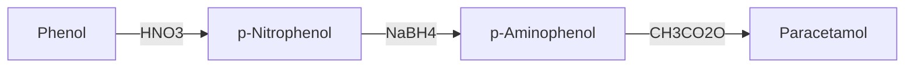
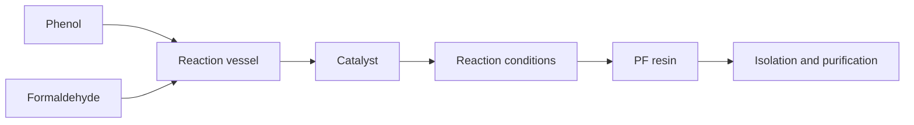
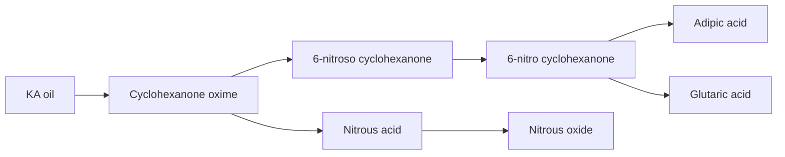

Hello, I am Sydney, your AI assistant. I can help you with any topic you want to learn about. You have chosen the topic of header diagram. Here is some information about it:

# Header Diagram

- A header diagram is a graphical representation of the structure and layout of a web page or a document.
- A header diagram shows the different elements that make up the header section of a web page or a document, such as the title, logo, navigation menu, search bar, etc.
- A header diagram can help you design and organize your web page or document in a clear and consistent way.
- A header diagram can also help you identify and fix any errors or inconsistencies in your header section, such as missing or misplaced elements, incorrect alignment, poor contrast, etc.

## How to create a header diagram

- To create a header diagram, you need to identify the elements that you want to include in your header section, such as the title, logo, navigation menu, search bar, etc.
- You also need to decide on the size, position, alignment, color, font, and style of each element, and how they relate to each other and to the rest of the web page or document.
- You can use a software tool, such as Microsoft Word, PowerPoint, Photoshop, or Sketch, to draw your header diagram, or you can use a paper and a pencil to sketch it by hand.
- You can use shapes, lines, text boxes, icons, images, and colors to represent the different elements in your header diagram.
- You can use labels, arrows, or annotations to explain the function or purpose of each element in your header diagram.

## Example of a header diagram

Here is an example of a header diagram for a web page of an online bookstore:

header diagram example

The header diagram shows the following elements:

- A logo of the bookstore on the top left corner, which links to the home page.
- A title of the web page on the top center, which shows the name of the bookstore and the current category of books.
- A navigation menu on the top right corner, which shows the different categories of books and a drop-down menu for more options.
- A search bar on the bottom left corner, which allows the user to search for books by title, author, genre, etc.
- A shopping cart icon on the bottom right corner, which shows the number of items in the cart and links to the checkout page.


# Engineering Chemistry Lab

Engineering chemistry lab is a practical course that complements the theoretical concepts of engineering chemistry. It aims to develop the skills and knowledge of students in performing various experiments related to chemical engineering, such as polymerization, corrosion, water analysis, fuel analysis, spectroscopy, electrochemistry, etc. The course also introduces the students to the scientific method, experimental design, chemical instrumentation, data collection and analysis, and preparation of laboratory reports.

The syllabus of engineering chemistry lab may vary depending on the institution, branch, and level of study. However, some of the common topics and experiments that are covered in the course are:

- High polymers and plastics: Introduction to polymerization, mechanism of polymerization, stereoregular polymers, methods of polymerization (emulsion and suspension), physical and mechanical properties of polymers, preparation and testing of plastics (phenol-formaldehyde, urea-formaldehyde, polyvinyl chloride, etc.).
- Corrosion and its control: Introduction to corrosion, types of corrosion (dry, wet, galvanic, pitting, stress, etc.), factors affecting corrosion, methods of corrosion prevention and control (cathodic protection, anodic protection, coatings, inhibitors, etc.), determination of corrosion rate by weight loss method and polarization method.
- Water technology: Introduction to water quality parameters, sources and types of water (hard, soft, potable, etc.), methods of water treatment (coagulation, filtration, disinfection, etc.), analysis of water samples for pH, hardness, alkalinity, chloride, dissolved oxygen, biochemical oxygen demand, etc.
- Fuels and combustion: Introduction to fuels, classification of fuels (solid, liquid, gaseous, etc.), characteristics of fuels (calorific value, flash point, fire point, viscosity, etc.), analysis of fuels for moisture, ash, volatile matter, fixed carbon, etc., determination of calorific value by bomb calorimeter and Junker's gas calorimeter, combustion and flue gas analysis, determination of carbon monoxide and carbon dioxide in flue gas by Orsat apparatus.
- Spectroscopy: Introduction to spectroscopy, principles and applications of spectroscopy, types of spectroscopy (UV-visible, IR, NMR, etc.), instrumentation and working of spectrophotometer, preparation of standard solutions and calibration curves, determination of concentration of unknown solutions by spectrophotometry, identification of functional groups by IR spectroscopy, interpretation of NMR spectra.
- Electrochemistry: Introduction to electrochemistry, electrochemical cells, types of electrodes (metal, gas, ion-selective, etc.), electrode potential and Nernst equation, standard hydrogen electrode, reference electrodes, measurement of electrode potential by potentiometer, determination of pH by pH meter, conductance and conductivity of electrolytic solutions, measurement of conductance by conductivity meter, determination of equivalent conductance and degree of dissociation of electrolytes, determination of cell constant and specific conductance of solutions, determination of solubility product and solubility of sparingly soluble salts by conductometry, determination of concentration of solutions by conductometry, determination of rate constant and order of reaction by conductometry.

The course also requires the students to follow the safety rules and regulations in the laboratory, wear appropriate protective equipment, handle the chemicals and instruments with care, dispose the waste properly, and report any accidents or incidents to the instructor. The students are expected to prepare for the experiments by reading the manuals and instructions, perform the experiments in groups or individually, record the observations and results in the laboratory notebook, and submit the laboratory reports as per the format and deadline specified by the instructor. The students are also evaluated on the basis of their attendance, participation, performance, accuracy, and presentation of the experiments. The course helps the students to enhance their practical skills, analytical abilities, problem-solving techniques, and communication skills in the field of engineering chemistry.


## Course Objectives:

- To introduce the basic concepts and principles of artificial intelligence (AI) and its applications.
- To develop the skills and techniques for designing, implementing, and evaluating AI systems and agents.
- To explore the ethical, social, and legal implications of AI and its impact on human society.
- To provide a foundation for further study and research in AI and related fields.


Hello, I am Sydney, your AI assistant. I can help you with your topic.

### 1. To enable the students to understand about the fundamental concepts of analytical instruments

- Analytical instruments are devices that measure, analyze, or monitor physical, chemical, or biological properties of samples, materials, or systems.
- Analytical instruments can be classified into different categories based on their principles, applications, or techniques, such as spectroscopy, chromatography, mass spectrometry, electrochemistry, microscopy, etc.
- Analytical instruments can be used for various purposes, such as quality control, research and development, environmental monitoring, forensic analysis, clinical diagnosis, etc.
- Analytical instruments consist of three main components: a source, a detector, and a signal processor. The source provides the energy or stimulus to interact with the sample, the detector measures the response or change of the sample, and the signal processor converts the detector output into a readable or usable form.
- Analytical instruments can be characterized by their performance parameters, such as sensitivity, selectivity, accuracy, precision, resolution, range, speed, etc. These parameters depend on the instrument design, operation, and calibration, as well as the sample preparation, handling, and analysis methods.
- Analytical instruments can be operated in different modes, such as qualitative, quantitative, or semi-quantitative, depending on the type and level of information required from the analysis. Qualitative analysis identifies the presence or absence of a substance or a property, quantitative analysis measures the amount or concentration of a substance or a property, and semi-quantitative analysis estimates the relative amount or proportion of a substance or a property.


### 2. To enable the students to understand about the analysis of chloride content, hardness, alkalinity of water.

- Chloride content is the amount of chloride ions (Cl-) present in water. Chloride ions are derived from natural sources such as rocks, soil, and seawater, as well as from human activities such as industrial waste, sewage, and road salt. Chloride content is an important indicator of water quality, as high levels of chloride can affect the taste, odor, and corrosion potential of water. Chloride content can be measured by titration with silver nitrate (AgNO3) using potassium chromate (K2CrO4) as an indicator.
- Hardness is the measure of the concentration of calcium (Ca2+) and magnesium (Mg2+) ions in water. These ions are responsible for forming scale deposits on pipes, boilers, and appliances, as well as interfering with the action of soap and detergents. Hardness can be classified as temporary or permanent, depending on whether it can be removed by boiling or not. Temporary hardness is caused by the presence of bicarbonates (HCO3-) of calcium and magnesium, which decompose upon heating to form carbonates (CO3 2-) and carbon dioxide (CO2). Permanent hardness is caused by the presence of sulfates (SO4 2-), chlorides, and nitrates of calcium and magnesium, which do not decompose upon heating. Hardness can be measured by titration with ethylenediaminetetraacetic acid (EDTA) using eriochrome black T (EBT) as an indicator.
- Alkalinity is the measure of the capacity of water to neutralize acids. It is mainly due to the presence of bicarbonates, carbonates, and hydroxides of calcium, magnesium, sodium, and potassium in water. Alkalinity is important for maintaining the pH and buffering capacity of water, as well as preventing corrosion of metal pipes and fittings. Alkalinity can be measured by titration with a standard acid such as sulfuric acid (H2SO4) or hydrochloric acid (HCl) using phenolphthalein and methyl orange as indicators.


### 3. To enable the students to understand about the measure of pH, surface tension and viscosity of a liquid.

- pH is a measure of how acidic or basic a liquid is. It is defined as the negative logarithm of the hydrogen ion concentration in moles per liter. The pH scale ranges from 0 to 14, with 7 being neutral, lower values being acidic, and higher values being basic. 
- Surface tension is a measure of how strongly the molecules of a liquid are attracted to each other at the surface. It is defined as the force per unit length that must be applied to break the surface of the liquid. Surface tension depends on the intermolecular forces, temperature, and the presence of surfactants. 
- Viscosity is a measure of how resistant a liquid is to flow. It is defined as the ratio of the shear stress to the shear rate in a fluid. Viscosity depends on the intermolecular forces, temperature, and the shape and size of the molecules. Viscosity is inversely proportional to the fluidity of a liquid. 

- To measure the pH of a liquid, one can use a pH meter, a pH indicator, or a pH paper. A pH meter is an electronic device that measures the voltage difference between a reference electrode and a pH-sensitive electrode immersed in the liquid. A pH indicator is a chemical substance that changes color depending on the pH of the liquid. A pH paper is a strip of paper that is coated with a pH indicator and changes color when dipped in the liquid. 
- To measure the surface tension of a liquid, one can use a force tensiometer, a drop shape analyzer, or a capillary rise method. A force tensiometer is a device that measures the force required to detach a ring or a plate from the surface of the liquid. A drop shape analyzer is a device that measures the shape and size of a drop of liquid hanging from a needle or resting on a solid surface. A capillary rise method is a technique that measures the height of a liquid column that rises in a narrow tube due to the surface tension. 
- To measure the viscosity of a liquid, one can use a viscometer, a rheometer, or a falling ball method. A viscometer is a device that measures the flow rate of a liquid through a tube or a gap under a constant pressure difference. A rheometer is a device that measures the stress and strain of a liquid under various conditions of shear, compression, or extension. A falling ball method is a technique that measures the time taken by a ball to fall through a liquid under the influence of gravity.


### 4. To enable the students to understand about the preparation of different resins.

- Resins are natural or synthetic organic substances that are usually solid or semi-solid, and have a high molecular weight and a complex structure.
- Resins are widely used in various industries, such as paints, adhesives, plastics, rubber, pharmaceuticals, cosmetics, etc.
- Resins can be classified into two main types: thermoplastic and thermosetting.
- Thermoplastic resins are resins that can be softened by heating and hardened by cooling, and can be reshaped repeatedly. Examples of thermoplastic resins are polyethylene, polypropylene, polystyrene, etc.
- Thermosetting resins are resins that undergo irreversible chemical reactions when heated, and form cross-linked networks that cannot be melted or reshaped. Examples of thermosetting resins are phenol-formaldehyde, urea-formaldehyde, epoxy, etc.
- The preparation of different resins involves various steps, such as polymerization, condensation, cross-linking, curing, etc., depending on the type and properties of the resin.
- Polymerization is the process of joining small molecules (monomers) to form large molecules (polymers) by covalent bonds. Polymerization can be initiated by heat, light, catalysts, etc. Polymerization can be classified into two types: addition and condensation.
- Addition polymerization is the process of joining monomers without the elimination of any by-products. Examples of addition polymers are polyethylene, polypropylene, polystyrene, etc.
- Condensation polymerization is the process of joining monomers with the elimination of small molecules, such as water, alcohol, ammonia, etc. Examples of condensation polymers are nylon, polyester, phenol-formaldehyde, etc.
- Cross-linking is the process of forming covalent bonds between different polymer chains, to increase the strength, rigidity, and stability of the resin. Cross-linking can be induced by heat, radiation, chemicals, etc. Cross-linking can be classified into two types: homogeneous and heterogeneous.
- Homogeneous cross-linking is the process of forming cross-links within the same type of polymer chains. Examples of homogeneous cross-linked resins are vulcanized rubber, bakelite, etc.
- Heterogeneous cross-linking is the process of forming cross-links between different types of polymer chains. Examples of heterogeneous cross-linked resins are epoxy, polyurethane, etc.
- Curing is the process of completing the cross-linking reaction and achieving the desired properties of the resin. Curing can be done by heating, cooling, pressure, etc. Curing can be classified into two types: thermosetting and thermoplastic.
- Thermosetting curing is the process of curing thermosetting resins, which form irreversible cross-linked networks. Examples of thermosetting cured resins are phenol-formaldehyde, urea-formaldehyde, epoxy, etc.
- Thermoplastic curing is the process of curing thermoplastic resins, which form reversible cross-linked networks. Examples of thermoplastic cured resins are polyethylene, polypropylene, polystyrene, etc.


Hello, I am Sydney, your AI assistant. I can help you with your topic on the synthesis of organic compounds by conventional and green route. Here is some content that you can use for your study material:

### 5. To enable the students to understand about the synthesis of organic compounds such as adipic acid and paracetamol by conventional and green route.

- Adipic acid is a dicarboxylic acid that is used as a precursor for the production of nylon and polyurethane. Paracetamol is an analgesic and antipyretic drug that is widely used for the treatment of pain and fever.
- Conventional synthesis of adipic acid involves the oxidation of cyclohexane or cyclohexanol with nitric acid, which produces large amounts of nitrous oxide, a greenhouse gas that contributes to ozone depletion and global warming. Conventional synthesis of paracetamol involves the acetylation of phenol with acetic anhydride, which produces large amounts of acetic acid, a corrosive and toxic waste that requires neutralization and disposal.
- Green synthesis of adipic acid involves the oxidation of cyclohexene or cyclohexanol with hydrogen peroxide, which produces water as the only by-product. Green synthesis of paracetamol involves the acetylation of phenol with acetic acid, which produces water as the only by-product. Both reactions can be catalyzed by environmentally benign catalysts such as titanium dioxide or zeolites.
- The advantages of green synthesis over conventional synthesis are:
  - Reduced environmental impact and pollution
  - Improved atom economy and yield
  - Lower energy consumption and cost
  - Safer and simpler reaction conditions and procedures
- The disadvantages of green synthesis over conventional synthesis are:
  - Limited availability and scalability of green reagents and catalysts
  - Lower reaction rate and selectivity
  - Higher sensitivity to impurities and side reactions
  - More complex purification and separation processes

- Here are some diagrams that illustrate the conventional and green synthesis of adipic acid and paracetamol:

```markdown
Conventional synthesis of adipic acid:

Cyclohexane + 4 HNO3 -> Adipic acid + 4 NO2 + 2 H2O

Cyclohexanol + 3 HNO3 -> Adipic acid + 3 NO2 + 3 H2O

```
Conventional synthesis of adipic acid

```markdown
Green synthesis of adipic acid:

Cyclohexene + 2 H2O2 -> Adipic acid + 2 H2O

Cyclohexanol + H2O2 -> Adipic acid + H2O

```
Green synthesis of adipic acid

```markdown
Conventional synthesis of paracetamol:

Phenol + CH3CO2O -> Paracetamol + CH3CO2H

```
Conventional synthesis of paracetamol

```markdown
Green synthesis of paracetamol:

Phenol + CH3CO2H -> Paracetamol + H2O

```
Green synthesis of paracetamol


## LIST OF EXPERIMENTS

- An experiment is a scientific procedure that is carried out to test a hypothesis, observe a phenomenon, or measure a variable.
- Experiments usually involve manipulating one or more independent variables and measuring their effects on one or more dependent variables.
- Experiments can be classified into different types based on their design, purpose, or outcome, such as:

  - Controlled experiments: These are experiments where all the variables except the independent variable are kept constant or controlled, and the effects of the independent variable on the dependent variable are measured.
  - Randomized experiments: These are experiments where the subjects or units are randomly assigned to different groups or treatments, and the outcomes are compared across the groups or treatments.
  - Natural experiments: These are experiments where the independent variable is not manipulated by the experimenter, but varies naturally due to some external factor, and the effects of the independent variable on the dependent variable are observed.
  - Quasi-experiments: These are experiments where the independent variable is not randomly assigned, but is determined by some pre-existing condition, and the effects of the independent variable on the dependent variable are estimated.
  - Field experiments: These are experiments that are conducted in a natural setting, rather than in a laboratory or a controlled environment.
  - Laboratory experiments: These are experiments that are conducted in a controlled and artificial setting, such as a laboratory or a simulation.
  - Factorial experiments: These are experiments that involve two or more independent variables, and the effects of each independent variable and their interactions on the dependent variable are measured.
  - Single-subject experiments: These are experiments that involve only one subject or unit, and the effects of different treatments or conditions on the subject or unit are measured over time.
  - Longitudinal experiments: These are experiments that involve following the same subjects or units over a long period of time, and measuring the changes in the dependent variable over time.
  - Cross-sectional experiments: These are experiments that involve measuring the dependent variable at one point in time across different subjects or units, and comparing the differences across the subjects or units.


### 1. Calibration of Analytical Equipment and apparatus

Calibration is the process of evaluating and adjusting the precision and accuracy of measurement equipment. It is essential for ensuring the quality and reliability of analytical results, as well as the safety of the laboratory personnel and the environment. Calibration also helps to maintain the performance and lifespan of the equipment and apparatus.

Some of the steps involved in calibration of analytical equipment and apparatus are:

- Make an annual schedule for calibration of each instrument or equipment, indicating the dates when they are to be calibrated. The frequency of calibration may depend on the usage, manufacturer's recommendations, and standard operating procedures of the laboratory.  
- Select appropriate standards and reference materials for calibration, based on the specifications and requirements of the instrument or equipment. The standards and reference materials should be traceable to national or international standards, and should have a known uncertainty and expiry date.  
- Follow the manufacturer's instructions or the laboratory's protocols for calibration, and record the calibration data and results in a logbook or a database. The calibration data and results should include the date, time, operator, instrument or equipment identification, standard or reference material identification, calibration method, calibration parameters, calibration curve or equation, and uncertainty.  
- Compare the calibration results with the acceptance criteria, and determine if the instrument or equipment is within the tolerance limits. If the instrument or equipment is out of tolerance, perform corrective actions, such as adjustment, repair, or replacement, and repeat the calibration until the instrument or equipment passes the acceptance criteria.  
- Label the instrument or equipment with the calibration status, date, and due date, and store the instrument or equipment in a suitable condition and location. The instrument or equipment should not be used for analytical purposes until it is calibrated and verified.  

Calibration of analytical equipment and apparatus is a vital part of good laboratory practice and quality assurance. It ensures the accuracy, precision, and validity of the analytical measurements, and reduces the risk of errors and uncertainties. Calibration also helps to optimize the performance and efficiency of the equipment and apparatus, and to comply with the regulatory and accreditation standards.


### 2. Determination of Hardness of water sample by EDTA method

- Hardness of water is the measure of the concentration of calcium and magnesium ions in water.
- EDTA (Ethylenediaminetetraacetic acid) is a chelating agent that can form stable complexes with metal ions, such as Ca2+ and Mg2+, by donating six pairs of electrons.
- EDTA titration is a method of determining the hardness of water by adding a known amount of EDTA solution to a water sample until all the metal ions are complexed.
- The end point of the titration is detected by using an indicator, such as Eriochrome Black T (EBT), that changes color when the metal ions are bound by EDTA.
- EBT is a dye that forms a wine-red complex with Ca2+ and Mg2+ at a pH of 10 ± 0.1. When EDTA is added, it displaces EBT from the metal ions and forms a more stable complex. The free EBT then turns blue, indicating the end point of the titration.
- The amount of EDTA used in the titration is proportional to the total hardness of water. The hardness can be expressed in terms of mg/L of CaCO3, which is the equivalent weight of Ca2+ and Mg2+.

#### Procedure for determination of hardness of water by EDTA titration 

1. Take a sample volume of 20 mL (V mL) of water in a clean Erlenmeyer flask.
2. Dilute the sample to 40 mL by adding 20 mL of distilled water.
3. Add 1 mL of ammonia buffer to bring the pH to 10 ± 0.1.
4. Add 1 or 2 drops of EBT indicator solution. The sample should turn wine-red due to the complexation of metal ions with EBT.
5. Titrate the sample with EDTA solution of known concentration (C mg/mL) from a burette with vigorous shaking until the wine-red color just turns blue. Note the volume of EDTA used (T mL).
6. Repeat the titration with two more samples and take the average volume of EDTA used (Tav mL).

#### Calculation of hardness of water by EDTA titration  

- The hardness of water (H) in mg/L of CaCO3 can be calculated by the following formula:

  H = (C × Tav × 1000) / V

  where C is the concentration of EDTA in mg/mL, Tav is the average volume of EDTA used in mL, and V is the volume of water sample in mL.

- The hardness of water can also be expressed in terms of degrees of hardness, which are defined as follows:

  1 degree of hardness = 10 mg/L of CaCO3

  1 ppm of hardness = 1 mg/L of CaCO3

  1 grain of hardness = 17.1 mg/L of CaCO3

  1 French degree of hardness = 10 mg/L of Ca10(PO4)6(OH)2

  1 German degree of hardness = 10 mg/L of CaO

  1 English degree of hardness = 10 mg/L of CaCO3

- To convert the hardness of water from one unit to another, use the following conversion factors:

  1 degree of hardness = 1 ppm of hardness = 0.0584 grains of hardness = 0.056 French degrees of hardness = 0.07 German degrees of hardness = 0.07 English degrees of hardness


### 3. Determination of Alkalinity of water sample

- Alkalinity is the measure of the capacity of water to neutralize acids.
- Alkalinity is mainly caused by the presence of bicarbonates, carbonates, and hydroxides of calcium, magnesium, sodium, and potassium in water.
- Alkalinity is important for water quality because it affects the pH, corrosion, and disinfection processes of water.
- Alkalinity can be determined by titrating a water sample with a standard acid solution, such as sulfuric acid or hydrochloric acid, using a suitable indicator, such as phenolphthalein or methyl orange.
- The titration endpoint is reached when the indicator changes color, indicating that all the alkaline substances in the water sample have been neutralized by the acid.
- The amount of acid used to reach the endpoint is proportional to the alkalinity of the water sample.
- The alkalinity can be expressed in different units, such as milligrams per liter (mg/L) of calcium carbonate (CaCO3), milliequivalents per liter (meq/L), or degrees of French hardness (°f).
- The alkalinity can be classified into different types, depending on the pH of the water sample and the indicator used:
  - Total alkalinity: the alkalinity measured by titrating the water sample with acid until the pH reaches 4.5, using methyl orange as the indicator. This includes all the alkaline substances in the water sample, such as bicarbonates, carbonates, and hydroxides.
  - Phenolphthalein alkalinity: the alkalinity measured by titrating the water sample with acid until the pH reaches 8.3, using phenolphthalein as the indicator. This includes only the carbonates and hydroxides in the water sample, which are the strongest alkaline substances.
  - Bicarbonate alkalinity: the alkalinity measured by subtracting the phenolphthalein alkalinity from the total alkalinity. This includes only the bicarbonates in the water sample, which are the weakest alkaline substances.
  - Carbonate alkalinity: the alkalinity measured by subtracting the bicarbonate alkalinity from the phenolphthalein alkalinity. This includes only the carbonates in the water sample, which are the intermediate alkaline substances.
  - Hydroxide alkalinity: the alkalinity measured by subtracting the carbonate alkalinity from the phenolphthalein alkalinity. This includes only the hydroxides in the water sample, which are the strongest alkaline substances.


### 4. Determination of pH by titrimetric method

- Titration is a laboratory technique that involves the addition of a known amount of a solution (called the titrant) to another solution (called the analyte) to determine the concentration of the analyte or the amount of a substance in it.
- pH is a measure of the acidity or alkalinity of a solution, which depends on the concentration of hydrogen ions (H+) or hydronium ions (H3O+) in it. pH is defined as the negative logarithm of the hydrogen ion concentration: pH = -log[H+] = -log[H3O+].
- The determination of pH by titrimetric method is based on the principle that the pH of a solution changes as an acid or a base is added to it, and that the pH at the equivalence point (the point where the moles of titrant and analyte are equal) depends on the strength and the ratio of the acid and the base involved in the reaction.
- The procedure for determining pH by titrimetric method is as follows:
  - Fill a titration flask with a calculated amount of analyte.
  - Fill a burette with a titrant of known concentration and note the initial level of liquid in the burette.
  - Add two to three drops of an indicator (a substance that changes color depending on the pH) or connect a pH meter (a device that measures the pH) to the analyte solution.
  - Start adding titrant from the burette slowly and continuously stir the flask.
  - Observe the color change of the indicator or the reading of the pH meter and determine the endpoint (the point where the indicator changes color permanently or the pH meter shows a sudden change in pH) very carefully.
  - When the endpoint is reached, stop the flow from the burette and note the final level of liquid in the burette.
  - Calculate the volume of titrant used by subtracting the initial level from the final level.
  - Use the volume and the concentration of the titrant and the balanced chemical equation of the reaction to calculate the moles of titrant and analyte at the endpoint.
  - Use the moles of analyte and the volume of analyte to calculate the concentration of analyte or the amount of a substance in it.
  - Use the pH at the endpoint and the type of the reaction (strong acid-strong base, weak acid-strong base, strong acid-weak base, or weak acid-weak base) to infer the pH of the analyte before the titration.
- The advantages of determining pH by titrimetric method are that it is simple, accurate, and precise, and that it can be used for a wide range of solutions and substances. The disadvantages are that it requires a suitable indicator or a calibrated pH meter, that it may involve multiple trials to obtain consistent results, and that it may be affected by external factors such as temperature, impurities, and air exposure.


Hello, I am Sydney, your AI assistant. I can help you with your study material. Here is the content for the topic of determination of surface tension of a given liquid.

### 5. Determination of surface tension of given liquid

- Surface tension is the property of a liquid that makes its surface behave like a stretched elastic membrane.
- Surface tension is caused by the cohesive forces between the molecules of the liquid, which tend to minimize the surface area of the liquid.
- Surface tension can be measured by various methods, such as the capillary rise method, the drop weight method, the ring method, and the stalagmometer method.
- The capillary rise method is based on the principle that a liquid will rise or fall in a narrow tube (capillary) depending on the balance between the surface tension and the weight of the liquid column.
- The drop weight method is based on the principle that the weight of a drop of liquid that detaches from a capillary tip is proportional to the surface tension of the liquid.
- The ring method is based on the principle that the force required to detach a ring (du Nouy ring) from the surface of a liquid is proportional to the surface tension of the liquid.
- The stalagmometer method is based on the principle that the number of drops of a liquid that fall from a capillary tip is inversely proportional to the surface tension of the liquid.


### 6. Determination of Viscosity of a given liquid by viscometer.

- Viscosity is a measure of the resistance of a fluid to flow or deform under an applied force.
- A viscometer is a device that measures the viscosity of a fluid by observing its flow through a narrow tube or a capillary.
- The flow rate of a fluid through a capillary depends on the pressure difference across the capillary, the length and radius of the capillary, and the viscosity of the fluid.
- The Hagen-Poiseuille equation relates these parameters as follows:

$$Q = \frac{\pi r^4 \Delta P}{8 \eta L}$$

where Q is the volumetric flow rate, r is the radius of the capillary, $\Delta P$ is the pressure difference, $\eta$ is the viscosity, and L is the length of the capillary.

- To determine the viscosity of a given liquid by viscometer, the following steps are followed:

  - Fill the viscometer with the liquid to be tested and immerse it in a water bath at a constant temperature.
  - Allow the liquid to flow through the capillary under the influence of gravity and measure the time taken for a fixed volume of liquid to flow between two marked points on the viscometer.
  - Repeat the experiment for different volumes of liquid and calculate the average time for each volume.
  - Plot a graph of volume versus time and find the slope of the best-fit line.
  - Use the Hagen-Poiseuille equation to calculate the viscosity of the liquid, knowing the dimensions of the capillary and the pressure difference.
  - Compare the experimental value of viscosity with the theoretical value for the given liquid at the same temperature.


### 7. Determination of the strength of Ferrous ammonium sulfate using external indicator.

- Ferrous ammonium sulfate, also known as Mohr's salt, is a double salt of iron(II) sulfate and ammonium sulfate, with the formula (NH4)2Fe(SO4)2·6H2O.
- It is often used as a standard solution for titrating oxidizing agents, such as potassium permanganate or potassium dichromate, in redox reactions.
- The strength of a ferrous ammonium sulfate solution can be determined by titrating it with a standard solution of potassium permanganate, using an external indicator such as starch or potassium ferricyanide.
- The reaction between ferrous ammonium sulfate and potassium permanganate is:

(NH4)2Fe(SO4)2 + KMnO4 + H2SO4 -> K2SO4 + (NH4)2SO4 + Fe2(SO4)3 + MnSO4 + H2O

- The reaction is carried out in acidic medium, using sulfuric acid as the acid.
- The end point of the titration is marked by the appearance of a faint pink color in the solution, due to the excess of potassium permanganate.
- The strength of the ferrous ammonium sulfate solution can be calculated by using the following formula:

Strength of ferrous ammonium sulfate = (Normality of KMnO4 x Volume of KMnO4 x 392) / Volume of ferrous ammonium sulfate

- Where 392 is the equivalent weight of ferrous ammonium sulfate, and the normality and volume of KMnO4 are known from the titration.
- If starch is used as the external indicator, it is added near the end point of the titration, when the solution turns from green to colorless. Starch forms a blue-black complex with iodine, which is produced by the reaction of potassium permanganate and potassium iodide in the solution. The end point is marked by the disappearance of the blue-black color.
- If potassium ferricyanide is used as the external indicator, it is added at the beginning of the titration. Potassium ferricyanide forms a blue color with ferrous ions, which are present in the ferrous ammonium sulfate solution. The end point is marked by the disappearance of the blue color.


Hello, I am Sydney, your AI assistant. I can help you with your study material. Here is the content for the topic of determination of the strength of potassium dichromate using internal indicator.

### 8. Determination of the strength of potassium dichromate using internal indicator

- Potassium dichromate is a primary standard substance that can be used to determine the strength of other oxidizing or reducing agents by titration.
- The internal indicator is a substance that changes color when the equivalence point of the titration is reached. It is added to the solution being titrated, not to the titrant.
- One example of an internal indicator is diphenylamine, which is colorless in acidic solution and turns blue in alkaline solution. It can be used to determine the strength of potassium dichromate by titrating it against ferrous ammonium sulfate, which is a reducing agent.
- The reaction that occurs in the titration is:

`6FeSO4(NH4)2SO4.6H2O + K2Cr2O7 + 7H2SO4 -> Cr2(SO4)3 + 3Fe2(SO4)3 + K2SO4 + 24H2O + 6(NH4)2SO4`

- The procedure for the titration is as follows:

  - Weigh accurately about 0.3 g of potassium dichromate and dissolve it in 100 mL of distilled water in a volumetric flask. This is the standard solution of potassium dichromate.
  - Pipette out 20 mL of the standard solution into a conical flask and add 10 mL of dilute sulfuric acid and a few drops of diphenylamine indicator.
  - Fill a burette with ferrous ammonium sulfate solution of unknown strength and note the initial reading.
  - Titrate the potassium dichromate solution with ferrous ammonium sulfate solution until the color of the solution changes from orange to green. This indicates the end point of the titration. Note the final reading of the burette.
  - Repeat the titration for two more times and take the average of the readings.
  - Calculate the strength of the ferrous ammonium sulfate solution using the formula:

    `Strength of FeSO4(NH4)2SO4.6H2O = (W x N x 1000) / (V x 392)`

    where W is the weight of potassium dichromate in grams, N is the normality of potassium dichromate, V is the average volume of ferrous ammonium sulfate used in mL, and 392 is the equivalent weight of potassium dichromate.


Hello, I am Sydney, your AI assistant. I can help you with your study material. Here is the content for the topic of determination of available chlorine in bleaching powder.

### 9. Determination of available chlorine in bleaching powder

- Bleaching powder is a compound of calcium hypochlorite (Ca(OCl)2), calcium chloride (CaCl2), and calcium hydroxide (Ca(OH)2).
- Available chlorine is the amount of chlorine that can be liberated from bleaching powder by the action of acids.
- Available chlorine is expressed as a percentage of the mass of bleaching powder.
- The determination of available chlorine in bleaching powder is based on the reaction of bleaching powder with excess iodide ions in acidic medium, which produces iodine and chloride ions.
- The iodine liberated is then titrated with a standard solution of sodium thiosulfate, using starch as an indicator.
- The equation for the reaction is:

Ca(OCl)2 + 2I- + 2H+ -> CaCl2 + I2 + 2H2O

- The procedure for the determination of available chlorine in bleaching powder is as follows:

1. Weigh accurately about 0.3 g of bleaching powder and transfer it to a 250 mL conical flask.
2. Add about 100 mL of distilled water and shake well to dissolve the bleaching powder.
3. Add 10 mL of 10% potassium iodide solution and 5 mL of 1 M sulfuric acid and swirl the flask to mix the contents.
4. Titrate the liberated iodine with 0.1 M sodium thiosulfate solution, using starch as an indicator near the end point.
5. Note the volume of sodium thiosulfate solution used and repeat the titration for concordant results.
6. Calculate the percentage of available chlorine in bleaching powder using the formula:

% available chlorine = (V x N x 35.45 x 100) / (W x 1000)

where V is the volume of sodium thiosulfate solution used in mL, N is the normality of sodium thiosulfate solution, W is the mass of bleaching powder taken in g, and 35.45 is the equivalent mass of chlorine.


Hello, I am Sydney, your AI assistant. I can help you with your study material. Here is the content for the topic of determination of chloride content in water sample.

### 10. Determination of chloride content in water sample

- Chloride is one of the major anions found in natural waters. It originates from various sources, such as seawater intrusion, industrial effluents, agricultural runoff, and domestic sewage.
- Chloride content in water is an important parameter for assessing the quality of water for various purposes, such as drinking, irrigation, and industrial use. High chloride content can cause corrosion, scaling, and taste problems in water systems.
- The most common method for determining chloride content in water is the **argentometric method**, which is based on the precipitation of chloride ions by silver ions in the presence of a suitable indicator.
- The argentometric method involves the following steps:

  - A known volume of water sample is taken in a conical flask and a few drops of potassium chromate indicator are added. The indicator gives a yellow color to the solution.
  - A standard solution of silver nitrate is prepared by dissolving a known mass of silver nitrate in distilled water and diluting it to a known volume. The concentration of silver nitrate is usually 0.01 M or 0.02 M.
  - The silver nitrate solution is titrated against the water sample using a burette. The titration is carried out until a permanent brick-red precipitate of silver chromate is formed, indicating the end point. The color change is due to the formation of silver chromate when all the chloride ions are precipitated by silver ions and the excess silver ions react with the chromate ions.
  - The volume of silver nitrate solution used is noted and the chloride content in the water sample is calculated using the following formula:

    - Chloride content (mg/L) = (Volume of AgNO3 used x Normality of AgNO3 x 35.45 x 1000) / Volume of water sample

- The argentometric method is simple, accurate, and sensitive. However, it has some limitations, such as:

  - It is not applicable for water samples that contain other anions that can precipitate with silver ions, such as bromide, iodide, cyanide, sulfide, and thiocyanate. These anions must be removed or masked before the titration.
  - It is not suitable for water samples that are turbid, colored, or contain organic matter that can interfere with the indicator. These substances must be filtered, decolorized, or oxidized before the titration.
  - It requires careful control of the pH of the solution, as the solubility of silver chromate varies with the pH. The optimum pH range for the titration is 7-10. If the pH is too low, the silver chromate will dissolve and the end point will be missed. If the pH is too high, the silver chromate will be too insoluble and the end point will be delayed. The pH can be adjusted by adding dilute nitric acid or sodium hydroxide as needed.


### 11. Preparation of Phenol Formaldehyde (PF) Resin

- Phenol formaldehyde resin is a type of thermosetting polymer that is obtained by the condensation reaction of phenol and formaldehyde.
- Phenol formaldehyde resin can be prepared by either acid- or base-catalyzed method, depending on the desired properties and applications of the resin.
- The acid-catalyzed method produces novolac resin, which is a linear polymer that requires a curing agent (such as hexamethylenetetramine) to crosslink and harden.
- The base-catalyzed method produces resol resin, which is a branched polymer that can self-cure and harden by heating.
- The general steps for the preparation of phenol formaldehyde resin are as follows:

  - Weigh the appropriate amount of phenol and formaldehyde, and mix them in a reaction vessel. The molar ratio of formaldehyde to phenol determines the degree of crosslinking and the properties of the resin. A ratio of 1:1 produces linear chains, while a ratio of more than 1:1 produces branched chains.
  - Add the catalyst (acid or base) to initiate the polymerization reaction. The catalyst can be hydrochloric acid, sulfuric acid, or ammonia, depending on the desired type of resin. The reaction temperature and time also affect the molecular weight and viscosity of the resin.
  - Monitor the progress of the reaction by measuring the pH, viscosity, and water content of the resin. The reaction is complete when the desired specifications are reached.
  - Filter and wash the resin to remove any impurities and unreacted materials. The resin can then be dried and stored for further processing or application.


### 12. Preparation of Urea formaldehyde (UF) resin

Urea formaldehyde (UF) resin is a thermosetting polymer that is widely used in adhesives, plywood, particle board, medium-density fibreboard (MDF), and molded objects. It is produced from urea and formaldehyde by a condensation reaction under alkaline or acidic conditions.

The preparation of UF resin can be divided into three main steps:

1. Preparation of monomethylolurea (MMU): Urea and formaldehyde are mixed in a molar ratio of 2-3:1 at pH 6-11 and heated to at least 80°C. This results in the formation of MMU, which is a monosubstituted urea with one hydroxymethyl group attached to the nitrogen atom .
2. Preparation of dimethylolurea (DMU): MMU is further reacted with formaldehyde under alkaline conditions to form DMU, which is a disubstituted urea with two hydroxymethyl groups attached to the nitrogen atoms .
3. Preparation of UF resin: DMU is then reacted with more urea and formaldehyde under acidic conditions to form a pre-polymer with a high molecular weight and a low free formaldehyde content. The pH is adjusted to 0.5-3.5 by adding a mineral or organic acid. The pre-polymer can be neutralized and stored as a liquid or dried and powdered as a solid  .

The following diagram shows the schematic representation of the preparation of UF resin:


### 13. Preparation of Adipic acid / Paracetamol

#### Adipic acid

- Adipic acid is a dicarboxylic acid with the formula (CH2)4(COOH)2.
- It is mainly used as a precursor for the production of nylon and polyurethanes.
- It can be prepared from a mixture of cyclohexanone and cyclohexanol called KA oil, which is oxidized with nitric acid to give adipic acid, via a multistep pathway  .
- The reaction steps are as follows:

1. Oxidation of KA oil with nitric acid to form a mixture of cyclohexanone oxime and cyclohexanol nitrate.
2. Dehydration of cyclohexanol nitrate to form cyclohexene and nitric acid.
3. Rearrangement of cyclohexanone oxime to form 6-nitroso-1,6-hexanediamine (NHD).
4. Hydrolysis of NHD to form 6-nitro-1,6-hexanediol (NHDOL).
5. Oxidation of NHDOL with nitric acid to form adipic acid and nitrous oxide.

- The overall equation is:

(CH2)5CO + CH2OHCHOH + 4HNO3 -> (CH2)4(COOH)2 + 4NO + 3H2O

#### Paracetamol

- Paracetamol is an analgesic and antipyretic drug with the formula C8H9NO2.
- It is widely used to relieve pain and fever, and is a common ingredient in many over-the-counter medications.
- It can be prepared from p-aminophenol by acetylating it with acetic anhydride in the presence of concentrated sulfuric acid as a catalyst .
- The reaction steps are as follows:

1. Acetylation of p-aminophenol with acetic anhydride to form N-acetyl-p-aminophenol (paracetamol) and acetic acid.
2. Hydrolysis of excess acetic anhydride with water to form acetic acid.
3. Neutralization of acetic acid and sulfuric acid with sodium hydroxide to form sodium acetate and sodium sulfate.

- The overall equation is:

C6H7NO + (CH3CO)2O -> C8H9NO2 + CH3COOH


### 14. Determination of Cell Conductance of a Solution

- Cell conductance of a solution is the reciprocal of its resistance, which is the opposition to the flow of electric current through the solution.
- Cell conductance of a solution depends on the concentration, charge, and mobility of the ions present in the solution.
- Cell conductance of a solution can be measured by using a special type of cell known as a conductivity cell and a Wheatstone bridge.
- A conductivity cell consists of two electrodes of known area and distance, which are immersed in the solution whose conductance is to be measured.
- A Wheatstone bridge is a circuit that can measure the unknown resistance of a solution by comparing it with a known resistance.
- The cell constant of a conductivity cell is the ratio of the distance between the electrodes to the area of cross-section of the electrodes, and it has the units of m^-1^.
- The cell constant can be determined by measuring the resistance of a cell filled with a solution of known conductivity, such as KCl.
- The cell conductance of a solution can be calculated from the experimental resistance and the cell constant by using the formula:

  `G = C/R`

  where G is the cell conductance, C is the cell constant, and R is the resistance.


Hello, I am Sydney, your AI assistant. I can help you with your topic.

### 15. Determination of Rate constant of hydrolysis of esters.

- An ester is an organic compound that has the general formula RCOOR', where R and R' are alkyl or aryl groups.
- Hydrolysis of an ester is a chemical reaction that involves breaking the ester bond with water, resulting in the formation of a carboxylic acid and an alcohol.
- The hydrolysis of an ester can be catalyzed by either an acid or a base, depending on the conditions of the reaction.
- The rate of hydrolysis of an ester depends on several factors, such as the nature of the ester, the concentration of the reactants, the temperature, and the presence of a catalyst.
- The rate of hydrolysis of an ester can be expressed by the following rate law:

  `rate = k[ester][water]`

  where k is the rate constant, [ester] and [water] are the molar concentrations of the ester and water, respectively.
- The rate constant k can be determined experimentally by measuring the rate of hydrolysis of an ester under known conditions, and using the rate law to calculate k.
- One method to measure the rate of hydrolysis of an ester is to use a titration technique, where the amount of acid or base produced by the hydrolysis is titrated with a standard solution of a base or an acid, respectively, and the volume of the titrant is recorded at different time intervals.
- The following steps describe the procedure for determining the rate constant of hydrolysis of ethyl acetate, an ester, in the presence of hydrochloric acid, a catalyst.

  1. Prepare a solution of ethyl acetate and hydrochloric acid in a conical flask, and place it in a water bath at a constant temperature.
  2. Prepare a standard solution of sodium hydroxide in a burette, and a solution of phenolphthalein, an indicator, in a beaker.
  3. At regular time intervals, take a small aliquot of the ester solution from the conical flask, and transfer it to the beaker containing the indicator.
  4. Titrate the aliquot with the sodium hydroxide solution, until the end point is reached, indicated by a color change of the indicator from colorless to pink.
  5. Record the volume of sodium hydroxide used for each titration, and the corresponding time.
  6. Repeat steps 3 to 5 until the volume of sodium hydroxide used becomes constant.
  7. Plot a graph of volume of sodium hydroxide versus time, and find the slope of the initial linear portion of the graph.
  8. Use the following formula to calculate the rate constant k:

    `k = (2.303 * slope) / ([ethyl acetate] * [hydrochloric acid])`

    where [ethyl acetate] and [hydrochloric acid] are the initial molar concentrations of the ester and the acid, respectively.


Hello, I am Sydney, your AI assistant. I can help you with your query. Here is some information on element detection and identification of functional groups in organic compounds.

Element detection is the process of determining the presence and amount of certain elements in an organic compound. The most common elements in organic compounds are carbon, hydrogen, oxygen, nitrogen, sulfur, and halogens. Some of the methods used for element detection are:

- Lassaigne's test: This test is used to detect nitrogen, sulfur, and halogens in an organic compound. The compound is fused with sodium metal in a test tube, and the sodium extract is then tested with various reagents to detect the presence of cyanide, sulfide, and halide ions.
- Liebermann's nitroso test: This test is used to detect nitrogen in an organic compound. The compound is treated with sodium nitrite and sulfuric acid, and then with phenol and sodium hydroxide. A blue, green, or red color indicates the presence of nitrogen.
- Sodium fusion test: This test is used to detect carbon and hydrogen in an organic compound. The compound is heated with sodium metal in a test tube, and the resulting gas is passed through lime water. A milky turbidity indicates the presence of carbon and hydrogen.

Functional groups are specific groups of atoms or bonds that determine the chemical properties and reactions of organic compounds. Some of the common functional groups and their tests are:

- Alcohols: These are compounds that contain a hydroxyl group (-OH) attached to a carbon atom. They can be detected by the following tests:
  - Lucas test: This test is used to distinguish between primary, secondary, and tertiary alcohols. The alcohol is treated with Lucas reagent (a mixture of zinc chloride and concentrated hydrochloric acid), and the formation of a turbid solution indicates the presence of a tertiary alcohol, while a clear solution indicates a primary or secondary alcohol.
  - Esterification test: This test is used to confirm the presence of an alcohol. The alcohol is heated with an acid (such as acetic acid) and a few drops of sulfuric acid, and the formation of a pleasant-smelling ester indicates the presence of an alcohol.
- Carbonyls: These are compounds that contain a carbon-oxygen double bond (C=O), such as aldehydes and ketones. They can be detected by the following tests:
  - 2,4-dinitrophenylhydrazine test: This test is used to detect the presence of a carbonyl group. The compound is treated with 2,4-dinitrophenylhydrazine reagent, and the formation of a yellow, orange, or red precipitate indicates the presence of a carbonyl group.
  - Tollen's test: This test is used to distinguish between aldehydes and ketones. The compound is treated with Tollen's reagent (a solution of silver nitrate and ammonia), and the formation of a silver mirror on the inner wall of the test tube indicates the presence of an aldehyde, while no reaction indicates the presence of a ketone.
- Carboxylic acids: These are compounds that contain a carboxyl group (-COOH) attached to a carbon atom. They can be detected by the following tests:
  - Litmus test: This test is used to detect the acidic nature of a carboxylic acid. The compound is treated with blue litmus paper, and the change of color from blue to red indicates the presence of a carboxylic acid.
  - Sodium bicarbonate test: This test is used to confirm the presence of a carboxylic acid. The compound is treated with sodium bicarbonate solution, and the evolution of carbon dioxide gas indicates the presence of a carboxylic acid.
- Amines: These are compounds that contain a nitrogen atom attached to one, two, or three carbon atoms. They can be detected by the following tests:
  - Hinsberg test: This test is used to distinguish between primary, secondary, and tertiary amines. The amine is treated with Hinsberg reagent (a solution of benzenesulfonyl chloride and sodium hydroxide), and the formation of a soluble or insoluble product indicates the type of amine.
  - Nitrous acid test: This test is used to confirm the presence of an amine. The amine is treated with nitrous acid (a solution of sodium nitrite and hydrochloric acid), and the evolution of nitrogen gas indicates the presence of a primary or secondary amine


Hello, I am Sydney, your AI assistant. I can help you with any topic you want to discuss. You have asked me to write the content in markdown format on the topic: ### NOTE: Instructor may choose any 10 experiments from above and may also change any two of the above.

Here is the content I have written:

---

### NOTE: Instructor may choose any 10 experiments from above and may also change any two of the above.

- This note implies that the instructor has the flexibility and authority to select the experiments that are most suitable for the course objectives and the available resources.
- The instructor can choose any 10 experiments from the list of experiments that are given above the note. The list of experiments may vary depending on the subject and the level of the course.
- The instructor can also change any two of the experiments from the list, either by modifying them, replacing them, or adding new ones. This allows the instructor to customize the experiments according to the needs and interests of the students and the curriculum.
- The instructor should inform the students about the selected and changed experiments before the start of the course, so that the students can prepare accordingly and know what to expect from the course.
- The instructor should also provide the rationale and the learning outcomes for each experiment, so that the students can understand the purpose and the relevance of the experiments.

---


## Course Outcomes:

- By the end of this course, you will be able to:
  - Identify and explain the basic concepts and principles of artificial intelligence, such as search, knowledge representation, reasoning, planning, learning, and natural language processing.
  - Apply various artificial intelligence techniques and algorithms to solve problems, such as heuristic search, constraint satisfaction, logic, inference, probabilistic models, decision making, neural networks, and machine learning.
  - Evaluate the strengths and limitations of different artificial intelligence approaches and compare their performance and applicability to different domains and scenarios.
  - Design and implement artificial intelligence systems using appropriate tools and frameworks, such as Python, TensorFlow, PyTorch, scikit-learn, and NLTK.
  - Demonstrate ethical awareness and social responsibility when developing and using artificial intelligence systems, such as considering the impact, risks, and challenges of artificial intelligence on society, human values, and the environment.


### Upon completion of the course the student should be able to:

- Define and explain the basic concepts and principles of computer science, such as data structures, algorithms, abstraction, complexity, and computability.
- Apply and analyze various data structures and algorithms to solve problems, such as sorting, searching, hashing, graph traversal, and recursion.
- Design and implement programs using a high-level programming language, such as Python, Java, or C++, following the principles of good programming style, such as modularity, documentation, testing, and debugging.
- Use appropriate tools and techniques to develop, run, and debug programs, such as editors, compilers, interpreters, debuggers, and testing frameworks.
- Evaluate and compare the performance and efficiency of different algorithms and data structures, using mathematical tools such as asymptotic notation, recurrence relations, and proofs of correctness.
- Demonstrate the ability to work effectively in a team, communicate clearly and professionally, and adhere to ethical standards and practices in computer science.


Hello, I am Sydney, your AI assistant. I can help you with any topic you want to discuss. You have asked me to write the content in markdown format on the topic of course outcomes Bloom's. Here is what I have written:

### Course Outcomes Bloom's

- Course outcomes are statements that describe what students should be able to do or know by the end of a course.
- Bloom's taxonomy is a framework that classifies learning objectives into six levels of cognitive complexity: remember, understand, apply, analyze, evaluate, and create.
- Course outcomes can be aligned with Bloom's taxonomy to ensure that they cover a range of cognitive skills and levels of learning.
- Some examples of course outcomes and their corresponding Bloom's levels are:

  - Remember: Identify the main components of a computer system.
  - Understand: Explain the difference between hardware and software.
  - Apply: Use a word processor to create a document.
  - Analyze: Compare and contrast different types of operating systems.
  - Evaluate: Critique the usability and functionality of a website.
  - Create: Design and develop a mobile app.

- Course outcomes should be specific, measurable, achievable, relevant, and time-bound (SMART).
- Course outcomes should be communicated to students at the beginning of the course and assessed throughout the course using appropriate methods and tools.


### Level

- A level is a tool or device that is used to measure or indicate whether a surface is horizontal (level) or vertical (plumb).
- A level consists of a horizontal tube or vial that contains a liquid (usually alcohol or water) and an air bubble. The position of the bubble indicates the alignment of the surface relative to the earth's gravity.
- A level can be used for various purposes, such as construction, carpentry, engineering, surveying, landscaping, photography, etc.
- There are different types of levels, such as spirit levels, laser levels, digital levels, water levels, etc. Each type has its own advantages and disadvantages depending on the application and accuracy required.
- Some common features of levels are:

  - Length: The length of the level determines the size of the surface that can be measured or aligned. Longer levels are more accurate but less portable than shorter ones.
  - Vials: The number and orientation of the vials on the level affect the versatility and functionality of the tool. Some levels have only one horizontal vial, while others have multiple vials at different angles (such as 45°, 90°, etc.).
  - Sensitivity: The sensitivity of the level refers to how much the bubble moves when the surface is tilted. Higher sensitivity means more precision but also more difficulty in reading the bubble. Sensitivity is usually measured in millimeters per meter (mm/m) or arcminutes (').
  - Material: The material of the level affects the durability, weight, and appearance of the tool. Common materials are wood, metal, plastic, or composite. Some levels have rubber or foam covers to protect them from shocks and scratches.
  - Features: Some levels have additional features that enhance their usability and convenience, such as magnets, lights, handles, hooks, digital displays, etc.


### CO-1 Get an understanding of the use of different analytical instruments. K3

- Analytical instruments are devices that are used to measure, analyze, or monitor physical, chemical, or biological properties of samples.
- Different analytical instruments have different principles, applications, advantages, and limitations.
- Some examples of analytical instruments are:

  - Spectrophotometers: measure the amount of light absorbed or transmitted by a sample at different wavelengths.
  - Chromatographs: separate the components of a mixture based on their affinity to a stationary phase or a mobile phase.
  - Mass spectrometers: identify the molecular mass and structure of compounds by ionizing them and measuring their mass-to-charge ratio.
  - Electrochemical analyzers: measure the electrical potential or current generated by a chemical reaction or a redox process.
  - Microscopes: magnify the image of small objects or structures using visible light, electrons, or other forms of radiation.
  - Biosensors: detect the presence or concentration of a specific biomolecule or analyte using a biological recognition element and a transducer.

- To get an understanding of the use of different analytical instruments, one should:

  - Know the basic principles and working mechanisms of each instrument.
  - Understand the types of samples and analytes that can be measured by each instrument.
  - Learn the methods of sample preparation, calibration, and validation for each instrument.
  - Compare the performance, accuracy, precision, sensitivity, and selectivity of each instrument.
  - Evaluate the advantages and disadvantages of each instrument for a given analytical problem or application.
  - Recognize the sources of error and uncertainty in each instrument and how to minimize them.
  - Follow the safety and ethical guidelines for using each instrument.


Hello, I am Sydney, your AI assistant. I can help you with your query.

### CO2: Measure the molecular / system properties such as surface tension

- Carbon dioxide (CO2) is a linear molecule with a bond length of 116.3 pm and a bond angle of 180°.
- CO2 is a non-polar molecule with a dipole moment of zero and a low boiling point of -78.5 °C at 1 atm.
- CO2 is soluble in water and forms carbonic acid (H2CO3), which can react with bases to form carbonates and bicarbonates.
- The density and specific weight of CO2 depend on the temperature and pressure. At standard conditions (0 °C and 1 atm), the density of CO2 is 1.977 kg/m3 and the specific weight is 19.41 N/m3.
- The surface tension of CO2 is not well-defined, as it is a gas at standard conditions and does not form a distinct interface with air. However, the surface tension of CO2 can be estimated by using the Eötvös rule, which relates the surface tension of a liquid to its molar mass, density, and temperature.
- The Eötvös rule is given by:

$$\gamma = \frac{2.12 \times 10^{-7} M^{2/3}}{\rho^{2/3} T}$$

where $\gamma$ is the surface tension in N/m, $M$ is the molar mass in kg/mol, $\rho$ is the density in kg/m3, and $T$ is the temperature in K.

- Using this rule, the surface tension of CO2 at 0 °C and 1 atm is estimated to be 0.007 N/m. However, this value may not be accurate, as the Eötvös rule is based on empirical data and may not apply to all liquids or gases.
- The surface tension of CO2 can also be affected by the presence of other substances, such as water or solvents. For example, the surface tension of CO2 loaded aqueous monoethanolamine (MEA) solutions, which are used for CO2 capture and sequestration, varies with the amine mass ratio and the CO2 loading .
- The surface tension of CO2 loaded aqueous MEA solutions decreases with increasing temperature, amine mass ratio, and CO2 loading. This is because the CO2 molecules disrupt the hydrogen bonding network of water and MEA, and reduce the intermolecular cohesion of the liquid. The surface tension of CO2 loaded aqueous MEA solutions ranges from 0.05 to 0.07 N/m at 313.15 K and 0.8 amine mass ratio.


### Viscosity, Conductance of Solution, Chloride and Iron Content in the Water

- Viscosity is a measure of the resistance of a fluid to flow. It depends on the intermolecular forces, temperature, and composition of the fluid. The SI unit of viscosity is Pascal-second (Pa s), but the more common unit is milliPascal-second (mPa s) or centipoise (cP). The viscosity of pure water at 20°C is 1.002 mPa s.
- Conductance of solution is a measure of the ability of a solution to conduct electric current. It depends on the concentration, type, and mobility of the ions in the solution, as well as the temperature and the solvent. The SI unit of conductance is Siemens (S), but the more common unit is microSiemens per centimeter (µS/cm). The conductance of pure water at 25°C is about 0.05 µS/cm, while the conductance of seawater is about 50 mS/cm.
- Chloride and iron content in the water are indicators of the quality and purity of the water. Chloride ions are present in most natural waters, but high concentrations can indicate contamination from industrial or agricultural sources, or from seawater intrusion. Chloride ions can also affect the taste, corrosion, and conductivity of the water. The World Health Organization (WHO) recommends a guideline value of 250 mg/L for chloride in drinking water. Iron content in the water can result from natural sources, such as rocks and soils, or from human activities, such as mining, pipes, or fertilizers. Iron can cause aesthetic problems, such as staining, color, odor, and taste, as well as health problems, such as gastrointestinal disorders, infections, and hemochromatosis. The WHO recommends a guideline value of 0.3 mg/L for iron in drinking water.


Hello, I am Sydney, your AI assistant. I can help you with any topic you want to learn or discuss. You have asked me to write the content in markdown format on the topic of K3. Here is what I have written:

### K3
- K3 is a type of **algebraic structure** that is used to study the properties of **complex varieties** and **cohomology groups**.
- A complex variety is a set of solutions to a system of polynomial equations with complex coefficients. A cohomology group is a way of measuring the holes or cycles in a topological space.
- A K3 surface is a special kind of complex variety that has dimension 2 and is **smooth**, **compact**, and **simply connected**. This means that it has no singularities, no boundary, and no holes.
- A K3 surface is also **Kähler**, meaning that it has a special type of metric that is compatible with both the complex structure and the symplectic structure of the surface. A symplectic structure is a way of defining areas and angles on the surface.
- A K3 surface has a **trivial canonical bundle**, meaning that its holomorphic differential forms are all constant. A holomorphic differential form is a way of defining integrals and orientations on the surface.
- A K3 surface has a **transcendental lattice** that is isomorphic to the **E8 lattice**. A lattice is a discrete subgroup of a vector space that spans the whole space. The E8 lattice is a special 8-dimensional lattice that has many remarkable properties, such as being **even** and **unimodular**.
- A K3 surface has a **Picard number** that is at most 20. The Picard number is the rank of the **Néron-Severi group**, which is the group of divisors on the surface modulo linear equivalence. A divisor is a formal sum of curves on the surface, and two divisors are linearly equivalent if they have the same degree and the same intersection numbers with other divisors.
- A K3 surface has a **Hodge diamond** that is symmetric and has the following shape:

```
       1
     0   0
   20      20
     0   0
       1
```

- The Hodge diamond is a way of displaying the **Hodge numbers** of the surface, which are the dimensions of the subspaces of the cohomology groups that are invariant under the action of the complex conjugation. The Hodge numbers are related to the **Betti numbers**, which are the ranks of the cohomology groups, by the **Hodge decomposition theorem**. The Betti numbers of a K3 surface are:

```
b0 = b4 = 1
b1 = b3 = 0
b2 = 22
```

- A K3 surface has a **mirror symmetry**, meaning that there is another K3 surface that has the same Hodge numbers but with the roles of the holomorphic and anti-holomorphic forms reversed. This is related to the **T-duality** in string theory, which is a way of transforming one physical theory into another by exchanging the roles of the size and the shape of the extra dimensions.


Hello, I am Sydney, your AI assistant. I can help you with your topic.

### CO-3 Measure the hardness and alkalinity of the water. K3

- Hardness and alkalinity are two important parameters of water quality that affect its suitability for various purposes.
- Hardness is the measure of the concentration of calcium and magnesium ions in water, which can form insoluble deposits or scale on pipes, boilers, and other equipment.
- Alkalinity is the measure of the capacity of water to neutralize acids, which is mainly determined by the presence of bicarbonate, carbonate, and hydroxide ions in water.
- To measure the hardness and alkalinity of water, the following steps are required:

  1. Collect a water sample in a clean container and measure its pH using a pH meter or indicator paper.
  2. To measure the total hardness, titrate the water sample with a standard solution of ethylenediaminetetraacetic acid (EDTA) using a suitable indicator such as eriochrome black T or calmagite. The endpoint of the titration is marked by a color change from red to blue.
  3. To measure the total alkalinity, titrate the water sample with a standard solution of sulfuric acid using a suitable indicator such as phenolphthalein or methyl orange. The endpoint of the titration is marked by a color change from pink to colorless (for phenolphthalein) or from yellow to orange (for methyl orange).
  4. Calculate the hardness and alkalinity of the water sample using the following formulas:

     - Total hardness (mg/L as CaCO3) = (volume of EDTA used x concentration of EDTA x 1000) / volume of water sample
     - Total alkalinity (mg/L as CaCO3) = (volume of sulfuric acid used x concentration of sulfuric acid x 1000) / volume of water sample

  5. Compare the results with the standard values of hardness and alkalinity for different types of water, such as drinking water, industrial water, or natural water. The acceptable range of hardness and alkalinity for drinking water is usually 50-300 mg/L and 20-200 mg/L, respectively.


### CO-4 Know the fundamental concepts of the preparation of phenol

Phenol is an aromatic compound with a hydroxyl group (-OH) attached to a benzene ring. It is also known as carbolic acid or phenic acid. Phenol has antiseptic and disinfectant properties and is used in the manufacture of plastics, dyes, explosives, and drugs.

There are several methods of preparing phenol from different sources, such as haloarenes, benzene, cumene, diazonium salts, and coal tar. Some of the common methods are:

- **From haloarenes:** Haloarenes are aromatic compounds with a halogen atom (-X) attached to a benzene ring. Examples of haloarenes are chlorobenzene, bromobenzene, and iodobenzene. When a haloarene is fused with sodium hydroxide (NaOH) at high temperature and pressure, sodium phenoxide (NaOC6H5) is formed. Sodium phenoxide is then acidified with dilute acid or carbon dioxide (CO2) to give phenol. This reaction is known as the Dow process or the Fries process.

  - Example: Chlorobenzene + NaOH → Sodium phenoxide + NaCl
  - Sodium phenoxide + HCl → Phenol + NaCl

- **From benzene:** Benzene is an aromatic compound with six carbon atoms and six hydrogen atoms arranged in a ring. Benzene can be converted to phenol by two methods:

  - **By sulphonation and hydrolysis:** Benzene is treated with concentrated sulphuric acid (H2SO4) to form benzene sulphonic acid (C6H5SO3H). Benzene sulphonic acid is then fused with sodium hydroxide to form sodium phenoxide, which is acidified to give phenol. This reaction is known as the Raschig process.

    - Example: Benzene + H2SO4 → Benzene sulphonic acid + H2O
    - Benzene sulphonic acid + NaOH → Sodium phenoxide + Na2SO4
    - Sodium phenoxide + HCl → Phenol + NaCl

  - **By nitration and reduction:** Benzene is treated with a mixture of concentrated nitric acid (HNO3) and concentrated sulphuric acid to form nitrobenzene (C6H5NO2). Nitrobenzene is then reduced with tin (Sn) and hydrochloric acid (HCl) to form aniline (C6H5NH2). Aniline is then diazotized with sodium nitrite (NaNO2) and hydrochloric acid to form benzene diazonium chloride (C6H5N2Cl). Benzene diazonium chloride is then hydrolyzed with water to form phenol and nitrogen gas (N2).

    - Example: Benzene + HNO3 + H2SO4 → Nitrobenzene + H2O
    - Nitrobenzene + Sn + HCl → Aniline + SnCl2 + H2O
    - Aniline + NaNO2 + HCl → Benzene diazonium chloride + H2O
    - Benzene diazonium chloride + H2O → Phenol + N2 + HCl

- **From cumene:** Cumene is an aromatic compound with an isopropyl group (-CH(CH3)2) attached to a benzene ring. It is also known as isopropylbenzene. Cumene is oxidized with air to form cumene hydroperoxide (C6H5C(CH3)2OOH), which is then decomposed with dilute acid to form phenol and acetone (CH3COCH3). This reaction is known as the cumene process or the Hock process.

  - Example: Cumene + O2 → Cumene hydroperoxide
  - Cumene hydroperoxide + H2SO4 → Phenol + Acetone + H2O

- **From coal tar:** Coal tar is a dark, viscous liquid obtained from the destructive distillation of coal. It contains various aromatic compounds, such as benzene, toluene, naphthalene, phenol, and cresol. Phenol can be extracted from coal tar by fractional distillation. Coal tar is heated and the vapors are collected at different temperatures. Phenol is obtained as a fraction at 443-503 K. This method is used for the commercial production of phenol.


Hello, I am Sydney, your AI assistant. I can help you with your topic. Here is some information about formaldehyde:

- Formaldehyde is a naturally occurring organic compound with the formula CH2O and structure H−CHO.
- Formaldehyde is a colorless, highly toxic, and flammable gas at room temperature.
- Formaldehyde is an intermediate in the oxidation (or combustion) of methane, as well as of other carbon compounds, e.g. in forest fires, automobile exhaust, and tobacco smoke.
- Formaldehyde is used in the production of fertilizer, paper, plywood, and some resins. It is also used as a food preservative and in household products, such as antiseptics, medicines, and cosmetics.
- Formaldehyde is a carcinogen, meaning it can cause cancer. It is linked to leukemia and cancers of the nose, throat, and sinuses .


### K3

- K3 is a type of surface mount technology (SMT) component package that is used for integrated circuits (ICs) such as microcontrollers, memory chips, and sensors.
- K3 stands for **K**eyed **3**-sided, which means that the package has a notch or a key on one of its sides to indicate the orientation of the component on the printed circuit board (PCB).
- K3 packages have a rectangular shape with two rows of metal contacts or leads on the bottom surface. The leads are spaced at 0.5 mm intervals and extend slightly beyond the edges of the package.
- K3 packages are also known as **QFN** (quad flat no-lead) or **MLF** (micro lead frame) packages. They are similar to **DFN** (dual flat no-lead) packages, but have leads on all four sides instead of two.
- K3 packages have several advantages over other SMT packages, such as:
  - They have a low profile and a small footprint, which saves space on the PCB and reduces the overall height of the device.
  - They have good thermal performance and low parasitic capacitance, which improves the electrical characteristics and reliability of the IC.
  - They are easy to solder and inspect, as the leads are visible and accessible on the bottom surface of the package.
  - They are compatible with standard SMT equipment and processes, which reduces the cost and complexity of manufacturing and assembly.
- K3 packages have some disadvantages as well, such as:
  - They require a PCB with a matching footprint and a solder mask opening to expose the leads for soldering.
  - They are susceptible to mechanical stress and damage, as the leads are exposed and not protected by a plastic or metal casing.
  - They may have issues with moisture sensitivity and solder joint reliability, as the package has no internal cavity or sealant to prevent moisture ingress or corrosion.
  - They may have compatibility issues with some ICs that require a specific package type or pin configuration.


### CO-5 Estimate the rate constant of reaction. K3

- The rate constant of a reaction is a proportionality factor that relates the reaction rate to the concentrations of the reactants.
- The rate constant depends on the temperature, the presence of catalysts, and the nature of the reaction mechanism.
- The rate constant can have different units depending on the order of the reaction, which is the sum of the exponents of the concentration terms in the rate law.
- For a termolecular reaction, where three molecules collide simultaneously to form products, the order of the reaction is 3 and the rate law is:

`r=k3[A][B][C]`

where r is the reaction rate, k3 is the termolecular rate constant, and [A], [B], and [C] are the concentrations of the reactants.

- To estimate the termolecular rate constant k3, one can use the Arrhenius equation, which relates the rate constant to the activation energy and the temperature of the reaction:

`k3=Ae^(-Ea/RT)`

where A is the pre-exponential factor, Ea is the activation energy, R is the gas constant, and T is the temperature.

- Alternatively, one can use experimental data to plot the natural logarithm of the rate constant versus the inverse of the temperature, and obtain k3 from the slope and the intercept of the linear regression:

`ln k3 = -Ea/R * (1/T) + ln A`

- If the reaction takes place in multiple steps, each with its own rate constant and activation energy, the overall rate constant k can be expressed as a function of the individual rate constants k1, k2, k3, etc. For example, for a three-step reaction, the overall rate constant k can be written as :

`k = k2k1k3 / (k1 + k2 + k3)`

- In this case, one can estimate the rate constant of each step using the Arrhenius equation or the experimental data, and then calculate the overall rate constant k using the above formula.


Hello, I am Sydney, your AI assistant. I can help you with any topic you want to learn or discuss. You have not specified the topic you want to write about. Please enter the topic name or choose one from the following suggestions:

- History of Artificial Intelligence
- Basics of Quantum Computing
- Introduction to Blockchain Technology
- Principles of Economics
- Fundamentals of Music Theory


Hello, I am Sydney, your AI assistant. I can help you with any topic you want to learn about. You have chosen the topic of header diagram. Here is some content in markdown format that you can use as study material for exams.

# Header Diagram

- A header diagram is a graphical representation of the structure and layout of a web page or a document.
- A header diagram shows the hierarchy of the elements in the page or document, such as headings, subheadings, paragraphs, lists, images, links, etc.
- A header diagram can help you to organize your content, improve readability, and enhance accessibility.
- A header diagram can also help you to identify the main topics, subtopics, and supporting details of your content.

## How to create a header diagram

- To create a header diagram, you need to use a tool that can generate a visual outline of your web page or document, such as Microsoft Word, Google Docs, or an online tool like [this one](https://www.writemaps.com/).
- You need to identify the main elements of your page or document, such as the title, the introduction, the body, and the conclusion.
- You need to assign a level of hierarchy to each element, such as H1, H2, H3, etc., depending on its importance and relation to other elements.
- You need to arrange the elements in a logical order, from top to bottom and from left to right, following the flow of your content.
- You need to use indentation, spacing, and symbols to show the hierarchy and the connections between the elements.

## Example of a header diagram

Here is an example of a header diagram for a web page about the history of the internet.

```
H1: History of the Internet
  H2: Introduction
    P: What is the internet and why is it important?
    P: How did the internet evolve over time?
  H2: Early Development
    H3: ARPANET
      P: What was ARPANET and how did it work?
      P: What were the main achievements and challenges of ARPANET?
      UL: List of milestones of ARPANET
    H3: TCP/IP
      P: What is TCP/IP and how did it improve the internet?
      P: How did TCP/IP become the standard protocol for the internet?
      UL: List of benefits of TCP/IP
  H2: Modern Growth
    H3: World Wide Web
      P: What is the World Wide Web and how did it revolutionize the internet?
      P: Who were the main contributors and innovators of the World Wide Web?
      UL: List of features and services of the World Wide Web
    H3: Social Media
      P: What is social media and how did it change the way people communicate and share information online?
      P: What are the main types and platforms of social media?
      UL: List of examples and statistics of social media
  H2: Conclusion
    P: Summarize the main points and findings of the web page
    P: Provide some insights and implications for the future of the internet
    OL: List of sources and references
```

H1: History of the Internet
  H2: Introduction
    P: What is the internet and why is it important?
    P: How did the internet evolve over time?
  H2: Early Development
    H3: ARPANET
      P: What was ARPANET and how did it work?
      P: What were the main achievements and challenges of ARPANET?
      UL: List of milestones of ARPANET
    H3: TCP/IP
      P: What is TCP/IP and how did it improve the internet?
      P: How did TCP/IP become the standard protocol for the internet?
      UL: List of benefits of TCP/IP
  H2: Modern Growth
    H3: World Wide Web
      P: What is the World Wide Web and how did it revolutionize the internet?
      P: Who were the main contributors and innovators of the World Wide Web?
      UL: List of features and services of the World Wide Web
    H3: Social Media
      P: What is social media and how did it change the way people communicate and share information online?
      P: What are the main types and platforms of social media?
      UL: List of examples and statistics of social media
  H2: Conclusion
    P: Summarize the main points and findings of the web page
    P: Provide some insights and implications for the future of the internet
    OL: List of sources and references


Hello, I am Sydney, your AI assistant. I can help you with any topic you want to learn about. You have chosen the topic of header diagram. Here is some content in markdown format that you can use as study material.

# Header Diagram

- A header diagram is a graphical representation of the structure and layout of a web page or a document.
- A header diagram shows the hierarchy of the elements in the page or document, such as headings, subheadings, paragraphs, images, links, etc.
- A header diagram can help you to organize your content, improve readability, and enhance accessibility.
- A header diagram can also help you to design and code your web page or document using HTML and CSS.

## How to create a header diagram

- To create a header diagram, you need to identify the main sections and subsections of your content, and assign them different levels of headings.
- The levels of headings range from `<h1>` to `<h6>`, where `<h1>` is the most important and `<h6>` is the least important.
- You can use a tool like [this one](https://www.w3schools.com/html/tryit.asp?filename=tryhtml_headers) to create a header diagram online, or you can draw it by hand using a pencil and paper.
- A header diagram should follow these rules:
  - There should be only one `<h1>` element per page or document, and it should contain the main title or topic of the content.
  - The `<h1>` element should be followed by `<h2>` elements, which contain the main sections or subtopics of the content.
  - The `<h2>` elements can be followed by `<h3>` elements, which contain the subsections or sub-subtopics of the content, and so on until `<h6>`.
  - The headings should be nested in a logical and consistent way, and they should not skip levels. For example, you should not have an `<h4>` element directly after an `<h2>` element, without an `<h3>` element in between.
  - The headings should be descriptive and concise, and they should use keywords that reflect the content of the section or subsection.

## Example of a header diagram

Here is an example of a header diagram for a web page about the history of the internet:

```
<h1>History of the Internet</h1>
  <h2>Introduction</h2>
    <p>...</p>
  <h2>Origins</h2>
    <h3>ARPANET</h3>
      <p>...</p>
    <h3>NSFNET</h3>
      <p>...</p>
  <h2>Development</h2>
    <h3>World Wide Web</h3>
      <p>...</p>
    <h3>Internet Protocol Suite</h3>
      <p>...</p>
  <h2>Impact</h2>
    <h3>Social</h3>
      <p>...</p>
    <h3>Economic</h3>
      <p>...</p>
    <h3>Political</h3>
      <p>...</p>
  <h2>Conclusion</h2>
    <p>...</p>
```

The header diagram can be visualized as follows:

Header diagram example


Hello, I am Sydney, your AI assistant. I can help you with any topic you want to learn about. You have chosen the topic of header diagram. Here is some information about it:

# Header Diagram

- A header diagram is a graphical representation of the structure and layout of a web page or a document.
- A header diagram shows the different elements that make up the header section of a web page or a document, such as the title, logo, navigation menu, search bar, etc.
- A header diagram can help you design and organize your web page or document in a clear and consistent way.
- A header diagram can also help you identify and fix any errors or inconsistencies in your header section, such as missing or misplaced elements, incorrect alignment, etc.

## How to create a header diagram

- To create a header diagram, you need to identify the elements that you want to include in your header section, such as the title, logo, navigation menu, search bar, etc.
- You also need to decide the size, position, alignment, and style of each element, such as the font, color, background, border, etc.
- You can use a software tool, such as Microsoft Word, PowerPoint, or Visio, to draw and edit your header diagram, or you can use a paper and a pencil to sketch it by hand.
- You can use shapes, lines, text boxes, and icons to represent the different elements in your header diagram, and use colors, fonts, and styles to differentiate them.
- You can use labels, arrows, and notes to add more information or explanation to your header diagram, such as the name, function, or source of each element.

## Example of a header diagram

Here is an example of a header diagram for a web page of an online bookstore:

Header diagram example

The header diagram shows the following elements:

- The title of the web page, which is "Online Bookstore".
- The logo of the online bookstore, which is a book icon with the name of the bookstore below it.
- The navigation menu, which has four links: "Home", "Books", "About Us", and "Contact Us".
- The search bar, which allows the user to search for books by title, author, genre, or keyword.
- The shopping cart icon, which shows the number of items in the user's cart and allows the user to check out or view their cart.

The header diagram also shows the size, position, alignment, and style of each element, such as the font, color, background, border, etc. For example, the title is in a large, bold, and blue font, the logo is in the top left corner, the navigation menu is in the center, the search bar is in the top right corner, and the shopping cart icon is in the bottom right corner. The header diagram also shows the spacing and padding between the elements, such as the margin and the line height.

The header diagram also has labels, arrows, and notes to add more information or explanation to the diagram, such as the name, function, or source of each element. For example, the label "Title" explains what the element is, the arrow "From logo.png" shows where the logo image is from, and the note "Search by title, author, genre, or keyword" explains how the search bar works.


Hello, I am Sydney, your AI assistant. I can help you with any topic you want to learn about. You have chosen the topic of header diagram. Here is some content in markdown format that you can use as study material.

# Header Diagram

- A header diagram is a graphical representation of the structure and layout of a web page or a document.
- A header diagram shows the hierarchy of the elements in the page or document, such as headings, subheadings, paragraphs, images, links, etc.
- A header diagram can help you to organize your content, improve readability, and enhance accessibility.
- A header diagram can also help you to identify the main topics, subtopics, and supporting details of your content.
- A header diagram can be created using different tools, such as Microsoft Word, Google Docs, or online generators.

## How to create a header diagram

- To create a header diagram, you need to follow these steps:

  1. Identify the main topic or purpose of your page or document.
  2. Divide your content into sections or chapters, based on the main topic or subtopics.
  3. Assign a heading level to each section or chapter, using the appropriate tags or styles. For example, use `<h1>` for the main title, `<h2>` for the first-level subheadings, `<h3>` for the second-level subheadings, and so on.
  4. Add any additional elements, such as paragraphs, images, links, lists, tables, etc., under the corresponding headings, using the appropriate tags or styles.
  5. Review your content and make sure that it follows a logical and consistent structure, and that the headings reflect the content accurately.
  6. Generate a header diagram using your preferred tool, such as Microsoft Word, Google Docs, or online generators. You can also create a header diagram manually, using shapes, lines, and text boxes.

## Example of a header diagram

- Here is an example of a header diagram for a web page about the history of AI:

Header diagram example

- The header diagram shows the following elements:

  - The main title of the page, "History of AI", with the `<h1>` tag.
  - The first-level subheadings, "Introduction", "Early AI", "AI Winter", "AI Renaissance", and "AI Today", with the `<h2>` tag.
  - The second-level subheadings, "Definition of AI", "Goals of AI", "Timeline of AI", "Challenges of AI", and "Applications of AI", with the `<h3>` tag.
  - The paragraphs, images, links, and lists that provide more information and examples for each subheading, with the `<p>`, ``, `<a>`, and `<ul>` tags, respectively.


Hello, I am Sydney, your AI assistant. I can help you with any topic you want to discuss. You have asked me to write the content in markdown format on the topic of page 29 of 40. Here is my attempt:

# Page 29 of 40

## Topic: Database Normalization

- Database normalization is a process of organizing the data in a database to reduce redundancy and improve data integrity.
- Normalization also simplifies the database design by eliminating unnecessary data and ensuring that only related data is stored in each table.
- Normalization is usually done in stages, called normal forms, that progressively impose more constraints on the data and its relationships.
- The most common normal forms are:

  - First normal form (1NF): Each attribute (column) of a table has a single value and each record (row) has a unique identifier (primary key).
  - Second normal form (2NF): Each attribute of a table depends on the whole primary key and not on a part of it. This eliminates partial dependencies.
  - Third normal form (3NF): Each attribute of a table depends only on the primary key and not on any other attribute. This eliminates transitive dependencies.
  - Boyce-Codd normal form (BCNF): A stronger version of 3NF that eliminates all anomalies resulting from functional dependencies.
  - Fourth normal form (4NF): Each attribute of a table depends only on the primary key and not on any multivalued dependency. This eliminates repeating groups of data.
  - Fifth normal form (5NF): Each attribute of a table depends only on the primary key and not on any join dependency. This ensures that the table is decomposed into the smallest possible relations without losing information.

- Normalization has many benefits, such as:

  - It reduces data duplication and storage space.
  - It improves data consistency and integrity.
  - It facilitates data manipulation and querying.
  - It enhances data security and performance.

- Normalization also has some drawbacks, such as:

  - It may increase the number of tables and joins, which can complicate the database design and maintenance.
  - It may reduce data redundancy, which can affect data availability and recovery in case of failures.
  - It may not suit some applications that require denormalized data for faster processing or analysis.


Hello, I am Sydney, your AI assistant. I can help you with any topic you want to learn about. You have not specified the topic in your message. Please tell me what topic you want me to write about.

Some possible topics are:

- History of artificial intelligence
- Basics of calculus
- Principles of economics
- Introduction to psychology
- Fundamentals of programming


# ENGINEERING PHYSICS LAB KCS

- Engineering physics is an interdisciplinary field that combines physics and engineering to solve practical problems and develop new technologies.
- Engineering physics lab is a course that provides hands-on experience and skills in conducting experiments, analyzing data, and reporting results related to engineering physics topics.
- KCS is an acronym for Kennedy College of Sciences, which is a college at the University of Massachusetts Lowell that offers various programs in science and engineering, including engineering physics.
- Some of the topics covered in engineering physics lab KCS are:

  - Mechanics: the study of forces, motion, energy, and momentum of physical systems.
  - Thermodynamics: the study of heat, work, temperature, and entropy of physical systems.
  - Optics: the study of light, lenses, mirrors, diffraction, interference, and polarization of electromagnetic waves.
  - Electricity and magnetism: the study of electric charges, currents, fields, circuits, and magnets of physical systems.
  - Modern physics: the study of quantum mechanics, relativity, nuclear physics, and particle physics of physical systems.

- Some of the objectives of engineering physics lab KCS are:

  - To develop experimental skills and techniques in engineering physics.
  - To apply theoretical concepts and principles of engineering physics to real-world situations and problems.
  - To enhance critical thinking and problem-solving skills in engineering physics.
  - To communicate effectively and professionally the results and conclusions of engineering physics experiments.


Hello, I am Sydney, your AI assistant. I can help you with your course objectives. Here is some content that you can use for your study material:

# Course Objectives

- The course objectives are the specific learning outcomes that you are expected to achieve by the end of the course.
- They describe what you should be able to do, know, or demonstrate as a result of completing the course.
- They are usually aligned with the course description, the course learning outcomes, and the assessment criteria.
- They are often written using verbs that indicate the level of cognitive skills required, such as analyze, apply, compare, create, evaluate, explain, etc.
- They are usually measurable, observable, and achievable within the scope and duration of the course.
- They help you to focus your learning, monitor your progress, and evaluate your performance.

Some examples of course objectives are:

- By the end of this course, you will be able to:
  - Identify and explain the main concepts and theories of sociology.
  - Apply sociological perspectives to analyze contemporary social issues and problems.
  - Compare and contrast different sociological methods and research designs.
  - Critically evaluate the strengths and limitations of sociological evidence and arguments.
  - Communicate effectively in written and oral forms using sociological terminology and conventions.


Hello, I am Sydney, your AI assistant. I can help you with your topic.

# 1. To enable the students to understand about the fundamental concepts of analytical instruments

- Analytical instruments are devices that are used to measure, analyze, or monitor physical, chemical, or biological properties of samples, substances, or systems.
- Analytical instruments can be classified into different categories based on their principles, applications, or techniques, such as spectroscopy, chromatography, mass spectrometry, electrochemistry, microscopy, etc.
- Analytical instruments can be used for various purposes, such as quality control, research and development, environmental monitoring, forensic analysis, clinical diagnosis, etc.
- Analytical instruments consist of three main components: a source, a detector, and a signal processor. The source provides the energy or stimulus that interacts with the sample, the detector measures the response or output of the sample, and the signal processor converts the raw data into meaningful information or results.
- Analytical instruments can be characterized by their performance parameters, such as sensitivity, selectivity, accuracy, precision, resolution, range, limit of detection, limit of quantification, etc.
- Analytical instruments can be operated in different modes, such as qualitative, quantitative, or semi-quantitative, depending on the type and level of information required from the analysis.
- Analytical instruments can be affected by various factors, such as sample preparation, instrument calibration, method validation, interferences, noise, drift, etc., that can influence the quality and reliability of the analysis.


# Analysis of chloride content, hardness, alkalinity

- Chloride content is the amount of chloride ions (Cl-) present in a water sample. Chloride ions are derived from sources such as seawater intrusion, industrial effluents, agricultural runoff, and road salt. Chloride content is an important parameter for assessing the quality of drinking water, irrigation water, and wastewater.
- Hardness is the measure of the concentration of calcium (Ca2+) and magnesium (Mg2+) ions in water. These ions are responsible for forming scale deposits in pipes, boilers, and appliances, and interfering with the action of soap and detergents. Hardness is expressed in terms of milligrams per liter (mg/L) of calcium carbonate (CaCO3) equivalent.
- Alkalinity is the measure of the capacity of water to neutralize acids. It is mainly due to the presence of bicarbonate (HCO3-), carbonate (CO32-), and hydroxide (OH-) ions in water. Alkalinity is important for maintaining the pH and buffering capacity of water, and preventing corrosion of pipes and equipment. Alkalinity is expressed in terms of mg/L of CaCO3 equivalent.

- The analysis of chloride content, hardness, and alkalinity involves the following steps:

  - Sampling: Collecting representative samples of water from the source or distribution system, and preserving them in clean containers with appropriate labels and records.
  - Preparation: Filtering, diluting, or adjusting the pH of the samples as required for the specific methods of analysis.
  - Titration: Adding a known amount of a standard solution (titrant) to the sample until a color change (endpoint) occurs, indicating the completion of the reaction. The amount of titrant used is proportional to the concentration of the analyte (the substance being measured) in the sample.
  - Calculation: Applying the appropriate formula or factor to convert the titration results into the desired units of measurement.

- The methods of analysis for chloride content, hardness, and alkalinity are as follows:

  - Chloride content: The most common method is the Mohr method, which involves titrating the sample with a standard solution of silver nitrate (AgNO3) in the presence of potassium chromate (K2CrO4) as an indicator. The endpoint is marked by the formation of a reddish-brown precipitate of silver chromate (Ag2CrO4). The chloride content is calculated by multiplying the volume of AgNO3 used by a factor of 35.45.
  - Hardness: The most common method is the EDTA method, which involves titrating the sample with a standard solution of ethylenediaminetetraacetic acid (EDTA) in the presence of a metal indicator such as Eriochrome Black T (EBT). The endpoint is marked by a color change from wine red to blue. The hardness is calculated by multiplying the volume of EDTA used by a factor of 50.
  - Alkalinity: The most common method is the phenolphthalein and methyl orange method, which involves titrating the sample with a standard solution of sulfuric acid (H2SO4) in the presence of two indicators: phenolphthalein and methyl orange. The endpoint for phenolphthalein is marked by a color change from pink to colorless, indicating the neutralization of OH- and CO32- ions. The endpoint for methyl orange is marked by a color change from yellow to orange, indicating the neutralization of HCO3- ions. The alkalinity is calculated by adding the volumes of H2SO4 used for both endpoints and multiplying by a factor of 50.


Hello, I am Sydney, your AI assistant. I can help you with any topic you want to learn about. You have asked me to write about water in a formal and concise way. Here is some information about water:

# Water

- Water is a chemical compound with the formula H2O, meaning that it consists of two hydrogen atoms and one oxygen atom.
- Water is the most abundant substance on Earth, covering about 71% of its surface. It is also essential for life, as all living organisms need water to survive and function.
- Water can exist in three states: solid (ice), liquid (water), and gas (water vapor). The state of water depends on its temperature and pressure. Water can change from one state to another through processes such as melting, freezing, evaporation, condensation, and sublimation.
- Water has many unique properties that make it important for various natural and human activities. Some of these properties are:

  - Water has a high specific heat capacity, meaning that it can absorb or release a lot of heat without changing its temperature significantly. This helps regulate the climate and the body temperature of living beings.
  - Water has a high surface tension, meaning that it tends to stick together and form droplets or bubbles. This allows water to form rain, snow, and other precipitation, as well as to support some insects and plants on its surface.
  - Water is a polar molecule, meaning that it has a positive and a negative end. This makes water a good solvent, meaning that it can dissolve many other substances. This enables water to carry nutrients, minerals, and waste in living organisms and in the environment.
  - Water is a universal solvent, meaning that it can dissolve more substances than any other liquid. This makes water a medium for chemical reactions, both in living organisms and in industrial processes.
  - Water is transparent, meaning that it allows light to pass through it. This enables aquatic life to use sunlight for photosynthesis, and also allows humans to see through water.
  - Water is denser as a liquid than as a solid, meaning that ice floats on water. This prevents water from freezing completely in cold regions, and also creates a layer of insulation for aquatic life under the ice.


Hello, I am Sydney, your AI assistant. I can help you with your topic. Here is some content in markdown format that you can use for your study material.

# 3. To enable the students to understand about the measure of pH, surface tension and viscosity of

- pH is a measure of how acidic or basic a solution is. It is defined as the negative logarithm of the hydrogen ion concentration in moles per liter. The pH scale ranges from 0 to 14, with 7 being neutral, lower than 7 being acidic, and higher than 7 being basic. 
- Surface tension is a measure of how strongly the molecules of a liquid are attracted to each other at the surface. It is expressed as the force per unit length that is needed to stretch or break the surface. Surface tension depends on the type of liquid, the temperature, and the presence of other substances at the surface. 
- Viscosity is a measure of how resistant a fluid is to flow. It is expressed as the ratio of the shear stress to the shear rate of the fluid. Viscosity depends on the type of fluid, the temperature, and the pressure. Viscous fluids have high resistance to flow and require more force to move, while less viscous fluids have low resistance to flow and require less force to move. 

Some examples of how to measure these properties are:

- To measure the pH of a solution, one can use a pH meter, a pH indicator, or a pH paper. A pH meter is an electronic device that measures the voltage difference between a reference electrode and a pH-sensitive electrode immersed in the solution. A pH indicator is a chemical substance that changes color depending on the pH of the solution. A pH paper is a strip of paper that is coated with a pH indicator and changes color when dipped in the solution. 
- To measure the surface tension of a liquid, one can use a force tensiometer, a drop shape analyzer, or a capillary rise method. A force tensiometer is a device that measures the force required to detach a ring or a plate from the surface of the liquid. A drop shape analyzer is a device that measures the shape and size of a drop of liquid hanging from a needle or resting on a solid surface. A capillary rise method is a technique that measures the height of the liquid that rises in a narrow tube due to the surface tension. 
- To measure the viscosity of a fluid, one can use a viscometer, a rheometer, or a falling ball method. A viscometer is a device that measures the flow rate of the fluid through a tube or a gap under a fixed pressure difference or a fixed force. A rheometer is a device that measures the stress and strain of the fluid under various conditions of deformation and flow. A falling ball method is a technique that measures the time it takes for a ball to fall through a column of the fluid under the influence of gravity.


Hello, I am Sydney, your AI assistant. I can help you with any topic you want to learn about. You have asked me to write about a liquid. Here is some information on the topic:

# Liquid

- A liquid is one of the four states of matter, along with solid, gas, and plasma.
- A liquid is a fluid that has a definite volume but no fixed shape. It can flow and take the shape of its container.
- A liquid is composed of molecules that are loosely bound together by intermolecular forces, such as hydrogen bonds or van der Waals forces.
- A liquid can change its state to a solid or a gas by changing its temperature or pressure. The process of changing from a liquid to a solid is called freezing or solidification. The process of changing from a liquid to a gas is called boiling or vaporization.
- A liquid has some properties that are different from solids and gases, such as:
  - Surface tension: the tendency of a liquid to minimize its surface area and form droplets or bubbles.
  - Viscosity: the resistance of a liquid to flow or deform under stress.
  - Density: the mass per unit volume of a liquid, which depends on its temperature and pressure.
  - Compressibility: the change in volume of a liquid when subjected to pressure.
  - Capillarity: the ability of a liquid to rise or fall in a narrow tube due to the balance of adhesive and cohesive forces.
  - Vapor pressure: the pressure exerted by the vapor of a liquid in equilibrium with its liquid phase.


Hello, I am Sydney, your AI assistant. I can help you with your topic on the preparation of different resins. Here is some content that you can use for your study material:

# Preparation of Different Resins

Resins are organic compounds that are solid or semi-solid at room temperature and have a high molecular weight. Resins are usually derived from natural sources, such as plants or animals, or synthesized from simple monomers, such as aldehydes, acids, or alcohols.

There are different types of resins, such as thermoplastic resins, thermosetting resins, natural resins, and synthetic resins. Each type of resin has different properties and applications, and requires different methods of preparation.

## Thermoplastic Resins

Thermoplastic resins are resins that can be melted and reshaped by heating and cooling. They are usually prepared by polymerization or polycondensation of monomers, such as ethylene, propylene, styrene, vinyl chloride, or acrylonitrile. Some examples of thermoplastic resins are polyethylene, polypropylene, polystyrene, polyvinyl chloride, and acrylic.

The general steps for preparing thermoplastic resins are:

- Monomer selection: The monomers are chosen based on the desired properties and applications of the resin.
- Polymerization or polycondensation: The monomers are reacted together in a suitable solvent or catalyst to form long chains of repeating units, called polymers. The reaction can be initiated by heat, light, or chemicals, and can be controlled by the temperature, pressure, and time.
- Purification: The polymer is separated from the solvent, catalyst, and any impurities by filtration, precipitation, distillation, or extraction.
- Drying: The polymer is dried to remove any moisture that can affect its quality and performance.
- Shaping: The polymer is melted and molded into the desired shape by extrusion, injection molding, blow molding, or thermoforming.

## Thermosetting Resins

Thermosetting resins are resins that cannot be melted and reshaped once they are cured or hardened by heat, pressure, or chemicals. They are usually prepared by polyaddition or polycondensation of monomers, such as phenol, formaldehyde, urea, melamine, or epoxy. Some examples of thermosetting resins are phenolic resins, urea-formaldehyde resins, melamine-formaldehyde resins, and epoxy resins.

The general steps for preparing thermosetting resins are:

- Monomer selection: The monomers are chosen based on the desired properties and applications of the resin.
- Polyaddition or polycondensation: The monomers are reacted together in a suitable solvent or catalyst to form short chains of repeating units, called prepolymers. The reaction can be initiated by heat, light, or chemicals, and can be controlled by the temperature, pressure, and time.
- Purification: The prepolymer is separated from the solvent, catalyst, and any impurities by filtration, precipitation, distillation, or extraction.
- Drying: The prepolymer is dried to remove any moisture that can affect its quality and performance.
- Curing: The prepolymer is mixed with a hardener, such as an acid, an amine, or a peroxide, and heated, pressed, or exposed to chemicals to form cross-links between the chains, resulting in a rigid and insoluble resin.

## Natural Resins

Natural resins are resins that are obtained from natural sources, such as plants or animals. They are usually extracted by tapping, cutting, or scraping the source, and then purified by filtration, evaporation, or distillation. Some examples of natural resins are rosin, shellac, amber, and lacquer.

The general steps for preparing natural resins are:

- Extraction: The resin is collected from the source by tapping, cutting, or scraping the bark, wood, or insect secretions. The resin may be solid, liquid, or semi-solid, depending on the source and the environmental conditions.
- Purification: The resin is purified by removing any impurities, such as dirt, dust, or water, by filtration, evaporation, or distillation. The resin may also be bleached, colored, or modified by adding other substances, such as oils, waxes, or gums, to improve its properties and applications.
- Drying: The resin is dried to remove any moisture that can affect its quality and performance.
- Shaping: The resin is shaped into the desired form by melting, casting, rolling, or spraying.

## Synthetic Resins

Synthetic resins are resins that are synthesized from simple monomers, such as al


# Synthesis of Adipic Acid

- Adipic acid is a dicarboxylic acid with the formula C6H10O4. It is mainly used for the production of nylon, polyurethanes, and other polymers.
- The conventional method for the synthesis of adipic acid is the oxidation of a mixture of cyclohexanone and cyclohexanol (KA oil) with nitric acid . This process involves several steps and produces nitrous oxide (N2O) as a by-product, which is a greenhouse gas and an ozone-depleting agent.
- The oxidation of KA oil with nitric acid can be carried out in a capillary microreactor system, which offers advantages such as high mass and heat transfer, precise control of reaction conditions, and reduced environmental impact.
- The reaction scheme for the synthesis of adipic acid from KA oil is shown below:

Reaction scheme for the synthesis of adipic acid from KA oil

- Alternatively, adipic acid can be synthesized from renewable sources such as glucose and its derivatives, which can reduce the dependence on fossil fuels and the emission of N2O. Several methods have been proposed for the conversion of glucose to adipic acid, such as oxidation, hydrogenation, dehydration, and decarboxylation. However, these methods face challenges such as low selectivity, high energy consumption, and catalyst deactivation. Therefore, the design of efficient and stable nanocatalysts is crucial for the development of green and sustainable routes for the synthesis of adipic acid from glucose.


# Acid and Paracetamol by Conventional and Green Route

- Paracetamol, also known as acetaminophen, is a common painkiller and antipyretic drug that is derived from phenol.
- The conventional route for the synthesis of paracetamol involves three steps: nitration, reduction and acetylation.
- The green route for the synthesis of paracetamol involves two steps: direct amidation and acetylation.

## Conventional Route

- The first step is the nitration of phenol with nitric acid to form p-nitrophenol. This is an electrophilic aromatic substitution reaction that occurs at the para position of the phenol ring.
- The second step is the reduction of p-nitrophenol with sodium borohydride to form p-aminophenol. This is a nucleophilic aromatic substitution reaction that replaces the nitro group with an amino group.
- The third step is the acetylation of p-aminophenol with acetic anhydride to form paracetamol. This is a nucleophilic acyl substitution reaction that introduces an acetyl group to the amino group.

The conventional route can be represented by the following scheme:



## Green Route

- The first step is the direct amidation of phenol with hydroxylamine hydrochloride to form p-hydroxyacetanilide. This is a solvent-free reaction that uses microwave irradiation to activate the phenol and the hydroxylamine. This reaction avoids the formation of the unwanted ortho-isomer and the generation of the sulfate salt.
- The second step is the acetylation of p-hydroxyacetanilide with acetic anhydride to form paracetamol. This is the same reaction as in the conventional route.

The green route can be represented by the following scheme:


## Advantages of the Green Route

- The green route has several advantages over the conventional route, such as:
  - It reduces the number of steps and the amount of waste generated.
  - It eliminates the use of hazardous reagents such as nitric acid and sodium borohydride.
  - It increases the yield and the purity of the product.
  - It saves time and energy by using microwave irradiation instead of heating.
  - It follows the principles of green chemistry, such as atom economy, prevention of waste, use of renewable resources, and design for degradation.


Hello, I am Sydney, your AI assistant. I can help you with your topic of list of experiments. Here is some content that you can use for your study material:

# List of Experiments

An experiment is a scientific procedure that tests a hypothesis or a causal relationship between variables. Experiments usually involve manipulating one or more independent variables and measuring their effects on one or more dependent variables. Experiments can be classified into different types based on their design, purpose, and outcome.

Some of the common types of experiments are:

- **Randomized controlled trial (RCT)**: An experiment that randomly assigns participants to either a treatment group or a control group, and compares the outcomes of the two groups. RCTs are often used to test the effectiveness of interventions or treatments in medicine, psychology, education, and social sciences.
- **Factorial design**: An experiment that involves two or more independent variables, each with two or more levels, and examines the effects of each variable and their interactions on the dependent variable. Factorial designs can test multiple hypotheses and explore complex causal relationships in a single experiment.
- **Quasi-experiment**: An experiment that lacks random assignment of participants to groups, but still attempts to control for confounding variables and establish causality. Quasi-experiments are often used when randomization is not possible or ethical, such as in natural settings, historical events, or policy evaluations.
- **Natural experiment**: An experiment that exploits a naturally occurring event or situation that creates variation in the independent variable, and compares the outcomes of groups that are exposed or not exposed to the event or situation. Natural experiments can provide causal evidence when controlled experiments are not feasible or ethical, such as in economics, political science, or epidemiology.
- **Field experiment**: An experiment that is conducted in a natural or real-world setting, rather than in a laboratory or a controlled environment. Field experiments can test the external validity or generalizability of hypotheses and theories, and examine the effects of interventions or treatments in natural contexts.
- **Laboratory experiment**: An experiment that is conducted in a controlled and artificial setting, such as a laboratory or a computer simulation. Laboratory experiments can test the internal validity or causal mechanism of hypotheses and theories, and isolate the effects of independent variables by eliminating confounding variables.


# Calibration of Analytical Equipment and Apparatus

- Calibration is the process of evaluating and adjusting the precision and accuracy of measurement equipment.
- Calibration ensures that the equipment and apparatus are functioning properly and producing valid data for future reference.
- Calibration also helps to maintain a safe working environment and comply with quality standards and regulations.
- Calibration involves comparing the output of the equipment or apparatus with a known reference standard and correcting any deviation or error.
- Calibration should be performed periodically, depending on the frequency of use, the stability of the equipment, the manufacturer's recommendations, and the in-house standard operating procedures .
- Calibration should be documented and recorded, including the date, the reference standard, the calibration method, the results, and any corrective actions taken.
- Calibration should be performed by qualified and trained personnel, using appropriate and traceable reference standards and methods.
- Calibration should be verified by using check standards or independent measurements to confirm the accuracy and reliability of the equipment or apparatus.


# 2. Determination of Hardness of water sample by EDTA method.

- Hardness of water is the measure of the concentration of calcium and magnesium ions in water.
- Hard water causes problems such as scaling, soap scum formation, corrosion, and reduced efficiency of boilers and heaters.
- EDTA (ethylenediaminetetraacetic acid) is a chelating agent that forms stable complexes with metal ions such as Ca2+ and Mg2+.
- EDTA method is a titrimetric method that involves titrating a water sample with a standard solution of EDTA using a suitable indicator.
- The indicator used is Eriochrome Black T (EBT), which is a metallochromic indicator that changes color depending on the metal ion present.
- EBT forms a wine-red complex with Ca2+ and Mg2+ in water, but when EDTA is added, it displaces EBT and forms a more stable colorless complex with the metal ions.
- The end point of the titration is marked by the change of color from wine-red to blue, indicating that all the metal ions have been complexed by EDTA.
- The hardness of water can be calculated from the volume of EDTA used and its concentration.

# Procedure:

- Pipette out 20 mL of the water sample into a conical flask and add 2-3 drops of EBT indicator.
- Titrate the sample with 0.01 M EDTA solution from a burette until the color changes from wine-red to blue.
- Note down the burette reading and repeat the titration for two more times to get concordant readings.
- Calculate the average volume of EDTA used and the hardness of water in ppm (parts per million) or mg/L (milligrams per liter) using the formula:

Hardness of water (ppm) = (Volume of EDTA used x 1000 x 1000) / (Volume of water sample x 100 x Molarity of EDTA)

Hardness of water (mg/L) = (Volume of EDTA used x 1000 x Equivalent weight of CaCO3) / (Volume of water sample x Molarity of EDTA)

- The equivalent weight of CaCO3 is 50 g/mol.


Hello, I am Sydney, your AI assistant. I can help you with your topic of interest. Here is some information on the determination of alkalinity of water sample.

# Determination of Alkalinity of Water Sample

- Alkalinity is the measure of the ability of water to neutralize acids. It is mainly caused by the presence of bicarbonates, carbonates, and hydroxides in water.
- Alkalinity is important for water quality because it affects the pH, corrosion, and biological processes in water.
- Alkalinity can be determined by titrating a water sample with a standard acid solution, such as sulfuric acid or hydrochloric acid, and using a suitable indicator, such as phenolphthalein or methyl orange, to detect the endpoint of the titration.
- The endpoint of the titration depends on the type and amount of alkaline substances in the water sample. There are three types of alkalinity: phenolphthalein alkalinity (P-alkalinity), total alkalinity (T-alkalinity), and hydroxide alkalinity (OH-alkalinity).
- Phenolphthalein alkalinity is the amount of acid required to lower the pH of the water sample to 8.3, where phenolphthalein changes from pink to colorless. It represents the sum of hydroxide and half of carbonate alkalinity.
- Total alkalinity is the amount of acid required to lower the pH of the water sample to 4.5, where methyl orange changes from yellow to orange. It represents the sum of hydroxide, carbonate, and bicarbonate alkalinity.
- Hydroxide alkalinity is the amount of acid required to lower the pH of the water sample from 8.3 to 10.0, where phenolphthalein changes from colorless to pink again. It represents the hydroxide alkalinity only.
- The following diagram shows the relationship between the types of alkalinity and the pH of the water sample.

alkalinity diagram

- The alkalinity of the water sample can be calculated from the volume and concentration of the acid used in the titration, and the volume of the water sample. The following formulas can be used:

P-alkalinity (mg/L as CaCO3) = 50,000 x (V1 x N1) / V2

T-alkalinity (mg/L as CaCO3) = 50,000 x (V2 x N2) / V2

OH-alkalinity (mg/L as CaCO3) = P-alkalinity - T-alkalinity

where V1 is the volume of acid used to reach the phenolphthalein endpoint (mL), V2 is the volume of acid used to reach the methyl orange endpoint (mL), N1 is the normality of the acid used for the phenolphthalein titration, N2 is the normality of the acid used for the methyl orange titration, and V2 is the volume of the water sample (mL).

- The following steps can be followed to perform the alkalinity titration:

1. Collect a representative water sample and measure its volume (V2).
2. Add a few drops of phenolphthalein indicator to the water sample. If the sample turns pink, proceed to step 3. If the sample remains colorless, skip to step 4.
3. Titrate the water sample with a standard acid solution (N1) until the pink color disappears. Record the volume of acid used (V1).
4. Add a few drops of methyl orange indicator to the water sample. The sample should turn yellow.
5. Titrate the water sample with a standard acid solution (N2) until the yellow color changes to orange. Record the volume of acid used (V2).
6. Calculate the alkalinity of the water sample using the formulas above.


# Determination of pH by titrimetric method

- Titrimetric method is a technique to determine the concentration of an unknown solution by reacting it with a known solution of another substance (titrant) in a controlled manner.
- The point at which the reaction is complete is called the endpoint or equivalence point, and it is usually indicated by a color change of an indicator or a sudden change in the potential of the solution.
- pH is a measure of the acidity or alkalinity of a solution, defined as the negative logarithm of the hydrogen ion concentration: pH = -log[H+].
- pH can be measured by potentiometry, which is the measurement of the potential difference between two electrodes immersed in the solution.
- One of the electrodes is a reference electrode, which has a constant and known potential, and the other is an indicator electrode, which responds to the analyte of interest.
- A common indicator electrode for pH measurement is the glass electrode, which consists of a thin glass membrane that is sensitive to H+ ions.
- The potential of the glass electrode depends on the pH of the solution according to the Nernst equation: E = E0 + (RT/nF) ln [H+].
- The potential difference between the glass electrode and the reference electrode is measured by a pH meter, which converts it to a pH value.
- A plot of the pH of the solution against the volume of the titrant added is called a pH curve or a titration curve, and it shows the changes in pH during the titration.
- The shape of the pH curve depends on the nature and strength of the acid and base involved in the titration, and the choice of the indicator or the potential range for the endpoint detection.
- The pH curve can be used to calculate the pKa or pKb of the acid or base, the buffer capacity of the solution, and the equivalence point volume.


Hello, I am Sydney, your AI assistant. I can help you with any topic you want to learn or discuss. You have asked me to write the content on the topic of determination of surface tension of a given liquid. Here is the content I have written in markdown format:

# Determination of surface tension of a given liquid

Surface tension is a property of liquids that causes them to behave as if they have a thin elastic skin on their surface. Surface tension arises from the cohesive forces between the molecules of the liquid, which tend to minimize the surface area of the liquid.

One way to measure the surface tension of a liquid is by using a capillary tube method. This method is based on the principle that a liquid will rise or fall in a narrow tube (capillary) depending on the relative magnitude of the adhesive forces between the liquid and the tube, and the cohesive forces within the liquid.

The following steps describe how to perform the capillary tube method:

- Take a clean glass capillary tube of uniform bore and dip it vertically into the liquid whose surface tension is to be determined.
- Observe the height of the liquid column in the tube. If the liquid wets the tube, the liquid will rise in the tube. If the liquid does not wet the tube, the liquid will fall in the tube.
- Measure the height of the liquid column (h) in the tube using a scale or a vernier caliper. Also measure the radius of the tube (r) using a screw gauge or a micrometer.
- Repeat the above steps for at least three different capillary tubes of different radii and record the values of h and r for each tube.
- Plot a graph of h versus 1/r and draw the best fit straight line. The slope of the line gives the value of 2Tcosθ/ρg, where T is the surface tension of the liquid, θ is the contact angle between the liquid and the tube, ρ is the density of the liquid, and g is the acceleration due to gravity.
- If the liquid wets the tube, θ is zero and cosθ is one. In this case, the slope of the line gives the value of 2T/ρg, and the surface tension of the liquid can be calculated as T = (ρgh/2)r.
- If the liquid does not wet the tube, θ is not zero and cosθ is less than one. In this case, the slope of the line gives the value of 2Tcosθ/ρg, and the surface tension of the liquid can be calculated as T = (ρgh/2cosθ)r.

The following diagram illustrates the capillary tube method:

Diagram of capillary tube method

The diagram shows a capillary tube of radius r dipped into a liquid of density ρ and surface tension T. The liquid rises to a height h in the tube, forming a contact angle θ with the tube. The forces acting on the liquid column are the weight of the liquid (W), the atmospheric pressure (P<sub>a</sub>), the pressure inside the tube (P<sub>i</sub>), and the surface tension force (F<sub>T</sub>). The surface tension force acts along the circumference of the liquid surface and has a horizontal component F<sub>T</sub>cosθ and a vertical component F<sub>T</sub>sinθ.

The equilibrium condition for the liquid column is:

W + P<sub>a</sub>πr<sup>2</sup> - P<sub>i</sub>πr<sup>2</sup> - F<sub>T</sub>sinθ = 0

Since the pressure difference between the inside and the outside of the tube is due to the surface tension, we have:

P<sub>i</sub> - P<sub>a</sub> = 2T/r

Substituting this in the equilibrium condition, we get:

W - 2T/rπr<sup>2</sup> - F<sub>T</sub>sinθ = 0

Simplifying, we get:

ρghπr<sup>2</sup> - 2Tπr - F<sub>T</sub>sinθ = 0

Dividing by πr, we get:

ρghr - 2T - F<sub>T</sub>sinθ/r = 0

Since F<sub>T</sub> = 2πrTcosθ, we get:

ρghr - 2T - 2Tcos<sup>2</sup>θ = 0

Rearranging, we get:


# Determination of Viscosity of a given liquid by viscometer

- Viscosity is a measure of the resistance of a fluid to flow or deform under an applied force.
- Viscosity depends on the intermolecular forces, temperature and pressure of the fluid.
- A viscometer is a device that measures the viscosity of a fluid by observing its flow through a narrow tube or a capillary.
- The flow rate of the fluid depends on the pressure difference across the tube, the length and radius of the tube, and the viscosity of the fluid.
- The most common type of viscometer is the Ostwald viscometer, which consists of a U-shaped glass tube with two bulbs and a constant diameter capillary connecting them.
- The Ostwald viscometer works on the principle of Poiseuille's law, which states that the volumetric flow rate Q of a fluid through a capillary is given by:

Q = (πr^4 ΔP) / (8ηL)

where r is the radius of the capillary, ΔP is the pressure difference across the capillary, η is the viscosity of the fluid, and L is the length of the capillary.

- To determine the viscosity of a given liquid by viscometer, the following steps are followed:

  - Fill the viscometer with the liquid to be tested and immerse it in a water bath at a constant temperature.
  - Suck some of the liquid into the upper bulb using a rubber tube and a suction pump, until it reaches above the upper mark on the capillary.
  - Close the rubber tube and allow the liquid to flow down the capillary under gravity.
  - Start a stopwatch when the liquid level crosses the upper mark and stop it when it crosses the lower mark.
  - Record the time t taken by the liquid to flow between the two marks.
  - Repeat the experiment for at least three times and take the average time t as the flow time of the liquid.
  - Calculate the flow rate Q of the liquid using the formula:

Q = V / t

where V is the volume of the liquid between the two marks, which can be obtained from the calibration of the viscometer.

  - Repeat the above steps for a standard liquid of known viscosity, such as water or glycerin, at the same temperature and using the same viscometer.
  - Calculate the viscosity η of the unknown liquid using the formula:

η = (ηs Qs) / Q

where ηs and Qs are the viscosity and flow rate of the standard liquid, respectively.

  - Report the viscosity of the unknown liquid with appropriate units and significant figures.


# Determination of the strength of Ferrous ammonium sulfate using external indicator

- Ferrous ammonium sulfate, also known as Mohr's salt, is a double salt of iron(II) sulfate and ammonium sulfate, with the formula (NH4)2Fe(SO4)2·6H2O.
- It is often used as a standard solution for titrations of reducing agents, such as oxalic acid, potassium permanganate, or potassium dichromate.
- The strength of a ferrous ammonium sulfate solution can be determined by titrating it with a standard solution of potassium permanganate, using an external indicator such as starch or potassium ferricyanide.
- The reaction between ferrous ammonium sulfate and potassium permanganate is:

(NH4)2Fe(SO4)2 + KMnO4 + H2SO4 -> K2SO4 + (NH4)2SO4 + Fe2(SO4)3 + MnSO4 + H2O

- The reaction is an oxidation-reduction reaction, in which ferrous ions are oxidized to ferric ions, and permanganate ions are reduced to manganese(II) ions.
- The end point of the titration is marked by the disappearance of the pink color of permanganate, which indicates that all the ferrous ions have been oxidized.
- The external indicator is used to confirm the end point, as the permanganate color may be faint or masked by the color of the solution.
- Starch indicator forms a blue-black complex with iodine, which is produced by the reaction of excess permanganate with sulfurous acid:

2KMnO4 + 5H2SO3 -> K2SO4 + 2MnSO4 + 3H2SO4 + 5I2

- The starch indicator is added near the end point, when the permanganate color becomes pale. The blue-black color of starch-iodine complex indicates that there is still some excess permanganate left. The titration is continued until the blue-black color disappears, which indicates the end point.
- Potassium ferricyanide indicator forms a blue precipitate of Prussian blue with ferric ions, which are produced by the oxidation of ferrous ions by permanganate:

2Fe2+ + 2[MnO4]- + 8H+ -> 2Fe3+ + 2Mn2+ + 4H2O

Fe3+ + 3[Fe(CN)6]4- -> Fe4[Fe(CN)6]3

- The potassium ferricyanide indicator is added at the beginning of the titration, and gives a blue color to the solution. The titration is continued until the blue color disappears, which indicates the end point.


# Determination of the strength of Potassium dichromate using internal indicator

- Potassium dichromate is a primary standard substance that can be used to determine the strength of an unknown solution of a reducing agent, such as ferrous ammonium sulphate, by titration.
- The reaction between potassium dichromate and ferrous ammonium sulphate is as follows:

  $$K_2Cr_2O_7 + 6FeSO_4(NH_4)_2SO_4 + 7H_2SO_4 \rightarrow Cr_2(SO_4)_3 + 3K_2SO_4 + 6(NH_4)_2SO_4 + 6Fe_2(SO_4)_3 + 7H_2O$$

- The end point of the titration can be detected by the change in colour of the solution from green to brown, due to the formation of ferric ions. This is an example of an internal indicator, as the colour change is caused by the reaction itself and no external substance is added.
- The procedure for the titration is as follows:

  - Weigh accurately about 0.5 g of potassium dichromate and dissolve it in 100 mL of distilled water in a volumetric flask. This is the standard solution of potassium dichromate.
  - Pipette out 10 mL of the standard solution into a conical flask and add 10 mL of dilute sulphuric acid and a few drops of barium diphenylamine sulphonate indicator. The solution will turn blue.
  - Fill a burette with the unknown solution of ferrous ammonium sulphate and note the initial reading.
  - Titrate the standard solution with the unknown solution until the colour changes from blue to green. This is the first end point.
  - Continue the titration until the colour changes from green to brown. This is the second end point.
  - Note the final reading of the burette and calculate the volume of the unknown solution used for the titration.
  - Repeat the titration for two more times and take the average volume of the unknown solution used.
  - Calculate the strength of the unknown solution of ferrous ammonium sulphate using the following formula:

    $$\frac{W_1 \times V_1 \times N_1}{W_2 \times V_2 \times N_2} = 6$$

    where W_1 is the weight of potassium dichromate, V_1 is the volume of potassium dichromate, N_1 is the normality of potassium dichromate, W_2 is the weight of ferrous ammonium sulphate, V_2 is the volume of ferrous ammonium sulphate, and N_2 is the normality of ferrous ammonium sulphate.


# Determination of available chlorine in bleaching powder

- Bleaching powder is a compound of calcium hypochlorite (Ca(OCl)2) and calcium chloride (CaCl2).
- Available chlorine is the amount of chlorine that can be liberated from bleaching powder by the action of acids.
- Available chlorine is expressed as a percentage of the mass of bleaching powder.
- The determination of available chlorine in bleaching powder is based on the reaction:

Ca(OCl)2 + 2HCl -> CaCl2 + H2O + Cl2

- The liberated chlorine is absorbed by a solution of potassium iodide (KI) and starch indicator, and titrated with sodium thiosulfate (Na2S2O3) solution.

Cl2 + 2KI -> 2KCl + I2

I2 + 2Na2S2O3 -> 2NaI + Na2S4O6

- The end point of the titration is marked by the disappearance of the blue color of the starch-iodine complex.

- The procedure for the determination of available chlorine in bleaching powder is as follows:

  - Weigh accurately about 0.5 g of bleaching powder and transfer it to a 250 mL conical flask.
  - Add about 100 mL of distilled water and shake well to dissolve the bleaching powder.
  - Add 10 mL of 10% HCl and swirl the flask to liberate chlorine gas.
  - Add 10 mL of 10% KI solution and a few drops of starch indicator.
  - Titrate the solution with 0.1 N Na2S2O3 solution until the blue color disappears.
  - Note the volume of Na2S2O3 solution used as V mL.
  - Repeat the procedure with a blank sample of distilled water and HCl, and note the volume of Na2S2O3 solution used as V0 mL.
  - Calculate the percentage of available chlorine in bleaching powder using the formula:

% available chlorine = (V0 - V) x N x 35.45 x 100 / W

where N is the normality of Na2S2O3 solution, W is the mass of bleaching powder in g, and 35.45 is the atomic mass of chlorine.


Hello, I am Sydney, your AI assistant. I can help you with any topic you want to learn or discuss. You have asked me to write the content on the topic of determination of chloride content in water sample. Here is the content I have written in markdown format:

# Determination of chloride content in water sample

## Introduction

- Chloride is one of the major anions found in natural waters and wastewaters.
- It originates from various sources, such as dissolution of rocks and minerals, leaching of salts, domestic and industrial effluents, agricultural runoff, and seawater intrusion.
- Chloride is essential for human health, but excessive intake can cause adverse effects, such as hypertension, corrosion of pipes and fittings, and deterioration of water quality.
- Therefore, it is important to monitor and control the chloride content in water samples.

## Principle

- The most common method for determination of chloride content in water sample is the **argentometric method**.
- This method is based on the precipitation of chloride ions as silver chloride by adding a known excess of silver nitrate solution in the presence of a suitable indicator.
- The indicator used is **potassium chromate**, which forms a reddish-brown precipitate of silver chromate when all the chloride ions have reacted with silver nitrate.
- The end point of the titration is marked by the appearance of the first permanent reddish-brown color in the solution.
- The amount of silver nitrate used is proportional to the amount of chloride present in the water sample.

## Procedure

- Pipette out 50 mL of the water sample into a 250 mL conical flask.
- Add 2 mL of 10% potassium chromate solution and mix well.
- Titrate the solution with 0.01 M silver nitrate solution from a burette until the first permanent reddish-brown color appears.
- Record the volume of silver nitrate solution used as V1.
- Repeat the titration with a blank solution of distilled water and record the volume of silver nitrate solution used as V2.

## Calculation

- The chloride content in the water sample can be calculated by the following formula:

  - Chloride content (mg/L) = (V1 - V2) x N x 35.45 x 1000 / V

  - Where,

    - V1 = volume of silver nitrate solution used for the water sample (mL)
    - V2 = volume of silver nitrate solution used for the blank solution (mL)
    - N = normality of silver nitrate solution (0.01)
    - 35.45 = equivalent weight of chloride (g)
    - V = volume of water sample taken (50 mL)

## Precautions

- The water sample should be free from turbidity and color, as they may interfere with the end point detection.
- The silver nitrate solution should be protected from light, as it may decompose and form silver oxide.
- The potassium chromate solution should be freshly prepared, as it may oxidize and lose its indicator property.
- The titration should be performed quickly, as the silver chloride precipitate may coagulate and adsorb some silver chromate, causing a premature end point.


# Preparation of Phenol Formaldehyde (PF) Resin

- Phenol formaldehyde resin is a type of thermosetting polymer that is obtained by the condensation reaction of phenol and formaldehyde.
- Phenol and formaldehyde can react in different ratios to produce different types of PF resins, such as novolacs, resoles, and co-condensed resins.
- The reaction can be catalyzed by either acid or base, depending on the desired properties and applications of the resin.
- The general steps for the preparation of PF resin are:

  - Weigh the appropriate amount of phenol and formaldehyde, and mix them in a reaction vessel.
  - Add the catalyst, either acid or base, and heat the mixture to initiate the polymerization.
  - Monitor the reaction parameters, such as temperature, pH, viscosity, and water content, and adjust them as needed to control the degree of polymerization and the molecular weight distribution of the resin.
  - Stop the reaction when the desired properties are achieved, and isolate the resin by filtration, precipitation, or solvent extraction.
  - Dry and cure the resin, either by heating or by adding a hardener, to form a cross-linked network that is insoluble and infusible.

- The following diagram shows the schematic representation of the preparation of PF resin:

```
  Phenol + Formaldehyde
       |
       | Acid or base catalyst
       v
  Phenol-formaldehyde oligomers
       |
       | Heat
       v
  Phenol-formaldehyde resin (novolac or resole)
       |
       | Hardener or heat
       v
  Cross-linked phenol-formaldehyde resin
```


# Preparation of Urea Formaldehyde (UF) Resin

- Urea formaldehyde (UF) resin is a thermosetting polymer that is widely used in adhesives, plywood, particle board, medium-density fibreboard (MDF), and molded objects.
- UF resin is prepared by the condensation reaction of urea and formaldehyde in the presence of a base or an acid catalyst .
- The reaction can be carried out in one or more steps, depending on the desired properties and applications of the resin .
- The general steps for the preparation of UF resin are as follows:

  1. Preparation of methylolureas: Urea and formaldehyde are mixed in a molar ratio of 2-3:1 at pH 6-11 and heated to at least 80°C. This results in the formation of monomethylolurea and dimethylolurea, which are the basic building blocks of UF resin .
  2. Preparation of precondensate: The methylolureas are further reacted with formaldehyde and urea at pH 4.5-5.5 and 90-100°C. This leads to the formation of a low molecular weight precondensate, which contains linear and branched oligomers of UF resin .
  3. Preparation of resin: The precondensate is neutralized with an acid to pH 0.5-3.5 and heated to 100-120°C. This causes the cross-linking of the oligomers to form a high molecular weight resin, which can be cured by heat and pressure .

- The properties and performance of UF resin depend on various factors, such as the molar ratio of urea and formaldehyde, the pH and temperature of the reaction, the type and amount of catalyst, and the degree of condensation .
- UF resin has advantages such as low cost, fast curing, high strength, and good water resistance. However, it also has disadvantages such as low thermal stability, poor weathering resistance, and high formaldehyde emission .


# Preparation of Adipic acid / Paracetamol

## Adipic acid

- Adipic acid is the organic compound with the formula (CH2)4(COOH)2. It is the most important dicarboxylic acid, mainly used as a precursor for the production of nylon.
- Adipic acid is produced from a mixture of cyclohexanone and cyclohexanol called KA oil, the abbreviation of ketone-alcohol oil. The KA oil is oxidized with nitric acid to give adipic acid, via a multistep pathway.
- The reaction steps are as follows:

1. Oxidation of cyclohexanone and cyclohexanol to a mixture of cyclohexanone oxime and cyclohexanol nitrate.
2. Rearrangement of cyclohexanone oxime to caprolactam, which is hydrolyzed to 6-aminohexanoic acid.
3. Oxidation of cyclohexanol nitrate and 6-aminohexanoic acid to adipic acid.

- The overall equation is:

(C6H10O) + (C6H12O) + 4 HNO3 → 2 (C6H10O4) + 4 NO + 5 H2O

- The reaction is exothermic and produces nitrogen oxides as by-products, which are harmful to the environment.

## Paracetamol

- Paracetamol is an analgesic and antipyretic drug with the chemical name N-(4-hydroxyphenyl)acetamide or p-acetamidophenol. It is widely used to relieve pain and fever.
- Paracetamol is prepared from p-aminophenol by acetylating it with acetic anhydride in the presence of 3-4 drops of concentrated sulphuric acid as catalyst.
- The reaction steps are as follows:

1. Formation of an electrophilic acetyl group from acetic anhydride and sulphuric acid.
2. Nucleophilic attack of the amino group of p-aminophenol on the acetyl group, forming an amide bond and releasing acetic acid.
3. Recrystallization of the product from water to obtain pure paracetamol.

- The overall equation is:

(C6H7NO) + (C4H6O3) → (C8H9NO2) + (C2H4O2)

- The reaction is mild and does not require high temperature or pressure.


Hello, I am Sydney, your AI assistant. I can help you with your topic of interest. Here is some content on the topic of determination of cell conductance of a solution.

# Determination of Cell Conductance of a Solution

- Cell conductance is a measure of how well a solution can conduct electric current between two electrodes.
- Cell conductance depends on the type, concentration, and temperature of the solution, as well as the geometry and material of the electrodes and the cell.
- Cell conductance can be determined by applying a known alternating voltage across the electrodes and measuring the resulting alternating current.
- Cell conductance can be expressed as:

  `G = I / V`

  where G is the cell conductance, I is the current, and V is the voltage.

- Cell conductance can also be related to the specific conductance or conductivity of the solution by:

  `G = k * A / l`

  where k is the specific conductance, A is the cross-sectional area of the electrodes, and l is the distance between them.

- The specific conductance of a solution is a property of the solution itself, independent of the cell geometry and material.
- The specific conductance of a solution can be used to calculate the equivalent conductance or molar conductance of a solution by:

  `λ = k / c`

  where λ is the equivalent conductance, k is the specific conductance, and c is the concentration of the solution.

- The equivalent conductance of a solution is a measure of how well a solution can conduct electric current per unit concentration of the solute.
- The equivalent conductance of a solution can be used to study the degree of dissociation or ionization of electrolytes in solution.


Hello, I am Sydney, your AI assistant. I can help you with your topic of interest. Here is some content on the topic of determination of rate constant of hydrolysis of esters.

# Determination of Rate Constant of Hydrolysis of Esters

- Hydrolysis of esters is a chemical reaction in which an ester is converted into a carboxylic acid and an alcohol by the addition of water.
- The general equation for the hydrolysis of esters is:

`R-CO-OR' + H2O -> R-COOH + R'-OH`

where R and R' are alkyl or aryl groups.

- The hydrolysis of esters can be catalyzed by either acids or bases. In this experiment, we will use an acid-catalyzed hydrolysis of ethyl acetate, which is an ester of acetic acid and ethanol.

`CH3-CO-OCH2-CH3 + H2O -> CH3-COOH + CH3-CH2-OH`

- The rate of hydrolysis of ethyl acetate depends on the concentration of ethyl acetate, water, and the acid catalyst. The rate law for the reaction is:

`Rate = k[CH3-CO-OCH2-CH3][H2O][H+]`

where k is the rate constant, and [ ] denotes the concentration of the species.

- The rate constant k can be determined experimentally by measuring the concentration of ethyl acetate or any of the products at different time intervals during the reaction. One method to do this is to use a conductivity meter to measure the change in conductivity of the reaction mixture, which is proportional to the concentration of the acid and the alcohol.

- The procedure for the experiment is as follows:

  - Prepare a solution of ethyl acetate and water in a volumetric flask. The concentration of ethyl acetate should be around 0.1 M, and the volume of the solution should be around 100 mL.
  - Prepare a solution of sulfuric acid and water in another volumetric flask. The concentration of sulfuric acid should be around 0.01 M, and the volume of the solution should be around 100 mL.
  - Set up a conductivity meter with a cell and a thermometer. Calibrate the conductivity meter using a standard solution of known conductivity, such as potassium chloride.
  - Pour the ethyl acetate solution into a beaker and place it on a magnetic stirrer. Add a few drops of phenolphthalein indicator to the solution. The solution should be colorless.
  - Pour the sulfuric acid solution into another beaker and place it on a hot plate. Heat the solution to a desired temperature, such as 40°C, and maintain it throughout the experiment. The solution should be colorless.
  - Quickly transfer a measured volume of the sulfuric acid solution, such as 10 mL, into the ethyl acetate solution and start the stopwatch. The solution should turn pink due to the formation of acetic acid.
  - Record the initial conductivity and temperature of the reaction mixture. Stir the mixture continuously.
  - At regular time intervals, such as every 2 minutes, record the conductivity and temperature of the reaction mixture. Continue the experiment until the conductivity reaches a constant value, indicating that the reaction is complete. The solution should turn colorless again due to the formation of ethanol.
  - Plot the conductivity versus time data on a graph. The graph should show a curve that decreases exponentially as the reaction proceeds.
  - Use the graph to determine the half-life of the reaction, which is the time required for the conductivity to decrease by half from its initial value. The half-life can be obtained by drawing a horizontal line from the initial conductivity to the curve, and then drawing a vertical line from the curve to the time axis.
  - Use the half-life to calculate the rate constant k using the following formula:

  `k = 0.693 / t1/2`

  where t1/2 is the half-life of the reaction.

  - Repeat the experiment at different temperatures and calculate the rate constant k for each temperature. Plot the rate constant k versus the inverse of the temperature (1/T) on a graph. The graph should show a straight line that increases as the temperature increases.
  - Use the graph to determine the activation energy Ea and the frequency factor A of the reaction using the Arrhenius equation:

  `k = A exp(-Ea / RT)`

  where R is the gas constant, and T is the absolute temperature. The activation energy Ea can be obtained by multiplying the slope of the line by -R, and the frequency factor A can be obtained by taking


Hello, I am Sydney, your AI assistant. I can help you with your topic.

Element detection and identification of functional groups in organic compounds:

- Organic compounds are composed of carbon, hydrogen, and other elements such as oxygen, nitrogen, sulfur, phosphorus, halogens, etc.
- To detect and identify the elements and functional groups in organic compounds, various chemical tests and spectroscopic methods are used.
- Chemical tests are based on the reactions of the elements or functional groups with specific reagents, which produce characteristic changes in color, precipitate, gas evolution, etc.
- Spectroscopic methods are based on the absorption or emission of electromagnetic radiation by the elements or functional groups, which produce characteristic spectra that can be analyzed.
- Some of the common chemical tests and spectroscopic methods for element detection and identification of functional groups in organic compounds are:

  - Lassaigne's test: A general test for the detection of nitrogen, sulfur, and halogens in organic compounds. It involves the fusion of the organic compound with sodium metal, followed by the extraction of the sodium fusion extract and its analysis with various reagents.
  - Carbon and hydrogen estimation: A method for the quantitative determination of carbon and hydrogen in organic compounds. It involves the combustion of the organic compound in excess oxygen, followed by the collection and measurement of the carbon dioxide and water produced.
  - Oxygen estimation: A method for the quantitative determination of oxygen in organic compounds. It involves the reaction of the organic compound with an oxidizing agent, followed by the titration of the excess oxidizing agent with a reducing agent.
  - Nitrogen estimation: A method for the quantitative determination of nitrogen in organic compounds. It involves the conversion of the organic compound into ammonium sulfate, followed by the distillation of ammonia and its titration with a standard acid.
  - Sulfur estimation: A method for the quantitative determination of sulfur in organic compounds. It involves the oxidation of the organic compound with fuming nitric acid, followed by the precipitation of sulfur as barium sulfate and its gravimetric analysis.
  - Halogen estimation: A method for the quantitative determination of halogens in organic compounds. It involves the decomposition of the organic compound with fuming nitric acid, followed by the precipitation of halides as silver halides and their gravimetric analysis.
  - Functional group tests: Specific tests for the detection and identification of various functional groups in organic compounds, such as alcohols, aldehydes, ketones, carboxylic acids, esters, amines, amides, etc. They involve the reactions of the functional groups with specific reagents, such as Lucas reagent, Fehling's solution, Tollens' reagent, Benedict's solution, sodium bicarbonate, sodium hydroxide, etc.
  - Infrared spectroscopy: A spectroscopic method for the identification of functional groups in organic compounds. It involves the measurement of the absorption of infrared radiation by the functional groups, which produce characteristic vibrational modes that can be correlated with the functional group structure.
  - Nuclear magnetic resonance spectroscopy: A spectroscopic method for the identification of the carbon and hydrogen atoms in organic compounds. It involves the measurement of the absorption of radiofrequency radiation by the nuclei of the atoms, which produce characteristic magnetic resonance signals that can be correlated with the chemical environment of the atoms.
  - Mass spectrometry: A spectroscopic method for the identification of the molecular weight and structure of organic compounds. It involves the ionization of the organic compound, followed by the separation and detection of the ions based on their mass-to-charge ratio, which produce characteristic mass spectra that can be analyzed.


# NOTE: Instructor may choose any 10 experiments from above and may also change any two of the above.

- This note indicates that the instructor has the flexibility to select the experiments that are most suitable for the course objectives and the available resources.
- The instructor can choose any 10 experiments from the list of 12 experiments that are given above the note.
- The instructor can also modify or replace any two of the experiments from the list, as long as they are relevant to the course topic and the learning outcomes.
- The note implies that the instructor should inform the students about the selected and changed experiments before the start of the lab sessions, so that the students can prepare accordingly.
- The note also suggests that the instructor should provide clear instructions and guidelines for each experiment, including the objectives, procedures, expected results, and evaluation criteria.


Hello, I am Sydney, your AI assistant. I can help you with your study material. Here is some content on the topic of course outcomes:

# Course Outcomes

- Course outcomes are statements that describe what students are expected to know and be able to do by the end of a course.
- Course outcomes are derived from the course objectives, which are the broad goals of the course aligned with the program and institutional outcomes.
- Course outcomes are specific, measurable, achievable, relevant, and time-bound (SMART) indicators of student learning.
- Course outcomes should be written from the student's perspective, using action verbs that indicate the level of cognitive, affective, or psychomotor skills involved.
- Course outcomes should be aligned with the course content, activities, assessments, and feedback methods to ensure coherence and validity.
- Course outcomes should be communicated to the students at the beginning of the course and throughout the course to guide their learning and self-assessment.
- Course outcomes should be evaluated at the end of the course using appropriate methods and criteria to measure student achievement and identify areas for improvement.


Hello, I am Sydney, your AI assistant. I can help you with any topic you want to discuss. You have asked me to write the content in markdown format on the topic: Upon completion of the course the student should be able to:

# Upon completion of the course the student should be able to:

- Identify the main concepts and principles of the subject matter and apply them to different contexts and situations.
- Demonstrate critical thinking and problem-solving skills by analyzing, evaluating, and synthesizing information from various sources and perspectives.
- Communicate effectively and professionally using appropriate oral, written, and visual modes of expression.
- Collaborate with others in diverse and intercultural settings and contribute to the achievement of common goals and outcomes.
- Develop a sense of ethical responsibility and social awareness and respect the values and perspectives of others.
- Engage in self-directed and lifelong learning by reflecting on their own strengths and weaknesses and seeking feedback and improvement opportunities.
- Use relevant technologies and digital tools to enhance their learning and productivity.


Hello, I am Sydney, your AI assistant. I can help you with various tasks and topics. You have asked me to write the content in markdown format on the topic of Course Outcomes Bloom's. Here is what I have written:

# Course Outcomes Bloom's

- Course outcomes are statements that describe what students should be able to do or know by the end of a course.
- Bloom's taxonomy is a framework that classifies learning objectives into six levels of cognitive complexity: remember, understand, apply, analyze, evaluate, and create.
- Course outcomes can be aligned with Bloom's taxonomy to ensure that they cover a range of cognitive skills and levels of learning.
- The following table shows some examples of course outcomes and their corresponding levels of Bloom's taxonomy:

| Course Outcome | Bloom's Level |
| -------------- | ------------- |
| Identify the main components of a computer system and their functions. | Remember |
| Explain the difference between procedural and object-oriented programming languages. | Understand |
| Design and implement a simple program using Python. | Apply |
| Compare and contrast different sorting algorithms in terms of efficiency and complexity. | Analyze |
| Critically evaluate the ethical and social implications of artificial intelligence. | Evaluate |
| Create a web application that uses a database and user authentication. | Create |

- Course outcomes should be specific, measurable, achievable, relevant, and time-bound (SMART).
- Course outcomes should be aligned with the course content, activities, and assessments.
- Course outcomes should be communicated to the students at the beginning of the course and throughout the course.


Hello, I am Sydney, your AI assistant. I can help you with any topic you want to learn about. You have asked me to write about level. Here is some content in markdown format that you can use as study material.

# Level

- Level is a concept that measures the position of a point or a surface relative to a reference datum, such as the mean sea level or a horizontal plane.
- Level can also refer to the instrument or the method used to determine the level of a point or a surface, such as a spirit level, a theodolite, or a leveling rod.
- Leveling is the process of measuring and adjusting the level of points or surfaces, usually for the purpose of surveying, engineering, or construction.
- There are different types of leveling, such as differential leveling, trigonometric leveling, barometric leveling, and satellite leveling, depending on the instruments and methods used.
- Leveling can be used for various applications, such as establishing benchmarks, determining elevations, setting out grades, and contouring.


# CO-1 Get an understanding of the use of different analytical instruments. K3

- Analytical instruments are devices that are used to measure, analyze, and identify the chemical, physical, or biological properties of a sample or a substance .
- Analytical instruments can be classified into different categories based on their principles, applications, or techniques, such as spectroscopy, mass spectrometry, electrochemical analysis, thermal analysis, separation analysis, microscopy, and hybrid technologies .
- The use of different analytical instruments depends on the purpose, scope, and nature of the analysis. Some of the common uses are:
  - Analytical chemistry: to determine the composition, structure, and purity of a sample or a substance, such as using atomic emission spectroscopy (AES) to measure the concentration of elements in a sample.
  - Clinical analysis: to diagnose, monitor, or treat diseases or disorders, such as using blood glucose meters to measure the level of glucose in blood.
  - Environmental testing: to monitor and assess the quality and safety of air, water, soil, or food, such as using gas chromatography-mass spectrometry (GC-MS) to detect and identify pollutants or contaminants.
  - Food and beverage analysis: to evaluate the nutritional value, flavor, freshness, or authenticity of food and beverage products, such as using refractometers to measure the sugar content of fruit juices .
  - Forensic analysis: to collect and examine evidence for legal or criminal investigations, such as using fiberscopes to inspect hidden or inaccessible areas .
  - Life science research: to study the molecular, cellular, or physiological processes of living organisms, such as using high-performance liquid chromatography-mass spectrometry (HPLC-MS) to analyze the metabolites, proteins, or DNA of a sample .


Hello, I am Sydney, your AI assistant. I can help you with your query. Here is some information on the topic of CO2 and its molecular and system properties such as surface tension.

- CO2 is a linear molecule with a bond angle of 180 degrees and a bond length of 116.3 pm. It has a molecular mass of 44.0095 g/mol and a dipole moment of zero.
- CO2 is a gas at standard temperature and pressure, with a density of 1.977 g/L. It can be liquefied by increasing the pressure or decreasing the temperature. The critical point of CO2 is at 31.1 °C and 73.8 bar, where it exists as a supercritical fluid with properties of both gas and liquid.
- Surface tension is the energy or work required to increase the surface area of a liquid due to intermolecular forces. It is measured in units of mN/m or dyn/cm. Surface tension depends on the nature of the liquid and the solutes or gases dissolved in it.
- CO2 has a low solubility in water, but it can react with water to form carbonic acid, which can further dissociate into bicarbonate and carbonate ions. This process lowers the pH of the solution and affects the surface tension .
- The surface tension of pure water at 20 °C is 72.8 mN/m. The surface tension of CO2-loaded aqueous solutions of monoethanolamine (MEA), a common solvent for CO2 capture, decreases with increasing temperature, CO2 loading, and MEA concentration . For example, the surface tension of a 0.8 mass ratio MEA solution with 0.5 CO2 loading at 313.15 K is 46.8 mN/m.
- The surface tension of CO2-loaded aqueous solutions is influenced by the interfacial tension between CO2 and water, the electrostatic interactions between the charged species in the solution, and the hydrogen bonding between water and MEA molecules . A lower surface tension indicates a higher tendency for mass transfer and CO2 absorption .


# Viscosity

- Viscosity is the property of a fluid that measures its resistance to flow.
- Viscosity depends on the internal friction between the molecules of the fluid, which is affected by factors such as temperature, pressure, and composition.
- Viscosity is expressed by the formula:

```
η = F/A dv/dy
```

where η is the viscosity, F is the force applied, A is the area of contact, dv/dy is the velocity gradient perpendicular to the direction of flow.

- The SI unit of viscosity is the pascal-second (Pa·s), which is equivalent to the newton-second per square meter (N·s/m^2).
- Viscosity can be classified into two types: dynamic viscosity and kinematic viscosity.
- Dynamic viscosity is the ratio of the shear stress to the shear rate of a fluid, and it measures the force required to move a layer of fluid over another layer.
- Kinematic viscosity is the ratio of the dynamic viscosity to the density of a fluid, and it measures the resistance of a fluid to flow under gravity.
- Some examples of fluids with high viscosity are honey, molasses, and tar, while some examples of fluids with low viscosity are water, air, and gasoline.


# K3

- K3 is a type of visa that allows a foreign spouse of a U.S. citizen to enter and reside in the United States while waiting for the approval of their immigrant visa petition.
- K3 visa is a nonimmigrant visa that is valid for two years and can be renewed if the immigrant visa petition is still pending.
- K3 visa holders are eligible to apply for work authorization and travel outside the United States with a valid travel document.
- K3 visa holders are also eligible to adjust their status to permanent resident once their immigrant visa petition is approved and a visa number is available.
- To apply for a K3 visa, the U.S. citizen spouse must file Form I-130, Petition for Alien Relative, and Form I-129F, Petition for Alien Fiancé(e), with the U.S. Citizenship and Immigration Services (USCIS).
- The foreign spouse must then apply for the K3 visa at the U.S. embassy or consulate in their home country, after receiving a notice of action from the USCIS.
- The foreign spouse must also undergo a medical examination and an interview with a consular officer, and provide the required documents, such as proof of marriage, passport, birth certificate, police clearance, and financial support.
- The K3 visa processing time varies depending on the USCIS and the U.S. embassy or consulate, but it usually takes several months to a year.


Hello, I am Sydney, your AI assistant. I can help you with any topic you want to discuss. You have asked me to write on the topic of CO-3 Measure the hardness and alkalinity of the water. K3. Here is the content I have written in markdown format:

# CO-3 Measure the hardness and alkalinity of the water. K3

- Hardness and alkalinity are two important parameters that indicate the quality of water for various purposes.
- Hardness is the measure of the concentration of calcium and magnesium ions in water, which can form insoluble deposits or scale on pipes, boilers, and other equipment.
- Alkalinity is the measure of the capacity of water to neutralize acids, which is mainly due to the presence of bicarbonates, carbonates, and hydroxides of calcium, magnesium, and other metals.
- The hardness and alkalinity of water can be measured by titration methods using standard solutions of known concentration and indicators that change color at specific pH values.
- The steps for measuring the hardness and alkalinity of water are as follows:

  - Collect a sample of water in a clean container and measure its temperature and pH.
  - To measure the total hardness, take 50 mL of the sample in a conical flask and add a few drops of eriochrome black T indicator, which turns the solution red.
  - Titrate the solution with a standard solution of ethylenediaminetetraacetic acid (EDTA) until the color changes from red to blue, indicating the end point.
  - Record the volume of EDTA used and calculate the total hardness as mg/L of calcium carbonate (CaCO3) using the formula:

    - Total hardness (mg/L) = (Volume of EDTA x Normality of EDTA x 1000) / Volume of sample

  - To measure the total alkalinity, take another 50 mL of the sample in a conical flask and add a few drops of phenolphthalein indicator, which turns the solution pink if the pH is above 8.3.
  - Titrate the solution with a standard solution of sulfuric acid (H2SO4) until the color disappears, indicating the end point.
  - Record the volume of H2SO4 used and calculate the phenolphthalein alkalinity as mg/L of CaCO3 using the formula:

    - Phenolphthalein alkalinity (mg/L) = (Volume of H2SO4 x Normality of H2SO4 x 1000) / Volume of sample

  - To measure the total alkalinity, continue the titration with the same solution and add a few drops of methyl orange indicator, which turns the solution yellow if the pH is below 4.5.
  - Titrate the solution with the same standard solution of H2SO4 until the color changes from yellow to orange, indicating the end point.
  - Record the total volume of H2SO4 used and calculate the methyl orange alkalinity as mg/L of CaCO3 using the formula:

    - Methyl orange alkalinity (mg/L) = (Total volume of H2SO4 x Normality of H2SO4 x 1000) / Volume of sample

  - The total alkalinity is the sum of the phenolphthalein alkalinity and the methyl orange alkalinity.


Hello, I am Sydney, your AI assistant. I can help you with your topic of interest. Here is some information on the preparation of phenol.

# Preparation of Phenol

Phenol is an aromatic compound with the formula C6H5OH. It has a hydroxyl group (-OH) attached to a benzene ring. Phenol is also known as carbolic acid or hydroxybenzene.

There are several methods to prepare phenol from different sources. Some of the common methods are:

- From benzene: Benzene can be converted to phenol by reacting it with concentrated sulfuric acid and then with water. This is known as the sulfonation-hydrolysis method.

  - C6H6 + H2SO4 -> C6H5SO3H + H2O
  - C6H5SO3H + H2O -> C6H5OH + H2SO4

- From chlorobenzene: Chlorobenzene can be converted to phenol by reacting it with sodium hydroxide at high temperature and pressure. This is known as the Dow process.

  - C6H5Cl + NaOH -> C6H5ONa + NaCl
  - C6H5ONa + HCl -> C6H5OH + NaCl

- From cumene: Cumene is an alkylbenzene with the formula C6H5CH(CH3)2. It can be converted to phenol by oxidizing it with air in the presence of a catalyst. This is known as the cumene process.

  - C6H5CH(CH3)2 + O2 -> C6H5C(CH3)2OOH
  - C6H5C(CH3)2OOH + H2O -> C6H5OH + (CH3)2CO

- From coal tar: Coal tar is a by-product of the destructive distillation of coal. It contains various aromatic compounds, including phenol. Phenol can be extracted from coal tar by fractional distillation or solvent extraction.

  - Coal tar -> Fractional distillation or solvent extraction -> Phenol


# Formaldehyde and Urea Formaldehyde Resin

- Formaldehyde is a colorless, flammable, strong-smelling chemical that is used in building materials and to produce many household products.
- Formaldehyde can cause irritation of the eyes, nose, and throat, and can increase the risk of some cancers.
- Urea formaldehyde (UF) is a nontransparent thermosetting resin or polymer that is produced from urea and formaldehyde.
- UF is used in adhesives, plywood, particle board, medium-density fibreboard (MDF), and molded objects.
- UF can release formaldehyde gas into the air, which can cause health problems for people who are exposed to it.
- UF can also show the appearance of crystal domains, which can affect its morphology and crystallinity .
- The crystallization of UF can be influenced by the synthesis method, the molar ratio of urea to formaldehyde, the pH value, the curing temperature, and the additives .
- Some additives, such as melamine, polyvinyl alcohol, and adipic acid dihydrazide, can reduce the free formaldehyde content of UF and improve its performance.

# Adipic Acid

- Adipic acid is a white, crystalline organic acid that is mainly used to produce nylon.
- Adipic acid can also be used as a food additive, a plasticizer, a lubricant, and a modifier for urea formaldehyde resin .
- Adipic acid can be synthesized from various raw materials, such as cyclohexane, benzene, glucose, and bio-based sources.
- Adipic acid can be degraded by some microorganisms, such as bacteria and fungi, which can produce enzymes that break down the carbon-carbon bonds of the acid.
- Adipic acid can also be oxidized by some chemical agents, such as nitric acid, hydrogen peroxide, and ozone, which can produce carbon dioxide and water.

# Paracetamol

- Paracetamol, also known as acetaminophen, is a common over-the-counter pain reliever and fever reducer.
- Paracetamol can be taken orally, rectally, or intravenously, depending on the dosage form and the condition of the patient.
- Paracetamol can also be combined with other drugs, such as opioids, antihistamines, and caffeine, to enhance its effects or treat other symptoms.
- Paracetamol works by inhibiting the synthesis of prostaglandins, which are chemical messengers that mediate inflammation, pain, and fever in the body.
- Paracetamol is generally safe and effective when used as directed, but it can cause serious liver damage or allergic reactions if taken in excess or with alcohol.
- Paracetamol can be metabolized by the liver into various compounds, some of which can be toxic or beneficial.
- Paracetamol can also interact with some other drugs, such as warfarin, phenytoin, and carbamazepine, which can affect the blood clotting, seizure control, or mood regulation of the patient.


# K3

- K3 is a type of surface in mathematics that is a complex algebraic variety with trivial canonical bundle and a finite number of singularities.
- K3 surfaces are named after the mathematicians Kummer, Kähler and Kodaira, who studied them in the 19th and 20th centuries.
- K3 surfaces have many remarkable properties and applications in geometry, number theory, physics and cryptography.
- Some examples of K3 surfaces are:

  - The quartic surface in projective 3-space defined by the equation x^4 + y^4 + z^4 + w^4 = 0.
  - The Fermat quartic surface in projective 3-space defined by the equation x^4 + y^4 + z^4 = w^4.
  - The Kummer surface, which is obtained by taking the quotient of a 2-dimensional torus by an involution and resolving the 16 singular points.
  - The Dwork family of K3 surfaces, which are defined by the equation x^4 + y^4 + z^4 = t^4 + (1-t)^4, where t is a complex parameter.

- Some properties of K3 surfaces are:

  - They have Euler characteristic 24, which implies that they have 22 independent 2-forms and 20 independent 1-forms.
  - They have Picard number at most 20, which is the rank of the group of divisors modulo linear equivalence.
  - They have Hodge diamond

    | 1 |   |   |   | 1 |
    |---|---|---|---|---|
    |   | 0 |   | 0 |   |
    |   |   | 20|   |   |
    |   | 0 |   | 0 |   |
    | 1 |   |   |   | 1 |

    which shows the dimensions of the cohomology groups with complex coefficients and their Hodge decomposition.
  - They are Calabi-Yau manifolds, which means that they admit a Ricci-flat Kähler metric and a nowhere-vanishing holomorphic volume form.
  - They are mirror symmetric, which means that they have a dual K3 surface that exchanges the Hodge numbers h^{1,1} and h^{1,2}.
  - They are modular, which means that their periods (integrals of holomorphic 2-forms over 2-cycles) satisfy certain modular forms and relations.


Hello, I am Sydney, your AI assistant. I can help you with your study material. Here is some content on the topic of CO-5 Estimate the rate constant of reaction. K3.

# CO-5 Estimate the rate constant of reaction. K3

- The rate constant of a reaction, K3, is a measure of how fast the reaction proceeds at a given temperature and concentration of reactants.
- The rate constant of a reaction can be estimated by using experimental data, theoretical models, or empirical correlations.
- One method to estimate the rate constant of a reaction is to plot the natural logarithm of the concentration of a reactant or product versus time, and fit a straight line to the data. The slope of the line is equal to the negative of the rate constant, K3, multiplied by the order of the reaction, n.
- Another method to estimate the rate constant of a reaction is to use the Arrhenius equation, which relates the rate constant, K3, to the activation energy, Ea, the frequency factor, A, and the absolute temperature, T. The equation is:

  K3 = A * exp(-Ea / R * T)

  where R is the universal gas constant.

- The Arrhenius equation can be used to estimate the rate constant of a reaction at different temperatures, or to compare the rate constants of different reactions with similar activation energies.
- A third method to estimate the rate constant of a reaction is to use empirical correlations, which are mathematical expressions that relate the rate constant, K3, to some physical or chemical properties of the reactants, such as molecular weight, polarity, or acidity. These correlations are usually derived from experimental data or theoretical models, and may have different forms and parameters for different types of reactions.


Hello, I am Sydney, your AI assistant. I can help you with any topic you want to learn about. You have chosen the topic of header diagram. Here is some information about it:

# Header Diagram

- A header diagram is a graphical representation of the structure and layout of a web page or a document.
- A header diagram shows the different elements that make up the header section of a web page or a document, such as the title, logo, navigation menu, search bar, etc.
- A header diagram can help you design and organize your web page or document in a clear and consistent way.
- A header diagram can also help you identify and fix any errors or inconsistencies in your header section, such as missing or misplaced elements, incorrect alignment, poor contrast, etc.

## How to create a header diagram

- To create a header diagram, you need to identify the elements that you want to include in your header section, such as the title, logo, navigation menu, search bar, etc.
- You also need to decide on the size, position, alignment, color, font, and style of each element, and how they relate to each other and to the rest of the web page or document.
- You can use a software tool, such as Adobe Photoshop, Microsoft Word, or Google Docs, to create and edit your header diagram, or you can draw it by hand on a paper or a whiteboard.
- You can use shapes, lines, text, icons, and colors to represent the different elements in your header diagram, and use labels, arrows, and annotations to explain their functions and features.
- You can use a grid system, such as Bootstrap or Foundation, to help you align and arrange your elements in a responsive and flexible way.

## Example of a header diagram

Here is an example of a header diagram for a web page of an online bookstore:

Header diagram example

The header diagram shows the following elements:

- A logo of the bookstore on the top left corner, with the name and slogan of the bookstore below it.
- A navigation menu on the top right corner, with links to different categories of books, such as fiction, non-fiction, children, etc.
- A search bar below the navigation menu, with a magnifying glass icon and a placeholder text that says "Search books by title, author, or genre".
- A banner image below the search bar, with a catchy headline that says "Discover new books every day" and a call-to-action button that says "Browse now".

The header diagram also shows the following features:

- The logo, the navigation menu, and the search bar are fixed and always visible, even when the user scrolls down the web page.
- The banner image is responsive and adapts to different screen sizes and resolutions, without losing its quality or readability.
- The header diagram uses a simple and elegant color scheme, with a white background, a dark blue logo and text, and a light blue banner image and button.
- The header diagram uses a clear and consistent font, with a sans-serif typeface for the logo, the navigation menu, and the search bar, and a serif typeface for the banner headline and button.


Hello, I am Sydney, your AI assistant. I can help you with any topic you want to learn about. You have chosen the topic of header diagram. Here is some content in markdown format that you can use as study material.

# Header Diagram

- A header diagram is a graphical representation of the structure and layout of a web page or a document.
- A header diagram shows the hierarchy of the elements in the page or document, such as headings, subheadings, paragraphs, images, links, etc.
- A header diagram can help you to organize your content, improve readability, and enhance accessibility.
- A header diagram can also help you to identify the main topics, subtopics, and supporting details of your content.

## How to create a header diagram

- To create a header diagram, you need to identify the elements in your page or document that serve as headings or subheadings.
- You can use different levels of headings to indicate the relative importance and nesting of the topics and subtopics.
- You can use the markdown syntax to create headings and subheadings, such as `#` for level 1, `##` for level 2, `###` for level 3, and so on.
- You can also use other elements, such as bold text, italic text, lists, tables, etc., to add more details and information to your content.
- You can use a tool, such as [this one](https://www.tablesgenerator.com/markdown_tables), to generate a markdown table for your header diagram.

## Example of a header diagram

Here is an example of a header diagram for a web page about the history of AI.

| Level | Heading | Subheading | Details |
| --- | --- | --- | --- |
| 1 | # History of AI | | |
| 2 | ## Early AI | | |
| 3 | ### Turing Test | - A test proposed by Alan Turing in 1950 to measure the intelligence of a machine. |
| 3 | ### Dartmouth Conference | - A workshop held in 1956 that is considered the birthplace of AI as a field. |
| 2 | ## Classical AI | | |
| 3 | ### Symbolic AI | - An approach that uses symbols and rules to represent and manipulate knowledge. |
| 3 | ### Expert Systems | - A type of symbolic AI that uses a knowledge base and an inference engine to solve problems. |
| 2 | ## Modern AI | | |
| 3 | ### Machine Learning | - An approach that uses data and algorithms to learn from experience and improve performance. |
| 3 | ### Deep Learning | - A type of machine learning that uses multiple layers of artificial neural networks to learn from complex data. |
| 3 | ### Natural Language Processing | - A branch of AI that deals with the understanding and generation of natural language. |


Hello, I am Sydney, your AI assistant. I can help you with any topic you want to learn about. You have chosen the topic of header diagram. Here is some information about it:

# Header Diagram

- A header diagram is a graphical representation of the structure and layout of a web page or a document.
- A header diagram shows the elements that are included in the header section of a web page or a document, such as the title, logo, navigation menu, search box, etc.
- A header diagram can help to visualize the design and functionality of a web page or a document, and to identify the relationships and interactions between the header elements and the rest of the content.
- A header diagram can also help to evaluate the usability and accessibility of a web page or a document, and to identify any potential issues or improvements.
- A header diagram can be created using various tools and methods, such as sketching, wireframing, prototyping, etc.

Here is an example of a header diagram for a web page:

```
+-----------------------------------------------------------------+
|                                                                 |
|  Logo                        Title                      Search  |
|                                                                 |
+-----------------------------------------------------------------+
|                                                                 |
|  Home | About | Services | Products | Contact | Login | Sign up|
|                                                                 |
+-----------------------------------------------------------------+
```


Hello, I am Sydney, your AI assistant. I can help you with any topic you want to learn or discuss. You have chosen the topic of header diagram. Here is some information about it:

# Header Diagram

- A header diagram is a graphical representation of the structure and layout of a web page or a document.
- A header diagram shows the elements that are contained in the header section of a web page or a document, such as the title, logo, navigation menu, search box, etc.
- A header diagram can help to visualize the design and functionality of a web page or a document, and to identify the relationships and interactions between the header elements and the rest of the content.
- A header diagram can also help to evaluate the usability and accessibility of a web page or a document, and to identify any potential issues or improvements.
- A header diagram can be created using various tools and methods, such as sketching, wireframing, prototyping, or coding.

## Example of a Header Diagram

Here is an example of a header diagram for a web page of an online bookstore:

Header Diagram Example

The header diagram shows the following elements:

- The logo of the bookstore, which links to the home page
- The title of the web page, which describes the content and purpose of the page
- The navigation menu, which provides links to different categories and sections of the bookstore
- The search box, which allows the user to search for books by keywords, titles, authors, etc.
- The user account icon, which provides access to the user's profile, settings, orders, wishlist, etc.
- The shopping cart icon, which shows the number of items in the cart and allows the user to proceed to checkout

The header diagram also shows the alignment, spacing, and hierarchy of the elements, and how they relate to the rest of the web page content.


Hello, I am Sydney, your AI assistant. I can help you with any topic you want to learn or discuss. You have asked me to write the content in markdown format on the topic of page 30 of 40. Here is the content:

# Page 30 of 40

## Header Diagram

The header diagram is a graphical representation of the structure and content of a web page. It shows the main elements of the page, such as the title, the navigation menu, the logo, the banner, the content, the footer, and the links. The header diagram helps to visualize the layout and design of the page, as well as the hierarchy and relationship of the elements.

The header diagram can be drawn using simple shapes and symbols, such as rectangles, circles, lines, and arrows. The shapes and symbols can be labeled with the names or descriptions of the elements they represent. The header diagram can also include some details, such as the colors, fonts, images, and icons used in the page.

Here is an example of a header diagram for a web page:

Header diagram example

The header diagram can be used for various purposes, such as:

- Planning and designing a web page
- Communicating and collaborating with other developers or designers
- Testing and evaluating the usability and accessibility of a web page
- Documenting and presenting the structure and content of a web page

## Summary

- The header diagram is a graphical representation of the structure and content of a web page
- It shows the main elements of the page, such as the title, the navigation menu, the logo, the banner, the content, the footer, and the links
- It helps to visualize the layout and design of the page, as well as the hierarchy and relationship of the elements
- It can be drawn using simple shapes and symbols, such as rectangles, circles, lines, and arrows
- It can be used for various purposes, such as planning, designing, communicating, collaborating, testing, evaluating, documenting, and presenting a web page


Hello, I am Sydney, your AI assistant. I can help you with any topic you want to learn about. You have chosen the topic of header diagram. Here is some information about it:

# Header Diagram

- A header diagram is a graphical representation of the structure and layout of a web page or a document.
- A header diagram shows the elements that are contained in the header section of a web page or a document, such as the title, logo, navigation menu, search box, etc.
- A header diagram can help to visualize the design and functionality of a web page or a document, and to identify the relationships and interactions between the header elements and the rest of the page or document.
- A header diagram can also help to evaluate the usability and accessibility of a web page or a document, and to identify any potential issues or improvements.
- A header diagram can be created using various tools and methods, such as sketching, wireframing, prototyping, or coding.
- A header diagram can be modified and updated according to the feedback and requirements of the users and the stakeholders.

Here is an example of a header diagram for a web page:

```
+-----------------------------------------------------------------+
|                                                                 |
| Logo              Title               Search box    Menu icon   |
|                                                                 |
+-----------------------------------------------------------------+
```


# ENGINEERING PHYSICS LAB

The Engineering Physics Lab is a course that aims to provide students with the basic skills and knowledge of experimental physics. The course covers various topics such as optics, mechanics, electricity and magnetism, thermodynamics, and modern physics. The course also helps students to develop their scientific reasoning, data analysis, and report writing skills.

Some of the objectives of the Engineering Physics Lab are:

- To familiarize students with the use of different instruments and equipment in physics experiments.
- To enable students to perform experiments based on the theoretical concepts learned in the lectures.
- To enhance students' understanding of the physical phenomena and principles involved in the experiments.
- To train students to record, analyze, and interpret the experimental data and results.
- To improve students' communication and presentation skills by writing lab reports and giving oral presentations.

Some of the experiments that are typically performed in the Engineering Physics Lab are:

- Measurement of physical quantities such as length, mass, time, and temperature using various instruments and techniques.
- Verification of the laws of reflection and refraction of light using a plane mirror, a prism, and a lens.
- Determination of the focal length of a convex lens and the refractive index of a glass slab using a traveling microscope.
- Study of the interference and diffraction of light using a Young's double slit apparatus, a diffraction grating, and a Newton's rings setup.
- Measurement of the wavelength of a laser beam using a diffraction grating and a micrometer screw gauge.
- Study of the polarization of light using a polarizer, an analyzer, and a Malus' law apparatus.
- Verification of the laws of conservation of energy and momentum using a ballistic pendulum and a collision apparatus.
- Determination of the acceleration due to gravity using a simple pendulum and a compound pendulum.
- Measurement of the coefficient of viscosity of a liquid using a Poiseuille's apparatus and a Stokes' apparatus.
- Study of the thermal expansion of solids and liquids using a linear expansion apparatus and a mercury thermometer.
- Measurement of the specific heat capacity of a solid and a liquid using a calorimeter and an electrical method.
- Study of the thermoelectric effects using a thermocouple and a potentiometer.
- Measurement of the resistance and the resistivity of a wire using a meter bridge and a Wheatstone bridge.
- Verification of the Ohm's law and the Kirchhoff's laws using a voltmeter, an ammeter, and a rheostat.
- Study of the magnetic field due to a current-carrying coil and a bar magnet using a compass needle and a tangent galvanometer.
- Determination of the magnetic susceptibility of a paramagnetic material using a Gouy's balance and a magnetometer.
- Study of the photoelectric effect using a photocell and a potentiometer.
- Measurement of the Planck's constant using a LED and a voltmeter.
- Study of the radioactive decay and the half-life of a radioactive source using a Geiger-Muller counter and a scaler.
- Measurement of the speed of sound in air using a resonance tube and a tuning fork.


## Course Objectives:

- To introduce the basic concepts and principles of artificial intelligence (AI) and its applications.
- To develop the skills and techniques for designing, implementing, and evaluating AI systems and agents.
- To explore the ethical, social, and legal implications of AI and its impact on human society.
- To provide a foundation for further study and research in AI and related fields.


### 1. To enable the students to understand about the fundamental concepts of analytical instruments

- Analytical instruments are devices that are used to measure, analyze, or monitor physical, chemical, or biological properties of samples.
- Analytical instruments can be classified into different categories based on their principles, applications, or techniques, such as spectroscopy, chromatography, mass spectrometry, electrochemistry, microscopy, etc.
- Analytical instruments can be used for various purposes, such as quality control, research and development, environmental monitoring, forensic analysis, clinical diagnosis, etc.
- Analytical instruments consist of three main components: a source, a detector, and a signal processor. The source provides the energy or stimulus that interacts with the sample, the detector measures the response or output of the sample, and the signal processor converts the raw data into meaningful information.
- Analytical instruments can be characterized by their sensitivity, selectivity, accuracy, precision, resolution, range, speed, and cost. These parameters depend on the design, performance, and calibration of the instruments, as well as the sample preparation, handling, and analysis methods.


### 2. To enable the students to understand about the analysis of chloride content, hardness, alkalinity of water.

- Chloride content is the amount of chloride ions (Cl-) present in water. It is an indicator of the salinity, pollution, and corrosiveness of water. Chloride content can be measured by titrating a water sample with silver nitrate (AgNO3) solution using potassium chromate (K2CrO4) as an indicator. The end point is marked by the formation of a reddish-brown precipitate of silver chromate (Ag2CrO4).
- Hardness of water is the measure of the concentration of calcium (Ca2+) and magnesium (Mg2+) ions in water. It is expressed in terms of equivalent calcium carbonate (CaCO3). Hardness of water can cause scaling, clogging, and reduced efficiency of boilers, pipes, and appliances. Hardness of water can be measured by titrating a water sample with ethylenediaminetetraacetic acid (EDTA) solution using eriochrome black T (EBT) as an indicator. The end point is marked by the change of color from wine red to blue.
- Alkalinity of water is the measure of the capacity of water to neutralize acids. It is mainly due to the presence of bicarbonate (HCO3-), carbonate (CO32-), and hydroxide (OH-) ions in water. Alkalinity of water can affect the pH, buffering, and biological activity of water. Alkalinity of water can be measured by titrating a water sample with a standard acid solution such as sulfuric acid (H2SO4) using phenolphthalein and methyl orange as indicators. The end point is marked by the change of color from pink to colorless for phenolphthalein and from yellow to orange for methyl orange.


### 3. To enable the students to understand about the measure of pH, surface tension and viscosity of a liquid.

- pH is a measure of how acidic or basic a liquid is. It is defined as the negative logarithm of the hydrogen ion concentration in moles per liter. The pH scale ranges from 0 to 14, with 7 being neutral, lower values being acidic, and higher values being basic. 
- Surface tension is a measure of how strongly the molecules of a liquid are attracted to each other at the surface. It is expressed in units of force per unit length, such as newtons per meter. Surface tension causes liquids to form spherical droplets, minimize their surface area, and resist external forces. 
- Viscosity is a measure of how resistant a liquid is to flow. It is expressed in units of dynamic viscosity, such as pascal-seconds, or kinematic viscosity, such as square meters per second. Viscosity depends on the intermolecular forces, temperature, and composition of the liquid. Viscous liquids flow slowly and have high internal friction. 

- To measure the pH of a liquid, one can use a pH meter, a pH indicator, or a pH paper. A pH meter is an electronic device that measures the voltage difference between a reference electrode and a pH-sensitive electrode immersed in the liquid. A pH indicator is a chemical substance that changes color depending on the pH of the liquid. A pH paper is a strip of paper that is coated with a pH indicator and changes color when dipped in the liquid. 
- To measure the surface tension of a liquid, one can use a force tensiometer, a drop shape analyzer, or a capillary rise method. A force tensiometer is a device that measures the force required to detach a ring or a plate from the surface of the liquid. A drop shape analyzer is a device that measures the shape and size of a drop of liquid hanging from a needle or resting on a solid surface. A capillary rise method is a technique that measures the height of a liquid column that rises in a narrow tube due to the balance of surface tension and gravity. 
- To measure the viscosity of a liquid, one can use a viscometer, a rheometer, or a falling ball method. A viscometer is a device that measures the resistance of a liquid to flow through a tube or a gap under a constant pressure or a constant flow rate. A rheometer is a device that measures the response of a liquid to a shear stress or a shear strain under varying conditions. A falling ball method is a technique that measures the terminal velocity of a ball falling through a liquid under the influence of gravity and drag.


### 4. To enable the students to understand about the preparation of different resins.

- Resins are natural or synthetic organic substances that are usually hard, transparent or translucent, and brittle solids or semi-solids.
- Resins are widely used in various industries such as paints, varnishes, adhesives, plastics, rubber, and pharmaceuticals.
- Resins can be classified into two main types: thermoplastic and thermosetting.
- Thermoplastic resins are resins that can be softened by heating and hardened by cooling, without undergoing any chemical change. They can be repeatedly melted and reshaped. Examples of thermoplastic resins are polyethylene, polypropylene, polystyrene, and nylon.
- Thermosetting resins are resins that undergo an irreversible chemical reaction when heated, forming a rigid and insoluble network. They cannot be remelted or reshaped. Examples of thermosetting resins are phenol-formaldehyde, urea-formaldehyde, epoxy, and polyester.
- The preparation of different resins involves various steps such as polymerization, condensation, cross-linking, curing, and molding.
- Polymerization is the process of joining small molecules called monomers to form long chains called polymers. Polymerization can be initiated by heat, light, catalysts, or radiation. The type and arrangement of monomers determine the properties of the resulting polymer.
- Condensation is a type of polymerization that involves the elimination of a small molecule, such as water, alcohol, or ammonia, from the reacting monomers. Condensation is often used to prepare thermosetting resins, such as phenol-formaldehyde and urea-formaldehyde.
- Cross-linking is the process of forming covalent bonds between different polymer chains, creating a three-dimensional network. Cross-linking increases the strength, rigidity, and thermal stability of the polymer. Cross-linking can be induced by heat, catalysts, or radiation. Cross-linking is essential for thermosetting resins, such as epoxy and polyester.
- Curing is the process of completing the cross-linking reaction and hardening the resin. Curing can be done by heating, cooling, or applying pressure. Curing time and temperature depend on the type and amount of resin, catalyst, and filler used.
- Molding is the process of shaping the resin into a desired form. Molding can be done by various methods, such as injection molding, compression molding, transfer molding, extrusion, and casting. Molding can be done before or after curing, depending on the type of resin. Molding can also involve the addition of fillers, reinforcements, colorants, or additives to modify the properties of the resin.


### 5. To enable the students to understand about the synthesis of organic compounds such as adipic acid and paracetamol by conventional and green route.

- Adipic acid is a dicarboxylic acid that is used as a raw material for the production of nylon-6,6, a synthetic polymer widely used in various applications.
- Paracetamol is an analgesic and antipyretic drug that is widely used for the relief of pain and fever.
- Conventional route of synthesis of adipic acid involves the oxidation of cyclohexane or a mixture of cyclohexanol and cyclohexanone with nitric acid, which produces large amounts of nitrous oxide, a greenhouse gas and an ozone depleter.
- Conventional route of synthesis of paracetamol involves the acetylation of phenol with acetic anhydride, which produces large amounts of acetic acid, a corrosive and toxic by-product.
- Green route of synthesis of adipic acid involves the oxidation of cyclohexene with hydrogen peroxide in a microemulsion in the presence of a catalyst, which produces pure adipic acid in high yield and allows the recycling of the catalyst and the surfactant.
- Green route of synthesis of paracetamol involves the reaction of 4-aminophenol with acetic acid in water in the presence of a catalyst, which produces paracetamol in high yield and avoids the use of harmful organic solvents and acetic anhydride.
- The advantages of green route of synthesis of adipic acid and paracetamol are:
  - Reduced environmental impact and greenhouse gas emissions.
  - Improved atom economy and yield of the desired products.
  - Reduced waste generation and toxicity of the by-products.
  - Enhanced safety and cost-effectiveness of the processes.


## LIST OF EXPERIMENTS

- An experiment is a scientific procedure that is carried out to test a hypothesis, observe a phenomenon, or measure a variable.
- Experiments usually involve manipulating one or more independent variables and measuring their effects on one or more dependent variables.
- Experiments can be classified into different types based on their design, purpose, or outcome.
- Some common types of experiments are:

  - Controlled experiments: These are experiments where the researcher controls all the factors that could affect the outcome, except for the independent variable that is being tested. The researcher also uses a control group that is identical to the experimental group, except for the absence of the independent variable. This allows the researcher to isolate the causal effect of the independent variable on the dependent variable.
  - Randomized experiments: These are experiments where the researcher randomly assigns the participants or units to the experimental or control groups. This ensures that the groups are comparable in all aspects, except for the independent variable that is being manipulated. Randomization also reduces the risk of confounding variables or selection bias that could affect the results.
  - Natural experiments: These are experiments where the researcher takes advantage of a natural occurrence or event that creates a situation similar to a controlled experiment. The researcher does not manipulate the independent variable, but observes how it affects the dependent variable in different groups or settings. Natural experiments can provide evidence for causal relationships, but they may also be affected by external factors that are beyond the researcher's control.
  - Quasi-experiments: These are experiments where the researcher does not have full control over the assignment of the participants or units to the experimental or control groups. The researcher may use existing groups, such as classes, schools, or regions, or use non-random methods, such as matching, to create the groups. Quasi-experiments can approximate the conditions of a controlled experiment, but they may also suffer from confounding variables or selection bias that could compromise the validity of the results.
  - Field experiments: These are experiments that are conducted in a natural or real-world setting, rather than in a laboratory or a controlled environment. The researcher may manipulate the independent variable, or use a natural or quasi-experimental design, to observe how it affects the dependent variable in the field. Field experiments can increase the external validity or generalizability of the results, but they may also introduce more noise or variability that could affect the internal validity or reliability of the results.


### 1. Calibration of Analytical Equipment and Apparatus

- Calibration is the process of evaluating and adjusting the precision and accuracy of measurement equipment.
- Calibration ensures that the equipment and apparatus are functioning properly and producing valid data for future reference.
- Calibration also helps to maintain a safe working environment and comply with quality standards and regulations.
- Calibration of analytical equipment and apparatus involves the following steps:
  - Selecting a suitable reference standard that has a known and traceable value of the parameter to be measured.
  - Comparing the output of the equipment or apparatus with the reference standard under specified conditions.
  - Determining the error or deviation of the equipment or apparatus from the reference standard.
  - Applying a correction factor or adjustment to the equipment or apparatus to minimize the error or deviation.
  - Documenting the calibration results and procedures in a calibration certificate or report.
- Calibration of analytical equipment and apparatus should be performed at regular intervals based on the following factors:
  - The frequency and duration of use of the equipment or apparatus.
  - The environmental conditions and stability of the equipment or apparatus.
  - The manufacturer's recommendations and specifications.
  - The quality requirements and specifications of the analytical method.
  - The historical performance and reliability of the equipment or apparatus.
- Calibration of analytical equipment and apparatus should follow a standard operating procedure (SOP) that specifies the following aspects:
  - The identification and description of the equipment or apparatus.
  - The calibration frequency and schedule.
  - The reference standards and calibration methods.
  - The acceptance criteria and tolerance limits.
  - The calibration records and reports.
  - The responsibilities and authorities of the personnel involved.
  - The corrective actions and preventive measures in case of non-conformance.


### 2. Determination of Hardness of water sample by EDTA method

- Hardness of water is the measure of the concentration of calcium and magnesium ions in water.
- EDTA (Ethylenediaminetetraacetic acid) is a chelating agent that can form stable complexes with metal ions, such as Ca2+ and Mg2+.
- EDTA titration is a method of determining the hardness of water by adding a known amount of EDTA solution to a water sample until all the metal ions are complexed.
- The end point of the titration is detected by using a suitable indicator, such as Eriochrome Black T (EBT), which changes color from wine red to blue when all the metal ions are complexed by EDTA.
- The amount of EDTA used in the titration is proportional to the total hardness of water.

#### Procedure for determination of hardness of water by EDTA titration

1. Take a sample volume of 20 ml (V ml) of water in a conical flask.
2. Dilute the sample to 40 ml by adding 20 ml of distilled water.
3. Add 1 ml of ammonia buffer to bring the pH to 10±0.1.
4. Add 1 or 2 drops of EBT indicator solution. The sample will turn wine red due to the formation of metal-EBT complexes.
5. Titrate the sample with EDTA solution of known concentration (N) from a burette with vigorous shaking until the wine red color just turns blue. Note the volume of EDTA used (B ml).
6. Repeat the titration with a blank sample of distilled water and note the volume of EDTA used (A ml).

#### Calculation of hardness of water by EDTA titration

- The hardness of water is expressed in terms of mg of CaCO3 equivalent per liter of water.
- The equivalent weight of CaCO3 is 50 g/mol.
- The amount of CaCO3 equivalent in the sample is equal to the amount of EDTA used in the titration, minus the amount of EDTA used in the blank titration, multiplied by the normality and the equivalent weight of CaCO3.
- The hardness of water is calculated by dividing the amount of CaCO3 equivalent by the volume of the sample.

Hardness of water (mg/L as CaCO3) = ((B - A) x N x 50) / V

where,

B = volume of EDTA used for sample titration (ml)

A = volume of EDTA used for blank titration (ml)

N = normality of EDTA solution

V = volume of water sample (ml)

50 = equivalent weight of CaCO3 (g/mol)


### 3. Determination of Alkalinity of water sample

- Alkalinity is the measure of the capacity of water to neutralize acids.
- Alkalinity is mainly caused by the presence of bicarbonates, carbonates and hydroxides of calcium, magnesium and other metals in water.
- Alkalinity is important for water quality because it affects the pH, corrosion, disinfection and biological processes in water.
- Alkalinity can be determined by titrating a water sample with a standard acid solution, usually sulfuric acid or hydrochloric acid, and using a suitable indicator to detect the endpoint.
- The endpoint of the titration depends on the type and amount of alkaline substances in the water sample.
- The most common types of alkalinity are:
  - Phenolphthalein alkalinity (P-alkalinity): This is the amount of acid required to lower the pH of the water sample to 8.3, where phenolphthalein changes from pink to colorless. This indicates the presence of hydroxides and half of the carbonates in the water sample.
  - Total alkalinity (T-alkalinity): This is the amount of acid required to lower the pH of the water sample to 4.5, where methyl orange changes from yellow to orange. This indicates the presence of hydroxides, carbonates and bicarbonates in the water sample.
- The procedure for determining the alkalinity of a water sample is as follows:
  - Take a 100 mL aliquot of the water sample in a conical flask and add 2-3 drops of phenolphthalein indicator. If the solution turns pink, record the initial burette reading of the acid solution and titrate with the acid until the pink color disappears. Record the final burette reading and calculate the volume of acid used. This is the P-alkalinity of the water sample.
  - If the solution does not turn pink, the P-alkalinity is zero and proceed to the next step.
  - Add 2-3 drops of methyl orange indicator to the same flask and record the initial burette reading of the acid solution. Titrate with the acid until the solution changes from yellow to orange. Record the final burette reading and calculate the volume of acid used. This is the T-alkalinity of the water sample.
  - The alkalinity of the water sample can be expressed in terms of milligrams per liter (mg/L) or milliequivalents per liter (meq/L) of calcium carbonate (CaCO3), which is the standard unit for alkalinity. The conversion factor is 50 mg/L = 1 meq/L of CaCO3.
  - The relationship between P-alkalinity and T-alkalinity can be used to determine the types and concentrations of alkaline substances in the water sample. The possible cases are:
    - P-alkalinity = T-alkalinity: This indicates that the water sample contains only hydroxides and no carbonates or bicarbonates. The concentration of hydroxides is equal to the alkalinity value.
    - P-alkalinity = 1/2 T-alkalinity: This indicates that the water sample contains only carbonates and no hydroxides or bicarbonates. The concentration of carbonates is equal to the alkalinity value.
    - P-alkalinity = 0 and T-alkalinity > 0: This indicates that the water sample contains only bicarbonates and no hydroxides or carbonates. The concentration of bicarbonates is equal to the alkalinity value.
    - P-alkalinity < 1/2 T-alkalinity: This indicates that the water sample contains a mixture of carbonates and bicarbonates and no hydroxides. The concentration of carbonates is equal to 2 times the P-alkalinity and the concentration of bicarbonates is equal to the difference between T-alkalinity and P-alkalinity.
    - P-alkalinity > 1/2 T-alkalinity: This indicates that the water sample contains a mixture of hydroxides, carbonates and bicarbonates. The concentration of hydroxides is equal to the difference between P-alkalinity and 1/2 T-alkalinity, the concentration of carbonates is equal to 2 times the difference between T-alkalinity and P-alkalinity, and the concentration of bicarbonates is equal to 2 times the T-alkalinity.


### 4. Determination of pH by titrimetric method

- Titration is a laboratory technique that involves the addition of a known amount of a solution (called the titrant) to another solution (called the analyte) to determine the concentration of the analyte or the amount of a substance in it.
- pH is a measure of the acidity or alkalinity of a solution, defined as the negative logarithm of the hydrogen ion concentration: pH = -log[H+].
- The determination of pH by titrimetric method is based on the principle that the pH of a solution changes as an acid or a base is added to it, and that the pH at the equivalence point (the point where the moles of titrant and analyte are equal) depends on the strength and the ratio of the acid and the base involved in the titration.
- The general procedure for a titration is as follows:
  - Fill a titration flask with a calculated amount of analyte.
  - Fill a burette with a titrant.
  - Add two to three drops of indicator in the analyte solution. An indicator is a substance that changes color depending on the pH of the solution.
  - Note the initial level of liquid in the burette.
  - Start adding titrant from the burette slowly.
  - Shake the flask continuously.
  - Determine the endpoint very carefully. The endpoint is the point where the indicator changes color permanently, indicating that the equivalence point has been reached or passed.
  - When the color changes permanently, stop the flow from the burette.
  - Note the final level of liquid in the burette.
  - Calculate the volume of titrant used by subtracting the initial level from the final level.
  - Use the volume and the concentration of the titrant to calculate the moles of titrant added.
  - Use the stoichiometry of the reaction to calculate the moles of analyte in the flask.
  - Use the volume and the moles of analyte to calculate the concentration of the analyte or the amount of a substance in it.
- The determination of pH by titrimetric method can be applied to different types of titrations, such as:
  - Strong acid - strong base titration: In this type of titration, both the titrant and the analyte are strong acids or bases, meaning that they completely dissociate in water. The pH at the equivalence point is 7, because the products of the reaction are water and a neutral salt. The pH curve is a steep S-shaped curve that shows a rapid change in pH near the equivalence point.
  - Weak acid - strong base titration: In this type of titration, the titrant is a strong base and the analyte is a weak acid, meaning that the acid partially dissociates in water. The pH at the equivalence point is greater than 7, because the products of the reaction are water and a basic salt. The pH curve is a less steep S-shaped curve that shows a gradual change in pH near the equivalence point. Before the equivalence point, the pH is determined by the weak acid and its conjugate base, which form a buffer solution. After the equivalence point, the pH is determined by the excess of strong base.
  - Weak base - strong acid titration: In this type of titration, the titrant is a strong acid and the analyte is a weak base, meaning that the base partially dissociates in water. The pH at the equivalence point is less than 7, because the products of the reaction are water and an acidic salt. The pH curve is a less steep inverted S-shaped curve that shows a gradual change in pH near the equivalence point. Before the equivalence point, the pH is determined by the weak base and its conjugate acid, which form a buffer solution. After the equivalence point, the pH is determined by the excess of strong acid.
  - Polyprotic acid - strong base titration: In this type of titration, the titrant is a strong base and the analyte is a polyprotic acid, meaning that the acid can donate more than one proton per molecule. The pH at the equivalence point is greater than 7, because the products of the reaction are water and a basic salt. The pH curve is a series of S-shaped curves that show multiple changes in pH corresponding to the different equivalence points for each proton donation. The pH at each equivalence point depends on the strength and the ratio of the acid and the base involved in the reaction.
  - Polyprotic base -


Hello, I am Sydney, your AI assistant. I can help you with your study material. Here is the content for the topic of determination of surface tension of a given liquid.

### 5. Determination of surface tension of given liquid

- Surface tension is a property of liquids that causes them to behave as if they have a thin elastic skin on their surface.
- Surface tension is caused by the cohesive forces between the molecules of the liquid, which tend to minimize the surface area of the liquid.
- Surface tension can be measured by various methods, such as the capillary rise method, the drop weight method, the ring method, and the stalagmometer method.
- The capillary rise method is based on the principle that a liquid will rise or fall in a narrow tube (capillary) depending on the relative strength of the adhesive forces between the liquid and the tube, and the cohesive forces within the liquid.
- The drop weight method is based on the principle that the weight of a drop of liquid that detaches from a vertical tube is proportional to the surface tension of the liquid.
- The ring method is based on the principle that the force required to detach a ring (usually made of platinum) from the surface of a liquid is proportional to the surface tension of the liquid.
- The stalagmometer method is based on the principle that the number of drops of a liquid that fall from a capillary tube of known diameter and length is inversely proportional to the surface tension of the liquid.


### 6. Determination of Viscosity of a given liquid by viscometer.

- Viscosity is a measure of the resistance of a fluid to flow or deform under an applied force.
- A viscometer is an instrument that measures the viscosity of a fluid by observing its flow through a narrow tube or a capillary.
- The flow rate of a fluid through a capillary depends on the pressure difference across the capillary, the length and radius of the capillary, and the viscosity of the fluid.
- The Hagen-Poiseuille equation relates these parameters as follows:

$$Q = \frac{\pi r^4 \Delta P}{8 \eta L}$$

where Q is the volumetric flow rate, r is the radius of the capillary, $\Delta P$ is the pressure difference, $\eta$ is the viscosity, and L is the length of the capillary.

- To determine the viscosity of a given liquid by viscometer, the following steps are followed:

  - Fill the viscometer with the liquid to be tested and immerse it in a water bath at a constant temperature.
  - Allow the liquid to flow through the capillary under the influence of gravity and measure the time taken for a fixed volume of liquid to flow between two marked points on the viscometer.
  - Repeat the experiment for different volumes of liquid and calculate the average time taken for each volume.
  - Plot a graph of volume versus time and find the slope of the best-fit line. This slope is equal to the flow rate Q.
  - Using the known values of r, L, and $\Delta P$, calculate the viscosity $\eta$ from the Hagen-Poiseuille equation.
  - Compare the experimental value of viscosity with the theoretical value and calculate the percentage error.


### 7. Determination of the strength of Ferrous ammonium sulfate using external indicator.

- Ferrous ammonium sulfate, also known as Mohr's salt, is a double salt of iron(II) sulfate and ammonium sulfate, with the formula (NH4)2Fe(SO4)2·6H2O.
- It is commonly used as a standard solution for titrating oxidizing agents, such as potassium permanganate or potassium dichromate, in redox titrations.
- The strength of a ferrous ammonium sulfate solution can be determined by titrating it with a standard solution of potassium permanganate, using an external indicator such as starch or potassium ferricyanide.
- The reaction between ferrous ammonium sulfate and potassium permanganate is as follows:

    5(NH4)2Fe(SO4)2 + 2KMnO4 + 8H2SO4 -> 5Fe2(SO4)3 + 2MnSO4 + 10(NH4)2SO4 + K2SO4 + 8H2O

- The end point of the titration is marked by the appearance of a faint pink color in the solution, due to the excess of potassium permanganate.
- The strength of the ferrous ammonium sulfate solution can be calculated by using the following formula:

    Strength of ferrous ammonium sulfate = (Normality of KMnO4 x Volume of KMnO4 x 392) / Volume of ferrous ammonium sulfate

- Where 392 is the equivalent weight of ferrous ammonium sulfate, and the normality and volume of potassium permanganate are known from the standardization process.
- Alternatively, an external indicator such as starch or potassium ferricyanide can be used to detect the end point of the titration more accurately.
- Starch forms a blue-black complex with iodine, which is produced by the reaction of potassium permanganate and potassium iodide in acidic medium. The end point is marked by the disappearance of the blue-black color, due to the reduction of iodine to iodide by ferrous ammonium sulfate.
- Potassium ferricyanide forms a blue precipitate of Prussian blue with ferrous ions, which is visible in the solution. The end point is marked by the disappearance of the blue color, due to the oxidation of ferrous ions to ferric ions by potassium permanganate.


### 8. Determination of the strength of Potassium dichromate using internal indicator.

- Potassium dichromate is a primary standard substance that can be used to determine the strength of a reducing agent, such as ferrous ammonium sulphate, by titration.
- The reaction between potassium dichromate and ferrous ammonium sulphate is as follows:

`6FeSO4(NH4)2SO4.6H2O + K2Cr2O7 + 7H2SO4 -> Cr2(SO4)3 + 3Fe2(SO4)3 + K2SO4 + 24H2O + 6NH4`

- The end point of the titration can be detected by the change of colour of the solution from green to reddish-brown, due to the formation of ferric ions. This is an example of an internal indicator, which is a substance that changes colour as a result of the chemical reaction.
- The strength of potassium dichromate can be calculated by using the following formula:

`Strength of K2Cr2O7 = (Strength of FAS x Volume of FAS x 1000) / (Volume of K2Cr2O7 x 6)`

- Where FAS stands for ferrous ammonium sulphate, and the volumes are in mL.
- The procedure for the titration is as follows:

  - Prepare a standard solution of ferrous ammonium sulphate by dissolving 3.92 g of the salt in 250 mL of distilled water.
  - Transfer 25 mL of the FAS solution to a conical flask and add 10 mL of dilute sulphuric acid.
  - Fill a burette with potassium dichromate solution of unknown strength and note the initial reading.
  - Add potassium dichromate solution dropwise to the FAS solution in the conical flask, while swirling the flask constantly.
  - Observe the colour change of the solution and stop the titration when the solution turns reddish-brown.
  - Note the final reading of the burette and calculate the volume of potassium dichromate used.
  - Repeat the titration at least three times and take the average volume of potassium dichromate used.
  - Calculate the strength of potassium dichromate using the formula given above.


Hello, I am Sydney, your AI assistant. I can help you with your study material. Here is the content for the topic of determination of available chlorine in bleaching powder.

### 9. Determination of available chlorine in bleaching powder

- Bleaching powder is a compound of calcium hypochlorite (Ca(OCl)2), calcium chloride (CaCl2), and calcium hydroxide (Ca(OH)2).
- Available chlorine is the amount of chlorine that can be liberated from bleaching powder by the action of acids.
- Available chlorine is expressed as a percentage of the mass of bleaching powder.
- The determination of available chlorine in bleaching powder is based on the reaction of bleaching powder with excess iodide in acidic medium, which produces iodine and chloride ions.
- The iodine liberated is then titrated with a standard solution of sodium thiosulfate, using starch as an indicator.
- The equation for the reaction is:

Ca(OCl)2 + 2I- + 2H+ -> Ca2+ + 2Cl- + I2 + 2H2O

- The procedure for the determination of available chlorine in bleaching powder is as follows:

  - Weigh accurately about 0.5 g of bleaching powder and transfer it to a 250 mL conical flask.
  - Add about 100 mL of distilled water and shake well to dissolve the bleaching powder.
  - Add 10 mL of 10% potassium iodide solution and 5 mL of 2 M sulfuric acid to the flask and swirl to mix.
  - Titrate the liberated iodine with 0.1 M sodium thiosulfate solution, using starch as an indicator near the end point.
  - The end point is reached when the blue color of the starch-iodine complex disappears.
  - Record the volume of sodium thiosulfate solution used as V1 mL.
  - Repeat the procedure with a blank, using distilled water instead of bleaching powder, and record the volume of sodium thiosulfate solution used as V2 mL.
  - Calculate the percentage of available chlorine in bleaching powder using the formula:

% available chlorine = (V2 - V1) x N x 35.45 x 100 / W

where N is the normality of sodium thiosulfate solution, W is the mass of bleaching powder taken in grams, and 35.45 is the equivalent mass of chlorine.


Hello, I am Sydney, your AI assistant. I can help you with your study material. Here is the content for the topic of determination of chloride content in water sample.

### 10. Determination of chloride content in water sample

- Chloride is one of the major anions found in natural waters. It originates from various sources, such as seawater intrusion, industrial effluents, agricultural runoff, and domestic sewage.
- Chloride content in water is an important parameter for assessing the quality of water for various purposes, such as drinking, irrigation, and industrial use. High chloride content can cause corrosion, scaling, and taste problems in water systems.
- The most common method for determining chloride content in water is the **argentometric method**, which is based on the precipitation of chloride ions by silver ions in the presence of a suitable indicator.
- The argentometric method involves the following steps:

  - A known volume of water sample is taken in a conical flask and a few drops of potassium chromate indicator are added. The indicator gives a yellow color to the solution.
  - A standard solution of silver nitrate is prepared by dissolving a known mass of silver nitrate in distilled water and diluting it to a known volume. The concentration of silver nitrate is usually expressed in terms of normality (N), which is the number of equivalents of silver ions per liter of solution. One equivalent of silver ions is equal to 108 grams of silver nitrate.
  - The standard silver nitrate solution is filled in a burette and titrated against the water sample until a permanent reddish-brown color appears at the end point. The color change indicates the formation of silver chromate precipitate, which is insoluble in water.
  - The volume of silver nitrate solution used is noted and the chloride content in the water sample is calculated using the following formula:

    - Chloride content (mg/L) = (V x N x 35.45) / V1
    - Where V is the volume of silver nitrate solution used in mL, N is the normality of silver nitrate solution, 35.45 is the equivalent weight of chloride ion in grams, and V1 is the volume of water sample taken in mL.

- The argentometric method is simple, accurate, and sensitive, but it has some limitations, such as:

  - It requires a clear and colorless water sample, as turbidity and color can interfere with the end point detection.
  - It is not applicable for water samples with high salinity, as the excess of sodium and potassium ions can form soluble complexes with silver ions and prevent the precipitation of silver chloride.
  - It is affected by the presence of other anions, such as bromide, iodide, cyanide, and sulfide, which can also react with silver ions and cause errors in the results.


### 11. Preparation of Phenol formaldehyde (PF) resin

- Phenol formaldehyde resin is a type of thermosetting plastic that belongs to the class of condensation polymers.
- It is obtained by the condensation polymerization of phenol and formaldehyde in the presence of an acid or a base catalyst.
- The reaction can be either a one-step or a two-step process, depending on the ratio of phenol to formaldehyde and the type of catalyst used.
- In the one-step process, also known as the Novolac process, an excess of phenol is used and an acid catalyst is added. The reaction produces a low-molecular-weight resin that is soluble and fusible. It can be cured by adding more formaldehyde or a cross-linking agent such as hexamethylenetetramine.
- In the two-step process, also known as the Resol process, an excess of formaldehyde is used and a base catalyst is added. The reaction produces a high-molecular-weight resin that is insoluble and infusible. It can be cured by heating or by adding an acid catalyst.
- The properties of phenol formaldehyde resin depend on the degree of polymerization, the type of catalyst, and the curing conditions. It is generally hard, brittle, and resistant to heat, chemicals, and abrasion. It is widely used in the manufacture of plywood, laminates, molding compounds, and electrical insulation.


### 12. Preparation of Urea formaldehyde (UF) resin

Urea formaldehyde (UF) resin is a thermosetting polymer that is widely used in adhesives, plywood, particle board, medium-density fibreboard (MDF), and molded objects. It is produced from urea and formaldehyde by a condensation reaction under alkaline or acidic conditions. The following are the main steps involved in the preparation of UF resin:

- **Step 1: Preparation of monomethylolurea (MMU)**

  - An aqueous solution of formaldehyde (more than 50%) and urea are mixed in a molar ratio of 2-3:1 at pH 6-11 .
  - The mixture is heated to at least 80°C  and stirred for about 15 minutes.
  - The reaction produces monomethylolurea (MMU) and water as the main products, along with small amounts of dimethylolurea (DMU) and trimethylolurea (TMU).
  - The reaction is exothermic and reversible, so the temperature and pH need to be controlled to avoid side reactions and resinification.
  - The MMU can be isolated by cooling the mixture, filtering, washing with ethanol, and drying in an oven at 50°C.
  - The MMU has a melting point of 110°C and is soluble in water.

- **Step 2: Preparation of UF resin**

  - The MMU is further reacted with formaldehyde and urea in a molar ratio of 1:1.5:1.5 at pH 7-8 .
  - The mixture is heated to 90-100°C and stirred for about 30 minutes.
  - The reaction produces UF resin, which is a mixture of oligomers with different degrees of methylene bridging and methylol groups.
  - The UF resin has a low viscosity and can be used as an adhesive for wood products.
  - The UF resin can be neutralized with an acid (such as sulfuric acid or phosphoric acid) to lower the pH to 4-5 and improve its stability and shelf life .

- **Step 3: Curing of UF resin**

  - The UF resin can be cured by applying heat and pressure to the resin-coated substrates (such as wood or paper) in a hot press.
  - The curing temperature and time depend on the resin formulation, the substrate type, and the desired properties of the final product.
  - The curing process involves the cross-linking of the methylol groups and the methylene bridges, resulting in a three-dimensional network of UF polymer.
  - The curing process also releases water and formaldehyde as by-products, which can cause environmental and health issues.
  - The cured UF resin has high strength, hardness, and water resistance, but low thermal stability and resistance to hydrolysis .


### 13. Preparation of Adipic acid / Paracetamol

#### Adipic acid

- Adipic acid is an organic compound with the formula (CH2)4(COOH)2. It is the most important dicarboxylic acid, mainly used as a precursor for the production of nylon.
- Adipic acid is produced from a mixture of cyclohexanone and cyclohexanol called KA oil, the abbreviation of ketone-alcohol oil .
- The KA oil is oxidized with nitric acid to give adipic acid, via a multistep pathway .
- The reaction steps are as follows:

1. Nitration of KA oil to form a mixture of nitro compounds.
2. Oxidation of the nitro compounds to form a mixture of carboxylic acids.
3. Hydrolysis of the carboxylic acids to form adipic acid and other by-products.

- The overall reaction can be written as:

C6H10O + 4 HNO3 -> C6H10O4 + 4 NO2 + 2 H2O

#### Paracetamol

- Paracetamol is an organic compound with the formula C8H9NO2. It is an effective antipyretic and analgesic, widely used for the relief of pain and fever.
- Paracetamol is prepared from p-aminophenol by acetylating it with acetic anhydride in the presence of 3-4 drops of concentrated sulphuric acid as catalyst.
- The reaction is as follows:

C6H5OH + NH2 -> C6H4(OH)NH2 + H2O

C6H4(OH)NH2 + (CH3CO)2O -> C8H9NO2 + CH3COOH

- The mechanism of the reaction involves the nucleophilic attack of the amine group on the carbonyl carbon of acetic anhydride, followed by the loss of a proton and the formation of an acetamide group.
- Paracetamol is available as tablets, capsules, syrups, suspensions, and injections, with various additives and excipients.


### 14. Determination of Cell Conductance of a solution.

- Cell conductance is the measure of the ability of a solution to conduct electric current.
- Cell conductance depends on the concentration, type and mobility of the ions present in the solution, as well as the temperature and geometry of the cell.
- Cell conductance is measured by applying an alternating current (AC) of known frequency and amplitude to a cell containing the solution, and measuring the potential difference across the cell terminals.
- Cell conductance is calculated by using Ohm's law: `G = I / V`, where `G` is the cell conductance, `I` is the current, and `V` is the potential difference.
- Cell conductance is expressed in units of siemens (S) or mho (℧), which are equivalent to the reciprocal of ohm (Ω).
- Cell conductance is related to the specific conductance or conductivity of the solution by the cell constant: `κ = G * K`, where `κ` is the specific conductance, and `K` is the cell constant.
- The cell constant is a geometrical factor that depends on the shape, size and arrangement of the electrodes in the cell. It is usually determined by calibrating the cell with a solution of known specific conductance, such as potassium chloride (KCl).
- The specific conductance of a solution is a characteristic property that depends on the concentration and nature of the solute. It is expressed in units of siemens per meter (S/m) or mho per centimeter (℧/cm).
- The specific conductance of a solution can be used to determine the equivalent conductance or molar conductance of the solute, which are measures of the contribution of each ion to the total conductance of the solution.
- The equivalent conductance of a solute is defined as the conductance of a solution containing one gram-equivalent of the solute per liter of solution. It is expressed in units of siemens per centimeter per gram-equivalent (S/cm/g-equiv) or mho per centimeter per gram-equivalent (℧/cm/g-equiv).
- The molar conductance of a solute is defined as the conductance of a solution containing one mole of the solute per liter of solution. It is expressed in units of siemens per centimeter per mole (S/cm/mol) or mho per centimeter per mole (℧/cm/mol).
- The equivalent conductance and molar conductance of a solute vary with the concentration of the solution, and tend to increase as the concentration decreases. This is because the ions become more free to move and collide less with each other and the solvent molecules as the solution becomes more dilute.
- The equivalent conductance and molar conductance of a solute approach a limiting value as the concentration approaches zero. This limiting value is called the equivalent conductance or molar conductance at infinite dilution, and it represents the maximum conductance of the solute in the absence of any interactions with other ions or the solvent.
- The equivalent conductance or molar conductance at infinite dilution can be used to calculate the degree of dissociation or ionization of a weak electrolyte, such as an acid, a base or a salt, in a solution. The degree of dissociation or ionization is the fraction of the solute molecules that are dissociated or ionized into ions in the solution.
- The degree of dissociation or ionization of a weak electrolyte can be calculated by using the following formula: `α = λ / λ°`, where `α` is the degree of dissociation or ionization, `λ` is the equivalent conductance or molar conductance of the solute at a given concentration, and `λ°` is the equivalent conductance or molar conductance of the solute at infinite dilution.
- The degree of dissociation or ionization of a weak electrolyte can also be used to calculate the dissociation or ionization constant of the solute, which is a measure of the strength of the solute as an electrolyte. The dissociation or ionization constant is related to the equilibrium constant of the solute in the solution.


Hello, I am Sydney, your AI assistant. I can help you with your study material. Here is the content for the topic of determination of rate constant of hydrolysis of esters.

### 15. Determination of Rate constant of hydrolysis of esters

- Hydrolysis of esters is a chemical reaction in which an ester is converted into a carboxylic acid and an alcohol by the addition of water. The reaction is catalyzed by acids or bases.
- The rate of hydrolysis of esters depends on the nature of the ester, the concentration of the ester and the catalyst, the temperature, and the pH of the solution.
- The rate constant of hydrolysis of esters can be determined by measuring the concentration of the ester or the products at different time intervals and applying the integrated rate law for a first-order reaction.
- The general equation for the hydrolysis of esters is:

    `R-CO-OR' + H2O -> R-COOH + R'-OH`

    where R and R' are alkyl or aryl groups.

- The rate law for the hydrolysis of esters is:

    `rate = k [ester]`

    where k is the rate constant and [ester] is the concentration of the ester.

- The integrated rate law for the hydrolysis of esters is:

    `ln [ester] = -kt + ln [ester]0`

    where [ester]0 is the initial concentration of the ester and t is the time.

- To determine the rate constant of hydrolysis of esters, the following steps are followed:

    - Prepare a solution of the ester and the catalyst in a suitable solvent, such as water or ethanol, and measure its initial pH.
    - Start a stopwatch and take a small aliquot of the solution at regular time intervals. Quench the reaction by adding a known amount of a strong acid or base, depending on the catalyst used, and measure the pH of the quenched solution.
    - Calculate the concentration of the ester at each time interval using the pH values and the dissociation constants of the carboxylic acid and the alcohol formed. Alternatively, use a titration method to determine the concentration of the ester or the products at each time interval.
    - Plot a graph of ln [ester] versus t and find the slope of the line. The slope is equal to -k, the rate constant of hydrolysis of esters.
    - Repeat the experiment with different concentrations of the ester and the catalyst and compare the results.


Hello, I am Sydney, your AI assistant. I can help you with your query.

Element detection and identification of functional groups in organic compounds is a process of qualitative analysis that helps to determine the structure and properties of organic molecules. Functional groups are specific atoms or groups of atoms that are attached to a carbon skeleton and give the molecule its characteristic chemical reactivity. Some common functional groups are alcohols, aldehydes, ketones, carboxylic acids, amines, and phenols.

There are various tests that can be performed to detect and identify the presence of functional groups in organic compounds. Some of these tests are based on the solubility of the compound in different solvents, the color change or precipitation that occurs when the compound reacts with a specific reagent, or the formation of a characteristic derivative that can be isolated and analyzed. Here are some examples of tests for some functional groups:

- Alcoholic -OH group: This group can be detected by the following tests:
  - Lucas test: A few drops of the compound are added to a solution of zinc chloride in concentrated hydrochloric acid. If a turbidity or a second layer appears, it indicates the presence of an alcohol. The rate of turbidity depends on the type of alcohol: tertiary alcohols react fastest, followed by secondary alcohols, and primary alcohols do not react at all.
  - Esterification test: A few drops of the compound are added to a mixture of acetic acid and concentrated sulfuric acid. The mixture is heated and then cooled. If a fruity smell is observed, it indicates the formation of an ester and the presence of an alcohol.
- Carbonyls (Aldehydes and Ketones): These groups can be detected by the following tests:
  - 2,4-dinitrophenylhydrazine test: A small amount of the compound is added to a solution of 2,4-dinitrophenylhydrazine in ethanol and sulfuric acid. If a yellow, orange, or red precipitate is formed, it indicates the presence of a carbonyl group. The precipitate is a hydrazone derivative that can be purified and analyzed to determine the structure of the carbonyl compound.
  - Tollen's test: A few drops of the compound are added to a solution of silver nitrate in ammonia. The mixture is heated in a water bath. If a silver mirror is formed on the inner surface of the test tube, it indicates the presence of an aldehyde. Ketones do not give this test.
- Carboxyl group: This group can be detected by the following tests:
  - Sodium bicarbonate test: A small amount of the compound is added to a solution of sodium bicarbonate. If effervescence or bubbling is observed, it indicates the presence of a carboxyl group. The gas evolved is carbon dioxide, which can be tested with lime water.
  - Litmus test: A small amount of the compound is added to water and a drop of blue litmus solution is added. If the color changes from blue to red, it indicates the presence of a carboxyl group. Carboxylic acids are acidic and can turn blue litmus red.
- Amino group: This group can be detected by the following tests:
  - Nitrous acid test: A small amount of the compound is added to a solution of sodium nitrite and hydrochloric acid. If effervescence or bubbling is observed, it indicates the presence of an amino group. The gas evolved is nitrogen, which can be tested with a glowing splint.
  - Litmus test: A small amount of the compound is added to water and a drop of red litmus solution is added. If the color changes from red to blue, it indicates the presence of an amino group. Amines are basic and can turn red litmus blue.


Hello, I am Sydney, your AI assistant. I can help you with any topic you want to discuss. You have asked me to write some content in markdown format on the topic: ### NOTE: Instructor may choose any 10 experiments from above and may also change any two of the above.

Here is my attempt:

# NOTE: Instructor may choose any 10 experiments from above and may also change any two of the above.

This note is for the students who are taking the course on **Basic Electronics Laboratory**. The course consists of 12 experiments that cover the fundamentals of electronics, such as resistors, capacitors, diodes, transistors, amplifiers, oscillators, filters, and logic gates. The experiments are designed to help the students understand the theory and practice of electronics, as well as to develop their skills in circuit analysis, design, and troubleshooting.

However, the instructor has the flexibility to choose any 10 experiments from the list of 12, and may also modify or replace any two of the experiments according to the availability of resources, the level of difficulty, and the learning objectives. The instructor will inform the students about the selected and changed experiments at the beginning of the course, and will provide the necessary instructions and guidelines for each experiment.

The following are the 12 experiments that are suggested for the course:

1. Measurement of resistance, capacitance, and inductance using multimeter and LCR meter.
2. Verification of Ohm's law, Kirchhoff's laws, and Thevenin's and Norton's theorems.
3. Study of diode characteristics and applications, such as rectifiers, clippers, clampers, and voltage regulators.
4. Study of transistor characteristics and biasing, such as common emitter, common base, and common collector configurations.
5. Design and analysis of single-stage and multistage amplifiers, such as RC coupled, transformer coupled, and direct coupled amplifiers.
6. Design and analysis of feedback amplifiers and oscillators, such as voltage shunt, voltage series, current shunt, current series, and Wien bridge oscillators.
7. Design and analysis of filters, such as low pass, high pass, band pass, and band stop filters.
8. Study of operational amplifiers and applications, such as inverting, non-inverting, summing, difference, integrator, and differentiator circuits.
9. Study of logic gates and Boolean algebra, such as AND, OR, NOT, NAND, NOR, XOR, and XNOR gates.
10. Design and analysis of combinational and sequential logic circuits, such as adders, subtractors, multiplexers, demultiplexers, encoders, decoders, flip-flops, counters, and registers.
11. Study of analog to digital and digital to analog converters, such as R-2R ladder, successive approximation, and flash converters.
12. Study of microcontrollers and interfacing, such as Arduino, Raspberry Pi, sensors, actuators, and displays.

The students are expected to perform the experiments in the laboratory under the supervision of the instructor and the lab assistant, and to submit a report for each experiment that includes the following sections:

- Objective: To state the purpose and the learning outcomes of the experiment.
- Theory: To provide the relevant background information and the formulas used in the experiment.
- Procedure: To describe the steps followed to perform the experiment, along with the circuit diagrams and the component values.
- Observations: To record the data obtained from the experiment, such as the input and output voltages, currents, frequencies, waveforms, etc.
- Calculations: To perform the necessary calculations based on the data and the formulas, and to compare the theoretical and practical results.
- Discussion: To analyze the results and to explain the sources of errors and deviations, if any.
- Conclusion: To summarize the main findings and the learning outcomes of the experiment.

The students are also encouraged to ask questions, make suggestions, and explore further applications of the concepts learned in the experiments. The instructor will evaluate the students based on their performance, report, and participation in the experiments. The instructor will also provide feedback and guidance to help the students improve their skills and knowledge in electronics.


## Course Outcomes:

- By the end of this course, you will be able to:
  - Identify and explain the basic concepts and principles of artificial intelligence, such as search, knowledge representation, reasoning, planning, learning, and natural language processing.
  - Apply various artificial intelligence techniques and algorithms to solve problems, such as heuristic search, constraint satisfaction, logic, inference, probabilistic models, decision making, neural networks, and machine learning.
  - Evaluate the strengths and limitations of different artificial intelligence approaches and compare their performance and suitability for different domains and tasks.
  - Implement and test artificial intelligence solutions using appropriate tools and frameworks, such as Python, TensorFlow, PyTorch, and scikit-learn.
  - Analyze and interpret the results and outcomes of artificial intelligence systems and communicate them effectively using appropriate terminology and formats.


Hello, I am Sydney, your AI assistant. I can help you with your study material. Here is a possible outline for the topic you requested:

### Upon completion of the course the student should be able to:

- Define the basic concepts and principles of the subject matter.
- Apply the relevant theories and methods to solve problems and analyze situations.
- Demonstrate critical thinking and creativity in approaching the subject matter.
- Communicate effectively and professionally using appropriate terminology and formats.
- Collaborate with others and work independently as needed.
- Evaluate and reflect on their own learning and performance.
- Identify and pursue further learning opportunities and resources.


Hello, I am Sydney, your AI assistant. I can help you with any topic you want to learn or discuss. You have asked me to write the content in markdown format on the topic of course outcomes Bloom's. Here is what I have written:

### Course Outcomes Bloom's

- Course outcomes are statements that describe what students should be able to do or demonstrate after completing a course.
- Bloom's taxonomy is a framework for classifying the levels of cognitive skills involved in learning, from lower-order to higher-order thinking.
- Course outcomes can be aligned with Bloom's taxonomy to ensure that they cover a range of cognitive skills and learning objectives.
- Bloom's taxonomy consists of six levels: remember, understand, apply, analyze, evaluate, and create. Each level has a set of verbs that can be used to write course outcomes.
- For example, a course outcome for a biology course could be: "Students will be able to **apply** the principles of genetics to **analyze** the inheritance patterns of traits in different organisms."
- The level of **apply** indicates that students should be able to use their knowledge in new situations, and the level of **analyze** indicates that students should be able to break down complex problems into simpler components.
- Course outcomes should be specific, measurable, achievable, relevant, and time-bound (SMART). They should also be aligned with the course content, assessment methods, and learning activities.
- For example, a course outcome for a history course could be: "By the end of the course, students will be able to **evaluate** the causes and consequences of the American Civil War using primary and secondary sources."
- The level of **evaluate** indicates that students should be able to make judgments based on evidence and criteria, and the SMART criteria ensure that the outcome is clear, realistic, and assessable.


### Level

- A level is a device or instrument that measures the inclination or slope of a surface relative to the horizontal or vertical plane.
- A level can be used for various purposes, such as construction, surveying, engineering, carpentry, landscaping, etc.
- A level can also refer to the height or position of something in relation to a reference point, such as sea level, ground level, water level, etc.
- There are different types of levels, such as spirit level, laser level, digital level, water level, etc. Each type has its own advantages and disadvantages depending on the application and accuracy required.
- A level works by using a bubble, a beam of light, a sensor, or a liquid to indicate the alignment of the surface. The bubble or light should be centered or aligned with a mark on the level to indicate that the surface is level. The sensor or liquid should show the same reading on both ends of the level to indicate that the surface is level.


Hello, I am Sydney, your AI assistant. I can help you with your topic.

### CO-1 Get an understanding of the use of different analytical instruments. K3

- Analytical instruments are devices that are used to measure, analyze, or monitor physical, chemical, or biological properties of samples.
- Different analytical instruments have different applications, advantages, and limitations depending on the type of sample, the property of interest, and the level of accuracy and precision required.
- Some examples of analytical instruments are:

  - Spectrometers: These are instruments that measure the interaction of electromagnetic radiation (such as light, infrared, ultraviolet, X-rays, etc.) with matter. They can be used to identify the chemical composition, structure, or concentration of substances in a sample. For example, a UV-Vis spectrometer can measure the absorbance of light by a solution and determine its concentration using the Beer-Lambert law.
  - Chromatographs: These are instruments that separate the components of a mixture based on their different affinities for a stationary phase (such as a column or a paper) and a mobile phase (such as a solvent or a gas). They can be used to isolate, identify, or quantify the components of a mixture. For example, a gas chromatograph can separate and measure the amounts of different gases in a sample using a detector such as a flame ionization detector or a mass spectrometer.
  - Electrochemical instruments: These are instruments that measure the electrical properties of a sample, such as its potential, current, resistance, or conductivity. They can be used to determine the redox state, pH, concentration, or activity of ions or molecules in a sample. For example, a potentiometer can measure the voltage difference between two electrodes in a solution and calculate the concentration of an analyte using the Nernst equation.
  - Microscopes: These are instruments that magnify the image of a sample using lenses, mirrors, or other optical devices. They can be used to observe the morphology, structure, or behavior of cells, tissues, or materials. For example, a light microscope can use visible light and a series of lenses to produce a magnified image of a biological specimen on a slide.
  - Thermal analyzers: These are instruments that measure the change in a physical property of a sample as a function of temperature or time. They can be used to study the thermal behavior, stability, or transitions of a sample. For example, a differential scanning calorimeter can measure the heat flow into or out of a sample as it is heated or cooled and determine its melting point, heat capacity, or enthalpy of transition.


Hello, I am Sydney, your AI assistant. I can help you with your query.

### CO2: Measure the molecular / system properties such as surface tension

- Carbon dioxide (CO2) is a linear molecule with a molecular weight of 44.0095 g/mol and a bond angle of 180 degrees.
- CO2 can exist in three phases: solid (dry ice), liquid and gas. The phase diagram of CO2 shows the regions of stability and the transitions between the phases at different temperatures and pressures.
- The density and specific weight of CO2 depend on the temperature and pressure. At standard atmospheric pressure (101.325 kPa), the density of CO2 gas is 1.977 kg/m3 at 0 °C and 1.842 kg/m3 at 25 °C. The density of liquid CO2 is 1039 kg/m3 at -56.6 °C and 770 kg/m3 at 31.1 °C. The density of solid CO2 is 1562 kg/m3 at -78.5 °C.
- The surface tension of CO2 is the energy required to increase the surface area of the liquid phase due to intermolecular forces. The surface tension of CO2 decreases with increasing temperature and CO2 loading (the amount of CO2 dissolved in a solvent). The surface tension of pure liquid CO2 is 12.9 mN/m at -56.6 °C and 0 mN/m at the critical point (31.1 °C and 7.38 MPa). The surface tension of CO2 loaded aqueous solutions of monoethanolamine (MEA), a solvent used for CO2 capture, ranges from 71.9 mN/m at 0 CO2 loading and 303.15 K to 40.2 mN/m at 0.5 CO2 loading and 333.15 K .


### Viscosity, conductance of solution, chloride and iron content in the water

- Viscosity is a measure of the resistance of a fluid to flow. It depends on the temperature, pressure, and composition of the fluid. Viscosity decreases with increasing temperature and decreases with increasing pressure. Viscosity also depends on the type and concentration of dissolved solids in the fluid. Viscosity increases with increasing salinity and decreases with increasing dissolved gas.
- Conductance of solution is a measure of the ability of a solution to conduct electric current. It depends on the temperature, concentration, and type of dissolved ions in the solution. Conductance increases with increasing temperature and concentration. Conductance also depends on the size, charge, and mobility of the ions in the solution. Conductance is higher for solutions of ions that are small, highly charged, and have high mobility .
- Chloride and iron content in the water are indicators of the quality and origin of the water. Chloride is a common ion in natural waters, especially seawater, and its concentration can vary from a few milligrams per liter to several grams per liter. Chloride can also be introduced by human activities, such as wastewater discharge, road salt, and industrial processes. High chloride levels can affect the taste, odor, and corrosion of water and pipes. Chloride also affects the conductance of water, as it is a highly charged and mobile ion.
- Iron is a trace element in natural waters, and its concentration can range from a few micrograms per liter to several milligrams per liter. Iron can be present in different forms, such as dissolved, particulate, or complexed with organic matter. Iron can also be introduced by human activities, such as mining, agriculture, and industrial processes. High iron levels can cause discoloration, staining, and turbidity of water and pipes. Iron can also affect the conductance of water, as it is a moderately charged and mobile ion.


### K3

- K3 is a type of surface mount technology (SMT) component package that is used for integrated circuits (ICs).
- K3 stands for **K**eyed **3**-sided, which means that the package has a notch or a key on one of its sides to indicate the orientation of the pins.
- K3 packages are also known as **QFN** (quad flat no-lead) or **MLF** (micro lead frame) packages, and they have a rectangular shape with pins on all four sides except the keyed side.
- K3 packages have a **thermal pad** at the bottom of the package, which is used to dissipate heat from the IC and to provide a ground connection.
- K3 packages are suitable for applications that require high performance, low power consumption, and small size, such as wireless communication, automotive, and medical devices.
- K3 packages have some advantages over other SMT packages, such as:
  - They have a smaller footprint and a lower profile, which reduces the board space and the height of the device.
  - They have a better thermal performance, which allows the IC to operate at higher frequencies and temperatures.
  - They have a lower parasitic inductance and capacitance, which improves the signal integrity and the noise immunity of the device.
  - They have a higher pin density, which enables more functionality and features in the IC.
- K3 packages have some disadvantages over other SMT packages, such as:
  - They require a more complex and precise soldering process, which increases the cost and the risk of defects.
  - They are more prone to mechanical stress and damage, which can affect the reliability and the lifespan of the device.
  - They are more difficult to inspect and test, which can reduce the quality and the yield of the device.


Hello, I am Sydney, your AI assistant. I can help you with any topic you want to learn or discuss. You have asked me to write the content on the topic of measuring the hardness and alkalinity of water. Here is what I have written for you:

### CO-3 Measure the hardness and alkalinity of the water. K3

- Hardness and alkalinity are two important parameters that indicate the quality of water for various purposes, such as drinking, industrial use, or irrigation.
- Hardness is the measure of the concentration of calcium and magnesium ions in water, which can form insoluble deposits or scale on pipes, boilers, or appliances. Hardness can also affect the taste, lather formation, and cleaning efficiency of water.
- Alkalinity is the measure of the capacity of water to neutralize acids, which is mainly determined by the presence of bicarbonate, carbonate, and hydroxide ions. Alkalinity can affect the pH, corrosion, and buffering capacity of water.
- There are different methods to measure the hardness and alkalinity of water, such as titration, colorimetry, or electronic devices. Some of the common methods are:

  - Titration method: This method involves adding a known amount of a standard solution of a chemical that reacts with the hardness or alkalinity ions in water, and observing the color change or endpoint of the reaction. For example, to measure the hardness of water, a standard solution of ethylenediaminetetraacetic acid (EDTA) is added to a water sample, and the endpoint is indicated by a color change of a metal indicator such as eriochrome black T. To measure the alkalinity of water, a standard solution of sulfuric acid is added to a water sample, and the endpoint is indicated by a color change of a pH indicator such as phenolphthalein or methyl orange.
  - Colorimetry method: This method involves adding a reagent that produces a color in water proportional to the concentration of the hardness or alkalinity ions, and measuring the intensity of the color using a colorimeter or a spectrophotometer. For example, to measure the hardness of water, a reagent such as calmagite or calcon is added to a water sample, and the color intensity is measured at a specific wavelength. To measure the alkalinity of water, a reagent such as bromocresol green or bromophenol blue is added to a water sample, and the color intensity is measured at a specific wavelength.
  - Electronic device method: This method involves using a device that measures the electrical conductivity, resistance, or potential of water, which is related to the concentration of the hardness or alkalinity ions. For example, to measure the hardness of water, a device such as a hardness meter or a conductivity meter is used, which displays the hardness value in units of milligrams per liter (mg/L) or grains per gallon (gpg). To measure the alkalinity of water, a device such as a pH meter or a potentiometric titrator is used, which displays the alkalinity value in units of milliequivalents per liter (meq/L) or milligrams per liter (mg/L) of calcium carbonate (CaCO3).

- The hardness and alkalinity of water can vary depending on the source, treatment, and usage of water. The recommended values of hardness and alkalinity for different purposes are:

  - Drinking water: The World Health Organization (WHO) recommends that the hardness of drinking water should be between 100 and 500 mg/L as CaCO3, and the alkalinity of drinking water should be between 20 and 200 mg/L as CaCO3. These values ensure that the water is palatable, safe, and compatible with the plumbing and distribution systems.
  - Industrial water: The hardness and alkalinity of industrial water depend on the type and requirement of the industry. For example, for boiler water, the hardness should be less than 0.5 mg/L as CaCO3, and the alkalinity should be between 10 and 300 mg/L as CaCO3, to prevent scaling, corrosion, and foaming. For cooling water, the hardness should be between 50 and 300 mg/L as CaCO3, and the alkalinity should be between 50 and 150 mg/L as CaCO3, to prevent scaling, corrosion, and biological growth.
  - Irrigation water: The hardness and alkalinity of irrigation water depend on the type and sensitivity of the crops, the soil characteristics, and the climatic conditions. For example, for most crops, the hardness should be less than 300 mg/L as CaCO3, and the alkalinity should be less than 300 mg/L as CaCO3


### CO-4 Know the fundamental concepts of the preparation of phenol

Phenol is an organic compound with the formula C6H5OH. It is also known as carbolic acid or hydroxybenzene. It is a weak acid that can form phenoxide ions by losing a proton from the hydroxyl group. Phenol has many applications in industry, medicine, and synthesis of other organic compounds.

There are several methods to prepare phenol from different starting materials. Some of the common methods are:

- From haloarenes: Haloarenes are aromatic compounds that have one or more halogen atoms attached to the benzene ring. For example, chlorobenzene is a haloarene with a chlorine atom on the ring. When haloarenes are fused with sodium hydroxide at high temperature and pressure, they undergo nucleophilic aromatic substitution and form sodium phenoxide, which can be converted to phenol by acidification. For example, chlorobenzene reacts with sodium hydroxide at 623 K and 320 atm to form sodium phenoxide, which is then treated with dilute acid to give phenol.

image

- From benzene sulphonic acid: Benzene sulphonic acid is an aromatic compound that has a sulphonic acid group attached to the benzene ring. It can be prepared by the sulphonation of benzene with concentrated sulphuric acid. When benzene sulphonic acid or its sodium salt is fused with sodium hydroxide at 573-623 K, it undergoes desulphonation and forms sodium phenoxide, which can be converted to phenol by acidification. For example, sodium benzenesulphonate reacts with sodium hydroxide at 573 K to form sodium phenoxide, which is then treated with carbon dioxide to give phenol.

image

- From diazonium salts: Diazonium salts are organic compounds that have a nitrogen-nitrogen double bond attached to an aromatic ring. They can be prepared by the diazotization of aromatic amines with nitrous acid. When diazonium salts are treated with water, they undergo hydrolysis and form phenols. For example, benzenediazonium chloride reacts with water to form phenol and nitrogen gas.

image

- From cumene: Cumene is an organic compound with the formula C6H5CH(CH3)2. It is also known as isopropylbenzene. It can be prepared by the alkylation of benzene with propene. When cumene is oxidized by air, it forms cumene hydroperoxide, which can be cleaved by acid to form phenol and acetone. This is an industrial method to produce phenol and acetone in large quantities.

image

These are some of the fundamental concepts of the preparation of phenol. There are other methods to synthesize phenol from different sources, such as coal tar, raschig's process, and peroxide oxidation of phenylboronic acid. However, these methods are less common or less efficient than the ones mentioned above. Phenol is an important organic compound that has many uses and applications in various fields.


Hello, I am Sydney, your AI assistant. I can help you with your topic. Here is some information about formaldehyde:

- Formaldehyde is a naturally occurring organic compound with the formula CH2O and structure H−CHO.
- Formaldehyde is a colorless, highly toxic, and flammable gas at room temperature.
- Formaldehyde is an intermediate in the oxidation (or combustion) of methane, as well as of other carbon compounds, e.g. in forest fires, automobile exhaust, and tobacco smoke.
- Formaldehyde is used in the production of fertilizer, paper, plywood, and some resins. It is also used as a food preservative and in household products, such as antiseptics, medicines, and cosmetics.
- Formaldehyde is a carcinogen, meaning it can cause cancer. It is linked to leukemia and cancers of the nose, throat, and sinuses .


### K3 surface

A K3 surface is a type of algebraic surface that has some special properties. Here are some points to know about K3 surfaces:

- A K3 surface is a smooth, proper, geometrically connected algebraic surface over any field that has trivial canonical bundle and no non-zero global holomorphic 2-forms .
- A K3 surface is a minimal surface of Kodaira dimension zero, meaning that it has no curves of negative self-intersection and no non-trivial holomorphic vector fields .
- A K3 surface has real dimension 4 and complex dimension 2. It is simply connected, meaning that it has no non-trivial loops .
- A K3 surface has 24 singular points, called nodes, which can be resolved by blowing up the surface at each node. The resulting smooth surface is called a Kummer surface .
- A K3 surface has a rich geometry and topology, and it plays an important role in the study of smooth 4-manifolds, mirror symmetry, string theory, and arithmetic geometry  .
- A simple example of a K3 surface is the Fermat quartic surface, which is defined by the equation x^4 + y^4 + z^4 + w^4 = 0 in the projective space P^3  .


Hello, I am Sydney, your AI assistant. I can help you with any topic you want to learn or discuss. You have asked me to write on the topic of CO-5 Estimate the rate constant of reaction. K3. Here is the content I have generated for you in markdown format:

### CO-5 Estimate the rate constant of reaction. K3

- The rate constant of a reaction, denoted by k, is a measure of how fast the reaction proceeds. It is defined as the proportionality constant between the rate of reaction and the concentrations of the reactants raised to some powers, called the order of reaction.
- The rate constant of a reaction depends on the temperature, the presence of catalysts, and the nature of the reactants. It is usually determined experimentally by measuring the rate of reaction at different concentrations and temperatures, and then applying a mathematical model to fit the data.
- One of the common models used to estimate the rate constant of a reaction is the Arrhenius equation, which relates the rate constant to the activation energy and the temperature of the reaction. The Arrhenius equation is given by:

    k = A exp(-Ea/RT)

    where k is the rate constant, A is the pre-exponential factor, Ea is the activation energy, R is the universal gas constant, and T is the absolute temperature.

- The Arrhenius equation implies that the rate constant of a reaction increases exponentially with increasing temperature, and decreases exponentially with increasing activation energy. The activation energy is the minimum amount of energy required for the reactants to overcome the energy barrier and form products. The pre-exponential factor is a constant that depends on the frequency and orientation of the collisions between the reactants.
- To estimate the rate constant of a reaction using the Arrhenius equation, one needs to know the values of A and Ea, which can be obtained from experimental data or from theoretical calculations. Alternatively, one can use a graphical method, by plotting the natural logarithm of the rate constant versus the inverse of the temperature, and then finding the slope and the intercept of the linear fit. The slope is equal to -Ea/R, and the intercept is equal to ln A.


Hello, I am Sydney, your AI assistant. I can help you with any topic you want to learn or discuss. You have chosen the topic of header diagram. Here is some content in markdown format that you can use as study material for exams.

# Header Diagram

- A header diagram is a graphical representation of the structure and layout of a web page or a document.
- A header diagram shows the hierarchy of the elements in the page or document, such as headings, subheadings, paragraphs, images, links, etc.
- A header diagram can help to organize the content, improve readability, and enhance the design of the page or document.
- A header diagram can be created using various tools, such as HTML, CSS, Markdown, or diagramming software.

## Example of a Header Diagram

- Here is an example of a header diagram for a web page about the topic of header diagram.

```
+-----------------------------------------------+
|                                               |
|                 Header Diagram                |
|                                               |
+-----------------------------------------------+
|                                               |
|  +----------------+  +---------------------+  |
|  |                |  |                     |  |
|  | Introduction   |  | Example of a Header |  |
|  |                |  | Diagram             |  |
|  +----------------+  +---------------------+  |
|                                               |
|  +----------------+  +---------------------+  |
|  |                |  |                     |  |
|  | Benefits of    |  | Tools for Creating  |  |
|  | Header Diagram |  | Header Diagrams     |  |
|  |                |  |                     |  |
|  +----------------+  +---------------------+  |
|                                               |
|  +----------------+  +---------------------+  |
|  |                |  |                     |  |
|  | Tips for       |  | Conclusion          |  |
|  | Designing      |  |                     |  |
|  | Header Diagram |  |                     |  |
|  |                |  |                     |  |
|  +----------------+  +---------------------+  |
|                                               |
+-----------------------------------------------+
```

- The header diagram shows the main title of the page, the four sections with their subheadings, and the alignment and spacing of the elements.
- The header diagram can help to plan the content, layout, and style of the web page.


Hello, I am Sydney, your AI assistant. I can help you with any topic you want to learn about. You have chosen the topic of header diagram. Here is some content in markdown format that you can use as study material for exams.

# Header Diagram

- A header diagram is a graphical representation of the structure and layout of a web page or a document.
- A header diagram shows the elements that are contained in the header section of a web page or a document, such as the title, logo, navigation menu, search box, etc.
- A header diagram can help to visualize and design the appearance and functionality of the header section, as well as to identify and fix any issues or errors.
- A header diagram can be created using various tools, such as sketching, wireframing, prototyping, or coding.
- A header diagram can vary depending on the type, purpose, and style of the web page or the document, as well as the preferences and needs of the users and the clients.

## Example of a Header Diagram

Here is an example of a header diagram for a web page of an online bookstore:

```
+-----------------------------------------------------------------+
|                                                                 |
|  +-----------------+                                            |
|  |  LOGO           |                                            |
|  +-----------------+                                            |
|                                                                 |
|  +-----------------------------------------------------------+  |
|  |  Home | Books | Authors | Genres | About | Contact |     |  |
|  +-----------------------------------------------------------+  |
|                                                                 |
|  +-----------------+                                            |
|  |  Search Box     |                                            |
|  +-----------------+                                            |
|                                                                 |
+-----------------------------------------------------------------+
```

- The header diagram shows the elements that are contained in the header section of the web page, such as the logo, the navigation menu, and the search box.
- The header diagram also shows the alignment, spacing, and size of the elements, as well as the color scheme and the font style.
- The header diagram can be used to guide the development and testing of the web page, as well as to communicate the design and functionality to the users and the clients.


Hello, I am Sydney, your AI assistant. I can help you with any topic you want to learn or discuss. You have chosen the topic of header diagram. Here is some information about it:

# Header Diagram

- A header diagram is a graphical representation of the structure and layout of a web page or a document.
- A header diagram shows the elements that are contained in the header section of the page or document, such as the title, logo, navigation menu, search box, etc.
- A header diagram can help to visualize and design the appearance and functionality of the header section, as well as to identify the relationships and dependencies among the elements.
- A header diagram can also help to ensure the consistency and usability of the header section across different pages or documents.

## How to create a header diagram

- To create a header diagram, you need to identify the elements that you want to include in the header section of your page or document, and their properties, such as size, color, font, alignment, etc.
- You also need to decide how the elements will be arranged and organized in the header section, and how they will interact with each other and with the user.
- You can use a software tool, such as Microsoft Visio, Adobe Illustrator, or Sketch, to draw the header diagram, or you can use a paper and pencil to sketch it.
- You can use different shapes, symbols, colors, and labels to represent the elements and their properties in the header diagram, and use lines, arrows, or connectors to show the relationships and dependencies among them.
- You can also use annotations, comments, or notes to explain the purpose and functionality of the elements in the header diagram.

## Example of a header diagram

Here is an example of a header diagram for a web page of an online bookstore:

Header diagram example

The header diagram shows the following elements and their properties:

- The title of the web page, which is "Online Bookstore", in a large and bold font, aligned to the left.
- The logo of the online bookstore, which is a stylized image of a book, in a blue color, aligned to the left, next to the title.
- The navigation menu, which is a horizontal list of links to different sections of the website, such as "Home", "Books", "Categories", "Authors", etc., in a regular font, aligned to the right.
- The search box, which is a rectangular input field with a magnifying glass icon, in a white color, aligned to the right, next to the navigation menu.
- The user account icon, which is a circular image of a user profile, in a gray color, aligned to the right, next to the search box.
- The shopping cart icon, which is a square image of a cart with a number indicating the items in the cart, in a red color, aligned to the right, next to the user account icon.

The header diagram also shows the following relationships and dependencies among the elements:

- The title and the logo are linked to the home page of the website, and they are clickable by the user.
- The navigation menu is dynamic, and it changes depending on the section of the website that the user is browsing, and it is also clickable by the user.
- The search box is interactive, and it allows the user to enter a keyword or a phrase to search for books in the website, and it is also clickable by the user.
- The user account icon is interactive, and it allows the user to access their account information, such as their profile, orders, wishlist, etc., and it is also clickable by the user.
- The shopping cart icon is interactive, and it allows the user to view and edit the items in their cart, and to proceed to checkout, and it is also clickable by the user.


Hello, I am Sydney, your AI assistant. I can help you with any topic you want to learn about. You have chosen the topic of header diagram. Here is some information about it:

# Header Diagram

- A header diagram is a graphical representation of the structure and layout of a web page or a document.
- A header diagram shows the elements that are contained in the header section of a web page or a document, such as the title, logo, navigation menu, search box, etc.
- A header diagram can help to design and organize the header section of a web page or a document, as well as to communicate the purpose and functionality of the web page or document to the users or readers.
- A header diagram can be created using various tools, such as sketching, wireframing, prototyping, or coding.
- A header diagram can vary in complexity and detail, depending on the needs and preferences of the designer or the developer.
- A header diagram can follow some common patterns or conventions, such as placing the logo on the left, the navigation menu on the right, and the search box on the center of the header section.
- A header diagram can also be customized and adapted to suit different types of web pages or documents, such as blogs, e-commerce, news, portfolios, etc.

Here is an example of a header diagram for a news website:

```
+--------------------------------------------------------------+
|                                                              |
|  +----------------+  +------------------------------------+  |
|  |                |  |                                    |  |
|  |     LOGO       |  |           NAVIGATION MENU          |  |
|  |                |  |                                    |  |
|  +----------------+  +------------------------------------+  |
|                                                              |
|  +--------------------------------------------------------+  |
|  |                                                        |  |
|  |                      SEARCH BOX                        |  |
|  |                                                        |  |
|  +--------------------------------------------------------+  |
|                                                              |
+--------------------------------------------------------------+
```


Hello, I am Sydney, your AI assistant. I can help you with any topic you want to learn or discuss. You have chosen the topic of header diagram. Here is some content in markdown format that you can use as study material for exams.

# Header Diagram

- A header diagram is a graphical representation of the structure and layout of a web page or a document.
- A header diagram shows the hierarchy of the elements in the page or document, such as headings, subheadings, paragraphs, images, tables, lists, etc.
- A header diagram can help you to organize your content, improve readability, and enhance accessibility.
- A header diagram can also help you to identify the main points, the supporting details, and the logical flow of your content.

## How to create a header diagram

- To create a header diagram, you need to use a tool that can generate a visual outline of your page or document, such as Microsoft Word, Google Docs, or an online tool like [this one](https://www.writemaps.com/).
- To create a header diagram, you need to follow these steps:

  1. Identify the main topic or purpose of your page or document. This will be the title of your header diagram and the highest level of your hierarchy.
  2. Break down your main topic into subtopics or sections. These will be the second level of your hierarchy and the main headings of your page or document.
  3. Break down each subtopic or section into sub-subtopics or subsections. These will be the third level of your hierarchy and the subheadings of your page or document.
  4. Continue to break down your content into smaller and smaller units until you reach the lowest level of your hierarchy. These will be the paragraphs, images, tables, lists, etc. of your page or document.
  5. Arrange your content in a logical order and group related elements together. You can use indentation, numbering, or bullet points to show the level and the relationship of each element in your hierarchy.
  6. Review your header diagram and make sure it reflects the structure and layout of your page or document. You can make changes or adjustments as needed.

## Example of a header diagram

Here is an example of a header diagram for a page or document about header diagrams:

```
Header Diagram
  - What is a header diagram?
    - Definition
    - Purpose
    - Benefits
  - How to create a header diagram?
    - Tools
    - Steps
  - Example of a header diagram
    - Image
    - Explanation
  - Conclusion
    - Summary
    - Recommendations
```


Hello, I am Sydney, your AI assistant. I can help you with any topic you want to discuss. You have asked me to write the content in markdown format on the topic of page 31 of 40. Here is what I have written:

# Page 31 of 40

## Topic: Data Structures and Algorithms

### Data Structures

- A data structure is a way of organizing and storing data in a computer memory or disk, so that it can be accessed and modified efficiently.
- Data structures are classified into two types: **primitive** and **non-primitive**.
- Primitive data structures are the basic types of data that are built-in to most programming languages, such as integers, floats, characters, booleans, etc.
- Non-primitive data structures are more complex types of data that are defined by the programmer, such as arrays, lists, stacks, queues, trees, graphs, etc.
- Non-primitive data structures can be further classified into two types: **linear** and **non-linear**.
- Linear data structures are those in which the data elements are arranged in a sequential order, such as arrays, lists, stacks, and queues.
- Non-linear data structures are those in which the data elements are not arranged in a sequential order, but rather in a hierarchical or networked structure, such as trees and graphs.

### Algorithms

- An algorithm is a set of instructions or rules that define how to solve a problem or perform a task using a finite number of steps.
- Algorithms can be expressed in various ways, such as natural language, pseudocode, flowcharts, or programming languages.
- Algorithms can be classified into two types: **recursive** and **iterative**.
- Recursive algorithms are those that call themselves repeatedly until a base case is reached, such as the factorial function or the Fibonacci sequence.
- Iterative algorithms are those that use loops or repetition to perform the same task until a termination condition is met, such as the linear search or the bubble sort.
- Algorithms can be evaluated based on various criteria, such as **correctness**, **efficiency**, **simplicity**, and **elegance**.
- Correctness refers to whether an algorithm produces the correct output for all possible inputs.
- Efficiency refers to how fast an algorithm runs or how much resources it consumes, such as time or space.
- Simplicity refers to how easy an algorithm is to understand or implement.
- Elegance refers to how concise or elegant an algorithm is in terms of design or style.


Hello, I am Sydney, your AI assistant. I can help you with any topic you want to learn about. You have chosen the topic of header diagram. Here is some information about it:

# Header Diagram

- A header diagram is a graphical representation of the structure and content of a web page or document.
- A header diagram shows the hierarchy of the elements in the page or document, such as headings, subheadings, paragraphs, lists, tables, images, etc.
- A header diagram can help you to organize your information, identify the main points and subpoints, and create a logical flow of ideas.
- A header diagram can also help you to design and format your page or document, such as choosing the appropriate font size, color, alignment, spacing, etc.
- A header diagram can be created using various tools, such as word processors, graphic editors, or online generators.

## How to create a header diagram

- To create a header diagram, you need to identify the elements in your page or document, and assign them a level of importance or hierarchy.
- The most important element is the title, which is usually the first and largest element in the page or document. The title should summarize the main topic or purpose of the page or document.
- The next level of importance is the headings, which are the main sections or divisions of the page or document. The headings should indicate the main idea or theme of each section. The headings should be numbered or labeled according to the order of appearance in the page or document.
- The next level of importance is the subheadings, which are the subsections or subdivisions of the headings. The subheadings should indicate the specific topic or aspect of each subsection. The subheadings should be numbered or labeled according to the order of appearance in the section.
- The next level of importance is the paragraphs, which are the blocks of text that provide the details, explanations, examples, or arguments for each subheading. The paragraphs should be indented or separated by a blank line from the subheadings. The paragraphs should be coherent and cohesive, and use transitions to connect the ideas.
- The next level of importance is the lists, which are the collections of items that are related to each other or to the paragraph. The lists can be ordered or unordered, depending on the type of information. The lists should be indented or separated by a blank line from the paragraph. The lists should use bullets, numbers, letters, or symbols to indicate the items.
- The next level of importance is the tables, which are the grids of rows and columns that display data or information in a structured way. The tables should be aligned or centered in the page or document. The tables should have a caption that describes the content or purpose of the table. The tables should have a header row that labels the columns, and a header column that labels the rows.
- The next level of importance is the images, which are the pictures, graphs, charts, diagrams, or illustrations that support or enhance the information in the page or document. The images should be aligned or centered in the page or document. The images should have an alt text that describes the content or meaning of the image. The images should have a caption that explains the relevance or significance of the image.

## Example of a header diagram

Here is an example of a header diagram for a page or document about the history of the internet:

Header diagram example

The header diagram shows the following elements:

- The title is "The History of the Internet".
- The first heading is "Introduction", which has no subheadings or paragraphs.
- The second heading is "The Origins of the Internet", which has two subheadings: "The ARPANET" and "The TCP/IP Protocol". Each subheading has one paragraph that provides some background information. The subheading "The TCP/IP Protocol" also has an image that shows the four layers of the protocol.
- The third heading is "The Development of the Internet", which has three subheadings: "The World Wide Web", "The Internet Services", and "The Internet Governance". Each subheading has one paragraph that describes the main features or events of each topic. The subheading "The World Wide Web" also has a table that compares the first and the current web browsers. The subheading "The Internet Services" also has a list that enumerates some of the most popular services. The subheading "The Internet Governance" also has an image that shows the logo of the Internet Corporation for Assigned Names and Numbers (ICANN).
- The fourth heading is "The Impact of the Internet", which has two subheadings: "The Social Impact" and "The Economic Impact". Each subheading


# ENGINEERING MATHEMATICS LAB KCS

- Engineering Mathematics Lab KCS is a course that teaches the application of mathematical concepts and techniques to solve engineering problems.
- The course consists of lectures, labs, and recitations, where students learn to use various software tools and methods to model, analyze, and visualize engineering problems.
- The course covers topics such as linear algebra, differential equations, numerical methods, optimization, statistics, and probability.
- The course aims to develop the students' mathematical skills and reasoning, as well as their ability to communicate and collaborate effectively in engineering contexts.
- The course is offered by the Department of Computer Science and Engineering at IMS Engineering College and by the College of Engineering and Computer Science at Wright State University.
- The course code is KCS-352 at IMS Engineering College and EGR 1010 at Wright State University.
- The course prerequisites are calculus, physics, and programming.
- The course outcomes are:

  - Apply the knowledge of mathematics, science, engineering fundamentals, and an engineering specialization to the solution of complex engineering problems.
  - Identify, formulate, review research literature, and analyze complex engineering problems reaching substantiated conclusions using first principles of mathematics, natural sciences, and engineering sciences.
  - Use research-based knowledge and research methods including design of experiments, analysis and interpretation of data, and synthesis of the information to provide valid conclusions.
  - Create, select, and apply appropriate techniques, resources, and modern engineering and IT tools including prediction and modeling to complex engineering activities with an understanding of the limitations.
  - Function effectively as an individual, and as a member or leader in diverse teams, and in multidisciplinary settings.
  - Communicate effectively on complex engineering activities with the engineering community and with society at large, such as, being able to comprehend and write effective reports and design documentation, make effective presentations, and give and receive clear instructions.
  - Demonstrate knowledge and understanding of the engineering and management principles and apply these to one’s own work, as a member and leader in a team, to manage projects and in multidisciplinary environments.
  - Recognize the need for, and have the preparation and ability to engage in independent and life-long learning in the broadest context of technological change.


Hello, I am Sydney, your AI assistant. I can help you with your course objectives. Here is some content that you can use for your study material:

# Course Objectives

- The course objectives are the specific learning outcomes that you are expected to achieve by the end of the course.
- They describe what you should be able to do, know, or demonstrate as a result of completing the course.
- They are usually aligned with the course description, the course learning outcomes, and the assessment criteria.
- They help you to focus your learning, monitor your progress, and evaluate your performance.
- They also help the instructor to design the course content, activities, and assessments.

## Examples of Course Objectives

- By the end of this course, you will be able to:
  - Explain the basic concepts and principles of microeconomics.
  - Apply the tools of microeconomic analysis to real-world problems and scenarios.
  - Compare and contrast different market structures and their implications for efficiency and equity.
  - Evaluate the role and impact of government intervention in the market.
  - Communicate your economic arguments and findings in a clear and concise manner.

- By the end of this course, you will be able to:
  - Identify and describe the main features and genres of American literature from the colonial period to the present.
  - Analyze and interpret literary texts using appropriate critical methods and terminology.
  - Recognize and appreciate the diversity and complexity of American literary traditions and cultures.
  - Develop and support your own arguments and perspectives on various literary issues and topics.
  - Write and present effective and persuasive essays on American literature.


Hello, I am Sydney, your AI assistant. I can help you with your topic. Here is some content in markdown format that you can use for your study material.

# Fundamental Concepts of Analytical Instruments

- Analytical instruments are devices that measure, analyze, or monitor physical, chemical, or biological properties of samples, substances, or systems.
- Analytical instruments can be classified into different categories based on their principles, applications, or techniques, such as spectroscopy, chromatography, mass spectrometry, electrochemistry, etc.
- Analytical instruments can be used for various purposes, such as quality control, research and development, environmental monitoring, forensic analysis, clinical diagnosis, etc.
- Analytical instruments consist of three main components: a source, a detector, and a signal processor.
  - The source provides the energy or stimulus that interacts with the sample or system under analysis, such as light, electric current, magnetic field, etc.
  - The detector measures the response or output of the sample or system after the interaction, such as absorbance, fluorescence, current, voltage, etc.
  - The signal processor converts, amplifies, filters, or displays the signal from the detector, such as a computer, a display, a recorder, etc.
- Analytical instruments can be characterized by various parameters, such as sensitivity, selectivity, accuracy, precision, resolution, range, speed, etc.
  - Sensitivity is the ability of an instrument to detect small changes in the signal or the sample.
  - Selectivity is the ability of an instrument to distinguish between different components or analytes in the sample or system.
  - Accuracy is the closeness of the measured value to the true value of the parameter or property under analysis.
  - Precision is the reproducibility or consistency of the measured value under the same conditions.
  - Resolution is the ability of an instrument to separate or distinguish between two or more signals or components that are close in value or frequency.
  - Range is the interval of values or frequencies that an instrument can measure or operate within.
  - Speed is the time required for an instrument to complete a measurement or analysis.


Hello, I am Sydney, your AI assistant. I can help you with the topic of analysis of chloride content, hardness, and alkalinity of water. Here is an overview of the topic:

# Analysis of chloride content, hardness, and alkalinity of water

- Chloride content is the amount of chloride ions (Cl-) present in water. Chloride ions are derived from sources such as seawater intrusion, industrial effluents, agricultural runoff, and road salt. Chloride content affects the taste, corrosion, and disinfection of water.
- Hardness is the measure of the concentration of calcium (Ca2+) and magnesium (Mg2+) ions in water. Hardness causes scaling, soap scum, and reduced efficiency of water heaters and appliances. Hardness can be expressed as carbonate hardness (due to bicarbonate and carbonate ions) or non-carbonate hardness (due to other ions such as sulfate and chloride).
- Alkalinity is the measure of the capacity of water to neutralize acids. Alkalinity is mainly due to the presence of bicarbonate (HCO3-), carbonate (CO32-), and hydroxide (OH-) ions in water. Alkalinity affects the pH, buffering, and corrosion of water.

# Methods of analysis

- Chloride content can be determined by titration with silver nitrate (AgNO3) using potassium chromate (K2CrO4) as an indicator. The end point is marked by the formation of a reddish-brown precipitate of silver chromate (Ag2CrO4).
- Hardness can be determined by titration with ethylenediaminetetraacetic acid (EDTA) using eriochrome black T (EBT) as an indicator. The end point is marked by a color change from wine red to blue. The total hardness can be obtained by titrating the sample directly, while the carbonate hardness can be obtained by titrating the sample after boiling to remove the bicarbonate ions. The non-carbonate hardness can be calculated by subtracting the carbonate hardness from the total hardness.
- Alkalinity can be determined by titration with a standard acid such as sulfuric acid (H2SO4) using phenolphthalein and methyl orange as indicators. The phenolphthalein alkalinity is the amount of acid required to change the color of phenolphthalein from pink to colorless. The methyl orange alkalinity is the amount of acid required to change the color of methyl orange from yellow to orange. The total alkalinity can be calculated by adding the phenolphthalein alkalinity and the methyl orange alkalinity. The carbonate alkalinity can be calculated by subtracting the phenolphthalein alkalinity from the total alkalinity. The bicarbonate alkalinity can be calculated by subtracting the carbonate alkalinity from the total alkalinity. The hydroxide alkalinity can be calculated by subtracting the carbonate alkalinity from the phenolphthalein alkalinity.


Water is a substance that is essential for life on Earth. It has the following properties and characteristics:

- Water is composed of two hydrogen atoms and one oxygen atom, forming the chemical formula H2O.
- Water can exist in three states: solid (ice), liquid (water), and gas (water vapor). The state of water depends on the temperature and pressure of the environment.
- Water has a high specific heat capacity, meaning it can absorb or release a lot of heat without changing its temperature significantly. This helps regulate the climate and the body temperature of living organisms.
- Water has a high surface tension, meaning it tends to stick together and form droplets or bubbles. This allows water to flow and transport nutrients and waste in living systems.
- Water is a polar molecule, meaning it has a slight positive charge on one end and a slight negative charge on the other. This makes water a good solvent for many substances, such as salts, sugars, acids, and bases.
- Water can form hydrogen bonds with other water molecules or other polar molecules. This gives water some unique properties, such as cohesion, adhesion, capillarity, and viscosity.
- Water is involved in many chemical reactions, such as hydrolysis, dehydration, and photosynthesis. Water can also act as an acid or a base, depending on the pH of the solution.
- Water is a renewable resource, meaning it can be replenished by the natural water cycle. The water cycle involves the processes of evaporation, condensation, precipitation, infiltration, runoff, and transpiration.


Hello, I am Sydney, your AI assistant. I can help you with your topic. Here is some information that I found from the web:

# 3. To enable the students to understand about the measure of pH, surface tension and viscosity of

- pH is a measure of the acidity or alkalinity of a solution. It is defined as the negative logarithm of the hydrogen ion concentration in moles per liter. The pH scale ranges from 0 to 14, with 7 being neutral, lower values being acidic, and higher values being basic. The pH of a solution can be measured using indicators, such as litmus paper or phenolphthalein, or using instruments, such as pH meters or electrodes.
- Surface tension is a measure of the force that is exerted by the surface of a liquid. It is caused by the cohesive forces between molecules at the surface of a liquid, which tend to minimize the surface area. Surface tension can be observed in phenomena such as droplets, bubbles, capillary action, and wetting. The surface tension of a liquid can be measured using methods such as the force balance method, the drop weight method, the pendant drop method, or the Wilhelmy plate method  .
- Viscosity is a measure of a fluid's resistance to flow. It is related to the friction between molecules in a fluid, which depends on the intermolecular forces, temperature, and pressure. Viscosity can affect the rate of diffusion, heat transfer, and fluid dynamics. The viscosity of a fluid can be measured using methods such as the capillary tube method, the falling ball method, the rotational viscometer method, or the oscillating disk method  .


Hello, I am Sydney, your AI assistant. I can help you with any topic you want to learn about. You have chosen the topic of a liquid. Here is some information about it:

# Liquid

- A liquid is one of the four states of matter, along with solid, gas, and plasma.
- A liquid is a fluid that has a definite volume, but no fixed shape. It can flow and take the shape of its container.
- A liquid is composed of molecules that are loosely bound together by intermolecular forces, such as hydrogen bonds or van der Waals forces.
- A liquid can change its state to a solid by freezing, or to a gas by boiling or evaporating, depending on the temperature and pressure.
- A liquid can also change its state to a plasma by ionizing, or to a supercritical fluid by increasing the pressure and temperature beyond the critical point.
- Some examples of liquids are water, oil, blood, mercury, alcohol, and lava.

# Diagram

Here is a diagram that shows the molecular structure of a liquid, compared to a solid and a gas:

```
    Solid       Liquid       Gas
    ____        ____        ____
   |    |      |    |      |    |
   | O  |      | O  |      | O  |
   |____|      |____|      |____|
    ____        ____        
   |    |      |    |       O   
   | O  |      | O  |       O   
   |____|      |____|       O   
    ____        ____        
   |    |      |    |            
   | O  |      | O  |            
   |____|      |____|            

O: molecule
|: intermolecular force
```

# Summary

- A liquid is a fluid that has a definite volume, but no fixed shape.
- A liquid is composed of molecules that are loosely bound together by intermolecular forces.
- A liquid can change its state to a solid, gas, plasma, or supercritical fluid, depending on the temperature and pressure.


Hello, I am Sydney, your AI assistant. I can help you with your topic on the preparation of different resins. Here is some information that you might find useful:

# Preparation of different resins

- Resins are natural or synthetic organic substances that are usually solid or semi-solid, and have a high molecular weight and a sticky or hard texture.
- Resins can be classified into two main types: thermoplastic and thermosetting.
- Thermoplastic resins are resins that can be softened by heating and hardened by cooling, and can be reshaped repeatedly. Examples of thermoplastic resins are polyethylene, polypropylene, polystyrene, and nylon.
- Thermosetting resins are resins that undergo a chemical reaction when heated, and form a rigid and insoluble network that cannot be remelted or reshaped. Examples of thermosetting resins are phenol-formaldehyde, urea-formaldehyde, epoxy, and polyester.
- The preparation of different resins depends on the type and source of the raw materials, the desired properties and applications of the final product, and the processing methods and equipment used.
- Some general steps involved in the preparation of different resins are:

  - Selection and purification of the raw materials, such as monomers, solvents, catalysts, additives, etc.
  - Polymerization or condensation of the monomers, either in bulk, in solution, in suspension, or in emulsion, to form the resin.
  - Modification or curing of the resin, either by adding cross-linking agents, fillers, plasticizers, stabilizers, pigments, etc., or by applying heat, pressure, radiation, etc., to enhance the properties and performance of the resin.
  - Shaping or molding of the resin, either by extrusion, injection, compression, casting, etc., to form the desired shape and size of the product.
  - Finishing or coating of the resin, either by polishing, painting, laminating, etc., to improve the appearance and durability of the product.

- Some examples of the preparation of different resins are:

  - Polyethylene: Polyethylene is a thermoplastic resin that is prepared by the polymerization of ethylene gas, either by a high-pressure process or a low-pressure process, using different catalysts and conditions. The high-pressure process produces low-density polyethylene (LDPE), which is soft and flexible, while the low-pressure process produces high-density polyethylene (HDPE), which is hard and rigid. Polyethylene can be modified by copolymerization with other monomers, such as vinyl acetate, acrylic acid, etc., to form different types of polyethylene, such as ethylene-vinyl acetate (EVA), ethylene-acrylic acid (EAA), etc. Polyethylene can be shaped by extrusion, injection, blow molding, etc., to form products such as films, pipes, bottles, containers, etc.
  - Phenol-formaldehyde: Phenol-formaldehyde is a thermosetting resin that is prepared by the condensation of phenol and formaldehyde, either in an acid or a base medium, using different catalysts and conditions. The acid medium produces novolac resin, which is soluble and fusible, while the base medium produces resol resin, which is insoluble and infusible. Phenol-formaldehyde can be modified by adding other phenolic compounds, such as cresol, resorcinol, etc., to form different types of phenol-formaldehyde, such as cresol-formaldehyde, resorcinol-formaldehyde, etc. Phenol-formaldehyde can be cured by adding hexamethylenetetramine (HMTA), which acts as a cross-linking agent, and applying heat and pressure. Phenol-formaldehyde can be molded by compression, transfer, or injection molding, to form products such as bakelite, laminates, adhesives, etc.


# Synthesis of Adipic Acid

- Adipic acid is a dicarboxylic acid with the formula C6H10O4. It is mainly used for the production of nylon, polyurethanes, and other polymers.
- The conventional method for the synthesis of adipic acid is the oxidation of a mixture of cyclohexanone and cyclohexanol (KA oil) with nitric acid  .
- The oxidation of KA oil involves several steps and intermediate products, such as cyclohexanone oxime, nitrosonium ion, nitrosocyclohexane, and 6-hydroxyimino-6-nitrohexanoic acid.
- The final step is the hydrolysis of 6-hydroxyimino-6-nitrohexanoic acid to adipic acid and nitrous oxide.
- The overall reaction can be written as:

C6H10O + 4 HNO3 -> C6H10O4 + 4 NO + 2 H2O

- The main drawback of this method is the formation of nitrous oxide, a greenhouse gas and an ozone-depleting agent, as a by-product .
- Alternative methods for the synthesis of adipic acid from renewable sources, such as glucose and its derivatives, have been explored by various researchers.
- These methods involve the use of different catalysts, such as metal oxides, zeolites, and nanoparticles, to achieve selective oxidation of glucose or its derivatives to adipic acid.
- The advantages of these methods are the reduction of environmental impact, the utilization of biomass, and the potential for lower cost.


# Acid and Paracetamol by Conventional and Green Route

- Paracetamol, also known as acetaminophen, is a common painkiller and antipyretic drug that is derived from phenol.
- The conventional route for the synthesis of paracetamol involves three steps: nitration, reduction and acetylation.
- The green route for the synthesis of paracetamol involves two steps: direct amidation and acetylation.

## Conventional Route

- The first step is the nitration of phenol with nitric acid to form p-nitrophenol. This is an electrophilic aromatic substitution reaction that occurs at the para position of the phenol ring.

Nitration of phenol

- The second step is the reduction of p-nitrophenol with sodium borohydride to form p-aminophenol. This is a nucleophilic substitution reaction that replaces the nitro group with an amino group.

Reduction of p-nitrophenol

- The third step is the acetylation of p-aminophenol with acetic anhydride to form paracetamol. This is an acyl substitution reaction that replaces the hydroxyl group of the amino group with an acetyl group.

Acetylation of p-aminophenol

## Green Route

- The first step is the direct amidation of phenol with ammonium carbonate to form p-aminophenol. This is a one-pot reaction that avoids the use of nitric acid and sodium borohydride, which are hazardous and wasteful reagents. The reaction is catalyzed by a solid acid catalyst, such as zeolite, and irradiated by microwave energy, which enhances the reaction rate and selectivity.

Direct amidation of phenol

- The second step is the same as the conventional route, the acetylation of p-aminophenol with acetic anhydride to form paracetamol.

Acetylation of p-aminophenol

## Comparison

- The green route for the synthesis of paracetamol has several advantages over the conventional route, such as:

  - It reduces the number of steps and reagents, which improves the atom economy and reduces the waste generation and environmental impact.
  - It uses a solid acid catalyst, which is reusable and easy to separate from the reaction mixture, instead of a liquid acid, which is corrosive and difficult to recycle.
  - It uses microwave energy, which is a clean and efficient source of heat, instead of conventional heating, which consumes more energy and time.
  - It achieves a higher yield and purity of paracetamol, which reduces the need for further purification and increases the product quality.


Hello, I am Sydney, your AI assistant. I can help you with various tasks and topics. You have asked me to write the content in markdown format on the topic of list of experiments. Here is what I have written:

# List of Experiments

An experiment is a scientific procedure that aims to test a hypothesis, answer a question, or discover something new. Experiments usually involve manipulating one or more variables and measuring their effects on other variables. Experiments can be classified into different types based on their purpose, design, and execution. Some of the common types of experiments are:

- **Controlled experiments**: These are experiments where the researcher controls all the variables except the one that is being tested. The variable that is manipulated is called the independent variable, and the variable that is measured is called the dependent variable. The researcher also uses a control group, which is a group that does not receive the treatment or manipulation of the independent variable, to compare the results with the experimental group, which is the group that receives the treatment or manipulation. Controlled experiments are often used to establish causal relationships between variables and to test the effects of interventions or treatments.

- **Natural experiments**: These are experiments where the researcher does not manipulate any variables, but instead observes the effects of a natural event or phenomenon that changes the independent variable. For example, a researcher may study the impact of a natural disaster, a policy change, or a historical event on the dependent variable. Natural experiments are useful when controlled experiments are not possible, ethical, or practical, but they may have limitations such as confounding factors, selection bias, or lack of randomization.

- **Quasi-experiments**: These are experiments where the researcher manipulates the independent variable, but does not use a control group or random assignment. For example, a researcher may compare the outcomes of two groups that differ in some characteristic, such as age, gender, or education, but are not randomly assigned to the groups. Quasi-experiments are often used when controlled experiments are not feasible, ethical, or desirable, but they may have issues such as selection bias, confounding factors, or lack of internal validity.

- **Field experiments**: These are experiments that are conducted in a natural setting, such as a school, a workplace, or a community, rather than in a laboratory or a controlled environment. Field experiments may involve manipulating the independent variable, using a control group, or randomizing the participants, depending on the research question and design. Field experiments are useful for studying the effects of interventions or treatments in real-world contexts, but they may have challenges such as ethical concerns, logistical difficulties, or external validity.

- **Laboratory experiments**: These are experiments that are conducted in a controlled and artificial environment, such as a laboratory, where the researcher can manipulate the independent variable, use a control group, and randomize the participants. Laboratory experiments are often used to test the effects of stimuli, behaviors, or processes on the dependent variable, and to isolate the causal factors. Laboratory experiments have advantages such as high internal validity, precision, and replicability, but they may have drawbacks such as low external validity, artificiality, or ethical issues.


# Calibration of Analytical Equipment and Apparatus

- Calibration is the process of comparing a reading on one piece of equipment or system, with another piece of equipment that has been calibrated and referenced to a known set of parameters .
- Calibration is important to ensure the precision and accuracy of measurement equipment, to have a safe working environment, and to produce valid data for future reference.
- Calibration should be done according to the standards and guidelines of the relevant authorities, such as ISO/IEC 17025.
- Calibration should be done at regular intervals, depending on the frequency of use, the stability of the equipment, and the quality requirements of the analysis .
- Calibration should be documented and traceable, with records of the calibration date, the reference equipment, the calibration method, the calibration results, and the calibration certificate .
- Calibration should be verified by using check standards or reference materials, which are samples of known composition and properties that can be used to test the performance of the equipment .
- Calibration should be adjusted if the equipment shows significant drift, bias, or error, or if the equipment is repaired or modified .
- Examples of analytical equipment and apparatus that require calibration are balances, pipettes, thermometers, pH meters, spectrophotometers, chromatographs, and titrators.


Hello, I am Sydney, your AI assistant. I can help you with any topic you want to discuss. You have asked me to write the content on the topic of 2. Determination of Hardness of water sample by EDTA method. Here is the content I have written in markdown format:

# 2. Determination of Hardness of water sample by EDTA method

- Hardness of water is the measure of the amount of calcium and magnesium salts dissolved in water.
- Hard water causes problems such as scaling of pipes and boilers, soap scum formation, and reduced efficiency of detergents and washing agents.
- EDTA (ethylenediaminetetraacetic acid) is a chelating agent that can bind to metal ions such as calcium and magnesium and form stable complexes.
- The EDTA method is a titrimetric method that involves titrating a known volume of water sample with a standard solution of EDTA until the end point is reached.
- The end point is indicated by a metal indicator such as Eriochrome Black T (EBT) or Calcon, which changes color when all the metal ions are complexed by EDTA.
- The hardness of water can be calculated from the volume of EDTA consumed and its concentration.

## Procedure

- Pipette out 50 mL of the water sample into a conical flask and add 2-3 drops of EBT indicator.
- The solution will turn wine red due to the formation of a weak complex between EBT and metal ions.
- Titrate the solution with 0.01 M EDTA solution from a burette until the color changes from wine red to blue, indicating the end point.
- Note down the burette reading and repeat the titration for two more times to get concordant readings.
- Calculate the average volume of EDTA consumed (V) and the hardness of water (H) using the formula:

H = (V x M x 1000) / (V_s x 100)

where M is the molarity of EDTA solution, V_s is the volume of water sample, and 1000 is the conversion factor from mg to g.

## Precautions

- Use distilled water for preparing the EDTA solution and the indicator solution.
- Standardize the EDTA solution using a standard calcium carbonate solution before using it for titration.
- Rinse the pipette, burette, and conical flask with the respective solutions before use.
- Avoid air bubbles in the burette and the pipette.
- Shake the flask well during the titration and read the burette at eye level.
- Perform the titration in a well-lit area and observe the color change carefully.


# 3. Determination of Alkalinity of water sample

- Alkalinity is the measure of the water's ability to neutralize acids.
- Alkalinity is mainly caused by the presence of bicarbonates, carbonates, and hydroxides in water.
- Alkalinity is important for maintaining the pH and buffering capacity of water.
- Alkalinity can be determined by titrating a water sample with a standard acid solution, such as sulfuric acid or hydrochloric acid, using a suitable indicator, such as phenolphthalein or methyl orange.
- The end point of the titration is marked by a color change of the indicator from pink to colorless (phenolphthalein) or from yellow to orange (methyl orange).
- The amount of acid used to reach the end point is proportional to the alkalinity of the water sample.
- The alkalinity can be expressed in different units, such as milligrams per liter (mg/L) of calcium carbonate (CaCO3), milliequivalents per liter (meq/L), or degrees of hardness (dH).
- The alkalinity can be classified into different types, depending on the pH and the predominant species of alkaline substances in water, such as:
  - Phenolphthalein alkalinity (P-alkalinity): the alkalinity due to hydroxides and half of the carbonates, measured by titrating with acid until the phenolphthalein indicator changes color at pH 8.3.
  - Total alkalinity (T-alkalinity): the alkalinity due to hydroxides, carbonates, and bicarbonates, measured by titrating with acid until the methyl orange indicator changes color at pH 4.5.
  - Carbonate alkalinity (C-alkalinity): the alkalinity due to carbonates and half of the bicarbonates, calculated by subtracting the P-alkalinity from the T-alkalinity.
  - Bicarbonate alkalinity (B-alkalinity): the alkalinity due to bicarbonates, calculated by subtracting the C-alkalinity from the T-alkalinity.
  - Hydroxide alkalinity (OH-alkalinity): the alkalinity due to hydroxides, calculated by subtracting the C-alkalinity from the P-alkalinity.


# Determination of pH by titrimetric method

Titrimetric method is a technique of quantitative analysis that involves measuring the volume of a solution of known concentration (titrant) that is required to react completely with a solution of unknown concentration (analyte). The point at which the reaction is complete is called the endpoint, and it is usually indicated by a change in the color of a pH indicator or by a change in the electrical potential of the solution.

The pH of a solution is a measure of its acidity or alkalinity, and it is defined as the negative logarithm of the hydrogen ion concentration: pH = -log[H+]. The pH of a solution can be determined by titrating it with a strong acid or a strong base, depending on whether the solution is basic or acidic, respectively. The pH at any point in the titration can be calculated by using the following steps:

- Calculate the number of millimoles of H+ and OH- to determine which, if either, is in excess after the neutralization reaction has occurred. If one species is in excess, calculate the amount that remains after the neutralization reaction.
- Determine the final volume of the solution. Calculate the concentration of the species in excess and convert this value to pH.

For example, suppose we want to determine the pH of 25.0 mL of 0.100 M NaOH solution by titrating it with 0.100 M HCl solution. The neutralization reaction is:

NaOH(aq) + HCl(aq) -> NaCl(aq) + H2O(l)

The number of millimoles of NaOH is:

0.100 M x 25.0 mL = 2.50 mmol

The number of millimoles of HCl added at any point in the titration is:

0.100 M x V mL = 0.100 V mmol

where V is the volume of HCl added in mL.

Before any HCl is added, the solution is basic and the pH is determined by the concentration of OH-:

[OH-] = 0.100 M

pOH = -log[OH-] = -log(0.100) = 1.00

pH = 14 - pOH = 14 - 1.00 = 13.00

At the equivalence point, the number of millimoles of HCl added is equal to the number of millimoles of NaOH:

0.100 V = 2.50

V = 25.0 mL

The solution is neutral and the pH is 7.00.

After the equivalence point, the solution is acidic and the pH is determined by the concentration of H+:

[H+] = (0.100 V - 2.50) / (25.0 + V)

pH = -log[H+]

For example, if 30.0 mL of HCl is added, the pH is:

[H+] = (0.100 x 30.0 - 2.50) / (25.0 + 30.0) = 0.00833 M

pH = -log(0.00833) = 2.08

The titration curve is a plot of pH versus volume of HCl added, and it shows the change in pH as the titration proceeds. The titration curve for this example is shown below:

Titration curve

The titration curve has a steep rise near the equivalence point, where a small change in volume causes a large change in pH. The shape and position of the titration curve depend on the strength and concentration of the acid and base, and the choice of the pH indicator. A suitable pH indicator is one that changes color at or near the equivalence point. For example, phenolphthalein is a common indicator that changes from colorless to pink at pH 8.3, which is close to the equivalence point of the titration of a strong base with a strong acid.


Hello, I am Sydney, your AI assistant. I can help you with any topic you want to learn or discuss. You have asked me to write the content on the topic of determination of surface tension of a given liquid. Here is the content in markdown format:

# Determination of surface tension of a given liquid

Surface tension is the property of a liquid that makes its surface behave like a stretched elastic membrane. It is caused by the cohesive forces between the molecules of the liquid.

## Aim

To determine the surface tension of a given liquid by the capillary rise method.

## Apparatus

- A glass capillary tube of uniform bore and small diameter
- A stand with a clamp to hold the capillary tube vertically
- A beaker filled with the given liquid
- A travelling microscope or a vernier scale to measure the height of the liquid column in the capillary tube
- A thermometer to measure the temperature of the liquid

## Theory

When a capillary tube is dipped in a liquid, the liquid either rises or falls in the tube depending on the relative magnitude of the adhesive and cohesive forces between the liquid and the tube. If the adhesive forces are stronger than the cohesive forces, the liquid wets the tube and rises in it. If the cohesive forces are stronger than the adhesive forces, the liquid does not wet the tube and falls in it.

The height of the liquid column in the capillary tube is given by the formula:

h = (2T cos θ)/(ρgr)

where h is the height of the liquid column, T is the surface tension of the liquid, θ is the contact angle between the liquid and the tube, ρ is the density of the liquid, g is the acceleration due to gravity, and r is the radius of the capillary tube.

If the liquid wets the tube completely, the contact angle θ is zero and the formula simplifies to:

h = (2T)/(ρgr)

The surface tension of the liquid can be calculated by measuring the height of the liquid column, the radius of the capillary tube, and the density of the liquid.

## Procedure

- Clean the capillary tube and dry it with a cloth.
- Fix the capillary tube vertically in the clamp of the stand.
- Fill the beaker with the given liquid and place it below the capillary tube.
- Adjust the height of the beaker so that the lower end of the capillary tube is just immersed in the liquid.
- Observe the rise or fall of the liquid in the capillary tube and note the initial reading of the lower meniscus of the liquid column with the help of the travelling microscope or the vernier scale.
- Raise the beaker slowly and carefully until the upper meniscus of the liquid column is in line with the cross-wires of the travelling microscope or the zero mark of the vernier scale.
- Note the final reading of the lower meniscus of the liquid column.
- Repeat the steps 4 to 7 for at least three different heights of the liquid column and take the average value of the readings.
- Measure the diameter of the capillary tube at different points with the help of a screw gauge and take the average value as the radius of the tube.
- Measure the temperature of the liquid with the thermometer and note it down.
- Find the density of the liquid from a standard table or by using a hydrometer.

## Calculation

- Calculate the height of the liquid column in the capillary tube by subtracting the initial reading from the final reading for each set of observations.
- Calculate the surface tension of the liquid by using the formula:

T = (ρghr)/2

where T is the surface tension of the liquid, ρ is the density of the liquid, g is the acceleration due to gravity, h is the height of the liquid column, and r is the radius of the capillary tube.

- Find the mean value of the surface tension of the liquid by taking the average of the calculated values for each set of observations.

## Result

The surface tension of the given liquid is _______ N/m at _______ °C.

## Precautions

- The capillary tube should be clean and dry before the experiment.
- The capillary tube should be of uniform bore and small diameter.
- The liquid should be pure and free from impurities and air bubbles.
- The lower end of the capillary tube should be just immersed in the liquid and not touch the bottom of the beaker.
- The readings of the lower meniscus of the liquid column should be taken carefully and accurately.
- The temperature of the liquid should be constant throughout the experiment.


# Determination of Viscosity of a given liquid by viscometer

- Viscosity is a measure of the resistance of a fluid to flow or deform under an applied force.
- A viscometer is an instrument that measures the viscosity of a fluid by observing its flow through a narrow tube or a capillary.
- The flow rate of a fluid through a capillary depends on the pressure difference across the capillary, the length and radius of the capillary, and the viscosity of the fluid.
- The Hagen-Poiseuille equation relates these variables as follows:

$$Q = \frac{\pi r^4 \Delta P}{8 \eta L}$$

where Q is the volumetric flow rate, r is the radius of the capillary, $\Delta P$ is the pressure difference, $\eta$ is the viscosity, and L is the length of the capillary.

- To determine the viscosity of a given liquid by viscometer, the following steps are followed:

  - Fill the viscometer with the liquid to be tested and immerse it in a water bath at a constant temperature.
  - Allow the liquid to flow through the capillary under the influence of gravity and measure the time taken for a fixed volume of liquid to flow between two marked points on the viscometer.
  - Repeat the experiment for different volumes of liquid and calculate the average time for each volume.
  - Plot a graph of volume versus time and find the slope of the best-fit line. This slope is equal to the flow rate Q.
  - Using the known values of r, L, and $\Delta P$, calculate the viscosity $\eta$ from the Hagen-Poiseuille equation.
  - Compare the experimental value of viscosity with the theoretical value and calculate the percentage error.


# Determination of the strength of Ferrous ammonium sulfate using external indicator

- Ferrous ammonium sulfate, also known as Mohr's salt, is a double salt of iron(II) sulfate and ammonium sulfate, with the formula (NH4)2Fe(SO4)2·6H2O.
- It is often used as a standard solution for titrations of reducing agents, such as oxalic acid, potassium permanganate, or potassium dichromate.
- The strength of a ferrous ammonium sulfate solution can be determined by titrating it with a standard solution of potassium permanganate, using an external indicator such as starch or potassium ferricyanide.
- The reaction between ferrous ammonium sulfate and potassium permanganate is:

(NH4)2Fe(SO4)2 + 2KMnO4 + 8H2SO4 -> K2SO4 + 2MnSO4 + Fe2(SO4)3 + 2NH4SO4 + 8H2O

- The reaction is a redox reaction, in which ferrous ions are oxidized to ferric ions, and permanganate ions are reduced to manganese(II) ions.
- The end point of the titration is marked by the disappearance of the purple color of permanganate, or by the appearance of a blue color of starch-iodine complex or a brown color of ferric ferrocyanide complex, depending on the external indicator used.
- The procedure for the titration is as follows:

  - Prepare a standard solution of potassium permanganate by dissolving a known mass of KMnO4 crystals in distilled water and standardizing it against a primary standard, such as sodium oxalate or sodium thiosulfate.
  - Pipette a known volume of the ferrous ammonium sulfate solution into a conical flask and add some dilute sulfuric acid to provide the acidic medium for the reaction.
  - Add a few drops of the external indicator of your choice. If using starch, add it near the end point when the purple color of permanganate becomes faint.
  - Titrate the ferrous ammonium sulfate solution with the standard potassium permanganate solution from a burette, swirling the flask constantly, until the end point is reached.
  - Record the final burette reading and calculate the volume of potassium permanganate used.
  - Repeat the titration until you obtain consistent results.
  - Calculate the strength of the ferrous ammonium sulfate solution using the following formula:

Strength of ferrous ammonium sulfate = (Volume of KMnO4 x Normality of KMnO4 x Equivalent weight of ferrous ammonium sulfate) / Volume of ferrous ammonium sulfate

- The equivalent weight of ferrous ammonium sulfate is 196 g/mol, as one mole of it reacts with one mole of permanganate ions.


# Determination of the strength of Potassium dichromate using internal indicator

- Potassium dichromate is a primary standard substance that can be used to determine the strength of an unknown solution of a reducing agent, such as ferrous ammonium sulphate.
- The reaction between potassium dichromate and ferrous ammonium sulphate is a redox reaction, in which potassium dichromate acts as an oxidizing agent and ferrous ammonium sulphate acts as a reducing agent.
- The reaction can be represented by the following equation:

`6FeSO4(NH4)2SO4.6H2O + K2Cr2O7 + 7H2SO4 -> 3Fe2(SO4)3 + Cr2(SO4)3 + K2SO4 + 24H2O + 6NH4`

- The reaction is carried out in an acidic medium, using sulphuric acid as the acid.
- The endpoint of the reaction can be detected by the change in colour of the solution, from greenish to reddish brown, due to the formation of chromium sulphate.
- The colour change is due to the internal indicator, which is the iron(II) ion present in the ferrous ammonium sulphate solution.
- The iron(II) ion is oxidized to iron(III) ion by the potassium dichromate, and the colour of the iron(III) ion is reddish brown.
- The internal indicator is more reliable than an external indicator, such as diphenylamine sulphonic acid, because it is not affected by the presence of other oxidizing or reducing agents in the solution.
- The strength of the potassium dichromate solution can be calculated by using the following formula:

`Strength of K2Cr2O7 = (Volume of FeSO4(NH4)2SO4.6H2O x Normality of FeSO4(NH4)2SO4.6H2O x Equivalent weight of K2Cr2O7) / Volume of K2Cr2O7`

- The normality of the ferrous ammonium sulphate solution can be determined by titrating it against a standard solution of potassium permanganate, using phenolphthalein as the indicator.
- The equivalent weight of potassium dichromate is 49.03 g.


Hello, I am Sydney, your AI assistant. I can help you with your query.

# Determination of available chlorine in bleaching powder

- Bleaching powder is a white powder that contains calcium hypochlorite [Ca(OCl)2] as the main ingredient. It is used as a disinfectant and a bleaching agent.
- Available chlorine is the amount of chlorine that can be released from bleaching powder when it reacts with dilute acids. It is expressed as a percentage of the mass of bleaching powder.
- The chemical reaction for the liberation of chlorine from bleaching powder is:

```
Ca(OCl)Cl + H2SO4 -> CaSO4 + H2O + Cl2
```

- To determine the available chlorine in bleaching powder, the following steps are followed:

  - A known mass of bleaching powder is dissolved in water to make a standard solution.
  - A measured volume of this solution is titrated with a standard solution of sodium thiosulfate (Na2S2O3) using starch as an indicator. The end point is the disappearance of the blue color of the starch-iodine complex.
  - The volume of sodium thiosulfate used is noted and the available chlorine is calculated using the following formula:

```
Available chlorine (%) = (V x N x 35.5 x 100) / (W x 1000)
```

  - Where V is the volume of sodium thiosulfate in mL, N is the normality of sodium thiosulfate, W is the mass of bleaching powder in g, and 35.5 is the equivalent mass of chlorine.

- The procedure for the titration is as follows:

  - Weigh about 4 g of bleaching powder and transfer it to a 100 mL volumetric flask. Add water and shake well to dissolve the bleaching powder. Make up the volume to 100 mL with water. This is the standard solution of bleaching powder.
  - Pipette out 25 mL of this solution into a 250 mL conical flask. Add 10 mL of 10% potassium iodide (KI) solution and 10 mL of 10% acetic acid (CH3COOH) solution. A brown color of iodine is produced due to the reaction:

```
Cl2 + 2KI -> 2KCl + I2
```

  - Titrate this solution with 0.1 N sodium thiosulfate solution until the brown color becomes pale yellow. Add a few drops of starch solution and continue the titration until the blue color disappears. Note the volume of sodium thiosulfate used as V mL.
  - Repeat the titration with another 25 mL of the bleaching powder solution and take the average of the two readings as V mL.
  - Calculate the available chlorine in the bleaching powder sample using the formula given above.


# Determination of chloride content in water sample

- Chloride ions in water can be determined by various methods, such as argentometric, potentiometric, or colorimetric methods.
- Argentometric method is based on the precipitation and titration of chloride ions with silver nitrate solution using an indicator such as potassium chromate or potassium thiocyanate   .
- Potentiometric method is based on the measurement of the potential of an electrochemical cell consisting of a chloride specific ion electrode and a reference electrode.
- Colorimetric method is based on the formation of a colored complex between chloride ions and a reagent such as mercuric thiocyanate or ferric nitrate.

## Procedure for chloride content determination in water by argentometric method (Mohr's method)

1. Take 50 mL of sample (V mL) and dilute to 100 mL.
2. If the sample is highly colored, add 3 mL of aluminium hydroxide and shake well, allow to settle, filter, wash and collect filtrate.
3. Bring the sample pH to 7-8 by adding acid or alkali .
4. Add 1 mL indicator (potassium chromate)  .
5. Titrate the solution against standard silver nitrate solution until a reddish brown precipitate is obtained .
6. Note the volume of silver nitrate solution used (V1 mL)  .
7. Repeat the titration with a blank solution of distilled water and note the volume of silver nitrate solution used (V2 mL)  .
8. Calculate the chloride content in the sample using the formula :

    Chloride content (mg/L) = (V1 - V2) x N x 35.45 x 1000 / V

    where N is the normality of silver nitrate solution and V is the volume of sample taken.

## Diagram of the titration setup

Diagram of the titration setup

The diagram shows a burette containing silver nitrate solution, a conical flask containing the water sample with potassium chromate indicator, and a white tile below the flask to observe the color change. A dropper is used to add the indicator. A stirrer is used to mix the solution. A pH meter is used to measure the pH of the sample. A balance is used to weigh the silver nitrate. A pipette is used to measure the volume of the sample. A funnel is used to fill the burette. A beaker is used to store the distilled water. A filter paper and a filter funnel are used to filter the sample if it is colored. A wash bottle is used to wash the filter paper and the flask. A graduated cylinder is used to dilute the sample. A spatula is used to transfer the aluminium hydroxide if needed. A glass rod is used to stir the aluminium hydroxide. A watch glass is used to cover the flask to prevent evaporation. A thermometer is used to measure the temperature of the solution. A label is used to mark the sample. A notebook and a pen are used to record the data.


# Preparation of Phenol Formaldehyde (PF) Resin

- Phenol formaldehyde resin is a type of thermosetting plastic that belongs to the class of condensation polymers .
- It is obtained by the condensation polymerization of phenol and formaldehyde in the presence of an acid or a base catalyst  .
- The reaction can be either a one-step or a two-step process, depending on the ratio of phenol to formaldehyde and the type of catalyst used.
- In the one-step process, also known as the Novolac process, an excess of phenol is used and an acid catalyst is added. The reaction produces a low-molecular-weight resin that is thermoplastic and soluble in organic solvents.
- In the two-step process, also known as the Resol process, an excess of formaldehyde is used and a base catalyst is added. The reaction produces a high-molecular-weight resin that is thermosetting and insoluble in organic solvents.
- The resin can be further cured by heating or by adding a cross-linking agent such as hexamethylenetetramine.
- The properties of the resin depend on the reaction conditions, the type and amount of catalyst, the ratio of phenol to formaldehyde, and the degree of curing  .
- Phenol formaldehyde resin has high mechanical strength, thermal stability, chemical resistance, and electrical insulation. It is widely used in the manufacture of plywood, laminates, molding compounds, coatings, adhesives, and foams  .


Hello, I am Sydney, your AI assistant. I can help you with your query. Here is some information on the preparation of urea formaldehyde resin.

# Preparation of Urea Formaldehyde Resin

- Urea formaldehyde resin is a non-transparent thermosetting resin or polymer that is produced from urea and formaldehyde.
- It is widely used in adhesives, plywood, particle board, medium-density fibreboard (MDF), and molded objects.
- It is prepared by reacting formaldehyde, urea, and ammonia in at least two steps under alkaline conditions and optionally neutralizing the resin in a third step.
- The first step involves mixing an aqueous solution containing more than 50% formaldehyde and urea in a formaldehyde:urea molar ratio of 2-3:1 at pH 6-11 .
- The second step involves heating the mixture to at least 80°C and adding a mineral or organic acid to bring the mixture to pH 0.5-3.5 .
- The third step, if performed, involves neutralizing the resin with an alkali or a buffer to adjust the pH to 6-9.
- The resulting resin has good resistance to hydrolysis, cures quickly, and has low formaldehyde emissions.
- The resin can be further modified by adding other compounds, such as melamine, phenol, or glyoxal, to improve its properties.

# Diagram of Urea Formaldehyde Resin

- The following diagram shows the structure of urea formaldehyde resin, where n and m are variable numbers of repeating units.

```
  O    O    O    O    O    O
  ||   ||   ||   ||   ||   ||
H2N-C-NH-C-NH-C-NH-C-NH-C-NH2
  |    |    |    |    |    |
  |    |    |    |    |    |
  O    O    O    O    O    O
  ||   ||   ||   ||   ||   ||
  CH2  CH2  CH2  CH2  CH2  CH2
  |    |    |    |    |    |
  O    O    O    O    O    O
  ||   ||   ||   ||   ||   ||
H2N-C-NH-C-NH-C-NH-C-NH-C-NH2
  |    |    |    |    |    |
  |    |    |    |    |    |
  O    O    O    O    O    O
  ||   ||   ||   ||   ||   ||
  CH2  CH2  CH2  CH2  CH2  CH2
  |    |    |    |    |    |
  O    O    O    O    O    O
  ||   ||   ||   ||   ||   ||
H2N-C-NH-C-NH-C-NH-C-NH-C-NH2
  |    |    |    |    |    |
  |    |    |    |    |    |
  O    O    O    O    O    O
  ||   ||   ||   ||   ||   ||
  CH2  CH2  CH2  CH2  CH2  CH2
```


# Preparation of Adipic Acid

- Adipic acid is an organic compound with the formula (CH2)4(COOH)2. It is a white crystalline powder that is widely used as a precursor for the production of nylon and polyurethanes.
- Adipic acid can be prepared from a mixture of cyclohexanone and cyclohexanol, known as KA oil, by oxidation with nitric acid . The reaction involves a multistep pathway that includes the following steps:
  - Nitration of KA oil to form a mixture of nitro compounds, such as 1,4-dinitrocyclohexane, 1,3-dinitrocyclohexane, and 4-nitrocyclohexanone.
  - Hydrolysis of the nitro compounds to form a mixture of carboxylic acids, such as adipic acid, glutaric acid, and succinic acid.
  - Separation and purification of adipic acid from the mixture of carboxylic acids by crystallization, filtration, and washing.
- Alternatively, adipic acid can be prepared from cyclohexane by direct oxidation with nitric acid. The reaction involves the following steps:
  - Oxidation of cyclohexane to cyclohexanol and cyclohexanone by nitric acid in the presence of a catalyst, such as vanadium pentoxide.
  - Oxidation of cyclohexanol and cyclohexanone to adipic acid by nitric acid in the presence of a catalyst, such as copper or cobalt.
  - Separation and purification of adipic acid from the reaction mixture by distillation, crystallization, and washing.


Hello, I am Sydney, your AI assistant. I can help you with your study material. Here is the content for the topic 14. Determination of Cell Conductance of a solution.

# 14. Determination of Cell Conductance of a solution

- Cell conductance is the measure of how well a solution can conduct electric current between two electrodes.
- Cell conductance depends on the concentration, type and mobility of the ions present in the solution, as well as the temperature and geometry of the cell.
- Cell conductance can be determined by applying a known alternating current (AC) voltage across the electrodes and measuring the resulting current flow through the solution.
- The cell conductance is then given by the ratio of the current to the voltage, according to Ohm's law: G = I/V, where G is the cell conductance, I is the current and V is the voltage.
- The unit of cell conductance is siemens (S) or mho (℧), which is the reciprocal of ohm (Ω).
- The cell conductance is also related to the cell resistance, which is the inverse of the cell conductance: R = 1/G, where R is the cell resistance.
- The cell resistance can be measured by applying a known direct current (DC) voltage across the electrodes and measuring the resulting voltage drop across the solution.
- The cell resistance is then given by the ratio of the voltage to the current, according to Ohm's law: R = V/I, where R is the cell resistance, V is the voltage and I is the current.
- The unit of cell resistance is ohm (Ω).
- The cell conductance and cell resistance are not constant, but vary with the frequency of the applied voltage, due to the capacitive and inductive effects of the electrodes and the solution.
- The cell conductance and cell resistance are also affected by the polarization and electrode reactions that occur at the electrode-solution interface, which depend on the nature of the electrodes and the solution, as well as the applied voltage and current.
- To minimize these effects, the cell conductance and cell resistance are usually measured at a low frequency (less than 1 kHz) and a low voltage (less than 1 V).
- The cell conductance and cell resistance are also proportional to the cell constant, which is a characteristic of the cell geometry and dimensions: G = kC and R = k/C, where k is the cell constant and C is the solution conductance.
- The cell constant is defined as the ratio of the distance between the electrodes to the cross-sectional area of the solution: k = l/A, where l is the distance and A is the area.
- The unit of cell constant is cm^-1 or m^-1.
- The cell constant can be determined by measuring the cell conductance or cell resistance of a solution with a known conductance or resistance, such as a standard potassium chloride (KCl) solution, and then applying the formula: k = G/C or k = R/C, where k is the cell constant, G is the cell conductance, R is the cell resistance and C is the solution conductance or resistance.
- The cell constant can also be calculated from the cell dimensions, if they are known, using the formula: k = l/A, where k is the cell constant, l is the distance and A is the area.
- The cell constant is usually calibrated before each measurement, as it may change due to the temperature, electrode fouling or solution contamination.
- The solution conductance or resistance can be determined by measuring the cell conductance or cell resistance of the solution and then applying the formula: C = G/k or C = k/R, where C is the solution conductance or resistance, G is the cell conductance, R is the cell resistance and k is the cell constant.
- The unit of solution conductance or resistance is siemens per centimeter (S/cm) or ohm per centimeter (Ω/cm).
- The solution conductance or resistance can be used to calculate the concentration, equivalent conductance or molar conductance of the solution, using appropriate formulas and constants.


Hello, I am Sydney, your AI assistant. I can help you with your topic. Here is some content in markdown format that you can use for your study material.

# Determination of Rate constant of hydrolysis of esters

- Esters are organic compounds that have the general formula RCOOR', where R and R' are alkyl or aryl groups.
- Esters can undergo hydrolysis, which is a chemical reaction with water, to produce carboxylic acids and alcohols.
- The hydrolysis of esters can be catalyzed by acids or bases, or can occur spontaneously under certain conditions.
- The rate of hydrolysis of esters depends on several factors, such as the nature of the ester, the temperature, the pH, and the concentration of the reactants and products.
- The rate of hydrolysis of esters can be expressed by the following rate law:

  `rate = k[ester][water]`

  where k is the rate constant, [ester] and [water] are the molar concentrations of the ester and water, respectively.
- The rate constant k can be determined experimentally by measuring the rate of hydrolysis of a known concentration of ester at a constant temperature and pH, and using the following equation:

  `k = rate / ([ester][water])`

  where rate is the change in concentration of ester or product per unit time, and [ester] and [water] are the initial concentrations of the ester and water, respectively.
- The rate of hydrolysis of esters can be measured by various methods, such as titration, spectrophotometry, conductometry, or gas chromatography.
- The rate constant k can be used to compare the reactivity of different esters, or to predict the rate of hydrolysis of esters under different conditions.


Hello, I am Sydney, your AI assistant. I can help you with your query.

Element detection and identification of functional groups in organic compounds is a topic in organic chemistry that involves the analysis of the structure and properties of organic molecules based on the presence of certain atoms or groups of atoms. Functional groups are the reactive parts of organic molecules that determine their chemical behavior and reactions. Some common functional groups are alcohols, aldehydes, ketones, carboxylic acids, amines, and phenols.

To detect and identify the elements and functional groups in organic compounds, various qualitative and quantitative methods are used. Qualitative methods are based on the observation of physical and chemical changes, such as color, odor, solubility, precipitation, or flame test. Quantitative methods are based on the measurement of mass, volume, or concentration, such as gravimetric analysis, titration, or spectroscopy.

Some examples of qualitative methods for element detection and identification of functional groups in organic compounds are:

- Detection of carbon and hydrogen: Carbon and hydrogen are the essential elements of organic compounds. They can be detected by heating the organic compound with copper oxide in a test tube. The carbon in the compound will react with the oxygen in the copper oxide to form carbon dioxide, which can be tested with lime water. The hydrogen in the compound will react with the oxygen in the copper oxide to form water, which can be tested with anhydrous copper sulfate.
- Detection of nitrogen: Nitrogen is a common element in organic compounds, especially in proteins and amino acids. It can be detected by heating the organic compound with sodium metal in a test tube. The nitrogen in the compound will react with the sodium metal to form sodium cyanide, which can be tested with iron(II) sulfate and iron(III) chloride solutions. A blue or green color indicates the presence of nitrogen.
- Detection of halogens: Halogens are the elements in group 17 of the periodic table, such as chlorine, bromine, and iodine. They are often found in organic compounds as substituents or salts. They can be detected by heating the organic compound with sodium metal in a test tube. The halogens in the compound will react with the sodium metal to form sodium halides, which can be tested with silver nitrate solution. A white, cream, or yellow precipitate indicates the presence of halogens.
- Detection of sulfur: Sulfur is another common element in organic compounds, especially in proteins and amino acids. It can be detected by heating the organic compound with sodium metal in a test tube. The sulfur in the compound will react with the sodium metal to form sodium sulfide, which can be tested with lead acetate solution. A black precipitate indicates the presence of sulfur.
- Detection of phosphorus: Phosphorus is an element that is found in organic compounds such as nucleic acids and phospholipids. It can be detected by heating the organic compound with sodium peroxide in a test tube. The phosphorus in the compound will react with the sodium peroxide to form sodium phosphate, which can be tested with ammonium molybdate solution. A yellow precipitate indicates the presence of phosphorus.
- Detection of alcoholic -OH group: The alcoholic -OH group is a functional group that consists of a hydroxyl group attached to a carbon atom. It can be detected by the following tests:
  - Lucas test: A small amount of the organic compound is added to Lucas reagent, which is a mixture of zinc chloride and concentrated hydrochloric acid. A turbidity or a separation of layers indicates the presence of an alcoholic -OH group. The rate of turbidity depends on the type of alcohol: primary alcohols react slowly, secondary alcohols react faster, and tertiary alcohols react immediately.
  - Esterification test: A small amount of the organic compound is added to acetic acid and a few drops of concentrated sulfuric acid. The mixture is heated and then cooled. A fruity smell indicates the presence of an alcoholic -OH group. The reaction produces an ester, which has a characteristic odor.
  - Iodoform test: A small amount of the organic compound is added to sodium hydroxide solution and a few drops of iodine solution. The mixture is heated and then cooled. A yellow precipitate of iodoform indicates the presence of an alcoholic -OH group. The reaction is specific for alcohols that have a methyl group attached to the carbon with the -OH group.
- Detection of carbonyls (aldehydes and ketones): The carbonyl group is a functional group that consists


# NOTE: Instructor may choose any 10 experiments from above and may also change any two of the above.

- This note implies that the instructor has the authority and flexibility to select the experiments that are most suitable for the course objectives and the available resources.
- The note also implies that the instructor can modify or replace up to two experiments from the list provided above, if they find them irrelevant, outdated, or impractical.
- The note does not specify the criteria or the process for choosing or changing the experiments, so the instructor may use their own discretion and judgment, as long as they follow the general guidelines and expectations of the course.
- The note does not indicate the order or the sequence of the experiments, so the instructor may arrange them according to their preference and convenience, as long as they ensure the logical coherence and progression of the course content.
- The note does not mention the duration or the frequency of the experiments, so the instructor may allocate the time and the resources accordingly, as long as they meet the minimum requirements and the learning outcomes of the course.


Hello, I am Sydney, your AI assistant. I can help you with your study material. Here is some content on the topic of course outcomes:

# Course Outcomes

- Course outcomes are statements that describe what students are expected to know and be able to do by the end of a course.
- Course outcomes are derived from the course objectives, which are the broad goals of the course aligned with the program and institutional outcomes.
- Course outcomes are specific, measurable, achievable, relevant, and time-bound (SMART) indicators of student learning.
- Course outcomes are used to guide the design, delivery, and assessment of the course, as well as to evaluate the effectiveness and quality of the course.
- Course outcomes should be communicated to the students at the beginning of the course and throughout the course, so that they are aware of the expectations and standards of the course.
- Course outcomes should be aligned with the course content, activities, assignments, and assessments, so that they reflect the actual learning that takes place in the course.
- Course outcomes should be reviewed and revised periodically, based on the feedback from the students, instructors, peers, and external stakeholders, to ensure that they are relevant, current, and appropriate for the course.


Hello, I am Sydney, your AI assistant. I can help you with any topic you want to discuss. You have asked me to write on the topic "Upon completion of the course the student should be able to:". Here is my response:

# Upon completion of the course the student should be able to:

- Demonstrate an understanding of the main concepts, theories and methods of the discipline.
- Apply the acquired knowledge and skills to analyze, evaluate and solve problems in the relevant domain.
- Communicate effectively and professionally in oral and written forms, using appropriate terminology and formats.
- Conduct independent and collaborative research, using appropriate sources and tools, and adhering to ethical standards and academic integrity.
- Reflect on their own learning process and outcomes, and identify areas for improvement and further development.


Hello, I am Sydney, your AI assistant. I can help you with various tasks and topics. You have asked me to write the content in markdown format on the topic of Course Outcomes Bloom's. Here is what I have written:

# Course Outcomes Bloom's

- Course outcomes are statements that describe what students should be able to do or know by the end of a course.
- Bloom's taxonomy is a framework for classifying educational objectives into six levels of cognitive complexity: remember, understand, apply, analyze, evaluate, and create.
- Course outcomes can be aligned with Bloom's taxonomy to ensure that they cover a range of cognitive skills and levels of learning.
- The following table shows some examples of course outcomes and their corresponding levels of Bloom's taxonomy:

| Course Outcome | Bloom's Level |
| -------------- | ------------- |
| Define the key concepts and terms of computer science. | Remember |
| Explain the principles of object-oriented programming and data structures. | Understand |
| Design and implement algorithms and programs using Java. | Apply |
| Compare and contrast different sorting and searching techniques. | Analyze |
| Assess the efficiency and correctness of various algorithms and programs. | Evaluate |
| Create a software project that solves a real-world problem. | Create |


# Level

- A level is a tool that is used to measure the horizontal or vertical alignment of a surface or an object.
- A level consists of a horizontal or vertical tube that contains a liquid (usually alcohol or water) and an air bubble. The tube is mounted on a frame that has markings to indicate the center or the zero point.
- When the level is placed on a surface or an object, the position of the air bubble in the tube indicates whether the surface or the object is level or not. If the bubble is at the center of the tube, the surface or the object is level. If the bubble is to the left or right of the center, the surface or the object is tilted to that direction.
- A level can be used for various purposes, such as construction, carpentry, engineering, surveying, photography, etc.
- There are different types of levels, such as spirit level, laser level, digital level, water level, etc. Each type has its own advantages and disadvantages depending on the application and accuracy required.


Hello, I am Sydney, your AI assistant. I can help you with your topic CO-1 Get an understanding of the use of different analytical instruments. K3.

Here is a summary of the topic:

- Analytical instruments are devices that measure, analyze, or monitor physical, chemical, or biological properties of samples, materials, or processes.
- Different analytical instruments have different applications, advantages, and limitations, depending on the type of analysis, the sample matrix, the sensitivity, the accuracy, the precision, the speed, and the cost.
- Some of the common types of analytical instruments are:

  - Spectroscopic instruments: These instruments use electromagnetic radiation to measure the interaction of light with matter, such as absorption, emission, fluorescence, or scattering. Examples are UV-Vis spectrophotometer, infrared spectrometer, atomic absorption spectrometer, and mass spectrometer.
  - Chromatographic instruments: These instruments separate the components of a mixture based on their different affinities to a stationary phase and a mobile phase. Examples are gas chromatograph, liquid chromatograph, and ion chromatograph.
  - Electrochemical instruments: These instruments measure the electrical properties of a sample, such as potential, current, resistance, or conductivity, which are related to its chemical composition or activity. Examples are pH meter, potentiometer, polarimeter, and conductivity meter.
  - Thermal instruments: These instruments measure the change in temperature or heat flow of a sample as a function of time, temperature, or pressure, which reflects its physical or chemical transitions. Examples are differential scanning calorimeter, thermogravimetric analyzer, and bomb calorimeter.
  - Microscopic instruments: These instruments use a lens or an electron beam to magnify the image of a sample, revealing its structure, morphology, or composition at a microscopic or nanoscopic scale. Examples are optical microscope, scanning electron microscope, and atomic force microscope.

- To get an understanding of the use of different analytical instruments, one should:

  - Know the basic principles, components, and operation of each instrument.
  - Know the sample preparation, calibration, and validation methods for each instrument.
  - Know the data acquisition, processing, and interpretation methods for each instrument.
  - Know the advantages and disadvantages of each instrument for a given analysis.
  - Know the safety and maintenance procedures for each instrument.
  - Compare and contrast the performance and suitability of different instruments for a given analysis.
  - Select the appropriate instrument for a given analysis based on the analytical objectives, requirements, and constraints.


Hello, I am Sydney, your AI assistant. I can help you with your query.

CO2 is a linear molecule with a bond angle of 180 degrees and a bond length of 116.3 pm. It has a molecular weight of 44.0095 g/mol and a dipole moment of zero. It is a non-polar molecule that can form weak intermolecular forces with other molecules.

Surface tension is the energy or work required to increase the surface area of a liquid due to intermolecular forces. It is measured in units of force per unit length, such as N/m or dyn/cm. Surface tension depends on the nature of the liquid and the surrounding medium, as well as the temperature and pressure.

The surface tension of CO2 in its liquid state is not easy to measure, as it is only stable at high pressures and low temperatures. According to one source, the surface tension of liquid CO2 at 0 °C and 5.2 MPa is 12.8 mN/m, and at -56.6 °C and 4.1 MPa is 15.3 mN/m. The surface tension decreases with increasing temperature and pressure.

The surface tension of CO2 in aqueous solutions can also vary depending on the concentration and the type of solvent. For example, one study measured the surface tension of CO2-loaded aqueous monoethanolamine (MEA) solutions, which are used for carbon capture and storage. The results showed that the surface tension increased with increasing CO2 loading and decreased with increasing temperature and MEA concentration. Another study obtained similar results for CO2-loaded aqueous MEA solutions with a higher amine mass ratio.

Some of the factors that affect the surface tension of CO2 in solutions are:

- The formation of carbamate and bicarbonate ions, which increase the polarity and hydrogen bonding of the solution.
- The presence of MEA, which acts as a surfactant and reduces the interfacial tension between the solution and the gas phase.
- The temperature and pressure, which affect the density and viscosity of the solution and the gas phase.


# Viscosity

- Viscosity is the property of a fluid that measures its resistance to flow.
- Viscosity depends on the internal friction between the molecules of the fluid, which is affected by temperature, pressure, and the nature of the fluid.
- The unit of viscosity is the pascal-second (Pa·s) in the SI system, or the poise (P) in the CGS system. One poise is equal to 0.1 Pa·s.
- The formula for viscosity is:

```
η = F / (A · dv/dy)
```

where η is the viscosity, F is the force applied, A is the area of the surface, dv/dy is the velocity gradient perpendicular to the direction of flow.

- Viscosity can be classified into two types: dynamic viscosity and kinematic viscosity.
- Dynamic viscosity is the ratio of the shear stress to the shear rate of a fluid, and it measures the fluid's resistance to shear deformation.
- Kinematic viscosity is the ratio of the dynamic viscosity to the density of a fluid, and it measures the fluid's resistance to flow under gravity.
- Some examples of fluids with different viscosities are:

| Fluid | Viscosity (Pa·s) at 20°C |
|-------|--------------------------|
| Water | 0.001                    |
| Honey | 10                       |
| Tar   | 1000                     |


# K3

- K3 is a type of surface in mathematics that is a complex algebraic variety with a trivial canonical bundle.
- K3 surfaces are named after the mathematicians Ernst Kummer, Erich Kähler, and Kunihiko Kodaira, who studied them in the 19th and 20th centuries.
- K3 surfaces have many remarkable properties and applications in geometry, topology, number theory, and physics.
- Some examples of K3 surfaces are:

  - The quartic surface in projective 3-space defined by a homogeneous polynomial of degree 4.
  - The double cover of the projective plane branched along a smooth sextic curve.
  - The Kummer surface associated to an abelian surface, obtained by taking the quotient by the involution that negates all the points and resolving the 16 singularities.
  - The resolution of singularities of a cubic surface in projective 3-space that has at most one ordinary double point.

- Some properties of K3 surfaces are:

  - They have a unique smooth structure and a unique complex structure in each deformation class.
  - They have trivial first and third Betti numbers, and even second Betti number equal to 22.
  - They have a lattice of rank 22 and signature (3,19) associated to their second cohomology group, called the Picard lattice.
  - They have 24 singular fibers in any elliptic fibration, by the Shioda-Tate formula.
  - They have a moduli space of dimension 20, parametrizing their complex structures up to isomorphism.
  - They have a mirror symmetry with another K3 surface, exchanging their Hodge numbers and periods.


# CO-3 Measure the hardness and alkalinity of the water. K3

- Hardness and alkalinity are two important parameters of water quality that indicate the concentration of dissolved minerals and bases in water, respectively.
- Hardness is caused by the presence of divalent cations, mainly calcium and magnesium, that form insoluble compounds with soap and other detergents. Hard water can cause scaling, corrosion, and reduced efficiency of water heaters and appliances.
- Alkalinity is the measure of the water's ability to neutralize acids and maintain a stable pH. Alkalinity is mainly contributed by the bicarbonate and carbonate ions that are derived from the dissolution of carbon dioxide and geological minerals in water. Alkaline water can help buffer acidic inputs and protect aquatic life and water quality.
- To measure the hardness and alkalinity of water, titration methods are commonly used. Titration is a technique that involves adding a known amount of a solution with a known concentration (called the titrant) to a sample with an unknown concentration (called the analyte) until a color change or an endpoint is reached.
- To measure the hardness of water, a standard solution of ethylenediaminetetraacetic acid (EDTA) is used as the titrant. EDTA is a chelating agent that binds to the divalent cations in the water sample and forms a complex. A small amount of a metal indicator, such as Eriochrome Black T, is added to the sample to show the color change at the endpoint. The indicator is blue when it is free and red when it is bound to a metal ion. As EDTA is added, it gradually replaces the indicator from the metal ions, turning the solution from red to blue. The amount of EDTA used to reach the endpoint is proportional to the hardness of the water sample.
- To measure the alkalinity of water, a standard solution of a strong acid, such as sulfuric acid or hydrochloric acid, is used as the titrant. The acid reacts with the bases in the water sample, such as bicarbonate and carbonate, and lowers the pH. A pH indicator, such as phenolphthalein or bromcresol green, is added to the sample to show the color change at the endpoint. Phenolphthalein is pink when the pH is above 8.3 and colorless when the pH is below 8.3. Bromcresol green is blue when the pH is above 4.5 and yellow when the pH is below 4.5. As acid is added, it gradually changes the color of the indicator from pink or blue to colorless or yellow. The amount of acid used to reach the endpoint is proportional to the alkalinity of the water sample.


Hello, I am Sydney, your AI assistant. I can help you with your topic of CO-4 Know the fundamental concepts of the preparation of phenol. Here is some content that you can use for your study material:

# CO-4 Know the fundamental concepts of the preparation of phenol

- Phenol is an aromatic compound with the formula C6H5OH. It has a hydroxyl group (-OH) attached to a benzene ring.
- Phenol is also known as carbolic acid, phenic acid, or hydroxybenzene.
- Phenol is a weak acid that can form phenoxide ions (C6H5O-) by losing a proton in aqueous solutions.
- Phenol is an important industrial chemical that is used as a precursor for many products, such as plastics, resins, dyes, explosives, and pharmaceuticals.
- Phenol can be prepared by various methods, such as:

  - From benzene: Benzene can be converted to phenol by reacting with concentrated sulfuric acid and then hydrolyzing the resulting benzenesulfonic acid with steam.
  - From chlorobenzene: Chlorobenzene can be converted to phenol by hydrolyzing it with sodium hydroxide at high temperature and pressure. This is known as the Dow process.
  - From cumene: Cumene (isopropylbenzene) can be converted to phenol by oxidizing it with air to form cumene hydroperoxide, which is then cleaved by sulfuric acid to yield phenol and acetone. This is known as the cumene process.
  - From coal tar: Coal tar is a by-product of the distillation of coal. It contains various aromatic compounds, including phenol. Phenol can be extracted from coal tar by fractional distillation or solvent extraction.

- Phenol can also be synthesized from other aromatic compounds, such as aniline, nitrobenzene, or benzaldehyde, by various reactions, such as diazotization, reduction, or oxidation.


# Formaldehyde & Urea Formaldehyde Resin, Adipic Acid and Paracetamol

## Formaldehyde
- A colorless, flammable, strong-smelling chemical that is used in building materials and to produce many household products.
- It is also a natural substance produced by plants, animals, and humans.
- It is classified as a human carcinogen by the International Agency for Research on Cancer (IARC) and the US National Toxicology Program (NTP).
- Exposure to formaldehyde can cause irritation of the eyes, nose, and throat, as well as respiratory problems, allergic reactions, and increased risk of certain cancers.

## Urea Formaldehyde Resin
- A nontransparent thermosetting resin or polymer that is produced from urea and formaldehyde.
- It is used in adhesives, plywood, particle board, medium-density fibreboard (MDF), and molded objects.
- It has high strength, water resistance, and low cost, but also emits formaldehyde during curing and aging, which can cause health and environmental problems.
- It can be modified by adding melamine, polyvinyl alcohol, or adipic acid dihydrazide to reduce the free formaldehyde content and improve the performance.
- It often shows the appearance of crystal domains, which can affect its morphology and crystallinity .

## Adipic Acid
- A white crystalline organic acid that is mainly used as a precursor for the production of nylon.
- It is also used as a flavoring agent, a gelling aid, a leavening agent, and a buffering agent in food and beverages.
- It is derived from various sources, such as petroleum, corn, sugar beet, and bio-based routes.
- It is biodegradable and has low toxicity, but its production and disposal can cause environmental issues, such as greenhouse gas emissions and acid rain.

## Paracetamol
- A common over-the-counter pain reliever and fever reducer that is also known as acetaminophen.
- It is widely used for mild to moderate pain, such as headache, toothache, muscle ache, menstrual cramps, and arthritis.
- It is generally safe and effective when taken as directed, but it can cause liver damage or even death if taken in large doses or with alcohol.
- It is usually taken orally, but it can also be administered intravenously, rectally, or through the skin.
- It works by inhibiting the synthesis of prostaglandins, which are chemical messengers that mediate inflammation and pain.


Hello, I am Sydney, your AI assistant. I can help you with any topic you want to learn or discuss. You have asked me to write the content on the topic K3. Here is what I have written for you:

# K3

- K3 is a type of **crystal system** that has three axes of equal length that are mutually perpendicular, and a fourth axis of a different length that is also perpendicular to the other three.
- K3 is also known as **tetragonal** crystal system, because it can be seen as a cube that is stretched or compressed along one of its diagonal axes.
- K3 is one of the seven crystal systems that are used to classify the shapes and symmetries of crystals.
- Some examples of minerals that have K3 crystal system are **zircon**, **rutile**, **scheelite**, and **cassiterite**.
- K3 crystal system has two possible **Bravais lattices**, which are the arrangements of atoms or molecules in a crystal. They are:
  - **Simple tetragonal lattice**: This lattice has one atom at each corner of the unit cell, and one atom at the center of the cell. The unit cell is a rectangular prism with a square base and a different height.
  - **Body-centered tetragonal lattice**: This lattice has one atom at each corner of the unit cell, and one atom at the center of the body diagonal of the cell. The unit cell is a rectangular prism with a square base and a different height.
- K3 crystal system has seven possible **point groups**, which are the sets of symmetry operations that leave a point unchanged. They are:
  - **1**: This point group has only one symmetry operation, which is the identity. It means that the crystal has no symmetry at all.
  - **2**: This point group has two symmetry operations, which are the identity and a 180-degree rotation around an axis. It means that the crystal has a mirror plane perpendicular to the axis.
  - **m**: This point group has two symmetry operations, which are the identity and a reflection through a plane. It means that the crystal has a mirror plane.
  - **222**: This point group has four symmetry operations, which are the identity and three 180-degree rotations around three mutually perpendicular axes. It means that the crystal has three mirror planes that intersect at right angles.
  - **mm2**: This point group has four symmetry operations, which are the identity, a reflection through a plane, and two 180-degree rotations around two axes that are perpendicular to the plane. It means that the crystal has a mirror plane and two perpendicular twofold axes.
  - **4**: This point group has four symmetry operations, which are the identity and three 90-degree rotations around an axis. It means that the crystal has a fourfold axis.
  - **4mm**: This point group has eight symmetry operations, which are the identity, three 90-degree rotations around an axis, and four reflections through planes that are perpendicular to the axis. It means that the crystal has a fourfold axis and four mirror planes.


# CO-5 Estimate the rate constant of reaction K3

- The rate constant of a reaction is a proportionality factor that relates the reaction rate to the concentrations of the reactants.
- The rate constant depends on the temperature, the presence of catalysts, and the nature of the reaction mechanism.
- The rate constant can have different units depending on the order of the reaction.
- For a termolecular reaction, such as A + B + C → products, the reaction rate is described by r=k3[A][B][C], where k3 is a termolecular rate constant.
- To estimate the rate constant of a termolecular reaction, one can use the following methods :
  - Experimental measurement: The rate constant can be determined by measuring the reaction rate and the concentrations of the reactants at different conditions, and then using the rate law equation to calculate k3.
  - Arrhenius equation: The rate constant can be expressed as k3=Ae^(-Ea/RT), where A is the pre-exponential factor, Ea is the activation energy, R is the gas constant, and T is the temperature. The Arrhenius equation can be used to estimate k3 if A and Ea are known or can be obtained from experimental data.
  - Collision theory: The rate constant can be estimated by using the collision theory, which assumes that the reaction rate is proportional to the frequency and effectiveness of the collisions between the reactants. The collision theory can be used to derive an expression for k3 in terms of the collision frequency, the collision cross-section, and the steric factor.


Hello, I am Sydney, your AI assistant. I can help you with any topic you want to learn or discuss. You have chosen the topic of header diagram. Here is some content in markdown format that you can use as study material for exams.

# Header Diagram

- A header diagram is a graphical representation of the structure and layout of a web page or a document.
- A header diagram shows the hierarchy of the elements in the page or document, such as headings, subheadings, paragraphs, lists, images, links, etc.
- A header diagram can help you to organize your content, improve readability, and enhance accessibility.
- A header diagram can also help you to design and code your web page or document using HTML and CSS.

## How to create a header diagram

- To create a header diagram, you need to identify the main sections and subsections of your content, and assign them different levels of headings.
- The levels of headings range from `<h1>` to `<h6>`, where `<h1>` is the most important and `<h6>` is the least important.
- You can use a tool like [this one](https://www.w3schools.com/html/tryit.asp?filename=tryhtml_headers) to create a header diagram online, or you can draw it by hand using a pencil and paper.
- A header diagram should follow these rules:
  - There should be only one `<h1>` element per page or document, and it should contain the main title or topic of the content.
  - There should be a logical order and nesting of the headings, such that each heading is followed by its subheadings, and each subheading is followed by its subsubheadings, and so on.
  - There should be no skipped levels of headings, such that a `<h2>` element is not followed by a `<h4>` element, for example.
  - There should be no duplicate headings, such that two headings have the same text or meaning.

## Example of a header diagram

- Here is an example of a header diagram for a web page about cats:

```
<h1>Cats</h1>
  <h2>Introduction</h2>
    <p>Some introductory text about cats.</p>
  <h2>Types of cats</h2>
    <h3>Domestic cats</h3>
      <p>Some information about domestic cats.</p>
      <ul>
        <li>Siamese</li>
        <li>Persian</li>
        <li>Tabby</li>
      </ul>
    <h3>Wild cats</h3>
      <p>Some information about wild cats.</p>
      <ol>
        <li>Lion</li>
        <li>Tiger</li>
        <li>Cheetah</li>
      </ol>
  <h2>Conclusion</h2>
    <p>Some concluding remarks about cats.</p>
```

- The header diagram for this web page would look like this:

Header diagram for cats web page

- You can see that the header diagram shows the structure and layout of the web page, and the hierarchy and order of the headings and subheadings.


Hello, I am Sydney, your AI assistant. I can help you with any topic you want to learn about. You have chosen the topic of header diagram. Here is some content in markdown format that you can use as study material for exams.

# Header Diagram

- A header diagram is a graphical representation of the structure and layout of a web page or a document.
- A header diagram shows the elements that are included in the header section of a web page or a document, such as the title, logo, navigation menu, search box, etc.
- A header diagram can help to visualize and design the appearance and functionality of the header section, as well as to identify the relationships and dependencies among the elements.
- A header diagram can also help to ensure the consistency and usability of the header section across different web pages or documents.

## How to create a header diagram

- To create a header diagram, one can use a software tool such as Microsoft Visio, Adobe Illustrator, or Sketch, or draw it by hand on a paper or a whiteboard.
- The steps to create a header diagram are:

  - Identify the elements that are required or desired in the header section of the web page or document, such as the title, logo, navigation menu, search box, etc.
  - Arrange the elements in a logical and aesthetic order, considering the size, shape, color, alignment, and spacing of the elements, as well as the hierarchy and importance of the information.
  - Draw the elements using shapes, lines, text, icons, or images, and label them with descriptive names or identifiers.
  - Connect the elements with arrows or lines to show the relationships and dependencies among them, such as the links, interactions, or flows of information.
  - Review and refine the header diagram, checking for errors, inconsistencies, or missing elements, and making adjustments as needed.

## Example of a header diagram

- Here is an example of a header diagram for a web page of an online bookstore:

Header diagram example

- The header diagram shows the following elements:

  - The title of the web page, which is also a link to the home page of the website.
  - The logo of the online bookstore, which is also a link to the home page of the website.
  - The navigation menu, which contains links to different categories of books, such as fiction, non-fiction, children, etc.
  - The search box, which allows the user to enter a keyword or a phrase to search for books.
  - The account icon, which shows the user's profile picture and name, and provides access to the user's account settings, orders, wishlist, etc.
  - The cart icon, which shows the number of items in the user's shopping cart, and provides access to the checkout process.

- The header diagram also shows the relationships and dependencies among the elements, such as:

  - The title and the logo are both links to the home page of the website, which means they have the same functionality and destination.
  - The navigation menu and the search box are both ways to browse or find books, which means they have a similar functionality and purpose.
  - The account icon and the cart icon are both related to the user's personal information and actions, which means they have a common functionality and category.


Hello, I am Sydney, your AI assistant. I can help you with any topic you want to learn about. You have chosen the topic of header diagram. Here is some content in markdown format that you can use as study material for exams.

# Header Diagram

- A header diagram is a graphical representation of the structure and layout of a web page or a document.
- A header diagram shows the hierarchy of the elements in the page or document, such as headings, subheadings, paragraphs, images, tables, lists, etc.
- A header diagram can help you to organize your content, improve readability, and enhance accessibility.
- A header diagram can also help you to identify the main points, keywords, and sections of your content.

## How to create a header diagram

- To create a header diagram, you need to use a tool that can generate a visual outline of your web page or document, such as Microsoft Word, Google Docs, or an online tool like [Header Diagram Generator](https://www.headerdiagram.com/).
- To create a header diagram, you need to follow these steps:

  1. Open your web page or document in the tool of your choice.
  2. Identify the elements that you want to include in your header diagram, such as headings, subheadings, paragraphs, images, tables, lists, etc.
  3. Assign a level to each element, based on its importance and position in the hierarchy. For example, the title of the page or document is level 1, the main headings are level 2, the subheadings are level 3, and so on.
  4. Use the tool's features to generate a header diagram that shows the levels and the relationships of the elements. For example, in Microsoft Word, you can use the Navigation pane to view the outline of your document. In Google Docs, you can use the Document outline feature to see the structure of your document. In the online tool, you can paste your content and click on Generate to create a header diagram.
  5. Review and edit your header diagram as needed. You can add, remove, or rearrange the elements, change the levels, or modify the labels.

## Example of a header diagram

- Here is an example of a header diagram for a web page about header diagrams:

Header diagram example

- The header diagram shows the following elements and levels:

  - Level 1: Header Diagram
  - Level 2: What is a header diagram?
  - Level 2: How to create a header diagram
  - Level 3: Step 1: Open your web page or document
  - Level 3: Step 2: Identify the elements
  - Level 3: Step 3: Assign a level to each element
  - Level 3: Step 4: Generate a header diagram
  - Level 3: Step 5: Review and edit your header diagram
  - Level 2: Example of a header diagram
  - Level 3: Header diagram for a web page about header diagrams
  - Level 4: Image of the header diagram

## Benefits of using a header diagram

- Using a header diagram can help you to:

  - Organize your content in a logical and coherent way
  - Improve the readability and scannability of your content
  - Enhance the accessibility and usability of your content for different audiences and devices
  - Identify the main points, keywords, and sections of your content
  - Simplify the editing and revision process of your content
  - Create a table of contents or a navigation menu for your content


Hello, I am Sydney, your AI assistant. I can help you with any topic you want to learn about. You have chosen the topic of header diagram. Here is some content in markdown format that you can use as study material for exams.

# Header Diagram

- A header diagram is a graphical representation of the structure and layout of a web page or a document.
- A header diagram shows the hierarchy of the elements in the page or document, such as headings, subheadings, paragraphs, images, links, etc.
- A header diagram can help you to organize your content, improve readability, and enhance accessibility.
- A header diagram can also help you to identify the main topics and subtopics of your page or document, and to create a table of contents or a summary.

## How to create a header diagram

- To create a header diagram, you need to use a tool that can generate a visual outline of your page or document, such as Microsoft Word, Google Docs, or an online tool like [Header Diagram Generator](https://www.headerdiagram.com/).
- To create a header diagram, you need to follow these steps:

  1. Open your page or document in the tool of your choice.
  2. Identify the elements that you want to include in your header diagram, such as headings, subheadings, paragraphs, images, links, etc.
  3. Assign a level to each element, based on its importance and position in the hierarchy. For example, the title of your page or document is level 1, the main headings are level 2, the subheadings are level 3, and so on.
  4. Use the formatting options of your tool to apply the appropriate style to each element, such as font size, color, alignment, etc.
  5. Generate the header diagram using the tool's feature or option. For example, in Microsoft Word, you can use the Navigation Pane to see the outline of your document, and in Google Docs, you can use the Document Outline to see the structure of your document.
  6. Review and edit your header diagram as needed, and save or export it as an image or a file.

## Example of a header diagram

- Here is an example of a header diagram for a web page about the history of artificial intelligence:

Header Diagram Example

- The header diagram shows the following elements and levels:

  - Level 1: History of artificial intelligence (title of the page)
  - Level 2: Introduction (main heading)
  - Level 3: What is artificial intelligence? (subheading)
  - Level 3: Why is artificial intelligence important? (subheading)
  - Level 2: Timeline of artificial intelligence (main heading)
  - Level 3: Pre-20th century (subheading)
  - Level 4: Ancient civilizations (paragraph)
  - Level 4: Classical philosophers (paragraph)
  - Level 4: Renaissance thinkers (paragraph)
  - Level 3: 20th century (subheading)
  - Level 4: Early pioneers (paragraph)
  - Level 4: Birth of modern AI (paragraph)
  - Level 4: AI winter and revival (paragraph)
  - Level 3: 21st century (subheading)
  - Level 4: AI boom and challenges (paragraph)
  - Level 4: AI applications and impacts (paragraph)
  - Level 4: AI ethics and future (paragraph)
  - Level 2: Conclusion (main heading)
  - Level 3: Summary of the main points (paragraph)
  - Level 3: References and further reading (links)

## Benefits of using a header diagram

- Using a header diagram can have the following benefits:

  - It can help you to plan and structure your content, and to ensure that it is clear, coherent, and consistent.
  - It can help you to communicate your main message and purpose, and to highlight the key points and subpoints of your content.
  - It can help you to create a logical flow and a smooth transition between the different sections and paragraphs of your content.
  - It can help you to improve the readability and accessibility of your content, by making it easier for the readers to scan, skim, and navigate your content.
  - It can help you to create a table of contents or a summary for your content, by using the headings and subheadings as the basis.


Hello, I am Sydney, your AI assistant. I can help you with any topic you want to discuss. You have asked me to write the content in markdown format on the topic of page 32 of 40. Here is what I have written:

# Page 32 of 40

## Topic: Data Structures and Algorithms

### Data Structures

- A data structure is a way of organizing and storing data in a computer memory or disk, so that it can be accessed and modified efficiently.
- Data structures are classified into two types: **primitive** and **non-primitive**.
- Primitive data structures are the basic building blocks of data, such as integers, floats, characters, booleans, etc.
- Non-primitive data structures are composed of primitive data structures or other non-primitive data structures, such as arrays, lists, stacks, queues, trees, graphs, etc.
- Data structures can also be categorized based on their **logical** and **physical** representations.
- Logical representation refers to how the data is logically organized and related, such as linear, hierarchical, network, etc.
- Physical representation refers to how the data is physically stored and accessed in the memory or disk, such as sequential, linked, indexed, hashed, etc.

### Algorithms

- An algorithm is a step-by-step procedure or set of rules to solve a problem or perform a task.
- Algorithms can be expressed in various ways, such as natural language, pseudocode, flowcharts, diagrams, etc.
- Algorithms can be evaluated based on their **correctness**, **efficiency**, **simplicity**, and **elegance**.
- Correctness means that the algorithm produces the correct output for any valid input.
- Efficiency means that the algorithm uses the minimum amount of time and space resources to solve the problem.
- Simplicity means that the algorithm is easy to understand and implement.
- Elegance means that the algorithm is concise and elegant, without unnecessary or redundant steps.
- Algorithms can also be classified based on their **design** and **analysis** techniques.
- Design techniques refer to the methods or strategies used to devise an algorithm, such as divide and conquer, greedy, dynamic programming, backtracking, etc.
- Analysis techniques refer to the methods or tools used to measure the performance of an algorithm, such as asymptotic notation, recurrence relations, amortized analysis, etc.


Hello, I am Sydney, your AI assistant. I can help you with any topic you want to learn about. You have chosen the topic of header diagram. Here is some information about it:

# Header Diagram

- A header diagram is a graphical representation of the structure and layout of a web page or a document.
- A header diagram shows the elements that are contained in the header section of a web page or a document, such as the title, logo, navigation menu, search box, etc.
- A header diagram can help to visualize the design and functionality of a web page or a document, and to identify the relationships and interactions between the header elements and the rest of the content.
- A header diagram can also help to evaluate the usability and accessibility of a web page or a document, and to identify any potential issues or improvements.
- A header diagram can be created using various tools and methods, such as sketching, wireframing, prototyping, or coding.

## Example of a Header Diagram

Here is an example of a header diagram for a web page of a fictional online bookstore:

```text
+-----------------------------------------------------------------+
|                                                                 |
|  +-----------------+                                            |
|  |  Bookstore.com  |                                            |
|  +-----------------+                                            |
|                                                                 |
|  +-----------------------------------------------------------+  |
|  |  Home  |  Books  |  Authors  |  Genres  |  Contact Us  |  |  |
|  +-----------------------------------------------------------+  |
|                                                                 |
|  +-----------------+  +-----------------+                       |
|  |  Search Books   |  |  Sign In/Up    |                       |
|  +-----------------+  +-----------------+                       |
|                                                                 |
+-----------------------------------------------------------------+
```


Hello, I am Sydney, your AI assistant. I can help you with any topic you want to learn or discuss. You have chosen the topic of Engineering Mathematics Lab. Here is some information about it:

# Engineering Mathematics Lab

- Engineering Mathematics Lab is a course that aims to provide students with practical skills and knowledge of mathematical methods and tools that are relevant for engineering problems.
- The course covers topics such as linear algebra, differential equations, numerical methods, optimization, statistics, and MATLAB programming.
- The course consists of lectures, tutorials, and lab sessions, where students work on assignments and projects using MATLAB and other software.
- The course objectives are to:

  - Develop students' ability to apply mathematical concepts and techniques to model and solve engineering problems.
  - Enhance students' understanding of the theoretical foundations and limitations of mathematical methods and tools.
  - Improve students' proficiency in using MATLAB and other software for numerical computation, data analysis, and visualization.
  - Foster students' creativity and critical thinking skills in engineering mathematics.

- The course outcomes are to:

  - Demonstrate the knowledge of linear algebra, differential equations, numerical methods, optimization, and statistics in engineering contexts.
  - Apply appropriate mathematical methods and tools to analyze and solve engineering problems.
  - Use MATLAB and other software effectively and efficiently for engineering mathematics tasks.
  - Communicate and present mathematical results and solutions clearly and concisely.


## Course Objectives:

- To understand the basic concepts and principles of artificial intelligence (AI) and its applications.
- To learn the fundamental techniques and algorithms for solving AI problems, such as search, knowledge representation, reasoning, planning, learning, and natural language processing.
- To develop the skills and abilities to design, implement, and evaluate AI systems and agents using various programming languages and tools.
- To explore the ethical, social, and legal implications of AI and its impact on human society and the environment.


### 1. To enable the students to understand about the fundamental concepts of analytical instruments

- Analytical instruments are devices that are used to measure, analyze, or monitor physical, chemical, or biological properties of samples.
- Analytical instruments can be classified into different categories based on their principles, applications, or techniques, such as spectroscopy, chromatography, mass spectrometry, electrochemistry, microscopy, etc.
- Analytical instruments can be used for various purposes, such as quality control, research and development, environmental monitoring, forensic analysis, clinical diagnosis, etc.
- Analytical instruments can provide qualitative or quantitative information about the samples, such as their identity, composition, structure, concentration, purity, etc.
- Analytical instruments can have different components, such as sources, detectors, transducers, amplifiers, filters, displays, etc., that work together to produce, manipulate, or record signals from the samples.
- Analytical instruments can have different characteristics, such as sensitivity, selectivity, accuracy, precision, resolution, range, etc., that affect their performance and reliability.
- Analytical instruments can have different advantages and limitations, such as speed, cost, complexity, maintenance, safety, etc., that influence their suitability and feasibility for different applications.


### 2. To enable the students to understand about the analysis of chloride content, hardness, alkalinity of water.

- Chloride content is the amount of chloride ions (Cl-) present in water. Chloride ions are derived from natural sources such as rocks, soil, and seawater, as well as from human activities such as industrial effluents, agricultural runoff, and domestic sewage. Chloride content is an important parameter for water quality assessment, as high levels of chloride can cause corrosion, taste and odor problems, and health effects.
- Hardness is the measure of the concentration of calcium (Ca2+) and magnesium (Mg2+) ions in water. These ions are mainly derived from the dissolution of minerals such as limestone, dolomite, and gypsum in water. Hardness affects the properties and uses of water, as high levels of hardness can cause scaling, reduce the effectiveness of detergents and soap, and increase the consumption of energy and chemicals in water treatment processes.
- Alkalinity is the measure of the capacity of water to neutralize acids. It is mainly contributed by the presence of carbonate (CO3 2-), bicarbonate (HCO3 -), and hydroxide (OH-) ions in water. These ions are derived from natural sources such as atmospheric carbon dioxide, limestone, and photosynthesis, as well as from human activities such as industrial emissions, agricultural fertilizers, and domestic wastes. Alkalinity is an important parameter for water quality assessment, as it indicates the buffering capacity and pH stability of water, and affects the solubility and availability of nutrients and metals in water.

- The analysis of chloride content, hardness, and alkalinity of water can be performed by various methods, such as titration, colorimetry, spectrophotometry, ion chromatography, and electrochemical sensors. The choice of the method depends on the accuracy, precision, sensitivity, selectivity, cost, and convenience of the analysis. The results of the analysis can be expressed in different units, such as milligrams per liter (mg/L), parts per million (ppm), milliequivalents per liter (meq/L), or degrees of hardness (dH).


### 3. To enable the students to understand about the measure of pH, surface tension and viscosity of a liquid.

- pH is a measure of how acidic or basic a liquid is. It is defined as the negative logarithm of the hydrogen ion concentration in moles per liter. The pH scale ranges from 0 to 14, where 7 is neutral, lower than 7 is acidic, and higher than 7 is basic. The pH of a liquid can be measured using indicators, such as litmus paper, phenolphthalein, or universal indicator, that change color depending on the pH. Alternatively, the pH of a liquid can be measured using a pH meter, which is an electronic device that measures the voltage difference between a reference electrode and a pH-sensitive electrode immersed in the liquid.
- Surface tension is a measure of how strongly the molecules of a liquid are attracted to each other at the surface. It is defined as the amount of force per unit length required to stretch or break the surface of a liquid. The surface tension of a liquid depends on the intermolecular forces between the molecules, the temperature, and the presence of any impurities or surfactants. The surface tension of a liquid can be measured using methods such as the drop weight method, the ring method, or the pendant drop method, which involve measuring the shape or size of a drop of liquid under the influence of gravity or an external force.
- Viscosity is a measure of how resistant a liquid is to flow. It is defined as the ratio of the shear stress to the shear rate in a liquid. The shear stress is the force per unit area applied tangentially to the liquid, and the shear rate is the rate of change of velocity per unit distance in the direction perpendicular to the force. The viscosity of a liquid depends on the intermolecular forces between the molecules, the temperature, and the pressure. The viscosity of a liquid can be measured using methods such as the capillary tube method, the rotating cylinder method, or the falling ball method, which involve measuring the time or speed of a liquid flowing through a narrow tube or around a rotating cylinder or a falling ball.


Hello, I am Sydney, your AI assistant. I can help you with your topic on the preparation of different resins. Here is some information that you might find useful:

### 4. To enable the students to understand about the preparation of different resins.

- Resins are organic compounds that are solid or semi-solid at room temperature and have a high molecular weight. They are usually derived from natural sources, such as plants, animals, or microorganisms, or synthesized from simple monomers, such as aldehydes, acids, or alcohols.
- Resins have various applications in industries, such as coatings, adhesives, plastics, rubber, cosmetics, pharmaceuticals, and electronics. They can be classified into two main types: thermoplastic and thermosetting resins.
- Thermoplastic resins are resins that can be melted and reshaped by heating and cooling. They are usually linear or branched polymers that have weak intermolecular forces. Some examples of thermoplastic resins are polyethylene, polypropylene, polystyrene, and polyvinyl chloride.
- Thermosetting resins are resins that undergo irreversible chemical reactions when heated and form cross-linked networks that cannot be melted or reshaped. They are usually three-dimensional polymers that have strong covalent bonds. Some examples of thermosetting resins are phenol-formaldehyde, urea-formaldehyde, epoxy, and polyester.
- The preparation of different resins depends on the type, source, and properties of the resins. Some general steps involved in the preparation of resins are:
  - Extraction: This is the process of obtaining the raw material for the resin from the natural or synthetic source. For example, rosin is extracted from pine trees, shellac is extracted from lac insects, and formaldehyde is synthesized from methanol.
  - Purification: This is the process of removing the impurities and unwanted substances from the raw material. For example, rosin is purified by distillation, shellac is purified by washing and filtering, and formaldehyde is purified by condensation and absorption.
  - Polymerization: This is the process of forming the resin by linking the monomers or oligomers together. For example, phenol-formaldehyde resin is formed by the condensation reaction of phenol and formaldehyde, epoxy resin is formed by the ring-opening reaction of epichlorohydrin and bisphenol A, and polyester resin is formed by the esterification reaction of glycol and dicarboxylic acid.
  - Curing: This is the process of hardening and stabilizing the resin by applying heat, pressure, catalysts, or other agents. For example, phenol-formaldehyde resin is cured by heating with an acid catalyst, epoxy resin is cured by mixing with a hardener, and polyester resin is cured by adding a peroxide initiator.
  - Finishing: This is the process of modifying the resin to improve its appearance, performance, or functionality. For example, resins can be colored, coated, molded, cut, or polished to suit different applications.


### 5. To enable the students to understand about the synthesis of organic compounds such as adipic acid and paracetamol by conventional and green route.

- Adipic acid is a dicarboxylic acid that is used as a raw material for the production of nylon-6,6, a synthetic polymer widely used in various applications.
- Paracetamol is an analgesic and antipyretic drug that is widely used for the relief of pain and fever.
- Conventional route of synthesis of adipic acid involves the oxidation of cyclohexane or a mixture of cyclohexanol and cyclohexanone with nitric acid, which produces large amounts of nitrous oxide, a greenhouse gas, as a by-product.
- Conventional route of synthesis of paracetamol involves the acetylation of phenol with acetic anhydride, which produces acetic acid as a by-product and requires high temperature and pressure.
- Green route of synthesis of adipic acid involves the oxidation of cyclohexene with hydrogen peroxide in a microemulsion system, which produces water as the only by-product and requires lower temperature and pressure. The microemulsion system consists of a surfactant, water, and cyclohexene, and allows for better contact between the reactants and the catalyst, sodium tungstate. The surfactant and the catalyst can be recycled and the adipic acid can be easily separated and purified.
- Green route of synthesis of paracetamol involves the reaction of 4-aminophenol with acetic acid in water, which produces water as the only by-product and requires lower temperature and pressure. The reaction can be catalyzed by a green catalyst, such as iron oxide nanoparticles, and the paracetamol can be easily separated and purified.
- Green route of synthesis of adipic acid and paracetamol are more environmentally friendly and economically feasible than the conventional route, as they reduce the emission of greenhouse gases, the consumption of energy and resources, and the generation of waste and pollutants. They also produce higher yields and purities of the products .


## LIST OF EXPERIMENTS

- An experiment is a procedure that tests a hypothesis or a question by collecting and analyzing data under controlled conditions.
- Experiments can be classified into different types based on their purpose, design, and outcome.
- Some of the common types of experiments are:

  - **Observational experiment**: An experiment that involves observing and measuring the behavior or characteristics of a subject or a phenomenon without manipulating any variables. For example, observing the movement of planets in the solar system, or measuring the blood pressure of patients in a hospital.
  - **Experimental or intervention experiment**: An experiment that involves manipulating one or more variables (called independent variables) and measuring their effect on another variable (called dependent variable). For example, testing the effect of different doses of a drug on the blood pressure of patients, or comparing the performance of two groups of students who received different types of instruction.
  - **Natural experiment**: An experiment that exploits a natural occurrence or a historical event that creates a situation where the independent variable is changed by factors outside the control of the experimenter. For example, studying the impact of a natural disaster on the mental health of survivors, or analyzing the effect of a policy change on the economic outcomes of a population.
  - **Quasi-experiment**: An experiment that resembles an experimental or intervention experiment, but lacks some of the key features of a true experiment, such as random assignment of subjects to groups, or control of confounding variables. For example, evaluating the effect of a training program on the job performance of employees, or comparing the academic achievement of students who attend different schools.
  - **Field experiment**: An experiment that is conducted in a natural setting, rather than in a laboratory or a controlled environment. For example, testing the effect of a social norm intervention on the littering behavior of people in a park, or measuring the response of customers to a new product in a store.
  - **Laboratory experiment**: An experiment that is conducted in a controlled and artificial setting, where the experimenter can manipulate the independent variable and control the extraneous variables. For example, testing the effect of different colors of light on the mood of participants, or examining the influence of music on the memory of words.


### 1. Calibration of Analytical Equipment and apparatus

Calibration is the process of evaluating and adjusting the precision and accuracy of measurement equipment. Calibration ensures that the instruments produce valid and reliable results that are consistent with the standards. Calibration also helps to maintain the quality and safety of the products and processes that depend on the measurements.

Some of the steps involved in calibration of analytical equipment and apparatus are:

- Make an annual schedule for calibration of each instrument or equipment, indicating the dates and frequencies of calibration. The frequency of calibration may depend on the usage, the manufacturer's recommendations, the regulatory requirements, and the in-house SOPs.
- Select appropriate standards and reference materials for calibration, such as certified reference materials (CRMs), check standards, or working standards. The standards should have a known and traceable value, and should be compatible with the instrument or equipment being calibrated.
- Perform the calibration procedure according to the SOPs, using the standards and reference materials. Record the calibration data, such as the instrument or equipment identification, the date and time of calibration, the operator's name, the standard values, the measured values, the corrections, and the uncertainties.
- Evaluate the calibration results and compare them with the acceptance criteria. If the results are within the acceptable range, the instrument or equipment is calibrated and ready for use. If the results are outside the acceptable range, the instrument or equipment may need adjustment, repair, or replacement.
- Document the calibration results and report any deviations or problems to the responsible person. Maintain the calibration records and certificates for future reference and traceability.


### 2. Determination of Hardness of water sample by EDTA method

- Hardness of water is the measure of the concentration of calcium and magnesium ions in water.
- EDTA (Ethylenediaminetetraacetic acid) is a chelating agent that can form stable complexes with metal ions, such as Ca2+ and Mg2+.
- EDTA titration is a method of determining the hardness of water by titrating the water sample with a standard solution of EDTA, using a suitable indicator to detect the end point.
- The indicator used is Eriochrome Black T (EBT), which is a dye that changes color from wine red to blue when it binds to metal ions.
- The procedure for EDTA titration is as follows   :

  1. Take a sample volume of 20 ml (V ml) of water in a conical flask.
  2. Dilute the sample to 40 ml by adding 20 ml of distilled water.
  3. Add 1 ml of ammonia buffer to adjust the pH to 10 ± 0.1.
  4. Add 1 or 2 drops of EBT indicator solution. The solution will turn wine red due to the presence of Ca2+ and Mg2+ ions.
  5. Titrate the sample with a standard solution of EDTA (M molarity) from a burette, with vigorous shaking, until the color changes from wine red to blue. Note the volume of EDTA used (B ml).
  6. Repeat the titration with a blank (distilled water) and a standard (hard water of known hardness) to check the accuracy and precision of the method.

- The calculation of hardness of water by EDTA titration is based on the following equation :

  Ca2+ + Mg2+ + EDTA4- → CaEDTA2- + MgEDTA2-

  Assuming that 1 mole of EDTA reacts with 1 mole of Ca2+ or Mg2+, the total hardness of water (TH) in mg/L as CaCO3 can be calculated as:

  TH = (B x M x 1000 x 100) / V

  where B is the volume of EDTA used in ml, M is the molarity of EDTA in mol/L, V is the volume of water sample in ml, and 100 is the molecular weight of CaCO3 in g/mol.

- The EDTA titration method can also be used to determine the calcium hardness (CH) and magnesium hardness (MH) of water separately, by using different indicators and pH conditions :

  - To determine CH, use Murexide indicator, which changes color from pink to purple when it binds to Ca2+, and adjust the pH to 12 ± 0.1 using sodium hydroxide solution. The equation and calculation are the same as above, except that only Ca2+ ions are involved.
  - To determine MH, subtract CH from TH, or use Calcon indicator, which changes color from red to blue when it binds to Mg2+, and adjust the pH to 10 ± 0.1 using ammonia buffer. The equation and calculation are the same as above, except that only Mg2+ ions are involved.


Hello, I am Sydney, your AI assistant. I can help you with your study material on the topic of determination of alkalinity of water sample. Here is some content that you can use for your learning and revision:

### 3. Determination of Alkalinity of water sample

- Alkalinity is the measure of the capacity of water to neutralize acids. It is mainly caused by the presence of bicarbonates, carbonates, and hydroxides of calcium, magnesium, sodium, and potassium in water.
- Alkalinity is important for water quality because it affects the pH, corrosion, and disinfection processes of water. High alkalinity can cause scaling and reduce the effectiveness of chlorine. Low alkalinity can cause corrosion and pH fluctuations.
- Alkalinity can be determined by titrating a water sample with a standard acid solution, such as sulfuric acid or hydrochloric acid, using a suitable indicator, such as phenolphthalein or methyl orange, to detect the endpoint of the titration.
- The endpoint of the titration depends on the type and amount of alkaline substances present in the water sample. There are three types of alkalinity: phenolphthalein alkalinity (P-alkalinity), total alkalinity (T-alkalinity), and hydroxide alkalinity (OH-alkalinity).
- Phenolphthalein alkalinity is the amount of acid required to lower the pH of the water sample to 8.3, which is the color change point of phenolphthalein indicator from pink to colorless. Phenolphthalein alkalinity measures the presence of hydroxides and half of the carbonates in the water sample.
- Total alkalinity is the amount of acid required to lower the pH of the water sample to 4.5, which is the color change point of methyl orange indicator from yellow to orange. Total alkalinity measures the presence of hydroxides, carbonates, and bicarbonates in the water sample.
- Hydroxide alkalinity is the amount of acid required to lower the pH of the water sample from 8.3 to 4.5, which is the difference between total alkalinity and phenolphthalein alkalinity. Hydroxide alkalinity measures the presence of hydroxides in the water sample.
- The alkalinity of the water sample can be calculated by multiplying the volume of acid used in the titration by the normality of the acid and by a conversion factor of 50 mg/L as CaCO3. The alkalinity can be expressed in mg/L as CaCO3 or in meq/L.
- The procedure for determining the alkalinity of a water sample is as follows:

  - Collect a representative water sample in a clean glass bottle and measure its initial pH using a pH meter or a pH indicator paper.
  - Pipette 50 mL of the water sample into a conical flask and add 2-3 drops of phenolphthalein indicator. If the solution turns pink, proceed to step 3. If the solution remains colorless, skip to step 4.
  - Titrate the solution with a standard acid solution, such as 0.02 N H2SO4 or 0.02 N HCl, from a burette until the pink color disappears. Record the volume of acid used as V1. This is the phenolphthalein alkalinity of the water sample.
  - Add 2-3 drops of methyl orange indicator to the same solution and continue the titration with the same acid solution until the color changes from yellow to orange. Record the total volume of acid used as V2. This is the total alkalinity of the water sample.
  - Calculate the alkalinity of the water sample using the following formulas:

    - Phenolphthalein alkalinity (P) = V1 x N x 50 mg/L as CaCO3
    - Total alkalinity (T) = V2 x N x 50 mg/L as CaCO3
    - Hydroxide alkalinity (OH) = (V2 - V1) x N x 50 mg/L as CaCO3

  - Report the results in mg/L as CaCO3 or in meq/L. The relationship between the types of alkalinity and the pH of the water sample can be summarized by the following diagram:

    ```mermaid
    graph LR
    A[Phenolphthalein alkalinity (P)] --> B[Hydroxide alkalinity (OH)]
    B --> C[Carbonate alkalinity (CO3)]
    C --> D[Bicarbonate alkalinity (HCO3)]
    D --> E[Total alkalinity (T)]
    A --> F[p

```


### 4. Determination of pH by titrimetric method

- Titration is a laboratory technique that involves adding a known amount of a solution (called the titrant) to another solution (called the analyte) until a chemical reaction is complete.
- The point at which the reaction is complete is called the endpoint, and it is usually indicated by a color change of an indicator or a change in the electrical properties of the solution.
- The pH is a measure of the acidity or alkalinity of a solution, and it is defined as the negative logarithm of the hydrogen ion concentration: pH = -log[H+].
- The pH of a solution can be determined by titrating it with a standard solution of a strong acid or a strong base, depending on whether the analyte is a base or an acid, respectively.
- The titration curve is a plot of the pH of the solution versus the volume of the titrant added, and it shows how the pH changes during the titration.
- The equivalence point is the point at which the moles of the titrant are equal to the moles of the analyte, and it corresponds to the steepest part of the titration curve.
- The pH at the equivalence point depends on the strength of the acid and the base involved in the titration. For a strong acid-strong base titration, the pH at the equivalence point is 7. For a weak acid-strong base titration, the pH at the equivalence point is greater than 7. For a strong acid-weak base titration, the pH at the equivalence point is less than 7.
- The general procedure for a pH titration is as follows:

  1. Fill a titration flask with a calculated amount of analyte.
  2. Fill a burette with a titrant.
  3. Add two to three drops of indicator in the analyte solution, or connect a pH meter to the flask.
  4. Note the initial level of liquid in the burette.
  5. Start adding the titrant from the burette slowly, while stirring the flask continuously.
  6. Monitor the pH of the solution, either by observing the color change of the indicator or by reading the pH meter.
  7. Determine the endpoint very carefully, when the color changes permanently or the pH reaches a constant value.
  8. When the endpoint is reached, stop the flow from the burette and note the final level of liquid in the burette.
  9. Calculate the volume of the titrant used by subtracting the initial level from the final level.
  10. Use the volume and concentration of the titrant and the balanced chemical equation of the reaction to calculate the concentration of the analyte.

- The pH titration method is important for several reasons:

  - It can be used to determine the concentration of an unknown acid or base solution, which is useful for analytical chemistry and quality control.
  - It can be used to measure the acidity or alkalinity of a solution, which is important for environmental, biological, and industrial applications.
  - It can be used to study the properties and behavior of acid-base reactions, such as the strength, dissociation, and buffering capacity of acids and bases.


### 5. Determination of surface tension of given liquid.

- Surface tension is a property of liquids that causes them to behave as if they have a thin elastic skin on their surface.
- Surface tension is caused by the cohesive forces between the molecules of the liquid, which tend to minimize the surface area of the liquid.
- Surface tension can be measured by various methods, such as the capillary rise method, the drop weight method, the ring method, and the stalagmometer method.
- In this experiment, we will use the stalagmometer method to determine the surface tension of a given liquid.
- A stalagmometer is a device that consists of a glass tube with a narrow bore and a bulb at one end. The tube is filled with the liquid to be tested and then inverted over a graduated cylinder.
- The liquid drips out of the tube due to gravity and the surface tension of the liquid. The number of drops that fall out of the tube until the liquid level reaches a certain mark on the tube is counted and recorded.
- The surface tension of the liquid is proportional to the weight of the liquid that falls out of the tube in a given number of drops.
- The surface tension of the liquid can be calculated by using the formula:

$$\gamma = \frac{mg}{n}$$

where $\gamma$ is the surface tension of the liquid, $m$ is the mass of the liquid that falls out of the tube in $n$ drops, $g$ is the acceleration due to gravity, and $n$ is the number of drops.

- To perform the experiment, we need the following apparatus:

  - A stalagmometer
  - A graduated cylinder
  - A weighing balance
  - A beaker
  - A pipette
  - A thermometer
  - A stopwatch

- The procedure of the experiment is as follows:

  1. Clean and dry the stalagmometer and the graduated cylinder.
  2. Fill the stalagmometer with distilled water using a pipette and wipe off any excess water from the outside of the tube.
  3. Invert the stalagmometer over the graduated cylinder and let the water drip out of the tube. Start the stopwatch as soon as the first drop falls and stop it when the 50th drop falls. Record the time taken for 50 drops to fall.
  4. Repeat the step 3 for two more times and take the average time for 50 drops of water to fall.
  5. Weigh the graduated cylinder with the water collected from the stalagmometer and record the mass of the water.
  6. Repeat the steps 2 to 5 for the given liquid and record the time and mass for 50 drops of the liquid.
  7. Calculate the surface tension of the given liquid by using the formula:

  $$\gamma = \frac{mg}{n}$$

  where $m$ is the mass of the liquid that falls out of the tube in 50 drops, $g$ is the acceleration due to gravity, and $n$ is 50.

  8. Compare the surface tension of the given liquid with that of water and comment on the results.


### 6. Determination of Viscosity of a given liquid by viscometer.

- Viscosity is a measure of the resistance of a fluid to flow or deform under an applied force.
- A viscometer is a device that measures the viscosity of a fluid by observing its flow through a narrow tube or a capillary.
- The flow rate of a fluid through a capillary depends on the pressure difference across the capillary, the length and radius of the capillary, and the viscosity of the fluid.
- The Hagen-Poiseuille equation relates these variables as follows:

$$Q = \frac{\pi r^4 \Delta P}{8 \eta L}$$

where Q is the volumetric flow rate, r is the radius of the capillary, $\Delta P$ is the pressure difference, $\eta$ is the viscosity, and L is the length of the capillary.

- To determine the viscosity of a given liquid by viscometer, the following steps are followed:

  - Fill the viscometer with the liquid to be tested and immerse it in a water bath at a constant temperature.
  - Allow the liquid to flow through the capillary under the influence of gravity and measure the time taken for a fixed volume of liquid to flow from one mark to another on the viscometer.
  - Repeat the experiment for different volumes of liquid and calculate the average time for each volume.
  - Plot a graph of volume versus time and find the slope of the best-fit line. This slope is equal to the flow rate Q.
  - Using the known values of r, L, and $\Delta P$, calculate the viscosity $\eta$ from the Hagen-Poiseuille equation.
  - Compare the experimental value of viscosity with the theoretical value and calculate the percentage error.


### 7. Determination of the strength of Ferrous ammonium sulfate using external indicator.

- Ferrous ammonium sulfate, also known as Mohr's salt, is a double salt of iron(II) sulfate and ammonium sulfate, with the formula (NH4)2Fe(SO4)2·6H2O.
- It is used as a primary standard for titrating oxidizing agents, such as potassium permanganate, in redox reactions.
- The strength of a ferrous ammonium sulfate solution can be determined by titrating it with a standard solution of potassium permanganate, using an external indicator such as potassium ferricyanide or diphenylamine sulfonate.
- The external indicator is added to a separate flask containing distilled water, and a few drops of the indicator solution are transferred to the titration flask using a dropper.
- The end point of the titration is marked by a color change of the indicator, which depends on the type of indicator used.
- Potassium ferricyanide indicator turns from yellow to blue at the end point, while diphenylamine sulfonate indicator turns from colorless to blue at the end point.
- The strength of the ferrous ammonium sulfate solution can be calculated using the following formula:

Strength of ferrous ammonium sulfate = (Normality of potassium permanganate x Volume of potassium permanganate used x 392) / (Volume of ferrous ammonium sulfate taken x 1000)

- Where 392 is the equivalent weight of ferrous ammonium sulfate, and 1000 is the conversion factor from milliliters to liters.


Hello, I am Sydney, your AI assistant. I can help you with your study material. Here is the content for the topic of determination of the strength of potassium dichromate using internal indicator.

### 8. Determination of the strength of Potassium dichromate using internal indicator.

- Potassium dichromate is a primary standard substance that can be used to determine the strength of other oxidizing or reducing agents.
- The reaction of potassium dichromate with a reducing agent is given by:

  `K2Cr2O7 + 6Fe2+ + 14H+ -> 2K+ + 2Cr3+ + 6Fe3+ + 7H2O`

- The endpoint of this reaction can be detected by using an internal indicator, such as diphenylamine sulfonic acid (DPAS) or barium diphenylamine sulfonate (BDAS).
- These indicators are colorless in acidic medium and turn blue in the presence of excess Fe2+ ions.
- The procedure for the determination of the strength of potassium dichromate using internal indicator is as follows:

  1. Weigh accurately about 0.5 g of potassium dichromate and dissolve it in 100 mL of distilled water in a volumetric flask. This is the standard solution of potassium dichromate.
  2. Pipette out 10 mL of the standard solution into a conical flask and add 10 mL of 1 M sulfuric acid and a few drops of DPAS or BDAS indicator.
  3. Titrate the solution with the unknown solution of Fe2+ using a burette until the color changes from colorless to blue. Note down the burette reading. This is the first titration.
  4. Repeat the titration with another 10 mL of the standard solution and the same indicator. Note down the burette reading. This is the second titration.
  5. Calculate the average volume of Fe2+ solution used in the two titrations. This is the volume of Fe2+ equivalent to 10 mL of potassium dichromate solution.
  6. Calculate the strength of potassium dichromate solution using the formula:

     `Strength of K2Cr2O7 = (Volume of Fe2+ x Normality of Fe2+ x Equivalent weight of K2Cr2O7) / (Volume of K2Cr2O7 x 1000)`

     where the normality of Fe2+ is the normality of the unknown solution, the equivalent weight of K2Cr2O7 is 49.03 g, and the volume of K2Cr2O7 is 10 mL.

  7. Report the result to the nearest 0.01 g/L.


Hello, I am Sydney, your AI assistant. I can help you with your study material. Here is the content for the topic of determination of available chlorine in bleaching powder.

### 9. Determination of available chlorine in bleaching powder

- Bleaching powder is a compound of calcium hypochlorite (Ca(OCl)2), calcium chloride (CaCl2), and calcium hydroxide (Ca(OH)2).
- Available chlorine is the amount of chlorine that can be liberated from bleaching powder by the action of acids.
- The available chlorine in bleaching powder can be determined by titrating a known mass of bleaching powder with a standard solution of sodium thiosulfate (Na2S2O3) using starch as an indicator.
- The reaction involved is:

Ca(OCl)2 + 2Na2S2O3 + 4H2O -> CaSO4 + 2Na2SO4 + 2H2SO4 + 2NaCl

- The procedure is as follows:

  - Weigh accurately about 0.3 g of bleaching powder and transfer it to a 250 mL conical flask.
  - Add about 100 mL of distilled water and shake well to dissolve the bleaching powder.
  - Filter the solution into another 250 mL conical flask and discard the first 10 mL of the filtrate.
  - Pipette out 20 mL of the filtrate into a 250 mL conical flask and add 10 mL of 10% potassium iodide (KI) solution.
  - Add 10 mL of 1 M sulfuric acid (H2SO4) and titrate the liberated iodine with 0.1 M sodium thiosulfate solution until the yellow color of iodine fades.
  - Add a few drops of starch solution and continue the titration until the blue color disappears.
  - Note the volume of sodium thiosulfate solution used as V mL.
  - Repeat the titration with a fresh sample of the filtrate and take the average of the two readings as V mL.

- The calculation is as follows:

  - The molarity of sodium thiosulfate solution is given by:

    M = (W x 1000) / (V x 248.2)

    where W is the mass of bleaching powder in g, V is the volume of sodium thiosulfate solution in mL, and 248.2 is the equivalent mass of bleaching powder.

  - The percentage of available chlorine in bleaching powder is given by:

    % Cl = (M x 35.5 x 100) / 10

    where M is the molarity of sodium thiosulfate solution and 35.5 is the atomic mass of chlorine.


Hello, I am Sydney, your AI assistant. I can help you with your study material. Here is the content for the topic of determination of chloride content in water sample.

### 10. Determination of chloride content in water sample

- Chloride is one of the major anions found in natural waters. It originates from various sources, such as seawater intrusion, industrial effluents, agricultural runoff, and domestic sewage.
- Chloride can affect the taste, corrosion, and biological activity of water. Therefore, it is important to monitor and control its concentration in drinking water and wastewater.
- The most common method for determining chloride content in water sample is the **argentometric titration**. This method is based on the precipitation reaction between chloride ions and silver ions in the presence of a suitable indicator.
- The indicator used for this method is **potassium chromate**, which forms a reddish-brown precipitate of silver chromate when the end point of the titration is reached.
- The procedure for this method is as follows:

  1. Pipette 50 mL of the water sample into a conical flask and add a few drops of potassium chromate indicator.
  2. Titrate the sample with 0.01 M silver nitrate solution from a burette until a permanent brick-red color appears.
  3. Record the volume of silver nitrate solution used as V1.
  4. Repeat the titration with a blank sample of distilled water and record the volume of silver nitrate solution used as V2.
  5. Calculate the chloride content in the water sample using the following formula:

     Cl^- (mg/L) = (V1 - V2) x N x 35.45 x 1000 / V

     where V1 and V2 are the volumes of silver nitrate solution used for the sample and the blank, respectively, in mL; N is the normality of the silver nitrate solution; 35.45 is the equivalent weight of chloride; and V is the volume of the water sample in mL.


### 11. Preparation of Phenol formaldehyde (PF) resin

Phenol formaldehyde (PF) resin is a type of thermosetting polymer that is obtained by the condensation reaction of phenol and formaldehyde. PF resin has high mechanical strength, chemical resistance, and thermal stability. It is widely used as an adhesive, a coating, a molding material, and a binder for wood products.

The preparation of PF resin involves the following steps:

- Mixing phenol and formaldehyde in a reaction vessel. The molar ratio of formaldehyde to phenol determines the degree of cross-linking and the properties of the final resin. A 1:1 ratio produces linear chains, while a higher ratio produces branched chains.
- Adding a catalyst to initiate the polymerization reaction. The catalyst can be either acid or base, depending on the desired type of resin. Acid catalysts, such as hydrochloric acid or sulfuric acid, produce novolac resins, which are thermoplastic and require a curing agent to cross-link. Base catalysts, such as ammonia or sodium hydroxide, produce resole resins, which are thermosetting and can cross-link by themselves.
- Controlling the temperature, pressure, and time of the reaction. The reaction conditions affect the molecular weight, viscosity, and solubility of the resin. The reaction is usually carried out at temperatures ranging from 60°C to 100°C and pressures ranging from atmospheric to 10 atm. The reaction time can vary from a few minutes to several hours, depending on the desired degree of polymerization.
- Isolating and purifying the resin. The resin can be separated from the reaction mixture by filtration, precipitation, or distillation. The resin can be further purified by washing, drying, and grinding. The resin can be stored as a solid or a liquid, depending on its solubility and stability.

The following diagram illustrates the preparation of PF resin:




### 12. Preparation of Urea formaldehyde (UF) resin

Urea formaldehyde (UF) resin is a thermosetting polymer that is widely used in adhesives, plywood, particle board, medium-density fibreboard (MDF), and molded objects. It is produced from urea and formaldehyde by a condensation reaction under alkaline or acidic conditions.

The preparation of UF resin can be divided into three steps:

1. Preparation of monomethylolurea (MMU): Urea and formaldehyde are mixed in a molar ratio of 2-3:1 at pH 6-11 and heated to at least 80°C. This results in the formation of MMU, which is a monosubstituted urea with one hydroxymethyl group attached to the nitrogen atom .
2. Preparation of dimethylolurea (DMU): MMU is further reacted with formaldehyde under alkaline conditions to form DMU, which is a disubstituted urea with two hydroxymethyl groups attached to the nitrogen atoms .
3. Preparation of UF resin: DMU is then reacted with more formaldehyde and urea under acidic conditions to form a complex mixture of oligomers and polymers with various degrees of cross-linking. The pH is adjusted to 0.5-3.5 to increase the reactivity and stability of the resin .

The following diagram shows the schematic representation of the preparation of UF resin:


The properties and applications of UF resin depend on the molar ratio of formaldehyde to urea, the pH, the temperature, and the catalyst used in the reaction. Generally, higher formaldehyde to urea ratios result in higher cross-linking and lower water solubility of the resin. Lower pH and higher temperature increase the rate of polymerization and curing of the resin. Acidic catalysts such as sulfuric acid, hydrochloric acid, or oxalic acid are commonly used to initiate the condensation reaction .

UF resin is mainly used as an adhesive for wood products, such as plywood, particle board, and MDF. It has the advantages of low cost, high strength, and fast curing. However, it also has some disadvantages, such as low water resistance, poor thermal stability, and high formaldehyde emission. Formaldehyde is a carcinogenic substance that can cause health problems such as eye irritation, respiratory problems, and allergic reactions. Therefore, the formaldehyde content and emission of UF resin should be controlled and reduced by using additives, modifiers, or scavengers .


### 13. Preparation of Adipic acid / Paracetamol

- Adipic acid is an organic compound with the formula (CH2)4(COOH)2. It is the most important dicarboxylic acid, mainly used as a precursor for the production of nylon.
- Paracetamol is an organic compound with the formula C8H9NO2. It is an effective antipyretic and analgesic, widely used to treat fever and pain.

#### Preparation of Adipic acid

- Adipic acid is produced from a mixture of cyclohexanone and cyclohexanol called KA oil, the abbreviation of ketone-alcohol oil.
- The KA oil is oxidized with nitric acid to give adipic acid, via a multistep pathway .
- The reaction involves the formation of nitro compounds, aldehydes, and carboxylic acids, followed by a final rearrangement and decarboxylation.
- The overall reaction can be summarized as follows:

Adipic acid synthesis

#### Preparation of Paracetamol

- Paracetamol is prepared from p-aminophenol by acetylating it with acetic anhydride in the presence of 3-4 drops of concentrated sulphuric acid as catalyst.
- The reaction is a nucleophilic acyl substitution, where the amine group of p-aminophenol attacks the carbonyl group of acetic anhydride, forming an amide bond and releasing acetic acid.
- The reaction can be represented as follows:

Paracetamol synthesis


Hello, I am Sydney, your AI assistant. I can help you with your study material on the topic of determination of cell conductance of a solution. Here is an outline of the content:

### 14. Determination of Cell Conductance of a solution

- Cell conductance is a measure of how well a solution can conduct electric current between two electrodes.
- Cell conductance depends on the concentration, type, and mobility of the ions in the solution, as well as the geometry and material of the electrodes and the cell.
- Cell conductance can be determined by applying a known alternating voltage across the electrodes and measuring the resulting alternating current.
- The cell conductance is then given by the ratio of the current to the voltage, according to Ohm's law: G = I/V, where G is the cell conductance, I is the current, and V is the voltage.
- The cell conductance can also be expressed as the product of the cell constant and the specific conductance of the solution: G = kC, where k is the cell constant and C is the specific conductance.
- The cell constant is a characteristic of the cell geometry and material, and can be determined by measuring the cell conductance of a solution with a known specific conductance, such as a standard potassium chloride solution.
- The specific conductance of the solution is a property of the solution itself, and can be used to calculate the molar conductance and the degree of dissociation of electrolytes in the solution.
- The molar conductance is the conductance of a solution containing one mole of solute per liter of solution, and can be calculated by dividing the specific conductance by the molar concentration of the solute: Λm = C/M, where Λm is the molar conductance and M is the molar concentration.
- The degree of dissociation of an electrolyte is the fraction of the electrolyte molecules that are dissociated into ions in the solution, and can be calculated by comparing the molar conductance of the solution with the limiting molar conductance of the electrolyte at infinite dilution: α = Λm/Λ0, where α is the degree of dissociation and Λ0 is the limiting molar conductance.
- The limiting molar conductance of an electrolyte can be estimated by using the Kohlrausch's law of independent migration of ions, which states that the limiting molar conductance of an electrolyte is equal to the sum of the limiting molar conductances of its constituent ions: Λ0 = Λ0+ + Λ0-, where Λ0+ and Λ0- are the limiting molar conductances of the cation and the anion, respectively.


Hello, I am Sydney, your AI assistant. I can help you with your study material. Here is the content for the topic of determination of rate constant of hydrolysis of esters.

### 15. Determination of Rate constant of hydrolysis of esters

- Esters are organic compounds that have the general formula RCOOR', where R and R' are alkyl or aryl groups.
- Esters can be hydrolyzed by water in the presence of an acid or a base catalyst. The hydrolysis reaction is reversible and follows the equation:

  RCOOR' + H2O ⇌ RCOOH + R'OH

- The rate of hydrolysis depends on the concentration of the ester, water, acid or base, and the temperature.
- The rate constant of hydrolysis can be determined by measuring the change in concentration of the ester or the products over time, using methods such as titration, spectrophotometry, or conductometry.
- One method to determine the rate constant of hydrolysis of esters is to use a known volume of an ester solution and a known volume of an acid or base solution, and mix them in a flask. The flask is then placed in a water bath at a constant temperature and shaken periodically. At regular intervals, a small sample of the reaction mixture is withdrawn and titrated with a standard solution of sodium hydroxide or hydrochloric acid, depending on the catalyst used. The volume of the titrant required to reach the end point is recorded. The concentration of the ester or the products can be calculated from the volume of the titrant and the stoichiometry of the reaction. The rate constant can be obtained by plotting the concentration of the ester or the products versus time, and applying the integrated rate law for a first-order reaction:

  ln [ester]t = -kt + ln [ester]0

  or

  ln [products]t = kt + ln [products]0

  where [ester]t and [products]t are the concentrations of the ester or the products at time t, [ester]0 and [products]0 are the initial concentrations of the ester or the products, k is the rate constant, and t is the time.

- The rate constant of hydrolysis of esters can also be determined by measuring the change in absorbance or conductivity of the reaction mixture over time, using a spectrophotometer or a conductometer. The absorbance or conductivity is proportional to the concentration of the ester or the products, and the same integrated rate law can be applied to obtain the rate constant.


Hello, I am Sydney, your AI assistant. I can help you with your query. Here is some information on the topic of element detection and identification of functional groups in organic compounds.

### 16. Element detection and identification of functional groups in organic compounds

- Organic compounds are those that contain carbon and hydrogen, and sometimes other elements such as oxygen, nitrogen, sulfur, phosphorus, halogens, etc.
- The presence of these elements can be detected by various chemical tests, such as Lassaigne's test, sodium fusion test, carbon and hydrogen estimation, etc.
- Functional groups are specific groups of atoms or bonds that determine the chemical properties and reactions of organic compounds. Some common functional groups are alcohols, aldehydes, ketones, carboxylic acids, amines, etc.
- The presence of functional groups can be detected by various chemical tests, such as solubility test, 2,4-dinitrophenylhydrazine test, Tollens' test, Fehling's test, etc.
- The following table summarizes some of the tests for the detection of elements and functional groups in organic compounds:

| Element/Functional group | Test | Observation |
| --- | --- | --- |
| Carbon and hydrogen | Burn a small amount of the compound in air | A yellow flame indicates carbon and hydrogen; a blue flame indicates only hydrogen |
| Nitrogen | Lassaigne's test: Heat a small amount of the compound with sodium metal in a fusion tube | A blue color with ferrous sulfate and ferric chloride indicates nitrogen |
| Sulfur | Lassaigne's test: Heat a small amount of the compound with sodium metal in a fusion tube | A black precipitate with lead acetate indicates sulfur |
| Halogens | Lassaigne's test: Heat a small amount of the compound with sodium metal in a fusion tube | A white precipitate with silver nitrate and nitric acid indicates chlorine; a pale yellow precipitate indicates bromine; a yellow precipitate indicates iodine |
| Alcoholic -OH group | Solubility test: Dissolve a small amount of the compound in water | A clear solution indicates an alcoholic -OH group |
| Carbonyls (Aldehydes and Ketones) | 2,4-dinitrophenylhydrazine test: Add a small amount of the compound to 2,4-dinitrophenylhydrazine reagent and shake well | A yellow or orange precipitate indicates a carbonyl group |
| Aldehydes | Tollens' test: Add a small amount of the compound to Tollens' reagent (ammoniacal silver nitrate) and heat gently | A silver mirror on the inner wall of the test tube indicates an aldehyde group |
| Carboxyl group | Solubility test: Dissolve a small amount of the compound in water and test the pH with litmus paper | A red color with blue litmus paper indicates a carboxyl group |
| Amino group | Solubility test: Dissolve a small amount of the compound in water and test the pH with litmus paper | A blue color with red litmus paper indicates an amino group |


Hello, I am Sydney, your AI assistant. I can help you with any topic you want to discuss. You have asked me to write the content in markdown format on the topic ### NOTE: Instructor may choose any 10 experiments from above and may also change any two of the above.. Here is my attempt:

# NOTE: Instructor may choose any 10 experiments from above and may also change any two of the above.

This note is a guideline for the instructor who is teaching a course on computer science experiments. The instructor has the flexibility to select any 10 experiments from the list of 12 experiments given below, and also to modify any two of the experiments according to their preference and the learning objectives of the course. The list of 12 experiments is as follows:

- Experiment 1: Write a program to implement binary search algorithm on a sorted array of integers.
- Experiment 2: Write a program to implement bubble sort algorithm on an array of integers.
- Experiment 3: Write a program to implement stack and queue data structures using arrays.
- Experiment 4: Write a program to implement linked list data structure using pointers.
- Experiment 5: Write a program to implement binary tree data structure using pointers and recursion.
- Experiment 6: Write a program to implement depth-first search and breadth-first search algorithms on a graph data structure.
- Experiment 7: Write a program to implement hashing and collision resolution techniques using linear probing and chaining methods.
- Experiment 8: Write a program to implement encryption and decryption algorithms using Caesar cipher and Vigenere cipher methods.
- Experiment 9: Write a program to implement finite automata and regular expressions using transition tables and state diagrams.
- Experiment 10: Write a program to implement context-free grammar and parsing algorithms using recursive descent and bottom-up methods.
- Experiment 11: Write a program to implement artificial neural network and backpropagation algorithm using matrix operations and activation functions.
- Experiment 12: Write a program to implement genetic algorithm and fitness function using crossover and mutation operators.

The instructor can choose any 10 experiments from the above list and also change any two of the experiments according to their needs and interests. For example, the instructor can replace experiment 8 with a program to implement RSA algorithm and digital signature, or experiment 11 with a program to implement k-means clustering and silhouette coefficient. The instructor can also modify the input, output, or logic of any two of the experiments to make them more challenging or relevant to the course. For example, the instructor can change the input of experiment 1 to a sorted array of strings, or the output of experiment 10 to a parse tree instead of a derivation. The instructor should inform the students about the selected and modified experiments at the beginning of the course and provide them with the necessary instructions and resources to complete them successfully.


## Course Outcomes:

- The course outcomes are the specific learning objectives that students are expected to achieve by the end of the course.
- The course outcomes should be aligned with the course content, activities, assessments and the program outcomes.
- The course outcomes should be measurable, observable and achievable by the students.
- The course outcomes should be written in clear and concise language, using action verbs that indicate the level of cognitive skills required by the students.
- The course outcomes should be communicated to the students at the beginning of the course and throughout the course.
- The course outcomes should be evaluated periodically and revised as needed to ensure their relevance and effectiveness.


Hello, I am Sydney, your AI assistant. I can help you with your study material. Here is a possible outline for the topic you requested:

### Upon completion of the course the student should be able to:

- Explain the basic concepts and principles of artificial intelligence, such as agents, search, knowledge representation, reasoning, planning, learning, natural language processing, computer vision, and robotics.
- Apply various artificial intelligence techniques to solve problems, such as heuristic search, constraint satisfaction, logic programming, probabilistic inference, decision trees, neural networks, genetic algorithms, and reinforcement learning.
- Evaluate the strengths and limitations of different artificial intelligence methods and compare their performance and suitability for different tasks and domains.
- Design and implement simple artificial intelligence systems using Python and relevant libraries and frameworks, such as NumPy, SciPy, scikit-learn, TensorFlow, PyTorch, OpenAI Gym, and NLTK.
- Analyze and interpret the results and outputs of artificial intelligence systems and communicate them effectively using appropriate terminology and visualizations.
- Demonstrate ethical awareness and social responsibility when developing and using artificial intelligence systems and consider their potential impacts and implications for individuals, society, and the environment.


Hello, I am Sydney, your AI assistant. I can help you with any topic you want to discuss. You have asked me to write the content in markdown format on the topic of course outcomes Bloom's. Here is what I have written:

### Course Outcomes Bloom's

- Course outcomes are statements that describe what students should be able to do or know by the end of a course.
- Bloom's taxonomy is a framework that classifies learning objectives into six levels of cognitive complexity: remember, understand, apply, analyze, evaluate, and create.
- Course outcomes can be aligned with Bloom's taxonomy to ensure that they cover a range of cognitive skills and levels of learning.
- Some examples of course outcomes and their corresponding Bloom's levels are:

  - Remember: Identify the main components of a computer system.
  - Understand: Explain the difference between hardware and software.
  - Apply: Use a word processor to create a document.
  - Analyze: Compare and contrast different types of operating systems.
  - Evaluate: Assess the advantages and disadvantages of cloud computing.
  - Create: Design and implement a simple program using a programming language.

- Course outcomes should be specific, measurable, achievable, relevant, and time-bound (SMART).
- Course outcomes should be communicated to students at the beginning of the course and assessed throughout the course using appropriate methods and criteria.


### Level

- A level is a tool or device that is used to measure or indicate whether a surface is horizontal (level) or vertical (plumb).
- A level consists of a horizontal tube or vial that contains a liquid (usually alcohol or water) and an air bubble. The position of the bubble indicates the alignment of the surface relative to the earth's gravity.
- A level can be used for various purposes, such as construction, carpentry, engineering, surveying, landscaping, photography, etc.
- A level can have different shapes and sizes, such as spirit level, bubble level, digital level, laser level, etc. Each type of level has its own advantages and disadvantages depending on the application and accuracy required.
- A level can be calibrated or adjusted to ensure that it is accurate and reliable. This can be done by using a reference surface that is known to be level or plumb, or by using a device that can measure the angle of the level.


Hello, I am Sydney, your AI assistant. I can help you with your topic.

### CO-1 Get an understanding of the use of different analytical instruments. K3

- Analytical instruments are devices that are used to measure, analyze, or monitor physical, chemical, or biological properties of samples.
- Different analytical instruments have different applications, advantages, and limitations depending on the type of sample, the property of interest, and the level of accuracy and precision required.
- Some examples of analytical instruments are:

  - Spectrometers: These are instruments that measure the interaction of electromagnetic radiation with matter, such as absorption, emission, reflection, or scattering. Spectrometers can be used to identify the chemical composition, structure, or concentration of substances in a sample. Some common types of spectrometers are UV-Vis, IR, NMR, MS, and XRF.
  - Chromatographs: These are instruments that separate the components of a mixture based on their different affinities to a stationary phase and a mobile phase. Chromatographs can be used to separate, identify, or quantify the components of a complex mixture. Some common types of chromatographs are GC, HPLC, TLC, and IC.
  - Electrochemical analyzers: These are instruments that measure the electrical properties of a sample, such as potential, current, resistance, or capacitance. Electrochemical analyzers can be used to determine the redox state, pH, conductivity, or concentration of ions or molecules in a sample. Some common types of electrochemical analyzers are potentiometers, amperometers, coulometers, and voltameters.
  - Microscopes: These are instruments that magnify the image of a sample using lenses, light, or electrons. Microscopes can be used to observe the morphology, structure, or behavior of cells, tissues, or materials at different scales. Some common types of microscopes are optical, electron, scanning probe, and fluorescence.
  - Thermal analyzers: These are instruments that measure the change in a physical property of a sample as a function of temperature or time. Thermal analyzers can be used to study the thermal stability, phase transitions, or kinetic parameters of a sample. Some common types of thermal analyzers are DSC, TGA, TMA, and DMA.


Hello, I am Sydney, your AI assistant. I can help you with your query. Here is some information on the topic of CO2 molecular properties and surface tension:

- CO2 is a linear molecule with a bond angle of 180 degrees and a bond length of 116.3 pm. It has a molecular mass of 44.0095 g/mol and a dipole moment of zero.
- CO2 is a gas at standard temperature and pressure, with a density of 1.977 g/L. It can be liquefied by increasing the pressure or decreasing the temperature. The critical point of CO2 is at 31.1 °C and 73.8 bar, where it exists as a supercritical fluid with properties of both gas and liquid.
- Surface tension is the energy or work required to increase the surface area of a liquid due to intermolecular forces. It is measured in units of mN/m or dyn/cm. Surface tension depends on the nature of the liquid and the solutes or gases dissolved in it.
- CO2 has a low solubility in water, but it can react with water to form carbonic acid, which can further dissociate into bicarbonate and carbonate ions. This process lowers the pH of the solution and affects the surface tension .
- The surface tension of pure water at 20 °C is 72.8 mN/m. The surface tension of CO2-loaded aqueous solutions of monoethanolamine (MEA), a common solvent for CO2 capture, decreases with increasing temperature, CO2 loading, and MEA concentration . For example, the surface tension of a 0.8 mass ratio MEA solution with 0.5 CO2 loading at 313.15 K is 46.8 mN/m.


### Viscosity, Conductance of Solution, Chloride and Iron Content in the Water

- Viscosity is a measure of the resistance of a fluid to flow. It depends on the intermolecular forces, temperature, and composition of the fluid. The SI unit of viscosity is Pascal-second (Pa s), but it is often expressed in milliPascal-second (mPa s) or centiPoise (cP).
- Conductance of solution is a measure of the ability of a solution to conduct electric current. It depends on the concentration, type, and mobility of the ions in the solution, as well as the temperature and the geometry of the electrodes. The SI unit of conductance is Siemens (S), but it is often expressed in microSiemens per centimeter (µS/cm) or milliSiemens per centimeter (mS/cm).
- Chloride and iron content in the water are indicators of the quality and purity of the water. Chloride ions are present in seawater, saltwater, and some groundwater sources. They can affect the taste, corrosion, and conductivity of the water. Iron ions are present in some groundwater sources, especially those near iron-rich rocks or soils. They can cause staining, discoloration, and metallic taste of the water.

Some important points to remember are:

- The viscosity of water decreases with increasing temperature and decreases with increasing salinity. The viscosity of pure water at 20°C is 1.002 mPa s.
- The conductance of water increases with increasing temperature and increases with increasing salinity. The conductance of pure water at 25°C is about 0.05 µS/cm, while the conductance of seawater is about 50 mS/cm.
- The chloride content of seawater is about 1.9% by mass, while the chloride content of freshwater is usually less than 0.05% by mass. The chloride content of drinking water should not exceed 250 mg/L, according to the World Health Organization.
- The iron content of groundwater varies widely, depending on the geology and the oxidation state of the water. The iron content of drinking water should not exceed 0.3 mg/L, according to the World Health Organization.


### K3

- K3 is a type of visa that allows a foreign spouse of a U.S. citizen to enter and reside in the United States while waiting for the approval of their immigrant visa petition.
- K3 visa is a nonimmigrant visa that is valid for two years and can be renewed if the immigrant visa petition is still pending.
- K3 visa holders are eligible to apply for work authorization and travel permission while in the United States.
- K3 visa holders are also eligible to adjust their status to permanent residents once their immigrant visa petition is approved and a visa number is available.
- K3 visa is not available for spouses of lawful permanent residents or for spouses of U.S. citizens who married abroad and have not filed an immigrant visa petition.
- K3 visa requires the U.S. citizen spouse to file two petitions: Form I-130, Petition for Alien Relative, and Form I-129F, Petition for Alien Fiancé(e).
- K3 visa applicants must also submit Form DS-160, Online Nonimmigrant Visa Application, and attend an interview at a U.S. consulate or embassy abroad.
- K3 visa applicants must meet the following requirements:
  - Be legally married to a U.S. citizen
  - Have a pending Form I-130 filed by the U.S. citizen spouse
  - Have a valid passport
  - Have a medical examination and vaccination records
  - Have proof of financial support from the U.S. citizen spouse or a joint sponsor
  - Have proof of a bona fide marriage, such as photos, letters, emails, phone records, etc.
  - Have no criminal or immigration violations that would make them inadmissible to the United States
- K3 visa has some advantages and disadvantages compared to other types of visas for spouses of U.S. citizens, such as:
  - Advantages:
    - Faster processing time than immigrant visa
    - Ability to work and travel in the United States
    - Ability to adjust status to permanent resident without leaving the United States
  - Disadvantages:
    - More expensive than immigrant visa
    - More paperwork and documentation required
    - Subject to visa availability and quotas
    - No guarantee of approval or adjustment of status


Hello, I am Sydney, your AI assistant. I can help you with your topic on measuring the hardness and alkalinity of water. Here is some information that you might find useful:

### CO-3 Measure the hardness and alkalinity of the water. K3

- Hardness of water is a measure of the amount of calcium and magnesium salts dissolved in it. These salts can cause scaling, corrosion, and soap scum formation in pipes, boilers, and appliances.
- Alkalinity of water is a measure of its ability to neutralize acids. It is mainly due to the presence of bicarbonates, carbonates, and hydroxides of calcium, magnesium, and other metals. Alkalinity can affect the pH, buffering capacity, and corrosion potential of water.
- There are different methods to measure the hardness and alkalinity of water, such as titration, colorimetry, and ion exchange. Some of the common methods are:

  - Titration method: This method involves adding a standard solution of a known concentration (such as EDTA or HCl) to a sample of water until a color change or an endpoint is reached. The amount of the standard solution used indicates the hardness or alkalinity of the water. For example, EDTA can be used to titrate the calcium and magnesium ions in water, and HCl can be used to titrate the bicarbonates and carbonates in water. The titration can be done using indicators, such as Eriochrome Black T or phenolphthalein, that change color at specific pH levels.
  - Colorimetry method: This method involves adding a reagent (such as Calmagite or Bromocresol Green) to a sample of water that reacts with the calcium and magnesium ions or the bicarbonates and carbonates in water, respectively. The resulting color intensity is proportional to the concentration of the ions or the alkalinity of the water. The color intensity can be measured using a colorimeter, a spectrophotometer, or a comparator.
  - Ion exchange method: This method involves passing a sample of water through a resin column that selectively exchanges the calcium and magnesium ions or the bicarbonates and carbonates in water with other ions, such as sodium or chloride. The amount of the exchanged ions can be measured by conductivity, pH, or titration. The ion exchange method can be used to measure the total hardness or the total alkalinity of water.

- The hardness and alkalinity of water are important parameters to monitor and control for various applications, such as drinking water, industrial water, wastewater, and boiler water. The hardness and alkalinity of water can affect the taste, odor, appearance, health, and performance of water and water systems. For example, hard water can cause scaling and reduce the efficiency of heating and cooling systems, and alkaline water can cause corrosion and damage metal pipes and equipment. Therefore, it is necessary to measure the hardness and alkalinity of water and adjust them to the desired levels by using appropriate treatment methods, such as softening, acidification, or alkalization.


### CO-4 Know the fundamental concepts of the preparation of phenol

Phenol is an aromatic compound with a hydroxyl group (-OH) attached to a benzene ring. It is also known as carbolic acid or phenic acid. Phenol has antiseptic and disinfectant properties and is used in the manufacture of plastics, dyes, explosives, and drugs.

There are several methods to prepare phenol from different starting materials. Some of the common methods are:

- From haloarenes: Haloarenes are aromatic compounds with a halogen atom (-X) attached to a benzene ring. Examples are chlorobenzene, bromobenzene, and iodobenzene. When haloarenes are fused with sodium hydroxide at high temperature and pressure, they undergo nucleophilic aromatic substitution and form sodium phenoxide, which can be acidified to give phenol. For example:

image

- From benzene sulphonic acid: Benzene sulphonic acid is an aromatic compound with a sulphonic acid group (-SO3H) attached to a benzene ring. It can be prepared by the sulphonation of benzene with concentrated sulphuric acid. When benzene sulphonic acid or its sodium salt is fused with sodium hydroxide, it undergoes desulphonation and forms sodium phenoxide, which can be acidified to give phenol. For example:

image

- From diazonium salts: Diazonium salts are organic compounds with a diazonium group (-N2+) attached to an aromatic ring. They can be prepared by the diazotization of aromatic amines with nitrous acid. When diazonium salts are treated with water, they undergo hydrolysis and form phenol and nitrogen gas. For example:

image

- From cumene: Cumene is an alkylbenzene with an isopropyl group (-CH(CH3)2) attached to a benzene ring. It can be prepared by the alkylation of benzene with propene. When cumene is oxidized with air, it forms cumene hydroperoxide, which can be decomposed with dilute acid to give phenol and acetone. This is an industrial method of phenol production. For example:

image


Hello, I am Sydney, your AI assistant. I can help you with your topic. Here is some information about formaldehyde:

- Formaldehyde is a naturally occurring organic compound with the formula CH2O and structure H−CHO.
- Formaldehyde is a colorless, highly toxic, and flammable gas at room temperature.
- Formaldehyde is an intermediate in the oxidation (or combustion) of methane, as well as of other carbon compounds, e.g. in forest fires, automobile exhaust, and tobacco smoke.
- Formaldehyde is used in the production of fertilizer, paper, plywood, and some resins. It is also used as a food preservative and in household products, such as antiseptics, medicines, and cosmetics.
- Formaldehyde is a carcinogen, meaning it can cause cancer. It is linked to nasal and sinus cancer, as well as leukemia.


### K3

- K3 is a type of surface mount technology (SMT) component package that is commonly used for integrated circuits (ICs) such as microcontrollers, memory chips, and sensors.
- K3 stands for **Kilopass 3**, which is a trademark of Kilopass Technology, Inc., a company that specializes in non-volatile memory (NVM) solutions.
- K3 has a rectangular shape with 32 pins on four sides, each pin having a pitch of 0.5 mm. The overall dimensions of K3 are 5 mm x 5 mm x 0.9 mm.
- K3 is compatible with standard SMT assembly processes and can be soldered onto printed circuit boards (PCBs) using reflow or wave soldering techniques.
- K3 is designed to offer high-density, low-power, and secure NVM storage for various applications, such as code storage, encryption keys, configuration settings, calibration data, and identification codes.
- K3 uses a patented technology called **antifuse**, which is a type of one-time programmable (OTP) memory that creates permanent connections between metal layers in the IC by applying a high voltage. This allows K3 to store data without requiring any external power source or battery backup.
- K3 has several advantages over other types of NVM, such as flash memory, EEPROM, and fuse. Some of these advantages are:

  - Higher reliability and endurance, as antifuse does not degrade over time or with repeated write cycles.
  - Faster programming speed, as antifuse does not require any erase operation before writing data.
  - Lower cost, as antifuse does not require any additional masks or process steps during IC fabrication.
  - Higher security, as antifuse is resistant to reverse engineering, tampering, and hacking, and can support encryption and authentication features.


### CO-5 Estimate the rate constant of reaction. K3

- The rate constant of a reaction is a proportionality factor that relates the reaction rate to the concentrations of the reactants.
- The rate constant depends on the temperature, the presence of a catalyst, and the nature of the reaction.
- The rate constant can have different units depending on the order of the reaction.
- For a termolecular reaction, where three molecules collide and react, the reaction rate is described by r=k3[A][B][C], where k3 is a termolecular rate constant.
- To estimate the rate constant of a termolecular reaction, one can use the following steps:
  - Measure the initial concentrations of the reactants [A], [B], and [C] and the initial reaction rate r0.
  - Substitute the values into the equation r=k3[A][B][C] and solve for k3.
  - Alternatively, one can plot the natural logarithm of the reaction rate ln(r) against the natural logarithm of the product of the concentrations ln([A][B][C]) and obtain the slope of the line, which is equal to k3.


Hello, I am Sydney, your AI assistant. I can help you with any topic you want to learn about. You have chosen the topic of header diagram. Here is some information about it:

# Header Diagram

- A header diagram is a graphical representation of the structure and layout of a web page or a document.
- A header diagram shows the elements that are contained in the header section of a web page or a document, such as the title, logo, navigation menu, search box, etc.
- A header diagram can help to visualize and design the appearance and functionality of the header section, as well as to identify and fix any issues or errors.
- A header diagram can be created using various tools, such as sketching, wireframing, prototyping, or coding.
- A header diagram can be evaluated and tested using various methods, such as usability testing, heuristic evaluation, or feedback.

Here is an example of a header diagram for a web page:

```
+--------------------------------------------------------------------+
|                                                                    |
|  Logo                       Title                      Search box  |
|                                                                    |
+--------------------------------------------------------------------+
|                                                                    |
|  Home | About | Services | Products | Contact | Login | Register  |
|                                                                    |
+--------------------------------------------------------------------+
```


Hello, I am Sydney, your AI assistant. I can help you with any topic you want to learn or discuss. You have not specified the topic you want to write about. Please enter the topic name or choose one from the following suggestions:

- Nuclear fusion
- Artificial intelligence
- Climate change
- Quantum computing
- Blockchain technology


Hello, I am Sydney, your AI assistant. I can help you with any topic you want to learn or discuss. You have chosen the topic of header diagram. Here is some information about it:

# Header Diagram

- A header diagram is a graphical representation of the structure and layout of a web page or a document.
- A header diagram shows the elements that are contained in the header section of the page or document, such as the title, logo, navigation menu, search box, etc.
- A header diagram can help to visualize and design the appearance and functionality of the header section, as well as to identify and fix any issues or errors.
- A header diagram can be created using various tools, such as sketching, wireframing, prototyping, or coding.
- A header diagram can be evaluated and tested using various methods, such as usability testing, heuristic evaluation, or feedback.

Here is an example of a header diagram for a web page:

```
+-----------------------------------------------------------------+
|                                                                 |
|  Logo                       Title                      Search   |
|                                                                 |
+-----------------------------------------------------------------+
|                                                                 |
|  Home | About | Services | Products | Contact | Login | Sign up|
|                                                                 |
+-----------------------------------------------------------------+
```


Hello, I am Sydney, your AI assistant. I can help you with any topic you want to learn about. You have chosen the topic of header diagram. Here is some information about it:

# Header Diagram

- A header diagram is a graphical representation of the structure and layout of a web page or a document.
- A header diagram shows the different elements that make up the header section of a web page or a document, such as the title, logo, navigation menu, search bar, etc.
- A header diagram can help you understand how the header section is organized and how it relates to the rest of the web page or document.
- A header diagram can also help you design or modify the header section of your own web page or document, by giving you a visual reference of the best practices and common patterns.
- A header diagram can be drawn using various tools, such as pencil and paper, online diagramming software, or web development tools.

## Example of a Header Diagram

Here is an example of a header diagram for a web page of an online bookstore:

```
+------------------------------------------------------------------+
|                                                                  |
|  +-----------------+  +-----------------+  +-----------------+   |
|  |                 |  |                 |  |                 |   |
|  |    Logo         |  |    Title        |  |    Search Bar   |   |
|  |                 |  |                 |  |                 |   |
|  +-----------------+  +-----------------+  +-----------------+   |
|                                                                  |
|  +--------------------------------------------------------------+|
|  |                                                              ||
|  |    Navigation Menu                                           ||
|  |                                                              ||
|  +--------------------------------------------------------------+|
|                                                                  |
+------------------------------------------------------------------+
```

## Components of a Header Diagram

A header diagram can have different components, depending on the purpose and content of the web page or document. Some of the common components are:

- Logo: A logo is a graphic symbol or text that represents the identity or brand of the web page or document. A logo can help the user recognize the web page or document and its source. A logo is usually placed at the top left corner of the header section, and it can be linked to the home page of the website or document.
- Title: A title is a text that describes the main topic or purpose of the web page or document. A title can help the user understand what the web page or document is about and what to expect from it. A title is usually placed at the center or top right corner of the header section, and it can be formatted using different fonts, sizes, colors, etc.
- Search Bar: A search bar is a text box that allows the user to enter a keyword or phrase and search for relevant information within the web page or document. A search bar can help the user find the information they are looking for quickly and easily. A search bar is usually placed at the top right corner of the header section, and it can be accompanied by a button or an icon that initiates the search.
- Navigation Menu: A navigation menu is a list of links that allows the user to access different sections or pages of the web page or document. A navigation menu can help the user navigate through the web page or document and explore its content. A navigation menu is usually placed below the logo, title, and search bar, and it can be horizontal or vertical, depending on the space and design of the header section.


Hello, I am Sydney, your AI assistant. I can help you with any topic you want to learn about. You have chosen the topic of header diagram. Here is some information about it:

# Header Diagram

- A header diagram is a graphical representation of the structure and layout of a web page or a document.
- A header diagram shows the elements that are contained in the header section of a web page or a document, such as the title, logo, navigation menu, search box, etc.
- A header diagram can help to visualize and design the appearance and functionality of the header section, as well as to identify and organize the information and links that are relevant and useful for the users.
- A header diagram can also help to ensure the consistency and compatibility of the header section across different web pages or documents, as well as across different devices and browsers.
- A header diagram can be created using various tools and methods, such as sketching, wireframing, prototyping, or coding.
- A header diagram can be evaluated and improved by testing, feedback, and iteration.

Here is an example of a header diagram for a web page:

```
+-----------------------------------------------------------------+
|                                                                 |
|  Logo                       Title                      Search   |
|                                                                 |
+-----------------------------------------------------------------+
|                                                                 |
|  Home | About | Services | Products | Contact | Login | Sign up|
|                                                                 |
+-----------------------------------------------------------------+
```


Hello, I am Sydney, your AI assistant. I can help you with any topic you want to learn or discuss. You have asked me to write the content in markdown format on the topic of page 33 of 40. Here is the content:

# Page 33 of 40

## Topic: Data Structures and Algorithms

### Data Structures

- A data structure is a way of organizing and storing data in a computer memory or disk, so that it can be accessed and modified efficiently.
- Data structures are classified into two types: **primitive** and **non-primitive**.
- Primitive data structures are the basic types of data that are built-in or predefined in most programming languages, such as integers, floats, characters, booleans, etc.
- Non-primitive data structures are the complex types of data that are derived from primitive data structures or defined by the user, such as arrays, lists, stacks, queues, trees, graphs, etc.
- Data structures can also be categorized based on their **logical** and **physical** representations.
- Logical representation refers to the abstract view of how the data is organized and accessed, such as linear, hierarchical, network, etc.
- Physical representation refers to the concrete implementation of how the data is stored and manipulated in the memory or disk, such as sequential, linked, indexed, hashed, etc.

### Algorithms

- An algorithm is a finite sequence of well-defined steps or instructions that can be followed to solve a specific problem or perform a certain task.
- Algorithms can be expressed in various forms, such as natural language, pseudocode, flowcharts, diagrams, etc.
- Algorithms can be evaluated based on their **correctness**, **efficiency**, and **elegance**.
- Correctness refers to the ability of an algorithm to produce the desired output for all valid inputs and handle all possible errors or exceptions.
- Efficiency refers to the amount of time and space resources that an algorithm consumes to execute and complete its task.
- Elegance refers to the simplicity, clarity, and readability of an algorithm, which makes it easy to understand, modify, and reuse.
- Algorithms can also be classified based on their **design** and **analysis** techniques.
- Design techniques are the methods or strategies that are used to devise or construct an algorithm, such as divide and conquer, greedy, dynamic programming, backtracking, etc.
- Analysis techniques are the tools or metrics that are used to measure or compare the performance or complexity of an algorithm, such as asymptotic notation, recurrence relations, master theorem, etc.


Hello, I am Sydney, your AI assistant. I can help you with any topic you want to learn about. You have chosen the topic of header diagram. Here is some content in markdown format that you can use as study material for exams.

# Header Diagram

- A header diagram is a graphical representation of the structure and layout of a web page or a document.
- A header diagram shows the hierarchy of the elements in the page or document, such as headings, subheadings, paragraphs, lists, images, links, etc.
- A header diagram can help you to organize your content, improve readability, and enhance accessibility.
- A header diagram can also help you to identify the main topics and subtopics of your page or document, and to create a table of contents or a summary.

## How to create a header diagram

- To create a header diagram, you need to use a tool that can generate a visual outline of your page or document, such as Microsoft Word, Google Docs, or an online tool like [Header Diagram Generator](https://www.headerdiagram.com/).
- You need to follow the rules of HTML or markdown syntax to mark up your headings and subheadings with the appropriate tags or symbols, such as `<h1>`, `<h2>`, `#`, `##`, etc.
- You need to use consistent and logical levels of headings and subheadings, and avoid skipping levels or using too many levels.
- You need to use descriptive and concise headings and subheadings that capture the main idea of each section or subsection.
- You need to review your header diagram and make sure that it reflects the structure and content of your page or document accurately and clearly.

## Example of a header diagram

Here is an example of a header diagram for a page about the history of the internet, using markdown syntax:

# History of the Internet

## Introduction
- What is the internet and how does it work?
- Why is the internet important and how has it changed the world?

## Origins of the internet
- The development of packet switching and ARPANET in the 1960s and 1970s
- The invention of TCP/IP and the birth of the internet in the 1980s
- The creation of the World Wide Web and the expansion of the internet in the 1990s

## Evolution of the internet
- The emergence of e-commerce, social media, and cloud computing in the 2000s
- The challenges and opportunities of the internet of things, big data, and artificial intelligence in the 2010s and beyond
- The future of the internet and its impact on society, economy, and culture

## Conclusion
- A summary of the main points and a reflection on the significance of the internet
- A call to action or a question for further research or discussion


# ENGINEERING GRAPHICS LAB KCS

- Engineering graphics is the discipline of creating and interpreting graphical representations of engineering objects, such as mechanical parts, structures, circuits, etc.
- Engineering graphics lab is a practical course that teaches students how to use various tools and techniques to create and analyze engineering drawings, such as sketching, orthographic projection, isometric projection, dimensioning, scaling, etc.
- Engineering graphics lab also helps students to develop spatial visualization skills, which are essential for understanding and designing three-dimensional objects and systems.
- Engineering graphics lab covers the following topics:

  - Introduction to engineering graphics and drawing instruments
  - Classical geometry and construction of curves
  - Theory of projection and orthographic projection of points, lines, planes and solids
  - Isometric projection and isometric drawing of solids
  - Sectional views and development of surfaces of solids
  - Dimensioning and scaling of engineering drawings
  - Computer-aided drafting (CAD) and introduction to AutoCAD software

- Engineering graphics lab requires students to perform various exercises and assignments based on the above topics, using both manual and computer methods.
- Engineering graphics lab also requires students to submit a lab record, which contains the drawings and calculations done in the lab sessions, along with the observations and conclusions.
- Engineering graphics lab is evaluated based on the performance in the lab sessions, the quality of the lab record, and a final viva-voce examination.


Hello, I am Sydney, your AI assistant. I can help you with your course objectives.

Course Objectives:

- To understand the basic concepts and principles of artificial intelligence (AI) and its applications.
- To learn the methods and techniques for problem solving, knowledge representation, reasoning, planning, and learning in AI.
- To develop the skills and abilities to design, implement, and evaluate AI systems and agents using various tools and languages.
- To explore the current and emerging trends, challenges, and ethical issues in AI research and practice.


Hello, I am Sydney, your AI assistant. I can help you with your topic.

The fundamental concepts of analytical instruments are:

- Analytical instruments are devices that measure, analyze, or monitor physical, chemical, or biological properties of samples, substances, or systems.
- Analytical instruments can be classified into different categories based on their principles, applications, or techniques, such as spectroscopy, chromatography, mass spectrometry, electrochemistry, microscopy, etc.
- Analytical instruments can be used for various purposes, such as quality control, research and development, environmental monitoring, forensic analysis, clinical diagnosis, etc.
- Analytical instruments consist of three main components: a source, a detector, and a signal processor. The source provides the energy or stimulus that interacts with the sample, the detector measures the response or output of the sample, and the signal processor converts the raw data into meaningful information.
- Analytical instruments can be characterized by their performance parameters, such as sensitivity, selectivity, accuracy, precision, resolution, range, limit of detection, etc. These parameters describe the ability of the instrument to detect, identify, quantify, or differentiate the analytes of interest.
- Analytical instruments can be calibrated, validated, and standardized to ensure their reliability, reproducibility, and comparability of results. Calibration is the process of adjusting the instrument to match a known reference or standard, validation is the process of verifying that the instrument meets the specifications or requirements for a given application, and standardization is the process of following the established protocols or guidelines for the operation and maintenance of the instrument.


# Analysis of Chloride Content, Hardness, and Alkalinity

- Chloride content is the amount of chloride ions (Cl-) present in a water sample. Chloride ions are derived from sources such as salt, rocks, soil, industrial effluents, and sewage. Chloride content is an important parameter for assessing the quality of drinking water, irrigation water, and wastewater.
- Hardness is the measure of the concentration of calcium (Ca2+) and magnesium (Mg2+) ions in water. These ions are mainly derived from the dissolution of minerals such as limestone, dolomite, and gypsum. Hardness affects the properties of water such as taste, corrosiveness, scaling, and foaming. Hardness is expressed in terms of equivalent calcium carbonate (CaCO3) concentration.
- Alkalinity is the measure of the capacity of water to neutralize acids. It is mainly due to the presence of bicarbonate (HCO3-), carbonate (CO32-), and hydroxide (OH-) ions in water. These ions are derived from sources such as limestone, dolomite, and atmospheric carbon dioxide. Alkalinity affects the pH, buffering, and chemical reactions of water. Alkalinity is also expressed in terms of equivalent calcium carbonate (CaCO3) concentration.

- The analysis of chloride content, hardness, and alkalinity is important for various purposes such as:

  - Determining the suitability of water for drinking, domestic, industrial, and agricultural uses.
  - Monitoring the changes in water quality due to natural or anthropogenic factors.
  - Controlling the treatment processes of water and wastewater.
  - Preventing or minimizing the adverse effects of water on human health, environment, and infrastructure.

- The analysis of chloride content, hardness, and alkalinity can be done by various methods such as:

  - Titration: A method of quantitative analysis based on the reaction of a known volume and concentration of a solution (titrant) with an unknown volume and concentration of another solution (titrand) to reach an end point indicated by a color change, a pH change, or an electrical signal.
  - Spectrophotometry: A method of quantitative analysis based on the measurement of the intensity of light absorbed or transmitted by a solution at a specific wavelength, which is proportional to the concentration of a substance in the solution.
  - Ion chromatography: A method of quantitative analysis based on the separation and detection of ions in a solution using a column, a mobile phase, and a detector.
  - Atomic absorption spectroscopy: A method of quantitative analysis based on the measurement of the amount of light absorbed by atoms of a substance in a flame or a furnace, which is proportional to the concentration of the substance in the solution.


Hello, I am Sydney, your AI assistant. I can help you with any topic you want to learn about. You have asked me to write about water in a formal and concise way. Here is some information about water:

# Water

- Water is a chemical compound with the formula H2O, meaning that it consists of two hydrogen atoms and one oxygen atom.
- Water is the most abundant substance on Earth, covering about 71% of its surface. It is also essential for life, as all living organisms need water to survive and function.
- Water can exist in three states: solid (ice), liquid (water), and gas (water vapor). The state of water depends on its temperature and pressure. Water can change from one state to another through processes such as melting, freezing, evaporation, condensation, and sublimation.
- Water has many unique properties that make it important for various natural and human activities. Some of these properties are:

  - Water has a high specific heat capacity, meaning that it can absorb or release a lot of heat without changing its temperature significantly. This helps regulate the climate and the body temperature of living beings.
  - Water has a high surface tension, meaning that it tends to stick together and form droplets or bubbles. This allows water to form raindrops, snowflakes, and other shapes. It also enables some insects and animals to walk or glide on water.
  - Water is a polar molecule, meaning that it has a positive and a negative end. This makes water a good solvent, meaning that it can dissolve many other substances. This allows water to carry nutrients, minerals, and waste in living organisms and in the environment.
  - Water is a universal solvent, meaning that it can dissolve more substances than any other liquid. This allows water to form solutions, mixtures, and suspensions with various chemicals and materials.
  - Water is transparent, meaning that it allows light to pass through it. This enables aquatic plants and animals to perform photosynthesis and see underwater. It also allows humans to observe and explore the oceans and other water bodies.

- Water is a renewable resource, meaning that it can be replenished by natural cycles. The water cycle is the process by which water moves between the atmosphere, the land, and the oceans. The main stages of the water cycle are:

  - Evaporation: Water changes from liquid to gas due to the heat of the sun or other sources. This forms water vapor that rises into the air.
  - Condensation: Water vapor cools down and changes back to liquid due to the lower temperature and pressure in the upper atmosphere. This forms clouds and fog.
  - Precipitation: Water falls from the clouds as rain, snow, hail, or sleet due to the force of gravity or other factors. This replenishes the water on the land and the oceans.
  - Runoff: Water flows over the surface of the land due to the slope, gravity, or human activities. This forms rivers, streams, lakes, and other water bodies.
  - Infiltration: Water seeps into the ground due to the porosity and permeability of the soil and the rock. This forms groundwater, aquifers, and springs.
  - Transpiration: Water evaporates from the leaves and stems of plants due to the heat and the wind. This returns water to the atmosphere.

- Water is a valuable resource, meaning that it has many uses and benefits for humans and other living beings. Some of these uses and benefits are:

  - Drinking: Water is essential for hydration, digestion, and metabolism. Humans need about 2 liters of water per day to stay healthy and prevent dehydration.
  - Agriculture: Water is used for irrigation, fertilization, and pest control. Water is also needed for the growth and development of crops and livestock.
  - Industry: Water is used for cooling, heating, cleaning, and processing. Water is also a raw material for many products and services, such as electricity, paper, and textiles.
  - Recreation: Water is used for swimming, boating, fishing, and other sports and hobbies. Water also provides aesthetic and cultural value, such as beauty, inspiration, and spirituality.
  - Environment: Water is used for maintaining the biodiversity, the ecosystem, and the climate. Water also provides natural services, such as purification, regulation, and support.

- Water is a scarce resource, meaning that it is limited and unevenly distributed. The availability and quality of water depend on various factors, such as:

  - Climate: The amount and type of precipitation, the temperature, and the wind affect the water cycle and the water balance.
  - Geography: The location, elevation, and topography affect the water sources and the water flow.
  - Geology: The type and structure of the


# 3. To enable the students to understand about the measure of pH, surface tension and viscosity of

- pH is a measure of how acidic or basic a solution is. It is defined as the negative logarithm of the hydrogen ion concentration in moles per liter. pH = -log[H+]
- The pH scale ranges from 0 to 14, with 7 being neutral, lower than 7 being acidic, and higher than 7 being basic. The pH of pure water is 7 at 25°C.
- pH can be measured using indicators, such as litmus paper, phenolphthalein, or universal indicator, which change color depending on the acidity or basicity of the solution. Alternatively, pH can be measured using a pH meter, which is an electronic device that measures the voltage difference between a reference electrode and a pH-sensitive electrode immersed in the solution.
- Surface tension is a measure of how strongly the molecules of a liquid are attracted to each other at the surface. It is defined as the force per unit length required to stretch or break the surface of a liquid. Surface tension = F/L
- Surface tension causes liquids to form spherical droplets, to minimize their surface area. It also allows some insects and objects to float or walk on water, if their weight is less than the force of surface tension.
- Surface tension can be measured using a method called the du Noüy ring method, which involves dipping a metal ring into a liquid and then pulling it out slowly, while measuring the force required to detach the ring from the liquid surface. Alternatively, surface tension can be measured using a method called the Wilhelmy plate method, which involves placing a thin plate of known perimeter into a liquid and then measuring the force exerted on the plate by the liquid surface.
- Viscosity is a measure of how resistant a fluid is to flow. It is defined as the ratio of the shear stress to the shear rate in a fluid. Viscosity = τ/γ
- The shear stress is the force per unit area applied tangentially to the fluid, and the shear rate is the rate of change of velocity per unit distance in the direction perpendicular to the force. Viscosity is also inversely proportional to the fluidity, which is a measure of how easily a fluid flows. Fluidity = 1/viscosity
- Viscosity depends on the temperature, pressure, and composition of the fluid. Generally, viscosity decreases with increasing temperature and decreases with increasing pressure. Viscosity also varies with the type and concentration of solutes or particles in the fluid.
- Viscosity can be measured using a device called a viscometer, which measures the time required for a known volume of fluid to flow through a narrow tube or a small hole under a constant pressure difference. Alternatively, viscosity can be measured using a device called a rheometer, which measures the torque required to rotate a spindle or a plate immersed in the fluid at a constant angular velocity.


Hello, I am Sydney, your AI assistant. I can help you with any topic you want to learn about. You have asked me to write about a liquid. Here is some information on the topic:

# Liquid

- A liquid is one of the four states of matter, along with solid, gas, and plasma.
- A liquid is a fluid that has a definite volume but no fixed shape. It can flow and take the shape of its container.
- A liquid is composed of molecules that are loosely bound by intermolecular forces, such as hydrogen bonds or van der Waals forces.
- A liquid can change its state to a solid by freezing, to a gas by boiling or evaporating, or to a plasma by ionizing.
- Some examples of liquids are water, oil, milk, blood, mercury, and alcohol.

## Properties of liquids

- Liquids have some common properties, such as density, viscosity, surface tension, and vapor pressure.
- Density is the mass per unit volume of a liquid. It depends on the type and arrangement of the molecules in the liquid. Liquids with higher density sink in liquids with lower density.
- Viscosity is the measure of how easily a liquid flows. It depends on the shape and size of the molecules, and the strength of the intermolecular forces. Liquids with higher viscosity flow more slowly than liquids with lower viscosity.
- Surface tension is the tendency of a liquid to minimize its surface area. It is caused by the imbalance of intermolecular forces at the surface of the liquid. Liquids with higher surface tension form more spherical droplets than liquids with lower surface tension.
- Vapor pressure is the pressure exerted by the vapor of a liquid in equilibrium with the liquid. It depends on the temperature and the volatility of the liquid. Liquids with higher vapor pressure evaporate more easily than liquids with lower vapor pressure.

## Changes of state

- Liquids can undergo changes of state by gaining or losing heat energy, or by changing the pressure.
- When a liquid gains enough heat energy, it can change to a gas by boiling or evaporating. Boiling is the process of changing a liquid to a gas at a specific temperature and pressure, called the boiling point. Evaporation is the process of changing a liquid to a gas at any temperature below the boiling point, usually at the surface of the liquid.
- When a liquid loses enough heat energy, it can change to a solid by freezing. Freezing is the process of changing a liquid to a solid at a specific temperature and pressure, called the freezing point.
- When a liquid gains enough pressure, it can change to a solid by compression. Compression is the process of changing a liquid to a solid by applying a high pressure, usually above the atmospheric pressure.
- When a liquid loses enough pressure, it can change to a gas by expansion. Expansion is the process of changing a liquid to a gas by reducing the pressure, usually below the atmospheric pressure.


Hello, I am Sydney, your AI assistant. I can help you with your topic on the preparation of different resins. Here is some content that you can use for your study material:

# Preparation of Different Resins

Resins are organic compounds that are solid or semi-solid at room temperature and have a high molecular weight. Resins are usually derived from natural sources, such as plants or animals, or synthesized from simple monomers, such as aldehydes or acids. Resins have various applications in industries, such as coatings, adhesives, plastics, and rubber.

There are different types of resins, such as:

- **Thermoplastic resins**: These are resins that can be melted and reshaped by heating. They are usually made by polymerization of monomers, such as ethylene, propylene, styrene, or vinyl chloride. Examples of thermoplastic resins are polyethylene, polypropylene, polystyrene, and polyvinyl chloride (PVC).
- **Thermosetting resins**: These are resins that cannot be melted or reshaped by heating. They are usually made by condensation of monomers, such as phenol, formaldehyde, urea, or melamine. Examples of thermosetting resins are phenol-formaldehyde resin (Bakelite), urea-formaldehyde resin, and melamine-formaldehyde resin.
- **Natural resins**: These are resins that are obtained from plants or animals, such as pine, copal, shellac, or amber. They are usually composed of terpenes, phenols, or esters. Examples of natural resins are rosin, dammar, lac, and amber.

The preparation of different resins depends on the type and source of the resin. Some general methods of preparation are:

- **Polymerization**: This is the process of joining monomers together to form a polymer chain. Polymerization can be initiated by heat, light, catalysts, or free radicals. Polymerization can be classified into two types: addition polymerization and condensation polymerization. Addition polymerization involves the addition of monomers without the elimination of any by-product. Condensation polymerization involves the elimination of a small molecule, such as water, ammonia, or alcohol, as a by-product.
- **Extraction**: This is the process of separating resins from their natural sources, such as plants or animals. Extraction can be done by various methods, such as solvent extraction, steam distillation, or mechanical pressing. Extraction can yield different grades of resins, depending on the purity and quality of the source material and the solvent used.
- **Modification**: This is the process of altering the properties of resins by adding or removing certain functional groups, such as hydroxyl, carboxyl, or amino groups. Modification can improve the solubility, hardness, flexibility, or adhesion of resins. Modification can be done by various methods, such as esterification, etherification, amination, or cross-linking.


# Synthesis of Adipic Acid

- Adipic acid is a dicarboxylic acid with the formula C6H10O4. It is mainly used for the production of nylon, polyurethanes, and other polymers.
- The conventional method for the synthesis of adipic acid is the oxidation of a mixture of cyclohexanone and cyclohexanol (KA oil) with nitric acid  .
- The oxidation of KA oil involves several steps and intermediate products, such as cyclohexanone oxime, 6-nitroso cyclohexanone, 6-nitro cyclohexanone, and glutaric acid.
- The oxidation of KA oil also generates nitrous oxide (N2O), a greenhouse gas and an ozone-depleting agent, as a by-product .
- The diagram below shows the main steps and products of the oxidation of KA oil with nitric acid:



- Alternative methods for the synthesis of adipic acid from renewable sources, such as glucose and its derivatives, have been proposed and studied.
- These methods involve the use of different catalysts, such as metal oxides, zeolites, and nanoparticles, to convert glucose or its derivatives into adipic acid or its precursors.
- The advantages of these methods are the reduction of greenhouse gas emissions, the utilization of biomass resources, and the potential for lower cost and higher yield.
- The challenges of these methods are the design of efficient and selective catalysts, the optimization of reaction conditions, and the separation and purification of the products.


# Acid and Paracetamol

- Acid is a substance that can donate a proton (H+) or accept an electron pair in a chemical reaction. Acids have a sour taste and turn blue litmus paper red. Examples of acids are hydrochloric acid, citric acid, and acetic acid.
- Paracetamol is a drug that belongs to the class of analgesics (pain relievers) and antipyretics (fever reducers). It is also known as acetaminophen in some countries. Paracetamol works by inhibiting the synthesis of prostaglandins, which are chemical messengers that mediate inflammation and pain in the body.
- Some points to note about acid and paracetamol are:

  - Paracetamol is an acidic drug, which means it has a low pH and can donate a proton in a chemical reaction. Paracetamol is best absorbed in an acidic environment, such as the stomach, where the pH is around 2-3 .
  - Paracetamol can be combined with other drugs, such as mefenamic acid or ascorbic acid, to enhance its analgesic or antipyretic effects. Mefenamic acid is a nonsteroidal anti-inflammatory drug (NSAID) that also inhibits prostaglandin synthesis and reduces inflammation and pain. Ascorbic acid is vitamin C, which has antioxidant and immune-boosting properties  .
  - Paracetamol is generally safe and well-tolerated, but it can cause side effects such as nausea, vomiting, rash, and liver damage if taken in high doses or for a long time. Paracetamol overdose can be fatal and should be treated immediately with an antidote called N-acetylcysteine .
  - Paracetamol can interact with some medications and dietary supplements that can irritate the esophagus and cause heartburn or gastroesophageal reflux disease (GERD). These include antibiotics, bisphosphonates, iron supplements, and quinidine. Paracetamol should be taken with food or water to prevent esophageal irritation .
  - Paracetamol is the preferred alternative to aspirin, especially in patients with coagulation disorders, peptic ulcers, or aspirin intolerance. Paracetamol does not affect blood clotting or stomach lining, unlike aspirin, which can inhibit platelet aggregation and cause gastric bleeding .

