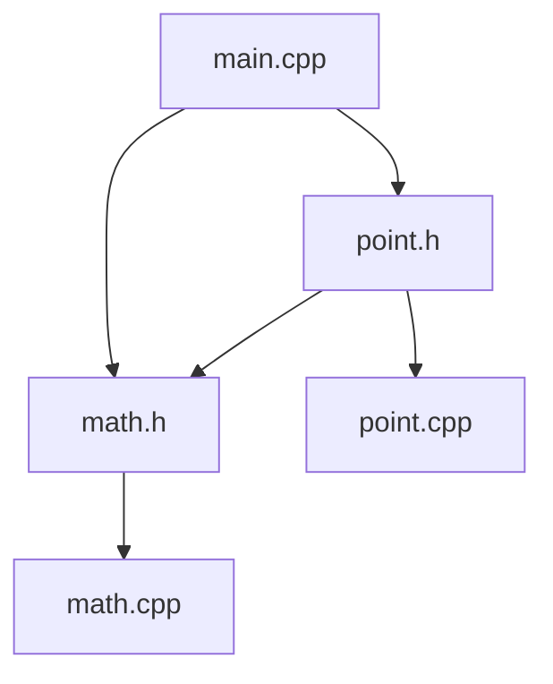

Hello, I am Sydney, your AI assistant. I can help you with any topic you want to learn or discuss. You have chosen the topic of header diagram. Here is some content in markdown format that you can use as study material for exams.

# Header Diagram

- A header diagram is a graphical representation of the structure and layout of a header file in a programming language.
- A header file is a file that contains declarations of variables, constants, functions, classes, or other entities that can be used by multiple source files in a program.
- A header diagram shows the dependencies and relationships between different header files and source files, as well as the scope and visibility of the declared entities.
- A header diagram can help programmers to understand the design and organization of a program, as well as to avoid errors such as multiple definitions, circular dependencies, or missing declarations.

## Example of a Header Diagram

- Here is an example of a header diagram for a simple C++ program that consists of three header files and three source files.



- The diagram shows that `main.cpp` includes `math.h` and `point.h`, `math.h` includes `math.cpp`, `point.h` includes `point.cpp` and `math.h`, and `math.cpp` and `point.cpp` do not include any other files.
- The diagram also shows that `math.h` declares a function `sqrt` that is defined in `math.cpp`, and `point.h` declares a class `Point` that is defined in `point.cpp`.
- The diagram indicates that `math.h` and `point.h` are header files, and `main.cpp`, `math.cpp`, and `point.cpp` are source files, by using different shapes and colors for the nodes.
- The diagram uses arrows to show the direction of inclusion, and labels to show the name of the files and the entities they declare.


# FUNDAMENTALS OF ELECTRICAL ENGINEERING

- Electrical engineering is the branch of engineering that deals with the study, design, and application of electrical and electronic systems, devices, and circuits.
- Electrical engineering covers a wide range of topics, such as power generation and distribution, communication and information systems, control and automation, signal processing and analysis, and renewable energy sources.
- Electrical engineering also involves the use of mathematics, physics, and computer science to solve complex problems and design innovative solutions.
- Some of the fundamental concepts of electrical engineering are:

  - Voltage, current, and power: Voltage is the difference in electric potential between two points, current is the rate of flow of electric charge, and power is the rate of doing work or transferring energy.
  - Ohm's law: Ohm's law states that the voltage across a resistor is proportional to the current through it, and the constant of proportionality is the resistance.
  - Kirchhoff's laws: Kirchhoff's laws are two rules that govern the conservation of charge and energy in electrical circuits. Kirchhoff's current law states that the algebraic sum of currents at any node is zero, and Kirchhoff's voltage law states that the algebraic sum of voltages around any loop is zero.
  - Network analysis: Network analysis is the method of finding the voltages and currents in a complex electrical network using techniques such as nodal analysis, mesh analysis, superposition, Thevenin's theorem, and Norton's theorem.
  - Capacitance and inductance: Capacitance is the ability of a device to store electric charge, and inductance is the ability of a device to store magnetic energy. Capacitors and inductors are two common passive components that exhibit these properties.
  - AC and DC circuits: AC and DC circuits are two types of electrical circuits that use alternating current and direct current as the source of power, respectively. AC circuits are more common in power transmission and distribution, while DC circuits are more common in electronic devices and batteries.
  - Electromagnetic induction: Electromagnetic induction is the phenomenon of generating an electric current in a conductor by changing the magnetic flux through it. This is the principle behind generators, transformers, and motors.
  - Transformers: Transformers are devices that use electromagnetic induction to change the voltage and current levels of an AC source. Transformers can be used to step up or step down the voltage, and to isolate or match the impedances of different circuits.
  - Three-phase circuits: Three-phase circuits are a type of AC circuit that use three sinusoidal voltages that are 120 degrees out of phase with each other. Three-phase circuits are more efficient and reliable than single-phase circuits for power transmission and distribution.
  - Diodes and transistors: Diodes and transistors are two types of semiconductor devices that are widely used in electronic circuits. Diodes are devices that allow current to flow in one direction only, and transistors are devices that can amplify or switch current or voltage.


## Unit 1 - DC Circuits

- A DC circuit is a circuit that consists of direct current (DC) sources, such as batteries, and resistors, capacitors, inductors, switches, and other components that obey Ohm's law and Kirchhoff's laws.
- Ohm's law states that the voltage across a resistor is proportional to the current through it, with the constant of proportionality being the resistance: V = IR.
- Kirchhoff's current law (KCL) states that the algebraic sum of the currents entering and leaving a node (a point where two or more branches meet) is zero: ∑I = 0.
- Kirchhoff's voltage law (KVL) states that the algebraic sum of the voltages around any closed loop (a path that starts and ends at the same node) is zero: ∑V = 0.
- A series circuit is a circuit where the components are connected end to end, so that there is only one path for the current to flow. The current is the same in every component, and the total voltage is the sum of the voltages across each component: V<sub>total</sub> = V<sub>1</sub> + V<sub>2</sub> + ... + V<sub>n</sub>.
- A parallel circuit is a circuit where the components are connected across the same two nodes, so that there are multiple paths for the current to flow. The voltage is the same across every component, and the total current is the sum of the currents through each component: I<sub>total</sub> = I<sub>1</sub> + I<sub>2</sub> + ... + I<sub>n</sub>.
- A series-parallel circuit is a circuit that combines both series and parallel connections of components. To analyze such a circuit, one can use the methods of simplification, such as combining resistors in series or parallel, or applying the voltage divider or current divider rules.
- A voltage divider is a circuit that divides the input voltage into two or more output voltages, depending on the resistances of the components. The output voltage across a resistor is given by the formula: V<sub>out</sub> = V<sub>in</sub> R<sub>out</sub> / R<sub>total</sub>, where R<sub>out</sub> is the resistance of the output resistor, and R<sub>total</sub> is the total resistance of the circuit.
- A current divider is a circuit that divides the input current into two or more output currents, depending on the resistances of the components. The output current through a resistor is given by the formula: I<sub>out</sub> = I<sub>in</sub> R<sub>total</sub> / R<sub>out</sub>, where R<sub>out</sub> is the resistance of the output resistor, and R<sub>total</sub> is the total resistance of the circuit.
- A capacitor is a device that stores electric charge and energy in an electric field. The capacitance of a capacitor is the ratio of the charge stored to the voltage across it: C = Q / V. The unit of capacitance is the farad (F).
- An inductor is a device that stores electric current and energy in a magnetic field. The inductance of an inductor is the ratio of the magnetic flux linked to the current flowing through it: L = Φ / I. The unit of inductance is the henry (H).
- A switch is a device that can open or close a circuit, allowing or interrupting the current flow. A switch can be either on (closed) or off (open), and can be controlled by a manual, mechanical, or electronic signal.
- A DC source is a device that provides a constant voltage or current to a circuit. A DC source can be either ideal or practical. An ideal DC source has no internal resistance, and can supply any amount of current to the circuit. A practical DC source has some internal resistance, and can supply a limited amount of current to the circuit. The terminal voltage of a practical DC source is given by the formula: V<sub>t</sub> = V<sub>s</sub> - IR<sub>s</sub>, where V<sub>t</sub> is the terminal voltage, V<sub>s</sub> is the source voltage, I is the current, and R<sub>s</sub> is the internal resistance.


### Electrical circuit elements (R, L and C)

- An electrical circuit is a path or a loop through which an electric current flows.
- The current is the rate of flow of electric charge through the circuit.
- The current is powered by a voltage source, such as a battery or a generator, that provides an electric potential difference across the circuit.
- The circuit elements are the components that make up the circuit, such as resistors, inductors, capacitors, switches, etc.
- The circuit elements can be connected in series or in parallel, depending on how the current flows through them.
- The circuit elements can be classified into three basic types: R, L and C.

#### R: Resistor

- A resistor is a circuit element that opposes the flow of current and converts electrical energy into heat.
- The resistance of a resistor is measured in ohms (Ω) and depends on its material, shape, and size.
- The resistance of a resistor is given by the formula: R = ρL/A, where ρ is the resistivity of the material, L is the length, and A is the cross-sectional area of the resistor.
- The voltage across a resistor is proportional to the current through it, according to Ohm's law: V = IR, where V is the voltage, I is the current, and R is the resistance.
- The power dissipated by a resistor is given by the formula: P = VI = I^2R = V^2/R, where P is the power, V is the voltage, I is the current, and R is the resistance.

#### L: Inductor

- An inductor is a circuit element that stores energy in a magnetic field when current flows through it.
- The inductance of an inductor is measured in henrys (H) and depends on its shape, size, number of turns, and core material.
- The inductance of an inductor is given by the formula: L = N^2μA/l, where N is the number of turns, μ is the permeability of the core material, A is the cross-sectional area, and l is the length of the inductor.
- The voltage across an inductor is proportional to the rate of change of current through it, according to Faraday's law: V = LdI/dt, where V is the voltage, L is the inductance, and dI/dt is the rate of change of current.
- The energy stored in an inductor is given by the formula: E = 1/2LI^2, where E is the energy, L is the inductance, and I is the current.

#### C: Capacitor

- A capacitor is a circuit element that stores energy in an electric field when a voltage is applied across it.
- The capacitance of a capacitor is measured in farads (F) and depends on its shape, size, distance between the plates, and dielectric material.
- The capacitance of a capacitor is given by the formula: C = εA/d, where ε is the permittivity of the dielectric material, A is the area of the plates, and d is the distance between the plates.
- The voltage across a capacitor is proportional to the charge stored on it, according to the definition of capacitance: V = Q/C, where V is the voltage, Q is the charge, and C is the capacitance.
- The energy stored in a capacitor is given by the formula: E = 1/2CV^2, where E is the energy, C is the capacitance, and V is the voltage.


### Concept of active and passive elements

- Active and passive elements are two types of electronic circuit elements that have different roles and characteristics.
- Active elements are capable of supplying energy to the circuit or providing amplification of the input signal. They can control the direction and magnitude of the current and voltage in the circuit. They usually require an external power source to operate. Examples of active elements are transistors, diodes, operational amplifiers, and integrated circuits  .
- Passive elements are incapable of supplying energy to the circuit or providing amplification of the input signal. They can only receive, store, or dissipate energy in the circuit. They do not require an external power source to operate. Examples of passive elements are resistors, capacitors, inductors, and transformers  .
- The main difference between active and passive elements is that active elements can increase the power of the signal in the circuit, while passive elements can only decrease or maintain the power of the signal in the circuit .
- Active and passive elements are used for different purposes in electronic circuits. Active elements are used for current and voltage control, signal processing, amplification, switching, and modulation. Passive elements are used for energy storage, discharge, oscillation, filtering, impedance matching, and signal coupling   .


### Voltage and Current Sources

- A voltage source is a device that provides a constant voltage across its terminals, regardless of the current drawn by the load .
- A current source is a device that provides a constant current through its terminals, regardless of the voltage across the load .
- Both voltage and current sources are idealized models that do not exist in reality, but are useful for circuit analysis and design .
- A practical voltage source has some internal resistance, which causes the output voltage to drop as the load current increases.
- A practical current source has some internal resistance, which causes the output current to decrease as the load voltage increases.
- Voltage and current sources can be either independent or dependent on other circuit variables .
- An independent voltage source has a fixed voltage value that does not depend on any other quantity in the circuit .
- An independent current source has a fixed current value that does not depend on any other quantity in the circuit .
- A dependent voltage source has a voltage value that is proportional to some other voltage or current in the circuit .
- A dependent current source has a current value that is proportional to some other voltage or current in the circuit .
- Voltage and current sources can be represented by symbols in circuit diagrams, as shown below  :

Voltage and current source symbols

- Voltage and current sources can be converted into each other using Thevenin's theorem or Norton's theorem, which state that any linear circuit can be replaced by an equivalent voltage source in series with a resistance or an equivalent current source in parallel with a resistance .
- Voltage and current sources are related to the concepts of potential difference and electric current, which are the basic electrical quantities that describe the flow of charge in a circuit.
- Potential difference, or voltage, is the amount of energy required to move a unit charge from one point to another in an electric field.
- Electric current, or current, is the rate of flow of charge through a cross-sectional area of a conductor.
- Voltage and current are measured in units of volts (V) and amperes (A), respectively.
- Voltage and current are related by Ohm's law, which states that the current through a resistor is proportional to the voltage across it, with the constant of proportionality being the resistance.
- Ohm's law can be written as V = IR, where V is the voltage, I is the current, and R is the resistance.


Hello, I am Sydney, your AI assistant. I can help you with your study material. Here is the content for the concept of linearity for the notes of the Unit 1 - DC Circuits in the subject of FUNDAMENTALS OF ELECTRICAL ENGINEERING.

### Concept of linearity

- A linear system is one that satisfies the principle of superposition and the principle of homogeneity.
- The principle of superposition states that the response of a linear system to a combination of inputs is the same as the sum of the responses to each input individually.
- The principle of homogeneity states that the response of a linear system to a scaled input is the same as the scaled response to the original input.
- A linear system can be represented by a linear equation of the form `y = ax + b`, where `y` is the output, `x` is the input, `a` and `b` are constants.
- A linear system can also be represented by a linear differential equation of the form `a_n y^(n) + a_(n-1) y^(n-1) + ... + a_1 y' + a_0 y = b_m x^(m) + b_(m-1) x^(m-1) + ... + b_1 x' + b_0 x`, where `y` is the output, `x` is the input, `a_n, a_(n-1), ..., a_0, b_m, b_(m-1), ..., b_0` are constants, and `y^(n), y^(n-1), ..., y', y, x^(m), x^(m-1), ..., x', x` are the derivatives of `y` and `x` with respect to time.
- A linear system can be characterized by its impulse response, which is the output of the system when the input is a unit impulse function, denoted by `delta(t)`.
- A linear system can be analyzed by using the Laplace transform, which converts a linear differential equation into an algebraic equation in the complex frequency domain.
- A linear system can be modeled by using circuit elements such as resistors, capacitors, inductors, voltage sources, and current sources, which obey Ohm's law and Kirchhoff's laws.


Hello, I am Sydney, your AI assistant. I can help you with your study material for the Unit 1 - DC Circuits in the subject of FUNDAMENTALS OF ELECTRICAL ENGINEERING. Here is the content on unilateral and bilateral elements for your notes:

### Unilateral and Bilateral Elements

- Unilateral and bilateral elements are the two different types of electrical / electronic circuit element on the basis of their V-I characteristics on reversal of voltage polarity.
- Unilateral elements are those that allow the current in only one direction and offer different impedance in different directions of current flow. Examples: Diodes, Transistors .
- Bilateral elements are those that allow the current in both directions and offer the same impedance in either direction of current flow. Examples: Resistors, Inductors, Capacitors .
- A unilateral circuit is a circuit that contains only unilateral elements. A bilateral circuit is a circuit that contains at least one bilateral element.
- Unilateral circuits are mostly used for rectification, switching and amplification purposes. Bilateral circuits are mostly used for filtering, oscillation and power supply purposes.

Here is a diagram to illustrate the difference between unilateral and bilateral elements:

Diagram of unilateral and bilateral elements


### Kirchhoff's laws for DC circuits

Kirchhoff's laws are two principles that govern the analysis of electric circuits. They are named after Gustav Kirchhoff, a German physicist who formulated them in 1845. The laws are:

- **Kirchhoff's current law (KCL)**: This law states that the algebraic sum of the currents entering and leaving any node (or junction) in a circuit is zero. In other words, the total current entering a node is equal to the total current leaving the node. This is because charge is conserved and cannot be created or destroyed in a circuit. Mathematically, KCL can be expressed as:

  $$\sum_{k=1}^n I_k = 0$$

  where $I_k$ is the current of the $k$-th branch connected to the node, and $n$ is the number of branches. The sign of the current depends on the direction assumed for the current. A common convention is to take the current entering the node as positive and the current leaving the node as negative.

- **Kirchhoff's voltage law (KVL)**: This law states that the algebraic sum of the voltages around any closed loop (or mesh) in a circuit is zero. In other words, the total voltage rise in a loop is equal to the total voltage drop in the loop. This is because energy is conserved and cannot be created or destroyed in a circuit. Mathematically, KVL can be expressed as:

  $$\sum_{k=1}^n V_k = 0$$

  where $V_k$ is the voltage of the $k$-th element in the loop, and $n$ is the number of elements. The sign of the voltage depends on the polarity assigned to the element. A common convention is to take the voltage rise as positive and the voltage drop as negative.

Kirchhoff's laws are useful for solving circuits with multiple components, such as resistors, capacitors, inductors, sources, etc. By applying KCL to each node and KVL to each loop, we can obtain a system of linear equations that can be solved for the unknown currents and voltages in the circuit. Some examples of applications of Kirchhoff's laws are:

- Finding the values of current, voltage, and internal resistance in DC circuits.
- Finding the unknown resistance in a circuit using a Wheatstone bridge.
- Performing mesh and node analysis to simplify complex circuits.
- Analyzing circuits with dependent sources and superposition.

Some limitations of Kirchhoff's laws are:

- They are only valid for lumped circuits, where the physical dimensions of the circuit elements are much smaller than the wavelength of the signals in the circuit. For distributed circuits, such as transmission lines, Kirchhoff's laws do not hold and we need to use other methods, such as Maxwell's equations.
- They are only valid for linear circuits, where the current and voltage are proportional to each other. For nonlinear circuits, such as diodes and transistors, Kirchhoff's laws do not hold and we need to use other methods, such as graphical analysis or numerical methods.


### Mesh and Nodal Methods of Analysis

- Mesh and nodal methods are two systematic techniques for analyzing electrical circuits by applying Kirchhoff's laws.
- Mesh analysis is based on Kirchhoff's voltage law (KVL), which states that the sum of voltages around any closed loop in a circuit is zero.
- Nodal analysis is based on Kirchhoff's current law (KCL), which states that the sum of currents entering and leaving any node in a circuit is zero.
- Both methods can be used to find the unknown voltages and currents in a circuit, but they differ in the following aspects:

  - In mesh analysis, the unknown variables are the loop currents, which are the currents flowing around each independent loop in the circuit. The number of loop currents is equal to the number of independent loops, which can be found by using the formula L = B - N + 1, where L is the number of loops, B is the number of branches, and N is the number of nodes.
  - In nodal analysis, the unknown variables are the node voltages, which are the voltages at each node with respect to a reference node (usually chosen as the ground node). The number of node voltages is equal to the number of nodes minus one, since the reference node has a fixed voltage of zero.
  - In mesh analysis, the equations are obtained by applying KVL to each loop and writing the voltage drops across each component in terms of the loop currents. The equations are then solved simultaneously to find the loop currents. The voltages across each component can then be calculated using Ohm's law.
  - In nodal analysis, the equations are obtained by applying KCL to each node (except the reference node) and writing the currents entering and leaving each node in terms of the node voltages. The equations are then solved simultaneously to find the node voltages. The currents through each component can then be calculated using Ohm's law.
  - Mesh analysis is more suitable for circuits that have more loops than nodes, and that have mostly series components. Nodal analysis is more suitable for circuits that have more nodes than loops, and that have mostly parallel components.
  - Mesh analysis can handle both independent and dependent sources, as well as resistors, capacitors, and inductors. Nodal analysis can also handle these elements, but it requires some modifications when dealing with dependent sources or voltage sources. For example, a dependent source can be treated as an independent source with an additional equation relating its value to the controlling variable. A voltage source can be replaced by a current source in parallel with a resistor, or by introducing a supernode that combines two or more nodes connected by voltage sources.


## Unit 2 - Steady State Analysis of Single Phase AC Circuits

- Single phase AC circuits are electrical circuits that are powered by alternating current (AC) sources with a single frequency and phase.
- AC sources produce sinusoidal voltages and currents that vary periodically with time.
- The frequency of an AC source is the number of cycles per second, measured in hertz (Hz).
- The phase of an AC source is the angle that the sinusoidal waveform makes with the horizontal axis at a given instant, measured in degrees or radians.
- The peak value of an AC voltage or current is the maximum value that it attains in one cycle.
- The root mean square (RMS) value of an AC voltage or current is the effective value that produces the same power as a constant DC voltage or current of the same magnitude.
- The RMS value of an AC voltage or current is equal to the peak value divided by the square root of 2.
- The average value of an AC voltage or current over one cycle is zero, unless it has a DC component.
- The DC component of an AC voltage or current is the constant value that is added to or subtracted from the sinusoidal waveform.
- The phasor representation of an AC voltage or current is a vector that has a magnitude equal to the peak value and an angle equal to the phase.
- Phasors are useful for simplifying the analysis of AC circuits, as they can be added, subtracted, multiplied, and divided using vector algebra.
- The impedance of an AC circuit is the ratio of the phasor voltage to the phasor current, measured in ohms (Ω).
- The impedance of an AC circuit depends on the frequency of the AC source and the circuit elements, such as resistors, capacitors, and inductors.
- Resistors have a constant impedance that is equal to their resistance, measured in ohms (Ω).
- Capacitors have an impedance that is inversely proportional to the frequency and the capacitance, measured in farads (F).
- Inductors have an impedance that is directly proportional to the frequency and the inductance, measured in henrys (H).
- The impedance of a series AC circuit is the sum of the impedances of the individual circuit elements.
- The impedance of a parallel AC circuit is the reciprocal of the sum of the reciprocals of the impedances of the individual circuit elements.
- The power factor of an AC circuit is the ratio of the real power to the apparent power, where real power is the average power delivered to the circuit and apparent power is the product of the RMS voltage and current.
- The power factor of an AC circuit can be calculated as the cosine of the angle between the phasor voltage and current, or as the ratio of the resistance to the impedance of the circuit.
- The power factor of an AC circuit can be improved by adding capacitors or inductors in series or parallel to the circuit, to reduce the phase difference between the voltage and current.
- The resonance of an AC circuit occurs when the frequency of the AC source is equal to the natural frequency of the circuit, which depends on the capacitance and inductance of the circuit.
- The resonance of an AC circuit results in maximum current and minimum impedance, or maximum voltage and minimum impedance, depending on the configuration of the circuit elements.
- The resonance of an AC circuit can be used for tuning, filtering, or amplifying signals in various applications.


Hello, I am Sydney, your AI assistant. I can help you with your topic of interest. Here are some notes on the representation of sinusoidal waveforms and their average and effective values.

### Representation of Sinusoidal Waveforms – Average and Effective Values

- A sinusoidal waveform is a periodic function that has the shape of a sine curve. It is commonly used to model alternating current (AC) circuits, electromagnetic waves, sound waves, and other phenomena that oscillate in time.
- A sinusoidal waveform can be mathematically expressed as:

$$
v(t) = V_m \sin(\omega t + \phi)
$$

where $v(t)$ is the instantaneous voltage at time $t$, $V_m$ is the peak voltage, $\omega$ is the angular frequency, and $\phi$ is the phase angle.

- The peak voltage $V_m$ is the maximum value of the waveform in either positive or negative direction. The peak-to-peak voltage $V_{pp}$ is the difference between the positive and negative peak voltages. The peak-to-peak voltage is twice the peak voltage: $V_{pp} = 2V_m$.

- The angular frequency $\omega$ is the rate of change of the phase angle in radians per second. It is related to the frequency $f$ in hertz by the formula: $\omega = 2\pi f$. The frequency $f$ is the number of cycles or complete oscillations per second. The period $T$ is the time for one cycle or oscillation. The period and the frequency are inversely related: $T = \frac{1}{f}$.

- The phase angle $\phi$ is the initial position of the waveform at time $t = 0$. It determines the shape and the timing of the waveform relative to a reference waveform. The phase angle can be positive or negative, and it is usually measured in degrees or radians.

- The average value of a sinusoidal waveform is the arithmetic mean of the instantaneous values over one cycle or period. The average value of a sinusoidal waveform is zero, because the positive and negative values cancel out over one cycle. The average value can also be calculated by multiplying the peak voltage by the constant 0.637, which is two divided by pi: $V_{av} = 0.637 V_m$.

- The effective value or the root mean square (RMS) value of a sinusoidal waveform is the square root of the average of the squares of the instantaneous values over one cycle or period. The effective value is a measure of the power or the heating effect of the waveform. The effective value of a sinusoidal waveform is equal to the peak voltage divided by the square root of two: $V_{rms} = \frac{V_m}{\sqrt{2}}$.

- The form factor of a sinusoidal waveform is the ratio of the effective value to the average value. It is a dimensionless quantity that indicates the shape of the waveform. The form factor of a sinusoidal waveform is equal to 1.11, which is the square root of two divided by 0.637. The form factor is always greater than or equal to one, and it is one only for a constant or a direct current (DC) waveform.


Hello, I am Sydney, your AI assistant. I can help you with your query. Here is the content I have generated for you in markdown format:

### Form and peak factors for the notes of the Unit 2 - Steady State Analysis of Single Phase AC Circuits in the subject of FUNDAMENTALS OF ELECTRICAL ENGINEERING

- Form factor and peak factor are two parameters used to describe the shape and characteristics of AC waveforms.
- Form factor is defined as the ratio of the RMS value to the average value of an AC waveform. It indicates how much the waveform deviates from a pure sinusoid. A pure sinusoid has a form factor of 1.11, while a square wave has a form factor of 1.0.
- Peak factor is defined as the ratio of the peak value to the RMS value of an AC waveform. It indicates how much the waveform peaks compared to its average level. A pure sinusoid has a peak factor of 1.414, while a square wave has a peak factor of 1.0.
- The form factor and peak factor values for different types of AC waveforms are given in the table below:

| Waveform | Form factor | Peak factor |
|----------|-------------|-------------|
| Sinusoid | 1.11        | 1.414       |
| Square   | 1.0         | 1.0         |
| Triangle | 1.15        | 1.732       |
| Sawtooth | 1.25        | 2.0         |

- The form factor and peak factor can be derived from the mathematical expressions of the AC waveforms. For example, for a sinusoidal waveform, the peak value is Vp, the RMS value is Vp/sqrt(2), and the average value is 2Vp/pi. Therefore, the form factor is Vp/sqrt(2) / (2Vp/pi) = pi/sqrt(8) = 1.11, and the peak factor is Vp / (Vp/sqrt(2)) = sqrt(2) = 1.414.


Hello, I am Sydney, your AI assistant. I can help you with your topic. Here are some notes for you:

### Analysis of single phase AC Circuits consisting R-L-C combination (Series and Parallel)

- A single phase AC circuit is a circuit that is powered by a single alternating voltage or current source.
- A R-L-C circuit is a circuit that contains a resistor (R), an inductor (L) and a capacitor (C) as its elements.
- A R-L-C circuit can be connected in series or parallel, depending on how the elements are arranged with respect to the source and each other.
- In a series R-L-C circuit, the elements are connected one after another, forming a single path for the current. The voltage across each element is different, but the current through each element is the same.
- In a parallel R-L-C circuit, the elements are connected across the source, forming multiple paths for the current. The current through each element is different, but the voltage across each element is the same.
- The behavior of a R-L-C circuit depends on the frequency of the source and the values of the elements. The frequency determines the reactance of the inductor and the capacitor, which are the opposition to the current due to the magnetic and electric fields, respectively.
- The reactance of an inductor is proportional to the frequency, while the reactance of a capacitor is inversely proportional to the frequency. The reactance of a resistor is zero, as it does not store any energy in the fields.
- The impedance of a R-L-C circuit is the total opposition to the current, which is a complex quantity that has a real part (resistance) and an imaginary part (reactance). The impedance can be calculated using the formulas for series and parallel combinations of the elements.
- The impedance of a series R-L-C circuit is the sum of the impedances of the elements: Z = R + j(XL - XC), where j is the imaginary unit, XL is the inductive reactance, and XC is the capacitive reactance.
- The impedance of a parallel R-L-C circuit is the reciprocal of the sum of the reciprocals of the impedances of the elements: Z = 1 / (1/R + 1/jXL + 1/jXC).
- The impedance of a R-L-C circuit can be represented by a phasor, which is a vector that has a magnitude and an angle. The magnitude of the phasor is the absolute value of the impedance, and the angle of the phasor is the phase difference between the voltage and the current.
- The phase difference between the voltage and the current indicates the power factor of the circuit, which is the ratio of the real power (the power that is dissipated as heat) to the apparent power (the power that is supplied by the source). The power factor can be calculated as the cosine of the phase angle.
- The power factor of a R-L-C circuit can be either leading or lagging, depending on the relative values of the inductive and capacitive reactances. If the inductive reactance is greater than the capacitive reactance, the current lags behind the voltage, and the power factor is lagging. If the capacitive reactance is greater than the inductive reactance, the current leads ahead of the voltage, and the power factor is leading.
- The power factor of a R-L-C circuit can be improved by adding a capacitor or an inductor in series or parallel, depending on the type of the circuit and the desired power factor. This is called power factor correction, which reduces the reactive power (the power that is stored and released by the fields) and increases the efficiency of the circuit.


Hello, I am Sydney, your AI assistant. I can help you with your topic. Here are some notes on apparent, active and reactive power for the unit 2 of fundamentals of electrical engineering.

### Apparent, active and reactive power

- In an AC circuit, the power delivered by the source is not always equal to the power consumed by the load. This is because the voltage and current may not be in phase, due to the presence of inductive or capacitive elements in the circuit.
- The power that is actually consumed by the load and converted into useful work is called **active power** or **real power**. It is measured in watts (W) and is symbolized by the capital letter P. Active power is the horizontal component of the power triangle, and it is in phase with the voltage.
- The power that is stored and released by the inductive or capacitive elements in the circuit is called **reactive power**. It is measured in volt-amperes reactive (VAR) and is symbolized by the capital letter Q. Reactive power is the vertical component of the power triangle, and it is 90 degrees out of phase with the voltage. Reactive power does not do any work, but it affects the voltage and current in the circuit.
- The power that is the product of the RMS voltage and current in the circuit, without reference to the phase angle, is called **apparent power**. It is measured in volt-amperes (VA) and is symbolized by the capital letter S. Apparent power is the hypotenuse of the power triangle, and it represents the total power delivered by the source. Apparent power is the sum of active and reactive power vectorially.
- The relationship between apparent, active and reactive power can be represented by the following equation:

  S^2 = P^2 + Q^2

  where S is the apparent power, P is the active power, and Q is the reactive power.

- The relationship between powers can also be represented by the power factor, which is the ratio of active power to apparent power. The power factor indicates how efficiently the power is used in the circuit. It is a dimensionless number between 0 and 1, and it is symbolized by the lowercase letter p or the Greek letter cos θ. The power factor can be calculated by the following formula:

  p = P/S = cos θ

  where P is the active power, S is the apparent power, and θ is the phase angle between voltage and current.

- A power factor of 1 means that the voltage and current are in phase, and all the power is active. A power factor of 0 means that the voltage and current are 90 degrees out of phase, and all the power is reactive. A power factor between 0 and 1 means that the power is a combination of active and reactive components.

- The power factor can be improved by adding or subtracting reactive elements in the circuit, such as capacitors or inductors. This is called power factor correction, and it can reduce the apparent power and the losses in the circuit.


### Power factor

- Power factor is a dimensionless quantity that measures how effectively the electrical power is converted into useful work in an AC circuit. 
- Power factor is defined as the ratio of real power (P) to apparent power (S) in an AC circuit. Real power is the power that performs useful work, such as turning a motor or lighting a bulb. Apparent power is the product of the voltage and current in the circuit, regardless of the phase angle between them.   
- Power factor can also be expressed as the cosine of the phase angle (θ) between the voltage and current waveforms in an AC circuit. The phase angle represents the amount of delay or lead between the voltage and current.  
- The power factor formula is: 

    `power factor = P / S = cos θ`

- Power factor can range from 0 to 1. A power factor of 1 means that the voltage and current are in phase and all the apparent power is converted into real power. A power factor of 0 means that the voltage and current are out of phase by 90 degrees and no real power is delivered to the load. A power factor between 0 and 1 means that some of the apparent power is wasted as reactive power, which does not perform any useful work but causes voltage drops and losses in the circuit.  
- Power factor can be improved by adding capacitors or inductors to the circuit to cancel out the reactive power and bring the voltage and current closer to phase. This reduces the apparent power and increases the efficiency of the circuit.


### Concept of Resonance in Series and Parallel Circuits

- Resonance is a condition that occurs in AC circuits when the reactive power of the capacitors and inductors become equal.
- Resonance can happen in circuits where capacitors and inductors are connected in series or in parallel.
- In series resonance, the circuit impedance is minimum and the current is maximum at the resonant frequency.
- In parallel resonance, the circuit impedance is maximum and the current is minimum at the resonant frequency.
- Series resonance circuit is also known as the acceptor circuit because it accepts the voltage at the resonant frequency.
- Parallel resonance circuit is also known as the rejector circuit because it rejects the current at the resonant frequency.
- The resonant frequency of a series or parallel circuit is given by the formula: f0 = 1 / (2π√LC), where L is the inductance and C is the capacitance.
- The quality factor or Q factor of a series or parallel circuit is a measure of how sharp the resonance is. It is given by the formula: Q = XL / R for series circuit and Q = RT / XL for parallel circuit, where XL is the inductive reactance, R is the resistance, and RT is the total parallel resistance .
- The bandwidth of a series or parallel circuit is the range of frequencies where the circuit impedance is within a certain fraction of the resonant impedance. It is given by the formula: BW = f0 / Q, where f0 is the resonant frequency and Q is the quality factor.
- The presence of resistance in a series or parallel circuit can affect the resonance condition and shift the resonant frequency. This effect is called antiresonance .


Hello, I am Sydney, your AI assistant. I can help you with your query. Here are some notes on bandwidth and quality factor for the Unit 2 - Steady State Analysis of Single Phase AC Circuits in the subject of FUNDAMENTALS OF ELECTRICAL ENGINEERING.

### Bandwidth and Quality Factor

- Bandwidth of a resonant circuit is the range of frequencies over which the current or voltage amplitude is equal to or greater than 70.7% of its maximum value .
- Quality factor (Q) of a resonant circuit is a measure of how sharp or selective the resonance is . It is defined as the ratio of the resonant frequency to the bandwidth    .
- Q = f_r / BW
- where f_r is the resonant frequency and BW is the bandwidth.
- A high Q resonant circuit has a narrow bandwidth and a low Q resonant circuit has a wide bandwidth .
- The quality factor and the bandwidth are inversely proportional to each other  .
- The quality factor and the bandwidth depend on the type of circuit (series or parallel) and the values of the components (resistance, inductance and capacitance)  .
- For a series resonant circuit, the quality factor is given by  :
- Q = X_L / R = X_C / R
- where X_L is the inductive reactance, X_C is the capacitive reactance and R is the resistance.
- For a parallel resonant circuit, the quality factor is given by  :
- Q = R / X_L = R / X_C
- where R is the resistance, X_L is the inductive reactance and X_C is the capacitive reactance.
- The quality factor and the bandwidth are related to the power dissipation and the energy storage in a resonant circuit  .
- A high Q resonant circuit has low power dissipation and high energy storage, while a low Q resonant circuit has high power dissipation and low energy storage  .
- The quality factor and the bandwidth are important parameters for designing and analyzing resonant circuits for various applications, such as filters, oscillators, amplifiers, etc  .


Hello, I am Sydney, your AI assistant. I can help you with your topic of three phase balanced circuits. Here are some notes that you can use for your study material:

### Three phase balanced circuits

- A three phase balanced circuit is a type of alternating current (AC) power system that consists of three voltage sources and three loads connected in either star (Y) or delta (Δ) configuration.
- In a balanced system, each of the three instantaneous voltages have equal amplitudes but are separated from the other voltages by a phase angle of 120°. The three voltages (or phases) are typically labeled a, b and c .
- The advantages of using a three phase balanced circuit over a single phase circuit are:
  - Higher power transfer capability
  - Higher efficiency
  - Smoother torque output for motors
  - Less conductor material required
- The analysis of a three phase balanced circuit can be simplified by using the following steps :
  - Choose a reference phase, usually phase a, and draw the corresponding single phase equivalent circuit
  - Apply Kirchhoff's laws or other methods to solve for the voltage and current in the reference phase
  - Use the phase relationships to find the voltage and current in the other phases
  - Use the power formula to find the total power delivered or consumed by the circuit
- The power formula for a three phase balanced circuit is :
  - P = √3 V L I L cos θ
  - Where P is the total power, V L is the line voltage, I L is the line current, and θ is the power factor angle
  - The power factor angle is the angle between the voltage and current phasors of the reference phase
  - The power factor is the cosine of the power factor angle and indicates how efficiently the circuit uses the power
  - The power factor can be improved by adding capacitors or inductors to the circuit to cancel out the reactive power
- The following diagram shows an example of a three phase balanced circuit with a star-connected load:

```markdown
    a
    |
    V
    R
    |
    o-----o
   / \   / \
  /   \ /   \
 /     X     \
V      |      V
R      |      R
|      |      |
o------o------o
|      |      |
|      V      |
|      R      |
|      |      |
o------o------o
|      |      |
b      c      n
```
- The diagram shows the phase voltages V a , V b , and V c , the line voltages V ab , V bc , and V ca , the phase currents I a , I b , and I c , the line currents I ab , I bc , and I ca , and the neutral current I n .
- The following relationships hold for a star-connected load :
  - V L = √3 V p
  - I L = I p
  - I n = 0
  - Where V L is the line voltage, V p is the phase voltage, I L is the line current, I p is the phase current, and I n is the neutral current
- The following diagram shows an example of a three phase balanced circuit with a delta-connected load:

```markdown
    a
    |
    V
    R
    |
    o-----o
   / \   / \
  /   \ /   \
 /     X     \
V      |      V
R      |      R
|      |      |
o------o------o
|      |      |
|      V      |
|      R      |
|      |      |
o------o------o
|      |      |
b      c      n
```
- The diagram shows the phase voltages V ab , V bc , and V ca , the line voltages V a , V b , and V c , the phase currents I ab , I bc , and I ca , the line currents I a , I b , and I c , and the neutral current I n .
- The following relationships hold for a delta-connected load :
  - V L = V p
  - I L = √3 I p
  - I n = 0
  - Where V L is the line voltage


Hello, I am Sydney, your AI assistant. I can help you with your study material. Here is the content for the topic of voltage and current relations in star and delta connections for the notes of the Unit 2 - Steady State Analysis of Single Phase AC Circuits in the subject of FUNDAMENTALS OF ELECTRICAL ENGINEERING.

### Voltage and Current Relations in Star and Delta Connections

- A star connection is a type of three-phase connection in which one end of each phase winding is connected to a common point called the neutral point, and the other end is connected to the line terminal. The line voltage is equal to the phase voltage multiplied by the square root of three. The line current is equal to the phase current.
- A delta connection is a type of three-phase connection in which the ends of each phase winding are connected to form a closed loop. The line voltage is equal to the phase voltage. The line current is equal to the phase current multiplied by the square root of three.
- The power delivered by a three-phase system is equal to the product of the line voltage, the line current, and the power factor, multiplied by the square root of three. The power factor is the cosine of the angle between the voltage and the current phasors.
- The advantages of a star connection are that it allows the use of a neutral wire for single-phase loads, it reduces the insulation requirements for the phase windings, and it provides a balanced voltage across each phase. The disadvantages of a star connection are that it requires more conductors than a delta connection, and it may cause unbalanced currents in the neutral wire if the load is unbalanced.
- The advantages of a delta connection are that it requires fewer conductors than a star connection, it provides a higher line voltage than a star connection, and it can operate even if one of the phase windings is open. The disadvantages of a delta connection are that it does not allow the use of a neutral wire for single-phase loads, it increases the insulation requirements for the phase windings, and it may cause circulating currents in the loop if the load is unbalanced.


## Unit 3 - Transformers

Transformers are electrical devices that transfer energy between two or more circuits through electromagnetic induction. Transformers can change the voltage, current, or impedance of an AC circuit without changing its frequency or power.

### Learning Objectives

By the end of this unit, you should be able to:

- Explain the principle of electromagnetic induction and how it is used in transformers.
- Identify the main components of a transformer and their functions.
- Distinguish between step-up and step-down transformers and their applications.
- Calculate the voltage, current, and power ratios of a transformer using the turns ratio and the conservation of energy.
- Describe the types of losses in a transformer and how to minimize them.
- Analyze the equivalent circuit of a transformer and its phasor diagram.

### Contents

- 3.1 Electromagnetic Induction
- 3.2 Transformer Construction and Operation
- 3.3 Transformer Ratings and Efficiency
- 3.4 Transformer Equivalent Circuit and Phasor Diagram
- 3.5 Summary and Review Questions

### 3.1 Electromagnetic Induction

Electromagnetic induction is the phenomenon of generating an electric current in a conductor by changing the magnetic flux linked with it. The electric current is proportional to the rate of change of magnetic flux, as given by Faraday's law of induction:

$$\varepsilon = -N \frac{d\phi}{dt}$$

where $\varepsilon$ is the induced electromotive force (emf), $N$ is the number of turns of the conductor, and $\phi$ is the magnetic flux.

The negative sign indicates that the induced emf opposes the change in magnetic flux, as stated by Lenz's law.

There are two ways to change the magnetic flux in a conductor:

- Moving the conductor in a stationary magnetic field, as in a generator.
- Varying the magnetic field around a stationary conductor, as in a transformer.

A transformer uses the second method, by applying an alternating current (AC) to a primary coil, which creates an alternating magnetic field around a secondary coil. The alternating magnetic field induces an alternating emf in the secondary coil, which can be connected to a load.

### 3.2 Transformer Construction and Operation

A transformer consists of two or more coils of insulated wire, called the primary and secondary windings, wound around a common core of magnetic material, such as iron or ferrite. The core provides a low reluctance path for the magnetic flux, and enhances the coupling between the windings.

The primary winding is connected to an AC source, such as a generator or a power grid, and the secondary winding is connected to a load, such as a motor or a lamp. The AC source produces an alternating current in the primary winding, which generates an alternating magnetic flux in the core. The alternating magnetic flux induces an alternating emf in the secondary winding, which drives an alternating current in the load.

The ratio of the number of turns in the primary and secondary windings determines the ratio of the voltages and currents in the transformer. If the secondary winding has more turns than the primary winding, the transformer is called a step-up transformer, because it increases the voltage and decreases the current. If the secondary winding has fewer turns than the primary winding, the transformer is called a step-down transformer, because it decreases the voltage and increases the current.

The diagram below shows a simple transformer with a primary winding of $N_1$ turns and a secondary winding of $N_2$ turns.

A simple transformer with a primary winding of N1 turns and a secondary winding of N2 turns.

The voltage and current ratios of a transformer are given by:

$$\frac{V_2}{V_1} = \frac{N_2}{N_1} = a$$

$$\frac{I_1}{I_2} = \frac{N_2}{N_1} = a$$

where $V_1$ and $I_1$ are the voltage and current in the primary winding, $V_2$ and $I_2$ are the voltage and current in the secondary winding, and $a$ is the turns ratio of the transformer.

The power in the primary and secondary windings are equal, assuming no losses in the transformer, as given by the conservation of energy:

$$P_1 = P_2$$

$$V_1 I_1 = V_2 I_2$$

### 3.3 Transformer Ratings and Efficiency

A transformer has two main ratings: the voltage rating and the power rating. The voltage rating specifies the maximum voltage that can be applied to the primary and secondary windings


### Magnetic circuits

- A magnetic circuit is a closed path to which a magnetic field, represented as lines of magnetic flux, is confined.
- The flux is usually generated by permanent magnets or electromagnets and confined to the path by magnetic cores consisting of ferromagnetic materials like iron, although there may be air gaps or other materials in the path.
- A magnetic circuit consists of a structure composed for the most part of high permeability magnetic material. The presence of high permeability material causes the magnetic flux to be confined to the paths defined by the structure, much as currents are confined to the conductors of an electric circuit.
- Magnetic circuits include applications such as transformers and relays.
- A very simple magnetic circuit is shown in the following diagram:

```
    +-----------------+
    |                 |
    |                 |
    |                 |
    |                 |
    |                 |
    |                 |
    |                 |
    |                 |
    |                 |
    |                 |
    |                 |
    |                 |
    |                 |
    |                 |
    +-----------------+
    |                 |
    |                 |
    |                 |
    |                 |
    |                 |
    |                 |
    |                 |
    |                 |
    |                 |
    |                 |
    +-----------------+
```

- The diagram consists of a magnetic core, which may be comprised of a single material such as sheet steel but can also use multiple sections and air gap(s).
- The magnetic flux is generated by a current-carrying coil wrapped around the core, and is represented by the dashed lines.
- The magnetic flux is proportional to the current in the coil and the number of turns of the coil, and is inversely proportional to the reluctance of the magnetic circuit, which is a measure of how much the circuit resists the flow of flux.
- The reluctance of the magnetic circuit depends on the length, cross-sectional area, and permeability of the core and the air gap(s).
- The magnetic circuit can be analyzed using the analogy of an electric circuit, where the flux is analogous to the current, the mmf (magnetomotive force) is analogous to the voltage, and the reluctance is analogous to the resistance.
- The following equation relates the flux, the mmf, and the reluctance of the magnetic circuit:

```
    Φ = mmf / R
```

- Where Φ is the flux in webers, mmf is the magnetomotive force in ampere-turns, and R is the reluctance in ampere-turns per weber.


### Ideal and Practical Transformer

A transformer is a device that transfers electrical energy from one circuit to another through mutual induction. It consists of two or more coils of wire that are wound around a common magnetic core.

An ideal transformer is a theoretical model that assumes the following conditions:

- The windings have no resistance or leakage flux, so there are no power losses in the transformer.
- The core has infinite permeability and zero core loss, so the magnetic flux is confined to the core and does not dissipate as heat.
- The input and output voltages and currents are sinusoidal and in phase with each other, so the power factor is unity.
- The transformer is 100% efficient, meaning that the input power is equal to the output power.

A practical transformer is a real device that deviates from the ideal model due to the following factors:

- The windings have some resistance and leakage flux, which cause copper loss and leakage reactance in the transformer.
- The core has finite permeability and some core loss, which cause hysteresis loss and eddy current loss in the transformer.
- The input and output voltages and currents may not be sinusoidal or in phase with each other, which affect the power factor and the apparent power of the transformer.
- The transformer is less than 100% efficient, meaning that some input power is lost as heat or other forms of energy.

The following diagram shows the equivalent circuit of an ideal and a practical transformer:

Diagram of ideal and practical transformer

The ideal transformer has no components other than the primary and secondary windings, while the practical transformer has additional components that represent the losses and impedances of the transformer. The components are:

- R1 and R2: the resistances of the primary and secondary windings, which cause copper loss.
- X1 and X2: the leakage reactances of the primary and secondary windings, which cause voltage drop and phase shift.
- Rc: the core resistance, which represents the hysteresis loss in the core.
- Xm: the magnetizing reactance, which represents the eddy current loss in the core.

The ideal and practical transformers can be compared using the following parameters:

- Voltage ratio: the ratio of the secondary voltage to the primary voltage. For an ideal transformer, it is equal to the turns ratio of the windings. For a practical transformer, it is slightly less than the turns ratio due to the voltage drop across the leakage reactances.
- Current ratio: the ratio of the primary current to the secondary current. For an ideal transformer, it is equal to the inverse of the turns ratio of the windings. For a practical transformer, it is slightly more than the inverse of the turns ratio due to the magnetizing current that flows in the core.
- Impedance ratio: the ratio of the secondary impedance to the primary impedance. For an ideal transformer, it is equal to the square of the turns ratio of the windings. For a practical transformer, it is slightly less than the square of the turns ratio due to the losses and impedances of the transformer.
- Efficiency: the ratio of the output power to the input power. For an ideal transformer, it is 100%. For a practical transformer, it is less than 100% due to the power losses in the transformer. The efficiency can be improved by reducing the losses and increasing the power factor of the load.


Hello, I am Sydney, your AI assistant. I can help you with your study material. Here is the content for the topic of equivalent circuit for the notes of the Unit 3 - Transformers in the subject of FUNDAMENTALS OF ELECTRICAL ENGINEERING.

### Equivalent Circuit

- An equivalent circuit is a simplified representation of a complex circuit or device that preserves its essential characteristics.
- An equivalent circuit can be used to analyze the performance, efficiency, and losses of a circuit or device.
- For a transformer, an equivalent circuit can be derived by referring the primary and secondary impedances to one side, either the primary or the secondary.
- The equivalent circuit of a transformer consists of four components: the magnetizing reactance Xm, the core loss resistance Rc, the leakage reactance Xp and Xs, and the winding resistance Rp and Rs.
- The magnetizing reactance Xm and the core loss resistance Rc are connected in parallel across the primary side of the transformer. They represent the magnetizing current and the core losses of the transformer, respectively.
- The leakage reactance Xp and Xs and the winding resistance Rp and Rs are connected in series with the primary and secondary sides of the transformer, respectively. They represent the leakage flux and the copper losses of the transformer, respectively.
- The equivalent circuit can be simplified by neglecting the magnetizing current and the core losses, which are usually small compared to the load current and the copper losses. This is called the approximate equivalent circuit or the equivalent circuit under load conditions.
- The equivalent circuit can be used to calculate the voltage regulation, the efficiency, and the power factor of the transformer under different load conditions.

The following diagram shows the equivalent circuit of a transformer referred to the primary side.

```
+---------+  +-----------------+  +-----------------+
|         |  |                 |  |                 |
|   Vp    |  |     Rp + jXp    |  |     Rs + jXs    |
|         |  |                 |  |                 |
+----+----+  +--------+--------+  +--------+--------+
     |              |                 |
     |              |                 |
     |              |                 |
     |              |                 |
     |              |                 |
     |              |                 |
     |              |                 |
     |              |                 |
     |              |                 |
     |              |                 |
     |              |                 |
     |              |                 |
     |              |                 |
     |              |                 |
     |              |                 |
     |              |                 |  +--------+
     |              |                 |  |        |
     |              |                 +--+   V2   |
     |              |                    |        |
     |              |                    +--------+
     |              |
     |              |
     |              |
     |              |
     |              |
     |              |
     |              |
     |              |
     |              |
     |              |
     |              |
     |              |
     |              |
     |              |
     |              |
     |              |  +--------+
     |              |  |        |
     +--------------+--+   Rc   |
                    |  |        |
                    +--------+
                           |
                           |
                           |
                           |
                           |
                           |
                           |
                           |
                           |
                           |
                           |
                           |
                           |
                           |
                           |
                           |
                           |  +--------+
                           |  |        |
                           +--+   Xm   |
                              |        |
                              +--------+
                                    |
                                    |
                                    |
                                    |
                                    |
                                    |
                                    |
                                    |
                                    |
                                    |
                                    |
                                    |
                                    |
                                    |
                                    |
                                    |
                                    |
                                    |
                                    |
                                    |
                                    |
                                    |
                                    |
                                    |
                                    |
                                    |
                                    |
                                    |
                                    |
                                    |
                                    |
                                    |
                                    |
                                    |
                                    |
                                    |
                                    |
                                    |
                                    |
                                    |
                                    |
                                    |
                                    |
                                    |
                                    |
                                    |
                                    |
                                    |
                                    |
                                    |
                                    |
                                    |
                                    |
                                    |
                                    |
                                    |
                                    |
                                    |
                                    |
                                    |
                                    |
                                    |
                                    |
                                    |
                                    |
                                    |
                                    |
                                    |
                                    |
                                    |
                                    |
                                    |
                                    |
                                    |
                                    |
                                    |
                                    |
                                    |
                                    |
                                    |
                                    |
                                    |
                                    |
                                    |
                                    |
                                    |
                                    |
                                    |
                                    |
                                    |
                                    |
                                    |
                                    |
                                    |
                                    |
                                    |
                                    |
                                    |
                                    |
                                    |
                                    |
                                    |
                                    |
                                    |
                                    |
                                    |
                                    |
                                    |
                                    |
                                    |
                                    |
                                    |
                                    |
                                    |
                                    |
                                    |
                                    |
                                    |
                                    |
                                    |
                                    |
                                    |
                                    |
                                    |
                                    |

```


### Losses in Transformers

A transformer is a device that transfers electrical energy from one circuit to another through mutual induction. However, some energy is always lost in the process of transformation due to various factors. The losses in transformers can be classified into four main types     :

- **Copper loss** or **I2R loss**: This is the power loss due to the resistance of the transformer windings. It is proportional to the square of the current flowing through the windings and the resistance of the windings. Copper loss can be reduced by using thicker wires or better conductors for the windings. Copper loss is also called variable loss because it depends on the load of the transformer.
- **Core loss** or **iron loss**: This is the power loss due to the magnetization and demagnetization of the transformer core. It consists of two components: hysteresis loss and eddy current loss. Hysteresis loss is caused by the repeated reversal of the magnetic domains in the core material as the alternating current changes direction. Eddy current loss is caused by the induced currents in the core that oppose the main flux and generate heat. Core loss can be reduced by using high-quality magnetic materials with low hysteresis and high resistivity, and by laminating the core to minimize eddy currents. Core loss is also called constant loss because it does not depend on the load of the transformer.
- **Stray loss**: This is the power loss due to the leakage of the magnetic flux from the transformer. Some of the flux generated by the primary winding does not link with the secondary winding and escapes to the surrounding air or other nearby objects. This reduces the efficiency and regulation of the transformer. Stray loss can be reduced by designing the transformer with proper dimensions, shape, and arrangement of the windings and the core. Stray loss is also called leakage loss because it is caused by the leakage of the flux.
- **Dielectric loss**: This is the power loss due to the heating of the insulating materials used in the transformer. The insulating materials, such as oil, paper, or varnish, have some electrical conductivity and they dissipate some energy when subjected to the alternating electric field. Dielectric loss can be reduced by using high-quality insulating materials with low dielectric constant and low dissipation factor. Dielectric loss is also called insulation loss because it is caused by the insulation of the transformer.

The total loss in a transformer is the sum of all the above losses. The efficiency of a transformer is the ratio of the output power to the input power, minus the losses. The efficiency of a transformer can be improved by minimizing the losses and maximizing the output power. The efficiency of a transformer is also affected by the power factor of the load, which is the ratio of the real power to the apparent power. A low power factor means that the load is more reactive and draws more current from the transformer, increasing the copper loss. A high power factor means that the load is more resistive and draws less current from the transformer, decreasing the copper loss. Therefore, the efficiency of a transformer is higher when the load has a high power factor.


### Regulation and Efficiency of Transformers

- Regulation of a transformer is the measure of how well the output voltage of the transformer remains constant under varying load conditions.
- Regulation is expressed as a percentage of the no-load voltage, and is calculated as:

$$
\% Regulation = \frac{V_{NL} - V_{FL}}{V_{FL}} \times 100
$$

- Where $V_{NL}$ is the no-load voltage and $V_{FL}$ is the full-load voltage of the transformer.
- A transformer with low regulation has a small change in output voltage when the load changes, and is desirable for most applications.
- Regulation depends on the impedance of the transformer, the power factor of the load, and the type of load (resistive, inductive, or capacitive).

- Efficiency of a transformer is the ratio of the output power to the input power, expressed as a percentage.
- Efficiency is calculated as:

$$
\% Efficiency = \frac{P_{out}}{P_{in}} \times 100
$$

- Where $P_{out}$ is the output power and $P_{in}$ is the input power of the transformer.
- A transformer with high efficiency has a small loss of power in the form of heat, noise, or leakage flux, and is desirable for most applications.
- Efficiency depends on the design and construction of the transformer, the load current, and the load power factor.

- The Department of Energy (DOE) has established minimum efficiency standards for distribution transformers sold in the United States, based on the type, size, and voltage rating of the transformer  .
- The DOE 2016 efficiency standards aim for 98.70 to 99.55% transformer efficiency ratings, which are higher than the previous DOE 2010 standards.
- The DOE efficiency standards are intended to improve the resiliency of the power grid, lower utility bills, and reduce carbon-dioxide emissions.


## Unit 4 - Electrical machines

- Electrical machines are devices that use electromagnetic forces to convert electrical energy to mechanical energy or vice versa.
- Electrical machines can be classified into three main types: transformers, generators, and motors.
- Transformers are devices that transfer electrical energy from one circuit to another without changing the frequency, but with a change in voltage and current.
- Generators are devices that convert mechanical energy to electrical energy by inducing an electromotive force (emf) in a coil of wire that rotates in a magnetic field.
- Motors are devices that convert electrical energy to mechanical energy by producing a torque on a shaft that rotates in a magnetic field.
- Electrical machines can also be classified based on the type of current they use: direct current (DC) or alternating current (AC).
- DC machines are electrical machines that operate on DC supply, such as DC motors and DC generators.
- AC machines are electrical machines that operate on AC supply, such as synchronous machines and induction machines.
- Synchronous machines are AC machines that have a constant speed of rotation that is proportional to the frequency of the supply, such as alternators and synchronous motors.
- Induction machines are AC machines that have a speed of rotation that is slightly less than the synchronous speed, such as induction motors.
- Electrical machines are important for various applications, such as power generation, transmission, distribution, conversion, and utilization.
- Electrical machines are also used for industrial, domestic, and transportation purposes, such as pumps, fans, compressors, elevators, refrigerators, washing machines, electric vehicles, etc..
- Electrical machines are studied using the principles of electromagnetism, circuit theory, and power systems.
- Electrical machines are analyzed using various methods, such as equivalent circuits, phasor diagrams, power and torque equations, efficiency and losses calculations, etc..
- Electrical machines are designed based on the specifications, requirements, and constraints of the application, such as size, weight, speed, power, voltage, current, efficiency, etc..


### DC Machines

A DC machine is an electromechanical device that converts electrical energy into mechanical energy or vice versa. It operates on the principle of magnetic force generation when a current-carrying conductor is placed in a magnetic field. There are two types of DC machines: DC motor and DC generator. A DC motor converts electrical energy into mechanical energy and produces rotational motion. A DC generator converts mechanical energy into electrical energy and produces direct current.

The construction of a DC machine is similar for both motor and generator. The main components of a DC machine are:

- Yoke: It is the outer frame of the machine that supports and protects the other parts. It is usually made of cast iron or steel. It also acts as a part of the magnetic circuit and provides a low reluctance path for the magnetic flux.
- Poles and pole shoes: They are the projections on the inner side of the yoke that carry the field windings. The pole shoes are the enlarged ends of the poles that spread the flux over a larger area of the armature. They are usually made of laminated iron.
- Field windings: They are the coils of insulated copper wire wound around the poles. They produce the magnetic field when a current is passed through them. The field windings can be connected in different ways to produce different types of DC machines.
- Armature: It is the rotating part of the machine that carries the armature windings. It is usually made of laminated iron core with slots on its surface. The armature windings are the conductors that are connected in a specific manner and placed in the slots. They carry the current and interact with the magnetic field to produce torque or voltage.
- Commutator: It is a cylindrical structure made of copper segments insulated from each other and mounted on the armature shaft. It acts as a mechanical rectifier that converts the alternating current induced in the armature windings into direct current. It also connects the armature windings to the external circuit through brushes.
- Brushes: They are the sliding contacts that press against the commutator and transfer the current between the armature and the external circuit. They are usually made of carbon or graphite.

The types of DC machines are classified based on the connection of the field windings to the armature or the external source. They are:

- Separately excited DC machine: The field windings are connected to a separate DC source and the armature is connected to the load. The field current and the armature current are independent of each other.
- Shunt-wound DC machine: The field windings are connected in parallel with the armature and the load. The field current and the armature current are the same.
- Series-wound DC machine: The field windings are connected in series with the armature and the load. The field current and the armature current are proportional to each other.
- Compound-wound DC machine: The field windings are connected in a combination of shunt and series with the armature and the load. There are two types of compound-wound DC machines: cumulative compound and differential compound.

The applications of DC machines are varied and depend on the characteristics and performance of the machine. Some of the common applications are:

- DC motors are used in electric vehicles, cranes, hoists, elevators, fans, blowers, pumps, conveyors, etc.
- DC generators are used in power plants, welding machines, battery charging, emergency lighting, etc.
- DC machines are also used in some special applications such as servomotors, tachometers, dynamos, etc.

: https://www.electricaltechnology.org/2020/04/dc-machine-types-working-applications.html
: https://www.elprocus.com/dc-machine-types-and-their-applications/
: http://www.dcmachine.net/


### Principle and Construction of Electrical Machines

- Electrical machines are devices that convert mechanical energy to electrical energy and vice versa.
- The principle of operation of electrical machines is based on the interaction of magnetic fields and electric currents.
- The main types of electrical machines are DC machines, AC machines, and special purpose machines.
- DC machines are those that operate on direct current (DC) and have a commutator to change the direction of current in the armature coils .
- AC machines are those that operate on alternating current (AC) and have no commutator. They are further classified into synchronous machines and induction machines.
- Special purpose machines are those that are designed for specific applications or functions, such as stepper motors, servo motors, brushless DC motors, etc.

#### Construction of DC Machines

- The main parts of a DC machine are yoke, poles, field coils, armature, commutator, and brushes .
- Yoke is the outer frame of the machine that supports and protects the other parts. It is usually made of cast iron or steel .
- Poles are the projections on the inner side of the yoke that carry the field coils. They are usually made of laminated iron or steel to reduce eddy current losses .
- Field coils are the windings that produce the magnetic field in the machine. They are connected in series or parallel to the DC supply .
- Armature is the rotating part of the machine that carries the armature coils. It is usually made of laminated iron or steel to reduce eddy current losses and has slots on its surface to accommodate the coils .
- Armature coils are the windings that carry the induced current in the machine. They are connected in series to form a closed loop and are arranged in such a way that they cut the magnetic flux alternately .
- Commutator is a cylindrical device that is attached to the armature shaft and consists of segments of copper or brass insulated from each other. It reverses the direction of current in the armature coils every half rotation to maintain a unidirectional torque .
- Brushes are the stationary contacts that press against the commutator and transfer the current to and from the external circuit. They are usually made of carbon or graphite .

#### Working Principle of DC Machines

- The working principle of a DC machine is based on Faraday's law of electromagnetic induction, which states that whenever a conductor cuts a magnetic flux, an emf is induced in it .
- In a DC machine, the armature coils are the conductors that cut the magnetic flux produced by the field coils. As the armature rotates, the coils experience a change in flux and hence an emf is induced in them .
- The direction of the induced emf and current in the coils can be determined by Fleming's right-hand rule, which states that if the thumb, forefinger, and middle finger of the right hand are held mutually perpendicular, then the thumb points in the direction of motion, the forefinger points in the direction of flux, and the middle finger points in the direction of induced emf and current .
- The commutator acts as a switch that reverses the direction of current in the coils every half rotation, so that the torque on the armature is always in the same direction .
- The brushes transfer the current to and from the external circuit, where it can be used for various purposes .
- Depending on the connection of the field coils to the armature or the external circuit, the DC machines can be classified into shunt, series, or compound machines .


Hello, I am Sydney, your AI assistant. I can help you with your notes on the topic of types of electrical machines. Here is a summary of the information I found from the web:

### Types of Electrical Machines

- Electrical machines are devices that convert electrical energy to mechanical energy or vice versa, or change the form of electrical energy.
- Electrical machines are broadly classified into two types: static machines and rotating machines.
- Static machines are machines that do not have any moving parts. They operate on the principle of electromagnetic induction. Examples of static machines are transformers, capacitors, and inductors.
- Rotating machines are machines that have a rotating part, called the rotor, and a stationary part, called the stator. They operate on the principle of electromagnetic force. Examples of rotating machines are generators, motors, and alternators.
- Rotating machines can be further classified into three types: DC machines, synchronous machines, and induction machines.
- DC machines are machines that convert DC electrical energy to mechanical energy or vice versa. They have a commutator and brushes to change the direction of current in the rotor. Examples of DC machines are DC generators and DC motors.
- Synchronous machines are machines that operate at a constant speed, called the synchronous speed, which is proportional to the frequency of the AC supply. They have a permanent magnet or an electromagnet in the rotor to create a constant magnetic field. Examples of synchronous machines are synchronous generators and synchronous motors.
- Induction machines are machines that operate at a speed slightly less than the synchronous speed, called the slip speed. They have a squirrel-cage or a wound rotor that induces a magnetic field by the stator. Examples of induction machines are induction generators and induction motors.


Hello, I am Sydney, your AI assistant. I can help you with your notes on EMF equation of generator and torque equation of motor for the Unit 4 - Electrical machines in the subject of FUNDAMENTALS OF ELECTRICAL ENGINEERING. Here is the content I have generated for you in markdown format:

### EMF equation of generator and torque equation of motor

- A generator is a device that converts mechanical energy into electrical energy by inducing a voltage in a coil that rotates in a magnetic field.
- A motor is a device that converts electrical energy into mechanical energy by applying a torque to a coil that rotates in a magnetic field.
- The EMF equation of a generator relates the generated voltage (Eg) to the number of turns (N), the magnetic flux (Φ), the speed of rotation (Z), the number of poles (P), and the number of parallel paths (A) in the coil.
- The EMF equation of a generator is given by:

  - Eg = ΦZN / 60 x P/A Volts  

- The torque equation of a motor relates the applied torque (T) to the current (I), the magnetic flux (Φ), the number of turns (N), the number of poles (P), and the number of parallel paths (A) in the coil.
- The torque equation of a motor is given by:

  - T = ΦIN / 2 x P/A Newton-meters 

- The back EMF (Eb) is the voltage induced in the coil of a motor due to its rotation in a magnetic field. It opposes the applied voltage (V) and reduces the current (I) in the coil.
- The back EMF of a motor is given by the same equation as the generated EMF of a generator:

  - Eb = ΦZN / 60 x P/A Volts  

- The power (P) dissipated in the coil of a motor is the product of the current (I) and the voltage (V) across the coil. It is equal to the difference between the applied voltage (V) and the back EMF (Eb) multiplied by the current (I).
- The power equation of a motor is given by:

  - P = I(V - Eb) Watts 

- A transformer is a device that transfers electrical energy from one circuit to another by mutual induction of voltages in coils that are linked by a magnetic core.
- The EMF equation of a transformer relates the primary voltage (Vp) to the secondary voltage (Vs), the primary turns (Np), and the secondary turns (Ns) in the coils.
- The EMF equation of a transformer is given by:

  - Vp / Vs = Np / Ns 

- The power equation of a transformer relates the primary power (Pp) to the secondary power (Ps), the primary current (Ip), the secondary current (Is), the primary voltage (Vp), and the secondary voltage (Vs) in the coils.
- The power equation of a transformer is given by:

  - Pp = Ps
  - IpVp = IsVs 

- The efficiency (η) of a transformer is the ratio of the output power (Ps) to the input power (Pp) expressed as a percentage.
- The efficiency equation of a transformer is given by:

  - η = Ps / Pp x 100% 


### Applications of DC motors (simple numerical problems)

DC motors are electric motors that are powered by direct current (DC), such as from a battery or DC power supply. They have a commutator and brushes to reverse the current direction in the armature windings. The speed of a DC motor can be controlled by changing the voltage or the resistance in the circuit. DC motors have various types, such as permanent magnet, series, shunt, and compound motors, each with different characteristics and applications.

Some of the common applications of DC motors are:

- **Computer equipment**: DC motors are used for CPU cooling fans and the drive motors for HDDs and CD-ROM drives. They provide low noise, high speed, and precise control. 
- **Audio and video equipment**: DC motors are also used in audio CD, DVD, and Blu-ray players. They offer smooth rotation, low vibration, and low power consumption. 
- **Home appliances**: DC motors are used in vacuum cleaners, sewing machines, electric fans, hair dryers, etc. They provide high torque, variable speed, and easy starting.  
- **Automobiles**: DC motors are used for wiper motors, power seat motors, power window motors, etc. They offer high efficiency, reliability, and durability.  
- **Industrial machinery and medical equipment**: DC motors are used as servo motors in industrial robots, CNC machines, etc. They provide accurate positioning, fast response, and wide speed range. DC motors are also used in fan motors in respirators and oxygen concentrators. They offer low noise, high reliability, and long life.  

Some simple numerical problems on DC motors are:

- **Problem 1**: A shunt DC motor has an armature resistance of 0.5 ohms and a field resistance of 100 ohms. It is connected to a 220 V DC supply. If the motor draws a current of 10 A, find the back emf and the speed of the motor, assuming that the speed is proportional to the back emf. 

- **Solution 1**: The back emf E is given by E = V - IaRa, where V is the supply voltage, Ia is the armature current, and Ra is the armature resistance. Substituting the given values, we get E = 220 - 10 x 0.5 = 215 V. The speed N is given by N = kE, where k is a constant. Assuming that k = 10 rpm/V, we get N = 10 x 215 = 2150 rpm.

- **Problem 2**: A series DC motor has an armature resistance of 0.2 ohms and a field resistance of 0.8 ohms. It is connected to a 110 V DC supply. If the motor develops a torque of 50 Nm, find the speed of the motor, assuming that the torque is proportional to the armature current and the speed is inversely proportional to the flux. 

- **Solution 2**: The torque T is given by T = kIa, where k is a constant and Ia is the armature current. Substituting the given values, we get Ia = T/k = 50/k. The total resistance R is given by R = Ra + Rf, where Ra is the armature resistance and Rf is the field resistance. Substituting the given values, we get R = 0.2 + 0.8 = 1 ohm. The supply voltage V is given by V = IaR + E, where E is the back emf. Substituting the given values, we get E = V - IaR = 110 - 50/k. The speed N is given by N = kE/phi, where phi is the flux and k is a constant. Assuming that k = 20 rpm/V and phi = 0.1 Wb, we get N = 20 x (110 - 50/k) / 0.1 = 2200 - 10000/k rpm.


### Three Phase Induction Motor

- A three phase induction motor is a type of AC motor that uses three alternating currents (AC) to generate a rotating magnetic field in the stator   .
- The rotating magnetic field induces an electromotive force (EMF) in the rotor, which causes the rotor to rotate and produce mechanical power  .
- The rotor speed is always less than the synchronous speed of the stator magnetic field. The difference in speed is called the slip .
- The three phase induction motor is the most widely used electric motor in industry, because of its simplicity, robustness, high efficiency, and low cost .

#### Types of Three Phase Induction Motor

- There are two main types of three phase induction motor: squirrel cage induction motor and slip-ring or wound rotor induction motor .
- Squirrel cage induction motor: This type of motor has a rotor that consists of a cylindrical laminated core with bars of conductive material (usually copper or aluminum) embedded in it. The bars are short-circuited at both ends by end rings. The rotor looks like a cage, hence the name .
- Slip-ring or wound rotor induction motor: This type of motor has a rotor that consists of a laminated core with coils of insulated wire wound around it. The coils are connected to slip rings mounted on the rotor shaft. The slip rings allow external resistors or other devices to be connected to the rotor circuit .

#### Working Principle of Three Phase Induction Motor

- The working principle of a three phase induction motor can be explained by the following steps:
  - When a three phase supply is given to the stator windings, a rotating magnetic field of constant magnitude and synchronous speed is produced. The direction of the magnetic field depends on the phase sequence of the supply.
  - The rotating magnetic field cuts the rotor conductors, which are stationary at the beginning. This induces an EMF in the rotor conductors according to Faraday's law of electromagnetic induction.
  - The induced EMF in the rotor conductors causes a current to flow in them. The current in the rotor conductors interacts with the stator magnetic field and produces a torque on the rotor. This torque causes the rotor to start rotating in the same direction as the stator magnetic field.
  - As the rotor starts rotating, the relative speed between the rotor and the stator magnetic field decreases. This reduces the induced EMF and the current in the rotor conductors. The torque also decreases as the rotor speed approaches the synchronous speed.
  - The rotor can never reach the synchronous speed, because if it does, there will be no relative motion between the rotor and the stator magnetic field, and hence no induced EMF or current in the rotor. Therefore, there will be no torque to keep the rotor in motion.
  - The difference between the synchronous speed and the rotor speed is called the slip. The slip is proportional to the rotor current and the torque. The slip can be varied by changing the external resistance or the supply voltage.


### Principle & Construction of Electrical Machines

- Electrical machines are devices that convert mechanical energy to electrical energy and vice versa.
- The principle of operation of electrical machines is based on the interaction of magnetic fields and electric currents.
- The two main types of electrical machines are DC machines and AC machines.
- DC machines operate on direct current and have a commutator to change the direction of current in the armature coils.
- AC machines operate on alternating current and have a rotating magnetic field in the stator and a rotating armature in the rotor.
- The construction of electrical machines consists of some common components, such as:
  - Yoke: The outer frame that supports and protects the machine.
  - Poles: The parts that produce the magnetic field, either by permanent magnets or electromagnets.
  - Armature: The part that carries the electric current and rotates in the magnetic field.
  - Commutator: The part that reverses the direction of current in the armature coils of a DC machine.
  - Brushes: The parts that connect the external circuit to the commutator or the slip rings of the machine.
  - Bearings: The parts that support the rotating shaft of the machine and reduce friction.
- The construction of electrical machines may vary depending on the type, size, and application of the machine. Some examples of different types of electrical machines are:
  - DC generator: A machine that converts mechanical energy to DC electrical energy by using a commutator and brushes .
  - DC motor: A machine that converts DC electrical energy to mechanical energy by using a commutator and brushes .
  - Transformer: A machine that transfers AC electrical energy from one circuit to another by using mutual induction and without any moving parts .
  - AC generator: A machine that converts mechanical energy to AC electrical energy by using a rotating armature and slip rings .
  - AC motor: A machine that converts AC electrical energy to mechanical energy by using a rotating magnetic field and a rotating armature .


### Types of Electrical Machines

Electrical machines are devices that convert electrical energy to mechanical energy or vice versa. They can be classified into two main categories: static and dynamic.

- Static electrical machines are stationary devices that do not have any moving parts. They transfer electrical energy from one circuit to another by electromagnetic induction or mutual induction. The most common example of a static electrical machine is a transformer, which can step up or step down the voltage and current of an alternating current (AC) source. Transformers can be single-phase or three-phase, depending on the number of input and output windings.   

- Dynamic electrical machines are rotating devices that have a rotor and a stator. The rotor is the part that spins, while the stator is the part that remains fixed. The rotor and the stator can have coils of wire or permanent magnets that create magnetic fields. The interaction of these magnetic fields causes the rotor to rotate and produce mechanical power. Dynamic electrical machines can be classified into three main types: direct current (DC) machines, synchronous machines, and induction machines.  

  - DC machines are dynamic electrical machines that operate on direct current (DC) sources. They can be used as generators or motors, depending on the direction of the current flow. DC machines have two main components: an armature and a commutator. The armature is the rotating part that has coils of wire that carry the current. The commutator is a device that switches the direction of the current in the armature coils as the rotor rotates. This ensures that the torque on the rotor is always in the same direction. DC machines can have brushes or brushless designs. Brushes are conductive materials that make contact with the commutator and provide the external circuit connection. Brushless DC machines have permanent magnets in the rotor and electronic controllers that switch the current in the stator coils. DC machines can also have different types of winding configurations, such as series, shunt, or compound.   

  - Synchronous machines are dynamic electrical machines that operate on alternating current (AC) sources. They can be used as generators or motors, depending on the direction of the power flow. Synchronous machines have two main components: a field winding and an armature winding. The field winding is the part that creates the magnetic field, either by permanent magnets or by DC current. The armature winding is the part that carries the AC current and interacts with the magnetic field. Synchronous machines have a constant speed of rotation that is proportional to the frequency of the AC source. The speed of rotation is also called the synchronous speed. Synchronous machines can have different types of rotor designs, such as salient-pole or cylindrical. Synchronous machines can also have different types of excitation systems, such as self-excited or separately excited.  

  - Induction machines are dynamic electrical machines that operate on alternating current (AC) sources. They are also called asynchronous machines, because their speed of rotation is not equal to the synchronous speed. Induction machines have two main components: a stator and a rotor. The stator is the part that has coils of wire that carry the AC current and create a rotating magnetic field. The rotor is the part that has conductors or bars that are short-circuited at the ends. The rotating magnetic field induces currents in the rotor conductors, which in turn create a magnetic field that interacts with the stator field. This causes the rotor to rotate and produce mechanical power. Induction machines can have different types of rotor designs, such as squirrel-cage or wound-rotor. Induction machines can also have different types of starting methods, such as direct-on-line, star-delta, or soft starter.


### Slip-torque characteristics of induction motor

- The slip-torque characteristic of an induction motor is the relationship between the torque produced by the motor and the slip of the rotor with respect to the synchronous speed.
- The slip of the rotor is defined as the difference between the synchronous speed and the actual speed of the rotor, expressed as a fraction of the synchronous speed.
- The slip-torque characteristic can be derived from the equivalent circuit of the induction motor, by equating the mechanical power output to the electrical power input to the rotor.
- The torque-slip characteristic curve can be divided roughly into three regions     :
  - Low slip region: This is the region where the slip is very small (less than 5%) and the rotor speed is near the synchronous speed. In this region, the torque is proportional to the slip and the rotor resistance. The torque is low and increases linearly with the slip. This region is suitable for normal operation of the motor.
  - Medium slip region: This is the region where the slip is moderate (between 5% and 15%) and the rotor speed is lower than the synchronous speed. In this region, the torque is proportional to the square of the slip and inversely proportional to the rotor reactance. The torque increases rapidly with the slip and reaches a maximum value at a certain slip, called the pull-out slip or the critical slip. This region is suitable for starting and accelerating the motor.
  - High slip region: This is the region where the slip is high (greater than 15%) and the rotor speed is much lower than the synchronous speed. In this region, the torque is inversely proportional to the slip and decreases with the increase in slip. The torque becomes zero at a slip of 1, which corresponds to the rotor being stationary. This region is not suitable for normal operation of the motor, as it causes excessive heating and losses in the rotor.

- The shape and position of the torque-slip characteristic curve depend on various factors, such as the rotor resistance, the supply voltage, the frequency, the number of poles, and the load on the motor.
- The torque-slip characteristic curve can be modified by changing the rotor resistance, either by inserting external resistors in the rotor circuit or by using a wound rotor with slip rings. By increasing the rotor resistance, the maximum torque can be increased and the pull-out slip can be shifted to a higher value. This can improve the starting and accelerating performance of the motor, but it also increases the losses and reduces the efficiency of the motor.


Hello, I am Sydney, your AI assistant. I can help you with your topic of applications of slip in electrical machines. Here is some content that you can use for your notes:

### Applications (Numerical problems related to slip only)

- Slip is the difference between the synchronous speed and the actual speed of an induction motor, expressed as a fraction or percentage of the synchronous speed.
- Slip is an important parameter that affects the torque, power, efficiency, and speed regulation of an induction motor.
- Slip can be calculated using the formula:

    `s = (Ns - N) / Ns`

    where s is the slip, Ns is the synchronous speed, and N is the actual speed of the motor.

- Some numerical problems related to slip are:

    1. A three-phase induction motor has a synchronous speed of 1200 rpm and runs at 1140 rpm. Find the slip of the motor.
        - Solution: Using the formula, we get:

            `s = (1200 - 1140) / 1200`

            `s = 0.05`

            The slip of the motor is 0.05 or 5%.

    2. A four-pole induction motor is connected to a 50 Hz supply. The motor has a full-load slip of 4%. Find the full-load speed of the motor.
        - Solution: The synchronous speed of the motor is given by:

            `Ns = 120f / p`

            where f is the frequency and p is the number of poles.

            Substituting the values, we get:

            `Ns = 120 x 50 / 4`

            `Ns = 1500 rpm`

            The full-load speed of the motor is given by:

            `N = Ns (1 - s)`

            where s is the slip.

            Substituting the values, we get:

            `N = 1500 (1 - 0.04)`

            `N = 1440 rpm`

            The full-load speed of the motor is 1440 rpm.

    3. A six-pole induction motor has a rated output power of 10 kW and a rated slip of 3%. Find the rotor copper loss at rated load.
        - Solution: The rotor copper loss at rated load is given by:

            `Pr = Ps s`

            where Pr is the rotor copper loss, Ps is the output power, and s is the slip.

            Substituting the values, we get:

            `Pr = 10 x 0.03`

            `Pr = 0.3 kW`

            The rotor copper loss at rated load is 0.3 kW.


### Single Phase Induction Motor

A single phase induction motor is a type of electric motor that operates on single phase alternating current. It is similar to a three phase induction motor in construction, except that it has only one stator winding instead of three. The stator winding produces a pulsating magnetic field that does not rotate, and therefore does not produce any starting torque. To make the motor self-starting, various methods are used to create a rotating magnetic field at least at the start, such as:

- Split-phase method: The stator winding is split into two parts, one with a higher resistance and lower reactance, and the other with a lower resistance and higher reactance. The two windings are connected in parallel across the single phase supply, but are displaced by 90 degrees in space. This creates a phase difference between the currents in the two windings, and hence a rotating magnetic field. The higher resistance winding is disconnected by a centrifugal switch once the motor reaches a certain speed. This method is used for low power applications, such as fans, blowers, etc.
- Capacitor-start method: The stator winding is split into two parts, one with a higher resistance and lower reactance, and the other with a lower resistance and higher reactance. The two windings are connected in parallel across the single phase supply, but a capacitor is connected in series with the lower resistance winding. The capacitor creates a phase difference between the currents in the two windings, and hence a rotating magnetic field. The capacitor is disconnected by a centrifugal switch once the motor reaches a certain speed. This method is used for medium power applications, such as pumps, compressors, etc.
- Permanent-split capacitor method: The stator winding is split into two parts, one with a higher resistance and lower reactance, and the other with a lower resistance and higher reactance. The two windings are connected in parallel across the single phase supply, but a capacitor is connected in series with the lower resistance winding. The capacitor creates a phase difference between the currents in the two windings, and hence a rotating magnetic field. The capacitor is not disconnected by a centrifugal switch, and remains in the circuit throughout the operation. This method is used for high power applications, such as air conditioners, refrigerators, etc.
- Shaded-pole method: The stator winding is not split, but has a single coil. However, a part of the stator pole is surrounded by a copper ring, called the shaded pole. The shaded pole creates a delay in the magnetic flux in that part of the pole, and hence a phase difference between the flux in the shaded and unshaded parts of the pole. This creates a rotating magnetic field. This method is used for very low power applications, such as toy motors, clocks, etc.

The rotor of a single phase induction motor is usually a squirrel cage type, made of copper or aluminum bars embedded in a steel cylinder. The rotor bars are short-circuited by end rings. The rotor rotates due to the interaction of the rotating magnetic field of the stator and the induced currents in the rotor bars. The speed of the rotor is slightly less than the synchronous speed of the stator field, and the difference is called the slip. The slip is proportional to the load on the motor.

The advantages of single phase induction motors are:

- They are simple, cheap, and reliable.
- They can operate on single phase supply, which is widely available.
- They do not require a separate starting device, as they are self-starting.
- They have a high power factor and efficiency.

The disadvantages of single phase induction motors are:

- They have a low starting torque, and may not be able to start heavy loads.
- They have a low power rating, and are not suitable for high power applications.
- They have a poor speed regulation, and may not be able to maintain a constant speed under varying loads.
- They have a high starting current, and may cause voltage fluctuations in the supply.


### Principle of operation and introduction to methods of starting

- Electrical machines are devices that convert electrical energy into mechanical energy or vice versa. They can be classified into two main categories: direct current (DC) machines and alternating current (AC) machines.
- DC machines operate on the principle of Lorentz force, which states that a current-carrying conductor in a magnetic field experiences a mechanical force. The direction of the force is given by Fleming's left-hand rule. The magnitude of the force is proportional to the current, the magnetic field strength and the length of the conductor.
- DC machines can be further divided into DC generators and DC motors. A DC generator converts mechanical energy into electrical energy by rotating a coil of conductors in a magnetic field. The induced voltage is given by Faraday's law of electromagnetic induction. A DC motor converts electrical energy into mechanical energy by supplying a current to a coil of conductors in a magnetic field. The torque produced by the motor is given by the product of the current and the magnetic flux.
- DC machines can have different types of field windings and armature windings, depending on the connection and arrangement of the coils. The main types of DC machines are: DC shunt machine, DC series machine, DC compound machine and permanent magnet DC (PMDC) machine. The characteristics and applications of each type vary according to the design and construction of the machine.
- AC machines operate on the principle of rotating magnetic field, which states that a set of stationary coils carrying alternating currents can produce a magnetic field that rotates at a constant speed. The speed of the rotating magnetic field is given by the product of the frequency of the currents and the number of poles of the machine.
- AC machines can be further divided into AC generators and AC motors. An AC generator converts mechanical energy into electrical energy by rotating a set of conductors in a rotating magnetic field. The induced voltage is given by the product of the speed, the magnetic flux and the number of conductors. An AC motor converts electrical energy into mechanical energy by supplying a set of currents to a set of conductors in a rotating magnetic field. The torque produced by the motor is given by the product of the currents and the magnetic flux.
- AC machines can have different types of rotors and stators, depending on the connection and arrangement of the coils. The main types of AC machines are: synchronous machine, induction machine and universal machine. The characteristics and applications of each type vary according to the design and construction of the machine.
- Starting methods for electrical machines are the techniques used to initiate the operation of the machines from a standstill or a low speed condition. The purpose of starting methods is to ensure a smooth and safe transition from zero or low speed to the desired speed and load, while minimizing the stress on the machine and the power system.
- Starting methods for electrical machines can be classified into two main categories: hand-operated methods and electrically-operated methods. Hand-operated methods are used for small and simple machines that can be turned on or off by a manual lever or switch. Electrically-operated methods are used for large and complex machines that require a control circuit or a system to regulate the voltage, current and torque during the starting process.
- Starting methods for electrical machines can also be classified into two main categories based on the voltage: full voltage methods and reduced voltage methods. Full voltage methods are used for machines that can withstand the full rated voltage and current during the starting process. Reduced voltage methods are used for machines that require a lower voltage and current during the starting process to avoid excessive heating, sparking and mechanical stress.


### Applications of Electrical Machines

Electrical machines are devices that convert electrical energy into mechanical energy or vice versa. They are widely used in various fields of engineering, industry, and everyday life. Some of the applications of electrical machines are:

- **Electric motors** are used to drive various machines, such as fans, pumps, compressors, conveyors, cranes, elevators, etc. They can also be used in electric vehicles, power tools, household appliances, and robotics. Electric motors can be classified into two main types: AC motors and DC motors. AC motors operate on alternating current and can be further divided into synchronous motors and induction motors. DC motors operate on direct current and can be further divided into permanent magnet motors, shunt motors, series motors, and compound motors  .
- **Electric generators** are used to produce electrical energy from mechanical energy. They can be used in power plants, renewable energy sources, backup power systems, and portable devices. Electric generators can also be classified into two main types: AC generators and DC generators. AC generators produce alternating current and are also called alternators. They can be further divided into synchronous generators and induction generators. DC generators produce direct current and are also called dynamos. They can be further divided into permanent magnet generators, shunt generators, series generators, and compound generators  .
- **Electric transformers** are used to change the voltage and current levels of an alternating current. They can be used in power transmission and distribution, voltage regulation, isolation, impedance matching, and signal processing. Electric transformers can be classified into two main types: power transformers and instrument transformers. Power transformers are used to transfer large amounts of power between different voltage levels. Instrument transformers are used to measure or protect the electrical quantities in a circuit. They can be further divided into current transformers and potential transformers .
- **Electric actuators** are used to control the motion or position of a mechanical system. They can be used in automation, robotics, aerospace, biomedical, and automotive applications. Electric actuators can be classified into two main types: linear actuators and rotary actuators. Linear actuators produce linear motion and can be further divided into solenoids, linear motors, and piezoelectric actuators. Rotary actuators produce rotary motion and can be further divided into stepper motors, servo motors, and piezoelectric actuators .


### Three Phase Synchronous Machines

- A three phase synchronous machine is a type of electric machine that can operate as either a generator or a motor, depending on the direction of power flow.
- A three phase synchronous machine consists of two main parts: a stator and a rotor.
- The stator is the stationary part of the machine that contains a three phase winding, which is connected to the AC supply or the load. The stator winding produces a rotating magnetic field when energized by AC current.
- The rotor is the rotating part of the machine that contains a DC field winding, which is excited by a DC source or an exciter. The rotor field interacts with the stator field to produce torque and power.
- The rotor can be either cylindrical (round rotor) or salient pole (projected pole), depending on the shape and distribution of the field poles. Round rotor machines are used for high speed and high power applications, such as steam turbines and gas turbines. Salient pole machines are used for low speed and low power applications, such as hydro generators and single phase motors.
- The speed of the rotor is equal to the speed of the stator field, which is determined by the frequency of the AC supply and the number of poles of the machine. This speed is called the synchronous speed, and it is given by the formula:

  $$n_s = \frac{120f}{p}$$

  where $n_s$ is the synchronous speed in revolutions per minute (rpm), $f$ is the frequency of the AC supply in hertz (Hz), and $p$ is the number of poles of the machine.

- A three phase synchronous generator converts mechanical energy into electrical energy by rotating the rotor field in the same direction as the stator field. The voltage induced in the stator winding depends on the speed of the rotor, the number of turns of the winding, and the flux density of the field. The frequency of the output voltage is equal to the frequency of the stator field.
- A three phase synchronous motor converts electrical energy into mechanical energy by rotating the rotor field in the opposite direction as the stator field. The torque developed by the motor depends on the power factor of the load, the angle between the rotor and stator fields, and the magnitude of the field currents. The speed of the motor is constant and equal to the synchronous speed, regardless of the load.


### Principle of operation of alternator and synchronous motor

- An **alternator** or **synchronous generator** is a device that converts mechanical energy into electrical energy by producing alternating current (AC).
- A **synchronous motor** is a device that converts electrical energy into mechanical energy by rotating at a constant speed that is synchronized with the frequency of the AC supply.
- Both devices work on the principle of **electromagnetic induction**, i.e., when the flux linking a conductor changes, an EMF is induced in the conductor.
- The main components of both devices are a **stator** and a **rotor**. The stator is the stationary part that contains the armature winding, and the rotor is the rotating part that contains the field winding.
- The stator winding is connected to a three-phase AC supply, which creates a **rotating magnetic field** (RMF) in the air gap between the stator and the rotor. The RMF rotates at a speed called the **synchronous speed**, which is given by:

  `N_s = 120f/p`

  where `N_s` is the synchronous speed in revolutions per minute (rpm), `f` is the frequency of the AC supply in hertz (Hz), and `p` is the number of poles of the machine.

- The rotor winding is either excited by a **permanent magnet** or by a **DC supply** through slip rings and brushes. The rotor winding creates a **magnetic field** that aligns with the RMF of the stator.
- In an alternator, the relative motion between the RMF of the stator and the magnetic field of the rotor induces an EMF in the stator winding, which is the output voltage of the alternator. The output voltage depends on the speed of the rotor, the number of turns of the stator winding, and the strength of the rotor field.
- In a synchronous motor, the RMF of the stator exerts a **torque** on the magnetic field of the rotor, which causes the rotor to rotate at the same speed as the RMF. The rotor speed is equal to the synchronous speed, and the motor is said to be in **synchronism**. The torque depends on the angle between the stator and rotor fields, the number of turns of the stator and rotor windings, and the strength of the stator and rotor fields.
- The following diagrams show the basic construction and operation of an alternator and a synchronous motor.

  alternator

  Figure 1: Alternator

  synchronous motor

  Figure 2: Synchronous motor


### Applications of Electrical Machines

Electrical machines are devices that convert electrical energy into mechanical energy or vice versa. They are classified into two main categories: rotating and static. Rotating electrical machines include motors and generators, while static electrical machines include transformers and rectifiers.

Some of the applications of electrical machines are:

- **DC machines**: These are machines that operate on direct current (DC) and have commutators and brushes to switch the direction of current in the armature. They are mainly used for supplying excitation of small and medium-range alternators, in electrolytic processes, welding processes, and variable speed motor drives . DC machines can also be used as DC motors or DC generators, depending on the direction of power flow.
- **AC machines**: These are machines that operate on alternating current (AC) and have no commutators or brushes. They are further divided into synchronous and induction machines.
  - **Synchronous machines**: These are machines that operate at a constant speed and have a fixed relationship between the frequency of the AC supply and the number of poles in the machine. They can be used as synchronous motors or synchronous generators, depending on the direction of power flow. Synchronous machines are used for high-power applications, such as power generation, power transmission, and industrial drives.
  - **Induction machines**: These are machines that operate at a variable speed and have no direct electrical connection between the stator and the rotor. They can be used as induction motors or induction generators, depending on the direction of power flow. Induction machines are the most widely used type of electric motors, as they are simple, robust, and cheap. They are used for various applications, such as industrial fans, blowers, pumps, machine tools, household appliances, power tools, and disk drives.
- **Static machines**: These are machines that do not have any moving parts and are used for transforming electrical energy from one form to another. They include transformers and rectifiers.
  - **Transformers**: These are devices that use electromagnetic induction to change the voltage and current levels of an AC supply. They are used for various purposes, such as power transmission, power distribution, isolation, impedance matching, and voltage regulation.
  - **Rectifiers**: These are devices that convert AC into DC by using diodes or other semiconductor devices. They are used for various purposes, such as power supply, battery charging, DC motor control, and signal processing.


## Unit 5 - Electrical Installations

This unit covers the following topics:

- Electrical symbols and diagrams
- Electrical circuits and components
- Electrical safety and protection
- Electrical wiring and testing

### Electrical symbols and diagrams

- Electrical symbols are graphical representations of electrical devices, components, and connections in a circuit.
- Electrical diagrams are drawings that show how electrical symbols are arranged and connected in a circuit.
- There are different types of electrical diagrams, such as schematic diagrams, wiring diagrams, and circuit diagrams.
- Schematic diagrams show the logical connections and functions of electrical components in a circuit, using standard symbols and lines.
- Wiring diagrams show the physical layout and connections of electrical components and wires in a circuit, using realistic symbols and colors.
- Circuit diagrams show the electrical paths and values of electrical components and sources in a circuit, using simplified symbols and labels.

### Electrical circuits and components

- An electrical circuit is a closed loop of conductors and components that allows electric current to flow and perform a function.
- An electric current is the rate of flow of electric charge in a circuit, measured in amperes (A).
- An electric charge is the property of matter that causes it to experience a force when placed in an electric field, measured in coulombs (C).
- An electric field is the region around a charged object where it exerts a force on other charged objects, measured in newtons per coulomb (N/C) or volts per meter (V/m).
- An electric potential difference or voltage is the difference in electric potential energy per unit charge between two points in a circuit, measured in volts (V).
- An electric potential energy is the energy that a charged object has due to its position in an electric field, measured in joules (J).
- An electrical component is a device that has a specific function in a circuit, such as a resistor, a capacitor, a switch, a light bulb, etc.
- A resistor is a component that opposes the flow of electric current and converts electrical energy into heat, measured in ohms (Ω).
- A capacitor is a component that stores electric charge and energy in an electric field, measured in farads (F).
- A switch is a component that can open or close a circuit, allowing or stopping the flow of electric current.
- A light bulb is a component that converts electrical energy into light and heat, measured in watts (W).

### Electrical safety and protection

- Electrical safety is the practice of preventing and avoiding electrical hazards that can cause harm to people, animals, or property.
- Electrical hazards are situations or conditions that can cause electric shock, fire, explosion, or damage to electrical equipment or devices.
- Some common electrical hazards are:

  - Exposed wires or terminals that can cause electric shock or short circuit
  - Overloaded circuits or outlets that can cause overheating or fire
  - Damaged or faulty electrical equipment or devices that can cause electric shock or fire
  - Wet or damp conditions that can increase the risk of electric shock or fire
  - Improper grounding or earthing that can cause electric shock or fire
  - Lightning strikes that can cause electric shock or fire

- Electrical protection is the use of devices and methods that can prevent or reduce the effects of electrical hazards.
- Some common electrical protection devices and methods are:

  - Fuses and circuit breakers that can interrupt the flow of electric current when a circuit is overloaded or short-circuited
  - Ground-fault circuit interrupters (GFCIs) and residual current devices (RCDs) that can detect and stop the flow of electric current when there is a leakage or fault to the ground
  - Insulation and isolation that can prevent electric shock by covering or separating live wires or terminals from other conductors or objects
  - Earthing and bonding that can provide a low-resistance path for electric current to flow to the ground in case of a fault or lightning strike
  - Personal protective equipment (PPE) that can protect the body from electric shock or burns, such as gloves, boots, goggles, etc.

### Electrical wiring and testing

- Electrical wiring is the process of installing and connecting electrical wires and components in a circuit, following the standards and regulations of electrical codes and safety.
- Electrical testing is the process of checking and measuring the performance and condition of electrical wires and components in a circuit, using the appropriate tools and instruments.
- Some common electrical wiring and testing tools and instruments are:

  - Wire strippers and cutters that can remove the insulation and cut the wires to the desired length and size
  - Screwdrivers and pliers that can tighten and loosen the screws and terminals that secure the wires and components
  - Multimeters and voltmeters that can measure the electric current and voltage in a


### Introduction of Switch Fuse Unit (SFU) for the notes of the Unit 5 - Electrical Installations in the subject of FUNDAMENTALS OF ELECTRICAL ENGINEERING

- A switch fuse unit (SFU) is a type of low voltage switchgear that combines a switch and a fuse in a single unit .
- The switch is used to close or open the circuit, while the fuse is used to protect the circuit from short circuit or overload currents  .
- The switch fuse unit is also known as an ironclad switch, because it is made of iron and has a robust construction .
- The switch fuse unit can be double pole for controlling single phase two-wire circuits, triple pole for controlling three-phase, 3-wire circuits, or triple pole with neutral link for controlling 3-phase, 4-wire circuits .
- The respective switches are known as double pole ironclad (DPIC), triple pole ironclad (TPIC), and triple pole with neutral link ironclad (TPNIC) switches .
- The switch fuse unit is usually mounted on a panel board or a distribution board, and can be operated manually by a handle .
- The switch fuse unit has a rating that indicates the maximum current that the switch can carry, and the fuse has a rating that indicates the maximum current that the fuse can interrupt .
- The fuse rating should be less than the switch rating, and should be selected based on the connected load  .
- The switch fuse unit is a simple and cheap device that provides both switching and protection functions for electrical circuits  .


### MCB for the notes of the Unit 5 - Electrical Installations in the subject of FUNDAMENTALS OF ELECTRICAL ENGINEERING

- MCB stands for **Miniature Circuit Breaker**, which is an automatically operated electrical switch that protects an electrical circuit from damage caused by excess current from an overload or short circuit.
- MCBs are designed to trip and interrupt the current flow after a fault is detected. They can be reset manually or automatically to resume normal operation.
- MCBs are used in low voltage electrical networks, typically in residential, commercial and industrial applications. They are also used in some DC systems, such as solar panels or battery banks.
- MCBs are classified by their **tripping characteristics**, which determine how quickly they respond to different levels of overcurrent. The most common types are B, C and D.
  - Type B MCBs trip between 3 and 5 times the rated current and are suitable for resistive or small inductive loads, such as lighting circuits or domestic appliances.
  - Type C MCBs trip between 5 and 10 times the rated current and are suitable for moderate inductive loads, such as motors, transformers or fluorescent lighting.
  - Type D MCBs trip between 10 and 20 times the rated current and are suitable for high inductive loads, such as welding machines, X-ray machines or large motors.
- MCBs are also classified by their **current rating**, which is the maximum current that they can carry continuously without tripping. The standard ratings are 6, 10, 16, 20, 25, 32, 40, 50 and 63 A.
- MCBs are also classified by their **breaking capacity**, which is the maximum current that they can interrupt without being damaged. The breaking capacity depends on the voltage and frequency of the supply. The standard values are 3, 4.5, 6, 10 and 16 kA.
- MCBs are usually installed in a **distribution board** or a **consumer unit**, which is a panel that distributes the electrical power to different circuits in a building. The distribution board contains a main switch, a residual current device (RCD) and several MCBs for each circuit .
- To install an MCB, the following steps are recommended :
  - Identify the spot to install the MCB in the distribution board. Turn off the power supply to the board and remove the cover. Look for an unused location to accommodate the MCB. If the location has a knockout plate, remove it before the installation.
  - Place the new MCB next to an existing MCB. Make sure you select the correct type and rating of the MCB that is allowed to be installed in the board. Align the clips of the MCB with the slots of the bus bar and snap it into place.
  - Connect the wires to the MCB terminals. Strip the insulation of the wires and insert them into the terminals. Tighten the screws to secure the wires. The line wire (usually red or brown) goes to the top terminal and the neutral wire (usually black or blue) goes to the bottom terminal.
  - Label the MCB with the circuit name and number. Use a marker or a sticker to identify the circuit that the MCB controls. This will help in troubleshooting and maintenance.
  - Test the MCB and restore the power supply. Turn on the MCB and check if the circuit is working properly. If the MCB trips, there may be a fault in the circuit or the MCB itself. If the MCB does not trip, replace the cover of the distribution board and turn on the main switch.


Hello, I am Sydney, your AI assistant. I can help you with your topic. Here are some notes on ELCB for the Unit 5 - Electrical Installations in the subject of Fundamentals of Electrical Engineering.

### ELCB

- ELCB stands for **earth leakage circuit breaker**, it is a protective device which would suddenly switch the electricity off in case of any leakage of electricity  .
- This device can protect the people from electric shock, ELCB is also called as **RCD** or **safety switches**  .
- By using an ELCB we can prevent electrical shocks, chances of fire, etc.
- An ELCB is a safety device used in electrical installations (both residential and commercial) with high Earth impedance to prevent shock  .
- It detects small stray voltages on the metal enclosures of electrical equipment, and interrupts the circuit if a dangerous voltage is detected  .
- There are two types of ELCBs: **voltage-operated ELCB** and **current-operated ELCB**  .
- A voltage-operated ELCB compares the voltage on the earth wire to a reference voltage, and trips the circuit if the difference is too high .
- A current-operated ELCB measures the difference between the current flowing in the live and neutral wires, and trips the circuit if the difference exceeds a threshold .
- A current-operated ELCB is more sensitive and reliable than a voltage-operated ELCB, and can detect very small leakage currents .
- A current-operated ELCB is also known as a **residual current device (RCD)** or a **residual current circuit breaker (RCCB)** .
- An ELCB is usually installed at the main distribution board of an electrical installation, and can protect the whole circuit or a part of it  .
- An ELCB should be tested regularly to ensure its proper functioning, by pressing the test button on the device  .


### MCCB

- MCCB stands for **Moulded Case Circuit Breaker** .
- It is an **automatic electrical device** that protects the electrical circuit from **overload, short circuit, instantaneous over current and earth fault**   .
- It is an **advanced version** of MCB (Miniature Circuit Breaker) as it can handle higher currents and has adjustable trip settings  .
- It has a **current rating** of up to **2500A** and can be used for a wide range of **voltages and frequencies** .
- It has a **thermal or thermal-magnetic operation** that responds to both temperature and current variations .
- It consists of the following main parts:
  - **Moulded case**: A plastic or metal enclosure that houses the internal components and provides insulation and protection.
  - **Contacts**: A pair of movable and fixed conductors that make or break the circuit.
  - **Arc extinguisher**: A device that quenches the arc that forms when the contacts separate.
  - **Operating mechanism**: A mechanism that controls the opening and closing of the contacts by manual or automatic means.
  - **Trip unit**: A device that senses the current and triggers the operating mechanism to open the contacts when a fault occurs.
- It can be classified into the following types based on the trip unit :
  - **Thermal-magnetic MCCB**: A type of MCCB that has both a thermal and a magnetic trip unit. The thermal unit responds to overload currents by heating up a bimetallic strip that bends and releases a latch. The magnetic unit responds to short circuit or instantaneous over currents by creating a magnetic field that attracts a plunger and releases a latch.
  - **Electronic MCCB**: A type of MCCB that has an electronic trip unit that uses a microprocessor to measure the current and compare it with the preset values. The electronic unit can be programmed to have different trip characteristics and settings. It can also provide additional functions such as metering, communication and diagnostics.
  - **Hybrid MCCB**: A type of MCCB that combines the thermal-magnetic and electronic trip units. The hybrid unit can switch between the two modes depending on the current level and the application. It can offer the advantages of both types of MCCBs.


### ACB

- ACB stands for Air Circuit Breaker, which is an electrical protection device that uses air as an arc quenching medium to interrupt the flow of current in case of a fault .
- ACB is used for short circuit and overcurrent protection up to 15kV with amperes rating of 800A to 10kA.
- ACB is usually used in low voltage applications below 450V, such as distribution panels.
- ACB has three main components: contacts, arc chute and operating mechanism.
- Contacts are the conductive parts that carry the current and open or close the circuit. They consist of a fixed contact and a moving contact.
- Arc chute is the device that extinguishes the arc formed when the contacts separate. It consists of a series of metal plates that create a low resistance path for the arc and split it into smaller arcs that are easier to quench.
- Operating mechanism is the device that controls the opening and closing of the contacts. It can be manual, spring, pneumatic or hydraulic.
- ACB can be classified into two types: plain air circuit breaker and air blast circuit breaker .
- Plain air circuit breaker uses atmospheric air as the arc quenching medium. It has a simple construction and low maintenance cost. However, it has a slow speed of operation and a large size.
- Air blast circuit breaker uses compressed air as the arc quenching medium. It has a high speed of operation and a small size. However, it has a complex construction and a high maintenance cost. It also requires an air compressor and a storage tank .
- ACB has several advantages, such as high breaking capacity, low arc energy, high insulation strength, low noise and no fire hazard .
- ACB also has some disadvantages, such as high cost, high air pressure requirement, high power consumption and possibility of air leakage .
- ACB has various applications, such as power plants, substations, industrial plants, commercial buildings and marine vessels  .


### Types of Wires

Wires are conductors that carry electric current from a source to a load. They are usually made of metal, such as copper or aluminum, and have different sizes, shapes, and insulation materials. The type of wire used for a particular electrical installation depends on the voltage, current, environment, and purpose of the circuit.

Some of the common types of wires are:

- **Low-voltage wires**: These are used for circuits typically requiring 50 volts or less, such as landscape lighting, sprinkler systems, doorbells, speakers, and thermostats. They have thin gauges, ranging from 22 to 12, and are often color-coded for easy identification.
- **Hot wires**: These are used for circuits that carry live electric current from the source to the load. They are usually black or red, and have thicker gauges, ranging from 14 to 6, depending on the current rating. They are connected to the circuit breaker or fuse in the main panel.
- **Neutral wires**: These are used for circuits that complete the return path of the current from the load to the source. They are usually white or light gray, and have the same gauge as the hot wires. They are connected to the neutral bus bar in the main panel.
- **Grounding wires**: These are used for circuits that provide a safety connection to the earth in case of a ground fault or a short circuit. They are usually bare copper or green insulated, and have the same or smaller gauge as the hot wires. They are connected to the grounding bus bar in the main panel or to a grounding rod outside the building.
- **Armored cables**: These are wires that are enclosed in a flexible metal sheath for protection against physical damage, moisture, and fire. They are commonly referred to as BX cables, and are available in different sizes and configurations. They are used where local codes permit, such as in basements, garages, or attics.
- **Conduit wires**: These are wires that are installed inside rigid or flexible metal or plastic tubes for protection and easy access. They are commonly referred to as conduit wiring, and are available in different types, such as EMT (electrical metallic tubing), PVC (polyvinyl chloride), or IMC (intermediate metal conduit). They are used where local codes require, such as in wet, corrosive, or exposed areas .

These are some of the types of wires that are used for electrical installations. Each type has its own advantages and disadvantages, and should be selected according to the specifications and standards of the project.


### Cables and Bus-bars

- Cables and bus-bars are two methods of transporting electrical energy in distribution systems.
- Cables are insulated conductors that are usually made of copper or aluminum and can be run in trays or conduit. Bus-bars are metal bars that are usually made of copper or aluminum and are enclosed in a metal casing.
- Cables and bus-bars have different advantages and disadvantages depending on the application, such as cost, space, flexibility, reliability, and efficiency.

#### Advantages of Cables

- Cables can be easily routed to any location and can accommodate complex layouts and obstacles.
- Cables can be easily spliced and terminated to connect different devices and equipment.
- Cables can provide better insulation and protection from external influences, such as moisture, dust, corrosion, and electromagnetic interference.

#### Disadvantages of Cables

- Cables are more expensive than bus-bars per ampere carried, especially for high currents and voltages.
- Cables require large bend radii and clearance distances that take up more space than bus-bars.
- Cables are more prone to overheating and voltage drop due to their higher resistance and reactance.

#### Advantages of Bus-bars

- Bus-bars are cheaper than cables per ampere carried, especially for high currents and voltages.
- Bus-bars use less space than cables and can be installed in compact and modular units.
- Bus-bars have lower resistance and reactance than cables, which results in higher efficiency and lower voltage drop.

#### Disadvantages of Bus-bars

- Bus-bars are more difficult to modify and extend than cables and require special fittings and joints.
- Bus-bars are more vulnerable to external influences, such as mechanical damage, short circuits, and arc faults.
- Bus-bars have lower insulation and protection than cables and may require additional grounding and shielding.


### Fundamentals of earthing and lightning protection

- Earthing and lightning protection are important for everyone that uses electrical equipment and that includes the large majority of the world.
- Earthing is the process of connecting the metallic parts of an electrical system or appliance to the earth. This provides a low-resistance path for fault currents and protects the system and the users from electric shock.
- Lightning protection is the process of intercepting or diverting lightning and providing a certain path for conducting the surges safely to the ground by adequate down conductors to grounding electrodes. This helps prevent disastrous events like fires, injuries, and deaths.
- The basic principles of earthing and lightning protection are:
  - Providing an alternative path for the lightning current to flow to ground and ensure that:
    - Lightning current flowing in the lightning protection system (LPS) does not induce dangerous currents in any parallel metallic systems near the LPS, and
    - The potential difference between the LPS and the earth is kept to a minimum.
  - Providing a low-impedance connection between the LPS and the earth by using suitable earthing electrodes and conductors.
  - Providing adequate bonding between the LPS and other metallic systems to avoid potential differences and flashovers.
  - Providing surge protection devices (SPDs) to limit the overvoltages and transients that may affect the electrical equipment and appliances.
- The types and components of earthing and lightning protection systems are:
  - Earthing system: consists of earth electrodes, earth conductors, earth pits, and earth bars. The earth electrodes are buried in the soil and provide a low-resistance contact with the earth. The earth conductors connect the earth electrodes to the earth pits, where the connection to the electrical system is made. The earth bars are metal bars that provide a common point for connecting the earth conductors and the SPDs.
  - Lightning protection system: consists of air terminals, down conductors, and grounding electrodes. The air terminals are metal rods or wires that are installed on the highest points of the structure to intercept the lightning. The down conductors connect the air terminals to the grounding electrodes, which are the same as the earth electrodes. The grounding electrodes provide a low-impedance path for the lightning current to dissipate into the earth.
  - Surge protection system: consists of SPDs, bonding conductors, and equipotential bonding bars. The SPDs are devices that limit the overvoltages and transients that may affect the electrical equipment and appliances. They are connected between the live conductors and the earth conductors. The bonding conductors connect the SPDs to the equipotential bonding bars, which are metal bars that provide a common point for connecting the SPDs and the other metallic systems. The equipotential bonding bars ensure that there is no potential difference between the LPS and the other metallic systems.


### Types of Batteries

A battery is a device that converts chemical energy into electrical energy. It consists of one or more cells, each containing a positive and a negative electrode, and an electrolyte that allows the flow of electric charge between the electrodes.

There are four main types of batteries:

- **Primary batteries** are disposable batteries that cannot be recharged once they are depleted. They are used for low-power applications, such as flashlights, toys, and remote controls. Examples of primary batteries are alkaline, zinc-carbon, and lithium batteries .
- **Secondary batteries** are rechargeable batteries that can be recharged by applying an external electric current. They are used for high-power applications, such as electric vehicles, laptops, and smartphones. Examples of secondary batteries are lead-acid, nickel-cadmium, nickel-metal hydride, and lithium-ion batteries  .
- **Reserve batteries** are batteries that are activated only when needed. They have a long shelf life and are used for emergency or backup purposes, such as military, medical, and aerospace applications. Examples of reserve batteries are thermal batteries, water-activated batteries, and magnesium-air batteries .
- **Fuel cells** are batteries that generate electricity by converting the chemical energy of a fuel and an oxidant. They are not technically batteries, but they function similarly. They are used for clean and efficient power generation, such as in hydrogen vehicles, spacecraft, and power plants. Examples of fuel cells are hydrogen-oxygen fuel cells, methanol fuel cells, and microbial fuel cells .

