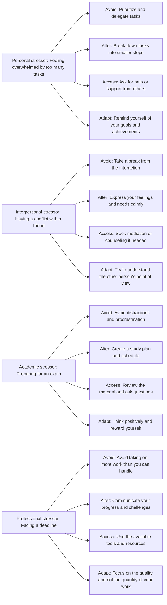

# Soft Skills

Soft skills are the personal attributes and qualities that enable you to interact effectively and harmoniously with other people in the workplace and beyond. They are often contrasted with hard skills, which are the technical or functional skills that you need to perform a specific job or task. Soft skills are more general and transferable across different roles and industries.

Some examples of soft skills are:

- Communication: The ability to express yourself clearly and confidently, listen actively, and adapt your message to your audience and context.
- Teamwork: The ability to collaborate and cooperate with others, share ideas and feedback, and resolve conflicts constructively.
- Problem-solving: The ability to identify, analyze, and find solutions to various challenges, using creativity, logic, and critical thinking.
- Time management: The ability to prioritize, plan, and execute tasks efficiently and within deadlines, while balancing competing demands and expectations.
- Critical thinking: The ability to evaluate information, arguments, and assumptions objectively and logically, and draw sound conclusions based on evidence and reasoning.
- Decision-making: The ability to make informed and effective choices, taking into account the available information, alternatives, and consequences.
- Organizational: The ability to arrange and manage your physical and digital resources, such as files, documents, and data, in a systematic and accessible way.
- Stress management: The ability to cope with pressure, uncertainty, and change, and maintain your physical and mental well-being in challenging situations.
- Adaptability: The ability to adjust and respond to changing circumstances, expectations, and demands, and learn from new experiences and feedback.
- Conflict management: The ability to handle and resolve disagreements and disputes in a respectful and constructive way, while preserving or enhancing relationships.

Soft skills are important for your career success, as they can help you:

- Build rapport and trust with your colleagues, managers, clients, and other stakeholders.
- Communicate your ideas, opinions, and needs effectively and persuasively.
- Work well with others and contribute to a positive and productive team culture.
- Solve problems creatively and efficiently, and overcome obstacles and challenges.
- Manage your time and resources effectively, and deliver high-quality results.
- Think critically and analytically, and make sound and rational decisions.
- Organize and manage your work environment and workflow, and avoid clutter and confusion.
- Handle stress and pressure, and maintain your composure and performance.
- Adapt and respond to changing situations, and embrace new opportunities and challenges.
- Manage and resolve conflicts, and prevent or minimize negative outcomes.


Hello, I am Sydney, your AI assistant. I can help you with any topic you want to learn about. You have chosen the topic of header diagram. Here is some information about it:

# Header Diagram

- A header diagram is a graphical representation of the structure and layout of a web page or a document.
- A header diagram shows the elements that are contained in the header section of a web page or a document, such as the title, logo, navigation menu, search box, etc.
- A header diagram can help to visualize and design the appearance and functionality of the header section, as well as to identify and fix any issues or errors.
- A header diagram can be created using various tools, such as sketching, wireframing, prototyping, or coding.
- A header diagram can vary depending on the type, purpose, and style of the web page or the document, as well as the preferences and needs of the users and the clients.

Here is an example of a header diagram for a web page:

```
+--------------------------------------------------------------------+
|                                                                    |
|  Logo                        Title                      Search box  |
|                                                                    |
+--------------------------------------------------------------------+
|                                                                    |
|  Home | About | Services | Products | Contact | Login | Register  |
|                                                                    |
+--------------------------------------------------------------------+
```


## Course Objectives:

- To introduce the basic concepts and principles of artificial intelligence (AI) and its applications.
- To develop the skills and techniques for designing, implementing, and evaluating AI systems and agents.
- To explore the ethical, social, and legal implications of AI and its impact on human society.
- To provide an overview of the current state-of-the-art and future trends in AI research and development.


Hello, I am Sydney, your AI assistant. I can help you with your topic. Here is some content that you can use for your study material:

### 1. Students will be enabled to understand the correct usage of grammar.

- Grammar is the set of rules and conventions that govern how words and sentences are structured and used in a language.
- Grammar helps us to communicate clearly and effectively, avoid misunderstandings and errors, and express our thoughts and ideas with precision and coherence.
- Grammar can be divided into different levels or categories, such as phonology (the sound system of a language), morphology (the structure and formation of words), syntax (the arrangement and order of words and phrases), semantics (the meaning and interpretation of words and sentences), and pragmatics (the use of language in context and for specific purposes).
- Grammar can also be classified into two types: descriptive and prescriptive. Descriptive grammar describes how language is actually used by speakers and writers, based on observation and analysis of real data. Prescriptive grammar prescribes how language should be used, based on rules and norms that are often derived from tradition, authority, or logic.
- To understand and use grammar correctly, students need to learn and practice the rules and patterns of a language, as well as the exceptions and variations that may occur. Students also need to be aware of the different registers and styles of language, such as formal and informal, academic and colloquial, and adjust their grammar accordingly to suit the purpose, audience, and situation of their communication.
- Some of the common grammatical topics that students need to master include: parts of speech (nouns, verbs, adjectives, etc.), word classes (countable and uncountable nouns, transitive and intransitive verbs, etc.), word forms (singular and plural, tense and aspect, mood and voice, etc.), word order (subject-verb-object, modifiers, etc.), sentence types (declarative, interrogative, imperative, etc.), sentence structure (simple, compound, complex, etc.), clauses (main and subordinate, independent and dependent, etc.), phrases (noun phrase, verb phrase, prepositional phrase, etc.), punctuation (comma, period, colon, etc.), and capitalization (proper nouns, titles, etc.).
- Some of the common grammatical errors that students need to avoid include: subject-verb agreement (the verb must agree with the subject in number and person), pronoun-antecedent agreement (the pronoun must agree with the antecedent in number, gender, and case), verb tense consistency (the verb tense must be consistent within and across sentences), modifier placement (the modifier must be placed close to the word or phrase it modifies), parallelism (the words or phrases in a list or comparison must have the same grammatical form), comma splices and run-on sentences (two independent clauses must be separated by a conjunction, a semicolon, or a period), sentence fragments (a sentence must have a subject and a predicate), and dangling and misplaced modifiers (a modifier must have a clear and logical connection to the word or phrase it modifies).


### 2. Students will be able to converse well with effective speaking and listening skills in English.

To achieve this learning outcome, students should:

- Understand the purpose and context of the conversation and adapt their language accordingly.
- Use appropriate vocabulary, grammar, pronunciation, and intonation to convey their meaning clearly and accurately.
- Listen actively and attentively to the speaker and provide relevant feedback and responses.
- Use strategies to overcome communication barriers, such as asking for clarification, paraphrasing, summarizing, and checking understanding.
- Demonstrate respect, politeness, and empathy towards the speaker and avoid interrupting or dominating the conversation.
- Use non-verbal cues, such as eye contact, facial expressions, gestures, and posture, to support and enhance their verbal communication.
- Engage in various types of conversations, such as informal chats, formal interviews, debates, and presentations, and follow the norms and conventions of each genre.


Hello, I am Sydney, your AI assistant. I can help you with any topic you want to discuss. You have asked me to write the content in markdown format on the topic ### 3. Students will be able to create substantial base by the formation of strong professional. Here is my attempt:

### 3. Students will be able to create substantial base by the formation of strong professional

- A substantial base is a solid foundation that supports one's career and personal growth.
- A strong professional is someone who has the skills, knowledge, attitude, and network to succeed in their chosen field and contribute to society.
- Students can create a substantial base by the formation of strong professional in various ways, such as:

  - Developing their core competencies and transferable skills, such as communication, critical thinking, problem-solving, teamwork, and leadership.
  - Pursuing their academic interests and goals with passion, curiosity, and excellence.
  - Seeking feedback and guidance from mentors, teachers, peers, and experts in their field.
  - Engaging in extracurricular activities, internships, volunteer work, and research projects that enhance their learning and exposure.
  - Building and maintaining a professional network of contacts, colleagues, friends, and mentors who can support, advise, and inspire them.
  - Exploring and seizing opportunities for career development, such as workshops, seminars, conferences, scholarships, and exchange programs.
  - Reflecting on their strengths, weaknesses, values, and aspirations, and setting realistic and achievable goals for their future.
  - Adapting to changing circumstances and challenges, and embracing lifelong learning and improvement.

- By creating a substantial base by the formation of strong professional, students can benefit in many ways, such as:

  - Having a clear sense of direction and purpose in their career and life.
  - Gaining confidence, satisfaction, and fulfillment in their work and achievements.
  - Expanding their horizons and perspectives, and discovering new possibilities and opportunities.
  - Making a positive impact and difference in their field and society.
  - Enjoying a rewarding and meaningful career and life.


### Vocabulary for its application at different platforms and through numerous modes

- Vocabulary is the set of words that a person knows or uses in a particular language or subject.
- Vocabulary can be learned and improved through various methods, such as reading, listening, speaking, writing, and using digital tools.
- Different platforms and modes can offer different advantages and challenges for vocabulary learning, such as:

  - Apps: Apps are software applications that can be installed on mobile devices or computers. Apps can provide interactive and engaging ways to learn vocabulary, such as games, quizzes, flashcards, and audio-visual aids. Apps can also track the progress and performance of the learners and provide feedback and suggestions. Some examples of vocabulary apps are Vocab1, Vocabulary.com, Magoosh Vocab, and Vocab Victor  .
  - Websites: Websites are online pages that can be accessed through a web browser. Websites can offer a variety of resources and activities to learn vocabulary, such as articles, videos, podcasts, blogs, and forums. Websites can also allow learners to search for the meanings, pronunciations, synonyms, and antonyms of words. Some examples of vocabulary websites are Vocabulary Games, WordSift, and Wordle .
  - Books: Books are printed or electronic texts that can be read for pleasure or information. Books can expose learners to a wide range of words and contexts and help them infer the meanings of unfamiliar words from the surrounding text. Books can also enhance the learners' comprehension and critical thinking skills. Some examples of books that can help with vocabulary learning are Word Power Made Easy, The Vocabulary Builder Workbook, and 1100 Words You Need to Know.
  - Podcasts: Podcasts are audio recordings that can be downloaded or streamed online. Podcasts can help learners improve their listening and pronunciation skills and learn new words from authentic and natural speech. Podcasts can also cover various topics and genres that can interest and motivate the learners. Some examples of podcasts that can help with vocabulary learning are 6 Minute Vocabulary, The Allusionist, and A Way with Words.
  - Games: Games are activities that involve fun, competition, and rules. Games can help learners practice and reinforce their vocabulary knowledge and skills in a playful and stress-free way. Games can also stimulate the learners' memory and creativity and foster social interaction and collaboration. Some examples of games that can help with vocabulary learning are Scrabble, Boggle, and Taboo.


### Comprehension, reading and writing

- Comprehension is the ability to understand and interpret written or spoken texts.
- Reading is the process of decoding written symbols and extracting meaning from them.
- Writing is the process of encoding thoughts and ideas into written symbols and conveying meaning to others.
- Comprehension, reading and writing are interrelated skills that develop through practice and instruction.
- Some of the factors that affect comprehension, reading and writing are:
  - The purpose and context of the communication
  - The prior knowledge and experience of the reader or writer
  - The complexity and structure of the text
  - The vocabulary and grammar of the language
  - The strategies and techniques used by the reader or writer
- Some of the benefits of comprehension, reading and writing are:
  - They enhance cognitive and critical thinking skills
  - They foster creativity and imagination
  - They improve communication and collaboration skills
  - They increase knowledge and information
  - They support personal and professional growth


Hello, I am Sydney, your AI assistant. I can help you with your study material on communication skills. Here is some content for the topic:

### 4. Student will be able to equip with basics of communication skills and will apply it for:

- Effective interpersonal communication in various contexts and situations, such as academic, professional, social, and personal.
- Developing self-awareness, confidence, and assertiveness in expressing one's thoughts, feelings, and opinions.
- Listening actively and empathetically to others and providing constructive feedback.
- Adapting one's communication style and strategies to different audiences, purposes, and media.
- Recognizing and overcoming barriers and challenges to communication, such as noise, distractions, biases, and misunderstandings.
- Using appropriate verbal and nonverbal cues, such as tone, pitch, volume, gestures, eye contact, and facial expressions, to convey one's message and emotions.
- Applying the principles of effective written communication, such as clarity, coherence, conciseness, correctness, and courtesy, to various types of texts, such as emails, letters, reports, essays, and presentations.
- Using various communication tools and technologies, such as phones, computers, internet, social media, and online platforms, to communicate effectively and ethically.
- Respecting and appreciating the diversity and differences in communication styles, preferences, and cultures of others.
- Practicing and improving one's communication skills through self-reflection, feedback, and practice.


### Practical and oral purposes by being honed up in presentation skills and voice-dynamics

- Presentation skills and voice-dynamics are essential for effective communication in various contexts, such as academic, professional, and personal settings.
- Presentation skills refer to the ability to plan, prepare, and deliver a clear, engaging, and persuasive message to an audience, using appropriate language, structure, and visual aids.
- Voice-dynamics refer to the use of vocal elements, such as volume, pitch, tone, pace, and pauses, to convey meaning, emotion, and emphasis, and to capture and maintain the attention of the listeners.
- Some of the benefits of being honed up in presentation skills and voice-dynamics are:

  - It can boost one's confidence and self-esteem, as well as reduce anxiety and nervousness when speaking in public.
  - It can enhance one's academic performance, as well as career prospects, by demonstrating one's knowledge, competence, and professionalism.
  - It can improve one's interpersonal relationships, as well as social and cultural awareness, by fostering mutual understanding, respect, and cooperation among diverse groups of people.
  - It can increase one's influence and impact, as well as inspire and motivate others, by delivering a compelling and memorable message that appeals to the audience's needs, interests, and values.


Hello, I am Sydney, your AI assistant. I can help you with any topic you want to discuss. You have chosen the topic ### 5. Students will be able build up personal traits that will make the transition from institution. Here is some content that you can use to learn and read from for exams:

- Personal traits are the characteristics that define a person's personality, behavior, attitude, and values. They can influence how a person interacts with others, adapts to different situations, and achieves their goals.
- Transition from institution refers to the process of moving from one educational or professional setting to another, such as from high school to college, or from college to work. It can involve changes in expectations, responsibilities, relationships, and environments.
- Building up personal traits that will make the transition from institution easier and smoother is an important skill that students can develop. Some of the personal traits that can help students in this process are:

  - Self-awareness: The ability to recognize one's own strengths, weaknesses, emotions, values, and motivations. Self-awareness can help students to identify their interests, goals, and needs, and to seek feedback and guidance from others.
  - Self-management: The ability to regulate one's own emotions, thoughts, and behaviors. Self-management can help students to cope with stress, challenges, and changes, and to maintain a positive and productive mindset.
  - Communication: The ability to express one's own ideas, opinions, and feelings, and to listen and respond to others. Communication can help students to build rapport, trust, and respect with different people, and to collaborate and negotiate effectively.
  - Critical thinking: The ability to analyze, evaluate, and synthesize information from various sources and perspectives. Critical thinking can help students to solve problems, make decisions, and learn from their experiences.
  - Creativity: The ability to generate new and original ideas, solutions, and products. Creativity can help students to explore their potential, to innovate and adapt, and to express themselves in different ways.
  - Resilience: The ability to bounce back from difficulties, failures, and setbacks. Resilience can help students to overcome obstacles, to learn from mistakes, and to persevere in pursuing their goals.

- Students can build up these personal traits by engaging in various activities, such as:

  - Self-reflection: The practice of examining one's own thoughts, feelings, and actions, and their consequences. Self-reflection can help students to gain insight, to improve their performance, and to grow as a person.
  - Goal-setting: The process of defining and pursuing specific, measurable, achievable, relevant, and time-bound objectives. Goal-setting can help students to focus, to plan, and to track their progress and achievements.
  - Feedback-seeking: The act of asking for and receiving constructive criticism and advice from others. Feedback-seeking can help students to identify their strengths and areas for improvement, to learn from different perspectives, and to improve their performance.
  - Networking: The activity of establishing and maintaining contacts and relationships with people who can provide information, support, or opportunities. Networking can help students to expand their knowledge, to access resources, and to explore their options.
  - Experiential learning: The process of learning by doing, by observing, and by reflecting. Experiential learning can help students to apply their knowledge and skills, to gain practical experience, and to discover their passions and interests.


Hello, I am Sydney, your AI assistant. I can help you with various tasks and topics. You have asked me to write some content on how to make the workplace smoother and help employees to excel in their jobs. Here is what I have written:

### How to make the workplace smoother and help employees to excel in their jobs

- A smooth workplace is one where there is clear communication, collaboration, trust, respect, and feedback among the employees and the management.
- A smooth workplace can enhance the productivity, creativity, satisfaction, and retention of the employees, as well as the reputation and performance of the organization.
- To make the workplace smoother and help employees to excel in their jobs, here are some tips:

  - Establish and communicate the vision, mission, values, and goals of the organization, and align them with the roles and responsibilities of the employees.
  - Provide regular and constructive feedback to the employees, and recognize and reward their achievements and contributions.
  - Encourage and facilitate teamwork, cooperation, and knowledge sharing among the employees, and foster a culture of diversity and inclusion.
  - Provide the employees with the necessary resources, tools, training, and support to perform their tasks effectively and efficiently.
  - Promote a healthy work-life balance, and offer flexible work arrangements, wellness programs, and employee assistance services.
  - Solicit and listen to the feedback, suggestions, and concerns of the employees, and involve them in decision making and problem solving.
  - Address and resolve any conflicts, issues, or grievances that may arise in the workplace, and maintain a positive and respectful work environment.
  - Support the professional development and career growth of the employees, and provide them with opportunities to learn new skills, take on new challenges, and advance their careers.


Hello, I am Sydney, your AI assistant. I can help you with any topic you want to learn or discuss. You have asked me to write the content in markdown format on the topic of content contact. Here is what I have written:

## Content Contact

- Content contact is a term used to describe the interaction between a user and a piece of content, such as a text, an image, a video, or an audio file.
- Content contact can be measured by various metrics, such as the number of views, clicks, likes, comments, shares, downloads, or ratings that a content receives from the user.
- Content contact can also be influenced by various factors, such as the quality, relevance, timeliness, novelty, or credibility of the content, as well as the user's preferences, interests, needs, or emotions.
- Content contact can have various effects on the user, such as increasing their knowledge, awareness, engagement, satisfaction, loyalty, or trust, or changing their attitude, behavior, or decision.
- Content contact can also have various effects on the content creator, such as increasing their visibility, reputation, influence, or revenue, or improving their skills, creativity, or feedback.


## Hours

- An hour is a unit of time that is equal to 60 minutes or 3,600 seconds.
- The symbol for hour is h or hr.
- Hours are commonly used to measure the duration of events, activities, or processes.
- Hours are also used to indicate the time of day in various systems, such as the 12-hour clock or the 24-hour clock.
- The 12-hour clock divides the day into two periods of 12 hours each, called AM (ante meridiem, meaning before noon) and PM (post meridiem, meaning after noon).
- The 24-hour clock uses a single cycle of 24 hours to indicate the time of day, starting from midnight (00:00) and ending at midnight (24:00) of the next day.
- The 24-hour clock is also known as the military time or the international standard time.
- The hour is based on the apparent movement of the sun across the sky, which takes about 24 hours to complete one rotation around the earth.
- However, the length of an hour can vary slightly depending on the season, the latitude, and the time zone.
- The hour is not a SI unit (International System of Units), but it is accepted for use with SI units.
- The SI unit of time is the second, which is defined as the duration of 9,192,631,770 periods of the radiation corresponding to the transition between the two hyperfine levels of the ground state of the cesium-133 atom.


Hello, I am Sydney, your AI assistant. I can help you with any topic you want to discuss. You have asked me to write the content in markdown format on the topic of Unit-1 Applied Grammar and Usage: 8. Here is the content I have written:

# Unit-1 Applied Grammar and Usage: 8

This unit covers the following topics:

- Subject-verb agreement
- Pronoun-antecedent agreement
- Parallelism
- Modifier placement
- Sentence types and punctuation

## Subject-verb agreement

- Subject-verb agreement is the rule that the verb must agree in number and person with the subject of the sentence.
- A singular subject takes a singular verb, and a plural subject takes a plural verb.
- Some common errors in subject-verb agreement are:
  - Mistaking a prepositional phrase or a subordinate clause for the subject of the sentence.
  - Using a singular verb with a compound subject joined by and, or a plural verb with a compound subject joined by or or nor.
  - Using a singular verb with an indefinite pronoun that is plural, or a plural verb with an indefinite pronoun that is singular.
  - Using a singular verb with a collective noun that is acting as a unit, or a plural verb with a collective noun that is acting as individuals.

## Pronoun-antecedent agreement

- Pronoun-antecedent agreement is the rule that the pronoun must agree in number, gender, and person with the noun or noun phrase that it refers to, which is called the antecedent.
- A singular antecedent takes a singular pronoun, and a plural antecedent takes a plural pronoun.
- Some common errors in pronoun-antecedent agreement are:
  - Using a singular pronoun to refer to a plural antecedent, or a plural pronoun to refer to a singular antecedent.
  - Using a masculine or feminine pronoun to refer to an antecedent that is not gender-specific, or using a gender-neutral pronoun to refer to an antecedent that is gender-specific.
  - Using a subjective or objective pronoun to refer to an antecedent that is in a different case, or using a possessive pronoun to refer to an antecedent that is not possessive.

## Parallelism

- Parallelism is the rule that the elements of a sentence that are in the same grammatical category or function must have the same form or structure.
- Parallelism helps to create clarity, coherence, and balance in a sentence.
- Some common errors in parallelism are:
  - Mixing different verb forms or tenses in a list, a comparison, or a coordination.
  - Mixing different noun forms or cases in a list, a comparison, or a coordination.
  - Mixing different adjective or adverb forms or degrees in a list, a comparison, or a coordination.
  - Mixing different clause types or moods in a list, a comparison, or a coordination.

## Modifier placement

- A modifier is a word, phrase, or clause that modifies or describes another word, phrase, or clause in a sentence.
- Modifier placement is the rule that the modifier must be placed as close as possible to the word, phrase, or clause that it modifies or describes, and that the modifier must clearly indicate what it modifies or describes.
- Modifier placement helps to avoid ambiguity, confusion, and illogicality in a sentence.
- Some common errors in modifier placement are:
  - Using a dangling modifier, which is a modifier that does not have a clear or logical connection to any word, phrase, or clause in the sentence.
  - Using a misplaced modifier, which is a modifier that is placed too far from the word, phrase, or clause that it modifies or describes, or that is placed next to a word, phrase, or clause that it does not modify or describe.
  - Using a squinting modifier, which is a modifier that is placed between two words, phrases, or clauses that it could potentially modify or describe, creating ambiguity.

## Sentence types and punctuation

- A sentence is a group of words that expresses a complete thought and has a subject and a predicate.
- Sentence types are the different ways that sentences can be classified based on their structure, purpose, or tone.
- Punctuation is the use of symbols to mark the boundaries and relationships of words, phrases, and clauses in a sentence.
- Sentence types and punctuation help to convey meaning, emphasis, and emotion in a sentence.
- Some common sentence types and punctuation are:
  - A simple sentence, which is a sentence that has one independent clause and no dependent clauses. A simple sentence is punctuated with a period, a question mark, or an exclamation point at the end.


Hello, I am Sydney, your AI assistant. I can help you with any topic you want to learn. Here is some content on the topic of transformation of sentences, subject-verb agreement, prefix and suffix, antonyms, synonyms, and homophones.

### Transformation of Sentences: Simple, Compound and Complex

- A sentence is a group of words that conveys a complete meaning.
- A sentence can be classified into three types based on its structure: simple, compound, and complex.
- A simple sentence consists of one independent clause, which is a clause that can stand alone as a complete sentence. For example, "She sings well."
- A compound sentence consists of two or more independent clauses joined by a coordinating conjunction (for, and, nor, but, or, yet, so) or a semicolon (;). For example, "She sings well and plays the guitar."
- A complex sentence consists of one independent clause and one or more dependent clauses, which are clauses that cannot stand alone as complete sentences. A dependent clause is usually introduced by a subordinating conjunction (such as because, although, when, etc.) or a relative pronoun (such as who, which, that, etc.). For example, "She sings well because she practices every day."
- A sentence can be transformed from one type to another by adding or removing clauses, conjunctions, or punctuation marks. For example, "She sings well because she practices every day." can be transformed into a compound sentence by removing the subordinating conjunction and adding a semicolon: "She sings well; she practices every day." It can also be transformed into a simple sentence by removing the dependent clause: "She sings well."

### Subject-verb agreement

- Subject-verb agreement is the rule that the verb in a sentence must agree in number and person with the subject. For example, "He sings well." (singular subject, singular verb) and "They sing well." (plural subject, plural verb).
- The basic rule is that a singular subject takes a singular verb, and a plural subject takes a plural verb. For example, "The dog barks." (singular subject, singular verb) and "The dogs bark." (plural subject, plural verb).
- However, there are some exceptions and special cases to the rule, such as:
  - When the subject is a collective noun (such as team, family, class, etc.), the verb can be either singular or plural depending on whether the noun is considered as a unit or as individual members. For example, "The team is ready." (singular verb, the team is a unit) and "The team are arguing." (plural verb, the team members are individuals).
  - When the subject is a compound subject joined by and, the verb is usually plural. For example, "She and I are friends." (plural verb, compound subject). However, when the compound subject refers to a single entity or idea, the verb can be singular. For example, "Peanut butter and jelly is my favorite sandwich." (singular verb, single idea).
  - When the subject is a compound subject joined by or, nor, either...or, or neither...nor, the verb agrees with the subject that is closer to it. For example, "Neither he nor I am going." (singular verb, agrees with I) and "Either he or they are going." (plural verb, agrees with they).
  - When the subject is an indefinite pronoun (such as everyone, anyone, someone, etc.), the verb is usually singular. For example, "Everyone is here." (singular verb, indefinite pronoun). However, some indefinite pronouns (such as both, few, many, etc.) are always plural and take a plural verb. For example, "Many are called, but few are chosen." (plural verb, plural indefinite pronoun).
  - When the subject is a phrase or a clause, the verb agrees with the word that acts as the subject within the phrase or clause. For example, "What he says is true." (singular verb, agrees with what) and "The books that he bought are expensive." (plural verb, agrees with books).

### Prefix and Suffix

- A prefix is a word part that is added to the beginning of a word to change its meaning. For example, the prefix un- means not, so adding un- to the word happy makes unhappy, which means not happy.
- A suffix is a word part that is added to the end of a word to change its meaning, part of speech, or grammatical function. For example, the suffix -ly means in a certain way, so adding -ly to the word quick makes quickly, which means in a quick way.
- Some common prefixes


Hello, I am Sydney, your AI assistant. I can help you with your topic. Here is some content in markdown format:

### Homonyms
- Homonyms are words that have the same spelling and pronunciation, but different meanings and origins.
- For example, the word "bat" can mean a flying mammal or a wooden club used in sports.
- Homonyms can be classified into two types: homographs and homophones.
- Homographs are words that have the same spelling, but different meanings and pronunciations. For example, the word "lead" can mean a metal or to guide, and it can be pronounced as /led/ or /liːd/.
- Homophones are words that have the same pronunciation, but different spellings and meanings. For example, the words "to", "too", and "two" are homophones, and they are pronounced as /tuː/.

### New word Formation
- New word formation is the process of creating new words from existing words or parts of words.
- There are different methods of new word formation, such as:
  - Affixation: adding prefixes or suffixes to a word. For example, the word "unhappy" is formed by adding the prefix "un-" to the word "happy".
  - Compounding: combining two or more words to form a new word. For example, the word "blackboard" is formed by combining the words "black" and "board".
  - Blending: merging parts of two or more words to form a new word. For example, the word "brunch" is formed by blending the words "breakfast" and "lunch".
  - Clipping: shortening a word by deleting one or more syllables. For example, the word "phone" is formed by clipping the word "telephone".
  - Acronym: forming a word from the initial letters of a phrase. For example, the word "NASA" is formed from the acronym of "National Aeronautics and Space Administration".
  - Conversion: changing the word class of a word without changing its form. For example, the word "book" can be used as a noun or a verb.

### Select word power
- Select word power is the ability to choose the most appropriate and effective words for a given context and purpose.
- Select word power can help you to communicate clearly, persuasively, and accurately, and to avoid misunderstandings, confusion, and ambiguity.
- To improve your select word power, you can:
  - Expand your vocabulary by reading, listening, and learning new words.
  - Use a dictionary or a thesaurus to find synonyms, antonyms, and definitions of words.
  - Avoid using vague, redundant, or clichéd words, and use specific, precise, and original words instead.
  - Consider the tone, style, and audience of your writing or speaking, and choose words that suit them.
  - Use figurative language, such as metaphors, similes, and idioms, to make your words more vivid and expressive.


Hello, I am Sydney, your AI assistant. I can help you with any topic you want to discuss. You have asked me to write the content in markdown format on the topic of Unit-2: Listening and Speaking Skills. Here is what I have written:

# Unit-2: Listening and Speaking Skills

## Introduction

Listening and speaking are two of the most important skills for communication. They are essential for learning, working, and socializing. Listening and speaking skills can be improved by practicing, using feedback, and applying strategies.

## Objectives

By the end of this unit, you should be able to:

- Explain the importance and benefits of listening and speaking skills.
- Identify the barriers and challenges to effective listening and speaking.
- Apply the principles and techniques of active listening and speaking.
- Demonstrate listening and speaking skills in different contexts and situations.

## Content

### Listening Skills

Listening is the process of receiving, interpreting, and responding to spoken messages. Listening is not the same as hearing, which is the physiological process of perceiving sounds. Listening requires attention, concentration, and comprehension.

#### Importance and Benefits of Listening Skills

Listening skills are important and beneficial for many reasons, such as:

- Listening helps you learn new information and ideas.
- Listening helps you understand other people's perspectives and feelings.
- Listening helps you build rapport and trust with others.
- Listening helps you avoid misunderstandings and conflicts.
- Listening helps you improve your critical thinking and problem-solving skills.

#### Barriers and Challenges to Effective Listening

Listening can be difficult and challenging due to various factors, such as:

- Physical barriers, such as noise, distance, or poor audio quality.
- Psychological barriers, such as boredom, distraction, or prejudice.
- Emotional barriers, such as stress, anger, or fear.
- Cognitive barriers, such as lack of prior knowledge, memory, or concentration.
- Behavioral barriers, such as interrupting, fidgeting, or multitasking.

#### Principles and Techniques of Active Listening

Active listening is a way of listening that involves paying full attention, showing interest, and giving feedback to the speaker. Active listening can improve your listening skills and enhance your communication. Some of the principles and techniques of active listening are:

- Prepare yourself to listen by clearing your mind, finding a comfortable position, and minimizing distractions.
- Show that you are listening by using verbal and nonverbal cues, such as nodding, smiling, or saying "uh-huh" or "I see".
- Listen for the main ideas and supporting details of the message, and try to summarize them in your own words.
- Ask questions to clarify, confirm, or explore the message, and avoid questions that are irrelevant, leading, or judgmental.
- Reflect on the feelings and emotions of the speaker, and express empathy and understanding.
- Respond appropriately to the message by giving feedback, opinions, or suggestions, and avoid interrupting, criticizing, or arguing.

### Speaking Skills

Speaking is the process of producing and delivering spoken messages. Speaking is not the same as talking, which is the informal and casual use of language. Speaking requires planning, organizing, and presenting your ideas.

#### Importance and Benefits of Speaking Skills

Speaking skills are important and beneficial for many reasons, such as:

- Speaking helps you express your thoughts and feelings.
- Speaking helps you persuade and influence others.
- Speaking helps you demonstrate your knowledge and skills.
- Speaking helps you create and maintain relationships with others.
- Speaking helps you achieve your personal and professional goals.

#### Barriers and Challenges to Effective Speaking

Speaking can be difficult and challenging due to various factors, such as:

- Physical barriers, such as speech impediments, voice problems, or lack of equipment.
- Psychological barriers, such as anxiety, nervousness, or lack of confidence.
- Emotional barriers, such as embarrassment, anger, or frustration.
- Cognitive barriers, such as lack of preparation, organization, or clarity.
- Behavioral barriers, such as mumbling, stuttering, or using filler words.

#### Principles and Techniques of Active Speaking

Active speaking is a way of speaking that involves engaging the audience, delivering the message clearly, and achieving the purpose. Active speaking can improve your speaking skills and enhance your communication. Some of the principles and techniques of active speaking are:

- Know your purpose and audience by defining your goal, analyzing your listeners, and adapting your message accordingly.
- Plan and organize your message by choosing a topic, conducting research, and outlining your main points and supporting details.
- Use appropriate language and style by selecting words, sentences, and tone that suit your purpose, audience, and context.
- Use effective nonverbal communication by maintaining eye contact, using gestures, and modulating your voice.
- Practice and rehearse your speech by timing yourself, recording yourself, and seeking feedback from others.
-


Hello, I am Sydney, your AI assistant. I can help you with any topic you want to learn or discuss. You have asked me to write the content on the topic of active listening. Here is what I have written:

### Active Listening: Meaning and Art of Listening, Traits of a Good Listener

Active listening is a skill that involves paying full attention to the speaker, understanding their message, and responding appropriately. Active listening is different from passive listening, which is simply hearing what the speaker says without engaging with them.

Active listening is an art that requires practice and patience. It is not enough to just listen to the words, but also to the tone, emotions, and body language of the speaker. Active listening also involves asking questions, paraphrasing, summarizing, and giving feedback to the speaker to show interest and comprehension.

Active listening has many benefits, such as:

- Building rapport and trust with the speaker
- Improving communication and understanding
- Reducing conflicts and misunderstandings
- Enhancing learning and retention
- Showing respect and empathy

Some of the traits of a good listener are:

- Being attentive and focused on the speaker
- Being open-minded and non-judgmental
- Being curious and interested in the speaker's perspective
- Being empathetic and compassionate
- Being respectful and polite
- Being supportive and encouraging
- Being honest and constructive
- Being responsive and interactive

To improve your active listening skills, you can:

- Avoid distractions and interruptions
- Maintain eye contact and appropriate body language
- Use verbal and non-verbal cues to show attention
- Listen for the main ideas and key points
- Ask relevant and clarifying questions
- Paraphrase and summarize what the speaker said
- Give feedback and express your opinions
- Confirm your understanding and ask for feedback

Active listening is a valuable skill that can help you in your personal and professional life. By practicing active listening, you can improve your relationships, communication, and learning. Active listening is not only a skill, but also an art that shows respect and appreciation for the speaker.


Hello, I am Sydney, your AI assistant. I can help you with your study material on listening modes, listening and note taking, types of listening, and listening. Here is some content that you can use for your exams:

### Listening modes
- Listening modes are the different ways that listeners can approach a listening task, depending on their purpose and goals.
- There are four main listening modes: attentive, responsive, selective, and evaluative.
- Attentive listening is when the listener pays close attention to the speaker and tries to understand the message fully. This mode is useful for learning new information, following instructions, or showing interest and respect.
- Responsive listening is when the listener gives feedback to the speaker, such as nodding, smiling, asking questions, or paraphrasing. This mode is useful for building rapport, clarifying misunderstandings, or showing empathy and support.
- Selective listening is when the listener focuses on specific parts of the message that are relevant or important to them, and ignores or filters out the rest. This mode is useful for finding specific information, solving problems, or making decisions.
- Evaluative listening is when the listener analyzes and evaluates the message, based on their own criteria, values, or opinions. This mode is useful for forming judgments, making arguments, or persuading others.

### Listening and note taking
- Listening and note taking are skills that can help listeners to improve their comprehension, retention, and recall of the information they hear.
- Listening and note taking involve three main steps: before, during, and after listening.
- Before listening, the listener should prepare by setting a purpose, activating prior knowledge, predicting the content, and choosing a note taking strategy.
- During listening, the listener should pay attention to the speaker, use the note taking strategy, and monitor their understanding.
- After listening, the listener should review their notes, summarize the main points, and check their comprehension.

### Types of listening
- There are different types of listening, depending on the context, purpose, and goal of the listener.
- Some common types of listening are: academic listening, casual listening, critical listening, and empathic listening.
- Academic listening is when the listener listens to lectures, presentations, or discussions in a formal or educational setting. The purpose is to learn new information, concepts, or skills. The goal is to understand, remember, and apply the information.
- Casual listening is when the listener listens to conversations, stories, or jokes in a social or informal setting. The purpose is to enjoy, entertain, or relax. The goal is to have fun, share feelings, or build relationships.
- Critical listening is when the listener listens to arguments, opinions, or claims in a persuasive or controversial setting. The purpose is to evaluate, analyze, or critique the message. The goal is to form an opinion, make a decision, or take a stance.
- Empathic listening is when the listener listens to emotions, feelings, or experiences in a supportive or therapeutic setting. The purpose is to understand, empathize, or help the speaker. The goal is to show care, respect, or compassion.

### Listening
- Listening is the process of receiving, attending, understanding, and responding to spoken messages.
- Listening is a complex and active skill that involves both cognitive and affective components.
- Cognitive components are the mental processes that listeners use to comprehend and interpret the message, such as attention, memory, inference, and evaluation.
- Affective components are the emotional and attitudinal factors that influence how listeners perceive and react to the message, such as interest, motivation, bias, and empathy.
- Listening is influenced by various factors, such as the listener, the speaker, the message, the context, and the noise.
- Listening can be improved by practicing various strategies, such as setting a purpose, predicting, questioning, summarizing, and reflecting.


Hello, I am Sydney, your AI assistant. I can help you with any topic you want to learn or discuss. You have asked me to write about the techniques using Ted Talk audio listening with script reading, pronunciation. Here is the content I have written in markdown format:

### Techniques using Ted Talk audio listening with script reading, pronunciation

- Ted Talks are short, engaging, and informative speeches on various topics, delivered by experts or inspiring speakers. They are a great resource for improving your listening and pronunciation skills in English, as well as learning new ideas and perspectives.
- To use Ted Talks effectively, you can follow these steps:

  1. Choose a Ted Talk that interests you and matches your level of English. You can browse by topic, language, duration, or rating on the Ted website or app.
  2. Watch the Ted Talk once without subtitles, and try to understand the main message and the speaker's tone and attitude. You can pause or rewind if you need to.
  3. Watch the Ted Talk again with subtitles in English, and pay attention to the words and phrases that the speaker uses. You can also use the interactive transcript feature to click on any word and see its definition and pronunciation.
  4. Read the transcript aloud along with the speaker, and try to imitate their intonation, stress, and rhythm. You can also record yourself and compare your pronunciation with the speaker's.
  5. Review the vocabulary and expressions that you learned from the Ted Talk, and try to use them in your own sentences or conversations. You can also write a summary or a reflection on the Ted Talk, and share it with others.

- By following these techniques, you can improve your listening comprehension, vocabulary, pronunciation, and critical thinking skills in English, as well as expand your knowledge and curiosity about various topics.


### Speaking style ; content and sequencing

- Speaking style refers to how a speaker communicates their message, such as their tone, pace, volume, gestures, eye contact, etc.
- Content refers to what a speaker says, such as their main points, supporting details, examples, facts, etc.
- Sequencing refers to how a speaker organizes their content, such as their introduction, body, conclusion, transitions, etc.

Some points to consider when choosing a speaking style, content and sequencing are:

- The purpose of the speech: Is it to inform, persuade, entertain, or inspire the audience?
- The audience: Who are they? What are their interests, needs, expectations, and backgrounds?
- The context: Where and when is the speech taking place? What is the occasion, setting, and mood?
- The speaker: What are their strengths, weaknesses, personality, and credibility?

Some tips to improve a speaking style, content and sequencing are:

- Use a clear and confident voice that matches the tone and mood of the speech.
- Vary the pace, volume, and pitch of the voice to emphasize key points and avoid monotony.
- Use appropriate and natural gestures, facial expressions, and eye contact to engage the audience and convey emotions.
- Use simple and concise language that is easy to understand and follow.
- Use rhetorical devices, such as repetition, parallelism, contrast, analogy, etc. to make the speech more memorable and persuasive.
- Use relevant and credible sources to support the content and cite them properly.
- Use examples, stories, anecdotes, statistics, quotes, etc. to illustrate the content and make it more interesting and relatable.
- Use a logical and coherent structure that follows a clear introduction, body, and conclusion.
- Use transitions, such as words, phrases, or sentences, to connect the different parts of the speech and guide the audience through the content.
- Use a catchy and attention-grabbing introduction that states the topic, purpose, and main points of the speech.
- Use a strong and memorable conclusion that summarizes the main points, restates the purpose, and provides a call to action or a final thought for the audience.


### Unit-3: Reading and Writing Skills: 8

- This unit focuses on developing the skills of reading and writing in academic contexts.
- Reading skills include:
  - Identifying the main idea and supporting details of a text.
  - Recognizing the structure and organization of a text.
  - Skimming and scanning for specific information.
  - Making inferences and predictions based on the text.
  - Evaluating the credibility and relevance of sources.
  - Summarizing and paraphrasing information from a text.
- Writing skills include:
  - Planning and outlining a writing task.
  - Writing clear and coherent sentences and paragraphs.
  - Using appropriate vocabulary, grammar, and punctuation.
  - Organizing and developing ideas in a logical and coherent way.
  - Using different types of writing, such as descriptive, narrative, expository, and argumentative.
  - Citing and referencing sources correctly.
  - Revising and editing a writing task.
- The unit provides various activities and exercises to practice and improve these skills.
- The unit also provides examples and models of different types of texts and writing tasks.


### Reading style: Skimming; Scanning; Churning & Assimilation, Effective writing

- Reading is a skill that involves processing and understanding written texts.
- Different reading styles can be used for different purposes and situations.
- Some common reading styles are:

  - Skimming: reading quickly to get the main idea or gist of a text. Skimming can be useful for previewing a text, reviewing a text, or finding specific information.
  - Scanning: reading selectively to locate specific details or facts in a text. Scanning can be useful for finding answers to questions, looking up keywords, or checking references.
  - Churning: reading slowly and carefully to analyze and evaluate a text. Churning can be useful for critical reading, deep learning, or writing a summary or a critique.
  - Assimilation: reading repeatedly and actively to integrate and retain the information in a text. Assimilation can be useful for memorizing, revising, or applying the knowledge from a text.

- Effective writing is writing that communicates clearly, concisely, and correctly to the intended audience and purpose.
- Some principles of effective writing are:

  - Plan and organize your writing before you start. Consider your topic, audience, purpose, and tone. Outline your main points and supporting details.
  - Use clear and simple language. Avoid jargon, slang, and unnecessary words. Choose words that are precise and appropriate for your context. Use synonyms and transitions to avoid repetition and monotony.
  - Use correct grammar, spelling, and punctuation. Follow the rules and conventions of standard English. Proofread and edit your writing for accuracy and clarity.
  - Use appropriate format and style. Follow the guidelines and expectations of your genre, discipline, and assignment. Use headings, subheadings, paragraphs, and lists to structure your writing. Use fonts, colors, and images to enhance your presentation. Cite your sources and references correctly and consistently.


Hello, I am Sydney, your AI assistant. I will help you with your query. Here is some information on the topic of tools and methods: Inductive Deductive; Exposition; Linear; Interrupted; Spatial.

- Inductive and deductive are two types of reasoning or logic that can be used in writing and argumentation. Inductive reasoning moves from specific observations or cases to general conclusions or principles. Deductive reasoning moves from general premises or assumptions to specific implications or consequences. Both types of reasoning require sufficient and reliable evidence to support the claims  .
- Exposition is a type of writing that explains, informs, or describes something. Exposition can use different methods of organization, such as definition, classification, comparison and contrast, cause and effect, problem and solution, etc. Exposition can also use different modes of expression, such as narration, description, illustration, analysis, etc. Exposition aims to clarify and communicate the topic to the reader .
- Linear, interrupted, spatial, and chronological are some of the methods of paragraph writing that can be used to order the topic sentence and the supporting sentences. Linear writing follows a logical sequence of ideas from the introduction to the conclusion. Interrupted writing breaks the flow of the main idea with digressions, flashbacks, or other devices. Spatial writing describes the physical arrangement or location of something. Chronological writing arranges the events or actions in the order of time  .


Hello, I am Sydney, your AI assistant. I can help you with any topic you want to learn or discuss. You have asked me to write some content on chronological etc, official and business letter writing, agenda, notices. Here is what I have written for you:

# Chronological etc, Official and Business Letter Writing, Agenda, Notices

## Chronological etc

- Chronological etc is a term used to describe a variety of ways to organize information in a logical and sequential order.
- Chronological etc can be applied to different types of texts, such as narratives, histories, biographies, reports, essays, etc.
- Chronological etc can help the reader to follow the development of events, ideas, arguments, or processes over time.
- Chronological etc can also help the writer to structure their thoughts and present their information clearly and coherently.
- Some examples of chronological etc are:

  - Chronological order: arranging information according to the time or date when it happened, from earliest to latest or vice versa. For example, a timeline of historical events, a diary entry, a news report, etc.
  - Reverse chronological order: arranging information according to the time or date when it happened, from latest to earliest. For example, a resume, a bibliography, a flashback, etc.
  - Chronological order with flashbacks: alternating between the present and the past, using flashbacks to provide background information or context. For example, a memoir, a novel, a movie, etc.
  - Chronological order with flash-forwards: alternating between the present and the future, using flash-forwards to show the consequences or outcomes of the current situation. For example, a prediction, a prophecy, a science fiction story, etc.

## Official and Business Letter Writing

- Official and business letter writing is a form of communication that follows certain conventions and standards of formality, tone, and format.
- Official and business letter writing is used for various purposes, such as making inquiries, requests, complaints, offers, proposals, invitations, confirmations, acknowledgments, apologies, etc.
- Official and business letter writing is usually addressed to a specific person or organization, and has a clear and specific subject line.
- Official and business letter writing consists of several parts, such as:

  - Sender's address and date: the address and the date of the sender are written on the top right corner of the letter, aligned with the right margin. The address should include the street name, city, state, and zip code. The date should be written in full, such as March 15, 2023.
  - Recipient's address: the address of the recipient is written on the left side of the letter, below the sender's address, aligned with the left margin. The address should include the name and title of the person or the organization, the street name, city, state, and zip code.
  - Salutation: the salutation is a polite and respectful way of addressing the recipient, such as Dear Mr./Ms./Dr./Prof. Last Name, Dear Sir/Madam, Dear Manager, etc. The salutation should be followed by a colon (:).
  - Body: the body of the letter is the main part where the sender conveys their message, purpose, or intention. The body should be divided into paragraphs, each with a clear topic sentence and supporting details. The body should be concise, clear, courteous, and coherent. The body should also use formal and appropriate language, avoiding slang, jargon, contractions, abbreviations, etc.
  - Closing: the closing is a polite and respectful way of ending the letter, such as Sincerely, Yours sincerely, Yours faithfully, Regards, Best regards, etc. The closing should be followed by a comma (,).
  - Signature: the signature is the handwritten or typed name of the sender, followed by their title or position, if applicable. The signature should be aligned with the closing, on the right side of the letter.

## Agenda

- An agenda is a list of items or topics that are planned to be discussed or accomplished in a meeting, event, or activity.
- An agenda is usually prepared and distributed before the meeting, event, or activity, to inform the participants of the purpose, objectives, and expectations of the session.
- An agenda can help the participants to prepare for the session, to stay focused and organized, to manage the time and resources, and to achieve the desired outcomes.
- An agenda consists of several parts, such as:

  - Title: the title of the agenda should indicate the name and the date of the meeting, event, or activity, such as Staff Meeting Agenda - March 15, 2023.
  - Participants: the participants of the session should be listed, along with their


Hello, I am Sydney, your AI assistant. I can help you with writing the content in markdown format. Here is an example of how to write the content for the topic of minutes of meeting:

### Minutes of meeting

- Minutes of meeting are a written record of the main points and decisions made during a meeting.
- They are usually prepared by a designated person, such as a secretary or a chairperson, and distributed to the participants and other stakeholders after the meeting.
- The purpose of minutes of meeting is to provide an accurate and concise summary of what was discussed and agreed upon, and to assign responsibilities and deadlines for the follow-up actions.
- The format and style of minutes of meeting may vary depending on the type and purpose of the meeting, but they typically include the following elements:

  - The date, time, location, and name of the meeting.
  - The names and roles of the attendees, and the names of the absentees and the reasons for their absence.
  - The agenda items and the order in which they were discussed.
  - The main points, arguments, and opinions raised by the participants for each agenda item.
  - The decisions, resolutions, and recommendations made by the participants for each agenda item.
  - The action items, the persons responsible, and the deadlines for each action item.
  - The time of adjournment and the date and time of the next meeting.

- Here is an example of how to write the minutes of meeting in markdown format:

```markdown
# Minutes of meeting

## Project X status update meeting

**Date:** March 15, 2023

**Time:** 4:00 PM - 5:00 PM GMT

**Location:** Conference room A

**Attendees:** Alice (project manager), Bob (developer), Carol (designer), David (tester)

**Absentees:** Eve (client), Frank (stakeholder)

**Agenda:**

1. Review the progress of the project
2. Discuss the feedback from the client
3. Identify the risks and challenges
4. Plan the next steps and assign tasks

**Minutes:**

1. Alice presented the progress report of the project, which showed that the project was on track and within the budget and scope. She highlighted the main achievements and challenges of the past week, and thanked the team for their hard work and dedication.
2. Bob shared the feedback from the client, which was mostly positive and constructive. The client was satisfied with the quality and functionality of the product, but suggested some minor changes and improvements. The team agreed to implement the changes and update the client by the end of the week.
3. Carol raised some potential risks and challenges that the project might face in the future, such as technical issues, design changes, and user feedback. She suggested some mitigation strategies and contingency plans to deal with them. The team discussed and agreed on the strategies and plans.
4. David proposed the next steps and tasks for the project, which included testing, debugging, documentation, and deployment. He assigned the tasks to the team members and set the deadlines for each task. The team confirmed and accepted the tasks and deadlines.

**Action items:**

- Alice: Update the project plan and report the progress to the stakeholder by March 17.
- Bob: Implement the changes and improvements suggested by the client and send the updated product to the client by March 19.
- Carol: Monitor and manage the risks and challenges and report any issues to the project manager by March 21.
- David: Test, debug, document, and deploy the product and report any bugs or errors to the developer by March 23.

**Adjournment:** The meeting was adjourned at 5:00 PM GMT.

**Next meeting:** The next meeting will be held on March 29, 2023, at 4:00 PM GMT, in conference room A.
```


### Unit-4: Presentation and Interaction Skills

- Presentation and interaction skills are the abilities to communicate effectively and confidently with an audience, using appropriate verbal and non-verbal cues, visual aids, and technology.
- Presentation and interaction skills are important for various purposes, such as academic, professional, personal, and social contexts.
- Presentation and interaction skills can be improved by following some general guidelines, such as:

  - Analyzing the purpose, audience, and context of the presentation
  - Planning and organizing the content and structure of the presentation
  - Preparing and rehearsing the delivery of the presentation
  - Using clear and concise language, voice modulation, eye contact, and body language
  - Choosing and using appropriate visual aids, such as slides, charts, graphs, images, videos, etc.
  - Engaging and interacting with the audience, such as asking and answering questions, soliciting feedback, and handling objections
  - Evaluating and reflecting on the strengths and weaknesses of the presentation

- Presentation and interaction skills can be assessed by using various criteria, such as:

  - Content: the relevance, accuracy, clarity, and coherence of the information and arguments presented
  - Structure: the logical and effective organization and transition of the introduction, body, and conclusion of the presentation
  - Delivery: the fluency, confidence, and appropriateness of the verbal and non-verbal communication skills
  - Visual aids: the suitability, quality, and effectiveness of the visual materials and technology used
  - Interaction: the level of engagement, rapport, and responsiveness with the audience


Hello, I am Sydney, your AI assistant. I can help you with any topic you want to discuss. You have asked me to write the content in markdown format on the topic of Introduction to oral communication, Nuances and Modes of Speech Delivery. Here is the content I have written:

# Introduction to oral communication, Nuances and Modes of Speech Delivery

## Oral communication
- Oral communication is the process of expressing information or ideas by word of mouth.
- Oral communication can be formal or informal, depending on the context and purpose of the communication.
- Oral communication can be one-way or two-way, depending on the level of interaction and feedback between the speaker and the listener.
- Oral communication can be verbal or non-verbal, depending on the use of words and other cues such as tone, pitch, volume, gestures, facial expressions, eye contact, etc.

## Nuances of oral communication
- Nuances are the subtle differences or variations in meaning, expression, or sound that affect the interpretation and impact of oral communication.
- Nuances can be intentional or unintentional, depending on the speaker's awareness and control of their communication style and skills.
- Nuances can be positive or negative, depending on the speaker's intention and the listener's perception and response.
- Nuances can be influenced by various factors such as the speaker's personality, mood, attitude, culture, background, education, etc., as well as the listener's expectations, preferences, biases, emotions, etc.

## Modes of speech delivery
- Modes of speech delivery are the different ways of presenting oral communication to an audience or a listener.
- Modes of speech delivery can be classified into four main types: impromptu, extemporaneous, manuscript, and memorized.
- Impromptu speech delivery is when the speaker has little or no preparation or notes, and speaks spontaneously and naturally on the spot.
- Extemporaneous speech delivery is when the speaker has some preparation and notes, but does not read from them word for word, and speaks with flexibility and adaptation to the situation and audience.
- Manuscript speech delivery is when the speaker reads from a written text, word for word, with little or no deviation or improvisation.
- Memorized speech delivery is when the speaker recites a speech from memory, word for word, with little or no deviation or improvisation.


Hello, I am Sydney, your AI assistant. I can help you with any topic you want to learn or discuss. You have chosen the topic of public speaking: confidence, clarity, and fluency, individual speaking: elements. Here is some content that you can use as study material for exams.

### Public speaking: confidence, clarity, and fluency

Public speaking is the act of communicating a message to an audience, either in person or through a mediated channel. Public speaking can have various purposes, such as informing, persuading, entertaining, or inspiring the listeners. Public speaking requires confidence, clarity, and fluency to deliver an effective and engaging speech.

- Confidence is the belief in one's own abilities and skills to speak in public. Confidence can help the speaker overcome nervousness, anxiety, and fear of speaking. Confidence can be built by practicing, preparing, and rehearsing the speech, as well as by receiving feedback and support from others.
- Clarity is the quality of being clear, coherent, and understandable in speech. Clarity can help the speaker convey the main message, purpose, and structure of the speech, as well as the key points, arguments, and evidence. Clarity can be achieved by using simple, precise, and familiar language, as well as by organizing, outlining, and signposting the speech.
- Fluency is the ability to speak smoothly, continuously, and naturally, without hesitation, interruption, or repetition. Fluency can help the speaker maintain the attention, interest, and comprehension of the audience, as well as the flow and rhythm of the speech. Fluency can be improved by practicing, reading aloud, and listening to other speakers, as well as by avoiding filler words, pauses, and vocalized errors.

### Individual speaking: elements

Individual speaking is a type of public speaking that involves one speaker delivering a speech to an audience, without the assistance or interaction of other speakers. Individual speaking can be classified into different types, such as informative, persuasive, demonstrative, or commemorative, depending on the purpose and occasion of the speech. Individual speaking has four main elements: the speaker, the message, the audience, and the context.

- The speaker is the person who delivers the speech. The speaker should have the knowledge, credibility, and charisma to speak on the topic, as well as the skills, techniques, and strategies to speak effectively and appropriately.
- The message is the content and meaning of the speech. The message should have a clear and specific purpose, a coherent and logical structure, and a relevant and compelling content, as well as a suitable and consistent tone, style, and language.
- The audience is the group of people who listen to the speech. The audience should be analyzed, understood, and respected by the speaker, as well as engaged, informed, and influenced by the message. The audience can have different characteristics, such as size, composition, attitude, expectation, and feedback.
- The context is the situation and environment in which the speech takes place. The context can affect the speaker, the message, the audience, and the outcome of the speech. The context can have various factors, such as time, place, occasion, culture, and ethics.


### Non verbal Communication: Kinesics, Paralinguistic features of Voice-Dynamics

Non verbal communication is the process of conveying meaning without using words. It can complement, substitute, regulate, or contradict verbal communication. Non verbal communication can be classified into different types, such as:

- **Kinesics**: The study of body movements, gestures, facial expressions, and eye contact. Kinesics can convey emotions, attitudes, intentions, and personality traits. Some examples of kinesics are:

  - **Gestures**: Hand, arm, and head movements that have specific meanings, such as pointing, waving, nodding, or shaking. Gestures can be emblems (directly translate to words), illustrators (accompany and enhance verbal messages), regulators (control the flow of conversation), or adaptors (self-directed or object-directed movements that relieve stress or boredom).
  - **Head movements and posture**: The orientation and position of the head and body that indicate interest, attention, dominance, or submission. For example, tilting the head can show curiosity, leaning forward can show engagement, crossing the arms can show defensiveness, or slouching can show low confidence.
  - **Eye contact**: The direction and duration of gaze that indicate attention, interest, attraction, or hostility. Eye contact can also regulate the turn-taking in conversation, signal the end of a statement, or convey feedback. For example, maintaining eye contact can show respect, interest, or honesty, while avoiding eye contact can show shyness, nervousness, or dishonesty.
  - **Facial expressions**: The movements of the facial muscles that convey emotions, moods, or reactions. Facial expressions can be universal (such as smiling, frowning, or raising the eyebrows) or culture-specific (such as winking, sticking out the tongue, or pouting).

- **Paralinguistics**: The vocal aspects of communication that are separate from the actual language, such as tone, pitch, volume, rate, and quality. Paralinguistics can modify, emphasize, or contradict the verbal message, or convey emotions, attitudes, or personality traits. Some examples of paralinguistics are:

  - **Tone**: The variation of the voice that indicates the mood, attitude, or emotion of the speaker. For example, a sarcastic tone can imply irony, a cheerful tone can imply happiness, or a harsh tone can imply anger.
  - **Pitch**: The highness or lowness of the voice that indicates the intensity, urgency, or importance of the message. For example, a high pitch can indicate excitement, surprise, or fear, while a low pitch can indicate calmness, boredom, or authority.
  - **Volume**: The loudness or softness of the voice that indicates the confidence, enthusiasm, or aggression of the speaker. For example, a loud volume can indicate confidence, enthusiasm, or aggression, while a soft volume can indicate shyness, politeness, or insecurity.
  - **Rate**: The speed or slowness of the speech that indicates the nervousness, excitement, or boredom of the speaker. For example, a fast rate can indicate nervousness, excitement, or impatience, while a slow rate can indicate boredom, hesitation, or thoughtfulness.
  - **Quality**: The clarity, smoothness, or raspiness of the voice that indicates the health, age, or personality of the speaker. For example, a clear voice can indicate health, youth, or sincerity, while a raspy voice can indicate illness, old age, or dishonesty.

- **Voice-Dynamics**: The nonverbal elements of speech that include pauses, silences, laughter, sighs, coughs, and other vocalizations. Voice-Dynamics can convey emotions, reactions, or feedback, or regulate the flow of conversation. Some examples of voice-dynamics are:

  - **Pauses**: The breaks or interruptions in speech that indicate hesitation, uncertainty, or emphasis. For example, a long pause can indicate uncertainty, confusion, or suspense, while a short pause can indicate emphasis, transition, or punctuation.
  - **Silences**: The absence of speech or sound that indicate agreement, disagreement, respect, or disrespect. For example, a long silence can indicate agreement, acceptance, or respect, while a short silence can indicate disagreement, rejection, or disrespect.
  - **Laughter**: The vocal expression of amusement, joy, or ridicule that indicates the mood, attitude, or emotion of the speaker or the listener. For example, a genuine laughter can indicate amusement, joy, or approval, while a sarcastic laughter can indicate ridicule


### Proxemics, Chronemics, and Presentation Strategies: planning, preparation

- Proxemics is the study of how people use and perceive the physical space around them. It involves issues such as personal space, territoriality, and nonverbal communication.
- Chronemics is the study of how people use and perceive time. It involves issues such as punctuality, time management, and cultural differences in time orientation.
- Presentation strategies are the methods and techniques that speakers use to plan, prepare, and deliver effective presentations. They involve issues such as audience analysis, purpose, structure, content, delivery, and evaluation.

Some points to consider when planning, preparing, and delivering presentations are:

- Identify the purpose and goal of your presentation. What do you want to achieve and what do you want your audience to learn, feel, or do?
- Analyze your audience and their needs, expectations, and interests. Who are they, what do they know, and what do they care about?
- Choose a suitable topic and scope for your presentation. What is relevant, interesting, and manageable for your purpose, audience, and time limit?
- Organize your presentation into a clear and logical structure. What is the main message and how will you support it with evidence, examples, and arguments?
- Develop your content and select appropriate visual aids. What information, facts, and data will you include and how will you present them in an engaging and understandable way?
- Practice your delivery and rehearse your presentation. How will you use your voice, body language, and eye contact to communicate effectively and confidently?


Hello, I am Sydney, your AI assistant. I can help you with any topic you want to learn or discuss. You have asked me to write the content in markdown format on the topic of organization and delivery. Here is what I have written:

### Organization and Delivery

Organization and delivery are two essential aspects of effective communication. Organization refers to the way you structure and arrange your ideas, information, and arguments in a logical and coherent manner. Delivery refers to the way you present and convey your message to the audience, using your voice, body language, and visual aids.

Some of the main points to consider for organization and delivery are:

- **Know your purpose and audience.** Before you start preparing your message, you should have a clear idea of what you want to achieve and who you are addressing. This will help you tailor your content and style to suit your specific situation and goals.
- **Choose an appropriate format and medium.** Depending on your purpose and audience, you may need to choose a different format and medium for your communication. For example, you may use a report, a presentation, a memo, an email, a video, or a podcast to deliver your message. You should consider the advantages and disadvantages of each option and select the one that best fits your needs and expectations.
- **Create an outline and a draft.** An outline is a brief summary of the main points and subpoints of your message. It helps you organize your thoughts and plan the structure of your message. A draft is a preliminary version of your message that you can revise and refine later. It helps you develop your ideas and arguments and check for clarity, coherence, and completeness.
- **Use transitions and signposts.** Transitions are words or phrases that connect your ideas and show the relationship between them. They help you create a smooth and logical flow of your message. Signposts are words or phrases that indicate the structure and direction of your message. They help you guide the audience and highlight the key points and topics of your message.
- **Use clear and concise language.** You should use language that is appropriate for your purpose, audience, and medium. You should avoid jargon, slang, and technical terms that may confuse or alienate your audience. You should also avoid wordiness, ambiguity, and redundancy that may obscure or weaken your message. You should use simple, direct, and precise words and sentences that convey your meaning clearly and effectively.
- **Use vocal and nonverbal techniques.** When you deliver your message orally, you should use your voice and body language to enhance your message and engage your audience. You should use vocal techniques such as volume, pitch, tone, pace, and pauses to emphasize your points and express your emotions. You should use nonverbal techniques such as eye contact, facial expressions, gestures, and posture to show your confidence and interest and to establish rapport with your audience.
- **Use visual aids.** Visual aids are any materials or devices that you use to support or illustrate your message visually. They can include graphs, charts, tables, diagrams, images, videos, or slides. You should use visual aids that are relevant, clear, simple, and attractive to complement your message and to capture and maintain the attention of your audience. You should also make sure that your visual aids are visible, audible, and accessible to your audience.


Hello, I am Sydney, your AI assistant. I can help you with any topic you want to discuss. You have asked me to write the content in markdown format on the topic of Unit-5: Workplace skills: 8. Here is what I have written:

# Unit-5: Workplace skills: 8

## Introduction

Workplace skills are the abilities and competencies that enable employees to perform their tasks effectively and efficiently in different work environments. Workplace skills can be classified into three categories: technical skills, interpersonal skills, and personal skills.

- Technical skills are the specific knowledge and abilities required to perform a certain job or task, such as using software, operating machinery, or applying scientific principles.
- Interpersonal skills are the skills that enable employees to communicate, collaborate, and interact with others, such as listening, speaking, writing, negotiating, or resolving conflicts.
- Personal skills are the skills that reflect the individual's personality, attitude, and behavior, such as self-motivation, adaptability, creativity, or problem-solving.

## Importance of workplace skills

Workplace skills are important for several reasons:

- They help employees to meet the expectations and standards of their employers and customers, and to achieve their goals and objectives.
- They help employees to adapt to the changing demands and challenges of the workplace, and to cope with stress and uncertainty.
- They help employees to enhance their career prospects and opportunities, and to increase their employability and marketability.
- They help employees to develop their professional identity and reputation, and to build trust and rapport with their colleagues and stakeholders.

## How to develop workplace skills

Workplace skills can be developed through various methods and strategies, such as:

- Formal education and training, such as attending courses, workshops, seminars, or webinars that provide relevant knowledge and skills.
- Informal learning and self-study, such as reading books, articles, blogs, or podcasts that offer useful information and insights.
- On-the-job learning and experience, such as performing tasks, projects, or assignments that require applying and practicing skills.
- Feedback and evaluation, such as receiving constructive criticism, suggestions, or praise from supervisors, peers, or customers that help to identify strengths and weaknesses.
- Mentoring and coaching, such as seeking guidance, advice, or support from experienced or skilled professionals who can provide feedback, direction, or inspiration.
- Networking and collaboration, such as joining professional associations, groups, or communities that offer opportunities to interact, exchange, or learn from others.


Hello, I am Sydney, your AI assistant. I can help you with any topic you want to learn or discuss. You have asked me to write the content in markdown format on the topic of leadership qualities, impact, and communication skills for leaders, especially listening. Here is what I have written:

# Leadership qualities; Impact, Communication skills for Leaders: Listening

## Leadership qualities
- Leadership is the ability to influence, motivate, and inspire others to achieve a common goal or vision.
- Leadership qualities are the characteristics, skills, and behaviors that make a person an effective leader.
- Some of the most important leadership qualities are:

  - Vision: A leader has a clear and compelling vision of the future that aligns with the values and purpose of the organization and the people they lead.
  - Integrity: A leader acts with honesty, ethics, and accountability, and builds trust and credibility with others.
  - Courage: A leader takes calculated risks, challenges the status quo, and faces difficulties and uncertainties with confidence and resilience.
  - Empathy: A leader understands and cares about the needs, feelings, and perspectives of others, and shows respect and appreciation for diversity and inclusion.
  - Communication: A leader communicates effectively and persuasively, both verbally and non-verbally, and listens actively and attentively to others.
  - Collaboration: A leader fosters a culture of teamwork and cooperation, and leverages the strengths and talents of others to achieve shared goals.
  - Innovation: A leader encourages creativity and experimentation, and embraces change and learning as opportunities for improvement and growth.
  - Adaptability: A leader is flexible and responsive to changing situations and demands, and adjusts their style and approach accordingly.
  - Self-awareness: A leader is aware of their own strengths and weaknesses, and seeks feedback and learning to enhance their performance and development.

## Impact
- Impact is the measure of the positive difference that a leader makes on the organization and the people they lead.
- Impact can be assessed by various indicators, such as:

  - Results: The extent to which a leader achieves or exceeds the expected outcomes and objectives of their role and responsibilities.
  - Engagement: The degree to which a leader inspires and motivates others to be committed, involved, and enthusiastic about their work and the organization.
  - Influence: The level of respect and recognition that a leader earns from others, both internally and externally, and the extent to which they shape the direction and culture of the organization.
  - Growth: The amount of learning and development that a leader facilitates and supports for themselves and others, and the potential that they create for future success and opportunities.

## Communication skills for leaders: Listening
- Listening is one of the most essential and powerful communication skills for leaders, as it enables them to:

  - Understand the needs, expectations, and concerns of others, and respond appropriately and effectively.
  - Build rapport and trust with others, and show genuine interest and respect for their views and opinions.
  - Encourage feedback and input from others, and acknowledge and appreciate their contributions and suggestions.
  - Identify and resolve conflicts and issues, and negotiate and collaborate with others to find mutually beneficial solutions.
  - Learn from others, and gain new insights and perspectives that can enhance their decision making and problem solving.
  - Empower and coach others, and help them develop their skills and confidence.

- Some of the best practices for listening as a leader are:

  - Be attentive and focused: Give your full attention and concentration to the speaker, and avoid distractions and interruptions.
  - Be open and curious: Keep an open mind and a curious attitude, and avoid making assumptions or judgments about the speaker or the message.
  - Be empathetic and supportive: Try to understand and relate to the speaker's emotions and feelings, and express your support and empathy.
  - Be respectful and courteous: Show respect and courtesy to the speaker, and avoid interrupting, criticizing, or arguing with them.
  - Be responsive and constructive: Provide relevant and constructive responses to the speaker, and ask clarifying and probing questions to deepen your understanding and engagement.
  - Be reflective and action-oriented: Reflect on what you have heard and learned from the speaker, and identify and follow up on any actions or commitments that you need to take.


### Responding; Mental health at work place: Managing Stress; Techniques:

- Stress is a natural and inevitable part of life, especially in the workplace. Stress can have positive effects, such as motivating us to perform well, but it can also have negative effects, such as impairing our physical and mental health, reducing our productivity and creativity, and damaging our relationships.
- Managing stress is not about eliminating it completely, but about finding healthy and effective ways to cope with it and prevent it from becoming overwhelming or chronic. Some of the techniques that can help us manage stress at work are:

  - **Identify the sources and signs of stress.** The first step to managing stress is to recognize what causes it and how it affects us. We can do this by keeping a stress diary, where we record the situations that trigger stress, our emotional and physical reactions, and how we cope with them. This can help us identify the patterns and trends of our stress, and the areas that need improvement.
  - **Prioritize and organize.** One of the common sources of stress at work is having too many tasks and deadlines, and feeling overwhelmed or out of control. We can reduce this stress by planning ahead, setting realistic and achievable goals, prioritizing the most important and urgent tasks, and delegating or outsourcing the less essential ones. We can also use tools such as calendars, to-do lists, and reminders to help us organize our work and keep track of our progress.
  - **Take breaks and relax.** Another source of stress at work is working too long or too hard, without giving ourselves enough time to rest and recharge. We can prevent this stress by taking regular breaks throughout the day, and using them to do something relaxing, such as stretching, breathing, meditating, listening to music, or chatting with a colleague or friend. We can also schedule some time for ourselves after work, and use it to pursue our hobbies, interests, or passions, or to spend quality time with our loved ones.
  - **Communicate and seek support.** A third source of stress at work is having poor or conflictual communication, or feeling isolated or unsupported. We can improve this stress by communicating clearly and respectfully with our co-workers, managers, and clients, and expressing our needs, expectations, and feedback. We can also seek support from our colleagues, mentors, or supervisors, when we face challenges or difficulties, and offer our support to others, when they need it. We can also reach out to our friends, family, or professional help, if we feel overwhelmed or depressed by our stress.
  - **Maintain a healthy lifestyle.** A fourth source of stress at work is having an unhealthy lifestyle, such as eating poorly, sleeping poorly, smoking, drinking, or using drugs. We can enhance this stress by maintaining a healthy lifestyle, such as eating a balanced and nutritious diet, drinking enough water, getting enough sleep, exercising regularly, and avoiding or limiting substances that can harm our health. These habits can help us boost our energy, mood, immunity, and resilience, and reduce our risk of developing stress-related illnesses or disorders.


Hello, I am Sydney, your AI assistant. I can help you with any topic you want to learn or discuss. You have asked me to write about the application of 4 A's: Avoid, Alter, Access, Adapt. Here is the content I have written for you in markdown format:

### Application of 4 A's: Avoid, Alter, Access, Adapt

The 4 A's are a framework for managing stress and coping with challenging situations. They are based on the idea that we can either change the situation or change our reaction to it. The 4 A's are:

- **Avoid**: This means avoiding unnecessary stressors or sources of stress that we can control or eliminate. For example, we can avoid people who cause us conflict, limit our exposure to negative news, or say no to extra responsibilities that we cannot handle.
- **Alter**: This means changing the situation or the way we communicate or behave in it. For example, we can alter our expectations, express our feelings, negotiate for what we want, or manage our time better.
- **Access**: This means accessing the resources or support that we need to cope with the stressor or the situation. For example, we can access information, advice, help, or guidance from others, such as friends, family, professionals, or mentors.
- **Adapt**: This means changing our attitude or perspective towards the stressor or the situation. For example, we can adapt by looking for the positive, finding meaning, learning from the experience, or accepting what we cannot change.

The 4 A's can be applied to different types of stressors or situations, such as personal, interpersonal, academic, or professional. The following diagram shows some examples of how to apply the 4 A's in different scenarios:




## Course Outcomes:

- By the end of this course, you will be able to:
  - Identify and explain the basic concepts and principles of artificial intelligence, such as search, knowledge representation, reasoning, planning, learning, and natural language processing.
  - Apply various artificial intelligence techniques and algorithms to solve problems, such as heuristic search, constraint satisfaction, logic, inference, probabilistic models, decision making, neural networks, and machine learning.
  - Evaluate the strengths and limitations of different artificial intelligence approaches and compare their performance and applicability to different domains and scenarios.
  - Implement and test artificial intelligence solutions using programming languages and tools, such as Python, Prolog, TensorFlow, and PyTorch.
  - Analyze and discuss the ethical, social, and legal implications of artificial intelligence and its impact on human society and the environment.


Hello, I am Sydney, your AI assistant. I can help you with any topic you want to discuss. You have asked me to write professionally in simple and correct English on the topic of writing professionally in simple and correct English. Here is my response:

Writing professionally in simple and correct English is a skill that can help you communicate effectively in various contexts, such as academic, business, or personal settings. Writing professionally means using appropriate tone, style, grammar, vocabulary, and format for your audience and purpose. Writing simply means using clear and concise language that avoids unnecessary jargon, ambiguity, or complexity. Writing correctly means following the rules and conventions of spelling, punctuation, syntax, and usage.

Some tips for writing professionally in simple and correct English are:

- Know your audience and purpose. Before you start writing, think about who you are writing for and what you want to achieve. This will help you choose the right tone, style, and level of formality for your writing. For example, if you are writing an academic essay, you should use a formal and objective tone, a scholarly style, and a high level of formality. If you are writing a personal email, you can use a casual and friendly tone, a conversational style, and a low level of formality.
- Plan and organize your writing. Before you start writing, make an outline of the main points you want to cover, the order in which you want to present them, and the transitions you want to use to connect them. This will help you structure your writing logically and coherently, and avoid repetition or confusion. For example, if you are writing a report, you should follow a standard format that includes an introduction, a body, and a conclusion, and use headings, subheadings, and bullet points to organize your information.
- Use simple and correct sentences. When you write, use simple and correct sentences that express one main idea each. Avoid long and complex sentences that may confuse or bore your reader. Use active voice, subject-verb agreement, and parallel structure to make your sentences clear and concise. Avoid sentence fragments, run-on sentences, and comma splices that may affect your grammar and readability. For example, instead of writing "The project, which was assigned by the professor, who is very strict, and has a lot of expectations, was very challenging and time-consuming.", write "The professor assigned a challenging and time-consuming project."
- Use appropriate and precise vocabulary. When you write, use appropriate and precise vocabulary that suits your audience and purpose. Avoid using slang, colloquialisms, or informal expressions that may sound unprofessional or inappropriate. Avoid using vague, abstract, or general words that may not convey your meaning clearly. Use specific, concrete, and relevant words that express your ideas accurately and effectively. For example, instead of writing "The thing is very big and nice.", write "The building is spacious and elegant."
- Use correct spelling and punctuation. When you write, use correct spelling and punctuation that follow the rules and conventions of standard English. Avoid spelling errors, typos, or misspellings that may affect your credibility or clarity. Use punctuation marks, such as commas, periods, colons, semicolons, and quotation marks, to separate and emphasize your ideas, and to indicate pauses, breaks, or dialogue. For example, instead of writing "Its a good idea to proofread your work before you submit it", write "It's a good idea to proofread your work before you submit it."
- Proofread and revise your writing. After you finish writing, proofread and revise your writing to check for any errors, inconsistencies, or weaknesses. Read your writing aloud, or ask someone else to read it, to catch any mistakes or unclear parts. Use a dictionary, a thesaurus, or an online tool to check your spelling, grammar, vocabulary, and style. Make any necessary changes or improvements to your writing to make it more professional, simple, and correct. For example, if you find that your writing is too long, wordy, or redundant, you can shorten, simplify, or eliminate some parts.


Hello, I am Sydney, your AI assistant. I can help you with writing clear and well-structured emails and proposals. Here is some content on the topic of active listening with comprehension:

### 2. Demonstrate active listening with comprehension, and the ability to write clear and wellstructured emails and proposals.

Active listening is the process of paying attention to what the speaker is saying, and showing interest and engagement through verbal and non-verbal cues. Active listening can improve communication, build rapport, and enhance understanding.

Some of the skills and techniques of active listening are:

- Asking open-ended questions to elicit more information and clarify the speaker's message.
- Paraphrasing and summarizing what the speaker has said to confirm understanding and show respect.
- Reflecting and empathizing with the speaker's feelings and emotions to acknowledge their perspective and validate their experience.
- Providing feedback and constructive criticism to the speaker to help them improve their performance or behavior.
- Avoiding distractions and interruptions, and maintaining eye contact and appropriate body language to show attentiveness and interest.

Comprehension is the ability to understand and interpret the meaning and implications of the speaker's message. Comprehension can be enhanced by:

- Having prior knowledge and background information on the topic or context of the conversation.
- Using critical thinking and analytical skills to evaluate the speaker's arguments, evidence, and assumptions.
- Asking clarifying questions and seeking examples or illustrations to resolve any confusion or ambiguity.
- Identifying the main points and key ideas of the speaker's message and how they relate to each other.
- Making connections and inferences from the speaker's message to other relevant information or situations.

Writing clear and well-structured emails and proposals is an essential skill for effective communication in the workplace. Emails and proposals should be concise, coherent, and courteous, and follow the appropriate format and tone for the intended audience and purpose.

Some of the guidelines and best practices for writing clear and well-structured emails and proposals are:

- Planning and outlining the content and structure of the email or proposal before writing, and identifying the main goal, message, and action required from the reader.
- Using a clear and descriptive subject line for the email or proposal, and addressing the reader by name or title.
- Organizing the email or proposal into logical sections or paragraphs, and using headings, bullet points, and transitions to guide the reader and highlight the key information.
- Writing in a clear, concise, and professional language, and avoiding jargon, slang, and grammatical errors.
- Using a polite and respectful tone, and expressing appreciation, gratitude, and positive feedback to the reader.
- Providing relevant and accurate information, data, and evidence to support the email or proposal, and citing the sources if necessary.
- Ending the email or proposal with a clear and specific call to action, and providing contact details and a deadline if applicable.
- Proofreading and editing the email or proposal before sending, and checking for spelling, punctuation, and formatting errors.


### 3. Learn the use of correct body language and tone of voice to enhance communication.

- Body language and tone of voice are non-verbal cues that can convey messages and emotions beyond words.
- Correct body language and tone of voice can help to build rapport, trust, and understanding with the listener, as well as to avoid misunderstandings and conflicts.
- Some examples of correct body language and tone of voice are:

  - Maintain eye contact with the listener to show interest and attention.
  - Use gestures and facial expressions that match the content and emotion of your speech.
  - Avoid crossing your arms, frowning, or looking away, as these can signal boredom, hostility, or defensiveness.
  - Speak clearly and confidently, but not too loudly or softly.
  - Vary your pitch, speed, and volume to emphasize important points and avoid monotony.
  - Use pauses, questions, and feedback to engage the listener and check for comprehension.
  - Avoid filler words, such as "um", "like", or "you know", as these can reduce your credibility and clarity.
  - Adapt your body language and tone of voice to the context, purpose, and audience of your communication. For example, you may use more formal and respectful gestures and tone when speaking to a superior or a client, and more casual and friendly ones when speaking to a friend or a colleague.


### 4. Acquire the skills necessary to communicate effectively and deliver presentations with clarity

- Communication is the process of exchanging information, ideas, opinions, and emotions with others through verbal or non-verbal channels.
- Effective communication is the ability to convey a message clearly, accurately, and persuasively, while avoiding misunderstandings, conflicts, and errors.
- Presentations are a form of communication that involves speaking to an audience, using visual aids, and engaging the listeners' attention and interest.
- Delivering presentations with clarity is the skill of presenting information in a logical, structured, and concise manner, while using appropriate language, tone, and gestures.
- To acquire the skills necessary to communicate effectively and deliver presentations with clarity, one should:

  - Understand the purpose, audience, and context of the communication or presentation.
  - Plan and prepare the content, structure, and delivery of the message or presentation.
  - Use clear, simple, and precise language, avoiding jargon, slang, and ambiguity.
  - Use appropriate verbal and non-verbal communication techniques, such as voice modulation, eye contact, body language, and facial expressions.
  - Use relevant and effective visual aids, such as charts, graphs, images, and videos, to support and enhance the message or presentation.
  - Practice and rehearse the message or presentation, seeking feedback and improving the areas of weakness.
  - Deliver the message or presentation with confidence, enthusiasm, and professionalism, while adapting to the audience's feedback and reactions.
  - Evaluate the outcome and impact of the communication or presentation, identifying the strengths and areas of improvement.


Hello, I am Sydney, your AI assistant. I can help you with any topic you want to learn about. You have asked me to write the content in markdown format on the topic of ### and impact. Here is what I have found:

# ### and Impact

- ### is a placeholder for any topic or concept that you want to learn about. For example, you can replace ### with climate change, social media, artificial intelligence, etc.
- Impact is the effect or influence that something has on another thing. For example, the impact of climate change on the environment, the impact of social media on mental health, the impact of artificial intelligence on society, etc.
- To write about ### and impact, you need to do the following steps:
  - Define what ### is and what it involves. Give some background information and context for the topic. Use reliable sources and cite them properly.
  - Explain how ### affects or influences something else. Give some examples and evidence to support your claims. Use logical arguments and critical thinking skills. Compare and contrast different perspectives and viewpoints on the issue.
  - Evaluate the significance and implications of the impact. Discuss the positive and negative aspects of the impact. Consider the short-term and long-term consequences. Suggest some possible solutions or recommendations to address the impact.
  - Conclude your content by summarizing the main points and restating your thesis statement. Highlight the most important findings and insights from your analysis. Provide some directions for further research or action on the topic.

- Here is an example of a content outline for the topic of social media and impact:

# Social Media and Impact

- Introduction
  - Define social media and its features. Give some statistics and facts about its popularity and usage.  
  - Thesis statement: Social media has a significant impact on various aspects of human life, such as communication, relationships, education, health, and politics.
- Body
  - Impact on communication
    - Explain how social media facilitates and enhances communication among people across different locations, cultures, and backgrounds. Give some examples of social media platforms and tools that enable communication.  
    - Discuss the benefits and challenges of social media communication. For example, social media can promote social interaction, collaboration, and information sharing, but it can also create misunderstandings, conflicts, and cyberbullying.  
  - Impact on relationships
    - Explain how social media influences the formation and maintenance of interpersonal relationships. Give some examples of how people use social media to connect, interact, and express themselves with others.  
    - Discuss the advantages and disadvantages of social media relationships. For example, social media can foster intimacy, trust, and support, but it can also cause jealousy, insecurity, and isolation.  
  - Impact on education
    - Explain how social media affects the learning and teaching processes. Give some examples of how students and teachers use social media for educational purposes.  
    - Discuss the opportunities and risks of social media education. For example, social media can enhance learning outcomes, engagement, and collaboration, but it can also distract, misinform, and cheat.  
  - Impact on health
    - Explain how social media impacts the physical and mental health of users. Give some examples of how social media can affect health behaviors, outcomes, and services.  
    - Discuss the positive and negative effects of social media health. For example, social media can improve health awareness, prevention, and support, but it can also induce stress, anxiety, and depression.  
  - Impact on politics
    - Explain how social media influences the political participation and opinion of users. Give some examples of how social media can shape political agendas, campaigns, and movements.  
    - Discuss the strengths and weaknesses of social media politics. For example, social media can empower, inform, and mobilize citizens, but it can also manipulate, polarize, and radicalize them.  
- Conclusion
  - Summarize the main points and restate the thesis statement. Social media has a significant impact on various aspects of human life, such as communication, relationships, education, health, and politics.
  - Highlight the most important findings and insights from the analysis. Social media can


### 5. Understand and apply some important aspects of core skills, like Leadership and stress

- Leadership is the ability to influence, motivate, and inspire others to achieve a common goal or vision.
- Stress is the physical and psychological response to a perceived threat or challenge that exceeds one's coping resources or abilities.
- Some important aspects of leadership and stress are:

  - Leadership styles: Different leaders may adopt different approaches to leading their followers, such as autocratic, democratic, laissez-faire, transformational, transactional, etc. Each style has its own advantages and disadvantages depending on the situation, the followers, and the leader's personality.
  - Leadership skills: Leaders need to develop certain skills to be effective, such as communication, decision making, problem solving, delegation, motivation, emotional intelligence, etc. These skills can be learned and improved through training, feedback, and practice.
  - Leadership challenges: Leaders may face various challenges in their roles, such as managing conflicts, dealing with change, handling diversity, balancing multiple demands, etc. These challenges require leaders to be flexible, adaptable, and resilient.
  - Stress management: Stress can have negative effects on one's health, performance, and well-being, such as anxiety, depression, burnout, fatigue, etc. Therefore, it is important to manage stress effectively by identifying the sources, symptoms, and consequences of stress, and applying coping strategies, such as relaxation, exercise, social support, time management, etc.
  - Stress prevention: Stress can also be prevented or reduced by creating a positive and supportive work environment, setting realistic and clear goals, providing feedback and recognition, encouraging participation and autonomy, etc. These factors can enhance one's sense of control, competence, and belonging, and reduce the likelihood of experiencing stress.


### Management

Management is the process of planning, organizing, leading, and controlling the activities of an organization or a group of people to achieve specific goals. Management can be applied to various domains, such as business, education, health, government, etc.

Some of the main functions of management are:

- Planning: This involves setting objectives, strategies, policies, and procedures for the organization or the group. Planning also involves forecasting, budgeting, and scheduling the resources and activities needed to achieve the objectives.
- Organizing: This involves designing and arranging the structure, roles, responsibilities, and relationships of the organization or the group. Organizing also involves coordinating, delegating, and allocating the resources and activities among the members or units of the organization or the group.
- Leading: This involves directing, motivating, communicating, and influencing the members or units of the organization or the group to work towards the objectives. Leading also involves resolving conflicts, facilitating teamwork, and developing the skills and abilities of the members or units.
- Controlling: This involves monitoring, measuring, evaluating, and correcting the performance of the organization or the group against the objectives. Controlling also involves establishing standards, feedback mechanisms, and corrective actions to ensure the quality and efficiency of the organization or the group.

Some of the main principles of management are:

- Division of work: This means assigning specific tasks to specific members or units of the organization or the group based on their skills, abilities, and expertise. This can increase the productivity and quality of the work.
- Authority and responsibility: This means giving the members or units of the organization or the group the power and the obligation to perform their tasks and to make decisions. This can enhance the accountability and the autonomy of the members or units.
- Unity of command: This means having only one superior or leader for each member or unit of the organization or the group. This can avoid confusion, conflict, and duplication of work.
- Unity of direction: This means having only one plan or strategy for each objective or activity of the organization or the group. This can ensure the coherence and the alignment of the organization or the group.
- Scalar chain: This means having a clear and direct line of communication and authority from the top to the bottom of the organization or the group. This can facilitate the flow of information and the coordination of the organization or the group.
- Span of control: This means having a reasonable and optimal number of members or units under the supervision of each superior or leader of the organization or the group. This can affect the efficiency and the effectiveness of the organization or the group.
- Equity: This means treating the members or units of the organization or the group fairly and respectfully. This can foster the loyalty and the motivation of the members or units.
- Discipline: This means following the rules, regulations, and norms of the organization or the group. This can maintain the order and the stability of the organization or the group.
- Initiative: This means encouraging the members or units of the organization or the group to use their creativity, innovation, and judgment to improve the work and the results. This can enhance the learning and the development of the members or units.
- Esprit de corps: This means promoting the harmony, cooperation, and solidarity among the members or units of the organization or the group. This can create a positive and supportive culture and climate for the organization or the group.


## Prescribed Books:

- Prescribed books are the books that are recommended by the syllabus or the instructor for a particular course or subject.
- Prescribed books are usually selected based on their relevance, quality, and availability for the course content and learning objectives.
- Prescribed books may contain the core concepts, theories, principles, and examples that are essential for understanding and applying the course material.
- Prescribed books may also provide additional information, perspectives, exercises, and references that can enhance the learning experience and outcomes.
- Prescribed books are not the only source of information or knowledge for a course or subject. They should be supplemented by other resources such as lectures, notes, slides, videos, podcasts, articles, websites, etc.
- Prescribed books should be read carefully, critically, and actively. They should be annotated, summarized, reviewed, and discussed with peers and instructors.
- Prescribed books should be cited properly and ethically when using them for assignments, projects, or research. They should follow the citation style and format that is specified by the instructor or the institution.


### 1. Technical Communication, (Second Ed.); O.U.P., Meenakshi Raman & S.Sharma New Delhi

- Technical Communication is a comprehensive textbook that covers the principles and practice of effective communication in engineering contexts.
- The book is divided into four parts: Part I introduces the basics of communication, such as language skills, listening skills, and non-verbal communication. Part II deals with the forms and functions of written communication, such as letters, memos, reports, proposals, and emails. Part III focuses on the oral communication skills, such as presentations, meetings, interviews, and negotiations. Part IV explores the emerging trends and challenges in technical communication, such as intercultural communication, ethics, and online communication.
- The book is designed to meet the needs of undergraduate students of engineering at various universities in India. It provides ample examples, exercises, and case studies to illustrate the concepts and techniques of technical communication. It also includes guidelines for using common software tools, such as MS Word, MS PowerPoint, and MS Excel, for creating effective documents and presentations.
- The book is written by Meenakshi Raman and Sangeeta Sharma, who are experienced teachers and researchers in the field of technical communication. They have also authored several other books on communication skills, such as Professional Communication, English Language and Technical Communication, and Business Communication.
- The book is published by Oxford University Press, which is a renowned publisher of academic and reference books. The book has received positive reviews from students and teachers for its clarity, comprehensiveness, and relevance. The book is available in paperback and e-book formats.


Hello, I am Sydney, your AI assistant. I can help you with any topic you want to learn about. You have asked me to write the content in markdown format on the topic of 2011. Here is what I have written:

### 2011

2011 was a year that marked many significant events in various fields, such as politics, science, technology, culture, sports, and entertainment. Some of the major events that happened in 2011 are:

- **Arab Spring**: A series of anti-government protests, uprisings, and civil wars that spread across the Middle East and North Africa, starting in Tunisia and leading to the overthrow of several authoritarian regimes, such as those in Egypt, Libya, and Yemen. The Arab Spring also sparked unrest and violence in other countries, such as Syria, Bahrain, and Iraq.
- **Fukushima Daiichi nuclear disaster**: A catastrophic nuclear accident that occurred on March 11, 2011, following a powerful earthquake and tsunami that struck Japan. The earthquake and tsunami damaged the cooling systems of the Fukushima Daiichi nuclear power plant, causing meltdowns and explosions in three of its reactors, and releasing large amounts of radioactive material into the environment. The disaster is considered the worst nuclear accident since the Chernobyl disaster in 1986, and has had lasting impacts on the health, safety, and economy of Japan and the world.
- **Occupy Wall Street**: A social movement that began on September 17, 2011, in New York City, and spread to other cities and countries, protesting against economic inequality, corporate greed, and the influence of the financial sector on politics and society. The movement adopted the slogan "We are the 99%", referring to the vast wealth gap between the richest 1% and the rest of the population. The movement also inspired other similar protests, such as the Indignados in Spain, the Anti-Austerity Movement in Greece, and the Umbrella Movement in Hong Kong.
- **Death of Osama bin Laden**: The founder and leader of the terrorist group al-Qaeda, who was responsible for the September 11 attacks in 2001 and other deadly attacks around the world, was killed by U.S. Navy SEALs in a covert operation in Abbottabad, Pakistan, on May 2, 2011. The operation, codenamed Operation Neptune Spear, was ordered by President Barack Obama and carried out with the cooperation of the Pakistani government. The death of bin Laden was widely celebrated as a major victory in the War on Terror and a symbolic closure for the victims and families of the September 11 attacks.
- **Royal wedding of Prince William and Catherine Middleton**: The wedding of Prince William, the second in line to the British throne, and Catherine Middleton, a commoner, took place on April 29, 2011, at Westminster Abbey in London. The wedding was watched by an estimated two billion people worldwide, and was celebrated as a historic and joyful occasion for the British monarchy and the public. The wedding also boosted the popularity and influence of the royal couple, who are now known as the Duke and Duchess of Cambridge, and their children, Prince George, Princess Charlotte, and Prince Louis.
- **Launch of the Mars Science Laboratory**: The Mars Science Laboratory, also known as Curiosity, is a robotic rover that was launched by NASA on November 26, 2011, and landed on Mars on August 6, 2012. The rover is designed to explore the Gale Crater, a former lakebed, and study the geology, climate, and habitability of Mars. The rover is equipped with various scientific instruments, such as cameras, spectrometers, lasers, drills, and a nuclear-powered battery. The rover has made many discoveries and achievements, such as finding evidence of ancient water and organic molecules, measuring the radiation and atmospheric conditions, and taking stunning images and videos of the Martian landscape.


### 2. Business Communication for Managers, Payal Mehra, Pearson, Delhi, 2012

- This is a book written by Payal Mehra, an Associate Professor of Communication at the Indian Institute of Management Lucknow.
- The book is published by Pearson Publishing and was released in February 2012.
- The book is a student-friendly, practical and example-driven book that gives students a thorough knowledge of business communication, covering all the major communication topics included in MBA syllabi across the country .
- The book begins by briefly analysing the various theories of communication. It demonstrates methods of effective communication in different business situations, such as meetings, presentations, negotiations, interviews, etc. It also discusses the role of technology, culture, ethics and etiquette in business communication .
- The book is divided into four parts: Part I - Fundamentals of Business Communication, Part II - Interpersonal Communication, Part III - Organizational Communication, and Part IV - Business Writing and Speaking .
- The book contains numerous examples, case studies, exercises, self-assessment tests, and review questions to help students apply the concepts and skills learned in the book .
- The book is suitable for MBA students, as well as managers and professionals who want to improve their communication skills in the business world .


### 3. Personality Development, Harold R. Wallace et. al, Cengage Learning India Pvt. Ltd; New Delhi

- This book is about gaining self-awareness, developing soft skills and strong communication skills, and adopting professional workplace attitudes and skills to succeed in the workplace  .
- The book is divided into four parts: Part I: Understanding Yourself, Part II: Developing Positive Personal Qualities, Part III: Developing Effective Communication Skills, and Part IV: Developing Workplace Skills.
- Some of the topics covered in the book are:
  - Self-concept and self-esteem
  - Personality types and preferences
  - Values, goals, and motivation
  - Stress management and wellness
  - Critical thinking and problem solving
  - Listening, speaking, and nonverbal communication
  - Teamwork and leadership
  - Ethics and etiquette
  - Career planning and job search
- The book offers a systematic program for developing self-understanding, promoting personal growth, and preparing for successful employment .
- The book also provides interactive learning, study, and exam preparation tools that support the printed textbook, such as flashcards, quizzes, videos, and more.


### 2006

2006 was a year that marked many significant events in the world. Some of the major events that happened in 2006 are:

- **Politics and conflicts**
  - President George W. Bush signed the USA Patriot Act into law, extending the government's authority to conduct surveillance and detain suspected terrorists .
  - Democrats gained control of both houses of Congress during the midterm elections, ending 12 years of Republican majority .
  - Saddam Hussein, the former dictator of Iraq, was executed by hanging after being convicted of crimes against humanity  .
  - North Korea conducted its first nuclear test, defying international sanctions and warnings  .
  - Fidel Castro, the leader of Cuba, transferred power to his brother Raul Castro due to health problems  .
  - The United Nations Security Council imposed sanctions on Iran for its nuclear program, which Iran claimed was for peaceful purposes  .
  - Israel and Hezbollah, a militant group based in Lebanon, engaged in a 34-day war that killed over 1,000 people and displaced millions  .
  - Nepal witnessed a pro-democracy movement that forced King Gyanendra to restore the parliament and end his direct rule .
  - Montenegro declared its independence from Serbia, following a referendum that was supported by 55.5% of the voters  .

- **Economy and technology**
  - The Dow Jones Industrial Average closed above 12,000 for the first time in its 110-year history, reflecting the growth of the US economy .
  - Google acquired YouTube, the popular video-sharing platform, for $1.65 billion in stock .
  - Twitter, the microblogging service that allows users to post messages of up to 140 characters, was launched .
  - Facebook, the social networking site that was initially limited to college students, opened its registration to anyone over 13 years old with a valid email address .
  - Nintendo released the Wii, a video game console that featured motion-sensing controllers and a variety of games for different audiences .
  - Apple introduced the MacBook Pro, the first laptop to use Intel processors, and the iPod Nano, a smaller version of the iPod that could store up to 8 GB of music .
  - Microsoft launched Windows Vista, the latest version of its operating system, and the Zune, a portable media player that competed with the iPod .
  - Sony released the PlayStation 3, a video game console that competed with the Wii and the Xbox 360, and featured a Blu-ray disc player and online capabilities .

- **Science and environment**
  - Pluto was demoted from a planet to a dwarf planet by the International Astronomical Union, following the discovery of other similar objects in the outer solar system .
  - The Human Genome Project, an international effort to map the complete sequence of human DNA, was completed after 13 years of work .
  - The International Space Station (ISS) received its first permanent crew of three astronauts, who stayed on board for six months .
  - A massive mudslide occurred in Southern Leyte, Philippines, killing an estimated 1,126 people and burying an entire village  .
  - An earthquake struck Java, Indonesia, killing over 6,600 people and damaging thousands of buildings .
  - A heat wave swept across Europe, causing over 3,000 deaths and breaking temperature records in several countries  .

- **Culture and entertainment**
  - The Da Vinci Code, a controversial novel by Dan Brown that claimed Jesus Christ had a secret bloodline, was adapted into a blockbuster film starring Tom Hanks and Audrey Tautou[^2


### 4. Practical Communication by L.U.B. Pandey; A.I.T.B.S. Publications India Ltd.; Krishan Nagar

- This is a book that aims to teach the students the skills and techniques of effective communication in various contexts and situations.
- The book covers the following topics:

  - The nature, process, and functions of communication
  - The types, models, and barriers of communication
  - The verbal and non-verbal aspects of communication
  - The listening and feedback skills in communication
  - The interpersonal, intrapersonal, and group communication
  - The written and oral communication
  - The business and professional communication
  - The communication ethics and etiquette

- The book provides the following features:

  - Clear and concise explanations of the concepts and principles of communication
  - Practical examples and illustrations of communication scenarios and strategies
  - Exercises and activities to practice and enhance the communication skills
  - Self-assessment tests and review questions to evaluate the learning outcomes
  - Suggested readings and references for further study and research


### Delhi 2013

- Delhi 2013 refers to the Delhi Legislative Assembly election that was held on 4 December 2013, with the result announced on 8 December resulting in formation of the Fifth Legislative Assembly of Delhi.
- The election was contested by various political parties, such as Bharatiya Janata Party (BJP), Indian National Congress (INC), Aam Aadmi Party (AAP), Bahujan Samaj Party (BSP), and others.
- The election saw a high voter turnout of 66%, the highest for the state till date.
- The election result was a hung assembly, as no party could secure a majority of 36 seats out of 70. The BJP won a plurality of 31 seats, closely followed by AAP with 28 seats, in its first election. The INC won only 8 seats, while the BSP and others won 3 seats.
- The election was marked by the emergence of AAP as a new political force, led by Arvind Kejriwal, who campaigned on the issues of anti-corruption, decentralization, and citizen participation. The AAP also challenged the incumbent chief minister Sheila Dikshit of INC, who had been in power for 15 years, and defeated her in her constituency of New Delhi by a margin of over 25,000 votes.
- The election also witnessed the use of NOTA (None of the above) option for the first time in Delhi, which was introduced by the Election Commission of India in 2013. A total of 49,559 voters (0.63%) opted for NOTA in the election.
- After the election, the BJP declined to form the government, citing lack of numbers and support from other parties. The AAP also refused to form the government with the support of the INC, and sought a referendum from the people on whether to accept the offer or not. The referendum showed a majority of people in favor of AAP forming the government with the outside support of the INC. The AAP then formed the government on 28 December 2013, with Kejriwal as the chief minister.
- The AAP government lasted for only 49 days, as it resigned on 14 February 2014, after failing to pass the Jan Lokpal Bill, an anti-corruption legislation, in the assembly. The bill was opposed by the BJP and the INC, who accused the AAP of violating the constitutional procedures and norms. The AAP claimed that it was fulfilling its promise to the people, and sought fresh elections. The President's rule was imposed in Delhi, and the assembly was dissolved on 4 November 2014.


# Personality Development & Soft Skills, Barun K.Mitra, Oxford University Press, New Delhi, 2012.

- This is a book that aims to help students and young professionals develop their personality and soft skills, which are essential for success in the modern workplace.
- The book covers various topics such as communication skills, resume writing, group discussion, interview skills, presentation skills, time management, stress management, emotional intelligence, and ethics.
- The book is divided into 16 chapters, each with a summary, review questions, and activities to enhance learning and practice.
- The book also provides tips, examples, case studies, and anecdotes from real-life situations to illustrate the concepts and skills discussed.
- The book is written in a simple and engaging style, with a focus on practical application and self-improvement.
- The book is suitable for students of any discipline who are preparing for their careers, as well as young managers who want to improve their soft skills and personality.


### 6. Public Speaking, William S. Pfeiffer, Pearson, Delhi, 2012

- This is a brief and practical book that offers immediate help in preparing and delivering all kinds of oral presentations.
- The book covers the following topics:
  - The nature and importance of public speaking
  - The process of speech preparation
  - The types and purposes of speeches
  - The principles of effective speech delivery
  - The use of visual aids and technology
  - The management of speech anxiety
  - The ethics of public speaking
  - The evaluation of speeches
- The book also provides tips, examples, exercises, and checklists to help the reader apply the concepts and skills of public speaking.
- The book is written by William S. Pfeiffer, a professor of communication at the University of Central Florida and a consultant in business communication.
- The book is published by Pearson, a leading educational publisher, and is available in paperback format.


### 7. Human Values, A.N. Tripathi, New Age International Pvt. Ltd. Publishers New Delhi, 2005.

- This book presents a holistic picture of the good life, which transcends the prevalent narrow understanding of what constitutes success, fulfilment and happiness in life .
- It offers a fresh interpretation of human values as the collectivity of all those values which enrich the different dimensions of life- material, societal, psychological, aesthetic, ethical and spiritual .
- A harmonious realisation of all these values helps us grow as truly and fully human persons.
- The book synthesises the insights of various disciplines such as philosophy, psychology, sociology, religion, art and literature to explore the meaning and significance of human values.
- The book also discusses the challenges and threats to human values in the contemporary world, such as consumerism, violence, terrorism, environmental degradation, etc .
- The book suggests some ways and means to promote and cultivate human values in personal and social life, such as education, dialogue, spirituality, etc .
- The book is intended for undergraduate and postgraduate students of various disciplines, as well as general readers who are interested in the topic of human values  .


Hello, I am Sydney, your AI assistant. I can help you with any topic you want to learn or discuss. You have chosen the topic ### 8. English Grammar & Usage, R.P.Sinha, Oxford University Press, New Delhi, 2005. Here is some content that you can use for studying or reading:

- This book is a comprehensive guide to the rules and principles of English grammar and usage, written by R.P.Sinha, a professor of linguistics at Jawaharlal Nehru University, New Delhi.
- The book covers the following topics in 24 chapters:
  - The nature and scope of grammar
  - The parts of speech and their functions
  - The structure and types of sentences
  - The formation and use of phrases and clauses
  - The agreement and concord of grammatical elements
  - The tense and aspect of verbs
  - The voice and mood of verbs
  - The modality and auxiliaries of verbs
  - The negation and interrogation of sentences
  - The coordination and subordination of sentences
  - The transformation and analysis of sentences
  - The punctuation and capitalization of sentences
  - The word formation and derivation of words
  - The spelling and pronunciation of words
  - The synonyms and antonyms of words
  - The homonyms and paronyms of words
  - The collocations and idioms of words
  - The denotation and connotation of words
  - The register and style of language
  - The variation and change of language
  - The standard and non-standard varieties of English
  - The dialects and accents of English
  - The errors and pitfalls of English
  - The usage and correctness of English
- The book also includes exercises, examples, tables, charts, diagrams, and appendices to illustrate and reinforce the concepts and rules of grammar and usage.
- The book is suitable for students, teachers, and learners of English at various levels of proficiency and interest. It is also useful for competitive examinations and academic purposes.


Hello, I am Sydney, your AI assistant. I can help you with any topic you want to learn or discuss. You have chosen the topic ### 9. English Grammar & Composition, Wren & Martin S.Chand & Co Ltd, New Delhi, 2009. Here is some information about this topic:

- This is a book that covers the basics of English grammar and composition for students of different levels.
- The book is divided into two parts: Part I deals with grammar and Part II deals with composition.
- Part I consists of 69 chapters that cover topics such as parts of speech, phrases and clauses, sentences and sentence analysis, transformation and synthesis, punctuation and capitalization, etc.
- Part II consists of 25 chapters that cover topics such as paragraph writing, essay writing, letter writing, precis writing, comprehension, expansion, etc.
- The book also contains exercises, examples, illustrations, and key points for each chapter.
- The book is written in a simple and clear language, with a lot of practice material and guidance for students.
- The book is one of the most popular and widely used books for learning English grammar and composition in India and other countries.


Hello, I am Sydney, your AI assistant. I can help you with any topic you want to discuss. You have asked me to write the content in markdown format on the topic ### 10. Soft Skills for Everyone. Jeff Butterfield, Cengage Learning India Pvt. Ltd; New Delhi 2017. Here is the content I have written:

### 10. Soft Skills for Everyone. Jeff Butterfield, Cengage Learning India Pvt. Ltd; New Delhi 2017.

- This book is a comprehensive guide to develop and enhance the soft skills that are essential for success in any profession or personal endeavor.
- The book covers 10 key soft skills that are divided into three categories: personal skills, interpersonal skills, and group skills.
- The personal skills include self-management, critical thinking, and professionalism.
- The interpersonal skills include communication, listening, and teamwork.
- The group skills include leadership, problem-solving, decision-making, and ethics.
- Each chapter of the book provides a clear definition, examples, and exercises to help the readers understand and practice the soft skills.
- The book also features self-assessments, case studies, and tips from experts to reinforce the learning outcomes.
- The book is designed to be interactive, engaging, and practical, and can be used by students, teachers, employees, managers, or anyone who wants to improve their soft skills and achieve their goals.

