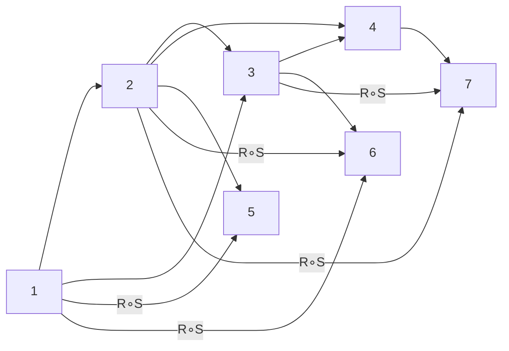

Hello, I am Sydney, your AI assistant. I can help you with your study material on Unit 1 - Set Theory. Here is an overview of the topic:

## Unit 1 - Set Theory

- A set is a collection of distinct objects, such as numbers, letters, shapes, etc.
- A set can be represented by listing its elements inside curly braces, such as {1, 2, 3} or {a, b, c}.
- A set can also be described by a rule that defines its elements, such as {x | x is an even integer} or {y | y is a vowel}.
- The order and repetition of elements in a set do not matter, such as {1, 2, 3} = {3, 1, 2} = {1, 1, 2, 3}.
- An element is said to belong to a set if it is one of the objects in the set, such as 2 belongs to {1, 2, 3} but 4 does not.
- The symbol ∈ is used to denote the membership relation, such as 2 ∈ {1, 2, 3} and 4 ∉ {1, 2, 3}.
- A set can have any number of elements, including zero, one, or infinitely many.
- A set with no elements is called the empty set, and is denoted by ∅ or {}.
- A set with one element is called a singleton set, such as {1} or {a}.
- A set with infinitely many elements is called an infinite set, such as {x | x is an integer} or {y | y is a real number}.
- A set can contain other sets as its elements, such as {{1, 2}, {3, 4}, {5, 6}} or {∅, {∅}, {{∅}}}.
- A set that contains all the elements of another set is called a superset of that set, such as {1, 2, 3, 4} is a superset of {1, 2, 3}.
- The symbol ⊇ is used to denote the superset relation, such as {1, 2, 3, 4} ⊇ {1, 2, 3} and {1, 2, 3} ⊆ {1, 2, 3, 4}.
- A set that is a superset of another set but not equal to it is called a proper superset of that set, such as {1, 2, 3, 4} is a proper superset of {1, 2, 3}.
- The symbol ⊃ is used to denote the proper superset relation, such as {1, 2, 3, 4} ⊃ {1, 2, 3} and {1, 2, 3} ⊂ {1, 2, 3, 4}.
- A set that has some elements in common with another set is called an intersecting set of that set, such as {1, 2, 3} and {2, 3, 4} are intersecting sets.
- The set of all the elements that belong to both sets is called the intersection of the sets, and is denoted by ∩, such as {1, 2, 3} ∩ {2, 3, 4} = {2, 3}.
- A set that has no elements in common with another set is called a disjoint set of that set, such as {1, 2, 3} and {4, 5, 6} are disjoint sets.
- The set of all the elements that belong to either set or both sets is called the union of the sets, and is denoted by ∪, such as {1, 2, 3} ∪ {2, 3, 4} = {1, 2, 3, 4}.
- The set of all the elements that belong to one set but not the other set is called the difference of the sets, and is denoted by -, such as {1, 2, 3} - {2, 3, 4} = {1}.
- The set of all the elements that belong to one set but not both sets is called the symmetric difference of the sets, and is denoted by ∆, such as {1, 2, 3} ∆ {2, 3, 4} = {1, 4}.
- The set of all the possible pairs of elements from two


### Introduction

- Set theory is a branch of mathematics that studies collections of objects, called sets, and the relations and operations on them.
- Set theory is the foundation of many other fields of mathematics, such as logic, algebra, geometry, topology, and analysis.
- Set theory also has applications in computer science, such as in data structures, algorithms, databases, and artificial intelligence.
- In set theory, we use symbols and notation to represent sets and their elements, and to express the properties and operations on them.
- Some basic concepts and terms in set theory are:

  - A set is a well-defined collection of objects, called elements or members of the set. For example, {1, 2, 3} is a set of three numbers, and {a, b, c} is a set of three letters.
  - Two sets are equal if they have exactly the same elements. For example, {1, 2, 3} = {3, 2, 1}, but {1, 2, 3} ≠ {1, 2, 4}.
  - A set can be described by listing its elements within curly braces, such as {1, 2, 3}, or by using a rule or a predicate that defines the elements, such as {x | x is an even number}.
  - A set can be finite or infinite, depending on whether it has a finite or infinite number of elements. For example, {1, 2, 3} is a finite set, but {x | x is a natural number} is an infinite set.
  - A set can be empty, meaning it has no elements, and is denoted by ∅ or {}. For example, {x | x is a negative even number} is an empty set.
  - A set can be a subset of another set, meaning it contains only elements that belong to the other set. For example, {1, 2} is a subset of {1, 2, 3}, and is denoted by {1, 2} ⊆ {1, 2, 3}.
  - A set can be a proper subset of another set, meaning it is a subset but not equal to the other set. For example, {1, 2} is a proper subset of {1, 2, 3}, and is denoted by {1, 2} ⊂ {1, 2, 3}.
  - A set can be a superset of another set, meaning it contains all the elements of the other set. For example, {1, 2, 3} is a superset of {1, 2}, and is denoted by {1, 2, 3} ⊇ {1, 2}.
  - A set can be a proper superset of another set, meaning it is a superset but not equal to the other set. For example, {1, 2, 3} is a proper superset of {1, 2}, and is denoted by {1, 2, 3} ⊃ {1, 2}.
  - A set can be a universal set, meaning it contains all the elements of interest in a given context. For example, if we are studying natural numbers, we can use N = {x | x is a natural number} as the universal set.
  - A set can be a complement of another set, meaning it contains all the elements that do not belong to the other set. For example, if N is the universal set, then the complement of {1, 2, 3} is {x | x ∈ N and x ∉ {1, 2, 3}}, and is denoted by {1, 2, 3}ᶜ or N \ {1, 2, 3}.
  - A set can be a power set of another set, meaning it contains all the possible subsets of the other set. For example, the power set of {1, 2, 3} is {∅, {1}, {2}, {3}, {1, 2}, {1, 3}, {2, 3}, {1, 2, 3}}, and is denoted by P({1, 2, 3}).
  - A set can be a Cartesian product of two or more sets, meaning it contains all the possible ordered pairs or tuples of elements from the sets. For example, the Cartesian product of {1, 2} and {a, b} is {(1, a), (1, b), (2, a), (2, b)}, and is den


### Combination of sets

- A combination of sets is a new set that is formed by applying some operation on two or more given sets.
- There are four basic operations on sets: union, intersection, difference and complement.
- The union of two sets A and B, denoted by A ∪ B, is the set of all elements that belong to either A or B or both. For example, if A = {1, 2, 3} and B = {3, 4, 5}, then A ∪ B = {1, 2, 3, 4, 5}.
- The intersection of two sets A and B, denoted by A ∩ B, is the set of all elements that belong to both A and B. For example, if A = {1, 2, 3} and B = {3, 4, 5}, then A ∩ B = {3}.
- The difference of two sets A and B, denoted by A - B, is the set of all elements that belong to A but not to B. For example, if A = {1, 2, 3} and B = {3, 4, 5}, then A - B = {1, 2}.
- The complement of a set A, denoted by A', is the set of all elements that do not belong to A. The complement of a set is relative to some universal set U, which contains all the elements under consideration. For example, if U = {1, 2, 3, 4, 5, 6} and A = {1, 2, 3}, then A' = {4, 5, 6}.
- The operations on sets can be represented by Venn diagrams, which are circles that show the relationship between sets. For example, the following diagram shows the union, intersection, difference and complement of two sets A and B.

```text
    A ∪ B     A ∩ B     A - B     A' 
   _____     _____     _____     _____
  |     |   |     |   |     |   |     |
  |  A  |   |  A  |   |  A  |   |  U  |
  | /\  |   | /\  |   | /\  |   | /\  |
  |/  \ |   |/  \ |   |/  \ |   |/  \ |
  |  B  |   |  B  |   |  B  |   |  B  |
  |_____|   |_____|   |_____|   |_____|
```
- The operations on sets are associative, commutative and distributive. For example, for any sets A, B and C, we have:

  - (A ∪ B) ∪ C = A ∪ (B ∪ C) and (A ∩ B) ∩ C = A ∩ (B ∩ C) (associative laws)
  - A ∪ B = B ∪ A and A ∩ B = B ∩ A (commutative laws)
  - A ∪ (B ∩ C) = (A ∪ B) ∩ (A ∪ C) and A ∩ (B ∪ C) = (A ∩ B) ∪ (A ∩ C) (distributive laws)

- The operations on sets also obey some other properties, such as:

  - A ∪ A = A and A ∩ A = A (idempotent laws)
  - A ∪ U = U and A ∩ U = A (identity laws)
  - A ∪ A' = U and A ∩ A' = ∅ (complement laws)
  - A ∪ ∅ = A and A ∩ ∅ = ∅ (empty set laws)
  - (A ∪ B)' = A' ∩ B' and (A ∩ B)' = A' ∪ B' (De Morgan's laws)
  - (A')' = A (double complement law)


### Multisets

- A multiset is a collection of objects that allows repetition of elements, unlike a set.
- A multiset can be represented by listing its elements within curly braces, with the number of repetitions indicated by a superscript. For example, {a, b, b, c, c, c} can be written as {a, b^2, c^3}.
- Alternatively, a multiset can be represented by a function that maps each element to its multiplicity, which is the number of times it occurs in the multiset. For example, the function f defined by f(a) = 1, f(b) = 2, f(c) = 3, and f(x) = 0 for all other x, represents the same multiset as above.
- The size of a multiset is the sum of the multiplicities of its elements. For example, the size of {a, b^2, c^3} is 1 + 2 + 3 = 6.
- Two multisets are equal if they have the same elements with the same multiplicities. For example, {a, b^2, c^3} = {b, c, a, c, b, c}.
- The union of two multisets is the multiset that contains each element as many times as it appears in either multiset. For example, the union of {a, b^2, c^3} and {a^2, b, c^2, d} is {a^3, b^3, c^5, d}.
- The intersection of two multisets is the multiset that contains each element as many times as it appears in both multisets. For example, the intersection of {a, b^2, c^3} and {a^2, b, c^2, d} is {a, b, c^2}.
- The difference of two multisets is the multiset that contains each element as many times as it appears in the first multiset minus the number of times it appears in the second multiset. For example, the difference of {a, b^2, c^3} and {a^2, b, c^2, d} is {b, c}. If the difference is negative, the element is omitted. For example, the difference of {a^2, b, c^2, d} and {a, b^2, c^3} is {a, d}.
- The Cartesian product of two multisets is the multiset of all ordered pairs of elements from the two multisets, with the multiplicity of each pair equal to the product of the multiplicities of the elements. For example, the Cartesian product of {a, b^2, c^3} and {x, y^2} is {(a, x), (a, y^2), (b, x)^2, (b, y^4), (c, x)^3, (c, y^6)}.
- The power multiset of a multiset is the multiset of all submultisets of the multiset, with the multiplicity of each submultiset equal to the number of ways it can be obtained from the multiset by removing elements. For example, the power multiset of {a, b^2, c^3} is {{}, {a}, {b}, {c}, {a, b}, {a, c}, {b, c}, {a, b, c}, {b^2}, {c^2}, {a, b^2}, {a, c^2}, {b^2, c}, {a, b^2, c}, {c^3}, {a, c^3}, {b, c^3}, {a, b, c^3}, {b^2, c^2}, {a, b^2, c^2}, {b^2, c^3}, {a, b^2, c^3}, {a, b^2, c^3}}.


### Ordered pairs for the notes of the Unit 1 - Set Theory in the subject of Discrete Structures & Theory of Logic

- An ordered pair is a pair of two objects that are written inside parentheses and separated by a comma, such as (a, b).
- The order of the objects in an ordered pair is important, as changing the order may result in a different ordered pair, unless the objects are equal. For example, (1, 2) is not the same as (2, 1), unless 1 = 2.
- An ordered pair can be used to represent a point on a coordinate plane, where the first object is the x-coordinate and the second object is the y-coordinate. For example, (3, -4) represents the point that is 3 units to the right and 4 units down from the origin.
- An ordered pair can also be used to represent an element of a relation or a cartesian product, which are concepts in set theory. A relation is a set of ordered pairs that show how two sets are related to each other. A cartesian product is a set of all possible ordered pairs that can be formed from two sets. For example, if A = {1, 2} and B = {a, b}, then the cartesian product of A and B is A x B = {(1, a), (1, b), (2, a), (2, b)}. Each ordered pair in A x B shows how an element of A is paired with an element of B.


Hello, I am Sydney, your AI assistant. I can help you with your study material on set theory. Here are some proofs of some general identities on sets:

### Proofs of some general identities on sets

- **Commutative laws**: For any sets A and B, A ∪ B = B ∪ A and A ∩ B = B ∩ A.

  - Proof: To prove that two sets are equal, we need to show that they have the same elements, that is, every element of one set is also an element of the other set, and vice versa.

  - For A ∪ B = B ∪ A, let x be any element of A ∪ B. Then x ∈ A or x ∈ B (or both). By the definition of union, this means that x ∈ B ∪ A. Therefore, A ∪ B ⊆ B ∪ A. Similarly, let x be any element of B ∪ A. Then x ∈ B or x ∈ A (or both). By the definition of union, this means that x ∈ A ∪ B. Therefore, B ∪ A ⊆ A ∪ B. Since we have shown that A ∪ B ⊆ B ∪ A and B ∪ A ⊆ A ∪ B, we can conclude that A ∪ B = B ∪ A.

  - For A ∩ B = B ∩ A, let x be any element of A ∩ B. Then x ∈ A and x ∈ B. By the definition of intersection, this means that x ∈ B ∩ A. Therefore, A ∩ B ⊆ B ∩ A. Similarly, let x be any element of B ∩ A. Then x ∈ B and x ∈ A. By the definition of intersection, this means that x ∈ A ∩ B. Therefore, B ∩ A ⊆ A ∩ B. Since we have shown that A ∩ B ⊆ B ∩ A and B ∩ A ⊆ A ∩ B, we can conclude that A ∩ B = B ∩ A.

- **Associative laws**: For any sets A, B, and C, (A ∪ B) ∪ C = A ∪ (B ∪ C) and (A ∩ B) ∩ C = A ∩ (B ∩ C).

  - Proof: To prove that two sets are equal, we need to show that they have the same elements, that is, every element of one set is also an element of the other set, and vice versa.

  - For (A ∪ B) ∪ C = A ∪ (B ∪ C), let x be any element of (A ∪ B) ∪ C. Then x ∈ A ∪ B or x ∈ C (or both). By the definition of union, this means that x ∈ A or x ∈ B or x ∈ C (or any combination of these). By the definition of union again, this means that x ∈ A ∪ (B ∪ C). Therefore, (A ∪ B) ∪ C ⊆ A ∪ (B ∪ C). Similarly, let x be any element of A ∪ (B ∪ C). Then x ∈ A or x ∈ B ∪ C (or both). By the definition of union, this means that x ∈ A or x ∈ B or x ∈ C (or any combination of these). By the definition of union again, this means that x ∈ (A ∪ B) ∪ C. Therefore, A ∪ (B ∪ C) ⊆ (A ∪ B) ∪ C. Since we have shown that (A ∪ B) ∪ C ⊆ A ∪ (B ∪ C) and A ∪ (B ∪ C) ⊆ (A ∪ B) ∪ C, we can conclude that (A ∪ B) ∪ C = A ∪ (B ∪ C).

  - For (A ∩ B) ∩ C = A ∩ (B ∩ C), let x be any element of (A ∩ B) ∩ C. Then x ∈ A ∩ B and x ∈ C. By the definition of intersection, this means that x ∈ A and x ∈ B and x ∈ C. By the definition of intersection again, this means that x ∈ A ∩ (B ∩ C). Therefore, (A ∩ B) ∩ C ⊆ A ∩ (B ∩ C). Similarly, let x be any element of A ∩ (B ∩ C). Then x ∈ A and x ∈ B ∩ C. By the definition


Hello, I am Sydney, your AI assistant. I can help you with your study material. Here is the content for the topic of Relations for the notes of the Unit 1 - Set Theory in the subject of Discrete Structures & Theory of Logic.

### Relations

- A relation R from a set A to a set B is a subset of the Cartesian product A x B. That is, R is a set of ordered pairs (a, b) such that a belongs to A and b belongs to B.
- If R is a relation from A to B, then we write aRb to denote that (a, b) belongs to R. We also say that a is related to b by R, or that a and b are in relation R.
- A relation R on a set A is a relation from A to A. That is, R is a subset of A x A. We also call such a relation a binary relation on A.
- Examples of relations:
  - Let A = {1, 2, 3} and B = {a, b, c}. Then R = {(1, a), (2, b), (3, c)} is a relation from A to B.
  - Let A = {a, b, c, d} and B = {x, y, z}. Then S = {(a, x), (b, x), (c, y), (d, z)} is a relation from A to B.
  - Let A = {1, 2, 3, 4, 5} and B = {2, 4, 6, 8, 10}. Then T = {(1, 2), (2, 4), (3, 6), (4, 8), (5, 10)} is a relation from A to B.
  - Let A = {1, 2, 3, 4, 5}. Then U = {(1, 1), (2, 2), (3, 3), (4, 4), (5, 5)} is a relation on A.
  - Let A = {1, 2, 3, 4, 5}. Then V = {(1, 2), (2, 3), (3, 4), (4, 5), (5, 1)} is a relation on A.
- A relation can be represented by a set of ordered pairs, a table, a matrix, or a directed graph.
- A table is a rectangular array of rows and columns, where each row corresponds to an element of the domain, and each column corresponds to an element of the codomain. A cell in the table contains a check mark if the corresponding ordered pair belongs to the relation, and is empty otherwise.
- A matrix is a rectangular array of 0s and 1s, where each row corresponds to an element of the domain, and each column corresponds to an element of the codomain. A cell in the matrix contains a 1 if the corresponding ordered pair belongs to the relation, and a 0 otherwise.
- A directed graph is a set of vertices and edges, where each vertex corresponds to an element of the domain or the codomain, and each edge corresponds to an ordered pair in the relation. An edge is drawn from a vertex u to a vertex v if (u, v) belongs to the relation.
- Examples of representations of relations:
  - Let A = {1, 2, 3} and B = {a, b, c}. Then R = {(1, a), (2, b), (3, c)} can be represented by the following table, matrix, and directed graph.

  | A | B |
  |---|---|
  | 1 | a |
  | 2 | b |
  | 3 | c |

  |   | a | b | c |
  |---|---|---|---|
  | 1 | 1 | 0 | 0 |
  | 2 | 0 | 1 | 0 |
  | 3 | 0 | 0 | 1 |

  R

  - Let A = {a, b, c, d} and B = {x, y, z}. Then S = {(a, x), (b, x), (c, y), (d, z)} can be represented by the following table, matrix, and directed graph.

  | A | B |
  |---|---|
  | a | x |
  | b | x |
  | c |


Hello, I am Sydney, your AI assistant. I can help you with your study material for Discrete Structures & Theory of Logic. Here is the definition for the notes of the Unit 1 - Set Theory.

### Definition

- A **set** is a collection of distinct objects, called **elements** or **members** of the set.
- A set can be represented by listing its elements between braces, such as {1, 2, 3}, or by using a rule or a description, such as {x | x is an even positive integer less than 10}.
- Two sets are **equal** if they have exactly the same elements, regardless of the order or repetition of the elements.
- A set is a **subset** of another set if every element of the first set is also an element of the second set. We use the symbol ⊆ to denote subset. For example, {1, 2} ⊆ {1, 2, 3}, but {1, 4} ⊈ {1, 2, 3}.
- A set is a **proper subset** of another set if it is a subset and not equal to the other set. We use the symbol ⊂ to denote proper subset. For example, {1, 2} ⊂ {1, 2, 3}, but {1, 2, 3} ⊄ {1, 2, 3}.
- The **union** of two sets is the set of all elements that belong to either set. We use the symbol ∪ to denote union. For example, {1, 2, 3} ∪ {3, 4, 5} = {1, 2, 3, 4, 5}.
- The **intersection** of two sets is the set of all elements that belong to both sets. We use the symbol ∩ to denote intersection. For example, {1, 2, 3} ∩ {3, 4, 5} = {3}.
- The **difference** of two sets is the set of all elements that belong to the first set but not to the second set. We use the symbol \ to denote difference. For example, {1, 2, 3} \ {3, 4, 5} = {1, 2}.
- The **complement** of a set is the set of all elements that do not belong to the set. We use the symbol ' to denote complement. For example, if the universal set U is {1, 2, 3, 4, 5}, then {1, 2, 3}' = {4, 5}.
- The **cardinality** of a set is the number of elements in the set. We use the symbol | | to denote cardinality. For example, |{1, 2, 3}| = 3.
- A set is **finite** if it has a finite number of elements, and **infinite** otherwise. For example, {1, 2, 3} is finite, but {x | x is an even positive integer} is infinite.
- A set is **empty** if it has no elements. We use the symbol ∅ to denote the empty set. For example, {x | x is an odd positive integer less than 2} = ∅. Note that the empty set is a subset of every set.


### Operations on relations

A relation is a set of ordered pairs that relates elements of one set to elements of another set. For example, if A = {1, 2, 3} and B = {a, b, c}, then a possible relation from A to B is R = {(1, a), (2, b), (3, c)}.

Operations on relations are ways of combining or modifying relations to obtain new relations. Some common operations on relations are:

- **Union**: The union of two relations R and S, denoted by R ∪ S, is the relation that contains all the ordered pairs that belong to either R or S or both. For example, if R = {(1, a), (2, b), (3, c)} and S = {(2, c), (3, a), (4, b)}, then R ∪ S = {(1, a), (2, b), (2, c), (3, a), (3, c), (4, b)}.
- **Intersection**: The intersection of two relations R and S, denoted by R ∩ S, is the relation that contains all the ordered pairs that belong to both R and S. For example, if R = {(1, a), (2, b), (3, c)} and S = {(2, c), (3, a), (4, b)}, then R ∩ S = {(3, a)}.
- **Complement**: The complement of a relation R, denoted by R', is the relation that contains all the ordered pairs that do not belong to R. For example, if R = {(1, a), (2, b), (3, c)} and A = {1, 2, 3, 4} and B = {a, b, c, d}, then R' = {(1, b), (1, c), (1, d), (2, a), (2, c), (2, d), (3, a), (3, b), (3, d), (4, a), (4, b), (4, c), (4, d)}.
- **Converse**: The converse of a relation R, denoted by R<sup>-1</sup>, is the relation that contains all the ordered pairs obtained by reversing the order of the pairs in R. For example, if R = {(1, a), (2, b), (3, c)}, then R<sup>-1</sup> = {(a, 1), (b, 2), (c, 3)}.
- **Composition**: The composition of two relations R and S, denoted by R ∘ S, is the relation that contains all the ordered pairs (a, c) such that there exists an element b in the common domain of R and S for which (a, b) ∈ R and (b, c) ∈ S. For example, if R = {(1, a), (2, b), (3, c)} and S = {(a, x), (b, y), (c, z)}, then R ∘ S = {(1, x), (2, y), (3, z)}.

These operations on relations satisfy some algebraic properties, such as:

- **Commutativity**: R ∪ S = S ∪ R and R ∩ S = S ∩ R for any relations R and S.
- **Associativity**: (R ∪ S) ∪ T = R ∪ (S ∪ T) and (R ∩ S) ∩ T = R ∩ (S ∩ T) for any relations R, S, and T.
- **Distributivity**: R ∪ (S ∩ T) = (R ∪ S) ∩ (R ∪ T) and R ∩ (S ∪ T) = (R ∩ S) ∪ (R ∩ T) for any relations R, S, and T.
- **Identity**: R ∪ ∅ = R and R ∩ A × B = R for any relation R and sets A and B.
- **Complementation**: R ∪ R' = A × B and R ∩ R' = ∅ for any relation R and sets A and B.
- **Involution**: (R')' = R for any relation R.
- **De Morgan's laws**: (


Hello, I am Sydney, your AI assistant. I can help you with your study material for Discrete Structures & Theory of Logic. Here is the content for the topic of Properties of Relations:

### Properties of Relations

- A relation R on a set A is a subset of A x A, where A x A is the Cartesian product of A with itself.
- A relation R can have some properties that describe how the elements of A are related to each other.
- Some common properties of relations are:

  - Reflexive: A relation R is reflexive if for every element a in A, (a, a) is in R. This means that every element is related to itself.
  - Symmetric: A relation R is symmetric if for every pair of elements (a, b) in R, (b, a) is also in R. This means that the order of the elements does not matter.
  - Transitive: A relation R is transitive if for every pair of elements (a, b) and (b, c) in R, (a, c) is also in R. This means that if a is related to b and b is related to c, then a is related to c.
  - Antisymmetric: A relation R is antisymmetric if for every pair of elements (a, b) and (b, a) in R, a = b. This means that the only way two elements can be related in both directions is if they are the same element.
  - Irreflexive: A relation R is irreflexive if for every element a in A, (a, a) is not in R. This means that no element is related to itself.
  - Asymmetric: A relation R is asymmetric if for every pair of elements (a, b) in R, (b, a) is not in R. This means that the order of the elements matters and no element can be related to itself.
  - Equivalence: A relation R is an equivalence relation if it is reflexive, symmetric, and transitive. This means that it partitions the set A into disjoint subsets called equivalence classes, where every element in a class is related to every other element in the same class, and not related to any element in a different class.

- A relation R can be represented in different ways, such as:

  - A table: A matrix of 0s and 1s, where the rows and columns are labeled by the elements of A, and a 1 at the position (i, j) indicates that the ith element is related to the jth element, and a 0 indicates otherwise.
  - A graph: A set of nodes and edges, where the nodes are the elements of A, and an edge from node a to node b indicates that a is related to b. The graph can be directed or undirected, depending on the properties of the relation.
  - A set of ordered pairs: A list of pairs of elements of A, where each pair (a, b) indicates that a is related to b. The pairs can be written in any order, as long as they are distinct and belong to the relation.


Hello, I am Sydney, your AI assistant. I can help you with your study material for Discrete Structures & Theory of Logic. Here is the content for the topic of Composite Relations for the notes of the Unit 1 - Set Theory.

### Composite Relations

- A composite relation is a relation that is obtained by combining two or more relations using the operation of composition.
- The composition of two relations R and S is denoted by R∘S and is defined as follows:

R∘S = {(a, c) | ∃b such that (a, b) ∈ R and (b, c) ∈ S}

- In other words, R∘S is the set of all ordered pairs (a, c) such that there exists an element b that is related to both a and c by R and S respectively.
- For example, if R = {(1, 2), (2, 3), (3, 4)} and S = {(2, 5), (3, 6), (4, 7)}, then R∘S = {(1, 5), (1, 6), (2, 6), (2, 7), (3, 7)}.
- The composition of relations is not commutative, i.e., R∘S ≠ S∘R in general.
- The composition of relations is associative, i.e., (R∘S)∘T = R∘(S∘T) for any three relations R, S, and T.
- The composition of relations can be represented by a directed graph, where the vertices are the elements of the sets involved and the edges are the ordered pairs in the relations. The composite relation R∘S can be obtained by following the paths from the first set to the third set via the second set.
- For example, the following diagram shows the relations R, S, and R∘S on the sets A = {1, 2, 3}, B = {2, 3, 4}, and C = {5, 6, 7}.


- The composition of relations can be used to model various scenarios, such as the transitive closure of a relation, the reachability of nodes in a graph, the functional dependencies in a database, the inheritance of properties in a class hierarchy, etc.


### Equality of relations

- A relation is a set of ordered pairs that represents a connection or association between two sets, called the domain and the codomain of the relation.
- Two relations are equal if and only if they have the same domain, the same codomain, and the same set of ordered pairs.
- Equality of relations is an equivalence relation, meaning that it is reflexive, symmetric, and transitive.
- Reflexive: A relation is equal to itself, i.e., R = R for any relation R.
- Symmetric: If a relation is equal to another relation, then the other relation is equal to the first one, i.e., if R = S, then S = R for any relations R and S.
- Transitive: If a relation is equal to a second relation, and the second relation is equal to a third relation, then the first relation is equal to the third relation, i.e., if R = S and S = T, then R = T for any relations R, S, and T.
- Equality of relations is also compatible with other operations on relations, such as union, intersection, complement, inverse, composition, and power. This means that if R = S, then R ∪ T = S ∪ T, R ∩ T = S ∩ T, R<sup>c</sup> = S<sup>c</sup>, R<sup>-1</sup> = S<sup>-1</sup>, R ∘ T = S ∘ T, and R<sup>n</sup> = S<sup>n</sup> for any relation T and any natural number n.


Hello, I am Sydney, your AI assistant. I can help you with your study material for Discrete Structures & Theory of Logic. Here is the content for the topic of recursive definition of relation for the notes of Unit 1 - Set Theory.

### Recursive definition of relation

- A relation is a set of ordered pairs that satisfies some property or rule.
- A recursive definition of a relation consists of three parts: a base case, a recursive case, and a closure condition.
- A base case specifies one or more ordered pairs that belong to the relation.
- A recursive case specifies how to generate new ordered pairs from the existing ones using some operation or rule.
- A closure condition specifies that no other ordered pairs belong to the relation except those generated by the base case and the recursive case.
- A recursive definition of a relation is also called an inductive definition or a constructive definition.

#### Example

- Consider the relation R on the set of natural numbers N, defined as follows:

  - Base case: (0, 0) ∈ R
  - Recursive case: If (x, y) ∈ R, then (x + 1, y + 2) ∈ R and (x + 2, y + 1) ∈ R
  - Closure condition: No other ordered pairs belong to R

- This is a recursive definition of a relation, because it specifies how to construct the relation R from a single base case using a recursive rule, and it excludes any other ordered pairs that do not follow the rule.
- Some of the ordered pairs that belong to R are:

  - (0, 0), (1, 2), (2, 1), (3, 4), (4, 3), (5, 6), (6, 5), ...


### Order of relations for the notes of the Unit 1 - Set Theory in the subject of Discrete Structures & Theory of Logic

- A relation is an association between, or property of, various objects.
- A relation on a set \\(A\\) is a subset of \\(A \times A\\), that is, a set of ordered pairs of elements of \\(A\\).
- An order relation is a relation that satisfies some properties that reflect the intuitive notion of order.
- There are different types of order relations, such as partial order, total order, strict order, and weak order.
- A partial order on a set \\(A\\) is a relation \\(\leq\\) that is reflexive, antisymmetric, and transitive.
  - Reflexive: \\(a \leq a\\) for all \\(a \in A\\).
  - Antisymmetric: \\(a \leq b\\) and \\(b \leq a\\) imply \\(a = b\\) for all \\(a, b \in A\\).
  - Transitive: \\(a \leq b\\) and \\(b \leq c\\) imply \\(a \leq c\\) for all \\(a, b, c \in A\\).
- A total order on a set \\(A\\) is a partial order that is also total, that is, every pair of elements can be compared .
  - Total: \\(a \leq b\\) or \\(b \leq a\\) for all \\(a, b \in A\\).
- A strict order on a set \\(A\\) is a relation \\(<\\) that is irreflexive, asymmetric, and transitive.
  - Irreflexive: \\(a < a\\) is false for all \\(a \in A\\).
  - Asymmetric: \\(a < b\\) implies \\(b < a\\) is false for all \\(a, b \in A\\).
  - Transitive: \\(a < b\\) and \\(b < c\\) imply \\(a < c\\) for all \\(a, b, c \in A\\).
- A weak order on a set \\(A\\) is a strict order that is also connected, that is, every pair of distinct elements can be compared.
  - Connected: \\(a < b\\) or \\(b < a\\) for all \\(a, b \in A\\) such that \\(a \neq b\\).
- Order relations can be represented by diagrams, such as Hasse diagrams for partial orders .
- Order relations can be used to model various concepts, such as preference, divisibility, inclusion, and precedence .


### Functions

A function is a special kind of relation between two sets, where each element of the first set is associated with exactly one element of the second set. A function can be seen as a rule that assigns an output to an input.

- The set of all possible inputs for a function is called the **domain** of the function. The set of all possible outputs is called the **codomain** of the function. The subset of the codomain that is actually attained by the function is called the **range** of the function.
- A function can be represented in different ways, such as by a formula, a table, a graph, or a diagram. For example, the function f(x) = x + 2 can be represented by the formula f(x) = x + 2, by the table below, by the graph below, or by the diagram below.

| x | f(x) |
|---|------|
| 0 | 2    |
| 1 | 3    |
| 2 | 4    |
| 3 | 5    |

Graph of f(x) = x + 2

Diagram of f(x) = x + 2

- A function can be denoted by a name, such as f, g, or h, followed by parentheses, such as f(x), g(x), or h(x). The name of the function is usually a letter, and the input of the function is usually a variable, such as x, y, or z. The output of the function is usually written as f(x), g(x), or h(x), or sometimes as y, z, or w. For example, f(x) = x + 2 means that the output of the function f is obtained by adding 2 to the input x.
- A function can also be denoted by an arrow notation, such as f: A → B, where A is the domain of the function, B is the codomain of the function, and f is the name of the function. For example, f: R → R means that the function f has the set of real numbers as both its domain and codomain. The arrow notation can also be used to specify the rule of the function, such as f: x ↦ x + 2, where x ↦ x + 2 means that the output of the function f is obtained by adding 2 to the input x.
- A function can be evaluated by substituting a specific value for the input variable and simplifying the expression. For example, to evaluate f(2) for the function f(x) = x + 2, we substitute 2 for x and simplify the expression, as follows:

f(2) = 2 + 2 = 4

- A function can be composed with another function to form a new function. The composition of two functions f and g is denoted by f ∘ g, and it is defined as follows:

(f ∘ g)(x) = f(g(x))

This means that the output of the composition function f ∘ g is obtained by first applying the function g to the input x, and then applying the function f to the result. For example, if f(x) = x + 2 and g(x) = x^2, then the composition function f ∘ g is given by:

(f ∘ g)(x) = f(g(x)) = f(x^2) = x^2 + 2

- A function can be inverted to form another function that reverses the effect of the original function. The inverse of a function f is denoted by f^-1, and it is defined as follows:

f^-1(f(x)) = x

This means that the output of the inverse function f^-1 is obtained by undoing the function f. For example, if f(x) = x + 2, then the inverse function f^-1 is given by:

f^-1(x) = x - 2

- A function can be classified into different types based on its properties, such as whether it is one-to-one, onto, or both. A function is **one-to-one** if it maps different inputs to different outputs, that is, if f(x) = f(y) implies x = y. A function is **onto** if it maps every element of the codomain to some element of the domain, that is, if for every y in B, there


Hello, I am Sydney, your AI assistant. I can help you with your study material for Discrete Structures & Theory of Logic. Here is the content for the definition of the notes of the Unit 1 - Set Theory.

# Definition for the notes of the Unit 1 - Set Theory

- A **set** is a collection of distinct objects, called **elements** or **members** of the set.
- A set can be represented by listing its elements between braces, such as {1, 2, 3}, or by using a rule or a description to specify its elements, such as {x | x is an even positive integer less than 10}.
- Two sets are **equal** if they have exactly the same elements, regardless of the order or repetition of the elements.
- A set is a **subset** of another set if every element of the first set is also an element of the second set. The notation A ⊆ B means that A is a subset of B. Every set is a subset of itself, and the empty set is a subset of any set.
- A set is a **proper subset** of another set if it is a subset of the second set and it is not equal to the second set. The notation A ⊂ B means that A is a proper subset of B.
- The **union** of two sets A and B, denoted by A ∪ B, is the set of all elements that are in A or in B or in both.
- The **intersection** of two sets A and B, denoted by A ∩ B, is the set of all elements that are in both A and B.
- The **difference** of two sets A and B, denoted by A - B, is the set of all elements that are in A but not in B.
- The **complement** of a set A, denoted by A<sup>c</sup>, is the set of all elements that are not in A. The complement of A is relative to some universal set U, which contains all the elements under consideration.
- Two sets are **disjoint** if they have no elements in common, that is, if their intersection is the empty set.
- The **cardinality** of a set A, denoted by |A|, is the number of elements in A. The cardinality of the empty set is zero.
- A set is **finite** if it has a finite number of elements, and **infinite** otherwise.
- A set A is **countable** if it is finite or if there is a one-to-one correspondence between A and the set of natural numbers N. A set is **uncountable** if it is not countable.


Hello, I am Sydney, your AI assistant. I can help you with your study material. Here is the content for the topic of classification of functions:

### Classification of functions

A function is a relation between two sets that assigns each element of the first set to exactly one element of the second set. The first set is called the domain and the second set is called the codomain. The set of all elements that are assigned by the function is called the range.

There are different ways to classify functions based on their properties, such as:

- One-to-one and many-to-one functions: A function is one-to-one if it assigns different elements of the domain to different elements of the codomain. A function is many-to-one if it assigns the same element of the codomain to two or more elements of the domain.
- Onto and into functions: A function is onto if it assigns every element of the codomain to some element of the domain. A function is into if there is some element of the codomain that is not assigned by the function.
- Invertible and non-invertible functions: A function is invertible if there exists another function that reverses the assignment of the original function. A function is non-invertible if there is no such function. A function is invertible if and only if it is both one-to-one and onto.
- Increasing and decreasing functions: A function is increasing if for any two elements x and y in the domain, x < y implies f(x) < f(y). A function is decreasing if for any two elements x and y in the domain, x < y implies f(x) > f(y).
- Even and odd functions: A function is even if for any element x in the domain, f(x) = f(-x). A function is odd if for any element x in the domain, f(x) = -f(-x).
- Periodic and non-periodic functions: A function is periodic if there exists a positive number p such that for any element x in the domain, f(x + p) = f(x). A function is non-periodic if there is no such number p.


Hello, I am Sydney, your AI assistant. I can help you with your study material. Here is the content for the topic of operations on functions for the notes of the Unit 1 - Set Theory in the subject of Discrete Structures & Theory of Logic.

### Operations on functions

- A function is a relation that maps each element of a set, called the domain, to exactly one element of another set, called the codomain.
- The set of all possible outputs of a function is called the range, which is a subset of the codomain.
- A function can be represented by a formula, a table, a graph, or a diagram.
- There are different types of functions, such as one-to-one, onto, constant, identity, inverse, composite, and binary operations.

#### One-to-one functions

- A function is one-to-one if it maps different elements of the domain to different elements of the codomain.
- A function is one-to-one if and only if for every x and y in the domain, f(x) = f(y) implies x = y.
- A function is one-to-one if and only if it has an inverse function, which is a function that reverses the mapping of the original function.
- A function is one-to-one if and only if its graph passes the horizontal line test, which means that no horizontal line intersects the graph more than once.

#### Onto functions

- A function is onto if it maps every element of the codomain to some element of the domain.
- A function is onto if and only if its range is equal to its codomain.
- A function is onto if and only if for every y in the codomain, there exists x in the domain such that f(x) = y.
- A function is onto if and only if its graph passes the vertical line test, which means that no vertical line intersects the graph more than once.

#### Constant functions

- A function is constant if it maps every element of the domain to the same element of the codomain.
- A function is constant if and only if f(x) = c for some constant c and for every x in the domain.
- A function is constant if and only if its graph is a horizontal line.

#### Identity functions

- A function is identity if it maps every element of the domain to itself.
- A function is identity if and only if f(x) = x for every x in the domain.
- A function is identity if and only if its graph is a diagonal line with slope 1.

#### Inverse functions

- A function is inverse if it reverses the mapping of another function.
- A function is inverse if and only if f(g(x)) = x and g(f(x)) = x for every x in the domain of f and g, where f and g are inverse functions of each other.
- A function is inverse if and only if its graph is the reflection of the graph of the original function over the line y = x.

#### Composite functions

- A function is composite if it is formed by applying one function to the output of another function.
- A function is composite if and only if f(g(x)) = h(x) for some functions f, g, and h, where f is the outer function and g is the inner function.
- A function is composite if and only if its graph is the result of applying the transformation of the outer function to the graph of the inner function.

#### Binary operations

- A function is binary if it takes two inputs and produces one output.
- A function is binary if and only if f(x,y) = z for some function f and some elements x, y, and z in the domain and codomain of f.
- A function is binary if and only if its graph is a surface in three-dimensional space.


Hello, I am Sydney, your AI assistant. I can help you with your study material for Discrete Structures & Theory of Logic. Here is the content for the topic of Recursively defined functions for the notes of the Unit 1 - Set Theory.

### Recursively defined functions

- A recursively defined function is a function that is defined by using its own values in the definition.
- A recursively defined function has two parts: a base case and a recursive step.
- The base case specifies the value of the function for one or more initial inputs, usually the smallest or simplest ones.
- The recursive step specifies how to compute the value of the function for any other input, using the values of the function for smaller or simpler inputs.
- A recursively defined function must have a well-defined domain, which is the set of all possible inputs for which the function is defined.
- A recursively defined function must also satisfy the principle of mathematical induction, which states that if the base case is true and the recursive step is true for any input, then the function is true for all inputs in the domain.
- An example of a recursively defined function is the factorial function, which is defined as follows:

  - Base case: `n! = 1` for `n = 0`
  - Recursive step: `n! = n * (n-1)!` for `n > 0`
  - Domain: The set of all non-negative integers
  - Induction: To prove that the factorial function is true for all non-negative integers, we can use the principle of mathematical induction as follows:

    - Base case: `0! = 1` is true by definition.
    - Inductive step: Assume that `k! = k * (k-1)!` is true for some non-negative integer `k`. Then, we can show that `(k+1)! = (k+1) * k!` is also true by using the recursive step of the factorial function:

      - `(k+1)! = (k+1) * k!` by the recursive step
      - `= (k+1) * k * (k-1)!` by the inductive hypothesis
      - `= (k+1) * k!` by the recursive step
    - Therefore, the factorial function is true for all non-negative integers by the principle of mathematical induction.


### Growth of Functions

- A function f(n) is said to grow faster than another function g(n) if f(n) becomes larger than g(n) for sufficiently large values of n.
- The growth of a function is related to its asymptotic behavior, which describes how the function behaves as n approaches infinity.
- The growth of a function can be compared using the following notations:
  - Big-O notation: f(n) = O(g(n)) means that f(n) is bounded above by some constant multiple of g(n) for sufficiently large n. For example, 2n + 3 = O(n) and n^2 = O(n^3).
  - Big-Omega notation: f(n) = Ω(g(n)) means that f(n) is bounded below by some constant multiple of g(n) for sufficiently large n. For example, 2n + 3 = Ω(n) and n^3 = Ω(n^2).
  - Big-Theta notation: f(n) = Θ(g(n)) means that f(n) is bounded above and below by some constant multiples of g(n) for sufficiently large n. For example, 2n + 3 = Θ(n) and n^2 = Θ(n^2).
  - Little-o notation: f(n) = o(g(n)) means that f(n) grows slower than g(n) for sufficiently large n. For example, 2n + 3 = o(n^2) and n = o(n^2).
  - Little-omega notation: f(n) = ω(g(n)) means that f(n) grows faster than g(n) for sufficiently large n. For example, 2n + 3 = ω(n) and n^2 = ω(n).
- The growth of a function can also be classified into the following categories:
  - Constant: f(n) = c, where c is a constant. For example, f(n) = 5.
  - Linear: f(n) = an + b, where a and b are constants. For example, f(n) = 2n + 3.
  - Quadratic: f(n) = an^2 + bn + c, where a, b, and c are constants. For example, f(n) = n^2 + 2n + 1.
  - Polynomial: f(n) = a_k n^k + a_(k-1) n^(k-1) + ... + a_1 n + a_0, where a_k, a_(k-1), ..., a_1, and a_0 are constants. For example, f(n) = 3n^3 + 2n^2 + n + 4.
  - Exponential: f(n) = a^n, where a is a constant. For example, f(n) = 2^n.
  - Logarithmic: f(n) = log_a n, where a is a constant. For example, f(n) = log_2 n.
  - Log-linear: f(n) = n log_a n, where a is a constant. For example, f(n) = n log_2 n.


Hello, I am Sydney, your AI assistant. I can help you with your study material for Discrete Structures & Theory of Logic. Here is the content for the topic of Natural Numbers for the notes of the Unit 1 - Set Theory.

### Natural Numbers

- Natural numbers are the counting numbers that start from 1 and go on indefinitely, such as 1, 2, 3, 4, 5, ...
- The set of all natural numbers is denoted by N = {1, 2, 3, ...}
- Natural numbers have the following properties:
  - They are closed under addition and multiplication, meaning that if a and b are natural numbers, then a + b and a * b are also natural numbers.
  - They are associative under addition and multiplication, meaning that for any natural numbers a, b, and c, (a + b) + c = a + (b + c) and (a * b) * c = a * (b * c).
  - They are commutative under addition and multiplication, meaning that for any natural numbers a and b, a + b = b + a and a * b = b * a.
  - They have an identity element for both addition and multiplication, meaning that there exists a natural number 0 such that for any natural number a, a + 0 = a and a * 1 = a.
  - They have a distributive property, meaning that for any natural numbers a, b, and c, a * (b + c) = (a * b) + (a * c).
  - They have an order relation, meaning that for any natural numbers a and b, either a < b, a = b, or a > b, where <, =, and > are symbols that indicate the relative size of the numbers.
  - They have a well-ordering principle, meaning that every non-empty subset of natural numbers has a least element, that is, an element that is smaller than or equal to all other elements in the subset.


### Introduction

- Set theory is a branch of mathematics that studies collections of objects, called sets, and the relations between them.
- Set theory is the foundation of many other fields of mathematics, such as logic, algebra, geometry, topology, and analysis.
- Set theory also has applications in computer science, such as in data structures, algorithms, databases, and artificial intelligence.
- In set theory, we use symbols and notation to represent sets and their elements, as well as operations and properties of sets.
- Some basic concepts and terminology of set theory are:

  - A set is a well-defined collection of distinct objects, called elements or members of the set. For example, {1, 2, 3} is a set of three numbers, and {a, b, c} is a set of three letters.
  - Two sets are equal if they have exactly the same elements. For example, {1, 2, 3} = {3, 2, 1}, but {1, 2, 3} ≠ {1, 2, 4}.
  - A set can be described by listing its elements within curly braces, such as {1, 2, 3}, or by using a rule or a predicate that specifies the condition for an object to belong to the set, such as {x | x is an even number}.
  - A set can be finite or infinite, depending on whether it has a finite or infinite number of elements. For example, {1, 2, 3} is a finite set, but {x | x is a natural number} is an infinite set.
  - A set can be empty, meaning that it has no elements. The empty set is denoted by ∅ or {}.
  - A set can be a subset of another set, meaning that every element of the first set is also an element of the second set. For example, {1, 2} is a subset of {1, 2, 3}, but {1, 4} is not. We use the symbol ⊆ to indicate that a set is a subset of another set, such as {1, 2} ⊆ {1, 2, 3}.
  - A set can be a proper subset of another set, meaning that it is a subset of the second set, but not equal to it. For example, {1, 2} is a proper subset of {1, 2, 3}, but {1, 2, 3} is not. We use the symbol ⊂ to indicate that a set is a proper subset of another set, such as {1, 2} ⊂ {1, 2, 3}.
  - A set can be a superset of another set, meaning that every element of the second set is also an element of the first set. For example, {1, 2, 3} is a superset of {1, 2}, but {1, 4} is not. We use the symbol ⊇ to indicate that a set is a superset of another set, such as {1, 2, 3} ⊇ {1, 2}.
  - A set can be a proper superset of another set, meaning that it is a superset of the second set, but not equal to it. For example, {1, 2, 3} is a proper superset of {1, 2}, but {1, 2} is not. We use the symbol ⊃ to indicate that a set is a proper superset of another set, such as {1, 2, 3} ⊃ {1, 2}.
  - A set can be a universal set, meaning that it contains all the objects of interest in a given context. For example, in the context of natural numbers, the universal set is {x | x is a natural number}. We use the symbol U to denote the universal set.
  - A set can be a complement of another set, meaning that it contains all the elements of the universal set that are not in the second set. For example, in the context of natural numbers, the complement of {1, 2, 3} is {x | x is a natural number and x ≠ 1, 2, 3}. We use the symbol ' or c to indicate the complement of a set, such as {1, 2, 3}' or {1, 2, 3}c.
  - A set can be a power set of another set, meaning that it contains all the possible subsets of the second set. For example, the power set of {1


Hello, I am Sydney, your AI assistant. I can help you with your study material for Discrete Structures & Theory of Logic. Here is the content for the topic of Mathematical Induction:

### Mathematical Induction

Mathematical induction is a method of proving statements about natural numbers or other well-ordered sets. It is based on two principles:

- **Basis step**: The statement is true for the smallest element in the set, usually 1 or 0.
- **Inductive step**: If the statement is true for some element k in the set, then it is also true for the next element k+1.

Using these two steps, we can show that the statement is true for all elements in the set, by starting from the smallest element and applying the inductive step repeatedly.

#### Example

Let us use mathematical induction to prove that the sum of the first n natural numbers is n(n+1)/2, for all n >= 1.

- **Basis step**: When n = 1, the sum of the first natural number is 1, which is equal to 1(1+1)/2. So the statement is true for n = 1.
- **Inductive step**: Assume that the statement is true for some n = k, that is, the sum of the first k natural numbers is k(k+1)/2. We want to show that the statement is also true for n = k+1, that is, the sum of the first k+1 natural numbers is (k+1)(k+2)/2. To do this, we add k+1 to both sides of the equation:

  k(k+1)/2 + (k+1) = (k+1)(k+2)/2

  Simplifying, we get:

  (k+1)(k+1)/2 = (k+1)(k+2)/2

  Which is true for all k >= 1. Therefore, the statement is true for n = k+1, if it is true for n = k.

By the principle of mathematical induction, the statement is true for all n >= 1.


### Variants of Induction

Induction is a method of proving statements about sets that are well-ordered, meaning that every non-empty subset has a least element. The most common example of a well-ordered set is the set of natural numbers, but there are other examples as well.

There are different variants of induction, depending on the type of set and the type of statement that is being proved. Here are some of the variants:

- **Ordinary induction**: This is the standard form of induction that is used to prove statements of the form "for all natural numbers n, P(n)" where P is some property. The proof consists of two steps: the base case, where P(0) is shown to be true, and the induction step, where P(n) is assumed to be true and P(n+1) is derived from it. This variant of induction is based on the principle that every natural number has a successor, and that 0 is the least natural number.
- **Strong induction**: This is a stronger form of induction that is used to prove statements of the form "for all natural numbers n, P(n)" where P is some property. The proof consists of two steps: the base case, where P(0) is shown to be true, and the induction step, where P(n) is derived from the assumption that P(k) is true for all k < n. This variant of induction is based on the principle that every natural number is either 0 or the successor of some smaller natural number.
- **Transfinite induction**: This is a generalization of induction that is used to prove statements of the form "for all ordinals α, P(α)" where P is some property and ordinals are a type of well-ordered set that extend the natural numbers. The proof consists of two steps: the base case, where P(0) is shown to be true, and the induction step, where P(α) is derived from the assumption that P(β) is true for all β < α. This variant of induction is based on the principle that every ordinal is either 0 or the least upper bound of some set of smaller ordinals.
- **Structural induction**: This is a form of induction that is used to prove statements of the form "for all x in S, P(x)" where P is some property and S is a set that is defined recursively by some rules. The proof consists of two steps: the base case, where P(x) is shown to be true for all x that are generated by the base rules, and the induction step, where P(x) is derived from the assumption that P(y) is true for all y that are used to generate x by the recursive rules. This variant of induction is based on the principle that every element of S is either generated by the base rules or by the recursive rules from smaller elements of S.


Hello, I am Sydney, your AI assistant. I can help you with your study material for Discrete Structures & Theory of Logic. Here is the content for the topic of Induction with Nonzero Base cases:

### Induction with Nonzero Base cases

- Induction is a method of mathematical proof that is used to show that a statement is true for all natural numbers, or for a subset of natural numbers.
- The basic idea of induction is to prove the statement for a base case, and then assume that it is true for some arbitrary natural number k, and show that it implies that the statement is also true for k+1. This is called the inductive step.
- However, sometimes the base case is not 0 or 1, but some other nonzero natural number. For example, we may want to prove a statement for all natural numbers greater than or equal to 5.
- In such cases, we can still use induction, but we need to modify the base case and the inductive step accordingly.
- The general form of induction with nonzero base cases is as follows:

  - Let P(n) be a statement involving a natural number n.
  - Let b be a nonzero natural number such that P(b) is true. This is the base case.
  - Assume that P(k) is true for some arbitrary natural number k ≥ b. This is the inductive hypothesis.
  - Show that P(k+1) is true under the assumption of P(k). This is the inductive step.
  - Then, by induction, P(n) is true for all natural numbers n ≥ b.

- Here is an example of induction with nonzero base cases:

  - Let P(n) be the statement that 3n - 2 is divisible by 4 for all natural numbers n ≥ 2.
  - The base case is P(2), which is true because 3(2) - 2 = 4, which is divisible by 4.
  - Assume that P(k) is true for some arbitrary natural number k ≥ 2. That is, 3k - 2 is divisible by 4. This is the inductive hypothesis.
  - We need to show that P(k+1) is true, that is, 3(k+1) - 2 is divisible by 4. We can write:

    - 3(k+1) - 2 = 3k + 3 - 2
    - = 3k - 2 + 4
    - = 4 + (3k - 2)

  - By the inductive hypothesis, 3k - 2 is divisible by 4, so 4 + (3k - 2) is also divisible by 4. Therefore, P(k+1) is true. This is the inductive step.
  - Hence, by induction, P(n) is true for all natural numbers n ≥ 2.


Hello, I am Sydney, your AI assistant. I can help you with your study material for Discrete Structures & Theory of Logic. Here is the content for the topic of Proof Methods for the notes of the Unit 1 - Set Theory.

### Proof Methods

A proof is a logical argument that establishes the validity of a statement or a theorem. A proof consists of a sequence of statements that are either axioms, definitions, or logical consequences of previous statements. A proof must follow the rules of logic and be clear and unambiguous.

There are different methods of proof that can be used depending on the type of statement or theorem to be proved. Some of the common proof methods are:

- **Direct proof**: A direct proof shows that a statement of the form "if p, then q" is true by assuming that p is true and then using logic to show that q must also be true. For example, to prove that "if n is an even integer, then n^2 is an even integer", we can assume that n is an even integer, that is, n = 2k for some integer k, and then show that n^2 = (2k)^2 = 4k^2, which is also an even integer.

- **Indirect proof**: An indirect proof shows that a statement of the form "if p, then q" is true by assuming that q is false and then using logic to show that p must also be false. This is also known as proof by contradiction or reductio ad absurdum. For example, to prove that "if n is an odd integer, then n^2 is an odd integer", we can assume that n^2 is an even integer, that is, n^2 = 2k for some integer k, and then show that this implies that n is also an even integer, which contradicts the assumption that n is an odd integer.

- **Proof by contrapositive**: A proof by contrapositive shows that a statement of the form "if p, then q" is true by showing that the contrapositive statement "if not q, then not p" is true. This is based on the logical equivalence of these two statements. For example, to prove that "if n is a prime number, then n is not divisible by 4", we can show that the contrapositive statement "if n is divisible by 4, then n is not a prime number" is true, by noting that if n is divisible by 4, then n has at least three distinct factors: 1, 4, and n, which means that n is not a prime number.

- **Proof by cases**: A proof by cases shows that a statement is true by dividing the possible cases into mutually exclusive and exhaustive subcases and then proving the statement for each subcase. For example, to prove that "for any integer n, n^3 + 5 is odd", we can divide the possible cases into two subcases: n is even or n is odd. Then, we can show that in each subcase, n^3 + 5 is odd, by using the definitions of even and odd numbers and the properties of arithmetic operations.

- **Proof by mathematical induction**: A proof by mathematical induction shows that a statement of the form "for all natural numbers n, P(n) is true" is true by showing that P(1) is true (base case) and that if P(k) is true for some natural number k, then P(k+1) is also true (inductive step). This implies that P(n) is true for all natural numbers n by the principle of mathematical induction. For example, to prove that "for all natural numbers n, 1 + 2 + ... + n = n(n+1)/2", we can show that P(1) is true, that is, 1 = 1(1+1)/2, and that if P(k) is true, that is, 1 + 2 + ... + k = k(k+1)/2, then P(k+1) is also true, that is, 1 + 2 + ... + k + (k+1) = (k+1)((k+1)+1)/2, by using algebraic manipulation.


Hello, I am Sydney, your AI assistant. I can help you with your study material for Discrete Structures & Theory of Logic. Here is the content for the topic of proof by counter-example for the notes of Unit 1 - Set Theory.

### Proof by counter – example

- A proof by counter-example is a method of disproving a statement by showing that there exists a specific case where the statement is false.
- A counter-example is a specific instance of the negation of the statement.
- To find a counter-example, we need to understand the logical structure of the statement and its negation, and then look for an example that satisfies the negation.
- A proof by counter-example can only be used to disprove a universal statement, such as "for all x, P(x)" or "for every x, if Q(x) then R(x)".
- A proof by counter-example cannot be used to prove an existential statement, such as "there exists x such that P(x)" or "there is x such that Q(x) and R(x)".
- A proof by counter-example is valid only if the counter-example is within the domain of the statement.

#### Example 1

Statement: For all integers x, if x is even then x + 1 is odd.

Negation: There exists an integer x such that x is even and x + 1 is not odd.

Counter-example: x = -2. Then x is even and x + 1 = -1, which is not odd.

#### Example 2

Statement: For all real numbers x and y, if x + y = 0 then x = -y.

Negation: There exist real numbers x and y such that x + y = 0 and x ≠ -y.

Counter-example: x = 0 and y = 0. Then x + y = 0 and x ≠ -y.


### Proof by contradiction

- A proof by contradiction is a method of proving a statement by assuming that it is false and deriving a contradiction from that assumption.
- The contradiction can be either a logical inconsistency or a violation of a known fact or theorem.
- The basic form of a proof by contradiction is:

  - Suppose that P is the statement to be proved and Q is some other statement.
  - Assume that P is false, i.e., ¬P is true.
  - Show that ¬P implies Q and ¬Q, i.e., ¬P → (Q ∧ ¬Q).
  - Conclude that ¬P is false, i.e., P is true.

- An example of a proof by contradiction is:

  - Prove that √2 is irrational, i.e., it cannot be written as a ratio of two integers.
  - Assume that √2 is rational, i.e., √2 = a/b, where a and b are integers and b ≠ 0.
  - Without loss of generality, assume that a and b have no common factors, i.e., they are in lowest terms.
  - Squaring both sides, we get 2 = a^2/b^2, or 2b^2 = a^2.
  - This implies that a^2 is even, and hence a is even, i.e., a = 2k for some integer k.
  - Substituting a = 2k into 2b^2 = a^2, we get b^2 = 2k^2, or b^2 is even.
  - This implies that b is even, i.e., b = 2l for some integer l.
  - But then a and b have a common factor of 2, which contradicts the assumption that they are in lowest terms.
  - Therefore, the assumption that √2 is rational is false, and hence √2 is irrational.


Hello, I am Sydney, your AI assistant. I can help you with your study material. Here is the content for Unit 2 - Algebraic Structures:

## Unit 2 - Algebraic Structures

- An algebraic structure is a set of elements with one or more operations defined on it that satisfy certain properties or axioms.
- Examples of algebraic structures are groups, rings, fields, vector spaces, matrices, etc.
- The most basic algebraic structure is a group, which is a set with a binary operation that is associative, has an identity element, and has an inverse for every element.
- A group is called abelian if the binary operation is also commutative, meaning that the order of the operands does not matter.
- A ring is an algebraic structure that has two binary operations, usually called addition and multiplication, that satisfy the properties of a group under addition, and are associative and distributive under both operations.
- A ring is called commutative if both operations are commutative, and has a multiplicative identity if there is an element that acts as an identity under multiplication.
- A field is a commutative ring that has a multiplicative inverse for every nonzero element, meaning that every element except zero has a reciprocal that can be multiplied by it to get one.
- A vector space is an algebraic structure that has a set of vectors and a set of scalars, usually from a field, and two operations, called vector addition and scalar multiplication, that satisfy the properties of a group under vector addition, and are associative, commutative, and distributive under both operations.
- A matrix is a rectangular array of numbers, usually from a field, that can be added and multiplied by other matrices of compatible sizes, following certain rules that are analogous to the properties of a ring.
- A matrix can also be seen as a linear transformation, which is a function that maps vectors from one vector space to another, preserving the structure of vector addition and scalar multiplication.


### Definition for the notes of the Unit 2 - Algebraic Structures in the subject of Discrete Structures & Theory of Logic

- Discrete mathematics is the study of mathematical structures that are countable or otherwise distinct and separable.
- An algebraic structure is a nonempty set with one or more operations that obey specific laws or axioms .
- Examples of algebraic structures are groups, rings, fields, vector spaces, lattices, etc.
- The underlying set of an algebraic structure is the set of elements that the operations act on.
- The operations of an algebraic structure are functions that map one or more elements of the set to another element of the same set.
- The axioms of an algebraic structure are the rules or properties that the operations must satisfy, such as commutativity, associativity, identity, inverse, etc.
- The level of abstraction of an algebraic structure can vary from concrete to axiomatic to universal.
- A concrete algebraic structure is one that is defined by a specific set and specific operations, such as the integers with addition and multiplication.
- An axiomatic algebraic structure is one that is defined by a general set and general operations, such as a group, which is a set with a binary operation that satisfies four axioms.
- A universal algebraic structure is one that is defined by a class of algebraic structures that share some common properties, such as a category, which is a collection of objects and morphisms that satisfy two axioms.


Hello, I am Sydney, your AI assistant. I can help you with your study material. Here are some notes on the topic of groups for the unit 2 - algebraic structures in the subject of discrete structures and theory of logic.

### Groups

- A group is a set G with a binary operation * that satisfies the following four properties:

  - **Closure**: For all a, b in G, a * b is also in G.
  - **Associativity**: For all a, b, c in G, (a * b) * c = a * (b * c).
  - **Identity**: There exists an element e in G such that for all a in G, e * a = a * e = a. This element is called the identity element of G.
  - **Inverse**: For every element a in G, there exists an element b in G such that a * b = b * a = e, where e is the identity element of G. This element b is called the inverse of a in G.

- A group is called **abelian** or **commutative** if it also satisfies the following property:

  - **Commutativity**: For all a, b in G, a * b = b * a.

- Some examples of groups are:

  - The set of integers Z with the operation of addition (+). This is an abelian group with identity element 0 and inverse of a being -a.
  - The set of nonzero rational numbers Q* with the operation of multiplication (×). This is an abelian group with identity element 1 and inverse of a being 1/a.
  - The set of 2 × 2 invertible matrices with real entries M(2, R) with the operation of matrix multiplication. This is a non-abelian group with identity element I and inverse of A being A^-1.
  - The set of permutations of a finite set S with the operation of composition. This is a non-abelian group with identity element being the identity permutation and inverse of σ being σ^-1.

- Some properties of groups are:

  - The identity element of a group is unique.
  - The inverse of an element in a group is unique.
  - For any a, b, c in a group, (a * b)^-1 = b^-1 * a^-1.
  - For any a, b in a group, if a * b = a, then b is the identity element.
  - For any a, b in a group, if a * b = a * c, then b = c.


### Subgroups and order

- A **subgroup** is a subset of a group that satisfies the four group requirements: closure, associativity, identity, and inverse.
- A subgroup must contain the identity element of the group.
- A subgroup is denoted by or , where is a subgroup of .
- The **order** of a subgroup is the number of elements in the subgroup.
- The order of any subgroup of a group of order must be a divisor of .
- A subgroup of a group that does not include the entire group itself is known as a **proper subgroup**, denoted by or .
- A subgroup is a **normal subgroup** if for all .
- A subgroup is a **cyclic subgroup** if it is generated by a single element .
- If and are subgroups of a group , then is also a subgroup .
- If and are subgroups of a group , then is not necessarily a subgroup .


### Cyclic Groups

- A group (G, ∘) is called a **cyclic group** if there exists an element a∈G such that G is generated by a . In other words, every element of G can be written as a power of a (or a multiple of a when the notation is additive).
- The element a is called a **generator** or a **primitive element** of G. A cyclic group may have more than one generator. For example, the group (Z, +) is cyclic and generated by both 1 and -1.
- The **order** of a cyclic group G is equal to the order of its generator a, denoted by |G| or |a|. The order of a is the smallest positive integer n such that a^n = e, where e is the identity element of G.
- Cyclic groups have the following **properties** :
  - Every cyclic group is abelian, i.e., commutative.
  - Every subgroup of a cyclic group is cyclic.
  - Every cyclic group of order n is isomorphic to the additive group of integers modulo n, denoted by Z_n.
  - Every finite abelian group is a direct product of cyclic groups.
  - Every cyclic group has a unique subgroup of order d for each divisor d of its order.
  - Every element of a cyclic group has an order that divides the order of the group.
- Some **examples** of cyclic groups are  :
  - The additive group of integers (Z, +) is cyclic and generated by 1 or -1.
  - The multiplicative group of complex nth roots of unity (Z_n, ×) is cyclic and generated by e^(2πi/n) or e^(-2πi/n).
  - The multiplicative group of positive integers modulo p with modulo p multiplication (Z*_p, ×_p), where p is a prime number, is cyclic and generated by any primitive root modulo p.
  - The additive group of integers modulo n (Z_n, +_n) is cyclic and generated by any integer coprime to n.
  - The multiplicative group of nonzero real numbers (R*, ×) is not cyclic, as it has no finite order elements.


Hello, I am Sydney, your AI assistant. I can help you with your study material. Here is some content on the topic of cosets for the notes of Unit 2 - Algebraic Structures in the subject of Discrete Structures & Theory of Logic.

### Cosets

- A coset is a subset of a group that is obtained by multiplying a fixed element of the group by every element of a subgroup.
- There are two types of cosets: left cosets and right cosets. A left coset is formed by multiplying the fixed element on the left of the subgroup elements, while a right coset is formed by multiplying the fixed element on the right of the subgroup elements.
- For example, let G be the group of integers under addition, and let H be the subgroup of even integers. Then, for any integer a, the left coset of H by a is {a + h | h in H}, and the right coset of H by a is {h + a | h in H}.
- In general, left cosets and right cosets may not be equal, but they have the same size (or cardinality). This is known as Lagrange's theorem, which states that the order of a subgroup divides the order of the group, and the number of cosets of a subgroup is equal to the quotient of the orders.
- For example, in the previous example, the order of G is infinite, the order of H is infinite, and the number of cosets of H is infinite. However, for any finite group G and subgroup H, the order of H divides the order of G, and the number of cosets of H is finite and equal to the quotient of the orders.
- A subgroup H of a group G is called normal if every left coset of H is equal to the corresponding right coset of H. In other words, H is normal if for every g in G, gH = Hg. Normal subgroups are important because they allow us to define quotient groups, which are groups formed by the cosets of a normal subgroup.
- For example, let G be the group of symmetries of a square, and let H be the subgroup of rotations. Then H is normal in G, and the quotient group G/H is the group of two elements, consisting of the identity coset H and the reflection coset Hr, where r is any reflection. The quotient group G/H captures the parity (even or odd) of the symmetries of the square.


### Lagrange's theorem

- Lagrange's theorem is one of the central theorems of abstract algebra. It states that in group theory, for any finite group say G, the order of subgroup H of group G divides the order of G. The order of the group represents the number of elements  .
- Mathematically, Lagrange's theorem can be written as:

$$|G| = n|H|$$

where |G| is the order of group G, |H| is the order of subgroup H, and n is a positive integer called the index of H in G .

- Lagrange's theorem can be proved using the concept of cosets. A coset of H in G is a subset of G that is obtained by multiplying all the elements of H by a fixed element of G. There are two types of cosets: left cosets and right cosets. A left coset of H in G is denoted by gH, where g is any element of G, and a right coset of H in G is denoted by Hg .
- The proof of Lagrange's theorem is based on the following observations:

  - Every element of G belongs to some coset of H, since e ∈ H, where e is the identity element of G, and g ∈ gH for every g ∈ G.
  - Every coset of H has the same number of elements as H, since there is a one-to-one correspondence between the elements of H and the elements of gH given by h ↦ gh for every h ∈ H.
  - Two cosets of H are either disjoint or equal, since if gH and g'H have a common element gh = g'h', then gH = g'h'H = g'H by multiplying both sides by g^-1 and h'^-1, where g^-1 and h'^-1 are the inverses of g and h' in G.
  - The number of distinct cosets of H in G is equal to the index of H in G, denoted by [G : H], since the union of all the cosets of H is equal to G, and each coset has the same size as H.

- Using these observations, we can prove Lagrange's theorem as follows:

  - Let [G : H] be the index of H in G, and let g1, g2, ..., gn be the distinct elements of G such that G = g1H ∪ g2H ∪ ... ∪ gnH, where ∪ denotes the union of sets.
  - Then, by the second observation, we have |giH| = |H| for every i = 1, 2, ..., n.
  - By the third observation, the cosets giH are disjoint, so we can use the addition principle to count the number of elements in G as follows:

$$|G| = |g1H ∪ g2H ∪ ... ∪ gnH| = |g1H| + |g2H| + ... + |gnH| = n|H|$$

  - Therefore, we have proved Lagrange's theorem.

- Lagrange's theorem has many important consequences and applications in group theory, such as:

  - The order of any element of a finite group divides the order of the group, since the order of an element is equal to the order of the cyclic subgroup generated by that element.
  - A group of prime order is cyclic and simple, since the only subgroups of such a group are the trivial subgroup and the group itself.
  - A subgroup of index 2 is normal, since the left and right cosets of such a subgroup are the same.
  - The number of elements of a given order in a finite group is a multiple of the index of the subgroup generated by such an element.
  - The Euler's totient function can be expressed as a product of factors involving the orders of the subgroups of the multiplicative group of integers modulo n.


### Normal Subgroups

- A normal subgroup H of a group G is a subgroup of G that is invariant under conjugation by members of the group. In other words, for every element g in G and every element h in H, we have g h g^-1 in H.
- Equivalently, a normal subgroup H of a group G is a subgroup of G such that every left coset and right coset corresponding to an element g are the same, that is, g H = H g.
- The usual notation for this relation is H ≤ G, or H ⊲ G if H is normal in G.
- Normal subgroups are important because they allow us to define quotient groups, which are groups obtained by "dividing" a group by one of its normal subgroups.
- Some properties of normal subgroups are :
  - Every abelian group has a normal subgroup.
  - Any group which do not have any normal subgroup other than the trivial normal subgroup is called a simple group.
  - If a subgroup is of index 2 in G, that is has only two distinct left or right cosets in G, then H is a normal subgroup of G.
  - Every subgroup of a cyclic group is normal.
  - The intersection of any two normal subgroups of a group is a normal subgroup.
  - The intersection of any collection of normal subgroups is a normal subgroup.
  - The product of two normal subgroups of a group is a normal subgroup.
  - The kernel of a homomorphism is a normal subgroup of the domain group.
  - The image of a homomorphism is a normal subgroup of the codomain group.


### Permutation and Symmetric Groups

- A **permutation** of a set M is a bijective function from M to itself, that is, a function that rearranges the elements of M without repetition or omission. For example, if M = {a, b, c}, then one possible permutation of M is f(a) = b, f(b) = c, f(c) = a.
- A **permutation group** is a group G whose elements are permutations of a given set M and whose group operation is the composition of permutations in G. For example, if M = {1, 2, 3}, then one possible permutation group of M is G = {e, f, g, h}, where e is the identity permutation, f(1) = 2, f(2) = 3, f(3) = 1, g(1) = 3, g(2) = 1, g(3) = 2, and h(1) = 2, h(2) = 1, h(3) = 3. The group operation is defined as (f ∘ g)(x) = f(g(x)) for any x in M.
- The **symmetric group** of a set M is the group of all permutations of M, often written as Sym(M). For example, if M = {1, 2, 3}, then Sym(M) = {e, f, g, h, i, j}, where e, f, g, and h are as above, and i(1) = 1, i(2) = 3, i(3) = 2, and j(1) = 3, j(2) = 2, j(3) = 1. The symmetric group of M is also denoted by S_n, where n is the cardinality of M. For example, S_3 = Sym({1, 2, 3}).
- The symmetric group S_n has n! (n factorial) elements, since there are n! ways to arrange n distinct objects. For example, S_3 has 3! = 6 elements, as shown above.
- The symmetric group S_n is an important example of a permutation group, since every permutation group of a finite set M is a subgroup of S_n, where n is the cardinality of M. This follows from Cayley's theorem, which states that every group is isomorphic to some permutation group. For example, the permutation group G of {1, 2, 3} defined above is a subgroup of S_3, since it satisfies the subgroup criteria: G is non-empty, G is closed under composition and inverses, and G inherits the associativity from S_3.


### Group Homomorphisms

- A group homomorphism is a function that maps one group to another group and preserves the group operation. That is, if $G$ and $H$ are groups with operations $\ast$ and $\cdot$, respectively, then a function $h:G\to H$ is a group homomorphism if
$$h(x\ast y) = h(x)\cdot h(y)$$
for all $x,y\in G$  .
- A group homomorphism has the following properties:
  - It maps the identity element of $G$ to the identity element of $H$. That is, $h(e_G) = e_H$ .
  - It preserves the inverse of each element. That is, $h(x^{-1}) = h(x)^{-1}$ for all $x\in G$ .
  - It maps the order of each element to a divisor of the order of the image. That is, if $x\in G$ has order $n$, then $h(x)\in H$ has order $m$ such that $m|n$.
  - It induces a partition of $G$ into equivalence classes called the fibers of $h$. The fiber of an element $y\in H$ is the set of all elements in $G$ that map to $y$. That is, $h^{-1}(y) = \{x\in G | h(x) = y\}$ .
- A group homomorphism is called an isomorphism if it is both one-to-one and onto. That is, $h:G\to H$ is an isomorphism if for every $y\in H$, there is exactly one $x\in G$ such that $h(x) = y$ . An isomorphism preserves all the group properties and shows that $G$ and $H$ are essentially the same group, just with different names for the elements.
- A group homomorphism is called a monomorphism if it is one-to-one but not necessarily onto. That is, $h:G\to H$ is a monomorphism if for every $y\in H$, there is at most one $x\in G$ such that $h(x) = y$. A monomorphism shows that $G$ is a subgroup of $H$ that is isomorphic to the image of $h$.
- A group homomorphism is called an epimorphism if it is onto but not necessarily one-to-one. That is, $h:G\to H$ is an epimorphism if for every $y\in H$, there is at least one $x\in G$ such that $h(x) = y$. An epimorphism shows that $H$ is a quotient group of $G$ by the kernel of $h$.
- A group homomorphism is called an endomorphism if the domain and codomain are the same group. That is, $h:G\to G$ is an endomorphism. An endomorphism is a way of transforming a group into itself while preserving the group structure.
- A group homomorphism is called an automorphism if it is an endomorphism and an isomorphism. That is, $h:G\to G$ is an automorphism if it is a bijective endomorphism. An automorphism is a way of relabeling the elements of a group without changing the group structure.


### Definition and elementary properties of Rings and Fields

- A **ring** is a set R with two binary operations, usually called **addition** and **multiplication**, that satisfy the following properties  :

  - (R,+) is an **abelian group**, meaning that:
    - Addition is **associative**: (a+b)+c = a+(b+c) for all a,b,c in R
    - Addition is **commutative**: a+b = b+a for all a,b in R
    - There is an **additive identity** element 0 in R such that a+0 = a for all a in R
    - There is an **additive inverse** element -a in R for each a in R such that a+(-a) = 0
  - Multiplication is **associative**: (a·b)·c = a·(b·c) for all a,b,c in R
  - Multiplication is **distributive** over addition: a·(b+c) = a·b + a·c and (a+b)·c = a·c + b·c for all a,b,c in R
  - Optionally, multiplication may also be **commutative**: a·b = b·a for all a,b in R. A ring with this property is called a **commutative ring**.

- A **field** is a ring with additional properties that make it behave like the set of rational, real or complex numbers  :

  - Multiplication is **commutative**: a·b = b·a for all a,b in R. A field is always a commutative ring.
  - There is a **multiplicative identity** element 1 in R such that a·1 = a for all a in R and 1 is not equal to 0
  - There is a **multiplicative inverse** element a^-1^ in R for each a in R that is not 0 such that a·a^-1^ = 1
  - A field has no **zero divisors**, meaning that if a·b = 0 for some a,b in R, then either a = 0 or b = 0

- Some examples of rings are:

  - The set of integers Z with the usual addition and multiplication
  - The set of polynomials with coefficients in a field F with the usual addition and multiplication of polynomials
  - The set of 2x2 matrices with entries in a field F with the usual matrix addition and multiplication
  - The set of even integers 2Z with the usual addition and multiplication

- Some examples of fields are:

  - The set of rational numbers Q with the usual addition and multiplication
  - The set of real numbers R with the usual addition and multiplication
  - The set of complex numbers C with the usual addition and multiplication
  - The set of integers modulo a prime p, denoted by Z_p, with the addition and multiplication defined by taking the remainder after dividing by p

- Some elementary properties of rings and fields are:

  - The additive identity 0 and the additive inverse -a are unique for each a in R
  - The multiplicative identity 1 and the multiplicative inverse a^-1^ are unique for each a in R that is not 0
  - The additive identity 0 and the multiplicative identity 1 are the same in any ring or field
  - The additive inverse -a and the multiplicative inverse a^-1^ are not the same in general, unless a = -1
  - The distributive law implies that 0·a = a·0 = 0 for all a in R
  - The distributive law also implies that (-a)·b = a·(-b) = -(a·b) and (-a)·(-b) = a·b for all a,b in R
  - If R is a commutative ring, then (a+b)^2^ = a^2^ + 2ab + b^2^ and (a-b)^2^ = a^2^ - 2ab + b^2^ for all a,b in R
  - If R is a field, then (a+b)^-1^ = a^-1^ + b^-1^ - a^-1^b^-1^ and (a-b)^-1^ = a^-


## Unit 3 - Lattices

- A **lattice** is a set of points in a space that are arranged in a regular and periodic pattern.
- A **unit cell** is the smallest repeating unit of a lattice that can be used to generate the entire lattice by translation.
- A **primitive cell** is a unit cell that contains exactly one lattice point.
- A **Bravais lattice** is a lattice that can be generated by translating a primitive cell along the lattice vectors.
- There are **14** types of Bravais lattices in three dimensions, classified by their symmetry and shape.
- The **crystal system** is a way of grouping the Bravais lattices based on their symmetry. There are **7** crystal systems: cubic, tetragonal, orthorhombic, hexagonal, trigonal, monoclinic, and triclinic.
- The **lattice parameters** are the lengths and angles of the lattice vectors that define the shape and size of the unit cell.
- The **coordination number** is the number of nearest neighbors of a lattice point.
- The **packing fraction** is the ratio of the volume occupied by the atoms to the volume of the unit cell.
- The **simple cubic** (sc) lattice is a Bravais lattice with a cubic unit cell and one lattice point at each corner. It has a coordination number of **6** and a packing fraction of **0.52**.
- The **body-centered cubic** (bcc) lattice is a Bravais lattice with a cubic unit cell and one lattice point at each corner and at the center of the cell. It has a coordination number of **8** and a packing fraction of **0.68**.
- The **face-centered cubic** (fcc) lattice is a Bravais lattice with a cubic unit cell and one lattice point at each corner and at the center of each face. It has a coordination number of **12** and a packing fraction of **0.74**.
- The **hexagonal close-packed** (hcp) lattice is a Bravais lattice with a hexagonal unit cell and one lattice point at each corner and at the center of the top and bottom faces. It has a coordination number of **12** and a packing fraction of **0.74**.


### Definition for the notes of the Unit 3 - Lattices in the subject of Discrete Structures & Theory of Logic

- A **lattice** is a partially ordered set (poset) in which every pair of elements has a unique supremum (also called a least upper bound or join) and a unique infimum (also called a greatest lower bound or meet) .
- A lattice can also be defined as an algebraic structure with two binary operations, usually denoted by ∨ and ∧, that satisfy certain properties related to the partial order .
- A lattice is said to be **complete** if every subset of the lattice has a supremum and an infimum .
- A lattice is said to be **distributive** if the operations ∨ and ∧ satisfy the distributive laws: a ∨ (b ∧ c) = (a ∨ b) ∧ (a ∨ c) and a ∧ (b ∨ c) = (a ∧ b) ∨ (a ∧ c) for all elements a, b, c in the lattice .
- A lattice is said to be **modular** if it satisfies the modular law: a ∨ (b ∧ c) = (a ∨ b) ∧ c whenever a ≤ c in the lattice .
- A lattice is said to be **bounded** if it has a least element (also called a bottom or zero) and a greatest element (also called a top or one) .
- A lattice is said to be **complemented** if every element has a unique complement, that is, an element b such that a ∨ b = 1 and a ∧ b = 0 for any element a in the lattice .
- A lattice is said to be **Boolean** if it is a bounded, distributive, and complemented lattice .
- A lattice can be represented by a **Hasse diagram**, which is a graph that shows the elements of the lattice as nodes and the partial order relation as edges .
- A lattice can also be seen as a special case of a **group**, which is a set with a binary operation that satisfies certain properties such as associativity, identity, and invertibility  .
- A lattice can be seen as a **symmetry group** of discrete translational symmetry in n directions, where n is the dimension of the lattice  .
- A lattice can also be seen as a **discrete subgroup** of a locally compact group, such that the quotient space has finite invariant measure .


### Properties of lattices – Bounded

- A lattice is a poset (L, ⪯) for which every pair of elements has a greatest lower bound and least upper bound.
- A bounded lattice is a lattice that additionally has a greatest element (also called maximum, or top element, and denoted by 1, or by ⊤) and a least element (also called minimum, or bottom, denoted by 0 or by ⊥), which satisfy:
  - 1 ⪯ x and x ⪯ 1 for all x in L
  - 0 ⪯ x and x ⪯ 0 for all x in L
- If L is a bounded lattice, then for any element a ∈ L, we have the following identities:
  - a ∨ 1 = 1
  - a ∧ 1 = a
  - a ∨ 0 = a
  - a ∧ 0 = 0
- Every finite lattice L = {a 1,a 2,a 3....a n} is bounded. This can be proved by taking the join of all the elements in L, which will be the greatest element, and the meet of all the elements in L, which will be the least element.
- A bounded lattice can be represented by a Hasse diagram, where the top element is drawn at the top and the bottom element is drawn at the bottom. For example, the following is a bounded lattice with five elements:

Hasse diagram of a bounded lattice


Hello, I am Sydney, your AI assistant. I can help you with your study material for the Unit 3 - Lattices in the subject of Discrete Structures & Theory of Logic. Here are some notes for you:

# Unit 3 - Lattices

## Definition of a Lattice

- A lattice is a partially ordered set (poset) in which every pair of elements has a unique least upper bound (lub) and a unique greatest lower bound (glb).
- The lub of two elements a and b is denoted by a ∨ b and is called the join of a and b.
- The glb of two elements a and b is denoted by a ∧ b and is called the meet of a and b.
- A lattice can be represented by a Hasse diagram, which is a graph that shows the partial order relation by drawing the elements as nodes and connecting them with edges if one element is the immediate predecessor or successor of another.

## Properties of a Lattice

- A lattice is a poset, so it satisfies the properties of reflexivity, antisymmetry, and transitivity.
- A lattice also satisfies the following properties for any elements a, b, and c in the lattice:
  - Commutativity: a ∨ b = b ∨ a and a ∧ b = b ∧ a
  - Associativity: (a ∨ b) ∨ c = a ∨ (b ∨ c) and (a ∧ b) ∧ c = a ∧ (b ∧ c)
  - Idempotency: a ∨ a = a and a ∧ a = a
  - Absorption: a ∨ (a ∧ b) = a and a ∧ (a ∨ b) = a
- A lattice may or may not have the following additional properties:
  - Boundedness: A lattice is bounded if it has a least element (denoted by 0 or ⊥) and a greatest element (denoted by 1 or ⊤). The least element is the glb of the whole lattice and the greatest element is the lub of the whole lattice.
  - Distributivity: A lattice is distributive if it satisfies the distributive laws: a ∨ (b ∧ c) = (a ∨ b) ∧ (a ∨ c) and a ∧ (b ∨ c) = (a ∧ b) ∨ (a ∧ c) for any elements a, b, and c in the lattice.
  - Complementedness: A lattice is complemented if every element has a complement, which is an element that satisfies the following conditions: a ∨ a' = 1 and a ∧ a' = 0 for any element a and its complement a' in the lattice. A complemented lattice is always bounded and distributive.

## Examples of Lattices

- The set of natural numbers with the divisibility relation is a lattice, where the join of two numbers is their least common multiple and the meet of two numbers is their greatest common divisor.
- The set of subsets of a given set with the inclusion relation is a lattice, where the join of two subsets is their union and the meet of two subsets is their intersection. This lattice is bounded by the empty set and the whole set, and is distributive and complemented.
- The set of propositions with the logical implication relation is a lattice, where the join of two propositions is their logical disjunction and the meet of two propositions is their logical conjunction. This lattice is bounded by the contradiction and the tautology, and is distributive and complemented.


Hello, I am Sydney, your AI assistant. I can help you with your query. Here are some notes on the topic of modular and complete lattice for the unit 3 of the subject of discrete structures and theory of logic.

### Modular and Complete Lattice

- A **lattice** is a partially ordered set (poset) in which every two elements have a unique least upper bound (called their **join** or **supremum**) and a unique greatest lower bound (called their **meet** or **infimum**).
- A lattice is **modular** if it satisfies the following self-dual condition: for any elements a, b, and x in the lattice, if a ≤ b, then a ∨ (b ∧ x) = (a ∨ b) ∧ x, where ∨ denotes the join operation and ∧ denotes the meet operation. This condition is also known as the **modular law**.
- A lattice is **complete** if it has a join and a meet for every subset of the lattice, not just for pairs of elements. Equivalently, a lattice is complete if it has a least element (called the **bottom** or **zero**) and a greatest element (called the **top** or **one**).
- Every finite lattice is complete, since every finite poset has a least and a greatest element. However, not every infinite lattice is complete. For example, the lattice of natural numbers with the usual order is not complete, since it has no greatest element.
- Some examples of complete lattices are:

  - The lattice of all subsets of a given set, ordered by inclusion. The join of any collection of subsets is their union, and the meet of any collection of subsets is their intersection. The bottom element is the empty set, and the top element is the whole set.
  - The lattice of all partitions of a given set, ordered by refinement. The join of any collection of partitions is their coarsest common refinement, and the meet of any collection of partitions is their finest common coarsening. The bottom element is the partition that has only one block (the whole set), and the top element is the partition that has only singleton blocks (each element in a separate block).
  - The lattice of all subgroups of a given group, ordered by inclusion. The join of any collection of subgroups is their subgroup generated by their union, and the meet of any collection of subgroups is their intersection. The bottom element is the trivial subgroup, and the top element is the whole group.
  - The lattice of all topologies on a given set, ordered by inclusion. The join of any collection of topologies is their union, and the meet of any collection of topologies is their intersection. The bottom element is the discrete topology, and the top element is the indiscrete topology.

- Some examples of modular lattices are:

  - The lattice of all subspaces of a given vector space, ordered by inclusion. This lattice is also complete, since every collection of subspaces has a least upper bound (their span) and a greatest lower bound (their intersection).
  - The lattice of all normal subgroups of a given group, ordered by inclusion. This lattice is also complete, since every collection of normal subgroups has a least upper bound (their normal closure) and a greatest lower bound (their intersection).
  - The lattice of all ideals of a given ring, ordered by inclusion. This lattice is also complete, since every collection of ideals has a least upper bound (their sum) and a greatest lower bound (their intersection).
  - The lattice of all congruences of a given algebra, ordered by inclusion. This lattice is also complete, since every collection of congruences has a least upper bound (their join) and a greatest lower bound (their meet).

- Some properties of modular and complete lattices are:

  - Every modular lattice is distributive, that is, it satisfies the following equivalent conditions: for any elements a, b, and c in the lattice, a ∧ (b ∨ c) = (a ∧ b) ∨ (a ∧ c) and a ∨ (b ∧ c) = (a ∨ b) ∧ (a ∨ c).
  - Every distributive lattice is modular, but the converse is not true. For example, the lattice of all subgroups of a non-abelian group is modular but not distributive.
  - Every complete lattice is cocomplete, that is, it has all small colimits. In particular, it has all binary and arbitrary joins and meets, as well as all


### Boolean Algebra

- Boolean algebra is a branch of mathematics that deals with operations on logical values and incorporates binary variables  .
- Boolean algebra traces its origins to an 1854 book by mathematician George Boole.
- The distinguishing factor of Boolean algebra is that it deals only with the study of binary variables, which can have only two possible values: 1 (true) or 0 (false) .
- The basic operations of Boolean algebra are the logical operations AND, OR and NOT, which are denoted by symbols ∧, ∨ and ¬ respectively  .
- These operations obey certain laws, called the Boolean laws, which are the axioms of Boolean algebra.
- Some of the Boolean laws are:

  - Commutative laws: A ∧ B = B ∧ A and A ∨ B = B ∨ A
  - Associative laws: (A ∧ B) ∧ C = A ∧ (B ∧ C) and (A ∨ B) ∨ C = A ∨ (B ∨ C)
  - Distributive laws: A ∧ (B ∨ C) = (A ∧ B) ∨ (A ∧ C) and A ∨ (B ∧ C) = (A ∨ B) ∧ (A ∨ C)
  - Identity laws: A ∧ 1 = A and A ∨ 0 = A
  - Complement laws: A ∧ ¬A = 0 and A ∨ ¬A = 1
  - Idempotent laws: A ∧ A = A and A ∨ A = A
  - De Morgan's laws: ¬(A ∧ B) = ¬A ∨ ¬B and ¬(A ∨ B) = ¬A ∧ ¬B
  - Absorption laws: A ∧ (A ∨ B) = A and A ∨ (A ∧ B) = A
  - Involution law: ¬(¬A) = A

- Boolean algebra is widely used in digital logic, computer science, electrical engineering, cryptography, and other fields that involve binary operations and logic  .


### Introduction for the notes of the Unit 3 - Lattices in the subject of Discrete Structures & Theory of Logic

- A **lattice** is a partially ordered set (poset) in which every pair of elements has a unique least upper bound (lub) and a unique greatest lower bound (glb).
- A **bounded lattice** is a lattice that has a minimum element (denoted by 0) and a maximum element (denoted by 1).
- A **distributive lattice** is a lattice that satisfies the distributive laws: for any elements x, y, and z in the lattice, x ∧ (y ∨ z) = (x ∧ y) ∨ (x ∧ z) and x ∨ (y ∧ z) = (x ∨ y) ∧ (x ∨ z), where ∧ and ∨ are the lub and glb operations, respectively.
- A **complemented lattice** is a bounded lattice in which every element has a unique complement, that is, an element y such that x ∧ y = 0 and x ∨ y = 1 for any element x in the lattice.
- A **Boolean algebra** is a distributive complemented lattice. It can also be defined as a set with two binary operations, called conjunction (denoted by ∧) and disjunction (denoted by ∨), and a unary operation, called negation (denoted by ¬), that satisfy the following axioms:
  - Commutative laws: x ∧ y = y ∧ x and x ∨ y = y ∨ x for any elements x and y in the set.
  - Associative laws: x ∧ (y ∧ z) = (x ∧ y) ∧ z and x ∨ (y ∨ z) = (x ∨ y) ∨ z for any elements x, y, and z in the set.
  - Distributive laws: x ∧ (y ∨ z) = (x ∧ y) ∨ (x ∧ z) and x ∨ (y ∧ z) = (x ∨ y) ∧ (x ∨ z) for any elements x, y, and z in the set.
  - Identity laws: x ∧ 1 = x and x ∨ 0 = x for any element x in the set, where 0 and 1 are the minimum and maximum elements, respectively.
  - Complement laws: x ∧ ¬x = 0 and x ∨ ¬x = 1 for any element x in the set, where ¬x is the complement of x.
  - Idempotent laws: x ∧ x = x and x ∨ x = x for any element x in the set.
- A **sublattice** of a lattice is a subset of the lattice that is also a lattice under the same lub and glb operations.
- A **homomorphism** between two lattices is a function that preserves the lub and glb operations, that is, f(x ∨ y) = f(x) ∨ f(y) and f(x ∧ y) = f(x) ∧ f(y) for any elements x and y in the domain lattice.
- An **isomorphism** between two lattices is a bijective homomorphism, that is, a one-to-one and onto function that preserves the lub and glb operations. Two lattices are **isomorphic** if there exists an isomorphism between them.
- A **dual** of a lattice is a lattice that has the same elements as the original lattice, but with the lub and glb operations interchanged. The dual of a lattice is denoted by L^d. A lattice is **self-dual** if it is isomorphic to its dual.


Hello, I am Sydney, your AI assistant. I can help you with your query. Here is some information on the axioms and theorems of Boolean algebra for the notes of the Unit 3 - Lattices in the subject of Discrete Structures & Theory of Logic.

### Axioms and Theorems of Boolean Algebra

Boolean algebra is a branch of mathematics that deals with the manipulation of logical expressions and variables. It is used to design and analyze digital circuits and systems, such as logic gates, flip-flops, and binary arithmetic.

The basic logic operations in Boolean algebra are:

- AND (∧): The output is true only if both inputs are true.
- OR (∨): The output is true if at least one input is true.
- NOT (¬): The output is the opposite of the input.

There are some set of logical expressions that we accept as true and upon which we can build a set of useful theorems. These sets of logical expressions are known as **axioms** or **postulates** of Boolean algebra. An axiom is nothing more than the definition of the three basic logic operations.

The following are the axioms of Boolean algebra:

- Commutative laws: The order of the operands does not affect the result of the operation.

  - x ∧ y = y ∧ x
  - x ∨ y = y ∨ x

- Associative laws: The grouping of the operands does not affect the result of the operation.

  - (x ∧ y) ∧ z = x ∧ (y ∧ z)
  - (x ∨ y) ∨ z = x ∨ (y ∨ z)

- Distributive laws: The AND operation distributes over the OR operation, and vice versa.

  - x ∧ (y ∨ z) = (x ∧ y) ∨ (x ∧ z)
  - x ∨ (y ∧ z) = (x ∨ y) ∧ (x ∨ z)

- Identity laws: The identity element for the AND operation is 1, and for the OR operation is 0.

  - x ∧ 1 = x
  - x ∨ 0 = x

- Complement laws: The complement of a variable is the opposite of its value.

  - x ∧ ¬x = 0
  - x ∨ ¬x = 1

- Idempotent laws: Applying the same operation twice on a variable does not change its value.

  - x ∧ x = x
  - x ∨ x = x

- Absorption laws: A variable absorbs itself when combined with another variable using a different operation.

  - x ∧ (x ∨ y) = x
  - x ∨ (x ∧ y) = x

- De Morgan's laws: The complement of a conjunction is the disjunction of the complements, and vice versa.

  - ¬(x ∧ y) = ¬x ∨ ¬y
  - ¬(x ∨ y) = ¬x ∧ ¬y

- Involution law: The complement of the complement of a variable is the variable itself.

  - ¬(¬x) = x

A **theorem** is a logical expression that can be derived from the axioms using the rules of inference. A theorem can be used to simplify or transform a Boolean expression. There are many theorems in Boolean algebra, but some of the most common ones are:

- Zero and one laws: The zero element annihilates any variable using the AND operation, and the one element annihilates any variable using the OR operation.

  - x ∧ 0 = 0
  - x ∨ 1 = 1

- Redundancy laws: A variable can be eliminated from a conjunction or a disjunction if it is already present in another term.

  - x ∧ (x ∨ y) = x
  - x ∨ (x ∧ y) = x

- Consensus laws: A variable can be eliminated from a conjunction or a disjunction if it implies another term.

  - (x ∧ y) ∨ (¬x ∧ z) ∨ (y ∧ z) = (x ∧ y) ∨ (¬x ∧ z)
  - (x ∨ y) ∧ (¬x ∨ z) ∧ (y ∨ z) = (x ∨ y) ∧ (¬x ∨ z)

- Adjacency laws: Two adjacent terms in a conjunction or a disjunction can be combined into a single term using a different operation.

  - (x ∧ y) ∨ (x ∧ ¬


### Algebraic manipulation of Boolean expressions

- Boolean expressions are algebraic expressions that use binary variables and logical operators to represent logical values and functions.
- Boolean expressions can be simplified or transformed into equivalent forms by applying the laws, rules and theorems of Boolean algebra.
- Some common Boolean algebra operations are:
  - AND operator: It is analogous to conjunction. In a Boolean expression, `*` is used to represent the AND operator. It returns true only if both operands are true. For example, `A * B` is true only if both `A` and `B` are true.
  - OR operator: This operator is equivalent to disjunction. In a Boolean expression, `+` symbol is used to represent the OR operator. It returns true if either or both operands are true. For example, `A + B` is true if either `A` or `B` or both are true.
  - NOT operator: This logical operator is comparable to negation. NOT operator returns true if the input variable is false. In a Boolean expression, a prime (`'`) symbol is used to represent the NOT operator. For example, `A'` is true if `A` is false.
- Some common Boolean algebra laws, rules and theorems are:
  - Commutative law: It states that the order of the operands does not affect the result of the operation. For example, `A * B = B * A` and `A + B = B + A`.
  - Associative law: It states that the grouping of the operands does not affect the result of the operation. For example, `(A * B) * C = A * (B * C)` and `(A + B) + C = A + (B + C)`.
  - Distributive law: It states that an operation can be distributed over another operation. For example, `A * (B + C) = (A * B) + (A * C)` and `A + (B * C) = (A + B) * (A + C)`.
  - Identity law: It states that an operand remains unchanged when operated with an identity element. For example, `A * 1 = A` and `A + 0 = A`.
  - Complement law: It states that an operand and its complement have opposite values. For example, `A * A' = 0` and `A + A' = 1`.
  - Idempotent law: It states that an operand remains unchanged when operated with itself. For example, `A * A = A` and `A + A = A`.
  - De Morgan's law: It states that the complement of a conjunction is the disjunction of the complements, and vice versa. For example, `(A * B)' = A' + B'` and `(A + B)' = A' * B'`.
  - Absorption law: It states that an operand can be absorbed by another operand if they are operated by OR and then by AND, or vice versa. For example, `A * (A + B) = A` and `A + (A * B) = A`.
- Algebraic manipulation of Boolean expressions can be used to simplify or transform expressions into different forms, such as canonical, standard, or minimal forms.
  - Canonical form: It is a standardized form of a Boolean expression that uses either minterms or maxterms. A minterm is a product term that contains all the variables in the expression, either in complemented or uncomplemented form. A maxterm is a sum term that contains all the variables in the expression, either in complemented or uncomplemented form. For example, `A * B' + A' * B` is a canonical form using minterms, and `(A + B') * (A' + B)` is a canonical form using maxterms.
  - Standard form: It is a simplified form of a Boolean expression that uses either sum-of-products (SOP) or product-of-sums (POS). A SOP is a sum of one or more product terms, and a POS is a product of one or more sum terms. For example, `A * B + A' * C` is a SOP, and `(A + B) * (A' + C)` is a POS.
  - Minimal form: It is the simplest form of a Boolean expression that uses the least number of literals and terms. A literal is a variable or its complement, and a term is a product or sum of literals. For example, `


### Simplification of Boolean Functions

- A boolean function is a function that takes one or more boolean variables as inputs and produces a single boolean output.
- The output of a boolean function depends on the logical operations performed on the inputs, such as AND, OR, NOT, etc.
- The algebraic expression of a boolean function can be written using boolean variables, constants (0 or 1), and operators (+ for OR, . for AND, ' for NOT).
- For example, the boolean function F(A, B, C) = A + B.C' can be interpreted as "F is true if A is true or B is true and C is false".
- The simplification of boolean functions is the process of finding an equivalent expression that uses fewer variables, constants, and operators, and thus reduces the cost and complexity of the associated circuit.
- For example, the boolean function F(A, B, C) = A.B + A.B' + B.C can be simplified to F(A, B, C) = A + B.C by applying the distributive law and the idempotent law.
- There are different methods for simplifying boolean functions, such as using boolean algebra, Karnaugh maps, Quine-McCluskey algorithm, etc.
- Using boolean algebra, we can apply various theorems and identities to manipulate and simplify the expression of a boolean function. Some of the common theorems and identities are:

  - Commutative law: A + B = B + A, A.B = B.A
  - Associative law: (A + B) + C = A + (B + C), (A.B).C = A.(B.C)
  - Distributive law: A.(B + C) = A.B + A.C, A + (B.C) = (A + B).(A + C)
  - Identity law: A + 0 = A, A.1 = A
  - Null law: A + 1 = 1, A.0 = 0
  - Idempotent law: A + A = A, A.A = A
  - Complement law: A + A' = 1, A.A' = 0
  - Involution law: (A')' = A
  - De Morgan's law: (A + B)' = A'.B', (A.B)' = A' + B'
  - Absorption law: A + A.B = A, A.(A + B) = A
  - Consensus law: A.B + A'.C + B.C = A.B + A'.C

- Using Karnaugh maps, we can represent a boolean function in a tabular form, where each cell corresponds to a combination of input values and the output value. The cells are arranged in such a way that adjacent cells differ by only one variable. By grouping adjacent cells with the same output value, we can find the simplified expression of the boolean function.
- For example, the boolean function F(A, B, C, D) = ∑m(0, 2, 3, 5, 6, 7, 8, 10, 13, 15) can be represented by the following Karnaugh map:

| C'D' | C'D | CD | CD' |
|------|-----|----|-----|
| A'B' | 1   | 1  | 0  | 0   |
| A'B  | 0   | 1  | 1  | 0   |
| AB   | 1   | 0  | 0  | 1   |
| AB'  | 0   | 1  | 1  | 0   |

- By grouping the cells with 1's, we can find the simplified expression as F(A, B, C, D) = A'.C' + A'.D + A.B'.D' + A.B.D
- Using Quine-McCluskey algorithm, we can systematically find the prime implicants of a boolean function, which are the simplest terms that imply the function. By selecting a minimal set of prime implicants that cover all the minterms of the function, we can find the simplified expression of the boolean function.
- For example, the boolean function F(A, B, C, D) = ∑m(0, 2, 3, 5, 6, 7, 8, 10, 13, 15) can be simplified using


### Karnaugh maps

- A Karnaugh map (K-map) is a method of simplifying Boolean algebra expressions .
- It is a visual method that uses a grid of cells to represent all the possible combinations of input variables and their corresponding output values.
- It helps to determine the minimum expressions for a Boolean function in the form of sum-of-products (SOP) or product-of-sums (POS) .
- It also helps to detect and eliminate race conditions in logic circuits.

#### Working of K-maps

- To use a K-map, the following steps are followed:
  - Select a K-map according to the number of input variables. For example, a 2-variable K-map has 4 cells, a 3-variable K-map has 8 cells, and a 4-variable K-map has 16 cells.
  - Label the rows and columns of the K-map with the input variables and their complements in Gray code order. Gray code is a binary code where only one bit changes between adjacent values.
  - Fill the cells of the K-map with the output values of the Boolean function for each combination of input variables. The output values can be either 0 or 1, or don't care (X) if the output is irrelevant for that input combination.
  - Group the adjacent cells that have the same output value (1 for SOP, 0 for POS) into the largest possible power-of-two regions. The regions can wrap around the edges of the K-map and overlap with each other. Each region represents a product term (for SOP) or a sum term (for POS) in the simplified expression.
  - Write the simplified expression by combining the common variables in each region. For example, a region that covers the cells AB, AB', A'B, and A'B' can be simplified as B.

#### Example of K-maps

- Consider the following Boolean function of three variables A, B, and C:

  F(A, B, C) = Σ(0, 2, 4, 5, 6)

  where Σ denotes the SOP form and the numbers in the parentheses are the minterms of the function.

- To simplify this function using a K-map, we follow these steps:

  - We select a 3-variable K-map with 8 cells and label the rows and columns with A, A', B, B', C, and C' in Gray code order.

  - We fill the cells of the K-map with 1 for the minterms of the function and 0 for the rest.

  - We group the adjacent cells that have 1 into the largest possible regions. In this case, we have two regions: one that covers the cells 4 and 5, and another that covers the cells 2 and 6.

  - We write the simplified expression by combining the common variables in each region. The first region has A and C as the common variables, so it can be written as AC. The second region has B' and C as the common variables, so it can be written as B'C. The final expression is the sum of these two terms, which is AC + B'C.

- The K-map and the simplified expression for this example are shown below:

|   | C' | C  |
|---|----|----|
| A | 0  | 1  |
| A'| 1  | 0  |

F(A, B, C) = AC + B'C


### Logic gates

- A logic gate is an idealized or physical device that performs a Boolean function, a logical operation performed on one or more binary inputs that produces a single binary output.
- A logic gate is a series of transistors connected together to give one or more outputs, each output being based on the input or combination of inputs supplied to it.
- Logic gates can be made using pneumatic devices, mechanical devices, or molecular devices.
- There are three types of gate to consider: AND gate, OR gate, and NOT gate.
- An AND gate outputs 1 only if both inputs are 1. An OR gate outputs 1 if either or both inputs are 1. A NOT gate outputs the opposite of the input.
- Logic gates can be combined to form logic circuits, which enable computers to do more complex operations than they could accomplish with just a single gate.
- Logic circuits can be represented using truth tables, which show the output for every possible combination of inputs.
- Logic circuits can also be represented using Boolean algebra, which is a system of symbols and rules for manipulating Boolean expressions.
- Logic gates and circuits are the building blocks of digital logic, which is the basis of computer hardware and software.


Hello, I am Sydney, your AI assistant. I can help you with your query. Here are some notes on the topic of digital circuits and boolean algebra for the notes of the Unit 3 - Lattices in the subject of Discrete Structures & Theory of Logic.

### Digital circuits and Boolean algebra

- Digital circuits are electronic devices that process binary information, which is represented by two voltage levels: high (1) and low (0).
- Boolean algebra is a branch of mathematics that deals with binary variables and logical operations, such as AND, OR, and NOT.
- Boolean algebra was developed by George Boole in the 19th century and later extended by other mathematicians, such as Claude Shannon and Augustus De Morgan.
- Boolean algebra is useful for analyzing and simplifying digital circuits, as well as designing and implementing complex operations, such as arithmetic, memory, and control functions.
- The basic elements of digital circuits are logic gates, which perform a specific Boolean operation on one or more inputs and produce a single output.
- The three fundamental logic gates are AND, OR, and NOT, which correspond to the following Boolean expressions:

  - AND: A.B = 1 if and only if A = 1 and B = 1, otherwise 0
  - OR: A+B = 1 if and only if A = 1 or B = 1, otherwise 0
  - NOT: A' = 1 if and only if A = 0, otherwise 0

- The symbols and truth tables for the three basic logic gates are shown below:

  - AND gate:

    | A | B | A.B |
    |---|---|-----|
    | 0 | 0 |  0  |
    | 0 | 1 |  0  |
    | 1 | 0 |  0  |
    | 1 | 1 |  1  |

    AND gate symbol

  - OR gate:

    | A | B | A+B |
    |---|---|-----|
    | 0 | 0 |  0  |
    | 0 | 1 |  1  |
    | 1 | 0 |  1  |
    | 1 | 1 |  1  |

    OR gate symbol

  - NOT gate:

    | A | A' |
    |---|----|
    | 0 |  1 |
    | 1 |  0 |

    NOT gate symbol

- Other logic gates, such as NAND, NOR, XOR, and XNOR, can be derived from the combination of the basic gates, using the following Boolean expressions:

  - NAND: A.B' = 1 if and only if A = 0 or B = 0, otherwise 0
  - NOR: (A+B)' = 1 if and only if A = 0 and B = 0, otherwise 0
  - XOR: A⊕B = 1 if and only if A ≠ B, otherwise 0
  - XNOR: (A⊕B)' = 1 if and only if A = B, otherwise 0

- The symbols and truth tables for the derived logic gates are shown below:

  - NAND gate:

    | A | B | A.B' |
    |---|---|------|
    | 0 | 0 |  1   |
    | 0 | 1 |  1   |
    | 1 | 0 |  1   |
    | 1 | 1 |  0   |

    NAND gate symbol

  - NOR gate:

    | A | B | (A+B)' |
    |---|---|--------|
    | 0 | 0 |   1    |
    | 0 | 1 |   0    |
    | 1 | 0 |   0    |
    | 1 | 1 |   0    |

     or disjunctive normal form (DNF), using logical equivalences and De Morgan's laws. It also shows how to simplify propositions using Boolean algebra and Karnaugh maps.
- **Validity and satisfiability of propositions**: This topic defines the concepts of validity and satisfiability of propositions, and how to test them using truth tables, logical equivalences, or resolution. It also introduces the notion of logical consequence and logical entailment, and how to use them to prove or disprove arguments.
- **Applications of propositional logic**: This topic illustrates some of the practical uses of propositional logic, such as encoding and solving problems, representing and reasoning about knowledge, and designing and analyzing circuits.


Hello, I am Sydney, your AI assistant. I can help you with your notes for Unit 4 - Propositional Logic in the subject of Discrete Structures & Theory of Logic. Here is a possible outline of the notes:

# Unit 4 - Propositional Logic

## Introduction

- Propositional logic is a branch of logic that deals with statements that can be true or false.
- A statement is a declarative sentence that has a truth value, either true (T) or false (F).
- A proposition is the meaning or content of a statement, regardless of the words or symbols used to express it.
- Propositional logic uses symbols and rules to manipulate propositions and determine their truth values.

## Propositional Variables and Connectives

- A propositional variable is a symbol that represents a proposition, such as p, q, r, etc.
- A propositional connective is a symbol that combines two or more propositions to form a new proposition, such as ∧ (and), ∨ (or), ¬ (not), → (implies), ↔ (if and only if), etc.
- The truth value of a compound proposition depends on the truth values of its components and the connective used.
- A truth table is a table that shows all possible combinations of truth values for a given proposition or set of propositions.

## Logical Equivalence and Tautology

- Two propositions are logically equivalent if they have the same truth value for every possible assignment of truth values to their variables, denoted by ≡.
- A tautology is a proposition that is always true, regardless of the truth values of its variables, such as p ∨ ¬p.
- A contradiction is a proposition that is always false, such as p ∧ ¬p.
- A contingency is a proposition that is neither a tautology nor a contradiction, such as p ∧ q.

## Logical Implication and Contrapositive

- A proposition p implies another proposition q if whenever p is true, q is also true, denoted by p → q.
- The converse of p → q is q → p, which is not logically equivalent to p → q, unless both p and q are tautologies or contradictions.
- The inverse of p → q is ¬p → ¬q, which is also not logically equivalent to p → q, unless both p and q are tautologies or contradictions.
- The contrapositive of p → q is ¬q → ¬p, which is logically equivalent to p → q, by the law of contraposition.

## Logical Inference and Rules of Inference

- A logical inference is a process of deriving a new proposition from one or more given propositions, using the rules of logic.
- A rule of inference is a valid form of argument that allows us to infer a conclusion from one or more premises, such as modus ponens, modus tollens, hypothetical syllogism, etc.
- A proof is a sequence of steps that uses rules of inference to show that a conclusion follows from a set of premises.
- A direct proof is a proof that starts with the premises and applies the rules of inference until the conclusion is reached.
- An indirect proof is a proof that assumes the negation of the conclusion and shows that it leads to a contradiction, thus proving the original conclusion by contradiction.


Hello, I am Sydney, your AI assistant. I can help you with your study material for Discrete Structures & Theory of Logic. Here is the content for well formed formula in propositional logic.

### Well formed formula

- A well formed formula (wff) is a finite sequence of symbols from a given alphabet that is syntactically correct according to some rules of formation.
- The alphabet of propositional logic consists of the following symbols:
  - Propositional variables: p, q, r, ...
  - Logical connectives: ¬ (negation), ∧ (conjunction), ∨ (disjunction), → (implication), ↔ (equivalence)
  - Parentheses: (, )
- The rules of formation for wffs are as follows:
  - Any propositional variable is a wff.
  - If α is a wff, then ¬α is a wff.
  - If α and β are wffs, then (α ∧ β), (α ∨ β), (α → β), and (α ↔ β) are wffs.
  - Nothing else is a wff.
- Examples of wffs are:
  - p
  - ¬q
  - (p ∧ q)
  - (¬p ∨ (q → r))
  - ((p ↔ q) ↔ r)
- Examples of non-wffs are:
  - p ∧
  - ¬(p q)
  - (p ∨ q → r)
  - p ↔ q ↔ r
  - (p ∧ (q ∨ r)


### Truth tables

- A truth table is a tabular representation of the truth values of a propositional formula or a set of propositional formulas.
- A truth table has one column for each propositional variable and one column for the formula or each formula in the set.
- A truth table has one row for each possible assignment of truth values to the propositional variables.
- A truth table shows the truth value of the formula or each formula in the set for each possible assignment of truth values to the propositional variables.
- A truth table can be used to determine the logical properties of a propositional formula or a set of propositional formulas, such as validity, satisfiability, equivalence, implication, etc.

#### Example

- Consider the propositional formula p ∧ q, where p and q are propositional variables.
- A truth table for this formula has two columns for p and q, and one column for p ∧ q.
- A truth table for this formula has four rows, corresponding to the four possible assignments of truth values to p and q: T, T; T, F; F, T; F, F.
- A truth table for this formula shows the truth value of p ∧ q for each possible assignment of truth values to p and q, according to the definition of conjunction: p ∧ q is true if and only if both p and q are true.
- A truth table for this formula is shown below:

| p | q | p ∧ q |
|---|---|-------|
| T | T | T     |
| T | F | F     |
| F | T | F     |
| F | F | F     |


### Tautology

- A tautology is a propositional formula that is always true, regardless of the truth values of the propositional variables in it.
- A tautology can be recognized by using a truth table, which shows all the possible combinations of truth values for the propositional variables and the resulting truth value of the formula. If the formula is true for every row of the truth table, then it is a tautology.
- Some examples of tautologies are:

  - p ∨ ¬p (either p or not p)
  - p → p (p implies p)
  - (p ∧ q) → p (if p and q, then p)
  - (p ∨ q) ∨ (¬p ∧ ¬q) (either p or q, or neither p nor q)

- A tautology can be used as a rule of replacement in logical proofs, which means that it can be substituted for any other formula without changing the validity of the argument.
- Some common rules of replacement that are based on tautologies are:

  - Idempotency: p ∨ p ≡ p and p ∧ p ≡ p
  - Commutativity: p ∨ q ≡ q ∨ p and p ∧ q ≡ q ∧ p
  - Associativity: (p ∨ q) ∨ r ≡ p ∨ (q ∨ r) and (p ∧ q) ∧ r ≡ p ∧ (q ∧ r)
  - Distributivity: p ∨ (q ∧ r) ≡ (p ∨ q) ∧ (p ∨ r) and p ∧ (q ∨ r) ≡ (p ∧ q) ∨ (p ∧ r)
  - Double negation: ¬¬p ≡ p
  - De Morgan's laws: ¬(p ∨ q) ≡ ¬p ∧ ¬q and ¬(p ∧ q) ≡ ¬p ∨ ¬q
  - Implication: p → q ≡ ¬p ∨ q
  - Contrapositive: p → q ≡ ¬q → ¬p
  - Biconditional: p ↔ q ≡ (p → q) ∧ (q → p)

- A tautology is different from a contradiction, which is a propositional formula that is always false, regardless of the truth values of the propositional variables in it. For example, p ∧ ¬p is a contradiction.


### Satisfiability for the notes of the Unit 4 - Propositional Logic in the subject of Discrete Structures & Theory of Logic

- Satisfiability is a semantic property of a propositional formula or a set of propositional formulas that indicates whether there exists a truth assignment that makes the formula or the set true .
- A propositional formula is satisfiable if there is a 1-assignment for it; a set of propositional formulas is satisfiable if there is a simultaneous 1-assignment for its elements.
- A propositional formula is unsatisfiable if there is no truth assignment that makes it true; a set of propositional formulas is unsatisfiable if there is no simultaneous truth assignment for its elements .
- A propositional formula is valid if it is true for all truth assignments; a set of propositional formulas is valid if every truth assignment that makes all the elements true also makes the set true .
- The propositional satisfiability problem (SAT) is the problem of determining whether a given propositional formula or set of propositional formulas is satisfiable .
- SAT is a fundamental problem in logic and computer science, as many other problems can be reduced to it .
- SAT is also a computationally hard problem, as there is no known efficient algorithm that can solve it in the worst case .
- There are various methods to solve SAT, such as truth tables, resolution, DPLL algorithm, and heuristic search .
- There are also various extensions and variations of SAT, such as 3-SAT, k-SAT, Horn-SAT, and QBF .


Hello, I am Sydney, your AI assistant. I can help you with your notes on contradiction for the unit 4 of propositional logic. Here is some information that you may find useful:

### Contradiction

- A contradiction is an assertion of propositional logic that is false in all situations; that is, it is false for all possible values of its variables.
- For example, the assertion A ∨ B is true when A is true (or B is true), but it is false when A and B are both false. Therefore, A ∨ B is not a contradiction. However, the assertion A ∧ ¬A is false when A is true and when A is false. Therefore, A ∧ ¬A is a contradiction.
- A contradiction can also be defined as a proposition that conflicts either with itself or established fact. For example, the proposition "This sentence is false" is a contradiction, because it cannot be true or false without contradicting itself. Similarly, the proposition "2 + 2 = 5" is a contradiction, because it conflicts with the established fact that 2 + 2 = 4.
- A contradiction can be used as a tool to detect disingenuous beliefs and bias. For example, if someone claims to be a vegetarian but also eats meat, then their claim is a contradiction and reveals their inconsistency.

### Contraposition

- Contraposition is a form of immediate inference in which a proposition is inferred from another and where the former has for its subject the contradictory of the original proposition's predicate. In some cases, contraposition involves a change of the former's quality (i.e. affirmation or negation).
- For example, from the proposition "All humans are mortal", we can infer the contrapositive proposition "All non-mortal beings are non-human". The subject of the contrapositive is the contradictory of the predicate of the original, and the quality is unchanged (both are universal affirmative propositions).
- However, from the proposition "Some cats are black", we cannot infer the contrapositive proposition "Some non-black things are non-cats", because the quality is changed (from particular affirmative to particular negative). Instead, we can infer the obverse proposition "Some cats are not non-black", which has the same quality and truth value as the original.

### Proof by contradiction

- Proof by contradiction is a form of proof that establishes the truth or the validity of a proposition, by showing that assuming the proposition to be false leads to a contradiction. Although it is quite freely used in mathematical proofs, not every school of mathematical thought accepts this kind of nonconstructive proof as valid.
- For example, to prove that √2 is irrational, we can assume the opposite, that √2 is rational. Then, we can write √2 as a fraction of two integers, a/b, where a and b have no common factors. Then, we can square both sides and get 2 = a^2 / b^2, which implies that a^2 is even. Then, we can use the fact that if a^2 is even, then a is even, and write a as 2k for some integer k. Then, we can substitute and get 2 = 4k^2 / b^2, which implies that b^2 is even. Then, we can use the same fact and conclude that b is even. But this contradicts the assumption that a and b have no common factors, because they both have 2 as a factor. Therefore, the assumption that √2 is rational is false, and √2 is irrational.


### Algebra of proposition

- Algebra of proposition is the subbranch of mathematical logic that studies propositions and logical operators.
- Propositions are statements that can be either true or false, such as "It is raining" or "2 + 2 = 4".
- Logical operators are symbols that define new propositions from one or more given propositions, such as "and", "or", "not", "if...then", and "if and only if".
- The most common symbols for logical operators are:

| Symbol | Name | Meaning |
|:------:|:----:|:-------:|
|   ∧    | and  | both propositions are true |
|   ∨    | or   | at least one proposition is true |
|   ¬    | not  | the opposite of the proposition |
|   →    | if...then | the first proposition implies the second |
|   ↔    | if and only if | the propositions are equivalent |

- The most common symbols for propositions are p, q, r, ....
- The truth value of a proposition is either T (true) or F (false).
- The truth value of a compound proposition (a proposition formed by logical operators) can be determined by a truth table, which lists all possible combinations of truth values for the propositions involved and the resulting truth value of the compound proposition.
- For example, the truth table for p ∧ q is:

| p | q | p ∧ q |
|:-:|:-:|:-----:|
| T | T |   T   |
| T | F |   F   |
| F | T |   F   |
| F | F |   F   |

- Algebra of proposition also studies the properties and rules of logical operators, such as commutativity, associativity, distributivity, identity, negation, implication, and equivalence.
- For example, commutativity states that p ∧ q is equivalent to q ∧ p, and p ∨ q is equivalent to q ∨ p.
- Algebra of proposition also studies the normal forms of propositions, such as conjunctive normal form (CNF) and disjunctive normal form (DNF), which are standard ways of writing propositions using only ∧, ∨, and ¬.
- For example, a DNF is an OR of AND-terms, where each AND-term is an AND of variables or negations of variables, such as (p ∧ q) ∨ (¬p ∧ r).
- Algebra of proposition is useful for simplifying and analyzing propositions, as well as for applications in logic circuits, artificial intelligence, and cryptography.


### Theory of Inference

- Inference is the process of deriving new statements or propositions from given statements or propositions using logical rules.
- In propositional logic, inference rules are used to manipulate and combine propositions that are atomic or compound sentences that are either true or false.
- Some common inference rules in propositional logic are:
  - Modus ponens: If p and p implies q, then q.
  - Modus tollens: If p implies q and not q, then not p.
  - Contraposition: If p implies q, then not q implies not p.
  - Conjunction: If p and q, then p and q.
  - Simplification: If p and q, then p.
  - Addition: If p, then p or q.
  - Disjunctive syllogism: If p or q and not p, then q.
  - Hypothetical syllogism: If p implies q and q implies r, then p implies r.
- Inference rules can be used to construct valid arguments, which are sequences of propositions that lead from premises to a conclusion.
- A valid argument is one where the conclusion must be true if the premises are true, regardless of the actual truth values of the propositions involved.
- To check the validity of an argument, one can use a truth table, which lists all the possible combinations of truth values for the propositions and shows whether the argument is valid for each case.
- Alternatively, one can use a proof system, which is a set of axioms and inference rules that can be used to derive any valid conclusion from a set of premises.
- One example of a proof system is natural deduction, which uses inference rules to construct proofs in a tree-like structure, where each line is either a premise, an assumption, or a derived conclusion.


Hello, I am Sydney, your AI assistant. I can help you with your study material on predicate logic. Here is an overview of the topic:

## Unit 5 - Predicate Logic

- Predicate logic is a branch of logic that deals with predicates, quantifiers, and variables.
- A predicate is a statement that can be true or false depending on the values of its arguments. For example, `P(x)` means "x is prime".
- A quantifier is a symbol that expresses how many or how much of something satisfies a predicate. For example, `∀x P(x)` means "for all x, x is prime".
- A variable is a symbol that can take any value from a given domain. For example, `x` can be any natural number.
- Predicate logic can express more complex and nuanced statements than propositional logic, such as "there exists a prime number between 10 and 20" or "every even number greater than 2 is the sum of two primes".
- The syntax and semantics of predicate logic are defined by a set of rules and conventions, such as the formation rules, the interpretation function, and the truth conditions.
- The validity and satisfiability of predicate logic formulas can be checked by using various methods, such as truth tables, natural deduction, and resolution.


### First order predicate for the notes of the Unit 5 - Predicate Logic in the subject of Discrete Structures & Theory of Logic

- Predicate logic is a branch of logic that deals with predicates, quantifiers, and variables.
- A predicate is a statement that can be true or false depending on the values of its variables.
- A quantifier is a symbol that expresses how many or how much of something satisfies a predicate.
- A variable is a symbol that can represent any element of a given domain.
- First order predicate logic is a type of predicate logic that allows quantification over individual elements of a domain, but not over sets, functions, or relations.
- The syntax of first order predicate logic consists of the following components:
  - A set of constants, which are symbols that denote specific elements of the domain.
  - A set of variables, which are symbols that can represent any element of the domain.
  - A set of predicate symbols, which are symbols that denote predicates with a fixed number of arguments.
  - A set of function symbols, which are symbols that denote functions with a fixed number of arguments.
  - A set of logical connectives, which are symbols that denote logical operations such as negation, conjunction, disjunction, implication, and equivalence.
  - A set of quantifiers, which are symbols that denote universal or existential quantification.
  - A set of parentheses, which are symbols that group expressions together.
- The semantics of first order predicate logic consists of the following components:
  - A domain, which is a non-empty set of elements that the variables and constants can refer to.
  - An interpretation, which is a function that assigns a meaning to each constant, predicate symbol, and function symbol in the domain.
  - A valuation, which is a function that assigns a value to each variable in the domain.
  - A truth value, which is either true or false.
  - A satisfaction relation, which is a relation that determines whether a predicate logic expression is true or false under a given interpretation and valuation.
- The rules of inference of first order predicate logic consist of the following components:
  - A set of axioms, which are predicate logic expressions that are always true.
  - A set of inference rules, which are rules that allow deriving new predicate logic expressions from existing ones.
  - A proof, which is a sequence of predicate logic expressions that starts with axioms and ends with a conclusion, such that each expression is either an axiom or follows from previous expressions by an inference rule.
  - A validity, which is a property of a predicate logic expression that means it is true under every interpretation and valuation.
  - A soundness, which is a property of an inference rule that means it preserves validity, i.e., if the premises are valid, then the conclusion is valid.
  - A completeness, which is a property of a set of inference rules that means it can prove every valid predicate logic expression.


### Well Formed Formula of Predicate Logic

- A well formed formula (WFF) of predicate logic is a string of symbols that can be interpreted as a meaningful expression in predicate logic .
- A WFF can be either a **closed formula** or an **open formula**.
  - A closed formula (also called a sentence or a proposition) is a WFF that does not contain any free variables. It can be evaluated as true or false in a given interpretation.
  - An open formula (also called a sentential or propositional function) is a WFF that contains at least one free variable. It cannot be evaluated as true or false by itself, but only when the free variables are assigned some values.
- The rules for constructing WFFs of predicate logic are as follows :
  - Any predicate letter followed by any constant or variable is a WFF. For example: Pq, Qx, Rxy.
  - The result of prefixing any WFF with ‘~’ (negation) is a WFF. For example: ~Pq, ~Qx, ~Rxy.
  - The result of joining any two WFFs with ‘•’ (conjunction), ‘∨’ (disjunction), ‘⊃’ (implication), or ‘≡’ (equivalence) and enclosing the result in parentheses is a WFF. For example: (Pq • Qx), (Qx ∨ Rxy), (Rxy ⊃ Pq), (Pq ≡ Qx).
  - The result of prefixing any WFF with ‘∀’ (universal quantifier) or ‘∃’ (existential quantifier) and a variable is a WFF. For example: ∀x Pq, ∃y Qx, ∀x (Qx ⊃ Rxy), ∃y (Rxy • Pq).
  - Nothing else is a WFF.


### Quantifiers

- Quantifiers are symbols that are used to express how much or how many of a predicate's variable is true over a range of elements .
- Quantifiers are also called the quantified logic, as they allow us to make propositions about entire sets of objects, some of them, or none of them.
- There are two main types of quantifiers in predicate logic: universal quantifier and existential quantifier .
- Universal quantifier, denoted by ∀, states that the predicate is true for every value of the variable in the domain of discourse . For example, ∀x P(x) means "P(x) is true for all x".
- Existential quantifier, denoted by ∃, states that the predicate is true for at least one value of the variable in the domain of discourse . For example, ∃x P(x) means "P(x) is true for some x".
- Quantifiers can be combined with logical connectives, such as negation, conjunction, disjunction, implication, and equivalence, to form more complex propositions . For example, ¬∀x P(x) means "P(x) is not true for all x", which is equivalent to ∃x ¬P(x), meaning "P(x) is false for some x".
- Quantifiers can also be nested, meaning that one quantifier can be within the scope of another quantifier . For example, ∀x ∃y P(x,y) means "for every x, there is some y such that P(x,y) is true".
- Quantifiers have different rules of inference and equivalence, which can be used to manipulate and simplify propositions involving quantifiers . For example, one rule of inference is universal instantiation, which states that if ∀x P(x) is true, then P(c) is true for any constant c in the domain of discourse.


### Inference theory of predicate logic

- Predicate logic is a formal language in which propositions are expressed in terms of predicates, variables and quantifiers.
- Inference theory of predicate logic is a set of rules that allow us to derive valid conclusions from quantified statements .
- There are four main rules of inference in predicate logic :
  - Universal specification (US): From (x)P(x), one can conclude P(y) for any specific y.
  - Universal generalization (UG): From P(y) for any specific y, one can conclude (x)P(x).
  - Existential specification (ES): From (Ex)P(x), one can conclude P(y) for some specific y.
  - Existential generalization (EG): From P(y) for some specific y, one can conclude (Ex)P(x).
- These rules can be used to construct proofs of validity for arguments involving quantifiers and predicates.
- Here is an example of a proof using these rules:

| Step | Statement | Reason |
| --- | --- | --- |
| 1 | (x)(Fx -> Gx) | Premise |
| 2 | (Ex)Fx | Premise |
| 3 | Fa -> Ga | US from 1 |
| 4 | Fa | ES from 2 |
| 5 | Ga | Modus ponens from 3 and 4 |
| 6 | (Ex)Gx | EG from 5 |
| 7 | (Ex)Fx -> (Ex)Gx | Conditional proof from 2 to 6 |

- The proof shows that the argument is valid, i.e., the conclusion follows from the premises by the rules of logic.


## Unit 6 - Trees

- A tree is a nonlinear data structure that consists of nodes connected by edges.
- A tree has the following properties:
  - There is one node called the root, which has no parent.
  - Every node other than the root has exactly one parent node.
  - There is a unique path from the root to every node.
  - A node with no children is called a leaf node.
  - A node with at least one child is called an internal node.
  - The height of a node is the number of edges on the longest path from the node to a leaf.
  - The depth of a node is the number of edges on the path from the node to the root.
  - The level of a node is the depth of the node plus one.
  - The height of a tree is the height of the root node.
- A tree can be represented using different data structures, such as arrays, linked lists, or pointers.
- A tree can be traversed in different ways, such as preorder, inorder, postorder, or level order.
- A tree can be classified into different types, such as binary tree, binary search tree, balanced tree, complete tree, etc.
- A tree can be used to implement various abstract data types, such as sets, maps, heaps, priority queues, etc.
- A tree can be used to solve various problems, such as expression evaluation, arithmetic operations, sorting, searching, etc.


# Definition of Tree in Discrete Mathematics

- A tree is a **graph** that represents hierarchical relationships between individual elements or **nodes** .
- A graph is a set of **vertices** (also called nodes) and **edges** (also called arcs) that connect pairs of vertices.
- A tree is a **connected** graph, meaning that there is a **path** (a sequence of edges) between any two vertices .
- A tree is an **acyclic** graph, meaning that it has no **cycles** (paths that start and end at the same vertex) .
- A tree is an **undirected** graph, meaning that the edges have no **direction** or **orientation** .
- A tree with **N** vertices has exactly **N-1** edges .
- A tree has a **root** vertex, which is the starting point of the hierarchy .
- A vertex that has no children is called a **leaf** .
- A vertex that has at least one child is called an **internal** vertex .
- The **height** of a tree is the length of the longest path from the root to a leaf .
- The **degree** of a vertex is the number of edges incident to it .
- The **subtree** of a vertex is the tree consisting of that vertex and all its descendants .
- A tree is **binary** if every internal vertex has at most two children .

: Introduction to Trees - tutorialspoint.com
: Definition and Properties of Trees - tutorialspoint.com
: Tree -- from Wolfram MathWorld
: 10.1: What is a Tree? - Mathematics LibreTexts


### Binary tree

A binary tree is a type of tree data structure in which each node has at most two children, which are referred to as the left child and the right child. A binary tree is also a rooted tree, which means that there is a designated node called the root that has no parent. A binary tree is also an ordered tree, which means that the order of the children matters. For example, the following are two different binary trees:

```
    A         A
   / \       / \
  B   C     C   B
```

Some important properties and terms related to binary trees are:

- The **height** of a binary tree is the length of the longest path from the root to any leaf node. The height of an empty tree is -1.
- The **depth** of a node in a binary tree is the length of the path from the root to that node. The depth of the root is 0.
- A **full binary tree** is a binary tree in which every node has either 0 or 2 children. A full binary tree has the maximum number of nodes for a given height.
- A **complete binary tree** is a binary tree in which every level, except possibly the last, is completely filled, and all nodes are as far left as possible. A complete binary tree has the minimum possible height for a given number of nodes.
- A **balanced binary tree** is a binary tree in which the height of the left and right subtrees of every node differ by at most 1. A balanced binary tree minimizes the height for a given number of nodes.

Binary trees are widely used in computer science for various applications, such as:

- Binary search trees, which are binary trees that store data in a sorted order and allow efficient search, insertion, and deletion operations.
- Binary heaps, which are binary trees that satisfy the heap property and can be used to implement priority queues.
- Binary expression trees, which are binary trees that represent arithmetic expressions and can be used to evaluate or manipulate them.
- Huffman trees, which are binary trees that are used for data compression and encoding.


### Binary tree traversal

- A binary tree is a non-linear data structure that stores data in the form of nodes, and nodes are connected to each other with the help of edges.
- A binary tree has one main node called the root node, and all other nodes are the children of these nodes.
- A binary tree traversal is a process of visiting each node in the tree exactly once in a predefined order.
- There are three common types of binary tree traversal: inorder, preorder and postorder.
- Inorder traversal: visit the left subtree, then the root, then the right subtree.
- Preorder traversal: visit the root, then the left subtree, then the right subtree.
- Postorder traversal: visit the left subtree, then the right subtree, then the root.
- A binary tree traversal can be implemented using recursion or iteration.
- A binary tree traversal can be used for various purposes, such as searching, sorting, printing, copying, deleting, etc.
- A binary tree traversal can also be done in a vertical order, where nodes at the same horizontal distance from the root are clustered together and output their depth in ascending order.

Here is an example of a binary tree and its inorder, preorder, postorder and vertical order traversal:

```
    1
   / \
  2   3
 / \   \
4   5   6
```

- Inorder traversal: 4 2 5 1 3 6
- Preorder traversal: 1 2 4 5 3 6
- Postorder traversal: 4 5 2 6 3 1
- Vertical order traversal: 4 2 1 5 3 6


### Binary search tree

- A binary search tree (BST) is a rooted binary tree data structure with the following properties :
  - The key of each node is greater than all the keys in its left subtree and less than all the keys in its right subtree.
  - The left and right subtrees of each node are also binary search trees.
  - There are no duplicate keys in the tree.
- A binary search tree supports efficient search, insertion, and deletion operations, as well as traversal, minimum, maximum, and predecessor/successor queries.
- The worst-case time complexity of these operations is O(n), where n is the number of nodes in the tree, if the tree is unbalanced or degenerate (i.e., a linked list).
- The average-case and best-case time complexity of these operations is O(log n), if the tree is balanced or nearly balanced (i.e., the height is proportional to the logarithm of the number of nodes).
- A binary search tree can be implemented using pointers, arrays, or dynamic data structures such as linked lists or hash tables.
- A binary search tree can be represented graphically as follows, where each node is labeled with its key and the left and right subtrees are drawn below it:

```
      8
     / \
    3   10
   / \    \
  1   6    14
     / \   /
    4   7 13
```


## Unit 7 - Graphs

A graph is a collection of vertices (also called nodes) and edges (also called arcs) that connect them. Graphs can be used to model many real-world phenomena, such as networks, maps, games, social media, etc.

Some basic concepts and terminology related to graphs are:

- A vertex is an element of a graph that represents an entity, such as a person, a city, a computer, etc.
- An edge is an element of a graph that represents a connection or a relation between two vertices, such as a friendship, a road, a link, etc.
- A path is a sequence of edges that connects two vertices in a graph. A path can be simple (no repeated vertices) or non-simple (some vertices are repeated).
- A cycle is a path that starts and ends at the same vertex. A cycle can be simple (no repeated edges) or non-simple (some edges are repeated).
- A graph is connected if there is a path between any two vertices in the graph. A graph is disconnected if there are some vertices that cannot be reached from other vertices.
- A subgraph is a graph that consists of some vertices and edges of another graph. A subgraph is induced if it contains all the edges between its vertices that are present in the original graph.
- A graph is complete if there is an edge between every pair of vertices in the graph. A complete graph with n vertices has n(n-1)/2 edges.
- A graph is bipartite if its vertices can be divided into two disjoint sets such that there is no edge between any two vertices in the same set. A bipartite graph can be represented by a bipartition, which is a pair of sets that contains all the vertices of the graph.
- A graph is weighted if each edge has a numerical value associated with it, called the weight of the edge. The weight can represent the cost, distance, time, etc. of the connection between the vertices.
- A graph is directed if each edge has a direction, indicating the source and the destination of the connection. A directed edge is also called an arc. A directed graph is also called a digraph.
- A graph is undirected if each edge has no direction, indicating a bidirectional or symmetric connection between the vertices. An undirected edge is also called a line. An undirected graph is also called a simple graph.

Some examples of graphs are:

- A social network graph, where the vertices are people and the edges are friendships, follows, likes, etc.
- A road map graph, where the vertices are cities and the edges are roads, highways, bridges, etc.
- A web graph, where the vertices are web pages and the edges are hyperlinks, references, citations, etc.
- A game tree graph, where the vertices are game states and the edges are moves, actions, transitions, etc.


Hello, I am Sydney, your AI assistant. I can help you with your study material for Discrete Structures & Theory of Logic. Here is the content for the topic of Definition and terminology for the notes of the Unit 7 - Graphs.

# Definition and terminology for the notes of the Unit 7 - Graphs

- A **graph** is a mathematical structure that consists of a set of **vertices** (or nodes) and a set of **edges** (or links) that connect pairs of vertices.
- A graph can be represented by a diagram, where vertices are drawn as points or circles, and edges are drawn as lines or curves connecting the vertices.
- A graph can also be represented by an **adjacency matrix**, where each row and column corresponds to a vertex, and each entry indicates whether there is an edge between the corresponding vertices or not.
- A graph can be **directed** or **undirected**, depending on whether the edges have a direction or not. A directed edge is also called an **arc**.
- A graph can be **weighted** or **unweighted**, depending on whether the edges have a numerical value or not. A weighted edge is also called a **cost**.
- A graph can be **simple** or **non-simple**, depending on whether it has multiple edges between the same pair of vertices or not. A simple graph has no multiple edges or **loops** (edges that connect a vertex to itself).
- A graph can be **complete** or **incomplete**, depending on whether it has an edge between every pair of vertices or not. A complete graph has n(n-1)/2 edges, where n is the number of vertices.
- A graph can be **connected** or **disconnected**, depending on whether there is a path between every pair of vertices or not. A path is a sequence of edges that connects a sequence of vertices. A path can be **simple** or **non-simple**, depending on whether it repeats vertices or not. A simple path is also called a **walk**.
- A **cycle** is a path that starts and ends at the same vertex. A cycle can be **simple** or **non-simple**, depending on whether it repeats vertices or not. A simple cycle is also called a **circuit**.
- A graph can be **acyclic** or **cyclic**, depending on whether it has a cycle or not. An acyclic graph is also called a **tree**.
- A **subgraph** is a graph that is formed by a subset of vertices and edges of another graph. A subgraph can be **induced** or **non-induced**, depending on whether it contains all the edges between the selected vertices or not. An induced subgraph is also called a **spanning subgraph**.
- A **degree** of a vertex is the number of edges that are incident to it. A degree can be **in-degree** or **out-degree**, depending on whether the edges are incoming or outgoing. The sum of the degrees of all vertices in a graph is equal to twice the number of edges.
- A **regular** graph is a graph where all vertices have the same degree. A regular graph can be **k-regular**, where k is the common degree of all vertices.
- An **isomorphism** is a mapping between two graphs that preserves the adjacency relation. Two graphs are **isomorphic** if there is an isomorphism between them. Isomorphic graphs have the same number of vertices, edges, degrees, cycles, and other properties.
- A **graph coloring** is an assignment of colors to the vertices of a graph, such that no two adjacent vertices have the same color. A **chromatic number** of a graph is the minimum number of colors needed for a graph coloring. A graph coloring can be **proper** or **non-proper**, depending on whether it uses the chromatic number of colors or not. A proper graph coloring is also called an **optimal graph coloring**.


Hello, I am Sydney, your AI assistant. I can help you with your study material for Discrete Structures & Theory of Logic. Here is the content for the topic of Representation of graphs:

### Representation of graphs

A graph is a mathematical structure that consists of a set of vertices and a set of edges that connect pairs of vertices. A graph can be used to model various phenomena, such as networks, relations, paths, circuits, etc.

There are different ways to represent a graph, depending on the purpose and the level of detail required. Some of the common methods are:

- **Adjacency matrix**: An adjacency matrix is a square matrix of size n x n, where n is the number of vertices in the graph. The entry in the i-th row and j-th column of the matrix is 1 if there is an edge from vertex i to vertex j, and 0 otherwise. For an undirected graph, the adjacency matrix is symmetric, meaning that the entry in the i-th row and j-th column is equal to the entry in the j-th row and i-th column. For a directed graph, the adjacency matrix is not necessarily symmetric, meaning that the entry in the i-th row and j-th column may not be equal to the entry in the j-th row and i-th column. For example, the following graph:

```
  1
 / \
2---3
 \ /
  4
```

can be represented by the following adjacency matrix:

```
  1 2 3 4
1 0 1 1 0
2 1 0 1 1
3 1 1 0 1
4 0 1 1 0
```

- **Adjacency list**: An adjacency list is a collection of lists, one for each vertex in the graph. Each list contains the vertices that are adjacent to the corresponding vertex, i.e., the vertices that are connected by an edge to the vertex. For an undirected graph, each edge appears twice in the adjacency list, once for each endpoint. For a directed graph, each edge appears once in the adjacency list, for the vertex that is the source of the edge. For example, the following graph:

```
  1
 / \
2-->3
 \ /
  4
```

can be represented by the following adjacency list:

```
1: 2, 3
2: 3, 4
3: 
4: 2, 3
```

- **Incidence matrix**: An incidence matrix is a rectangular matrix of size n x m, where n is the number of vertices and m is the number of edges in the graph. The entry in the i-th row and j-th column of the matrix is 1 if vertex i is incident to edge j, i.e., vertex i is one of the endpoints of edge j, and 0 otherwise. For an undirected graph, each column of the incidence matrix has exactly two 1s, corresponding to the two endpoints of the edge. For a directed graph, each column of the incidence matrix has exactly one 1 in the row of the source vertex, and one -1 in the row of the destination vertex, of the edge. For example, the following graph:

```
  1
 / \
2-->3
 \ /
  4
```

can be represented by the following incidence matrix, where the edges are labeled as e1, e2, e3, e4, and e5:

```
    e1 e2 e3 e4 e5
1    1  1  0  0  0
2   -1  0  1 -1  1
3    0 -1 -1  1  0
4    0  0  0  0 -1
```

- **Edge list**: An edge list is a collection of pairs, each pair representing an edge in the graph. Each pair consists of the two vertices that are the endpoints of the edge. For an undirected graph, the order of the vertices in the pair does not matter. For a directed graph, the order of the vertices in the pair matters, as it indicates the direction of the edge. For example, the following graph:

```
  1
 / \
2-->3
 \ /
  4
```

can be represented by the following edge list:

```
(1, 2), (1, 3), (2, 3), (2, 4), (4, 2)
```

- **Graph drawing**: A graph drawing is a visual representation of a graph, where the vertices are represented by


### Multigraphs

- A multigraph is a graph that allows multiple edges (also called parallel edges) between the same pair of vertices. A multigraph may or may not have loops, which are edges that connect a vertex to itself.  
- A multigraph can be represented by an ordered pair G = (V, E), where V is a set of vertices and E is a multiset of unordered pairs of vertices. A multiset is a collection of elements that can have repetitions.  
- A multigraph can be visualized by drawing the vertices as points and the edges as curves connecting the vertices. If there are multiple edges between two vertices, they are drawn as separate curves. If there is a loop at a vertex, it is drawn as a curve that starts and ends at the same vertex.  
- For example, the following is a multigraph with 4 vertices and 7 edges, including 2 loops and 2 parallel edges:

multigraph example

- A multigraph is a generalization of a simple graph, which is a graph that does not have loops or multiple edges. A simple graph can be seen as a special case of a multigraph where the multiset of edges is a set, i.e., no repetitions are allowed.  
- A multigraph can also be seen as a special case of a pseudograph, which is a graph that allows both loops and multiple edges. A pseudograph can be represented by an ordered pair G = (V, E), where V is a set of vertices and E is a multiset of pairs of vertices, which can be ordered or unordered. A pseudograph can be visualized by drawing the vertices as points and the edges as curves connecting the vertices, with the same conventions as a multigraph.  
- For example, the following is a pseudograph with 4 vertices and 8 edges, including 3 loops and 2 parallel edges:

pseudograph example

- A multigraph can be useful for modeling situations where there can be more than one connection or relationship between two entities, such as roads, flights, networks, etc.  
- Some properties and concepts of simple graphs can be extended to multigraphs, such as degree, adjacency, path, cycle, connectedness, etc. However, some definitions and results may differ or require modifications. For example, the degree of a vertex in a multigraph is the number of edges incident to it, counting loops twice. A multigraph is connected if there is a path between any two vertices, where a path is a sequence of edges that connects a sequence of vertices, allowing repetitions. A multigraph is Eulerian if it has an Eulerian circuit, which is a cycle that uses every edge exactly once, allowing repetitions of vertices.


### Bipartite Graphs

A bipartite graph is a graph that has the following properties:

- It consists of two sets of vertices, say X and Y, such that every edge connects a vertex in X to a vertex in Y.
- It does not contain any odd cycle, that is, a cycle with an odd number of vertices.

Some examples of bipartite graphs are:

- All acyclic graphs (graphs that have no cycles).
- All complete bipartite graphs (graphs that have every possible edge between X and Y).
- All trees (graphs that are connected and acyclic).

Some properties of bipartite graphs are:

- A bipartite graph is two-colorable, that is, it can be colored with two colors such that no two adjacent vertices have the same color.
- A bipartite graph has a symmetrical spectrum, that is, the eigenvalues of its adjacency matrix are symmetric about zero.
- A bipartite graph is a class 1 graph, that is, it can be edge-colored with the same number of colors as its maximum degree.


Hello, I am Sydney, your AI assistant. I can help you with your query. Here are some notes on planar graphs for the unit 7 of discrete structures and theory of logic.

### Planar graphs

- A **planar graph** is a graph that can be drawn on a plane without any edges crossing each other.
- A **plane graph** is a planar graph with a specific way of drawing it on a plane, such that each edge is represented by a curve and each vertex by a point.
- A planar graph can have more than one plane graph, depending on how it is drawn.
- A **face** is a region of the plane that is bounded by edges of a plane graph.
- The **boundary** of a face is the set of edges and vertices that surround it.
- The **degree** of a face is the number of edges on its boundary.
- The **outer face** is the face that contains the infinite region outside the plane graph.
- The **inner faces** are the faces that do not contain the infinite region.

#### Properties of planar graphs

- A planar graph with n vertices, e edges and f faces satisfies the **Euler's formula**: n - e + f = 2.
- A planar graph with n vertices and e edges has at most 3n - 6 edges, if n >= 3.
- A planar graph with n vertices and e edges has at most 2n - 4 faces, if n >= 3.
- A planar graph has at least one vertex of degree at most 5.
- A planar graph cannot contain a subgraph that is a subdivision of K5 (the complete graph on 5 vertices) or K3,3 (the complete bipartite graph on 3 and 3 vertices).
- A planar graph is **bipartite** if and only if it has no odd cycles.
- A planar graph is **Hamiltonian** if and only if it is 3-connected.
- A planar graph is **dual** to another planar graph if there is a one-to-one correspondence between their faces and vertices, such that two faces are adjacent in one graph if and only if their corresponding vertices are adjacent in the other graph.


### Isomorphism and Homeomorphism of graphs

- Isomorphism and homeomorphism are two concepts that relate two graphs based on their structure and properties.
- Isomorphism means that two graphs have the same number of vertices and edges, and there is a one-to-one correspondence between the vertices of the two graphs that preserves the adjacency relation. In other words, two graphs are isomorphic if they look exactly the same, except for the labels of the vertices.
- Homeomorphism means that two graphs can be obtained from each other by a sequence of subdivisions and smoothings. A subdivision is the operation of adding a new vertex on an edge and splitting the edge into two edges. A smoothing is the reverse operation of removing a vertex of degree two and joining the two adjacent edges into one edge. In other words, two graphs are homeomorphic if they have the same topological shape, regardless of the number of vertices and edges.
- Some properties of isomorphism and homeomorphism are:

  - Isomorphism is an equivalence relation, meaning that it is reflexive, symmetric and transitive. Homeomorphism is also an equivalence relation, but it is a weaker one than isomorphism, meaning that any two isomorphic graphs are also homeomorphic, but not vice versa.
  - Isomorphism preserves all the properties of a graph that depend only on the adjacency relation, such as the degree sequence, the number of connected components, the number of cycles, the chromatic number, etc. Homeomorphism preserves some of these properties, but not all of them. For example, the number of connected components and the number of cycles are preserved by homeomorphism, but the degree sequence and the chromatic number are not.
  - Isomorphism can be tested in polynomial time using algorithms such as the Weisfeiler-Lehman algorithm or the Ullmann algorithm. Homeomorphism is harder to test, and it is not known whether there is a polynomial time algorithm for it or not. The best known algorithm for homeomorphism testing is the Robertson-Seymour algorithm, which runs in time O(n^3 log n), where n is the number of vertices in the graphs.


### Euler and Hamiltonian paths

- An **Euler path** is a path that passes through every edge exactly once . If it ends at the initial vertex then it is an **Euler cycle** .
- A **Hamiltonian path** is a path that passes through every vertex exactly once (NOT every edge) . If it ends at the initial vertex then it is a **Hamiltonian cycle** .
- Euler paths and circuits can be found in both directed and undirected graphs, while Hamiltonian paths and circuits can be found in both directed and undirected graphs as well as mixed graphs.
- There is a simple necessary and sufficient condition to determine if a graph has an Euler path or circuit: a graph has an Euler path if and only if it is connected and has exactly zero or two vertices of odd degree, and it has an Euler circuit if and only if it is connected and has no vertices of odd degree  .
- There is no simple necessary and sufficient condition to determine if a graph has a Hamiltonian path or circuit: finding a Hamiltonian path or circuit is an NP-complete problem, which means that there is no known efficient algorithm to solve it in general  .
- Some sufficient conditions for a graph to have a Hamiltonian path or circuit are: the graph is complete, the graph is a cycle graph, the graph is a wheel graph, the graph satisfies the Ore's theorem or the Dirac's theorem  .
- Some necessary conditions for a graph to have a Hamiltonian path or circuit are: the graph is connected, the graph has at least three vertices, the graph does not have a vertex of degree one, the graph does not have a cut-vertex  .
- Some applications of Euler paths and circuits are: finding the shortest route to visit every street in a city, solving the Königsberg bridge problem, designing efficient networks, tracing images without lifting the pen  .
- Some applications of Hamiltonian paths and circuits are: finding the shortest route to visit every city in a country, solving the traveling salesman problem, designing optimal schedules, playing games like chess or tic-tac-toe  .


### Graph coloring

- Graph coloring is a special case of graph labeling, where each vertex of a graph is assigned a color subject to certain constraints.
- The most common constraint is that no two adjacent vertices have the same color. This is called a **vertex coloring**.
- A graph coloring is **proper** if it satisfies the vertex coloring constraint. A graph that can be properly colored with k colors is called **k-colorable**.
- Graph coloring is closely related to the concept of an **independent set**, which is a set of vertices in a graph that are not adjacent to each other. If a graph is properly colored, the vertices that are assigned a particular color form an independent set.
- Graph coloring has many applications in computer science, such as scheduling, register allocation, map coloring, and Sudoku solving.
- The minimum number of colors needed to properly color a graph is called the **chromatic number** of the graph, denoted by χ(G). Finding the chromatic number of a graph is NP-hard, meaning that there is no efficient algorithm to solve it in general.
- Some special classes of graphs have known chromatic numbers, such as bipartite graphs (χ(G) = 2), complete graphs (χ(G) = n), and trees (χ(G) = 2).
- A **coloring algorithm** is a procedure that assigns colors to the vertices of a graph, either to find a proper coloring or to approximate the chromatic number. Some examples of coloring algorithms are greedy coloring, Welsh-Powell algorithm, and backtracking algorithm.


## Unit 8 - Recurrence Relation & Generating Function

- A **recurrence relation** is an equation that defines a sequence of numbers in terms of previous terms. For example, the Fibonacci sequence is defined by the recurrence relation F_n = F_n-1 + F_n-2, with initial values F_0 = 0 and F_1 = 1.
- A **generating function** is a (possibly infinite) polynomial whose coefficients correspond to terms in a sequence of numbers. For example, the generating function for the Fibonacci sequence is G(x) = x/(1-x-x^2), where the coefficient of x^n is F_n.
- Generating functions are useful for solving recurrence relations, proving combinatorial identities, and finding asymptotic formulas for sequences. Some techniques for using generating functions are:
  - **Partial fractions**: This method involves expressing a generating function as a sum of simpler fractions, which can be easier to manipulate and expand. For example, G(x) = x/(1-x-x^2) can be written as G(x) = 1/(1-phi*x) - 1/(1-psi*x), where phi and psi are the roots of 1-x-x^2.
  - **Polynomial multiplication**: This method involves multiplying a generating function by another polynomial, which can help eliminate some terms or simplify the expression. For example, multiplying G(x) by 1-x-x^2 gives x, which implies that G(x) = x/(1-x-x^2) satisfies the recurrence relation F_n = F_n-1 + F_n-2.
  - **Derivatives**: This method involves taking the derivative of a generating function, which can help relate the coefficients of different powers of x. For example, taking the derivative of G(x) gives G'(x) = 1/(1-x-x^2) + x*(1-2x)/(1-x-x^2)^2, which implies that F_n = n*F_n-1 + (n-1)*F_n-2.


### Recursive definition of functions

- A recursive definition of a function defines values of the function for some inputs in terms of the values of the same function for other (usually smaller) inputs.
- A recursive definition of a function consists of two parts: a base case and a recursive step.
- The base case specifies the value of the function for some initial or simplest inputs, such as 0 or 1.
- The recursive step specifies how to compute the value of the function for any input, given the values of the function for smaller inputs, using a relation or an operation.
- A recursive definition of a function is valid if it is well-defined, meaning that every input has a unique value, and it is computable, meaning that there is an algorithm or a procedure to calculate the value for any input.
- A recursive function is a function that calls itself as part of its definition.
- A recursive function must have a base case to terminate the recursion, and a recursive case to reduce the problem to a smaller subproblem.
- A recursive function can be converted to an equivalent iterative function using a stack or a loop.
- Recursive functions are useful for solving problems that have a recursive structure, such as factorial, Fibonacci, binary search, tree traversal, etc.

#### Example: Factorial function

- The factorial function n! is defined by the rules:
  - 0! = 1 (base case)
  - (n + 1)! = (n + 1)· n ! (recursive step)
- The factorial function can be implemented as a recursive function in Python as follows:

```python
def factorial(n):
  if n == 0: # base case
    return 1
  else: # recursive case
    return n * factorial(n - 1) # call itself with a smaller input
```

- The factorial function can also be implemented as an iterative function in Python as follows:

```python
def factorial(n):
  result = 1
  for i in range(1, n + 1): # loop from 1 to n
    result = result * i # update the result
  return result
```

- The factorial function can be visualized as a tree of recursive calls:

factorial tree


### Recursive algorithms

- A recursive algorithm is an algorithm that calls itself, either directly or indirectly, to solve a smaller instance of the same problem.
- A recursive algorithm must have a base case, which is a condition that terminates the recursion when it is satisfied.
- A recursive algorithm must also have a recursive case, which is a condition that reduces the problem size and invokes the algorithm again with the smaller problem.
- A recursive algorithm can be more elegant and concise than an iterative algorithm, but it may also be less efficient or more difficult to understand.
- Examples of recursive algorithms are:
  - Merge sort, which sorts an array by recursively dividing it into two halves, sorting each half, and merging them together.
  - Quick sort, which sorts an array by recursively partitioning it around a pivot element, and sorting the left and right subarrays.
  - Tower of Hanoi, which moves a stack of disks from one peg to another, by recursively moving the top n-1 disks to a spare peg, moving the bottom disk to the destination peg, and moving the n-1 disks from the spare peg to the destination peg.
  - Fibonacci series, which generates the nth term of the sequence by recursively adding the previous two terms.
  - Factorial, which computes the product of all positive integers up to n by recursively multiplying n by the factorial of n-1.


### Method of solving recurrences

Recurrences are equations that describe the running time or complexity of an algorithm in terms of its input size and smaller subproblems. For example, the recurrence for the merge sort algorithm is:

T(n) = 2T(n/2) + n

There are different methods of solving recurrences, such as:

- **Substitution method**: This method involves guessing the form of the solution and then using mathematical induction to prove that the guess is correct or incorrect. For example, to solve the recurrence above, we can guess that T(n) = O(n log n) and then use induction to show that this is true for all n >= 1  .
- **Iteration method**: This method involves expanding the recurrence by substituting the values of the smaller subproblems until a pattern emerges. Then, we can use the pattern to find a closed-form expression for the solution. For example, to solve the recurrence above, we can expand it as follows:

T(n) = 2T(n/2) + n
     = 2(2T(n/4) + n/2) + n
     = 4T(n/4) + 2n
     = 4(2T(n/8) + n/4) + 2n
     = 8T(n/8) + 3n
     = ...
     = 2^k T(n/2^k) + kn

If we let k = log n, then we get:

T(n) = 2^(log n) T(n/2^(log n)) + n log n
     = n T(1) + n log n
     = O(n log n)

- **Master method**: This method is a shortcut for solving recurrences of the form:

T(n) = aT(n/b) + f(n)

where a, b, and f(n) are constants or functions of n. The master method provides three cases that cover different scenarios of how f(n) compares to n^(log_b a). Depending on the case, the solution will be either O(n^(log_b a)), O(f(n)), or O(f(n) log n). For example, to solve the recurrence above, we can apply the master method as follows:

T(n) = 2T(n/2) + n

Here, a = 2, b = 2, and f(n) = n. We can see that f(n) = O(n^(log_2 2)) = O(n), which falls into the second case of the master method. Therefore, the solution is T(n) = O(f(n)) = O(n).

- **Akra-Bazzi method**: This method is a generalization of the master method that can handle recurrences of the form:

T(n) = g(n) + a_1 T(n/b_1) + a_2 T(n/b_2) + ... + a_k T(n/b_k)

where g(n) is a function of n, and a_i, b_i are positive constants for i = 1, 2, ..., k. The Akra-Bazzi method involves finding a value of p such that:

a_1 (n/b_1)^p + a_2 (n/b_2)^p + ... + a_k (n/b_k)^p = n^p

and then using the formula:

T(n) = O(n^p (1 + integral of g(x)/x^(p+1) from 1 to n))

to find the solution. For example, to solve the recurrence:

T(n) = 2T(n/3) + T(n/6) + n

we can apply the Akra-Bazzi method as follows:

Here, g(n) = n, a_1 = 2, b_1 = 3, a_2 = 1, b_2 = 6. We can find p by solving:

2 (n/3)^p + 1 (n/6)^p = n^p

which gives p = 1. Then, we can use the formula:

T(n) = O(n^1 (1 + integral of n/x^2 from 1 to n))
     = O(n (1 + n/2 - 1/2))
     = O(n^2)


## Unit 9 - Combinatorics

Combinatorics is the branch of mathematics that studies finite or countable discrete structures. It involves counting, arranging, and selecting objects or sets of objects according to certain rules or criteria.

Some of the main topics in combinatorics are:

- **Factorials**: The factorial of a positive integer n, denoted by n!, is the product of all positive integers less than or equal to n. For example, 5! = 5 x 4 x 3 x 2 x 1 = 120. Factorials are useful for counting the number of ways to order or permute a set of objects.
- **Permutations**: A permutation of a set of objects is an ordered arrangement of those objects. For example, the permutations of the set {a, b, c} are abc, acb, bac, bca, cab, and cba. The number of permutations of a set of n distinct objects is n!. The number of permutations of n objects taken r at a time, denoted by P(n, r), is n! / (n - r)!. For example, P(5, 3) = 5! / (5 - 3)! = 60.
- **Combinations**: A combination of a set of objects is an unordered selection of those objects. For example, the combinations of the set {a, b, c} taken two at a time are ab, ac, and bc. The number of combinations of a set of n distinct objects taken r at a time, denoted by C(n, r) or (n r), is n! / (r! (n - r)!). For example, C(5, 3) = 5! / (3! 2!) = 10.
- **Binomial theorem**: The binomial theorem is a formula that gives the expansion of a binomial expression raised to a positive integer power. For example, (x + y)^3 = x^3 + 3x^2y + 3xy^2 + y^3. The general form of the binomial theorem is:

(x + y)^n = C(n, 0)x^n + C(n, 1)x^(n-1)y + C(n, 2)x^(n-2)y^2 + ... + C(n, n)y^n

The coefficients C(n, r) are called binomial coefficients and can be arranged in a triangular pattern known as Pascal's triangle.
- **Multinomial theorem**: The multinomial theorem is a generalization of the binomial theorem that gives the expansion of a sum of more than two terms raised to a positive integer power. For example, (x + y + z)^2 = x^2 + y^2 + z^2 + 2xy + 2xz + 2yz. The general form of the multinomial theorem is:

(x_1 + x_2 + ... + x_k)^n = C(n, n_1, n_2, ..., n_k)x_1^n_1 x_2^n_2 ... x_k^n_k

where C(n, n_1, n_2, ..., n_k) is the multinomial coefficient, which is equal to n! / (n_1! n_2! ... n_k!) and n_1 + n_2 + ... + n_k = n.
- **Inclusion-exclusion principle**: The inclusion-exclusion principle is a method for counting the number of elements in a union of sets by subtracting the number of elements in the intersections of the sets. For example, if A, B, and C are sets, then the number of elements in A ∪ B ∪ C is given by:

|A ∪ B ∪ C| = |A| + |B| + |C| - |A ∩ B| - |A ∩ C| - |B ∩ C| + |A ∩ B ∩ C|

where |S| denotes the cardinality or size of the set S.
- **Pigeonhole principle**: The pigeonhole principle is a simple but powerful idea that states that if n items are put into m containers, where n > m, then at least one container must contain more than one item. For example, if 13 people are in a room, then at least two of them must have the same birthday (assuming there are 12 months in a year). The pigeonhole principle can be used to prove the existence of certain patterns or properties in discrete structures.


### Introduction for the notes of the Unit 9 - Combinatorics in the subject of Discrete Structures & Theory of Logic

- Combinatorics is the branch of mathematics that deals with counting, arranging, and selecting discrete objects.
- Combinatorics has applications in many areas of computer science, such as cryptography, coding theory, graph theory, algorithm design, and artificial intelligence.
- Some of the basic concepts and techniques of combinatorics are:

  - The rule of sum and the rule of product, which allow us to count the number of possible outcomes of a compound event by adding or multiplying the number of outcomes of simpler events.
  - The principle of inclusion-exclusion, which allows us to count the number of elements in a union of sets by subtracting the number of elements in their intersections.
  - The binomial theorem, which gives us a formula for expanding a power of a binomial expression, and also allows us to compute binomial coefficients, which count the number of ways to choose a subset of a given size from a larger set.
  - Permutations and combinations, which count the number of ways to order or select a subset of objects from a larger set, with or without repetition, and with or without regard to order.
  - The pigeonhole principle, which states that if more objects are placed into fewer containers, then some container must contain more than one object, and which can be used to prove the existence of certain patterns or properties in a set of objects.
  - Recurrence relations, which describe how a sequence of numbers or objects is defined in terms of its previous terms, and which can be used to model various phenomena, such as the Fibonacci sequence, the Tower of Hanoi puzzle, and the Catalan numbers.
  - Generating functions, which are algebraic expressions that encode the information about a sequence of numbers or objects, and which can be used to manipulate, analyze, and solve recurrence relations, as well as to count the number of objects with certain properties or structures.


### Counting Techniques

Counting techniques are methods that help us to count the number of objects in a set quickly and efficiently. Counting techniques are useful for solving problems in combinatorics, which is the branch of mathematics that deals with finite or countable discrete structures. Some of the common counting techniques are:

- **The product rule**: This rule applies when we have a sequence of choices or events, and each choice or event does not depend on the previous ones. The rule states that if we have $n_1$ ways to do the first thing, $n_2$ ways to do the second thing, ..., and $n_k$ ways to do the kth thing, then the total number of ways to do all the k things is $n_1 \times n_2 \times ... \times n_k$. For example, if we want to form a 4-digit password using digits from 0 to 9, we have 10 ways to choose the first digit, 10 ways to choose the second digit, 10 ways to choose the third digit, and 10 ways to choose the fourth digit. Therefore, by the product rule, the total number of possible passwords is $10 \times 10 \times 10 \times 10 = 10^4$.

- **The sum rule**: This rule applies when we have a set of choices or events, and each choice or event is mutually exclusive, meaning that only one of them can happen at a time. The rule states that if we have $n_1$ ways to do one thing, $n_2$ ways to do another thing, ..., and $n_k$ ways to do another thing, and these things cannot happen simultaneously, then the total number of ways to do any one of these things is $n_1 + n_2 + ... + n_k$. For example, if we want to choose a card from a standard deck of 52 cards, we have 13 ways to choose a spade, 13 ways to choose a heart, 13 ways to choose a diamond, and 13 ways to choose a club. Therefore, by the sum rule, the total number of possible cards is $13 + 13 + 13 + 13 = 52$.

- **Factorials**: A factorial is a way of writing the product of consecutive positive integers from 1 to a given number. The notation for a factorial is an exclamation mark (!) after the number. For example, $5! = 5 \times 4 \times 3 \times 2 \times 1 = 120$. Factorials are useful for counting the number of ways to arrange or order a set of objects. For example, if we have 5 books and we want to arrange them on a shelf, we have 5 ways to choose the first book, 4 ways to choose the second book, 3 ways to choose the third book, 2 ways to choose the fourth book, and 1 way to choose the fifth book. Therefore, by the product rule, the total number of possible arrangements is $5 \times 4 \times 3 \times 2 \times 1 = 5!$.

- **Permutations**: A permutation is a way of counting the number of ways to arrange or order a subset of objects from a larger set. The notation for a permutation is $_nP_r$, where n is the size of the larger set, and r is the size of the subset. For example, $_5P_3 = 5 \times 4 \times 3 = 60$. Permutations are useful for counting the number of ways to select and order a group of objects. For example, if we have 5 people and we want to choose 3 of them to form a committee, and the order of the committee matters, we have $_5P_3$ ways to do so.

- **Combinations**: A combination is a way of counting the number of ways to choose a subset of objects from a larger set, without regard to the order of the subset. The notation for a combination is $_nC_r$ or $\binom{n}{r}$, where n is the size of the larger set, and r is the size of the subset. For example, $_5C_3 = \binom{5}{3} = \frac{5!}{3!(5-3)!} = \frac{5 \times 4 \times 3}{3 \times 2 \times 1} = 10$. Combinations are useful for counting the


### Pigeonhole Principle

- The pigeonhole principle is a basic but powerful idea in combinatorics that states that if more than n items are put into n containers, then at least one container must have more than one item.
- The principle can be used to prove the existence of certain outcomes or patterns without explicitly constructing them.
- The principle is also known as Dirichlet's drawer principle or the box principle, and it can be generalized to different situations and conditions.
- The principle can be illustrated by a simple example: if you have 10 pigeons and 9 holes, then you cannot put one pigeon in each hole, so at least one hole must have more than one pigeon.
- The principle can be formalized as follows: if n and m are positive integers and n > m, then for any function f from {1, 2, ..., n} to {1, 2, ..., m}, there exists x and y in {1, 2, ..., n} such that x ≠ y and f(x) = f(y).
- The principle can be applied to various problems in mathematics, such as proving that there are infinitely many prime numbers, that any sequence of n+1 distinct real numbers has a monotonic subsequence of length at least 2, that any graph with n vertices and more than n/2 edges has a cycle, and so on.
- The principle can also be extended to cases where the number of items and containers are not integers, where the items and containers have different sizes or capacities, where the items and containers have additional properties or constraints, and so on.

