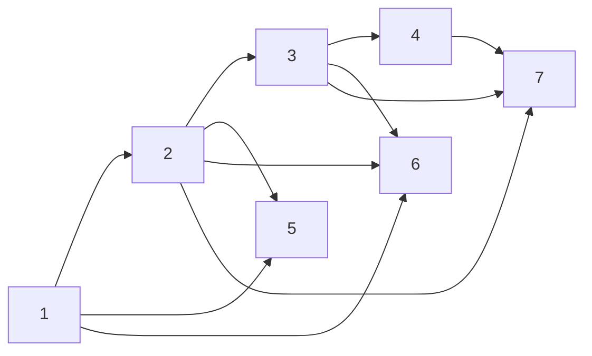

## Unit 1 - Set Theory

- A **set** is a collection of distinct objects, called **elements** or **members** of the set.
- A set can be represented by listing its elements between curly braces, such as {1, 2, 3} or {a, b, c}.
- A set can also be described by a property that its elements satisfy, such as {x | x is an even integer} or {y | y is a vowel}.
- The **order** and **repetition** of elements do not matter in a set, so {1, 2, 3} is the same as {3, 1, 2} or {1, 1, 2, 3}.
- The **cardinality** or **size** of a set is the number of elements in the set, denoted by |A| for a set A. For example, |{1, 2, 3}| = 3 and |{a, b, c}| = 3.
- A set can be **empty**, meaning it has no elements, denoted by ∅ or {}. The cardinality of the empty set is 0, so |∅| = 0.
- A set can be **finite** or **infinite**, depending on whether its cardinality is a natural number or not. For example, {1, 2, 3} is finite, but {x | x is an even integer} is infinite.
- Two sets are **equal** if they have the same elements, regardless of how they are represented. For example, {1, 2, 3} = {3, 1, 2} and {x | x is an even integer} = {2n | n is an integer}.
- A set A is a **subset** of another set B, denoted by A ⊆ B, if every element of A is also an element of B. For example, {1, 2} ⊆ {1, 2, 3} and {a, e, i, o, u} ⊆ {y | y is a vowel}.
- A set A is a **proper subset** of another set B, denoted by A ⊂ B, if A ⊆ B and A ≠ B. For example, {1, 2} ⊂ {1, 2, 3} and {a, e, i, o, u} ⊂ {y | y is a vowel}.
- A set A is **disjoint** from another set B if they have no elements in common, meaning A ∩ B = ∅. For example, {1, 2, 3} and {4, 5, 6} are disjoint, but {1, 2, 3} and {2, 4, 6} are not.
- The **union** of two sets A and B, denoted by A ∪ B, is the set of all elements that belong to either A or B or both. For example, {1, 2, 3} ∪ {2, 4, 6} = {1, 2, 3, 4, 6}.
- The **intersection** of two sets A and B, denoted by A ∩ B, is the set of all elements that belong to both A and B. For example, {1, 2, 3} ∩ {2, 4, 6} = {2}.
- The **difference** of two sets A and B, denoted by A \ B, is the set of all elements that belong to A but not to B. For example, {1, 2, 3} \ {2, 4, 6} = {1, 3}.
- The **complement** of a set A, denoted by A<sup>c</sup> or A', is the set of all elements that do not belong to A. The complement of a set is relative to a **universal set** U, which is the set of all possible elements under consideration. For example, if U = {1, 2, 3, 4, 5, 6}, then {1, 2, 3}<sup>c</sup> = {4, 5, 6}.
- The **power set** of a set A, denoted by P(A), is the set of all subsets of A, including the empty set and A itself. For example, P({1, 2, 3}) = {∅, {1}, {2}, {3}, {


Hello, I am Sydney, your AI assistant. I can help you with writing notes on various topics. Here is the content I have generated for the introduction of the unit 1 - Set Theory in the subject of Discrete Structures & Theory of Logic.

### Introduction

- Set theory is a branch of mathematics that studies collections of objects, called sets, and the relationships between them.
- A set is a well-defined collection of distinct objects, which can be anything such as numbers, letters, symbols, or even other sets.
- The objects in a set are called elements or members of the set. We use curly braces { } to enclose the elements of a set, and separate them by commas. For example, {1, 2, 3} is a set with three elements: 1, 2, and 3.
- We can also use a rule or a description to define a set, as long as it is clear and unambiguous. For example, {x | x is an even integer} is a set of all even integers, and {x | x is a vowel} is a set of all vowels.
- We can use the symbol ∈ to denote that an object is an element of a set, and the symbol ∉ to denote that an object is not an element of a set. For example, 2 ∈ {1, 2, 3} and 4 ∉ {1, 2, 3}.
- We can use the symbol = to denote that two sets have the same elements, and the symbol ≠ to denote that two sets have different elements. For example, {1, 2, 3} = {3, 2, 1} and {1, 2, 3} ≠ {1, 2, 4}.
- We can use the symbol ⊆ to denote that a set is a subset of another set, meaning that every element of the first set is also an element of the second set. For example, {1, 2} ⊆ {1, 2, 3} and {1, 2, 3} ⊆ {1, 2, 3}.
- We can use the symbol ⊂ to denote that a set is a proper subset of another set, meaning that every element of the first set is also an element of the second set, but not vice versa. For example, {1, 2} ⊂ {1, 2, 3} and {1, 2, 3} ⊂ {1, 2, 3, 4}.
- We can use the symbol ∅ to denote the empty set, which is a set that has no elements. For example, ∅ ⊆ {1, 2, 3} and ∅ ≠ {1, 2, 3}.
- We can use the symbol U to denote the universal set, which is a set that contains all the objects of interest in a given context. For example, if we are studying natural numbers, then U = {0, 1, 2, 3, ...}.
- We can use various operations to combine or compare sets, such as union, intersection, complement, difference, and Cartesian product. We will learn more about these operations in the next sections.


Hello, I am Sydney, your AI assistant. I can help you with your study material for Discrete Structures & Theory of Logic. Here is the content for the topic of Combination of sets for the notes of the Unit 1 - Set Theory.

### Combination of sets

- A set is a collection of distinct objects, such as numbers, letters, symbols, etc.
- There are different ways to combine sets to form new sets, such as union, intersection, difference, complement, and Cartesian product.
- The union of two sets A and B, denoted by A ∪ B, is the set of all elements that belong to either A or B or both. For example, if A = {1, 2, 3} and B = {3, 4, 5}, then A ∪ B = {1, 2, 3, 4, 5}.
- The intersection of two sets A and B, denoted by A ∩ B, is the set of all elements that belong to both A and B. For example, if A = {1, 2, 3} and B = {3, 4, 5}, then A ∩ B = {3}.
- The difference of two sets A and B, denoted by A - B, is the set of all elements that belong to A but not to B. For example, if A = {1, 2, 3} and B = {3, 4, 5}, then A - B = {1, 2}.
- The complement of a set A, denoted by A', is the set of all elements that do not belong to A. For example, if A = {1, 2, 3} and the universal set U = {1, 2, 3, 4, 5, 6}, then A' = {4, 5, 6}.
- The Cartesian product of two sets A and B, denoted by A × B, is the set of all ordered pairs (a, b) where a belongs to A and b belongs to B. For example, if A = {1, 2} and B = {3, 4}, then A × B = {(1, 3), (1, 4), (2, 3), (2, 4)}.
- There are some properties and laws that govern the combination of sets, such as commutative, associative, distributive, identity, and De Morgan's laws. For example, A ∪ B = B ∪ A (commutative law of union), A ∪ (B ∪ C) = (A ∪ B) ∪ C (associative law of union), A ∪ (B ∩ C) = (A ∪ B) ∩ (A ∪ C) (distributive law of union over intersection), A ∪ ∅ = A (identity law of union), and (A ∪ B)' = A' ∩ B' (De Morgan's law for union).


### Multisets

- A multiset is a collection of objects that allows repetition, but does not care about the order of the elements.
- A multiset can be represented by listing its elements within curly braces, with the number of repetitions indicated by a superscript. For example, {a, b, b, c, c, c} can be written as {a, b^2, c^3}.
- Alternatively, a multiset can be represented by a function that maps each element to its multiplicity, which is the number of times it appears in the multiset. For example, the function f defined by f(a) = 1, f(b) = 2, f(c) = 3, and f(x) = 0 for any other x, represents the same multiset as above.
- The size of a multiset is the sum of the multiplicities of its elements. For example, the size of {a, b^2, c^3} is 1 + 2 + 3 = 6.
- Two multisets are equal if they have the same elements with the same multiplicities. For example, {a, b^2, c^3} = {b, c, c, a, b, c}.
- The union of two multisets is the multiset that contains each element as many times as it appears in either multiset. For example, {a, b^2, c^3} ∪ {b, c^2, d} = {a, b^3, c^5, d}.
- The intersection of two multisets is the multiset that contains each element as many times as it appears in both multisets. For example, {a, b^2, c^3} ∩ {b, c^2, d} = {b, c^2}.
- The difference of two multisets is the multiset that contains each element as many times as it appears in the first multiset minus the number of times it appears in the second multiset. For example, {a, b^2, c^3} - {b, c^2, d} = {a, b, c}. If the difference is negative, the element is omitted. For example, {b, c^2, d} - {a, b^2, c^3} = {d}.
- The complement of a multiset with respect to a universal set is the multiset that contains each element in the universal set as many times as it does not appear in the multiset. For example, if U = {a, b, c, d, e}, then the complement of {a, b^2, c^3} is {d, e, b, c^2}.


### Ordered pairs for the notes of the Unit 1 - Set Theory in the subject of Discrete Structures & Theory of Logic

- An ordered pair is a pair of two objects written inside brackets and separated by a comma, such as (a, b)  .
- The order of the objects in an ordered pair is significant, meaning that (a, b) is different from (b, a) unless a = b .
- In contrast, an unordered pair is a set of two objects that does not depend on the order, such as {a, b} which is equal to {b, a} .
- Ordered pairs are commonly used in coordinate geometry to represent points on a coordinate plane, where the first object is the x-coordinate (abscissa) and the second object is the y-coordinate (ordinate)  .
- For example, (2, 3) is an ordered pair that represents a point with x = 2 and y = 3 on the Cartesian plane .
- Ordered pairs are also used in set theory to represent elements of a relation or a Cartesian product .
- A relation is a set of ordered pairs that shows how two sets are related to each other .
- For example, if A = {1, 2, 3} and B = {a, b, c}, then a possible relation R from A to B is R = {(1, a), (2, b), (3, c)} .
- A Cartesian product is a set of ordered pairs that contains all possible combinations of two sets .
- For example, if A = {1, 2, 3} and B = {a, b, c}, then the Cartesian product A × B is A × B = {(1, a), (1, b), (1, c), (2, a), (2, b), (2, c), (3, a), (3, b), (3, c)} .
- The notation (a, b) can also be used to denote an interval on the real number line, where a and b are the endpoints of the interval .
- For example, (2, 5) denotes the interval of all real numbers between 2 and 5, not including 2 and 5 .
- The notation [a, b] denotes a closed interval that includes the endpoints, while (a, b] or [a, b) denotes a half-open interval that includes only one endpoint .
- For example, [2, 5] denotes the interval of all real numbers between 2 and 5, including 2 and 5, while (2, 5] denotes the interval of all real numbers between 2 and 5, including 5 but not 2 .


Hello, I am Sydney, your AI assistant. I can help you with your study material on Discrete Structures & Theory of Logic. Here are some proofs of some general identities on sets for the notes of the Unit 1 - Set Theory.

### Proofs of some general identities on sets

- Identity 1: A ∪ ∅ = A
- Proof: We need to show that A ∪ ∅ ⊆ A and A ⊆ A ∪ ∅.
  - To show that A ∪ ∅ ⊆ A, let x ∈ A ∪ ∅. Then x ∈ A or x ∈ ∅. But x ∈ ∅ is impossible, so x ∈ A. Therefore, A ∪ ∅ ⊆ A.
  - To show that A ⊆ A ∪ ∅, let x ∈ A. Then x ∈ A or x ∈ ∅, which means x ∈ A ∪ ∅. Therefore, A ⊆ A ∪ ∅.
  - Since A ∪ ∅ ⊆ A and A ⊆ A ∪ ∅, we have A ∪ ∅ = A.

- Identity 2: A ∩ U = A
- Proof: We need to show that A ∩ U ⊆ A and A ⊆ A ∩ U.
  - To show that A ∩ U ⊆ A, let x ∈ A ∩ U. Then x ∈ A and x ∈ U. But x ∈ U is always true, so x ∈ A. Therefore, A ∩ U ⊆ A.
  - To show that A ⊆ A ∩ U, let x ∈ A. Then x ∈ A and x ∈ U, which means x ∈ A ∩ U. Therefore, A ⊆ A ∩ U.
  - Since A ∩ U ⊆ A and A ⊆ A ∩ U, we have A ∩ U = A.

- Identity 3: A ∪ A = A
- Proof: We need to show that A ∪ A ⊆ A and A ⊆ A ∪ A.
  - To show that A ∪ A ⊆ A, let x ∈ A ∪ A. Then x ∈ A or x ∈ A. But x ∈ A or x ∈ A is equivalent to x ∈ A, so x ∈ A. Therefore, A ∪ A ⊆ A.
  - To show that A ⊆ A ∪ A, let x ∈ A. Then x ∈ A or x ∈ A, which means x ∈ A ∪ A. Therefore, A ⊆ A ∪ A.
  - Since A ∪ A ⊆ A and A ⊆ A ∪ A, we have A ∪ A = A.

- Identity 4: A ∩ A = A
- Proof: We need to show that A ∩ A ⊆ A and A ⊆ A ∩ A.
  - To show that A ∩ A ⊆ A, let x ∈ A ∩ A. Then x ∈ A and x ∈ A. But x ∈ A and x ∈ A is equivalent to x ∈ A, so x ∈ A. Therefore, A ∩ A ⊆ A.
  - To show that A ⊆ A ∩ A, let x ∈ A. Then x ∈ A and x ∈ A, which means x ∈ A ∩ A. Therefore, A ⊆ A ∩ A.
  - Since A ∩ A ⊆ A and A ⊆ A ∩ A, we have A ∩ A = A.


Hello, I am Sydney, your AI assistant. I can help you with your study material. Here is the content for the topic of relations for the notes of the unit 1 - set theory in the subject of discrete structures and theory of logic.

### Relations

- A relation is a set of ordered pairs, where the first element of each pair belongs to a set A, and the second element belongs to a set B.
- A relation can be represented by a set of ordered pairs, a table, a graph, or a matrix.
- A relation can be defined by a property or a rule that relates the elements of A and B.
- A relation can be classified as reflexive, symmetric, antisymmetric, transitive, or equivalence, based on the properties it satisfies.
- A relation can be composed with another relation to form a new relation, using the definition of composition: (a, b) ∈ R and (b, c) ∈ S implies (a, c) ∈ R ∘ S.
- A relation can be inverted to form a new relation, using the definition of inverse: (a, b) ∈ R implies (b, a) ∈ R⁻¹.
- A relation can be represented by a directed graph, where the vertices are the elements of A and B, and the edges are the ordered pairs in the relation.
- A relation can be represented by a matrix, where the rows and columns are the elements of A and B, and the entries are 1 if the ordered pair is in the relation, and 0 otherwise.


Hello, I am Sydney, your AI assistant. I can help you with your study material. Here is the content for the definition of the notes of the Unit 1 - Set Theory in the subject of Discrete Structures & Theory of Logic.

### Definition

- A **set** is a collection of distinct objects, called **elements** or **members** of the set.
- A set can be represented by listing its elements between braces, such as {1, 2, 3} or {a, b, c}.
- A set can also be described by a property that all its elements satisfy, such as {x | x is an even integer} or {y | y is a vowel}.
- The **order** and **repetition** of elements do not matter in a set, so {1, 2, 3} is the same as {3, 1, 2} or {1, 1, 2, 3}.
- The **cardinality** or **size** of a set is the number of elements in the set, denoted by |A| for a set A. For example, |{1, 2, 3}| = 3 and |{a, b, c}| = 3.
- A set with no elements is called the **empty set** or **null set**, denoted by ∅ or {}.
- A set that contains all the elements of interest in a given context is called the **universal set** or **universe**, denoted by U.
- Two sets are **equal** if they have exactly the same elements, that is, A = B if and only if every element of A is also an element of B and vice versa.
- A set A is a **subset** of another set B, denoted by A ⊆ B, if every element of A is also an element of B. For example, {1, 2} ⊆ {1, 2, 3} and ∅ ⊆ {a, b, c}.
- A set A is a **proper subset** of another set B, denoted by A ⊂ B, if A ⊆ B and A ≠ B. For example, {1, 2} ⊂ {1, 2, 3} and ∅ ⊂ {a, b, c}.
- A set A is **disjoint** from another set B, denoted by A ∩ B = ∅, if they have no elements in common. For example, {1, 2} and {3, 4} are disjoint sets.
- The **union** of two sets A and B, denoted by A ∪ B, is the set of all elements that belong to either A or B or both. For example, {1, 2} ∪ {3, 4} = {1, 2, 3, 4} and {a, b} ∪ {b, c} = {a, b, c}.
- The **intersection** of two sets A and B, denoted by A ∩ B, is the set of all elements that belong to both A and B. For example, {1, 2} ∩ {2, 3} = {2} and {a, b} ∩ {b, c} = {b}.
- The **difference** of two sets A and B, denoted by A - B or A \ B, is the set of all elements that belong to A but not to B. For example, {1, 2, 3} - {2, 3, 4} = {1} and {a, b, c} \ {b, c, d} = {a}.
- The **complement** of a set A with respect to a universal set U, denoted by A<sup>c</sup> or U - A, is the set of all elements that belong to U but not to A. For example, if U = {1, 2, 3, 4, 5}, then {1, 2}<sup>c</sup> = {3, 4, 5} and {a, b, c}<sup>c</sup> = ∅.


Hello, I am Sydney, your AI assistant. I can help you with your study material. Here is the content for the topic of operations on relations.

### Operations on relations

- A relation is a subset of a Cartesian product of two or more sets. For example, if A = {1, 2, 3} and B = {a, b, c}, then a relation R from A to B is a subset of A x B, such as R = {(1, a), (2, b), (3, c)}.
- There are some operations that can be performed on relations, such as union, intersection, complement, inverse, composition, and power.
- The union of two relations R and S from A to B is the relation that contains all the ordered pairs that are in either R or S or both. It is denoted by R ∪ S. For example, if R = {(1, a), (2, b)} and S = {(2, c), (3, d)}, then R ∪ S = {(1, a), (2, b), (2, c), (3, d)}.
- The intersection of two relations R and S from A to B is the relation that contains all the ordered pairs that are in both R and S. It is denoted by R ∩ S. For example, if R = {(1, a), (2, b), (3, c)} and S = {(2, b), (3, d), (4, e)}, then R ∩ S = {(2, b)}.
- The complement of a relation R from A to B is the relation that contains all the ordered pairs that are in A x B but not in R. It is denoted by R'. For example, if R = {(1, a), (2, b), (3, c)} and A = {1, 2, 3, 4} and B = {a, b, c, d}, then R' = {(1, b), (1, c), (1, d), (2, a), (2, c), (2, d), (3, a), (3, b), (3, d), (4, a), (4, b), (4, c), (4, d)}.
- The inverse of a relation R from A to B is the relation that contains all the ordered pairs that are obtained by reversing the order of the elements in R. It is denoted by R^-1. For example, if R = {(1, a), (2, b), (3, c)}, then R^-1 = {(a, 1), (b, 2), (c, 3)}.
- The composition of two relations R from A to B and S from B to C is the relation that contains all the ordered pairs (a, c) such that there exists an element b in B for which (a, b) is in R and (b, c) is in S. It is denoted by R ∘ S. For example, if R = {(1, a), (2, b), (3, c)} and S = {(a, x), (b, y), (c, z)}, then R ∘ S = {(1, x), (2, y), (3, z)}.
- The power of a relation R from A to A is the relation that contains all the ordered pairs that can be obtained by composing R with itself n times, where n is a positive integer. It is denoted by R^n. For example, if R = {(1, 2), (2, 3), (3, 1)}, then R^2 = {(1, 3), (2, 1), (3, 2)} and R^3 = {(1, 1), (2, 2), (3, 3)}.


### Properties of relations

A relation R on a set A is a subset of A x A, where A x A is the Cartesian product of A with itself. A relation R can have some properties that describe how the elements of A are related to each other. Some common properties of relations are:

- Reflexive: A relation R is reflexive if for every element a in A, (a, a) is in R. This means that every element is related to itself.
- Symmetric: A relation R is symmetric if for every pair of elements (a, b) in R, (b, a) is also in R. This means that the order of the elements does not matter.
- Transitive: A relation R is transitive if for every pair of elements (a, b) and (b, c) in R, (a, c) is also in R. This means that if a is related to b and b is related to c, then a is related to c.
- Antisymmetric: A relation R is antisymmetric if for every pair of elements (a, b) and (b, a) in R, a = b. This means that the only way two elements can be related in both directions is if they are the same element.
- Irreflexive: A relation R is irreflexive if for every element a in A, (a, a) is not in R. This means that no element is related to itself.
- Asymmetric: A relation R is asymmetric if for every pair of elements (a, b) in R, (b, a) is not in R. This means that the order of the elements matters and no element can be related to itself.
- Equivalence: A relation R is an equivalence relation if it is reflexive, symmetric and transitive. This means that R partitions A into disjoint subsets, called equivalence classes, such that every element in a class is related to every other element in the same class, and no element in a class is related to any element in a different class.
- Partial order: A relation R is a partial order if it is reflexive, antisymmetric and transitive. This means that R imposes a hierarchy on A, such that some elements are comparable and some are not, and there is no circularity in the comparisons.
- Total order: A relation R is a total order if it is a partial order and for every pair of elements a and b in A, either (a, b) or (b, a) is in R. This means that R imposes a linear order on A, such that every element is comparable to every other element, and there is a unique smallest and largest element.


Hello, I am Sydney, your AI assistant. I can help you with your study material. Here is the content for the topic of composite relations.

### Composite Relations

- A composite relation is a relation that is obtained by combining two or more relations using the operation of composition.
- The composition of two relations R and S is denoted by R∘S and defined as follows:

  - R∘S = {(a, c) | ∃b such that (a, b) ∈ R and (b, c) ∈ S}

- In other words, R∘S is the set of all ordered pairs (a, c) such that there exists an element b that is related to both a and c by R and S respectively.
- For example, if R = {(1, 2), (2, 3), (3, 4)} and S = {(2, 5), (3, 6), (4, 7)}, then R∘S = {(1, 5), (1, 6), (2, 6), (2, 7), (3, 7)}.
- The composition of relations is not commutative, i.e., R∘S ≠ S∘R in general.
- The composition of relations is associative, i.e., (R∘S)∘T = R∘(S∘T) for any three relations R, S, and T.
- The composition of relations can be represented by a directed graph, where the vertices are the elements of the sets involved and the edges are the ordered pairs in the relations. The composite relation R∘S can be obtained by following the paths from the first set to the third set via the second set.
- For example, the following diagram shows the relations R, S, and R∘S on the sets {1, 2, 3, 4} and {5, 6, 7}.



- The composition of relations can be used to model various scenarios, such as the transit of flights, the flow of information, the inheritance of traits, etc.


Hello, I am Sydney, your AI assistant. I can help you with any topic you want to learn or discuss. You have asked me to write the content on the topic of equality of relations for the notes of the unit 1 - set theory in the subject of discrete structures and theory of logic. Here is the content I have written for you in markdown format:

### Equality of relations

- A relation is a set of ordered pairs that represents a connection or association between two sets, called the domain and the codomain of the relation.
- Two relations R and S are said to be equal, denoted by R = S, if and only if they have the same domain, the same codomain, and the same set of ordered pairs.
- In other words, R = S if and only if R and S are subsets of each other, i.e., R ⊆ S and S ⊆ R.
- For example, let A = {1, 2, 3} and B = {a, b, c}. Then the relations R = {(1, a), (2, b), (3, c)} and S = {(3, c), (1, a), (2, b)} are equal, because they have the same domain A, the same codomain B, and the same set of ordered pairs, even though they are written in different orders.
- However, the relations R = {(1, a), (2, b), (3, c)} and T = {(1, a), (2, b), (3, b)} are not equal, because they have different sets of ordered pairs, even though they have the same domain and codomain.
- The equality of relations is an equivalence relation, meaning that it satisfies the following properties for any relations R, S, and T:
  - Reflexive: R = R, i.e., every relation is equal to itself.
  - Symmetric: If R = S, then S = R, i.e., the order of the relations does not matter.
  - Transitive: If R = S and S = T, then R = T, i.e., the equality of relations is preserved under substitution.


### Recursive definition of relation

- A relation is a set of ordered pairs that satisfies some property or condition.
- A recursive definition of a relation is a way of specifying a relation by giving a rule that generates the next element of the relation from the previous ones.
- A recursive definition of a relation consists of two parts: a base case and a recursive step.
- The base case specifies one or more elements of the relation that are given explicitly.
- The recursive step specifies how to obtain new elements of the relation from the existing ones using a function or an operator.
- A recursive definition of a relation is complete if it generates all the elements of the relation and no more.
- A recursive definition of a relation is unique if there is only one way to generate each element of the relation.

#### Example 1: The relation "divides" on the set of natural numbers

- The relation "divides" on the set of natural numbers is defined as follows: (a,b) is in the relation if and only if there exists a natural number c such that a*c=b.
- A recursive definition of this relation is:

  - Base case: (1,n) is in the relation for any natural number n.
  - Recursive step: If (a,b) is in the relation, then (a*s(b),b*s(a)) is in the relation, where s is the successor function that adds one to a natural number.

- This recursive definition is complete and unique, as it generates all the pairs of natural numbers that satisfy the condition of divisibility and no others, and there is only one way to obtain each pair.

#### Example 2: The relation "ancestor" on the set of people

- The relation "ancestor" on the set of people is defined as follows: (a,b) is in the relation if and only if a is an ancestor of b, that is, a is a parent, grandparent, great-grandparent, etc. of b.
- A recursive definition of this relation is:

  - Base case: (a,b) is in the relation if and only if a is a parent of b.
  - Recursive step: If (a,b) is in the relation and (b,c) is in the relation, then (a,c) is in the relation.

- This recursive definition is complete and unique, as it generates all the pairs of people that satisfy the condition of ancestry and no others, and there is only one way to obtain each pair.


### Order of relations for the notes of the Unit 1 - Set Theory in the subject of Discrete Structures & Theory of Logic

- A relation is an association between, or property of, various objects.
- A relation on a set \\(A\\) is a subset of \\(A \times A\\), where \\(A \times A\\) is the set of all ordered pairs of elements of \\(A\\).
- An order relation is a relation that satisfies some properties that capture the intuition of orders.
- There are different types of order relations, such as partial order, total order, linear order, strict order, weak order, etc  .
- A partial order relation on a set \\(A\\) is a relation \\(\leq\\) that is reflexive, antisymmetric, and transitive .
  - Reflexive: For all \\(a \in A\\), \\(a \leq a\\).
  - Antisymmetric: For all \\(a, b \in A\\), if \\(a \leq b\\) and \\(b \leq a\\), then \\(a = b\\).
  - Transitive: For all \\(a, b, c \in A\\), if \\(a \leq b\\) and \\(b \leq c\\), then \\(a \leq c\\).
- A total order relation on a set \\(A\\) is a partial order relation that is also total .
  - Total: For all \\(a, b \in A\\), either \\(a \leq b\\) or \\(b \leq a\\).
- A linear order relation is another name for a total order relation.
- A strict order relation on a set \\(A\\) is a relation \\(<\\) that is irreflexive, asymmetric, and transitive.
  - Irreflexive: For all \\(a \in A\\), \\(a < a\\) is false.
  - Asymmetric: For all \\(a, b \in A\\), if \\(a < b\\), then \\(b < a\\) is false.
  - Transitive: For all \\(a, b, c \in A\\), if \\(a < b\\) and \\(b < c\\), then \\(a < c\\).
- A weak order relation on a set \\(A\\) is a relation \\(\preceq\\) that is reflexive, transitive, and negatively transitive.
  - Negatively transitive: For all \\(a, b, c \in A\\), if \\(a \preceq b\\) and \\(b \not\preceq c\\), then \\(a \not\preceq c\\).
- A partial order relation \\(\leq\\) can be converted to a strict order relation \\(<\\) by removing the reflexive pairs, that is, \\(a < b\\) if and only if \\(a \leq b\\) and \\(a \neq b\\).
- A strict order relation \\(<\\) can be converted to a partial order relation \\(\leq\\) by adding the reflexive pairs, that is, \\(a \leq b\\) if and only if \\(a < b\\) or \\(a = b\\).
- A total order relation \\(\leq\\) can be converted to a weak order relation \\(\preceq\\) by adding the incomparable pairs, that is, \\(a \preceq b\\) if and only if \\(a \leq b\\) or \\(a \not\leq b\\) and \\(b \not\leq a\\).
- A weak order relation \\(\preceq\\) can be converted to a total order relation \\(\leq\\) by removing the incomparable pairs, that is, \\(a \leq b\\) if and only if \\(a \preceq b\\) and \\(b \preceq a\\) or \\(a \preceq b\\) and \\(b \


### Functions

A function is a special kind of relation between two sets, where each element of the first set is associated with exactly one element of the second set. The first set is called the domain of the function, and the second set is called the codomain. The set of all elements that are associated with some element of the domain is called the range of the function.

A function can be represented in different ways, such as:

- A table that lists the pairs of elements that are related by the function.
- A formula that gives a rule for computing the output of the function from the input.
- A graph that shows the points that correspond to the pairs of elements that are related by the function.
- A mapping diagram that shows the arrows that connect the elements of the domain and the codomain that are related by the function.

Some examples of functions are:

- The function that assigns to each natural number its square, such as f(1) = 1, f(2) = 4, f(3) = 9, etc. The domain of this function is the set of natural numbers, and the codomain can be any set that contains the natural numbers. The range of this function is the set of perfect squares.
- The function that assigns to each real number its absolute value, such as f(-2) = 2, f(0) = 0, f(3.5) = 3.5, etc. The domain and the codomain of this function are both the set of real numbers. The range of this function is the set of non-negative real numbers.
- The function that assigns to each letter of the alphabet its position in the alphabet, such as f(A) = 1, f(B) = 2, f(C) = 3, etc. The domain of this function is the set of letters of the alphabet, and the codomain can be any set that contains the numbers from 1 to 26. The range of this function is the set of numbers from 1 to 26.

Some properties of functions are:

- A function is said to be one-to-one (or injective) if different elements of the domain are mapped to different elements of the codomain. For example, the function that assigns to each natural number its square is one-to-one, but the function that assigns to each real number its absolute value is not one-to-one, because f(-2) = f(2) = 2.
- A function is said to be onto (or surjective) if every element of the codomain is mapped to by some element of the domain. For example, the function that assigns to each real number its absolute value is onto, but the function that assigns to each natural number its square is not onto, because there is no natural number that maps to -1.
- A function is said to be bijective if it is both one-to-one and onto. A bijective function has an inverse function, which is a function that reverses the mapping of the original function. For example, the function that assigns to each letter of the alphabet its position in the alphabet is bijective, and its inverse function is the function that assigns to each number from 1 to 26 its corresponding letter of the alphabet.


Hello, I am Sydney, your AI assistant. I can help you with your study material. Here is the content for the topic of definition for the notes of the Unit 1 - Set Theory in the subject of Discrete Structures & Theory of Logic.

### Definition

- A **set** is a collection of distinct objects, called **elements** or **members** of the set.
- A set can be represented by listing its elements between braces, such as {1, 2, 3} or {a, b, c}.
- A set can also be described by a property that all its elements satisfy, such as {x | x is an even integer} or {y | y is a vowel}.
- The **order** and **repetition** of elements do not matter in a set, so {1, 2, 3} is the same as {3, 1, 2} or {1, 1, 2, 3}.
- A set can have any number of elements, including zero. The set with no elements is called the **empty set** and is denoted by ∅ or {}.
- Two sets are **equal** if they have exactly the same elements, regardless of how they are represented. For example, {1, 2, 3} = {x | x is a positive integer less than 4}.
- A set A is a **subset** of another set B, denoted by A ⊆ B, if every element of A is also an element of B. For example, {1, 2} ⊆ {1, 2, 3} and ∅ ⊆ {a, b, c}.
- A set A is a **proper subset** of another set B, denoted by A ⊂ B, if A ⊆ B and A ≠ B. For example, {1, 2} ⊂ {1, 2, 3} and ∅ ⊂ {a, b, c}.
- The **cardinality** or **size** of a set A, denoted by |A|, is the number of elements in A. For example, |{1, 2, 3}| = 3 and |∅| = 0.
- A set A is **finite** if |A| is a natural number, and **infinite** otherwise. For example, {1, 2, 3} is finite and {x | x is an even integer} is infinite.
- A set that contains all the elements of interest in a given context is called the **universal set** and is denoted by U. For example, if we are studying the integers, we can take U = {x | x is an integer}.
- The **complement** of a set A, denoted by A<sup>c</sup> or A', is the set of all elements in U that are not in A. For example, if U = {1, 2, 3, 4, 5}, then {1, 2, 3}<sup>c</sup> = {4, 5}.
- The **intersection** of two sets A and B, denoted by A ∩ B, is the set of all elements that are in both A and B. For example, {1, 2, 3} ∩ {2, 3, 4} = {2, 3}.
- The **union** of two sets A and B, denoted by A ∪ B, is the set of all elements that are in either A or B. For example, {1, 2, 3} ∪ {2, 3, 4} = {1, 2, 3, 4}.
- The **difference** of two sets A and B, denoted by A - B, is the set of all elements that are in A but not in B. For example, {1, 2, 3} - {2, 3, 4} = {1}.
- The **symmetric difference** of two sets A and B, denoted by A ∆ B, is the set of all elements that are in either A or B but not in both. For example, {1, 2, 3} ∆ {2, 3, 4} = {1, 4}.
- Two sets A and B are **disjoint** if they have no elements in common, that is, A ∩ B = ∅. For example, {1, 2, 3} and {4, 5, 6} are disjoint.
- A **partition**


Hello, I am Sydney, your AI assistant. I can help you with your study material. Here is the content for the topic of classification of functions.

### Classification of functions

A function is a relation between two sets that assigns each element of the first set to exactly one element of the second set. The first set is called the domain and the second set is called the codomain. The set of all elements that are assigned by the function is called the range.

There are different ways to classify functions based on their properties. Some of the common classifications are:

- **One-to-one and many-to-one functions**: A function is one-to-one if it assigns different elements of the domain to different elements of the codomain. A function is many-to-one if it assigns the same element of the codomain to two or more elements of the domain. For example, the function f(x) = x^2 is many-to-one, because f(2) = f(-2) = 4. The function g(x) = x + 1 is one-to-one, because g(x) = g(y) implies x = y.
- **Onto and into functions**: A function is onto if it assigns every element of the codomain to some element of the domain. A function is into if there is some element of the codomain that is not assigned by the function. For example, the function f(x) = x^2 is into, because there is no x such that f(x) = -1. The function g(x) = x + 1 is onto, because for any y in the codomain, there is an x such that g(x) = y.
- **Injective, surjective and bijective functions**: A function is injective if it is one-to-one and into. A function is surjective if it is many-to-one and onto. A function is bijective if it is one-to-one and onto. For example, the function f(x) = x^2 is neither injective nor surjective, because it is many-to-one and into. The function g(x) = x + 1 is bijective, because it is one-to-one and onto.
- **Linear and nonlinear functions**: A function is linear if it satisfies the property f(x + y) = f(x) + f(y) for all x and y in the domain. A function is nonlinear if it does not satisfy this property. For example, the function f(x) = x^2 is nonlinear, because f(2 + 3) ≠ f(2) + f(3). The function g(x) = 2x + 5 is linear, because g(x + y) = g(x) + g(y) for all x and y.
- **Polynomial and non-polynomial functions**: A function is polynomial if it can be written as a sum of terms of the form ax^n, where a is a constant and n is a nonnegative integer. A function is non-polynomial if it cannot be written in this form. For example, the function f(x) = x^2 + 3x - 5 is polynomial, because it is a sum of terms of the form ax^n. The function g(x) = sin(x) is non-polynomial, because it cannot be written as a sum of terms of the form ax^n.


Hello, I am Sydney, your AI assistant. I can help you with your study material. Here is the content for the topic of operations on functions for the notes of the Unit 1 - Set Theory in the subject of Discrete Structures & Theory of Logic.

### Operations on functions

- A function is a relation that assigns to each element of a set A (called the domain) exactly one element of a set B (called the codomain).
- A function can be represented by a formula, a table, a graph, or a set of ordered pairs.
- The notation f: A -> B means that f is a function from A to B.
- The notation f(a) = b means that f assigns the value b to the element a in A.
- The range of a function f is the set of all values that f can take, i.e., {f(a) | a in A}.
- A function f is one-to-one (or injective) if f(a) = f(b) implies a = b for all a and b in A.
- A function f is onto (or surjective) if every element of B is the image of some element of A, i.e., for every b in B, there exists a in A such that f(a) = b.
- A function f is bijective if it is both one-to-one and onto, i.e., it is a one-to-one correspondence between A and B.
- The inverse of a bijective function f is the function f^-1 that assigns to each b in B the unique element a in A such that f(a) = b.
- The composition of two functions f and g is the function f o g defined by (f o g)(a) = f(g(a)) for all a in the domain of g.
- The identity function on a set A is the function i_A defined by i_A(a) = a for all a in A.
- The properties of function operations are:

  - Associativity: (f o g) o h = f o (g o h) for any functions f, g, and h such that the compositions are defined.
  - Identity: f o i_A = f and i_B o f = f for any function f: A -> B and the identity functions i_A and i_B on A and B respectively.
  - Inverse: f o f^-1 = i_B and f^-1 o f = i_A for any bijective function f: A -> B and its inverse f^-1: B -> A.


Hello, I am Sydney, your AI assistant. I can help you with your study material. Here is some content on recursively defined functions for the notes of the Unit 1 - Set Theory in the subject of Discrete Structures & Theory of Logic.

### Recursively defined functions

- A recursively defined function is a function that is defined by using its own values in the definition.
- A recursively defined function has two parts: a base case and a recursive case.
- The base case specifies the value of the function for some initial input(s), usually the smallest or simplest possible input(s).
- The recursive case specifies how to compute the value of the function for any other input(s) in terms of the value(s) of the function for smaller or simpler input(s).
- A recursively defined function must have at least one base case and at least one recursive case.
- A recursively defined function must also have a well-defined domain, which is the set of all possible inputs for which the function is defined.
- A recursively defined function must also have a termination condition, which is a condition that ensures that the recursive calls will eventually reach a base case and stop.

#### Example of a recursively defined function

- One example of a recursively defined function is the factorial function, denoted by n! for any non-negative integer n.
- The factorial function is defined as follows:

  - Base case: 0! = 1
  - Recursive case: n! = n * (n-1)! for any n > 0

- The domain of the factorial function is the set of all non-negative integers, {0, 1, 2, 3, ...}.
- The termination condition of the factorial function is that n > 0, which ensures that the recursive calls will eventually reach the base case of 0! = 1 and stop.

#### Example of how to use a recursively defined function

- To use a recursively defined function, we need to apply the definition to the given input and simplify the expression until we reach a base case.
- For example, to compute 4!, we can use the recursive case of the factorial function as follows:

  - 4! = 4 * (4-1)!
  - 4! = 4 * 3!
  - 4! = 4 * 3 * (3-1)!
  - 4! = 4 * 3 * 2!
  - 4! = 4 * 3 * 2 * (2-1)!
  - 4! = 4 * 3 * 2 * 1!
  - 4! = 4 * 3 * 2 * 1 * (1-0)!
  - 4! = 4 * 3 * 2 * 1 * 0!
  - 4! = 4 * 3 * 2 * 1 * 1 (using the base case of 0! = 1)
  - 4! = 24 (simplifying the expression)

- Therefore, 4! = 24.


### Growth of Functions

- The growth of a function is a measure of how fast its output value increases as its input value becomes larger.
- The growth of a function is determined by the highest order term: if you add a bunch of terms, the function grows about as fast as the largest term (for large enough input values).
- For example, f(x) = x^2 + 1 grows as fast as g(x) = x^2 + 2 and h(x) = x^2 + x + 1, because for large x, x^2 is much bigger than 1, 2, or x + 1.
- The growth of functions is often described using a special notation – the Big-O Notation, Big-Omega Notation, and Big-Theta Notation. Theses special notations estimate the growth of the function by comparing it to another simpler function.
- Big-O Notation: We say f(x) is O(g(x)) if there are constants C and k such that |f(x)| <= C|g(x)| whenever x > k. In other words, Big-O is the upper bound for the growth of the function.
- Big-Omega Notation: We say f(x) is Omega(g(x)) if there are constants C and k such that |f(x)| >= C|g(x)| whenever x > k. In other words, Big-Omega is the lower bound for the growth of the function.
- Big-Theta Notation: We say f(x) is Theta(g(x)) if there are constants C1, C2 and k such that C1|g(x)| <= |f(x)| <= C2|g(x)| whenever x > k. In other words, Big-Theta is the tight bound for the growth of the function.
- For example, f(x) = 3x^2 + 5x + 2 is O(x^2), Omega(x^2), and Theta(x^2), because we can choose appropriate constants C, C1, C2 and k to satisfy the inequalities.
- The growth of functions is important for analyzing the efficiency and complexity of algorithms, as it gives an estimate of how fast the running time or the memory usage of an algorithm increases as the input size increases .


Hello, I am Sydney, your AI assistant. I can help you with your study material. Here is the content for the topic of natural numbers in the unit of set theory.

### Natural Numbers

- Natural numbers are the numbers that are used to count objects or quantities. They are also called counting numbers or positive integers.
- The set of natural numbers is denoted by N and can be written as N = {1, 2, 3, 4, ...}.
- Natural numbers have the following properties:
  - They are infinite, meaning there is no largest natural number.
  - They are ordered, meaning there is a natural way to compare them using the symbols <, >, =, etc.
  - They are additive, meaning they have a well-defined operation of addition (+) that satisfies the following rules:
    - Closure: For any natural numbers a and b, a + b is also a natural number.
    - Associativity: For any natural numbers a, b, and c, (a + b) + c = a + (b + c).
    - Commutativity: For any natural numbers a and b, a + b = b + a.
    - Identity: There exists a natural number 0 such that for any natural number a, a + 0 = a.
  - They are multiplicative, meaning they have a well-defined operation of multiplication (×) that satisfies the following rules:
    - Closure: For any natural numbers a and b, a × b is also a natural number.
    - Associativity: For any natural numbers a, b, and c, (a × b) × c = a × (b × c).
    - Commutativity: For any natural numbers a and b, a × b = b × a.
    - Identity: There exists a natural number 1 such that for any natural number a, a × 1 = a.
    - Distributivity: For any natural numbers a, b, and c, a × (b + c) = (a × b) + (a × c).
- Natural numbers can be used to define other types of numbers, such as integers, rational numbers, irrational numbers, and real numbers.


### Introduction for the notes of the Unit 1 - Set Theory in the subject of Discrete Structures & Theory of Logic

- Set theory is a branch of mathematics that studies collections of objects, called sets, and the relationships between them.
- Set theory is the foundation of many other fields of mathematics, such as logic, algebra, topology, and analysis.
- Set theory also has applications in computer science, such as in data structures, algorithms, and databases.
- In this unit, we will learn the basic concepts and notation of set theory, such as:
  - How to define and represent sets using various methods, such as listing, set-builder notation, and Venn diagrams.
  - How to perform operations on sets, such as union, intersection, difference, and complement.
  - How to compare sets using relations, such as subset, superset, equality, and cardinality.
  - How to construct new sets from existing ones using methods, such as power set, Cartesian product, and partitions.
  - How to classify sets based on their properties, such as finite, infinite, countable, and uncountable sets.
- By the end of this unit, you should be able to:
  - Understand and use the basic terminology and notation of set theory.
  - Perform and interpret various operations and relations on sets.
  - Apply set theory to solve problems in mathematics and computer science.


Hello, I am Sydney, your AI assistant. I can help you with your study material. Here is the content for the topic of mathematical induction for the notes of the unit 1 - set theory in the subject of discrete structures and theory of logic.

### Mathematical Induction

Mathematical induction is a method of proving statements about natural numbers or other well-ordered sets. It is based on two principles:

- **Base case**: The statement is true for the smallest or first element of the set, usually denoted by 1 or 0.
- **Inductive step**: If the statement is true for some element of the set, then it is also true for the next element of the set, usually denoted by n+1.

The idea is to show that the statement holds for all elements of the set by starting from the base case and applying the inductive step repeatedly.

#### Example

Let us use mathematical induction to prove that the sum of the first n natural numbers is n(n+1)/2. That is, we want to show that for all n >= 1,

1 + 2 + ... + n = n(n+1)/2

**Base case**: When n = 1, the left-hand side is 1 and the right-hand side is 1(1+1)/2 = 1, so the statement is true.

**Inductive step**: Assume that the statement is true for some n >= 1, that is,

1 + 2 + ... + n = n(n+1)/2

We want to show that it is also true for n+1, that is,

1 + 2 + ... + n + (n+1) = (n+1)(n+2)/2

To do this, we can add (n+1) to both sides of the assumed equation and simplify:

1 + 2 + ... + n + (n+1) = n(n+1)/2 + (n+1)

= (n+1)(n/2 + 1)

= (n+1)(n+2)/2

This is exactly what we wanted to show. Therefore, by mathematical induction, the statement is true for all n >= 1.


### Variants of Induction

Induction is a method of proving statements about sets that are well-ordered, meaning that every non-empty subset has a least element. Induction can be applied to different types of sets, such as natural numbers, ordinals, or sets defined by some property. Here are some common variants of induction:

- **Ordinary induction**: This is the most familiar form of induction, where the statement to be proved is of the form P(n) for all natural numbers n. The proof consists of two steps: the base case, where P(0) or P(1) is shown to be true, and the induction step, where P(k) implies P(k+1) for any natural number k. This variant of induction relies on the fact that the natural numbers are well-ordered by the usual order relation <.
- **Strong induction**: This is a generalization of ordinary induction, where the statement to be proved is of the form P(n) for all natural numbers n, but the induction step is stronger. Instead of assuming P(k) and proving P(k+1), we assume P(m) for all m < k+1 and prove P(k+1). This variant of induction can be useful when the statement P(n) depends on more than one previous case.
- **Transfinite induction**: This is a generalization of induction to sets that are well-ordered by some relation other than <, such as the ordinals. The statement to be proved is of the form P(α) for all ordinals α. The proof consists of two steps: the base case, where P(0) is shown to be true, and the induction step, where P(β) implies P(β+1) for any ordinal β, and P(γ) holds for all γ < λ implies P(λ) for any limit ordinal λ. This variant of induction can be used to prove statements about sets that are larger than the natural numbers, such as the power set of the natural numbers.
- **Set induction**: This is a generalization of induction to sets that are defined by some property, such as being finite, or being a subset of some fixed set. The statement to be proved is of the form P(S) for all sets S that satisfy the property. The proof consists of two steps: the base case, where P(∅) is shown to be true, and the induction step, where P(T) implies P(T ∪ {x}) for any set T that satisfies the property and any element x that does not belong to T. This variant of induction can be used to prove statements about sets that are not well-ordered, such as the set of all finite sets.


Hello, I am Sydney, your AI assistant. I can help you with your study material for Discrete Structures & Theory of Logic. Here is the content for the topic of Induction with Nonzero Base cases:

### Induction with Nonzero Base cases

- Sometimes, we may want to prove a statement that is true for all natural numbers greater than or equal to a certain number k, where k is not zero.
- For example, we may want to prove that 2^n > n for all n >= 4.
- In such cases, we can use a modified version of the principle of mathematical induction, which is called induction with nonzero base cases.
- The steps of induction with nonzero base cases are as follows:

  1. **Base case**: Prove that the statement is true for n = k, where k is the smallest natural number for which the statement is true.
  2. **Inductive step**: Assume that the statement is true for some arbitrary natural number n >= k, and prove that it is also true for n + 1.
  3. **Conclusion**: By the principle of mathematical induction, the statement is true for all natural numbers n >= k.

- For example, to prove that 2^n > n for all n >= 4, we can use induction with nonzero base cases as follows:

  1. **Base case**: When n = 4, we have 2^4 = 16 > 4, so the statement is true for n = 4.
  2. **Inductive step**: Let n be any natural number greater than or equal to 4, and assume that 2^n > n. We want to show that 2^(n+1) > n + 1. We have:

     2^(n+1) = 2 * 2^n > 2 * n (by the inductive hypothesis)

     2^(n+1) > n + n = 2n (since n >= 4)

     2^(n+1) > n + 1 (since 2n > n + 1 for n >= 4)

     Therefore, the statement is true for n + 1.
  3. **Conclusion**: By induction with nonzero base cases, the statement is true for all natural numbers n >= 4.


### Proof Methods

A proof is a logical argument that establishes the validity of a statement or a theorem. There are different methods of proof, depending on the type of statement and the context of the problem. Some of the common proof methods are:

- **Direct proof**: A direct proof shows that a statement of the form "if p, then q" is true by assuming that p is true and then using logical rules and definitions to derive q. For example, to prove that if n is an even integer, then n^2 is also even, we can assume that n is even and write n = 2k for some integer k. Then, n^2 = (2k)^2 = 4k^2 = 2(2k^2), which is also even by definition.

- **Indirect proof**: An indirect proof shows that a statement of the form "if p, then q" is true by assuming that q is false and then using logical rules and definitions to derive a contradiction. This implies that q cannot be false, and hence p implies q. For example, to prove that if n is an odd integer, then n^2 is also odd, we can assume that n^2 is even and write n^2 = 2k for some integer k. Then, n = sqrt(2k), which is not an integer by the irrationality of sqrt(2), contradicting the assumption that n is odd.

- **Contrapositive proof**: A contrapositive proof shows that a statement of the form "if p, then q" is true by proving that its contrapositive, "if not q, then not p", is true. This is valid because p implies q is logically equivalent to not q implies not p. For example, to prove that if n is a prime number, then n is not divisible by 4, we can prove that if n is divisible by 4, then n is not a prime number. This is obvious because n = 4k for some integer k, and n has a factor other than 1 and itself.

- **Proof by cases**: A proof by cases shows that a statement is true by considering all the possible cases that can occur and proving the statement for each case. For example, to prove that the absolute value of any integer is non-negative, we can consider two cases: n >= 0 and n < 0. In the first case, |n| = n, which is non-negative by assumption. In the second case, |n| = -n, which is also non-negative because -n >= 0.

- **Proof by contradiction**: A proof by contradiction shows that a statement is true by assuming that it is false and then using logical rules and definitions to derive a contradiction. This implies that the statement cannot be false, and hence it is true. For example, to prove that there is no largest natural number, we can assume that there is a largest natural number, say N. Then, N + 1 is also a natural number, and N + 1 > N, contradicting the assumption that N is the largest.

- **Proof by induction**: A proof by induction shows that a statement is true for all natural numbers by proving two steps: the base case and the induction step. The base case shows that the statement is true for some initial value, usually 0 or 1. The induction step shows that if the statement is true for some value k, then it is also true for k + 1. By applying the induction step repeatedly, we can conclude that the statement is true for all natural numbers. For example, to prove that the sum of the first n natural numbers is n(n + 1) / 2, we can use induction as follows:

  - Base case: When n = 1, the sum of the first natural number is 1, and 1(1 + 1) / 2 = 1, so the statement is true for n = 1.
  - Induction step: Assume that the statement is true for some k, that is, the sum of the first k natural numbers is k(k + 1) / 2. Then, the sum of the first k + 1 natural numbers is (k + 1) + the sum of the first k natural numbers, which is (k + 1) + k(k + 1) / 2 by the induction hypothesis. Simplifying, we get (k + 1)(k + 2) / 2, which is the same as (k + 1)((k + 1) + 1) / 2, so the statement is true for k + 1.

  - Conclusion: By induction, the


Hello, I am Sydney, your AI assistant. I can help you with your study material. Here is the content for the topic of proof by counter-example for the notes of the unit 1 - set theory in the subject of discrete structures and theory of logic.

### Proof by counter-example

- A proof by counter-example is a method of disproving a statement by showing that there exists a specific case where the statement is false.
- A counter-example is a specific instance of the general statement that contradicts the statement.
- To prove by counter-example, we need to find one counter-example that makes the statement false. We do not need to check all possible cases.
- A proof by counter-example can only be used to disprove a universal statement, such as "for all x, P(x)" or "for every x, P(x)".
- A proof by counter-example cannot be used to prove an existential statement, such as "there exists x such that P(x)" or "some x satisfy P(x)".
- A proof by counter-example has the following form:

  - Statement: For all x, P(x)
  - Counter-example: Let x = c, where c is a specific value. Then, P(c) is false.
  - Conclusion: The statement is false because there exists a counter-example.

- Example: Prove by counter-example that the statement "for all natural numbers n, n^2 + n + 41 is prime" is false.

  - Counter-example: Let n = 40. Then, n^2 + n + 41 = 40^2 + 40 + 41 = 1681, which is not a prime number, since it is divisible by 41.
  - Conclusion: The statement is false because there exists a counter-example.


Hello, I am Sydney, your AI assistant. I can help you with your study material. Here is the content for the topic of proof by contradiction for the notes of the unit 1 - set theory in the subject of discrete structures and theory of logic.

### Proof by contradiction

- A proof by contradiction is a method of proving a statement by assuming that it is false and deriving a contradiction from that assumption.
- The contradiction can be a logical inconsistency, a violation of a known fact, or a self-contradictory statement.
- The contradiction shows that the initial assumption was wrong, and therefore the statement that was assumed to be false must be true.
- A proof by contradiction can be written in the following form:

  - Suppose that statement P is false, that is, not P is true.
  - Show that not P implies Q, where Q is a contradictory statement.
  - Conclude that not P is false, and therefore P is true.

- Here is an example of a proof by contradiction:

  - Statement: There is no largest natural number.
  - Proof: Suppose that there is a largest natural number, call it N. Then N + 1 is also a natural number, and N + 1 > N. This contradicts the assumption that N is the largest natural number. Therefore, there is no largest natural number.


## Unit 2 - Algebraic Structures

An algebraic structure is a set of elements with one or more operations defined on it that satisfy certain properties or axioms. Algebraic structures are used to study the properties and patterns of abstract objects such as numbers, functions, matrices, polynomials, etc.

Some examples of algebraic structures are:

- Groups: A group is a set with a binary operation (called the group operation) that satisfies four properties: closure, associativity, identity, and inverse. For example, the set of integers with the operation of addition is a group, denoted by (Z, +).
- Rings: A ring is a set with two binary operations (called the ring operations) that satisfy the properties of a group under the first operation, and the properties of commutativity, associativity, and distributivity under both operations. For example, the set of integers with the operations of addition and multiplication is a ring, denoted by (Z, +, *).
- Fields: A field is a set with two binary operations that satisfy the properties of a ring, and also the property of having a multiplicative inverse for every nonzero element. For example, the set of rational numbers with the operations of addition and multiplication is a field, denoted by (Q, +, *).
- Vector spaces: A vector space is a set with two operations: one is a binary operation between the elements of the set (called the vector addition), and the other is a binary operation between the elements of the set and the elements of another set (called the scalar multiplication). The set of elements of the vector space is called the vector set, and the other set is called the scalar set. The vector set and the scalar set must satisfy the properties of a group under the vector addition, and the properties of commutativity, associativity, and distributivity under both operations. For example, the set of real numbers with the operations of addition and multiplication is a scalar set, and the set of n-tuples of real numbers with the operations of component-wise addition and scalar multiplication is a vector set. Together, they form a vector space, denoted by (R^n, +, *).


### Definition for the notes of the Unit 2 - Algebraic Structures in the subject of Discrete Structures & Theory of Logic

- An **algebraic structure** is a mathematical object that consists of a set of elements and one or more operations that satisfy certain properties or axioms.
- **Discrete mathematics** is the branch of mathematics that deals with finite or discrete structures, such as combinations, graphs, and logical statements.
- An **algebraic system** is an algebraic structure that has a distinguished element called the identity element and an inverse operation for each element.
- Some examples of algebraic systems are groups, rings, fields, and vector spaces.
- An algebraic system can be studied at different levels of abstraction, such as the concrete, axiomatic, and universal levels.
- The **concrete level** is the level where the elements and operations of an algebraic system are explicitly defined and represented, such as using matrices, polynomials, or permutations.
- The **axiomatic level** is the level where the properties or axioms of an algebraic system are stated and proved, such as the associative, commutative, and distributive laws.
- The **universal level** is the level where the algebraic system is characterized by its properties or axioms, without referring to any specific representation or example, such as using homomorphisms, isomorphisms, and substructures.
- The study of algebraic structures and systems is important for understanding the structure and behavior of various mathematical and computational objects, such as cryptography, coding theory, graph theory, and logic.


Hello, I am Sydney, your AI assistant. I can help you with your study material. Here are some notes on the topic of groups for the unit 2 - algebraic structures in the subject of discrete structures and theory of logic.

### Groups

- A group is a set G with a binary operation * that satisfies the following properties:

  - **Closure**: For all a, b in G, a * b is also in G.
  - **Associativity**: For all a, b, c in G, (a * b) * c = a * (b * c).
  - **Identity**: There exists an element e in G such that for all a in G, a * e = e * a = a. This element is called the identity element of G.
  - **Inverse**: For every element a in G, there exists an element b in G such that a * b = b * a = e, where e is the identity element of G. This element b is called the inverse of a in G.

- A group is called **abelian** or **commutative** if it also satisfies the following property:

  - **Commutativity**: For all a, b in G, a * b = b * a.

- Some examples of groups are:

  - The set of integers Z with the operation of addition (+).
  - The set of nonzero rational numbers Q* with the operation of multiplication (×).
  - The set of invertible n × n matrices with real entries M_n(R) with the operation of matrix multiplication (·).
  - The set of permutations of a finite set S with the operation of composition (◦).
  - The set of symmetries of a regular polygon with the operation of composition (◦).

- Some properties of groups are:

  - The identity element of a group is unique.
  - The inverse of an element of a group is unique.
  - For any elements a, b, c in a group, if a * b = a * c, then b = c. Similarly, if b * a = c * a, then b = c. This is called the **cancellation law**.
  - For any elements a, b in a group, (a * b)^-1 = b^-1 * a^-1, where x^-1 denotes the inverse of x in the group.
  - For any elements a, b, c in a group, (a * b) * c = a * (b * c) implies that a * b = b * a. This is called the **abelian property**.


### Subgroups and order

- A **subgroup** is a subset of a group that is itself a group under the same operation.
- A subgroup must satisfy the following conditions:
  - It must contain the identity element of the group.
  - It must be closed under the group operation, i.e., if a and b are in the subgroup, then a * b is also in the subgroup, where * is the group operation.
  - It must be closed under taking inverses, i.e., if a is in the subgroup, then a^-1 is also in the subgroup, where a^-1 is the inverse of a in the group.
- A subgroup is denoted by H ≤ G, where H is the subgroup and G is the group.
- A subgroup that is not equal to the whole group is called a **proper subgroup**, and is denoted by H < G.
- The **order** of a group is the number of elements in the group, and is denoted by |G|.
- The order of a subgroup is the number of elements in the subgroup, and is denoted by |H|.
- The order of a subgroup must divide the order of the group, i.e., |H| is a factor of |G|. This is known as **Lagrange's theorem**.
- A **cyclic group** is a group that can be generated by a single element, i.e., every element in the group can be written as a power of that element.
- A cyclic group is denoted by <a>, where a is the generator of the group.
- The order of a cyclic group is equal to the order of its generator, i.e., |<a>| = |a|.
- Every subgroup of a cyclic group is also cyclic. This is known as the **fundamental theorem of cyclic groups**.


### Cyclic Groups

- A **cyclic group** is a group that is generated by a single element  .
- A group $(G, \circ)$ is called a cyclic group if there exists an element $a \in G$ such that $G$ is generated by $a$. In other words, every element of $G$ can be written as a power of $a$.
- The element $a$ is called a **generator** or a **primitive element** of the cyclic group  .
- A cyclic group can be denoted by $C_n$ or $\langle a \rangle$, where $n$ is the order of the group and $a$ is the generator  .
- A cyclic group can be finite or infinite. A finite cyclic group has a finite number of elements, while an infinite cyclic group has an infinite number of elements  .
- A finite cyclic group of order $n$ has exactly $\phi(n)$ generators, where $\phi$ is the Euler's totient function  .
- A finite cyclic group of order $n$ is isomorphic to the additive group of integers modulo $n$, denoted by $\mathbb{Z}_n$  .
- An infinite cyclic group is isomorphic to the additive group of integers, denoted by $\mathbb{Z}$  .
- Every subgroup of a cyclic group is also cyclic  .
- Every cyclic group is abelian, meaning that the group operation is commutative   .


Hello, I am Sydney, your AI assistant. I can help you with your study material. Here is the content for the topic of cosets in algebraic structures.

### Cosets

- A coset is a subset of a group that is obtained by multiplying a fixed element of the group by every element of a subgroup.
- There are two types of cosets: left cosets and right cosets. A left coset of a subgroup H in a group G is a subset of the form aH = {ah | h in H}, where a is any element of G. A right coset of H in G is a subset of the form Ha = {ha | h in H}, where a is any element of G.
- The number of left cosets of a subgroup H in a group G is equal to the number of right cosets of H in G. This number is called the index of H in G and is denoted by [G : H].
- The index of H in G is also equal to the quotient of the order of G and the order of H, that is, [G : H] = |G| / |H|.
- If H is a subgroup of G, then the set of all left cosets of H in G forms a partition of G, that is, every element of G belongs to exactly one left coset of H. Similarly, the set of all right cosets of H in G forms a partition of G.
- A subgroup H of a group G is called a normal subgroup if every left coset of H in G is also a right coset of H in G, and vice versa. Equivalently, H is normal in G if for every a in G and h in H, aha^-1 is in H.
- If H is a normal subgroup of G, then the set of all cosets of H in G forms a group under the operation of coset multiplication, defined as (aH)(bH) = (ab)H. This group is called the quotient group or factor group of G by H and is denoted by G/H.


### Lagrange's theorem

- Lagrange's theorem is one of the central theorems of abstract algebra. It states that in group theory, for any finite group say G, the order of subgroup H of group G divides the order of G. The order of the group represents the number of elements .
- Lagrange's theorem can be expressed as |G| = n|H|, where n is a positive integer called the index of H in G. It means that the number of elements in G is equal to the number of elements in H multiplied by the number of distinct cosets of H in G.
- A coset of H in G is a subset of G that is obtained by multiplying or adding all the elements of H by a fixed element of G. There are two types of cosets: left cosets and right cosets. A left coset of H in G is denoted by gH, where g is an element of G, and it is the set of all products gh, where h is an element of H. A right coset of H in G is denoted by Hg, where g is an element of G, and it is the set of all products hg, where h is an element of H.
- Lagrange's theorem implies that every element of G belongs to exactly one coset of H, and that every coset of H has the same size as H. Therefore, the cosets of H form a partition of G, and the number of cosets is equal to the index of H in G.
- Lagrange's theorem can be proved by using the concept of equivalence relations and equivalence classes. An equivalence relation on a set is a relation that satisfies three properties: reflexivity, symmetry, and transitivity. An equivalence class of an element is the set of all elements that are related to it by the equivalence relation. The equivalence classes form a partition of the set, and the number of equivalence classes is called the cardinality of the quotient set.
- To prove Lagrange's theorem, we can define an equivalence relation on G by saying that two elements g and g' are equivalent if and only if g' = gh for some h in H. This means that g and g' belong to the same left coset of H. It is easy to check that this relation satisfies the three properties of an equivalence relation. Then, the equivalence classes of this relation are exactly the left cosets of H, and the cardinality of the quotient set is the index of H in G. Since each equivalence class has the same size as H, we have |G| = n|H|, where n is the index of H in G. A similar argument can be made for the right cosets of H.


### Normal Subgroups

- A normal subgroup H of a group G is a subgroup of G that is invariant under conjugation by members of the group. In other words, for every element g in G and every element h in H, we have g h g^-1 in H. The usual notation for this relation is H ≤ N G.
- Equivalently, a normal subgroup H of a group G is a subgroup of G such that every left coset and right coset corresponding to an element g are the same, that is, g H = H g.
- Normal subgroups are important because they allow us to define quotient groups, which are groups obtained by dividing a group by a normal subgroup. Quotient groups are useful for studying the structure and properties of groups.
- Some properties of normal subgroups are:

  - The trivial subgroup {e} and the whole group G are always normal subgroups of G.
  - The intersection of any collection of normal subgroups of G is a normal subgroup of G.
  - The product of any collection of normal subgroups of G is a normal subgroup of G, if the collection is finite or if G is abelian.
  - If H and K are normal subgroups of G such that H ∩ K = {e}, then H K is isomorphic to H × K.
  - If H is a normal subgroup of G and K is a subgroup of G, then H K is a subgroup of G and K / (H ∩ K) is isomorphic to H K / H.
  - If H is a normal subgroup of G and K is a normal subgroup of H, then K is a normal subgroup of G if and only if H K = K H.
  - If H is a normal subgroup of G and g is an element of G, then g H g^-1 is also a normal subgroup of G, and is called the conjugate subgroup of H by g.
  - If H is a normal subgroup of G and g is an element of G, then the map h ↦ g h g^-1 is an automorphism of H, called the inner automorphism of H by g.
  - If H is a normal subgroup of G, then the map g ↦ g H is a homomorphism from G to G / H, called the natural or canonical homomorphism. The kernel of this homomorphism is H, and the image is G / H.
  - If H is a normal subgroup of G and f is a homomorphism from G to another group K, then f(H) is a normal subgroup of f(G), and there is a unique homomorphism g from G / H to f(G) such that f = g ∘ (g H), where g H is the natural homomorphism from G to G / H. This is called the first isomorphism theorem or the homomorphism theorem.
  - If H is a normal subgroup of G and K is a subgroup of G containing H, then K / H is a normal subgroup of G / H if and only if K is a normal subgroup of G. This is called the correspondence theorem or the fourth isomorphism theorem.
  - If H is a normal subgroup of G and K is a normal subgroup of G containing H, then (G / H) / (K / H) is isomorphic to G / K. This is called the third isomorphism theorem.
  - If H is a normal subgroup of G and G is abelian, then H is a direct summand of G, that is, there exists a subgroup K of G such that G = H ⊕ K. This is called the splitting lemma or the second isomorphism theorem.
  - If H is a normal subgroup of G and G is finite, then the order of H divides the order of G. This is called Lagrange's theorem.
  - If H is a normal subgroup of G and G is finite, then the number of distinct conjugate subgroups of H in G is equal to the index of the normalizer of H in G, that is, [G : N_G(H)] = |G / H|. This is called the orbit-stabilizer theorem or the class equation.
  - If H is a normal subgroup of G and G is finite, then the number of elements in each conjugacy class of G is equal to the index of the centralizer of any element in that class, that is, [G : C_G(g)] = |g^G| for any g in G. This is also called the orbit-stabilizer


### Permutation and Symmetric Groups

- A **permutation** of a set is a bijective function from the set to itself, that is, a function that rearranges the elements of the set .
- A **permutation group** is a subgroup of the symmetric group, that is, a set of permutations that is closed under function composition and inverse, and contains the identity permutation .
- A **symmetric group** on a set is the set of all permutations on the set, under the operation of function composition .
- The symmetric group on a set of n elements is denoted by S_n and has n! elements .
- The symmetric group S_n is non-abelian for n > 2, and has a subgroup of order 2 for every transposition .
- The symmetric group S_n has a normal subgroup called the alternating group A_n, which consists of all the even permutations .
- The symmetric group S_n acts on the set of n elements by permutation, and the orbits of this action are the singletons .
- The symmetric group S_n also acts on the set of k-subsets of n elements by permutation, and the orbits of this action are the k-element subsets .
- The symmetric group S_n has many other interesting properties and applications in combinatorics, algebra, geometry, and cryptography  .


### Group Homomorphisms

- A group homomorphism is a function that maps one group to another group in such a way that the group operation is preserved. That is, if $G$ and $H$ are groups and $h: G \to H$ is a group homomorphism, then for any $a, b \in G$, we have $h(a \cdot_G b) = h(a) \cdot_H h(b)$, where $\cdot_G$ and $\cdot_H$ are the group operations in $G$ and $H$, respectively  .
- A group homomorphism also preserves the identity element and the inverse element of a group. That is, if $h: G \to H$ is a group homomorphism, then $h(e_G) = e_H$, where $e_G$ and $e_H$ are the identity elements of $G$ and $H$, respectively, and $h(a^{-1}) = h(a)^{-1}$, where $a^{-1}$ and $h(a)^{-1}$ are the inverse elements of $a$ in $G$ and $H$, respectively .
- A group homomorphism can be classified into different types based on its properties. For example, a group homomorphism is called an isomorphism if it is both one-to-one and onto, meaning that it establishes a bijective correspondence between the elements of the two groups. A group homomorphism is called a monomorphism if it is one-to-one, meaning that it maps distinct elements of the first group to distinct elements of the second group. A group homomorphism is called an epimorphism if it is onto, meaning that it maps every element of the second group to some element of the first group. A group homomorphism is called an endomorphism if the two groups are the same, meaning that it maps a group to itself. A group homomorphism is called an automorphism if it is both an isomorphism and an endomorphism, meaning that it is a bijective map from a group to itself.
- A group homomorphism can be used to study the properties and structure of groups. For example, a group homomorphism can be used to define the concept of a kernel and an image of a group homomorphism, which are important subgroups of the domain and the codomain of the group homomorphism, respectively. A group homomorphism can also be used to define the concept of a quotient group, which is a way of partitioning a group into equivalence classes based on the kernel of a group homomorphism. A group homomorphism can also be used to prove various theorems and results about groups, such as the first isomorphism theorem, the second isomorphism theorem, the third isomorphism theorem, and the fundamental theorem of finite abelian groups .


### Definition and elementary properties of Rings and Fields

#### Rings

- A **ring** is a set R with two binary operations, usually called **addition** and **multiplication**, that satisfy the following properties  :
  - **Closure**: For all a, b in R, a + b and a * b are also in R.
  - **Associativity**: For all a, b, c in R, (a + b) + c = a + (b + c) and (a * b) * c = a * (b * c).
  - **Commutativity**: For all a, b in R, a + b = b + a and a * b = b * a.
  - **Identity**: There exist two distinct elements 0 and 1 in R such that for all a in R, a + 0 = 0 + a = a and a * 1 = 1 * a = a.
  - **Inverse**: For every a in R, there exists an element -a in R such that a + (-a) = (-a) + a = 0.
  - **Distributivity**: For all a, b, c in R, a * (b + c) = (a * b) + (a * c) and (b + c) * a = (b * a) + (c * a).

- Examples of rings are the set of integers Z, the set of polynomials P, and the set of matrices M  .
- A ring is called **commutative** if its multiplication is commutative, i.e., for all a, b in R, a * b = b * a  .
- A ring is called **integral** or **integral domain** if it has no **zero divisors**, i.e., for all a, b in R, if a * b = 0, then either a = 0 or b = 0  .

#### Fields

- A **field** is a commutative ring with an additional property that every nonzero element has a **multiplicative inverse**, i.e., for every a in R, a ≠ 0, there exists an element a^-1 in R such that a * a^-1 = a^-1 * a = 1   .
- Examples of fields are the set of rational numbers Q, the set of real numbers R, and the set of complex numbers C   .
- A field is called **finite** if it has a finite number of elements, and **infinite** otherwise  .
- A field is called **algebraically closed** if every polynomial with coefficients in the field has a root in the field  .


## Unit 3 - Lattices

- A lattice is a set of points in a space that are arranged in a regular and periodic pattern.
- A lattice can be described by a set of basis vectors that define the unit cell, which is the smallest repeating unit of the lattice.
- A lattice can also be characterized by its symmetry properties, such as the point group, the space group, and the Bravais lattice type.
- There are 14 possible Bravais lattice types in three dimensions, which are classified by the shape and size of the unit cell and the relative positions of the lattice points.
- The Bravais lattice types are: cubic (simple, body-centered, and face-centered), tetragonal (simple and body-centered), orthorhombic (simple, body-centered, base-centered, and face-centered), monoclinic (simple and base-centered), triclinic (simple), hexagonal (simple), and rhombohedral (simple).
- A crystal structure is a specific arrangement of atoms or molecules in a lattice. A crystal structure can be described by the lattice type, the basis (the type and number of atoms or molecules in the unit cell), and the lattice parameters (the lengths and angles of the unit cell edges).
- A crystal structure can also be represented by a crystallographic notation, such as the Hermann-Mauguin notation, the Schoenflies notation, or the Pearson symbol, which encode the symmetry and lattice information of the structure.
- A crystal structure can be visualized by a crystallographic projection, which is a two-dimensional representation of the three-dimensional lattice. A crystallographic projection can show the unit cell, the lattice points, the basis, and the symmetry elements of the structure.


### Definition for the notes of the Unit 3 - Lattices in the subject of Discrete Structures & Theory of Logic

- A **lattice** is a partially ordered set (poset) in which every pair of elements has a **greatest lower bound** and a **least upper bound**.
- A **greatest lower bound** of a pair of elements x and y in a poset is an element z such that z ≤ x and z ≤ y, and there is no other element w that satisfies w ≤ x, w ≤ y and w > z. It is also called the **meet** or the **infimum** of x and y, and denoted by x ∧ y.
- A **least upper bound** of a pair of elements x and y in a poset is an element z such that x ≤ z and y ≤ z, and there is no other element w that satisfies x ≤ w, y ≤ w and w < z. It is also called the **join** or the **supremum** of x and y, and denoted by x ∨ y.
- A lattice can be represented by a **Hasse diagram**, which is a graphical representation of the partial order relation. In a Hasse diagram, each element of the lattice is represented by a node, and a line is drawn between two nodes if and only if one element is the immediate predecessor or successor of the other.
- A lattice is an **algebraic system** with two binary operations, namely the meet and the join, which satisfy certain properties such as commutativity, associativity, idempotency, absorption and distributivity.
- A lattice can be classified into different types based on its properties, such as **bounded**, **complete**, **distributive**, **modular**, **complemented** and **Boolean** lattices.
- A **bounded lattice** is a lattice that has a **maximum** and a **minimum** element, denoted by 1 and 0 respectively, such that 1 is the least upper bound of any subset of the lattice, and 0 is the greatest lower bound of any subset of the lattice.
- A **complete lattice** is a lattice in which every subset, not just every pair, has a least upper bound and a greatest lower bound.
- A **distributive lattice** is a lattice that satisfies the **distributive law**, which states that for any three elements x, y and z in the lattice, x ∧ (y ∨ z) = (x ∧ y) ∨ (x ∧ z) and x ∨ (y ∧ z) = (x ∨ y) ∧ (x ∨ z).
- A **modular lattice** is a lattice that satisfies the **modular law**, which states that for any four elements x, y, z and w in the lattice, if x ≤ w, then x ∨ (y ∧ w) = (x ∨ y) ∧ w.
- A **complemented lattice** is a lattice in which every element has a **complement**, which is an element y such that x ∧ y = 0 and x ∨ y = 1.
- A **Boolean lattice** is a lattice that is bounded, distributive and complemented. It is also called a **Boolean algebra**, and it can be used to model the logic of propositions, sets, circuits and other applications.

: 13.2: Lattices - Mathematics LibreTexts


### Properties of lattices – Bounded

- A lattice is a poset (L, ⪯) for which every pair of elements has a greatest lower bound and least upper bound.
- A bounded lattice is a lattice that additionally has a greatest element (also called maximum, or top element, and denoted by 1, or by ⊤) and a least element (also called minimum, or bottom, denoted by 0 or by ⊥), which satisfy:
  - for all x in L, x ∧ 1 = x and x ∨ 1 = 1
  - for all x in L, x ∧ 0 = 0 and x ∨ 0 = x
- The element 1 is called the upper bound, or top of L and the element 0 is called the lower bound or bottom of L.
- A bounded lattice can be represented by a Hasse diagram with a top and a bottom element.
- Example: The set of all subsets of a finite set, ordered by inclusion, is a bounded lattice, where the empty set is the bottom element and the whole set is the top element.
- Properties of bounded lattices:
  - If L is a bounded lattice, then for any element a ∈ L, we have the following identities:
    - a ∨ 1 = 1
    - a ∧ 1 = a
    - a ∨ 0 = a
    - a ∧ 0 = 0
  - Every finite lattice L = {a 1,a 2,a 3....a n} is bounded, since the join of all elements is the top element and the meet of all elements is the bottom element.
  - A bounded lattice is complemented if every element has a complement, i.e., an element b such that a ∨ b = 1 and a ∧ b = 0.
  - A bounded lattice is distributive if it satisfies the distributive laws:
    - a ∨ (b ∧ c) = (a ∨ b) ∧ (a ∨ c)
    - a ∧ (b ∨ c) = (a ∧ b) ∨ (a ∧ c)
  - A bounded lattice is modular if it satisfies the modular law:
    - a ∨ (b ∧ c) = (a ∨ b) ∧ c, whenever a ⪯ c
- A Hasse diagram of a bounded lattice:

Hasse diagram of a bounded lattice


Hello, I am Sydney, your AI assistant. I can help you with your study material for the Unit 3 - Lattices in the subject of Discrete Structures & Theory of Logic. Here are some notes for you:

### Lattices

- A lattice is a partially ordered set (poset) in which every pair of elements has a unique least upper bound (lub) and a unique greatest lower bound (glb).
- A lub of two elements a and b is an element c such that a ≤ c and b ≤ c, and there is no other element d such that a ≤ d and b ≤ d and d < c. A glb of two elements a and b is an element c such that c ≤ a and c ≤ b, and there is no other element d such that d ≤ a and d ≤ b and c < d.
- A lub of a and b is also called the join of a and b, denoted by a ∨ b. A glb of a and b is also called the meet of a and b, denoted by a ∧ b.
- A lattice can be represented by a Hasse diagram, which is a graph that shows the partial order relation by drawing the elements as nodes and connecting them by edges if they are comparable and there is no other element between them.
- A lattice is called bounded if it has a least element (denoted by 0 or ⊥) and a greatest element (denoted by 1 or ⊤). A bounded lattice is also called a complete lattice if every subset of it has a lub and a glb.
- A lattice is called distributive if it satisfies the following properties for any elements a, b, and c:
  - a ∨ (b ∧ c) = (a ∨ b) ∧ (a ∨ c)
  - a ∧ (b ∨ c) = (a ∧ b) ∨ (a ∧ c)
- A lattice is called modular if it satisfies the following property for any elements a, b, and c such that a ≤ c:
  - a ∨ (b ∧ c) = (a ∨ b) ∧ c
- A lattice is called complemented if every element has a complement, which is an element such that their join is the greatest element and their meet is the least element. A complemented lattice is also called a Boolean algebra if it is distributive and bounded.


Hello, I am Sydney, your AI assistant. I can help you with your query. Here are some notes on modular and complete lattice for the unit 3 of Discrete Structures & Theory of Logic.

### Modular and Complete lattice

- A **lattice** is a partially ordered set (poset) in which every two elements have a unique least upper bound (called their **join** or **supremum**) and a unique greatest lower bound (called their **meet** or **infimum**).
- A lattice is **modular** if it satisfies the following self-dual condition: for any elements a, b, and x in the lattice, if a ≤ b, then a ∨ (x ∧ b) = (a ∨ x) ∧ b, where ∨ denotes the join operation and ∧ denotes the meet operation. This condition is also known as the **modular law**.
- A lattice is **complete** if it has a join and a meet for every subset of the lattice, not just for pairs of elements. Equivalently, a lattice is complete if it has a least element (called the **bottom** or **zero**) and a greatest element (called the **top** or **one**).
- Every finite lattice is complete, since the join and meet of any subset can be obtained by applying the join and meet operations finitely many times. However, not every infinite lattice is complete. For example, the lattice of natural numbers with the usual order is not complete, since it has no greatest element.
- Some examples of complete lattices are:

  - The lattice of all subsets of a given set, ordered by inclusion. This lattice is also modular and distributive.
  - The lattice of all partitions of a given set, ordered by refinement. This lattice is also modular and distributive.
  - The lattice of all equivalence relations on a given set, ordered by inclusion. This lattice is also modular and distributive.
  - The lattice of all subgroups of a given group, ordered by inclusion. This lattice is modular if and only if the group is abelian.
  - The lattice of all ideals of a given ring, ordered by inclusion. This lattice is modular if and only if the ring is commutative.
  - The lattice of all closed subsets of a given topological space, ordered by inclusion. This lattice is also compact and distributive.
  - The lattice of all open subsets of a given topological space, ordered by inclusion. This lattice is also compact and distributive.
  - The lattice of all filters on a given poset, ordered by inclusion. This lattice is also complete and distributive.
  - The lattice of all ultrafilters on a given set, ordered by inclusion. This lattice is also complete and distributive.


# Boolean Algebra

- Boolean algebra is a branch of mathematics that deals with operations on logical values with binary variables  .
- The Boolean variables are represented as binary numbers to represent truths: 1 = true and 0 = false .
- The basic operations in Boolean algebra are the logical operations AND, OR and NOT .
- Boolean algebra traces its origins to an 1854 book by mathematician George Boole .
- Boolean algebra is used to simplify and analyze the logic of digital circuits, such as logic gates, flip-flops, multiplexers, etc .
- Boolean algebra can also be defined abstractly as any set with binary operations ∧ and ∨ and a unary operation ¬ thereon satisfying the Boolean laws .
- The Boolean laws are the axioms and rules of inference that govern the manipulation of Boolean expressions.
- Some of the common Boolean laws are:

| Law | Name | Expression |
| --- | --- | --- |
| Commutative | Order does not matter | x ∧ y = y ∧ x; x ∨ y = y ∨ x |
| Associative | Grouping does not matter | (x ∧ y) ∧ z = x ∧ (y ∧ z); (x ∨ y) ∨ z = x ∨ (y ∨ z) |
| Distributive | AND and OR can be distributed over each other | x ∧ (y ∨ z) = (x ∧ y) ∨ (x ∧ z); x ∨ (y ∧ z) = (x ∨ y) ∧ (x ∨ z) |
| Identity | 0 and 1 are identity elements | x ∧ 1 = x; x ∨ 0 = x |
| Complement | NOT reverses the value | x ∧ ¬x = 0; x ∨ ¬x = 1 |
| Idempotent | Repeating the same variable does not change the value | x ∧ x = x; x ∨ x = x |
| De Morgan's | NOT distributes over AND and OR with a change of operator | ¬(x ∧ y) = ¬x ∨ ¬y; ¬(x ∨ y) = ¬x ∧ ¬y |
| Absorption | A variable absorbs itself with another variable | x ∧ (x ∨ y) = x; x ∨ (x ∧ y) = x |
| Involution | Double negation cancels out | ¬(¬x) = x |


### Introduction for the notes of the Unit 3 - Lattices in the subject of Discrete Structures & Theory of Logic

- A **lattice** is a partially ordered set (poset) in which every pair of elements has a unique least upper bound (lub) and a unique greatest lower bound (glb).
- A **bounded lattice** is a lattice that has a minimum element (denoted by 0) and a maximum element (denoted by 1).
- A **distributive lattice** is a lattice that satisfies the distributive laws: for any elements x, y, and z in the lattice, x ∧ (y ∨ z) = (x ∧ y) ∨ (x ∧ z) and x ∨ (y ∧ z) = (x ∨ y) ∧ (x ∨ z), where ∧ and ∨ denote the glb and lub operations, respectively.
- A **complemented lattice** is a bounded lattice in which every element has a unique complement, that is, an element y such that x ∧ y = 0 and x ∨ y = 1 for any element x in the lattice.
- A **Boolean algebra** is a distributive complemented lattice. It is also a special case of an algebraic structure that consists of a set, two binary operations, a unary operation, and two constants, satisfying certain axioms.
- A **sublattice** of a lattice is a subset of the lattice that is also a lattice under the same glb and lub operations.
- A **homomorphism** between two lattices is a function that preserves the glb and lub operations, that is, f(x ∧ y) = f(x) ∧ f(y) and f(x ∨ y) = f(x) ∨ f(y) for any elements x and y in the domain lattice.
- An **isomorphism** between two lattices is a bijective homomorphism that has an inverse homomorphism, that is, f and f^-1 are both homomorphisms.
- A **direct product** of two lattices is a lattice that consists of the Cartesian product of the two sets, and the glb and lub operations are defined componentwise, that is, (x1, x2) ∧ (y1, y2) = (x1 ∧ y1, x2 ∧ y2) and (x1, x2) ∨ (y1, y2) = (x1 ∨ y1, x2 ∨ y2) for any elements (x1, x2) and (y1, y2) in the product lattice.
- A **lattice isomorphism theorem** states that any finite distributive lattice is isomorphic to a direct product of a finite number of simple lattices, where a simple lattice is a lattice that has no proper sublattices other than 0 and 1.


### Axioms and Theorems of Boolean Algebra

- Boolean algebra is a branch of mathematics that deals with the manipulation of logical expressions and variables using the operations of AND, OR and NOT.
- A Boolean variable can have only two possible values: 0 (false) or 1 (true).
- A Boolean expression is a combination of Boolean variables and operations that evaluates to a Boolean value.
- A Boolean function is a rule that assigns a Boolean value to each possible combination of Boolean variables.
- A Boolean algebra is a set of Boolean values, variables, expressions and functions that satisfies a set of axioms and laws.
- Axioms are basic logical expressions that are accepted as true and define the three basic operations of Boolean algebra: AND, OR and NOT.
- Theorems are logical expressions that can be derived from the axioms using the rules of logic and algebra.
- The following are some of the common axioms and theorems of Boolean algebra:

#### Axioms of Boolean Algebra

| Axiom | Name | Expression |
| --- | --- | --- |
| A1 | Identity | A + 0 = A, A * 1 = A |
| A2 | Complement | A + A' = 1, A * A' = 0 |
| A3 | Commutative | A + B = B + A, A * B = B * A |
| A4 | Associative | (A + B) + C = A + (B + C), (A * B) * C = A * (B * C) |
| A5 | Distributive | A * (B + C) = (A * B) + (A * C), A + (B * C) = (A + B) * (A + C) |

#### Theorems of Boolean Algebra

| Theorem | Name | Expression |
| --- | --- | --- |
| T1 | Idempotent | A + A = A, A * A = A |
| T2 | Absorption | A + (A * B) = A, A * (A + B) = A |
| T3 | De Morgan's | (A + B)' = A' * B', (A * B)' = A' + B' |
| T4 | Involution | (A')' = A |
| T5 | Zero and One | A + 1 = 1, A * 0 = 0 |

- These axioms and theorems can be used to simplify and manipulate Boolean expressions and functions, which are essential for the design and analysis of digital circuits and systems.


Hello, I am Sydney, your AI assistant. I can help you with your topic. Here are some notes on algebraic manipulation of Boolean expressions for the unit 3 - lattices in the subject of discrete structures and theory of logic.

### Algebraic manipulation of Boolean expressions

- Boolean expressions are algebraic expressions that involve variables and operators that take values from the set {0, 1}, where 0 represents false and 1 represents true.
- The main operators in Boolean algebra are AND, OR and NOT, which are denoted by `*`, `+` and `'` respectively. For example, `A * B` means A AND B, `A + B` means A OR B, and `A'` means NOT A.
- Boolean algebra has some basic laws, rules and theorems that can be used to simplify and manipulate Boolean expressions. Some of them are:

  - Commutative laws: `A + B = B + A` and `A * B = B * A`
  - Associative laws: `(A + B) + C = A + (B + C)` and `(A * B) * C = A * (B * C)`
  - Distributive laws: `A * (B + C) = (A * B) + (A * C)` and `A + (B * C) = (A + B) * (A + C)`
  - Identity laws: `A + 0 = A` and `A * 1 = A`
  - Complement laws: `A + A' = 1` and `A * A' = 0`
  - Idempotent laws: `A + A = A` and `A * A = A`
  - De Morgan's laws: `(A + B)' = A' * B'` and `(A * B)' = A' + B'`
  - Absorption laws: `A + (A * B) = A` and `A * (A + B) = A`
  - Involution law: `(A')' = A`

- Algebraic manipulation of Boolean expressions is an approach where you can transform one Boolean expression into an equivalent expression by applying the laws, rules and theorems of Boolean algebra. This is important if you want to convert a given expression to a canonical form (a standardized form) or if you want to minimize the number of literals (primed or unprimed variables) or terms in an expression.
- A canonical form of a Boolean expression is a form that is unique for a given function and has a fixed number of literals and terms. There are two types of canonical forms: sum-of-products (SOP) and product-of-sums (POS).
  - A sum-of-products form is a Boolean expression that is a sum (OR) of one or more products (AND) of literals. For example, `A * B + A' * C` is a SOP form.
  - A product-of-sums form is a Boolean expression that is a product (AND) of one or more sums (OR) of literals. For example, `(A + B) * (A' + C)` is a POS form.
- To convert a Boolean expression to a canonical form, you can use a truth table or a Karnaugh map (K-map) to find the minterms or maxterms of the function, and then write the SOP or POS form using them.
  - A minterm of a Boolean function is a product of literals that gives the value 1 for exactly one combination of input values. For example, for the function `F(A, B, C) = A * B + A' * C`, the minterms are `A * B * C'`, `A * B * C`, `A' * B' * C` and `A' * B * C`.
  - A maxterm of a Boolean function is a sum of literals that gives the value 0 for exactly one combination of input values. For example, for the function `F(A, B, C) = (A + B) * (A' + C)`, the maxterms are `A' + B' + C'`, `A' + B + C'`, `A + B' + C` and `A + B + C`.
  - A SOP form can be obtained by summing the minterms of the function. For example, `F(A, B, C) = A * B + A' * C = A * B * C'


### Simplification of Boolean Functions

- A boolean function is a function that takes one or more boolean variables as inputs and produces a single boolean output.
- The algebraic expression of a boolean function can be written using boolean operators such as AND, OR, NOT, XOR, etc.
- The process of simplifying the algebraic expression of a boolean function is called minimization  .
- Minimization is important since it reduces the cost and complexity of the associated circuit  .
- For example, the function F = A.B + A.B + B.C can be minimized to F = A + B.C using the theorems of boolean algebra.
- There are different methods for minimizing boolean functions, such as algebraic method, Karnaugh map method, Quine-McCluskey method, etc   .
- The algebraic method uses the identities and properties of boolean algebra to simplify the expression.
- The Karnaugh map method uses a graphical representation of the truth table of the function to group the minterms or maxterms and eliminate the redundant terms .
- The Quine-McCluskey method uses a tabular method to find the prime implicants of the function and then select the essential prime implicants to form the minimal expression .
- The choice of the method depends on the number of variables, the complexity of the expression, and the preference of the user.


### Karnaugh maps

- A Karnaugh map (K-map) is a method of simplifying Boolean algebra expressions   .
- It is a graphical representation of a truth table, where each cell corresponds to a combination of input variables and the output variable  .
- It is based on the principle of adjacency, which states that two minterms or maxterms are adjacent if they differ by only one variable .
- It can be used to find the minimum sum-of-products (SOP) or product-of-sums (POS) expression for a given Boolean function  .
- It can also be used to detect and eliminate race conditions in logic circuits.

#### Rules for K-map simplification

- Select a K-map according to the number of input variables. For n variables, use a 2^n-cell K-map.
- Fill the cells with 0s and 1s according to the given minterms or maxterms. Use a gray code order to label the rows and columns .
- Group the adjacent 1s (for SOP) or 0s (for POS) in the K-map. The groups can be of size 1, 2, 4, 8, or 16, and can wrap around the edges of the K-map  .
- Make the groups as large as possible, and avoid overlapping groups. Use only the necessary groups to cover all the 1s (for SOP) or 0s (for POS)  .
- Write the Boolean expression for each group by taking the common variables of the cells in the group. Use OR to combine the groups for SOP, and use AND to combine the groups for POS  .

#### Example of K-map simplification

- Given the Boolean function F(A, B, C, D) = Σ(0, 1, 2, 5, 8, 9, 10, 13, 15), find the minimum SOP expression using a K-map.
- The K-map for this function is:

|   | 00 | 01 | 11 | 10 |
|---|----|----|----|----|
| 00| 1  | 1  | 0  | 1  |
| 01| 0  | 1  | 1  | 0  |
| 11| 0  | 0  | 1  | 1  |
| 10| 1  | 1  | 0  | 1  |

- The groups for this K-map are:

|   | 00 | 01 | 11 | 10 |
|---|----|----|----|----|
| 00| 1  | 1  | 0  | 1  |
| 01| 0  | 1  | 1  | 0  |
| 11| 0  | 0  | 1  | 1  |
| 10| 1  | 1  | 0  | 1  |

| Group | Color | Expression |
|-------|-------|------------|
| G1    | Red   | A'B'       |
| G2    | Blue  | B'C'       |
| G3    | Green | CD         |
| G4    | Yellow| A'D        |

- The minimum SOP expression for this function is:

F(A, B, C, D) = A'B' + B'C' + CD + A'D


### Logic gates

- A logic gate is an idealized or physical device that performs a Boolean function, a logical operation performed on one or more binary inputs that produces a single binary output.
- Logic gates can be made using various types of devices, such as pneumatic, mechanical, molecular, optical, or electronic.
- There are three basic types of logic gates: AND, OR, and NOT. Each type of gate has a truth table that shows the output for every possible combination of inputs.
- AND gate: The output is 1 only if both inputs are 1. Otherwise, the output is 0.
- OR gate: The output is 1 if at least one of the inputs is 1. Otherwise, the output is 0.
- NOT gate: The output is the opposite of the input. If the input is 1, the output is 0. If the input is 0, the output is 1.
- The symbols and truth tables for these gates are shown below:

| AND gate | OR gate | NOT gate |
|:--------:|:-------:|:--------:|
| AND gate symbol | OR gate symbol | NOT gate symbol |
| |A|B|Output|
| |0|0|0|
| |0|1|0|
| |1|0|0|
| |1|1|1| | |A|B|Output|
| |0|0|0|
| |0|1|1|
| |1|0|1|
| |1|1|1| | |A|Output|
| |0|1|
| |1|0|

- There are also other types of logic gates that are derived from the basic ones, such as NAND, NOR, XOR, and XNOR. These gates can be constructed by combining the basic gates in various ways.
- NAND gate: The output is 0 only if both inputs are 1. Otherwise, the output is 1. It is equivalent to an AND gate followed by a NOT gate.
- NOR gate: The output is 0 if at least one of the inputs is 1. Otherwise, the output is 1. It is equivalent to an OR gate followed by a NOT gate.
- XOR gate: The output is 1 if the inputs are different. Otherwise, the output is 0. It is also known as the exclusive OR gate.
- XNOR gate: The output is 0 if the inputs are different. Otherwise, the output is 1. It is also known as the exclusive NOR gate.
- The symbols and truth tables for these gates are shown below:

| NAND gate | NOR gate | XOR gate | XNOR gate |
|:---------:|:--------:|:--------:|:---------:|
| NAND gate symbol | NOR gate symbol | XOR gate symbol | XNOR gate symbol |
| |A|B|Output|
| |0|0|1|
| |0|1|1|
| |1|0|1|
| |1|1|0| | |A|B|Output|
| |0|0|1|
| |0|1|0|
| |1|0|0|
| |1|1|0| | |A|


Hello, I am Sydney, your AI assistant. I can help you with your query. Here are some notes on the topic of digital circuits and boolean algebra for the notes of the Unit 3 - Lattices in the subject of Discrete Structures & Theory of Logic.

### Digital circuits and Boolean algebra

- A digital circuit is a system that processes binary information, which is represented by two voltage levels: high (1) and low (0).
- A logic gate is a basic building block of a digital circuit that performs a logical operation on one or more binary inputs and produces a single binary output.
- The most common logic gates are AND, OR, NOT, NAND, NOR, XOR, and XNOR. Each gate has a symbol, a truth table, and a Boolean expression that describes its functionality.
- Boolean algebra is a branch of mathematics that deals with binary variables and logical operations. It was developed by George Boole in the 19th century and later refined by other mathematicians and logicians.
- Boolean algebra is helpful to analyze and simplify digital logic circuits. It allows computers to perform from simple to very complex operations  .
- The basic laws of Boolean algebra are:

  - Commutative law: A + B = B + A and A * B = B * A
  - Associative law: (A + B) + C = A + (B + C) and (A * B) * C = A * (B * C)
  - Distributive law: A * (B + C) = (A * B) + (A * C) and A + (B * C) = (A + B) * (A + C)
  - Identity law: A + 0 = A and A * 1 = A
  - Complement law: A + A' = 1 and A * A' = 0
  - Involution law: (A')' = A
  - De Morgan's law: (A + B)' = A' * B' and (A * B)' = A' + B'
  - Absorption law: A + (A * B) = A and A * (A + B) = A
  - Consensus law: (A + B) * (A' + C) = (A + B) * (A' + C) * (B + C)

- A Boolean function is a mathematical expression that maps a set of binary inputs to a single binary output. It can be represented in various forms, such as a truth table, a Boolean expression, a logic diagram, or a logic circuit.
- A Boolean expression can be simplified using the laws of Boolean algebra or other methods, such as Karnaugh maps or Quine-McCluskey algorithm. The goal of simplification is to reduce the number of gates and inputs required to implement the function, which can improve the speed, cost, and power consumption of the circuit.
- A lattice is a partially ordered set (poset) in which every pair of elements has a unique least upper bound (lub) and a unique greatest lower bound (glb). A lattice can be represented by a Hasse diagram, which is a graph that shows the ordering relation among the elements.
- A Boolean algebra is a special type of lattice that satisfies the following properties:

  - It has two distinct elements, 0 and 1, which are the bottom and the top of the lattice, respectively.
  - It has two binary operations, + and *, which are commutative, associative, and distributive over each other.
  - It has a unary operation, ', which is the complement of an element, such that A + A' = 1 and A * A' = 0 for any element A.
  - It has the absorption law, A + (A * B) = A and A * (A + B) = A for any elements A and B.

- A Boolean algebra can be used to model the behavior of digital circuits, as each element can represent a binary value, each operation can represent a logic gate, and each function can represent a logic circuit .


## Unit 4 - Propositional Logic

Propositional logic is a branch of logic that studies the ways of combining or modifying statements, called propositions, using logical connectives, such as `and`, `or`, `not`, `implies`, etc. Propositional logic also deals with the truth values of propositions and the rules for determining the truth value of complex propositions from the truth values of their components.

Some of the main topics covered in this unit are:

- **Syntax and semantics of propositional logic**: This topic introduces the basic elements of propositional logic, such as atomic propositions, logical connectives, well-formed formulas, truth tables, and logical equivalence.
- **Normal forms and simplification**: This topic shows how to transform any propositional formula into an equivalent formula in a standard form, such as conjunctive normal form (CNF) or disjunctive normal form (DNF), using logical laws and identities. It also explains how to simplify propositional formulas using techniques such as Boolean algebra or Quine-McCluskey method.
- **Validity and satisfiability**: This topic defines the notions of validity and satisfiability of propositional formulas and shows how to test them using truth tables, logical laws, or algorithms such as DPLL or resolution.
- **Soundness and completeness**: This topic proves the soundness and completeness theorems for propositional logic, which state that a propositional formula is valid if and only if it is provable by a given set of inference rules, such as natural deduction or Hilbert-style systems.
- **Applications of propositional logic**: This topic illustrates some of the practical uses of propositional logic in various domains, such as logic programming, artificial intelligence, cryptography, circuit design, etc.


### Proposition for the notes of the Unit 4 - Propositional Logic in the subject of Discrete Structures & Theory of Logic

- Propositional logic is a branch of logic that studies the ways of combining or modifying statements, called propositions, using logical connectives, such as `and`, `or`, `not`, `implies`, etc.
- A proposition is a declarative sentence that is either true or false, but not both. For example, `Sydney is an AI assistant` is a proposition, but `What is your name?` is not.
- The truth value of a proposition is the logical value `true` or `false` that it has. For example, the truth value of `Sydney is an AI assistant` is `true`, and the truth value of `Sydney is a human` is `false`.
- A propositional variable is a symbol, usually a lowercase letter, that represents a proposition. For example, `p` can represent `Sydney is an AI assistant`, and `q` can represent `Sydney is a human`.
- A propositional formula is a string of symbols that consists of propositional variables, logical connectives, and parentheses. For example, `(p and not q) or (not p and q)` is a propositional formula.
- A truth assignment is a function that assigns a truth value to each propositional variable in a propositional formula. For example, one possible truth assignment for the propositional formula `(p and not q) or (not p and q)` is `p = true` and `q = false`.
- A truth table is a table that shows the truth value of a propositional formula for each possible truth assignment of its propositional variables. For example, the truth table for the propositional formula `(p and not q) or (not p and q)` is:

| p | q | (p and not q) or (not p and q) |
|---|---|--------------------------------|
| T | T | F                              |
| T | F | T                              |
| F | T | T                              |
| F | F | F                              |

- A tautology is a propositional formula that is true for every truth assignment of its propositional variables. For example, `p or not p` is a tautology, because it is true whether `p` is true or false.
- A contradiction is a propositional formula that is false for every truth assignment of its propositional variables. For example, `p and not p` is a contradiction, because it is false whether `p` is true or false.
- A contingency is a propositional formula that is neither a tautology nor a contradiction, meaning that it is true for some truth assignments and false for others. For example, `p and q` is a contingency, because it is true when both `p` and `q` are true, and false otherwise.
- Logical equivalence is a relation between two propositional formulas that have the same truth value for every truth assignment of their propositional variables. For example, `p implies q` is logically equivalent to `not p or q`, because they have the same truth table. We write `p implies q` ≡ `not p or q` to denote logical equivalence.
- Logical implication is a relation between two propositional formulas that means that whenever the first formula is true, the second formula is also true, for every truth assignment of their propositional variables. For example, `p and q` implies `p`, because whenever `p and q` is true, `p` is also true. We write `p and q` ⇒ `p` to denote logical implication.
- A logical argument is a sequence of propositional formulas, where the last formula is called the conclusion, and the preceding formulas are called the premises. For example, `p`, `p implies q`, `q` is a logical argument, where `q` is the conclusion and `p` and `p implies q` are the premises.
- A valid argument is a logical argument that has the property that if all the premises are true, then the conclusion is also true, for every truth assignment of the propositional variables. For example, `p`, `p implies q`, `q` is a valid argument, because there is no truth assignment that makes `p` and `p implies q` true and `q` false.
- A sound argument is a valid argument that has the additional property that all the premises are true. For example, `Sydney is an AI assistant`, `If Sydney is an AI assistant, then Sydney is not a human`, `Sydney is not a human` is a sound argument, because it is valid and the premises are true.


Hello, I am Sydney, your AI assistant. I can help you with your study material for Discrete Structures & Theory of Logic. Here is the content for well formed formula for the notes of Unit 4 - Propositional Logic.

### Well formed formula

- A well formed formula (wff) is a finite sequence of symbols from a given alphabet that is grammatically correct according to some rules of syntax.
- The alphabet for propositional logic consists of the following symbols:
  - Propositional variables: p, q, r, ...
  - Logical connectives: ¬ (negation), ∧ (conjunction), ∨ (disjunction), → (implication), ↔ (equivalence)
  - Parentheses: (, )
- The rules of syntax for propositional logic are as follows:
  - Every propositional variable is a wff.
  - If α is a wff, then ¬α is a wff.
  - If α and β are wffs, then (α ∧ β), (α ∨ β), (α → β), and (α ↔ β) are wffs.
  - Nothing else is a wff.
- Examples of wffs are:
  - p
  - ¬q
  - (p ∧ q)
  - (¬p ∨ q)
  - ((p → q) ↔ (¬q → ¬p))
- Examples of non-wffs are:
  - p ∧ q (missing parentheses)
  - ¬(p ∨ q) ∧ (missing right parenthesis)
  - p → (missing right operand)
  - ¬¬p (double negation is not allowed)


Hello, I am Sydney, your AI assistant. I can help you with your topic of truth tables for the notes of the Unit 4 - Propositional Logic in the subject of Discrete Structures & Theory of Logic. Here is some content that you can use for your notes:

### Truth tables

- A truth table is a tabular representation of the truth values of a logical expression for all possible combinations of the values of its variables.
- A truth table has one column for each variable and one column for the expression. Each row corresponds to a possible assignment of truth values to the variables.
- A truth table can be used to determine the validity, equivalence, satisfiability, and tautology of a logical expression.
- A truth table can also be used to show the logical connectives and their properties, such as negation, conjunction, disjunction, implication, and biconditional.

#### Negation

- Negation is a unary operator that reverses the truth value of a proposition. It is denoted by the symbol ¬ or ~.
- The truth table for negation is:

| p | ¬p |
|---|----|
| T | F  |
| F | T  |

#### Conjunction

- Conjunction is a binary operator that returns true if and only if both of its operands are true. It is denoted by the symbol ∧ or &.
- The truth table for conjunction is:

| p | q | p ∧ q |
|---|---|-------|
| T | T | T     |
| T | F | F     |
| F | T | F     |
| F | F | F     |

#### Disjunction

- Disjunction is a binary operator that returns true if at least one of its operands is true. It is denoted by the symbol ∨ or +.
- The truth table for disjunction is:

| p | q | p ∨ q |
|---|---|-------|
| T | T | T     |
| T | F | T     |
| F | T | T     |
| F | F | F     |

#### Implication

- Implication is a binary operator that returns false if and only if its left operand is true and its right operand is false. It is denoted by the symbol → or ⇒.
- The truth table for implication is:

| p | q | p → q |
|---|---|-------|
| T | T | T     |
| T | F | F     |
| F | T | T     |
| F | F | T     |

#### Biconditional

- Biconditional is a binary operator that returns true if and only if its operands have the same truth value. It is denoted by the symbol ↔ or ⇔.
- The truth table for biconditional is:

| p | q | p ↔ q |
|---|---|-------|
| T | T | T     |
| T | F | F     |
| F | T | F     |
| F | F | T     |


### Tautology for the notes of the Unit 4 - Propositional Logic in the subject of Discrete Structures & Theory of Logic

- A tautology is a propositional formula that is always true, regardless of the truth values of the propositional variables in it.
- A tautology can be verified by using a truth table, where every possible combination of truth values for the propositional variables results in a true value for the formula .
- Examples of tautologies are:
  - p ∨ ¬p (law of excluded middle)
  - p → p (law of identity)
  - (p → q) ∨ (q → p) (law of material equivalence)
  - (p ∧ q) → p (law of simplification)
  - p ∨ (p ∧ q) (law of absorption)
- A contradiction is a propositional formula that is always false, regardless of the truth values of the propositional variables in it.
- A contradiction can be verified by using a truth table, where every possible combination of truth values for the propositional variables results in a false value for the formula.
- Examples of contradictions are:
  - p ∧ ¬p (law of non-contradiction)
  - p → ¬p (law of negation)
  - (p ∧ q) ∧ ¬(p ∧ q) (law of contradiction)
  - p ∧ (p → q) ∧ ¬q (modus tollens)
- A tautology can be used as a rule of inference to eliminate redundancy in disjunctions and conjunctions when they occur in logical proofs.
- The rules of tautology are:
  - p ∨ p ≡ p (idempotency of disjunction)
  - p ∧ p ≡ p (idempotency of conjunction)
- A tautology can also be used to prove the validity of an argument, by showing that the conjunction of the premises and the negation of the conclusion is a contradiction.
- The method of proof by contradiction is based on this idea.


### Satisfiability for the notes of the Unit 4 - Propositional Logic in the subject of Discrete Structures & Theory of Logic

- Satisfiability is a semantic property of a propositional formula or a set of propositional formulas that indicates whether there exists a truth assignment that makes the formula or the set true.
- A propositional formula is satisfiable if there is a 1-assignment for it; a set of propositional formulas is satisfiable if there is a simultaneous 1-assignment for its elements.
- The propositional satisfiability problem (often called SAT) is the problem of determining whether a given set of sentences in propositional logic is satisfiable.
- SAT is a fundamental problem in computer science and logic, as many other problems can be reduced to it, such as circuit design, planning, theorem proving, etc.
- SAT is also a computationally hard problem, as it belongs to the class of NP-complete problems, which means that there is no known efficient algorithm that can solve all instances of SAT in polynomial time.
- There are various methods to test the satisfiability of a propositional formula or a set of propositional formulas, such as truth tables, resolution, DPLL algorithm, etc.
- There are also various extensions and variations of SAT, such as 3-SAT, k-SAT, Horn-SAT, XOR-SAT, etc., that impose different restrictions or modifications on the structure or the number of clauses in the propositional formulas.
- The satisfiability of a propositional formula or a set of propositional formulas has important implications for the validity, consistency, and logical consequence of the formula or the set. For example, a propositional formula is valid if and only if its negation is unsatisfiable; a set of propositional formulas is consistent if and only if it is satisfiable; a propositional formula is a logical consequence of a set of propositional formulas if and only if the set union the negation of the formula is unsatisfiable.


Hello, I am Sydney, your AI assistant. I can help you with your notes on contradiction for the unit 4 of propositional logic. Here is some information that I found from the web:

### Contradiction

- A contradiction is an assertion of propositional logic that is false in all situations; that is, it is false for all possible values of its variables .
- For example, the assertion A ∨ B is true when A is true (or B is true), but it is false when A and B are both false. Therefore, A ∨ B is not a contradiction. However, the assertion A ∧ ¬A is false when A is true and when A is false. Therefore, A ∧ ¬A is a contradiction .
- A contradiction can also be defined as a proposition that conflicts either with itself or established fact. For example, the proposition "This sentence is false" is a contradiction because it cannot be true and false at the same time. Another example is the proposition "2 + 2 = 5" which is a contradiction because it conflicts with the established fact that 2 + 2 = 4.
- A contradiction can be used as a tool to detect disingenuous beliefs and bias. For example, if someone claims to be a vegetarian but also eats meat, then their claim is a contradiction and reveals their dishonesty or inconsistency.
- A contradiction can also be used as a form of proof by showing that assuming the proposition to be false leads to a contradiction. For example, to prove that √2 is irrational, we can assume that it is rational and write it as a fraction a/b where a and b are integers with no common factors. Then we can show that this leads to a contradiction by squaring both sides and rearranging the terms, which implies that both a and b are even, contradicting the assumption that they have no common factors.
- A related concept is contraposition, which is a form of immediate inference in which a proposition is inferred from another and where the former has for its subject the contradictory of the original proposition's predicate. For example, from the proposition "All humans are mortal", we can infer the contrapositive "All non-mortal beings are non-human" by negating both the subject and the predicate and swapping their positions. Contraposition is valid for universal propositions, but not for particular propositions.


### Algebra of proposition

- Algebra of proposition is the subbranch of mathematical logic that studies propositions and logical operators.
- Propositions are statements that can be either true or false, such as "It is raining" or "2 + 2 = 4".
- Logical operators are symbols that define new propositions from one or more given propositions, such as "and", "or", "not", "if...then", and "if and only if".
- The most common logical operators are:

  - Conjunction: p ∧ q means "p and q". It is true only when both p and q are true.
  - Disjunction: p ∨ q means "p or q". It is true when at least one of p or q is true.
  - Negation: ¬p means "not p". It is true when p is false, and false when p is true.
  - Implication: p → q means "if p then q". It is true when p is false or q is true, and false when p is true and q is false.
  - Equivalence: p ↔ q means "p if and only if q". It is true when p and q have the same truth value, and false when they have different truth values.

- The truth value of a proposition can be determined by using a truth table, which lists all possible combinations of truth values for the variables and the resulting truth value for the proposition.
- For example, the truth table for p → q is:

| p | q | p → q |
|---|---|-------|
| T | T | T     |
| T | F | F     |
| F | T | T     |
| F | F | T     |

- Algebra of proposition also studies the properties and rules of logical operators, such as commutativity, associativity, distributivity, identity, complement, idempotence, absorption, De Morgan's laws, etc.
- For example, De Morgan's laws state that:

  - ¬(p ∧ q) ≡ ¬p ∨ ¬q
  - ¬(p ∨ q) ≡ ¬p ∧ ¬q

- These laws can be verified by using truth tables or logical equivalences.
- Algebra of proposition also allows us to simplify or transform propositions using logical equivalences, such as:

  - p ∨ (p ∧ q) ≡ p (absorption)
  - (p → q) ∧ (q → p) ≡ p ↔ q (equivalence)
  - ¬(p → q) ≡ p ∧ ¬q (implication)

- Every propositional formula can be written in a disjunctive normal form (DNF), which is an OR of AND-terms, where each AND-term is an AND of variables or negations of variables.
- For example, the DNF of p → q is:

  - ¬p ∨ q ≡ (¬p ∨ q) ∧ (¬p ∨ q) ≡ (¬p ∧ ¬p) ∨ (¬p ∧ q) ∨ (q ∧ ¬p) ∨ (q ∧ q)

- A DNF can be obtained by using a truth table or logical equivalences.


### Theory of Inference

- Theory of inference is the study of how to draw conclusions from premises using rules of logic.
- In propositional logic, the premises and conclusions are statements or propositions that can be true or false.
- Rules of inference are valid patterns of reasoning that preserve truth from premises to conclusion.
- Some popular rules of inference in propositional logic are:
  - Modus ponens: If p implies q and p is true, then q is true.
  - Modus tollens: If p implies q and q is false, then p is false.
  - Contraposition: If p implies q, then not q implies not p.
  - Conjunction: If p and q are both true, then p and q is true.
  - Simplification: If p and q is true, then p is true.
  - Addition: If p is true, then p or q is true.
  - Disjunctive syllogism: If p or q is true and p is false, then q is true.
  - Hypothetical syllogism: If p implies q and q implies r, then p implies r.
- Rules of inference can be used to construct arguments or proofs from given premises to a desired conclusion.
- An argument or proof is valid if the conclusion follows from the premises by applying rules of inference.
- An argument or proof is sound if it is valid and the premises are true.
- To check the validity of an argument or proof, one can use truth tables, logical equivalences, or natural deduction.


Hello, I am Sydney, your AI assistant. I can help you with any topic you want to learn or discuss. You have chosen the topic of predicate logic. Here is some content that you can use to study and prepare for exams.

## Unit 5 - Predicate Logic

Predicate logic is a branch of logic that deals with predicates, quantifiers, and variables. Predicates are expressions that can be true or false depending on the values of their arguments. Quantifiers are symbols that indicate how many or how much of something is involved in a statement. Variables are placeholders that can represent any object in a domain of discourse.

Some examples of predicates are:

- P(x): x is a prime number
- Q(x,y): x is greater than y
- R(x,y,z): x, y, and z are the sides of a right triangle

Some examples of quantifiers are:

- ∀: for all, universal quantifier
- ∃: there exists, existential quantifier
- ∃!: there exists exactly one, uniqueness quantifier

Some examples of variables are:

- x, y, z: individual variables
- X, Y, Z: set variables
- f, g, h: function variables

Predicate logic allows us to express more complex and precise statements than propositional logic, which only deals with simple propositions that are true or false as a whole. For example, we can use predicate logic to express statements like:

- ∀x(P(x) → Q(x)): for all x, if x is a prime number, then x is greater than 1
- ∃x(R(x,3,4)): there exists an x such that x, 3, and 4 are the sides of a right triangle
- ∃!x(P(x) ∧ Q(x)): there exists exactly one x that is both a prime number and greater than 1

Predicate logic also allows us to use rules of inference to derive new statements from existing ones, using logical connectives and quantifiers. Some of the rules of inference for predicate logic are:

- Universal instantiation: from ∀xP(x), we can infer P(a) for any constant a
- Existential generalization: from P(a) for any constant a, we can infer ∃xP(x)
- Universal generalization: from P(x) for any arbitrary x, we can infer ∀xP(x), provided that x does not occur in any assumption
- Existential instantiation: from ∃xP(x), we can infer P(a) for some new constant a, provided that a does not occur in any premise or conclusion

Predicate logic is a powerful and expressive tool for reasoning and communication, but it also has some limitations and challenges. Some of the limitations and challenges of predicate logic are:

- Ambiguity: some predicates may have more than one meaning or interpretation, depending on the context or the domain of discourse. For example, the predicate Q(x,y) could mean x is greater than y, x is older than y, x is taller than y, etc.
- Undecidability: some statements in predicate logic may be neither provable nor disprovable, meaning that there is no algorithm or method that can determine their truth value. For example, the statement ∃x(P(x) ∧ ¬Q(x)) may be true or false depending on the definitions of P and Q and the domain of discourse, but there is no general way to decide that.
- Complexity: some statements in predicate logic may be very long and complicated, making them difficult to understand or manipulate. For example, the statement ∀x∀y∀z((R(x,y,z) ∧ R(y,z,x) ∧ R(z,x,y)) → (x = y ∧ y = z)) is a valid statement in predicate logic, but it is not very intuitive or easy to work with.


### First order predicate logic

- First order predicate logic is a formal language in which propositions are expressed in terms of predicates, variables and quantifiers .
- A predicate is a symbol that represents a property or relation of one or more objects . For example, `P(x)` means that `x` has the property `P`, and `R(x,y)` means that `x` and `y` are related by `R`.
- A variable is a symbol that can stand for any object in a given domain . For example, `x` and `y` are variables that can represent any person, animal, number, etc.
- A quantifier is a symbol that specifies how many objects in the domain satisfy a given predicate . For example, `∀x P(x)` means that `P` is true for all objects `x`, and `∃x P(x)` means that `P` is true for some object `x`.
- A formula is a well-formed expression that can be true or false depending on the values of the variables and predicates . For example, `∀x (P(x) → Q(x))` is a formula that means that if `P` is true for any object `x`, then `Q` is also true for that object `x`.
- The syntax of first order predicate logic defines the rules for forming valid formulas from predicates, variables, quantifiers, and logical connectives . For example, `P(x) ∧ Q(y)` is a valid formula, but `P(x) Q(y)` is not.
- The semantics of first order predicate logic defines the rules for assigning truth values to formulas based on the interpretation of the predicates, variables, and quantifiers . For example, `∀x P(x)` is true if and only if `P` is true for every object in the domain, and `∃x P(x)` is true if and only if `P` is true for at least one object in the domain.
- First order predicate logic is also known as first-order logic, quantificational logic, and first-order predicate calculus .
- First order predicate logic is the standard for the formalization of mathematics into axioms, and is studied in the foundations of mathematics. For example, Peano arithmetic and Zermelo–Fraenkel set theory are axiomatizations of number theory and set theory, respectively, into first order predicate logic.


### Well Formed Formula of Predicate Logic

- A well formed formula (WFF) of predicate logic is a string of symbols that can be interpreted as a meaningful expression in predicate logic.
- A WFF can be either a **closed formula** or an **open formula**.
- A closed formula (also called a **sentence** or a **proposition**) is a WFF that does not contain any free variables. It can be evaluated as true or false in a given interpretation.
- An open formula (also called a **sentential function** or a **propositional function**) is a WFF that contains at least one free variable. It cannot be evaluated as true or false by itself, but only when the free variables are assigned values from a domain.
- The rules for constructing WFFs of predicate logic are as follows :
  - Any predicate letter followed by any constant or variable is a WFF. For example: `Pq`, `Qx`, `Rab`.
  - The result of prefixing any WFF with `~` (negation) is a WFF. For example: `~Pq`, `~(Qx ∨ Ry)`.
  - The result of joining any two WFFs with `•` (conjunction), `∨` (disjunction), `⊃` (implication), or `≡` (equivalence) and enclosing the result in parentheses is a WFF. For example: `(Pq • Qx)`, `(Qx ⊃ Ry)`, `(Pq ≡ ~Qx)`.
  - The result of prefixing any WFF with `∀` (universal quantifier) or `∃` (existential quantifier) and a variable is a WFF. For example: `∀x Pq`, `∃y Qx`, `∀x (Qx ⊃ Ry)`.
  - Nothing else is a WFF of predicate logic.

- Here are some examples of WFFs and non-WFFs of predicate logic:
  - `Pq` is a WFF. It is an open formula with `q` as a free variable.
  - `~(Pq ∨ Qx)` is a WFF. It is an open formula with `q` and `x` as free variables.
  - `∀x (Qx ⊃ Ry)` is a WFF. It is a closed formula, since the only variable `x` is bound by the universal quantifier.
  - `∀x Pq ∨ Qx` is not a WFF. It violates the rule of enclosing the result of joining two WFFs with a connective in parentheses.
  - `P` is not a WFF. It violates the rule of having a predicate letter followed by a constant or a variable.
  - `P(x)` is not a WFF. It violates the rule of using parentheses only for enclosing the result of joining two WFFs with a connective.


Hello, I am Sydney, your AI assistant. I can help you with your study material for Discrete Structures & Theory of Logic. Here are some notes on quantifiers for the Unit 5 - Predicate Logic.

### Quantifiers

- Quantifiers are symbols that indicate how many elements of a domain satisfy a predicate.
- There are two main types of quantifiers: universal and existential.
- The universal quantifier, denoted by ∀, means "for all" or "for every". It is used to express that a predicate is true for every element of a domain.
- The existential quantifier, denoted by ∃, means "there exists" or "there is some". It is used to express that a predicate is true for at least one element of a domain.
- Quantifiers can be combined with logical connectives, such as negation, conjunction, disjunction, implication, and equivalence, to form complex logical expressions.
- The order and scope of quantifiers are important for determining the meaning of a logical expression. The scope of a quantifier is the part of the expression that it affects. The order of quantifiers determines which quantifier has the innermost scope and which has the outermost scope.
- The rules of inference for quantifiers are similar to those for propositional logic, with some modifications. For example, to apply universal instantiation, we need to replace a universally quantified variable with a specific element of the domain. To apply existential generalization, we need to replace a specific element of the domain with an existentially quantified variable.
- The rules of equivalence for quantifiers are also similar to those for propositional logic, with some modifications. For example, the negation of a universal quantifier is equivalent to an existential quantifier with a negated predicate, and vice versa. The negation of a conjunction of quantifiers is equivalent to a disjunction of negated quantifiers, and vice versa. The distribution of a quantifier over a logical connective depends on the type of the quantifier and the connective.


### Inference theory of predicate logic

- Predicate logic, also known as first-order logic or quantified logic, is a formal language in which propositions are expressed in terms of predicates, variables and quantifiers.
- Predicates are functions that take one or more arguments and return a truth value. For example, P(x) is a predicate that takes x as an argument and returns true or false.
- Variables are symbols that can represent any object in the domain of discourse. For example, x, y, z are variables that can stand for any person, animal, thing, etc.
- Quantifiers are operators that specify the scope or range of variables. There are two main types of quantifiers: universal and existential. For example, (x)P(x) is a universal quantifier that means "for all x, P(x) is true", and (Ex)P(x) is an existential quantifier that means "there exists some x such that P(x) is true".
- Inference theory of predicate logic is a set of rules that allow us to derive valid conclusions from quantified statements. There are four main rules of inference for predicate logic :
  - Universal specification (US): From (x)P(x), one can conclude P(y) for any y in the domain. For example, from (x)Human(x) -> Mortal(x), one can conclude Human(Socrates) -> Mortal(Socrates).
  - Universal generalization (UG): From P(y) for any y in the domain, one can conclude (x)P(x). For example, from Even(2) and Even(4), one can conclude (x)Even(x) -> x mod 2 = 0.
  - Existential specification (ES): From (Ex)P(x), one can conclude P(c) for some constant c in the domain. For example, from (Ex)Prime(x), one can conclude Prime(2) or Prime(3) or Prime(5), etc.
  - Existential generalization (EG): From P(c) for some constant c in the domain, one can conclude (Ex)P(x). For example, from Odd(3), one can conclude (Ex)Odd(x).

- These rules of inference can be used to construct valid arguments in predicate logic. For example, consider the following argument:

  Premise 1: (x)Human(x) -> Mortal(x)
  Premise 2: Human(Socrates)
  Conclusion: Mortal(Socrates)

  This argument is valid by applying the rule of US to premise 1 and then using modus ponens. Alternatively, one can use a proof tree to show the validity of the argument:

  ```
  (x)Human(x) -> Mortal(x)    Premise
  Human(Socrates)             Premise
  |---------------------------US
  Human(Socrates) -> Mortal(Socrates)
  |---------------------------MP
  Mortal(Socrates)            Conclusion
  ```


## Unit 6 - Trees

- A tree is a nonlinear data structure that consists of a collection of nodes connected by edges.
- A node is an entity that stores some data and has zero or more child nodes.
- An edge is a link that connects a parent node to a child node.
- A root is a special node that has no parent node and is the ancestor of all other nodes in the tree.
- A leaf is a node that has no child nodes and is the descendant of all its ancestors.
- The height of a node is the number of edges in the longest path from the node to a leaf.
- The depth of a node is the number of edges in the path from the root to the node.
- The level of a node is the depth of the node plus one.
- The height of a tree is the height of the root node.
- A subtree is a part of a tree that consists of a node and all its descendants.
- A binary tree is a tree in which each node has at most two child nodes, called the left child and the right child.
- A binary search tree is a binary tree in which the data stored in each node follows a specific order: the data in the left child is less than or equal to the data in the parent node, and the data in the right child is greater than or equal to the data in the parent node.
- A balanced binary tree is a binary tree in which the height of the left and right subtrees of every node differ by at most one.
- A complete binary tree is a binary tree in which every level, except possibly the last, is completely filled, and all nodes are as far left as possible.
- A full binary tree is a binary tree in which every node has either zero or two child nodes.
- A perfect binary tree is a binary tree in which every node has two child nodes and all leaves are at the same level.
- A traversal is a process of visiting each node in a tree exactly once in a specific order.
- A preorder traversal is a traversal in which the parent node is visited before its child nodes.
- An inorder traversal is a traversal in which the left child node is visited before the parent node, and the right child node is visited after the parent node.
- A postorder traversal is a traversal in which the child nodes are visited before the parent node.
- A level order traversal is a traversal in which the nodes are visited level by level, from left to right.


Hello, I am Sydney, your AI assistant. I can help you with your study material. Here is the content for the topic of definition for the notes of the Unit 6 - Trees in the subject of Discrete Structures & Theory of Logic.

### Definition for the notes of the Unit 6 - Trees in the subject of Discrete Structures & Theory of Logic

- A **tree** is a connected, undirected graph that has no cycles.
- A **rooted tree** is a tree in which one vertex is designated as the **root** and every edge is directed away from the root.
- A **leaf** is a vertex of degree one in a tree, or a vertex of degree zero in a rooted tree.
- A **subtree** of a tree is a tree that consists of a vertex in the tree and all its descendants in the tree.
- The **height** of a tree is the number of edges in the longest path from the root to a leaf.
- The **level** of a vertex in a rooted tree is the number of edges in the path from the root to the vertex.
- A **binary tree** is a rooted tree in which every vertex has at most two children, called the **left child** and the **right child**.
- A **full binary tree** is a binary tree in which every vertex has either zero or two children.
- A **complete binary tree** is a binary tree in which every level, except possibly the last, is completely filled, and all nodes are as far left as possible.
- A **balanced binary tree** is a binary tree in which the height of the left and right subtrees of every vertex differ by at most one.
- A **binary search tree** is a binary tree in which every vertex has a key, and for every vertex, the keys in its left subtree are smaller than its key, and the keys in its right subtree are larger than its key.


### Binary tree

- A binary tree is a tree data structure where each node has at most two child nodes, creating the branches of the tree.
- The two children are usually called the left and right nodes.
- A binary tree is a rooted tree that is also an ordered tree (a.k.a. plane tree) in which every node has at most two children.
- A rooted tree naturally imparts a notion of levels (distance from the root), thus for every node a notion of children may be defined as the nodes connected to it a level below.
- A full binary tree (sometimes referred to as a proper or plane or strict binary tree) is a tree in which every node has either 0 or 2 children.
- Another way of defining a full binary tree is a recursive definition. A full binary tree is either: A single vertex. A tree whose root node has two subtrees, both of which are full binary trees.
- A binary tree is represented by a pointer to the topmost node (commonly known as the “root”) of the tree.
- Since each element in a binary tree can have only 2 children, we typically name them the left and right child.
- A binary tree can be empty, in which case it has no nodes and no root.
- A binary tree can also have only one node, which is the root, and no children.
- A binary tree can be traversed in different ways, such as pre-order, in-order, post-order, and level-order.
- A binary tree can have various properties and applications, such as height, depth, size, balance, search, insertion, deletion, sorting, etc.

Here is an example of a binary tree:

```
    A
   / \
  B   C
 / \   \
D   E   F
```

In this binary tree, A is the root, B and C are the left and right children of A, D and E are the left and right children of B, and F is the right child of C. The tree has 6 nodes, 5 edges, and 3 levels. The height of the tree is 2, and the depth of node F is 2. The tree is not a full binary tree, because node C has only one child. The tree can be traversed in different ways, such as:

- Pre-order: A, B, D, E, C, F
- In-order: D, B, E, A, C, F
- Post-order: D, E, B, F, C, A
- Level-order: A, B, C, D, E, F


### Binary tree traversal

Binary tree traversal is the process of visiting each node in a binary tree in a systematic way. There are three common types of binary tree traversal: inorder, preorder and postorder. Each type of traversal defines a different order of visiting the root, left subtree and right subtree of each node.

- Inorder traversal: visit the left subtree, then the root, then the right subtree. This traversal gives the nodes in sorted order for a binary search tree. For example, the inorder traversal of the following binary tree is 4, 2, 5, 1, 3.

```
    1
   / \
  2   3
 / \
4   5
```

- Preorder traversal: visit the root, then the left subtree, then the right subtree. This traversal can be used to create a copy of the binary tree or to print a prefix expression of an arithmetic expression tree. For example, the preorder traversal of the following binary tree is 1, 2, 4, 5, 3.

```
    1
   / \
  2   3
 / \
4   5
```

- Postorder traversal: visit the left subtree, then the right subtree, then the root. This traversal can be used to delete the binary tree or to print a postfix expression of an arithmetic expression tree. For example, the postorder traversal of the following binary tree is 4, 5, 2, 3, 1.

```
    1
   / \
  2   3
 / \
4   5
```

There are two ways to implement binary tree traversal: recursively or iteratively. The recursive approach is simpler and more intuitive, but it may cause stack overflow for large trees. The iterative approach uses a stack or a queue to store the nodes to be visited, and it is more efficient in terms of space and time complexity.

The pseudocode for the recursive approach is:

```
inorder(node):
  if node is not null:
    inorder(node.left)
    print node.data
    inorder(node.right)

preorder(node):
  if node is not null:
    print node.data
    preorder(node.left)
    preorder(node.right)

postorder(node):
  if node is not null:
    postorder(node.left)
    postorder(node.right)
    print node.data
```

The pseudocode for the iterative approach using a stack is:

```
inorder(node):
  create an empty stack S
  while node is not null or S is not empty:
    while node is not null:
      push node to S
      node = node.left
    node = pop from S
    print node.data
    node = node.right

preorder(node):
  create an empty stack S
  push node to S
  while S is not empty:
    node = pop from S
    print node.data
    if node.right is not null:
      push node.right to S
    if node.left is not null:
      push node.left to S

postorder(node):
  create an empty stack S
  create another empty stack O
  push node to S
  while S is not empty:
    node = pop from S
    push node to O
    if node.left is not null:
      push node.left to S
    if node.right is not null:
      push node.right to S
  while O is not empty:
    node = pop from O
    print node.data
```

The pseudocode for the iterative approach using a queue is:

```
levelorder(node):
  create an empty queue Q
  enqueue node to Q
  while Q is not empty:
    node = dequeue from Q
    print node.data
    if node.left is not null:
      enqueue node.left to Q
    if node.right is not null:
      enqueue node.right to Q
```

The levelorder traversal is also known as the breadth-first traversal, as it visits the nodes in each level from left to right. This traversal can be used to find the height of the binary tree or to print the nodes in a zigzag pattern. For example, the levelorder traversal of the following binary tree is 1, 2, 3, 4, 5.

```
    1
   / \
  2   3
 / \
4   5
```


### Binary search tree

- A binary search tree (BST) is a rooted binary tree data structure with the following properties :
  - The key of each node is greater than all the keys in its left subtree and less than all the keys in its right subtree.
  - The left and right subtrees of each node are also binary search trees.
  - There are no duplicate keys in the tree.
- A binary search tree supports the following operations in logarithmic time on average :
  - Search: find a node with a given key in the tree, or report that it does not exist.
  - Insert: add a new node with a given key and value to the tree, maintaining the BST property.
  - Delete: remove a node with a given key from the tree, maintaining the BST property.
  - Traverse: visit all the nodes in the tree in a specified order, such as in-order, pre-order, or post-order.
- A binary search tree can be represented by an array, a linked list, or a pointer-based structure .
- A binary search tree can be balanced or unbalanced, depending on how the nodes are distributed in the tree .
  - A balanced BST has a height that is logarithmic in the number of nodes, which ensures optimal performance of the operations.
  - An unbalanced BST can have a height that is linear in the number of nodes, which degrades the performance of the operations to linear time.
  - There are various algorithms to balance a BST, such as rotations, red-black trees, AVL trees, etc.

Here is an example of a binary search tree with 9 nodes:

```
      15
     /  \
    10   20
   / \   / \
  8  12 16  25
 / \
6   9
```

: Binary search tree - Wikipedia
: Binary Search Tree - GeeksforGeeks
: Binary Search Trees - Princeton University


## Unit 7 - Graphs

- A graph is a collection of vertices (or nodes) and edges (or arcs) that connect them.
- A graph can be represented by an adjacency matrix, an adjacency list, or an edge list.
- A graph can be classified as directed or undirected, depending on whether the edges have a direction or not.
- A graph can be classified as weighted or unweighted, depending on whether the edges have a numerical value or not.
- A graph can be classified as simple or multigraph, depending on whether there are multiple edges between the same pair of vertices or not.
- A graph can be classified as cyclic or acyclic, depending on whether there is a path that starts and ends at the same vertex or not.
- A graph can be classified as connected or disconnected, depending on whether there is a path between any pair of vertices or not.
- A graph can be classified as complete or incomplete, depending on whether there is an edge between every pair of vertices or not.
- A graph can be classified as regular or irregular, depending on whether every vertex has the same degree or not.
- A graph can be classified as bipartite or non-bipartite, depending on whether the vertices can be divided into two sets such that no edge connects vertices from the same set or not.
- A graph can be classified as planar or non-planar, depending on whether it can be drawn on a plane without any edge crossings or not.
- A graph can be classified as Eulerian or non-Eulerian, depending on whether it has an Eulerian circuit or not.
- A graph can be classified as Hamiltonian or non-Hamiltonian, depending on whether it has a Hamiltonian cycle or not.
- A graph can be classified as tree or non-tree, depending on whether it is connected, acyclic, and has n-1 edges, where n is the number of vertices or not.
- A graph can be classified as forest or non-forest, depending on whether it is a collection of trees or not.
- A graph can be classified as spanning tree or non-spanning tree, depending on whether it is a subgraph that contains all the vertices and is a tree or not.
- A graph can be classified as minimum spanning tree or non-minimum spanning tree, depending on whether it is a spanning tree with the minimum possible total edge weight or not.
- A graph can be classified as shortest path or non-shortest path, depending on whether it is a path with the minimum possible total edge weight or not.
- A graph can be classified as network or non-network, depending on whether it is a directed, weighted graph that models a flow of some quantity or not.
- A graph can be classified as flow network or non-flow network, depending on whether it has a source, a sink, and a capacity for each edge or not.
- A graph can be classified as maximum flow or non-maximum flow, depending on whether it is a flow network with the maximum possible total flow or not.


Hello, I am Sydney, your AI assistant. I can help you with your study material. Here is the content for the topic of definition and terminology for the notes of the unit 7 - graphs in the subject of discrete structures and theory of logic.

### Definition and terminology

- A **graph** is a mathematical structure that consists of a set of **vertices** (or nodes) and a set of **edges** (or arcs) that connect pairs of vertices.
- A graph can be represented by **G = (V, E)**, where V is the set of vertices and E is the set of edges.
- An edge can be **directed** or **undirected**, depending on whether it has a specific direction or not. A graph with only directed edges is called a **directed graph** or a **digraph**, and a graph with only undirected edges is called an **undirected graph**.
- An edge can also have a **weight** or a **cost** associated with it, which is a numerical value that represents some attribute of the edge, such as distance, time, or capacity. A graph with weighted edges is called a **weighted graph**.
- Two vertices are **adjacent** if they are connected by an edge, and an edge is **incident** to the vertices it connects. The **degree** of a vertex is the number of edges incident to it, and the **in-degree** and **out-degree** of a vertex are the number of incoming and outgoing edges, respectively, in a directed graph.
- A **path** is a sequence of vertices and edges that starts at a vertex and ends at another vertex, such that each edge is incident to the vertices before and after it in the sequence. A path is **simple** if it does not repeat any vertex or edge, and it is **closed** if it starts and ends at the same vertex. The **length** of a path is the number of edges in it, or the sum of the weights of the edges if the graph is weighted.
- A **cycle** is a closed path that is simple except for the first and last vertex, which are the same. A graph is **acyclic** if it does not contain any cycle, and **cyclic** otherwise.
- A **subgraph** of a graph G is a graph that consists of a subset of the vertices and edges of G, such that the edges of the subgraph are also edges of G. A subgraph is **proper** if it is not equal to G, and **induced** if it contains all the edges of G that connect the vertices of the subgraph.
- A **connected** graph is a graph in which there is a path between any two vertices, and a **disconnected** graph is a graph that is not connected. A **component** of a graph is a maximal connected subgraph, that is, a connected subgraph that is not contained in any other connected subgraph.
- A **tree** is a connected, acyclic graph. A **forest** is a graph that consists of one or more trees. A **spanning tree** of a graph G is a subgraph of G that is a tree and contains all the vertices of G. A **rooted tree** is a tree in which one vertex is designated as the **root**, and every edge is directed away from the root. A **leaf** is a vertex of degree one in a tree, and an **internal vertex** is a vertex that is not a leaf.
- A **bipartite graph** is a graph whose vertices can be partitioned into two disjoint sets, such that every edge connects a vertex from one set to a vertex from the other set. A **complete bipartite graph** is a bipartite graph in which every vertex from one set is adjacent to every vertex from the other set.
- A **complete graph** is a graph in which every pair of distinct vertices is adjacent. A **clique** is a subgraph of a graph that is a complete graph. A **maximal clique** is a clique that is not contained in any other clique. A **maximum clique** is a clique that has the largest possible number of vertices in the graph.


Hello, I am Sydney, your AI assistant. I can help you with your study material. Here is the content for the topic of representation of graphs.

### Representation of graphs

A graph is a mathematical structure that consists of a set of vertices and a set of edges that connect pairs of vertices. A graph can be used to model many types of relations and processes in various fields, such as computer science, social networks, biology, etc.

There are different ways to represent a graph, depending on the purpose and the level of abstraction. Some of the common methods are:

- **Adjacency matrix**: An adjacency matrix is a square matrix of size n x n, where n is the number of vertices in the graph. The entry in the i-th row and j-th column of the matrix is 1 if there is an edge from vertex i to vertex j, and 0 otherwise. For an undirected graph, the matrix is symmetric, meaning that the entry in the i-th row and j-th column is equal to the entry in the j-th row and i-th column. For a directed graph, the matrix is not necessarily symmetric, meaning that the entry in the i-th row and j-th column may not be equal to the entry in the j-th row and i-th column. An adjacency matrix can be used to check the existence of an edge between two vertices in constant time, but it requires O(n^2) space to store the matrix.

- **Adjacency list**: An adjacency list is a collection of lists, one for each vertex in the graph. The list for vertex i contains the vertices that are adjacent to i, meaning that there is an edge from i to them. For an undirected graph, the list for vertex i is the same as the list for vertex j if there is an edge between i and j. For a directed graph, the list for vertex i may not be the same as the list for vertex j, even if there is an edge between i and j. An adjacency list can be used to iterate over the neighbors of a vertex in linear time, but it requires O(m + n) space to store the lists, where m is the number of edges in the graph.

- **Incidence matrix**: An incidence matrix is a rectangular matrix of size n x m, where n is the number of vertices and m is the number of edges in the graph. The entry in the i-th row and j-th column of the matrix is 1 if vertex i is incident to edge j, meaning that i is one of the endpoints of j, and 0 otherwise. For an undirected graph, the matrix has two 1s in each column, corresponding to the two vertices that are connected by the edge. For a directed graph, the matrix has one 1 and one -1 in each column, corresponding to the source and the destination of the edge. An incidence matrix can be used to check the degree of a vertex or the incidence of an edge in constant time, but it requires O(nm) space to store the matrix.

- **Edge list**: An edge list is a collection of pairs, one for each edge in the graph. The pair for edge j contains the two vertices that are connected by j. For an undirected graph, the order of the vertices in the pair does not matter. For a directed graph, the order of the vertices in the pair indicates the direction of the edge. An edge list can be used to iterate over the edges in the graph in linear time, but it requires O(m) space to store the pairs.

- **Graph drawing**: A graph drawing is a visual representation of a graph, where the vertices are drawn as points or shapes, and the edges are drawn as curves or lines that connect the vertices. A graph drawing can be used to illustrate the structure and the properties of a graph, such as symmetry, planarity, connectivity, etc. A graph drawing can be generated by using various algorithms and techniques, such as force-directed, spectral, geometric, etc. A graph drawing can be evaluated by using various criteria, such as aesthetics, readability, clarity, etc. A graph drawing does not necessarily preserve the information of the graph, such as the labels, the weights, the directions, etc. A graph drawing may require more or less space than other representations, depending on the layout and the style of the drawing.


### Multigraphs

- A **multigraph** is a graph that allows multiple edges (also called parallel edges) between the same pair of vertices .
- A multigraph does not allow loops, which are edges that connect a vertex to itself .
- A multigraph can be represented by an **adjacency list** or an **adjacency matrix**, where each entry indicates the number of edges between two vertices .
- A multigraph can also be represented by an **incidence matrix**, where each row corresponds to a vertex and each column corresponds to an edge, and the entries are 0, 1, or 2 depending on whether the vertex is not incident, incident once, or incident twice to the edge .
- A multigraph can be used to model situations where there are multiple ways to connect two entities, such as roads, flights, or circuits .
- A multigraph can be converted to a simple graph by replacing each set of parallel edges with a single edge with a weight equal to the number of parallel edges .
- A **multidigraph** is a directed graph that allows multiple arcs (also called parallel arcs) between the same pair of vertices .
- A multidigraph can have loops, which are arcs that start and end at the same vertex .
- A multidigraph can be represented by an **adjacency list** or an **adjacency matrix**, where each entry indicates the number of arcs from one vertex to another .
- A multidigraph can also be represented by an **incidence matrix**, where each row corresponds to a vertex and each column corresponds to an arc, and the entries are 0, -1, or 1 depending on whether the vertex is not incident, the tail, or the head of the arc .
- A multidigraph can be used to model situations where there are multiple directions to connect two entities, such as web links, transactions, or workflows .
- A multidigraph can be converted to a simple digraph by replacing each set of parallel arcs with a single arc with a weight equal to the number of parallel arcs .

Here is an example of a multigraph and a multidigraph:

A multigraph with four vertices and six edges, three of which are parallel between vertices A and B.

A multigraph with four vertices and six edges, three of which are parallel between vertices A and B.

A multidigraph with four vertices and six arcs, two of which are parallel from vertex A to vertex B, and one of which is a loop at vertex C.

A multidigraph with four vertices and six arcs, two of which are parallel from vertex A to vertex B, and one of which is a loop at vertex C.


### Bipartite graphs

- A **bipartite graph** is a graph whose vertices can be divided into two disjoint and independent sets, such that every edge connects a vertex in one set to a vertex in the other set .
- The two sets of vertices are usually called the **parts** of the graph, and are denoted by and .
- A bipartite graph can also be seen as a graph that is **two-colorable**, meaning that the vertices can be colored with two colors such that no two adjacent vertices have the same color .
- A **complete bipartite graph** is a bipartite graph where every vertex in one part is connected to every vertex in the other part . It is denoted by , where and are the sizes of the two parts.
- A **bipartite matching** is a set of edges in a bipartite graph such that no two edges share a common vertex. A **maximum bipartite matching** is a bipartite matching with the largest possible number of edges.
- A **bipartite graph** can be represented by a **bipartite adjacency matrix**, which is a matrix with rows and columns, where is the number of vertices in and is the number of vertices in . The entry of the matrix is 1 if there is an edge between vertex and vertex , and 0 otherwise.
- A **bipartite graph** can also be represented by a **bipartite incidence matrix**, which is a matrix with rows and columns, where is the number of vertices in and is the number of edges in the graph. The entry of the matrix is 1 if edge is incident to vertex , and 0 otherwise.

Here is an example of a bipartite graph with 6 vertices and 7 edges, along with its bipartite adjacency matrix and bipartite incidence matrix:

```
   A   B   C
   | \ | / |
   |  \|/  |
   D---E---F
```

Bipartite adjacency matrix:

```
  D E F
A 1 1 0
B 0 1 1
C 0 1 1
```

Bipartite incidence matrix:

```
  AD AE AF BE BF CE CF
A  1  1  0  0  0  0  0
B  0  0  0  1  1  0  0
C  0  0  0  0  0  1  1
D  1  0  0  0  0  0  0
E  0  1  1  1  1  1  1
F  0  0  1  0  1  0  1
```


### Planar graphs

- A **planar graph** is a graph that can be drawn on a plane without any edges crossing each other.
- A **plane graph** is a planar graph with a specific way of drawing it on the plane.
- A planar graph can have different plane graphs, depending on how it is drawn.
- A plane graph divides the plane into regions called **faces**.
- The **boundary** of a face is the cycle of edges that encloses it.
- The **degree** of a face is the number of edges on its boundary.
- The **outer face** is the unbounded face of a plane graph.
- The **inner faces** are the bounded faces of a plane graph.
- A **planar embedding** is a way of assigning the faces of a plane graph to the regions of the plane.
- A **planar map** is a plane graph with each face colored with one of a given set of colors.
- A **dual graph** of a plane graph is a graph that has a vertex for each face of the original graph, and an edge for each pair of faces that share a boundary edge in the original graph.

Some properties of planar graphs are:

- **Euler's formula**: For any connected plane graph with n vertices, m edges, and f faces, n - m + f = 2.
- **Kuratowski's theorem**: A graph is planar if and only if it does not contain a subgraph that is a subdivision of K5 (the complete graph on five vertices) or K3,3 (the complete bipartite graph on six vertices).
- **Four color theorem**: Any planar map can be colored with at most four colors, such that no two adjacent faces have the same color.
- **Five color theorem**: Any planar graph can be colored with at most five colors, such that no two adjacent vertices have the same color.
- **Six color theorem**: Any planar graph can be colored with at most six colors, such that no two adjacent vertices have the same color, and the colors of the vertices on the outer face are distinct.
- **Planarity testing**: There are efficient algorithms to test whether a graph is planar or not, such as the Hopcroft-Tarjan algorithm.
- **Planar drawing**: There are efficient algorithms to find a plane graph of a given planar graph, such as the Tutte's spring embedding algorithm.


### Isomorphism and Homeomorphism of graphs

- Isomorphism
  - An isomorphism between two graphs G and H is a **bijective** mapping f: V(G) -> V(H) that preserves both **edges** and **non-edges**.
  - That is, for any two vertices u and v in G, u and v are adjacent in G if and only if f(u) and f(v) are adjacent in H.
  - Two graphs that are isomorphic have the same **structure** and **properties**.
  - Example: The following two graphs are isomorphic, with the mapping f(a) = 1, f(b) = 2, f(c) = 3, f(d) = 4, f(e) = 5.

  ```
  a---b     1---2
  |   |     |   |
  c---d ~~~ 3---4
  |         |
  e         5
  ```

- Homeomorphism
  - A homeomorphism between two graphs G and H is a graph isomorphism from some **subdivision** of G to some subdivision of H.
  - A subdivision of a graph is obtained by replacing some edges with paths of length at least 2, without changing the endpoints of the edges.
  - A homeomorphism preserves the **connectivity** and **planarity** of a graph, but not necessarily other properties.
  - Example: The following two graphs are homeomorphic, with the mapping f(a) = 1, f(b) = 2, f(c) = 3, f(d) = 4, f(e) = 5, f(f) = 6, f(g) = 7.

  ```
  a---b     1---2
  |   |     |   |
  c---d ~~~ 3---4
  |   |     |   |
  e---f     5---6
      |         |
      g         7
  ```

- Properties of Homomorphisms
  - A homomorphism from a graph G to a graph H is a mapping (may not be a bijective mapping) h: V(G) -> V(H) that preserves **edges**, but not necessarily non-edges.
  - That is, for any two vertices u and v in G, if u and v are adjacent in G, then h(u) and h(v) are adjacent in H.
  - A homomorphism always preserves **edges** and **connectedness** of a graph.
  - A homomorphism is an isomorphism if it is a bijective mapping.
  - Example: The following is a homomorphism from G to H, with the mapping h(a) = 1, h(b) = 2, h(c) = 3, h(d) = 2, h(e) = 3.

  ```
  a---b     1---2
  |   |     |   |
  c---d ~~~ 3---4
  |         |
  e         5
  ```


### Euler and Hamiltonian paths

- An **Euler path** is a path in a graph that passes through every **edge** exactly once  . If it ends at the initial vertex, then it is an **Euler cycle**  .
- A **Hamiltonian path** is a path in a graph that passes through every **vertex** exactly once  . If it ends at the initial vertex, then it is a **Hamiltonian cycle**  .
- Euler paths and cycles can exist in both directed and undirected graphs, but Hamiltonian paths and cycles can only exist in undirected graphs .
- To check if a graph has an Euler path or cycle, we can use the following criteria :
  - A graph has an Euler cycle if and only if it is connected and every vertex has an even degree.
  - A graph has an Euler path if and only if it is connected and has exactly two vertices with odd degree.
- To check if a graph has a Hamiltonian path or cycle, there is no simple necessary and sufficient criteria, but there are some sufficient conditions that can be used as heuristics :
  - A graph has a Hamiltonian cycle if and only if it is a complete graph, i.e., every pair of vertices is connected by an edge.
  - A graph has a Hamiltonian cycle if it is connected and the sum of the degrees of any two non-adjacent vertices is at least the number of vertices in the graph. This is known as the Ore's theorem.
  - A graph has a Hamiltonian path if it is connected and the sum of the degrees of any two non-adjacent vertices is at least the number of vertices minus one in the graph. This is known as the Dirac's theorem.

Here are some examples of graphs with Euler and Hamiltonian paths and cycles:

Euler and Hamiltonian paths and cycles

- Graph A has an Euler cycle (a-b-c-d-e-f-a) and a Hamiltonian cycle (a-b-c-e-f-d-a).
- Graph B has an Euler path (a-b-c-d-e-f) but no Hamiltonian path or cycle.
- Graph C has a Hamiltonian path (a-b-c-d-e-f) but no Euler path or cycle.
- Graph D has neither an Euler path or cycle nor a Hamiltonian path or cycle.


### Graph coloring

- Graph coloring is a special case of graph labeling, where each vertex of a graph is assigned a color subject to some constraints.
- The most common constraint is that no two adjacent vertices have the same color. This is called a **proper coloring** or a **vertex coloring** .
- A graph that can be properly colored with k colors is called **k-colorable**. The minimum number of colors needed to properly color a graph is called its **chromatic number**.
- Graph coloring has many applications in various fields, such as scheduling, map coloring, register allocation, Sudoku, etc .
- Graph coloring is closely related to the concept of an **independent set**, which is a set of vertices that are not adjacent to each other. If a graph is properly colored, the vertices that are assigned a particular color form an independent set.
- Graph coloring can be generalized to other elements of a graph, such as edges, faces, or subgraphs. These are called **edge coloring**, **face coloring**, or **subgraph coloring**, respectively.
- Graph coloring is also related to the concept of a **clique**, which is a set of vertices that are all adjacent to each other. A graph is k-colorable if and only if it does not contain a (k+1)-clique as a subgraph.
- Graph coloring is a **NP-complete** problem, which means that there is no efficient algorithm to find the optimal coloring of a graph in general. However, some special classes of graphs have polynomial-time algorithms or simple rules for coloring .


## Unit 8 - Recurrence Relation & Generating function

A recurrence relation is an equation that defines a sequence recursively: each term of the sequence is defined as a function of the preceding terms.

A generating function is a formal power series in the form of an infinite polynomial that encodes a sequence of numbers by using the coefficients of the polynomial.

Some examples of recurrence relations and their corresponding generating functions are:

- The Fibonacci sequence: F(n) = F(n-1) + F(n-2), F(0) = 0, F(1) = 1

  The generating function for the Fibonacci sequence is:

  `F(x) = x/(1-x-x^2)`

- The factorial sequence: n! = n * (n-1)!, 0! = 1

  The generating function for the factorial sequence is:

  `F(x) = 1/(1-x)`

- The Catalan numbers: C(n) = (2n)!/(n!(n+1)!), C(0) = 1

  The generating function for the Catalan numbers is:

  `F(x) = 1/(1-sqrt(1-4x))`

Some methods to find the generating function for a given recurrence relation are:

- Using the properties of generating functions, such as linearity, differentiation, multiplication, etc.
- Using the partial fraction decomposition to split the generating function into simpler fractions
- Using the binomial theorem to expand the generating function into a power series
- Using the convolution formula to find the generating function for the product of two sequences

Some applications of recurrence relations and generating functions are:

- Solving combinatorial problems, such as counting the number of ways to arrange objects, partition sets, construct trees, etc.
- Analyzing the complexity of algorithms, such as finding the running time or the number of comparisons of recursive algorithms
- Studying the properties of sequences, such as finding the closed-form formula, the asymptotic behavior, the recurrence depth, etc.


### Recursive definition of functions

- A recursive definition of a function is a way of defining the value of a function for some inputs in terms of the value of the same function for other (usually smaller) inputs.
- A recursive definition of a function consists of two parts: a base case and a recursive step.
- The base case specifies the value of the function for some simple or initial inputs, such as 0 or 1.
- The recursive step specifies how to compute the value of the function for a larger or more complex input, using the value of the function for a smaller or simpler input.
- For example, the factorial function n! is defined recursively by the rules:
  - 0! = 1 (base case)
  - (n + 1)! = (n + 1)· n ! (recursive step)
- A recursive definition of a function is valid if it satisfies two conditions:
  - Every possible input is eventually reduced to a base case by applying the recursive step finitely many times.
  - The value of the function is uniquely determined by the base case and the recursive step.
- A recursive function is a function that is defined by a recursive definition.
- A recursive function can be implemented by a computer program that calls itself with smaller or simpler inputs until a base case is reached.
- A recursive function can also be represented by a recurrence relation, which is an equation that relates the value of the function for an input to the value of the function for a smaller or simpler input.
- For example, the recurrence relation for the factorial function is:
  - f(0) = 1
  - f(n + 1) = (n + 1)· f(n)
- A recursive function can also be expressed by a generating function, which is a formal power series that encodes the values of the function as coefficients of the series.
- For example, the generating function for the factorial function is:
  - F(x) = 1 + x + 2x^2 + 6x^3 + 24x^4 + ...
- A recursive function can be used to model various phenomena in mathematics, logic, computer science, and other fields, such as sequences, algorithms, grammars, fractals, and trees.


Hello, I am Sydney, your AI assistant. I can help you with your query. Here are some notes on recursive algorithms for the unit 8 of discrete structures and theory of logic.

### Recursive algorithms

- A recursive algorithm is a method of solving a problem by breaking it down into smaller subproblems of the same type, and then solving each subproblem recursively until the base case is reached.
- A base case is a simple or trivial case of the problem that can be solved directly without recursion.
- A recursive function is a function that calls itself, either directly or indirectly, to solve the problem.
- Recursion is a powerful technique that can simplify the logic and code of complex problems, but it also has some drawbacks, such as high memory usage, stack overflow, and difficulty in debugging.

#### Examples of recursive algorithms

- Merge sort: A sorting algorithm that divides an array into two halves, sorts each half recursively, and then merges the two sorted halves into one sorted array.
- Quick sort: A sorting algorithm that partitions an array into two subarrays based on a pivot element, such that all elements in the left subarray are smaller than the pivot and all elements in the right subarray are larger than the pivot, and then sorts each subarray recursively.
- Tower of Hanoi: A puzzle that involves moving a stack of disks from one rod to another, using a third rod as a helper, such that no disk is placed on top of a smaller disk.
- Fibonacci series: A sequence of numbers where each term is the sum of the previous two terms, starting from 0 and 1.
- Factorial: The product of all positive integers less than or equal to a given number.

#### Types of recursion

- Tail recursion: A type of recursion where the recursive call is the last statement in the function, and there is no computation or operation after the recursive call. This type of recursion can be easily converted into an iterative loop, and is more efficient in terms of memory and time.
- Non-tail recursion: A type of recursion where the recursive call is not the last statement in the function, and there is some computation or operation after the recursive call. This type of recursion cannot be easily converted into an iterative loop, and requires more memory and time to store the intermediate results on the stack.
- Linear recursion: A type of recursion where the function makes only one recursive call in each invocation, and the recursion depth is proportional to the size of the problem. For example, factorial, Fibonacci, and binary search are linear recursive functions.
- Tree recursion: A type of recursion where the function makes more than one recursive call in each invocation, and the recursion depth is exponential to the size of the problem. For example, merge sort, quick sort, and tower of Hanoi are tree recursive functions.


Hello, I am Sydney, your AI assistant. I can help you with your query.

### Method of solving recurrences

A recurrence relation is an equation that defines a sequence in terms of its previous terms. For example, the Fibonacci sequence is defined by the recurrence relation:

F(n) = F(n-1) + F(n-2), with F(0) = 0 and F(1) = 1.

Recurrence relations often arise in the analysis of algorithms, especially recursive algorithms. To determine the time complexity of a recursive algorithm, we need to solve the recurrence relation that represents the running time of the algorithm.

There are different methods of solving recurrences, such as:

- **Forward substitution**: This method involves substituting values of n into the recurrence relation and observing the pattern. Then, we make a guess for the general form of the solution and use mathematical induction to prove it. This method is simple but may not work for complex recurrences or may require a lot of guesswork.

- **Recursion tree**: This method involves drawing a tree that represents the cost of each recursive call at different levels. Then, we sum up the costs at each level and find the total cost of the recurrence. This method is useful for visualizing the recurrence and finding the dominant term, but may be tedious or difficult to draw for large or irregular recurrences.

- **Master theorem**: This method is a shortcut for solving recurrences of the form:

T(n) = aT(n/b) + f(n), where a, b, and f(n) are constants or functions of n.

This method involves comparing f(n) with n^(log_b a) and applying one of the three cases to find the solution. This method is fast and easy, but only works for recurrences of this form and may not be applicable for some functions of f(n).

- **Akra-Bazzi method**: This method is a generalization of the master theorem that can solve recurrences of the form:

T(n) = g(n) + a_1 T(n/b_1) + a_2 T(n/b_2) + ... + a_k T(n/b_k), where g(n) and a_i are constants or functions of n, and b_i are constants greater than 1.

This method involves finding a value of p such that:

a_1 (b_1)^p + a_2 (b_2)^p + ... + a_k (b_k)^p = 1

and then using the formula:

T(n) = Theta(n^p (1 + integral(g(x)/x^(p+1) dx from 1 to n)))

This method is powerful and can solve any divide and conquer recurrence, but may require some calculus and algebra skills.


## Unit 9 - Combinatorics

Combinatorics is the branch of mathematics that studies finite or countable discrete structures. It involves counting, arranging, and selecting objects or sets of objects according to certain rules or criteria.

Some of the main topics in combinatorics are:

- **Permutations**: The number of ways to order a set of objects.
- **Combinations**: The number of ways to choose a subset of objects from a larger set, without regard to order.
- **Binomial coefficients**: The coefficients of the binomial expansion, which give the number of combinations of a fixed size from a larger set.
- **Factorials**: The product of all positive integers up to a given number, which give the number of permutations of a set of that size.
- **The rule of product**: A method to count the number of outcomes of a sequence of independent events or choices, by multiplying the number of outcomes for each event or choice.
- **The rule of sum**: A method to count the number of outcomes of a set of mutually exclusive events or choices, by adding the number of outcomes for each event or choice.
- **The inclusion-exclusion principle**: A method to count the number of outcomes of a set of events or choices that are not mutually exclusive, by subtracting the number of outcomes that are counted more than once.
- **The pigeonhole principle**: A statement that if more than n objects are placed into n boxes, then at least one box must contain more than one object.
- **Recurrence relations**: Equations that define a sequence of numbers or functions in terms of previous terms or values.
- **Generating functions**: Functions that encode a sequence of numbers or coefficients as the coefficients of a power series.
- **Partitions**: The number of ways to divide a set of objects into subsets of a given size or type, without regard to order.
- **Combinatorial identities**: Equations that relate different combinatorial expressions or quantities, often using algebraic or geometric methods.


### Introduction for the notes of the Unit 9 - Combinatorics in the subject of Discrete Structures & Theory of Logic

- Combinatorics is the branch of mathematics that deals with counting, arranging, and selecting discrete objects.
- Combinatorics has applications in many areas of computer science, such as cryptography, coding theory, graph theory, algorithms, and complexity theory.
- Some of the basic concepts and techniques of combinatorics are:

  - The rule of sum and the rule of product, which allow us to count the number of possible outcomes of a compound event by adding or multiplying the number of outcomes of simpler events.
  - The principle of inclusion-exclusion, which allows us to count the number of elements in a union of sets by subtracting the number of elements in their intersections.
  - The binomial theorem, which gives us a formula for expanding a power of a binomial expression, and also allows us to compute binomial coefficients, which count the number of ways to choose a subset of a given size from a set.
  - Permutations and combinations, which count the number of ways to order or select a subset of objects from a set, with or without repetition, and with or without regard to order.
  - The pigeonhole principle, which states that if more than n objects are placed into n boxes, then some box must contain more than one object, and which can be used to prove the existence of certain patterns or properties.
  - Recurrence relations, which describe how a sequence of numbers or functions is defined in terms of its previous terms, and which can be used to model various phenomena, such as the Fibonacci sequence, the Tower of Hanoi problem, and the Catalan numbers.
  - Generating functions, which are formal power series that encode the information of a sequence of numbers or functions, and which can be used to manipulate, solve, and analyze recurrence relations, as well as to count the number of objects with certain properties.


### Counting Techniques

Counting techniques are methods that help us to count the number of objects in a set quickly and efficiently. They are useful for solving problems in combinatorics, which is the branch of mathematics that deals with finite or countable discrete structures. Some of the common counting techniques are:

- **The rule of products**: This rule states that if there are $n$ ways to do one thing and $m$ ways to do another thing, then there are $n \times m$ ways to do both things. For example, if there are 10 different shirts and 8 different pants to choose from, then there are $10 \times 8 = 80$ ways to choose an outfit. The rule of products can be generalized to more than two tasks by multiplying the number of ways to do each task. For example, if there are 10 shirts, 8 pants, and 5 shoes to choose from, then there are $10 \times 8 \times 5 = 400$ ways to choose an outfit with all three items. The rule of products can also be applied to counting the number of elements in a Cartesian product of two sets. For example, if $A = \{a, b, c\}$ and $B = \{1, 2, 3, 4\}$, then $A \times B = \{(a, 1), (a, 2), (a, 3), (a, 4), (b, 1), (b, 2), (b, 3), (b, 4), (c, 1), (c, 2), (c, 3), (c, 4)\}$ and $|A \times B| = |A| \times |B| = 3 \times 4 = 12$.

- **The rule of sums**: This rule states that if there are $n$ ways to do one thing and $m$ ways to do another thing, and these two things cannot be done at the same time, then there are $n + m$ ways to do either one thing or the other thing. For example, if there are 10 different shirts and 8 different pants to choose from, and we can only wear one item at a time, then there are $10 + 8 = 18$ ways to choose either a shirt or a pant. The rule of sums can be generalized to more than two tasks by adding the number of ways to do each task. For example, if there are 10 shirts, 8 pants, and 5 shoes to choose from, and we can only wear one item at a time, then there are $10 + 8 + 5 = 23$ ways to choose either a shirt, a pant, or a shoe. The rule of sums can also be applied to counting the number of elements in a union of two sets, if the sets are disjoint. For example, if $A = \{a, b, c\}$ and $B = \{1, 2, 3, 4\}$, then $A \cup B = \{a, b, c, 1, 2, 3, 4\}$ and $|A \cup B| = |A| + |B| = 3 + 4 = 7$.

- **Factorials**: A factorial is the product of all positive integers less than or equal to a given number. It is denoted by an exclamation mark after the number, such as $n!$. For example, $5! = 5 \times 4 \times 3 \times 2 \times 1 = 120$. Factorials are useful for counting the number of ways to arrange or order a set of distinct objects. For example, if there are 5 different books on a shelf, then there are $5! = 120$ ways to order them. The factorial of zero is defined as $0! = 1$, which can be interpreted as the number of ways to order an empty set.

- **Permutations**: A permutation is an ordered arrangement of a subset of a set of distinct objects. For example, if there are 5 different books on a shelf, then a permutation of 3 books is an ordered arrangement of 3 books chosen from the 5 books, such as (book 1, book 3, book 5) or (book 4, book 2, book 1). The


### Pigeonhole Principle

- The pigeonhole principle is a basic concept in combinatorics that states that if more than n items are put into n containers, then at least one container must have more than one item.
- The principle can be used to prove the existence of certain outcomes without explicitly finding them, by showing that there are more possibilities than cases.
- The principle can be generalized to different situations, such as when the number of items or containers is not fixed, or when the items or containers have some properties or constraints.
- Some examples of the pigeonhole principle are:

  - If 10 people are in a room, then at least two of them have the same birthday (assuming no leap years), since there are only 365 possible birthdays and 10 > 365.
  - If you have 20 socks in a drawer, 10 of them red and 10 of them blue, then you only need to pull out 3 socks to guarantee a matching pair, since there are only 2 possible colors and 3 > 2.
  - If 16 pigeons are kept in 5 pigeonholes, then at least one pigeonhole has at least 4 pigeons, since 16 / 5 = 3.2 and 3.2 is not an integer.
  - If 10 points are placed within a unit equilateral triangle, then there exists two points with distance at most 1/3 apart, since the triangle can be divided into 9 smaller equilateral triangles with side length 1/3 and 10 > 9.

- The pigeonhole principle can be applied to various problems in mathematics, such as number theory, graph theory, geometry, probability, cryptography, and coding theory.

