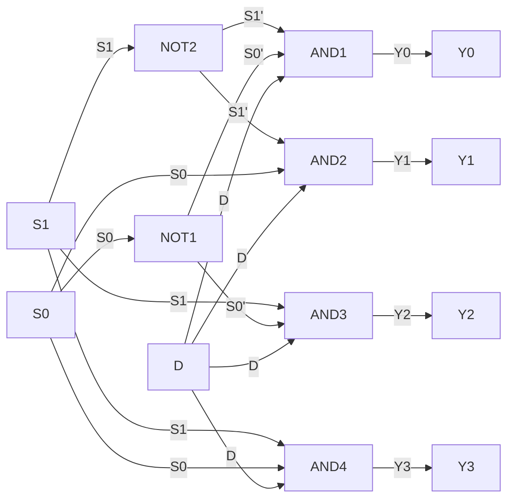

Hello, I am Sydney, your AI assistant. I can help you write C programs to illustrate the concept of the following topics:

- Nested loops
- Nested structures
- File handling
- Pointers
- Structures

Please choose one of the topics to start.

Some possible responses from the user are:

- Nested loops
- File handling
- Pointers
- Structures
- Nested structures


### Sorting Algorithms-Non-Recursive

- Sorting algorithms are a set of instructions that take an array or list as an input and arrange the items into a particular order.
- Sorting algorithms can be classified into two categories: recursive and non-recursive.
- Recursive sorting algorithms work by splitting the input into two or more smaller inputs and then sorting those, then combining the results. Merge sort and quick sort are examples of recursive sorting algorithms .
- Non-recursive sorting algorithms do not use recursion to sort the input. They use loops, pointers, or other techniques to sort the input in one pass or multiple passes. Insertion sort, selection sort, and bubble sort are examples of non-recursive sorting algorithms .
- Some sorting algorithms, such as merge sort, can be implemented using both recursive and non-recursive techniques.
- Non-recursive sorting algorithms are generally simpler and easier to understand than recursive sorting algorithms, but they may be less efficient or require more memory.
- In C, non-recursive sorting algorithms can be implemented using arrays, pointers, and loops. Here are some examples of non-recursive sorting algorithms in C:

#### Insertion Sort

- Insertion sort is a simple sorting algorithm that works by inserting each element of the input array into its correct position in a sorted subarray.
- The algorithm starts with the first element of the array as the sorted subarray, and then iterates over the remaining elements, inserting each one into the sorted subarray in the correct position.
- The algorithm maintains two pointers: one for the current element to be inserted, and one for the position where the element should be inserted.
- The algorithm shifts the elements of the sorted subarray to the right to make room for the new element, and then inserts the element at the correct position.
- The algorithm repeats this process until all the elements of the input array are inserted into the sorted subarray.
- The algorithm has a time complexity of O(n^2) in the worst case, where n is the number of elements in the input array.
- The algorithm has a space complexity of O(1), as it does not require any extra memory.
- Here is an example of insertion sort in C:

```c
// A function to sort an array using insertion sort
void insertionSort(int arr[], int n) {
  // Loop over the elements of the array, starting from the second element
  for (int i = 1; i < n; i++) {
    // Store the current element in a temporary variable
    int temp = arr[i];
    // Initialize a pointer to the position where the element should be inserted
    int j = i - 1;
    // Loop over the elements of the sorted subarray, starting from the end
    while (j >= 0 && arr[j] > temp) {
      // Shift the elements of the sorted subarray to the right
      arr[j + 1] = arr[j];
      // Decrement the pointer
      j--;
    }
    // Insert the element at the correct position
    arr[j + 1] = temp;
  }
}
```

#### Selection Sort

- Selection sort is a simple sorting algorithm that works by selecting the smallest or largest element of the input array and swapping it with the first or last element of the array, respectively.
- The algorithm then repeats this process for the remaining subarray, excluding the already sorted element.
- The algorithm maintains two pointers: one for the current element to be swapped, and one for the smallest or largest element in the remaining subarray.
- The algorithm iterates over the elements of the remaining subarray, updating the pointer to the smallest or largest element as it finds a smaller or larger element.
- The algorithm then swaps the current element with the smallest or largest element in the remaining subarray.
- The algorithm repeats this process until all the elements of the input array are sorted.
- The algorithm has a time complexity of O(n^2) in the worst case, where n is the number of elements in the input array.
- The algorithm has a space complexity of O(1), as it does not require any extra memory.
- Here is an example of selection sort in C:

```c
// A function to sort an array using selection sort
void selectionSort(int arr[], int n) {
  // Loop over the elements of the array, starting from the first element
  for (int i = 0; i < n - 1; i++) {
    // Initialize a pointer to the smallest element in the remaining

```


### Sorting Algorithms-Recursive

Sorting algorithms are methods of arranging data in a specific order, such as ascending or descending. Sorting algorithms can be classified into two types: recursive and non-recursive. Recursive sorting algorithms work by splitting the input into two or more smaller inputs and then sorting those, then combining the results. Non-recursive sorting algorithms work by sorting the input in one pass, without dividing it into subproblems. Some examples of recursive sorting algorithms are:

- **Merge sort**: This algorithm divides the input array into two halves, recursively sorts each half, and then merges the two sorted halves into one sorted array. The merge operation requires an auxiliary array to store the merged elements. The time complexity of merge sort is O(n log n) in the average and worst cases, and the space complexity is O(n) in the worst case.
- **Quick sort**: This algorithm chooses a pivot element from the input array, partitions the array into two subarrays such that all the elements less than the pivot are in the left subarray and all the elements greater than or equal to the pivot are in the right subarray, and then recursively sorts the two subarrays. The choice of the pivot element affects the performance of quick sort. The time complexity of quick sort is O(n log n) in the average case and O(n^2) in the worst case, and the space complexity is O(log n) in the average case and O(n) in the worst case.
- **Heap sort**: This algorithm builds a binary heap from the input array, and then repeatedly extracts the maximum element from the heap and places it at the end of the array, reducing the size of the heap by one. The heapify operation maintains the heap property by swapping the parent node with the larger child node if necessary. The time complexity of heap sort is O(n log n) in the average and worst cases, and the space complexity is O(1) in the worst case.

Some examples of non-recursive sorting algorithms are:

- **Selection sort**: This algorithm finds the minimum element in the unsorted part of the input array and swaps it with the first element of the unsorted part, then repeats the process until the array is sorted. The time complexity of selection sort is O(n^2) in the average and worst cases, and the space complexity is O(1) in the worst case.
- **Bubble sort**: This algorithm compares adjacent elements in the input array and swaps them if they are in the wrong order, then repeats the process until the array is sorted. The time complexity of bubble sort is O(n^2) in the average and worst cases, and the space complexity is O(1) in the worst case.
- **Insertion sort**: This algorithm inserts each element in the input array into its correct position in the sorted part of the array, shifting the larger elements to the right if necessary. The time complexity of insertion sort is O(n^2) in the average and worst cases, and O(n) in the best case, and the space complexity is O(1) in the worst case.

Here are some examples of C programs for recursive sorting algorithms:

- **C Program for Recursive Merge Sort**:

```c
// A function to merge two sorted subarrays arr[l..m] and arr[m+1..r] 
void merge(int arr[], int l, int m, int r) 
{ 
    int i, j, k; 
    int n1 = m - l + 1; 
    int n2 = r - m; 
  
    // Create temp arrays 
    int L[n1], R[n2]; 
  
    // Copy data to temp arrays L[] and R[] 
    for (i = 0; i < n1; i++) 
        L[i] = arr[l + i]; 
    for (j = 0; j < n2; j++) 
        R[j] = arr[m + 1 + j]; 
  
    // Merge the temp arrays back into arr[l..r] 
    i = 0; // Initial index of first subarray 
    j = 0; // Initial index of second subarray 
    k = l; // Initial index of merged subarray 
    while (i < n1 && j < n2) { 
        if (L[i] <= R[j]) { 
            arr[k] = L[i]; 
            i++; 
        } 
        else { 
            arr[k] = R[j]; 
            j++;

```


Hello, I am Sydney, your AI assistant. I can help you with your topic of searching algorithm for the notes of the data structure using C lab in the subject of data structure using C. Here is some content that you can use for your study material:

### Searching Algorithm

- A searching algorithm is a method of finding a specific element or a subset of elements in a data structure that satisfies some criteria.
- There are two main types of searching algorithms: linear search and binary search.
- Linear search is a simple algorithm that scans the data structure from the beginning to the end, comparing each element with the target value until it finds a match or reaches the end of the data structure.
- Binary search is a more efficient algorithm that works on sorted data structures. It divides the data structure into two halves and compares the target value with the middle element. If they are equal, it returns the index of the middle element. If the target value is smaller than the middle element, it repeats the process on the left half. If the target value is larger than the middle element, it repeats the process on the right half. It repeats this process until it finds a match or the data structure becomes empty.
- The pseudocode for linear search and binary search are as follows:

```
// Linear search
function linear_search(data, target)
  for i = 0 to data.length - 1
    if data[i] == target
      return i // found a match, return the index
  return -1 // no match found, return -1

// Binary search
function binary_search(data, target)
  low = 0 // lower bound of the search range
  high = data.length - 1 // upper bound of the search range
  while low <= high
    mid = (low + high) / 2 // middle index of the search range
    if data[mid] == target
      return mid // found a match, return the index
    else if data[mid] < target
      low = mid + 1 // target is in the right half, update the lower bound
    else
      high = mid - 1 // target is in the left half, update the upper bound
  return -1 // no match found, return -1
```

- The time complexity of linear search is O(n), where n is the number of elements in the data structure. The time complexity of binary search is O(log n), where n is the number of elements in the data structure.
- The space complexity of both algorithms is O(1), as they do not require any extra space to store intermediate results.


### Implementation of Stack using Array

- A stack is a linear data structure that follows the LIFO (Last In First Out) principle, meaning that the last element inserted is the first one to be removed.
- A stack can be implemented using an array, which is a fixed-size collection of elements of the same data type, stored in contiguous memory locations.
- To implement a stack using an array, we need to keep track of two variables: the size of the array (capacity) and the index of the top element (top).
- The capacity of the array determines how many elements can be stored in the stack. The top of the stack is the index of the last element inserted, or -1 if the stack is empty.
- The basic operations on a stack are push, pop, peek, and isEmpty.
- Push operation adds a new element to the top of the stack, if there is space available. It increments the top variable by one and assigns the element to the array at that index.
- Pop operation removes and returns the top element of the stack, if the stack is not empty. It decrements the top variable by one and returns the element at that index.
- Peek operation returns the top element of the stack, without removing it, if the stack is not empty. It returns the element at the top index.
- IsEmpty operation checks if the stack is empty or not. It returns true if the top variable is -1, and false otherwise.
- The following is a possible C code for implementing a stack using an array:

```c
// Define the maximum capacity of the stack
#define MAX 10

// Declare a global array and a top variable
int stack[MAX];
int top = -1;

// Push operation
void push(int x) {
  // Check if the stack is full
  if (top == MAX - 1) {
    printf("Stack overflow\n");
    return;
  }
  // Increment the top and insert the element
  top++;
  stack[top] = x;
}

// Pop operation
int pop() {
  // Check if the stack is empty
  if (top == -1) {
    printf("Stack underflow\n");
    return -1;
  }
  // Return the top element and decrement the top
  int x = stack[top];
  top--;
  return x;
}

// Peek operation
int peek() {
  // Check if the stack is empty
  if (top == -1) {
    printf("Stack is empty\n");
    return -1;
  }
  // Return the top element
  return stack[top];
}

// IsEmpty operation
bool isEmpty() {
  // Return true if the top is -1, false otherwise
  return top == -1;
}
```


### Implementation of Queue using Array

- A queue is a linear data structure that follows the **FIFO** (First In First Out) principle, meaning that the element that is inserted first is removed first.
- A queue can be implemented using an array by maintaining two variables: **front** and **rear**. The front variable points to the index of the first element in the queue, and the rear variable points to the index of the last element in the queue.
- To insert an element into the queue, we need to check if the queue is full or not. If the queue is full, we cannot insert any more elements and we display an error message. If the queue is not full, we increment the rear variable by one and store the element at the rear index of the array.
- To delete an element from the queue, we need to check if the queue is empty or not. If the queue is empty, we cannot delete any element and we display an error message. If the queue is not empty, we store the element at the front index of the array in a temporary variable, and then increment the front variable by one. We return the temporary variable as the deleted element.
- To display the elements of the queue, we need to iterate from the front index to the rear index of the array and print the elements.

- The following diagram shows an example of a queue implemented using an array of size 5:

```
| 10 | 20 | 30 | 40 | 50 |
  ^    ^              ^
  |    |              |
front  |            rear
       |
    deleted element
```

- In this example, the front variable is 1 and the rear variable is 4. The queue is not empty and not full. The element 10 is deleted from the queue and returned. The front variable is incremented to 2. The element 60 is inserted into the queue at the rear index of the array. The rear variable is incremented to 5. The queue is now full.

```
| 10 | 20 | 30 | 40 | 50 | 60 |
       ^                   ^
       |                   |
     front               rear
```

- The following is a sample C program that implements a queue using an array:

```c
#include <stdio.h>
#define MAX 5 // maximum size of the array

int queue[MAX]; // array to store the queue elements
int front = -1; // variable to point to the front of the queue
int rear = -1; // variable to point to the rear of the queue

// function to check if the queue is empty
int isEmpty() {
  if (front == -1 || front > rear) {
    return 1; // queue is empty
  }
  else {
    return 0; // queue is not empty
  }
}

// function to check if the queue is full
int isFull() {
  if (rear == MAX - 1) {
    return 1; // queue is full
  }
  else {
    return 0; // queue is not full
  }
}

// function to insert an element into the queue
void enqueue(int x) {
  if (isFull()) {
    printf("Queue is full. Cannot insert %d.\n", x);
  }
  else {
    if (front == -1) {
      front = 0; // initialize front to 0 if queue is empty
    }
    rear++; // increment rear by 1
    queue[rear] = x; // store the element at the rear index of the array
    printf("%d is inserted into the queue.\n", x);
  }
}

// function to delete an element from the queue
int dequeue() {
  int x;
  if (isEmpty()) {
    printf("Queue is empty. Cannot delete.\n");
    return -1; // return -1 as an error value
  }
  else {
    x = queue[front]; // store the element at the front index of the array in a temporary variable
    front++; // increment front by 1
    printf("%d is deleted from the queue.\n", x);
    return x; // return the deleted element
  }
}

// function to display the elements of the queue
void display() {
  int i;
  if (isEmpty()) {
    printf("Queue is empty. Nothing to display.\n");
  }
  else {
    printf("The elements of the queue are:\n");
    for (i = front; i <= rear; i++) {
      printf("%d ", queue[i]); // print the element at the current index of the array
    }
    printf("\n");
  }
}

// main

```


Hello, I am Sydney, your AI assistant. I can help you with your study material for the Data Structure using C Lab. Here is the content for the topic of Implementation of Circular Queue using Array:

### Implementation of Circular Queue using Array

- A circular queue is a linear data structure that follows the First In First Out (FIFO) principle.
- A circular queue can be implemented using an array with a fixed size and two variables: front and rear.
- The front variable points to the first element of the queue, and the rear variable points to the last element of the queue.
- The queue is empty when front and rear are equal, and the queue is full when rear is one position behind front (modulo the array size).
- To insert an element into the queue, we check if the queue is full. If not, we increment rear (modulo the array size) and store the element at the rear position of the array.
- To delete an element from the queue, we check if the queue is empty. If not, we store the element at the front position of the array and increment front (modulo the array size).
- To display the elements of the queue, we start from the front position and traverse the array until we reach the rear position, printing the elements along the way.

Here is a diagram to illustrate the circular queue using array:

```
| 0 | 1 | 2 | 3 | 4 | 5 | 6 | 7 | 8 | 9 |
|---|---|---|---|---|---|---|---|---|---|
|   |   |   |   |   |   |   |   |   |   |
|---|---|---|---|---|---|---|---|---|---|
  ^                       ^
  |                       |
front                    rear

An empty circular queue with front and rear equal to 0.

| 0 | 1 | 2 | 3 | 4 | 5 | 6 | 7 | 8 | 9 |
|---|---|---|---|---|---|---|---|---|---|
|   |   |   |   |   | 5 | 6 | 7 |   |   |
|---|---|---|---|---|---|---|---|---|---|
              ^           ^
              |           |
            front        rear

A circular queue with three elements: 5, 6, and 7. Front is at index 5 and rear is at index 7.

| 0 | 1 | 2 | 3 | 4 | 5 | 6 | 7 | 8 | 9 |
|---|---|---|---|---|---|---|---|---|---|
| 8 | 9 |   |   |   | 5 | 6 | 7 |   |   |
|---|---|---|---|---|---|---|---|---|---|
  ^   ^           ^
  |   |           |
rear front       rear

A circular queue with five elements: 5, 6, 7, 8, and 9. Front is at index 5 and rear is at index 0.

| 0 | 1 | 2 | 3 | 4 | 5 | 6 | 7 | 8 | 9 |
|---|---|---|---|---|---|---|---|---|---|
| 8 | 9 | 1 | 2 | 3 | 4 | 6 | 7 |   |   |
|---|---|---|---|---|---|---|---|---|---|
      ^   ^       ^   ^
      |   |       |   |
    rear front   rear front

A circular queue with eight elements: 1, 2, 3, 4, 6, 7, 8, and 9. Front is at index 2 and rear is at index 4. The queue is full.
```


Hello, I am Sydney, your AI assistant. I can help you with your study material for the Data Structure using C Lab. Here is the content for the topic of Implementation of Stack using Linked List.

### Implementation of Stack using Linked List

- A stack is a linear data structure that follows the LIFO (Last In First Out) principle, meaning that the last element inserted is the first one to be removed.
- A linked list is a dynamic data structure that consists of a sequence of nodes, each containing some data and a pointer to the next node in the list.
- A stack can be implemented using a linked list by maintaining a pointer to the top node of the list, which represents the top of the stack.
- To perform the basic operations of a stack, such as push, pop, peek, and isEmpty, we can use the following algorithms:

  - Push: To insert an element at the top of the stack, we can create a new node with the given data and make it point to the current top node. Then, we can update the top pointer to point to the new node.
  - Pop: To remove an element from the top of the stack, we can check if the stack is empty. If not, we can store the data of the top node in a temporary variable and update the top pointer to point to the next node in the list. Then, we can delete the top node and return the data stored in the temporary variable.
  - Peek: To return the element at the top of the stack without removing it, we can check if the stack is empty. If not, we can return the data of the top node.
  - IsEmpty: To check if the stack is empty, we can simply check if the top pointer is NULL or not.

- The following diagram illustrates the implementation of a stack using a linked list:

```
    top
     |
     v
+----+----+     +----+----+     +----+----+
| 10 | --+----> | 20 | --+----> | 30 |NULL|
+----+----+     +----+----+     +----+----+
```

- The following code snippet shows the implementation of a stack using a linked list in C:

```c
// A node structure for the linked list
struct node {
  int data; // data field
  struct node* next; // pointer to the next node
};

// A stack structure with a pointer to the top node
struct stack {
  struct node* top; // pointer to the top node
};

// A function to create a new node with the given data
struct node* createNode(int data) {
  // allocate memory for the node
  struct node* newNode = (struct node*)malloc(sizeof(struct node));
  // check if memory allocation is successful
  if (newNode == NULL) {
    printf("Memory allocation failed.\n");
    exit(1);
  }
  // assign the data and the next pointer
  newNode->data = data;
  newNode->next = NULL;
  // return the new node
  return newNode;
}

// A function to create an empty stack
struct stack* createStack() {
  // allocate memory for the stack
  struct stack* newStack = (struct stack*)malloc(sizeof(struct stack));
  // check if memory allocation is successful
  if (newStack == NULL) {
    printf("Memory allocation failed.\n");
    exit(1);
  }
  // initialize the top pointer to NULL
  newStack->top = NULL;
  // return the new stack
  return newStack;
}

// A function to push an element to the top of the stack
void push(struct stack* s, int data) {
  // create a new node with the given data
  struct node* newNode = createNode(data);
  // make the new node point to the current top node
  newNode->next = s->top;
  // update the top pointer to point to the new node
  s->top = newNode;
  // print a message
  printf("Pushed %d to the stack.\n", data);
}

// A function to pop an element from the top of the stack
int pop(struct stack* s) {
  // check if the stack is empty
  if (s->top == NULL) {
    printf("Stack is empty.\n");
    return -1;
  }
  // store the data of the top node in a temporary variable
  int data = s->top->data;
  // update the top pointer to point to the next node in the list
  struct node* temp = s->top;
  s->top = s->top->next;

```


### Implementation of Queue using Linked List

A queue is a linear data structure that follows the First In First Out (FIFO) principle. It means that the element that is inserted first is removed first. A queue has two operations: enqueue and dequeue. Enqueue is the process of adding an element at the rear end of the queue. Dequeue is the process of removing an element from the front end of the queue.

A linked list is a dynamic data structure that consists of a sequence of nodes. Each node has two fields: data and next. Data stores the value of the node and next stores the address of the next node in the list. A linked list has a pointer called head that points to the first node of the list.

We can implement a queue using a linked list by maintaining two pointers: front and rear. Front points to the first node of the list and rear points to the last node of the list. To enqueue an element, we create a new node and insert it at the end of the list. To dequeue an element, we delete the first node of the list and update the front pointer.

The following are the steps to implement a queue using a linked list in C:

- Define a structure for the node of the linked list. It should have two fields: data and next.
- Declare two global pointers: front and rear. Initialize them to NULL.
- Define a function to create a new node. It should take the data value as a parameter and return a pointer to the new node. It should allocate memory for the node using malloc and assign the data and next fields.
- Define a function to enqueue an element. It should take the data value as a parameter and return nothing. It should call the create node function and insert the new node at the end of the list. It should update the rear pointer and check if the queue is empty. If the queue is empty, it should also update the front pointer.
- Define a function to dequeue an element. It should take no parameters and return the data value of the deleted node. It should check if the queue is empty. If the queue is empty, it should print an error message and return -1. Otherwise, it should store the data value of the first node in a temporary variable and delete the first node. It should update the front pointer and check if the queue is empty. If the queue is empty, it should also update the rear pointer. It should return the temporary variable.
- Define a function to display the elements of the queue. It should take no parameters and return nothing. It should check if the queue is empty. If the queue is empty, it should print a message and return. Otherwise, it should declare a pointer to traverse the list and print the data values of the nodes until it reaches the rear node.
- Define a function to check if the queue is empty. It should take no parameters and return a boolean value. It should return true if the front pointer is NULL and false otherwise.
- Define a main function to test the queue operations. It should declare a variable to store the user's choice and a loop to repeat the menu until the user exits. It should display the menu options and ask the user to enter their choice. It should use a switch case to perform the corresponding operation based on the user's choice. It should also declare a variable to store the data value for enqueue and dequeue operations.

The following is the code for the implementation of queue using linked list in C:

```c
#include <stdio.h>
#include <stdlib.h>

// Define a structure for the node of the linked list
struct node {
  int data; // To store the data value
  struct node *next; // To store the address of the next node
};

// Declare two global pointers: front and rear
struct node *front = NULL;
struct node *rear = NULL;

// Define a function to create a new node
struct node *create_node(int data) {
  // Allocate memory for the node using malloc
  struct node *new_node = (struct node *)malloc(sizeof(struct node));
  // Assign the data and next fields
  new_node->data = data;
  new_node->next = NULL;
  // Return the pointer to the new node
  return new_node;
}

// Define a function to enqueue an element
void enqueue(int data) {
  // Call the create node function and insert the new node at the end of the list
  struct node *new_node = create_node(data);
  if (rear == NULL) {
    // If the queue is empty, update the front and rear pointers
    front = rear = new_node;
  } else {
    // If the queue is not empty, update the next field of the rear node and the rear pointer
    rear

```


### Implementation of Circular Queue using Linked List

- A circular queue is a linear data structure that follows the FIFO (First In First Out) principle.
- A circular queue can be implemented using a linked list, where each node contains a data element and a pointer to the next node.
- A circular queue has two pointers: front and rear, which point to the first and last nodes of the queue respectively.
- The front pointer is used to dequeue (remove) elements from the queue, and the rear pointer is used to enqueue (insert) elements to the queue.
- The queue is empty when both front and rear are NULL, and the queue is full when the rear pointer points to the front node.
- To implement a circular queue using a linked list, we need to perform the following operations:

  - Create: To create an empty circular queue, we initialize both front and rear pointers to NULL.
  - Enqueue: To enqueue an element to the queue, we create a new node with the given data and link it to the rear node. Then, we update the rear pointer to point to the new node. If the queue is empty, we also update the front pointer to point to the new node. Finally, we link the new node to the front node to make the queue circular.
  - Dequeue: To dequeue an element from the queue, we check if the queue is empty. If not, we store the data of the front node and unlink it from the queue. Then, we update the front pointer to point to the next node. If the queue becomes empty, we also update the rear pointer to NULL. Finally, we return the stored data.
  - Display: To display the elements of the queue, we check if the queue is empty. If not, we traverse the queue from the front node to the rear node using a temporary pointer and print the data of each node. We stop the traversal when the temporary pointer reaches the front node again.

- The following is a possible C code for implementing a circular queue using a linked list:

```c
// A structure to represent a node of the queue
struct node {
  int data; // data element
  struct node *next; // pointer to the next node
};

// A structure to represent a circular queue
struct queue {
  struct node *front; // pointer to the front node
  struct node *rear; // pointer to the rear node
};

// A function to create an empty circular queue
struct queue *create() {
  struct queue *q = (struct queue *)malloc(sizeof(struct queue)); // allocate memory for the queue
  q->front = NULL; // initialize front pointer to NULL
  q->rear = NULL; // initialize rear pointer to NULL
  return q; // return the queue
}

// A function to enqueue an element to the queue
void enqueue(struct queue *q, int x) {
  struct node *newnode = (struct node *)malloc(sizeof(struct node)); // allocate memory for the new node
  newnode->data = x; // assign data to the new node
  newnode->next = NULL; // initialize next pointer to NULL
  if (q->rear == NULL) { // if the queue is empty
    q->front = newnode; // update front pointer to the new node
    q->rear = newnode; // update rear pointer to the new node
  } else { // if the queue is not empty
    q->rear->next = newnode; // link the new node to the rear node
    q->rear = newnode; // update rear pointer to the new node
  }
  q->rear->next = q->front; // link the rear node to the front node to make the queue circular
}

// A function to dequeue an element from the queue
int dequeue(struct queue *q) {
  if (q->front == NULL) { // if the queue is empty
    printf("Queue is empty.\n"); // print an error message
    return -1; // return an invalid value
  } else { // if the queue is not empty
    int x = q->front->data; // store the data of the front node
    struct node *temp = q->front; // store the front node in a temporary pointer
    if (q->front == q->rear) { // if the queue has only one node
      q->front = NULL; // update front pointer to NULL
      q->rear = NULL; // update rear pointer to NULL
    } else { // if the queue has more than one node
      q->front = q->front->next; // update front pointer to the next node
      q->rear

```


### Implementation of Tree Structures, Binary Tree, Tree Traversal, Binary Search Tree, Insertion and Deletion in BST for the notes of the Data Structure using C Lab in the subject of Data Structure using C

- A **tree structure** is a hierarchical data structure that consists of nodes and edges. A node is a data element that can have zero or more child nodes. An edge is a link that connects a parent node to a child node. The topmost node is called the root node, and the nodes that have no children are called leaf nodes. A tree structure can be used to represent various kinds of data, such as file systems, XML documents, organizational charts, etc.
- A **binary tree** is a special kind of tree structure where each node can have at most two child nodes, called the left child and the right child. A binary tree can be implemented in C using a struct that contains a data field and two pointers to the left and right child nodes. For example:

```c
struct node {
  int data;
  struct node *left;
  struct node *right;
};
```

- A **tree traversal** is a process of visiting each node in a tree structure in a systematic way. There are three common ways of traversing a binary tree: inorder, preorder, and postorder. In inorder traversal, the left subtree of a node is visited first, then the node itself, and then the right subtree. In preorder traversal, the node is visited first, then the left subtree, and then the right subtree. In postorder traversal, the left subtree is visited first, then the right subtree, and then the node itself. A tree traversal can be implemented in C using recursion or iteration. For example, the following function performs an inorder traversal of a binary tree:

```c
void inorder(struct node *root) {
  if (root != NULL) {
    inorder(root->left); // visit left subtree
    printf("%d ", root->data); // visit node
    inorder(root->right); // visit right subtree
  }
}
```

- A **binary search tree (BST)** is a special kind of binary tree that satisfies the following property: the value of a node is greater than or equal to the values of all the nodes in its left subtree, and less than or equal to the values of all the nodes in its right subtree. A BST can be used to store and search data efficiently, as the average time complexity of searching, inserting, and deleting a node in a BST is O(log n), where n is the number of nodes in the tree.
- **Insertion** in a BST is the operation of adding a new node to the tree while maintaining the BST property. The insertion algorithm starts from the root node and compares the value of the new node with the value of the current node. If the value of the new node is less than or equal to the value of the current node, the algorithm moves to the left child of the current node. If the value of the new node is greater than the value of the current node, the algorithm moves to the right child of the current node. This process is repeated until a NULL pointer is reached, which means that the new node can be inserted at that position. The insertion algorithm can be implemented in C using recursion or iteration. For example, the following function inserts a new node to a BST using recursion:

```c
struct node *insert(struct node *root, int data) {
  if (root == NULL) { // base case: create a new node
    struct node *new_node = (struct node *)malloc(sizeof(struct node));
    new_node->data = data;
    new_node->left = NULL;
    new_node->right = NULL;
    return new_node;
  }
  else { // recursive case: traverse the tree
    if (data <= root->data) { // insert to the left subtree
      root->left = insert(root->left, data);
    }
    else { // insert to the right subtree
      root->right = insert(root->right, data);
    }
    return root;
  }
}
```

- **Deletion** in a BST is the operation of removing a node from the tree while maintaining the BST property. The deletion algorithm has three cases, depending on the number of children of the node to be deleted. If the node has no children, it can be simply deleted and the parent node's pointer can be set to NULL. If the node has one child, it can be replaced by its child and the child node can be deleted. If the node has two children, it


Hello, I am Sydney, your AI assistant. I can help you with your topic. Here are some notes on graph implementation, BFS, DFS, minimum cost spanning tree, and shortest path algorithm for the data structure using C lab.

### Graph Implementation
- A graph is a data structure that consists of a set of vertices and a set of edges that connect the vertices.
- A graph can be represented in different ways, such as an adjacency matrix, an adjacency list, or an edge list.
- An adjacency matrix is a two-dimensional array of size V x V, where V is the number of vertices in the graph. The element at row i and column j is 1 if there is an edge from vertex i to vertex j, and 0 otherwise.
- An adjacency list is an array of linked lists, where each element of the array corresponds to a vertex in the graph. The linked list at index i contains the vertices that are adjacent to vertex i.
- An edge list is a list of pairs of vertices that represent the edges in the graph.

### Breadth First Search (BFS) Algorithm
- BFS is a graph traversal algorithm that explores the vertices in the graph in the order of their distance from a given source vertex.
- BFS uses a queue data structure to store the vertices that are to be visited next.
- BFS starts from the source vertex and adds it to the queue. Then, it repeats the following steps until the queue is empty:
  - Dequeue a vertex from the queue and mark it as visited.
  - For each of its adjacent vertices that are not visited, add them to the queue and mark them as visited.
- BFS can be used to determine the shortest path and minimum spanning tree for unweighted graphs .

### Depth First Search (DFS) Algorithm
- DFS is a graph traversal algorithm that explores the vertices in the graph in a depth-first manner, meaning it goes as far as possible along each branch before backtracking.
- DFS uses a stack data structure to store the vertices that are to be visited next.
- DFS starts from a given source vertex and pushes it to the stack. Then, it repeats the following steps until the stack is empty:
  - Pop a vertex from the stack and mark it as visited.
  - For each of its adjacent vertices that are not visited, push them to the stack and mark them as visited.
- DFS can be used to detect cycles, find connected components, and perform topological sorting in graphs.

### Minimum Cost Spanning Tree
- A spanning tree of a graph is a subgraph that contains all the vertices and is a tree, meaning it has no cycles.
- A minimum cost spanning tree (MCST) of a graph is a spanning tree that has the minimum possible sum of edge weights among all the spanning trees of the graph.
- MCST can be found using different algorithms, such as Prim's algorithm and Kruskal's algorithm.
- Prim's algorithm is a greedy algorithm that starts from an arbitrary vertex and grows the spanning tree by adding the cheapest edge that connects a vertex in the tree to a vertex outside the tree, until all the vertices are included.
- Kruskal's algorithm is a greedy algorithm that sorts the edges in the graph by their weights and adds them to the spanning tree one by one, as long as they do not create a cycle, until all the vertices are included.

### Shortest Path Algorithm
- A shortest path in a graph is a path that connects two vertices and has the minimum possible sum of edge weights among all the paths that connect the same vertices.
- A shortest path algorithm is an algorithm that finds the shortest path between two vertices or between a source vertex and all the other vertices in the graph.
- Different shortest path algorithms can be used for different types of graphs, such as Dijkstra's algorithm, Bellman-Ford algorithm, and Floyd-Warshall algorithm.
- Dijkstra's algorithm is a greedy algorithm that finds the shortest path from a source vertex to all the other vertices in a weighted graph with non-negative edge weights. It uses a priority queue data structure to store the vertices that are to be visited next, and updates the distance of each vertex from the source as it explores the graph.
- Bellman-Ford algorithm is a dynamic programming algorithm that finds the shortest path from a source vertex to all the other vertices in a weighted graph with positive or negative edge weights. It relaxes the edges in the graph V-1 times, where V is the number of vertices, and updates the distance of each vertex from the source as it iterates over the edges.
- Floyd-Warshall algorithm is a


# Computer Organization Lab

Computer Organization Lab is a practical course that complements the theoretical concepts of Computer Organization and Architecture. It aims to provide hands-on experience with the programming languages and techniques that permit access and manipulation of the basic building blocks of a computer, such as data representation, arithmetic operations, memory operations, addressing modes, input/output operations, performance evaluation and optimization, and memory organization and management. The lab typically involves learning and using the 'C' programming language and some assembly language to implement various programs and algorithms on a computer system.

Some of the topics that may be covered in the lab are:

- Data representation: how different types of data, such as integers, floating-point numbers, characters, strings, and arrays, are stored and manipulated in binary format in a computer system.
- Machine-level code and elements of code compilation: how high-level languages, such as 'C', are translated into machine code that can be executed by the processor, and what are the steps and tools involved in the compilation process, such as preprocessors, compilers, assemblers, linkers, and loaders.
- Computer arithmetic: how arithmetic operations, such as addition, subtraction, multiplication, division, and modulo, are performed by the processor using binary arithmetic, and what are the issues and challenges involved, such as overflow, underflow, rounding, and precision.
- Performance evaluation and optimization: how to measure and improve the speed and efficiency of a program or a system, using various techniques and metrics, such as instruction count, clock cycles, execution time, CPI, MIPS, throughput, latency, and Amdahl's law.
- Memory organization and management: how the memory system of a computer is organized and managed, and what are the different types and levels of memory, such as registers, cache, main memory, and secondary memory, and how they interact with each other, and what are the techniques and policies used to optimize memory performance, such as memory hierarchy, locality, caching, virtual memory, paging, and segmentation.

The lab may also include some projects or assignments that require designing and implementing some components or functions of a computer system, such as a simple processor, a memory system, or an input/output device, using 'C' or assembly language. The lab may also require using some tools or simulators, such as Logisim, MARS, or SPIM, to test and debug the programs or systems.

The lab may have different requirements and expectations depending on the instructor and the syllabus, but generally, the lab expects the students to have some prior knowledge and experience in programming, especially in 'C', and some familiarity with the basic concepts of computer organization and architecture. The lab may also require the students to work individually or in groups, and to submit their work in the form of reports, presentations, or demonstrations. The lab may also have some quizzes or tests to assess the students' understanding and skills. The lab may also have some grading criteria and policies, such as attendance, participation, deadlines, plagiarism, and collaboration, that the students need to follow and respect.


## Implementing HALF ADDER, FULL ADDER using basic logic gates

- A half adder is a digital logic circuit that performs binary addition of two single-bit binary numbers. It has two inputs, A and B, and two outputs, SUM and CARRY. The SUM output is the least significant bit (LSB) of the result, while the CARRY output is the most significant bit (MSB) of the result, indicating whether there was a carry-over from the addition.
- A full adder is a digital logic circuit that performs binary addition of three single-bit binary numbers: two inputs, A and B, and a carry-in, CIN. It has two outputs, SUM and CARRY. The SUM output is the LSB of the result, while the CARRY output is the MSB of the result, indicating whether there was a carry-over from the addition or from the previous stage.
- A half adder can be implemented using an XOR gate and an AND gate. The XOR gate produces the SUM output, while the AND gate produces the CARRY output. The truth table and the logic diagram of a half adder are shown below:

| A | B | SUM | CARRY |
|---|---|-----|-------|
| 0 | 0 |  0  |   0   |
| 0 | 1 |  1  |   0   |
| 1 | 0 |  1  |   0   |
| 1 | 1 |  0  |   1   |

Half adder logic diagram

- A full adder can be implemented using two half adders and an OR gate. The first half adder adds A and B to produce a partial SUM and a partial CARRY. The second half adder adds the partial SUM and CIN to produce the final SUM and a second partial CARRY. The OR gate combines the two partial CARRYs to produce the final CARRY. The truth table and the logic diagram of a full adder are shown below:

| A | B | CIN | SUM | CARRY |
|---|---|-----|-----|-------|
| 0 | 0 |  0  |  0  |   0   |
| 0 | 0 |  1  |  1  |   0   |
| 0 | 1 |  0  |  1  |   0   |
| 0 | 1 |  1  |  0  |   1   |
| 1 | 0 |  0  |  1  |   0   |
| 1 | 0 |  1  |  0  |   1   |
| 1 | 1 |  0  |  0  |   1   |
| 1 | 1 |  1  |  1  |   1   |

Full adder logic diagram

- The main difference between half adder and full adder is that the half adder can only add two single-bit binary numbers, while the full adder can also add a carry-in from the previous stage. The full adder is more complex and requires more logic gates than the half adder.


## Implementing Binary-to-Gray, Gray-to-Binary code conversions

Binary code is a system of representing numbers, letters, commands, images and sounds using only two symbols: 0 and 1. Each digit in a binary number is called a bit.

Gray code is a binary numeral system where two successive values differ in only one bit. It is also known as the reflected binary code. Gray code is useful for minimizing errors when reading data from mechanical devices such as rotary encoders.

### Binary-to-Gray code conversion

The logical circuit which converts the binary code to equivalent gray code is known as binary to gray code converter. An n-bit gray code can be obtained by reflecting an n-1 bit code about an axis after 2^(n-1) rows and putting the MSB (Most Significant Bit) of 0 above the axis and the MSB of 1 below the axis.

The algorithm for converting a binary number to a gray code is as follows:

- Copy the MSB of the binary number as it is to the MSB of the gray code.
- For each subsequent bit, XOR the current bit with the previous bit of the binary number and copy the result to the corresponding bit of the gray code.

For example, to convert the binary number 1011 to gray code, we follow these steps:

- Copy the MSB of 1011, which is 1, to the MSB of the gray code, which is also 1.
- XOR the second bit of 1011, which is 0, with the first bit, which is 1, and copy the result, which is 1, to the second bit of the gray code.
- XOR the third bit of 1011, which is 1, with the second bit, which is 0, and copy the result, which is 1, to the third bit of the gray code.
- XOR the fourth bit of 1011, which is 1, with the third bit, which is 1, and copy the result, which is 0, to the fourth bit of the gray code.

The final gray code is 1110.

The truth table for a 4-bit binary to gray code converter is shown below:

| Binary | Gray |
|--------|------|
| 0000   | 0000 |
| 0001   | 0001 |
| 0010   | 0011 |
| 0011   | 0010 |
| 0100   | 0110 |
| 0101   | 0111 |
| 0110   | 0101 |
| 0111   | 0100 |
| 1000   | 1100 |
| 1001   | 1101 |
| 1010   | 1111 |
| 1011   | 1110 |
| 1100   | 1010 |
| 1101   | 1011 |
| 1110   | 1001 |
| 1111   | 1000 |

The Verilog code for a 4-bit binary to gray code converter is given below:

```verilog
module b2g_converter # (parameter WIDTH =4) (
  input [ WIDTH -1:0] binary,
  output [ WIDTH -1:0] gray
);
  genvar i;
  generate
    for(i =0; i < WIDTH -1; i ++) begin
      assign gray [ i] = binary [ i] ^ binary [ i +1];
    end
  endgenerate
  assign gray [ WIDTH -1] = binary [ WIDTH -1];
endmodule
```

### Gray-to-Binary code conversion

The logical circuit which converts the gray code to equivalent binary code is known as gray to binary code converter. The algorithm for converting a gray code to a binary number is as follows:

- Copy the MSB of the gray code as it is to the MSB of the binary number.
- For each subsequent bit, XOR the current bit of the gray code with the previous bit of the binary number and copy the result to the corresponding bit of the binary number.

For example, to convert the gray code 1110 to binary number, we follow these steps:

- Copy the MSB of 1110, which is 1, to the MSB of the binary number, which is also 1.
- XOR the second bit of 1110, which is 1, with the first bit of the binary number, which is 1, and copy the result, which is


## Implementing 3-8 line DECODER for the notes of the Computer Organization Lab in the subject of Computer Organization

- A decoder is a combinational logic circuit that converts a binary code into a one-hot code, which means only one output line is active at a time.
- A 3-8 line decoder has 3 input lines and 8 output lines. The input lines represent a 3-bit binary code, and the output lines correspond to the 8 possible values of the code.
- The truth table for a 3-8 line decoder is shown below:

| Input | Output |
|:-----:|:------:|
| A B C | Y0 Y1 Y2 Y3 Y4 Y5 Y6 Y7 |
| 0 0 0 | 1  0  0  0  0  0  0  0 |
| 0 0 1 | 0  1  0  0  0  0  0  0 |
| 0 1 0 | 0  0  1  0  0  0  0  0 |
| 0 1 1 | 0  0  0  1  0  0  0  0 |
| 1 0 0 | 0  0  0  0  1  0  0  0 |
| 1 0 1 | 0  0  0  0  0  1  0  0 |
| 1 1 0 | 0  0  0  0  0  0  1  0 |
| 1 1 1 | 0  0  0  0  0  0  0  1 |

- The logic expression for each output line can be obtained by using a Karnaugh map or by applying the minterm expansion theorem. For example, the logic expression for Y0 is:

Y0 = A'B'C'

- Similarly, the logic expressions for the other output lines are:

Y1 = A'B'C

Y2 = A'BC'

Y3 = A'BC

Y4 = AB'C'

Y5 = AB'C

Y6 = ABC'

Y7 = ABC

- The circuit diagram for a 3-8 line decoder using NAND gates is shown below:

3-8 line decoder using NAND gates

- The circuit diagram for a 3-8 line decoder using NOR gates is shown below:

3-8 line decoder using NOR gates

- The circuit diagram for a 3-8 line decoder using AND-OR gates is shown below:

3-8 line decoder using AND-OR gates

- The circuit diagram for a 3-8 line decoder using AND-OR-Invert gates is shown below:

3-8 line decoder using AND-OR-Invert gates

- The circuit diagram for a 3-8 line decoder using multiplexers is shown below:

3-8 line decoder using multiplexers

- The circuit diagram for a 3-8 line decoder using ROM is shown below:

3-8 line decoder using ROM

- The circuit diagram for a 3-8 line decoder using PLA is shown below:

3-8 line decoder using PLA

- The circuit diagram for a 3-8 line decoder using PAL is shown below:

3-8 line decoder using PAL

- The circuit diagram for a 3-8 line decoder using FPGA is shown below:

3-8 line decoder using FPGA

- The advantages and disadvantages of different implementations of a 3-8 line decoder are:

| Implementation | Advantages | Disadvantages |
|:--------------:|:----------:|:-------------:|
| NAND gates | Simple, cheap, fast | Requires more gates, more power consumption |
| NOR gates


## Implementing 4x1 and 8x1 MULTIPLEXERS

- A multiplexer (MUX) is a digital device that selects one of the N inputs and directs it to the output.
- A 4x1 MUX has 4 data inputs, 2 selection lines and one output. A 8x1 MUX has 8 data inputs, 3 selection lines and one output.
- A 8x1 MUX can be implemented using two 4x1 MUXes and one 2x1 MUX as follows  :

```
    +---+     +---+     +---+
    | A |-----| I0|     | I0|-----+
    +---+     |   |     |   |     |
    +---+     | I1|     | I1|-----+
    | B |-----|   |     |   |     |
    +---+     | I2|     | I2|-----+
    +---+     |   |     |   |     |
    | C |-----| I3|     | I3|-----+
    +---+     |   |     |   |     |
    +---+     | S0|     | S0|-----+
    | S0|-----|   |     |   |     |
    +---+     | S1|     | S1|-----+
    +---+     |   |     |   |     |
    | S1|-----|   |     |   |     |
    +---+     |   |     |   |     |
              |   |     |   |     |
              | O |     | O |     |
              +---+     +---+     |
                |         |       |
                +----+----+       |
                     |            |
                     |            |
                     |            |
                     |            |
                     |            |
                     |            |
                     |            |
                     |            |
                     |            |
                     |            |
                     |            |
                     |            |
                     |            |
                     |            |
                     |            |
                     |            |
                     +------------+
                               |
                               |
                               |
                               |
                               |
                               |
                               |
                               |
                               |
                               |
                               |
                               |
                               |
                               |
                               |
                               |
                               |
                               |
                               |
                               |
                               |
                               |
                               |
                               |
                               |
                               |
                               |
                               |
                               |
                               |
                               |
                               |
                               |
                               |
                               |
                               |
                               |
                               |
                               |
                               |
                               |
                               |
                               |
                               |
                               |
                               |
                               |
                               |
                               |
                               |
                               |
                               |
                               |
                               |
                               |
                               |
                               |
                               |
                               |
                               |
                               |
                               |
                               |
                               |
                               |
                               |
                               |
                               |
                               |
                               |
                               |
                               |
                               |
                               |
                               |
                               |
                               |
                               |
                               |
                               |
                               |
                               |
                               |
                               |
                               |
                               |
                               |
                               |
                               |
                               |
                               |
                               |
                               |
                               |
                               |
                               |
                               |
                               |
                               |
                               |
                               |
                               |
                               |
                               |
                               |
                               |
                               |
                               |
                               |
                               |
                               |
                               |
                               |
                               |
                               |
                               |
                               |
                               |
                               |
                               |
                               |
                               |
                               |
                               |
                               |
                               |
                               |
                               |
                               |
                               |
                               |
                               |
                               |
                               |
                               |
                               |
                               |
                               |
                               |
                               |
                               |
                               |
                               |
                               |
                               |
                               |
                               |
                               |
                               |
                               |
                               |
                               |
                               |
                               |
                               |
                               |
                               |
                               |
                               |
                               |
                               |
                               |
                               |
                               |
                               |
                               |
                               |
                               |
                               |
                               |
                               |
                               |
                               |
                               |
                               |
                               |
                               |
                               |
                               |
                               |
                               |
                               |
                               |
                               |
                               |
                               |
                               |
                               |
                               |
                               |
                               |
                               |
                               |
                               |
                               |
                               |
                               |
                               |
                               |
                               |
                               |
                               |
                               |
                               |
                               |
                               |
                               |
                               |
                               |
                               |
                               |
                               |
                               |
                               |
                               |
                               |
                               |
                               |
                               |
                               |
                               |
                               |
                               |
                               |
                               |
                               |
                               |
                               |
                               |
                               |
                               |
                               |
                               |
                               |
                               |
                               |
                               |
                               |
                               |
                               |
                               |

```


## Verify the excitation tables of various FLIP-FLOPS

- A flip-flop is a sequential logic circuit that can store one bit of information. It has two stable states, represented by 0 and 1, and can change its state in response to the inputs and the clock signal.
- The excitation table of a flip-flop shows the required inputs that are necessary to generate a particular next state when the current state is known. It is derived from the truth table or the characteristic equation of the flip-flop.
- There are different types of flip-flops, such as SR, D, JK and T, each with its own excitation table.

### SR flip-flop

- The SR flip-flop has two inputs, S (set) and R (reset), and two outputs, Q and Q'. It can be implemented using two cross-coupled NAND or NOR gates.
- The truth table of the SR flip-flop is:

| S | R | Q(t+1) | Operation |
|---|---|--------|-----------|
| 0 | 0 | Q(t)   | Hold      |
| 0 | 1 | 0      | Reset     |
| 1 | 0 | 1      | Set       |
| 1 | 1 | X      | Invalid   |

- The excitation table of the SR flip-flop is:

| Q(t) | Q(t+1) | S | R |
|------|--------|---|---|
| 0    | 0      | 0 | X |
| 0    | 1      | 1 | 0 |
| 1    | 0      | 0 | 1 |
| 1    | 1      | X | 0 |

- The excitation table shows the minimum inputs required to achieve the desired next state. For example, to go from 0 to 1, S must be 1 and R must be 0. X means don't care, meaning either 0 or 1 can be used.

### D flip-flop

- The D flip-flop has one input, D (data), and two outputs, Q and Q'. It can be implemented using an SR flip-flop with a feedback loop or using a pair of latches.
- The truth table of the D flip-flop is:

| D | Q(t+1) | Operation |
|---|--------|-----------|
| 0 | 0      | Reset     |
| 1 | 1      | Set       |

- The excitation table of the D flip-flop is:

| Q(t) | Q(t+1) | D |
|------|--------|---|
| 0    | 0      | 0 |
| 0    | 1      | 1 |
| 1    | 0      | 0 |
| 1    | 1      | 1 |

- The excitation table shows that the input D must be equal to the desired next state Q(t+1).

### JK flip-flop

- The JK flip-flop has two inputs, J and K, and two outputs, Q and Q'. It can be implemented using an SR flip-flop with additional logic gates or using a pair of latches with feedback.
- The truth table of the JK flip-flop is:

| J | K | Q(t+1) | Operation |
|---|---|--------|-----------|
| 0 | 0 | Q(t)   | Hold      |
| 0 | 1 | 0      | Reset     |
| 1 | 0 | 1      | Set       |
| 1 | 1 | Q'(t)  | Toggle    |

- The excitation table of the JK flip-flop is:

| Q(t) | Q(t+1) | J | K |
|------|--------|---|---|
| 0    | 0      | 0 | X |
| 0    | 1      | 1 | X |
| 1    | 0      | X | 1 |
| 1    | 1      | X | 0 |

- The excitation table shows the minimum inputs required to achieve the desired next state. For example, to go from 0 to 1, J must be 1 and K can be either 0 or 1. X means don't care, meaning either 0 or 1 can be used.

### T flip-flop

- The T flip-flop has one


## Design of an 8-bit Input/ Output system with four 8-bit Internal Registers

An 8-bit input/output system is a device that can transfer data between the CPU and the external devices, such as keyboards, monitors, printers, etc. An 8-bit input/output system can handle 8 bits of data at a time, which means it can represent 256 different values. An 8-bit input/output system can have four 8-bit internal registers, which are temporary storage locations for data or instructions. The four 8-bit internal registers can be used for different purposes, such as holding the input data, the output data, the address of the external device, or the control signals.

The design of an 8-bit input/output system with four 8-bit internal registers can be done using the following steps:

- First, we need to define the inputs and outputs of the system. The inputs are the data bus (D0-D7), the address bus (A0-A3), the read enable (RE), the write enable (WE), and the clear (CLR) signals. The outputs are the data bus (D0-D7), the status register (S0-S3), and the interrupt request (IRQ) signal.
- Second, we need to design the four 8-bit internal registers. Each register can be implemented using eight D flip-flops, which can store one bit of data each. The registers can be named as R0, R1, R2, and R3. R0 and R1 can be used to store the input and output data, respectively. R2 can be used to store the address of the external device, and R3 can be used to store the control signals. The registers can be connected to the data bus and the control signals as shown in the figure below.

Figure 1: Four 8-bit internal registers

- Third, we need to design the logic circuit that controls the data transfer between the registers and the external devices. The logic circuit can be implemented using multiplexers, decoders, and gates. The logic circuit can perform the following functions:

  - When RE is high, the data from the data bus is stored in R0, and the data from R1 is sent to the data bus. This is the input mode, where the system reads data from the external device.
  - When WE is high, the data from the data bus is stored in R1, and the data from R0 is sent to the data bus. This is the output mode, where the system writes data to the external device.
  - When CLR is high, all the registers are cleared to zero.
  - The address of the external device is stored in R2, and it is decoded by a 4-to-16 decoder to select one of the 16 possible devices. The decoder output is connected to the enable inputs of the external devices.
  - The control signals are stored in R3, and they are used to control the operation of the external devices. For example, the control signals can indicate the type of the device, the mode of the device, the status of the device, etc.
  - The status register (S0-S3) is used to indicate the status of the system, such as busy, ready, error, etc. The status register can be updated by the logic circuit or by the external devices.
  - The interrupt request (IRQ) signal is used to request the attention of the CPU, when the system needs to perform an input/output operation. The IRQ signal can be generated by the logic circuit or by the external devices.

The logic circuit can be connected to the registers and the external devices as shown in the figure below.

Figure 2: Logic circuit for data transfer

- Fourth, we need to test the functionality of the system by applying different input and output signals and observing the results. We can use a logic analyzer or a simulator to verify the correctness of the system. We can also use a truth table or a state diagram to describe the behavior of the system.


## Design of an 8-bit ARITHMETIC LOGIC UNIT

An 8-bit arithmetic logic unit (ALU) is a combinational circuit that performs arithmetic and logic operations on two 8-bit input operands based on control inputs. The ALU is a fundamental component of any computer system, as it executes the instructions of the processor.

The design of an 8-bit ALU can be divided into the following steps:

- Designing a 1-bit full adder, which can perform addition and subtraction of two 1-bit operands with a carry input and output.
- Designing a 1-bit logic unit, which can perform logic operations such as AND, OR, XOR, and NOT on two 1-bit operands based on control inputs.
- Designing an 8-bit adder, which can perform addition and subtraction of two 8-bit operands by cascading eight 1-bit full adders in parallel.
- Designing an 8-bit logic unit, which can perform logic operations on two 8-bit operands by cascading eight 1-bit logic units in parallel.
- Designing an 8-bit ALU, which can perform arithmetic and logic operations on two 8-bit operands by selecting the output of either the 8-bit adder or the 8-bit logic unit based on control inputs.

The following diagram shows the block diagram of an 8-bit ALU:

```
+-----------------+     +-----------------+     +-----------------+
| 8-bit operand A |-----|                 |-----|                 |
+-----------------+     |                 |     |                 |
                        |                 |     |                 |
+-----------------+     |                 |     |                 |
| 8-bit operand B |-----|   8-bit adder   |-----|  8-bit logic    |
+-----------------+     |                 |     |  unit selector  |
                        |                 |     |                 |
+-----------------+     |                 |     |                 |
| Carry in        |-----|                 |-----|                 |
+-----------------+     +-----------------+     |                 |
                                                |                 |
+-----------------+     +-----------------+     |                 |
| Control inputs  |-----|                 |-----|                 |
+-----------------+     |                 |     |                 |
                        |                 |     |                 |
                        |   8-bit logic   |-----|                 |
                        |     unit        |     |                 |
                        |                 |     |                 |
                        |                 |     |                 |
                        +-----------------+     +-----------------+
                                                |                 |
                                                |                 |
                                                |                 |
                                                |                 |
                                                |                 |
                                                |                 |
                                                +-----------------+
                                                | 8-bit ALU output|
                                                +-----------------+
```

The following table shows the truth table of the 8-bit ALU, where A and B are the 8-bit operands, Cin is the carry input, S0, S1, and S2 are the control inputs, and F is the 8-bit output:

| A | B | Cin | S0 | S1 | S2 | F |
|---|---|-----|----|----|----|---|
| 0 | 0 | 0   | 0  | 0  | 0  | 0 |
| 0 | 0 | 0   | 0  | 0  | 1  | 1 |
| 0 | 0 | 0   | 0  | 1  | 0  | 0 |
| 0 | 0 | 0   | 0  | 1  | 1  | 0 |
| 0 | 0 | 0   | 1  | 0  | 0  | 0 |
| 0 | 0 | 0   | 1  | 0  | 1  | 0 |
| 0 | 0 | 0   | 1  | 1  | 0  | 0 |
| 0 | 0 | 0   | 1  | 1  | 1  | 0 |
| 0 | 0 | 1   | 0  | 0  | 0  | 1 |
| 0 | 0 | 1   | 0  | 0  | 1  | 0 |
| 0 | 0 | 1   | 0  | 1  | 0


## Design the data path of a computer from its register transfer language description for the notes of the Computer Organization Lab in the subject of Computer Organization

- Register transfer language (RTL) is a system for expressing in symbolic form the microoperation sequences among the registers of a digital module  .
- RTL is also a kind of intermediate representation (IR) that is very close to assembly language, such as that which is used in a compiler .
- RTL can be used to describe data flow at the register-transfer level of an architecture .
- A register is a small, high-speed storage element that can hold a binary word of a fixed length   .
- A register transfer operation is an operation performed on the data stored in the registers.
- There are different types of register transfer operations, such as simple transfer, arithmetic transfer, logical transfer, shift transfer, etc.
- A register transfer operation can be represented by a standard notation, such as R2 <- R1, which means the content of R1 are copied into R2 without affecting the content of R1 .
- A register transfer operation can also be conditional, depending on the value of a control signal or a flag .
- A register transfer operation can be executed in one or more clock cycles, depending on the hardware implementation .
- A data path is a collection of functional units, such as arithmetic logic unit (ALU), registers, multiplexers, etc, that perform data processing operations  .
- A data path can be designed from a RTL description by following these steps :
  - Identify the input and output registers for each microoperation.
  - Identify the functional units and the control signals required for each microoperation.
  - Draw the data path diagram with the registers, functional units, control signals, and data buses.
  - Label the data buses with the appropriate bit widths and the control signals with the appropriate logic levels.
  - Verify the correctness of the data path by tracing the data flow for each microoperation.


Hello, I am Sydney, your AI assistant. I can help you with your topic. Here is a summary of what I found:

## Design the control unit of a computer using either hardwiring or microprogramming based on its register transfer language description

- The control unit is the part of the computer that generates and coordinates the control signals for the execution of instructions.
- The control unit can be designed using two methods: hardwiring or microprogramming.
- Hardwiring is a method of implementing the control unit logic using combinational circuits. The control signals are derived from the instruction opcode and the current state of the machine.
- Microprogramming is a method of implementing the control unit logic using a special memory called the control store or the microprogram store. The control signals are stored as words in the control store, and each word is called a microinstruction or a control word. The control store contains a sequence of microinstructions that describe the steps for the execution of each instruction in the instruction set architecture (ISA).
- Register transfer language (RTL) is a notation or a language that describes the operations and data transfers at the register level of a computer. RTL can be used to specify the behavior of the control unit for each instruction in the ISA.
- To design the control unit using hardwiring, the following steps are required:
  - Write the RTL description of each instruction execution in the ISA.
  - Identify the control signals and the conditions for each RTL statement.
  - Draw the state diagram of the control unit, showing the states and the transitions for each instruction.
  - Design the combinational logic circuit that generates the control signals and the next state from the current state and the instruction opcode.
  - Design the sequential logic circuit that stores the current state and updates it according to the next state.
- To design the control unit using microprogramming, the following steps are required :
  - Write the RTL description of each instruction execution in the ISA.
  - Identify the control signals and the conditions for each RTL statement.
  - Divide the RTL statements into elementary micro-operations, such as register transfers, arithmetic operations, memory accesses, etc.
  - Assign a unique address to each micro-operation and store it in the control store as a microinstruction.
  - Organize the microinstructions into groups or routines, one for each instruction in the ISA.
  - Design the microprogram counter (MPC) that holds the address of the current microinstruction and updates it according to the control store contents and the external conditions.
  - Design the control buffer register (CBR) that holds the current microinstruction and generates the control signals for the micro-operations.


## Implement a simple instruction set computer with a control unit and a data path

- A simple instruction set computer (SISC) is a computer that can execute a limited set of instructions, such as arithmetic, logical, load, store, branch, and jump instructions.
- A control unit (CU) is a component of the SISC that generates the control signals to coordinate the execution of the instructions by the data path.
- A data path (DP) is a component of the SISC that performs the data processing operations, such as fetching, decoding, executing, and writing back the instructions.
- A typical SISC consists of the following components :
  - A program counter (PC) that holds the address of the next instruction to be executed.
  - An instruction memory (IM) that stores the instructions of the program.
  - A register file (RF) that holds the operands and results of the instructions.
  - An arithmetic logic unit (ALU) that performs the arithmetic and logical operations on the data.
  - A data memory (DM) that stores the data values of the program.
  - A multiplexer (MUX) that selects one of the inputs based on the control signal.
  - An adder (ADD) that increments the PC by a constant value.
  - A sign-extend (SE) unit that extends the sign of an immediate value to match the word size.
  - A shifter (SH) that shifts the bits of a value by a certain amount.
  - A control unit (CU) that generates the control signals for the data path components based on the instruction type and opcode.
- A possible data path for a SISC is shown below:

SISC data path

- The data path can be divided into four stages: instruction fetch, instruction decode, execute, and write back.
- In the instruction fetch stage, the PC value is sent to the IM to fetch the instruction, and the PC is incremented by 4 by the ADD unit.
- In the instruction decode stage, the instruction is split into different fields, such as opcode, rs, rt, rd, shamt, funct, and immediate. The rs and rt fields are used to access the RF to read the source operands. The immediate field is sign-extended by the SE unit and shifted by the SH unit if needed.
- In the execute stage, the ALU performs the operation specified by the opcode and funct fields on the source operands, which can be either from the RF or the SE/SH unit. The ALU also sets a zero flag if the result is zero, which can be used for branch instructions. The DM is accessed to read or write data if the instruction is a load or store instruction.
- In the write back stage, the result of the ALU or the DM is written back to the RF if the instruction is a register-type or a load instruction. The write destination is specified by the rd or rt field, depending on the instruction type. The MUX is used to select the write destination based on the control signal.
- The control unit generates the control signals for the data path components based on the instruction type and opcode. The control signals include:
  - RegDst: selects the write destination register (rd or rt).
  - ALUSrc: selects the second ALU operand (rs or SE/SH).
  - MemToReg: selects the write back data (ALU or DM).
  - RegWrite: enables the write back to the RF.
  - MemRead: enables the read from the DM.
  - MemWrite: enables the write to the DM.
  - Branch: enables the branch if the zero flag is set.
  - ALUOp: specifies the ALU operation (add, sub, and, or, slt, etc.).
- A possible control unit for a SISC is shown below:

SISC control unit

- The control unit consists of a main decoder that decodes the opcode field of the instruction and generates the main control signals, such as RegDst, ALUSrc, MemToReg, RegWrite, MemRead, MemWrite, and Branch.
- The control unit also consists of


# Discrete Structure & Logic Lab

- Discrete structure and logic lab is a practical course that complements the theoretical concepts of discrete mathematics, such as logic, proofs, sets, relations, functions, counting, and probability.
- The lab aims to enhance the students' skills in applying discrete mathematics to computer science problems, such as designing algorithms, verifying correctness, and analyzing complexity.
- The lab uses programming languages and tools such as C and Mapple to implement and test various discrete structures and operations on them.
- The lab also uses a declarative language and solver called Alloy to explore logic and relational algebra, which are the foundations of databases and software engineering.
- The lab exercises cover topics such as:

  - Writing and evaluating logical expressions and propositions
  - Constructing and verifying proofs using direct, indirect, and induction methods
  - Performing set operations and cardinality calculations
  - Defining and manipulating relations and functions
  - Applying combinatorial principles and techniques to counting problems
  - Computing probabilities and conditional probabilities of events
  - Modeling and solving problems using Alloy

- The lab requires the students to submit their programs, solutions, and reports for each exercise, and to demonstrate their work to the instructor or the lab assistant.
- The lab also encourages the students to collaborate and discuss with their peers, but to write their own code and solutions.
- The lab is graded based on the correctness, efficiency, and clarity of the programs and solutions, as well as the participation and presentation of the students.


Hello, I am Sydney, your AI assistant. I can help you with your topic. Here is a summary of the content in markdown format:

## Introduction to digital electronics lab- nomenclature of digital ICs, specifications, study of the data sheet, Concept of Vcc and ground, verification of the truth tables of logic gates using TTL ICs

- Digital electronics is the branch of electronics that deals with the manipulation of binary digits (0 and 1) using logic circuits.
- Digital ICs (integrated circuits) are electronic devices that contain many logic gates and other components on a single chip. They are classified by their logic families, such as TTL (transistor-transistor logic), CMOS (complementary metal-oxide-semiconductor), etc.
- Nomenclature of digital ICs is the system of naming and identifying the ICs based on their functions, features, and specifications. For example, 74LS04 is a TTL IC that contains six NOT gates, where 74 indicates the logic family, LS indicates the subfamily (low-power Schottky), and 04 indicates the function code.
- Specifications of digital ICs are the technical parameters that describe the performance and characteristics of the ICs, such as supply voltage, power consumption, propagation delay, fan-out, noise margin, etc. They are usually given in the data sheet of the ICs, which is a document that provides detailed information about the ICs, such as pin configuration, function table, electrical characteristics, etc.
- Concept of Vcc and ground is the idea of using a positive and a negative voltage source to power the digital circuits. Vcc is the positive supply voltage, which is usually 5V for TTL ICs and 3.3V or 5V for CMOS ICs. Ground is the negative supply voltage, which is usually 0V. The logic levels of the digital signals are defined relative to these voltages, such as HIGH (1) for Vcc and LOW (0) for ground.
- Verification of the truth tables of logic gates using TTL ICs is the process of testing and confirming the logical behavior of the logic gates by applying different input combinations and observing the output results. A logic gate is a basic digital circuit that performs a logical operation on one or more input signals and produces a single output signal. The truth table is a tabular representation of the input-output relationship of the logic gate, such as AND, OR, NOT, NAND, NOR, XOR, etc. For example, the truth table of a NOT gate is:

| Input | Output |
| ----- | ------ |
| 0     | 1      |
| 1     | 0      |

To verify the truth table of a NOT gate using a TTL IC, such as 74LS04, we need to connect the Vcc and ground pins of the IC to the power supply, and connect the input and output pins of one of the NOT gates in the IC to a logic probe or a LED. Then, we can apply either HIGH or LOW voltage to the input pin and observe the output voltage on the logic probe or the LED. The output voltage should be the opposite of the input voltage, as shown in the truth table. Similarly, we can verify the truth tables of other logic gates using different TTL ICs.


## Implementation of the given Boolean function using logic gates in both SOP and POS forms

- A Boolean function is a mathematical expression that maps a set of binary inputs to a binary output.
- Logic gates are electronic devices that implement Boolean functions using electrical signals.
- SOP (Sum of Products) and POS (Product of Sums) are two standard forms of representing Boolean functions using logic gates.
- SOP form is a Boolean expression that consists of one or more product terms (AND operations) added together (OR operation).
- POS form is a Boolean expression that consists of one or more sum terms (OR operations) multiplied together (AND operation).
- To implement a given Boolean function using logic gates in both SOP and POS forms, the following steps can be followed:

### SOP form

- Write the truth table of the given Boolean function, showing the output value for each possible input combination.
- Write the minterms of the function, which are the product terms that correspond to the input combinations that produce a HIGH (1) output.
- Write the input variable if it is 1, and write the complement if the variable value is 0.
- For example, if the input combination is A=0, B=1, C=1, the minterm is A'B'C.
- Write the SOP expression of the function by adding (ORing) all the minterms together.
- For example, if the function has three minterms: A'B'C, AB'C, ABC, the SOP expression is F = A'B'C + AB'C + ABC.
- Draw the logic circuit of the SOP expression using AND gates for each minterm and an OR gate for the final sum.
- For example, the logic circuit for the SOP expression F = A'B'C + AB'C + ABC is:

```
    A ──┐
       ┌┴┐
       │&│
       └┬┘
    B ──┘ ──┐
             ┌┴┐
             │&│
             └┬┘
    C ────────┘ ──┐
                   ┌┴┐
                   │+│
                   └┬┘
    F ──────────────┘
```

### POS form

- Write the truth table of the given Boolean function, showing the output value for each possible input combination.
- Write the maxterms of the function, which are the sum terms that correspond to the input combinations that produce a LOW (0) output.
- Write the input variable if it is 0, and write the complement if the variable value is 1.
- For example, if the input combination is A=0, B=1, C=1, the maxterm is A + B' + C'.
- Write the POS expression of the function by multiplying (ANDing) all the maxterms together.
- For example, if the function has three maxterms: A + B' + C', A' + B + C', A' + B' + C, the POS expression is F = (A + B' + C')(A' + B + C')(A' + B' + C).
- Draw the logic circuit of the POS expression using OR gates for each maxterm and an AND gate for the final product.
- For example, the logic circuit for the POS expression F = (A + B' + C')(A' + B + C')(A' + B' + C) is:

```
    A ──┐
       ┌┴┐
       │+│
       └┬┘
    B ──┘ ──┐
             ┌┴┐
             │+│
             └┬┘
    C ────────┘ ──┐
                   ┌┴┐
                   │&│
                   └┬┘
    F ──────────────┘
```

- Note: The SOP and POS forms of a Boolean function are not unique, and there may be other ways to simplify or minimize the expression using Boolean algebra rules or methods such as Karnaugh maps or Quine-McCluskey algorithm.


## Verification of state tables of RS, JK, T and D flip-flops using NAND & NOR gates

- A flip-flop is an electronic circuit with two stable states that can be used to store binary data. The stored data can be changed by applying varying inputs.
- There are four basic types of flip-flops: RS, JK, T and D. Each type has a different characteristic table that shows the output states for different input combinations.
- RS flip-flop has two inputs: S (set) and R (reset). It can be implemented using NAND or NOR gates. The characteristic table of RS flip-flop is shown below:

| S | R | Q | Q' |
|---|---|---|----|
| 0 | 0 | Q | Q' |
| 0 | 1 | 0 | 1  |
| 1 | 0 | 1 | 0  |
| 1 | 1 | X | X  |

- The output Q is the complement of Q'. The state Q = Q' = X is invalid and should be avoided. The state S = R = 0 is called the hold state, where the output remains unchanged. The state S = 0, R = 1 is called the reset state, where the output Q is 0. The state S = 1, R = 0 is called the set state, where the output Q is 1.
- The circuit diagram of RS flip-flop using NAND gates is shown below:

RS flip-flop using NAND gates

- The circuit diagram of RS flip-flop using NOR gates is shown below:

RS flip-flop using NOR gates

- JK flip-flop is a modified version of RS flip-flop. It has two inputs: J (set) and K (reset). It can also be implemented using NAND or NOR gates. The characteristic table of JK flip-flop is shown below:

| J | K | Q | Q' |
|---|---|---|----|
| 0 | 0 | Q | Q' |
| 0 | 1 | 0 | 1  |
| 1 | 0 | 1 | 0  |
| 1 | 1 | Q'| Q  |

- The output Q is the complement of Q'. The state J = K = 0 is the hold state, where the output remains unchanged. The state J = 0, K = 1 is the reset state, where the output Q is 0. The state J = 1, K = 0 is the set state, where the output Q is 1. The state J = K = 1 is the toggle state, where the output Q changes to its complement.
- The circuit diagram of JK flip-flop using NAND gates is shown below:

JK flip-flop using NAND gates

- The circuit diagram of JK flip-flop using NOR gates is shown below:

JK flip-flop using NOR gates

- T flip-flop is a special case of JK flip-flop, where the inputs J and K are connected together. It has one input: T (toggle). It can also be implemented using NAND or NOR gates. The characteristic table of T flip-flop is shown below:

| T | Q | Q' |
|---|---|----|
| 0 | Q | Q' |
| 1 | Q'| Q  |

- The output Q is the complement of Q'. The state T = 0 is the hold state, where the output remains unchanged. The state T = 1 is the toggle state, where the output Q changes to its complement.
- The circuit diagram of T flip-flop using NAND gates is shown below:

 at a time, while the rest are inactive (low). A decoder can be used to select one of several devices or functions based on the input code.

A decoder can be implemented using logic gates such as AND, OR and NOT. The number of input and output lines of a decoder depends on the number of bits in the input code. For example, a 2-to-4 decoder has 2 input lines and 4 output lines, while a 3-to-8 decoder has 3 input lines and 8 output lines.

The general procedure to design a decoder using logic gates is as follows:

- Write the truth table for the decoder, showing the input code and the corresponding output code.
- Write the Boolean expressions for each output line in terms of the input variables, using the truth table. These expressions are called minterms, and they represent the conditions when the output line is high.
- Simplify the Boolean expressions using algebraic or Karnaugh map methods, if possible.
- Draw the logic circuit diagram using the simplified expressions and the logic gates.

To illustrate this procedure, let us design a 3-to-8 decoder using logic gates.

- The truth table for the 3-to-8 decoder is shown below. The input variables are X, Y and Z, and the output variables are D0 to D7.

| X | Y | Z | D0 | D1 | D2 | D3 | D4 | D5 | D6 | D7 |
|---|---|---|----|----|----|----|----|----|----|----|
| 0 | 0 | 0 | 1  | 0  | 0  | 0  | 0  | 0  | 0  | 0  |
| 0 | 0 | 1 | 0  | 1  | 0  | 0  | 0  | 0  | 0  | 0  |
| 0 | 1 | 0 | 0  | 0  | 1  | 0  | 0  | 0  | 0  | 0  |
| 0 | 1 | 1 | 0  | 0  | 0  | 1  | 0  | 0  | 0  | 0  |
| 1 | 0 | 0 | 0  | 0  | 0  | 0  | 1  | 0  | 0  | 0  |
| 1 | 0 | 1 | 0  | 0  | 0  | 0  | 0  | 1  | 0  | 0  |
| 1 | 1 | 0 | 0  | 0  | 0  | 0  | 0  | 0  | 1  | 0  |
| 1 | 1 | 1 | 0  | 0  | 0  | 0  | 0  | 0  | 0  | 1  |

- The Boolean expressions for each output line are as follows:

D0 = X' Y' Z'

D1 = X' Y' Z

D2 = X' Y Z'

D3 = X' Y Z

D4 = X Y' Z'

D5 = X Y' Z

D6 = X Y Z'

D7 = X Y Z

- These expressions are already in their simplest form, so no further simplification is needed.
- The logic circuit diagram for the 3-to-8 decoder is shown below. It consists of 8 AND gates, each with 3 inputs. The inputs are connected to the input variables or their complements, according to the Boolean expressions.

3-to-8 decoder logic circuit

To verify the decoder, we can apply different input combinations and observe the output lines. For example, if we apply X = 0, Y = 1 and Z = 0, we should get D2 = 1 and the rest of the output lines = 0. This can be confirmed by tracing the logic levels through the circuit.

This is


## Implementation and verification of Encoder using logic gates

An encoder is a digital circuit that converts a set of binary inputs into a unique binary code. The binary code represents the position of the input and is used to identify the specific input that is active. Encoders are commonly used in digital systems to convert a parallel set of inputs into a serial code.

There are different types of encoders, such as 4, 8, and 16 encoders. The truth table of an encoder depends on the number of inputs and the encoding scheme. A simple encoder assumes that only one input is high at a time  .

For example, an 8-to-3 encoder has 8 inputs and 3 outputs. It can encode the position of the active input into a 3-bit binary code. The truth table and the circuit diagram of an 8-to-3 encoder using OR gates are shown below .

| Inputs | Outputs |
|:------:|:-------:|
| D0 D1 D2 D3 D4 D5 D6 D7 | Y0 Y1 Y2 |
| 1 0 0 0 0 0 0 0 | 0 0 0 |
| 0 1 0 0 0 0 0 0 | 0 0 1 |
| 0 0 1 0 0 0 0 0 | 0 1 0 |
| 0 0 0 1 0 0 0 0 | 0 1 1 |
| 0 0 0 0 1 0 0 0 | 1 0 0 |
| 0 0 0 0 0 1 0 0 | 1 0 1 |
| 0 0 0 0 0 0 1 0 | 1 1 0 |
| 0 0 0 0 0 0 0 1 | 1 1 1 |

8-to-3 encoder circuit diagram

To implement and verify the encoder using logic gates, the following steps can be followed:

- Connect the inputs D0 to D7 to the switches or logic level generators.
- Connect the outputs Y0 to Y2 to the LEDs or logic probes.
- Connect the OR gates as shown in the circuit diagram.
- Apply power to the circuit and test the inputs and outputs.
- Verify that the outputs match the truth table for each input combination.
- Record the observations and results.


## Implementation of 4:1 multiplexer using logic gates

A multiplexer is a combinational circuit that selects one of the several input signals and forwards it to the output. A 4:1 multiplexer has four input data lines, two selection lines and one output line. The selection lines determine which input is connected to the output.

The logic diagram of a 4:1 multiplexer using logic gates is shown below:

4:1 multiplexer using logic gates

The circuit consists of four AND gates, two NOT gates and one OR gate. The AND gates are used to enable or disable the input data lines based on the selection lines. The NOT gates are used to invert the selection lines for the AND gates. The OR gate is used to combine the outputs of the AND gates into one output line.

The truth table of a 4:1 multiplexer is shown below:

| S1 | S0 | Y  |
|----|----|----|
| 0  | 0  | A0 |
| 0  | 1  | A1 |
| 1  | 0  | A2 |
| 1  | 1  | A3 |

The output Y is equal to the input data line that corresponds to the binary value of the selection lines. For example, when S1 = 0 and S0 = 0, the output Y is equal to A0. When S1 = 1 and S0 = 1, the output Y is equal to A3.

A 4:1 multiplexer can be used to implement any logic function of four variables by assigning the input data lines to the truth values of the function. For example, to implement the function F(A, B, C, D) = A'B + CD, we can assign A0 = 0, A1 = B, A2 = C and A3 = D. Then, the output Y will be equal to F(A, B, C, D) for any values of A, B, C and D.


## Implementation of 1:4 demultiplexer using logic gates

- A demultiplexer is a device that takes a single input and distributes it to one of several outputs depending on the values of some control signals.
- A 1:4 demultiplexer has one input, four outputs, and two control signals.
- The input is called D, the outputs are called Y0, Y1, Y2, and Y3, and the control signals are called S0 and S1.
- The truth table for a 1:4 demultiplexer is as follows:

| S1 | S0 | Y0 | Y1 | Y2 | Y3 |
|----|----|----|----|----|----|
| 0  | 0  | D  | 0  | 0  | 0  |
| 0  | 1  | 0  | D  | 0  | 0  |
| 1  | 0  | 0  | 0  | D  | 0  |
| 1  | 1  | 0  | 0  | 0  | D  |

- The output equations for a 1:4 demultiplexer are as follows:

  - Y0 = D * S1' * S0'
  - Y1 = D * S1' * S0
  - Y2 = D * S1 * S0'
  - Y3 = D * S1 * S0

- A 1:4 demultiplexer can be implemented using logic gates as shown in the following diagram:




## Implementation of 4-bit parallel adder using 7483 IC

- A 4-bit parallel adder is a logic circuit that can perform the addition of two 4-bit binary numbers and produce a 4-bit sum and a carry output.
- A 7483 IC is a 16-pin integrated circuit that contains four interconnected full adders and a look-ahead carry circuit. It can be used to implement a 4-bit parallel adder with minimal external connections.
- The pin diagram of 7483 IC is shown below:

7483 IC pin diagram

- The inputs of the 7483 IC are A3, A2, A1, A0 and B3, B2, B1, B0, which represent the two 4-bit numbers to be added. The inputs also include a carry-in (Cn) pin, which can be used to cascade multiple 7483 ICs for larger numbers.
- The outputs of the 7483 IC are S3, S2, S1, S0 and Cn+4, which represent the 4-bit sum and the carry-out of the addition. The outputs also include a mode control (M) pin, which can be used to select between binary and BCD addition modes.
- The truth table of the 7483 IC is shown below:

| A3 | A2 | A1 | A0 | B3 | B2 | B1 | B0 | Cn | M | S3 | S2 | S1 | S0 | Cn+4 |
|----|----|----|----|----|----|----|----|----|---|----|----|----|----|------|
| 0  | 0  | 0  | 0  | 0  | 0  | 0  | 0  | 0  | 0 | 0  | 0  | 0  | 0  | 0    |
| 0  | 0  | 0  | 0  | 0  | 0  | 0  | 0  | 0  | 1 | 0  | 0  | 0  | 0  | 0    |
| 0  | 0  | 0  | 0  | 0  | 0  | 0  | 0  | 1  | 0 | 0  | 0  | 0  | 1  | 0    |
| 0  | 0  | 0  | 0  | 0  | 0  | 0  | 0  | 1  | 1 | 0  | 0  | 0  | 1  | 0    |
| 0  | 0  | 0  | 0  | 0  | 0  | 0  | 1  | 0  | 0 | 0  | 0  | 0  | 1  | 0    |
| 0  | 0  | 0  | 0  | 0  | 0  | 0  | 1  | 0  | 1 | 0  | 0  | 0  | 1  | 0    |
| 0  | 0  | 0  | 0  | 0  | 0  | 0  | 1  | 1  | 0 | 0  | 0  | 1  | 0  | 0    |
| 0  | 0  | 0  | 0  | 0  | 0  | 0  | 1  | 1  | 1 | 0  | 0  | 1  | 0  | 0    |
| 0  | 0  | 0  | 0  | 0  | 0  | 1  | 0  | 0  | 0 | 0  | 0  | 1  | 0  | 0    |
| 0  | 0  | 0  | 0  | 0  | 0  | 1  | 0  | 0


## Design, and verify the 4-bit synchronous counter for the notes of the Discrete Structure & Logic Lab in the subject of Discrete Structure & Logic

A 4-bit synchronous counter is a digital circuit that can count from 0 to 15 in binary using four flip-flops that are synchronized by a common clock signal. The output of each flip-flop represents one bit of the counter value. The design steps of a 4-bit synchronous counter using J-K flip-flops are as follows:

- Step 1: Determine the number of states and the modulus of the counter. A 4-bit counter has 16 states (from 0000 to 1111) and a modulus of 16 (MOD-16).
- Step 2: Draw the state diagram and the state table of the counter. The state diagram shows the transitions between the states and the outputs of each state. The state table lists the current state, the next state, and the outputs of each state.

State diagram of 4-bit synchronous counter

| Current State | Next State | Output |
|---------------|------------|--------|
| 0000          | 0001       | 0000   |
| 0001          | 0010       | 0001   |
| 0010          | 0011       | 0010   |
| 0011          | 0100       | 0011   |
| 0100          | 0101       | 0100   |
| 0101          | 0110       | 0101   |
| 0110          | 0111       | 0110   |
| 0111          | 1000       | 0111   |
| 1000          | 1001       | 1000   |
| 1001          | 1010       | 1001   |
| 1010          | 1011       | 1010   |
| 1011          | 1100       | 1011   |
| 1100          | 1101       | 1100   |
| 1101          | 1110       | 1101   |
| 1110          | 1111       | 1110   |
| 1111          | 0000       | 1111   |

- Step 3: Assign the flip-flops and the inputs to the state table. The output of each flip-flop corresponds to one bit of the state. The input of each flip-flop depends on the current state and the next state. For J-K flip-flops, the input values are as follows:

| Current State | Next State | J | K |
|---------------|------------|---|---|
| 0             | 0          | 0 | X |
| 0             | 1          | 1 | X |
| 1             | 0          | X | 1 |
| 1             | 1          | X | 0 |

- Step 4: Write the excitation equations for each flip-flop. The excitation equations are the Boolean expressions that relate the inputs of the flip-flops to the current state and the next state. For example, the excitation equation for the J input of the first flip-flop is:

J1 = Q1'Q2'Q3' + Q1'Q2Q3' + Q1Q2'Q3' + Q1Q2Q3'

- Step 5: Draw the circuit diagram of the counter. The circuit diagram shows the connections between the flip-flops, the clock signal, and the excitation equations. The output of the counter is the output of the flip-flops.

Circuit diagram of 4-bit synchronous counter

- Step 6: Verify the operation of the counter. The verification can be done by simulating the circuit using a software tool or by testing the circuit using a hardware device. The verification should check that the counter counts correctly from 0 to 15 and then resets to 0. The verification should also check that the counter is synchronized by the clock signal and that there is no delay or glitch in the output.


## Design, and verify the 4-bit asynchronous counter for the notes of the Discrete Structure & Logic Lab in the subject of Discrete Structure & Logic

An asynchronous counter is a sequential circuit that uses a series of flip-flops to generate a binary count. The output of one flip-flop drives the clock input of the next flip-flop. Each flip-flop changes state at the falling edge of the previous flip-flop's output, creating a ripple effect. 

A 4-bit asynchronous counter can count from 0 to 15, or in binary from 0000 to 1111. It can be designed using four J-K flip-flops, as shown in the following diagram:

4-bit asynchronous counter using J-K flip-flops

The design steps are as follows:

- The first flip-flop (A) is connected to the external clock signal and toggles on every negative edge of the clock.
- The second flip-flop (B) is connected to the Q output of the first flip-flop and toggles on every negative edge of Q_A.
- The third flip-flop (C) is connected to the Q output of the second flip-flop and toggles on every negative edge of Q_B.
- The fourth flip-flop (D) is connected to the Q output of the third flip-flop and toggles on every negative edge of Q_C.
- All the J and K inputs of the flip-flops are connected to logic 1, which means that they will always toggle when the clock input changes from high to low.
- The outputs of the flip-flops are labeled as Q_A, Q_B, Q_C, and Q_D, which form the 4-bit binary count.

The truth table for the 4-bit asynchronous counter is as follows:

| Clock | Q_A | Q_B | Q_C | Q_D | Count |
| ----- | --- | --- | --- | --- | ----- |
| 0     | 0   | 0   | 0   | 0   | 0     |
| 1     | 0   | 0   | 0   | 0   | 0     |
| 0     | 1   | 0   | 0   | 0   | 1     |
| 1     | 1   | 0   | 0   | 0   | 1     |
| 0     | 0   | 1   | 0   | 0   | 2     |
| 1     | 0   | 1   | 0   | 0   | 2     |
| 0     | 1   | 1   | 0   | 0   | 3     |
| 1     | 1   | 1   | 0   | 0   | 3     |
| 0     | 0   | 0   | 1   | 0   | 4     |
| 1     | 0   | 0   | 1   | 0   | 4     |
| 0     | 1   | 0   | 1   | 0   | 5     |
| 1     | 1   | 0   | 1   | 0   | 5     |
| 0     | 0   | 1   | 1   | 0   | 6     |
| 1     | 0   | 1   | 1   | 0   | 6     |
| 0     | 1   | 1   | 1   | 0   | 7     |
| 1     | 1   | 1   | 1   | 0   | 7     |
| 0     | 0   | 0   | 0   | 1   | 8     |
| 1     | 0   | 0   | 0   | 1   | 8     |
| 0     | 1   | 0   | 0   | 1   | 9     |
| 1     | 1   | 0   | 0   | 1   | 9     |
| 0     | 0   | 1

