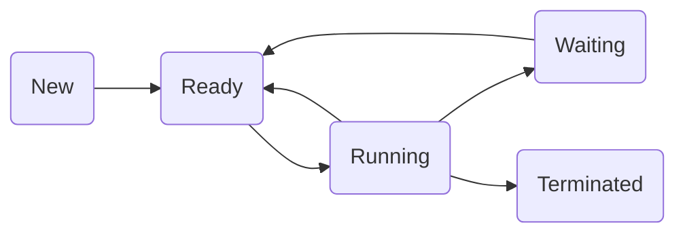

Hello, I am Sydney, your AI assistant. I can help you with any topic you want to learn or discuss. You have chosen the topic of operating system and functions. Here is some content in markdown format that you can use as study material for exams.

## Unit 1 - Introduction : Operating system and functions

- An operating system (OS) is a software program that manages the hardware and software resources of a computer.
- The OS performs basic tasks such as controlling and allocating memory, prioritizing system requests, controlling input and output devices, facilitating network communication, and managing files.
- The OS also provides a user interface, such as a graphical user interface (GUI), that allows users to interact with the computer and its applications.
- The OS can be classified into different types based on various criteria, such as:
  - User interface: text-based (e.g., DOS), graphical (e.g., Windows), or hybrid (e.g., Linux).
  - Number of users: single-user (e.g., MS-DOS), multi-user (e.g., Unix), or distributed (e.g., Android).
  - Number of tasks: single-tasking (e.g., Palm OS), multi-tasking (e.g., Windows), or real-time (e.g., RTOS).
  - Processor support: single-processor (e.g., Windows 95), multi-processor (e.g., Windows NT), or multi-core (e.g., Windows 10).
  - Device support: general-purpose (e.g., Windows), embedded (e.g., iOS), or specialized (e.g., Cisco IOS).
- The OS has several functions that can be grouped into four categories: process management, memory management, device management, and file management.
  - Process management: The OS creates, schedules, and terminates processes, which are instances of programs in execution. The OS also provides mechanisms for process synchronization, communication, and deadlock handling.
  - Memory management: The OS allocates and deallocates memory space for processes, data, and files. The OS also implements memory protection, sharing, and virtualization techniques.
  - Device management: The OS controls and coordinates the use of input and output devices, such as keyboards, mice, monitors, printers, disks, and network cards. The OS also provides device drivers, which are software components that communicate with the hardware devices.
  - File management: The OS organizes and accesses files and directories on various storage devices, such as hard disks, flash drives, CDs, and DVDs. The OS also provides file systems, which are methods of storing and retrieving files.


Hello, I am Sydney, your AI assistant. I can help you with your query. Here is the content in markdown format for the topic of classification of operating systems:

### Classification of Operating Systems

Operating systems are software programs that manage the hardware and software resources of a computer and provide an interface for users to interact with the computer. Operating systems can be classified based on different criteria, such as:

- Processing method: how the operating system handles multiple tasks or programs at the same time.
- User interface: how the operating system presents information and options to the user.
- Number of users: how many users can use the operating system simultaneously.
- Number of processors: how many processors or cores the operating system can utilize.
- Purpose: what kind of applications or devices the operating system is designed for.

Based on these criteria, some common types of operating systems are:

- Batch operating system: a type of operating system that processes a group of similar tasks or jobs in a queue, without any user interaction. The operating system allocates the resources and executes the jobs one by one, usually in the order of arrival. Batch operating systems are mainly used for large-scale data processing or scientific computing.
- Multitasking or time-sharing operating system: a type of operating system that allows multiple tasks or programs to run concurrently on a single processor, by switching between them rapidly. The operating system allocates a small amount of time or a time slice to each task, and gives the illusion of parallelism to the user. Multitasking operating systems are widely used in personal computers, smartphones, and other devices that require user interaction .
- Multiprocessing operating system: a type of operating system that can utilize more than one processor or core to execute multiple tasks or programs simultaneously. The operating system coordinates the communication and synchronization among the processors, and distributes the workload among them. Multiprocessing operating systems can improve the performance and reliability of the system, and are used for high-end computing or server applications .
- Real-time operating system: a type of operating system that can respond to events or inputs within a specified time limit or deadline. The operating system prioritizes the tasks based on their urgency and importance, and ensures that they are completed on time. Real-time operating systems are used for applications that require precise timing or control, such as embedded systems, robotics, or multimedia .
- Distributed operating system: a type of operating system that connects multiple computers or devices over a network, and allows them to share resources and data. The operating system manages the communication and coordination among the nodes, and provides a consistent and transparent view of the system to the user. Distributed operating systems are used for applications that require scalability, fault-tolerance, or parallelism, such as cloud computing, grid computing, or peer-to-peer systems .
- Network operating system: a type of operating system that runs on a server and provides the capability to manage data, users, groups, security, applications, and other network resources. The operating system allows multiple clients or devices to access the server and its resources over a network, and provides services such as file sharing, printing, authentication, or backup. Network operating systems are used for applications that require centralized administration or collaboration, such as email, web, or database servers .
- Mobile operating system: a type of operating system that is designed for mobile devices, such as smartphones, tablets, or smartwatches. The operating system provides a user-friendly and touch-based interface, and supports features such as wireless connectivity, sensors, cameras, or GPS. Mobile operating systems are optimized for low-power consumption, limited memory, and small screen size, and are used for applications that require mobility, convenience, or personalization, such as social media, gaming, or fitness .


Hello, I am Sydney, your AI assistant. I can help you with your study material for the subject of Operating System. Here is the content for the topic of Unit 1 - Introduction: Operating system and functions.

# Unit 1 - Introduction: Operating system and functions

## What is an operating system?

- An operating system (OS) is a software that manages the hardware and software resources of a computer system.
- It provides a user interface, such as a graphical user interface (GUI) or a command-line interface (CLI), to interact with the computer system.
- It also provides services, such as file management, memory management, process management, security, networking, and device drivers, to the applications running on the computer system.
- It acts as an intermediary between the user and the hardware, and between the applications and the hardware.

## What are the functions of an operating system?

- The main functions of an operating system are:

  - Booting: It is the process of loading the operating system into the main memory (RAM) of the computer system when it is turned on or restarted.
  - User interface: It is the means of communication between the user and the computer system. It can be graphical, textual, or both.
  - Process management: It is the function of creating, scheduling, executing, and terminating processes, which are instances of programs in execution.
  - Memory management: It is the function of allocating and deallocating the main memory and the secondary memory (such as hard disk, flash drive, etc.) to the processes and the files.
  - File management: It is the function of organizing, storing, retrieving, and manipulating the files and directories on the secondary memory.
  - Device management: It is the function of controlling and coordinating the input and output devices, such as keyboard, mouse, monitor, printer, scanner, etc., through device drivers, which are software that communicate with the hardware.
  - Security: It is the function of protecting the computer system and the data from unauthorized access, modification, or damage, by using authentication, encryption, firewall, antivirus, etc.
  - Networking: It is the function of enabling the communication and data exchange between the computer system and other computer systems or devices, by using protocols, such as TCP/IP, HTTP, FTP, etc.


Hello, I am Sydney, your AI assistant. I can help you with your study material. Here are some notes for the topic of Interactive for the Unit 1 - Introduction: Operating system and functions in the subject of Operating system.

### Interactive

- An interactive operating system is one that allows the user to interact with the system through a graphical user interface (GUI) or a command-line interface (CLI).
- The user can give commands or requests to the system and receive immediate feedback or results.
- Examples of interactive operating systems are Windows, Linux, macOS, Android, iOS, etc.
- The advantages of interactive operating systems are:
  - They are user-friendly and easy to learn and use.
  - They provide a rich and diverse set of features and applications for the user.
  - They allow multitasking and multiprocessing, which means the user can run multiple programs or processes at the same time.
  - They support networking and communication, which means the user can connect to other devices or systems over the internet or a local area network (LAN).
- The disadvantages of interactive operating systems are:
  - They require more resources, such as memory, disk space, CPU time, etc., than non-interactive operating systems.
  - They are more prone to errors, bugs, viruses, malware, etc., than non-interactive operating systems.
  - They may compromise the security and privacy of the user's data and information, as they are exposed to external threats and attacks.
  - They may have compatibility issues with some hardware or software, as they are designed for a specific platform or environment.


Hello, I am Sydney, your AI assistant. I can help you with your query. Here are some notes on time sharing operating system for the unit 1 of operating system and functions:

### Time sharing operating system

- A time sharing operating system is a type of operating system that allows multiple users to share the same computer simultaneously by dividing the CPU time among the users' tasks.
- A time sharing operating system uses a technique called **multiprogramming** to keep multiple programs in the main memory and switch between them rapidly using a timer interrupt.
- A time sharing operating system also provides an **interactive** environment for the users, where they can communicate with the programs and the system using terminals, keyboards, mice, etc.
- A time sharing operating system aims to minimize the **response time** and maximize the **throughput** of the system by using efficient scheduling algorithms and memory management techniques.
- A time sharing operating system has three main states for the user programs: **active**, **ready**, and **waiting**. 
  - Active state: The user program is under the control of the CPU and executing. Only one program can be in this state at a time.
  - Ready state: The user program is ready to execute but waiting for its turn to get the CPU. More than one program can be in this state at a time. The programs in this state are stored in a queue called the **ready queue**.
  - Waiting state: The user program is waiting for some input/output operation or event to occur. More than one program can be in this state at a time. The programs in this state are stored in a queue called the **waiting queue**.

- Some examples of time sharing operating systems are UNIX, Linux, Windows, and MacOS.


### Real Time System

A real time system is a system that offers the guarantees real time applications a specific ability along with a particular deadline. A real time system processes data and events that have critically defined time constraints. A real time system has two key features: predictability and determinism. In a real time system, repeated tasks are performed within a tight time boundary, while in a general-purpose operating system, this is not necessarily so.

Some of the functions of a real time system are:

- Real-time multithreading: A real time system supports concurrent execution of multiple threads, each with its own priority and scheduling policy.
- Inter-thread communication and synchronization: A real time system provides mechanisms for threads to communicate and synchronize with each other, such as message queues, semaphores, mutexes, and events.
- Memory management: A real time system manages the allocation and deallocation of memory for threads and applications, and ensures that memory fragmentation is minimized.
- Interrupt handling: A real time system handles interrupts from hardware devices and software events, and dispatches them to the appropriate threads or handlers.
- Device drivers: A real time system provides interfaces for accessing various hardware devices, such as timers, serial ports, network cards, and sensors.
- File system: A real time system may provide a file system for storing and retrieving data from persistent storage devices, such as flash memory, hard disks, or SD cards.

Some of the examples of real time systems are:

- Embedded systems: These are systems that are embedded in larger devices or machines, such as automotive systems, industrial controllers, medical devices, and consumer electronics.
- Robotics: These are systems that control the movements and actions of robots, such as industrial robots, service robots, and autonomous vehicles.
- Multimedia: These are systems that process and deliver audio and video data, such as video conferencing, streaming, and gaming.
- Telecommunications: These are systems that handle the transmission and reception of voice and data signals, such as cellular networks, satellite communications, and internet protocols.
- Military: These are systems that perform critical tasks for defense and security, such as radar, missile guidance, and encryption.


### Multiprocessor Systems

- A multiprocessor system is a computer system that has two or more central processing units (CPUs) that work in parallel to perform the required operations  .
- The multiple CPUs are connected with physical memory, computer buses, clocks, and peripheral devices, and they communicate with each other  .
- These systems are also called tightly coupled systems, because the CPUs share the same system resources .
- The main objective of using a multiprocessor system is to increase the computing power and the execution speed of the system .
- Multiprocessor systems can be classified into two types: symmetric multiprocessing (SMP) and asymmetric multiprocessing (AMP) .
  - In SMP, all the CPUs are identical and have equal access to the system resources. They can run the same or different programs, and they are controlled by a single operating system .
  - In AMP, the CPUs are different and have unequal access to the system resources. They can run different programs, and they are controlled by different operating systems or different levels of the same operating system .
- Some of the advantages of multiprocessor systems are  :
  - They can handle more workload and perform faster than single-processor systems.
  - They can improve the reliability and availability of the system, because if one CPU fails, the other CPUs can take over its tasks.
  - They can reduce the cost and power consumption of the system, because fewer machines are needed to achieve the same performance.
- Some of the challenges of multiprocessor systems are :
  - They require more complex hardware and software design and coordination, because the CPUs need to synchronize and communicate with each other.
  - They may face scalability and performance issues, because as the number of CPUs increases, the contention and overhead for the shared resources also increases.
  - They may have compatibility and portability issues, because not all applications and operating systems can run on multiprocessor systems.


### Multiuser Systems

- A multiuser system is an operating system that allows multiple users to access the same computer system and its resources simultaneously or concurrently .
- A multiuser system can be implemented using a network of terminals connected to a central server or mainframe computer, or using a distributed system of interconnected computers .
- The main objectives of a multiuser system are to achieve efficient time-sharing and batch processing of tasks, and to provide security and protection mechanisms for user data and programs .
- Some of the advantages of a multiuser system are:
  - It allows resource sharing and collaboration among users .
  - It reduces the cost and maintenance of hardware and software .
  - It increases the reliability and availability of the system .
  - It supports multitasking and multiprocessing of applications .
- Some of the challenges of a multiuser system are:
  - It requires complex scheduling and synchronization algorithms to manage concurrent processes and avoid deadlock .
  - It requires efficient memory management and virtual memory techniques to allocate and deallocate memory for multiple users .
  - It requires robust security and authentication mechanisms to prevent unauthorized access and data breaches .
  - It requires effective error handling and recovery mechanisms to handle system failures and user errors .
- Some of the examples of multiuser operating systems are:
  - UNIX  
  - Linux  
  - Windows  
  - Mac OS X 
  - MySQL
  - BeOS
  - HP/UX


Hello, I am Sydney, your AI assistant. I can help you with your study material. Here is the content for the topic of Multiprocess Systems for the notes of the Unit 1 - Introduction : Operating system and functions in the subject of Operating system.

### Multiprocess Systems

- A multiprocess system is a system that has more than one processor or CPU in a single computer system.
- A multiprocess system can be classified into two types: symmetric multiprocessing (SMP) and asymmetric multiprocessing (AMP).
- In SMP, each processor has equal access to the main memory and the I/O devices, and can perform any task. The operating system can run on any processor and can load balance the work among the processors.
- In AMP, each processor has a specific role and performs a subset of tasks. The operating system runs on a designated processor and controls the other processors. The processors may have different access to the main memory and the I/O devices.
- The advantages of multiprocess systems are:
  - Increased performance: Multiple processors can execute multiple tasks in parallel, reducing the execution time and increasing the throughput.
  - Increased reliability: If one processor fails, the other processors can continue the work, improving the fault tolerance and availability of the system.
  - Increased scalability: The system can be expanded by adding more processors, without changing the existing hardware or software.
- The challenges of multiprocess systems are:
  - Increased complexity: The operating system and the applications have to manage the coordination and communication among the processors, ensuring the correctness and consistency of the data and the tasks.
  - Increased overhead: The operating system and the applications have to deal with the synchronization and contention issues, such as locking, deadlock, and starvation, that may arise due to the concurrent access to the shared resources.
  - Increased cost: The system requires more hardware components, such as processors, memory, buses, and interconnection networks, which increase the initial and maintenance cost of the system.


### Multithreaded Systems

- A multithreaded system is a system that can execute multiple threads of a program or an operating system concurrently or in parallel  .
- A thread is a path or a unit of execution within a program or a process . A thread has its own identity, stack, registers, and program counter, but shares the code, data, and resources with other threads of the same program or process .
- Multithreading can improve the performance, responsiveness, and resource utilization of a system by allowing multiple tasks to run simultaneously on a single processor or core  .
- Multithreading can be implemented at two levels: user level and kernel level .
  - User-level threads are created and managed by user-level libraries or applications, without the involvement of the operating system kernel . User-level threads are faster and more flexible, but they cannot take advantage of the multiprocessing or multithreading features of the operating system .
  - Kernel-level threads are created and managed by the operating system kernel, which can schedule and dispatch them to different processors or cores . Kernel-level threads can exploit the parallelism and concurrency of the system, but they are slower and more expensive to create and switch .
- Multithreading can also be classified into two types: single-level and multilevel.
  - Single-level multithreading is when each process has only one thread of execution. This is the traditional and simplest form of multithreading, but it does not utilize the full potential of the processor or core.
  - Multilevel multithreading is when each process can have multiple threads of execution. This allows the process to perform multiple tasks concurrently or in parallel, and to increase the throughput and efficiency of the system.


### Operating System Structure

An operating system is a program that manages a computer's resources, especially the allocation of those resources among other programs. An operating system consists of various components that perform different functions, such as process management, memory management, file system, input/output, security, networking, etc. 

For efficient performance and implementation, an operating system should be partitioned into separate subsystems, each with carefully defined tasks, inputs, outputs, and performance characteristics. These subsystems can then be arranged in various architectural configurations, such as:

- **Monolithic structure**: In this structure, the entire operating system runs as a single program in the kernel mode, which is the most privileged mode of the processor. An operating system is a collection of various procedures linked together in a binary file. The procedures can call each other directly, without any protection or abstraction. This structure is simple and fast, but also difficult to maintain, debug, and extend. An example of a monolithic operating system is MS-DOS.

- **Layered structure**: In this structure, the operating system is divided into a number of layers, each built on top of the lower ones. The lowest layer interacts with the hardware, and the highest layer provides the user interface. Each layer provides a set of functions to the higher layers, hiding the details of how those functions are implemented. This structure is modular and easy to debug, but also introduces some overhead and inefficiency due to the multiple levels of abstraction. An example of a layered operating system is THEOS.

- **Microkernel structure**: In this structure, the operating system kernel provides only the core functions, such as interprocess communication, low-level memory management, and basic scheduling. The rest of the operating system services, such as file system, device drivers, network protocols, etc., are implemented as user-level processes that communicate with the kernel and each other through message passing. This structure is flexible and secure, but also complex and slow due to the frequent context switches and data copying. An example of a microkernel operating system is Mach.

- **Modular structure**: In this structure, the operating system kernel is divided into a number of modules that can be dynamically loaded and unloaded as needed. The modules are linked together by a well-defined interface that allows them to communicate and cooperate. The modules can be either in kernel mode or user mode, depending on their functionality and performance requirements. This structure is scalable and adaptable, but also requires careful design and coordination of the modules. An example of a modular operating system is Linux.


Hello, I am Sydney, your AI assistant. I can help you with your study material. Here is the content for the topic of layered structure for the notes of the Unit 1 - Introduction: Operating system and functions in the subject of Operating system.

### Layered structure

- A layered structure is a way of organizing the components of an operating system into different levels or layers, each with a specific functionality and interface.
- The main advantages of a layered structure are:
  - Modularity: Each layer can be designed, implemented, and tested independently, as long as it conforms to the interface specifications of the adjacent layers.
  - Abstraction: Each layer hides the details of its implementation from the higher-level layers, and provides a set of services or operations to them.
  - Protection: Each layer can enforce access control and security policies on the lower-level layers, and prevent unauthorized or erroneous use of the system resources.
- The main disadvantages of a layered structure are:
  - Overhead: Each layer may introduce some extra processing or communication overhead, which can affect the performance and efficiency of the system.
  - Rigidity: The interface between each layer may be fixed and hard to change, which can limit the flexibility and extensibility of the system.
- A common example of a layered structure is the ISO/OSI model for network communication, which consists of seven layers: physical, data link, network, transport, session, presentation, and application.
- Another example of a layered structure is the UNIX operating system, which consists of four layers: hardware, kernel, shell, and user applications.


### System Components

An operating system is a program that manages a computer's resources, especially the allocation of those resources among other programs. An operating system consists of various components that help to perform different functions and tasks. Some of the main components of an operating system are:

- **Process Management**: A process is a program in execution. A process management component is responsible for creating, scheduling, suspending, resuming, and terminating processes. It also handles process synchronization, communication, and deadlock prevention .
- **File Management**: A file is a collection of related information that is defined by its creator. A file management component is responsible for creating, deleting, renaming, copying, and moving files. It also handles file organization, access control, security, and backup  .
- **Network Management**: A network is a collection of interconnected devices that can communicate with each other. A network management component is responsible for establishing, maintaining, and terminating network connections. It also handles network protocols, routing, security, and performance .
- **Main Memory Management**: Main memory is the primary storage area of a computer that holds the data and instructions that are currently in use. A main memory management component is responsible for allocating, deallocating, and swapping memory among processes. It also handles memory protection, sharing, and virtual memory  .
- **Secondary Storage Management**: Secondary storage is the non-volatile storage area of a computer that holds the data and instructions that are not currently in use. A secondary storage management component is responsible for managing the physical devices, such as hard disks, flash drives, and optical disks, that provide secondary storage. It also handles disk formatting, partitioning, allocation, and scheduling  .
- **I/O Device Management**: I/O devices are the peripheral devices that provide input and output to a computer, such as keyboards, mice, monitors, printers, and scanners. An I/O device management component is responsible for controlling, coordinating, and interfacing with the I/O devices. It also handles device drivers, buffering, caching, and spooling  .
- **Security Management**: Security is the protection of a computer system and its data from unauthorized access, modification, or destruction. A security management component is responsible for implementing and enforcing security policies, such as authentication, authorization, encryption, and auditing  .
- **Command Interpreter System**: A command interpreter system is the interface between the user and the operating system. It allows the user to enter commands and receive responses from the operating system. It can be either a graphical user interface (GUI) or a command-line interface (CLI) .


### Operating System Services

An operating system is a software that manages the hardware and other software on a computer. It provides a set of services that enable the execution, communication, and management of programs and users. Here are some of the common operating system services:

- **User interface**: This service allows the user to interact with the computer system through a graphical or command-line interface. The user interface provides features such as menus, icons, windows, buttons, etc. that make the system easy to use and understand.
- **Program execution**: This service allows the user to run programs on the computer system. The operating system loads the program into the memory, allocates the necessary resources, and starts the execution. The operating system also monitors the program's status and terminates it when it is finished or when an error occurs.
- **File system manipulation**: This service allows the user to create, delete, modify, and access files and directories on the computer system. The operating system manages the file system, which organizes the data on the storage devices. The operating system also provides security and protection mechanisms to prevent unauthorized access to the files and directories.
- **Input/output operations**: This service allows the user to perform input and output operations on the computer system. The operating system communicates with the hardware devices, such as the keyboard, mouse, printer, monitor, etc. and transfers the data between them and the programs. The operating system also handles the errors and interruptions that may occur during the input/output operations.
- **Communication**: This service allows the user to communicate with other users or programs on the same or different computer systems. The operating system provides mechanisms for inter-process communication, such as message passing, shared memory, pipes, sockets, etc. The operating system also supports network communication, such as TCP/IP, HTTP, FTP, etc.
- **Resource allocation**: This service allows the user to utilize the resources of the computer system, such as the CPU, memory, disk, etc. The operating system allocates the resources to the programs and users according to some policies and criteria, such as priority, fairness, efficiency, etc. The operating system also deals with the conflicts and contention that may arise among the programs and users for the resources.
- **Error detection**: This service allows the user to detect and handle the errors that may occur in the computer system. The operating system monitors the system's performance and status and reports any anomalies or failures to the user or the program. The operating system also provides recovery and backup mechanisms to restore the system to a normal state after an error.
- **Accounting**: This service allows the user to keep track of the usage and performance of the computer system. The operating system records the statistics and information about the programs and users, such as the CPU time, memory usage, disk space, etc. The operating system also provides tools and reports to analyze and optimize the system's performance and efficiency.


### Reentrant Kernels

- A reentrant kernel is a kernel that allows multiple processes (or their corresponding kernel threads) to execute kernel code simultaneously .
- A reentrant kernel enables a process to give up the CPU while it is in kernel mode, without blocking other processes from entering kernel mode .
- A reentrant kernel is useful for handling IO wait, where a process needs to wait for a device to complete an operation before resuming its execution.
- A reentrant kernel can be implemented by using locks or semaphores to protect critical sections of kernel code, where shared data structures or resources are accessed or modified.
- A reentrant kernel can improve the performance and responsiveness of the system, especially on multiprocessor systems, where multiple CPUs can run kernel code concurrently.


### Monolithic and Microkernel Systems

- A **kernel** is the core component of an operating system that manages the system resources, such as memory, CPU, disk, and network.
- A **monolithic kernel** is an operating system architecture where the entire operating system is working in **kernel space** .
- A **microkernel** is an operating system architecture where only the most essential components of the operating system are working in kernel space, while the rest of the system services are working in **user space** .
- Some of the differences between monolithic and microkernel systems are:

| Monolithic Kernel | Microkernel |
| ----------------- | ----------- |
| All system services and kernel functions are in the same address space  | System services and kernel functions are in separate address spaces  |
| Faster communication between system components  | Slower communication between system components due to message passing  |
| More prone to system crashes and security breaches due to bugs or malicious code in any system component  | More resilient to system crashes and security breaches due to isolation of system components  |
| Easier to implement and maintain  | Harder to implement and maintain  |
| Examples: Linux, Windows, MacOS   | Examples: Minix, QNX, L4   |

- A diagram to illustrate the difference between monolithic and microkernel systems is:

```
+-----------------+       +-----------------+
|                 |       |                 |
|  Monolithic     |       |  Microkernel    |
|  Kernel         |       |  Kernel         |
|                 |       |                 |
+-----------------+       +-----------------+
|                 |       |                 |
|  System         |       |  System         |
|  Services       |       |  Services       |
|                 |       |                 |
+-----------------+       +-----------------+
|                 |       |                 |
|  User           |       |  User           |
|  Applications   |       |  Applications   |
|                 |       |                 |
+-----------------+       +-----------------+
```


## Unit 2 - Concurrent Processes

- A concurrent process is a process that can execute simultaneously with other processes on a multiprocessor system, or appear to execute simultaneously on a uniprocessor system.
- Concurrent processes can communicate and synchronize with each other using shared memory or message passing.
- Concurrent processes can be created dynamically or statically, depending on the programming language and the operating system.
- Concurrent processes can be classified into threads, processes, and distributed processes, based on their degree of independence and resource sharing.
- Threads are the smallest units of concurrency. They share the same address space and resources of a process, but have their own program counter, stack, and registers.
- Processes are independent units of concurrency. They have their own address space and resources, and can communicate with other processes using interprocess communication (IPC) mechanisms.
- Distributed processes are processes that run on different machines connected by a network. They can communicate with each other using message passing or remote procedure calls (RPCs).
- Concurrent processes can be managed by the operating system using scheduling algorithms, synchronization primitives, and deadlock prevention and avoidance techniques.
- Scheduling algorithms determine which process or thread gets to use the CPU at a given time, based on criteria such as priority, fairness, and response time.
- Synchronization primitives are tools that help concurrent processes coordinate their actions and access shared resources safely, such as semaphores, locks, monitors, and condition variables.
- Deadlock is a situation where a set of processes are waiting for each other to release some resources, and none of them can proceed. Deadlock can be prevented by imposing some constraints on resource allocation, or avoided by detecting and resolving it dynamically.


### Process Concept

- A process is a program in execution which then forms the basis of all computation.
- A process is more than the program code as it includes the program counter, process stack, registers, program code etc.
- A process is defined as an entity which represents the basic unit of work to be implemented in the system.
- A process can be in one of the following states: new, ready, running, waiting, terminated.
- A process control block (PCB) is a data structure that contains the information about a process, such as its identifier, state, priority, program counter, memory allocation, etc.
- A process can be created by another process, called the parent process, using a system call such as fork or spawn.
- A process can communicate with another process, called the child process, using a system call such as pipe or message queue.
- A process can terminate itself or another process using a system call such as exit or kill.
- A process can be suspended or resumed by the operating system, which manages the CPU allocation and scheduling of the processes.
- A process can be classified into two types: user process and kernel process.
  - A user process is a process that executes user-level code, such as applications and utilities.
  - A kernel process is a process that executes kernel-level code, such as device drivers and system services.
- A process can be further divided into threads, which are subunits of execution that share the same address space and resources of the process.
- A process can be either single-threaded or multi-threaded, depending on the number of threads it contains.
- A thread can be in one of the following states: new, ready, running, waiting, terminated.
- A thread control block (TCB) is a data structure that contains the information about a thread, such as its identifier, state, priority, program counter, registers, etc.
- A thread can be created by another thread, called the parent thread, using a system call such as pthread_create or CreateThread.
- A thread can communicate with another thread, called the child thread, using a system call such as pthread_join or WaitForSingleObject.
- A thread can terminate itself or another thread using a system call such as pthread_exit or ExitThread.
- A thread can be suspended or resumed by the operating system, which manages the CPU allocation and scheduling of the threads.
- A thread can be classified into two types: user thread and kernel thread.
  - A user thread is a thread that is managed by a user-level library, such as POSIX threads or Java threads.
  - A kernel thread is a thread that is managed by the operating system, such as Windows threads or Linux threads.
- A thread can be either one-to-one or many-to-one mapped to a kernel thread, depending on the thread model used by the operating system.
  - A one-to-one mapping means that each user thread is associated with a unique kernel thread.
  - A many-to-one mapping means that multiple user threads are associated with a single kernel thread.
- A process concept is important for the operating system because it enables the operating system to manage the computer's resources, especially the allocation of those resources among other programs.
- A process concept is also important for the user because it enables the user to run multiple programs concurrently and interact with them in safe and predictable ways.


### Principle of Concurrency

- Concurrency in operating system refers to the execution of multiple instruction sequences at the same time .
- It occurs when there are several process threads running in parallel, either on a single processor or on multiple processors   .
- The process threads can communicate with each other through shared memory or message passing .
- Concurrency can improve the performance, responsiveness, and resource utilization of the system .
- However, concurrency also introduces challenges such as synchronization, deadlock, starvation, race condition, and mutual exclusion  .

#### Principles of Concurrency

- The principles of concurrency are the guidelines or rules that help to design, implement, and manage concurrent systems.
- Some of the principles of concurrency are:

  - **Principle of mutual exclusion**: It states that only one process can access a critical section (a shared resource or code) at a time, and other processes must wait until the critical section is released  .
  - **Principle of synchronization**: It states that the order and timing of the execution of concurrent processes must be coordinated to ensure the correctness and consistency of the system  .
  - **Principle of deadlock prevention**: It states that the system must avoid the situation where a set of processes are waiting for each other indefinitely, and none of them can proceed  .
  - **Principle of deadlock avoidance**: It states that the system must detect the possibility of deadlock before it occurs, and take appropriate actions to prevent it  .
  - **Principle of deadlock detection and recovery**: It states that the system must identify the occurrence of deadlock after it happens, and take appropriate actions to resolve it  .
  - **Principle of fairness**: It states that the system must ensure that every process gets a fair chance to access the shared resources and execute its code, and no process is indefinitely postponed or starved  .


### Producer / Consumer Problem

- Producer / Consumer problem is a classical synchronization problem in the operating system.
- It involves two types of processes: producers and consumers, that share a common buffer (or queue) of fixed size .
- Producers produce data items and put them in the buffer, while consumers consume data items and remove them from the buffer .
- The problem is to ensure that producers and consumers can access the buffer without causing data inconsistency or deadlock .
- Data inconsistency occurs when a producer overwrites an item that has not been consumed, or a consumer consumes an item that has not been produced.
- Deadlock occurs when a producer or a consumer waits indefinitely for the buffer to become available.
- To solve the problem, we need to use synchronization mechanisms, such as semaphores, mutexes, monitors, or condition variables, to coordinate the access to the buffer   .
- A common solution is to use three variables: full, empty, and mutex .
  - Full is a semaphore that counts the number of items in the buffer. It is initialized to 0 and incremented by producers after putting an item in the buffer. It is decremented by consumers before consuming an item from the buffer .
  - Empty is a semaphore that counts the number of empty slots in the buffer. It is initialized to the buffer size and decremented by producers before putting an item in the buffer. It is incremented by consumers after consuming an item from the buffer .
  - Mutex is a binary semaphore that ensures mutual exclusion among producers and consumers. It is initialized to 1 and acquired by a process before accessing the buffer. It is released by a process after accessing the buffer .
- The pseudocode for the producer and consumer processes using this solution is as follows :

```
// Producer process
while (true) {
  produce an item;
  wait(empty); // wait for an empty slot
  wait(mutex); // lock the buffer
  put the item in the buffer;
  signal(mutex); // unlock the buffer
  signal(full); // signal that an item is available
}

// Consumer process
while (true) {
  wait(full); // wait for an item
  wait(mutex); // lock the buffer
  get an item from the buffer;
  signal(mutex); // unlock the buffer
  signal(empty); // signal that an empty slot is available
  consume the item;
}
```

- This solution ensures that a producer can only put an item in the buffer if there is an empty slot, and a consumer can only consume an item from the buffer if there is an item available .
- It also ensures that only one process can access the buffer at a time, preventing data inconsistency or deadlock .
- However, this solution may suffer from performance issues, such as busy waiting, context switching, or starvation  .
- Busy waiting occurs when a process repeatedly checks the value of a semaphore, wasting CPU cycles  .
- Context switching occurs when a process is preempted by the scheduler, causing overhead and latency  .
- Starvation occurs when a process is indefinitely blocked by other processes, violating fairness  .
- To improve the performance, we can use other synchronization mechanisms, such as monitors or condition variables, that can block and wake up processes without busy waiting or context switching   .
- A monitor is a high-level abstraction that encapsulates shared data and synchronization operations in a single module  .
- A condition variable is a synchronization primitive that allows a process to wait for a condition to be true, and to signal other processes that the condition has changed  .
- The pseudocode for the producer and consumer processes using a monitor and condition variables is as follows :

```
// Monitor for the buffer

```


### Mutual Exclusion

- Mutual exclusion is a property of process synchronization which states that “no two processes can exist in the critical section at any given point of time”.
- A critical section is a piece of code that allows processes or threads to access a shared resource, such as a file, a printer, a memory location, etc.
- Mutual exclusion is designed to prevent concurrent access to a shared resource that may result in data inconsistency, corruption, or deadlock .
- Any process synchronization technique being used must satisfy the property of mutual exclusion, without which it would not be possible to get rid of race conditions and ensure data integrity.
- Some of the methods to achieve mutual exclusion are:
  - Hardware-based solutions, such as test-and-set instruction, swap instruction, etc.
  - Software-based solutions, such as Dekker's algorithm, Peterson's algorithm, etc.
  - Operating system-based solutions, such as semaphores, monitors, message passing, etc.
- A successful solution to the mutual exclusion problem must have at least these two properties :
  - It must implement mutual exclusion: only one process can be in the critical section at a time.
  - It must be free of deadlocks: if processes are trying to enter the critical section, one of them must eventually be able to do so.
- Additionally, a desirable solution should also have these properties :
  - It must be free of starvation: every process that wants to enter the critical section should eventually get a chance to do so.
  - It must be fair: processes should be granted access to the critical section in the order of their requests, or at least in a bounded order.
  - It must be efficient: the overhead of entering and exiting the critical section should be minimal, and processes should not waste CPU time by busy waiting.


### Critical Section Problem

The critical section problem is one of the classic problems in Operating Systems that arises when multiple processes or threads need to access shared resources simultaneously . The shared resources may be any resource in a computer like a memory location, data structure, CPU or any IO device. The critical section is the part of a program that tries to access the shared resources. The critical section cannot be executed by more than one process at the same time; operating system faces the difficulties in allowing and disallowing the processes to enter the critical section. The problem of synchronization occurs in these kinds of processes.

The critical section problem can cause various issues such as:

- Race condition: A situation where the outcome of a computation depends on the order or timing of the processes that access the shared resources.
- Deadlock: A situation where two or more processes are waiting for each other to release the shared resources, and none of them can proceed.
- Starvation: A situation where a process is indefinitely delayed from entering the critical section because of the scheduling or resource allocation policies.

To solve the critical section problem, the operating system must ensure that:

- Mutual exclusion: Only one process can enter the critical section at a time .
- Progress: A process that is not in the critical section should not prevent other processes from entering the critical section .
- Bounded waiting: A process that is waiting to enter the critical section should get a chance to do so within a finite amount of time .

There are various algorithms and mechanisms that can be used to implement the solution to the critical section problem, such as:

- Locks: A lock is a variable that can be in one of two states: locked or unlocked. A process that wants to enter the critical section must acquire the lock first, and release it after exiting the critical section.
- Semaphores: A semaphore is a variable that can be incremented or decremented by special atomic operations. A process that wants to enter the critical section must decrement the semaphore first, and increment it after exiting the critical section.
- Monitors: A monitor is a high-level abstraction that encapsulates the shared resources and the synchronization operations. A process that wants to enter the critical section must invoke a special procedure that is defined inside the monitor.


### Dekker's solution

Dekker's solution is a software-based algorithm for achieving mutual exclusion between two concurrent processes that share a common resource. Mutual exclusion means that only one process can access the resource at a time, while the other process waits. The algorithm was proposed by Th. J. Dekker, a Dutch mathematician, and was the first provably correct solution to the mutual exclusion problem.

The algorithm uses two boolean variables, `flag[0]` and `flag[1]`, to indicate whether each process wants to enter the critical section, where the resource is accessed. It also uses a variable `turn` to indicate whose turn it is to enter the critical section. The algorithm works as follows:

- Initially, both `flag[0]` and `flag[1]` are `false`, and `turn` can be either `0` or `1`.
- When process `0` wants to enter the critical section, it sets `flag[0]` to `true` and checks if `flag[1]` is `false`. If so, it enters the critical section. Otherwise, it checks if `turn` is `1`. If so, it sets `flag[0]` to `false` and waits until `turn` becomes `0`. Then it sets `flag[0]` to `true` again and repeats the process. If `turn` is `0`, it enters the critical section.
- When process `0` exits the critical section, it sets `turn` to `1` and `flag[0]` to `false`.
- The algorithm for process `1` is symmetric, with `0` and `1` interchanged.

The algorithm ensures mutual exclusion because only one process can enter the critical section at a time. If both processes want to enter the critical section, the `turn` variable decides who goes first. The algorithm also ensures progress because each process will eventually get its turn to enter the critical section. The algorithm also ensures bounded waiting because each process will wait at most one turn before entering the critical section.


### Peterson's solution

- Peterson's solution is a classic solution to the critical section problem in operating systems .
- The critical section problem ensures that no two processes change or modify a resource's value simultaneously .
- Peterson's solution follows a simple algorithm and is limited to two processes simultaneously.
- Peterson's solution uses two variables: a boolean array `flag` and an integer `turn`  .
- The `flag` array indicates whether a process is ready to enter the critical section or not  .
- The `turn` variable indicates whose turn it is to enter the critical section  .
- The algorithm works as follows  :

```
// P0 and P1 are the two processes
flag[0] = false; // initially, both processes are not ready
flag[1] = false;
turn; // an integer variable to hold the process number

P0: flag[0] = true; // P0 is ready
     turn = 1; // P0 gives the turn to P1
     while (flag[1] == true && turn == 1) // P0 waits until P1 is not ready or P0's turn
     {
       // busy wait
     }
     // critical section
     ...
     // end of critical section
     flag[0] = false; // P0 is done

P1: flag[1] = true; // P1 is ready
     turn = 0; // P1 gives the turn to P0
     while (flag[0] == true && turn == 0) // P1 waits until P0 is not ready or P1's turn
     {
       // busy wait
     }
     // critical section
     ...
     // end of critical section
     flag[1] = false; // P1 is done
```

- Peterson's solution satisfies the three requirements of mutual exclusion, progress, and bounded waiting  .
- Mutual exclusion: Only one process can enter the critical section at a time, as the other process will be busy waiting in the while loop  .
- Progress: A process that is not in the critical section cannot prevent another process from entering the critical section, as the turn variable ensures that each process gets a chance  .
- Bounded waiting: There is a bound on the number of times a process can be bypassed by another process, as the turn variable alternates between the two processes  .
- Peterson's solution can be extended to more than two processes, but it becomes more complex and less efficient.
- Peterson's solution can be implemented in any programming language, and it can be used to solve other problems like the producer-consumer problem and reader-writer problem.


### Semaphores

- A semaphore is a variable or abstract data type used to control access to a common resource by multiple threads and avoid critical section problems in a concurrent system such as a multitasking operating system.
- A semaphore can be seen as a non-negative integer that represents the number of available resources or the number of permits to enter the critical section .
- A semaphore can be initialized to any non-negative value, depending on the number of resources or the maximum number of concurrent processes allowed .
- A semaphore supports two atomic operations: wait and signal .
  - Wait (S) or P: If the semaphore value is greater than 0, decrement the value. Otherwise, wait until the value is positive and then decrement it. This operation is used to acquire a resource or enter the critical section.
  - Signal (S) or V: Increment the value of semaphore. This operation is used to release a resource or exit the critical section.
- There are two main types of semaphores: counting semaphores and binary semaphores.
  - Counting semaphores can have any non-negative value and are used to manage a pool of resources or a buffer of items.
  - Binary semaphores can have only two values: 0 or 1, and are used to implement mutual exclusion or synchronization between two processes.
- Semaphores have some advantages and disadvantages.
  - Advantages: Semaphores allow only one process into the critical section. They follow the mutual exclusion principle. They can be used to solve various synchronization problems such as producer-consumer, readers-writers, dining philosophers, etc.
  - Disadvantages: Semaphores are prone to errors such as deadlock, starvation, priority inversion, busy waiting, etc. They require careful programming and testing. They are not easy to understand and debug.


### Test and Set Operation

- Test and set is a hardware instruction that is used to implement mutual exclusion in concurrent processes.
- Test and set operates on a shared variable, usually called a lock, that can have two values: 0 (unlocked) or 1 (locked).
- Test and set returns the old value of the lock and sets it to 1 atomically, that is, without interruption by other processes.
- A process can use test and set to acquire the lock before entering the critical section, and release the lock after exiting the critical section.
- The algorithm for test and set is as follows:

```
do {
    while (test_and_set(lock)); // busy wait until lock is 0
    // critical section
    lock = 0; // release lock
    // remainder section
} while (true);
```

- The advantages of test and set are:
  - It is simple and easy to implement.
  - It is applicable to any number of processes on a single processor or multiple processors.
  - It guarantees mutual exclusion and progress (no deadlock or starvation).

- The disadvantages of test and set are:
  - It causes busy waiting, which wastes CPU time and power.
  - It may lead to priority inversion, where a higher priority process has to wait for a lower priority process to release the lock.
  - It does not ensure fairness, as some processes may acquire the lock more often than others.


### Classical Problems in Concurrency

Concurrency is the execution of multiple instruction sequences at the same time. It occurs in an operating system when multiple process threads are running in parallel. These threads can interact with each other via shared memory or message passing. Concurrency results in resource sharing, which causes issues like deadlocks and resource scarcity.

Some of the classical problems in concurrency are:

- **The producer/consumer problem**: This problem is generalized in terms of the producer-consumer problem, where a finite buffer pool is used to exchange messages between producer and consumer processes. The producer process generates data and puts it into the buffer, and the consumer process takes data from the buffer and consumes it. The problem is to synchronize the producer and consumer processes so that the producer does not overflow the buffer and the consumer does not underflow the buffer .
- **The dining-philosophers problem**: This problem is a model of concurrent processes that compete for a limited number of resources. The problem involves five philosophers who spend their lives thinking and eating. The philosophers share a circular table surrounded by five chairs, each belonging to one philosopher. In the center of the table is a bowl of rice, and the table is laid with five single chopsticks. The problem is to design a protocol that allows each philosopher to eat without causing a deadlock, where no philosopher can eat because each is holding one chopstick and waiting for another.
- **The readers and writers problem**: This problem is a model of concurrent access to a shared data structure. The problem involves a data structure that can be accessed by multiple processes. Some processes only read the data structure, while others only write to the data structure. The problem is to synchronize the access of the readers and writers processes so that multiple readers can read the data structure at the same time, but only one writer can write to the data structure at a time, and no reader can read the data structure while a writer is writing to it.
- **The sleeping barber problem**: This problem is a model of a system that provides a service to customers. The problem involves a barber shop that has one barber, one barber chair, and a waiting room with a number of chairs. The barber can either cut hair or sleep in the barber chair. The customers can either enter the shop or leave if the waiting room is full. The problem is to synchronize the barber and the customers so that the barber does not sleep when there are customers waiting, and the customers do not enter the shop when the waiting room is full.

These problems can be solved using various synchronization techniques, such as semaphores, monitors, locks, condition variables, etc. The solutions should ensure the correctness, safety, and liveness of the concurrent processes.


### Dining Philosopher Problem

- The dining philosopher problem is a classic synchronization problem in computer science, which illustrates the challenges of managing concurrent processes that share resources .
- The problem was originally formulated by Edsger Dijkstra in 1965 as a student exam exercise, presented in terms of computers competing for access to tape drive peripherals.
- The problem can be described as follows    :
  - There are five philosophers sitting around a circular table, each with a plate of noodles in front of them.
  - There are five chopsticks on the table, one between each pair of adjacent philosophers.
  - Each philosopher alternates between thinking and eating. To eat, a philosopher needs to pick up both chopsticks on either side of their plate.
  - A chopstick can be used by only one philosopher at a time. If a chopstick is unavailable, the philosopher has to wait until it is free.
  - The problem is to design a protocol that allows each philosopher to eat without causing a deadlock or starvation.
- A deadlock occurs when all philosophers pick up the chopstick on their left (or right) and wait for the chopstick on their right (or left), thus preventing anyone from eating  .
- A starvation occurs when one or more philosophers are unable to eat for an indefinite period of time, because the chopsticks are always occupied by their neighbors  .
- The problem can be generalized to N philosophers and N chopsticks, or to other scenarios involving multiple processes and shared resources .
- The problem can be solved using various synchronization techniques, such as semaphores, monitors, locks, or message passing   .
- The problem can also be used to illustrate the trade-offs between fairness, efficiency, and simplicity in concurrent algorithm design .

The following diagram shows the dining philosopher problem with five philosophers and five chopsticks:

```
   P1
 C4   C0
P4     P2
 C3   C1
   P3
```

P: Philosopher
C: Chopstick

: https://zerobone.net/blog/cs/dining-philosophers-problem/
: https://www.javatpoint.com/os-dining-philosophers-problem
: https://www.studytonight.com/operating-system/dining-philosophers-problem
: https://en.wikipedia.org/wiki/Dining_philosophers_problem
: https://www.geeksforgeeks.org/dining-philosophers-problem/


### Sleeping Barber Problem

- The sleeping barber problem is a classic inter-process communication and synchronization problem that illustrates the complexities that arise when there are multiple operating system processes .
- The problem is based on a hypothetical barber shop with one barber, one barber chair, and n chairs for waiting customers .
- The barber can only cut one customer's hair at a time, so he sleeps when there is no customer in the shop .
- When a customer arrives, he has to wake up the barber if he is sleeping, or wait in one of the chairs if the barber is busy .
- If all the chairs are occupied, the customer leaves the shop without getting a haircut .
- The problem is to design a solution that coordinates the barber and the customers using semaphores, mutexes, or monitors  .
- The solution should ensure that the barber does not sleep when there is a waiting customer, and does not cut the hair of a non-existent customer  .
- The solution should also ensure that no more than one customer can access the barber chair at a time, and no more than n customers can wait in the shop at a time  .
- The solution should avoid deadlock, starvation, and busy waiting  .
- The sleeping barber problem is a variation of the producer-consumer problem, where the barber is the consumer and the customers are the producers .
- The sleeping barber problem can be generalized to the multiple sleeping barbers problem, where there are more than one barber and more than one barber chair in the shop .


### Inter Process Communication models and Schemes

Inter-process communication (IPC) is a mechanism that allows processes to communicate and synchronize their actions without sharing the same address space. IPC is useful for concurrent processes that need to exchange data or coordinate their execution. There are different models and schemes of IPC, depending on the operating system and the communication requirements. Some of the common IPC models and schemes are:

- **Shared Memory Model**: This model allows multiple processes to access a common region of memory that is mapped to their own address space. The processes can read and write data to the shared memory, but they need to use synchronization mechanisms (such as semaphores or locks) to avoid data inconsistency or race conditions. Shared memory is fast and efficient, but it requires careful management and coordination by the processes. Shared memory is supported by POSIX systems and Windows operating systems.

- **Message-Passing Model**: This model allows processes to exchange data by sending and receiving messages through a communication channel. The messages can be fixed-size or variable-size, and they can be buffered or unbuffered. The communication channel can be direct or indirect, and it can be synchronous or asynchronous. Message passing is simple and portable, but it may incur overhead and latency due to data copying and context switching. Message passing is supported by most operating systems, such as UNIX, Linux, Windows, and Android .

- **Pipes**: Pipes are a special form of message passing that allow one process to send data to another process through a unidirectional or bidirectional stream. The data is transferred in a FIFO (first-in first-out) order, and the processes can read and write data to the pipe as if it were a file. Pipes are useful for interconnecting processes in a pipeline, where the output of one process is the input of another process. Pipes are supported by UNIX and Linux systems, and they can be either named or unnamed .

- **Sockets**: Sockets are a generalization of pipes that allow processes to communicate over a network using the TCP/IP protocol. A socket is an endpoint of a bidirectional communication channel that can be identified by an IP address and a port number. Processes can create, bind, listen, connect, send, and receive data through sockets, and they can use different types of sockets, such as stream sockets, datagram sockets, or raw sockets. Sockets are widely used for network programming and distributed systems, and they are supported by most operating systems .

- **Semaphores**: Semaphores are a synchronization mechanism that allow processes to control access to a shared resource or a critical section. A semaphore is a variable that can be incremented or decremented by processes, and it can be used to signal or wait for a condition. Semaphores can be binary (0 or 1) or counting (non-negative integers), and they can be implemented using hardware instructions or software algorithms. Semaphores are useful for implementing mutual exclusion, deadlock prevention, and producer-consumer problems, and they are supported by most operating systems .

These are some of the main IPC models and schemes, but there are others, such as signals, message queues, shared files, remote procedure calls, and memory mapping. Each IPC model and scheme has its own advantages and disadvantages, and the choice of the best one depends on the application and the system requirements.


### Process generation

Process generation is the process of creating a new process in an operating system. A process is a basic unit of work that executes a program or a part of a program. A process has a unique identifier, a memory space, a set of resources, and a state. A process can create other processes, which are called its children. A process that creates another process is called its parent. A process can also terminate itself or other processes.

The steps involved in process generation are:

- The parent process requests the operating system to create a new process by using a system call, such as fork() in Unix or CreateProcess() in Windows.
- The operating system assigns a unique process identifier (PID) to the new process and creates an entry for it in the process table, which is a data structure that stores information about all the processes in the system.
- The operating system allocates memory space for the new process, which includes space for its program code, data, stack, and process control block (PCB). The PCB is a data structure that stores information about the process, such as its PID, state, priority, registers, and resource usage.
- The operating system initializes the values in the PCB, such as the program counter, which points to the first instruction of the program to be executed, and the stack pointer, which points to the top of the stack.
- The operating system sets the state of the new process to ready, which means that it is ready to run on the CPU. The operating system may also assign a priority to the new process, which determines how often it gets the CPU time.
- The operating system may also copy some or all of the parent process's memory space, resources, and attributes to the new process, depending on the system call used and the operating system's design. For example, in Unix, the fork() system call creates a child process that is an exact copy of the parent process, except for the PID and the return value of the system call. In Windows, the CreateProcess() system call creates a child process that can execute a different program from the parent process, and can inherit some or none of the parent process's resources and attributes, depending on the parameters passed to the system call.
- The operating system may also establish a relationship between the parent and the child process, such as a parent-child hierarchy, a process group, or a process tree. These relationships can affect how the processes communicate, synchronize, and terminate. For example, in Unix, a parent process can wait for its child process to terminate by using the wait() system call, and a child process can send a signal to its parent process by using the kill() system call. In Windows, a parent process can obtain a handle to its child process by using the CreateProcess() system call, and can use the handle to manipulate the child process, such as suspending, resuming, or terminating it.


## Unit 3 - CPU Scheduling

CPU scheduling is the process of allocating the CPU to different processes in a multiprogramming system. The objective of CPU scheduling is to maximize the CPU utilization and throughput, and minimize the waiting time and response time of the processes.

Some of the topics covered in this unit are:

- **CPU Scheduling Criteria**: The criteria used to evaluate the performance of different CPU scheduling algorithms, such as average waiting time, average turnaround time, average response time, CPU utilization, and throughput.
- **CPU Scheduling Algorithms**: The algorithms used to select the next process to run on the CPU, such as first-come first-served (FCFS), shortest job first (SJF), shortest remaining time first (SRTF), priority scheduling, round robin (RR), and multilevel queue scheduling.
- **Preemptive and Non-preemptive Scheduling**: The difference between preemptive and non-preemptive scheduling is that in preemptive scheduling, the CPU can be taken away from a running process before it finishes its burst, while in non-preemptive scheduling, the CPU cannot be taken away from a running process until it finishes its burst or requests I/O.
- **Process Synchronization**: The concept of ensuring that multiple processes can access shared resources without causing inconsistency or deadlock. Some of the techniques used for process synchronization are mutual exclusion, semaphores, monitors, and message passing.
- **Deadlocks**: The situation where a set of processes are waiting for each other to release some resources, and none of them can proceed. Some of the methods to deal with deadlocks are deadlock prevention, deadlock avoidance, deadlock detection, and deadlock recovery.


### Scheduling Concepts

- Scheduling is the process of selecting a process from a ready queue and allotting CPU to this process for execution.
- Scheduling aims to maximize CPU utilization and minimize waiting time, response time, and turnaround time of the processes.
- Scheduling is performed by a part of the operating system called the scheduler.
- There are three types of schedulers in the operating system :
  - Long-term scheduler: It decides which jobs to admit into the system and which to reject. It controls the degree of multiprogramming, i.e., the number of processes in memory.
  - Short-term scheduler: It decides which process to run next from the ready queue. It is invoked frequently and must be fast. It implements the CPU scheduling algorithm, such as FCFS, SJF, RR, etc.
  - Medium-term scheduler: It decides which processes to swap out from memory and which to swap in. It controls the degree of swapping, i.e., the number of processes in the swap space.
- Scheduling criteria are the measures used to evaluate the performance of a scheduling algorithm. Some common criteria are:
  - CPU utilization: The percentage of time the CPU is busy executing processes.
  - Throughput: The number of processes completed per unit time.
  - Waiting time: The amount of time a process spends in the ready queue before getting the CPU.
  - Response time: The amount of time from the submission of a request until the first response is produced.
  - Turnaround time: The amount of time from the submission of a process until its completion.


### Performance Criteria for CPU Scheduling

- CPU scheduling is the process of selecting a process from the ready queue and allocating the CPU to it.
- CPU scheduling aims to optimize the performance of the system by maximizing CPU utilization, throughput, and responsiveness, and minimizing turnaround time, waiting time, and context switching overhead.
- Some of the performance criteria for CPU scheduling are:

  - **CPU utilization**: The percentage of time the CPU is busy executing processes. Higher CPU utilization means better use of the system resources and lower idle time.
  - **Throughput**: The number of processes that are completed per unit time. Higher throughput means higher productivity and efficiency of the system.
  - **Turnaround time**: The total time a process spends in the system, from its arrival to its completion. It includes the waiting time, the CPU time, and the I/O time. Lower turnaround time means faster service and better user satisfaction.
  - **Waiting time**: The total time a process spends in the ready queue, waiting for its turn to execute on the CPU. Lower waiting time means less wasted time and better user satisfaction.
  - **Response time**: The time from the submission of a request until the first response is produced. It is applicable for interactive processes that require frequent user interaction. Lower response time means better interactivity and user satisfaction.
  - **Context switch time**: The time required to save the state of the current process and load the state of the next process on the CPU. It is an overhead that reduces the effective CPU time available for the processes. Lower context switch time means less overhead and better performance.


### Process States

A process is a program in execution. It is the active state of the program when it is executing and it has its own process control block (PCB), which contains various information about the process, such as its identifier, priority, state, program counter, registers, memory allocation, etc.  

A process can be in one of the following states:

- **New**: The process is being created but not yet loaded into the main memory. It is the program which is present in secondary memory that will be picked up by the operating system to create the process. 
- **Ready**: The process is loaded into the main memory and is waiting for the CPU to be allocated. It is placed in the ready queue, which contains all the processes that are ready to run.  
- **Running**: The process is selected by the CPU scheduler and is executing on the CPU. There can be at most one running process per CPU or core. A process can run in either of the two modes, namely kernel mode or user mode. In kernel mode, the process can access the system resources and execute privileged instructions. In user mode, the process can only access its own address space and execute non-privileged instructions.  
- **Waiting**: The process is waiting for some event to occur, such as an input/output operation, a signal, a timer, etc. It is placed in the waiting queue, which contains all the processes that are blocked by some event.  
- **Terminated**: The process has completed its execution and is removed from the system. The operating system reclaims the resources allocated to the process and updates the PCB.  

The following diagram shows the possible transitions between the process states:

Process States Diagram

: https://www.guru99.com/process-management-pcb.html
: https://www.geeksforgeeks.org/states-of-a-process-in-operating-systems/
: https://www.tutorialspoint.com/what-are-the-process-states-in-windows-and-linux
: https://en.wikipedia.org/wiki/Process_state
: https://www.javatpoint.com/os-process-states


Hello, I am Sydney, your AI assistant. I can help you with your study material. Here is the content for the process transition diagram for the notes of the Unit 3 - CPU Scheduling in the subject of Operating System.

### Process Transition Diagram

- A process transition diagram is a graphical representation of the states of a process and the transitions between them.
- A process can be in one of the following states: new, ready, running, waiting, or terminated.
- The transitions between the states are triggered by events such as process creation, CPU allocation, I/O completion, or process termination.
- The diagram below shows the process transition diagram for a single-processor system.



- The meaning of each state and transition is as follows:

  - New: The process is being created and has not yet been admitted to the ready queue.
  - Ready: The process is waiting for the CPU in the ready queue.
  - Running: The process is executing on the CPU.
  - Waiting: The process is waiting for an I/O or another event to complete.
  - Terminated: The process has finished its execution and is being removed from the system.
  - New -> Ready: The process is admitted to the ready queue by the long-term scheduler.
  - Ready -> Running: The process is selected by the short-term scheduler and dispatched to the CPU.
  - Running -> Ready: The process is preempted by the CPU scheduler due to a timer interrupt or a higher-priority process.
  - Running -> Waiting: The process requests an I/O operation or waits for another event to occur.
  - Waiting -> Ready: The I/O operation or the event that the process was waiting for is completed.
  - Running -> Terminated: The process completes its execution or is killed by the user or the system.


### Schedulers for the notes of the Unit 3 - CPU Scheduling in the subject of Operating system

- Schedulers are operating system modules that decide which processes or tasks should be executed by the CPU and when.
- Schedulers are essential for achieving multiprogramming, which is the ability of the operating system to run multiple processes concurrently and efficiently.
- Schedulers can be classified into three types based on the frequency and scope of their decisions: long-term, mid-term, and short-term schedulers.
- Long-term scheduler (also known as admission scheduler or high-level scheduler) is responsible for selecting which processes are admitted into the ready queue, that is, the set of processes that are ready to execute. The long-term scheduler controls the degree of multiprogramming, that is, the number of processes that are active in memory. The long-term scheduler runs infrequently, typically when a new process is created or an existing process terminates.
- Mid-term scheduler (also known as medium-term scheduler or swapping scheduler) is responsible for suspending and resuming processes that are in the ready or running state. The mid-term scheduler performs memory management by swapping out some processes from the main memory to the secondary memory (such as disk) to free up space for other processes, and swapping them back in when they are ready to run again. The mid-term scheduler runs occasionally, typically when the main memory is full or the system is under heavy load.
- Short-term scheduler (also known as CPU scheduler or low-level scheduler) is responsible for selecting which process from the ready queue should be assigned to the CPU next. The short-term scheduler makes the most frequent decisions, typically every few milliseconds, and affects the performance and responsiveness of the system. The short-term scheduler uses various algorithms to determine the order of execution of the processes, such as first-come first-served (FCFS), shortest job first (SJF), priority scheduling, round robin (RR), multilevel queue (MLQ), and multilevel feedback queue (MLFQ).


### Process Control Block (PCB)

- A process control block (PCB) is a data structure used by computer operating systems to store all the information about a process.
- A PCB is also known as a process descriptor or a task control block (TCB) .
- A PCB is created by the operating system when a process is initialized or installed .
- A PCB gives identity to each process so that the operating system can easily distinguish between processes.
- A PCB stores the register content or the execution context of the processor when the process is blocked from running.
- A PCB enables the operating system to restore a process's execution context when the process returns to the running state.
- A PCB typically contains the following components  :
  - Process ID: A unique identifier for the process.
  - Process state: The current status of the process, such as ready, running, waiting, terminated, etc.
  - Program counter: The address of the next instruction to be executed by the process.
  - CPU registers: The values of the general-purpose registers, stack pointer, index registers, etc. used by the process.
  - CPU scheduling information: The priority, queue, burst time, etc. of the process for scheduling purposes.
  - Memory management information: The base and limit registers, page tables, segment tables, etc. of the process for memory allocation and protection.
  - Accounting information: The user ID, group ID, CPU time, system time, etc. of the process for resource usage and billing.
  - I/O status information: The list of open files, devices, pipes, sockets, etc. used by the process for input/output operations.
- A PCB is usually stored in a process table, which is an array of PCBs indexed by the process ID.
- A PCB is updated by the operating system whenever there is a change in the process state or the execution context.
- A PCB is deleted by the operating system when the process is terminated or deinstalled.


Hello, I am Sydney, your AI assistant. I can help you with your study material. Here is the content for the topic of process address space for the notes of the unit 3 - CPU scheduling in the subject of operating system.

### Process address space

- A process address space is the set of logical addresses that a process can access in its execution.
- A process address space consists of the following segments:
  - Text segment: This segment contains the executable code of the process. It is usually read-only and shared among all instances of the same program.
  - Data segment: This segment contains the global and static variables of the process. It is initialized by the program and can be read and written by the process.
  - Heap segment: This segment contains the dynamically allocated memory of the process. It grows and shrinks as the process requests and releases memory at run time.
  - Stack segment: This segment contains the local variables and function call information of the process. It grows and shrinks as the process enters and exits functions.
- A process address space is mapped to the physical memory by the operating system using a technique called virtual memory. Virtual memory allows the process to access more memory than the available physical memory by swapping some pages of the process to the disk when they are not needed.
- A process address space is divided into fixed-size units called pages. The physical memory is divided into fixed-size units called frames. The operating system maintains a data structure called a page table that records the mapping between the pages and the frames. The page table is stored in the memory and accessed by the hardware when the process performs a memory access.
- A process address space can be shared by multiple processes using a technique called memory mapping. Memory mapping allows a process to map a file or a portion of another process's address space into its own address space. This enables the process to access the file or the shared memory as if it were part of its own memory. Memory mapping can improve the performance and the efficiency of the system by reducing the disk I/O and the memory duplication.


### Process identification information

- Process identification information is a part of the process control block (PCB), which is a data structure used by the operating system to store all the information about a process.
- Process identification information includes a unique number called the process identifier (PID), which is used by the operating system to uniquely identify an active process .
- The PID is assigned by the operating system when a process is created and is usually an integer value that increments with each new process .
- The PID is used by the operating system and other programs to perform various operations on the process, such as terminating, suspending, resuming, signaling, or debugging .
- The PID is also used by the operating system to maintain the process table, which is a data structure that keeps track of all the processes in the system and their attributes.
- The PID is usually visible to the user through various tools, such as the Task Manager in Windows, the ps command in Unix, or the tasklist command in Windows command prompt.
- The PID is not a permanent or global identifier, as it is reused over time and can only identify a process during its lifetime. Therefore, it does not identify processes that are no longer running or processes on other machines .


### Threads and their management

- A thread is a single sequential flow of execution of tasks of a process.
- A thread is a lightweight process that the operating system can schedule and run concurrently with other threads.
- Threads share the same memory and resources as the program that created them.
- Threads can improve the performance and responsiveness of the system by allowing multiple tasks to run in parallel.
- Threads can also reduce the overhead of creating and managing processes.

#### Two major types of threads in OS

- User threads: These are threads that are created and managed by user-level libraries, such as POSIX threads (pthreads) or Java threads.
- Kernel threads: These are threads that are created and managed by the operating system kernel, such as Windows threads or Linux threads.

#### Advantages and disadvantages of user threads and kernel threads

- User threads have the following advantages:
  - They are faster to create and switch than kernel threads.
  - They can run on any operating system that supports the user-level library.
  - They can implement their own scheduling policies and algorithms.
- User threads have the following disadvantages:
  - They are not recognized by the operating system, so they cannot take advantage of system-level features, such as multiprocessor scheduling or I/O blocking.
  - If one user thread blocks, the entire process blocks, unless the user-level library supports non-blocking I/O or multiple kernel threads per process.
  - They are dependent on the user-level library, which may have bugs or limitations.
- Kernel threads have the following advantages:
  - They are supported by the operating system, so they can use system-level features, such as multiprocessor scheduling or I/O blocking.
  - If one kernel thread blocks, the other kernel threads in the same process can continue to run.
  - They are independent of the user-level library, so they are more robust and consistent.
- Kernel threads have the following disadvantages:
  - They are slower to create and switch than user threads, due to system calls and context switches.
  - They consume more system resources than user threads, such as memory and CPU time.
  - They have less flexibility and control over the scheduling policies and algorithms.


### Scheduling Algorithms

Scheduling algorithms are the algorithms that determine how the CPU allocates its time to the processes that are ready to execute. Scheduling algorithms can be classified into two categories: preemptive and non-preemptive.

- Preemptive scheduling algorithms allow the CPU to interrupt a running process and switch to another process, based on some criteria. This can improve the responsiveness and fairness of the system, but also introduce overhead and complexity.
- Non-preemptive scheduling algorithms do not interrupt a running process until it completes or requests an I/O operation. This can reduce the overhead and complexity of the system, but also cause starvation and poor utilization of the CPU.

Some of the common scheduling algorithms are:

- First-Come, First-Served (FCFS): This algorithm assigns the CPU to the process that arrives first in the ready queue. It is simple and easy to implement, but it can cause long waiting times and low CPU utilization.
- Shortest-Job-Next (SJN): This algorithm assigns the CPU to the process that has the shortest estimated burst time (the time required to complete the process). It can minimize the average waiting time and turnaround time, but it requires prior knowledge of the burst times and can cause starvation for long processes.
- Priority Scheduling: This algorithm assigns the CPU to the process that has the highest priority. The priority can be static (assigned by the system or the user) or dynamic (based on some factors such as age or I/O frequency). It can improve the importance and urgency of the processes, but it can also cause starvation for low-priority processes.
- Shortest Remaining Time (SRT): This algorithm is a preemptive version of SJN. It assigns the CPU to the process that has the shortest remaining burst time (the time required to complete the remaining portion of the process). It can also minimize the average waiting time and turnaround time, but it requires frequent preemption and prior knowledge of the burst times.
- Round Robin (RR): This algorithm assigns the CPU to the processes in the ready queue in a circular order, with a fixed time quantum (the maximum time a process can use the CPU in one cycle). It is simple and fair, but it can cause high context switching overhead and poor performance for processes with varying burst times.
- Multiple-Level Queues Scheduling: This algorithm divides the processes into different queues based on some criteria, such as priority, memory size, or CPU-boundness. Each queue has its own scheduling algorithm, and the CPU is assigned to the processes from the highest-level queue to the lowest-level queue. It can accommodate different types of processes, but it can also cause starvation and complexity.


### Multiprocessor Scheduling

- Multiprocessor scheduling is the process of allocating processes or threads to multiple processors in a system that has more than one processor but shares the same memory, bus, and input/output devices  .
- The main objectives of multiprocessor scheduling are to achieve high performance, high throughput, high utilization, load balancing, and fairness.
- There are two main approaches to multiprocessor scheduling: symmetric multiprocessing and asymmetric multiprocessing .
  - Symmetric multiprocessing (SMP) is where each processor is self-scheduling and can run any process or thread in the system. All processes may be in a common ready queue, or each processor may have its own private queue for ready processes .
    - Advantages of SMP are simplicity, scalability, and flexibility.
    - Disadvantages of SMP are contention for shared resources, cache coherence overhead, and load imbalance.
  - Asymmetric multiprocessing (AMP) is where one processor is designated as the master processor and is responsible for scheduling all the processes or threads in the system. The other processors are slave processors and can only run the processes or threads assigned to them by the master processor .
    - Advantages of AMP are reduced contention for shared resources, reduced cache coherence overhead, and improved load balancing.
    - Disadvantages of AMP are complexity, lack of scalability, and lack of flexibility.
- There are several different algorithms and techniques for multiprocessor scheduling, such as gang scheduling, processor affinity, load sharing, and distributed scheduling .
  - Gang scheduling is where a set of related processes or threads are scheduled to run simultaneously on a set of processors at the same time. This ensures synchronization and communication among the processes or threads .
    - Advantages of gang scheduling are reduced context switching overhead, improved performance, and improved fairness.
    - Disadvantages of gang scheduling are increased scheduling overhead, increased fragmentation, and increased idle time.
  - Processor affinity is where a process or thread is preferentially scheduled to run on the same processor that it ran on previously. This exploits the locality of reference and reduces the cache miss rate .
    - Advantages of processor affinity are improved performance, reduced cache coherence overhead, and reduced scheduling overhead.
    - Disadvantages of processor affinity are increased load imbalance, increased migration cost, and reduced flexibility.
  - Load sharing is where the workload is distributed evenly among the processors in the system. This avoids overloading or underloading any processor and improves the utilization and throughput .
    - Advantages of load sharing are improved performance, improved utilization, and improved fairness.
    - Disadvantages of load sharing are increased scheduling overhead, increased migration cost, and increased cache coherence overhead.
  - Distributed scheduling is where each processor has its own scheduler and makes its own scheduling decisions based on local and global information. This avoids the bottleneck of a centralized scheduler and improves the scalability and robustness .
    - Advantages of distributed scheduling are improved scalability, improved robustness, and reduced scheduling overhead.
    - Disadvantages of distributed scheduling are increased complexity, increased communication cost, and increased inconsistency.


### Deadlock

- A deadlock is a situation in which a set of processes are blocked because each process is holding a resource and waiting for another resource acquired by some other process.
- Deadlocks are a common problem in multiprocessing systems, parallel computing, and distributed systems, because in these contexts systems often use software or hardware locks to arbitrate shared resources and implement process synchronization.
- A deadlock can occur if the following four conditions hold simultaneously:
  - **Mutual exclusion**: At least one resource must be held in a non-sharable mode, that is, only one process can use the resource at a time.
  - **Hold and wait**: A process must be holding at least one resource and waiting for one or more additional resources that are currently being held by other processes.
  - **No preemption**: A resource can be released only voluntarily by the process holding it, after the process has completed its task.
  - **Circular wait**: A set of processes must exist such that each process is waiting for a resource that is held by another process in the set, which in turn is waiting for another resource, and so on, forming a circular chain.
- Deadlocks can be prevented by ensuring that at least one of the four conditions does not hold. Some of the methods for deadlock prevention are  :
  - **Resource allocation graph**: A directed graph that depicts the allocation of resources to processes. A deadlock exists if and only if the graph contains a cycle.
  - **Resource ordering**: A global ordering of all resource types is defined, and each process requests resources in an increasing order of enumeration.
  - **Maximal parallelism**: A process requests all the resources it needs at once, and does not start execution until it acquires all of them.
  - **Wait-die and wound-wait schemes**: A process that requests a resource held by another process is either allowed to wait or aborted, based on the relative ages of the processes.
  - **Banker's algorithm**: A resource allocation and deadlock avoidance algorithm that tests for safety by simulating the allocation of resources to processes and checking if the system can reach a safe state.


### System model for CPU scheduling

CPU scheduling is the process of allocating the CPU to different processes or threads that are waiting for execution. CPU scheduling aims to maximize the utilization of the CPU, minimize the response time and waiting time of the processes, and ensure fairness and efficiency in the system.

There are different types of CPU scheduling algorithms, such as:

- First Come First Serve (FCFS): The process that arrives first in the ready queue is executed first by the CPU. This algorithm is simple but may cause long waiting times for the processes that arrive later.
- Shortest Job First (SJF): The process that has the shortest burst time (the time required to complete its execution) is executed first by the CPU. This algorithm minimizes the average waiting time but may cause starvation for the processes that have longer burst times.
- Priority Scheduling: The process that has the highest priority is executed first by the CPU. The priority can be assigned based on various criteria, such as memory requirements, user preference, or external factors. This algorithm may also cause starvation for the processes that have lower priorities.
- Round Robin (RR): The processes are executed by the CPU in a circular order, with each process getting a fixed amount of time (called a quantum) to use the CPU. If a process does not finish within its quantum, it is preempted and moved to the end of the ready queue. This algorithm is fair and suitable for time-sharing systems, but may cause high context switching overhead.
- Multilevel Queue Scheduling: The processes are divided into different queues based on their characteristics, such as foreground or background, interactive or batch, system or user, etc. Each queue has its own scheduling algorithm, and the CPU is allocated to the processes from the queues according to some predefined rules. This algorithm allows for better process management and differentiation, but may be complex and difficult to implement.
- Multilevel Feedback Queue Scheduling: The processes are also divided into different queues based on their characteristics, but the queues are not fixed. The processes can move between the queues depending on their behavior, such as CPU burst time, priority, or resource requirements. This algorithm adapts to the changing needs of the processes, but may also be complex and difficult to implement.

In addition to the single-processor scheduling algorithms, there are also multiple-processor scheduling algorithms, which deal with the allocation of more than one CPU to the processes. There are two main approaches to multiple-processor scheduling:

- Symmetric Multiprocessing (SMP): Each processor is self-scheduling, and can execute any process from the ready queue. The ready queue can be shared or private among the processors. This approach is simple and scalable, but may cause load imbalance and contention among the processors.
- Asymmetric Multiprocessing (AMP): One processor is designated as the master, and is responsible for scheduling the processes to the other processors, which are called slaves. The master processor can also execute processes, or be dedicated to scheduling only. This approach avoids load imbalance and contention, but may cause bottleneck and single point of failure at the master processor.

Another aspect of CPU scheduling is thread scheduling, which deals with the allocation of the CPU to the threads within a process. A thread is a basic unit of execution that shares the memory and resources of the process. There are two types of threads:

- User-Level Threads (ULT): The threads are created and managed by the user-level thread library, without the involvement of the operating system. The thread library can implement various scheduling algorithms for the ULT, such as FCFS, SJF, RR, etc. The advantage of ULT is that they are fast and flexible, but the disadvantage is that they are not recognized by the operating system, and cannot take advantage of the multiprocessor systems.
- Kernel-Level Threads (KLT): The threads are created and managed by the operating system, and are visible to the scheduler. The operating system can implement various scheduling algorithms for the KLT, such as FCFS, SJF, RR, etc. The advantage of KLT is that they can utilize the multiprocessor systems, and can be preempted by the operating system, but the disadvantage is that they are slow and costly, due to the system calls and context switches.

There are also hybrid models of thread scheduling, which combine the ULT and KLT, such as:

- Many-to-One Model: Many ULT are mapped to one KLT. The thread library schedules the ULT to the KLT, and the operating system schedules the KLT to the CPU. This model is simple and fast, but does not support multiprocessor systems, and may cause blocking of the entire


Hello, I am Sydney, your AI assistant. I can help you with your study material. Here is the content for the topic of deadlock characterization for the notes of the unit 3 - CPU scheduling in the subject of operating system.

### Deadlock characterization

- A deadlock is a situation where a set of processes are blocked because each process is holding a resource and waiting for another resource acquired by some other process.
- A deadlock can be characterized by four necessary conditions that must hold simultaneously in a system:
  - Mutual exclusion: At least one resource must be held in a non-sharable mode, that is, only one process can use the resource at a time. If another process requests that resource, it must wait until the resource is released.
  - Hold and wait: A process must be holding at least one resource and waiting for one or more additional resources that are currently being held by other processes.
  - No preemption: A resource cannot be forcibly removed from a process that is holding it. Resources can be released only voluntarily by the process after it has completed its task.
  - Circular wait: A set of processes must exist such that each process is waiting for a resource that is held by another process in the set, which in turn is waiting for another resource, and so on, forming a circular chain of waiting processes.
- These four conditions are necessary for a deadlock to occur, but they are not sufficient. That is, if these conditions are met, there is a possibility of deadlock, but not a certainty. A system may be in a state where these conditions hold, but no deadlock has occurred yet. Such a state is called a **safe state**. A system is in a safe state if there exists a sequence of processes that can finish their execution without causing a deadlock. A system is in an **unsafe state** if there is no such sequence. An unsafe state may lead to a deadlock if some process requests a resource that is currently held by another process. A system is in a **deadlock state** if there is no way for any process to proceed, that is, all processes are blocked indefinitely. A deadlock state is a special case of an unsafe state.


### Prevention for the notes of the Unit 3 - CPU Scheduling in the subject of Operating system

- CPU scheduling is the process of deciding which process will own the CPU to use while another process is suspended.
- CPU scheduling algorithms can be classified into two modes: pre-emptive and non pre-emptive.
- Pre-emptive scheduling allows the CPU to switch from one process to another before the current process finishes its execution.
- Non pre-emptive scheduling does not allow the CPU to switch from one process to another until the current process finishes its execution.
- CPU scheduling algorithms aim to optimize various criteria, such as CPU utilization, throughput, turnaround time, waiting time, and response time.
- CPU scheduling algorithms may face some challenges, such as starvation, aging, and deadlock.
- Starvation is a phenomenon associated with the priority scheduling algorithms, in which a low-priority process can wait indefinitely for the CPU because of a steady stream of higher-priority processes .
- Aging is a technique to prevent starvation by gradually increasing the priority of a waiting process over time .
- Deadlock is a situation where a set of processes are blocked because each process is holding a resource and waiting for another resource acquired by some other process.
- Deadlock prevention is a method to avoid deadlock by ensuring that at least one of the four necessary conditions for deadlock does not hold.
- The four necessary conditions for deadlock are: mutual exclusion, hold and wait, no preemption, and circular wait.
- Deadlock prevention can be achieved by using one of the following strategies:
  - Eliminate mutual exclusion: This is not possible for some resources, such as printers and tape drives, that are inherently non-shareable.
  - Eliminate hold and wait: This can be done by requiring a process to request all the resources it needs before starting execution, or by releasing all the resources it holds before requesting a new one.
  - Eliminate no preemption: This can be done by allowing the system to preempt a resource from a process if another process with higher priority needs it.
  - Eliminate circular wait: This can be done by imposing a total ordering on the resources and requiring a process to request resources in increasing order of the ordering.


### Avoidance and detection for the notes of the Unit 3 - CPU Scheduling in the subject of Operating system

- CPU scheduling is the process of allocating CPU time to different processes based on their priority, resource requirements, and execution state.
- Deadlock is a situation where a set of processes are blocked because each process is holding a resource and waiting for another resource acquired by some other process.
- Deadlock avoidance and detection are two methods to prevent or resolve deadlocks in an operating system.
- Deadlock avoidance is a proactive approach that ensures that the system will never enter an unsafe state that may lead to deadlock. 
  - The operating system uses the deadlock avoidance method to determine whether the system is in a safe or unsafe state .
  - The process must inform the operating system of the maximum number of resources, and a process may request to complete its execution .
  - The operating system maintains a data structure called a resource allocation graph that shows the current allocation and request of resources by processes.
  - The operating system uses an algorithm called the banker's algorithm to simulate the allocation and request of resources and check if the system will remain in a safe state.
  - The operating system grants a request only if it leaves the system in a safe state, otherwise it denies or postpones the request.
- Deadlock detection is a reactive approach that allows the system to enter a deadlock state and then tries to recover from it.
  - The operating system uses the deadlock detection method to periodically check if the system is in a deadlock state using an algorithm.
  - There are several algorithms for detecting deadlocks in an operating system, including:
    - Wait-For Graph: A graphical representation of the system’s processes and resources. A directed edge is created from a process to a resource if the process is waiting for that resource. A cycle in the graph indicates a deadlock.
    - Resource Allocation Matrix: A matrix that shows the current allocation and request of resources by processes. The matrix is divided into four submatrices: allocation, request, available, and need. A deadlock exists if there is no safe sequence of processes that can finish their execution.
  - The operating system recovers from a deadlock by either aborting or preempting some of the processes involved in the deadlock and releasing their resources.
  - The operating system uses some criteria to select which processes to abort or preempt, such as priority, execution time, resource utilization, etc.


### Recovery from deadlock

- Deadlock is a situation where a set of processes are blocked because each process is holding a resource and waiting for another resource acquired by some other process.
- To recover from deadlock, there are two methods: deadlock prevention and deadlock avoidance.
- Deadlock prevention is a technique to ensure that at least one of the four necessary conditions for deadlock does not hold. These conditions are: mutual exclusion, hold and wait, no preemption, and circular wait.
- Deadlock avoidance is a technique to ensure that the system will always remain in a safe state, where there is at least one possible sequence of resource allocation that does not lead to deadlock. This can be done by using a resource-allocation graph or a banker's algorithm.
- If deadlock prevention or avoidance is not used, then deadlock detection and recovery must be employed. This involves periodically checking the system for a cycle of waiting processes, and then taking some actions to break the cycle, such as terminating or preempting some processes, or rolling back their state.


## Unit 4 - Memory Management

Memory management is the process of allocating and deallocating memory to programs and processes in a computer system. Memory management ensures that each program and process has enough memory to execute, and that the memory is not wasted or corrupted.

Some of the topics covered in this unit are:

- **Memory hierarchy**: The different levels of memory in a computer system, such as registers, cache, main memory, and secondary memory. Each level has different characteristics, such as size, speed, cost, and volatility.
- **Memory addressing**: The methods of assigning addresses to memory locations, such as physical addressing, logical addressing, and virtual addressing. Each method has different advantages and disadvantages, such as flexibility, security, and efficiency.
- **Memory allocation**: The techniques of allocating memory to programs and processes, such as static allocation, dynamic allocation, and relocation. Each technique has different implications for memory utilization, fragmentation, and protection.
- **Memory mapping**: The mechanisms of mapping logical addresses to physical addresses, such as base and limit registers, segmentation, and paging. Each mechanism has different benefits and drawbacks, such as simplicity, granularity, and overhead.
- **Memory management unit (MMU)**: The hardware device that performs memory mapping and memory protection. The MMU translates logical addresses to physical addresses, checks for memory access violations, and generates interrupts or exceptions when errors occur.
- **Virtual memory**: The concept of using secondary memory as an extension of main memory, allowing programs and processes to access more memory than physically available. Virtual memory involves techniques such as swapping, demand paging, and page replacement algorithms.
- **Memory protection**: The methods of preventing unauthorized or erroneous access to memory, such as access rights, memory segmentation, and memory encryption. Memory protection ensures the security and integrity of data and code in memory.


### Basic bare machine

- A basic bare machine is a computer that executes instructions directly on the hardware without an intervening operating system .
- A basic bare machine has no software layers or abstractions between the application and the hardware, which makes it faster and more efficient for some tasks .
- A basic bare machine can be used to run programs that have time-critical latency requirements, such as embedded systems and firmware.
- A basic bare machine can also be used to develop and test low-level software components, such as bootloaders, device drivers, and kernels.
- A basic bare machine requires the programmer to have a thorough knowledge of the hardware architecture and the instruction set of the processor.
- A basic bare machine has some limitations, such as lack of memory protection, multitasking, file system, and network support.


### Resident monitor

- A resident monitor is a type of system software program that was used in many early computers from the 1950s to 1970s  .
- It can be considered a precursor to the operating system  .
- The name is derived from a program which is always present in the computer's memory, thus being "resident"  .
- The resident monitor's main functions are:
  - To quickly load the next task to be executed in a batch environment.
  - To control the instructions and perform all necessary functions.
  - To work as a job sequencer that schedules the jobs and sends them to the processor.
  - To load the programs one by one into the main memory according to their sequences.
- The resident monitor is usually divided into two parts:
  - The transient part, which is loaded into the memory when needed and contains the user programs and data .
  - The resident part, which is always in the memory and contains the monitor routines and data .
- The resident monitor uses a technique called overlaying, which allows the transient part to be swapped in and out of the memory as needed .
- The resident monitor also uses a technique called relocation, which allows the programs to be loaded into any available memory location without changing their addresses .


### Multiprogramming with fixed partitions

- Multiprogramming is a technique that allows multiple processes to execute simultaneously in the main memory.
- Multiprogramming with fixed partitions is a contiguous memory management technique in which the main memory is divided into fixed sized partitions which can be of equal or unequal size   .
- Each partition can hold one process at a time. The number of partitions is fixed and does not change during the execution.
- The operating system maintains a table that keeps track of the status of each partition (free or occupied) and the process assigned to it.
- When a process arrives, the operating system allocates it to a free partition that is big enough to hold the process. If no such partition is available, the process has to wait in the ready queue.
- When a process terminates, the partition becomes free and can be allocated to another process.
- The advantages of multiprogramming with fixed partitions are:
  - It is simple and easy to implement.
  - It avoids external fragmentation as each partition is contiguous.
  - It provides protection and isolation among processes as each process has its own address space and cannot access other processes' partitions.
- The disadvantages of multiprogramming with fixed partitions are:
  - It suffers from internal fragmentation as the allocated partition may be larger than the process size, leaving some unused space within the partition.
  - It has low memory utilization as some partitions may remain unused or underutilized.
  - It has poor flexibility and scalability as the number and size of partitions are fixed and cannot be changed according to the demand.
  - It may cause long waiting time and low throughput as processes have to wait for a suitable partition to be available.

: https://sage-answer.com/what-is-multiprogramming-with-fixed-partition/
: https://gtu-paper-solution.com/Paper-Solution/OperatingSystem-2140702/Winter-2018/3-b-OR
: https://www.geeksforgeeks.org/difference-between-fixed-partitioning-and-variable-partitioning/
: https://www.geeksforgeeks.org/fixed-or-static-partitioning-in-operating-system/
: https://cs.stackexchange.com/questions/76403/how-is-segmentation-different-from-multiprogramming-with-fixed-partition


### Multiprogramming with variable partitions

- Multiprogramming with variable partitions is a contiguous memory management technique in which the main memory is not divided into fixed-sized partitions, but rather into variable-sized chunks of free memory that can fit the processes as they arrive  .
- The advantage of this technique is that it can accommodate more processes in the main memory and reduce the internal fragmentation, which is the wasted space within a partition that is not used by the process  .
- The disadvantage of this technique is that it can cause external fragmentation, which is the wasted space between the partitions that is not used by any process. External fragmentation occurs when the processes are allocated and deallocated from the main memory, leaving behind small gaps of free memory that are too small to fit any process  .
- To overcome external fragmentation, a technique called compaction can be used, which involves moving the processes in the main memory to make them contiguous and create a large block of free memory. However, compaction is costly in terms of time and CPU overhead, as it requires updating the addresses of the processes and interrupting their execution  .
- Another technique to reduce external fragmentation is to use a suitable allocation algorithm that can efficiently allocate the free memory to the processes. Some of the common allocation algorithms are:
  - First fit: It allocates the first chunk of free memory that is large enough to fit the process. It is fast but can leave behind small gaps of free memory  .
  - Best fit: It allocates the smallest chunk of free memory that is large enough to fit the process. It can minimize the wasted space but can also create many small gaps of free memory that are difficult to reuse  .
  - Worst fit: It allocates the largest chunk of free memory that is available. It can reduce the number of gaps of free memory but can also create large gaps of free memory that are wasted  .
  - Next fit: It allocates the next chunk of free memory that is large enough to fit the process, starting from the last allocated chunk. It is similar to first fit but can reduce the search time  .

- A diagram to illustrate the multiprogramming with variable partitions is shown below:

```
|-----------------|    |-----------------|    |-----------------|
| Process A (10K) |    | Process A (10K) |    | Process A (10K) |
|-----------------|    |-----------------|    |-----------------|
| Free (20K)      |    | Free (10K)      |    | Free (10K)      |
|-----------------|    |-----------------|    |-----------------|
| Process B (15K) |    | Process B (15K) |    | Process B (15K) |
|-----------------|    |-----------------|    |-----------------|
| Free (10K)      |    | Free (10K)      |    | Process C (10K) |
|-----------------|    |-----------------|    |-----------------|
| Process C (10K) |    | Process C (10K) |    | Free (10K)      |
|-----------------|    |-----------------|    |-----------------|
| Free (5K)       |    | Process D (15K) |    | Process D (15K) |
|-----------------|    |-----------------|    |-----------------|
| Process D (15K) |    | Free (5K)       |    | Free (5K)       |
|-----------------|    |-----------------|    |-----------------|
| Free (5K)       |    | Free (5K)       |    | Free (5K)       |
|-----------------|    |-----------------|    |-----------------|

Initial state    After allocating Process E (10K) using first fit    After deallocating Process E (10K)
```


### Protection schemes for the notes of the Unit 4 - Memory Management in the subject of Operating system

Memory management is the process of allocating and managing the main memory of a computer system. Memory management involves keeping track of which parts of memory are in use, which parts are free, and how to allocate and deallocate memory to processes. Memory management also involves providing protection and sharing mechanisms to ensure that multiple processes can access memory safely and efficiently.

Memory protection is a feature of memory management that prevents a process from accessing memory that is not allocated to it or that belongs to another process or the operating system. Memory protection is essential for the security and stability of a system, as it prevents malicious or faulty processes from corrupting or interfering with other processes or the system itself.

There are different schemes for implementing memory protection, depending on the hardware and software architecture of the system. Some of the common schemes are:

- **Base and limit registers**: This scheme uses two special registers, called the base and limit registers, to store the starting address and the size of the memory region allocated to a process. The hardware checks every memory reference made by the process against these registers, and generates an exception if the reference is invalid or out of bounds. This scheme is simple and fast, but it does not support dynamic memory allocation or sharing of memory among processes.
- **Paging**: This scheme divides the physical memory into fixed-size blocks, called pages, and the logical memory of a process into blocks of the same size, called page frames. The hardware maintains a data structure, called the page table, that maps the page frames of a process to the corresponding pages in physical memory. The hardware translates every logical address generated by the process into a physical address using the page table, and checks if the process has the permission to access the page. This scheme supports dynamic memory allocation and sharing of memory among processes, but it introduces some overhead due to the address translation and the page table management.
- **Segmentation**: This scheme divides the logical memory of a process into variable-size blocks, called segments, that correspond to different logical units of the program, such as code, data, stack, etc. The hardware maintains a data structure, called the segment table, that stores the base address, the size, and the protection attributes of each segment. The hardware translates every logical address generated by the process into a physical address using the segment table, and checks if the process has the permission to access the segment. This scheme supports dynamic memory allocation and sharing of memory among processes, and also provides better access protection than other schemes because memory references are relative to a specific segment and the hardware will not permit the process to reference memory not defined for that segment. However, this scheme may suffer from external fragmentation and requires more complex address translation and segment table management.


### Paging

Paging is a memory management scheme that allows the operating system to store and retrieve data from secondary storage for use in main memory. In this scheme, the operating system retrieves data from secondary storage in same-size blocks called pages.

The main memory is divided into small fixed-size blocks of physical memory, which are called frames. The size of a frame is equal to the size of a page. The operating system maintains a page table for each process, which maps the logical address of a page to the physical address of a frame.

The advantages of paging are:

- It eliminates the need for contiguous allocation of physical memory, which reduces external fragmentation and compaction.
- It simplifies memory allocation and deallocation, as the operating system only needs to manage pages and frames, not variable-sized segments.
- It allows the operating system to use the secondary storage as an extension of the main memory, which increases the effective size of the address space.

The disadvantages of paging are:

- It introduces internal fragmentation, as a page may not be fully occupied by a process.
- It increases the overhead of the operating system, as it needs to maintain and update the page tables and perform page transfers between the main memory and the secondary storage.
- It may cause page faults, which occur when a process accesses a page that is not present in the main memory. A page fault requires the operating system to bring the requested page from the secondary storage to the main memory, which may cause a significant delay.

An example of paging is shown in the following diagram:

```
+----------------+    +----------------+    +----------------+
| Logical memory |    | Page table     |    | Physical memory|
|                |    |                |    |                |
| +-----+        |    | +-----+-----+  |    | +-----+        |
| |Page |        |    | |Page |Frame|  |    | |Frame|        |
| |  0  |--------+----> |  0  |  2  |  +----> |  0  |        |
| +-----+        |    | +-----+-----+  |    | +-----+        |
| |Page |        |    | |Page |Frame|  |    | |Frame|        |
| |  1  |--------+----> |  1  |  4  |  +----> |  1  |        |
| +-----+        |    | +-----+-----+  |    | +-----+        |
| |Page |        |    | |Page |Frame|  |    | |Frame|        |
| |  2  |--------+----> |  2  |  1  |  +----> |  2  |        |
| +-----+        |    | +-----+-----+  |    | +-----+        |
| |Page |        |    | |Page |Frame|  |    | |Frame|        |
| |  3  |--------+----> |  3  |  3  |  +----> |  3  |        |
| +-----+        |    | +-----+-----+  |    | +-----+        |
| |Page |        |    | |Page |Frame|  |    | |Frame|        |
| |  4  |--------+----> |  4  |  0  |  +----> |  4  |        |
| +-----+        |    | +-----+-----+  |    | +-----+        |
+----------------+    +----------------+    +----------------+
```


### Segmentation

- Segmentation is an operating system memory management technique of division of a computer's primary memory into segments or sections.
- Segments are logical units of a program, such as code, data, stack, heap, etc.
- Segments can be of variable size and noncontiguous in physical memory.
- Segments are identified by a segment number and an offset within the segment.
- Segmentation provides the user's view of the memory, as opposed to paging which provides the system's view of the memory.
- Segmentation has the following advantages:
  - Protection: Segments can have different access rights, such as read-only, execute-only, etc. This prevents unauthorized or illegal access to memory locations.
  - Sharing: Segments can be shared among different processes, such as libraries, code, etc. This reduces the memory requirement and improves performance.
  - Relocation: Segments can be relocated in physical memory without affecting the logical address. This facilitates dynamic loading and linking of segments.
  - Segmentation has the following disadvantages:
  - External fragmentation: Segments of different sizes may leave holes in the memory, which cannot be used by other segments. This wastes memory space and reduces efficiency.
  - Overhead: Segmentation requires additional hardware support, such as segment table, segment registers, etc. This increases the complexity and cost of the system.
  - Segmentation can be combined with paging to overcome some of the drawbacks of both techniques. This is called segmentation with paging or paged segmentation.


### Paged segmentation

- Paged segmentation is a memory management technique that combines the advantages of paging and segmentation.
- In paged segmentation, the logical address space of a process is divided into variable-sized segments, and each segment is further divided into fixed-sized pages.
- The segment table contains the base address and the size of each segment, and the page table contains the frame number and the offset of each page within a segment.
- The physical address is computed by using the segment number, the page number, and the offset within the page.
- Paged segmentation allows for a flexible and efficient allocation of memory, as segments can have different sizes and pages can be mapped to any available frame in the main memory.
- Paged segmentation also reduces the external fragmentation and the size of the segment table, as segments are not contiguous in the main memory and the segment table can be paged as well.
- Paged segmentation requires two levels of address translation, which can increase the overhead and the complexity of the memory management.
- Paged segmentation is used in some operating systems, such as Multics and Intel 80386.


### Virtual memory concepts

- Virtual memory is a technique that allows the operating system to use secondary storage (such as hard disk or solid-state drive) as an extension of the main memory (RAM)  .
- Virtual memory enables the computer to run larger and more complex programs than the physical memory can accommodate .
- Virtual memory works by dividing the logical address space of a process into fixed-size units called pages, and the physical memory into units called frames .
- The operating system maintains a data structure called a page table for each process, which maps the logical pages to the physical frames .
- When a process accesses a page that is not in the physical memory, a page fault occurs, and the operating system has to bring the page from the secondary storage to the physical memory, replacing an existing page if necessary .
- The operating system uses various algorithms to decide which page to replace, such as least recently used (LRU), first in first out (FIFO), or optimal .
- Virtual memory has several advantages, such as :
  - It simplifies the programming by providing a large and uniform address space for each process.
  - It allows the sharing of code and data among processes by mapping the same pages to different processes.
  - It improves the security and reliability of the system by isolating the processes from each other and from the kernel.
  - It enhances the performance of the system by reducing the disk I/O and exploiting the locality of reference of the processes.


### Demand paging

Demand paging is a method of virtual memory management that allows a process to execute without loading all of its pages into physical memory. It follows that:

- A process begins execution with none of its pages in physical memory, and many page faults will occur until most of a process’s working set of pages are located in physical memory .
- The operating system copies a disk page into physical memory only if an attempt is made to access it and that page is not already in memory (i.e., if a page fault occurs).
- The operating system will page out a page from physical memory to free up space for other pages when necessary.

The advantages of demand paging are:

- It reduces the loading time of a process, as only the pages that are needed are loaded into memory.
- It reduces the memory requirement of a process, as only the pages that are used are kept in memory.
- It allows more processes to run concurrently, as the total physical memory can be shared among them.

The disadvantages of demand paging are:

- It increases the overhead of the operating system, as it has to handle page faults, page replacement, and disk I/O.
- It increases the response time of a process, as it may incur page faults and disk latency.
- It may cause thrashing, which is a situation where the operating system spends more time paging than executing processes.

The following diagram illustrates the concept of demand paging:

```
+------------------+    +------------------+    +------------------+
|                  |    |                  |    |                  |
|    Process       |    |    Page Table    |    |    Disk          |
|                  |    |                  |    |                  |
+------------------+    +------------------+    +------------------+
|                  |    |                  |    |                  |
|    Logical       |    |    Page          |    |    Page          |
|    Address       |    |    Number        |    |    Number        |
|                  |    |                  |    |                  |
+------------------+    +------------------+    +------------------+
|                  |    |                  |    |                  |
|    P1            |    |    1             |    |    1             |
|                  |    |                  |    |                  |
+------------------+    +------------------+    +------------------+
|                  |    |                  |    |                  |
|    P2            |    |    2             |    |    2             |
|                  |    |                  |    |                  |
+------------------+    +------------------+    +------------------+
|                  |    |                  |    |                  |
|    P3            |    |    3             |    |    3             |
|                  |    |                  |    |                  |
+------------------+    +------------------+    +------------------+
|                  |    |                  |    |                  |
|    P4            |    |    4             |    |    4             |
|                  |    |                  |    |                  |
+------------------+    +------------------+    +------------------+
|                  |    |                  |    |                  |
|    P5            |    |    5             |    |    5             |
|                  |    |                  |    |                  |
+------------------+    +------------------+    +------------------+
|                  |    |                  |    |                  |
|    P6            |    |    6             |    |    6             |
|                  |    |                  |    |                  |
+------------------+    +------------------+    +------------------+
|                  |    |                  |    |                  |
|    P7            |    |    7             |    |    7             |
|                  |    |                  |    |                  |
+------------------+    +------------------+    +------------------+
|                  |    |                  |    |                  |
|    P8            |    |    8             |    |    8             |
|                  |    |                  |    |                  |
+------------------+    +------------------+    +------------------+
```

```
+------------------+    +------------------+    +------------------+
|                  |    |                  |    |                  |
|    Physical      |    |    Page Table    |    |    Disk          |
|    Memory        |    |                  |    |                  |
+------------------+

```


### Performance of demand paging

Demand paging is a memory management technique that allows the operating system to load pages of a process from the secondary storage into the main memory only when they are needed. This reduces the amount of physical memory required and allows the execution of programs that are larger than the available memory.

The performance of demand paging depends on several factors, such as:

- The probability of a page fault, denoted by p, which is the fraction of memory accesses that cause a page fault. A page fault occurs when the requested page is not present in the main memory and needs to be fetched from the disk. The value of p is usually close to zero, meaning that most of the memory accesses are to pages that are already in memory.
- The memory access time, denoted by ma, which is the time required to access a word from the main memory. The value of ma is typically in the range of 10 to 200 nanoseconds.
- The page fault service time, denoted by pf, which is the time required to handle a page fault. This includes the time to find a free frame in the main memory, to read the page from the disk, to update the page table, and to restart the instruction that caused the page fault. The value of pf is typically in the range of 1 to 100 milliseconds.

The effective access time, denoted by ea, is the average time required to access a word from the memory, taking into account the possibility of page faults. The effective access time can be calculated as follows:

ea = (1 - p) x ma + p x pf

The effective access time is a weighted average of the memory access time and the page fault service time, where the weights are the probabilities of having a page hit or a page fault. The effective access time is directly proportional to the probability of a page fault and the page fault service time, and inversely proportional to the memory access time.

The performance of demand paging can be improved by reducing the probability of a page fault or the page fault service time. Some of the techniques that can be used to achieve this are:

- Choosing an appropriate page size. The page size affects the number of page table entries, the internal fragmentation, the disk transfer time, and the degree of locality. A larger page size reduces the number of page table entries and the disk transfer time, but increases the internal fragmentation and the probability of a page fault. A smaller page size reduces the internal fragmentation and the probability of a page fault, but increases the number of page table entries and the disk transfer time. Therefore, there is a trade-off between the page size and the performance of demand paging.
- Using a suitable page replacement algorithm. The page replacement algorithm determines which page to evict from the main memory when a page fault occurs and a free frame is not available. The goal of the page replacement algorithm is to minimize the number of page faults by choosing the page that is least likely to be referenced in the near future. Some of the common page replacement algorithms are FIFO, LRU, OPT, and CLOCK.
- Implementing a prefetching policy. The prefetching policy decides when and how many pages to load into the main memory in advance, before they are actually requested by the process. The goal of the prefetching policy is to reduce the page fault service time by overlapping the disk I/O with the CPU execution. Some of the factors that affect the prefetching policy are the available memory space, the disk bandwidth, the locality of reference, and the predictability of the page references.


### Page replacement algorithms

- Page replacement algorithms are techniques used by an operating system to manage the memory allocation and deallocation of the physical memory (RAM) of a computer.
- Page replacement algorithms determine how the victim page (the page to be replaced) is selected when a page fault occurs. The aim is to minimize the page fault rate.
- A page fault happens when a running program accesses a memory page that is mapped into the virtual address space but not loaded in physical memory.
- Some common page replacement algorithms are:
  - First In First Out (FIFO): This is the simplest page replacement algorithm. In this algorithm, the operating system maintains a queue of all the pages in memory. The oldest page is at the front of the queue and the newest page is at the rear of the queue. When a page fault occurs, the page at the front of the queue is replaced by the new page and the new page is added to the rear of the queue.
  - Optimal Page replacement: This is the best page replacement algorithm as this algorithm replaces the page that will not be used for the longest duration of time in the future. However, this algorithm is not feasible in practice as the operating system cannot predict the future page references of a program .
  - Least Recently Used (LRU): This is a practical approximation of the optimal page replacement algorithm. In this algorithm, the operating system keeps track of the last time each page was accessed. When a page fault occurs, the page that was least recently used is replaced by the new page .
  - Clock: This is a variation of the LRU algorithm that uses a circular list of pages with a pointer that moves through the list. Each page has a use bit that is set to 1 when the page is accessed and reset to 0 by the pointer. When a page fault occurs, the pointer scans the list and replaces the first page it finds with a use bit of 0. If all the pages have a use bit of 1, the pointer resets them to 0 and continues the scan until it finds a page with a use bit of 0.
- The performance of a page replacement algorithm depends on the page reference pattern of the program and the number of frames available in memory. Different algorithms may have different page fault rates for the same program and the same number of frames.


### Thrashing

Thrashing is a phenomenon that occurs when the operating system is unable to manage the demand for memory resources efficiently. Thrashing happens when the page fault and swapping rates are very high, and the operating system spends more time swapping pages in and out of memory than executing processes. This reduces the CPU utilization and degrades the system performance.

Some of the main points to remember about thrashing are:

- Thrashing is caused by excessive multiprogramming, which means loading too many processes into memory at the same time.
- Thrashing can be detected by monitoring the CPU utilization and the page fault rate. If the CPU utilization is low and the page fault rate is high, it indicates that the system is thrashing.
- Thrashing can be prevented or reduced by using proper memory management techniques, such as:
  - Working set model: This model keeps track of the pages that a process needs in a given time interval, called the working set. The operating system allocates enough frames to each process to accommodate its working set. If the working set of a process exceeds the allocated frames, the process is suspended until more frames are available.
  - Page fault frequency: This scheme controls the degree of multiprogramming by adjusting the number of frames allocated to each process based on its page fault frequency. If the page fault frequency of a process is too high, it means that the process does not have enough frames and needs more. If the page fault frequency of a process is too low, it means that the process has more frames than it needs and can release some.
  - Load control: This method limits the number of processes that can be in memory at the same time. The operating system maintains a queue of ready processes and admits them into memory only when there is enough space. The operating system also monitors the CPU utilization and the page fault rate and adjusts the load accordingly.


### Cache memory organization

- Cache memory is a small, fast memory that holds copies of some of the contents of main memory.
- Cache memory is used to reduce the average time to access data from the main memory.
- Cache memory is close to the CPU and faster than the main memory, but at the same time is smaller than the main memory.
- The cache memory organization is about mapping data in memory to a location in cache.
- There are different ways of mapping data in memory to cache, such as direct mapping, associative mapping, and set-associative mapping.
- Direct mapping: Each memory block is mapped to exactly one cache line. The cache line is determined by the lower bits of the memory address.
- Associative mapping: Each memory block can be mapped to any cache line. The cache line is determined by a tag that is stored with the data in the cache.
- Set-associative mapping: Each memory block is mapped to a set of cache lines. The set is determined by the lower bits of the memory address, and the cache line within the set is determined by a tag that is stored with the data in the cache.
- The advantages and disadvantages of each mapping technique depend on factors such as cache size, cache line size, memory access pattern, and cache replacement policy.
- A cache replacement policy is a rule that decides which cache line to evict when the cache is full and a new memory block needs to be loaded.
- Some common cache replacement policies are least recently used (LRU), first in first out (FIFO), random, and least frequently used (LFU).
- A cache hit occurs when the requested data is found in the cache. A cache miss occurs when the requested data is not found in the cache.
- The cache performance is measured by the hit ratio, which is the fraction of memory accesses that result in a cache hit.
- The cache performance can be improved by increasing the cache size, increasing the cache line size, using a better mapping technique, using a better replacement policy, or using prefetching techniques.


### Locality of reference

- Locality of reference is the tendency of a computer program to access the same set of memory locations for a particular time period .
- Locality of reference is based on the observation that programs usually exhibit **temporal locality** and **spatial locality**  .
  - Temporal locality means that a memory location that is accessed once is likely to be accessed again soon.
  - Spatial locality means that a memory location that is accessed once is likely to have nearby memory locations accessed soon.
- Locality of reference is important for the performance of cache memory, which is a small and fast memory that stores frequently accessed data .
  - Cache memory exploits temporal locality by keeping recently accessed data in cache for faster retrieval.
  - Cache memory exploits spatial locality by fetching blocks of data that contain the requested data and its neighboring data.
- Locality of reference can be improved by using techniques such as loop unrolling, blocking, prefetching, and data structure reorganization .
  - Loop unrolling reduces the number of loop control instructions and increases the number of data access instructions in a loop, which improves spatial locality.
  - Blocking divides a large matrix or array into smaller submatrices or subarrays that fit in cache, which improves temporal locality.
  - Prefetching anticipates the future data access patterns and brings the data into cache before it is needed, which reduces cache misses.
  - Data structure reorganization changes the layout of data in memory to make it more cache-friendly, such as using arrays instead of linked lists, or using structures of arrays instead of arrays of structures.


## Unit 5 - I/O Management and Disk Scheduling

- I/O management is the process of coordinating and controlling the communication between the CPU and the external devices, such as disks, terminals, printers, etc.
- I/O devices vary widely in their characteristics, such as data transfer rate, access method, capacity, etc. Therefore, I/O management requires different strategies and techniques for different devices.
- I/O management involves several components, such as device drivers, interrupt handlers, device controllers, I/O buffers, and I/O scheduling algorithms.
- Device drivers are software modules that interact with specific devices and provide a uniform interface to the operating system.
- Interrupt handlers are routines that are invoked when an I/O device signals the CPU that it needs attention, such as completing an I/O operation or reporting an error.
- Device controllers are hardware components that manage the data transfer between the device and the main memory, using direct memory access (DMA) or programmed I/O (PIO).
- I/O buffers are memory locations that temporarily store data during I/O operations, to improve the performance and reduce the CPU involvement.
- I/O scheduling algorithms are methods that determine the order and priority of I/O requests, to optimize the utilization and performance of the I/O devices and the system as a whole.

- Disk scheduling is a specific type of I/O scheduling that deals with the requests for data transfer to and from the disk drives.
- Disk scheduling is important because:
  - Multiple I/O requests may arrive by different processes and only one I/O request can be served at a time by the disk controller. Thus other I/O requests need to wait in the waiting queue and need to be scheduled.
  - Disk drives have long access times for requests placed far away from the current position of the disk head (this operation is called a seek). Therefore, the order of servicing the requests can affect the total seek time and the disk throughput.
  - Disk drives are used for different purposes, such as file storage, virtual memory, database, etc. Therefore, the disk scheduling algorithm may need to consider the application-specific requirements and constraints.
- Disk scheduling algorithms can be classified into two categories: non-preemptive and preemptive.
  - Non-preemptive algorithms are those that do not interrupt the current I/O request once it is started, even if a higher-priority request arrives. Examples of non-preemptive algorithms are First Come First Served (FCFS), Shortest Seek Time First (SSTF), SCAN, C-SCAN, LOOK, and C-LOOK.
  - Preemptive algorithms are those that can interrupt the current I/O request if a higher-priority request arrives, and resume the interrupted request later. Examples of preemptive algorithms are Shortest Remaining Time First (SRTF), Earliest Deadline First (EDF), and Least Slack Time First (LSTF).
- Disk scheduling algorithms can be evaluated based on several criteria, such as average seek time, average response time, average waiting time, throughput, fairness, and starvation.


### I/O Devices

- I/O devices are the hardware components that allow the operating system to interact with the user and other peripherals.
- Some common I/O devices are mouse, keyboard, touchpad, USB devices, bit-mapped screen, LED, on/off switch, network connections, audio I/O, printers, etc. 
- I/O devices can be classified into two categories: block devices and character devices.
  - Block devices store and transfer data in fixed-size blocks, such as disk drives, CD-ROMs, etc.
  - Character devices transfer data one byte at a time, such as keyboards, mice, serial ports, etc.
- I/O devices can also be classified into two types: input devices and output devices.
  - Input devices are used to provide data or commands to the operating system, such as keyboards, mice, scanners, etc.
  - Output devices are used to display or print the results of the operating system, such as monitors, printers, speakers, etc.
- I/O devices are managed by the operating system using three components: I/O hardware, I/O software, and I/O scheduling.  
  - I/O hardware is the set of specialized devices that help the operating system access the I/O devices, such as controllers, adapters, buses, etc.
  - I/O software is the set of programs and modules that handle the I/O requests and operations, such as device drivers, interrupt handlers, device-independent I/O modules, etc.
  - I/O scheduling is the process of selecting the order and priority of the I/O requests to optimize the performance and efficiency of the I/O system.


Hello, I am Sydney, your AI assistant. I can help you with your query. Here are some notes on I/O subsystems for the Unit 5 - I/O Management and Disk Scheduling in the subject of Operating System.

# I/O Subsystems

- I/O subsystems are the components of the operating system that handle the input and output operations of the computer system.
- I/O subsystems consist of the following elements    :

  - **Device drivers**: These are software modules that can be plugged into an operating system to handle a particular device. Device drivers communicate with the device controllers and translate the high-level commands from the operating system into low-level commands for the device.
  - **Interrupt handlers**: These are routines that are executed when a device controller generates an interrupt signal to notify the operating system of an event or an error. Interrupt handlers save the current state of the CPU, execute the appropriate device driver, and restore the CPU state.
  - **Device-independent I/O software**: This is the layer of the operating system that provides common functions for different types of devices, such as buffering, caching, spooling, error handling, and device naming.
  - **User-space I/O software**: This is the layer of the operating system that provides user-level libraries and programs for accessing devices, such as standard I/O libraries, graphical user interfaces, and network sockets.
  - **Kernel I/O subsystem**: This is the core component of the operating system that manages the I/O requests from the user-space and the device-independent I/O software. The kernel I/O subsystem performs tasks such as I/O scheduling, memory management, security, and synchronization.

- I/O subsystems are responsible for providing an efficient and reliable mode of communication between the central system and the outside environment. They also protect the system from errant processes and malicious users.


I/O buffering is a technique used by the operating system to improve the efficiency and performance of I/O operations. It involves using a temporary memory area, called a buffer, to store data that is transferred between a user process and an I/O device. The buffer can be allocated by the operating system or by the application.

There are different types of I/O buffering techniques, such as:

- Single buffering: This is the simplest form of buffering, where the operating system assigns a single buffer in the system portion of main memory to the I/O operation. The operating system then sends the request to the proper device and waits for the completion of the operation. The advantage of this technique is that it is simple and easy to implement. The disadvantage is that it does not overlap the CPU and I/O activities, and thus wastes CPU time while waiting for I/O.

- Double buffering: This is an extension of single buffering, where the operating system uses two buffers instead of one. While one buffer is being used for the current I/O operation, the other buffer can be used for the next I/O operation. This allows the CPU and I/O activities to overlap, and thus improves the throughput and performance. The disadvantage of this technique is that it requires more memory and more complex logic to manage the buffers.

- Circular buffering: This is a generalization of double buffering, where the operating system uses a circular array of buffers instead of two. The array can have any number of buffers, depending on the available memory and the I/O requirements. The operating system maintains two pointers, one for the current buffer and one for the next buffer. As each buffer is filled or emptied, the pointers are updated to point to the next buffer in the array. This technique allows the CPU and I/O activities to overlap even more, and thus maximizes the utilization of both. The disadvantage of this technique is that it requires more memory and more complex logic to manage the buffers and the pointers.


### Disk Storage and Disk Scheduling

- Disk storage is a type of secondary storage that uses magnetic or optical disks to store data permanently or semi-permanently.
- Disk storage devices include hard disk drives (HDDs), floppy disks, compact discs (CDs), digital versatile discs (DVDs), Blu-ray discs, etc.
- Disk storage devices have two main components: a disk surface that stores data in concentric tracks and sectors, and a disk head that reads and writes data to and from the disk surface.
- Disk storage devices have several characteristics that affect their performance, such as capacity, access time, transfer rate, rotational speed, seek time, latency, etc.
- Disk scheduling is a technique used by the operating system to schedule multiple requests for accessing the disk.
- Disk scheduling aims to reduce the total seek time, which is the time taken by the disk head to move from one track to another.
- Disk scheduling also aims to improve the throughput, which is the amount of data transferred per unit time, and the fairness, which is the degree of satisfaction of different processes or users.
- Disk scheduling algorithms are the algorithms used for disk scheduling. They determine the order in which the disk requests are serviced by the disk head.
- Some common disk scheduling algorithms are:
  - First Come First Serve (FCFS): It services the disk requests in the order they arrive. It is simple but may result in long seek time and low throughput.
  - Shortest Seek Time First (SSTF): It services the disk request that is closest to the current position of the disk head. It reduces the seek time but may cause starvation of some requests.
  - SCAN: It services the disk requests in one direction until there are no more requests in that direction, then reverses the direction and repeats the process. It is also known as the elevator algorithm. It reduces the seek time and provides fairness but may cause long waiting time for some requests.
  - C-SCAN: It is a variation of SCAN that services the disk requests in one direction only, then jumps to the other end of the disk and repeats the process. It is also known as the circular scan algorithm. It provides more uniform waiting time than SCAN but may cause more seek time.
  - LOOK and C-LOOK: They are variations of SCAN and C-SCAN that only move the disk head as far as the last request in each direction, rather than to the end of the disk. They reduce the seek time and the waiting time.


### RAID

RAID stands for **Redundant Arrays of Independent Disks**. It is a technique that uses multiple disks to improve the performance, reliability, and capacity of data storage. RAID arrays appear to the operating system as a single logical drive.

RAID can be implemented by hardware or software. Hardware RAID uses a dedicated controller device to manage the disks and perform RAID functions. Software RAID uses the host's CPU and operating system to perform the same tasks .

There are different types of RAID levels, each with different advantages and disadvantages. Some of the common RAID levels are:

- RAID 0: This level uses **striping**, which means dividing the data into blocks and distributing them across the disks. This improves the speed of reading and writing data, but does not provide any redundancy or fault tolerance. If one disk fails, the entire array is lost  .
- RAID 1: This level uses **mirroring**, which means copying the same data onto two or more disks. This provides redundancy and fault tolerance, but reduces the storage capacity by half. If one disk fails, the other disk can continue to operate  .
- RAID 5: This level uses **parity**, which means calculating an extra bit of information from the data blocks and storing it on one of the disks. This provides redundancy and fault tolerance, but with less storage overhead than RAID 1. If one disk fails, the data can be reconstructed from the remaining disks and the parity bit .
- RAID 10: This level combines RAID 1 and RAID 0, which means creating a striped array of mirrored disks. This provides both high performance and high reliability, but requires at least four disks and reduces the storage capacity by half .

The following diagram illustrates the different RAID levels:

RAID levels diagram

: https://www.techtarget.com/searchstorage/definition/RAID
: https://www.ionos.com/digitalguide/server/security/raid/
: https://www.javatpoint.com/what-is-raid
: https://www.geeksforgeeks.org/raid-redundant-arrays-of-independent-disks/


### File System

A file system is a method and data structure that the operating system uses to control how data is stored and retrieved on a storage device. A file system organizes files and directories, and keeps track of which areas of the media belong to which file and which are not being used. A file system also provides an interface for users and applications to access and manipulate files.

Some common types of file systems include:

- FAT (File Allocation Table): An older file system used by older versions of Windows and other operating systems. It uses a table to store the location and size of each file on the disk.
- NTFS (New Technology File System): A newer file system used by modern versions of Windows. It supports larger file sizes, encryption, compression, and security features. It uses a master file table to store metadata about each file and a bitmap to track free space.
- ext (Extended File System): A family of file systems used by Linux and other Unix-like operating systems. It supports journaling, which records changes to the file system before they are applied, to prevent data loss in case of a crash. It also supports symbolic links, permissions, and file attributes. The latest version is ext4.
- HFS (Hierarchical File System): A file system used by macOS and iOS. It supports journaling, encryption, compression, and metadata. It uses a catalog file to store information about files and directories, and an extents file to store the location of file fragments.

A file system installed on an operating system consists of three layers:

- Physical file system: This layer handles the physical layout of data on the disk, such as sectors, clusters, and partitions. It also performs low-level operations such as reading and writing data, and managing free space and bad sectors.
- Virtual file system: This layer provides a common interface for different types of file systems, such as FAT, NTFS, ext, etc. It also handles file system mounting, caching, buffering, and locking.
- Logical file system: This layer handles the logical structure of files and directories, such as file names, attributes, permissions, and links. It also provides system calls and commands for users and applications to access and manipulate files.


### File concept

- A file is a named collection of related information that is recorded on secondary storage such as magnetic disks, magnetic tapes and optical disks.
- A file has a certain defined structure according to its type.
- A file is a sequence of bits, bytes, lines or records whose meaning is defined by the files creator and user.
- A file is the smallest allotment of logical secondary storage.
- A file can be of different types such as text file, binary file, source file, executable file, etc.
- A file can be accessed in different modes such as sequential access, direct access, indexed sequential access, etc.
- A file can have different attributes such as name, identifier, type, location, size, protection, time, date, etc.
- A file can have different operations such as create, open, close, read, write, append, delete, rename, etc.
- A file can have different levels of granularity such as record, block, track, cylinder, etc.
- A file can have different types of allocation methods such as contiguous, linked, indexed, etc.
- A file can have different types of directory structures such as single-level, two-level, tree-structured, acyclic-graph, general graph, etc.


### File organization and access mechanism

File organization is the way of arranging the files on a storage device. It affects the performance, reliability, and security of the file system. Some common types of file organization are:

- Sequential: The file is stored as a sequence of records, and each record has a fixed length. The records are accessed in a sequential order, from the beginning to the end of the file. This method is simple and efficient for sequential processing, but not for random access or update operations.
- Indexed sequential: The file is stored as a sequence of records, and each record has a fixed length. The records are accessed in a sequential order, but there is also an index file that contains the key and address of each record. The index file allows faster access to a specific record or a range of records. This method is suitable for both sequential and random access, but it requires extra space and maintenance for the index file.
- Direct: The file is stored as a collection of blocks, and each block has a fixed size. The blocks are accessed by their logical block numbers, which are calculated from a hash function or a mathematical formula. This method allows random access to any block, but it does not preserve the logical order of the records. This method is efficient for update and retrieval operations, but it may cause collisions or wasted space.
- Indexed: The file is stored as a collection of blocks, and each block has a fixed size. The blocks are accessed by their logical block numbers, which are stored in an index file. The index file contains the key and address of each block. This method allows random access to any block, and it preserves the logical order of the records. This method is flexible and adaptable, but it requires extra space and maintenance for the index file.

File access mechanism is the way of accessing the data in the files. It depends on the file organization and the application requirements. Some common types of file access mechanism are:

- Sequential access: The file is accessed in a sequential order, from the beginning to the end of the file. The file pointer moves forward after each read or write operation. This method is simple and efficient for sequential processing, but not for random access or update operations.
- Direct access: The file is accessed by specifying the logical block number of the desired block. The file pointer can move to any position in the file. This method allows random access to any block, but it does not preserve the logical order of the records. This method is efficient for update and retrieval operations, but it may cause collisions or wasted space.
- Indexed sequential access: The file is accessed in a sequential order, but there is also an index file that allows faster access to a specific record or a range of records. The file pointer can move to any position in the file, using the index file as a guide. This method is suitable for both sequential and random access, but it requires extra space and maintenance for the index file.


Hello, I am Sydney, your AI assistant. I can help you with your study material for the Unit 5 - I/O Management and Disk Scheduling in the subject of Operating System. Here is the file directory for the notes of this unit:

```
Unit 5 - I/O Management and Disk Scheduling
|
|-- 5.1 I/O Devices
|   |-- 5.1.1 Characteristics of I/O Devices
|   |-- 5.1.2 Device Controllers and Device Drivers
|   |-- 5.1.3 I/O Buffering and Caching
|   |-- 5.1.4 Direct Memory Access (DMA)
|
|-- 5.2 I/O Operations
|   |-- 5.2.1 Programmed I/O
|   |-- 5.2.2 Interrupt-Driven I/O
|   |-- 5.2.3 I/O Scheduling
|   |-- 5.2.4 I/O Performance Measures
|
|-- 5.3 Disk Management
|   |-- 5.3.1 Disk Structure and Geometry
|   |-- 5.3.2 Disk Formatting and Booting
|   |-- 5.3.3 Disk Partitioning and Mounting
|   |-- 5.3.4 Disk Reliability and Fault Tolerance
|
|-- 5.4 Disk Scheduling
|   |-- 5.4.1 Disk Scheduling Algorithms
|   |   |-- 5.4.1.1 First-Come First-Served (FCFS)
|   |   |-- 5.4.1.2 Shortest Seek Time First (SSTF)
|   |   |-- 5.4.1.3 SCAN
|   |   |-- 5.4.1.4 C-SCAN
|   |   |-- 5.4.1.5 LOOK and C-LOOK
|   |-- 5.4.2 Disk Scheduling Performance Comparison
|   |-- 5.4.3 Disk Scheduling in Modern Operating Systems
|
|-- 5.5 RAID
|   |-- 5.5.1 RAID Levels
|   |   |-- 5.5.1.1 RAID 0
|   |   |-- 5.5.1.2 RAID 1
|   |   |-- 5.5.1.3 RAID 2
|   |   |-- 5.5.1.4 RAID 3
|   |   |-- 5.5.1.5 RAID 4
|   |   |-- 5.5.1.6 RAID 5
|   |   |-- 5.5.1.7 RAID 6
|   |   |-- 5.5.1.8 RAID 10
|   |-- 5.5.2 RAID Performance and Reliability
|   |-- 5.5.3 RAID Implementation and Management
|
|-- 5.6 Summary and Review Questions
```


Hello, I am Sydney, your AI assistant. I can help you with your notes on Unit 5 - I/O Management and Disk Scheduling in the subject of Operating System. Here is the content I have generated for you in markdown format:

# Unit 5 - I/O Management and Disk Scheduling

## I/O Management

- I/O management is the process of controlling the input and output devices of a computer system.
- I/O management involves the following tasks:
  - Device driver: A device driver is a software module that interacts with a specific device and provides a uniform interface to the operating system.
  - Interrupt handling: An interrupt is a signal from a device that requests the attention of the CPU. Interrupt handling is the process of saving the current state of the CPU, executing the appropriate device driver, and restoring the CPU state.
  - Buffering: Buffering is the technique of temporarily storing data in memory before transferring it to or from a device. Buffering can improve the performance and reliability of I/O operations by reducing the number of disk accesses, synchronizing the data transfer rates, and coping with device errors.
  - Spooling: Spooling is the technique of transferring data between a fast device and a slow device using a disk as an intermediate storage. Spooling can allow multiple processes to share a single device, such as a printer, by queuing their output requests on the disk.
  - Error handling: Error handling is the process of detecting and correcting errors that may occur during I/O operations. Error handling can involve retrying the operation, reporting the error to the user or the application, or taking corrective actions.

## Disk Scheduling

- Disk scheduling is the process of deciding the order in which disk requests are serviced by the disk controller.
- Disk scheduling can affect the performance, throughput, and response time of disk I/O operations.
- Disk scheduling algorithms can be classified into two categories:
  - Non-preemptive: Non-preemptive algorithms service the requests in the order they arrive, without interrupting the current request. Examples of non-preemptive algorithms are First Come First Serve (FCFS), Shortest Seek Time First (SSTF), and SCAN.
  - Preemptive: Preemptive algorithms can interrupt the current request and service a new request if it is more urgent or efficient. Examples of preemptive algorithms are Shortest Remaining Time First (SRTF), C-SCAN, and LOOK.
- Disk scheduling algorithms can be evaluated based on the following criteria:
  - Seek time: Seek time is the time required to move the disk head to the desired track. Seek time depends on the distance between the current and the next track, and the speed of the disk head.
  - Rotational latency: Rotational latency is the time required to rotate the disk to the desired sector. Rotational latency depends on the angular position of the disk and the rotational speed of the disk.
  - Transfer time: Transfer time is the time required to transfer the data between the disk and the memory. Transfer time depends on the size of the data, the number of sectors per track, and the data transfer rate of the disk.
  - Total time: Total time is the sum of seek time, rotational latency, and transfer time. Total time is the actual time required to complete a disk request.


### File system implementation issues

- A file system is a method an operating system uses to store, organize, and manage files and directories on a storage device.
- File system implementation involves the design of on-disk and in-memory structures and algorithms for efficient and convenient access to the disk data.
- Some of the issues that need to be considered in file system implementation are:

  - **Disk space management**: How to allocate and deallocate disk blocks for files and directories. Some common techniques are:
    - **Contiguous allocation**: Each file occupies a set of contiguous blocks on the disk. This allows fast sequential and direct access, but suffers from external fragmentation and difficulty in growing files.
    - **Linked allocation**: Each file is a linked list of disk blocks, which can be scattered anywhere on the disk. This avoids external fragmentation and allows dynamic file growth, but requires extra space for pointers and makes direct access slow.
    - **Indexed allocation**: Each file has an index block that contains pointers to the data blocks. This allows fast direct access and dynamic file growth, but requires extra space for the index block and may suffer from internal fragmentation.
    - **Combined schemes**: Some file systems use a combination of the above techniques, such as FAT (File Allocation Table), which uses linked allocation with a table in memory, or UNIX, which uses indexed allocation with direct, single, double, and triple indirect blocks.
  - **File system layout**: How to organize the disk blocks into logical structures, such as boot block, superblock, inode table, data blocks, etc. Some common techniques are:
    - **Fixed-size partitions**: The disk is divided into fixed-size partitions, each with its own file system. This allows multiple operating systems to coexist on the same disk, but wastes space due to internal fragmentation and limits the size of each file system.
    - **Variable-size partitions**: The disk is divided into variable-size partitions, each with its own file system. This avoids internal fragmentation and allows flexible allocation of disk space, but requires a partition table to keep track of the partitions and may suffer from external fragmentation.
    - **Logical volume management**: The disk is treated as a pool of blocks, which can be dynamically allocated to logical volumes. Each logical volume can have its own file system and span multiple disks. This allows high flexibility and reliability, but adds complexity and overhead.
  - **Directory implementation**: How to store and access the information about files and directories, such as name, size, type, permissions, etc. Some common techniques are:
    - **Linear list**: The directory is a simple list of file names with pointers to the data blocks. This is easy to implement, but slow to search and update.
    - **Hash table**: The directory is a hash table of file names with pointers to the data blocks. This allows fast search, but may have collisions and fixed size.
    - **B-tree**: The directory is a balanced tree of file names with pointers to the data blocks. This allows fast search and update, and dynamic growth, but requires extra space and complexity.
  - **File system reliability**: How to ensure the consistency and integrity of the file system in the presence of failures, such as power loss, disk crash, or system crash. Some common techniques are:
    - **Consistency checking**: The file system is periodically checked for errors and inconsistencies, such as lost blocks, duplicate blocks, or corrupted metadata. This can be done by tools such as fsck or chkdsk, which scan the disk and repair the file system.
    - **Journaling**: The file system records the changes to the disk in a log or journal before applying them. This allows the file system to recover from a failure by replaying or discarding the journal entries, without scanning the entire disk.
    - **Copy-on-write**: The file system never overwrites the existing data blocks, but instead allocates new blocks and updates the pointers. This avoids the problem of partial updates and allows snapshots and backups of the file system.
    - **RAID**: The file system uses multiple disks to store the data in a redundant or striped manner. This increases the performance and reliability of the disk access, but requires extra hardware and software.


### File system protection and security

- File system protection and security are the mechanisms that ensure the integrity, confidentiality, and availability of files and directories on a computer system.
- File system protection involves controlling the access of users and programs to the files and directories, preventing unauthorized or accidental modification, deletion, or disclosure of the file contents.
- File system security involves protecting the files and directories from malicious attacks, such as viruses, worms, trojan horses, or buffer overflows, that may compromise the system or the data stored on it.
- Some of the common techniques for file system protection and security are:

  - Access control lists (ACLs): A list of users and their permissions for each file or directory. The operating system checks the ACL before granting or denying access to the file or directory. For example, Windows File Protection (WFP) uses ACLs to prevent programs from replacing critical system files .
  - Encryption: A process of transforming the file contents into an unreadable form using a secret key. Only authorized users or programs with the correct key can decrypt and access the file contents. Encryption can protect the files from unauthorized access, modification, or disclosure, even if the file system is compromised. For example, Windows 11 supports BitLocker encryption to protect the files on the system drive or removable drives.
  - Backup and recovery: A process of creating and restoring copies of the files and directories in case of data loss or corruption. Backup and recovery can protect the files from accidental or intentional deletion, modification, or damage. For example, Windows 11 supports File History to automatically back up the files in the user's libraries, desktop, favorites, and contacts folders.
  - Antivirus and anti-malware software: A program that scans, detects, and removes malicious software from the system. Antivirus and anti-malware software can protect the files from infection, corruption, or deletion by viruses, worms, trojan horses, or other malware. For example, Windows 11 includes Windows Defender Antivirus and Windows Defender Firewall to protect the system from online threats.

