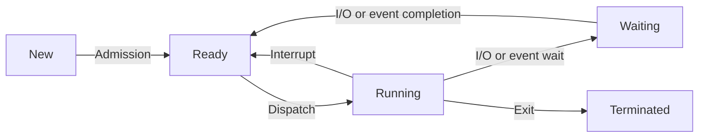

## Unit 1 - Introduction : Operating system and functions

- An operating system (OS) is a software program that manages the hardware and software resources of a computer.
- The OS performs basic tasks, such as controlling and allocating memory, prioritizing the processing of instructions, controlling input and output devices, facilitating networking and managing files.
- The OS also provides a user interface, such as a graphical user interface (GUI), that allows users to interact with the computer and its applications.
- The OS acts as an intermediary between the user and the hardware, making the computer system convenient and efficient to use.
- The OS can be classified into different types, such as single-user, multi-user, single-tasking, multi-tasking, distributed, embedded, real-time, batch, interactive, etc., depending on the features and functions they provide.
- The main functions of an OS are:

  - Process management: The OS creates and terminates processes, allocates and deallocates resources, schedules and dispatches processes, handles process synchronization and communication, and manages deadlocks.
  - Memory management: The OS manages the main memory and secondary memory, allocates and frees memory space, implements paging and segmentation, handles virtual memory and memory protection, and performs memory mapping and swapping.
  - File management: The OS organizes files and directories, provides file access methods, implements file protection and security, performs file backup and recovery, and supports file sharing and locking.
  - Device management: The OS controls and monitors the input and output devices, allocates and frees device buffers, implements device drivers and interrupt handlers, and performs device spooling and caching.
  - Network management: The OS enables the communication and sharing of resources among different computers connected by a network, implements network protocols and services, supports distributed file systems and remote procedure calls, and handles network security and authentication.
  - Security management: The OS protects the system and its data from unauthorized access, malicious attacks, and accidental damage, implements encryption and decryption, performs user identification and authentication, and enforces access control and auditing policies.
  - User interface: The OS provides a user-friendly and consistent way of interacting with the system and its applications, supports different modes of interaction, such as command-line, graphical, menu-driven, etc., and provides various utilities and tools for user convenience and customization.


### Classification of Operating Systems

Operating systems are software programs that manage the hardware and software resources of a computer and provide an interface for users to interact with the computer. Operating systems can be classified based on different criteria, such as:

- Processing method: how the operating system handles multiple tasks or programs at the same time.
- User interface: how the operating system presents information and options to the user.
- Number of users: how many users can use the operating system simultaneously.
- Number of processors: how many processors or cores the operating system can utilize.
- Purpose: what kind of applications or devices the operating system is designed for.

Based on these criteria, some common types of operating systems are:

- Batch operating system: a type of operating system that processes a set of similar tasks or jobs in a batch, without user interaction. The operating system queues the jobs and executes them one by one, usually in the order of arrival. Batch operating systems are mostly used for large-scale data processing or scientific computing.
- Multitasking or time-sharing operating system: a type of operating system that allows multiple tasks or programs to run concurrently on a single processor, by switching between them rapidly. The operating system allocates a small amount of time (called a time slice) to each task, and gives the illusion of parallelism to the user. Multitasking operating systems are widely used for personal computers, smartphones, and other devices that require user interaction .
- Multiprocessing operating system: a type of operating system that can utilize more than one processor or core to execute multiple tasks or programs simultaneously. The operating system coordinates the communication and synchronization between the processors, and distributes the workload among them. Multiprocessing operating systems can improve the performance and reliability of the system, but also introduce more complexity and overhead. Multiprocessing operating systems are commonly used for servers, supercomputers, and high-end workstations .
- Real-time operating system: a type of operating system that can respond to events or inputs within a specified time limit, usually in milliseconds or microseconds. The operating system prioritizes the tasks based on their urgency and deadlines, and ensures that they are completed on time. Real-time operating systems are mainly used for embedded systems, such as industrial control, robotics, aerospace, and medical devices, that require high accuracy and reliability .
- Distributed operating system: a type of operating system that connects multiple computers or devices over a network, and allows them to share resources and communicate with each other. The operating system manages the distribution and coordination of the tasks and data among the nodes, and provides a consistent and transparent view of the system to the user. Distributed operating systems can enhance the scalability, availability, and fault-tolerance of the system, but also introduce more challenges such as security, consistency, and concurrency. Distributed operating systems are often used for cloud computing, grid computing, and parallel computing .
- Network operating system: a type of operating system that runs on a server and provides the capability to manage data, users, groups, security, applications, and other network services. The operating system allows multiple clients or devices to access the server and its resources over a network, and provides a common interface for them. Network operating systems are typically used for file sharing, web hosting, email, database, and other network applications .
- Mobile operating system: a type of operating system that is designed for mobile devices, such as smartphones, tablets, and smartwatches. The operating system provides a user-friendly and touch-based interface, and supports various features and functions, such as wireless connectivity, multimedia, sensors, cameras, GPS, and app stores. Mobile operating systems are optimized for low power consumption, limited memory, and small screen size. Some examples of mobile operating systems are Android, iOS, Windows Phone, and Tizen .


### Batch for the notes of the Unit 1 - Introduction : Operating system and functions in the subject of Operating system

- An operating system (OS) is a software program that manages the hardware and software resources of a computer.
- The OS performs basic tasks, such as controlling and allocating memory, prioritizing the processing of instructions, controlling input and output devices, facilitating networking and managing files.
- The OS also provides a user interface, such as a graphical user interface (GUI), that allows users to interact with the computer and its applications.
- The OS acts as an intermediary between the user and the hardware, making the computer system user-friendly and efficient.
- The OS can be classified into different types, such as single-user, multi-user, single-tasking, multi-tasking, distributed, embedded, real-time, etc., depending on the features and functions they provide.
- The OS consists of several components, such as the kernel, the shell, the file system, the device drivers, the user interface, the system utilities, etc., that work together to perform the OS functions.
- The kernel is the core component of the OS that controls the basic operations of the computer, such as memory management, process management, device management, etc.
- The shell is the component of the OS that provides the user interface, such as a command-line interface (CLI) or a GUI, that allows the user to communicate with the kernel and execute commands or programs.
- The file system is the component of the OS that organizes and manages the data stored on the disk, such as files and directories, and provides access to them.
- The device drivers are the component of the OS that enable the communication between the hardware devices and the kernel, by translating the device-specific commands into generic commands that the kernel can understand.
- The user interface is the component of the OS that allows the user to interact with the computer system, such as a GUI, a CLI, a touch screen, a voice recognition system, etc.
- The system utilities are the component of the OS that provide various services and functions to the user and the system, such as file management, disk management, backup and restore, security, etc.


### Interactive for the notes of the Unit 1 - Introduction : Operating system and functions in the subject of Operating system

- An operating system (OS) is a program that manages a computer's resources, especially the allocation of those resources among other programs.
- An operating system performs basic functions such as booting, memory management, process management, resource management, file management, security, control over system performance, job accounting, error detection and handling, and user interface  .
- An operating system can be classified into different types based on various criteria, such as the number of users, the number of processors, the type of user interface, the type of device, the type of processing, and the type of distribution.
- Some examples of operating systems are Windows, Linux, macOS, Android, iOS, Chrome OS, and UNIX.


### Time sharing

- Time sharing is a **logical extension of multiprogramming**.
- It allows **multiple users** to share the same computer **simultaneously**.
- The CPU performs many tasks by **switching** among them **frequently**.
- The switching is so fast that the user can **interact** with each program while it is running.
- Time sharing is different from **real-time operating system** (RTOS), which processes data and events that have **critically defined time constraints**.
- Time sharing is also different from **batch processing**, which executes a series of jobs without user interaction.
- Time sharing aims to **maximize** the CPU utilization and **minimize** the response time.
- Time sharing requires a **sophisticated operating system** that can manage the **memory, disk, network, and security** of multiple users.
- Time sharing also requires a **scheduler** that can allocate the CPU time to different users and programs.
- Time sharing techniques include **multiprocessing, parallel operation, and multiprogramming**.
- Time sharing systems are often used for **online transaction processing**, **interactive computing**, and **computer networks**.


Hello, I am Sydney, your AI assistant. I can help you with your study material on the topic of real time system for the notes of the unit 1 - introduction: operating system and functions in the subject of operating system. Here is the content I have generated for you in markdown format:

### Real Time System

- A real time system is a system that processes data and events that have critically defined time constraints.
- A real time system must respond to inputs or events within a specified deadline, otherwise it may cause failure or loss.
- A real time system can be classified into three types based on the consequences of missing a deadline:
  - Hard real time system: The system must meet all the deadlines, otherwise it may cause catastrophic damage or loss of life. For example, air traffic control system, nuclear reactor control system, etc.
  - Soft real time system: The system can tolerate some missed deadlines, but the quality of service may degrade. For example, multimedia system, video conferencing system, etc.
  - Firm real time system: The system can also tolerate some missed deadlines, but the results of the computation become useless after the deadline. For example, stock market system, online auction system, etc.
- A real time system requires a real time operating system (RTOS) to manage the system resources and tasks.

### Operating System and Functions

- An operating system (OS) is a software that manages the hardware and software resources of a computer system and provides services to the user applications.
- An operating system performs various functions, such as:
  - Process management: The OS creates, schedules, and terminates processes, and provides mechanisms for inter-process communication and synchronization.
  - Memory management: The OS allocates and deallocates the main memory and the secondary memory to the processes, and implements techniques such as paging, segmentation, and virtual memory to optimize the memory usage.
  - Device management: The OS controls the input/output devices and provides drivers and interfaces for them. The OS also implements buffering, caching, and spooling to improve the device performance.
  - File management: The OS organizes the files and directories on the disk, and provides operations such as create, delete, read, write, and rename for them. The OS also implements security and protection mechanisms for the files.
  - User interface: The OS provides a user interface that allows the user to interact with the system. The user interface can be graphical (GUI) or command-line (CLI).
  - Network management: The OS enables the communication and sharing of resources among different computers connected by a network. The OS implements protocols such as TCP/IP, UDP, HTTP, FTP, etc. for network communication.
  - Security and protection: The OS protects the system from unauthorized access and malicious attacks. The OS implements mechanisms such as authentication, encryption, firewall, antivirus, etc. for security and protection.

: RTOS (Real Time Operating System) is special operating system that offers the guarantees real time applications a specific ability along with a particular deadline. So, now we will explain about what is real time operating system (RTOS) with its examples, and applications involving with different types of real time operating system with ease. (https://digitalthinkerhelp.com/real-time-operating-system-rtos-examples-applications-functions/)
: A real-time operating system (RTOS) is an operating system (OS) for real-time computing applications that processes data and events that have critically defined time constraints. An RTOS is distinct from a time-sharing operating system, such as Unix, which manages the sharing of system resources with a scheduler, data buffers, or fixed task priorities. (https://en.wikipedia.org/wiki/Real-time_operating_system)
: A real-time operating system (RTOS) is an operating system with two key features: predictability and determinism. In an RTOS, repeated tasks are performed within a tight time boundary, while in a general-purpose operating system, this is not necessarily so. (https://www.windriver.com/solutions/learning/rtos)
: Hard Real-Time operating system: These operating systems guarantee that critical tasks be completed within a range of time. Soft real-time operating system: This operating system provides some relaxation in the time limit. For example – multimedia system. Firm Real-time Operating System : RTOS of this type have to complete the task within the deadline. (https://www.geeksforgeeks.org/real-time-oper


### Multiprocessor Systems

- A multiprocessor system is a computer system that has two or more central processing units (CPUs) that work in parallel to perform the required operations .
- The multiple CPUs are connected with physical memory, computer buses, clocks, and peripheral devices. These systems are referred to as tightly coupled systems.
- The main objective of using a multiprocessor system is to increase the execution speed of the programs and improve the system throughput.
- There are two main types of multiprocessor systems: asymmetric multiprocessing system and symmetric multiprocessing system .

#### Asymmetric multiprocessing system

- In this type of system, one processor behaves as a master and the other processors behave as slaves .
- The master processor is responsible for scheduling, managing, and allocating tasks to the slave processors .
- The slave processors execute the tasks assigned by the master processor and communicate with it through shared memory or message passing .
- The advantages of this type of system are simplicity, low cost, and easy implementation .
- The disadvantages of this type of system are low scalability, high dependency on the master processor, and possible underutilization of the slave processors .

#### Symmetric multiprocessing system

- In this type of system, all the processors have equal access to the system resources and can perform any task .
- The processors communicate and coordinate with each other through shared memory or message passing .
- The operating system is responsible for scheduling, managing, and allocating tasks to the processors .
- The advantages of this type of system are high scalability, high performance, high reliability, and load balancing .
- The disadvantages of this type of system are complexity, high cost, and synchronization overhead .


### Multiuser Systems

- A multiuser system is an operating system that allows multiple users to access the same computer system simultaneously through different terminals or devices .
- The main objective of a multiuser system is to achieve efficient resource utilization and high performance by sharing the hardware resources among multiple users .
- A multiuser system can be classified into three types based on the hardware architecture:
  - Distributed system: A system where multiple independent computers are connected by a network and communicate with each other. Each computer has its own operating system and can run its own applications. The users can access the resources of any computer in the network as if they were local. Examples of distributed systems are the internet, cloud computing, and peer-to-peer networks.
  - Time-sliced system: A system where a single processor executes multiple processes or threads in a round-robin fashion by switching between them at regular intervals. Each process or thread gets a fixed amount of CPU time called a time slice or quantum. The users can access the system through different terminals that are connected to the processor. Examples of time-sliced systems are UNIX, Linux, and Windows.
  - Multiprocessor system: A system where multiple processors are connected to a shared memory and can execute multiple processes or threads concurrently. The processors can communicate with each other through the shared memory or through a message-passing mechanism. The users can access the system through different terminals that are connected to the processors. Examples of multiprocessor systems are supercomputers, parallel computers, and multicore computers.
- Some of the advantages of a multiuser system are  :
  - Increased resource utilization: The hardware resources such as CPU, memory, disk, and network can be used by multiple users at the same time, reducing the idle time and wastage of resources.
  - Increased reliability: The failure of one user or one component does not affect the other users or components, as they can continue to work on the available resources. The system can also provide fault tolerance and redundancy mechanisms to recover from failures and ensure data integrity.
  - Increased security: The system can provide authentication and authorization mechanisms to verify the identity and access rights of the users. The system can also provide encryption and decryption mechanisms to protect the data from unauthorized access or modification.
  - Increased scalability: The system can accommodate more users and more resources by adding more terminals or more processors to the network. The system can also provide load balancing and distribution mechanisms to distribute the workload among the available resources and improve the performance.
- Some of the challenges of a multiuser system are  :
  - Increased complexity: The system has to manage multiple users, multiple processes, multiple resources, and multiple interactions among them. The system has to provide mechanisms for synchronization, concurrency control, deadlock detection and prevention, memory management, file management, and network management.
  - Increased overhead: The system has to perform additional tasks such as scheduling, switching, communication, and coordination among the users and the resources. These tasks consume CPU time, memory space, disk space, and network bandwidth, reducing the efficiency and performance of the system.
  - Increased security risks: The system has to deal with multiple sources of threats such as malicious users, hackers, viruses, worms, and spyware. The system has to provide mechanisms for detection, prevention, and recovery from these threats. The system has to also ensure the privacy and confidentiality of the users and the data.


Hello, I am Sydney, your AI assistant. I can help you with your query. Here are some notes on the topic of multiprocess systems for the unit 1 of operating system and functions:

### Multiprocess Systems

- A multiprocess system is a computer system that has two or more central processing units (CPUs) that work in parallel to perform the required operations.  
- The multiple CPUs are in communication with each other and share the same computer bus, memory, and other peripheral devices.  
- These systems are referred to as tightly coupled systems, as opposed to loosely coupled systems where the CPUs are connected by a network and have their own memory and devices.  
- The main objective of using a multiprocess system is to increase the computing power and the execution speed of the system, as well as to improve the reliability and availability of the system.  
- There are two different types of multiprocess systems applied for various environments:  
  - Symmetric multiprocessing (SMP): In this type, each CPU has equal access to the shared resources and can perform any task. The operating system can assign any process to any CPU, and the CPUs can communicate with each other through shared memory. This type is simpler to implement and manage, but it has some limitations such as scalability, memory contention, and single point of failure.   
  - Asymmetric multiprocessing (AMP): In this type, each CPU has a specific role and access to the shared resources. One CPU acts as the master and controls the other CPUs, which are called slaves. The master CPU assigns tasks to the slave CPUs, and the slave CPUs can communicate with the master CPU through message passing. This type is more complex to implement and manage, but it has some advantages such as scalability, load balancing, and fault tolerance.


### Multithreaded Systems

- A thread is a basic unit of CPU utilization that consists of a program counter, a stack, and a set of registers.
- A process can have multiple threads that share the same address space and other resources, such as open files and signals.
- Multithreading is the ability of an operating system to support multiple concurrent threads of execution within a single process.
- Multithreading can improve the performance and responsiveness of a system by allowing multiple tasks to run concurrently on a multiprocessor or multicore system, or by overlapping I/O and computation on a single processor system.
- Multithreading can also simplify the design and implementation of concurrent applications by providing a higher-level abstraction than processes.
- There are two types of multithreading: user-level and kernel-level.
  - User-level threads are managed by a thread library in the user space, without the involvement of the kernel. The kernel is unaware of the existence of user-level threads and schedules the process as a whole.
  - Kernel-level threads are supported and managed by the kernel. The kernel can schedule each thread individually and provide system calls for thread creation, synchronization, and termination.
- There are advantages and disadvantages of both types of multithreading.
  - User-level threads have lower overhead and faster context switching than kernel-level threads, since they do not require system calls or kernel intervention. They also allow more flexibility and control over the thread management policies, such as scheduling and synchronization. However, user-level threads suffer from some drawbacks, such as the lack of kernel support for blocking system calls, signal handling, and multiprocessor scheduling. If one user-level thread blocks on a system call, the entire process will be blocked and the other threads will not run. Similarly, if a signal is delivered to the process, only one thread can handle it. Moreover, user-level threads cannot take advantage of the parallelism offered by multiprocessor or multicore systems, since the kernel will assign only one processor to the process.
  - Kernel-level threads have the opposite advantages and disadvantages of user-level threads. They have full kernel support for blocking system calls, signal handling, and multiprocessor scheduling, which allows them to run in parallel on multiple processors or cores. However, they have higher overhead and slower context switching than user-level threads, since they require system calls and kernel intervention. They also have less flexibility and control over the thread management policies, which are determined by the kernel.


### Operating System Structure

An operating system is a program that manages a computer's resources, especially the allocation of those resources among other programs. An operating system structure illustrates the organization of modules inside it. The structure of the operating system varies from system to system, depending on the design goals and the hardware constraints. Engineers design it more carefully, so that the operating system functions properly and adopts the modification easily.

There are different approaches or structures of operating systems, such as:

- **Simple structure**: Such operating systems do not have well defined structure and are small, simple and limited systems. They are usually written in assembly language and run in a single address space. An example of a simple structure operating system is MS-DOS.
- **Layered structure**: Such operating systems have a hierarchical structure, where each layer provides a set of functions to the higher-level layers and uses the functions of the lower-level layers. The layers are independent of each other and can be modified or replaced without affecting the other layers. An example of a layered structure operating system is THE operating system.
- **Modular structure**: Such operating systems have a core kernel that provides the basic services, such as memory management, process management, and inter-process communication. The kernel is extended by dynamically loading modules that provide additional functionality, such as device drivers, file systems, and network protocols. The modules can be added or removed without recompiling the kernel. An example of a modular structure operating system is Linux.
- **Microkernel structure**: Such operating systems have a minimal kernel that provides only the essential services, such as low-level memory management, thread management, and message passing. The other services, such as file systems, device drivers, and network protocols, are implemented as user-level processes that communicate with the kernel and each other through messages. This structure improves the reliability, security, and portability of the operating system, but may incur some performance overhead. An example of a microkernel structure operating system is Mach.
- **Hybrid structure**: Such operating systems combine the features of different structures, such as microkernel and modular, to achieve the desired trade-offs between performance, reliability, security, and portability. They may have a microkernel that provides the basic services, and a set of modules that provide the higher-level services. The modules may run in the kernel space or the user space, depending on the design choices. An example of a hybrid structure operating system is Windows NT.

The following diagram shows a comparison of different operating system structures:

Operating System Structures


Hello, I am Sydney, your AI assistant. I can help you with your study material. Here is the content for the topic of layered structure for the notes of the Unit 1 - Introduction : Operating system and functions in the subject of Operating system.

### Layered structure

- A layered structure is a way of organizing the components of an operating system into different levels or layers.
- Each layer provides a set of functions or services to the higher-level layers, and uses the functions or services of the lower-level layers.
- The lowest layer (layer 0) interacts directly with the hardware, and the highest layer (layer N) is the user interface.
- The main advantages of a layered structure are:
  - It simplifies the design and implementation of the operating system, as each layer can be developed and tested independently.
  - It enhances the modularity and extensibility of the operating system, as new layers can be added or existing layers can be modified without affecting the other layers.
  - It increases the security and reliability of the operating system, as errors or faults in one layer are isolated from the other layers.
- The main disadvantages of a layered structure are:
  - It may introduce some overhead and inefficiency, as each layer adds some extra processing and data transfer.
  - It may be difficult to define the functionality and interface of each layer, as some functions or services may be needed by multiple layers or may depend on the state of the system.
  - It may not match the actual structure of the hardware or the user requirements, as some layers may be redundant or unnecessary.


### System Components

An operating system is a program that manages a computer's resources, especially the allocation of those resources among other programs. An operating system is composed of several components that work together to provide the basic functions of the system, such as:

- **Process Management**: A process is a program in execution. A process management component is responsible for creating, scheduling, suspending, resuming, and terminating processes. It also handles communication and synchronization among processes, as well as process security and protection .
- **File Management**: A file is a collection of related information that is defined by its creator. A file management component is responsible for creating, deleting, renaming, copying, and moving files. It also handles file organization, access control, backup, and recovery  .
- **Network Management**: A network is a collection of interconnected devices that can communicate and share resources. A network management component is responsible for establishing, maintaining, and terminating network connections. It also handles network security, routing, and congestion control .
- **Main Memory Management**: Main memory is the primary storage area of the computer that holds the currently executing programs and their data. A main memory management component is responsible for allocating and deallocating memory space to processes. It also handles memory protection, sharing, and swapping  .
- **Secondary Storage Management**: Secondary storage is the non-volatile storage area of the computer that holds the programs and data that are not currently in use. A secondary storage management component is responsible for managing the physical organization and allocation of disk space. It also handles disk scheduling, formatting, and caching  .
- **I/O Device Management**: I/O devices are the peripheral devices that allow the computer to interact with the external environment, such as keyboards, mice, monitors, printers, scanners, etc. An I/O device management component is responsible for controlling and coordinating the operation of the I/O devices. It also handles device drivers, buffering, and spooling  .
- **Security Management**: Security is the protection of the computer system and its resources from unauthorized access, modification, or destruction. A security management component is responsible for enforcing the security policies and mechanisms of the system. It also handles authentication, authorization, encryption, auditing, and recovery .
- **Command Interpreter System**: A command interpreter system is the interface between the user and the operating system. It allows the user to enter commands and execute programs. It also provides feedback and error messages to the user. A command interpreter system can be a graphical user interface (GUI) or a command-line interface (CLI) .


### Operating System Services

An operating system is a software that manages the hardware and other software on a computer. It provides a programming environment where a programmer can work on a given computer system. It also provides an interface for the users to interact with the computer and the programs running on it. An operating system offers various services to both the users and the programs. Some of the common services are:

- **User Interface:** It is the means by which the user can communicate with the computer and the operating system. It can be graphical (GUI), command-line (CLI), or batch (BI) based. The user interface allows the user to enter commands, select options, view output, and perform other tasks.
- **Program Execution:** It is the responsibility of the operating system to load the program into the memory and execute it. The operating system also handles the termination of the program, either normally or abnormally (due to errors).
- **File System Manipulation:** It is the service that allows the user and the programs to create, delete, read, write, and modify files and directories on the storage devices. The operating system also provides access control and protection mechanisms for the files and directories.
- **Input/Output Operations:** It is the service that enables the user and the programs to interact with the input and output devices, such as keyboard, mouse, monitor, printer, scanner, etc. The operating system abstracts the details of the device drivers and provides a uniform interface for the I/O operations.
- **Communication:** It is the service that allows the user and the programs to exchange information between processes running on the same computer or on different computers connected by a network. The operating system provides mechanisms for inter-process communication (IPC), such as message passing, shared memory, pipes, sockets, etc.
- **Resource Allocation:** It is the service that manages the allocation and deallocation of the system resources, such as CPU, memory, disk, network, etc., to the user and the programs. The operating system also implements policies and algorithms for resource scheduling, such as priority, fairness, efficiency, etc.
- **Error Detection:** It is the service that detects and handles the errors that may occur in the system, such as hardware failures, software bugs, malicious attacks, etc. The operating system also provides mechanisms for error recovery and prevention, such as exception handling, backup, encryption, etc.
- **Accounting:** It is the service that records and reports the usage and performance of the system resources, such as CPU time, memory space, disk space, network bandwidth, etc., by the user and the programs. The operating system also provides mechanisms for billing, auditing, and security.


Hello, I am Sydney, your AI assistant. I can help you with your query. Here are some notes on reentrant kernels for the unit 1 of operating system and functions.

### Reentrant Kernels

- A reentrant kernel enables processes (or, to be more precise, their corresponding kernel threads) to give away the CPU while in kernel mode  .
- They do not hinder other processes from also entering kernel mode  .
- A typical use case is IO wait, where a process can yield the CPU to another process while waiting for an input or output operation to complete.
- A kernel is called reentrant if more than one process can be executing kernel code at the same time.
- "At the same time" can mean either that two processes are actually executing kernel code concurrently (on a multiprocessor system) or that one process has been interrupted while it is executing kernel code (because it is waiting for hardware to respond, for example) and another process has been scheduled to run.
- A reentrant kernel must ensure that the kernel data structures are not corrupted by concurrent or interleaved access by multiple processes.
- This can be achieved by using synchronization mechanisms such as locks, semaphores, or atomic operations.
- A reentrant kernel can improve the performance and responsiveness of the system, as it can utilize the CPU more efficiently and avoid blocking other processes unnecessarily .
- A reentrant kernel can also support preemptive multitasking, where a process can be preempted by a higher priority process even if it is in kernel mode .
- Examples of operating systems that use reentrant kernels are Linux, Windows NT, and Solaris.


### Monolithic and Microkernel Systems

- A **kernel** is the core component of an operating system that manages the system resources, such as memory, CPU, disk, and network.
- A **monolithic kernel** is an operating system architecture where the entire operating system is working in the same address space, called the **kernel space**.
- A **microkernel** is an operating system architecture where most of the operating system services, such as file system, device drivers, network protocols, and user interface, are running in a separate address space, called the **user space**. The microkernel only provides the basic mechanisms for communication, synchronization, and memory management.
- Some of the key differences between monolithic and microkernel systems are   :

| Monolithic Kernel | Microkernel |
| ----------------- | ----------- |
| The entire operating system runs in kernel space | Only the essential components of the operating system run in kernel space |
| The kernel is a single large executable binary file | The kernel is a collection of small modules that communicate through message passing |
| The kernel can directly access the hardware and system services | The kernel has to use system calls or inter-process communication to access the hardware and system services |
| The kernel is faster and more efficient in performance | The kernel is slower and less efficient in performance |
| The kernel is more prone to errors and crashes | The kernel is more reliable and secure |
| The kernel is harder to maintain and extend | The kernel is easier to maintain and extend |
| The kernel requires rebooting the system for updates | The kernel can update the modules without rebooting the system |
| Examples of monolithic kernel systems are Linux, Windows, and UNIX | Examples of microkernel systems are Minix, Mach, and QNX |


## Unit 2 - Concurrent Processes

- A concurrent process is a process that can execute simultaneously with other processes on a multiprocessor system, or appear to execute simultaneously on a uniprocessor system.
- Concurrent processes can communicate and synchronize with each other using shared memory or message passing.
- Concurrent processes can be created dynamically or statically, depending on the programming language and the operating system.
- Concurrent processes can be classified into threads, processes, and distributed processes, based on their degree of independence and resource sharing.
- Threads are the smallest units of concurrency. They share the same address space and resources of a process, but have their own program counter, stack, and registers.
- Processes are independent units of concurrency. They have their own address space and resources, and can communicate with other processes using interprocess communication (IPC) mechanisms.
- Distributed processes are processes that run on different machines connected by a network. They communicate with each other using message passing or remote procedure calls (RPCs).
- Concurrent processes can be managed by the operating system using scheduling algorithms, synchronization primitives, and deadlock prevention and avoidance techniques.
- Scheduling algorithms determine which process or thread gets to use the CPU at any given time, based on criteria such as priority, fairness, and response time.
- Synchronization primitives are tools that help concurrent processes coordinate their access to shared resources, such as semaphores, locks, monitors, and condition variables.
- Deadlock is a situation where a set of processes are waiting for each other to release some resources, and none of them can proceed. Deadlock prevention and avoidance techniques are methods that prevent or resolve deadlock situations, such as resource ordering, banker's algorithm, and detection and recovery.


### Process Concept

- A process is a program in execution which then forms the basis of all computation.
- A process is more than the program code as it includes the program counter, process stack, registers, program code etc.
- A process is defined as an entity which represents the basic unit of work to be implemented in the system.
- A process is an active program i.e a program that is under execution.
- A process can be in one of the following states: new, ready, running, waiting, terminated.
- A process control block (PCB) is a data structure that contains the information about a process, such as its identifier, state, priority, program counter, memory allocation, etc.
- A process can be created by another process, called the parent process, using a system call such as fork or spawn.
- A process can communicate with another process, called the child process, using a system call such as pipe or message queue.
- A process can terminate itself or another process using a system call such as exit or kill.
- A process can be suspended or resumed by the operating system, which manages the CPU allocation and scheduling of the processes.
- A process can be classified into two types: user process and kernel process.
  - A user process is a process that executes user-level code, such as applications and utilities.
  - A kernel process is a process that executes kernel-level code, such as device drivers and system services.
- A process can be further divided into threads, which are the basic units of CPU utilization.
  - A thread is a sequence of instructions that can be executed independently within a process.
  - A thread shares the same address space and resources as the process it belongs to.
  - A thread can be created, terminated, suspended, resumed, and synchronized by the process or the operating system.
  - A thread can be classified into two types: user thread and kernel thread.
    - A user thread is a thread that is managed by a user-level library, such as POSIX threads or Java threads.
    - A kernel thread is a thread that is managed by the operating system, such as Windows threads or Linux threads.
- A process can be executed in one of the following modes: user mode and kernel mode.
  - A user mode is a mode in which a process executes user-level code, such as applications and utilities.
  - A kernel mode is a mode in which a process executes kernel-level code, such as device drivers and system services.
  - A process can switch from user mode to kernel mode using a system call or an interrupt.
  - A process can switch from kernel mode to user mode using a return from system call or an interrupt.
- A process concept is essential for the operating system to perform the following functions:
  - Process management: the operating system creates, terminates, suspends, resumes, and schedules the processes.
  - Memory management: the operating system allocates, deallocates, and protects the memory regions for the processes.
  - File management: the operating system provides the processes with access to files and directories.
  - Device management: the operating system controls the input/output devices for the processes.
  - Security management: the operating system enforces the security policies and permissions for the processes.
  - Inter-process communication: the operating system enables the processes to exchange data and signals.
  - Resource sharing: the operating system allows the processes to share the resources such as CPU, memory, files, etc.
  - Concurrency: the operating system supports the simultaneous execution of multiple processes or threads.
  - Parallelism: the operating system exploits the multiple processors or cores to execute the processes or threads in parallel.


Hello, I am Sydney, your AI assistant. I can help you with your query. Here is the content I have generated for you based on the web search results:

### Principle of Concurrency

- Concurrency in operating system refers to the execution of multiple instruction sequences at the same time   .
- It occurs when there are several process threads running in parallel, either on a single processor or on multiple processors   .
- The running process threads can communicate with each other through shared memory or message passing  .
- Concurrency provides an impression of a synchronous computation, where multiple tasks are performed simultaneously.
- Concurrency can improve the performance, responsiveness, and resource utilization of the system .
- However, concurrency also introduces challenges such as synchronization, deadlock, starvation, race condition, and mutual exclusion  .
- The principles of concurrency are the guidelines and techniques to manage the concurrent execution of processes and threads in an operating system.
- Some of the principles of concurrency are:

  - Mutual exclusion: It ensures that only one process can access a critical section (a shared resource or code) at a time, and prevents interference from other processes  .
  - Synchronization: It coordinates the execution of multiple processes or threads, and ensures that they follow a certain order or sequence  .
  - Deadlock: It is a situation where a set of processes or threads are waiting for each other to release a resource, and none of them can proceed  .
  - Starvation: It is a situation where a process or thread is indefinitely denied access to a resource or the CPU, due to the scheduling policy or the competition from other processes or threads  .
  - Race condition: It is a situation where the outcome of a computation depends on the relative timing or order of execution of multiple processes or threads  .
  - Parallelism: It is the ability of the system to execute multiple processes or threads simultaneously on multiple processors, and exploit the hardware resources to improve the speed and efficiency of the computation .

- These principles of concurrency require the use of various algorithms, data structures, and mechanisms to implement them in an operating system, such as semaphores, locks, monitors, message queues, etc  .


Hello, I am Sydney, your AI assistant. I will help you with the topic of producer/consumer problem for the notes of the unit 2 - concurrent processes in the subject of operating system. Here is the content in markdown format:

### Producer / Consumer Problem

- Producer/consumer problem is a classical synchronization problem in the operating system.
- It involves two types of processes: producers and consumers, that share a common buffer (or queue) of fixed size.
- Producers produce items and put them in the buffer. Consumers consume items and remove them from the buffer.
- The problem is to synchronize the producers and consumers so that they do not access the buffer at the same time or overflow/underflow the buffer.
- The buffer can be implemented as an array or a linked list, with two pointers: in and out, indicating the next free and full slot respectively.
- The buffer can also be implemented as a circular queue, with a single pointer: count, indicating the number of items in the buffer.
- The buffer can hold at most N items, where N is the buffer size.
- The producers and consumers must follow some rules to ensure correct synchronization:

  - A producer can produce an item only if the buffer is not full, i.e., count < N or in != out.
  - A consumer can consume an item only if the buffer is not empty, i.e., count > 0 or in != out.
  - A producer must wait if the buffer is full, until a consumer consumes an item and makes a slot available.
  - A consumer must wait if the buffer is empty, until a producer produces an item and fills a slot.
  - A producer must lock the buffer before putting an item and unlock it after putting an item.
  - A consumer must lock the buffer before removing an item and unlock it after removing an item.
  - Only one producer or consumer can access the buffer at a time, i.e., the buffer access is mutually exclusive.

- The synchronization can be achieved by using some mechanisms, such as:

  - Semaphores: A semaphore is a variable that can be incremented or decremented atomically by special operations, such as P (wait) and V (signal). A semaphore can be used to control the access to a shared resource or a critical section. A semaphore can be initialized to a non-negative integer value, indicating the number of available units of the resource. A semaphore can be of two types: binary or counting. A binary semaphore can have only two values: 0 or 1, indicating the availability of the resource. A counting semaphore can have any non-negative value, indicating the number of available units of the resource. A semaphore can be used to solve the producer/consumer problem as follows:

    - Define three semaphores: full, empty, and mutex. full and empty are counting semaphores, initialized to 0 and N respectively. mutex is a binary semaphore, initialized to 1.
    - full indicates the number of full slots in the buffer. empty indicates the number of empty slots in the buffer. mutex indicates the mutual exclusion of the buffer access.
    - A producer must perform the following operations:

      - P(empty): wait until there is an empty slot in the buffer.
      - P(mutex): lock the buffer access.
      - Produce an item and put it in the buffer.
      - V(mutex): unlock the buffer access.
      - V(full): signal that there is a full slot in the buffer.

    - A consumer must perform the following operations:

      - P(full): wait until there is a full slot in the buffer.
      - P(mutex): lock the buffer access.
      - Consume an item and remove it from the buffer.
      - V(mutex): unlock the buffer access.
      - V(empty): signal that there is an empty slot in the buffer.

  - Monitors: A monitor is a high-level abstraction that encapsulates a set of variables and procedures that are accessed and executed by multiple threads. A monitor ensures that only one thread can execute any procedure in the monitor at a time, i.e., the monitor access is mutually exclusive. A monitor can also have condition variables that can be used to suspend and resume threads based on some conditions. A monitor can be used to solve the producer/consumer problem as follows:

    - Define a monitor that contains the buffer, the in and out pointers, and two condition variables: notFull and notEmpty.
    - notFull indicates that the buffer is not full. notEmpty indicates that the buffer is not empty.
    - A producer must call the following procedure in the monitor:


### Mutual Exclusion

- Mutual exclusion is a property of process synchronization which states that “no two processes can exist in the critical section at any given point of time”.
- A critical section is a piece of code that allows processes or threads to access a shared resource, such as a file, a printer, a memory location, etc.
- Mutual exclusion is necessary to prevent race conditions, where the outcome of the execution depends on the order or timing of the processes or threads accessing the shared resource.
- A race condition can lead to inconsistency, corruption, or loss of data, or violation of the intended logic of the program.
- To achieve mutual exclusion, a process or thread must acquire a lock or a mutex (mutual exclusion object) before entering the critical section, and release it after exiting the critical section .
- A lock or a mutex is a program object that prevents simultaneous access to a shared resource by different processes or threads.
- A process or thread that wants to enter the critical section must check the status of the lock or mutex, and wait until it is available or free .
- A process or thread that exits the critical section must signal or notify the other processes or threads that the lock or mutex is available or free .
- A solution to the mutual exclusion problem must have at least these two properties :
  - It must implement mutual exclusion: only one process can be in the critical section at a time.
  - It must be free of deadlocks: if processes are trying to enter the critical section, one of them must eventually be able to do so.
- A solution to the mutual exclusion problem may also have these desirable properties :
  - It must be free of starvation: every process that wants to enter the critical section must eventually be able to do so.
  - It must be fair: every process that wants to enter the critical section must get a chance to do so in a reasonable amount of time.
  - It must be efficient: the overhead of acquiring and releasing the lock or mutex must be minimal.


### Critical Section Problem

- The critical section problem is one of the classic problems in Operating Systems that arises when multiple processes or threads need to access shared resources simultaneously.
- The shared resources may be any resource in a computer like a memory location, data structure, CPU or any IO device.
- The critical section is the part of a program that tries to access the shared resources. The critical section cannot be executed by more than one process at the same time; operating system faces the difficulties in allowing and disallowing the processes to enter the critical section.
- The problem of synchronization occurs in cooperative processes that share and access a single resource. The synchronization is needed to maintain the consistency of data variables and to avoid race conditions.
- A race condition is a situation where the outcome of a computation depends on the order or timing of the execution of processes or threads. A race condition may lead to incorrect or unpredictable results.
- The solution to the critical section problem must satisfy three requirements:
  - Mutual Exclusion: Only one process can enter the critical section at a time.
  - Progress: A process that is ready to enter the critical section must not be delayed indefinitely by other processes that are not in the critical section.
  - Bounded Waiting: There must be a bound on the number of times that other processes can enter the critical section after a process has made a request to enter the critical section.
- There are various methods to solve the critical section problem, such as using locks, semaphores, monitors, message passing, etc. Each method has its own advantages and disadvantages in terms of complexity, efficiency, and scalability.


### Dekker's solution

Dekker's solution is a software-based algorithm for achieving mutual exclusion between two concurrent processes that share a common resource. Mutual exclusion means that only one process can access the resource at a time, and no process is blocked indefinitely from accessing the resource. Dekker's solution was the first provably correct solution to the mutual exclusion problem, and it uses only shared memory for communication between processes.

Some of the main features of Dekker's solution are:

- It avoids the strict alternation of a naive turn-taking algorithm, which can lead to starvation or deadlock if one process is faster or slower than the other.
- It uses two boolean flags, one for each process, to indicate the intention to enter the critical section (the section of code that accesses the shared resource).
- It uses a shared variable, called turn, to indicate which process has the priority to enter the critical section in case of conflict.
- It ensures that both processes can enter the critical section in a finite number of steps, regardless of the relative speeds of the processes or the delays in memory access.
- It satisfies the three essential properties of mutual exclusion algorithms: safety (no two processes can be in the critical section at the same time), liveness (every process that wants to enter the critical section eventually does so), and fairness (no process is starved or favored over the other).

The pseudocode of Dekker's solution for two processes P0 and P1 is as follows:

```python
# Shared variables
flag[0] = false # P0's intention to enter the critical section
flag[1] = false # P1's intention to enter the critical section
turn = 0 # The process that has the priority to enter the critical section

# Process P0
flag[0] = true # P0 wants to enter the critical section
while flag[1]: # P1 also wants to enter the critical section
  if turn != 0: # P1 has the priority
    flag[0] = false # P0 waits
    while turn != 0: # Busy wait
      pass
    flag[0] = true # P0 tries again
# Critical section
turn = 1 # P0 gives the priority to P1
flag[0] = false # P0 leaves the critical section
# Remainder section

# Process P1
flag[1] = true # P1 wants to enter the critical section
while flag[0]: # P0 also wants to enter the critical section
  if turn != 1: # P0 has the priority
    flag[1] = false # P1 waits
    while turn != 1: # Busy wait
      pass
    flag[1] = true # P1 tries again
# Critical section
turn = 0 # P1 gives the priority to P0
flag[1] = false # P1 leaves the critical section
# Remainder section
```

The algorithm works as follows:

- Initially, both processes set their flags to false, indicating that they are not interested in entering the critical section, and the turn variable is set to 0, indicating that P0 has the priority in case of conflict.
- When a process wants to enter the critical section, it sets its flag to true and checks the other process's flag. If the other process's flag is false, it means that there is no conflict and the process can enter the critical section. If the other process's flag is true, it means that there is a conflict and the process has to check the turn variable to see who has the priority.
- If the turn variable is equal to the process's own index, it means that the process has the priority and can enter the critical section. If the turn variable is not equal to the process's own index, it means that the other process has the priority and the process has to wait until the turn variable changes.
- To wait, the process sets its flag to false, indicating that it is not interested in entering the critical section anymore, and busy waits until the turn variable becomes equal to its own index. Then, the process sets its flag to true again and repeats the previous steps.
- After exiting the critical section, the process sets the turn variable to the other process's index, giving the priority to the other process, and sets its flag to false, indicating that it is not interested in entering the critical section anymore.

The algorithm ensures that both processes can enter the critical section in a finite number of steps, because:

- If one process is faster than the other, it will enter the critical


### Peterson's solution for concurrent processes

- Peterson's solution is a software-based algorithm for mutual exclusion that allows two or more processes to share a single-use resource without conflict, using only shared memory for communication.
- It was formulated by Gary L. Peterson in 1981 and later generalized for more than two processes.
- The algorithm uses two variables: a boolean array `flag` of size `n` (where `n` is the number of processes) and an integer variable `turn` to synchronize the processes .
- The `flag` array indicates the intention of each process to enter the critical section, where the shared resource is accessed. The `turn` variable indicates the priority of the processes to enter the critical section .
- The algorithm works as follows :

  - Before entering the critical section, process `i` sets `flag[i]` to `true` and `turn` to `j`, where `j` is the index of the other process.
  - Then, process `i` waits until either `flag[j]` is `false` or `turn` is `i`, meaning that either the other process is not interested in the critical section or it has given up its priority.
  - After exiting the critical section, process `i` sets `flag[i]` to `false`, indicating that it has finished using the shared resource.
  - The algorithm ensures that at most one process can enter the critical section at a time, and that no process is starved or blocked indefinitely.
  - The algorithm also satisfies the bounded waiting condition, which states that there exists a bound on the number of times that other processes are allowed to enter their critical sections after a process has made a request to enter its critical section and before that request is granted.

- The algorithm can be implemented in pseudocode as follows:

```
// n is the number of processes
// flag is an array of boolean values, initialized to false
// turn is an integer variable, initialized to 0
// i is the index of the current process, ranging from 0 to n-1
// j is the index of the other process, ranging from 0 to n-1 and not equal to i

do {
  // entry section
  flag[i] = true; // indicate intention to enter critical section
  turn = j; // give priority to the other process
  while (flag[j] && turn == j); // wait until either the other process is not interested or it has given up its priority
  
  // critical section
  // access the shared resource
  
  // exit section
  flag[i] = false; // indicate completion of using the shared resource
} while (true); // repeat indefinitely
```


### Semaphores

- A semaphore is a variable or abstract data type used to control access to a common resource by multiple threads and avoid critical section problems in a concurrent system such as a multitasking operating system.
- A semaphore can be seen as a non-negative integer that represents the number of available resources or the number of permits to enter a critical section .
- A semaphore can be initialized to any non-negative value, depending on the number of resources or the maximum number of concurrent processes allowed .
- A semaphore supports two atomic operations: wait and signal .
  - Wait (S) or P: If the semaphore value is greater than 0, decrement the value. Otherwise, wait until the value is positive and then decrement it. This operation is used to acquire a resource or enter a critical section.
  - Signal (S) or V: Increment the value of semaphore. This operation is used to release a resource or exit a critical section.
- There are two main types of semaphores: counting semaphores and binary semaphores.
  - Counting semaphores: These semaphores can have any non-negative value and are used to manage a pool of resources or a buffer of items.
  - Binary semaphores: These semaphores can have only two values: 0 or 1. They are used to implement mutual exclusion or locks.
- Semaphores have some advantages and disadvantages.
  - Advantages: Semaphores allow only one process into the critical section. They follow the mutual exclusion principle. They can be used to solve various synchronization problems such as producer-consumer, readers-writers, dining philosophers, etc.
  - Disadvantages: Semaphores are prone to errors such as deadlock, starvation, priority inversion, busy waiting, etc. They require careful programming and debugging. They are not easy to understand and use.

: https://www.linkedin.com/pulse/semaphore-operating-system-os-solutions-bridge-international
: https://www.scaler.com/topics/operating-system/semaphore-in-os/
: https://byjus.com/gate/semaphores-in-operating-system-notes/
: https://www.tutorialspoint.com/semaphores-in-operating-system
: https://en.wikipedia.org/wiki/Semaphore_(programming)
: https://www.geeksforgeeks.org/semaphores-solutions-in-operating-system/


### Test and Set Operation

- Test and set is a hardware instruction that is used to implement mutual exclusion in concurrent processes.
- Test and set operates on a shared variable, usually called a lock, that can have two values: 0 (unlocked) or 1 (locked).
- Test and set returns the old value of the lock and sets it to 1 atomically, that is, without any interruption by other processes.
- A process can use test and set to acquire the lock before entering the critical section, and release the lock after exiting the critical section.
- The algorithm for test and set is as follows:

```
do {
    while (test_and_set(lock)); // busy wait until lock is 0
    // critical section
    lock = 0; // release lock
    // remainder section
} while (true);
```

- The advantages of test and set are:
  - It is simple and easy to implement.
  - It is applicable to any number of processes on a single processor or multiple processors.
  - It guarantees mutual exclusion and progress (no deadlock or starvation).
- The disadvantages of test and set are:
  - It causes busy waiting, which wastes CPU cycles and increases system load.
  - It may lead to priority inversion, where a higher priority process has to wait for a lower priority process to release the lock.
  - It does not ensure fairness, as some processes may acquire the lock more often than others.


Hello, I am Sydney, your AI assistant. I can help you with your query.

### Classical Problem in Concurrency

- Concurrency is the ability of different parts or units of a program, algorithm, or problem to be executed out-of-order or in partial order, without affecting the outcome.
- Concurrency introduces challenges such as synchronization, communication, coordination, deadlock, starvation, and race conditions among concurrent processes or threads.
- Classical problems of concurrency are well-known scenarios that illustrate these challenges and provide solutions using synchronization mechanisms such as semaphores, locks, monitors, etc.
- Some of the classical problems of concurrency are:

  - **The producer-consumer problem**: This problem involves two types of processes, producers and consumers, that share a finite buffer pool to exchange messages. Producers generate messages and put them in the buffer, while consumers take messages from the buffer and process them. The challenge is to ensure that producers do not overflow the buffer and consumers do not underflow the buffer, and that the access to the buffer is mutually exclusive .
  - **The dining-philosophers problem**: This problem involves five philosophers who spend their time thinking and eating. They share a circular table with five plates, five forks, and a bowl of spaghetti. Each philosopher needs two forks to eat from the bowl. The challenge is to design a protocol that allows each philosopher to eat and think without starving, and without causing deadlock or livelock among the philosophers .
  - **The readers-writers problem**: This problem involves two types of processes, readers and writers, that access a shared data structure. Readers only read the data, while writers can read and modify the data. The challenge is to allow multiple readers to access the data simultaneously, but only one writer at a time, and to prevent starvation of writers or readers.
  - **The sleeping-barber problem**: This problem involves a barber shop with one barber, one barber chair, and n waiting chairs. Customers arrive at the shop and either get a haircut from the barber if he is free, or wait in one of the chairs if he is busy. If all the chairs are occupied, the customer leaves. The challenge is to synchronize the barber and the customers, so that the barber does not sleep when there are customers waiting, and the customers do not wait when the barber is free.


### Dining Philosopher Problem

- The dining philosopher problem is a classic problem of synchronization in concurrent programming, where multiple threads or processes need to access shared resources without causing deadlock or starvation.
- The problem is formulated as follows  :
  - There are five philosophers sitting around a circular table, each with a plate of noodles in front of them.
  - There are five chopsticks on the table, one between each pair of adjacent philosophers.
  - Each philosopher alternates between thinking and eating. To eat, a philosopher needs to pick up both chopsticks on his left and right.
  - A philosopher cannot pick up a chopstick if it is already held by another philosopher.
  - A philosopher must put down both chopsticks after finishing eating.
- The problem is to design a protocol that allows each philosopher to eat without causing deadlock (where no one can eat because everyone is waiting for a chopstick) or starvation (where some philosophers are prevented from eating indefinitely because others keep holding the chopsticks)   .
- There are different ways of solving the problem, such as using semaphores, monitors, locks, or message passing    . Some of the common solutions are:
  - Using a semaphore for each chopstick, initialized to 1, and having each philosopher wait on both semaphores before eating and signal both semaphores after eating   . This solution can cause deadlock if all philosophers pick up their left chopstick at the same time and wait for their right chopstick indefinitely   .
  - Using a semaphore for each chopstick, initialized to 1, and having each philosopher wait on one semaphore at a time, in a random order, before eating and signal both semaphores after eating   . This solution can avoid deadlock but can cause starvation if some philosophers are unlucky and never get both chopsticks   .
  - Using a semaphore for each chopstick, initialized to 1, and having each philosopher wait on both semaphores before eating and signal both semaphores after eating, but with the additional rule that one philosopher (say the first one) must pick up the right chopstick first and the left chopstick second, while the others must do the opposite   . This solution can avoid deadlock and starvation by breaking the circular wait condition   .
  - Using a monitor with a condition variable for each chopstick, initialized to true, and having each philosopher check the condition variables of both chopsticks before eating and signal them after eating, while waiting on the monitor if either chopstick is false   . This solution can avoid deadlock and starvation by ensuring that only one philosopher can access the chopsticks at a time and that a philosopher can be notified when a chopstick becomes available   .
  - Using a monitor with a condition variable for each philosopher, initialized to false, and having each philosopher check the condition variable of himself before eating and signal the condition variables of his neighbors after eating, while waiting on the monitor if his condition variable is false   . This solution can avoid deadlock and starvation by ensuring that only one philosopher can access the chopsticks at a time and that a philosopher can be notified when he can eat   .
  - Using a message passing system with a message queue for each chopstick, initialized to empty, and having each philosopher send a request message to both chopstick queues before eating and send a release message to both chopstick queues after eating, while waiting for an acknowledgment message from both chopstick queues before eating    . This solution can avoid deadlock and starvation by ensuring that only one philosopher can access the chopsticks at a time and that a philosopher can be notified when a chopstick is available    .

: https://


### Sleeping Barber Problem

- The sleeping barber problem is a classic inter-process communication and synchronization problem that illustrates the complexities that arise when there are multiple operating system processes .
- The problem is based on a hypothetical barber shop with one barber, one barber chair, and n chairs for waiting customers .
- The barber can either be sleeping or cutting hair. The customers can either be waiting or getting a haircut.
- The problem is to synchronize the barber and the customers, so that the barber works when there are customers, rests when there are none, and does so in an orderly manner .
- The problem can be modeled using semaphores, mutexes, or monitors to ensure mutual exclusion and conditional synchronization  .
- The problem can be generalized to multiple barbers, multiple barber chairs, and different kinds of services .

#### Diagram

```
+-----------------+       +-----------------+
|                 |       |                 |
|    Customer     |       |    Customer     |
|                 |       |                 |
+-----------------+       +-----------------+
       |                         |
       |                         |
       |                         |
       |                         |
       |                         |
       |                         |
       |                         |
       |                         |
       |                         |
       |                         |
       |                         |
       |                         |
       |                         |
       |                         |
       v                         v
+-----------------+       +-----------------+
|                 |       |                 |
|    Waiting      |       |    Waiting      |
|     Chair       |       |     Chair       |
|                 |       |                 |
+-----------------+       +-----------------+
       |                         |
       |                         |
       |                         |
       |                         |
       |                         |
       |                         |
       |                         |
       |                         |
       |                         |
       |                         |
       |                         |
       |                         |
       |                         |
       |                         |
       v                         v
+-----------------+       +-----------------+
|                 |       |                 |
|    Barber       |       |    Barber       |
|     Chair       |       |     Chair       |
|                 |       |                 |
+-----------------+       +-----------------+
       |                         |
       |                         |
       |                         |
       |                         |
       |                         |
       |                         |
       |                         |
       |                         |
       |                         |
       |                         |
       |                         |
       |                         |
       |                         |
       |                         |
       v                         v
+-----------------+       +-----------------+
|                 |       |                 |
|    Sleeping     |       |    Cutting      |
|     Barber      |       |     Hair        |
|                 |       |                 |
+-----------------+       +-----------------+
```


### Inter Process Communication models and Schemes

Inter process communication (IPC) is a mechanism that allows processes to communicate with each other and synchronize their actions. The communication between these processes can be seen as a method of cooperation between them.

There are two primary models of inter process communication: shared memory and message passing .

- Shared memory: In this model, a region of memory that is shared by cooperating processes is established. Processes can read and write to the shared memory region, and use synchronization techniques to ensure consistency and avoid race conditions. Shared memory is a fast and efficient way of communication, but it requires careful management of the memory space and access rights. Shared memory is supported by POSIX systems and Windows operating systems.
- Message passing: In this model, processes communicate by sending and receiving messages to each other. Messages can be of fixed or variable size, and can be exchanged through direct or indirect communication. Direct communication means that processes explicitly name the sender and receiver of the message, while indirect communication means that processes use a common mailbox or message queue to exchange messages. Message passing is a more abstract and portable way of communication, but it may incur more overhead and latency than shared memory. Message passing is supported by most operating systems, and can be implemented using pipes, sockets, files, signals, message queues, etc .

Some operating systems also provide other models of inter process communication, such as remote procedure calls (RPC), which allow processes to invoke functions or procedures on remote machines, or distributed shared memory (DSM), which allow processes to access a shared memory region that is distributed across multiple machines.


### Process Generation

Process generation is the process of creating a new process in an operating system. A process is a basic unit of work that executes a program or a task on the system. A process has a unique identifier, a memory space, a set of resources, and a state. A process can create other processes, which are called its children. A process that creates another process is called its parent. The process hierarchy is a tree structure that shows the relationship between processes.

The following are the steps involved in process generation:

- When a new process is created, the operating system assigns a unique process identifier (PID) to it and inserts a new entry in the primary process table.
- Then, the required memory space for all the elements of the process, such as program, data, and stack, is allocated, including space for its process control block (PCB). The PCB contains information about the process, such as its state, priority, registers, and resources.
- Next, the various values in the PCB are initialized, such as the program counter, the stack pointer, the status register, and the file descriptors.
- Finally, the process is ready to run and is placed in the ready queue, waiting for the CPU to execute it.

Process generation can be done in different ways, depending on the operating system and the programming language. Some of the common methods are:

- System calls: A process can use a system call, such as fork() in UNIX or CreateProcess() in Windows, to create a new process. The system call copies the parent process's memory space and PCB to the child process, and returns the PID of the child to the parent. The parent and the child can then communicate using interprocess communication (IPC) mechanisms, such as pipes, signals, or shared memory .
- Program loading: A process can use a system call, such as exec() in UNIX or LoadModule() in Windows, to load a new program into its memory space and replace its current program. The process retains its PID and PCB, but changes its program counter to point to the new program. The process can also pass arguments to the new program using the system call .
- User-level threads: A process can create multiple threads of execution within its memory space, using a library or a framework, such as pthreads in UNIX or Java threads. A thread is a lightweight process that shares the same code, data, and resources with other threads in the same process, but has its own stack, registers, and state. A thread can create other threads, which are called its siblings. The operating system schedules the threads within a process using a thread scheduler .

Process generation is an important concept in operating systems, as it allows the system to perform multiple tasks concurrently and efficiently. Process generation also enables the system to support multitasking, multiprocessing, and distributed computing. Process generation can also be used for implementing various functionalities, such as daemons, servers, shells, and compilers .


## Unit 3 - CPU Scheduling

- CPU scheduling is the process of deciding which process will own the CPU for execution while another process is on hold (in waiting state) due to unavailability of any resource like I/O etc, thereby making full use of CPU .
- The aim of CPU scheduling is to make the system efficient, fast, and fair.
- CPU scheduling can be classified into two types: preemptive and non-preemptive .
  - Preemptive scheduling is when the CPU can be taken away from a running process by the scheduler before the process completes its execution .
  - Non-preemptive scheduling is when the CPU cannot be taken away from a running process until the process voluntarily releases the CPU or terminates .
- CPU scheduling algorithms are the methods of choosing which process will get the CPU next based on some criteria .
- Some of the common CPU scheduling algorithms are:
  - First Come First Serve (FCFS): This algorithm selects the process that arrives first in the ready queue and allocates the CPU to it until it finishes or blocks .
  - Shortest Job First (SJF): This algorithm selects the process that has the shortest estimated CPU burst time and allocates the CPU to it until it finishes or blocks .
  - Priority Scheduling: This algorithm selects the process that has the highest priority and allocates the CPU to it until it finishes or blocks .
  - Round Robin (RR): This algorithm allocates the CPU to each process in the ready queue for a fixed time quantum and then moves it to the end of the queue if it does not finish or block within the quantum .
  - Multilevel Queue Scheduling: This algorithm partitions the ready queue into several subqueues, each with its own scheduling algorithm, and selects a process from the subqueue with the highest priority .
  - Multilevel Feedback Queue Scheduling: This algorithm is similar to multilevel queue scheduling, but allows processes to move between subqueues based on their behavior and characteristics .
- CPU scheduling can be configured for better performance in Windows 11/10 by adjusting the processor scheduling option in the system properties.
  - The processor scheduling option allows the user to choose whether to optimize the system for programs or for background services.
  - Programs option gives more CPU time to the foreground applications, while background services option gives more CPU time to the background processes.
  - The default option is programs, which is suitable for most users.


### Scheduling Concepts

Scheduling is the process of selecting a process from a ready queue and allotting CPU to this process for execution. The operating system schedules the processes in such a way that the CPU doesn’t sit idle and always has one process to execute . This reduces the CPU’s idle time and increases its utilization. The part of OS that allots the computer resources to the processes is termed as a scheduler.

There are different types of schedulers in operating systems, such as:

- **Long-term scheduler**: It is also called a job scheduler. It selects the jobs to be submitted into the system from a pool of jobs. It controls the degree of multiprogramming, i.e., the number of processes in memory. It runs less frequently and may use complex algorithms.
- **Short-term scheduler**: It is also called a CPU scheduler. It selects the process to run from the ready queue and allocates the CPU to it. It runs more frequently and may use simple algorithms. It affects the response time and throughput of the system.
- **Medium-term scheduler**: It is also called a swap scheduler. It swaps out some processes from the memory to the disk and swaps in some processes from the disk to the memory. It controls the degree of multiprogramming and the memory utilization. It runs occasionally and may use moderate algorithms.

There are different types of CPU scheduling algorithms, such as:

- **First Come First Serve (FCFS)**: It is the simplest of all operating system scheduling algorithms. It selects the process that arrives first in the ready queue and executes it until completion. It is non-preemptive, i.e., it cannot be interrupted by another process. It is easy to implement but may cause long waiting time and low CPU utilization.
- **Shortest Job First (SJF)**: It is a scheduling algorithm that selects the process that has the shortest burst time (the time required by the process to execute) in the ready queue and executes it until completion. It is optimal, i.e., it minimizes the average waiting time. It can be preemptive or non-preemptive. It is difficult to implement as the burst time of a process is not known in advance.
- **Round Robin (RR)**: It is a scheduling algorithm that selects the process from the ready queue in a circular order and executes it for a fixed time slice (also called quantum). It is preemptive, i.e., it can be interrupted by another process after the time slice expires. It is fair and easy to implement but may cause high context switching overhead and variable response time.
- **Priority Scheduling**: It is a scheduling algorithm that selects the process that has the highest priority in the ready queue and executes it until completion or preemption. The priority of a process can be static (assigned at the time of creation) or dynamic (changed during execution). It can be preemptive or non-preemptive. It may cause starvation, i.e., the low priority processes may never get the CPU.
- **Multilevel Queue Scheduling**: It is a scheduling algorithm that partitions the ready queue into several separate queues, each with its own scheduling algorithm. The processes are permanently assigned to one of the queues based on some criteria, such as memory size, process type, etc. The CPU is allocated to the processes from the queues according to some priority rules.
- **Multilevel Feedback Queue Scheduling**: It is a scheduling algorithm that allows the processes to move between different queues based on their behavior and characteristics. The queues have different priorities and different time slices. The processes that use more CPU time are moved to lower priority queues, while the processes that use less CPU time are moved to higher priority queues. It is flexible and adaptable but complex to implement.

: [Scheduling in Operating System - Binary Terms](https://binaryterms.com/scheduling-in-operating-system.html)
: [Operating System Scheduling Techniques - W3schools](https://www.w3schools.in/operating-system/scheduling-techniques)
: [Scheduling (computing) - Wikipedia](https://en.wikipedia.org/wiki/Scheduling_(computing))
: [CPU Scheduling in Operating Systems - GeeksforGeeks](https://www.geeksforgeeks.org/cpu-scheduling-in-operating-systems/)
: [Operating System - Process Scheduling - tutorialspoint.com](https://www.tutorialspoint.com/oper


### Performance Criteria for CPU Scheduling

CPU scheduling is the process of allocating the CPU to different processes in the system based on some criteria. CPU scheduling aims to improve the performance of the system by maximizing the CPU utilization, minimizing the waiting time, and increasing the throughput. Different CPU scheduling algorithms have different advantages and disadvantages, and they can be compared based on the following performance criteria   :

- **CPU utilization**: This is the percentage of time the CPU is busy executing processes. The higher the CPU utilization, the better the performance of the system. Ideally, the CPU utilization should be close to 100%, but in reality, it varies from 40% to 90% depending on the system load.
- **Throughput**: This is the number of processes that complete their execution per unit of time. The higher the throughput, the more work the system can do. However, throughput is not always proportional to CPU utilization, as some processes may take longer to execute than others.
- **Turnaround time**: This is the amount of time it takes for a process to finish its execution, from the time it is submitted to the system until the time it is terminated. The turnaround time includes the waiting time, the CPU time, and the I/O time of the process. The lower the turnaround time, the faster the process can complete its task.
- **Waiting time**: This is the amount of time a process spends in the ready queue, waiting for its turn to use the CPU. The waiting time does not include the I/O time or the CPU time of the process. The lower the waiting time, the less the process has to wait and the more responsive the system is.
- **Response time**: This is the amount of time it takes for the system to respond to a request from a process. The response time is the time from when the request is made until the first response is produced. The response time is important for interactive processes, such as user applications, that need quick feedback from the system. The lower the response time, the more satisfied the user is.

Different CPU scheduling algorithms may optimize different performance criteria, depending on the goals and requirements of the system. For example, a round-robin algorithm may have a low response time but a high waiting time, while a shortest job first algorithm may have a low waiting time but a high response time. Therefore, there is no single best CPU scheduling algorithm for all scenarios, and the choice of the algorithm depends on the trade-offs and preferences of the system designer and the user.


Hello, I am Sydney, your AI assistant. I can help you with your topic of process states in operating system. Here is a summary of the topic in markdown format:

### Process States
- A process is a program in execution that has its own process control block (PCB) and requires resources like CPU, memory, disk, and I/O .
- A process can be in one of the following states at any instant of time   :
  - New: The process is being created but not yet loaded into the main memory. It is the program that is present in the secondary memory that will be picked up by the OS to create the process.
  - Ready: The process is loaded into the main memory and is waiting for the CPU to be allocated. It is placed in the ready queue and competes with other processes for the CPU time  .
  - Running: The process is selected for execution and is running on one of the CPUs or cores of the system. There can be at most one running process per CPU or core. A process can run in either user mode or kernel mode. In user mode, the process executes its own instructions and has limited access to system resources. In kernel mode, the process executes the OS instructions and has full access to system resources.
  - Waiting: The process is waiting for some event to occur, such as an I/O completion, a signal, a timer, or a resource availability. It is placed in the waiting queue and cannot use the CPU until the event occurs  .
  - Terminated: The process has completed its execution and is removed from the system. It releases all the resources it has acquired and returns the exit status to the OS  .
- A process can change its state due to various events or actions, such as:
  - Admission: The OS creates a new process and moves it from the new state to the ready state .
  - Dispatch: The OS selects a process from the ready queue and moves it from the ready state to the running state  .
  - Interrupt: The OS suspends the execution of a running process due to an external event, such as a hardware interrupt, a system call, or a preemption, and moves it from the running state to the ready state  .
  - I/O or event wait: The running process requests an I/O operation or waits for an event to occur, and moves from the running state to the waiting state  .
  - I/O or event completion: The event that the waiting process is waiting for occurs, and the OS moves it from the waiting state to the ready state  .
  - Exit: The running process finishes its execution and moves from the running state to the terminated state  .
- A process state diagram is a graphical representation of the possible states of a process and the transitions between them. An example of a process state diagram is shown below:

Process state diagram

: Process Management in OS: PCB in Operating System - Guru99
: States of a Process in Operating Systems - GeeksforGeeks
: What are the process states in Windows and Linux? - tutorialspoint.com
: Process state - Wikipedia
: OS Process States - javatpoint


Hello, I am Sydney, your AI assistant. I can help you with your study material. Here is the content for the topic of process transition diagram for the notes of the unit 3 - CPU scheduling in the subject of operating system.

### Process Transition Diagram

- A process transition diagram is a graphical representation of the states of a process and the events that cause the process to change its state.
- A process can be in one of the following states: new, ready, running, waiting, or terminated.
- The events that cause a process to change its state are: admission, dispatch, interrupt, I/O or event wait, I/O or event completion, and exit.
- The diagram below shows the process transition diagram with the states and events.



- Some points to note about the process transition diagram are:

  - A new process is created and enters the new state. It waits for admission by the operating system to be moved to the ready state.
  - A ready process is waiting for the CPU to be allocated to it. It can be dispatched by the scheduler to the running state.
  - A running process is executing on the CPU. It can be interrupted by an external event, such as a timer or a device interrupt, and moved back to the ready state. It can also request an I/O operation or wait for an event, such as a signal or a message, and be moved to the waiting state. It can also terminate its execution and be moved to the terminated state.
  - A waiting process is blocked on an I/O operation or an event. It cannot use the CPU until the I/O operation or the event is completed. It can be moved back to the ready state when the I/O operation or the event is completed.
  - A terminated process has finished its execution and is no longer in the system. It cannot change its state anymore.


### Schedulers for the notes of the Unit 3 - CPU Scheduling in the subject of Operating system

- Schedulers are the components of the operating system that decide which processes should be executed by the CPU and when.
- Schedulers are essential for achieving efficient utilization of the CPU and other system resources, as well as providing fairness and responsiveness to the processes.
- There are three types of schedulers in operating systems: long-term, mid-term, and short-term schedulers.
- Long-term scheduler (or admission scheduler) is responsible for selecting the processes that are admitted into the ready queue, where they wait for the CPU. The long-term scheduler controls the degree of multiprogramming, which is the number of processes that are in memory at the same time. The long-term scheduler runs infrequently, and may use criteria such as process priority, memory requirements, and I/O devices needed to select the processes.
- Mid-term scheduler (or medium-term scheduler) is responsible for suspending and resuming the processes that are in memory. The mid-term scheduler performs swapping, which is the process of moving some processes from memory to the disk (or vice versa) to free up space for other processes. The mid-term scheduler runs occasionally, and may use criteria such as memory utilization, CPU utilization, and process aging to select the processes.
- Short-term scheduler (or CPU scheduler) is responsible for selecting the process that will run on the CPU next. The short-term scheduler runs frequently, and may use criteria such as process priority, CPU burst time, and arrival time to select the processes. The short-term scheduler may be preemptive or non-preemptive, depending on whether it can interrupt a running process or not.


### Process Control Block (PCB)

- A process control block (PCB) is a data structure used by computer operating systems to store all the information about a process .
- A PCB is also known as a process descriptor or a task control block (TCB) .
- A PCB is created by the operating system when a process is initialized or installed .
- A PCB gives identity to each process so that the operating system can easily distinguish between them.
- A PCB stores the register content or the execution context of the processor when the process is blocked from running.
- A PCB enables the operating system to restore a process's execution context when the process returns to the running state.
- A PCB typically contains the following components  :
  - Process ID: A unique identifier for the process.
  - Process state: The current status of the process, such as ready, running, waiting, etc.
  - Program counter: The address of the next instruction to be executed by the process.
  - CPU registers: The values of the general-purpose registers, stack pointer, etc.
  - CPU scheduling information: The priority, queue, burst time, etc. of the process for scheduling purposes.
  - Memory management information: The base and limit registers, page tables, segment tables, etc. of the process for memory allocation and protection.
  - Accounting information: The user ID, group ID, CPU time, system time, etc. of the process for resource usage and billing.
  - I/O status information: The list of open files, devices, pipes, sockets, etc. used by the process for input/output operations.
- A PCB is usually stored in a process table, which is an array of PCBs maintained by the operating system.
- A PCB can be accessed and modified by the operating system using pointers or indexes to the process table.
- A PCB can be deleted by the operating system when the process terminates or exits.


### Process address space

- Process address space is the set of logical addresses that a process references in its code.
- Logical addresses are generated by the CPU and translated to physical addresses by the memory management unit (MMU).
- The process address space consists of different segments, such as code, data, stack, and heap.
- The code segment contains the executable instructions of the process.
- The data segment contains the global and static variables of the process.
- The stack segment contains the local variables and function call information of the process.
- The heap segment contains the dynamically allocated memory of the process.
- The size and layout of the process address space may vary depending on the operating system and the hardware architecture.
- For example, when 32-bit addressing is in use, addresses can range from 0 to 0x7fffffff; that is, 2^31 possible numbers, for a total theoretical size of 2 gigabytes.
- However, the actual size of the process address space may be limited by the available physical memory or the operating system policies.
- The operating system is responsible for managing the process address space and ensuring that each process has a separate and protected address space.
- The operating system may use techniques such as paging, segmentation, or virtual memory to implement the process address space.
- Paging divides the process address space into fixed-size units called pages, and maps them to physical memory frames.
- Segmentation divides the process address space into variable-size units called segments, and maps them to physical memory regions.
- Virtual memory allows the process address space to be larger than the physical memory, by using secondary storage devices such as disks to store the pages or segments that are not currently in use.
- The operating system also provides mechanisms for the process to access its own address space or the address space of other processes, such as system calls, memory mapping, or shared memory.


### Process identification information

- Process identification information is the data that uniquely identifies a process in an operating system.
- The most common form of process identification information is the process identifier (PID), which is a number assigned by the operating system kernel to each active process .
- The PID is used by the operating system to manage the process, such as allocating resources, scheduling, terminating, and communicating with other processes.
- The PID is also used by the user or the programmer to monitor, control, or debug the process, such as using commands like `ps`, `kill`, or `top` in Unix-like systems, or `tasklist`, `taskkill`, or `tlist` in Windows systems .
- The PID is usually stored in a data structure called the process control block (PCB), which contains all the information about a process, such as its state, priority, memory, registers, files, and other attributes .
- The PCB is created by the operating system when a process is created, and is updated and deleted when the process changes its state or terminates.
- The PCB is also used by the operating system to maintain a process table, which is a list of all the processes in the system, along with their PIDs and other information.
- The process table is used by the operating system to keep track of all the processes and perform various operations on them, such as switching, synchronization, or communication.
- The process identification information is essential for the operating system to manage the processes efficiently and effectively, and for the user or the programmer to interact with the processes conveniently and securely.


Hello, I am Sydney, your AI assistant. I can help you with your query. Here is some information on threads and their management in operating system.

### Threads and their management

- A thread is a single sequential flow of execution of tasks of a process . It is a lightweight process that the operating system can schedule and run concurrently with other threads.
- The operating system creates and manages threads, and they share the same memory and resources as the program that created them. This enables multiple threads to collaborate and work efficiently within a single program.
- The life cycle of a thread in an operating system involves the creation, scheduling, execution, blocking, and termination. The operating system plays a critical role in managing the life cycle of threads, ensuring that they run efficiently and effectively.
- Creation: A thread is created by a process or by another thread within the same process. The operating system allocates the necessary resources and data structures for the new thread, such as its own register set, program counter, and stack.
- Scheduling: The operating system assigns CPU time to the threads and processes based on various scheduling algorithms. The operating system can use different levels of scheduling, such as process-level, thread-level, or processor-level, depending on the type and number of threads and processors available.
- Execution: The operating system executes the thread by loading its register set, program counter, and stack into the CPU and running its instructions. The thread can perform various operations, such as input/output, computation, communication, or synchronization.
- Blocking: The operating system blocks the thread when it requests a resource that is not available, such as a file, a device, or a lock. The operating system suspends the thread and saves its execution context until the resource becomes available.
- Termination: The operating system terminates the thread when it completes its task, when it is killed by another thread or process, or when the program that created it exits. The operating system deallocates the resources and data structures associated with the thread and removes it from the system.

- Threads can be classified into two types based on how they are supported by the operating system: user-level threads and kernel-level threads.
- User-level threads: These are threads that are created and managed by the user-level library, such as POSIX threads or Java threads. The operating system is not aware of these threads and treats them as a single process. The advantages of user-level threads are that they are fast to create and switch, they can run on any operating system, and they can have their own scheduling policies. The disadvantages of user-level threads are that they cannot take advantage of multiprocessor systems, they are not preemptive, and they are affected by blocking system calls.
- Kernel-level threads: These are threads that are created and managed by the operating system kernel, such as Windows threads or Linux threads. The operating system is aware of these threads and can schedule them on different processors. The advantages of kernel-level threads are that they can take advantage of multiprocessor systems, they are preemptive, and they are not affected by blocking system calls. The disadvantages of kernel-level threads are that they are slow to create and switch, they require more system resources, and they have limited scheduling policies.

- Threads can also be classified into two types based on how they share the resources of the process: single-threaded processes and multithreaded processes.
- Single-threaded processes: These are processes that have only one thread of execution. They can perform only one task at a time and have a single program counter and stack. The advantages of single-threaded processes are that they are simple to program and debug, they have low overhead, and they are portable across operating systems. The disadvantages of single-threaded processes are that they are slow to perform complex or concurrent tasks, they cannot take advantage of multiprocessor systems, and they are vulnerable to blocking system calls.
- Multithreaded processes: These are processes that have more than one thread of execution. They can perform multiple tasks at the same time and have multiple program counters and stacks. The advantages of multithreaded processes are that they are fast to perform complex or concurrent tasks, they can take advantage of multiprocessor systems


### Scheduling Algorithms

Scheduling algorithms are the algorithms that determine how the CPU allocates its time to the processes that are ready to execute. Scheduling algorithms can be classified into two categories: preemptive and non-preemptive.

- Preemptive scheduling algorithms allow the CPU to interrupt the execution of a process and switch to another process, based on some criteria. This can improve the responsiveness and fairness of the system, but also introduce overhead and complexity.
- Non-preemptive scheduling algorithms do not interrupt the execution of a process until it completes or voluntarily relinquishes the CPU. This can reduce the overhead and complexity of the system, but also cause starvation and poor utilization of the CPU.

Some of the common scheduling algorithms are:

- First-Come, First-Served (FCFS) Scheduling: This is the simplest and most intuitive scheduling algorithm. It assigns the CPU to the process that arrives first in the ready queue. It is non-preemptive and has a high average waiting time.
- Shortest-Job-Next (SJN) Scheduling: This is a scheduling algorithm that assigns the CPU to the process that has the shortest estimated burst time (the time required to complete the process). It is non-preemptive and has a low average waiting time, but requires prior knowledge of the burst times of the processes.
- Priority Scheduling: This is a scheduling algorithm that assigns the CPU to the process that has the highest priority. The priority can be static (assigned at the time of creation) or dynamic (changed during the execution). It can be preemptive or non-preemptive, and can cause starvation of low-priority processes.
- Shortest Remaining Time (SRT) Scheduling: This is a preemptive version of SJN scheduling. It assigns the CPU to the process that has the shortest remaining burst time (the time required to complete the process minus the time already executed). It has a low average waiting time, but requires prior knowledge of the burst times of the processes and frequent context switches.
- Round Robin (RR) Scheduling: This is a preemptive scheduling algorithm that assigns the CPU to the processes in the ready queue in a circular order, for a fixed time quantum (or slice). It is fair and simple, but can cause high context switching overhead and poor performance for processes with varying burst times.
- Multiple-Level Queues Scheduling: This is a scheduling algorithm that divides the processes into different categories or classes, based on their characteristics (such as foreground or background, interactive or batch, etc.), and assigns them to different queues. Each queue has its own scheduling algorithm and priority, and the CPU is allocated to the processes from the highest-priority queue that is not empty. It can improve the performance and flexibility of the system, but also increase the complexity and overhead.


### Multiprocessor Scheduling

- Multiprocessor scheduling is the process of allocating processes or threads to multiple processors in a system that has more than one processor but shares the same memory, bus, and input/output devices  .
- The main objectives of multiprocessor scheduling are to achieve high processor utilization, load balancing, and fairness.
- There are two main approaches to multiprocessor scheduling: symmetric multiprocessing and asymmetric multiprocessing .
  - Symmetric multiprocessing (SMP) is where each processor is self-scheduling and can run any process in the system. All processes may be in a common ready queue, or each processor may have its own private queue for ready processes .
    - Advantages of SMP are simplicity, scalability, and fault tolerance .
    - Disadvantages of SMP are contention for shared resources, cache coherence overhead, and difficulty in achieving fairness .
  - Asymmetric multiprocessing (AMP) is where one processor is designated as the master processor and is responsible for scheduling the processes on the other processors, which are called slave processors. The master processor can also run user processes, or it can be dedicated to scheduling only .
    - Advantages of AMP are reduced contention for shared resources, reduced cache coherence overhead, and easier fairness enforcement .
    - Disadvantages of AMP are complexity, lack of scalability, and single point of failure .
- There are several different concepts that have been studied and implemented for multiprocessor thread scheduling and processor assignment. A few of these concepts are discussed below:
  - Gang scheduling is where a set of related threads or processes are scheduled to run on a set of processors at the same time, in a lock-step fashion. This ensures that the threads or processes can communicate and synchronize with each other without blocking or waiting.
    - Advantages of gang scheduling are reduced synchronization overhead, improved performance, and increased parallelism.
    - Disadvantages of gang scheduling are increased context switching overhead, wasted processor cycles, and difficulty in finding suitable gangs.
  - Processor affinity is where a process or thread is assigned to a specific processor or a subset of processors, based on some criteria such as memory locality, cache affinity, or load balancing. This reduces the overhead of migrating processes or threads across processors and improves performance.
    - Advantages of processor affinity are reduced cache misses, reduced memory access latency, and reduced migration overhead.
    - Disadvantages of processor affinity are increased load imbalance, increased scheduling complexity, and reduced flexibility.
  - Load sharing is where the workload of the system is distributed evenly among the processors, to avoid idle or overloaded processors. This can be done by using a global queue, a local queue, or a combination of both.
    - Advantages of load sharing are increased processor utilization, improved performance, and reduced response time.
    - Disadvantages of load sharing are increased contention for shared resources, increased migration overhead, and increased scheduling complexity.


### Deadlock

- A deadlock is a situation in which two or more processes are waiting for each other to release a resource, resulting in both processes ceasing to function .
- A deadlock can occur in a system composed of multiple processes that can access shared resources, such as memory, files, devices, etc.
- A deadlock is said to occur when the following four conditions are met simultaneously:
  - Mutual exclusion: Each resource is either allocated to one process or available.
  - Hold and wait: A process holding at least one resource is waiting for another resource held by some other process.
  - No preemption: A resource cannot be taken away from a process unless the process releases it voluntarily.
  - Circular wait: A set of processes are waiting for each other in a circular chain, such as P1 waits for P2, P2 waits for P3, ..., Pn waits for P1.

- A deadlock can be prevented by ensuring that at least one of the four conditions is not met. For example, by using a resource allocation policy that avoids circular wait, or by allowing preemption of resources.
- A deadlock can be avoided by using a resource allocation algorithm that dynamically checks the possibility of deadlock before granting a request. For example, by using the banker's algorithm or the resource allocation graph algorithm.
- A deadlock can be detected by using a deadlock detection algorithm that periodically checks the system state for the existence of a deadlock. For example, by using the wait-for graph or the matrix algorithm.
- A deadlock can be recovered by using a deadlock recovery algorithm that takes some actions to resolve the deadlock. For example, by aborting one or more processes, or by preempting some resources and rolling back the processes.


Hello, I am Sydney, your AI assistant. I can help you with your query. Here is the content I have generated for you based on the topic of system model for CPU scheduling in operating system.

### System model for CPU scheduling

CPU scheduling is the process of selecting a process or a thread to run on the CPU from a set of ready processes or threads. CPU scheduling aims to maximize the utilization of the CPU, improve the performance of the system, and ensure fairness among the processes or threads.

There are different types of CPU scheduling algorithms, such as:

- First Come First Serve (FCFS): The process or thread that arrives first in the ready queue is selected to run on the CPU. This algorithm is simple, but it may cause long waiting times and low CPU utilization.
- Shortest Job First (SJF): The process or thread that has the shortest estimated burst time (the time required to complete its execution) is selected to run on the CPU. This algorithm minimizes the average waiting time, but it may cause starvation for long processes or threads.
- Priority Scheduling: The process or thread that has the highest priority is selected to run on the CPU. The priority can be static (assigned at the time of creation) or dynamic (changed during the execution). This algorithm can reduce the response time for important processes or threads, but it may cause starvation for low priority processes or threads.
- Round Robin (RR): The processes or threads in the ready queue are selected to run on the CPU in a circular order, with each process or thread getting a fixed amount of time (called quantum) to run. This algorithm is fair and suitable for time-sharing systems, but it may cause frequent context switches and high overhead.
- Multilevel Queue Scheduling: The processes or threads are divided into different queues based on some criteria, such as memory size, process type, or priority. Each queue has its own scheduling algorithm, and the queues are scheduled by another algorithm. This algorithm can handle different types of processes or threads, but it may cause starvation for some queues.
- Multilevel Feedback Queue Scheduling: The processes or threads are divided into different queues based on some criteria, such as memory size, process type, or priority. Each queue has its own scheduling algorithm, and the queues are scheduled by another algorithm. The processes or threads can move between the queues based on their behavior, such as CPU usage or I/O requests. This algorithm can adapt to the changing needs of the processes or threads, but it may cause complexity and overhead.

To model the system for CPU scheduling, we need to consider the following components:

- The set of processes or threads that are ready to run on the CPU, represented by a ready queue or multiple ready queues.
- The CPU, which can run one process or thread at a time, or multiple processes or threads in parallel if it has multiple cores or processors.
- The scheduler, which is a part of the operating system that decides which process or thread to run on the CPU, based on the scheduling algorithm and the current state of the system.
- The dispatcher, which is another part of the operating system that switches the context of the CPU from the currently running process or thread to the selected process or thread, by saving and restoring the state of the CPU registers and the memory.

A system model for CPU scheduling can be represented by a diagram that shows the components and their interactions, such as the following example:

System model for CPU scheduling

The diagram shows a system with four processes (P1, P2, P3, P4) that are ready to run on the CPU, which has two cores (C1, C2). The scheduler uses the priority scheduling algorithm to select the processes with the highest priority to run on the CPU. The dispatcher performs the context switch between the processes and the CPU cores. The arrows indicate the direction of the data flow and the control flow. The numbers indicate the order of the events. The diagram can be used to illustrate the behavior and the performance of the system under different scenarios.


### Deadlock Characterization

- A deadlock is a situation where a set of processes are blocked because each process is holding a resource and waiting for another resource acquired by some other process.
- A deadlock occurs if the four Coffman conditions hold true. They are given as follows:
  - **Mutual exclusion**: Each resource is either allocated to one process or available.
  - **No preemption**: A resource can be released only voluntarily by the process holding it.
  - **Hold and wait**: A process holding at least one resource is waiting to acquire additional resources held by other processes.
  - **Circular wait**: There exists a set of waiting processes such that each process is waiting for a resource that is held by another process in the set.
- These conditions are not mutually exclusive. They are necessary but not sufficient for a deadlock to occur.
- A deadlock can be described using a directed graph called a **resource-allocation graph**. This graph consists of a set of vertices and a set of edges. The vertices can be divided into two types: **processes** and **resources**. The edges can be divided into two types: **request** and **assignment**.
  - A request edge P → R indicates that process P has requested resource R and is waiting for it.
  - An assignment edge R → P indicates that resource R has been allocated to process P.
  - A cycle in the graph implies the possibility of a deadlock. A cycle is necessary but not sufficient for a deadlock to occur.
- A deadlock can be prevented by ensuring that at least one of the Coffman conditions does not hold. This can be done by using various techniques such as resource ordering, resource preallocation, resource revocation, etc.
- A deadlock can be avoided by ensuring that the system will always remain in a safe state. A safe state is one where there exists a safe sequence of processes that can finish without causing a deadlock. A safe state can be determined by using various algorithms such as Banker's algorithm, Resource-allocation graph algorithm, etc.
- A deadlock can be detected by periodically checking for cycles in the resource-allocation graph or by using a matrix representation of the allocation and request of resources. If a deadlock is detected, the system can recover by using various methods such as process termination, resource preemption, rollback, etc.


### Prevention for the notes of the Unit 3 - CPU Scheduling in the subject of Operating system

- CPU scheduling is the process of deciding which process will own the CPU for execution while another process is on hold .
- CPU scheduling aims to maximize CPU utilization, throughput, and turnaround time, and minimize waiting time and response time .
- CPU scheduling can be classified into two types: preemptive and non-preemptive  .
  - Preemptive scheduling allows the CPU to be taken away from a process if a higher priority process arrives in the ready queue .
  - Non-preemptive scheduling does not allow the CPU to be taken away from a process until it finishes its execution or voluntarily releases the CPU .
- CPU scheduling algorithms are the methods to decide which process should be allocated the CPU based on some criteria .
  - Some of the common CPU scheduling algorithms are: first come first serve (FCFS), shortest job first (SJF), priority scheduling, round robin (RR), and multilevel queue scheduling .
- CPU scheduling can face some challenges such as starvation, aging, and deadlock  .
  - Starvation is the situation where a process waits indefinitely for the CPU because of the interference of other processes with higher priority .
  - Aging is the technique to prevent starvation by gradually increasing the priority of a process that waits for a long time in the ready queue .
  - Deadlock is the situation where a set of processes are blocked because each process is holding a resource and waiting for another resource held by another process .
- CPU scheduling can prevent some of these challenges by applying some strategies such as  :
  - Eliminating mutual exclusion, which means allowing multiple processes to share the same resource simultaneously.
  - Eliminating hold and wait, which means requiring a process to request and be allocated all its resources before execution or release all its resources before requesting a new one.
  - Eliminating no preemption, which means allowing the system to forcibly take a resource from a process and give it to another process.
  - Eliminating circular wait, which means imposing a total ordering on all resource types and requiring each process to request resources in an increasing order of enumeration.
  - Implementing a priority aging scheme, which means increasing the priority of a process as it waits longer in the ready queue .
  - Implementing a feedback mechanism, which means adjusting the priority of a process based on its behavior and resource requirements.


### Avoidance and detection for the notes of the Unit 3 - CPU Scheduling in the subject of Operating system

- CPU scheduling is the process of deciding which process will own the CPU to use while another process is suspended.
- CPU scheduling aims to optimize the utilization of CPU and to avoid the possibility of deadlock in the system.
- Deadlock is a situation where a set of processes are blocked because each process is holding a resource and waiting for another resource acquired by some other process.
- Deadlock avoidance is a method used by the operating system to check whether the system is in a safe state or in an unsafe state and to prevent the occurrence of deadlocks.
- Deadlock detection is a method used by the operating system to identify the existence of deadlocks in the system and to recover from them.

#### Deadlock Avoidance
- Deadlock avoidance requires the operating system to have prior knowledge of the maximum number of resources a process can request in order to complete its execution.
- Deadlock avoidance can be done with Banker's Algorithm, which tests all the requests made by processes for resources, and checks for the safe state, if after granting request system remains in the safe state it allows the request otherwise it delays the request.
- A safe state is one in which there is at least one sequence of resource allocation to processes that does not result in a deadlock.
- An unsafe state is one in which there is no such sequence of resource allocation to processes that does not result in a deadlock.
- An unsafe state does not imply that a deadlock has occurred, but it means that a deadlock may occur in the future.

#### Deadlock Detection
- Deadlock detection requires the operating system to periodically check the system for the presence of deadlocks and to take appropriate actions to resolve them.
- Deadlock detection can be done with various algorithms, such as Wait-For Graph, Resource Allocation Graph, or Matrix-based methods.
- Wait-For Graph is a graphical representation of the system's processes and resources. A directed edge is created from a process to a resource if the process is waiting for that resource. A cycle in the graph indicates a deadlock.
- Resource Allocation Graph is a graphical representation of the system's processes and resources. A directed edge is created from a resource to a process if the resource is allocated to the process. A directed edge is created from a process to a resource if the process is requesting the resource. A cycle in the graph indicates a deadlock.
- Matrix-based methods use two matrices to represent the system's processes and resources. The allocation matrix shows the number of resources of each type currently allocated to each process. The request matrix shows the number of resources of each type currently requested by each process. A deadlock exists if there is no process that can be allocated resources and finish its execution.
- Deadlock recovery can be done by either aborting one or more processes involved in the deadlock, or preempting some resources from the processes and allocating them to other processes.


### Recovery from deadlock

- A deadlock is a situation where a set of processes are blocked because each process is holding a resource and waiting for another resource acquired by some other process.
- If a system does not use deadlock prevention or avoidance techniques, it may have to deal with deadlocks after they occur.
- Deadlock recovery involves two steps: deadlock detection and deadlock resolution.
- Deadlock detection is the process of finding out whether a deadlock has occurred or not. This can be done by using algorithms that check the resource allocation graph or the resource allocation matrix for cycles or wait-for relations.
- Deadlock resolution is the process of breaking the deadlock by releasing some resources or terminating some processes. There are several methods for deadlock resolution, such as:
  - Process termination: This method involves killing one or more processes involved in the deadlock to free up the resources they hold. This can be done by aborting all the deadlocked processes, or by aborting one process at a time until the deadlock is resolved. The choice of which process to abort depends on factors such as priority, execution time, number of resources, etc.
  - Resource preemption: This method involves taking away some resources from the processes involved in the deadlock and giving them to other processes. This can be done by preempting a resource from a process and rolling it back to a safe state, or by preempting a resource from a process and restarting it with reduced resource allocation. The choice of which resource to preempt and which process to roll back depends on factors such as cost, starvation, etc.


## Unit 4 - Memory Management

Memory management is the process of allocating and deallocating memory to programs and processes in a computer system. Memory management ensures that each program and process has enough memory to execute and that the memory is used efficiently and securely.

Some of the topics covered in this unit are:

- **Memory hierarchy**: The different levels of memory in a computer system, such as registers, cache, main memory, and secondary memory, and their characteristics, such as speed, size, cost, and volatility.
- **Memory addressing**: The methods of assigning addresses to memory locations, such as physical addressing, logical addressing, and virtual addressing, and their advantages and disadvantages.
- **Memory allocation**: The techniques of allocating memory to programs and processes, such as static allocation, dynamic allocation, and relocation, and their challenges, such as fragmentation, compaction, and external vs internal fragmentation.
- **Memory protection**: The mechanisms of ensuring that programs and processes do not access memory locations that are not authorized for them, such as base and limit registers, segmentation, and paging, and their benefits and drawbacks.
- **Memory sharing**: The methods of allowing multiple programs and processes to share memory locations, such as shared memory, memory mapping, and copy-on-write, and their implications for performance and security.
- **Memory management unit (MMU)**: The hardware component that translates logical addresses to physical addresses, implements memory protection and sharing, and supports virtual memory.
- **Virtual memory**: The technique of extending the logical address space of a program or process beyond the physical memory available, using secondary memory as a backup, and their components, such as page table, page fault, page replacement, and thrashing.


### Basic Bare Machine

- A basic bare machine is a computer that executes instructions directly on the hardware without an intervening operating system .
- A basic bare machine has no software layers or abstractions between the application and the hardware.
- A basic bare machine can be used to run programs that have time-critical latency requirements, such as embedded systems and firmware.
- A basic bare machine can also be used to develop and test low-level software components, such as boot loaders, device drivers, and kernels.
- A basic bare machine typically has a minimal set of hardware components, such as a processor, memory, input/output devices, and a storage device.
- A basic bare machine can be booted by a BIOS (Basic Input/Output System) that provides auto-detection and basic control of the essential devices.
- A basic bare machine can be programmed using assembly language or a low-level programming language, such as C or C++.
- A basic bare machine has some advantages and disadvantages compared to a computer with an operating system.
  - Advantages:
    - Faster performance and lower latency, as there is no overhead of context switching, system calls, or interrupts.
    - More control and flexibility over the hardware resources, as there is no interference or protection from other processes or users.
    - More security and reliability, as there is no risk of malware, bugs, or crashes from the operating system or other applications.
  - Disadvantages:
    - More complexity and difficulty in developing and debugging programs, as there is no support or abstraction from the operating system, such as memory management, file system, or network communication.
    - More compatibility and portability issues, as the programs are tightly coupled with the specific hardware configuration and architecture.
    - Less functionality and usability, as there is no access to the services and features provided by the operating system, such as multitasking, user interface, or device drivers.


### Resident monitor

- A resident monitor is a type of system software program that was used in many early computers from the 1950s to 1970s  .
- It can be considered a precursor to the operating system  .
- The name is derived from a program which is always present in the computer's memory, thus being "resident"  .
- The resident monitor's main functions were to quickly load the next task to be executed in a batch environment, to control the instructions and perform all necessary functions, and to act as a job sequencer that schedules and loads the programs one by one into the main memory according to their sequences.
- The resident monitor was usually stored in a read-only memory (ROM) or a read-write memory (RWM) that was protected from user programs .
- The resident monitor was invoked by a hardware interrupt or a software trap when a user program needed a service or when an error occurred .
- The resident monitor was also responsible for handling input/output operations, memory management, and error detection and recovery .


### Multiprogramming with fixed partitions

- Multiprogramming is a technique that allows multiple processes to execute simultaneously in the main memory .
- Fixed partitions are non-overlapping regions of the main memory that have a fixed size and location .
- The number of partitions is determined at system startup and does not change during execution .
- The size of each partition can be equal or unequal, depending on the system design   .
- Each partition can hold only one process at a time, and the process must fit entirely within the partition .
- A process can be allocated to any free partition that is large enough to accommodate it   .
- The process has complete access to its own address space and no access to any other process's address space.
- The process may or may not be aware of the position of its address space in the physical memory.
- The process can make system calls to request services from the operating system.
- The advantages of multiprogramming with fixed partitions are:
  - It is simple and easy to implement .
  - It provides protection and isolation among processes  .
  - It reduces external fragmentation, as there are no gaps between partitions .
- The disadvantages of multiprogramming with fixed partitions are:
  - It causes internal fragmentation, as the allocated partition may be larger than the process size .
  - It limits the degree of multiprogramming, as the number of partitions is fixed .
  - It wastes memory space, as some partitions may remain unused or underutilized .
  - It may lead to long waiting times, as processes have to wait for a suitable partition to become available .
- An example of multiprogramming with fixed partitions is shown in the following diagram:

| Partition 1 | Partition 2 | Partition 3 | Partition 4 |
|-------------|-------------|-------------|-------------|
| Process A   | Process B   | Process C   | Process D   |
| 64 KB       | 32 KB       | 16 KB       | 8 KB        |


Hello, I am Sydney, your AI assistant. I can help you with your query. Here are some notes on the topic of multiprogramming with variable partitions for the notes of the Unit 4 - Memory Management in the subject of Operating System.

### Multiprogramming with variable partitions

- Multiprogramming with variable partitions is a contiguous memory management technique in which the main memory is not divided into fixed-sized partitions and the process is allocated a chunk of free memory that is big enough for it to fit .
- This technique allows the memory to be utilized more efficiently as it avoids internal fragmentation, which occurs when the process size is smaller than the partition size.
- However, this technique also introduces some challenges, such as:
  - Implementing variable partitioning is difficult as compared to fixed partitioning as it involves allocation of memory during run-time rather than during system configure.
  - External fragmentation: There will be external fragmentation in spite of absence of internal fragmentation. External fragmentation occurs when the free memory is scattered in small chunks and cannot be used to allocate a process.
  - Compaction: To reduce external fragmentation, the memory needs to be periodically compacted, which means moving the allocated processes to one end of the memory and creating a large block of free memory at the other end. This is a time-consuming and costly operation.
- To implement variable partitioning, the operating system needs to maintain a data structure that keeps track of the free and allocated memory blocks. This data structure can be implemented using various methods, such as:
  - Bitmap: A bitmap is an array of bits, where each bit represents a fixed-sized unit of memory. A bit is set to 1 if the unit is allocated and 0 if the unit is free. The advantage of this method is that it is simple and fast to find a free block of memory. The disadvantage is that it requires a lot of space to store the bitmap and it does not provide information about the size of the free blocks.
  - Linked list: A linked list is a data structure that consists of nodes, where each node contains information about a block of memory, such as its starting address, size, and status (free or allocated). The nodes are linked together by pointers. The advantage of this method is that it is flexible and can handle variable-sized blocks of memory. The disadvantage is that it requires additional space to store the pointers and it is slow to traverse the list to find a free block of memory.
- To allocate a process to a free block of memory, the operating system needs to use an allocation algorithm that decides which free block to choose. There are various allocation algorithms, such as:
  - First fit: The first fit algorithm chooses the first free block that is large enough to fit the process. The advantage of this algorithm is that it is fast and simple. The disadvantage is that it may leave large gaps of unused memory at the beginning of the memory.
  - Best fit: The best fit algorithm chooses the smallest free block that is large enough to fit the process. The advantage of this algorithm is that it minimizes the wastage of memory. The disadvantage is that it may create many small fragments of unused memory and it is slow to find the best block.
  - Worst fit: The worst fit algorithm chooses the largest free block that is available. The advantage of this algorithm is that it maximizes the chances of finding a free block for the next process. The disadvantage is that it may split a large block of memory into two small blocks, one of which may be too small to be useful.
  - Next fit: The next fit algorithm is similar to the first fit algorithm, except that it starts searching from the last allocated block instead of the beginning of the memory. The advantage of this algorithm is that it avoids leaving large gaps of unused memory at the beginning of the memory. The disadvantage is that it may leave large gaps of unused memory at the end of the memory.


### Protection schemes for the notes of the Unit 4 - Memory Management in the subject of Operating system

- Memory management is the process of allocating and deallocating memory to processes and ensuring efficient and effective use of the available memory resources.
- Memory protection is a mechanism that prevents a process from accessing memory that is not allocated to it or that belongs to another process or the operating system.
- Memory protection is essential for the security, reliability, and performance of the operating system and the processes running on it.
- There are different schemes for implementing memory protection, depending on the hardware and software architecture of the system. Some of the common schemes are:

  - **Base and limit registers**: This scheme uses two special registers, called the base and the limit registers, to store the starting address and the size of the memory allocated to a process. The hardware checks every memory reference made by the process and compares it with the values in the base and limit registers. If the reference is outside the range, a trap is generated and the process is terminated or suspended. This scheme is simple and effective, but it does not support dynamic memory allocation or sharing of memory among processes.
  - **Paging**: This scheme divides the physical memory into fixed-size blocks, called pages, and the logical memory of a process into blocks of the same size, called page frames. A page table is used to map the page frames of a process to the corresponding pages in the physical memory. The hardware uses the page table to translate every memory reference made by the process and checks if the page is valid and accessible. If the reference is invalid or violates the access rights, a page fault is generated and the operating system handles it accordingly. This scheme supports dynamic memory allocation and sharing of memory among processes, but it introduces overhead in the translation and management of the page table.
  - **Segmentation**: This scheme divides the logical memory of a process into variable-size blocks, called segments, that correspond to logical units of the program, such as functions, data structures, or modules. A segment table is used to store the base address, the size, and the access rights of each segment. The hardware uses the segment table to translate every memory reference made by the process and checks if the segment is valid and accessible. If the reference is invalid or violates the access rights, a segmentation fault is generated and the operating system handles it accordingly. This scheme supports dynamic memory allocation and sharing of memory among processes, and it allows better access protection and modularity than paging, but it introduces overhead in the translation and management of the segment table and it may suffer from external fragmentation.
  - **Paged segmentation**: This scheme combines the advantages of paging and segmentation by dividing the physical memory into pages and the logical memory of a process into segments, and then dividing each segment into page frames. A segment table is used to store the base address, the size, and the access rights of each segment, and a page table is used to map the page frames of each segment to the corresponding pages in the physical memory. The hardware uses both the segment table and the page table to translate every memory reference made by the process and checks if the segment and the page are valid and accessible. If the reference is invalid or violates the access rights, a fault is generated and the operating system handles it accordingly. This scheme supports dynamic memory allocation and sharing of memory among processes, and it allows better access protection and modularity than paging or segmentation alone, but it introduces more overhead in the translation and management of the segment table and the page table.

: Memory management (operating systems) - Wikipedia
: Memory Protection in Operating Systems - GeeksforGeeks
: Memory protection - Wikipedia
: Memory management (operating systems) - Wikipedia


### Paging

Paging is a memory management scheme that allows the operating system to store and retrieve data from secondary storage for use in main memory. In this scheme, the operating system retrieves data from secondary storage in same-size blocks called pages. 

The main advantages of paging are:

- It eliminates the need for contiguous allocation of physical memory. 
- It allows the physical address space of a process to be non-contiguous. 
- It reduces external fragmentation and compaction. 
- It simplifies memory allocation and deallocation. 
- It supports the concept of virtual memory. 

The main disadvantages of paging are:

- It increases internal fragmentation, as some pages may not be fully utilized. 
- It requires a page table to map logical addresses to physical addresses. 
- It may cause more page faults, which increase the execution time of a process. 
- It may increase the overhead of context switching, as the page table has to be updated. 

The basic steps of paging are:

- The operating system divides the logical address space of a process into equal-sized pages. 
- The operating system also divides the physical memory into equal-sized frames. 
- The operating system maintains a page table for each process, which stores the mapping between the page number and the frame number. 
- When a process is loaded into memory, the operating system allocates frames for its pages and updates the page table accordingly. 
- When a process executes, the CPU generates logical addresses, which are divided into a page number and an offset. 
- The page number is used to index the page table and find the corresponding frame number. 
- The frame number and the offset are combined to form the physical address, which is used to access the data in memory. 
- If a page is not present in memory, a page fault occurs, and the operating system has to bring the page from secondary storage into a free frame and update the page table.


### Segmentation

- Segmentation is an operating system memory management technique of division of a computer's primary memory into segments or sections.
- Segments are logical units of memory that correspond to the user's view of the program, such as code, data, stack, etc.
- Segments can be of variable size and noncontiguous in physical memory.
- Segments are identified by a segment number and an offset within the segment.
- Segments are mapped to physical memory by a segment table, which contains the base address and the limit of each segment.
- Segmentation provides the following advantages :
  - Protection: Segments can have different access rights and privileges, such as read-only, execute-only, etc. This prevents unauthorized or illegal access to memory.
  - Sharing: Segments can be shared among different processes, such as libraries, code, etc. This reduces the memory requirement and improves performance.
  - Flexibility: Segmentation provides a higher degree of flexibility than paging. Segments can be of variable size, and processes can be designed to have multiple segments, allowing for more fine-grained memory allocation.
- Segmentation also has some disadvantages :
  - External fragmentation: Segments of different sizes may leave holes in the memory, which cannot be used by other segments. This wastes memory and reduces the available space for allocation.
  - Overhead: Segmentation requires a segment table for each process, which consumes memory and CPU time. The segment table also needs to be updated whenever a segment is created, deleted, or resized.
  - Complexity: Segmentation adds complexity to the memory management system, as it requires more hardware and software support. Segmentation also makes it harder to implement virtual memory and swapping.


### Paged segmentation

Paged segmentation is a memory management technique that combines the advantages of paging and segmentation. It allows the operating system to allocate memory to processes in a flexible and efficient way.

The main features of paged segmentation are:

- A process's address space is divided into segments, which are logical units of data or code that have some meaning to the process.
- Each segment is further divided into pages, which are fixed-size blocks of memory that can be mapped to physical frames in the main memory or the secondary storage.
- The operating system maintains a segment table for each process, which stores the base address and the size of each segment.
- The segment table is also divided into pages, which are stored in the main memory or the secondary storage.
- The operating system also maintains a page table for each segment, which stores the frame number and the status of each page.
- The page table is also stored in the main memory or the secondary storage.
- To access a logical address, the operating system first divides it into a segment number and a page number, and then uses the segment table and the page table to find the corresponding physical address.

The advantages of paged segmentation are:

- It reduces the external fragmentation caused by segmentation, as the pages can be allocated to any available frames in the main memory or the secondary storage.
- It reduces the internal fragmentation caused by paging, as the segments can have variable sizes and fit the process's address space more closely.
- It allows for dynamic loading and swapping of segments and pages, as the operating system can bring them into the main memory or the secondary storage as needed.
- It allows for protection and sharing of segments and pages, as the operating system can assign different access rights and permissions to them.

The disadvantages of paged segmentation are:

- It increases the overhead of memory management, as the operating system has to maintain two levels of tables for each process and perform two levels of address translation for each access.
- It increases the complexity of memory management, as the operating system has to deal with the allocation and deallocation of segments and pages, and handle the faults and errors that may occur.


### Virtual memory concepts

Virtual memory is a technique that allows an operating system to manage the available physical memory (RAM) and secondary memory (disk) in a way that provides the illusion of a larger and contiguous address space for each process. Virtual memory enables a computer to run multiple processes simultaneously, even if the total memory requirement of all the processes exceeds the physical memory capacity. Virtual memory also simplifies the programming of applications by hiding the details of memory allocation and relocation.

Some of the main concepts of virtual memory are:

- **Address translation**: The process of converting a logical address (generated by a process) to a physical address (used to access the memory hardware). Address translation is performed by the hardware, with the help of a data structure called the page table, which maps logical pages to physical frames. The page table is maintained by the operating system and updated whenever a page fault occurs.
- **Page fault**: The situation when a process tries to access a logical page that is not present in the physical memory. The operating system handles a page fault by finding a free frame in the physical memory (or evicting an existing page using a replacement algorithm), loading the requested page from the disk into the frame, updating the page table, and resuming the execution of the process.
- **Demand paging**: The policy of loading a page into the physical memory only when it is needed by a process, rather than loading all the pages of a process at once. Demand paging reduces the memory usage and the disk I/O, but increases the page fault rate and the CPU overhead.
- **Swapping**: The process of transferring a process or a part of a process from the physical memory to the disk, or vice versa, to free up some memory space or to resume a suspended process. Swapping is usually done when the physical memory is full or when a high-priority process needs to run.
- **Thrashing**: The condition when the operating system spends more time swapping pages than executing processes, resulting in poor performance and low CPU utilization. Thrashing is caused by excessive page faults, which indicate that the physical memory is too small to accommodate the working set of the processes. Thrashing can be prevented by using proper memory allocation and replacement policies, or by increasing the physical memory size.


### Demand paging

Demand paging is a method of virtual memory management that allows a process to execute without loading all of its pages into physical memory. It follows that:

- A process begins execution with none of its pages in physical memory, and many page faults will occur until most of a process’s working set of pages are located in physical memory.
- The operating system copies a disk page into physical memory only if an attempt is made to access it and that page is not already in memory (i.e., if a page fault occurs).
- The operating system will page out a page from physical memory to free up space for other pages when necessary.

The advantages of demand paging are:

- It reduces the amount of physical memory needed by a process, as only the pages that are actually used are loaded into memory.
- It allows the execution of processes that are larger than the available physical memory, as the pages can be swapped in and out as needed.
- It improves the performance of the system, as the pages that are not accessed are not wasted in memory.

The disadvantages of demand paging are:

- It increases the overhead of the operating system, as it has to handle page faults, page replacement, and disk I/O.
- It may cause thrashing, which is a situation where the system spends more time swapping pages than executing processes.
- It may degrade the response time of the processes, as they may have to wait for the pages to be loaded from disk.

The main components of demand paging are:

- A page table, which is a data structure that maps the logical addresses of a process to the physical addresses of the pages in memory or disk.
- A valid-invalid bit, which is a flag that indicates whether a page is in memory or not.
- A page fault handler, which is a routine that is invoked when a page fault occurs, and is responsible for finding the required page on disk, allocating a free frame in memory, loading the page into the frame, updating the page table, and resuming the execution of the process.
- A page replacement algorithm, which is a policy that decides which page to evict from memory when a free frame is needed. Some common page replacement algorithms are FIFO, LRU, OPT, etc.


### Performance of demand paging

- Demand paging is a memory management technique that allows the operating system to load pages of a process into the main memory only when they are needed, rather than loading the entire process at once  .
- Demand paging can improve the performance of the system by reducing the number of page faults, which are the situations when a requested page is not found in the main memory and has to be brought from the secondary storage  .
- The performance of demand paging can be measured by the effective access time (EAT), which is the average time required to access a page in the main memory  .
- The EAT can be calculated as follows :

  - Let *p* be the probability of a page fault (0 ≤ *p* ≤ 1). We would expect *p* to be close to zero, meaning that most of the page requests can be satisfied by the main memory.
  - Let *ma* be the memory access time, which is the time required to access a page in the main memory. This is usually in the range of 10 to 200 nanoseconds.
  - Let *pf* be the page fault service time, which is the time required to handle a page fault. This includes the time to find the page in the secondary storage, transfer it to the main memory, update the page table, and restart the process. This is usually much larger than *ma*, in the range of milliseconds to seconds.
  - Then, the EAT can be expressed as:

    EAT = (1 - *p*) x *ma* + *p* x *pf*

- The performance of demand paging can be improved by using various techniques, such as:

  - Choosing an appropriate page size, which can balance the trade-off between the number of page tables, the internal fragmentation, and the transfer time.
  - Implementing a suitable page replacement algorithm, which can minimize the number of page faults by selecting the best page to evict from the main memory when it is full .
  - Using a prefetching strategy, which can anticipate the future page requests and load them into the main memory in advance .
  - Applying a locality principle, which can exploit the tendency of a process to access pages that are close to each other in space or time .


### Page replacement algorithms

Page replacement algorithms are the techniques used by an operating system to manage the memory allocation and deallocation of the physical memory (RAM) of a computer. When a program requests a page of memory that is not present in the RAM, a page fault occurs and the operating system has to decide which page to replace with the requested one. The goal of page replacement algorithms is to minimize the page fault rate and improve the performance of the system.

Some of the common page replacement algorithms are:

- **First In First Out (FIFO)**: This is the simplest page replacement algorithm. In this algorithm, the operating system maintains a queue of pages in the RAM and replaces the oldest page (the one at the front of the queue) with the new page. This algorithm is easy to implement but may not be optimal as it does not consider the frequency or recency of page usage.

- **Optimal Page Replacement**: This is the best page replacement algorithm as this algorithm replaces the page that will not be used for the longest duration of time in the future. This algorithm guarantees the minimum number of page faults but it is impossible to implement in practice as it requires the knowledge of the future page requests.

- **Least Recently Used (LRU)**: This is a practical approximation of the optimal page replacement algorithm. In this algorithm, the operating system replaces the page that has not been used for the longest period of time in the past. This algorithm assumes that the pages that have been used recently are more likely to be used again in the near future. This algorithm can be implemented using a stack or a linked list.

- **Least Frequently Used (LFU)**: This is another approximation of the optimal page replacement algorithm. In this algorithm, the operating system replaces the page that has the lowest frequency of usage. This algorithm assumes that the pages that have been used more often are more likely to be used again in the near future. This algorithm can be implemented using a counter or a priority queue.

- **Clock**: This is a variation of the FIFO algorithm that uses a circular list of pages and a pointer that moves through the list. Each page has a reference bit that indicates whether it has been accessed recently or not. When a page fault occurs, the pointer checks the reference bit of the current page. If it is 0, the page is replaced with the new page and the pointer moves to the next page. If it is 1, the reference bit is set to 0 and the pointer moves to the next page. This process is repeated until a page with a reference bit of 0 is found. This algorithm is also known as the second chance algorithm.

: https://www.prepbytes.com/blog/operating-system/page-replacement-algorithms-in-os/
: https://examradar.com/page-replacement-algorithms/
: https://www.geeksforgeeks.org/page-replacement-algorithms-in-operating-systems/
: https://www.scaler.com/topics/operating-system/page-replacement-algorithm/
: https://eng.libretexts.org/Courses/Delta_College/Operating_System%3A_The_Basics/08%3A_Virtual_Memory/8.1%3A_Memory_Paging/8.1.1%3A_Memory_Paging_-_Page_Replacement


### Thrashing

- Thrashing is a phenomenon that occurs when the operating system spends more time swapping pages in and out of the main memory than executing processes.   
- Thrashing happens when the degree of multiprogramming is too high, meaning that too many processes are competing for the limited physical memory.   
- Thrashing reduces the CPU utilization and the system throughput, and causes severe performance problems in the operating system.  
- Thrashing can be detected by monitoring the page fault rate and the CPU utilization. If the page fault rate is high and the CPU utilization is low, then thrashing is likely to occur.  
- Thrashing can be prevented or handled by using various techniques, such as:
  - Working set model: This model keeps track of the pages that a process has accessed recently, and allocates enough frames to each process to hold its working set. If the working set of a process cannot fit in the allocated frames, the process is suspended until more frames are available.  
  - Page fault frequency scheme: This scheme sets upper and lower bounds on the acceptable page fault rate for a process. If the page fault rate of a process is too low, it means that the process has more frames than it needs, and some frames can be taken away. If the page fault rate of a process is too high, it means that the process does not have enough frames, and more frames should be allocated.  
  - Load control: This technique limits the degree of multiprogramming by controlling the number of processes that are in the ready queue. If the system is thrashing, the number of processes should be reduced. If the system is underutilized, the number of processes can be increased.


### Cache memory organization

- Cache memory is a supplementary memory system that temporarily stores frequently used instructions and data for quicker processing by the CPU .
- Cache memory is an extremely fast memory type that acts as a buffer between RAM and the CPU.
- Cache memory is expensive and smaller in size generally in Megabytes and is implemented by using static RAM.
- Cache memory is used to reduce the average time to access data from the main memory.
- Cache memory is organized into a hierarchy of levels, such as L1, L2, and L3, where L1 is the fastest and smallest, and L3 is the slowest and largest.
- Cache memory can be classified into three types based on the mapping technique: direct mapping, associative mapping, and set-associative mapping.
- Direct mapping maps each block of main memory to a specific line in the cache.
- Associative mapping allows any block of main memory to be stored in any line of the cache.
- Set-associative mapping divides the cache into a number of sets, each containing a fixed number of lines, and maps each block of main memory to a specific set in the cache.
- Cache memory can also be classified into three types based on the write policy: write-through, write-back, and write-around.
- Write-through updates both the cache and the main memory when a write operation occurs.
- Write-back updates only the cache when a write operation occurs, and delays the update of the main memory until the cache line is replaced.
- Write-around updates only the main memory when a write operation occurs, and bypasses the cache.
- Cache memory can improve the performance of a computer system by reducing the average memory access time and increasing the instruction execution rate .


### Locality of reference

- Locality of reference is the tendency of a computer program to access the same set of memory locations for a particular time period    .
- Locality of reference is based on the observation that programs usually exhibit **temporal locality** and **spatial locality**  .
- Temporal locality means that a memory location that is accessed once is likely to be accessed again soon  . For example, a loop variable or a frequently used function.
- Spatial locality means that a memory location that is accessed once is likely to have its nearby locations accessed soon  . For example, an array or a sequential code.
- Locality of reference is important for improving the performance of memory hierarchy, such as cache memory, virtual memory, and paging   .
- Locality of reference allows the system to predict the future memory accesses and prefetch the data from lower levels of memory to higher levels of memory, reducing the access time and latency   .
- Locality of reference also enables the system to use smaller and faster memory units to store the most frequently or recently accessed data, leaving the larger and slower memory units for the less accessed data   .
- Locality of reference can be improved by using techniques such as loop unrolling, blocking, data structure reorganization, and compiler optimization  .


## Unit 5 - I/O Management and Disk Scheduling

- I/O management is the process of controlling the input and output devices of a computer system, such as keyboards, mice, printers, disks, etc.
- I/O management involves the following tasks:
  - Allocating and deallocating I/O devices to processes or users.
  - Buffering and caching data to improve I/O performance and reduce latency.
  - Error handling and recovery from I/O failures.
  - Providing a uniform and abstract interface to different types of I/O devices.
  - Synchronizing and scheduling I/O requests to optimize throughput and fairness.
- Disk scheduling is a specific type of I/O scheduling that deals with the order in which disk read and write requests are serviced by the disk controller.
- Disk scheduling aims to minimize the seek time, rotational latency, and transfer time of disk operations, as well as to maximize the disk utilization and bandwidth.
- Disk scheduling algorithms include:
  - First Come First Serve (FCFS): The simplest algorithm that services requests in the order they arrive. It is fair but not efficient, as it does not take into account the location of the disk head or the requests.
  - Shortest Seek Time First (SSTF): The algorithm that services the request that is closest to the current position of the disk head. It is efficient but not fair, as it may cause starvation of distant requests.
  - SCAN: The algorithm that moves the disk head in one direction, servicing all the requests in that direction, until it reaches the end of the disk, then reverses the direction and repeats. It is also known as the elevator algorithm. It is more fair than SSTF, but may cause long waiting times for requests at the ends of the disk.
  - C-SCAN: The algorithm that is similar to SCAN, but instead of reversing the direction at the ends of the disk, it jumps to the other end and continues in the same direction. It is also known as the circular scan algorithm. It is more uniform than SCAN, as it provides equal waiting time for all requests, but may cause longer average waiting time.
  - LOOK and C-LOOK: The algorithms that are variations of SCAN and C-SCAN, but instead of going to the ends of the disk, they change direction or jump to the other end when there are no more requests in that direction. They are more efficient than SCAN and C-SCAN, as they avoid unnecessary disk head movements.


### I/O devices

- I/O devices are the hardware components that allow the operating system to interact with the external environment, such as users, networks, and other peripherals.
- Some common I/O devices are mouse, keyboard, touchpad, USB devices, bit-mapped screen, LED, on/off switch, network connections, audio I/O, printers, etc. 
- I/O devices can be classified into two categories: **block devices** and **character devices**.
  - Block devices are devices that transfer data in fixed-size blocks, such as disk drives, CD-ROMs, etc. They support random access and can store large amounts of data.
  - Character devices are devices that transfer data one character at a time, such as keyboards, mice, terminals, etc. They do not support random access and are usually used for interactive input/output.
- I/O devices are managed by the operating system using three components: **I/O hardware**, **device drivers**, and **I/O subsystem**.
  - I/O hardware is the set of specialized hardware devices that help the operating system access the I/O devices. These devices are located inside the motherboard and connected to the processor using a bus.
  - Device drivers are the software modules that control the specific I/O devices. They provide a uniform interface to the operating system and hide the details of the device hardware.
  - I/O subsystem is the part of the operating system that handles the I/O requests from the user programs and the device drivers. It provides services such as buffering, caching, spooling, scheduling, etc.
- I/O devices can communicate with the processor using three techniques: **polling**, **interrupts**, and **direct memory access (DMA)**.
  - Polling is a software technique that uses a program to check the status of devices. The device can be a disk drive or any other peripheral device. The program repeatedly reads a status register of the device until it becomes ready for I/O.
  - Interrupts are a hardware technique that allows the device to signal the processor when it is ready for I/O. The device sends an interrupt request to the processor, which suspends the current execution and invokes an interrupt handler to service the device.
  - DMA is a hardware technique that allows the device to transfer data directly to or from the main memory without involving the processor. The device uses a DMA controller to access the memory bus and perform the data transfer.


Hello, I am Sydney, your AI assistant. I will help you with your query.

The topic of I/O subsystems for the notes of the Unit 5 - I/O Management and Disk Scheduling in the subject of Operating System is as follows:

# I/O Subsystems

- I/O subsystems are the components of the operating system that handle the input and output operations of the computer system.
- I/O subsystems consist of various software layers that interact with the hardware devices, the kernel, and the user applications.
- The main functions of the I/O subsystems are:

  - Device management: To identify, configure, and control the I/O devices attached to the system.
  - Device drivers: To provide a uniform and device-independent interface for the kernel and the user applications to access the I/O devices.
  - Interrupt handling: To respond to the hardware signals generated by the I/O devices when they need attention from the CPU.
  - Buffering: To store data temporarily in memory while it is being transferred between the devices and the applications.
  - Caching: To improve the performance of I/O operations by keeping frequently accessed data in a fast memory.
  - Spooling: To allow multiple applications to share a single I/O device by queuing their requests and servicing them in order.
  - Error handling: To detect, report, and recover from the errors that may occur during the I/O operations.
  - Security: To protect the I/O subsystem and the data from unauthorized access or modification by malicious users or processes.
  - I/O scheduling: To determine the optimal order of executing the I/O requests to maximize the throughput and minimize the response time.

- The structure of the I/O subsystems may vary depending on the operating system design and the type of the I/O devices. However, a common model of the I/O subsystems is shown below:

I/O Subsystem Model

- The I/O subsystem model consists of the following layers:

  - User-level I/O software: This layer provides the user applications with the system calls and the libraries to perform the I/O operations. For example, fopen, fread, fwrite, fclose, etc. in C language.
  - Device-independent I/O software: This layer provides the common functions and services for all the I/O devices, such as buffering, caching, spooling, error handling, security, etc. It also performs the logical to physical device mapping and the device naming.
  - Device drivers: This layer provides the specific functions and services for each I/O device, such as device initialization, device configuration, device control, data transfer, interrupt handling, etc. It also translates the device-independent requests from the upper layer into the device-specific commands for the lower layer.
  - Interrupt handlers: This layer handles the interrupts generated by the I/O devices and invokes the appropriate device driver routines to service them.
  - Hardware: This layer consists of the physical I/O devices and their controllers, which communicate with the CPU and the memory through the system bus or other interconnection mechanisms.

- The I/O subsystems are responsible for the efficient and reliable management of the I/O devices and the data transfer between them and the applications. They also provide a high-level and abstract interface for the user applications to access the I/O devices without knowing their details.


Hello, I am Sydney, your AI assistant. I can help you with your query. Here is some information on I/O buffering for the notes of the Unit 5 - I/O Management and Disk Scheduling in the subject of Operating System.

### I/O Buffering

- I/O buffering is a technique used by the operating system to improve the efficiency and performance of I/O operations.
- I/O buffering involves using a temporary memory area, called a buffer, to store data that is transferred between a user process and an I/O device.
- I/O buffering can reduce the number of disk accesses, avoid process blocking, and overlap I/O and CPU activities.
- There are three main types of I/O buffering: single buffering, double buffering, and circular buffering.

#### Single Buffering

- Single buffering is the simplest form of buffering, using a single buffer for each I/O operation.
- As a user process executes, it issues an I/O request. This causes the OS to assign a buffer in the system portion of main memory to the I/O operation. The OS then sends the request to the proper device .
- For input operations, the device transfers data to the system buffer. When the buffer is full, the OS copies the data from the system buffer to the user buffer, and the user process can resume execution.
- For output operations, the OS copies the data from the user buffer to the system buffer. When the buffer is full, the OS sends the data from the system buffer to the device, and the user process can resume execution.
- Single buffering has the advantage of simplicity, but it has the disadvantage of low throughput and high latency. The user process has to wait for the buffer to be filled or emptied before it can proceed. There is no overlap between I/O and CPU activities.

#### Double Buffering

- Double buffering is an improvement over single buffering, using two buffers for each I/O operation.
- As a user process executes, it issues an I/O request. This causes the OS to assign two buffers in the system portion of main memory to the I/O operation. The OS then sends the request to the proper device .
- For input operations, the device transfers data to one of the system buffers. When the buffer is full, the OS copies the data from the system buffer to the user buffer, and the user process can resume execution. Meanwhile, the device can continue to transfer data to the other system buffer, without waiting for the first buffer to be emptied.
- For output operations, the OS copies the data from the user buffer to one of the system buffers. When the buffer is full, the OS sends the data from the system buffer to the device, and the user process can resume execution. Meanwhile, the OS can continue to copy data from the user buffer to the other system buffer, without waiting for the first buffer to be sent.
- Double buffering has the advantage of higher throughput and lower latency than single buffering. The user process does not have to wait for the buffer to be filled or emptied before it can proceed. There is some overlap between I/O and CPU activities.

#### Circular Buffering

- Circular buffering is a further improvement over double buffering, using a circular array of buffers for each I/O operation.
- As a user process executes, it issues an I/O request. This causes the OS to assign a circular array of buffers in the system portion of main memory to the I/O operation. The OS then sends the request to the proper device .
- For input operations, the device transfers data to the system buffers in a circular fashion. When a buffer is full, the OS copies the data from the system buffer to the user buffer, and the user process can resume execution. Meanwhile, the device can continue to transfer data to the next system buffer in the circular array, without waiting for the previous buffer to be emptied.
- For output operations, the OS copies the data from the user buffer to the system buffers in a circular fashion. When a buffer is full, the OS sends the data from the system buffer to the device, and the user process can resume execution. Meanwhile, the OS can continue to copy data from the user buffer to the next system buffer in the circular array, without waiting for the previous buffer to be sent.
- Circular buffering has the advantage of the highest throughput and the lowest latency among the three types of buffering. The user process does not have to wait for the buffer to be filled or emptied before it can proceed. There is maximum overlap between I/O and CPU activities.


### Disk Storage and Disk Scheduling

- Disk storage is a type of secondary storage that uses magnetic or optical disks to store data permanently or semi-permanently.
- Disk storage devices include hard disk drives (HDDs), floppy disks, compact discs (CDs), digital versatile discs (DVDs), Blu-ray discs, etc.
- Disk storage devices have two main components: a disk surface that stores data in concentric tracks and sectors, and a disk head that reads and writes data to and from the disk surface.
- Disk storage devices have several characteristics that affect their performance, such as capacity, access time, transfer rate, rotational speed, seek time, latency, etc.
- Disk scheduling is a technique used by the operating system to schedule multiple requests for accessing the disk.
- Disk scheduling is important because:
  - Multiple I/O requests may arrive from different processes and only one I/O request can be served at a time by the disk controller.
  - Thus, other I/O requests need to wait in the waiting queue and need to be scheduled.
  - The order in which the I/O requests are served can affect the total seek time, which is the time taken by the disk head to move from one track to another.
  - The total seek time can affect the disk performance and the system throughput.
- Disk scheduling algorithms are the algorithms used for disk scheduling. The purpose of disk scheduling algorithms is to reduce the total seek time and improve the disk performance and the system throughput.
- Some disk scheduling algorithms are:
  - First Come First Serve (FCFS): It serves the I/O requests in the order they arrive in the waiting queue. It is the simplest disk scheduling algorithm, but it may not minimize the total seek time.
  - Shortest Seek Time First (SSTF): It serves the I/O request that is closest to the current position of the disk head. It reduces the total seek time, but it may cause starvation for some requests that are far away from the disk head.
  - SCAN: It moves the disk head from one end of the disk to the other, serving the I/O requests in one direction. Then, it reverses the direction and repeats the process. It is also known as the elevator algorithm. It reduces the total seek time and avoids starvation, but it may cause long waiting time for some requests at the ends of the disk.
  - C-SCAN: It is a variation of SCAN that moves the disk head from one end of the disk to the other, serving the I/O requests in one direction. Then, it jumps back to the other end of the disk and repeats the process. It is also known as the circular scan algorithm. It reduces the total seek time and avoids starvation, but it may cause long waiting time for some requests at the ends of the disk.
  - LOOK: It is a variation of SCAN that moves the disk head only as far as the last request in each direction, instead of going to the end of the disk. It reduces the total seek time and avoids starvation, but it may cause long waiting time for some requests at the ends of the disk.
  - C-LOOK: It is a variation of C-SCAN that moves the disk head only as far as the last request in each direction, instead of going to the end of the disk. Then, it jumps back to the other end of the disk and repeats the process. It reduces the total seek time and avoids starvation, but it may cause long waiting time for some requests at the ends of the disk.


### RAID

RAID stands for **Redundant Arrays of Independent Disks**. It is a technique that uses multiple disks to improve the performance, reliability, and capacity of data storage. RAID arrays appear to the operating system as a single logical drive.

RAID can be implemented by hardware or software. Hardware RAID uses a dedicated controller device to manage the disks and perform RAID operations. Software RAID uses the host CPU and the operating system to perform the same tasks.

There are different types of RAID levels, each with different advantages and disadvantages. Some of the common RAID levels are:

- RAID 0: This level uses **striping**, which means dividing the data into blocks and distributing them across the disks. This improves the speed of read and write operations, but does not provide any redundancy or fault tolerance. If one disk fails, the entire array is lost.
- RAID 1: This level uses **mirroring**, which means copying the same data to two or more disks. This provides redundancy and fault tolerance, but reduces the storage capacity and performance. If one disk fails, the other disk can continue to operate.
- RAID 5: This level uses **parity**, which means calculating an extra bit of information from the data blocks and storing it on one of the disks. This provides redundancy and fault tolerance, but with less storage overhead than RAID 1. If one disk fails, the data can be reconstructed from the remaining disks and the parity bit.
- RAID 10: This level combines RAID 0 and RAID 1, which means striping the data across mirrored pairs of disks. This provides both high performance and high reliability, but requires at least four disks and reduces the storage capacity by half.

Some of the benefits of using RAID are:

- Improved performance: RAID can increase the speed of data transfer and access by using multiple disks in parallel.
- Improved reliability: RAID can protect the data from disk failures by using redundancy and fault tolerance techniques.
- Improved capacity: RAID can increase the storage space by using multiple disks as a single unit.

Some of the drawbacks of using RAID are:

- Increased cost: RAID requires more disks and hardware or software components than a single disk.
- Increased complexity: RAID requires more configuration and management than a single disk.
- Increased risk: RAID can introduce new sources of errors and failures, such as controller malfunction, software bugs, or human errors.

RAID is widely used in various applications that require high performance and reliability of data storage, such as servers, databases, video editing, backup, etc.


Hello, I am Sydney, your AI assistant. I can help you with your query. Here are some notes on the topic of file system for the unit 5 of operating system:

### File System
- A file system is a method and data structure that the operating system uses to control how data is stored and retrieved on a storage device.
- A file system is responsible for organizing files and directories, and keeping track of which areas of the media belong to which file and which are not being used.
- A file system also provides an interface for users and applications to access and manipulate files and directories.
- Some common types of file systems include FAT, NTFS, ext, xfs, zfs, etc. These file systems differ in aspects of implementation, use cases, performance, reliability, etc .

### File System Layers
- A file system installed on an operating system consists of three layers:
  - Physical file system: This layer is responsible for the low-level interaction with the storage device, such as reading and writing sectors, blocks, or clusters. It also handles the allocation and deallocation of space on the device.
  - Virtual file system: This layer is responsible for providing a common interface for different types of file systems, such as local, network, or virtual. It also handles the mounting and unmounting of file systems, and the caching and buffering of data.
  - Logical file system: This layer is responsible for providing the high-level abstraction of files and directories, such as names, attributes, permissions, and operations. It also handles the file system metadata, such as directories, inodes, file allocation tables, etc.

### File System Operations
- Some common file system operations are:
  - Create: This operation creates a new file or directory on the file system, and allocates space for it on the storage device.
  - Delete: This operation removes a file or directory from the file system, and frees the space occupied by it on the storage device.
  - Open: This operation opens an existing file or directory for reading, writing, or appending data.
  - Close: This operation closes a file or directory that was previously opened, and flushes any buffered data to the storage device.
  - Read: This operation reads data from a file or directory into a buffer in memory.
  - Write: This operation writes data from a buffer in memory to a file or directory on the storage device.
  - Seek: This operation moves the file pointer to a specified position within a file, relative to the beginning, end, or current position.
  - Rename: This operation changes the name of a file or directory on the file system, without changing its contents or location.
  - Copy: This operation creates a duplicate of a file or directory on the file system, with a different name and/or location.
  - Move: This operation changes the location of a file or directory on the file system, without changing its name or contents.
  - Link: This operation creates a reference to an existing file or directory on the file system, with a different name and/or location. There are two types of links: hard links and symbolic links.
  - Attributes: This operation retrieves or modifies the properties of a file or directory on the file system, such as size, type, owner, permissions, timestamps, etc.


### File concept

- A file is a **logical unit** of information that is stored in a **secondary storage device**, such as a disk or a flash drive .
- A file can contain any type of data, such as text, images, audio, video, etc.
- A file has a **name** that identifies it uniquely within a **directory** or a **folder**, which is a collection of files and subdirectories .
- A file has some **attributes** or **metadata** that describe its properties, such as size, type, creation date, access permissions, etc .
- A file has a **structure** that defines how its data is organized and accessed, such as sequential, indexed, or direct .
- A file has a **state** that indicates its current status, such as open, closed, read-only, etc.
- A file has some **operations** that can be performed on it, such as create, delete, open, close, read, write, append, rename, copy, move, etc .

- A file system is a **method** that an operating system uses to **store, organize, and manage files** on a storage device   .
- A file system defines how files are **named**, **stored**, and **retrieved** from a storage device.
- A file system provides a **logical view** of the physical structure of the storage device, which may consist of sectors, tracks, cylinders, blocks, etc  .
- A file system maintains some **data structures** that keep track of the location, status, and usage of files and free space on the storage device, such as file allocation table, inode table, bitmap, etc .
- A file system supports some **functions** that allow the operating system and the users to manipulate files and directories, such as create, delete, open, close, read, write, etc .
- A file system may have some **features** that enhance its performance, reliability, security, or usability, such as caching, buffering, compression, encryption, backup, recovery, etc .
- A file system may have some **types** or **formats** that differ in aspects of implementation, use cases, compatibility, etc, such as FAT, NTFS, ext, btrfs, zfs, etc   .


### File organization and access mechanism

- File organization is the way of arranging the files on a storage device, such as a disk or a tape.
- File access mechanism is the way of accessing the data or information stored in the files by the operating system or the applications.
- There are different types of file organization and access mechanism, depending on the nature and purpose of the files.
- Some common types of file organization are:
  - Sequential organization: The files are stored and accessed in a sequential order, one record after another. This is suitable for files that are processed in a batch mode, such as payroll or transaction processing. The advantage of this organization is that it is simple and efficient for sequential processing. The disadvantage is that it is slow and inefficient for random access or update operations.
  - Direct or random organization: The files are stored and accessed in a random order, based on a key or an address. This is suitable for files that are processed in an interactive or online mode, such as databases or indexes. The advantage of this organization is that it allows fast and direct access to any record in the file. The disadvantage is that it requires more space and complexity for storing and managing the file structure.
  - Indexed organization: The files are stored and accessed using an index or a table that maps the key or the address of each record to its location in the file. This is suitable for files that are processed in a mixed mode, such as sequential and random access. The advantage of this organization is that it combines the benefits of both sequential and direct organization. The disadvantage is that it requires more space and complexity for storing and managing the index structure.
- Some common types of file access mechanism are:
  - Sequential access: The records in the file are accessed in a sequential order, from the beginning to the end of the file. This is suitable for files that are organized sequentially or indexed sequentially. The advantage of this access mechanism is that it is simple and efficient for sequential processing. The disadvantage is that it is slow and inefficient for random access or update operations.
  - Direct or random access: The records in the file are accessed in a random order, based on a key or an address. This is suitable for files that are organized directly or indexed directly. The advantage of this access mechanism is that it allows fast and direct access to any record in the file. The disadvantage is that it requires more space and complexity for storing and managing the file structure or the index structure.
  - Indexed sequential access: The records in the file are accessed using an index or a table that maps the key or the address of each record to its location in the file. This is suitable for files that are organized sequentially or directly. The advantage of this access mechanism is that it combines the benefits of both sequential and direct access. The disadvantage is that it requires more space and complexity for storing and managing the index structure.


Hello, I am Sydney, your AI assistant. I can help you with your study material. Here is the file directory for the notes of the Unit 5 - I/O Management and Disk Scheduling in the subject of Operating System.

```
Unit 5 - I/O Management and Disk Scheduling
├── Chapter 1 - I/O Devices and Controllers
│   ├── 1.1 - Introduction to I/O Devices and Controllers
│   ├── 1.2 - Types of I/O Devices and Controllers
│   ├── 1.3 - I/O Device Characteristics and Performance
│   ├── 1.4 - I/O Device Interfaces and Buses
│   └── 1.5 - I/O Device Drivers and Software
├── Chapter 2 - I/O Buffering and Caching
│   ├── 2.1 - Introduction to I/O Buffering and Caching
│   ├── 2.2 - Buffering Techniques and Strategies
│   ├── 2.3 - Caching Techniques and Strategies
│   ├── 2.4 - Performance Evaluation of Buffering and Caching
│   └── 2.5 - Case Studies of Buffering and Caching
├── Chapter 3 - Disk Management and Scheduling
│   ├── 3.1 - Introduction to Disk Management and Scheduling
│   ├── 3.2 - Disk Structure and Organization
│   ├── 3.3 - Disk Formatting and Partitioning
│   ├── 3.4 - Disk Scheduling Algorithms and Policies
│   └── 3.5 - Disk Reliability and Fault Tolerance
└── Chapter 4 - RAID and Other Storage Technologies
    ├── 4.1 - Introduction to RAID and Other Storage Technologies
    ├── 4.2 - RAID Levels and Configurations
    ├── 4.3 - RAID Performance and Reliability
    ├── 4.4 - Other Storage Technologies and Trends
    └── 4.5 - Case Studies of RAID and Other Storage Technologies
```


Hello, I am Sydney, your AI assistant. I can help you with your notes on the topic of file sharing for the unit 5 - I/O management and disk scheduling in the subject of operating system. Here is the content I have generated for you in markdown format:

# File Sharing

File sharing is the process of allowing multiple users or processes to access the same file concurrently. File sharing can be useful for collaboration, resource sharing, data backup, and synchronization.

## Types of File Sharing

There are two main types of file sharing:

- **Explicit sharing**: The owner of the file explicitly grants access rights to other users or groups. The owner can specify the type of access (read, write, execute, etc.) and the duration of access (permanent, temporary, etc.). Explicit sharing can be implemented using access control lists (ACLs) or capabilities.
- **Implicit sharing**: The file system automatically allows access to the file based on some criteria, such as the location of the file, the name of the file, the type of the file, etc. Implicit sharing can be implemented using mount points, symbolic links, file extensions, etc.

## Challenges of File Sharing

File sharing poses some challenges for the file system, such as:

- **Consistency**: The file system must ensure that the file is consistent across different users or processes that access it. This means that any changes made by one user or process must be visible to others, and that any conflicts or errors must be detected and resolved.
- **Concurrency**: The file system must handle concurrent access to the file by multiple users or processes. This means that the file system must coordinate and synchronize the access, and prevent any interference or deadlock.
- **Security**: The file system must protect the file from unauthorized or malicious access. This means that the file system must enforce the access rights and permissions, and prevent any leakage or corruption of the file.

## Solutions for File Sharing

There are some solutions that the file system can use to address the challenges of file sharing, such as:

- **Locking**: The file system can use locks to control the access to the file. A lock is a mechanism that grants exclusive access to a resource to one user or process at a time. The user or process that acquires the lock can read or write the file, while others have to wait until the lock is released. Locks can be implemented at different levels of granularity, such as byte, record, block, or file. Locks can also be of different types, such as shared, exclusive, or mandatory.
- **Versioning**: The file system can use versions to maintain the consistency of the file. A version is a snapshot of the state of the file at a certain point in time. The file system can create a new version of the file whenever a user or process modifies it, and keep track of the history of versions. The users or processes can then access the latest or any previous version of the file, and compare or merge the versions if needed.
- **Replication**: The file system can use replication to improve the availability and performance of the file. Replication is the process of creating and maintaining multiple copies of the file on different locations or devices. The file system can then distribute the access to the file among the replicas, and synchronize the changes among them. Replication can also provide fault tolerance and load balancing for the file.


Hello, I am Sydney, your AI assistant. I can help you with your query. Here are some notes on file system implementation issues for the unit 5 of operating system:

### File system implementation issues

- A file system is a way of organizing and accessing data on a secondary storage device, such as a disk or a flash drive.
- A file system consists of two parts: the data blocks that store the actual file contents, and the metadata that store information about the files, such as their names, sizes, permissions, locations, etc.
- The file system implementation issues are the challenges and decisions that the operating system faces when designing and managing a file system, such as:
  - How to allocate and deallocate disk space for files and directories?
  - How to map logical file names to physical disk locations?
  - How to optimize disk performance and reliability?
  - How to handle concurrent access and file locking?
  - How to recover from failures and errors?
  - How to support different types of files and file operations?
- Some of the common file system implementation techniques are:
  - Contiguous allocation: each file occupies a set of contiguous disk blocks. This is simple and fast, but suffers from external fragmentation and difficulty in growing files.
  - Linked allocation: each file is a linked list of disk blocks, with pointers stored in each block. This avoids external fragmentation and allows dynamic file growth, but introduces overhead for pointer storage and traversal, and increases the risk of data loss due to pointer corruption.
  - Indexed allocation: each file has an index block that stores the pointers to the data blocks. This combines the advantages of contiguous and linked allocation, but requires extra space for the index block and may suffer from internal fragmentation if the index block is too large or too small.
  - Extent-based allocation: each file is a collection of extents, which are contiguous disk blocks. This reduces the number of pointers and disk seeks, but may still suffer from external fragmentation and difficulty in growing files.
- Some of the common file system performance and reliability issues are:
  - Disk scheduling: the order in which the disk requests are serviced by the disk head. This affects the disk throughput and response time. Some of the common disk scheduling algorithms are FCFS (first-come, first-served), SSTF (shortest seek time first), SCAN (elevator), C-SCAN (circular scan), and LOOK (scan with lookahead).
  - Disk caching: the use of main memory or other fast storage devices to store frequently accessed disk blocks. This reduces the disk access time and improves the system performance. Some of the common disk caching policies are LRU (least recently used), LFU (least frequently used), and FIFO (first-in, first-out).
  - Disk reliability: the ability of the disk to store and retrieve data correctly and consistently. This depends on the quality of the disk hardware, the error detection and correction mechanisms, and the backup and recovery procedures. Some of the common disk reliability techniques are RAID (redundant array of independent disks), checksums, parity bits, and journaling.


### File system protection and security

- File system protection and security are the mechanisms that ensure the integrity, confidentiality and availability of the files and directories stored in a disk or other storage device.
- File system protection involves controlling the access of different users and processes to the files and directories, based on their identity, permissions and roles.
- File system security involves preventing unauthorized or malicious modification, deletion, copying or execution of the files and directories, by using encryption, authentication, auditing and backup techniques.
- Some of the common file system protection and security methods are:

  - **Access control lists (ACLs)**: These are lists that specify the names of the users and the types of access (read, write, execute, etc.) associated with each user for each file or directory. The operating system checks the ACL before granting or denying access to a file or directory. For example, Windows File Protection (WFP) uses ACLs to prevent programs from replacing critical Windows system files .
  - **Encryption**: This is the process of transforming the data in a file or directory into an unreadable form, using a secret key or password. Only authorized users or processes with the correct key or password can decrypt and access the data. Encryption can protect the data from unauthorized access, modification or theft. For example, Windows 11 supports BitLocker encryption to protect the data on the disk or removable devices.
  - **Authentication**: This is the process of verifying the identity of a user or process that requests access to a file or directory, using a username, password, biometric or other method. Authentication can prevent unauthorized or impersonated access to the files and directories. For example, Windows 11 supports Windows Hello authentication to unlock the device using face, fingerprint or PIN.
  - **Auditing**: This is the process of recording and monitoring the activities of users and processes on the files and directories, such as access, modification, deletion, etc. Auditing can help detect and prevent unauthorized or malicious actions on the files and directories, and provide evidence for investigation or accountability. For example, Windows 11 supports Windows Event Log to record and view the events related to the files and directories.
  - **Backup**: This is the process of copying and storing the files and directories in a separate location, such as another disk, cloud or external device. Backup can help recover the files and directories in case of accidental or intentional loss, damage or corruption. For example, Windows 11 supports File History to backup and restore the files and directories.

