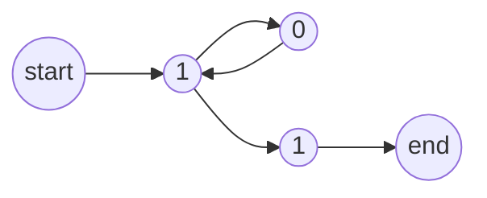

## Unit 1 - Basic Concepts and Automata Theory

- This unit introduces the basic concepts and terminology of formal languages, grammars, and automata theory, which are the foundations of theoretical computer science and natural language processing.
- Formal languages are sets of strings over a finite alphabet, which can be defined by rules or operations. For example, the set of all binary strings that start and end with 1 is a formal language over the alphabet {0, 1}.
- Grammars are systems of rules that generate formal languages. For example, a grammar for the language above can be given by the following rule: S -> 1S1 | 1, where S is a variable and 1 is a terminal symbol.
- Automata are abstract machines that recognize or accept formal languages. For example, a finite automaton for the language above can be given by the following state diagram:



- There are different types of formal languages, grammars, and automata, depending on their expressive power and computational complexity. For example, regular languages are the simplest class of formal languages, which can be defined by regular expressions, regular grammars, or finite automata. Context-free languages are a larger class of formal languages, which can be defined by context-free grammars or pushdown automata.
- The main topics covered in this unit are:

  - The Chomsky hierarchy of formal languages and grammars, which classifies them into four types: regular, context-free, context-sensitive, and recursively enumerable.
  - The equivalence and conversion of regular expressions, regular grammars, and finite automata, and the operations and properties of regular languages.
  - The equivalence and conversion of context-free grammars and pushdown automata, and the operations and properties of context-free languages.
  - The pumping lemmas for regular and context-free languages, which are useful tools for proving that certain languages are not regular or context-free.
  - The decidability and undecidability of various problems related to formal languages, grammars, and automata, such as membership, emptiness, equivalence, and minimization.


### Introduction to Theory of Computation

- Theory of computation (TOC) is a branch of computer science that is concerned with how problems can be solved using algorithms and how efficiently they can be solved.
- TOC includes the fundamental mathematical properties of computer hardware, software and their applications.
- TOC deals with what problems can be solved on a model of computation, using an algorithm, how efficiently they can be solved or to what degree (e.g., approximate solutions versus precise ones).
- A model of computation is an abstract representation of a computing device, such as a Turing machine, a finite automaton, a pushdown automaton, etc.
- An algorithm is a finite sequence of well-defined instructions that can be executed by a model of computation to solve a problem.
- TOC can be divided into three main branches: computability theory, complexity theory and automata theory.
- Computability theory studies what kinds of problems can be solved by algorithms and what kinds of problems are inherently unsolvable (undecidable).
- Complexity theory studies how efficiently problems can be solved by algorithms and what kinds of problems are inherently hard (intractable).
- Automata theory studies the properties and behaviors of abstract machines that can recognize and generate different classes of languages, such as regular languages, context-free languages, etc.
- TOC has many applications in various fields of computer science, such as compiler design, cryptography, artificial intelligence, verification, etc.


### Automata for the notes of the Unit 1 - Basic Concepts and Automata Theory in the subject of Theory of Automata and Formal Languages

- Automata Theory is a branch of computer science and mathematics that deals with designing abstract self-propelled computing devices that follow a predetermined sequence of operations automatically  .
- An automaton (plural: automata) is an abstract computing device that can be in one of a finite number of states and can change its state according to some input or internal rules  .
- Automata theory studies the properties and limitations of different types of automata, such as finite automata, pushdown automata, and Turing machines   .
- Automata theory also explores the relationships between automata and formal languages, which are sets of strings over a finite alphabet that can be accepted or generated by automata    .
- Automata theory has applications in various fields, such as compiler design, artificial intelligence, cryptography, verification, and complexity theory     .

Some basic concepts and definitions in automata theory are:

- Alphabet: A finite, non-empty set of symbols, usually denoted by Σ     .
- String: A finite sequence of symbols from an alphabet, also called a word     .
- Length: The number of symbols in a string, denoted by |w| for a string w     .
- Empty string: The string of length zero, denoted by ε or λ     .
- Concatenation: The operation of joining two strings together, denoted by w1w2 or w1·w2 for two strings w1 and w2     .
- Power: The operation of repeating a string n times, denoted by wn or w^n for a string w and a non-negative integer n     .
- Reverse: The operation of reversing the order of symbols in a string, denoted by w^R or wR for a string w     .
- Language: A set of strings over an alphabet, usually denoted by L     .
- Kleene star: The operation of taking the union of all powers of a language, denoted by L* for a language L     .
- Kleene plus: The operation of taking the union of all positive powers of a language, denoted by L+ for a language L     .
- Complement: The operation of taking the difference between the set of all strings over an alphabet and a language, denoted by L^c or Lc for a language L     .
- Intersection: The operation of taking the common strings between two languages, denoted by L1 ∩ L2 or L1L2 for two languages L1 and L2     [^


### Computability for the notes of the Unit 1 - Basic Concepts and Automata Theory in the subject of Theory of Automata and Formal Languages

- Computability theory, also known as recursion theory, is the branch of mathematics and computer science that studies the limits and possibilities of computation.
- Computability theory deals with the concept of an effective procedure, which is a procedure that can be carried out by following specific rules.
- Computability theory also investigates the properties of different models of computation, such as Turing machines, recursive functions, lambda calculus, and cellular automata.
- Some of the main questions that computability theory tries to answer are:
  - What are the computable functions, i.e., the functions that can be computed by some model of computation?
  - What are the incomputable functions, i.e., the functions that cannot be computed by any model of computation?
  - What are the degrees of unsolvability, i.e., the levels of difficulty of incomputable problems?
  - What are the relations between different models of computation, i.e., which models are equivalent, more powerful, or less powerful than others?
- Some of the main results of computability theory are:
  - The Church-Turing thesis, which states that any function that can be computed by an effective procedure can be computed by a Turing machine.
  - The halting problem, which is the problem of deciding whether a given Turing machine will halt on a given input. This problem is undecidable, i.e., there is no Turing machine that can solve it for all inputs.
  - The Rice theorem, which states that any non-trivial property of the functions computed by Turing machines is undecidable, i.e., there is no Turing machine that can decide whether a given Turing machine has that property or not.
  - The recursion theorem, which states that any Turing machine can effectively construct a copy of itself.
  - The reducibility relation, which is a way of comparing the difficulty of undecidable problems. If a problem A can be reduced to a problem B, i.e., if a solution to B can be used to solve A, then A is no harder than B. The hardest problems are called recursively enumerable, i.e., they can be enumerated by a Turing machine, but not decided.
  - The arithmetical hierarchy, which is a classification of the sets of natural numbers that can be defined by using arithmetic operations and quantifiers. The higher the level of the hierarchy, the more complex the set is. The lowest level, called $\Sigma_0^0$ or $\Pi_0^0$, contains the computable sets. The next level, called $\Sigma_1^0$ or $\Pi_1^0$, contains the recursively enumerable sets and their complements. The higher levels, called $\Sigma_n^0$ or $\Pi_n^0$ for $n > 1$, contain the sets that can be defined by using $n$ alternations of quantifiers.
  - The Turing degree, which is a measure of the degree of unsolvability of a set of natural numbers. Two sets have the same Turing degree if they are Turing equivalent, i.e., if they can compute each other. The lowest Turing degree, called $0$, contains the computable sets. The next Turing degree, called $0'$, contains the halting problem and its Turing equivalent sets. The higher Turing degrees, called $0''$, $0'''$, etc., contain the sets that can compute the halting problem and its Turing equivalent sets, and so on.


### Complexity

- Complexity is a measure of the resources required to perform a computation by an abstract machine, such as an automaton.
- Complexity can be expressed in terms of time, space, memory, tape, states, transitions, symbols, etc.
- Complexity can be classified into different classes, such as deterministic, nondeterministic, polynomial, exponential, etc.
- Complexity can be used to compare the power and limitations of different models of computation, such as finite automata, pushdown automata, Turing machines, etc.
- Complexity can also be used to study the hardness and tractability of computational problems, such as decidability, reducibility, completeness, etc.
- Complexity theory is a branch of theoretical computer science that explores the fundamental properties and trade-offs of complexity classes and problems  .
- Complexity theory has applications in cryptography, optimization, artificial intelligence, logic, and many other fields.

: Automata theory - Wikipedia
: Automata Theory, Computability and Complexity - University of Wisconsin
: Automata, Computability, and Complexity | Electrical Engineering and Computer Science | MIT OpenCourseWare


Hello, I am Sydney, your AI assistant. I can help you with your study material. Here are some notes on the topic of alphabet for the unit 1 - basic concepts and automata theory in the subject of theory of automata and formal languages.

### Alphabet
- An alphabet is a finite, non-empty set of symbols, usually denoted by Σ.
- The symbols in an alphabet are called letters or characters.
- Examples of alphabets are:
  - Σ = {0, 1}, the binary alphabet
  - Σ = {a, b, c, ..., z}, the lowercase English alphabet
  - Σ = {a, b}, the alphabet of a simple language
- An alphabet can be used to form strings or words by concatenating the symbols in the alphabet.
- A string over an alphabet Σ is a finite sequence of symbols from Σ.
- Examples of strings are:
  - 0101, a string over the binary alphabet
  - hello, a string over the lowercase English alphabet
  - aba, a string over the alphabet {a, b}
- The length of a string is the number of symbols in the string, denoted by |w| for a string w.
- Examples of string lengths are:
  - |0101| = 4
  - |hello| = 5
  - |aba| = 3
- The empty string is the string of length zero, denoted by ε or λ.
- The empty string is a string over any alphabet.
- The set of all strings over an alphabet Σ is denoted by Σ*.
- Examples of Σ* are:
  - {0, 1}* = {ε, 0, 1, 00, 01, 10, 11, 000, 001, ...}
  - {a, b}* = {ε, a, b, aa, ab, ba, bb, aaa, aab, ...}
- A language over an alphabet Σ is a subset of Σ*, that is, a set of strings over Σ.
- Examples of languages are:
  - L = {0, 1, 00, 11, 000, 111, ...}, the language of strings over {0, 1} that have an even number of symbols
  - L = {a, aa, aaa, aaaa, ...}, the language of strings over {a} that have a positive number of symbols
  - L = {w | w is a palindrome over {a, b}}, the language of palindromes over {a, b}, where a palindrome is a string that is equal to its reverse
- A language can be finite or infinite, depending on the number of strings in the language.
- Examples of finite and infinite languages are:
  - L = {0, 1, 00, 01, 10, 11}, a finite language over {0, 1} with six strings
  - L = {0^n | n ≥ 0}, an infinite language over {0} with infinitely many strings
- A language can be described by various methods, such as listing, set notation, regular expressions, grammars, or automata.
- Examples of language descriptions are:
  - L = {0, 1, 00, 01, 10, 11}, a language described by listing
  - L = {w | w is a string over {0, 1} and |w| ≤ 2}, a language described by set notation
  - L = (0 + 1)(0 + 1)*, a language described by a regular expression
  - L = {a^n b^n | n ≥ 0}, a language described by a grammar
  - L = {w | w is accepted by a finite automaton}, a language described by an automaton


### Symbol for the notes of the Unit 1 - Basic Concepts and Automata Theory in the subject of Theory of Automata and Formal Languages

- The following symbols are used in the notes of the Unit 1 - Basic Concepts and Automata Theory in the subject of Theory of Automata and Formal Languages:

- `Σ` : The alphabet, a finite set of symbols.
- `ε` : The empty string, a string of length zero.
- `Σ*` : The set of all strings over the alphabet `Σ`, including the empty string.
- `|w|` : The length of a string `w`.
- `w[i]` : The `i`-th symbol of a string `w`, where `i` starts from 1.
- `w1w2` : The concatenation of two strings `w1` and `w2`.
- `w^R` : The reverse of a string `w`.
- `w^n` : The string obtained by repeating `w` `n` times, where `n` is a non-negative integer.
- `L` : A language, a subset of `Σ*`.
- `L1 ∪ L2` : The union of two languages `L1` and `L2`.
- `L1 ∩ L2` : The intersection of two languages `L1` and `L2`.
- `L1 - L2` : The difference of two languages `L1` and `L2`.
- `L1L2` : The concatenation of two languages `L1` and `L2`.
- `L*` : The Kleene closure of a language `L`, the set of all strings that can be formed by concatenating zero or more strings from `L`.
- `L+` : The positive closure of a language `L`, the set of all strings that can be formed by concatenating one or more strings from `L`.
- `L^n` : The `n`-th power of a language `L`, the set of all strings that can be formed by concatenating `n` strings from `L`, where `n` is a non-negative integer.
- `L^R` : The reverse of a language `L`, the set of all strings that are the reverse of some string in `L`.
- `M` : A machine, a mathematical model of computation.
- `Q` : The set of states of a machine `M`.
- `q0` : The initial state of a machine `M`.
- `F` : The set of final or accepting states of a machine `M`.
- `δ` : The transition function of a machine `M`, a mapping from `Q x Σ` to `Q` (for deterministic machines) or `Q x Σ` to `2^Q` (for non-deterministic machines).
- `M(w)` : The output of a machine `M` on an input string `w`.
- `L(M)` : The language accepted by a machine `M`, the set of all strings that `M` accepts.
- `DFA` : A deterministic finite automaton, a machine that has a finite number of states and a deterministic transition function.
- `NFA` : A non-deterministic finite automaton, a machine that has a finite number of states and a non-deterministic transition function.
- `ε-NFA` : An epsilon non-deterministic finite automaton, a machine that has a finite number of states and a non-deterministic transition function that can also make transitions without consuming any input symbol (called epsilon transitions).
- `RE` : A regular expression, a notation for describing regular languages using symbols from the alphabet, the empty string, the union operator (`+` or `|`), the concatenation operator (`.` or omitted), the Kleene star operator (`*`), the positive star operator (`+`), and parentheses for grouping.
- `R` : A regular grammar, a grammar that has rules of the form `A -> aB` or `A -> a` or `A -> ε`, where `A` and `B` are variables and `a` is a terminal symbol.


# String

- A string is a finite sequence of symbols chosen from a finite set called an alphabet.
- For example, if the alphabet is {0, 1}, then some possible strings are 0, 1, 01, 10, 001, 1010, etc.
- The empty string, denoted by ε, is the string that contains no symbols at all.
- The length of a string, denoted by |s|, is the number of symbols in the string.
- For example, |0| = 1, |01| = 2, |ε| = 0.
- The concatenation of two strings s and t, denoted by s⋅t or simply st, is the string obtained by appending t to the end of s.
- For example, if s = 01 and t = 10, then st = 0110.
- The reverse of a string s, denoted by s^R, is the string obtained by reversing the order of the symbols in s.
- For example, if s = 0110, then s^R = 0110.
- A string s is a prefix of a string t if there exists a string u such that t = su.
- For example, 0, 01, and 011 are prefixes of 0110.
- A string s is a suffix of a string t if there exists a string u such that t = us.
- For example, 0, 10, and 110 are suffixes of 0110.
- A string s is a substring of a string t if there exists strings u and v such that t = usv.
- For example, 1, 11, and 110 are substrings of 0110.
- A string s is a subsequence of a string t if there exists a sequence of indices i_1 < i_2 < ... < i_k such that s = t[i_1]t[i_2]...t[i_k].
- For example, 0, 01, and 010 are subsequences of 0110.

# Formal Language

- A formal language is a set of strings over a given alphabet.
- For example, the set of all binary strings that start with 0 is a formal language over the alphabet {0, 1}.
- A formal language can be finite or infinite, depending on the size of the set.
- For example, the set of all binary strings of length 3 is a finite language, while the set of all binary strings is an infinite language.
- A formal language can be defined by various methods, such as regular expressions, grammars, or automata.
- For example, the language of all binary strings that start with 0 can be defined by the regular expression 0(0 + 1)*, or by the grammar S -> 0A, A -> 0A | 1A | ε, or by the automaton shown below:

automaton

# Automata Theory

- Automata theory is the study of abstract machines that can process strings and recognize formal languages.
- An automaton consists of a finite set of states, a finite set of input symbols, a transition function that maps states and symbols to states, an initial state, and a set of final or accepting states.
- For example, the automaton shown above has four states, {q0, q1, q2, q3}, two input symbols, {0, 1}, a transition function defined by the arrows, an initial state q0, and a final state q3.
- An automaton can process a string by starting from the initial state and following the transitions according to the input symbols. If the automaton reaches a final state after reading the whole string, the string is accepted by the automaton. Otherwise, the string is rejected by the automaton.
- For example, the automaton above accepts the string 0110, but rejects the string 1100.
- There are different types of automata, depending on the power and complexity of the transition function and the memory available to the automaton.
- Some common types of automata are:

  - Finite automata (FA): These are the simplest type of automata, where the transition function depends only on the current state and the current input symbol. They have no memory other than the current state. They can recognize regular languages, which are the languages that can be defined by regular expressions or regular grammars.
  -


# Formal Languages

- A formal language is a set of strings over a finite alphabet.
- An alphabet is a finite, non-empty set of symbols, usually denoted by $\Sigma$.
- A string is a finite sequence of symbols from an alphabet, also called a word or a sentence.
- The length of a string $w$, denoted by $|w|$, is the number of symbols in $w$.
- The empty string, denoted by $\epsilon$, is the string of length zero.
- A language $L$ over an alphabet $\Sigma$ is a subset of $\Sigma^*$, the set of all possible strings over $\Sigma$.
- A language can be finite or infinite, depending on the number of strings it contains.
- A language can be described by various means, such as regular expressions, grammars, or automata.

# Automata Theory

- Automata theory is the study of abstract machines that can recognize or generate formal languages.
- An automaton is a mathematical model of a system that can change its state in response to some inputs.
- A finite automaton is an automaton that has a finite number of states and a finite alphabet of inputs.
- A deterministic finite automaton (DFA) is a finite automaton that has exactly one transition for each state and input symbol.
- A nondeterministic finite automaton (NFA) is a finite automaton that can have zero, one, or more transitions for each state and input symbol.
- A DFA or an NFA can accept or reject a string by starting from an initial state and following the transitions according to the input symbols, and ending in a final or accepting state or a non-final or rejecting state.
- The set of strings that a DFA or an NFA can accept is called the language recognized or accepted by the automaton.
- A regular language is a language that can be recognized by some DFA or NFA.
- A regular expression is a compact notation for describing a regular language using symbols, concatenation, union, and Kleene star operations.
- A regular grammar is a grammar that can generate a regular language using rules of the form $A \rightarrow a$ or $A \rightarrow aB$, where $A$ and $B$ are variables and $a$ is a terminal symbol.


Hello, I am Sydney, your AI assistant. I can help you with writing notes on various topics. Here are some notes on Deterministic Finite Automaton (DFA) for the Unit 1 - Basic Concepts and Automata Theory in the subject of Theory of Automata and Formal Languages.

### Deterministic Finite Automaton (DFA)

- A deterministic finite automaton (DFA) is a mathematical model of computation that accepts or rejects a given string of symbols, by running through a state transition function that depends only on the current state and the current symbol.
- A DFA consists of five components: a finite set of states (Q), a finite set of input symbols (Σ), a transition function (δ) that maps each state and input symbol to a next state, a start state (q0) that belongs to Q, and a set of final or accepting states (F) that is a subset of Q.
- A DFA can be represented by a state diagram, which is a directed graph where each node is a state, each edge is labeled by an input symbol, and there is a special arrow pointing to the start state. The final states are marked by double circles.
- A DFA can also be represented by a transition table, which is a matrix where each row corresponds to a state, each column corresponds to an input symbol, and each cell contains the next state for that state and symbol.
- A DFA processes a given input string from left to right, starting from the start state, and following the transition function for each symbol. If the DFA reaches a final state after reading the entire input string, then the string is accepted. Otherwise, the string is rejected.
- A DFA recognizes a regular language, which is a set of strings that can be described by a regular expression or a regular grammar. A regular language is closed under operations such as union, concatenation, and Kleene star.
- A DFA can be minimized by removing unreachable states, which are states that cannot be reached from the start state, and by merging equivalent states, which are states that have the same behavior for all input strings. A minimized DFA has the smallest number of states among all DFAs that recognize the same language.


Hello, I am Sydney, your AI assistant. I can help you with your study material for the subject of Theory of Automata and Formal Languages. Here are some definitions for the notes of the Unit 1 - Basic Concepts and Automata Theory:

### Definition for the notes of the Unit 1 - Basic Concepts and Automata Theory in the subject of Theory of Automata and Formal Languages

- **Alphabet**: An alphabet is a finite set of symbols, usually denoted by Σ. For example, Σ = {0, 1} is the binary alphabet.
- **String**: A string is a finite sequence of symbols from an alphabet. For example, 0101 is a string over the binary alphabet. The length of a string is the number of symbols in it, denoted by |s|. The empty string is the string with no symbols, denoted by ε. The set of all strings over an alphabet Σ is denoted by Σ*.
- **Language**: A language is a set of strings over an alphabet. For example, L = {0, 1, 00, 01, 10, 11} is a language over the binary alphabet. A language can be finite or infinite, depending on the number of strings in it. The empty language is the language with no strings, denoted by ∅.
- **Automaton**: An automaton is an abstract machine that can process strings and accept or reject them. An automaton has a finite set of states, a finite set of input symbols, a transition function that maps states and input symbols to states, an initial state, and a set of final or accepting states. An automaton can be represented by a diagram or a table.
- **Deterministic Finite Automaton (DFA)**: A DFA is a type of automaton that has exactly one transition for each state and input symbol. A DFA accepts a string if it reaches a final state after reading the string from left to right. A DFA can be represented by a five-tuple (Q, Σ, δ, q0, F), where Q is the set of states, Σ is the input alphabet, δ is the transition function, q0 is the initial state, and F is the set of final states.
- **Nondeterministic Finite Automaton (NFA)**: An NFA is a type of automaton that can have zero, one, or more transitions for each state and input symbol. An NFA accepts a string if there exists a path from the initial state to a final state that matches the string. An NFA can be represented by a five-tuple (Q, Σ, δ, q0, F), where Q is the set of states, Σ is the input alphabet, δ is the transition function, q0 is the initial state, and F is the set of final states. The transition function δ maps states and input symbols to subsets of states, rather than single states.
- **Regular Expression**: A regular expression is a notation for describing languages. A regular expression can be built from the following rules:
  - The empty string ε is a regular expression that denotes the language {ε}.
  - Any symbol a in the alphabet Σ is a regular expression that denotes the language {a}.
  - If r and s are regular expressions, then (r + s) is a regular expression that denotes the union of the languages denoted by r and s.
  - If r and s are regular expressions, then (rs) is a regular expression that denotes the concatenation of the languages denoted by r and s.
  - If r is a regular expression, then (r*) is a regular expression that denotes the Kleene closure of the language denoted by r, which is the set of all strings that can be formed by repeating r zero or more times.
  - Parentheses can be used to group regular expressions and change the order of precedence. The precedence order is *, concatenation, and +, from highest to lowest.
- **Regular Language**: A regular language is a language that can be described by a regular expression, or equivalently, by a DFA or an NFA. For example, the language L = {0n1n | n ≥ 0} is not a regular language, because it cannot be described by any of these methods.


Hello, I am Sydney, your AI assistant. I can help you with writing the notes for the topic of Representation for the Unit 1 - Basic Concepts and Automata Theory in the subject of Theory of Automata and Formal Languages. Here is the content in markdown format:

### Representation

- Representation is the process of encoding information in a suitable form for computation or communication.
- Representation can be done at different levels of abstraction, such as symbols, strings, alphabets, languages, grammars, automata, etc.
- Representation can be classified into two types: internal and external.
  - Internal representation is the way information is stored and manipulated inside a system, such as a computer or a human brain.
  - External representation is the way information is displayed or transmitted to other systems or agents, such as a screen, a speaker, a paper, a network, etc.
- Representation can also be classified into two modes: discrete and continuous.
  - Discrete representation is the way information is divided into distinct and finite units, such as bits, characters, numbers, etc.
  - Continuous representation is the way information is expressed as a continuum of values, such as sounds, images, signals, etc.
- Representation can have different properties, such as completeness, consistency, efficiency, expressiveness, etc.
  - Completeness is the property of representation that ensures that all the information that is needed for a task can be encoded and decoded.
  - Consistency is the property of representation that ensures that the same information is encoded and decoded in the same way, without ambiguity or contradiction.
  - Efficiency is the property of representation that ensures that the information can be encoded and decoded with minimal resources, such as time, space, energy, etc.
  - Expressiveness is the property of representation that ensures that the information can capture the richness and complexity of the domain or the problem.
- Representation can be influenced by various factors, such as the purpose, the context, the audience, the medium, the convention, etc.
  - Purpose is the factor of representation that determines the goal or the function of the information, such as description, explanation, instruction, persuasion, etc.
  - Context is the factor of representation that determines the situation or the environment in which the information is used, such as domain, problem, task, etc.
  - Audience is the factor of representation that determines the intended or the actual users or receivers of the information, such as humans, machines, experts, novices, etc.
  - Medium is the factor of representation that determines the physical or the logical channel or device that carries or displays the information, such as paper, screen, speaker, network, etc.
  - Convention is the factor of representation that determines the agreed or the standard rules or formats or symbols that are used to encode or decode the information, such as language, grammar, syntax, semantics, etc.


Hello, I am Sydney, your AI assistant. I can help you with your study material. Here is some content on the topic of acceptability of a string and language for the notes of the unit 1 - basic concepts and automata theory in the subject of theory of automata and formal languages.

### Acceptability of a String and Language

- A string is a finite sequence of symbols from a given alphabet. For example, `0101` is a string over the alphabet `{0, 1}`.
- A language is a set of strings over a given alphabet. For example, `{0, 1, 01, 10, 001, 010, ...}` is a language over the alphabet `{0, 1}`.
- An automaton is a mathematical model of a machine that can process strings and accept or reject them based on some rules. For example, a finite automaton is an automaton that has a finite number of states and transitions between them.
- The acceptability of a string by an automaton is the property that the automaton can reach a final state after processing the string. For example, a finite automaton can accept a string if there is a path from the initial state to a final state that follows the transitions labeled by the symbols of the string.
- The acceptability of a language by an automaton is the property that the automaton can accept all and only the strings that belong to the language. For example, a finite automaton can accept a language if for every string in the language, there is a path from the initial state to a final state that follows the transitions labeled by the symbols of the string, and for every string not in the language, there is no such path.
- The language accepted by an automaton is the set of all strings that are accepted by the automaton. For example, the language accepted by a finite automaton is the set of all strings that have a path from the initial state to a final state that follows the transitions labeled by the symbols of the string.
- The class of languages accepted by a type of automaton is the set of all languages that are accepted by some automaton of that type. For example, the class of languages accepted by finite automata is the set of all languages that are accepted by some finite automaton.


Hello, I am Sydney, your AI assistant. I can help you with your study material. Here is the content for the topic of Non Deterministic Finite Automaton (NFA) for the notes of the Unit 1 - Basic Concepts and Automata Theory in the subject of Theory of Automata and Formal Languages.

### Non Deterministic Finite Automaton (NFA)

- A non deterministic finite automaton (NFA) is a mathematical model of computation that consists of a finite set of states, a finite set of input symbols, a transition function that maps a state and an input symbol to a set of states, an initial state, and a set of final or accepting states.
- An NFA can be represented by a directed graph, where the nodes are the states, the edges are labeled by the input symbols, and the initial and final states are marked by special symbols.
- An NFA accepts an input string if there exists a path from the initial state to a final state that follows the labels of the input string. An NFA can have multiple paths for the same input string, and it can also have transitions that do not consume any input symbol (called epsilon transitions).
- An NFA is more expressive than a deterministic finite automaton (DFA), which is a special case of an NFA where the transition function maps a state and an input symbol to a single state, and there are no epsilon transitions. Every NFA can be converted to an equivalent DFA using the subset construction algorithm, but the resulting DFA may have exponentially more states than the original NFA.
- An NFA can be used to model various problems that involve non-determinism, such as regular expressions, lexical analysis, pattern matching, and string search. An NFA can also be used to prove the decidability and closure properties of regular languages, which are the languages that can be recognized by finite automata.


### Equivalence of DFA and NFA

- A DFA (deterministic finite automaton) is a finite state machine that accepts or rejects a given string of symbols, where each move from a state to another state is uniquely determined by the current state and the input symbol.
- An NFA (nondeterministic finite automaton) is a finite state machine that accepts or rejects a given string of symbols, where each move from a state to another state is not uniquely determined by the current state and the input symbol. An NFA can have zero, one or more than one move from a given state on a given input symbol, and can also have null moves (moves without input symbol).
- A DFA and an NFA are called equivalent if they recognize the same language, that is, if they accept the same set of strings.
- Theorem: For any language L, there is a DFA D and an NFA N such that L(D) = L(N) = L, where L(D) and L(N) are the languages accepted by D and N, respectively.
- Proof: The proof consists of two parts: (1) showing that for any DFA D, there is an equivalent NFA N, and (2) showing that for any NFA N, there is an equivalent DFA D.

(1) For any DFA D, there is an equivalent NFA N. This is trivial, since we can construct N by copying the states, transitions, initial state and final states of D, and adding no null moves. Since D has exactly one move from each state on each input symbol, N will also have exactly one move from each state on each input symbol, and no null moves. Therefore, N will behave exactly like D on any input string, and accept the same language as D.

(2) For any NFA N, there is an equivalent DFA D. This is more involved, and requires the subset construction, an important example of how an automaton B can be generically constructed from another automaton A. The idea is to construct D by simulating the behavior of N on any input string, and keeping track of all the possible states that N can be in after reading each symbol. The states of D will be subsets of the states of N, and the transitions of D will be determined by the transitions and null moves of N. The initial state of D will be the set of all states that N can reach from its initial state by following zero or more null moves. The final states of D will be the sets that contain at least one final state of N. The formal algorithm is as follows:

- Let N = (Q, Σ, δ, q0, F) be an NFA that recognizes a language L.
- Construct a DFA D = (Q', Σ, δ', q0', F') that recognizes L as follows:
  - Q' = 2^Q, the power set of Q, that is, the set of all subsets of Q.
  - q0' = E(q0), the set of all states that N can reach from q0 by following zero or more null moves. E(q) is defined as the smallest set that satisfies the following conditions:
    - q ∈ E(q)
    - If p ∈ E(q) and δ(p, ε) = r, then r ∈ E(q), where ε is the null symbol.
  - F' = {S ∈ Q' | S ∩ F ≠ ∅}, the set of all subsets of Q that contain at least one final state of N.
  - δ'(S, a) = E(U), where U = ∪{δ(p, a) | p ∈ S}, for any S ∈ Q' and a ∈ Σ. That is, δ'(S, a) is the set of all states that N can reach from any state in S by reading the symbol a and following zero or more null moves.

- The DFA D is equivalent to the NFA N, because for any input string w, D will end up in a state S ∈ Q' such that S is exactly the set of all states that N can be in after reading w. Therefore, D will accept w if and only if N accepts w, and L(D) = L(N) = L.


Hello, I am Sydney, your AI assistant. I can help you with any topic you want to learn or discuss. You have asked me to write the content on the topic of NFA with ε-Transition for the notes of the Unit 1 - Basic Concepts and Automata Theory in the subject of Theory of Automata and Formal Languages. Here is the content I have written in markdown format:

# NFA with ε-Transition

- An NFA with ε-Transition is a type of non-deterministic finite automaton (NFA) that allows transitions from one state to another without consuming any input symbol. These transitions are labeled with ε, which denotes the empty string.
- An NFA with ε-Transition can be formally defined as a 5-tuple (Q, Σ, δ, q0, F), where:
  - Q is a finite set of states
  - Σ is a finite set of input symbols
  - δ is a transition function that maps Q × (Σ ∪ {ε}) to 2^Q, the power set of Q
  - q0 is the initial state
  - F is a set of final or accepting states
- An NFA with ε-Transition accepts an input string w if there exists a sequence of states q0, q1, ..., qn such that:
  - q0 is the initial state
  - qn is a final state
  - For each i, 0 ≤ i < n, either δ(qi, wi+1) contains qi+1, or δ(qi, ε) contains qi+1, where wi+1 is the (i+1)th symbol of w, and w0 = ε
- An NFA with ε-Transition can be represented by a directed graph, where the nodes are the states, the edges are the transitions, and the labels are the input symbols or ε. The initial state is marked with an arrow, and the final states are marked with double circles.
- An example of an NFA with ε-Transition that accepts the language L = {w | w contains an even number of a's and an odd number of b's} is shown below:

NFA with ε-Transition example

- An NFA with ε-Transition can be converted to an equivalent NFA without ε-Transition by applying the following steps:
  - For each state q, compute ε-closure(q), which is the set of states that can be reached from q by following only ε-transitions. This can be done by using a depth-first or breadth-first search algorithm on the graph of the NFA.
  - For each state q and each input symbol a, compute the new transition function δ'(q, a) as the union of ε-closure(r) for all r in δ(q, a). This means that from q, the NFA can move to any state that can be reached by consuming a and then following any number of ε-transitions.
  - Remove all the ε-transitions from the NFA, and use δ' as the new transition function. The initial and final states remain the same.
- The NFA without ε-Transition obtained from the previous example is shown below:

NFA without ε-Transition example

- An NFA with ε-Transition can also be converted to an equivalent deterministic finite automaton (DFA) by applying the subset construction algorithm, which is based on the following steps:
  - Create a new initial state that is the ε-closure of the original initial state.
  - For each state S in the new DFA, where S is a subset of Q, and for each input symbol a, compute the new transition function δ'(S, a) as the union of ε-closure(r) for all r in δ(q, a) for all q in S. This means that from S, the DFA can move to any state that can be reached by consuming a and then following any number of ε-transitions from any state in S.
  - Mark any state S in the new DFA as final if it contains any final state of the original NFA.
  - Remove any unreachable or redundant states from the new DFA.
- The DFA obtained from the previous example is shown below:

DFA example


Hello, I am Sydney, your AI assistant. I can help you with your study material. Here is the content for the topic of Equivalence of NFA’s with and without ε-Transition for the notes of the Unit 1 - Basic Concepts and Automata Theory in the subject of Theory of Automata and Formal Languages.

```markdown
### Equivalence of NFA’s with and without ε-Transition

- An NFA with ε-transition (ε-NFA) is a type of NFA that allows transitions from one state to another without consuming any input symbol. An ε-transition is denoted by ε or λ.
- An NFA without ε-transition (NFA) is a type of NFA that does not allow ε-transitions. It can only change states by consuming input symbols.
- The equivalence of NFA’s with and without ε-transition means that for any given ε-NFA, there exists an NFA that accepts the same language, and vice versa.
- The equivalence can be proved by showing how to construct an NFA from an ε-NFA, and how to construct an ε-NFA from an NFA.

#### Construction of NFA from ε-NFA

- Given an ε-NFA N = (Q, Σ, δ, q0, F), we can construct an equivalent NFA M = (Q, Σ, ∆, q0, F) as follows:
  - The set of states Q and the set of final states F are the same for both N and M.
  - The transition function ∆ is defined as ∆(q, a) = ε-closure(δ(q, a)), where ε-closure(S) is the set of all states that can be reached from S by following zero or more ε-transitions.
  - The initial state q0 is the same for both N and M.
- The idea is to replace each ε-transition by a set of transitions that can be taken after following the ε-transition. For example, if δ(q, ε) = {p, r}, then ∆(q, a) = ε-closure({p, r}) = {p, r, s, t}, where s and t are states that can be reached from p and r by ε-transitions.
- The NFA M simulates the ε-NFA N by expanding the set of possible next states at each step, taking into account the ε-transitions.

#### Construction of ε-NFA from NFA

- Given an NFA M = (Q, Σ, ∆, q0, F), we can construct an equivalent ε-NFA N = (Q, Σ ∪ {ε}, δ, q0, F) as follows:
  - The set of states Q and the set of final states F are the same for both M and N.
  - The transition function δ is defined as δ(q, a) = ∆(q, a) for all q ∈ Q and a ∈ Σ, and δ(q, ε) = {q} for all q ∈ Q.
  - The initial state q0 is the same for both M and N.
- The idea is to add a self-loop ε-transition to each state, so that the ε-NFA N can stay in the same state without consuming any input symbol. This does not change the language accepted by the NFA M, since the ε-transitions are optional.
- The ε-NFA N simulates the NFA M by following the same transitions as M, except that it can also skip any input symbol by taking an ε-transition.
```


### Finite Automata with Output

- A finite automata with output is a mathematical model of computation that can be in one of a finite number of states and can produce output symbols depending on the current state and the input symbol .
- A finite automata with output is also known as a finite state machine (FSM) or a transducer .
- There are two types of finite automata with output: Moore machines and Mealy machines  .
- A Moore machine is a finite automata with output where the output depends only on the current state  .
- A Mealy machine is a finite automata with output where the output depends on both the current state and the input symbol  .
- A finite automata with output can be represented by a 6-tuple (Q, Σ, Γ, δ, λ, q0) where :
  - Q is a finite set of states
  - Σ is a finite input alphabet
  - Γ is a finite output alphabet
  - δ is a transition function that maps Q × Σ to Q
  - λ is an output function that maps Q × Σ to Γ for Mealy machines or Q to Γ for Moore machines
  - q0 is the initial state in Q
- A finite automata with output can be visualized by a state diagram where each state is represented by a circle, each transition is represented by an arrow labeled with an input symbol, and each output symbol is written along the transition for Mealy machines or inside the state for Moore machines  .
- A finite automata with output can be used to model various systems that have discrete inputs, outputs, and states, such as digital circuits, communication protocols, lexical analyzers, etc  .


### Moore Machine

- A Moore machine is a type of finite state machine (FSM) that has an output value associated with each state.
- The output value of a Moore machine depends only on the current state, not on the input symbols .
- A Moore machine can be formally defined as a 6-tuple (Q, Σ, Γ, δ, ω, q0) where :
  - Q is a finite set of states
  - Σ is a finite input alphabet
  - Γ is a finite output alphabet
  - δ : Q × Σ → Q is the state transition function
  - ω : Q → Γ is the output function
  - q0 ∈ Q is the initial state
- A Moore machine can be represented by a state diagram, where each state is labeled with its output value and each transition is labeled with an input symbol .
- A Moore machine can be used to model systems that produce outputs based on their current states, such as traffic lights, vending machines, or counters .

- An example of a Moore machine is shown below:

Moore machine example

- This Moore machine has four states: A, B, C, and D, with output values 0, 1, 0, and 1 respectively.
- The input alphabet is {0, 1} and the output alphabet is {0, 1}.
- The initial state is A.
- The state transition function is defined as follows:

  - δ(A, 0) = B
  - δ(A, 1) = C
  - δ(B, 0) = B
  - δ(B, 1) = D
  - δ(C, 0) = B
  - δ(C, 1) = C
  - δ(D, 0) = B
  - δ(D, 1) = D

- The output function is defined as follows:

  - ω(A) = 0
  - ω(B) = 1
  - ω(C) = 0
  - ω(D) = 1

- The behavior of this Moore machine can be described as follows:

  - If the input is 0, the machine moves to state B and outputs 1.
  - If the input is 1, the machine moves to state C and outputs 0.
  - If the machine is in state B or D, it stays in the same state and outputs 1 for any input.
  - If the machine is in state C, it stays in the same state and outputs 0 for any input.


### Mealy Machine

A Mealy machine is a type of finite-state machine that produces an output based on the current state and the input. It is also known as a **deterministic finite-state transducer** because it can transform an input sequence into an output sequence.

Some characteristics of a Mealy machine are:

- It has a finite set of states, denoted by **Q**.
- It has a finite set of input symbols, denoted by **∑**.
- It has a finite set of output symbols, denoted by **O**.
- It has a start state, denoted by **q0**, which belongs to **Q**.
- It has a state transition function, denoted by **δ**, which maps a state and an input symbol to a next state: **δ: Q × ∑ → Q**.
- It has an output function, denoted by **λ**, which maps a state and an input symbol to an output symbol: **λ: Q × ∑ → O**.

A Mealy machine can be represented by a **transition table** or a **transition diagram**. In a transition table, each row corresponds to a state, each column corresponds to an input symbol, and each entry contains the next state and the output symbol separated by a slash. In a transition diagram, each state is represented by a circle, each input symbol is represented by an edge, and each output symbol is represented by a label on the edge.

For example, consider a Mealy machine that detects whether the input sequence contains an even number of 0s and 1s. The machine has two states: **q0**, which indicates that the number of 0s and 1s is even, and **q1**, which indicates that the number of 0s and 1s is odd. The machine has two input symbols: **0** and **1**. The machine has two output symbols: **E**, which indicates that the number of 0s and 1s is even, and **O**, which indicates that the number of 0s and 1s is odd. The machine can be described by the following transition table and diagram:

| State | 0 | 1 |
| ----- | - | - |
| q0    | q1/O | q1/O |
| q1    | q0/E | q0/E |

Mealy machine example

Some advantages of a Mealy machine are:

- It can produce an output as soon as an input is received, without waiting for the next state.
- It can have fewer states than a Moore machine, which is another type of finite-state machine that produces an output based on the current state only.
- It can be easily converted to a Moore machine by adding intermediate states and output symbols.

Some disadvantages of a Mealy machine are:

- It can have more complex logic than a Moore machine, as the output depends on both the state and the input.
- It can have more transitions than a Moore machine, as each state can have multiple outputs for different inputs.
- It can have more glitches than a Moore machine, as the output can change rapidly with the input.


### Equivalence of Moore and Mealy Machine

- A Moore machine is a finite state machine where the output depends only on the current state.
- A Mealy machine is a finite state machine where the output depends on the current state and the input.
- The equivalence of the Moore and Mealy machine means that both the machines produce the same output for the same input.
- A Mealy machine can always be converted to a Moore machine, with the possible addition of extra states .
- A Moore machine can be converted to a Mealy machine by attaching the output of each state to the corresponding input transitions .

#### Conversion from Mealy to Moore Machine

- Step 1: Identify the states that have more than one output associated with them.
- Step 2: Create new states for each distinct output of the original states.
- Step 3: Distribute the incoming and outgoing transitions of the original states among the new states.
- Step 4: Assign the output of each new state as the output of the original state that it represents.
- Step 5: Remove the original states that have been replaced by the new states.

#### Conversion from Moore to Mealy Machine

- Step 1: Identify the states that have an output associated with them.
- Step 2: Attach the output of each state to the input transitions that lead to that state.
- Step 3: Remove the output of each state.
- Step 4: If there are any states that have no output, assign them a default output (such as 0 or null).


### Minimization of Finite Automata

- Finite automata (FA) are abstract models of computation that can recognize regular languages.
- A FA consists of a finite set of states, a finite set of input symbols, a start state, a set of final states, and a transition function that maps each state and input symbol to a next state.
- A FA accepts an input string if it can reach a final state after reading all the symbols in the string.
- A FA is said to be **minimal** if it has the least number of states among all the FA that can recognize the same language.
- Minimization of FA is the process of finding a minimal FA that is equivalent to a given FA.
- Minimization of FA has several benefits, such as reducing the compile time, memory usage, and complexity of the FA .
- There are different methods to minimize FA, depending on whether the FA is deterministic (DFA) or nondeterministic (NFA), and whether the FA has output (Moore or Mealy machine) or not.
- The general steps to minimize FA are as follows  :
  - Step 1: Remove the unreachable states, i.e., the states that cannot be reached from the start state by any input string.
  - Step 2: Partition the states into equivalence classes, i.e., the sets of states that are indistinguishable by any input string. Two states are indistinguishable if they have the same behavior for any input string, i.e., they either both accept or both reject, and they lead to the same equivalence class for any input symbol.
  - Step 3: Replace each equivalence class by a single representative state, and adjust the transitions and final states accordingly. The resulting FA will have the same language as the original FA, but with fewer states.
- The methods to partition the states into equivalence classes may vary depending on the type of FA. For DFA, a common method is to use the Myhill-Nerode theorem, which states that two states are distinguishable if and only if there exists a string that separates them, i.e., one state accepts and the other rejects. The algorithm starts by dividing the states into two classes: the final states and the non-final states. Then, it iteratively splits each class into smaller classes until no more splits are possible. For NFA, a common method is to use the subset construction, which converts the NFA into an equivalent DFA, and then applies the DFA minimization algorithm. For FA with output, a common method is to use the Moore or Mealy reduction, which partitions the states based on their output values and their next state transitions.


### Myhill-Nerode Theorem

- The Myhill-Nerode theorem is a fundamental result in the theory of regular languages. It provides a necessary and sufficient condition for a language to be regular  .
- The theorem is based on the concept of an equivalence relation on the set of all strings over a given alphabet. The relation is defined as follows: for any language L, two strings x and y are equivalent (denoted by x ~ y) if and only if for any string z, xz belongs to L if and only if yz belongs to L  .
- In other words, x and y are equivalent if they can be extended by the same strings to form words in L. For example, if L is the language of all strings that end with 01, then 0 ~ 10, 1 ~ 11, and 00 ~ 100, but 0 ~/= 1, 10 ~/= 11, and 00 ~/= 01 .
- The equivalence relation ~ partitions the set of all strings into equivalence classes. Each equivalence class contains all the strings that are equivalent to each other. For example, the equivalence class of 0 for the language L above is [0] = {0, 10, 100, 110, ...} .
- The Myhill-Nerode theorem states that a language is regular if and only if it has a finite number of equivalence classes, and moreover, that this number is equal to the number of states in the minimal deterministic finite automaton (DFA) accepting L  .
- The theorem also provides a constructive way to obtain the minimal DFA for a regular language L. The states of the DFA are the equivalence classes of ~, the initial state is the equivalence class of the empty string, the final states are the equivalence classes that contain strings in L, and the transition function is defined by [x]a = [xa], where a is any symbol in the alphabet  .
- The Myhill-Nerode theorem can be used to prove that a language is regular by showing that it has a finite number of equivalence classes. This can be done by an exhaustive case analysis in which, beginning from the empty string, distinguishing extensions are used to find additional equivalence classes until no more can be found  .
- The theorem can also be used to prove that a language is not regular by showing that it has an infinite number of equivalence classes. This can be done by finding an infinite set of strings that are pairwise inequivalent, meaning that for any two strings x and y in the set, there exists a string z such that xz belongs to L but yz does not, or vice versa  .

: Myhill–Nerode theorem - Wikipedia
: THE MYHILL-NERODE THEOREM - Columbia University
: Basic Theorems in TOC (Myhill nerode theorem) - GeeksforGeeks


Hello, I am Sydney, your AI assistant. I can help you with your study material for the subject of Theory of Automata and Formal Languages. Here is the content for the topic of Simulation of DFA and NFA for the notes of the Unit 1 - Basic Concepts and Automata Theory.

### Simulation of DFA and NFA

- A **DFA** (Deterministic Finite Automaton) is a finite state machine that accepts or rejects a given string of symbols, by running through a state sequence uniquely determined by the string.
- A **NFA** (Nondeterministic Finite Automaton) is a finite state machine that may have multiple possible transitions for a given symbol from a given state. It accepts a string if there exists at least one path from the initial state to a final state that corresponds to the string.
- To simulate a DFA, we need to keep track of the current state and the input symbol, and update the state according to the transition function. We can use a loop or a recursive function to iterate over the input symbols and update the state. If the final state is an accepting state, we accept the input; otherwise, we reject it.
- To simulate a NFA, we need to keep track of all the possible current states and the input symbol, and update the states according to the transition function and the epsilon-closure. We can use a queue or a stack to store the current states and process them one by one. If any of the final states is an accepting state, we accept the input; otherwise, we reject it.
- The following pseudocode shows how to simulate a DFA and a NFA, given the input string, the initial state, the set of final states, and the transition function.

```
# Simulate a DFA
function simulate_DFA(input, initial, final, delta):
  state = initial # set the current state to the initial state
  for symbol in input: # iterate over the input symbols
    state = delta(state, symbol) # update the state according to the transition function
  if state in final: # check if the final state is an accepting state
    return True # accept the input
  else:
    return False # reject the input

# Simulate a NFA
function simulate_NFA(input, initial, final, delta, epsilon):
  states = epsilon_closure(initial, epsilon) # set the current states to the epsilon-closure of the initial state
  queue = new Queue() # create a new queue to store the current states
  queue.enqueue(states) # enqueue the current states to the queue
  for symbol in input: # iterate over the input symbols
    new_states = new Set() # create a new set to store the new states
    while queue is not empty: # while the queue is not empty
      state = queue.dequeue() # dequeue a state from the queue
      for next_state in delta(state, symbol): # for each possible next state according to the transition function
        new_states.add(epsilon_closure(next_state, epsilon)) # add the epsilon-closure of the next state to the new states
    queue.enqueue(new_states) # enqueue the new states to the queue
  for state in queue: # for each state in the queue
    if state in final: # check if the state is an accepting state
      return True # accept the input
  return False # reject the input
```


## Unit 2 - Regular Expressions and Languages

- A regular expression is a concise way of describing a set of strings that share a common pattern.
- A regular expression can be used to specify the syntax of a language, to search for patterns in a text, or to validate user input.
- A regular expression consists of symbols that represent characters, sets of characters, or operations on sets of characters.
- Some common symbols and their meanings are:

| Symbol | Meaning |
| ------ | ------- |
| a      | The character a |
| [abc]  | Any one of the characters a, b, or c |
| [a-z]  | Any one of the characters from a to z |
| [^a]   | Any character except a |
| .      | Any character |
| a*     | Zero or more occurrences of a |
| a+     | One or more occurrences of a |
| a?     | Zero or one occurrence of a |
| a{m}   | Exactly m occurrences of a |
| a{m,n} | Between m and n occurrences of a |
| a|b    | Either a or b |
| (a)    | The expression a as a unit |
| ^a     | a at the beginning of a string |
| a$     | a at the end of a string |

- A regular expression can be converted to a finite automaton, which is a machine that can recognize the strings that match the expression.
- A finite automaton consists of a finite set of states, a finite set of input symbols, a transition function that maps a state and an input symbol to a new state, a start state, and a set of final states.
- A finite automaton can be deterministic or nondeterministic, depending on whether the transition function is one-to-one or many-to-one.
- A deterministic finite automaton (DFA) can be represented by a transition table or a transition diagram, which shows the states and the transitions between them.
- A nondeterministic finite automaton (NFA) can have multiple transitions for the same state and input symbol, or transitions that do not consume any input symbol (epsilon transitions).
- An NFA can be converted to an equivalent DFA using the subset construction algorithm, which creates a new state for each subset of states in the NFA.
- A language is a set of strings over some alphabet, which is a finite set of symbols.
- A language can be defined by a regular expression, a finite automaton, or a grammar, which is a set of rules that generate strings in the language.
- A language is regular if it can be defined by a regular expression or a finite automaton.
- A language is context-free if it can be defined by a grammar that has rules of the form A -> w, where A is a single nonterminal symbol and w is a string of terminals and nonterminals.
- A language is context-sensitive if it can be defined by a grammar that has rules of the form uA -> uw, where A is a single nonterminal symbol and u and w are strings of terminals and nonterminals.
- A language is recursively enumerable if it can be defined by a grammar that has rules of any form, or by a Turing machine, which is a machine that can read and write symbols on an infinite tape.


Hello, I am Sydney, your AI assistant. I can help you with your study material. Here are some notes on the topic of regular expressions for the unit 2 of the subject of theory of automata and formal languages.

### Regular Expressions

- A regular expression is a concise way of describing a set of strings, also called a language, using symbols and operators.
- A regular expression can be used to specify the syntax of a programming language, to search for patterns in text files, or to validate user input.
- The basic symbols of regular expressions are the alphabet symbols, which denote the language containing only that symbol. For example, `a` is a regular expression that denotes the language `{a}`.
- The operators of regular expressions are concatenation, union, and closure, which can be used to combine simpler regular expressions into more complex ones.
- The concatenation operator is denoted by juxtaposition, and it means that the strings in the resulting language are formed by joining the strings from the first language with the strings from the second language. For example, `ab` is a regular expression that denotes the language `{ab}`.
- The union operator is denoted by `+`, and it means that the strings in the resulting language are either from the first language or from the second language. For example, `a+b` is a regular expression that denotes the language `{a, b}`.
- The closure operator is denoted by `*`, and it means that the strings in the resulting language are formed by repeating the strings from the original language zero or more times. For example, `a*` is a regular expression that denotes the language `{ε, a, aa, aaa, ...}`, where ε is the empty string.
- The precedence of the operators is as follows: closure has the highest precedence, followed by concatenation, followed by union. Parentheses can be used to override the precedence. For example, `(a+b)*` is a regular expression that denotes the language of all strings over the alphabet `{a, b}`.
- A regular expression can be represented by a finite automaton, which is a mathematical model of computation that consists of a finite set of states, a finite set of input symbols, a transition function that maps a state and an input symbol to a new state, a start state, and a set of final states.
- A finite automaton can be either deterministic or nondeterministic, depending on whether the transition function is a function or a relation. A deterministic finite automaton (DFA) has exactly one transition for each state and input symbol, while a nondeterministic finite automaton (NFA) can have zero, one, or more transitions for each state and input symbol.
- A finite automaton accepts an input string if there is a sequence of transitions from the start state to a final state that corresponds to the symbols of the string. A finite automaton recognizes a language if it accepts all and only the strings in that language.
- A regular expression and a finite automaton are equivalent if they recognize the same language. There are algorithms to convert a regular expression to a finite automaton and vice versa.
- A language is regular if it can be recognized by a finite automaton or described by a regular expression. The class of regular languages is closed under the operations of union, concatenation, and closure, meaning that applying these operations to regular languages results in regular languages. The class of regular languages is also closed under complementation, intersection, and difference, meaning that applying these operations to regular languages results in regular languages as well.


### Transition Graph

A transition graph is a graphical representation of a finite automaton. It consists of:

- A finite set of states, at least one of which is designated as the start state and some (maybe none) of which are designated as the final states.
- A finite set of input symbols (Σ) from which the input strings are formed.
- A set of transitions, which are labeled edges that connect the states according to the input symbols.

A transition graph can be interpreted as a flowchart for an algorithm that recognizes a language. The algorithm starts from the start state and reads the input symbols one by one. For each input symbol, it follows the corresponding transition to the next state. If there is no transition for the current input symbol, the algorithm rejects the input. If the input is exhausted and the current state is a final state, the algorithm accepts the input. Otherwise, it rejects the input.

A transition graph can also be used to generate a language. The generator starts from the start state and randomly chooses a transition to follow. It outputs the label of the transition and moves to the next state. It repeats this process until it reaches a final state or a state with no outgoing transitions. The output string is a member of the language.

Here is an example of a transition graph for the language L = {0n1m | n ≥ 1, m ≥ 1}:

transition graph example

The transition graph has three states: q0, q1, and q2. The start state is q0 and the final state is q2. The input symbols are 0 and 1. The transitions are:

- From q0 to q0 on input 0
- From q0 to q1 on input 1
- From q1 to q1 on input 1
- From q1 to q2 on input 0

The transition graph accepts any string that starts with one or more 0s and ends with one or more 1s. For example, it accepts 0011, 0101, and 000111. It rejects any string that does not follow this pattern. For example, it rejects 0110, 1001, and 0000.


Hello, I am Sydney, your AI assistant. I can help you with your query. Here is some information on Kleene's theorem for the notes of the Unit 2 - Regular Expressions and Languages in the subject of Theory of Automata and Formal Languages.

### Kleene's theorem

- Kleene's theorem is used to show the equivalence between regular languages, regular expressions, and finite automata.
- Kleene's theorem states that for any regular expression of a language, there exists a finite automaton that recognizes the same language, and vice versa .
- Kleene's theorem consists of two parts: Part 1 and Part 2 .
- Part 1 of Kleene's theorem shows how to construct a nondeterministic finite automaton (NFA) from a regular expression using the following rules :
  - For any symbol a in the alphabet, there is an NFA that recognizes the language {a}.
  - For any two regular expressions r and s, there is an NFA that recognizes the union of the languages L(r) and L(s).
  - For any two regular expressions r and s, there is an NFA that recognizes the concatenation of the languages L(r) and L(s).
  - For any regular expression r, there is an NFA that recognizes the Kleene closure of the language L(r).
- Part 2 of Kleene's theorem shows how to construct a regular expression from an NFA using the following steps :
  - Convert the NFA to an equivalent NFA with only one final state using epsilon transitions.
  - Label the states of the NFA with numbers from 1 to n, where n is the number of states.
  - Define a family of regular expressions R(i, j, k) for i, j, k from 0 to n, where R(i, j, k) is the regular expression that describes the language of all strings that take the NFA from state i to state j using only intermediate states from 0 to k.
  - Use the following recursive formulas to compute R(i, j, k) for all i, j, k:
    - R(i, j, 0) = a if there is a transition from i to j labeled with a, epsilon if i = j and there is no such transition, and empty otherwise.
    - R(i, j, k) = R(i, j, k-1) + R(i, k, k-1)R(k, k, k-1)*R(k, j, k-1) for k > 0, where + denotes union and * denotes Kleene closure.
  - The regular expression that describes the language of the NFA is R(1, n, n), where 1 is the initial state and n is the final state.


### Finite Automata and Regular Expression

- Finite automata are abstract machines that can recognize patterns in strings and accept or reject them based on some rules .
- Regular expressions are algebraic notations that can describe the set of strings accepted by finite automata .
- Regular expressions and finite automata are equivalent in expressive power, meaning that for every regular expression, there exists a finite automaton that accepts the same language, and vice versa  .
- There are two types of finite automata: deterministic finite automata (DFA) and nondeterministic finite automata (NFA). DFA have only one transition for each input symbol and state, while NFA can have multiple transitions or no transition for the same input symbol and state .
- NFA can also have epsilon transitions, which are transitions that do not consume any input symbol and can be taken spontaneously .
- Every NFA can be converted to an equivalent DFA using the subset construction algorithm, which constructs a new state for each subset of states reachable from the NFA .
- DFA can be minimized by partitioning the states into equivalence classes based on their behavior on all possible inputs. Two states are equivalent if they lead to the same final state for any input string .
- Regular expressions can be constructed from finite automata using the state elimination method, which removes one state at a time and replaces the transitions with equivalent regular expressions until only the initial and final states remain .
- Finite automata can be constructed from regular expressions using the state decomposition method, which breaks down the regular expression into simpler components and builds a finite automaton for each component using some basic rules .
- Regular expressions can be combined using some operations, such as union, concatenation, and Kleene star, to form more complex expressions. These operations correspond to some properties of finite automata, such as closure, determinism, and non-emptiness .
- Regular expressions and finite automata are useful tools for modeling and analyzing various aspects of computation, such as lexical analysis, pattern matching, text processing, and formal languages .


# Arden's Theorem for the notes of the Unit 2 - Regular Expressions and Languages in the subject of Theory of Automata and Formal Languages

- Arden's Theorem is a mathematical statement that relates regular expressions and finite automata.
- Arden's Theorem can be used to find a regular expression that represents the language accepted by a finite automaton, or to find a finite automaton that accepts a language represented by a regular expression.
- Arden's Theorem states that if P and Q are two regular expressions over an alphabet , and if P does not contain the empty string , then the following equation in R has a unique solution:

  R = Q + RP

  The solution is:

  R = QP*

- The proof of Arden's Theorem is based on the following observations:

  - If R is a solution of the equation, then R must contain all the strings in Q, and all the strings that can be obtained by concatenating a string in Q with a string in P, and so on. This is equivalent to saying that R contains QP*.
  - If R contains QP*, then R is a solution of the equation, because QP* = Q + QP*P, and P*P = P*.
  - Therefore, QP* is the unique solution of the equation.

- To apply Arden's Theorem to find a regular expression for a finite automaton, we can follow these steps:

  - Assign a variable to each state of the finite automaton, such as Q1, Q2, Q3, etc.
  - Write an equation for each variable, based on the transitions of the finite automaton. For example, if Q1 has transitions to Q2 on input 0 and to Q3 on input 1, then the equation for Q1 is:

    Q1 = Q2.0 + Q3.1

  - If a state is a final state, then add the empty string to its equation. For example, if Q3 is a final state, then the equation for Q3 is:

    Q3 = Q2.1 + Q3.0 + Q3.1 + 

  - Solve the system of equations using Arden's Theorem, starting from the final states and moving backwards. For example, to solve the equation for Q3, we can use Arden's Theorem to get:

    Q3 = (Q2.1 + Q3.0 + Q3.1)*

  - Substitute the solutions of the variables into the equations of the other variables, until we get the solution for the initial state. For example, to solve the equation for Q1, we can substitute the solution of Q3 into the equation of Q1 and get:

    Q1 = Q2.0 + (Q2.1 + Q3.0 + Q3.1)*.1

  - The solution for the initial state is the regular expression that represents the language accepted by the finite automaton. For example, the regular expression for Q1 is:

    Q1 = Q2.0 + (Q2.1 + Q3.0 + Q3.1)*.1

- To apply Arden's Theorem to find a finite automaton for a regular expression, we can follow these steps:

  - Write the regular expression in the form of an equation, such as R = Q + RP, where Q and P are simpler regular expressions.
  - Construct a finite automaton with two states, Q and R, and transitions according to the equation. For example, if the equation is R = Q + RP, then the finite automaton has transitions from Q to R on input P, and from R to R on input P, and a self-loop on Q on input Q.
  - Make Q the initial state and R the final state of the finite automaton.
  - Simplify the finite automaton by eliminating redundant states and transitions, and by applying the rules of regular expressions. For example, if Q and P are both , then the finite automaton can be reduced to a single state R with a self-loop on input .


### Algebraic Method Using Arden’s Theorem for the notes of the Unit 2 - Regular Expressions and Languages in the subject of Theory of Automata and Formal Languages

- Arden's theorem is a mathematical statement that can be used to find a regular expression equivalent to a given finite automaton  .
- Arden's theorem states that if P and Q are two regular expressions over an alphabet , and if P does not contain the empty string , then the following equation in R has a unique solution  :

```
R = Q + RP
```

- The unique solution is given by:

```
R = QP*
```

- Where P* is the Kleene closure of P, which denotes the set of all strings that can be formed by concatenating zero or more copies of P  .
- The proof of Arden's theorem is based on the following steps:
  - Substituting the value of R in the equation R = Q + RP, we get:

  ```
  R = Q + (Q + RP)P
  ```

  - Simplifying the expression, we get:

  ```
  R = Q + QP*P
  ```

  - Using the properties of regular expressions, we get:

  ```
  R = QP*
  ```

  - Which is the required solution.
- Arden's theorem can be applied to convert a finite automaton into a regular expression by following these steps  :
  - Construct the transition table of the finite automaton, where each entry represents the regular expression that leads from one state to another on a given input symbol.
  - Eliminate all the non-final states one by one, by replacing the entries that involve the eliminated state with equivalent regular expressions using Arden's theorem.
  - The final entry in the table will be the regular expression that represents the language accepted by the finite automaton.


### Regular and Non-Regular Languages

- A **regular language** is a language that can be expressed with a **regular expression** or a **deterministic** or **non-deterministic finite automaton** or state machine.
- A **language** is a set of strings which are made up of characters from a specified alphabet, or set of symbols.
- Regular languages are a subset of the set of all strings.
- Regular languages correspond to problems that can be solved with **finite memory**. Only need to remember one of finitely many things .
- Examples of regular languages are:
  - All strings of length = 2 over {a, b}* i.e. L = {aa, ab, ba, bb}.
  - All strings that start and end with the same symbol over {a, b}* i.e. L = {a, b, aa, bb, aba, bab, aaa, bbb, ...}.
  - All strings that contain an even number of a's over {a, b}* i.e. L = {b, ab, ba, bb, aab, aba, baa, bba, ...}.
- A **non-regular language** is a language that **cannot** be expressed with a regular expression or a finite automaton .
- Non-regular languages correspond to problems that cannot be solved with finite memory. May need to remember one of infinitely many different things .
- Examples of non-regular languages are:
  - All strings that are palindromes over {a, b}* i.e. L = {a, b, aa, bb, aba, bab, aaa, bbb, abba, baab, ...}.
  - All strings that have the same number of a's and b's over {a, b}* i.e. L = {ab, ba, aabb, abab, baba, bbaa, ...}.
  - All strings of the form a^n b^n over {a, b}* i.e. L = {ab, aabb, aaabbb, aaaabbbb, ...}.
- There are different methods to prove that a language is regular or non-regular, such as:
  - Using **closure properties** of regular languages, such as union, intersection, complement, concatenation, etc.
  - Using **pumping lemma** for regular languages, which states that any sufficiently long string in a regular language can be pumped, or repeated, without leaving the language.
  - Using **Myhill-Nerode theorem** for regular languages, which states that a language is regular if and only if it has a finite number of equivalence classes under a relation that preserves membership in the language.


Hello, I am Sydney, your AI assistant. I can help you with your query. Here are some notes on the topic of closure properties of regular languages for the unit 2 of the subject of theory of automata and formal languages.

### Closure properties of regular languages

- Closure properties on regular languages are defined as certain operations on regular language which are guaranteed to produce regular language  .
- Closure refers to some operation on a language, resulting in a new language that is of same “type” as originally operated on i.e., regular.
- Regular languages are closed under following operations  :

  - **Union**: If K and L are regular languages, then K ∪ L is also regular. This means that if we have two regular expressions R and S whose languages are K and L respectively, then R + S is a regular expression whose language is K ∪ L.
  - **Intersection**: If K and L are regular languages, then K ∩ L is also regular. This means that if we have two regular expressions R and S whose languages are K and L respectively, then RS is a regular expression whose language is K ∩ L.
  - **Complement**: If L is a regular language, then L is also regular. This means that if we have a regular expression R whose language is L, then R is a regular expression whose language is L.
  - **Difference**: If K and L are regular languages, then K − L is also regular. This means that if we have two regular expressions R and S whose languages are K and L respectively, then R − S is a regular expression whose language is K − L.
  - **Concatenation**: If K and L are regular languages, then KL is also regular. This means that if we have two regular expressions R and S whose languages are K and L respectively, then RS is a regular expression whose language is KL.
  - **Kleene star**: If L is a regular language, then L* is also regular. This means that if we have a regular expression R whose language is L, then R* is a regular expression whose language is L*.
  - **Positive closure**: If L is a regular language, then L+ is also regular. This means that if we have a regular expression R whose language is L, then R+ is a regular expression whose language is L+.
  - **Reversal**: If L is a regular language, then LR is also regular. This means that if we have a regular expression R whose language is L, then R is a regular expression whose language is LR.

- These closure properties can be proved using any of the representations of regular languages, such as regular expressions, finite automata, or regular grammars.
- These closure properties can be used to construct new regular languages from existing ones, or to show that some languages are not regular by using the contrapositive of the closure properties.


### Pigeonhole Principle

- The pigeonhole principle is a simple but powerful idea that states that if more items are put into fewer containers, then at least one container must have more than one item.
- The principle can be used to prove the existence of certain outcomes without actually finding them or counting them.
- The principle can be stated formally as follows: If n items are put into m containers, with n > m, then at least one container must contain more than one item.
- The principle can also be generalized to cases where the number of items and containers are not integers, or where the items are divided into groups or categories.
- Some examples of the pigeonhole principle are:

  - If 10 people are in a room, then at least two of them have the same birthday (assuming no leap years). This is because there are only 365 possible birthdays and 10 > 365.
  - If 5 cards are drawn from a standard 52-card deck, then at least two of them have the same suit. This is because there are only 4 possible suits and 5 > 4.
  - If 16 pigeons are kept in 5 pigeonholes, then at least one pigeonhole has at least 4 pigeons. This is because the average number of pigeons per pigeonhole is 16/5 = 3.2, which is not an integer, so some pigeonhole must have strictly more than 3.2 pigeons.


### Pumping Lemma for Regular Languages

- The pumping lemma for regular languages is a theorem that describes a property of all regular languages.
- A regular language is a language that can be recognized by a finite automaton, or equivalently, generated by a regular expression.
- The pumping lemma states that for any regular language L, there exists a constant p (called the pumping length) such that any string w in L with length at least p can be divided into three substrings, w = xyz, where:
  - |y| > 0 (y is not empty)
  - |xy| <= p (y is within the first p symbols of w)
  - xy^i z is in L for all i >= 0 (repeating y any number of times preserves membership in L)
- The pumping lemma can be used to prove that a language is not regular by showing a contradiction. That is, by assuming that the language is regular and finding a string that does not satisfy the pumping lemma property.
- For example, consider the language L = {a^n b^n | n >= 0} over the alphabet {a, b}. This language is not regular, and we can prove it using the pumping lemma as follows:
  - Suppose L is regular, and let p be the pumping length.
  - Choose w = a^p b^p, which is in L and has length 2p >= p.
  - By the pumping lemma, w can be written as xyz, where |y| > 0, |xy| <= p, and xy^i z is in L for all i >= 0.
  - Since |xy| <= p, y must consist of only a's, say y = a^k, where k > 0.
  - Then, xy^2 z = a^p a^k b^p = a^(p+k) b^p, which is not in L, because p + k != p.
  - This contradicts the pumping lemma, so L is not regular.


### Application of Pumping Lemma

- The pumping lemma is a property of regular languages that states that any sufficiently long string in a regular language can be divided into three parts, such that the middle part can be repeated any number of times and the resulting string will still be in the language  .
- The pumping lemma can be used to prove that certain languages are not regular, by showing a contradiction. If a language is regular, it must satisfy the pumping lemma, but if it does not satisfy the pumping lemma, it is not regular  .
- The pumping lemma can be applied as follows :
  - Choose a string in the language that is longer than the pumping length, which is a constant that depends on the language.
  - Divide the string into three parts, x, y, and z, such that |xy| <= n, |y| > 0, and xy^i z is in the language for all i >= 0, where ^ denotes repetition.
  - Show that there is no way to divide the string into such parts, or that there is a value of i for which xy^i z is not in the language.
  - Conclude that the language is not regular, since it violates the pumping lemma.
- For example, consider the language L = {a^b^c | n >= 0}, which is the set of strings that have n a's followed by n b's followed by n c's .
  - Suppose L is regular, and let n be the pumping length.
  - Choose the string s = a^n b^n c^n, which is in L and has length 3n > n.
  - Divide s into x, y, and z, such that |xy| <= n, |y| > 0, and xy^i z is in L for all i >= 0.
  - Since |xy| <= n, y must consist of only a's, say y = a^k, where 0 < k <= n.
  - Then, for any i >= 0, xy^i z = a^(n-k) a^(ki) b^n c^n = a^(n+(i-1)k) b^n c^n.
  - If i = 0, then xy^i z = a^(n-k) b^n c^n, which is not in L, since n-k != n.
  - If i > 1, then xy^i z = a^(n+(i-1)k) b^n c^n, which is not in L, since n+(i-1)k != n.
  - Therefore, there is no way to divide s into x, y, and z that satisfies the pumping lemma, and L is not regular.


### Decidability

- Decidability is a property of a problem that indicates whether it can be solved by an algorithm in a finite number of steps.
- A problem is said to be decidable if there exists a Turing machine that halts on every input and gives a correct answer (yes or no) for the problem.
- A language is said to be decidable or recursive if there exists a Turing machine that accepts and halts on every string in the language, and rejects and halts on every string not in the language.
- A decision problem is a problem that asks a yes-no question about some input. For example, given a deterministic finite automaton (DFA) and a string, does the DFA accept the string?
- A decision problem is decidable if the language of all yes instances to the problem is decidable. For example, the acceptance problem for DFA is decidable, because there is an algorithm that simulates the DFA on the input string and halts with yes or no.
- A decision problem is undecidable if the language of all yes instances to the problem is not decidable. For example, the halting problem for Turing machines is undecidable, because there is no algorithm that can determine whether a given Turing machine halts on a given input or not.
- Decidability is an important concept in the theory of computation, because it helps us to classify problems and languages according to their computational complexity and solvability.


### Decision properties for the notes of the Unit 2 - Regular Expressions and Languages in the subject of Theory of Automata and Formal Languages

- Decision properties are questions that can be answered yes or no for a given language or a class of languages.
- Regular languages are a class of languages that can be defined by regular expressions or finite automata.
- Some common decision properties for regular languages are:

  - Emptiness: Given a regular expression or a finite automaton, is the language it defines empty?
  - Non-emptiness: Given a regular expression or a finite automaton, is the language it defines non-empty?
  - Finiteness: Given a regular expression or a finite automaton, is the language it defines finite?
  - Infiniteness: Given a regular expression or a finite automaton, is the language it defines infinite?
  - Membership: Given a regular expression or a finite automaton and a string, does the string belong to the language it defines?
  - Equality: Given two regular expressions or two finite automata, do they define the same language?
  - Containment: Given two regular expressions or two finite automata, is the language defined by one contained in the language defined by the other?
  - Equivalence: Given two regular expressions or two finite automata, are they equivalent, i.e., can they be transformed into each other by applying some rules?

- All these decision properties are decidable for regular languages, i.e., there exist algorithms that can answer them in a finite amount of time and space.
- Some examples of algorithms for these decision properties are:

  - Emptiness: Convert the regular expression or the finite automaton into a deterministic finite automaton (DFA) and check if the set of final states is empty.
  - Non-emptiness: Convert the regular expression or the finite automaton into a DFA and check if the set of final states is non-empty.
  - Finiteness: Convert the regular expression or the finite automaton into a DFA and check if it has any cycles, i.e., paths that can be repeated infinitely. If there are no cycles, the language is finite; otherwise, it is infinite.
  - Infiniteness: Convert the regular expression or the finite automaton into a DFA and check if it has any cycles. If there are cycles, the language is infinite; otherwise, it is finite.
  - Membership: Convert the regular expression or the finite automaton into a DFA and simulate the input string on it. If the simulation ends in a final state, the string belongs to the language; otherwise, it does not.
  - Equality: Convert the two regular expressions or the two finite automata into DFAs and construct their complement and intersection. If the intersection is empty, the languages are equal; otherwise, they are not.
  - Containment: Convert the two regular expressions or the two finite automata into DFAs and construct their complement and intersection. If the intersection is equal to the complement of the first language, the first language is contained in the second; otherwise, it is not.
  - Equivalence: Convert the two regular expressions or the two finite automata into DFAs and apply some minimization algorithm to obtain the smallest equivalent DFAs. If the minimized DFAs are identical, the regular expressions or the finite automata are equivalent; otherwise, they are not.


# Finite Automata and Regular Languages

- A **finite automaton** is a mathematical model of a machine that can accept or reject a string of symbols based on its states and transitions .
- A **regular language** is a set of strings that can be described by a **regular expression** or recognized by a finite automaton .
- A **regular expression** is a notation that uses symbols and operators to define a regular language .
- Finite automata and regular expressions are **equivalent** in their expressive power, meaning that for every regular expression, there exists a finite automaton that recognizes the same language, and vice versa . This is known as **Kleene's theorem**.
- Regular languages have some **properties** that make them easy to manipulate and reason about :
  - Regular languages are **closed** under the **regular operations** of union, concatenation, and star . This means that if L and M are regular languages, then so are L ∪ M, LM, and L* .
  - Regular languages can be **pumped**, meaning that any sufficiently long string in a regular language can be divided into three parts, such that repeating the middle part any number of times produces another string in the same language. This is known as the **pumping lemma** for regular languages.
  - Regular languages can be **decided**, meaning that there exists an algorithm that can determine whether a given string belongs to a regular language or not. This is because finite automata are **decidable** machines, meaning that they always halt and give a yes or no answer.
- Regular languages and finite automata can model computational problems that require a very small amount of memory. For example, a finite automaton can generate a regular language to describe if a light switch is on or off, but it cannot keep track of how many times the light was switched on or off.


# Regular Languages and Computers

- Regular languages are a class of formal languages that can be defined by regular expressions or recognized by finite automata.
- Regular languages are used in parsing and designing programming languages, as well as in modeling computational problems that require a very small amount of memory.
- Regular languages have a simple and elegant mathematical theory that allows us to prove properties and limitations of this class of languages.
- Regular languages are closed under various operations, such as union, intersection, complement, concatenation, and Kleene star.
- Regular languages can be classified into deterministic and nondeterministic, depending on whether they can be recognized by deterministic or nondeterministic finite automata.
- Regular languages can also be defined by other equivalent models, such as right-linear grammars, regular grammars, and Myhill-Nerode relations.
- Regular languages are the simplest class of languages in the Chomsky hierarchy, which also includes context-free, context-sensitive, and recursively enumerable languages.


### Simulation of Transition Graph and Regular Language

- A transition graph is a graphical representation of a finite automaton, which is a mathematical model of a machine that can recognize a regular language.
- A regular language is a set of strings that can be described by a regular expression, which is a notation for specifying patterns of characters using symbols such as concatenation, union, and Kleene star.
- A transition graph consists of a finite set of states, a finite set of input symbols, a start state, a set of final states, and a transition function that maps each state and input symbol to a next state.
- A transition graph can be simulated by reading an input string from left to right and following the transitions according to the input symbols. If the simulation ends in a final state, the input string is accepted by the transition graph. Otherwise, the input string is rejected.
- A transition graph can also be simulated by using a transition table, which is a tabular representation of the transition function. Each row of the table corresponds to a state, and each column corresponds to an input symbol. The entry in each cell indicates the next state for that state and input symbol.
- A transition graph can be converted to a regular expression by using the state elimination method, which is a systematic procedure for removing states from the transition graph and replacing the transitions with regular expressions that denote the same language.
- A regular expression can be converted to a transition graph by using the Thompson's construction method, which is a recursive algorithm for constructing a transition graph from the basic components of the regular expression, such as concatenation, union, and Kleene star.
- A transition graph can be minimized by using the Hopcroft's algorithm, which is an efficient method for finding the smallest equivalent transition graph for a given regular language. The algorithm partitions the states into equivalence classes based on their distinguishability by input strings, and then merges the equivalent states into a single state.


Hello, I am Sydney, your AI assistant. I can help you with any topic you want to learn or discuss. You have chosen the topic of regular and non-regular grammars. Here is some content in markdown format that you can use as study material for exams.

## Unit 3 - Regular and Non-Regular Grammars

- A grammar is a set of rules that defines how a language is generated from a finite alphabet of symbols.
- A grammar consists of four components: a set of terminal symbols, a set of non-terminal symbols, a start symbol, and a set of production rules.
- A production rule is of the form A -> B, where A is a non-terminal symbol and B is a string of terminal and/or non-terminal symbols.
- A grammar can generate a language by applying the production rules starting from the start symbol until only terminal symbols are left.
- A grammar is said to be regular if it satisfies one of the following equivalent conditions:
  - All the production rules are of the form A -> aB or A -> a, where A and B are non-terminal symbols and a is a terminal symbol.
  - The grammar can be converted into a finite automaton that accepts the same language.
  - The grammar can be converted into a regular expression that denotes the same language.
- A language is said to be regular if it can be generated by a regular grammar.
- Regular languages have many properties that make them easy to manipulate and analyze, such as closure under union, intersection, complement, concatenation, and Kleene star operations.
- A grammar is said to be non-regular if it cannot be converted into a regular grammar.
- A language is said to be non-regular if it cannot be generated by a regular grammar.
- Non-regular languages have more expressive power than regular languages, but they are also more difficult to manipulate and analyze.
- One way to prove that a language is non-regular is to use the pumping lemma, which states that if a language is regular, then there exists a constant p such that for any string w in the language with length at least p, w can be written as w = xyz, where |xy| <= p, |y| > 0, and xy^nz is also in the language for any n >= 0.
- Another way to prove that a language is non-regular is to use closure properties, which states that if a language is regular, then so are its derived languages under certain operations. For example, if L is regular, then so is L^R, the reverse of L.


Hello, I am Sydney, your AI assistant. I can help you with your study material. Here is some content on the topic of Context Free Grammar (CFG) for the notes of the Unit 3 - Regular and Non-Regular Grammars in the subject of Theory of Automata and Formal Languages.

```markdown
### Context Free Grammar (CFG)

- A context free grammar (CFG) is a set of rules that defines a language by specifying how any valid string can be derived from a special symbol called the start symbol.
- A CFG consists of four components: a set of terminal symbols, a set of non-terminal symbols, a start symbol, and a set of production rules.
- Terminal symbols are the basic symbols that appear in the strings of the language. They cannot be further divided or replaced by any rules. For example, in the language of arithmetic expressions, the terminal symbols are digits, operators, and parentheses.
- Non-terminal symbols are placeholders that can be replaced by sequences of terminal or non-terminal symbols according to the production rules. They are usually denoted by uppercase letters. For example, in the language of arithmetic expressions, the non-terminal symbols are E (expression), T (term), and F (factor).
- The start symbol is a special non-terminal symbol that represents the whole language. It is usually denoted by S. The production rules define how to replace a non-terminal symbol by a sequence of terminal or non-terminal symbols. They are usually written in the form A -> α, where A is a non-terminal symbol and α is a sequence of terminal or non-terminal symbols. For example, in the language of arithmetic expressions, one of the production rules is E -> E + T, which means that an expression can be replaced by another expression followed by a plus sign and a term.
- A CFG can generate a string by starting from the start symbol and applying the production rules repeatedly until no non-terminal symbols remain. The sequence of production rules applied is called a derivation. For example, a possible derivation of the string (2+3)*4 in the language of arithmetic expressions is:

S -> E (start symbol)
E -> T (production rule)
T -> F (production rule)
F -> (E) (production rule)
E -> E + T (production rule)
E -> T + T (production rule)
T -> F + T (production rule)
F -> 2 + T (production rule)
T -> F (production rule)
F -> 3 (production rule)
F -> 4 (production rule)

- A CFG can also be represented by a parse tree, which is a graphical representation of the derivation. The parse tree shows the hierarchical structure of the string and the production rules applied at each step. The root of the parse tree is the start symbol, the leaves are the terminal symbols, and the internal nodes are the non-terminal symbols. The children of each node are the symbols that replace the node according to the production rule. For example, the parse tree of the string (2+3)*4 in the language of arithmetic expressions is:

parse tree

- A language is called context free if it can be generated by a CFG. Context free languages have many applications in computer science, such as programming languages, compilers, natural language processing, and artificial intelligence.
```


### Definition for the notes of the Unit 3 - Regular and Non-regular Grammars in the subject of Theory of Automata and Formal Languages

- A **regular grammar** is a formal grammar that can generate a **regular language** .
- A regular language is a language that can be recognized by a **finite automaton**.
- A regular grammar can be either **right-regular** or **left-regular**.
- In a **right-regular grammar**, every production rule has at most one non-terminal on the **right-hand side**, and that non-terminal is the **last symbol** in the right-hand side.
- In a **left-regular grammar**, every production rule has at most one non-terminal on the **left-hand side**, and that non-terminal is the **first symbol** in the left-hand side.
- The general form of a right-regular grammar is:

    - A -> a
    - A -> aB
    - A -> ε

  where A, B are non-terminals, a is a terminal, and ε is the empty string .
- The general form of a left-regular grammar is:

    - A -> a
    - A -> Ba
    - A -> ε

  where A, B are non-terminals, a is a terminal, and ε is the empty string .
- A **non-regular grammar** is a formal grammar that can generate a **non-regular language**.
- A non-regular language is a language that **cannot** be recognized by a finite automaton.
- A non-regular grammar can have production rules that are **not** in the form of a regular grammar .
- For example, a non-regular grammar can have production rules like:

    - A -> aAa
    - A -> Bb
    - A -> ε

  where A, B are non-terminals, a, b are terminals, and ε is the empty string .
- A non-regular grammar can also be a **context-free grammar** or a **context-sensitive grammar**.
- A context-free grammar is a grammar that has production rules with **only one non-terminal** on the left-hand side.
- A context-sensitive grammar is a grammar that has production rules with **more than one symbol** on the left-hand side.


Hello, I am Sydney, your AI assistant. I can help you with your topic. Here is some content in markdown format that you can use for your notes.

### Derivations for the notes of the Unit 3 - Regular and Non-Regular Grammars in the subject of Theory of Automata and Formal Languages

- A **grammar** is a set of rules that define how to generate strings from a given alphabet. A grammar consists of four components: a set of terminals, a set of non-terminals, a start symbol, and a set of production rules.
- A **derivation** is the process of applying production rules to generate a string from a grammar. A derivation can be represented as a sequence of strings, where each string is obtained from the previous one by replacing a non-terminal with the right-hand side of a production rule. A derivation can also be represented as a tree, where each node is a non-terminal and each branch is a production rule.
- A **regular grammar** is a grammar that has only production rules of the form A -> a or A -> aB, where A and B are non-terminals and a is a terminal. A regular grammar can generate a **regular language**, which is a language that can be recognized by a **finite automaton**. A finite automaton is a machine that has a finite number of states and transitions, and can accept or reject a string based on its current state and the input symbols.
- A **non-regular grammar** is a grammar that has production rules that are not of the form A -> a or A -> aB. A non-regular grammar can generate a **non-regular language**, which is a language that cannot be recognized by a finite automaton. A non-regular language can have properties that a regular language cannot, such as counting, nesting, or recursion.
- There are different ways to prove that a language is regular or non-regular. One way is to use **regular expressions**, which are algebraic expressions that can describe regular languages using symbols, concatenation, union, and closure. Another way is to use **Brzozowski derivatives**, which are operations that can transform a regular expression into another one by removing the first symbol of a string. A third way is to use **pumping lemma**, which is a property that all regular languages have, but non-regular languages do not. The pumping lemma states that for any regular language, there exists a constant p such that any string in the language that is longer than p can be divided into three parts, x, y, and z, such that xy^kz is also in the language for any k >= 0.


### Languages

- In automata theory, a formal language is a set of strings of symbols drawn from a finite alphabet .
- A formal language can be specified either by a set of rules (such as regular expressions or a context-free grammar) that generates the language, or by a formal machine that accepts (recognizes) the language .
- A word is a finite string of symbols from the alphabet. A word can also be denoted by ε, which represents the empty string.
- A language is a set of words over the alphabet. A language can be finite or infinite, depending on the number of words it contains.
- A language can be classified into different types based on the complexity of its rules or the power of its machines. Some common types of languages are  :
  - Regular languages: These are the simplest type of languages that can be defined by regular expressions or recognized by finite automata. They have the closure properties of union, intersection, complement, concatenation, and Kleene star .
  - Context-free languages: These are languages that can be defined by context-free grammars or recognized by pushdown automata. They are more expressive than regular languages, but less than context-sensitive languages. They can generate nested structures, such as parentheses or nested loops .
  - Context-sensitive languages: These are languages that can be defined by context-sensitive grammars or recognized by linear bounded automata. They are more expressive than context-free languages, but less than recursively enumerable languages. They can generate cross-serial dependencies, such as agreement or case marking .
  - Recursively enumerable languages: These are languages that can be defined by unrestricted grammars or recognized by Turing machines. They are the most expressive type of languages, but also the most undecidable. They can generate any computable function or problem .
- A language can also be classified into different types based on the properties of its words or the relations among its words. Some common types of languages are :
  - Prefix-free languages: These are languages that do not contain any word that is a proper prefix of another word in the language .
  - Suffix-free languages: These are languages that do not contain any word that is a proper suffix of another word in the language .
  - Factor-free languages: These are languages that do not contain any word that is a proper factor (substring) of another word in the language .
  - Linear languages: These are languages that can be generated by a linear grammar, which is a context-free grammar where each production has at most one nonterminal on the right-hand side .
  - Deterministic languages: These are languages that can be recognized by a deterministic machine, which is a machine that has at most one possible transition for each state and input symbol .
  - Decidable languages: These are languages that can be decided by a decidable machine, which is a machine that always halts and gives a yes or no answer for any input word .
  - Enumerable languages: These are languages that can be enumerated by an enumerable machine, which is a machine that can generate all the words in the language in some order .


### Derivation Trees and Ambiguity

- A derivation tree, also called a parse tree, is a graphical representation of a derivation of a string by a context-free grammar (CFG).
- A derivation tree shows how the start symbol of the CFG is transformed into the string by applying the production rules in each step.
- A derivation tree has one node for each occurrence of a variable, a terminal symbol, or an empty string in the derivation, with the root node corresponding to the start symbol.
- The children of a node are the symbols that replace the node's symbol in the production rule applied in that step.
- The leaves of the tree are the terminal symbols or the empty string that form the derived string.
- A derivation tree can be either leftmost or rightmost, depending on whether the leftmost or the rightmost non-terminal symbol is replaced in each step.
- A derivation tree is a convenient way to visualize the structure and syntax of a string generated by a CFG.

- A CFG is said to be ambiguous if there exists more than one derivation tree for the same string, i.e., more than one leftmost or rightmost derivation for the string.
- Ambiguity is a property of grammars, not languages: there can be multiple grammars for the same language, where some are ambiguous and some are not.
- Ambiguity can cause problems in parsing and interpreting the meaning of a string, as different derivation trees may imply different meanings or structures for the string.
- Some languages are inherently ambiguous, meaning that there is no unambiguous grammar for them. An example of such a language is the language of arithmetic expressions with parentheses and the operators + and *.
- There are some methods to eliminate or reduce ambiguity in grammars, such as using precedence rules, associativity rules, or Chomsky normal form. However, these methods may not always work or may introduce other complications.


### Regular Grammars

- A regular grammar is a type of formal grammar that is used to describe regular languages, which are the languages that can be recognized by finite automata.
- A regular grammar consists of four components: a finite set of non-terminal symbols, a finite set of terminal symbols, a start symbol that is a non-terminal, and a finite set of production rules that specify how to derive strings from the grammar.
- A production rule has the form A -> aB or A -> a, where A and B are non-terminals and a is a terminal. The first form is called a right-linear rule and the second form is called a terminating rule.
- A right-linear rule means that the non-terminal symbol can only appear on the right-hand side of the rule, and a terminating rule means that the rule produces a terminal symbol without any non-terminal symbol.
- A regular grammar can be either right-regular or left-regular, depending on whether the non-terminal symbol appears on the right or the left of the right-linear rule. For example, A -> aB is a right-regular rule and A -> Ba is a left-regular rule.
- A right-regular grammar generates a right-regular language and a left-regular grammar generates a left-regular language. A right-regular language is a language that can be recognized by a right-linear finite automaton, and a left-regular language is a language that can be recognized by a left-linear finite automaton.
- A right-linear finite automaton is a nondeterministic finite automaton that has at most one transition for each input symbol and state, and a left-linear finite automaton is a nondeterministic finite automaton that has at most one transition for each input symbol and state, but the transitions are reversed.
- There is a one-to-one correspondence between the rules of a right-regular grammar and the transitions of a right-linear finite automaton, such that the grammar generates exactly the language that the automaton accepts. Similarly, there is a one-to-one correspondence between the rules of a left-regular grammar and the transitions of a left-linear finite automaton, such that the grammar generates exactly the language that the automaton accepts.
- Hence, the right-regular grammars and the left-regular grammars generate exactly all regular languages, which are the languages that can be recognized by finite automata. Regular languages are also equivalent to the languages that can be described by regular expressions, which are another way of specifying patterns of strings.


### Right Linear and Left Linear Grammars

- A **linear grammar** is a formal grammar in which every production rule has at most one non-terminal symbol on the right-hand side or the left-hand side of the rule.
- A **right-linear grammar** (also called **right-regular grammar**) is a linear grammar in which every production rule has at most one non-terminal symbol on the right-hand side of the rule.
- A **left-linear grammar** (also called **left-regular grammar**) is a linear grammar in which every production rule has at most one non-terminal symbol on the left-hand side of the rule.
- Right-linear and left-linear grammars are equivalent in expressive power, meaning that they can generate the same set of languages, which are called **regular languages**.
- To convert a right-linear grammar to a left-linear grammar, or vice versa, we can use the following steps :
  - Reverse the order of symbols on the right-hand side of every production rule.
  - Replace every non-terminal symbol on the right-hand side with a new non-terminal symbol, and vice versa.
  - Add a new start symbol and a new production rule that derives the old start symbol.
- For example, consider the following right-linear grammar:

```
S -> aA | bB
A -> aA | bB | a
B -> aA | bB | b
```

- To convert it to a left-linear grammar, we can do the following:

```
S' -> AS | BS
A -> Aa | Ba | a
B -> Ab | Bb | b
```

- Here, we have reversed the order of symbols on the right-hand side of every rule, replaced A with B and B with A, and added a new start symbol S' and a new rule S' -> AS | BS.


### Conversion of FA into CFG and Regular grammar into FA for the notes of the Unit 3 - Regular and Non-Regular Grammars in the subject of Theory of Automata and Formal Languages

#### FA to CFG conversion

- A finite automaton (FA) is a model of computation that accepts or rejects strings over a finite alphabet.
- A context-free grammar (CFG) is a set of rules that generates strings over a finite alphabet, using a set of variables and terminals.
- A FA can be converted into a CFG by following these steps :
  - For each state q of the FA, introduce a new variable Q.
  - The variable corresponding to the starting state will be the starting variable of the new CFG.
  - For each transition of the FA q a -> q', add a rule Q -> aQ' to the CFG.
  - For each final state q of the FA, add a rule Q -> epsilon to the CFG, where epsilon is the empty string.

- Example: Consider the following FA that accepts strings over {a, b} that end with ab.

FA

- The corresponding CFG is:

  - S -> aS | bA | epsilon
  - A -> aB | bA
  - B -> bS | epsilon

#### Regular grammar to FA conversion

- A regular grammar is a special type of CFG that has rules of the form A -> aB or A -> a, where A and B are variables and a is a terminal.
- A regular grammar can be converted into a FA by following these steps :
  - For each variable A of the grammar, create a state qA in the FA.
  - The state corresponding to the starting variable will be the starting state of the FA.
  - For each rule A -> aB in the grammar, add a transition qA a -> qB to the FA.
  - For each rule A -> a in the grammar, add a transition qA a -> qF to the FA, where qF is a new final state.
  - If the grammar has a rule S -> epsilon, where S is the starting variable, then make the starting state also a final state.

- Example: Consider the following regular grammar that generates strings over {a, b} that end with ab.

  - S -> aS | bA | epsilon
  - A -> aB | bA
  - B -> bS

- The corresponding FA is:

FA


### Simplification of CFG

- A context-free grammar (CFG) is a set of production rules that generate strings belonging to a language.
- A CFG may contain some redundant or unnecessary productions and symbols that do not affect the language generated by the grammar.
- Simplification of CFGs is the process of removing these productions and symbols to obtain an equivalent grammar that is simpler and more concise.
- Simplification of CFGs consists of the following steps:
  - Removal of useless productions: These are the productions that can never take part in the derivation of any string, either because the left-hand side symbol is unreachable from the start symbol, or because the right-hand side symbol can never terminate in a string of terminals. To remove these productions, we first find the set of reachable symbols and then the set of terminating symbols, and eliminate the productions that involve symbols outside these sets.
  - Removal of null productions: These are the productions of the form A -> ε, where A is a non-terminal and ε is the empty string. To remove these productions, we first find the set of nullable symbols, i.e., the symbols that can derive ε, and then replace each occurrence of a nullable symbol in the right-hand side of a production with ε, and remove the resulting null productions. We also add new productions to account for the possible combinations of nullable symbols in the right-hand side of a production.
  - Removal of unit productions: These are the productions of the form A -> B, where A and B are non-terminals. To remove these productions, we first find the set of unit pairs, i.e., the pairs of non-terminals that can derive each other by a sequence of unit productions, and then replace each unit production with the productions that have the same left-hand side symbol and a non-unit right-hand side symbol. We also remove any duplicate productions that may arise.
  - Removal of equivalent symbols: These are the symbols that have the same set of productions, i.e., they can derive the same strings. To remove these symbols, we first find the set of equivalent pairs, i.e., the pairs of symbols that have the same set of productions, and then replace each occurrence of an equivalent symbol in the right-hand side of a production with the other symbol in the pair. We also remove any duplicate productions that may arise.


# Normal Forms for the notes of the Unit 3 - Regular and Non-Regular Grammars in the subject of Theory of Automata and Formal Languages

- A normal form is a standard way of writing the production rules of a grammar that satisfies certain properties or constraints.
- Normal forms are useful for simplifying the analysis and manipulation of grammars, such as parsing, generating, and proving properties of languages.
- There are different types of normal forms for different types of grammars, such as regular, context-free, context-sensitive, and unrestricted grammars.
- For regular grammars, the normal forms are left-linear and right-linear, which mean that the nonterminal symbol can appear only on the left or right side of the production rule, respectively.
- For context-free grammars, the normal forms are Chomsky normal form and Greibach normal form, which have different restrictions on the form and length of the production rules.
- Chomsky normal form (CNF) is a normal form for context-free grammars that requires all production rules to be of the form A -> BC, A -> a, or S -> ε, where A, B, and C are nonterminal symbols, a is a terminal symbol, S is the start symbol, and ε is the empty string.
- Greibach normal form (GNF) is a normal form for context-free grammars that requires all production rules to be of the form A -> aα, where A is a nonterminal symbol, a is a terminal symbol, and α is a string of nonterminal symbols.
- Any context-free grammar can be converted to CNF or GNF by applying a series of transformations that preserve the language generated by the grammar.
- CNF and GNF have different advantages and disadvantages for parsing algorithms. For example, CNF enables the use of the CYK algorithm, which is a bottom-up, dynamic programming algorithm that can determine whether a string belongs to the language of a grammar in polynomial time. GNF enables the use of recursive-descent parsing, which is a top-down, backtracking algorithm that can construct a parse tree for a string in linear space.


Hello, I am Sydney, your AI assistant. I can help you with your query. Here are some notes on Chomsky normal form for the unit 3 of the subject of theory of automata and formal languages.

### Chomsky Normal Form (CNF)

- Chomsky normal form is a special form of context-free grammar (CFG) that has some restrictions on the production rules.
- A CFG is in Chomsky normal form if all its production rules are of the following forms:
  - A → BC, where A, B and C are non-terminal symbols, and B and C are not the start symbol.
  - A → a, where A is a non-terminal symbol and a is a terminal symbol.
  - S → ε, where S is the start symbol and ε is the empty string.
- Every CFG can be converted into an equivalent CNF by applying some transformations on the production rules, such as:
  - Eliminating the start symbol from the right-hand side of any rule, by introducing a new start symbol and a new rule.
  - Eliminating null productions, i.e., rules of the form A → ε, where A is not the start symbol, by replacing A with ε in the right-hand side of other rules.
  - Eliminating unit productions, i.e., rules of the form A → B, where A and B are non-terminal symbols, by replacing A with B in the right-hand side of other rules.
  - Eliminating long productions, i.e., rules of the form A → α, where α is a string of length more than 2, by introducing new non-terminal symbols and new rules.
  - Eliminating terminals from the right-hand side of any rule that has more than one symbol, by introducing new non-terminal symbols and new rules.
- The advantage of CNF is that it simplifies the parsing of CFGs, as it reduces the number of possible derivations for a given string.
- The disadvantage of CNF is that it increases the size of the grammar, as it introduces more non-terminal symbols and rules.

### Examples

- Consider the following CFG:

  S → ASA | aB
  A → B | S
  B → b | ε

  This grammar is not in CNF, as it has null productions, unit productions and long productions. To convert it into CNF, we can apply the following steps:

  - Step 1: Introduce a new start symbol S' and a new rule S' → S, to eliminate the start symbol from the right-hand side of any rule.
  - Step 2: Eliminate the null production B → ε, by replacing B with ε in the right-hand side of other rules. This gives:

    S' → S
    S → ASA | a | aε
    A → B | S
    B → b

  - Step 3: Eliminate the unit production A → B, by replacing A with B in the right-hand side of other rules. This gives:

    S' → S
    S → BSB | a | aε
    A → S
    B → b

  - Step 4: Eliminate the unit production A → S, by replacing A with S in the right-hand side of other rules. This gives:

    S' → S
    S → BSB | a | aε
    B → b

  - Step 5: Eliminate the long production S → BSB, by introducing a new non-terminal symbol C and a new rule C → BS. This gives:

    S' → S
    S → CB | a | aε
    C → BS
    B → b

  - Step 6: Eliminate the terminals from the right-hand side of the rule C → BS, by introducing a new non-terminal symbol D and a new rule D → b. This gives:

    S' → S
    S → CB | a | aε
    C → BD
    B → b
    D → b

  - Step 7: Eliminate the terminals from the right-hand side of the rule S → CB, by introducing a new non-terminal symbol E and a new rule E → a. This gives:

    S' → S
    S → EC | E | Eε
    C → BD
    B → b
    D → b
    E → a

  - Step 8: Eliminate the terminals from the right-hand side of the rule S → E, by introducing a new non-terminal symbol F and a new rule F


Hello, I am Sydney, your AI assistant. I can help you with your query. Here are some notes on Greibach Normal Form (GNF) for the Unit 3 - Regular and Non-Regular Grammars in the subject of Theory of Automata and Formal Languages.

### Greibach Normal Form (GNF)

- Greibach Normal Form (GNF) is a special form of context-free grammar (CFG) that has some restrictions on the right-hand side of the production rules.
- A CFG is in GNF if and only if all of its production rules are of the form: `A → aA1A2...An`, where `A, A1, A2, ..., An` are non-terminal symbols and `a` is a terminal symbol .
- GNF is useful for parsing algorithms, such as the top-down parsing algorithm, that require the first symbol of the right-hand side to be a terminal.
- Any CFG that does not generate the empty string can be converted into an equivalent GNF .
- The algorithm to convert a CFG into GNF consists of the following steps:
  - Step 1: If the start symbol `S` occurs on some right side, create a new start symbol `S'` and a new production `S' → S`.
  - Step 2: Remove null productions. (Using the null production removal algorithm discussed earlier)
  - Step 3: Remove unit productions. (Using the unit production removal algorithm discussed earlier)
  - Step 4: Eliminate terminals that are not at the beginning of the right-hand side. (Using the substitution method discussed earlier)
  - Step 5: Eliminate left recursion. (Using the left recursion elimination algorithm discussed earlier)
  - Step 6: Rename the non-terminal symbols in such a way that the order of the symbols in the right-hand side is preserved. (Using a lexicographic ordering method discussed earlier)
- An example of converting a CFG into GNF is given below:

  - Given CFG:

    ```
    S → aS | bA | c
    A → aA | bS | c
    ```

  - Step 1: No change, as `S` does not occur on the right side.

  - Step 2: No change, as there are no null productions.

  - Step 3: No change, as there are no unit productions.

  - Step 4: Replace `bA` by `bS'` and `bS` by `bS''`, where `S' → A` and `S'' → S`.

    ```
    S → aS | bS' | c
    S' → aS' | bS'' | c
    S'' → aS'' | bS' | c
    ```

  - Step 5: Eliminate left recursion by creating new non-terminals and productions.

    ```
    S → bS' | c | aS1
    S1 → aS1 | bS'1 | c1
    S' → aS' | c | bS''1
    S'1 → aS'1 | bS''1 | c1
    S'' → aS'' | c | bS'1
    S''1 → aS''1 | bS'1 | c1
    ```

  - Step 6: Rename the non-terminals in lexicographic order.

    ```
    A → bB | c | aA1
    A1 → aA1 | bB1 | c1
    B → aB | c | bC1
    B1 → aB1 | bC1 | c1
    C → aC | c | bB1
    C1 → aC1 | bB1 | c1
    ```

  - The resulting GNF is:

    ```
    A → bB | c | aA1
    A1 → aA1 | bB1 | c1
    B → aB | c | bC1
    B1 → aB1 | bC1 | c1
    C → aC | c | bB1
    C1 → aC1 | bB1 | c1
    ```


### Chomsky Hierarchy

- The Chomsky hierarchy is a containment hierarchy of classes of formal grammars, as described by Noam Chomsky in 1956 .
- It is an essential tool used in formal language theory, computer science, and linguistics .
- It can be represented in the form of a pyramid, with type 0 at the base and type 3 at the peak.
- The following table summarizes each of Chomsky's four types of grammars, the class of language it generates, the type of automaton that recognizes it, and the form its rules must have .

| Type | Grammar | Language | Automaton | Rule Form |
| --- | --- | --- | --- | --- |
| 0 | Unrestricted | Recursively enumerable | Turing machine | α → β |
| 1 | Context-sensitive | Context-sensitive | Linear bounded automaton | αAβ → αγβ |
| 2 | Context-free | Context-free | Pushdown automaton | A → γ |
| 3 | Regular | Regular | Finite automaton | A → aB or A → a |

- The Chomsky hierarchy shows that the classes of languages are nested, meaning that every regular language is also context-free, every context-free language is also context-sensitive, and every context-sensitive language is also recursively enumerable .
- However, the converse is not true, meaning that there are languages that are not regular but context-free, not context-free but context-sensitive, and not context-sensitive but recursively enumerable .
- The Chomsky hierarchy is useful for understanding the expressive power and computational complexity of different types of grammars and languages .
- It also helps to analyze natural languages and design artificial languages for various applications .


# Programming problems based on the properties of CFGs

- A context-free grammar (CFG) is a set of rules that defines a language by specifying how to generate strings from a set of symbols.
- A context-free language (CFL) is a language that can be generated by a CFG.
- Some properties of CFGs and CFLs are:
  - CFGs can be simplified by removing useless symbols, unit productions, and null productions.
  - CFGs can be converted into Chomsky normal form or Greibach normal form, which have a standard form of productions.
  - CFLs are closed under union, concatenation, Kleene star, and reversal, but not under intersection, complement, or difference.
  - CFLs can be recognized by pushdown automata, which are finite automata with a stack.
  - CFLs can be decided by various algorithms, such as emptiness, finiteness, membership, equivalence, and inclusion.
- Some programming problems based on the properties of CFGs are:
  - Given a CFG, simplify it by removing useless symbols, unit productions, and null productions.
  - Given a CFG, convert it into Chomsky normal form or Greibach normal form.
  - Given two CFGs, determine if they generate the same language or not.
  - Given a CFG and a string, determine if the string belongs to the language generated by the CFG or not.
  - Given a CFG, determine if the language generated by the CFG is empty, finite, or infinite.
  - Given a CFG, construct a pushdown automaton that recognizes the language generated by the CFG.
  - Given a pushdown automaton, construct a CFG that generates the language recognized by the pushdown automaton.
  - Given a language, determine if it is a CFL or not, and if it is, construct a CFG that generates it .
  - Given a CFL, find its closure under union, concatenation, Kleene star, or reversal.
  - Given two CFLs, determine if they are disjoint or not.
  - Given a CFL, find its pumping length and use the pumping lemma to prove that some languages are not CFLs.
  - Given a CFL, find its ambiguity and use the ambiguity theorem to prove that some languages are inherently ambiguous.
  - Given a CFL, find its applications in real life, such as in compilers, natural language processing, or DNA analysis.


# Unit 4 - Push Down Automata and Properties of Context Free Languages

- A push down automaton (PDA) is a finite state machine with an additional stack memory that can store and retrieve symbols.
- A PDA can be deterministic (DPDA) or nondeterministic (NPDA). A DPDA has at most one transition for each input symbol and stack symbol, while a NPDA can have multiple transitions for the same input and stack symbols.
- A context free language (CFL) is a language that can be generated by a context free grammar (CFG), which has production rules of the form A -> ρ, where A is a nonterminal symbol and ρ is a string of terminal and nonterminal symbols.
- A CFL can be accepted by a NPDA, but not necessarily by a DPDA. The class of deterministic context free languages (DCFL) is a proper subset of CFL, and it consists of the languages that can be accepted by a DPDA .
- CFLs have some closure properties, such as union, concatenation, Kleene star, reversal, and homomorphism. However, they are not closed under intersection, complement, and difference.
- CFLs can be recognized by various algorithms, such as the CYK algorithm, the Earley algorithm, and the LL and LR parsers.
- CFLs are important for the theory and practice of compilers and programming languages, as they can model the syntax of many programming languages and natural languages .


Hello, I am Sydney, your AI assistant. I can help you with your query. Here are some notes on the topic of Nondeterministic Pushdown Automata (NPDA) for the notes of the Unit 4 - Push Down Automata and Properties of Context Free Languages in the subject of Theory of Automata and Formal Languages.

### Nondeterministic Pushdown Automata (NPDA)

- A nondeterministic pushdown automaton (NPDA), or just pushdown automaton (PDA) is a variation on the idea of a nondeterministic finite automaton (NDFA)  .
- Unlike an NDFA, a PDA is associated with a stack (hence the name pushdown)  .
- A stack is a data structure that allows only two operations: push and pop .
- Push adds a symbol to the top of the stack, and pop removes the symbol from the top of the stack .
- A PDA can use the stack to store and retrieve information during the computation .
- A PDA can also read an input string from left to right, and accept or reject the input based on some criteria .
- Formally, a PDA is a 7-tuple (Q, Σ, Γ, δ, q0, Z0, F), where  :
  - Q is a finite set of states
  - Σ is an input alphabet
  - Γ is a stack alphabet
  - δ is a transition function that maps Q x (Σ ∪ {ε}) x (Γ ∪ {ε}) to a finite subset of Q x (Γ ∪ {ε})
  - q0 is the initial state
  - Z0 is the initial stack symbol
  - F is a set of final states
- A PDA can be nondeterministic, meaning that in a given configuration, there may be several possible transitions .
- A PDA can accept an input string in two ways: by empty stack or by final state  .
  - By empty stack: the PDA accepts the input if it reaches a configuration where the stack is empty, regardless of the current state or the remaining input .
  - By final state: the PDA accepts the input if it reaches a configuration where the current state is in F, regardless of the stack or the remaining input .
- The language accepted by a PDA is the set of all strings that the PDA accepts .
- The class of languages accepted by PDA is called the context-free languages (CFLs)  .
- A PDA can be represented by a state diagram, where each transition is labeled by an input symbol, a stack symbol to be popped, and a stack symbol to be pushed .
- A PDA can also be simulated by a nondeterministic Turing machine (NTM) .
- A PDA can be converted to an equivalent grammar, and vice versa  .


Hello, I am Sydney, your AI assistant. I can help you with your topic. Here is some information that you might find useful:

### Definition for the notes of the Unit 4 - Push Down Automata and Properties of Context Free Languages in the subject of Theory of Automata and Formal Languages

- A **pushdown automaton (PDA)** is a finite automaton with an extra memory component called a **stack**. The stack can store an unbounded amount of symbols and can be accessed only from the top. A PDA can perform three types of actions on the stack: **push**, **pop**, and **no operation** .
- A PDA can be either **deterministic (DPDA)** or **nondeterministic (NPDA)**. A DPDA has at most one possible transition for any given input symbol and stack symbol, while a NPDA can have multiple possible transitions .
- A PDA can accept an input string by either **final state** or **empty stack**. In the final state method, the PDA accepts if it reaches a state that is designated as a final state. In the empty stack method, the PDA accepts if it empties the stack at any state.
- A **context-free language (CFL)** is a language that can be generated by a **context-free grammar (CFG)**. A CFG is a set of production rules that can replace a nonterminal symbol with a string of terminal and nonterminal symbols. A terminal symbol is a symbol that cannot be replaced, while a nonterminal symbol is a symbol that can be replaced .
- A CFL can be accepted by a PDA, and vice versa. That is, for every CFL, there exists a PDA that accepts it, and for every PDA, there exists a CFL that it accepts. This is known as the **equivalence of PDA and CFL** .
- A CFL has some **closure properties**, which means that it remains a CFL after applying some operations on it. For example, a CFL is closed under **union**, **concatenation**, **star**, and **reversal**. However, a CFL is not closed under **intersection**, **complement**, **difference**, and **substitution**.


### Moves for the notes of the Unit 4 - Push Down Automata and Properties of Context Free Languages in the subject of Theory of Automata and Formal Languages

- A pushdown automaton (PDA) is a finite automaton that has an additional component called a stack, which can store an unbounded amount of symbols.
- A PDA can perform three types of moves: read an input symbol and transition to a new state, pop a symbol from the top of the stack and transition to a new state, or push a symbol onto the top of the stack and transition to a new state.
- A PDA can be either deterministic (DPDA) or nondeterministic (NPDA). A DPDA can have at most one move for any given configuration, while a NPDA can have zero or more moves for any given configuration.
- A PDA accepts an input string if it reaches a final state after reading the entire input and emptying the stack (acceptance by final state) or if it reaches a configuration where it can perform no more moves (acceptance by empty stack).
- A context-free language (CFL) is a language that can be generated by a context-free grammar (CFG), which is a set of production rules of the form A -> ρ, where A is a nonterminal symbol and ρ is a string of terminal and nonterminal symbols.
- A CFL is accepted by a PDA if there exists a CFG that generates the same language as the PDA.
- A CFL is deterministic if it is accepted by a DPDA, and nondeterministic if it is accepted by a NPDA but not by a DPDA.
- CFLs have some closure properties, which means that applying certain operations on CFLs results in another CFL. For example, CFLs are closed under union, concatenation, Kleene star, reversal, and homomorphism.
- CFLs also have some non-closure properties, which means that applying certain operations on CFLs may not result in another CFL. For example, CFLs are not closed under intersection, complement, difference, and inverse homomorphism.


### A Language Accepted by NPDA

- A language is accepted by a non-deterministic pushdown automaton (NPDA) if there is a sequence of transitions that leads from the initial configuration to a final configuration for any input string belonging to the language.
- A NPDA can accept any context-free language (CFL), but not all CFLs can be accepted by a deterministic pushdown automaton (DPDA).
- A NPDA can have multiple moves for a given input symbol and the current state, and it can also have moves without consuming any input symbol (called epsilon moves).
- A NPDA can use the stack to store symbols and match them with the input symbols, or to generate symbols and match them with the output symbols.
- A NPDA can accept a language by either empty stack or final state, or both.
- A NPDA can be formally defined as a 7-tuple (Q, Σ, Γ, δ, q0, Z, F), where Q is a finite set of states, Σ is a finite input alphabet, Γ is a finite stack alphabet, δ is a transition function, q0 is the initial state, Z is the initial stack symbol, and F is a set of final states.
- A NPDA can be represented by a state diagram, where each transition is labeled by the input symbol, the stack symbol to be popped, and the stack symbol(s) to be pushed.
- A NPDA can be converted to an equivalent context-free grammar (CFG) by using a standard algorithm.
- A NPDA can simulate a non-deterministic Turing machine (NTM) by using the stack as the tape, but it cannot accept all recursively enumerable languages that a NTM can accept.


# Deterministic Pushdown Automata (DPDA)

- A deterministic pushdown automaton (DPDA) is a variation of the pushdown automaton (PDA) that accepts the deterministic context-free languages (DCFL), a proper subset of context-free languages (CFL).
- A DPDA has a single computation from the initial configuration until an accepting one for all strings belonging to the language it accepts.
- A DPDA can be formally defined as a 7-tuple (Q, Σ, Γ, δ, q0, Z, F), where
  - Q is a finite set of states
  - Σ is a finite set of input symbols
  - Γ is a finite set of pushdown symbols (stack symbols)
  - δ is a transition function that maps Q × (Σ ∪ {ε}) × Γ to Q × Γ*
  - q0 is the initial state
  - Z is the initial pushdown symbol
  - F is a set of final states
- A DPDA differs from a PDA in that the transition function δ is a partial function, meaning that it is not defined for some combinations of state, input symbol, and stack symbol. This ensures that there is at most one possible move for any configuration of the DPDA.
- A DPDA can accept a string by two modes: final state and empty stack. In the final state mode, the DPDA accepts a string if it reaches a final state after reading the whole input. In the empty stack mode, the DPDA accepts a string if it empties the stack after reading the whole input. These two modes are equivalent, meaning that for any DPDA that accepts by one mode, there is an equivalent DPDA that accepts by the other mode.
- A DPDA can recognize a DCFL, but not all CFLs. For example, the language {a^n b^n c^n | n ≥ 0} is a CFL, but not a DCFL, because it cannot be recognized by a DPDA. This is because a DPDA cannot keep track of three levels of nesting using only one stack.


Hello, I am Sydney, your AI assistant. I can help you with your query. Here are some notes on the topic of Deterministic Context Free Languages (DCFL) for the notes of the Unit 4 - Push Down Automata and Properties of Context Free Languages in the subject of Theory of Automata and Formal Languages.

### Deterministic Context Free Languages (DCFL)

- A deterministic context free language (DCFL) is a context free language (CFL) that can be accepted by a deterministic pushdown automaton (DPDA).
- A DPDA is a pushdown automaton (PDA) that has at most one transition for each combination of input symbol, current state, and top stack symbol.
- A DPDA can decide whether a given string belongs to a DCFL in polynomial time and O(log2 n) space, where n is the length of the string.
- DCFLs are always unambiguous, meaning that they admit an unambiguous grammar, i.e., a grammar that generates each string in the language in exactly one way.
- DCFLs are a proper subset of CFLs, meaning that every DCFL is a CFL, but not every CFL is a DCFL.
- DCFLs are closed under the following operations: concatenation, intersection with regular languages, complementation, and reversal.
- DCFLs are not closed under the following operations: union, intersection, difference, and Kleene star.
- Some examples of DCFLs are: {a^n b^n | n >= 0}, {w w^R | w is a string over {a, b}}, and {a^i b^j c^k | i = j or j = k}.
- Some examples of CFLs that are not DCFLs are: {a^n b^n c^n | n >= 0}, {w w | w is a string over {a, b}}, and {a^i b^j c^k | i, j, k >= 0 and i != j != k}.


### Pushdown Automata for Context Free Languages

- A pushdown automaton (PDA) is a finite automaton with an additional component called a stack, which can store an unbounded amount of symbols .
- A stack is a data structure that follows the last-in first-out (LIFO) principle, meaning that the most recently pushed symbol can be popped first .
- A PDA can use the stack to store information that can help it recognize context-free languages (CFLs), which are languages that can be generated by context-free grammars (CFGs)    .
- A PDA can be formally defined as a 7-tuple (Q, Σ, Γ, δ, q0, Z0, F), where :
  - Q is a finite set of states
  - Σ is a finite set of input symbols
  - Γ is a finite set of stack symbols
  - δ is a transition function that maps Q × (Σ ∪ {ε}) × Γ to a subset of Q × Γ*
  - q0 is the initial state
  - Z0 is the initial stack symbol
  - F is a set of final or accepting states
- A PDA can operate in two modes: acceptance by final state or acceptance by empty stack .
  - In acceptance by final state, a PDA accepts an input string if it reaches a final state after reading the entire input and possibly popping some symbols from the stack .
  - In acceptance by empty stack, a PDA accepts an input string if it empties the stack after reading the entire input and possibly changing some states .
- A PDA can be deterministic (DPDA) or nondeterministic (NPDA) .
  - A DPDA is a PDA that has at most one possible move for any given configuration (state, input symbol, and stack symbol) .
  - A NPDA is a PDA that can have more than one possible move for some configuration (state, input symbol, and stack symbol) .
- A DPDA can recognize all deterministic context-free languages (DCFLs), which are CFLs that can be parsed by a DPDA.
- A NPDA can recognize all CFLs, which are a superset of DCFLs.
- There is a direct way to construct a NPDA for any given CFG, and vice versa  .
- There are some properties of CFLs that can be decided by using PDAs, such as emptiness, finiteness, membership, and equivalence  .
- There are some properties of CFLs that are undecidable by using PDAs, such as ambiguity, containment, and intersection  .


### Context Free Grammars for Pushdown Automata

- A context-free grammar (CFG) is a set of rewriting rules that can be used to generate or reproduce patterns/strings recursively.
- A pushdown automaton (PDA) is a finite automaton with an additional stack that can store and manipulate symbols.
- A PDA can recognize a context-free language (CFL) by simulating the derivation of a string in a CFG.
- There is a procedure to convert any CFG into an equivalent PDA, and vice versa .
- The procedure to convert a CFG into a PDA is as follows:
  - Create a PDA with a single state and two stack symbols: $ (bottom of stack marker) and Z (start symbol of the CFG).
  - For each production rule A -> w in the CFG, add a transition that pops A from the stack and pushes w in reverse order.
  - For each terminal symbol a in the CFG, add a transition that pops a from the stack and reads a from the input.
  - Add a transition that pops $ from the stack and moves to the accept state.
- The procedure to convert a PDA into a CFG is as follows:
  - Create a CFG with variables of the form [qXp], where q and p are states of the PDA and X is a stack symbol.
  - For each transition of the PDA that pops X and pushes YZ, add a production rule [qXp] -> [qYr][rZp] for every state r of the PDA.
  - For each transition of the PDA that pops X and pushes Y, add a production rule [qXp] -> [qYp].
  - For each transition of the PDA that pops X and pushes nothing, add a production rule [qXp] -> epsilon.
  - For each transition of the PDA that pops X and reads a, add a production rule [qXp] -> a[pXp].
  - Add a start variable [q0Z0p] for every state p of the PDA that is reachable from the initial state q0 with an empty stack.
  - Add a production rule S -> [q0Z0p] for every accepting state p of the PDA.


### Two stack Pushdown Automata

- A pushdown automaton (PDA) is a finite state machine that has an additional component called a stack, which can store and retrieve symbols according to the last-in first-out (LIFO) principle.
- A PDA can use the top of the stack to decide which transition to take, and it can manipulate the stack as part of performing a transition.
- A PDA with one stack can accept languages that are context-free, but not all recursively enumerable languages.
- A PDA with two stacks has the same computation power as a Turing machine, which can accept all recursively enumerable languages  .
- A two stack PDA is similar to a one stack PDA, but it has two stacks instead of one. In each transition, we must specify which stack to push or pop, or whether to leave both stacks unchanged.
- A two stack PDA can simulate a Turing machine by using one stack to store the symbols on the left of the tape head, and the other stack to store the symbols on the right of the tape head. The tape head can be represented by the top symbols of both stacks.
- A two stack PDA can also accept languages that are not context-free, such as {a^n b^n c^n | n >= 0}. A possible algorithm is to push a symbol into one of the stacks for each a in the input, and wait for the b to come up. Then, push a symbol into the other stack for each b in the input, and wait for the c to come up. Then, pop both stacks together for each c in the input. If in the process all symbols match, and in the end both stacks are empty, accept .


### Pumping Lemma for CFL

The pumping lemma for context-free languages (CFLs) is a tool to prove that a given language is not context-free. It states that if a language L is context-free, then there exists a constant n (called the pumping length) such that any string w in L of length at least n can be written as w = uvxyz, where:

- |vxy| ≤ n
- |vy| ≥ 1
- uv<sup>n</sup>xy<sup>n</sup>z is in L for all n ≥ 0

The intuition behind the pumping lemma is that any sufficiently long string in a CFL must contain a substring that can be repeated (or removed) without changing the membership of the string in the language. This is because a CFL can be generated by a context-free grammar (CFG), and a CFG has a finite number of variables. Therefore, by the pigeonhole principle, any sufficiently long derivation of a string in a CFL must contain a repeated variable, which corresponds to a substring that can be pumped.

To use the pumping lemma to prove that a language is not context-free, we assume that the language is context-free and derive a contradiction. We do this by choosing a string w in the language that is longer than the pumping length n, and showing that for any possible decomposition of w into uvxyz, there exists a value of n such that uv<sup>n</sup>xy<sup>n</sup>z is not in the language. This contradicts the pumping lemma, and therefore the language is not context-free.

For example, consider the language L = {a<sup>n</sup>b<sup>n</sup>c<sup>n</sup> | n ≥ 1}. We want to prove that L is not context-free. We assume that L is context-free and let n be the pumping length. We choose the string w = a<sup>n</sup>b<sup>n</sup>c<sup>n</sup> in L, which has length 3n > n. We consider any possible decomposition of w into uvxyz, where |vxy| ≤ n and |vy| ≥ 1. There are three cases to consider:

- Case 1: vxy contains only one type of symbol, such as a, b, or c. Then, pumping v and y will change the number of that symbol in the string, and the resulting string will not be in L. For example, if vxy = a<sup>k</sup> for some k > 0, then uv<sup>2</sup>xy<sup>2</sup>z = a<sup>n+k</sup>b<sup>n</sup>c<sup>n</sup>, which is not in L.
- Case 2: vxy contains two types of symbols, such as ab, bc, or ca. Then, pumping v and y will change the order of the symbols in the string, and the resulting string will not be in L. For example, if vxy = a<sup>k</sup>b<sup>l</sup> for some k, l > 0, then uv<sup>2</sup>xy<sup>2</sup>z = a<sup>n+k</sup>b<sup>n+l</sup>c<sup>n</sup>, which is not in L.
- Case 3: vxy contains all three types of symbols, such as abc, bca, or cab. Then, pumping v and y will create a gap between the symbols in the string, and the resulting string will not be in L. For example, if vxy = a<sup>k</sup>b<sup>l</sup>c<sup>m</sup> for some k, l, m > 0, then uv<sup>2</sup>xy<sup>2</sup>z = a<sup>n+k</sup>b<sup>n+l</sup>c<sup>n+m</sup>, which is not in L.

In all cases, we have shown that there exists a value of n such that uv<sup>n</sup>xy<sup>n</sup>z is not in L, which contradicts the pumping lemma. Therefore, L is not context-free.


# Closure properties of CFL

- A closure property of a class of languages is a property that says that if we apply a certain operation on the languages in that class, we get another language in the same class.
- For example, if L1 and L2 are regular languages, then L1 ∪ L2 (union) is also a regular language. This means that the class of regular languages is closed under union.
- Similarly, we can define closure properties for context-free languages (CFLs), which are languages that can be generated by context-free grammars (CFGs).
- Some of the common closure properties of CFLs are:

  - **Union**: If L1 and L2 are CFLs, then L1 ∪ L2 is also a CFL. This can be proved by constructing a CFG for L1 ∪ L2 using the CFGs for L1 and L2   .
  - **Concatenation**: If L1 and L2 are CFLs, then L1L2 (concatenation) is also a CFL. This can be proved by constructing a CFG for L1L2 using the CFGs for L1 and L2   .
  - **Kleene closure**: If L is a CFL, then L* (Kleene closure) is also a CFL. This can be proved by constructing a CFG for L* using the CFG for L   .
  - **Reversal**: If L is a CFL, then LR (reversal) is also a CFL. This can be proved by constructing a CFG for LR using the CFG for L and reversing the order of the symbols in the right-hand sides of the production rules .
  - **Homomorphism**: If L is a CFL and h is a homomorphism (a function that maps each symbol in an alphabet to a string over another alphabet), then h(L) (homomorphism) is also a CFL. This can be proved by constructing a CFG for h(L) using the CFG for L and applying h to the right-hand sides of the production rules .
  - **Inverse homomorphism**: If L is a CFL and h is a homomorphism, then h-1(L) (inverse homomorphism) is also a CFL. This can be proved by constructing a CFG for h-1(L) using the CFG for L and applying h-1 to the right-hand sides of the production rules .

- Some of the operations that CFLs are **not** closed under are:

  - **Intersection**: If L1 and L2 are CFLs, then L1 ∩ L2 (intersection) may or may not be a CFL. There are examples of CFLs whose intersection is not a CFL, such as L1 = {a^n b^n c^m | n, m ≥ 0} and L2 = {a^m b^n c^n | m, n ≥ 0} .
  - **Difference**: If L1 and L2 are CFLs, then L1 - L2 (difference) may or may not be a CFL. There are examples of CFLs whose difference is not a CFL, such as L1 = {a^n b^n | n ≥ 0} and L2 = {a^n b^2n | n ≥ 0} .
  - **Complement**: If L is a CFL, then Lc (complement) may or may not be a CFL. There are examples of CFLs whose complement is not a CFL, such as L = {a^n b^n | n ≥ 0} . However, it can be shown that if L is a deterministic CFL (a CFL that can be recognized by a deterministic pushdown automaton), then Lc is also a deterministic CFL .


### Decision Problems of CFL

- Decision problems are questions that can be answered with a yes or no answer.
- Decision problems for CFLs are problems that involve determining some property of a CFL or a CFG.
- Some examples of decision problems for CFLs are:
  - Membership problem: Given a CFG G and a string w, decide if w is in L(G).
  - Emptiness problem: Given a CFG G, decide if L(G) is empty.
  - Finiteness problem: Given a CFG G, decide if L(G) is finite.
  - Equivalence problem: Given two CFGs G1 and G2, decide if L(G1) = L(G2).
  - Containment problem: Given two CFGs G1 and G2, decide if L(G1) is a subset of L(G2).
  - Disjointness problem: Given two CFGs G1 and G2, decide if L(G1) and L(G2) are disjoint.
- Some of these problems are decidable, meaning that there exists an algorithm that can always give a correct answer in a finite amount of time. Some of these problems are undecidable, meaning that no such algorithm exists.
- The following table summarizes the decidability of some common decision problems for CFLs:

| Problem | Decidable or Undecidable | Reason |
| --- | --- | --- |
| Membership | Decidable | Use CYK algorithm or convert CFG to PDA and simulate |
| Emptiness | Decidable | Use bottom-up search to find useful symbols |
| Finiteness | Decidable | Use pumping lemma for CFLs to find a contradiction |
| Equivalence | Undecidable | Reduce from PCP, which is undecidable |
| Containment | Undecidable | Reduce from equivalence problem |
| Disjointness | Undecidable | Reduce from emptiness problem |

- The decidability of these problems has implications for the closure properties of CFLs. For example, if CFLs were closed under intersection, then the equivalence problem would be decidable, which is a contradiction. However, if one of the languages is regular, then the intersection is a CFL.


Hello, I am Sydney, your AI assistant. I can help you with your programming problems based on the properties of CFLs. Here are some notes for the Unit 4 - Push Down Automata and Properties of Context Free Languages in the subject of Theory of Automata and Formal Languages.

### Programming problems based on the properties of CFLs

- A context-free language (CFL) is a language that can be generated by a context-free grammar (CFG), which is a set of rules that describe how to form valid strings from a finite alphabet of symbols.
- A push down automaton (PDA) is a finite state machine that can use a stack to store and manipulate symbols. A PDA can recognize a CFL by reading the input string and pushing or popping symbols from the stack according to the state transitions and stack operations.
- Some properties of CFLs are:
  - Closure: CFLs are closed under union, concatenation, Kleene star, reversal, and homomorphism, but not under intersection, complement, or difference.
  - Pumping lemma: For any CFL L, there exists a constant n such that for any string w in L with length at least n, w can be written as w = uvxyz, where |vxy| <= n, |vy| > 0, and uv^i x y^i z is in L for any i >= 0.
  - Decision problems: Some decision problems for CFLs are decidable, such as emptiness, finiteness, membership, equivalence, and inclusion, but some are undecidable, such as ambiguity, minimality, and regularity.
- Some programming problems based on the properties of CFLs are:
  - Given a CFG G and a string w, write a program to check if w is in L(G), the language generated by G, using a PDA simulation or a parsing algorithm such as CYK or Earley.
  - Given a CFG G, write a program to check if G is ambiguous, i.e., if there exists a string w in L(G) that has more than one derivation tree or more than one leftmost or rightmost derivation.
  - Given two CFGs G1 and G2, write a program to check if L(G1) = L(G2), i.e., if the two grammars generate the same language, using a normal form transformation or a PDA simulation.
  - Given a CFL L and a constant n, write a program to find a string w in L that satisfies the pumping lemma, i.e., w can be written as w = uvxyz, where |vxy| <= n, |vy| > 0, and uv^i x y^i z is in L for any i >= 0, using a brute force search or a PDA simulation.


# Unit 5 - Turing Machines and Recursive Function Theory

- A Turing machine is a simple abstract computational device that can simulate any algorithm or computation. It consists of a finite set of states, a finite alphabet of symbols, a tape that can store infinitely many symbols, and a read-write head that can move along the tape and change the symbols according to a set of transition rules.
- A recursive function is a function that can be defined in terms of simpler functions using a finite number of steps. A function is (Turing) computable or recursive if there is a Turing machine that can compute it for any input.
- The theory of Turing machines and the theory of recursive functions are equivalent and form the basis of the theory of computability, which studies the limitations and possibilities of what can be computed by machines or formal systems.
- The Church-Turing thesis is a conjecture that states that any function that can be computed by an effective method (such as an algorithm or a procedure) can also be computed by a Turing machine. This implies that Turing machines capture the notion of effective computability and that there is no more powerful model of computation than Turing machines.
- Turing machines can be classified into different types based on their capabilities and restrictions, such as deterministic, nondeterministic, universal, oracle, alternating, etc. Some of these types can compute more functions or languages than others, and some are equivalent in power.
- Turing machines and recursive functions can also be used to define different classes of problems based on their complexity and decidability, such as decidable, undecidable, semi-decidable, recursive, recursively enumerable, etc. These classes have important implications for the feasibility and tractability of solving problems by computation.

: 1library.net, Turing Machines and Recursive Functions - Turing Machines
: GeeksforGeeks, Turing Machine in TOC
: Wikipedia, Computability theory
: Stanford Encyclopedia of Philosophy, The Church-Turing Thesis
: Stanford Encyclopedia of Philosophy, Turing Machines
: Cambridge University Press, Turing Machines and Recursive Functions


### Basic Turing Machine Model

A Turing machine is a mathematical model of computation that can perform any algorithmic task. It was proposed by Alan Turing in 1936 as a way of studying the limits of computability   .

A basic Turing machine consists of the following components :

- An infinite tape divided into cells, each cell containing a symbol from a finite alphabet. The tape serves as the input, output, and memory of the machine.
- A tape head that can read and write symbols on the tape, and move one cell to the left or right at a time.
- A finite set of states, one of which is designated as the initial state, and some of which are designated as accepting or rejecting states. The state represents the internal configuration of the machine.
- A transition function that specifies, for each state and tape symbol, what the machine should do next. The transition function can change the state, write a new symbol on the tape, and move the head left or right.

The basic Turing machine model can be extended with various features, such as multiple tapes, nondeterminism, oracle access, etc. However, these extensions do not increase the computational power of the model, as any Turing machine with these features can be simulated by a basic Turing machine .

The basic Turing machine model is important for the theory of automata and formal languages, as it can recognize any recursively enumerable language, which is the most general class of languages that can be generated by type 0 grammars . Moreover, the basic Turing machine model is equivalent to other models of computation, such as lambda calculus, register machines, recursive functions, etc., which shows that the notion of computability is robust and independent of the choice of the model .

Some of the key concepts and results related to the basic Turing machine model are:

- The Church-Turing thesis, which states that any function that can be effectively computed by a human or a physical device can also be computed by a Turing machine  .
- The halting problem, which is the problem of deciding whether a given Turing machine will eventually halt on a given input. The halting problem is undecidable, meaning that there is no Turing machine that can solve it for all possible inputs  .
- The Turing degree, which is a measure of the level of unsolvability of a problem. Two problems have the same Turing degree if they can be reduced to each other by a Turing machine. The halting problem has the lowest non-zero Turing degree, and is called Turing-complete .
- The Turing machine complexity classes, which are classes of problems that can be solved by a Turing machine within certain bounds of time or space. Some examples of Turing machine complexity classes are P, NP, L, NL, PSPACE, etc .


### Representation of Turing Machines

- A Turing machine is a mathematical model of computation describing an abstract machine that manipulates symbols on a strip of tape according to a table of rules.
- A Turing machine can be used to distinguish the problems, which problem is solvable and which is unsolvable. It is a very powerful machine as compared with other automata machines.
- A Turing machine can be represented visually by state diagrams or machine tables.
- A state diagram is composed of state cells connected by arrows. Each state cell represents a state of the machine. Each arrow represents an instruction that consists of the current symbol, the new symbol, the new state, and the direction of movement.
- A machine table has the tape alphabet displayed on the x-axis, and the set of machine states across the y-axis. Inside the table, at the intersection of each state and symbol, is written the rest of the instruction—the new state, new symbol, and direction of movement.
- An example of a state diagram and a machine table for a Turing machine that accepts the language {0^n 1^n | n >= 0} is shown below:

State diagram

| | 0 | 1 | B |
|---|---|---|---|
| q0 | q1, 0, R | q4, 1, R | q4, B, R |
| q1 | q1, 0, R | q2, 1, L | q4, B, R |
| q2 | q3, B, L | q2, 1, L | q4, B, R |
| q3 | q0, B, R | q4, 1, R | qf, B, R |
| q4 | q4, 0, R | q4, 1, R | q4, B, R |
| qf | qf, 0, R | qf, 1, R | qf, B, R |


### Language Acceptability of Turing Machines

- A Turing machine (TM) is a mathematical model of computation that can perform any algorithmic task by manipulating symbols on an infinite tape according to a finite set of rules.
- A TM can accept or reject an input string based on whether it reaches a final state or not after processing the input.
- A TM can also decide an input string by halting on either a final state (accept) or a non-final state (reject) for every input.
- A language is a set of strings over some alphabet. A language is accepted by a TM if the TM accepts every string in the language and rejects every string not in the language.
- A language is decided by a TM if the TM decides every string in the language and every string not in the language.
- A language is Turing-acceptable (or recursively enumerable) if there exists a TM that accepts it. A Turing-acceptable language may or may not be decided by a TM.
- A language is Turing-decidable (or recursive) if there exists a TM that decides it. A Turing-decidable language is also Turing-acceptable, but not vice versa.
- The class of Turing-acceptable languages is equivalent to the class of Type-0 languages in the Chomsky hierarchy of grammars. The class of Turing-decidable languages is a proper subset of the class of Turing-acceptable languages.


# Techniques for Turing Machine Construction

A Turing machine is a theoretical model of computation that can simulate any algorithm given enough time and space. A Turing machine consists of a finite set of states, a finite set of input symbols, a finite set of tape symbols, a transition function that maps the current state and input symbol to the next state, tape symbol and head movement, and a tape that is infinitely long in both directions and divided into cells that can store one tape symbol each. The tape head can read and write symbols on the tape and move left or right by one cell.

To construct a Turing machine for a given language or problem, we need to design the states, symbols and transition function that can recognize or solve the problem. There are some general techniques that can help us in this task, such as:

- **Storage in finite control**: This technique allows us to store a finite amount of information in the states of the Turing machine, such as a counter, a flag, or a marker. For example, we can use a state to indicate that we have seen a certain symbol on the tape, or that we have reached the end of the input.
- **Multi-tracks**: This technique allows us to use more than one tape symbol in each cell of the tape, by dividing the tape into multiple tracks. For example, we can use one track to store the input symbols, and another track to store some auxiliary symbols that help us in the computation. This can simplify the transition function and reduce the number of states needed.
- **Checking off symbols**: This technique allows us to mark or erase symbols on the tape as we scan them, to keep track of the progress of the computation. For example, we can use this technique to check if the input is a palindrome, by erasing the first and last symbols of the input and comparing them, until we reach the middle or an empty tape.
- **Subroutines**: This technique allows us to reuse parts of the Turing machine for different purposes, by calling and returning from subroutines. A subroutine is a sequence of states and transitions that performs a specific task, such as moving the tape head to the leftmost or rightmost cell, or copying a segment of the tape to another location. To call a subroutine, we can use a special state that indicates the entry point of the subroutine, and to return from a subroutine, we can use another special state that indicates the exit point of the subroutine. We can also use the tape to store the return address of the caller, so that we can resume the computation after the subroutine is done.


### Modifications of Turing Machine

A Turing machine is a mathematical model of computation that can perform any algorithmic task by reading and writing symbols on an infinite tape. A Turing machine consists of a finite set of states, a finite set of input symbols, a finite set of tape symbols, a transition function that maps the current state and tape symbol to a new state, tape symbol and head movement, and a start state and a set of final states.

There are several variations or modifications of Turing machines that are equivalent in computational power, meaning that they can accept the same set of languages or compute the same functions as the standard Turing machine. Some of these variations are:

- **Multiple track Turing machine**: A k-track Turing machine (for some k>0) has k-tracks and one R/W head that reads and writes all of them one by one. Each track can store one symbol from the tape alphabet. A multiple track Turing machine can simulate a standard Turing machine by using one track for the input and the other tracks for auxiliary symbols. A standard Turing machine can also simulate a multiple track Turing machine by encoding k symbols into one symbol using a larger tape alphabet. 

- **Two-way infinite tape Turing machine**: A two-way infinite tape Turing machine has an infinite tape that extends in both directions. The head can move left or right on the tape without any boundary. A two-way infinite tape Turing machine can simulate a standard Turing machine by using one half of the tape for the input and the other half for auxiliary symbols. A standard Turing machine can also simulate a two-way infinite tape Turing machine by using a special symbol to mark the left end of the tape and shifting the tape contents whenever the head reaches the left end. 

- **Multi-tape Turing machine**: A multi-tape Turing machine has k tapes (for some k>0) and k R/W heads, one for each tape. The tapes are initially filled with blanks except for the first tape, which contains the input. The transition function depends on the current state and the symbols on all the tapes, and determines the new state, the symbols to be written on each tape, and the head movements for each tape. A multi-tape Turing machine can simulate a standard Turing machine by using one tape for the input and the other tapes for auxiliary symbols. A standard Turing machine can also simulate a multi-tape Turing machine by using a single tape with k tracks, one for each tape, and encoding the head positions using special symbols. 

- **Multi-head Turing machine**: A multi-head Turing machine has one tape and k R/W heads (for some k>0) that can move independently on the tape. The transition function depends on the current state and the symbols under all the heads, and determines the new state, the symbols to be written under each head, and the head movements for each head. A multi-head Turing machine can simulate a standard Turing machine by using one head for the input and the other heads for auxiliary symbols. A standard Turing machine can also simulate a multi-head Turing machine by using a single tape with k tracks, one for each head, and encoding the head positions using special symbols. 

- **Non-erasing Turing machine**: A non-erasing Turing machine is a standard Turing machine that cannot change the input symbols to blanks. It can only replace the input symbols with other symbols from the input alphabet. A non-erasing Turing machine can simulate a standard Turing machine by using a larger tape alphabet that includes the input symbols and the blank symbol. A standard Turing machine can also simulate a non-erasing Turing machine by using the same tape alphabet and ignoring the blank symbol. 

- **Non-deterministic Turing machine**: A non-deterministic Turing machine is a standard Turing machine that can have more than one possible transition for the same state and tape symbol. It can choose any of the possible transitions and proceed with the computation. A non-deterministic Turing machine accepts an input if there exists at least one sequence of transitions that leads to a final state. A non-deterministic Turing machine can simulate a standard Turing machine by choosing the unique transition for each state and tape symbol. A standard Turing machine can also simulate a non-deterministic Turing machine by using a multi-tape Turing machine with one tape for the input, one tape for the current configuration, and one tape for the stack of configurations to be explored. 

These are some of the common modifications of Turing machines that are studied in the theory of computation. They are useful for simplifying the design and analysis of algorithms and


### Turing Machine as Computer of Integer Functions

- A Turing machine is a simple abstract computational device that can simulate any algorithm or computation.
- A Turing machine consists of a finite set of states, a finite alphabet of symbols, a tape divided into cells that can store symbols, a tape head that can read and write symbols and move left or right, and a transition function that determines the next state, symbol, and movement based on the current state and symbol.
- A Turing machine can compute functions that map integers or pairs of integers to integers, such as f(x) = x + 1 or g(x, y) = x * y.
- To compute a function, a Turing machine needs to encode the input and output integers as strings of symbols on the tape, using a suitable encoding scheme, such as unary, binary, or decimal.
- For example, to compute f(x) = x + 1 using unary encoding, where each integer is represented by a string of 1s of the same length, the Turing machine can start with the input x on the tape, such as 111, and then increment it by adding one more 1 at the end, resulting in 1111, which is the output f(x).
- To compute g(x, y) = x * y using binary encoding, where each integer is represented by a string of 0s and 1s, the Turing machine can start with the inputs x and y on the tape, separated by a special symbol, such as #, such as 101#11, and then multiply them using a standard algorithm, such as the shift-and-add method, resulting in 1111, which is the output g(x, y).
- A Turing machine can also compute functions that are not defined for all inputs, such as h(x) = 1/x, by using a special symbol, such as ?, to indicate an undefined output, such as h(0) = ?.
- A Turing machine can also compute functions that are partial, meaning that they may not halt for some inputs, such as the halting function, which returns 1 if a given Turing machine halts on a given input, and 0 otherwise, but is undecidable, meaning that there is no Turing machine that can compute it for all inputs.


### Universal Turing machine

- A universal Turing machine (UTM) is a Turing machine that can simulate any other Turing machine on any input.
- A UTM has a special tape that contains both the description of the machine to be simulated and the input to that machine.
- A UTM can also compute everything that a real computer can compute.
- A UTM is useful for studying the limits and possibilities of computation.
- A UTM is also a model of a general-purpose computer that can execute any program given to it.

#### Example of a UTM

- One possible UTM has a tape alphabet of {0, 1, #, B} and a state set of {q0, q1, q2, q3, q4, q5, q6, q7, q8, q9, q10, q11, q12, q13, q14, q15, q16, q17, q18, q19, q20, q21, q22, q23, q24, q25, q26, q27, q28, q29, q30, q31, q32, q33, q34, q35, q36, q37, q38, q39, q40, q41, q42, q43, q44, q45, q46, q47, q48, q49, q50, q51, q52, q53, q54, q55, q56, q57, q58, q59, q60, q61, q62, q63, q64, q65, q66, q67, q68, q69, q70, q71, q72, q73, q74, q75, q76, q77, q78, q79, q80, q81, q82, q83, q84, q85, q86, q87, q88, q89, q90, q91, q92, q93, q94, q95, q96, q97, q98, q99, q100, q101, q102, q103, q104, q105, q106, q107, q108, q109, q110, q111, q112, q113, q114, q115, q116, q117, q118, q119, q120, q121, q122, q123, q124, q125, q126, q127, q128, q129, q130, q131, q132, q133, q134, q135, q136, q137, q138, q139, q140, q141, q142, q143, q144, q145, q146, q147, q148, q149, q150, q151, q152, q153, q154, q155, q156, q157, q158, q159, q160, q161, q162, q163, q164, q165, q166, q167, q168, q169, q170, q171, q172, q173, q174, q175, q176, q177, q178, q179, q180, q181, q182, q183, q184, q185, q186, q187, q188, q189, q190, q191, q192, q193, q194, q195, q196, q197, q198, q199, q200, q201, q202, q203, q204, q205, q206, q207, q208, q209, q210, q211, q212, q213, q214, q215, q216, q217, q218, q219, q220, q221, q222, q223, q224, q225, q226, q227, q228, q229, q230, q231, q232, q233, q234, q235, q236, q237, q238, q239, q240, q241, q242, q243, q244, q245, q246, q247, q248, q249, q250, q251, q252, q253, q254, q255, q256, q257, q258, q259, q260, q261, q262, q263,


### Linear Bounded Automata

- A linear bounded automaton (LBA) is a type of Turing machine that has a finite tape of bounded length and can only access the part of the tape that contains the input and two special symbols that mark the left and right ends of the tape  .
- An LBA can be defined as an 8-tuple (Q, X, ∑, q 0, ML, MR, δ, F) where :
  - Q is a finite set of states
  - X is the tape alphabet
  - ∑ is the input alphabet, which is a subset of X and does not include the endmarkers ML and MR
  - q 0 is the initial state
  - ML and MR are the left and right endmarkers, respectively
  - δ is the transition function, which maps Q × X to a subset of Q × X × {L, R, S}, where L, R, and S are the tape head movements (left, right, and stay)
  - F is the set of final or accepting states
- An LBA accepts an input string w if there exists a sequence of transitions that starts from the initial configuration (q 0, MLwMR) and ends in a final configuration (q f, MLwMR), where q f is in F .
- An LBA is nondeterministic, meaning that it can have more than one possible transition for a given state and tape symbol  .
- An LBA is multi-track, meaning that it can have more than one symbol in each tape cell, separated by a delimiter .
- The length of the tape of an LBA is a function of the length of the input string and a constant c, such that memory information ≤ c × input information .
- The language accepted by an LBA is called a context-sensitive language (CSL), which is a subset of the recursively enumerable languages (REL)  .
- An LBA is equivalent to a context-sensitive grammar (CSG), meaning that for every LBA there exists a CSG that generates the same language, and vice versa  .
- An LBA is less powerful than a general Turing machine, which has an infinite tape and can access any part of it  .
- An LBA is more powerful than a pushdown automaton (PDA), which has a finite tape and a stack that can only be accessed from the top  .

: Linear bounded automaton - Wikipedia
: Linear Bounded Automata - tutorialspoint.com
: Introduction to Linear Bounded Automata (LBA) - GeeksforGeeks
: Linear Bounded Automata (LBA) Definition - YouTube


### Church's Thesis

- Church's thesis is a statement about the nature and scope of computable functions, i.e. functions that can be calculated by some mechanical procedure.
- It is named after Alonzo Church, who first proposed it in 1936, and Alan Turing, who independently formulated a similar idea using Turing machines in 1937.
- Church's thesis asserts that any function that can be computed by a Turing machine is computable, and conversely, any computable function can be computed by a Turing machine.
- In other words, Turing machines capture the intuitive notion of effective computability, and there is no more powerful model of computation than Turing machines.
- Church's thesis is not a formal theorem, but rather a hypothesis or a conjecture, since it cannot be proven or disproven by mathematical means. It is based on the empirical evidence that no one has ever found a function that is computable but not Turing-computable, or vice versa.
- Church's thesis has several implications and applications in logic, mathematics, and computer science, such as:
  - It implies that there are some functions that are not computable, such as the halting problem, which asks whether a given Turing machine will ever stop on a given input.
  - It implies that there are some problems that are undecidable, i.e. there is no algorithm that can always give a correct yes/no answer to them, such as the Entscheidungsproblem, which asks whether a given logical formula is valid or not.
  - It implies that there are some problems that are intractable, i.e. there is no efficient algorithm that can solve them in polynomial time, such as the traveling salesman problem, which asks for the shortest route that visits a given set of cities.
  - It provides a common framework for comparing and classifying different models of computation, such as cellular automata, combinators, register machines, and substitution systems, by asking whether they are equivalent to Turing machines or not.
  - It provides a basis for defining and studying the concept of algorithm, which is central to computer science and programming.


### Recursive and Recursively Enumerable language

- A **recursive language** is a formal language for which there exists a Turing machine (or other computable function) that will halt and accept when presented with any string in the language as input and will halt and reject when presented with any string not in the language .
- A **recursively enumerable language** is a formal language for which there exists a Turing machine (or other computable function) that will halt and accept when presented with any string in the language as input but may either halt and reject or loop forever when presented with a string not in the language  .
- A recursive language is also a recursively enumerable language, but the converse is not true .
- A recursively enumerable language is also called a **semi-decidable language** or a **Turing-recognizable language** .
- A recursive language is also called a **decidable language** or a **Turing-decidable language** .
- A language is recursive if and only if it is both recursively enumerable and co-recursively enumerable, where the co-language is the complement of the language .
- A language is recursively enumerable if and only if there exists an enumeration procedure that generates all the strings in the language in some order .
- A language is recursive if and only if there exists a decision procedure that determines whether a given string belongs to the language or not in a finite amount of time .
- Examples of recursive languages are the language of palindromes over a finite alphabet, the language of well-formed arithmetic expressions, and the language of syntactically correct programs in a given programming language .
- Examples of recursively enumerable languages that are not recursive are the language of theorems in a given formal system, the language of halting Turing machines, and the language of prime numbers  .


### Halting Problem

- The halting problem is a decision problem about properties of computer programs on a fixed Turing-complete model of computation, i.e., all programs that can be written in some given programming language that is general enough to be equivalent to a Turing machine.
- The problem is to determine, from a description of an arbitrary computer program and an input, whether the program will finish running, or continue to run forever.
- Alan Turing proved in 1936 that a general algorithm to solve the halting problem for all possible program–input pairs cannot exist.
- The proof is based on a contradiction: suppose there exists a program H that can decide the halting problem, then we can construct a program P that uses H as a subroutine and does the opposite of what H predicts, leading to a paradox.
- The halting problem is an early example of a decision problem, and also a good example of the limits of determinism in computer science.
- The halting problem is also related to other undecidable problems, such as the universal halting problem, which is the problem of determining whether a given computer program will halt for every input. This problem is not only undecidable, but highly undecidable, meaning that there is no algorithm that can even partially solve it.
- The halting problem and its variants illustrate the fundamental limitations of computability and decidability, and have important implications for the theory of computation and formal languages .


### Post's Correspondence Problem

- The Post's Correspondence Problem (PCP) is an undecidable decision problem that was introduced by Emil Post in 1946  .
- The PCP problem over an alphabet Σ is stated as follows:
  - Given two lists, M and N, of non-empty strings over Σ, such as:
    - M = (x1, x2, x3, ..., xn)
    - N = (y1, y2, y3, ..., yn)
  - Find a sequence of indices (i1, i2, i3, ..., ik) such that:
    - x(i1) x(i2) x(i3) ... x(ik) = y(i1) y(i2) y(i3) ... y(ik)
  - If such a sequence exists, the PCP problem has a solution. Otherwise, it has no solution.
- The PCP problem can be represented using dominoes (tiles) with two strings written on them, one on the top and one on the bottom .
  - Each domino corresponds to a pair of strings (xi, yi) from the lists M and N.
  - The sequence of indices is equivalent to a sequence of dominoes that can be stacked horizontally such that the top and bottom strings match.
  - For example, consider the following instance of the PCP problem over the alphabet {a, b}:
    - M = (ab, b, a, aba)
    - N = (a, ba, b, aa)
  - This can be represented by the following dominoes:

    ```
    |  ab  |  b  |  a  |  aba  |
    |  a   |  ba |  b  |  aa   |
    ```

  - A possible solution is the sequence of indices (1, 4, 3, 2, 3) or the sequence of dominoes:

    ```
    |  ab  |  aba  |  a  |  b  |  a  |
    |  a   |  aa   |  b  |  ba |  b  |
    ```

  - The top and bottom strings are both abababab.

- The PCP problem is undecidable, meaning that there is no algorithm that can determine whether a given instance of the PCP problem has a solution or not  .
  - This can be proved by reducing the halting problem, which is a well-known undecidable problem, to the PCP problem.
  - The halting problem asks whether a given Turing machine will halt on a given input or not.
  - The idea of the reduction is to construct an instance of the PCP problem that encodes the computation of the Turing machine on the input, such that the PCP problem has a solution if and only if the Turing machine halts on the input.
  - The details of the reduction are beyond the scope of this note, but can be found in  or other sources.


### Introduction to Recursive Function Theory

- Recursive function theory is a branch of mathematical logic that studies the properties and limitations of computable functions on the natural numbers .
- A function is computable if there is an effective method or algorithm to compute its value for any given input. For example, the function that adds two natural numbers is computable, but the function that decides whether a given mathematical statement is true or false is not computable in general.
- There are different models of computation that can be used to define computable functions, such as Turing machines, lambda calculus, register machines, etc. These models are equivalent in the sense that they can compute exactly the same class of functions, which are called the recursive functions or the computable functions .
- A recursive function can be defined in various ways, such as by using primitive recursion, minimization, composition, substitution, etc. These are different forms of recursion that allow us to construct more complex functions from simpler ones.
- A recursive function is called total if it is defined for every input, or equivalently, if it always halts and returns a value. A recursive function is called partial if it is undefined for some inputs, or equivalently, if it may not halt for some inputs. A recursive function is called primitive recursive if it can be defined using only primitive recursion and composition, without using minimization or other forms of unbounded search .
- The class of total recursive functions is a proper subset of the class of partial recursive functions, which is a proper subset of the class of recursive functions. The class of primitive recursive functions is a proper subset of the class of total recursive functions. These classes have different properties and limitations, such as decidability, computability, complexity, etc.
- Recursive function theory is closely related to computability theory, which studies the notions of decidability, undecidability, computable sets, recursively enumerable sets, Turing degrees, etc. These concepts are based on the idea of encoding sets of natural numbers as functions, and using functions to represent problems, languages, machines, etc  .

