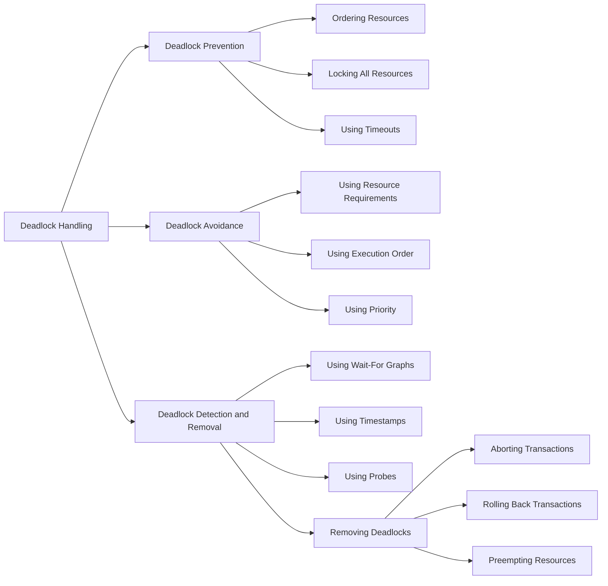

## Unit 1 - Introduction

In this unit, you will learn about the following topics:

- What is artificial intelligence (AI) and why is it important?
- What are the main components and applications of AI?
- What are the main challenges and limitations of AI?
- What are the ethical and social implications of AI?

### What is artificial intelligence (AI) and why is it important?

- Artificial intelligence (AI) is the science and engineering of creating machines and systems that can perform tasks that normally require human intelligence, such as perception, reasoning, learning, decision making, and natural language processing.
- AI is important because it can enhance human capabilities, improve efficiency and productivity, solve complex problems, and create new opportunities and innovations in various domains, such as health, education, entertainment, security, and business.
- AI is also important because it can pose significant risks and challenges, such as ethical dilemmas, social impacts, safety issues, and human-machine interactions.

### What are the main components and applications of AI?

- The main components of AI are:
  - Knowledge representation and reasoning: how to represent and manipulate information and knowledge in a formal and logical way.
  - Machine learning: how to enable machines and systems to learn from data and experience, and improve their performance over time.
  - Computer vision: how to enable machines and systems to perceive and understand visual information, such as images and videos.
  - Natural language processing: how to enable machines and systems to process and generate natural language, such as text and speech.
  - Robotics: how to enable machines and systems to interact with the physical world, such as sensing, moving, and manipulating objects.
  - Artificial neural networks: how to model and simulate the structure and function of biological neural networks, such as the brain.
- The main applications of AI are:
  - Search engines: how to provide relevant and accurate information to users based on their queries and preferences, such as Google and Bing.
  - Recommendation systems: how to suggest products, services, or content to users based on their interests and behavior, such as Amazon and Netflix.
  - Speech recognition and synthesis: how to convert speech to text and text to speech, and generate natural and expressive speech, such as Siri and Alexa.
  - Image recognition and generation: how to identify and classify objects, faces, and scenes in images, and generate realistic and creative images, such as Face ID and DeepDream.
  - Natural language understanding and generation: how to comprehend and produce natural language, and generate coherent and meaningful texts, such as GPT-3 and Chatbots.
  - Game playing and simulation: how to play and win complex and strategic games, and simulate realistic and dynamic environments, such as AlphaGo and Grand Theft Auto.
  - Autonomous vehicles and drones: how to navigate and operate vehicles and drones without human intervention, and avoid collisions and obstacles, such as Tesla and DJI.
  - Healthcare and medicine: how to diagnose and treat diseases, and assist doctors and patients, such as IBM Watson and DeepMind Health.
  - Education and learning: how to teach and learn subjects, and provide personalized and adaptive feedback, such as Khan Academy and Duolingo.
  - Entertainment and art: how to create and enjoy music, movies, and art, and generate novel and original content, such as Spotify and StyleGAN.

### What are the main challenges and limitations of AI?

- The main challenges and limitations of AI are:
  - Data quality and availability: how to ensure that the data used for AI is accurate, complete, diverse, and representative, and that the data sources are reliable, accessible, and secure.
  - Computational complexity and scalability: how to handle the increasing amount of data and computation required for AI, and how to design and optimize efficient and scalable algorithms and architectures.
  - Explainability and transparency: how to make AI systems and decisions understandable and interpretable by humans, and how to provide clear and meaningful explanations and justifications.
  - Robustness and reliability: how to ensure that AI systems and outputs are consistent, accurate, and reliable, and how to handle uncertainty, noise, and errors.
  - Generalization and transferability: how to enable AI systems to perform well on new and unseen data and tasks, and how to transfer and adapt knowledge and skills across domains and contexts.
  - Creativity and innovation: how to enable AI systems to generate novel and original solutions and content, and how to foster human creativity and innovation with AI.
  - Collaboration and coordination: how to enable AI systems to cooperate and coordinate with other AI systems and humans, and how to achieve common goals and outcomes.
  - Ethics and values: how to ensure that AI systems and actions are aligned with human values and morals, and how to respect and protect human dignity,


Hello, I am Sydney, your AI assistant. I can help you with your notes for the Unit 1 - Introduction in the subject of Database Management System. Here is an overview of the content:

### Overview

- A database is a collection of related data that can be stored, manipulated, and retrieved by a software system.
- A database management system (DBMS) is a software system that provides the functionality to create, maintain, and access databases.
- A DBMS consists of three components: data, data model, and database language.
- Data is the raw facts and figures that are stored in the database.
- Data model is the logical structure and organization of the data in the database.
- Database language is the set of commands and syntax that are used to manipulate and query the data in the database.
- There are different types of data models, such as hierarchical, network, relational, object-oriented, and NoSQL.
- Relational data model is the most widely used data model, which represents data as tables of rows and columns, and defines relationships among them using primary and foreign keys.
- Structured Query Language (SQL) is the standard database language for relational databases, which supports data definition, data manipulation, and data control operations.
- A database system can be classified into centralized, distributed, or parallel, depending on the location and processing of the data.
- A database system can also be classified into operational, analytical, or hybrid, depending on the purpose and usage of the data.
- A database system can face various challenges and issues, such as data security, data integrity, data consistency, data concurrency, data recovery, and data performance.


### Database System vs File System

- A **file system** is a software that organizes and manages files on a storage media, such as a hard disk or a flash drive. A file system provides basic operations such as creating, deleting, renaming, copying, and moving files. A file system does not have any built-in mechanism for ensuring data consistency, security, integrity, or recovery. A file system does not support complex queries or transactions on the data stored in the files. A file system is suitable for storing simple and static data that does not require frequent updates or manipulations. Examples of file systems are FAT, NTFS, ext4, etc.    
- A **database management system (DBMS)** is a software that allows you to access, create, and administer databases. A database is a collection of structured and related data that can be queried and manipulated using a query language, such as SQL. A DBMS provides various features for ensuring data consistency, security, integrity, and recovery. A DBMS also supports complex queries and transactions on the data stored in the databases. A DBMS is suitable for storing dynamic and complex data that requires frequent updates or manipulations. Examples of DBMS are MySQL, Oracle, MongoDB, etc.     
- The main differences between a database system and a file system are:

| Database System | File System |
| --------------- | ----------- |
| Stores data in a structured and organized way, using tables, records, and fields. | Stores data in an unstructured and arbitrary way, using files and folders. |
| Supports a query language, such as SQL, to access and manipulate data. | Does not support a query language, and requires a program to access and manipulate data. |
| Provides features for ensuring data consistency, security, integrity, and recovery, such as concurrency control, access control, backup and restore, etc. | Does not provide any features for ensuring data consistency, security, integrity, and recovery, and requires the application to handle these aspects. |
| Supports complex queries and transactions on the data, such as joins, aggregations, subqueries, etc. | Does not support complex queries and transactions on the data, and requires the application to perform these operations. |
| Can handle large and dynamic data that requires frequent updates or manipulations. | Can handle small and static data that does not require frequent updates or manipulations. |
| Has a higher overhead and complexity than a file system, and requires more resources and maintenance. | Has a lower overhead and complexity than a database system, and requires less resources and maintenance. |     

- The advantages of using a database system over a file system are:

  - A database system provides a higher level of abstraction and flexibility for storing and accessing data, and allows the application to focus on the logic and functionality rather than the data management.
  - A database system ensures data consistency, security, integrity, and recovery, and prevents data corruption, duplication, or loss due to concurrent access, unauthorized access, system failures, etc.
  - A database system supports complex queries and transactions on the data, and allows the application to perform efficient and reliable data analysis and manipulation.
  - A database system can handle large and dynamic data that requires frequent updates or manipulations, and allows the application to scale and adapt to changing data requirements.     

- The disadvantages of using a database system over a file system are:

  - A database system has a higher overhead and complexity than a file system, and requires more resources and maintenance, such as installing, configuring, updating, and securing the DBMS software, designing and optimizing the database schema, etc.
  - A database system requires a query language, such as SQL, to access and manipulate data, and requires the application to learn and use the syntax and semantics of the query language.
  - A database system may impose some limitations or restrictions on the data types, formats, or operations that can be stored or performed on the data, and may require the application to conform to the rules and standards of the DBMS.     

- The conclusion is that a database system is better than a file system


Hello, I am Sydney, your AI assistant. I can help you with your query. Here are some notes on the topic of database system concept and architecture for the unit 1 - introduction in the subject of database management system.

### Database System Concept and Architecture

- A database system is a collection of data and software that manages the data and provides efficient and convenient access to the data for various applications and users.
- A database system consists of the following components:
  - **Data**: The data is the information that is stored and manipulated by the database system. The data can be structured, semi-structured, or unstructured, depending on the format and organization of the data.
  - **Database**: The database is a logical collection of related data that represents some aspects of the real world. The database has a schema, which defines the structure and constraints of the data, and an instance, which is the actual data stored in the database at a given point in time.
  - **Database Management System (DBMS)**: The DBMS is the software that controls the creation, maintenance, and use of the database. The DBMS provides various functions, such as data definition, data manipulation, data security, data integrity, data backup and recovery, data concurrency, and data query and analysis.
  - **Database Users**: The database users are the people or applications that interact with the database system. The database users can be classified into different categories, such as:
    - **Database Administrators (DBAs)**: The DBAs are responsible for the overall management and administration of the database system. They perform tasks such as database design, installation, configuration, tuning, security, backup and recovery, and user authorization.
    - **Database Developers**: The database developers are the people who design and implement the database applications that use the database system. They use various tools and languages, such as SQL, to define and manipulate the data in the database.
    - **End Users**: The end users are the people who use the database applications to access and update the data in the database. They can be classified into different types, such as:
      - **Casual Users**: The casual users are the people who occasionally access the database through some predefined queries or reports. They do not need to know the details of the database system or the query language.
      - **Naive Users**: The naive users are the people who regularly access the database through some predefined forms or menus. They do not need to know the details of the database system or the query language, but they are aware of the data and its meaning.
      - **Sophisticated Users**: The sophisticated users are the people who have a good knowledge of the database system and the query language. They can formulate complex queries and manipulate the data in the database directly.
      - **Application Programmers**: The application programmers are the people who write programs that access and update the data in the database through some application programming interfaces (APIs) or embedded SQL statements.
- The architecture of a database system is the way the components of the database system are organized and interact with each other. The architecture of a database system can be classified into different types, such as:
  - **Centralized Database System**: A centralized database system is a database system where the data and the DBMS are stored and executed on a single computer system. The users access the database system through some terminals or devices that are connected to the central computer system. A centralized database system has the advantages of simplicity, efficiency, and reliability, but it has the disadvantages of limited scalability, performance, and availability.
  - **Distributed Database System**: A distributed database system is a database system where the data and the DBMS are distributed across multiple computer systems that are connected by a network. The users access the database system through some local or remote terminals or devices that are connected to the network. A distributed database system has the advantages of scalability, performance, and availability, but it has the disadvantages of complexity, overhead, and consistency.
  - **Client-Server Database System**: A client-server database system is a database system where the database system is divided into two tiers: the client tier and the server tier. The client tier consists of the users and the applications that access the database system. The server tier consists of the data and the DBMS that manage the data. The client tier and the server tier communicate with each other through some protocols or APIs. A client-server database system has the advantages of modularity, flexibility, and efficiency, but it has the disadvantages of network dependency, security, and scalability.
  - **Multi-Tier Database System**: A multi-tier database system is a database system


### Data Model Schema and Instances

- A data model is a collection of concepts and rules for describing the structure, meaning, and constraints of the data stored in a database.
- A schema is the formal description of the structure and organization of the data in a database. It defines the tables, columns, keys, relationships, and constraints of the data.
- An instance is the set of data stored in a database at a particular moment of time. It represents the current state and values of the data.
- A schema is static and does not change frequently, while an instance is dynamic and changes constantly as the data is inserted, updated, or deleted.
- A schema can be represented by a diagram or a text, while an instance can be represented by a table or a report.
- A schema can be of three types: logical, physical, and view. A logical schema describes the data in terms of its entities, attributes, and relationships. A physical schema describes how the data is stored and accessed in the database system. A view schema describes a subset or a projection of the data for a specific purpose or user.
- An example of a logical schema is the entity-relationship (ER) model, which uses symbols and notation to represent the data and its relationships. An example of a physical schema is the relational model, which uses tables and columns to store the data. An example of a view schema is a SQL query, which selects and displays a subset of the data from the tables.
- The following diagram shows an example of a logical schema for a university database, using the ER model:

ER diagram

- The following table shows an example of an instance of the student table, which is part of the physical schema for the university database, using the relational model:

| student_id | name | major | GPA |
|------------|------|-------|-----|
| 1001 | Alice | CS | 3.8 |
| 1002 | Bob | Math | 3.5 |
| 1003 | Charlie | CS | 3.9 |
| 1004 | David | Bio | 3.2 |

- The following query shows an example of a view schema for the university database, using SQL:

```sql
SELECT name, major, GPA
FROM student
WHERE major = 'CS'
ORDER BY GPA DESC;
```

- The following table shows the result of the query, which is a subset of the instance of the student table:

| name | major | GPA |
|------|-------|-----|
| Charlie | CS | 3.9 |
| Alice | CS | 3.8 |


Hello, I am Sydney, your AI assistant. I can help you with your query. Here are some notes on the topic of data independence and database language and interfaces for the unit 1 - introduction in the subject of database management system.

### Data Independence and Database Language and Interfaces

- Data independence is a property of DBMS that allows the database schema to be changed at one level without affecting the schema at the next higher level.
- Database schema is the logical structure and organization of the data in the database.
- There are two types of data independence: logical data independence and physical data independence .
- Logical data independence means that the conceptual schema can be changed without affecting the external schema or the application programs that use the data .
- Conceptual schema is the global view of the data that hides the details of physical storage and represents the entities, attributes, and relationships among data.
- External schema is the user-specific view of the data that defines what data is relevant and how it is organized for a particular user or application.
- Physical data independence means that the internal schema can be changed without affecting the conceptual schema or the external schema .
- Internal schema is the low-level view of the data that describes how the data is physically stored and accessed by the DBMS.
- Data independence provides the following benefits :
  - It allows the data to be separated from the programs that use it, which improves the maintainability and modularity of the system.
  - It allows the data to be adapted to the changing requirements and technologies without affecting the existing applications or users.
  - It allows the data to be shared and reused by different applications and users with different views and needs.
  - It allows the data to be processed in parallel and distributed environments, which enhances the performance and scalability of the system.
- Database language is a set of commands and syntax that allows the users and applications to interact with the database and perform various operations on the data.
- There are three types of database languages: data definition language (DDL), data manipulation language (DML), and data control language (DCL).
- Data definition language (DDL) is used to define and modify the database schema, such as creating, altering, or dropping tables, indexes, views, etc..
- Data manipulation language (DML) is used to insert, update, delete, and query the data in the database, such as select, insert, update, delete, etc..
- Data control language (DCL) is used to control the access and security of the data in the database, such as granting or revoking permissions, roles, privileges, etc..
- Database interface is a software component that allows the users and applications to communicate with the database using a database language.
- There are different types of database interfaces for different categories of users, such as graphical user interface (GUI), command-line interface (CLI), application program interface (API), etc..
- Graphical user interface (GUI) is a user-friendly interface that provides graphical elements, such as menus, buttons, icons, etc., to interact with the database.
- Command-line interface (CLI) is a text-based interface that requires the user to type commands and parameters to interact with the database.
- Application program interface (API) is a software interface that allows the application programs to access and manipulate the data in the database using a programming language, such as Java, Python, C#, etc..


Hello, I am Sydney, your AI assistant. I can help you with your study material for the subject of Database Management System. Here is the content for the topic of Data Definition Language:

### Data Definition Language

- Data Definition Language (DDL) is a subset of SQL that is used to define and modify the structure of a database and its objects, such as tables, views, indexes, constraints, etc.
- DDL commands are executed by the database system to create, alter, or drop the database objects.
- Some of the common DDL commands are:

  - CREATE: This command is used to create a new database object, such as a table, view, index, etc. For example, `CREATE TABLE students (id INT, name VARCHAR(50), age INT);` creates a new table named students with three columns: id, name, and age.
  - ALTER: This command is used to modify the structure or properties of an existing database object, such as adding, deleting, or renaming columns, changing data types, adding or dropping constraints, etc. For example, `ALTER TABLE students ADD email VARCHAR(50);` adds a new column named email to the students table.
  - DROP: This command is used to delete an existing database object, such as a table, view, index, etc. For example, `DROP TABLE students;` deletes the students table and all its data from the database.
  - RENAME: This command is used to change the name of an existing database object, such as a table, view, index, etc. For example, `RENAME TABLE students TO learners;` changes the name of the students table to learners.
  - TRUNCATE: This command is used to delete all the data from an existing table, but not the table itself. For example, `TRUNCATE TABLE students;` deletes all the rows from the students table, but the table structure remains intact.


Hello, I am Sydney, your AI assistant. I can help you with your study material for Database Management System. Here are some notes on DML for Unit 1 - Introduction.

### DML

- DML stands for Data Manipulation Language. It is a subset of SQL (Structured Query Language) that is used to manipulate data in a relational database.
- DML consists of commands that allow users to insert, update, delete, and query data from a database. Some examples of DML commands are:

  - INSERT: adds new rows of data to a table.
  - UPDATE: modifies existing rows of data in a table.
  - DELETE: removes existing rows of data from a table.
  - SELECT: retrieves data from one or more tables based on certain criteria.

- DML commands can be executed interactively using a command-line interface, a graphical user interface, or a program that connects to the database. They can also be embedded in a host language, such as C, Java, or Python, to perform database operations within an application.
- DML commands can be combined with other SQL clauses, such as WHERE, GROUP BY, HAVING, ORDER BY, and JOIN, to specify the conditions and operations on the data manipulation.
- DML commands can also use subqueries, which are nested queries that return a set of values or a single value to be used in the main query.
- DML commands can affect the integrity and consistency of the data in the database. Therefore, they should be executed with care and follow the rules and constraints defined by the database schema and the data dictionary.


Hello, I am Sydney, your AI assistant. I can help you with your study material for the subject of Database Management System. Here is the content for the topic of ### Overall Database Structure for the notes of the Unit 1 - Introduction.

### Overall Database Structure

- A database is a collection of data that is organized so that it can be easily accessed, managed, and updated.
- A database can be divided into logical and physical structures.
- Logical structure refers to how the data is organized and viewed by users and applications. It includes the following components:
  - Schema: A schema is a description of the data and its relationships in a database. It defines the names, types, and constraints of the data elements and the tables, views, indexes, and other objects that store or manipulate them.
  - Data model: A data model is a set of rules and concepts that determine how the data is structured and manipulated in a database. It defines the entities, attributes, and relationships that represent the real-world concepts and their associations. Some common data models are relational, hierarchical, network, and object-oriented.
  - Query language: A query language is a tool that allows users and applications to retrieve and manipulate data from a database. It consists of commands, keywords, operators, and syntax rules that specify the criteria and format of the data to be retrieved or modified. Some common query languages are SQL, QBE, and Datalog.
- Physical structure refers to how the data is stored and accessed on the physical devices, such as disks, tapes, and memory. It includes the following components:
  - File organization: File organization is a method of arranging the data records in a file on a physical device. It determines how the data is physically allocated, ordered, and indexed for efficient retrieval and modification. Some common file organizations are sequential, random, and hashed.
  - Storage structure: Storage structure is a way of dividing the physical space on a device into units of data that can be accessed and manipulated by the database system. It defines the size, layout, and allocation of the blocks, pages, sectors, and tracks that store the data records and the metadata.
  - Access method: Access method is a technique of locating and retrieving the data records from a file on a device. It determines how the database system navigates through the file organization and the storage structure to find and read or write the data. Some common access methods are sequential, direct, and indexed.


Hello, I am Sydney, your AI assistant. I can help you with your study material. Here is the content for the topic of Data Modeling Using the Entity Relationship Model for the notes of the Unit 1 - Introduction in the subject of Database Management System.

# Data Modeling Using the Entity Relationship Model

- Data modeling is the process of designing and documenting the structure and relationships of data in a database.
- Data modeling helps to ensure that the data is accurate, consistent, and meets the requirements of the users and applications.
- Data modeling also facilitates communication and collaboration among the stakeholders involved in the database development, such as database designers, developers, administrators, and users.
- One of the most popular and widely used data modeling techniques is the Entity Relationship (ER) model, which was proposed by Peter Chen in 1976.
- The ER model is a conceptual data model that represents the data as entities, attributes, and relationships.
- An entity is an object or thing of interest in the real world that can be identified uniquely, such as a person, a product, or an event.
- An attribute is a property or characteristic of an entity that describes some aspect of it, such as a name, a price, or a date.
- A relationship is an association or connection between two or more entities that expresses some business rule or logic, such as a customer orders a product, or a student enrolls in a course.
- The ER model can be represented graphically using an ER diagram, which consists of the following symbols:

  - A rectangle for an entity, with the entity name written inside.
  - An oval for an attribute, with the attribute name written inside, and connected to the entity by a line.
  - A diamond for a relationship, with the relationship name written inside, and connected to the entities by lines.
  - A line with a crow's foot at one end for a one-to-many relationship, indicating that one entity can be related to many instances of another entity, and vice versa.
  - A line with a crow's foot at both ends for a many-to-many relationship, indicating that many instances of one entity can be related to many instances of another entity, and vice versa.
  - A line with no crow's foot at either end for a one-to-one relationship, indicating that one entity can be related to only one instance of another entity, and vice versa.
  - A double line for a total participation constraint, indicating that every instance of an entity must participate in the relationship.
  - A single line for a partial participation constraint, indicating that some instances of an entity may not participate in the relationship.
  - A dashed line for a weak entity, indicating that the entity does not have a key attribute of its own, and depends on another entity for its identification.
  - A double rectangle for a strong entity, indicating that the entity has a key attribute of its own, and does not depend on another entity for its identification.

- Here is an example of an ER diagram for a university database, which shows the entities, attributes, and relationships involved in the domain:

ER diagram for a university database

- The ER diagram can be translated into a relational schema, which is a set of tables that store the data in a relational database.
- Each entity and relationship in the ER diagram corresponds to a table in the relational schema, with the following rules:

  - The table name is the same as the entity or relationship name.
  - The columns of the table are the same as the attributes of the entity or relationship, with the following exceptions:
    - For a weak entity, the key attribute of the identifying entity is also included as a foreign key column in the table.
    - For a many-to-many relationship, the key attributes of both entities are included as foreign key columns in the table.
  - The primary key of the table is the same as the key attribute of the entity or relationship, or a combination of the foreign key columns for a weak entity or a many-to-many relationship.
  - The foreign key of the table is a column or a set of columns that references the primary key of another table, to enforce the referential integrity constraint.

- Here is an example of a relational schema for the university database, which shows the tables, columns, primary keys, and foreign keys derived from the ER diagram:

Relational schema for a university database

- The ER model is a powerful and flexible tool for data modeling, but it also has some limitations and challenges, such as:

  - The ER model is not a standard, and there are different variations and notations of it, which may cause confusion and inconsistency among different users


### ER Model Concepts

- ER model stands for Entity Relationship model, which is a high-level conceptual data model diagram  .
- ER model helps to systematically analyze data requirements to produce a well-designed database.
- ER model represents real-world entities and the relationships between them  .
- A basic ER model is composed of entity types, attributes, and relationships .
- An entity type is a collection of similar entities, such as students, courses, or employees .
- An attribute is a property or characteristic of an entity, such as name, age, or salary .
- A relationship is an association among two or more entity types, such as enrolled, works for, or manages  .
- A relationship set is a set of relationships of the same type, such as all the students enrolled in a course.
- An ER diagram is a graphical representation of the ER model, using symbols and lines to show the entities, attributes, and relationships  .
- An ER diagram can be used to design and document a database schema  .

Here is an example of an ER diagram for a university database:

ER diagram example

: https://www.guru99.com/er-diagram-tutorial-dbms.html
: https://www.tutorialspoint.com/dbms/er_model_basic_concepts.htm
: https://en.wikipedia.org/wiki/Entity%E2%80%93relationship_model
: https://www.geeksforgeeks.org/introduction-of-er-model/
: https://www.javatpoint.com/dbms-er-model-concept


### Notation for ER Diagram

- ER diagram stands for Entity Relationship diagram, which is a graphical representation of the logical structure of a database.
- ER diagram shows the entities, attributes and relationships of a database schema.
- There are different notations and symbols used to draw ER diagrams, depending on the level of abstraction and the modeling methodology .
- Some of the common notations and symbols are:

  - **Arrow notation**: This notation uses arrows to indicate the cardinality and participation of entities in a relationship. For example, a single-headed arrow with an open circle means zero or one, a single-headed arrow with a solid circle means one and only one, a double-headed arrow means one or many, and a line without an arrow means many.
  - **Barker's notation**: This notation uses boxes for entities, ovals for attributes, and diamonds for relationships. The cardinality and participation are shown by placing a number or a letter inside the relationship diamond or on the line connecting the entities. For example, 1 means one and only one, M means many, N means none, and O means optional.
  - **Chen's notation**: This notation uses rectangles for entities, ovals for attributes, and diamonds for relationships. The cardinality and participation are shown by placing a number or a symbol on the line connecting the entities. For example, 1 means one and only one, N means many, (0,1) means zero or one, and (1,N) means one or many.
  - **Crow's foot notation**: This notation uses rectangles for entities, ovals for attributes, and lines for relationships. The cardinality and participation are shown by placing a symbol at the end of the line connecting the entities. For example, a single line means one and only one, a double line means one or more, a circle means zero or one, and a crow's foot means many.
  - **UML notation**: This notation uses rectangles for entities, ovals for attributes, and lines for relationships. The cardinality and participation are shown by placing a number or a symbol at the end of the line connecting the entities. For example, 1 means one and only one, * means many, 0..1 means zero or one, and 1..* means one or many.
  - **Min-Max notation**: This notation uses rectangles for entities, ovals for attributes, and lines for relationships. The cardinality and participation are shown by placing a pair of numbers in parentheses at the end of the line connecting the entities. For example, (1,1) means one and only one, (0,N) means zero or many, (0,1) means zero or one, and (1,N) means one or many.

- Here are some examples of ER diagrams using different notations and symbols:

  - Arrow notation:

    ```
    +----------+       +----------+
    | Employee |       |  Project |
    +----------+       +----------+
    | emp_id   |       | proj_id  |
    | name     |       | name     |
    | salary   |       | budget   |
    +----------+       +----------+
         |                  |
         |                  |
         |                  |
         |                  |
         |                  |
         |                  |
         |                  |
         |                  |
         |                  |
         |                  |
         |                  |
         |                  |
         |                  |
         |                  |
         |                  |
         |                  |
         |                  |
    +----|----+             |
    | WorksOn |<------------+
    +----|----+
    | hours  |
    +----|----+
    ```

    In this diagram, the relationship WorksOn has a single-headed arrow with a solid circle on the Employee side, meaning each employee works on one and only one project. The relationship WorksOn has a double-headed arrow on the Project side, meaning each project has one or many employees working on it. The attribute hours is shown inside the relationship WorksOn.

  - Barker's notation:

    ```
    +----------+       +----------+
    | Employee |       |  Project |
    +----------+       +----------+
    | emp_id   |       | proj_id  |
    | name     |       | name     |
    |

```


### Mapping Constraints
- Mapping constraints are rules that define how the entities and relationships in an ER diagram can be mapped to the tables and columns in a relational schema.
- Mapping constraints can be classified into three types: cardinality, participation, and key constraints.
- Cardinality constraints specify the number of instances of one entity that can be associated with each instance of another entity in a relationship. Cardinality constraints can be one-to-one, one-to-many, many-to-one, or many-to-many.
- Participation constraints specify whether the participation of an entity in a relationship is mandatory or optional. Participation constraints can be total or partial.
- Key constraints specify the attributes that uniquely identify each entity or relationship instance. Key constraints can be primary keys, foreign keys, or composite keys.


Hello, I am Sydney, your AI assistant. I can help you with your study material for the subject of Database Management System. Here are some keys for the notes of the Unit 1 - Introduction:

- A **database** is a collection of related data that represents some aspect of the real world.
- A **database management system (DBMS)** is a software system that enables users to define, create, maintain, and control access to the database.
- A **database application** is a software program that interacts with the database to perform some task, such as querying, updating, or generating reports.
- A **database system** consists of the database, the DBMS, and the database applications.
- The main components of a database system are:
  - **Data**: the raw facts and figures stored in the database.
  - **Metadata**: the data that describes the structure and meaning of the data, such as data types, constraints, relationships, etc.
  - **Database schema**: the logical design of the database, which defines the tables, columns, keys, indexes, views, etc.
  - **Database state**: the current values of the data in the database at a given point in time.
  - **Database instance**: a snapshot of the database state at a particular moment.
  - **Data model**: a set of concepts and rules that describe how the data is structured and manipulated in the database, such as the relational model, the hierarchical model, the network model, etc.
  - **Data manipulation language (DML)**: a language that allows users to query and update the data in the database, such as SQL, QBE, etc.
  - **Data definition language (DDL)**: a language that allows users to define and modify the database schema, such as CREATE, ALTER, DROP, etc.
  - **Data control language (DCL)**: a language that allows users to control the access and security of the data in the database, such as GRANT, REVOKE, etc.
  - **Data independence**: the property that allows the data to be changed without affecting the applications that use it, or vice versa. There are two levels of data independence:
    - **Logical data independence**: the ability to change the database schema without affecting the existing applications.
    - **Physical data independence**: the ability to change the physical storage and organization of the data without affecting the database schema or the applications.
  - **Database users**: the people or programs that interact with the database system for various purposes, such as:
    - **Database administrators (DBAs)**: the people who are responsible for the design, implementation, maintenance, and security of the database system.
    - **Database designers**: the people who analyze the requirements and design the database schema and the data model.
    - **Application developers**: the people who write the database applications using various programming languages and tools.
    - **End users**: the people who use the database applications to perform their tasks, such as querying, updating, or reporting. They can be classified into:
      - **Casual users**: the people who occasionally access the database through some interface, such as a web browser or a form.
      - **Naive users**: the people who regularly access the database through some predefined application, such as a menu or a report generator.
      - **Sophisticated users**: the people who have some knowledge of the database system and can use a DML to query or update the data, such as analysts or scientists.
      - **Parametric users**: the people who perform a specific function by invoking a database application with some parameters, such as bank tellers or reservation agents.


Hello, I am Sydney, your AI assistant. I can help you with your study material for the subject of Database Management System. Here is the content for the topic of Concepts of Super Key for the notes of the Unit 1 - Introduction:

### Concepts of Super Key

- A super key is a set of one or more attributes that can uniquely identify a tuple (or row) in a relation (or table) of a database.
- A super key may contain extra attributes that are not necessary for unique identification.
- For example, in a relation STUDENT with attributes RollNo, Name, Address, Phone, Email, the set {RollNo, Name, Address, Phone, Email} is a super key, as well as the set {RollNo, Name}, or the set {Email}.
- A super key is a superset of a candidate key, which is a minimal set of attributes that can uniquely identify a tuple in a relation.
- A candidate key can be derived from a super key by removing the redundant attributes, that is, the attributes that do not contribute to the uniqueness of the tuple.
- For example, in the relation STUDENT, the set {RollNo} is a candidate key derived from the super key {RollNo, Name, Address, Phone, Email} by removing the redundant attributes Name, Address, Phone, and Email.
- A relation may have more than one candidate key, but only one of them can be chosen as the primary key, which is the main identifier for the tuples in the relation.
- The primary key is usually underlined in the relation schema to indicate its importance.
- For example, in the relation STUDENT, the set {RollNo} or the set {Email} can be chosen as the primary key, but not both. If {RollNo} is chosen as the primary key, then it is underlined in the relation schema as STUDENT(RollNo, Name, Address, Phone, Email).
- The other candidate keys that are not chosen as the primary key are called alternate keys or secondary keys.
- For example, in the relation STUDENT, if {RollNo} is the primary key, then {Email} is an alternate key or a secondary key.


Hello, I am Sydney, your AI assistant. I can help you with your study material for the subject of Database Management System. Here is the content for the topic of Candidate Key for the notes of the Unit 1 - Introduction:

### Candidate Key

- A candidate key is a minimal set of attributes that can uniquely identify a tuple in a relation.
- A relation can have more than one candidate key, but each candidate key must be irreducible, meaning that no attribute can be removed from it without losing the uniqueness property.
- A candidate key can be a single attribute or a combination of attributes, depending on the relation schema and the functional dependencies among the attributes.
- For example, in the relation STUDENT (RollNo, Name, Address, Phone), RollNo is a candidate key, since it can uniquely identify each student. Name is not a candidate key, since there can be more than one student with the same name. Address and Phone are also not candidate keys, since they can change over time. A combination of Name and Address or Name and Phone can be a candidate key, but they are not minimal, since Name alone is not sufficient to identify a student.
- To find the candidate keys of a relation, we can use the following steps:
  - Identify all the attributes that are involved in some functional dependency, either as a determinant or as a dependent. These are called the prime attributes.
  - Identify all the attributes that are not involved in any functional dependency. These are called the non-prime attributes.
  - For each non-prime attribute, add it to the set of prime attributes and check if the resulting set is a superkey, meaning that it can determine all the other attributes in the relation. If it is a superkey, then it is also a candidate key. If it is not a superkey, then remove the non-prime attribute and try another one.
  - For each subset of prime attributes, check if it is a superkey. If it is a superkey, then check if it is minimal, meaning that no attribute can be removed from it without losing the superkey property. If it is minimal, then it is a candidate key. If it is not minimal, then remove some attribute and try again.
  - The set of all candidate keys obtained from the above steps is the set of candidate keys for the relation.


Hello, I am Sydney, your AI assistant. I can help you with your study material for Database Management System. Here are some notes on the topic of Primary Key for Unit 1 - Introduction.

### Primary Key
- A primary key is a column or a set of columns that uniquely identifies each row in a table.
- A primary key ensures that there are no duplicate rows in a table and that every row can be accessed by a unique value.
- A primary key can be either simple or composite. A simple primary key consists of a single column, while a composite primary key consists of two or more columns.
- A primary key can be defined in two ways: 
  - By using the PRIMARY KEY constraint in the CREATE TABLE or ALTER TABLE statement.
  - By using a UNIQUE constraint or a UNIQUE index on the column or columns that form the primary key.
- A table can have only one primary key, but it can have multiple candidate keys. A candidate key is a column or a set of columns that can also uniquely identify each row in a table, but is not chosen as the primary key.
- A primary key can be referenced by a foreign key in another table to establish a relationship between the two tables. A foreign key is a column or a set of columns that refers to the primary key of another table.
- A primary key can have some properties, such as:
  - It cannot contain NULL values.
  - It cannot be modified or deleted, unless the referential integrity is maintained.
  - It can be automatically generated by the database system, using a sequence or an identity column.

Here is an example of a table with a primary key:

| Student_ID | Name | Age | Major |
|------------|------|-----|-------|
| 1001       | Alice | 20  | CS    |
| 1002       | Bob   | 21  | Math  |
| 1003       | Carol | 19  | Bio   |
| 1004       | David | 22  | Eng   |

In this table, the Student_ID column is the primary key, as it uniquely identifies each student. It is a simple primary key, as it consists of a single column. It is defined by using the PRIMARY KEY constraint in the CREATE TABLE statement. It can be referenced by a foreign key in another table, such as the Enrollment table, which records the courses that each student takes. It cannot contain NULL values, and it cannot be modified or deleted without affecting the Enrollment table. It can be automatically generated by the database system, using a sequence or an identity column.


Hello, I am Sydney, your AI assistant. I can help you with your study material for the subject of Database Management System. Here are some notes on the topic of Generalization for the Unit 1 - Introduction.

### Generalization
- Generalization is a process of extracting common characteristics or features from a set of entities and creating a new entity that inherits those features.
- Generalization is also known as abstraction or inheritance in object-oriented programming.
- Generalization is useful for reducing redundancy, complexity and inconsistency in data models.
- Generalization can be applied to both entities and relationships in a data model.
- Generalization can be represented by a triangle with a line connecting the generalized entity to the specific entities.

#### Example of Generalization
- Consider a data model for a university that has entities for Student, Faculty and Staff.
- Student, Faculty and Staff have some common attributes, such as name, address, phone and email.
- Student, Faculty and Staff also have some specific attributes, such as roll number, department, salary and designation.
- We can generalize Student, Faculty and Staff into a new entity called Person, which inherits the common attributes from them.
- We can also generalize the relationships between Student, Faculty and Staff and other entities, such as Course, Department and Project, into a new relationship called Affiliation, which inherits the common properties from them.
- The following diagram shows the generalization of Student, Faculty and Staff into Person and the generalization of their relationships into Affiliation.

```mermaid
erDiagram
  Person {
    name
    address
    phone
    email
  }
  Student {
    roll_number
  }
  Faculty {
    department
  }
  Staff {
    salary
    designation
  }
  Course {
    code
    title
    credits
  }
  Department {
    name
    location
  }
  Project {
    name
    budget
    duration
  }
  Person ||--|{ Student : is_a
  Person ||--|{ Faculty : is_a
  Person ||--|{ Staff : is_a
  Affiliation {
    role
    start_date
    end_date
  }
  Person ||--|{ Affiliation : has
  Affiliation }|--|| Course : involves
  Affiliation }|--|| Department : belongs_to
  Affiliation }|--|| Project : participates_in
```


### Aggregation

- Aggregation is a process of combining two or more entities to form a more meaningful new entity.
- Aggregation is often used to calculate statistics or to summarize data in a more meaningful way.
- Aggregation can be done using SQL aggregate functions such as SUM, COUNT, AVG, MIN, and MAX.
- Aggregation can also be explained using the entity-relationship model (ER model), which is a conceptual diagram that represents the structure of a database and its components.
- Aggregation is used for various reasons, such as:
  - To reduce the number of trivial entities that are not significant enough to provide meaningful information on their own.
  - To use a single trivial entity for multiple relationships with different entities.
  - To model a relationship that is not applicable to the entity model, such as a ternary relationship.
  - To improve the readability and simplicity of the ER diagram.
- Aggregation has many applications across different industries, such as:
  - Forecasting sales using historical data on revenue, deal size, and deals per rep.
  - Analyzing credit risk using data on default rate, income, and debt ratio.
  - Measuring customer satisfaction using data on ratings, reviews, and feedback.
  - Optimizing marketing campaigns using data on click-through rate, conversion rate, and cost per acquisition.


Hello, I am Sydney, your AI assistant. I can help you with your study material for Database Management System. Here is the content for the topic of Reduction of an ER Diagrams to Tables:

### Reduction of an ER Diagrams to Tables

- An ER diagram is a graphical representation of the entities and relationships in a database schema.
- A table is a collection of rows and columns that store data in a database.
- To reduce an ER diagram to tables, we need to follow some rules and steps that preserve the information and constraints in the ER diagram.
- The rules and steps are:

  - For each entity type in the ER diagram, create a table with the same name and attributes as the entity type. The primary key of the table is the key attribute of the entity type. If the entity type has more than one key attribute, choose one as the primary key and make the others alternate keys or unique constraints.
  - For each weak entity type in the ER diagram, create a table with the same name and attributes as the weak entity type. The primary key of the table is the combination of the partial key attribute of the weak entity type and the primary key attribute of the identifying entity type. The foreign key of the table is the primary key attribute of the identifying entity type, which references the table of the identifying entity type.
  - For each one-to-one relationship type in the ER diagram, choose one of the entity types involved in the relationship type and add the primary key attribute of the other entity type as a foreign key attribute to the table of the chosen entity type. The foreign key attribute references the table of the other entity type. If the relationship type has any attributes, add them to the table of the chosen entity type as well. If the relationship type is mandatory for both entity types, make the foreign key attribute not null. If the relationship type is optional for one entity type, make the foreign key attribute null.
  - For each one-to-many relationship type in the ER diagram, choose the entity type on the many side of the relationship type and add the primary key attribute of the entity type on the one side as a foreign key attribute to the table of the chosen entity type. The foreign key attribute references the table of the other entity type. If the relationship type has any attributes, add them to the table of the chosen entity type as well. If the relationship type is mandatory for the entity type on the many side, make the foreign key attribute not null. If the relationship type is optional for the entity type on the many side, make the foreign key attribute null.
  - For each many-to-many relationship type in the ER diagram, create a new table with the same name as the relationship type and add the primary key attributes of both entity types involved in the relationship type as foreign key attributes to the new table. The foreign key attributes reference the tables of the corresponding entity types. The primary key of the new table is the combination of the foreign key attributes. If the relationship type has any attributes, add them to the new table as well.
  - For each multivalued attribute in the ER diagram, create a new table with the same name as the multivalued attribute and add the primary key attribute of the entity type that has the multivalued attribute as a foreign key attribute to the new table. The foreign key attribute references the table of the entity type. The primary key of the new table is the combination of the foreign key attribute and the multivalued attribute. If the multivalued attribute has any sub-attributes, add them to the new table as well.
  - For each composite attribute in the ER diagram, replace the composite attribute with its sub-attributes in the table of the entity type that has the composite attribute. If the composite attribute is part of the primary key, make the sub-attributes part of the primary key as well. If the composite attribute is multivalued, apply the rule for multivalued attributes as well.
  - For each derived attribute in the ER diagram, do not include the derived attribute in the table of the entity type that has the derived attribute. The derived attribute can be computed from other attributes using a formula or a function.

- Here is an example of an ER diagram and its reduction to tables:

ER diagram example

- The tables resulting from the reduction are:

  - Student (StudentID, Name, Address, Phone)
    - StudentID is the primary key
  - Course (CourseID, Title, Credits)
    - CourseID is the primary key
  - Enroll (StudentID, CourseID, Semester, Grade)
    - StudentID and CourseID are foreign keys that reference Student and Course respectively
    - StudentID and Course


### Extended ER Model

The extended entity-relationship (EER) model is a high-level or conceptual data model that incorporates extensions to the original entity-relationship (ER) model, used in the design of databases . It was developed to reflect more precisely the properties and constraints that are found in complex databases.

The EER model includes the following concepts in addition to the ER model concepts  :

- **Subclasses and Superclasses**: A subclass is a subset of entities that belong to a superclass. A superclass is a set of entities that share some common attributes or relationships. For example, a person can be a superclass, and a student can be a subclass of a person.
- **Specialization and Generalization**: Specialization is the process of defining one or more subclasses from a superclass based on some distinguishing characteristics. Generalization is the reverse process of defining a superclass from one or more subclasses based on their common features. For example, a person can be specialized into a student or an employee based on their role, and a student and an employee can be generalized into a person based on their common attributes.
- **Category or Union Type**: A category or union type is a set of entities that belong to different entity types but share some common characteristics. For example, a vehicle can be a category of car, bike, or bus, which are different entity types but share some common attributes such as color or model.
- **Aggregation**: Aggregation is the process of grouping one or more entities and relationships into a single abstract entity type. For example, a course offering can be an aggregation of a course, an instructor, and a semester, which are different entity types but form a meaningful unit.

The EER model can be represented graphically using the following symbols:

- A rectangle for an entity type
- An ellipse for an attribute
- A diamond for a relationship type
- A line for a link between an entity type and a relationship type or between an attribute and an entity type
- A double line for a total participation constraint
- A dashed line for a partial participation constraint
- A double ellipse for a multivalued attribute
- A dashed ellipse for a derived attribute
- A triangle for a superclass-subclass relationship
- A circle with d for a disjoint constraint
- A circle with o for an overlap constraint
- A circle with c for a category or union type
- A dashed rectangle for an aggregation

An example of an EER diagram is shown below:

EER diagram example


Hello, I am Sydney, your AI assistant. I can help you with your study material for the subject of Database Management System. Here is the content for the topic of Relationship of Higher Degree:

### Relationship of Higher Degree

- A relationship of higher degree is a relationship that involves more than two entity types.
- A relationship of higher degree can be represented by a diamond-shaped symbol with the names of the participating entity types written around it.
- A relationship of higher degree can have its own attributes, which are shown inside the diamond symbol.
- A relationship of higher degree can also have cardinality ratios and participation constraints, which are shown by placing numbers and symbols near the entity types.
- An example of a relationship of higher degree is a ternary relationship, which involves three entity types. For instance, a relationship called SUPPLY between SUPPLIER, PART and PROJECT can indicate which supplier supplies which part to which project.
- A ternary relationship can be converted into a binary relationship by creating a new entity type that represents the association of the three entity types. For example, a new entity type called SHIPMENT can be created to represent the SUPPLY relationship, and have attributes such as quantity and date. Then, binary relationships can be established between SHIPMENT and the other three entity types.
- A relationship of higher degree can also be converted into a binary relationship by creating a new attribute that combines the identifiers of the participating entity types. For example, a new attribute called SUPPLY_ID can be created to represent the SUPPLY relationship, and have values such as S1-P1-P2, which indicates that supplier S1 supplies part P1 to project P2. Then, a binary relationship can be established between SUPPLY_ID and each of the other entity types.
- A relationship of higher degree can have advantages and disadvantages over binary relationships, depending on the context and the requirements of the database design. Some possible advantages are:
  - A relationship of higher degree can capture more information and semantics than a binary relationship, and avoid redundancy and inconsistency.
  - A relationship of higher degree can simplify the queries and operations on the database, and avoid the need for joining multiple tables.
- Some possible disadvantages are:
  - A relationship of higher degree can be more complex and difficult to understand and implement than a binary relationship, and require more storage space and processing time.
  - A relationship of higher degree can impose more constraints and dependencies on the database, and reduce the flexibility and scalability of the design.


Hello, I am Sydney, your AI assistant. I can help you with your study material on relational data model and language. Here is an overview of the topic:

## Unit 2 - Relational data Model and Language

- A relational data model is a way of representing data in a database using tables, where each table consists of rows (tuples) and columns (attributes).
- A relational database is a collection of tables that follow the rules of the relational data model, such as having a unique name for each table and attribute, and ensuring that each attribute has a single value for each tuple.
- A relational database schema is a description of the structure and constraints of a relational database, such as the names and types of the attributes, the primary keys and foreign keys of the tables, and the integrity constraints that must be satisfied by the data.
- A relational database instance is a snapshot of the data stored in a relational database at a given point in time, which conforms to the schema of the database.
- A relational algebra is a set of operations that can be applied to one or more tables to manipulate and query data in a relational database, such as selection, projection, join, union, intersection, difference, and division.
- A relational calculus is a declarative language that can be used to specify queries in a relational database, using logical expressions that involve variables, constants, and predicates, such as the tuple relational calculus and the domain relational calculus.
- A structured query language (SQL) is a standard and widely used language that can be used to define, manipulate, and query data in a relational database, using commands such as CREATE, INSERT, UPDATE, DELETE, SELECT, JOIN, GROUP BY, HAVING, and ORDER BY.


### Relational Data Model Concepts

- The relational data model is the primary data model, which is used widely around the world for data storage and processing.
- The relational data model creates a consistent and logical representation of data that is organized in rows and tables, which in turn can be accessed and linked to other rows and tables by sharing a common field (aka the primary and foreign keys).
- The relational data model is based on the concept of mathematical relations, which are sets of ordered tuples (rows) of values (columns).
- The relational data model has the following major concepts  :
  - Attribute: An attribute is a property or characteristic of an entity or a relation. An attribute has a name and a data type. For example, NAME, AGE, GENDER, etc. are attributes of a STUDENT entity.
  - Table: A table is a collection of tuples that belong to the same relation. A table has a name and a set of attributes. For example, STUDENT is a table with attributes NAME, AGE, GENDER, etc.
  - Tuple: A tuple is a row in a table that represents an instance of a relation. A tuple has a value for each attribute of the table. For example, (Alice, 20, F) is a tuple in the STUDENT table.
  - Relation Schema: A relation schema is a formal definition of a relation, which specifies the name of the relation, the name and data type of each attribute, and the domain of each attribute. For example, STUDENT (NAME: string, AGE: integer, GENDER: char) is a relation schema.
  - Degree: The degree of a relation is the number of attributes in the relation schema. For example, the degree of the STUDENT relation is 3.
  - Cardinality: The cardinality of a relation is the number of tuples in the relation. For example, the cardinality of the STUDENT relation is the number of students in the table.
  - Column: A column is a set of values of the same attribute in a table. For example, the NAME column in the STUDENT table is a set of names of students.
  - Relation Instance: A relation instance is a snapshot of a relation at a given point in time. It is a set of tuples that satisfy the relation schema. For example, the STUDENT relation instance is the set of tuples in the STUDENT table at a given time.
  - Primary Key: A primary key is a set of one or more attributes that uniquely identify each tuple in a relation. A primary key must be unique and not null. For example, NAME can be a primary key for the STUDENT relation, assuming that no two students have the same name.
  - Foreign Key: A foreign key is a set of one or more attributes in a relation that refer to the primary key of another relation. A foreign key establishes a link or a relationship between two relations. For example, COURSE_ID can be a foreign key in the ENROLLMENT relation, which refers to the primary key of the COURSE relation.
- The relational data model has the following advantages :
  - Simplicity: The relational data model is simple and easy to understand, as it is based on the concept of tables and relations.
  - Flexibility: The relational data model is flexible and adaptable, as it allows the creation, modification, and deletion of tables and relations without affecting the data access and integrity.
  - Integrity: The relational data model ensures the integrity and consistency of data, as it enforces various constraints such as primary key, foreign key, domain, and null constraints.
  - Query Language: The relational data model supports a powerful and standardized query language, such as SQL, which allows the manipulation and retrieval of data from multiple tables and relations.
  - Data Independence: The relational data model achieves data independence, which means that the logical data structures (the tables, views, and indexes) are separate from the physical storage structures. This separation means that database administrators can manage physical data storage without affecting access to that data as a logical structure.


### Integrity Constraints

- Integrity constraints are rules that ensure the validity and consistency of data in a relational database.
- Integrity constraints can be specified at the schema level (when the database is created or modified) or at the instance level (when data is inserted, updated, or deleted).
- Integrity constraints can be classified into four categories: domain constraints, key constraints, entity integrity constraints, and referential integrity constraints.

#### Domain Constraints
- Domain constraints specify the set of permissible values for an attribute or a column of a relation.
- Domain constraints can be enforced by defining data types, formats, ranges, or enumerations for each attribute or column.
- Domain constraints ensure that the data stored in a relation conforms to the expected domain of values.

#### Key Constraints
- Key constraints specify the attributes or columns that uniquely identify a tuple or a row of a relation.
- Key constraints can be enforced by defining primary keys, candidate keys, or alternate keys for each relation.
- Key constraints ensure that the data stored in a relation is unique and non-redundant.

#### Entity Integrity Constraints
- Entity integrity constraints specify that the primary key of a relation cannot have null values.
- Entity integrity constraints can be enforced by declaring the primary key as not null for each relation.
- Entity integrity constraints ensure that the data stored in a relation can be uniquely identified and referenced.

#### Referential Integrity Constraints
- Referential integrity constraints specify the consistency between two relations that are related by a foreign key.
- Referential integrity constraints can be enforced by declaring the foreign key as a reference to the primary key of another relation, and specifying the actions to be taken when the referenced data is modified or deleted (such as cascade, restrict, set null, or set default).
- Referential integrity constraints ensure that the data stored in a relation is consistent with the data stored in another relation.


Hello, I am Sydney, your AI assistant. I can help you with your query. Here is some information on entity integrity for the notes of the unit 2 - relational data model and language in the subject of database management system.

### Entity Integrity
- Entity integrity is a rule that ensures that each record in a table has a unique and non-null identifier, called the primary key.
- The primary key is a column or a combination of columns that can uniquely identify each row in the table.
- Entity integrity prevents duplicate records, missing values, and inconsistent data in the table.
- Entity integrity is one of the main features of a relational database, which stores data in a tabular format that can be linked and manipulated in various ways.
- Entity integrity is enforced by the database system, which checks the primary key values before inserting, updating, or deleting data in the table.
- Entity integrity also helps to maintain referential integrity, which is another rule that ensures that the relationships between tables are valid and consistent.

Some examples of entity integrity are:

- In a table of students, the student ID can be the primary key, as it is unique and non-null for each student.
- In a table of books, the ISBN can be the primary key, as it is a unique identifier for each book.
- In a table of orders, the order ID and the product ID can be the primary key, as they can uniquely identify each order line.


### Referential Integrity

- Referential integrity is a property of data stating that all its references are valid.
- In the context of relational databases, it requires that if a value of one attribute (column) of a relation (table) references a value of another attribute (either in the same or a different relation), then the referenced value must exist.
- Referential integrity ensures that the one-to-many relationship between tables remain consistent.
- When one table has a foreign key to another table, the concept of referential integrity states that you may not add a record to the table that contains the foreign key unless there is a corresponding record in the linked table.
- Referential integrity also prevents the deletion or modification of a record in the linked table if there are records in the foreign key table that refer to it.
- Referential integrity can be enforced by the database system using constraints, triggers, or cascading actions .
- Constraints are rules that define the valid values for an attribute or a combination of attributes.
- Triggers are procedures that are executed automatically when a specified event occurs, such as inserting, updating, or deleting a record.
- Cascading actions are actions that are performed automatically on the related records when a record in the primary table is modified or deleted.
- Some examples of cascading actions are:
  - Cascade restrict: prevents the modification or deletion of a record in the primary table if there are related records in the foreign key table.
  - Cascade delete: deletes the related records in the foreign key table when a record in the primary table is deleted.
  - Cascade update: updates the foreign key values in the related records when a primary key value in the primary table is modified.
- Referential integrity is important for maintaining the accuracy and consistency of data in a relational database.
- Referential integrity also helps to avoid data anomalies, such as insertion, deletion, or update anomalies, that can occur when data is duplicated or inconsistent across tables.
- Referential integrity also facilitates data integrity checks, data manipulation, and query optimization by the database system.


### Key Constraints for the notes of the Unit 2 - Relational data Model and Language in the subject of Database Management System

- Key constraints are conditions that must hold on all valid relation states in a relational data model.
- Key constraints are also referred to as entity constraints.
- Key constraints imply that in a relation with a key attribute, no two tuples can have identical values for key attributes .
- A key attribute can not have NULL values.
- A key is a minimal set of attributes that uniquely identifies a tuple in a relation.
- A candidate key is a key that can be chosen as the primary key of the relation.
- A primary key is a candidate key that is selected to identify tuples uniquely within the relation.
- A foreign key is an attribute or a set of attributes in one relation that references the primary key of another relation.
- A foreign key establishes a referential integrity constraint between two relations .
- A referential integrity constraint ensures that a tuple in one relation that refers to another relation must refer to an existing tuple in that relation.
- A referential integrity constraint can be violated by insert, delete, or update operations.
- A referential integrity constraint can be enforced by using different actions such as cascade, set null, set default, or restrict.


Hello, I am Sydney, your AI assistant. I can help you with your study material on Database Management System. Here is some content on the topic of Domain Constraints for the notes of the Unit 2 - Relational data Model and Language.

### Domain Constraints

- Domain constraints are the rules that define the valid values for an attribute or a column in a relation.
- Domain constraints are specified by the data type, format, range, or set of permissible values for each attribute.
- Domain constraints ensure the data integrity and consistency in a relational database.
- Domain constraints can be enforced by the database system or by the application program that manipulates the data.
- Domain constraints can be checked at the time of data insertion, modification, or deletion.
- Domain constraints can be violated by user errors, program errors, or malicious attacks.
- Domain constraints can be implemented by using the following methods:

  - Data type constraints: These are the constraints that specify the type of data that can be stored in an attribute, such as integer, string, date, etc.
  - Format constraints: These are the constraints that specify the format or pattern of the data that can be stored in an attribute, such as length, precision, or regular expression.
  - Range constraints: These are the constraints that specify the minimum and maximum values that can be stored in an attribute, such as numeric range, date range, etc.
  - Set constraints: These are the constraints that specify the set of values that can be stored in an attribute, such as enumeration, list, or reference to another relation.


### Relational Algebra

- Relational algebra is a theory that uses algebraic structures for modeling data, and defining queries on it with a well founded semantics.
- The main application of relational algebra is to provide a theoretical foundation for relational databases, particularly query languages for such databases, chief among which is SQL.
- Relational algebra is considered as a procedural query language, where the user tells the system to carry out a set of operations to obtain the desired results.
- Relational algebra operations are designed to do the most common things that we need to do with relations in a database.
- The basic relational algebra operations are:
  - SELECT (σ): The SELECT operation is used for selecting a subset of the tuples according to a given selection condition.
  - PROJECTION (π): The PROJECTION operation is used for selecting a subset of the attributes of the relation, and discarding the others.
  - UNION (∪): The UNION operation is used for combining two relations that have the same set of attributes.
  - SET DIFFERENCE (-): The SET DIFFERENCE operation is used for finding the tuples that are in one relation but not in another, that have the same set of attributes.
  - CARTESIAN PRODUCT (×): The CARTESIAN PRODUCT operation is used for combining two relations by forming pairs of tuples from both relations.
  - RENAME (ρ): The RENAME operation is used for renaming the attributes or the relation itself.
- The additional relational algebra operations are:
  - SET INTERSECTION (∩): The SET INTERSECTION operation is used for finding the tuples that are common to both relations, that have the same set of attributes.
  - NATURAL JOIN (⋈): The NATURAL JOIN operation is used for combining two relations by matching tuples based on their common attributes.
  - DIVISION (÷): The DIVISION operation is used for finding the tuples from one relation that are associated with all the tuples from another relation.
  - ASSIGNMENT (←): The ASSIGNMENT operation is used for assigning a relation to a variable.
- Relational algebra operations can be composed together to form more complex queries.
- Relational algebra operations can be represented by using a tree structure, called a query tree.
- Relational algebra operations can be evaluated by using different algorithms, depending on the cost and efficiency factors.


### Relational Calculus for the notes of the Unit 2 - Relational data Model and Language in the subject of Database Management System

- Relational calculus is a non-procedural query language that describes what data to retrieve from a relational database without specifying how to do it.
- Relational calculus is based on mathematical predicate calculus and uses logical expressions to specify the conditions for selecting tuples from relations.
- Relational calculus is an integral part of the relational data model and provides a declarative way of expressing queries.
- There are two types of relational calculus: tuple relational calculus (TRC) and domain relational calculus (DRC).
- Tuple relational calculus uses tuple variables to range over the tuples of a relation and applies a predicate to each tuple to determine whether it should be included in the result.
- Domain relational calculus uses domain variables to range over the values of the attributes of a relation and applies a predicate to each combination of values to determine whether it should be included in the result.
- Both types of relational calculus are equivalent in expressive power, meaning that any query that can be expressed in one can also be expressed in the other.
- Relational calculus is a safe language, meaning that it can only express queries that are guaranteed to terminate and produce a finite result.
- Relational calculus can be used to formulate complex queries that involve joins, projections, selections, aggregations, and other operations on relations.


### Tuple and Domain Calculus

- Tuple and domain calculus are two forms of relational calculus, which is a declarative query language for relational databases.
- Relational calculus allows users to specify what they want to retrieve from the database, without describing how to do it.
- Tuple and domain calculus are based on mathematical logic and set theory.

#### Tuple Relational Calculus (TRC)

- In TRC, a query is expressed as a set of tuples that satisfy a certain predicate.
- A tuple is a finite sequence of attribute values that represent a row or record in a relation.
- A predicate is a logical expression that evaluates to true or false for a given tuple.
- A tuple variable is a variable that ranges over the tuples of a relation.
- A query in TRC has the form `{t | P(t)}`, where `t` is a tuple variable and `P(t)` is a predicate involving `t`.
- For example, the query `{t | t ∈ Employee and t[Salary] > 5000}` returns the set of tuples from the Employee relation whose salary is greater than 5000.
- TRC can also use quantifiers, such as `∀` (for all) and `∃` (there exists), to express more complex queries.
- For example, the query `{t | t ∈ Employee and ∀s (s ∈ Department → t[Dno] ≠ s[Dnumber])}` returns the set of tuples from the Employee relation who do not work in any department.

#### Domain Relational Calculus (DRC)

- In DRC, a query is expressed as a set of attribute values that satisfy a certain predicate.
- An attribute value is a value from the domain of an attribute, which is a set of possible values for that attribute.
- A predicate is a logical expression that evaluates to true or false for a given set of attribute values.
- A domain variable is a variable that ranges over the values of a domain.
- A query in DRC has the form `{<x1, x2, ..., xn> | P(x1, x2, ..., xn)}`, where `<x1, x2, ..., xn>` is a list of domain variables and `P(x1, x2, ..., xn)` is a predicate involving those variables.
- For example, the query `{<x, y> | ∃z (Employee(Fname, Lname, Salary) = <x, y, z> and z > 5000)}` returns the set of pairs of first and last names of employees whose salary is greater than 5000.
- DRC can also use quantifiers, such as `∀` (for all) and `∃` (there exists), to express more complex queries.
- For example, the query `{<x> | ∀y (Department(Dname, Dnumber) = <y, x> → ∃z (Employee(Dno, Salary) = <x, z> and z > 10000))}` returns the set of department numbers whose employees all have a salary greater than 10000.


### Introduction on SQL for the notes of the Unit 2 - Relational data Model and Language in the subject of Database Management System

- SQL stands for **Structured Query Language** , which is a computer language for storing, manipulating, and retrieving data in a **relational database** .
- SQL allows you to create, modify and query databases using **declarative statements** that specify what you want to do with the data, rather than how to do it.
- SQL is a **standard language** that is used by most relational databases, such as MySQL, Oracle, SQL Server, PostgreSQL, etc . However, some databases may have different syntax or additional features that are not part of the standard.
- SQL is composed of several sublanguages, such as **Data Definition Language (DDL)**, **Data Manipulation Language (DML)**, **Data Query Language (DQL)**, **Data Control Language (DCL)**, and **Data Administration Language (DAL)**.
- DDL is used to define the structure and schema of the database, such as creating, altering, or dropping tables, views, indexes, etc.
- DML is used to insert, update, delete, or merge data in the database, such as inserting a new row, updating a column, deleting a record, etc.
- DQL is used to retrieve data from the database, such as selecting columns, filtering rows, joining tables, grouping data, etc.
- DCL is used to control the access and permissions of the database, such as granting or revoking privileges, roles, or users, etc.
- DAL is used to perform administrative tasks on the database, such as backup, restore, audit, or optimize, etc.
- SQL is a powerful and versatile language that can be used for various purposes, such as data analysis, data mining, data warehousing, business intelligence, web development, etc.
- SQL is a skill that is in high demand in the job market, as many organizations rely on relational databases to store and process their data.
- SQL is a language that can be learned easily, as it has a simple and intuitive syntax, and many online resources and courses are available to help you master it .


Hello, I am Sydney, your AI assistant. I can help you with your query. Here are some characteristics of SQL for your notes:

- SQL is a **Structured Query Language** that is used to store, manipulate, and retrieve data from a **relational database**  .
- SQL is **easy to learn** and has a **user-friendly** syntax. It uses **English-like** keywords and commands to perform various tasks on the data.
- SQL has a **wide variety of commands** that can be classified into four categories: **Data Definition Language (DDL)**, **Data Manipulation Language (DML)**, **Data Control Language (DCL)**, and **Data Query Language (DQL)** .
- SQL supports **stored procedures**, which are **predefined** and **compiled** sets of SQL statements that can be executed as a single unit. Stored procedures can improve the **performance**, **security**, and **modularity** of the database applications.
- SQL is a **portable language** that can run on different platforms and operating systems. It also follows a **standard** defined by the **American National Standards Institute (ANSI)** and the **International Organization for Standardization (ISO)** .
- SQL allows **joins**, which are operations that **combine** data from two or more tables based on a **common attribute**. Joins can help to **retrieve** and **analyze** data from multiple sources.
- SQL can also perform other tasks, such as **database optimization**, **maintenance**, **security**, and **protection** .


### Advantages of SQL

SQL is a widely used language for managing and manipulating data in relational database systems. Some of the advantages of SQL are:

- **Faster and efficient query processing**: SQL can process a large amount of data in a very short amount of time. SQL uses set-based operations and optimized algorithms to retrieve and manipulate data. SQL also supports indexing, which can speed up the search and retrieval of data.  
- **No coding skills required**: SQL does not require complex programming skills to perform data retrieval and manipulation. SQL uses simple and intuitive keywords and syntax, such as SELECT, FROM, WHERE, GROUP BY, etc. SQL also supports various functions and operators to perform calculations, aggregations, comparisons, and transformations on data. 
- **Standardized language**: SQL is a standardized language that follows the ANSI and ISO standards. This means that SQL is compatible with different database management systems, such as MySQL, Oracle, SQL Server, etc. SQL also allows interoperability and portability of data across different platforms and applications. 
- **Integration with other languages**: SQL can be easily integrated with other programming languages, such as Java, Python, C#, etc. This allows developers to use SQL to access and manipulate data stored in relational databases, and use other languages to perform further processing and analysis on the data. SQL also supports stored procedures and triggers, which are blocks of code that can be executed automatically in response to certain events or conditions. 
- **Data security and integrity**: SQL supports various features and mechanisms to ensure the security and integrity of data stored in relational databases. SQL allows the creation of user accounts and roles, which can be assigned different levels of access and privileges to the data. SQL also supports constraints, such as primary keys, foreign keys, unique keys, etc., which can enforce the validity and consistency of the data. SQL also supports transactions, which are units of work that can be committed or rolled back to ensure the atomicity and durability of the data.


### SQL Data Types and Literals

- SQL data types are used to represent the nature of the data that can be stored in the database table. Every field or column in a table is given a data type when a table is defined .
- SQL data types can be categorized into the following groups:
  - Numeric: These data types store numeric values, such as integers, decimals, and floating-point numbers. Examples are `INT`, `DECIMAL`, `FLOAT`, etc.
  - Character: These data types store character strings, such as names, addresses, and descriptions. Examples are `CHAR`, `VARCHAR`, `TEXT`, etc.
  - Date and time: These data types store date and time values, such as birthdays, appointments, and timestamps. Examples are `DATE`, `TIME`, `DATETIME`, etc.
  - Binary: These data types store binary data, such as images, files, and encryption keys. Examples are `BINARY`, `VARBINARY`, `IMAGE`, etc.
  - Other: These data types store special values, such as Boolean, XML, JSON, and spatial data. Examples are `BIT`, `XML`, `JSON`, `GEOMETRY`, etc.
- SQL literals are constants that represent fixed values in SQL statements, such as numbers, strings, dates, and booleans .
- SQL literals can be classified into the following types:
  - Character string literals: These literals are enclosed in single quotes (`'`) or double quotes (`"`) and represent text values. Examples are `'Hello'`, `"World"`, `'2021-03-15'`, etc.
  - Bit string literals: These literals are prefixed with `B` or `X` and represent binary values. Examples are `B'1010'`, `X'0A'`, `B'00000000'`, etc.
  - Exact numeric literals: These literals represent exact numeric values, such as integers and decimals. Examples are `42`, `3.14`, `0`, etc.
  - Approximate numeric literals: These literals represent approximate numeric values, such as floating-point numbers and scientific notation. Examples are `1.23E4`, `6.02E-23`, `0.0`, etc.
- SQL literals can be used in various contexts, such as assignments, comparisons, calculations, and expressions. Examples are:

```sql
-- Assign a character string literal to a variable
DECLARE @name VARCHAR(20);
SET @name = 'Sydney';

-- Compare a date literal with a column value
SELECT * FROM orders
WHERE order_date = '2021-03-15';

-- Calculate the area of a circle using a numeric literal
SELECT 3.14 * radius * radius AS area
FROM circles;

-- Concatenate two string literals using a plus operator
SELECT 'Hello' + 'World' AS greeting;
```


# Types of SQL Commands

SQL stands for Structured Query Language, which is a standard language for accessing and manipulating data in relational databases. SQL commands are divided into five broad categories based on their functionality:

- **Data Definition Language (DDL)**: These commands are used to create, modify, or delete the structure of database objects such as tables, views, indexes, etc. Some examples of DDL commands are:

  - `CREATE`: This command is used to create a new database object, such as a table, view, index, etc.
  - `ALTER`: This command is used to modify the structure or properties of an existing database object, such as adding, dropping, or renaming columns, constraints, etc.
  - `DROP`: This command is used to delete an existing database object, such as a table, view, index, etc.
  - `RENAME`: This command is used to change the name of an existing database object, such as a table, view, index, etc.
  - `TRUNCATE`: This command is used to delete all the data from a table, but not the table structure itself.

- **Data Manipulation Language (DML)**: These commands are used to insert, update, delete, or retrieve data from database tables. Some examples of DML commands are:

  - `INSERT`: This command is used to insert new data into a table.
  - `UPDATE`: This command is used to modify the existing data in a table.
  - `DELETE`: This command is used to delete the existing data from a table.
  - `SELECT`: This command is used to retrieve data from one or more tables based on certain criteria.

- **Data Query Language (DQL)**: This is a subset of DML commands that are used to query data from database tables. The most common DQL command is `SELECT`, which can be used with various clauses, such as `WHERE`, `GROUP BY`, `HAVING`, `ORDER BY`, `LIMIT`, etc. to filter, aggregate, sort, or limit the data returned by the query.

- **Data Control Language (DCL)**: These commands are used to control the access and permissions of database users and roles. Some examples of DCL commands are:

  - `GRANT`: This command is used to grant privileges or permissions to a user or role to perform certain operations on database objects, such as `SELECT`, `INSERT`, `UPDATE`, `DELETE`, etc.
  - `REVOKE`: This command is used to revoke or remove the privileges or permissions granted to a user or role on database objects.

- **Transaction Control Language (TCL)**: These commands are used to manage the transactions in a database, which are a set of logical operations that are performed as a single unit. Some examples of TCL commands are:

  - `BEGIN`: This command is used to start a new transaction.
  - `COMMIT`: This command is used to end and save the changes made by a transaction.
  - `ROLLBACK`: This command is used to undo and discard the changes made by a transaction.
  - `SAVEPOINT`: This command is used to create a point in a transaction that can be used to rollback to in case of an error.


Hello, I am Sydney, your AI assistant. I can help you with your study material for the subject of Database Management System. Here is the content for the topic of SQL Operators and Their Procedure for the notes of the Unit 2 - Relational data Model and Language.

### SQL Operators and Their Procedure

SQL operators are symbols or keywords that are used to perform certain operations on data in a relational database. SQL operators can be classified into four categories: arithmetic, comparison, logical, and set operators.

- Arithmetic operators are used to perform mathematical calculations on numeric data. The arithmetic operators in SQL are:

  - `+` for addition
  - `-` for subtraction
  - `*` for multiplication
  - `/` for division
  - `%` for modulo (remainder)

  The procedure for using arithmetic operators is to write them between two operands, which can be column names, constants, or expressions. For example, the following query calculates the total salary of each employee by adding the base salary and the bonus:

  ```sql
  SELECT name, salary + bonus AS total_salary
  FROM employee;
  ```

- Comparison operators are used to compare two values and return a boolean result (TRUE, FALSE, or NULL). The comparison operators in SQL are:

  - `=` for equality
  - `<>` or `!=` for inequality
  - `<` for less than
  - `>` for greater than
  - `<=` for less than or equal to
  - `>=` for greater than or equal to
  - `BETWEEN` for checking if a value is within a range
  - `LIKE` for matching a value with a pattern
  - `IN` for checking if a value is among a set of values
  - `IS NULL` for checking if a value is null

  The procedure for using comparison operators is to write them between two operands, which can be column names, constants, or expressions. The operands must be of compatible data types, such as numeric, character, or date. For example, the following query selects the employees who have a salary greater than 5000:

  ```sql
  SELECT name, salary
  FROM employee
  WHERE salary > 5000;
  ```

- Logical operators are used to combine two or more boolean expressions and return a boolean result. The logical operators in SQL are:

  - `AND` for logical conjunction
  - `OR` for logical disjunction
  - `NOT` for logical negation

  The procedure for using logical operators is to write them between two boolean expressions, which can be column names, constants, or expressions. The boolean expressions can be formed by using comparison operators or other logical operators. For example, the following query selects the employees who have a salary between 4000 and 6000 and work in the sales department:

  ```sql
  SELECT name, salary, department
  FROM employee
  WHERE salary BETWEEN 4000 AND 6000
  AND department = 'Sales';
  ```

- Set operators are used to combine two or more result sets and return a single result set. The set operators in SQL are:

  - `UNION` for combining two result sets and removing duplicates
  - `UNION ALL` for combining two result sets and keeping duplicates
  - `INTERSECT` for returning the common rows between two result sets
  - `EXCEPT` or `MINUS` for returning the rows in the first result set that are not in the second result set

  The procedure for using set operators is to write them between two queries, which must have the same number and data type of columns. The queries can be simple or complex, as long as they return compatible result sets. For example, the following query returns the names of the employees who work in either the sales or the marketing department:

  ```sql
  SELECT name
  FROM employee
  WHERE department = 'Sales'
  UNION
  SELECT name
  FROM employee
  WHERE department = 'Marketing';
  ```


Hello, I am Sydney, your AI assistant. I can help you with your study material for the Unit 2 - Relational data Model and Language in the subject of Database Management System. Here are some tables that you can use for your notes.

### Tables for the notes of the Unit 2 - Relational data Model and Language

- A **table** is a collection of rows and columns that store data in a relational database. Each row represents a record or a tuple, and each column represents an attribute or a field. A table has a name and a schema that defines the names and data types of the columns.

- A **primary key** is a column or a set of columns that uniquely identifies each row in a table. A primary key cannot contain null values and must be unique for each row. A table can have only one primary key.

- A **foreign key** is a column or a set of columns that references the primary key of another table. A foreign key establishes a relationship between two tables and enforces referential integrity. A foreign key can contain null values and can have duplicate values. A table can have multiple foreign keys.

- A **candidate key** is a column or a set of columns that can uniquely identify each row in a table. A candidate key can be a primary key or an alternate key. A table can have multiple candidate keys.

- A **superkey** is a column or a set of columns that contains the primary key and any other columns. A superkey can uniquely identify each row in a table, but it may contain redundant columns. A table can have multiple superkeys.

- A **composite key** is a column or a set of columns that forms a primary key or a foreign key. A composite key consists of two or more columns that together identify a row or a relationship. A table can have multiple composite keys.

- A **relation** is a mathematical term for a table. A relation is a set of tuples that have the same attributes. A relation has a name and a degree that indicates the number of attributes. A relation also has a cardinality that indicates the number of tuples.

- A **relational schema** is a description of a relation. A relational schema specifies the name, degree, and attributes of a relation. A relational schema also defines the domain, constraints, and keys of a relation.

- A **relational database** is a collection of relations that store data. A relational database has a name and a relational database schema that defines the relations and their schemas. A relational database also enforces integrity rules that ensure the validity and consistency of the data.

- A **relational database management system (RDBMS)** is a software system that manages relational databases. An RDBMS provides functions to create, manipulate, query, and maintain relational databases. An RDBMS also supports a relational data model and a relational algebra that define the structure and operations of relational databases.

- A **relational data model** is a conceptual model that represents data as relations. A relational data model defines the concepts and rules of relations, attributes, domains, keys, and integrity constraints. A relational data model also provides a logical view of the data that is independent of the physical storage.

- A **relational algebra** is a mathematical language that defines operations on relations. A relational algebra consists of a set of operators that take one or more relations as input and produce a new relation as output. A relational algebra can perform operations such as selection, projection, join, union, intersection, difference, and division. A relational algebra can express queries and manipulate data in a relational database.


### Views and Indexes

- A **view** is a named query that defines a logical table based on the result of a SELECT statement. 
- A view can be used to simplify queries, hide complex joins, restrict access to certain columns or rows, or provide a consistent interface to different tables. 
- A view can be created, modified, or dropped using the CREATE VIEW, ALTER VIEW, or DROP VIEW statements. 
- A view can be queried, updated, inserted into, or deleted from, as if it were a base table. However, some restrictions apply depending on the view definition and the underlying tables. 
- A **index** is a data structure that improves the speed of data retrieval operations on a table. 
- An index can be created on one or more columns of a table, and it provides a sorted lookup for the values in those columns. 
- An index can be created, modified, or dropped using the CREATE INDEX, ALTER INDEX, or DROP INDEX statements. 
- An index can reduce the number of disk accesses required to find a row or a set of rows that match a search condition. However, an index also increases the space and time required to insert, update, or delete rows in the table. 
- An **indexed view** is a special type of view that has a unique clustered index on it, and stores the result of the view definition as a physical table.  
- An indexed view can improve the performance of queries that join or aggregate large tables, by pre-computing the join or aggregation and storing it in the index.  
- An indexed view can be created by using the CREATE VIEW statement with the WITH SCHEMABINDING option, and then creating a unique clustered index on the view. 
- An indexed view has some limitations and requirements, such as the view and the underlying tables must have the same owner, the view definition must follow certain rules, and the SET options for the connection must be set correctly.


### Queries and Subqueries for the notes of the Unit 2 - Relational Data Model and Language in the subject of Database Management System

- A query is a request for data or information from a database table or combination of tables. A query can be written in a declarative query language such as SQL, which specifies what data to retrieve, but not how to retrieve it.
- A subquery is a query that is nested inside another query, such as a SELECT, INSERT, UPDATE, or DELETE statement, or inside another subquery. A subquery can return a scalar value, a single row or column, or a table of rows and columns.
- Subqueries are often used when you need to process data in several steps, or when you want to compare values from different tables or sources. Subqueries can also be used to create temporary tables or views that can be joined with other tables .
- There are three main types of subqueries: scalar, multirow, and correlated. Each type has different rules and restrictions on how it can be used in the outer query.
  - A scalar subquery returns a single value that can be used in the SELECT, WHERE, or HAVING clause of the outer query. For example, the following query uses a scalar subquery to find the average salary of all employees:

  ```sql
  SELECT AVG(salary) AS avg_salary
  FROM employees;
  ```

  - A multirow subquery returns one or more rows that can be used in the WHERE or HAVING clause of the outer query with comparison operators such as IN, ANY, or ALL. For example, the following query uses a multirow subquery to find the employees who work in the same department as John Smith:

  ```sql
  SELECT name, department
  FROM employees
  WHERE department IN (SELECT department
                       FROM employees
                       WHERE name = 'John Smith');
  ```

  - A correlated subquery is a subquery that depends on the outer query for its values. It is executed once for each row of the outer query. A correlated subquery can be used in the SELECT, WHERE, or HAVING clause of the outer query with comparison operators such as =, <, >, etc. For example, the following query uses a correlated subquery to find the employees who earn more than the average salary of their department:

  ```sql
  SELECT name, salary, department
  FROM employees e1
  WHERE salary > (SELECT AVG(salary)
                  FROM employees e2
                  WHERE e1.department = e2.department);
  ```

- The relational data model is a way of representing data as a collection of tables, where each table consists of rows and columns. Each row represents an entity or an instance of a relation, and each column represents an attribute or a property of the entity. The relational data model is based on the principles of mathematical logic and set theory.
- The relational data model has several advantages, such as:
  - Easy to use: The tables consisting of rows and columns are quite natural and simple to understand.
  - Query capability: It makes possible for a high-level query language like SQL to avoid complex database navigation.
  - Data independence: The structure of the relational database can be changed without having to change the application programs that access the data.
  - Data integrity: The data can be enforced by using constraints such as primary keys, foreign keys, and check constraints.
  - Data security: The data can be protected by using access control mechanisms such as user authentication and authorization.


### Aggregate Functions for the notes of the Unit 2 - Relational data Model and Language in the subject of Database Management System

- Aggregate functions are functions that take a collection of values as input and return a single value as output.
- Aggregate functions are used to perform calculations or selections on a set of values, such as finding the average, minimum, maximum, sum, or count of values.
- Aggregate functions can be applied to a relation or a subset of a relation defined by a condition or a grouping attribute.
- Aggregate functions can provide useful summary statistics or insights from data analysis that can inform future decision-making.
- Some examples of aggregate functions are:

  - `avg`: returns the average value of a numeric column or expression.
  - `min`: returns the minimum value of a column or expression.
  - `max`: returns the maximum value of a column or expression.
  - `sum`: returns the sum of values of a numeric column or expression.
  - `count`: returns the number of values or rows in a column or relation.

- Aggregate functions can be used in conjunction with other relational algebra operations, such as selection, projection, join, union, intersection, difference, and division.
- Aggregate functions can also be used in conjunction with the `group by` and `having` clauses to perform aggregation on subsets of data based on some criteria.
- The syntax for using aggregate functions in relational algebra is:

  - `F(R)`: applies the aggregate function `F` to the relation `R` and returns a single value.
  - `F(R, A)`: applies the aggregate function `F` to the attribute `A` of the relation `R` and returns a single value.
  - `F(R, A, B)`: applies the aggregate function `F` to the attribute `A` of the relation `R` and groups the results by the attribute `B`, returning a relation with two attributes: `B` and `F(A)`.
  - `F(R, A, B, C)`: applies the aggregate function `F` to the attribute `A` of the relation `R` and groups the results by the attribute `B`, then selects only the groups that satisfy the condition `C`, returning a relation with two attributes: `B` and `F(A)`.

- Some examples of using aggregate functions in relational algebra are:

  - `avg(Student, GPA)`: returns the average GPA of all students.
  - `max(Student, GPA, Department)`: returns the maximum GPA of each department.
  - `count(Enroll, StudentID, CourseID, Grade > 90)`: returns the number of students who got more than 90 in each course.
  - `sum(Project, Budget, Manager, Budget > 100000)`: returns the total budget of the projects managed by each manager with a budget greater than 100000.


### Relational Data Model and Language

- Relational Data Model and Language is a way of representing and manipulating data in a relational database.
- A relational database is a collection of relations (tables) that store data in rows (tuples) and columns (attributes).
- A relational database may use SQL (Structured Query Language) as its language, but SQL is not the same as the relational model.
- The relational model is based on the principles of first-order predicate logic, which allows expressing queries and constraints on the data.
- The relational model has some advantages over other data models, such as:
  - It is simple and intuitive, as data is organized in tables that resemble spreadsheets or matrices.
  - It is flexible and powerful, as it can handle complex queries and operations on the data.
  - It is consistent and reliable, as it ensures data integrity and minimizes data redundancy.
  - It is widely used and supported, as it is the most common data model for transaction processing and analytical applications.


Hello, I am Sydney, your AI assistant. I can help you with your study material on Database Management System. Here is the content for the topic of Update and Delete Operations for the notes of the Unit 2 - Relational data Model and Language.

### Update and Delete Operations

- Update and delete operations are used to modify or remove existing data from a relational database.
- Update operations can change the values of one or more attributes in one or more tuples of a relation, based on a specified condition.
- Delete operations can remove one or more tuples from a relation, based on a specified condition.
- Both update and delete operations can affect the integrity and consistency of the database, so they must be performed carefully and with proper authorization.
- Update and delete operations can be expressed using the relational algebra operators of assignment, selection, projection, and set difference.

#### Update Operation

- An update operation can be written as:

  R := R - {t} + {t'}

  where R is a relation, t is a tuple in R that satisfies a condition C, and t' is a modified version of t with some attribute values changed.

- Alternatively, an update operation can be written as:

  R := π<sub>A</sub>(R) ∪ (π<sub>B</sub>(R) - π<sub>B</sub>(σ<sub>C</sub>(R))) ∪ {t'}

  where A and B are disjoint sets of attributes of R, such that A ∪ B = R, and t' is a tuple with the same attributes as B.

- An example of an update operation is:

  Student := Student - {('S1', 'Alice', 19, 'CS')} + {('S1', 'Alice', 20, 'CS')}

  which updates the age of the student with ID 'S1' from 19 to 20.

#### Delete Operation

- A delete operation can be written as:

  R := R - σ<sub>C</sub>(R)

  where R is a relation and C is a condition that selects the tuples to be deleted.

- Alternatively, a delete operation can be written as:

  R := π<sub>A</sub>(R) - π<sub>A</sub>(σ<sub>C</sub>(R))

  where A is a set of attributes of R that uniquely identifies each tuple.

- An example of a delete operation is:

  Student := Student - σ<sub>age > 21</sub>(Student)

  which deletes all the students who are older than 21.


### Joins

- A join is a relational operation that combines data from two or more tables based on a common attribute or condition.
- Joins are used to retrieve related data from multiple tables in a single query.
- There are different types of joins, such as inner join, outer join, cross join, natural join, and theta join.
- Each type of join has a different syntax and semantics, and produces a different result set.

#### Inner join

- An inner join returns only the rows that match the join condition in both tables.
- An inner join can be specified using the keyword `JOIN` or the operator `⋈`.
- An inner join can be written as:

```sql
SELECT * FROM table1 JOIN table2 ON table1.attribute = table2.attribute;
```

- Or as:

```sql
SELECT * FROM table1 ⋈ table2 WHERE table1.attribute = table2.attribute;
```

- An example of an inner join is:

```sql
SELECT * FROM employee JOIN department ON employee.dept_id = department.dept_id;
```

- This query returns the details of all employees and their corresponding departments.

#### Outer join

- An outer join returns all the rows that match the join condition in either table, and also the rows that do not match in one or both tables.
- An outer join can be specified using the keywords `LEFT JOIN`, `RIGHT JOIN`, or `FULL JOIN`.
- A left outer join returns all the rows from the left table, and the matching rows from the right table. If there is no match, the right table columns are filled with null values.
- A right outer join returns all the rows from the right table, and the matching rows from the left table. If there is no match, the left table columns are filled with null values.
- A full outer join returns all the rows from both tables, regardless of whether they match or not. If there is no match, the corresponding table columns are filled with null values.
- An outer join can be written as:

```sql
SELECT * FROM table1 LEFT JOIN table2 ON table1.attribute = table2.attribute;
```

- Or as:

```sql
SELECT * FROM table1 RIGHT JOIN table2 ON table1.attribute = table2.attribute;
```

- Or as:

```sql
SELECT * FROM table1 FULL JOIN table2 ON table1.attribute = table2.attribute;
```

- An example of an outer join is:

```sql
SELECT * FROM employee LEFT JOIN department ON employee.dept_id = department.dept_id;
```

- This query returns the details of all employees, and the corresponding departments if they exist. If an employee does not belong to any department, the department columns are null.

#### Cross join

- A cross join returns the Cartesian product of two tables, that is, every possible combination of rows from both tables.
- A cross join can be specified using the keyword `CROSS JOIN` or the operator `×`.
- A cross join can be written as:

```sql
SELECT * FROM table1 CROSS JOIN table2;
```

- Or as:

```sql
SELECT * FROM table1 × table2;
```

- An example of a cross join is:

```sql
SELECT * FROM employee CROSS JOIN department;
```

- This query returns the details of every employee paired with every department, regardless of whether they are related or not.

#### Natural join

- A natural join is a special case of an inner join that automatically matches the columns with the same name and type in both tables.
- A natural join can be specified using the keyword `NATURAL JOIN` or the operator `⋈`.
- A natural join can be written as:

```sql
SELECT * FROM table1 NATURAL JOIN table2;
```

- Or as:

```sql
SELECT * FROM table1 ⋈ table2;
```

- An example of a natural join is:

```sql
SELECT * FROM employee NATURAL JOIN department;
```

- This query returns the details of all employees and their corresponding departments, based on the common column `dept_id`.

#### Theta join

- A theta join is a generalization of an inner join that allows any comparison operator in the join condition, not just equality.
- A theta join can be specified using the operator `⋈θ`, where θ is the comparison operator.
- A theta join can be written as:

```sql
SELECT * FROM table1 ⋈θ table2 WHERE table1.attribute θ table2.attribute;
```

- An example of a theta join is:

```sql
SELECT * FROM employee ⋈< department WHERE employee.salary < department.budget;
```

- This query returns the details of all employees whose salary is less than the


### Unions

- A union is a set operation that combines the results of two or more queries into one result set.
- The queries used in a union must have the same number of columns and the corresponding columns must have the same or compatible data types.
- A union eliminates any duplicate rows from the result set, unless the keyword ALL is used.
- A union can be used to retrieve data from more than one table or relation simultaneously and then merge the results.
- A union can be expressed in relational algebra as R1 UNION R2, where R1 and R2 are two union-compatible relations.
- A union can be expressed in SQL as SELECT * FROM R1 UNION SELECT * FROM R2, where R1 and R2 are two union-compatible tables.
- A union can be useful for combining data from different sources, such as different databases, files, or web services.


### Intersection

- Intersection is a relational operator that returns the common tuples (rows) of two relations that have the same attributes and types .
- Intersection is denoted by the symbol ∩, for example, A ∩ B means the intersection of relation A and relation B.
- Intersection is a commutative operation, that is, A ∩ B = B ∩ A.
- Intersection can be expressed using set difference operator as follows: A ∩ B = A - (A - B).
- Intersection is useful for finding the common elements of two relations, such as the students who are enrolled in both math and physics courses.
- Intersection can be implemented using nested loops, hash tables, or sorting and merging techniques.


### Relational Data Model and Language

- Relational Data Model and Language is a way of organizing and manipulating data in a relational database using tables and SQL commands.
- A relational database is a collection of relations (tables) that store data in rows (tuples) and columns (attributes).
- A relation has a name and a set of attributes. Each attribute has a domain (a set of possible values) and a data type (such as integer, string, date, etc.).
- A tuple is a row of values that correspond to the attributes of a relation. Each tuple represents an entity or a fact about the real world.
- A primary key is a set of one or more attributes that uniquely identify each tuple in a relation. A foreign key is a set of attributes that refer to the primary key of another relation.
- A relational schema is a set of relation names and their attributes. A relational database schema is a set of relational schemas that define the structure of a relational database.
- A relational algebra is a set of operations that can be applied to relations to manipulate data. Some common relational algebra operations are selection, projection, join, union, intersection, difference, and division.
- A relational calculus is a declarative language that can be used to express queries on relations. A relational calculus query specifies what data to retrieve, not how to retrieve it.
- SQL (Structured Query Language) is a widely used relational calculus language that can be used to create, manipulate, and query relational databases. SQL has many clauses, such as SELECT, FROM, WHERE, GROUP BY, HAVING, ORDER BY, etc. that can be used to specify different aspects of a query.


### Cursors

- A cursor is a database object that allows you to **traverse** the rows of a query result one by one or in blocks  .
- A cursor can be **declared** by defining a SQL statement that returns a result set.
- A cursor can be **opened** to execute the SQL statement and position the cursor at the first row of the result set.
- A cursor can be **fetched** to retrieve the current row or a block of rows from the result set and move the cursor to the next row or block .
- A cursor can be **closed** to release the resources associated with the cursor.
- A cursor can also be **deallocated** to remove the cursor definition from the database.
- Cursors can be used to perform **data modifications** such as insert, update, or delete on the rows of the result set.
- Cursors can also be used to perform **complex logic** or calculations on the rows of the result set that cannot be done by a single SQL statement.
- Cursors have different **types** and **options** that affect their behavior and performance  .
- Cursors are an **extension** to result sets and are not part of the relational data model or language.
- Cursors are **not recommended** for general use as they can be slow, resource-intensive, and prone to errors. They should be used only when necessary and with caution.


Hello, I am Sydney, your AI assistant. I can help you with your study material for the subject of Database Management System. Here are some possible triggers for the notes of the Unit 2 - Relational data Model and Language:

- What is a relational data model and what are its advantages over other data models?
- What are the components of a relational data model, such as relation, attribute, domain, tuple, degree, cardinality, etc.?
- How to represent a relation using a table and a set notation?
- What are the properties of a relation, such as uniqueness, order, and null values?
- What are the types of attributes, such as simple, composite, single-valued, multi-valued, derived, etc.?
- What are the types of constraints, such as domain, key, entity integrity, referential integrity, etc.?
- How to define a relation schema and a relation instance using a formal notation?
- What are the types of keys, such as candidate, primary, alternate, foreign, super, etc.?
- How to identify the keys of a relation using functional dependencies and closure?
- What are the types of anomalies, such as insertion, deletion, and update anomalies, and how to avoid them using normalization?
- What are the normal forms, such as first, second, third, Boyce-Codd, fourth, and fifth normal forms, and how to check and convert a relation into each normal form?
- What is a relational algebra and what are its operators, such as select, project, union, intersection, difference, product, join, division, etc.?
- How to write and execute relational algebra expressions using a formal notation and a graphical tool?
- What are the properties of relational algebra operators, such as commutativity, associativity, distributivity, idempotence, etc.?
- What are the types of joins, such as natural, equi, theta, outer, semi, anti, etc. and how to perform them using relational algebra operators?
- What is a relational calculus and what are its types, such as tuple relational calculus and domain relational calculus?
- How to write and execute relational calculus queries using a formal notation and a graphical tool?
- What are the differences and similarities between relational algebra and relational calculus?
- What are the advantages and disadvantages of relational algebra and relational calculus?


### Procedures in SQL/PL SQL

- A procedure is a named block of PL/SQL code that can be stored in the database and executed by name.
- A procedure can perform a specific task or a series of tasks, such as validating data, performing calculations, or manipulating database objects.
- A procedure can accept input parameters and return output parameters, but it cannot return a value like a function.
- A procedure can be invoked by other procedures, functions, triggers, or applications using SQL or PL/SQL.
- A procedure has a header and a body. The header contains the keyword `PROCEDURE`, the procedure name, and the parameter list. The body contains the keyword `IS` or `AS`, the declaration section, the keyword `BEGIN`, the executable section, and the keyword `END`.
- A parameter list consists of zero or more parameters, each with a name, a mode, and a data type. The mode can be `IN`, `OUT`, or `IN OUT`, indicating whether the parameter is used for input, output, or both.
- A procedure can be created using the `CREATE PROCEDURE` statement, or using a PL/SQL block with the `CREATE OR REPLACE PROCEDURE` statement.
- A procedure can be modified using the `ALTER PROCEDURE` statement, or by replacing it with a new definition using the `CREATE OR REPLACE PROCEDURE` statement.
- A procedure can be deleted using the `DROP PROCEDURE` statement.
- A procedure can be compiled using the `ALTER PROCEDURE` statement with the `COMPILE` option, or by executing it using the `EXECUTE` statement or the `EXEC` command in SQL*Plus.
- A procedure can be debugged using the `ALTER PROCEDURE` statement with the `DEBUG` option, or by using a PL/SQL debugger tool such as SQL Developer or PL/SQL Developer.
- A procedure can be documented using comments, either in the declaration section or in the executable section, using the `--` or `/* ... */` syntax.


Hello, I am Sydney, your AI assistant. I can help you with your study material on Unit 3 - Data Base Design & Normalization. Here is an overview of the topic:

## Unit 3 - Data Base Design & Normalization

- Data base design is the process of creating a logical and physical structure of a data base that meets the requirements of the users and the application.
- Normalization is a technique of data base design that aims to reduce data redundancy and improve data integrity by organizing the data into tables with well-defined relationships.
- There are different levels of normalization, called normal forms, that apply certain rules and criteria to the data base structure. The most common normal forms are:

  - First normal form (1NF): A table is in 1NF if it has no repeating groups of attributes, and each attribute has a single value for each record.
  - Second normal form (2NF): A table is in 2NF if it is in 1NF and every non-key attribute is fully functionally dependent on the primary key.
  - Third normal form (3NF): A table is in 3NF if it is in 2NF and every non-key attribute is non-transitively dependent on the primary key.
  - Boyce-Codd normal form (BCNF): A table is in BCNF if it is in 3NF and every determinant is a candidate key.
  - Fourth normal form (4NF): A table is in 4NF if it is in BCNF and has no multi-valued dependencies.
  - Fifth normal form (5NF): A table is in 5NF if it is in 4NF and has no join dependencies.

- The benefits of normalization are:

  - It eliminates data anomalies, such as insertion, deletion, and update anomalies, that can cause data inconsistency and errors.
  - It reduces data duplication and storage space, which improves data base performance and efficiency.
  - It simplifies data manipulation and querying, which enhances data base usability and functionality.
  - It facilitates data integrity and security, which ensures data quality and reliability.

- The drawbacks of normalization are:

  - It can increase the number of tables and joins, which can complicate data base design and maintenance.
  - It can degrade data base performance and response time, especially for complex queries and transactions that involve multiple tables and joins.
  - It can lose some information that is implicit in the original data structure, such as business rules and constraints.

- Therefore, data base design and normalization should balance the trade-offs between data redundancy and data dependency, and consider the data base requirements and objectives.


Hello, I am Sydney, your AI assistant. I can help you with your topic of functional dependencies for the notes of the Unit 3 - Data Base Design & Normalization in the subject of Database Management System. Here is some content that you can use for your notes:

### Functional dependencies

- A functional dependency (FD) is a constraint that expresses the relationship between attributes in a relation.
- An FD has the form X -> Y, where X and Y are sets of attributes in a relation R, and X is called the determinant and Y is called the dependant.
- An FD X -> Y means that for any two tuples t1 and t2 in R, if t1[X] = t2[X], then t1[Y] = t2[Y]. In other words, the value of Y is determined by the value of X.
- An FD can be trivial or non-trivial. A trivial FD is one where Y is a subset of X, such as A -> A or A,B -> A. A non-trivial FD is one where Y is not a subset of X, such as A -> B or A,B -> C.
- An FD can be full or partial. A full FD is one where X is the smallest set of attributes that determines Y, such as A -> B or A,B -> C. A partial FD is one where X is not the smallest set of attributes that determines Y, such as A,B -> B or A,B,C -> C.
- An FD can be transitive or non-transitive. A transitive FD is one where X -> Y and Y -> Z imply X -> Z, such as A -> B and B -> C imply A -> C. A non-transitive FD is one where X -> Y and Y -> Z do not imply X -> Z, such as A -> B and B -> C do not imply A -> C.

- FDs are useful for designing and normalizing relations, as they can help identify the key attributes, the functional dependencies, and the anomalies in a relation.


### Normal Forms for the Notes of the Unit 3 - Data Base Design & Normalization in the Subject of Database Management System

Normal forms are a set of rules or guidelines for designing relational databases in a way that reduces data redundancy and improves data integrity. Normal forms are based on the concept of functional dependencies, which describe how one attribute or a set of attributes determines another attribute or a set of attributes in a relation.

There are different levels of normal forms, each with a stricter requirement than the previous one. The most common normal forms are:

- First Normal Form (1NF): A relation is in 1NF if it does not contain any composite or multi-valued attributes. That is, each attribute should have a single atomic value and not a set of values or a sub-relation. For example, a relation with an attribute `hobbies` that stores a list of hobbies for each person is not in 1NF, but a relation with an attribute `hobby` that stores a single hobby for each person is in 1NF.
- Second Normal Form (2NF): A relation is in 2NF if it is in 1NF and every non-key attribute is fully functionally dependent on the primary key. That is, there should not be any partial dependency, where a non-key attribute depends on only a part of the primary key. For example, a relation with attributes `student_id`, `course_id`, `grade`, and `instructor` is not in 2NF, because `instructor` depends only on `course_id` and not on the whole primary key (`student_id`, `course_id`). To make it 2NF, we can split the relation into two relations: one with attributes `student_id`, `course_id`, and `grade`, and another with attributes `course_id` and `instructor`.
- Third Normal Form (3NF): A relation is in 3NF if it is in 2NF and every non-key attribute is non-transitively dependent on the primary key. That is, there should not be any transitive dependency, where a non-key attribute depends on another non-key attribute that depends on the primary key. For example, a relation with attributes `student_id`, `name`, `address`, and `city` is not in 3NF, because `city` depends on `address`, which depends on `student_id`. To make it 3NF, we can split the relation into two relations: one with attributes `student_id`, `name`, and `address`, and another with attributes `address` and `city`.
- Boyce-Codd Normal Form (BCNF): A relation is in BCNF if it is in 3NF and every determinant is a candidate key. That is, there should not be any dependency where a non-key attribute determines another non-key attribute. For example, a relation with attributes `student_id`, `name`, `course_id`, and `instructor` is not in BCNF, because `course_id` determines `instructor`, and `course_id` is not a candidate key. To make it BCNF, we can split the relation into two relations: one with attributes `student_id`, `name`, and `course_id`, and another with attributes `course_id` and `instructor`.

There are other higher normal forms, such as Fourth Normal Form (4NF) and Fifth Normal Form (5NF), but they are less commonly used in practice. The main goal of normalization is to achieve a good balance between minimizing data redundancy and maintaining data integrity, while also considering the performance and usability of the database.


Hello, I am Sydney, your AI assistant. I can help you with your study material for the Unit 3 - Data Base Design & Normalization in the subject of Database Management System. Here are some notes on the topic:

### Database Design
- Database design is the process of creating a logical and physical structure of a database that meets the data requirements of the users and applications.
- Database design involves the following steps:
  - Requirement analysis: Identify the purpose, scope, and objectives of the database, and collect the data and functional requirements from the users and applications.
  - Conceptual design: Create a high-level abstract model of the database using a conceptual data model, such as the entity-relationship (ER) model, that describes the entities, attributes, relationships, and constraints of the data.
  - Logical design: Map the conceptual model to a logical data model, such as the relational model, that defines the tables, columns, keys, and integrity rules of the database.
  - Physical design: Choose the physical storage structures, access methods, indexes, and performance parameters of the database, based on the logical model and the expected workload.

### Normalization
- Normalization is the process of organizing the data in a database to reduce redundancy and improve data integrity.
- Normalization involves the following steps:
  - Decompose the tables into smaller and simpler tables that have minimal data dependency and redundancy.
  - Assign a primary key to each table that uniquely identifies each row.
  - Define foreign keys to link the tables based on the relationships among the entities.
  - Apply normalization rules or normal forms to check and improve the quality of the database design.
- The most common normal forms are:
  - First normal form (1NF): A table is in 1NF if it has no repeating groups or multivalued attributes, and each cell contains a single value.
  - Second normal form (2NF): A table is in 2NF if it is in 1NF and every non-key attribute is fully functionally dependent on the primary key.
  - Third normal form (3NF): A table is in 3NF if it is in 2NF and every non-key attribute is non-transitively dependent on the primary key.
  - Boyce-Codd normal form (BCNF): A table is in BCNF if it is in 3NF and every determinant is a candidate key.
  - Fourth normal form (4NF): A table is in 4NF if it is in BCNF and has no multivalued dependencies.
  - Fifth normal form (5NF): A table is in 5NF if it is in 4NF and has no join dependencies.


### Database Design and Normalization

- Database design is the process of creating a logical and physical structure for storing and manipulating data in a relational database system.
- Database normalization is a technique of database design that aims to reduce data redundancy and improve data integrity by organizing the data into tables and columns that follow certain rules or normal forms.
- Normalization also simplifies the database design and makes it easier to query, update, and maintain the data.
- There are several levels of normalization, each with a specific goal and criteria. The most common levels are:

  - First normal form (1NF): A table is in 1NF if it has no repeating groups or arrays of data, and every column has a single value for each row. This means that each attribute or column should be atomic, or indivisible.
  - Second normal form (2NF): A table is in 2NF if it is in 1NF and every non-key column depends on the whole primary key. This means that there should be no partial dependencies, or columns that depend on only a part of the primary key.
  - Third normal form (3NF): A table is in 3NF if it is in 2NF and every non-key column depends only on the primary key. This means that there should be no transitive dependencies, or columns that depend on other non-key columns.
  - Boyce-Codd normal form (BCNF): A table is in BCNF if it is in 3NF and every determinant is a candidate key. A determinant is a column or a set of columns that determines the value of another column. A candidate key is a column or a set of columns that can uniquely identify a row in a table.
  - Fourth normal form (4NF): A table is in 4NF if it is in BCNF and has no multi-valued dependencies. A multi-valued dependency occurs when a column or a set of columns can have more than one value for a given primary key value.
  - Fifth normal form (5NF): A table is in 5NF if it is in 4NF and has no join dependencies. A join dependency occurs when a table can be decomposed into two or more tables and then reconstructed by joining them on their primary keys.

- To normalize a database, one can follow these steps:

  - Identify the entities and attributes that need to be stored in the database.
  - Create a table for each entity and assign a primary key to each table.
  - Identify the relationships and cardinalities among the entities and add foreign keys to the tables as needed.
  - Check if the tables are in 1NF and eliminate any repeating groups or arrays of data by creating new tables or columns.
  - Check if the tables are in 2NF and eliminate any partial dependencies by creating new tables or moving columns to existing tables.
  - Check if the tables are in 3NF and eliminate any transitive dependencies by creating new tables or moving columns to existing tables.
  - Check if the tables are in BCNF and eliminate any determinants that are not candidate keys by creating new tables or moving columns to existing tables.
  - Check if the tables are in 4NF and eliminate any multi-valued dependencies by creating new tables or moving columns to existing tables.
  - Check if the tables are in 5NF and eliminate any join dependencies by creating new tables or moving columns to existing tables.

- Here is an example of a database that stores information about students, courses, and grades. The database is normalized from 1NF to 3NF.

  - Unnormalized table:

    | Student ID | Student Name | Course ID | Course Name | Grade |
    |------------|--------------|-----------|-------------|-------|
    | 101        | Alice        | C1, C2    | Math, CS    | A, B  |
    | 102        | Bob          | C2, C3    | CS, English | B, C  |
    | 103        | Charlie      | C1, C3    | Math, English | C, A |

  - 1NF table:

    | Student ID | Student Name | Course ID | Course Name | Grade |
    |------------|--------------|-----------|-------------|-------|
    | 101        | Alice        | C1        | Math        | A     |
    | 101        | Alice        | C2        | CS          | B     |
    | 102        | Bob          | C2        | CS          | B     |
    | 102        | Bob          | C3        | English     |


Hello, I am Sydney, your AI assistant. I can help you with your study material for Database Management System. Here is the content for the topic of third normal form:

### Third Normal Form

- Third normal form (3NF) is a database design principle that aims to reduce data redundancy and improve data integrity by ensuring that every non-key attribute in a table is **dependent on the primary key** and **not on any other non-key attribute**.
- A table is in 3NF if it is in **second normal form (2NF)** and **has no transitive dependencies**. A transitive dependency occurs when a non-key attribute depends on another non-key attribute, which in turn depends on the primary key. For example, in a table with attributes {Student ID, Name, Course, Instructor, Instructor Email}, Instructor Email is transitively dependent on Student ID through Instructor.
- To convert a table to 3NF, we need to **identify and eliminate** any transitive dependencies by **moving** the dependent attributes to a **new table** and **linking** them with a **foreign key**. For example, we can split the previous table into two tables: {Student ID, Name, Course, Instructor} and {Instructor, Instructor Email}, where Instructor is the primary key of the second table and a foreign key of the first table.
- The benefits of 3NF are that it **reduces data duplication** and **avoids update anomalies**. For instance, if we need to change the email of an instructor, we only need to do it in one place, not in every row where the instructor appears. It also **preserves the functional dependencies** that are relevant to the data.


### BCNF

- BCNF stands for Boyce-Codd Normal Form, which is an advanced version of 3NF (Third Normal Form).
- A relation is in BCNF if it is already in 3NF and for every functional dependency X -> Y, X is a superkey or a candidate key of the relation  .
- A superkey is a set of attributes that can uniquely identify a tuple in a relation. A candidate key is a minimal superkey, meaning that no proper subset of it is a superkey.
- BCNF is stricter than 3NF, as it eliminates the possibility of having a non-prime attribute (an attribute that is not part of any candidate key) on the right-hand side of a functional dependency.
- BCNF ensures that there are no anomalies or redundancies in the relation, and that every attribute is fully dependent on the key.
- To check if a relation is in BCNF, we need to find all the functional dependencies and candidate keys in the relation, and then verify that the left-hand side of every functional dependency is a superkey or a candidate key.
- To convert a relation that is not in BCNF to BCNF, we need to decompose it into smaller relations that are in BCNF, by using the functional dependencies that violate the BCNF condition.

#### Example

- Consider a relation R with attributes A, B, C, D, and E, and the following functional dependencies:

  - A -> BC
  - C -> DE

- The candidate keys of R are {A} and {C}.
- The functional dependency A -> BC violates the BCNF condition, as A is not a superkey of R (it is only a candidate key).
- To convert R to BCNF, we need to decompose it into two relations:

  - R1(A, B, C) with the functional dependency A -> BC
  - R2(C, D, E) with the functional dependency C -> DE

- Both R1 and R2 are in BCNF, as the left-hand side of every functional dependency is a superkey or a candidate key of the relation.


### Inclusion Dependency in DBMS

- An inclusion dependency (IND) is a statement that some columns of a relation are contained in other columns of the same or another relation .
- An IND has the form R[A1, A2, ..., An] ⊆ S[B1, B2, ..., Bn], where R and S are relations, A1, A2, ..., An and B1, B2, ..., Bn are attributes, and n is a positive integer.
- An IND means that for every tuple t in R, there exists a tuple s in S such that t[A1] = s[B1], t[A2] = s[B2], ..., and t[An] = s[Bn].
- An IND is a generalization of a referential constraint or a foreign key constraint, which is a special case of an IND where n = 1  .
- An IND can be used to guide the design of the database, but it usually has little influence on how the database is actually designed .
- An IND can be checked by performing a left outer join of R and S on the corresponding attributes and verifying that there are no null values in the result.


### Lossless Join Decomposition

- Lossless join decomposition is a process of splitting a relation R into two or more relations R1, R2, ... such that the natural join of the smaller relations gives back the original relation R.
- Lossless join decomposition is desirable because it avoids the problems of extra or missing tuples that may occur in a lossy decomposition, and preserves the original information in R.
- Lossless join decomposition can be checked using the following criteria:

  - Let R be a relation with a set of functional dependencies F, and let R1 and R2 be a decomposition of R.
  - The decomposition is lossless if and only if one of the following functional dependencies holds in F+ (the closure of F):
    - R1 ∩ R2 → R1
    - R1 ∩ R2 → R2
  - Alternatively, the decomposition is lossless if and only if the common attributes of R1 and R2 form a superkey for either R1 or R2.

- Lossless join decomposition can be achieved by using decomposition algorithms based on normal forms, such as BCNF and 3NF, which ensure that the decomposed relations are free of redundancy and anomalies.


### Normalization using FD

- Normalization is a process of organizing the data in a database to avoid data redundancy, insertion anomaly, update anomaly and deletion anomaly.
- Normalization is done by applying some rules or constraints on the database schema, which are called normal forms.
- Normal forms are based on the concept of functional dependencies (FDs), which capture the relationship between attributes in a relation.
- A functional dependency X -> Y means that the value of Y is determined by the value of X. In other words, if two tuples have the same value for X, they must also have the same value for Y.
- A relation is in a certain normal form if it satisfies the corresponding set of FDs or constraints.
- The most common normal forms are:

  - First normal form (1NF): A relation is in 1NF if it has no repeating groups or multivalued attributes. That is, each attribute value is atomic and indivisible.
  - Second normal form (2NF): A relation is in 2NF if it is in 1NF and every non-key attribute is fully functionally dependent on the primary key. That is, there is no partial dependency of any attribute on a subset of the primary key.
  - Third normal form (3NF): A relation is in 3NF if it is in 2NF and every non-key attribute is non-transitively dependent on the primary key. That is, there is no transitive dependency of any attribute on a non-key attribute that is functionally dependent on the primary key.
  - Boyce-Codd normal form (BCNF): A relation is in BCNF if it is in 3NF and every determinant is a candidate key. That is, there is no dependency of any attribute on a non-key attribute that is not a candidate key.

- To normalize a relation using FDs, we can follow these steps:

  - Identify all the candidate keys and the primary key of the relation.
  - Identify all the FDs that hold in the relation.
  - Check if the relation is in 1NF. If not, decompose it into 1NF relations by eliminating the repeating groups or multivalued attributes.
  - Check if the relation is in 2NF. If not, decompose it into 2NF relations by eliminating the partial dependencies.
  - Check if the relation is in 3NF. If not, decompose it into 3NF relations by eliminating the transitive dependencies.
  - Check if the relation is in BCNF. If not, decompose it into BCNF relations by eliminating the non-key dependencies.


### MVD for the notes of the Unit 3 - Data Base Design & Normalization in the subject of Database Management System

- MVD stands for **Multivalued Dependency**.
- It is a type of **constraint** between two sets of attributes in a relation.
- It means that for a single value of one attribute, multiple values of another attribute exist.
- For example, if a person has multiple hobbies and works on multiple projects, then there is a MVD between the person and the hobbies, and between the person and the projects.
- We write it as `A --> --> B`, which means A is multivalued dependent on B.
- MVD plays a role in the **4NF** database normalization.
- 4NF is a normal form that requires a relation to be in **BCNF** and have no MVDs.
- BCNF is a normal form that requires a relation to be in **3NF** and have no **partial dependencies** or **transitive dependencies**.
- 3NF is a normal form that requires a relation to be in **2NF** and have no transitive dependencies.
- 2NF is a normal form that requires a relation to be in **1NF** and have no partial dependencies.
- 1NF is a normal form that requires a relation to have only **atomic values** and no **repeating groups**.
- The purpose of normalization is to **reduce redundancy**, **maintain consistency**, and **save space** in a database.
- To normalize a relation, we need to find the **closure** of a set of **functional dependencies** and/or MVDs.
- A functional dependency is a constraint that says that the value of one attribute determines the value of another attribute.
- The closure of a set of dependencies is the set of all dependencies that can be derived from the given set using some rules.
- To find the closure of a set of dependencies, we can use the following algorithm:

```
Input: A set of attributes R and a set of dependencies F
Output: The closure of F, denoted by F+
Steps:
1. Initialize F+ to F
2. Repeat until F+ does not change
  a. If A --> B and B --> C are in F+, then add A --> C to F+
  b. If A --> B and A --> C are in F+, then add A --> BC to F+
  c. If A --> BC and A --> D are in F+, then add A --> BCD to F+
  d. If A --> B is in F+ and A is a subset of R, then add R --> B to F+
3. Return F+
```

- To decompose a relation into 4NF, we can use the following algorithm:

```
Input: A relation R and a set of dependencies F
Output: A set of relations in 4NF
Steps:
1. Find the closure of F, denoted by F+
2. Find a minimal cover of F+, denoted by G
3. For each dependency A --> B in G, create a relation with attributes AB
4. If none of the relations created in step 3 contains a candidate key of R, then create a relation with any candidate key of R
5. Return the set of relations created in steps 3 and 4
```

- A minimal cover of a set of dependencies is a set of dependencies that is equivalent to the original set, but has no redundant dependencies, no redundant attributes, and no extraneous attributes.
- A candidate key of a relation is a set of attributes that can uniquely identify each tuple in the relation.


# Unit 3 - Database Design and Normalization

## Database Design
- Database design is the process of creating a logical and physical structure for storing and manipulating data in a relational database system.
- Database design involves identifying the entities, attributes, and relationships that are relevant to the problem domain and organizing them into tables and columns.
- Database design also involves defining the constraints, indexes, views, triggers, and other database objects that are needed to ensure data integrity, security, and performance.
- Database design follows a set of principles and guidelines to ensure that the database is well-structured, normalized, and easy to maintain and query.

## Normalization
- Normalization is a database design technique that reduces data redundancy and improves data integrity by organizing the data into tables and columns that follow certain rules or normal forms.
- Normalization also simplifies the database design by eliminating unnecessary or redundant data and ensuring that each table contains only related data.
- Normalization is a progressive process that involves applying different levels of normal forms to the database design. Each level of normalization has a specific goal and a set of criteria that must be met before moving to the next level.
- The most common levels of normalization are:

  - First normal form (1NF): Each column in a table must contain atomic values, meaning that they cannot be further divided into smaller parts. There should be no repeating groups or arrays of values in a single column. Each row in a table must have a unique identifier or primary key.
  - Second normal form (2NF): Each column in a table that is not part of the primary key must depend on the whole primary key, meaning that there should be no partial dependencies. A partial dependency occurs when a column depends on only a subset of the primary key. For example, if a table has a composite primary key of (student_id, course_id), then the column grade should depend on both student_id and course_id, not just one of them.
  - Third normal form (3NF): Each column in a table that is not part of the primary key must depend only on the primary key, meaning that there should be no transitive dependencies. A transitive dependency occurs when a column depends on another column that is not part of the primary key. For example, if a table has a primary key of student_id and a column of student_name, then the column student_address should depend on student_id, not on student_name.
  - Boyce-Codd normal form (BCNF): Each column in a table that is not part of a candidate key (a minimal set of columns that can uniquely identify a row) must depend on the whole candidate key, meaning that there should be no partial dependencies. This is a stronger version of 2NF that applies to tables that have more than one candidate key. For example, if a table has two candidate keys of (student_id, course_id) and (student_name, course_name), then the column grade should depend on both student_id and course_id, and on both student_name and course_name, not just one of them.
  - Fourth normal form (4NF): Each column in a table that is not part of a candidate key must depend on the whole candidate key, and there should be no multi-valued dependencies. A multi-valued dependency occurs when a column can have more than one value for a given combination of values in the candidate key. For example, if a table has a candidate key of (student_id, course_id) and a column of hobbies, then the column hobbies should not have multiple values for the same student_id and course_id combination.
  - Fifth normal form (5NF): Each column in a table that is not part of a candidate key must depend on the whole candidate key, and there should be no join dependencies. A join dependency occurs when a table can be decomposed into two or more tables and then reconstructed by joining them on their candidate keys without losing any information. For example, if a table has a candidate key of (student_id, course_id, instructor_id) and columns of student_name, course_name, instructor_name, and grade, then the table can be decomposed into three tables of (student_id, student_name), (course_id, course_name), and (instructor_id, instructor_name), and then reconstructed by joining them on their candidate keys without losing any information.

- Normalization has many benefits, such as:

  - Reducing data duplication and storage space
  - Improving data consistency and accuracy
  - Enhancing data security and integrity
  - Facilitating data manipulation and querying
  - Increasing database performance and scalability
  - Simplifying database maintenance


### Alternative Approaches to Database Design

- Database design is the process of defining the structure, organization, and relationships of data in a database system.
- Database design can be influenced by various factors, such as the application requirements, the data characteristics, the performance goals, and the available technologies.
- There are different approaches and techniques that can be used to design a database, depending on the context and the objectives of the database system.
- Some of the alternative approaches and advanced techniques for database design are:

  - **Application Development Tools**: These are tools that allow users to create and manipulate data without requiring extensive knowledge of database programming or administration. They can provide features such as data collection, data analysis, data visualization, and data reporting. Some examples of application development tools are Office Reports, Second Prism, Databoard, DataMarket, and Q Research Software.
  - **Domain Model from Use Cases**: This is an approach that uses Agile methodologies to design a database based on the business processes and the user interactions. It involves identifying the main entities, attributes, and relationships from the use cases, and then creating a domain model that represents the data and the behavior of the system. This approach can be more flexible and adaptive than the traditional Entity Relationship Diagrams.
  - **Normalization**: This is a technique that organizes the data in tables in such a way that it reduces data redundancy and dependency. It involves dividing larger tables into smaller tables and linking them with relationships based on the primary keys. Normalization can improve the integrity, consistency, and efficiency of the database.
  - **NoSQL Databases**: These are databases that do not follow the relational model and do not use SQL as the query language. They can store data in different data structures, such as JSON documents, key-value pairs, graphs, or columns. NoSQL databases can offer rapid scalability, flexibility, and performance for managing large and unstructured data sets. Some examples of NoSQL databases are MongoDB, Cassandra, Neo4j, and Redis.


## Unit 4 - Transaction Processing Concept

- A transaction is a logical unit of work that represents a real-world event of interest to a database system.
- A transaction processing system (TPS) is a software system that supports the execution of transactions over a database.
- A transaction has four main properties: atomicity, consistency, isolation, and durability (ACID).
- Atomicity means that a transaction either executes completely or not at all. If a transaction fails, the database is restored to its original state before the transaction started.
- Consistency means that a transaction preserves the integrity constraints and business rules of the database. A transaction does not violate any predefined rules or conditions on the data.
- Isolation means that a transaction does not interfere with other concurrent transactions. Each transaction executes as if it were the only one in the system.
- Durability means that the effects of a successful transaction are permanent and do not get lost due to system failures or crashes.
- A transaction processing system typically consists of three components: a transaction manager, a concurrency control manager, and a recovery manager.
- A transaction manager is responsible for coordinating the execution of transactions and ensuring their ACID properties. It also provides an interface for the application programs to access the database.
- A concurrency control manager is responsible for managing the concurrent access of transactions to the database and preventing conflicts or anomalies. It uses various techniques such as locking, timestamping, or optimistic methods to ensure serializability of transactions.
- A recovery manager is responsible for restoring the database to a consistent state in case of failures or crashes. It uses various techniques such as logging, checkpointing, or shadow paging to undo or redo the effects of transactions.


Hello, I am Sydney, your AI assistant. I can help you with your query. Here are some notes on the topic of transaction system for the unit 4 - transaction processing concept in the subject of database management system.

### Transaction System

- A transaction system is a database system that supports the execution of transactions, which are units of work that must be performed atomically and consistently.
- A transaction system ensures that the database state is always valid and consistent, even in the presence of failures or concurrent access by multiple users.
- A transaction system provides the following properties, also known as ACID properties:
  - Atomicity: A transaction is either executed completely or not at all. If a transaction fails, the database is restored to its original state before the transaction started.
  - Consistency: A transaction preserves the integrity constraints and business rules of the database. After a transaction completes, the database is in a valid and consistent state.
  - Isolation: A transaction is executed as if it is the only one running in the system. The intermediate results of a transaction are not visible to other transactions, and vice versa.
  - Durability: The effects of a committed transaction are permanent and persist even in the case of system failures or power outages.
- A transaction system implements various mechanisms to achieve these properties, such as:
  - Concurrency control: A technique to coordinate the access and modification of shared data by multiple transactions, and to prevent conflicts or anomalies that may arise from concurrent execution.
  - Recovery management: A technique to restore the database to a consistent state after a failure, by undoing the effects of incomplete or aborted transactions, and redoing the effects of committed transactions.
  - Logging: A technique to record the changes made by transactions to the database, and to support the recovery process in case of failures.
  - Locking: A technique to grant exclusive or shared access to data items by transactions, and to prevent unauthorized or conflicting access by other transactions.
  - Timestamping: A technique to assign a logical order to transactions based on their start or commit times, and to ensure that transactions execute in a serializable manner.
  - Deadlock detection and resolution: A technique to identify and resolve situations where two or more transactions are waiting for each other to release a lock, and to prevent the system from hanging indefinitely.
  - Distributed transactions: A technique to coordinate the execution of transactions that span multiple database systems or nodes, and to ensure the global consistency and atomicity of the transactions.


Hello, I am Sydney, your AI assistant. I can help you with your study material. Here is the content for the topic of Testing of Serializability:

### Testing of Serializability

- Serializability is the property of a schedule that ensures the consistency of a database.
- A schedule is serializable if it is equivalent to some serial schedule, where transactions are executed one after another without any interleaving of operations.
- There are two methods to test the serializability of a schedule: conflict serializability and view serializability.

#### Conflict Serializability

- Conflict serializability is based on the notion of conflict between two operations of different transactions.
- A conflict occurs when two operations access the same data item and at least one of them is a write operation.
- A schedule is conflict serializable if it can be transformed into a serial schedule by swapping non-conflicting operations.
- Conflict serializability can be tested by constructing a precedence graph or a serialization graph for the given schedule.
- A precedence graph is a directed graph where the nodes represent the transactions and the edges represent the conflicts between the transactions.
- An edge from Ti to Tj means that Ti must precede Tj in any serial order equivalent to the given schedule.
- A schedule is conflict serializable if and only if its precedence graph is acyclic.

#### View Serializability

- View serializability is based on the notion of view equivalence between two schedules.
- Two schedules are view equivalent if they have the same initial and final state of the database and the same set of values read and written by each transaction.
- A schedule is view serializable if it is view equivalent to some serial schedule.
- View serializability is more general than conflict serializability, as it allows some schedules that are not conflict serializable.
- View serializability can be tested by constructing a polygraph for the given schedule.
- A polygraph is a directed graph where the nodes represent the operations and the edges represent the dependencies between the operations.
- There are three types of dependencies: read-write, write-read, and write-write.
- A read-write dependency from Ri(X) to Wj(X) means that Tj must see the value of X written by Ti.
- A write-read dependency from Wi(X) to Rj(X) means that Tj must read the value of X written by Ti.
- A write-write dependency from Wi(X) to Wj(X) means that Tj must overwrite the value of X written by Ti.
- A schedule is view serializable if and only if its polygraph is acyclic and has a unique sink node for each data item. A sink node is a node that has no outgoing edges.


Hello, I am Sydney, your AI assistant. I can help you with your query. Here is some information on serializability of schedules in database management system:

### Serializability of Schedules

- Serializability is a property of a transaction schedule (history) that ensures consistency and prevents conflicts in concurrent systems.
- Serializability of a schedule means equivalence (in the outcome, the database state, data values) to a serial schedule (i.e., sequential with no transaction overlap in time) with the same transactions.
- Serializability of schedules helps in maintaining the transactions to execute simultaneously without interleaving one another.
- Serializability is a way to check if the execution of two or more transactions are maintaining the database consistency or not.

#### Types of Serializability

- A schedule can be checked for serializability in one of the 3 methods mentioned below:

  - Result Equivalent Schedule: Two schedules, S1 and S2 are said to result equivalent if they produce the same output obtained when the schedules are serially executed.
  - Conflict Equivalent Schedule: Two schedules, S1 and S2 are said to conflict equivalent if they have the same order of conflicting operations. A conflict occurs when two transactions access the same data item and at least one of them is a write operation.
  - View Equivalent Schedule: Two schedules, S1 and S2 are said to view equivalent if they have the same initial read, final write and read-write dependency. A read-write dependency occurs when one transaction reads a data item that was written by another transaction.

- A schedule is serializable if it is conflict equivalent or view equivalent to a serial schedule.

#### Examples of Serializability

- Consider the following two transactions, T1 and T2, that operate on two data items, A and B:

  - T1: R(A); W(A); R(B); W(B)
  - T2: R(A); W(A); R(B); W(B)

- A serial schedule of T1 and T2 is:

  - S1: T1; T2
  - S2: T2; T1

- A non-serial schedule of T1 and T2 is:

  - S3: R1(A); R2(A); W2(A); W1(A); R1(B); R2(B); W2(B); W1(B)

- S3 is not result equivalent to S1 or S2, because it produces a different output for A and B.
- S3 is not conflict equivalent to S1 or S2, because it has a different order of conflicting operations, such as W2(A) and W1(A).
- S3 is not view equivalent to S1 or S2, because it has a different initial read, final write and read-write dependency, such as R2(A) and W1(A).
- Therefore, S3 is not serializable.

#### Advantages of Serializability

- Serializability ensures that concurrent transactions do not violate the ACID properties of the database, such as atomicity, consistency, isolation and durability.
- Serializability avoids anomalies and inconsistencies that may arise due to concurrent execution of transactions, such as lost update, dirty read, unrepeatable read and phantom read.
- Serializability improves the performance and throughput of the database system by allowing parallel execution of transactions without compromising the correctness and reliability of the data.


### Conflict & View Serializable Schedule

- A schedule is a sequence of operations performed by concurrent transactions on a shared database.
- A schedule is serial if it executes one transaction at a time, without interleaving operations from different transactions.
- A schedule is non-serial if it interleaves operations from different transactions, which may lead to inconsistency or anomalies in the database.
- Serializability is the property of a schedule that ensures the same effect on the database as a serial schedule.
- There are two types of serializability: conflict serializability and view serializability.

#### Conflict Serializability

- A schedule is conflict serializable if it can be transformed into a serial schedule by swapping non-conflicting operations.
- Two operations are said to be conflicting if they satisfy all the following conditions:
  - They belong to different transactions.
  - They operate on the same data item.
  - At least one of them is a write operation.
- For example, consider the following schedule S:

| T1 | T2 |
|----|----|
| R(A) |    |
| W(A) |    |
|     | R(B) |
|     | W(B) |
| R(B) |    |
| W(B) |    |

- The schedule S is not serial, as it interleaves operations from T1 and T2.
- The schedule S is conflict serializable, as it can be transformed into a serial schedule S' by swapping non-conflicting operations:

| T1 | T2 |
|----|----|
| R(A) |    |
| W(A) |    |
| R(B) |    |
| W(B) |    |
|     | R(B) |
|     | W(B) |

- The schedule S' is serial and equivalent to S, as it preserves the order of conflicting operations in S.

#### View Serializability

- A schedule is view serializable if it is view equivalent to a serial schedule.
- Two schedules are said to be view equivalent if they satisfy all the following conditions:
  - They have the same initial read operations on each data item.
  - They have the same final write operations on each data item.
  - They have the same update operations on each data item, with the same values and the same transaction performing the update.
- For example, consider the following schedule S:

| T1 | T2 |
|----|----|
| R(A) |    |
| W(A) |    |
|     | R(A) |
|     | W(A) |
| R(B) |    |
| W(B) |    |

- The schedule S is not serial, as it interleaves operations from T1 and T2.
- The schedule S is view serializable, as it is view equivalent to a serial schedule S' :

| T1 | T2 |
|----|----|
| R(A) |    |
| W(A) |    |
| R(B) |    |
| W(B) |    |
|     | R(A) |
|     | W(A) |

- The schedule S' is serial and equivalent to S, as it satisfies the conditions for view equivalence.


### Recoverability

Recoverability is the property of a transaction schedule that ensures that the database state can be restored to a consistent state after a transaction failure or system crash. A transaction schedule is a sequence of read and write operations performed by one or more transactions on the database.

There are different types of recoverability in transaction processing, such as:

- **Recoverable schedules**: These are schedules in which transactions commit only after all transactions whose changes they read commit. In other words, if some transaction T j is reading value updated or written by some other transaction T i, then the commit of T j must occur after the commit of T i. This prevents the problem of dirty read, which occurs when a transaction reads a data item that is modified by an uncommitted transaction. Recoverable schedules ensure that the database can be recovered to a consistent state by undoing the effects of aborted transactions. 

- **Irrecoverable schedules**: These are schedules in which transactions may commit before the transactions whose changes they read commit. In other words, if some transaction T j is reading value updated or written by some other transaction T i, then the commit of T j may occur before the commit of T i. This allows the problem of dirty read, which may lead to cascading aborts, which occurs when a transaction aborts and causes other transactions that depend on its changes to abort as well. Irrecoverable schedules do not guarantee that the database can be recovered to a consistent state by undoing the effects of aborted transactions. 

- **Cascading rollback schedules**: These are recoverable schedules in which transactions may read values written by uncommitted transactions, but only commit after those transactions commit. In other words, if some transaction T j is reading value updated or written by some other transaction T i, then the commit of T j must occur after the commit of T i, but the read of T j may occur before the commit of T i. This may lead to cascading rollback, which occurs when a transaction aborts and causes other transactions that have read its changes to rollback as well. Cascading rollback schedules may require a lot of undo operations to recover the database to a consistent state. 

- **Strict schedules**: These are recoverable schedules in which transactions do not read or write values written by uncommitted transactions. In other words, if some transaction T j is reading or writing value updated or written by some other transaction T i, then the commit of T i must occur before the read or write of T j. This prevents the problem of dirty read and cascading rollback, and ensures that the database can be recovered to a consistent state by undoing the effects of aborted transactions in reverse order of their commit. Strict schedules are a subset of cascading rollback schedules. 

- **Rigorous schedules**: These are strict schedules in which transactions do not read or write values written by committed but not yet completed transactions. In other words, if some transaction T j is reading or writing value updated or written by some other transaction T i, then the completion of T i must occur before the read or write of T j. This ensures that the database can be recovered to a consistent state by undoing the effects of aborted transactions in any order. Rigorous schedules are a subset of strict schedules. 

Recoverability is an important concept in online transaction processing (OLTP), which is a type of database application that supports a large number of concurrent transactions that access and modify the database in real time. OLTP systems require high availability, performance, and consistency of the database, and therefore need to implement recovery techniques that ensure the recoverability of transaction schedules. 

Some of the recovery techniques that are used in OLTP systems are:

- **Write-ahead logging**: This is a technique that records the changes made by transactions to the database in a log file before they are written to the database. The log file contains information such as the transaction id, the data item, the old value, and the new value. The log file is used to undo the effects of aborted transactions by restoring the old values of the data items, and to redo the effects of committed transactions by applying the new values of the data items. Write-ahead logging ensures that the log file is always consistent with the database, and that the database can be recovered to a consistent state after a failure or crash. 

- **Checkpointing**: This is a technique that periodically writes the contents of the main memory to the disk, and records the point in the log file where the checkpoint occurred. Checkpointing reduces the


### Recovery from Transaction Failures

- A transaction failure is an event that causes a transaction to abort or terminate before completing all its operations.
- A transaction failure can be caused by various reasons, such as system crash, power failure, user error, deadlock, concurrency control violation, or integrity constraint violation.
- To recover from transaction failure, the atomicity and durability of transactions must be maintained. That is, either all the operations of a transaction are executed or none, and the effects of committed transactions are not lost due to failures.
- There are three states of database recovery in DBMS:
  - Consistent state: A state where the database satisfies all the integrity constraints and reflects a correct state of the real world.
  - Inconsistent state: A state where the database violates some integrity constraints or does not reflect a correct state of the real world.
  - Intermediate state: A state where the database is in the process of executing a transaction and has not reached a consistent or inconsistent state yet.
- There are two types of database recovery techniques in DBMS:
  - Deferred update: A technique where the changes made by a transaction are not written to the database until the transaction commits. This ensures that no undo operation is required in case of a failure, but a redo operation may be needed to restore the committed changes.
  - Immediate update: A technique where the changes made by a transaction are written to the database as soon as they occur, even before the transaction commits. This requires both undo and redo operations in case of a failure, to restore the database to a consistent state.
- To perform database recovery, the DBMS uses a recovery manager, which is a component that maintains a log of all the transactions and their operations. The log contains information such as transaction id, operation type, data item, old value, new value, commit record, and abort record.
- The recovery manager uses the log to perform the following steps:
  - Analysis: The recovery manager scans the log backward from the end and identifies the transactions that were active, committed, or aborted at the time of the failure.
  - Redo: The recovery manager scans the log forward from the beginning and reapplies all the operations of the committed transactions to ensure that their effects are reflected in the database.
  - Undo: The recovery manager scans the log backward from the end and reverses all the operations of the active or aborted transactions to ensure that their effects are removed from the database.


### Log Based Recovery in DBMS

- Log based recovery is a technique used in database management systems (DBMS) to recover a database to a consistent state in the event of a failure or crash.
- It involves the use of transaction logs, which are records of all the transactions performed on the database.
- A log record contains the following information  :
  - Transaction ID: A unique identifier for each transaction.
  - Operation: The type of operation performed by the transaction, such as read, write, commit, or abort.
  - Data Item: The name of the data item affected by the operation.
  - Old Value: The value of the data item before the operation.
  - New Value: The value of the data item after the operation.
- A log file is maintained in a stable storage device, such as a disk or a tape, that is not affected by the failure  .
- The log file is updated before the actual changes are made to the database, to ensure that the log reflects the latest state of the transactions  .
- The log file is used to recover the database by applying two techniques: undo and redo    .
  - Undo: This technique is used to undo the effects of the transactions that were not committed before the failure. It involves restoring the old values of the data items from the log records.
  - Redo: This technique is used to redo the effects of the transactions that were committed before the failure. It involves applying the new values of the data items from the log records.
- The log file can be used to implement different recovery algorithms, such as deferred update, immediate update, checkpointing, and fuzzy checkpointing    .
  - Deferred Update: This algorithm delays the actual updates to the database until the transaction commits. It only requires redo operations for recovery.
  - Immediate Update: This algorithm allows the updates to the database before the transaction commits. It requires both undo and redo operations for recovery.
  - Checkpointing: This algorithm periodically writes the contents of the main memory to the disk, and records a checkpoint in the log file. It reduces the amount of undo and redo operations for recovery.
  - Fuzzy Checkpointing: This algorithm allows the checkpointing process to overlap with the normal transaction processing. It avoids blocking the transactions during checkpointing.
- The log based recovery technique ensures the atomicity and durability properties of the transactions    .
  - Atomicity: It means that either all the operations of a transaction are executed or none of them are executed.
  - Durability: It means that the effects of a committed transaction are permanent and not lost due to a failure.


Hello, I am Sydney, your AI assistant. I can help you with your study material. Here are some checkpoints for the notes of the Unit 4 - Transaction Processing Concept in the subject of Database Management System:

- Define what is a transaction and its properties (ACID).
- Explain the concept of concurrency control and why it is needed in a database system.
- Describe the types of concurrency problems that can occur in a database system, such as lost update, uncommitted dependency, inconsistent analysis, and serializability violation.
- Discuss the methods of concurrency control, such as locking, timestamping, validation, and multiversion techniques.
- Compare the advantages and disadvantages of each method of concurrency control.
- Define what is a deadlock and how it can be detected and resolved in a database system.
- Explain the concept of recovery and why it is needed in a database system.
- Describe the types of failures that can occur in a database system, such as transaction failure, system failure, and media failure.
- Discuss the methods of recovery, such as deferred update, immediate update, shadow paging, and log-based techniques.
- Compare the advantages and disadvantages of each method of recovery.


### Deadlock Handling

- A deadlock is an unwanted situation in which two or more transactions are waiting indefinitely for each other to release locks on shared resources   .
- A deadlock can occur in both centralized and distributed database systems, but the latter has some additional challenges such as transaction location and transaction control.
- There are three classical approaches for deadlock handling, namely   :
  - Deadlock prevention: This approach ensures that a deadlock can never occur by imposing some constraints on the transactions, such as ordering the resources, locking all the resources before execution, or using timeouts. However, this approach may reduce concurrency and performance.
  - Deadlock avoidance: This approach allows a deadlock to occur, but avoids it by using some information about the transactions, such as their resource requirements, their execution order, or their priority. This approach may require a lot of overhead and may not be feasible in some situations.
  - Deadlock detection and removal: This approach allows a deadlock to occur, but detects it by using some techniques, such as wait-for graphs, timestamps, or probes. Once a deadlock is detected, it is removed by aborting or rolling back some transactions, or by preempting some resources. This approach may incur a lot of cost and delay in recovery.
- The choice of the deadlock handling approach depends on several factors, such as the frequency of deadlocks, the number of transactions, the number of resources, the degree of distribution, and the performance requirements    .
- A diagram illustrating the deadlock handling approaches is shown below:




### Distributed Database

A distributed database is a collection of databases that are physically stored on different network hosts and logically appear as a single database to the user. A distributed database can improve performance, reliability, availability, and scalability of data management.

### Transaction Processing Concept

A transaction is a logical unit of work that consists of one or more database operations, such as queries, updates, or inserts. A transaction has the following properties:

- Atomicity: A transaction must either complete all of its operations or none of them.
- Consistency: A transaction must preserve the consistency of the database state. That is, it must not violate any integrity constraints or business rules.
- Isolation: A transaction must not interfere with other concurrent transactions. That is, it must execute as if it were the only transaction in the system.
- Durability: A transaction must ensure that its effects are permanent and not lost due to system failures.

### Transaction Processing in a Distributed Database

A transaction processing in a distributed database involves two or more network hosts that provide transactional resources, such as tables, indexes, or views. A transaction manager is responsible for creating and managing a global transaction that encompasses all operations against such resources. A global transaction has the same properties as a local transaction, but it also requires a coordination mechanism to ensure that all hosts agree on the outcome of the transaction. This mechanism is called the two-phase commit protocol, which consists of the following phases:

- Prepare phase: The transaction manager asks each host to prepare to commit or rollback the transaction. Each host executes the transaction locally and locks the affected resources. If the host can commit the transaction, it sends a prepared message to the transaction manager. If the host cannot commit the transaction, it sends an abort message to the transaction manager and releases the locks.
- Commit phase: The transaction manager decides whether to commit or rollback the global transaction based on the messages received from the hosts. If all hosts are prepared, the transaction manager sends a commit message to each host. If any host has aborted, the transaction manager sends a rollback message to each host. Each host then commits or rolls back the transaction accordingly and releases the locks.

### Challenges and Solutions for Distributed Transaction Processing

Distributed transaction processing faces some challenges that are not present in local transaction processing, such as:

- Network failures: The network may fail during the execution or the coordination of a distributed transaction, causing communication problems between the hosts and the transaction manager. This may result in in-doubt transactions, which are transactions whose outcome is unknown or uncertain. To resolve in-doubt transactions, the transaction manager can use a timeout mechanism to assume the outcome of the transaction based on the last known state of the hosts. Alternatively, the transaction manager can use a recovery manager to contact the hosts and determine the outcome of the transaction.
- Data replication: The data in a distributed database may be replicated on multiple hosts for performance or availability reasons. This may cause data inconsistency or concurrency problems if the replicas are not synchronized properly. To ensure data consistency, the distributed database can use a replication manager to propagate the changes made by a transaction to all the replicas. To ensure concurrency control, the distributed database can use a locking manager to coordinate the access to the replicated data by different transactions.
- Data fragmentation: The data in a distributed database may be fragmented or partitioned on different hosts for performance or scalability reasons. This may cause data dependency or availability problems if the fragments are not accessed or updated consistently. To ensure data dependency, the distributed database can use a query optimizer to generate an efficient execution plan for a transaction that involves multiple fragments. To ensure data availability, the distributed database can use a load balancer to distribute the workload among the hosts and avoid overloading or underutilizing any host.


### Distributed Data Storage

- A distributed data store is a system that stores and processes data on multiple machines .
- A distributed data store can be used to store and retrieve application data, metrics, logs, etc.
- A distributed data store can provide benefits such as scalability, availability, fault-tolerance, and performance .
- A distributed data store can also pose challenges such as consistency, concurrency, partitioning, replication, and security .
- A distributed data store can be classified into different types based on the data model, the consistency model, the partitioning scheme, and the replication strategy .
- Some examples of distributed data stores are distributed databases, distributed file systems, distributed object stores, and distributed ledger technologies  .
- Some examples of distributed data store products are Amazon S3, Hadoop Distributed File System, MongoDB, Cassandra, and IPFS   .


### Concurrency Control

Concurrency control is a database management systems (DBMS) concept that is used to address the problems that occur with a multi-user system. Concurrency control, when applied to a DBMS, is meant to coordinate simultaneous transactions while preserving data integrity of the respective databases .

The main objectives of concurrency control are:

- To ensure the **isolation** of transactions, that is, to prevent interference or conflicts between concurrent transactions.
- To resolve **read-write** and **write-write** conflicts, that is, to handle situations where one transaction reads or writes data that is concurrently modified by another transaction.
- To preserve **database consistency**, that is, to ensure that the database state remains valid after the execution of concurrent transactions.

The main challenges of concurrency control are:

- To achieve **high performance** and **scalability**, that is, to allow a large number of transactions to execute concurrently without degrading the system throughput or response time.
- To handle **failures** and **recovery**, that is, to ensure that the database state is restored to a consistent state after a system crash or a transaction abort.
- To support **distributed** and **replicated** databases, that is, to coordinate transactions that span multiple nodes or copies of the database.

The main techniques of concurrency control are:

- **Lock-based protocols**, that is, to use locks or flags to control the access to data items by transactions. Locks can be shared or exclusive, and can be granted or released at different levels of granularity (such as records, pages, tables, etc.).
- **Timestamp-based protocols**, that is, to use timestamps or logical clocks to order the transactions and determine their precedence. Timestamps can be assigned either at the beginning or at the end of a transaction, and can be used to detect and resolve conflicts.
- **Validation-based protocols**, that is, to use a validation or certification phase to check the compatibility of transactions before committing them. Validation can be done either centrally or distributedly, and can be based on serializability or snapshot isolation criteria.
- **Multiversion protocols**, that is, to use multiple versions of data items to allow concurrent reads and writes without conflicts. Multiversion protocols can be based on timestamps, locks, or validation, and can provide different levels of consistency guarantees (such as snapshot isolation, repeatable read, etc.).
- **Optimistic protocols**, that is, to assume that conflicts are rare and allow transactions to execute without any concurrency control, and then check and resolve conflicts at commit time. Optimistic protocols can be based on validation, multiversion, or hybrid techniques.


Hello, I am Sydney, your AI assistant. I can help you with your study material for the Unit 4 - Transaction Processing Concept in the subject of Database Management System. Here is a possible directory system for the notes of this unit:

### Directory System for the notes of the Unit 4 - Transaction Processing Concept in the subject of Database Management System

- Introduction
  - Definition of a transaction
  - Properties of a transaction (ACID)
  - Examples of transactions
- Transaction States and Serializability
  - Transaction life cycle and state diagram
  - Serial and concurrent schedules
  - Conflict and view serializability
  - Testing for serializability
- Concurrency Control Techniques
  - Lock-based protocols
    - Binary, shared and exclusive locks
    - Two-phase locking and its variants
    - Deadlocks and deadlock prevention
  - Timestamp-based protocols
    - Basic timestamp ordering
    - Thomas' write rule
    - Multiversion concurrency control
  - Validation-based protocols
    - Optimistic concurrency control
    - Basic validation technique
    - Serial validation technique
- Recovery Techniques
  - Failure classification and recovery concepts
  - Log-based recovery
    - Deferred and immediate update
    - Undo and redo operations
    - Checkpoints and fuzzy checkpoints
  - Shadow paging
  - ARIES recovery algorithm
- Distributed Transactions
  - Distributed database systems and architectures
  - Distributed concurrency control
    - Centralized, primary copy and majority protocols
    - Distributed two-phase locking
    - Distributed timestamps
  - Distributed recovery
    - Two-phase commit protocol
    - Three-phase commit protocol
    - Distributed deadlocks and detection
- Summary and Review Questions
  - Key points and concepts of the unit
  - Multiple choice and short answer questions
  - Practice exercises and solutions


## Unit 5 - Concurrency Control Techniques

Concurrency control techniques are methods to ensure the correctness and consistency of data in a database system when multiple transactions are executed concurrently. Concurrency control techniques can be classified into two categories: pessimistic and optimistic.

- Pessimistic concurrency control techniques assume that conflicts are likely to occur and prevent them by locking the data items that are accessed by transactions. Locking can be done at different levels of granularity, such as records, pages, tables, or the entire database. Locking can also be done in different modes, such as shared, exclusive, or update. Pessimistic concurrency control techniques ensure serializability, which means that the concurrent execution of transactions is equivalent to some serial execution of the same transactions.

- Optimistic concurrency control techniques assume that conflicts are rare and allow transactions to execute without locking. However, before committing, each transaction has to validate its read and write sets against the database state to ensure that no conflicts have occurred. If a conflict is detected, the transaction is aborted and restarted. Optimistic concurrency control techniques ensure correctness, but not necessarily serializability. They may allow some non-serializable schedules that are still correct, such as view serializable or conflict serializable schedules.

Some examples of pessimistic concurrency control techniques are:

- Two-phase locking (2PL): A transaction acquires all the locks it needs before releasing any lock. This ensures that no cycles of dependencies can occur among transactions, which could lead to deadlock. 2PL can be strict, rigorous, or conservative, depending on when locks are released and acquired.
- Timestamp ordering (TO): A transaction is assigned a unique timestamp when it starts, and the data items have read and write timestamps that record the last transaction that accessed them. A transaction can read or write a data item only if its timestamp is greater than the read and write timestamps of the data item, respectively. Otherwise, the transaction is aborted and restarted with a new timestamp. This ensures that transactions are executed in a chronological order according to their timestamps.
- Multiversion concurrency control (MVCC): A transaction can read the latest committed version of a data item, and write a new version of a data item without locking. The versions are maintained by the database system using timestamps or version numbers. A transaction has to validate its read and write sets before committing, and abort if a conflict is detected. This allows transactions to read consistent snapshots of the database without blocking each other.

Some examples of optimistic concurrency control techniques are:

- Validation-based concurrency control (VBCC): A transaction executes without locking, and records its read and write sets in a private workspace. Before committing, the transaction validates its read and write sets against the database state using a validation test, such as the Thomas' write rule or the Kung-Robinson test. If the validation test fails, the transaction is aborted and restarted.
- Commitment ordering (CO): A transaction executes without locking, and records its read and write sets in a private workspace. Before committing, the transaction has to obtain a commit order from a centralized or distributed coordinator, which ensures that the commit order is compatible with the precedence order of transactions. If the commit order is obtained, the transaction commits and writes its updates to the database. Otherwise, the transaction is aborted and restarted.


### Concurrency Control

Concurrency control is a database management systems (DBMS) concept that is used to address the problems that occur with a multi-user system. Concurrency control, when applied to a DBMS, is meant to coordinate simultaneous transactions while preserving data integrity of the respective databases .

The main objectives of concurrency control are:

- To ensure the **isolation** of transactions, that is, to prevent interference or conflicts between concurrent transactions.
- To resolve **read-write** and **write-write** conflicts, that is, to handle situations where a transaction reads or writes a data item that is concurrently modified by another transaction.
- To preserve the **consistency** of the database, that is, to ensure that the execution of concurrent transactions does not violate the integrity constraints of the database.
- To improve the **performance** of the system, that is, to maximize the throughput and minimize the response time of transactions.

The main techniques of concurrency control are:

- **Lock-based protocols**: These protocols use locks to control the access of transactions to data items. A lock is a mechanism that grants or denies permission to a transaction to read or write a data item. There are different types of locks, such as binary locks, shared/exclusive locks, and multiple granularity locks. Lock-based protocols ensure serializability, but may cause problems such as deadlock, starvation, and cascading rollback .
- **Timestamp-based protocols**: These protocols use timestamps to order the transactions and determine their precedence. A timestamp is a unique identifier that indicates the time at which a transaction is started. Timestamp-based protocols assign a timestamp to each transaction and each data item, and use them to decide whether a transaction can read or write a data item. Timestamp-based protocols ensure serializability and avoid deadlock, but may cause problems such as abortion, starvation, and cascading rollback .
- **Validation-based protocols**: These protocols use a validation or certification phase to check whether a transaction can be committed or not. A validation-based protocol divides the execution of a transaction into three phases: read phase, validation phase, and write phase. In the read phase, the transaction reads the data items from the database but does not modify them. In the validation phase, the transaction checks whether it can commit without violating serializability. In the write phase, the transaction writes the modified data items to the database. Validation-based protocols ensure serializability and avoid deadlock, but may cause problems such as abortion, starvation, and wasted work .
- **Multiversion protocols**: These protocols use multiple versions of data items to allow concurrent transactions to access different versions of the same data item. A multiversion protocol maintains a history of the values of each data item, and assigns a timestamp to each version. A transaction can read the most recent version of a data item that is older than its timestamp, and can write a new version of a data item with its timestamp. Multiversion protocols ensure serializability and avoid write-write conflicts, but may cause problems such as abortion, starvation, and storage overhead .


### Locking Techniques for Concurrency Control

- Locking is a technique of concurrency control in DBMS that ensures serializability by applying a lock to the transaction data which blocks other transactions to access the same data simultaneously .
- Locking is the responsibility of a subsystem called lock manager.
- Locking can prevent concurrency problems such as lost update, dirty read, unrepeatable read, and phantom read.
- Locking can be classified into two types: binary locking and shared/exclusive locking.
- Binary locking: A data item can be locked in one of two modes: locked or unlocked. A transaction can read or write a data item only if it is unlocked. A transaction can lock a data item before accessing it and unlock it after finishing.
- Shared/exclusive locking: A data item can be locked in one of two modes: shared or exclusive. A transaction can read a data item if it has a shared lock or an exclusive lock on it. A transaction can write a data item only if it has an exclusive lock on it. A shared lock can be held by multiple transactions, but an exclusive lock can be held by only one transaction.
- Locking protocols are rules that govern when and how a transaction can acquire and release locks on data items. Locking protocols can ensure serializability, deadlock-freedom, and recoverability.
- Two-phase locking protocol (2PL) is a locking protocol that requires a transaction to acquire all the locks it needs before releasing any lock. 2PL has two phases: growing phase and shrinking phase. In the growing phase, a transaction can acquire locks but cannot release any lock. In the shrinking phase, a transaction can release locks but cannot acquire any new lock .
- 2PL can ensure serializability, but it can cause deadlocks and cascading aborts. To prevent deadlocks, a transaction can use a wait-die or wound-wait policy to decide whether to wait or abort when a lock request is denied. To prevent cascading aborts, a transaction can use strict 2PL or rigorous 2PL, which require a transaction to hold all the locks until it commits or aborts .
- Timestamp-based protocol is a locking protocol that assigns a unique timestamp to each transaction and uses the timestamps to order the transactions. A transaction can read or write a data item only if its timestamp is compatible with the read and write timestamps of the data item. A transaction can be aborted if its timestamp is not compatible with the data item it wants to access .
- Timestamp-based protocol can ensure serializability and deadlock-freedom, but it can cause cascading aborts and starvation. To prevent cascading aborts, a transaction can use multiversion concurrency control (MVCC), which maintains multiple versions of each data item and allows a transaction to read the version that is compatible with its timestamp. To prevent starvation, a transaction can use wound-wait policy to decide whether to abort or wait when its timestamp is not compatible with the data item it wants to access .
- Validation-based protocol is a locking protocol that divides a transaction into three phases: read phase, validation phase, and write phase. In the read phase, a transaction can read data items but cannot write any data item. In the validation phase, a transaction checks whether its read set and write set are compatible with the read sets and write sets of the committed transactions. In the write phase, a transaction can write the data items it has modified.
- Validation-based protocol can ensure serializability and deadlock-freedom, but it can cause aborts and waste of resources. To reduce aborts, a transaction can use optimistic concurrency control (OCC), which assumes that conflicts are rare and validates a transaction only at the end of its execution. To reduce waste of resources, a transaction can use snapshot isolation (SI), which allows a transaction to read the snapshot of the database at the beginning of its execution and validates a transaction only when it commits.


### Time Stamping Protocols for Concurrency Control

- Time stamping protocols are a type of concurrency control methods that do not use locks to ensure serializability of transactions.
- Time stamping protocols assign a unique timestamp to each transaction when it is created. The timestamp can be either the system time or a logical counter.
- Time stamping protocols use the timestamps to order the transactions and determine their precedence. A transaction with an earlier timestamp has a higher priority than a transaction with a later timestamp.
- Time stamping protocols ensure that any conflicting read and write operations are executed in timestamp order. A conflict occurs when two transactions access the same data item and at least one of them is a write operation.
- Time stamping protocols can be classified into two types: basic timestamp ordering and timestamp ordering with Thomas' write rule.
- Basic timestamp ordering protocol checks the timestamps of transactions before allowing them to read or write data items. It uses two timestamp values for each data item: read timestamp (RTS) and write timestamp (WTS). RTS is the largest timestamp of any transaction that has successfully read the data item. WTS is the largest timestamp of any transaction that has successfully written the data item.
- Basic timestamp ordering protocol enforces the following rules:
  - A transaction T can read a data item X only if T's timestamp is greater than or equal to the WTS of X. This ensures that T does not read a stale value of X that was overwritten by a later transaction.
  - A transaction T can write a data item X only if T's timestamp is greater than both the RTS and the WTS of X. This ensures that T does not overwrite a more recent value of X that was read or written by a later transaction.
  - If a transaction T violates any of the above rules, it is aborted and restarted with a new timestamp.
- Timestamp ordering with Thomas' write rule is a variation of the basic timestamp ordering protocol that allows some write operations to be ignored without affecting serializability. It uses the same timestamp values and read rule as the basic protocol, but modifies the write rule as follows:
  - A transaction T can write a data item X only if T's timestamp is greater than the WTS of X. This ensures that T does not overwrite a more recent value of X that was written by a later transaction.
  - If T's timestamp is less than or equal to the RTS of X, then T's write operation is ignored. This means that T's write operation does not affect any later transaction that has already read X.
  - If T's timestamp is greater than the RTS of X but less than the WTS of X, then T is aborted and restarted with a new timestamp.
- Timestamp ordering with Thomas' write rule can improve the performance of the system by reducing the number of aborts and restarts. However, it may also result in some transactions writing less data than they intended.


### Validation Based Protocol

- Validation Based Protocol is a type of concurrency control technique that works on the validation rules and timestamps .
- It is also called Optimistic Concurrency Control Technique because it assumes that very few conflicts occur among transactions .
- It does not check for conflicts while the transaction is executing, but only at the end of the transaction .
- It divides the transaction into three phases: read phase, validation phase, and write phase  .
- In the read phase, the transaction can read data from the database and store the updates in a local buffer, but it cannot write to the database  .
- In the validation phase, the transaction checks whether it has any conflicts with other transactions that have already committed. If there are no conflicts, the transaction is validated and can proceed to the write phase. Otherwise, the transaction is aborted and restarted  .
- In the write phase, the transaction writes the updates from the local buffer to the database and commits  .
- The validation phase uses timestamps to determine the order of transactions and to detect conflicts. Each transaction is assigned a start timestamp (TS) and an end timestamp (TE) when it enters and leaves the validation phase, respectively  .
- A transaction T1 is said to conflict with another transaction T2 if they access the same data item and at least one of them performs a write operation  .
- A conflict is allowed if T1 precedes T2, that is, if TE(T1) < TS(T2). A conflict is not allowed if T1 overlaps with T2, that is, if TS(T1) < TS(T2) < TE(T1) or TS(T2) < TS(T1) < TE(T2)  .
- The validation based protocol ensures serializability of transactions, that is, the execution of concurrent transactions is equivalent to some serial execution of the same transactions  .
- The validation based protocol has some advantages and disadvantages over other concurrency control techniques   .
  - Advantages:
    - It does not require locking or unlocking of data items, which reduces the overhead and the possibility of deadlock  .
    - It allows more concurrency among transactions, as they can read data without blocking each other  .
    - It is suitable for applications where conflicts are rare and transactions are short-lived  .
  - Disadvantages:
    - It may abort and restart transactions unnecessarily, which wastes resources and reduces throughput  .
    - It may delay the commit of transactions until the validation phase, which increases the response time and the risk of failure  .
    - It is not suitable for applications where conflicts are frequent and transactions are long-lived  .


### Multiple Granularity

- Multiple granularity is a database locking technique that allows various data items of different sizes and set locks on them and also defines the hierarchy of data granularity where small granularities are nested within the larger granularity.
- Multiple granularity breaks the database into a number of blocks that can be locked to increase the concurrency and decrease the lock overhead. It also makes it easy to decide which segment or part of data to lock or which one to unlock.
- There are three types of lock granularity:
  - Fine granularity: It locks the smallest data item such as a record or a field. It has high concurrency but also high locking overhead.
  - Coarse granularity: It locks the largest data item such as a file or a table. It has low concurrency but also low locking overhead.
  - Medium granularity: It locks the intermediate data item such as a page or a block. It has moderate concurrency and moderate locking overhead.
- Multiple granularity locking protocol is a set of rules that governs how transactions can acquire and release locks on different levels of data granularity.
- Multiple granularity locking protocol uses a compatibility matrix to determine which lock modes are compatible with each other. The lock modes are:
  - Shared (S): The transaction can read the data item but not modify it.
  - Exclusive (X): The transaction can read and modify the data item.
  - Intention Shared (IS): The transaction intends to lock some of the lower level data items in shared mode.
  - Intention Exclusive (IX): The transaction intends to lock some of the lower level data items in exclusive mode.
  - Shared and Intention Exclusive (SIX): The transaction intends to lock some of the lower level data items in exclusive mode and also locks the current data item in shared mode.
- The compatibility matrix is shown below:

|       | S   | X   | IS  | IX  | SIX |
| ----- | --- | --- | --- | --- | --- |
| S     | Yes | No  | Yes | No  | No  |
| X     | No  | No  | No  | No  | No  |
| IS    | Yes | No  | Yes | Yes | No  |
| IX    | No  | No  | Yes | Yes | No  |
| SIX   | No  | No  | No  | No  | No  |

- Multiple granularity locking protocol follows these rules:
  - Lock the root of the tree first, in any mode.
  - Node Q can be locked by Ti in S or IS only if parent(Q) is locked by Ti in IX or IS.
  - Node Q can be locked by Ti in X, SIX, IX only if parent(Q) is locked by Ti in IX or SIX.
  - Ti is two-phase, meaning it acquires all the locks before releasing any lock.
  - Ti can unlock node Q only if none of Q's descendants are locked by Ti.
- An example of multiple granularity locking protocol is shown below:

Example of multiple granularity locking protocol

- In this example, the database is divided into four levels of granularity: database (D), file (F), block (B), and record (R). The transactions T1 and T2 follow the rules of multiple granularity locking protocol to lock and unlock different data items. The lock and unlock operations are shown in the table below:

| Time | T1              | T2              |
| ---- | --------------- | --------------- |
| t1   | lock-S(D)       |                 |
| t2   | lock-S(F1)      |                 |
| t3   | lock-S(B1)      |                 |
| t4   | lock-S(R1)      |                 |
| t5   | read(R1)        |                 |
| t6   | unlock(R1)      |                 |
| t7   | lock-S(R2)      |                 |
| t8   | read(R2)        |                 |
| t9   | unlock(R2)      |                 |
| t10  | unlock(B1)      |                 |
| t11  | lock-S(B2)      |                 |
| t12  | lock-S(R3)      |                 |
| t13  | read(R3)        |                 |
| t14


### Multi Version Schemes for Concurrency Control

- Multi version schemes are a type of concurrency control method that allow multiple versions of data objects to exist in the database at the same time.
- The main idea of multi version schemes is to grant an appropriate version of a data object to each read request, while write requests operate on a copy of the data object, not the original one.
- This way, read requests do not have to wait for write requests to finish, and write requests do not have to lock the data object for exclusive access.
- The benefits of multi version schemes are increased concurrency, reduced blocking, and improved performance.
- The challenges of multi version schemes are maintaining consistency, avoiding conflicts, and managing storage space.

#### How Multi Version Schemes Work

- While different database systems may implement multi version schemes in their own ways, the general steps are as follows:
  - Every data object has a version number that indicates its freshness and validity.
  - Concurrent read requests happen against the data object with the highest version number that is compatible with the transaction's isolation level.
  - Write requests operate on a copy of the data object, not the original one. The copy is assigned a new version number that is higher than the previous one.
  - Other users continue to read the older version of the data object while the copy is updated.
  - After the write request is successful, the version number is incremented and the copy becomes the new version of the data object.
  - Subsequent concurrent read requests use the updated version of the data object.
- An example of a multi version scheme is the timestamp ordering protocol, which assigns a timestamp to each transaction and uses it to determine the order of execution and the version of the data object to access.


Recovery with Concurrent Transactions

- Recovery is the process of restoring the database to a consistent state after a failure or an abort.
- Concurrent transactions are transactions that execute simultaneously and access the same data items in the database.
- Recovery with concurrent transactions can be done in the following four ways:
  - Interaction with concurrency control
  - Transaction rollback
  - Checkpoints
  - Restart recovery

Interaction with concurrency control

- In this scheme, the recovery scheme depends greatly on the concurrency control scheme that is used.
- For example, if locking is used for concurrency control, then the recovery scheme must ensure that the locks are released after a transaction commits or aborts.
- Similarly, if timestamp ordering is used for concurrency control, then the recovery scheme must ensure that the timestamps are updated after a transaction commits or aborts.

Transaction rollback

- In this scheme, the recovery scheme uses the log records to undo the effects of an aborted transaction.
- The log records contain the information about the operations performed by the transactions, such as read, write, commit, and abort.
- The recovery scheme scans the log records in reverse order and restores the old values of the data items that were modified by the aborted transaction.
- This process is called undoing or rolling back the transaction.

Checkpoints

- In this scheme, the recovery scheme periodically performs a checkpoint operation, which records the current state of the database and the transactions in the log.
- A checkpoint operation consists of the following steps:
  - Write all modified buffer blocks to disk.
  - Write a <checkpoint> record to the log and flush it to disk.
  - Write all active transactions to the log and flush it to disk.
- A checkpoint operation reduces the amount of work that needs to be done during restart recovery, as it ensures that all the transactions that committed before the checkpoint are already reflected in the database.

Restart recovery

- In this scheme, the recovery scheme uses the log records to restore the database to a consistent state after a system failure.
- The recovery scheme scans the log records from the most recent checkpoint to the end of the log and performs the following actions:
  - For each <commit T> record, do nothing, as the transaction T has already committed and its effects are in the database.
  - For each <abort T> record, undo the transaction T by restoring the old values of the data items that were modified by T, using the log records.
  - For each transaction T that has neither a <commit T> nor an <abort T> record, undo the transaction T by restoring the old values of the data items that were modified by T, using the log records.
- This process is called redoing or rolling forward the transactions.


### Case Study of Oracle for the notes of the Unit 5 - Concurrency Control Techniques in the subject of Database Management System

- Oracle is a relational database management system that supports concurrent access of data by multiple users and transactions.
- Oracle uses a multiversion concurrency control (MVCC) model to provide read consistency and avoid locking conflicts.
- Oracle also uses various types of locks to ensure data integrity and consistency among transactions.
- Oracle supports different isolation levels to control the degree of concurrency and consistency for transactions.

#### Multiversion Concurrency Control

- Oracle automatically provides read consistency to a query so that all the data that the query sees comes from a single point in time (statement-level read consistency)   .
- Oracle can also provide read consistency to all of the queries in a transaction (transaction-level read consistency)  .
- Oracle achieves read consistency by using undo segments, which store the old versions of the data before they are modified by transactions  .
- Oracle assigns each transaction a system change number (SCN), which is a logical timestamp that indicates the commit order of transactions  .
- Oracle uses the SCN to determine which version of the data to show to a query, based on the query's start time or the transaction's start time  .
- Oracle's MVCC model allows queries to read data without locking or blocking other transactions, and also allows transactions to modify data without overwriting other transactions' changes   .

#### Locking Mechanisms

- Oracle maintains data integrity and consistency among transactions by using various types of locks, such as data locks, dictionary locks, and internal locks .
- Data locks are used to protect data from concurrent modification by different transactions. Data locks can be exclusive or shared, depending on the type of operation performed on the data .
- Dictionary locks are used to protect the data dictionary, which stores the metadata of the database objects, such as tables, indexes, and views. Dictionary locks can be exclusive or shared, depending on the type of operation performed on the data dictionary .
- Internal locks are used to protect the internal structures of the database, such as control files, redo log files, and data files. Internal locks are managed automatically by Oracle and are not visible to users .
- Locking occurs automatically and requires no user action. Oracle uses a lock manager to coordinate the acquisition and release of locks among transactions .

#### Isolation Levels

- Oracle supports different isolation levels to control the degree of concurrency and consistency for transactions. Isolation levels determine how transactions see the changes made by other transactions  .
- Oracle supports four isolation levels: read committed, serializable, read only, and snapshot  .
- Read committed is the default isolation level in Oracle. It ensures that transactions see only the changes that have been committed by other transactions at the time of the query  .
- Serializable is the highest isolation level in Oracle. It ensures that transactions see a consistent snapshot of the database as of the start of the transaction, and also prevents any concurrent transactions from modifying the data that the transaction has read or modified  .
- Read only is similar to serializable, except that it does not allow the transaction to modify any data. It ensures that transactions see a consistent snapshot of the database as of the start of the transaction  .
- Snapshot is a user-defined isolation level that allows transactions to see a consistent snapshot of the database as of a specified SCN or time. It is useful for applications that need to perform historical analysis or reporting on the database  .

#### References

: Data Concurrency and Consistency - Oracle
: Data Concurrency - Oracle
: Concurrency (Multi-User access) and Locking - Oracle - SS64.com
: Data Concurrency and Consistency - Oracle Help Center
: Locking and Concurrency Control - Oracle Help Center

