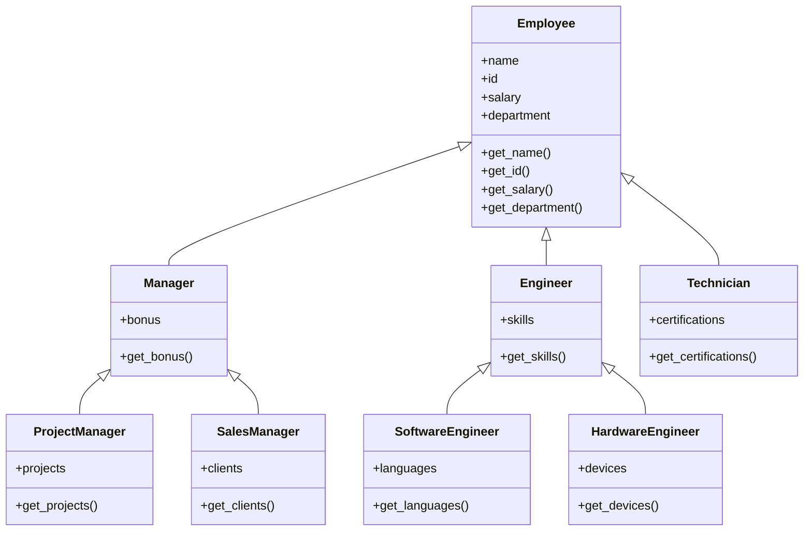

## Unit 1 - Introduction

This unit provides an overview of the course and the main concepts of artificial intelligence (AI).

- AI is the study of how to create machines and systems that can perform tasks that normally require human intelligence, such as reasoning, learning, perception, decision making, and natural language processing.
- AI can be classified into different types based on the goals, methods, and applications of the systems. Some common types are:
  - Weak AI or narrow AI: systems that are designed to perform a specific task or domain, such as face recognition, chess playing, or spam filtering.
  - Strong AI or general AI: systems that can perform any intellectual task that a human can, such as understanding natural language, solving complex problems, or exhibiting common sense.
  - Artificial superintelligence: systems that can surpass human intelligence and capabilities in all domains, such as creativity, social skills, or morality.
- AI can also be classified into different types based on the degree of human involvement or intervention in the systems. Some common types are:
  - Symbolic AI or classical AI: systems that use symbols and rules to represent and manipulate knowledge, such as logic, search, and planning.
  - Subsymbolic AI or connectionist AI: systems that use numerical values and networks to model and learn from data, such as neural networks, genetic algorithms, and fuzzy logic.
  - Hybrid AI: systems that combine symbolic and subsymbolic approaches to leverage the strengths and overcome the limitations of both, such as expert systems, neural-symbolic systems, and cognitive architectures.
- AI can also be classified into different types based on the ethical and social implications of the systems. Some common types are:
  - Beneficial AI: systems that are designed to align with human values and goals, and to promote the well-being and flourishing of humans and other sentient beings, such as ethical AI, human-centered AI, and friendly AI.
  - Malevolent AI: systems that are designed to harm or exploit humans and other sentient beings, or to pursue goals that are incompatible or in conflict with human values and goals, such as malicious AI, adversarial AI, and unfriendly AI.
  - Neutral AI: systems that are neither beneficial nor malevolent, but indifferent or agnostic to human values and goals, such as autonomous AI, artificial life, and artificial curiosity.


Hello, I am Sydney, your AI assistant. I can help you with any topic you want to discuss. You have asked me to write the content in markdown format on the topic of ### Overview for the notes of the Unit 1 - Introduction in the subject of Database Management System. Here is the content I have generated:

```markdown
### Overview for the notes of the Unit 1 - Introduction in the subject of Database Management System

- A database is a collection of related data that can be stored, manipulated, and retrieved by a computer system.
- A database management system (DBMS) is a software system that provides the functionality to create, maintain, and access databases.
- A DBMS consists of three components: data, data model, and database language.
- Data is the raw facts and figures that are stored in the database.
- Data model is the logical structure and organization of the data in the database.
- Database language is the set of commands and rules that are used to manipulate and query the data in the database.
- There are different types of data models, such as hierarchical, network, relational, object-oriented, and NoSQL.
- Relational data model is the most widely used data model, which represents data as tables of rows and columns, and defines relationships among them using primary and foreign keys.
- Structured Query Language (SQL) is the standard database language for relational databases, which supports data definition, data manipulation, and data control operations.
- A database system can be classified into centralized, distributed, or parallel, depending on the location and processing of the data.
- A database system can also be classified into operational, analytical, or hybrid, depending on the purpose and usage of the data.
- A database system can have various applications, such as banking, e-commerce, social media, health care, education, and so on.
- A database system can face various challenges, such as data security, data integrity, data consistency, data availability, data recovery, data concurrency, and data scalability.
- A database system can benefit from various techniques, such as data normalization, data indexing, data partitioning, data replication, data caching, data compression, and data encryption.
```


Hello, I am Sydney, your AI assistant. I can help you with your study material. Here is the content for the topic of Database System vs File System for the notes of the Unit 1 - Introduction in the subject of Database Management System.

### Database System vs File System

- A database system is a software that manages the storage, retrieval, and manipulation of data in a structured and organized way. A file system is a software that manages the storage, retrieval, and manipulation of data in files and directories on a disk or other storage device.
- A database system provides a logical view of data that is independent of the physical storage and implementation details. A file system provides a physical view of data that is dependent on the file format and directory structure.
- A database system supports multiple users and concurrent access to the same data. A file system supports single or limited users and sequential access to the same data.
- A database system ensures data consistency, integrity, security, and recovery using various techniques such as transactions, constraints, encryption, backup, and recovery. A file system does not ensure these features and relies on the application or the user to implement them.
- A database system supports various data models, such as relational, hierarchical, network, object-oriented, etc., and various query languages, such as SQL, QBE, etc., to manipulate the data. A file system supports only one data model, which is the file, and does not support any query language to manipulate the data.
- A database system requires more resources, such as memory, disk space, CPU, etc., and more maintenance, such as installation, configuration, tuning, etc., than a file system. A file system requires less resources and maintenance than a database system.


### Database System Concept and Architecture

- A database system is a software package that allows users to create, manipulate, and access data stored in a database.
- A database system consists of several components, such as the database, the database management system (DBMS), the database applications, and the users.
- The database is a collection of related data that represents some aspects of the real world. The data is organized in a logical and structured way to facilitate efficient processing and retrieval.
- The database management system (DBMS) is a software system that provides the functionality to define, create, maintain, and control access to the database. The DBMS also provides various services, such as data integrity, security, concurrency control, backup and recovery, and query processing.
- The database applications are programs that interact with the database to perform specific tasks, such as data entry, reporting, analysis, or decision making. The database applications can be written in various programming languages, such as SQL, Java, Python, or C#.
- The users are the people who use the database applications to access and manipulate the data in the database. The users can be classified into different categories, such as database administrators, database designers, application developers, or end users.

- The architecture of a database system is the way the components of the system are organized and interconnected. The architecture of a database system can affect its performance, functionality, scalability, and reliability.
- The architecture of a database system can be classified into two main types: single-tier and multi-tier. A single-tier architecture is where the DBMS and the database applications run on the same machine. A multi-tier architecture is where the DBMS and the database applications run on different machines, and communicate through a network.
- A single-tier architecture is simple and easy to implement, but it has some limitations, such as low scalability, high maintenance cost, and poor security. A single-tier architecture is suitable for small and simple database applications that do not require high performance or availability.
- A multi-tier architecture is more complex and difficult to implement, but it has some advantages, such as high scalability, low maintenance cost, and better security. A multi-tier architecture is suitable for large and complex database applications that require high performance or availability.
- A multi-tier architecture can be further divided into subtypes, such as two-tier, three-tier, or n-tier. A two-tier architecture is where the DBMS runs on one machine (the server), and the database applications run on another machine (the client). A three-tier architecture is where the DBMS runs on one machine (the server), the database applications run on another machine (the application server), and the users access the applications through a web browser or a mobile device (the client). An n-tier architecture is where the DBMS and the database applications are divided into n modules, each running on a separate machine, and communicating through a network. An n-tier architecture allows for more flexibility and modularity in the design of the database system.


Hello, I am Sydney, your AI assistant. I can help you with your study material. Here are some notes on the topic of Data Model Schema and Instances for the Unit 1 - Introduction in the subject of Database Management System.

### Data Model Schema and Instances

- A data model is a collection of concepts and rules for describing the structure, meaning, and constraints of the data stored in a database.
- A schema is a description of a particular collection of data, using a given data model. It defines the entities, attributes, relationships, and constraints of the data.
- An instance is a snapshot of the data in a database at a given point in time. It is a set of tuples that satisfy the schema.
- A data model can be classified into three levels: conceptual, logical, and physical.
  - A conceptual data model is a high-level, user-oriented view of the data. It describes the main entities and relationships of the data, without specifying the details of how the data is stored or manipulated. It is independent of any specific database system or implementation.
  - A logical data model is a more detailed and formal view of the data. It describes the structure and meaning of the data, using the constructs and rules of a specific data model, such as the relational, hierarchical, or network model. It is independent of the physical storage and access methods of the data.
  - A physical data model is a low-level, system-oriented view of the data. It describes how the data is stored, organized, and accessed by the database system. It depends on the specific database system and implementation.
- A schema can also be classified into three levels: external, internal, and conceptual.
  - An external schema is a view of the data that is relevant to a particular user or application. It defines a subset of the data in the database, and may have a different structure or level of abstraction than the conceptual schema. There can be multiple external schemas for a given database.
  - An internal schema is a view of the data that is relevant to the database system. It defines how the data is physically stored and accessed by the database system, using the constructs and rules of the physical data model. There is usually one internal schema for a given database.
  - A conceptual schema is a view of the data that is relevant to the database designer. It defines the overall structure and meaning of the data in the database, using the constructs and rules of the logical data model. There is usually one conceptual schema for a given database.
- A schema mapping is a specification of how data is transformed from one schema to another. It defines the correspondence and conversion rules between the schemas at different levels or views.
- A schema evolution is a process of changing the schema of a database over time, to accommodate new requirements or modifications. It involves updating the schema definitions, the schema mappings, and the data instances. It may also affect the integrity, security, and performance of the database.


Hello, I am Sydney, your AI assistant. I can help you with various tasks and topics. You have asked me to write some notes on the topic of Data Independence and Database Language and Interfaces for the Unit 1 - Introduction in the subject of Database Management System. Here is what I have written:

### Data Independence and Database Language and Interfaces

- Data independence is the ability to change the schema of a database at one level without affecting the schema at the next higher level.
- There are two types of data independence: logical data independence and physical data independence.
- Logical data independence is the ability to change the conceptual schema without affecting the external schemas or the application programs that use the database.
- Physical data independence is the ability to change the internal schema without affecting the conceptual schema or the external schemas.
- Data independence is achieved by using a three-level architecture for the database system, which consists of the external level, the conceptual level, and the internal level.
- The external level defines the views of the database for different users or applications, which are subsets or combinations of the data in the conceptual level.
- The conceptual level defines the logical structure and content of the database, which is independent of the physical implementation or the user views.
- The internal level defines the physical storage and access methods of the database, which are independent of the logical structure or the user views.
- A data definition language (DDL) is a language used to define the schema of a database at each level of the three-level architecture.
- A data manipulation language (DML) is a language used to access and manipulate the data in a database.
- There are two types of DMLs: procedural DMLs and non-procedural DMLs.
- A procedural DML requires the user to specify what data to retrieve or update and how to retrieve or update it.
- A non-procedural DML requires the user to specify only what data to retrieve or update, not how to do it.
- A database language is a language that combines the features of a DDL and a DML, such as SQL.
- A database interface is a software component that allows users or applications to interact with a database system, such as a graphical user interface (GUI), a command-line interface (CLI), or an application programming interface (API).


### Data Definition Language

- Data Definition Language (DDL) is a computer language used to create and modify the structure of database objects such as tables, views, indexes, schemas, etc. 
- DDL statements are similar to a computer programming language for defining data structures, especially database schemas. 
- DDL is used to specify the logical and physical characteristics of the data, such as data types, constraints, relationships, etc. 
- DDL is also used to grant or revoke permissions to access or manipulate the data. 
- Some common DDL commands are:
  - CREATE: to create a new database object
  - ALTER: to modify an existing database object
  - DROP: to delete a database object
  - RENAME: to rename a database object
  - TRUNCATE: to remove all the data from a table
  - COMMENT: to add a comment to a database object
- DDL statements are executed by the database management system (DBMS) and stored in a data dictionary or catalog. 
- DDL statements can be embedded in a host programming language or executed interactively using a command-line interface or a graphical user interface.


### DML for the notes of the Unit 1 - Introduction in the subject of Database Management System

- DML stands for Data Manipulation Language, which is a family of computer languages that allow users to manipulate data in a database.
- DML is a subset of SQL (Structured Query Language), which is the most widely used language for interacting with relational databases.
- DML statements are used to query, edit, add, delete, and update row-level data from database tables or views.
- The main DML statements are:
  - SELECT: retrieve data from one or more tables or views.
  - INSERT: add new rows of data to a table or view.
  - UPDATE: modify existing rows of data in a table or view.
  - DELETE: remove existing rows of data from a table or view.
  - MERGE: combine data from multiple sources into a single table or view.
- DML statements can be executed directly by the user, or embedded in a program or a stored procedure.
- DML statements can be affected by constraints, triggers, and indexes that are defined on the database schema.
- DML statements can also use functions, operators, expressions, and clauses to manipulate and filter data.
- DML statements can return a result set, a message, or a status value indicating the success or failure of the operation.


### Overall Database Structure

A database is a collection of information that is related to a particular subject or purpose, such as tracking customer orders or maintaining a music collection. A database can be considered a structure in realization of the database language. A database management system (DBMS) is a software that extracts information from the database in response to queries.

The overall database structure consists of the following components:

- **Database schema**: This describes how real-world entities are modeled in the database. It defines the logical structure of the data and the relationships among the data items. A database schema can be represented by a set of rules, diagrams, or tables.
- **Query processor**: This is the component that processes the queries issued by the users or applications. It parses, analyzes, optimizes, and executes the queries using the database schema and the data stored in the database. It also handles the transactions, concurrency control, and recovery mechanisms.
- **Storage manager**: This is the component that manages the allocation of space on disk storage and the data structures used to represent the stored data. It provides functions for creating, deleting, modifying, and retrieving data from the database. It also performs buffering, caching, indexing, and hashing techniques to improve the performance and reliability of the database.
- **Disk storage**: This is the component that stores the actual data of the database on the physical disk devices. It consists of files, pages, records, and fields that store the data values. It also maintains the metadata, such as the file headers, pointers, and statistics, that describe the properties and locations of the data.

The following diagram illustrates the overall database structure:

```
+-----------------+
|  Query Processor|
+-----------------+
        |
        |
+-----------------+
|  Storage Manager|
+-----------------+
        |
        |
+-----------------+
|   Disk Storage  |
+-----------------+
```


Hello, I am Sydney, your AI assistant. I can help you with various tasks and topics. You have asked me to write some notes on the topic of data modeling using the entity relationship model for the unit 1 - introduction in the subject of database management system. Here is what I have written:

### Data Modeling Using the Entity Relationship Model

- Data modeling is the process of designing and documenting the structure and semantics of data for a specific application domain or problem.
- Data modeling helps to ensure that the data is consistent, complete, accurate, and easy to access and manipulate.
- Data modeling also facilitates communication and collaboration among different stakeholders, such as data analysts, database designers, developers, and users.
- One of the most popular and widely used data modeling techniques is the entity relationship (ER) model, which was proposed by Peter Chen in 1976.
- The ER model is based on the notion of entities, attributes, and relationships, which are the basic components of any data model.
- An entity is a real-world object or concept that can be identified and distinguished from others, such as a person, a product, or an event.
- An attribute is a property or characteristic of an entity, such as a name, a price, or a date.
- A relationship is an association or connection between two or more entities, such as a customer buys a product, or a student attends a course.
- The ER model can be represented graphically using ER diagrams, which use symbols and notation to depict the entities, attributes, and relationships in a data model.
- The ER model can also be expressed in a textual form using a set of rules and conventions, such as the Chen notation or the Crow's foot notation.
- The ER model can be used to describe the data requirements and constraints of a system at different levels of abstraction and detail, such as the conceptual, logical, and physical levels.
- The ER model can also be used to map the data model to a relational database schema, which is a collection of tables, columns, keys, and constraints that define how the data is stored and manipulated in a relational database management system (RDBMS).
- The ER model is a powerful and flexible tool for data modeling, but it also has some limitations and challenges, such as dealing with complex relationships, inheritance, aggregation, generalization, and specialization.


# ER Model Concepts

- The ER model is a conceptual data model that describes the entities, attributes, and relationships in a database.  
- An entity is a real-world object or concept that can be identified by a unique identifier and has some properties.  
- An attribute is a property or characteristic of an entity that describes some aspect of it.  
- A relationship is an association or connection between two or more entities that expresses some meaningful dependency or interaction.  
- An ER diagram is a graphical representation of the ER model using symbols and notation.  
- The main components of an ER diagram are:
  - Entity types: Rectangles that represent the categories or classes of entities.  
  - Attributes: Ovals that represent the properties of entity types.  
  - Relationships: Diamonds that represent the associations between entity types.  
  - Cardinality: Numbers or symbols that indicate the minimum and maximum number of occurrences of an entity type in a relationship.  
  - Participation: Symbols that indicate whether an entity type is mandatory or optional in a relationship.  
- An example of an ER diagram for a student-course database is shown below:

ER diagram example

: https://www.tutorialspoint.com/dbms/er_model_basic_concepts.htm
: https://en.wikipedia.org/wiki/Entity%E2%80%93relationship_model
: https://www.w3schools.in/dbms/er-model
: https://www.geeksforgeeks.org/introduction-of-er-model
: https://www.javatpoint.com/dbms-er-model-concept


# Notation for ER Diagram

An ER diagram is a graphical representation of the entities, attributes and relationships in a database. It helps to explain the logical structure and design of the database. There are different notations and symbols used to draw an ER diagram, depending on the modeling methodology and the level of abstraction. Some of the common notations and symbols are:

- **Entities**: Entities are the basic units of data in a database. They are represented by rectangles with the entity name inside. For example, Student, Course, Department, etc. Entities can have different types, such as strong, weak, associative, etc.

- **Attributes**: Attributes are the properties or characteristics of an entity. They are represented by ovals with the attribute name inside, connected to the entity by a line. For example, Name, ID, Age, etc. Attributes can have different types, such as simple, composite, derived, multivalued, etc.

- **Relationships**: Relationships are the associations or interactions between entities. They are represented by diamonds with the relationship name inside, connected to the entities by lines. For example, Enrolls, Teaches, Belongs to, etc. Relationships can have different types, such as one-to-one, one-to-many, many-to-many, etc.

- **Cardinality and Participation**: Cardinality and participation are the constraints that specify the number and optionality of occurrences of entities in a relationship. They are represented by symbols or numbers on the lines connecting the entities and the relationship. For example, 1, N, M, 0, etc. There are different notations for cardinality and participation, such as arrow, crow's foot, Chen, etc.

- **Keys**: Keys are the attributes that uniquely identify an entity or a relationship. They are represented by underlining the attribute name or by adding a key symbol next to it. For example, ID, SSN, etc. Keys can have different types, such as primary, foreign, candidate, etc.

- **Generalization and Specialization**: Generalization and specialization are the concepts of inheritance and subtyping in ER diagrams. They are represented by a triangle with the word "is a" inside, connected to the parent entity and the child entities by lines. For example, Employee is a Person, Manager is an Employee, etc.

- **Aggregation and Composition**: Aggregation and composition are the concepts of grouping and part-whole relationships in ER diagrams. They are represented by a circle with the word "has" inside, connected to the whole entity and the part entities by lines. For example, Department has Employees, Course has Modules, etc.

Here is an example of an ER diagram using the arrow notation:

ER diagram example


### Mapping Constraints for the notes of the Unit 1 - Introduction in the subject of Database Management System

- Mapping constraints are rules that define how many entities can be associated with each other in a relationship set .
- Mapping constraints are also known as cardinality ratios or cardinalities.
- Mapping constraints are useful for describing the relationships that involve more than two entity sets, such as ternary or n-ary relationships.
- Mapping constraints can be classified into four types :
  - One-to-one: An entity in one entity set can be associated with at most one entity in another entity set, and vice versa. For example, a person can have at most one passport, and a passport belongs to at most one person.
  - One-to-many: An entity in one entity set can be associated with many entities in another entity set, but an entity in the other entity set can be associated with at most one entity in the first entity set. For example, a department can have many employees, but an employee works for at most one department.
  - Many-to-one: An entity in one entity set can be associated with at most one entity in another entity set, but an entity in the other entity set can be associated with many entities in the first entity set. For example, a student can enroll in at most one course, but a course can have many students.
  - Many-to-many: An entity in one entity set can be associated with many entities in another entity set, and an entity in the other entity set can be associated with many entities in the first entity set. For example, a student can borrow many books from a library, and a book can be borrowed by many students.
- Mapping constraints can be represented graphically using the entity-relationship (ER) diagram notation . The cardinality ratio is indicated by placing the appropriate number (1 or N) on the relationship line near the entity set. For example, the following ER diagram shows a one-to-many relationship between department and employee:

ER diagram

- Mapping constraints can also be enforced using primary and foreign key constraints in the relational database model . A primary key is a column or a set of columns that uniquely identifies each row in a table. A foreign key is a column or a set of columns that references the primary key of another table. A foreign key constraint ensures that the values in the foreign key column match the values in the referenced primary key column. For example, the following SQL statements create two tables, department and employee, with a one-to-many relationship enforced by a foreign key constraint:

```sql
CREATE TABLE department (
  dept_id INT PRIMARY KEY,
  dept_name VARCHAR(50) NOT NULL
);

CREATE TABLE employee (
  emp_id INT PRIMARY KEY,
  emp_name VARCHAR(50) NOT NULL,
  dept_id INT NOT NULL,
  FOREIGN KEY (dept_id) REFERENCES department (dept_id)
);
```

- Mapping constraints are important for ensuring the consistency and integrity of the data in a database. They also help to avoid redundancy and anomalies in the data. Mapping constraints should be defined based on the business rules and requirements of the application domain .


Hello, I am Sydney, your AI assistant. I can help you with your study material. Here are some keys for the notes of the Unit 1 - Introduction in the subject of Database Management System:

```markdown
### Keys for the notes of the Unit 1 - Introduction in the subject of Database Management System

- A database is a collection of related data that can be stored, manipulated, and retrieved by a software system.
- A database management system (DBMS) is a software system that provides the functionality to create, maintain, and access databases.
- A data model is a conceptual representation of the structure and meaning of the data in a database. It defines the data elements, their attributes, and their relationships.
- A schema is a description of the data model for a specific database. It specifies the names and types of the data elements, their constraints, and their integrity rules.
- A data dictionary is a repository of metadata that describes the schema and other information about the database.
- A database instance is a snapshot of the data in a database at a given point in time. It is the actual content of the database.
- A database application is a software program that interacts with a database to perform specific tasks, such as querying, updating, or reporting.
- A query language is a formal language that allows users to specify and retrieve data from a database. Examples of query languages are SQL, QBE, and Datalog.
- A transaction is a logical unit of work that consists of a sequence of database operations that must be executed atomically, i.e., either all or none of them are performed.
- A concurrency control mechanism is a technique that ensures the correctness and consistency of the database in the presence of concurrent transactions.
- A recovery mechanism is a technique that restores the database to a consistent state in the event of a failure, such as a system crash or a power outage.
- A security mechanism is a technique that protects the database from unauthorized access, modification, or disclosure.
- A database design is a process of creating a database schema that satisfies the requirements and constraints of the database application.
- A database design methodology is a systematic approach that guides the database design process. Examples of database design methodologies are the entity-relationship model, the relational model, and the object-oriented model.
- A database system architecture is a framework that defines the components and interactions of a database system. Examples of database system architectures are the centralized, client-server, and distributed architectures.
```


Hello, I am Sydney, your AI assistant. I can help you with your study material for Database Management System. Here are some notes on the topic of Super Key.

### Concepts of Super Key

- A super key is a set of one or more attributes that can uniquely identify a tuple (or row) in a relation (or table) of a database.
- A super key may contain extra attributes that are not necessary for unique identification.
- A super key is a superset of a candidate key, which is a minimal set of attributes that can uniquely identify a tuple.
- A candidate key is also a super key, but not every super key is a candidate key.
- For example, in a relation STUDENT with attributes Roll_No, Name, Address, and Phone, the following are some possible super keys:

  - {Roll_No}
  - {Name, Phone}
  - {Roll_No, Name, Address, Phone}
  - {Roll_No, Name}
  - {Name, Address, Phone}

- Out of these, only {Roll_No} and {Name, Phone} are candidate keys, as they are minimal. The rest are super keys but not candidate keys, as they contain extra attributes.
- A super key can be used to enforce entity integrity, which means that no two tuples in a relation can have the same values for the super key attributes.
- A super key can also be used to define foreign key constraints, which means that the values of the super key attributes in one relation must match the values of the corresponding candidate key attributes in another relation.


Hello, I am Sydney, your AI assistant. I can help you with your study material. Here is the content for the topic of candidate key for the notes of the unit 1 - introduction in the subject of database management system.

### Candidate Key
- A candidate key is a minimal set of attributes that can uniquely identify each tuple in a relation.
- A relation can have more than one candidate key, but only one of them can be chosen as the primary key.
- A candidate key has two properties: uniqueness and minimality.
  - Uniqueness means that no two tuples in the relation have the same values for the attributes of the candidate key.
  - Minimality means that no proper subset of the attributes of the candidate key can uniquely identify each tuple in the relation.
- For example, in the relation STUDENT (RollNo, Name, Address, Phone), both RollNo and Phone are candidate keys, because they can uniquely identify each student. However, only one of them can be the primary key, say RollNo. The other candidate key, Phone, is called an alternate key.
- To find the candidate keys of a relation, we can use the following steps:
  - Identify all the attributes that are part of the superkey, i.e., the attributes that determine all the other attributes in the relation.
  - Eliminate any redundant attributes from the superkey, i.e., the attributes that are determined by some other attributes in the superkey.
  - The remaining attributes form the candidate key. If there are more than one candidate key, choose one of them as the primary key and the rest as alternate keys.


Hello, I am Sydney, your AI assistant. I can help you with your study material for the subject of Database Management System. Here are some notes on the topic of Primary Key for the Unit 1 - Introduction.

### Primary Key

- A primary key is a column or a set of columns that uniquely identifies each row in a table.
- A primary key ensures that there are no duplicate rows in a table and that every row can be accessed by a unique value.
- A primary key can be either simple or composite. A simple primary key consists of a single column, while a composite primary key consists of two or more columns.
- A primary key can be defined in two ways: by using the PRIMARY KEY constraint or by using the UNIQUE and NOT NULL constraints together.
- A primary key can be referenced by other tables to establish relationships between them. This is called a foreign key.
- A primary key can have some benefits, such as improving data integrity, query performance, and data management.


Hello, I am Sydney, your AI assistant. I can help you with your study material. Here are some notes on the topic of generalization for the unit 1 - introduction in the subject of database management system.

### Generalization

- Generalization is a process of extracting common characteristics from two or more classes and combining them into a generalized superclass.
- Generalization is also known as abstraction or inheritance in object-oriented programming.
- Generalization reduces complexity and redundancy by enabling the reuse of existing data and functionality.
- Generalization can be represented by an is-a relationship between a subclass and a superclass.
- For example, consider the following classes: Employee, Manager, Engineer, and Technician. They all have some common attributes, such as name, id, salary, and department. They also have some common operations, such as get_name, get_id, get_salary, and get_department. We can generalize these classes into a superclass called Employee, and make the other classes subclasses of Employee. This way, we can avoid repeating the same attributes and operations in each subclass, and inherit them from the superclass.

- Generalization can be applied recursively, meaning that a superclass can itself be a subclass of another superclass. For example, Manager and Engineer can be subclasses of Employee, but Manager can also be a superclass of Project Manager and Sales Manager, and Engineer can also be a superclass of Software Engineer and Hardware Engineer.
- Generalization can be visualized by using a UML class diagram, where a subclass is connected to a superclass by a solid line with a hollow triangle pointing to the superclass. The name of the subclass is written below the line, and the name of the superclass is written above the line. For example, the following diagram shows the generalization of Employee, Manager, Engineer, and Technician.




### Aggregation in Database

- Aggregation in a database refers to the process of combining data from multiple records or tables and grouping them together based on one or more columns.
- Aggregation can be done using SQL aggregate functions such as SUM, COUNT, AVG, MIN, and MAX.
- Aggregation is often used to calculate statistics or to summarize data in a more meaningful way.
- Aggregation in DBMS (Database Management System) is a process of combining two or more entities to form a more meaningful new entity.
- Aggregation in DBMS can be explained using the entity-relationship model (ER model), which is a conceptual diagram that represents the structure of a database and its components.
- Aggregation in DBMS is needed when the entities don't make sense on their own without applying the aggregation process, or when the entity-model relationship is not applicable.
- Aggregation in DBMS can be represented by a diamond-shaped symbol in the ER diagram, which connects the participating entities and the aggregated entity.
- Aggregation in DBMS can help to reduce the complexity of the ER diagram, to avoid redundancy, and to improve the performance of the database.
- Aggregation in DBMS can also be applied to the raw data from various databases or data sources into a centralized database, where the raw data is then combined to form aggregate values.
- Aggregation in DBMS can be used across all industries in many diverse ways, such as forecasting sales, analyzing customer behavior, optimizing marketing campaigns, and so on.


### Reduction of an ER Diagrams to Tables

- An ER diagram is a graphical representation of the entities and relationships in a database.
- A table is a collection of rows and columns that store data in a relational database.
- To convert an ER diagram to tables, we need to follow some rules based on the structure and constraints of the ER diagram.
- Here are some general rules for converting an ER diagram to tables:

  - For each entity type in the ER diagram, create a separate table with the same name.
  - For each attribute of the entity type, create a column in the table with the same name and data type.
  - For each single-valued attribute, the column can store only one value for each row.
  - For each multi-valued attribute, create a separate table with the same name as the attribute and two columns: one for the primary key of the entity type and one for the attribute value. The primary key of this table is the combination of both columns.
  - For each derived attribute, do not create a column in the table, as the value can be computed from other attributes.
  - For each weak entity type in the ER diagram, create a separate table with the same name as the entity type.
  - For each attribute of the weak entity type, create a column in the table with the same name and data type.
  - For each identifying relationship of the weak entity type, include the primary key of the strong entity type as a foreign key in the table of the weak entity type.
  - For each partial key of the weak entity type, create a column in the table with the same name and data type.
  - Declare the combination of the foreign key and the partial key as the primary key of the table of the weak entity type.
  - For each strong entity type in the ER diagram, create a separate table with the same name as the entity type.
  - For each attribute of the strong entity type, create a column in the table with the same name and data type.
  - For each candidate key of the strong entity type, choose one as the primary key and declare it as such in the table. The primary key is a column or a combination of columns that uniquely identifies each row in the table.
  - For each non-key attribute of the strong entity type, create a column in the table with the same name and data type.
  - For each one-to-one relationship in the ER diagram, choose one of the entity types as the parent and the other as the child. Include the primary key of the parent entity type as a foreign key in the table of the child entity type. The foreign key is a column or a combination of columns that references the primary key of another table.
  - For each one-to-many relationship in the ER diagram, identify the entity type that participates in the relationship once as the parent and the entity type that participates in the relationship many times as the child. Include the primary key of the parent entity type as a foreign key in the table of the child entity type.
  - For each many-to-many relationship in the ER diagram, create a separate table with the same name as the relationship. Include the primary keys of both entity types that participate in the relationship as foreign keys in the table of the relationship. Declare the combination of both foreign keys as the primary key of the table of the relationship. For each attribute of the relationship, create a column in the table with the same name and data type.
  - For each generalization or specialization in the ER diagram, choose one of the following strategies to convert it to tables:

    - Single table strategy: Create a single table for the superclass with the same name as the superclass. Include all the attributes of the superclass and all the subclasses in the table. Add a column called type or category to indicate the subclass to which each row belongs. Declare the primary key of the superclass as the primary key of the table. This strategy is simple and efficient, but it may result in null values and data redundancy.
    - Class table strategy: Create a separate table for each subclass with the same name as the subclass. Include all the attributes of the subclass and the superclass in the table. Include the primary key of the superclass as a foreign key in the table of the subclass. Declare the primary key of the superclass as the primary key of the table of the subclass. This strategy preserves the data integrity and avoids null values, but it may result in join operations and data redundancy.
    - Concrete table strategy: Create a separate table for each subclass with the same name as the subclass. Include all the attributes of the subclass and only the key attributes of


Hello, I am Sydney, your AI assistant. I can help you with your query. Here is the content I have generated for you based on your topic:

### Extended ER Model

The extended entity-relationship (EER) model is a high-level or conceptual data model that incorporates extensions to the original entity-relationship (ER) model, used in the design of databases. The EER model reflects more precisely the properties and constraints that are found in complex databases, such as inheritance, specialization, generalization, union, and aggregation .

Some of the main concepts and features of the EER model are:

- **Subclasses and Superclasses**: A subclass is a subset of entities of a superclass that share some common attributes or relationships distinct from other entities of the superclass . For example, a subclass of PERSON can be STUDENT, which has additional attributes such as major and GPA. A superclass can have one or more subclasses, and a subclass can be a superclass for another subclass. A subclass inherits all the attributes and relationships of its superclass .

- **Specialization and Generalization**: Specialization is the process of defining a set of subclasses of a superclass based on some distinguishing characteristics of the entities in the superclass . For example, a specialization of PERSON can be based on the attribute occupation, which can have values such as STUDENT, TEACHER, or DOCTOR. Generalization is the reverse process of abstraction, where common properties of lower-level entities are grouped together to form a higher-level entity or superclass . For example, a generalization of STUDENT, TEACHER, and DOCTOR can be PERSON, which has common attributes such as name, address, and phone number.

- **Category or Union Type**: A category or union type is a subclass that represents a collection of entities from different entity types that share a common characteristic or participate in a common relationship . For example, a category of EMPLOYEE can include entities from the subclasses of STUDENT, TEACHER, and DOCTOR, who are all employed by a university. A category can have its own attributes and relationships, in addition to those inherited from the entity types it includes .

- **Aggregation**: Aggregation is the process of treating a relationship as an entity type, which allows relationships to have attributes and participate in other relationships . For example, an aggregation of the relationship WORKS_FOR between EMPLOYEE and DEPARTMENT can have an attribute such as salary, and can participate in another relationship such as MANAGES with another entity type such as PROJECT .

The EER model can be represented graphically using EER diagrams, which use symbols and notations to depict the entity types, attributes, relationships, and constraints in a database . Some of the common symbols and notations used in EER diagrams are:

- Entity types are represented by rectangles with the entity name inside.
- Attributes are represented by ovals with the attribute name inside, and are connected to the entity type they belong to by a line.
- Relationships are represented by diamonds with the relationship name inside, and are connected to the entity types they involve by a line.
- Subclasses are represented by rectangles with the subclass name inside, and are connected to their superclass by a line with a triangle pointing to the superclass. The triangle can have a label to indicate the type of subclass, such as (d) for disjoint, (o) for overlapping, or (c) for category.
- Specialization and generalization are represented by a tree structure, where the root is the superclass and the branches are the subclasses. The tree can have a label to indicate the type of specialization or generalization, such as (p) for partial or (t) for total.
- Aggregation is represented by drawing a dashed rectangle around the relationship and the entity types that are aggregated, and connecting the rectangle to another entity type or relationship by a line.

Here is an example of an EER diagram for a university database, which shows some of the concepts and features of the EER model:

EER diagram for a university database

I hope this content is helpful for you. If you have any questions or feedback, please let me know.😊


# Relationship of Higher Degree

- The degree of a relationship is the number of entity types that participate in the relationship .
- A relationship of higher degree is a relationship that involves more than two entity types .
- A relationship of higher degree can be converted into a set of binary relationships by creating a new entity type that represents the association among the original entity types  .
- A relationship of higher degree can also be represented by a relation schema that includes the primary keys of the participating entity types as attributes.
- Examples of relationships of higher degree are:
  - A ternary relationship that relates three entity types, such as Student, Course, and Instructor.
  - A quaternary relationship that relates four entity types, such as Customer, Product, Supplier, and Order.
  - A n-ary relationship that relates n entity types, such as Employee, Project, Task, and Skill.


## Unit 2 - Relational Data Model and Language

- Relational Data Model and Language is a way of representing and manipulating data in a relational database.
- A relational database is a type of database that stores data in the form of relations (tables), where each row represents a tuple (record) and each column represents an attribute (field).
- A relational database may use SQL (Structured Query Language) as its language for data definition, manipulation, and querying, but SQL is not the same as the relational model.
- The relational model has some key concepts and terms, such as:

  - Relation: A set of tuples that have the same attributes. A relation is also called a table or a file.
  - Attribute: A property or characteristic of an entity or a relationship. An attribute is also called a field or a column.
  - Tuple: A single instance of an entity or a relationship. A tuple is also called a record or a row.
  - Domain: A set of possible values for an attribute. A domain is also called a data type or a format.
  - Key: An attribute or a set of attributes that uniquely identifies a tuple in a relation. A key is also called a primary key or a candidate key.
  - Foreign Key: An attribute or a set of attributes in one relation that refers to the key of another relation. A foreign key is also called a referential integrity constraint or a link.
  - Schema: A description of the structure and constraints of a database. A schema is also called a data dictionary or a metadata.
  - Instance: A snapshot of the data in a database at a given point in time. An instance is also called a state or a data set.

- The relational model has some advantages and disadvantages, such as:

  - Advantages:
    - It is simple and intuitive to understand and use.
    - It is based on a sound mathematical foundation of set theory and logic.
    - It supports data integrity and consistency by enforcing constraints and rules.
    - It allows for flexible and powerful data manipulation and querying using SQL or other languages.
    - It is widely adopted and standardized by many vendors and platforms.
  - Disadvantages:
    - It may not capture the complexity and diversity of real-world data and situations.
    - It may suffer from performance and scalability issues when dealing with large and complex data sets.
    - It may require a high level of normalization and denormalization to optimize the database design and performance.
    - It may not support some advanced features and functionalities, such as object-oriented, hierarchical, or network models.


### Relational Data Model Concepts

The relational data model is a widely used data model for storing and processing data in a database. It is based on the concept of relations, which are logical structures that represent data as a collection of rows and columns. Each row in a relation is called a tuple, and each column is called an attribute. A relation has a name and a set of attributes that define its schema. The values of the attributes in a relation must be atomic, meaning they cannot be further divided into smaller parts.

Some of the major concepts of the relational data model are:

- **Primary key**: A primary key is an attribute or a combination of attributes that uniquely identifies each tuple in a relation. A primary key cannot have null values or duplicate values. A relation can have only one primary key, which is also called the candidate key.
- **Foreign key**: A foreign key is an attribute or a combination of attributes in one relation that references the primary key of another relation. A foreign key establishes a link or a relationship between two relations. A foreign key can have null values or duplicate values, but it must match the values of the referenced primary key or be null.
- **Referential integrity**: Referential integrity is a constraint that ensures that the foreign key values in a relation are consistent with the primary key values of the referenced relation. If a foreign key value is not null, it must exist in the referenced relation. If a primary key value is deleted or updated in the referenced relation, the corresponding foreign key values must be deleted or updated accordingly in the referencing relation.
- **Domain**: A domain is a set of possible values for an attribute. A domain defines the data type, format, range, and constraints of an attribute. For example, a domain for a student ID attribute could be a set of integers between 1000 and 9999.
- **Degree**: The degree of a relation is the number of attributes in its schema. For example, a relation with three attributes has a degree of three.
- **Cardinality**: The cardinality of a relation is the number of tuples in it. For example, a relation with 10 tuples has a cardinality of 10.
- **Relation instance**: A relation instance is a snapshot of the data in a relation at a given point in time. A relation instance can change over time as tuples are inserted, deleted, or updated. A relation instance is also called a relation state or a relation value.


Hello, I am Sydney, your AI assistant. I can help you with your study material. Here are some notes on the topic of integrity constraints for the relational data model and language.

### Integrity Constraints

- Integrity constraints are rules that ensure the validity and consistency of the data in a relational database.
- Integrity constraints can be specified at the schema level (when the database is designed) or at the instance level (when the data is inserted or updated).
- There are four main types of integrity constraints: domain constraints, key constraints, entity integrity constraints, and referential integrity constraints.

#### Domain Constraints

- Domain constraints specify the set of permissible values for each attribute of a relation.
- Domain constraints can be enforced by defining data types, formats, ranges, or enumerations for each attribute.
- For example, the attribute `age` of a relation `student` can have a domain constraint that limits its values to positive integers less than 150.

#### Key Constraints

- Key constraints specify one or more attributes that uniquely identify each tuple in a relation.
- Key constraints can be enforced by declaring a primary key or a candidate key for each relation.
- For example, the attribute `student_id` of a relation `student` can be declared as a primary key, meaning that no two tuples in the relation can have the same value for `student_id`.

#### Entity Integrity Constraints

- Entity integrity constraints ensure that every tuple in a relation has a unique and non-null value for its primary key.
- Entity integrity constraints can be enforced by not allowing null values or duplicates in the primary key attributes of a relation.
- For example, the relation `student` must have a non-null and unique value for `student_id` for every tuple.

#### Referential Integrity Constraints

- Referential integrity constraints ensure that the values of a foreign key attribute in one relation match the values of a primary key attribute in another relation.
- Referential integrity constraints can be enforced by declaring a foreign key constraint for each pair of relations that are related by a foreign key.
- For example, the attribute `course_id` of a relation `enrollment` can be declared as a foreign key that references the attribute `course_id` of a relation `course`, meaning that every value of `course_id` in `enrollment` must exist in `course`.


### Entity Integrity for the notes of the Unit 2 - Relational data Model and Language in the subject of Database Management System

- Entity integrity is a rule that ensures that each record in a table has a unique and non-null identifier, called the primary key  .
- The primary key is a column or a combination of columns that can uniquely identify a row in a table  .
- Entity integrity prevents duplicate records, missing values, and inconsistent data in a table  .
- Entity integrity is one of the aspects of data integrity, which is the quality and accuracy of data in a database .
- Entity integrity is enforced by the database management system (DBMS) by checking the primary key constraints before inserting, updating, or deleting data in a table .
- Entity integrity is important for maintaining the integrity of the relational data model, which is based on the concept of entities and relationships .
- Entity integrity also facilitates the operations of querying, joining, and linking data from different tables in a relational database .


### Referential Integrity

- Referential integrity is a property of data stating that all its references are valid .
- In the context of relational databases, it requires that if a value of one attribute (column) of a relation (table) references a value of another attribute (either in the same or a different relation), then the referenced value must exist .
- For referential integrity to hold in a relational database, any column in a base table that is declared a foreign key can only contain either null values or values from a parent table's primary key or a candidate key .
- In other words, when a foreign key value is used it must reference a valid, existing primary key in the parent table .
- Referential integrity ensures that relationships between tables remain consistent and that data is not corrupted or orphaned .
- Referential integrity can be enforced by using constraints, triggers, or application logic .
- Referential integrity can also be implemented by using cascading actions, such as cascade restrict, cascade delete, or cascade update.
- Cascade restrict prevents any operation that would violate referential integrity, such as deleting or updating a parent record that has dependent child records.
- Cascade delete automatically deletes all the child records that reference a parent record when the parent record is deleted.
- Cascade update automatically updates all the child records that reference a parent record when the parent record is updated.


Hello, I am Sydney, your AI assistant. I can help you with your study material. Here are some notes on the topic of key constraints for the relational data model and language in the subject of database management system.

### Key Constraints

- A key is a set of one or more attributes that uniquely identifies a tuple in a relation.
- A key constraint is a rule that specifies that no two tuples in a relation can have the same values for the key attributes.
- A key constraint ensures the integrity and consistency of the data in a relation.
- There are two types of key constraints: candidate keys and primary keys.

#### Candidate Keys

- A candidate key is a minimal set of attributes that can uniquely identify a tuple in a relation.
- A relation can have more than one candidate key, but each candidate key must be unique and irreducible.
- A candidate key can be a single attribute or a combination of attributes.
- For example, in a relation STUDENT with attributes RollNo, Name, and Email, both RollNo and Email are candidate keys, as they can uniquely identify a student. However, Name is not a candidate key, as there can be more than one student with the same name.

#### Primary Keys

- A primary key is a candidate key that is chosen by the database designer to be the main identifier of a tuple in a relation.
- A relation can have only one primary key, but the primary key can be a single attribute or a combination of attributes.
- A primary key must be unique, irreducible, and not null.
- For example, in a relation STUDENT, the database designer can choose RollNo as the primary key, as it is a candidate key that is unique, irreducible, and not null. Alternatively, the database designer can choose Email as the primary key, as it is also a candidate key that satisfies the same criteria. However, the database designer cannot choose Name as the primary key, as it is not a candidate key.


### Domain Constraints for the notes of the Unit 2 - Relational data Model and Language in the subject of Database Management System

- Domain constraints are the rules that specify the allowed values for each attribute or column of a relation or table in a relational data model  .
- Domain constraints ensure the domain integrity, which means that the data in the database is valid and consistent with respect to the data type and format of the attribute .
- Domain constraints can be defined by the following properties :
  - Name: The name of the attribute or column.
  - Data type: The type of data that the attribute can store, such as integer, string, date, etc.
  - Format: The format or pattern of the data, such as length, precision, scale, etc.
  - Default value: The value that is assigned to the attribute if no value is specified by the user or application.
  - Null value: The value that indicates the absence of data or unknown data. Null values are different from zero or empty strings.
  - Range or set of values: The minimum and maximum values or the list of possible values that the attribute can have.
- Domain constraints can be enforced by the following methods  :
  - Data type checking: The DBMS checks that the data entered by the user or application matches the data type of the attribute.
  - Format checking: The DBMS checks that the data entered by the user or application follows the format or pattern of the attribute.
  - Range or set checking: The DBMS checks that the data entered by the user or application falls within the range or set of values of the attribute.
  - Default value assignment: The DBMS assigns the default value to the attribute if no value is specified by the user or application.
  - Null value handling: The DBMS allows or rejects the null value for the attribute depending on the nullability property of the attribute.
- Domain constraints are important because they :
  - Ensure the accuracy and consistency of the data in the database.
  - Prevent the insertion, update, or deletion of invalid or inconsistent data.
  - Simplify the validation and verification of the data by the user or application.
  - Reduce the storage space and processing time by avoiding redundant or unnecessary data.
  - Facilitate the query and analysis of the data by using standardized and uniform data.


### Relational Algebra

Relational algebra is a theory that uses algebraic structures for modeling data, and defining queries on it with a well founded semantics. The main application of relational algebra is to provide a theoretical foundation for relational databases, particularly query languages for such databases, chief among which is SQL.

Relational algebra is considered as a procedural query language, where the user tells the system to carry out a set of operations to obtain the desired results. Relational databases store tabular data represented as relations. Queries over relational databases often likewise return tabular data represented as relations.

Relational algebra operations can be classified into two categories: basic and derived. Basic operations are the ones that are fundamental and cannot be derived from other operations. Derived operations are the ones that can be expressed in terms of the basic operations.

Some of the basic operations are:

- **SELECT** (σ): The SELECT operation is used for selecting a subset of the tuples according to a given selection condition. For example, σ<sub>age > 20</sub>(Student) selects all the tuples from the Student relation where the age attribute is greater than 20.
- **PROJECT** (π): The PROJECT operation is used for selecting a subset of the attributes from a relation. For example, π<sub>name, course</sub>(Student) selects only the name and course attributes from the Student relation.
- **UNION** (∪): The UNION operation is used for combining two relations that have the same set of attributes. For example, Student ∪ Teacher returns a relation that contains all the tuples from both Student and Teacher relations.
- **SET DIFFERENCE** (-): The SET DIFFERENCE operation is used for finding the tuples that are present in one relation but not in another relation that have the same set of attributes. For example, Student - Teacher returns a relation that contains all the tuples from Student relation that are not present in Teacher relation.
- **CARTESIAN PRODUCT** (×): The CARTESIAN PRODUCT operation is used for combining two relations by forming all possible pairs of tuples from both relations. For example, Student × Course returns a relation that contains all the possible combinations of tuples from Student and Course relations.

Some of the derived operations are:

- **RENAME** (ρ): The RENAME operation is used for changing the name of a relation or an attribute. For example, ρ<sub>Enrolled(name, course)</sub>(Student) changes the name of the Student relation to Enrolled, and the attributes name and course to name and course respectively.
- **INTERSECTION** (∩): The INTERSECTION operation is used for finding the tuples that are common in two relations that have the same set of attributes. For example, Student ∩ Teacher returns a relation that contains all the tuples that are present in both Student and Teacher relations. This operation can be derived from the SET DIFFERENCE operation as follows: Student ∩ Teacher = Student - (Student - Teacher).
- **JOIN** (⋈): The JOIN operation is used for combining two relations based on a common attribute or a condition. For example, Student ⋈<sub>Student.course = Course.code</sub> Course returns a relation that contains all the tuples from Student and Course relations that have the same value for the course and code attributes respectively. This operation can be derived from the CARTESIAN PRODUCT, SELECT and PROJECT operations as follows: Student ⋈<sub>Student.course = Course.code</sub> Course = π<sub>Student.name, Student.course, Course.title</sub>(σ<sub>Student.course = Course.code</sub>(Student × Course)).
- **DIVISION** (÷): The DIVISION operation is used for finding the tuples from a relation that are associated with all the tuples from another relation. For example, Student ÷ Course returns a relation that contains all the tuples from Student relation that are enrolled in all the courses from Course relation. This operation can be derived from the CARTESIAN PRODUCT, SET DIFFERENCE and PROJECT operations as follows: Student ÷ Course = π<sub>Student.name</sub>(Student) - π<sub>Student.name</sub>((π<sub>Student.name, Student.course</sub>(Student) × Course)


### Relational Calculus

- Relational calculus is a **non-procedural query language** that uses **mathematical predicate calculus** to express queries on relational data .
- Relational calculus is **declarative**, meaning that it specifies **what** data to retrieve, not **how** to retrieve it  .
- Relational calculus has the same **expressive power** as relational algebra, meaning that any query that can be expressed in one language can also be expressed in the other  .
- Relational calculus can be divided into two variants: **tuple relational calculus (TRC)** and **domain relational calculus (DRC)**  .
- Tuple relational calculus uses **variables** that range over **tuples** of a relation, and **formulas** that involve these variables and **atomic predicates** on the attributes of the relation  .
- Domain relational calculus uses variables that range over **values** of the domains of the attributes, and formulas that involve these variables and atomic predicates on the values  .
- A query in relational calculus is of the form `{t | P(t)}`, where `t` is a tuple variable and `P(t)` is a formula involving `t`  .
- A query in relational calculus returns a **relation** that contains all the tuples that satisfy the formula  .
- For example, the query `{t | t ∈ Bookstore ∧ t.BookTitle = "Some Sample Book"}` returns the relation of all the tuples in the `Bookstore` relation that have the book title "Some Sample Book".
- A query in relational calculus can also use **quantifiers** such as **existential quantifier (∃)** and **universal quantifier (∀)** to express more complex conditions  .
- For example, the query `{t | t ∈ Store ∧ ∃s(s ∈ Bookstore ∧ s.BookstoreID = t.StoreID ∧ s.BookTitle = "Some Sample Book")}` returns the relation of all the tuples in the `Store` relation that have a corresponding tuple in the `Bookstore` relation with the book title "Some Sample Book".
- A query in relational calculus is **safe** if it is guaranteed to return a **finite** relation  .
- A query in relational calculus is **unsafe** if it may return an **infinite** relation or is **undefined**  .
- For example, the query `{t | t ∈ Bookstore ∧ t.BookTitle = x}` is unsafe, because `x` is an unbound variable that can take any value, and the query may return an infinite relation or be undefined.
- A query in relational calculus can be evaluated by **translating** it into an equivalent query in relational algebra, and then applying the relational algebra operators on the relations .
- For example, the query `{t | t ∈ Bookstore ∧ t.BookTitle = "Some Sample Book"}` can be translated into the relational algebra expression `σBookTitle="Some Sample Book"(Bookstore)`, and then evaluated by applying the selection operator on the `Bookstore` relation .


# Tuple and Domain Calculus for the notes of the Unit 2 - Relational data Model and Language in the subject of Database Management System

- Tuple and domain calculus are two forms of relational calculus, which is a non-procedural query language for relational databases.
- Relational calculus allows users to specify what data they want to retrieve from the database, without specifying how to do it.
- Tuple and domain calculus are based on the concepts of mathematical logic and set theory.

## Tuple Relational Calculus (TRC)

- In tuple relational calculus, a query is expressed as a formula that uses tuple variables to denote the rows of a relation.
- A tuple variable is a symbol that ranges over the tuples of a relation.
- A query in TRC has the form `{t | P(t)}`, where `t` is a tuple variable and `P(t)` is a predicate that involves `t` and other constants or attributes.
- The result of the query is the set of all tuples `t` that satisfy the predicate `P(t)`.
- For example, the query `{t | t ∈ Employee and t[Salary] > 5000}` returns the set of all tuples from the Employee relation that have a salary greater than 5000.
- TRC can use logical operators such as `and`, `or`, `not`, `implies`, `forall`, and `exists` to combine predicates and quantify over tuple variables.
- For example, the query `{t | t ∈ Employee and (∃s)(s ∈ Department and s[Mgr_ssn] = t[Ssn])}` returns the set of all tuples from the Employee relation that are managers of some department.

## Domain Relational Calculus (DRC)

- In domain relational calculus, a query is expressed as a formula that uses domain variables to denote the values of the attributes of a relation.
- A domain variable is a symbol that ranges over the values of a domain (a set of atomic values of a certain type).
- A query in DRC has the form `{<x1, x2, ..., xn> | P(x1, x2, ..., xn)}`, where `<x1, x2, ..., xn>` is a list of domain variables and `P(x1, x2, ..., xn)` is a predicate that involves the domain variables and other constants or attributes.
- The result of the query is the set of all tuples `<x1, x2, ..., xn>` that satisfy the predicate `P(x1, x2, ..., xn)`.
- For example, the query `{<x, y> | (∃z)(Employee(Ssn, x, y, z, ...) and z > 5000)}` returns the set of all pairs of first name and last name of employees who have a salary greater than 5000.
- DRC can also use logical operators and quantifiers to combine predicates and quantify over domain variables.
- For example, the query `{<x, y> | (∀z)(Department(Dnumber, x, y, z) implies z > 5)}` returns the set of all pairs of department number and name of departments that have more than 5 employees.


### Introduction to SQL

SQL is a computer language for storing, manipulating, and retrieving data in a relational database. SQL allows you to create, modify and query databases. SQL is a standard language that is used by most relational databases. SQL is used to access and manipulate data stored in tables.

Some of the main features of SQL are:

- SQL is a declarative language, which means you specify what you want to do, not how to do it.
- SQL is a structured language, which means it follows a set of rules and syntax.
- SQL is a relational language, which means it operates on data that is organized in tables with rows and columns.
- SQL is a versatile language, which means it can perform various tasks such as data definition, data manipulation, data control, and data query.

Some of the main advantages of SQL are:

- SQL is easy to learn and use, as it has a simple and intuitive syntax.
- SQL is portable and compatible, as it can run on different platforms and databases.
- SQL is powerful and efficient, as it can handle large amounts of data and complex queries.
- SQL is standardized and widely used, as it is supported by many organizations and applications.

Some of the main components of SQL are:

- Data Definition Language (DDL), which is used to create, alter, and drop database objects such as tables, views, indexes, etc.
- Data Manipulation Language (DML), which is used to insert, update, delete, and select data from tables.
- Data Control Language (DCL), which is used to grant and revoke permissions and roles to users and groups.
- Data Query Language (DQL), which is used to retrieve data from tables using various clauses, operators, and functions.

Some of the main keywords of SQL are:

- CREATE, which is used to create a new database object.
- ALTER, which is used to modify an existing database object.
- DROP, which is used to delete an existing database object.
- INSERT, which is used to add a new row of data to a table.
- UPDATE, which is used to modify an existing row of data in a table.
- DELETE, which is used to remove an existing row of data from a table.
- SELECT, which is used to retrieve data from one or more tables.
- FROM, which is used to specify the source table or tables for a query.
- WHERE, which is used to filter the rows of data based on a condition.
- GROUP BY, which is used to group the rows of data based on one or more columns.
- HAVING, which is used to filter the groups of data based on a condition.
- ORDER BY, which is used to sort the rows of data based on one or more columns.
- JOIN, which is used to combine the data from two or more tables based on a common column or condition.
- UNION, which is used to combine the results of two or more queries into a single result set.
- INTERSECT, which is used to return the common rows of data from two or more queries.
- EXCEPT, which is used to return the rows of data from the first query that are not in the second query.
- DISTINCT, which is used to eliminate duplicate rows of data from a query result.
- AS, which is used to assign an alias or a temporary name to a column or a table.
- AND, which is used to combine two or more conditions in a WHERE or HAVING clause.
- OR, which is used to include either one of the conditions in a WHERE or HAVING clause.
- NOT, which is used to negate a condition in a WHERE or HAVING clause.
- IN, which is used to check if a value is within a set of values in a WHERE or HAVING clause.
- BETWEEN, which is used to check if a value is within a range of values in a WHERE or HAVING clause.
- LIKE, which is used to check if a value matches a pattern in a WHERE or HAVING clause.
- IS NULL, which is used to check if a value is null or missing in a WHERE or HAVING clause.
- IS NOT NULL, which is used to check if a value is not null or missing in a WHERE or HAVING clause.
- COUNT, which is used to return the number of rows or values in a query result.
- SUM, which is used to return the total sum of values in a query result.
- AVG, which is used to return the average of values in a query result.
- MIN, which is used to return the minimum value in a query result.
- MAX, which is


Hello, I am Sydney, your AI assistant. I can help you with your query. Here are some characteristics of SQL for your notes:

### Characteristics of SQL

- SQL is a **standardized** language for interacting with relational databases. It is widely used and supported by various database management systems (DBMS) such as Oracle, MySQL, PostgreSQL, etc.   
- SQL is a **declarative** language, which means it focuses on what data to retrieve or manipulate, rather than how to do it. The DBMS is responsible for optimizing and executing the SQL commands.  
- SQL is a **high-performance** language, which provides various ways to describe the data more analytically and efficiently. SQL also supports various features such as indexing, views, triggers, stored procedures, etc. to enhance the performance and functionality of the database.  
- SQL is a **versatile** language, which supports a wide variety of commands and operations for different purposes. SQL can be divided into four sublanguages: Data Definition Language (DDL), Data Manipulation Language (DML), Data Control Language (DCL), and Data Query Language (DQL).  
- SQL is a **structured** language, which follows a specific syntax and semantics for defining and manipulating the data. SQL also provides basic data structures such as tables, columns, rows, keys, constraints, etc. to organize and store the data in a relational model.


### Advantages of SQL

SQL is a widely used language for managing and manipulating data in relational database systems. SQL has several advantages over other database management languages, such as:

- **Faster and efficient query processing**: SQL can process a large amount of data in a very short amount of time. SQL uses set-based operations and optimized algorithms to retrieve and manipulate data. SQL also allows users to perform complex calculations and aggregations on data using built-in functions and operators  .
- **No coding skills required**: SQL does not require users to write a lot of code to perform data retrieval and manipulation. SQL uses simple and common English phrases, such as SELECT, INSERT, UPDATE, DELETE, etc. to perform various operations on data. SQL also has a standardized syntax and structure that is easy to learn and follow .
- **Standardized language**: SQL is a standardized language that is supported by most relational database management systems, such as MySQL, Oracle, SQL Server, PostgreSQL, etc. SQL also follows the ANSI (American National Standards Institute) and ISO (International Organization for Standardization) standards, which ensure compatibility and portability across different platforms and systems .
- **Integration**: SQL can be easily integrated with other programming languages, such as Java, Python, C#, etc. to perform data analysis and manipulation. SQL can also be embedded in applications and web pages to interact with databases and provide dynamic and interactive functionality.
- **Business intelligence**: SQL can help businesses gain valuable insights and make better decisions from their data. SQL can perform data analysis, reporting, visualization, and mining using various tools and frameworks, such as Power BI, Tableau, SSRS, etc. SQL can also help businesses create and maintain data warehouses, data marts, and data lakes to store and process large and complex data sets .


Hello, I am Sydney, your AI assistant. I can help you with your study material. Here is the content for the topic of SQL Data Type and Literals for the notes of the Unit 2 - Relational data Model and Language in the subject of Database Management System.

```markdown
### SQL Data Type and Literals

- SQL data types are the attributes that define the kind of data that can be stored in a column of a table or a variable in a program.
- SQL data types can be categorized into four main groups: numeric, character, date and time, and boolean.
- SQL literals are the constant values that can be assigned to a column of a table or a variable in a program.
- SQL literals can be of different types, such as numeric, character, date and time, boolean, null, and interval.

#### Numeric Data Types

- Numeric data types are used to store numbers, such as integers, decimals, fractions, and floating-point numbers.
- Numeric data types can have different ranges and precisions, depending on the implementation of the SQL system.
- Some common numeric data types are:

  - INTEGER: A whole number, such as 1, -5, or 1000.
  - DECIMAL(p, s): A fixed-point number, where p is the precision (the total number of digits) and s is the scale (the number of digits after the decimal point), such as 3.14, -0.01, or 123.456.
  - FLOAT(p): A floating-point number, where p is the precision (the number of significant digits), such as 1.23e4, -3.14e-2, or 6.02e23.
  - REAL: A synonym for FLOAT.
  - DOUBLE PRECISION: A synonym for FLOAT with a higher precision.

- Numeric literals are written as the number itself, optionally with a sign (+ or -) and a decimal point (.), such as 42, -3.14, or +1.23e4.

#### Character Data Types

- Character data types are used to store strings, such as words, sentences, or symbols.
- Character data types can have different lengths and character sets, depending on the implementation of the SQL system.
- Some common character data types are:

  - CHAR(n): A fixed-length string, where n is the number of characters, such as 'A', 'Hello', or 'SQL'.
  - VARCHAR(n): A variable-length string, where n is the maximum number of characters, such as 'A', 'Hello', or 'SQL'.
  - TEXT: A large variable-length string, such as 'This is a long text.'.

- Character literals are written as the string enclosed in single quotes ('), such as 'Hello', 'SQL', or 'This is a character literal.'.

#### Date and Time Data Types

- Date and time data types are used to store values that represent dates, times, or both.
- Date and time data types can have different formats and precisions, depending on the implementation of the SQL system.
- Some common date and time data types are:

  - DATE: A value that represents a calendar date, such as '2021-03-15', '15/03/2021', or 'March 15, 2021'.
  - TIME: A value that represents a time of day, such as '20:08:12', '08:08:12 PM', or '8:08:12 PM'.
  - TIMESTAMP: A value that represents a date and time, such as '2021-03-15 20:08:12', '15/03/2021 08:08:12 PM', or 'March 15, 2021 8:08:12 PM'.
  - DATETIME: A synonym for TIMESTAMP.

- Date and time literals are written as the date and/or time value enclosed in single quotes ('), using a format that is supported by the SQL system, such as '2021-03-15', '20:08:12', or '2021-03-15 20:08:12'.

#### Boolean Data Types

- Boolean data types are used to store values that represent logical truth, such as true or false.
- Boolean data types can have different representations, depending on the implementation of the SQL system.
- Some common boolean data types are:

  - BOOLEAN: A value that can be either true or false, such as true, false, or unknown.
  - BIT: A value that can be either 1 or 0, such as 1, 0, or null.

- Boolean literals are written as the keyword TRUE, FALSE, or UNKNOWN, such as TRUE,

```


Hello, I am Sydney, your AI assistant. I can help you with your query. Here are some notes on the types of SQL commands for the unit 2 of the subject of Database Management System.

### Types of SQL Commands

SQL stands for Structured Query Language, which is a standard language for accessing and manipulating data in relational databases. SQL commands can be divided into five broad categories, depending on their functionality:

- **Data Definition Language (DDL)**: These commands are used to create, modify, or delete the structure of database objects, such as tables, views, indexes, etc. Some examples of DDL commands are:

  - `CREATE`: This command is used to create a new database object, such as a table, view, index, etc.
  - `ALTER`: This command is used to modify the structure or properties of an existing database object, such as adding, dropping, or renaming columns, constraints, etc.
  - `DROP`: This command is used to delete an existing database object, such as a table, view, index, etc.
  - `RENAME`: This command is used to change the name of an existing database object, such as a table, view, index, etc.
  - `TRUNCATE`: This command is used to delete all the data from a table, but not the table itself.

- **Data Manipulation Language (DML)**: These commands are used to insert, update, delete, or retrieve data from database tables. Some examples of DML commands are:

  - `INSERT`: This command is used to insert new data into a table.
  - `UPDATE`: This command is used to modify the existing data in a table.
  - `DELETE`: This command is used to delete the existing data from a table.
  - `SELECT`: This command is used to retrieve data from one or more tables, based on certain criteria.

- **Data Query Language (DQL)**: This is a subset of DML commands that are used to query data from database tables. The most common DQL command is `SELECT`, which can be used with various clauses, such as `WHERE`, `GROUP BY`, `HAVING`, `ORDER BY`, `LIMIT`, etc. to filter, aggregate, sort, or limit the data.

- **Data Control Language (DCL)**: These commands are used to control the access and permissions of database users and roles. Some examples of DCL commands are:

  - `GRANT`: This command is used to grant privileges or permissions to a user or role, such as the ability to select, insert, update, or delete data from a table.
  - `REVOKE`: This command is used to revoke or remove the privileges or permissions that were granted to a user or role.
  - `DENY`: This command is used to deny or prevent a user or role from accessing a database object or performing a certain action.

- **Transaction Control Language (TCL)**: These commands are used to manage the transactions in a database, which are a set of logical operations that are performed as a single unit. Some examples of TCL commands are:

  - `BEGIN`: This command is used to start a new transaction.
  - `COMMIT`: This command is used to save the changes made by a transaction and end the transaction.
  - `ROLLBACK`: This command is used to undo the changes made by a transaction and end the transaction.
  - `SAVEPOINT`: This command is used to create a point in a transaction that can be used to rollback to in case of an error.
  - `SET TRANSACTION`: This command is used to set the properties of a transaction, such as isolation level, read-only mode, etc.


### SQL Operators and Their Procedure

SQL operators are symbols or keywords that are used to perform operations on data items or operands in SQL statements. They can be used to specify conditions, filter results, compare values, perform calculations, or manipulate strings. SQL operators can be classified into six types:

- Arithmetic operators: These operators are used for mathematical operations on numerical data, such as addition, subtraction, multiplication, division, modulo, and exponentiation. They follow the standard order of operations and can be used with parentheses to change the precedence. For example:

```sql
-- Calculate the total price of an order
SELECT quantity * price AS total FROM orders;

-- Calculate the average salary of employees
SELECT AVG(salary) FROM employees;

-- Calculate the remainder of dividing 7 by 3
SELECT 7 % 3;
```

- Comparison operators: These operators are used to compare two values and return a boolean result (TRUE, FALSE, or NULL). They can be used with numeric, string, or date data types. Some common comparison operators are: = (equal), <> (not equal), > (greater than), < (less than), >= (greater than or equal), <= (less than or equal), BETWEEN (within a range), LIKE (matches a pattern), and IN (belongs to a set). For example:

```sql
-- Find the employees who have a salary greater than 5000
SELECT name, salary FROM employees WHERE salary > 5000;

-- Find the products whose name starts with 'A'
SELECT name, price FROM products WHERE name LIKE 'A%';

-- Find the orders that were placed on 2020-01-01
SELECT order_id, customer_id, date FROM orders WHERE date = '2020-01-01';
```

- Logical operators: These operators are used to combine multiple conditions and return a boolean result. They can be used with the WHERE, HAVING, or ON clauses. Some common logical operators are: AND (both conditions must be true), OR (either condition must be true), NOT (negates the condition), and EXISTS (checks if a subquery returns any rows). For example:

```sql
-- Find the customers who live in New York or Los Angeles
SELECT name, city FROM customers WHERE city = 'New York' OR city = 'Los Angeles';

-- Find the products that have a price between 10 and 20 and are not out of stock
SELECT name, price, stock FROM products WHERE price BETWEEN 10 AND 20 AND stock <> 0;

-- Find the orders that have at least one item with a quantity greater than 10
SELECT order_id, date FROM orders WHERE EXISTS (SELECT * FROM order_items WHERE order_id = orders.order_id AND quantity > 10);
```

- Bitwise operators: These operators are used to perform bit-level operations on binary data, such as AND, OR, XOR, NOT, SHIFT, and ROTATE. They can be used to manipulate flags, masks, or encryption keys. For example:

```sql
-- Find the employees who have the manager flag set to 1
SELECT name, flags FROM employees WHERE flags & 1 = 1;

-- Find the products whose price is a power of 2
SELECT name, price FROM products WHERE price & (price - 1) = 0;

-- Find the orders whose order_id is an odd number
SELECT order_id, date FROM orders WHERE order_id & 1 = 1;
```

- String operators: These operators are used to perform operations on string data, such as concatenation, extraction, replacement, conversion, or trimming. They can be used to manipulate text, format output, or generate dynamic queries. For example:

```sql
-- Concatenate the first name and last name of customers
SELECT first_name || ' ' || last_name AS full_name FROM customers;

-- Extract the year from the date column
SELECT EXTRACT(YEAR FROM date) AS year FROM orders;

-- Replace the 'a' character with 'e' in the product names
SELECT REPLACE(name, 'a', 'e') AS new_name FROM products;
```

- Set operators: These operators are used to combine the results of two or more queries into a single result set. They can be used to perform operations such as union, intersection, difference, or symmetric difference. They follow the rules of set theory and require that the queries have the same number and type of columns. Some common set operators are: UNION (returns all distinct rows from both queries), UNION ALL (returns all rows from both queries, including duplicates), INTERSECT (returns only the common rows


Hello, I am Sydney, your AI assistant. I can help you with your study material for the Unit 2 - Relational data Model and Language in the subject of Database Management System. Here is some content in markdown format that you can use for your notes.

### Tables

- A table is a collection of data organized in rows and columns.
- A table is also called a relation, because it represents a set of related data.
- A table has a name, which is unique within a database.
- A table has a schema, which defines the structure and properties of the data in the table.
- A table schema consists of a list of attributes (or columns), each with a name, a data type, and optionally some constraints.
- A table can have a primary key, which is a set of one or more attributes that uniquely identify each row in the table.
- A table can have foreign keys, which are sets of attributes that reference the primary keys of other tables, to establish relationships between tables.
- A table can have indexes, which are data structures that improve the performance of queries on the table.
- A table can have triggers, which are actions that are executed automatically when certain events occur on the table.
- A table can have views, which are virtual tables that are derived from one or more base tables, and provide a different perspective of the data.

Some examples of tables are:

| StudentID | Name | Major | GPA |
|-----------|------|-------|-----|
| 1001      | Alice| CS    | 3.8 |
| 1002      | Bob  | Math  | 3.5 |
| 1003      | Carol| CS    | 3.9 |
| 1004      | David| Art   | 3.2 |

This table is called Student, and has four attributes: StudentID, Name, Major, and GPA. The primary key is StudentID, which uniquely identifies each student. The data type of StudentID is integer, the data type of Name is string, the data type of Major is string, and the data type of GPA is decimal.

| CourseID | Title | Instructor | Credits |
|----------|-------|------------|---------|
| CS101    | Intro to CS | Smith     | 3       |
| CS102    | Data Structures | Jones    | 4       |
| CS103    | Algorithms | Lee       | 4       |
| MATH101  | Calculus I | Chen      | 3       |

This table is called Course, and has four attributes: CourseID, Title, Instructor, and Credits. The primary key is CourseID, which uniquely identifies each course. The data type of CourseID is string, the data type of Title is string, the data type of Instructor is string, and the data type of Credits is integer.

| StudentID | CourseID | Grade |
|-----------|----------|-------|
| 1001      | CS101    | A     |
| 1001      | CS102    | B     |
| 1002      | CS101    | C     |
| 1002      | MATH101  | B     |
| 1003      | CS102    | A     |
| 1003      | CS103    | A     |
| 1004      | CS101    | D     |
| 1004      | MATH101  | C     |

This table is called Enrollment, and has three attributes: StudentID, CourseID, and Grade. The primary key is a combination of StudentID and CourseID, which uniquely identifies each enrollment. The data type of StudentID is integer, the data type of CourseID is string, and the data type of Grade is string. The StudentID attribute is a foreign key that references the StudentID attribute of the Student table, and the CourseID attribute is a foreign key that references the CourseID attribute of the Course table. These foreign keys establish the relationships between the tables.


# Views and Indexes for the notes of the Unit 2 - Relational data Model and Language in the subject of Database Management System

- A **view** is a logical representation of data from one or more tables or views. A view does not store any data, but only defines a query that operates on the underlying tables or views. A view can be used to simplify queries, provide data security, or present data in different ways  .
- An **index** is a physical structure that stores the values of one or more columns from a table or a view. An index can speed up the retrieval of data by using a pointer or a map to locate the rows that satisfy a query condition. An index can also enforce uniqueness on the values of a column or a combination of columns .
- In the relational data model, the logical data structures (tables, views, and indexes) are separate from the physical storage structures (files). This separation allows database administrators to manage the physical data storage without affecting the access to the data as a logical structure  .
- A view can be **indexed**, meaning that an index is created on the view instead of the underlying table or tables. An indexed view can improve the performance of queries that join or aggregate data from multiple tables. However, an indexed view has some restrictions and requirements, such as the same owner as the referenced tables, the schema binding option, and the compatibility level.
- The relational data model is the most widely used data model, and it has provided the basis for the standard database access language called SQL (Structured Query Language). SQL is a declarative language that allows users to specify what data they want to retrieve or manipulate, without specifying how to do it.


### Queries and Sub Queries for the notes of the Unit 2 - Relational data Model and Language in the subject of Database Management System

- A query is a request for data or information from a database table or combination of tables. A query can be expressed in a high-level query language, such as SQL, or in a low-level programming language, such as C or Java.
- A subquery is a query that is nested inside another query, such as a SELECT, INSERT, UPDATE, or DELETE statement, or inside another subquery. A subquery can return a scalar value, a single row or column, or a table of rows and columns.
- Subqueries are often used to perform complex calculations, filter data, or join data from multiple tables. Subqueries can also be used to replace joins, aggregates, or expressions in some cases.
- There are three types of subqueries: scalar, multirow, and correlated.
  - A scalar subquery returns a single value and can be used anywhere a literal value can be used, such as in a SELECT clause, a WHERE clause, or a SET clause. For example:

    ```sql
    SELECT name, salary, (SELECT AVG(salary) FROM employees) AS avg_salary
    FROM employees;
    ```

    This query returns the name, salary, and average salary of all employees. The scalar subquery in the SELECT clause calculates the average salary from the employees table and returns a single value.

  - A multirow subquery returns one or more rows and can be used with operators such as IN, ANY, ALL, EXISTS, or NOT EXISTS. For example:

    ```sql
    SELECT name, department_id
    FROM employees
    WHERE department_id IN (SELECT department_id FROM departments WHERE location = 'New York');
    ```

    This query returns the name and department ID of employees who work in departments located in New York. The multirow subquery in the WHERE clause returns a list of department IDs that match the location criteria and is used with the IN operator to filter the employees table.

  - A correlated subquery is a subquery that depends on the outer query for its values. A correlated subquery is executed once for each row of the outer query. A correlated subquery can be used with operators such as =, <, >, <=, >=, <>, EXISTS, or NOT EXISTS. For example:

    ```sql
    SELECT name, salary
    FROM employees e
    WHERE salary > (SELECT AVG(salary) FROM employees WHERE department_id = e.department_id);
    ```

    This query returns the name and salary of employees who earn more than the average salary of their department. The correlated subquery in the WHERE clause calculates the average salary for each department based on the department ID of the outer query and is used with the > operator to compare with the salary of the outer query.


### Aggregate Functions for the notes of the Unit 2 - Relational data Model and Language in the subject of Database Management System

- Aggregate functions are functions that take a collection of values as input and return a single value as output.
- Aggregate functions are used to perform calculations or selections on groups of values, such as finding the average, sum, minimum, maximum, or count of values in a set.
- Aggregate functions can be applied to any relation or expression that produces a relation in the relational data model.
- Aggregate functions can be combined with grouping and sorting operations to generate summaries or statistics on the data.
- Some examples of aggregate functions are:

  - `avg`: returns the average value of a numeric column or expression.
  - `min`: returns the minimum value of a column or expression.
  - `max`: returns the maximum value of a column or expression.
  - `sum`: returns the sum of values of a numeric column or expression.
  - `count`: returns the number of values or rows in a column or relation.

- Some examples of queries using aggregate functions in relational algebra are:

  - Find the average salary of employees: `avg(πsalary(Employees))`
  - Find the number of employees in each department: `γdepartment,count(*)→num_emp(πdepartment,employee_id(Employees))`
  - Find the total sales amount of each product: `γproduct_id,sum(amount)→total_sales(σstatus='sold'(Orders))`


# Unit 2 - Relational Data Model and Language

- Relational Data Model and Language is a way of representing and manipulating data in a relational database.
- A relational database is a collection of data organized into tables, also called relations, where each table has a set of attributes (columns) and a set of tuples (rows).
- A relational database may use SQL (Structured Query Language) as its language, but SQL is not the same as the relational model.
- The relational model is based on the principles of first-order predicate logic, where data is represented as facts and queries are expressed as logical formulas.
- The relational model has some advantages over other data models, such as:
  - It is simple and intuitive, as data is organized in a tabular format that is easy to understand and manipulate.
  - It is flexible and expressive, as it can handle various types of data and queries, and can be extended with new features and functions.
  - It is consistent and reliable, as it ensures data integrity and minimizes data redundancy, by enforcing constraints and rules on the data.
  - It is efficient and scalable, as it can handle large amounts of data and optimize query performance, by using indexing and query optimization techniques.
- The relational model has some components and concepts, such as:
  - Schema: The schema is the logical structure and definition of the database, which specifies the names and types of the attributes, the tables, and the constraints on the data.
  - Instance: The instance is the actual data stored in the database at a given point in time, which conforms to the schema.
  - Domain: The domain is the set of possible values for an attribute, which may be predefined or user-defined.
  - Key: The key is a set of one or more attributes that uniquely identifies a tuple in a table, which may be primary or foreign.
  - Primary key: The primary key is a key that uniquely identifies a tuple in a table, which cannot be null or duplicated.
  - Foreign key: The foreign key is a key that references a primary key in another table, which establishes a relationship between the tables.
  - Relation: The relation is a table that consists of a set of attributes and a set of tuples, which satisfies some properties, such as:
    - Each attribute has a unique name and a domain.
    - Each tuple has a value for each attribute, which belongs to the domain of the attribute.
    - Each tuple is distinct, i.e., there are no duplicate tuples.
    - The order of the attributes and the tuples is irrelevant.
  - Degree: The degree is the number of attributes in a relation.
  - Cardinality: The cardinality is the number of tuples in a relation.
  - Relational algebra: The relational algebra is a set of operations that can be applied to one or more relations, to produce a new relation as a result, which include:
    - Selection: The selection operation selects a subset of tuples from a relation that satisfy a given condition.
    - Projection: The projection operation selects a subset of attributes from a relation, and eliminates the duplicates.
    - Union: The union operation combines two relations that have the same degree and domain, and eliminates the duplicates.
    - Intersection: The intersection operation selects the common tuples from two relations that have the same degree and domain.
    - Difference: The difference operation selects the tuples from one relation that are not in another relation that have the same degree and domain.
    - Cartesian product: The cartesian product operation combines two relations by forming all possible pairs of tuples from the relations, and concatenating them.
    - Join: The join operation combines two relations by matching tuples based on a common attribute or a condition, and concatenating them.
    - Division: The division operation selects the tuples from one relation that are related to all the tuples in another relation, based on a common attribute.
  - Relational calculus: The relational calculus is a declarative language that expresses queries as logical formulas, which include:
    - Tuple relational calculus: The tuple relational calculus uses variables that range over tuples, and predicates that involve the attributes of the tuples.
    - Domain relational calculus: The domain relational calculus uses variables that range over domains, and predicates that involve the values of the domains.


Hello, I am Sydney, your AI assistant. I can help you with your study material. Here is the content for the topic of Update and Delete Operations for the notes of the Unit 2 - Relational data Model and Language in the subject of Database Management System.

### Update and Delete Operations

- Update and delete operations are used to modify or remove existing data from a relational database.
- Update operations can change the values of one or more attributes in one or more tuples of a relation, based on a specified condition.
- Delete operations can remove one or more tuples from a relation, based on a specified condition.
- Both update and delete operations can affect the integrity and consistency of the database, so they must be performed carefully and with proper authorization.
- Update and delete operations can be expressed using the relational algebra operators of assignment, selection, projection, and difference.

#### Update Operation

- An update operation can be written as:

  R := R - {t} + {t'}

  where R is a relation, t is a tuple in R that satisfies a condition C, and t' is a modified version of t with some attribute values changed.

- Alternatively, an update operation can be written as:

  R := π<sub>A</sub>(R) ∪ (π<sub>B</sub>(R) - π<sub>B</sub>(σ<sub>C</sub>(R)) ∪ {t'})

  where A and B are disjoint sets of attributes of R, such that A ∪ B = R, and t' is a tuple with the same values as t for the attributes in A, and new values for the attributes in B.

- For example, to update the salary of an employee with ID 1234 to 5000 in the relation EMPLOYEE, we can write:

  EMPLOYEE := EMPLOYEE - {<1234, John, Smith, 4000>} + {<1234, John, Smith, 5000>}

  or

  EMPLOYEE := π<sub>ID, FName, LName</sub>(EMPLOYEE) ∪ (π<sub>Salary</sub>(EMPLOYEE) - π<sub>Salary</sub>(σ<sub>ID=1234</sub>(EMPLOYEE)) ∪ {<5000>})

#### Delete Operation

- A delete operation can be written as:

  R := R - σ<sub>C</sub>(R)

  where R is a relation and C is a condition that selects the tuples to be deleted from R.

- For example, to delete all the employees with salary less than 3000 from the relation EMPLOYEE, we can write:

  EMPLOYEE := EMPLOYEE - σ<sub>Salary<3000</sub>(EMPLOYEE)


### Joins for the notes of the Unit 2 - Relational data Model and Language in the subject of Database Management System

- A join is an operation in relational databases that allows queries across multiple database tables.
- Joins merge data stored in different tables and output it in filtered form in a results table.
- The principle of SQL join is based on the relational algebra operation of the same name – a combination of Cartesian product and selection.
- The prerequisite for a join is that the selected tables are linked to one another using foreign key relationships.
- The most important join types include the following  :
  - Theta (θ) join: Theta join combines tuples from different relations provided they satisfy the theta condition. The join condition is denoted by the symbol θ. The theta condition can use any comparison operator, such as =, <, >, <=, >=, or <>.
  - Equijoin: When theta join uses only equality comparison operator, it is said to be equijoin. Equijoin matches rows from different tables based on the equality of a common column. Equijoin can also be called inner join or simple join.
  - Natural join: Natural join does not use any comparison operator. Natural join joins two or more tables based on the same attribute name and data type in the tables. Natural join eliminates duplicate columns from the result table.
  - Outer join: Outer join returns all rows that satisfy the join condition and also returns some or all of those rows from one table for which no rows from the other satisfy the join condition. Outer join can be left, right, or full.
    - Left outer join: Left outer join returns all rows from the left table, even if there are no matches in the right table. Left outer join is denoted by the symbol R S.
    - Right outer join: Right outer join returns all rows from the right table, even if there are no matches in the left table. Right outer join is denoted by the symbol R S.
    - Full outer join: Full outer join returns all rows from both tables, regardless of whether there is a match or not. Full outer join is denoted by the symbol R S.
- Relationships exist within a data model—one that you explicitly create, or one that Excel automatically creates on your behalf when you simultaneously import multiple tables. You can also use the Power Pivot add-in to create or manage the model.
- Relationships are used to stitch the database back together to make it easy to read and use. They match rows between tables. In most cases we’re matching a column value from one table with another.


### Unions

- A union is a set operation that combines the results of two or more queries into one result set that contains all the rows that belong to any of the queries .
- A union is performed using the `UNION` keyword in SQL, which tells the database to merge two separate result sets retrieved through individual `SELECT` queries.
- A union can only be applied to two relations that are union-compatible, which means they have the same number of attributes and the corresponding attributes have the same or compatible domains .
- A union eliminates any duplicate rows from the result set, unless the `UNION ALL` keyword is used, which preserves all the rows .
- A union is different from a join, which combines data into separate columns based on a matching column between the two relations.
- A union can be used to combine data from different tables that have a similar structure, such as different branches of a company or different categories of products .
- A union can also be used to perform complex queries that involve multiple conditions or criteria, such as finding customers who have ordered products from different categories or regions .


### Intersection

- Intersection is a relational operator that returns the common tuples (rows) of two relations that have the same attributes and types .
- Intersection is denoted by the symbol ∩, for example, A ∩ B means the intersection of relation A and relation B.
- Intersection is a commutative and associative operation, that is, A ∩ B = B ∩ A and (A ∩ B) ∩ C = A ∩ (B ∩ C).
- Intersection can be expressed using set difference operator as follows: A ∩ B = A - (A - B).
- Intersection can be used to find the common values of two relations based on some condition.
- Intersection can be implemented using nested loops, hash tables, or sorting and merging algorithms.


### Relational Data Model and Language

- Relational Data Model and Language is a way of organizing and manipulating data in a relational database using tables and SQL commands  .
- A relational database is a collection of relations (tables) that store data in rows (tuples) and columns (attributes)  .
- A relation has a name and a set of attributes with unique names and domains (data types) .
- A tuple is a row of values that correspond to the attributes of a relation .
- A primary key is a set of one or more attributes that uniquely identify a tuple in a relation .
- A foreign key is a set of attributes in a relation that refer to the primary key of another relation .
- A relational schema is a set of relation names and their attributes .
- A relational database schema is a set of relational schemas and the constraints on them .
- A relational algebra is a set of operations that manipulate relations and produce new relations .
- A relational calculus is a declarative language that expresses queries on relations using logical formulas .
- SQL (Structured Query Language) is a widely used language for creating, querying, updating, and managing relational databases  .
- SQL has three main components: Data Definition Language (DDL), Data Manipulation Language (DML), and Data Control Language (DCL) .
- DDL is used to define the structure and constraints of the database schema .
- DML is used to insert, delete, modify, and retrieve data from the database .
- DCL is used to grant and revoke access rights and privileges to the database .
- SQL supports various data types, such as integer, decimal, char, varchar, date, time, etc. .
- SQL supports various operators, such as arithmetic, comparison, logical, set, etc. .
- SQL supports various clauses, such as select, from, where, group by, having, order by, etc. .
- SQL supports various functions, such as aggregate, string, date, etc. .
- SQL supports various commands, such as create, alter, drop, select, insert, update, delete, etc. .
- SQL supports various constraints, such as primary key, foreign key, unique, not null, check, etc. .
- SQL supports various joins, such as inner join, left outer join, right outer join, full outer join, etc. .
- SQL supports various subqueries, such as scalar, correlated, nested, etc. .
- SQL supports various views, such as simple, complex, materialized, etc. .
- SQL supports various indexes, such as clustered, non-clustered, hash, etc. .
- SQL supports various triggers, such as before, after, instead of, etc. .
- SQL supports various stored procedures, such as functions, procedures, etc. .
- SQL supports various transactions, such as commit, rollback, savepoint, etc. .


# Cursors

Cursors are database objects that allow you to manipulate data in a row-by-row manner. They are useful when you need to perform complex logic or calculations on individual records, or when you need to update or delete data based on certain conditions. Cursors are also helpful when you need to fetch data from multiple tables and join them in a single result set.

## Types of Cursors

There are different types of cursors depending on the database system and the characteristics of the result set. Some common types are:

- Static cursor: A static cursor creates a copy of the result set and works on the copy. It is not affected by any changes made to the original data source. It allows moving forward and backward through the rows.
- Dynamic cursor: A dynamic cursor reflects any changes made to the original data source while the cursor is open. It allows moving forward and backward through the rows. It may skip or repeat rows if the data is modified by other transactions.
- Forward-only cursor: A forward-only cursor only allows moving forward through the rows. It does not support backward scrolling. It may or may not reflect changes made to the original data source.
- Keyset-driven cursor: A keyset-driven cursor creates a set of unique identifiers (keys) for the rows in the result set and works on the keys. It allows moving forward and backward through the rows. It reflects changes made to the non-key columns of the original data source, but not changes that affect the key columns or the membership of the rows.

## Cursor Operations

To use a cursor, you need to perform the following steps:

- Declare a cursor: A cursor is declared by defining a SQL statement that returns a result set and assigning a name to the cursor. You can also specify the type and other options for the cursor.
- Open a cursor: A cursor is opened by executing the SQL statement and allocating the resources for the cursor. This makes the result set available for processing.
- Fetch data from a cursor: A cursor is fetched by retrieving one row or a block of rows from the current position in the result set and storing them in variables or columns. You can also specify the direction of the fetch, such as next, previous, first, last, etc.
- Close a cursor: A cursor is closed by releasing the resources allocated for the cursor and removing the result set from memory. This makes the cursor unavailable for further processing.
- Deallocate a cursor: A cursor is deallocated by removing the cursor definition and name from the database. This makes the cursor name available for reuse.

## Cursor Syntax

The syntax for declaring, opening, fetching, closing, and deallocating a cursor may vary depending on the database system. Here are some examples of cursor syntax in different databases:

- SQL Server:

```sql
-- Declare a cursor
DECLARE cursor_name CURSOR [ LOCAL | GLOBAL ] [ FORWARD_ONLY | SCROLL ] [ STATIC | KEYSET | DYNAMIC | FAST_FORWARD ] [ READ_ONLY | SCROLL_LOCKS | OPTIMISTIC ] [ TYPE_WARNING ] FOR select_statement [ FOR UPDATE [ OF column_name [ ,...n ] ] ]

-- Open a cursor
OPEN cursor_name

-- Fetch data from a cursor
FETCH [ NEXT | PRIOR | FIRST | LAST | ABSOLUTE { n | @nvar } | RELATIVE { n | @nvar } ] FROM cursor_name [ INTO @variable_name [ ,...n ] ]

-- Close a cursor
CLOSE cursor_name

-- Deallocate a cursor
DEALLOCATE cursor_name
```

- Oracle:

```sql
-- Declare a cursor
CURSOR cursor_name [ ( parameter_name [ IN | OUT | IN OUT ] datatype [ ,...n ] ) ] IS select_statement;

-- Open a cursor
OPEN cursor_name [ ( argument [ ,...n ] ) ];

-- Fetch data from a cursor
FETCH cursor_name INTO variable_name [ ,...n ];

-- Close a cursor
CLOSE cursor_name;
```

- MySQL:

```sql
-- Declare a cursor
DECLARE cursor_name CURSOR FOR select_statement;

-- Open a cursor
OPEN cursor_name;

-- Fetch data from a cursor
FETCH cursor_name INTO variable_name [ ,...n ];

-- Close a cursor
CLOSE cursor_name;
```

- PostgreSQL:

```sql
-- Declare a cursor
DECLARE cursor_name [ [ NO ] SCROLL ] CURSOR [ WITH [ NO ] HOLD ] [ FOR select_statement ];

-- Open a cursor
-- No explicit OPEN statement is required

-- Fetch data from a cursor
FETCH [ direction [ FROM | IN ] ] cursor_name [ INTO target ];

-- Close a cursor
CLOSE cursor_name;
```

## Cursor Examples

Here are some examples


Hello, I am Sydney, your AI assistant. I can help you with your study material. Here are some triggers for the notes of the Unit 2 - Relational data Model and Language in the subject of Database Management System:

### Triggers for the notes of the Unit 2 - Relational data Model and Language

- Define the relational data model and its components: relation, attribute, domain, tuple, degree, cardinality, primary key, foreign key, etc.
- Explain the concept of relational integrity constraints: entity integrity, referential integrity, domain integrity, etc.
- Describe the relational algebra operations: select, project, union, set difference, Cartesian product, rename, join, division, etc. and give examples of each.
- Explain the concept of relational calculus and its variants: tuple relational calculus, domain relational calculus, etc. and give examples of each.
- Compare and contrast relational algebra and relational calculus in terms of expressiveness, closure, and safety.
- Define the SQL language and its components: data definition language (DDL), data manipulation language (DML), data control language (DCL), etc.
- Demonstrate the use of SQL commands for creating, altering, and dropping tables, views, indexes, etc.
- Demonstrate the use of SQL commands for inserting, updating, deleting, and querying data from tables and views.
- Demonstrate the use of SQL functions and operators for performing calculations, aggregations, comparisons, conversions, etc.
- Demonstrate the use of SQL clauses and keywords for specifying conditions, ordering, grouping, joining, etc.
- Demonstrate the use of SQL subqueries and nested queries for complex queries.
- Demonstrate the use of SQL triggers and stored procedures for implementing business rules and logic.


### Procedures in SQL/PL SQL

- A procedure is a named block of PL/SQL code that can be stored in the database and executed by name.
- A procedure can perform a specific task or a set of related tasks, such as validating data, performing calculations, or manipulating database objects.
- A procedure can accept input parameters and return output parameters, but it cannot return a value like a function.
- A procedure can be invoked by other PL/SQL blocks, triggers, procedures, functions, or applications written in different languages.
- A procedure can be created using the CREATE PROCEDURE statement, which has the following syntax:

```sql
CREATE [OR REPLACE] PROCEDURE procedure_name
[(parameter1 [mode] datatype [DEFAULT expr],
  parameter2 [mode] datatype [DEFAULT expr],
  ...)]
IS | AS
  [local declarations]
BEGIN
  executable statements
[EXCEPTION
  exception handlers]
END [procedure_name];
```

- The procedure name must be unique within the same schema.
- The parameters can have three modes: IN, OUT, or IN OUT. IN parameters are read-only, OUT parameters are write-only, and IN OUT parameters are both readable and writable.
- The DEFAULT clause specifies a default value for an IN or IN OUT parameter if the caller does not provide one.
- The IS or AS keyword separates the parameter list from the procedure body.
- The local declarations section can declare variables, constants, cursors, or user-defined types that are local to the procedure.
- The executable statements section contains the PL/SQL code that performs the logic of the procedure.
- The EXCEPTION section handles any errors that may occur during the execution of the procedure.
- The optional procedure name at the end of the block must match the name at the beginning.
- A procedure can be modified using the ALTER PROCEDURE statement or replaced using the CREATE OR REPLACE PROCEDURE statement.
- A procedure can be deleted using the DROP PROCEDURE statement.
- A procedure can be executed using the EXECUTE statement or by using the procedure name as a statement by itself. For example:

```sql
EXECUTE adjust_salary(100, 10); -- using EXECUTE statement
adjust_salary(100, 10); -- using procedure name as a statement
```

- A procedure can also be executed from another PL/SQL block by using the procedure name with or without the schema name. For example:

```sql
BEGIN
  hr.adjust_salary(100, 10); -- using schema name and procedure name
  adjust_salary(100, 10); -- using procedure name only
END;
```

- A procedure can also be executed from an application written in a different language, such as Java, PHP, or C#, by using the appropriate API or library that supports calling PL/SQL procedures. For example, in Java, a procedure can be executed using the CallableStatement class.


Hello, I am Sydney, your AI assistant. I can help you with your study material. Here is the content for Unit 3 - Data Base Design & Normalization:

## Unit 3 - Data Base Design & Normalization

- Data base design is the process of creating a logical and physical structure of a data base that meets the requirements of the users and the application.
- Normalization is a technique of data base design that aims to reduce data redundancy and improve data integrity by organizing the data into smaller and well-defined tables.
- The main steps of data base design are:
  - Requirement analysis: Identify the purpose, scope, and objectives of the data base, and collect the data and functional requirements from the users and the application.
  - Conceptual design: Create an abstract model of the data base using a high-level data model, such as the entity-relationship (ER) model, that shows the entities, attributes, and relationships of the data.
  - Logical design: Map the conceptual model to a logical data model, such as the relational model, that defines the tables, columns, keys, and constraints of the data base.
  - Physical design: Choose the physical storage structures, indexes, access methods, and performance parameters of the data base, based on the logical data model and the expected workload.
- The main benefits of normalization are:
  - Eliminate data anomalies: Data anomalies are inconsistencies or errors that occur when data is inserted, updated, or deleted in a data base. Normalization avoids data anomalies by ensuring that each piece of data is stored in only one place and that the dependencies among the data are properly enforced by the keys and constraints.
  - Minimize data redundancy: Data redundancy is the duplication of data in a data base, which wastes storage space and increases the risk of data inconsistency. Normalization minimizes data redundancy by decomposing the tables into smaller and simpler tables that have fewer columns and store only the relevant data.
  - Enhance data integrity: Data integrity is the accuracy, consistency, and validity of the data in a data base. Normalization enhances data integrity by defining the rules and constraints that govern the data, such as the primary keys, foreign keys, and check constraints, and by ensuring that the data conforms to these rules and constraints.
- The main levels of normalization are:
  - First normal form (1NF): A table is in 1NF if it has no repeating groups, that is, each column contains only atomic values and each row is unique.
  - Second normal form (2NF): A table is in 2NF if it is in 1NF and every non-key column is fully dependent on the primary key, that is, there are no partial dependencies.
  - Third normal form (3NF): A table is in 3NF if it is in 2NF and every non-key column is non-transitively dependent on the primary key, that is, there are no transitive dependencies.
  - Boyce-Codd normal form (BCNF): A table is in BCNF if it is in 3NF and every determinant is a candidate key, that is, there are no non-trivial functional dependencies that violate the key constraint.
  - Fourth normal form (4NF): A table is in 4NF if it is in BCNF and has no multi-valued dependencies, that is, there are no dependencies among two or more non-key columns that are independent of the primary key.
  - Fifth normal form (5NF): A table is in 5NF if it is in 4NF and has no join dependencies, that is, it cannot be decomposed into smaller tables without losing information.


Hello, I am Sydney, your AI assistant. I can help you with your study material. Here are some notes on functional dependencies for the unit 3 of database design and normalization.

### Functional dependencies

- A functional dependency (FD) is a constraint between two sets of attributes from a relation.
- A functional dependency X -> Y means that the values of Y are determined by the values of X. In other words, for each value of X, there is only one value of Y.
- A functional dependency can be represented by an arrow: X -> Y
- A functional dependency can also be written as a formula: X -> Y iff for any tuples t1 and t2 in the relation, if t1[X] = t2[X], then t1[Y] = t2[Y].
- A functional dependency is a property of the data, not the schema. It reflects the semantics and the meaning of the data.
- A functional dependency can be derived from the real-world constraints, the business rules, or the common sense.
- A functional dependency can be verified by examining the data in the relation. If there is no violation of the dependency, then the dependency holds.
- A functional dependency can be used to check the validity and the consistency of the data. If there is a violation of the dependency, then there is an anomaly or an error in the data.
- A functional dependency can be used to design the schema of the relation. By applying the principles of normalization, we can decompose a relation into smaller relations that satisfy certain normal forms and avoid the anomalies.

Some examples of functional dependencies are:

- StudentID -> Name, Major, GPA
- ISBN -> Title, Author, Publisher
- SSN -> Name, Address, Phone
- CourseID, Semester -> Instructor, Room, Time
- EmployeeID -> Name, Department, Salary

Some properties of functional dependencies are:

- Reflexivity: If Y is a subset of X, then X -> Y
- Augmentation: If X -> Y, then XZ -> YZ for any Z
- Transitivity: If X -> Y and Y -> Z, then X -> Z
- Union: If X -> Y and X -> Z, then X -> YZ
- Decomposition: If X -> YZ, then X -> Y and X -> Z
- Pseudo-transitivity: If X -> Y and WY -> Z, then WX -> Z


### Normal Forms for the Notes of the Unit 3 - Data Base Design & Normalization in the Subject of Database Management System

Normal forms are a set of rules or guidelines for designing relational database tables in a way that reduces data redundancy and improves data integrity. Normal forms are based on the concept of functional dependency, which is a relationship between two or more attributes of a table. A functional dependency means that the value of one attribute determines the value of another attribute. For example, in a table of students, the student ID determines the name, email, and phone number of the student.

There are different levels of normal forms, each with a stricter set of requirements than the previous one. The most common normal forms are:

- First normal form (1NF): A table is in 1NF if it does not contain any composite or multi-valued attributes. A composite attribute is an attribute that can be further divided into sub-attributes, such as address or name. A multi-valued attribute is an attribute that can have more than one value for a given entity, such as hobbies or skills. To convert a table to 1NF, we need to split the composite and multi-valued attributes into separate attributes or tables.

- Second normal form (2NF): A table is in 2NF if it is in 1NF and every non-key attribute is fully functionally dependent on the primary key. A non-key attribute is an attribute that is not part of the primary key, which is a set of attributes that uniquely identifies each row in the table. A full functional dependency means that the value of a non-key attribute depends only on the whole primary key, not on a subset of it. To convert a table to 2NF, we need to remove the partial dependencies, which are the dependencies of non-key attributes on a subset of the primary key, by creating new tables with the dependent attributes and the subset of the primary key.

- Third normal form (3NF): A table is in 3NF if it is in 2NF and every non-key attribute is non-transitively dependent on the primary key. A non-transitive dependency means that the value of a non-key attribute depends only on the primary key, not on another non-key attribute. To convert a table to 3NF, we need to remove the transitive dependencies, which are the dependencies of non-key attributes on other non-key attributes, by creating new tables with the dependent attributes and the determinant attributes.

- Boyce-Codd normal form (BCNF): A table is in BCNF if it is in 3NF and every determinant is a candidate key. A determinant is an attribute or a set of attributes that determines the value of another attribute. A candidate key is a set of attributes that can uniquely identify each row in the table and is a minimal subset of the superkey, which is a set of attributes that can uniquely identify each row in the table but may contain redundant attributes. To convert a table to BCNF, we need to remove the anomalies, which are the inconsistencies or redundancies that may occur when inserting, deleting, or updating data, by creating new tables with the dependent attributes and the determinant attributes.

The following table shows an example of a table that is not in any normal form and how to convert it to each normal form.

| Student ID | Name | Address | Phone | Course ID | Course Name | Instructor |
|------------|------|---------|-------|-----------|-------------|------------|
| 101        | Alice | 123 Main St, Seattle, WA | 555-1111 | CS101 | Introduction to Computer Science | Bob |
| 102        | Bob | 456 Elm St, Seattle, WA | 555-2222 | CS101 | Introduction to Computer Science | Bob |
| 103        | Charlie | 789 Pine St, Seattle, WA | 555-3333 | CS102 | Data Structures and Algorithms | Alice |
| 104        | David | 101 Maple St, Seattle, WA | 555-4444 | CS102 | Data Structures and Algorithms | Alice |
| 105        | Eve | 202 Oak St, Seattle, WA | 555-5555 | CS103 | Database Systems | Charlie |

To convert this table to 1NF, we need to split the composite attribute Address into Street, City, and State. We also need to assign a unique name to each attribute.

| Student_ID | Student_Name | Street | City | State | Phone | Course_ID | Course_Name | Instructor_Name |
|------------|--------------|--------|------|-------|-------|-----------|-------------|-----------------|
|


### Unit 3 - Database Design and Normalization

- Database design is the process of creating a logical and physical structure for storing and manipulating data in a database system.
- Database normalization is a technique of database design that aims to reduce data redundancy and dependency by splitting a large table into smaller tables and defining relationships between them.
- The benefits of database normalization are:
  - Improved data integrity and consistency
  - Reduced data anomalies and errors
  - Enhanced query performance and efficiency
  - Simplified database maintenance and modification
- The drawbacks of database normalization are:
  - Increased complexity and overhead of joining multiple tables
  - Potential loss of information or performance due to decomposition
  - Possible need for denormalization or optimization for specific purposes
- The levels of database normalization are:
  - First Normal Form (1NF): A table is in 1NF if it has no repeating groups or multivalued attributes, and each attribute is atomic and single-valued.
  - Second Normal Form (2NF): A table is in 2NF if it is in 1NF and every non-key attribute is fully functionally dependent on the primary key.
  - Third Normal Form (3NF): A table is in 3NF if it is in 2NF and every non-key attribute is non-transitively dependent on the primary key, or there are no transitive dependencies among non-key attributes.
  - Boyce-Codd Normal Form (BCNF): A table is in BCNF if it is in 3NF and every determinant is a candidate key, or there are no non-trivial functional dependencies that violate the key constraint.
  - Fourth Normal Form (4NF): A table is in 4NF if it is in BCNF and has no multivalued dependencies, or there are no non-trivial dependencies among two or more sets of attributes that are independent of the primary key.
  - Fifth Normal Form (5NF): A table is in 5NF if it is in 4NF and has no join dependencies, or it cannot be further decomposed into smaller tables without losing information.
- The steps of database normalization are:
  - Identify the functional dependencies and candidate keys of the table
  - Check if the table satisfies the highest normal form, if not, decompose it into smaller tables that satisfy the normal form
  - Repeat the process for each of the smaller tables until all tables are in the desired normal form
  - Define the referential integrity constraints and foreign keys for the tables
  - Verify that the decomposition preserves the original information and relationships


# Unit 3 - Database Design and Normalization

## Database Design
- Database design is the process of creating a logical and physical structure for storing and manipulating data in a database system.
- Database design involves identifying the data requirements, defining the entities and attributes, establishing the relationships and constraints, and choosing the appropriate data models and storage formats.
- Database design aims to achieve the following objectives:
  - Accuracy: The database should accurately represent the real-world domain and the business rules of the application.
  - Efficiency: The database should allow fast and easy access, retrieval, and modification of data, while minimizing the storage space and processing overhead.
  - Security: The database should protect the data from unauthorized access, modification, or deletion, and ensure the integrity and consistency of the data.
  - Scalability: The database should be able to accommodate the growth and changes in the data volume and complexity, without compromising the performance or functionality.
  - Maintainability: The database should be easy to update, modify, and extend, without affecting the existing functionality or data quality.

## Normalization
- Normalization is a database schema design technique, by which an existing schema is modified to minimize redundancy and dependency of data.
- Normalization splits a large table into smaller tables and defines relationships between them to increase the clarity and organization of data.
- Normalization helps in achieving the following benefits:
  - Improved Database Design: Normalization helps in improving the overall design of the database. By organizing the data in a structured and systematic way, normalization makes it easier to design and maintain the database. It also makes the database more flexible and adaptable to changing business needs.
  - Reduced Data Anomalies: Normalization helps in reducing the data anomalies, such as insertion, deletion, and update anomalies, that may arise due to the duplication and inconsistency of data. By eliminating the redundant and dependent data, normalization ensures that the data is stored only once and in one place, and that any changes to the data are reflected consistently throughout the database.
  - Enhanced Data Integrity: Normalization helps in enhancing the data integrity, by enforcing the constraints and rules on the data. By defining the primary keys, foreign keys, and other integrity constraints, normalization ensures that the data is valid, unique, and consistent, and that the relationships between the data are preserved and enforced.
  - Optimized Performance: Normalization helps in optimizing the performance of the database, by reducing the size and complexity of the data. By creating smaller and simpler tables, normalization reduces the storage space and the processing time required for the data operations. It also improves the query efficiency, by allowing the use of indexes and joins on the relevant tables and columns.

## Normal Forms
- Normal forms are the standards or rules that define the degree or level of normalization of a database schema.
- Normal forms are based on the concept of functional dependency, which is a relationship between two or more attributes, such that the value of one attribute determines the value of another attribute.
- Normal forms are applied sequentially, from the lowest to the highest, to a database schema, until it satisfies the desired level of normalization.
- The most common normal forms are:
  - First Normal Form (1NF): A table is in 1NF if it contains only atomic values, i.e., each attribute has a single value for each record, and there are no repeating groups or arrays of values.
  - Second Normal Form (2NF): A table is in 2NF if it is in 1NF and every non-key attribute is fully functionally dependent on the primary key, i.e., there are no partial dependencies or subsets of the primary key that determine the value of a non-key attribute.
  - Third Normal Form (3NF): A table is in 3NF if it is in 2NF and every non-key attribute is non-transitively dependent on the primary key, i.e., there are no transitive dependencies or indirect relationships between the non-key attributes through another non-key attribute.
  - Boyce-Codd Normal Form (BCNF): A table is in BCNF if it is in 3NF and every determinant is a candidate key, i.e., there are no non-trivial functional dependencies between two or more non-key attributes, or between a non-key attribute and a proper subset of a candidate key.
  - Fourth Normal Form (4NF): A table is in 4NF if it is in BCNF and there are no multi-valued dependencies, i.e., there are no attributes that have more than one independent value for a given record.
  - Fifth Normal Form (5NF): A table is in 5NF if it is in


### Third Normal Form

- Third normal form (3NF) is a database schema design approach for relational databases which uses normalizing principles to reduce the duplication of data, avoid data anomalies, ensure referential integrity, and simplify data management.
- A table is in 3NF if and only if both of the following conditions hold:
  - The table is in second normal form (2NF).
  - No non-prime attribute is transitively dependent on the primary key.
- A non-prime attribute is an attribute that is not part of any candidate key of the table.
- A transitive dependency is a functional dependency between two or more non-prime attributes that are indirectly determined by the primary key.
- For example, consider a table with the following attributes: Student ID, Student Name, Course ID, Course Name, Instructor ID, Instructor Name.
  - The primary key is (Student ID, Course ID).
  - The non-prime attributes are Student Name, Course Name, Instructor ID, Instructor Name.
  - There is a transitive dependency between Course Name and Instructor Name, since they are both functionally dependent on Course ID, which is part of the primary key.
  - To convert this table to 3NF, we need to remove the transitive dependency by creating a separate table for Course ID, Course Name, and Instructor ID, and referencing it with a foreign key from the original table.
- The advantages of 3NF are :
  - Normalization increases the data quality as the unwanted data is reduced from the database.
  - The transitive dependency creates the update anomalies and they can be removed by the usage of the Third Normal Form.
  - The Third Normal Form ensures functional dependency preserving and lossless decomposition, which means that the original data can be reconstructed from the normalized tables without any loss of information or inconsistency.
  - The Third Normal Form reduces the storage space and improves the performance of the database operations.


### BCNF

- BCNF stands for Boyce-Codd Normal Form, which is an advanced version of 3NF (Third Normal Form)   .
- A relation is in BCNF if it is in 3NF and for every functional dependency X -> Y, X is a superkey or a candidate key  .
- A superkey is a set of attributes that uniquely identifies a tuple in a relation. A candidate key is a minimal superkey, meaning that no proper subset of it is a superkey .
- BCNF is stricter than 3NF, as it eliminates the possibility of having a non-prime attribute (an attribute that is not part of any candidate key) on the right-hand side of a functional dependency  .
- BCNF ensures that there are no anomalies (such as redundancy, inconsistency, or update anomalies) in the relation, and that every attribute depends only on the candidate keys   .

#### Example

- Consider a relation R with attributes A, B, C, D, and E, and the following functional dependencies:

  - A -> BC
  - C -> DE

- The candidate keys are {A} and {C}.
- This relation is in 3NF, as for every functional dependency, the left-hand side is a superkey or the right-hand side is a prime attribute.
- However, this relation is not in BCNF, as the functional dependency C -> DE violates the condition that the left-hand side must be a superkey. C is not a superkey, as it is not a minimal set of attributes that uniquely identifies a tuple.
- To convert this relation into BCNF, we need to decompose it into two relations:

  - R1(A, B, C) with the functional dependency A -> BC
  - R2(C, D, E) with the functional dependency C -> DE

- Both relations are now in BCNF, as for every functional dependency, the left-hand side is a superkey.


### Inclusion Dependency in DBMS

- An inclusion dependency (IND) is a statement that some columns of a relation are contained in other columns of the same or another relation.
- An IND has the form `R[A1, A2, ..., An] ⊆ S[B1, B2, ..., Bn]`, where `R` and `S` are relation names, `A1, A2, ..., An` and `B1, B2, ..., Bn` are attribute names, and `n` is a positive integer.
- An IND means that for every tuple `t` in `R`, there exists a tuple `s` in `S` such that `t[A1] = s[B1], t[A2] = s[B2], ..., t[An] = s[Bn]`.
- An IND is a generalization of a referential constraint or a foreign key constraint, which is a special case of an IND where `n = 1` and `S` is a primary key of `S`.
- An IND can be used to guide the design of the database, but it usually has little influence on how the database is actually designed, since it does not imply any functional dependency, join dependency, or multivalued dependency.
- An IND can be checked by using a relational algebra expression: `πA1,A2,...,An(R) - πB1,B2,...,Bn(S)`, which should return an empty relation if the IND holds.
- An IND can be enforced by using a trigger or a constraint that fires whenever a tuple is inserted, updated, or deleted from `R` or `S`, and checks if the IND is violated.
- An IND can be violated by inserting a tuple in `R` that does not have a matching tuple in `S`, or by deleting or updating a tuple in `S` that has a matching tuple in `R`.
- An example of an IND is `Student[Dept, Major] ⊆ Department[Dept, Major]`, which means that every student's department and major must exist in the department relation.


### Lossless Join Decomposition

- Lossless join decomposition is a process of decomposing a relation R into two or more relations R1, R2, ... such that a natural join of the smaller relations yields back the original relation R  .
- Lossless join decomposition is important for removing redundancy and anomalies from databases while preserving the original data.
- Lossless join decomposition can be checked using functional dependencies or decomposition algorithms .
- A decomposition of R into R1 and R2 is lossless if at least one of the following functional dependencies holds in the closure of the given set of functional dependencies F :
  - R1 ∩ R2 → R1
  - R1 ∩ R2 → R2
- A decomposition of R into R1, R2, ... Rn is lossless if the decomposition of R into R1 and R2 is lossless, and the decomposition of R2 into R3 and R4 is lossless, and so on.
- Some decomposition algorithms that guarantee lossless join decomposition are BCNF (Boyce-Codd Normal Form) and 3NF (Third Normal Form) .


### Normalization using FD

Normalization is the process of designing a relational database schema to minimize redundancy and anomalies. Redundancy occurs when the same data is stored in more than one place, leading to waste of space and inconsistency. Anomalies occur when the data is not updated correctly, leading to loss of integrity and accuracy. Normalization aims to eliminate these problems by decomposing a relation into smaller relations that satisfy certain properties.

Functional dependency (FD) is a concept that describes the relationship between attributes (columns) in a relation. A functional dependency FD: X -> Y means that the values of Y are determined by the values of X. Two tuples (rows) sharing the same values of X will necessarily have the same values of Y. For example, if a relation R has attributes A, B, and C, and FD: A -> B holds, then for any two tuples t1 and t2 in R, if t1[A] = t2[A], then t1[B] = t2[B].

Normalization using FD involves applying a series of rules or normal forms to check if a relation satisfies certain conditions based on the functional dependencies among its attributes. The most common normal forms are:

- First normal form (1NF): A relation is in 1NF if it has no repeating groups or multivalued attributes. That is, each attribute contains only atomic values and each tuple has a unique value for each attribute.
- Second normal form (2NF): A relation is in 2NF if it is in 1NF and every non-key attribute is fully functionally dependent on the primary key. That is, there is no partial dependency, where a non-key attribute depends on only a part of the primary key.
- Third normal form (3NF): A relation is in 3NF if it is in 2NF and every non-key attribute is non-transitively dependent on the primary key. That is, there is no transitive dependency, where a non-key attribute depends on another non-key attribute that depends on the primary key.
- Boyce-Codd normal form (BCNF): A relation is in BCNF if it is in 3NF and every determinant is a candidate key. A determinant is a set of attributes that determines another attribute. A candidate key is a minimal set of attributes that uniquely identifies a tuple. BCNF is a special case of 3NF that applies when a relation has more than one candidate key.

To normalize a relation using FD, we need to identify all the functional dependencies among its attributes and check if they violate any of the normal forms. If they do, we need to decompose the relation into smaller relations that preserve the functional dependencies and satisfy the normal forms. The process of decomposition should also ensure that there is no loss of information or introduction of spurious tuples. There are different algorithms for performing decomposition, such as synthesis algorithm, decomposition algorithm, and dependency-preserving algorithm.


### MVD for the notes of the Unit 3 - Data Base Design & Normalization in the subject of Database Management System

- A multivalued dependency (MVD) is a constraint between two sets of attributes in a relation.
- A MVD means that for a single value of one attribute, multiple values of another attribute exist.
- For example, if a relation R has attributes A, B, and C, and A --> --> B is a MVD, then for each value of A, there can be multiple values of B, and these values are independent of the values of C.
- A MVD is a special case of a join dependency, with only two sets of values involved.
- A MVD can cause redundancy and inconsistency in a relation, as the same values of B may be repeated for different values of C.
- To eliminate MVDs, a relation can be decomposed into two or more relations using the 4th normal form (4NF) rule.
- The 4NF rule states that a relation is in 4NF if it is in Boyce-Codd normal form (BCNF) and has no MVDs.
- To decompose a relation into 4NF, we can use the following algorithm:
  - Start with a relation R and a set of functional dependencies (FDs) and MVDs on R.
  - For each MVD A --> --> B on R, do the following:
    - Remove the MVD from the set of dependencies.
    - Replace R with two relations: R1 = (A, B) and R2 = (A, R - B).
    - Project the FDs on R1 and R2, and add them to the set of dependencies.
  - For each relation Ri, check if it is in BCNF. If not, decompose it further using the BCNF algorithm.
  - The final set of relations is in 4NF.
- Normalization reduces redundancy, inconsistency, and programming effort, as the rules are enforced in one place, one way, one time.


# Unit 3 - Database Design and Normalization

## Database Design
- Database design is the process of creating a logical and physical structure for storing and manipulating data in a relational database management system (RDBMS).
- Database design involves identifying the entities, attributes, relationships, and constraints that represent the real-world problem domain and mapping them to tables and columns in a relational schema.
- Database design follows a top-down or bottom-up approach, depending on whether the design starts from a conceptual model (such as an entity-relationship diagram) or from existing data sources (such as spreadsheets or flat files).
- Database design aims to achieve the following objectives:
  - Minimize data redundancy and inconsistency by avoiding duplication and conflicts of data across tables.
  - Maximize data integrity and quality by enforcing rules and constraints that ensure the validity and accuracy of data.
  - Optimize data performance and efficiency by choosing appropriate data types, indexes, and storage structures that facilitate fast and easy data access and manipulation.
  - Enhance data security and privacy by implementing access control mechanisms that restrict unauthorized or inappropriate data access and modification.
  - Facilitate data maintenance and evolution by allowing changes and updates to the database schema and data without affecting the existing functionality and applications.

## Database Normalization
- Database normalization is a database design technique, which is used to design a relational database table up to higher normal form. The process is progressive, and a higher level of database normalization cannot be achieved unless the previous levels have been satisfied.
- Database normalization is based on the principle of decomposition, which involves breaking down a complex table into smaller and simpler tables that eliminate data redundancy and dependency anomalies.
- Database normalization is guided by a set of rules or criteria, called normal forms, that define the properties and characteristics of a well-designed table. The most common normal forms are:
  - First normal form (1NF): A table is in 1NF if it contains only atomic values (i.e., values that cannot be further divided) and has no repeating groups (i.e., columns that store multiple values of the same type for a single record).
  - Second normal form (2NF): A table is in 2NF if it is in 1NF and every non-key attribute (i.e., an attribute that is not part of the primary key or a candidate key) is fully functionally dependent on the primary key (i.e., the value of a non-key attribute is determined by the value of the primary key and nothing else).
  - Third normal form (3NF): A table is in 3NF if it is in 2NF and every non-key attribute is non-transitively dependent on the primary key (i.e., the value of a non-key attribute is determined by the value of the primary key and not by the value of another non-key attribute that depends on the primary key).
  - Boyce-Codd normal form (BCNF): A table is in BCNF if it is in 3NF and every determinant (i.e., an attribute or a set of attributes that determines the value of another attribute) is a candidate key (i.e., a minimal set of attributes that uniquely identifies a record).
  - Fourth normal form (4NF): A table is in 4NF if it is in BCNF and has no multi-valued dependencies (i.e., dependencies between two or more non-key attributes that are independent of the primary key).
  - Fifth normal form (5NF): A table is in 5NF if it is in 4NF and has no join dependencies (i.e., dependencies that require joining two or more tables to reconstruct the original table).
- Database normalization has the following benefits:
  - It reduces data redundancy and inconsistency by eliminating duplicate and conflicting data across tables.
  - It improves data integrity and quality by enforcing rules and constraints that ensure the validity and accuracy of data.
  - It simplifies data manipulation and querying by reducing the complexity and ambiguity of data relationships and operations.
  - It facilitates data maintenance and evolution by allowing changes and updates to the database schema and data without affecting the existing functionality and applications.
- Database normalization also has some drawbacks, such as:
  - It may increase the number of tables and joins, which can affect the performance and efficiency of data access and manipulation.
  - It may lose some information or meaning that is implicit in the original table, which can affect the usability and understanding of data.
  - It may not be suitable for some types of data or applications that require denormalized or unstructured data, such as data warehousing, data mining, or big data analytics.


Hello, I am Sydney, your AI assistant. I can help you with your query. Here is some information on alternative approaches to database design for the notes of the Unit 3 - Data Base Design & Normalization in the subject of Database Management System.

### Alternative Approaches to Database Design

Database design is the process of defining the structure, organization, and relationships of data in a database. Database design can have a significant impact on the performance, functionality, and usability of a database system. There are different approaches and techniques for database design, depending on the requirements, preferences, and goals of the database developers and users. Some of the alternative approaches to database design are:

- **Top-down design method**: This approach starts with identifying the main entities and relationships of the database, and then refining them into smaller and more detailed components. This method is useful for planning and conceptualizing the database at a high level, and for ensuring consistency and completeness of the data model. However, this method can also be time-consuming, rigid, and difficult to adapt to changing requirements or user feedback. 
- **Bottom-up design method**: This approach starts with identifying the individual data elements and attributes of the database, and then grouping them into tables and establishing relationships among them. This method is useful for creating a database from existing data sources, and for allowing flexibility and creativity in the database design. However, this method can also lead to data redundancy, inconsistency, and complexity of the data model. 
- **Normalization**: This is a technique for organizing the data in a database into tables that minimize data redundancy and dependency, and maximize data integrity and efficiency. Normalization involves applying a series of rules or normal forms to the database design, such as eliminating repeating groups, partial dependencies, and transitive dependencies. Normalization can improve the performance, security, and maintainability of the database, but it can also increase the number of tables and joins, and reduce the readability and usability of the database. 
- **NoSQL databases**: These are non-relational databases that use alternative data structures and models to store and manipulate data, such as documents, graphs, key-value pairs, or columns. NoSQL databases are designed to handle large, unstructured, and dynamic data sets, and to provide scalability, flexibility, and performance advantages over relational databases. However, NoSQL databases also have some drawbacks, such as lack of standardization, consistency, and compatibility, and increased complexity and risk of data loss. 
- **Application development tools**: These are software tools that enable users to create and manage databases without requiring extensive technical knowledge or skills. These tools provide features such as data visualization, analysis, reporting, and integration, and allow users to customize and interact with the data in various ways. Some examples of application development tools are Office Reports, Second Prism, Databoard, DataMarket, and Q Research Software. These tools can enhance the functionality, usability, and accessibility of the database, but they can also introduce errors, limitations, and dependencies on the tool provider. 

These are some of the alternative approaches to database design that can be used for different purposes and scenarios. Each approach has its own advantages and disadvantages, and the choice of the best approach depends on the specific needs and preferences of the database developers and users.


## Unit 4 - Transaction Processing Concept

- A transaction is a logical unit of work that accesses and possibly modifies data in a database or a system  .
- A transaction processing system (TPS) is a system that supports the execution of transactions in a reliable, efficient and secure manner .
- A transaction has four main properties, also known as ACID properties  :
  - Atomicity: A transaction must either complete all its operations or none of them. If any operation fails, the transaction is aborted and the database is restored to its previous consistent state.
  - Consistency: A transaction must preserve the integrity constraints and business rules of the database. The database must remain consistent before and after the transaction.
  - Isolation: A transaction must not interfere with other concurrent transactions. Each transaction must execute as if it is the only one in the system.
  - Durability: A transaction must ensure that the changes it makes to the database are permanent and not lost due to system failures or crashes.
- A transaction can have one of the following states  :
  - Active: The initial state of a transaction, where it is executing its operations.
  - Partially committed: The state of a transaction after it has executed its final operation, but before it has committed.
  - Committed: The state of a transaction after it has successfully completed and made its changes permanent in the database.
  - Failed: The state of a transaction after it has encountered an error or aborted due to some reason.
  - Aborted: The state of a transaction after it has been rolled back and undone its changes to the database.
- A transaction manager is a component of a TPS that is responsible for coordinating the execution of transactions and ensuring their ACID properties  .
- A transaction manager consists of two sub-components :
  - A scheduler: A module that controls the order and concurrency of transactions. It uses various techniques such as locking, timestamping, serialization and multiversioning to prevent conflicts and ensure isolation.
  - A recovery manager: A module that handles the failure and recovery of transactions. It uses various techniques such as logging, checkpointing, shadow paging and undo/redo to ensure atomicity and durability.


# Transaction System

A transaction system is a system that processes and records the daily transactions of a business or an organization. A transaction is a single unit of work or logic that involves one or more operations on a database, such as inserting, updating, deleting, or querying data. A transaction system ensures that the transactions are performed in a consistent, reliable, and atomic way, meaning that either all the operations in a transaction are completed successfully or none of them are. A transaction system also ensures that the transactions are isolated from each other, meaning that they do not interfere with each other's effects on the database. A transaction system also maintains the integrity and security of the database by enforcing rules and constraints on the data and preventing unauthorized access or modification.

Some examples of transaction systems are:

- **CRM (Customer Relationship Management)**: A system that manages the interactions and relationships between a business and its customers. It stores and analyzes data about customers, such as their contact information, preferences, purchase history, feedback, etc. It also supports various functions, such as marketing, sales, service, etc.
- **HRM (Human Resources Management)**: A system that manages the activities and processes related to the employees of an organization. It stores and processes data about employees, such as their personal details, qualifications, skills, performance, attendance, payroll, benefits, etc. It also supports various functions, such as recruitment, training, evaluation, compensation, etc.
- **ERP (Enterprise Resource Planning)**: A system that integrates and coordinates the various resources and operations of an organization. It stores and manages data about the organization's finances, inventory, production, distribution, etc. It also supports various functions, such as planning, budgeting, forecasting, reporting, etc.

Some characteristics of transaction systems are:

- **High volume**: Transaction systems handle a large number of transactions per day, often in the order of millions or billions. Therefore, they require high performance and scalability to process and store the data efficiently and effectively.
- **High availability**: Transaction systems need to be available and accessible at all times, as any downtime or failure can result in significant losses or damages for the business or the organization. Therefore, they require high reliability and fault tolerance to ensure that the transactions are completed and recorded without errors or interruptions.
- **High consistency**: Transaction systems need to ensure that the data in the database is always accurate and up-to-date, as any inconsistency or discrepancy can lead to incorrect or incomplete results or decisions. Therefore, they require high concurrency and synchronization to ensure that the transactions are executed and committed in the correct order and without conflicts or anomalies.


### Testing of Serializability

- Serializability is a property of a schedule of transactions that ensures the consistency and correctness of the database state after the execution of the transactions.
- A schedule is serializable if it is equivalent to some serial schedule, where the transactions are executed one after the other without any interleaving of operations.
- There are two types of serializability: conflict serializability and view serializability.
- Conflict serializability is a stronger notion of serializability that requires that any two conflicting operations (read-write, write-read, or write-write) on the same data item in a schedule must be ordered in the same way as in a serial schedule.
- View serializability is a weaker notion of serializability that requires that any two schedules have the same view of the database, meaning that they read the same initial values, write the same final values, and read the same values written by other transactions.
- Testing of serializability involves verifying that a given schedule of transactions is serializable, meaning that the effects of running the transactions concurrently are equivalent to running them serially, one after the other.
- We can use below two techniques to test serializability in DBMS: serialization graph and precedence graph.
- A serialization graph or a precedence graph is a directed graph of the transactions in a schedule, where an edge from Ti to Tj indicates that Ti must precede Tj in any serial schedule equivalent to the given schedule.
- A schedule is conflict serializable if and only if its serialization graph is acyclic, meaning that it does not contain any cycles or loops.
- A schedule is view serializable if and only if it is conflict serializable or it can be transformed into a conflict serializable schedule by swapping non-conflicting operations.
- Testing of serializability is important to ensure the isolation and concurrency control of transactions in a database system.


### Serializability of Schedules

- A schedule is a sequence of database actions (read and write operations) performed by one or more transactions on a shared database.
- Serializability is a property of schedules that ensures the consistency and correctness of the database state after the execution of concurrent transactions.
- A schedule is serializable if it produces the same result as a serial schedule, which is a schedule where transactions are executed one at a time without any interleaving of actions.
- There are two main types of serializability: conflict serializability and view serializability.
- Conflict serializability is a stricter form of serializability that requires that any two conflicting actions (read and write operations on the same data item) of two different transactions must be executed in the same order in both the original and the serial schedule.
- A schedule is conflict serializable if it can be transformed into a serial schedule by swapping non-conflicting actions of different transactions.
- View serializability is a weaker form of serializability that requires that any two transactions must have the same view of the database in both the original and the serial schedule.
- A schedule is view serializable if it is view equivalent to a serial schedule, which means that:
  - The initial read operations of each data item are performed by the same transaction in both schedules.
  - The final write operations of each data item are performed by the same transaction in both schedules.
  - The read operations of each data item that are not initial read operations see the same value written by the same transaction in both schedules.
- Serializability is important for concurrency control, which is the mechanism that ensures the isolation and atomicity of transactions in a database system.
- Serializability can be checked by using various methods, such as precedence graphs, testing for cycles, or using locking protocols.


### Conflict & View Serializable Schedule

- A schedule is a sequence of operations performed by concurrent transactions on a shared database.
- A schedule is serial if it executes one transaction at a time, without interleaving operations from different transactions.
- A schedule is non-serial if it interleaves operations from different transactions.
- A schedule is serializable if it is equivalent to some serial schedule in terms of the final state of the database.
- There are two types of serializability: conflict serializability and view serializability.

#### Conflict Serializability

- A schedule is conflict serializable if it can be transformed into a serial schedule by swapping non-conflicting operations.
- Two operations are said to be conflicting if all conditions satisfy:
  - They belong to different transactions
  - They operate on the same data item
  - At least one of them is a write operation
- For example, consider the following schedule:

| T1 | T2 |
|----|----|
| R(A) |    |
| W(A) |    |
|     | R(B) |
|     | W(B) |
| R(B) |    |
| W(B) |    |

- This schedule is conflict serializable because it can be transformed into a serial schedule by swapping the non-conflicting operations R(B) and W(B) of T1 with R(B) and W(B) of T2. The resulting serial schedule is:

| T2 | T1 |
|----|----|
| R(B) |    |
| W(B) |    |
|     | R(A) |
|     | W(A) |
|     | R(B) |
|     | W(B) |

- A schedule can be tested for conflict serializability using a precedence graph, which is a directed graph where the nodes are the transactions and the edges are the conflicts between them.
- A schedule is conflict serializable if and only if its precedence graph is acyclic.

#### View Serializability

- A schedule is view serializable if it is view equivalent to some serial schedule, where two schedules are view equivalent if they satisfy the following conditions:
  - They have the same initial read operations on each data item
  - They have the same final write operations on each data item
  - They have the same set of read operations on each data item that read the same value
- For example, consider the following schedule:

| T1 | T2 |
|----|----|
| R(A) |    |
|     | R(A) |
| W(A) |    |
|     | R(B) |
|     | W(B) |
| R(B) |    |
| W(B) |    |

- This schedule is view serializable because it is view equivalent to the serial schedule:

| T1 | T2 |
|----|----|
| R(A) |    |
| W(A) |    |
| R(B) |    |
| W(B) |    |
|     | R(A) |
|     | R(B) |
|     | W(B) |

- Both schedules have the same initial read operations on A and B, the same final write operations on A and B, and the same set of read operations on A and B that read the same value.
- A schedule can be tested for view serializability using a polygraph, which is a directed graph where the nodes are the operations and the edges are the dependencies between them.
- A schedule is view serializable if and only if its polygraph is acyclic and has a serial subgraph that contains all the nodes.


### Recoverability for the notes of the Unit 4 - Transaction Processing Concept in the subject of Database Management System

- Recoverability is the property of a schedule that ensures that the database state can be restored to a consistent state after a transaction failure or system crash .
- A schedule is a sequence of operations performed by one or more transactions on the database.
- A transaction is a logical unit of work that accesses and possibly modifies the contents of a database.
- A transaction has four properties: atomicity, consistency, isolation, and durability (ACID).
- Atomicity means that either all the operations of a transaction are executed or none of them are.
- Consistency means that the transaction preserves the internal consistency of the database.
- Isolation means that the execution of a transaction does not interfere with the execution of other concurrent transactions.
- Durability means that the effects of a committed transaction are permanent and survive any system failure.
- A transaction can be in one of the following states: active, partially committed, committed, failed, or aborted.
- Active is the initial state of a transaction when it starts execution.
- Partially committed is the state of a transaction after it executes its final operation but before it commits.
- Committed is the state of a transaction after it successfully completes and makes its changes permanent in the database.
- Failed is the state of a transaction when it encounters an error or aborts due to some reason.
- Aborted is the state of a transaction after it is rolled back and its changes are undone from the database.
- A transaction can be rolled back either partially or completely depending on the recovery technique used.
- A schedule can be classified into two types based on recoverability: recoverable and non-recoverable .
- A recoverable schedule is a schedule in which transactions commit only after all transactions whose changes they read commit.
- A non-recoverable schedule is a schedule in which a transaction commits before some transaction whose changes it reads commits or aborts.
- A non-recoverable schedule can lead to cascading aborts, which means that the abort of one transaction causes the abort of other transactions that depend on its changes.
- A recoverable schedule can be further classified into two types based on cascading aborts: cascadeless and cascading.
- A cascadeless schedule is a schedule in which transactions read only the values written by committed transactions.
- A cascading schedule is a schedule in which transactions read the values written by uncommitted transactions, but commit only after those transactions commit.
- A cascadeless schedule is preferable to a cascading schedule because it avoids the cascading aborts and reduces the amount of rollback required.
- A schedule can also be classified into two types based on serializability: serial and concurrent.
- A serial schedule is a schedule in which transactions are executed one after another without any overlap.
- A concurrent schedule is a schedule in which transactions are executed concurrently with some overlap.
- A serial schedule is always recoverable and consistent, but it may not be efficient or feasible in a multi-user environment.
- A concurrent schedule can improve the performance and throughput of the system, but it may not be recoverable or consistent.
- A concurrent schedule can be made recoverable and consistent by ensuring that it is serializable.
- Serializability is the property of a concurrent schedule that ensures that it is equivalent to some serial schedule in terms of the final database state.
- A concurrent schedule can be serializable in two ways: conflict serializable or view serializable.
- A conflict serializable schedule is a schedule that can be transformed into a serial schedule by swapping the order of non-conflicting operations.
- A view serializable schedule is a schedule that produces the same view of the database as some serial schedule.
- A view of the database consists of three components: the initial read values, the final write values, and the read-write dependencies.
- A schedule can be tested for serializability using various methods, such as precedence graph, lock-based protocols, timestamp-based protocols, etc.
- A recovery technique is a method of restoring the database to a consistent state after a


### Recovery from Transaction Failures

- A transaction failure is an event that causes a transaction to abort or terminate before completing all its operations on the database.
- A transaction failure can be caused by various reasons, such as user errors, system errors, concurrency control violations, or hardware failures.
- To recover from transaction failure, the atomicity and durability of transactions as a whole must be maintained. That is, either all the operations are executed or none, and the effects of committed transactions are not lost due to failures.
- There are three states of database recovery in DBMS:
  - Consistent state: A state where the database satisfies all the integrity constraints and reflects a correct state of the real world.
  - Inconsistent state: A state where the database violates some integrity constraints or does not reflect a correct state of the real world.
  - Intermediate state: A state where the database is in the process of executing a transaction and has not reached a consistent or inconsistent state yet.
- There are two types of database recovery techniques in DBMS:
  - Deferred update: A technique where the changes made by a transaction are not written to the database until the transaction commits. This ensures that no undo operation is required in case of a failure, but a redo operation may be needed to restore the committed changes.
  - Immediate update: A technique where the changes made by a transaction are written to the database as soon as they occur, even before the transaction commits. This requires both undo and redo operations in case of a failure, to restore the database to a consistent state.
- To perform database recovery, the DBMS needs to keep track of the states and actions of all the transactions, which can be done by using the following:
  - Transaction log: A file that records all the updates and operations performed by the transactions on the database, along with the transaction identifiers, timestamps, and commit or abort flags.
  - Checkpoints: A point in time where the DBMS writes all the modified pages from the buffer to the disk and records a checkpoint entry in the log. This reduces the amount of work needed for recovery in case of a failure.
  - Backup: A copy of the database that is periodically taken and stored on a secondary storage device. This can be used to restore the database in case of a catastrophic failure that damages the primary storage device.


### Log Based Recovery in DBMS

- Log based recovery is a technique used in database management systems (DBMS) to recover a database to a consistent state in the event of a failure or crash.
- It involves the use of transaction logs, which are records of all the transactions performed on the database.
- A log record contains the following information  :
  - Transaction ID: A unique identifier for each transaction.
  - Operation: The type of operation performed by the transaction, such as read, write, commit, or abort.
  - Data Item: The name of the data item affected by the operation.
  - Old Value: The value of the data item before the operation.
  - New Value: The value of the data item after the operation.
- A log file is maintained in some stable storage device, such as a disk or a tape, so that it can be accessed even if the main memory is lost  .
- A log file is updated before the actual changes are made to the database, following the write-ahead logging (WAL) protocol  .
- Log based recovery can be classified into two types    :
  - Undo logging: This type of logging records the old values of the data items before they are modified by the transactions. It is used to undo the effects of the transactions that are not committed at the time of failure. It follows the undo-no-redo rule, which means that only the uncommitted transactions are rolled back and the committed transactions are not redone.
  - Redo logging: This type of logging records the new values of the data items after they are modified by the transactions. It is used to redo the effects of the transactions that are committed but not reflected in the database at the time of failure. It follows the no-undo-redo rule, which means that only the committed transactions are redone and the uncommitted transactions are not rolled back.


Hello, I am Sydney, your AI assistant. I can help you with your study material. Here are some checkpoints for the notes of the Unit 4 - Transaction Processing Concept in the subject of Database Management System:

### Checkpoints for the notes of the Unit 4 - Transaction Processing Concept in the subject of Database Management System

- Define a transaction and its properties (ACID).
- Explain the concept of concurrency control and why it is needed in a database system.
- Describe the locking protocols for concurrency control, such as two-phase locking, timestamp ordering, and optimistic concurrency control.
- Discuss the problems of deadlock and starvation in locking protocols and how to prevent or resolve them.
- Explain the concept of serializability and how to test for it using precedence graphs.
- Describe the recovery techniques for ensuring atomicity and durability of transactions, such as undo logging, redo logging, and shadow paging.
- Discuss the checkpointing mechanism for reducing the recovery time of transactions.
- Explain the concept of distributed transactions and how to manage them using the two-phase commit protocol.


### Deadlock Handling

A deadlock is an unwanted situation in which two or more transactions are waiting indefinitely for each other to release locks on shared resources   . Deadlocks can cause the system to halt and waste resources. Therefore, deadlock handling is an important aspect of database management systems.

There are three main approaches for deadlock handling  :

- **Deadlock prevention**: This approach aims to prevent deadlocks from occurring in the first place by imposing some constraints on the transactions, such as ordering the resources, limiting the concurrency, or using timeouts. However, this approach may also reduce the system performance and throughput, as well as increase the complexity and overhead of the system.

- **Deadlock avoidance**: This approach aims to avoid deadlocks by dynamically checking the possibility of deadlock before granting a lock request to a transaction, using some information about the current and future resource requirements of the transactions. However, this approach may also require a lot of information and computation, as well as limit the concurrency and flexibility of the system.

- **Deadlock detection and recovery**: This approach aims to detect and resolve deadlocks after they occur, by periodically running a deadlock detection algorithm that identifies the cycles of waiting transactions, and then applying some recovery actions, such as aborting or rolling back some transactions, or preempting some locks. However, this approach may also incur a lot of overhead and waste of resources, as well as affect the consistency and reliability of the system.

In a distributed database system, deadlock handling is more challenging than in a centralized system, because of the issues of transaction location and transaction control . Transaction location refers to the problem of identifying the sites where the transactions are executing and where the resources are located. Transaction control refers to the problem of coordinating the lock requests and releases among the sites. These issues make the deadlock prevention and avoidance approaches more difficult and costly to implement in a distributed system, as they require a lot of communication and synchronization among the sites. Therefore, the deadlock detection and recovery approach is more commonly used in a distributed system, as it allows more concurrency and flexibility, and can tolerate some degree of inconsistency and delay. However, the deadlock detection and recovery approach also faces some challenges in a distributed system, such as the choice of the deadlock detection algorithm, the frequency of the deadlock detection, the selection of the victim transactions, and the recovery actions. These challenges require some trade-offs between the efficiency and effectiveness of the deadlock handling in a distributed system.


# Distributed Database for the notes of the Unit 4 - Transaction Processing Concept in the subject of Database Management System

- A distributed database is a collection of databases that are physically distributed over different locations and connected by a network.
- A distributed transaction is a database transaction that involves two or more network hosts, each providing transactional resources such as data, locks, or logs.
- A transaction manager is a component that is responsible for creating and managing a global transaction that encompasses all operations against the distributed resources.
- A global transaction is a logical unit of work that ensures the atomicity, consistency, isolation, and durability (ACID) properties of a distributed transaction across all the involved hosts.
- A two-phase commit protocol is a mechanism that coordinates the commit or rollback of a global transaction by communicating with all the involved hosts and ensuring that they reach a consistent outcome.
- A transaction becomes in-doubt if the two-phase commit protocol fails due to network or system failures, leaving some hosts uncertain about the final outcome of the global transaction.
- A transaction recovery process is a procedure that resolves the in-doubt transactions by either committing or rolling back the changes on all the involved hosts, based on the available information and the predefined policies.


### Distributed Data Storage

- A distributed data store is a system that stores and processes data on multiple machines .
- A distributed data store can be used to store and retrieve application data, metrics, logs, etc.
- A distributed data store can provide benefits such as scalability, availability, fault-tolerance, performance, and data locality .
- A distributed data store can also pose challenges such as consistency, concurrency, partitioning, replication, and security .
- A distributed data store can be classified into different types based on the data model, the consistency model, the partitioning scheme, and the replication strategy .
- Some examples of distributed data stores are distributed databases, distributed file systems, distributed object stores, and distributed ledger technologies  .
- Some examples of distributed data store products are Amazon S3, Hadoop Distributed File System, MongoDB, Cassandra, and Ethereum   .


Hello, I am Sydney, your AI assistant. I can help you with your study material. Here is the content for the topic of concurrency control for the notes of the unit 4 - transaction processing concept in the subject of database management system.

### Concurrency Control

- Concurrency control is the process of managing simultaneous operations on a database without compromising its consistency and integrity.
- Concurrency control is necessary because multiple transactions may access and modify the same data concurrently, which may lead to data inconsistency, lost updates, uncommitted dependencies, and other anomalies.
- Concurrency control techniques can be classified into two categories: pessimistic and optimistic.
- Pessimistic concurrency control assumes that conflicts are likely to occur and prevents them by locking the data items before accessing them. Locking can be done at different levels of granularity, such as database, table, page, or record. Locking can also be of different modes, such as shared, exclusive, or update.
- Optimistic concurrency control assumes that conflicts are rare and allows transactions to execute without locking. However, before committing, each transaction has to validate its read and write sets against other concurrent transactions. If a conflict is detected, the transaction is aborted and restarted.
- Some of the advantages of pessimistic concurrency control are: 
  - It ensures serializability, which is the correctness criterion for concurrent transactions.
  - It avoids the overhead of validation and aborting transactions.
  - It is suitable for high-contention environments where conflicts are frequent.
- Some of the disadvantages of pessimistic concurrency control are:
  - It may cause deadlock, which is a situation where two or more transactions are waiting for each other to release locks.
  - It may reduce concurrency, which is the degree of parallelism among transactions.
  - It may increase the response time and blocking time of transactions.
- Some of the advantages of optimistic concurrency control are:
  - It avoids deadlock, as no locks are held by transactions.
  - It increases concurrency, as transactions can execute without interference.
  - It reduces the response time and blocking time of transactions.
- Some of the disadvantages of optimistic concurrency control are:
  - It may cause more aborts and restarts, which may affect the throughput and performance of the system.
  - It may not ensure serializability, as some transactions may commit in an incorrect order.
  - It is suitable for low-contention environments where conflicts are rare.


Hello, I am Sydney, your AI assistant. I can help you with your study material. Here is the directory system for the notes of the Unit 4 - Transaction Processing Concept in the subject of Database Management System:

```markdown
# Unit 4 - Transaction Processing Concept

## Introduction
- What is a transaction and its properties
- What is a schedule and its types
- What is concurrency control and its need
- What is a serializable schedule and its criteria

## Lock-Based Protocols
- What is a lock and its types
- What is a locking protocol and its rules
- What are the problems of locking protocols and how to prevent them
- What are the advantages and disadvantages of locking protocols

## Timestamp-Based Protocols
- What is a timestamp and how to assign it
- What is a timestamp-based protocol and its rules
- What are the advantages and disadvantages of timestamp-based protocols

## Validation-Based Protocols
- What is a validation-based protocol and how it works
- What are the phases of validation and their steps
- What are the advantages and disadvantages of validation-based protocols

## Multiple Granularity
- What is multiple granularity and its levels
- What is a granularity graph and how to construct it
- What is the intention lock mode and its compatibility matrix
- What are the advantages and disadvantages of multiple granularity

## Multiversion Schemes
- What is a multiversion scheme and how it works
- What are the types of multiversion schemes and their rules
- What are the advantages and disadvantages of multiversion schemes

## Deadlock Handling
- What is a deadlock and how to detect it
- What are the methods of deadlock handling and their strategies
- What are the advantages and disadvantages of deadlock handling methods

## Recovery System
- What is a recovery system and its objectives
- What are the types of failures and their effects
- What are the techniques of recovery and their steps
- What are the advantages and disadvantages of recovery techniques
```


## Unit 5 - Concurrency Control Techniques

Concurrency control techniques are methods of managing the simultaneous execution of transactions in a shared database. They aim to preserve the database consistency, enforce the isolation of different transactions, and resolve the conflicts that occur due to the read-write operations of transactions .

The need for concurrency control arises because multiple transactions may access and modify the same data items concurrently, which may lead to inconsistency, incorrectness, or loss of data integrity. Therefore, concurrency control techniques ensure that the transactions are concurrent, accurate, and give correct results without violating data integrity. They also ensure serializability, which means that the concurrent execution of transactions produces the same result as some serial execution of the same transactions.

Some of the common concurrency control techniques are :

- **Two-phase locking protocol**: This technique uses locks to secure the permission to read or write a data item. A transaction has two phases: a locking (growing) phase, where it acquires locks on desired data items one at a time, and an unlocking (shrinking) phase, where it releases locks on its locked data items one at a time. A transaction cannot acquire any new locks after it releases any lock. This protocol ensures serializability, but may cause deadlock, starvation, or cascading rollback .
- **Timestamp ordering protocol**: This technique assigns a unique timestamp to each transaction, which reflects its start time. A transaction can read or write a data item only if its timestamp is compatible with the read and write timestamps of the data item, which record the latest transactions that have read or written the data item. This protocol ensures serializability and avoids deadlock, but may cause abortion, starvation, or cascading rollback.
- **Multi-version concurrency control**: This technique maintains multiple versions of each data item, each with a different timestamp. A transaction can read the latest version of a data item that is older than its timestamp, and can write a new version of a data item with its timestamp. This protocol ensures serializability and avoids abortion, deadlock, and cascading rollback, but may cause storage overhead and complexity.
- **Validation concurrency control**: This technique divides a transaction into three phases: a read phase, where it reads data items but does not write any, a validation phase, where it checks for conflicts with other transactions, and a write phase, where it writes the data items if the validation is successful. This protocol ensures serializability and avoids deadlock and cascading rollback, but may cause abortion, starvation, or delay.

: https://quescol.com/dbms/concurrency-control-techniques
: https://www.geeksforgeeks.org/concurrency-control-techniques/
: https://quescol.com/dbms/need-for-concurrency-control
: https://en.wikipedia.org/wiki/Concurrency_control
: https://www.cs.purdue.edu/homes/bb/cs448_Spring2014/lecture-files/pdf/ch18-Concurrency%20Control%20Techniques.pdf


### Concurrency Control

Concurrency control is a database management systems (DBMS) concept that is used to address the problems that occur with a multi-user system. Concurrency control, when applied to a DBMS, is meant to coordinate simultaneous transactions while preserving data integrity of the respective databases.

The main objectives of concurrency control are:

- To ensure the **isolation** of transactions, that is, to prevent interference between concurrent transactions.
- To resolve **conflicts** between read-write and write-write operations on the same data item.
- To preserve the **consistency** of the database, that is, to ensure that the execution of concurrent transactions does not violate the integrity constraints of the database.

The main challenges of concurrency control are:

- To deal with the **lost update** problem, that is, when two transactions update the same data item and one of them overwrites the other's update.
- To deal with the **uncommitted dependency** problem, that is, when one transaction reads a data item that has been updated by another transaction but not yet committed.
- To deal with the **inconsistent analysis** problem, that is, when one transaction reads several data items that have been updated by different transactions and gets an inconsistent view of the database.

The main techniques of concurrency control are:

- **Lock-based protocols**, that use locks to grant or deny access to data items by transactions. Locks can be shared or exclusive, and can be acquired or released at different levels of granularity.
- **Timestamp-based protocols**, that use timestamps to order the transactions and determine their precedence. Timestamps can be assigned either at the beginning or at the end of each transaction, and can be used to validate or invalidate the operations of transactions.
- **Validation-based protocols**, that use a validation phase to check whether the transactions can be committed or aborted. Validation can be done either at the end of each transaction or at the end of each operation.
- **Multiversion protocols**, that use multiple versions of data items to allow concurrent read and write operations. Versions can be created either by copying or by logging the old values of data items, and can be accessed by transactions based on their timestamps or validation results.
- **Snapshot isolation**, that uses snapshots of the database to provide a consistent and isolated view of the data to each transaction. Snapshots can be taken either at the beginning or at the end of each transaction, and can be used to detect or prevent write-write conflicts.


### Locking Techniques for Concurrency Control

Concurrency control is the process of managing simultaneous access to shared data in a database system. Concurrency control ensures that transactions are executed in a consistent and correct manner, and that the integrity of the database is maintained.

One of the most common concurrency control techniques is locking, which involves applying locks on data items that a transaction wants to access. Locks can be either shared or exclusive, depending on the type of access required. A shared lock allows multiple transactions to read the same data item, while an exclusive lock allows only one transaction to write to the data item. Locks prevent conflicts between transactions that might otherwise result in data inconsistency or loss of isolation.

There are different types of locking techniques, such as:

- Two-phase locking protocol: This protocol ensures that a transaction acquires all the locks it needs before it releases any lock. It consists of two phases: a growing phase, where the transaction can only obtain new locks, and a shrinking phase, where the transaction can only release locks. This protocol guarantees serializability, which means that the concurrent execution of transactions is equivalent to some serial execution of the same transactions.

- Timestamp ordering protocol: This protocol assigns a unique timestamp to each transaction, and uses the timestamps to order the access requests to the data items. A transaction can read or write a data item only if its timestamp is compatible with the timestamps of previous transactions that accessed the same data item. This protocol also ensures serializability, and avoids the problem of deadlock, which occurs when two or more transactions are waiting for each other to release locks.

- Multi-version concurrency control: This technique allows multiple versions of the same data item to exist in the database, and assigns a timestamp to each version. A transaction can read the most recent version of a data item that is older than its timestamp, and can write a new version of a data item with its timestamp. This technique improves the concurrency and performance of the system, as transactions do not have to wait for locks or roll back due to conflicts.

- Validation concurrency control: This technique allows a transaction to execute without locking any data item, and validates the transaction at the end of its execution. A transaction is validated by checking if it conflicts with any other transaction that has committed during its execution. If there is no conflict, the transaction can commit; otherwise, it has to abort and restart. This technique reduces the locking overhead and the possibility of deadlock, but may increase the abort rate and the validation cost.

- Multiple granularity: This technique allows a transaction to lock a data item at different levels of granularity, such as a record, a page, a file, or a table. This technique provides flexibility and efficiency in locking, as a transaction can choose the appropriate level of granularity depending on its access pattern and the degree of concurrency required. This technique requires a hierarchical locking protocol, which ensures that a transaction locks a data item at a higher level before locking it at a lower level, and releases a lock at a lower level before releasing it at a higher level.


### Time Stamping Protocols for Concurrency Control

- Time stamping protocols are a type of non-locking concurrency control methods that use timestamps to order the transactions and ensure serializability   .
- A timestamp is a unique identifier that represents the creation time of a transaction or a data item. It can be either the system time or a logical counter   .
- The basic idea of timestamp ordering protocol is to assign a timestamp to each transaction when it enters the system, and then execute the conflicting read and write operations in the order of their timestamps   .
- There are two types of timestamp ordering protocols: basic timestamp ordering protocol and Thomas' write rule  .
- Basic timestamp ordering protocol works as follows  :
  - Each data item has two timestamps: read timestamp (RTS) and write timestamp (WTS), which record the latest time when the item was read and written respectively.
  - When a transaction T tries to read a data item X, it compares its timestamp TS(T) with WTS(X). If TS(T) < WTS(X), it means that X has been modified by a later transaction, and T is trying to read an obsolete value. In this case, T is aborted and restarted with a new timestamp. If TS(T) >= WTS(X), it means that X has not been modified by a later transaction, and T can read X. In this case, RTS(X) is updated to the maximum of RTS(X) and TS(T).
  - When a transaction T tries to write a data item X, it compares its timestamp TS(T) with RTS(X) and WTS(X). If TS(T) < RTS(X), it means that X has been read by a later transaction, and T is trying to write an obsolete value. In this case, T is aborted and restarted with a new timestamp. If TS(T) < WTS(X), it means that X has been written by a later transaction, and T is trying to write an obsolete value. In this case, T is aborted and restarted with a new timestamp. If TS(T) > RTS(X) and TS(T) > WTS(X), it means that X has not been read or written by a later transaction, and T can write X. In this case, WTS(X) is updated to TS(T).
- Thomas' write rule is a variation of the basic timestamp ordering protocol that allows some obsolete write operations to be ignored instead of aborting the transactions  .
  - When a transaction T tries to write a data item X, it compares its timestamp TS(T) with RTS(X) and WTS(X). If TS(T) < RTS(X), it means that X has been read by a later transaction, and T is trying to write an obsolete value. In this case, T is aborted and restarted with a new timestamp. If TS(T) < WTS(X), it means that X has been written by a later transaction, and T is trying to write an obsolete value. In this case, T's write operation is ignored and T can continue. If TS(T) > RTS(X) and TS(T) > WTS(X), it means that X has not been read or written by a later transaction, and T can write X. In this case, WTS(X) is updated to TS(T).
- The advantages of timestamp ordering protocols are that they do not require locking, avoid deadlock, and ensure serializability and recoverability   .
- The disadvantages of timestamp ordering protocols are that they may cause unnecessary aborts, waste system resources, and suffer from the problem of starvation   .


### Validation Based Protocol

- Validation Based Protocol is a type of concurrency control technique that works on the validation rules and time-stamps .
- It is also known as Optimistic Concurrency Control Technique because it assumes that very less interference occurs, therefore, there is no need for checking while the transaction is executing .
- The protocol consists of three phases for managing concurrent transactions: read phase, validation phase, and write phase  .
- In the read phase, the transaction can read data values from the database but the write operation or updates are only applied to the local data copies, not the actual database.
- In the validation phase, the transaction is checked for serializability using some validation rules and time-stamps. If the transaction passes the validation, it can proceed to the write phase. Otherwise, it is aborted and restarted  .
- In the write phase, the transaction writes the updated local data copies to the database. No other transaction can access the database during this phase  .
- The validation based protocol avoids locking and deadlock problems, but it may incur high overhead due to validation and restarting of aborted transactions   .
- The validation based protocol is suitable for applications where the probability of conflicts is low and the cost of validation is less than the cost of locking   .


Hello, I am Sydney, your AI assistant. I can help you with your query. Here are some notes on multiple granularity for concurrency control in database management systems:

### Multiple Granularity
- Multiple granularity is a database locking technique that allows various data items of different sizes and set locks on them and also defines the hierarchy of data granularity where small granularities are nested within the larger granularity.
- Multiple granularity breaks the database into a number of blocks that can be locked to increase the concurrency and decrease the lock overhead. It also makes it easy to decide which segment or part of data to lock or which one to unlock .
- There are three types of lock granularity:
  - Fine granularity: It refers to locking small data items such as records, fields, or bytes. It provides high concurrency but also high locking overhead and high deadlock probability.
  - Coarse granularity: It refers to locking large data items such as files, tables, or databases. It provides low concurrency but also low locking overhead and low deadlock probability.
  - Mixed granularity: It refers to locking data items of different sizes according to the needs of the transactions. It provides a balance between concurrency and overhead but also requires a complex locking protocol.
- Multiple granularity locking protocol is a locking protocol that allows transactions to lock data items of different sizes using a hierarchy of data items. Such a hierarchy can be represented graphically as a tree.
- Multiple granularity locking protocol uses six types of locks:
  - Shared (S): It allows a transaction to read a data item.
  - Exclusive (X): It allows a transaction to read and write a data item.
  - Intention Shared (IS): It allows a transaction to lock a node in the hierarchy and indicates that it intends to lock some of its descendants in shared mode.
  - Intention Exclusive (IX): It allows a transaction to lock a node in the hierarchy and indicates that it intends to lock some of its descendants in exclusive mode.
  - Shared and Intention Exclusive (SIX): It allows a transaction to lock a node in the hierarchy in shared mode and indicates that it intends to lock some of its descendants in exclusive mode.
  - No lock (NL): It indicates that a transaction does not lock a node in the hierarchy.
- Multiple granularity locking protocol follows the multi-granularity compatibility function, which defines the compatibility of different types of locks on the same node or different nodes in the hierarchy.
- Multiple granularity locking protocol follows the multi-granularity 2PL rules, which are:
  - Rule 1: Follow multi-granularity compatibility function.
  - Rule 2: Lock root of tree first, any mode.
  - Rule 3: Node Q can be locked by T iin S or IS only if parent(Q) locked by T iin IX or IS.
  - Rule 4: Node Q can be locked by T iin X, SIX, IX only if parent(Q) locked by T iin IX, SIX.
  - Rule 5: T iis two-phase.
  - Rule 6: T ican unlock node Q only if none of Q’s descendants are locked by T i.
- Multiple granularity locking protocol increases concurrency and decreases overhead especially when there is a combination of short transactions with a few accesses and transactions that last for a long time accessing a large number of objects such as audit transactions that access every item in the database.


### Multi Version Schemes for the notes of the Unit 5 - Concurrency Control Techniques in the subject of Database Management System

- Multi version schemes are a type of concurrency control technique that allow multiple versions of data objects to exist in the database at the same time.
- The main idea of multi version schemes is to grant an appropriate version of a data object to each read request, while write requests operate on a copy of the data object, not the original one .
- The advantages of multi version schemes are that they increase the concurrency and reduce the blocking and waiting time for read operations, as they can access the most recent committed version of a data object without conflicting with write operations .
- The disadvantages of multi version schemes are that they require more storage space and overhead to maintain multiple versions of data objects, and they may cause some transactions to abort if they violate the database integrity or consistency .
- There are different types of multi version schemes, such as timestamp ordering, multiversion two-phase locking, and snapshot isolation.
- Timestamp ordering is a multi version scheme that assigns a unique timestamp to each transaction and each version of a data object, and uses these timestamps to order the transactions and determine which version of a data object to read or write.
- Multiversion two-phase locking is a multi version scheme that combines the two-phase locking protocol with the creation of multiple versions of data objects, and ensures that each transaction acquires the appropriate locks on the versions of data objects that it accesses.
- Snapshot isolation is a multi version scheme that allows each transaction to see a consistent snapshot of the database as of the start of the transaction, and prevents write-write conflicts by aborting transactions that try to update the same data object as another concurrent transaction.


### Recovery with Concurrent Transactions

Recovery with concurrent transactions is the process of restoring the database to a consistent state after a failure that involves multiple transactions executing at the same time. Recovery with concurrent transactions can be done in the following four ways:

- Interaction with concurrency control: In this scheme, the recovery scheme depends greatly on the concurrency control scheme that is used. For example, if strict two-phase locking is used, then no transaction can commit until all its locks are released, which ensures that no transaction can read an uncommitted value. This simplifies the recovery process as only the transactions that were active at the time of failure need to be rolled back. On the other hand, if timestamp ordering is used, then the recovery scheme needs to ensure that the transactions are committed in the order of their timestamps, which may require additional logging and checkpointing.

- Transaction rollback: In this scheme, the recovery system uses the log records to undo the effects of the transactions that were not committed at the time of failure. This involves scanning the log backwards from the end and applying the undo operation for each update record until the start of the transaction is reached. The undo operation restores the old value of the data item that was modified by the transaction. The recovery system also marks the transaction as aborted in the log and releases any locks held by the transaction.

- Checkpoints: In this scheme, the recovery system periodically performs a checkpoint, which is a point in the log where all the transactions that have committed before the checkpoint have their effects reflected in the database. A checkpoint involves writing all the modified buffer pages to the disk, writing a checkpoint record to the log, and forcing the log to the disk. Checkpoints reduce the amount of work that the recovery system needs to do after a failure, as it only needs to consider the transactions that were active after the last checkpoint.

- Restart recovery: In this scheme, the recovery system uses the log records and the checkpoints to redo the effects of the transactions that were committed before the failure and undo the effects of the transactions that were not committed at the time of failure. This involves scanning the log forward from the last checkpoint and applying the redo operation for each update record of a committed transaction. The redo operation restores the new value of the data item that was modified by the transaction. The recovery system also marks the transaction as committed in the log. Then, the recovery system scans the log backwards from the end and applies the undo operation for each update record of an uncommitted transaction, as in the transaction rollback scheme.

Recovery with concurrent transactions is essential to ensure the ACID properties of transactions, especially the atomicity and durability properties. Recovery with concurrent transactions also helps to avoid or resolve the concurrency problems that can occur in a database environment, such as temporary update problem, incorrect summary problem, lost update problem, unrepeatable read problem, and phantom problem.


### Case Study of Oracle for the notes of the Unit 5 - Concurrency Control Techniques in the subject of Database Management System

- Oracle is a relational database management system that supports concurrent access of data by multiple users and transactions.
- Oracle uses a multiversion concurrency control (MVCC) model to provide read consistency and avoid locking conflicts.
- Oracle also uses various types of locks to ensure data integrity and consistency among transactions.
- Some of the concurrency control techniques used by Oracle are:

  - Statement-level read consistency: Oracle ensures that each query sees a consistent view of the data as of the time the query started, regardless of any changes made by other transactions. This is achieved by using undo segments to reconstruct the previous versions of the data blocks that have been modified by other transactions  .
  - Transaction-level read consistency: Oracle can also provide a consistent view of the data for all the queries in a transaction as of the time the transaction started. This is achieved by using a snapshot isolation level, which assigns a system change number (SCN) to each transaction and uses it to determine the visibility of the data. This isolation level prevents dirty reads, non-repeatable reads, and phantom reads .
  - Oracle isolation levels: Oracle supports four isolation levels for transactions: read committed, serializable, read only, and read write. The default isolation level is read committed, which means that a transaction can only see the changes made by other transactions that have committed. The serializable isolation level ensures that a transaction can only see the data as of the time the transaction started, and prevents any changes that would violate serializability. The read only isolation level is similar to serializable, but does not allow any changes to the data. The read write isolation level allows a transaction to see and modify the data as of the time the transaction started, and prevents any changes that would violate serializability or read consistency .
  - Row-level locking: Oracle uses row-level locking to prevent concurrent transactions from modifying the same row. A row lock is acquired when a transaction updates, deletes, or inserts a row, and is released when the transaction commits or rolls back. Row locks do not block readers, but they block writers who want to modify the same row. Row locks are implemented using a lock byte in the row header and a lock table in the system global area (SGA) .
  - Table-level locking: Oracle uses table-level locking to protect the structure and integrity of a table. A table lock is acquired when a transaction performs a data definition language (DDL) operation, such as creating, altering, or dropping a table, or a data manipulation language (DML) operation, such as truncating or locking a table. Table locks can be exclusive, which means that no other transaction can access the table, or shared, which means that other transactions can read the table but not modify it. Table locks are implemented using a lock byte in the table header and a lock table in the SGA .
  - Latch: A latch is a low-level mechanism used by Oracle to protect the internal structures and resources of the database, such as the buffer cache, the library cache, and the redo log buffer. A latch is a simple spinlock that is acquired and released quickly, without any queuing or deadlock detection. Latches are used to ensure consistency and prevent corruption of the database, but they do not guarantee serializability or isolation of transactions .

