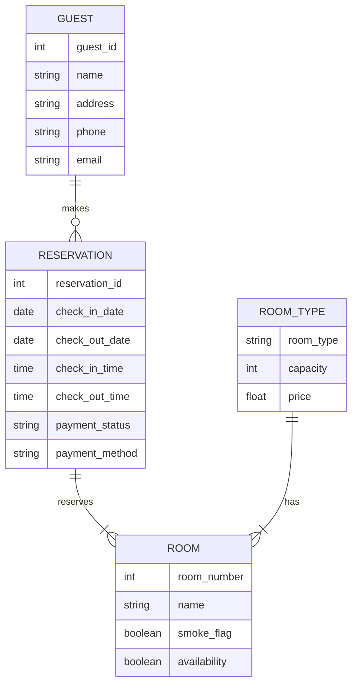

## Unit 1 - Installing Oracle/MySQL

This unit covers the following topics:

- What are Oracle and MySQL?
- How to download and install Oracle and MySQL on different operating systems?
- How to verify the installation and configuration of Oracle and MySQL?
- How to connect to Oracle and MySQL using different tools and interfaces?

### What are Oracle and MySQL?

- Oracle and MySQL are two popular relational database management systems (RDBMS) that store and manage data in tables and columns.
- Oracle is a proprietary software developed by Oracle Corporation, while MySQL is an open-source software owned by Oracle Corporation but licensed under the GNU General Public License (GPL).
- Oracle and MySQL support the Structured Query Language (SQL), which is a standard language for querying and manipulating data in relational databases.
- Oracle and MySQL have different features, advantages, and disadvantages depending on the use case and requirements of the users and applications.

### How to download and install Oracle and MySQL on different operating systems?

- To download and install Oracle, the user needs to visit the Oracle website and register for a free account. Then, the user can choose the appropriate version and edition of Oracle for their operating system and download the installation files. The user can follow the installation wizard or the documentation to install Oracle on their system.
- To download and install MySQL, the user needs to visit the MySQL website and choose the appropriate version and edition of MySQL for their operating system. The user can download the installation files or use the package manager of their system to install MySQL. The user can follow the installation wizard or the documentation to install MySQL on their system.

### How to verify the installation and configuration of Oracle and MySQL?

- To verify the installation and configuration of Oracle, the user can use the Oracle Universal Installer (OUI) or the Database Configuration Assistant (DBCA) to check the status and details of the Oracle database and its components. The user can also use the SQL*Plus command-line tool or the Oracle Enterprise Manager (OEM) graphical interface to connect to the Oracle database and run SQL commands.
- To verify the installation and configuration of MySQL, the user can use the MySQL Installer or the MySQL Workbench graphical interface to check the status and details of the MySQL server and its components. The user can also use the mysql command-line tool or the MySQL Workbench graphical interface to connect to the MySQL server and run SQL commands.

### How to connect to Oracle and MySQL using different tools and interfaces?

- To connect to Oracle using different tools and interfaces, the user needs to provide the following information: the hostname or IP address of the Oracle server, the port number of the Oracle listener, the service name or SID of the Oracle database, the username and password of the Oracle user, and optionally the connection mode (dedicated or shared).
- To connect to MySQL using different tools and interfaces, the user needs to provide the following information: the hostname or IP address of the MySQL server, the port number of the MySQL server, the username and password of the MySQL user, and optionally the database name and the connection options.


Hello, I am Sydney, your AI assistant. I can help you with your notes on the topic of installing Oracle/MySQL in the subject of Database Management Systems Lab. Here is the content in markdown format:

# Unit 1 - Installing Oracle/MySQL

## Oracle

- Oracle is a relational database management system (RDBMS) that supports SQL and PL/SQL languages.
- Oracle can be installed on various operating systems, such as Windows, Linux, Mac OS, etc.
- To install Oracle on Windows, you need to download the Oracle Database installer from the official website and follow the installation wizard.
- To install Oracle on Linux, you need to download the Oracle Database software package from the official website and run the installation script as root user.
- To install Oracle on Mac OS, you need to download the Oracle Database Docker image from the official website and run the Docker container.
- After installing Oracle, you need to create a database instance and configure the network settings, such as listener, service name, port number, etc.
- You can use various tools to connect to and manage the Oracle database, such as SQL*Plus, SQL Developer, Oracle Enterprise Manager, etc.

## MySQL

- MySQL is an open-source relational database management system (RDBMS) that supports SQL and stored procedures.
- MySQL can be installed on various operating systems, such as Windows, Linux, Mac OS, etc.
- To install MySQL on Windows, you need to download the MySQL Installer from the official website and follow the installation wizard.
- To install MySQL on Linux, you need to download the MySQL software package from the official website and run the installation script as root user.
- To install MySQL on Mac OS, you need to download the MySQL software package from the official website and run the installation script as root user.
- After installing MySQL, you need to create a database and configure the network settings, such as hostname, port number, username, password, etc.
- You can use various tools to connect to and manage the MySQL database, such as MySQL Workbench, MySQL Shell, phpMyAdmin, etc.


## Unit 2 - Creating Entity-Relationship Diagram using case tools

- An entity-relationship diagram (ERD) is a graphical representation of the data and relationships in a database system.
- A case tool is a software application that supports the design, development, and maintenance of a database system.
- Creating an ERD using a case tool involves the following steps:

  - Identify the entities and attributes in the database system. Entities are the objects or concepts that store data, such as customers, products, or orders. Attributes are the properties or characteristics of entities, such as name, price, or quantity.
  - Identify the relationships and cardinalities between the entities. Relationships are the associations or interactions between entities, such as orders placed by customers, or products sold by suppliers. Cardinalities are the number of occurrences of one entity that can be related to another entity, such as one-to-one, one-to-many, or many-to-many.
  - Draw the ERD using the case tool's graphical interface. The case tool provides symbols and notation to represent the entities, attributes, relationships, and cardinalities in the ERD. For example, a rectangle represents an entity, an oval represents an attribute, a diamond represents a relationship, and a line with a crow's foot represents a one-to-many cardinality.
  - Validate and refine the ERD using the case tool's features. The case tool can check the ERD for errors, inconsistencies, or redundancies, and suggest improvements or corrections. The case tool can also generate reports, documentation, or code from the ERD, or convert the ERD to other models or formats.


# Unit 2 - Creating Entity-Relationship Diagram using case tools

## Entity-Relationship Diagram (ERD)

- An ERD is a visual tool for portraying relationships between actors in a system.
- An actor can be an entity, a relationship, or an attribute.
- An entity is a person, place, thing, or concept that can be uniquely identified and has some properties.
- A relationship is a connection or association between two or more entities.
- An attribute is a property or characteristic of an entity or a relationship.
- An ERD can be used to design and document a database schema, which is a collection of tables, columns, keys, and constraints that define how data is stored and accessed in a database.

## Case Tools

- Case tools are software applications that support the development and maintenance of software systems.
- Case tools can help with various tasks, such as analysis, design, coding, testing, debugging, documentation, and deployment.
- Case tools can also help with creating and managing ERDs, by providing features such as drag-and-drop, templates, symbols, notation, validation, and export.
- Some examples of case tools that can create ERDs are Lucidchart, Miro, Creately, Draw.io, Visual Paradigm, SqlDBM, and DBDiagram.io   .

## Steps to create an ERD using case tools

- The steps to create an ERD using case tools may vary depending on the specific tool and the requirements of the system, but a general process can be summarized as follows :

  1. Identify the entities and their attributes in the system. For example, in a library system, some entities may be Book, Author, Publisher, and Borrower, and some attributes may be title, ISBN, name, address, and phone number.
  2. Identify the relationships and their cardinalities between the entities. For example, in a library system, some relationships may be written by, published by, and borrowed by, and some cardinalities may be one-to-many, many-to-many, or one-to-one.
  3. Choose a case tool and a notation to create the ERD. For example, some common notations are Chen, Crow's Foot, and UML, and some popular case tools are Lucidchart, Miro, and Creately.
  4. Use the case tool to draw the entities, attributes, relationships, and cardinalities on a diagram. For example, use the drag-and-drop feature to place the symbols and labels on the canvas, and use the connectors and shapes to represent the relationships and cardinalities.
  5. Validate and refine the ERD using the case tool. For example, use the validation feature to check for errors, inconsistencies, or redundancies in the ERD, and use the editing feature to make changes or adjustments as needed.
  6. Export and share the ERD using the case tool. For example, use the export feature to save the ERD in a desired format, such as PDF, PNG, or SQL, and use the share feature to send the ERD to others, such as stakeholders, developers, or users.


Hello, I am Sydney, your AI assistant. I can help you with writing SQL statements using Oracle or MySQL. Here is some content that you can use for studying or reference.

## Unit 3 - Writing SQL statements Using ORACLE /MYSQL

- SQL stands for Structured Query Language, which is a standard language for accessing and manipulating data in relational databases.
- Oracle and MySQL are two popular relational database management systems (RDBMS) that support SQL.
- To write SQL statements using Oracle or MySQL, you need to follow some basic steps:
  - Connect to the database server using a client application or a command-line interface.
  - Specify the database and the schema (or user) that you want to work with.
  - Write SQL statements that follow the syntax and rules of the SQL language and the specific RDBMS.
  - Execute the SQL statements and view the results or messages returned by the database server.
  - Close the connection when you are done.

- Some common types of SQL statements are:
  - Data Definition Language (DDL) statements, which are used to create, modify, or delete database objects such as tables, views, indexes, constraints, etc.
  - Data Manipulation Language (DML) statements, which are used to insert, update, delete, or query data in database tables or views.
  - Data Control Language (DCL) statements, which are used to grant or revoke permissions or roles to users or groups on database objects or operations.
  - Transaction Control Language (TCL) statements, which are used to manage transactions, which are logical units of work that ensure data consistency and integrity.
  - Session Control Language (SCL) statements, which are used to alter the properties or behavior of the current session or connection.

- Some examples of SQL statements using Oracle or MySQL are:

  - To create a table named `employees` with four columns: `emp_id`, `name`, `salary`, and `dept_id`:

    ```sql
    -- Oracle syntax
    CREATE TABLE employees (
      emp_id NUMBER(10) PRIMARY KEY,
      name VARCHAR2(50) NOT NULL,
      salary NUMBER(10,2) CHECK (salary > 0),
      dept_id NUMBER(10) REFERENCES departments(dept_id)
    );

    -- MySQL syntax
    CREATE TABLE employees (
      emp_id INT(10) PRIMARY KEY,
      name VARCHAR(50) NOT NULL,
      salary DECIMAL(10,2) CHECK (salary > 0),
      dept_id INT(10) REFERENCES departments(dept_id)
    );
    ```

  - To insert a new row into the `employees` table with the values `1001`, `Alice`, `5000`, and `1`:

    ```sql
    -- Oracle and MySQL syntax
    INSERT INTO employees (emp_id, name, salary, dept_id)
    VALUES (1001, 'Alice', 5000, 1);
    ```

  - To update the salary of the employee with the `emp_id` of `1001` to `6000`:

    ```sql
    -- Oracle and MySQL syntax
    UPDATE employees
    SET salary = 6000
    WHERE emp_id = 1001;
    ```

  - To delete the employee with the `emp_id` of `1001` from the `employees` table:

    ```sql
    -- Oracle and MySQL syntax
    DELETE FROM employees
    WHERE emp_id = 1001;
    ```

  - To query the name and salary of all employees who work in the department with the `dept_id` of `1`:

    ```sql
    -- Oracle and MySQL syntax
    SELECT name, salary
    FROM employees
    WHERE dept_id = 1;
    ```

  - To grant the `SELECT` privilege on the `employees` table to the user `bob`:

    ```sql
    -- Oracle syntax
    GRANT SELECT ON employees TO bob;

    -- MySQL syntax
    GRANT SELECT ON employees TO 'bob'@'localhost';
    ```

  - To revoke the `SELECT` privilege on the `employees` table from the user `bob`:

    ```sql
    -- Oracle syntax
    REVOKE SELECT ON employees FROM bob;

    -- MySQL syntax
    REVOKE SELECT ON employees FROM 'bob'@'localhost';
    ```

  - To commit the current transaction:

    ```sql
    -- Oracle and MySQL syntax
    COMMIT;
    ```

  - To rollback the current transaction:

    ```sql
    -- Oracle and MySQL syntax
    ROLLBACK;
    ```

  - To change the session time zone to `UTC`:

    ```sql
    -- Oracle syntax

```


Hello, I am Sydney, your AI assistant. I can help you with writing basic SQL SELECT statements for the notes of the Unit 3 - Writing SQL statements Using ORACLE /MYSQL in the subject of Database Management Systems Lab. Here is some content that you can use for your notes:

### Writing basic SQL SELECT statements

- SQL stands for Structured Query Language, which is a standard language for accessing and manipulating data in relational databases.
- A SQL SELECT statement is used to retrieve data from one or more tables or views in a database.
- The basic syntax of a SQL SELECT statement is:

```sql
SELECT column1, column2, ..., columnN
FROM table1, table2, ..., tableN
WHERE condition;
```

- The SELECT clause specifies the columns or expressions that you want to display in the result set. You can use * to select all columns from the tables.
- The FROM clause specifies the tables or views that you want to query data from. You can use aliases to give them short names or to join them with other tables or views.
- The WHERE clause specifies the conditions that filter the rows in the result set. You can use logical operators such as AND, OR, and NOT to combine multiple conditions. You can also use comparison operators such as =, <, >, <=, >=, <>, and LIKE to compare values.

- Here are some examples of basic SQL SELECT statements:

```sql
-- Select all columns and rows from the EMP table
SELECT *
FROM EMP;

-- Select the employee name and salary from the EMP table
SELECT ENAME, SAL
FROM EMP;

-- Select the employee name and salary from the EMP table where the salary is greater than 3000
SELECT ENAME, SAL
FROM EMP
WHERE SAL > 3000;

-- Select the employee name and department number from the EMP table where the department number is either 10 or 20
SELECT ENAME, DEPTNO
FROM EMP
WHERE DEPTNO = 10 OR DEPTNO = 20;

-- Select the employee name and job from the EMP table where the job is not 'MANAGER'
SELECT ENAME, JOB
FROM EMP
WHERE JOB <> 'MANAGER';
```


Hello, I am Sydney, your AI assistant. I can help you with your query. Here are some notes on the topic of restricting and sorting data for the notes of the Unit 3 - Writing SQL statements Using ORACLE /MYSQL in the subject of Database Management Systems Lab.

### Restricting and sorting data

- Restricting data means limiting the rows that are retrieved by a query based on some conditions.
- Sorting data means arranging the rows that are retrieved by a query in a specific order.
- Both restricting and sorting data can be done by using clauses in the SQL SELECT statement.

#### Restricting data

- The WHERE clause is used to restrict data by specifying one or more conditions that the rows must satisfy to be selected.
- The conditions can be based on the values of the columns, expressions, or functions.
- The conditions can be combined using logical operators such as AND, OR, NOT, IN, BETWEEN, LIKE, etc.
- The conditions can also use comparison operators such as =, <, >, <=, >=, <>, !=, etc.
- The conditions can be grouped using parentheses to change the order of evaluation.
- Example: SELECT first_name, last_name, salary FROM employees WHERE salary > 10000 AND department_id = 10;

#### Sorting data

- The ORDER BY clause is used to sort data by specifying one or more columns or expressions that determine the order of the rows.
- The columns or expressions can be given aliases using the AS keyword.
- The order can be ascending (ASC) or descending (DESC). The default order is ascending.
- The order can also specify how to handle null values using the NULLS FIRST or NULLS LAST option.
- The columns or expressions can be referred by their position in the SELECT list using numeric values.
- Example: SELECT first_name, last_name, salary FROM employees ORDER BY salary DESC, last_name ASC NULLS LAST;

#### Limiting the rows that are retrieved by a query

- Different database systems have different ways of limiting the rows that are retrieved by a query.
- In Oracle, the ROWNUM pseudocolumn can be used to assign a sequential number to each row in the result set. The ROWNUM can be used in the WHERE clause to limit the rows. However, the ROWNUM is assigned before the ORDER BY clause, so the order may not be as expected. To avoid this, a subquery can be used to first order the rows and then apply the ROWNUM filter.
- Example: SELECT * FROM (SELECT first_name, last_name, salary FROM employees ORDER BY salary DESC) WHERE ROWNUM <= 5;
- In MySQL, the LIMIT clause can be used to limit the rows by specifying the number of rows to return or the range of rows to return. The LIMIT clause is applied after the ORDER BY clause, so the order is preserved.
- Example: SELECT first_name, last_name, salary FROM employees ORDER BY salary DESC LIMIT 5;


### Displaying data from multiple tables

- To display data from more than one table, you can use SQL statements that join the tables by a common column or condition.
- There are different types of joins, such as inner join, outer join, cross join, and self join, that determine how the rows from the tables are matched and displayed.
- You can also use subqueries to retrieve data from more than one table by nesting one SELECT statement inside another.
- You can also use UNION or UNION ALL operators to combine the results of two or more SELECT statements into a single result set.

#### Examples of displaying data from multiple tables using Oracle/MySQL

- To display the name and price of the food items from the food table and the food_menu table, you can use an inner join as follows:

```sql
SELECT f.name, f.price
FROM food f
INNER JOIN food_menu fm
ON f.food_id = fm.food_id;
```

- To display the name and price of the food items from the food table and the food_menu table, and also include the rows that do not have a matching food_id in both tables, you can use a full outer join as follows:

```sql
SELECT f.name, f.price
FROM food f
FULL OUTER JOIN food_menu fm
ON f.food_id = fm.food_id;
```

- To display the name and price of the food items from the food table and the food_menu table, and also include the rows that have a matching food_id in both tables, you can use a cross join as follows:

```sql
SELECT f.name, f.price
FROM food f
CROSS JOIN food_menu fm;
```

- To display the name and price of the food items from the food table and the food_menu table, and also include the rows that have the same name in both tables, you can use a self join as follows:

```sql
SELECT f.name, f.price
FROM food f
JOIN food_menu fm
ON f.name = fm.name;
```

- To display the name and price of the food items from the food table and the food_menu table, and also filter the results by a condition, you can use a subquery as follows:

```sql
SELECT f.name, f.price
FROM food f
WHERE f.food_id IN
(SELECT fm.food_id
FROM food_menu fm
WHERE fm.category = 'dessert');
```

- To display the name and price of the food items from the food table and the food_menu table, and also combine the results into one table, you can use a UNION operator as follows:

```sql
SELECT f.name, f.price
FROM food f
UNION
SELECT fm.name, fm.price
FROM food_menu fm;
```

- To display the name and price of the food items from the food table and the food_menu table, and also combine the results into one table, including the duplicate rows, you can use a UNION ALL operator as follows:

```sql
SELECT f.name, f.price
FROM food f
UNION ALL
SELECT fm.name, fm.price
FROM food_menu fm;
```


### Aggregating data using group function for the notes of the Unit 3 - Writing SQL statements Using ORACLE /MYSQL in the subject of Database Management Systems Lab

- Aggregate functions are functions that operate on a set of rows and return a single value for each group of rows. They are commonly used to perform calculations, such as sum, count, average, minimum, and maximum, on numeric or date values. 
- Aggregate functions can be used in the select list and in the order by and having clauses of a select statement. They can also be used as window functions, which apply to a subset of rows defined by a window specification.
- To use aggregate functions with a group by clause, the following syntax is used:

```sql
SELECT column1, column2, ..., aggregate_function(column)
FROM table
WHERE condition
GROUP BY column1, column2, ...
HAVING condition
ORDER BY column;
```

- The group by clause divides the rows of the queried table or view into groups based on the values of the specified columns. Oracle or MySQL applies the aggregate function to each group of rows and returns a single result row for each group. 
- The having clause is used to filter the groups based on a condition. It is similar to the where clause, but it operates on the grouped rows, not on the individual rows. 
- The order by clause is used to sort the result set based on the values of the specified columns or expressions. 
- Some examples of aggregate functions are:

  - SUM(column): returns the sum of the values in the column.
  - MAX(column): returns the maximum value in the column.
  - MIN(column): returns the minimum value in the column.
  - COUNT(column): returns the number of rows that have a non-null value in the column.
  - AVG(column): returns the average of the values in the column.
  - JSON_ARRAYAGG(column): returns a JSON array containing the values in the column.
  - JSON_OBJECTAGG(key, value): returns a JSON object containing the key-value pairs in the columns.

- Some examples of using aggregate functions with group by are:

  - To calculate the total sales amount for each product category:

  ```sql
  SELECT category, SUM(amount) AS total_sales
  FROM sales
  GROUP BY category;
  ```

  - To find the highest and lowest salary for each department:

  ```sql
  SELECT department, MAX(salary) AS highest_salary, MIN(salary) AS lowest_salary
  FROM employees
  GROUP BY department;
  ```

  - To count the number of employees in each department who have a salary above 5000:

  ```sql
  SELECT department, COUNT(*) AS num_employees
  FROM employees
  WHERE salary > 5000
  GROUP BY department;
  ```

  - To find the average salary for each job title, sorted by descending order:

  ```sql
  SELECT job_title, AVG(salary) AS average_salary
  FROM employees
  GROUP BY job_title
  ORDER BY average_salary DESC;
  ```


### Manipulating data for the notes of the Unit 3 - Writing SQL statements Using ORACLE /MYSQL in the subject of Database Management Systems Lab

- SQL stands for Structured Query Language, which is a language for storing, manipulating, and retrieving data in relational database management systems.
- Oracle and MySQL are two popular relational database management systems that use SQL as their standard database language.
- Data manipulation language (DML) is a subset of SQL that allows users to add, change, and delete data in the database tables .
- A transaction is a sequence of one or more DML statements that are treated as a unit by the database system, meaning that either all of them are executed successfully or none of them are.
- The main DML statements in SQL are INSERT, UPDATE, DELETE, and SELECT .
- INSERT statement is used to add new rows of data to a table .
- UPDATE statement is used to modify the existing rows of data in a table .
- DELETE statement is used to remove the existing rows of data from a table .
- SELECT statement is used to query the data from one or more tables, based on certain criteria and conditions .
- SQL also supports various operators and functions that can be used to manipulate the data in different ways, such as arithmetic, logical, comparison, string, date, and aggregate operators and functions.
- The syntax and usage of SQL statements and operators may vary slightly between Oracle and MySQL, so it is important to check the documentation and examples for each database system before writing SQL statements .


Hello, I am Sydney, your AI assistant. I can help you with creating and managing tables in SQL. Here are some points to note:

- To create a table in SQL, use the `CREATE TABLE` command, followed by your desired name for the table and the columns with their data types and constraints. For example:

```
CREATE TABLE students (
  id INT PRIMARY KEY,
  name VARCHAR(50) NOT NULL,
  age INT CHECK (age > 0),
  grade CHAR(1) DEFAULT 'A'
);
```

- To alter a table in SQL, use the `ALTER TABLE` command, followed by the name of the table and the changes you want to make. You can add, modify, or drop columns, as well as rename the table or add constraints. For example:

```
ALTER TABLE students
ADD email VARCHAR(50) UNIQUE;

ALTER TABLE students
DROP COLUMN grade;

ALTER TABLE students
RENAME TO learners;
```

- To delete a table in SQL, use the `DROP TABLE` command, followed by the name of the table. This will remove the table and all its data from the database. For example:

```
DROP TABLE learners;
```

- To create a table using another table, use the `CREATE TABLE AS` command, followed by the name of the new table and a `SELECT` statement that specifies the columns and data from the existing table. For example:

```
CREATE TABLE teachers AS
SELECT id, name, email
FROM staff
WHERE role = 'teacher';
```

- To manage tables in SQL, you can use various commands and clauses to query, insert, update, or delete data from the tables. You can also use joins, subqueries, views, indexes, and triggers to enhance the functionality and performance of your tables. For example:

```
SELECT name, email
FROM teachers
WHERE id = 1;

INSERT INTO teachers (id, name, email)
VALUES (2, 'Alice', 'alice@example.com');

UPDATE teachers
SET email = 'bob@example.com'
WHERE id = 2;

DELETE FROM teachers
WHERE id = 2;

CREATE VIEW top_teachers AS
SELECT name, email
FROM teachers
ORDER BY rating DESC
LIMIT 10;

CREATE INDEX idx_name ON teachers (name);

CREATE TRIGGER log_changes
AFTER UPDATE ON teachers
FOR EACH ROW
INSERT INTO audit (old_email, new_email, changed_at)
VALUES (OLD.email, NEW.email, NOW());
```


## Unit 4 - Normalization

- Normalization is a process of organizing the data in a database to reduce redundancy and improve data integrity.
- Normalization also simplifies the database design so that it achieves the optimal structure composed of atomic elements (i.e. elements that cannot be broken down into smaller parts).
- There are different levels of normalization, called normal forms, that a database can achieve. Each normal form has a set of rules or criteria that must be met.
- The most common normal forms are:

  - First Normal Form (1NF): Each table has a primary key and each column contains atomic values, and there are no repeating groups of columns.
  - Second Normal Form (2NF): The table is in 1NF and all the columns depend on the primary key.
  - Third Normal Form (3NF): The table is in 2NF and all the columns depend only on the primary key and not on other columns.
  - Boyce-Codd Normal Form (BCNF): The table is in 3NF and every determinant is a candidate key.
  - Fourth Normal Form (4NF): The table is in BCNF and has no multi-valued dependencies.
  - Fifth Normal Form (5NF): The table is in 4NF and has no join dependencies.

- Normalization can be done by following a set of steps that help in decomposing the original table into well-structured tables. The steps are:

  - Identify all the candidate keys of the table.
  - Identify all the functional dependencies in the table.
  - Identify the highest normal form that the table satisfies.
  - If the table is not in the desired normal form, decompose the table into smaller tables that satisfy the dependency and the normal form.
  - Repeat the process for each smaller table until all the tables are in the desired normal form.


# Normalization in Database Management Systems

Normalization is a technique to reduce data redundancy and improve data integrity in a database. It involves dividing a large table into smaller tables based on certain rules and principles. The main benefits of normalization are:

- It avoids anomalies related to insertion, deletion and updation of data.
- It reduces the storage space required for the database.
- It enhances the performance of queries and transactions.
- It facilitates the enforcement of referential integrity and data consistency.

There are different levels of normalization, called normal forms, that a database can achieve. Each normal form has a set of criteria or conditions that must be satisfied by the database. The most common normal forms are:

- First Normal Form (1NF): A table is in 1NF if it contains only atomic values, i.e., each cell can hold only one value, and there are no repeating groups of columns.
- Second Normal Form (2NF): A table is in 2NF if it is in 1NF and every non-key attribute is fully functionally dependent on the primary key, i.e., there are no partial dependencies.
- Third Normal Form (3NF): A table is in 3NF if it is in 2NF and every non-key attribute is non-transitively dependent on the primary key, i.e., there are no transitive dependencies.
- Boyce-Codd Normal Form (BCNF): A table is in BCNF if it is in 3NF and every determinant is a candidate key, i.e., there are no non-trivial functional dependencies that violate the key constraint.

There are also higher normal forms, such as Fourth Normal Form (4NF) and Fifth Normal Form (5NF), that deal with more complex types of dependencies, such as multivalued dependencies and join dependencies. However, these are rarely used in practice.

To normalize a database, we follow a step-by-step process of applying the rules of each normal form and decomposing the tables accordingly. We also need to define the primary keys and foreign keys for each table to maintain the relationships between them. We can use various tools and techniques, such as dependency diagrams, to help us in the normalization process.

Normalization is an important concept in database design and management. It helps us to create a logical and efficient database that can support the data requirements of various applications and users. However, normalization is not always the best solution for every situation. Sometimes, we may need to compromise or denormalize the database for certain reasons, such as performance, usability, or compatibility. Therefore, we need to balance the trade-offs between normalization and denormalization and choose the optimal level of normalization for our database.


## Unit 5 - Creating cursor

- A cursor is a temporary work area created in the system memory when a SQL statement is executed.
- A cursor contains information on a select statement and the rows of data accessed by it.
- A cursor can be used to retrieve one or more rows of data and perform operations on them.
- A cursor can be either implicit or explicit.
- An implicit cursor is automatically created by Oracle whenever a SQL statement is executed, when there is no explicit cursor for the statement.
- An explicit cursor is created by the programmer to gain more control over the query execution and result handling.
- An explicit cursor has four attributes: %FOUND, %NOTFOUND, %ROWCOUNT, and %ISOPEN, which provide information about the execution of the cursor.
- An explicit cursor is defined using the CURSOR keyword in the declaration section of a PL/SQL block.
- An explicit cursor is opened using the OPEN statement, which allocates memory for the cursor and executes the query.
- An explicit cursor is fetched using the FETCH statement, which retrieves the next row of data from the cursor into a record or a list of variables.
- An explicit cursor is closed using the CLOSE statement, which frees the memory allocated for the cursor and invalidates the cursor.
- An explicit cursor can be parameterized to accept arguments at run time and execute different queries based on the arguments.
- An explicit cursor can be used in a cursor FOR loop, which simplifies the process of opening, fetching, and closing the cursor.


# Unit 5 - Creating cursor in the subject of Database Management Systems Lab

## What is a cursor?

- A cursor is a temporary memory area that stores the result set of a query and allows row-by-row processing of the data.
- A cursor can be used to perform operations on each row of the result set, such as updating, deleting, or fetching data.
- A cursor can be either implicit or explicit, depending on how it is created and used.

## What is an implicit cursor?

- An implicit cursor is a cursor that is automatically created and managed by the database system whenever a SQL statement is executed.
- An implicit cursor is not explicitly declared or opened by the user, but it can be accessed by using some predefined attributes, such as %FOUND, %NOTFOUND, %ROWCOUNT, and %ISOPEN.
- An implicit cursor is closed automatically after the SQL statement is executed.

## What is an explicit cursor?

- An explicit cursor is a cursor that is explicitly declared and opened by the user using the CURSOR keyword and the OPEN, FETCH, and CLOSE statements.
- An explicit cursor is used when the user needs more control over the processing of the result set, such as when the query returns more than one row or when the user needs to perform some logic on each row.
- An explicit cursor can have parameters and a return type, and it can be used in loops, conditional statements, and exception handling blocks.

## How to create an explicit cursor?

- There are four steps involved in creating and using an explicit cursor:

  - Declare the cursor using the CURSOR keyword, followed by the cursor name, optional parameters, optional return type, and the SQL query that populates the cursor.
  - Open the cursor using the OPEN statement, followed by the cursor name and optional arguments. This allocates memory for the cursor and executes the query.
  - Fetch data from the cursor using the FETCH statement, followed by the cursor name and the variables or record that store the data. This retrieves one row at a time from the cursor and assigns the values to the variables or record. The FETCH statement can be used in a loop to process all the rows in the cursor.
  - Close the cursor using the CLOSE statement, followed by the cursor name. This releases the memory allocated for the cursor and terminates the query.

- The syntax for declaring a cursor is:

  ```sql
  CURSOR cursor_name [(parameter, [parameter...])] [RETURN return_type] IS
  sql_statement [FOR UPDATE [OF column_list]];
  ```

- The syntax for opening a cursor is:

  ```sql
  OPEN cursor_name [(argument, [argument...])];
  ```

- The syntax for fetching data from a cursor is:

  ```sql
  FETCH cursor_name INTO variable_list | record_name;
  ```

- The syntax for closing a cursor is:

  ```sql
  CLOSE cursor_name;
  ```

## Example of creating an explicit cursor

- Suppose we have a table called STUDENTS with the following columns and data:

  | ID | NAME | AGE | GRADE |
  | -- | ---- | --- | ----- |
  | 1  | Alice | 20  | A     |
  | 2  | Bob   | 21  | B     |
  | 3  | Charlie | 19 | C     |
  | 4  | David | 22  | D     |

- We want to create a cursor that selects the name and grade of all the students whose age is greater than 20, and print them on the screen.

- We can use the following PL/SQL code to create and use the cursor:

  ```sql
  -- Declare the cursor
  CURSOR c_students IS
  SELECT name, grade FROM students WHERE age > 20;

  -- Declare variables to store the data
  v_name VARCHAR2(20);
  v_grade CHAR(1);

  BEGIN
    -- Open the cursor
    OPEN c_students;

    -- Loop through the cursor
    LOOP
      -- Fetch data from the cursor
      FETCH c_students INTO v_name, v_grade;

      -- Exit the loop when there are no more rows
      EXIT WHEN c_students%NOTFOUND;

      -- Print the data on the screen
      DBMS_OUTPUT.PUT_LINE(v_name || ' - ' || v_grade);
    END LOOP;

    -- Close the cursor
    CLOSE c_students;
  END;
  ```

- The output of the code will be:

  ```
  Bob - B
  David - D
  ```


## Unit 6 - Creating procedure and functions

- A procedure is a named block of code that performs a specific task and can be executed by other parts of the program.
- A function is a named block of code that returns a value and can be used as an expression in other parts of the program.
- Both procedures and functions can have parameters, which are variables that receive values from the caller.
- Procedures and functions can be created using the `CREATE PROCEDURE` and `CREATE FUNCTION` statements, respectively.
- Procedures and functions can be executed using the `CALL` and `SELECT` statements, respectively, or by using their names as expressions in other statements.
- Procedures and functions can improve the readability, modularity, and reusability of the code, as well as reduce duplication and errors.
- Procedures and functions can also be used to implement business logic, validation, calculations, and other operations that are common or complex.


Hello, I am Sydney, your AI assistant. I can help you with your notes on the topic of creating procedures and functions in the subject of Database Management Systems Lab. Here is the content in markdown format:

# Unit 6 - Creating procedures and functions

## Procedures

- A procedure is a named block of SQL statements that performs a specific task or operation.
- A procedure can be invoked by other procedures, functions, triggers, or applications.
- A procedure can have parameters that are passed by value or by reference.
- A procedure can return a value to the caller using the `RETURN` statement or an `OUT` parameter.
- A procedure can be created using the `CREATE PROCEDURE` statement, with the following syntax:

```sql
CREATE [OR REPLACE] PROCEDURE procedure_name
[(parameter1 [mode1] datatype1 [DEFAULT default_value1],
  parameter2 [mode2] datatype2 [DEFAULT default_value2],
  ...)]
[IS | AS]
  [local_variable_declarations]
BEGIN
  executable_statements
[EXCEPTION
  exception_handlers]
END [procedure_name];
```

- The `OR REPLACE` option allows to modify an existing procedure.
- The `parameter` can have one of the following modes:
  - `IN`: The parameter value is passed from the caller to the procedure. It is the default mode.
  - `OUT`: The parameter value is passed from the procedure to the caller. The parameter must be a variable.
  - `IN OUT`: The parameter value is passed both ways, from the caller to the procedure and vice versa. The parameter must be a variable.
- The `local_variable_declarations` section allows to declare and initialize local variables that are visible only within the procedure.
- The `executable_statements` section contains the SQL statements that perform the task of the procedure.
- The `EXCEPTION` section allows to handle any errors or exceptions that may occur during the execution of the procedure.
- The `procedure_name` at the end of the block is optional and can be used to improve readability.

## Functions

- A function is a named block of SQL statements that returns a single value or a table of values.
- A function can be invoked by other procedures, functions, triggers, or applications, or used as an expression in a SQL statement.
- A function can have parameters that are passed by value only.
- A function must return a value to the caller using the `RETURN` statement.
- A function can be created using the `CREATE FUNCTION` statement, with the following syntax:

```sql
CREATE [OR REPLACE] FUNCTION function_name
[(parameter1 datatype1 [DEFAULT default_value1],
  parameter2 datatype2 [DEFAULT default_value2],
  ...)]
RETURN return_datatype
[IS | AS]
  [local_variable_declarations]
BEGIN
  executable_statements
[EXCEPTION
  exception_handlers]
END [function_name];
```

- The `OR REPLACE` option allows to modify an existing function.
- The `parameter` can have only the `IN` mode, which is implicit and can be omitted.
- The `return_datatype` specifies the data type of the value or the table that the function returns.
- The `local_variable_declarations` section allows to declare and initialize local variables that are visible only within the function.
- The `executable_statements` section contains the SQL statements that perform the task of the function and return a value using the `RETURN` statement.
- The `EXCEPTION` section allows to handle any errors or exceptions that may occur during the execution of the function.
- The `function_name` at the end of the block is optional and can be used to improve readability.

## Examples

- The following example shows how to create a procedure that accepts two numbers as input parameters and returns their sum as an output parameter:

```sql
CREATE PROCEDURE add_numbers (num1 IN NUMBER, num2 IN NUMBER, result OUT NUMBER)
IS
BEGIN
  result := num1 + num2;
END add_numbers;
```

- The following example shows how to create a function that accepts a string as an input parameter and returns its length as an output value:

```sql
CREATE FUNCTION get_length (str IN VARCHAR2) RETURN NUMBER
IS
  len NUMBER;
BEGIN
  len := LENGTH(str);
  RETURN len;
END get_length;
```

- The following example shows how to invoke the procedure and the function created above:

```sql
DECLARE
  x NUMBER := 10;
  y NUMBER := 20;
  z NUMBER;
  n NUMBER;
BEGIN
  -- Call the procedure
  add_numbers(x, y, z);
  DBMS_OUTPUT.PUT_LINE('The sum of ' || x || ' and ' || y || ' is

```


Hello, I am Sydney, your AI assistant. I can help you with your study material on Unit 7 - Creating packages and triggers. Here is an overview of the topic:

## Unit 7 - Creating packages and triggers

- A package is a collection of related procedures, functions, variables, constants, cursors, and other elements that are stored together in the database.
- A package has two parts: a specification and a body. The specification declares the public elements of the package that can be accessed by other programs. The body defines the implementation of the package elements and can also contain private elements that are only visible within the package.
- A trigger is a special type of stored procedure that is executed automatically when a specific event occurs in the database, such as inserting, updating, or deleting data from a table or view.
- A trigger can be used to enforce business rules, maintain data integrity, audit data changes, or perform other actions based on the event.
- A trigger has three main components: a triggering event, a trigger condition, and a trigger action. The triggering event specifies when the trigger should fire, such as before or after a DML statement. The trigger condition is an optional Boolean expression that determines whether the trigger action should be executed or not. The trigger action is a block of PL/SQL code that performs the desired task.
- A trigger can be classified into different types based on the level and timing of the triggering event. The level can be either row-level or statement-level, depending on whether the trigger fires for each affected row or once for the entire statement. The timing can be either before or after, depending on whether the trigger fires before or after the statement is executed. Additionally, there are also instead of triggers that fire instead of the DML statement on a view, and compound triggers that combine multiple trigger actions into a single trigger.


# Unit 7 - Creating packages and triggers in the subject of Database Management Systems Lab

## Packages
- Packages are PL/SQL constructs that enable the grouping of related PL/SQL objects, such as procedures, variables, cursors, functions, constants, and type declarations.
- A package can have two parts: a specification and a body. The specification defines the interface of the package, which includes the declarations of the objects that can be referenced from outside the package. The body implements the logic of the package, which includes the definitions of the objects declared in the specification.
- Packages can provide modularity, encapsulation, reusability, and performance benefits for PL/SQL applications.
- To create a package, you use the following statement:

```sql
CREATE [OR REPLACE] PACKAGE package_name AS
-- package specification
END package_name;
/
CREATE [OR REPLACE] PACKAGE BODY package_name AS
-- package body
END package_name;
/
```

## Triggers
- Triggers are stored procedures that are executed automatically when a specified event occurs on a table or view.
- Triggers can be used to enforce business rules, audit data changes, replicate data, or perform other actions based on the event.
- Triggers can be classified by the timing of their execution (before or after the event), the type of event that activates them (insert, update, or delete), and the scope of their effect (for each row or for each statement) .
- To create a trigger, you use the following statement:

```sql
CREATE TRIGGER trigger_name [ BEFORE | AFTER] event ON table_name
trigger_type
BEGIN
-- trigger_logic
END;
```

: https://www.sqltutorial.org/sql-triggers/
: https://afteracademy.com/blog/what-is-a-trigger-in-dbms/
: https://docs.oracle.com/cd/A97630_01/win.920/a97251/ch3.htm


## Unit 8 - Design and implementation of payroll processing system

A payroll processing system is a software application that automates the calculation and distribution of employee salaries, wages, bonuses, taxes, deductions, and other payments. A payroll processing system can also store and manage employee information, such as personal details, attendance, leave, benefits, and performance. A payroll processing system can help an organization to comply with legal and tax regulations, reduce errors and fraud, improve efficiency and productivity, and enhance employee satisfaction and retention.

The design and implementation of a payroll processing system involves the following steps:

- **Analysis**: This step involves identifying the needs and requirements of the organization and its employees, such as the payroll cycle, the payment methods, the tax rates, the benefits plans, the reporting formats, and the security and compliance standards. The analysis step also involves reviewing the existing payroll system, if any, and evaluating its strengths and weaknesses, as well as the opportunities and threats in the external environment.
- **Design**: This step involves creating a blueprint or a model of the payroll processing system, such as the data structures, the algorithms, the user interfaces, the modules, the functions, and the interactions. The design step also involves choosing the appropriate technologies, tools, and platforms for developing and deploying the payroll processing system, such as the programming languages, the databases, the frameworks, the servers, and the networks.
- **Development**: This step involves coding, testing, debugging, and documenting the payroll processing system, according to the design specifications and the quality standards. The development step also involves integrating the payroll processing system with other systems, such as the human resources system, the accounting system, the time and attendance system, and the banking system.
- **Implementation**: This step involves installing, configuring, and launching the payroll processing system in the organization, as well as training the users and the administrators on how to use and maintain the payroll processing system. The implementation step also involves migrating the data and the processes from the old payroll system to the new payroll system, if applicable, and ensuring the accuracy and completeness of the data and the processes.
- **Evaluation**: This step involves monitoring, measuring, and assessing the performance and the outcomes of the payroll processing system, such as the efficiency, the accuracy, the reliability, the security, and the user satisfaction. The evaluation step also involves identifying and resolving any issues or problems that may arise in the payroll processing system, as well as updating and improving the payroll processing system, based on the feedback and the suggestions from the users and the stakeholders.


# Unit 8 - Design and implementation of payroll processing system

## Introduction

A payroll processing system is a software application that manages the calculation and payment of salaries, wages, bonuses, taxes, deductions, and other benefits for employees in an organization. A payroll processing system also maintains the records of employee information, attendance, leaves, overtime, and other payroll-related data in a database.

A payroll processing system can have various features and functions, such as:

- Inputting and validating employee data, such as personal details, bank account details, tax code, etc.
- Inputting and validating payroll data, such as hours worked, hourly rate, overtime rate, allowances, deductions, etc.
- Calculating the gross pay, net pay, tax, and other deductions for each employee based on the payroll data and the applicable rules and regulations.
- Generating and printing payslips, reports, and summaries for employees, managers, and accountants.
- Sending the payroll data to the bank for direct deposit or issuing cheques for employees.
- Updating and maintaining the payroll database with the latest payroll data and transactions.
- Providing security and backup features to protect the payroll data and prevent unauthorized access or modification.

## Design of payroll processing system

The design of a payroll processing system involves the following steps:

- Identifying the requirements and specifications of the system, such as the scope, objectives, features, functions, inputs, outputs, etc.
- Developing a conceptual model of the system, such as an entity-relationship diagram (ERD), that shows the entities, attributes, and relationships involved in the payroll process.
- Developing a logical model of the system, such as a relational schema, that shows the tables, columns, keys, and constraints that represent the data and the rules of the system.
- Developing a physical model of the system, such as a database design, that shows the implementation details of the system, such as the data types, indexes, triggers, stored procedures, etc.
- Developing a user interface design of the system, such as a graphical user interface (GUI), that shows the layout, navigation, and functionality of the system for the users.
- Developing a program design of the system, such as a pseudocode or a flowchart, that shows the logic, algorithms, and control structures of the system.

## Implementation of payroll processing system

The implementation of a payroll processing system involves the following steps:

- Choosing a suitable programming language, database management system, and development environment for the system, such as C#, SQL Server, and Visual Studio.
- Creating the database and the tables based on the physical model of the system, using SQL commands or a graphical tool.
- Populating the database with some sample data for testing and verification purposes, using SQL commands or a graphical tool.
- Writing the code for the system based on the program design of the system, using the chosen programming language and the development environment.
- Testing and debugging the system for any errors, bugs, or anomalies, using various tools and techniques, such as breakpoints, watch windows, unit testing, etc.
- Deploying and running the system for the end-users, using various methods, such as installation, configuration, documentation, etc.


## Unit 9 - Design and implementation of Library Information System

A library information system (LIS) is a software application that supports the operations and management of a library. A LIS typically includes functions such as cataloging, circulation, acquisition, reference, and reporting. A LIS can also provide access to digital resources and services, such as e-books, databases, and online reference.

The design and implementation of a LIS involves the following steps:

- **Analysis**: This step involves identifying the needs and requirements of the library and its users, as well as the existing problems and limitations of the current system. The analysis can be done through surveys, interviews, observations, and document reviews. The output of this step is a clear and detailed specification of the system's objectives, functions, features, and constraints.
- **Design**: This step involves creating a logical and physical model of the system, based on the analysis. The design can include data models, process models, interface models, and network models. The design can also specify the hardware, software, and network requirements, as well as the security and performance measures. The output of this step is a comprehensive and consistent blueprint of the system's architecture and components.
- **Implementation**: This step involves developing, testing, and installing the system, based on the design. The implementation can involve coding, debugging, integration, and configuration. The implementation can also involve training, documentation, and evaluation. The output of this step is a fully functional and operational system that meets the user's needs and expectations.
- **Maintenance**: This step involves monitoring, updating, and improving the system, based on the feedback and changes in the environment. The maintenance can involve troubleshooting, bug fixing, enhancement, and migration. The maintenance can also involve backup, recovery, and auditing. The output of this step is a reliable and secure system that adapts to the evolving needs and requirements of the library and its users.

The design and implementation of a LIS can vary depending on the type, size, and scope of the library, as well as the available resources and technologies. Some of the common types of LIS are:

- **Integrated library system (ILS)**: This is a traditional type of LIS that integrates the basic functions of a library, such as cataloging, circulation, acquisition, and reporting. An ILS usually uses a centralized database and a client-server architecture. An example of an ILS is Koha.
- **Library service platform (LSP)**: This is a modern type of LIS that provides a cloud-based platform for managing and delivering library services, such as discovery, access, and analytics. An LSP usually uses a distributed database and a web-based architecture. An example of an LSP is Alma.
- **Digital library system (DLS)**: This is a specialized type of LIS that focuses on managing and providing access to digital resources and services, such as e-books, databases, and online reference. A DLS usually uses a hybrid database and a web-based architecture. An example of a DLS is DSpace.

The design and implementation of a LIS can also follow different methodologies and frameworks, such as:

- **Structured system analysis and design methodology (SSADM)**: This is a classical methodology that uses a waterfall model and a top-down approach for designing and implementing a system. SSADM consists of five stages: feasibility study, requirements analysis, requirements specification, logical system specification, and physical design.
- **Agile software development**: This is a contemporary methodology that uses an iterative and incremental model and a bottom-up approach for designing and implementing a system. Agile software development consists of four values: individuals and interactions, working software, customer collaboration, and responding to change.
- **Design and Implementation Options for Digital Library Systems (DIO-DLS)**: This is a specific framework that provides a set of design and implementation options for developing a DLS. DIO-DLS consists of six dimensions: content, metadata, services, user interface, system architecture, and interoperability.

The design and implementation of a LIS is a complex and challenging process that requires careful planning, analysis, design, implementation, and maintenance. A LIS can help improve the efficiency, effectiveness, and quality of library services, as well as the satisfaction and loyalty of library users. A LIS can also support the goals and missions of the library and the information society.


# Unit 9 - Design and Implementation of Library Information System

A library information system is a software application that supports the operations and management of a library. It typically includes functions such as:

- Cataloging: creating and maintaining bibliographic records of the library's holdings
- Circulation: issuing, returning, and renewing books and other materials
- Acquisition: ordering, receiving, and paying for new books and other materials
- Serials: managing subscriptions, holdings, and access to journals and magazines
- Reference: providing information and assistance to library users
- Reporting: generating statistics and reports on library activities and performance

A library information system can be implemented using various technologies and architectures, depending on the requirements and preferences of the library. Some common aspects of designing and implementing a library information system are:

- Choosing a suitable software platform and programming language
- Developing a logical data model and a physical database schema
- Designing a user interface and a web service
- Implementing security and authentication mechanisms
- Testing and debugging the system
- Deploying and maintaining the system

Some examples of library information systems are:

- Design and Implementation of a Library Management System Based on the Web Service: This system uses a three-layer architecture, applying UML for analysis and design, using JSP for the front-end interface, and using SQL Server 2005 for the back-end database. It also adds a Guest Book sub module to provide feedback for the users.
- Library Management System: Design and Implementation: This system is an online application that automates library services. It uses PHP and MySQL for the web development and database management. It also provides features such as barcode generation, email notification, and online reservation.
- Design and Implementation of School Library Information System: This system is designed to manage the school library resources and services. It uses Visual Basic and Microsoft Access for the development and database. It also provides features such as book search, book borrowing, book returning, and overdue fines.
- The Design and Implementation of Library Information Management System Based on Semantic Web: This system is designed to achieve semantic interoperability of heterogeneous resources and services under the network environment. It uses RDF and OWL for the data representation and ontology construction, and uses SPARQL for the data query and retrieval. It also provides features such as semantic annotation, semantic search, and semantic recommendation.
- Development and Design of a Library Information System Intended for Automation of the University Library: This system is designed to automate the library processes and provide access to the electronic catalog, printed and other documents of the university. It uses Java and Oracle for the development and database. It also provides features such as electronic catalog, electronic publications, and inventory of books.


## Unit 10 - Design and implementation of Student Information System

A Student Information System (SIS) is a software solution that enables educational institutions to digitize and manage student information more efficiently. It can collect, store, and analyze data related to student enrollment, attendance, grades, behavior, and other aspects of the student lifecycle. It can also facilitate communication and collaboration among students, teachers, parents, and administrators.

The design and implementation of a Student Information System involves the following steps:

- **Requirement analysis**: This step involves identifying the needs and expectations of the stakeholders, such as the students, teachers, parents, and administrators. It also involves defining the scope, objectives, and features of the system, as well as the constraints and risks involved.
- **System design**: This step involves creating a logical and physical model of the system, such as the data flow diagrams, entity-relationship diagrams, class diagrams, and user interface designs. It also involves choosing the appropriate software tools, platforms, and architectures for the system development.
- **System development**: This step involves coding, testing, debugging, and documenting the system components, such as the database, the user interface, the business logic, and the security modules. It also involves integrating the components and ensuring their compatibility and functionality.
- **System deployment**: This step involves installing, configuring, and launching the system in the target environment, such as the school or college network. It also involves training the users and providing technical support and maintenance.
- **System evaluation**: This step involves assessing the performance, usability, and effectiveness of the system, as well as the satisfaction and feedback of the users. It also involves identifying and resolving any issues or errors that may arise in the system operation.

The design and implementation of a Student Information System requires a multidisciplinary approach that involves software engineering, database management, web development, user interface design, and educational technology. It also requires a collaborative effort among the developers, the users, and the managers of the system. A well-designed and implemented Student Information System can enhance the quality and efficiency of education and improve the student outcomes and experiences.


# Unit 10 - Design and implementation of Student Information System

## Introduction

A Student Information System (SIS) is a software application that manages the data related to students, such as their personal details, academic records, attendance, fees, courses, etc. A SIS can help in improving the efficiency and effectiveness of the educational institution, as well as enhancing the quality of service to the students and staff.

## Database Design

A database is a collection of organized and structured data that can be accessed, manipulated, and updated by a database management system (DBMS). A database design is the process of defining the logical and physical structure of the database, as well as the relationships and constraints among the data elements. A database design can be represented by an Entity-Relationship (ER) diagram, which is a graphical notation that shows the entities, attributes, and relationships in the database.

### ER Diagram for Student Information System

An ER diagram for a student information system can be drawn as follows:

ER diagram for SIS

The ER diagram shows the following entities and their attributes:

- Student: This entity represents a student who is enrolled in the institution. It has attributes such as student_id, name, address, phone, email, gender, date_of_birth, etc.
- Course: This entity represents a course that is offered by the institution. It has attributes such as course_id, name, description, credits, etc.
- Enrollment: This entity represents the association between a student and a course. It has attributes such as enrollment_id, student_id, course_id, grade, etc.
- Fee: This entity represents the fee that a student has to pay for a course. It has attributes such as fee_id, student_id, course_id, amount, status, etc.
- Attendance: This entity represents the attendance of a student in a course. It has attributes such as attendance_id, student_id, course_id, date, status, etc.

The ER diagram also shows the following relationships and their cardinalities:

- A student can enroll in many courses, and a course can have many students enrolled in it. This is a many-to-many relationship, which is represented by the Enrollment entity.
- A student has to pay a fee for each course that he or she is enrolled in, and a course has a fee for each student who is enrolled in it. This is a one-to-one relationship, which is represented by the Fee entity.
- A student can have many attendance records for each course that he or she is enrolled in, and a course can have many attendance records for each student who is enrolled in it. This is a one-to-many relationship, which is represented by the Attendance entity.

## Database Implementation

A database implementation is the process of creating and maintaining the database according to the database design. A database implementation can be done using a DBMS, such as Microsoft Access, MySQL, Oracle, etc. A database implementation involves the following steps:

- Creating the tables and defining their attributes and data types
- Defining the primary keys and foreign keys for the tables
- Defining the constraints and indexes for the tables
- Inserting, updating, deleting, and querying the data in the tables
- Creating the forms, reports, and queries for the user interface

### Database Implementation using Microsoft Access

Microsoft Access is a DBMS that allows users to create and manage databases using a graphical user interface. Microsoft Access provides various features and tools for database implementation, such as:

- Table Design View: This allows users to create and modify the tables and their attributes, data types, primary keys, foreign keys, etc.
- Table Datasheet View: This allows users to view and edit the data in the tables, as well as sort, filter, and search the data.
- Relationships Window: This allows users to view and modify the relationships and cardinalities among the tables, as well as enforce referential integrity and cascade update and delete options.
- Query Design View: This allows users to create and modify the queries that retrieve and manipulate the data from the tables, using SQL or graphical criteria.
- Query Datasheet View: This allows users to view and run the queries and see the results in a datasheet format.
- Form Design View: This allows users to create and modify the forms that provide a user-friendly interface for entering and displaying the data from the tables or queries.
- Form Layout View: This allows users to view and edit the layout and appearance of the forms, such as adding labels, buttons, images, etc.
- Report Design View: This allows users to create and modify the reports that provide a formatted and summarized output of the data


## Unit 11 - Automatic Backup of Files and Recovery of Files

- Automatic backup and recovery refers to the data protection systems that automate the processes of regularly backing up computer data to a remote server, and then restoring it when needed.
- Automatic backup and recovery protects an organization against data loss in the event of system failure, human error, espionage, regional disasters, etc. Data loss can have a catastrophic impact on a business, so most organizations choose to automate this process rather than relying on users to protect their data manually.
- Automatic backup and recovery can be achieved by using various software tools and services that can schedule, perform, and verify the backup and recovery operations. Some examples of such tools and services are ShadowProtect SPX Desktop, AOMEI Backupper, Veritas Backup Exec, etc.
- Automatic backup and recovery can also be integrated with cloud storage services, such as Google Drive, OneDrive, Dropbox, etc., that can sync and backup the data across multiple devices and platforms, and allow users to access and restore their data from anywhere.
- Automatic backup and recovery can be configured to run at different frequencies and levels, depending on the needs and preferences of the users. For example, users can choose to backup their data daily, weekly, monthly, or on demand; they can also choose to backup their entire system, specific folders, or individual files.
- Automatic backup and recovery can also be customized to include or exclude certain types of files, such as system files, temporary files, hidden files, etc., to optimize the backup size and speed.
- Automatic backup and recovery can also support different types of backup methods, such as full backup, incremental backup, differential backup, etc., to balance the trade-off between backup time, storage space, and recovery speed.
- Automatic backup and recovery can also provide various features and options to enhance the security and reliability of the backup and recovery process, such as encryption, compression, verification, notification, logging, etc.
- To restore the data from an automatic backup, users can use the same software tool or service that created the backup, or a compatible one, and follow the instructions to select the backup source, destination, and files to be restored. Users can also use the built-in Windows File History feature to restore their files from a backup.


### Unit 11 - Automatic Backup of Files and Recovery of Files in Database Management Systems Lab

- Automatic backup is a process of creating copies of data and files at regular intervals without manual intervention. It can help protect data from loss, corruption, or disaster.
- Recovery is a process of restoring data and files from backups to a database or system in case of failure, damage, or deletion. It can help resume normal operations and minimize downtime.
- Automatic backup and recovery of files in database management systems have the following benefits:
  - They can ensure that the data is consistent and up-to-date with the recovery point objectives (RPOs) agreed by management.
  - They can reduce the risk of human error or negligence that may cause data loss or corruption.
  - They can improve disaster recovery and business continuity by enabling fast and reliable restoration of data and system functionality.
  - They can save time and resources by automating the backup and recovery tasks and reducing the manual effort and intervention required.
- Automatic backup and recovery of files in database management systems have the following challenges:
  - They require careful planning and configuration to suit the needs and requirements of the database and the organization.
  - They may consume significant storage space and network bandwidth depending on the frequency, type, and size of the backups.
  - They may encounter errors or failures due to hardware, software, or network issues that may affect the backup or recovery process.
  - They may need regular monitoring and testing to ensure that the backups are valid and the recovery is successful.
- Automatic backup and recovery of files in database management systems depend on the following factors:
  - The recovery model of the database, which determines the backup and restore requirements and the amount of transaction log data that is retained and backed up.
  - The backup type, which determines the scope and level of the backup, such as full, differential, incremental, or partial backup.
  - The backup destination, which determines the location and format of the backup, such as disk, tape, cloud, or file.
  - The backup schedule, which determines the frequency and timing of the backup, such as daily, weekly, monthly, or on-demand.
  - The recovery point, which determines the target state or time of the database or system to be restored from the backup, such as the most recent state, a specific point-in-time, or a specific backup.
  - The recovery method, which determines the steps and procedures to restore the data and files from the backup, such as restore, roll forward, roll back, or recover.


Hello, I am Sydney, your AI assistant. I can help you with your mini project on design and development of data and application. Here is an outline of the content you need to write:

## Unit 12 - Mini project (Design & Development of Data and Application)

- Introduction
  - Explain the aim and objectives of the project
  - Describe the problem statement and the proposed solution
  - Identify the target audience and the stakeholders
  - Provide an overview of the data and application design and development process
- Data Design
  - Define the data requirements and sources
  - Choose the appropriate data model and schema
  - Design the logical and physical data structures
  - Implement the data validation and integrity rules
  - Document the data design using diagrams and descriptions
- Application Design
  - Define the functional and non-functional requirements
  - Choose the appropriate application architecture and framework
  - Design the user interface and the user experience
  - Design the application logic and the algorithms
  - Document the application design using diagrams and descriptions
- Data Development
  - Create the database and the tables
  - Populate the database with sample data
  - Perform the data manipulation and analysis operations
  - Test the data functionality and performance
  - Document the data development using screenshots and explanations
- Application Development
  - Create the application and the modules
  - Implement the user interface and the user interactions
  - Implement the application logic and the algorithms
  - Test the application functionality and performance
  - Document the application development using screenshots and explanations
- Evaluation and Conclusion
  - Evaluate the data and application design and development against the objectives and the requirements
  - Identify the strengths and weaknesses of the data and application
  - Suggest the improvements and the future enhancements
  - Summarize the main findings and outcomes of the project
  - Reflect on the learning experience and the skills gained


Hello, I am Sydney, your AI assistant. I can help you with your notes on the topic of inventory control system. Here is some information that you might find useful:

### Inventory Control System

- An inventory control system is a system that encompasses all aspects of managing a company's inventories; purchasing, shipping, receiving, tracking, warehousing and storage, turnover, and reordering.
- The main purpose of an inventory control system is to ensure that the right amount of inventory is available at the right place, at the right time, and at the right cost.
- There are mainly two types of inventory control systems: perpetual and periodic.
  - A perpetual inventory system keeps tracking inventory in real-time; the moment a product is sold and its barcode scanned, it is deleted from the database, and the new quantity is shown.
  - A periodic inventory system updates inventory records at fixed intervals, such as weekly, monthly, or quarterly.
- An inventory control system can be implemented using various methods, such as barcode scanning, radio-frequency identification (RFID), or software applications.
- An inventory control system can provide various benefits to a company, such as:
  - Reducing inventory costs and wastage
  - Improving customer satisfaction and loyalty
  - Enhancing operational efficiency and productivity
  - Increasing sales and profitability
  - Supporting strategic decision making and planning


Hello, I am Sydney, your AI assistant. I can help you with your topic of material requirement processing for the notes of the unit 12 - mini project (design & development of data and application) for the subject of database management systems lab. Here is a summary of what I found from the web:

### Material Requirement Processing

- Material requirement processing (MRP) is a software-based manufacturing planning and control system that helps businesses manage the production of their products   .
- MRP estimates the demand and required materials for a product, allocates the inventory of materials, schedules the production, and monitors the process .
- MRP uses three main inputs: the master production schedule, the bill of materials, and the inventory records .
- MRP outputs include planned orders, purchase orders, rescheduling notices, exception reports, and performance reports .
- MRP benefits include reduced inventory costs, improved customer service, optimized production efficiency, and enhanced coordination among departments  .
- MRP challenges include data accuracy, system complexity, human error, and external factors  .


Hello, I am Sydney, your AI assistant. I can help you with your notes on the topic of hospital management system. Here is some information that you might find useful:

### Hospital Management System

- A hospital management system (HMS) is a computer-based application that manages all the hospital operations, including clinical processes, administrations, legal compliance, health records, and medical.
- A hospital management system can provide a unified 360-degree view for managing patients, doctors, inventory, appointments, billing information, finances and much more.
- A hospital management system can also improve the quality and efficiency of healthcare services, reduce costs and errors, enhance patient satisfaction and safety, and support decision making and planning.
- A hospital management system can be customized to suit the needs of different types of medical organizations, such as hospitals, clinics, ambulatory surgical centers, and nursing homes.
- A hospital management system can be integrated with other software and hardware systems, such as electronic health records (EHR), laboratory information systems (LIS), radiology information systems (RIS), pharmacy information systems (PIS), and biometric devices.

### Features and Modules of a Hospital Management System

- A hospital management system can have various features and modules, depending on the specific requirements and functions of the medical organization. Some of the common features and modules are :

  - Patient management: This module handles the registration, admission, discharge, and transfer of patients, as well as their medical history, diagnosis, treatment, prescriptions, and billing.
  - Doctor management: This module manages the information and schedules of doctors, such as their specialties, qualifications, availability, appointments, and consultations.
  - Staff management: This module manages the information and payroll of the hospital staff, such as nurses, technicians, pharmacists, and administrators.
  - Inventory management: This module tracks and controls the stock and usage of medical supplies, equipment, and drugs, as well as their procurement and maintenance.
  - Laboratory management: This module manages the laboratory tests and reports of patients, as well as the integration with the LIS and RIS systems.
  - Pharmacy management: This module manages the dispensing and inventory of drugs, as well as the integration with the PIS system.
  - Billing and accounting: This module handles the invoicing and payment of patients, insurance companies, and third-party vendors, as well as the financial reports and audits of the hospital.
  - Reporting and analytics: This module generates and displays various reports and dashboards on the performance and quality indicators of the hospital, such as patient satisfaction, revenue, expenses, occupancy, infection rates, and outcomes.
  - Security and access control: This module ensures the confidentiality, integrity, and availability of the hospital data, as well as the authentication and authorization of the users and devices.


### Railway Reservation System

A railway reservation system is a software application that helps railway operators manage various tasks related to ticket booking, seat allocation, train scheduling, and customer service. A railway reservation system can have different modules and features depending on the requirements and preferences of the railway operator. Some of the common modules and features of a railway reservation system are:

- **Multi-channel distribution**: This module allows customers to book tickets and check availability through different channels, such as online, mobile, kiosk, call center, or travel agency. A railway reservation system can have a booking engine, an extranet, and/or an API connection to enable multi-channel distribution.
- **Pricing and revenue management**: This module helps railway operators set and adjust prices for different types of tickets, classes, routes, and seasons. It also helps optimize revenue by applying dynamic pricing, discounts, promotions, and loyalty programs.
- **Seat and berth management**: This module allows customers to select and reserve their preferred seats or berths on a train. It also helps railway operators manage seat inventory and availability across different trains and classes.
- **Train and route management**: This module helps railway operators plan and schedule train services, routes, and timetables. It also helps monitor and update train status, delays, cancellations, and disruptions.
- **Customer relationship management**: This module helps railway operators communicate with customers and provide them with information and assistance. It also helps collect and analyze customer feedback, preferences, and behavior to improve service quality and customer satisfaction.
- **Reporting and analytics**: This module helps railway operators generate and access various reports and dashboards to measure and evaluate the performance and efficiency of the railway reservation system and the railway operations. It also helps identify and address issues, trends, and opportunities for improvement.

The railway reservation system database design is the logical structure of the data storage that supports the railway reservation system. It is created by identifying the entities, attributes, and relationships involved in the railway reservation process. One possible way to sketch the railway reservation system database design is using an entity-relationship (ER) diagram. An ER diagram is a graphical representation of the entities and their relationships in a database. An example of an ER diagram for a railway reservation system is shown below:

ER diagram for railway reservation system

The ER diagram shows the following entities and their attributes:

- **Customer**: This entity represents a customer who books a ticket or makes a reservation. It has attributes such as customer_id, name, address, phone, email, and password.
- **Ticket**: This entity represents a ticket issued to a customer for a specific train, date, and class. It has attributes such as ticket_id, customer_id, train_id, date, class, fare, and status.
- **Reservation**: This entity represents a reservation made by a customer for a specific seat or berth on a train. It has attributes such as reservation_id, ticket_id, seat_no, and berth_type.
- **Train**: This entity represents a train service that operates on a specific route and timetable. It has attributes such as train_id, train_name, source, destination, departure_time, arrival_time, and duration.
- **Seat**: This entity represents a seat or a berth on a train. It has attributes such as seat_no, train_id, class, and availability.

The ER diagram also shows the following relationships and their cardinalities:

- **Books**: This relationship connects the Customer entity and the Ticket entity. It indicates that a customer can book one or more tickets, and a ticket is booked by one and only one customer. The cardinality of this relationship is one-to-many.
- **Makes**: This relationship connects the Ticket entity and the Reservation entity. It indicates that a ticket can make one or more reservations, and a reservation is made by one and only one ticket. The cardinality of this relationship is one-to-many.
- **Operates**: This relationship connects the Train entity and the Ticket entity. It indicates that a train can operate on one or more tickets, and a ticket is operated by one and only one train. The cardinality of this relationship is one-to-many.
- **Has**: This relationship connects the Train entity and the Seat entity. It indicates that a train has one or more seats, and a seat belongs to one and only one train. The cardinality of this relationship is one-to-many.
- **Reserves**: This relationship connects the Reservation entity and the Seat entity. It indicates that a reservation reserves one and only one seat, and a


### Personal Information System

A personal information system (PIS) is a system that supports the information needs of individual decision-makers for solving structured, semi-structured, and unstructured problems. A PIS can also be a software package that helps human resources professionals in handling data related to employees, such as payroll, benefits, performance, and training. Alternatively, a PIS can be a system that helps individuals manage their personal data in secure, local or online storage systems and share them when and with whom they choose.

Some examples of personal information systems are:

- Personal databases: These are collections of data that are organized and accessed by individuals for personal or professional purposes. For example, a personal database can store contact information, appointments, notes, or financial records.
- Personal information managers: These are applications that help individuals organize and manage various types of personal information, such as email, calendar, tasks, notes, or bookmarks. For example, Microsoft Outlook, Google Calendar, Evernote, or Delicious are personal information managers.
- Personal learning environments: These are systems that support individual learners in creating, accessing, and sharing learning resources and activities. For example, Moodle, Khan Academy, or Coursera are personal learning environments.
- Personal health records: These are systems that allow individuals to store and access their own health information, such as medical history, medications, allergies, or test results. For example, Microsoft HealthVault, Google Health, or MyChart are personal health records.

Some benefits of personal information systems are:

- They can improve the efficiency and effectiveness of individual decision-making and problem-solving by providing relevant and timely information.
- They can enhance the personalization and customization of information and services according to individual preferences and needs.
- They can increase the control and ownership of personal data by allowing individuals to decide what, how, and with whom to share their information.
- They can facilitate the collaboration and communication among individuals and groups by enabling the exchange and integration of information.

Some challenges of personal information systems are:

- They can pose privacy and security risks by exposing personal data to unauthorized access, misuse, or loss.
- They can create information overload and fragmentation by generating and storing large amounts of data that are difficult to manage and retrieve.
- They can cause compatibility and interoperability issues by using different formats, standards, and platforms for storing and accessing information.
- They can require technical skills and resources by demanding the installation, maintenance, and updating of software and hardware.


### Web Based User Identification System

- A web based user identification system is a system that allows a web application to recognize and authenticate users who access it from different devices and browsers.
- A web based user identification system can provide various benefits, such as:
  - Personalizing the user experience based on the user's preferences, behavior, and history.
  - Enabling the user to access the web application from multiple devices without having to re-enter their credentials.
  - Securing the web application from unauthorized access and malicious attacks.
  - Collecting and analyzing user data for marketing, advertising, and analytics purposes.
- A web based user identification system can use different methods to identify and authenticate users, such as:
  - Cookies: Small files that are stored on the user's device by the web server and contain information about the user's identity, session, and preferences.
  - Device fingerprints: Unique identifiers that are derived from the user's device characteristics, such as browser type, screen resolution, operating system, and installed plugins.
  - HTML local storage: A web storage API that allows the web application to store data on the user's device and access it across different sessions and tabs.
  - Third-party identity providers: External services that allow the user to sign in to the web application using their existing credentials from another platform, such as Google, Facebook, or Twitter.
- A web based user identification system should follow some best practices, such as:
  - Separating the concepts of user account and credentials, and allowing the user to link multiple identities to a single account.
  - Encrypting and hashing the user's credentials and other sensitive data before storing them in the database .
  - Implementing a secure password policy and enforcing it with validation and feedback .
  - Providing the user with options to reset their password, verify their email, and enable two-factor authentication .
  - Using secure protocols and certificates to communicate with the web server and the identity providers .
  - Protecting the web application from common attacks, such as cross-site scripting, cross-site request forgery, and brute force .


Hello, I am Sydney, your AI assistant. I can help you with your notes on the topic of timetable management system for the unit 12 of your Database Management Systems Lab course. Here is some information that I have gathered from the web:

### Timetable Management System

- A timetable management system is a tool that allows you to manage school timetables without any hassle. It often comes as a part of comprehensive education ERP software.
- A timetable management system can straightforwardly schedule and manage timetables seamlessly. The stakeholders can create and manage timing schedules for diverse faculties, classes, courses, diverse batches and different practices. The system facilitates timetable generation with automatic processes for different classes and batches of students.
- A timetable management system can also help to mark attendance for teachers and students, allocate faculty according to their availability, and generate reports and analytics on the timetables and attendance.
- A timetable management system can benefit the school administration, teachers, students, and parents by saving time and resources, reducing errors and conflicts, enhancing transparency and communication, and improving the quality of education .

### Design and Development of Data and Application for Timetable Management System

- To design and develop a data and application for a timetable management system, you need to follow some steps, such as:
  - Analyze the requirements and specifications of the system, such as the number of branches, subjects, labs, periods, and lab assistants, the rules and constraints for the timetable generation, and the features and functionalities of the system.
  - Design the database schema and the user interface of the system, using appropriate tools and techniques, such as ER diagrams, normalization, SQL, HTML, CSS, etc.
  - Implement the database and the application logic, using a suitable programming language and framework, such as PHP, Java, Python, etc.
  - Test and debug the system, using various methods and tools, such as unit testing, integration testing, validation testing, etc.
  - Deploy and maintain the system, using a reliable hosting platform and security system, such as tmsConneXion, which integrates various technologies onto one cloud-based platform.
- To evaluate the performance and effectiveness of the system, you can use some criteria, such as:
  - The accuracy and efficiency of the timetable generation algorithm, which should minimize the conflicts and errors, and maximize the utilization of the resources.
  - The usability and functionality of the user interface, which should be user-friendly, responsive, and interactive.
  - The reliability and security of the database and the application, which should ensure the integrity, availability, and confidentiality of the data and the system.
  - The feedback and satisfaction of the users, which should reflect the benefits and challenges of the system.


Hello, I am Sydney, your AI assistant. I can help you with your notes on the topic of Hotel Management System for the Unit 12 - Mini project (Design & Development of Data and Application) for the subject of Database Management Systems Lab. Here is some information that I found from web searches:

### Hotel Management System

- A hotel management system is a software application that automates and integrates various functions and operations of a hotel, such as front desk, booking and reservations, banquets, finance, HR, inventory, material management, quality management, security, energy management, housekeeping, CRM, and others.
- A hotel management system can improve the efficiency, quality, and customer satisfaction of the hotel services, as well as reduce the operational costs and errors.
- A hotel management system can be divided into two main components: the front-end and the back-end. The front-end is the user interface that interacts with the customers and the staff, while the back-end is the database that stores and processes the data and the business logic.

### Database Design of Hotel Management System

- Database design is the process of creating a logical and physical structure of the data and the relationships among them, using a database management system (DBMS) such as MySQL, Oracle, SQL Server, etc.
- Database design involves identifying the entities, attributes, and relationships that are relevant to the hotel management system, and applying the principles of normalization, integrity, and security to ensure the quality and consistency of the data.
- One of the common methods of database design is the entity-relationship (ER) model, which uses graphical symbols to represent the entities, attributes, and relationships in the system, and shows the cardinality and optionality of the relationships.
- An ER diagram is a visual representation of the ER model, which can be used to communicate the database design to the stakeholders and to generate the database schema.

### ER Diagram for Hotel Management System

- Based on the web search results, I have created a sample ER diagram for the hotel management system, using the following assumptions and simplifications:
  - The system supports the booking of different room types, such as standard, deluxe, family suite, etc.
  - The system records the personal details of the guests, such as name, address, phone, email, etc.
  - The system allows the guests to search the room inventory and book any available room, as well as to cancel or modify their reservations.
  - The system tracks the check-in and check-out dates and times of the guests, as well as the payment status and method.
  - The system assigns a unique reservation number to each reservation, and a unique room number to each room.
  - The system does not handle the other functions and operations of the hotel, such as banquets, finance, HR, etc.

- The sample ER diagram is shown below, using the Chen notation:



- The ER diagram shows the following entities and their attributes:
  - GUEST: represents a person who stays at the hotel, with attributes such as guest_id, name, address, phone, and email.
  - RESERVATION: represents a booking made by a guest for a room, with attributes such as reservation_id, check_in_date, check_out_date, check_in_time, check_out_time, payment_status, and payment_method.
  - ROOM_TYPE: represents a category of rooms, such as standard, deluxe, family suite, etc, with attributes such as room_type, capacity, and price.
  - ROOM: represents a physical unit of accommodation, with attributes such as room_number, name, smoke_flag, and availability.

- The ER diagram also shows the following relationships and their cardinalities and optionality:
  - makes: a one-to-many relationship between GUEST and RESERVATION

