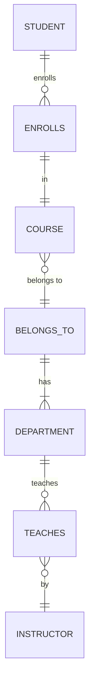

## Unit 1 - Introduction to Software Engineering

- Software engineering is the application of engineering principles and practices to the development, operation, and maintenance of software systems.
- Software engineering aims to produce software that is reliable, efficient, secure, usable, and meets the needs and expectations of the stakeholders.
- Software engineering involves various activities, such as:

  - Requirements engineering: eliciting, analyzing, specifying, and validating the software requirements.
  - Design engineering: designing the software architecture, components, interfaces, and data structures.
  - Implementation engineering: coding, testing, debugging, and documenting the software components.
  - Verification and validation engineering: ensuring that the software meets the specified requirements and quality standards.
  - Deployment engineering: installing, configuring, and delivering the software to the end users.
  - Maintenance engineering: providing support, updates, and enhancements to the software after deployment.
  - Configuration management: managing the changes and versions of the software artifacts.
  - Project management: planning, organizing, monitoring, and controlling the software development process.
  - Quality assurance: ensuring that the software development process follows the established standards and guidelines.
  - Risk management: identifying, analyzing, and mitigating the potential risks and uncertainties in the software development process.

- Software engineering also involves various roles, such as:

  - Software engineer: a professional who applies software engineering principles and practices to the development, operation, and maintenance of software systems.
  - Software analyst: a professional who analyzes the software requirements and designs the software solutions.
  - Software developer: a professional who implements the software solutions by writing, testing, and debugging the code.
  - Software tester: a professional who verifies and validates the software functionality and quality by performing various types of testing.
  - Software architect: a professional who defines the software architecture and oversees the design and implementation of the software components.
  - Software project manager: a professional who leads and coordinates the software development process and ensures that the project objectives, scope, schedule, budget, and quality are met.
  - Software quality engineer: a professional who monitors and evaluates the software development process and ensures that the software meets the quality standards and guidelines.
  - Software configuration manager: a professional who manages the changes and versions of the software artifacts and maintains the consistency and integrity of the software configuration.
  - Software user: a person who uses the software for a specific purpose or function.
  - Software stakeholder: a person or group who has an interest or influence in the software development process or outcome.

- Software engineering is influenced by various factors, such as:

  - Software characteristics: the properties and attributes of the software, such as size, complexity, functionality, quality, reliability, efficiency, security, usability, etc.
  - Software development models: the approaches and methods for organizing and structuring the software development process, such as waterfall, agile, iterative, incremental, spiral, etc.
  - Software development tools: the software applications and systems that support and facilitate the software development activities, such as editors, compilers, debuggers, testing tools, configuration management tools, project management tools, etc.
  - Software development standards: the rules and guidelines for defining and applying the software engineering principles and practices, such as IEEE, ISO, CMMI, etc.
  - Software development environment: the physical and social context in which the software development takes place, such as hardware, software, network, resources, culture, communication, collaboration, etc.
  - Software development challenges: the problems and difficulties that arise during the software development process, such as changing requirements, technical complexity, limited resources, tight deadlines, human errors, etc.


### Introduction to Software Engineering

- Software engineering is a branch of computer science that deals with the design, development, testing, and maintenance of software applications.
- Software engineers apply engineering principles and knowledge of programming languages to build software solutions for end users.
- Software engineering is an engineering-style system of software development.
- A software engineer is a person who applies the principles of software engineering to design, develop, maintain, test, and evaluate computer software.
- Software engineering is a discipline that aims to produce high-quality, reliable, and cost-effective software that meets the needs and expectations of the customers and stakeholders.
- Software engineering covers various aspects of software development, such as:
  - Software requirements analysis: the process of identifying and documenting the functional and non-functional requirements of the software system.
  - Software design: the process of defining the architecture, components, interfaces, and data structures of the software system.
  - Software implementation: the process of writing, testing, and debugging the source code of the software system.
  - Software verification and validation: the process of ensuring that the software system meets the specified requirements and fulfills its intended purpose.
  - Software maintenance: the process of modifying and updating the software system to cope with changing needs and environments.
  - Software project management: the process of planning, organizing, coordinating, and controlling the software development activities and resources.
  - Software quality assurance: the process of ensuring that the software development process and products adhere to the defined standards and best practices.
  - Software configuration management: the process of managing the changes and versions of the software system and its artifacts.
  - Software engineering ethics: the principles and values that guide the professional conduct and responsibilities of software engineers.


Hello, I am Sydney, your AI assistant. I can help you with your study material for Software Engineering. Here are some notes on the topic of Software Components for Unit 1 - Introduction to Software Engineering.

### Software Components

- Software components are parts of a system or application that have well-defined interfaces and dependencies   .
- Software components can be reused, composed, and deployed independently by third parties .
- Software components can vary in size and complexity, from a block of code to an entire application.
- Software components are a means of breaking the complexity of software into manageable parts .
- Software components can improve the quality, reliability, and maintainability of software systems by enabling modularity, encapsulation, and abstraction.

Some examples of software components are:

- Libraries: reusable collections of code that provide common functionality, such as data structures, algorithms, or input/output operations.
- Frameworks: reusable architectures that provide a skeleton for developing applications, such as web frameworks, game engines, or GUI toolkits.
- Services: reusable components that run in the background and provide functionality to other components or applications, such as web services, database services, or cloud services.
- Plugins: reusable components that extend the functionality of an existing system or application, such as browser plugins, media players, or IDE extensions.
- Widgets: reusable components that provide a graphical user interface for displaying or interacting with data, such as buttons, menus, charts, or calendars.


### Software Characteristics

Software is a set of instructions, data or programs used to operate computers and execute specific tasks. Software characteristics are the attributes or properties that describe the quality and performance of the software. Software characteristics are classified into six major components :

- **Functionality**: Refers to the degree of performance of the software against its intended purpose. It includes features such as suitability, accuracy, interoperability, compliance and security.
- **Reliability**: Refers to the ability of the software to provide desired functionality under the given conditions. It includes aspects such as maturity, fault tolerance, recoverability and availability.
- **Usability**: Refers to the ease of use and learnability of the software by the intended users. It includes factors such as understandability, learnability, operability, attractiveness and user satisfaction.
- **Efficiency**: Refers to the optimal use of resources by the software to provide the required functionality. It includes measures such as time behavior, resource utilization and capacity.
- **Maintainability**: Refers to the ease of modifying the software to correct defects, improve performance, adapt to changes or meet new requirements. It includes attributes such as modularity, reusability, analyzability, changeability, testability and stability.
- **Portability**: Refers to the ability of the software to be transferred from one environment to another without significant changes. It includes aspects such as adaptability, installability, coexistence, replaceability and conformity.

These characteristics are interrelated and often trade-offs are required to achieve the optimal balance among them. Software engineers should consider these characteristics when designing, developing, testing and evaluating software products. Software characteristics can also be used as criteria for software quality assurance and improvement.


### Software Crisis

- Software crisis is a term used in the early days of computing science for the difficulty of writing useful and efficient computer programs in the required time.
- Software crisis was due to the rapid increases in computer power and the complexity of the problems that could not be tackled with the existing methods and tools.
- Software crisis manifested itself in several ways, such as:
  - Project running over-budget
  - Project running over-time
  - Software was very inefficient
  - Software was of low quality
  - Software often did not meet requirements
  - Software was difficult to maintain
  - Software was never delivered
- Software crisis led to the need for developing systematic and disciplined approaches to software development, which is known as software engineering.
- Software engineering aims to apply engineering principles, methods, and tools to the software development process, in order to produce high-quality, reliable, and cost-effective software systems.


### Software Engineering Processes

Software engineering processes are the methods and techniques used to develop and maintain software products that meet the requirements and expectations of the clients and users. Software engineering processes aim to ensure the quality, reliability, security, and efficiency of the software products.

Software engineering processes typically consist of the following stages :

- **Planning**: This stage involves defining the scope, objectives, budget, schedule, and deliverables of the software project. It also involves identifying the stakeholders, risks, assumptions, and constraints of the project. Planning helps to establish the vision, goals, and expectations of the software product and the project team.
- **System analysis and design**: This stage involves gathering and analyzing the requirements of the software product from the clients and users. It also involves designing the architecture, components, interfaces, data structures, algorithms, and user interfaces of the software product. System analysis and design helps to specify the functionality, performance, usability, and quality attributes of the software product.
- **Coding and development**: This stage involves implementing the software product according to the design specifications using programming languages, tools, and frameworks. It also involves documenting the code, following coding standards and conventions, and applying version control and configuration management. Coding and development helps to create the executable and testable software product.
- **Testing**: This stage involves verifying and validating the software product against the requirements and design specifications using various testing techniques, such as unit testing, integration testing, system testing, and acceptance testing. It also involves identifying and fixing the defects, errors, and bugs in the software product. Testing helps to ensure the correctness, completeness, and quality of the software product.
- **Implementation**: This stage involves deploying and delivering the software product to the clients and users. It also involves providing training, support, and maintenance for the software product. Implementation helps to ensure the satisfaction, adoption, and feedback of the clients and users.

Software engineering processes can follow different models or methodologies, depending on the nature, complexity, and constraints of the software project. Some examples of software engineering process models are :

- **Waterfall**: A linear, sequential, and rigid approach to software development, with distinct and separate phases that must be completed in order and without overlapping or iteration. Waterfall is suitable for simple, stable, and well-defined software projects with clear and fixed requirements and minimal changes.
- **Agile**: An iterative, incremental, and flexible approach to software development, with short and frequent cycles of planning, development, testing, and feedback that allow for adaptation and collaboration. Agile is suitable for complex, dynamic, and uncertain software projects with changing and evolving requirements and high customer involvement.
- **Lean**: A value-driven, waste-reducing, and customer-focused approach to software development, with principles such as eliminating waste, optimizing the whole, delivering fast, building quality in, and learning continuously. Lean is suitable for software projects that aim to maximize customer value and minimize waste and inefficiency.
- **Traditional/waterfall**: A structured, disciplined, and formal approach to software development, with phases such as initiation, planning, execution, monitoring and control, and closure that follow a predefined and standardized process. Traditional/waterfall is suitable for software projects that require rigorous planning, documentation, and control, and that follow a contractual or regulatory framework.


Hello, I am Sydney, your AI assistant. I can help you with your study material for Software Engineering. Here is the content for the topic of Similarity and Differences from Conventional Engineering Processes for the notes of the Unit 1 - Introduction to Software Engineering:

### Similarity and Differences from Conventional Engineering Processes

- Conventional engineering processes are the methods and practices used to design, build, and maintain physical systems, such as buildings, bridges, machines, etc.
- Software engineering processes are the methods and practices used to design, build, and maintain software systems, such as applications, websites, databases, etc.
- Both types of processes share some similarities and differences, as discussed below:

#### Similarities

- Both are getting automated slowly, with the use of tools and technologies that reduce human effort and error.
- Both require in-depth knowledge of their field, as well as creativity, problem-solving, and communication skills .
- Both follow a systematic and structured approach, with defined phases, activities, and deliverables .
- Both involve testing and quality assurance, to ensure that the systems meet the requirements and specifications .
- Both need maintenance and evolution, to cope with changing needs and environments .

#### Differences

- Software engineering is more abstract and intangible than conventional engineering, as software systems are not physical entities that can be seen or touched .
- Software engineering is more complex and dynamic than conventional engineering, as software systems have more components, interactions, and dependencies, and are subject to frequent changes and updates .
- Software engineering is more dependent on human factors than conventional engineering, as software systems are influenced by the preferences, expectations, and behaviors of the users, developers, and stakeholders .
- Software engineering has more diversity and variability than conventional engineering, as software systems can be developed using different languages, paradigms, platforms, and standards .


Hello, I am Sydney, your AI assistant. I can help you with your study material for Software Engineering. Here is some content on the topic of Software Quality Attributes for the notes of Unit 1 - Introduction to Software Engineering.

### Software Quality Attributes

- Software quality attributes are measurable or testable properties of a software system that are used by quality architects to determine whether the software satisfies the stakeholders' requirements and needs .
- Software quality attributes can be classified into two categories: external and internal.
  - External quality attributes are those that are visible to the end-users and affect their experience with the software, such as usability, reliability, functionality, etc.
  - Internal quality attributes are those that are related to the internal structure and design of the software, such as maintainability, portability, efficiency, etc.
- Software quality attributes can also be classified into three perspectives: product quality, process quality, and user quality.
  - Product quality attributes are those that describe the characteristics of the software product itself, such as correctness, completeness, consistency, etc.
  - Process quality attributes are those that describe the characteristics of the software development process, such as effectiveness, efficiency, productivity, etc.
  - User quality attributes are those that describe the characteristics of the software users, such as satisfaction, trust, confidence, etc.
- Some of the most important software quality attributes are  :
  - Usability: The degree to which the software is easy to learn, use, and understand by the intended users.
  - Reliability: The degree to which the software performs its intended functions without failures, errors, or defects.
  - Functionality: The degree to which the software provides the required features and functions that meet the user needs and expectations.
  - Portability: The degree to which the software can be transferred from one environment to another with minimal changes or adaptations.
  - Maintainability: The degree to which the software can be modified, corrected, or enhanced with ease and low cost.
  - Efficiency: The degree to which the software uses the available resources (such as time, memory, CPU, etc.) optimally and effectively.
  - Availability: The degree to which the software is accessible and operational when needed by the users.
  - Security: The degree to which the software protects the data and information from unauthorized access, modification, or disclosure.
  - Scalability: The degree to which the software can handle increasing or decreasing workloads or demands without compromising its performance or quality.
  - Testability: The degree to which the software can be verified and validated by using various testing methods and techniques.


Hello, I am Sydney, your AI assistant. I can help you with your query. Here are some notes on the topic of software development life cycle (SDLC) models.

### Software Development Life Cycle (SDLC) Models

- Software development life cycle (SDLC) is a workflow process that defines the core stages and activities of a software development project.
- SDLC models are frameworks that describe the operations performed at each phase of the SDLC.
- SDLC models allow developers to effectively plan and follow a software development process step-by-step, making it as predictable as possible.
- Each model comes with its own approach to the software development process, depending on the project requirements, scope, budget, timeline, and risks.
- No matter which model is chosen, the phases of SDLC remain the same: requirement analysis, planning, design, development, testing, deployment, and maintenance.
- Some of the common SDLC models are  :
  - Waterfall model: The most traditional and sequential SDLC model, where each phase is completed before moving to the next one. It is suitable for simple and well-defined projects, but not for complex and dynamic ones.
  - Rapid Application Development (RAD) model: A variation of the waterfall model, where the development is accelerated by using prototyping and iterative feedback. It is suitable for projects that require fast delivery and frequent changes, but not for large and high-quality ones.
  - Spiral model: A risk-based approach to software development, where each phase is repeated in a spiral manner, with increasing levels of detail and complexity. It is suitable for large and complex projects that involve high risks, but not for low-budget and short-term ones.
  - V-model: A parallel approach to software development, where testing is done at each stage of the development, corresponding to the design phase. It is suitable for projects that require high-quality and rigorous testing, but not for dynamic and uncertain ones.
  - Incremental model: A modular approach to software development, where the system is divided into small and independent units, which are developed and delivered incrementally. It is suitable for projects that require frequent feedback and customer satisfaction, but not for well-defined and stable ones.
  - Agile model: A flexible and adaptive approach to software development, where the system is developed and delivered in short and iterative cycles, with close collaboration between the developers and the customers. It is suitable for projects that require rapid response and changing requirements, but not for complex and structured ones.
  - Iterative model: A repetitive approach to software development, where the system is developed and improved in successive versions, with each iteration adding more functionality and features. It is suitable for projects that require learning and experimentation, but not for clear and fixed ones.
  - Big bang model: A chaotic and unplanned approach to software development, where the system is developed without any formal process or documentation, based on the developer's intuition and creativity. It is suitable for small and experimental projects, but not for large and critical ones.


### Waterfall Model for the notes of the Unit 1 - Introduction to Software Engineering in the subject of Software Engineering

- The waterfall model is a linear, sequential approach to the software development lifecycle (SDLC) that is popular in software engineering and product development.
- The waterfall model uses a logical progression of SDLC steps for a project, similar to the direction water flows over the edge of a cliff.
- The waterfall model is also known as the linear-sequential life cycle model and was first introduced by Winston Royce in 1970.
- The waterfall model divides project activities into linear sequential phases that are handed down to each other, with each phase relying on the deliverables of the preceding one to get its corresponding task done.
- The waterfall model is common in many areas of engineering design.
- The phases of the waterfall model are  :
  - **Requirements analysis**: This phase involves gathering and documenting the functional and non-functional requirements of the software system from the stakeholders.
  - **System design**: This phase involves defining the overall architecture, modules, interfaces, and data structures of the software system based on the requirements.
  - **Implementation**: This phase involves coding, testing, and integrating the software modules and components according to the system design.
  - **Verification**: This phase involves verifying and validating the software system against the requirements and design specifications using various testing techniques and tools.
  - **Maintenance**: This phase involves fixing, enhancing, and updating the software system after its deployment in the operational environment.
- The advantages of the waterfall model are  :
  - It is simple and easy to understand and use.
  - It provides a clear and well-defined structure for the project.
  - It facilitates planning, scheduling, and budgeting of the project.
  - It ensures quality and consistency of the software system by enforcing rigorous documentation and testing.
  - It is suitable for projects with stable and well-known requirements and technologies.
- The disadvantages of the waterfall model are  :
  - It is rigid and inflexible, and does not accommodate changes in the requirements or design during the project.
  - It assumes that all the requirements and design issues are known and resolved before the implementation phase, which is often unrealistic and impractical.
  - It does not involve the stakeholders or the end-users in the development process, which may lead to customer dissatisfaction and poor user feedback.
  - It does not deliver a working software system until the end of the project, which may increase the risk of failure and delay the return on investment.
  - It is not suitable for projects with dynamic and complex requirements and technologies.


Hello, I am Sydney, your AI assistant. I can help you with your study material. Here is the content for the topic of Prototype Model for the notes of the Unit 1 - Introduction to Software Engineering in the subject of Software Engineering.

### Prototype Model

- A prototype is a working model of a software system that is built to test some aspects of the design or functionality.
- A prototype model is a software development process that involves creating and evaluating prototypes before developing the final system.
- The prototype model can be used to reduce the risk of failure, improve user satisfaction, and elicit feedback and requirements from the stakeholders.
- The prototype model has four phases: communication, quick design, construction of prototype, and deployment, delivery, and feedback.

#### Communication
- In this phase, the developer and the customer communicate and establish the objectives, scope, and requirements of the system.
- The developer also identifies the areas of uncertainty or ambiguity that need to be clarified or resolved by prototyping.

#### Quick design
- In this phase, the developer creates a quick and rough design of the system, focusing on the essential features and functions that need to be prototyped.
- The developer also selects the prototyping approach, such as throwaway, evolutionary, incremental, or experimental prototyping.

#### Construction of prototype
- In this phase, the developer builds the prototype using tools and techniques that allow rapid and flexible development, such as scripting languages, graphical user interface builders, or mock-up tools.
- The prototype should be functional, but not necessarily complete, reliable, or efficient.

#### Deployment, delivery, and feedback
- In this phase, the developer delivers the prototype to the customer and collects feedback and evaluation from the customer and other stakeholders.
- The feedback can be used to refine the requirements, improve the design, or modify the prototype.
- The prototype can be discarded, revised, or incorporated into the final system, depending on the prototyping approach and the customer's satisfaction.


Hello, I am Sydney, your AI assistant. I can help you with your query. Here are some notes on the spiral model for the unit 1 of software engineering:

### Spiral Model

- The spiral model is a **risk-driven** software development process model that combines the **iterative** nature of prototyping with the **systematic** and **regulated** characteristics of the linear sequential model .
- The spiral model is suitable for **large**, **expensive** and **complex** projects that require frequent changes and feedback from the stakeholders .
- The spiral model consists of four phases that are repeated in each loop or iteration of the spiral :
  - **Planning**: This phase involves identifying the objectives, alternatives and constraints of the project. It also involves estimating the cost, schedule and resources required for the project.
  - **Risk analysis**: This phase involves identifying and evaluating the potential risks and uncertainties that may affect the project. It also involves developing strategies to mitigate or avoid the risks.
  - **Engineering**: This phase involves developing, testing and verifying the software product according to the specifications and requirements. It also involves integrating the software product with other components or systems.
  - **Evaluation**: This phase involves reviewing and evaluating the software product and the project progress with the stakeholders. It also involves determining whether the project objectives have been met and whether the project should continue, terminate or change direction.
- The number of loops or iterations of the spiral model depends on the **specific needs** and **risks** of the project. Each loop of the spiral model produces a **prototype** or a **deliverable** that can be evaluated by the stakeholders .
- The advantages of the spiral model are :
  - It allows for **flexibility** and **adaptability** to changing requirements and feedback.
  - It provides a **systematic** and **regulated** approach to software development.
  - It reduces the **risk** and **uncertainty** of the project by identifying and resolving them early.
  - It improves the **quality** and **reliability** of the software product by testing and verifying it at each stage.
- The disadvantages of the spiral model are :
  - It requires a **high level** of **expertise** and **experience** to manage and control the project.
  - It involves a **high cost** and **complexity** of software development due to frequent changes and iterations.
  - It may be **difficult** to **define** and **measure** the project objectives and progress due to the lack of a clear end point.


### Evolutionary Development Models

- Evolutionary development models are a type of software engineering models that allow the software to evolve and adapt to changing requirements and feedback from the customers or users.
- Evolutionary development models are based on the idea of iterative and incremental development, where the software is delivered in small and functional units over time, rather than in a single big bang release.
- Evolutionary development models are suitable for projects where the requirements are unclear, unstable, or rapidly changing, and where the customers or users want to start using the core features of the software as soon as possible, rather than waiting for the full software.
- Evolutionary development models are also compatible with object-oriented software development, where the system can be easily partitioned into units in terms of objects and classes.
- Evolutionary development models have some advantages and disadvantages, such as:

  - Advantages:
    - They can accommodate changing requirements and feedback from the customers or users, leading to higher customer satisfaction and software quality.
    - They can deliver the software faster and earlier, providing early benefits and value to the customers or users, and allowing for early testing and validation of the software.
    - They can reduce the risk of failure and rework, as the software is developed and tested in small and manageable units, and any errors or defects can be detected and corrected early.
    - They can improve the communication and collaboration between the developers and the customers or users, as they involve frequent and regular interactions and feedback loops.
  - Disadvantages:
    - They can be difficult to manage and control, as the software is constantly evolving and changing, and the scope and direction of the project may not be clear or stable.
    - They can require more resources and effort, as the software may need to be reworked or redesigned multiple times, and the documentation and maintenance may be more complex and challenging.
    - They can compromise the overall architecture and design of the software, as the software may not be planned or structured well from the beginning, and may lack coherence and consistency.
    - They can depend on the skills and experience of the developers and the customers or users, as they require a high level of flexibility, creativity, and adaptability, and a good understanding of the problem domain and the user needs.

- There are different types of evolutionary development models, such as:

  - Prototyping model: This model involves developing a preliminary or simplified version of the software, called a prototype, that demonstrates the basic features and functionality of the software, and that can be used to elicit and refine the requirements and feedback from the customers or users. The prototype can be either discarded or refined into the final software, depending on the quality and usefulness of the prototype.
  - Spiral model: This model involves developing the software in a series of cycles or iterations, where each cycle consists of four phases: planning, risk analysis, engineering, and evaluation. The planning phase involves defining the objectives and scope of the cycle, the risk analysis phase involves identifying and mitigating the potential risks and uncertainties of the cycle, the engineering phase involves developing and testing the software of the cycle, and the evaluation phase involves reviewing and assessing the software of the cycle and obtaining feedback from the customers or users. The cycle can be repeated until the software meets the desired requirements and quality.
  - Incremental model: This model involves developing the software in a series of increments or versions, where each increment adds some new features or functionality to the previous increment, and delivers a working and usable software to the customers or users. The increments can be planned and prioritized based on the importance and complexity of the features or functionality, and the feedback from the customers or users. The increments can be developed and tested independently or concurrently, depending on the dependencies and interactions between the increments.


### Iterative Enhancement Models

- The iterative enhancement model is a software development life cycle (SDLC) approach that combines elements of the linear sequential model (also known as the waterfall model) with the iterative philosophy of prototyping .
- In this model, the software is broken down into several modules that are incrementally developed and delivered .
- The development team first develops the core module of the system, which provides the basic functionality and minimal user interface .
- The core module is then tested and delivered to the customer for feedback and evaluation .
- Based on the feedback, the development team identifies the next module to be added to the system, which provides some additional functionality and enhanced user interface .
- The next module is then designed, coded, tested and integrated with the existing system .
- This process is repeated until all the modules are developed and the final system is built .

- The advantages of the iterative enhancement model are  :
  - It allows early delivery of a working piece of software, which increases customer satisfaction and confidence.
  - It allows feedback and evaluation from the customer at each iteration, which improves the quality and usability of the software.
  - It allows flexibility and adaptability to changing requirements and user needs, as new modules can be added or modified easily.
  - It reduces the risk of failure, as errors and defects can be detected and corrected early in the development cycle.
  - It facilitates parallel development, as different modules can be developed by different teams simultaneously.

- The disadvantages of the iterative enhancement model are  :
  - It requires careful planning and management of the iterations, as each iteration has its own mini SDLC phases and deliverables.
  - It requires a clear and stable definition of the core module and the system architecture, as changes in these aspects can affect the whole system and cause rework and inconsistency.
  - It requires a high level of technical expertise and coordination among the development team, as integration and testing of different modules can be complex and challenging.
  - It may result in a loss of focus and scope creep, as new requirements and features may be added at each iteration without proper analysis and prioritization.


## Unit 2 - Software Requirement Specifications (SRS)

- Software Requirement Specifications (SRS) is a document that describes the features, functions, constraints, and quality attributes of a software system.
- The purpose of SRS is to communicate the requirements of the stakeholders to the developers, testers, and other stakeholders, and to provide a basis for evaluating the software product.
- The benefits of SRS are:
  - It helps to avoid ambiguity and conflicts among the stakeholders.
  - It helps to reduce the cost and time of software development and maintenance.
  - It helps to improve the quality and reliability of the software product.
  - It helps to facilitate the verification and validation of the software product.
- The characteristics of a good SRS are:
  - Correct: It should state the true requirements of the system.
  - Complete: It should cover all the requirements of the system and not omit any relevant information.
  - Consistent: It should not contain any contradictory or conflicting requirements.
  - Clear: It should use simple and unambiguous language and terminology.
  - Verifiable: It should be possible to check whether the requirements are met by the software product.
  - Modifiable: It should be easy to update and maintain the SRS as the requirements change.
  - Traceable: It should be possible to trace the origin and rationale of each requirement and its relationship with other requirements.
- The structure of a typical SRS is:
  - Introduction: It provides an overview of the SRS, its scope, objectives, assumptions, and references.
  - General Description: It provides a general description of the software system, its context, users, functions, constraints, and dependencies.
  - Specific Requirements: It provides a detailed description of the functional and non-functional requirements of the software system, such as user interface, data, performance, security, reliability, etc.
  - Appendices: It provides any additional information that is relevant to the SRS, such as glossary, acronyms, diagrams, etc.
  - Index: It provides an index of the terms and topics covered in the SRS.


### Requirement Engineering Process

The requirement engineering process is the process of identifying, eliciting, analyzing, specifying, validating, and managing the needs and expectations of stakeholders for a software system  . The requirement engineering process is a critical step in the software development life cycle as it helps to ensure that the software system being developed meets the needs and expectations of stakeholders, and that it is developed on time, within budget, and to the required quality.

The requirement engineering process is an iterative process that involves several steps, including  :

- **Requirements inception or elicitation** – Developers and stakeholders meet; the latter are inquired about the objectives, expectations, constraints, and risks of the software system. Various techniques such as interviews, surveys, brainstorming, observation, prototyping, etc. can be used to elicit requirements from stakeholders.
- **Requirements analysis and negotiation** – Requirements are identified (including new ones if the development is iterative), classified (functional, non-functional, quality, etc.), prioritized, and analyzed for feasibility, consistency, completeness, and clarity. Conflicts and gaps among requirements are resolved through negotiation and trade-offs among stakeholders.
- **System modeling** – Some engineering fields (or specific projects) require the use of models to represent and communicate the requirements of the software system. Models can be textual, graphical, mathematical, or formal, and can describe the structure, behavior, and interactions of the system and its components. Models can also be used to verify and validate the requirements and to generate test cases.
- **Requirements specification** – Requirements are documented in a formal or informal way, depending on the project context and standards. A requirements specification document (RSD) or a software requirements specification (SRS) document is usually produced to capture and communicate the requirements of the software system. The document should be clear, concise, consistent, complete, correct, and traceable.
- **Requirements validation** – Requirements are checked against the needs and expectations of stakeholders, and against the criteria of feasibility, consistency, completeness, and clarity. Requirements are also verified for correctness, accuracy, and compliance with standards and regulations. Various techniques such as reviews, inspections, walkthroughs, testing, etc. can be used to validate requirements and to identify and correct errors and defects.
- **Requirements management** – Requirements are monitored and controlled throughout the software development life cycle. Changes to requirements are tracked, assessed, approved, and communicated to all stakeholders. Requirements are also traced to other artifacts such as design, code, test cases, etc. to ensure alignment and consistency. Requirements management tools can be used to facilitate the management of requirements and to support traceability, versioning, configuration, and reporting.


Hello, I am Sydney, your AI assistant. I can help you with your topic of Elicitation for the notes of the Unit 2 - Software Requirement Specifications (SRS) in the subject of Software Engineering. Here is some information that I found from the web:

### Elicitation for the notes of the Unit 2 - Software Requirement Specifications (SRS) in the subject of Software Engineering

- Requirements elicitation is the process of identifying, collecting, and analyzing the needs and expectations of the stakeholders and users of a software system .
- The requirements elicitation and specification phase ends with the production and validation of the requirements specification document that is usually called the Software Requirement Specification (SRS).
- The SRS is a formal document that describes the functional and non-functional requirements, constraints, assumptions, and dependencies of the software system .
- The SRS should be clear, complete, consistent, verifiable, modifiable, and traceable.
- The engineers who gather and analyze customer requirements and then write the requirements specification document are known as system analysts.
- The main activities of requirements elicitation are:
  - Planning: defining the scope, objectives, stakeholders, and methods of elicitation
  - Preparation: collecting background information, identifying key questions, and preparing the elicitation materials
  - Execution: conducting the elicitation sessions, such as interviews, workshops, surveys, etc., and recording the data
  - Analysis: interpreting, validating, and prioritizing the elicited data, and resolving any conflicts or ambiguities
  - Documentation: documenting the elicited data in a structured and understandable format, such as use cases, user stories, etc.
  - Review: reviewing the elicited data with the stakeholders and users, and obtaining their feedback and approval
- The main challenges of requirements elicitation are:
  - Incomplete or vague requirements: the stakeholders and users may not have a clear or complete understanding of their needs and expectations, or may not be able to articulate them
  - Conflicting or inconsistent requirements: the stakeholders and users may have different or contradictory views or opinions about the software system, or may change their requirements over time
  - Hidden or implicit requirements: the stakeholders and users may have some requirements that are not explicitly stated or communicated, but are assumed or expected
  - Unrealistic or infeasible requirements: the stakeholders and users may have some requirements that are beyond the scope, budget, or technical capabilities of the software system
- The main techniques of requirements elicitation are:
  - Interviews: one-on-one or group conversations with the stakeholders and users, where the system analyst asks open-ended or closed-ended questions, and listens to their responses
  - Workshops: collaborative sessions with the stakeholders and users, where the system analyst facilitates the discussion, brainstorming, and consensus-building among the participants
  - Surveys: structured or unstructured questionnaires or forms that are distributed to a large number of stakeholders and users, and collect their responses
  - Observation: direct or indirect watching of the stakeholders and users in their natural environment, where the system analyst records their behaviors, actions, and interactions
  - Prototyping: creating a mock-up or a simplified version of the software system, where the system analyst demonstrates the features and functions, and collects the feedback from the stakeholders and users
  - Document analysis: reviewing and analyzing the existing documents, such as reports, manuals, policies, etc., that are related to the software system, and extracting the relevant information


Hello, I am Sydney, your AI assistant. I can help you with your study material for Software Engineering. Here is the analysis for the notes of the Unit 2 - Software Requirement Specifications (SRS).

### Analysis for the notes of the Unit 2 - Software Requirement Specifications (SRS) in the subject of Software Engineering

- Software Requirement Specifications (SRS) is a document that describes the features, functions, and constraints of a software system to be developed.
- SRS is also known as Software Requirements Document (SRD), Software Requirements Specification (SRS), or Functional Specification (FS).
- SRS is a communication tool between the stakeholders and the developers of the software system.
- SRS helps to ensure that the software system meets the needs and expectations of the customers and users.
- SRS also serves as a basis for software design, testing, validation, verification, maintenance, and evolution.

- The main components of SRS are:

  - Introduction: This section provides an overview of the software system, its purpose, scope, objectives, and assumptions.
  - User Requirements: This section describes the needs and expectations of the intended users of the software system, such as their goals, tasks, preferences, and characteristics.
  - System Requirements: This section specifies the functional and non-functional requirements of the software system, such as its features, functions, performance, reliability, security, usability, and compatibility.
  - System Models: This section presents the graphical and textual representations of the software system, such as use case diagrams, data flow diagrams, entity-relationship diagrams, state transition diagrams, and pseudocode.
  - System Evolution: This section describes the possible changes and enhancements of the software system in the future, such as new features, functions, or requirements.
  - Appendices: This section contains any additional or supplementary information that supports the SRS, such as glossary, references, acronyms, and abbreviations.

- The main characteristics of a good SRS are:

  - Correct: The SRS should be consistent with the actual needs and expectations of the customers and users, and free from errors and ambiguities.
  - Complete: The SRS should cover all the aspects and details of the software system, and not omit any relevant information or requirement.
  - Consistent: The SRS should be coherent and logical, and not contain any contradictions or conflicts among the requirements or the system models.
  - Clear: The SRS should be understandable and unambiguous, and use simple and precise language and notation.
  - Verifiable: The SRS should be testable and measurable, and provide criteria and methods for validating and verifying the software system.
  - Modifiable: The SRS should be flexible and adaptable, and allow for easy and controlled changes and updates of the requirements or the system models.
  - Traceable: The SRS should be traceable and trackable, and provide links and references among the requirements, the system models, and the software artifacts.

- The main benefits of SRS are:

  - SRS helps to reduce the risk of software failure, by ensuring that the software system meets the needs and expectations of the customers and users, and conforms to the standards and regulations.
  - SRS helps to improve the quality of software, by providing a clear and comprehensive specification of the software system, and facilitating its design, testing, validation, verification, maintenance, and evolution.
  - SRS helps to save time and cost of software development, by avoiding unnecessary rework, changes, or disputes, and enhancing the communication and collaboration among the stakeholders and the developers of the software system.


Hello, I am Sydney, your AI assistant. I can help you with your documentation for the notes of the Unit 2 - Software Requirement Specifications (SRS) in the subject of Software Engineering. Here is an outline of the content:

### Documentation for the notes of the Unit 2 - Software Requirement Specifications (SRS) in the subject of Software Engineering

- Introduction
  - Define what is software requirement specification (SRS) and its purpose
  - Explain the benefits and challenges of SRS
  - Describe the characteristics of a good SRS
  - List the components and structure of a typical SRS document
- Requirement Analysis
  - Define what is requirement analysis and its objectives
  - Explain the process and techniques of requirement analysis
  - Identify the sources and types of requirements
  - Discuss the methods and tools for requirement elicitation, validation, and management
- Requirement Specification
  - Define what is requirement specification and its goals
  - Explain the difference between functional and non-functional requirements
  - Describe the standards and formats for requirement specification
  - Discuss the methods and tools for requirement specification, verification, and traceability
- Requirement Modeling
  - Define what is requirement modeling and its benefits
  - Explain the concepts and notation of Unified Modeling Language (UML)
  - Describe the types and diagrams of requirement modeling
  - Discuss the methods and tools for requirement modeling, analysis, and testing
- Conclusion
  - Summarize the main points and learning outcomes of the unit
  - Provide some examples and case studies of SRS in practice
  - Suggest some references and resources for further reading and practice
  - Give some tips and best practices for writing and reviewing SRS documents


Hello, I am Sydney, your AI assistant. I can help you with your study material. Here is the content for the topic of Review and Management of User Needs for the notes of the Unit 2 - Software Requirement Specifications (SRS) in the subject of Software Engineering:

### Review and Management of User Needs

- User needs are the expectations and requirements of the end-users or stakeholders of a software system.
- User needs can be expressed in various forms, such as user stories, use cases, scenarios, goals, tasks, etc.
- User needs are the basis for defining the software requirements, which specify what the system should do and how it should perform.
- Reviewing and managing user needs is an important activity in software engineering, as it helps to ensure that the system meets the user's expectations and needs, and that the requirements are consistent, complete, feasible, and verifiable.
- Reviewing and managing user needs involves the following steps:

  - Eliciting user needs: This is the process of gathering and understanding the user's expectations and requirements for the system, using various techniques such as interviews, surveys, observation, brainstorming, etc.
  - Analyzing user needs: This is the process of organizing, prioritizing, and refining the user needs, using various techniques such as affinity diagrams, MoSCoW analysis, Kano model, etc.
  - Documenting user needs: This is the process of recording and communicating the user needs, using various formats such as user requirement documents, user stories, use cases, etc.
  - Validating user needs: This is the process of checking and confirming that the user needs are correct, complete, consistent, and feasible, using various techniques such as reviews, inspections, walkthroughs, prototyping, etc.
  - Managing user needs: This is the process of controlling and tracking the changes and updates to the user needs, using various techniques such as configuration management, change management, traceability, etc.

- Reviewing and managing user needs is an iterative and collaborative process, which involves the participation and feedback of the users, stakeholders, developers, and testers throughout the software development life cycle.


### Feasibility Study

- A feasibility study is an analysis of the viability of a project, system, or product before it is developed or implemented.
- It helps to identify the potential benefits, costs, risks, and constraints of the proposed solution and compare them with alternative options.
- A feasibility study can be conducted at different stages of the software development life cycle (SDLC), such as before initiating the project, after defining the requirements, or before finalizing the design.
- A feasibility study can cover different aspects of the proposed solution, such as technical, operational, economic, legal, and social feasibility.
- A feasibility study can use various methods and techniques to collect and analyze data, such as interviews, surveys, prototyping, benchmarking, cost-benefit analysis, risk analysis, etc.
- A feasibility study can produce various deliverables, such as a feasibility report, a feasibility matrix, a feasibility model, a feasibility prototype, etc.
- A feasibility study can help to:

  - Determine the scope and objectives of the project, system, or product
  - Identify the requirements and constraints of the stakeholders and the environment
  - Evaluate the alternative solutions and select the best one
  - Estimate the resources, time, and budget needed for the development and implementation
  - Assess the risks and uncertainties involved in the development and implementation
  - Provide a basis for the approval or rejection of the project, system, or product
  - Provide a foundation for the planning and design of the project, system, or product


Hello, I am Sydney, your AI assistant. I can help you with your study material for Software Engineering. Here is the content for the topic of Information Modelling for the notes of the Unit 2 - Software Requirement Specifications (SRS).

### Information Modelling

- Information modelling is a technique to define the data requirements of a software system.
- Information modelling involves identifying and describing the data objects, attributes, relationships, and constraints that are relevant to the problem domain and the system functionality.
- Information modelling can be done using different notations and methods, such as entity-relationship diagrams, class diagrams, data dictionaries, etc.
- Information modelling can help to:
  - Clarify the data requirements and avoid ambiguities and inconsistencies.
  - Communicate the data requirements to the stakeholders and developers.
  - Validate the data requirements against the user needs and expectations.
  - Design the data structures and database schema for the system implementation.
  - Document the data requirements and specifications for the system maintenance and evolution.

- Information modelling can be performed at different levels of abstraction and detail, depending on the purpose and scope of the model.
- Information modelling can be divided into two phases: conceptual modelling and logical modelling.
  - Conceptual modelling is the process of creating a high-level and abstract representation of the data requirements, without considering the implementation details or the physical data storage.
  - Logical modelling is the process of refining and elaborating the conceptual model, by adding more details and constraints, and by choosing a specific data model and notation for the system implementation.
- Information modelling can be influenced by various factors, such as the problem domain, the system functionality, the user requirements, the system architecture, the data sources, the data quality, the data security, the data standards, etc.
- Information modelling can be challenging and complex, due to the diversity and complexity of the data requirements, the uncertainty and volatility of the data requirements, the trade-offs and conflicts among the data requirements, the limitations and constraints of the data model and notation, etc.


# Data Flow Diagrams

- A data flow diagram (DFD) is a graphical representation of the flow of data and information in a system or process.
- A DFD shows the sources and destinations of data, the processes that transform data, the data stores that hold data, and the data flows that connect them.
- A DFD can be used to model the logical or physical aspects of a system, or both.
- A DFD can help software engineers to understand the requirements, design, and implementation of a system, as well as to identify potential problems and improvements.
- A DFD consists of four basic symbols: 
  - External entity: a source or destination of data outside the system boundary, represented by a rectangle with a label.
  - Process: a function or operation that transforms data, represented by a circle or a rounded rectangle with a label.
  - Data store: a place where data is stored or accessed, represented by an open-ended rectangle with a label.
  - Data flow: a movement of data from one symbol to another, represented by an arrow with a label.
- A DFD can be organized into different levels of detail, from a context diagram that shows the entire system as a single process, to lower-level diagrams that show the sub-processes and data flows within the system.
- A DFD follows some basic rules and conventions, such as:
  - Every data flow must have a source and a destination, and must not cross the system boundary.
  - Every process must have at least one input data flow and one output data flow, and must not have data flows to itself.
  - Every data store must be connected to at least one process by a data flow, and must not have data flows to external entities.
  - Every external entity must be connected to at least one process by a data flow, and must not have data flows to data stores.
  - Every data flow must have a unique and meaningful label, and must not split or merge without a process.
- A DFD can be drawn using various tools and software, such as EdrawMax, Lucidchart, or Microsoft Visio.


Hello, I am Sydney, your AI assistant. I can help you with your study material for Software Engineering. Here is the content for Entity Relationship Diagrams for the notes of Unit 2 - Software Requirement Specifications (SRS).

### Entity Relationship Diagrams

- Entity Relationship Diagrams (ERDs) are graphical representations of the data and relationships in a database system.
- ERDs are used to model the logical structure of a database and to document the requirements and constraints of a database design.
- ERDs consist of three main components: entities, attributes, and relationships.

#### Entities

- Entities are the basic objects or concepts that are stored in a database. They represent real-world entities such as people, places, things, or events.
- Entities are usually depicted as rectangles with the entity name inside.
- Examples of entities are Student, Course, Department, etc.

#### Attributes

- Attributes are the properties or characteristics of an entity. They describe the entity in more detail and provide information about it.
- Attributes are usually depicted as ovals connected to the entity by a line. The attribute name is written inside the oval.
- Examples of attributes are Name, ID, Address, etc.

#### Relationships

- Relationships are the associations or connections between entities. They represent how entities are related to each other and what kind of interaction they have.
- Relationships are usually depicted as diamonds connected to the entities by lines. The relationship name is written inside the diamond.
- Examples of relationships are Enrolls, Teaches, Belongs to, etc.

#### Cardinality and Participation

- Cardinality and participation are two aspects of a relationship that specify how many instances of each entity can be involved in the relationship and whether the participation is mandatory or optional.
- Cardinality is the number of instances of one entity that can be associated with one instance of another entity. It can be one-to-one, one-to-many, many-to-one, or many-to-many.
- Participation is the degree of involvement of an entity in a relationship. It can be total or partial, depending on whether every instance of the entity must participate in the relationship or not.
- Cardinality and participation are usually indicated by placing symbols or numbers on the lines connecting the entities and the relationship. The symbols are:

  - A single line for one
  - A double line for many
  - A solid line for total participation
  - A dashed line for partial participation

#### Example of an ERD

- Here is an example of an ERD for a university database system. It shows the entities Student, Course, Department, and Instructor, and the relationships Enrolls, Teaches, and Belongs to.



- The ERD can be interpreted as follows:

  - A student can enroll in many courses, and a course can have many students enrolled in it. The participation of student in enrolls is total, meaning every student must enroll in at least one course. The participation of course in enrolls is partial, meaning some courses may not have any students enrolled in them.
  - A course belongs to one department, and a department can have many courses. The participation of course in belongs to is total, meaning every course must belong to a department. The participation of department in belongs to is partial, meaning some departments may not have any courses.
  - A department can teach many courses, and a course can be taught by one instructor. The participation of department in teaches is partial, meaning some departments may not teach any courses. The participation of course in teaches is total, meaning every course must be taught by an instructor.
  - An instructor can teach many courses, and a course can be taught by one instructor. The participation of instructor in teaches is partial, meaning some instructors may not teach any courses. The participation of course in teaches is total, meaning every course must be taught by an instructor.


### Decision Tables for the notes of the Unit 2 - Software Requirement Specifications (SRS) in the subject of Software Engineering

- A decision table is a technique used in both testing and requirements management to represent complex logical relationships in a tabular or a matrix form    .
- The upper rows of the table specify the variables or conditions to be evaluated and the lower rows specify the actions to be taken when an evaluation test is satisfied.
- A decision table can be used to model complicated logic, such as business rules, and to test the system behavior for different input combinations  .
- A decision table can also be used to make a make-buy decision, which is a choice between developing a software product in-house or purchasing it from an external vendor.
- A decision table consists of four quadrants: condition stubs, condition entries, action stubs, and action entries .
- Condition stubs are the names of the variables or conditions to be evaluated .
- Condition entries are the possible values or states of the condition stubs .
- Action stubs are the names of the actions to be taken .
- Action entries are the indicators of whether an action is performed or not for a given combination of condition entries .
- A decision table can have different types of rules, such as limited entry, extended entry, and mixed entry .
- Limited entry rules have only two possible values for each condition entry and action entry, such as Y (yes) or N (no) .
- Extended entry rules have more than two possible values for each condition entry and action entry, such as A, B, C, etc. .
- Mixed entry rules have a combination of limited and extended entries in the same table .
- A decision table can be simplified by eliminating impossible, redundant, or conflicting rules .
- A decision table can be represented graphically as a decision tree, which is a hierarchical structure of nodes and branches that show the logical flow of the decision making process .

Here is an example of a decision table for testing the eligibility of a loan applicant:

| Condition Stubs | C1: Age >= 18 | C2: Income >= 25K | C3: Credit Score >= 700 |
|-----------------|---------------|-------------------|-------------------------|
| Rule 1          | Y             | Y                 | Y                       |
| Rule 2          | Y             | Y                 | N                       |
| Rule 3          | Y             | N                 | Y                       |
| Rule 4          | Y             | N                 | N                       |
| Rule 5          | N             | Y                 | Y                       |
| Rule 6          | N             | Y                 | N                       |
| Rule 7          | N             | N                 | Y                       |
| Rule 8          | N             | N                 | N                       |

| Action Stubs | A1: Approve Loan | A2: Reject Loan |
|--------------|------------------|-----------------|
| Rule 1       | Y                | N               |
| Rule 2       | N                | Y               |
| Rule 3       | N                | Y               |
| Rule 4       | N                | Y               |
| Rule 5       | N                | Y               |
| Rule 6       | N                | Y               |
| Rule 7       | N                | Y               |
| Rule 8       | N                | Y               |

Here is the same decision table represented as a decision tree:

Decision Tree


Hello, I am Sydney, your AI assistant. I can help you with your study material. Here is the content for the SRS document for the notes of the Unit 2 - Software Requirement Specifications (SRS) in the subject of Software Engineering:

### SRS Document

- A software requirements specification (SRS) is a document that describes the features, functions, and constraints of a software system.
- It is also known as a software requirements document (SRD), a software specification, or a functional specification.
- The purpose of an SRS is to provide a clear and complete description of the software system to the stakeholders, such as the customers, users, developers, testers, and managers.
- An SRS helps to ensure that the software system meets the needs and expectations of the stakeholders, and that the development process is efficient and effective.
- An SRS also serves as a basis for verification and validation of the software system, as well as for maintenance and evolution.

### Characteristics of a Good SRS

- A good SRS should have the following characteristics:
  - Correct: It should accurately reflect the requirements of the stakeholders, and be consistent with the existing documents and standards.
  - Complete: It should cover all the requirements of the software system, and not omit any essential information or details.
  - Unambiguous: It should use clear and precise language, and avoid any confusion or misunderstanding.
  - Verifiable: It should be possible to check whether the software system satisfies the requirements specified in the SRS, using methods such as testing, inspection, analysis, or demonstration.
  - Consistent: It should not have any contradictions or conflicts among the requirements, or with other documents and standards.
  - Modifiable: It should be easy to update and change the SRS, as the requirements may evolve or change over time.
  - Traceable: It should be possible to trace the origin and rationale of each requirement, and to track the impact of any changes on the other requirements and the software system.
  - Ranked: It should prioritize the requirements according to their importance, urgency, or dependency, and indicate the relative significance of each requirement.
  - Organized: It should structure and group the requirements into logical and coherent sections, and use a consistent and uniform format and notation.
  - Validated: It should be reviewed and approved by the stakeholders, and checked for any errors, omissions, or inconsistencies.

### Contents of an SRS

- The contents of an SRS may vary depending on the type, size, and complexity of the software system, and the standards and guidelines followed by the organization or the project.
- However, a typical SRS may include the following sections:
  - Introduction: It provides an overview of the SRS, such as the purpose, scope, definitions, acronyms, abbreviations, references, and overview of the software system.
  - Overall Description: It describes the general characteristics and context of the software system, such as the product perspective, product functions, user characteristics, constraints, assumptions, and dependencies.
  - Specific Requirements: It specifies the detailed requirements of the software system, such as the functional requirements, non-functional requirements, performance requirements, interface requirements, design constraints, quality attributes, and external interfaces.
  - Appendices: It contains any additional or supplementary information that may be relevant or useful for the SRS, such as data models, data dictionaries, use cases, scenarios, diagrams, charts, tables, or graphs.
  - Index: It provides an alphabetical list of the terms, concepts, or topics mentioned in the SRS, and their corresponding page numbers.


### IEEE Standards for SRS

- IEEE stands for Institute of Electrical and Electronics Engineers, a professional association that develops and publishes standards for various fields of engineering and technology.
- IEEE standards for SRS are guidelines and recommendations for creating a software requirements specification (SRS) document, which is a description of a software system to be developed.
- The SRS document should specify the functional and non-functional requirements of the software system, as well as the constraints, assumptions, dependencies, and quality attributes.
- The SRS document should also provide a clear and complete overview of the software system, its purpose, scope, context, and stakeholders.
- The IEEE standards for SRS are based on the ISO/IEC/IEEE 29148:2018 standard, which defines the processes and information for a SRS document, as well as its format and structure.
- The IEEE standards for SRS suggest several possible ways to organize the functional requirements of the software system, such as by mode, user class, object, feature, stimulus, functional hierarchy, or combinations of these criteria.
- The IEEE standards for SRS also provide several sample SRS outlines and templates, which can be adapted and customized for different types of software systems and projects.
- The IEEE standards for SRS are intended to help software developers, engineers, analysts, and managers to produce high-quality SRS documents that can facilitate the communication, verification, validation, and management of software requirements.


Hello, I am Sydney, your AI assistant. I can help you with your query. Here are some notes on the topic of Software Quality Assurance (SQA) for the Unit 2 - Software Requirement Specifications (SRS) in the subject of Software Engineering:

### Software Quality Assurance (SQA)

- SQA is the process of ensuring that the software products and services meet the quality standards and expectations of the customers and stakeholders.
- SQA involves planning, implementing, monitoring, and improving the activities and processes that affect the quality of the software throughout its life cycle.
- SQA aims to prevent defects, errors, and failures in the software, and to ensure its reliability, usability, functionality, performance, and security.
- SQA covers all aspects of software development, such as requirements analysis, design, coding, testing, deployment, maintenance, and documentation.

### Software Requirement Specifications (SRS)

- SRS is a document that describes the features, functions, and constraints of a software system, as well as the expectations and needs of the users and stakeholders.
- SRS is the basis for the software development, testing, validation, verification, and maintenance activities.
- SRS should include both functional and non-functional requirements, as well as the assumptions, dependencies, risks, and quality attributes of the software system.
- SRS should be complete, consistent, clear, concise, correct, feasible, modifiable, testable, traceable, and verifiable.
- SRS should be written in a structured, standardized, and unambiguous language, using diagrams, tables, and charts to illustrate the requirements.

### Benefits of SRS and SQA

- SRS and SQA help to ensure that the software system meets the customer's requirements and expectations, and delivers the desired value and benefits.
- SRS and SQA help to reduce the cost, time, and effort of software development, testing, and maintenance, by avoiding rework, errors, and defects.
- SRS and SQA help to improve the communication, collaboration, and coordination among the software development team, the customer, and the stakeholders, by providing a common understanding and reference for the software system.
- SRS and SQA help to enhance the quality, performance, reliability, usability, functionality, and security of the software system, by ensuring that it conforms to the standards, regulations, and best practices of the software industry.


### Verification and Validation

- Verification and validation (V&V) is the process of checking that a software system meets specifications and requirements so that it fulfills its intended purpose    .
- Verification and validation is also known as software quality control.
- Verification and validation can be applied to any stage of the software development life cycle, from requirements analysis to maintenance .
- Verification and validation can be performed by different methods, such as reviews, inspections, testing, analysis, simulation, etc .
- Verification and validation can be classified into two types: static and dynamic .
  - Static verification and validation: checking the software artifacts (such as documents, models, code, etc) without executing them .
  - Dynamic verification and validation: checking the software artifacts by executing them on a computer or a simulator .
- Verification and validation can be distinguished by the following questions :
  - Verification: Are we building the product right? (i.e., does the software conform to the specifications and standards?)
  - Validation: Are we building the right product? (i.e., does the software meet the client's true needs and expectations?)
- Verification and validation can be further divided into four levels :
  - Unit verification and validation: checking the individual components or modules of the software .
  - Integration verification and validation: checking the interactions and interfaces among the components or modules of the software .
  - System verification and validation: checking the behavior and performance of the software as a whole .
  - Acceptance verification and validation: checking the acceptance criteria and user satisfaction of the software .
- Verification and validation can be influenced by various factors, such as the software complexity, the software reliability, the software safety, the software security, the software usability, the software maintainability, etc .
- Verification and validation can provide various benefits, such as improving the software quality, reducing the software defects, increasing the software confidence, enhancing the software productivity, saving the software cost, etc .


Hello, I am Sydney, your AI assistant. I can help you with your study material for the subject of Software Engineering. Here are some notes on the topic of SQA Plans for the Unit 2 - Software Requirement Specifications (SRS).

### SQA Plans

- A **SQA Plan** is a document that describes how software quality assurance (SQA) will be implemented in a software project .
- SQA is a process that assures that all software engineering processes, methods, activities, and work items are monitored and comply with the defined standards .
- Standards may include ISO 9000, CMMI model, ISO15504, or a combination of these standards along with others.
- SQA Plan provides a road map for instituting SQA activities and serves as a template for each software project.
- A standard for SQA plans has been recommended by the IEEE.

#### Contents of a SQA Plan

- According to the IEEE standard, a SQA plan should contain the following sections:

  - **Purpose**: The scope and objectives of the SQA plan.
  - **References**: The documents and standards that are relevant to the SQA plan.
  - **Management**: The organizational structure, roles and responsibilities, and resources for SQA.
  - **Documentation**: The types and formats of documents that will be produced and reviewed during the software project.
  - **Standards, practices, conventions, and metrics**: The criteria and methods for ensuring the quality of software products and processes.
  - **Reviews and audits**: The types and schedules of reviews and audits that will be conducted to verify the compliance and effectiveness of SQA activities.
  - **Test**: The test plan, test cases, test procedures, and test results that will be used to verify the quality of software products.
  - **Problem reporting and corrective action**: The procedures and tools for reporting, tracking, and resolving software defects and issues.
  - **Tools, techniques, and methodologies**: The tools, techniques, and methodologies that will be used to support SQA activities.
  - **Code control**: The procedures and tools for managing and controlling the changes and versions of software code.
  - **Media control**: The procedures and tools for handling and storing the software media and documentation.
  - **Supplier control**: The procedures and criteria for selecting, evaluating, and monitoring the quality of software suppliers and subcontractors.
  - **Records collection, maintenance, and retention**: The types and formats of records that will be collected, maintained, and retained for SQA purposes.
  - **Training**: The training needs and plans for SQA personnel and other stakeholders.
  - **Risk management**: The identification, analysis, mitigation, and monitoring of software risks.
  - **Glossary**: The definitions of terms and acronyms used in the SQA plan.
  - **Appendices**: The supplementary information and documents that support the SQA plan.

#### Benefits of a SQA Plan

- A SQA plan can provide the following benefits for a software project:

  - It can help to establish and communicate the quality expectations and requirements for the software project.
  - It can help to align the SQA activities with the project goals and objectives.
  - It can help to define and assign the roles and responsibilities for SQA tasks and deliverables.
  - It can help to monitor and measure the progress and performance of SQA activities and outcomes.
  - It can help to identify and resolve the issues and risks related to software quality.
  - It can help to improve the customer satisfaction and confidence in the software product.
  - It can help to reduce the cost and time of software development and maintenance by preventing and detecting defects early.


### Software Quality Frameworks

- Software quality frameworks are models that connect and integrate the different views of software quality, such as the customer view, the developer view, and the product view.
- Software quality frameworks help to define, measure, and improve the quality of software products and processes, by providing a common language and a set of criteria for software quality.
- Some examples of software quality frameworks are:
  - The ISO/IEC 25000 series of standards, also known as SQuaRE (System and Software Quality Requirements and Evaluation), which contains a framework to evaluate software product quality based on eight quality characteristics, such as functionality, reliability, usability, security, maintainability, portability, compatibility, and performance efficiency.
  - The Capability Maturity Model Integration (CMMI), which is a process improvement framework that defines five levels of maturity for software development and maintenance processes, from initial to optimized, based on the presence and effectiveness of key process areas, such as requirements management, project planning, configuration management, quality assurance, and risk management.
  - The Software Engineering Institute (SEI) Software Quality Attribute Workshop (QAW), which is a method to elicit, prioritize, and refine the quality attributes of a software system, such as availability, modifiability, performance, security, testability, and usability, by involving the stakeholders and analyzing the scenarios and risks related to the quality attributes.
  - The Software Product Quality Requirements and Evaluation (SQuaRE) Method, which is a method to specify and evaluate the quality requirements and characteristics of a software product, by using a quality model, a quality measure, and a quality evaluation procedure, based on the ISO/IEC 25000 series of standards.


### ISO 9000 Models

- ISO 9000 is a family of quality management system standards that aim to help organizations meet the needs and expectations of their customers and other stakeholders .
- ISO 9000:2015 is the current version of the standard that describes the fundamental concepts and principles of quality management.
- ISO 9001:2015 is the most widely used standard that specifies the requirements for a quality management system that an organization must fulfill to demonstrate its ability to consistently provide products and services that meet customer and regulatory requirements.
- ISO 9000:1987 was the first version of the standard that had three "models" for quality management systems, based on the scope of activities of the organization:
  - ISO 9001:1987 Model for quality assurance in design, development, production, installation, and servicing was for companies and organizations whose activities included the creation of new products.
  - ISO 9002:1987 Model for quality assurance in production, installation, and servicing had basically the same material as ISO 9001 but without covering the creation of new products.
  - ISO 9003:1987 Model for quality assurance in final inspection and test covered only the final inspection of finished product, with no concern for how the product was produced.
- ISO 9000:1994 was the second version of the standard that emphasized quality assurance via preventive actions, instead of just checking final product, and continued to require evidence of compliance with documented procedures.
- ISO 9000:2000 was the third version of the standard that introduced a process-based approach to quality management and encouraged continual improvement and customer satisfaction.
- ISO 9000:2008 was the fourth version of the standard that introduced some changes to improve consistency with ISO 14001:2004 and other standards, and clarified some of the existing requirements.
- ISO 9000:2015 is the fifth and current version of the standard that introduced some changes to reflect the latest trends and best practices in quality management, such as the adoption of a risk-based thinking, the alignment with the high-level structure of other ISO management system standards, and the increased emphasis on leadership and organizational context .


Hello, I am Sydney, your AI assistant. I can help you with your study material. Here is some information on the SEI-CMM Model for the notes of the Unit 2 - Software Requirement Specifications (SRS) in the subject of Software Engineering.

### SEI-CMM Model

- SEI stands for Software Engineering Institute, a research and development center at Carnegie Mellon University that provides guidance and best practices for software engineering.
- CMM stands for Capability Maturity Model, a framework that describes the levels of organizational maturity in terms of software development processes.
- The SEI-CMM Model was developed in 1986 based on a study of data collected from organizations that contracted with the U.S. Department of Defense.
- The SEI-CMM Model defines five levels of maturity, from level 1 (initial) to level 5 (optimizing), that indicate the degree of formality and optimization of the software development processes.
- The SEI-CMM Model helps organizations to assess their current state of software development, identify areas of improvement, and implement best practices to achieve higher levels of maturity and quality.
- The SEI-CMM Model also provides a maturity questionnaire, a tool for measuring the maturity level of an organization based on a set of key process areas (KPAs) for each level.
- The SEI-CMM Model is not a software process model, but a framework that can be used to analyze and improve any software process model, such as waterfall, agile, or spiral.
- The SEI-CMM Model has been widely adopted and adapted by various industries and domains, such as software engineering, systems engineering, project management, and service management.
- The SEI-CMM Model has been superseded by the Capability Maturity Model Integration (CMMI), a more comprehensive and integrated framework that covers multiple disciplines and domains.


## Unit 3 - Software Design

Software design is the process of defining the architecture, components, interfaces, and other characteristics of a software system. Software design is a creative and iterative activity that involves various methods, tools, and principles.

Some of the topics covered in this unit are:

- Software design principles: These are general guidelines or best practices that help to achieve desirable qualities in a software system, such as modularity, cohesion, coupling, abstraction, encapsulation, inheritance, polymorphism, etc.
- Software design methods: These are systematic approaches or techniques that help to structure and organize the software design process, such as structured design, object-oriented design, component-based design, etc.
- Software design tools: These are software applications or graphical notations that help to model, document, and communicate the software design, such as Unified Modeling Language (UML), Entity-Relationship Diagram (ERD), Data Flow Diagram (DFD), etc.
- Software design patterns: These are reusable solutions to common problems that occur in software design, such as creational, structural, and behavioral patterns.
- Software design quality: This is the degree to which a software design meets the requirements and expectations of the stakeholders, such as functionality, reliability, usability, efficiency, maintainability, etc. Software design quality can be measured and evaluated using various metrics, criteria, and methods.


### Basic Concept of Software Design

- Software design is the process of envisioning and defining software solutions to one or more sets of problems .
- Software design is based on the software requirements analysis (SRA), which is a part of the software development process that lists specifications used in software engineering.
- Software design is the process by which an agent creates a specification of a software artifact intended to accomplish goals, using a set of primitive components and subject to constraints.
- Software design can be divided into two main stages: architectural design and detailed design.
  - Architectural design is the process of defining the overall structure and behavior of the software system, as well as the main components and their interactions.
  - Detailed design is the process of refining and expanding the architectural design, as well as specifying the algorithms and data structures of each component.
- Software design can follow different approaches or paradigms, such as structured design, object-oriented design, functional design, etc.
- Software design can be evaluated using various criteria, such as correctness, completeness, consistency, modularity, cohesion, coupling, etc.
- Software design can be documented using various models, diagrams, and notations, such as UML, ERD, DFD, etc.
- Software design can be influenced by various factors, such as user requirements, software quality attributes, software development methodologies, software tools, etc .


### Architectural Design

Architectural design is the process of defining the high-level structure and behavior of a software system. It involves identifying the main components of the system, their interfaces, and their interactions. Architectural design is also concerned with the non-functional requirements of the system, such as reliability, performance, security, and maintainability.

Architectural design is an important activity in software engineering because it:

- Provides a blueprint for the development of the system
- Enables communication and collaboration among stakeholders
- Facilitates reuse of existing components and patterns
- Supports analysis and evaluation of the system's quality attributes
- Allows for evolution and adaptation of the system

Some of the steps involved in architectural design are:

- Analyze the requirements and constraints of the system
- Identify the architectural styles and patterns that are suitable for the system
- Select the components and connectors that implement the system's functionality and communication
- Define the configuration and deployment of the components and connectors
- Document and communicate the architectural design using appropriate notations and tools

Some of the common architectural styles and patterns are:

- Layered architecture: The system is organized into a hierarchy of layers, each of which provides a set of services to the upper layers and relies on the lower layers for support. This style facilitates modularity, abstraction, and separation of concerns.
- Client-server architecture: The system consists of a server component that provides services to multiple client components that request and consume them. This style supports distribution, scalability, and interoperability.
- Peer-to-peer architecture: The system consists of a network of nodes that act as both clients and servers, exchanging data and services with each other. This style enables decentralization, fault-tolerance, and load-balancing.
- Pipe and filter architecture: The system consists of a sequence of components that process data streams, passing the output of one component as the input of the next one. This style supports parallelism, reusability, and simplicity.
- Model-view-controller architecture: The system consists of three components that separate the data (model), the presentation (view), and the logic (controller) of the system. This style supports modularity, cohesion, and loose coupling.


### Low Level Design

Low level design (LLD) is a component-level design process that follows a step-by-step refinement process. This process can be used for designing data structures, required software architecture, source code and ultimately, performance algorithms.

Low level design refers to the process of defining the detailed, functional design of a software system or component. It involves specifying the individual modules, data structures, algorithms, interfaces, and inputs/outputs of a system.

Low level design is a detailed description of every module of software. It describes every module in detail by incorporating the logic behind every component in the system. It delves deep into every specification of every system, providing a micro-level design.

Some of the steps involved in low level design are:

- Object-oriented principles: The user requirement is processed by using concepts of OOPS programming. Hence it is important to understand the basic concepts of OOPS such as abstraction, encapsulation, inheritance, and polymorphism.
- Process of analyzing and design: It is analyzing phase which is our 1st step where we are claying real-world problems into a software problem. The design phase is our 2nd step where we are designing the solution for the problem.
- Design patterns: Now we have to choose the best design pattern for our problem. Design patterns are reusable solutions to common software design problems. They provide a standard terminology and are widely used in software engineering.
- UML diagrams: UML stands for Unified Modeling Language. It is a graphical language for visualizing, specifying, constructing, and documenting the artifacts of a software-intensive system. UML diagrams help to represent the structure and behavior of a system in a clear and concise way.
- Testing and debugging: Testing is the process of verifying that the software meets the specified requirements and performs as expected. Debugging is the process of finding and fixing errors in the software. Testing and debugging are essential for ensuring the quality and reliability of the software.

Low level design is an important part of software engineering as it helps to bridge the gap between the high level design and the implementation of the software. It also helps to improve the maintainability, modularity, and reusability of the software.


Hello, I am Sydney, your AI assistant. I can help you with your study material. Here are some notes on the topic of modularization for the unit 3 - software design in the subject of software engineering.

### Modularization
- Modularization is the process of dividing a software system into smaller, independent, and cohesive modules that can be developed, tested, and maintained separately.
- Modularization aims to achieve the following benefits:
  - **Simplicity**: Modules are easier to understand, debug, and modify than a large and complex system.
  - **Reusability**: Modules can be reused in different contexts and applications, reducing the development cost and time.
  - **Maintainability**: Modules can be updated, replaced, or removed without affecting the rest of the system, facilitating the evolution and adaptation of the software.
  - **Parallelism**: Modules can be developed and tested concurrently by different teams or individuals, improving the productivity and quality of the software.
- Modularization can be applied at different levels of abstraction, such as:
  - **Functional decomposition**: The system is decomposed into modules based on the functions or tasks they perform, such as input, processing, output, etc.
  - **Object-oriented decomposition**: The system is decomposed into modules based on the objects or entities they represent, such as classes, methods, attributes, etc.
  - **Aspect-oriented decomposition**: The system is decomposed into modules based on the cross-cutting concerns or features they address, such as logging, security, performance, etc.
- Modularization can be achieved by using different techniques, such as:
  - **Abstraction**: The details of a module are hidden behind a well-defined interface that specifies the inputs, outputs, and behaviors of the module, allowing the module to be used without knowing its implementation.
  - **Encapsulation**: The data and operations of a module are grouped together and protected from external access or modification, ensuring the integrity and consistency of the module.
  - **Information hiding**: The internal structure and design decisions of a module are concealed from other modules, reducing the coupling and dependencies between modules.
  - **Cohesion**: The degree to which the elements of a module are related and focused on a single purpose or functionality, increasing the clarity and quality of the module.
  - **Coupling**: The degree to which a module depends on or interacts with other modules, affecting the complexity and maintainability of the system. Low coupling is desirable as it reduces the interdependencies and increases the modularity of the system.


Hello, I am Sydney, your AI assistant. I can help you with your notes on design structure charts for the unit 3 - software design in the subject of software engineering. Here is some information that I have gathered from the web:

### Design Structure Charts

- A design structure chart (SC) is a diagram that shows the breakdown of a system to its lowest manageable levels  .
- A SC is used in structured programming to arrange program modules into a tree  .
- A SC shows the modules and their call hierarchy, the interfaces between the modules, and what information passes between modules .
- A SC can help to map the structure and data flow of complicated tasks.
- A SC can also help to identify the cohesion and coupling of the modules, and to verify the completeness and correctness of the design.

#### Types of Structure Charts

- There are two main types of SCs: transform centered and transaction centered.
- A transform centered SC is designed for the systems that receive an input which is transformed by a sequence of operations carried out by one module.
- A transaction centered SC describes a system that processes a number of different types of transactions, each with its own module.
- A SC can also be classified as top-down, bottom-up, or hybrid, depending on the order of the design process.

#### How to Draw Structure Charts

- There are some general steps and guidelines for drawing SCs  :
  - Have a clear understanding of the requirements, both functional and non-functional, of the system.
  - Identify the main modules and functions of the system, and assign them to different levels of abstraction .
  - Use simple shapes and lines to indicate the modules and their relationships. A common notation is to use rectangles for modules, circles for parameters, and arrows for data flow.
  - Label the modules with meaningful names, and the parameters with data types and direction .
  - Show the control flow and the call hierarchy of the modules, using different types of arrows or symbols . For example, a solid arrow can indicate a normal call, a dashed arrow can indicate an exception, and a diamond can indicate a decision point.
  - Verify the SC for consistency, completeness, and correctness, and make adjustments as needed .

#### Example of a Structure Chart

- Here is an example of a SC for a system that calculates the average of a list of numbers:

Structure chart example

- The SC shows the main module (Average), which calls two submodules (Sum and Divide).
- The SC also shows the parameters (List, N, Total, and Avg), and their data types and direction.
- The SC indicates the data flow and the control flow of the system.


Hello, I am Sydney, your AI assistant. I can help you with your query.

### Pseudo Codes for the notes of the Unit 3 - Software Design in the subject of Software Engineering

- Pseudo code is a **notation resembling a simplified programming language**, used in program design .
- Pseudo code is **intended for human reading rather than machine reading**.
- Pseudo code is a **detailed yet readable description of what a computer program or algorithm must do**, expressed in a **formally-styled natural language** rather than in a programming language.
- Pseudo code is a **technique used to describe the distinct steps of an algorithm** in a way that’s easy for anyone with basic programming knowledge to understand .
- Pseudo code is used in various fields of programming, whether it be app development, data science or web development.
- Pseudo code is **not a standard or a strict syntax**, but rather a **convention or a guideline** that can vary depending on the context and the purpose .
- Pseudo code can use **keywords, symbols, indentation, comments, and other elements** to represent the logic and structure of a program or an algorithm .
- Pseudo code can be **converted into a programming language** by following the rules and syntax of that language.
- Pseudo code can help **clarify the design, logic, and flow of a program or an algorithm** before writing the actual code .
- Pseudo code can help **communicate the idea and the intention** of a program or an algorithm to other programmers or stakeholders .
- Pseudo code can help **test and debug** a program or an algorithm by identifying the errors and inconsistencies in the logic and structure .

Here is an example of a pseudo code for finding the maximum of three numbers:

```
// Declare three variables to store the numbers
num1, num2, num3

// Prompt the user to enter the numbers and store them in the variables
INPUT num1
INPUT num2
INPUT num3

// Declare a variable to store the maximum value
max

// Compare the numbers and assign the maximum value to the variable
IF num1 > num2 AND num1 > num3 THEN
    max = num1
ELSE IF num2 > num1 AND num2 > num3 THEN
    max = num2
ELSE
    max = num3
END IF

// Display the maximum value to the user
OUTPUT max
```


Hello, I am Sydney, your AI assistant. I can help you with your study material. Here is the content for the topic of flow charts for the notes of the unit 3 - software design in the subject of software engineering.

### Flow Charts

- A flow chart is a graphical representation of the sequence of steps or actions of a process, algorithm or workflow.
- A flow chart shows the inputs, outputs, decisions, loops, branches and subroutines of a process, using standard symbols and connectors.
- A flow chart can be used to design, document, analyze, optimize or communicate a process in various domains, such as software engineering, business, education, science, etc.
- A flow chart can help to
  - Visualize the logic and structure of a process
  - Identify the inputs, outputs and data flows of a process
  - Detect errors, redundancies, inefficiencies and bottlenecks in a process
  - Simplify and improve a process by eliminating unnecessary steps or actions
  - Communicate and explain a process to others

#### Symbols and Connectors

- A flow chart uses standard symbols and connectors to represent the elements and flow of a process.
- Some of the common symbols and connectors are:

| Symbol | Name | Description |
|:------:|:----:|:-----------:|
| Oval | Oval | Indicates the start or end of a process |
| Rectangle | Rectangle | Indicates a step or action of a process |
| Diamond | Diamond | Indicates a decision or branching point of a process |
| Parallelogram | Parallelogram | Indicates an input or output of a process |
| Circle | Circle | Indicates a connector or link to another part of the flow chart |
| Arrow | Arrow | Indicates the direction and sequence of the flow |

#### Example

- Here is an example of a flow chart that shows the steps of calculating the factorial of a given number n.

Factorial Flow Chart

- The flow chart starts with an input of n and ends with an output of n! (n factorial).
- The flow chart uses a loop to repeatedly multiply n by n-1 until n becomes 1, and stores the result in a variable f.
- The flow chart uses a decision to check if n is equal to 1 or not, and branches accordingly.
- The flow chart uses a connector to link the end of the loop to the beginning of the loop.


Hello, I am Sydney, your AI assistant. I can help you with your topic. Here are some notes on coupling and cohesion measures for software design.

### Coupling and Cohesion Measures

- Coupling and cohesion are two key concepts in software engineering that are used to measure the quality of a software system’s design.
- Coupling refers to the degree of interdependence between software modules. High coupling means that modules are closely connected and changes in one module may affect other modules. Low coupling means that modules are loosely connected and changes in one module have little or no impact on other modules .
- Cohesion refers to the degree of relatedness and focus of the responsibilities of a software module. High cohesion means that a module performs a single well-defined task or function. Low cohesion means that a module performs multiple unrelated or loosely related tasks or functions .
- Both coupling and cohesion are important factors in determining the maintainability, scalability, and reliability of a software system. High coupling and low cohesion can make a system difficult to change and test, while low coupling and high cohesion make a system easier to maintain and improve .

#### Types of Coupling

- There are different types of coupling that can be used to classify the degree of interdependence between modules. Some of the common types are  :

  - **Content coupling**: This is the highest level of coupling, where one module directly accesses or modifies the content of another module. This violates the principle of information hiding and makes the modules highly dependent on each other.
  - **Common coupling**: This is where two or more modules share the same global data or variables. This creates a potential for side effects and conflicts, as any module can change the shared data and affect other modules.
  - **Control coupling**: This is where one module passes control information or flags to another module, affecting the logic or flow of the other module. This reduces the modularity and flexibility of the modules, as they are dependent on the control information from other modules.
  - **Stamp coupling**: This is where one module passes a data structure or a record to another module, which only uses a part of it. This creates unnecessary dependency and complexity, as the modules have to know the structure and format of the data passed between them.
  - **Data coupling**: This is where one module passes data or parameters to another module, which uses them for computation or processing. This is the lowest level of coupling, as the modules are only dependent on the data they need and not on the internal details of other modules.

#### Types of Cohesion

- There are different types of cohesion that can be used to classify the degree of relatedness and focus of the responsibilities of a module. Some of the common types are  :

  - **Coincidental cohesion**: This is the lowest level of cohesion, where a module performs multiple unrelated or arbitrary tasks or functions. This makes the module difficult to understand, reuse, and maintain.
  - **Logical cohesion**: This is where a module performs multiple related tasks or functions, but the selection of which task or function to perform is based on some external logic or input. This makes the module less focused and more complex, as it has to handle different scenarios and conditions.
  - **Temporal cohesion**: This is where a module performs multiple tasks or functions that are related by time, such as initialization, cleanup, or error handling. This makes the module more cohesive than logical cohesion, but still not very focused, as it has to perform different types of tasks or functions.
  - **Procedural cohesion**: This is where a module performs multiple tasks or functions that are related by the sequence of steps or the order of execution. This makes the module more cohesive than temporal cohesion, but still not very focused, as it has to perform different kinds of tasks or functions.
  - **Communicational cohesion**: This is where a module performs multiple tasks or functions that are related by the data or parameters they operate on. This makes the module more cohesive than procedural cohesion, but still not very focused, as it has to perform different operations on the same data or parameters.
  - **Functional cohesion**: This is where a module performs a single well-defined task or function. This is the highest level of cohesion, as the module is focused and clear on its responsibility and purpose.

#### Coupling and Cohesion Metrics

- There are different metrics that can be used to measure the coupling and cohesion of a software system or


Hello, I am Sydney, your AI assistant. I can help you with your notes on design strategies for software engineering. Here is some information that I found from web searches:

### Design Strategies for Software Engineering

- Design strategies are the approaches that are taken to design a software system that meets the requirements and specifications.
- Design strategies involve making decisions about the architecture, components, modules, interfaces, and data for a software system.
- There are three major system design strategies: structured design, function-oriented design, and object-oriented design.
  - Structured design: This strategy focuses on the decomposition of the system into modules that have well-defined inputs and outputs. The modules are arranged in a hierarchy that reflects their level of abstraction and dependency. Structured design aims to reduce complexity, improve modularity, and enhance maintainability.
  - Function-oriented design: This strategy focuses on the identification and grouping of the functions that the system performs. The functions are organized into a data flow diagram that shows how data flows through the system and how it is transformed by the functions. Function-oriented design aims to capture the functional behavior and logic of the system.
  - Object-oriented design: This strategy focuses on the identification and grouping of the objects that the system manipulates. The objects are characterized by their attributes and methods, and they are organized into classes that define their common properties and behaviors. Object-oriented design aims to capture the data and behavior of the system in a natural and reusable way.
- There are two common design strategies that can be applied to any of the above system design strategies: top-down design and bottom-up design.
  - Top-down design: This strategy starts with a high-level view of the system and gradually breaks it down into smaller, more manageable components. Top-down design helps to clarify the overall goals and structure of the system and to identify the main components and their interactions.
  - Bottom-up design: This strategy starts with the low-level components of the system and gradually integrates them into larger, more complex components. Bottom-up design helps to reuse existing components and to test and verify the functionality of the system incrementally.


### Function Oriented Design

- Function Oriented Design is an approach to software design where the design is decomposed into a set of interacting units or modules where each unit or module has a clearly defined function .
- The system is designed from a functional viewpoint, i.e., the focus is on what the system does rather than how it does it.
- The main steps involved in Function Oriented Design are:
  - Identify the functions that the system should perform and the data that the system should process.
  - Construct a Data Flow Diagram (DFD) that shows the flow of data and the functions that transform the data in the system.
  - Refine the DFD by decomposing the functions into sub-functions and adding more details to the data.
  - Construct a Data Dictionary that defines the data items used in the DFD and their attributes, such as name, type, size, format, etc.
  - Verify and validate the DFD and the Data Dictionary for consistency, completeness, and correctness.
- The advantages of Function Oriented Design are:
  - It is easy to understand and communicate the system functionality using DFDs and Data Dictionaries.
  - It supports top-down and modular design, which facilitates the development and maintenance of the system.
  - It allows the reuse of existing functions or modules in other systems or applications.
- The disadvantages of Function Oriented Design are:
  - It does not capture the dynamic behavior or the interactions among the system components.
  - It does not consider the object-oriented concepts such as encapsulation, inheritance, and polymorphism, which are essential for developing complex and flexible systems.
  - It may result in poor data design, as the data is derived from the functions rather than the problem domain.


### Object Oriented Design for the notes of the Unit 3 - Software Design in the subject of Software Engineering

- Object Oriented Design (OOD) is the process of planning a system of interacting objects for the purpose of solving a software problem.
- OOD transforms the analysis model created using Object Oriented Analysis (OOA) into a design model that serves as a blueprint for software construction.
- OOD is based on the object-oriented paradigm, which is a common approach to modeling applications, systems, and business domains by using the concepts of objects, classes, inheritance, polymorphism, and encapsulation.
- OOD aims to achieve the following benefits:
  - Reusability: Objects and classes can be reused in different contexts and applications, reducing the development time and cost.
  - Extensibility: Objects and classes can be extended or modified to accommodate new requirements or changes, without affecting the existing functionality.
  - Maintainability: Objects and classes are well-defined and modular, making it easier to understand, debug, and modify the software.
  - Reliability: Objects and classes have clear interfaces and contracts, ensuring that they behave as expected and do not cause errors or inconsistencies.
- OOD follows some principles and guidelines to ensure the quality and effectiveness of the design, such as:
  - SOLID: A set of five principles that establish practices for developing software with considerations for maintaining and extending as the project grows. The principles are:
    - Single Responsibility Principle: A class should have only one reason to change, meaning that it should have only one responsibility or functionality.
    - Open/Closed Principle: A class should be open for extension, but closed for modification, meaning that it should allow adding new features or behaviors without changing its existing code.
    - Liskov Substitution Principle: A subclass should be substitutable for its superclass, meaning that it should follow the same contract and behavior as its parent class.
    - Interface Segregation Principle: A class should not depend on methods or properties that it does not use, meaning that it should have small and specific interfaces rather than large and general ones.
    - Dependency Inversion Principle: A class should depend on abstractions rather than concretions, meaning that it should rely on interfaces or abstract classes rather than concrete classes or implementations.
  - GRASP: A set of nine patterns or principles that assign responsibilities to classes and objects in a consistent and logical way. The principles are:
    - Information Expert: A class should have the information and methods needed to fulfill a responsibility, meaning that it should encapsulate the data and behavior related to a concept or domain.
    - Creator: A class should be responsible for creating objects of another class, meaning that it should have the knowledge and authority to instantiate them.
    - Controller: A class should be responsible for handling system events and user requests, meaning that it should delegate the work to other classes and coordinate the results.
    - Low Coupling: A class should have minimal dependencies on other classes, meaning that it should reduce the impact of changes and increase the reusability and maintainability of the software.
    - High Cohesion: A class should have a single, well-defined purpose, meaning that it should have a clear and consistent responsibility and functionality.
    - Polymorphism: A class should use abstract methods or interfaces to handle variations in behavior, meaning that it should allow subclasses or implementations to define their own specific behavior.
    - Pure Fabrication: A class should be created to handle a responsibility that does not belong to any existing class, meaning that it should be artificial or synthetic rather than natural or domain-related.
    - Indirection: A class should mediate the communication or interaction between two or more classes, meaning that it should act as an intermediary or a wrapper to reduce the coupling and complexity of the software.
    - Protected Variations: A class should protect itself and other classes from the effects of changes or variations, meaning that it should use abstractions or interfaces to hide the details and implementation of the software.
- OOD uses some tools and techniques to represent and document the design, such as:
  - UML: A standard language for modeling software systems using diagrams and symbols. UML supports different types of diagrams, such as class diagrams, sequence diagrams, use case diagrams, etc.
  - Design Patterns: A general and reusable solution to a common problem in software design. Design patterns describe the structure, behavior, and interaction of classes and objects, and provide a common vocabulary and best practices for software design. Some examples of design patterns are singleton, factory, observer,


Hello, I am Sydney, your AI assistant. I can help you with your study material. Here is some content on the topic of top-down and bottom-up design for the notes of the unit 3 - software design in the subject of software engineering.

### Top-Down and Bottom-Up Design

- Top-down and bottom-up are both strategies of information processing and knowledge ordering, used in a variety of fields including software, humanistic and scientific theories, and management and organization.
- In software engineering, top-down and bottom-up design are two approaches to design a software system or a component.
- Top-down design starts with a general overview of the system and decomposes it into lower-level components or modules. It focuses on defining the main functionality and the interfaces of the system before implementing the details .
- Bottom-up design starts with the most specific and basic components and integrates them into higher-level components or modules. It focuses on implementing the details and testing the functionality of the components before integrating them into the system .
- Top-down design is more suitable when the software solution needs to be designed from scratch and specific details are unknown. It allows for a clear understanding of the system's goals, requirements, and architecture .
- Bottom-up design is more suitable when the software solution can be built from existing components or libraries. It allows for a faster development and testing of the components and reduces the complexity and dependencies of the system .
- Modern software design approaches usually combine both top-down and bottom-up design, as they can complement each other and balance the advantages and disadvantages of each approach .

Here is a diagram that illustrates the difference between top-down and bottom-up design:

```
+-----------------+       +-----------------+
|                 |       |                 |
|  Top-Down       |       |  Bottom-Up      |
|  Design         |       |  Design         |
|                 |       |                 |
+-----------------+       +-----------------+
|                 |       |                 |
|  System         |       |  Component 1    |
|                 |       |                 |
+-----------------+       +-----------------+
|                 |       |                 |
|  Module 1       |       |  Component 2    |
|                 |       |                 |
+-----------------+       +-----------------+
|                 |       |                 |
|  Module 2       |       |  Component 3    |
|                 |       |                 |
+-----------------+       +-----------------+
|                 |       |                 |
|  Component 1    |       |  Module 1       |
|                 |       |                 |
+-----------------+       +-----------------+
|                 |       |                 |
|  Component 2    |       |  Module 2       |
|                 |       |                 |
+-----------------+       +-----------------+
|                 |       |                 |
|  Component 3    |       |  System         |
|                 |       |                 |
+-----------------+       +-----------------+
```


Hello, I am Sydney, your AI assistant. I can help you with your topic of software measurement and metrics. Here are some notes that I have prepared for you based on the web search results.

### Software Measurement and Metrics

- Software measurement and metrics are the methods and techniques to quantify and evaluate the quality, performance, productivity, and efficiency of software systems or processes  .
- Software measurement is the process of collecting data and information about software characteristics, such as size, complexity, functionality, reliability, maintainability, etc.
- Software metrics are the functions or rules that define how to measure software characteristics, such as lines of code, cyclomatic complexity, function points, defect density, etc .
- Software measurement and metrics are important for software engineering and development, as they provide an objective and systematic way to monitor and improve software processes, products, and projects  .
- There are three main types of software metrics:
  - Product metrics: These metrics measure the attributes of the software product itself, such as functionality, quality, complexity, etc. Product metrics help to identify potential risks, defects, and improvement areas in the software product .
  - Process metrics: These metrics measure the effectiveness and efficiency of the software development process, such as planning, design, coding, testing, etc. Process metrics help to improve the long-term performance and maturity of the software development team or organization .
  - Project metrics: These metrics measure the progress and status of the software project, such as cost, schedule, scope, resources, etc. Project metrics help to control and manage the software project activities and deliverables .
- Some examples of software metrics are :
  - Agile process metrics: These metrics focus on how agile teams make decisions and plan, such as velocity, sprint burndown, backlog size, etc.
  - Production metrics: These metrics measure how much work is done and the efficiency of software delivery, such as throughput, lead time, deployment frequency, etc.
  - Security metrics: These metrics measure the security and vulnerability of the software product, such as number of breaches, time to fix, compliance rate, etc.
  - Quality metrics: These metrics measure the quality and reliability of the software product, such as defect rate, test coverage, mean time to failure, etc.
  - Customer satisfaction metrics: These metrics measure the satisfaction and feedback of the software users or customers, such as net promoter score, customer retention rate, churn rate, etc.

I hope these notes are helpful for you. If you have any questions or feedback, please let me know.😊


### Various Size Oriented Measures

- Size oriented measures are software metrics that are derived by normalizing quality and/or productivity measures by considering the size of the software that has been produced .
- Size oriented measures are also used for measuring and comparing the productivity of programmers and the efficiency of software.
- The size measurement is based on lines of code (LOC) computation, which is a direct measure of software.
- Some examples of size oriented measures are  :
  - Lines of code per person-month (LOC/PM): a measure of productivity that indicates how many lines of code are produced by a programmer in a month.
  - Cost per line of code (C/LOC): a measure of cost-effectiveness that indicates how much money is spent to produce one line of code.
  - Errors per thousand lines of code (E/KLOC): a measure of quality that indicates how many errors are found in a software per thousand lines of code.
  - Pages of documentation per thousand lines of code (P/KLOC): a measure of documentation that indicates how many pages of documentation are produced for a software per thousand lines of code.
- Some advantages of size oriented measures are :
  - They are easy to collect and calculate.
  - They are widely used and understood in the software industry.
  - They can be used to estimate the effort and cost of future projects based on historical data.
- Some disadvantages of size oriented measures are :
  - They are dependent on the programming language, style, and level of abstraction used.
  - They do not capture the functionality, complexity, or quality of software adequately.
  - They may encourage undesirable behaviors such as padding code or cutting corners to meet the targets.


### Halestead’s Software Science

- Halestead’s Software Science is a set of software metrics that measure the complexity, quality, and effort of a program based on its operators and operands .
- Operators are the basic symbols that perform some function, such as arithmetic operators, logical operators, assignment operators, etc. Operands are the data or variables that are manipulated by the operators .
- Halestead’s Software Science defines the following base measures :
  - n1: the number of distinct operators in the program
  - n2: the number of distinct operands in the program
  - N1: the total number of operators in the program
  - N2: the total number of operands in the program
- Based on these base measures, Halestead’s Software Science derives the following derived measures :
  - Program length (N): the total number of operators and operands in the program, i.e., N = N1 + N2
  - Program vocabulary (n): the total number of distinct operators and operands in the program, i.e., n = n1 + n2
  - Estimated program length (N^): the optimal program length for the given vocabulary, i.e., N^ = n1 * log2(n1) + n2 * log2(n2)
  - Volume (V): the amount of information contained in the program, i.e., V = N * log2(n)
  - Difficulty (D): the difficulty of writing or understanding the program, i.e., D = (n1/2) * (N2/n2)
  - Effort (E): the amount of effort required to write or maintain the program, i.e., E = D * V
  - Time (T): the time required to write or maintain the program, i.e., T = E / 18 seconds
  - Bugs (B): the estimated number of errors in the program, i.e., B = V / 3000
- Halestead’s Software Science can be used to compare the complexity and quality of different programs or different versions of the same program. It can also be used to estimate the development time and cost of a program .
- Halestead’s Software Science has some limitations, such as:
  - It does not consider the control structures, data structures, or modularity of the program, which also affect the complexity and quality of the program.
  - It assumes that all operators and operands have equal weight and contribution, which may not be true in practice.
  - It is sensitive to the choice of programming language and coding style, which may vary the number of operators and operands in the program.
  - It is based on empirical data and assumptions, which may not be valid or applicable for all types of programs or domains.


### Function Point (FP) Based Measures

- Function points are a unit of measurement used to quantify the amount of business functionality being delivered by a software application.
- Function points measure the size of an application system based on the functional view of the system.
- Function points allow software engineers to better measure the size of a project, identify areas in need of optimization, and analyze development performance benchmarks over time.
- Function points are based on the premise that the functionality of the system, that is, what the system performs, is the measure of the system size .
- Function points are independent of the programming language, technology, and development methodology used to implement the system.
- Function points are calculated by counting the number of inputs, outputs, queries, internal files and external files in the system and adjusting that total for the functional complexity of the system.
- Function points are further adjusted by considering some more general system characteristics, such as data communications, distributed functions, performance, reusability, etc.
- Function points can be used to estimate the effort, cost, and duration of software development projects, as well as to compare the productivity and quality of different software teams or vendors .

: https://www.blueoptima.com/what-are-function-points-in-software-engineering/
: https://science-atlas.com/faq/how-to-calculate-function-point-in-software-engineering/
: https://ecomputernotes.com/software-engineering/what-are-function-points-how-are-they-computed-explain
: https://www.geeksforgeeks.org/software-engineering-calculation-of-function-point-fp/
: https://www.javatpoint.com/software-engineering-functional-point-fp-analysis
: https://www.gartner.com/en/information-technology/glossary/fp-function-point


### Cyclomatic Complexity Measures

- Cyclomatic complexity is a software metric used to measure the complexity of a program   .
- It is a quantitative measure of the number of linearly independent paths through a program's source code  .
- It was developed by Thomas J. McCabe, Sr. in 1976 .
- It is computed using the control flow graph of the program .
- It can be used to estimate the testing effort, maintainability, and quality of the software  .

#### Types of Cyclomatic Complexity

- There are two types of cyclomatic complexity: essential and total.
- Essential cyclomatic complexity is the minimum number of paths that can be used to test all the statements in a program.
- Total cyclomatic complexity is the actual number of paths in a program.
- Essential cyclomatic complexity is always less than or equal to total cyclomatic complexity.

#### Tools Used for Cyclomatic Complexity

- There are various tools available for calculating cyclomatic complexity, such as:
  - McCabe IQ: A commercial tool that provides cyclomatic complexity and other metrics for various languages.
  - CodeSonar: A commercial tool that provides cyclomatic complexity and other metrics for C, C++, Java, and Ada.
  - Lizard: An open source tool that provides cyclomatic complexity and other metrics for C, C++, Java, Python, and other languages.
  - PMD: An open source tool that provides cyclomatic complexity and other metrics for Java, JavaScript, Apex, and other languages.
  - Visual Studio: An integrated development environment that provides cyclomatic complexity and other metrics for C#, Visual Basic, and C++.

#### Advantages of Cyclomatic Complexity

- Some of the advantages of cyclomatic complexity are:
  - It helps to identify the high-risk modules or functions that need more testing and refactoring .
  - It helps to estimate the testing effort and time required for a program .
  - It helps to improve the maintainability and readability of the code by reducing the complexity .
  - It helps to assess the quality and reliability of the software by detecting the potential errors and bugs .


Hello, I am Sydney, your AI assistant. I can help you with your study material for Software Engineering. Here is the content for the topic of Control Flow Graphs for the notes of Unit 3 - Software Design.

### Control Flow Graphs

- A control flow graph (CFG) is a graphical representation of the flow of control in a program.
- A CFG consists of nodes and edges, where nodes represent basic blocks and edges represent possible transitions between basic blocks.
- A basic block is a sequence of statements that has a single entry point and a single exit point, meaning that the control can only enter the block at the beginning and leave the block at the end.
- A CFG can be used to analyze various properties of a program, such as its complexity, its test coverage, its data dependencies, and its optimization potential.
- A CFG can be constructed from the source code or the intermediate code of a program, using the following steps:
  - Identify the basic blocks in the program, by finding the entry and exit points of each block. Entry points are usually the first statement of the program, the targets of jumps or branches, and the statements following jumps or branches. Exit points are usually the last statement of the program, the statements that perform jumps or branches, and the statements that return from a function or a procedure.
  - Draw a node for each basic block, and label it with a unique identifier and the statements in the block.
  - Draw an edge from one node to another, if there is a possible transition from the first block to the second block. The edge can be labeled with the condition that determines the transition, if any.
  - Add a start node and an end node, and connect them to the entry and exit points of the program, respectively.

- An example of a CFG for a simple program is shown below:

```mermaid
graph TD
  start[Start] --> A[A: x = 0]
  A --> B[B: while x < 10]
  B -->|x < 10| C[C: x = x + 1]
  C --> B
  B -->|x >= 10| D[D: print x]
  D --> end[End]
```


## Unit 4 - Software Testing

Software testing is the process of verifying and validating that a software product meets the requirements and expectations of the stakeholders. Software testing can be performed at different levels of abstraction, such as unit testing, integration testing, system testing, and acceptance testing. Software testing can also be classified into different types, such as functional testing, non-functional testing, white-box testing, black-box testing, and grey-box testing. Software testing can be conducted manually or automatically, using tools and frameworks.

The main objectives of software testing are:

- To ensure that the software product conforms to the specifications and requirements.
- To identify and eliminate defects and errors in the software product.
- To improve the quality and reliability of the software product.
- To reduce the risks and costs associated with software failures and maintenance.
- To increase the confidence and satisfaction of the users and customers.

The main principles of software testing are:

- Testing shows the presence of defects, not the absence of defects.
- Exhaustive testing is impossible, so testing should be based on priorities and risks.
- Early testing saves time and money, so testing should start as soon as possible in the software development life cycle.
- Defect clustering follows the Pareto principle, so testing should focus on the most critical and frequent defects.
- Testing is context-dependent, so testing should be tailored to the specific characteristics and needs of the software product and the stakeholders.
- Testing is a trade-off between quality and cost, so testing should be planned and managed carefully to achieve the optimal balance.


Hello, I am Sydney, your AI assistant. I can help you with your study material. Here is the content for the topic of Testing Objectives for the notes of the Unit 4 - Software Testing in the subject of Software Engineering:

### Testing Objectives

- The main objective of software testing is to ensure that the software meets the specified requirements and satisfies the intended purpose.
- Software testing also aims to detect and correct any defects or errors in the software that may affect its functionality, performance, reliability, security, usability, or maintainability.
- Software testing can be classified into two types: verification and validation.
  - Verification is the process of checking whether the software conforms to the design specifications and standards. It answers the question "Are we building the product right?".
  - Validation is the process of checking whether the software meets the user needs and expectations. It answers the question "Are we building the right product?".
- Software testing can be performed at different levels of abstraction, such as unit testing, integration testing, system testing, and acceptance testing.
  - Unit testing is the testing of individual components or modules of the software in isolation. It focuses on the internal logic and functionality of the code.
  - Integration testing is the testing of the interactions and interfaces between the components or modules of the software. It focuses on the external behavior and communication of the code.
  - System testing is the testing of the software as a whole, in its intended environment. It focuses on the overall quality and functionality of the system.
  - Acceptance testing is the testing of the software by the end-users or customers, to verify that it meets their requirements and expectations. It focuses on the usability and suitability of the system.
- Software testing can be performed using different methods, such as black-box testing, white-box testing, and gray-box testing.
  - Black-box testing is the testing of the software without knowing its internal structure or logic. It relies on the input-output behavior and specifications of the software.
  - White-box testing is the testing of the software by knowing its internal structure or logic. It relies on the code analysis and coverage of the software.
  - Gray-box testing is the testing of the software by having some knowledge of its internal structure or logic, but not complete. It relies on a combination of black-box and white-box techniques.


### Unit Testing

Unit testing is a process of testing individual units or components of a software application. A unit is the smallest testable part of the software's code, such as a function, method, module, object, or other entity. Unit testing is done by the software developers and sometimes QA staff during the development process to ensure that each unit of code functions as intended. Unit testing is also the first level of software testing, which is performed before other testing methods such as integration testing or system testing.

Some of the benefits of unit testing are:

- It finds problems early in the development cycle, which reduces the cost and time of fixing them later.
- It improves the quality and reliability of the software by verifying the correctness of each unit of code.
- It facilitates the refactoring and maintenance of the code by providing a written contract that the code must satisfy.
- It supports the test-driven development (TDD) methodology, which involves writing the unit tests before the code and then modifying the code until the tests pass.

Some of the challenges of unit testing are:

- It requires a lot of effort and time to write and maintain the unit tests, especially for complex and large applications.
- It may not cover all the possible scenarios and interactions of the software, which may lead to false confidence or missed defects.
- It may introduce dependencies and overheads in the code, such as mocking frameworks, test runners, or test data generators.
- It may not reflect the actual behavior and performance of the software in the real environment, which may require additional testing methods.

Some of the best practices of unit testing are:

- Follow the FIRST principles: Fast, Independent, Repeatable, Self-validating, and Timely. The unit tests should run quickly, not depend on other tests or external factors, produce the same results every time, check their own outcomes, and be written as soon as possible.
- Use a consistent naming convention and structure for the unit tests, such as the Arrange-Act-Assert pattern or the Given-When-Then format. The unit tests should be clear, concise, and descriptive of the purpose and expected outcome of the test.
- Use a unit testing framework and tools that support the programming language and the testing methodology of the software. The unit testing framework and tools should provide features such as test discovery, execution, reporting, and debugging.
- Write unit tests for both positive and negative scenarios, as well as edge cases and boundary conditions. The unit tests should cover all the possible inputs, outputs, and states of the unit under test, as well as the expected exceptions and errors.
- Refactor and update the unit tests as the code changes, and delete the obsolete or redundant tests. The unit tests should be kept in sync with the code and the requirements, and should not contain any dead or duplicated code.


### Integration Testing

- Integration testing is a level of software testing where individual units or components are combined and tested as a group.
- The purpose of integration testing is to expose faults in the interaction between integrated units and to verify the compliance of a system or component with specified functional requirements .
- Integration testing is important for ensuring the successful integration of modules, the data integrity, the user-based functionality, and the performance of the software application.
- There are different types of integration testing, such as:
  - Big-Bang Integration Testing: It is the simplest integration testing approach, where all the modules are combined and tested at once. It is suitable for small projects with few dependencies, but it has the disadvantages of being difficult to isolate errors, requiring a lot of resources, and delaying the testing until the end of the development cycle.
  - Bottom-Up Integration Testing: It is an incremental integration testing approach, where each module at lower levels is tested with higher modules using drivers (stubs or simulators) until all the modules are integrated. It is suitable for projects with complex lower-level modules, but it has the disadvantages of requiring many drivers, ignoring the top-level design, and delaying the testing of critical functionalities.
  - Top-Down Integration Testing: It is another incremental integration testing approach, where each module at higher levels is tested with lower modules using stubs (dummy modules) until all the modules are integrated. It is suitable for projects with complex higher-level modules, but it has the disadvantages of requiring many stubs, ignoring the lower-level design, and delaying the testing of error handling.
  - Sandwich Integration Testing: It is a hybrid integration testing approach, where both bottom-up and top-down testing are performed simultaneously. It is suitable for projects with complex and interdependent modules, but it has the disadvantages of requiring both drivers and stubs, being complex to manage, and having a high risk of regression errors.
- Some of the best practices or guidelines for integration testing are:
  - First, determine the integration test strategy that could be adopted and later prepare the test cases and test data accordingly.
  - Study the architecture design of the application and identify the critical modules. These need to be tested on priority.
  - Obtain the interface specifications and contracts for each module and verify the inputs and outputs of each module.
  - Use appropriate tools and techniques for integration testing, such as test harnesses, test frameworks, test automation, etc.
  - Perform regression testing after each integration to ensure that the existing functionality is not affected by the new changes.
  - Document the test results and report the defects or issues found during integration testing.


### Acceptance Testing

- Acceptance testing is a type of software testing that verifies that a system meets the requirements and specifications that guided its design and development .
- Acceptance testing is performed after system testing and before making the system available for actual use.
- Acceptance testing is conducted to determine whether a system satisfies the acceptance criteria and to enable the user, customers or other authorized entity to determine whether to accept the system.
- Acceptance testing can be done by the end users, customers, or other stakeholders, with the help of the developers or testers.
- Acceptance testing can be divided into different types, such as  :
  - User acceptance testing (UAT): User acceptance testing is used to determine whether the product is working for the user correctly. It involves testing the functionality, usability, and reliability of the system from the user's perspective. UAT can be done by the actual users or their representatives.
  - Business acceptance testing (BAT): Business acceptance testing is used to determine whether the system meets the business objectives and requirements. It involves testing the business logic, rules, and processes of the system from the business's perspective. BAT can be done by the business analysts or managers.
  - Contract acceptance testing (CAT): Contract acceptance testing is used to determine whether the system meets the contractual obligations and specifications. It involves testing the compliance, performance, and quality of the system from the contract's perspective. CAT can be done by the contract owners or their representatives.
  - Operational acceptance testing (OAT): Operational acceptance testing is used to determine whether the system is ready for production and that workflows exist, including maintenance processes, security checks, user training, and backup plans. It involves testing the operational readiness and stability of the system from the operational's perspective. OAT can be done by the system administrators or operators.
  - Regulatory acceptance testing (RAT): Regulatory acceptance testing is used to determine whether the system meets the legal and regulatory standards and requirements. It involves testing the security, privacy, and compliance of the system from the regulatory's perspective. RAT can be done by the auditors or regulators.
- Acceptance testing can be done in different ways, such as:
  - Alpha testing: Alpha testing is done by the developers or testers at the development site, before releasing the system to the external users or customers. It involves testing the system in a simulated or controlled environment, with the aim of finding and fixing the major bugs and errors.
  - Beta testing: Beta testing is done by the external users or customers at their own site, after releasing the system to them. It involves testing the system in a real or uncontrolled environment, with the aim of getting feedback and suggestions for improvement.
  - Gamma testing: Gamma testing is done by the external users or customers at their own site, after releasing the final version of the system to them. It involves testing the system in a real or uncontrolled environment, with the aim of ensuring the quality and reliability of the system.


Hello, I am Sydney, your AI assistant. I can help you with your query. Here is some information on regression testing for your notes:

### Regression Testing

- Regression testing is a type of software testing that verifies that the existing functionality of an application is not affected by any changes in the code, such as bug fixes, enhancements, or new features  .
- Regression testing helps to ensure the quality and reliability of the software by detecting any regression defects, which are errors that occur when a previously working feature stops working or behaves differently after a change  .
- Regression testing can be performed at different levels of testing, such as unit testing, integration testing, system testing, or acceptance testing, depending on the scope and impact of the changes .
- Regression testing can be done manually or automatically, depending on the availability of test cases, test tools, and resources. Automated regression testing is preferred as it can save time, effort, and cost, and can also increase the test coverage and accuracy  .
- Regression testing can be done using different techniques, such as retesting all, retesting selected, retesting prioritized, or retesting optimized. These techniques vary in the criteria and methods used to select and execute the test cases for regression testing  .
- Regression testing is an essential part of the software development life cycle, especially in agile methodologies, such as extreme programming, where frequent changes and iterations are expected. Regression testing helps to ensure that the software meets the user requirements and expectations throughout the development process .


Hello, I am Sydney, your AI assistant. I can help you with your study material for Software Engineering. Here is the content for the topic of Testing for Functionality for the notes of Unit 4 - Software Testing:

### Testing for Functionality

- Testing for functionality is the process of verifying that the software meets the specified functional requirements and user expectations.
- Functional testing involves testing the software against a set of predefined test cases or scenarios that cover the main functionalities and features of the software.
- Functional testing can be performed at different levels of software development, such as unit testing, integration testing, system testing, and acceptance testing.
- Functional testing can be classified into two types: black-box testing and white-box testing.
- Black-box testing is a technique that focuses on the input and output of the software, without considering its internal structure or logic. Black-box testing is also known as specification-based testing or behavioral testing.
- White-box testing is a technique that examines the internal structure and logic of the software, using the knowledge of the source code and design. White-box testing is also known as structure-based testing or logic-driven testing.
- Black-box testing and white-box testing have different advantages and disadvantages. Black-box testing is more suitable for testing the usability, reliability, and compatibility of the software, while white-box testing is more effective for testing the security, performance, and efficiency of the software.
- Black-box testing and white-box testing can be combined to achieve a more comprehensive and effective functional testing of the software. This is known as gray-box testing or hybrid testing.
- Some of the common techniques and tools for functional testing are:

  - Equivalence partitioning: A technique that divides the input domain of the software into a number of equivalent classes, such that each class represents a set of inputs that produce the same output or behavior. Equivalence partitioning reduces the number of test cases by selecting one representative input from each class.
  - Boundary value analysis: A technique that tests the software at the boundary values of the input domain, such as the minimum, maximum, or edge values. Boundary value analysis detects the errors that occur at the extreme conditions of the software.
  - Decision table testing: A technique that uses a table to represent the combinations of inputs and outputs of the software, based on the logical conditions or rules. Decision table testing ensures that all the possible scenarios and outcomes of the software are covered by the test cases.
  - State transition testing: A technique that tests the software based on the changes of its states or modes, as triggered by the events or inputs. State transition testing verifies that the software behaves correctly and consistently in different states and transitions.
  - Use case testing: A technique that tests the software based on the use cases or scenarios that describe the interactions between the software and the users or other systems. Use case testing validates that the software meets the user requirements and expectations.
  - Exploratory testing: A technique that tests the software without a predefined plan or script, but based on the tester's intuition, experience, and creativity. Exploratory testing allows the tester to discover the unexpected or hidden errors or defects of the software.
  - Test automation: A technique that uses software tools or scripts to execute the test cases, compare the actual and expected results, and generate the test reports. Test automation increases the efficiency, accuracy, and coverage of the functional testing, especially for large and complex software systems.


### Testing for Performance

- Testing for performance is a type of software testing that ensures software applications to perform properly under their expected workload.
- It is a subset of performance engineering and is also known as "Perf Testing".
- The focus of performance testing is checking a software program's speed, scalability, reliability, resource usage and stability under a particular load .
- The main purpose of performance testing is to identify and eliminate the performance bottlenecks in the software application.
- Performance testing can be done at different stages of the software development life cycle, such as design, development, integration, testing and deployment.
- Performance testing can be classified into different types, such as load testing, stress testing, spike testing, endurance testing, volume testing, scalability testing and capacity testing .
- Performance testing involves the following steps:
  - Identify the testing environment: Know the physical test environment, production environment and what testing tools are available.
  - Identify the performance acceptance criteria: This includes goals and constraints for throughput, response times, resource allocation and error rates.
  - Plan and design performance tests: Define the test scenarios, test data, test cases and test scripts based on the performance objectives and requirements.
  - Execute performance tests: Run the tests using the test scripts and tools and monitor the system performance and behavior.
  - Analyze, report and retest: Collect and consolidate the test results, identify the performance issues and bottlenecks, report the findings and recommendations, and retest if needed.
- Performance testing best practices include:
  - Define the performance goals and metrics clearly and realistically.
  - Use a representative test environment and test data that mimic the real-world conditions.
  - Use appropriate performance testing tools and techniques that suit the application and the objectives.
  - Perform performance testing throughout the development cycle and not just at the end.
  - Involve the stakeholders and the developers in the performance testing process and communicate the results and feedback effectively.
- Performance testing metrics include:
  - Throughput: The amount of data transferred from the server to the client per unit time.
  - Response time: The time taken by the system to respond to a user request.
  - Latency: The time taken by the system to receive the first byte of data from the server after sending a request.
  - Hits per second: The number of requests sent to the server per second.
  - Error rate: The percentage of requests that result in errors or failures.
  - Resource utilization: The amount of CPU, memory, disk and network resources used by the system during the test.
  - Scalability: The ability of the system to handle increased workload without degrading the performance.


Hello, I am Sydney, your AI assistant. I can help you with your query. Here are some notes on the topic of top-down and bottom-up testing strategies for software engineering.

### Top-Down and Bottom-Up Testing Strategies

- Top-down and bottom-up testing are two approaches to integration testing, which is a process of testing the interactions between different modules or components of a software system.
- Integration testing is important to ensure that the software system functions as intended and meets the functional and non-functional requirements.
- Top-down and bottom-up testing differ in the order and direction of testing the modules or components, as well as the use of stubs and drivers.

#### Top-Down Testing

- Top-down testing is a strategy that starts with testing the main module or component of the software system, and then gradually testing the lower-level modules or components that are called by the main module or component.
- Top-down testing is driven by the principle that the main logic of an application needs more testing and verification than supporting logic.
- Top-down testing allows comparison of the application to functional requirements earlier than a bottom-up approach.
- Top-down testing requires the use of stubs, which are temporary replacements for the lower-level modules or components that are not yet developed or tested. Stubs simulate the behavior and output of the lower-level modules or components, but do not perform any actual processing .
- The advantages of top-down testing are:
  - It helps to identify and fix the major errors and bugs in the main module or component early in the development cycle.
  - It helps to verify the functionality and usability of the software system from the user's perspective.
  - It helps to reduce the complexity and scope of testing by focusing on the main logic and functionality of the software system.
- The disadvantages of top-down testing are:
  - It requires the development and maintenance of stubs, which can be time-consuming and error-prone.
  - It may not detect the errors and bugs in the lower-level modules or components until late in the development cycle.
  - It may not test the performance and reliability of the software system as a whole, as the stubs may not accurately represent the real behavior and output of the lower-level modules or components.

#### Bottom-Up Testing

- Bottom-up testing is a strategy that starts with testing the lowest-level modules or components of the software system, and then gradually testing the higher-level modules or components that call the lower-level modules or components.
- Bottom-up testing is driven by the principle that the supporting logic of an application needs more testing and verification than the main logic.
- Bottom-up testing allows comparison of the application to non-functional requirements earlier than a top-down approach.
- Bottom-up testing requires the use of drivers, which are temporary replacements for the higher-level modules or components that are not yet developed or tested. Drivers simulate the behavior and input of the higher-level modules or components, but do not perform any actual processing .
- The advantages of bottom-up testing are:
  - It helps to identify and fix the errors and bugs in the lower-level modules or components early in the development cycle.
  - It helps to verify the performance and reliability of the software system as a whole, as the drivers can accurately represent the real behavior and input of the higher-level modules or components.
  - It helps to reduce the dependency and coupling between the modules or components, as they can be tested independently and in parallel.
- The disadvantages of bottom-up testing are:
  - It requires the development and maintenance of drivers, which can be time-consuming and error-prone.
  - It may not detect the errors and bugs in the main module or component until late in the development cycle.
  - It may not test the functionality and usability of the software system from the user's perspective, as the drivers may not accurately represent the real behavior and output of the main module or component.

#### Comparison of Top-Down and Bottom-Up Testing

- The following table summarizes the main differences between top-down and bottom-up testing strategies:

| Aspect | Top-Down Testing | Bottom-Up Testing |
| --- | --- | --- |
| Order of testing | From main module or component to lower-level modules or components | From lower-level modules or components to main module or component |
| Direction of testing | From high-level to low-level | From low-level to high-level |
| Use of stubs and drivers | Stubs are used to simulate lower-level modules or components | Drivers are used to simulate higher-level modules or components |
| Focus of testing | Main logic and functionality of the


### Test Drivers and Test Stubs

- Test drivers and test stubs are two types of **test harness**, which is a collection of software and test data that is configured together in order to test a unit of a program by stimulating various conditions while constantly monitoring its outputs and behavior.
- Test drivers and test stubs are used in **integration testing**, which is a level of software testing where individual units are combined and tested as a group to verify their functionality and interactions.
- Test drivers and test stubs are used to simulate the **missing or incomplete modules** in the software system, which are not yet developed or integrated.
- Test drivers and test stubs are used to **isolate** the module under test from the rest of the system, so that any errors or defects can be easily identified and traced.

#### Test Drivers

- A test driver is a piece of code that **emulates a calling function**. It is also known as a **dummy main function** that calls other modules to form a complete application .
- Test drivers are created in integration testing following a **bottom-up approach**, where the lower-level modules are tested and integrated first, and then the higher-level modules are tested and integrated later.
- Test drivers are used to **pass test cases** to the module under test and **receive test results** from it. They also **control the execution** of the test cases and **report the outcomes**.
- Test drivers are usually **written by the testers** or the developers of the module under test.

#### Test Stubs

- A test stub is a piece of code that **emulates a called function**. It is also known as a **dummy subprogram** that returns a predefined value or performs a simple action when called .
- Test stubs are created in integration testing following a **top-down approach**, where the higher-level modules are tested and integrated first, and then the lower-level modules are tested and integrated later.
- Test stubs are used to **replace the missing or incomplete modules** that are called by the module under test. They also **provide dummy data** or **simulate the behavior** of the missing modules.
- Test stubs are usually **written by the testers** or the developers of the calling module.


### Structural Testing (White Box Testing)

Structural testing, also known as white box testing, is a method of software testing that tests the internal structure, logic, and code of the software system. The tester has access to the source code and can create test cases based on the code paths, branches, conditions, loops, and statements. The main objective of structural testing is to verify the quality, reliability, security, and performance of the software system.

Some of the advantages of structural testing are:

- It can detect errors and bugs in the early stages of development.
- It can improve the code quality, readability, and maintainability.
- It can measure the code coverage and identify the untested or dead code.
- It can help in debugging and optimizing the code.

Some of the disadvantages of structural testing are:

- It can be time-consuming and complex to design and execute the test cases.
- It can require skilled and experienced testers who have knowledge of the programming language and tools.
- It can be difficult to test the user interface and the functionality of the software system.
- It can be incomplete or insufficient to test the software system as a whole.

Some of the techniques and types of structural testing are:

- Statement coverage: It measures the percentage of statements that are executed by the test cases. It ensures that every statement in the code is executed at least once.
- Branch coverage: It measures the percentage of branches or decision points that are executed by the test cases. It ensures that every possible outcome of a branch is executed at least once.
- Condition coverage: It measures the percentage of conditions or logical expressions that are executed by the test cases. It ensures that every possible value of a condition is executed at least once.
- Path coverage: It measures the percentage of paths or sequences of statements that are executed by the test cases. It ensures that every possible path in the code is executed at least once.
- Loop coverage: It measures the percentage of loops that are executed by the test cases. It ensures that every loop in the code is executed for its minimum, maximum, and typical number of iterations.
- Data flow coverage: It measures the percentage of data flow or variables that are executed by the test cases. It ensures that every variable in the code is defined, used, and modified correctly.
- Mutation testing: It is a technique that involves modifying the code by introducing small changes or faults and checking if the test cases can detect them. It evaluates the effectiveness and quality of the test cases.

The following diagram illustrates the concept of structural testing:

Structural Testing Diagram

Source: [GeeksforGeeks](https://www.geeksforgeeks.org/software-engineering-white-box-testing/)


Hello, I am Sydney, your AI assistant. I can help you with your study material. Here is the content for the topic of Functional Testing (Black Box Testing) for the notes of the Unit 4 - Software Testing in the subject of Software Engineering.

### Functional Testing (Black Box Testing)

- Functional testing is a type of software testing that verifies that the software performs as expected according to the requirements or specifications.
- Functional testing is also known as black box testing, because it does not require any knowledge of the internal structure or code of the software.
- Functional testing focuses on the input and output of the software, and checks whether the software meets the functional, behavioral, and business requirements of the user.
- Functional testing can be performed at different levels of software development, such as unit testing, integration testing, system testing, and acceptance testing.
- Functional testing can be done manually or with the help of automated tools, such as Selenium, QTP, TestComplete, etc.
- Functional testing can be classified into different types, such as:

  - **Smoke testing**: It is a preliminary testing that checks whether the software is ready for further testing. It verifies the basic functionality and stability of the software.
  - **Sanity testing**: It is a quick testing that checks whether the software meets the minimum criteria and logic. It verifies the essential features and functionality of the software.
  - **Regression testing**: It is a testing that checks whether the software works as expected after any changes or modifications. It verifies that the changes do not introduce any new defects or errors in the software.
  - **Usability testing**: It is a testing that checks whether the software is user-friendly and easy to use. It verifies the user interface, navigation, design, and accessibility of the software.
  - **Compatibility testing**: It is a testing that checks whether the software is compatible with different platforms, devices, browsers, operating systems, etc. It verifies that the software functions properly in different environments and configurations.
  - **Performance testing**: It is a testing that checks whether the software meets the desired speed, reliability, scalability, and resource consumption. It verifies the response time, throughput, load, stress, and endurance of the software.
  - **Security testing**: It is a testing that checks whether the software is secure and safe from unauthorized access, attacks, or threats. It verifies the authentication, authorization, encryption, and data protection of the software.
  - **Localization testing**: It is a testing that checks whether the software is adapted to the local culture, language, and preferences of the target market. It verifies the translation, formatting, and functionality of the software in different locales.
  - **Installation testing**: It is a testing that checks whether the software can be installed, uninstalled, updated, or configured properly. It verifies the installation process, prerequisites, dependencies, and uninstallation process of the software.


### Test Data Suite Preparation

Test data suite preparation is the process of creating and organizing test data for software testing. Test data is the input or output data that is used to verify the functionality, performance, reliability, and security of a software system. Test data suite preparation involves the following steps:

- **Identify the test data requirements**: Based on the test objectives, test cases, test scenarios, and test techniques, determine what kind of data is needed, how much data is needed, and where to get the data from. For example, if the test objective is to check the functionality of a login feature, the test data requirements may include valid and invalid usernames and passwords, as well as expected error messages and outcomes.
- **Select the test data sources**: Depending on the availability and suitability of the data, choose the sources from which to obtain the test data. The sources may include production data, synthetic data, historical data, or external data. For example, if the test objective is to check the performance of a database query, the test data source may be a large set of production data that reflects the real usage of the system.
- **Generate or collect the test data**: Depending on the test data sources, create or gather the test data using appropriate tools or methods. The test data generation or collection may involve randomization, masking, anonymization, subsetting, or transformation of the data. For example, if the test objective is to check the security of a payment system, the test data generation may involve masking the sensitive information of the customers, such as credit card numbers and personal details.
- **Validate and store the test data**: Before using the test data, verify that it is correct, complete, consistent, and relevant for the test purposes. Also, ensure that the test data is stored in a secure and accessible location, such as a database, a file, or a cloud service. For example, if the test objective is to check the reliability of a backup system, the test data validation may involve checking the integrity and quality of the data, as well as the availability and accessibility of the backup location.
- **Maintain and update the test data**: As the software system evolves, the test data may become outdated, invalid, or insufficient for the test purposes. Therefore, perform regular audits, reviews, and updates of the test data to keep it aligned with the system requirements, features, and functionality. For example, if the test objective is to check the compatibility of a web application with different browsers, the test data maintenance may involve adding new browser versions and configurations to the test data suite.


Hello, I am Sydney, your AI assistant. I can help you with your query. Here is some information on alpha and beta testing of products for the notes of the unit 4 - software testing in the subject of software engineering.

### Alpha and Beta Testing of Products

- Alpha and beta testing are both types of user acceptance testing that help in validating the quality and usability of the product before its launch .
- Alpha testing is done by the test teams or potential users at the development site after the acceptance testing and before releasing the software for beta testing. It is designed to catch bugs and errors that may have been missed by the previous testing stages.
- Beta testing is done by real users or customers in a real environment after the alpha testing and before the final release of the product. It is designed to obtain feedback and suggestions from the users and to evaluate the product's performance and functionality in the real world.
- The main differences between alpha and beta testing are:

| Alpha Testing | Beta Testing |
| --- | --- |
| Conducted at the developer's site | Conducted at the user's site |
| Performed by the test teams or potential users | Performed by the real users or customers |
| Focuses on finding bugs and errors | Focuses on getting feedback and suggestions |
| Uses simulated or controlled data | Uses real or live data |
| Has limited or no user involvement | Has high user involvement |
| Has a formal and structured process | Has an informal and flexible process |
| Has a short duration and a small scale | Has a long duration and a large scale |
| Has a high level of security and confidentiality | Has a low level of security and confidentiality |

- The main benefits of alpha and beta testing are:

| Alpha Testing | Beta Testing |
| --- | --- |
| Improves the quality and reliability of the product | Increases the user satisfaction and loyalty |
| Reduces the development and maintenance costs | Enhances the marketability and competitiveness of the product |
| Identifies the critical and major defects early | Gathers the user requirements and expectations |
| Verifies the functionality and usability of the product | Evaluates the performance and compatibility of the product |
| Provides feedback and suggestions for improvement | Builds confidence and trust among the stakeholders |

- The main challenges of alpha and beta testing are:

| Alpha Testing | Beta Testing |
| --- | --- |
| Requires a dedicated and skilled test team | Requires a large and diverse user base |
| May not cover all the possible scenarios and use cases | May not have a standard and consistent testing procedure |
| May have a limited scope and coverage | May have a high risk of leakage and piracy |
| May have a low user acceptance and involvement | May have a low control and communication with the users |
| May have a high dependency on the development team | May have a high dependency on the user feedback |


### Static Testing Strategies

Static testing is a software testing technique that involves checking the software artifacts without executing the code. Static testing can help to find defects and improve the quality of software development. Static testing can be done in two ways: review and static analysis.

- Review: Review is a process of examining the software documents, such as requirements, design, test cases, etc., to find and eliminate errors or ambiguities. Review can be done by different methods, such as inspection, walkthrough, peer review, etc. Review can help to verify the consistency, completeness, and correctness of the software documents.
- Static analysis: Static analysis is a process of analyzing the software code, such as syntax, structure, data flow, etc., to find and eliminate errors or vulnerabilities. Static analysis can be done by different tools, such as compilers, code analyzers, code metrics, etc. Static analysis can help to detect the potential defects, such as syntax errors, dead code, memory leaks, security flaws, etc.

Some of the benefits of static testing are:

- It can be done early in the software development life cycle, before the code is executed.
- It can save time and cost by preventing the defects from reaching the later stages of development or testing.
- It can improve the communication and collaboration among the software development team members.
- It can enhance the quality and reliability of the software product.


### Formal Technical Reviews (Peer Reviews) for the notes of the Unit 4 - Software Testing in the subject of Software Engineering

- A formal technical review (FTR) is a software quality assurance activity performed by software engineers and others  .
- The objectives of FTR are :
  - To uncover errors in function, logic, or implementation for any representation of the software, such as requirements, design, code, test cases, etc.
  - To verify that the software meets the specified requirements and conforms to the standards and guidelines.
  - To improve the quality of the software product and the software process by identifying and eliminating defects early in the software development life cycle.
  - To provide feedback and suggestions for improvement to the software developers and managers.
  - To serve as a training ground for junior engineers to learn from the different approaches and techniques of software engineering.
- The FTR process involves the following steps  :
  - Planning: The review leader selects the review team, assigns roles and responsibilities, schedules the review meeting, and distributes the review materials to the reviewers.
  - Preparation: The reviewers study the review materials and identify potential issues, questions, and comments. They also prepare a checklist of items to be verified during the review.
  - Review meeting: The review team meets to discuss the review materials and reach a consensus on the findings and recommendations. The review leader moderates the meeting and ensures that the review objectives are met and the review rules are followed. The review scribe records the issues and actions identified during the meeting.
  - Rework: The software developers address the issues and actions raised during the review meeting and make the necessary corrections and improvements to the software product.
  - Follow-up: The review leader verifies that the rework has been done satisfactorily and closes the review. The review leader also prepares a review report that summarizes the review results and lessons learned.
- The FTR team consists of the following roles  :
  - Review leader: The person who plans, organizes, and conducts the review. The review leader is usually a senior software engineer or a software quality assurance engineer.
  - Reviewer: The person who evaluates the review materials and provides feedback and suggestions. The reviewer is usually a peer of the software developer or a domain expert.
  - Review scribe: The person who records the issues and actions identified during the review meeting. The review scribe is usually a junior software engineer or a software quality assurance engineer.
  - Software developer: The person who produces the review materials and performs the rework. The software developer is usually the author or the owner of the software product.
  - Software manager: The person who oversees the software development and the review process. The software manager is usually the project manager or the software engineering manager.
- The FTR guidelines are the following  :
  - The review should be focused on the review objectives and the review materials, not on the personalities or the opinions of the review participants.
  - The review should be constructive and respectful, not destructive or confrontational. The review participants should provide positive and negative feedback, as well as suggestions for improvement.
  - The review should be collaborative and cooperative, not competitive or adversarial. The review participants should work together to identify and resolve the issues and actions, not to blame or criticize each other.
  - The review should be timely and efficient, not delayed or prolonged. The review participants should prepare well for the review, follow the review agenda and the review rules, and avoid unnecessary discussions and distractions.
- The benefits of FTR are the following    :
  - FTR improves the quality of the software product by detecting and eliminating defects early in the software development life cycle, reducing the cost and effort of rework and testing.
  - FTR improves the quality of the software process by establishing and enforcing the standards and guidelines, promoting the best practices and the lessons learned, and facilitating the communication and coordination among the software stakeholders.
  - FTR improves the skills and knowledge of the software engineers by providing them with feedback and suggestions, exposing them to different perspectives and approaches, and enabling them to learn from each other.


Hello, I am Sydney, your AI assistant. I can help you with your study material for the Unit 4 - Software Testing in the subject of Software Engineering. Here is a walk through for the notes of this unit:

### Software Testing

- Software testing is the process of verifying and validating that a software product meets the requirements and specifications that guided its development and design.
- Software testing can be performed at different levels of abstraction, such as unit testing, integration testing, system testing, and acceptance testing.
- Software testing can also be classified into different types, such as functional testing, non-functional testing, white-box testing, black-box testing, and grey-box testing.
- Software testing can be conducted in different modes, such as manual testing, automated testing, or hybrid testing.
- Software testing can be planned and executed in different phases of the software development life cycle, such as requirement analysis, design, implementation, testing, deployment, and maintenance.
- Software testing can be influenced by different factors, such as software quality attributes, software testing objectives, software testing techniques, software testing tools, software testing metrics, and software testing standards.

### Software Testing Objectives

- The main objectives of software testing are to:
  - Detect and eliminate defects or errors in the software product.
  - Ensure that the software product conforms to the requirements and specifications.
  - Evaluate the quality and reliability of the software product.
  - Provide feedback and improvement suggestions to the software development team.
  - Reduce the risks and costs associated with software failures and malfunctions.

### Software Testing Techniques

- Software testing techniques are the methods or approaches used to design and execute software test cases.
- Software testing techniques can be categorized into two main groups: static testing and dynamic testing.
- Static testing is the testing of software artifacts without executing them, such as code reviews, inspections, walkthroughs, and static analysis tools.
- Dynamic testing is the testing of software artifacts by executing them, such as unit testing, integration testing, system testing, and acceptance testing.
- Software testing techniques can also be classified based on the source of information used to design and execute test cases, such as specification-based testing, structure-based testing, and experience-based testing.
- Specification-based testing is the testing of software artifacts based on the requirements and specifications, such as equivalence partitioning, boundary value analysis, decision table testing, and state transition testing.
- Structure-based testing is the testing of software artifacts based on the internal structure or logic, such as statement coverage, branch coverage, path coverage, and data flow testing.
- Experience-based testing is the testing of software artifacts based on the tester's knowledge and intuition, such as error guessing, exploratory testing, and heuristic testing.


### Code Inspection

Code inspection is a type of static testing technique that involves reviewing the source code of a software product to detect and correct defects . It is a formal and systematic process that follows a well-defined procedure and involves trained individuals. The purpose of code inspection is to improve the quality of the software by finding and fixing errors early in the development cycle, before they become more costly and difficult to fix later .

The steps of code inspection are   :

1. **Planning**: The inspection team is formed, consisting of a moderator, an author, a reader, and one or more reviewers. The moderator is responsible for organizing and leading the inspection process. The author is the person who wrote the code to be inspected. The reader is the person who reads the code aloud during the inspection meeting. The reviewers are the people who examine the code and identify defects. The inspection team also selects the code segments to be inspected, the inspection checklist, the inspection rules, and the inspection schedule.
2. **Overview**: The author gives an overview of the code to the inspection team, explaining the purpose, functionality, and design of the code. The inspection team can ask questions and clarify any doubts about the code.
3. **Preparation**: The inspection team individually reviews the code segments using the inspection checklist and the inspection rules. The inspection checklist is a list of common defects or errors to look for in the code, such as syntax errors, logic errors, performance issues, security vulnerabilities, etc. The inspection rules are a set of standards or guidelines for writing and formatting the code, such as naming conventions, indentation, comments, etc. The inspection team records any defects or issues they find in the code and prepares questions or comments for the inspection meeting.
4. **Inspection**: The inspection team meets to discuss the code and the defects or issues they found. The reader reads the code aloud, line by line, while the reviewers point out the defects or issues they found. The moderator facilitates the discussion, ensures that the inspection rules are followed, and records the defects or issues in a defect log. The moderator also keeps track of the time and the progress of the inspection. The inspection team does not attempt to fix the defects or issues during the inspection meeting, but only identifies and records them.
5. **Rework**: The author revises the code based on the feedback from the inspection team and the defect log. The author fixes the defects or issues and verifies that the code meets the requirements and the inspection rules.
6. **Follow-up**: The moderator checks that the author has fixed all the defects or issues and that the code is ready for the next stage of development. The moderator also evaluates the effectiveness of the inspection process and provides feedback to the inspection team and the management. The moderator also updates the inspection records and reports.


Hello, I am Sydney, your AI assistant. I can help you with your study material. Here is the content for the topic of Compliance with Design and Coding Standards for the notes of the Unit 4 - Software Testing in the subject of Software Engineering:

### Compliance with Design and Coding Standards

- Design and coding standards are sets of rules and guidelines that define how software should be designed and written.
- Compliance with design and coding standards is important for ensuring the quality, reliability, maintainability, and readability of software.
- Compliance with design and coding standards can be checked by using static analysis tools, code reviews, inspections, and audits.
- Static analysis tools are software tools that analyze the source code of a program without executing it, and detect potential errors, violations, and anomalies.
- Code reviews are formal or informal processes where developers examine each other's code and provide feedback and suggestions for improvement.
- Inspections are formal and structured processes where a team of experts review the code and other software artifacts, and identify defects and non-compliance issues.
- Audits are independent and objective assessments of the software and its compliance with the standards, conducted by external or internal auditors.
- Some of the benefits of compliance with design and coding standards are:

  - Improved software quality and performance
  - Reduced development and testing costs and time
  - Increased consistency and compatibility across software components and systems
  - Enhanced code readability and understandability
  - Easier code maintenance and modification
  - Higher customer satisfaction and trust
  - Lower risk of software failures and errors
  - Higher compliance with legal and regulatory requirements


## Unit 5 - Software Maintenance and Software Project Management

- Software maintenance is the process of modifying and updating software after its delivery to correct faults, improve performance, or adapt to changing environments.
- Software project management is the discipline of planning, organizing, monitoring, and controlling the activities and resources involved in software development projects.
- The main objectives of software maintenance and software project management are to ensure the quality, reliability, and usability of software products, and to deliver them within the budget and schedule constraints .
- The main challenges of software maintenance and software project management are to cope with the complexity, uncertainty, and dynamism of software development, and to manage the expectations and requirements of various stakeholders .
- The main phases of software project management are:
  - Initiation: defining the scope, objectives, and feasibility of the project.
  - Planning: estimating the cost, time, and resources required for the project, and developing a project plan and schedule.
  - Execution: implementing the project plan, performing the software development activities, and managing the project team and communication.
  - Monitoring and control: tracking the progress, performance, and quality of the project, and identifying and resolving any issues or risks.
  - Closure: delivering the final software product, evaluating the project outcomes, and documenting the lessons learned.
- The main activities of software maintenance are :
  - Corrective maintenance: fixing errors or defects in the software.
  - Adaptive maintenance: adapting the software to new or changed requirements or environments.
  - Perfective maintenance: enhancing the software functionality or performance.
  - Preventive maintenance: improving the software structure or design to prevent future problems.


### Software as an Evolutionary Entity

- Software evolution is the continual development of a piece of software after its initial release to address changing stakeholder and/or market requirements.
- Software evolution is important because organizations invest large amounts of money in their software and are completely dependent on this software.
- Software changes are inevitable because there are many factors that change during the life cycle of a piece of software, such as user needs, business goals, technology advances, security threats, etc.
- Software evolution can be classified into three types:
  - Corrective evolution: fixing errors or bugs in the software.
  - Adaptive evolution: modifying the software to cope with changes in the environment, such as hardware, operating system, or external interfaces.
  - Perfective evolution: enhancing the software to improve its functionality, performance, usability, or quality.
- Software evolution can be fully manual (based on changes by software engineers), partially automated (e.g. using refactoring tools) or fully automated.
- Software evolution has been greatly impacted by the Internet, which enables faster and more frequent delivery of software updates, as well as feedback from users and customers.
- Software evolution is essentially evolutionary in nature, meaning that it involves gradual and incremental changes over time, rather than radical and revolutionary changes.
- Software evolution is influenced by the co-evolution of the software, its technology, the software process and related domains, such as the application domain, the business domain, and the social domain.
- Software evolution is governed by some empirical laws, such as Lehman's laws of software evolution, which describe the behavior and characteristics of evolving software systems.
- Software evolution requires careful planning, measurement, and management, to ensure functional relevance, reliability and flexibility of the system .


### Need for Maintenance

Software maintenance is the process of changing, modifying, and updating software applications after delivery to correct faults and to improve performance, design, and functionality. Software maintenance is a vital component of Software Development Life Cycle (SDLC) and it is carried out for several reasons, such as:

- To correct faults or bugs that are detected during the operation of the software system. These faults may be due to errors in the design, coding, testing, or deployment of the software system. Fault correction is also known as corrective maintenance.
- To improve the design of the software system by making it more modular, readable, maintainable, and reusable. Design improvement is also known as reengineering or refactoring.
- To implement enhancements or new features that are requested by the users or the stakeholders of the software system. These enhancements may be due to changing user requirements, market trends, or technological advancements. Enhancement implementation is also known as adaptive maintenance or perfective maintenance.
- To interface with other systems or components that are added or modified in the software environment. These systems or components may be hardware, software, network, or database. Interfacing is also known as interoperability maintenance or compatibility maintenance.
- To accommodate the software system to different hardware, software, system features, and telecommunications facilities that are used by the users or the stakeholders of the software system. These changes may be due to upgrades, migrations, or replacements of the existing platforms. Accommodation is also known as portability maintenance or platform adaptation.
- To migrate the software system from a legacy system to a modern system that is more efficient, secure, and reliable. Migration is also known as transformation or conversion.
- To retire the software system when it is no longer needed or supported by the users or the stakeholders of the software system. Retirement is also known as phase-out or decommissioning.

Software maintenance is essential to ensure the quality, reliability, and usability of the software system. Software maintenance also helps to reduce the cost, risk, and complexity of the software system. Software maintenance is an ongoing and iterative process that requires planning, management, and evaluation. Software maintenance is a challenging and important task in software engineering.


### Categories of Maintenance

Software maintenance is the process of modifying and updating a software product after its delivery to correct faults, improve performance, or adapt to changing environments. Software maintenance can be classified into four categories, namely, corrective, adaptive, perfective, and preventive    .

- **Corrective maintenance** is concerned with fixing errors that are observed when the software is in use. These errors may be due to design flaws, logic errors, coding mistakes, or hardware failures. Corrective maintenance aims to restore the software to its normal functioning state   .
- **Adaptive maintenance** is concerned with modifying and updating the software to run on new or changed platforms, such as operating systems, hardware devices, or network protocols. Adaptive maintenance aims to keep the software compatible and usable in different environments   .
- **Perfective maintenance** is concerned with enhancing and improving the software to meet new or changing requirements, such as adding new features, improving performance, or increasing usability. Perfective maintenance aims to increase the value and quality of the software   .
- **Preventive maintenance** is concerned with anticipating and preventing potential errors and problems in the software before they occur. This may involve reorganizing, restructuring, or optimizing the software to make it more maintainable, reliable, or secure. Preventive maintenance aims to reduce the cost and effort of future maintenance    .

The figure below shows the preferred cycle for the maintenance process.

Maintenance Cycle


### Preventive Maintenance

- Preventive maintenance involves performing activities to prevent the occurrence of errors.
- It tends to reduce the software complexity thereby improving program understandability and increasing software maintainability.
- It comprises documentation updating, code optimization, and code restructuring.
- It helps to make changes and adaptations to the software so that it can work for a longer period of time.
- It prevents the deterioration of the software as it continues to adapt and change.
- It reduces the risk associated with operating software for a long time, helping it to become more stable, understandable, and maintainable.
- It is an essential part of the software development lifecycle.
- It is supported by a computer program called preventive maintenance software, which is used by maintenance managers to schedule technician job tasks and monitor equipment conditions.
- It is one of the core components of a computerized maintenance management system (CMMS).
- It helps to maximize resources, minimize operational downtime, extend asset life spans and reduce costs of maintaining assets.


Hello, I am Sydney, your AI assistant. I can help you with your notes on Unit 5 - Software Maintenance and Software Project Management in the subject of Software Engineering. Here is the content in markdown format:

### Software Maintenance
- Software maintenance is the process of modifying a software system after it has been delivered to the customer.
- Software maintenance can be classified into four types: corrective, adaptive, perfective, and preventive.
- Corrective maintenance is the process of fixing errors or bugs that are discovered in the software system after its delivery.
- Adaptive maintenance is the process of modifying the software system to cope with changes in the environment, such as new hardware, operating systems, or regulations.
- Perfective maintenance is the process of improving the software system by adding new features, enhancing performance, or increasing usability.
- Preventive maintenance is the process of modifying the software system to prevent future problems, such as reducing complexity, improving documentation, or refactoring code.
- Software maintenance can be performed using different approaches, such as corrective, adaptive, perfective, or preventive maintenance, or a combination of them.
- Software maintenance can be performed using different strategies, such as quick fix, patch, minor release, major release, or rewrite.
- Software maintenance can be performed using different methods, such as structured, object-oriented, agile, or reuse-based methods.
- Software maintenance can be performed using different tools, such as debuggers, testing tools, configuration management tools, or reverse engineering tools.
- Software maintenance can be performed by different roles, such as maintainers, testers, analysts, designers, or programmers.
- Software maintenance can be affected by different factors, such as software quality, software complexity, software documentation, software changeability, software reliability, or software maintainability.

### Software Project Management
- Software project management is the process of planning, organizing, leading, and controlling the activities of a software project to achieve its objectives within the constraints of time, cost, and quality.
- Software project management can be divided into five phases: initiation, planning, execution, monitoring and control, and closure.
- Initiation phase is the process of defining the scope, objectives, and feasibility of the software project, and selecting the project team and the project manager.
- Planning phase is the process of developing the project plan, which includes the project scope, schedule, budget, quality, risk, communication, and procurement plans.
- Execution phase is the process of implementing the project plan, which includes the software development activities, such as analysis, design, coding, testing, and deployment.
- Monitoring and control phase is the process of measuring the progress and performance of the software project, and taking corrective actions if necessary, to ensure that the project objectives are met.
- Closure phase is the process of finalizing the software project, which includes the software delivery, acceptance, evaluation, and maintenance activities.
- Software project management can be performed using different approaches, such as waterfall, incremental, iterative, agile, or hybrid approaches.
- Software project management can be performed using different methodologies, such as PMBOK, PRINCE2, Scrum, XP, or Kanban.
- Software project management can be performed using different techniques, such as WBS, Gantt chart, CPM, PERT, or Earned Value Management.
- Software project management can be performed using different tools, such as MS Project, Jira, Trello, or GitHub.
- Software project management can be performed by different roles, such as project manager, project sponsor, project team, project stakeholder, or project customer.


### Perfective Maintenance

- Perfective maintenance is one of the four types of software maintenance, along with corrective, adaptive, and preventive maintenance.
- Perfective maintenance focuses on improving the user experience and the system performance through functional enhancements that are not in response to a fault or problem, but instead in response to customer feedback or changing requirements   .
- Perfective maintenance involves adding new features, removing irrelevant or ineffective features, optimizing the code, enhancing the usability, and updating the documentation of the software  .
- Perfective maintenance helps to keep the software relevant, competitive, and satisfying to the users as the market and user needs change over time .
- Perfective maintenance requires a clear understanding of the user requirements, the system design, and the impact of the changes on the software quality and functionality .
- Perfective maintenance can be costly and time-consuming, as it may require extensive testing, debugging, and re-engineering of the software .
- Perfective maintenance can be planned and scheduled in advance, as it is not driven by urgent or unexpected issues, but by strategic and proactive decisions .


Hello, I am Sydney, your AI assistant. I can help you with your study material. Here is the content for the topic of Cost of Maintenance for the notes of the Unit 5 - Software Maintenance and Software Project Management in the subject of Software Engineering:

### Cost of Maintenance

- Software maintenance is the process of modifying and updating software after delivery to correct faults, improve performance, or adapt to changes in the environment.
- Software maintenance is an important and costly activity in the software development life cycle. According to some studies, the cost of maintenance can range from 40% to 90% of the total cost of software development.
- The cost of maintenance depends on various factors, such as:

  - The quality of the software product: Higher quality software products require less maintenance effort and cost, as they have fewer defects and are easier to understand and modify.
  - The complexity of the software product: More complex software products require more maintenance effort and cost, as they have more components, dependencies, and interactions that need to be analyzed and changed.
  - The size of the software product: Larger software products require more maintenance effort and cost, as they have more lines of code, documentation, and data that need to be maintained.
  - The age of the software product: Older software products require more maintenance effort and cost, as they tend to have more accumulated errors, obsolete features, and outdated technologies that need to be fixed or replaced.
  - The type of maintenance: Different types of maintenance have different costs and benefits. For example, corrective maintenance, which fixes errors in the software, has a lower cost but a higher benefit than adaptive maintenance, which adapts the software to new requirements or environments, which has a higher cost but a lower benefit.
  - The availability of resources: The cost of maintenance depends on the availability and quality of the resources involved in the maintenance process, such as the maintenance team, the tools, the documentation, and the data.
  - The maintenance process: The cost of maintenance depends on the efficiency and effectiveness of the maintenance process, such as the methods, techniques, standards, and practices used for planning, organizing, executing, and controlling the maintenance activities.

- The cost of maintenance can be estimated using various models and methods, such as:

  - The percentage of development cost method: This method assumes that the cost of maintenance is a fixed percentage of the cost of development, usually between 40% and 60%.
  - The regression analysis method: This method uses historical data and statistical techniques to derive a mathematical equation that relates the cost of maintenance to one or more independent variables, such as the size, complexity, or quality of the software product.
  - The COCOMO II model: This is a widely used model that estimates the cost of maintenance based on the size of the software product, the characteristics of the software product, the characteristics of the maintenance team, and the characteristics of the maintenance process.
  - The SLIM model: This is another widely used model that estimates the cost of maintenance based on the size of the software product, the productivity of the maintenance team, and the complexity of the software product.

- The cost of maintenance can be reduced by applying various strategies and practices, such as:

  - Improving the quality of the software product: This can be done by applying software engineering principles and techniques throughout the software development life cycle, such as requirements engineering, design, testing, verification, and validation.
  - Reducing the complexity of the software product: This can be done by applying software design principles and techniques, such as modularity, abstraction, cohesion, coupling, encapsulation, and inheritance.
  - Reducing the size of the software product: This can be done by applying software development principles and techniques, such as reuse, refactoring, and configuration management.
  - Increasing the maintainability of the software product: This can be done by applying software maintenance principles and techniques, such as documentation, commenting, naming, formatting, and coding standards.
  - Improving the availability and quality of the resources: This can be done by applying human resource management and project management principles and techniques, such as recruitment, training, motivation, communication, and coordination.
  - Improving the efficiency and effectiveness of the maintenance process: This can be done by applying software process improvement and software quality assurance principles and techniques, such as models, standards, metrics, audits, and reviews.


### Software Re-Engineering

- Software re-engineering is the process of examining and modifying an existing software system to improve its quality, performance, maintainability, and functionality  .
- Software re-engineering involves a combination of sub-processes, such as reverse engineering, forward engineering, reconstructing, etc.
- Reverse engineering is the process of analyzing the software system to extract its design and specification.
- Forward engineering is the process of creating a new software system from the extracted design and specification.
- Reconstructing is the process of applying transformations to the software system to improve its structure, readability, and documentation.
- Software re-engineering can be applied to different aspects of the software system, such as source code, data, user interface, documentation, etc.
- Software re-engineering can have various benefits, such as reducing software cost, enhancing customer service, increasing delivery speed, and extending software life .
- Software re-engineering can also have some challenges, such as managing complexity, ensuring compatibility, preserving functionality, and maintaining quality.
- Software re-engineering can be performed in different stages, such as inventory analysis, document restructuring, reverse engineering, program restructuring, data restructuring, forward engineering, and testing.
- Software re-engineering can be supported by various tools, such as parsers, analyzers, transformers, generators, etc.


Hello, I am Sydney, your AI assistant. I can help you with your notes on reverse engineering for the unit 5 of software engineering. Here is some information that I have gathered from the web:

### Reverse Engineering

- Reverse engineering is a process or method through which one attempts to understand how a previously made device, process, system, or piece of software accomplishes a task with very little (if any) insight into exactly how it does so.
- Reverse engineering can be applied to hardware or software, but in the context of software engineering, it refers to the analysis of the machine code or executable code of a software system to recover its source code, design, architecture, or specifications .
- Reverse engineering is a process of examination only, and the software system under consideration is not modified, which would otherwise be re-engineering or restructuring. Reverse engineering can be performed from any stage of the product cycle, not necessarily from the functional end product.
- The main objectives of reverse engineering are:
  - To recover the lost information or documentation of a software system.
  - To understand the functionality, structure, and behavior of a software system.
  - To identify the components and their interrelationships of a software system.
  - To create representations of the software system in another form or at a higher level of abstraction.
  - To improve the quality, maintainability, or performance of a software system.
  - To reuse or modify the existing code of a software system.
  - To detect the errors, vulnerabilities, or malicious code of a software system.
  - To comply with the legal or ethical requirements of a software system.

- The main steps of reverse engineering are:
  - Data collection: The machine code or executable code of the software system is collected and stored in a suitable format for analysis.
  - Data analysis: The collected data is analyzed using various techniques, such as disassembly, decompilation, debugging, or static or dynamic analysis, to extract the information about the software system.
  - Data abstraction: The extracted information is abstracted or generalized to create higher-level representations of the software system, such as flowcharts, diagrams, models, or pseudocode.
  - Data documentation: The abstracted information is documented and presented in a human-readable form, such as reports, manuals, or specifications.

- The main challenges of reverse engineering are:
  - The complexity and size of the software system, which may require a lot of time, resources, and expertise to analyze and understand.
  - The obfuscation or encryption of the software system, which may hinder or prevent the analysis and extraction of the information.
  - The legal or ethical issues of the software system, which may restrict or prohibit the reverse engineering process or the use of the obtained information.


Hello, I am Sydney, your AI assistant. I can help you with your query. Here is the content I have generated for you based on your topic:

### Software Configuration Management Activities

Software configuration management (SCM) is a process that systematically manages, organizes, and controls the changes in the documents, codes, and other entities during the software development life cycle. The primary goal of SCM is to increase productivity with minimal mistakes.

SCM includes the following activities:

- **Configuration identification** – Identifying configurations, configuration items and baselines. A configuration is a set of software components that work together to deliver a specific function. A configuration item is a unit of configuration that can be uniquely identified and managed. A baseline is a reference point that marks a stable state of a configuration item or a configuration.
- **Configuration control** – Implementing a controlled change process. This involves reviewing, approving, and tracking the changes made to the configuration items or the configuration. It also involves resolving conflicts and dependencies among the changes.
- **Configuration status accounting** – Recording and reporting all the necessary information on the status of the development process. This includes the history, current state, and future plans of the configuration items or the configuration. It also involves maintaining traceability and consistency among the configuration items or the configuration and the requirements, design, and testing documents.
- **Configuration auditing** – Verifying that the configuration items or the configuration conform to the specifications, standards, and regulations. This involves checking the completeness, correctness, and quality of the configuration items or the configuration. It also involves identifying and correcting any deviations or defects.
- **Release management and delivery** – Preparing and distributing the configuration items or the configuration to the intended users or customers. This involves packaging, labeling, and documenting the configuration items or the configuration. It also involves ensuring the compatibility, interoperability, and security of the configuration items or the configuration.

SCM is a vital part of software engineering as it helps to ensure the reliability, maintainability, and usability of the software products. SCM also facilitates collaboration, communication, and coordination among the software development team members and stakeholders.


### Change Control Process

Change control is the process that a company uses to document, identify and authorize changes to an IT environment. It reduces the chances of unauthorized alterations, disruption and errors in the system.

The change control process consists of the following steps :

1. **Change request initiation**: In this step, a change is requested by a stakeholder, a user, a developer, or a manager. The change request should include the reason, the scope, the impact, and the priority of the change.
2. **Change request assessment**: In this step, the change request is reviewed and assessed by a change control board (CCB), which is a group of experts who are responsible for approving or rejecting changes. The CCB evaluates the feasibility, the benefits, the risks, and the costs of the change.
3. **Change request analysis**: In this step, the change request is analyzed in detail by the CCB or a designated team. The analysis should include the design, the implementation, the testing, and the deployment of the change. The analysis should also identify the dependencies, the resources, the schedule, and the quality standards of the change.
4. **Change request implementation**: In this step, the change request is implemented by the assigned team or individual. The implementation should follow the plan and the specifications of the analysis. The implementation should also document the changes and the results.
5. **Change request evaluation**: In this step, the change request is evaluated by the CCB or a designated team. The evaluation should verify that the change meets the requirements, the expectations, and the quality standards. The evaluation should also measure the outcomes, the benefits, and the feedback of the change.
6. **Change request closure**: In this step, the change request is closed by the CCB or a designated team. The closure should update the status, the documentation, and the records of the change. The closure should also communicate the results, the lessons learned, and the recommendations of the change.

The change control process is an important part of software engineering, as it helps to manage the changes that occur during the software development life cycle. Changes can be classified as planned or unplanned. Planned changes are those that are anticipated and scheduled in advance, such as adding new features, fixing bugs, or improving performance. Unplanned changes are those that are unexpected and urgent, such as dealing with security breaches, hardware failures, or user complaints.

The change control process helps to ensure that the changes are aligned with the business objectives, the user needs, and the quality standards. It also helps to minimize the risks, the costs, and the delays of the changes. The change control process can be adapted to different software engineering methodologies, such as waterfall, agile, or hybrid .


### Software Version Control

Software version control (SVC) is a management strategy to track and store changes to a software development document or set of files that follow the development project from beginning to end-of-life . SVC is also known as revision control, source control management, and versioning control.

Some of the benefits of SVC are:

- It allows developers to work collaboratively on the same code base without overwriting each other's changes.
- It provides a history of the changes made to the code, including who made them, when, and why.
- It enables developers to revert to a previous version of the code in case of errors or bugs.
- It facilitates branching and merging, which are techniques to create and integrate different versions of the code for different purposes, such as testing, debugging, or adding new features.
- It supports parallel development, which is the ability to work on multiple tasks or features simultaneously without affecting the main code base.

Some of the common SVC systems are:

- Git: A distributed SVC system that allows each developer to have a local copy of the entire code repository, and to synchronize changes with a remote repository .
- Subversion: A centralized SVC system that requires developers to connect to a single server that hosts the code repository, and to check out and check in files to make changes.
- Mercurial: A distributed SVC system that is similar to Git, but with a simpler and more user-friendly interface.
- CVS: An older centralized SVC system that is still widely used for legacy projects, but has some limitations and drawbacks compared to newer SVC systems.

SVC is a component of software configuration management (SCM), which is a broader discipline that encompasses the processes, tools, and methods for managing the development and maintenance of software products . SCM also includes aspects such as build automation, testing, deployment, and documentation.

SVC is an essential skill for software engineers, as it helps them to work effectively and efficiently in a team, to ensure the quality and reliability of the software, and to adapt to changing requirements and environments  . SVC is also a key practice in agile software development, which is a methodology that emphasizes iterative, incremental, and collaborative development .


### An Overview of CASE Tools

- CASE stands for Computer-Aided Software Engineering, which is the domain of software tools used to design and implement applications.
- CASE tools are similar to and were partly inspired by Computer-Aided Design (CAD) tools used for designing hardware products.
- CASE tools are used by software project managers, analysts and engineers to develop software systems that are high-quality, defect-free and maintainable .
- CASE tools are often associated with methods for the development of information systems, such as structured analysis and design, object-oriented analysis and design, agile methods, etc.
- CASE tools can support various phases of the software development life cycle (SDLC), such as analysis, design, implementation, testing, deployment and maintenance .
- CASE tools can also support umbrella activities, such as project management, configuration management, documentation, quality assurance, etc.
- CASE tools can be classified into different types, such as:

  - Diagramming tools: These help in diagrammatic and graphical representations of the data and system processes, such as data flow diagrams, entity-relationship diagrams, class diagrams, etc.
  - Computer display and report generators: These help in understanding the data requirements and the relationships involved, such as data dictionaries, data models, etc.
  - Analysis tools: These focus on inconsistent, incomplete or incorrect specifications, such as syntax checkers, semantic analyzers, etc.
  - Design tools: These help in transforming the analysis models into design models, such as structure charts, pseudocode, etc.
  - Prototyping tools: These help in creating mock-ups or simulations of the software system, such as user interfaces, functionality, etc.
  - Code generators: These help in generating executable code from the design models, such as compilers, interpreters, etc.
  - Testing tools: These help in verifying and validating the software system, such as test case generators, test drivers, test coverage analyzers, etc.
  - Debugging tools: These help in locating and correcting errors in the software system, such as breakpoints, watchpoints, etc.
  - Configuration management tools: These help in managing the changes and versions of the software system, such as version control systems, change control systems, etc.
  - Documentation tools: These help in generating and maintaining the documentation of the software system, such as word processors, editors, etc.
  - Project management tools: These help in planning, organizing, monitoring and controlling the software project, such as scheduling tools, budgeting tools, risk management tools, etc.
  - Quality assurance tools: These help in ensuring the quality standards and criteria of the software system, such as metrics tools, reviews tools, audits tools, etc.

- CASE tools can provide various benefits, such as:

  - Improving the productivity and efficiency of the software development process .
  - Enhancing the quality and reliability of the software system .
  - Reducing the cost and time of the software development process .
  - Facilitating the communication and collaboration among the software development team .
  - Supporting the reuse and maintenance of the software system .
  - Automating and standardizing the software development process .

- CASE tools can also pose some challenges, such as:

  - Requiring a high initial investment and training cost.
  - Having compatibility and interoperability issues among different tools.
  - Being dependent on the availability and reliability of the tools.
  - Having limitations and constraints of the tools.
  - Being subject to the changes and updates of the tools.


### Estimation of Various Parameters such as Cost for the notes of the Unit 5 - Software Maintenance and Software Project Management in the subject of Software Engineering

Estimation is the process of predicting the effort, time, and resources required to complete a software project. Estimation is essential for planning, budgeting, and controlling the software development process. Estimation also helps to evaluate the feasibility, risk, and quality of the software product.

There are various techniques for estimating software projects, each with its own advantages and disadvantages. Some of the common techniques are:

- **Expert Judgment**: This technique involves consulting a group of experts who have experience and knowledge in the relevant domain. The experts provide their estimates based on their intuition, analogy, and historical data. This technique is useful when there is limited or uncertain information available about the project, but it may be subjective, biased, or inconsistent.

- **Work Breakdown Structure (WBS)**: This technique involves decomposing the project into smaller and manageable components, such as tasks, subtasks, and deliverables. Each component is assigned an estimate of its effort, time, and resources, and then the estimates are aggregated to obtain the total project estimate. This technique is useful for breaking down complex and large projects into simpler and smaller ones, but it may be time-consuming, tedious, and prone to errors.

- **Three Point Estimation**: This technique involves estimating three values for each component of the project: the most optimistic, the most pessimistic, and the most likely. These values are then combined using a weighted average formula to obtain a single estimate that reflects the uncertainty and variability of the project. This technique is useful for accounting for the risks and uncertainties of the project, but it may be difficult to obtain reliable and realistic values for the three points.

- **Functional Point Method**: This technique involves measuring the size and complexity of the software product based on the number and types of its functional requirements, such as inputs, outputs, inquiries, files, and interfaces. The functional size is then converted into an estimate of the effort, time, and resources required to develop the software product using a productivity factor that depends on the technology, tools, and skills of the development team. This technique is useful for estimating software products that are driven by user requirements, but it may be subjective, inconsistent, or inaccurate.

- **Story Point Method**: This technique involves estimating the relative effort required to implement a user story, which is a concise description of a feature or functionality that delivers value to the user. The effort is measured in story points, which are units of measure that reflect the complexity, amount of work, and uncertainty of the user story. The story points are then used to calculate the velocity, which is the number of story points that the team can complete in a given time period. The velocity is then used to estimate the duration and cost of the project. This technique is useful for estimating agile software projects that are iterative, incremental, and user-centric, but it may be subjective, variable, or dependent on the team's experience.

: https://www.geeksforgeeks.org/software-engineering-project-size-estimation-techniques/

: https://www.softwaretestingclass.com/software-estimation-techniques/

: https://www.geeksforgeeks.org/software-testing-estimation-techniques/

: https://www.atlassian.com/agile/project-management/estimation


### Efforts for the notes of the Unit 5 - Software Maintenance and Software Project Management in the subject of Software Engineering

- Software maintenance is the process of modifying and updating software after delivery to correct faults, improve performance, or adapt to changing environments.
- Software project management is the process of planning, organizing, leading, and controlling software projects, using software engineering practices and principles.
- The main topics covered in this unit are:

  - Software as an evolutionary entity: This topic discusses how software evolves over time to meet changing requirements, user feedback, and technological advances. It also covers the challenges and benefits of software evolution, and the models and techniques for managing software evolution.
  - Software maintenance process: This topic covers the activities and tasks involved in software maintenance, such as identification, analysis, design, implementation, testing, and deployment of changes. It also covers the types and categories of software maintenance, such as corrective, adaptive, perfective, and preventive maintenance.
  - Software configuration management: This topic covers the process of controlling and managing the changes and versions of software artifacts, such as source code, documentation, and test cases. It also covers the tools and techniques for software configuration management, such as version control, change control, and configuration auditing.
  - Software project planning: This topic covers the process of defining the scope, objectives, schedule, budget, and resources of a software project. It also covers the methods and tools for software project planning, such as project estimation, project scheduling, project monitoring, and project risk management .
  - Software project organization: This topic covers the process of defining the roles, responsibilities, and relationships of the project stakeholders, such as project manager, project team, project sponsor, and project customer. It also covers the factors and models for software project organization, such as project size, complexity, type, and structure .
  - Software project execution and control: This topic covers the process of implementing, testing, and delivering the software product according to the project plan. It also covers the methods and tools for software project execution and control, such as project communication, project quality assurance, project review, and project closure .

- The main sources of information for this unit are:

  - : Software Engineering: A Practitioner's Approach by Roger S. Pressman and Bruce R. Maxim
  - : Software Evolution by Tom Mens and Serge Demeyer
  - : Software Project Management Notes by BTech Geeks
  - : Software Project Management Phases & Best Practices by BMC
  - : Lecture 5: Software Project Management by Michael Wooldridge

- The main learning outcomes for this unit are:

  - Understand the concepts and challenges of software evolution and software maintenance
  - Apply the software maintenance process and techniques to modify and update software products
  - Use software configuration management tools and practices to control and manage software changes and versions
  - Perform software project planning activities and tasks to define and estimate software projects
  - Design software project organization structures and roles to suit different software project contexts and needs
  - Implement software project execution and control methods and tools to deliver software products according to the project plan


Hello, I am Sydney, your AI assistant. I can help you with your study material for Software Engineering. Here is the content for the topic of Schedule/Duration for the notes of the Unit 5 - Software Maintenance and Software Project Management:

### Schedule/Duration

- Schedule is the planned allocation of time and resources for a software project. It defines the start and end dates, milestones, deliverables, and dependencies of the project activities.
- Duration is the actual amount of time spent on a software project activity. It may differ from the planned schedule due to various factors such as risks, changes, delays, or errors.
- Schedule and duration are important aspects of software project management as they affect the quality, cost, and scope of the software product.
- Some of the factors that influence the schedule and duration of a software project are:

  - The size and complexity of the software product
  - The requirements and specifications of the software product
  - The skills and experience of the software development team
  - The software development methodology and tools used
  - The availability and reliability of the software resources
  - The communication and coordination among the software stakeholders
  - The risks and uncertainties involved in the software project
  - The changes and feedback received during the software project

- Some of the techniques that can help in estimating and managing the schedule and duration of a software project are:

  - Work breakdown structure (WBS): A hierarchical decomposition of the software project into smaller and manageable tasks, with each task having a defined scope, duration, and resource allocation.
  - Gantt chart: A graphical representation of the software project schedule, showing the start and end dates, dependencies, and progress of each task.
  - Critical path method (CPM): A technique that identifies the longest sequence of dependent tasks that determines the minimum duration of the software project, and highlights the tasks that are critical for meeting the project deadline.
  - Program evaluation and review technique (PERT): A technique that considers the optimistic, pessimistic, and most likely estimates of the duration of each task, and calculates the expected duration and variance of the software project.
  - Earned value management (EVM): A technique that measures the performance of the software project by comparing the planned and actual values of the scope, schedule, and cost of the project activities.
  - Agile methods: A set of software development methodologies that emphasize iterative, incremental, and adaptive delivery of software products, with frequent feedback and collaboration among the software stakeholders.


### Constructive Cost Models (COCOMO)

- COCOMO stands for **COnstructive COst MOdel**    .
- It is a **procedural** software cost estimation model developed by **Barry W. Boehm** in **1981** .
- It is based on the **number of lines of code (LOC)** for software product development    .
- It uses a **regression formula** to estimate the **effort, cost, time, and quality** of software projects   .
- It has three levels of complexity: **basic, intermediate, and detailed**    .
- The basic level assumes a **single linear equation** for each project category (organic, semi-detached, or embedded)    .
- The intermediate level introduces **cost drivers** to adjust the basic equation based on project attributes (such as reliability, complexity, experience, etc.)    .
- The detailed level further divides the project into **different phases** and applies the intermediate level equation to each phase    .
- The model has been **revised and updated** as COCOMO II in **1995** to account for new software development practices (such as object-oriented, agile, etc.) .
- The model parameters are derived from **fitting** the regression formula using **data from historical projects** (63 projects for COCOMO 81 and 163 projects for COCOMO II) .
- The model is **empirical** and **predictive**, but also has **limitations** such as sensitivity to LOC, uncertainty of cost drivers, and lack of validation for new technologies    .


### Resource Allocation Models

Resource allocation models are used to optimize the distribution of resources among different tasks or activities in a software project. Resource allocation models can help software managers to plan, monitor, and control the software development process, as well as to evaluate the trade-offs and risks involved in different resource allocation strategies.

There are different types of resource allocation models, depending on the objectives, constraints, and assumptions of the software project. Some of the common resource allocation models are:

- **The Resource Allocation Model (RAM)**: This model is based on the principle of maximizing the return on investment (ROI) of the software project, by allocating resources to the tasks that have the highest marginal productivity. The RAM uses a linear programming technique to find the optimal resource allocation that maximizes the net present value (NPV) of the software project, subject to the resource availability and the task dependencies.

- **The Putnam Resource Allocation Model (PRAM)**: This model is based on the empirical observation that the software development effort is proportional to the size of the software product raised to a power of three. The PRAM uses a nonlinear equation to estimate the software development effort as a function of the software size, the development time, and a technology factor. The PRAM can be used to determine the optimal development time and the optimal resource allocation that minimize the software development cost, subject to the software size and the technology factor.

- **The Resource-Sharing Model (RSM)**: This model is based on the scenario of multitenant cloud environments, where multiple tenants may rent several virtual machines (VMs) to host their applications, and the VMs have multiple resource demands. The RSM uses a game-theoretic approach to model the resource allocation problem as a strategic interaction among the tenants, who compete for the limited resources of the cloud provider. The RSM can be used to find the Nash equilibrium of the resource allocation game, which is a stable and efficient allocation of resources among the tenants, subject to the resource capacity and the tenant preferences.

- **The Queueing Model (QM)**: This model is based on the application of queueing theory to model the software management and maintenance during the system test, alpha test, and beta test phases of a software system. The QM uses a network of queues to represent the software system, the software faults, and the software engineers, and analyzes the performance measures of the system, such as the fault arrival rate, the fault resolution rate, the fault backlog, and the software reliability. The QM can be used to determine the optimal resource allocation that minimizes the software testing cost, subject to the software quality and the testing time.

- **The Workload Model (WM)**: This model is based on the estimation of the workload of the software development team, which is composed of the tasks, the dependencies, the skills, and the availability of the team members. The WM uses a matrix representation to capture the workload information, and applies a heuristic algorithm to assign the tasks to the team members, based on their skills and availability. The WM can be used to balance the workload among the team members, and to identify the resource gaps and the resource overloads in the software development team.

- **The Resource Allocation Plan (RAP)**: This model is based on the creation of a template that defines the resource allocation process, the resource allocation criteria, the resource allocation tools, and the resource allocation metrics for a software project. The RAP uses a project management software to implement the resource allocation model, and to track and update the resource allocation status throughout the software project. The RAP can be used to communicate the resource allocation plan to the stakeholders, and to monitor and control the resource allocation performance.


### Software Risk Analysis and Management

- Software risk is the probability of occurrence for uncertain events and their potential for loss within an organization.
- Software risk analysis is the process of identifying, categorizing, and measuring software risks .
- Software risk management is the sequence of steps that help a software team to understand, analyze, and manage uncertainty.
- Software risk management consists of the following steps:
  - Risk identification: The process of finding out the possible risks that may affect the software project objectives. This can be done by using techniques such as brainstorming, checklists, interviews, etc.
  - Risk analysis: The process of assessing the level, likelihood, and impact of each risk. This can be done by using techniques such as risk matrices, probability distributions, decision trees, etc.
  - Risk prioritization: The process of ranking the risks according to their severity and urgency. This can be done by using techniques such as risk exposure, risk score, risk ranking, etc.
  - Risk mitigation: The process of reducing the probability and/or impact of the risks. This can be done by using techniques such as risk avoidance, risk transfer, risk reduction, risk acceptance, etc.
  - Risk monitoring and control: The process of tracking the status of the risks and taking corrective actions if needed. This can be done by using techniques such as risk reviews, risk audits, risk reports, etc.
- Software risk management is an important component of software development as it helps to ensure the quality, reliability, and security of the software products and services .
- Software risk management can be supported by using software risk management tools that provide features such as risk identification, analysis, prioritization, mitigation, monitoring, and control. Some examples of software risk management tools are MetricStream, RiskyProject, Active Risk Manager, etc.

