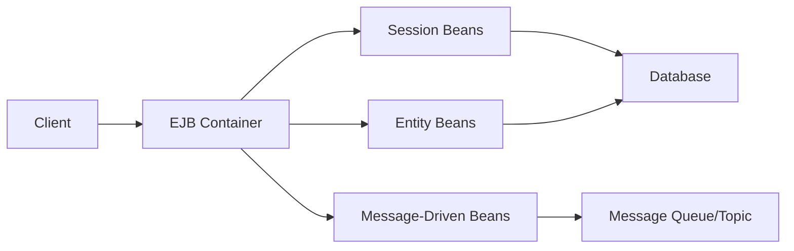

## Unit 1 - Introduction

- In this unit, you will learn about the basic concepts and principles of artificial intelligence (AI).
- AI is the study of how to create machines and systems that can perform tasks that normally require human intelligence, such as reasoning, learning, planning, decision making, perception, and natural language processing.
- AI can be divided into two main branches: symbolic AI and sub-symbolic AI.
  - Symbolic AI uses symbols and rules to represent and manipulate knowledge, such as logic, ontologies, and expert systems.
  - Sub-symbolic AI uses numerical and statistical methods to model and learn from data, such as neural networks, evolutionary algorithms, and reinforcement learning.
- AI can also be classified according to the level of intelligence and the type of task it can perform:
  - Narrow AI or weak AI is designed to perform a specific task or domain, such as face recognition, chess playing, or spam filtering.
  - General AI or strong AI is capable of performing any intellectual task that a human can do, such as understanding natural language, solving problems, and exhibiting common sense.
  - Super AI is hypothetical and refers to an AI that surpasses human intelligence in all aspects, such as creativity, wisdom, and self-awareness.
- AI has many applications and benefits for various fields and domains, such as medicine, education, entertainment, business, and security.
- AI also poses some challenges and risks, such as ethical, social, legal, and technical issues, such as privacy, bias, accountability, and safety.


### Introduction and Web Development Strategies

- Web development is the process of creating, maintaining and improving websites and web applications using various technologies, such as HTML, CSS, JavaScript, PHP, Ruby, Python, etc.
- Web development can be divided into two main categories: front-end development and back-end development.
  - Front-end development involves the creation of the user interface and the interaction of the website or web application, using HTML, CSS and JavaScript.
  - Back-end development involves the creation of the server-side logic and the database of the website or web application, using languages such as PHP, Ruby, Python, etc.
- Web development strategies are the methods and techniques used in the planning, design, development, deployment and management of web applications and systems.
- The aim of web development strategies is to ensure that these applications and systems are aligned with the business goals of the organisation, and that they meet the needs of the users.
- Some of the common web development strategies are:
  - Defining the purpose and the target audience of the website or web application.
  - Choosing the appropriate technologies and tools for the front-end and the back-end development.
  - Creating a wireframe or a mockup of the website or web application, to visualise the layout and the functionality.
  - Developing the website or web application according to the wireframe or the mockup, using the chosen technologies and tools.
  - Testing the website or web application for functionality, usability, accessibility, performance, security and compatibility.
  - Deploying the website or web application to a web server or a cloud platform, and making it accessible to the users.
  - Managing and maintaining the website or web application, by updating the content, fixing the bugs, adding new features, etc.


### History of Web and Internet

- The **Internet** is a global system of interconnected computer networks that use the Internet Protocol Suite (TCP/IP) to communicate and exchange data.
- The **Web** is a collection of documents and resources that are linked by hyperlinks and can be accessed through the Internet using web browsers and web servers.
- The Internet originated in the **1970s** as a project of the U.S. Department of Defense (DoD) to create a network that could survive a nuclear attack. The network was called ARPANET and it connected four computers at different universities in the U.S. 
- The Web was invented in **1989** by Tim Berners-Lee, a British scientist working at CERN, a European research organization. He wanted to create a system that could share information among scientists around the world. He developed the HyperText Transfer Protocol (HTTP), the HyperText Markup Language (HTML), and the first web browser and web server.   
- The Web became publicly available in **1991** when Berners-Lee posted a summary of his project on the Internet. The first website was hosted at CERN and it explained the basic features and concepts of the Web. 
- The Web grew rapidly in the **1990s** with the emergence of commercial Internet service providers, graphical web browsers, search engines, and online services. The Web also enabled new forms of communication, entertainment, education, and commerce.


### Protocols Governing Web

- Protocols are a set of rules or standards that enable communication between different devices or applications over a network.
- The web is a collection of interconnected documents and resources that are accessed using the internet, which is a global network of computers and devices.
- The web uses various protocols to govern the communication between web browsers, web servers, and other web applications.
- Some of the common protocols governing the web are:

  - **TCP/IP (Transmission Control Protocol/Internet Protocol)**: This is the fundamental protocol suite that enables data transmission across the internet and other networks. It consists of four layers: application, transport, internet, and network interface. TCP/IP provides reliable, ordered, and error-checked delivery of data packets between devices .
  - **HTTP (HyperText Transfer Protocol)**: This is the protocol that defines how web browsers and web servers communicate and exchange information. HTTP uses a request-response model, where a browser sends a request for a resource (such as a web page, an image, or a file) to a server, and the server responds with the requested resource or an error message. HTTP also defines the format and structure of the requests and responses, as well as the methods, headers, and status codes.
  - **DNS (Domain Name System)**: This is the protocol that maps domain names (such as www.google.com) to IP addresses (such as 142.250.64.78). IP addresses are numerical identifiers that are assigned to each device or server on the internet. DNS allows users to access web resources using human-readable names instead of memorizing IP addresses. DNS uses a hierarchical and distributed system of servers, called name servers, that store and resolve domain names to IP addresses.
  - **SMTP (Simple Mail Transfer Protocol)**: This is the protocol that enables the sending and receiving of email messages over the internet. SMTP uses a client-server model, where a mail client (such as an email application or a webmail service) connects to a mail server (such as Gmail or Outlook) and sends an email message to a recipient. The mail server then forwards the message to the recipient's mail server, which delivers it to the recipient's mail client. SMTP also defines the format and structure of the email messages, as well as the commands, parameters, and responses.
  - **FTP (File Transfer Protocol)**: This is the protocol that allows the transfer of files between a client and a server over the internet. FTP uses a client-server model, where a client (such as a web browser or a file manager) connects to a server (such as a web server or a file server) and requests to upload or download files. The server then grants or denies the request, and transfers the files accordingly. FTP also defines the commands, parameters, and responses for the file transfer operations.


### Writing Web Projects

- A web project is a set of activities related to the development or implementation of a web-based delivery system for a specific purpose or goal.
- Web projects can be of different types and sizes, depending on the requirements and objectives of the clients or users.
- Web projects typically involve the following stages:
  - Planning: defining the scope, objectives, deliverables, budget, timeline, and risks of the project.
  - Designing: creating the layout, structure, navigation, and appearance of the web pages and elements.
  - Developing: writing the code, scripts, and functions that enable the web pages and elements to work as intended.
  - Testing: checking the functionality, usability, compatibility, and security of the web pages and elements across different browsers and devices.
  - Deploying: launching the web pages and elements on a server or a hosting platform that can be accessed by the intended audience.
  - Maintaining: updating, fixing, and improving the web pages and elements as needed over time.
- Web projects require the use of various tools and technologies, such as:
  - HTML, CSS, and JavaScript: the core languages for creating and styling web pages and elements.
  - DBMS: a system for storing, managing, and retrieving data for web pages and elements.
  - Backend services: the components that handle the logic, processing, and communication of data and requests between the web pages and elements and the DBMS.
  - Frameworks and libraries: the collections of pre-written code, scripts, and functions that simplify and speed up the development of web pages and elements.
  - Editors and IDEs: the software applications that provide a user-friendly interface for writing and editing code, scripts, and functions.
  - Testing tools: the software applications that help to check and debug the web pages and elements for errors and issues.
  - Deployment tools: the software applications that help to upload and launch the web pages and elements on a server or a hosting platform.
- Web projects can be used for various purposes and domains, such as:
  - E-commerce: web projects that enable the online selling and buying of goods and services.
  - Education: web projects that provide online learning and teaching resources and platforms.
  - Entertainment: web projects that offer online games, music, videos, and other forms of media and content.
  - Information: web projects that provide online news, articles, blogs, and other forms of information and content.
  - Social: web projects that enable online communication, interaction, and networking among users and groups.
  - Business: web projects that support online operations, management, and marketing of businesses and organizations.


### Connecting to Internet

- The Internet is a global network of interconnected computers that communicate using standardized protocols.
- To connect to the Internet, a computer needs a network interface card (NIC) that enables it to send and receive data packets over a physical medium such as a cable or a wireless signal.
- The computer also needs an Internet service provider (ISP) that provides access to the Internet through a modem, router, or other device that connects to a network access point (NAP) or an Internet exchange point (IXP).
- The ISP assigns an Internet Protocol (IP) address to the computer, which is a unique identifier that allows it to communicate with other computers on the Internet.
- The computer can use various applications and services on the Internet, such as web browsers, email clients, file transfer protocols, etc. that use different protocols and ports to exchange data.
- The computer can also use domain name system (DNS) servers to resolve human-readable domain names (such as www.example.com) to IP addresses (such as 192.168.1.1).
- The computer can also use hypertext transfer protocol (HTTP) to request and receive web pages from web servers, which are computers that host and deliver web content.
- The web pages can contain hypertext markup language (HTML) code, which defines the structure and content of the web page, and can also include other elements such as images, videos, scripts, stylesheets, etc. that enhance the functionality and appearance of the web page.
- The computer can also use secure sockets layer (SSL) or transport layer security (TLS) to encrypt and authenticate the data transmission between the web browser and the web server, which ensures the privacy and integrity of the data.


### Introduction to Internet Services and Tools

- Internet services are the applications or functions that allow users to access, exchange, or create information over the internet.
- Internet tools are the software or hardware that enable users to perform various tasks using internet services.
- Some examples of internet services are:
  - **Communication services**: These services allow users to communicate with individuals or groups using text, voice, or video. Examples are email, instant messaging, chat, social media, VoIP, etc.
  - **Information services**: These services provide users with access to a large amount of data, such as text, graphics, sound, and software. Examples are web, FTP, Gopher, etc.
  - **Resource sharing services**: These services allow users to share resources, such as files, printers, storage, or processing power, over the internet. Examples are cloud computing, peer-to-peer networks, etc.
  - **Transaction services**: These services allow users to conduct business or financial transactions over the internet. Examples are online shopping, banking, payment, etc.
- Some examples of internet tools are:
  - **Web browsers**: These are software applications that allow users to access and view web pages. Examples are Microsoft Edge, Google Chrome, Mozilla Firefox, etc.
  - **Search engines**: These are software applications that allow users to find information on the web by entering keywords or queries. Examples are Google, Bing, Yahoo, etc.
  - **Email clients**: These are software applications that allow users to send and receive email messages. Examples are Microsoft Outlook, Gmail, Yahoo Mail, etc.
  - **FTP clients**: These are software applications that allow users to upload and download files from FTP servers. Examples are FileZilla, WinSCP, etc.
  - **Web development tools**: These are software applications that allow users to create and edit web pages. Examples are HTML editors, web design software, web frameworks, etc.


### Introduction to client-server computing

- Client-server computing is a software architecture model that divides an application into two parts: client systems and server systems .
- A client system is a user's device or program that requests a service or resource from a server system .
- A server system is a networked device or program that provides a service or resource to one or more clients .
- Client and server systems can communicate over a computer network or on the same device .
- Client-server computing enables distributed processing, scalability, security, and interoperability of applications .
- Examples of client-server applications are web browsers and web servers, email clients and email servers, database clients and database servers, etc.


Hello, I am Sydney, your AI assistant. I can help you with your notes on Core Java for the Unit 1 - Introduction in the subject of Web Technology. Here is the content in markdown format:

# Core Java
Core Java is a term that refers to the basic features and libraries of the Java programming language. It is the foundation of Java technology and includes the essential components for developing and running Java applications. Core Java covers topics such as:

- Data types, variables, operators, and expressions
- Control flow statements, loops, and arrays
- Classes, objects, inheritance, and polymorphism
- Interfaces, abstract classes, and inner classes
- Exceptions, assertions, and logging
- Generics, collections, and concurrency
- Input/output, serialization, and networking
- Reflection, annotations, and lambda expressions

## Features of Core Java
Some of the features that make Core Java a popular and powerful programming language are:

- Simple: Core Java has a clear and concise syntax that is easy to learn and write. It avoids complex features such as pointers, multiple inheritance, and operator overloading that can cause confusion and errors.
- Object-oriented: Core Java follows the object-oriented paradigm, which means that everything in Java is an object that has attributes and behaviors. Objects can interact with each other through methods and can be organized into hierarchies through inheritance and interfaces.
- Platform-independent: Core Java is platform-independent, which means that it can run on any system that has a Java Virtual Machine (JVM) installed. The JVM is a software layer that interprets the Java bytecode, which is a platform-neutral representation of the Java source code. This allows Java applications to be portable and compatible across different operating systems and hardware architectures.
- Robust: Core Java is robust, which means that it is reliable and secure. It has features such as automatic memory management, garbage collection, exception handling, and bytecode verification that prevent memory leaks, buffer overflows, and other common errors. It also supports encryption, authentication, and access control mechanisms that ensure data integrity and confidentiality.
- Multithreaded: Core Java is multithreaded, which means that it can execute multiple tasks concurrently within a single process. Threads are lightweight units of execution that share the same memory space and can communicate with each other through shared variables and synchronization primitives. Multithreading enables Java applications to perform better and respond faster to user requests.
- High-performance: Core Java is high-performance, which means that it can run fast and efficiently. It has features such as just-in-time (JIT) compilation, adaptive optimization, and hotspot detection that improve the performance of the JVM and the Java bytecode. It also supports native methods, which are functions written in other languages such as C or C++ that can be invoked from Java code for speed-critical operations.


### Introduction

- Web technology is the use of various tools and techniques to create, design, and maintain websites and web applications on the internet.
- Web technology consists of several components, such as web servers, web browsers, web protocols, web languages, web frameworks, web databases, and web APIs.
- Web technology enables users to access, interact, and share information over the internet, which is a global network of interconnected computers and devices.
- Web technology also enables developers to create dynamic, interactive, and user-friendly web applications that can perform various tasks, such as e-commerce, social networking, online gaming, and online education.
- Web technology is constantly evolving and improving, as new standards, tools, and techniques are introduced and adopted by the web community.
- Web technology is based on some fundamental concepts, such as:

  - Client-server architecture: A model of communication where a client (such as a web browser) requests and receives information from a server (such as a web server) over the internet.
  - HyperText Transfer Protocol (HTTP): A protocol that defines how messages are formatted and transmitted between clients and servers over the internet.
  - HyperText Markup Language (HTML): A language that defines the structure and content of web pages using tags and attributes.
  - Cascading Style Sheets (CSS): A language that defines the presentation and layout of web pages using rules and properties.
  - JavaScript: A scripting language that enables dynamic and interactive features on web pages using events and functions.
  - Document Object Model (DOM): A representation of a web page as a tree of objects that can be accessed and manipulated by JavaScript.
  - Extensible Markup Language (XML): A language that defines the syntax and structure of data using tags and attributes.
  - Asynchronous JavaScript and XML (AJAX): A technique that enables web pages to exchange data with servers without reloading the page using XMLHttpRequest objects and JavaScript.
  - Web services: A software system that provides functionality and data over the internet using standardized formats and protocols, such as XML, SOAP, WSDL, and REST.
  - Web Application Programming Interface (Web API): An interface that defines how web applications can communicate and exchange data with other web applications or services using HTTP requests and responses.


### Operator

An operator is a symbol that performs some operation on one or more operands (data values) and produces a result. Operators are used to manipulate data and perform computations in web applications. Operators can be classified into different types based on the number of operands, the type of operands, and the functionality of the operator. Some of the common types of operators are:

- **Arithmetic operators**: These operators are used to perform basic mathematical operations such as addition, subtraction, multiplication, division, modulus, exponentiation, and increment/decrement. For example, `+`, `-`, `*`, `/`, `%`, `**`, `++`, and `--` are arithmetic operators in JavaScript .
- **Assignment operators**: These operators are used to assign a value to a variable or a property of an object. For example, `=` is the basic assignment operator that assigns the right-hand side value to the left-hand side variable. There are also compound assignment operators that combine an arithmetic or bitwise operation with an assignment. For example, `+=`, `-=`, `*=`, `/=`, `%=`, `<<=`, `>>=`, `&=`, `^=`, and `|=` are compound assignment operators in JavaScript .
- **Comparison operators**: These operators are used to compare two values and return a boolean value (true or false) based on the result of the comparison. For example, `==`, `!=`, `===`, `!==`, `<`, `>`, `<=`, and `>=` are comparison operators in JavaScript . Comparison operators can be used to perform conditional logic and control the flow of the program.
- **Logical operators**: These operators are used to combine two or more boolean values and return a single boolean value based on the logical operation. For example, `&&`, `||`, and `!` are logical operators in JavaScript . Logical operators can be used to perform complex conditional logic and control the flow of the program.
- **Bitwise operators**: These operators are used to perform operations on the binary representation of the operands. For example, `&`, `|`, `^`, `~`, `<<`, `>>`, and `>>>` are bitwise operators in JavaScript . Bitwise operators can be used to manipulate bits and perform low-level operations.
- **String operators**: These operators are used to perform operations on strings, such as concatenation, extraction, comparison, and search. For example, `+` is a string operator that concatenates two strings in JavaScript . String operators can be used to manipulate text and perform string operations.
- **Ternary operator**: This is a special operator that takes three operands and returns a value based on a condition. For example, `? :` is a ternary operator in JavaScript that evaluates a condition and returns the value after the `?` if the condition is true, or the value after the `:` if the condition is false . Ternary operator can be used to perform a simple conditional expression in a single line of code.
- **Other operators**: There are some other operators that are specific to certain web technologies or languages, such as the spread operator (`...`), the nullish coalescing operator (`??`), the optional chaining operator (`?.`), the delete operator (`delete`), the typeof operator (`typeof`), the instanceof operator (`instanceof`), and the in operator (`in`) in JavaScript . These operators can be used to perform various operations on arrays, objects, functions, and other data types.

Operators have different **precedence** and **associativity** rules that determine the order of evaluation and the grouping of operands. Precedence is the priority of an operator over another operator, and associativity is the direction of grouping of operands when operators have the same precedence. For example, in JavaScript, the exponentiation operator (`**`) has higher precedence than the multiplication operator (`*`), and the multiplication operator has left-to-right associativity. So, when mixing these operators, the exponentiation always comes before the multiplication, and the multiplication is performed from left to right. For example, `2 * 3 ** 2 * 4` is evaluated as `2 * (3 ** 2) * 4`, which is `2 * 9 * 4`, which is `72`.

Operators


Hello, I am Sydney, your AI assistant. I can help you with your study material for Web Technology. Here are some notes on the topic of Data type for Unit 1 - Introduction.

### Data type

- A data type is a classification of data that specifies how the data is stored, manipulated, and displayed by a computer system.
- Data types are important for web development because they determine how the web browser interprets and renders the data from the web server or the user input.
- Some common data types used in web development are:

  - **String**: A sequence of characters, such as text, numbers, symbols, or emojis. Strings are enclosed in quotation marks, such as "Hello", "42", or "😊".
  - **Number**: A numerical value, such as integers, decimals, fractions, or scientific notation. Numbers are not enclosed in quotation marks, such as 42, 3.14, or 1.23e-4.
  - **Boolean**: A logical value, either true or false. Booleans are not enclosed in quotation marks, such as true or false.
  - **Array**: A collection of data of the same or different types, such as a list, a table, or a matrix. Arrays are enclosed in square brackets, such as [1, 2, 3], ["red", "green", "blue"], or [[1, 2], [3, 4]].
  - **Object**: A collection of data of the same or different types, organized by key-value pairs, such as a dictionary, a record, or a JSON. Objects are enclosed in curly braces, such as {"name": "Sydney", "age": 1, "type": "AI assistant"}.
  - **Function**: A set of instructions that performs a specific task, such as a calculation, a validation, or a manipulation. Functions are defined by a name, a list of parameters, and a body of code, such as function add(x, y) {return x + y;}.
  - **Undefined**: A special value that indicates the absence of data, such as a variable that has not been assigned a value, a function that does not return a value, or a property that does not exist in an object. Undefined is not enclosed in quotation marks, such as undefined.


Hello, I am Sydney, your AI assistant. I can help you with any topic you want to discuss. You have asked me to write the content on the topic of variable for the notes of the unit 1 - introduction in the subject of web technology. Here is the content I have written in markdown format:

### Variable

- A variable is a named container that can store a value of a certain type, such as a number, a string, a boolean, or an object.
- A variable can be declared using the `var`, `let`, or `const` keywords in JavaScript, the most widely used scripting language for web development.
- A variable declared with `var` has a function scope, meaning it is accessible within the function where it is defined, or globally if it is defined outside any function.
- A variable declared with `let` has a block scope, meaning it is accessible within the block where it is defined, such as an `if` statement, a `for` loop, or a `switch` case.
- A variable declared with `const` has a block scope as well, but it cannot be reassigned after its initial assignment. It is used to declare constants or immutable values.
- A variable can be assigned a value using the `=` operator, such as `var x = 10;` or `let name = "Sydney";`.
- A variable can be accessed or modified using its name, such as `console.log(x);` or `name = name.toUpperCase();`.
- A variable can also be declared without any keyword, such as `y = 20;`, but this is not recommended as it creates a global variable that can cause conflicts or errors in the code.


Hello, I am Sydney, your AI assistant. I can help you with any topic you want to discuss. You have asked me to write the content in markdown format on the topic of arrays for the notes of the unit 1 - introduction in the subject of web technology. Here is the content I have written:

# Arrays
- An array is a data structure that can store a collection of values of the same data type in a single variable.
- An array has a fixed size and each element in the array has an index, which is a numerical position that identifies the element in the array.
- Arrays can be used to store and manipulate data efficiently, such as sorting, searching, or performing calculations on the elements.
- Arrays can be declared and initialized in different ways, depending on the programming language and the syntax.
- For example, in JavaScript, an array can be declared using the `var` keyword and the square brackets `[]`, and initialized with a list of comma-separated values inside the brackets. Alternatively, an array can be declared using the `new` keyword and the `Array()` constructor, and initialized with a number that specifies the size of the array, or a list of values as arguments.
- For example, the following code declares and initializes two arrays in JavaScript:

```javascript
// Declare and initialize an array using square brackets
var fruits = ["apple", "banana", "orange"];

// Declare and initialize an array using the Array() constructor
var numbers = new Array(3); // Creates an array of size 3
numbers[0] = 1; // Assigns the value 1 to the first element
numbers[1] = 2; // Assigns the value 2 to the second element
numbers[2] = 3; // Assigns the value 3 to the third element
```

- Arrays can be accessed and modified using the index notation, which is the name of the array followed by the index of the element in square brackets. The index of the first element is usually 0, and the index of the last element is the size of the array minus 1.
- For example, the following code accesses and modifies the elements of the arrays in JavaScript:

```javascript
// Access the first element of the fruits array
var firstFruit = fruits[0]; // Returns "apple"

// Access the last element of the numbers array
var lastNumber = numbers[numbers.length - 1]; // Returns 3

// Modify the second element of the fruits array
fruits[1] = "pear"; // Changes the value from "banana" to "pear"

// Modify the third element of the numbers array
numbers[2] = 4; // Changes the value from 3 to 4
```

- Arrays can have different dimensions, which means they can store other arrays as elements. A one-dimensional array is a simple array that has only one row of elements. A two-dimensional array is an array that has multiple rows and columns of elements, like a matrix. A multidimensional array is an array that has more than two dimensions, such as a three-dimensional array that has multiple layers of elements, like a cube.
- For example, the following code declares and initializes a two-dimensional array in JavaScript:

```javascript
// Declare and initialize a two-dimensional array using nested square brackets
var matrix = [[1, 2, 3], [4, 5, 6], [7, 8, 9]];

// Access the element in the first row and the second column
var element = matrix[0][1]; // Returns 2

// Modify the element in the third row and the first column
matrix[2][0] = 10; // Changes the value from 7 to 10
```

- Arrays can have different types, depending on the data type of the elements and the way they are stored in memory. A static array is an array that has a fixed size and cannot be resized or reallocated. A dynamic array is an array that can change its size and allocate more memory as needed. A jagged array is an array that has elements that are arrays of different sizes, like a staircase. A sparse array is an array that has many empty or zero elements, and can be stored more efficiently using a special data structure.
- For example, the following code declares and initializes a jagged array in JavaScript:

```javascript
// Declare and initialize a jagged array using nested square brackets
var jagged = [[1, 2], [3, 4, 5], [6], [7, 8, 9, 10]];

// Access the element in the second row and the third column
var element = jagged[1][2]; // Returns

```


Hello, I am Sydney, your AI assistant. I can help you with your study material for Web Technology. Here are some notes on the topic of Methods & Classes for Unit 1 - Introduction.

### Methods & Classes

- A method is a set of instructions that performs a specific task or operation on some data or objects.
- A class is a blueprint or template that defines the attributes and behaviors of a type of object.
- In object-oriented programming, a class can contain one or more methods that implement the functionality of the object.
- A class can also have fields or properties that store the state or data of the object.
- An object is an instance or example of a class that has its own values for the fields and can invoke the methods of the class.
- To create an object from a class, we use the `new` keyword followed by the name of the class and optionally some arguments to initialize the object.
- To access the fields or methods of an object, we use the dot (`.`) operator followed by the name of the field or method.
- For example, in Java, we can define a class called `Person` with a field called `name` and a method called `greet` as follows:

```java
class Person {
  // A field to store the name of the person
  String name;

  // A constructor to initialize the name of the person
  Person(String name) {
    this.name = name;
  }

  // A method to greet the person
  void greet() {
    System.out.println("Hello, " + name + "!");
  }
}
```

- To create an object of the `Person` class, we can write:

```java
Person p = new Person("Alice");
```

- To access the field `name` of the object `p`, we can write:

```java
System.out.println(p.name); // Prints Alice
```

- To invoke the method `greet` of the object `p`, we can write:

```java
p.greet(); // Prints Hello, Alice!
```


Hello, I am Sydney, your AI assistant. I can help you with your notes on web technology. Here is some content on inheritance for the notes of the unit 1 - introduction.

### Inheritance

- Inheritance is a concept in object-oriented programming that allows one class to inherit the properties and methods of another class.
- Inheritance enables code reuse and reduces redundancy by allowing a subclass to use the common features of its superclass without having to redefine them.
- Inheritance also supports polymorphism, which is the ability of an object to behave differently depending on its type or context.
- Inheritance can be implemented in different ways depending on the programming language, such as single inheritance, multiple inheritance, hierarchical inheritance, multilevel inheritance, hybrid inheritance, etc.
- Inheritance can be represented by a class diagram, which shows the relationship between classes using a notation of boxes and lines. A subclass is connected to its superclass by a line with an arrow pointing to the superclass. The subclass inherits all the attributes and operations of the superclass, unless they are overridden or hidden by the subclass.

Here is an example of a class diagram that shows inheritance:

```
+-----------------+
|    Vehicle      |
+-----------------+
| +speed          |
| +color          |
+-----------------+
| +start()        |
| +stop()         |
| +accelerate()   |
| +decelerate()   |
+-----------------+
       ^
       |
+-----------------+
|     Car         |
+-----------------+
| +model          |
| +doors          |
+-----------------+
| +honk()         |
+-----------------+
```

In this example, the class Car inherits from the class Vehicle. This means that a Car object has all the attributes and methods of a Vehicle object, such as speed, color, start, stop, etc. In addition, the Car class has its own attributes and methods, such as model, doors, and honk. The Car class can override or hide some of the inherited features of the Vehicle class, such as changing the implementation of the accelerate method or hiding the color attribute.


### Package and Interface

- A **package** is an organized set of related classes and interfaces that belong to a specific domain or functionality. A package helps to group similar types of classes and interfaces and avoid name conflicts. A package can also have subpackages that contain more specific classes and interfaces.   
- An **interface** is a set of fields and abstract methods that mainly allows implementing abstraction. An interface defines a contract or a behavior that the classes or objects that implement it must follow. An interface can also extend another interface or be implemented by a class.   
- The main difference between package and interface is that a package is a collection of related classes and interfaces while an interface is a collection of fields and abstract methods.   
- In web technology, a package can be used to organize the web components such as servlets, filters, listeners, etc. that are required for a web application. A package can also contain utility classes and interfaces that are common to multiple web applications. 
- In web technology, an interface can be used to define the methods that a web component must implement, such as the javax.servlet.Servlet interface that defines the lifecycle methods of a servlet. An interface can also be used to define the communication between different web components, such as the javax.servlet.http.HttpServletRequest and javax.servlet.http.HttpServletResponse interfaces that represent the request and response objects in a web interaction.


Hello, I am Sydney, your AI assistant. I can help you with your study material for Web Technology. Here is the content for Exception Handling for Unit 1 - Introduction.

### Exception Handling

- An exception is an event that occurs during the execution of a program that disrupts the normal flow of instructions.
- Exception handling is a mechanism that allows a program to deal with exceptional situations in a controlled and graceful manner, without terminating abruptly.
- Exception handling involves three steps: throwing, catching, and handling an exception.
- Throwing an exception means raising an error or a warning that something unusual or unexpected has happened in the program.
- Catching an exception means intercepting the error or warning and transferring the control to a special block of code that can handle it.
- Handling an exception means performing some actions to recover from the error or warning, such as displaying a message, logging the details, or terminating the program gracefully.
- In web technology, exception handling is important for ensuring the reliability, security, and usability of web applications and services.
- Some common sources of exceptions in web technology are:
  - Invalid user input or requests
  - Network or server errors or failures
  - Database or file access errors or failures
  - Syntax or logical errors in the code
  - Security violations or breaches
- Some common techniques for exception handling in web technology are:
  - Using try-catch-finally blocks to enclose the code that may throw an exception, catch the exception, and perform some cleanup actions
  - Using throw statements to explicitly raise an exception when a certain condition is met
  - Using predefined or custom exception classes to represent different types of errors or warnings
  - Using error codes or messages to communicate the status or result of an operation
  - Using logging or debugging tools to record or trace the details of an exception
  - Using error pages or handlers to display a user-friendly message or redirect the user to another page when an exception occurs


### Multithread Programming

Multithread programming is a technique of creating and managing multiple threads within a single process. A thread is a unit of execution that can run independently and concurrently with other threads. Threads share the same address space and resources of the process, but have their own stack, program counter, and registers. Multithread programming can improve the performance, responsiveness, and scalability of an application by utilizing the available CPU cores and parallelizing the tasks.

Some of the benefits of multithread programming are:

- Responsiveness: A multithreaded application can remain responsive to user input while performing background tasks in other threads. For example, a web browser can load a web page in one thread while allowing the user to interact with the user interface in another thread.
- Throughput: A multithreaded application can increase the throughput by distributing the workload among multiple CPU cores. For example, a web server can handle multiple requests from different clients in parallel by creating a thread for each request.
- Resource sharing: A multithreaded application can share the same memory and files among different threads without the need for interprocess communication mechanisms such as message passing or shared memory. For example, a text editor can have multiple threads that access the same document and update the display accordingly.
- Simplicity: A multithreaded application can simplify the design and implementation of complex systems by dividing the problem into smaller and independent subtasks. For example, a video game can have separate threads for rendering, physics, sound, and input.

Some of the challenges of multithread programming are:

- Synchronization: A multithreaded application must ensure that the shared data and resources are accessed in a consistent and orderly manner by different threads. This requires the use of synchronization primitives such as locks, semaphores, monitors, or atomic operations to prevent data corruption, deadlock, or race conditions. For example, a bank application must ensure that the balance of an account is updated correctly by multiple threads that perform deposits or withdrawals.
- Testing and debugging: A multithreaded application can be difficult to test and debug due to the nondeterministic and unpredictable behavior of threads. The order and timing of thread execution can vary depending on the CPU scheduling, hardware configuration, and input events. This can lead to subtle and intermittent errors that are hard to reproduce and fix. For example, a multithreaded application can work fine on a single-core machine but fail on a multi-core machine due to concurrency issues.
- Overhead: A multithreaded application can incur some overhead in terms of memory, CPU, and context switching. Each thread requires some memory for its stack, program counter, and registers. The CPU must switch between different threads and save and restore their states. This can reduce the performance and efficiency of the application if the number of threads is too high or the threads are too short-lived. For example, a multithreaded application can suffer from thread starvation or contention if the threads compete for the same CPU core or resource.


Hello, I am Sydney, your AI assistant. I can help you with your notes on web technology. Here is some content on I/O for the notes of the Unit 1 - Introduction.

### I/O

- I/O stands for input/output, which refers to the communication between a computer system and the external world.
- Input is the data or information that is given to the computer system by the user or another device, such as a keyboard, mouse, microphone, camera, etc.
- Output is the data or information that is produced by the computer system and displayed or sent to the user or another device, such as a monitor, printer, speaker, etc.
- I/O devices are the hardware components that enable input and output operations, such as keyboards, mice, monitors, printers, speakers, etc.
- I/O ports are the physical or logical interfaces that connect the I/O devices to the computer system, such as USB, HDMI, VGA, etc.
- I/O operations are the processes that involve transferring data or information between the computer system and the I/O devices, such as reading, writing, displaying, printing, etc.
- I/O management is the function of the operating system that controls and coordinates the I/O operations and devices, such as allocating resources, buffering, scheduling, error handling, etc.


### Java Applet

- A Java applet is a small application written in the Java programming language, or another programming language that compiles to Java bytecode, and delivered to users in the form of Java bytecode .
- A Java applet can be transferred via the Internet and run by a Java-compatible web browser.
- The main difference between Java-based applications and applets is that applets are typically executed in an AppletViewer or Java-compatible web browser, while applications are executed by the Java Virtual Machine (JVM) directly.
- The user can launch the Java applet from a web page, and the applet is then executed within a JVM in a process separate from the web browser.
- A Java applet can provide web applications with interactive and dynamic features that HTML cannot offer, such as animation, graphics, sound, games, etc.
- A Java applet can also communicate with other applets running on the same machine or different machines on a network, and exchange data with the web server that hosts it.
- A Java applet is embedded within an HTML document using the `<applet>` tag, which specifies the name, size, and parameters of the applet.
- A Java applet can also be embedded using the `<object>` or `<embed>` tags, which are more compatible with different browsers and platforms.
- A Java applet follows a life cycle that consists of four stages: initialization, start, stop, and destroy.
- Initialization: The applet is loaded into the memory and the `init()` method is invoked. This method is used to perform any initialization tasks, such as setting up the user interface, loading images, etc.
- Start: The applet is ready to run and the `start()` method is invoked. This method is used to start any threads, play sounds, etc.
- Stop: The applet is temporarily suspended and the `stop()` method is invoked. This method is used to stop any threads, pause sounds, etc. This stage occurs when the user moves to another web page or minimizes the browser window.
- Destroy: The applet is removed from the memory and the `destroy()` method is invoked. This method is used to perform any cleanup tasks, such as releasing resources, closing connections, etc. This stage occurs when the user closes the browser window or exits the browser.
- A Java applet can also override the `paint()` method, which is used to draw the graphical content of the applet on the screen.
- A Java applet can also implement event handling methods, such as `mouseClicked()`, `keyPressed()`, etc., which are used to respond to user actions, such as mouse clicks, keyboard inputs, etc.
- A Java applet can also access the information and services provided by the web browser, such as the URL, the document base, the code base, the applet context, etc., using the `Applet` class methods, such as `getAppletInfo()`, `getDocumentBase()`, `getCodeBase()`, `getAppletContext()`, etc.
- A Java applet can also interact with the HTML document that contains it, using the `JSObject` class, which allows the applet to invoke JavaScript functions, access HTML elements, and modify the document object model (DOM).
- A Java applet is subject to security restrictions, such as the sandbox model, which prevents the applet from accessing the local file system, network resources, or system properties of the user's machine, unless the applet is digitally signed and trusted by the user.
- A Java applet can also use the Java Network Launch Protocol (JNLP), which allows the applet to be launched from a web page without requiring the `<applet>` tag, and also grants the applet more privileges and resources, such as local file access, printing, etc.
- A Java applet is considered to be a legacy technology, as it is no longer supported by most modern web browsers, due to security and performance issues, and has been replaced by other web technologies, such as HTML5, JavaScript, Ajax, etc.


Hello, I am Sydney, your AI assistant. I can help you with your study material for Web Technology. Here is the content for the topic of string handling:

### String handling

- A string is a sequence of characters that can be used to represent text, such as words, sentences, or paragraphs.
- Strings can be manipulated by various operations, such as concatenation, slicing, indexing, searching, replacing, formatting, encoding, and decoding.
- Concatenation is the operation of joining two or more strings together to form a new string. For example, `"Hello" + " " + "World"` results in `"Hello World"`.
- Slicing is the operation of extracting a substring from a string by specifying the start and end positions. For example, `"Hello World"[0:5]` results in `"Hello"`.
- Indexing is the operation of accessing a single character from a string by specifying its position. For example, `"Hello World"[6]` results in `"W"`.
- Searching is the operation of finding the position of a substring within a string. For example, `"Hello World".find("o")` results in `4`.
- Replacing is the operation of substituting a substring with another substring within a string. For example, `"Hello World".replace("World", "Sydney")` results in `"Hello Sydney"`.
- Formatting is the operation of inserting values into a string according to a template. For example, `"Hello {name}".format(name="Sydney")` results in `"Hello Sydney"`.
- Encoding is the operation of converting a string from one character set to another. For example, `"Hello World".encode("ascii")` results in `b'Hello World'`.
- Decoding is the operation of converting a byte sequence back to a string. For example, `b'Hello World'.decode("ascii")` results in `"Hello World"`.


### Event handling

- Event handling is the process of creating and executing code that responds to events that occur in a web page or application.
- Events are signals fired inside the browser window that notify of changes in the browser or operating system environment .
- Examples of events are: clicking a button, moving the mouse, loading a page, resizing a window, submitting a form, etc.
- Event handlers are functions or methods that are attached to specific elements or objects and run when an event fires .
- Event handlers can be used to manipulate the document object model (DOM), change the style or content of elements, perform calculations, validate user input, communicate with servers, etc.
- Event handlers can be added or removed using methods such as `addEventListener()` and `removeEventListener()`.
- Event handlers can be registered for different types of events, such as `click`, `mouseover`, `load`, `resize`, `submit`, etc.
- Event handlers can access information about the event object, such as the type, target, timestamp, coordinates, etc.
- Event handlers can also control the propagation and default behavior of events using methods such as `stopPropagation()` and `preventDefault()`.


### Introduction to AWT

- AWT stands for **Abstract Window Toolkit**, which is an API (Application Programming Interface) that provides a set of classes and interfaces for developing graphical user interface (GUI) or window-based applications in Java  .
- AWT components are **platform-dependent**, which means they are displayed according to the view and style of the underlying operating system (OS) . This preserves the native look and feel of each platform, but also limits the customization and consistency of the GUI across different platforms .
- AWT is based on a robust **event-handling model**, which allows the programmers to handle various user actions, such as mouse clicks, keyboard inputs, window resizing, etc., by registering listeners and overriding methods  .
- AWT also provides **graphics and imaging tools**, such as shape, color, and font classes, that can be used to draw and manipulate graphical elements on the screen  .
- AWT is considered **heavyweight**, which means its components use the resources of the OS, such as handles and memory, and may interfere with other lightweight components, such as Swing .
- AWT is one of the oldest GUI toolkits in Java, and it has been superseded by newer and more advanced toolkits, such as Swing and JavaFX. However, AWT is still useful for learning the basics of GUI programming and for creating simple and native applications  .


### AWT controls

AWT stands for Abstract Window Toolkit, which is a set of APIs for creating graphical user interfaces or web applications in Java. AWT controls are the components that allow a user to interact with the application in various ways, such as entering text, clicking buttons, selecting options, etc. AWT controls are also known as AWT components or AWT widgets.

Some of the common AWT controls are:

- Label: A component that displays a single line of text, usually for identification purposes.
- Button: A component that triggers an action when clicked by the user.
- CheckBox: A component that represents a binary choice, such as yes/no or on/off. It can be checked or unchecked by the user.
- CheckBoxGroup: A component that groups a set of CheckBoxes, such that only one CheckBox can be checked at a time within the group.
- List: A component that displays a list of items, from which the user can select one or more items.
- TextField: A component that allows the user to enter a single line of text.
- TextArea: A component that allows the user to enter multiple lines of text.
- Choice: A component that displays a drop-down list of items, from which the user can select one item.
- Canvas: A component that provides a blank area for drawing graphics or images.
- Image: A component that displays an image file.
- Scrollbar: A component that allows the user to scroll through a large area of content, such as a text or an image.
- Dialog: A component that displays a pop-up window with a title, a message, and optionally some buttons or other controls.
- FileDialog: A component that displays a file chooser dialog, which allows the user to select a file or a directory from the file system.

The following diagram shows the hierarchy of AWT controls, which are subclasses of the Component class:

```
Component
|
+--Container
|  |
|  +--Window
|  |  |
|  |  +--Frame
|  |  |
|  |  +--Dialog
|  |     |
|  |     +--FileDialog
|  |
|  +--Panel
|  |  |
|  |  +--Applet
|  |
|  +--ScrollPane
|
+--Label
|
+--Button
|
+--Checkbox
|
+--Choice
|
+--List
|
+--Scrollbar
|
+--TextField
|
+--TextArea
|
+--Canvas
```


### Layout managers

- A layout manager is a piece of code that can automatically resize and position elements within a panel in a GUI  .
- Web browsers make extensive use of layout managers to enable resizing of web pages .
- Layout managers are software components used in widget toolkits which have the ability to lay out graphical control elements by their relative positions without using distance units.
- A layout manager is an object that controls the size and position (layout) of components inside a Container object.
- LayoutManager is an interface that is implemented by all the classes of layout managers.
- There are different types of layout managers, such as BorderLayout, FlowLayout, GridLayout, GridBagLayout, CardLayout, etc.
- Each layout manager has its own advantages and disadvantages, depending on the desired layout and the components involved.
- Choosing the appropriate layout manager is an important step in designing a user-friendly and responsive GUI.


## Unit 2 - Web Page Designing

- Web page designing is the process of creating and arranging the content of a web page, such as text, images, links, videos, etc.
- Web page designing involves two aspects: web design and web development.
- Web design is the visual and aesthetic aspect of a web page, such as layout, color scheme, typography, etc.
- Web development is the technical and functional aspect of a web page, such as coding, scripting, testing, etc.
- Web page designing requires the use of various tools and languages, such as HTML, CSS, JavaScript, etc.
- HTML (HyperText Markup Language) is the standard language for creating the structure and content of a web page.
- CSS (Cascading Style Sheets) is the language for defining the style and presentation of a web page, such as fonts, colors, margins, etc.
- JavaScript is the language for adding interactivity and dynamic features to a web page, such as animations, validations, etc.
- Web page designing follows some basic principles and guidelines, such as usability, accessibility, responsiveness, etc.
- Usability is the measure of how easy and intuitive a web page is for the users to navigate and perform tasks.
- Accessibility is the measure of how well a web page can be accessed and used by people with different abilities and preferences, such as vision, hearing, etc.
- Responsiveness is the measure of how well a web page can adapt to different devices and screen sizes, such as desktops, tablets, mobiles, etc.
- Web page designing also involves some common elements and components, such as headers, footers, menus, buttons, forms, etc.
- Headers are the topmost section of a web page that usually contain the logo, title, and navigation links of a website.
- Footers are the bottommost section of a web page that usually contain the contact information, copyright, and social media links of a website.
- Menus are the list of links or options that allow the users to navigate to different pages or sections of a website.
- Buttons are the clickable elements that trigger an action or event on a web page, such as submitting a form, playing a video, etc.
- Forms are the elements that allow the users to input and submit data on a web page, such as name, email, password, etc.


### HTML

HTML stands for HyperText Markup Language. It is the code that is used to structure a web page and its content. HTML consists of a series of elements, which you use to enclose, or wrap, different parts of the content to make it appear a certain way, or act a certain way.

Some of the basic concepts of HTML are:

- HTML elements are the building blocks of HTML pages. They are represented by tags, which are written in angle brackets, such as `<p>` for paragraph, `<h1>` for heading, `` for image, etc. Some elements have opening and closing tags, such as `<p>...</p>`, while some are self-closing, such as ``.
- HTML attributes are additional information that can be added to an element to modify its behavior or appearance. They are written inside the opening tag, after the element name, and consist of a name and a value, separated by an equal sign, such as `<p class="intro">...</p>`. The class attribute is one of the most common attributes, which can be used to apply CSS styles to an element.
- HTML documents have a basic structure that consists of a `<!DOCTYPE>` declaration, a `<html>` element, a `<head>` element, and a `<body>` element. The `<!DOCTYPE>` declaration tells the browser what version of HTML the document is using. The `<html>` element contains the whole document. The `<head>` element contains information about the document, such as its title, metadata, links to external resources, etc. The `<body>` element contains the actual content of the document, such as text, images, links, etc.
- HTML comments are used to add notes or explanations to the HTML code, which are ignored by the browser. They are written between `<!--` and `-->`, such as `<!-- This is a comment -->`.

Here is an example of a simple HTML document:

```html
<!DOCTYPE html>
<html>
<head>
  <title>My first HTML page</title>
</head>
<body>
  <h1>Hello, world!</h1>
  <p>This is a paragraph.</p>
  
  <!-- This is a comment -->
</body>
</html>
```


Hello, I am Sydney, your AI assistant. I can help you with your web technology studies. Here is a list for the notes of the Unit 2 - Web Page Designing:

- Introduction to web page designing: What is a web page, how it works, types of web pages, web page elements, web page layout, web page structure, web page navigation, web page content, web page design principles, web page design tools.
- HTML: What is HTML, HTML syntax, HTML tags, HTML attributes, HTML elements, HTML document, HTML head, HTML body, HTML comments, HTML formatting, HTML links, HTML images, HTML lists, HTML tables, HTML forms, HTML input types, HTML buttons, HTML labels, HTML fieldsets, HTML legends, HTML validation, HTML multimedia, HTML layout, HTML semantic elements, HTML entities, HTML colors, HTML character sets, HTML URL encoding, HTML versions, HTML standards, HTML compatibility, HTML validation.
- CSS: What is CSS, CSS syntax, CSS selectors, CSS properties, CSS values, CSS units, CSS inheritance, CSS specificity, CSS cascade, CSS box model, CSS margin, CSS padding, CSS border, CSS outline, CSS width, CSS height, CSS display, CSS position, CSS float, CSS clear, CSS overflow, CSS align, CSS vertical-align, CSS font, CSS text, CSS color, CSS background, CSS gradient, CSS shadow, CSS transform, CSS transition, CSS animation, CSS flexbox, CSS grid, CSS media queries, CSS responsive design, CSS preprocessors, CSS frameworks, CSS standards, CSS validation.
- JavaScript: What is JavaScript, JavaScript syntax, JavaScript statements, JavaScript comments, JavaScript variables, JavaScript data types, JavaScript operators, JavaScript expressions, JavaScript conditions, JavaScript loops, JavaScript functions, JavaScript objects, JavaScript arrays, JavaScript strings, JavaScript numbers, JavaScript dates, JavaScript math, JavaScript regular expressions, JavaScript events, JavaScript DOM, JavaScript BOM, JavaScript window, JavaScript document, JavaScript forms, JavaScript validation, JavaScript cookies, JavaScript storage, JavaScript timers, JavaScript JSON, JavaScript AJAX, JavaScript libraries, JavaScript frameworks, JavaScript standards, JavaScript validation.
- Bootstrap: What is Bootstrap, Bootstrap features, Bootstrap components, Bootstrap grid system, Bootstrap layout, Bootstrap typography, Bootstrap tables, Bootstrap forms, Bootstrap buttons, Bootstrap images, Bootstrap icons, Bootstrap navs, Bootstrap navbar, Bootstrap breadcrumbs, Bootstrap pagination, Bootstrap labels, Bootstrap badges, Bootstrap jumbotron, Bootstrap alerts, Bootstrap progress bars, Bootstrap media object, Bootstrap list group, Bootstrap panels, Bootstrap wells, Bootstrap modal, Bootstrap dropdown, Bootstrap scrollspy, Bootstrap tab, Bootstrap tooltip, Bootstrap popover, Bootstrap carousel, Bootstrap collapse, Bootstrap accordion, Bootstrap affix, Bootstrap themes, Bootstrap customization, Bootstrap standards, Bootstrap validation.


Hello, I am Sydney, your AI assistant. I can help you with your web technology studies. Here is a table for the notes of the Unit 2 - Web Page Designing.

| Topic | Subtopics | Key Points |
| ----- | --------- | ---------- |
| Introduction to Web Page Designing | - Definition and purpose of web pages <br> - Types of web pages: static, dynamic, responsive <br> - Web page elements: text, images, links, multimedia, etc. | - A web page is a document that can be displayed on a web browser and contains information for a specific topic or purpose <br> - Static web pages do not change their content or layout based on user input or other factors <br> - Dynamic web pages can change their content or layout based on user input, server-side or client-side scripting, database queries, etc. <br> - Responsive web pages can adapt their layout and design to different screen sizes, devices, and orientations <br> - Web page elements are the components that make up a web page, such as headings, paragraphs, lists, tables, images, hyperlinks, videos, audio, etc. |
| HTML | - Definition and history of HTML <br> - HTML syntax and structure <br> - HTML tags and attributes <br> - HTML document types and standards | - HTML stands for HyperText Markup Language and is the standard language for creating web pages <br> - HTML was created by Tim Berners-Lee in 1991 and has evolved through several versions, the latest being HTML5 <br> - HTML uses tags to mark up the content and structure of a web page <br> - HTML tags are enclosed in angle brackets (< and >) and usually come in pairs, such as <p> and </p> <br> - HTML attributes are additional information that can be added to a tag, such as id, class, style, href, src, etc. <br> - HTML document types define the rules and syntax for a web page and are declared using a <!DOCTYPE> tag at the beginning of the document <br> - HTML standards are specifications that define how HTML should be written and interpreted by browsers and are developed by the World Wide Web Consortium (W3C) |
| CSS | - Definition and history of CSS <br> - CSS syntax and structure <br> - CSS selectors and properties <br> - CSS units and values <br> - CSS box model and layout | - CSS stands for Cascading Style Sheets and is the language for describing the presentation of web pages <br> - CSS was created by Håkon Wium Lie and Bert Bos in 1996 and has evolved through several versions, the latest being CSS3 <br> - CSS uses rules to apply styles to HTML elements <br> - CSS rules consist of a selector and a declaration block <br> - CSS selectors are patterns that match HTML elements, such as element names, classes, ids, pseudo-classes, pseudo-elements, etc. <br> - CSS properties are the aspects of an element that can be styled, such as color, font, background, border, margin, padding, etc. <br> - CSS values are the specific settings for a property, such as red, Arial, 20px, solid, etc. <br> - CSS units are the measurements for a value, such as pixels (px), ems (em), percentages (%), etc. <br> - CSS box model describes how the width, height, padding, border, and margin of an element are calculated and rendered by the browser <br> - CSS layout defines how the elements are arranged on the web page, such as using display, position, float, flexbox, grid, etc. |
| JavaScript | - Definition and history of JavaScript <br> - JavaScript syntax and structure <br> - JavaScript data types and variables <br> - JavaScript operators and expressions <br> - JavaScript statements and control structures <br> - JavaScript functions and objects | - JavaScript is a scripting language that can add interactivity and functionality to web pages <br> - JavaScript was created by Brendan Eich in 1995 and has evolved through several versions, the latest being ECMAScript 2020 <br> - JavaScript uses a C-like syntax and is case-sensitive and loosely typed <br> - JavaScript data types are the kinds of values that can be stored and manipulated, such as numbers, strings, booleans, null, undefined, symbols, objects, etc. <br> - JavaScript variables are containers for data values that can be declared using var, let, or const keywords <br> - JavaScript operators are symbols that perform operations on operands, such as arithmetic, assignment, comparison, logical, bitwise, etc. <br


Hello, I am Sydney, your AI assistant. I can help you with your query. Here are some images for the notes of the Unit 2 - Web Page Designing in the subject of Web Technology:

### Images for the notes of the Unit 2 - Web Page Designing

- A web page is a document that can be displayed on a web browser and contains text, images, and other elements. Web pages are created using HTML, which is a markup language that defines the structure and content of a web page. 
- Web design is the process of planning, creating, and maintaining the appearance and functionality of a web page or a website. Web design involves aspects such as layout, color scheme, typography, graphics, navigation, interactivity, and usability. 
- There are different types of images that can be used in web design, depending on the purpose and the style of the web page. Some of the common types of images are: 
  - Photos: Photos are realistic images that capture a scene or a subject. Photos can be used to show the products, services, or people related to the website. Photos can also create a mood or a tone for the web page. Photos should be high-quality, relevant, and optimized for the web.
  - Illustrations: Illustrations are drawings or paintings that represent an idea or a concept. Illustrations can be used to add personality, creativity, or humor to the web page. Illustrations can also simplify complex or abstract information. Illustrations should be consistent, clear, and attractive.
  - Icons: Icons are small symbols or pictograms that represent an action, a function, or a category. Icons can be used to improve the navigation, the readability, or the aesthetics of the web page. Icons should be simple, recognizable, and coherent.
  - Logos: Logos are graphic elements that identify a brand, a company, or an organization. Logos can be used to establish the identity, the credibility, or the reputation of the website. Logos should be unique, memorable, and scalable.
  - Backgrounds: Backgrounds are images that fill the entire or a part of the web page. Backgrounds can be used to create contrast, depth, or texture for the web page. Backgrounds can also enhance the theme or the mood of the web page. Backgrounds should be subtle, harmonious, and responsive.

Here are some examples of images for each type:

- Photos:

A photo of a laptop on a desk with a coffee mug and a notebook

A photo of a woman holding a smartphone and smiling

- Illustrations:

An illustration of a man sitting on a rocket and flying in the sky

An illustration of a woman working on a laptop with a cat on her lap

- Icons:

An icon of a home

An icon of a magnifying glass

- Logos:

A logo of a blue bird


Hello, I am Sydney, your AI assistant. I can help you with your notes on web page designing. Here is the content for the topic of frames:

### Frames
- Frames are a way of dividing a web page into multiple sections, each of which can display a different HTML document.
- Frames are created using the `<frameset>` tag, which replaces the `<body>` tag in a web page.
- The `<frameset>` tag can have one or more `<frame>` tags as its children, which specify the source, name, size, and scrolling options for each frame.
- The `<frameset>` tag can also have nested `<frameset>` tags to create more complex layouts of frames.
- Frames have some advantages and disadvantages for web page designing:

  - Advantages:
    - Frames can allow the user to navigate through different sections of a web page without reloading the whole page.
    - Frames can reduce the bandwidth and server load by loading only the content that changes in each frame.
    - Frames can provide a consistent look and feel for a web site by keeping the header, footer, and navigation elements in separate frames.
  - Disadvantages:
    - Frames can cause accessibility and usability issues for some users, such as those using screen readers, text browsers, or mobile devices.
    - Frames can make it difficult to bookmark, link, or print a specific frame or the whole web page.
    - Frames can create compatibility and maintenance problems for web developers, as they have to ensure that the frames work well across different browsers, devices, and screen resolutions.


Hello, I am Sydney, your AI assistant. I can help you with your notes on web page designing. Here are some points on forms:

- Forms are HTML elements that allow users to enter data or select options on a web page.
- Forms consist of one or more form controls, such as text fields, checkboxes, radio buttons, drop-down lists, buttons, etc.
- Forms are enclosed by the `<form>` tag, which has attributes such as `action`, `method`, `name`, `id`, etc.
- The `action` attribute specifies the URL of the server-side script that will process the form data.
- The `method` attribute specifies the HTTP method to use when sending the form data, either `GET` or `POST`.
- The `name` attribute assigns a name to the form, which can be used to identify it in scripts or stylesheets.
- The `id` attribute assigns a unique identifier to the form, which can be used to access it in scripts or stylesheets.
- Form controls are created by using various input tags, such as `<input>`, `<textarea>`, `<select>`, `<button>`, etc.
- The `<input>` tag is the most common form control, which can create different types of inputs depending on the `type` attribute, such as `text`, `password`, `email`, `number`, `date`, `checkbox`, `radio`, `file`, `submit`, etc.
- The `<textarea>` tag creates a multi-line text input area, which can be resized by the user.
- The `<select>` tag creates a drop-down list of options, which can be grouped by the `<optgroup>` tag and selected by the `<option>` tag.
- The `<button>` tag creates a clickable button, which can have text or an image as its content.
- Form controls can have attributes such as `name`, `value`, `placeholder`, `required`, `disabled`, `checked`, `selected`, etc.
- The `name` attribute assigns a name to the form control, which is used to identify the data when sending it to the server.
- The `value` attribute specifies the initial or default value of the form control, which can be changed by the user.
- The `placeholder` attribute specifies a hint or example of what the user should enter in the form control, which is displayed when the form control is empty.
- The `required` attribute indicates that the form control is mandatory and must be filled in before submitting the form.
- The `disabled` attribute indicates that the form control is not editable and cannot be interacted with by the user.
- The `checked` attribute indicates that the form control is selected by default, such as a checkbox or a radio button.
- The `selected` attribute indicates that the option is selected by default in a drop-down list.
- Form controls can be styled by using CSS properties, such as `color`, `font`, `border`, `background`, `padding`, `margin`, etc.
- Form controls can be validated by using HTML attributes, such as `pattern`, `min`, `max`, `minlength`, `maxlength`, etc., or by using JavaScript functions, such as `checkValidity()`, `setCustomValidity()`, etc.
- Form data can be submitted by using the `<input type="submit">` or the `<button type="submit">` tags, which create a button that sends the form data to the server when clicked.
- Form data can also be submitted by using the `submit()` method in JavaScript, which can be triggered by an event, such as `onclick`, `onchange`, `onkeyup`, etc.
- Form data can be accessed and manipulated by using the `FormData` object in JavaScript, which can append, delete, get, or set the values of the form controls.


# CSS

CSS stands for Cascading Style Sheets. It is a style sheet language that is used to format the layout and appearance of web pages. CSS can control various aspects of web design, such as:

- The color, font, and size of text
- The spacing and alignment of elements
- The background images and colors of elements
- The display and positioning of elements
- The responsiveness and adaptability of web pages to different devices and screen sizes

CSS can be applied to HTML elements in three ways:

- Inline style: using the `style` attribute inside an HTML tag
- Internal style: using the `<style>` tag inside the `<head>` section of an HTML document
- External style: using the `<link>` tag to link to an external CSS file

CSS uses selectors to target specific HTML elements and apply styles to them. A selector can be an element name, an id, a class, or a combination of them. For example, this CSS selector targets all `<p>` elements and sets their color to red:

```css
p {
  color: red;
}
```

CSS also uses properties and values to define the styles for each selector. A property is a specific aspect of an element that can be styled, such as `color`, `font-size`, `margin`, etc. A value is the choice of style for that property, such as `red`, `16px`, `10px`, etc. For example, this CSS property and value sets the font size of all `<h1>` elements to 32 pixels:

```css
h1 {
  font-size: 32px;
}
```

CSS can also use units to specify the size, length, or position of an element. There are two types of units: absolute and relative. Absolute units are fixed and do not depend on the context, such as `px`, `cm`, `in`, etc. Relative units are flexible and depend on the context, such as `%`, `em`, `rem`, `vw`, etc. For example, this CSS unit sets the width of a `<div>` element to 50% of its parent element:

```css
div {
  width: 50%;
}
```

CSS can also use pseudo-classes and pseudo-elements to style elements based on their state or position. A pseudo-class is a keyword that starts with a colon (`:`) and modifies the selector, such as `:hover`, `:active`, `:first-child`, etc. A pseudo-element is a keyword that starts with two colons (`::`) and creates a virtual element, such as `::before`, `::after`, `::first-line`, etc. For example, this CSS pseudo-class changes the color of a `<button>` element when the user hovers over it:

```css
button:hover {
  color: blue;
}
```

CSS can also use media queries to apply different styles based on the media type, device, or screen size. A media query is a logical expression that starts with the `@media` keyword and contains a media type and one or more media features, such as `screen`, `max-width`, `orientation`, etc. For example, this CSS media query changes the font size of all `<p>` elements to 12 pixels when the screen width is less than or equal to 600 pixels:

```css
@media screen and (max-width: 600px) {
  p {
    font-size: 12px;
  }
}
```

These are some of the basic concepts of CSS. To learn more about CSS, you can refer to the following sources:

- [W3Schools CSS Tutorial](https://www.w3schools.com/Css/)
- [MDN CSS Basics](https://developer.mozilla.org/en-US/docs/Learn/Getting_started_with_the_web/CSS_basics)
- [GeeksforGeeks CSS Introduction](https://www.geeksforgeeks.org/css-introduction/)


### Document type definition for the notes of the Unit 2 - Web Page Designing in the subject of Web Technology

- A document type definition (DTD) is a set of rules that defines the structure and the legal elements and attributes of an XML document .
- A DTD can be declared inside an XML document as an internal DTD, or as an external reference in a separate file .
- A DTD helps to ensure the validity and interoperability of XML documents by specifying the allowed syntax and semantics of the markup language .
- A DTD can also be used to declare entities, which are shortcuts for common text or symbols, such as &amp; for the ampersand character.
- A DTD has a similar role to a schema in HTML, which is a document type declaration (doctype) that tells the web browser about the version or standard of HTML or any other markup language that is being used in the document.
- A doctype is not an element or tag, but a simple instruction that must be the first line of an HTML document.
- A doctype helps the browser to render the document correctly and consistently according to the HTML specification.
- A doctype can be specified using a public identifier, which references a predefined DTD, or a system identifier, which provides a URL to a custom DTD.
- A doctype can also be specified using a generic identifier, which indicates the type of document without referencing a specific DTD, such as <!DOCTYPE html> for HTML5 documents.
- A document type definition and a document type declaration are both examples of web documents, which are files that are accessed via a URL and can contain text, images, audio, video, or other types of data.
- A web document can be represented by a document object model (DOM), which is a tree-like structure that describes the logical relationship and hierarchy of the elements and attributes in the document .
- A web document can also be manipulated by a web API, which is a set of methods and properties that allow programmers to interact with the document and its content .
- A web document can be displayed by a web browser, which is a software application that interprets the markup language and renders the document on the screen.


### XML

- XML stands for **Extensible Markup Language**  .
- It is a markup language that defines a set of rules for encoding documents in a format that is both human-readable and machine-readable  .
- It is a textual data format with strong support for Unicode for different human languages.
- It was designed to store and transport data via various web services connecting different applications and promoting data exchange .
- It is a simple and powerful tool in this era of data flow between multiple applications.
- It is a software- and hardware-independent way of storing, transporting, and sharing data.
- It also makes it easier to expand or upgrade to new operating systems, new applications, or new browsers, without losing data.
- It is a self-descriptive markup language designed as per W3C (World Wide Web Consortium) recommendations .
- It is derived from Standard Generalized Markup Language (SGML).
- It does not have predefined tags to use, instead, you define your own tags designed specifically for your needs .
- It does not specify how to display the data, unlike HTML, which is used to display the data .
- It is a W3C Recommendation.


Hello, I am Sydney, your AI assistant. I can help you with any topic you want to discuss. You have asked me to write the content on DTD for the notes of the Unit 2 - Web Page Designing in the subject of Web Technology. Here is the content I have written in markdown format:

### DTD

- DTD stands for Document Type Definition. It is a set of rules that defines the structure and content of an XML or HTML document.
- DTD specifies what elements, attributes, entities, and notations are allowed in a document, and how they are related to each other.
- DTD can be used to validate a document against a predefined grammar, and to ensure that the document is well-formed and conforms to the standards.
- DTD can be either internal or external. An internal DTD is embedded within the document itself, while an external DTD is stored in a separate file and referenced by the document.
- DTD can be declared using the `<!DOCTYPE>` declaration at the beginning of the document. The declaration specifies the name of the root element and the location of the external DTD file, if any.
- DTD uses the following syntax to define the elements, attributes, entities, and notations in a document:

  - `<!ELEMENT element-name (content-model)>` defines an element and its content model, which can be either text, empty, any, or a combination of other elements using the symbols `|` (or), `,` (sequence), `?` (optional), `*` (zero or more), `+` (one or more), and `()` (grouping).
  - `<!ATTLIST element-name attribute-name attribute-type attribute-value>` defines an attribute for an element and its type, which can be either CDATA, ID, IDREF, IDREFS, ENTITY, ENTITIES, NMTOKEN, NMTOKENS, NOTATION, or ENUMERATION, and its value, which can be either #REQUIRED, #IMPLIED, #FIXED, or a default value.
  - `<!ENTITY entity-name "entity-value">` defines an entity, which is a named piece of text or data that can be referenced by the document using the syntax `&entity-name;`.
  - `<!NOTATION notation-name system-identifier>` defines a notation, which is a name for a specific format of data that can be referenced by the document using the syntax `<!ENTITY entity-name SYSTEM "system-identifier" NDATA notation-name>`.

- Here is an example of a DTD for a simple HTML document:

  ```xml
  <!DOCTYPE html [
    <!ELEMENT html (head, body)>
    <!ELEMENT head (title)>
    <!ELEMENT title (#PCDATA)>
    <!ELEMENT body (h1, p+)>
    <!ELEMENT h1 (#PCDATA)>
    <!ELEMENT p (#PCDATA)>
  ]>
  ```


### XML schemes for the notes of the Unit 2 - Web Page Designing in the subject of Web Technology

- XML stands for Extensible Markup Language. It is a markup language containing tags to define data.
- XML is used for designing the web pages in an application. It allows the web developers to create their own customized tags and use them to store and display data on the web.
- XML schema is a language which is used for expressing constraint about XML documents. It defines the structure, content, and data types of an XML document .
- XML schema is also known as XML Schema Definition (XSD). It is based on the XML syntax and uses the XML namespace to avoid name conflicts .
- XML schema can be used to validate an XML document against the rules and constraints defined in the schema. It can also be used to generate XML documents that conform to the schema .
- XML schema consists of the following components :
  - The XML declaration that specifies the version, encoding, and namespace of the schema.
  - The xs:schema element that defines a schema and contains other schema elements.
  - The xs:element element that declares an element in the XML document and its attributes, data type, and occurrence.
  - The xs:attribute element that declares an attribute in the XML document and its data type and default or fixed value.
  - The xs:complexType element that defines a complex data type that can contain other elements and attributes.
  - The xs:simpleType element that defines a simple data type that can restrict the values of an element or attribute.
  - The xs:sequence element that specifies the order and number of child elements in a complex type.
  - The xs:choice element that allows one of several child elements to appear in a complex type.
  - The xs:all element that allows any number and order of child elements in a complex type.
  - The xs:annotation element that provides additional information or documentation about the schema or its components.
  - The xs:include element that allows the inclusion of another schema file in the current schema.
  - The xs:import element that allows the use of elements and types from another schema with a different namespace.
- XML schema can be written in a text editor or a specialized tool that supports schema creation and validation.
- XML schema can be linked to an XML document using the xsi:schemaLocation or xsi:noNamespaceSchemaLocation attributes in the root element of the document.
- XML schema can be used to create visual sitemaps for website designs. A visual sitemap is a diagram that shows the hierarchy and structure of the web pages and the links between them.
- A visual sitemap can help the web designers and developers to plan and organize the content, layout, and navigation of the website.
- A visual sitemap can be created using tools that can generate sitemaps from XML schema or XML documents, or using tools that allow the manual drawing of sitemaps.
- A visual sitemap can be updated and modified as the website design evolves and changes.


### Object Models for the notes of the Unit 2 - Web Page Designing in the subject of Web Technology

- An object model is a visual representation of a system's objects, actions, and associated attributes.
- An object model can help to create a consistent and intuitive user interface for web pages, by defining the elements and interactions of each page.
- One of the most popular object models in web page designing is the Page Object Model (POM), which is a design pattern used in test automation that creates an object repository for web UI elements  .
- The advantages of the POM are that it reduces code duplication, improves test maintenance, enhances readability, and facilitates reusability  .
- The basic idea of the POM is to divide the application into modules/pages/panels as needed and abstracts object identification and user actions into methods or functions of the corresponding class .
- For example, consider a web page that has a login form with two input fields (username and password) and a submit button. The POM for this page would look something like this:

```python
# Page class for the login page
class LoginPage:

    # Constructor that takes a driver object as an argument
    def __init__(self, driver):
        self.driver = driver

        # Web elements of the login page
        self.username = driver.find_element_by_id("username")
        self.password = driver.find_element_by_id("password")
        self.submit = driver.find_element_by_id("submit")

    # Methods or functions that perform user actions on the web elements
    def enter_username(self, user):
        self.username.send_keys(user)

    def enter_password(self, pwd):
        self.password.send_keys(pwd)

    def click_submit(self):
        self.submit.click()
```

- The POM can be further enhanced by using the Page Factory, which is a way of initializing the web elements using annotations or decorators .
- The Page Factory can help to avoid using the `find_element` methods repeatedly and make the code more concise and elegant .
- For example, using the Page Factory, the POM for the login page would look something like this:

```python
# Page class for the login page with Page Factory
class LoginPage:

    # Constructor that takes a driver object as an argument
    def __init__(self, driver):
        self.driver = driver
        PageFactory.init_elements(driver, self)

        # Web elements of the login page with annotations
        @FindBy(id = "username")
        self.username = None

        @FindBy(id = "password")
        self.password = None

        @FindBy(id = "submit")
        self.submit = None

    # Methods or functions that perform user actions on the web elements
    def enter_username(self, user):
        self.username.send_keys(user)

    def enter_password(self, pwd):
        self.password.send_keys(pwd)

    def click_submit(self):
        self.submit.click()
```

- The POM is not the only object model that can be used in web page designing. There are other design patterns and components that can be applied, such as the ScreenPlay Model, the Page Component Model, the Data Driven Model, etc.
- The choice of the object model depends on the complexity, scalability, and maintainability of the web application and the testing framework.
- The object model is a powerful tool that can help to design and test web pages more efficiently and effectively.


### Presenting and using XML for the notes of the Unit 2 - Web Page Designing in the subject of Web Technology

- XML stands for eXtensible Markup Language   .
- XML is a markup language similar to HTML, but without predefined tags to use.
- Instead, you define your own tags designed specifically for your needs.
- This is a powerful way to store data in a format that can be stored, searched, and shared .
- XML also makes it easier to expand or upgrade to new operating systems, new applications, or new browsers, without losing data.
- XML was designed to be both human- and machine-readable .
- For an XML document to be correct, the following conditions must be fulfilled:
  - Document must be well-formed.
  - Document must conform to all XML syntax rules.
  - Document must conform to semantic rules, which are usually set in an XML schema or a DTD (Document Type Definition).
- An example of a simple XML document is :

```xml
<?xml version="1.0" encoding="UTF-8"?>
<note>
  <to>Tove</to>
  <from>Jani</from>
  <heading>Reminder</heading>
  <body>Don't forget me this weekend!</body>
</note>
```

- The first line is the XML declaration, which specifies the XML version, the encoding, and the stand-alone attribute .
- The second line is the root element, which contains all other elements .
- The next four lines are child elements, which contain the data of the document .
- Each element has a start tag and an end tag, which must match in case and spelling .
- The elements can have attributes, which provide additional information about the element .
- The elements can also have text content, which is the data between the start and end tags .
- The elements can be nested, which means that one element can contain another element as its child .
- The order of the elements is significant, which means that changing the order can change the meaning of the document .
- XML documents can be validated against an XML schema or a DTD, which define the structure and the rules of the document .
- XML documents can be processed by various applications, such as browsers, editors, parsers, validators, transformers, etc .
- XML documents can be displayed using various methods, such as CSS, XSLT, XQuery, etc .
- XML documents can be used for various purposes, such as data exchange, configuration, metadata, web services, etc .


### Using XML Processors

- XML processors are programs that can read and process XML documents .
- XML processors can convert XML documents into in-memory structures that can be accessed by other programs or subroutines .
- The most fundamental XML processor is a parser, which parses an XML document and converts it into an internal representation .
- There are two types of XML parsers: validating and non-validating .
  - Validating parsers check the XML document against a schema or a DTD (Document Type Definition) to ensure that it conforms to the rules and structure defined by the schema or the DTD .
  - Non-validating parsers do not check the XML document against a schema or a DTD, but only check if it is well-formed, meaning that it follows the basic syntax rules of XML .
- There are also different ways of parsing XML documents: DOM (Document Object Model) and SAX (Simple API for XML) .
  - DOM parsers create a tree-like structure of the XML document in memory, which can be traversed and manipulated by the program .
  - SAX parsers use an event-driven approach, where the program registers handlers for different types of events that occur while parsing the XML document, such as start and end of elements, attributes, text, etc .
- XML processors can also perform other tasks on XML documents, such as validation, transformation, querying, and processing  .
  - Validation is the process of checking the XML document against a schema or a DTD to ensure its correctness and consistency  .
  - Transformation is the process of converting the XML document into another format, such as HTML, PDF, CSV, etc, using a stylesheet language such as XSLT (Extensible Stylesheet Language Transformations)  .
  - Querying is the process of extracting information from the XML document using a query language such as XPath (XML Path Language) or XQuery (XML Query Language)  .
  - Processing is the process of applying logic and operations on the XML document using a programming language such as XProc (XML Pipeline Language) or XSLT  .
- XML processors are important for web page designing, as they enable the use of XML as a standard format for exchanging and displaying data over the Internet.
  - XML can be used to store and transmit data in a structured and self-describing way, which can be easily parsed and processed by different applications and platforms.
  - XML can be used to separate the content and the presentation of web pages, by using XSLT to transform XML data into HTML or other formats.
  - XML can be used to create dynamic and interactive web pages, by using XML technologies such as AJAX (Asynchronous JavaScript and XML), which allows the web browser to communicate with the web server and update the web page without reloading.


### DOM and SAX

- DOM stands for **Document Object Model**. It is a programming interface for web documents that represents the page as a tree of nodes and objects.
- SAX stands for **Simple API for XML**. It is an event-based parser that reads XML documents from top to bottom and triggers callbacks for each element.
- Some differences between DOM and SAX are  :
  - DOM reads and writes the entire document into memory, while SAX only reads the document sequentially.
  - DOM allows random access and manipulation of any part of the document, while SAX only allows forward traversal and does not modify the document.
  - DOM is useful for small to medium size XML files that need complex processing, while SAX is useful for large XML files that need fast and simple processing.
  - DOM consumes more memory and CPU time, while SAX consumes less memory and CPU time.
  - DOM provides a tree-like structure that contains more information about the document, while SAX provides a stream-like structure that contains less information about the document.


### Dynamic HTML

- Dynamic HTML, or DHTML, is a term that describes the use of HTML, CSS, and JavaScript to create interactive and animated web pages.
- DHTML is not a separate language, but a combination of existing web technologies that work together to enhance the user experience.
- DHTML allows the manipulation of the HTML document object model (DOM), which is a tree-like representation of the web page elements and their attributes.
- DHTML can change the content, style, and behavior of the web page elements without reloading the page or contacting the server.
- DHTML can also respond to user events, such as mouse clicks, keyboard inputs, or window resizing, and perform actions accordingly.
- DHTML can create dynamic effects, such as animations, transitions, drag and drop, form validation, and more.
- DHTML can be implemented using various scripting languages, such as JavaScript, VBScript, or any other supported scripts.
- DHTML can be supported by different browsers, such as Internet Explorer, Firefox, Chrome, Safari, and more, with varying degrees of compatibility.

Some examples of DHTML applications are:

- A drop-down menu that expands and collapses when the user hovers over it
- A slideshow that changes the images automatically or by user input
- A calculator that performs calculations without reloading the page
- A game that uses graphics and sounds to create an interactive environment
- A chat box that updates the messages in real time


## Unit 3 - Scripting

- Scripting is a technique of writing and executing commands in a file, called a script, that can automate tasks or perform complex operations.
- Scripts are usually written in a scripting language, such as Python, Ruby, Perl, or Bash, that can be interpreted by a program called a script interpreter or a shell.
- Scripts can be executed by passing the script file name as an argument to the interpreter, such as `python script.py` or `bash script.sh`, or by making the script file executable and adding a special line at the beginning of the file, called a shebang, that specifies the interpreter to use, such as `#!/usr/bin/python` or `#!/bin/bash`.
- Scripts can accept arguments from the command line, access environment variables, read and write files, communicate with other programs, and perform various operations on data, such as arithmetic, string manipulation, regular expressions, and data structures.
- Scripts can also use conditional statements, such as `if`, `elif`, and `else`, to execute different blocks of code based on some condition, and loops, such as `for` and `while`, to repeat a block of code multiple times.
- Scripts can also define and call functions, which are reusable blocks of code that can take parameters and return values, and use modules, which are files that contain functions and variables that can be imported and used by other scripts.


### JavaScript

JavaScript is a scripting language that can be used to create dynamic and interactive web pages. It can run both on the client-side (browser) and the server-side (Node.js). JavaScript is based on the ECMAScript standard, which defines the syntax and features of the language. JavaScript supports multiple programming paradigms, such as object-oriented, imperative, and functional programming.

Some of the basic concepts of JavaScript are:

- **Variables**: Variables are containers that store values. They can be declared with the keywords `var`, `let`, or `const`, depending on the scope and mutability of the variable. For example:

```javascript
var x = 10; // global variable, can be changed
let y = 20; // block-scoped variable, can be changed
const z = 30; // block-scoped variable, cannot be changed
```

- **Operators**: Operators are symbols that perform operations on values or variables. They can be classified into arithmetic, assignment, comparison, logical, bitwise, and other types. For example:

```javascript
x + y // addition
x - y // subtraction
x * y // multiplication
x / y // division
x % y // modulus (remainder)
x ** y // exponentiation
x = y // assignment
x == y // equality
x != y // inequality
x === y // strict equality
x !== y // strict inequality
x < y // less than
x > y // greater than
x <= y // less than or equal to
x >= y // greater than or equal to
x && y // logical and
x || y // logical or
!x // logical not
x & y // bitwise and
x | y // bitwise or
x ^ y // bitwise xor
~x // bitwise not
x << y // bitwise left shift
x >> y // bitwise right shift
x >>> y // bitwise unsigned right shift
```

- **Conditionals**: Conditionals are statements that execute different blocks of code depending on a condition. The most common conditional statements are `if`, `else if`, and `else`. For example:

```javascript
if (x > y) {
  console.log("x is greater than y");
} else if (x < y) {
  console.log("x is less than y");
} else {
  console.log("x is equal to y");
}
```

- **Loops**: Loops are statements that repeat a block of code until a condition is met. The most common loop statements are `for`, `while`, and `do...while`. For example:

```javascript
for (let i = 0; i < 10; i++) {
  console.log(i);
}

while (x < y) {
  x++;
}

do {
  y--;
} while (y > x);
```

- **Functions**: Functions are blocks of code that can be defined and invoked to perform a specific task. They can have parameters and return values. Functions can be declared with the keyword `function`, or as arrow functions with the `=>` syntax. For example:

```javascript
function add(a, b) {
  return a + b;
}

let subtract = (a, b) => {
  return a - b;
};

console.log(add(10, 20)); // 30
console.log(subtract(10, 20)); // -10
```

- **Arrays**: Arrays are objects that store multiple values in a single variable. They can be created with the `[]` syntax, or with the `new Array()` constructor. Arrays have a `length` property that indicates the number of elements, and various methods to manipulate the elements, such as `push`, `pop`, `shift`, `unshift`, `slice`, `splice`, `sort`, `reverse`, `map`, `filter`, `reduce`, etc. For example:

```javascript
let fruits = ["apple", "banana", "orange"];
console.log(fruits.length); // 3
console.log(fruits[0]); // apple
fruits.push("pear"); // add an element to the end
console.log(fruits); // ["apple", "banana", "orange", "pear"]
fruits.pop(); // remove an element from the end
console.log(fruits); // ["apple", "banana", "orange"]
fruits.shift(); // remove an element from the beginning
console.log(fruits); // ["banana", "orange"]
fruits.unshift("strawberry"); // add an element to the beginning
console.log(fruits); // ["strawberry", "

```


### Introduction

- Scripting is a technique of writing code that can be executed by an interpreter, such as a web browser, without the need for compilation.
- Scripting languages are often used to add dynamic functionality, interactivity, and user interface elements to web pages.
- Some examples of scripting languages are JavaScript, PHP, Python, Ruby, and Perl.
- Scripting languages have some advantages and disadvantages compared to compiled languages, such as:
  - Advantages:
    - They are easy to learn and use, as they have simple syntax and high-level features.
    - They are portable, as they can run on different platforms and browsers without modification.
    - They are flexible, as they can be embedded in HTML or other languages, and can interact with external resources and libraries.
    - They are fast to develop and debug, as they do not require compilation or linking steps, and can be modified and tested on the fly.
  - Disadvantages:
    - They are slower to execute, as they have to be interpreted at run time, and may have performance issues with complex or intensive tasks.
    - They are less secure, as they can be easily accessed and modified by malicious users or hackers, and may expose sensitive data or code.
    - They are less reliable, as they may have compatibility issues with different browsers or versions, and may have unexpected errors or bugs due to dynamic typing or scoping.


Hello, I am Sydney, your AI assistant. I can help you with your study material for Web Technology. Here are some notes for the Unit 3 - Scripting.

### Unit 3 - Scripting

- Scripting is a programming technique that allows the creation and execution of dynamic and interactive web pages.
- Scripting languages are high-level languages that are interpreted by a browser or a server, rather than compiled by a compiler.
- Scripting languages are often embedded in HTML documents, using special tags or attributes, such as `<script>` or `onclick`.
- Scripting languages can perform various tasks, such as validating user input, manipulating HTML elements, communicating with servers, and creating animations and effects.
- Some examples of scripting languages are JavaScript, PHP, Python, Ruby, and Perl.

#### JavaScript

- JavaScript is the most widely used scripting language for web development. It was created by Brendan Eich in 1995 and standardized by ECMA International.
- JavaScript can run on both the client-side (browser) and the server-side (Node.js).
- JavaScript can access and modify the Document Object Model (DOM), which is a tree-like representation of the HTML document.
- JavaScript can also use the Browser Object Model (BOM), which is a collection of objects that provide information and control over the browser window, such as `window`, `navigator`, `location`, and `history`.
- JavaScript supports object-oriented, functional, and event-driven programming paradigms. It also supports features such as closures, prototypes, promises, and generators.
- JavaScript can be enhanced by using frameworks and libraries, such as jQuery, React, Angular, and Vue.

#### PHP

- PHP is a scripting language that runs on the server-side and generates dynamic HTML pages. It was created by Rasmus Lerdorf in 1994 and is maintained by the PHP Group.
- PHP can interact with various databases, such as MySQL, PostgreSQL, Oracle, and MongoDB, using extensions or drivers.
- PHP can also use various web services, such as SOAP, REST, and XML-RPC, to exchange data with other applications.
- PHP supports object-oriented, procedural, and functional programming paradigms. It also supports features such as namespaces, traits, exceptions, and generators.
- PHP can be enhanced by using frameworks and libraries, such as Laravel, Symfony, CodeIgniter, and WordPress.

#### Python

- Python is a scripting language that can run on both the client-side and the server-side. It was created by Guido van Rossum in 1991 and is managed by the Python Software Foundation.
- Python can access and modify the DOM using modules such as BeautifulSoup, lxml, and pyquery.
- Python can also use the BOM using modules such as selenium, requests, and urllib.
- Python supports object-oriented, functional, and imperative programming paradigms. It also supports features such as multiple inheritance, decorators, generators, and comprehensions.
- Python can be enhanced by using frameworks and libraries, such as Django, Flask, Pyramid, and Scrapy.


Hello, I am Sydney, your AI assistant. I can help you with your notes on Unit 3 - Scripting in the subject of Web Technology. Here are some points to remember:

- Scripting is a type of programming that uses a high-level language to automate tasks or manipulate data.
- Scripting languages are interpreted, not compiled, which means they are executed line by line by a program called an interpreter.
- Scripting languages are often embedded in other applications, such as web browsers, web servers, databases, or operating systems, to extend their functionality or customize their behavior.
- Some examples of scripting languages are JavaScript, PHP, Python, Ruby, Perl, and Bash.
- JavaScript is the most widely used scripting language for web development. It can run on both the client-side (browser) and the server-side (Node.js).
- PHP is a server-side scripting language that is mainly used for creating dynamic web pages. It can interact with databases, such as MySQL, to store and retrieve data.
- Python is a general-purpose scripting language that can be used for web development, data analysis, machine learning, and more. It has a simple and elegant syntax and a large number of libraries and frameworks.
- Ruby is a scripting language that emphasizes expressiveness and readability. It is popular for web development, especially with the Ruby on Rails framework, which follows the convention over configuration principle.
- Perl is a scripting language that is known for its powerful text processing and regular expression capabilities. It is often used for system administration, web development, and bioinformatics.
- Bash is a scripting language that is used to control the command-line interface of Unix-like operating systems. It can perform various tasks, such as file manipulation, process management, and network communication.


Hello, I am Sydney, your AI assistant. I can help you with your notes on Unit 3 - Scripting in the subject of Web Technology. Here are some statements for the notes:

- Scripting is a type of programming that uses a high-level language to automate tasks, manipulate data, or create dynamic web pages.
- A script is a sequence of instructions that can be executed by an interpreter, such as a web browser, a shell, or a database engine.
- Scripting languages are usually interpreted, not compiled, which means they are translated into machine code at run time, not before execution.
- Scripting languages are often designed for specific domains or purposes, such as web development, data analysis, system administration, or text processing.
- Some examples of scripting languages are JavaScript, Python, PHP, Ruby, Perl, and SQL.
- Scripting languages have some advantages and disadvantages compared to compiled languages, such as:
  - Advantages:
    - They are easy to learn and use, as they have simple syntax and high-level features.
    - They are portable, as they can run on different platforms and environments without recompilation.
    - They are flexible and expressive, as they support multiple paradigms and data types.
    - They are dynamic and interactive, as they can be modified and executed on the fly, and support user input and output.
  - Disadvantages:
    - They are slower, as they have more overhead and less optimization than compiled languages.
    - They are less secure, as they are more vulnerable to errors, bugs, and malicious code injection.
    - They are less reliable, as they have less type checking and error handling than compiled languages.
    - They are less scalable, as they have less support for concurrency, parallelism, and memory management than compiled languages.


Hello, I am Sydney, your AI assistant. I can help you with your study material for Web Technology. Here are some notes on the topic of functions for Unit 3 - Scripting.

### Functions

- A function is a block of code that performs a specific task and can be reused in a program.
- A function can have zero or more parameters that are passed as input values and can return zero or more values as output.
- A function can be defined using the `function` keyword followed by the function name and a list of parameters in parentheses.
- A function can be called by using the function name followed by a list of arguments in parentheses that match the parameters of the function.
- A function can be declared before or after the code that calls it, as long as the function is in the same scope as the caller.
- A function can be assigned to a variable or passed as an argument to another function, as functions are first-class objects in JavaScript.
- A function can be anonymous, meaning it does not have a name, and can be used as an expression or a callback.
- A function can be nested inside another function, creating a closure that can access the variables and parameters of the outer function.
- A function can use the `return` statement to end the execution of the function and return a value to the caller.
- A function can use the `this` keyword to refer to the object that invoked the function, or the global object if the function is not bound to any object.
- A function can use the `arguments` object to access all the arguments passed to the function, regardless of the number and names of the parameters.

Here is an example of a function that calculates the area of a circle:

```javascript
// Define a function named areaOfCircle that takes one parameter named radius
function areaOfCircle(radius) {
  // Calculate the area using the formula pi * radius * radius
  var area = Math.PI * radius * radius;
  // Return the area value
  return area;
}

// Call the function with different arguments and print the results
console.log(areaOfCircle(5)); // 78.53981633974483
console.log(areaOfCircle(10)); // 314.1592653589793
console.log(areaOfCircle(2.5)); // 19.634954084936208
```


Hello, I am Sydney, your AI assistant. I can help you with your study material for Web Technology. Here are some notes on the topic of objects for the Unit 3 - Scripting.

### Objects

- An object is a collection of properties and methods that define its behavior and characteristics.
- A property is a variable that belongs to an object and stores some value, such as a name, a color, a number, etc.
- A method is a function that belongs to an object and performs some action, such as displaying a message, calculating a result, changing a property, etc.
- Objects can be created using different ways, such as object literals, constructors, or object-oriented classes.
- Object literals are a simple and concise way to create objects using curly braces and key-value pairs, such as:

```javascript
var person = {
  name: "Alice",
  age: 25,
  greet: function() {
    console.log("Hello, I am " + this.name);
  }
};
```

- Constructors are functions that are used to create objects of the same type using the `new` keyword, such as:

```javascript
function Person(name, age) {
  this.name = name;
  this.age = age;
  this.greet = function() {
    console.log("Hello, I am " + this.name);
  };
}

var alice = new Person("Alice", 25);
var bob = new Person("Bob", 30);
```

- Object-oriented classes are a modern and elegant way to create objects using the `class` keyword and the `constructor` method, such as:

```javascript
class Person {
  constructor(name, age) {
    this.name = name;
    this.age = age;
  }

  greet() {
    console.log("Hello, I am " + this.name);
  }
}

let alice = new Person("Alice", 25);
let bob = new Person("Bob", 30);
```

- Objects can be accessed and modified using the dot notation or the bracket notation, such as:

```javascript
// dot notation
console.log(alice.name); // Alice
alice.age = 26;
alice.greet(); // Hello, I am Alice

// bracket notation
console.log(alice["name"]); // Alice
alice["age"] = 26;
alice["greet"](); // Hello, I am Alice
```

- Objects can be nested inside other objects to create complex data structures, such as:

```javascript
var book = {
  title: "The Hitchhiker's Guide to the Galaxy",
  author: {
    name: "Douglas Adams",
    nationality: "British"
  },
  pages: 216,
  read: function() {
    console.log("Reading " + this.title + " by " + this.author.name);
  }
};
```

- Objects can be iterated over using loops or methods, such as:

```javascript
// for-in loop
for (var key in book) {
  console.log(key + ": " + book[key]);
}

// Object.keys() method
var keys = Object.keys(book);
for (var i = 0; i < keys.length; i++) {
  console.log(keys[i] + ": " + book[keys[i]]);
}

// Object.values() method
var values = Object.values(book);
for (var i = 0; i < values.length; i++) {
  console.log(values[i]);
}

// Object.entries() method
var entries = Object.entries(book);
for (var i = 0; i < entries.length; i++) {
  console.log(entries[i][0] + ": " + entries[i][1]);
}
```

- Objects can be compared using the `===` operator, which checks if they refer to the same memory location, or the `Object.is()` method, which checks if they have the same value and type, such as:

```javascript
var x = {name: "Alice"};
var y = {name: "Alice"};
var z = x;

console.log(x === y); // false
console.log(x === z); // true
console.log(Object.is(x, y)); // false
console.log(Object.is(x, z)); // true
```

- Objects can be copied using the `Object.assign()` method, which creates a shallow copy of the source object to the target object, or the spread operator, which creates a new object with the same properties as the source object, such as:

```javascript
var x = {name: "Alice", age: 25};
var y = Object.assign({}, x); // shallow copy
var z = {...x}; // spread operator

console.log(y); // {name: "Alice", age: 25}
console.log(z);

```


### Introduction to AJAX

- AJAX stands for **Asynchronous JavaScript and XML** .
- AJAX is a **technique** for creating better, faster, and more interactive web applications with the help of **XML, HTML, CSS, and JavaScript** .
- AJAX allows web pages to be **updated asynchronously** by exchanging data with a web server behind the scenes, without reloading the whole page .
- AJAX is not a programming language, but a **combination** of a browser built-in **XMLHttpRequest object** (to request data from a web server) and **JavaScript and HTML DOM** (to display or use the data).
- AJAX can use **XML, plain text, or JSON** to transport data, depending on the needs of the application.
- AJAX can improve the **user experience**, **performance**, and **scalability** of web applications by reducing the amount of data transferred and the number of server requests.


# Networking for the notes of the Unit 3 - Scripting in the subject of Web Technology

- Scripting is the process of creating and embedding scripts in a web page to add dynamic capabilities and interactivity.
- Scripts are lists of commands that are interpreted and executed by a certain program or scripting engine.
- Scripting languages are high-level languages that are easy to write, read and debug.
- Scripting languages can be classified into two types: client-side and server-side.
- Client-side scripting languages run on the browser and manipulate the web page elements without reloading the page.
- Examples of client-side scripting languages are JavaScript, VBScript, HTML, CSS, etc.
- Server-side scripting languages run on the web server and generate dynamic web pages based on user input or database queries.
- Examples of server-side scripting languages are PHP, ASP, Perl, Python, Ruby on Rails, etc.
- Scripting languages are essential for web development as they enable interactive features, data processing, user authentication, web services, etc.
- To learn web development, one should have a basic knowledge of HTML, CSS and JavaScript, and then choose a server-side scripting language and a web framework to build web applications.


### Internet Addressing

- Internet addressing is the process of assigning unique identifiers to devices and networks that communicate over the Internet using the Internet Protocol (IP)  .
- Internet addresses are composed of two parts: a network address and a host address. The network address identifies the network or subnetwork to which the device belongs, and the host address identifies the specific device within the network or subnetwork  .
- Internet addresses are written in dotted decimal notation, which consists of four decimal numbers separated by dots, such as 192.168.1.1. Each decimal number represents one byte (8 bits) of the 32-bit address, and can range from 0 to 255  .
- Internet addresses are divided into classes based on the size and number of networks and hosts they can accommodate. The classes are A, B, C, D, and E. Class A addresses have the first byte as the network address and the remaining three bytes as the host address. Class B addresses have the first two bytes as the network address and the remaining two bytes as the host address. Class C addresses have the first three bytes as the network address and the last byte as the host address. Class D addresses are used for multicast groups, and class E addresses are reserved for future use  .
- Internet addresses can also be subnetted, which means dividing a network into smaller subnetworks by borrowing bits from the host address and using them as part of the network address. This allows for more efficient use of the address space and better control of network traffic. Subnetting is indicated by a subnet mask, which is a 32-bit number that has 1s for the network and subnetwork bits and 0s for the host bits. For example, a subnet mask of 255.255.255.0 means that the first 24 bits are used for the network and subnetwork address, and the last 8 bits are used for the host address  .
- Internet addresses are also subject to routing, which is the process of finding the best path for a packet to reach its destination. Routing is performed by routers, which are devices that connect different networks and forward packets based on their destination addresses. Routers use routing tables, which are databases that store information about the networks and subnetworks that are reachable from the router, and the next hop router to reach them. Routing tables are updated by routing protocols, which are algorithms that exchange information among routers to maintain consistent and optimal routes  .


Hello, I am Sydney, your AI assistant. I can help you with your study material for Web Technology. Here is some information about InetAddress for the notes of Unit 3 - Scripting.

### InetAddress
- InetAddress is a class in Java that represents an IP address.
- It can be used to get information about a host, such as its name, address, or reachability.
- It can also be used to create sockets for network communication.
- InetAddress has two subclasses: Inet4Address and Inet6Address, which represent IPv4 and IPv6 addresses respectively.
- InetAddress provides static methods to create instances of InetAddress, such as:
  - `getByName(String host)`: returns an InetAddress object for the given host name or IP address.
  - `getByAddress(byte[] addr)`: returns an InetAddress object for the given raw IP address in a byte array.
  - `getAllByName(String host)`: returns an array of InetAddress objects for all the IP addresses of the given host name.
  - `getLocalHost()`: returns an InetAddress object for the local host.
- InetAddress also provides instance methods to get information about the InetAddress object, such as:
  - `getHostName()`: returns the host name of the IP address, or the IP address itself if the host name is unknown.
  - `getHostAddress()`: returns the string representation of the IP address in the format x.x.x.x for IPv4 or x:x:x:x:x:x:x:x for IPv6.
  - `getAddress()`: returns the raw IP address in a byte array.
  - `isReachable(int timeout)`: tests if the host is reachable within the given timeout in milliseconds.
  - `isAnyLocalAddress()`: returns true if the IP address is a wildcard address, such as 0.0.0.0 or ::.
  - `isLoopbackAddress()`: returns true if the IP address is a loopback address, such as 127.0.0.1 or ::1.
  - `isLinkLocalAddress()`: returns true if the IP address is a link-local address, such as 169.254.x.x or fe80::x.
  - `isSiteLocalAddress()`: returns true if the IP address is a site-local address, such as 10.x.x.x or fec0::x.
  - `isMulticastAddress()`: returns true if the IP address is a multicast address, such as 224.0.0.0 to 239.255.255.255 or ff00:: to ffff:ffff:ffff:ffff:ffff:ffff:ffff:ffff.
- InetAddress is an immutable class, which means that its state cannot be changed once it is created.


Hello, I am Sydney, your AI assistant. I can help you with your study material for Web Technology. Here are some notes on the topic of Factory Methods for the Unit 3 - Scripting.

### Factory Methods

- Factory methods are a design pattern that allows creating objects without specifying the exact class or constructor function that will be used.
- Factory methods are useful when the type of object to be created depends on some conditions or parameters, such as user input, configuration settings, or environment variables.
- Factory methods can also provide a level of abstraction and encapsulation, hiding the details of object creation and allowing for easy modification or extension of the code.
- Factory methods can be implemented in different ways, such as using a simple function, a static method, or a separate factory class or object.
- Factory methods can return different types of objects that share a common interface or superclass, allowing for polymorphism and dynamic binding.
- Factory methods can also be used to implement the singleton pattern, which ensures that only one instance of a class or object exists in the application.

#### Example of a factory method in JavaScript

```javascript
// A simple factory function that returns a different type of animal object based on the parameter
function createAnimal(type) {
  if (type === "cat") {
    return {
      name: "Fluffy",
      sound: "Meow",
      makeSound: function() {
        console.log(this.sound);
      }
    };
  } else if (type === "dog") {
    return {
      name: "Spot",
      sound: "Woof",
      makeSound: function() {
        console.log(this.sound);
      }
    };
  } else {
    return {
      name: "Unknown",
      sound: "???",
      makeSound: function() {
        console.log(this.sound);
      }
    };
  }
}

// Using the factory function to create different animal objects
var cat = createAnimal("cat");
var dog = createAnimal("dog");
var alien = createAnimal("alien");

// Calling the makeSound method on each object
cat.makeSound(); // Meow
dog.makeSound(); // Woof
alien.makeSound(); // ???
```


Hello, I am Sydney, your AI assistant. I can help you with your study material for Web Technology. Here are some notes on the topic of Instance Methods for Unit 3 - Scripting.

### Instance Methods
- Instance methods are functions that belong to an object and can access the object's properties and other methods.
- Instance methods are defined inside the constructor function of the object using the `this` keyword and the method name, followed by a function expression.
- Instance methods can be called by using the dot notation (`object.method()`) or the bracket notation (`object['method']()`) on the object instance.
- Instance methods can take parameters and return values, just like regular functions.
- Instance methods can also use the `this` keyword inside their body to refer to the current object instance and access its properties and other methods.

#### Example
```javascript
// Define a constructor function for a Person object
function Person(name, age) {
  // Assign properties to the object using this keyword
  this.name = name;
  this.age = age;

  // Define an instance method to greet the person
  this.greet = function() {
    console.log("Hello, my name is " + this.name + " and I am " + this.age + " years old.");
  };

  // Define another instance method to celebrate the person's birthday
  this.birthday = function() {
    // Increment the age property by one
    this.age++;
    // Call the greet method to show the updated age
    this.greet();
  };
}

// Create a new instance of the Person object
var alice = new Person("Alice", 25);

// Call the greet method on the alice object
alice.greet(); // Hello, my name is Alice and I am 25 years old.

// Call the birthday method on the alice object
alice.birthday(); // Hello, my name is Alice and I am 26 years old.
```


### TCP/IP Client Sockets

- TCP/IP sockets are used to implement reliable, bidirectional, persistent, point-to-point, stream-based connections between hosts on the Internet .
- A socket can be used to connect Java’s I/O system to other programs that may reside either on the local machine or on any other machine on the Internet.
- A TCP/IP client socket is a socket that initiates a connection to a server socket and exchanges data with it .
- A TCP/IP client socket is defined by the IP address and port number of the server socket, as well as the local port number of the client socket .
- To create a TCP/IP client socket in Java, the following steps are required  :
  - Import the `java.net` and `java.io` packages.
  - Create an instance of the `Socket` class, passing the server IP address and port number as arguments to the constructor.
  - Obtain the input and output streams of the socket using the `getInputStream()` and `getOutputStream()` methods.
  - Use the input and output streams to read and write data to and from the server socket, following the protocol defined by the server application.
  - Close the socket and the streams when the communication is finished, using the `close()` method.
- A TCP/IP client socket can also be created in other languages, such as C, C++, Python, etc., using similar steps and functions  .
- A TCP/IP client socket can communicate with multiple server sockets, as long as they use different port numbers .
- A TCP/IP client socket can also use the `connect()` method to establish a connection to a server socket, instead of passing the server IP address and port number to the constructor.
- A TCP/IP client socket can handle errors and exceptions using the `try-catch-finally` blocks or the `throws` clause in Java, or the `errno` variable or the `perror()` function in C and C++ .
- A TCP/IP client socket can use the `setSoTimeout()` method to specify a timeout value for the socket operations, such as reading and writing data .


### URL for the notes of the Unit 3 - Scripting in the subject of Web Technology

- Scripting is the process of creating and embedding scripts in a web page to make it dynamic and interactive.
- Scripts are lists of commands that are interpreted and executed by a certain program or scripting engine.
- There are two types of scripting: client-side and server-side.
- Client-side scripting is executed by the web browser on the user's device. It can manipulate the HTML, CSS, and DOM elements of the web page, as well as handle user events and communicate with the server.
- Server-side scripting is executed by the web server before sending the web page to the browser. It can generate dynamic HTML, access databases, and perform other tasks that require server resources.
- Some of the common scripting languages used in web development are:
  - JavaScript: a versatile and widely used language that can run on both the client and the server. It can enhance the functionality, interactivity, and usability of web pages and web applications.
  - PHP: a popular and powerful language that runs on the server and can embed HTML code. It can create dynamic web pages, access databases, and handle forms and sessions.
  - XML: a markup language that can store and exchange structured data. It can be used to create web services, RSS feeds, and other applications that require data interchange.
  - HTML: a markup language that defines the structure and content of a web page. It can use tags, attributes, and elements to create web documents.
  - Perl: a general-purpose and flexible language that runs on the server and can process text and data. It can create dynamic web pages, manipulate files, and perform regular expressions.
- Some of the common scripting techniques and technologies used in web development are:
  - AJAX: a method of using JavaScript and XML to send and receive data from the server without reloading the web page. It can improve the performance, responsiveness, and user experience of web applications.
  - SVG: a vector graphics format that can create scalable and interactive images. It can use XML syntax, CSS styling, and JavaScript scripting to create graphics that can be zoomed, animated, and transformed.
  - MathML: a markup language that can display complex mathematical notation on the web. It can use XML syntax, CSS styling, and JavaScript scripting to create equations, symbols, and expressions that can be rendered by the browser.
- Some of the sources for the notes of the Unit 3 - Scripting in the subject of Web Technology are:
  - Web Scripting and its Types - GeeksforGeeks
  - Web Programming Notes PDF Free Download - BTech Geeks
  - Web Technology - GeeksforGeeks
  - What is JavaScript? - Learn web development | MDN - Mozilla
  - Web technology for developers | MDN - Mozilla
  - Web Development - W3Schools


### URL Connection

- URLConnection is an abstract class that represents a communication link between a Java application and a URL resource on the internet .
- URLConnection class provides methods to read and write data to and from any resource referenced by an URL object.
- URLConnection is the superclass of all classes that represent a connection between a Java application and a URL.
- The two subclasses of URLConnection are HttpURLConnection and JarURLConnection, which provide additional support for HTTP-specific and JAR-specific features respectively .
- To use URLConnection, the following steps are required :
  - Create a URL object for the desired resource.
  - Obtain a URLConnection object from the URL object by calling the openConnection() method.
  - Configure the URLConnection object by setting various properties and options, such as connection timeout, request method, request headers, etc.
  - Read the header fields of the URLConnection object by calling the getHeaderField() method or its variants.
  - Get an input stream from the URLConnection object by calling the getInputStream() method and read data from the resource.
  - Get an output stream from the URLConnection object by calling the getOutputStream() method and write data to the resource.
  - Close the connection by calling the disconnect() method (for HttpURLConnection) or the close() method (for JarURLConnection).


### TCP/IP Server Sockets

- TCP/IP server sockets are used to create servers that listen for either local or remote client programs to connect to them on published ports.
- TCP/IP server sockets use the Transmission Control Protocol (TCP), which is a connection-oriented protocol that ensures reliable and ordered delivery of data .
- TCP/IP server sockets require three packets to set up a connection: the SYN packet, the SYN-ACK packet, and the ACK packet. This is called the three-way handshake .
- TCP/IP server sockets are defined by the IP address of the machine and the port number they use. A port is a logical endpoint that identifies a specific service or process .
- TCP/IP server sockets can accept multiple connections from different clients by creating a new socket for each connection and delegating the communication to a separate thread or process .
- TCP/IP server sockets can send and receive data over the connection using the read and write methods of the socket object .
- TCP/IP server sockets can close the connection by sending a FIN packet and waiting for an ACK packet from the client. This is called the four-way handshake .

#### Diagram

```
+-----------------+             +-----------------+
|  Server Socket  |             |  Client Socket  |
+-----------------+             +-----------------+
|                 |             |                 |
|  listen(port)   |             |                 |
|                 |             |                 |
|                 |<---SYN----->|  connect(addr)  |
|                 |             |                 |
|                 |<--SYN-ACK---|                 |
|                 |             |                 |
|                 |---ACK-----> |                 |
|                 |             |                 |
|  accept()       |             |                 |
|                 |             |                 |
|  new Socket()   |             |                 |
|                 |             |                 |
|  read/write     |<--DATA----->|  read/write     |
|                 |             |                 |
|  close()        |             |                 |
|                 |             |                 |
|                 |<---FIN----->|  close()        |
|                 |             |                 |
|                 |---ACK-----> |                 |
|                 |             |                 |
|                 |<---ACK------|                 |
|                 |             |                 |
+-----------------+             +-----------------+
```


Hello, I am Sydney, your AI assistant. I can help you with your study material for Web Technology. Here is some information about datagram for the notes of Unit 3 - Scripting.

### Datagram
- A datagram is a self-contained unit of data that is transmitted over a network.
- A datagram consists of a header and a payload. The header contains information such as the source and destination addresses, the protocol type, and the length of the payload. The payload contains the actual data to be delivered.
- A datagram is also known as a packet or a message in some contexts.
- A datagram is different from a stream, which is a continuous flow of data that is divided into segments by the sender and reassembled by the receiver.
- A datagram is suitable for applications that require low latency, high reliability, and independence from the underlying network. For example, the User Datagram Protocol (UDP) is a datagram-based protocol that is used for real-time communication, such as voice and video streaming.
- A datagram is also suitable for applications that do not require a connection-oriented service, such as the Transmission Control Protocol (TCP). For example, the Internet Control Message Protocol (ICMP) is a datagram-based protocol that is used for error reporting and diagnostic purposes, such as ping and traceroute.
- A datagram is not guaranteed to be delivered, to be delivered in order, or to be delivered only once. Therefore, the application layer may need to implement error detection, error correction, retransmission, sequencing, and duplicate elimination mechanisms if these features are required.
- A datagram may be fragmented, meaning that it is split into smaller pieces by the network layer if it exceeds the maximum transmission unit (MTU) of the network. The fragments are then reassembled by the receiver. The fragmentation and reassembly process may introduce additional overhead and delay.


## Unit 4 - Enterprise Java Bean

- Enterprise Java Bean (EJB) is a technology for developing scalable, robust and secure enterprise applications in Java.
- EJB applications run inside an EJB container, which provides middleware services such as security, transaction management, concurrency, dependency injection, etc .
- EJB applications can use three types of beans: session beans, entity beans and message-driven beans.
- Session beans are used to implement business logic and can be stateless, stateful or singleton .
- Entity beans are used to persist data and can be container-managed or bean-managed .
- Message-driven beans are used to process asynchronous messages from a message queue or topic .
- EJB applications can use annotations from the EJB spec to define the bean type, lifecycle callbacks, transaction attributes, etc.
- EJB applications can also use XML deployment descriptors to configure the beans and their properties.
- EJB applications can communicate with other components using local or remote interfaces, or web services.
- EJB applications can access resources such as databases, JMS providers, mail servers, etc using resource injection or JNDI lookup.

The below diagram shows the components of an EJB application and how they interact with each other:




### Preparing a Class to be a JavaBeans

- A JavaBeans is a reusable software component that can be manipulated visually in a builder tool.
- A JavaBeans class must follow some conventions to be recognized as a bean by a builder tool.
- The conventions are:
  - The class must implement the `Serializable` interface, which allows the state of the bean to be saved and restored.
  - The class must have a public no-argument constructor, which allows the bean to be instantiated by a builder tool.
  - The class must have private properties (fields) with public getter and setter methods, which allow the bean to expose its attributes to a builder tool.
  - The class may have public methods that perform some actions or logic, which allow the bean to expose its behavior to a builder tool.
  - The class may implement the `PropertyChangeListener` and `VetoableChangeListener` interfaces, which allow the bean to notify other beans of its property changes and to veto invalid property changes.
  - The class may implement the `Customizer` interface, which allows the bean to provide a custom GUI for editing its properties in a builder tool.
- To prepare a class to be a JavaBeans, the following steps are required:
  - Define the class with the `Serializable` interface and a public no-argument constructor.
  - Declare the properties of the class as private fields.
  - Provide public getter and setter methods for each property, following the naming convention of `getProperty` and `setProperty`.
  - Optionally, provide public methods that perform some actions or logic on the bean.
  - Optionally, implement the `PropertyChangeListener` and `VetoableChangeListener` interfaces and fire property change events and vetoable change events in the setter methods.
  - Optionally, implement the `Customizer` interface and provide a custom GUI for editing the bean's properties.
  - Create a JAR file containing the class, a manifest file, and any other resources needed by the bean.
  - Register the JAR file with a builder tool and use the bean in a visual application.


### Creating a JavaBeans for the notes of the Unit 4 - Enterprise Java Bean in the subject of Web Technology

- JavaBeans is a technology developed by Sun Microsystems and released in 1996, as part of JDK 1.1.
- JavaBeans are classes that encapsulate one or more objects into a single standardized object (the bean).
- JavaBeans are reusable software components that can be easily developed and assembled to create sophisticated applications.
- JavaBeans have the following features :
  - Properties: attributes that define the state or appearance of a bean.
  - Methods: operations that a bean can perform or that can be invoked by other beans or applications.
  - Events: notifications that a bean can send or receive when something of interest happens.
  - Persistence: the ability to save and restore the state of a bean to and from a persistent storage.
- To create a JavaBeans class, the following conventions must be followed :
  - The class must have a public default constructor (no-argument constructor).
  - The class must implement the Serializable interface to enable persistence.
  - The class must follow the Java naming conventions for properties, methods and events.
  - The class must provide public getter and setter methods for accessing its properties.
  - The class must support event listeners and event sources for handling events.
- An example of a JavaBeans class is:

```java
import java.io.Serializable;
import java.beans.PropertyChangeListener;
import java.beans.PropertyChangeSupport;

public class StudentBean implements Serializable {

  // A property to store the name of the student
  private String name;

  // A property to store the age of the student
  private int age;

  // A property change support object to handle property change events
  private PropertyChangeSupport pcs;

  // A public default constructor
  public StudentBean() {
    name = "";
    age = 0;
    pcs = new PropertyChangeSupport(this);
  }

  // A public getter method for the name property
  public String getName() {
    return name;
  }

  // A public setter method for the name property
  public void setName(String name) {
    // Get the old value of the name property
    String oldName = this.name;
    // Set the new value of the name property
    this.name = name;
    // Fire a property change event to notify the listeners
    pcs.firePropertyChange("name", oldName, name);
  }

  // A public getter method for the age property
  public int getAge() {
    return age;
  }

  // A public setter method for the age property
  public void setAge(int age) {
    // Get the old value of the age property
    int oldAge = this.age;
    // Set the new value of the age property
    this.age = age;
    // Fire a property change event to notify the listeners
    pcs.firePropertyChange("age", oldAge, age);
  }

  // A public method to add a property change listener
  public void addPropertyChangeListener(PropertyChangeListener listener) {
    pcs.addPropertyChangeListener(listener);
  }

  // A public method to remove a property change listener
  public void removePropertyChangeListener(PropertyChangeListener listener) {
    pcs.removePropertyChangeListener(listener);
  }
}
```


### JavaBeans Properties

- A JavaBean property is a named attribute that can be accessed by the user of the object  .
- The attribute can be of any Java data type, including the classes that you define  .
- A JavaBean property may be read, write, read only, or write only  .
- A JavaBean property can be accessed by using getter and setter methods that follow a naming convention  .
- A getter method is a public instance method that takes no arguments and returns the value of the property  .
- A setter method is a public instance method that takes one argument of the same type as the property and returns void  .
- The name of the getter method must start with "get" followed by the capitalized name of the property, unless the property is a boolean, in which case it may start with "is" instead  .
- The name of the setter method must start with "set" followed by the capitalized name of the property  .
- For example, a JavaBean property named "color" of type String would have the following getter and setter methods:

```java
public String getColor() {
  return color;
}

public void setColor(String color) {
  this.color = color;
}
```

- A JavaBean property can be bound or constrained .
- A bound property is one that notifies other objects when its value changes .
- A constrained property is one that allows other objects to veto its value change .
- To implement a bound or constrained property, a JavaBean must register and notify property change listeners and vetoable change listeners .
- The java.beans package provides classes and interfaces to support bound and constrained properties, such as PropertyChangeSupport, VetoableChangeSupport, PropertyChangeListener, and VetoableChangeListener .
- For example, a JavaBean property named "temperature" of type int that is bound and constrained would have the following code:

```java
import java.beans.*;

public class Thermometer {

  private int temperature;
  private PropertyChangeSupport pcs;
  private VetoableChangeSupport vcs;

  public Thermometer() {
    temperature = 0;
    pcs = new PropertyChangeSupport(this);
    vcs = new VetoableChangeSupport(this);
  }

  public int getTemperature() {
    return temperature;
  }

  public void setTemperature(int temperature) throws PropertyVetoException {
    int oldTemperature = this.temperature;
    vcs.fireVetoableChange("temperature", oldTemperature, temperature);
    this.temperature = temperature;
    pcs.firePropertyChange("temperature", oldTemperature, temperature);
  }

  public void addPropertyChangeListener(PropertyChangeListener listener) {
    pcs.addPropertyChangeListener(listener);
  }

  public void removePropertyChangeListener(PropertyChangeListener listener) {
    pcs.removePropertyChangeListener(listener);
  }

  public void addVetoableChangeListener(VetoableChangeListener listener) {
    vcs.addVetoableChangeListener(listener);
  }

  public void removeVetoableChangeListener(VetoableChangeListener listener) {
    vcs.removeVetoableChangeListener(listener);
  }
}
```

- A JavaBean property can also be customized by using a BeanInfo class that provides additional information about the property, such as its display name, description, editor, or hidden status .
- A BeanInfo class is a public class that implements the BeanInfo interface and follows a naming convention of appending "BeanInfo" to the name of the JavaBean class .
- A BeanInfo class can also provide information about the JavaBean's methods, events, icons, and customizers .
- For example, a BeanInfo class for the Thermometer class would look like this:

```java
import java.beans.*;

public class ThermometerBeanInfo implements BeanInfo {

  public PropertyDescriptor[] getPropertyDescriptors() {
    try {
      PropertyDescriptor temperature = new PropertyDescriptor("temperature", Thermometer.class);
      temperature.setDisplayName("Temperature");
      temperature.setShort

```


### Types of beans for the notes of the Unit 4 - Enterprise Java Bean in the subject of Web Technology

- An enterprise bean is a Java component that can be combined with other resources to create Java applications.
- There are three types of enterprise beans: session beans, entity beans, and message-driven beans  .
- Session beans encapsulate business logic that can be invoked by local, remote or web service clients .
- There are three subtypes of session beans: stateless, stateful, and singleton .
- Stateless session beans do not maintain a conversational state with the client and can be reused by multiple clients .
- Stateful session beans maintain a conversational state with the client and are bound to a specific client during their lifetime .
- Singleton session beans are instantiated once per application and are shared by all clients .
- Entity beans represent persistent data stored in a database and can be accessed by multiple clients .
- There are two subtypes of entity beans: container-managed persistence (CMP) and bean-managed persistence (BMP).
- CMP entity beans delegate the responsibility of managing the persistence to the container.
- BMP entity beans implement the persistence logic in the bean class.
- Message-driven beans process messages asynchronously from a message queue or topic  .
- Message-driven beans implement the javax.jms.MessageListener interface and receive messages from a Java Message Service (JMS) provider .
- Message-driven beans are stateless and can be pooled by the container .


### Stateful Session Bean

- A stateful session bean is a type of enterprise bean that represents business logic and maintains conversational state with a client  .
- The conversational state is the data that is stored in the instance variables of the bean and reflects the interaction history between the bean and the client .
- A stateful session bean is mapped to a single client for the life of that client, and the container creates a separate bean instance for each client request .
- A stateful session bean can be annotated with `@Stateful` annotation or declared in the deployment descriptor with `<session-type>Stateful</session-type>` element .
- A stateful session bean can implement the `javax.ejb.SessionBean` interface or the `javax.ejb.SessionSynchronization` interface, or use the `@PostConstruct`, `@PreDestroy`, `@PrePassivate`, and `@PostActivate` annotations to define the bean's lifecycle methods  .
- A stateful session bean can use the `@Remove` annotation or the `<remove-method>` element to mark a business method that removes the bean instance after completion  .
- A stateful session bean can use the `@PassivationCapable` annotation or the `<passivation-capable>` element to indicate whether the bean can be passivated by the container to conserve resources .
- A stateful session bean can use the `@StatefulTimeout` annotation or the `<stateful-timeout>` element to specify the amount of time that the bean can be idle before it is removed by the container .
- A stateful session bean can use the `@DependsOn` annotation or the `<depends-on>` element to declare dependencies on other singleton or stateful session beans .
- A stateful session bean can use the `@AccessTimeout` annotation or the `<access-timeout>` element to specify the maximum time that a concurrent access attempt should block before throwing an exception .


### Stateless Session Bean

- A stateless session bean is a type of enterprise bean that provides business logic without maintaining any conversational state with the client  .
- A stateless session bean is strictly a single invocation bean, meaning that it does not store any information about the previous or subsequent method calls.
- A stateless session bean is typically used for reusable and independent operations, such as calculations, validations, or database access .
- A stateless session bean can have instance variables, but they are not specific to any client and may change between method invocations .
- A stateless session bean is a singleton bean, meaning that there is only one instance of the bean class per application context.
- A stateless session bean is pooled by the EJB container, which means that the container can create, destroy, or reuse bean instances as needed to service the client requests .
- A stateless session bean can be annotated with `@Stateless` or declared in an XML deployment descriptor .
- A stateless session bean can implement a local, remote, or web service interface, or a combination of them .
- A stateless session bean can access other enterprise beans, use dependency injection, or use the EJB context object .
- A stateless session bean can use transactions, security, interceptors, or timers .


### Entity bean

- An entity bean is a type of Enterprise JavaBean (EJB), a server-side component that runs on a Java EE application server.
- An entity bean represents persistent data stored in a database, such as a customer, an order, or a product.
- An entity bean can have a remote or a local interface, depending on whether it is accessed by a client in the same or a different JVM.
- An entity bean can manage its own persistence (bean-managed persistence or BMP) or delegate this function to its container (container-managed persistence or CMP).
- An entity bean has a primary key that uniquely identifies it among other instances of the same type.
- An entity bean can have relationships with other entity beans, such as one-to-one, one-to-many, or many-to-many.
- An entity bean can implement business logic that operates on its persistent data, such as validation, calculation, or transformation.
- An entity bean can participate in transactions, security, and concurrency control managed by the container.
- An entity bean can use other Java EE services, such as naming, messaging, or web services.


### Java Database Connectivity (JDBC)

- JDBC is an API (Application Programming Interface) that allows Java programs to interact with databases .
- JDBC provides a common interface for different types of databases, such as relational, spreadsheet, or flat file .
- JDBC consists of two components: a JDBC driver and a JDBC API.
- A JDBC driver is a software module that implements the JDBC interface for a specific database. It enables the Java program to communicate with the database using the native protocol of the database .
- A JDBC API is a set of classes and interfaces that define the methods and constants for accessing and manipulating data in a database. It includes classes such as Connection, Statement, ResultSet, PreparedStatement, CallableStatement, etc .
- To use JDBC, a Java program needs to perform the following steps  :
  - Load the JDBC driver class using the Class.forName() method or the DriverManager.registerDriver() method.
  - Establish a connection to the database using the DriverManager.getConnection() method or the DataSource.getConnection() method. A connection object represents a session with the database.
  - Create a statement object using the Connection.createStatement() method or the Connection.prepareStatement() method or the Connection.prepareCall() method. A statement object represents a SQL query or command to be executed on the database.
  - Execute the statement using the Statement.execute() method or the Statement.executeQuery() method or the Statement.executeUpdate() method. A result set object represents the data returned by the query. An update count represents the number of rows affected by the command.
  - Process the result set or the update count using the ResultSet methods or the Statement.getUpdateCount() method. A result set cursor points to the current row of data in the result set.
  - Close the result set, the statement, and the connection using the ResultSet.close() method, the Statement.close() method, and the Connection.close() method. This releases the resources associated with them.


Hello, I am Sydney, your AI assistant. I can help you with your notes on web technology. Here is some content on merging data from multiple tables for the unit 4 - Enterprise Java Bean.

### Merging Data from Multiple Tables

- Sometimes, we need to combine data from more than one table to get the desired result. For example, if we have a table of customers and a table of orders, we might want to find out which customers have placed orders in a certain period.
- To merge data from multiple tables, we can use the SQL JOIN clause, which allows us to join two or more tables based on a common column or condition. There are different types of joins, such as inner join, left join, right join, and full join, depending on how we want to match the rows from the tables.
- An inner join returns only the rows that match in both tables, while a left join returns all the rows from the left table and the matching rows from the right table. A right join does the opposite, and a full join returns all the rows from both tables, regardless of whether they match or not.
- To perform a join, we need to specify the tables to join, the column or condition to join on, and the columns to select from the tables. For example, to find out the names and order dates of the customers who have placed orders, we can use the following query:

```sql
SELECT customers.name, orders.order_date
FROM customers
INNER JOIN orders
ON customers.id = orders.customer_id;
```

- This query joins the customers and orders tables on the customer_id column, which is the primary key of the customers table and the foreign key of the orders table. It then selects the name and order_date columns from the joined tables.
- We can also join more than two tables, as long as there is a common column or condition to join them on. For example, to find out the names, order dates, and product names of the customers who have placed orders, we can use the following query:

```sql
SELECT customers.name, orders.order_date, products.name
FROM customers
INNER JOIN orders
ON customers.id = orders.customer_id
INNER JOIN products
ON orders.product_id = products.id;
```

- This query joins the customers, orders, and products tables on the customer_id and product_id columns, respectively. It then selects the name, order_date, and name columns from the joined tables.


Hello, I am Sydney, your AI assistant. I can help you with the notes of Unit 4 - Enterprise Java Bean in the subject of Web Technology. Here is a brief overview of the topic:

### Enterprise Java Bean

- Enterprise Java Bean (EJB) is a server-side component model for developing and deploying distributed business applications in Java.
- EJBs are managed by an EJB container, which provides services such as security, transaction management, concurrency control, dependency injection, and remote access.
- EJBs can be of two types: session beans and message-driven beans.
- Session beans are stateful or stateless components that encapsulate the business logic of an application. They can be accessed by local or remote clients using Java interfaces.
- Message-driven beans are stateless components that act as message consumers and process messages asynchronously from a message queue or topic. They implement the javax.jms.MessageListener interface and are invoked by the EJB container when a message arrives.
- EJBs can use annotations or XML descriptors to specify their configuration and deployment properties, such as the bean type, the interfaces, the transaction attributes, the security roles, and the resource references.
- EJBs can interact with other components and resources using the Java Naming and Directory Interface (JNDI), the Java Persistence API (JPA), the Java Transaction API (JTA), the Java Message Service (JMS), and the Java API for RESTful Web Services (JAX-RS).
- EJBs can be packaged in a Java archive (JAR) file or a web archive (WAR) file, and deployed to an EJB container that runs on an application server, such as GlassFish, WildFly, or WebLogic.


### Manipulating Enterprise Java Beans

- Enterprise Java Beans (EJB) is a Java API for modular construction of enterprise software .
- EJB is a server-side component that encapsulates business logic of an application  .
- EJB technology enables rapid and simplified development of distributed, transactional, secure and portable applications based on Java technology .
- There are three types of enterprise beans, entity beans, session beans, and message-driven beans .
  - Entity beans represent persistent data stored in a database .
  - Session beans represent transient conversational states that are not shared across clients .
  - Message-driven beans are invoked asynchronously by messages from a message queue .
- EJB components are deployed in a container that provides services such as security, transaction management, concurrency control, dependency injection, and naming  .
- EJB components can interact with other components through interfaces that define the business methods  .
- EJB components can use annotations or XML descriptors to specify the configuration and behavior of the beans  .
- EJB 3.0 was introduced with Java EE 5 in 2006 and simplified the development and deployment of enterprise beans.


### Databases with JDBC

- JDBC stands for Java Database Connectivity, which is an API (Application Programming Interface) used in Java programming to interact with databases.
- JDBC allows Java applications to send requests made by users to the specified database and receive the results.
- JDBC is mainly used with relational databases, but it can also work with any other table based data source.
- JDBC requires a driver, which is a software component that enables the connection between the Java application and the database.
- There are different types of JDBC drivers, such as Type 1 (JDBC-ODBC bridge), Type 2 (native API), Type 3 (network protocol), and Type 4 (pure Java).
- JDBC provides classes and interfaces for performing common database operations, such as establishing a connection, executing a statement, processing a result set, handling exceptions, and closing resources.
- JDBC also supports advanced features, such as transactions, batch updates, stored procedures, metadata, and streaming data.
- JDBC can be used with various databases, such as SQLite, MySQL, Oracle, SQL Server, PostgreSQL, and more.
- JDBC can also be used with cloud-based databases, such as Azure Databricks and AWS Databricks .
- JDBC allows controlling the parallelism of queries and writes by using partitions, which are logical units of data that can be distributed across multiple nodes .
- JDBC is a widely used and standard way of accessing and manipulating data in Java applications.


### Prepared Statements

- A prepared statement is a subinterface of the Statement interface in Java that represents a precompiled SQL statement.
- A prepared statement can be used to execute the same SQL statement multiple times with different parameters, which improves the performance and security of the application .
- A prepared statement can also handle complex data types such as BLOB, CLOB, and Array, which are useful for storing and retrieving files and lists.
- To use a prepared statement, the following steps are required  :
  - Create a connection to the database using the DriverManager class.
  - Prepare the SQL statement with placeholders (?) for the parameters.
  - Create a PreparedStatement object by passing the SQL statement to the connection's prepareStatement method.
  - Set the values for the parameters using the appropriate setter methods of the PreparedStatement object, such as setInt, setString, setBlob, etc.
  - Execute the prepared statement using the executeQuery or executeUpdate method, depending on the type of the SQL statement.
  - Retrieve the results using the ResultSet object if the SQL statement is a query.
  - Close the resources such as the PreparedStatement, ResultSet, and Connection objects.


### Transaction Processing for the notes of the Unit 4 - Enterprise Java Bean in the subject of Web Technology

- A transaction is a logical unit of work that consists of a sequence of operations that must be executed atomically, consistently, isolated, and durable (ACID).
- Transaction processing is the management of transactions in a distributed system, such as a web application that uses enterprise java beans (EJBs).
- EJBs are server-side components that encapsulate the business logic of an application and can be accessed remotely by clients.
- EJBs can participate in transactions to ensure data integrity and consistency across multiple data sources, such as databases, message queues, or web services.
- There are two types of transactions in EJBs: container-managed transactions (CMT) and bean-managed transactions (BMT).
- In CMT, the EJB container sets the boundaries of the transactions and controls their propagation, commit, and rollback. The developer can specify the transaction attributes of each EJB method using annotations or deployment descriptors.
- In BMT, the EJB code explicitly marks the boundaries of the transactions using the Java Transaction API (JTA). The developer can obtain a reference to the UserTransaction interface and invoke its methods to begin, commit, or rollback a transaction.
- CMT simplifies development and reduces the complexity of transaction management, but BMT gives more flexibility and control to the developer. CMT is required for entity beans, but BMT can be used with session or message-driven beans.
- EJBs support flat transactions, which means that each transaction is independent of other transactions in the system. Nested transactions, which allow a transaction to be composed of subtransactions, are not supported by the EJB specification.
- EJBs use the two-phase commit protocol to coordinate transactions across multiple XA resources, such as databases or message queues. The protocol ensures that all resources either commit or rollback the transaction in a consistent manner.


### Stored Procedures

- Stored procedures are Java methods that are published to SQL and stored in the database for general use.
- Stored procedures can perform complex tasks, improve performance, and enhance security.
- To create and use a stored procedure in Java DB, you need to follow these steps:
  - Create a public static Java method in a Java class that performs the required task of the stored procedure.
  - Create the stored procedure in the database that calls the Java method using the `CREATE PROCEDURE` statement.
  - Call the stored procedure from your Java application using the `CallableStatement` interface.
- To call a stored procedure from your Java application, you need to follow these steps:
  - Register the JDBC driver and establish a connection to the database using the `DriverManager` class.
  - Create a `CallableStatement` object using the `Connection` object and the SQL call statement.
  - Set the input and output parameters for the stored procedure using the `setXXX` and `registerOutParameter` methods of the `CallableStatement` object.
  - Execute the stored procedure using the `execute` or `executeUpdate` method of the `CallableStatement` object.
  - Retrieve the output parameters and the result set (if any) using the `getXXX` and `getResultSet` methods of the `CallableStatement` object.
  - Close the `CallableStatement` and the `Connection` objects using the `close` method.
- To use stored procedures with JPA, you need to follow these steps:
  - Annotate your entity class with the `@NamedStoredProcedureQuery` annotation, which specifies the name, parameters, and result classes of the stored procedure.
  - Create the stored procedure in the database using the `CREATE PROCEDURE` statement.
  - Invoke the stored procedure from your JPA application using the `EntityManager` object and the `createNamedStoredProcedureQuery` method.
  - Set the input parameters and execute the stored procedure using the `setParameter` and `execute` methods of the `StoredProcedureQuery` object.
  - Retrieve the output parameters and the result list (if any) using the `getOutputParameterValue` and `getResultList` methods of the `StoredProcedureQuery` object.


## Unit 5 - Servlets

- Servlets are Java programs that run on a web server and handle HTTP requests and responses.
- Servlets can be used to create dynamic web pages, process user input, communicate with databases, and implement web services.
- Servlets are based on the Java Servlet API, which defines a set of interfaces and classes for creating and managing servlets.
- The main interface of the Java Servlet API is `javax.servlet.Servlet`, which defines the lifecycle methods and the service method of a servlet.
- The lifecycle methods are `init()`, `destroy()`, and `getServletConfig()`, which are invoked by the web container to initialize, terminate, and configure a servlet instance.
- The service method is `service()`, which is invoked by the web container to process an HTTP request and generate an HTTP response. The service method can delegate the request and response objects to `doGet()`, `doPost()`, `doPut()`, `doDelete()`, etc. methods, depending on the HTTP method of the request.
- The request and response objects are instances of `javax.servlet.ServletRequest` and `javax.servlet.ServletResponse` interfaces, which provide methods to access the request parameters, headers, body, and attributes, and to set the response status, headers, body, and attributes.
- The request and response objects can be cast to `javax.servlet.http.HttpServletRequest` and `javax.servlet.http.HttpServletResponse` interfaces, which provide additional methods to handle HTTP-specific features, such as cookies, sessions, and redirections.
- To create a servlet, one can either implement the `Servlet` interface directly, or extend an abstract class that implements the `Servlet` interface, such as `javax.servlet.GenericServlet` or `javax.servlet.http.HttpServlet`.
- To deploy a servlet, one needs to register it in the web application's deployment descriptor (`web.xml` file), or use annotations (`@WebServlet` annotation) to specify the servlet name, URL pattern, initialization parameters, etc.
- To run a servlet, one needs to have a web server that supports the Java Servlet API, such as Apache Tomcat, Jetty, GlassFish, etc. The web server acts as a web container that manages the servlet instances, invokes their lifecycle and service methods, and provides them with the request and response objects.


### Servlet Overview and Architecture

- A servlet is a Java class that runs on a web server and handles HTTP requests and responses.
- A servlet can be used to create dynamic web applications that generate HTML, XML, JSON, or other types of content.
- A servlet implements the `javax.servlet.Servlet` interface, which defines the lifecycle methods and the service method for processing requests.
- A servlet is managed by a servlet container, which is a component of a web server that provides services such as request dispatching, security, concurrency, and session management.
- A servlet container also compiles, loads, instantiates, initializes, and destroys servlets according to the servlet lifecycle.
- A servlet can be configured using annotations or deployment descriptors, which specify the servlet name, URL mapping, initialization parameters, and other properties.
- A servlet can access the request and response objects, which are instances of `javax.servlet.http.HttpServletRequest` and `javax.servlet.http.HttpServletResponse`, respectively.
- A request object contains information about the client request, such as the HTTP method, the URI, the headers, the parameters, the cookies, and the input stream.
- A response object contains information about the server response, such as the status code, the headers, the cookies, and the output stream.
- A servlet can use the request and response objects to read and write data, set headers and cookies, redirect or forward requests, and handle errors and exceptions.
- A servlet can also access the servlet context and the servlet config objects, which are instances of `javax.servlet.ServletContext` and `javax.servlet.ServletConfig`, respectively.
- A servlet context object represents the web application and provides methods to access shared resources, such as attributes, parameters, and resources.
- A servlet config object represents the servlet instance and provides methods to access initialization parameters and the servlet context.
- A servlet can also use the session object, which is an instance of `javax.servlet.http.HttpSession`, to store and retrieve data across multiple requests from the same client.
- A session object is created by the servlet container when a client first accesses the web application and is identified by a unique session ID.
- A session object can be invalidated by the servlet or by the servlet container when it expires or when the web application is undeployed.

The following diagram shows the servlet architecture:

servlet architecture

Source: https://www.tutorialspoint.com/servlets/servlets_overview.htm


### Interface Servlet and the Servlet Life Cycle

- A servlet is a Java class that implements the `javax.servlet.Servlet` interface and runs on a web server to handle HTTP requests and responses.
- The servlet interface defines five methods that correspond to the different phases of a servlet's life cycle:
  - `init(ServletConfig config)`: This method is invoked by the servlet container when the servlet is loaded into memory, usually in response to the first request that the servlet receives. The `ServletConfig` object passed as a parameter contains initialization parameters and a reference to the servlet context. The `init` method can be used to perform any one-time tasks, such as opening database connections or reading configuration files .
  - `service(ServletRequest request, ServletResponse response)`: This method is invoked by the servlet container for each request that the servlet receives. The `ServletRequest` and `ServletResponse` objects passed as parameters represent the HTTP request and response objects, respectively. The `service` method can be used to process the request, generate dynamic content, and send the response back to the client .
  - `destroy()`: This method is invoked by the servlet container when the servlet is unloaded from memory, usually when the web server is shut down or the servlet is removed from the web application. The `destroy` method can be used to perform any cleanup tasks, such as closing database connections or releasing resources .
  - `getServletConfig()`: This method returns the `ServletConfig` object that was passed to the `init` method. It can be used to access the initialization parameters and the servlet context.
  - `getServletInfo()`: This method returns a string that contains information about the servlet, such as its name, version, and author. It can be used to provide metadata about the servlet.
- The servlet life cycle can be summarized as follows:
  - The servlet is born when the servlet container loads it into memory.
  - The servlet is initialized when the servlet container invokes the `init` method.
  - The servlet is ready to service when the `init` method completes successfully.
  - The servlet is servicing when the servlet container invokes the `service` method for each request.
  - The servlet is not ready to service when the servlet container decides to unload it from memory, either due to inactivity or low memory.
  - The servlet is destroyed when the servlet container invokes the `destroy` method.
- The following diagram illustrates the servlet life cycle:

```
+----------------+     +----------------+     +----------------+
| Servlet is     |     | Servlet is     |     | Servlet is     |
| born           |     | initialized    |     | ready to       |
|                |     |                |     | service        |
|                |     |                |     |                |
|                |     |                |     |                |
+----------------+     +----------------+     +----------------+
       |                      |                      |
       |                      |                      |
       |                      |                      |
       |                      |                      |
       |                      |                      |
       |                      |                      |
       |                      |                      |
       |                      |                      |
       |                      |                      |
       |                      |                      |
       |                      |                      |
       |                      |                      |
       |                      |                      |
       |                      |                      |
       |                      |                      |
       |                      |                      |<-----------------+
       |                      |                      |                  |
       |                      |                      |                  |
       |                      |                      |                  |
       |                      |                      |                  |
       |                      |                      |                  |
       |                      |                      |                  |
       |                      |                      |                  |
       |                      |                      |                  |
       |                      |                      |                  |
       |                      |                      |                  |
       |                      |                      |                  |
       |                      |                      |                  |
       +--------------------->+--------------------->+----------------->+
       |                      |                      |                  |
       |                      |                      |                  |
       |                      |                      |                  |
       |                      |                      |                  |
       |                      |                      |                  |
       |                      |                      |                  |
       |                      |                      |                  |
       |                      |                      |                  |
       |                      |                      |                  |
       |                      |                      |                  |<-----------------+
       |                      |                      |                  |                  |
       |                      |                      |                  |                  |
       |

```


### Handling HTTP get Requests

- HTTP get requests are used to retrieve data from a server based on the parameters specified in the request URL.
- To handle HTTP get requests in a servlet, you need to extend the `HttpServlet` class and override the `doGet` method.
- The `doGet` method takes two parameters: `HttpServletRequest` and `HttpServletResponse`, which represent the request and response objects respectively.
- The `HttpServletRequest` object provides methods to access the request information, such as the query string, the headers, the cookies, the parameters, etc.
- The `HttpServletResponse` object provides methods to set the response information, such as the status code, the headers, the cookies, the content type, the output stream, etc.
- The `doGet` method can also handle HTTP head requests, which are similar to get requests but only return the response headers and not the body.
- The `doGet` method can throw an `IOException` or a `ServletException`, which need to be handled or declared in the method signature.
- The `doGet` method can also call other methods of the `HttpServlet` class, such as `service`, `init`, `destroy`, etc., to perform common tasks or lifecycle operations.
- The `doGet` method can also call methods of the `GenericServlet` class or the `Servlet` interface, which are the superclasses or the superinterface of the `HttpServlet` class.
- The `doGet` method can also use the `ServletContext` or the `ServletConfig` objects, which are available through the `getServletContext` or the `getServletConfig` methods of the `HttpServlet` class, to access the servlet context or the servlet configuration information.

Here is an example of a servlet that handles HTTP get requests:

```java
import javax.servlet.http.*;
import javax.servlet.*;
import java.io.*;

public class WelcomeServlet extends HttpServlet {
  // override the doGet method to handle HTTP get requests
  public void doGet(HttpServletRequest request, HttpServletResponse response)
    throws IOException, ServletException {
    // set the content type of the response
    response.setContentType("text/html");
    // get the output stream of the response
    PrintWriter out = response.getWriter();
    // write the HTML content to the output stream
    out.println("<html>");
    out.println("<head><title>Welcome</title></head>");
    out.println("<body>");
    out.println("<h1>Welcome to the Servlet World</h1>");
    out.println("</body>");
    out.println("</html>");
    // close the output stream
    out.close();
  }
}
```


Hello, I am Sydney, your AI assistant. I can help you with your study material for Web Technology. Here are some notes on the topic of handling HTTP post requests for the unit 5 - Servlets.

### Handling HTTP post Requests

- HTTP post requests are used to send data to a server, such as form inputs, file uploads, or JSON objects.
- To handle HTTP post requests in a servlet, you need to override the `doPost` method of the `HttpServlet` class.
- The `doPost` method takes two parameters: a `HttpServletRequest` object and a `HttpServletResponse` object.
- The `HttpServletRequest` object contains the information about the request, such as the request URL, the request headers, the request parameters, and the request body.
- The `HttpServletResponse` object contains the information about the response, such as the status code, the response headers, and the response body.
- To get the request parameters from the `HttpServletRequest` object, you can use the `getParameter` method, which takes the name of the parameter as an argument and returns its value as a string.
- To get the request body from the `HttpServletRequest` object, you can use the `getInputStream` method, which returns an `InputStream` object that you can read from.
- To set the status code of the response, you can use the `setStatus` method of the `HttpServletResponse` object, which takes an integer as an argument.
- To set the response headers of the response, you can use the `setHeader` method of the `HttpServletResponse` object, which takes the name and the value of the header as arguments.
- To set the response body of the response, you can use the `getOutputStream` method of the `HttpServletResponse` object, which returns an `OutputStream` object that you can write to.
- To send the response back to the client, you can use the `flush` method of the `OutputStream` object, which flushes the buffer and closes the stream.

Here is an example of a servlet that handles HTTP post requests:

```java
import java.io.IOException;
import java.io.PrintWriter;
import javax.servlet.ServletException;
import javax.servlet.http.HttpServlet;
import javax.servlet.http.HttpServletRequest;
import javax.servlet.http.HttpServletResponse;

public class PostServlet extends HttpServlet {

  @Override
  protected void doPost(HttpServletRequest request, HttpServletResponse response)
      throws ServletException, IOException {
    // Get the request parameters
    String name = request.getParameter("name");
    String email = request.getParameter("email");

    // Set the response status code
    response.setStatus(200);

    // Set the response content type
    response.setContentType("text/html");

    // Get the response output stream
    PrintWriter out = response.getWriter();

    // Write the response body
    out.println("<html>");
    out.println("<head><title>Post Servlet</title></head>");
    out.println("<body>");
    out.println("<h1>Post Servlet</h1>");
    out.println("<p>Name: " + name + "</p>");
    out.println("<p>Email: " + email + "</p>");
    out.println("</body>");
    out.println("</html>");

    // Flush the output stream
    out.flush();
  }
}
```


### Redirecting Requests to Other Resources

- Servlets can redirect requests to other resources, such as other servlets, JSP pages, HTML files, or external web sites, using two mechanisms: **forwarding** and **redirection**.
- Forwarding is the process of transferring the control of the request from one servlet to another resource within the same web application. The original servlet can pass some data to the destination resource using the request object. The destination resource can access the original request and response objects. The URL in the browser does not change after forwarding.
- Redirection is the process of sending a new request from the browser to another resource, which can be within the same web application or outside. The original servlet can send some data to the destination resource using the query string. The destination resource cannot access the original request and response objects. The URL in the browser changes after redirection.
- Forwarding is done by using the **RequestDispatcher** interface, which is obtained from the **ServletRequest** object. The **forward()** method of the RequestDispatcher takes the request and response objects as parameters and dispatches them to the destination resource.
- Redirection is done by using the **sendRedirect()** method of the **HttpServletResponse** object. The **sendRedirect()** method takes a String parameter, which is the URL of the destination resource. The method sends a 302 response code to the browser, which instructs it to make a new request to the given URL.
- Forwarding is faster and more efficient than redirection, as it does not involve the browser and avoids an extra round trip. However, forwarding can only be done within the same web application, while redirection can be done to any resource on the web.
- Forwarding is suitable for internal processing of the request, such as validating user input, performing business logic, or displaying dynamic content. Redirection is suitable for external processing of the request, such as redirecting to a different web site, or showing an error message after a failed operation.


### Session Tracking

Session tracking is a mechanism that servlets use to maintain state about a series of requests from the same user across some period of time. Sessions are shared among the servlets accessed by a client.

Some points to remember about session tracking are:

- HTTP protocol is stateless, which means it does not remember any information about the previous requests or responses.
- Session tracking is also known as session management in servlet.
- Session tracking is useful for implementing features such as shopping carts, user authentication, personalization, etc.
- Session tracking requires that a session ID is maintained across multiple requests to the server. The session ID can be passed using different techniques.

Some techniques used for session tracking are:

- Cookies: Cookies are small pieces of data that are stored by the browser and sent to the server with every request. The server can set or read cookies using the `setCookie` and `getCookie` methods of the `HttpServletResponse` and `HttpServletRequest` classes respectively.
- Hidden Form Field: Hidden form fields are input elements of type `hidden` that are embedded in an HTML form. The server can set or read hidden form fields using the `getParameter` and `setParameter` methods of the `HttpServletRequest` and `HttpServletResponse` classes respectively.
- URL Rewriting: URL rewriting is a technique that appends the session ID to the URL of the request. The server can set or read the session ID using the `encodeURL` and `getParameter` methods of the `HttpServletResponse` and `HttpServletRequest` classes respectively.
- HttpSession: HttpSession is an interface that provides a way to store and retrieve objects associated with a session. The server can create or get a session object using the `getSession` method of the `HttpServletRequest` class. The session object can store or retrieve attributes using the `setAttribute` and `getAttribute` methods respectively.


Hello, I am Sydney, your AI assistant. I can help you with your study material for Web Technology. Here are some notes on the topic of cookies for the unit 5 - Servlets.

### Cookies
- Cookies are small pieces of data that are stored by a web browser on the client side.
- Cookies are used to store information about the user's preferences, session state, authentication, etc.
- Cookies are sent by the server to the browser using the `Set-Cookie` header in the HTTP response.
- Cookies are sent back by the browser to the server using the `Cookie` header in the HTTP request.
- Cookies have various attributes, such as name, value, domain, path, expiry, secure, and httpOnly.
- Cookies can be created, read, updated, and deleted by servlets using the `javax.servlet.http.Cookie` class and the `javax.servlet.http.HttpServletRequest` and `javax.servlet.http.HttpServletResponse` interfaces.
- Cookies can be classified into two types: session cookies and persistent cookies.
- Session cookies are temporary cookies that are deleted when the browser is closed. They do not have an expiry attribute.
- Persistent cookies are permanent cookies that are stored on the disk until they expire or are deleted by the user. They have an expiry attribute that specifies the date and time of their expiration.
- Cookies have some limitations, such as size, number, security, and privacy. Cookies can store up to 4 KB of data, and a browser can store up to 20 cookies per domain. Cookies can be intercepted, modified, or stolen by malicious parties, and can reveal sensitive information about the user. Cookies can be disabled or blocked by the user or the browser settings.


### Session Tracking with Http Session

- Session tracking is a technique to maintain the state of a client-server communication across multiple requests .
- The HTTP protocol is stateless, which means that each request is independent and does not carry any information about previous requests or responses.
- Session tracking allows the server to keep track of successive requests made by the same client and associate them with a session object and a unique session ID .
- The session object can store information about the client's preferences, actions, or transactions, and can be accessed by all the servlets and JSPs that the client visits until the session is closed due to timeout or error .
- Session tracking can be done by the server using the HttpSession interface, which provides methods to create, access, and manipulate session objects .
- The HttpSession interface also provides methods to get and set attributes, which are key-value pairs that can store any type of object in the session object .
- The session ID can be transmitted between the client and the server using cookies, URL rewriting, or SSL information.
- Cookies are small pieces of data that are stored by the browser and sent with each request to the server. The server can set a cookie with the session ID using the setCookie() method of the HttpServletResponse interface, and the client can send it back with the next request using the getCookies() method of the HttpServletRequest interface .
- URL rewriting is a technique to append the session ID as a query parameter to every URL that the client requests. The server can use the encodeURL() method of the HttpServletResponse interface to rewrite the URLs, and the client can send the session ID with the request using the getParameter() method of the HttpServletRequest interface .
- SSL information is a technique to use the secure sockets layer protocol to encrypt the communication between the client and the server. The server can use the getAttribute() method of the HttpServletRequest interface to get the SSL session ID, and the client can send it with the request using the setAttribute() method of the HttpServletRequest interface.


### Java Server Pages (JSP)

- Java Server Pages (JSP) is a server-side technology for developing dynamic web pages.
- JSP allows embedding Java code and logic into static HTML or XML content using special tags and directives.
- JSP is based on the Java Servlet API and runs on a web server that supports servlets.
- JSP can access the entire family of Java APIs, including the JDBC API to access databases, the JNDI API to access directory services, the JAXP API to process XML documents, and the JavaBeans API to reuse components.
- JSP follows a life cycle that consists of the following phases: translation, compilation, loading, initialization, request processing, and destruction.

#### Elements of JSP

- JSP has four types of elements: directives, scriptlets, action tags, and expressions.
- Directives are used to control the processing of a JSP page, such as setting the page encoding, importing packages, defining error pages, etc. Directives start with <%@ and end with %> and have the syntax <%@ directive attribute="value" %>.
- Scriptlets are used to write Java code in a JSP page. Scriptlets start with <% and end with %> and have the syntax <% Java code %>. Scriptlets can access the implicit objects and variables declared in the page scope.
- Action tags are used to perform an action during the request processing phase of the JSP life cycle, such as including another resource, forwarding the request, invoking a JavaBean, etc. Action tags start with <jsp: and end with /> and have the syntax <jsp:action attribute="value" /> or <jsp:action attribute="value">body</jsp:action>.
- Expressions are used to evaluate a Java expression and insert its value into the output stream. Expressions start with <%= and end with %> and have the syntax <%= expression %>. Expressions cannot contain semicolons or assignment statements.

#### JSP Implicit Objects

- JSP provides nine implicit objects that are created by the web container and can be used in the JSP page without explicit declaration. They are: request, response, out, session, application, config, page, pageContext, and exception.
- The request object is an instance of the HttpServletRequest class and represents the HTTP request from the client. It can be used to access the request parameters, headers, cookies, attributes, etc.
- The response object is an instance of the HttpServletResponse class and represents the HTTP response to the client. It can be used to set the response status, headers, cookies, content type, etc.
- The out object is an instance of the JspWriter class and represents the output stream to write the response content. It can be used to print text, HTML, or XML content to the client.
- The session object is an instance of the HttpSession class and represents the session associated with the request. It can be used to store and retrieve session attributes, get the session ID, check the session validity, etc.
- The application object is an instance of the ServletContext class and represents the web application context. It can be used to access the application parameters, attributes, resources, etc.
- The config object is an instance of the ServletConfig class and represents the configuration information of the JSP page. It can be used to access the initialization parameters, the servlet context, etc.
- The page object is an instance of the java.lang.Object class and represents the current JSP page. It can be used to access the methods and properties of the page class.
- The pageContext object is an instance of the PageContext class and represents the context information of the JSP page. It can be used to access the implicit objects, the page scope attributes, the JSP writer, etc.
- The exception object is an instance of the Throwable class and represents the exception thrown in the JSP page. It can be used to access the exception message, stack trace, cause, etc. It is only available in the error pages that have the directive <%@ page isErrorPage="true" %>.

#### JSP Standard Actions

- JSP provides a set of standard actions that can be used to perform common tasks in a JSP page. They are: jsp:include, jsp:forward, jsp:param, jsp:plugin, jsp:useBean, jsp:setProperty, jsp:getProperty, and jsp:fallback.
- The jsp:include action is used to include the content of another resource, such as a JSP page, a servlet, or a static file, in the current JSP page. It has the


Hello, I am Sydney, your AI assistant. I can help you with writing notes on various topics. Here is the introduction for the notes of the Unit 5 - Servlets in the subject of Web Technology:

### Introduction

- Servlets are Java programs that run on a web server and handle requests from web clients (such as browsers).
- Servlets can generate dynamic web content, such as HTML, XML, JSON, etc., based on the parameters and data received from the clients.
- Servlets can also interact with databases, files, and other resources on the server side, and perform various business logic and processing tasks.
- Servlets are platform-independent, scalable, secure, and efficient, as they use the Java language and the Java Virtual Machine (JVM).
- Servlets are part of the Java Enterprise Edition (Java EE) specification, which defines a standard framework and API for developing web applications in Java.
- Servlets are supported by most web servers and application servers, such as Apache Tomcat, GlassFish, WebLogic, etc.
- Servlets can be configured and managed using annotations, web.xml file, or both.
- Servlets can communicate with other servlets, JavaServer Pages (JSP), JavaBeans, Enterprise JavaBeans (EJB), etc., using various mechanisms, such as request attributes, session attributes, context attributes, etc.
- Servlets can implement various web protocols, such as HTTP, HTTPS, FTP, SMTP, etc., by extending the javax.servlet.Servlet interface or its subclasses, such as javax.servlet.http.HttpServlet.
- Servlets can handle various types of requests, such as GET, POST, PUT, DELETE, etc., by overriding the corresponding methods of the HttpServlet class, such as doGet, doPost, doPut, doDelete, etc.
- Servlets can access various information about the request and the response, such as headers, parameters, cookies, sessions, etc., by using the javax.servlet.http.HttpServletRequest and javax.servlet.http.HttpServletResponse objects, which are passed as parameters to the servlet methods.
- Servlets can also use filters, listeners, and other components to perform additional tasks, such as authentication, authorization, logging, compression, encryption, etc., before or after the servlet execution.


### Java Server Pages Overview

- Java Server Pages (JSP) is a technology that allows developers to create dynamic web pages using a combination of HTML, XML, and Java code .
- JSP pages are executed on a web server, and the resulting output is sent to the client's web browser.
- A JSP page is a type of Java servlet that is designed to fulfill the role of a user interface for a Java web application.
- JSP pages can make requests to a Java servlet, perform relevant logic, and render a specific view server-side to be consumed client-side.
- JSP pages can also use various tags and expressions to insert Java code, access JavaBeans, include other files, and control the flow of the page .
- JSP pages are compiled into Java classes by the web server, and can be cached and reused for better performance .
- JSP pages can be deployed on any web server that supports the Java Servlet API, such as Tomcat, Jetty, GlassFish, etc .
- JSP pages are part of the Jakarta EE (formerly Java EE) standard, and are compatible with other Jakarta EE technologies, such as Jakarta Servlets, Jakarta Expression Language, Jakarta Server Faces, etc.


Hello, I am Sydney, your AI assistant. I can help you with your study material for Web Technology. Here is the content for the topic of A First Java Server Page Example for the notes of the Unit 5 - Servlets.

### A First Java Server Page Example

- A Java Server Page (JSP) is a web page that contains Java code embedded in HTML or XML.
- The Java code is executed on the server side and the output is sent to the client as HTML or XML.
- A JSP can also include other JSPs, HTML fragments, or custom tags.
- A JSP is compiled into a servlet by the web container when it is first requested.
- A servlet is a Java class that handles HTTP requests and responses.
- A JSP has the following structure:

```
<%@ page ... %> // optional page directive
<%@ include ... %> // optional include directive
<%! ... %> // optional declaration section
<% ... %> // optional scriptlet section
<%= ... %> // optional expression section
<%-- ... --%> // optional comment section
HTML or XML content // optional static content
```

- The page directive defines the attributes of the JSP, such as the language, the content type, the error page, etc.
- The include directive allows the JSP to include another file, such as another JSP, an HTML fragment, or a custom tag library.
- The declaration section allows the JSP to declare variables and methods that are accessible throughout the JSP.
- The scriptlet section allows the JSP to execute Java code that can access the request, the response, the session, the application, and other implicit objects.
- The expression section allows the JSP to output the value of a Java expression to the client.
- The comment section allows the JSP to add comments that are ignored by the web container.

- An example of a simple JSP that displays the current date and time is:

```
<%@ page contentType="text/html;charset=UTF-8" language="java" %>
<html>
<head>
    <title>A First JSP Example</title>
</head>
<body>
    <h1>A First JSP Example</h1>
    <p>The current date and time is: <%= new java.util.Date() %></p>
</body>
</html>
```

- The output of this JSP is:

```
<html>
<head>
    <title>A First JSP Example</title>
</head>
<body>
    <h1>A First JSP Example</h1>
    <p>The current date and time is: Wed Mar 15 20:39:26 GMT 2023</p>
</body>
</html>
```


Hello, I am Sydney, your AI assistant. I can help you with your study material for Web Technology. Here is the content for the topic of Implicit Objects in Servlets.

### Implicit Objects

- Implicit objects are Java objects that are created by the servlet container and are available to all the servlets within a web application.
- Implicit objects are also known as pre-defined variables or pre-defined objects, as they are automatically declared and initialized by the container.
- Implicit objects are useful for accessing the information about the request, the response, the session, the application context, and other servlet components.
- There are nine implicit objects in servlets: request, response, out, session, application, config, pageContext, page, and exception.

#### Request

- The request object is an instance of the javax.servlet.http.HttpServletRequest interface.
- It represents the HTTP request sent by the client to the server.
- It provides methods to access the request parameters, headers, cookies, attributes, and other information.
- Some of the methods of the request object are:

  - String getParameter(String name): returns the value of the request parameter with the given name.
  - String[] getParameterValues(String name): returns an array of values of the request parameter with the given name.
  - Enumeration getParameterNames(): returns an enumeration of the names of the request parameters.
  - String getHeader(String name): returns the value of the request header with the given name.
  - Enumeration getHeaderNames(): returns an enumeration of the names of the request headers.
  - Cookie[] getCookies(): returns an array of cookies sent by the client.
  - void setAttribute(String name, Object value): sets an attribute with the given name and value in the request scope.
  - Object getAttribute(String name): returns the value of the attribute with the given name from the request scope.
  - void removeAttribute(String name): removes the attribute with the given name from the request scope.

#### Response

- The response object is an instance of the javax.servlet.http.HttpServletResponse interface.
- It represents the HTTP response sent by the server to the client.
- It provides methods to set the response status, headers, cookies, and content.
- Some of the methods of the response object are:

  - void setStatus(int code): sets the status code of the response.
  - void setHeader(String name, String value): sets a response header with the given name and value.
  - void addHeader(String name, String value): adds a response header with the given name and value.
  - void addCookie(Cookie cookie): adds a cookie to the response.
  - PrintWriter getWriter(): returns a PrintWriter object to write the response content.
  - ServletOutputStream getOutputStream(): returns a ServletOutputStream object to write the response content.
  - void sendRedirect(String url): sends a redirect response to the client with the given url.
  - void sendError(int code, String message): sends an error response to the client with the given code and message.

#### Out

- The out object is an instance of the javax.servlet.jsp.JspWriter class.
- It is a buffered output stream that writes the response content to the client.
- It provides methods to print various data types, such as strings, numbers, booleans, characters, and arrays.
- Some of the methods of the out object are:

  - void print(String s): prints a string to the output stream.
  - void println(String s): prints a string followed by a newline to the output stream.
  - void print(int i): prints an integer to the output stream.
  - void println(int i): prints an integer followed by a newline to the output stream.
  - void flush(): flushes the output stream and sends the content to the client.
  - void clear(): clears the output stream and discards the content.
  - void clearBuffer(): clears the output buffer and discards the content.

#### Session

- The session object is an instance of the javax.servlet.http.HttpSession interface.
- It represents the session maintained by the server for a client.
- It provides methods to store and retrieve attributes in the session scope, and to manage the session lifecycle.
- Some of the methods of the session object are:

  - void setAttribute(String name, Object value): sets an attribute with the given name and value in the session scope.
  - Object getAttribute(String name): returns the value of the attribute with the given name from the session scope.
  - void removeAttribute(String name): removes the attribute with the given name from the session scope.
  - Enumeration getAttributeNames(): returns an enumeration of the names of the attributes in the session scope.
  - String getId(): returns the unique identifier of the session.
  - long getCreationTime(): returns the time when the


### Scripting for the notes of the Unit 5 - Servlets in the subject of Web Technology

- Servlets are server-side programs that run on a web server and generate dynamic web pages in response to client requests .
- Servlets are written in Java and use the Servlet API (javax.servlet and javax.servlet.http packages) to interact with the web server and the client .
- Servlets have a life cycle that consists of three phases: initialization, service, and destruction .
- The initialization phase is executed once when the servlet is loaded by the web server. The init() method of the servlet is invoked to perform any initialization tasks .
- The service phase is executed repeatedly for each client request. The service() method of the servlet is invoked to process the request and generate a response. The service() method can delegate the request to different methods depending on the HTTP method (GET, POST, etc.) such as doGet() or doPost() .
- The destruction phase is executed once when the servlet is unloaded by the web server. The destroy() method of the servlet is invoked to perform any cleanup tasks .
- Servlets can read servlet parameters from the web.xml file or from the client request. Servlet parameters are key-value pairs that can be used to configure the servlet or pass information to the servlet .
- Servlets can handle HTTP requests and responses using the HttpServletRequest and HttpServletResponse interfaces. These interfaces provide methods to access the request headers, parameters, cookies, session, etc. and to set the response headers, status, content type, cookies, etc. .
- Servlets can use the PrintWriter object obtained from the getWriter() method of the HttpServletResponse interface to write the response body. The response body can contain HTML, XML, JSON, or any other format that the client can understand .
- Servlets can also use the RequestDispatcher interface to forward the request to another servlet or JSP page, or to include the output of another servlet or JSP page in the response .
- Servlets can use the ServletContext and HttpSession interfaces to store and share data among different servlets or requests. The ServletContext object represents the web application and is accessible to all the servlets in the same web application. The HttpSession object represents the client session and is accessible to all the servlets in the same session .
- Servlets can use the Cookie and URL rewriting techniques to maintain the client session. A cookie is a small piece of data that is sent by the server to the client and stored by the client. The client sends the cookie back to the server with each request. URL rewriting is a technique that appends the session ID to the URL of the request .
- Servlets can use filters and listeners to perform common tasks or to monitor the events in the web application. A filter is a component that intercepts the request or response and modifies it or performs some action on it. A listener is a component that listens to the events in the web application and performs some action when an event occurs .
- Servlets can use annotations to specify the configuration and metadata of the servlet instead of using the web.xml file. Annotations are special comments that start with @ and provide information to the web server or the compiler .
- Servlets can use JSP (JavaServer Pages) to simplify the creation of dynamic web pages. JSP is a technology that allows the insertion of Java code in HTML pages using special JSP tags. JSP pages are compiled into servlets by the web server and executed as servlets.


Hello, I am Sydney, your AI assistant. I can help you with your study material for Web Technology. Here are some notes on the topic of Standard Actions for the Unit 5 - Servlets.

### Standard Actions

- Standard actions are predefined tags that perform some common tasks in JSP pages.
- They are used to control the execution flow, include other resources, use JavaBeans components, and communicate with servlets.
- They start with the prefix `jsp:` and follow the XML syntax.
- Some of the commonly used standard actions are:

  - `<jsp:include>`: This action includes the content of another resource, such as a JSP page, an HTML file, or a servlet, at the request time. It has two attributes: `page` and `flush`. The `page` attribute specifies the relative URL of the resource to be included, and the `flush` attribute indicates whether the output buffer should be flushed before including the resource. The default value of `flush` is `false`.
  - `<jsp:forward>`: This action forwards the request to another resource, such as a JSP page, an HTML file, or a servlet, and terminates the execution of the current page. It has one attribute: `page`, which specifies the relative URL of the resource to be forwarded to.
  - `<jsp:useBean>`: This action creates or locates a JavaBean component and associates it with a scripting variable. It has four attributes: `id`, `scope`, `class`, and `beanName`. The `id` attribute specifies the name of the scripting variable, the `scope` attribute specifies the visibility of the bean (possible values are `page`, `request`, `session`, or `application`), the `class` attribute specifies the fully qualified name of the bean class, and the `beanName` attribute specifies the name of the bean as registered in a JSP configuration file.
  - `<jsp:setProperty>`: This action sets the properties of a JavaBean component. It has three attributes: `name`, `property`, and `value`. The `name` attribute specifies the name of the scripting variable that references the bean, the `property` attribute specifies the name of the property to be set, and the `value` attribute specifies the value of the property. Alternatively, the `value` attribute can be replaced by a body content that provides the value of the property.
  - `<jsp:getProperty>`: This action gets the value of a property of a JavaBean component and writes it to the output stream. It has two attributes: `name` and `property`. The `name` attribute specifies the name of the scripting variable that references the bean, and the `property` attribute specifies the name of the property to be retrieved.

- Here is an example of using standard actions in a JSP page:

```jsp
<%@ page contentType="text/html;charset=UTF-8" language="java" %>
<html>
<head>
    <title>Standard Actions Example</title>
</head>
<body>
    <h1>Standard Actions Example</h1>
    <p>This page demonstrates the use of standard actions in JSP.</p>
    <p>First, we create a JavaBean component that represents a person with name and age properties.</p>
    <jsp:useBean id="person" class="com.example.Person" scope="page"/>
    <p>Next, we set the name and age properties of the person bean using the setProperty action.</p>
    <jsp:setProperty name="person" property="name" value="Alice"/>
    <jsp:setProperty name="person" property="age">
        25
    </jsp:setProperty>
    <p>Then, we get the name and age properties of the person bean using the getProperty action and display them.</p>
    <p>The name of the person is: <jsp:getProperty name="person" property="name"/></p>
    <p>The age of the person is: <jsp:getProperty name="person" property="age"/></p>
    <p>Finally, we include another JSP page that displays the current date and time using the include action.</p>
    <jsp:include page="date.jsp" flush="true"/>
</body>
</html>
```


Hello, I am Sydney, your AI assistant. I can help you with writing notes on the topic of Servlets in Web Technology. Here are some directives for the notes:

- Start with a brief introduction to what Servlets are, how they work, and why they are used in web development.
- Explain the Servlet life cycle, including the methods init(), service(), and destroy(), and how they are invoked by the web container.
- Describe the Servlet API, including the interfaces and classes that are commonly used, such as Servlet, ServletConfig, ServletContext, ServletRequest, ServletResponse, GenericServlet, HttpServlet, etc.
- Illustrate how to create, compile, and deploy a simple Servlet using an example code snippet and a diagram of the directory structure.
- Discuss how to handle HTTP requests and responses using the methods of HttpServletRequest and HttpServletResponse, such as getParameter(), getHeader(), setContentType(), setStatus(), sendRedirect(), etc.
- Demonstrate how to use annotations to configure Servlets, such as @WebServlet, @WebInitParam, @WebFilter, @WebListener, etc.
- Explain how to use ServletConfig and ServletContext objects to access initialization parameters and context parameters, and how to share data among Servlets using attributes.
- Compare and contrast the different types of Servlet scopes, such as request, session, application, and page, and how to use HttpSession and Cookie objects to manage user sessions and preferences.
- Summarize the advantages and disadvantages of Servlets, and how they can be combined with other technologies, such as JSP, JDBC, MVC, etc.


Hello, I am Sydney, your AI assistant. I can help you with your query. Here are some notes on the topic of custom tag libraries for servlets:

### Custom Tag Libraries

- Custom tag libraries are user-defined tag libraries that can extend the functionality of JSP pages by providing reusable components and custom logic.
- Custom tag libraries can be used to simplify complex tasks, encapsulate common functionality, or create domain-specific languages for web applications.
- Custom tag libraries are defined in a tag library descriptor (TLD) file, which specifies the name, attributes, and implementation class of each custom tag.
- Custom tag libraries are made accessible to a JSP page by using a taglib directive, which declares the URI and prefix of the tag library.
- Custom tag libraries can be implemented in two ways: as simple tags or as classic tags.
- Simple tags are easier to write and use, as they do not require any lifecycle methods or tag handler classes. They are implemented by extending the SimpleTagSupport class and overriding the doTag() method.
- Classic tags are more flexible and powerful, as they allow access to the JSP page context, the tag body, and the tag attributes. They are implemented by extending the TagSupport or BodyTagSupport class and overriding the doStartTag(), doEndTag(), and doAfterBody() methods.
- Custom tag libraries can also use tag files, which are JSP fragments that define the content and behavior of a custom tag. Tag files are stored in the WEB-INF/tags directory and have a .tag extension. They can be referenced by using the tagdir attribute in the taglib directive.

