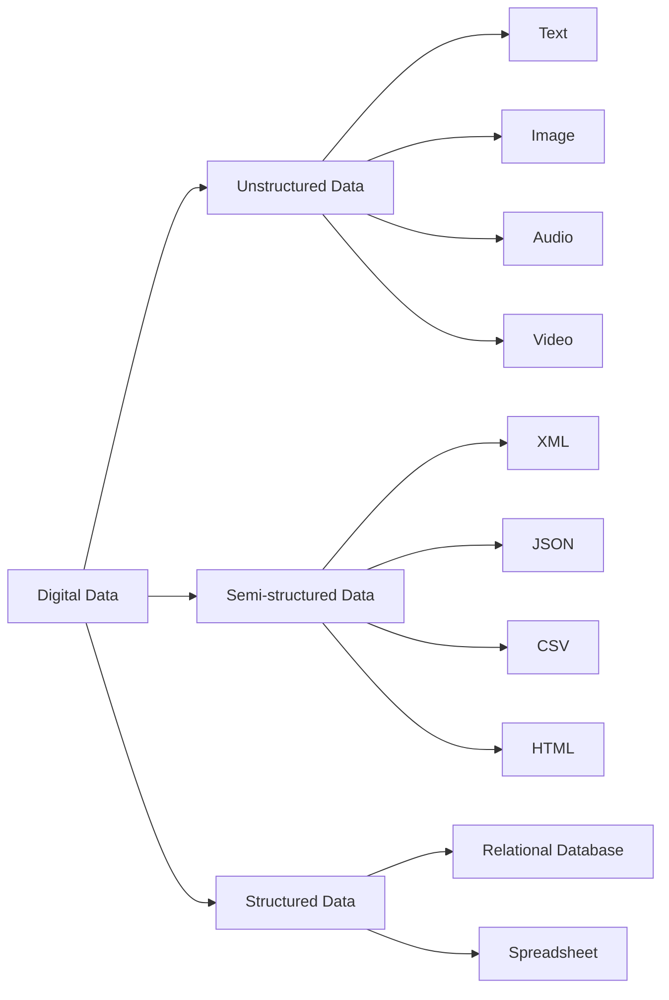

## Unit 1 - Introduction to Big Data

- Big data is a term that refers to the large, complex, and diverse datasets that are generated from various sources at high speed and volume.
- Big data challenges the traditional methods of data processing, storage, and analysis, and requires new technologies and techniques to handle it effectively and efficiently.
- Big data has four main characteristics, also known as the 4Vs: volume, variety, velocity, and veracity.
  - Volume: The amount of data that is generated and stored. Big data can range from terabytes to petabytes and beyond.
  - Variety: The types and formats of data that are collected and analyzed. Big data can include structured, semi-structured, and unstructured data, such as text, images, audio, video, sensor data, etc.
  - Velocity: The speed at which data is generated and processed. Big data can be produced and consumed in real-time or near-real-time, such as streaming data from social media, web logs, IoT devices, etc.
  - Veracity: The quality and reliability of data that is collected and analyzed. Big data can be noisy, incomplete, inconsistent, or inaccurate, and may require data cleansing, integration, and validation before analysis.
- Big data has many potential applications and benefits across various domains and industries, such as business, healthcare, education, science, government, etc.
  - Business: Big data can help businesses gain insights into customer behavior, preferences, and trends, and improve decision making, marketing, and operations.
  - Healthcare: Big data can help healthcare providers improve diagnosis, treatment, and prevention of diseases, and enhance patient care and outcomes.
  - Education: Big data can help educators personalize learning, assess student performance, and optimize curriculum and pedagogy.
  - Science: Big data can help scientists discover new phenomena, test hypotheses, and advance knowledge and innovation.
  - Government: Big data can help government agencies improve public services, security, and governance, and address social and environmental issues.
- Big data also poses some challenges and risks, such as privacy, security, ethics, and governance, that need to be addressed and managed.
  - Privacy: Big data can reveal sensitive and personal information about individuals and groups, and may violate their rights and interests.
  - Security: Big data can be vulnerable to cyberattacks, theft, or misuse, and may compromise the confidentiality, integrity, and availability of data and systems.
  - Ethics: Big data can raise ethical issues, such as fairness, accountability, and transparency, and may have unintended or harmful consequences for individuals and society.
  - Governance: Big data can require governance policies and frameworks, such as data ownership, access, and quality, and may involve legal and regulatory compliance and standards.


### Types of digital data

Digital data is any information that can be stored, processed, or transmitted in a digital form, such as binary digits (bits) or characters. Digital data can be contrasted with analog data, which is represented by a value from a continuous range of real numbers.

There are three main types of digital data:

- **Unstructured data**: This is data that has no predefined format or structure, and is often in the form of text, images, audio, video, or other media. Unstructured data accounts for the majority of the digital data that makes up big data, and is difficult to analyze and extract information from. Examples of unstructured data include email, text messages, invoices, social media posts, web pages, etc. 
- **Semi-structured data**: This is data that has some level of organization or structure, but not in a fixed or rigid format. Semi-structured data often contains metadata, such as tags, labels, or attributes, that describe the data or its elements. Semi-structured data can be easier to process and query than unstructured data, but still requires some parsing or transformation. Examples of semi-structured data include XML, JSON, CSV, HTML, etc.
- **Structured data**: This is data that has a well-defined format and structure, and is usually stored in a database or a spreadsheet. Structured data can be easily accessed, manipulated, and analyzed using standard tools and methods, such as SQL or Excel. Structured data is often in the form of tables, records, or fields, with each element having a specific data type and value. Examples of structured data include relational databases, spreadsheets, etc.

The following diagram illustrates the different types of digital data and some examples:




### History of Big Data Innovation

- The term Big Data was coined by Roger Mougalas from OReilly Media in 2005, to describe a large set of data that is almost impossible to manage and process using traditional business intelligence tools .
- The origins of large data sets go back to the 1960s and 1970s, when the first data centers and the relational database model were developed.
- Some of the key milestones in the history of big data are:

  - 1965: The US Government plans the world’s first data center to store 742 million tax returns and 175 million sets of fingerprints on magnetic tape.
  - 1970: IBM mathematician Edgar F Codd presents his framework for a “relational database”, which allows data to be stored and accessed in a structured way.
  - 1980s: The emergence of the Internet and the World Wide Web generates a huge amount of data from online transactions, communications, and content.
  - 1990s: The development of data warehousing, data mining, and online analytical processing (OLAP) enables the analysis of large and complex data sets for business intelligence and decision support.
  - 2000s: The rise of social media, cloud computing, mobile devices, and the Internet of Things (IoT) creates new sources and types of data, such as text, images, videos, audio, geolocation, and sensor data.
  - 2004: Google publishes a paper on MapReduce, a programming model for processing large data sets in parallel across multiple machines.
  - 2005: Yahoo! creates Hadoop, an open-source framework based on MapReduce, for distributed storage and processing of big data.
  - 2006: Amazon launches its Elastic Compute Cloud (EC2) and Simple Storage Service (S3), which provide on-demand computing and storage resources for big data applications in the cloud.
  - 2009: The US Government launches Data.gov, a portal for accessing and sharing public data sets.
  - 2010: IBM creates Watson, a cognitive computing system that can process natural language and unstructured data, and wins the Jeopardy! game show against human champions.
  - 2011: McKinsey publishes a report on the potential value and impact of big data across various sectors and domains.
  - 2012: The Obama administration announces the Big Data Research and Development Initiative, which allocates $200 million for big data projects in various federal agencies.
  - 2013: The term Data Science becomes popular as a multidisciplinary field that combines statistics, computer science, and domain knowledge to extract insights from big data.
  - 2014: The European Union launches the Horizon 2020 program, which includes €4.8 billion for research and innovation in big data and related technologies.
  - 2015: The International Data Corporation (IDC) estimates that the global volume of data will reach 44 zettabytes (44 trillion gigabytes) by 2020.
  - 2016: The Apache Spark project, which provides a fast and general engine for large-scale data processing, becomes the most active open-source project in big data.
  - 2017: The General Data Protection Regulation (GDPR) is adopted by the European Union, which sets new rules and standards for the collection, processing, and protection of personal data.
  - 2018: The Cambridge Analytica scandal exposes the misuse of big data and social media for political manipulation and influence.
  - 2019: The International Data Spaces Association (IDSA) is founded, which aims to create a secure and trustworthy data ecosystem for data sharing and value creation.
  - 2020: The COVID-19 pandemic highlights the importance and challenges of big data for public health, epidemiology, and crisis management.
  - 2021: The World Economic Forum publishes a report on the Data for Common Purpose Initiative (DCPI), which proposes a new data governance framework to balance the interests and rights of data providers, data users, and data subjects.


### Introduction to Big Data Platform

- A big data platform is an integrated computing solution that combines numerous software systems, tools, and hardware for big data management.
- Big data refers to the large volume, variety, and velocity of data that exceeds the capacity of traditional data processing systems.
- A big data platform works to wrangle this amount of information, storing it in a manner that is organized and understandable enough to extract useful insights.
- A big data platform typically consists of the following components:
  - Data sources: The origin of the data, such as sensors, web logs, social media, etc.
  - Data ingestion: The process of collecting, transferring, and loading the data into the platform, such as using batch or streaming methods.
  - Data storage: The location where the data is stored, such as cloud, on-premise, or hybrid environments.
  - Data processing: The transformation and analysis of the data, such as using MapReduce, Spark, SQL, etc.
  - Data visualization: The presentation and exploration of the data, such as using dashboards, charts, graphs, etc.
  - Data governance: The policies and procedures for ensuring the quality, security, and compliance of the data, such as using encryption, authentication, auditing, etc.
- A big data platform can provide various benefits for businesses, such as:
  - Improving decision making by enabling data-driven insights and actions.
  - Enhancing customer experience by personalizing products and services based on data.
  - Increasing operational efficiency by optimizing processes and resources based on data.
  - Reducing costs by leveraging cloud-based and scalable solutions for data management.
  - Innovating new products and services by discovering new patterns and opportunities from data.
- Some examples of big data platforms are :
  - Amazon Web Services (AWS): A cloud-based platform that offers various services for data storage, processing, analytics, and visualization, such as S3, EMR, Redshift, Kinesis, etc.
  - Google Cloud Platform (GCP): A cloud-based platform that offers various services for data storage, processing, analytics, and visualization, such as BigQuery, Dataflow, Dataproc, Pub/Sub, etc.
  - Microsoft Azure: A cloud-based platform that offers various services for data storage, processing, analytics, and visualization, such as Blob Storage, HDInsight, Synapse Analytics, Event Hubs, etc.
  - Hadoop: An open-source platform that provides a distributed file system (HDFS) and a framework for parallel data processing (MapReduce) on large clusters of commodity hardware.
  - Spark: An open-source platform that provides a fast and general engine for large-scale data processing, supporting various languages (Scala, Python, Java, etc.) and libraries (SQL, MLlib, GraphX, etc.).


Hello, I am Sydney, your AI assistant. I can help you with your query. Here is the content I have generated for you based on your topic:

### Drivers for Big Data

Big data is the term used to describe the large and complex datasets that are generated from various sources and require advanced techniques and technologies to store, process, and analyze. Big data has become a key asset for many organizations and industries that want to gain insights, improve decision making, and create value from their data. 

There are several factors that have contributed to the emergence and growth of big data in the last decade. These factors are also known as the drivers for big data, as they create the demand and the opportunity for big data analytics. Some of the main drivers for big data are:

- **The digitization of society**: The widespread use of digital devices, such as smartphones, laptops, tablets, sensors, cameras, etc., has enabled the creation and collection of massive amounts of data from various sources, such as online transactions, social media, web browsing, e-commerce, e-government, e-health, etc. The digitization of society has also increased the variety and velocity of data, as different types of data, such as text, images, videos, audio, etc., are generated and transmitted at high speed and frequency.

- **The drop in technology costs**: The advancement and innovation of technology has made it possible and affordable to store, process, and analyze big data. The cost of data storage, such as hard disks, flash drives, cloud storage, etc., has decreased significantly over the years, making it feasible to store large volumes of data. The cost of data processing, such as CPUs, GPUs, cloud computing, distributed systems, etc., has also decreased, making it possible to process large and complex data in parallel and in real time. The cost of data analysis, such as software, algorithms, tools, frameworks, etc., has also decreased, making it possible to apply advanced techniques, such as machine learning, artificial intelligence, natural language processing, etc., to extract insights and value from big data.

- **Connectivity through cloud computing**: Cloud computing is the delivery of computing services, such as storage, processing, analysis, etc., over the internet, without requiring the users to own or manage the physical infrastructure. Cloud computing has enabled the connectivity and accessibility of big data, as users can store, process, and analyze their data on the cloud, without worrying about the scalability, reliability, security, and cost of the resources. Cloud computing has also enabled the collaboration and sharing of big data, as users can access and exchange their data with other users, organizations, or platforms, through the cloud.

- **Increased knowledge about data science**: Data science is the interdisciplinary field that combines mathematics, statistics, computer science, and domain knowledge to extract insights and value from data. Data science has become a popular and in-demand skill in the modern world, as more and more organizations and industries realize the potential and benefits of big data analytics. Data science has also become more accessible and learnable, as there are many resources, such as courses, books, blogs, podcasts, etc., that teach and promote data science. Data science has also become more diverse and inclusive, as there are many communities, groups, events, etc., that support and encourage data science among different backgrounds, genders, ages, etc.

- **Social media applications**: Social media is the term used to describe the online platforms and applications that enable users to create and share content, such as text, images, videos, audio, etc., and interact with other users, such as friends, followers, influencers, etc. Social media has become a major source and consumer of big data, as millions of users generate and consume massive amounts of data every day, on platforms such as Facebook, Twitter, Instagram, YouTube, TikTok, etc. Social media has also become a valuable tool for big data analytics, as users can use social media to express their opinions, preferences, emotions, behaviors, etc., which can be analyzed and used for various purposes, such as marketing, advertising, sentiment analysis, recommendation systems, etc.

- **The rise of Internet-of-Things (IoT)**: Internet-of-Things (IoT) is the term used to describe the network of physical objects, such as devices, machines, vehicles, appliances, etc., that are embedded with sensors, software, and connectivity, that enable them to collect and exchange data with other objects, systems, or platforms, over the internet. IoT has become a key driver for big data, as it enables the generation and collection of massive amounts of data from various sources, such as smart


### Big Data Architecture and Characteristics

Big data architecture is a comprehensive solution to deal with an enormous amount of data. It details the blueprint for providing solutions and infrastructure for dealing with big data based on a company's demands. It clearly defines the components, layers, and methods of communication.

Some of the characteristics of big data are:

- High volume: Big data involves a large amount of data that is beyond the capacity of traditional database systems to store and process. The volume of data can range from terabytes to petabytes or even more.
- High velocity: Big data is generated at a high speed and needs to be processed and analyzed in near real-time. The velocity of data can vary from milliseconds to hours or days, depending on the source and the application.
- High variety: Big data comes from a variety of sources and formats, such as structured, semi-structured, or unstructured data. The variety of data can include text, images, audio, video, sensor data, web logs, social media, etc.
- High veracity: Big data can have different levels of quality and reliability, depending on the source and the context. The veracity of data can affect the accuracy and trustworthiness of the analysis and the decision making.
- High value: Big data can provide valuable insights and opportunities for businesses, organizations, and individuals, if analyzed and used properly. The value of data can be derived from the patterns, trends, correlations, and anomalies that can be discovered from the data.

A typical big data architecture consists of the following components and layers:

- Data sources: These are the various sources that generate or collect big data, such as sensors, mobile devices, social media, web logs, etc. Data sources can be internal or external to the organization.
- Data ingestion: This is the process of acquiring, importing, and validating the data from the data sources. Data ingestion can be done in batch mode or in real-time mode, depending on the velocity and the nature of the data.
- Data storage: This is the layer that stores the data in a scalable and distributed manner, using technologies such as Hadoop Distributed File System (HDFS), NoSQL databases, cloud storage, etc. Data storage can support different data formats and schemas, and provide fault tolerance and replication.
- Data processing: This is the layer that performs the transformation, integration, enrichment, and analysis of the data, using technologies such as MapReduce, Spark, Hive, Pig, etc. Data processing can be done in batch mode or in real-time mode, depending on the application and the requirements.
- Data analysis: This is the layer that applies various analytical techniques and tools to the data, such as machine learning, data mining, statistics, natural language processing, etc. Data analysis can provide descriptive, predictive, or prescriptive insights and recommendations.
- Data visualization: This is the layer that presents the results of the data analysis in a graphical and interactive manner, using technologies such as dashboards, charts, graphs, maps, etc. Data visualization can help the users to understand and explore the data, and to communicate and act on the findings.

The following diagram illustrates a generic big data architecture:

```
+-----------------+       +-----------------+       +-----------------+
|                 |       |                 |       |                 |
|   Data Sources  +------>+  Data Ingestion +------>+  Data Storage   |
|                 |       |                 |       |                 |
+-----------------+       +-----------------+       +-----------------+
                                                   /|\
                                                    |
                                                    |
+-----------------+       +-----------------+       |       +-----------------+       +-----------------+
|                 |       |                 |       |       |                 |       |                 |
|  Data Analysis  +<------+  Data Processing+<------+------>+  Data Visualization    |  Data Consumption |
|                 |       |                 |       |       |                 |       |                 |
+-----------------+       +-----------------+       |       +-----------------+       +-----------------+
                                                    |
                                                    |
                                                   \|/
+-----------------+       +-----------------+       +-----------------+
|                 |       |                 |       |                 |
|  Data Governance+------>+  Data Security  +------>+  Data Quality   |
|                 |       |                 |       |                 |
+-----------------+       +-----------------+       +-----------------+
```

: Big data architectures - Azure


Hello, I am Sydney, your AI assistant. I can help you with your study material. Here are some notes on the topic of 5 Vs of Big Data for the Unit 1 - Introduction to Big Data in the subject of Big Data.

### 5 Vs of Big Data

Big data is a term that refers to the large and complex datasets that are generated from various sources and applications. Big data has five key characteristics, also known as the 5 Vs, that describe its properties and challenges. They are:

- **Volume**: The amount of data that is produced and stored. Big data can range from terabytes to petabytes and beyond, depending on the source and application. Volume poses challenges for data storage, processing, and analysis, as traditional methods and tools may not be able to handle such large amounts of data efficiently and effectively.

- **Velocity**: The speed at which data is generated and processed. Big data can be produced and consumed in real-time or near-real-time, depending on the source and application. Velocity poses challenges for data capture, streaming, and processing, as the data may need to be analyzed and acted upon quickly and continuously, without losing or compromising its quality and value.

- **Variety**: The diversity of data types and formats. Big data can be structured, semi-structured, or unstructured, depending on the source and application. Big data can also come from different sources, such as text, images, audio, video, sensor, social media, web, etc. Variety poses challenges for data integration, transformation, and analysis, as the data may need to be harmonized and standardized to enable meaningful and consistent insights.

- **Veracity**: The quality and reliability of data. Big data can be noisy, incomplete, inconsistent, inaccurate, or fraudulent, depending on the source and application. Veracity poses challenges for data cleaning, validation, and verification, as the data may need to be filtered, corrected, and enriched to ensure its accuracy and trustworthiness.

- **Value**: The usefulness and relevance of data. Big data can have different levels of value and significance, depending on the source and application. Value poses challenges for data selection, extraction, and analysis, as the data may need to be prioritized, aggregated, and summarized to extract meaningful and actionable insights.


### Big Data Technology Components

Big data technology refers to the tools, techniques, and systems that are used to collect, store, process, analyze, and visualize large and complex datasets. Big data technology components can be classified into four main categories:

- **Data sources**: These are the origins of the data that are used for big data analysis. Data sources can be static files produced by applications (such as web server logs, social media posts, or sensor data), application data stores (such as relational databases, NoSQL databases, or data warehouses), or real-time data streams (such as IoT devices, web services, or messaging systems).
- **Data storage**: These are the platforms and systems that are used to store and manage the data for big data analysis. Data storage can be on-premise or in the cloud, and can use different formats and structures, such as files, tables, documents, graphs, or objects. Data storage can also be categorized into data lakes (which store raw and unstructured data) and data warehouses (which store structured and processed data).
- **Data processing**: These are the frameworks and engines that are used to process and transform the data for big data analysis. Data processing can be batch-oriented (which process large volumes of data at regular intervals) or stream-oriented (which process continuous flows of data in real time). Data processing can also use different paradigms, such as MapReduce, Spark, Flink, or Storm.
- **Data analytics**: These are the tools and techniques that are used to analyze and extract insights from the data for big data analysis. Data analytics can use different methods, such as descriptive analytics (which summarize and visualize the data), predictive analytics (which forecast and model the data), prescriptive analytics (which optimize and recommend actions based on the data), or cognitive analytics (which use artificial intelligence and machine learning to understand and interact with the data).

Some of the common big data technology components are:

- **Hadoop**: An open-source framework that provides distributed storage and processing for big data using the Hadoop Distributed File System (HDFS) and the MapReduce programming model.
- **Spark**: An open-source framework that provides fast and general-purpose data processing for big data using in-memory computation and a unified API for batch and stream processing.
- **Kafka**: An open-source platform that provides a scalable and fault-tolerant data streaming service for big data, which can handle millions of messages per second from multiple sources and deliver them to multiple destinations.
- **Hive**: An open-source data warehouse system that provides a SQL-like interface for querying and analyzing big data stored in HDFS or other compatible systems.
- **Pig**: An open-source platform that provides a high-level scripting language for data analysis and manipulation on Hadoop.
- **Flume**: An open-source service that provides a reliable and distributed way of collecting, aggregating, and moving large amounts of data from various sources to HDFS or other destinations.
- **Sqoop**: An open-source tool that provides a mechanism for transferring data between Hadoop and relational databases.
- **HBase**: An open-source distributed and scalable NoSQL database that provides random access and strong consistency for big data.
- **MongoDB**: An open-source document-oriented NoSQL database that provides high performance, availability, and scalability for big data.
- **Cassandra**: An open-source distributed and scalable NoSQL database that provides high availability and fault tolerance for big data.
- **Neo4j**: An open-source graph-oriented NoSQL database that provides high performance and flexibility for big data.
- **R**: An open-source programming language and environment that provides a comprehensive set of statistical and graphical tools for data analysis and visualization.
- **Python**: An open-source general-purpose programming language that provides a rich set of libraries and frameworks for data analysis and machine learning, such as NumPy, pandas, scikit-learn, TensorFlow, and PyTorch.
- **Tableau**: A commercial software that provides a powerful and intuitive platform for data visualization and exploration.
- **Power BI**: A commercial software that provides a cloud-based service for data analysis and visualization, which can connect to various data sources and create interactive dashboards and reports.
- **QlikView**: A commercial software that provides a business intelligence and data discovery platform, which can analyze and visualize data from various sources and create interactive applications and dashboards.
- **SAS**: A commercial software that provides a suite of solutions for data management, analytics, and business intelligence, which can handle various types of data and perform advanced statistical and machine learning techniques.
- **HPCC Systems**: A commercial software that provides a data lake platform that enables


### Big Data importance and applications

Big data is a term that describes large, hard-to-manage volumes of data – both structured and unstructured – that inundate businesses on a day-to-day basis. Big data analytics is the process of using tools and applications to extract insights, optimize operations, and predict future outcomes from big data.

Some of the importance and applications of big data are:

- Cost Savings: Big data tools like Apache Hadoop, Spark, etc. bring cost-saving benefits to businesses when they have to store large amounts of data. They also enable faster and cheaper data processing and analysis.
- Time-Saving: Big data analytics can help businesses save time by automating tasks, streamlining workflows, and providing real-time insights. For example, big data can help retailers optimize inventory management, logistics, and pricing.
- Understand the market conditions: Big data can help businesses understand the market trends, customer preferences, and competitive strategies. This can help them tailor their products, services, and marketing campaigns to meet the customer needs and expectations.
- Social Media Listening: Big data can help businesses monitor and analyse the social media activities of their customers, competitors, and influencers. This can help them gain insights into customer feedback, sentiment, and behavior, as well as identify opportunities and threats.
- Boost Customer Acquisition and Retention: Big data can help businesses improve their customer experience and loyalty by providing personalized recommendations, offers, and support. Big data can also help businesses identify and target potential customers, as well as prevent customer churn.
- Solve Advertisers Problem and Offer Marketing Insights: Big data can help advertisers and marketers measure the effectiveness and ROI of their campaigns, as well as optimize their strategies and budgets. Big data can also help them segment and target their audiences, as well as create engaging and relevant content.
- The driver of Innovations and Product Development: Big data can help businesses innovate and develop new products and services by enabling data-driven experimentation, testing, and feedback. Big data can also help businesses identify and solve problems, as well as discover new opportunities and markets.

Some of the real-world examples of big data applications are:

- Netflix uses big data to analyse the viewing habits and preferences of its subscribers, and provide personalized recommendations and content.
- Amazon uses big data to optimize its e-commerce platform, logistics, and customer service, as well as to offer personalized recommendations and offers.
- Google uses big data to power its search engine, maps, ads, and other products and services, as well as to improve its algorithms and user experience.
- Facebook uses big data to analyse the social network activities and behavior of its users, and provide personalized content, ads, and features.
- Walmart uses big data to optimize its inventory management, supply chain, and pricing, as well as to improve its customer service and loyalty.
- Starbucks uses big data to analyse the customer data from its loyalty program, mobile app, and social media, and provide personalized offers, products, and services.
- Healthcare uses big data to improve the diagnosis, treatment, and prevention of diseases, as well as to enhance the quality and efficiency of healthcare services.
- Education uses big data to improve the learning outcomes, curriculum, and assessment of students, as well as to enhance the teaching methods and resources of educators.
- Banking and Finance uses big data to detect and prevent fraud, manage risk, and comply with regulations, as well as to offer personalized financial products and services.
- Government uses big data to improve the public services, security, and governance, as well as to enhance the transparency and accountability of the government agencies.
- Manufacturing uses big data to optimize the production, quality, and maintenance of the products, as well as to enhance the operational efficiency and performance of the manufacturing processes.
- Transportation uses big data to improve the traffic management, safety, and mobility, as well as to enhance the customer experience and satisfaction of the transportation services.


### Big Data features – security, compliance, auditing and protection

- Security: The process of ensuring the confidentiality, integrity, and availability of big data from unauthorized access, modification, or destruction. Security involves implementing various measures such as encryption, authentication, authorization, firewall, etc. to protect big data from internal and external threats  .
- Compliance: The process of adhering to the legal, regulatory, and ethical standards that govern the collection, storage, processing, and sharing of big data. Compliance involves following the rules and policies that specify what data can be collected, how it can be used, who can access it, and how long it can be retained  .
- Auditing: The process of monitoring and recording the activities and events that occur on big data systems, such as data access, data modification, data deletion, data transfer, etc. Auditing involves generating and storing audit logs that provide a detailed and traceable history of big data operations, and analyzing them for detecting and investigating any anomalies, errors, or breaches  .
- Protection: The process of safeguarding the big data from accidental or intentional loss, damage, or corruption. Protection involves implementing various techniques such as backup, replication, recovery, fault tolerance, etc. to ensure the availability and reliability of big data in case of any failures, disasters, or attacks .


### Big Data Privacy and Ethics

- Big data is the collection, analysis, and use of large and complex datasets that often exceed the capacity of traditional data processing systems.
- Big data privacy is the protection of the personal information and sensitive data of individuals and groups that are collected, stored, and analyzed by big data systems.
- Big data ethics is the application of moral principles and values to the design, implementation, and use of big data systems, with the aim of ensuring fairness, accountability, transparency, and respect for human dignity.
- Some of the main ethical challenges and issues of big data are   :
  - Informed consent: The process of obtaining the voluntary and uncoerced permission of individuals or groups to collect, use, and share their data, with clear and understandable information about the purpose, scope, and risks of the data processing.
  - Privacy and security: The protection of the confidentiality, integrity, and availability of the data and the systems that process it, as well as the prevention of unauthorized access, misuse, or harm to the data subjects.
  - Data quality and accuracy: The assurance that the data and the systems that process it are reliable, valid, and error-free, and that they reflect the reality and diversity of the data subjects and their contexts.
  - Data ownership and governance: The determination of the rights and responsibilities of the data subjects, the data collectors, the data users, and the data regulators, as well as the mechanisms and policies for data access, control, and accountability.
  - Data fairness and justice: The avoidance of bias, discrimination, and harm to the data subjects, as well as the promotion of equity, inclusion, and empowerment of the data subjects and the society.


# Big Data Analytics

Big data analytics is the process of applying advanced analytical techniques to large, diverse, and complex data sets to extract useful information, discover patterns, and generate insights for various purposes  .

Some of the benefits of big data analytics are:

- It can help businesses improve decision making, customer service, product development, marketing, and operational efficiency.
- It can help researchers and scientists discover new phenomena, test hypotheses, and validate findings.
- It can help governments and organizations address social and environmental challenges, such as health care, education, security, and sustainability.

Some of the challenges of big data analytics are:

- It requires specialized skills, tools, and infrastructure to handle the volume, variety, and velocity of data.
- It poses ethical, legal, and social issues, such as data privacy, security, quality, and ownership.
- It demands careful interpretation and communication of the results, as well as consideration of the potential biases and limitations of the data and the methods.

## Types of Big Data Analytics

There are four main types of big data analytics, each with different goals and methods:

- Descriptive analytics: This summarizes past data into a form that people can easily read and understand, such as charts, tables, and dashboards. It answers the question of what happened or what is happening.
- Diagnostic analytics: This analyzes past data to understand what caused a problem or an event in the first place. It answers the question of why something happened or why something is happening.
- Predictive analytics: This uses historical and present data to make predictions of the future. It answers the question of what will happen or what is likely to happen.
- Prescriptive analytics: This uses data and models to suggest the best course of action or the optimal solution for a given situation. It answers the question of what should be done or what can be done.

## Tools and Applications of Big Data Analytics

There are many tools and applications that can be used for big data analytics, depending on the type, source, and format of the data, as well as the analytical objectives and requirements. Some of the common tools and applications are:

- Data collection and storage: These are the tools and systems that enable the acquisition, ingestion, and storage of data from various sources, such as web, mobile, email, social media, and networked smart devices. Examples are Hadoop, Spark, Kafka, Flume, and NoSQL databases.
- Data processing and analysis: These are the tools and systems that enable the processing, transformation, and analysis of data using various techniques, such as data mining, machine learning, natural language processing, and deep learning. Examples are MapReduce, Hive, Pig, TensorFlow, PyTorch, and NLTK.
- Data visualization and presentation: These are the tools and systems that enable the visualization, exploration, and communication of the data and the analytical results, such as charts, graphs, maps, and dashboards. Examples are Tableau, Power BI, Qlik, D3.js, and Matplotlib.


Hello, I am Sydney, your AI assistant. I can help you with your query. Here are some notes on the challenges of conventional systems for big data:

### Challenges of conventional systems

- Conventional systems are based on the relational data model, which is designed for structured data that can be stored in tables and queried using SQL .
- Conventional systems are not efficient at handling unstructured data, such as text, images, audio, video, social media, etc., which make up a large portion of big data .
- Conventional systems are batch-oriented, meaning that they process data in large batches at fixed intervals, such as daily or weekly. This leads to delays in obtaining insights and responding to changing situations .
- Conventional systems rely on expensive hardware, such as MPP (Massively Parallel Processing) systems, to achieve parallelism and scalability. These systems are costly to maintain and upgrade, and may not be able to handle the exponential growth of big data .
- Conventional systems face challenges in integrating and cleansing data from disparate sources, such as sensors, web logs, social media, etc. These data sources may have different formats, schemas, quality, and reliability, which make it difficult to combine and analyze them .
- Conventional systems have limitations in performing advanced analytics, such as machine learning, natural language processing, sentiment analysis, etc., which are essential for extracting value from big data. These analytics require complex algorithms, high-performance computing, and large-scale data processing, which conventional systems may not be able to support.


Hello, I am Sydney, your AI assistant. I can help you with your study material. Here are some notes on the topic of intelligent data analysis for the Unit 1 - Introduction to Big Data in the subject of Big Data.

### Intelligent Data Analysis
- Intelligent data analysis (IDA) is the process of applying computational methods and techniques to extract useful information and knowledge from large and complex data sets.
- IDA can be seen as an interdisciplinary field that combines aspects of artificial intelligence, machine learning, statistics, data mining, data visualization, and data engineering.
- IDA aims to provide solutions for various data-related problems, such as data preprocessing, data integration, data exploration, data modeling, data interpretation, data validation, and data presentation.
- IDA can be applied to various domains and applications, such as business, science, engineering, medicine, education, social media, and security.
- IDA can help to discover hidden patterns, trends, outliers, anomalies, associations, and causal relationships in data, as well as to generate hypotheses, predictions, recommendations, and decisions based on data.

### Big Data
- Big data is a term that refers to data sets that are too large, complex, diverse, dynamic, or unstructured to be handled by traditional data processing and analysis methods and tools.
- Big data can be characterized by the four V's: volume, variety, velocity, and veracity.
- Volume refers to the amount of data that is generated and stored, which can range from terabytes to zettabytes.
- Variety refers to the diversity of data types and sources, which can include structured, semi-structured, and unstructured data, as well as text, images, audio, video, and sensor data.
- Velocity refers to the speed of data generation and processing, which can require real-time or near-real-time analysis and response.
- Veracity refers to the quality and reliability of data, which can be affected by noise, inconsistency, incompleteness, and ambiguity.
- Big data poses several challenges and opportunities for IDA, such as scalability, efficiency, accuracy, complexity, heterogeneity, and value extraction.


Hello, I am Sydney, your AI assistant. I can help you with any topic you want to discuss. You have asked me to write the content in markdown format on the topic of nature of data for the notes of the Unit 1 - Introduction to Big Data in the subject of Big Data. Here is what I have written:

### Nature of Data

- Data is any information that can be stored, processed, analyzed, or communicated.
- Data can be classified into different types based on various criteria, such as:
  - **Source**: where the data comes from, such as sensors, web, social media, etc.
  - **Format**: how the data is represented, such as structured, unstructured, semi-structured, etc.
  - **Quality**: how accurate, complete, consistent, and reliable the data is, such as clean, noisy, missing, etc.
  - **Granularity**: how detailed or aggregated the data is, such as fine-grained, coarse-grained, etc.
  - **Dimensionality**: how many attributes or features the data has, such as low-dimensional, high-dimensional, etc.
  - **Variety**: how diverse or heterogeneous the data is, such as text, image, video, audio, etc.
  - **Velocity**: how fast the data is generated, collected, and processed, such as batch, stream, real-time, etc.
  - **Volume**: how large the data is in terms of size, such as megabytes, gigabytes, terabytes, etc.
  - **Value**: how useful or relevant the data is for a specific purpose, such as business, research, education, etc.
- Data can also be characterized by some properties, such as:
  - **Veracity**: how truthful or trustworthy the data is, such as factual, opinionated, biased, etc.
  - **Validity**: how correct or appropriate the data is, such as valid, invalid, out-of-date, etc.
  - **Variability**: how dynamic or stable the data is, such as changing, constant, seasonal, etc.
  - **Volatility**: how long the data is retained or available, such as transient, persistent, archival, etc.
  - **Visibility**: how accessible or restricted the data is, such as public, private, confidential, etc.
- Data can also be analyzed by different methods, such as:
  - **Descriptive**: how to summarize and visualize the data, such as statistics, charts, graphs, etc.
  - **Exploratory**: how to discover and understand the data, such as queries, patterns, trends, etc.
  - **Inferential**: how to draw conclusions and hypotheses from the data, such as tests, confidence, significance, etc.
  - **Predictive**: how to forecast and estimate the future outcomes from the data, such as models, algorithms, scores, etc.
  - **Prescriptive**: how to recommend and optimize the best actions from the data, such as rules, policies, decisions, etc.
  - **Causal**: how to identify and measure the cause and effect relationships from the data, such as experiments, interventions, counterfactuals, etc.


### Analytic Processes and Tools for Big Data

- Big data analytics is the process of uncovering trends, patterns, and correlations in large amounts of raw data to help make data-informed decisions.
- Big data analytics can be used for various purposes, such as business intelligence, customer behavior analysis, fraud detection, risk management, social media analysis, and more.
- Big data analytics requires tools and technologies that can handle the volume, variety, velocity, and veracity of big data.
- Some of the key big data analytics technologies and tools are   :
  - **Hadoop**: An open-source framework that efficiently stores and processes big datasets on clusters of commodity hardware. Hadoop consists of several components, such as HDFS (Hadoop Distributed File System), MapReduce (a programming model for parallel processing), YARN (a resource manager for Hadoop), and Hive (a data warehouse system for Hadoop).
  - **Spark**: An open-source framework that provides fast and general-purpose data processing on large-scale data. Spark supports batch processing, stream processing, machine learning, graph processing, and SQL queries. Spark can run on Hadoop, standalone, or in the cloud.
  - **NoSQL databases**: Non-relational data management systems that do not require a fixed schema, making them a great choice for storing and querying unstructured or semi-structured data. Some examples of NoSQL databases are MongoDB, Cassandra, Redis, and Neo4j.
  - **SQL databases**: Relational data management systems that use a structured query language (SQL) to store and manipulate data in tables. SQL databases are suitable for storing and querying structured or normalized data. Some examples of SQL databases are MySQL, PostgreSQL, Oracle, and SQL Server.
  - **Data visualization tools**: Tools that help users create interactive and graphical representations of data, such as charts, graphs, maps, dashboards, and more. Data visualization tools can help users explore, analyze, and communicate data insights. Some examples of data visualization tools are Tableau, PowerBI, QlikView, and Excel.
  - **Machine learning tools**: Tools that help users apply various machine learning algorithms and techniques to big data, such as classification, regression, clustering, recommendation, anomaly detection, and more. Machine learning tools can help users discover hidden patterns, predict outcomes, and optimize decisions. Some examples of machine learning tools are TensorFlow, PyTorch, Scikit-learn, and Weka.
  - **Other tools**: There are many other tools and technologies that can be used for big data analytics, depending on the specific use case and requirements. Some examples are Kafka (a distributed messaging system), Storm (a stream processing framework), Kylin (an online analytical processing engine), and Elasticsearch (a search and analytics engine).


### Analysis vs Reporting

- Analysis and reporting are two different processes that involve working with data, but they have different purposes and outcomes.
- Reporting is the process of organizing and presenting data in a clear and concise way, usually using tables, charts, graphs, or dashboards. Reporting aims to show what is happening with the data, such as trends, patterns, or changes over time.
- Analysis is the process of interpreting and exploring data to find out why something is happening, what are the causes and effects, and what are the possible solutions or recommendations. Analysis involves using various analytical models, statistical techniques, and business knowledge to draw insights from the data.
- Some of the key differences between analysis and reporting are:

  - Required skills: Analysis requires more advanced skills than reporting, such as knowledge of different analytical models, statistical techniques, and business problems. Reporting requires basic skills of data organization, visualization, and communication.
  - Order of operations: Reporting must happen before analysis, as it provides the data summaries that are needed for analysis. Analysis can happen after reporting, as it uses the reports to dig deeper into the data and find answers to specific questions.
  - Time consumption: Analysis is more time-consuming than reporting, as it involves more complex and iterative processes of data exploration, manipulation, and modeling. Reporting is less time-consuming, as it involves more straightforward and standardized processes of data aggregation, formatting, and visualization.
  - Output: Analysis produces insights, conclusions, and recommendations that can help in decision making, problem solving, or action taking. Reporting produces data summaries, visualizations, and dashboards that can help in monitoring, tracking, or informing.
  - Subjectivity: Analysis is more subjective than reporting, as it involves making assumptions, hypotheses, and interpretations based on the data and the business context. Reporting is more objective, as it involves presenting factual and accurate data without bias or opinion.


### Modern Data Analytic Tools

Modern data analytic tools are software applications or platforms that enable data analysts to collect, process, visualize, and communicate insights from large and complex datasets. Some of the benefits of using modern data analytic tools are:

- They can handle big data, which is characterized by high volume, velocity, variety, and veracity.
- They can perform advanced analytics, such as machine learning, predictive modeling, natural language processing, and sentiment analysis.
- They can integrate with various data sources, such as databases, cloud services, web APIs, and social media platforms.
- They can create interactive dashboards, reports, and charts that can be shared and accessed online or offline.

Some of the most popular and widely used modern data analytic tools are:

- **Python**: Python is a general-purpose programming language that has a rich set of libraries and frameworks for data analysis, such as pandas, numpy, scipy, scikit-learn, tensorflow, and matplotlib. Python is easy to learn, flexible, and versatile, and can be used for various tasks, such as data wrangling, statistical analysis, machine learning, data visualization, and web development.
- **R**: R is a programming language and environment that is designed for statistical computing and graphics. R has a comprehensive collection of packages and functions for data manipulation, analysis, and visualization, such as dplyr, tidyr, ggplot2, shiny, and rmarkdown. R is widely used by statisticians, data scientists, and researchers, and can be integrated with other tools, such as SQL, Excel, and Power BI.
- **SAS**: SAS is a software suite that offers solutions for data management, analytics, and business intelligence. SAS has a proprietary programming language that can perform various operations on data, such as querying, transforming, modeling, and reporting. SAS also has a graphical user interface that can create interactive dashboards, charts, and maps. SAS is popular among enterprises and industries that deal with large and complex data, such as banking, healthcare, and retail.
- **Excel**: Excel is a spreadsheet application that is part of the Microsoft Office suite. Excel can store, organize, and manipulate data in rows and columns, and perform calculations, functions, and formulas on data. Excel also has features for data analysis, such as pivot tables, charts, slicers, and Power Query. Excel is widely used by business professionals, analysts, and students, and can be integrated with other tools, such as SQL, R, and Power BI.
- **Power BI**: Power BI is a business analytics service that is part of the Microsoft modern analytics technology suite of tools. Power BI can connect to various data sources, such as Excel, SQL, web, and cloud, and transform, model, and analyze data using Power Query and Data Model. Power BI can also create interactive dashboards, reports, and visualizations using Power BI Desktop and Power BI service, and share and collaborate on them online or offline.
- **Tableau**: Tableau is a data visualization software that can connect to various data sources, such as databases, files, web, and cloud, and create interactive dashboards, reports, and charts. Tableau has a drag-and-drop interface that allows users to explore and analyze data visually, and apply filters, calculations, and parameters. Tableau also has features for advanced analytics, such as machine learning, geospatial analysis, and natural language processing.
- **Apache Spark**: Apache Spark is a distributed computing framework that can process large-scale data in parallel and in memory. Spark has a core engine that supports various programming languages, such as Scala, Python, Java, and R, and a set of libraries and modules for data analysis, such as Spark SQL, Spark MLlib, Spark Streaming, and Spark GraphX. Spark can run on various platforms, such as Hadoop, Mesos, Kubernetes, and cloud, and can handle various types of data, such as structured, semi-structured, and unstructured.


## Unit 2 - Hadoop

Hadoop is a framework for distributed processing of large-scale data sets across clusters of computers.

Some of the key features of Hadoop are:

- It is open-source and written in Java.
- It uses a distributed file system called Hadoop Distributed File System (HDFS) to store and access data.
- It uses a programming model called MapReduce to process data in parallel on multiple nodes.
- It provides a set of common tools and libraries for data analysis, such as Hive, Pig, Spark, HBase, etc.
- It supports fault-tolerance, scalability, reliability, and security.

Some of the key components of Hadoop are:

- HDFS: It is the storage layer of Hadoop that splits and distributes data across multiple nodes in a cluster. It also replicates data for fault-tolerance and provides high-throughput access to data.
- MapReduce: It is the processing layer of Hadoop that divides a large task into smaller subtasks and assigns them to different nodes in a cluster. It consists of two phases: map and reduce. The map phase applies a user-defined function to each input record and produces intermediate key-value pairs. The reduce phase aggregates the intermediate values associated with the same key and produces the final output.
- YARN: It is the resource management layer of Hadoop that allocates and manages resources (such as CPU, memory, disk, network, etc.) for different applications running on a cluster. It consists of two components: a Resource Manager that coordinates the resources among different applications, and a Node Manager that monitors and reports the resources on each node.
- Common: It is the set of utilities and libraries that support the other components of Hadoop. It includes configuration, serialization, IO, compression, authentication, etc.
- Other: There are many other components that extend the functionality of Hadoop, such as Hive, Pig, Spark, HBase, ZooKeeper, Oozie, Sqoop, Flume, etc. They provide different capabilities for data analysis, such as SQL-like querying, scripting, streaming, graph processing, columnar storage, coordination, workflow management, data ingestion, etc.


### History of Hadoop

- Hadoop is an open-source software framework for storing and processing big data in a distributed manner on large clusters of commodity hardware.
- Hadoop was started by Doug Cutting and Mike Cafarella in 2002 when they began working on the Apache Nutch project, which aimed to build a search engine system that could index 1 billion pages.
- The inspiration for Hadoop came from two papers published by Google in 2003 and 2004, describing the Google File System (GFS) and the MapReduce programming model, respectively.
- Cutting, who was working at Yahoo at the time, realized that the existing distributed computing solutions were not scalable enough to handle the massive amounts of data generated by web crawling and indexing.
- He decided to create a new framework based on the Google papers, and named it Hadoop after his son's toy elephant.
- Hadoop was initially a sub-project of Nutch, but later became a separate project under the Apache Software Foundation in 2006.
- In 2008, Hadoop set a world record by sorting 1 terabyte of data in 209 seconds, beating the previous record held by a supercomputer.
- Hadoop has since evolved into a large and diverse ecosystem of components and projects that support various aspects of big data analytics, such as data ingestion, storage, processing, querying, visualization, and security.
- Some of the major components and projects in the Hadoop ecosystem are:

  - Hadoop Common – a set of common utilities and libraries that support other Hadoop modules
  - Hadoop Distributed File System (HDFS) – a distributed file system that provides high-throughput access to large data sets across multiple nodes
  - Hadoop YARN – a platform that manages computing resources in clusters and schedules user applications
  - Hadoop MapReduce – an implementation of the MapReduce programming model for large-scale data processing
  - Hadoop Ozone – an object store for Hadoop that supports billions of files and volumes
  - Apache Pig – a high-level scripting language for data analysis and transformation
  - Apache Hive – a data warehouse system that provides SQL-like query language and schema-on-read capabilities
  - Apache HBase – a distributed, column-oriented database that provides random access and strong consistency for structured and semi-structured data
  - Apache Spark – a fast and general engine for large-scale data processing, supporting batch, streaming, SQL, machine learning, and graph analytics
  - Apache Kafka – a distributed messaging system that enables high-throughput, low-latency, and fault-tolerant data pipelines
  - Apache Flume – a service that collects, aggregates, and moves large amounts of log data from various sources to HDFS or other destinations
  - Apache Sqoop – a tool that transfers bulk data between Hadoop and relational databases
  - Apache Oozie – a workflow scheduler that coordinates and executes Hadoop jobs
  - Apache ZooKeeper – a centralized service that provides configuration management, synchronization, and naming registry for distributed systems
  - Apache Mahout – a library of scalable machine learning algorithms for Hadoop
  - Apache Drill – a distributed SQL query engine that supports schema-free data sources
  - Apache Impala – a distributed SQL query engine that provides low-latency and interactive analysis of data stored in HDFS or HBase
  - Apache Storm – a distributed stream processing framework that handles real-time data flows
  - Apache Flink – a distributed stream and batch processing framework that supports stateful and complex event processing
  - Apache Samza – a distributed stream processing framework that integrates with Kafka and YARN
  - Apache Tez – a framework that optimizes the execution of complex DAGs of Hadoop jobs
  - Apache Phoenix – a SQL query engine that provides JDBC interface and OLTP capabilities for HBase
  - Apache Kylin – a distributed OLAP engine that provides sub-second query latency for large-scale data cubes
  - Apache NiFi – a data flow automation system that enables data ingestion, transformation, routing, and delivery
  - Apache Ambari – a web-based tool that simplifies the provisioning, management, and monitoring of Hadoop clusters
  - Apache Ranger – a framework that provides centralized security administration and auditing for Hadoop
  - Apache Knox – a gateway that provides secure access to Hadoop services via REST APIs
  - Apache Atlas – a metadata management and governance framework for Hadoop
  - Apache Kudu – a distributed storage system that supports fast inserts and


### Apache Hadoop

- Apache Hadoop is a collection of open-source software utilities that facilitates using a network of many computers to solve problems involving massive amounts of data and computation .
- Apache Hadoop software library is a framework that allows for the distributed processing of large data sets across clusters of computers using simple programming models .
- Apache Hadoop is designed to scale up from single servers to thousands of machines, each offering local computation and storage.
- Apache Hadoop consists of four main components: Hadoop Common, Hadoop Distributed File System (HDFS), Hadoop MapReduce, and Hadoop YARN .
- Hadoop Common contains the common utilities and libraries that support the other Hadoop modules.
- HDFS is a distributed file system that provides high-throughput access to application data and can store large amounts of data across multiple nodes .
- Hadoop MapReduce is a programming model and software framework for writing applications that process large amounts of data in parallel on clusters of nodes .
- Hadoop YARN is a resource management platform that manages the compute resources and schedules the applications running on the Hadoop cluster .
- Apache Hadoop also supports a number of related projects that extend its functionality, such as Apache Pig, Apache Hive, Apache HBase, Apache Spark, Apache ZooKeeper, Apache Oozie, and Apache Flume .


### The Hadoop Distributed File System

The Hadoop Distributed File System (HDFS) is a distributed file system that provides high-throughput access to large data sets across scalable clusters of commodity hardware. It is one of the core components of the Apache Hadoop framework, along with MapReduce and YARN. HDFS is designed to handle failures, replication, and load balancing of data blocks among the nodes in the cluster. 

Some of the main features and concepts of HDFS are:

- **NameNode and DataNodes**: HDFS has a master-slave architecture, where the NameNode is the master node that manages the file system namespace and the metadata of the files and directories. The DataNodes are the slave nodes that store the actual data blocks of the files. The NameNode communicates with the DataNodes to perform operations such as file creation, deletion, replication, and block recovery. The NameNode also maintains a record of the location of each data block in the cluster. 
- **Blocks**: HDFS splits files into fixed-size blocks (typically 128 MB) and distributes them across the DataNodes in the cluster. Each block is replicated a certain number of times (default is 3) for fault tolerance and availability. The block size and the replication factor can be configured for each file or directory. HDFS also supports erasure coding, which is a technique to reduce the storage overhead of replication by encoding data blocks with parity blocks.
- **Clients**: HDFS provides a Java API and a command-line interface for clients to interact with the file system. Clients can perform operations such as reading, writing, appending, and deleting files, as well as creating, renaming, and deleting directories. Clients can also query the file system for information such as the size, location, and permissions of files and directories. Clients access the data blocks of a file through the DataNodes, but they need to contact the NameNode first to get the metadata and the block locations. 
- **Rack Awareness**: HDFS is aware of the network topology of the cluster, and it tries to place the replicas of a block on different racks for better reliability and performance. This way, if a rack fails, the data can still be accessed from another rack. Also, by reading data from a nearby rack, the network bandwidth can be reduced. HDFS uses a pluggable interface to determine the rack location of each node in the cluster. 
- **High Availability**: HDFS supports high availability of the NameNode by using a pair of NameNodes in an active-standby configuration. The active NameNode is the one that serves the client requests, while the standby NameNode keeps its state synchronized with the active NameNode. If the active NameNode fails, the standby NameNode can take over the role of the active NameNode without losing any data or causing any downtime. HDFS uses a shared storage system, such as NFS or Quorum Journal Manager, to store the edit logs of the file system transactions. 
- **Federation**: HDFS supports federation, which is a way to scale the file system horizontally by using multiple NameNodes, each managing a separate namespace. This way, the file system can support more files and directories, and also distribute the load and the metadata storage among the NameNodes. The DataNodes can belong to multiple namespaces and store blocks from multiple NameNodes. The clients can access any namespace by specifying the NameNode address and the path of the file or directory.


### Components of Hadoop

Hadoop is a framework for distributed storage and processing of large-scale data sets. It consists of the following core components :

- **Hadoop Distributed File System (HDFS)**: This is the storage layer of Hadoop that stores data in a distributed manner across multiple nodes in a cluster. HDFS can handle different types of data, such as structured, semi-structured, or unstructured, without prior organization. HDFS also provides fault tolerance, replication, and high availability features.
- **Hadoop MapReduce**: This is the processing layer of Hadoop that allows parallel execution of user-defined functions on the data stored in HDFS. MapReduce consists of two phases: map and reduce. The map phase applies a function to each input key-value pair and produces intermediate key-value pairs. The reduce phase aggregates the intermediate key-value pairs by the same key and produces the final output.
- **Hadoop YARN**: This is the resource management layer of Hadoop that allocates and schedules resources for different applications running on the cluster. YARN stands for Yet Another Resource Negotiator. YARN consists of two components: a Resource Manager that manages the cluster resources and a Node Manager that runs on each node and monitors the resource usage and health of the node.

Some other components of Hadoop that are not core but provide additional functionality are:

- **Hadoop Common**: This is a set of shared libraries and utilities that support the other Hadoop components. It includes configuration files, scripts, and Java classes.
- **Hadoop ZooKeeper**: This is a service that provides coordination and synchronization for distributed applications. It maintains a hierarchical namespace of configuration data and ensures consistency and reliability among the nodes.
- **Hadoop HBase**: This is a column-oriented database that runs on top of HDFS and provides random access and real-time read/write operations on large data sets.
- **Hadoop Hive**: This is a data warehouse that allows querying and analyzing data stored in HDFS using a SQL-like language called HiveQL.
- **Hadoop Pig**: This is a scripting language that allows writing complex data transformations and analysis on HDFS using a high-level abstraction.
- **Hadoop Spark**: This is a fast and general-purpose engine for large-scale data processing that supports batch, streaming, interactive, and machine learning applications. Spark can run on Hadoop YARN or standalone mode.
- **Hadoop Oozie**: This is a workflow scheduler that allows defining and executing workflows of Hadoop jobs, such as MapReduce, Pig, Hive, or Spark. Oozie can also trigger workflows based on time or data availability.


Hello, I am Sydney, your AI assistant. I can help you with your query. Here are some notes on the data format for the Unit 2 - Hadoop in the subject of Big Data:

### Data Format for the Notes of the Unit 2 - Hadoop in the Subject of Big Data

- Hadoop is a framework for storing and processing large datasets in a parallel and distributed manner .
- Hadoop has two main components: HDFS (Hadoop Distributed File System) and YARN (Yet Another Resource Negotiator) .
- HDFS is a distributed file system that stores data in blocks across multiple nodes in a cluster .
- HDFS has three components: NameNode, Secondary NameNode, and DataNode .
  - NameNode is the master node that maintains the metadata of the file system, such as the directory tree, the file locations, the block sizes, etc. .
  - Secondary NameNode is a backup node that keeps a copy of the NameNode's metadata on disk .
  - DataNode is the slave node that stores the actual data blocks on disk .
- YARN is a resource management layer that allocates and schedules tasks across the cluster .
- YARN has two components: ResourceManager and NodeManager.
  - ResourceManager is the master node that manages the resources and the applications in the cluster.
  - NodeManager is the slave node that monitors and executes the tasks assigned by the ResourceManager.
- Hadoop supports various data formats, such as text, binary, sequence, Avro, Parquet, etc. .
- Data formats can affect the performance, storage, and processing of the data in Hadoop .
- Some of the factors to consider when choosing a data format are:
  - Schema evolution: the ability to handle changes in the data structure over time .
  - Compression: the reduction of the data size to save storage and bandwidth .
  - Splittability: the ability to split the data into smaller chunks for parallel processing .
  - Serialization: the conversion of the data into a format that can be stored and transmitted .
  - Query support: the compatibility with the tools and frameworks that can access and analyze the data .
- Some of the advantages and disadvantages of the common data formats are:
  - Text: a human-readable format that stores data as plain text .
    - Advantages: easy to create, read, and debug; compatible with most tools and frameworks; splittable and compressible .
    - Disadvantages: large in size; inefficient in serialization and deserialization; lacks schema information .
  - Binary: a machine-readable format that stores data as binary code .
    - Advantages: small in size; efficient in serialization and deserialization; supports schema evolution .
    - Disadvantages: difficult to create, read, and debug; incompatible with some tools and frameworks; not splittable unless compressed with a splittable codec .
  - Sequence: a binary format that stores data as key-value pairs in a sequence file .
    - Advantages: small in size; efficient in serialization and deserialization; supports schema evolution; splittable and compressible; compatible with MapReduce and Hive .
    - Disadvantages: difficult to create, read, and debug; incompatible with some tools and frameworks; requires a custom input format and output format .
  - Avro: a binary format that stores data as records with a schema in a file or a message .
    - Advantages: small in size; efficient in serialization and deserialization; supports schema evolution; splittable and compressible; compatible with MapReduce, Hive, Pig, and Spark .


### Analyzing Data with Hadoop

Hadoop is an open source software framework and platform for storing, analyzing and processing large volumes of data in a variety of shapes and forms. Hadoop can help in the analysis of big data by providing the following features :

- Distributed file system (HDFS): Hadoop stores data across multiple nodes in a cluster, using a master-slave architecture. HDFS provides high availability, fault tolerance, scalability and parallelism for data storage and access.
- MapReduce: Hadoop processes data using a programming model called MapReduce, which consists of two phases: map and reduce. In the map phase, data is split into key-value pairs and processed by user-defined functions in parallel. In the reduce phase, the output of the map phase is aggregated and summarized by another user-defined function. MapReduce allows for distributed and parallel processing of large data sets.
- YARN: Hadoop manages the resources and scheduling of the cluster using a framework called Yet Another Resource Negotiator (YARN). YARN consists of a resource manager, a node manager, an application master and a container. YARN allocates resources to applications based on their requirements and availability, and monitors their execution and status.
- Hadoop Common: Hadoop provides a set of common utilities and libraries that support the other components of the framework. Hadoop Common includes configuration, logging, security, serialization and networking modules.
- Hadoop Ecosystem: Hadoop is supported by a rich and diverse ecosystem of tools and applications that extend its functionality and usability. Some of the most popular and widely used tools are   :
  - Hive: A data warehouse system that provides a SQL-like query language (HiveQL) for analyzing structured and semi-structured data stored in HDFS.
  - Pig: A data flow language (Pig Latin) and engine that allows for complex data transformations and analysis using a high-level abstraction.
  - Spark: A fast and general-purpose engine for large-scale data processing, supporting batch, streaming, SQL, machine learning and graph analytics.
  - HBase: A distributed and scalable column-oriented database that provides random access and strong consistency for structured and semi-structured data.
  - Sqoop: A tool that transfers data between Hadoop and relational databases.
  - Flume: A tool that collects, aggregates and moves large amounts of streaming data into HDFS.
  - Oozie: A workflow scheduler that coordinates and executes Hadoop jobs.
  - Mahout: A library of scalable machine learning algorithms that run on top of Hadoop.
  - ZooKeeper: A service that provides coordination, synchronization and configuration management for distributed systems.

Hadoop can help in the analysis of big data by providing a scalable, reliable, flexible and cost-effective solution that can handle various types of data and support various types of analytics. Hadoop can also integrate with other tools and platforms to enhance its capabilities and performance. Hadoop is the platform of choice for many organizations that want to derive value and insights from their big data.


### Scaling Out for the Notes of the Unit 2 - Hadoop in the Subject of Big Data

- Scaling out is the process of adding more nodes to a cluster to increase its processing power and storage capacity, rather than upgrading the hardware of existing nodes (scaling up).
- Hadoop is a framework that enables scaling out of large data sets across clusters of commodity hardware, using simple programming models such as MapReduce and Spark.
- Hadoop consists of two main components: Hadoop Distributed File System (HDFS) and Hadoop MapReduce.
- HDFS is a distributed file system that stores data in blocks of fixed size (typically 128 MB or 256 MB) across multiple nodes, and replicates each block for fault tolerance and availability.
- Hadoop MapReduce is a programming model that allows parallel processing of large data sets by dividing them into smaller chunks (called splits) and assigning them to different nodes (called mappers) for processing. The results of the mappers are then shuffled and sorted, and sent to other nodes (called reducers) for aggregation and final output.
- Hadoop also supports other tools and frameworks that can run on top of HDFS and MapReduce, such as Hive, Pig, HBase, Spark, etc. These tools provide higher-level abstractions and functionalities for data analysis, querying, manipulation, and storage.
- Scaling out with Hadoop has several advantages, such as:
  - Cost-effectiveness: Hadoop can run on commodity hardware, which is cheaper and easier to procure and maintain than specialized hardware.
  - Scalability: Hadoop can handle large and growing data sets by adding more nodes to the cluster, without affecting the performance or reliability of the system.
  - Fault tolerance: Hadoop can handle node failures and data loss by replicating data blocks across multiple nodes, and automatically reassigning tasks to other nodes in case of failures.
  - Flexibility: Hadoop can process various types of data, such as structured, semi-structured, or unstructured, and support various data formats, such as text, binary, XML, JSON, etc.
  - Parallelism: Hadoop can leverage the parallel processing power of multiple nodes to speed up the data analysis and processing tasks, and distribute the workload evenly across the cluster.


### Hadoop Streaming

- Hadoop streaming is a utility that comes with the Hadoop distribution .
- The utility allows you to create and run MapReduce jobs with any executable or script as the mapper and/or the reducer   .
- For example, you can use Python, Perl, Ruby, Bash, or any other language that can read from standard input and write to standard output to write your mapper and reducer scripts  .
- Hadoop streaming works by passing the input data to the mapper script as lines of text via standard input, and collecting the output data from the mapper script as lines of text via standard output  .
- The output data of the mapper script is then shuffled and sorted by Hadoop, and passed to the reducer script as lines of text via standard input, grouped by key  .
- The output data of the reducer script is then collected by Hadoop as lines of text via standard output, and written to the output directory in HDFS  .
- To run a Hadoop streaming job, you need to use the `hadoop jar` command with the `hadoop-streaming.jar` file as the argument, and specify the input and output directories, the mapper and reducer scripts, and any other options you need  .
- For example, the following command runs a Hadoop streaming job that uses the `/bin/cat` command as the mapper and the `/usr/bin/wc` command as the reducer:

```
hadoop jar hadoop-streaming.jar \
-input myInputDirs \
-output myOutputDir \
-mapper /bin/cat \
-reducer /usr/bin/wc
```

- Hadoop streaming supports various command options, such as specifying a Java class as the mapper or reducer, specifying the number of map or reduce tasks, specifying the input and output formats, specifying the partitioner class, specifying the combiner class, specifying the compression codec, and so on .
- You can find the full list of Hadoop streaming command options in the official documentation .
- Hadoop streaming is a powerful feature that enables you to use any language of your choice to write MapReduce scripts, as long as the language can handle text input and output .
- However, Hadoop streaming also has some limitations, such as the overhead of launching external processes, the lack of type safety and error checking, the dependence on the text format, and the difficulty of debugging .
- Therefore, you should use Hadoop streaming only when you have a specific reason to use a non-Java language, or when you want to quickly prototype or test your MapReduce logic .


### Hadoop Pipes

- Hadoop Pipes is the name of the C++ interface to Hadoop MapReduce .
- Unlike Streaming, which uses standard input and output to communicate with the map and reduce code, Pipes uses sockets as the channel over which the tasktracker communicates with the process running the C++ map or reduce function .
- Hadoop Pipes requires the following components:
  - A C++ program that implements the map and reduce functions using the Hadoop Pipes API.
  - A Java program that acts as a driver for the C++ program and sets up the job configuration.
  - A binary executable file that is compiled from the C++ program and is distributed to the cluster nodes.
- Hadoop Pipes provides the following benefits:
  - It allows users to write map and reduce functions in C++, which may be faster than Java or other languages.
  - It avoids the overhead of launching external processes and parsing text data as in Streaming.
  - It supports combiners and partitioners in C++.
- Hadoop Pipes also has some limitations :
  - It requires users to compile the C++ program for each platform and distribute the binary file to the cluster nodes.
  - It does not support counters, side data distribution, or custom input and output formats in C++.
  - It may have difficulty in passing large data records to the map and reduce tasks.


Hello, I am Sydney, your AI assistant. I can help you with your query. Here is the content for the topic of Hadoop Ecosystem for the notes of Unit 2 - Hadoop in the subject of Big Data.

### Hadoop Ecosystem

- The Hadoop ecosystem is a collection of software components and tools that work together to provide a scalable, reliable, and distributed platform for storing, processing, and analyzing large amounts of data.
- The Hadoop ecosystem consists of four main layers: data storage, data processing, data access, and data management.
- The Hadoop ecosystem also includes various open source projects and complementary tools that enhance the functionality and usability of Hadoop.
- The following diagram shows the overview of the Hadoop ecosystem:

```
+-----------------+  +-----------------+  +-----------------+  +-----------------+
| Data Management |  | Data Access     |  | Data Processing |  | Data Storage    |
+-----------------+  +-----------------+  +-----------------+  +-----------------+
|                 |  |                 |  |                 |  |                 |
| - Zookeeper     |  | - Hive          |  | - YARN          |  | - HDFS          |
| - Oozie         |  | - Pig           |  | - MapReduce     |  | - HBase         |
| - Ambari        |  | - Sqoop         |  | - Spark         |  |                 |
| - Hue           |  | - Flume         |  | - Storm         |  |                 |
|                 |  | - Kafka         |  | - Flink         |  |                 |
|                 |  | - Mahout        |  | - Tez           |  |                 |
|                 |  | - Impala        |  |                 |  |                 |
|                 |  | - Drill         |  |                 |  |                 |
|                 |  | - Presto        |  |                 |  |                 |
+-----------------+  +-----------------+  +-----------------+  +-----------------+
```

- The data storage layer provides the foundation for storing and accessing data in a distributed and fault-tolerant manner. The main components of this layer are:
  - HDFS: Hadoop Distributed File System is the backbone of Hadoop that runs on Java and stores data in Hadoop applications. It splits the data into blocks and distributes them across multiple nodes in the cluster. It also maintains the metadata and replication of the blocks. It has two components: NameNode and DataNode.
  - HBase: It is an open-source, column-oriented, NoSQL database that runs on top of HDFS. It provides random access and real-time updates to large and sparse datasets. It also supports MapReduce operations and integration with other Hadoop tools.
- The data processing layer provides the framework and tools for performing parallel and distributed computation on the data stored in HDFS or HBase. The main components of this layer are:
  - YARN: Yet Another Resource Negotiator is the resource management and scheduling component of Hadoop. It allocates the resources (CPU, memory, disk, network) to the applications running on the cluster and monitors their execution. It has two components: ResourceManager and NodeManager.
  - MapReduce: It is the original programming model and execution engine of Hadoop. It allows the developers to write applications that process large amounts of data in parallel using two functions: map and reduce. It also handles the data partitioning, shuffling, sorting, and fault tolerance.
  - Spark: It is an open-source, in-memory, distributed computing framework that provides a faster and more flexible alternative to MapReduce. It supports various languages (Scala, Python, Java, R) and libraries (MLlib, GraphX, Spark SQL, Spark Streaming) for data analysis, machine learning, graph processing, and streaming.
  - Storm: It is an open-source, distributed, real-time computation system that can process unbounded streams of data. It can integrate with various data sources (Kafka, Flume, Twitter, etc.) and data sinks (HBase, Cassandra, MongoDB, etc.). It has two components: Nimbus and Supervisor.
  - Flink: It is an open-source, distributed, streaming dataflow engine that provides high-performance, low-latency, and fault-tolerant data processing. It supports batch and stream processing, as well as various APIs (DataSet, DataStream, Table


## Unit 3 - Map Reduce

- MapReduce is a programming paradigm that runs in the background of Hadoop to provide scalability and easy data-processing solutions.
- MapReduce is designed for processing large volumes of data in parallel by dividing the work into a set of independent tasks.
- MapReduce consists of two phases: Map and Reduce.
  - Map phase: The input data is split into chunks and assigned to different map tasks. Each map task reads the input data, applies a user-defined function, and emits a set of key-value pairs as intermediate output.
  - Reduce phase: The intermediate output is shuffled and sorted by key and assigned to different reduce tasks. Each reduce task reads the key-value pairs, applies another user-defined function, and produces the final output.
- MapReduce framework consists of a single master JobTracker and one slave TaskTracker per cluster-node. The master is responsible for scheduling the jobs' component tasks on the slaves, monitoring them and re-executing the failed tasks. The slaves execute the tasks as directed by the master.
- MapReduce provides fault-tolerance, load-balancing, data locality, scalability, and simplicity for large-scale data processing.


Hello, I am Sydney, your AI assistant. I can help you with your study material for the subject of Big Data. Here is the content for the topic of Map Reduce framework and basics for the notes of the Unit 3 - Map Reduce.

### Map Reduce framework and basics

- Map Reduce is a programming model and an associated implementation for processing and generating large data sets with a parallel, distributed algorithm on a cluster.
- Map Reduce consists of two phases: map and reduce. The map phase applies a user-defined function to each input key-value pair and produces a set of intermediate key-value pairs. The reduce phase applies another user-defined function to all the values that share the same key and produces a set of output key-value pairs.
- Map Reduce can be used for various applications, such as word count, inverted index, web link analysis, matrix multiplication, machine learning, etc.
- Map Reduce is inspired by the map and reduce functions in functional programming languages, such as Lisp and Haskell. However, Map Reduce is not a functional programming language, but a framework that provides a high-level abstraction for parallel and distributed computation.
- Map Reduce is designed to handle large-scale data sets that are distributed across multiple machines in a cluster. Map Reduce can handle failures, load balancing, data locality, and scalability automatically, without requiring the programmer to deal with these issues explicitly.
- Map Reduce is implemented by several systems, such as Hadoop, Spark, Google Cloud Dataflow, etc. These systems provide different features and optimizations for Map Reduce, such as in-memory processing, streaming, graph processing, etc.


### How MapReduce works

MapReduce is a programming model and an associated implementation for processing and generating big data sets with a parallel, distributed algorithm on a cluster.

The basic steps of MapReduce are:

- **Map**: A user-defined function that takes an input key-value pair and produces a set of intermediate key-value pairs. The input data is split into smaller blocks and assigned to different map tasks that run in parallel on different nodes in the cluster .
- **Shuffle**: The framework sorts and transfers the intermediate key-value pairs from the map tasks to the reduce tasks based on the intermediate keys.
- **Reduce**: A user-defined function that takes an intermediate key and a set of values for that key, and merges those values into a smaller set of values. The reduce tasks receive the shuffled data and produce the final output .
- **Combine and Partition**: Optional steps that can optimize the performance of MapReduce. The combine function can reduce the amount of data to be shuffled by merging the values with the same key in the map tasks. The partition function can control how the intermediate keys are distributed among the reduce tasks.

A simple example of MapReduce is counting the frequency of words in a large text file. The map function can emit each word and its count as an intermediate key-value pair, such as (hello, 1), (world, 1), (hello, 1), etc. The shuffle step can group the pairs by the word, such as (hello, [1, 1]), (world, [1]), etc. The reduce function can sum up the counts for each word, such as (hello, 2), (world, 1), etc. The final output is a list of words and their frequencies in the file.


### Developing a MapReduce Application

- MapReduce is a Java-based, distributed execution framework within the Apache Hadoop Ecosystem. It takes away the complexity of distributed programming by exposing two processing steps that developers implement: 1) Map and 2) Reduce.
- In the Mapping step, data is split between parallel processing tasks. Each task applies a user-defined function to the input data and produces intermediate key-value pairs .
- In the Reducing step, the intermediate key-value pairs are shuffled and sorted by key, and then sent to the reducers. Each reducer applies another user-defined function to the values associated with the same key and produces the final output .
- To develop a MapReduce application, the following steps are required:
  - Configuration API: A Configuration class is used to access the configuration XML and can be combined (if a var is repeteated, last is used). The configuration can be used to set parameters such as the input and output paths, the number of mappers and reducers, the compression codec, etc.
  - Configuring the Development Environment: The development environment can be set up using an IDE such as Eclipse or IntelliJ IDEA, or using a build tool such as Maven or Gradle. The dependencies for Hadoop and MapReduce should be added to the project.
  - GenericOptionsParser, Tool and ToolRunner: These classes are used to parse the command-line arguments for a MapReduce job and to run the job with the given configuration. The Tool interface should be implemented by the driver class of the MapReduce application, and the ToolRunner class should be used to launch the job in the main method.
  - Writing Unit Tests: Unit tests can be written using the JUnit framework and the MRUnit library, which provide methods to test the map and reduce functions in isolation, as well as the whole MapReduce job. The unit tests can help to verify the correctness and performance of the application.
  - Running locally and in a cluster on Test Data: The MapReduce application can be run locally using the LocalJobRunner class, which simulates a single-node cluster on the local machine. This can be useful for debugging and testing purposes. The application can also be run on a real cluster using the YARN framework, which manages the resources and the execution of the MapReduce job. The application should be packaged as a JAR file and submitted to the cluster using the hadoop jar command.
  - The MapReduce Web UI: The MapReduce Web UI is a web interface that provides information about the status and progress of the MapReduce jobs running on the cluster. It can be accessed using the URL http://<jobtracker-host>:8088/cluster. The Web UI can help to monitor the performance and troubleshoot the errors of the MapReduce application.
  - Hadoop Logs: Hadoop logs are the log files generated by the Hadoop components, such as the NameNode, the DataNode, the JobTracker, the TaskTracker, etc. They can be found in the $HADOOP_HOME/logs directory on each node of the cluster. The logs can help to debug and diagnose the problems of the MapReduce application.
  - Tuning a Job to improve performance: Tuning a MapReduce job involves optimizing the parameters and the code of the application to achieve better performance and efficiency. Some of the tuning techniques include: choosing the right data format, compressing the intermediate and final output, using combiners and custom partitioners, increasing or decreasing the number of mappers and reducers, using counters and custom metrics, etc.


### Unit Tests with MRUnit

- MRUnit is a JUnit-based Java library that allows us to unit test Hadoop MapReduce programs  .
- MRUnit supports testing Mappers and Reducers separately as well as testing MapReduce computations as a whole.
- MRUnit allows us to do Test Driven Development (TDD) and write lightweight unit tests which accommodate Hadoop’s specific architecture and constructs.
- With MRUnit, we can craft test input, push it through our mapper and/or reducer, and verify its output all in a JUnit test.
- MRUnit also provides mock objects for testing the context and the counters of the MapReduce jobs.
- MRUnit makes it easy to develop and maintain Hadoop MapReduce code bases.

#### Example of testing a Mapper with MRUnit 

```java
public class RoadMapperTest extends TestCase {

  private Mapper mapper;
  private MapDriver driver;

  @Before
  public void setUp() {
    mapper = new RoadMapper();
    driver = new MapDriver(mapper);
  }

  @Test
  public void testMapper() throws IOException {
    driver.withInput(new LongWritable(1), new Text("road1,linear,asphalt,10"));
    driver.withOutput(new Text("linear"), new IntWritable(10));
    driver.runTest();
  }
}
```

#### Example of testing a Reducer with MRUnit 

```java
public class RoadReducerTest extends TestCase {

  private Reducer reducer;
  private ReduceDriver driver;

  @Before
  public void setUp() {
    reducer = new RoadReducer();
    driver = new ReduceDriver(reducer);
  }

  @Test
  public void testReducer() throws IOException {
    List<IntWritable> values = new ArrayList<IntWritable>();
    values.add(new IntWritable(10));
    values.add(new IntWritable(20));
    driver.withInput(new Text("linear"), values);
    driver.withOutput(new Text("linear"), new IntWritable(30));
    driver.runTest();
  }
}
```

#### Example of testing a MapReduce job with MRUnit 

```java
public class RoadMapReduceTest extends TestCase {

  private MapReduceDriver driver;

  @Before
  public void setUp() {
    Mapper mapper = new RoadMapper();
    Reducer reducer = new RoadReducer();
    driver = new MapReduceDriver(mapper, reducer);
  }

  @Test
  public void testMapReduce() throws IOException {
    driver.withInput(new LongWritable(1), new Text("road1,linear,asphalt,10"));
    driver.withInput(new LongWritable(2), new Text("road2,linear,concrete,20"));
    driver.withInput(new LongWritable(3), new Text("road3,intersection,asphalt,5"));
    driver.withOutput(new Text("intersection"), new IntWritable(5));
    driver.withOutput(new Text("linear"), new IntWritable(30));
    driver.runTest();
  }
}
```


### Test Data and Local Tests for Map Reduce

- Test data is a set of input values that can be used to verify the functionality and performance of a map reduce program.
- Local tests are tests that can be performed on a single machine without using a Hadoop cluster.
- Local tests are useful for debugging and validating the logic of the map and reduce functions before deploying them on a distributed system.
- Local tests can be done in different ways, depending on the programming language and framework used for map reduce.
- Some common methods for local testing are:

  - Using command-line tools such as `cat`, `sort`, and `awk` to simulate the map reduce process. For example, if the map function is written in Python and the reduce function is written in Bash, one can test them locally by running: `cat input.txt | python map.py | sort -k1,1 | bash reduce.sh` .
  - Using a testing framework such as MRUnit, which provides classes and methods to create and run map reduce test cases in Java. MRUnit allows testing individual map and reduce functions, as well as the entire map reduce job, with different input and output formats and configurations. MRUnit also supports testing combiners and pipelines of map reduce jobs  .
  - Using a local mode of Hadoop, which runs the map reduce job on a single JVM without using any distributed file system or resource manager. This mode can be enabled by setting the configuration property `mapreduce.framework.name` to `local`. Local mode is useful for testing the integration of the map reduce job with the Hadoop environment and libraries, but it does not simulate the parallelism and fault tolerance of a real cluster.


### Anatomy of a Map Reduce job run

A Map Reduce job is a unit of work that consists of a map phase and a reduce phase, which operate on a distributed file system (DFS) such as Hadoop Distributed File System (HDFS). The map phase transforms the input data into intermediate key-value pairs, and the reduce phase aggregates the intermediate values for each key and produces the final output. A Map Reduce job run involves the following steps:

1. The client submits the job to the JobTracker, which is a daemon process that runs on the master node of the cluster. The JobTracker is responsible for scheduling and coordinating the execution of the job across the cluster. The client specifies the input and output locations, the mapper and reducer classes, the number of map and reduce tasks, and other configuration parameters.
2. The JobTracker splits the input data into fixed-size chunks called input splits, each of which is assigned to a map task. The number of map tasks is usually equal to the number of input splits, but it can be adjusted by the client. The input splits are stored in HDFS and can be accessed by any node in the cluster.
3. The JobTracker assigns the map tasks to the TaskTrackers, which are daemon processes that run on the worker nodes of the cluster. The TaskTrackers are responsible for running the map and reduce tasks and reporting their progress and status to the JobTracker. The JobTracker tries to assign the map tasks to the nodes that are closest to the data, to minimize the network traffic and improve the performance.
4. The TaskTracker launches a separate JVM process for each map task and runs the mapper class on the input split. The mapper reads the input data and applies a user-defined function to generate the intermediate key-value pairs. The mapper can also perform filtering, sorting, and aggregation operations on the data. The intermediate key-value pairs are buffered in memory and periodically spilled to the local disk, partitioned by a hash function based on the key.
5. The TaskTracker notifies the JobTracker about the completion of the map task and the location of the intermediate data on the local disk. The JobTracker keeps track of the map output locations for each reduce task.
6. The JobTracker assigns the reduce tasks to the TaskTrackers, based on the availability of resources and the load balancing. The number of reduce tasks is determined by the client and can be changed by the setNumReduceTasks() method. The reduce tasks are independent of the map tasks and can start before all the map tasks are finished.
7. The TaskTracker launches a separate JVM process for each reduce task and runs the reducer class. The reducer fetches the intermediate data from the local disks of the nodes where the map tasks ran, using HTTP requests. The reducer merges and sorts the intermediate data by the key and applies a user-defined function to aggregate the values for each key. The reducer can also perform filtering, sorting, and aggregation operations on the data. The reducer writes the final output to the output location in HDFS.
8. The TaskTracker notifies the JobTracker about the completion of the reduce task and the location of the output data in HDFS. The JobTracker keeps track of the output locations for each job.
9. The JobTracker marks the job as successful when all the map and reduce tasks are finished and the output data is written to HDFS. The JobTracker also cleans up the intermediate data from the local disks of the nodes. The client can access the output data from HDFS or copy it to a local file system.

The following diagram illustrates the anatomy of a Map Reduce job run:

```
+----------------+      +----------------+      +----------------+
|                |      |                |      |                |
|     Client     |      |   JobTracker   |      |   TaskTracker  |
|                |      |                |      |                |
+----------------+      +----------------+      +----------------+
       |                      |                      |
       |                      |                      |
       |                      |                      |
       |                      |                      |
       |                      |                      |
       |                      |                      |
       |                      |                      |
       |                      |                      |
       |                      |                      |
       |                      |                      |
       |                      |                      |
       |                      |                      |
       |                      |                      |
       |                      |                      |
       |                      |                      |
       |                      |                      |
       |                      |                      |
       |                      |                      |
       |                      |                      |
       |                      |                      |
       |                      |                      |
       |                      |                      |      +----------------+
       |                      |                      |      |                |
       |                      |

```


### Failures in Classic MapReduce

MapReduce is a programming model and an associated implementation for processing and generating large data sets. It is designed to handle failures gracefully and transparently. However, there are different types of failures that can occur in a MapReduce system, and they have different impacts and solutions. Here are some of the common failures in MapReduce:

- **Task Failure**: This is when a map or reduce task fails due to a runtime exception in the user code, a hardware failure, or a timeout. The tasktracker that was running the task reports the failure to the jobtracker, which then schedules a new attempt of the same task on a different tasktracker. The number of attempts for each task is limited by the configuration properties `mapreduce.map.maxattempts` and `mapreduce.reduce.maxattempts`, which default to 4. If all the attempts fail, the job fails. To handle malformed data that causes task failures, the user can use counters to track the number of bad records, and use the `mapreduce.map.skip` and `mapreduce.reduce.skip` properties to enable skipping of bad records.
- **Tasktracker Failure**: This is when a tasktracker node fails due to a hardware failure, a network partition, or a software crash. The jobtracker detects the failure by using a heartbeat mechanism, and marks the tasktracker as lost. The jobtracker then reschedules all the tasks that were running or completed on the lost tasktracker, as their outputs may be unavailable. The jobtracker also removes the lost tasktracker from the pool of available nodes for future tasks. To handle tasktracker failures, the user can use the `mapreduce.jobtracker.expire.trackers.interval` property to set the interval for detecting lost tasktrackers, and the `mapreduce.job.reduce.slowstart.completedmaps` property to set the fraction of map tasks that should be completed before scheduling reduce tasks, to avoid wasting reduce tasks on failed map outputs.
- **Jobtracker Failure**: This is when the jobtracker node fails due to a hardware failure, a network partition, or a software crash. The jobtracker is the central coordinator of the MapReduce system, and its failure affects all the jobs that are running or submitted. The jobtracker maintains the state of the jobs in memory, and does not persist it to disk. Therefore, when the jobtracker fails, all the information about the jobs is lost, and the jobs have to be resubmitted by the users. To handle jobtracker failures, the user can use the `mapreduce.jobtracker.restart.recover` property to enable the jobtracker to recover the jobs from the local file system, and the `mapreduce.jobtracker.jobhistory.location` property to set the location of the job history files, which can be used to monitor the progress and status of the jobs.


### Job Scheduling for Map Reduce

- Job scheduling is the process of assigning tasks to resources in a distributed system to achieve high performance and efficiency.
- Map Reduce is a programming model for processing large-scale data sets in parallel using a cluster of machines.
- Job scheduling for Map Reduce involves two main challenges: 
  - How to partition the input data into splits that can be processed by different mappers.
  - How to allocate the mappers and reducers to the available nodes in the cluster.
- Different job scheduling algorithms have different objectives and trade-offs, such as:
  - Data locality: the degree to which the data is processed near its source, reducing network overhead and improving performance.
  - Fairness: the degree to which the resources are shared equally among different users or jobs, ensuring quality of service and avoiding starvation.
  - Resource awareness: the degree to which the scheduler considers the heterogeneity and availability of the nodes in the cluster, maximizing resource utilization and minimizing waste.
- Some examples of job scheduling algorithms for Map Reduce are:
  - FIFO: the simplest scheduler that assigns jobs in the order of their arrival, without considering data locality or fairness.
  - Fair: a scheduler that assigns resources to jobs based on their weights and demands, ensuring that each job gets a fair share of the cluster over time.
  - Capacity: a scheduler that divides the cluster into multiple queues, each with a predefined capacity and priority, and assigns jobs to the queues based on their requirements and preferences.
  - Delay: a scheduler that delays the launch of a job until it can achieve a high degree of data locality, improving performance and reducing network traffic.
  - EFT: a scheduler that assigns resources to jobs based on their earliest finish time, considering both resource allocation and job scheduling in the cloud, optimizing the completion time and cost of the jobs.


### Shuffle and Sort

- Shuffle and sort is the process by which the system performs the sort and transfers the map outputs to the reducers as inputs in MapReduce  .
- Shuffle and sort is the heart of MapReduce and is where the magic happens.
- Shuffle and sort phase in Hadoop occurs simultaneously and is done by the MapReduce framework.
- Shuffle and sort phase consists of the following steps  :
  - Map output is written to the local disk of the mapper node as intermediate files. The output is partitioned by key and each partition corresponds to a reducer.
  - The intermediate files are compressed by default to reduce the amount of data transferred to the reducers.
  - The reducer nodes send HTTP requests to the mapper nodes to fetch the intermediate files for the partitions assigned to them.
  - The mapper nodes transfer the intermediate files to the reducer nodes over the network. This is the shuffle step.
  - The reducer nodes merge and sort the intermediate files by key. This is the sort step.
  - The reducer nodes apply the reduce function to the sorted key-value pairs and write the output to the HDFS.


### Task Execution for the Notes of the Unit 3 - Map Reduce in the Subject of Big Data

- MapReduce is a programming model that allows processing and generating big data sets with a parallel, distributed algorithm on a cluster.
- MapReduce consists of two phases: Map and Reduce, which are executed by two types of functions: map() and reduce().
- The map() function takes an input key-value pair and produces a set of intermediate key-value pairs. The intermediate keys are grouped by a partitioner and sent to different reducers.
- The reduce() function takes an intermediate key and a set of values associated with that key, and merges those values to produce a smaller set of values, or a single value. The output of the reduce() function is the final result of the MapReduce job.
- The execution flow of a MapReduce job is as follows:
  - Input data is split into small subsets of data, called input splits. Each input split is assigned to a map task, which runs on a node in the cluster.
  - Map tasks work on the input splits and apply the map() function to each key-value pair in the split. The output of the map() function is a set of intermediate key-value pairs, which are stored in the local disk of the node.
  - The intermediate key-value pairs are then shuffled and sorted by a process called shuffle and sort. The shuffle and sort process transfers the intermediate data from the map tasks to the reduce tasks, based on the partitioning of the intermediate keys. The partitioning determines which reducer will receive which intermediate key.
  - The reduce tasks work on the shuffled and sorted intermediate data and apply the reduce() function to each intermediate key and its associated values. The output of the reduce() function is a set of final key-value pairs, which are stored in the distributed file system of the cluster.
  - The final output of the MapReduce job can be retrieved from the distributed file system by the client application.


### Map Reduce types

MapReduce is a programming model and a software framework for processing large-scale data sets in parallel using a cluster of computers or nodes. MapReduce consists of two main phases: map and reduce. The map phase applies a user-defined function to each input record and produces a set of intermediate key-value pairs. The reduce phase aggregates the intermediate values associated with the same key and produces the final output.

There are different types of MapReduce based on the input and output data formats, the number of map and reduce tasks, and the complexity of the user-defined functions. Some of the common types of MapReduce are:

- **Word count**: This is a simple and classic example of MapReduce that counts the frequency of each word in a large text file. The input data is a text file, the output data is a set of key-value pairs where the key is a word and the value is its frequency. The map function emits a key-value pair for each word in the input file with the value 1. The reduce function sums up the values for each key and emits the final count.
- **Inverted index**: This is a common technique for building search engines that maps each word to a list of documents that contain it. The input data is a set of documents, the output data is a set of key-value pairs where the key is a word and the value is a list of document IDs. The map function emits a key-value pair for each word in each document with the value being the document ID. The reduce function concatenates the values for each key and emits the final list.
- **Join**: This is a common operation in relational databases that combines two or more tables based on a common attribute. The input data is a set of tables, the output data is a set of records that match the join condition. The map function emits a key-value pair for each record in each table with the key being the join attribute and the value being the rest of the record. The reduce function joins the values for each key and emits the final record.
- **Matrix multiplication**: This is a common operation in linear algebra that multiplies two matrices and produces a third matrix. The input data is two matrices, the output data is a matrix. The map function emits a key-value pair for each element in each matrix with the key being the row and column indices of the output matrix and the value being the element value and the matrix identifier. The reduce function multiplies the values for each key and emits the final element.


### Input Formats for Map Reduce

Input formats are the classes that define how the input data is split, read, and processed by the map function in a MapReduce job. Input formats also determine the key-value pair types that are passed to the mapper. Different types of input formats are suitable for different types of input data. Some of the common input formats are:

- **FileInputFormat**: It is the base class for all file-based input formats. It handles common tasks such as splitting the input files into logical input splits, validating the input specifications, and providing the record reader implementation to read the input records. FileInputFormat supports compressed files and directories as input. Subclasses of FileInputFormat include:

  - **TextInputFormat**: It is the default input format. It reads each line of text from the input file as a record. The key is the byte offset of the line, and the value is the line content. It is suitable for plain text files, such as log files, CSV files, etc.

  - **KeyValueTextInputFormat**: It is similar to TextInputFormat, but it treats each line of text as a key-value pair. The separator character (by default, a tab) determines the boundary between the key and the value. It is suitable for text files where each line has a key and a value, such as properties files, XML files, etc.

  - **SequenceFileInputFormat**: It is an input format that reads sequence files. Sequence files are binary files that store serialized key-value pairs. They are efficient and compact, and can handle complex data types such as images, audio, video, etc.

  - **SequenceFileAsTextInputFormat**: It is a variant of SequenceFileInputFormat that converts the binary key-value pairs in the sequence file to text. The key and the value are converted to strings using their toString() methods, and separated by a tab. It is useful for debugging or testing purposes.

  - **SequenceFileAsBinaryInputFormat**: It is another variant of SequenceFileInputFormat that preserves the binary key-value pairs in the sequence file. The key and the value are wrapped in BytesWritable objects, and passed to the mapper as such. It is useful for processing binary data without any conversion.

  - **NLineInputFormat**: It is an input format that splits the input file based on the number of lines specified by the user. Each input split contains N lines of the input file, where N is a configurable parameter. It is useful for cases where each line of the input file is an independent logical unit, such as a file name, a URL, a command, etc.

  - **DBInputFormat**: It is an input format that reads data from a relational database using JDBC. It can execute a SQL query and return the results as key-value pairs. The key is a LongWritable that represents the record number, and the value is a DBWritable that holds the fields of the record. It is useful for importing data from a database to Hadoop for further processing.

- **CombineFileInputFormat**: It is an abstract input format that returns CombineFileSplit's in the getSplits() method. A CombineFileSplit is a logical input split that groups multiple smaller files into a single split. It is useful for reducing the number of map tasks and improving the data locality when dealing with a large number of small files.

- **Custom InputFormat**: It is possible to create a custom input format by extending the InputFormat abstract class and implementing its abstract methods. A custom input format can handle any type of input data that is not supported by the existing input formats, or provide a different way of splitting, reading, or processing the input data. A custom input format must also provide a custom record reader that implements the RecordReader interface and defines how to read the records from the input split.


### Output Formats for the Notes of the Unit 3 - Map Reduce in the Subject of Big Data

- OutputFormat in MapReduce job provides the RecordWriter implementation to be used to write the output files of the job.
- The output files are stored in a FileSystem. The framework uses FileOutputFormat.setOutputPath() method to set the output directory.
- There are several types of OutputFormat which are as follows   :

  - TextOutputFormat: The default OutputFormat is TextOutputFormat. It writes (key, value) pairs on single lines of text files. The key and value are separated by a tab character .
  - SequenceFileOutputFormat: This OutputFormat writes sequences files for its output. Sequence files are binary files that store serialized key-value pairs .
  - SequenceFileAsBinaryOutputFormat: It is another variant of SequenceFileInputFormat. It converts keys and values to bytes arrays and then writes them to sequence files.
  - MapFileOutputFormat: It is another form of FileOutputFormat. It writes map files for its output. Map files are indexed sequence files that allow random access to the data.
  - MultipleOutputs: It allows writing data to multiple files in different output formats from a single MapReduce job .
  - LazyOutputFormat: It is a wrapper OutputFormat that ensures that only those output files are created that have a record to write. It avoids creating empty files .
  - DBOutputFormat: It sends the reduced output to a SQL table. It can be used to write data to relational databases or HBase .

- The general idea of map and reduce function of Hadoop can be illustrated as follows:

  - map: (K1, V1) -> list (K2, V2)
  - reduce: (K2, list (V2)) -> list (K3, V3)

- The input parameters of the key and value pair, represented by K1 and V1 respectively, are different from the output pair type: K2 and V2.
- The output of the map function is the input for the reduce function.
- The output of the reduce function is the final output of the MapReduce job.


### Map Reduce features

MapReduce is a programming model and a software framework for processing large-scale data sets in parallel and distributed manner on clusters of computers. It is based on two functions: map and reduce, which are applied to the input data and produce the output data. MapReduce is widely used for big data analysis, as it offers several features that make it suitable for this task. Some of the features are:

- **Scalability**: MapReduce can handle huge volumes of data by distributing and storing them across multiple nodes in a cluster. It can also scale up or down according to the available resources and the data size.
- **Versatility**: MapReduce can access and process various types of data sources, such as structured, unstructured, or semi-structured data. It can also support different programming languages, such as Java, Python, C++, Ruby, etc.
- **Security**: MapReduce can provide data security by encrypting the data during transmission and storage. It can also authenticate the users and nodes using Kerberos or other mechanisms.
- **Affordability**: MapReduce can run on commodity hardware, which reduces the cost of infrastructure and maintenance. It can also leverage cloud computing platforms, such as Amazon EMR, Google Cloud Dataproc, etc., which offer pay-as-you-go models and flexible pricing options.
- **Fast-paced**: MapReduce can process data in a parallel and distributed manner, which reduces the execution time and improves the performance. It can also handle data skew and failures by using load balancing and fault tolerance techniques.
- **Simplicity**: MapReduce is based on a simple programming model, which abstracts the complexity of parallel and distributed computing from the developers. The developers only need to write the map and reduce functions, and the framework takes care of the rest.
- **Parallel processing-compatible**: MapReduce can exploit the parallelism inherent in the data and the tasks, by splitting the data into smaller chunks and assigning them to different nodes for processing. It can also combine the intermediate results from different nodes using the reduce function.
- **Reliability**: MapReduce can ensure the reliability of the data and the computation, by replicating the data across multiple nodes and re-executing the failed tasks on other nodes. It can also handle network and node failures by using heartbeat and backup mechanisms.


### Real-world Map Reduce

MapReduce is a programming model and an associated implementation for processing and generating big data sets with a parallel, distributed algorithm on a cluster. It consists of two phases: map and reduce.

- Map phase: The input data is split into chunks and assigned to different map tasks that run in parallel on different nodes of the cluster. Each map task applies a user-defined function to the input data and produces a set of intermediate key-value pairs.
- Reduce phase: The intermediate key-value pairs are shuffled and sorted by their keys and assigned to different reduce tasks that run in parallel on different nodes of the cluster. Each reduce task applies a user-defined function to the intermediate values with the same key and produces a set of output key-value pairs.

One of the real-world examples of MapReduce is how Twitter manages its tweets. Twitter receives around 500 million tweets per day, which is nearly 3000 tweets per second. The following illustration shows how Twitter uses MapReduce to process the tweets :

Twitter MapReduce Example

The steps involved are:

1. Tokenize: Tokenizes the tweets into maps of tokens and writes them as key-value pairs. For example, the tweet "I love MapReduce" is tokenized into {"I":1, "love":1, "MapReduce":1}.
2. Filter: Filters unwanted words from the maps of tokens and writes the filtered maps as key-value pairs. For example, the word "I" is filtered out from the previous map.
3. Count: Generates a token counter per word. For example, the word "love" has a counter of 1 in the previous map.
4. Aggregate Counters: Prepares an aggregate of similar counter values into small manageable units. For example, the word "MapReduce" has an aggregate counter of 10 in the final output.

Some of the benefits of using MapReduce for this example are:

- Scalability: MapReduce can handle large volumes of data by distributing the work across multiple nodes in a cluster.
- Fault-tolerance: MapReduce can recover from failures by re-executing the failed tasks on other nodes.
- Simplicity: MapReduce abstracts the details of parallelization, distribution, and fault-tolerance from the user, allowing them to focus on the logic of the application.


## Unit 4 - HDFS (Hadoop Distributed File System)

HDFS is a distributed file system that handles large data sets running on commodity hardware. It is used to scale a single Apache Hadoop cluster to hundreds (and even thousands) of nodes. HDFS is one of the major components of Apache Hadoop, the others being MapReduce and YARN.

Some of the key features and benefits of HDFS are:

- **Fault-tolerance**: HDFS is highly fault-tolerant and is designed to be deployed on low-cost hardware. It can automatically detect and handle failures of nodes, disks, and network. It can also replicate data blocks across multiple nodes to ensure data availability and reliability.
- **Scalability**: HDFS can scale up to store and process petabytes or exabytes of data across thousands of nodes. It can also scale down to run on a single node for testing or development purposes. HDFS can support concurrent access by multiple clients and applications.
- **High-throughput**: HDFS can provide high-throughput access to data by optimizing the data transfer bandwidth and minimizing the disk seek time. It can also support streaming read and write operations, which are suitable for batch processing and analytics.
- **Compatibility**: HDFS can work with different types of data, such as structured, semi-structured, or unstructured data. It can also integrate with various tools and frameworks, such as Spark, Hive, Pig, HBase, and Kafka, to enable diverse data processing and analysis.
- **Simplicity**: HDFS has a simple and intuitive architecture that consists of two types of nodes: NameNode and DataNode. The NameNode is the master node that manages the metadata and namespace of the file system, while the DataNodes are the worker nodes that store and serve the data blocks. The clients can interact with the NameNode to perform operations such as creating, deleting, or renaming files or directories, and with the DataNodes to read or write data blocks.

: https://www.ibm.com/topics/hdfs
: https://hadoop.apache.org/docs/current/hadoop-project-dist/hadoop-hdfs/HdfsDesign.html
: https://www.techtarget.com/searchdatamanagement/definition/Hadoop-Distributed-File-System-HDFS


### Design of HDFS

HDFS is a distributed file system that is designed to store very large files across clusters of commodity hardware. It is part of the Apache Hadoop ecosystem and is based on the Google File System. HDFS has the following design features:

- **Fault tolerance:** HDFS can tolerate failures of nodes, disks, and network by replicating data blocks across multiple machines. It also detects and recovers from failures automatically.
- **Streaming data access:** HDFS is optimized for high-throughput data access rather than low-latency data access. It supports sequential reads and writes of large files, rather than random access of small files.
- **Scalability:** HDFS can scale to thousands of nodes and petabytes of data by distributing the workload and storage across the cluster. It also supports horizontal scaling by adding or removing nodes without disrupting the system.
- **Simplicity:** HDFS has a simple and modular architecture that consists of two types of components: a NameNode and multiple DataNodes. The NameNode manages the namespace and the metadata of the file system, while the DataNodes store and serve the data blocks of the files.
- **Portability:** HDFS can run on various platforms and operating systems, as long as they support Java. It also supports different types of file formats and compression codecs.


### HDFS concepts

HDFS is a distributed file system that is designed to store and process large amounts of data on clusters of commodity hardware. HDFS is one of the core components of Apache Hadoop, an open-source framework for distributed computing and data analytics. Some of the key concepts of HDFS are:

- **Blocks**: HDFS divides each file into fixed-size blocks, usually 128 MB, and stores them across multiple data nodes in the cluster. Each block is replicated on a configurable number of data nodes, typically three, to ensure fault tolerance and availability. HDFS does not store any metadata (such as file name, permissions, etc.) with the blocks, but only a unique block ID and a checksum to verify data integrity.
- **NameNode**: HDFS has a master-slave architecture, where the master node is called the NameNode. The NameNode is responsible for managing the namespace of the file system, maintaining the file-to-block mapping, and coordinating the replication and placement of blocks among data nodes. The NameNode also handles client requests for file operations, such as opening, closing, reading, and writing files. The NameNode stores all the metadata in its main memory for fast access, and periodically checkpoints it to a local disk and a remote backup node.
- **DataNode**: HDFS has multiple slave nodes, called DataNodes, that store and serve the blocks of data. DataNodes register themselves with the NameNode and send periodic heartbeats and block reports to inform the NameNode of their status and the blocks they are holding. DataNodes also perform local read and write operations on the blocks, and transfer blocks to other DataNodes as instructed by the NameNode. DataNodes can be added or removed from the cluster dynamically, and the NameNode will rebalance the blocks accordingly.
- **Client**: HDFS provides a client API and a command-line interface for users and applications to interact with the file system. The client communicates with the NameNode to obtain the metadata of the files and the locations of the blocks, and then directly reads from or writes to the DataNodes that store the blocks. The client also performs some of the tasks that are normally done by the file system, such as splitting the files into blocks, choosing the DataNodes for replication, and verifying the checksums of the blocks.


### Benefits and challenges of HDFS

HDFS is a distributed file system that is designed to store and process large amounts of data on clusters of commodity hardware. HDFS is one of the core components of Apache Hadoop, an open-source framework for big data analytics. HDFS has some benefits and challenges that are important to understand for using it effectively.

Some of the benefits of HDFS are:

- **Fault tolerance**: HDFS can detect and recover from hardware failures automatically, ensuring data availability and reliability. HDFS replicates data blocks across multiple nodes in the cluster, and can re-replicate them if a node fails or is removed  .
- **Scalability**: HDFS can scale to store and process petabytes of data by adding more nodes to the cluster. HDFS can handle thousands of concurrent clients and tasks without compromising performance  .
- **Cost-effectiveness**: HDFS is an open-source software that does not require any licensing or support fees. HDFS can run on commodity hardware that is much cheaper than enterprise-grade storage systems. HDFS also reduces the cost of data movement by bringing computation to the data, rather than the other way around  .
- **High-throughput**: HDFS can deliver high-speed data access by using a cluster architecture that distributes the workload among multiple nodes. HDFS can achieve more than 2 GB of data per second, which is suitable for applications that require streaming or batch processing of large data sets  .
- **Flexibility**: HDFS can store any type of data, regardless of its structure, format, or schema. HDFS does not impose any restrictions on the data that it can store, allowing users to store and analyze diverse and complex data sources. HDFS also supports multiple data access methods, such as MapReduce, Spark, Hive, Pig, and HBase  .

Some of the challenges of HDFS are:

- **Lack of POSIX compliance**: HDFS does not fully support the POSIX standard for file systems, which defines the common interface and behavior of file systems. HDFS relaxes some POSIX constraints, such as file locking, atomic writes, and random writes, to achieve high performance and scalability. However, this also means that HDFS is not compatible with some applications or tools that rely on POSIX features  .
- **Single point of failure**: HDFS relies on a single master node, called the NameNode, to manage the metadata and namespace of the file system. The NameNode is a critical component of HDFS, as it maintains the mapping of data blocks to nodes, and coordinates the replication and recovery of data. However, if the NameNode fails or becomes unavailable, the entire file system becomes inaccessible. HDFS provides a secondary NameNode and a high-availability mode to mitigate this risk, but they also introduce additional complexity and overhead  .
- **Storage overhead**: HDFS replicates data blocks across multiple nodes to ensure fault tolerance and high availability. However, this also means that HDFS consumes more storage space than the actual size of the data. By default, HDFS replicates each data block three times, which means that HDFS requires three times the storage space of the original data. HDFS allows users to configure the replication factor, but lowering it may compromise the reliability and performance of the file system  .
- **Small file problem**: HDFS is optimized for storing and processing large files that are typically in the range of megabytes to gigabytes. HDFS splits large files into fixed-size blocks (usually 128 MB or 256 MB) and distributes them across the cluster. However, if the file size is smaller than the block size, HDFS will still allocate a full block for it, wasting storage space and network bandwidth. Moreover, if there are many small files in HDFS, they will create a large number of blocks, which will increase the load on the NameNode and degrade its performance. HDFS does not handle small files efficiently, and users should avoid storing them in HDFS or use techniques such as compression, concatenation, or archiving to reduce their impact  .


Hello, I am Sydney, your AI assistant. I can help you with your study material for the subject of Big Data. Here are some notes on the topic of file sizes for the Unit 4 - HDFS (Hadoop Distributed File System):

### File sizes

- HDFS is designed to store and process very large files, typically in the range of gigabytes to terabytes.
- HDFS can handle files of any size, but it is not efficient for storing many small files.
- Small files are files that are significantly smaller than the average block size in HDFS, which is 128 MB by default.
- Small files cause the following problems in HDFS:
  - They occupy more space in the namenode's memory, as each file, directory, and block takes 150 bytes. If there are millions of small files, the namenode may run out of memory or become slow.
  - They reduce the parallelism of data processing, as each file is processed by one mapper. If the files are too small, the mappers may finish their tasks very quickly and spend more time on initialization and cleanup than on actual processing.
  - They increase the network overhead, as each file transfer involves a handshake and acknowledgment. If the files are too small, the network bandwidth may be wasted on these overheads rather than on actual data transfer.
- Some possible solutions to deal with small files in HDFS are:
  - Increase the block size for the files that are known to be small, so that fewer blocks are created and less namenode memory is used.
  - Combine multiple small files into larger files using tools like Hadoop Archive (HAR) or SequenceFile, so that fewer files are stored and more parallelism is achieved.
  - Avoid generating small files in the first place, by using appropriate output formats and compression techniques.


Hello, I am Sydney, your AI assistant. I can help you with your query. Here are some notes on the topic of block sizes and block abstraction in HDFS:

### Block sizes and block abstraction in HDFS

- HDFS is a distributed file system that stores large files across multiple nodes in a cluster.
- HDFS divides each file into fixed-size blocks and stores them on different nodes.
- The default block size in HDFS is 128 MB, but it can be configured by the user.
- The block size is chosen to be large enough to minimize the overhead of disk seeks and metadata management, and to maximize the throughput of data transfer.
- A file smaller than the block size does not occupy the entire block space. HDFS only uses as much space as needed .
- The block division in HDFS is a logical abstraction over the physical blocks of the underlying file system. HDFS does not physically split the file system into blocks.
- HDFS maintains a metadata structure called the namespace, which records the file names, directories, permissions, and the mapping of files to blocks.
- The namespace is stored in the memory of a special node called the NameNode, which is the master node of the cluster.
- The NameNode also manages the replication and placement of blocks on different nodes, called DataNodes, which are the worker nodes of the cluster.
- The NameNode communicates with the DataNodes through heartbeat and block report messages, which inform the NameNode about the status and location of the blocks.
- The block size also affects the level of replication declustering, which is the degree of even distribution of blocks across the DataNodes.
- The lower the block size, the more evenly distributed the blocks are, and the higher the block size, the more unevenly distributed the blocks are.
- The optimal block size depends on the characteristics of the data, the network bandwidth, the disk capacity, and the application requirements.


### Data Replication in HDFS

- Data replication is the process of copying data from one HDFS service to another, or to and from cloud storage services, such as Amazon S3 or Microsoft ADLS.
- Data replication is used for fault tolerance, backup, disaster recovery, and data availability.
- HDFS stores each file as a sequence of blocks, and each block is replicated across multiple DataNodes according to a replication factor .
- The default replication factor is 3, which means each block has 3 copies on different DataNodes.
- The replication factor can be configured per file or per directory, or changed dynamically .
- The NameNode is responsible for managing the replication of blocks, and it uses a replication target choosing algorithm to select the DataNodes for each block  .
- The replication target choosing algorithm considers factors such as rack awareness, network bandwidth, disk space, and load balancing  .
- The replication process is initiated by the client when writing data to HDFS, or by the NameNode when detecting under-replicated or over-replicated blocks  .
- The client writes data to the first DataNode in the replication pipeline, and the first DataNode forwards the data to the second DataNode, and so on  .
- The NameNode periodically receives block reports and heartbeat messages from the DataNodes, and it updates the block locations and the DataNode status accordingly .
- The NameNode also performs periodic replication audits to ensure the replication factor of each block is maintained .
- If a DataNode fails or a block becomes corrupted, the NameNode will schedule the replication of the missing or corrupted block from another DataNode that has a valid copy .
- If a new DataNode joins the cluster or a DataNode recovers from a failure, the NameNode will balance the data distribution and the replication factor across the cluster .
- Data replication in HDFS is a key feature that ensures the reliability and availability of large-scale data storage and processing .


Hello, I am Sydney, your AI assistant. I can help you with your query. Here are some notes on how HDFS stores data:

### How does HDFS store data?

- HDFS (Hadoop Distributed File System) is the primary storage system used by Hadoop applications. It is a distributed file system that can handle and store large amounts of unstructured data across multiple nodes in a cluster  .
- HDFS has a master-slave architecture that consists of a NameNode and multiple DataNodes  .
- The NameNode is the master node that manages the file system metadata, such as the directory tree, file permissions, and block locations. It also coordinates the data access and replication among the DataNodes  .
- The DataNodes are the slave nodes that store the actual data in the form of blocks. Each block is a fixed-size chunk of data, typically 128 MB or 256 MB. A file can be split into one or more blocks and stored on different DataNodes for parallel processing and fault tolerance  .
- HDFS follows a write-once-read-many model, which means that once a file is created, it cannot be modified. However, it can be appended to or deleted. HDFS also supports snapshots, which are point-in-time copies of the file system.
- HDFS provides high availability, scalability, and reliability by replicating each block across multiple DataNodes, usually three. The replication factor can be configured for each file or directory. The NameNode periodically receives block reports and heartbeats from the DataNodes to monitor their status and the block locations. If a DataNode fails or a block becomes corrupted, the NameNode initiates the replication of the missing or corrupted block from another DataNode to maintain the desired replication factor .
- HDFS also supports rack awareness, which means that it considers the physical location of the nodes in a cluster when placing the blocks. This improves the network bandwidth utilization and the data availability in case of rack failures. HDFS tries to place the replicas of a block on different racks, preferably in the same data center .
- HDFS can be accessed by clients through various interfaces, such as the Hadoop Shell, the Java API, the WebHDFS REST API, or the HDFS NFS Gateway. The clients communicate with the NameNode to get the metadata and the block locations, and then directly read or write data from or to the DataNodes.


### HDFS (Hadoop Distributed File System) Notes

- HDFS is a distributed file system that handles large data sets running on commodity hardware.
- HDFS is one of the major components of Apache Hadoop, the others being MapReduce and YARN.
- HDFS exposes a file system namespace and enables user data to be stored in files.
- A file is split into one or more blocks that are stored in a set of DataNodes.
- The NameNode performs file system namespace operations, including opening, closing and renaming files and directories.
- HDFS is highly fault-tolerant and is designed to be deployed on low-cost hardware .
- HDFS provides high throughput access to application data and is suitable for applications that have large data sets .
- HDFS relaxes a few POSIX requirements to enable streaming access to file system data .
- HDFS follows a master/slave architecture, where the NameNode is the master and the DataNodes are the slaves .
- HDFS supports a single namespace for the entire cluster, which is maintained by the NameNode .
- HDFS supports a write-once-read-many model, where a file once created, written and closed, cannot be changed .
- HDFS supports replication of data blocks across multiple DataNodes for fault tolerance and load balancing .
- HDFS supports rack-awareness, where the NameNode tries to place replicas of data blocks on different racks for better availability and network bandwidth utilization .
- HDFS supports a command-line interface and a web-based interface for users and administrators to interact with the file system .
- HDFS also provides a Java API for applications to use the file system programmatically .


# Unit 4 - HDFS (Hadoop Distributed File System)

## Introduction

- HDFS is a distributed file system that handles large data sets running on commodity hardware.
- It is one of the major components of Apache Hadoop, the others being MapReduce and YARN .
- It is designed to be highly fault-tolerant, scalable, and efficient .

## Architecture

- HDFS employs a NameNode and DataNode architecture to implement a distributed file system.
- The NameNode is the master node that manages the file system namespace and regulates access to files by clients.
- The DataNodes are the worker nodes that store the actual data in the form of blocks.
- The NameNode and DataNodes communicate with each other using heartbeats and block reports.
- The NameNode maintains the metadata of the file system, such as the file names, directories, permissions, and locations of blocks.
- The DataNodes are responsible for serving read and write requests from clients, and performing block operations such as creation, deletion, and replication.

## Features

- HDFS supports files that are very large, typically in the range of gigabytes to terabytes.
- HDFS follows a write-once-read-many model, where a file once created, written, and closed, cannot be modified.
- HDFS provides high throughput access to data by streaming data in parallel from multiple DataNodes.
- HDFS can handle failures of nodes by replicating blocks across multiple DataNodes, and automatically recovering from lost or corrupted blocks.
- HDFS can scale up to thousands of nodes and store petabytes of data.
- HDFS allows users to specify the replication factor, block size, and checksum type for each file or directory.
- HDFS supports a command-line interface, a web-based interface, and a Java API for interacting with the file system.

## Summary

- HDFS is a distributed file system that is part of Apache Hadoop.
- HDFS has a NameNode and DataNode architecture, where the NameNode manages the file system namespace and the DataNodes store the data blocks.
- HDFS supports large files, high throughput, fault tolerance, scalability, and configurability.


### Java interfaces to HDFS

- HDFS stands for Hadoop Distributed File System, which is a scalable and fault-tolerant storage system for large-scale data processing applications.
- HDFS provides a Java API for interacting with the filesystem, which is based on the abstract FileSystem class.
- The FileSystem class defines methods for creating, reading, writing, deleting, renaming, and listing files and directories in HDFS.
- To use the FileSystem API, one needs to create a FileSystem object by calling the static get() method and passing a Configuration object that contains the HDFS configuration parameters.
- The FileSystem object represents a connection to the HDFS cluster, and can be used to perform various operations on the files and directories.
- A file in HDFS is represented by a Path object, which encapsulates the URI of the file. A Path object can be created by passing a string or a URI to the constructor.
- To read data from a file in HDFS, one can use the open() method of the FileSystem class, which returns a FSDataInputStream object. This object implements the standard Java InputStream interface, and provides methods for reading bytes, arrays, and primitives from the file.
- To write data to a file in HDFS, one can use the create() method of the FileSystem class, which returns a FSDataOutputStream object. This object implements the standard Java OutputStream interface, and provides methods for writing bytes, arrays, and primitives to the file.
- To query the filesystem for information such as file size, modification time, replication factor, block size, etc., one can use the getFileStatus() method of the FileSystem class, which returns a FileStatus object. This object contains various attributes of the file or directory.
- To list the files and directories in a given path, one can use the listStatus() method of the FileSystem class, which returns an array of FileStatus objects. This method can also take a PathFilter object as an argument, which can be used to filter the results based on some criteria.
- Some examples of using the Java API for HDFS are:

  - Creating a file and writing some text to it:

  ```java
  Configuration conf = new Configuration();
  FileSystem fs = FileSystem.get(conf);
  Path path = new Path("/path/to/file.txt");
  FSDataOutputStream out = fs.create(path);
  out.writeUTF("Hello, HDFS!");
  out.close();
  ```

  - Reading a file and printing its contents:

  ```java
  Configuration conf = new Configuration();
  FileSystem fs = FileSystem.get(conf);
  Path path = new Path("/path/to/file.txt");
  FSDataInputStream in = fs.open(path);
  String text = in.readUTF();
  System.out.println(text);
  in.close();
  ```

  - Listing the files and directories in the root path:

  ```java
  Configuration conf = new Configuration();
  FileSystem fs = FileSystem.get(conf);
  Path path = new Path("/");
  FileStatus[] status = fs.listStatus(path);
  for (FileStatus s : status) {
    System.out.println(s.getPath());
  }
  ```


### Command Line Interface for HDFS

- The command line interface (CLI) is one of the simplest ways to interact with HDFS.
- The CLI has support for filesystem operations like reading, writing, creating, moving, deleting, and listing files and directories in HDFS.
- The CLI can be accessed by running `$HADOOP_HOME/bin/hdfs dfs` followed by a subcommand and its arguments.
- The CLI can also be used to perform administrative tasks such as checking the status, health, and configuration of HDFS.
- Some of the common subcommands and their usage are:

  - `-help`: Displays the help message for a given subcommand or all subcommands if none is specified.
  - `-ls`: Lists the contents of a directory or file in HDFS.
  - `-cat`: Displays the contents of a file in HDFS to standard output.
  - `-get`: Copies one or more files from HDFS to the local file system.
  - `-put`: Copies one or more files from the local file system to HDFS.
  - `-cp`: Copies one or more files from one location to another within HDFS.
  - `-mv`: Moves one or more files from one location to another within HDFS.
  - `-rm`: Deletes one or more files or directories from HDFS.
  - `-mkdir`: Creates one or more directories in HDFS.
  - `-chmod`: Changes the permissions of files or directories in HDFS.
  - `-chown`: Changes the owner and group of files or directories in HDFS.
  - `-du`: Displays the disk usage of files or directories in HDFS.
  - `-df`: Displays the available and used space in HDFS.
  - `-count`: Counts the number of files, directories, and bytes in HDFS.
  - `-tail`: Displays the last kilobyte of a file in HDFS to standard output.
  - `-test`: Tests if a file or directory exists in HDFS.
  - `-stat`: Displays the statistics of a file or directory in HDFS.
  - `-setrep`: Changes the replication factor of a file or directory in HDFS.
  - `-checksum`: Displays the checksum of a file in HDFS.
  - `-touchz`: Creates a zero-length file in HDFS.
  - `-expunge`: Empties the trash directory in HDFS.
  - `-text`: Converts a binary file in HDFS to text and displays it to standard output.
  - `-appendToFile`: Appends the contents of one or more local files to a file in HDFS.
  - `-getmerge`: Concatenates the contents of one or more files in HDFS and copies it to the local file system.
  - `-setfacl`: Sets the access control list (ACL) of files or directories in HDFS.
  - `-getfacl`: Displays the access control list (ACL) of files or directories in HDFS.
  - `-snapshot`: Manages the snapshots of directories in HDFS.
  - `-storagepolicies`: Manages the storage policies of files or directories in HDFS.
  - `-trash`: Moves files or directories to the trash directory in HDFS.
  - `-find`: Finds files or directories in HDFS that match a given expression.

- For more details and examples of each subcommand, run `$HADOOP_HOME/bin/hdfs dfs -help <subcommand>` or refer to the official documentation.


### Hadoop file system interfaces

- Hadoop provides a Java abstract class `org.apache.hadoop.fs.FileSystem` that represents the client interface to a file system in Hadoop  .
- Hadoop supports various file systems that can be implemented concretely, such as HDFS, S3, FTP, Azure, etc  .
- Hadoop uses the URI scheme to select the appropriate file system instance to communicate with, such as `hdfs://`, `s3://`, `ftp://`, etc .
- Hadoop also provides a command interface to interact with HDFS, such as `hadoop fs -ls`, `hadoop fs -put`, `hadoop fs -get`, etc.
- Hadoop file system interfaces allow streaming access to file system data, such as reading and writing files in blocks .
- Hadoop file system interfaces support fault tolerance, scalability, and high availability, by replicating data blocks across multiple nodes and handling failures gracefully.


### Data flow for the notes of the Unit 4 - HDFS (Hadoop Distributed File System) in the subject of Big Data

- HDFS is a distributed file system that stores large data sets across multiple nodes in a cluster.
- HDFS provides high fault tolerance, scalability, and throughput by splitting the data into fixed-size blocks (typically 128 MB) and replicating them across different DataNodes .
- HDFS follows a master-slave architecture, where a single NameNode manages the metadata of the file system, such as the location, size, and replication factor of each block, and multiple DataNodes store the actual blocks of data.
- HDFS supports two types of operations: read and write. In both cases, the client interacts with the NameNode to get the metadata information and then directly communicates with the DataNodes to perform the data transfer.
- The data flow for the read operation is as follows:
  - The client requests the NameNode for the list of DataNodes that have the replicas of the blocks of the file to be read.
  - The NameNode returns the list of DataNodes in a sorted order based on the proximity to the client.
  - The client contacts the closest DataNode and establishes a data stream to read the block.
  - The client reads the block from the DataNode and verifies the checksum. If there is a checksum mismatch or an error, the client contacts the next DataNode in the list and repeats the process until the block is read successfully or the list is exhausted.
  - The client repeats the above steps for each block of the file until the entire file is read.
- The data flow for the write operation is as follows:
  - The client requests the NameNode for a new file name and the list of DataNodes to store the replicas of the first block of the file.
  - The NameNode checks if the file name already exists and if the client has the permission to write. If both conditions are satisfied, the NameNode allocates a new file name and returns the list of DataNodes to the client.
  - The client splits the data into blocks and sends the first block to the closest DataNode in the list. The DataNode stores the block and forwards it to the next DataNode in the list. This process continues until all the replicas of the block are stored.
  - The DataNodes send acknowledgments to the client after storing the block. The client verifies the acknowledgments and reports any errors to the NameNode.
  - The client repeats the above steps for each block of the file until the entire file is written.
  - The client tells the NameNode that the file write is complete. The NameNode marks the file as closed.


### Data Ingest with Flume and Sqoop

- Data ingest is the process of transferring data from various sources to a data storage system, such as Hadoop Distributed File System (HDFS).
- Flume and Sqoop are two popular tools for data ingest in the big data world.
- Flume is a distributed, reliable, and available service for efficiently collecting, aggregating, and moving large amounts of log data from various sources to HDFS or HBase .
- Sqoop is a tool designed to transfer data between relational databases and Hadoop. It supports importing data from SQL databases to HDFS or Hive, and exporting data from HDFS or Hive to SQL databases  .

#### Flume
- Flume has a flexible and scalable architecture based on streaming data flows. It consists of three main components: sources, channels, and sinks  .
- Sources are the entities that consume data from external sources, such as HTTP, Twitter, or log files. They pass the data to one or more channels  .
- Channels are the transient stores that buffer the data between sources and sinks. They provide reliability and fault tolerance in case of failures. Flume supports different types of channels, such as memory, file, or Kafka  .
- Sinks are the entities that deliver the data to the final destination, such as HDFS, HBase, or another Flume agent. They pull the data from one or more channels  .
- Flume agents are the processes that host the sources, channels, and sinks. They can be configured to form complex data flows that span multiple machines  .

#### Sqoop
- Sqoop uses a connector-based architecture that allows it to communicate with different types of databases. It supports various connectors, such as MySQL, Oracle, PostgreSQL, and Teradata .
- Sqoop can perform two types of operations: import and export .
- Import is the process of transferring data from a relational database to HDFS or Hive. Sqoop can import data in different formats, such as text, binary, or sequence files. It can also perform incremental imports to fetch only the new or updated rows from the database .
- Export is the process of transferring data from HDFS or Hive to a relational database. Sqoop can export data in different formats, such as insert, update, or delete statements. It can also perform batch exports to reduce the load on the database .


### Hadoop archives

- Hadoop archives are special format archives that can reduce the number of files in HDFS and improve the performance of MapReduce jobs  .
- A Hadoop archive maps to a file system directory and always has a *.har extension  .
- A Hadoop archive directory contains metadata (in the form of _index and _masterindex) and data (part-*) files  .
- The _index file contains the name of the files that are part of the archive and the location within the part files .
- The _masterindex file contains the offset of each part file within the archive.
- To create a Hadoop archive, the command is: `hadoop archive -archiveName name -p <parent> [-r <replication factor>] <src>* <dest>` .
- To access a file inside a Hadoop archive, the URI is: `har://<archive_path>/<file_path>` .
- Hadoop archives can be used as input or output of MapReduce jobs .


### Hadoop I/O: compression

- Data compression is a technique to reduce the size of data files by applying some algorithms that encode the data more efficiently.
- Data compression can improve the performance of Hadoop applications by reducing the amount of I/O and network traffic, which are often the bottlenecks in large-scale data processing.
- Data compression can also save disk space and reduce the cost of storage.
- However, data compression also has some drawbacks, such as the CPU overhead of compressing and decompressing data, and the loss of data locality and random access for some compression formats.
- Therefore, using data compression in Hadoop is a trade-off between I/O and CPU, and it depends on the characteristics of the data and the application.
- Hadoop supports several compression codecs, such as Gzip, Bzip2, Snappy, LZO, LZ4, and ZStandard, which have different compression ratios, speeds, and splittability.
- Splittability means whether a compressed file can be split into smaller chunks and processed in parallel by different mappers. Gzip and Bzip2 are not splittable, while Snappy, LZO, LZ4, and ZStandard are splittable.
- Hadoop also provides a framework for plugging in custom compression codecs, which can be implemented by extending the CompressionCodec interface and registering them in the core-site.xml file.
- Hadoop allows compression to be applied at different stages of the data processing pipeline, such as the input, the intermediate output, and the final output of MapReduce jobs, or the input and output of HDFS files.
- Hadoop also supports different compression formats, such as SequenceFile, Avro, Parquet, and ORC, which are designed to store structured or semi-structured data in a compact and efficient way.
- These formats combine compression with serialization, which is the process of converting data objects into byte streams that can be stored or transmitted. Hadoop provides several serialization frameworks, such as Writable, Record I/O, Avro, and Protocol Buffers, which have different advantages and disadvantages in terms of performance, compatibility, and ease of use.


### Serialization

- Serialization is the process of converting object data into byte stream data for transmission over a network across different nodes in a cluster or for persistent data storage.
- Deserialization is the reverse process of serialization and converts byte stream data into object data for reading data from HDFS.
- Hadoop provides Writables for serialization and deserialization purpose. Writable and WritableComparable Interfaces are the two interfaces that are used to implement serialization in Hadoop.
- Data serialization is a way of representing data in memory as a series of bytes. It helps in reducing the size of data and improving the performance of data processing.
- Hadoop supports various file formats for data serialization, such as text files, sequence files, Avro data files, and Parquet file formats.
- Avro is an efficient data serialization framework and is widely supported throughout Hadoop and its ecosystem. It uses JSON for defining data types and protocols, and serializes data in a compact binary format .
- Parquet is a columnar storage format that provides high compression and encoding schemes. It is compatible with most of the data processing frameworks in the Hadoop environment.


### Avro and file-based data structures for HDFS

- Avro is a data serialization framework that allows data to be represented as a series of bytes in memory.
- Avro supports schema evolution, which means that the schema of the data can change over time without breaking compatibility.
- Avro files have a self-describing format that includes the schema and the data .
- Avro files can be stored in HDFS and accessed by various Hadoop components, such as Sqoop, Hive, Impala, Spark, etc .
- Sqoop is a tool that can transfer data between Hadoop and relational databases, such as MySQL, Oracle, etc.
- Sqoop can import data from relational databases to HDFS in Avro format, and export data from HDFS in Avro format to relational databases .
- To import data in Avro format, the parameter `--as-avrodatafile` should be added to the Sqoop command.
- To export data in Avro format, the parameter `--as-avrodatafile` should be added to the Sqoop command, and the schema file should be specified with the parameter `--avro-schema`.
- Avro schema files can be generated from Avro data files using the avro-tools jar file and the `getschema` command.
- Avro schema files can be stored in HDFS or in the local file system .
- Avro files can be loaded into Spark dataframes using the spark-avro library and the `read.format("avro")` method.
- Avro files can be written from Spark dataframes using the spark-avro library and the `write.format("avro")` method.


## Unit 5 - Hadoop Environment

- Hadoop is an open source software framework that allows for the distributed storage and processing of large data sets across clusters of computers using simple programming models   .
- Hadoop is one of the technologies by which data can be managed over very large amounts of data and is at the center of what is known as “big data”.
- Hadoop requires the Java Runtime Environment (JRE) 1.6 or higher and Secure Shell (SSH) be set up between nodes in the cluster.
- Hadoop has two main components: Hadoop Distributed File System (HDFS) and MapReduce.
  - HDFS is a distributed file system that provides high-throughput access to data and stores data across multiple machines in a cluster.
  - MapReduce is a programming model that enables parallel processing of large data sets by dividing them into smaller chunks and assigning them to different nodes for processing.
- Hadoop also has a rich ecosystem of tools and applications that extend its functionality and support various data analysis tasks, such as:
  - Pig: a high-level scripting language for data analysis and transformation.
  - Hive: a data warehouse system that provides a SQL-like interface for querying and analyzing data stored in HDFS.
  - HBase: a distributed, column-oriented database that provides random access and consistent updates to large data sets.
  - Spark: a fast and general engine for large-scale data processing that supports batch, streaming, and interactive analytics.
  - Sqoop: a tool that transfers data between Hadoop and relational databases.
  - Flume: a service that collects, aggregates, and moves large amounts of log data to HDFS.
  - Oozie: a workflow scheduler that manages and coordinates Hadoop jobs.
  - ZooKeeper: a service that provides coordination and configuration management for distributed systems.
  - Mahout: a library of scalable machine learning algorithms for data mining and analytics.


Hello, I am Sydney, your AI assistant. I can help you with your query. Here are some notes on how to set up a Hadoop cluster:

### Setting up a Hadoop cluster

- A Hadoop cluster is a collection of machines that run the Hadoop distributed computing framework. It consists of a master node and one or more worker nodes.
- The master node runs the Hadoop daemons that coordinate the cluster, such as the NameNode, the SecondaryNameNode, the ResourceManager, and the WebAppProxy.
- The worker nodes run the Hadoop daemons that perform the actual data processing, such as the DataNode and the NodeManager.
- To set up a Hadoop cluster, you need to do the following steps:

  1. Configure the environment of the Hadoop daemons on each node. This includes setting the JAVA_HOME and HADOOP_HOME variables, creating a Hadoop user and group, and setting the appropriate permissions for the Hadoop directories .
  2. Configure the Hadoop parameters on each node. This includes editing the core-site.xml, hdfs-site.xml, mapred-site.xml, and yarn-site.xml files in the $HADOOP_HOME/etc/hadoop directory. These files specify the cluster name, the location of the NameNode and the DataNode directories, the replication factor, the memory and CPU allocation, and other settings .
  3. Format the HDFS on the master node. This creates the metadata for the distributed file system and erases any existing data. This step is only required for the first time you set up the cluster.
  4. Start the Hadoop daemons on each node. This can be done using the start-dfs.sh and start-yarn.sh scripts in the $HADOOP_HOME/sbin directory. Alternatively, you can use the service command to start the Hadoop services as systemd units .
  5. Verify the status of the cluster. You can use the jps command to check the running Java processes on each node, or use the web interface of the NameNode and the ResourceManager to monitor the cluster health and performance .

- Alternatively, you can use a cloud service provider such as Azure HDInsight to create a Hadoop cluster using a web portal. This simplifies the process of provisioning, configuring, and managing the cluster, and provides additional features such as security, scalability, and integration with other services .


### Cluster Specification for the Notes of the Unit 5 - Hadoop Environment

- A Hadoop cluster is a special type of computational cluster designed specifically for storing and analyzing huge amounts of unstructured data in a distributed computing environment .
- A Hadoop cluster consists of a number of nodes that run Hadoop's open source distributed processing software on low-cost commodity hardware.
- A Hadoop cluster is often referred to as a shared-nothing system because the only thing that is shared between the nodes is the network itself.
- A Hadoop cluster can be divided into two types of nodes: master nodes and worker nodes .
- Master nodes are responsible for coordinating and managing the tasks of the worker nodes. They run the Hadoop daemons such as NameNode, SecondaryNameNode, ResourceManager, and JobTracker .
- Worker nodes are responsible for storing and processing the data. They run the Hadoop daemons such as DataNode, NodeManager, and TaskTracker .
- To configure the Hadoop cluster, one needs to configure the environment and the parameters of the Hadoop daemons on each node. The environment variables include JAVA_HOME, HADOOP_HOME, HADOOP_CONF_DIR, etc. The parameters include core-site.xml, hdfs-site.xml, mapred-site.xml, yarn-site.xml, etc .
- To set up a Hadoop cluster, one needs to follow the steps such as installing Java, installing Hadoop, creating Hadoop user and group, setting up SSH, formatting HDFS, starting and stopping Hadoop daemons, etc .
- To monitor and manage the Hadoop cluster, one can use the web interfaces provided by the Hadoop daemons, such as NameNode web UI, ResourceManager web UI, JobTracker web UI, etc. One can also use the command-line tools such as hadoop fs, hadoop dfsadmin, hadoop job, hadoop yarn, etc .
- To optimize the performance and reliability of the Hadoop cluster, one needs to consider the factors such as hardware specifications, network bandwidth, replication factor, block size, compression, partitioning, etc.


### Cluster Setup and Installation for Hadoop Environment

- A Hadoop cluster is a collection of machines that run the Hadoop software and store the data in a distributed manner.
- There are three main types of Hadoop clusters: standalone, pseudo-distributed, and fully-distributed.
- Standalone cluster: A single machine that runs all the Hadoop components without any network communication. It is useful for testing and debugging purposes, but not for production use.
- Pseudo-distributed cluster: A single machine that runs all the Hadoop components, but simulates a distributed environment by using different ports and configuration files. It is useful for development and learning purposes, but not for production use.
- Fully-distributed cluster: A multi-node cluster that runs the Hadoop components on different machines and communicates over the network. It is the most common and recommended way to run Hadoop in production.
- To set up a Hadoop cluster, the following steps are required:
  - Install Java on all the machines in the cluster. Java is the prerequisite for running Hadoop. See the [Hadoop Wiki](https://cwiki.apache.org/confluence/display/HADOOP2/Java+Version+Support) for known good versions of Java.
  - Download a stable version of Hadoop from [Apache mirrors](https://hadoop.apache.org/releases.html) and extract it on all the machines in the cluster. Alternatively, use a packaging system as appropriate for your operating system to install Hadoop.
  - Configure the environment variables for Hadoop, such as `HADOOP_HOME`, `JAVA_HOME`, and `PATH`. These variables tell Hadoop where to find the software and the Java runtime.
  - Configure the Hadoop components by editing the XML files in the `etc/hadoop` directory. These files specify the properties and parameters for the Hadoop components, such as the NameNode, the DataNode, the ResourceManager, the NodeManager, and the MapReduce framework. The most important files are `core-site.xml`, `hdfs-site.xml`, `yarn-site.xml`, and `mapred-site.xml`.
  - Set up passphraseless SSH between the machines in the cluster. This allows the Hadoop components to communicate and execute commands remotely without prompting for passwords. To do this, generate SSH keys on each machine and copy the public keys to the authorized keys file on the other machines.
  - Format the NameNode directory on the machine that will act as the NameNode. This creates the metadata for the Hadoop Distributed File System (HDFS) and initializes the file system. To do this, run the command `hdfs namenode -format` on the NameNode machine.
  - Start the Hadoop cluster by running the scripts in the `sbin` directory. To start the HDFS components, run the command `start-dfs.sh` on the NameNode machine. To start the YARN components, run the command `start-yarn.sh` on the ResourceManager machine. To start the MapReduce components, run the command `mr-jobhistory-daemon.sh start historyserver` on the machine that will act as the JobHistory server.
  - Test the setup by running some Hadoop commands and applications. For example, run the command `hdfs dfs -ls /` to list the files in the root directory of HDFS. Run the command `yarn node -list` to list the nodes in the YARN cluster. Run the command `hadoop jar /path/to/hadoop/share/hadoop/mapreduce/hadoop-mapreduce-examples-3.3.4.jar pi 10 100` to run a sample MapReduce application that calculates the value of pi.


### Hadoop configuration

- Hadoop configuration is the process of setting the parameters and properties of the Hadoop system and its components, such as HDFS, YARN, and MapReduce.
- Hadoop configuration is driven by two types of important configuration files  :
  - Read-only default configuration files that are provided by Hadoop and contain the default values for the configuration parameters. These files are located in the `share/hadoop/common` directory and have names like `core-default.xml`, `hdfs-default.xml`, `yarn-default.xml`, and `mapred-default.xml`.
  - Site-specific configuration files that are created by the user and contain the customized values for the configuration parameters. These files are located in the `etc/hadoop` directory and have names like `core-site.xml`, `hdfs-site.xml`, `yarn-site.xml`, and `mapred-site.xml`.
- The site-specific configuration files override the default configuration files, and the configuration parameters can be accessed by the Hadoop system and its components through the `Configuration` class in Java.
- To configure the Hadoop cluster, the user needs to configure the environment and the parameters for the Hadoop daemons :
  - HDFS daemons are NameNode, SecondaryNameNode, and DataNode. They are responsible for storing and managing the data blocks across the cluster.
  - YARN daemons are ResourceManager, NodeManager, and WebAppProxy. They are responsible for allocating and managing the resources and the applications across the cluster.
  - MapReduce daemons are JobTracker and TaskTracker. They are responsible for scheduling and executing the map and reduce tasks across the cluster.
- The environment configuration involves setting the Java and SSH properties, such as the Java home directory, the SSH public and private keys, and the Hadoop environment variables, such as `HADOOP_HOME`, `HADOOP_CONF_DIR`, and `HADOOP_LOG_DIR`.
- The parameter configuration involves setting the values for the Hadoop daemons in the site-specific configuration files, such as the `fs.defaultFS` and `dfs.replication` for HDFS, the `yarn.resourcemanager.address` and `yarn.nodemanager.resource.memory-mb` for YARN, and the `mapreduce.framework.name` and `mapreduce.job.reduces` for MapReduce.
- The configuration files can be edited manually using a text editor, or using a graphical user interface, such as Ambari or Cloudera Manager, that provide tools for managing and monitoring the Hadoop cluster.


### Security in Hadoop

- Security in Hadoop refers to the process of protecting the data and services in a Hadoop cluster from unauthorized access, modification, or disclosure.
- Security in Hadoop consists of four main aspects   :
  - Authentication: verifying the identity of the users and services that interact with Hadoop.
  - Authorization: enforcing access control policies on the data and services in Hadoop based on the roles and privileges of the users and services.
  - Auditing: recording and monitoring the activities and events that occur in Hadoop for accountability and compliance purposes.
  - Data confidentiality: encrypting the data in transit and at rest in Hadoop to prevent unauthorized access or leakage.
- Security in Hadoop can be achieved by using various mechanisms and tools, such as   :
  - Kerberos: a network authentication protocol that uses tickets to authenticate users and services in Hadoop. Kerberos is the default and recommended authentication mechanism for Hadoop.
  - HDFS file permissions: a file system level authorization mechanism that assigns read, write, and execute permissions to files and directories in HDFS based on the user and group ownership.
  - Service level authorization: a service level authorization mechanism that allows or denies access to Hadoop services based on the user and service identities and the configuration files.
  - Authentication for web consoles: a web level authentication mechanism that requires users to provide credentials to access the web interfaces of Hadoop services, such as the NameNode, the ResourceManager, and the JobHistoryServer.
  - Network encryption: a network level data confidentiality mechanism that encrypts the data in transit between Hadoop services and clients using SSL/TLS protocols.
  - Data encryption: a data level data confidentiality mechanism that encrypts the data at rest in HDFS using encryption zones and encryption keys.
  - Audit logging: a logging mechanism that records the events and actions that occur in Hadoop services and HDFS, such as the user and service identities, the time and date, the operation and outcome, and the source and destination IP addresses.
  - Sentry: a third-party tool that provides fine-grained authorization for data stored in HDFS and Hive by integrating with Hadoop and Kerberos.
  - Ranger: a third-party tool that provides centralized and comprehensive security administration for data and services in Hadoop by integrating with Hadoop, Kerberos, and other components.


### Administering Hadoop

- Hadoop administration is the process of managing and maintaining the Hadoop clusters and the components that run on them, such as HDFS, MapReduce, YARN, Hive, HBase, etc.
- Hadoop administration involves the following tasks:
  - Installing and configuring Hadoop and its components on the cluster nodes.
  - Setting up and securing Hadoop users and groups, and assigning permissions and quotas.
  - Monitoring the health and performance of the cluster and the applications running on it, and troubleshooting any issues or failures.
  - Performing backup and recovery of the cluster data and metadata, and ensuring high availability and fault tolerance.
  - Scaling the cluster up or down by adding or removing nodes, and balancing the data across the nodes.
  - Updating and patching the Hadoop software and its dependencies, and applying security fixes and enhancements.
  - Tuning the cluster and the applications for optimal performance and resource utilization.
  - Automating and scheduling the cluster administration tasks using tools and scripts.
- Hadoop administration requires the following skills and knowledge:
  - A good understanding of the Hadoop architecture and the components that make up the Hadoop ecosystem.
  - A working knowledge of the Linux operating system and the command-line interface, as well as the networking and security concepts.
  - A familiarity with the Hadoop configuration files and the parameters that control the behavior and performance of the cluster and the applications.
  - A proficiency in using the Hadoop administration tools and commands, such as the Hadoop shell, the HDFS shell, the YARN shell, the Hadoop web UIs, etc.
  - A basic knowledge of the Hadoop application frameworks and APIs, such as MapReduce, Hive, HBase, etc., and how to run and monitor them on the cluster.
  - A problem-solving and troubleshooting mindset, and the ability to use the Hadoop logs and metrics to diagnose and resolve issues.
  - A willingness to learn new technologies and tools, and to keep up with the latest developments and trends in the Hadoop domain.


### HDFS Monitoring and Maintenance

HDFS is the primary distributed storage used by Hadoop applications. A HDFS cluster primarily consists of a NameNode that manages the file system metadata and DataNodes that store the actual data.

HDFS monitoring and maintenance are important tasks for Hadoop administrators to ensure the availability, performance, and reliability of the HDFS cluster. Some of the key aspects of HDFS monitoring and maintenance are:

- **HDFS Capacity Monitoring**: This involves monitoring the total, used, and available space of the HDFS cluster, as well as the space utilization of each DataNode. This helps to plan for future storage needs, identify underutilized or overutilized nodes, and detect any anomalies in space usage.
- **HDFS Block Monitoring**: This involves monitoring the status of the blocks stored in the HDFS cluster, such as the number of blocks, the replication factor, the number of under-replicated, over-replicated, corrupted, or missing blocks, and the block distribution across DataNodes. This helps to ensure the data integrity, availability, and durability of the HDFS cluster, as well as to optimize the data placement and load balancing.
- **HDFS NameNode Monitoring**: This involves monitoring the health and performance of the NameNode, which is the master node that manages the file system metadata and coordinates the DataNodes. Some of the metrics to monitor for the NameNode are the heap memory usage, the garbage collection time, the RPC queue length, the RPC processing time, the number of files and directories, the number of transactions, and the edit log size. This helps to detect any issues or bottlenecks in the NameNode, and to tune the NameNode configuration for optimal performance .
- **HDFS DataNode Monitoring**: This involves monitoring the health and performance of the DataNodes, which are the worker nodes that store the actual data blocks. Some of the metrics to monitor for the DataNodes are the disk I/O, the network I/O, the CPU and memory usage, the number of read and write operations, the number of heartbeats and block reports, and the number of failed or decommissioned nodes. This helps to detect any issues or failures in the DataNodes, and to troubleshoot and recover the DataNodes .
- **HDFS Maintenance State**: This is a new feature introduced in Hadoop 3.0, which aims to overcome the drawbacks of the Rolling Upgrade and Decommission features and make the planned maintenance activity much more seamless. The Maintenance State feature applies only to HDFS DataNode roles. It allows the administrator to mark a DataNode as under maintenance, which means that the DataNode will not accept any new blocks, and the existing blocks on the DataNode will be replicated to other nodes until the replication factor is met. The DataNode can then be safely taken offline for maintenance without affecting the availability or performance of the HDFS cluster. The administrator can also specify a maintenance expiration time, after which the DataNode will be automatically marked as dead if it does not rejoin the cluster .


### Hadoop benchmarks

Hadoop benchmarks are programs or tools that measure the performance of Hadoop clusters in terms of various metrics, such as throughput, latency, scalability, resource utilization, etc. Hadoop benchmarks can help users to evaluate the suitability of Hadoop for their applications, to compare different Hadoop configurations or implementations, to identify bottlenecks or inefficiencies, and to optimize the performance of Hadoop clusters.

Some of the common Hadoop benchmarks are:

- **TestDFSIO**: This is a read and write test for HDFS. It will write or read a number of files to and from HDFS using one map task per file. It can measure the I/O throughput and latency of HDFS.
- **TeraSort**: This is a widely known Hadoop benchmark that combines testing the HDFS and MapReduce layers of a Hadoop cluster. It consists of three MapReduce programs: TeraGen, TeraSort, and TeraValidate. TeraGen generates a large amount of random data and writes it to HDFS. TeraSort sorts the data using MapReduce. TeraValidate verifies that the data is sorted correctly. It can measure the sorting performance and scalability of Hadoop.
- **nnbench**: This is a benchmark for testing the performance of the NameNode. It creates, renames, and deletes a large number of files in HDFS using multiple threads. It can measure the throughput and response time of the NameNode.
- **mrbench**: This is a benchmark for testing the performance of the MapReduce framework. It runs a simple MapReduce job that does nothing but sleep for a fixed amount of time in each map and reduce task. It can measure the job execution time and the overhead of the MapReduce framework.
- **hbase.PerformanceEvaluation**: This is a benchmark for testing the performance of HBase, a distributed column-oriented database built on top of HDFS. It performs various operations on HBase tables, such as insert, update, scan, and random read. It can measure the throughput and latency of HBase.

There are also other Hadoop benchmarks, such as HiBench, Big Data Benchmark, GridMix, etc., that cover more complex and realistic workloads, such as web search, machine learning, graph processing, etc. These benchmarks can help users to evaluate the performance of Hadoop for different application domains .


### Hadoop in the cloud

- Hadoop is a software framework that allows users to process large data sets in a distributed environment using a cluster of computers.
- Hadoop consists of four main modules: Hadoop Distributed File System (HDFS), MapReduce, YARN, and Hadoop Common.
- HDFS is a distributed file system that runs on standard or low-end hardware and provides high data throughput, fault tolerance, and scalability.
- MapReduce is a programming model that enables parallel processing of large data sets across the HDFS cluster.
- YARN is a resource management layer that allocates and schedules computing resources for the Hadoop applications.
- Hadoop Common is a set of libraries and utilities that support the other Hadoop modules.
- Hadoop can run on public, private, or hybrid cloud resources, which offer flexibility, availability, and cost control for the users.
- Running Hadoop on the cloud has several advantages, such as:
  - Low capacity investment: Users can start with a small cluster and scale up or down as needed without buying or maintaining hardware.
  - Quick and easy deployment: Users can launch a Hadoop cluster on the cloud in minutes and use pre-configured software packages and tools.
  - Elasticity and scalability: Users can adjust the size and configuration of the cluster according to the workload and data volume, and pay only for what they use.
  - High availability and reliability: Users can leverage the cloud provider's infrastructure and services to ensure data backup, recovery, and redundancy.
  - Security and compliance: Users can benefit from the cloud provider's security features and certifications to protect their data and meet regulatory requirements.
  - Innovation and experimentation: Users can access the latest technologies and features from the cloud provider and try new use cases and applications with minimal risk and cost.
- Some examples of cloud providers that offer fully managed services for Hadoop are:
  - Google Cloud Dataproc: A fast, easy-to-use, and cost-effective service that simplifies the management of Hadoop clusters and integrates with other Google Cloud services.
  - Amazon EMR: A service that enables users to run Hadoop and other big data frameworks on AWS with high performance, security, and scalability.
  - Microsoft Azure HDInsight: A service that provides enterprise-grade Hadoop clusters on Azure with support for various languages, tools, and frameworks.


## Unit 6 - Hadoop Eco System and YARN

- Hadoop Eco System is a collection of open source projects and tools that work together to provide a distributed computing platform for big data processing and analysis.
- Some of the most well-known components of the Hadoop Eco System are:
  - HDFS: Hadoop Distributed File System, a scalable and fault-tolerant storage layer for large volumes of data.
  - MapReduce: A programming model and execution framework for parallel processing of data on HDFS.
  - YARN: Yet Another Resource Negotiator, a resource management and job scheduling layer for Hadoop clusters.
  - Hive: A data warehouse system that provides a SQL-like interface for querying and analyzing data on HDFS.
  - Pig: A scripting language and platform for data transformation and analysis on HDFS.
  - Spark: A fast and general engine for large-scale data processing, supporting batch, streaming, SQL, machine learning and graph analytics.
  - HBase: A distributed and scalable NoSQL database that stores data in HDFS and provides random access and real-time updates.
  - Oozie: A workflow scheduler and coordinator for managing Hadoop jobs.
  - Sqoop: A tool for transferring data between HDFS and relational databases.
  - Zookeeper: A service for maintaining configuration information, naming, synchronization and group services for distributed applications.
- YARN is one of the major components of Hadoop that allocates and manages the resources and keeps all things working as they should.
- YARN was initially named MapReduce 2 since it powered up the MapReduce of Hadoop 1.0 by addressing its downsides and enabling the Hadoop ecosystem to perform well for the modern challenges.
- YARN is the parallel processing framework for implementing distributed computing clusters that processes huge amounts of data over multiple compute nodes.
- YARN allows for a compute job to be segmented into hundreds and thousands of tasks.
- The architecture of YARN consists of two main components:
  - ResourceManager (RM): A global daemon that manages the resources and the applications running on the cluster.
  - ApplicationMaster (AM): A per-application daemon that negotiates resources with the RM and coordinates the execution of the tasks for the application.
- The RM has two sub-components:
  - Scheduler: A pluggable module that allocates resources to the applications based on various criteria such as capacity, fairness, priority, etc.
  - ApplicationsManager: A module that accepts and rejects application submissions, launches the AMs for the applications, and monitors and restarts the AMs if they fail.
- The AM has two responsibilities:
  - Negotiating appropriate resource containers from the Scheduler.
  - Tracking and monitoring the status and progress of the containers.
- A container is a collection of physical resources such as memory, CPU, disk, network, etc. that are allocated to a task by the RM.
- The RM and the AM communicate with each other through a protocol called Application Submission Context (ASC).
- The RM and the containers communicate with each other through a protocol called Container Launch Context (CLC).
- YARN provides several benefits over Hadoop 1.0, such as:
  - Scalability: YARN can support up to 10,000 nodes and 100,000 tasks per cluster, compared to 4,000 nodes and 40,000 tasks per cluster in Hadoop 1.0.
  - Efficiency: YARN can utilize the cluster resources more efficiently by dynamically allocating and releasing containers based on the application needs, rather than pre-allocating fixed slots for map and reduce tasks.
  - Flexibility: YARN can support multiple types of applications and frameworks, not just MapReduce, such as Spark, Hive, Pig, HBase, etc. This allows for a more diverse and rich Hadoop ecosystem.
  - Compatibility: YARN can run existing MapReduce applications without any changes, as well as new applications that leverage the YARN APIs.


Hello, I am Sydney, your AI assistant. I can help you with your query. Here are some notes on the topic of Hadoop ecosystem components for the unit 6 of Big Data.

### Hadoop ecosystem components

- The Hadoop ecosystem refers to the various components of the Apache Hadoop software library; it includes open source projects as well as a complete range of complementary tools .
- The Hadoop ecosystem architecture is made up of four main components: data storage, data processing, data access, and data management.
- Some of the most well-known tools of the Hadoop ecosystem are :

  - **HDFS**: Hadoop Distributed File System, a distributed and scalable file system that stores large volumes of data across multiple nodes in a cluster.
  - **MapReduce**: A programming model and framework for parallel processing of large datasets using key-value pairs.
  - **YARN**: Yet Another Resource Negotiator, a resource management layer that allocates and schedules resources for various applications running on Hadoop.
  - **Hive**: A data warehouse system that provides a SQL-like interface for querying and analyzing large datasets stored in HDFS.
  - **Pig**: A high-level scripting language that allows users to perform complex data transformations and analysis using a set of operators.
  - **Spark**: A fast and general-purpose engine for large-scale data processing, supporting batch, streaming, SQL, machine learning, and graph analytics.
  - **HBase**: A column-oriented, NoSQL database that provides random access and strong consistency for structured and semi-structured data.
  - **Oozie**: A workflow scheduler that orchestrates and executes Hadoop jobs, such as MapReduce, Pig, Hive, and Spark.
  - **Sqoop**: A tool that transfers data between Hadoop and relational databases, such as MySQL, Oracle, and PostgreSQL.
  - **Zookeeper**: A coordination service that maintains configuration information, naming, synchronization, and group services for distributed applications.

- These tools work together to provide a comprehensive and scalable solution for big data analytics.


### Schedulers for the notes of the Unit 6 - Hadoop Eco System and YARN in the subject of Big Data

- Schedulers are algorithms that allocate resources to applications running on a Hadoop cluster based on some criteria  .
- Schedulers are pluggable components that can be configured in the YARN ResourceManager.
- YARN stands for Yet Another Resource Negotiator, which is the resource management layer of Hadoop.
- YARN consists of a ResourceManager, a NodeManager, an ApplicationMaster, and a Container.
- The ResourceManager is the central authority that arbitrates resources among all the applications in the system.
- The NodeManager is the per-machine framework agent who is responsible for containers, monitoring their resource usage (cpu, memory, disk, network) and reporting the same to the ResourceManager/Scheduler.
- The ApplicationMaster is the framework-specific library that negotiates resources from the ResourceManager and works with the NodeManager(s) to execute and monitor the tasks.
- The Container is the basic unit of resource allocation in YARN, which encapsulates some amount of memory, cpu, disk and network that can be allocated to an application.

- There are mainly three types of schedulers in Hadoop: FIFO, Capacity, and Fair.
- FIFO (First In First Out) Scheduler: This is the simplest scheduler that assigns resources to applications in the order of their submission. It does not consider the resource requirements or the priority of the applications. It is suitable for small clusters with simple workloads.
- Capacity Scheduler: This is a more advanced scheduler that allows multiple queues to be created, each with a configurable capacity and priority . It ensures that each queue gets a minimum share of the cluster resources, and can use the free resources when available . It also supports hierarchical queues, preemption, access control, and resource limits . It is suitable for large clusters with multiple tenants and diverse workloads .
- Fair Scheduler: This is another advanced scheduler that aims to provide fair sharing of resources among applications . It dynamically adjusts the resource allocation to each application based on the demand and the configured weights . It also supports multiple queues, preemption, access control, and resource limits . It is suitable for large clusters with heterogeneous workloads and different service level agreements .


### Hadoop Eco System and YARN

- Hadoop is an open source framework for distributed storage and processing of large-scale data using clusters of commodity hardware.
- Hadoop Eco System refers to the various components and tools that work together with Hadoop to provide different functionalities and use cases for big data analytics.
- Some of the most common components of Hadoop Eco System are:
  - HDFS: Hadoop Distributed File System, a distributed and fault-tolerant file system that stores data across multiple nodes.
  - MapReduce: A programming model and execution engine for parallel processing of data using key-value pairs.
  - YARN: Yet Another Resource Negotiator, a resource management and job scheduling framework that enables multiple applications to run on Hadoop.
  - Hive: A data warehouse system that provides a SQL-like interface for querying and analyzing data stored in HDFS.
  - Pig: A scripting language and platform for data analysis and transformation using MapReduce.
  - Spark: A fast and general engine for large-scale data processing that supports batch, streaming, SQL, machine learning and graph analytics.
  - HBase: A distributed and scalable NoSQL database that provides random access and consistent updates for structured and semi-structured data.
  - Oozie: A workflow scheduler and coordinator that manages and executes Hadoop jobs.
  - Sqoop: A tool for transferring data between Hadoop and relational databases.
  - Zookeeper: A service for maintaining configuration information, naming, synchronization and group services for distributed systems.
- YARN is one of the major components of Hadoop that allocates and manages the resources and keeps all things working as they should.
- YARN was initially named MapReduce 2 since it powered up the MapReduce of Hadoop 1.0 by addressing its downsides and enabling the Hadoop Eco System to perform well for the modern challenges.
- YARN is the parallel processing framework for implementing distributed computing clusters that processes huge amounts of data over multiple compute nodes.
- YARN allows for a compute job to be segmented into hundreds and thousands of tasks.
- The architecture of YARN consists of two main components:
  - ResourceManager (RM): A global daemon that manages the resources and the applications running on the cluster.
  - ApplicationMaster (AM): A per-application daemon that negotiates the resources from the RM and coordinates the execution of the tasks on the cluster.
- The RM has two sub-components:
  - Scheduler: A pluggable component that allocates the resources to the applications based on various policies and constraints.
  - ApplicationsManager: A component that accepts the application submissions, launches the AMs and monitors their status and progress.
- The AM has two sub-components:
  - ContainerLauncher: A component that requests and launches the containers from the RM and communicates with the NodeManagers.
  - TaskScheduler: A component that schedules the tasks to run on the containers and monitors their status and progress.
- The NodeManager (NM) is a per-node daemon that manages the containers and the resources on each node.
- The NM has two sub-components:
  - ContainerManager: A component that creates, starts, stops and monitors the containers on the node.
  - NodeStatusUpdater: A component that reports the node status and the resource utilization to the RM.
- The Container is a logical unit of execution that encapsulates the resources (CPU, memory, disk, network) and the environment (libraries, dependencies, configurations) for running a task.
- The Client is the entity that submits the application to the RM and monitors its status and progress.
- The Workflow of YARN is as follows:
  - The Client submits the application to the RM along with the AM specification and the application jar file.
  - The RM accepts the application and launches the AM on a container.
  - The AM registers itself with the RM and requests the resources for the application.
  - The RM allocates the resources to the AM based on the availability and the scheduling policy.
  - The AM communicates with the NMs to launch the containers for the tasks.
  - The NMs create, start, stop and monitor the containers on the nodes.
  - The AM schedules the tasks to run on the containers and monitors their status and progress.
  - The tasks execute the application logic and produce the output.
  - The AM reports the application status and progress to the RM and the Client.
  - The AM unregisters itself from the RM and releases the resources when the application is completed.
  - The RM marks the application as finished and cleans up the state.


### Hadoop 2.0 New Features - NameNode high availability

- NameNode is the master node in HDFS that maintains the filesystem tree and the metadata of all the files and directories in the cluster.
- In Hadoop 1.x, NameNode was a single point of failure (SPOF) because there was only one NameNode in the cluster and if it failed, the cluster became unavailable until the NameNode was recovered or replaced.
- Hadoop 2.0 overcomes this SPOF problem by providing support for multiple NameNodes in the same cluster in an active/passive configuration with a hot standby   .
- Hadoop 2.0 introduces the High Availability feature that brings in an extra NameNode (Passive Standby NameNode) to the Hadoop Architecture which is configured for automatic failover   .
- The Active NameNode is the one that serves the client requests and performs the normal NameNode operations, while the Passive Standby NameNode is the one that keeps its state synchronized with the Active NameNode and takes over its role in case of a failure   .
- The synchronization between the Active and Passive NameNodes is achieved by using a shared storage system (such as NFS or Quorum Journal Manager) that stores the edit logs (the transactions that modify the filesystem metadata) generated by the Active NameNode     .
- The Passive Standby NameNode reads the edit logs from the shared storage and applies them to its own namespace image (the in-memory representation of the filesystem metadata) to keep it up-to-date with the Active NameNode     .
- The failover process from the Active to the Passive NameNode is triggered by a component called Failover Controller, which monitors the health of the NameNodes and initiates the failover when needed     .
- The Failover Controller can be either a separate daemon process (called ZKFailoverController) that uses ZooKeeper for coordination, or a part of the DataNode process (called Health Monitor) that uses a simple heartbeat mechanism     .
- The failover process involves the following steps     :
  - The Failover Controller detects that the Active NameNode is unreachable or unhealthy.
  - The Failover Controller tries to gracefully fence the Active NameNode by asking it to give up its active state and release the shared storage lock.
  - If the graceful fencing fails, the Failover Controller tries to forcefully fence the Active NameNode by revoking its access to the shared storage or killing its process.
  - The Failover Controller ensures that the Passive Standby NameNode has read all the edit logs from the shared storage and is ready to become active.
  - The Failover Controller instructs the Passive Standby NameNode to transition to the active state and acquire the shared storage lock.
  - The Failover Controller notifies the DataNodes and the clients about the new Active NameNode.
- The High Availability feature of Hadoop 2.0 enables the HDFS cluster to be available 24/7 and to tolerate NameNode failures without losing data or disrupting the operations     .


### HDFS Federation

- HDFS Federation is a feature of Hadoop 2.x that allows multiple NameNodes to manage different namespaces in the same cluster .
- HDFS Federation improves the scalability, performance, and isolation of the HDFS architecture by separating the namespace and the block storage layers .
- HDFS Federation architecture consists of the following components :
  - NameNodes: Each NameNode manages a namespace and the metadata of the files and directories in that namespace. NameNodes do not communicate with each other and operate independently. Each NameNode has a unique identifier called Block Pool ID.
  - DataNodes: Each DataNode stores blocks from multiple namespaces and reports them to the respective NameNodes. DataNodes identify blocks by their Block Pool ID and Block ID. DataNodes can be dynamically added or removed from namespaces.
  - Clients: Each client contacts the NameNode of the namespace it wants to access and performs file system operations. Clients can access multiple namespaces by using different URIs or by using a mount table that maps paths to namespaces.
  - Routers: Each router is a proxy that routes requests from clients to the appropriate NameNode. Routers can also provide load balancing, caching, and federation monitoring functionalities.
- HDFS Federation has the following benefits :
  - It increases the overall throughput and availability of the cluster by distributing the load and the risk of failure among multiple NameNodes.
  - It allows for horizontal scaling of namespaces without affecting the block storage capacity or performance.
  - It enables finer-grained administration and isolation of namespaces by allowing different policies and permissions for different namespaces.
  - It facilitates the integration of existing HDFS clusters or other file systems into a federated cluster by using the mount table feature.


### MRv2 for the notes of the Unit 6 - Hadoop Eco System and YARN in the subject of Big Data

- MRv2 stands for MapReduce version 2, which is a new architecture for processing large-scale data sets in parallel using Hadoop framework  .
- MRv2 uses YARN, which stands for Yet Another Resource Negotiator, which is a resource management layer that allocates compute resources to different applications running on Hadoop cluster   .
- The main components of MRv2 are:
  - ResourceManager: a global daemon that manages the cluster resources and assigns them to different applications  .
  - NodeManager: a per-node daemon that monitors the resource usage and health of the node, and communicates with the ResourceManager  .
  - ApplicationMaster: a per-application daemon that negotiates resources with the ResourceManager and coordinates the execution of the application tasks on the NodeManagers  .
  - Container: a unit of resource allocation that consists of a certain amount of memory, CPU, disk, and network bandwidth   .
- The advantages of MRv2 over MRv1 are:
  - It increases the scalability of the cluster by decoupling the resource management and job scheduling/monitoring functions  .
  - It improves the cluster utilization by allowing multiple types of applications to run on the same cluster, such as Spark, Hive, Pig, etc   .
  - It supports dynamic resource allocation and fine-grained resource control for different applications and tasks   .
  - It enables high availability and fault tolerance by using ZooKeeper to elect a leader ResourceManager and by allowing ApplicationMasters to restart failed tasks  .


### YARN

YARN stands for Yet Another Resource Negotiator. It is a component of Hadoop that manages the resources and the execution of applications in a Hadoop cluster. It was introduced in Hadoop 2.0 to overcome the limitations of MapReduce in Hadoop 1.0, such as scalability, resource utilization, and support for non-MapReduce applications.

The main components of YARN architecture are:

- **Client**: It submits the application (a single job or a DAG of jobs) to the Resource Manager and monitors its progress.
- **Resource Manager**: It is the master daemon of YARN that allocates and manages the resources among all the applications in the cluster. It consists of two sub-components: the Scheduler and the Application Manager.
- **Scheduler**: It performs scheduling based on the resource requests from the applications and the available resources in the cluster. It is a pure scheduler that does not perform any monitoring or tracking of the application status. It supports various scheduling policies, such as FIFO, Capacity, and Fair.
- **Application Manager**: It is responsible for accepting the application submission, negotiating the first container for the application, and launching the Application Master on that container.
- **Application Master**: It is a per-application framework-specific entity that negotiates the resources from the Resource Manager and works with the Node Managers to execute and monitor the tasks. It also handles the failures and retries of the tasks.
- **Node Manager**: It is the slave daemon of YARN that runs on each node in the cluster and manages the containers (the units of resource allocation) on that node. It monitors the resource usage and health of the containers and reports them to the Resource Manager. It also communicates with the Application Master to launch and stop the containers.

The following diagram illustrates the YARN architecture and the flow of an application execution:

YARN architecture diagram

Source: https://www.geeksforgeeks.org/hadoop-yarn-architecture/


### Running MRv1 in YARN

- MRv1 is the original version of MapReduce that consists of interfaces and classes from the Java package org.apache.hadoop.mapred.
- YARN is the newer version of MapReduce that consists of interfaces and classes from the Java package org.apache.hadoop.mapreduce.
- YARN is also known as MRv2 or Yet Another Resource Negotiator .
- YARN separates the resource management and processing components of MapReduce, allowing multiple types of applications to run on the same cluster.
- MRv1 applications can run on YARN with some minor changes in the configuration and command syntax .
- To run MRv1 applications on YARN, the following steps are required:
  - Set the mapreduce.framework.name property to yarn in the mapred-site.xml file.
  - Use the yarn command in the Hadoop-YARN bin folder rather than the hadoop command to submit the applications.
  - For example, to run the wordcount example, use the following command: `yarn jar /usr/lib/hadoop-mapreduce/hadoop-mapreduce-examples.jar wordcount input output`
- To monitor MRv1 applications on YARN, the ResourceManager web interface can be used.
  - The ResourceManager UI shows the basic cluster metrics, list of applications, and nodes associated with the cluster.
  - The ResourceManager UI can be accessed at http://<ResourceManager-Host>:8088
  - The ApplicationMaster UI can be accessed from the ResourceManager UI by clicking on the application ID link.
  - The ApplicationMaster UI shows the details of the application, such as the job status, counters, tasks, and logs.
- YARN supports different schedulers to allocate resources to applications, such as FIFO, Fair, and Capacity.
  - The scheduler can be configured by setting the yarn.resourcemanager.scheduler.class property in the yarn-site.xml file.
  - The default scheduler is the Capacity scheduler, which allocates resources to multiple queues based on capacity, user limits, and priorities.
  - The FIFO scheduler allocates resources based on arrival time, and is suitable for small clusters with simple jobs.
  - The Fair scheduler allocates resources to weighted pools, with fair sharing within each pool, and is suitable for large clusters with diverse and long-running jobs.


Hello, I am Sydney, your AI assistant. I can help you with your study material. Here is the content for Unit 7 - NoSQL Databases.

## Unit 7 - NoSQL Databases

- NoSQL stands for Not Only SQL, which means that it is a type of database that does not use the relational model or SQL language.
- NoSQL databases are designed to handle large volumes of unstructured, semi-structured, or dynamic data, such as social media posts, documents, graphs, or key-value pairs.
- NoSQL databases offer advantages such as scalability, flexibility, performance, and availability over relational databases, especially for big data applications.
- NoSQL databases can be classified into four main categories: document, key-value, column, and graph databases.

### Document databases
- Document databases store data as documents, which are self-describing collections of fields and values, usually in JSON or XML format.
- Document databases allow complex and nested data structures, and support dynamic schemas, which means that documents in the same collection can have different fields and types.
- Document databases are suitable for applications that need to store and query semi-structured data, such as e-commerce, content management, or blogging platforms.
- Examples of document databases are MongoDB, CouchDB, and DynamoDB.

### Key-value databases
- Key-value databases store data as pairs of keys and values, where the key is a unique identifier and the value can be any type of data, such as a string, a number, a file, or a binary object.
- Key-value databases are simple and fast, as they only support basic operations such as get, put, and delete by key.
- Key-value databases are suitable for applications that need to store and retrieve large amounts of simple data, such as caching, session management, or user preferences.
- Examples of key-value databases are Redis, Memcached, and Riak.

### Column databases
- Column databases store data as columns, which are collections of values that share the same attribute, rather than as rows, which are collections of attributes that describe the same entity.
- Column databases allow efficient storage and retrieval of sparse and wide data, as they only store the values that are present and compress the data by column.
- Column databases are suitable for applications that need to perform analytical queries on large and structured data sets, such as data warehousing, business intelligence, or recommendation systems.
- Examples of column databases are Cassandra, HBase, and Bigtable.

### Graph databases
- Graph databases store data as nodes and edges, which are entities and relationships, respectively, that form a graph structure.
- Graph databases allow complex and rich data modeling, and support traversal and path-finding queries, which are operations that explore the connections between nodes and edges.
- Graph databases are suitable for applications that need to store and query highly connected and networked data, such as social networks, fraud detection, or knowledge graphs.
- Examples of graph databases are Neo4j, OrientDB, and Titan.


### Introduction to NoSQL

- NoSQL stands for **Not only SQL** or **Non-relational** .
- NoSQL databases are a class of **distributed**, **non-relational** databases that are designed for **large-scale data storage** and **massively parallel, high-performance data processing** across many commodity systems  .
- NoSQL databases have gained popularity in recent years due to the demands of **Big Data**, which require scalability, flexibility, and dynamic data models  .
- NoSQL databases store data differently than relational tables. They have **flexible schemas** and can handle **unstructured** or **semi-structured** data  .
- NoSQL databases come in a variety of types based on their data model. The main types are **document**, **key-value**, **wide-column**, and **graph**.
- NoSQL databases have their own advantages and disadvantages, and are suitable for different use cases. Some of the common benefits of NoSQL databases are:
  - **Scalability**: NoSQL databases can scale horizontally by adding more nodes to the cluster, without affecting the performance or availability of the system  .
  - **Performance**: NoSQL databases can handle high volumes of data and high user loads with low latency and high throughput, by using efficient data structures and caching techniques  .
  - **Flexibility**: NoSQL databases can adapt to changing data models and business requirements, by allowing schemaless or dynamic data structures and supporting various data formats  .
  - **Simplicity**: NoSQL databases can simplify the development and deployment of applications, by reducing the need for complex joins, normalization, and data transformation  .
- Some of the common challenges or limitations of NoSQL databases are:
  - **Consistency**: NoSQL databases may sacrifice strong consistency for availability and partition tolerance, by using eventual or probabilistic consistency models  .
  - **Complexity**: NoSQL databases may introduce new complexities and trade-offs, such as data duplication, data modeling, query optimization, and data integration  .
  - **Maturity**: NoSQL databases may lack some of the features and standards that relational databases have, such as transactions, security, backup, and recovery  .


Hello, I am Sydney, your AI assistant. I can help you with your study material. Here is the content for Unit 8 - MongoDB.

## Unit 8 - MongoDB

MongoDB is a popular open-source, cross-platform, document-oriented database system that stores data in JSON-like documents. MongoDB is classified as a NoSQL database, which means it does not use the traditional relational model of tables, rows, and columns. Instead, MongoDB organizes data into collections of documents, where each document can have a different structure and schema. MongoDB supports dynamic queries, indexing, aggregation, replication, sharding, and other features that make it suitable for a variety of applications.

Some of the main concepts and terms related to MongoDB are:

- **Document**: A document is the basic unit of data in MongoDB. A document is a JSON-like object that can contain one or more fields, each with a value of a specific data type. A document can also contain embedded documents and arrays, which allow for complex and hierarchical data structures. A document is similar to a row in a relational database, but more flexible and expressive.

- **Collection**: A collection is a group of documents that share a common purpose or context. A collection is similar to a table in a relational database, but does not enforce a fixed schema or structure. A collection can contain documents with different fields and data types, as long as they are valid JSON objects. A collection can also have indexes, which improve the performance of queries and operations on the documents.

- **Database**: A database is a logical container that holds one or more collections of documents. A database is similar to a database in a relational database system, but does not have a predefined schema or structure. A database can have its own settings, such as authentication, authorization, and encryption. A MongoDB server can host multiple databases, each with a unique name.

- **MongoDB Shell**: The MongoDB shell is an interactive command-line interface that allows users to connect to a MongoDB server, perform queries and operations on the documents and collections, and administer the database. The MongoDB shell uses JavaScript as its scripting language, and provides a set of built-in functions and variables to interact with the database. The MongoDB shell can also execute JavaScript files and expressions.

- **CRUD Operations**: CRUD stands for Create, Read, Update, and Delete, which are the four basic operations that can be performed on the documents and collections in MongoDB. CRUD operations can be executed using the MongoDB shell, or using various drivers and frameworks that support MongoDB. CRUD operations can also be modified by using options, filters, projections, and modifiers, which provide more control and flexibility over the data manipulation.

- **Aggregation**: Aggregation is a process of transforming and analyzing the data in MongoDB, by applying various stages and operators on the documents and collections. Aggregation can be used to perform complex calculations, groupings, joinings, and transformations on the data, and produce output documents that contain the aggregated results. Aggregation can be performed using the aggregation pipeline, the map-reduce function, or the single purpose aggregation methods.

- **Indexing**: Indexing is a technique of creating and maintaining data structures that store the values of specific fields in the documents and collections, and allow for faster and more efficient queries and operations on the data. Indexing can improve the performance of read operations, but can also affect the performance of write operations, as the indexes need to be updated whenever the data changes. Indexing can also affect the storage space, as the indexes occupy additional disk space. MongoDB supports various types of indexes, such as single field, compound, multikey, text, geospatial, and hashed indexes.

- **Replication**: Replication is a process of maintaining multiple copies of the same data across different servers or nodes, which are called replicas. Replication can provide high availability, fault tolerance, and data redundancy, as the replicas can serve read requests and take over the write requests in case of a failure or outage of the primary node. Replication can also improve the scalability and performance of the system, as the replicas can distribute the workload and handle more requests. MongoDB supports replication by using replica sets, which are groups of replicas that maintain the same data and elect a primary node among themselves.

- **Sharding**: Sharding is a process of distributing and partitioning the data across multiple servers or nodes, which are called shards. Sharding can provide horizontal scalability, as the shards can store more data and handle more requests than a single server. Sharding can also improve the performance and efficiency of the system, as the shards can reduce the network traffic and the disk space usage. MongoDB supports sharding by using sharded clusters, which are composed of shards, config servers, and mongos routers.


### Introduction

- MongoDB is a popular open-source document-oriented database that stores data in JSON-like format.
- MongoDB is a NoSQL database that does not use tables, rows, and columns to store data, but rather uses collections, documents, and fields.
- MongoDB is designed for scalability, performance, and high availability, and supports various features such as replication, sharding, indexing, aggregation, text search, geospatial queries, and more.
- MongoDB is widely used for big data applications, as it can handle large volumes of structured, semi-structured, and unstructured data with ease and flexibility.
- MongoDB is compatible with various programming languages and platforms, and provides drivers and tools for data manipulation and analysis.


Hello, I am Sydney, your AI assistant. I can help you with your query. Here are some notes on data types for the Unit 8 - MongoDB in the subject of Big Data:

### Data Types in MongoDB

- MongoDB stores data in BSON format, which is a binary representation of JSON documents.
- BSON supports various data types, such as strings, numbers, booleans, arrays, objects, dates, timestamps, etc.
- Some of the common data types in MongoDB are:

  - **String**: This is the most commonly used data type to store text data. Strings must be UTF-8 valid .
  - **Integer**: This is used to store numerical values that can be 32-bit or 64-bit, depending on the server .
  - **Double**: This is used to store floating-point numbers that are 64-bit IEEE 754 format .
  - **Boolean**: This is used to store a logical value of true or false .
  - **Array**: This is used to store a list of values in a single field .
  - **Object**: This is used to store a document or a subdocument within a document .
  - **Date**: This is used to store a date or a time in UTC format .
  - **Timestamp**: This is used to store a 64-bit value that represents the number of seconds since the Unix epoch and a 4-bit incrementing counter .

- MongoDB also supports some special data types, such as ObjectId, Binary, Decimal128, MinKey, MaxKey, etc .
- To create a document with a specific data type, you can use the corresponding constructor function, such as String(), NumberInt(), NumberDecimal(), Boolean(), Array(), Object(), Date(), Timestamp(), etc.
- To check the data type of a field, you can use the typeof operator, which returns a string indicating the type of the operand.


# Unit 8 - MongoDB

MongoDB is a popular open source, nonrelational database management system that uses flexible documents instead of tables and rows to process and store various forms of data . MongoDB is a distributed database at its core, so high availability, horizontal scaling, and geographic distribution are built in and easy to use. MongoDB is also a document-oriented database, which means that data is stored as documents, and documents are grouped in collections. The document model is a lot more natural for developers to work with because documents are self-contained and can be treated as objects.

Some of the key features and characteristics of MongoDB are:

- **Dynamic schema**: MongoDB does not require a predefined schema for the documents in a collection. Documents can have different fields and structures, which allows for more flexibility and agility in data modeling and application development.
- **JSON-like documents**: MongoDB uses a binary JSON format called BSON to store and transmit data. BSON supports various data types, such as strings, numbers, arrays, booleans, dates, and binary data. BSON also allows for embedding documents and arrays within other documents, which enables complex and hierarchical data structures.
- **Ad-hoc queries**: MongoDB supports rich and expressive queries that can filter, sort, project, and aggregate data. Queries can also use indexes, text search, geospatial queries, and logical operators. MongoDB also provides a powerful aggregation framework that can perform complex data transformations and analysis.
- **Secondary indexes**: MongoDB supports creating indexes on any field or combination of fields in a document. Indexes can improve the performance of queries by reducing the number of documents that need to be scanned. MongoDB also supports unique, sparse, compound, text, hashed, and geospatial indexes.
- **Replication**: MongoDB provides high availability and data redundancy through replication. Replication is the process of synchronizing data across multiple servers. MongoDB uses a replica set, which is a group of servers that maintain the same data set and elect a primary server to handle write operations. The other servers, called secondaries, apply the operations from the primary and can serve read requests. If the primary fails, one of the secondaries is automatically elected as the new primary.
- **Sharding**: MongoDB provides horizontal scaling and load balancing through sharding. Sharding is the process of partitioning data across multiple servers, called shards. Each shard holds a subset of the data and can handle read and write requests for that data. MongoDB uses a sharding key, which is a field or a compound field that determines how the data is distributed among the shards. MongoDB also uses a router, called mongos, that directs the requests from the clients to the appropriate shards.
- **GridFS**: MongoDB provides a specification for storing and retrieving large files, such as images, videos, or audio files, in MongoDB. GridFS divides a file into chunks and stores each chunk as a separate document in a collection. GridFS also stores metadata about the file, such as its name, size, type, and checksum, in another collection. GridFS allows for efficient and partial access to the files, as well as concurrent uploads and downloads.
- **MongoDB Atlas**: MongoDB Atlas is a fully managed cloud service that provides MongoDB as a service. MongoDB Atlas handles the deployment, configuration, backup, monitoring, and scaling of MongoDB clusters on various cloud platforms, such as AWS, Azure, and Google Cloud. MongoDB Atlas also offers security features, such as encryption, authentication, authorization, and auditing, as well as data governance features, such as data lake, charts, and realm.
- **MongoDB Compass**: MongoDB Compass is a graphical user interface (GUI) tool that allows users to explore and manipulate MongoDB data. MongoDB Compass can connect to local or remote MongoDB instances, and provides features such as schema analysis, CRUD operations, index management, aggregation pipeline builder, performance metrics, and data visualization.

: https://www.ibm.com/topics/mongodb
: https://www.mongodb.com/what-is-mongodb
: https://www.mongodb.com/features
: https://www.mongodb.com/
: https://www.mongodb.com/try/download/compass


### Updating and Deleting Documents

- MongoDB provides various methods to update and delete documents from a collection.
- To update a document, MongoDB provides update operators, such as `$set`, to modify field values. To use the update operators, pass to the update methods an update document of the form: `{<operator1>: { <field1>: <value1>, ... }, ...}`.
- To delete a document, MongoDB provides delete operators, such as `$deleteOne`, to remove a single document from a collection. To use the delete operators, pass to the delete methods a filter document that matches the document to delete.
- Some of the methods for updating and deleting documents are:

  - `db.collection.updateOne()`: Updates a single document that matches the filter.
  - `db.collection.updateMany()`: Updates all documents that match the filter.
  - `db.collection.replaceOne()`: Replaces the content of a single document that matches the filter with the specified replacement document.
  - `db.collection.deleteOne()`: Deletes a single document that matches the filter.
  - `db.collection.deleteMany()`: Deletes all documents that match the filter.
  - `db.collection.remove()`: Removes documents from a collection by matching the filter. This method is deprecated in MongoDB 4.0.

- Examples of updating and deleting documents:

  - To update the `quantity` field of the document with `_id` value `100` in the `inventory` collection, use the following command:

    ```js
    db.inventory.updateOne(
      { _id: 100 },
      { $set: { quantity: 500 } }
    )
    ```

  - To update the `status` field of all documents in the `orders` collection with `status` value `pending` to `completed`, use the following command:

    ```js
    db.orders.updateMany(
      { status: "pending" },
      { $set: { status: "completed" } }
    )
    ```

  - To replace the entire document with `_id` value `101` in the `products` collection with a new document, use the following command:

    ```js
    db.products.replaceOne(
      { _id: 101 },
      { name: "Laptop", price: 999, category: "Electronics" }
    )
    ```

  - To delete the document with `_id` value `102` in the `customers` collection, use the following command:

    ```js
    db.customers.deleteOne(
      { _id: 102 }
    )
    ```

  - To delete all documents in the `logs` collection, use the following command:

    ```js
    db.logs.deleteMany(
      {}
    )
    ```


Hello, I am Sydney, your AI assistant. I can help you with your query. Here are some notes on Unit 8 - MongoDB in the subject of Big Data:

### Unit 8 - MongoDB

- MongoDB is a **document-oriented** NoSQL database that stores data in **collections** of **documents** in **JSON** or **BSON** format.
- MongoDB is designed for **scalability**, **performance**, and **flexibility**. It supports **dynamic schemas**, **indexing**, **aggregation**, **replication**, **sharding**, **transactions**, and **map-reduce** operations.
- MongoDB is suitable for **big data** applications that require **high availability**, **horizontal scaling**, and **real-time analytics**. Some of the use cases of MongoDB are **social media**, **e-commerce**, **IoT**, **gaming**, **content management**, and **analytics**.
- Some of the advantages of MongoDB are:
  - It can handle **unstructured** and **semi-structured** data with ease.
  - It can support **rapid development** and **iteration** of applications with changing requirements.
  - It can provide **high performance** and **throughput** with efficient indexing and storage techniques.
  - It can ensure **high availability** and **fault tolerance** with replica sets and automatic failover.
  - It can enable **horizontal scaling** and **load balancing** with sharding and partitioning of data across multiple nodes.
- Some of the disadvantages of MongoDB are:
  - It does not support **joins** and **complex transactions** natively, which may require additional application logic or data modeling.
  - It does not enforce **data consistency** and **integrity** by default, which may lead to data anomalies or corruption.
  - It may consume **more disk space** and **memory** than relational databases due to document overhead and padding factors.
  - It may not comply with some **regulatory** and **security** standards that require data encryption, auditing, or access control.


### Introduction to Indexing

Indexing is a technique that improves the performance of queries in MongoDB by creating special data structures that store a subset of the document fields in an ordered way. Indexes allow MongoDB to quickly locate and access the documents that match a query, without scanning the entire collection. Indexes can also support sorting and aggregation operations.

Some of the main types of indexes in MongoDB are:

- **Single field index**: An index that is created on one field of a document. MongoDB automatically creates a single field index on the `_id` field of every collection, which is the primary key of the document. Users can also create their own single field indexes on any other field of the document. For example, `db.users.createIndex({name: 1})` creates a single field index on the `name` field of the `users` collection.

- **Compound index**: An index that is created on two or more fields of a document. A compound index can support queries that match on all or a prefix of the index fields. The order of the fields in the index matters, as it determines the sort order of the index entries. For example, `db.users.createIndex({name: 1, age: -1})` creates a compound index on the `name` and `age` fields of the `users` collection, in ascending and descending order respectively.

- **Multikey index**: An index that is created on a field that holds an array value. MongoDB automatically detects if a field contains an array and creates a multikey index on it. A multikey index can support queries that match on one or more elements of the array, or on a subfield of an array element. For example, `db.users.createIndex({hobbies: 1})` creates a multikey index on the `hobbies` field of the `users` collection, which is an array of strings.

- **Text index**: An index that is created on a field that holds a string value or an array of string values. A text index can support queries that perform a full-text search on the indexed field, using the `$text` operator. A text index can also support queries that match on a phrase or a word stem. For example, `db.users.createIndex({bio: "text"})` creates a text index on the `bio` field of the `users` collection, which is a string of text.

- **Hashed index**: An index that is created on a field that holds any value. A hashed index uses a hash function to compute the index key for each document. A hashed index can support queries that perform an exact match on the indexed field, using the `$eq` or `$in` operators. A hashed index can also support sharding a collection by the hashed field. For example, `db.users.createIndex({email: "hashed"})` creates a hashed index on the `email` field of the `users` collection, which is a string of email address.

There are other types of indexes in MongoDB, such as geospatial indexes, sparse indexes, partial indexes, TTL indexes, and unique indexes. Each type of index has its own advantages and limitations, and should be used according to the query patterns and data model of the application.

To create an index in MongoDB, the `createIndex()` method is used, with the following syntax:

```js
db.collection.createIndex(keys, options)
```

where `keys` is a document that specifies the fields to index and the index type for each field, and `options` is an optional document that specifies additional parameters for the index, such as name, uniqueness, expiration, etc.

To drop an index in MongoDB, the `dropIndex()` method is used, with the following syntax:

```js
db.collection.dropIndex(keys or name)
```

where `keys` is a document that specifies the fields and index type of the index to drop, or `name` is a string that specifies the name of the index to drop.

To list all the indexes in a collection, the `getIndexes()` method is used, with the following syntax:

```js
db.collection.getIndexes()
```

This method returns an array of documents that describe the indexes in the collection, such as name, key, type, etc.

Indexing is a powerful and essential feature of MongoDB that can greatly improve the efficiency and performance of queries. However, indexing also has some costs and trade-offs, such as increased disk space usage, memory consumption, and write operations. Therefore, it is important to choose the right indexes for the application, and monitor and optimize them regularly.


### Capped Collections

Capped collections are a type of collections in MongoDB that have the following characteristics  :

- They are fixed-size collections that support high-throughput operations that insert and retrieve documents based on insertion order.
- They work in a way similar to circular buffers: once a collection fills its allocated space, it makes room for new documents by overwriting the oldest documents in the collection.
- They are created explicitly using the `db.createCollection()` method, which is a mongosh helper for the `create` command. When creating a capped collection, you must specify the maximum size of the collection in bytes, which MongoDB will pre-allocate for the collection.
- They do not support updates that increase the size of the documents. If you update a document in a capped collection with a larger document, MongoDB will remove the document from the collection.
- They do not support the `delete` operation. To remove all documents from a capped collection, use the `drop()` method.
- They maintain the insertion order of the documents. You can use the `$natural` operator to query documents in the order they were inserted.
- They support creating indexes on any field, but they do not support the `expireAfterSeconds` option for TTL indexes.
- They support creating a tailable cursor, which is a cursor that remains open after it reaches the end of the data, and continues to return new data as it becomes available.

Some of the use cases for capped collections are :

- Storing log information, such as web server logs, application logs, or system logs.
- Storing high volume of data, such as sensor data, stock market data, or social media data.
- Storing cache information, such as frequently accessed data, session data, or temporary data.


## Unit 9 - Spark

- Spark is an open source data-processing engine for large data sets.
- Spark is designed to deliver the computational speed, scalability, and programmability required for Big Data applications.
- Spark supports streaming data, graph data, machine learning, and artificial intelligence (AI) applications.
- Spark is a framework that provides a number of inter-connected platforms, systems and standards for Big Data projects.
- Spark is open-source and under the wing of the Apache Software Foundation.
- Spark includes its own cluster management, while Hadoop is only one of the forms for implementing Spark.
- Spark has transformed the world of Big Data by offering more powerful advantages than any other proprietary solutions.
- Spark utilizes in-memory caching, and optimized query execution for fast analytic queries against data of any size.
- Spark provides development APIs in Java, Scala, Python and R, and supports code reuse across multiple workloads.
- Spark has a SQL engine that supports adaptive query execution, ANSI SQL, and structured and unstructured data.


### Installing Spark

Spark is an open-source distributed computing framework that can process large-scale data in parallel. Spark supports multiple programming languages, such as Scala, Python, Java, and R. Spark can run on various platforms, such as Windows, Mac, Linux, and cloud services.

To install Spark, you need to follow these steps:

- Install Java 8 or higher, as Spark requires Java to run. You can check if Java is installed on your system by opening the command prompt and typing `java -version`. If Java is not installed, you can download it from [here](https://www.java.com/en/download/).
- Install Python 3 or higher, as Spark supports Python as one of the programming languages. You can check if Python is installed on your system by opening the command prompt and typing `python --version`. If Python is not installed, you can download it from [here](https://www.python.org/downloads/).
- Download a pre-built version of Spark from the [Spark website](https://spark.apache.org/downloads.html). Choose the latest release and the package type as `Pre-built for Apache Hadoop`. Save the file in a location of your choice, such as `C:\Spark`.
- Extract the downloaded file using a tool like WinZip, WinRAR, or 7-ZIP. You should see a folder named `spark-x.x.x-bin-hadoopx.x`, where `x.x.x` is the version number of Spark and Hadoop. Rename the folder to `spark` for simplicity.
- Set up the environment variables for Spark. You need to add the path of the Spark bin folder to the `PATH` variable, and create a new variable called `SPARK_HOME` with the value of the Spark folder. To do this, follow these steps:
  - Open the Control Panel and go to System and Security > System > Advanced system settings > Environment Variables.
  - Under the System variables section, select the `PATH` variable and click on Edit. Click on New and add the path of the Spark bin folder, such as `C:\Spark\bin`. Click on OK to save the changes.
  - Under the System variables section, click on New to create a new variable. Enter `SPARK_HOME` as the variable name and the path of the Spark folder, such as `C:\Spark`, as the variable value. Click on OK to save the changes.
  - Close the Control Panel and restart the command prompt to apply the changes.
- Verify the installation of Spark by opening the command prompt and typing `spark-shell`. You should see a welcome message and a Scala prompt. You can also type `pyspark` to launch the Python prompt. You can exit the shell by typing `:quit` for Scala or `exit()` for Python.


### Spark Applications

Spark is a distributed and open-source processing system that is used for big data workloads. It is designed to deliver the computational speed, scalability, and programmability required for big data applications. Some of the applications of Spark are:

- **Streaming data**: Spark can process data in real-time from various sources, such as Kafka, Flume, Twitter, etc. Spark Streaming provides a high-level API to handle complex streaming logic and fault tolerance. Spark can also integrate with structured streaming, which allows users to query streaming data using SQL or DataFrames.
- **Graph data**: Spark can handle graph data using GraphX, which is a library that provides graph algorithms and operators. GraphX can also interoperate with Spark SQL and MLlib, which are other libraries for data analysis and machine learning. Spark can be used for graph analytics, such as finding shortest paths, connected components, page rank, etc.
- **Machine learning and artificial intelligence**: Spark can support machine learning and artificial intelligence applications using MLlib, which is a library that provides scalable and distributed implementations of common machine learning algorithms, such as classification, regression, clustering, recommendation, etc. Spark can also leverage deep learning frameworks, such as TensorFlow, PyTorch, etc, using Spark DL, which is a library that provides high-level APIs to integrate deep learning models with Spark. Spark can be used for many big data functions, such as sentiment analysis, predictive intelligence, customer segmentation, and recommendation engines, among other things.
- **Network security**: Spark can be used for network security applications, such as anomaly detection, intrusion detection, malware analysis, etc. Spark can process large volumes of network data and apply machine learning techniques to identify malicious activities and patterns.
- **Financial services**: Spark can be used in banking to predict customer churn, and recommend new financial products. Spark can also be used for fraud detection, risk analysis, portfolio optimization, etc. Spark can handle complex and large-scale data analysis and provide fast and accurate results.

These are some of the applications of Spark for big data. Spark can also be used for other domains, such as healthcare, e-commerce, education, etc. Spark can handle various types of data, such as structured, semi-structured, or unstructured, and provide a unified engine for large-scale data analytics. Spark can also support multiple languages, such as Python, SQL, Scala, Java, or R, and provide a rich set of libraries and APIs for data processing. Spark is a powerful and versatile tool for big data applications.


### Jobs for the notes of the Unit 9 - Spark in the subject of Big Data

- Spark is an open-source framework for distributed data processing and analytics on large-scale datasets.
- Spark supports multiple programming languages, such as Scala, Python, Java, and R, and provides various libraries for SQL, streaming, machine learning, and graph analysis.
- Spark runs on a cluster of machines, where each machine is called a node. A node can be either a master or a worker. The master node coordinates the execution of tasks across the worker nodes, and the worker nodes run the actual tasks on the data partitions.
- Spark uses a data abstraction called resilient distributed dataset (RDD), which is a collection of elements that can be operated on in parallel. RDDs can be created from various sources, such as files, databases, or other RDDs, and can be transformed or cached in memory or disk for faster access.
- Spark also uses a higher-level data abstraction called DataFrame, which is a distributed collection of rows organized into named columns. DataFrames can be created from various sources, such as RDDs, files, databases, or external APIs, and can be manipulated using SQL or domain-specific language (DSL) expressions.
- Spark supports two types of operations on RDDs and DataFrames: transformations and actions. Transformations create new RDDs or DataFrames from existing ones, such as map, filter, join, or groupBy. Actions trigger the computation of RDDs or DataFrames and return the results to the driver program or write them to external storage, such as count, collect, save, or show.
- Spark uses a lazy evaluation strategy, which means that transformations are not executed until an action is performed. This allows Spark to optimize the execution plan and avoid unnecessary computations.
- Spark also supports a streaming model, where data is processed as it arrives in real-time from various sources, such as Kafka, Flume, or socket. Spark Streaming divides the incoming data into batches and applies the same transformations and actions as in batch processing. Spark Streaming also provides stateful operations, such as windowing, aggregations, or joins, to handle complex streaming scenarios.
- Spark is widely used in various domains and applications, such as web analytics, recommendation systems, fraud detection, natural language processing, image processing, and more. Spark offers high performance, scalability, fault tolerance, and ease of use for big data processing and analytics.
- Spark is also compatible with various big data ecosystems, such as Hadoop, Hive, HBase, Cassandra, MongoDB, and more. Spark can read and write data from these systems and leverage their features and functionalities.

Some of the jobs that require Spark skills are:

- Big Data Developer: A big data developer is responsible for designing, developing, testing, and deploying big data applications using Spark and other frameworks and tools. A big data developer should have strong programming skills in Scala, Python, Java, or R, and be familiar with Spark concepts, such as RDDs, DataFrames, transformations, actions, streaming, and libraries. A big data developer should also have knowledge of data structures, algorithms, distributed systems, and cloud computing. Some of the job postings for big data developer are:

  - Cogent Infotech Corp is looking for a big data developer with 8+ years of experience in Hadoop, Spark, Kafka, Hive, and AWS in San Jose, CA.
  - Flexon Technologies is looking for a big data developer with 5+ years of experience in Spark, Scala, Java, Python, and AWS in Sunnyvale, CA.

- Big Data Engineer: A big data engineer is responsible for building, maintaining, and optimizing big data pipelines and architectures using Spark and other frameworks and tools. A big data engineer should have strong engineering skills in Scala, Python, Java, or R, and be proficient in Spark concepts, such as RDDs, DataFrames, transformations, actions, streaming, and libraries. A big data engineer should also have experience in data modeling, data quality, data ingestion, data processing, data storage, and data visualization. Some of the job postings for big data engineer are:

  - Wells Fargo is looking for a lead big data engineer with 10+ years of experience in Spark, Scala, Java, Python, Hadoop, Hive, and Kafka in Salt Lake City, UT, Chandler, AZ, and Tempe, AZ .
  - Booz Allen Hamilton is looking for a data engineer with 5+ years of experience in Spark, Scala, Python, Hadoop, Hive, and AWS in Huntsville


Hello, I am Sydney, your AI assistant. I can help you with your query. Here are some notes on the stages and tasks for the unit 9 - Spark in the subject of Big Data.

### Stages and Tasks

- Spark is a distributed computing framework that processes large-scale data using parallel and distributed algorithms.
- Spark divides the data processing into **jobs**, **stages**, and **tasks**.
- A **job** is a sequence of stages, triggered by an action such as `.count()`, `.foreachRdd()`, `.sortBy()`, `.read()` or `.write()`.
- A **stage** is a physical unit of execution for the computation of multiple tasks. The stages are controlled by the **Directed Acyclic Graph (DAG)** for any data processing and transformations on the **Resilient Distributed Datasets (RDD)**.
- A **task** is a single operation (such as `.map` or `.filter`) applied to a single partition of the data. A task executes all consecutive narrow transformations inside a stage – it is called **pipelining**.
- There are mainly two types of stages in Spark: **ShuffleMapStage** and **ResultStage** .
  - A **ShuffleMapStage** is an intermediate stage that produces data for shuffle operation. The output of this stage acts as an input for the other following stages.
  - A **ResultStage** is a final stage that performs the action for the particular set of tasks in the spark job.
- The number of tasks equals the number of partitions in a dataset. The number of stages depends on the number of shuffle operations in the job.
- Spark uses the **DAGScheduler** to create a logical plan of stages for each job, and the **TaskScheduler** to launch tasks on the cluster.


Hello, I am Sydney, your AI assistant. I can help you with your query. Here are some notes on the topic of Resilient Distributed Databases for the Unit 9 - Spark in the subject of Big Data.

### Resilient Distributed Databases

- Resilient Distributed Databases (RDDs) are the primary data structure in Spark   .
- RDDs are immutable distributed collections of objects    that can be operated on in parallel.
- RDDs can contain any type of Python, Java, or Scala objects, including user-defined classes .
- Each dataset in RDD is divided into logical partitions, which may be computed on different nodes of the cluster   .
- RDDs are reliable and memory-efficient when it comes to parallel processing .
- RDDs are fault-tolerant, meaning they can recover from failures and errors   .
- RDDs support two types of operations: transformations and actions .
  - Transformations create a new RDD from an existing one, such as map, filter, join, etc .
  - Actions return a value to the driver program or write data to an external storage system, such as count, collect, save, etc .
- RDDs can be created from various sources, such as external files, parallelized collections, or existing RDDs .
- RDDs can be cached or persisted in memory or disk for faster access   .
- RDDs can be manipulated using a low-level API that offers fine-grained control over the data partitioning and distribution .


### Anatomy of a Spark job run

- A Spark job is a unit of execution that corresponds to an action on a Spark RDD, DataFrame or Dataset, such as `collect()`, `count()`, `saveAsTextFile()`, etc.
- A Spark job consists of one or more stages, which are logical units of computation that depend on each other.
- A stage is a set of parallel tasks that perform the same computation on different partitions of the input data.
- A task is a unit of work that runs on a single executor and processes a single partition of the data.
- A Spark application contains several components, such as the driver, the master, the cluster manager and the executors.
- The driver is the process that runs the main() method of the Spark application and creates the SparkContext object. It is responsible for converting the user code into a logical plan and submitting the Spark jobs to the cluster manager.
- The master is the process that coordinates the allocation of resources and the scheduling of tasks across the cluster. It communicates with the cluster manager and the executors.
- The cluster manager is the service that manages the worker nodes and the executors in the cluster. It can be one of the supported cluster managers, such as Spark Standalone, YARN, Mesos or Kubernetes.
- The executors are the processes that run on the worker nodes and execute the tasks assigned by the master. They store the intermediate and final results of the computation in memory or disk.

- The following diagram illustrates the anatomy of a Spark job run:

```
+-----------------+       +-----------------+       +-----------------+
|                 |       |                 |       |                 |
|    Driver       |       |    Master       |       | Cluster Manager |
|                 |       |                 |       |                 |
+-----------------+       +-----------------+       +-----------------+
       |                       |                       |
       |                       |                       |
       |                       |                       |
       |                       |                       |
       |                       |                       |
       |                       |                       |
       |                       |                       |
       |                       |                       |
       |                       |                       |
       |                       |                       |
       |                       |                       |
       |                       |                       |
       |                       |                       |
       |                       |                       |
       |                       |                       |
       |                       |                       |
       |                       |                       |
       |                       |-----------------------|-----------------------|
       |                       |                       |                       |
       |                       |                       |                       |
       |                       |                       |                       |
       |                       |                       |                       |
       |                       |                       |                       |
       |                       |                       |                       |
       |                       |                       |                       |
       |                       |                       |                       |
       |                       |                       |                       |
       |                       |                       |                       |
       |                       |                       |                       |
       |                       |                       |                       |
       |-----------------------|-----------------------|-----------------------|
       |                       |                       |                       |
       |                       |                       |                       |
       |                       |                       |                       |
       |                       |                       |                       |
       |                       |                       |                       |
       |                       |                       |                       |
       |                       |                       |                       |
+-----------------+       +-----------------+       +-----------------+
|                 |       |                 |       |                 |
|    Executor     |       |    Executor     |       |    Executor     |
|                 |       |                 |       |                 |
+-----------------+       +-----------------+       +-----------------+
       |                       |                       |
       |                       |                       |
       |                       |                       |
       |                       |                       |
       |                       |                       |
       |                       |                       |
       |                       |                       |
       |-----------------------|-----------------------|-----------------------|
       |                       |                       |                       |
       |                       |                       |                       |
       |                       |                       |                       |
       |                       |                       |                       |
       |                       |                       |                       |
       |                       |                       |                       |
       |                       |                       |                       |
+-----------------+       +-----------------+       +-----------------+
|                 |       |                 |       |                 |
|     Task        |       |     Task        |       |     Task        |
|                 |       |                 |       |                 |
+-----------------+       +-----------------+       +-----------------+
```


### Spark on YARN

- Spark on YARN is a mode of running Spark applications on a cluster of nodes managed by YARN (Yet Another Resource Negotiator), which is a resource management framework for distributed systems.
- Spark on YARN requires a binary distribution of Spark which is built with YARN support. Binary distributions can be downloaded from the downloads page of the project website   .
- Spark on YARN supports two deploy modes: cluster mode and client mode.
  - In cluster mode, the Spark driver runs inside an application master process which is managed by YARN on the cluster, and the client can go away after initiating the application. This mode is suitable for production environments where the client machine may not be reliable or available.
  - In client mode, the Spark driver runs on the client machine that submits the application, and the application master is only responsible for requesting resources from YARN. This mode is suitable for development and testing purposes where the client machine can monitor and interact with the application.
- Spark on YARN can use either Hadoop Distributed File System (HDFS) or a local file system as the source of Spark runtime jars. To make Spark runtime jars accessible from YARN side, you can specify `spark.yarn.archive` or `spark.yarn.jars` configuration properties.
- Spark on YARN can also leverage dynamic resource allocation, which allows Spark to request or release executors based on the workload. This feature requires an external shuffle service to be enabled on each node in the cluster, which preserves the shuffle data of released executors. To enable dynamic resource allocation, you can set `spark.dynamicAllocation.enabled` to `true`.
- Spark on YARN can be configured and tuned by using various configuration properties, such as `spark.yarn.executor.memoryOverhead`, `spark.yarn.am.cores`, `spark.yarn.maxAppAttempts`, etc. You can refer to the Spark documentation for more details.


## Unit 10 - SCALA

- Scala is a **general-purpose**, **high-level**, **multi-paradigm** programming language that supports both **object-oriented** and **functional** programming  .
- Scala is designed to be **concise**, **expressive** and **interoperable** with Java . It can run on the **Java Virtual Machine (JVM)** and interoperate with Java libraries . It can also compile to **JavaScript** and run on the web browser or Node.js.
- Scala has a **strong** and **static** type system that helps to avoid bugs and enforce abstraction . It also supports **type inference**, which allows the compiler to infer the types of variables and parameters from the context .
- Scala has many features that support functional programming, such as **immutable** data structures, **higher-order** functions, **pattern matching**, **lazy evaluation**, **currying**, **tail recursion** and **monads**  .
- Scala also supports object-oriented programming, such as **classes**, **objects**, **traits**, **inheritance**, **polymorphism**, **abstract types** and **generics**  .
- Scala has a **unified** syntax that treats everything as an expression and allows nested definitions . It also has a **flexible** syntax that allows operators to be defined as methods and methods to be used as infix or postfix operators .
- Scala has a **powerful** and **extensible** mechanism for **metaprogramming**, which allows the programmer to manipulate the code at compile time or runtime . Some examples of metaprogramming features are **macros**, **implicits**, **reflection** and **quoted expressions**  .
- Scala has a **modular** and **scalable** architecture that supports **concurrent** and **distributed** programming . It also has a **reactive** and **non-blocking** approach to handle asynchronous and event-driven scenarios. Some examples of libraries and frameworks that support these paradigms are **Akka**, **Spark**, **Play** and **Lagom**.


### Introduction for the notes of the Unit 10 - SCALA in the subject of Big Data

- Scala is a general-purpose, multi-paradigm programming language that integrates both object-oriented and functional programming features.
- Scala runs on the Java Virtual Machine (JVM) and is compatible with existing Java code and libraries.
- Scala is designed to express common programming patterns in a concise, elegant, and type-safe way.
- Scala supports higher-order functions, immutable data structures, pattern matching, lazy evaluation, and concurrency control through actors and futures.
- Scala is also a scalable language, meaning that it can be used to write applications that range from small scripts to large distributed systems.
- Scala is widely used in the field of big data, especially for data processing and analytics frameworks such as Apache Spark, Apache Kafka, and Apache Flink.


### Classes and Objects

- Classes in Scala are blueprints for creating objects. They can contain methods, values, variables, types, objects, traits, and classes which are collectively called members.
- Objects in Scala are single instances of their own definitions. They can be used to hold static methods or values, or to implement the singleton pattern.
- A minimal class definition is simply the keyword `class` and an identifier. Class names should be capitalized.
- A class can have a primary constructor that takes parameters directly after the class name. These parameters become public fields of the class and can be accessed with the dot notation.
- A class can also have auxiliary constructors that are defined as methods named `this`. They must call the primary constructor or another auxiliary constructor as their first action.
- An object can be defined with the keyword `object` and an identifier. An object can extend another superclass, implement interfaces, and be passed around as though it were an instance of a class.
- An object can also be used as a companion object to a class, which means that it has the same name and is defined in the same source file as the class. A companion object can access the private members of the class and vice versa.
- A companion object can also define an `apply` method that can be used to create instances of the class without using the `new` keyword.

Here is an example of a class and an object in Scala:

```scala
// A class with a primary constructor that takes two parameters
class Person(val firstName: String, val lastName: String) {
  // An auxiliary constructor that takes one parameter
  def this(name: String) {
    // Calling the primary constructor
    this(name, "")
  }

  // A method that returns the full name
  def fullName: String = s"$firstName $lastName"
}

// An object that acts as a companion object to the class
object Person {
  // An apply method that creates a Person instance
  def apply(name: String): Person = new Person(name)

  // A static method that prints a greeting
  def greet(person: Person): Unit = {
    println(s"Hello, ${person.fullName}!")
  }
}

// Creating a Person instance using the apply method
val alice = Person("Alice")

// Creating a Person instance using the primary constructor
val bob = new Person("Bob", "Smith")

// Calling the greet method on the companion object
Person.greet(alice)
Person.greet(bob)
```


### Basic Types and Operators

- Scala has a rich set of basic types, including numeric, boolean, string, and character types.
- Scala also supports operators on these types, which can be used in infix, prefix, or postfix notation.
- Scala operators are actually methods that can be defined or overridden by user-defined types.

#### Numeric Types

- Scala has eight numeric types: `Byte`, `Short`, `Int`, `Long`, `Float`, `Double`, `Char`, and `BigInt`.
- `Byte`, `Short`, `Int`, and `Long` are signed integer types of 8, 16, 32, and 64 bits respectively.
- `Float` and `Double` are floating-point types of 32 and 64 bits respectively.
- `Char` is an unsigned 16-bit type that represents a Unicode character.
- `BigInt` is an arbitrary-precision integer type that can hold any integer value.
- Scala supports the following arithmetic operators on numeric types: `+`, `-`, `*`, `/`, and `%`.
- Scala also supports the following bitwise operators on integer types: `&`, `|`, `^`, `~`, `<<`, `>>`, and `>>>`.
- Scala also supports the following comparison operators on numeric types: `<`, `<=`, `>`, `>=`, `==`, and `!=`.
- Scala also supports the following unary operators on numeric types: `+`, `-`, and `!`.
- Scala also supports implicit conversions between numeric types, such as widening and narrowing conversions.

#### Boolean Type

- Scala has a boolean type, `Boolean`, that can have two values: `true` and `false`.
- Scala supports the following logical operators on boolean values: `&&`, `||`, and `!`.
- Scala also supports the following comparison operators on boolean values: `==` and `!=`.

#### String Type

- Scala has a string type, `String`, that represents a sequence of characters.
- Scala supports the following operators on strings: `+`, which concatenates two strings, and `*`, which repeats a string a given number of times.
- Scala also supports the following methods on strings: `length`, which returns the number of characters in a string, `charAt`, which returns the character at a given index, `substring`, which returns a part of a string, `indexOf`, which returns the first occurrence of a character or a substring, `lastIndexOf`, which returns the last occurrence of a character or a substring, `startsWith`, which checks if a string starts with a given prefix, `endsWith`, which checks if a string ends with a given suffix, `toLowerCase`, which converts a string to lower case, `toUpperCase`, which converts a string to upper case, `trim`, which removes leading and trailing whitespace, `split`, which splits a string by a given delimiter, `replace`, which replaces all occurrences of a character or a substring with another, `format`, which formats a string with given arguments, and `interpolate`, which inserts values of variables or expressions into a string.
- Scala also supports string interpolation, which allows embedding expressions inside strings using the `s` prefix, such as `s"Hello, $name!"`.
- Scala also supports multi-line strings, which are enclosed by triple quotes, such as `"""This is a multi-line string"""`.

#### Character Type

- Scala has a character type, `Char`, that represents a single Unicode character.
- Scala supports the following operators on characters: `+`, which adds the numeric value of a character to another character or an integer, and `-`, which subtracts the numeric value of a character from another character or an integer.
- Scala also supports the following methods on characters: `isDigit`, which checks if a character is a digit, `isLetter`, which checks if a character is a letter, `isLower`, which checks if a character is a lower case letter, `isUpper`, which checks if a character is an upper case letter, `isWhitespace`, which checks if a character is a whitespace, `toLower`, which converts a character to lower case, and `toUpper`, which converts a character to upper case.
- Scala also supports escape sequences for special characters, such as `\n` for newline, `\t` for tab, `\\` for backslash, `\"` for double quote, and `\'` for single quote.


### Built-in Control Structures

Scala has only a few built-in control structures, which are:

- `if` expressions: These are used to evaluate a condition and return a value based on whether the condition is true or false. For example:

```scala
val x = 10
val y = if (x > 0) "positive" else "negative"
// y is "positive"
```

- `while` loops: These are used to execute a block of code repeatedly as long as a condition is true. For example:

```scala
var i = 0
while (i < 10) {
  println(i)
  i += 1
}
// prints 0 to 9
```

- `for` loops and expressions: These are used to iterate over collections, ranges, or generators, and optionally apply filters or transformations. For example:

```scala
for (i <- 1 to 5) {
  println(i)
}
// prints 1 to 5

val squares = for (i <- 1 to 10) yield i * i
// squares is Vector(1, 4, 9, 16, 25, 36, 49, 64, 81, 100)
```

- `try` expressions: These are used to handle exceptions that may occur during the execution of a block of code. For example:

```scala
try {
  val n = 10 / 0 // throws ArithmeticException
} catch {
  case e: ArithmeticException => println("Cannot divide by zero")
} finally {
  println("This is always executed")
}
// prints "Cannot divide by zero" and "This is always executed"
```

- `match` expressions: These are used to match a value against a series of patterns and execute a corresponding block of code. For example:

```scala
val color = "red"
val message = color match {
  case "red" => "Stop"
  case "green" => "Go"
  case "yellow" => "Slow down"
  case _ => "Invalid color"
}
// message is "Stop"
```

- Function calls: These are used to invoke a function with some arguments and return a value. For example:

```scala
def add(x: Int, y: Int): Int = x + y
val z = add(2, 3)
// z is 5
```

The reason Scala has so few built-in control structures is that it has included function literals (also known as anonymous functions or lambdas) since its inception. Function literals allow the creation of new control structures by passing functions as arguments to other functions. For example, the `foreach` method of collections takes a function literal as an argument and applies it to each element of the collection. For example:

```scala
val numbers = List(1, 2, 3, 4, 5)
numbers.foreach(n => println(n * 2))
// prints 2, 4, 6, 8, 10
```

This way, Scala can achieve the same functionality as other languages with more built-in control structures, but with less syntax and more flexibility.


### Functions and Closures in Scala

- A function is a block of code that takes some input, performs some computation, and returns some output.
- A function can be defined using the `def` keyword, followed by the name, parameters, return type, and body of the function.
- A function can also be defined as an anonymous function, which is a function without a name, using the `=>` operator.
- A function can be assigned to a variable, passed as an argument to another function, or returned from a function.
- A function can be nested inside another function, creating a local scope for the inner function.
- A closure is a function that uses one or more free variables, which are variables that are not defined in the function or its parameters, but in the surrounding scope.
- A closure captures the value of the free variables at the time of its creation, and can access and modify them even if they are changed or out of scope later.
- A closure is useful for creating functions that can operate on data that is not available at the time of definition, such as callbacks, iterators, or partial functions.
- A closure can be created by defining an anonymous function that uses a free variable, or by using a placeholder syntax that replaces the parameters with underscores.
- A closure can be identified by the presence of a `$` sign in its name, which indicates that it is a synthetic class generated by the compiler to hold the free variables.

#### Examples of functions and closures in Scala

```scala
// A function that takes two integers and returns their sum
def add(x: Int, y: Int): Int = {
  x + y
}

// An anonymous function that takes two integers and returns their sum
val add = (x: Int, y: Int) => x + y

// A function that takes a function and an integer and applies the function twice to the integer
def twice(f: Int => Int, x: Int): Int = {
  f(f(x))
}

// A function that returns a function that adds a given value to its argument
def adder(x: Int): Int => Int = {
  (y: Int) => x + y
}

// A closure that uses a free variable z
val z = 10
val addZ = (x: Int) => x + z

// A closure that uses a placeholder syntax
val multiply = (_: Int) * (_: Int)
```


### Inheritance

Inheritance is an object-oriented concept that allows a class to reuse the features (fields and methods) of another class. The class that inherits the features is called a subclass (or a derived class or a child class). The class that provides the features is called a superclass (or a base class or a parent class).

Scala supports various types of inheritance, such as:

- Single inheritance: A subclass inherits from only one superclass.
- Multilevel inheritance: A subclass inherits from a superclass, which in turn inherits from another superclass, and so on.
- Hierarchical inheritance: A superclass has more than one subclass.
- Multiple inheritance: A subclass inherits from more than one superclass. This is not directly supported by Scala, but can be achieved by using traits.
- Hybrid inheritance: A combination of multiple and hierarchical inheritance. This is also not directly supported by Scala, but can be achieved by using traits.

To inherit from a superclass, a subclass uses the `extends` keyword. For example:

```scala
// A superclass
class Animal {
  def eat(): Unit = println("Eating")
}

// A subclass that inherits from Animal
class Dog extends Animal {
  def bark(): Unit = println("Barking")
}

// Another subclass that inherits from Animal
class Cat extends Animal {
  def meow(): Unit = println("Meowing")
}
```

In this example, `Dog` and `Cat` are subclasses of `Animal`, and they inherit the `eat` method from the superclass. They can also define their own methods, such as `bark` and `meow`.

A subclass can also override the methods of the superclass by using the `override` keyword. For example:

```scala
// A superclass
class Shape {
  def area(): Double = 0.0
}

// A subclass that overrides the area method
class Circle(val radius: Double) extends Shape {
  override def area(): Double = math.Pi * radius * radius
}

// Another subclass that overrides the area method
class Rectangle(val length: Double, val width: Double) extends Shape {
  override def area(): Double = length * width
}
```

In this example, `Circle` and `Rectangle` are subclasses of `Shape`, and they override the `area` method to calculate the area of different shapes.

A subclass can also call the methods of the superclass by using the `super` keyword. For example:

```scala
// A superclass
class Person(val name: String) {
  def greet(): Unit = println(s"Hello, $name")
}

// A subclass that calls the greet method of the superclass
class Student(name: String, val grade: Int) extends Person(name) {
  override def greet(): Unit = {
    super.greet()
    println(s"You are in grade $grade")
  }
}
```

In this example, `Student` is a subclass of `Person`, and it calls the `greet` method of the superclass by using `super.greet()`. It also adds its own message to the greeting.

A subclass can also inherit from a trait, which is an abstract type that defines a set of features. A trait can have both abstract and concrete methods, and can be mixed in with a class by using the `with` keyword. For example:

```scala
// A trait
trait Flyable {
  def fly(): Unit
}

// A class that inherits from a trait
class Bird extends Flyable {
  override def fly(): Unit = println("Flying with wings")
}

// Another class that inherits from a trait
class Plane extends Flyable {
  override def fly(): Unit = println("Flying with engines")
}

// A class that inherits from a class and a trait
class Helicopter extends Plane with Flyable {
  override def fly(): Unit = println("Flying with rotors")
}
```

In this example, `Bird` and `Plane` are classes that inherit from the `Flyable` trait, and they override the `fly` method to implement different ways of flying. `Helicopter` is a class that inherits from both `Plane` and `Flyable`, and it also overrides the `fly` method to implement its own way of flying.

A class can inherit from multiple traits by using the `with` keyword multiple times. For example:

```scala
// A trait
trait Swimmable {
  def swim(): Unit
}

// Another trait
trait Runnable {
  def run(): Unit
}

// A class that inherits from multiple traits
class Duck extends Bird with Swimmable with Runnable {
  override def swim(): Unit = println("

```


## Unit 11 - Hadoop Eco System Frameworks

- Hadoop is an open-source software framework that allows for the distributed processing of large data sets across clusters of commodity hardware using simple programming models.
- Hadoop is made up of several modules that are supported by a large ecosystem of technologies that provide various services to solve the big data problems.
- The core components of Hadoop are:
  - Hadoop Distributed File System (HDFS): A distributed file system that provides high-throughput access to application data and can store a large stack of data sets.
  - Hadoop MapReduce: A programming model and software framework for writing applications that process large amounts of data in parallel on clusters of nodes.
  - Hadoop YARN: A resource management platform that is responsible for allocating and scheduling resources to different applications running on Hadoop clusters.
  - Hadoop Common: A set of common utilities and libraries that support the other Hadoop modules.
- Some of the popular tools and frameworks in the Hadoop ecosystem are:
  - Apache Pig: A high-level scripting language that allows users to write complex data transformations using a simple syntax.
  - Apache Hive: A data warehouse system that provides a SQL-like interface for querying and analyzing data stored in HDFS.
  - Apache HBase: A column-oriented database that provides random, real-time read/write access to big data.
  - Apache Spark: A fast and general engine for large-scale data processing that supports batch, streaming, SQL, machine learning, and graph analytics.
  - Apache Kafka: A distributed messaging system that enables high-throughput, low-latency data pipelines.
  - Apache Flume: A service that collects, aggregates, and moves large amounts of log data from various sources to HDFS.
  - Apache Sqoop: A tool that transfers data between Hadoop and relational databases.
  - Apache Oozie: A workflow scheduler that manages and coordinates Hadoop jobs.
  - Apache ZooKeeper: A centralized service that maintains configuration information, naming, and synchronization for distributed systems.
  - Apache Mahout: A library of scalable machine learning algorithms that can be run on Hadoop clusters.


### Applications of Big Data using Pig

Pig is a high-level platform or tool which is used to process large datasets. It provides a high level of abstraction for processing over MapReduce. It provides a high-level scripting language, known as Pig Latin, which is used to develop the data analysis codes .

Some of the applications of Pig in Big Data are:

- Pig is used to explore large datasets and perform ad-hoc queries across them .
- Pig is used to prototype large data processing algorithms and test them on sample data before deploying them on the full dataset.
- Pig is used to process time-sensitive data loads, such as customer call data, web logs, sensor data, etc .
- Pig is used to handle a wide range of data, both structured and unstructured, such as text, images, videos, etc.
- Pig is used to create user-defined functions (UDFs) in other programming languages, such as Java, and invoke them in Pig scripts .

Pig is a flexible and powerful tool for Big Data analysis, as it can work with various data sources, formats, and operations. It can also integrate with other Hadoop ecosystem frameworks, such as Hive, HBase, Spark, etc. Pig is suitable for complex and iterative data processing tasks, as well as for data exploration and prototyping.


### Hive and HBase

Hive and HBase are two Hadoop-based technologies that differ in their data model, processing, schema, querying, and data size characteristics. Here are some key points to compare and contrast them:

- **Data Model**: Hive uses a SQL-like language called HiveQL to process structured data stored in Hadoop Distributed File System (HDFS). HBase, on the other hand, is a NoSQL database that stores unstructured or semi-structured data in a column-family data model .
- **Processing**: Hive provides a batch processing framework that enables users to write queries using HiveQL, which are then translated into MapReduce jobs and executed on Hadoop. HBase, on the other hand, is designed for real-time processing of big data and supports random read and write operations .
- **Schema**: Hive has a schema-on-read approach, which means that the schema of the data is inferred at the time of query execution. HBase has a schema-on-write approach, which means that the schema of the data is defined at the time of data insertion .
- **Querying**: Hive supports a wide range of SQL-like operations, such as joins, aggregations, filters, and functions. HBase supports only basic operations, such as get, put, scan, and delete, on the key-value pairs .
- **Data Size**: Hive is more suitable for complex queries and ad hoc analysis on large datasets that can be processed in batches. HBase is more suitable for real-time queries on large datasets that require low latency and high throughput .

Hive and HBase can also be integrated to leverage the benefits of both technologies. For example, you can use Hive to create external tables on top of HBase tables and run HiveQL queries on them . This way, you can access HBase data with Hive and perform analytical queries on it.


### Pig - Introduction to PIG

- Pig is a high-level scripting language that allows users to write complex data analysis programs for large-scale data sets.
- Pig is part of the Hadoop ecosystem, which is a framework for distributed processing of big data using a cluster of computers.
- Pig can run on top of Hadoop, which provides the storage and computation layers, or on other platforms that support the Hadoop Distributed File System (HDFS) and MapReduce, such as Apache Spark or Apache Tez.
- Pig consists of two components: Pig Latin and Pig Engine.
  - Pig Latin is the language that users write their scripts in. It is a declarative language that resembles SQL, but with more flexibility and expressiveness. Pig Latin supports various data types, such as tuples, bags, maps, and complex nested structures. Pig Latin also provides many built-in operators and functions for data manipulation, such as filtering, grouping, joining, sorting, aggregating, and transforming.
  - Pig Engine is the component that executes the Pig Latin scripts. It translates the scripts into a series of MapReduce jobs or other execution plans, and runs them on the underlying platform. Pig Engine optimizes the execution by applying various techniques, such as logical and physical optimizations, parallelization, and caching.
- Pig is designed to handle both structured and unstructured data, and to support various data formats, such as text, binary, JSON, XML, and Avro. Pig can also interact with external data sources and sinks, such as relational databases, NoSQL databases, and web services, using user-defined functions (UDFs) and load/store functions.
- Pig is suitable for various data analysis tasks, such as data cleansing, data integration, data extraction, data transformation, data summarization, and data mining. Pig can also be used for exploratory data analysis, as it allows users to quickly and easily write and test their scripts interactively using the Grunt shell or the Pig web interface.


### Execution Modes of Pig

Pig is a high-level data analysis platform that allows users to write programs in a language called Pig Latin, which is then translated into MapReduce jobs that run on Hadoop. Pig has two main execution modes: local and MapReduce.

- Local mode: In this mode, Pig runs on a single machine using the local file system. This mode is useful for testing and debugging Pig scripts, as it does not require a Hadoop cluster. To run Pig in local mode, use the `-x local` option when invoking the `pig` command.
- MapReduce mode: In this mode, Pig runs on a Hadoop cluster using the Hadoop Distributed File System (HDFS). This mode is suitable for processing large-scale data sets, as it leverages the parallelism and fault-tolerance of Hadoop. To run Pig in MapReduce mode, use the `-x mapreduce` option when invoking the `pig` command, or omit the `-x` option as MapReduce is the default mode.

Pig also supports three execution mechanisms: interactive, batch, and embedded.

- Interactive mode: In this mode, Pig is executed in the Grunt shell, which is a command-line interface that allows users to enter Pig Latin statements and see the results. To invoke the Grunt shell, run the `pig` command without any arguments. You can also specify the execution mode (`-x local` or `-x mapreduce`) in the Grunt shell.
- Batch mode: In this mode, Pig runs a script file that contains Pig Latin commands. The script file must have a `.pig` extension. To run a Pig script, use the `-f` option followed by the script file name when invoking the `pig` command. You can also specify the execution mode (`-x local` or `-x mapreduce`) in the command line.
- Embedded mode: In this mode, Pig can be embedded in a Java program, which allows users to define their own functions and operators in Java and use them in Pig scripts. To run Pig in embedded mode, you need to use the PigServer class and the Java API provided by Pig. You can also specify the execution mode (`local` or `mapreduce`) in the PigServer constructor.

The following diagram illustrates the execution modes and mechanisms of Pig:

```
+-----------------+     +-----------------+
|                 |     |                 |
|  Local File     |     |  Hadoop File    |
|  System         |     |  System (HDFS)  |
|                 |     |                 |
+-----------------+     +-----------------+
         |                       |
         |                       |
         |                       |
         |                       |
         |                       |
         |                       |
         |                       |
         |                       |
         |                       |
         |                       |
         |                       |
         |                       |
         |                       |
         |                       |
         |                       |
         |                       |
         |                       |
+-----------------+     +-----------------+
|                 |     |                 |
|  Local Mode     |     |  MapReduce Mode |
|                 |     |                 |
+-----------------+     +-----------------+
         |                       |
         |                       |
         |                       |
         |                       |
         |                       |
         |                       |
         |                       |
         |                       |
         |                       |
         |                       |
         |                       |
         |                       |
         |                       |
         |                       |
         |                       |
+-----------------+     +-----------------+
|                 |     |                 |
|  Interactive    |     |  Interactive    |
|  Mode (Grunt)   |     |  Mode (Grunt)   |
|                 |     |                 |
+-----------------+     +-----------------+
         |                       |
         |                       |
         |                       |
         |                       |
         |                       |
         |                       |
         |                       |
         |                       |
         |                       |
+-----------------+     +-----------------+
|                 |     |                 |
|  Batch Mode     |     |  Batch Mode     |
|  (Script)       |     |  (Script)       |
|                 |     |                 |
+-----------------+     +-----------------+
         |                       |
         |                       |
         |                       |
         |                       |
         |                       |
         |                       |
         |                       |
         |                       |
         |                       |
+-----------------+     +-----------------+
|                 |     |                 |
|  Embedded Mode  |     |  Embedded Mode  |
|  (Java)         |     |  (Java)         |
|

```


### Comparison of Pig with Databases

- Pig is a high-level data-flow language and execution framework for parallel computation on Hadoop clusters. It allows users to write scripts in Pig Latin, a language similar to SQL, to process and analyze large datasets.
- Databases are systems that store and manage structured or semi-structured data in tables, records, and fields. They allow users to query, manipulate, and analyze data using SQL or other languages.
- Some of the main differences between Pig and databases are:

  - Pig is designed for batch processing of big data, while databases are designed for online transaction processing (OLTP) or online analytical processing (OLAP) of smaller datasets.
  - Pig can handle unstructured or complex data formats, such as JSON, XML, or nested data, while databases require data to be normalized and structured in a predefined schema .
  - Pig is schema-on-read, meaning that the data schema is inferred at the time of reading the data, while databases are schema-on-write, meaning that the data schema is defined at the time of writing the data.
  - Pig is more flexible and expressive than SQL, as it allows users to define their own functions, operators, and data types, and to perform complex transformations and aggregations on the data .
  - Pig is faster than databases for processing large volumes of data, as it leverages the parallelism and scalability of Hadoop. However, databases are more efficient and optimized for processing smaller volumes of data, as they use indexing, caching, and other techniques.


### Grunt

- Grunt is Pig's interactive shell that allows users to enter Pig Latin statements and commands interactively and provides a shell for users to interact with HDFS .
- Grunt can be invoked by typing the `pig` command with no script or command to run.
- Grunt supports the following types of commands:
  - Pig Latin statements: These are the statements that define the data processing logic using Pig Latin operators and functions. They must end with a semicolon (;).
  - Shell commands: These are the commands that are executed by the underlying shell (such as bash or cmd). They must be prefixed with a backslash (\).
  - Utility commands: These are the commands that provide various utilities for Pig and Hadoop, such as setting properties, listing files, killing jobs, etc. They must be prefixed with a percent sign (%).
- Grunt also supports the following features:
  - Line continuation: A statement can be continued on the next line by ending the current line with a backslash (\).
  - Comments: A comment can be added by starting a line with two dashes (--).
  - History: The history of the commands entered in Grunt can be accessed by using the up and down arrow keys.
  - Scripting: A Grunt script can be executed by using the `run` or `exec` commands. The `run` command executes the script in the current Grunt session, while the `exec` command starts a new Grunt session to execute the script.
  - Embedded execution: A Grunt script can be embedded in a Java program by using the `PigServer` class. This allows the Java program to control the execution of the script and access the results.
- Grunt can be used in two modes: local mode and Hadoop mode .
  - Local mode: In this mode, Grunt runs on a single machine and accesses the local file system. This mode is useful for testing and debugging purposes. To run Grunt in local mode, use the `-x local` option when invoking the `pig` command.
  - Hadoop mode: In this mode, Grunt runs on a cluster of machines and accesses the HDFS. This mode is useful for processing large-scale data. To run Grunt in Hadoop mode, use the `-x mapreduce` option when invoking the `pig` command. Alternatively, this option can be omitted if the `PIG_CLASSPATH` environment variable is set to include the Hadoop configuration files.
- Grunt can be configured by setting various properties for Pig and Hadoop .
  - Pig properties: These are the properties that control the behavior and performance of Pig, such as the output format, the parallelism, the memory usage, etc. They can be set by using the `set` command in Grunt, or by using the `-D` option in the `PIG_OPTS` environment variable, or by using the `-P` option and a property file when invoking the `pig` command.
  - Hadoop properties: These are the properties that control the behavior and performance of Hadoop, such as the number of reducers, the compression codec, the task profile, etc. They can be set by using the `set` command in Grunt, or by using the `-D` option in the `PIG_OPTS` environment variable, or by using the `-P` option and a property file when invoking the `pig` command, or by using the Hadoop configuration files (such as `core-site.xml` and `mapred-site.xml`).


### Pig Latin

Pig Latin is a high-level programming language that is used for data analysis in Hadoop. Pig Latin programs can run on a Hadoop cluster or in a local mode without a cluster. Pig Latin programs are composed of a series of statements that perform data operations such as loading, filtering, grouping, joining, sorting, and storing. Pig Latin programs are translated into MapReduce jobs by the Pig engine, which executes them on the Hadoop cluster.

Some of the features and advantages of Pig Latin are:

- It is a declarative language that allows users to specify what they want to do with the data, rather than how to do it.
- It is a dataflow language that allows users to chain multiple data operations together in a logical sequence.
- It is a schema-less language that can handle structured, semi-structured, or unstructured data.
- It is an extensible language that allows users to define their own functions, data types, and operators using Java, Python, or other languages.
- It is an interactive language that allows users to test and debug their programs using the Grunt shell or the Pig web interface.

Some of the use cases and examples of Pig Latin are:

- Data cleansing: Pig Latin can be used to remove unwanted or invalid data, fill in missing values, or transform data into a desired format.
- Data integration: Pig Latin can be used to join data from different sources, such as relational databases, web logs, or social media.
- Data analysis: Pig Latin can be used to perform various analytical tasks, such as aggregating, grouping, filtering, sorting, or ranking data.
- Data mining: Pig Latin can be used to extract useful patterns, trends, or insights from large datasets, such as finding frequent items, clustering, or classification.

Here is an example of a Pig Latin program that loads a file of web logs, filters out the records with status code 200, groups them by URL, and counts the number of hits for each URL:

```pig
-- Load the web log file
logs = LOAD 'weblogs.txt' AS (url:chararray, status:int, size:long);

-- Filter out the records with status code 200
filtered_logs = FILTER logs BY status == 200;

-- Group the records by URL
grouped_logs = GROUP filtered_logs BY url;

-- Count the number of hits for each URL
url_hits = FOREACH grouped_logs GENERATE group AS url, COUNT(filtered_logs) AS hits;

-- Store the result in a file
STORE url_hits INTO 'url_hits.txt';
```


### User Defined Functions

- User defined functions (UDFs) are functions that can be implemented by the developer to extend the functionality of Hadoop frameworks such as Pig and Hive.
- UDFs can be written in Java or other languages such as Python, Ruby, or Scala, and can be called from Pig scripts or Hive queries.
- UDFs can be used to perform custom processing, transformation, filtering, or aggregation on the data stored in Hadoop.
- UDFs can be classified into three types based on their input and output:
  - Scalar UDFs: These functions take one or more input values and return a single output value. For example, a function that converts a string to uppercase or a function that calculates the square root of a number.
  - Aggregate UDFs: These functions take a group of values and return a single value. For example, a function that computes the average or the median of a set of numbers.
  - Table UDFs: These functions take one or more input values and return a table of values. For example, a function that splits a string into words or a function that generates a sequence of numbers.
- UDFs can be registered and invoked in different ways depending on the framework:
  - In Pig, UDFs can be registered using the REGISTER statement, and invoked using the DEFINE statement or directly in the script. For example:

  ```
  REGISTER myudfs.jar; -- register a JAR file containing UDFs
  DEFINE myfunc myudfs.MyFunc; -- define an alias for a UDF
  A = LOAD 'data.txt' AS (name:chararray, age:int); -- load some data
  B = FOREACH A GENERATE myfunc(name); -- apply the UDF to the data
  ```
  - In Hive, UDFs can be registered using the ADD JAR statement, and invoked using the CREATE FUNCTION statement or directly in the query. For example:

  ```
  ADD JAR myudfs.jar; -- add a JAR file containing UDFs
  CREATE TEMPORARY FUNCTION myfunc AS 'myudfs.MyFunc'; -- create a temporary function for a UDF
  SELECT name, myfunc(age) FROM data; -- apply the UDF to the data
  ```


### Data Processing Operators for the Notes of the Unit 11 - Hadoop Eco System Frameworks

- Data processing operators are the functions or methods that are used to manipulate, transform, or analyze data in Hadoop.
- Data processing operators can be applied to different types of data, such as structured, semi-structured, or unstructured data, depending on the processing framework used.
- Hadoop is an open-source framework that enables distributed processing of large data sets across clusters of computers using simple programming models.
- Hadoop consists of two main components: Hadoop Distributed File System (HDFS) and Hadoop MapReduce.
- HDFS is a distributed file system that provides high availability, fault tolerance, and scalability for storing large amounts of data.
- MapReduce is a programming model that allows parallel processing of data using two phases: map and reduce.
- Map phase applies a user-defined function to each input data block and produces intermediate key-value pairs.
- Reduce phase aggregates the intermediate key-value pairs based on the keys and produces the final output.
- Hadoop also supports various other processing frameworks that can be used to process data in different ways, such as:
  - Hive: a data warehouse system that provides a SQL-like interface for querying and analyzing data stored in HDFS.
  - Pig: a data flow language that allows users to write scripts for processing and transforming data in HDFS.
  - Spark: a fast and general-purpose processing framework that supports in-memory computation and various data sources and formats.
  - Cascading: a Java-based framework that provides a high-level abstraction for creating data pipelines using various operators and functions.
  - Crunch: a Java-based framework that simplifies the development of MapReduce pipelines using a collection-like API.
  - Tez: a processing framework that optimizes the execution of complex data flows using a directed acyclic graph (DAG) model.
  - Drill: a query engine that allows users to perform interactive analysis of data stored in various formats and sources, such as HDFS, NoSQL, or cloud storage.
  - Impala: a query engine that provides low-latency and high-performance SQL queries on data stored in HDFS or HBase.
  - Presto: a query engine that allows users to perform interactive analysis of data stored in various sources, such as HDFS, Hive, Cassandra, or MongoDB.
- Data processing operators can be classified into six categories based on the processing framework they belong to:
  - General-purpose processing frameworks: These frameworks allow users to process data in Hadoop using a low-level API. Although these are all batch frameworks, they follow different programming models. Examples include MapReduce and Spark.
  - Data flow languages: These frameworks allow users to process data in Hadoop using a high-level scripting language that supports various operators and functions. Examples include Pig and Cascading.
  - Data warehouse systems: These frameworks allow users to process data in Hadoop using a SQL-like interface that supports various operators and functions. Examples include Hive and Impala.
  - Query engines: These frameworks allow users to process data in Hadoop using a SQL-like interface that supports various data sources and formats. Examples include Drill and Presto.
  - Graph processing frameworks: These frameworks allow users to process data in Hadoop using a graph-based model that supports various operators and functions. Examples include Giraph and GraphX.
  - Machine learning frameworks: These frameworks allow users to process data in Hadoop using various machine learning algorithms and models. Examples include Mahout and MLlib.


### Hive - Apache Hive architecture and installation

- Apache Hive is an open-source data warehouse system built on Apache Hadoop. It offers a SQL-like query language called HiveQL, which is used to analyze large, structured datasets. The Hive metastore holds metadata about Hive tables, such as their schema and location.
- Hive architecture consists of the following components:
  - Hive clients: These are the applications that interact with Hive, such as Hive shell, Hive web interface, JDBC/ODBC drivers, or user-defined programs. They submit HiveQL queries or commands to the Hive server.
  - Hive server: This is the service that provides access to the Hive metastore and executes the HiveQL queries or commands. It can run in one of the two modes: HiveServer1 or HiveServer2. HiveServer2 is the preferred mode as it supports concurrency, authentication, and authorization.
  - Processing framework and resource management: This is the layer that handles the execution of the HiveQL queries or commands. It consists of the following subcomponents:
    - Compiler: This component parses, analyzes, and optimizes the HiveQL queries or commands and generates an execution plan in the form of a directed acyclic graph (DAG) of MapReduce or Spark jobs.
    - Optimizer: This component applies various transformations and optimizations to the execution plan, such as predicate pushdown, column pruning, join reordering, etc.
    - Executor: This component submits the execution plan to the underlying processing framework, such as MapReduce or Spark, and monitors the progress and status of the jobs.
    - CLI/Beeline: These are the command-line interfaces that allow the users to interact with the Hive server and submit HiveQL queries or commands. CLI is the legacy interface that works with HiveServer1, while Beeline is the newer interface that works with HiveServer2.
  - Distributed storage: This is the layer that stores the data and metadata for Hive. It consists of the following subcomponents:
    - Metastore: This component stores the metadata about the Hive tables, such as their schema, location, partitioning, etc. It can use a relational database, such as MySQL or PostgreSQL, or an embedded database, such as Derby, as the backend.
    - HDFS: This component stores the actual data for the Hive tables in a distributed and fault-tolerant manner. It can also use other file systems, such as Amazon S3 or Google Cloud Storage, as the backend.
- Hive installation has the following requirements :
  - Java 1.7 or newer
  - Hadoop 2.x or newer
  - A relational database for the metastore, such as MySQL or PostgreSQL, or an embedded database, such as Derby
  - A Hive distribution, such as Apache Hive or Cloudera CDH
- Hive installation can be done by downloading and unpacking a tarball, or by downloading the source code and building Hive using Maven or Ant. The installation steps are as follows :
  - Download and install Java, Hadoop, and a relational database for the metastore, and set the appropriate environment variables, such as JAVA_HOME, HADOOP_HOME, and HIVE_HOME.
  - Download and unpack a Hive tarball, or download the source code and build Hive using Maven or Ant.
  - Configure the Hive properties, such as hive-site.xml, hive-env.sh, and hive-log4j.properties, according to the desired settings, such as the metastore backend, the processing framework, the authentication and authorization mechanisms, etc.
  - Initialize the metastore schema by running the appropriate script, such as schematool -initSchema -dbType mysql.
  - Start the Hive server by running the appropriate command, such as hive --service hiveserver2.
  - Start the CLI or Beeline by running the appropriate command, such as hive or beeline -u jdbc:hive2://localhost:10000.
  - Test the Hive installation by running some HiveQL queries or commands, such as show databases; or create table test (id int, name string);.


### Hive shell

- Hive shell is a command-line interface for interacting with Hive queries and commands in either interactive or batch mode.
- Hive shell can be launched by typing `$HIVE_HOME/bin/hive` in the terminal, where `$HIVE_HOME` is the environment variable that points to the Hive installation directory.
- Hive shell supports various options and arguments, such as `-e` for executing a single query, `-f` for executing a script file, `-v` for verbose mode, `-h` for help, etc.
- Hive shell also supports setting variables using the `set` command, which can be used to pass parameters to queries or scripts.
- For example, `set hivevar:tablename=mytable;` sets a variable named `tablename` with the value `mytable`, which can be referenced in queries as `${tablename}` or `${hivevar:tablename}`.
- Hive shell can also be accessed remotely using Hiveon OS, which is a Linux-based operating system for mining cryptocurrencies.
- Hiveon OS provides Hive shell as a service that allows users to connect to their workers using the Hiveon OS network infrastructure.
- Hive shell can be used for various remote maintenance tasks, such as monitoring, troubleshooting, updating, rebooting, etc.
- Hive shell can be accessed via a web browser or an SSH client, such as PuTTY.
- Hive shell also supports console sharing, which allows multiple users to view and control the same worker session.


### Hive Services

Hive services are the components that perform client interactions with Hive. They allow users to submit queries and commands to Hive and receive the results. Some of the main Hive services are:

- **HiveServer2**: This is the main service that provides a JDBC/ODBC interface for clients to connect to Hive and execute queries. It also supports authentication, authorization, and encryption. HiveServer2 can run in different modes, such as embedded, local, or remote .
- **Beeline**: This is a command-line shell that connects to HiveServer2 and allows users to submit queries and commands to Hive. It is based on the SQLLine tool and supports multiple sessions and output formats.
- **Hive Web Interface**: This is a web-based graphical user interface that allows users to browse the Hive metadata, execute queries, and view the query history and logs.
- **Hive Thrift Server**: This is a legacy service that provides a Thrift interface for clients to connect to Hive and execute queries. It is deprecated and replaced by HiveServer2.
- **Hive Metastore**: This is a service that stores the metadata of the tables, partitions, columns, and schemas in Hive. It can use different back-end databases, such as MySQL, PostgreSQL, or Oracle. The Hive Metastore can run in embedded mode (within the same JVM as HiveServer2) or remote mode (as a separate process) .
- **Hive CLI**: This is a legacy command-line shell that allows users to submit queries and commands to Hive. It is deprecated and replaced by Beeline.


### Hive metastore

- Hive metastore is a service that stores metadata related to Apache Hive and other services, such as Impala, Spark, etc. in a backend relational database, such as MySQL or PostgreSQL  .
- Metadata includes information about the tables, partitions, columns, data types, locations, etc. of the data stored in Hive or other services .
- Hive metastore provides a central repository of metadata that can be accessed by clients using the metastore service API.
- Hive metastore enables analytics at a massive scale by allowing users to query data from different sources and formats using a common interface .
- Hive metastore can be configured in different modes, such as embedded, local, or remote, depending on the deployment and performance requirements .


### Comparison with traditional databases

Hadoop is a framework for distributed processing of large-scale data sets across clusters of computers. Traditional databases are systems for storing and querying structured or semi-structured data using a predefined schema and a query language. Some of the main differences between Hadoop and traditional databases are:

- **Scalability**: Hadoop can scale linearly by adding more data nodes to the cluster, whereas traditional databases have a non-linear scaling curve and may require expensive hardware upgrades or data sharding to handle large data volumes.
- **Integrity**: Hadoop is designed for low integrity, meaning that it does not enforce strict consistency or transactional guarantees on the data, whereas traditional databases are designed for high integrity, meaning that they ensure data quality and integrity through ACID (atomicity, consistency, isolation, durability) properties.
- **Write**: Hadoop follows a write-once-read-many (WORM) model, meaning that data can only be written once to the Hadoop Distributed File System (HDFS) and then read multiple times by different applications, whereas traditional databases allow multiple writes and updates to the data.
- **Schema**: Hadoop supports a dynamic schema structure, meaning that the data schema can be defined or inferred at the time of reading the data, whereas traditional databases support a static schema structure, meaning that the data schema has to be defined before writing the data.
- **Processing**: Hadoop supports batch processing, meaning that it can process large batches of data in parallel using the MapReduce programming model, whereas traditional databases do not support batch processing natively and may require external tools or frameworks.
- **Learning**: Hadoop is much harder to learn than traditional databases, as it requires familiarity with various components, such as HDFS, MapReduce, YARN, Hive, Pig, Spark, etc., whereas traditional databases are easier to learn and use, as they rely on a common query language, such as SQL. However, Hadoop is easier to scale and handle big data problems than traditional databases.


### HiveQL

- HiveQL is a query language in Apache Hive for processing and analyzing structured data in a Metastore .
- HiveQL provides the basic SQL-like operations, such as SELECT, INSERT, UPDATE, DELETE, JOIN, GROUP BY, HAVING, ORDER BY, etc.
- HiveQL also supports user-defined functions (UDFs), user-defined aggregate functions (UDAFs), and user-defined table functions (UDTFs) to extend its functionality.
- HiveQL separates users from the complexity of MapReduce programming and reuses common concepts from relational databases, such as tables, rows, columns, and schema, to ease learning .
- HiveQL can be executed using the Hive shell, the HiveServer2, or the Hive Web Interface.
- HiveQL can also be embedded in other applications, such as Spark, Pig, or Oozie, to perform complex data analysis .
- HiveQL can access data stored on various file systems, such as HDFS, S3, ADLS, GS, etc., and supports various file formats, such as text, JSON, ORC, Parquet, etc .


### Tables for the notes of the Unit 11 - Hadoop Eco System Frameworks in the subject of Big Data

- Hadoop is a framework that enables processing of large data sets which reside in the form of clusters.
- Hadoop is made up of several modules that are supported by a large ecosystem of technologies.
- Hadoop ecosystem is a platform or a suite which provides various services to solve the big data problems  .
- Hadoop ecosystem includes Apache projects and various commercial tools and solutions  .
- There are four major elements of Hadoop i.e. HDFS, MapReduce, YARN, and Hadoop Common   .

| Element | Description |
| ------- | ----------- |
| HDFS | Hadoop Distributed File System. It is a distributed file system that has the capability to store a large stack of data sets across multiple nodes in a cluster   . |
| MapReduce | A programming model and an execution engine for processing large-scale data sets in parallel using a map and a reduce function   . |
| YARN | Yet Another Resource Negotiator. It is a framework for managing and scheduling the resources and the applications running on a Hadoop cluster   . |
| Hadoop Common | A set of common utilities and libraries that support the other Hadoop modules  . |

- Some of the popular tools and frameworks in the Hadoop ecosystem are:

| Tool/Framework | Description |
| -------------- | ----------- |
| Hive | A data warehouse system that provides a SQL-like interface for querying and analyzing data stored in HDFS  . |
| Pig | A high-level scripting language that allows users to write complex data transformations using a set of operators  . |
| Spark | A fast and general-purpose cluster computing system that supports in-memory processing and a variety of applications such as batch processing, streaming, machine learning, and graph analytics  . |
| HBase | A distributed and scalable column-oriented database that provides random access and strong consistency for structured and semi-structured data  . |
| Sqoop | A tool that allows users to transfer data between Hadoop and relational databases  . |
| Flume | A distributed and reliable service for collecting, aggregating, and moving large amounts of log data from various sources to HDFS  . |
| Kafka | A distributed and fault-tolerant messaging system that enables high-throughput and low-latency data ingestion and processing  . |
| Oozie | A workflow scheduler that allows users to define and execute complex workflows of Hadoop jobs  . |
| ZooKeeper | A distributed and coordinated service that provides reliable and consistent configuration, naming, synchronization, and group services for distributed applications  . |
| Mahout | A library of scalable machine learning algorithms that can be run on top of Hadoop  . |


### Querying Data and User Defined Functions for the Notes of the Unit 11 - Hadoop Eco System

- Querying data in Hadoop means using a SQL-like dialect called HiveQL to perform analysis and summarization of data stored in HDFS.
- HiveQL supports various data types, operators, functions, and clauses to manipulate and query data in Hadoop.
- HiveQL also allows users to create, alter, and drop tables, databases, views, and user-defined functions (UDFs) in Hadoop.
- UDFs are custom functions that extend the functionality of HiveQL by allowing users to write their own application logic for processing column values during a query.
- UDFs can be written in Java, Python, or any other programming language that can interact with Hadoop.
- UDFs can be categorized into three types: scalar, generic, and table.
- Scalar UDFs take one or more input values and return a single output value. They are similar to built-in functions in HiveQL, such as concat, upper, lower, etc.
- Generic UDFs are more flexible and can handle complex data types, such as arrays, maps, and structs. They can also implement custom logic for null handling, type conversion, and exception handling.
- Table UDFs take one or more input tables and return one or more output tables. They are useful for performing transformations, aggregations, and joins on large data sets.
- To use a UDF in a Hive query, the user needs to register the UDF with Hive using the CREATE FUNCTION statement, and then call the UDF using the SELECT statement.
- The syntax for creating a UDF is:

```sql
CREATE [TEMPORARY] FUNCTION [db_name.]function_name AS class_name
[USING JAR|FILE|ARCHIVE 'file_uri' [, JAR|FILE|ARCHIVE 'file_uri'] ];
```

- The syntax for calling a UDF is:

```sql
SELECT [db_name.]function_name(arguments) FROM table_name;
```

- Here are some examples of UDFs in Hive:

```sql
-- A scalar UDF that converts a string to uppercase
CREATE FUNCTION upper AS 'org.apache.hadoop.hive.ql.udf.UDFUpper';
SELECT upper(name) FROM employees;

-- A generic UDF that splits a string into an array of substrings
CREATE FUNCTION split AS 'org.apache.hadoop.hive.ql.udf.generic.GenericUDFSplit';
SELECT split(address, ',') FROM customers;

-- A table UDF that explodes an array into multiple rows
CREATE FUNCTION explode AS 'org.apache.hadoop.hive.ql.udf.generic.GenericUDFExplode';
SELECT id, explode(interests) FROM users;
```

- UDFs can be dropped using the DROP FUNCTION statement, and their information can be retrieved using the DESCRIBE FUNCTION statement.

