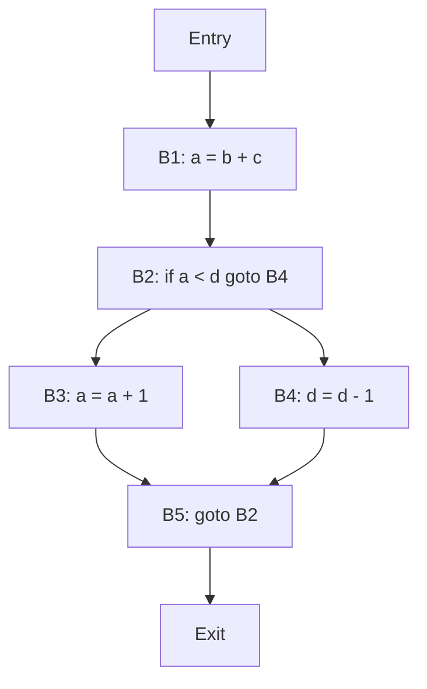

## Unit 1 - Introduction to Compiler

- A compiler is a program that translates a source program written in a high-level language (such as C, Java, Python, etc.) into a target program written in a low-level language (such as assembly, machine code, bytecode, etc.).
- The main goal of a compiler is to produce a correct and efficient target program that is equivalent to the source program in terms of functionality and behavior.
- A compiler typically consists of several phases, each of which performs a specific task on the source program or its intermediate representation. The main phases of a compiler are:
  - Lexical analysis: This phase scans the source program and converts it into a sequence of tokens, which are the basic units of syntax, such as keywords, identifiers, literals, operators, etc.
  - Syntax analysis: This phase parses the sequence of tokens and checks if it conforms to the grammar rules of the source language. It also builds a parse tree or an abstract syntax tree (AST) that represents the hierarchical structure of the source program.
  - Semantic analysis: This phase performs various checks on the parse tree or the AST to ensure that the source program is meaningful and follows the rules of the source language. For example, it checks for type errors, undeclared variables, scope rules, etc. It also performs some transformations on the parse tree or the AST to make it more suitable for the next phase.
  - Intermediate code generation: This phase translates the parse tree or the AST into an intermediate representation (IR) that is closer to the target language but still independent of the target machine. The IR can be in various forms, such as three-address code, quadruples, triples, etc.
  - Code optimization: This phase applies various techniques to improve the quality and performance of the IR by eliminating or reducing redundant, unnecessary, or inefficient code. For example, it can perform constant folding, dead code elimination, loop optimization, etc.
  - Code generation: This phase converts the IR into the target program by mapping the IR instructions to the target machine instructions. It also performs tasks such as register allocation, instruction scheduling, etc.
  - Symbol table management: This phase maintains a data structure called the symbol table that stores information about the identifiers used in the source program, such as their names, types, scopes, values, etc. The symbol table is accessed and updated by various phases of the compiler as needed.
  - Error handling: This phase detects and reports any errors or warnings that occur during the compilation process. It also tries to recover from the errors and continue the compilation as much as possible.


# Phases and Passes of Compiler

## Phases of Compiler

- A compiler is a software that converts a high-level language program into a low-level language program that can be executed by the computer.
- A compiler consists of several steps or phases, each of which performs a specific task on the source code.
- The phases of a compiler are:

  - **Lexical analysis**: This phase scans the source code and converts it into a sequence of tokens, which are the smallest meaningful units of the program. Tokens can be keywords, identifiers, literals, operators, etc.
  - **Syntax analysis**: This phase checks the syntactic structure of the program and verifies that it follows the rules of the grammar of the language. It also builds a parse tree, which is a hierarchical representation of the program.
  - **Semantic analysis**: This phase checks the meaning and logic of the program and performs tasks such as type checking, scope resolution, constant folding, etc. It also annotates the parse tree with semantic information.
  - **Intermediate code generation**: This phase translates the parse tree into an intermediate code, which is a low-level representation of the program that is independent of the target machine. Intermediate code can be in the form of quadruples, triples, or abstract syntax tree.
  - **Code optimization**: This phase improves the quality and efficiency of the intermediate code by applying various techniques such as dead code elimination, loop optimization, common subexpression elimination, etc.
  - **Code generation**: This phase generates the final executable code for the target machine by mapping the intermediate code to the machine instructions and registers. It also performs tasks such as register allocation, instruction scheduling, etc.

## Passes of Compiler

- A pass of a compiler is the number of times the compiler scans the entire source code or a part of it.
- A pass can consist of one or more phases of the compiler.
- The passes of a compiler are:

  - **Single pass compiler**: This compiler scans the source code only once and performs all the phases of the compiler in one pass. It is fast and simple, but it has some limitations such as forward references, error detection, etc.
  - **Two pass compiler**: This compiler scans the source code twice and performs some phases of the compiler in the first pass and the rest in the second pass. It can handle forward references and error detection better than a single pass compiler, but it is slower and more complex.
  - **Multi pass compiler**: This compiler scans the source code more than twice and performs each phase of the compiler in a separate pass. It can perform more sophisticated analysis and optimization than a single or two pass compiler, but it is slower and more complex.


# Bootstrapping

- Bootstrapping is the technique for producing a self-compiling compiler – that is, a compiler (or assembler) written in the source programming language that it intends to compile.
- A self-compiling compiler is also called a self-hosting compiler.
- Bootstrapping is used to create a programming language that is compiled with itself.
- Bootstrapping involves the following steps:
  - Stage 0: Preparing an environment for the bootstrap compiler to work with. This is where the source language and output language are defined, and a minimal compiler is written in assembly language or another low-level language.
  - Stage 1: The bootstrap compiler is produced. This compiler is enough to translate its own source into a program which can compile itself.
  - Stage 2: A full compiler is produced by using the bootstrap compiler to compile a more advanced version of the source code, which may include features that are not supported by the bootstrap compiler.
  - Stage 3: The full compiler is used to compile itself, producing an optimized and self-contained compiler.
- Bootstrapping has several advantages, such as:
  - It allows the compiler to be written in a high-level language, which makes it easier to maintain and debug.
  - It ensures that the compiler is consistent and correct, since it can compile itself and produce the same output.
  - It enables the compiler to use the features of the language that it compiles, which may improve the performance and functionality of the compiler.
  - It demonstrates the expressiveness and completeness of the language that it compiles, since it can implement its own compiler.


# Finite state machines and regular expressions and their applications to lexical analysis

- Finite state machines (FSMs) are abstract models of computation that can process a sequence of inputs and change their state accordingly.
- Regular expressions (REs) are algebraic notations that can specify a set of strings, called a regular language, using symbols and operators.
- Lexical analysis is the first phase of a compiler, where the source code is scanned and divided into meaningful units, called tokens.
- The applications of FSMs and REs to lexical analysis are:

  - FSMs can be used as recognizers for REs, that is, given a RE and an input string, an FSM can determine whether the string belongs to the language specified by the RE.
  - REs can be used as generators for FSMs, that is, given a RE, an algorithm can construct an equivalent FSM that accepts the same language as the RE.
  - Lexical analyzers can be implemented using FSMs, either directly or indirectly. Directly, a lexical analyzer can be a deterministic finite automaton (DFA) that reads the input character by character and changes its state until it reaches a final state, which corresponds to a token type. Indirectly, a lexical analyzer can be a nondeterministic finite automaton (NFA) that is converted to a DFA using a standard algorithm.
  - REs can be used as a convenient way of specifying the tokens of a language, using a notation that is concise, expressive and easy to manipulate. For example, the RE `a*b` specifies the token that consists of zero or more `a`s followed by a `b`.
  - FSMs and REs can be combined with other techniques, such as symbol tables, error handling, and buffering, to improve the efficiency and robustness of lexical analyzers.


# Optimization of DFA-Based Pattern Matchers

- A pattern matcher is a program that takes a string as input and determines whether it belongs to a given set of strings, specified by a pattern.
- A pattern is usually expressed as a regular expression, which is a concise way of describing a set of strings using symbols and operators.
- A regular expression can be converted to a finite automaton, which is a machine that can recognize the strings that match the pattern.
- A finite automaton can be either nondeterministic (NFA) or deterministic (DFA). An NFA can have multiple transitions for the same input symbol, while a DFA can have only one transition for each input symbol.
- A DFA is more efficient than an NFA for pattern matching, because it can process the input string in one pass, without backtracking or guessing.
- However, a DFA may have more states than an NFA, which can increase the memory and time requirements of the pattern matcher.
- Therefore, it is desirable to optimize the DFA-based pattern matcher by reducing the number of states and transitions, without changing its functionality.
- In this section, we will discuss three algorithms that have been used to optimize DFA-based pattern matchers:

  - The first algorithm is useful in a Lex compiler, because it constructs a DFA directly from a regular expression, without constructing an intermediate NFA. This avoids the exponential blowup that may occur when converting an NFA to a DFA using the subset construction algorithm.
  - The second algorithm is useful for minimizing the number of states of a DFA, by finding and merging equivalent states. This can reduce the size and complexity of the DFA, and improve its performance.
  - The third algorithm is useful for optimizing the transition table of a DFA, by finding and eliminating redundant transitions. This can reduce the number of comparisons and memory accesses required to process the input string.


# Implementation of Lexical Analyzers

- Lexical analysis is the first phase of a compiler design, where the input source code is scanned and divided into a sequence of tokens.
- A token is a unit of information that represents a lexeme, which is an instance of a pattern that matches a symbol in the source code.
- A lexical analyzer is a program that implements the process of lexical analysis and identifies the tokens from the source code.
- A lexical analyzer can be implemented using various techniques, such as:
  - Regular expressions: A regular expression is a notation that defines a set of strings that match a certain pattern. A lexical analyzer can use regular expressions to specify the rules for token recognition.
  - Finite automata: A finite automaton is a mathematical model of computation that consists of a finite set of states and transitions between them. A lexical analyzer can use finite automata to simulate the behavior of regular expressions and determine the token type for each lexeme.
  - Lexical analyzer generators: A lexical analyzer generator is a tool that automatically generates a lexical analyzer from a specification of the tokens and their patterns. A lexical analyzer generator can simplify the task of writing a lexical analyzer and ensure its correctness and efficiency.
- A lexical analyzer performs the following tasks:
  - It reads the input source code character by character and groups them into lexemes.
  - It assigns a token type to each lexeme based on the rules of token recognition.
  - It removes any whitespace or comments from the source code.
  - It reports any lexical errors, such as invalid characters or identifiers, that occur during the scanning process.
  - It stores the tokens and their attributes, such as value and position, in a symbol table.
  - It passes the tokens to the next phase of the compiler, which is the syntax analysis.


# Lexical Analyzer Generator

A lexical analyzer generator is a tool that allows the creation of lexical analyzers, also known as scanners or lexers, from a specification file. A lexical analyzer is a program that reads an input stream of characters and produces a stream of tokens, each representing a lexical unit such as a keyword, an identifier, a constant, etc.

## Features of Lexical Analyzer Generators

- A lexical analyzer generator takes as input a specification file that contains a set of regular expressions and corresponding actions. A regular expression is a notation for describing a set of strings that share a common pattern. An action is a piece of code that is executed when a regular expression is matched by the input.
- A lexical analyzer generator outputs a source code file that implements a lexical analyzer. The source code file can be written in different programming languages, such as C, Java, Python, etc. The lexical analyzer can be compiled and linked with other modules of a compiler or an interpreter.
- A lexical analyzer generator can optimize the performance of the lexical analyzer by using techniques such as minimizing the number of states in the finite state machine, using tables or switch statements for state transitions, using buffers for input and output, etc.
- A lexical analyzer generator can handle different types of input, such as files, strings, streams, etc. It can also handle different types of output, such as files, strings, streams, tokens, etc.
- A lexical analyzer generator can support different features, such as line and column numbers, start and end positions, comments, literals, case sensitivity, etc.

## Examples of Lexical Analyzer Generators

- Flex: A fast lexical analyzer generator for C and C++. It is a free and open-source software alternative to lex. It can generate scanners for POSIX, ANSI, and ISO C, as well as C++.
- JFlex: A fast scanner generator for Java. It is a free and open-source software that can generate scanners for Java 1.5 or higher. It can handle Unicode, supports several encodings, and integrates with JavaCC and CUP.
- Lex: A lexical analyzer generator for C. It is a standard tool for Unix systems. It can generate scanners for ANSI C and K&R C. It can be used with yacc, a parser generator for C.
- PyLex: A lexical analyzer generator for Python. It is a free and open-source software that can generate scanners for Python 2 and 3. It can handle Unicode, supports different modes of operation, and integrates with PyYacc, a parser generator for Python.


# LEX compiler

- Lex is a computer program that generates lexical analyzers (\"scanners\" or \"lexers\").
- Lexical analyzers are programs that take a stream of input characters and produce a stream of tokens, which are the basic units of syntax in a programming language.
- Lex is commonly used with the yacc parser generator, which takes a stream of tokens and produces a syntax tree or a parse tree.
- Lex is written in the Lex language, which consists of three sections: definitions, rules, and user subroutines.
- The definitions section contains declarations of variables, constants, regular expressions, and macros that are used in the rules section.
- The rules section contains patterns and actions, which specify what to do when a pattern is matched in the input stream.
- The user subroutines section contains auxiliary C functions that are called by the actions in the rules section.
- The Lex compiler transforms a Lex program (usually with the extension .l) to a C program (usually with the name lex.yy.c). 
- The C program lex.yy.c contains the definition of a function called yylex, which is the lexical analyzer. 
- The C program lex.yy.c can be compiled by any C compiler (such as gcc) to produce an executable file (usually with the name a.out).  
- The executable file a.out is the working lexical analyzer, which can take an input file or a standard input and produce an output file or a standard output with the tokens.


# Formal grammars and their application to syntax analysis

- A formal grammar is a set of rules that defines the syntax of a language, i.e. the structure and order of symbols that form valid sentences in the language.
- A formal grammar consists of four components:
  - A set of terminal symbols (V), which are the basic units of the language, such as keywords, identifiers, operators, etc.
  - A set of non-terminal symbols (N), which are placeholders for sequences of terminal symbols, such as expressions, statements, declarations, etc.
  - A set of production rules (P), which specify how to replace a non-terminal symbol with a sequence of terminal and/or non-terminal symbols, such as E -> E + E | E * E | (E) | id, where E is a non-terminal symbol for an expression and id is a terminal symbol for an identifier.
  - A start symbol (S), which is a special non-terminal symbol that represents the whole sentence or program.
- A formal grammar can be written as G = <V, N, P, S>, where V, N, P, and S are the components described above.
- A formal grammar can generate a language, which is the set of all sentences that can be derived from the start symbol using the production rules.
- A formal grammar can also recognize a language, which is the process of checking if a given sentence belongs to the language generated by the grammar.
- Syntax analysis or parsing is the phase of compiler design where the compiler checks if the source code follows the grammatical rules of the programming language .
- The purpose of syntax analysis is to verify the structure, not the meaning, of the source code .
- Syntax analysis also constructs a parse tree or a syntax tree, which is a hierarchical representation of the syntactic structure of the source code, where each node corresponds to a non-terminal or terminal symbol and each branch corresponds to a production rule.
- Syntax analysis can be performed by different algorithms, such as top-down parsing, bottom-up parsing, recursive-descent parsing, etc.
- Syntax analysis can be aided by using formal grammars to define the syntax of the programming language, such as context-free grammars, regular grammars, etc.
- Formal grammars are a useful tool for syntax analysis, but they have some limitations, such as ambiguity, incompleteness, and inefficiency .
- Ambiguity means that a grammar can generate more than one parse tree for the same sentence, which leads to confusion and inconsistency .
- Incompleteness means that a grammar cannot generate all the sentences that are meaningful in the language, which leads to rejection and error.
- Inefficiency means that a grammar can generate sentences that are too long or too complex, which leads to waste and delay.


# BNF Notation for the Notes of the Unit 1 - Introduction to Compiler in the Subject of Compiler Design

- BNF stands for **Backus Naur Form** notation . It is a form of notation used for specifying the **syntax** of programming languages and command sets. The syntax means the **structure of strings** in a certain language.
- BNF is a type of **metasyntax** notation for **context-free grammars**. A context-free grammar is a set of **production rules** that generate strings belonging to a language. A production rule has the form **A ::= B**, where A is a **non-terminal symbol** and B is a **sequence of terminal and non-terminal symbols**. A terminal symbol is a **basic symbol** that cannot be further divided, such as a letter or a digit. A non-terminal symbol is a **placeholder** for a group of terminal or non-terminal symbols.
- BNF uses the following **conventions**:
  - **< >** are used to enclose non-terminal symbols, such as <expression> or <statement>.
  - **|** is used to separate **alternatives**, such as <digit> ::= 0 | 1 | 2 | 3 | 4 | 5 | 6 | 7 | 8 | 9.
  - **::=** is used to indicate **definition**, such as <identifier> ::= <letter> | <identifier> <letter> | <identifier> <digit>.
  - **+** is used to indicate **one or more repetitions**, such as <digits> ::= <digit> +.
  - **[ ]** are used to enclose **optional** parts, such as <sign> ::= [ + | - ].
  - **( )** are used to group **subexpressions**, such as <term> ::= <factor> ( * | / ) <factor>.
  - **{ }** are used to enclose **comments**, such as {this is a comment}.
- BNF can be used to describe the **lexical**, **syntactic** and **semantic** aspects of a programming language. The lexical aspect deals with the **tokens** or **words** of the language, such as identifiers, keywords, operators, literals, etc. The syntactic aspect deals with the **grammar** or **rules** of the language, such as how to form expressions, statements, declarations, etc. The semantic aspect deals with the **meaning** or **behavior** of the language, such as how to evaluate expressions, execute statements, allocate memory, etc.
- BNF can also be used to generate **parsers** or **interpreters** for a programming language. A parser is a program that **analyzes** the input string and **checks** if it conforms to the grammar of the language. An interpreter is a program that **executes** the input string according to the semantics of the language. BNF can be converted into a **data structure** that represents the grammar, such as a **parse tree** or an **abstract syntax tree**. A parse tree shows the **hierarchical structure** of the input string, while an abstract syntax tree shows the **essential structure** of the input string.


# Ambiguity in Compiler Design

- Ambiguity in grammar is not good for a compiler construction.
- A grammar is ambiguous if it can produce more than one parse tree for the same sentence  .
- An ambiguous grammar or string can have multiple meanings.
- Ambiguity can cause problems in syntax analysis and semantic analysis of the source code.
- No method can detect and remove ambiguity automatically, but it can be removed by either re-writing the whole grammar without ambiguity, or by setting and following associativity and precedence constraints.
- Some common examples of ambiguity in grammar are:
  - Dangling-else ambiguity: The else clause can be associated with either the innermost or the outermost if statement.
  - Arithmetic expressions ambiguity: The order of evaluation of operators can be different depending on the precedence and associativity rules.
  - Operator overloading ambiguity: The same operator can have different meanings depending on the context and the operands.
- Some common methods to eliminate ambiguity are:
  - Introducing extra symbols or parentheses to clarify the intended meaning .
  - Modifying the production rules to avoid left recursion or common prefixes .
  - Using attributes or semantic actions to resolve the ambiguity at run time .


# YACC

YACC stands for Yet Another Compiler-Compiler. It is a tool that generates a parser for a given grammar. A parser is a program that analyzes the syntactic structure of a source code and checks if it conforms to the rules of the language. YACC is often used with a lexical analyzer generator such as Lex, which produces a scanner that recognizes the tokens in the input stream.

Some of the main points about YACC are:

- YACC is an LALR(1) parser generator, which means it produces a parser that uses a lookahead of one token and a left-to-right scanning and rightmost derivation of the input.
- YACC input file consists of three sections: definitions, rules, and user code. The definitions section contains declarations of tokens, variables, and other symbols. The rules section contains the grammar rules that specify how the tokens can be combined to form valid sentences. The user code section contains the C code that is copied verbatim to the output file.
- YACC output file is a C source file that defines a function called yyparse, which implements the parser. The yyparse function calls another function called yylex, which is the scanner that returns the next token from the input. The yylex function is usually generated by Lex or written by the user.
- YACC also generates a header file that contains the definitions of the tokens and the values returned by the parser. The header file can be included in the user code section or in other files that need to access the parser.
- YACC can handle ambiguous grammars, but it may produce conflicts that need to be resolved by the user. A conflict occurs when the parser has more than one possible action for a given input. There are two types of conflicts: shift-reduce and reduce-reduce. A shift-reduce conflict occurs when the parser can either shift the next token onto the stack or reduce the top of the stack by a rule. A reduce-reduce conflict occurs when the parser can reduce the top of the stack by more than one rule. YACC reports the number and type of conflicts in the output file and uses default actions to resolve them. The user can also specify precedence and associativity of operators to resolve some of the conflicts.


# The syntactic specification of programming languages

- The syntax of a programming language defines its surface form, i.e., how the programs are written and structured in that language.
- The syntax of a programming language is usually specified by a set of rules that determine what sequences of characters or symbols are valid in that language.
- The syntactic specification of a programming language can be divided into two levels: lexical and syntactic.

## Lexical level

- The lexical level of a programming language defines the basic units of meaning, called lexemes or tokens, that can be used in a program.
- A lexeme is a sequence of characters that represents a single logical entity, such as a keyword, an identifier, a constant, an operator, or a delimiter.
- A token is a pair of a lexeme and its corresponding category, such as keyword, identifier, constant, operator, or delimiter.
- The lexical level of a programming language is usually specified by a set of regular expressions that describe the patterns of characters that form valid lexemes.
- A regular expression is a notation for describing a set of strings that match a certain pattern, using symbols such as concatenation, alternation, repetition, and grouping.
- For example, the regular expression `[a-zA-Z][a-zA-Z0-9]*` describes the set of strings that start with a letter and are followed by zero or more letters or digits, which can be used to define the pattern of identifiers in a programming language.

## Syntactic level

- The syntactic level of a programming language defines the structure and composition of programs, i.e., how the tokens can be combined to form meaningful constructs, such as expressions, statements, declarations, and functions.
- The syntactic level of a programming language is usually specified by a context-free grammar (CFG) that describes the rules of derivation or production of valid programs.
- A context-free grammar is a notation for describing a set of strings that can be generated by applying a set of rules, called productions, to a start symbol, using symbols such as nonterminals, terminals, and operators.
- A nonterminal is a symbol that represents a syntactic category, such as expression, statement, declaration, or function, that can be replaced by a sequence of symbols according to a production rule.
- A terminal is a symbol that represents a token, such as a keyword, an identifier, a constant, an operator, or a delimiter, that cannot be replaced by any other symbol.
- A production is a rule that specifies how a nonterminal can be replaced by a sequence of symbols, consisting of a left-hand side (LHS) and a right-hand side (RHS), separated by an arrow.
- For example, the production `statement -> if ( expression ) statement else statement` describes how a statement can be replaced by an if-else construct, consisting of the keyword `if`, a pair of parentheses, an expression, two statements, and the keyword `else`.
- A parse tree is a graphical representation of the derivation of a string from a context-free grammar, showing the hierarchical structure of the string and the application of the production rules.
- For example, the following parse tree shows the derivation of the string `if (x > 0) y = y + 1; else y = y - 1;` from a context-free grammar for a simple programming language:

Parse tree example

- The syntactic specification of a programming language is important for designing and implementing compilers, which are programs that translate programs from one language to another, such as from a high-level language to a low-level language.
- A compiler usually consists of two main phases: analysis and synthesis.
- The analysis phase, also called the front-end, is responsible for checking the syntactic and semantic correctness of the source program, and producing an intermediate representation of the program, such as an abstract syntax tree or a three-address code.
- The synthesis phase, also called the back-end, is responsible for generating the target program from the intermediate representation, and performing optimizations to improve the performance or quality of the target program.
- The syntactic analysis, also called parsing, is the process of constructing a parse tree or an abstract syntax tree for the source program, using the syntactic specification of the source language.
- The syntactic analysis can be performed by different algorithms, such as top-down parsing, bottom-up parsing, or recursive-descent parsing, depending on the properties of the context-free grammar and the desired efficiency and simplicity of


# Context Free Grammars

- A context free grammar (CFG) is a set of rules that defines a formal language. A formal language is a set of strings that can be generated by following the rules of the grammar. 
- A CFG consists of four components: a set of terminals, a set of non-terminals, a start symbol, and a set of productions. 
- Terminals are the basic symbols of the language, such as letters, digits, or operators. Non-terminals are placeholders for sequences of terminals or other non-terminals. The start symbol is a special non-terminal that represents the whole language. Productions are rules that specify how to replace a non-terminal with a sequence of terminals and/or non-terminals. 
- A CFG can be written in Backus-Naur form (BNF), which is a notation for specifying grammars. A BNF grammar consists of a series of production rules, each of the form:

  ```
  <non-terminal> ::= <sequence>
  ```

  where `<non-terminal>` is a non-terminal symbol, and `<sequence>` is a sequence of terminals and/or non-terminals. The symbol `::=` means "can be replaced by". 
- A CFG can generate a string by starting from the start symbol and applying the production rules repeatedly until only terminals are left. The sequence of production rules applied is called a derivation. A derivation can be represented by a parse tree, which is a tree structure that shows how the string is derived from the start symbol. 
- A CFG can also be used to parse a string, which is the process of checking if the string belongs to the language and finding its parse tree. Parsing is an important task in compiler design, as it is used to analyze the syntax and structure of a program.  
- A CFG can define the high level structure of a programming language, such as the syntax of expressions, statements, and declarations. However, a CFG cannot capture the low level details of a programming language, such as the lexical rules, the data types, and the semantics. Therefore, a CFG is usually combined with other components, such as a lexical analyzer, a symbol table, and a semantic analyzer, to form a complete compiler.  
- A CFG is called context free because the production rules do not depend on the context or the surrounding symbols of a non-terminal. This means that a non-terminal can be replaced by the same sequence regardless of where it appears in the string. This property makes CFGs simpler and easier to parse than other types of grammars, such as context sensitive grammars or unrestricted grammars. 
- A CFG can be simplified by removing some of the productions that are not useful or redundant. For example, a CFG can be simplified by eliminating null productions, which are productions that replace a non-terminal with an empty string; unit productions, which are productions that replace a non-terminal with another non-terminal; and useless symbols, which are symbols that do not appear in any derivation of the start symbol.


# Derivation and Parse Trees

- Derivation is the process of applying production rules of a grammar to generate a string of terminals from the start symbol.
- A grammar can have more than one derivation for a given string, depending on the order of applying the rules.
- There are two types of derivation: leftmost and rightmost.
  - Leftmost derivation is when the leftmost non-terminal in each step is replaced by the right-hand side of a production rule.
  - Rightmost derivation is when the rightmost non-terminal in each step is replaced by the right-hand side of a production rule.
- Parse tree is a hierarchical structure that represents the derivation of a grammar to yield a string of terminals.
  - The root node of a parse tree has the start symbol of the grammar.
  - The internal nodes of a parse tree are non-terminals.
  - The leaf nodes of a parse tree are terminals.
  - The order of children of a node corresponds to the order of symbols in the right-hand side of the production rule used to replace the node.
  - The inorder traversal of the leaf nodes gives the derived string of terminals.
- Parse tree can be used to check if a string belongs to the language generated by a grammar, and to determine the syntactic structure of the string.
- Parse tree can also be used to construct an abstract syntax tree, which is a simplified representation of the essential syntactic elements of the string, ignoring the details that are not relevant for the subsequent phases of the compiler.


# Capabilities of CFG

CFG stands for Context-Free Grammar, which is a set of recursive rules used to generate patterns of strings. CFGs are useful for describing the syntax of programming languages, as well as natural languages. Some of the capabilities of CFGs are:

- CFGs can describe most of the programming languages, such as C, Java, Python, etc.  
- CFGs can be used to construct efficient parsers automatically, if the grammar is properly written. A parser is a program that analyzes the structure and meaning of a given input string according to a given grammar.  
- CFGs can handle features such as balanced parentheses, matching begin-end, corresponding if-then-else, etc. These features are common in programming languages and require context-free rules to be recognized. 
- CFGs can incorporate information about associativity and precedence of operators, which are important for evaluating expressions. For example, the expression x + y * z can be parsed differently depending on the order and grouping of the operations.  

CFGs are not powerful enough to describe all possible languages, however. Some languages require more complex rules that depend on the context or history of the input string. For example, the language of palindromes, which are strings that are the same when read backwards, cannot be generated by a CFG.


## Unit 2 - Basic Parsing Techniques

Parsing is the process of analyzing the structure and meaning of a sentence or a program based on a given grammar. Parsing techniques are methods for implementing parsers that can efficiently and correctly process the input.

Some of the basic parsing techniques are:

- Top-down parsing: This technique starts from the start symbol of the grammar and tries to derive the input by applying the production rules in a top-down manner. It can be implemented using recursive descent or table-driven methods. Top-down parsing can handle left-recursive grammars, but it may require backtracking or lookahead to resolve ambiguities.
- Bottom-up parsing: This technique starts from the input and tries to reduce it to the start symbol of the grammar by applying the production rules in a bottom-up manner. It can be implemented using shift-reduce or table-driven methods. Bottom-up parsing can handle right-recursive grammars, but it may require lookahead to resolve conflicts.
- Predictive parsing: This technique is a special case of top-down parsing that does not require backtracking or lookahead. It uses a predictive table that maps the current nonterminal and the next input symbol to the production rule to be applied. Predictive parsing can only handle LL(1) grammars, which are a subset of context-free grammars that have no left recursion and no common prefixes among the alternatives of a nonterminal.
- Operator-precedence parsing: This technique is a special case of bottom-up parsing that does not require lookahead. It uses a precedence table that defines the relative precedence and associativity of the operators in the grammar. Operator-precedence parsing can only handle a subset of context-free grammars that have no epsilon productions, no unit productions, and no ambiguity among the operators.


# Parsers for the notes of the Unit 2 - Basic Parsing Techniques in the subject of Compiler Design

- A parser is a program that is part of the compiler, and parsing is part of the compiling process.
- Parsing happens during the analysis stage of compilation. In parsing, code is taken from the preprocessor, broken into smaller pieces and analyzed so other software can understand it.
- The parser takes a token string as input and with the help of existing grammar, converts it into the corresponding Intermediate Representation (IR). The parser is also known as Syntax Analyzer.
- There are two main types of parsers: top-down parsers and bottom-up parsers.
- Top-down parsers start from the root of the parse tree and try to match the input with the grammar rules. They use a stack to store the intermediate results and predict the next production to apply.
- Bottom-up parsers start from the leaves of the parse tree and try to reduce the input to the start symbol of the grammar. They use a stack to store the intermediate results and apply the production that matches the top of the stack and the input.
- Top-down parsers can be further classified into recursive descent parsers and predictive parsers.
- Recursive descent parsers are a type of top-down parsers that use recursive functions to implement each non-terminal of the grammar. They may have more than one production to choose from for a single instance of input, which can lead to backtracking.
- Predictive parsers are a type of top-down parsers that use a parsing table to decide which production to apply based on the input and the stack element. They do not require backtracking, but they can only handle a subset of grammars called LL(1) grammars.
- Bottom-up parsers can be further classified into shift-reduce parsers and operator-precedence parsers.
- Shift-reduce parsers are a type of bottom-up parsers that use two operations: shift and reduce. Shift moves the next input symbol to the top of the stack, and reduce applies a production that matches the top of the stack and replaces it with the left-hand side of the production.
- Operator-precedence parsers are a type of bottom-up parsers that use a precedence table to determine the order of operations and operands. They can handle a subset of grammars called operator-precedence grammars, which have no ambiguity and no left recursion.


# Shift Reduce Parsing

Shift reduce parsing is a bottom-up parsing technique that builds the parse tree from the leaves (bottom) to the root (up) by applying two actions: shift and reduce  .

- Shift: This involves moving symbols from the input buffer onto the stack.
- Reduce: This involves replacing a handle (a substring that matches the right-hand side of a production rule) on the top of the stack with the corresponding left-hand side symbol.

Shift reduce parsing requires two data structures for its implementation: a stack and an input buffer .

The steps of shift reduce parsing are as follows  :

1. Initialize the stack with a special symbol $ and the input buffer with the input string followed by $.
2. Repeat the following steps until either an error or acceptance occurs:
   - If the top of the stack contains the start symbol of the grammar and the input buffer contains only $, then accept the input and stop.
   - If the top of the stack contains a handle, then apply a reduce action by popping the handle from the stack and pushing the corresponding left-hand side symbol onto the stack.
   - If the top of the stack does not contain a handle and the input buffer is not empty, then apply a shift action by moving the next symbol from the input buffer onto the stack.
   - If none of the above conditions apply, then report an error and stop.

Shift reduce parsing can be implemented using different algorithms, such as LR parsing, SLR parsing, LALR parsing, and CLR parsing  . These algorithms differ in how they resolve conflicts that may arise during parsing, such as shift/reduce conflicts and reduce/reduce conflicts .

Shift/reduce conflict: This occurs when the parser has to choose between shifting the next input symbol onto the stack or reducing the handle on the top of the stack .

Reduce/reduce conflict: This occurs when the parser has to choose between reducing the handle on the top of the stack by two or more different production rules.

Shift reduce parsing is an efficient and powerful method for parsing programming languages and other notations formally defined by a grammar. However, it also has some limitations, such as requiring the grammar to be unambiguous and free of left recursion .


# Operator Precedence Parsing

- Operator precedence parsing is a bottom-up parsing technique that can handle a subset of LR(1) grammars, where no two consecutive nonterminals and no epsilon appear in the right-hand side of any production.
- Operator precedence parsing is based on the concept of operator precedence relations, which define the order of evaluation of different operators in an expression.
- Operator precedence relations are usually given in the form of a precedence table or a precedence matrix, which specifies the relative precedence of each pair of operators or operands.
- Operator precedence parsing consists of two steps: scanning and parsing.
  - Scanning: The input string is scanned from left to right and divided into tokens, which are either operators or operands. Tokens are pushed onto a stack until a precedence relation can be determined between the topmost token on the stack and the next input token.
  - Parsing: The precedence relation between the tokens determines the action to be taken by the parser. There are three possible actions:
    - Shift: If the topmost token on the stack has lower precedence than the next input token, the input token is pushed onto the stack and the scanning continues.
    - Reduce: If the topmost token on the stack has higher precedence than the next input token, the tokens on the stack are popped and reduced to a single operand by applying the corresponding production rule.
    - Accept: If the topmost token on the stack and the next input token are both end markers ($), the parsing is successful and the stack contains the start symbol of the grammar.
- Operator precedence parsing has some advantages and disadvantages:
  - Advantages:
    - It is simple and easy to implement.
    - It can handle some ambiguous grammars by assigning different precedence levels to different interpretations of the same operator.
    - It can handle some left-recursive grammars by converting them to right-recursive grammars.
  - Disadvantages:
    - It can only handle a limited class of grammars, which may not be expressive enough for some languages.
    - It may require a large precedence table or matrix, which may be difficult to construct and maintain.
    - It may produce incorrect results for some expressions that do not follow the conventional order of operations, such as a-b-c or a^b^c.


# Top-Down Parsing

- Top-down parsing is a method of parsing the input string provided by the lexical analyzer.
- The top-down parser parses the input string and then generates the parse tree for it.
- Construction of the parse tree starts from the root node i.e. the start symbol of the grammar.
- The parser expands the non-terminals in the leftmost derivation until all the leaves are terminals that match the input string.
- Top-down parsing can be done with or without backtracking.
- Backtracking means that the parser may try multiple rules or productions to identify the match for the input string, and may undo some steps if the match fails.
- Top-down parsing can be implemented using recursive or non-recursive techniques.
- Recursive descent parsing is a top-down parsing technique that uses recursive functions to match the input string with the grammar rules.
- Non-recursive parsing is a top-down parsing technique that uses a stack to store the intermediate results and avoid recursion.
- Predictive parsing is a type of non-recursive parsing that does not require backtracking. It uses a parsing table to determine which production to apply based on the current input symbol and the top of the stack.
- LL parsing is a type of predictive parsing that scans the input string from left to right and constructs a leftmost derivation. LL stands for Left to right scan and Leftmost derivation.
- LL(1) parsing is a special case of LL parsing that requires only one symbol of lookahead to decide which production to apply. LL(1) grammars are a subset of context-free grammars that are suitable for top-down parsing.


# Predictive Parsers

- Predictive parsers are a type of top-down parsers that do not require backtracking or backup  .
- Predictive parsers can predict which production rule to use by looking at the next input symbol .
- Predictive parsers use a look-ahead pointer to point to the next input symbol.
- Predictive parsers can be implemented by using a transition diagram for each production rule.
- Predictive parsers can also be implemented by using a parsing table and a stack.
- Predictive parsers require the grammar to be LL(1), which means that the parser can determine the production rule by looking at the leftmost non-terminal and the first input symbol.
- Predictive parsers have the advantage of being simple, efficient and easy to implement .
- Predictive parsers have the disadvantage of being restricted to a subset of grammars that are LL(1)  .


# Automatic Construction of Efficient Parsers

- A parser is a program that analyzes the syntactic structure of a given input according to a given grammar.
- A parser can be constructed manually or automatically using a parser generator tool.
- A parser generator is a program that takes a grammar specification as input and produces a parser program as output.
- A parser generator can use different parsing algorithms to construct the parser, such as top-down, bottom-up, or hybrid methods.
- One of the most widely used parsing algorithms is the LR algorithm, which is a bottom-up method that can handle a large class of grammars, including most programming languages.
- LR stands for Left-to-right scan of the input and Rightmost derivation of the parse tree.
- LR parsers can be classified into different types based on the amount of lookahead symbols they use and the way they construct the parsing tables, such as SLR, LALR, or canonical LR parsers.
- LR parsers use two data structures: a stack and a parsing table. The stack stores the symbols that have been processed so far, and the parsing table guides the actions of the parser based on the current input symbol and the top of the stack.
- The parsing table consists of two parts: an action table and a goto table. The action table specifies what action the parser should take for each state and input symbol, such as shift, reduce, accept, or error. The goto table specifies the next state the parser should go to after a reduction.
- The parsing table is constructed from the grammar using a set of items, which are productions with a dot indicating the position of the parser. An item can be either a kernel item or a non-kernel item, depending on whether the dot is at the beginning or not.
- The set of items for a grammar is called the canonical collection of LR(0) items, which can be computed using a closure and a goto function. The closure function adds all the items that can be derived from a given item by expanding the non-terminal after the dot. The goto function computes the set of items that can be reached from a given set of items by shifting a given symbol.
- The canonical collection of LR(0) items forms the states of the LR(0) automaton, which is a finite state machine that recognizes the viable prefixes of the grammar. A viable prefix is a prefix of a right sentential form that does not extend past the right end of the rightmost handle.
- The LR(0) automaton can be used to construct the SLR parsing table, which stands for Simple LR. The SLR parsing table uses the follow sets of the non-terminals to determine the reduce actions. The follow set of a non-terminal is the set of terminals that can appear immediately after that non-terminal in a sentential form.
- The SLR parsing table may have conflicts, which are situations where the parser has more than one possible action for a given state and input symbol. Conflicts can be either shift-reduce or reduce-reduce. A conflict indicates that the grammar is not SLR.
- The SLR parsing table can be improved by using more precise information about the lookahead symbols, which can be obtained by computing the LR(1) items. An LR(1) item is an LR(0) item augmented with a lookahead symbol, which indicates what symbol can follow the handle corresponding to the item.
- The canonical collection of LR(1) items can be computed using a similar closure and goto function as for LR(0) items, but taking into account the lookahead symbols. The canonical collection of LR(1) items forms the states of the LR(1) automaton, which is more refined than the LR(0) automaton.
- The LR(1) automaton can be used to construct the canonical LR parsing table, which uses the lookahead symbols of the items to determine the reduce actions. The canonical LR parsing table is the most powerful and precise among the LR parsing tables, but it may be very large and complex.
- The canonical LR parsing table can be reduced by merging some states that have the same LR(0) items but different lookahead symbols. This results in the LALR parsing table, which stands for Look-Ahead LR. The LALR parsing table is smaller and simpler than the canonical LR parsing table, but it may introduce some conflicts that were not present in the canonical LR parsing table.
- The LALR parsing table is the most commonly used among the LR parsing tables, as it offers a good balance between power and simplicity. Most parser generator tools, such as YACC, use the LALR algorithm to construct the parsers.
- Automatic


# LR parsers

- LR parsers are a type of **bottom-up parsers** that analyse **deterministic context-free languages** in linear time .
- LR parsers read the input from **left to right** and produce a **rightmost derivation** in reverse .
- LR parsers use a **stack** to store the symbols of the derivation and a **state transition table** to guide the parsing actions .
- LR parsers can handle a large class of grammars, including **most programming languages** .
- LR parsers can detect **syntax errors** as soon as possible .
- There are several variants of LR parsers, such as:
  - **SLR** (Simple LR): uses a simplified method to construct the state transition table, but may not be able to parse some grammars that are LR .
  - **LALR** (Look-Ahead LR): uses a lookahead terminal to reduce the size of the state transition table, but may lose some parsing power compared to canonical LR .
  - **Canonical LR** (or LR(1)): uses a lookahead terminal to distinguish between different parsing actions, and can parse any grammar that is LR .
  - **Minimal LR** (or LR(0)): uses the smallest possible state transition table, but may require more parsing actions than other variants.
  - **GLR** (Generalized LR): uses a non-deterministic automaton to handle ambiguous grammars that are not LR.


# The canonical collection of LR(0) items

- An **LR(0) item** is a production of a grammar G with a dot at some position on the right side of the production .
- The dot indicates how much of the input has been scanned up to a given point in the process of parsing.
- For example, the production S -> XYZ yields four items:
  - S -> .XYZ
  - S -> X.YZ
  - S -> XY.Z
  - S -> XYZ.
- A **canonical collection of LR(0) items** is a set of sets of LR(0) items that is used to construct the SLR functions closure and goto.
- The canonical collection of LR(0) items for a grammar G is obtained by the following algorithm:
  - Start with the augmented grammar G' with a new start symbol S' and a production S' -> S.
  - Compute the closure of the set {S' -> .S} and call it I0. This is the initial state of the LR(0) automaton.
  - For each set of items I and each grammar symbol X, compute the goto function goto(I, X) and add it to the collection if it is not empty.
  - Repeat the previous step until no new sets of items are added to the collection.
- The canonical collection of LR(0) items can be represented by a DFA where each state is a set of items and each transition is labeled by a grammar symbol.
- The DFA can be used to construct the SLR parsing table by assigning actions to each state and symbol pair.
- The canonical collection of LR(0) items can be used to determine if a grammar is LR(0) or not. A grammar is LR(0) if and only if there is no state in the DFA that has a shift-reduce conflict or a reduce-reduce conflict.


# Constructing SLR Parsing Tables

- SLR stands for Simple LR, which is a type of LR parser with small parse tables and a relatively simple parser generator algorithm.
- SLR parsers can perform bottom-up parsing of input strings using one token of lookahead to resolve conflicts .
- SLR parsers can handle a subset of LR(1) grammars, which are grammars that can be parsed by LR parsers with one token of lookahead.
- SLR parsers are similar to LR(0) parsers, except that they use the FOLLOW sets of the non-terminals to determine when to reduce .
- The steps for constructing SLR parsing tables are:

  1. Write the augmented grammar, which is the original grammar with a new start symbol and a new production S' -> S, where S is the original start symbol.
  2. Find the LR(0) collection of items, which are sets of productions with a dot indicating the current position of the parser.
  3. Find the FOLLOW sets of the non-terminals, which are the sets of terminals that can appear immediately after the non-terminals in a derivation.
  4. Define two functions: GOTO and ACTION, which are the components of the parsing table.
     - GOTO is a function that maps a state and a symbol to a new state, indicating the transition of the parser after shifting the symbol.
     - ACTION is a function that maps a state and a terminal to an action, which can be shift, reduce, accept, or error.
  5. Fill the parsing table using the following rules:
     - For each item [A -> α.Bβ] in state I, set GOTO(I, B) to the state that contains the item [A -> αB.β] after the closure operation.
     - For each item [A -> α.] in state I, set ACTION(I, a) to reduce A -> α for all a in FOLLOW(A).
     - For each item [S' -> S.] in state I, set ACTION(I, $) to accept, where $ is the end-of-input marker.
     - For all other entries in the parsing table, set them to error.

- An example of constructing an SLR parsing table for the grammar S -> CC, C -> cC | d is given below:

  1. The augmented grammar is S' -> S, S -> CC, C -> cC | d.
  2. The LR(0) collection of items is:

     ```
     I0: [S' -> .S]
         [S -> .CC]
         [C -> .cC]
         [C -> .d]
     I1: [S' -> S.]
     I2: [S -> C.C]
         [C -> .cC]
         [C -> .d]
     I3: [C -> c.C]
         [C -> .cC]
         [C -> .d]
     I4: [C -> d.]
     I5: [S -> CC.]
     I6: [C -> cC.]
     ```

  3. The FOLLOW sets of the non-terminals are:

     ```
     FOLLOW(S') = {$}
     FOLLOW(S) = {$}
     FOLLOW(C) = {c, d, $}
     ```

  4. The GOTO and ACTION functions are:

     ```
     GOTO(I0, S) = I1
     GOTO(I0, C) = I2
     GOTO(I0, c) = I3
     GOTO(I0, d) = I4
     GOTO(I2, C) = I5
     GOTO(I2, c) = I3
     GOTO(I2, d) = I4
     GOTO(I3, C) = I6
     GOTO(I3, c) = I3
     GOTO(I3, d) = I4

     ACTION(I0, c) = shift
     ACTION(I0, d) = shift
     ACTION(I0, $) = error
     ACTION(I1, $) = accept
     ACTION(I2, c) = shift
     ACTION(I2, d) = shift
     ACTION(I

```


# Constructing Canonical LR Parsing Tables

Canonical LR parsing is a bottom-up parsing technique that can handle a large class of context-free grammars. It is based on the idea of constructing a deterministic finite automaton (DFA) that recognizes the viable prefixes of the grammar. A viable prefix is a prefix of a right sentential form that does not extend past the right end of the rightmost handle of that sentential form.

To construct a canonical LR parsing table, the following steps are required:

- Write an augmented grammar for the given input grammar by adding a new start symbol and a production of the form S' -> S, where S is the original start symbol.
- Construct the canonical collection of LR(1) items for the augmented grammar. An LR(1) item is a pair of a production and a lookahead symbol, denoted as [A -> α.β, a], where A -> αβ is a production, α and β are strings of grammar symbols, and a is a terminal symbol or $. The dot indicates how much of the right-hand side has been seen so far. The lookahead symbol indicates what terminal symbol can follow the production in a right sentential form.
- Define the goto and action functions for the canonical LR parsing table. The goto function maps a state and a grammar symbol to a new state, and is defined as follows: goto(I, X) = closure(J), where I is a state, X is a grammar symbol, and J is the set of all items [A -> αX.β, a] such that [A -> α.Xβ, a] is in I. The closure function computes the set of all items that are valid for a given state, by adding new items that can be derived from the existing ones using the grammar rules. The action function maps a state and a terminal symbol to a parsing action, and is defined as follows:

  - If [A -> α.aβ, b] is in Ii and goto(Ii, a) = Ij, then set action[i, a] to "shift j". This means that the parser shifts the terminal symbol a onto the stack and goes to state j.
  - If [A -> α., a] is in Ii, then set action[i, a] to "reduce A -> α". This means that the parser reduces the handle α on top of the stack to the nonterminal symbol A, and goes to the state indicated by the top of the stack and the goto function.
  - If [S' -> S., $] is in Ii, then set action[i, $] to "accept". This means that the parser accepts the input as a valid sentence of the grammar.
  - If there is no item in Ii that applies to the terminal symbol a, then set action[i, a] to "error". This means that the parser reports a syntax error.

- Construct the canonical LR parsing table by filling in the entries for the goto and action functions for each state and symbol. If there is a conflict between two actions for the same entry, then the grammar is not LR(1) and the table cannot be constructed.


# Constructing LALR parsing tables

- LALR stands for lookahead LR, which is a type of bottom-up parser that can handle a large class of grammars.
- LALR parsing tables are used to guide the parsing process and determine the actions to be taken at each step.
- LALR parsing tables are constructed from the canonical collection of LR(1) items, which are pairs of production rules and lookahead symbols.
- LR(1) items represent the possible states of the parser and the expected input symbols.
- To construct the LALR parsing table, the following steps are followed:

  1. Find the canonical collection of LR(1) items by applying the closure and goto operations on the augmented grammar.
  2. Merge the LR(1) items that have the same production rule but different lookahead symbols into a single set of items. This reduces the number of states and the size of the table.
  3. Label each set of items with a unique state number and assign a start state to the set that contains the augmented production rule.
  4. For each state and terminal symbol, determine the action to be taken by the parser. The action can be one of the following:
    - Shift: move the input symbol to the stack and advance to the next state.
    - Reduce: pop the symbols from the stack that match the right-hand side of a production rule and push the left-hand side symbol to the stack. The next state is determined by the goto table.
    - Accept: terminate the parsing process successfully.
    - Error: report a syntax error and try to recover.
  5. For each state and non-terminal symbol, determine the next state to be reached by the parser. This is the goto table.
  6. Fill the entries of the parsing table with the actions and the goto values. If there is more than one entry for a given state and symbol, the grammar is not LALR and a conflict occurs.


# Using Ambiguous Grammars

- A grammar is **ambiguous** if it can generate more than one **leftmost derivation** or **rightmost derivation** for the same sentence .
- Ambiguous grammars are **undesirable** for compiler design because they can lead to **conflicts** in parsing and **multiple meanings** for the same program.
- Ambiguous grammars can be **detected** by using **parsing algorithms** such as **top-down** or **bottom-up** parsing and checking if they produce more than one **parse tree** for the same sentence .
- Ambiguous grammars can be **resolved** by using **precedence** and **associativity** rules for operators, **eliminating** left recursion and common prefixes, **introducing** new non-terminals, or **rewriting** the grammar in an **unambiguous** way  .
- An example of an ambiguous grammar is:

```
S -> i E t S | i E t S e S | a
E -> b
```

This grammar can generate two different parse trees for the sentence `i b t a e a`:

```
     S                        S
    /|\                      /|\
   / | \                    / | \
  i  E  t                  i  E  t
     |   |                    |   \
     b   S                    b    S
        /|\                       /|\
       / | \                     / | \
      i  E  t                   i  E  t
         |   |                    |   \
         b   S                    b    S
            /|\                       / \
           / | \                     /   \
          e  S  S                   e     S
             |  |                         |
             a  a                         a
```

The sentence can have two different meanings depending on which parse tree is chosen. The first parse tree corresponds to the interpretation `(if b then (if b then a else a))`, while the second parse tree corresponds to the interpretation `(if b then (if b then a) else a)`.


# An Automatic Parser Generator for the Notes of the Unit 2 - Basic Parsing Techniques in the Subject of Compiler Design

- A parser is a program that analyzes the syntactic structure of a given input according to a given grammar.
- A parser generator is a tool that takes a grammar as input and automatically generates source code that can parse streams of characters using the grammar.
- A parser generator can save time and effort for compiler developers by automating the tedious and error-prone task of writing a parser by hand.
- A parser generator can also ensure that the generated parser is correct and efficient, as well as consistent with the grammar specification.
- Some examples of parser generators are YACC, Bison, ANTLR, JavaCC, etc.
- Basic parsing techniques are methods for designing and implementing parsers based on different classes of grammars and languages.
- Some of the basic parsing techniques are:
  - Top-down parsing: A top-down parser starts from the start symbol of the grammar and tries to derive the input string by applying production rules in a leftmost manner. A top-down parser can be either recursive or non-recursive. A recursive top-down parser uses recursive calls to subroutines that correspond to non-terminals in the grammar. A non-recursive top-down parser uses a stack to store the symbols that need to be matched with the input. A special case of top-down parsing is predictive parsing, which uses a lookahead symbol to determine which production rule to apply next. Predictive parsing can be implemented by a recursive-descent parser or a table-driven parser. Predictive parsing requires the grammar to be LL(1), which means that the parser can decide which production rule to apply by looking at the next input symbol and the current non-terminal.
  - Bottom-up parsing: A bottom-up parser starts from the input string and tries to construct the parse tree by applying production rules in a reverse manner. A bottom-up parser can be either shift-reduce or operator-precedence. A shift-reduce parser uses a stack to store the symbols that have been read from the input and performs two operations: shift and reduce. A shift operation pushes the next input symbol onto the stack. A reduce operation pops some symbols from the stack and replaces them with a non-terminal that corresponds to a production rule. A shift-reduce parser can be implemented by a table-driven parser that uses two tables: an action table and a goto table. The action table tells the parser what action to perform (shift, reduce, accept, or error) based on the current state and the next input symbol. The goto table tells the parser what state to go to after a reduce operation based on the current state and the reduced non-terminal. A shift-reduce parser requires the grammar to be LR(1), which means that the parser can decide what action to perform by looking at the next input symbol and the stack contents. A special case of shift-reduce parsing is SLR(1) parsing, which uses a simplified action table that only considers the next input symbol and not the stack contents. Another special case of shift-reduce parsing is LALR(1) parsing, which uses a compact action table that combines the states that have the same actions for the same input symbols. An operator-precedence parser is a bottom-up parser that uses a precedence table to determine the order of operations in an expression. An operator-precedence parser requires the grammar to be operator-precedence, which means that the grammar has no epsilon productions, no left recursion, and no ambiguity in the precedence and associativity of operators.


# Implementation of LR Parsing Tables

LR parsing tables are a two-dimensional array in which each entry represents an action or a goto entry. LR parsing tables are used to guide the parsing process of a given input string based on a grammar. LR parsing tables are constructed by following these steps:

- Generate the canonical collection of LR(1) items for the grammar. An LR(1) item is a production with a dot marking the current position and a lookahead symbol indicating the next input symbol. The canonical collection of LR(1) items is the set of all possible LR(1) items that can be reached from the start symbol by applying the closure and goto operations.
- For each state in the canonical collection, determine the action entries for each terminal symbol and the goto entries for each non-terminal symbol. The action entries can be one of the following: shift, reduce, accept, or error. The goto entries are the state numbers that are reached by applying the goto operation on a non-terminal symbol.
- Fill the LR parsing table with the action and goto entries for each state and symbol. If there is a conflict between two or more entries for the same state and symbol, the grammar is not LR(1) and the table is not valid.

The following example illustrates the construction of an LR parsing table for a simple grammar:

S -> E
E -> E + T | T
T -> T * F | F
F -> ( E ) | id

The canonical collection of LR(1) items for this grammar is:

I0: S -> .E, $
    E -> .E + T, $
    E -> .T, $
    T -> .T * F, $/+
    T -> .F, $/+
    F -> .( E ), $/+
    F -> .id, $/+

I1: S -> E., $
    E -> E. + T, $

I2: E -> E + .T, $
    T -> .T * F, $/+
    T -> .F, $/+
    F -> .( E ), $/+
    F -> .id, $/+

I3: T -> T. * F, $/+
    F -> F. ( E ), $/+

I4: F -> (. E ), $/+
    E -> .E + T, )/+
    E -> .T, )/+
    T -> .T * F, )/+
    T -> .F, )/+
    F -> .( E ), )/+
    F -> .id, )/+

I5: F -> ( E .), $/+
    E -> E. + T, )/+

I6: F -> ( E ) ., $/+

I7: E -> E + T ., $

I8: T -> T * .F, $/+
    F -> .( E ), $/+
    F -> .id, $/+

I9: T -> T * F ., $/+

The LR parsing table for this grammar is:

| State | id | + | * | ( | ) | $ | S | E | T | F |
| ----- | -- | - | - | - | - | - | - | - | - | - |
| 0     | s4 |   |   | s3 |   |   | 1 | 2 | 5 | 6 |
| 1     |    |   |   |   |   | a |   |   |   |   |
| 2     |    | s7|   |   |   | r1|   |   |   |   |
| 3     | s4 |   |   | s3 |   |   |   | 8 | 5 | 6 |
| 4     |    | r6| r6|   | r6| r6|   |   |   |   |
| 5     |    | r3| s9|   | r3| r3|   |   |   |   |
| 6     |    | r5| r5|   | r5| r5|   |   |   |   |
| 7     | s4 |   |   | s3 |   |   |   |   |10 | 6 |
| 8     |    | s7|   |   | s11|   |   |   |   |


## Unit 3 - Syntax-directed Translation

- Syntax-directed translation is a technique for translating the source program into the target program based on the syntax and semantics of both languages.
- Syntax-directed translation can be performed at compile time or run time, depending on the implementation strategy.
- Syntax-directed translation can be divided into two phases: analysis and synthesis.
  - Analysis phase: The source program is parsed and an intermediate representation (IR) is constructed, such as an abstract syntax tree (AST) or a directed acyclic graph (DAG).
  - Synthesis phase: The IR is traversed and the target program is generated, such as assembly code or machine code.
- Syntax-directed translation can be specified using syntax-directed definitions (SDDs) or translation schemes (TSs).
  - SDDs: A set of rules that associate semantic actions with the grammar productions of the source language. Semantic actions are fragments of code that are executed when a production is recognized by the parser. Semantic actions can manipulate attributes, which are values associated with the grammar symbols or nodes of the IR.
  - TSs: A notation that embeds semantic actions within the grammar productions of the source language. Semantic actions are enclosed in curly braces and can appear anywhere in the right-hand side of a production. Semantic actions can manipulate attributes or generate target code directly.
- Syntax-directed translation can be implemented using two methods: inherited or synthesized attributes, and syntax-directed translation schemes (SDTSs).
  - Inherited attributes: Attributes whose values are computed from the attributes of the parent or siblings of a node in the IR. Inherited attributes can be evaluated using a top-down traversal of the IR, such as a depth-first search (DFS).
  - Synthesized attributes: Attributes whose values are computed from the attributes of the children of a node in the IR. Synthesized attributes can be evaluated using a bottom-up traversal of the IR, such as a postorder DFS.
  - SDTSs: A method that combines SDDs and TSs to specify and implement syntax-directed translation. SDTSs can handle both inherited and synthesized attributes, and can generate target code in a single pass of the IR. SDTSs can be implemented using a recursive-descent parser or a bottom-up parser, such as a shift-reduce parser.


# Syntax-directed Translation Schemes

- A syntax-directed translation scheme is a notation that combines a context-free grammar with semantic actions .
- Semantic actions are fragments of code that specify how to generate intermediate code or perform other tasks related to the translation.
- Semantic actions can be embedded within the right sides of productions, or associated with grammar symbols .
- The order of execution of semantic actions depends on the order of traversal of the parse tree or syntax tree .
- Syntax-directed translation schemes can be classified into two types: **synthesized** and **inherited** .
- Synthesized attributes are computed from the attributes of the children nodes in the parse tree .
- Inherited attributes are computed from the attributes of the parent or sibling nodes in the parse tree .
- A syntax-directed translation scheme is **S-attributed** if it only uses synthesized attributes .
- A syntax-directed translation scheme is **L-attributed** if it uses both synthesized and inherited attributes, but the inherited attributes can be computed in a single left-to-right traversal of the parse tree .
- A syntax-directed translation scheme can be implemented by attaching semantic actions to the parser, either in a top-down or bottom-up manner .
- A syntax-directed translation scheme can also be implemented by constructing an annotated parse tree or syntax tree, and then evaluating the semantic actions in a separate traversal.
- Syntax-directed translation schemes are beneficial because they allow the compiler designer to define the generation of intermediate code directly in terms of the syntactic structure of the source language .


# Implementation of Syntax-Directed Translators

- Syntax-directed translation is a method of compiler implementation where the source language translation is driven by the parser.
- A syntax-directed translation scheme is a context-free grammar with attributes and semantic actions associated with the grammar symbols and productions.
- Attributes are values that are computed at the nodes of the parse tree or syntax tree.
- Semantic actions are subroutines that are executed by the parser at the appropriate time for translation.
- There are two types of attributes: synthesized and inherited.
  - Synthesized attributes are computed from the attributes of the children nodes.
  - Inherited attributes are computed from the attributes of the parent and sibling nodes.
- There are two types of syntax-directed translation schemes: postfix and prefix.
  - Postfix schemes execute the semantic actions after the corresponding production is recognized.
  - Prefix schemes execute the semantic actions before the corresponding production is recognized.
- The implementation of syntax-directed translators can be done in two ways: by augmenting the parser or by using an explicit tree.
  - Augmenting the parser means embedding the semantic actions in the grammar and executing them during parsing.
  - Using an explicit tree means constructing a parse tree or syntax tree and visiting the nodes in some order to compute the attributes and execute the semantic actions.


# Intermediate Code Generation

Intermediate code generation is a phase in the compiler design that produces an intermediate representation of the source program. The intermediate code is independent of the source language and the target machine, and it can be easily translated into the machine code. Intermediate code can also be used for code optimization and analysis.

The following are some of the advantages of intermediate code generation:

- It simplifies the task of the compiler by separating the analysis and synthesis phases.
- It eliminates the need of a new full compiler for every unique machine by keeping the analysis portion same for all the compilers. The synthesis portion can be changed according to the target machine.
- It allows portability of the compiler across different machines and platforms.
- It facilitates the implementation of code-improving transformations on the intermediate code.

The following are some of the commonly used intermediate code representations:

- Postfix notation: Also known as reverse Polish notation or suffix notation. The ordinary (infix) way of writing the sum of a and b is with an operator in between, as in a + b. In postfix notation, the operator follows the operands, as in a b +. Postfix notation does not require parentheses or precedence rules to indicate the order of evaluation.
- Prefix notation: Also known as Polish notation or prefix notation. The operator precedes the operands, as in + a b. Prefix notation also does not require parentheses or precedence rules.
- Three-address code: A sequence of instructions of the form x = y op z, where x, y, and z are names, constants, or compiler-generated temporaries, and op is an operator. Each instruction has at most three operands and can be thought of as a computation that applies op to y and z and stores the result into x.
- Quadruples: A table of four columns, where each row represents an instruction. The first column contains the operator, the second and third columns contain the operands, and the fourth column contains the result. For example, the instruction x = y + z can be represented as a row [+ | y | z | x] in the quadruples table.
- Triples: A table of three columns, where each row represents an instruction. The first column contains the operator, and the second and third columns contain the operands. The result is implicitly represented by the row number. For example, the instruction x = y + z can be represented as a row [+ | y | z] in the triples table, and the result can be referred to as (0), where 0 is the row number.
- Indirect triples: A variation of triples, where the result is explicitly represented by a pointer to the row number. For example, the instruction x = y + z can be represented as a row [+ | y | z | 0] in the indirect triples table, and the result can be referred to as *0, where 0 is the pointer to the row number.
- Abstract syntax tree: A tree representation of the syntactic structure of the source program. Each node in the tree corresponds to a construct in the source language. The leaves are atomic symbols, such as identifiers, constants, or operators. The internal nodes are non-terminal symbols, such as expressions, statements, or declarations. The root of the tree is the start symbol of the grammar.
- Directed acyclic graph: A graph representation of the expressions in the source program. Each node in the graph corresponds to an operator or an operand. The edges represent the flow of values from operands to operators. The graph is acyclic, meaning that there are no cycles or loops in the graph. The graph is directed, meaning that the edges have a direction from source to destination. A directed acyclic graph can eliminate common subexpressions and redundant calculations.
- Bytecode: A low-level, compact, and platform-independent representation of the source program. Bytecode is typically generated for interpreted languages, such as Java or Python. Bytecode consists of a sequence of instructions that can be executed by a virtual machine. Each instruction is encoded as a byte or a sequence of bytes. Bytecode can be easily translated into the machine code of the target machine.


# Postfix Notation

- Postfix notation is a way of writing arithmetic expressions without using parentheses or brackets.
- In postfix notation, the operator appears after the operands, i.e., the operator between operands is taken out and is attached after operands.
- For example, the infix expression `a * d - (b + c)` can be written in postfix notation as `a d * b c + -`.
- Postfix notation is also known as reverse Polish notation or suffix notation.
- Postfix notation has some advantages over infix notation, such as:
  - It is easier to parse for a machine, as there is no need to check the operator precedence or associativity.
  - It can be used to generate intermediate code in compiler design, as it reflects the order of evaluation of the operands and operators .
  - It can be evaluated using a stack data structure, by pushing the operands onto the stack and popping them when an operator is encountered.
- Postfix notation can be converted from infix notation using the following algorithm:
  - Scan the infix expression from left to right.
  - If an operand is encountered, output it.
  - If an operator is encountered, push it onto the stack.
  - If a left parenthesis is encountered, push it onto the stack.
  - If a right parenthesis is encountered, pop and output the operators from the stack until a left parenthesis is found. Discard the left parenthesis.
  - At the end of the expression, pop and output the remaining operators from the stack.


# Parse Trees and Syntax Trees

- Parse trees and syntax trees are data structures used in compiler design to represent the syntactic structure of the source code.
- A parse tree is a tree that conforms to the grammar rules of the source language and shows all the syntactic details of the code, such as parentheses, operators, and operands.
- A syntax tree is a simplified and abstracted version of the parse tree that omits the unnecessary details and focuses on the essential structure and meaning of the code, such as expressions, statements, and declarations.
- Parse trees are created by parsers, which are components of compilers that check the syntactic correctness of the code and produce intermediate representations for further analysis and translation.
- Syntax trees are created by syntax analyzers, which are components of compilers that perform semantic analysis and generate intermediate code or target code.

## Example

- Consider the following arithmetic expression:

```
a + b * c - d / e
```

- A possible parse tree for this expression is:

```
            -
          /   \
         +     /
       /   \  /  \
      a     * d    e
          /   \
         b     c
```

- A possible syntax tree for this expression is:

```
            -
          /   \
         +     /
       /   \  /  \
      a     b d    e
           / \
          *   c
```

- The parse tree shows all the parentheses and operators, while the syntax tree omits the parentheses and associates the operators with their operands.
- The parse tree reflects the precedence and associativity rules of the operators, while the syntax tree reflects the evaluation order of the subexpressions.
- The parse tree has more nodes and levels than the syntax tree, while the syntax tree has fewer nodes and levels than the parse tree.


# Three Address Code for Syntax-directed Translation

- Three address code is a type of intermediate code which is easy to generate and can be easily converted to machine code.
- It makes use of at most three addresses and one operator to represent an expression and the value computed at each instruction is stored in temporary variable generated by compiler.
- A three-address statement is an abstract form of intermediate code. In a compiler, these statements can be implemented as records with fields for the operator and the operands.
- There are three ways to represent a three-address code in compiler design: quadruples, triples, and indirect triples.
- Quadruples: A quadruple is a record structure with four fields: op, arg1, arg2, and result. The op field contains the operator, and the arg1 and arg2 fields contain the arguments or operands. The result field contains the location where the result of the operation is stored.
- Triples: A triple is a record structure with three fields: op, arg1, and arg2. The op field contains the operator, and the arg1 and arg2 fields contain the arguments or operands. The result of the operation is not stored in a separate field, but is implicitly given by the position of the triple in the sequence of triples.
- Indirect triples: An indirect triple is a record structure with three fields: op, arg1, and arg2. The op field contains the operator, and the arg1 and arg2 fields contain the arguments or operands. The result of the operation is not stored in a separate field, but is given by a pointer to the triple in a separate array of pointers.
- Syntax-directed translation is a method of translating a source program into an intermediate code using the syntax and semantic information of the source language.
- Syntax-directed translation can be used to generate intermediate code in the form of three-address code by attaching semantic actions to the production rules of a grammar.
- Semantic actions are fragments of code that are executed when a production is recognized by a parser.
- Semantic actions can generate three-address code statements and store them in a list or a table.
- Semantic actions can also manipulate attributes of grammar symbols, such as type, value, or location.
- An example of syntax-directed translation to generate three-address code for an arithmetic expression is given below:

Grammar:

```
E -> E + T {gen (‘+’, E.place, T.place, newtemp ()); E.place = newtemp ()}
E -> T {E.place = T.place}
T -> T * F {gen (‘*’, T.place, F.place, newtemp ()); T.place = newtemp ()}
T -> F {T.place = F.place}
F -> (E) {F.place = E.place}
F -> id {F.place = id.place}
```

Semantic actions:

```
gen (op, arg1, arg2, result): generate a three-address code statement of the form result = arg1 op arg2 and append it to the code list.

newtemp (): generate a new temporary variable and return its name.

place: an attribute that stores the location of the value of a grammar symbol.
```

Input:

```
a + b * c + d
```

Output:

```
t1 = b * c
t2 = a + t1
t3 = t2 + d
```


# Quadruples and Triples

- Quadruples and triples are intermediate representations of source code that are used in syntax-directed translation.
- Quadruples and triples are linearized forms of syntax trees that capture the structure and semantics of the source code.
- Quadruples and triples are useful for code optimization and code generation.

## Quadruples

- A quadruple is a record of four fields: (op, arg1, arg2, result), where op is the operator, arg1 and arg2 are the operands, and result is the place to store the value of the operation.
- A quadruple can represent an assignment, an arithmetic operation, a logical operation, a relational operation, a conditional jump, an unconditional jump, a procedure call, a parameter passing, or a return statement.
- A quadruple can be stored in a table, where each row corresponds to a quadruple, and each column corresponds to a field.
- A quadruple can be generated from a syntax tree by traversing the tree in postorder and generating a quadruple for each node.
- A quadruple can be converted back to a syntax tree by using a stack to store the result fields of the quadruples, and popping two operands and pushing a new node for each operator.

## Triples

- A triple is a record of three fields: (op, arg1, arg2), where op is the operator, and arg1 and arg2 are the operands.
- A triple can represent the same operations as a quadruple, except that the result field is omitted.
- A triple can be stored in a table, where each row corresponds to a triple, and each column corresponds to a field.
- A triple can be generated from a syntax tree by traversing the tree in postorder and generating a triple for each node.
- A triple can be converted back to a syntax tree by using a stack to store the row numbers of the triples, and popping two operands and pushing a new node for each operator.

## Comparison

- Quadruples and triples have the same expressive power, but quadruples are more compact and efficient, while triples are more flexible and modular.
- Quadruples require less memory and fewer table entries than triples, but quadruples may introduce unnecessary temporary variables and assignments.
- Triples avoid temporary variables and assignments, but triples may require more table lookups and indirections than quadruples.


# Translation of Assignment Statements

- An assignment statement is a statement that assigns a value to a variable or a data structure.
- In compiler design, translation of assignment statements involves generating intermediate code or target code that implements the semantics of the assignment statement in the source language.
- Translation of assignment statements can be done using syntax-directed translation, which is a technique that associates semantic actions with the grammar rules of the source language.
- Syntax-directed translation can be implemented using either a syntax tree or a syntax-directed definition (SDD).
- A syntax tree is a tree representation of the derivation of a sentence in the source language, where each node is labeled with a grammar symbol and each leaf is labeled with a token or a semantic value.
- A syntax-directed definition (SDD) is a collection of semantic rules that specify how to compute the attributes of the grammar symbols in a syntax tree.
- Attributes are values associated with the grammar symbols, such as type, value, location, etc.
- Semantic rules are functions that compute the attributes of a grammar symbol based on the attributes of its children or siblings in the syntax tree.
- Semantic rules can be attached to the grammar rules as annotations, or they can be executed during the construction or traversal of the syntax tree.
- Semantic rules can generate intermediate code or target code as part of their actions, or they can store the code in an attribute for later use.
- Translation of assignment statements can be done using different intermediate code or target code representations, such as three-address code, quadruples, triples, indirect triples, etc.
- Three-address code is a linear representation of intermediate code, where each instruction has at most three operands: a result and two sources.
- Quadruples are a tabular representation of intermediate code, where each instruction has four fields: an operator, two operands, and a result.
- Triples are a tabular representation of intermediate code, where each instruction has three fields: an operator and two operands. The result is implicitly the next available temporary variable.
- Indirect triples are a variation of triples, where each instruction has an additional field that stores the address of the instruction. This allows for easy modification of the instruction sequence.

## Example

- Consider the following grammar for arithmetic expressions:

```
E -> E + T | T
T -> T * F | F
F -> (E) | id
```

- The following is a syntax tree for the expression `a + b * c`:

```
     E
    / \
   E   T
  /   / \
 id  T   F
     |   |
     F   id
     |   |
    id   id
    |    |
    a    c
    |
    b
```

- The following is a syntax-directed definition (SDD) for generating three-address code for the expression:

```
E -> E1 + T { E.addr = newtemp(); 
              gen(E.addr = E1.addr + T.addr); }
  | T { E.addr = T.addr; }

T -> T1 * F { T.addr = newtemp(); 
              gen(T.addr = T1.addr * F.addr); }
  | F { T.addr = F.addr; }

F -> (E) { F.addr = E.addr; }
  | id { F.addr = id.addr; }
```

- The semantic rules use the attribute `addr` to store the location of the value of the expression, and the functions `newtemp()` and `gen()` to create new temporary variables and generate three-address code instructions, respectively.
- The following is the three-address code generated by applying the semantic rules to the syntax tree:

```
t1 = b * c
t2 = a + t1
```

- The following is the quadruple representation of the same code:

```
| op  | arg1 | arg2 | result |
| --- | ---- | ---- | ------ |
| *   | b    | c    | t1     |
| +   | a    | t1   | t2     |
```

- The following is the triple representation of the same code:

```
| op  | arg1 | arg2 |
| --- | ---- | ---- |
| *   | b    | c    |
| +   | a    | (0)  |
```

- The following is the indirect triple representation of the same code:

```
| addr | op  | arg1 | arg2 |
| ---- | --- | ---- | ---- |
| 100  | *   | b    | c    |
| 101  | +   | a

```


# Boolean expressions for the notes of the Unit 3 - Syntax-directed Translation in the subject of Compiler Design

- Boolean expressions are expressions that evaluate to either true or false values, such as `x > y`, `a && b`, or `!c`.
- Boolean expressions are used to control the flow of execution of conditional statements, such as `if-else` and `while-do`, and to generate intermediate code for them.
- Syntax-directed translation is a technique to attach semantic actions to the grammar rules of a language and to perform them during parsing.
- Syntax-directed translation can be done by constructing a parse tree or a syntax tree and computing the values of attributes at the nodes of the tree by visiting them in some order, such as depth-first or breadth-first.
- Syntax-directed translation can also be done by embedding the semantic actions within the grammar rules and performing them during parsing, without building an explicit tree. This is called a syntax-directed translation scheme.
- A syntax-directed translation scheme can be used to evaluate the order of semantic rules and to generate intermediate code for boolean expressions and control statements.
- For example, consider the following grammar for boolean expressions:

```
E -> E1 or E2
E -> E1 and E2
E -> not E1
E -> (E1)
E -> true
E -> false
```

- A syntax-directed translation scheme for this grammar can be written as follows, where `||` denotes concatenation, `newlabel()` generates a new label, and `emit()` generates a line of intermediate code:

```
E -> E1 or {E.true = newlabel(); emit('if' || E1.addr || 'goto' || E.true)} E2
    {E.addr = E2.addr;
    E.false = E2.false;
    emit(E.true || ':')}
E -> E1 and {E.false = newlabel(); emit('iffalse' || E1.addr || 'goto' || E.false)} E2
    {E.addr = E2.addr;
    E.true = E2.true;
    emit(E.false || ':')}
E -> not {E.true = newlabel(); E.false = newlabel()} E1
    {E.addr = 'not' || E1.addr;
    emit('if' || E1.addr || 'goto' || E.false);
    emit('goto' || E.true);
    emit(E.false || ':');
    emit(E.true || ':')}
E -> (E1) {E.addr = E1.addr; E.true = E1.true; E.false = E1.false}
E -> true {E.addr = 'true'; E.true = newlabel(); E.false = newlabel();
    emit('goto' || E.true)}
E -> false {E.addr = 'false'; E.true = newlabel(); E.false = newlabel();
    emit('goto' || E.false)}
```

- The attributes `addr`, `true`, and `false` are used to store the address of the boolean expression, the label for the true branch, and the label for the false branch, respectively.
- The intermediate code generated by this scheme is in three-address code form, which consists of statements of the form `x = y op z`, `x = op y`, or `goto L`, where `x`, `y`, and `z` are addresses, `op` is an operator, and `L` is a label.


# Statements that alter the flow of control

- Statements that alter the flow of control are the statements that change the flow of execution of statements.
- They are used to implement conditional or iterative logic in a program.
- Examples of statements that alter the flow of control are: if, if-else, switch-case, while, do-while, for, break, continue, goto, return, etc.
- The syntax and semantics of these statements vary depending on the programming language and the compiler design.
- The translation of these statements into intermediate code or target code requires the use of labels, jumps, conditional branches, and loops.
- The compiler also needs to construct a control flow graph (CFG) for each function or procedure in the program, which represents the possible paths of execution and the basic blocks of statements.
- The CFG is used for various optimizations and analyses, such as data flow analysis, dead code elimination, loop invariant code motion, etc.
- The following are some examples of how to translate some common statements that alter the flow of control into intermediate code or target code:

## If statement

- The if statement has the form: `if (E) S`, where E is a Boolean expression and S is a statement.
- The translation of the if statement can be done using a conditional jump instruction, such as `ifFalse` or `ifTrue`, which jumps to a label if the condition is false or true, respectively.
- For example, the following if statement:

```
if (x > y) z = x;
```

- Can be translated into the following intermediate code:

```
ifFalse x > y goto L1
z = x
L1: ...
```

- Or the following target code (assuming x, y, and z are stored in registers R1, R2, and R3):

```
cmp R1, R2
jle L1
mov R3, R1
L1: ...
```

## If-else statement

- The if-else statement has the form: `if (E) S1 else S2`, where E is a Boolean expression and S1 and S2 are statements.
- The translation of the if-else statement can be done using two conditional jump instructions, one for the true branch and one for the false branch, and an unconditional jump instruction to skip the false branch after executing the true branch.
- For example, the following if-else statement:

```
if (x > y) z = x; else z = y;
```

- Can be translated into the following intermediate code:

```
ifFalse x > y goto L1
z = x
goto L2
L1: z = y
L2: ...
```

- Or the following target code (assuming x, y, and z are stored in registers R1, R2, and R3):

```
cmp R1, R2
jle L1
mov R3, R1
jmp L2
L1: mov R3, R2
L2: ...
```

## While statement

- The while statement has the form: `while (E) S`, where E is a Boolean expression and S is a statement.
- The translation of the while statement can be done using a loop label, a conditional jump instruction to exit the loop, and an unconditional jump instruction to repeat the loop.
- For example, the following while statement:

```
while (x < y) x = x + 1;
```

- Can be translated into the following intermediate code:

```
L1: ifFalse x < y goto L2
x = x + 1
goto L1
L2: ...
```

- Or the following target code (assuming x and y are stored in registers R1 and R2):

```
L1: cmp R1, R2
jge L2
inc R1
jmp L1
L2: ...
```

## Switch-case statement

- The switch-case statement has the form: `switch (E) { case C1: S1; ... case Cn: Sn; default: Sd; }`, where E is an expression, C1, ..., Cn are constants, and S1, ..., Sn, Sd are statements.
- The translation of the switch-case statement can be done using a jump table, which is an array of labels corresponding to each case, and a default label for the default case.
- The expression E is evaluated and used as an index to the jump table, and the control is transferred to the corresponding


# Postfix Translation

- Postfix translation is a technique of generating intermediate code in compiler design that uses postfix notation for expressions.
- Postfix notation, also known as reverse Polish notation, is a way of writing arithmetic expressions without parentheses or precedence rules, where the operator appears after the operands.
- For example, the infix expression `a * d - (b + c)` can be written in postfix notation as `a d * b c + -`.
- Postfix translation can be implemented using syntax-directed translation schemes, which are context-free grammars with embedded semantic actions.
- A semantic action is a piece of code that performs some computation or output based on the attributes of the grammar symbols.
- A syntax-directed translation scheme is called postfix if the semantic actions appear at the right end of the productions.
- For example, the following grammar is a postfix translation scheme for infix expressions:

```
E -> E + T { print('+') }
E -> E - T { print('-') }
E -> T
T -> T * F { print('*') }
T -> T / F { print('/') }
T -> F
F -> ( E )
F -> id { print(id.lexeme) }
```

- The semantic actions print the lexeme of the identifier or the operator symbol to generate the postfix code.
- For example, the input `a * d - (b + c)` will produce the output `a d * b c + -` by following the derivation:

```
E -> E - T { print('-') }
  -> E - T * F { print('*') }
  -> E - T * id { print(id.lexeme) }
  -> E - id * id { print(id.lexeme) }
  -> E - T { print('-') }
  -> E - T + F { print('+') }
  -> E - T + id { print(id.lexeme) }
  -> E - id + id { print(id.lexeme) }
  -> E - T { print('-') }
  -> T - T { print('-') }
  -> F - T { print('-') }
  -> id - T { print(id.lexeme) }
  -> a - T { print('a') }
```

- Postfix translation has some advantages over infix translation, such as:
  - It eliminates the need for parentheses and precedence rules in expressions.
  - It simplifies the evaluation of expressions using a stack data structure.
  - It reduces the number of intermediate variables and temporary storage.


# Translation with a Top Down Parser

- Translation with a top down parser is a technique of syntax-directed translation that involves passing information from the root node to the leaf nodes of the parse tree.
- A top down parser constructs the parse tree from the top (start symbol) to the bottom (input string) by using leftmost derivation.
- A top down parser can be implemented by a recursive descent parser or a predictive parser.
- A top down parser can use attributes and semantic actions to perform translation during parsing.
- Attributes are values associated with the nodes of the parse tree that store information about the syntax and semantics of the input string.
- Semantic actions are fragments of code that are executed when a production is applied during parsing. They can manipulate the attributes of the nodes and perform other tasks such as generating intermediate code, checking types, or reporting errors.
- A top down parser can use two types of attributes: synthesized attributes and inherited attributes.
- Synthesized attributes are attributes that depend only on the attributes of the children nodes. They are computed in a bottom-up manner and passed up the parse tree.
- Inherited attributes are attributes that depend on the attributes of the parent node or the siblings nodes. They are computed in a top-down manner and passed down the parse tree.
- A top down parser can use two types of semantic actions: S-attributed actions and L-attributed actions.
- S-attributed actions are semantic actions that use only synthesized attributes. They can be executed in a bottom-up parser or a top-down parser.
- L-attributed actions are semantic actions that use both synthesized and inherited attributes, but the inherited attributes are restricted to be left-to-right. They can be executed in a top-down parser, but not in a bottom-up parser.


# More about translation for the notes of the Unit 3 - Syntax-directed Translation in the subject of Compiler Design

- Syntax-directed translation is a method of compiler implementation where the source language translation is completely driven by the parser.
- It allows the compiler designer to define the generation of intermediate code directly in terms of the syntactic structure of the source language.
- It uses a context-free grammar with attributes and semantic actions associated with the grammar symbols and productions.
- Attributes are values that are computed at the nodes of the parse tree or syntax tree.
- Semantic actions are subroutines that are executed by the parser at the appropriate time for translation.
- There are two types of attributes: synthesized and inherited.
  - Synthesized attributes are computed from the attributes of the children nodes.
  - Inherited attributes are computed from the attributes of the parent and sibling nodes.
- There are two types of syntax-directed translation schemes: postfix and prefix.
  - Postfix schemes execute the semantic actions after the corresponding production is recognized.
  - Prefix schemes execute the semantic actions before the corresponding production is recognized.
- Syntax-directed translation can be done during parsing without building an explicit tree, or after parsing by traversing the tree.
- Syntax-directed translation can be implemented by using a symbol table, a stack, and a code generator.
  - The symbol table stores the attributes and values of the identifiers.
  - The stack stores the intermediate results of the semantic actions.
  - The code generator produces the intermediate code or target code from the semantic actions.


# Array references in arithmetic expressions

- An array is a data structure that stores a collection of values of the same type in a contiguous memory location.
- An array reference is an expression that denotes an element of an array, such as `A[i]` or `B[i][j]`.
- An array reference can be used as an l-value (a location that can be assigned a value) or an r-value (a value that can be used in an expression) in an arithmetic expression.
- To translate an array reference, the compiler needs to compute the address of the element in the memory, which depends on the base address of the array, the index of the element, the lower and upper bounds of the array, and the width of each element.
- For a one-dimensional array `A[low..high]`, the address of the ith element is given by:

  ```
  base + (i - low) * width
  ```

  where `base` is the base address of the array, `low` and `high` are the lower and upper bounds of the array, and `width` is the size of each element in bytes.

- For a two-dimensional array `B[low1..high1][low2..high2]`, the address of the ith row and jth column element is given by:

  ```
  base + (i - low1) * (high2 - low2 + 1) * width + (j - low2) * width
  ```

  where `base` is the base address of the array, `low1`, `high1`, `low2`, and `high2` are the lower and upper bounds of the array in each dimension, and `width` is the size of each element in bytes.

- The compiler can generate code to evaluate the address of an array reference by using arithmetic and load instructions, such as:

  ```
  // A[i] = A[i] + 1
  // Assume A[1..10] is stored at address 1000, and each element is 4 bytes
  // Assume i is stored in register R1
  R2 = 1 // load the lower bound of A
  R3 = 4 // load the width of A
  R4 = R1 - R2 // subtract the lower bound from the index
  R5 = R4 * R3 // multiply the result by the width
  R6 = 1000 // load the base address of A
  R7 = R6 + R5 // add the base address to the offset
  R8 = M[R7] // load the value of A[i] from memory
  R9 = 1 // load the constant 1
  R10 = R8 + R9 // add 1 to the value of A[i]
  M[R7] = R10 // store the result back to memory
  ```


# Unit 3 - Syntax-directed Translation

- Syntax-directed translation is a method of compiler implementation where the source language translation is driven by the parser.
- The parser uses the grammar of the source language and some semantic rules to generate intermediate code or other forms of output.
- The semantic rules are associated with the grammar productions or symbols and specify how to compute the attributes of the nodes in the parse tree or syntax tree.
- The attributes are values that can be used to store information about the source program, such as types, values, locations, labels, etc.
- The semantic rules can be executed during parsing (syntax-directed definition) or after parsing (syntax-directed translation scheme).
- The order of visiting the nodes in the parse tree or syntax tree can be determined by the dependency graph of the attributes, which shows the flow of information among the nodes.
- The attributes can be classified into two types: synthesized attributes and inherited attributes.
- Synthesized attributes are computed from the attributes of the children nodes or the node itself.
- Inherited attributes are computed from the attributes of the parent node or the siblings nodes.
- A grammar that can be implemented using only synthesized attributes is called S-attributed grammar.
- A grammar that can be implemented using both synthesized and inherited attributes is called L-attributed grammar.
- Syntax-directed translation can be used for various tasks in compiler design, such as type checking, intermediate code generation, symbol table management, etc.


# Declarations and Case Statements

## Declarations

- Declarations are used to specify the types and names of variables, constants, functions, and other entities in a program.
- Declarations can be syntax-directed translated by augmenting the grammar that defines the syntax of declarations with semantic rules that associate attributes with the nonterminals and terminals of the grammar.
- Attributes can be used to store information such as the name, type, size, and location of a declared entity.
- A common technique for syntax-directed translation of declarations is to use a symbol table, which is a data structure that maps names to their attributes.
- An example of a grammar that defines declarations and simple expressions in a Pascal-like syntax is:

```
P -> DS
D -> var V; D | ε
S -> V := E; S | ε
V -> x | y | z
E -> V | E + E | E * E | (E)
```

- An example of a syntax-directed translation scheme that associates attributes `name` and `dl` (declaration list) with the nonterminals `P`, `D`, and `V`, and computes the size and location of each variable is:

```
P -> DS { print P.dl }
D -> var V; D1 { V.entry = newentry(V.name, integer);
                 D.dl = D1.dl || V.entry }
  | ε { D.dl = nil }
S -> V := E; S1 | ε
V -> x { V.name = "x" }
  | y { V.name = "y" }
  | z { V.name = "z" }
E -> V | E1 + E2 | E1 * E2 | (E1)
```

## Case Statements

- Case statements are used to execute different statements based on the value of an expression.
- Case statements can be syntax-directed translated by augmenting the grammar that defines the syntax of case statements with semantic rules that generate intermediate code for each case.
- Intermediate code is a representation of the program that is closer to the target machine language than the source language, but still independent of the target machine details.
- A common technique for syntax-directed translation of case statements is to use labels and jumps, which are intermediate code instructions that specify the location of the next instruction to be executed.
- An example of a grammar that defines case statements in a C-like syntax is:

```
S -> switch E begin L end
L -> C L | ε
C -> case V : S
```

- An example of a syntax-directed translation scheme that generates intermediate code for case statements using labels and jumps is:

```
S -> switch E begin L end { L.next = newlabel();
                             gen("goto", L.next) }
L -> C L1 { L.begin = C.begin;
             L.next = L1.next;
             gen(L.begin, ":") }
  | ε { L.begin = L.next }
C -> case V : S { C.begin = newlabel();
                   gen("if", E.place, "=", V.place, "goto", C.begin);
                   backpatch(S.next, L.begin) }
```


## Unit 4 - Symbol Tables

- A symbol table is a data structure that stores information about the identifiers (symbols) used in a program, such as variables, constants, functions, etc.
- A symbol table is usually implemented as a hash table, a binary search tree, or a linked list, depending on the trade-offs between insertion, lookup, and deletion operations.
- A symbol table is used by the compiler or interpreter to perform various tasks, such as:
  - Checking the validity and scope of identifiers
  - Resolving name conflicts and aliases
  - Generating intermediate code and machine code
  - Performing static analysis and optimization
- A symbol table typically contains the following information for each identifier:
  - Name: the lexical representation of the identifier
  - Type: the data type of the identifier, such as int, float, char, etc.
  - Category: the kind of identifier, such as variable, constant, function, etc.
  - Scope: the region of the program where the identifier is visible and accessible
  - Address: the memory location or offset where the identifier is stored at run time
  - Attributes: any additional information that may be needed, such as size, value, parameters, etc.
- A symbol table may have different levels of granularity, depending on the programming language and the compilation process. For example, a symbol table may be:
  - Global: containing all the identifiers in the entire program
  - Local: containing only the identifiers in a specific function or block
  - Nested: containing the identifiers in a nested scope, such as a class or a structure
- A symbol table may also have different scopes of visibility, depending on the programming language and the compilation process. For example, a symbol table may be:
  - Static: containing the identifiers that are declared at compile time and have a fixed memory location
  - Dynamic: containing the identifiers that are created and destroyed at run time and have a variable memory location
  - Lexical: containing the identifiers that are visible in the current lexical scope, regardless of the execution order
  - Dynamic: containing the identifiers that are visible in the current dynamic scope, depending on the execution order
- A symbol table may also have different lifetimes, depending on the programming language and the compilation process. For example, a symbol table may be:
  - Persistent: existing throughout the entire execution of the program
  - Temporary: existing only during a specific phase of the compilation or interpretation process
  - Transient: existing only during a specific function call or block execution


# Data structure for symbol tables

- A symbol table is an important data structure created and maintained by compilers in order to store information about the occurrence of various entities such as variable names, function names, objects, classes, interfaces, etc.  
- A symbol table is used by both the analysis and the synthesis parts of a compiler. 
- A symbol table is a data structure that maps each symbol to its attributes, such as its name, type, scope, value, and address.   
- A symbol table can be implemented using various data structures, such as arrays, linked lists, hash tables, binary search trees, etc.   
- The choice of data structure for symbol table depends on various factors, such as the number of symbols, the frequency of lookup and insertion operations, the size of the symbol table, the scope of the symbols, etc.   
- A compiler maintains two types of symbol tables: a global symbol table which can be accessed by all the procedures and scope symbol tables that are created for each scope in the program. 
- To determine the scope of a name, symbol tables are arranged in a hierarchical structure as shown in the example below: 

```
Global Symbol Table
|
|--- Scope Symbol Table 1
|    |
|    |--- Scope Symbol Table 2
|    |
|    |--- Scope Symbol Table 3
|
|--- Scope Symbol Table 4
```

- A symbol table can be accessed using various operations, such as create, insert, lookup, delete, modify, etc.  
- A symbol table can be used for various purposes, such as checking the validity of identifiers, resolving name conflicts, type checking, code generation, optimization, etc.


Hello, I am Sydney, your AI assistant. I can help you with your study material for the subject of Compiler Design. Here is some information on representing scope information for the notes of the Unit 4 - Symbol Tables.

# Representing Scope Information

- Scope is the region of the program where a name (such as a variable, function, or type) is visible and can be referenced.
- Different programming languages have different rules for defining and resolving scopes. For example, some languages use blocks, modules, or classes to create scopes, while others use indentation or keywords.
- A symbol table is a data structure that stores information about the names and attributes of the entities in a program, such as variables, functions, types, constants, etc.
- A symbol table can also store information about the scope of each name, such as its level, range, nesting, or visibility.
- There are different ways to represent scope information in a symbol table, depending on the design and implementation of the compiler. Some of the common methods are:

  - Using a separate symbol table for each scope: This method creates a new symbol table for each scope in the program, such as a function, a block, a module, etc. Each symbol table contains the names and attributes of the entities declared in that scope. The symbol tables are linked together by pointers or references, forming a tree or a stack structure. The root or the top of the structure represents the global scope, and the leaves or the bottom represent the local scopes. To look up a name in a symbol table, the compiler starts from the current scope and searches up the structure until it finds a match or reaches the global scope. This method is simple and efficient, but it may require a lot of memory space and dynamic allocation.

  - Using a single symbol table with scope fields: This method uses a single symbol table for the whole program, but adds a field or an attribute to each entry to indicate its scope. The scope field can be a number, a string, a pointer, or a combination of them, depending on the language and the compiler. For example, the scope field can be a level number that indicates the nesting depth of the scope, or a pointer that points to the enclosing scope. To look up a name in a symbol table, the compiler compares the scope field of each entry with the current scope until it finds a match or reaches the global scope. This method is simple and compact, but it may require a lot of linear search and comparison.

  - Using a single symbol table with hashing and chaining: This method uses a single symbol table with a hashing function that maps each name to a slot or a bucket in the table. Each slot or bucket contains a linked list of entries that have the same hash value. Each entry also has a scope field or an attribute that indicates its scope. To look up a name in a symbol table, the compiler applies the hashing function to the name and accesses the corresponding slot or bucket. Then it traverses the linked list and compares the scope field of each entry with the current scope until it finds a match or reaches the end of the list. This method is fast and efficient, but it may require a good hashing function and a large table size to avoid collisions and overflow.


# Run-Time Administration

- Run-time administration is the process of managing the memory and resources needed for the execution of a program compiled by a compiler.
- Run-time administration involves the following tasks:
  - Allocation and deallocation of memory for variables, constants, arrays, records, etc.
  - Mapping of names to memory locations and types.
  - Handling of dynamic data structures such as stacks, queues, lists, trees, etc.
  - Management of procedure calls and returns, including parameter passing and return values.
  - Handling of exceptions and errors that may occur during execution.
- Run-time administration is supported by the run-time environment, which is the structure of the target machine's registers and memory that serves to store and access the information needed for the program execution.
- The run-time environment consists of the following components:
  - Run-time support system: A package of routines that facilitates the communication between the program and the run-time environment. It takes care of memory allocation and deallocation, input/output operations, exception handling, etc.
  - Activation records: Blocks of memory that store the information related to a procedure call, such as local variables, parameters, return address, etc.
  - Activation tree: A hierarchical representation of the sequence of procedure calls and returns during the program execution. Each node in the tree corresponds to an activation record.
  - Activation stack: A linear representation of the activation tree, where the activation records are stored in a stack data structure. The top of the stack corresponds to the currently active procedure.
  - Symbol table: A data structure that stores the mapping of names to memory locations and types. It is used by the compiler and the run-time support system to access and manipulate the program data.
  - Heap: A region of memory that is used for dynamic allocation and deallocation of memory for data structures that have variable size and lifetime, such as lists, trees, etc.


# Implementation of simple stack allocation scheme

- Stack allocation scheme is the simplest run-time storage management technique   .
- The storage is organized as a stack, and activation records are pushed and popped as the activation of procedures begin and end, respectively  .
- Activation records contain information about the state of a procedure, such as its parameters, local variables, return address, etc.
- Stack allocation allows recursive procedures, since each recursive call creates a new activation record on the stack .
- Stack allocation also supports dynamic scoping, where the binding of a variable depends on the most recent declaration in the current or enclosing procedure.
- Stack allocation has some limitations, such as :
  - It requires storage to be freed in the reverse order of allocation, which may not match the lifetime of some variables.
  - It leads to variable-size stack frames, which require both stack and frame pointers to be managed.
  - It does not support procedures as first-class values, since the activation record of a procedure may be deallocated when the procedure returns.
- The implementation of stack allocation scheme involves the following steps:
  - Allocation of variable-length data, such as arrays or strings, on the heap or in a separate stack.
  - Generation of calling sequences, which are code segments that handle the creation and deletion of activation records, as well as the passing of parameters and return values.
  - Management of stack and frame pointers, which are registers that point to the top of the stack and the current activation record, respectively.
  - Access of non-local variables, which are variables declared in an enclosing procedure, by using static links or display registers.


# Storage Allocation in Block Structured Language

- A block is a program segment that contains data declarations. There can be nested blocks. Uses dynamic memory allocation.
- A block structured language like ALGOL, and PL/I permit adjustable arrays, i.e., of varying length. Therefore, we cannot store irregular size arrays in between activation records. It can allocate the flexible or variable arrays at one corner of the activation record or above the fixed-size data.
- The storage is allocated sequentially in the stack beginning at one end. Storage should be freed in the reverse order of allocation so that a block of storage being released is always at the top of the stack. A program consists of data and procedures.
- The storage is released when the block is exited. If the block is a procedure that is invoked recursively, the previously allocated storage is pushed down upon entry; the latest allocation of storage is popped up in a recursive procedure when each generation terminates.
- The conventional storage allocation scheme for block structured languages requires the allocation of stack space and the building of a display with each procedure call. Several techniques have been proposed for analyzing the call graph of a program that make it possible to eliminate these operations from many call sequences.
- Conventionally, compilers for block structured languages with potentially recursive procedures generate code to allocate stack storage for local variables on each procedure call. This paper reviews previous schemes for reducing storage allocation overhead and proposes a new scheme.


# Error Detection and Recovery in Compiler Design

- Error detection and recovery are the processes of locating and reporting errors in the source program during the compilation process  .
- Errors can occur at various phases of compilation, such as lexical analysis, syntax analysis, semantic analysis, intermediate code generation, optimization, and code generation .
- Errors can be classified into three categories: lexical errors, syntactic errors, and semantic errors .
- Lexical errors are caused by invalid characters or tokens in the source program, such as misspelled keywords, incorrect identifiers, or illegal operators .
- Syntactic errors are caused by violations of the grammar rules of the source language, such as missing semicolons, unmatched parentheses, or incorrect expressions .
- Semantic errors are caused by violations of the meaning or logic of the source language, such as type mismatches, undeclared variables, or invalid assignments .
- The goal of error detection and recovery is to report as many errors as possible without generating spurious or misleading error messages, and to resume the compilation process after correcting or ignoring the errors  .
- There are different strategies for error detection and recovery, depending on the phase of compilation and the type of error  .
- Some of the common strategies are:
  - Panic mode: This strategy is used by most parsing methods. In this method, the parser discards input symbols one at a time until it finds a synchronizing token, such as a semicolon or a keyword, that can resume the normal parsing process  .
  - Phase level recovery: This strategy is used to handle errors that occur in a specific phase of compilation, such as lexical analysis or semantic analysis. In this method, the compiler skips the rest of the current phase and proceeds to the next phase after reporting the error  .
  - Error productions: This strategy is used to handle errors that can be predicted by the grammar of the source language. In this method, the parser adds some error-handling productions to the grammar, such as expr -> error, that can match the erroneous input and generate appropriate error messages  .
  - Global correction: This strategy is used to handle errors that can be corrected by modifying the input symbols or inserting or deleting some symbols. In this method, the parser tries to find the minimum number of changes that can make the input acceptable by the grammar  .
  - Symbol table: This strategy is used to handle errors that involve the use of identifiers or variables in the source program. In this method, the compiler maintains a symbol table that stores the information about the declared and used identifiers or variables, such as their names, types, scopes, and values. The compiler can use the symbol table to check for errors such as undeclared variables, duplicate declarations, type mismatches, or invalid assignments  .
- Error detection and recovery are important aspects of compiler design, as they can help the programmer to debug and correct the source program, and improve the quality and efficiency of the compiler  .


# Lexical Phase Errors

- Lexical phase errors are errors that occur during the lexical analysis phase of the compiler, which is responsible for scanning the source code and generating tokens.
- A token is a sequence of characters that matches the pattern of a valid lexical unit, such as a keyword, an identifier, a constant, an operator, etc.
- A lexical error is a sequence of characters that does not match the pattern of any token, and therefore cannot be recognized by the lexical analyzer.
- Some examples of lexical errors are:
  - Invalid characters, such as @, #, $, etc. that are not part of the language syntax.
  - Exceeding the length of identifiers or numeric constants, such as 12345678901234567890 or abcdefghijklmnopqrstuvwxyz.
  - Missing or mismatched delimiters, such as quotes, brackets, parentheses, etc.
  - Improperly formed strings, such as "Hello or 'World'.
  - Incorrect spelling of keywords, such as intger, whle, etc.
- Lexical errors can be detected and reported by the lexical analyzer, or they can be ignored and passed to the next phase of the compiler, depending on the design of the compiler and the language specification.
- Some possible ways of handling lexical errors are:
  - Printing an error message and terminating the compilation process.
  - Printing an error message and skipping the invalid character or token and continuing the compilation process.
  - Replacing the invalid character or token with a valid one and continuing the compilation process.
  - Inserting a missing delimiter or removing an extra one and continuing the compilation process.
  - Correcting the spelling of a keyword or an identifier and continuing the compilation process.
- The choice of error handling strategy depends on the severity of the error, the ease of recovery, and the impact on the semantics of the program.


# Syntactic Phase Errors

Syntactic phase errors are errors that occur when the source code does not conform to the rules of the grammar of the programming language. They are detected during the syntax analysis phase of the compiler, which is responsible for building a parse tree from the tokens generated by the lexical analysis phase.

Some examples of syntactic phase errors are:

- Structural errors: These are errors that involve missing or misplaced symbols, such as parentheses, brackets, semicolons, etc. For example, `if (x > y) {` is missing a closing brace.
- Operator errors: These are errors that involve incorrect or incompatible use of operators, such as arithmetic, logical, relational, etc. For example, `x + true` is an invalid expression because the operands are of different types.
- Declaration errors: These are errors that involve undeclared or redeclared identifiers, such as variables, functions, types, etc. For example, `int x; x = y + 1;` is an error if `y` is not declared before.
- Scope errors: These are errors that involve accessing identifiers that are not visible in the current scope, such as local variables, parameters, etc. For example, `int x = 10; { int x = 20; } print(x);` is an error because the local variable `x` is not visible outside the block.

The compiler should report syntactic phase errors to the user in the form of error messages that indicate the location and the nature of the error. The compiler should also try to recover from the error and continue to parse the rest of the input, so that it can detect and report more errors. There are different methods for error recovery, such as:

- Panic mode recovery: In this method, the parser discards tokens from the input until it finds a synchronizing token, which is a delimiter or a keyword that marks the end of a statement or a block. For example, if the parser encounters an error in an expression, it can skip tokens until it finds a semicolon or a closing brace.
- Phrase level recovery: In this method, the parser replaces a portion of the input that causes an error with a predefined phrase that is syntactically correct. For example, if the parser encounters an error in an expression, it can replace it with a dummy identifier or a constant.
- Error productions: In this method, the parser adds some error-handling rules to the grammar that can match erroneous input and generate appropriate error messages. For example, the parser can add a rule like `expr -> error ';'` that can handle any invalid expression followed by a semicolon.


# Semantic Errors

Semantic errors are errors that arise when a statement used in a program is not meaningful, that is, it does not correspond to the set of rules (semantics) for that language being used. Semantic errors are detected by the semantic analyzer, which is a component of the compiler that checks the meaning and validity of the source code.

Some of the semantic errors are:

- **Type mismatch**: This occurs when the data types of two operands are not compatible, or when an expression is assigned to a variable of a different type. For example, `int x = "hello";` is a type mismatch error, because a string cannot be assigned to an integer variable. The compiler may try to perform automatic type conversion to resolve this error, but this may not always be possible or desirable .
- **Undeclared variables**: This occurs when a variable is used without being declared first. For example, `x = 10;` is an undeclared variable error, if `x` has not been declared before. The compiler may report this error as an undefined symbol or identifier .
- **Reserved identifier misuse**: This occurs when a variable or a function is given the same name as a reserved word or a predefined identifier in the language. For example, `int main = 0;` is a reserved identifier misuse error, because `main` is a reserved word in C and C++. The compiler may report this error as a syntax error or a redefinition error.

Semantic errors are different from syntax errors, which are errors that violate the rules of grammar or structure of the language. Syntax errors are detected by the syntactic analyzer, which is another component of the compiler that checks the form and arrangement of the source code. For example, `int x = 10;` is a syntax error, if the semicolon is missing at the end.

Semantic errors are also different from runtime errors, which are errors that occur during the execution of the program, such as division by zero, memory overflow, or invalid input. Runtime errors are detected by the interpreter or the operating system, which are responsible for running the program.

Semantic errors are harder to detect and debug than syntax errors, because they do not always produce an error message or a visible output. Semantic errors may cause the program to behave incorrectly or unpredictably, or to produce wrong results. Therefore, it is important for the programmer to write clear and meaningful code, and to use proper tools and techniques to test and verify the logic and functionality of the program.


## Unit 5 - Code Generation

- Code generation is the process of translating an intermediate representation of a source program into a target program that can be executed by a machine.
- Code generation can be divided into two phases: instruction selection and instruction scheduling.
- Instruction selection is the process of choosing the appropriate instructions from the target instruction set to implement the operations in the intermediate representation.
- Instruction scheduling is the process of ordering the instructions to optimize the performance of the target program, taking into account the dependencies, latencies, and resources of the target machine.
- Code generation can be performed by using different techniques, such as template-based, peephole, and graph-based methods.
- Template-based code generation uses predefined patterns or templates to match the intermediate representation with the target instructions.
- Peephole code generation applies local optimizations to a stream of target instructions by examining a small window or peephole of instructions at a time.
- Graph-based code generation uses data structures such as trees or graphs to represent the intermediate representation and the target instructions, and applies graph transformations or pattern matching to generate the target code.
- Code generation can also be influenced by various factors, such as the target architecture, the optimization level, the register allocation, and the code layout.


# Design Issues for Code Generation in Compiler Design

Code generation is the final phase of a compiler, which takes an intermediate representation of the source program and produces an equivalent target program. Code generation is a complex and challenging problem, as it involves many design issues and trade-offs. Some of the main design issues for code generation are:

- **Input to code generator**: The input to the code generator is the intermediate code generated by the front end, along with information in the symbol table that determines the run-time addresses of the data objects denoted by the names in the intermediate representation. The intermediate code can be in various forms, such as abstract syntax trees, three-address code, quadruples, triples, or linearized code. The choice of the intermediate code affects the complexity and efficiency of the code generator.

- **Target program**: The target program is the output of the code generator, which is an executable code for a specific machine architecture. The target program can be in various forms, such as assembly code, object code, or machine code. The choice of the target program affects the portability and performance of the compiler.

- **Instruction selection**: Instruction selection is the process of choosing the appropriate instructions from the target machine instruction set to implement the operations in the intermediate code. Instruction selection can be done in various ways, such as pattern matching, tree rewriting, peephole optimization, or macro expansion. Instruction selection affects the quality and size of the target code.

- **Register allocation**: Register allocation is the process of assigning the variables and intermediate results to the registers of the target machine. Register allocation can be done in various ways, such as local allocation, global allocation, graph coloring, or linear scan. Register allocation affects the speed and memory usage of the target code.

- **Instruction scheduling**: Instruction scheduling is the process of ordering the instructions in the target code to exploit the parallelism and pipelining features of the target machine. Instruction scheduling can be done in various ways, such as list scheduling, dynamic scheduling, or trace scheduling. Instruction scheduling affects the execution time and throughput of the target code.

- **Code optimization**: Code optimization is the process of improving the quality and efficiency of the target code by applying various transformations and techniques. Code optimization can be done in various ways, such as constant folding, dead code elimination, common subexpression elimination, loop optimization, or register allocation. Code optimization affects the performance and correctness of the target code.


Hello, I am Sydney, your AI assistant. I can help you with any topic you want to learn or discuss. You have asked me to write the notes of the Unit 5 - Code Generation in the subject of Compiler Design. Here is the content in markdown format:

# Unit 5 - Code Generation

## The Target Language

- The target language is the language that the compiler generates as the output of the code generation phase.
- The target language can be either machine code, assembly code, or an intermediate representation that can be executed by a virtual machine or an interpreter.
- The choice of the target language depends on several factors, such as the architecture of the target machine, the portability of the code, the efficiency of the code, and the ease of debugging and optimization.
- Some examples of target languages are:

  - Machine code: The binary representation of instructions that can be directly executed by the hardware of the target machine. It is the most efficient and low-level target language, but it is also the most difficult to generate, debug, and optimize. It is also machine-dependent, meaning that it cannot run on different architectures without recompilation.
  - Assembly code: The symbolic representation of machine code, using mnemonics for instructions and operands. It is easier to generate, debug, and optimize than machine code, but it is still machine-dependent and low-level. It can be translated into machine code by an assembler.
  - Intermediate representation: A language that is independent of the source language and the target machine, but that can capture the essential features of both. It can be either low-level or high-level, depending on the level of abstraction it provides. It can be translated into machine code or assembly code by a code generator, or it can be executed by a virtual machine or an interpreter. Some examples of intermediate representations are:

    - Three-address code: A linear sequence of instructions, each of which has at most three operands. It is a low-level intermediate representation that is close to the structure of machine code or assembly code, but it is machine-independent and easier to manipulate. It can be generated from an abstract syntax tree or a control flow graph by a syntax-directed translation or a code selection algorithm.
    - Bytecode: A compact and portable intermediate representation that can be executed by a virtual machine or an interpreter. It is a high-level intermediate representation that can support features such as dynamic typing, garbage collection, and exception handling. It can be generated from a source language or a three-address code by a code generator. Some examples of bytecode are Java bytecode and Python bytecode.


# Addresses in the Target Code

- Addresses in the target code are the locations where the values of the variables, constants, temporaries, and labels are stored in the memory or registers of the target machine.
- The code generator is responsible for assigning addresses to the operands and instructions of the target code, and for generating the appropriate load and store instructions to access them.
- There are different types of addresses in the target code, such as absolute addresses, relative addresses, indirect addresses, and register addresses.
- Absolute addresses are the actual memory locations where the operands or instructions are stored. They are usually used for global variables, constants, and labels.
- Relative addresses are the offsets from a base address, such as the beginning of the code segment, the data segment, or the stack segment. They are usually used for local variables, parameters, and temporaries.
- Indirect addresses are the addresses that contain the actual address of the operand or instruction. They are usually used for pointers, arrays, and dynamic memory allocation.
- Register addresses are the names or numbers of the registers where the operands or instructions are stored. They are usually used for optimizing the performance of the target code by reducing the memory access time.
- The code generator can use different strategies for allocating registers to the operands and instructions, such as static allocation, local allocation, global allocation, and graph coloring.
- The code generator can also use different techniques for optimizing the target code, such as peephole optimization, instruction selection, instruction scheduling, and register allocation.


# Basic Blocks and Flow Graphs

- A **basic block** is a set of statements that always executes in a sequence one after the other, without any branches or jumps  .
- A basic block has a single entry point and a single exit point. It means the flow of control enters at the beginning and leaves at the end of the block .
- A basic block can be identified by using the following rules :
  - The first statement of the program is a leader (the beginning of a basic block).
  - Any statement that is the target of a jump (conditional or unconditional) is a leader.
  - Any statement that immediately follows a jump is a leader.
- A **flow graph** is a directed graph that represents the flow of control between basic blocks   .
- A flow graph has the following properties  :
  - Each node in the graph corresponds to a basic block.
  - There is an edge from node X to node Y if the flow of control can pass from the end of block X to the beginning of block Y.
  - The node with no predecessors is the entry node of the graph.
  - The node with no successors is the exit node of the graph.
- A flow graph is useful for code optimization and code generation  .
- An example of a flow graph is shown below :




# Optimization of Basic Blocks

- Optimization is the process of transforming a program that improves the code by consuming fewer resources and delivering high speed.
- Optimization can be applied to the basic blocks after the intermediate code generation phase of the compiler.
- A basic block is a sequence of consecutive statements in which the flow of control enters at the beginning and leaves at the end without halt or possibility of branching.
- There are two types of basic block optimizations:
  - Structure preserving transformations: These are the transformations that do not change the structure of the basic block, but only replace some expressions with equivalent ones. For example, constant folding, constant propagation, strength reduction, etc.
  - Algebraic transformations: These are the transformations that change the structure of the basic block by eliminating some expressions or statements that are redundant or unnecessary. For example, common subexpression elimination, dead code elimination, copy propagation, etc.
- To apply an optimization technique to a basic block, a directed acyclic graph (DAG) can be used as a representation of the three-address code that is generated as the result of an intermediate code generation.
- A DAG is a type of data structure that has the following properties:
  - It is a graph that consists of nodes and edges.
  - It is directed, meaning that each edge has a direction from one node to another.
  - It is acyclic, meaning that there is no cycle or loop in the graph.
  - It facilitates the transformation of basic blocks by identifying the common subexpressions, eliminating the redundant expressions, and generating the optimized code.
- The steps to construct a DAG for a basic block are:
  - Create a node for each operand and operator in the basic block.
  - For each statement in the basic block, check if the right-hand side expression already exists in the DAG. If yes, reuse the existing node. If no, create a new node and connect it to the operands.
  - For each statement in the basic block, check if the left-hand side variable already exists in the DAG. If yes, delete the existing node and its incoming edges. If no, create a new node and connect it to the expression.
  - Label each leaf node with the operand name and each interior node with the operator name.
  - Label each node that corresponds to a left-hand side variable with the variable name.
- The steps to generate the optimized code from a DAG are:
  - Traverse the DAG in postorder (left-right-root) and assign a temporary name to each unlabeled node.
  - For each labeled node in the DAG, generate a three-address code statement of the form x = y, where x is the label and y is the temporary name or the operand name of the node.
  - The order of the generated statements is the same as the postorder traversal of the DAG.


# Code Generator for the notes of the Unit 5 - Code Generation in the subject of Compiler Design

- Code generation is the final phase of compilation, where the intermediate representation of the source program is translated into the target program, which is usually machine-dependent executable code .
- The code generator performs three main tasks:
  - Instruction selection: choosing the appropriate instructions from the target machine's instruction set to implement the operations in the intermediate code.
  - Register allocation: assigning the variables and temporary values to the available registers in the target machine, or to memory locations if registers are not enough.
  - Instruction scheduling: ordering the instructions to improve the performance and efficiency of the target code, taking into account the dependencies and latencies of the instructions.
- The code generator can also perform some optimizations on the target code, such as peephole optimization, which is a local optimization technique that scans a small window of instructions and replaces them with more efficient ones.
- The code generator can use different strategies to generate the target code, such as:
  - Direct code generation: generating the target code directly from the abstract syntax tree, without using an intermediate representation. This is simple and fast, but not very flexible or portable.
  - One-pass code generation: generating the target code from an intermediate representation in one pass, without storing the intermediate code. This is also simple and fast, but not very efficient or optimal.
  - Multi-pass code generation: generating the target code from an intermediate representation in multiple passes, each performing a specific task or optimization. This is more complex and slow, but more flexible and optimal.
- The code generator can also use different tools and techniques to facilitate the code generation process, such as:
  - XLS Transformation templates: using Excel spreadsheets to define the rules and patterns for code generation, and applying them to the intermediate representation.
  - UML-based tools: using Unified Modeling Language diagrams to model the structure and behavior of the source program, and generating the target code from them.
  - Razor Generator: using Razor syntax to write templates for code generation, and compiling them into .NET assemblies.
  - Metadrone: using a graphical interface to create and manage code generation projects, and using C# or VB.NET to write the templates.
  - Reegenerator: using regular expressions to match and replace parts of the intermediate representation with target code snippets.
  - T4 templates: using Text Template Transformation Toolkit to write templates for code generation, and using C# or VB.NET to write the logic and expressions.
  - Radzen: using a web-based interface to create and manage code generation projects, and using Angular, Blazor, or React to write the templates.
  - CodeSmith Generator: using a desktop application to create and manage code generation projects, and using C#, VB.NET, or ASP.NET to write the templates.
  - ASP.Net Zero: using a web-based platform to create and manage code generation projects, and using ASP.NET Core, Angular, or React to write the templates.


# Code optimization for the notes of the Unit 5 - Code Generation in the subject of Compiler Design

Code optimization is the process of improving the quality and efficiency of the generated code by applying various techniques and transformations. Code optimization can be performed at different levels of the compiler, such as source code, intermediate code, or object code. Code optimization can be classified into two major categories: machine-independent and machine-dependent.

Machine-independent optimization is applied to the intermediate code and does not depend on the target architecture or instruction set. Some examples of machine-independent optimization techniques are:

- Compile time evaluation: This technique evaluates constant expressions and arithmetic operations at compile time and replaces them with their results. For example, `2 * (22.0 / 7.0) * r` can be evaluated as `44.0 / 7.0 * r` at compile time.
- Constant propagation: This technique replaces the occurrences of a variable with its constant value if it is known. For example, if `x = 12.4`, then `x / 2.3` can be replaced with `12.4 / 2.3`.
- Constant folding: This technique simplifies constant expressions by applying arithmetic rules and identities. For example, `2 + 3 * 4` can be folded as `14`.
- Common subexpression elimination: This technique eliminates redundant computations of the same subexpression by reusing the previously computed value. For example, if `a = b + c` and `d = b + c`, then the second expression can be eliminated and replaced with `d = a`.
- Dead code elimination: This technique removes unreachable or unnecessary code that does not affect the output or the program behavior. For example, if `x = 10` and `if (x > 20) then y = 5` then the conditional statement can be eliminated as it is always false.
- Code movement: This technique moves code from one place to another to reduce the frequency of execution or to avoid repeated execution. For example, loop invariant code can be moved outside the loop to execute only once.

Machine-dependent optimization is applied to the object code and depends on the target architecture or instruction set. Some examples of machine-dependent optimization techniques are:

- Instruction selection: This technique chooses the best instruction or sequence of instructions to implement a given operation or expression. For example, some architectures may have special instructions for multiplication or division that are faster than the general ones.
- Instruction scheduling: This technique orders the instructions to maximize the parallelism and minimize the stalls or delays caused by dependencies or resource conflicts. For example, some instructions may have latency or delay before producing the result, so other independent instructions can be executed in the meantime.
- Register allocation: This technique assigns the variables or values to the registers to reduce the memory accesses and improve the performance. For example, some variables may be frequently used or live for a long time, so they can be allocated to the registers instead of the memory.
- Peephole optimization: This technique applies local transformations to a small window of instructions to improve the code quality. For example, some transformations are: eliminating redundant instructions, replacing expensive instructions with cheaper ones, combining adjacent instructions, or reordering instructions.


# Machine-Independent Optimizations

- Machine-independent optimizations are transformations applied to the intermediate code that do not depend on the target machine architecture.
- The main aim of machine-independent optimizations is to improve the quality of the intermediate code so that the compiler can generate better target code.
- Machine-independent optimizations can reduce the execution time, memory usage, and code size of the target program.
- Some examples of machine-independent optimizations are:

  - Common subexpression elimination: This optimization removes redundant computations of the same subexpression by reusing the previously computed value.
  - Folding: This optimization evaluates constant expressions at compile time and replaces them with their values.
  - Dead code elimination: This optimization removes statements or blocks of code that have no effect on the program output or flow of control.
  - Copy propagation: This optimization replaces the use of a variable with the value of another variable that has been assigned the same value.
  - Loop invariant code motion: This optimization moves statements or expressions that do not depend on the loop variable outside the loop body, so that they are executed only once.
  - Loop unrolling: This optimization replicates the loop body multiple times and reduces the number of loop iterations, thus saving the overhead of loop control.
  - Loop fusion: This optimization combines two or more loops that have the same iteration range and do not interfere with each other into a single loop, thus saving the overhead of loop control.
  - Loop interchange: This optimization changes the order of nested loops to improve the locality of reference and cache performance.
  - Loop distribution: This optimization splits a loop into two or more loops that have the same iteration range but operate on different data, thus enabling parallelism or reducing memory conflicts.
  - Loop peeling: This optimization removes one or more iterations from the beginning or the end of a loop and executes them separately, thus simplifying the loop condition or enabling other optimizations.
  - Loop reversal: This optimization changes the direction of a loop from increasing to decreasing or vice versa, thus simplifying the loop condition or enabling other optimizations.
  - Loop inversion: This optimization transforms a while loop into a do-while loop or vice versa, thus simplifying the loop condition or enabling other optimizations.
  - Loop unswitching: This optimization moves a conditional statement that does not depend on the loop variable outside the loop body, thus reducing the number of branches in the loop.
  - Loop skewing: This optimization shifts the iteration space of a loop by a constant amount, thus aligning the loop boundaries or enabling other optimizations.
  - Strength reduction: This optimization replaces an expensive operation with a cheaper one that has the same effect, such as replacing multiplication by a power of two with a shift operation.
  - Induction variable elimination: This optimization eliminates redundant variables that are used to control the loop iteration, such as replacing i = i + 1 with i++.
  - Algebraic simplification: This optimization applies algebraic rules to simplify expressions, such as removing identity elements, applying commutativity, associativity, distributivity, etc.
  - Boolean simplification: This optimization applies Boolean rules to simplify expressions, such as removing tautologies, contradictions, applying De Morgan's laws, etc.
  - Redundant code elimination: This optimization removes code that is never executed or that is subsumed by another code, such as unreachable code, duplicate code, etc.
  - Code motion: This optimization moves code from a frequently executed place to a less frequently executed place, such as moving invariant code out of a loop or moving code from inside a conditional statement to outside.
  - Code hoisting: This optimization moves code from a less frequently executed place to a more frequently executed place, such as moving invariant code into a loop or moving code from outside a conditional statement to inside.
  - Code sinking: This optimization moves code from a more frequently executed place to a less frequently executed place, such as moving variant code out of a loop or moving code from inside a conditional statement to outside.
  - Tail recursion elimination: This optimization replaces a recursive call at the end of a function with a jump to the beginning of the function, thus saving the stack space and the overhead of function call and return.
  - Inline expansion: This optimization replaces a function call with the body of the function, thus saving the overhead of function call and return and enabling other optimizations.
  - Function cloning: This optimization creates multiple versions of a function with different parameters or preconditions, thus enabling specialization or simplification of the function body.
  - Partial redundancy elimination: This optimization removes computations that are partially redundant, i.e., they are executed more than once along some paths but not


# Loop optimization

Loop optimization is the process of increasing execution speed and reducing the overheads associated with loops. It plays an important role in improving cache performance and making effective use of parallel processing capabilities. Most execution time of a scientific program is spent on loops.

Loop optimization can be viewed as the application of a sequence of specific loop transformations to the source code or intermediate representation, with each transformation having an associated test for legality.

Some common loop transformations are:

- **Loop invariant code motion**: This is the process of moving computations that are independent of the loop iteration outside of the loop. This reduces the number of instructions executed inside the loop and improves the cache locality of the loop body.
- **Loop unrolling**: This is the process of replicating the loop body multiple times and adjusting the loop bounds accordingly. This reduces the loop overhead, increases the instruction level parallelism, and exposes more optimization opportunities for the compiler.
- **Loop fusion**: This is the process of combining two or more loops that have the same iteration space and do not have any data dependence into a single loop. This reduces the loop overhead, improves the cache locality, and enables further optimizations within the loop body.
- **Loop fission**: This is the process of splitting a loop into two or more loops that have the same iteration space but operate on different data sets. This improves the cache locality, reduces the register pressure, and enables parallel execution of the loops.
- **Loop interchange**: This is the process of swapping the order of nested loops to improve the spatial locality of memory accesses. This is especially useful for loops that access multidimensional arrays in row-major or column-major order.
- **Loop tiling**: This is the process of dividing a loop into smaller subloops that operate on blocks of data that fit in the cache. This improves the temporal locality of memory accesses and enables parallel execution of the subloops.
- **Loop peeling**: This is the process of separating the first or last iterations of a loop from the main loop. This simplifies the loop bounds, eliminates some conditional branches, and exposes more optimization opportunities for the compiler.
- **Loop reversal**: This is the process of changing the direction of a loop from increasing to decreasing or vice versa. This can eliminate some loop-carried dependences and enable parallel execution of the loop.
- **Loop distribution**: This is the process of splitting a loop into two or more loops that have the same iteration space but perform different computations. This can eliminate some loop-carried dependences and enable parallel execution of the loops.
- **Loop skewing**: This is the process of applying a linear transformation to the loop indices of a nested loop to eliminate or reduce loop-carried dependences. This can enable parallel execution of the loop or improve the cache locality of memory accesses.


# DAG representation of basic blocks

- A **directed acyclic graph (DAG)** is a graph that has no cycles and has a direction for each edge.
- A **basic block** is a sequence of statements that has a single entry point and a single exit point, and no jumps or branches within it.
- A DAG can be used to represent the structure and the flow of values of a basic block, and to perform optimization techniques on it.
- A DAG for a basic block has the following properties :
  - The leaves of the graph are labeled by unique identifiers, which can be variable names or constants.
  - The interior nodes of the graph are labeled by operators, such as arithmetic, logical, or relational operators.
  - An edge from node A to node B means that the value of node A is an operand of the operator at node B.
  - A node can have multiple parents, which means that it is a common subexpression that is used by multiple operators.
  - A node can have multiple children, which means that its value is used by multiple operators in different statements.
  - The root nodes of the graph are the statements that have no use of their values in the basic block, such as assignments or print statements.
- A DAG can be constructed from a basic block by following these steps :
  - Scan the statements of the basic block from top to bottom.
  - For each statement, check if its right-hand side expression has a corresponding node in the DAG. If not, create a new node for each operand and operator in the expression, and connect them with edges according to the order of evaluation.
  - Check if the left-hand side variable of the statement has a corresponding node in the DAG. If not, create a new node for it and connect it to the root of the expression node. If yes, delete the existing node and its subtree, and connect the new node to the root of the expression node.
  - Repeat until all statements are processed.
- A DAG can be used to perform optimization techniques on a basic block, such as :
  - Eliminating common subexpressions: If a node has multiple parents, it means that the same expression is computed more than once. By reusing the value of the node, the redundant computations can be avoided.
  - Copy propagation: If a node is labeled by a variable that is assigned to another variable, the node can be replaced by the node that represents the value of the other variable. This can eliminate unnecessary assignments and simplify expressions.
  - Constant folding: If a node is labeled by an operator whose operands are constants, the node can be replaced by a node that represents the result of the operation. This can reduce the number of nodes and constants in the DAG.
  - Dead code elimination: If a node has no children, it means that its value is not used in the basic block. The node and its subtree can be deleted from the DAG, as they have no effect on the output.


# Value Numbers and Algebraic Laws

- Value numbers are numbers assigned to each expression or variable in a basic block that indicate the equivalence of expressions or variables.
- Value numbers can be used to eliminate redundant computations by replacing expressions or variables with the same value number.
- Value numbers can be computed by a local algorithm that traverses the basic block in a forward direction and assigns value numbers based on the operator and operands of each expression or variable.
- Value numbers can also be computed by a global algorithm that traverses the dominator tree of the control flow graph and assigns value numbers based on the congruence classes of expressions or variables.
- Algebraic laws are rules that describe the properties of arithmetic and logical operations, such as commutativity, associativity, distributivity, identity, inverse, etc.
- Algebraic laws can be used to simplify or transform expressions or variables to a canonical form that is easier to analyze or optimize.
- Algebraic laws can also be used to identify and eliminate common subexpressions or strength-reduce expressions by replacing expensive operations with cheaper ones.


# Global Data-Flow Analysis

- Global data-flow analysis is a technique to efficiently optimize the code by collecting and distributing information about the program to each block of the flow graph  .
- A flow graph is a representation of the control flow of a program, where each node is a basic block (a sequence of instructions with no jumps or branches) and each edge is a possible transfer of control.
- Data-flow analysis computes analysis facts for each program point, which are facts about variables, expressions, etc. that are relevant for optimization.
- The analysis facts can be either forward or backward, depending on whether they are propagated along the direction of control flow or the opposite direction.
- The analysis facts can also be either may or must, depending on whether they are conservative or precise approximations of the actual facts.
- Some examples of analysis facts are:

  - Reaching definitions: a definition of a variable x is said to reach a program point p if there is a path from the definition to p that does not redefine x. This is a forward may analysis.
  - Available expressions: an expression e is said to be available at a program point p if every path from the entry of the program to p evaluates e and does not modify any of its operands. This is a forward must analysis.
  - Live variables: a variable x is said to be live at a program point p if there is a path from p to the exit of the program that uses x without redefining it. This is a backward may analysis.
  - Very busy expressions: an expression e is said to be very busy at a program point p if every path from p to the exit of the program evaluates e and does not modify any of its operands. This is a backward must analysis.

- The general framework for data-flow analysis consists of the following steps:

  - Define the domain of analysis facts, which is a set of possible facts that can be computed for each program point.
  - Define the transfer function for each basic block, which is a function that maps the analysis facts at the entry (or exit) of the block to the analysis facts at the exit (or entry) of the block.
  - Define the meet operator for each program point, which is a function that combines the analysis facts from different incoming (or outgoing) edges to the program point.
  - Define the initial analysis facts for each program point, which are usually either the empty set or the universal set depending on the type of analysis.
  - Apply an iterative algorithm to compute the analysis facts for each program point until a fixed point is reached, which means that no more changes occur.

- The data-flow analysis can be used to perform various optimizations, such as:

  - Constant propagation: replacing variables with constant values if they are known to be constant at a program point.
  - Common subexpression elimination: eliminating redundant evaluations of the same expression if it is available at a program point.
  - Dead code elimination: removing instructions that have no effect on the program output or the live variables at a program point.
  - Loop invariant code motion: moving instructions that do not depend on the loop iteration outside the loop.

