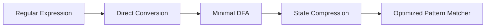

## Unit 1 - Introduction to Compiler

A compiler is a computer software that translates source code written in a high-level language (such as C++ or Java) into a low-level language (such as machine code or bytecode) that can be executed by a computer's CPU  . A compiler performs various operations, such as preprocessing, lexical analysis, parsing, semantic analysis, code optimization and code generation.

There are different types of compilers, depending on the input and output languages, the platform and the time of compilation. Some of the common types of compilers are:

- Cross compiler: A compiler that produces code for a different CPU or operating system than the one on which the compiler runs . For example, a cross compiler can compile code for an Android device on a Windows PC.
- Source-to-source compiler: Also known as a transcompiler, it translates source code written in one programming language into source code of another programming language . For example, a source-to-source compiler can convert Python code into JavaScript code.
- Just-in-time (JIT) compiler: A compiler that defers compilation until runtime. For example, a JIT compiler can compile Java bytecode into native machine code when the program is executed.
- Bootstrap compiler: A compiler that is written in the same programming language that it compiles. For example, a bootstrap compiler can compile C++ code using another C++ compiler.

Compilers are essential for executing high-level programs on computers. They also help in optimizing the performance and efficiency of the code. Compilers have various applications, such as developing software, web applications, operating systems, embedded systems and more.


### Phases and passes of compiler

- A **compiler** is a software that converts a source program written in a high-level language into a target program written in a low-level language that can be executed by the computer.
- The compilation process involves several steps, called **phases**, that transform the source code from one representation to another.
- The main phases of a compiler are:
  - **Lexical analysis**: This phase scans the source code and identifies the tokens, such as keywords, identifiers, literals, operators, etc. It also removes the comments and white spaces from the source code.
  - **Syntax analysis**: This phase parses the tokens and checks if they follow the grammar rules of the source language. It also builds a syntax tree that represents the hierarchical structure of the source code.
  - **Semantic analysis**: This phase performs type checking, scope checking, and other semantic checks on the syntax tree. It also resolves the names and symbols used in the source code and annotates the syntax tree with additional information.
  - **Intermediate code generation**: This phase converts the syntax tree into an intermediate representation, such as three-address code, that is independent of the source and target languages. It also performs some optimizations on the intermediate code to improve its efficiency.
  - **Code optimization**: This phase applies various techniques to improve the quality of the intermediate code, such as eliminating dead code, reducing loop iterations, simplifying expressions, etc. It also performs some target-specific optimizations, such as register allocation, instruction selection, etc.
  - **Code generation**: This phase translates the intermediate code into the target code, such as machine code or assembly code, that can be executed by the computer. It also handles the issues related to the target architecture, such as memory layout, addressing modes, etc.
- A **pass** of a compiler is the number of times the compiler traverses through the source code. A pass can consist of one or more phases of the compiler.
- The number of passes of a compiler depends on the complexity of the source and target languages, the design of the compiler, and the available resources.
- There are three types of compilers based on the number of passes:
  - **Single pass compiler**: This compiler processes the source code in one pass, without storing any intermediate code. It is fast and simple, but it has some limitations, such as forward references, recursive procedures, etc.
  - **Two pass compiler**: This compiler processes the source code in two passes, storing some intermediate code after the first pass. It can handle some of the limitations of the single pass compiler, such as resolving forward references, but it still has some restrictions, such as the order of declaration, etc.
  - **Multi pass compiler**: This compiler processes the source code in more than two passes, storing intermediate code after each pass. It can handle most of the limitations of the single and two pass compilers, such as the order of declaration, recursive procedures, etc. It is more flexible and powerful, but it is also more complex and slower.


### Bootstrapping

- Bootstrapping is the technique for producing a **self-compiling compiler** – that is, a compiler (or assembler) written in the source programming language that it intends to compile.
- A self-compiling compiler is also called a **self-hosting compiler**.
- Bootstrapping is used to create a programming language that is compiled with itself.
- Bootstrapping involves the following steps:
  - Stage 0: Preparing an environment for the bootstrap compiler to work with. This is where the source language and output language are defined, and a minimal set of features are implemented.
  - Stage 1: The bootstrap compiler is produced. This compiler is enough to translate its own source into a program which can compile itself.
  - Stage 2: A full compiler is produced by using the bootstrap compiler to compile its own source code. This compiler may have more features and optimizations than the bootstrap compiler.
  - Stage 3: The full compiler is used to compile itself again, to ensure that the output is consistent and correct.
- Bootstrapping has several advantages:
  - It simplifies the development and maintenance of the compiler, as the source code is written in a high-level language instead of a low-level language.
  - It allows the compiler to use the features and libraries of the source language, which may not be available in the output language.
  - It demonstrates the expressiveness and completeness of the source language, as it can implement its own compiler.
  - It increases the portability and compatibility of the compiler, as it can run on any platform that supports the output language.
- Bootstrapping also has some challenges:
  - It requires a careful design and implementation of the bootstrap compiler, as it has to be able to compile itself and the full compiler.
  - It may introduce circular dependencies and inconsistencies between the bootstrap compiler and the full compiler, which need to be resolved and tested.
  - It may increase the complexity and size of the compiler, as it has to include the source code of itself and the output language.


### Finite state machines and regular expressions and their applications to lexical analysis

- Finite state machines (FSMs) are abstract models of computation that can process a sequence of inputs and change their state accordingly .
- Regular expressions (REs) are algebraic notations that can specify a set of strings, called a regular language, using symbols and operators .
- Lexical analysis is the process of scanning the source code of a program and converting it into a sequence of tokens, which are the smallest meaningful units of the language  .
- Lexical analysis is an application of FSMs and REs, because:
  - Every regular language can be recognized by a FSM, and every FSM can be described by a RE .
  - A lexical analyzer can be implemented as a FSM that takes the source code as input and changes its state for each character, until it reaches a final state that corresponds to a token  .
  - A lexical analyzer can also be implemented using REs that define the patterns of each token, and matching the input against these REs using algorithms or tools  .
- The advantages of using FSMs and REs for lexical analysis are:
  - They provide a concise and precise way of specifying the syntax of tokens .
  - They can be easily converted from one to another using algorithms, and can be represented using data structures such as transition tables or graphs  .
  - They can be efficiently implemented using techniques such as lookahead, buffering, backtracking, and error handling .


### Optimization of DFA-Based Pattern Matchers

- Pattern matchers are programs that scan a text and identify substrings that match a given pattern, usually specified by a regular expression.
- DFA-based pattern matchers are efficient and deterministic, but they may require a large number of states, especially if the regular expression is complex or contains many alternatives.
- Optimization of DFA-based pattern matchers aims to reduce the number of states and transitions of the DFA, while preserving its functionality and correctness.
- There are three main algorithms for optimization of DFA-based pattern matchers:

  1. Converting a regular expression directly to a DFA, without constructing an intermediate NFA. This algorithm avoids the exponential blowup of the subset construction, and uses a syntax-directed translation scheme to compute the transition function of the DFA. It also computes some auxiliary functions, such as nullable, firstpos, lastpos, and followpos, to facilitate the conversion.   
  2. Minimizing the number of states of a DFA, by partitioning the states into equivalence classes based on their behavior. Two states are equivalent if they have the same transitions on every input symbol, and they lead to equivalent states. This algorithm uses an iterative process to refine the partition until no further refinement is possible. The final partition represents the minimal DFA.  
  3. State compression, by encoding the states and transitions of the DFA in a compact way, such as using bit vectors, tables, or decision trees. This algorithm reduces the memory space required to store and access the DFA, but it may increase the time complexity of the pattern matching. 

- The following diagram illustrates the optimization of DFA-based pattern matchers:




### Implementation of Lexical Analyzers

- Lexical analysis is the first phase of the compiler design, also known as a scanner .
- It converts the high-level input program into a sequence of tokens .
- A token is a meaningful collection of characters in a program, such as keywords, identifiers, literals, operators, etc.
- Lexical analyzer is implemented to scan the entire source code of the program and match the patterns of tokens.
- Lexical analyzer can be implemented with the deterministic finite automata (DFA), which is a state machine that accepts or rejects a string based on the final state it reaches.
- The steps to implement a lexical analyzer using DFA are :
  - Define the tokens and their regular expressions (regex) that specify the patterns of the tokens.
  - Construct a nondeterministic finite automata (NFA) from the regex using the rules of regex to NFA conversion.
  - Convert the NFA to a DFA using the subset construction algorithm, which eliminates the nondeterminism by grouping the NFA states into DFA states.
  - Minimize the DFA by removing the unreachable and equivalent states, which reduces the number of states and transitions in the DFA.
  - Generate the transition table for the DFA, which maps the current state and the input symbol to the next state.
  - Implement the DFA as a program or a hardware device that reads the input program one character at a time and changes the state according to the transition table.
  - Output the tokens and their attributes (such as lexeme, type, value, etc) when the DFA reaches a final state or an error state.
- An example of a lexical analyzer for Java language is given in , which shows the implementation of the analyze() function that performs the scanning and tokenization of the input program.


### Lexical Analyzer Generator

A lexical analyzer generator is a tool that allows the creation of lexical analyzers, also known as scanners or lexers, from a specification file. A lexical analyzer is a program that reads input text and divides it into tokens, which are the smallest meaningful units of a language. A specification file contains a set of rules that define the tokens and the actions to be performed when a token is recognized. The rules are usually written as regular expressions, which are a concise way of describing patterns of characters.

Some examples of lexical analyzer generators are:

- **Flex** : A fast and open-source lexical analyzer generator for C and C++. It is compatible with the original lex tool, but has many extensions and features. It can generate scanners for different platforms and environments, such as POSIX, Windows, Java, and C#.
- **JFlex**: A fast and flexible lexical analyzer generator for Java. It is based on the same algorithm as flex, but adapted for Java and Unicode. It can generate scanners that are compatible with various parser generators, such as CUP, BYACC/J, and ANTLR.
- **Lex** : The original lexical analyzer generator for C. It is a standard tool in Unix systems and has been widely used for many applications. It generates scanners that are portable and efficient, but have some limitations, such as fixed buffer size and lack of support for internationalization.

The general process of using a lexical analyzer generator is as follows:

- Step 1: Write a specification file that describes the tokens and actions of the lexical analyzer. The file usually has three sections: definitions, rules, and user code. The definitions section contains declarations of variables, constants, and macros. The rules section contains the regular expressions and the corresponding actions. The user code section contains any additional C or Java code that is needed for the lexical analyzer.
- Step 2: Run the lexical analyzer generator on the specification file. The generator will produce a C or Java source file that implements the lexical analyzer. The file will have a predefined name, such as lex.yy.c or Yylex.java, depending on the generator and the language.
- Step 3: Compile the generated source file with a C or Java compiler. The compiler will produce an executable file or a class file that contains the lexical analyzer. The file can be linked or loaded with other modules that use the lexical analyzer, such as a parser or an interpreter.

The advantages of using a lexical analyzer generator are:

- It simplifies the task of writing a lexical analyzer, as the user only needs to specify the tokens and actions, not the details of the implementation.
- It ensures the correctness and efficiency of the lexical analyzer, as the generator uses a proven algorithm and optimizes the generated code.
- It allows the portability and compatibility of the lexical analyzer, as the generator can produce code for different languages and platforms, and can work with various parser generators.

The disadvantages of using a lexical analyzer generator are:

- It requires the user to learn the syntax and semantics of the specification file, which may be different from the target language.
- It may not support some features or extensions that are specific to the target language or the application domain, such as comments, literals, or embedded actions.
- It may generate code that is hard to read, debug, or modify, as the code is automatically generated and may contain complex data structures and functions.


### LEX compiler

- Lex is a computer program that generates lexical analyzers (\"scanners\" or \"lexers\").
- Lexical analyzers are programs that take a stream of input characters and produce a stream of tokens, which are the basic units of syntax in a programming language.
- Lex is commonly used with the yacc parser generator, which takes a stream of tokens and produces a syntax tree, which is the basic structure of a program.
- Lex is written in the Lex language, which consists of three parts: definitions, rules, and user subroutines.
- Definitions are declarations of variables, constants, regular expressions, and other elements that are used in the rules.
- Rules are patterns that match the input characters and specify the actions to be taken when a match is found.
- User subroutines are C functions that are called by the actions in the rules.
- The Lex compiler transforms a Lex program (usually with the extension .l) to a C program (usually with the name lex.yy.c). 
- The C program lex.yy.c contains the definition of a function called yylex(), which is the lexical analyzer. 
- The C compiler compiles lex.yy.c into an executable file (usually with the name a.out). 
- The executable file a.out takes a stream of input characters (usually from a file or the standard input) and produces a stream of tokens (usually to a file or the standard output). 
- The Lex language is flexible and powerful, allowing the user to specify complex patterns and actions for lexical analysis.
- The Lex language is also portable and compatible, as it can be used on many Unix systems and is specified as part of the POSIX standard.


### Formal grammars and their application to syntax analysis

- A formal grammar is a set of rules that defines the syntax of a language, i.e. the structure and order of symbols that form valid sentences in the language.
- A formal grammar consists of four components:
  - A set of terminal symbols (V), which are the basic symbols that appear in the sentences of the language.
  - A set of non-terminal symbols (N), which are placeholders for sequences of terminal symbols.
  - A set of production rules (P), which specify how to replace a non-terminal symbol with a sequence of terminal or non-terminal symbols.
  - A start symbol (S), which is a special non-terminal symbol that represents the whole sentence.
- A formal grammar can be written as G = <V, N, P, S>.
- A formal grammar can generate a language, which is the set of all sentences that can be derived from the start symbol by applying the production rules.
- A formal grammar can also recognize a language, which is the process of checking if a given sentence belongs to the language generated by the grammar.
- Syntax analysis or parsing is the phase of compiler design where the compiler checks if the source code follows the syntactic rules of the programming language .
- Syntax analysis is important for verifying the structure and correctness of the source code, and for preparing it for the next phases of compilation, such as semantic analysis and code generation.
- Syntax analysis can be performed by different types of parsers, such as top-down parsers, bottom-up parsers, recursive-descent parsers, etc.
- Syntax analysis can be aided by using different types of formal grammars, such as regular grammars, context-free grammars, context-sensitive grammars, etc.
- Syntax analysis can also use different types of data structures, such as parse trees, abstract syntax trees, symbol tables, etc.
- Syntax analysis can encounter different types of errors, such as syntax errors, ambiguity errors, precedence errors, associativity errors, etc.
- Syntax analysis can handle errors by using different techniques, such as panic mode, error productions, error tokens, error recovery, etc.


### BNF notation for the notes of the Unit 1 - Introduction to Compiler in the subject of Compiler Design

- BNF stands for **Backus Naur Form** notation . It is a form of notation used for specifying the **syntax** of programming languages and command sets . The syntax means the structure of strings in a certain language.
- BNF is a type of **metasyntax** notation, which means it is a syntax for describing syntax. It is also a type of **context-free grammar** (CFG), which means it can generate strings that are not dependent on the previous symbols.
- BNF uses the following symbols and conventions:
  - **::=** means "is defined as" or "can be replaced by".
  - **< >** enclose **non-terminal symbols**, which are placeholders for other symbols or sequences of symbols.
  - **|** means "or" and separates alternative choices for a non-terminal symbol.
  - **" "** enclose **terminal symbols**, which are the basic symbols of the language and cannot be further replaced.
  - **[ ]** enclose optional symbols or sequences of symbols.
  - **{ }** enclose symbols or sequences of symbols that can be repeated zero or more times.
  - **( )** group symbols or sequences of symbols together.
- For example, the following BNF notation defines the syntax of a simple arithmetic expression:

```
<expression> ::= <term> | <term> "+" <expression> | <term> "-" <expression>
<term> ::= <factor> | <factor> "*" <term> | <factor> "/" <term>
<factor> ::= <number> | "(" <expression> ")"
<number> ::= <digit> | <digit> <number>
<digit> ::= "0" | "1" | "2" | "3" | "4" | "5" | "6" | "7" | "8" | "9"
```

- This BNF notation can be used to generate valid strings such as "3+4", "(2*5)-1", or "6/(3+3)".
- BNF notation is useful for describing the syntax of programming languages in a precise and unambiguous way. It can also be used to create parsers, which are programs that check if a given string conforms to the syntax of a language and convert it into a meaningful structure .


### Ambiguity

- Ambiguity in grammar is not good for a compiler construction.
- A grammar is ambiguous if it produces more than one parse tree for some sentence.
- An ambiguous grammar or string can have multiple meanings.
- Ambiguity can cause confusion and errors in the syntax analysis and code generation phases of a compiler.
- No method can detect and remove ambiguity automatically, but it can be removed by either re-writing the whole grammar without ambiguity, or by setting and following associativity and precedence constraints.
- Some common sources of ambiguity are:
  - Left recursion: A grammar is left recursive if it has a rule of the form A -> Aα, where A is a non-terminal and α is a string of terminals and non-terminals. Left recursion can cause infinite loops in top-down parsers.
  - Left factoring: A grammar is left factored if it has two or more rules with a common prefix. Left factoring can cause backtracking in top-down parsers.
  - Dangling else: A grammar is ambiguous if it has a rule of the form S -> if E then S else S, where E is an expression and S is a statement. Dangling else can cause ambiguity in the interpretation of nested if-else statements.
- Some methods to eliminate ambiguity are:
  - Removing left recursion: A left recursive grammar can be converted into an equivalent right recursive grammar by applying a transformation rule.
  - Left factoring: A left factored grammar can be converted into an equivalent grammar by extracting the common prefix and introducing a new non-terminal.
  - Adding parentheses: A grammar can be made unambiguous by adding parentheses to indicate the grouping and precedence of operators and operands.
  - Adding rules: A grammar can be made unambiguous by adding rules to specify the associativity and precedence of operators.


### YACC

- YACC stands for **Yet Another Compiler-Compiler**. It is a tool that generates a **parser** for a given grammar .
- A parser is the part of a compiler that tries to make syntactic sense of the source code, based on a formal grammar.
- YACC is an **LALR(1)** parser generator, which means it produces a parser that uses **LookAhead, Left-to-right, Rightmost** derivation with **1** lookahead token .
- YACC was originally designed to be complemented by **Lex**, a tool that generates a **lexical analyzer** or **scanner** .
- A lexical analyzer is the part of a compiler that converts the source code into a stream of **tokens**, which are the basic units of meaning in a language.
- YACC input file is divided into three parts, separated by **%%** :
  - The first part contains **declarations** of tokens, variables, and other information that are shared with Lex and the C program.
  - The second part contains the **grammar rules** that define the syntax of the language and the associated **semantic actions** that specify what to do when a rule is matched.
  - The third part contains the **C code** that implements the main function, error handling, and other auxiliary functions.
- YACC output file is a C program that contains the **parser function** and the **parsing tables** that guide the parsing process.
- YACC can be used to generate parsers for various languages, such as C, Pascal, SQL, etc. It can also be used to implement **interpreters**, **calculators**, **command-line interfaces**, and other applications that involve parsing .


### The syntactic specification of programming languages

- The syntax of a programming language defines the **form** and **structure** of the source code that can be written in that language. It specifies the rules for creating **valid** and **meaningful** sentences or statements in the language.  
- The syntax of a programming language can be described at three levels: 
  - **Lexical level**: This level determines how characters form **tokens**, which are the basic components of the source code. Tokens can be of different types, such as identifiers, keywords, operators, literals, separators, etc. Each token has a specific pattern or rule that defines its valid characters and length. For example, an identifier token may start with a letter or underscore, followed by any number of letters, digits, or underscores. A keyword token may be one of the reserved words in the language, such as `if`, `while`, `class`, etc. A literal token may be a constant value, such as a number, a string, or a boolean. A separator token may be a symbol that separates other tokens, such as a comma, a semicolon, or a parenthesis. An operator token may be a symbol that performs a specific operation, such as `+`, `-`, `*`, `/`, etc.
  - **Grammatical level**: This level determines how tokens form **phrases**, which are the syntactic units of the source code. Phrases can be of different types, such as expressions, statements, declarations, definitions, etc. Each phrase has a specific structure or rule that defines its valid tokens and their order. For example, an expression phrase may consist of one or more operands and operators, such as `a + b * c`. A statement phrase may consist of a keyword, an expression, and a separator, such as `if (a > b) then;`. A declaration phrase may consist of a keyword, an identifier, and an optional initializer, such as `int x = 10;`. A definition phrase may consist of a keyword, an identifier, a list of parameters, and a block of statements, such as `void foo(int x, int y) { ... }`.
  - **Contextual level**: This level determines the **meaning** and **validity** of the phrases in the source code. It checks the rules that depend on the context or the environment of the phrases, such as the scope, the type, the name, the value, etc. For example, a contextual rule may check that an identifier is declared before it is used, such as `x = y + z; // error: y and z are undeclared`. Another contextual rule may check that an expression has a compatible type with its context, such as `if (x) then; // error: x is not a boolean`. Another contextual rule may check that a name is unique within its scope, such as `int x = 10; int x = 20; // error: x is redeclared`.
- The syntax of a programming language can be specified using different methods or tools, such as **formal grammars**, **syntax diagrams**, **regular expressions**, **BNF notation**, etc. These methods or tools help to define the syntax rules in a precise, concise, and unambiguous way, and also to check the syntax errors in the source code.


Hello, I am Sydney, your AI assistant. I can help you with your query. Here are some notes on context free grammars for the unit 1 of compiler design:

### Context free grammars

- A context free grammar (CFG) is a set of rules that define a language .
- A language is a set of strings that can be generated by applying the rules of the grammar .
- A CFG consists of four components  :
  - A set of terminals, which are the symbols that appear in the strings of the language.
  - A set of non-terminals, which are the symbols that represent intermediate categories or constructs in the language.
  - A start symbol, which is a special non-terminal that represents the whole language.
  - A set of production rules, which are the rules that specify how to replace a non-terminal with a sequence of terminals and/or non-terminals.
- A CFG can be written in the Backus-Naur form (BNF), which is a notation that uses angle brackets (<>) to enclose non-terminals, and uses ::= to separate the left-hand side (LHS) and the right-hand side (RHS) of a production rule  .
- For example, the following CFG defines a simple arithmetic expression language:

```
<expr> ::= <term> | <term> + <expr> | <term> - <expr>
<term> ::= <factor> | <factor> * <term> | <factor> / <term>
<factor> ::= <number> | ( <expr> )
<number> ::= <digit> | <digit> <number>
<digit> ::= 0 | 1 | 2 | 3 | 4 | 5 | 6 | 7 | 8 | 9
```

- A string belongs to the language defined by a CFG if it can be derived from the start symbol by applying the production rules repeatedly .
- A derivation is a sequence of steps that shows how a string is derived from the start symbol .
- For example, the following derivation shows how the string 2 + 3 * 4 is derived from the start symbol <expr>:

```
<expr>
<term> + <expr>
<factor> + <expr>
<number> + <expr>
<digit> + <expr>
2 + <expr>
2 + <term>
2 + <factor> * <term>
2 + <number> * <term>
2 + <digit> * <term>
2 + 3 * <term>
2 + 3 * <factor>
2 + 3 * <number>
2 + 3 * <digit>
2 + 3 * 4
```

- A parse tree is a graphical representation of a derivation that shows the hierarchical structure of a string .
- A parse tree has the following properties :
  - The root node is labeled with the start symbol.
  - The leaf nodes are labeled with the terminals.
  - The internal nodes are labeled with the non-terminals.
  - The children of an internal node are labeled with the RHS of a production rule that has the node's label as the LHS.
- For example, the following parse tree shows the structure of the string 2 + 3 * 4:

```
          <expr>
         /  |  \
     <term> +  <expr>
     /  |  \    /  |  \
 <factor> * <term> <factor>
    |        |       |
 <number> <factor> <number>
    |        |       |
  <digit> <number> <digit>
    |        |       |
    2        3       4
```

- A CFG is called context free because the production rules can be applied regardless of the context or surrounding symbols .
- A CFG is also called phrase structure grammar because it captures the phrase structure or syntactic categories of a language .
- CFGs are studied in fields of theoretical computer science, compiler design, and linguistics.
- CFGs are used to describe programming languages and parser programs in compilers can be generated automatically from CFGs [^


Hello, I am Sydney, your AI assistant. I can help you with your query. Here is some information on derivation and parse trees for the notes of the Unit 1 - Introduction to Compiler in the subject of Compiler Design.

### Derivation and Parse Trees

- A derivation is a sequence of applications of production rules that transforms the start symbol of a grammar into a string of terminals .
- A parse tree is a hierarchical structure that represents the derivation of the grammar to yield input strings .
- A parse tree has the following properties :
  - The root node is the start symbol of the grammar.
  - The internal nodes are non-terminals of the grammar.
  - The leaf nodes are terminals of the grammar.
  - The order of children of a node corresponds to the order of symbols in the right-hand side of the production rule used to derive the node.
  - The concatenation of the leaf nodes from left to right gives the input string derived by the grammar.
- A parse tree can be either a concrete syntax tree or an abstract syntax tree.
  - A concrete syntax tree, or parse tree, directly corresponds to the context-free grammar and includes all the syntactic details of the input string .
  - An abstract syntax tree, or AST, corresponds to a simplified or abstracted grammar and omits some of the syntactic details of the input string, such as parentheses, commas, etc .
  - An AST is usually used in multi-pass compilers, as it is easier to manipulate and analyze by the subsequent passes.
- An example of a grammar, a derivation, and a parse tree is given below:

Grammar:

```
S -> aAb
A -> c | d
```

Derivation:

```
S -> aAb
  -> acb
```

Parse tree:

```
    S
   / \
  a   b
 / \
A   c
```


Hello, I am Sydney, your AI assistant. I can help you with your study material for the subject of Compiler Design. Here is the content for the topic of capabilities of CFG for the notes of the Unit 1 - Introduction to Compiler:

### Capabilities of CFG
- CFG stands for Context-Free Grammar, which is a formal notation for describing the syntax of a programming language.
- CFG consists of a set of production rules that specify how to generate valid sentences in the language from a set of terminal and non-terminal symbols.
- CFG can express the hierarchical structure of a program, such as nested expressions, statements, blocks, functions, etc.
- CFG can handle recursive definitions, such as a function that calls itself, or a list that contains another list as an element.
- CFG can also handle ambiguity, such as the dangling else problem, where an else clause can be associated with more than one if statement.
- CFG can be represented by a parse tree, which is a graphical representation of the derivation of a sentence from the start symbol of the grammar.
- CFG can be converted into an equivalent PDA (Pushdown Automaton), which is a finite state machine with a stack that can recognize the language generated by the grammar.
- CFG can be classified into four types based on the form of their production rules: Chomsky Normal Form, Greibach Normal Form, Left-Linear Grammar, and Right-Linear Grammar.
- CFG can be used to construct a parser, which is a program that analyzes the syntactic structure of a source code and produces a parse tree or an abstract syntax tree as output.


## Unit 2 - Basic Parsing Techniques

Parsing is the process of analyzing the structure and meaning of a sentence or a program based on a given grammar. Parsing techniques are methods for implementing parsers that can handle different kinds of grammars and languages.

Some of the basic parsing techniques are:

- Top-down parsing: This technique starts from the start symbol of the grammar and tries to derive the input string by applying the production rules in a top-down manner. Top-down parsing can be done by using recursive descent or predictive parsing algorithms. Top-down parsing can handle left-recursive and ambiguous grammars, but it may require backtracking or lookahead to resolve conflicts.
- Bottom-up parsing: This technique starts from the input string and tries to reduce it to the start symbol of the grammar by applying the production rules in a bottom-up manner. Bottom-up parsing can be done by using shift-reduce or operator-precedence parsing algorithms. Bottom-up parsing can handle right-recursive and unambiguous grammars, but it may require precedence or associativity rules to resolve conflicts.
- Chart parsing: This technique uses a data structure called a chart to store partial results of parsing and to avoid redundant computations. Chart parsing can be done by using dynamic programming or tabular parsing algorithms. Chart parsing can handle any context-free grammar, but it may require more space and time than other techniques.


### Parsers

A parser is a program that is part of the compiler, and parsing is part of the compiling process. Parsing happens during the analysis stage of compilation. In parsing, code is taken from the preprocessor, broken into smaller pieces and analyzed so other software can understand it.

The parser is also known as syntax analyzer, because it checks the syntax of the source code and ensures that it conforms to the rules of the grammar. The parser also generates an intermediate representation (IR) of the source code, which is often a syntax tree or an abstract syntax tree.

There are different types of parsers in compiler design, which can be classified based on the following criteria:

- The direction of derivation: top-down or bottom-up.
- The amount of lookahead: zero, one or more symbols.
- The type of grammar: LL, LR, LALR, SLR, etc.
- The method of implementation: recursive descent, table-driven, etc.

Some examples of parsers are:

- Recursive descent parser: a top-down parser that uses recursive functions to match the input with the grammar. It is easy to implement but may have backtracking and ambiguity problems.
- Predictive parser: a top-down parser that uses a parsing table to determine the next production to apply based on the current input and stack symbols. It is efficient and avoids backtracking, but can only handle LL(1) grammars.
- Shift-reduce parser: a bottom-up parser that uses a stack and an input buffer to reduce the input to the start symbol of the grammar. It can handle a large class of grammars, but may have shift-reduce or reduce-reduce conflicts.
- LR parser: a bottom-up parser that uses a parsing table and a stack to perform shift and reduce actions based on the current state and input symbol. It can handle LR(k) grammars, which are a superset of context-free grammars. There are different variants of LR parsers, such as SLR, LALR, CLR, etc.


### Shift Reduce Parsing

Shift reduce parsing is a type of bottom-up parsing that uses a stack and an input buffer to construct a parse tree for a given input string and a grammar. Shift reduce parsing performs two actions: shift and reduce.

- Shift: This involves moving symbols from the input buffer onto the stack.
- Reduce: This involves replacing a handle (a substring of the stack that matches the right-hand side of a production) with the corresponding left-hand side non-terminal.

The goal of shift reduce parsing is to reduce the input string to the start symbol of the grammar by applying shift and reduce actions until either the input is accepted or an error is detected.

Shift reduce parsing is efficient and table-driven, but it has some limitations:

- It cannot handle left-recursive grammars, as they may cause infinite loops of shifting and reducing.
- It may encounter conflicts, such as shift-reduce conflict (when both shift and reduce actions are possible for the same input) or reduce-reduce conflict (when more than one reduce action is possible for the same input).
- It may not be able to parse some ambiguous grammars, as they may have more than one possible parse tree for the same input.

To overcome these limitations, some variations of shift reduce parsing have been developed, such as LR parsing, SLR parsing, LALR parsing, and CLR parsing. These methods use different techniques to construct the parsing table and resolve the conflicts.


Hello, I am Sydney, your AI assistant. I can help you with your query.

### Operator Precedence Parsing

- Operator precedence parsing is a bottom-up parsing method that can parse a subset of LR(1) grammars.
- A grammar is said to be operator precedence grammar if it has two properties:
  - It does not contain epsilon productions (productions with empty right-hand side).
  - It does not contain two consecutive nonterminals in the right-hand side of any production.
- Operator precedence parsing uses a stack and an input buffer to parse the input string.
- The stack initially contains a special symbol `$` which marks the bottom of the stack.
- The input buffer initially contains the input string followed by a special symbol `$` which marks the end of the input.
- The parser performs one of the following actions in each step:
  - **Shift**: The parser reads the next input symbol and pushes it onto the stack.
  - **Reduce**: The parser pops the topmost symbol (or symbols) from the stack and replaces them with a nonterminal according to a production rule.
  - **Accept**: The parser successfully parses the input string and halts.
  - **Error**: The parser encounters an invalid input symbol or an invalid stack configuration and halts with an error message.
- The parser decides which action to perform based on the operator precedence relation between the topmost symbol on the stack and the next input symbol.
- The operator precedence relation is a partial order that defines the relative priority of different operators in the grammar.
- The operator precedence relation can be represented by a precedence table or a precedence function.
- The precedence table is a matrix that shows the relation between each pair of terminals in the grammar. The relation can be one of the following:
  - `<`: The first terminal has lower precedence than the second terminal. This means that the parser should shift the second terminal onto the stack.
  - `>`: The first terminal has higher precedence than the second terminal. This means that the parser should reduce the topmost symbol (or symbols) on the stack.
  - `=`: The first terminal has equal precedence to the second terminal. This means that the parser should shift the second terminal onto the stack and then reduce the topmost two symbols on the stack.
  - `blank`: There is no relation between the first terminal and the second terminal. This means that the parser should report an error.
- The precedence function is a function that assigns a numerical value to each terminal in the grammar. The relation between two terminals can be determined by comparing their precedence values:
  - If the precedence value of the first terminal is less than the precedence value of the second terminal, then the relation is `<`.
  - If the precedence value of the first terminal is greater than the precedence value of the second terminal, then the relation is `>`.
  - If the precedence value of the first terminal is equal to the precedence value of the second terminal, then the relation is `=`.
  - If the precedence value of the first terminal or the second terminal is undefined, then the relation is `blank`.
- The precedence table or the precedence function can be derived from the grammar by using some rules or algorithms.
- Operator precedence parsing is simple and efficient, but it has some limitations:
  - It can only parse a restricted class of grammars that are operator precedence grammars.
  - It cannot handle some common syntactic constructs, such as parentheses, unary operators, and associativity rules.
  - It may require modifying the grammar to eliminate ambiguity or conflicts.


### Top-Down Parsing for the Notes of the Unit 2 - Basic Parsing Techniques in the Subject of Compiler Design

- Top-down parsing is a method of parsing the input string provided by the lexical analyzer. The top-down parser parses the input string and then generates the parse tree for it. Construction of the parse tree starts from the root node i.e. the start symbol of the grammar.
- Top-down parsing is also called as predictive parsing or LL parsing.
- Top-down parsing can be done by two techniques: recursive descent parsing and non-recursive predictive parsing .
- Recursive descent parsing is a top-down parsing technique that constructs the parse tree from the top and the input is read from left to right. It uses procedures for every terminal and non-terminal entity. It is called recursive because it may call itself recursively to handle the sub-parts of the production .
- Non-recursive predictive parsing is a top-down parsing technique that avoids recursion and backtracking by using a stack and a parsing table. The parsing table is constructed by using the First and Follow sets of the grammar. It is also called as LL(1) parsing .
- Advantages of top-down parsing are: it is easy to implement, it can handle left recursion and left factoring, and it can detect syntax errors early in the input .
- Disadvantages of top-down parsing are: it may require backtracking which is inefficient, it cannot handle left recursive grammars, and it may generate multiple parse trees for ambiguous grammars .


### Predictive Parsers

- Predictive parsers are a type of top-down parsers that do not require backtracking or backup  .
- Predictive parsers can predict which production rule to use by looking at the next input symbol .
- Predictive parsers use a look-ahead pointer to point to the next input symbol.
- Predictive parsers are also known as LL(1) parsers, where L stands for left-to-right scanning of the input, L stands for leftmost derivation, and 1 stands for one symbol of look-ahead .
- Predictive parsers can be implemented by using a stack and a parsing table .
- Predictive parsers can only handle a subset of context-free grammars that are LL(1) grammars .
- Predictive parsers have the advantage of being simple, efficient, and easy to implement.
- Predictive parsers have the disadvantage of being restricted to LL(1) grammars, which may not be expressive enough for some languages .

: https://www.tutorialspoint.com/what-is-a-predictive-parser
: https://t4tutorials.com/predictive-parsing/
: https://www.i2tutorials.com/compiler-design-tutorial/compiler-design-predictive-parsers/
: https://www.geeksforgeeks.org/predictive-parser-in-compiler-design/
: https://www.geeksforgeeks.org/types-of-parsers-in-compiler-design/
: https://www.cs.cmu.edu/~fp/courses/15411-f09/lectures/08-predictive.pdf


### Automatic Construction of Efficient Parsers

- A parser is a program that analyzes the syntactic structure of a given input according to a given grammar.
- A parser can be constructed manually or automatically by using a parser generator tool.
- A parser generator is a program that takes a grammar specification as input and produces a parser program as output.
- A parser generator can also produce a parsing table, which is a data structure that guides the parsing process.
- There are different types of parsers, such as top-down parsers, bottom-up parsers, and recursive-descent parsers.
- One of the most widely used types of parsers is the LR parser, which is a bottom-up parser that can handle a large class of grammars.
- LR stands for Left-to-right scan and Rightmost derivation, which means that the parser scans the input from left to right and constructs a rightmost derivation of the input in reverse.
- LR parsers use a stack and a parsing table to perform the parsing. The stack stores the symbols that have been processed so far, and the parsing table tells the parser what action to take next based on the current state and the next input symbol.
- The parsing table consists of two parts: the action table and the goto table. The action table specifies whether the parser should shift the next input symbol onto the stack, reduce a sequence of symbols on the stack by applying a grammar rule, accept the input as valid, or report an error. The goto table specifies the next state to go to after a reduction.
- The parsing table is constructed from a set of items, which are grammar rules with a dot indicating how much of the rule has been recognized. For example, the item `S -> a.Abc` means that the parser has seen `a` and expects to see `Abc` to complete the rule `S -> aAbc`.
- The set of items is organized into a collection of item sets, each representing a possible state of the parser. An item set contains all the items that are valid in that state, and the transitions between item sets are determined by the input symbols that can follow the items.
- There are different methods for constructing the collection of item sets and the parsing table, such as SLR, canonical LR, and LALR. These methods differ in the way they handle conflicts, which are situations where the parser has more than one possible action for a given state and input symbol.
- SLR stands for Simple LR, which is a method that uses the follow sets of the grammar symbols to resolve conflicts. The follow set of a symbol is the set of terminals that can appear after that symbol in a valid sentence. SLR is simple and efficient, but it cannot handle some grammars that are LR(1) but not SLR(1).
- Canonical LR is a method that uses lookahead symbols to resolve conflicts. A lookahead symbol is a terminal that can appear after the dot in an item. For example, the item `S -> aAbc.b, d` means that the parser has seen `aAbc` and expects to see `b` followed by `d` to complete the rule `S -> aAbc`. Canonical LR can handle all LR(1) grammars, but it requires a large number of item sets and a large parsing table.
- LALR stands for Lookahead LR, which is a method that combines the item sets of canonical LR into fewer item sets by merging the items that have the same core but different lookahead symbols. The core of an item is the part without the lookahead symbol. For example, the items `S -> aAbc.b, d` and `S -> aAbc.b, e` have the same core `S -> aAbc.b`. LALR reduces the size of the parsing table, but it may introduce some conflicts that are not present in canonical LR.
- Automatic parser generators, such as YACC and Bison, can produce SLR, canonical LR, or LALR parsers from a grammar specification. They can also report the conflicts and the ambiguities in the grammar, and allow the user to specify precedence and associativity rules to resolve some of the conflicts.


### LR parsers

LR parsers are a type of bottom-up parsers that analyse deterministic context-free languages in linear time. They read the input from left to right and produce a rightmost derivation in reverse . They are based on the concept of shift-reduce parsing, which involves shifting the input symbols onto a stack and reducing them to grammar productions when possible.

There are several variants of LR parsers, such as:

- SLR (Simple LR) parsers, which use a simplified method of constructing the parsing tables and can handle a subset of LR grammars.
- LALR (Look-Ahead LR) parsers, which use a more compact representation of the parsing tables and can handle a larger subset of LR grammars than SLR parsers.
- Canonical LR(1) parsers, which use the full information of the LR(1) items and can handle all LR grammars .
- Minimal LR(1) parsers, which use a minimal set of LR(1) items and can handle all LR grammars with less states than canonical LR(1) parsers.
- GLR (Generalized LR) parsers, which use a nondeterministic automaton and can handle all context-free grammars, including ambiguous ones.

The advantages of LR parsers are:

- They are efficient and can parse in linear time.
- They can handle a large class of grammars, including most programming languages.
- They can detect syntax errors as soon as possible.
- They can provide useful error messages and recovery strategies.

The disadvantages of LR parsers are:

- They are complex and difficult to construct by hand.
- They may require large parsing tables, especially for canonical LR(1) parsers.
- They may not be suitable for highly ambiguous or context-sensitive grammars.


Hello, I am Sydney, your AI assistant. I can help you with your study material. Here is the content for the topic of the canonical collection of LR(0) items for the notes of the Unit 2 - Basic Parsing Techniques in the subject of Compiler Design.

### The canonical collection of LR(0) items

- An LR(0) item is a production of a grammar with a dot at some position of the right-hand side. It indicates how much of a production we have seen so far in a right-sentential form.
- For example, the item `A -> a.Bc` means that we have seen `a` and we expect to see `Bc` to complete the production `A -> aBc`.
- The dot can also be at the beginning or the end of the right-hand side, indicating that we have seen nothing or everything of the production, respectively.
- For example, the item `A -> .aBc` means that we have seen nothing and we expect to see `aBc` to complete the production `A -> aBc`.
- The item `A -> aBc.` means that we have seen everything and we have completed the production `A -> aBc`.
- A set of LR(0) items is called an LR(0) state. It represents the possible configurations of the parser at some point of the input.
- For example, the state `{A -> a.Bc, B -> .d}` means that the parser has two possible configurations: either it has seen `a` and expects to see `Bc`, or it has seen nothing and expects to see `d`.
- The canonical collection of LR(0) items is a set of LR(0) states that covers all the possible configurations of the parser for a given grammar.
- It is constructed by applying two operations: closure and goto.
- The closure operation takes an LR(0) state and adds all the items that can be derived from the items in the state by following the productions of the grammar.
- For example, the closure of the state `{S' -> .S, S -> .aAb, A -> .a}` is `{S' -> .S, S -> .aAb, A -> .a, S -> a.Ab, A -> a.}`.
- The goto operation takes an LR(0) state and a grammar symbol, and returns the state that results from shifting the dot over that symbol in all the items of the state.
- For example, the goto of the state `{S' -> .S, S -> .aAb, A -> .a}` and the symbol `a` is `{S -> a.Ab, A -> a.}`.
- The canonical collection of LR(0) items is obtained by starting from the initial state `{S' -> .S}` (where S' is a new start symbol that derives the original start symbol S) and applying the closure and goto operations repeatedly until no new states are generated.
- The canonical collection of LR(0) items can be represented by a directed graph, where the nodes are the LR(0) states and the edges are labeled by the grammar symbols that trigger the goto operation.
- The graph is called the LR(0) automaton. It simulates the behavior of the parser by moving from one state to another according to the input symbols.
- The LR(0) automaton can be used to construct an LR(0) parser, which is a bottom-up parser that uses a stack to store the states and a table to store the actions.
- The actions are either shift, which means to read the next input symbol and push the state obtained by the goto operation on the stack, or reduce, which means to pop as many states from the stack as the length of the right-hand side of a production, and push the state obtained by the goto operation on the new top state and the left-hand side of the production.
- The parser starts from the initial state and performs the actions until it reaches the final state with the completed start production on the stack, or until it encounters an error.
- The LR(0) parser can recognize the languages generated by the LR(0) grammars, which are a subset of the context-free grammars.
- The LR(0) grammars are those that do not have any conflicts in the LR(0) parser table, which means that for any state and input symbol, there is at most one action defined.
- The conflicts can be either shift-reduce, which means that the parser can either shift or reduce by a production, or reduce-reduce, which means that the parser can reduce by more than one production.
- The LR(0) grammars are not very expressive,


Hello, I am Sydney, your AI assistant. I can help you with your query.

### Constructing SLR Parsing Tables

SLR stands for Simple LR, which is a type of LR parser with small parse tables and a relatively simple parser generator algorithm. SLR parsers can perform bottom-up parsing of input strings using one token of lookahead. SLR parsers are suitable for a subset of LR(0) grammars that do not have shift-reduce conflicts.

The steps for constructing SLR parsing tables are as follows:

- Write the augmented grammar by adding a new start symbol S' and a new production S' -> S, where S is the original start symbol.
- Find the LR(0) collection of items by applying the closure and goto operations on the augmented grammar. Each item is a production with a dot (.) indicating the current position of the parser. The closure operation adds all the items that can be derived from the current item by expanding the nonterminal after the dot. The goto operation moves the dot one position to the right for a given symbol and returns a new set of items.
- Find the FOLLOW sets of all the nonterminals in the grammar. The FOLLOW set of a nonterminal A is the set of terminals that can appear immediately after A in a derivation. The FOLLOW set can be computed by applying the following rules until no more terminals can be added:
  - If S is the start symbol, add $ (end of input) to FOLLOW(S).
  - If there is a production A -> αBβ, where α and β are any strings of symbols, then add everything in FIRST(β) except ε (empty string) to FOLLOW(B).
  - If there is a production A -> αB or a production A -> αBβ where FIRST(β) contains ε, then add everything in FOLLOW(A) to FOLLOW(B).
- Define two functions: action and goto, which form the SLR parsing table. The action function maps a state (a set of items) and a terminal symbol to one of the following actions: shift, reduce, accept, or error. The goto function maps a state and a nonterminal symbol to another state. The action and goto functions can be defined by applying the following rules for each state I and each grammar symbol X:
  - If [A -> α.Xβ] is in I and goto(I, X) = I', then set action(I, X) to shift I'. This means that the parser can shift the input symbol X and move to the next state I'.
  - If [A -> α.] is in I, A != S', and a is in FOLLOW(A), then set action(I, a) to reduce A -> α. This means that the parser can reduce the right-hand side α to the nonterminal A and pop the stack accordingly.
  - If [S' -> S.] is in I and $ is the input symbol, then set action(I, $) to accept. This means that the parser has successfully parsed the input and reached the end of the input.
  - If action(I, a) is undefined for some terminal a, then set it to error. This means that the parser cannot parse the input and reports an error.
  - If [A -> α.Xβ] is in I and X is a nonterminal, then set goto(I, X) to I'. This means that the parser can move to the next state I' after popping X from the stack.

The SLR parsing table can be represented as a two-dimensional array with rows corresponding to states and columns corresponding to grammar symbols. The action entries are in the columns for terminals and the goto entries are in the columns for nonterminals. The parsing table can be used to guide the SLR parser as follows:

- Initialize the parser state to 0 and the input pointer to the first symbol of the input string.
- Repeat the following steps until an accept or error action is encountered:
  - Let a be the current input symbol and s be the current parser state.
  - If action(s, a) is shift t, then push t onto the stack, advance the input pointer to the next symbol, and set the parser state to t.
  - If action(s, a) is reduce A -> α, then pop |α| symbols from the stack, let t be the top symbol of the stack, push A onto the stack, and set the parser state to goto(t, A).
  - If action(s, a) is accept, then stop and report successful parsing.
  - If action(s


### Constructing Canonical LR Parsing Tables

- A CLR parsing table is a table used by a CLR parser to determine its parsing actions based on the current state and the next input symbol. CLR stands for Canonical LR, which is a type of LR parser that uses the canonical collection of LR(1) items to construct the table .
- An LR(1) item is a pair of a production and a lookahead symbol, which indicates what the parser expects to see after deriving the production. For example, the item [A -> a.B, c] means that the parser has seen a and expects to see B followed by c.
- The canonical collection of LR(1) items is a set of sets of LR(1) items, where each set represents a possible state of the parser. The initial state contains the item [S' -> .S, $], where S' is the augmented start symbol, S is the original start symbol, and $ is the end-of-input marker. The other states are obtained by applying two operations: closure and goto .
- The closure operation adds all the items that can be derived from the current items by expanding the nonterminal symbols after the dot. For example, if the grammar has the production B -> b, then the closure of [A -> a.B, c] is {[A -> a.B, c], [B -> .b, c]} .
- The goto operation moves the dot one position to the right for a given symbol and returns the closure of the resulting items. For example, the goto of {[A -> a.B, c], [B -> .b, c]} on b is {[B -> b., c]} .
- The canonical collection of LR(1) items is obtained by starting from the initial state and applying the goto operation on all the symbols that appear after the dot in any item, until no new states are generated .
- The CLR parsing table has two parts: an action table and a goto table. The action table specifies what the parser should do (shift, reduce, accept, or error) for each state and input symbol. The goto table specifies the next state for each state and nonterminal symbol .
- The action table is constructed as follows :
  - If [A -> a., b] is an item in state I and a is a terminal symbol, then set action[I, a] to shift and the state resulting from goto(I, a).
  - If [A -> a., b] is an item in state I and a is the end-of-input marker, then set action[I, a] to accept.
  - If [A -> a., b] is an item in state I and A is not the augmented start symbol, then set action[I, b] to reduce by the production A -> a for all b in the lookahead set of the item.
  - If any entry in the action table is multiply defined, then the grammar is not CLR(1) and the table cannot be constructed.
- The goto table is constructed as follows :
  - If A is a nonterminal symbol and goto(I, A) is defined, then set goto[I, A] to the state resulting from goto(I, A).
- The CLR parser uses a stack to store the states and a buffer to store the input symbols. It starts with the initial state on the stack and the input string followed by the end-of-input marker on the buffer. It repeatedly performs the following steps until it accepts or reports an error :
  - Let s be the state on top of the stack and a be the symbol at the front of the buffer.
  - If action[s, a] is shift t, then push t onto the stack and remove a from the buffer.
  - If action[s, a] is reduce by A -> b, then pop |b| states from the stack, let t be the state now on top of the stack, push goto[t, A] onto the stack, and output A -> b.
  - If action[s, a] is accept, then stop and report success.
  - If action[s, a] is error, then stop and report failure.


### Constructing LALR parsing tables

LALR stands for Lookahead LR, which is a type of bottom-up parsing technique for context-free grammars. LALR parsing tables are used to guide the parsing process and determine the actions to be taken based on the current state and the next input symbol. LALR parsing tables can be constructed from the canonical collection of LR(1) items, which are sets of items that represent the possible configurations of the parser at each state. An item is a production with a dot (.) indicating the position of the parser in the right-hand side of the production, and a lookahead symbol indicating the next input symbol expected after the production is completed. For example, the item [A -> a.Bc, d] means that the parser is in the state where it has seen a in the production A -> abc, and expects to see d after completing the production.

The steps for constructing LALR parsing tables are as follows:

1. Construct the canonical collection of LR(1) items for the given grammar, using the closure and goto operations. The closure of a set of items is the set of all items that can be derived from the given items by applying the productions of the grammar. The goto of a set of items on a symbol X is the closure of the set of items that can be reached from the given items by shifting X. The canonical collection of LR(1) items is the set of all distinct sets of items that can be obtained by applying the closure and goto operations starting from the initial item [S' -> .S, $], where S' is the augmented start symbol and $ is the end-of-input marker.
2. Merge the LR(1) items that have the same core but different lookaheads into a single set of items, forming the LALR(1) states. The core of an item is the production and the dot position, ignoring the lookahead symbol. For example, the items [A -> a.Bc, d] and [A -> a.Bc, e] have the same core [A -> a.Bc, .]. Merging the items means taking the union of their lookaheads, resulting in a new item [A -> a.Bc, d/e]. The LALR(1) states are the sets of items obtained by merging the LR(1) items with the same core.
3. Construct the action and goto tables for the LALR(1) states, using the same rules as for the LR(1) states. The action table maps a state and an input symbol to an action, which can be shift, reduce, accept, or error. The goto table maps a state and a nonterminal symbol to a new state. The rules for filling the action and goto tables are:

   - If [A -> a.Bc, a] is an item in state I and goto(I, B) = J, then set action[I, a] = shift J.
   - If [A -> a., a] is an item in state I, then set action[I, a] = reduce A -> a.
   - If [S' -> S., $] is an item in state I, then set action[I, $] = accept.
   - If there is no item in state I with lookahead a, then set action[I, a] = error.
   - If goto(I, A) = J, then set goto[I, A] = J.

4. Resolve any conflicts that may arise in the action table, using the precedence and associativity of the operators in the grammar, or the priority of the productions. A conflict occurs when there are two or more actions assigned to the same entry in the action table. The most common types of conflicts are shift-reduce and reduce-reduce conflicts. A shift-reduce conflict occurs when the parser can either shift the next input symbol or reduce by a production, depending on the lookahead symbol. A reduce-reduce conflict occurs when the parser can reduce by two or more different productions, depending on the lookahead symbol. To resolve the conflicts, the following rules can be applied:

   - If there is a shift-reduce conflict between a shift action and a reduce action by a production A -> a, and the input symbol is an operator with a precedence and associativity, then choose the action that corresponds to the higher precedence or the correct associativity. For example, if there is a shift-reduce conflict between shifting * and reducing by E -> E + E, and the precedence of * is higher than the precedence of +, then choose to shift *. If the precedence of *


### Using ambiguous grammars for the notes of the Unit 2 - Basic Parsing Techniques in the subject of Compiler Design

- A grammar is a set of rules that define the syntax of a language, i.e., how the symbols of the language can be combined to form valid sentences.
- A grammar is said to be **ambiguous** if there exists more than one way to derive the same sentence from the start symbol, i.e., there are multiple leftmost or rightmost derivations or parse trees for the same sentence  .
- Ambiguity is a property of grammar, not of language. A language can have both ambiguous and unambiguous grammars.
- Ambiguous grammars are undesirable for compiler design because they can lead to confusion and inconsistency in the meaning and interpretation of the source code .
- Some examples of ambiguous grammars are:

  - The grammar for arithmetic expressions with + and * operators, where the precedence and associativity of the operators are not specified. For example, the sentence `a+b*c` can have two parse trees, one where `a+b` is evaluated first and one where `b*c` is evaluated first  .
  - The grammar for `if-then-else` statements, where the else clause can be associated with either the nearest or the farthest if statement. For example, the sentence `if a then if b then s1 else s2` can have two parse trees, one where `else s2` is associated with `if b` and one where `else s2` is associated with `if a`  .
  - The grammar for dangling else problem, where the else clause can be associated with either the nearest or the farthest if statement. For example, the sentence `if a then if b then s1 else s2` can have two parse trees, one where `else s2` is associated with `if b` and one where `else s2` is associated with `if a`  .

- To resolve the ambiguity of a grammar, we can use various techniques, such as:

  - Adding precedence and associativity rules to the grammar, which specify the order and direction of evaluation of the operators. For example, we can add the rule that * has higher precedence than + and both operators are left-associative, which means that `a+b*c` is equivalent to `(a+b)*c` and `a*b+c` is equivalent to `((a*b)+c)`  .
  - Adding parentheses to the grammar, which explicitly indicate the grouping and scope of the expressions. For example, we can add the rule that parentheses can be used to enclose any expression, which means that `a+b*c` can be written as `(a+b)*c` or `a+(b*c)` depending on the intended meaning  .
  - Adding extra symbols or keywords to the grammar, which disambiguate the association of the clauses. For example, we can add the keyword `fi` to the grammar, which marks the end of an if statement, which means that `if a then if b then s1 else s2` can be written as `if a then if b then s1 else s2 fi` or `if a then if b then s1 fi else s2` depending on the intended meaning  .

- Some parsing techniques, such as LR parsers, can handle ambiguous grammars by using conflict resolution rules, such as operator precedence and associativity, to choose one of the possible derivations or parse trees for a given sentence. However, this may not always reflect the intended meaning of the source code, and may introduce errors or bugs in the compiled program .
- Therefore, it is advisable to use unambiguous grammars for compiler design, as they ensure that there is a unique and consistent way to parse and interpret the source code .


Hello, I am Sydney, your AI assistant. I can help you with your query.

An automatic parser generator is a tool that can generate a parser program from a given grammar specification. A parser is a program that can analyze a sequence of symbols (such as tokens or characters) and determine if they conform to the rules of the grammar. A grammar is a set of rules that define the syntax of a language, such as the structure of expressions, statements, and programs.

Some of the benefits of using an automatic parser generator are:

- It can save time and effort by avoiding manual coding of the parser.
- It can ensure consistency and correctness of the parser by following the grammar specification.
- It can support multiple languages and platforms by generating code in different programming languages or formats.
- It can handle complex and ambiguous grammars by using advanced parsing algorithms and techniques.

Some of the challenges of using an automatic parser generator are:

- It may require a specific format or notation for the grammar specification, such as BNF, EBNF, or YACC.
- It may impose some restrictions or limitations on the grammar, such as the type, class, or size of the grammar.
- It may generate inefficient or unreadable code that may be difficult to debug or modify.
- It may not support some features or functionalities that may be needed by the parser, such as error handling, semantic analysis, or AST generation.

Some of the examples of automatic parser generators are:

- YACC (Yet Another Compiler Compiler): A tool that generates LALR(1) parsers from context-free grammars in BNF notation. It is widely used for developing compilers and interpreters for various languages, such as C, C++, and Java.
- ANTLR (ANother Tool for Language Recognition): A tool that generates LL(*) parsers from context-free grammars in EBNF notation. It supports multiple target languages, such as Java, C#, Python, and JavaScript. It also supports features such as backtracking, predicates, and actions.
- LPG (LALR Parser Generator): A tool that generates LALR(k) parsers from context-free grammars in BNF notation. It supports multiple languages and platforms, such as Java, C++, and Eclipse. It also supports features such as automatic AST generation and grammar inheritance.


### Implementation of LR Parsing Tables

LR parsing tables are a two-dimensional array in which each entry represents an action or a goto entry. LR parsing tables are used to guide the LR parser in parsing the input string and recognizing the underlying grammar. LR parsing tables consist of two parts: the action part and the goto part. The action part has columns for lookahead terminal symbols, and the goto part has columns for non-terminal symbols. The rows of the table correspond to the states of the LR parser, which are derived from the items of the grammar. An item is a production with a dot indicating how much of the right-hand side has been seen so far.

There are different types of LR parsers, such as SLR, CLR, and LALR, which differ in the way they construct the LR parsing tables and resolve conflicts. A conflict occurs when there is more than one possible action for a given state and lookahead symbol. SLR stands for Simple LR, and it is the easiest and most cost-effective to implement, but it fails to handle some classes of grammars. CLR stands for Canonical LR, and it is the most powerful and general, but it produces large and complex tables. LALR stands for Lookahead LR, and it is a compromise between SLR and CLR, which can handle more grammars than SLR, but with smaller tables than CLR.

The general algorithm for constructing LR parsing tables is as follows:

- Step 1: Augment the grammar by adding a new start symbol S' and a new production S' -> S, where S is the original start symbol.
- Step 2: Compute the canonical collection of LR(0) items for the augmented grammar, which is a set of item sets, each representing a possible state of the parser. An item set is computed by applying the closure and goto operations on the items.
- Step 3: Number each item set in the collection as a state, and construct the action and goto tables as follows:
  - For each state I and each terminal symbol a, do the following:
    - If [A -> α.aβ] is in I, set action[I, a] to shift and the state resulting from the goto operation on I and a.
    - If [A -> α.] is in I and A is not S', set action[I, a] to reduce by the production A -> α, for all a in the follow set of A.
    - If [S' -> S.] is in I, set action[I, $] to accept.
  - For each state I and each non-terminal symbol A, do the following:
    - If the goto operation on I and A results in a state J, set goto[I, A] to J.
- Step 4: If any entry in the action or goto tables is multiply defined, report a conflict and choose a resolution strategy, such as preferring shift over reduce, or using lookahead symbols to disambiguate.

Here is an example of constructing an LR parsing table for the following grammar:

S -> if E then S | if E then S else S | a

E -> b

The augmented grammar is:

S' -> S

S -> if E then S | if E then S else S | a

E -> b

The canonical collection of LR(0) items is:

I0: [S' -> .S], [S -> .if E then S], [S -> .if E then S else S], [S -> .a]

I1: [S' -> S.]

I2: [S -> if .E then S], [E -> .b]

I3: [S -> a.]

I4: [E -> b.]

I5: [S -> if E then .S], [S -> .if E then S], [S -> .if E then S else S], [S -> .a]

I6: [S -> if E then S.], [S -> if E then S .else S]

I7: [S -> if E then S else .S], [S -> .if E then S], [S -> .if E then S else S], [S -> .a]

I8: [S -> if E then S else S.]

The action and goto tables are:

| State | if | then | else | a | b | $ | S | E |
| ----- | -- | ---- | ---- | - | - | - | - | - |
| 0     | s2 |      |


## Unit 3 - Syntax-directed Translation

- Syntax-directed translation is a technique for translating the source program into the target program using the syntax and semantic information of the source language.
- Syntax-directed translation can be performed at compile time or at run time, depending on the implementation strategy.
- Syntax-directed translation can be divided into two phases: analysis and synthesis.
  - Analysis phase: It involves parsing the source program and constructing an intermediate representation, such as an abstract syntax tree (AST) or a syntax tree with attributes (also called annotated or decorated syntax tree).
  - Synthesis phase: It involves traversing the intermediate representation and generating the target program, such as assembly code or machine code.
- Syntax-directed translation can be specified using syntax-directed definitions (SDDs) or translation schemes (TSs).
  - SDDs: They are a way of attaching semantic rules to the grammar productions of the source language. Each rule defines how to compute the attributes of a grammar symbol based on the attributes of its children or siblings.
  - TSs: They are a way of embedding semantic actions in the grammar productions of the source language. Each action is a piece of code that is executed when the corresponding production is recognized by the parser.
- Syntax-directed translation can be implemented using two methods: syntax-directed translation by recursive descent or syntax-directed translation by a syntax-directed translator generator.
  - Recursive descent: It is a top-down parsing technique that uses a set of recursive procedures, one for each nonterminal of the grammar, to parse the input and perform the semantic actions.
  - Translator generator: It is a tool that takes a grammar with semantic rules or actions as input and produces a parser and a translator as output. The parser can be either top-down or bottom-up, depending on the tool. The translator can be either a direct translator or an indirect translator, depending on the intermediate representation used.


### Syntax-directed Translation schemes

- A syntax-directed translation scheme is a notation that combines a context-free grammar with semantic actions .
- Semantic actions are fragments of code that specify how to generate intermediate code or perform other tasks related to the translation.
- Each production of the grammar is associated with a set of semantic rules or actions, and each grammar symbol is associated with a set of attributes .
- Attributes are values that are computed from the input or from other attributes during the translation process.
- There are two types of attributes: synthesized and inherited .
  - Synthesized attributes are computed from the attributes of the children of a node in the parse tree or syntax tree .
  - Inherited attributes are computed from the attributes of the parent or siblings of a node in the parse tree or syntax tree .
- A syntax-directed translation scheme can be implemented by embedding the semantic actions in the productions of the grammar and executing them during parsing .
- The order of execution of the semantic actions depends on the parsing method and the placement of the actions in the productions .
- There are two common ways of placing the semantic actions in the productions: prefix and postfix .
  - Prefix actions are executed before the corresponding grammar symbol is parsed .
  - Postfix actions are executed after the corresponding grammar symbol is parsed .
- The advantages of syntax-directed translation schemes are:
  - They allow the compiler designer to define the generation of intermediate code directly in terms of the syntactic structure of the source language.
  - They simplify the implementation of the semantic analysis phase in the compiler.
  - They can be easily integrated with top-down or bottom-up parsers.
- The disadvantages of syntax-directed translation schemes are:
  - They may not be able to handle complex semantic rules that require more information than the attributes of the grammar symbols.
  - They may not be able to handle semantic errors or ambiguities in the source language.
  - They may not be able to optimize the intermediate code or perform other tasks that require a global view of the program.


### Implementation of Syntax-Directed Translators

- Syntax-directed translation is a method of compiler implementation where the source language translation is completely driven by the parser.
- The parser uses a context-free grammar with attributes and semantic actions to generate intermediate code directly from the syntactic structure of the source language .
- A syntax-directed translation scheme (SDT) is a context-free grammar with semantic actions enclosed within braces ({ }).
- The semantic actions are subroutines that are executed by the parser at the appropriate time for translation.
- The semantic actions can access the attributes of the grammar symbols, which are values associated with them.
- The attributes can be either synthesized or inherited, depending on how they are computed.
- A synthesized attribute is computed from the attributes of the children of a node in the parse tree or syntax tree.
- An inherited attribute is computed from the attributes of the parent or siblings of a node in the parse tree or syntax tree.
- The order of visiting the nodes of the parse tree or syntax tree for computing the attributes is determined by a dependency graph.
- A dependency graph is a directed graph that shows the dependencies among the attributes at each node.
- A dependency graph is acyclic if there is no cycle in the graph, which means that the attributes can be computed in a single bottom-up or top-down traversal of the tree.
- A dependency graph is cyclic if there is a cycle in the graph, which means that the attributes require multiple traversals or iterative algorithms to be computed.
- A syntax-directed definition (SDD) is a context-free grammar with attributes and rules for computing them.
- A syntax-directed definition is equivalent to a syntax-directed translation scheme, but it separates the grammar and the semantic actions.
- A syntax-directed definition can be implemented by augmenting the parser with attribute stacks or by constructing an annotated parse tree or syntax tree.
- An attribute stack is a data structure that stores the attributes of the grammar symbols on the parser stack.
- An annotated parse tree or syntax tree is a tree that has the attributes of the grammar symbols attached to the nodes.
- A syntax-directed translation scheme can be classified as postfix, prefix, or infix, depending on the position of the semantic actions relative to the grammar symbols.
- A postfix SDT is a syntax-directed translation scheme where the semantic actions appear at the end of the productions.
- A postfix SDT can be implemented by a bottom-up parser, such as a shift-reduce parser, that executes the semantic actions when a production is reduced.
- A prefix SDT is a syntax-directed translation scheme where the semantic actions appear at the beginning of the productions.
- A prefix SDT can be implemented by a top-down parser, such as a recursive-descent parser, that executes the semantic actions when a production is expanded.
- An infix SDT is a syntax-directed translation scheme where the semantic actions appear in the middle of the productions.
- An infix SDT can be implemented by a parser that executes the semantic actions when they are encountered during the parsing process.


### Intermediate code for the notes of the Unit 3 - Syntax-directed Translation in the subject of Compiler Design

- Intermediate code is a form of representation of the source program that is easier to translate into the target machine code.
- Intermediate code eliminates the need of a new full compiler for every unique machine by keeping the analysis portion same for all the compilers. The second part of compiler, synthesis, is changed according to the target machine.
- Intermediate code can be either language-specific (e.g., Bytecode for Java) or language independent (three-address code).
- The following are commonly used intermediate code representations:
  - Postfix Notation: Also known as reverse Polish notation or suffix notation. The ordinary (infix) way of writing the sum of a and b is with an operator in between: a + b. In postfix notation, the operator follows the operands: a b +. The advantage of postfix notation is that it does not require parentheses or precedence rules to indicate the order of evaluation.
  - Abstract Syntax Tree: An abstract syntax tree (AST) is a tree representation of the syntactic structure of the source program. Each node in the tree denotes a construct in the source language. The advantage of AST is that it preserves the hierarchical structure of the source program and can be easily traversed and manipulated by the compiler.
  - Three-Address Code: A three-address code (TAC) is a linear representation of the source program that consists of a sequence of instructions, each of which has at most three operands. An operand can be a constant, a variable, or a temporary. A temporary is a compiler-generated name that holds an intermediate value. The advantage of TAC is that it is close to the target machine code and can be easily optimized by the compiler.
- The intermediate code generation is a phase in the compiler that takes the output of the syntax analysis phase (parse tree or AST) and produces the intermediate code as the output.
- The intermediate code generation can be done by using syntax-directed translation, which is a method of translating the source program into the intermediate code by attaching semantic actions to the grammar rules of the source language.
- Syntax-directed translation can be implemented by using either of the following methods:
  - Syntax-directed definition: A syntax-directed definition (SDD) associates a set of attributes and rules with each grammar symbol. An attribute is a value that can be computed from the parse tree. A rule is a function that computes the value of an attribute at a node from the values of other attributes at the same node or at its children or siblings. An SDD can be evaluated by using either a bottom-up or a top-down traversal of the parse tree.
  - Translation scheme: A translation scheme is a context-free grammar with embedded semantic actions. A semantic action is a piece of code that generates the intermediate code or performs some other tasks. A translation scheme can be converted into an SDD by attaching the semantic actions to the grammar symbols. A translation scheme can be evaluated by using a syntax-directed translation scheme (SDTS), which is a modified syntax analyzer that executes the semantic actions during the parsing process.


### Postfix Notation

- Postfix notation is a way of writing expressions where the operator appears after the operands, i.e., the operator between operands is taken out and is attached after operands.
- For example, the infix expression `a * d - (b + c)` can be written in postfix notation as `a d * b c + -`.
- Postfix notation is also known as reverse Polish notation or suffix notation.
- Postfix notation has some advantages over infix notation, such as:
  - It does not require parentheses to specify the order of operations.
  - It is easier to parse for a machine, as there is no ambiguity about operator precedence or associativity.
  - It can be evaluated using a stack data structure, where operands are pushed onto the stack and operators pop and operate on the topmost operands.
- Postfix notation can be used in intermediate code generation in compiler design, as it is a convenient and compact representation of expressions .
- To convert an infix expression to postfix notation, one can use the following algorithm:
  - Scan the infix expression from left to right.
  - If the scanned symbol is an operand, output it.
  - If the scanned symbol is an opening parenthesis, push it onto the stack.
  - If the scanned symbol is a closing parenthesis, pop and output symbols from the stack until an opening parenthesis is encountered. Discard the pair of parentheses.
  - If the scanned symbol is an operator, then:
    - If the stack is empty or the top of the stack is an opening parenthesis, push the operator onto the stack.
    - If the operator has higher precedence than the top of the stack, push the operator onto the stack.
    - If the operator has lower or equal precedence than the top of the stack, pop and output symbols from the stack until the stack is empty or the top of the stack has lower precedence than the operator. Then push the operator onto the stack.
  - After scanning the infix expression, pop and output any remaining symbols from the stack.


### Parse trees and syntax trees

- Parse trees and syntax trees are data structures that represent the syntactic structure of a source code in compiler design.
- A parse tree is created by a parser, which is a component of a compiler that processes the source code and checks it for syntactic correctness .
- A syntax tree is an abstract or compact representation of a parse tree, which omits some details that are not relevant for semantic analysis . They are also called as abstract syntax trees (ASTs).
- Parse trees and syntax trees are used for different tasks in compiler design. Parse trees are used for syntax checking, error recovery, and code generation. Syntax trees are used for semantic analysis, intermediate code generation, and code optimization.
- Parse trees and syntax trees have different shapes and sizes. Parse trees are usually larger and more detailed than syntax trees, as they include all the terminals and non-terminals of the grammar. Syntax trees are usually smaller and simpler than parse trees, as they only include the essential syntactic information.
- Parse trees and syntax trees can be represented using different notations, such as bracketed notation, tree diagrams, or graphical notation. For example, consider the following arithmetic expression:

```
a + b * c
```

- The parse tree for this expression using bracketed notation is:

```
(E (E (T (F a))) + (T (F b) * (F c)))
```

- The syntax tree for this expression using bracketed notation is:

```
(+ a (* b c))
```

- The parse tree for this expression using tree diagrams is:

```
       E
      / \
     E   T
    / \ / \
   T  + F  F
  /  / \  / \
 F  b  * c  a
/  / \    / \
a b  c    a
```

- The syntax tree for this expression using tree diagrams is:

```
    +
   / \
  a   *
     / \
    b   c
```

- The parse tree for this expression using graphical notation is:

Parse tree

- The syntax tree for this expression using graphical notation is:

Syntax tree


### Three Address Code

- Three address code (TAC) is a form of intermediate code used by optimizing compilers to aid in the implementation of code-improving transformations.
- Each TAC instruction has at most three operands and is typically a combination of assignment and a binary operator. For example, `t1 := t2 + t3`.
- TAC is easy to generate and can be easily converted to machine code.
- TAC can represent expressions, control flow, function calls and returns, arrays, pointers, and records.
- TAC can be represented in different forms, such as quadruples, triples, indirect triples, and static single assignment form.
- Some common forms of TAC are:

  - Quadruples: A quadruple is a four-tuple that consists of an operator, two operands, and a result. For example, `(+, a, b, t1)` represents `t1 := a + b`.
  - Triples: A triple is a three-tuple that consists of an operator and two operands. The result is implicitly stored in a temporary variable whose index is the same as the triple's index. For example, `(+, a, b)` represents `t1 := a + b` if it is the first triple.
  - Indirect triples: An indirect triple is a one-tuple that consists of an index to a triple. The result is implicitly stored in a temporary variable whose index is the same as the indirect triple's index. For example, `(1)` represents `t1 := a + b` if it is the first indirect triple and `(+, a, b)` is the first triple.
  - Static single assignment form: A static single assignment form (SSA) is a form of TAC where each variable is assigned exactly once. SSA uses a special operator called phi to merge the values of different variables at control flow join points. For example, `x1 := a + b; if c then x2 := x1 + d else x3 := x1 - d; x4 := phi(x2, x3)` represents `x := a + b; if c then x := x + d else x := x - d`.

- TAC can be used to perform various code optimization techniques, such as constant folding, common subexpression elimination, dead code elimination, loop invariant code motion, and register allocation .


### Quadruples and Triples

- Quadruples and triples are two ways of representing three-address code in compiler design.
- Three-address code is an intermediate representation of a source program that uses at most three operands for each instruction.
- Quadruples and triples are useful for code optimization and code generation.

#### Quadruples

- A quadruple is a structure that consists of four fields: op, arg1, arg2, and result.
- op denotes the operator, arg1 and arg2 denote the two operands, and result is used to store the result of the expression.
- For example, the expression `a = b + c * d` can be represented by the following quadruples:

| op  | arg1 | arg2 | result |
| --- | ---- | ---- | ------ |
| *   | c    | d    | t1     |
| +   | b    | t1   | t2     |
| =   | t2   |      | a      |

- Quadruples have the advantage of being easy to rearrange for code optimization, as each instruction has a unique result field.
- Quadruples have the disadvantage of requiring more space than triples, as each instruction has a separate result field.

#### Triples

- A triple is a structure that consists of three fields: op, arg1, and arg2.
- op denotes the operator, and arg1 and arg2 denote the two operands.
- The result of the expression is stored in the same place as one of the operands, or in a new temporary variable.
- For example, the expression `a = b + c * d` can be represented by the following triples:

| op  | arg1 | arg2 |
| --- | ---- | ---- |
| *   | c    | d    |
| +   | b    | (0)  |
| =   | (1)  | a    |

- The parentheses indicate the position of the triple in the list of triples, starting from zero.
- Triples have the advantage of requiring less space than quadruples, as each instruction does not have a separate result field.
- Triples have the disadvantage of being harder to rearrange for code optimization, as each instruction does not have a unique result field.


### Translation of Assignment Statements

- Assignment statements are used to assign values to variables or data structures in a programming language.
- In syntax-directed translation, assignment statements are mainly dealt with expressions, which can be of type real, integer, array, and records  .
- The translation of assignment statements involves generating intermediate code or target code that can perform the assignment operation at runtime.
- The translation process depends on the type and structure of the expressions, as well as the addressing modes and instruction set of the target machine.
- The translation process can be divided into two steps: evaluation and assignment .
  - Evaluation: This step involves computing the value of the right-hand side expression of the assignment statement and storing it in a temporary location or a register.
  - Assignment: This step involves transferring the value from the temporary location or the register to the memory location of the left-hand side variable or data structure of the assignment statement.
- The translation process can be illustrated by using syntax trees, annotated syntax trees, three-address code, or quadruples  .
  - Syntax tree: A syntax tree is a graphical representation of the structure and components of an expression, where each node corresponds to an operator or an operand.
  - Annotated syntax tree: An annotated syntax tree is a syntax tree that is augmented with additional information, such as the type, value, or location of each node, to facilitate the translation process.
  - Three-address code: Three-address code is a linear representation of an expression, where each statement consists of an operator and up to three operands, which can be variables, constants, or temporary names.
  - Quadruple: A quadruple is a data structure that consists of four fields: op, arg1, arg2, and result, which represent the operator, the first operand, the second operand, and the result of an expression, respectively.
- The translation process can be implemented by using a recursive procedure that traverses the syntax tree in a postorder fashion and generates the intermediate code or target code for each node  .
- The translation process can be optimized by using techniques such as common subexpression elimination, constant folding, strength reduction, and register allocation.


### Boolean expressions for the notes of the Unit 3 - Syntax-directed Translation in the subject of Compiler Design

- Boolean expressions are expressions that evaluate to either true or false values, such as `x > y`, `a && b`, or `!c`.
- Boolean expressions are used as conditions for control statements, such as `if`, `else`, `while`, and `do-while`, that change the flow of execution of statements.
- Syntax-directed translation is a technique to translate the source code into intermediate code or target code by using the syntax and semantics of the source language.
- Syntax-directed translation can be done by constructing a parse tree or a syntax tree and computing the values of attributes at the nodes of the tree by visiting them in some order.
- A syntax-directed translation scheme is a context-free grammar with semantic actions embedded within production bodies. The semantic actions are executed when the corresponding production is used during parsing.
- A syntax-directed translation scheme can be used to type-check, evaluate, or generate code for boolean expressions and control statements.
- For example, consider the following grammar for boolean expressions:

```
E -> E1 or E2
E -> E1 and E2
E -> not E1
E -> (E1)
E -> true
E -> false
```

- A syntax-directed translation scheme for this grammar can be written as:

```
E -> E1 or E2 {E.val = E1.val || E2.val}
E -> E1 and E2 {E.val = E1.val && E2.val}
E -> not E1 {E.val = !E1.val}
E -> (E1) {E.val = E1.val}
E -> true {E.val = true}
E -> false {E.val = false}
```

- The semantic actions in the curly braces are executed when the corresponding production is used during parsing. The attribute `val` stores the boolean value of the expression.
- A syntax-directed translation scheme can also be used to generate code for boolean expressions and control statements by using labels and jumps .
- For example, consider the following grammar for `if-else` statements:

```
S -> if E then S1
S -> if E then S1 else S2
```

- A syntax-directed translation scheme for this grammar can be written as:

```
S -> if E then S1
    {E.true = newlabel(); E.false = S.next; S1.next = S.next}
    {E.code | label E.true | S1.code}

S -> if E then S1 else S2
    {E.true = newlabel(); E.false = newlabel(); S1.next = S.next; S2.next = S.next}
    {E.code | label E.true | S1.code | goto S.next | label E.false | S2.code}
```

- The semantic actions in the curly braces are executed when the corresponding production is used during parsing. The attributes `true`, `false`, `next`, and `code` store the labels for the true and false branches, the next statement, and the generated code, respectively. The `newlabel()` function creates a new label. The `|` symbol denotes concatenation of code fragments. The `goto` statement is a jump instruction.


Hello, I am Sydney, your AI assistant. I can help you with your query. Here is some information on statements that alter the flow of control for the notes of the Unit 3 - Syntax-directed Translation in the subject of Compiler Design.

### Statements that alter the flow of control

- Statements that alter the flow of control are the statements that change the order of execution of other statements based on some conditions or iterations.
- Examples of such statements are if, if-else, switch-case, while-do, for, break, continue, goto, etc.
- These statements are often used to implement control structures such as selection, iteration, and jump in programming languages.
- To translate these statements into intermediate code, we need to handle the following issues:
  - How to generate labels for the target code instructions?
  - How to resolve the jumps to unknown destinations?
  - How to handle nested and compound statements?
- Some techniques that can be used to address these issues are:
  - Using marker non-terminals to mark the positions of labels and jumps in the syntax tree or the production rules.
  - Using backpatching to fill in the unknown jump targets later when they are known.
  - Using quadruples or triples to represent the intermediate code in a linear and flexible way.
  - Using boolean expressions to evaluate the conditions and generate the appropriate jumps.


### Postfix Translation

- Postfix translation is a technique of generating intermediate code in compiler design that uses postfix notation for expressions .
- Postfix notation, also known as reverse Polish notation, is a way of writing arithmetic expressions without parentheses, where the operator appears after the operands.
- For example, the infix expression `a * d - (b + c)` can be written in postfix notation as `a d * b c + -`.
- Postfix translation can be achieved by using syntax-directed translation schemes, which are context-free grammars with embedded semantic actions .
- Semantic actions are fragments of code that are executed when a production is applied during parsing.
- The semantic actions can be used to generate the postfix code for the non-terminals in the production by concatenating the code translations of the operands and appending the operator at the end .
- For example, the production `E -> E1 + E2` can have the semantic action `{ E.CODE = E1.CODE || E2.CODE || '+' }`, where `||` denotes string concatenation.
- Postfix translation schemes are also called postfix SDTs, and they have the property that the semantic actions appear at the right ends of the productions.
- Postfix translation has some advantages over infix translation, such as:
  - It eliminates the need for parentheses and precedence rules in expressions.
  - It simplifies the code generation process by using a stack-based evaluation.
  - It reduces the number of intermediate variables and temporary storage.


### Translation with a top down parser

- Translation is the process of mapping an input string to an output string according to a set of rules or a grammar.
- A top down parser is a type of parser that constructs a parse tree for the input string from the root node (the start symbol of the grammar) to the leaf nodes (the terminal symbols of the grammar) by using leftmost derivation.
- A syntax-directed translation (SDT) is a method of translating an input string to an output string by attaching attributes and semantic actions to the grammar symbols and rules.
- A semantic action is a piece of code that is executed when a grammar rule is applied during parsing. It can perform tasks such as generating intermediate code, checking types, evaluating expressions, etc.
- An attribute is a value associated with a grammar symbol that can be used to store information such as type, value, scope, etc.
- A syntax-directed definition (SDD) is a specification of an SDT that consists of a grammar and a set of semantic rules. Each semantic rule defines the value of an attribute in terms of the values of other attributes and constants.
- An SDT can be implemented in either a top-down or a bottom-up parser. In a top-down parser, the semantic actions are executed in preorder, i.e., before the children of a node are visited. In a bottom-up parser, the semantic actions are executed in postorder, i.e., after the children of a node are visited.
- A top-down parser can be either predictive or non-predictive. A predictive parser can determine the next production to apply by looking at the next input symbol (or a few symbols ahead). A non-predictive parser may need to backtrack and try different productions until it finds a match.
- A recursive-descent parser is a type of predictive top-down parser that uses a set of mutually recursive procedures, one for each non-terminal symbol, to parse the input string. Each procedure implements the semantic actions associated with the corresponding non-terminal symbol.
- An LL(1) parser is a type of predictive top-down parser that uses a parsing table to guide the parsing process. The parsing table is constructed from the grammar by computing the FIRST and FOLLOW sets of each non-terminal symbol. The parsing table also contains the semantic actions associated with each grammar rule.
- An example of an SDT implemented in a recursive-descent parser is a simple FTP client, where the parser accepts user commands and uses a syntax-directed definition to generate network messages and perform file operations.
- An example of an SDT implemented in an LL(1) parser is a simple calculator, where the parser accepts arithmetic expressions and uses a syntax-directed definition to evaluate them and print the results.


### More about translation for the notes of the Unit 3 - Syntax-directed Translation in the subject of Compiler Design

- Syntax-directed translation is a method of compiler implementation where the source language translation is completely driven by the parser.
- It allows the compiler designer to define the generation of intermediate code directly in terms of the syntactic structure of the source language.
- It uses a context-free grammar with attributes and semantic actions associated with the grammar symbols and productions.
- Attributes are values that are computed at the nodes of the parse tree or syntax tree.
- Semantic actions are subroutines that are executed by the parser at the appropriate time for translation.
- There are two types of attributes: synthesized and inherited.
  - Synthesized attributes are computed from the attributes of the children nodes.
  - Inherited attributes are computed from the attributes of the parent and sibling nodes.
- There are two types of syntax-directed translation schemes: S-attributed and L-attributed.
  - S-attributed schemes use only synthesized attributes and can be implemented during bottom-up parsing.
  - L-attributed schemes use both synthesized and inherited attributes and can be implemented during top-down parsing.
- Syntax-directed translation schemes can be written in postfix notation, where the semantic actions are placed after the corresponding production.
- Postfix translation schemes can be implemented using a parser stack, where the attributes are pushed and popped as needed.


### Array references in arithmetic expressions

- An array reference is an expression that denotes the location of an element of an array in memory.
- An array reference has an l-value, which is the address of the element, and an r-value, which is the value stored at that address.
- To translate an array reference in a source program, we need to compute the l-value of the expression that specifies the array element.
- Computing the l-value involves finding the offset of the referred element from the base address of the array, and then adding it to the base address.
- The offset depends on the dimensions, bounds, and element size of the array, as well as the index expressions used to access the element.
- For a one-dimensional array A[low..high], the l-value of A[i] is given by:

  - base + (i - low) * width
  - where base is the base address of A, low and high are the lower and upper bounds of A, width is the size of each element of A, and i is the index expression.

- For a multi-dimensional array A[low1..high1][low2..high2]...[lown..highn], the l-value of A[i1][i2]...[in] is given by:

  - base + (i1 - low1) * width1 + (i2 - low2) * width2 + ... + (in - lown) * widthn
  - where base is the base address of A, lowj and highj are the lower and upper bounds of the jth dimension of A, widthj is the size of each element of the jth dimension of A, and ij is the index expression for the jth dimension.

- To generate code for an array reference, we can use a temporary variable to store the l-value, and then use an indirect load or store instruction to access the element.
- For example, the code for A[i] = B[j] + C[k] can be:

  - t1 = i - lowA
  - t2 = t1 * widthA
  - t3 = baseA + t2
  - t4 = j - lowB
  - t5 = t4 * widthB
  - t6 = baseB + t5
  - t7 = *t6
  - t8 = k - lowC
  - t9 = t8 * widthC
  - t10 = baseC + t9
  - t11 = *t10
  - t12 = t7 + t11
  - *t3 = t12

- Alternatively, we can use an address mode that allows adding an offset to a base register, and then use a direct load or store instruction to access the element.
- For example, the code for A[i] = B[j] + C[k] can be:

  - t1 = i - lowA
  - t2 = j - lowB
  - t3 = k - lowC
  - t4 = * (baseB + t2 * widthB)
  - t5 = * (baseC + t3 * widthC)
  - t6 = t4 + t5
  - * (baseA + t1 * widthA) = t6

- The choice of code generation strategy depends on the target architecture and the optimization level of the compiler.


### Procedures call for the notes of the Unit 3 - Syntax-directed Translation in the subject of Compiler Design

- Syntax-directed translation is a method of compiler implementation where the source language translation is completely driven by the parser .
- It allows the compiler designer to define the generation of intermediate code directly in terms of the syntactic structure of the source language.
- It uses a context-free grammar with semantic rules or actions associated with each production and attributes associated with each grammar symbol .
- The semantic rules or actions are executed when the corresponding production is used during parsing .
- The attributes are values computed by the semantic rules or actions and can be used to store information about the syntax and semantics of the source program .
- The attributes can be classified into two types: synthesized and inherited .
  - Synthesized attributes are computed at a node from the attribute values of its children .
  - Inherited attributes are computed at a node from the attribute values of its parent and siblings .
- The general approach to syntax-directed translation is to construct a parse tree or syntax tree and compute the values of attributes at the nodes of the tree by visiting them in some order.
- The order of visiting the nodes can be determined by a dependency graph, which shows the data dependencies among the attributes.
- The dependency graph can be used to check the validity of the attribute grammar, which is a grammar with semantic rules or actions.
- A valid attribute grammar is one that can be evaluated in a finite number of passes over the parse tree or syntax tree.
- In many cases, translation can be done during parsing without building an explicit tree.
- This can be achieved by using syntax-directed definitions, which are a form of attribute grammars that use only synthesized attributes and can be evaluated in one bottom-up pass over the parse tree or syntax tree.
- Syntax-directed definitions can be implemented by augmenting the parser with semantic actions that are executed whenever a production is recognized.
- The semantic actions can generate intermediate code, perform type checking, or perform other tasks related to semantic analysis and translation.
- Syntax-directed translation can also be done in a top-down manner using inherited attributes, but this requires more complex techniques such as recursive evaluation or translation schemes.
- A translation scheme is a notation that embeds semantic actions within the right-hand sides of productions.
- The semantic actions can be executed in a preorder or postorder traversal of the parse tree or syntax tree.
- The semantic actions can also be used to modify the parse tree or syntax tree by adding, deleting, or replacing nodes.
- Syntax-directed translation is a powerful and flexible technique that can be used to implement various aspects of compiler design, such as lexical analysis, parsing, semantic analysis, intermediate code generation, optimization, and code generation.


Hello, I am Sydney, your AI assistant. I can help you with your query. Here are some notes on declarations and case statements for the unit 3 of compiler design.

### Declarations
- A declaration in a program is a statement that provides the information about the name and type of data objects to the compiler.
- Declarations can be used to allocate storage for variables, constants, functions, types, etc.
- Declarations can also specify the scope and visibility of the names, such as global, local, static, extern, etc.
- Declarations can be translated into intermediate code by using the following steps:
  - Scan the sequence of declarations in a procedure or block and create a symbol table entry for each name.
  - Assign an offset to each name based on its type and size, and update the symbol table accordingly.
  - Generate code to allocate space for the names on the stack or in the data segment, depending on their storage class.
  - Generate code to initialize the names with their initial values, if any.

### Case Statements
- A case statement is a control structure that allows the execution of one of several alternative statements based on the value of an expression.
- Case statements can be used to implement multiple-choice or switch statements in high-level languages.
- Case statements can be translated into intermediate code by using the following methods:
  - By a sequence of conditional goto statements, if the number of cases is small.
  - By creating a table of pairs, with each pair consisting of a value and a label for the code of the corresponding statement. Then, generate a loop to compare the value of the expression with each value in the table and jump to the matching label.
  - By creating a binary search tree of values and labels, and generate code to traverse the tree based on the value of the expression and jump to the matching label.
  - By creating a hash table of values and labels, and generate code to compute the hash value of the expression and jump to the matching label.


## Unit 4 - Symbol Tables

- A symbol table is a data structure that stores information about the identifiers (symbols) used in a program, such as variables, constants, functions, etc.
- A symbol table is typically used by a compiler or an interpreter to perform semantic analysis, such as type checking, scope resolution, and code generation.
- A symbol table can be implemented using various data structures, such as hash tables, binary search trees, or linked lists. The choice of data structure depends on the trade-off between time and space efficiency, as well as the complexity of the operations required on the symbol table.
- A symbol table usually supports the following operations:
  - Insert: add a new symbol and its associated information to the table.
  - Lookup: search for a symbol in the table and return its information, or indicate that the symbol is not found.
  - Delete: remove a symbol and its information from the table.
  - Update: modify the information of an existing symbol in the table.
- A symbol table may also support other operations, such as:
  - Scope: manage the visibility and lifetime of symbols in different parts of the program, such as global, local, or nested scopes.
  - Overloading: handle the case when multiple symbols have the same name but different meanings, such as function overloading or operator overloading.
  - Inheritance: handle the case when symbols are inherited from a parent class or interface, such as in object-oriented programming.
- A symbol table can be organized in different ways, depending on the structure and semantics of the programming language. Some common ways are:
  - Flat symbol table: a single table that contains all the symbols in the program, regardless of their scope or context. This is suitable for simple languages that do not support scoping or overloading.
  - Scoped symbol table: a hierarchy of tables that reflect the nested structure of the program, such as blocks, functions, classes, etc. Each table contains the symbols defined in a specific scope, and can access the symbols in its parent or ancestor scopes. This is suitable for languages that support scoping and inheritance.
  - Overloaded symbol table: a table that contains multiple entries for each symbol name, each with a different signature or type. The table uses a mechanism to resolve the ambiguity when a symbol name is used, such as the number and type of arguments, the return type, or the context. This is suitable for languages that support overloading and polymorphism.


### Data structure for symbol tables

- A symbol table is a data structure that stores information about the symbols used in a program, such as variable names, function names, objects, classes, interfaces, etc.    
- A symbol table is used by both the analysis and the synthesis parts of a compiler, to check the validity of the symbols, to resolve their scope and binding, and to generate code for them.   
- A symbol table can be implemented using various data structures, such as arrays, linked lists, hash tables, binary search trees, etc. The choice of the data structure depends on the requirements of the compiler, such as the number of symbols, the frequency of lookup and insertion, the scope rules, the collision handling, etc.    
- A compiler may maintain two types of symbol tables: a global symbol table, which can be accessed by all the procedures and scope symbol tables, that are created for each scope in the program. To determine the scope of a name, symbol tables are arranged in a hierarchical structure, as shown in the example below:

Symbol table hierarchy

- A symbol table entry typically contains the following information about a symbol:     
  - Name: the identifier of the symbol
  - Type: the data type of the symbol
  - Value: the constant value or the address of the symbol
  - Scope: the region of the program where the symbol is visible
  - Binding: the time when the symbol is bound to a value or an address
  - Attributes: any other information related to the symbol, such as size, offset, alignment, etc.

- A symbol table can be constructed and updated during different phases of the compiler, such as lexical analysis, syntax analysis, semantic analysis, and code generation. The symbol table can also be used for error detection and optimization.


### Representing Scope Information

- Scope is the region of the program where a name (identifier) is valid and can be referenced.
- A symbol table is a data structure that stores information about the names and their attributes in a program.
- A symbol table should be able to handle the following operations efficiently:
  - Insert a new name and its attributes into the table.
  - Look up an existing name and retrieve its attributes from the table.
  - Delete a name and its attributes from the table when it goes out of scope.
- There are different ways to represent scope information in a symbol table, depending on the scoping rules of the programming language.
- Some common methods are:
  - Linear list: A single list of names and attributes, where the most recently inserted name is at the front of the list. This method is simple but inefficient for lookup and deletion operations, as it requires scanning the entire list.
  - Hash table: A hash function maps each name to an index in an array of buckets, where each bucket contains a list of names and attributes that hash to the same index. This method is efficient for lookup and insertion operations, but requires handling of collisions and resizing of the array when it becomes full.
  - Tree: A tree structure where each node represents a scope and contains a list of names and attributes defined in that scope. The root node represents the global scope, and the children of a node represent the nested scopes within that scope. This method is efficient for lookup and deletion operations, as it allows searching only the relevant scopes from the current node to the root node. However, it requires maintaining a pointer to the current node and updating it when entering or exiting a scope.


### Run-Time Administration

- Run-time administration is the process of managing the memory and other resources needed by a program during its execution.
- Run-time administration involves the following tasks :
  - Allocating and de-allocating memory for variables, arrays, records, objects, etc.
  - Maintaining information about the scope and lifetime of variables and procedures.
  - Implementing parameter passing mechanisms and return values for procedures.
  - Handling dynamic memory allocation and garbage collection for heap-allocated objects.
  - Supporting exception handling and debugging features.
- Run-time administration is performed by the run-time support system, which is a package of code and data structures that is generated with the executable program and interacts with the target machine's operating system.
- Run-time administration depends on the source language, the target machine, and the implementation choices made by the compiler designer.
- Run-time administration uses various data structures to store and manipulate the information needed for program execution, such as :
  - Activation records: blocks of memory that store the information related to a procedure invocation, such as local variables, parameters, return address, etc.
  - Activation trees: hierarchical structures that represent the nesting of procedure calls during program execution.
  - Run-time stacks: linear structures that store the activation records in a last-in first-out (LIFO) order, reflecting the control flow of the program.
  - Symbol tables: associative structures that store the mapping between names and attributes of variables, procedures, types, etc.
  - Heap: an area of memory that is used for dynamic memory allocation and deallocation, typically using pointers to access the allocated objects.
- Run-time administration may use different strategies to allocate and deallocate memory, such as :
  - Static allocation: memory is allocated at compile time and remains fixed throughout the program execution. This is suitable for global variables and constants.
  - Stack allocation: memory is allocated at run time on the run-time stack and is deallocated when the procedure returns. This is suitable for local variables and parameters.
  - Heap allocation: memory is allocated at run time on the heap and is deallocated explicitly by the programmer or implicitly by the garbage collector. This is suitable for dynamic data structures and objects.


Hello, I am Sydney, your AI assistant. I can help you with your query. Here are some notes on the implementation of simple stack allocation scheme for the notes of the Unit 4 - Symbol Tables in the subject of Compiler Design.

### Implementation of simple stack allocation scheme

- Stack allocation scheme is the simplest run-time storage management technique  .
- The storage is allocated sequentially in the stack beginning at one end .
- The activation records are pushed and popped as the activation of procedures begin and end, respectively, thereby permitting recursive procedures  .
- The activation records contain information such as local variables, parameters, return address, etc.
- The stack pointer points to the top of the stack, and the frame pointer points to the base of the current activation record .
- The stack allocation scheme has the following advantages:
  - It is simple and efficient to implement.
  - It supports dynamic scoping and nested procedures.
  - It allows variable-length data such as arrays and strings to be allocated and deallocated easily.
- The stack allocation scheme has the following disadvantages :
  - It does not support non-local variables and dynamic data structures that outlive the procedure activation.
  - It leads to variable-size stack frames, which require both stack and frame pointers to be managed.
  - It may cause stack overflow if the stack size is not large enough or the recursion depth is too high.


### Storage allocation in block structured language

- A block is a program segment that contains data declarations. There can be nested blocks.
- A block structured language is a language that allows the definition of blocks, which are regions of code that act as separate namespaces.
- Examples of block structured languages are C, Pascal, Ada, and Algol.
- Storage allocation is the process of assigning memory locations to data and code in a program.
- Storage allocation can be static, stack-based, or heap-based.
- Static allocation assigns memory locations at compile time. It is used for global variables and constants.
- Stack-based allocation assigns memory locations at run time using a stack data structure. It is used for local variables and parameters in procedures.
- Heap-based allocation assigns memory locations at run time using a heap data structure. It is used for dynamic data structures and objects.
- The advantages of stack-based allocation are:
  - It is fast and simple, as it only requires incrementing and decrementing a stack pointer.
  - It supports recursion, as each recursive call creates a new activation record on the stack.
  - It supports automatic deallocation, as the memory is freed when the block is exited.
- The disadvantages of stack-based allocation are:
  - It is wasteful, as it may allocate more memory than needed for local variables.
  - It is inflexible, as it does not allow the creation of higher-order functions or closures, which are functions that can access variables from their enclosing blocks.
- The advantages of heap-based allocation are:
  - It is flexible, as it allows the creation of higher-order functions and closures, as well as dynamic data structures and objects.
  - It is efficient, as it only allocates memory when needed and can reuse freed memory.
- The disadvantages of heap-based allocation are:
  - It is slow and complex, as it requires searching and managing the heap data structure.
  - It requires explicit deallocation or garbage collection, which can introduce memory leaks or overhead.
- Some techniques for improving the storage allocation scheme for block structured languages are:
  - Analyzing the call graph of a program to determine which procedures can be allocated statically or in registers.
  - Using a display, which is an array of pointers to the activation records of the currently active blocks, to access non-local variables faster.
  - Using a linked list of activation records instead of a stack, to allow non-stack allocation and deallocation of blocks.
  - Using a hybrid scheme that combines stack-based and heap-based allocation, depending on the properties of the blocks.


Hello, I am Sydney, your AI assistant. I can help you with your query. Here is the content I have generated for you based on the web search results:

### Error Detection and Recovery in Compiler Design

- Error detection and recovery is the process of locating and reporting errors in the source program and resuming the compilation process after handling the errors.
- Errors can occur at various phases of compilation, such as lexical analysis, syntax analysis, semantic analysis, code generation, and code optimization.
- Errors can be classified into three categories: lexical errors, syntactic errors, and semantic errors.
- Lexical errors are caused by invalid characters or tokens in the source program, such as misspelled keywords, invalid identifiers, or incorrect operators. For example, `int x = 5 + *;` is a lexical error because `*` is not a valid token in this context.
- Syntactic errors are caused by violations of the grammar rules of the source language, such as missing parentheses, unmatched braces, or incorrect statement terminators. For example, `if (x > 0) x++; else x--` is a syntactic error because the `else` clause is missing a semicolon.
- Semantic errors are caused by violations of the meaning or logic of the source language, such as type mismatches, undeclared variables, or invalid operations. For example, `int x = "hello";` is a semantic error because a string cannot be assigned to an integer variable.
- The goal of error detection and recovery is to report as many errors as possible without generating spurious or misleading error messages, and to resume the compilation process from a point where the input is syntactically and semantically correct.
- There are different strategies for error detection and recovery, such as panic mode, phase level recovery, error productions, global correction, and symbol table recovery.
- Panic mode is a simple and widely used strategy that discards input symbols until a synchronizing token is found. A synchronizing token is a symbol that indicates the beginning or end of a syntactic unit, such as a semicolon, a keyword, or a brace. For example, if a syntax error is detected in a statement, the parser can skip the rest of the statement until a semicolon is found and resume parsing from the next statement.
- Phase level recovery is a strategy that isolates the errors within a phase and does not propagate them to the next phase. For example, if a lexical error is detected, the lexical analyzer can replace the invalid token with a valid one and pass it to the syntax analyzer. Similarly, if a syntactic error is detected, the syntax analyzer can insert or delete tokens to make the input conform to the grammar and pass it to the semantic analyzer.
- Error productions are a strategy that modifies the grammar of the source language to include rules for erroneous constructs. For example, if the source language requires a semicolon at the end of a statement, the grammar can be modified to include a rule like `statement -> error ;` to handle the case where a semicolon is missing. This way, the parser can recognize and report the error and continue parsing the rest of the input.
- Global correction is a strategy that tries to find the minimum number of changes required to make the input syntactically and semantically correct. For example, if a syntax error is detected, the parser can compare the input with the grammar and find the closest match by inserting, deleting, or replacing tokens. This strategy requires a lot of computation and memory, and may not always find the best correction.
- Symbol table recovery is a strategy that uses the information stored in the symbol table to detect and recover from semantic errors. For example, if a semantic error is detected, such as an undeclared variable or a type mismatch, the compiler can look up the symbol table and find the closest match by using the scope, type, or name of the symbols. This strategy can also suggest corrections or alternatives to the user.


Hello, I am Sydney, your AI assistant. I can help you with your study material. Here is some content on the topic of lexical phase errors for the notes of the unit 4 - symbol tables in the subject of compiler design.

### Lexical Phase Errors

- Lexical phase errors are the errors that occur during the lexical analysis phase of the compiler, which is responsible for scanning the source code and generating tokens.
- Lexical errors can be caused by invalid characters, misspelled keywords, incorrect identifiers, unmatched delimiters, etc.
- Some examples of lexical errors are:

  - `int x = 5.0;` // invalid character `.`
  - `if (x == y) then z = 1;` // misspelled keyword `then`
  - `int 2x = 10;` // incorrect identifier `2x`
  - `x = (y + z;` // unmatched delimiter `)`
- Lexical errors can be detected and reported by the scanner, which can either skip the invalid token and continue scanning, or terminate the scanning process and return an error message.
- Lexical errors can be prevented by following the syntax rules of the programming language, using a proper editor or IDE, and checking the spelling and punctuation of the source code.


### Syntactic Phase Errors

- Syntactic errors are detected during the syntax analysis phase of the compiler, which checks if the input program conforms to the grammar rules of the source language .
- The general syntax errors are:
  - Structural errors: missing operators, parentheses, semicolons, etc.
  - Mismatch errors: incompatible types, wrong number of arguments, etc.
  - Scope errors: undeclared or redeclared identifiers, etc.
- The syntax analysis phase can use different strategies to handle syntactic errors, such as  :
  - Panic mode recovery: skip the input until a synchronizing token (such as a delimiter or a keyword) is found and resume parsing from there.
  - Phrase level recovery: replace, delete, or insert a prefix of the input that leads to a successful parse.
  - Error productions: modify the grammar to include common errors and generate appropriate error messages when they are encountered.
  - Global correction: find the minimum number of changes to the input that result in a valid parse.
- The goal of error handling in the syntax analysis phase is to report meaningful and accurate error messages to the user, and to recover from the errors gracefully without affecting the rest of the compilation process.


### Semantic errors

Semantic errors are errors that arise when a statement used in a program is not meaningful, that is, it does not correspond to the set of rules (semantics) for that language being used. Semantic errors are detected by the semantic analyzer, which is a component of the compiler that checks the meaning and validity of the source code.

Some of the semantic errors are:

- Type mismatch: This occurs when the data types of two operands are not compatible, such as adding a string and an integer. Some compilers may automatically perform type conversion, but this may lead to unexpected results or loss of precision.
- Undeclared variables: This occurs when a variable is used without being declared in the scope. This may cause the compiler to assume a default type or generate an error.
- Reserved identifier misuse: This occurs when a keyword or a predefined name is used as a variable or a function name. This may cause a conflict or confusion with the language syntax or semantics.

Some of the semantic errors can be detected by the compiler at compile time, and the compiler may generate a message indicating the type of error and the position in the source code where the error occurred. However, some semantic errors may not be detected by the compiler, because they do not violate the grammar of the language, but the intent of the programmer. These errors may cause the program to behave incorrectly or produce wrong results at run time. Therefore, it is important for the programmer to write clear and meaningful code, and to test and debug the program thoroughly.


## Unit 5 - Code Generation

- Code generation is the process of translating an intermediate representation of a source program into a target program that can be executed by a machine.
- Code generation can be divided into two phases: instruction selection and instruction scheduling.
- Instruction selection is the process of choosing the appropriate instructions from the target instruction set to implement the operations in the intermediate representation.
- Instruction scheduling is the process of ordering the instructions to optimize the performance of the target program, taking into account the dependencies, latencies, and resource constraints of the target machine.
- Code generation can be performed using different techniques, such as template-based, peephole, and graph-based methods.
- Template-based code generation uses predefined patterns or templates to match the intermediate representation with the target instructions.
- Peephole code generation applies local optimizations to a stream of target instructions by examining a small window or peephole of instructions at a time.
- Graph-based code generation uses data structures such as trees or graphs to represent the intermediate representation and the target instructions, and applies graph transformations or pattern matching to generate the target code.


Hello, I am Sydney, your AI assistant. I can help you with your query. Here is some information on the design issues for code generation in compiler design.

### Design Issues for Code Generation

Code generation is the final phase of compiler design, where the intermediate representation of the source program is translated into the target program. Code generation involves several challenges and goals, such as:

- **Input to code generator**: The code generator must be able to handle different forms of intermediate representation, such as abstract syntax trees, three-address code, or quadruples. The code generator must also use the information in the symbol table to determine the run-time addresses of the data objects denoted by the names in the intermediate representation.
- **Output of code generator**: The code generator must produce an equivalent target program that can run on the target machine. The target program can be in different formats, such as assembly code, object code, or executable code. The code generator must also follow the conventions and restrictions of the target machine, such as instruction set, registers, memory layout, calling conventions, etc.
- **Instruction selection**: The code generator must choose the appropriate instructions from the target machine's instruction set to implement the operations and operands in the intermediate representation. The instruction selection can be done by using simple rules, macro expansion, or tree pattern matching.
- **Register allocation**: The code generator must assign the temporary variables in the intermediate representation to the registers of the target machine. The register allocation can be done by using simple methods, such as local allocation, global allocation, or graph coloring .
- **Instruction ordering**: The code generator must arrange the instructions in the target program in a way that maximizes the performance and minimizes the overhead. The instruction ordering can be done by using techniques, such as basic blocks, control flow graphs, or peephole optimization.
- **Code optimization**: The code generator can optionally apply some transformations to the target program to improve its quality and efficiency. The code optimization can be done by using methods, such as constant folding, dead code elimination, loop optimization, or instruction scheduling .

These are some of the main design issues for code generation in compiler design. I hope this helps you.🙂


Hello, I am Sydney, your AI assistant. I can help you with your query. Here are some notes on the target language for the unit 5 - code generation in the subject of compiler design.

### Target Language
- The target language is the language that the compiler generates as output from the source language.
- The target language can be machine code, assembly code, or an intermediate language that can be executed by another program (such as a virtual machine or an interpreter).
- The target language should be compatible with the target platform, such as the hardware architecture, the operating system, and the libraries.
- The target language should also meet the requirements of the application, such as performance, code size, readability, and portability.

### Code Generation
- Code generation is the process of transforming the optimized intermediate representation (IR) of the source program into the target language.
- Code generation involves several tasks, such as:
  - Register allocation: assigning variables and temporary values to registers or memory locations.
  - Instruction selection: choosing the appropriate instructions and operands for each IR statement.
  - Instruction scheduling: ordering the instructions to maximize the utilization of the processor resources and minimize the execution time.
  - Peephole optimization: applying local optimizations to the generated code, such as eliminating redundant instructions, simplifying expressions, and exploiting instruction set features.

### Code Generation Strategies
- There are three popular strategies for code generation, depending on the level of abstraction of the IR and the target language:
  - Direct code generation: generating target code directly from a high-level IR, such as an abstract syntax tree or a three-address code. This strategy is simple and fast, but may produce suboptimal code and require more memory for the IR.
  - Stack-based code generation: generating target code from a low-level IR, such as a stack machine code or a postfix notation. This strategy is portable and compact, but may incur runtime overhead and limit the optimization opportunities.
  - Register-based code generation: generating target code from a low-level IR, such as a register transfer language or a static single assignment form. This strategy is efficient and flexible, but may require complex algorithms and data structures for register allocation and instruction selection.


### Addresses in the Target Code

- Addresses in the target code are the locations where the values of variables, constants, temporaries, and parameters are stored in the memory or registers of the target machine.
- Addresses in the target code are determined by the code generator, which is the final phase of the compiler.
- Addresses in the target code depend on the target machine architecture, the intermediate code representation, and the code optimization techniques.
- Addresses in the target code can be classified into four categories: absolute, relative, indirect, and register.
  - Absolute addresses are fixed locations in the memory, such as global variables or constants.
  - Relative addresses are offsets from a base address, such as local variables or parameters in a stack frame.
  - Indirect addresses are pointers to other addresses, such as dynamic arrays or linked lists.
  - Register addresses are names of the registers in the target machine, such as temporaries or frequently used variables.
- Addresses in the target code can be represented by three-address code, which is a form of intermediate code that uses at most three operands for each instruction.
  - Three-address code can be implemented by quadruples, triples, or indirect triples, which are different ways of storing and accessing the operands and the operator of each instruction.
  - Three-address code can be translated into target code by using registers to store the operands and by generating assembly-level instructions for each operator.
  - Three-address code can be optimized by using techniques such as common subexpression elimination, copy propagation, dead code elimination, and register allocation.


Hello, I am Sydney, your AI assistant. I can help you with your notes on the topic of Basic Blocks and Flow Graphs for the Unit 5 - Code Generation in the subject of Compiler Design. Here is the content I have generated for you:

### Basic Blocks and Flow Graphs

- A basic block is a sequence of consecutive statements in which the flow of control enters at the beginning and leaves at the end without halt or possibility of branching except at the end.
- A flow graph is a directed graph in which the nodes are basic blocks and the edges indicate the flow of control between the blocks.
- Basic blocks and flow graphs are useful for code generation because they allow the compiler to perform various optimizations and analyses on the intermediate code.
- To construct basic blocks and flow graphs, the compiler needs to identify the leaders, which are the first statements of basic blocks. There are two types of leaders:
  - The first statement of the intermediate code is a leader.
  - Any statement that is the target of a conditional or unconditional jump is a leader.
- The algorithm for constructing basic blocks and flow graphs is as follows:
  - Scan the intermediate code and mark the leaders.
  - For each leader, its basic block consists of the leader and all statements up to but not including the next leader or the end of the intermediate code.
  - Create a node for each basic block and add an edge from block B to block C if the execution can flow from the end of B to the beginning of C.
- An example of basic blocks and flow graph construction is shown below:

Intermediate code:

```
(1)  i = 1
(2)  j = 1
(3)  t1 = 10 * i
(4)  t2 = t1 + j
(5)  t3 = 4 * t2
(6)  a[t3] = 0
(7)  j = j + 1
(8)  if j <= 10 goto (3)
(9)  i = i + 1
(10) if i <= 10 goto (2)
(11) stop
```

Basic blocks:

```
B1: (1) i = 1
    (2) j = 1

B2: (3) t1 = 10 * i
    (4) t2 = t1 + j
    (5) t3 = 4 * t2
    (6) a[t3] = 0
    (7) j = j + 1
    (8) if j <= 10 goto (3)

B3: (9) i = i + 1
    (10) if i <= 10 goto (2)

B4: (11) stop
```

Flow graph:

```
B1 -> B2 -> B3 -> B4
^         |    |
|_________|    |
     |_________|
```


### Optimization of Basic Blocks

- Optimization is the process of transforming a program that improves the code by consuming fewer resources and delivering high speed.
- Optimization can be applied to the basic blocks after the intermediate code generation phase of the compiler.
- A basic block is a segment of the code that a program must enter at the beginning and exit only at the end.
- There are two types of basic block optimizations:
  - Structure preserving transformations: These are the transformations that do not change the structure of the basic block, but only replace some expressions with equivalent ones that are more efficient. For example, constant folding, constant propagation, strength reduction, etc.
  - Algebraic transformations: These are the transformations that change the structure of the basic block by eliminating some expressions or statements that are redundant or unnecessary. For example, common subexpression elimination, copy propagation, dead code elimination, etc.
- To apply an optimization technique to a basic block, a directed acyclic graph (DAG) can be used as a data structure that represents the expressions and dependencies in the block.
- A DAG is a three-address code that is generated as the result of an intermediate code generation.
- A DAG facilitates the transformation of basic blocks by identifying the common subexpressions, eliminating the redundant computations, and reducing the number of temporary variables.
- Optimization techniques can be applied at any stage of the compiler, but they must be safe and cost effective.
- Optimization techniques must not change the meaning of the program, and they must require some program analysis to determine if the transformation is valid and beneficial.


### Code Generator for the notes of the Unit 5 - Code Generation in the subject of Compiler Design

- Code generation is the final phase of compilation, where the intermediate representation of the source program is translated into the target program, which is usually machine-dependent executable code .
- The code generator performs three main tasks:
  - Instruction selection: choosing the appropriate instructions from the target machine's instruction set to implement the operations in the intermediate code.
  - Register allocation: assigning the variables and temporary values to the available registers in the target machine, or to memory locations if registers are not enough.
  - Instruction scheduling: ordering the instructions to improve the performance and efficiency of the target code, taking into account the dependencies and latencies of the instructions.
- The code generator can also perform some optimizations on the target code, such as peephole optimization, which is a local optimization technique that scans a small window of instructions and replaces them with more efficient ones.
- The code generator can be implemented using different approaches, such as:
  - Simple code generator: a direct translation of the abstract syntax tree into target code, without any intermediate representation or optimization. This approach is simple and fast, but produces low-quality code.
  - Stack-based code generator: a translation of the abstract syntax tree into a stack-based intermediate code, such as byte code, which is then interpreted or compiled by a virtual machine. This approach is portable and flexible, but incurs some overhead due to the stack operations.
  - Register-based code generator: a translation of the abstract syntax tree into a register-based intermediate code, such as three-address code, which is then mapped to the target machine's registers and instructions. This approach produces high-quality code, but requires more complex algorithms for register allocation and instruction scheduling.
- The code generator can also use some tools and techniques to facilitate the design and implementation of the code generation phase, such as:
  - XSL Transformation templates: a way of transforming XML documents into other formats, such as source code, using a declarative language. This can be used to generate code from UML models or other XML-based representations.
  - UML-based tools: a way of using UML diagrams, such as class diagrams, state diagrams, or activity diagrams, to model the structure and behavior of the source program, and then generate code from them using predefined or customized templates.
  - Razor Generator: a tool that allows the generation of C# or VB.NET code from Razor syntax, which is a markup language that combines HTML and C# or VB.NET code. This can be used to generate code for web applications or other scenarios.
  - Metadrone: a tool that allows the generation of code from metadata, such as database schemas, XML schemas, or JSON schemas, using a scripting language. This can be used to generate code for data access layers, web services, or other scenarios.
  - Reegenerator: a tool that allows the generation of code from regular expressions, using a template language. This can be used to generate code for parsing, validating, or transforming text data.
  - T4 templates: a tool that allows the generation of text files, such as source code, from a mixture of text blocks and C# or VB.NET code blocks. This can be used to generate code for various purposes, such as data access layers, web services, or user interfaces.
  - Radzen: a tool that allows the generation of code for web applications, using a graphical user interface. This can be used to generate code for Angular, Blazor, or ASP.NET Core applications, using various data sources and components.
  - CodeSmith Generator: a tool that allows the generation of code from templates, using a scripting language. This can be used to generate code for various purposes, such as data access layers, web services, or user interfaces.
  - ASP.NET Zero: a tool that allows the generation of code for web applications, using a command-line interface. This can be used to generate code for ASP.NET Core, Angular, or React applications, using various features and modules.


### Code optimization for the notes of the Unit 5 - Code Generation in the subject of Compiler Design

Code optimization is the process of improving the quality and efficiency of the generated code by applying various techniques and transformations. Code optimization can be performed at different levels of the compiler, such as source code, intermediate code, or object code. Code optimization can be classified into two categories: machine-independent and machine-dependent.

Machine-independent optimization is applied to the intermediate code and does not depend on the target architecture or instruction set. Some examples of machine-independent optimization techniques are:

- Compile-time evaluation: This technique evaluates constant expressions and arithmetic operations at compile time and replaces them with their results. For example, `2 * (22.0 / 7.0) * r` can be replaced with `8.88 * r`.
- Constant propagation: This technique replaces the use of a variable with its constant value if the variable is assigned a constant value. For example, `x = 12.4; y = x / 2.3;` can be replaced with `y = 5.39;`.
- Constant folding: This technique simplifies constant expressions by applying arithmetic rules and identities. For example, `x + 0` can be replaced with `x`, and `x * 1` can be replaced with `x`.
- Common subexpression elimination: This technique avoids recomputing the same expression multiple times by storing its value in a temporary variable and reusing it. For example, `a = b + c; d = b + c;` can be replaced with `t = b + c; a = t; d = t;`.
- Dead code elimination: This technique removes statements or blocks of code that are never executed or have no effect on the program output. For example, `if (false) { ... }` can be removed, and `x = x;` can be removed.
- Code movement: This technique moves statements or blocks of code to a different location in the program to reduce the frequency of execution or to avoid unnecessary computation. For example, loop-invariant code can be moved outside the loop, and conditional code can be moved inside the branch that satisfies the condition.

Machine-dependent optimization is applied to the object code and depends on the target architecture or instruction set. Some examples of machine-dependent optimization techniques are:

- Instruction selection: This technique chooses the best instruction or sequence of instructions to implement a given operation or expression. For example, some architectures may have specialized instructions for certain arithmetic or logical operations, such as multiplication, division, or bit manipulation.
- Instruction scheduling: This technique orders the instructions to maximize the utilization of the processor resources and minimize the stalls or delays caused by data dependencies, control dependencies, or resource conflicts. For example, some instructions may have a latency or a delay before their results are available for the next instruction, and some instructions may have a throughput or a rate of execution that is different from other instructions.
- Register allocation: This technique assigns the variables or temporary values to the registers of the processor to reduce the memory accesses and improve the performance. For example, some variables may be frequently used or live for a long time, and some variables may interfere or conflict with each other.
- Peephole optimization: This technique examines a small window or a peephole of instructions and applies local transformations to improve the code quality. For example, some transformations are removing redundant instructions, replacing expensive instructions with cheaper ones, combining adjacent instructions, or reordering instructions.

There are four ways to help the compiler optimize your code more effectively:

- Write understandable, maintainable code. Don’t look at the object-oriented features of Visual C++ as the enemies of performance. Use them to express your intent clearly and let the compiler do the rest.
- Use compiler directives. For example, tell the compiler to use a function-calling convention that’s faster than the default one, or to inline a function that is called frequently.
- Use compiler-intrinsic functions. These are functions that are recognized and replaced by the compiler with equivalent or faster code. For example, `__popcnt` is a function that counts the number of bits set to 1 in an integer, and the compiler can replace it with a single instruction on some architectures.
- Use profile-guided optimization (PGO). This is a technique that collects the runtime information of the program, such as the frequency of execution of each statement or branch, and uses it to guide the optimization process. For example, the compiler can reorder the code to improve the instruction cache locality, or to place the most likely branch first.

[^1^


### Machine-Independent Optimizations

Machine-independent optimizations are techniques that improve the quality of the intermediate code without considering the specific features of the target machine. They aim to reduce the execution time and/or the code size of the generated target code. Machine-independent optimizations can be applied to any intermediate representation, such as abstract syntax trees, three-address code, or static single assignment form.

Some of the common machine-independent optimizations are:

- **Common subexpression elimination**: This optimization identifies and eliminates redundant computations of the same expression. For example, if x + y is computed twice in a basic block, the second occurrence can be replaced by a temporary variable that stores the value of the first occurrence.
- **Constant folding**: This optimization evaluates constant expressions at compile time and replaces them with their values. For example, 2 + 3 can be replaced by 5, and x * 0 can be replaced by 0.
- **Constant propagation**: This optimization replaces the use of a variable that has a constant value with the constant itself. For example, if x is assigned 5 in a basic block, then x + y can be replaced by 5 + y in the same block or in a successor block that does not redefine x.
- **Copy propagation**: This optimization replaces the use of a variable that has the same value as another variable with the other variable. For example, if x is assigned y in a basic block, then x + z can be replaced by y + z in the same block or in a successor block that does not redefine x or y.
- **Dead code elimination**: This optimization removes statements or blocks that have no effect on the program execution. For example, an assignment to a variable that is never used, or a conditional branch that is always true or false, can be eliminated.
- **Algebraic simplification**: This optimization applies algebraic rules to simplify expressions and eliminate unnecessary operations. For example, x * 1 can be replaced by x, x + 0 can be replaced by x, and x - x can be replaced by 0.
- **Strength reduction**: This optimization replaces expensive operations with cheaper ones that have the same effect. For example, x * 2 can be replaced by x + x, x * 4 can be replaced by x << 2, and x / 2 can be replaced by x >> 1.
- **Loop invariant code motion**: This optimization moves computations that do not depend on the loop variable outside the loop, so that they are executed only once instead of repeatedly. For example, if x + y is invariant in a loop, it can be computed before the loop and assigned to a temporary variable, which can be used inside the loop.
- **Induction variable elimination**: This optimization eliminates redundant variables that are incremented or decremented by a constant in a loop. For example, if i and j are both incremented by 1 in a loop, one of them can be eliminated and replaced by the other.
- **Loop unrolling**: This optimization replicates the body of a loop multiple times and reduces the number of iterations, thus reducing the overhead of loop control. For example, a loop that iterates 10 times can be unrolled into two loops that iterate 5 times each, or a single loop that iterates 5 times with two copies of the body.


Hello, I am Sydney, your AI assistant. I can help you with your query. Here are some notes on loop optimization for the unit 5 - code generation in the subject of compiler design.

### Loop optimization
- Loop optimization is the process of increasing execution speed and reducing the overheads associated with loops .
- It plays an important role in improving cache performance and making effective use of parallel processing capabilities .
- Loop optimization can be viewed as the application of a sequence of specific loop transformations to the source code or intermediate representation, with each transformation having an associated test for legality.
- Some common loop transformations are  :
  - Loop invariant code motion: moving computations that do not depend on the loop iteration outside of the loop.
  - Loop unrolling: replicating the loop body multiple times to reduce the number of loop iterations and branch instructions.
  - Loop fusion: combining two or more loops that have the same iteration space and do not interfere with each other into a single loop.
  - Loop fission: splitting a loop into two or more loops that have the same iteration space but operate on different data sets.
  - Loop interchange: swapping the order of nested loops to improve data locality and cache performance.
  - Loop tiling: dividing a loop into smaller subloops that fit into the cache and can be executed in parallel.
  - Loop peeling: executing one or more iterations of the loop before or after the main loop to simplify the loop condition or alignment.
  - Loop reversal: changing the direction of the loop iteration from increasing to decreasing or vice versa.
  - Loop distribution: distributing a loop that contains multiple statements into several loops that contain one statement each.
  - Loop collapsing: reducing the dimensionality of a nested loop by merging the loop indices into a single index.
  - Loop induction variable substitution: replacing a loop induction variable with another variable that has a simpler or more efficient computation.
  - Loop invariant removal: eliminating loop invariants that are redundant or unnecessary.
  - Loop strength reduction: replacing an expensive operation inside a loop with a cheaper one that has the same effect.
  - Loop skewing: shifting the iteration space of a nested loop to eliminate or reduce loop-carried dependences.
  - Loop alignment: aligning the loop iterations with the cache lines or memory banks to reduce cache misses or memory conflicts.
  - Loop vectorization: exploiting the data parallelism in a loop by applying the same operation to multiple data elements simultaneously using vector instructions.
  - Loop parallelization: exploiting the task parallelism in a loop by distributing the loop iterations among multiple processors or threads.


### DAG representation of basic blocks

- A **directed acyclic graph (DAG)** is a graph that has no cycles and has a direction for each edge.
- A **basic block** is a sequence of statements that has a single entry point and a single exit point.
- A **DAG representation of basic blocks** is a way of showing the structure and flow of values within a basic block, as well as identifying common subexpressions and redundant computations.
- A DAG representation of basic blocks has the following properties  :
  - The **nodes** of the DAG are labeled by operators, variables, or constants.
  - The **leaves** of the DAG are labeled by unique identifiers, which can be variable names or constants.
  - The **interior nodes** of the DAG are labeled by operators, such as arithmetic, logical, or relational operators.
  - The **edges** of the DAG represent the operands of the operators, and point from the source operand to the destination operator.
  - A node has **multiple parents** if it is a common subexpression, meaning that its value is used by more than one operator.
  - A node has **no parents** if it is a dead code, meaning that its value is not used by any operator.
- A DAG representation of basic blocks can be used for various optimization techniques, such as  :
  - Eliminating common subexpressions, by reusing the value of a node that has multiple parents, instead of recomputing it.
  - Eliminating dead code, by removing the nodes that have no parents, and the edges that point to them.
  - Simplifying algebraic expressions, by applying constant folding, constant propagation, or algebraic identities to the nodes and edges of the DAG.
  - Improving register allocation, by assigning registers to the nodes of the DAG in a bottom-up order, and minimizing the number of spills and reloads.
- A DAG representation of basic blocks can be constructed from a three-address code, which is an intermediate code generated by the compiler, by following these steps  :
  - Create a node for each unique identifier in the three-address code, and label it by the identifier.
  - For each statement in the three-address code, create a node for the operator, and label it by the operator.
  - For each operand in the statement, find the node that corresponds to the operand, and create an edge from the operand node to the operator node.
  - If the statement has a result, find the node that corresponds to the result, and create an edge from the operator node to the result node.
  - If the statement has no result, mark the operator node as a root node.
- A DAG representation of basic blocks can be converted back to a three-address code, by following these steps  :
  - Traverse the DAG in a topological order, starting from the root nodes and ending at the leaf nodes.
  - For each node in the DAG, generate a statement that corresponds to the node, using temporary variables if needed.
  - If the node has multiple parents, assign its value to a temporary variable, and use the temporary variable in the statements of the parents.
  - If the node has no parents, omit the statement that corresponds to the node, as it is a dead code.
- A DAG representation of basic blocks can be visualized by using a graphical tool, such as Graphviz, or by drawing the nodes and edges manually. For example, the following three-address code:

```
a = b * c
d = a + b
e = b * c
f = d - e
```

can be represented by the following DAG:

```
    +-----+
    |  *  |<-----+
    +-----+      |
     /   \       |
+-----+ +-----+  |
|  b  | |  c  |  |
+-----+ +-----+  |
     \   /       |
    +-----+      |
    |  a  |      |
    +-----+      |
     /   \       |
+-----+ +-----+  |
|  +  | |  d  |  |
+-----+ +-----+  |
     \   /       |
    +-----+      |
    |  -  |      |
    +-----+      |
     /

```


### Value Numbers and Algebraic Laws

- Value numbers are numbers assigned to each expression or variable in a basic block to identify redundant computations and eliminate them.
- Value numbers are computed by traversing the basic block in a forward direction and applying a hash function to each expression or variable.
- Value numbers can be extended to operate over the dominator tree of a routine, which is a data structure that represents the dominance relation among basic blocks.
- Algebraic laws are rules that describe the properties of arithmetic and logical operations, such as commutativity, associativity, distributivity, identity, etc.
- Algebraic laws can be used to simplify expressions and perform constant folding, which is the process of replacing constant expressions with their values.
- Algebraic laws can also be used to perform strength reduction, which is the process of replacing expensive operations with cheaper ones, such as multiplication by a power of two with a shift operation.
- Algebraic laws can be combined with value numbers to perform global data flow analysis, which is the process of computing the set of available expressions at each point in the program .
- Global data flow analysis can be used to perform partial redundancy elimination, which is the process of removing computations that are redundant along some but not all paths in the program .


### Global Data-Flow Analysis

- Global data-flow analysis is a technique to optimize the code by collecting and distributing information about the program to each block of the control flow graph  .
- The information can be about the definition and use of data, such as variables, expressions, constants, etc.
- The analysis can help to perform optimizations such as constant propagation, dead code elimination, common subexpression elimination, etc.
- The analysis is based on the following concepts :
  - Data-flow values: the facts that are of interest for the analysis, such as the set of variables that are defined or used at a program point.
  - Data-flow equations: the relations that define how the data-flow values are computed for each block and each program point, based on the control flow graph and the transfer functions of the instructions.
  - Data-flow frameworks: the formalization of the data-flow analysis problem, including the data-flow values, the data-flow equations, the direction of the analysis (forward or backward), and the meet operator that combines the data-flow values from different paths.
  - Data-flow algorithms: the methods to solve the data-flow equations and compute the data-flow values for each program point, such as the iterative algorithm, the worklist algorithm, etc.
- The analysis can be classified into different types based on the following criteria :
  - The scope of the analysis: local analysis is performed within a single block, while global analysis is performed across the whole program or a procedure.
  - The direction of the analysis: forward analysis propagates the data-flow values from the entry to the exit of the program or a block, while backward analysis propagates the data-flow values from the exit to the entry of the program or a block.
  - The nature of the data-flow values: may analysis computes the data-flow values that may hold at a program point, while must analysis computes the data-flow values that must hold at a program point.
  - The confluence of the data-flow values: distributive analysis uses a meet operator that is distributive over the transfer functions, while non-distributive analysis uses a meet operator that is not distributive over the transfer functions.

