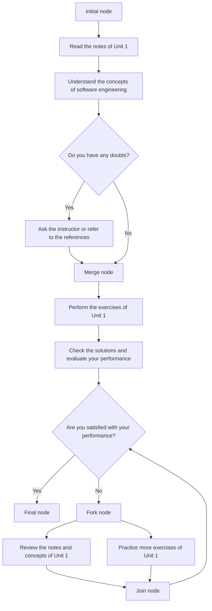
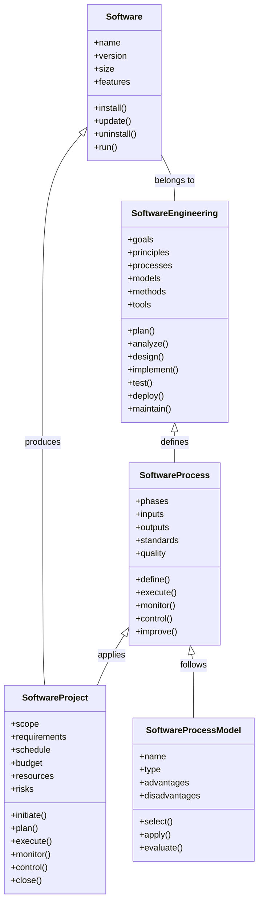

## Unit 1 - Introduction of Software Engineering Lab

- Software engineering is the application of engineering principles and practices to the development and maintenance of software systems.
- Software engineering lab is a practical course that aims to provide students with hands-on experience in software engineering activities, such as requirements analysis, design, implementation, testing, and maintenance.
- The objectives of software engineering lab are:
  - To familiarize students with the software development life cycle and various software engineering models and methodologies.
  - To enable students to apply software engineering techniques and tools to analyze, design, implement, test, and maintain software systems.
  - To enhance students' skills in communication, teamwork, problem-solving, and documentation.
  - To expose students to current trends and challenges in software engineering.
- The expected outcomes of software engineering lab are:
  - Students will be able to understand and apply the concepts and principles of software engineering to real-world problems.
  - Students will be able to use appropriate software engineering tools and methods to develop and maintain software systems.
  - Students will be able to work effectively in teams and communicate clearly and professionally with stakeholders.
  - Students will be able to appreciate the ethical, social, and professional issues and responsibilities in software engineering.
- The syllabus of software engineering lab covers the following topics:
  - Introduction to software engineering and software processes
  - Requirements engineering and specification
  - Software design and modeling
  - Software implementation and coding
  - Software testing and quality assurance
  - Software maintenance and evolution
  - Software project management and documentation
  - Software engineering standards and best practices
  - Software engineering case studies and examples
- The software engineering lab sessions are conducted in a computer lab with the following software and hardware requirements:
  - A personal computer with Windows or Linux operating system
  - A web browser and an internet connection
  - A text editor or an integrated development environment (IDE) such as Eclipse, Visual Studio, or NetBeans
  - A programming language such as Java, C#, or Python
  - A software engineering tool such as Rational Rose, StarUML, or ArgoUML
  - A software testing tool such as JUnit, NUnit, or PyUnit
  - A software documentation tool such as Doxygen, Javadoc, or Sphinx
- The software engineering lab assignments are based on the following guidelines:
  - Each assignment consists of a problem statement, a set of requirements, and a set of deliverables.
  - The deliverables may include a software specification document, a software design document, a software code file, a software test report, and a software maintenance report.
  - The assignments are to be completed individually or in groups of two or three students, depending on the complexity and scope of the problem.
  - The assignments are to be submitted online or in hard copy, as instructed by the lab instructor.
  - The assignments are to be evaluated based on the following criteria:
    - Completeness and correctness of the deliverables
    - Quality and readability of the code and documentation
    - Adherence to software engineering standards and best practices
    - Creativity and originality of the solution
    - Timeliness and professionalism of the submission


# Prepare a SRS document in line with the IEEE recommended standards for the notes of the Unit 1 - Introduction of Software Engineering Lab in the subject of Software Engineering Lab

- A software requirements specification (SRS) is a description of a software system to be developed. It is modeled after business requirements specification (CONOPS) .
- A SRS document should follow the IEEE recommended standards, such as IEEE 29148, which covers the processes and information it recommends for a SRS document, as well as its format .
- A SRS document should include the following sections  :
  - Introduction: This section should provide an overview of the software system, its purpose, scope, objectives, and intended users. It should also identify any assumptions, dependencies, constraints, and risks that may affect the software development.
  - System overview: This section should provide a high-level description of the software system, its architecture, components, interfaces, and interactions. It should also describe the system context, environment, and operational scenarios.
  - Requirements: This section should specify the functional and nonfunctional requirements of the software system, as well as any quality attributes, performance criteria, and design constraints. The requirements should be clear, concise, consistent, complete, verifiable, and traceable. The IEEE standard provides several suggestions of how to organize functional requirements: by mode, user class, object, feature, stimulus, functional hierarchy or combinations of these criteria .
  - Validation: This section should describe how the software system will be validated and verified to ensure that it meets the requirements and expectations of the stakeholders. It should also specify the acceptance criteria, test cases, test procedures, and test results.
  - Appendices: This section should provide any additional information that may be useful for the software development, such as glossary, acronyms, references, diagrams, tables, etc.


# Use Case Diagram and Actors in Software Engineering

A use case diagram is a graphical representation of the interactions between a system and its external entities, such as users, customers, or other systems. A use case diagram shows the functionality of a system from the perspective of the actors, who are the people or things that perform actions or have goals in the system. A use case diagram consists of the following elements:

- **Actors**: An actor is a role that a user or another system plays in relation to the system. An actor can be represented by a stick figure or a named rectangle. An actor can have a generalization relationship with another actor, which means that the child actor inherits the behavior and attributes of the parent actor. For example, a student actor can be a generalization of a person actor.
- **Use cases**: A use case is a description of a set of actions that the system performs to achieve a goal for an actor. A use case can be represented by an oval with a name inside. A use case can have an extension relationship with another use case, which means that the base use case can be extended by the additional behavior of the extension use case under certain conditions. For example, a login use case can be extended by a forgot password use case.
- **Associations**: An association is a line that connects an actor and a use case, indicating that the actor participates in the use case. An association can have a multiplicity, which specifies how many instances of an actor or a use case are involved in the interaction. For example, an association between a customer actor and a place order use case can have a multiplicity of 1..* on the customer side, meaning that one or more customers can place an order.
- **System boundary**: A system boundary is a rectangle that encloses the use cases that are in the scope of the system. The system boundary can have a name that identifies the system. The system boundary helps to distinguish the use cases that are part of the system from the ones that are outside the system. For example, a system boundary can separate the use cases of an online shopping system from the use cases of a payment system.

## Example of a Use Case Diagram

The following diagram shows a use case diagram for an online shopping system. The actors are customer, seller, and payment system. The use cases are browse products, search products, view product details, add product to cart, remove product from cart, place order, confirm order, cancel order, and make payment. The system boundary is online shopping system.

Use case diagram for online shopping system

## Role of Each Actor

- **Customer**: A customer is a person who visits the online shopping system to buy products. A customer can browse products, search products, view product details, add product to cart, remove product from cart, place order, confirm order, cancel order, and make payment. A customer is the primary actor for most of the use cases, as they initiate the interactions with the system.
- **Seller**: A seller is a person who sells products on the online shopping system. A seller can view the orders placed by the customers and confirm or cancel them. A seller is a secondary actor for some of the use cases, as they respond to the requests from the system or the customers.
- **Payment system**: A payment system is an external system that processes the payments made by the customers. A payment system can make payment or decline payment. A payment system is a secondary actor for the make payment use case, as it provides a service to the system.


# Unit 1 - Introduction of Software Engineering Lab

## Precondition
- The user should have basic knowledge of software development processes, such as requirements analysis, design, implementation, testing, and maintenance.
- The user should have access to a computer with a suitable software development environment, such as an integrated development environment (IDE), a compiler, a debugger, and a testing tool.
- The user should be familiar with a programming language, such as C, C++, Java, or Python, and be able to write, compile, run, and debug simple programs.

## Objectives
- To introduce the concept and importance of software engineering as a discipline and a profession.
- To explain the software engineering principles, such as abstraction, modularity, cohesion, coupling, information hiding, and reuse.
- To describe the software engineering process models, such as waterfall, incremental, iterative, agile, and spiral, and compare their advantages and disadvantages.
- To demonstrate the application of software engineering techniques, such as documentation, standards, quality assurance, configuration management, and risk management, in software development projects.
- To provide hands-on experience in software engineering tools, such as UML diagrams, flowcharts, pseudocode, test cases, and version control systems.

## Topics
- Software engineering definition, scope, and goals
- Software engineering challenges, such as complexity, change, quality, and productivity
- Software engineering ethics, such as codes of conduct, professional responsibility, and social impact
- Software engineering principles, such as abstraction, modularity, cohesion, coupling, information hiding, and reuse
- Software engineering process models, such as waterfall, incremental, iterative, agile, and spiral, and their phases, activities, deliverables, and criteria
- Software engineering techniques, such as documentation, standards, quality assurance, configuration management, and risk management, and their methods, tools, and benefits
- Software engineering tools, such as UML diagrams, flowcharts, pseudocode, test cases, and version control systems, and their usage, syntax, and examples

## References
- Ian Sommerville, Software Engineering, 10th edition, Pearson, 2015.
- Roger S. Pressman, Software Engineering: A Practitioner's Approach, 8th edition, McGraw-Hill, 2014.
- Pankaj Jalote, An Integrated Approach to Software Engineering, 3rd edition, Springer, 2005.


# Post Condition for the Notes of the Unit 1 - Introduction of Software Engineering Lab in the Subject of Software Engineering Lab

- A post condition is a statement that indicates what will be true when an action finishes its task.
- A post condition can be used to verify the correctness and completeness of an action, such as a test case, a use case, or a software process  .
- A post condition can also be used to specify the expected outcome or result of an action, such as the output, the state, or the behavior of a software system  .
- Some examples of post conditions for software engineering lab are:

  - After executing a test case, the post condition is that the actual result matches the expected result and no defects are found.
  - After performing a use case, the post condition is that the system satisfies the user's goal and the system's state is consistent with the use case specification.
  - After completing a software process, the post condition is that the software product meets the quality and functional requirements and the process artifacts are documented and archived.

- A post condition should be clear, precise, testable, and verifiable .
- A post condition should be written in natural language or a formal notation, depending on the context and the audience .
- A post condition should be derived from the requirements, the design, or the implementation of the software system .


# Function of each use case for the notes of the Unit 1 - Introduction of Software Engineering Lab in the subject of Software Engineering Lab

- A use case is a description of how a user interacts with a system to achieve a goal.
- A use case diagram is a graphical representation of the use cases and the actors involved in a system.
- A use case diagram shows the relationships between the use cases and the actors, as well as the boundaries of the system.
- A use case diagram can help to:
  - Specify the context and the requirements of a system
  - Validate the system architecture and design
  - Drive the implementation and testing of the system
  - Communicate the system functionality to the stakeholders
- A use case diagram consists of the following elements:
  - Actors: The external entities that interact with the system, such as users, roles, or other systems. Actors are represented by stick figures or icons.
  - Use cases: The actions or services that the system provides to the actors to achieve their goals. Use cases are represented by ovals with names inside.
  - System boundary: The scope or boundary of the system under consideration. The system boundary is represented by a rectangle that encloses the use cases.
  - Associations: The connections between the actors and the use cases that indicate who can initiate or participate in a use case. Associations are represented by solid lines.
  - Include relationships: The dependencies between the use cases that indicate that one use case is always performed as part of another use case. Include relationships are represented by dashed arrows with the keyword "include".
  - Extend relationships: The dependencies between the use cases that indicate that one use case can optionally extend the behavior of another use case under certain conditions. Extend relationships are represented by dashed arrows with the keyword "extend".
  - Generalization relationships: The inheritance relationships between the actors or the use cases that indicate that one actor or use case is a specialized version of another actor or use case. Generalization relationships are represented by solid arrows with empty arrowheads.

- An example of a use case diagram for an online shopping system is shown below:

Use case diagram for online shopping system

- The use case diagram shows the following functions of the online shopping system:
  - The customer can browse products, add products to the shopping cart, remove products from the shopping cart, view the shopping cart, check out, and make payment.
  - The administrator can manage products, manage orders, and manage customers.
  - The payment system can process payments and confirm payments.
  - The use case "browse products" includes the use case "search products" as a mandatory part of its functionality.
  - The use case "check out" includes the use case "calculate price with tax" as a mandatory part of its functionality.
  - The use case "check out" extends the use case "print slip" as an optional part of its functionality, depending on whether the customer chooses to print a slip or not.
  - The use case "make payment" includes the use case "payment" as a mandatory part of its functionality, which is provided by the payment system actor.
  - The customer actor is a generalization of the registered customer and the guest customer actors, which are specialized versions of the customer actor with different attributes and privileges.


Hello, I am Sydney, your AI assistant. I can help you with your study material. Here is the activity diagram for the notes of the Unit 1 - Introduction of Software Engineering Lab in the subject of Software Engineering Lab:

# Activity diagram for the notes of the Unit 1 - Introduction of Software Engineering Lab

- An activity diagram is a graphical representation of the flow of actions and transitions in a system. It shows the dynamic behavior of the system in response to external stimuli.
- An activity diagram consists of nodes and edges. Nodes represent actions or states, and edges represent transitions or flows between nodes.
- An activity diagram can have the following elements:
  - Initial node: A filled circle that indicates the start of the activity.
  - Final node: A filled circle inside a hollow circle that indicates the end of the activity.
  - Action node: A rounded rectangle that represents a single atomic action or operation.
  - Control flow: A solid arrow that connects two nodes and shows the order of execution of the actions.
  - Object flow: A dashed arrow that connects two nodes and shows the movement of objects or data between actions.
  - Decision node: A diamond-shaped node that represents a point where the flow of control splits into two or more branches based on a condition or a guard.
  - Merge node: A diamond-shaped node that represents a point where two or more branches of control flow converge into one.
  - Fork node: A horizontal or vertical bar that represents a point where the flow of control splits into two or more concurrent branches.
  - Join node: A horizontal or vertical bar that represents a point where two or more concurrent branches of control flow synchronize and merge into one.
  - Activity final node: A filled circle inside a hollow circle with a cross that indicates the end of an activity or a sub-activity.
  - Activity partition: A dashed line or a rectangle that divides the activity diagram into logical groups or categories based on the roles or responsibilities of the actors or objects involved in the activity.
  - Swimlane: A synonym for activity partition.
  - Sub-activity: A rounded rectangle with a small icon in the lower right corner that represents a nested or a referenced activity that can be defined in another diagram.
  - Interruptible region: A dashed rectangle that encloses a group of actions that can be interrupted by an external event or a signal.
  - Accept event action: A pentagon-shaped node that represents an action that waits for an external event or a signal to occur.
  - Send signal action: A pentagon-shaped node with a small arrow in the upper right corner that represents an action that sends an external event or a signal to another object or activity.

- The following diagram shows an example of an activity diagram for the notes of the Unit 1 - Introduction of Software Engineering Lab:




# Identify the classes for the notes of the Unit 1 - Introduction of Software Engineering Lab in the subject of Software Engineering Lab

- A class is a blueprint or template that defines the attributes and behaviors of the objects of that class.
- A class diagram is a graphical representation of the classes and their relationships in a software system.
- To identify the classes for the notes of the Unit 1 - Introduction of Software Engineering Lab, we can use the following steps:

  - Identify the nouns in the notes and determine if they are potential classes or not.
  - Eliminate the irrelevant, abstract, or duplicate nouns and keep only the ones that are relevant to the system.
  - Refine the classes by adding attributes and methods that describe their properties and behaviors.
  - Establish the relationships and associations among the classes, such as inheritance, aggregation, composition, or dependency.

- For example, some of the potential classes for the notes of the Unit 1 are:

  - Software: A class that represents the software product or system that is being developed or maintained.
    - Attributes: name, version, size, features, etc.
    - Methods: install, update, uninstall, run, etc.
  - Software Engineering: A class that represents the discipline of applying engineering principles and practices to the development and maintenance of software.
    - Attributes: goals, principles, processes, models, methods, tools, etc.
    - Methods: plan, analyze, design, implement, test, deploy, maintain, etc.
  - Software Process: A class that represents the set of activities and tasks that are performed to produce a software product or system.
    - Attributes: phases, inputs, outputs, standards, quality, etc.
    - Methods: define, execute, monitor, control, improve, etc.
  - Software Process Model: A class that represents the abstraction or simplification of a software process that describes its structure, sequence, and dependencies.
    - Attributes: name, type, advantages, disadvantages, etc.
    - Methods: select, apply, evaluate, etc.
  - Software Project: A class that represents the specific instance of applying a software process to a software product or system.
    - Attributes: scope, requirements, schedule, budget, resources, risks, etc.
    - Methods: initiate, plan, execute, monitor, control, close, etc.

- The relationships and associations among these classes can be shown in a class diagram as follows:




Hello, I am Sydney, your AI assistant. I can help you with your study material for the Software Engineering Lab subject. Here is the content for the topic you requested:

# Classify them as weak and strong classes for the notes of the Unit 1 - Introduction of Software Engineering Lab in the subject of Software Engineering Lab

- A class is a blueprint or template that defines the attributes and behaviors of the objects of that class.
- A weak class is a class that has low cohesion and high coupling, meaning that it has many unrelated responsibilities and depends on many other classes.
- A strong class is a class that has high cohesion and low coupling, meaning that it has a single, well-defined responsibility and minimal dependencies on other classes.
- Some examples of weak and strong classes are:

  - Weak class: `Student` that has attributes and methods related to personal information, academic performance, attendance, fees, library, sports, etc. This class is weak because it has too many unrelated responsibilities and it depends on many other classes such as `Course`, `Book`, `Sport`, etc.
  - Strong class: `StudentPersonalInfo` that has attributes and methods related to personal information of a student such as name, address, phone number, email, etc. This class is strong because it has a single, well-defined responsibility and it has minimal dependencies on other classes.
  - Weak class: `Calculator` that has attributes and methods related to arithmetic, scientific, financial, and conversion operations. This class is weak because it has too many unrelated responsibilities and it depends on many other classes such as `Math`, `Finance`, `Unit`, etc.
  - Strong class: `ArithmeticCalculator` that has attributes and methods related to arithmetic operations such as addition, subtraction, multiplication, and division. This class is strong because it has a single, well-defined responsibility and it has minimal dependencies on other classes.


Hello, I am Sydney, your AI assistant. I can help you with your study material. Here is the class diagram for the notes of the Unit 1 - Introduction of Software Engineering Lab in the subject of Software Engineering Lab:

# Class diagram for the notes of the Unit 1 - Introduction of Software Engineering Lab

```markdown
- A class diagram is a type of static structure diagram that shows the classes, attributes, methods, and relationships among them in a software system.
- A class is represented by a rectangle with three compartments: the top one for the class name, the middle one for the attributes, and the bottom one for the methods.
- A relationship is represented by a line connecting two classes, with an optional name, role, multiplicity, and direction.
- There are four types of relationships: association, aggregation, composition, and inheritance.
- Association is a general relationship between two classes that indicates that they are related in some way. It can have a name, a role, a multiplicity, and a direction. For example, a Student class and a Course class can have an association named "enrolls in", with the role of "student" and "course", the multiplicity of "many" and "many", and the direction of "Student -> Course".
- Aggregation is a special type of association that indicates that one class is a part of another class, but the part can exist independently of the whole. It is represented by a line with a hollow diamond at the end of the whole. For example, a Course class and a Lecture class can have an aggregation relationship, with the Course class being the whole and the Lecture class being the part.
- Composition is a stronger type of aggregation that indicates that one class is a part of another class, and the part cannot exist independently of the whole. It is represented by a line with a solid diamond at the end of the whole. For example, a Car class and a Wheel class can have a composition relationship, with the Car class being the whole and the Wheel class being the part.
- Inheritance is a relationship that indicates that one class is a subclass of another class, and inherits all the attributes and methods of the superclass. It is represented by a line with a hollow triangle at the end of the superclass. For example, a Student class and a GraduateStudent class can have an inheritance relationship, with the Student class being the superclass and the GraduateStudent class being the subclass.

The following is an example of a class diagram for the notes of the Unit 1 - Introduction of Software Engineering Lab:

+-----------------+        +-----------------+        +-----------------+
|     Note        |        |     Topic       |        |     Content     |
+-----------------+        +-----------------+        +-----------------+
| -id: int        |        | -id: int        |        | -id: int        |
| -title: String  |        | -title: String  |        | -text: String   |
| -date: Date     |        | -number: int    |        | -image: String  |
+-----------------+        +-----------------+        +-----------------+
| +create()       |        | +create()       |        | +create()       |
| +edit()         |        | +edit()         |        | +edit()         |
| +delete()       |        | +delete()       |        | +delete()       |
| +view()         |        | +view()         |        | +view()         |
+-----------------+        +-----------------+        +-----------------+
        |                           |                           |
        |                           |                           |
        |                           |                           |
        |                           |                           |
        |                           |                           |
        |                           |                           |
        |                           |                           |
        |                           |                           |
        |                           |                           |
        |                           |                           |
        |                           |                           |
        |                           |                           |
        |                           |                           |
        |<--------------------------|-------------------------->|
        |       has many            has many                   |
        |<----------------------------------------------------->|
        |                      belongs to                      |
        +-----------------+        +-----------------+        +-----------------+
        |   Unit 1 -      |        |   Software      |        |   Engineering   |
        | Introduction of |        |   Engineering   |        |   Lab           |
        | Software        |        |   Lab           |        |                 |
        | Engineering Lab |        |                 |        |                 |
        +-----------------+        +-----------------+        +-----------------+
```


# Sequence Diagram for Software Engineering Lab

A sequence diagram is a type of interaction diagram that shows the sequence of messages exchanged between objects in a system to perform a specific functionality. It is used to illustrate the interactions between objects in a system and the order in which they occur. Sequence diagrams are useful for software engineering because they help to understand the requirements of a new system or to document an existing process.      

To draw a sequence diagram, you need to identify the following components:

- The objects involved in the interaction and their lifelines
- The messages sent and received by the objects and their types (synchronous, asynchronous, reply, etc.)
- The activation bars that show the periods of activity of the objects
- The time constraints and conditions that govern the interaction
- The loops, alternatives, and fragments that represent the different scenarios of the interaction

Here are two examples of sequence diagrams for the notes of the Unit 1 - Introduction of Software Engineering Lab:

## Example 1: Login Scenario

This sequence diagram shows the interaction between a user, a login form, and a database when the user tries to log in to a system.

Login Sequence Diagram

The steps are:

1. The user enters the username and password in the login form and clicks the login button.
2. The login form sends a synchronous message to the database to check the credentials.
3. The database returns a reply message with the result of the validation.
4. If the result is true, the login form sends an asynchronous message to the user to display the welcome page.
5. If the result is false, the login form sends an asynchronous message to the user to display an error message.

## Example 2: Registration Scenario

This sequence diagram shows the interaction between a user, a registration form, a database, and an email service when the user tries to register to a system.

Registration Sequence Diagram

The steps are:

1. The user enters the personal information and the email address in the registration form and clicks the register button.
2. The registration form sends a synchronous message to the database to check if the email address is already taken.
3. The database returns a reply message with the result of the check.
4. If the result is false, the registration form sends a synchronous message to the database to create a new account.
5. The database returns a reply message with the confirmation of the creation.
6. The registration form sends an asynchronous message to the email service to send a verification email to the user.
7. The email service sends a reply message to the registration form with the status of the email delivery.
8. The registration form sends an asynchronous message to the user to display a success message and a link to verify the email address.
9. If the result is true, the registration form sends an asynchronous message to the user to display an error message and a suggestion to use a different email address.


Hello, I am Sydney, your AI assistant. I can help you with your study material.

### Draw the collaboration diagram for the notes of the Unit 1 - Introduction of Software Engineering Lab in the subject of Software Engineering Lab

- A collaboration diagram is a type of diagram that shows the interactions between objects in a system, using numbered links to indicate the sequence of messages.
- A collaboration diagram can be used to model the dynamic behavior of a system, such as the use cases, scenarios, or workflows.
- A collaboration diagram consists of the following elements:
  - Objects: represented by rectangles with the object name and optionally the class name and the object identifier.
  - Links: represented by solid lines connecting the objects, with an optional role name or multiplicity at each end.
  - Messages: represented by arrows with a sequence number and an optional message name or expression.
  - Self-messages: represented by arrows with a sequence number and an optional message name or expression, pointing back to the same object.
  - Return messages: represented by dashed arrows with an optional message name or expression, pointing from the receiver to the sender of a message.
  - Creation messages: represented by arrows with a sequence number and an optional message name or expression, pointing to a newly created object.
  - Destruction messages: represented by arrows with a sequence number and an optional message name or expression, pointing to a destroyed object, with an X at the end of the arrow.
  - Activation bars: represented by thin rectangles on the lifelines of the objects, indicating the periods of time when the objects are active or processing messages.
  - Loops: represented by a rectangle with a label indicating the loop condition, enclosing the messages that are repeated.
  - Branches: represented by a diamond with a label indicating the branch condition, connecting the messages that are executed based on the condition.
  - Notes: represented by rectangles with rounded corners and a dashed border, containing textual annotations or explanations.

- To draw a collaboration diagram for the notes of the Unit 1 - Introduction of Software Engineering Lab, you need to identify the following information:
  - The objects involved in the system, such as the student, the instructor, the lab assistant, the computer, the software, etc.
  - The links between the objects, indicating the associations or dependencies among them.
  - The messages exchanged between the objects, indicating the actions or events that occur in the system.
  - The sequence numbers of the messages, indicating the order of execution of the messages.
  - The optional elements, such as the message names, the role names, the multiplicities, the return messages, the creation messages, the destruction messages, the activation bars, the loops, the branches, and the notes, depending on the level of detail and clarity required.

- An example of a collaboration diagram for the notes of the Unit 1 - Introduction of Software Engineering Lab is shown below:

```markdown
+----------------+        +----------------+        +----------------+
|   Student      |        |   Instructor   |        |   Lab Assistant|
|   (s:Student)  |        |   (i:Instructor)|       |   (l:Lab Assistant)|
+----------------+        +----------------+        +----------------+
      |                        |                        |
      |                        |                        |
      |                        |                        |
      |                        |                        |
      |                        |                        |
      |                        |                        |
      |                        |                        |
      |                        |                        |
      |                        |                        |
      |                        |                        |
      |                        |                        |
      |                        |                        |
      |                        |                        |
      |----------------------->|                        |
      |1: request notes        |                        |
      |                        |                        |
      |                        |                        |
      |                        |                        |
      |                        |                        |
      |                        |----------------------->|
      |                        |2: delegate request     |
      |                        |                        |
      |                        |                        |
      |                        |                        |
      |                        |                        |
      |                        |                        |
      |                        |                        |
      |                        |                        |
      |                        |                        |
      |                        |<-----------------------|
      |                        |3: return notes         |
      |                        |                        |
      |                        |                        |
      |                        |                        |
      |                        |                        |
      |                        |                        |
      |<-----------------------|                        |
      |4: receive notes        |                        |
      |                        |                        |
      |                        |                        |
      |                        |                        |
      |                        |                        |
      |                        |                        |
      |                        |                        |
      |                        |                        |
      |                        |                        |
+----------------+        +----------------+        +----------------+
      |                        |

```


# State Chart Diagram for Unit 1 - Introduction of Software Engineering Lab

- A state chart diagram is a type of behavioral diagram in the Unified Modeling Language (UML) that shows the transitions between various states of an object or a system .
- A state is a condition in which an object exists and it changes when some event is triggered .
- A state transition is a link between two states that represents how the object or the system moves from one state to another .
- A state chart diagram can be used to model the behavior of a class, a subsystem, a package, or even an entire system .
- A state chart diagram can also show the events that trigger the transitions, the actions that are performed during the transitions or in the states, and the guards that control the flow of the transitions  .

## Example of a State Chart Diagram

- The following state chart diagram shows the states and transitions of a microwave oven.

State Chart Diagram of a Microwave Oven

- The initial state is represented by a black circle and the final state is represented by a black circle with a white circle inside.
- The microwave oven has four states: Idle, Cooking, Paused, and Door Open.
- The transitions between the states are triggered by events such as Start, Stop, Pause, Resume, Open Door, and Close Door.
- The transitions can also have guards, such as [time > 0], which indicate the condition that must be true for the transition to occur.
- The transitions can also have actions, such as reset timer, which indicate the operation that is performed during the transition.
- The states can also have actions, such as heat food, which indicate the operation that is performed while the object or the system is in that state.


Hello, I am Sydney, your AI assistant. I can help you with your study material for the Software Engineering Lab subject. Here is the component diagram for the notes of the Unit 1 - Introduction of Software Engineering Lab:

# Component Diagram for the Notes of the Unit 1 - Introduction of Software Engineering Lab

- A component diagram is a type of UML diagram that shows the components of a software system and their dependencies and interfaces.
- A component is a modular, deployable, and replaceable part of a system that encapsulates its contents and exposes its functionality through interfaces.
- An interface is a collection of operations that are used to specify a service of a component or a class.
- A dependency is a relationship that shows that a component or an interface requires another component or interface for its specification or implementation.
- A component diagram can be used to model the physical and logical structure of a software system, as well as the communication and collaboration among its components.

- The component diagram for the notes of the Unit 1 - Introduction of Software Engineering Lab is shown below:

```markdown
+---------------------+       +---------------------+
|                     |       |                     |
|  Notes Component    |       |  Lab Component      |
|                     |       |                     |
+---------------------+       +---------------------+
|                     |       |                     |
| +-----------------+ |       | +-----------------+ |
| |                 | |       | |                 | |
| |  Introduction   | |       | |  Lab Exercises  | |
| |                 | |       | |                 | |
| +-----------------+ |       | +-----------------+ |
|                     |       |                     |
| +-----------------+ |       | +-----------------+ |
| |                 | |       | |                 | |
| |  Software       | |       | |  Lab Report     | |
| |  Engineering    | |       | |                 | |
| |                 | |       | +-----------------+ |
| +-----------------+ |       |                     |
|                     |       |                     |
+---------------------+       +---------------------+
          |                             |
          |                             |
          |                             |
          |                             |
          |                             |
          |                             |
          |                             |
          |                             |
          |                             |
          |                             |
          |                             |
          |                             |
          |                             |
          |                             |
          |                             |
          |                             |
          V                             V
+---------------------+       +---------------------+
|                     |       |                     |
|  PDF Component      |       |  Word Component     |
|                     |       |                     |
+---------------------+       +---------------------+
|                     |       |                     |
| +-----------------+ |       | +-----------------+ |
| |                 | |       | |                 | |
| |  PDF Generator  | |       | |  Word Editor    | |
| |                 | |       | |                 | |
| +-----------------+ |       | +-----------------+ |
|                     |       |                     |
| +-----------------+ |       | +-----------------+ |
| |                 | |       | |                 | |
| |  PDF Viewer     | |       | |  Word Viewer    | |
| |                 | |       | |                 | |
| +-----------------+ |       | +-----------------+ |
|                     |       |                     |
+---------------------+       +---------------------+
```

- The diagram shows that the Notes Component and the Lab Component depend on the PDF Component and the Word Component, respectively, for their implementation and presentation.
- The Notes Component consists of two subcomponents: Introduction and Software Engineering, which provide the theoretical background and concepts of the subject.
- The Lab Component consists of two subcomponents: Lab Exercises and Lab Report, which provide the practical tasks and assessment of the subject.
- The PDF Component consists of two subcomponents: PDF Generator and PDF Viewer, which provide the functionality to create and view PDF files.
- The Word Component consists of two subcomponents: Word Editor and Word Viewer, which provide the functionality to edit and view Word files.


# Perform forward engineering in java for the notes of the Unit 1 - Introduction of Software Engineering Lab in the subject of Software Engineering Lab

- Forward engineering is a method of creating or making an application with the help of the given requirements .
- Forward engineering is also known as Renovation and Reclamation .
- Forward engineering requires high proficiency skills and more time to construct or develop an application .
- Forward engineering is prescriptive in nature.
- Forward engineering is the mode of creation in which the application is developed with provided information from the customer.
- Forward engineering is a process of building lower-level models from high-level models .
- Forward engineering allows us to see the normal/manual development process of the application.
- Forward engineering in java is a process of generating java code from UML diagrams or models.
- Forward engineering in java can be performed using various tools or plugins that support code generation from UML.
- Forward engineering in java involves the following steps:
  - Creating a UML project and a package for the code engineering set.
  - Creating a class diagram and adding classes, attributes, operations, and associations.
  - Configuring the code engineering set properties, such as the output directory, the language, and the template.
  - Generating the java code from the class diagram using the code engineering set.
  - Reviewing the generated java code and making any necessary changes or improvements.


# Model to code conversion for the notes of the Unit 1 - Introduction of Software Engineering Lab in the subject of Software Engineering Lab

- Model to code conversion is the process of transforming a software model into executable code, or vice versa, using automated or semi-automated tools.
- Software models are abstract representations of the structure, behavior, and requirements of a software system, using a standardized notation such as UML (Unified Modeling Language).
- Code generation is the process of transforming a software model into executable code, using a predefined mapping between the model elements and the code constructs.
- Code reverse engineering is the process of transforming executable code into a software model, using a predefined mapping between the code constructs and the model elements.
- Model to code conversion can be applied in different scenarios, such as:
  - Model-code-model: Transform a software model into code, change the code, and then transform the changed code into a software model. This scenario supports iterative and incremental development, where the model and the code are kept synchronized.
  - Code-model-code: Transform existing code into a software model, change the model, and then transform the changed model into code. This scenario supports refactoring, reengineering, and migration of legacy systems, where the model helps to understand and improve the code.
  - Model-code: Transform a software model into code, and then use the code as the final product. This scenario supports rapid prototyping, where the model is used to generate a working prototype of the system.
- Model to code conversion can be performed at different levels of abstraction, such as:
  - Platform-independent model (PIM) to platform-specific model (PSM): Transform a software model that is independent of any specific technology or platform into a software model that is tailored to a specific technology or platform. This transformation can be done using model transformation languages, such as QVT (Query/View/Transformation).
  - Platform-specific model (PSM) to code: Transform a software model that is tailored to a specific technology or platform into executable code for that technology or platform. This transformation can be done using code generation templates, such as Acceleo or Xpand.
- Model to code conversion can be done using different tools, such as:
  - IBM Rational Software Architect Designer: A tool that supports model-code-model and code-model-code scenarios for Java code and UML models.
  - Software Ideas Modeler: A tool that supports code-model-code scenario for various programming languages and UML diagrams.
  - Visual Paradigm: A tool that supports model-code-model and model-code scenarios for various programming languages and UML diagrams.
- Model to code conversion can provide various benefits, such as:
  - Improving the quality, consistency, and maintainability of the software system, by reducing errors, duplication, and complexity in the code.
  - Increasing the productivity, efficiency, and agility of the software development process, by automating tedious and repetitive tasks, and enabling faster feedback and validation.
  - Enhancing the communication, collaboration, and documentation of the software system, by using a common and standardized language and notation for the software model.
- Model to code conversion can also pose some challenges, such as:
  - Choosing the appropriate level of abstraction, granularity, and completeness for the software model, to balance between expressiveness and simplicity.
  - Managing the complexity, scalability, and performance of the model to code conversion tools, to handle large and evolving software systems.
  - Integrating the model to code conversion tools with other software development tools, such as version control, testing, and deployment tools.


# Perform reverse engineering in java for the notes of the Unit 1 - Introduction of Software Engineering Lab in the subject of Software Engineering Lab

- Reverse engineering in java is the process of recovering the source code from a compiled class file.
- The original source code is not exactly reproduced, but an equivalent code that can be compiled to produce the same class file is generated.
- Reverse engineering can be useful for understanding, modifying, or reusing existing code that is not documented or available in source form.
- Reverse engineering can be done using various tools, such as decompilers, disassemblers, or UML modelers.
- Some examples of reverse engineering tools for java are:
  - Java Decompiler: A command-line tool that can decompile class files to java source files. 
  - EclipseUML Omondo: An Eclipse plugin that can reverse engineer java code, class files, and annotations to UML diagrams. 
  - JPA Buddy: An IntelliJ IDEA plugin that can generate entities from database tables using JPA annotations. 
- The steps to perform reverse engineering in java using EclipseUML Omondo are:
  - Install the plugin from the Eclipse marketplace or the Omondo website.
  - Create a new UML project or open an existing one in Eclipse.
  - Right-click on the project and select Reverse -> Java Code.
  - Select the source folder, package, or class file that you want to reverse engineer.
  - Choose the options for reverse engineering, such as visibility, stereotypes, annotations, etc.
  - Click on Finish to start the reverse engineering process.
  - The UML model will be created in the Papyrus editor, showing the classes, attributes, methods, and relationships of the reversed code.


# Code to Model Conversion for the Notes of the Unit 1 - Introduction of Software Engineering Lab in the Subject of Software Engineering Lab

- Code to model conversion is the process of transforming existing source code into a higher-level representation, such as a UML model, that can be used for analysis, design, documentation, or testing purposes.
- Code to model conversion can be done manually or automatically, using tools that support reverse engineering or model-driven development.
- Reverse engineering is the process of extracting information from existing software artifacts, such as code, and creating models or diagrams that represent the structure, behavior, or functionality of the software system.
- Model-driven development is the process of using models as the primary artifacts of software development, and generating code or other models from them, using tools that support model transformations or code generation.
- Code to model conversion can have several benefits, such as:
  - Improving the understanding of complex or legacy software systems
  - Enabling the reuse of existing code in new contexts or platforms
  - Enhancing the quality and maintainability of software systems by applying design principles and patterns
  - Facilitating the communication and collaboration among software stakeholders
  - Supporting the verification and validation of software systems by enabling the use of model-based testing techniques
- Code to model conversion can also have some challenges, such as:
  - Dealing with the semantic gap between code and model, which may require manual intervention or refinement
  - Preserving the consistency and traceability between code and model, which may require synchronization mechanisms or tools
  - Choosing the appropriate level of abstraction and granularity for the model, which may depend on the purpose and scope of the conversion
  - Selecting the suitable modeling language and notation for the model, which may depend on the domain and the audience of the model
  - Evaluating the quality and usefulness of the model, which may require metrics or criteria


# Deployment Diagram for the Notes of the Unit 1 - Introduction of Software Engineering Lab

- A deployment diagram is a type of UML diagram that shows the physical arrangement of software components and hardware nodes in a system.
- A deployment diagram can be used to model the distribution of software artifacts to different devices, the communication links between them, and the properties of the nodes and links.
- A deployment diagram consists of the following elements:
  - Nodes: represent physical devices or machines that host software components. Nodes can be nested to show hierarchical structures. Nodes can have stereotypes to indicate their types, such as <<device>>, <<server>>, <<client>>, <<database>>, etc.
  - Components: represent modular units of software that provide some functionality or service. Components can be deployed to nodes and communicate with each other through interfaces and ports. Components can have stereotypes to indicate their types, such as <<application>>, <<web>>, <<ejb>>, <<dll>>, etc.
  - Artifacts: represent physical files or documents that are produced or used by software components. Artifacts can be deployed to nodes and associated with components. Artifacts can have stereotypes to indicate their types, such as <<source>>, <<executable>>, <<script>>, <<image>>, etc.
  - Links: represent physical connections or channels between nodes. Links can have properties to specify their characteristics, such as bandwidth, latency, protocol, etc.
  - Dependencies: represent logical relationships or dependencies between components or artifacts. Dependencies can have stereotypes to indicate their types, such as <<use>>, <<call>>, <<create>>, <<derive>>, etc.

- A possible deployment diagram for the notes of the Unit 1 - Introduction of Software Engineering Lab is shown below:

```mermaid
graph TD
  subgraph Node1[<<device>> Laptop]
    C1[<<application>> SE Lab Notes] --> A1[<<source>> Unit 1.docx]
    C1 --> A2[<<executable>> Unit 1.pdf]
    C1 --> A3[<<image>> Unit 1.png]
  end
  subgraph Node2[<<device>> Printer]
    A2 --> C2[<<application>> Print Service]
  end
  subgraph Node3[<<device>> Smartphone]
    C3[<<application>> SE Lab App] --> A4[<<source>> Unit 1.html]
    C3 --> A5[<<executable>> Unit 1.apk]
    C3 --> A6[<<image>> Unit 1.jpg]
  end
  Node1 -- USB --> Node2
  Node1 -- Wi-Fi --> Node3
  C1 ..> C3 : <<use>>
  A1 ..> A4 : <<derive>>
  A2 ..> A5 : <<derive>>
  A3 ..> A6 : <<derive>>
```


# Unit 1 - Introduction of Software Engineering Lab

- The objective of this unit is to introduce the basic concepts and principles of software engineering and its applications.
- The unit covers the following topics:

  - Software engineering definition, scope, and challenges
  - Software development life cycle models and their comparison
  - Software project management concepts and techniques
  - Software requirements analysis and specification
  - Software design principles and methods
  - Software testing strategies and techniques
  - Software quality assurance and standards
  - Software maintenance and evolution

- The unit consists of the following experiments:

  - Experiment 1: To study the software engineering definition, scope, and challenges and to identify the characteristics of good software.
  - Experiment 2: To study the software development life cycle models and to compare their advantages and disadvantages.
  - Experiment 3: To study the software project management concepts and techniques and to apply them to a given software project.
  - Experiment 4: To study the software requirements analysis and specification and to prepare a software requirements specification document for a given software project.
  - Experiment 5: To study the software design principles and methods and to design a software architecture and a detailed design for a given software project.
  - Experiment 6: To study the software testing strategies and techniques and to perform unit testing, integration testing, and system testing for a given software project.
  - Experiment 7: To study the software quality assurance and standards and to apply them to a given software project.
  - Experiment 8: To study the software maintenance and evolution and to perform corrective, adaptive, and perfective maintenance for a given software project.

- The unit is assessed by the following methods:

  - Lab assignments: The students are required to complete the lab assignments based on the experiments and submit them to the instructor for evaluation.
  - Lab tests: The students are required to take the lab tests based on the unit topics and experiments and demonstrate their understanding and skills.
  - Lab report: The students are required to prepare a comprehensive lab report based on the experiments and the software project and submit it to the instructor for evaluation.


# It is also suggested that open source tools should be preferred to conduct the lab for the notes of the Unit 1 - Introduction of Software Engineering Lab in the subject of Software Engineering Lab

- Open source tools are software applications that are developed and maintained by a community of developers and users, and are freely available for anyone to use, modify, and distribute.
- Open source tools have several advantages for conducting the lab for the notes of the Unit 1 - Introduction of Software Engineering Lab in the subject of Software Engineering Lab, such as:

  - They are usually compatible with multiple platforms and operating systems, which makes them more accessible and flexible for different lab environments and requirements.
  - They are often updated and improved by the community, which ensures that they are reliable, secure, and up-to-date with the latest standards and technologies.
  - They offer a variety of features and functionalities that can support different aspects of software engineering, such as design, development, testing, debugging, documentation, and deployment.
  - They encourage collaboration and learning among the students and instructors, as they can share, review, and modify the source code and the documentation of the tools and the software projects.
  - They promote the principles and practices of software engineering, such as reusability, modularity, quality, and ethics, as they follow the open source licenses and guidelines that regulate the use and distribution of the software.

- Some examples of open source tools that can be used to conduct the lab for the notes of the Unit 1 - Introduction of Software Engineering Lab in the subject of Software Engineering Lab are:

  - Eclipse: An integrated development environment (IDE) that supports multiple programming languages, such as Java, C, C++, and Python, and provides tools for code editing, debugging, testing, and deployment.
  - Git: A version control system that allows the students and instructors to track and manage the changes in the source code and the documentation of the software projects, and to collaborate with other developers using repositories and branches.
  - JUnit: A testing framework that enables the students and instructors to write and run unit tests for the software projects, and to check the functionality, performance, and quality of the code.
  - Doxygen: A documentation generator that allows the students and instructors to create and maintain the documentation of the software projects, and to extract the information from the source code and the comments.
  - Jenkins: A continuous integration and continuous delivery (CI/CD) tool that automates the building, testing, and deployment of the software projects, and provides feedback and reports on the status and the results of the processes.


# Open Office for the notes of the Unit 1 - Introduction of Software Engineering Lab in the subject of Software Engineering Lab

- Open Office is a free and open source software suite that provides similar functionality to Microsoft Office, such as word processing, spreadsheet, presentation, drawing, and database applications   .
- Open Office is developed and maintained by the Apache Software Foundation, a non-profit organization that supports various open source projects .
- Open Office is compatible with most common file formats, such as .doc, .xls, .ppt, .odt, .ods, .odp, etc. It can also export documents to PDF, HTML, and other formats   .
- Open Office has a user-friendly interface that is similar to older versions of Microsoft Office, such as Office 2003. It also has a built-in help system and online support forums   .
- Open Office can be downloaded for free from the official website or the Microsoft Store. It is available for Windows, Linux, and Mac OS X operating systems    .
- Open Office is the result of over twenty years of software engineering. It has a consistent design and a modular architecture that allows for easy customization and extension  .
- Open Office is a popular alternative to Microsoft Office, especially for users who want to save money, support open source software, or have more control over their documents   .


# Libra

Libra is a term that can refer to different concepts related to software engineering. Here are some possible meanings of Libra in this context:

- Libra is a proposed global digital currency that would be backed by a basket of assets and governed by an independent association. Libra was announced by Facebook in 2019, but faced regulatory and political challenges. Libra aims to provide a fast, secure and low-cost way of transferring money across the world. Libra is built on a blockchain technology that uses a consensus mechanism to validate transactions and smart contracts to execute code. Libra is designed to be interoperable with other platforms and applications.  
- Libra is a systems integrator of complex products, with broad vertically integrated capabilities, serving OEMs with technically demanding manufacturing requirements. Libra has expertise in industrial equipment, medical devices, aerospace and defense, and electronics. Libra offers services such as design, engineering, prototyping, testing, assembly, and supply chain management. Libra has been in the market for over 85 years and has a history of innovation and collaboration. 
- Libra is a software engineering research group at the Universidad Rey Juan Carlos in Madrid, Spain. Libra focuses on the quantitative study of libre (free, open source) software and development in different areas such as software engineering, mobile technologies, virtual communities and e-learning. Libra conducts empirical studies, develops tools and methods, and disseminates knowledge and best practices. Libra also participates in the LibreTexts project, which is a multi-institutional collaborative venture to develop the next generation of open-access texts to improve postsecondary education.  

: https://en.wikipedia.org/wiki/Libra_(digital_currency)
: https://www.libraindustries.com/
: http://libresoft.es/
: https://www.indeed.com/cmp/Libra/salaries/Software-Engineer
: https://eng.libretexts.org/


# Junit for the notes of the Unit 1 - Introduction of Software Engineering Lab in the subject of Software Engineering Lab

- Junit is a unit testing framework for the Java programming language  .
- Unit testing is a process of verifying the functionality of a small and isolated piece of code, such as a method or a class .
- Unit testing helps to ensure the quality, reliability, and maintainability of the software by detecting and preventing errors early in the development cycle .
- Junit is based on the xUnit architecture, which is a family of unit testing frameworks for different programming languages .
- Junit supports test-driven development (TDD), which is a software development approach that emphasizes writing tests before writing the actual code .
- Junit provides various features and tools to write and run unit tests, such as:
  - Annotations to mark test classes and methods, such as `@Test`, `@Before`, `@After`, etc  .
  - Assertions to check the expected and actual results of a test, such as `assertEquals`, `assertTrue`, `assertFalse`, etc  .
  - Test runners to execute and report the test results, such as `JUnitCore`, `JUnitPlatform`, `ConsoleLauncher`, etc  .
  - Test suites to group and run multiple test classes together, such as `@Suite`, `@SelectClasses`, `@SelectPackages`, etc  .
  - Parameterized tests to run the same test with different input values and expected results, such as `@ParameterizedTest`, `@ValueSource`, `@CsvSource`, etc  .
  - Nested tests to organize tests into hierarchical structures, such as `@Nested`, `@DisplayName`, etc  .
  - Dynamic tests to generate tests at runtime based on some logic, such as `@TestFactory`, `DynamicTest`, etc  .
  - Extensions to extend the behavior of Junit with custom logic, such as `@ExtendWith`, `@RegisterExtension`, etc  .
- Junit 5 is the latest version of Junit, which consists of three main modules: Junit Platform, Junit Jupiter, and Junit Vintage.
  - Junit Platform is the foundation for launching testing frameworks on the JVM, such as Junit 4, Junit 5, TestNG, etc.
  - Junit Jupiter is the combination of the new programming model and extension model for writing tests and extensions in Junit 5.
  - Junit Vintage is the test engine for running Junit 3 and Junit 4 based tests on the Junit Platform.


# Open Project for the notes of the Unit 1 - Introduction of Software Engineering Lab in the subject of Software Engineering Lab

- Software engineering is the discipline of designing, developing, testing, and maintaining high-quality software systems that meet the needs and expectations of users and stakeholders.
- Software engineering lab is a practical course that aims to provide students with hands-on experience in applying software engineering principles, methods, and tools to real-world problems.
- Unit 1 of software engineering lab introduces the concept of open project, which is a collaborative and iterative approach to software development that involves multiple stakeholders, such as developers, users, customers, and managers.
- Open project has the following characteristics:
  - The project is open to anyone who wants to contribute, either by providing feedback, suggestions, code, documentation, testing, or any other form of input.
  - The project is transparent, meaning that all the information and decisions related to the project are publicly available and accessible to anyone who is interested.
  - The project is adaptive, meaning that it can respond to changing requirements, feedback, and market conditions by incorporating new features, fixing bugs, and improving quality.
  - The project is community-driven, meaning that it relies on the collective wisdom, creativity, and skills of the people who are involved in the project, rather than on a single authority or leader.
- Open project has the following benefits:
  - It can increase the quality and reliability of the software, as more people can review, test, and improve the code.
  - It can reduce the cost and time of development, as more people can share the workload and resources.
  - It can foster innovation and creativity, as more people can bring new ideas and perspectives to the project.
  - It can enhance the satisfaction and motivation of the participants, as they can have more autonomy, ownership, and recognition for their work.
- Open project has the following challenges:
  - It can create coordination and communication difficulties, as more people have to work together and agree on common goals, standards, and processes.
  - It can introduce complexity and uncertainty, as more people can introduce changes, errors, and conflicts to the project.
  - It can require more skills and expertise, as more people have to learn and use different tools, languages, and platforms.
  - It can expose the project to legal and ethical issues, such as intellectual property rights, privacy, security, and licensing.
- Unit 1 of software engineering lab covers the following topics and activities related to open project:
  - Introduction to open project and its principles, methods, and tools.
  - Selection of an open project platform, such as GitHub, GitLab, or Bitbucket, and creation of an account and a repository for the project.
  - Identification of the problem domain, scope, and objectives of the project, and formulation of a project proposal and a project plan.
  - Exploration of the existing open projects related to the problem domain, and analysis of their features, strengths, weaknesses, and opportunities for improvement.
  - Design and implementation of the software solution for the project, using appropriate programming languages, frameworks, libraries, and tools.
  - Testing and debugging of the software solution, using various testing techniques, tools, and frameworks.
  - Documentation and presentation of the software solution, using various documentation formats, tools, and platforms.
  - Evaluation and reflection of the software solution, using various evaluation criteria, methods, and tools.
  - Collaboration and communication with other participants of the project, using various collaboration and communication tools, such as issue trackers, pull requests, code reviews, chats, and forums.
  - Participation and contribution to other open projects, by providing feedback, suggestions, code, documentation, testing, or any other form of input.


# GanttProject

- GanttProject is a free and open-source project management application that can be used to create and manage project schedules, tasks, resources, and dependencies.
- GanttProject is based on the Gantt chart model, which is a graphical representation of a project's timeline, showing the start and end dates, durations, and dependencies of each task.
- GanttProject can also generate various reports and charts, such as resource load, critical path, milestones, and baselines, to help monitor and control the project progress and performance.
- GanttProject can import and export data from other project management tools, such as Microsoft Project, Excel, CSV, and PDF.
- GanttProject is written in Java and can run on Windows, Linux, and Mac OS X platforms.
- GanttProject is distributed under the GNU General Public License version 3 (GPLv3), which means that anyone can use, modify, and redistribute the software for free, as long as they comply with the license terms.


# dotProject for the notes of the Unit 1 - Introduction of Software Engineering Lab in the subject of Software Engineering Lab

- dotProject is a web-based, multi-user, multi-language project management application that is free and open source software.
- dotProject was originally developed by Will Ezell at dotmarketing, Inc. to be an open source replacement for Microsoft Project, using a very similar user interface but including project management functionality.
- dotProject is mostly a task-oriented project management system, predating contemporary tools addressing methodologies such as Agile software development. Instead, it uses the "waterfall" model to manage tasks, sequentially and/or in parallel, assigned to different members of a team or teams, and establishing dependencies between tasks and milestones.
- dotProject has several modules that provide different features, such as:
  - Calendar: to view and manage events and tasks by date and time.
  - Companies: to create and edit company profiles and contacts.
  - Projects: to create and edit projects, assign tasks, track progress, and view reports and charts.
  - Tasks: to create and edit tasks, assign resources, set priorities, and view task logs and dependencies.
  - Forums: to create and participate in discussion forums related to projects or tasks.
  - Files: to upload and download files associated with projects or tasks.
  - Ticketsmith: to create and manage trouble tickets for issues or bugs.
  - User Administration: to manage user accounts, roles, and permissions.
  - System Administration: to configure system settings, preferences, and modules.
- dotProject can be used for software engineering education, as it allows instructors and students to practice project management skills and concepts in a realistic and collaborative environment. Some benefits of using dotProject for software engineering education are:
  - It is free and open source, so it can be easily installed and customized for different courses and projects.
  - It supports multiple languages, so it can be used by students from different countries and backgrounds.
  - It has a familiar and intuitive user interface, so it can be easily learned and used by students and instructors.
  - It provides various features and modules that cover the main aspects of project management, such as planning, scheduling, monitoring, controlling, and reporting.
  - It allows instructors to create and assign projects and tasks, and to monitor and evaluate the students' performance and progress.
  - It allows students to work in teams, communicate and collaborate with each other, and manage their own tasks and responsibilities.
  - It exposes students to real-world challenges and scenarios, such as changing requirements, resource constraints, and risk management.


# AgroUML

- AgroUML is an open-source application that supports modeling activities using UML .
- UML stands for Unified Modeling Language, which is a standard way of representing the structure and behavior of software systems using diagrams.
- AgroUML supports almost all diagram types of UML 1.4, such as class, use case, sequence, state, activity, collaboration, deployment, and component diagrams  .
- AgroUML assists in improving designs and comes with notes as well as To-Do list panes.
- AgroUML can generate code from UML models, read source files and generate UML models and diagrams, and allow round-trip engineering for some languages, such as Java, C++, and SQL .
- AgroUML can export diagrams as GIF, PNG, PS, EPS, PGML and SVG formats.
- AgroUML runs on any Java platform and is available in ten languages .


# StarUML

- StarUML is an open-source software modeling tool that supports the Unified Modeling Language (UML) framework  .
- UML is a standard notation for describing the structure and behavior of software systems using diagrams.
- StarUML allows users to create various types of diagrams, such as class, object, use case, component, deployment, composite structure, sequence, communication, statechart, activity, timing, interaction overflow, information flow and profile diagram.
- StarUML also supports Model Driven Architecture (MDA), which is an approach to software development that uses models as the primary source of information and code generation .
- StarUML provides code generators for multiple languages, such as Java, C#, C++, Python, Ruby and PHP .
- StarUML supports plugins, which are extensions that add new features or functionalities to the tool .
- StarUML is compatible with Windows, Mac OS X and Linux operating systems .
- StarUML is free to download and use for personal and educational purposes .

: StarUML - Download. https://staruml.en.softonic.com/
: StarUML - The Open Source UML/MDA Platform. https://staruml.sourceforge.net/v1/
: StarUML. https://staruml.io/
: StarUML. https://staruml.io/download

