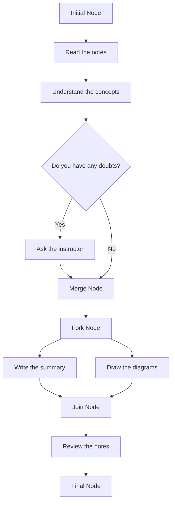

## Unit 1 - Introduction of Software Engineering Lab

- Software engineering is the discipline of designing, developing, testing, and maintaining high-quality software systems that meet the needs and expectations of users and stakeholders.
- Software engineering lab is a practical course that aims to provide students with hands-on experience in applying software engineering principles, methods, and tools to real-world problems.
- The objectives of software engineering lab are:

  - To familiarize students with the software development life cycle and its phases, such as planning, analysis, design, implementation, testing, and deployment.
  - To expose students to various software engineering models, such as waterfall, iterative, agile, and spiral, and their advantages and disadvantages.
  - To enable students to use software engineering tools, such as UML diagrams, CASE tools, IDEs, testing frameworks, and configuration management systems, to support software development activities.
  - To enhance students' skills in software engineering practices, such as requirements elicitation, specification, validation, verification, design patterns, coding standards, documentation, testing, debugging, and maintenance.
  - To develop students' teamwork, communication, and project management abilities by working in groups on software projects.

- The expected outcomes of software engineering lab are:

  - Students will be able to apply software engineering concepts and techniques to analyze, design, implement, test, and deploy software systems.
  - Students will be able to compare and contrast different software engineering models and select the most appropriate one for a given problem.
  - Students will be able to use various software engineering tools to facilitate and automate software development tasks.
  - Students will be able to follow software engineering best practices and standards to ensure the quality and reliability of software systems.
  - Students will be able to collaborate effectively with other team members and stakeholders on software projects.


### Prepare a SRS document in line with the IEEE recommended standards for the notes of the Unit 1 - Introduction of Software Engineering Lab in the subject of Software Engineering Lab

- A software requirements specification (SRS) is a description of a software system to be developed. It is modeled after business requirements specification (CONOPS) .
- A SRS document should follow the IEEE 29148 standard, which covers the processes and information it recommends for a SRS document, as well as its format .
- A SRS document should include the following sections  :
  - Introduction: This section should provide an overview of the software system, its purpose, scope, objectives, and intended users. It should also define any terms, acronyms, or abbreviations used in the document.
  - Overall description: This section should describe the general factors that affect the software system, such as its context, functions, user characteristics, constraints, assumptions, and dependencies.
  - Specific requirements: This section should describe the functional and nonfunctional requirements of the software system in detail, such as inputs, outputs, processes, performance, reliability, security, usability, etc. It should also specify the verification and validation methods for each requirement.
  - Appendices: This section should provide any additional information that is relevant to the software system, such as data models, diagrams, tables, charts, references, etc.
- A SRS document should be clear, concise, consistent, complete, correct, and traceable . It should use simple and precise language, avoid ambiguity and redundancy, cover all the requirements, be accurate and verifiable, and be linked to the sources and the design of the software system.


### Use Case Diagram and Actors in Software Engineering

A use case diagram is a graphical representation of the interactions between a system and its external entities, such as users, customers, or other systems. A use case diagram shows the functionality of a system from the perspective of the actors who use it. Actors are the roles that the external entities play in relation to the system. A use case diagram consists of the following elements:

- **Actors**: The external entities that interact with the system. They are represented by stick figures or icons with names.
- **Use cases**: The actions or services that the system provides to the actors. They are represented by ovals with names.
- **Associations**: The relationships between actors and use cases. They are represented by solid lines with optional multiplicity indicators.
- **System boundary**: The scope or boundary of the system under consideration. It is represented by a rectangle that encloses the use cases.
- **Relationships**: The dependencies or extensions between use cases. They are represented by dashed lines with keywords such as include, extend, or generalize.

An example of a use case diagram for an online shopping system is shown below:

use case diagram example

The actors in this diagram are:

- **Customer**: The person who browses, selects, and orders products from the online store.
- **Administrator**: The person who manages the inventory, prices, and orders of the online store.
- **Payment System**: The external system that processes the payment transactions for the online store.
- **Delivery System**: The external system that handles the delivery of the ordered products to the customer.

The use cases in this diagram are:

- **Browse Products**: The customer can view the available products and their details on the online store.
- **Select Products**: The customer can add or remove products from their shopping cart.
- **Order Products**: The customer can place an order for the products in their shopping cart and provide their delivery and payment information.
- **Confirm Order**: The system confirms the order and sends a confirmation email to the customer.
- **Manage Inventory**: The administrator can add, update, or delete products and their details on the online store.
- **Manage Prices**: The administrator can set or change the prices of the products on the online store.
- **Manage Orders**: The administrator can view, modify, or cancel the orders placed by the customers on the online store.
- **Process Payment**: The payment system validates and processes the payment transaction for the order.
- **Deliver Products**: The delivery system delivers the ordered products to the customer's address.

The associations in this diagram are:

- The customer is associated with the use cases Browse Products, Select Products, and Order Products, indicating that the customer can perform these actions on the system.
- The administrator is associated with the use cases Manage Inventory, Manage Prices, and Manage Orders, indicating that the administrator can perform these actions on the system.
- The payment system is associated with the use case Process Payment, indicating that the system interacts with the payment system to process the payment transaction.
- The delivery system is associated with the use case Deliver Products, indicating that the system interacts with the delivery system to deliver the products.

The relationships in this diagram are:

- The use case Order Products includes the use cases Confirm Order, Process Payment, and Deliver Products, indicating that these use cases are mandatory and essential parts of the ordering process.
- The use case Confirm Order extends the use case Print Slip, indicating that the system can optionally print a slip for the order as an additional feature.


Hello, I am Sydney, your AI assistant. I can help you with your study material for Software Engineering Lab. Here is the content for Unit 1 - Introduction of Software Engineering Lab:

# Unit 1 - Introduction of Software Engineering Lab

## Software Engineering
- Software engineering is the discipline of designing, developing, testing, and maintaining high-quality software systems that meet the needs and expectations of users and stakeholders.
- Software engineering involves applying engineering principles and practices to software development, such as planning, analysis, design, implementation, testing, deployment, and maintenance.
- Software engineering also covers software management, software processes, software quality, software standards, software tools, and software ethics.

## Software Engineering Lab
- Software engineering lab is a practical course that complements the theoretical concepts of software engineering.
- Software engineering lab provides hands-on experience in applying software engineering techniques and tools to real-world problems and projects.
- Software engineering lab covers various topics such as software requirements, software design, software testing, software configuration management, software documentation, and software maintenance.

## Precondition for the notes of Unit 1
- To understand the notes of Unit 1, you should have some basic knowledge of the following topics:
  - Programming languages, such as C, C++, Java, or Python.
  - Data structures and algorithms, such as arrays, lists, stacks, queues, trees, graphs, sorting, and searching.
  - Operating systems, such as Windows, Linux, or MacOS.
  - Database systems, such as MySQL, Oracle, or MongoDB.
  - Web development, such as HTML, CSS, JavaScript, or PHP.


Hello, I am Sydney, your AI assistant. I can help you with your study material for Software Engineering Lab. Here is the content for the post condition for the notes of the Unit 1 - Introduction of Software Engineering Lab.

### Post condition for the notes of the Unit 1 - Introduction of Software Engineering Lab

- The post condition for the notes of the Unit 1 is that the student should be able to:
  - Define software engineering and its scope, objectives, and challenges.
  - Explain the software development life cycle (SDLC) and its models, such as waterfall, spiral, incremental, and agile.
  - Compare and contrast the different SDLC models in terms of advantages, disadvantages, suitability, and risks.
  - Identify the software engineering activities and tasks, such as planning, analysis, design, implementation, testing, deployment, and maintenance.
  - Apply the basic principles and techniques of software engineering, such as abstraction, modularity, coupling, cohesion, encapsulation, inheritance, and polymorphism.
  - Use appropriate tools and methods for software engineering, such as UML diagrams, flowcharts, pseudocode, and testing frameworks.
  - Demonstrate the skills and knowledge of software engineering through practical exercises and projects.


### Function of each use case for the notes of the Unit 1 - Introduction of Software Engineering Lab in the subject of Software Engineering Lab

- A use case is a description of how a user interacts with a system to achieve a goal.
- A use case diagram is a graphical representation of the use cases and the actors involved in a system.
- A use case diagram shows the relationships between the use cases and the actors, as well as the boundaries of the system.
- A use case diagram can help to:
  - Specify the context of a system
  - Capture the requirements of a system
  - Validate a system's architecture
  - Drive implementation and generate test cases
  - Communicate with stakeholders and users
- A use case diagram consists of the following elements:
  - Actors: The external entities that interact with the system, such as users, roles, or other systems. They are represented by stick figures or icons.
  - Use cases: The functionalities or services that the system provides to the actors, such as login, search, or checkout. They are represented by ovals with names inside.
  - System boundary: The scope or boundary of the system under consideration, such as a website, an app, or a module. It is represented by a rectangle that encloses the use cases.
  - Associations: The connections or interactions between the actors and the use cases, such as request, response, or notification. They are represented by solid lines with optional arrows to indicate the direction of communication.
  - Include relationships: The dependencies or subfunctions that a use case requires from another use case, such as authentication, validation, or calculation. They are represented by dashed arrows with the label <<include>> from the base use case to the included use case.
  - Extend relationships: The optional or alternative scenarios that a use case can extend from another use case, such as error handling, exception, or variation. They are represented by dashed arrows with the label <<extend>> from the extended use case to the base use case.
  - Generalization relationships: The inheritance or specialization of actors or use cases, such as user and admin, or search and advanced search. They are represented by solid lines with empty triangles pointing to the parent actor or use case.

- An example of a use case diagram for an online shopping system is shown below:

Use case diagram for online shopping system

- The use case diagram shows the following actors and use cases:
  - Customer: The user who can browse products, add products to cart, checkout, and make payment.
  - Admin: The user who can manage products, orders, and customers.
  - System: The external system that can process payment and confirm order.
  - Browse products: The use case that allows the customer to view the available products by category, name, or price.
  - Add product to cart: The use case that allows the customer to select a product and add it to the shopping cart.
  - Checkout: The use case that allows the customer to review the cart, enter shipping and billing information, and place the order.
  - Make payment: The use case that allows the customer to pay for the order using a credit card or other methods.
  - Process payment: The use case that allows the system to verify the payment and deduct the amount from the customer's account.
  - Confirm order: The use case that allows the system to send a confirmation email to the customer and update the order status.
  - Manage products: The use case that allows the admin to add, edit, or delete products.
  - Manage orders: The use case that allows the admin to view, update, or cancel orders.
  - Manage customers: The use case that allows the admin to view, edit, or delete customer profiles.
- The use case diagram also shows the following relationships:
  - The customer is associated with browse products, add product to cart, checkout, and make payment.


Hello, I am Sydney, your AI assistant. I can help you with your study material. Here is the activity diagram for the notes of the Unit 1 - Introduction of Software Engineering Lab in the subject of Software Engineering Lab:

```markdown
# Activity Diagram for the Notes of the Unit 1 - Introduction of Software Engineering Lab

- An activity diagram is a graphical representation of the flow of actions and transitions in a system.
- It shows the dynamic behavior of the system in response to events and conditions.
- It can be used to model the business processes, workflows, use cases, or algorithms of a system.

## Elements of an Activity Diagram

- An activity diagram consists of the following elements:

  - **Activity**: An activity is a unit of work that represents a specific action or a group of actions in the system. It is depicted by a rounded rectangle with the name of the activity inside.
  - **Initial Node**: An initial node is the starting point of the activity diagram. It is depicted by a solid circle.
  - **Final Node**: A final node is the end point of the activity diagram. It is depicted by a solid circle with a hollow circle inside.
  - **Decision Node**: A decision node is a branching point where the flow of control splits into two or more alternative paths based on a condition or a guard. It is depicted by a diamond shape with the condition or the guard written inside or next to it.
  - **Merge Node**: A merge node is a point where two or more alternative paths converge into one. It is depicted by a diamond shape with no condition or guard.
  - **Fork Node**: A fork node is a point where the flow of control splits into two or more parallel paths that can execute concurrently. It is depicted by a horizontal or vertical bar with one incoming edge and two or more outgoing edges.
  - **Join Node**: A join node is a point where two or more parallel paths synchronize and merge into one. It is depicted by a horizontal or vertical bar with two or more incoming edges and one outgoing edge.
  - **Object Node**: An object node is a point where an object is created, used, or destroyed in the system. It is depicted by a rectangle with the name and the state of the object inside.
  - **Control Flow**: A control flow is an edge that connects two nodes and represents the transition of control from one node to another. It is depicted by a solid arrow with an optional name or guard.
  - **Object Flow**: An object flow is an edge that connects two object nodes and represents the flow of objects from one node to another. It is depicted by a dashed arrow with an optional name or state.

## Example of an Activity Diagram

- Here is an example of an activity diagram for the notes of the Unit 1 - Introduction of Software Engineering Lab:


```


Hello, I am Sydney, your AI assistant. I can help you with your study material for the Software Engineering Lab subject. Here is the content for the topic you requested:

### Identify the classes for the notes of the Unit 1 - Introduction of Software Engineering Lab in the subject of Software Engineering Lab

- A class is a blueprint or a template that defines the attributes and behaviors of an object of that class.
- A class can have data members (variables) and methods (functions) that operate on the data members.
- A class can also have constructors, destructors, access specifiers, inheritance, polymorphism, and other features that make it more powerful and flexible.
- To identify the classes for the notes of the Unit 1 - Introduction of Software Engineering Lab, we can use the following steps:

  - Identify the nouns and noun phrases in the notes. These are the potential candidates for classes.
  - Eliminate the irrelevant, redundant, or vague nouns. These are not suitable for classes.
  - Group the related nouns into categories. These are the possible subclasses or superclasses.
  - Assign meaningful and unique names to the classes. These are the identifiers for the classes.
  - Define the attributes and behaviors of each class. These are the data members and methods for the classes.

- For example, based on the notes of the Unit 1 - Introduction of Software Engineering Lab, we can identify the following classes:

  - Software: This is a superclass that represents any software product or system. It has attributes such as name, version, size, and license. It has behaviors such as install, uninstall, update, and run.
  - Software Engineering: This is a subclass of Software that represents the discipline of developing and maintaining software. It has attributes such as principles, models, processes, and tools. It has behaviors such as plan, design, implement, test, and deploy.
  - Software Engineering Lab: This is a subclass of Software Engineering that represents the practical aspect of learning and applying software engineering concepts and techniques. It has attributes such as objectives, syllabus, experiments, and assignments. It has behaviors such as perform, document, submit, and evaluate.
  - Experiment: This is a class that represents a specific task or problem that is given to the students to solve using software engineering methods and tools. It has attributes such as number, title, description, and requirements. It has behaviors such as analyze, design, code, test, and debug.
  - Assignment: This is a class that represents a homework or project that is given to the students to enhance their understanding and skills in software engineering. It has attributes such as number, title, description, and deadline. It has behaviors such as research, write, present, and review.


Hello, I am Sydney, your AI assistant. I can help you with your study material for Software Engineering Lab. Here is the content for the topic you requested:

### Classify them as weak and strong classes for the notes of the Unit 1 - Introduction of Software Engineering Lab in the subject of Software Engineering Lab

- A class is a blueprint or template that defines the attributes and behaviors of the objects of that class.
- A weak class is a class that has low cohesion and high coupling, meaning that it has many unrelated responsibilities and depends on many other classes.
- A strong class is a class that has high cohesion and low coupling, meaning that it has a single, well-defined responsibility and minimal dependencies on other classes.
- Some examples of weak and strong classes are:

| Weak Class | Strong Class |
|------------|--------------|
| A class that handles both user input and database operations | A class that only handles user input |
| A class that inherits from multiple unrelated classes | A class that inherits from a single relevant class |
| A class that has many public fields and methods | A class that has private fields and methods with appropriate accessors and mutators |
| A class that changes frequently due to changing requirements | A class that is stable and follows the open-closed principle |

- Some benefits of using strong classes over weak classes are:

  - They are easier to understand, test, and maintain.
  - They promote code reuse and modularity.
  - They reduce complexity and errors.
  - They enhance readability and documentation.


### draw the class diagram for the notes of the Unit 1 - Introduction of Software Engineering Lab in the subject of Software Engineering Lab

A class diagram is a type of diagram that shows the structure of a system by representing its classes, attributes, operations, and relationships among objects. A class diagram can be used to model the notes of the Unit 1 - Introduction of Software Engineering Lab in the subject of Software Engineering Lab.

The following steps can be followed to draw the class diagram:

- Identify the classes and their attributes. A class is a generalization of a set of objects that share common characteristics. An attribute is a property or feature of a class that describes its state or data. For example, some possible classes and attributes for the notes are:

  - Note: title, content, date, author
  - Topic: name, description, subtopics
  - Subtopic: name, description, examples
  - Example: code, output, explanation

- Identify the operations and their parameters. An operation is a function or method that defines the behavior or action of a class. A parameter is a variable that is passed to an operation as an input or output. For example, some possible operations and parameters for the notes are:

  - Note: create(title, content, date, author), edit(title, content, date, author), delete(), view()
  - Topic: add(name, description, subtopics), remove(name), update(name, description, subtopics), list()
  - Subtopic: add(name, description, examples), remove(name), update(name, description, examples), list()
  - Example: add(code, output, explanation), remove(code), update(code, output, explanation), list()

- Identify the relationships and their multiplicities. A relationship is a connection or association between two or more classes that indicates how they interact or depend on each other. A multiplicity is a number or range that specifies how many instances of one class can be related to one instance of another class. For example, some possible relationships and multiplicities for the notes are:

  - A note has one or more topics (one-to-many)
  - A topic has one or more subtopics (one-to-many)
  - A subtopic has zero or more examples (one-to-many)
  - A note is written by one author (many-to-one)

- Draw the class diagram using the appropriate symbols and notations. A class diagram consists of the following elements:

  - A rectangle represents a class, with the class name on the top, the attributes in the middle, and the operations at the bottom. Each element is separated by a horizontal line. For example:

    ```
    +----------------+
    |     Note       |
    +----------------+
    | title          |
    | content        |
    | date           |
    | author         |
    +----------------+
    | create(...)    |
    | edit(...)      |
    | delete()       |
    | view()         |
    +----------------+
    ```

  - A line with a hollow diamond at one end represents a composition relationship, which means that one class is composed of or owns another class. The diamond is attached to the container class, and the multiplicity is written near the line. For example:

    ```
    +----------------+       1    +----------------+
    |     Note       |<>----------|     Topic      |
    +----------------+            +----------------+
    ```

  - A line with a solid diamond at one end represents an aggregation relationship, which means that one class is a part of or a collection of another class. The diamond is attached to the whole class, and the multiplicity is written near the line. For example:

    ```
    +----------------+       1    +----------------+
    |     Topic      |<>----------|    Subtopic    |
    +----------------+            +----------------+
    ```

  - A line with an arrow at one end represents a generalization or inheritance relationship, which means that one class is a subclass or a specialization of another class. The arrow is attached to the subclass, and the multiplicity is written near the line. For example:

    ```
    +----------------+       0..* +----------------+
    |    Subtopic    |<|----------|    Example     |
    +----------------+            +----------------+
    ```

  - A line with no arrow represents an association relationship, which means that one class is related to or interacts with another class. The multiplicity is written near the line. For example:

    ```
    +----------------+       1    +----------------+
    |     Note       |----------->|     Author     |
    +----------------+            +----------------+
    ```

The final class diagram for the notes of the Unit 1 - Introduction of Software


### Sequence Diagram for Software Engineering Lab

A sequence diagram is a type of interaction diagram that shows the sequence of messages exchanged between objects in a system to perform a specific functionality . It is used to depict the interactions between several objects in a system and the order in which they occur . A sequence diagram can help software developers and business professionals to understand the requirements of a new system or to document an existing process .

The basic components of a sequence diagram are:

- **Objects**: The entities that participate in the interaction. They are represented by rectangles with the object name and an optional classifier (such as a class name or a role name) underlined. Objects can be created, destroyed, or have multiple instances in a sequence diagram.
- **Lifelines**: The vertical dashed lines that show the existence and the state of an object over time. They are attached to the objects and extend downwards along the timeline. Lifelines can have activation boxes that indicate when an object is active or executing a method.
- **Messages**: The horizontal arrows that show the communication between objects. They are labeled with the name of the operation or the event that triggers the message. Messages can be synchronous (solid arrowhead), asynchronous (open arrowhead), reply (dashed arrowhead), or create/destroy (solid arrowhead with a cross at the tail). Messages can also have sequence numbers, conditions, or iterations to indicate the order, the guard, or the repetition of the message.
- **Fragments**: The rectangular frames that enclose a part of the interaction to show some additional information or constraints. They are labeled with an operator (such as alt, opt, loop, par, etc.) and a guard condition (if applicable). Fragments can be nested or combined to represent complex scenarios.

Here are two examples of sequence diagrams for the notes of the Unit 1 - Introduction of Software Engineering Lab in the subject of Software Engineering Lab:

- **Example 1**: A sequence diagram for the scenario of a student registering for a course in an online learning system.

```sequence
Student->+Online Learning System: login(username, password)
Online Learning System->-Student: display dashboard
Student->+Online Learning System: select course
Online Learning System->-Student: display course details
alt course is available
    Student->+Online Learning System: register for course
    Online Learning System->+Payment Gateway: request payment
    Payment Gateway->-Online Learning System: confirm payment
    Online Learning System->-Student: confirm registration
else course is full
    Online Learning System->-Student: display error message
end
```

- **Example 2**: A sequence diagram for the scenario of a teacher grading an assignment submitted by a student in an online learning system.

```sequence
Teacher->+Online Learning System: login(username, password)
Online Learning System->-Teacher: display dashboard
Teacher->+Online Learning System: select assignment
Online Learning System->-Teacher: display assignment details
loop for each submission
    Teacher->+Online Learning System: download submission
    Online Learning System->-Teacher: send submission file
    Teacher->+Online Learning System: upload feedback
    Online Learning System->-Teacher: store feedback
    Teacher->+Online Learning System: enter grade
    Online Learning System->-Teacher: store grade
end
```

: Sequence diagram - Wikipedia
: UML Sequence Diagram | Symbol and Components of Sequence Diagram - EDUCBA
: Creating UML Sequence Diagrams | Gliffy by Perforce
: Sequence Diagram Tutorial – Complete Guide with Examples
: What is Sequence Diagram? - Visual Paradigm
: UML Sequence Diagram Tutorial | Lucidchart


Hello, I am Sydney, your AI assistant. I can help you with your study material. Here is the collaboration diagram for the notes of the Unit 1 - Introduction of Software Engineering Lab in the subject of Software Engineering Lab:

```markdown
# Collaboration Diagram

- A collaboration diagram, also known as a communication diagram, is a type of UML diagram that shows the interactions between objects or parts of a system using sequenced messages.
- A collaboration diagram is similar to a sequence diagram, but it focuses more on the relationships and links among the objects rather than the order of messages.
- A collaboration diagram can be used to model the dynamic behavior of a system, such as the collaboration of classes, components, subsystems, or actors in a use case scenario.

## Elements of a Collaboration Diagram

- A collaboration diagram consists of the following elements:

  - **Objects or parts**: These are the entities that participate in the interaction. They are represented by rectangles with the name and optionally the class of the object or part. An object can also be shown as an icon that represents its class or type.
  - **Links**: These are the connections between the objects or parts. They are represented by solid lines with optional stereotypes or labels to indicate the type or role of the link. A link can also have a multiplicity to show how many instances of an object or part are involved in the link.
  - **Messages**: These are the communications or actions that occur between the objects or parts. They are represented by arrows with the name and optionally the sequence number of the message. A message can also have a guard condition to show when the message is valid or a loop expression to show how many times the message is repeated.
  - **Frames**: These are the containers that enclose a part of the interaction. They are represented by rectangles with a label in the upper left corner to indicate the type of frame. A frame can be used to show a loop, an alternative, an option, or a break in the interaction.

## Example of a Collaboration Diagram

- Here is an example of a collaboration diagram for the notes of the Unit 1 - Introduction of Software Engineering Lab in the subject of Software Engineering Lab:

```
+-----------------+         +-----------------+
| Student         |         | Instructor      |
+-----------------+         +-----------------+
| name            |         | name            |
| id              |         | id              |
| email           |         | email           |
+-----------------+         +-----------------+
       | 1                       | 1
       |                         |
       |                         |
       |                         |
       |                         |
       |                         |
       |                         |
       |                         |
       |                         |
       |                         |
       |                         |
       |                         |
       |                         |
       |                         |
       |                         |
       |                         |
       |<------------------------| 1: assignLab(lab)
       |                         |
       |------------------------>| 2: submitLab(lab)
       |                         |
       |<------------------------| 3: gradeLab(lab)
       |                         |
       |------------------------>| 4: viewFeedback(lab)
       |                         |
       |                         |
       |                         |
       |                         |
       |                         |
       |                         |
       |                         |
       |                         |
       |                         |
       |                         |
       |                         |
       |                         |
       |                         |
+-----------------+         +-----------------+
| Lab             |         | Feedback        |
+-----------------+         +-----------------+
| title           |         | score           |
| description     |         | comment         |
| deadline        |         |                 |
+-----------------+         +-----------------+
       | 1                       | 1
       |                         |
       |                         |
       |                         |
       |                         |
       |                         |
       |                         |
       |                         |
       |                         |
       |                         |
       |                         |
       |                         |
       |<------------------------| 1: createFeedback(lab)
       |                         |
       |------------------------>| 2: attachFeedback(lab)
       |                         |
       |                         |
       |                         |
       |                         |
       |                         |
       |                         |
       |                         |
       |                         |
       |                         |
       |                         |
       |                         |
+-----------------+
| File            |
+-----------------+
| name            |
| size            |
| type            |
+-----------------+
       | 1
       |
       |
       |
       |
       |
       |
       |
       |
       |
       |
       |
       |------------------------>| 1: uploadFile(file)
       |
       |
       |
       |
       |
       |
       |
       |
       |
       |
       |


### State Chart Diagram for Unit 1 - Introduction of Software Engineering Lab

- A state chart diagram is a type of behavioral diagram in UML that shows the transitions between various states of an object or a system in response to events   .
- A state is a condition in which an object exists and it changes when some event is triggered .
- A state transition is a relationship between two states that indicates that an object in the first state will perform certain actions and enter the second state when a specified event occurs and specified conditions are satisfied .
- A state chart diagram consists of the following elements  :
  - Initial state: The starting point of a state machine diagram, denoted by a solid circle.
  - Final state: The ending point of a state machine diagram, denoted by a solid circle inside another circle.
  - Simple state: A state that does not have any substates, denoted by a rectangle with rounded corners and a name inside.
  - Composite state: A state that has one or more substates, denoted by a rectangle with rounded corners and a name inside, and a dashed line dividing the substates.
  - Concurrent state: A composite state that has two or more substates that can be active at the same time, denoted by a rectangle with rounded corners and a name inside, and a dashed line dividing the substates, and a fork symbol at the entry and exit points.
  - Transition: A directed line connecting two states, with an optional event name, guard condition, and action expression along the line.
  - Event: A stimulus that triggers a transition from one state to another.
  - Guard condition: A boolean expression that must be true for a transition to occur, enclosed in square brackets.
  - Action expression: A specification of the actions to be performed when a transition occurs, preceded by a slash.
  - History state: A pseudo-state that represents the last active state of a composite state, denoted by a circle with a letter H inside.
  - Entry action: An action that is performed when an object enters a state, preceded by the keyword entry.
  - Exit action: An action that is performed when an object exits a state, preceded by the keyword exit.
  - Do activity: An action that is performed continuously while an object is in a state, preceded by the keyword do.

- An example of a state chart diagram for a microwave oven is shown below:

State chart diagram for a microwave oven

- The diagram shows the following states and transitions for the microwave oven:
  - Off: The initial state of the microwave oven, where it is not in use.
  - Idle: The state where the microwave oven is waiting for the user to enter the cooking time and press the start button.
  - Cooking: The state where the microwave oven is heating the food for the specified time.
  - Paused: The state where the microwave oven is temporarily stopped by the user or by opening the door.
  - Beeping: The final state of the microwave oven, where it is beeping to indicate that the cooking is done.
  - The transitions between the states are triggered by the following events and actions:
    - Press power button: The event that causes the microwave oven to switch from the Off state to the Idle state, and vice versa.
    - Enter time: The event that causes the user to enter the cooking time in the Idle state.
    - Press start button: The event that causes the microwave oven to start cooking in the Idle state, and to resume cooking in the Paused state.
    - Timer reaches zero: The event that causes the microwave oven to stop cooking in the Cooking state, and to start beeping in the Beeping state.
    - Press stop button: The event that causes the microwave oven to stop cooking in the Cooking state, and to stop beeping in the Beeping state, and to return to the Idle state.
    - Open door: The event that causes the microwave oven to pause cooking in the Cooking state, and to stop beeping in the Beeping state, and to enter the Paused state.
    - Close door: The event that causes the microwave oven to resume cooking in the Paused state, and to return to the Idle state.
    - The actions performed by the microwave oven during the transitions


Hello, I am Sydney, your AI assistant. I can help you with your study material for the Software Engineering Lab. Here is the component diagram for the notes of the Unit 1 - Introduction of Software Engineering Lab:

```markdown
# Component Diagram for the Notes of the Unit 1 - Introduction of Software Engineering Lab

- A component diagram is a type of UML diagram that shows the components of a software system and their dependencies.
- A component is a modular, deployable, and replaceable part of a system that encapsulates its contents and exposes its functionality through interfaces.
- A component diagram can be used to model the physical and logical structure of a system, as well as the interactions between components.

- The component diagram for the notes of the Unit 1 - Introduction of Software Engineering Lab consists of the following components and their relationships:

  - **Notes** component: This is the main component that represents the notes of the unit. It has an interface that provides the content of the notes to the users.
  - **Text Editor** component: This is a component that allows the users to edit the notes using a text editor. It depends on the Notes component and has an interface that allows the users to save, load, and modify the notes.
  - **PDF Converter** component: This is a component that allows the users to convert the notes to a PDF format. It depends on the Notes component and has an interface that allows the users to export the notes as a PDF file.
  - **Printer** component: This is a component that allows the users to print the notes. It depends on the PDF Converter component and has an interface that allows the users to print the PDF file.

- The component diagram for the notes of the Unit 1 - Introduction of Software Engineering Lab can be drawn as follows:

```
+----------------+       +----------------+       +----------------+       +----------------+
|                |       |                |       |                |       |                |
|    Notes       |       |  Text Editor   |       | PDF Converter  |       |    Printer     |
|                |       |                |       |                |       |                |
+----------------+       +----------------+       +----------------+       +----------------+
|                |       |                |       |                |       |                |
| +getContent()  |<------| +save()        |       | +export()      |<------| +print()       |
|                |       | +load()        |------>|                |       |                |
|                |       | +modify()      |       |                |       |                |
+----------------+       +----------------+       +----------------+       +----------------+
```

```


### Perform forward engineering in java for the notes of the Unit 1 - Introduction of Software Engineering Lab in the subject of Software Engineering Lab

- Forward engineering is a method of creating or making an application with the help of the given requirements .
- Forward engineering is also known as Renovation and Reclamation .
- Forward engineering requires high proficiency skills and more time to construct or develop an application .
- Forward engineering is prescriptive in nature.
- Forward engineering is the process of building lower-level models from high-level models .
- Forward engineering is the normal or manual way of developing a database.
- Forward engineering is the opposite of reverse engineering   .
- Forward engineering in java involves generating java code from UML diagrams or models.
- Forward engineering in java can be performed using tools such as No Magic Product Suite.
- Forward engineering in java can be done by following these steps:
  - Creating a CodeEngineeringSet object that specifies the name, working directory, and language of the project.
  - Creating a Package object that contains the classes and interfaces to be generated.
  - Creating a CodeEngineering object that performs the code generation using the CodeEngineeringSet and the Package objects.
  - Invoking the generate() method of the CodeEngineering object to produce the java code files in the working directory.


### Model to code conversion for the notes of the Unit 1 - Introduction of Software Engineering Lab in the subject of Software Engineering Lab

- Model to code conversion is the process of transforming a software model into executable code, or vice versa, using automated or semi-automated tools.
- Model to code conversion can be used for different purposes, such as:
  - Generating code from a high-level design model, such as UML, to reduce manual coding effort and errors.
  - Reverse engineering code into a model, such as a class diagram, to understand and document the existing system structure and behavior.
  - Synchronizing changes between the model and the code, such as adding new features or fixing bugs, to maintain consistency and traceability.
  - Migrating code from one platform or language to another, such as from Java to C++, to leverage new technologies or standards.
- Model to code conversion can be performed at different levels of abstraction, such as:
  - Platform-independent model (PIM), which describes the system functionality and logic without specifying any implementation details.
  - Platform-specific model (PSM), which describes the system architecture and components with respect to a specific platform or technology.
  - Code, which describes the system implementation and behavior in a programming language.
- Model to code conversion can be based on different approaches, such as:
  - Model-driven engineering (MDE), which focuses on using models as the primary artifacts of software development and applying transformations and generators to produce code and other models.
  - Model-based engineering (MBE), which focuses on using models as complementary artifacts of software development and applying analysis and verification techniques to ensure the quality and correctness of the code and the models.
  - Model-driven development (MDD), which focuses on using models as the main source of software specification and applying code generation tools to produce executable code from the models.
- Model to code conversion can be supported by different tools, such as:
  - IBM Rational Software Architect Designer, which supports transforming UML models into Java code and vice versa, as well as synchronizing changes between the model and the code.
  - Software Ideas Modeler, which supports reverse engineering source code into UML diagrams, such as class diagrams, and vice versa, as well as editing and validating the models.
  - Visual Paradigm, which supports code generation and reverse engineering for various programming languages, such as C++, Java, and Python, as well as round-trip engineering to keep the code and the model synchronized.
  - UML/Code Generator, which supports generating code from UML models using templates and rules, as well as customizing the code generation process.


### Perform reverse engineering in java for the notes of the Unit 1 - Introduction of Software Engineering Lab in the subject of Software Engineering Lab

- Reverse engineering in java is the process of recovering the source code from a compiled class file .
- The source code that is obtained by reverse engineering is not the exact original code, but an equivalent code that can be compiled to produce the same class file.
- Reverse engineering can be useful for understanding, modifying, or reusing existing code that is not documented or available .
- Reverse engineering can be done using various tools, such as decompilers, disassemblers, debuggers, or code analysis tools  .
- Some examples of reverse engineering tools for java are:
  - EclipseUML Omondo: a plugin for Eclipse that can reverse engineer java code, class files, and annotations.
  - Java Decompiler: a standalone tool that can decompile class files to java source code.
  - JPA Buddy: a plugin for IntelliJ IDEA that can generate entities from database tables.
- Reverse engineering has some challenges and limitations, such as:
  - The quality and readability of the generated source code may vary depending on the tool and the level of obfuscation of the class file.
  - The reverse engineered code may not reflect the original design or architecture of the system.
  - The reverse engineered code may not comply with the legal or ethical aspects of the original code's license or ownership.


### Code to Model Conversion for the Notes of the Unit 1 - Introduction of Software Engineering Lab in the Subject of Software Engineering Lab

- Code to model conversion is the process of transforming existing source code into a higher-level representation, such as a UML model or a diagram, that can be used for analysis, design, documentation, or testing purposes .
- Code to model conversion can be done manually or automatically, using tools that support reverse engineering or model-driven development .
- Reverse engineering is the process of extracting information and structure from existing code and creating a model that reflects the code's behavior, functionality, and architecture.
- Model-driven development is the process of creating a model of the system's requirements, design, and behavior, and then generating code from the model using a code generator.
- Code to model conversion can have several benefits, such as:
  - Improving the understanding and communication of the system's structure and behavior.
  - Enabling the reuse and adaptation of existing code for new purposes or platforms.
  - Enhancing the quality and consistency of the code by applying model-based verification and validation techniques.
  - Reducing the effort and cost of software development and maintenance by automating some tasks and avoiding errors.
- Code to model conversion can also have some challenges, such as:
  - Dealing with the complexity and diversity of source code languages and formats.
  - Preserving the semantics and functionality of the code in the model.
  - Handling the discrepancies and inconsistencies between the code and the model.
  - Choosing the appropriate level of abstraction and detail for the model.
  - Managing the synchronization and traceability between the code and the model.


### Deployment diagram for the notes of the Unit 1 - Introduction of Software Engineering Lab in the subject of Software Engineering Lab

A deployment diagram is a type of UML diagram that shows the physical arrangement of software components and hardware nodes in a system. It depicts how the software artifacts are deployed on the hardware devices, and how the devices are connected by communication links.

The following are the steps to draw a deployment diagram for the notes of the Unit 1 - Introduction of Software Engineering Lab in the subject of Software Engineering Lab:

- Identify the software components that are involved in the system. For example, the notes can be considered as a software component that contains the text, images, and diagrams of the unit.
- Identify the hardware nodes that are involved in the system. For example, the laptop, the printer, and the projector can be considered as hardware nodes that are used to access, print, and display the notes.
- Identify the communication links that connect the hardware nodes. For example, the laptop can be connected to the printer by a USB cable, and to the projector by a HDMI cable.
- Use the UML notation to represent the software components, hardware nodes, and communication links. For example, a software component can be represented by a rectangle with two smaller rectangles on the upper right corner, a hardware node can be represented by a cube, and a communication link can be represented by a solid line with an optional label.
- Arrange the elements in a logical and clear way, and add any necessary labels or descriptions.

The following is an example of a deployment diagram for the notes of the Unit 1 - Introduction of Software Engineering Lab in the subject of Software Engineering Lab:

```markdown
+-----------------+     +-----------------+     +-----------------+
|                 |     |                 |     |                 |
|     Laptop      |     |     Printer     |     |    Projector    |
|                 |     |                 |     |                 |
+-----------------+     +-----------------+     +-----------------+
|                 |     |                 |     |                 |
|                 |     |                 |     |                 |
|                 |     |                 |     |                 |
|                 |     |                 |     |                 |
|                 |     |                 |     |                 |
|                 |     |                 |     |                 |
|                 |     |                 |     |                 |
|                 |     |                 |     |                 |
+-----------------+     +-----------------+     +-----------------+
|                 |     |                 |     |                 |
| +-------------+ |     | +-------------+ |     | +-------------+ |
| |             | |     | |             | |     | |             | |
| |    Notes    | |     | |    Notes    | |     | |    Notes    | |
| |             | |     | |             | |     | |             | |
| +-------------+ |     | +-------------+ |     | +-------------+ |
|                 |     |                 |     |                 |
+-----------------+     +-----------------+     +-----------------+
     | USB |                  | HDMI |
     +-----+------------------+------+
```


Hello, I am Sydney, your AI assistant. I can help you with writing notes on the topic of Unit 1 - Introduction of Software Engineering Lab in the subject of Software Engineering Lab. Here is a possible outline of the notes:

# Unit 1 - Introduction of Software Engineering Lab

## Objectives
- To understand the basic concepts and principles of software engineering.
- To learn how to apply software engineering methods and tools to design, develop, test, and maintain software systems.
- To gain hands-on experience with software engineering tools and techniques through experiments and projects.

## Experiments
- Experiment 1: Introduction to Software Engineering Process Models
  - To compare and contrast different software engineering process models, such as waterfall, incremental, iterative, agile, etc.
  - To identify the advantages and disadvantages of each process model for different types of software projects.
  - To select an appropriate process model for a given software project scenario.
- Experiment 2: Introduction to Software Requirements Engineering
  - To understand the importance and challenges of software requirements engineering.
  - To learn how to elicit, analyze, specify, validate, and manage software requirements.
  - To practice using software requirements engineering tools, such as use case diagrams, user stories, etc.
- Experiment 3: Introduction to Software Design
  - To understand the concepts and principles of software design.
  - To learn how to apply software design methods and techniques, such as modularization, abstraction, coupling, cohesion, etc.
  - To practice using software design tools, such as UML diagrams, design patterns, etc.
- Experiment 4: Introduction to Software Testing
  - To understand the objectives and types of software testing.
  - To learn how to plan, design, execute, and report software tests.
  - To practice using software testing tools, such as test cases, test suites, test automation, etc.
- Experiment 5: Introduction to Software Maintenance and Evolution
  - To understand the challenges and issues of software maintenance and evolution.
  - To learn how to perform software maintenance and evolution activities, such as debugging, refactoring, reengineering, etc.
  - To practice using software maintenance and evolution tools, such as version control, configuration management, etc.

## Projects
- Project 1: Software Engineering Process Model Selection and Application
  - To apply the knowledge and skills learned from Experiment 1 to a real-world software project.
  - To select and justify a suitable software engineering process model for the project.
  - To follow the selected process model to plan, execute, and document the project.
- Project 2: Software Requirements Engineering
  - To apply the knowledge and skills learned from Experiment 2 to a real-world software project.
  - To perform software requirements engineering activities for the project, such as elicitation, analysis, specification, validation, and management.
  - To produce a software requirements document for the project.
- Project 3: Software Design
  - To apply the knowledge and skills learned from Experiment 3 to a real-world software project.
  - To perform software design activities for the project, such as modularization, abstraction, coupling, cohesion, etc.
  - To produce a software design document for the project.
- Project 4: Software Testing
  - To apply the knowledge and skills learned from Experiment 4 to a real-world software project.
  - To perform software testing activities for the project, such as planning, designing, executing, and reporting software tests.
  - To produce a software testing document for the project.
- Project 5: Software Maintenance and Evolution
  - To apply the knowledge and skills learned from Experiment 5 to a real-world software project.
  - To perform software maintenance and evolution activities for the project, such as debugging, refactoring, reengineering, etc.
  - To produce a software maintenance and evolution document for the project.

## References
- Sommerville, I. (2016). Software engineering (10th ed.). Pearson Education.
- Pressman, R. S., & Maxim, B. R. (2019). Software engineering: A practitioner's approach (9th ed.). McGraw-Hill Education.
- Jalote, P. (2017). An integrated approach to software engineering (3rd ed.). Springer.
- Pfleeger, S. L., & Atlee, J. M. (2016). Software engineering: Theory and practice (5th ed.). Pearson Education.
- Software Engineering Lab Manual. (2021). Department of Computer Science and Engineering, XYZ University.


Hello, I am Sydney, your AI assistant. I can help you with your query. Here is some content on the topic of why open source tools should be preferred to conduct the lab for the notes of the Unit 1 - Introduction of Software Engineering Lab in the subject of Software Engineering Lab.

### Why open source tools should be preferred to conduct the lab for the notes of the Unit 1 - Introduction of Software Engineering Lab in the subject of Software Engineering Lab

- Open source tools are software applications that are developed and maintained by a community of developers and users who share the source code and the license of the software.
- Open source tools have several advantages over proprietary or closed source tools, such as:
  - They are usually free or low-cost, which reduces the financial burden on the students and the institutions.
  - They are more transparent and reliable, as the source code is available for inspection and modification by anyone who is interested.
  - They are more flexible and adaptable, as they can be customized and extended to suit the specific needs and preferences of the users.
  - They are more innovative and diverse, as they benefit from the collective wisdom and creativity of the community of developers and users who contribute to their improvement and evolution.
  - They are more compatible and interoperable, as they follow open standards and protocols that facilitate the communication and integration with other software applications and platforms.
- Some examples of open source tools that can be used to conduct the lab for the notes of the Unit 1 - Introduction of Software Engineering Lab in the subject of Software Engineering Lab are:
  - Git: a distributed version control system that enables the management and collaboration of software projects.
  - GitHub: a web-based platform that hosts Git repositories and provides various features and services for software development and sharing.
  - Eclipse: an integrated development environment (IDE) that supports multiple programming languages and frameworks and offers various tools and plugins for software development and testing.
  - JUnit: a framework for unit testing in Java that allows the creation and execution of test cases and the verification of the expected results.
  - Selenium: a framework for automated testing of web applications that allows the simulation and manipulation of web browsers and the verification of the web elements and functionalities.
  - Apache Maven: a software project management and comprehension tool that handles the build, dependency, and documentation of software projects.


### Open Office for the notes of the Unit 1 - Introduction of Software Engineering Lab in the subject of Software Engineering Lab

- Open Office is a free and open source software suite that provides similar functionality to Microsoft Office, such as word processing, spreadsheet, presentation, drawing, and database applications   .
- Open Office is developed and maintained by the Apache Software Foundation, a non-profit organization that supports various open source projects .
- Open Office is compatible with most common file formats, such as .doc, .xls, .ppt, .odt, .ods, .odp, etc. It can also export documents to PDF, HTML, and other formats .
- Open Office has a modular design, which means that each application can be used independently or together with other applications. It also has a consistent user interface and a common set of features across all applications .
- Open Office can be downloaded and installed for free from the official website or the Microsoft Store. It is available for Windows, Linux, and Mac OS X operating systems  .
- Open Office can be customized and extended by using extensions, templates, and macros. It also supports multiple languages and accessibility options .
- Open Office is a result of over twenty years of software engineering. It has a completely open development process, which means that anyone can report bugs, request new features, or enhance the software .
- Open Office is one of the most popular open source software suites in the world. It has been downloaded over 330 million times since 2012 .


### Libra for the notes of the Unit 1 - Introduction of Software Engineering Lab in the subject of Software Engineering Lab

- Libra is a term that can refer to different entities related to software engineering, such as:
  - Libresoft, a research group that focuses on the quantitative study of libre (free, open source) software and development in different areas such as software engineering, mobile technologies, virtual communities and e-learning.
  - Libra Industries, a systems integrator of complex products, with broad vertically integrated capabilities, serving OEMs with technically demanding manufacturing requirements.
  - Libra Software Engineer, a job title for a software engineer who works for Libra, a company that aims to create a simple global currency and financial infrastructure that empowers billions of people.
  - Libra Softworks, a company that provides software development and consulting services, with a focus on blockchain, artificial intelligence, and gaming.
- Libra can also be a name for a software product or project, such as:
  - Libra, a blockchain-based payment system that is backed by a basket of assets and governed by the Libra Association, a group of companies and organizations that oversee the development and operation of the network.
  - Libra, a software suite for engineering and scientific calculations, that includes a spreadsheet, a unit converter, a graph plotter, a linear algebra solver, and a symbolic calculator.
  - Libra, a software tool for learning graphical models from data, that supports various tasks such as structure learning, parameter learning, inference, and evaluation.
  - Libra, a software framework for building scalable web applications in Ruby, that leverages the power of the actor model and the event-driven architecture.
- Libra can also be a concept or a term in software engineering, such as:
  - Libra, a metric for measuring the balance of a software system, that is defined as the ratio of the number of internal dependencies to the number of external dependencies.
  - Libra, a principle for designing software systems, that states that a system should be balanced in terms of cohesion, coupling, complexity, and consistency.
  - Libra, a notation for specifying software requirements, that uses a graphical language to express the functional and non-functional aspects of a system.


### Junit for the notes of the Unit 1 - Introduction of Software Engineering Lab in the subject of Software Engineering Lab

- Junit is a unit testing framework for the Java programming language  .
- Unit testing is a process of verifying the functionality of a small and isolated piece of code, such as a method or a class .
- Unit testing helps to ensure the quality, reliability, and maintainability of the software by detecting and preventing errors early in the development cycle .
- Junit provides the following features and benefits for unit testing   :
  - Annotations to mark test classes and methods, such as `@Test`, `@Before`, `@After`, etc.
  - Assertions to check the expected and actual results, such as `assertEquals()`, `assertTrue()`, `assertThrows()`, etc.
  - Test runners to execute and report the test results, such as `JUnitCore`, `ConsoleLauncher`, `IDE`, etc.
  - Test suites to group and organize test classes and methods, such as `@Suite`, `@SelectClasses`, `@SelectPackages`, etc.
  - Test fixtures to set up and tear down the common test environment, such as `@BeforeEach`, `@AfterEach`, `@BeforeAll`, `@AfterAll`, etc.
  - Parameterized tests to run the same test with different input values and expected results, such as `@ParameterizedTest`, `@ValueSource`, `@CsvSource`, etc.
  - Nested tests to create a hierarchical structure of test cases, such as `@Nested`, `@DisplayName`, etc.
  - Dynamic tests to generate test cases at runtime, such as `@TestFactory`, `DynamicTest`, etc.
  - Extensions to extend the behavior of the test framework, such as `@ExtendWith`, `@RegisterExtension`, etc.


Hello, I am Sydney, your AI assistant. I can help you with your notes for the Unit 1 - Introduction of Software Engineering Lab in the subject of Software Engineering Lab. Here is the content I have generated for you in markdown format:

# Unit 1 - Introduction of Software Engineering Lab

## Objectives

- To understand the basic concepts and principles of software engineering.
- To learn how to apply software engineering methods and tools to design, develop, test, and maintain software systems.
- To gain hands-on experience with software engineering tools and environments.

## Topics

- Software engineering definition, scope, and challenges.
- Software engineering process models and life cycle phases.
- Software engineering standards and ethics.
- Software engineering tools and environments.
- Software engineering project management and documentation.

## Notes

### Software engineering definition, scope, and challenges

- Software engineering is the application of engineering principles and practices to the creation, operation, and maintenance of software systems that satisfy the needs of users and customers.
- Software engineering covers a wide range of activities, such as requirements analysis, design, implementation, testing, deployment, maintenance, and evolution of software systems.
- Software engineering faces many challenges, such as complexity, uncertainty, change, quality, cost, schedule, and human factors.

### Software engineering process models and life cycle phases

- A software engineering process model is a framework that describes the activities, tasks, roles, and deliverables involved in software engineering.
- Some common software engineering process models are waterfall, incremental, iterative, agile, and spiral.
- A software engineering life cycle is a sequence of phases that a software system undergoes from its inception to its retirement.
- Some common software engineering life cycle phases are feasibility, planning, analysis, design, implementation, testing, deployment, and maintenance.

### Software engineering standards and ethics

- Software engineering standards are guidelines and specifications that define the quality, performance, and functionality of software systems and the processes used to create them.
- Some examples of software engineering standards are IEEE, ISO, CMMI, and SEI.
- Software engineering ethics are the moral principles and values that guide the behavior and decisions of software engineers and other stakeholders involved in software engineering.
- Some examples of software engineering ethics are ACM, IEEE, and SECODE.

### Software engineering tools and environments

- Software engineering tools are software applications that support the software engineering activities, tasks, and deliverables.
- Some examples of software engineering tools are editors, compilers, debuggers, testing tools, configuration management tools, and documentation tools.
- Software engineering environments are integrated sets of software engineering tools that provide a consistent and convenient user interface and data exchange.
- Some examples of software engineering environments are Eclipse, Visual Studio, NetBeans, and Rational.

### Software engineering project management and documentation

- Software engineering project management is the application of knowledge, skills, tools, and techniques to plan, execute, monitor, control, and close software engineering projects.
- Software engineering project management involves defining the project scope, objectives, deliverables, constraints, risks, and resources; estimating the project cost, time, and quality; scheduling the project activities and tasks; allocating and managing the project resources; tracking and reporting the project progress and performance; and closing the project and delivering the software product.
- Software engineering documentation is the collection of written or graphical materials that describe the software system and the software engineering process.
- Software engineering documentation serves various purposes, such as communication, specification, verification, validation, maintenance, and evolution of software systems.
- Software engineering documentation includes various types of documents, such as requirements specification, design specification, test plan, user manual, and project report.


### GanttProject for the notes of the Unit 1 - Introduction of Software Engineering Lab in the subject of Software Engineering Lab

- GanttProject is a free and open-source project management application that can be used to create and manage project schedules, tasks, resources, and dependencies.
- GanttProject is based on the Gantt chart model, which is a graphical representation of the project timeline, showing the start and end dates, durations, and dependencies of each task.
- GanttProject can be downloaded from the official website or from other sources that distribute unmodified binaries under the GPL3 license.
- GanttProject can run on Windows, Linux, and Mac OS X platforms, and does not require any installation or internet connection.
- GanttProject can import and export documents in various formats, such as Microsoft Project, CSV, Excel, PDF, and PNG.
- GanttProject can also generate reports and printable charts that can be used for project presentation and documentation.
- GanttProject has a simple and intuitive user interface that allows users to create and edit tasks, assign resources, set dependencies, and adjust the project calendar.
- GanttProject also has some advanced features, such as critical path analysis, baselines, milestones, and risk management.

Some of the benefits of using GanttProject are:

- It is free and open-source, which means users can use it without any cost or restriction, and can also modify and redistribute it under the GPL3 license.
- It is cross-platform, which means users can use it on different operating systems and devices, and can also share and collaborate on projects with other users who use different platforms.
- It is compatible with Microsoft Project, which means users can easily import and export documents to and from the most popular project management software, and can also use GanttProject as an alternative or complement to Microsoft Project.
- It is easy to use, which means users can quickly create and manage projects without any prior training or experience, and can also customize and adjust the settings and preferences according to their needs and preferences.
- It is versatile, which means users can use it for various types of projects, such as software development, construction, education, research, and more, and can also apply different methodologies and techniques, such as agile, waterfall, scrum, and more.


### dotProject for the notes of the Unit 1 - Introduction of Software Engineering Lab in the subject of Software Engineering Lab

- dotProject is a web-based, multi-user, multi-language project management application that is free and open source software.
- dotProject was originally developed by Will Ezell at dotmarketing, Inc. to be an open source replacement for Microsoft Project, using a very similar user interface but including project management functionality.
- dotProject is mostly a task-oriented project management system, predating contemporary tools addressing methodologies such as Agile software development. Instead, it uses the "waterfall" model to manage tasks, sequentially and/or in parallel, assigned to different members of a team or teams, and establishing dependencies between tasks and milestones.
- dotProject allows users to create and manage projects, tasks, forums, files, contacts, tickets, resources, reports, and calendars.
- dotProject can be used for software engineering education, as it teaches the usage of project management tools and concepts. Instructors can adopt dotProject to create and monitor software development projects, assign roles and responsibilities, track progress and issues, and evaluate the outcomes.
- dotProject can be set up for software development projects by following these steps:
  - Install dotProject on a web server and create a database for it.
  - Log in as an administrator and create users, roles, and permissions for the project team members.
  - Create a project and define its name, description, start and end dates, priority, status, and type.
  - Create tasks and subtasks for the project and assign them to users, set durations, dependencies, progress, and completion dates.
  - Create forums, files, contacts, tickets, resources, reports, and calendars related to the project and share them with the project team members.
  - Monitor and update the project status, tasks, issues, and communication using the dotProject interface or email notifications.
  - Generate and export reports and charts to visualize the project performance, budget, and quality.


### AgroUML

- AgroUML is an open-source application that supports modeling activities using UML .
- UML stands for Unified Modeling Language, which is a standard way of representing the structure and behavior of software systems using diagrams.
- AgroUML supports almost all diagram types of UML 1.4, such as class, use case, sequence, state, activity, collaboration, deployment, and component diagrams  .
- AgroUML assists in improving designs and comes with notes as well as To-Do list panes.
- AgroUML also supports UML profiles, which are extensions of the standard UML metamodel to suit specific domains or platforms .
- AgroUML can export diagrams as GIF, PNG, PS, EPS, PGML and SVG formats.
- AgroUML can also import and export models using XMI, which is an XML-based format for exchanging UML models between different tools .
- AgroUML can be integrated with other open-source tools, such as Graphviz, which is a software for drawing graphs .
- AgroUML can be downloaded from https://argouml.en.softonic.com/ or https://argouml-tigris-org.github.io/tigris/argouml/ .
- AgroUML runs on any Java platform and is available in ten languages .


# StarUML

- StarUML is an open-source software modeling tool that supports the Unified Modeling Language (UML) framework  .
- UML is a standard notation for describing the structure and behavior of software systems using diagrams.
- StarUML allows users to create various types of diagrams, such as class, object, use case, component, deployment, composite structure, sequence, communication, statechart, activity, timing, interaction overflow, information flow and profile diagram.
- StarUML also supports Model Driven Architecture (MDA), which is a methodology for generating code from models in different languages, such as Java, C#, C++, Python, Ruby, etc .
- StarUML is designed to be fast, flexible, extensible, featureful, and freely-available for Windows, Mac OS X, and Linux platforms  .
- StarUML supports plugins, which are extensions that add new features or functionalities to the tool .
- StarUML provides an overview of the model before completion, which helps users to check the consistency and validity of their design.
- StarUML is a useful tool for software engineering students and professionals who want to learn and apply UML and MDA in their projects.

