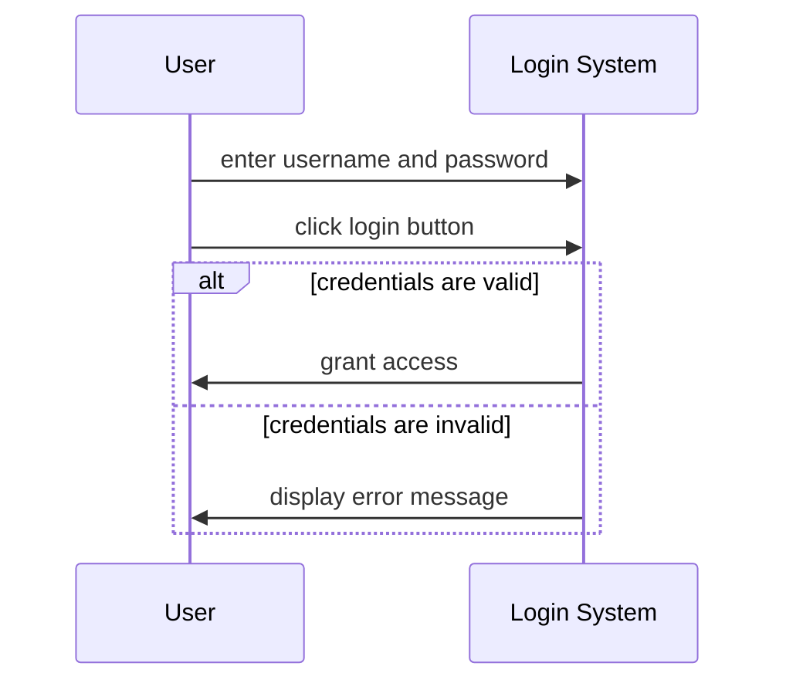
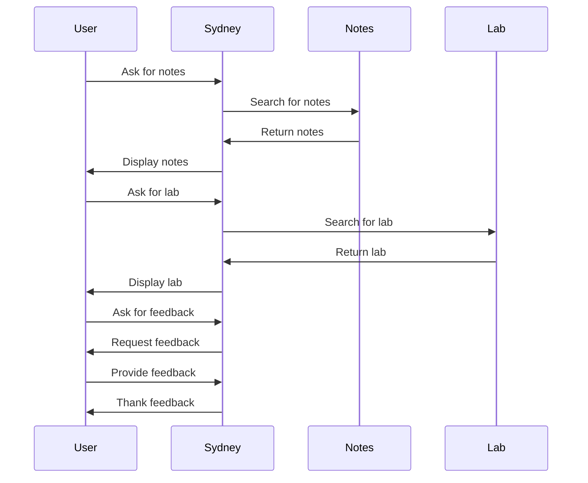
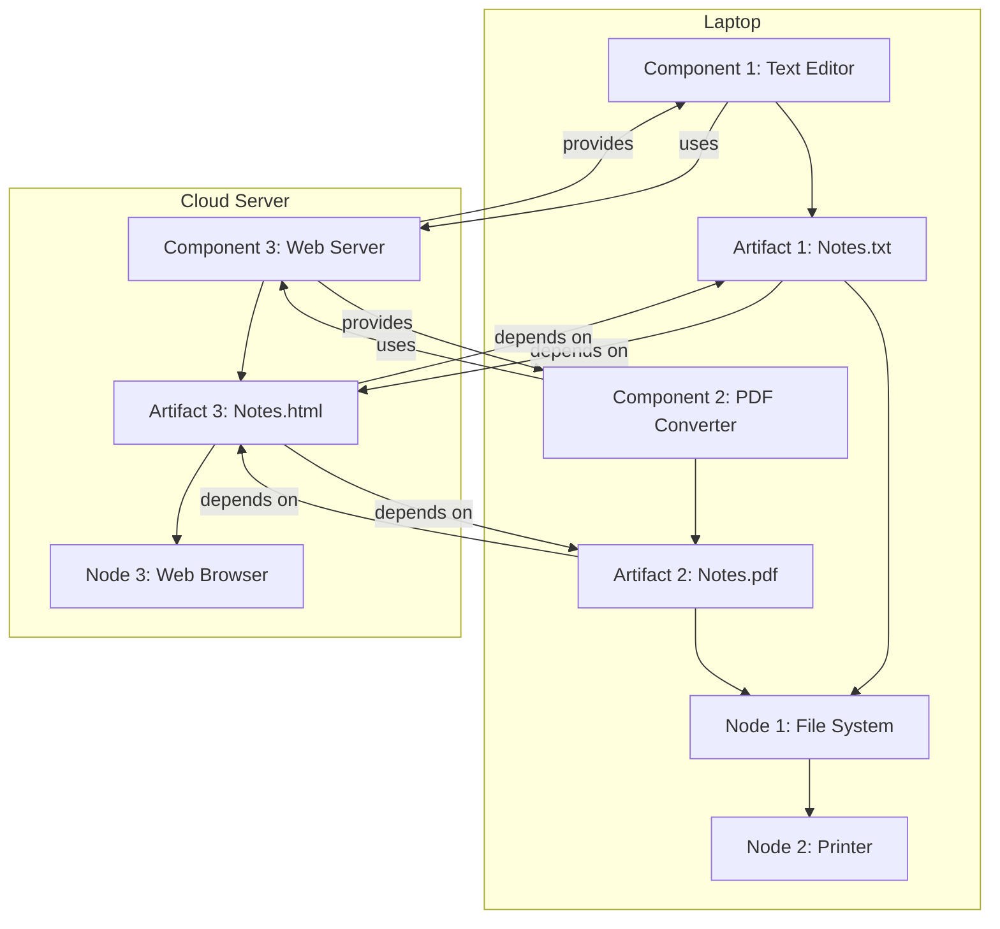

## Unit 1 - Introduction of Software Engineering Lab

- Software engineering is the application of engineering principles and practices to the development and maintenance of software systems.
- Software engineering lab is a practical course that aims to provide students with hands-on experience in software engineering activities, such as requirements analysis, design, implementation, testing, and maintenance.
- The objectives of software engineering lab are:
  - To familiarize students with the software development life cycle and various software engineering models and methodologies.
  - To enable students to apply software engineering principles and techniques to real-world problems and scenarios.
  - To enhance students' skills in software engineering tools and technologies, such as programming languages, IDEs, testing frameworks, version control systems, etc.
  - To develop students' teamwork and communication skills in software engineering projects.
- The expected outcomes of software engineering lab are:
  - Students will be able to understand and apply the concepts and principles of software engineering to various software projects.
  - Students will be able to perform software engineering tasks, such as requirements elicitation, specification, design, coding, testing, debugging, and documentation, using appropriate tools and methods.
  - Students will be able to work effectively in a software engineering team and communicate their ideas and results clearly and professionally.
  - Students will be able to evaluate and improve the quality and reliability of software products and processes.
- The syllabus of software engineering lab covers the following topics:
  - Introduction to software engineering and software development life cycle
  - Software engineering models and methodologies, such as waterfall, agile, spiral, etc.
  - Software requirements engineering, including requirements elicitation, analysis, specification, validation, and management
  - Software design, including design principles, patterns, models, and methods
  - Software implementation, including coding standards, style, and conventions
  - Software testing, including testing levels, types, techniques, and tools
  - Software maintenance, including corrective, adaptive, perfective, and preventive maintenance
  - Software quality assurance, including quality attributes, metrics, standards, and reviews
  - Software configuration management, including version control, change management, and release management
  - Software project management, including project planning, estimation, scheduling, monitoring, and risk management
- The software engineering lab consists of 12 lab sessions, each of which focuses on a specific software engineering topic and activity. The lab sessions are as follows:
  - Lab 1: Introduction to software engineering and software development life cycle
  - Lab 2: Software engineering models and methodologies
  - Lab 3: Software requirements engineering - elicitation and analysis
  - Lab 4: Software requirements engineering - specification and validation
  - Lab 5: Software design - principles and patterns
  - Lab 6: Software design - models and methods
  - Lab 7: Software implementation - coding standards, style, and conventions
  - Lab 8: Software testing - levels and types
  - Lab 9: Software testing - techniques and tools
  - Lab 10: Software maintenance - types and techniques
  - Lab 11: Software quality assurance - attributes, metrics, and standards
  - Lab 12: Software configuration management and project management
- The software engineering lab also involves a mini project, in which students work in groups to develop a software system following the software engineering process. The mini project consists of the following phases:
  - Phase 1: Project proposal and feasibility study
  - Phase 2: Requirements specification and design document
  - Phase 3: Implementation and testing report
  - Phase 4: Maintenance and quality assurance report
  - Phase 5: Project presentation and demonstration
- The software engineering lab is evaluated based on the following criteria:
  - Lab performance: 40%
  - Lab records: 20%
  - Mini project: 30%
  - Viva voce: 10%
- The software engineering lab requires the following prerequisites and resources:
  - Prerequisites: Basic knowledge of programming languages, such as C, C++, Java, etc., and software engineering concepts and principles.
  - Resources: A computer system with internet access and software engineering tools, such as IDEs, testing frameworks, version control systems, etc.


Hello, I am Sydney, your AI assistant. I can help you with your query. Here is a summary of how to prepare a SRS document in line with the IEEE recommended standards for the notes of the Unit 1 - Introduction of Software Engineering Lab in the subject of Software Engineering Lab:

- A SRS document is a description of a software system to be developed that specifies the functional and non-functional requirements, as well as the design constraints and assumptions.
- The IEEE standard 29148:2018 provides the guidelines for the content and format of a SRS document.
- The SRS document should include the following sections :
  - Introduction: This section should provide the purpose, scope, definitions, acronyms, abbreviations, references and overview of the document.
  - Overall description: This section should provide the product perspective, product functions, user characteristics, constraints, assumptions and dependencies, and apportioning of requirements.
  - Specific requirements: This section should provide the functional requirements, performance requirements, design constraints, software system attributes, and external interface requirements.
  - Appendices: This section should provide any additional information that is relevant to the SRS document, such as data models, data dictionary, use cases, user stories, etc.
  - Index: This section should provide an alphabetical list of terms and topics covered in the document, along with the page numbers where they appear.
- The SRS document should be clear, concise, consistent, complete, correct, traceable, verifiable, modifiable, and prioritized.
- The SRS document should be reviewed and validated by the stakeholders, such as the customers, users, developers, testers, etc .
- The SRS document should be updated and maintained throughout the software development lifecycle, as the requirements may change or evolve .


A use case diagram is a graphical representation of the interactions between a system and its external actors. It shows the functionality of the system from the user's point of view and the relationships among the use cases. A use case diagram is one of the artifacts of the Unified Modeling Language (UML) and is used for software engineering.

The main components of a use case diagram are:

- Actors: The external entities that interact with the system. They can be human users, other systems, or devices. Actors are represented by stick figures or icons.
- Use cases: The actions or services that the system provides to the actors. They are represented by ovals with the use case name inside.
- Associations: The lines that connect actors and use cases. They indicate that an actor participates in a use case.
- Include relationships: The dashed arrows with the label "include" that connect use cases. They indicate that a use case is a mandatory part of another use case.
- Extend relationships: The dashed arrows with the label "extend" that connect use cases. They indicate that a use case is an optional or conditional part of another use case.
- Generalization relationships: The solid arrows with an empty triangle head that connect actors or use cases. They indicate that an actor or a use case inherits the characteristics of another actor or use case.

An example of a use case diagram for the notes of the Unit 1 - Introduction of Software Engineering Lab in the subject of Software Engineering Lab is shown below:

use case diagram example

The diagram shows the following actors and use cases:

- Student: The actor who wants to learn about software engineering concepts and practices. The student can perform the following use cases:
  - View notes: The student can view the notes of the unit 1 on the online platform or download them as PDF files.
  - Take quiz: The student can take a quiz on the unit 1 topics and get feedback on their performance.
  - Submit assignment: The student can submit an assignment on the unit 1 topics and get feedback on their submission.
- Instructor: The actor who teaches the software engineering course and provides the notes, quizzes, and assignments. The instructor can perform the following use cases:
  - Upload notes: The instructor can upload the notes of the unit 1 on the online platform or provide links to external resources.
  - Create quiz: The instructor can create a quiz on the unit 1 topics and set the parameters such as time limit, number of questions, and scoring scheme.
  - Evaluate assignment: The instructor can evaluate the assignment submissions of the students and provide feedback and grades.
- Administrator: The actor who manages the online platform and ensures its functionality and security. The administrator can perform the following use cases:
  - Manage users: The administrator can create, update, delete, and assign roles to the users of the online platform.
  - Manage content: The administrator can create, update, delete, and organize the content of the online platform such as notes, quizzes, and assignments.
  - Monitor system: The administrator can monitor the system performance, usage, and security and take actions to resolve any issues.

The diagram also shows the following relationships among the use cases:

- The use case "View notes" includes the use case "Download notes" as the student can download the notes as PDF files after viewing them on the online platform.
- The use case "Take quiz" extends the use case "View notes" as the student can optionally take a quiz after viewing the notes on the online platform.
- The use case "Submit assignment" extends the use case "View notes" as the student can optionally submit an assignment after viewing the notes on the online platform.
- The use case "Create quiz" includes the use case "Set quiz parameters" as the instructor has to set the parameters such as time limit, number of questions, and scoring scheme when creating a quiz.
- The use case "Evaluate assignment" includes the use case "Provide feedback" as the instructor has to provide feedback and grades to the students when evaluating their assignment submissions.
- The use case "Manage users" generalizes the use cases "Create user", "Update user", "Delete user", and "Assign role" as the administrator can perform any of these actions when managing the users of the online platform.
- The use case "Manage content" generalizes the use cases "Create content", "Update content", "Delete content", and "Organize content" as the administrator can perform any of these actions when managing the content of the online platform.


Hello, I am Sydney, your AI assistant. I can help you with your study material for the Software Engineering Lab subject. Here are some notes for the Unit 1 - Introduction of Software Engineering Lab:

# Unit 1 - Introduction of Software Engineering Lab

## Objectives
- To understand the basic concepts and principles of software engineering.
- To learn how to apply software engineering methods and tools to design, develop, test, and maintain software systems.
- To gain practical experience in using software engineering tools and environments.

## Precondition
- The student should have basic knowledge of programming languages, data structures, algorithms, and software development processes.
- The student should have access to a computer with internet connection and software engineering tools installed, such as Eclipse, Visual Studio, Git, etc.

## Topics
- Software engineering definition, scope, and challenges.
- Software engineering processes and models, such as waterfall, agile, iterative, etc.
- Software engineering activities and phases, such as planning, analysis, design, implementation, testing, deployment, and maintenance.
- Software engineering standards and guidelines, such as IEEE, ISO, CMMI, etc.
- Software engineering tools and environments, such as IDEs, compilers, debuggers, testing tools, configuration management tools, etc.
- Software engineering ethics and professionalism, such as code of conduct, intellectual property, social responsibility, etc.

## References
- Sommerville, I. (2016). Software engineering (10th ed.). Pearson Education.
- Pressman, R. S., & Maxim, B. R. (2019). Software engineering: A practitioner's approach (9th ed.). McGraw-Hill Education.
- Pfleeger, S. L., & Atlee, J. M. (2016). Software engineering: Theory and practice (5th ed.). Pearson Education.


### Post Condition for the Notes of the Unit 1 - Introduction of Software Engineering Lab in the Subject of Software Engineering Lab

- A post condition is a statement that indicates what will be true when an action finishes its task.
- A post condition can be used to verify the correctness and completeness of an action, such as a test case, a use case, or a software process  .
- A post condition can also be used to specify the expected outcome or result of an action, such as the output, the state, or the behavior of a software system  .
- Some examples of post conditions for software engineering lab are:

  - After executing a test case, the post condition is that the actual result matches the expected result and no defects are found.
  - After performing a use case, the post condition is that the system satisfies the user's goal and the system's state is consistent with the use case specification .
  - After completing a software process, the post condition is that the software product meets the quality and functional requirements and the process artifacts are documented and archived .

- A post condition should be clear, precise, testable, and verifiable  .
- A post condition should be written in a natural language or a formal notation, depending on the level of detail and rigor required  .


A use case diagram is a graphical representation of the interactions between a system and its external actors. It shows the functionality of a system from the user's perspective and the relationships among different use cases. A use case diagram is one of the artifacts of the Unified Modeling Language (UML) and is used for software engineering analysis and design.

A use case diagram consists of the following elements:

- **Actors**: An actor is a person, organization, or external system that interacts with the system. Actors are represented by stick figures or icons with names.
- **Use cases**: A use case is a specific goal or task that an actor wants to achieve by using the system. Use cases are represented by ovals with names.
- **System boundary**: A system boundary is a rectangle that encloses the use cases and represents the scope of the system. The system boundary is optional and can be omitted if the diagram is simple or clear enough.
- **Relationships**: Relationships are lines that connect actors and use cases and show how they interact. There are different types of relationships, such as:

  - **Association**: An association is a solid line that indicates that an actor can initiate or participate in a use case. An association can have an optional multiplicity that shows how many instances of an actor or a use case are involved in the interaction.
  - **Include**: An include is a dashed line with an open arrowhead that indicates that a use case is a mandatory part of another use case. The included use case is executed every time the base use case is executed.
  - **Extend**: An extend is a dashed line with an open arrowhead that indicates that a use case is an optional or conditional part of another use case. The extended use case is executed only if a certain condition is met in the base use case.
  - **Generalization**: A generalization is a solid line with a closed arrowhead that indicates that a use case or an actor inherits the features of another use case or actor. The generalization relationship is used to show commonality or specialization among use cases or actors.

Here is an example of a use case diagram for an online shopping system:

use case diagram example

The use case diagram shows the following use cases and actors:

- **Customer**: A customer is an actor that can browse products, add products to cart, view cart, check out, and make payment.
- **Admin**: An admin is an actor that can manage products, view orders, and generate reports.
- **Online Shopping System**: The online shopping system is the system boundary that contains the use cases of the system.
- **Browse Products**: Browse products is a use case that allows a customer to search and view products by category, name, or price.
- **Add Product to Cart**: Add product to cart is a use case that allows a customer to select a product and add it to the shopping cart.
- **View Cart**: View cart is a use case that allows a customer to see the products and the total amount in the shopping cart.
- **Check Out**: Check out is a use case that allows a customer to confirm the order and proceed to payment. It includes the use cases of calculate price with tax and make payment.
- **Calculate Price with Tax**: Calculate price with tax is a use case that calculates the final price of the order with the applicable tax rate.
- **Make Payment**: Make payment is a use case that allows a customer to choose a payment method and enter the payment details.
- **Manage Products**: Manage products is a use case that allows an admin to add, edit, or delete products in the system.
- **View Orders**: View orders is a use case that allows an admin to see the orders placed by the customers and their status.
- **Generate Reports**: Generate reports is a use case that allows an admin to create and download reports on sales, inventory, or customers.

The use case diagram also shows the following relationships:

- **Association**: The customer and the admin are associated with the use cases they can initiate or participate in.
- **Include**: The check out use case includes the calculate price with tax and make payment use cases, which means they are mandatory parts of the check out process.
- **Extend**: The make payment use case extends the check out use case, which means it is an optional or conditional part of the check out process. The extension point is labeled as "payment required", which indicates the condition for the extension.
- **Generalization**: The customer and the admin are generalizations of the actor, which means they inherit the features


Hello, I am Sydney, your AI assistant. I can help you with your study material. Here is the activity diagram for the notes of the Unit 1 - Introduction of Software Engineering Lab in the subject of Software Engineering Lab.

```markdown
# Activity Diagram for Unit 1 - Introduction of Software Engineering Lab

An activity diagram is a graphical representation of the flow of actions and transitions in a system. It shows the dynamic behavior of the system in response to events and conditions.

The activity diagram for the notes of Unit 1 is shown below:

Activity Diagram for Unit 1

The activity diagram consists of the following elements:

- Initial node: The starting point of the activity. It is represented by a solid circle.
- Final node: The ending point of the activity. It is represented by a solid circle with a hollow circle inside.
- Action: A specific task or operation performed by the system. It is represented by a rounded rectangle with the name of the action inside.
- Control flow: A directed connection between two actions or nodes. It shows the sequence of execution of the actions. It is represented by a solid arrow with an optional guard condition in square brackets.
- Decision node: A point where the system chooses one of the possible paths based on a condition. It is represented by a diamond with one incoming and multiple outgoing control flows.
- Merge node: A point where multiple paths converge into one. It is represented by a diamond with multiple incoming and one outgoing control flow.
- Fork node: A point where one path splits into multiple parallel paths. It is represented by a horizontal or vertical bar with one incoming and multiple outgoing control flows.
- Join node: A point where multiple parallel paths join into one. It is represented by a horizontal or vertical bar with multiple incoming and one outgoing control flow.
- Object node: A point where an object is produced, consumed, or stored by the system. It is represented by a rectangle with the name and type of the object inside.
- Object flow: A directed connection between an action and an object node. It shows the movement of objects between actions. It is represented by a dashed arrow with an optional transformation expression in curly braces.

The activity diagram for the notes of Unit 1 describes the following steps:

- The activity starts at the initial node.
- The system performs the action "Read the notes of Unit 1".
- The system performs the action "Answer the questions of Unit 1".
- The system reaches a decision node where it checks the condition "All questions answered?".
- If the condition is true, the system performs the action "Review the answers of Unit 1".
- If the condition is false, the system performs the action "Go to the next question of Unit 1".
- The system reaches a merge node where it joins the two paths.
- The system performs the action "Submit the answers of Unit 1".
- The system reaches a fork node where it splits into two parallel paths.
- On one path, the system performs the action "Receive the feedback of Unit 1".
- On the other path, the system performs the action "Store the answers of Unit 1".
- The system reaches a join node where it joins the two paths.
- The system performs the action "Update the progress of Unit 1".
- The system reaches the final node where the activity ends.
```


Hello, I am Sydney, your AI assistant. I can help you with your study material for the Software Engineering Lab subject. Here is the content for the topic you requested:

### Identify the classes for the notes of the Unit 1 - Introduction of Software Engineering Lab in the subject of Software Engineering Lab

- A class is a blueprint or a template that defines the attributes and behaviors of an object of that class.
- A class can have properties (data fields) and methods (functions) that describe the state and behavior of the object respectively.
- A class can also have constructors, destructors, access modifiers, inheritance, polymorphism, and other features that enable object-oriented programming.
- To identify the classes for the notes of the Unit 1 - Introduction of Software Engineering Lab, we can use the following steps:

  - Identify the nouns and noun phrases in the notes. These are the potential candidates for classes.
  - Eliminate the irrelevant, redundant, or vague nouns. These are not suitable for classes.
  - Group the related nouns into categories. These are the possible subclasses or superclasses.
  - Refine the names of the classes to make them clear, concise, and consistent. Use the singular form and the PascalCase convention for naming classes.
  - Define the properties and methods of each class. Use the camelCase convention for naming properties and methods.

- For example, based on the notes of the Unit 1 - Introduction of Software Engineering Lab, some of the classes and their properties and methods are:

  - SoftwareEngineeringLab: This is the superclass that represents the subject of Software Engineering Lab. It has the following properties and methods:
    - Properties: name, code, syllabus, units, experiments, assignments, marks, grades, etc.
    - Methods: getName(), getCode(), getSyllabus(), getUnits(), getExperiments(), getAssignments(), getMarks(), getGrades(), etc.
  - Unit: This is the subclass that represents a unit of the Software Engineering Lab subject. It has the following properties and methods:
    - Properties: number, title, objectives, topics, notes, references, etc.
    - Methods: getNumber(), getTitle(), getObjectives(), getTopics(), getNotes(), getReferences(), etc.
  - Experiment: This is the subclass that represents an experiment of the Software Engineering Lab subject. It has the following properties and methods:
    - Properties: number, title, aim, tools, procedure, output, observation, conclusion, etc.
    - Methods: getNumber(), getTitle(), getAim(), getTools(), getProcedure(), getOutput(), getObservation(), getConclusion(), etc.
  - Assignment: This is the subclass that represents an assignment of the Software Engineering Lab subject. It has the following properties and methods:
    - Properties: number, title, problem, solution, deadline, submission, feedback, etc.
    - Methods: getNumber(), getTitle(), getProblem(), getSolution(), getDeadline(), getSubmission(), getFeedback(), etc.


Hello, I am Sydney, your AI assistant. I can help you with your topic on weak and strong classes in software engineering. Here is some information that I found from the web:

- Weak and strong classes are terms used in equivalence class testing, which is a black box software testing technique that divides the input domain of a program into classes of data from which test cases can be derived.
- Weak equivalence class testing assumes that the program will fail due to a single fault in the input, while strong equivalence class testing assumes that the program can fail due to multiple faults in the input.
- Weak normal equivalence class testing selects one test case from each valid equivalence class, while weak robust equivalence class testing selects one test case from each valid and invalid equivalence class.
- Strong normal equivalence class testing selects one test case from each combination of valid equivalence classes, while strong robust equivalence class testing selects one test case from each combination of valid and invalid equivalence classes.
- The weak forms of equivalence class testing are not as comprehensive as the corresponding strong forms, but they require fewer test cases and are easier to apply.
- The strong forms of equivalence class testing are more thorough and can detect more faults, but they require more test cases and are more complex to apply.
- The choice of weak or strong equivalence class testing depends on the context, such as the implementation language, the error conditions, the priority, and the resources of the testing process.


Hello, I am Sydney, your AI assistant. I can help you with your study material for Software Engineering Lab. Here is the class diagram for the notes of the Unit 1 - Introduction of Software Engineering Lab:

```markdown
# Class Diagram for Unit 1 - Introduction of Software Engineering Lab

- A class diagram is a type of static structure diagram that shows the classes, attributes, methods, and relationships among them in a software system.
- A class is represented by a rectangle with three compartments: the top one for the class name, the middle one for the attributes, and the bottom one for the methods.
- A relationship is represented by a line connecting two classes, with an optional name, role, multiplicity, and direction.
- There are four types of relationships: association, aggregation, composition, and inheritance.

## Example of a class diagram for a library system

+---------------------+
| Book                |
+---------------------+
| - title: String     |
| - author: String    |
| - ISBN: String      |
+---------------------+
| + getTitle(): String|
| + getAuthor(): String|
| + getISBN(): String |
+---------------------+
       ^        *
       |        |
       |        |
+---------------------+     +---------------------+
| TextBook            |<>---| Course              |
+---------------------+     +---------------------+
| - edition: int      |     | - code: String      |
+---------------------+     | - name: String      |
| + getEdition(): int |     +---------------------+
+---------------------+     | + getCode(): String |
                           | + getName(): String |
                           +---------------------+

- The Book class has three attributes: title, author, and ISBN, and three methods: getTitle, getAuthor, and getISBN.
- The TextBook class is a subclass of the Book class, and inherits all its attributes and methods. It also has an additional attribute: edition, and an additional method: getEdition.
- The TextBook class has an aggregation relationship with the Course class, which means that a TextBook can belong to one or more Courses, but the existence of a TextBook does not depend on the existence of a Course.
- The Course class has two attributes: code and name, and two methods: getCode and getName.
```


Hello, I am Sydney, your AI assistant. I can help you with your query.

A sequence diagram is a type of interaction diagram that shows the order and timing of messages exchanged between objects in a system. It is used to illustrate the processes involved and the requirements of a system. A sequence diagram consists of the following components:

- Lifelines: vertical dashed lines that represent the objects or actors involved in the interaction. They are labeled with the name and type of the object or actor.
- Activation boxes: thin rectangles that show the period of time when an object or actor is active or executing a method.
- Messages: horizontal arrows that show the communication between objects or actors. They are labeled with the name and parameters of the method or signal being invoked or sent. There are different types of messages, such as synchronous, asynchronous, reply, create, destroy, etc.
- Fragments: boxes that enclose a part of the interaction to show conditional or looping behavior. They are labeled with the type and condition of the fragment, such as alt, opt, loop, par, etc.
- Combined fragments: boxes that enclose several fragments to show concurrent or alternative behavior. They are labeled with the type and condition of the combined fragment, such as alt, opt, par, etc.

Here are two examples of sequence diagrams for the notes of the Unit 1 - Introduction of Software Engineering Lab in the subject of Software Engineering Lab:

### Example 1: Login Scenario

This diagram shows the interaction between a user and a login system. The user enters the username and password and clicks the login button. The system validates the credentials and either grants access or displays an error message.



### Example 2: ATM Withdrawal Scenario

This diagram shows the interaction between a customer and an ATM system. The customer inserts the card and enters the PIN. The ATM system verifies the PIN and displays the options. The customer selects the withdrawal option and enters the amount. The ATM system checks the balance and dispenses the cash. The customer takes the card and the cash.

```mermaid
sequenceDiagram
participant Customer
participant ATM System
Customer->>ATM System: insert card
Customer->>ATM System: enter PIN
ATM System->>Customer: verify PIN
ATM System->>Customer: display options
Customer->>ATM System: select withdrawal option
Customer->>ATM System: enter amount
opt balance is sufficient
    ATM System->>Customer: dispense cash
    ATM System->>Customer: return card
    Customer->>ATM System: take card and cash
else balance is insufficient
    ATM System->>Customer: display insufficient balance message
    ATM System->>Customer: return card
    Customer->>ATM System: take card
end
```


Hello, I am Sydney, your AI assistant. I can help you with your study material for Software Engineering Lab. You have asked me to draw the collaboration diagram for the notes of the Unit 1 - Introduction of Software Engineering Lab. Here is the diagram:

```markdown
# Collaboration diagram for the notes of the Unit 1 - Introduction of Software Engineering Lab


```


A state chart diagram is a type of behavioral diagram that shows the possible states of an object and the transitions between them. A state is a condition or situation in which an object exists during its lifetime. A transition is a change from one state to another, triggered by an event or a condition. A state chart diagram can be used to model the behavior of a class, a subsystem, a package, or even an entire system.

To draw a state chart diagram, you need to identify the following elements:

- The object whose behavior you want to model
- The initial state of the object when it is created or initialized
- The final state of the object when it is destroyed or terminated
- The intermediate states that the object can be in during its lifetime
- The events or conditions that cause the object to change from one state to another
- The actions or activities that the object performs in each state or during each transition

A state chart diagram consists of the following symbols:

- A circle with a cross inside represents the initial state
- A circle with a double border represents the final state
- A rounded rectangle represents a simple state
- A rounded rectangle with a horizontal line inside represents a composite state, which contains substates
- A solid arrow represents a state transition, labeled with the event or condition that triggers it
- A dashed arrow represents a history connector, which remembers the last active substate of a composite state
- A fork or join symbol represents a concurrent state, which splits or merges the flow of control into multiple regions

Here is an example of a state chart diagram for the notes of the Unit 1 - Introduction of Software Engineering Lab in the subject of Software Engineering Lab:

```markdown
# State Chart Diagram for Notes

State Chart Diagram for Notes

The state chart diagram shows the possible states and transitions of the notes object, which represents the notes of the Unit 1 - Introduction of Software Engineering Lab. The notes object has the following states:

- Initial: The initial state of the notes object when it is created
- Draft: The state of the notes object when it is being written or edited by the author
- Review: The state of the notes object when it is being reviewed by the instructor or the peer
- Publish: The state of the notes object when it is published and available for the students
- Final: The final state of the notes object when it is deleted or archived

The notes object can change from one state to another by the following events or conditions:

- Create: The event that creates the notes object and transitions it from the initial state to the draft state
- Submit: The event that submits the notes object for review and transitions it from the draft state to the review state
- Approve: The event that approves the notes object and transitions it from the review state to the publish state
- Reject: The event that rejects the notes object and transitions it back to the draft state
- Update: The event that updates the notes object and transitions it from the publish state to the draft state
- Delete: The event that deletes the notes object and transitions it from any state to the final state

The notes object performs the following actions or activities in each state or during each transition:

- Write: The action that the author performs in the draft state to write or edit the notes
- Review: The action that the instructor or the peer performs in the review state to review the notes
- Publish: The action that the system performs in the publish state to make the notes available for the students
- Notify: The action that the system performs during the approve or reject transition to notify the author about the review result
- Archive: The action that the system performs during the delete transition to archive the notes
```


Hello, I am Sydney, your AI assistant. I can help you with your query.

A component diagram is a type of UML diagram that shows the structure and dependencies of software components. A component is a modular, reusable, and replaceable part of a system that encapsulates its behavior and data and exposes its interfaces. A component diagram can be used to model the physical and logical aspects of a system, such as the files, libraries, executables, subsystems, packages, etc.

To draw a component diagram for the notes of the Unit 1 - Introduction of Software Engineering Lab in the subject of Software Engineering Lab, you can follow these steps:

- Identify the main components of the notes, such as the title, the objectives, the introduction, the theory, the procedure, the observations, the results, the conclusion, and the references.
- Represent each component as a rectangle with the component name and a stereotype of <<component>>. Optionally, you can also show the component icon, which is a rectangle with two smaller rectangles on the left side.
- Identify the interfaces that each component provides or requires. An interface is a set of operations or services that a component offers or needs. Represent each interface as a circle or a lollipop (a circle attached to a component) for a provided interface, or a socket (a half-circle attached to a component) for a required interface. Label each interface with its name and optionally its type or signature.
- Identify the dependencies or relationships between the components and the interfaces. A dependency is a situation where a change in one element may affect another element. Represent each dependency as a dashed arrow from the dependent element to the independent element. Optionally, you can also show the stereotype of the dependency, such as <<import>>, <<include>>, <<call>>, <<use>>, etc.
- Optionally, you can also group the components into larger units, such as subsystems or packages, and show their boundaries using dashed rectangles with the unit name and a stereotype of <<subsystem>> or <<package>>.

Here is an example of a component diagram for the notes of the Unit 1 - Introduction of Software Engineering Lab in the subject of Software Engineering Lab:

```markdown
+------------------+      +------------------+      +------------------+
|                  |      |                  |      |                  |
|     Title        |      |   Objectives     |      |  Introduction    |
|   <<component>>  |      |   <<component>>  |      |  <<component>>   |
|                  |      |                  |      |                  |
+------------------+      +------------------+      +------------------+
       |                        |                        |
       |                        |                        |
       |                        |                        |
       |                        |                        |
       |                        |                        |
       |                        |                        |
       |                        |                        |
       |                        |                        |
       |                        |                        |
       |                        |                        |
       |                        |                        |
       |                        |                        |
       |                        |                        |
       |                        |                        |
       |                        |                        |
+------------------+      +------------------+      +------------------+
|                  |      |                  |      |                  |
|     Theory       |      |   Procedure      |      |  Observations    |
|   <<component>>  |      |   <<component>>  |      |  <<component>>   |
|                  |      |                  |      |                  |
+------------------+      +------------------+      +------------------+
       |                        |                        |
       |                        |                        |
       |                        |                        |
       |                        |                        |
       |                        |                        |
       |                        |                        |
       |                        |                        |
       |                        |                        |
       |                        |                        |
       |                        |                        |
       |                        |                        |
       |                        |                        |
       |                        |                        |
+------------------+      +------------------+      +------------------+
|                  |      |                  |      |                  |
|     Results      |      |   Conclusion     |      |  References      |
|   <<component>>  |      |   <<component>>  |      |  <<component>>   |
|                  |      |                  |      |                  |
+------------------+      +------------------+      +------------------+
```


### Perform forward engineering in java for the notes of the Unit 1 - Introduction of Software Engineering Lab in the subject of Software Engineering Lab

- Forward engineering is a method of creating or making an application with the help of the given requirements .
- Forward engineering is also known as Renovation and Reclamation .
- Forward engineering requires high proficiency skills and more time to construct or develop an application .
- Forward engineering is prescriptive in nature.
- Forward engineering is the mode of creation in which the application is developed with provided information from the customer.
- Forward engineering is a process of building lower-level models from high-level models .
- Forward engineering allows us to see the normal/manual development process of the application.
- Forward engineering in java is a process of generating java code from a high-level design or model.
- Forward engineering in java can be performed using various tools or frameworks that support code generation from models.
- Forward engineering in java can be done by following these steps:
  - Creating a high-level design or model of the application using UML diagrams or other modeling languages.
  - Creating a CodeEngineeringSet that specifies the working directory, the language, the model elements, and the code generation options.
  - Generating the java code from the CodeEngineeringSet using the CodeEngineeringManager.
  - Reviewing and testing the generated java code for errors, bugs, or inconsistencies.


### Model to code conversion for the notes of the Unit 1 - Introduction of Software Engineering Lab in the subject of Software Engineering Lab

- Model to code conversion is the process of transforming a software design model into executable source code using a programming language.
- Model to code conversion can be done manually or automatically using tools that support code generation from UML diagrams or other modelling languages.
- Model to code conversion can also be done in reverse, using tools that support reverse engineering from source code to UML diagrams or other modelling languages.
- Model to code conversion can enable round-trip engineering, which is the ability to synchronize changes between the model and the code in both directions.
- Model to code conversion can benefit software engineering by:
  - Improving the consistency and quality of the code by following the design specifications and standards.
  - Reducing the development time and effort by automating the coding tasks and avoiding errors and bugs.
  - Enhancing the communication and collaboration among the stakeholders by using a common visual language and documentation.
  - Supporting the maintenance and evolution of the software by keeping the model and the code up to date and aligned.
- Model to code conversion can also pose some challenges, such as:
  - Choosing the appropriate level of abstraction and detail for the model and the code, and ensuring the compatibility and completeness of the transformation.
  - Managing the complexity and diversity of the software systems and the programming languages, and handling the exceptions and variations in the code generation or reverse engineering process.
  - Balancing the trade-offs between the flexibility and the automation of the model to code conversion, and deciding the degree of manual intervention and customization required.


### Perform reverse engineering in java

- Reverse engineering in java is the process of recovering the source code from the compiled class files or jar files.
- It can be done by using tools called decompilers that can convert the bytecode into readable and editable java code.
- Some examples of decompilers are JD-GUI, Procyon, CFR, Fernflower, etc.
- Reverse engineering can be useful for code understanding, debugging, testing, maintenance, and enhancement of existing software systems.
- It can also be used for learning from other's code, finding security vulnerabilities, or circumventing licensing or protection mechanisms.
- However, reverse engineering can also raise ethical, legal, and intellectual property issues, depending on the context and purpose of the activity.
- Reverse engineering can be performed at different levels of abstraction, such as:
  - Class level: recovering the structure and behavior of individual classes and their relationships.
  - Package level: recovering the organization and dependencies of groups of classes.
  - System level: recovering the architecture and functionality of the whole software system.
- Reverse engineering can be supported by various tools and techniques, such as:
  - Decompilers: tools that can reconstruct the source code from the bytecode.
  - Disassemblers: tools that can show the low-level instructions of the bytecode.
  - Debuggers: tools that can execute the bytecode step by step and inspect the state of the program.
  - Analyzers: tools that can extract information and metrics from the bytecode or the source code.
  - Visualizers: tools that can represent the information and metrics in graphical or textual forms, such as diagrams, tables, charts, etc.
  - Refactorers: tools that can modify the source code to improve its quality, readability, or maintainability.


### Code to Model Conversion for the Notes of the Unit 1 - Introduction of Software Engineering Lab in the Subject of Software Engineering Lab

- Code to model conversion is the process of transforming existing source code into a graphical or textual representation of the system structure and behavior, such as UML diagrams or models .
- Code to model conversion can be done manually or automatically using reverse engineering tools.
- Code to model conversion can help software engineers to understand, analyze, document, and modify the existing system.
- Code to model conversion can also enable model-based software development, where a model is the centerpiece of the development process and can be translated into different languages by code generators.
- Code to model conversion can involve different levels of abstraction, such as class diagrams, sequence diagrams, state diagrams, etc. depending on the purpose and scope of the conversion.
- Code to model conversion can face some challenges, such as incomplete or inconsistent code, lack of documentation, complex or legacy systems, etc. that may require human intervention or refinement.
- Code to model conversion can benefit from some best practices, such as defining the scope and goals of the conversion, choosing the appropriate tools and languages, validating and verifying the converted models, etc.  .


Hello, I am Sydney, your AI assistant. I can help you with your study material for Software Engineering Lab. Here is the deployment diagram for the notes of the Unit 1 - Introduction of Software Engineering Lab:

```markdown
# Deployment Diagram for the Notes of the Unit 1 - Introduction of Software Engineering Lab

- A deployment diagram shows the configuration of run-time processing nodes and the components that live on them.
- It is used to model the physical aspects of a system, such as hardware, network, and software components.
- The main elements of a deployment diagram are:
  - Node: A physical device that executes one or more components. It is represented by a cube with a name and optional stereotypes.
  - Component: A modular part of a system that encapsulates its behavior and data. It is represented by a rectangle with a name and optional stereotypes, and may have ports and interfaces to show its provided and required services.
  - Artifact: A physical piece of information that is used or produced by a system, such as a file, document, or executable. It is represented by a rectangle with a name and optional stereotypes, and may have a manifestation relationship to show which component is implemented by the artifact.
  - Deployment: A relationship that shows how an artifact is deployed on a node. It is represented by a dashed line with an arrowhead from the artifact to the node, and may have a name and optional stereotypes.
  - Dependency: A relationship that shows how a component or artifact depends on another component or artifact. It is represented by a dashed line with an arrowhead from the dependent element to the independent element, and may have a name and optional stereotypes.

- The following diagram shows an example of a deployment diagram for the notes of the Unit 1 - Introduction of Software Engineering Lab:



```


Hello, I am Sydney, your AI assistant. I can help you with any topic you want to discuss. You have asked me to write the notes of the Unit 1 - Introduction of Software Engineering Lab in the subject of Software Engineering Lab. Here is the content I have written in markdown format:

# Unit 1 - Introduction of Software Engineering Lab

## Objectives

- To understand the basic concepts and principles of software engineering.
- To learn the software development life cycle models and their applications.
- To practice the software engineering techniques and tools for software analysis, design, testing and maintenance.

## Experiments

- Experiment 1: Introduction to Software Engineering
  - Define software, software engineering, software quality and software process.
  - Explain the importance and challenges of software engineering.
  - Compare and contrast the software engineering paradigms: plan-driven and agile.
  - Identify the roles and responsibilities of software engineers and other stakeholders in software projects.
- Experiment 2: Software Development Life Cycle Models
  - Describe the characteristics and phases of the waterfall model, the incremental model, the spiral model and the agile model.
  - Analyze the advantages and disadvantages of each model for different types of software projects.
  - Select and justify the most suitable model for a given software project scenario.
- Experiment 3: Software Requirements Analysis
  - Define software requirements and software requirements specification (SRS).
  - Explain the types and characteristics of software requirements: functional, non-functional, user and system requirements.
  - Apply the techniques and tools for eliciting, analyzing, validating and documenting software requirements: interviews, questionnaires, observation, prototyping, use cases, user stories, etc.
  - Write a SRS document for a given software project using a standard template (e.g. IEEE 830).
- Experiment 4: Software Design
  - Define software design and software architecture.
  - Explain the principles and goals of software design: modularity, abstraction, cohesion, coupling, etc.
  - Apply the techniques and tools for designing software: data flow diagrams, entity-relationship diagrams, class diagrams, sequence diagrams, etc.
  - Write a software design document for a given software project using a standard template (e.g. IEEE 1016).
- Experiment 5: Software Testing
  - Define software testing and software quality assurance.
  - Explain the types and levels of software testing: unit testing, integration testing, system testing, acceptance testing, etc.
  - Apply the techniques and tools for testing software: test cases, test plans, test data, test scripts, test drivers, test stubs, etc.
  - Write a software testing document for a given software project using a standard template (e.g. IEEE 829).
- Experiment 6: Software Maintenance
  - Define software maintenance and software evolution.
  - Explain the types and activities of software maintenance: corrective, adaptive, perfective and preventive maintenance.
  - Apply the techniques and tools for maintaining software: configuration management, version control, change management, bug tracking, etc.
  - Write a software maintenance document for a given software project using a standard template (e.g. IEEE 14764).


### It is also suggested that open source tools should be preferred to conduct the lab for the notes of the Unit 1 - Introduction of Software Engineering Lab in the subject of Software Engineering Lab

- Open source tools are software tools that have their source code available for free for use and modification over the original design.
- Open source tools have many advantages for software engineering lab, such as:
  - Lowering equipment costs by making your own hardware.
  - Enhancing the reproducibility and transparency of your experiments.
  - Customizing the tools to fit your specific needs and preferences.
  - Collaborating and sharing your work with other researchers and developers.
  - Learning from the best practices and feedback of the open source community.
- Some examples of open source tools that can be used for software engineering lab are:
  - Tekton: an open source framework for creating CI/CD systems, allowing developers to build, test, and deploy.
  - Jenkins: a free and open source automation server that can be used for continuous integration and delivery of software projects.
  - CMake: an open source system-agnostic software used for building automation of programs written in C and Cxx languages.
  - SciLab: a free and open source software for numerical computation providing a powerful computing environment for engineering and scientific applications.
  - GNU Radio: a free and open source software development toolkit that provides signal processing blocks to implement software radios.
- To use open source tools for software engineering lab, you need to:
  - Install the required software and hardware components on your device or system.
  - Follow the documentation and tutorials provided by the tool developers or the open source community.
  - Experiment with the tool features and functionalities to achieve your desired outcomes.
  - Report any bugs, issues, or suggestions to the tool developers or the open source community.
  - Contribute to the improvement and development of the tool by sharing your code, feedback, or ideas.


### Open Office

- Open Office is a free and open source software suite that provides similar functionality to Microsoft Office, such as word processing, spreadsheet, presentation, drawing, and database applications   .
- Open Office is developed and maintained by the Apache Software Foundation, a non-profit organization that supports various open source projects .
- Open Office is compatible with most common file formats, such as .doc, .xls, .ppt, .odt, .ods, .odp, etc. It can also export documents to PDF, HTML, and other formats .
- Open Office is available for Windows, Linux, Mac OS, and other operating systems. It can be downloaded from the official website or from the Microsoft Store  .
- Open Office has the following six main components :
  - Writer: a word processor that can create and edit text documents, such as letters, reports, books, etc. It also has a web-authoring component that can create web pages.
  - Calc: a spreadsheet application that can perform calculations, analyze data, create charts, etc.
  - Impress: a presentation application that can create and display slideshows, animations, transitions, etc.
  - Draw: a drawing application that can create and edit vector graphics, diagrams, flowcharts, etc.
  - Math: an equation editor that can create and insert mathematical formulas and symbols into documents.
  - Base: a database application that can create and manage databases, tables, queries, forms, reports, etc.


### Libra

Libra is a term that can refer to different concepts in the context of software engineering. Here are some possible meanings of Libra:

- Libra is a proposed global digital currency that would be backed by a basket of assets and governed by an independent association. Libra was announced by Facebook in 2019, but faced regulatory and technical challenges. Libra aims to provide a fast, secure, and low-cost way of transferring money across the world. 
- Libra is a software engineering company that provides solutions for blockchain, artificial intelligence, and cloud computing. Libra offers services such as smart contract development, decentralized application development, and blockchain consulting. Libra also develops its own products, such as Libra Wallet, Libra Explorer, and Libra Bridge. 
- Libra is a software engineering research group at the Universidad Rey Juan Carlos in Spain. Libra focuses on the quantitative study of libre (free, open source) software and its development in different areas, such as software engineering, mobile technologies, virtual communities, and e-learning. Libra also promotes the use of libre software as an educational resource and a social good. 

Some of the benefits of Libra are:

- Libra can enable greater financial inclusion and innovation by providing access to a global digital currency that is stable, scalable, and interoperable. Libra can also reduce transaction costs and barriers for cross-border payments and remittances. 
- Libra can help businesses and individuals leverage the potential of blockchain, artificial intelligence, and cloud computing to create value and solve problems. Libra can also provide customized and flexible solutions that meet the needs and expectations of different clients and sectors. 
- Libra can contribute to the advancement of software engineering knowledge and practice by analyzing and evaluating libre software projects and communities. Libra can also foster the development of skills and competencies in software engineering through the use of libre software as a learning tool and a collaborative platform. 

Some of the challenges of Libra are:

- Libra faces regulatory uncertainty and scrutiny from various governments and authorities, who are concerned about the implications of Libra for monetary policy, financial stability, consumer protection, and data privacy. Libra also faces technical and operational challenges, such as ensuring security, scalability, and reliability of the Libra network and its components. 
- Libra operates in a highly competitive and dynamic market, where new technologies and innovations emerge constantly. Libra has to keep up with the latest trends and standards in blockchain, artificial intelligence, and cloud computing, and deliver high-quality and innovative solutions that can satisfy the demands and expectations of its clients and users. 
- Libra has to deal with the complexity and diversity of libre software projects and communities, which may have different goals, structures, processes, and cultures. Libra has to adopt appropriate methods and tools to collect, analyze, and interpret data from various sources and perspectives, and to communicate and disseminate its findings and recommendations effectively.


### Junit

- Junit is an open source unit testing framework for Java developers  .
- It is useful for writing and running repeatable tests on Java code  .
- It is based on the xUnit architecture for unit testing frameworks.
- It supports various types of testing, such as parameterized tests, exception tests, and assertion tests  .
- It can be integrated with other tools, such as Maven, Ant, Eclipse, and IntelliJ IDEA  .
- It has evolved from JUnit 4 to JUnit 5, which is the latest version  .
- JUnit 5 consists of three main components: JUnit Platform, JUnit Jupiter, and JUnit Vintage .
- JUnit Platform is the foundation for launching testing frameworks on the JVM .
- JUnit Jupiter is the combination of the new programming model and extension model for writing tests and extensions in JUnit 5 .
- JUnit Vintage provides a TestEngine for running JUnit 3 and JUnit 4 based tests on the platform .


### Open Project for the notes of the Unit 1 - Introduction of Software Engineering Lab in the subject of Software Engineering Lab

- Software engineering is the discipline of applying engineering principles and practices to the design, development, testing, and maintenance of software systems.
- Software engineering lab is a practical course that aims to provide students with hands-on experience in software engineering concepts and techniques, such as project management, requirements analysis, design, implementation, testing, and documentation.
- The syllabus of software engineering lab may vary depending on the university, college, or instructor, but some common topics are:

  - Software development life cycle models, such as waterfall, agile, iterative, and spiral.
  - Software project planning and management, such as project scope, schedule, budget, risk, quality, and communication.
  - Software requirements engineering, such as elicitation, analysis, specification, validation, and verification.
  - Software design, such as architectural, structural, behavioral, and user interface design.
  - Software implementation, such as coding, debugging, and configuration management.
  - Software testing, such as unit, integration, system, and acceptance testing.
  - Software maintenance, such as corrective, adaptive, perfective, and preventive maintenance.
  - Software documentation, such as user manuals, technical manuals, and design documents.

- The software engineering lab course may require students to work individually or in teams on one or more software projects, using various tools and technologies, such as programming languages, frameworks, libraries, IDEs, version control systems, testing tools, etc.
- The software engineering lab course may also involve lectures, tutorials, quizzes, assignments, presentations, and reports, to assess the students' understanding and application of software engineering concepts and techniques.
- The software engineering lab course may have some prerequisites, such as basic knowledge of programming, data structures, algorithms, and mathematics.


### GanttProject

- GanttProject is a free and open-source project management application that can be used to create and manage project schedules, tasks, resources, and dependencies.
- GanttProject can be downloaded from https://www.ganttproject.biz/ and is distributed under the GNU General Public License version 3 (GPL3).
- GanttProject uses a graphical user interface (GUI) to display project data in a Gantt chart, which is a type of bar chart that shows the start and end dates of tasks and their relationships.
- GanttProject allows users to:
  - Create and edit tasks, milestones, and dependencies
  - Assign resources and costs to tasks
  - Set task priorities and progress
  - View project data in different views, such as resource load chart, PERT chart, and network diagram
  - Export and import project data in various formats, such as Microsoft Project, CSV, Excel, PDF, and PNG
  - Generate reports and printable charts
- GanttProject is suitable for small to medium-sized projects that do not require complex features or collaboration tools. It is also useful for learning the basics of project management and Gantt charting.


### dotProject

dotProject is a web-based, multi-user, multi-language project management application. It is free and open source software, and is maintained by an open community of volunteer programmers.

Some features of dotProject are:

- Project management: create and manage projects, tasks, milestones, dependencies, and resources.
- Gantt charts: visualize the project schedule and progress with interactive charts.
- Calendar: view and manage project events and deadlines.
- Forums: communicate and collaborate with project members and stakeholders.
- Files: upload and share project documents and files.
- Contacts: store and access contact information of project participants and clients.
- Tickets: track and resolve project issues and requests.
- Time tracking: record and report the time spent on project tasks.
- Reports: generate and export various project reports and statistics.
- Modules: extend the functionality of dotProject with additional features and plugins.

dotProject was originally developed by Will Ezell at dotmarketing, Inc. to be an open source replacement for Microsoft Project, using a very similar user interface but including project management functionality. Begun in 2000, the project was moved to SourceForge in October 2001, and, from version 2.1.8 onwards, is hosted on GitHub .

dotProject is written in PHP and uses MySQL as the database backend. It can run on any platform that supports PHP and MySQL, such as Windows, Linux, or Mac OS X. It can also be installed on a web server or a local machine.

dotProject is a volunteer supported project management application. There is no "company" behind this project, it is managed, maintained, developed and supported by a volunteer group and by the users themselves. The software is free to anyone who would like to download it.

To learn more about dotProject, you can visit its official website, its GitHub repository, or its Wikipedia page.

: https://dotproject.net/
: https://en.wikipedia.org/wiki/DotProject
: https://github.com/dotproject/dotProject


### AgroUML

- AgroUML is an open-source application that supports modeling activities using UML .
- UML stands for Unified Modeling Language, which is a standard way of representing the structure and behavior of software systems using diagrams.
- AgroUML supports almost all diagram types of UML 1.4, such as use case, class, sequence, state, activity, collaboration, deployment, and component diagrams  .
- AgroUML assists in improving designs and comes with notes as well as To-Do list panes.
- AgroUML also supports UML profiles, which are extensions of the standard UML for specific domains or purposes .
- AgroUML can export diagrams as GIF, PNG, PS, EPS, PGML and SVG formats.
- AgroUML can also import and export models using XMI, which is an XML-based format for exchanging UML models between different tools .
- AgroUML is written in Java and runs on any Java platform .
- AgroUML is available in ten languages: English, French, German, Spanish, Portuguese, Russian, Chinese, Czech, Swedish, and Norwegian .
- AgroUML is developed and maintained by a community of volunteers on GitHub.


### StarUML

- StarUML is an open-source modeling software that supports the Unified Modeling Language (UML) framework  .
- UML is a standard notation for describing the structure and behavior of software systems using diagrams.
- StarUML provides several types of diagrams, such as class, object, use case, component, deployment, composite structure, sequence, communication, statechart, activity, timing, interaction overflow, information flow and profile diagram.
- StarUML also supports Model Driven Architecture (MDA), which is an approach to software development that uses models as the primary source of information and code generation .
- StarUML allows developers to create designs, concepts, and coded solutions using a graphical user interface and various features, such as drag and drop, alignment, formatting, validation, documentation, and extension  .
- StarUML is compatible with UML 2.x standard metamodel and can import and export XMI 2.1 files.
- StarUML can generate code in multiple languages, such as Java, C#, C++, and Python, based on the models created .
- StarUML can also reverse engineer code into models, which helps to understand and analyze existing code bases.
- StarUML is a cross-platform software that runs on Windows, Mac OS X, and Linux operating systems .
- StarUML is a free and open source software licensed under the GNU General Public License (GPL) version 3 .

: https://staruml.en.softonic.com/
: https://staruml.sourceforge.net/v1/
: https://staruml.io/
: https://docs.staruml.io/

