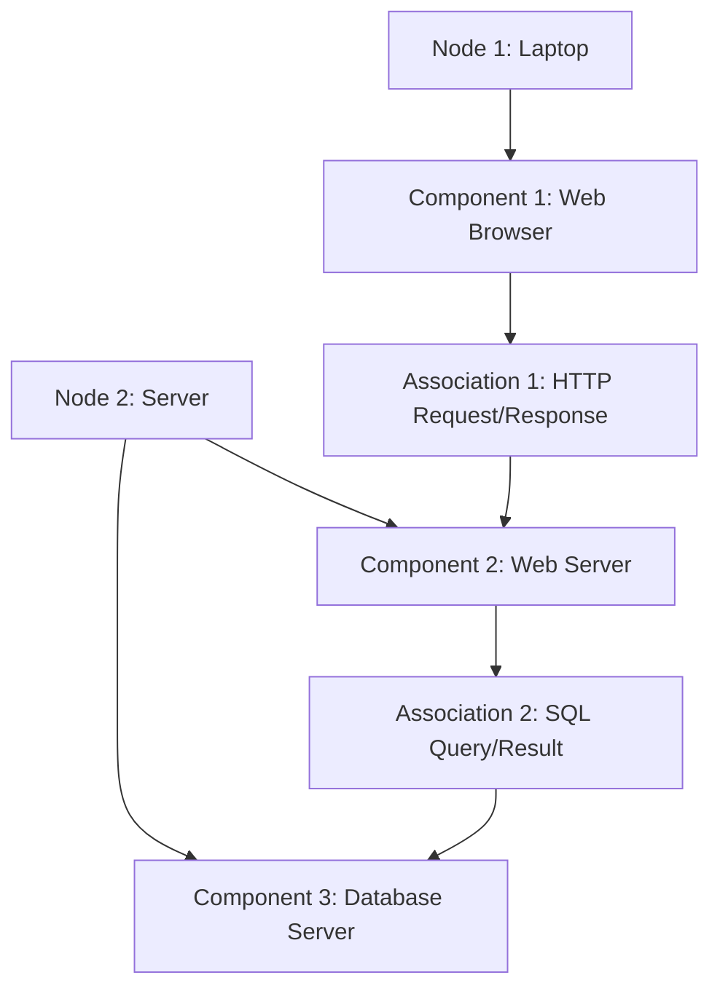

## Unit 1 - Introduction of Software Engineering Lab

- Software engineering is the discipline of designing, developing, testing, and maintaining high-quality software systems that meet the needs and expectations of users and stakeholders.
- Software engineering lab is a practical course that aims to provide students with hands-on experience in applying software engineering principles, methods, and tools to real-world problems.
- The objectives of software engineering lab are:

  - To familiarize students with the software development life cycle and its phases, such as planning, analysis, design, implementation, testing, and deployment.
  - To expose students to various software engineering models, such as waterfall, agile, iterative, and incremental.
  - To enable students to use software engineering tools, such as UML diagrams, IDEs, testing frameworks, and configuration management systems.
  - To enhance students' skills in software engineering practices, such as requirements elicitation, design patterns, coding standards, documentation, testing strategies, and debugging techniques.
  - To develop students' abilities to work in teams, communicate effectively, and manage software projects.

- The expected outcomes of software engineering lab are:

  - Students will be able to apply software engineering concepts and techniques to analyze, design, implement, test, and deploy software systems.
  - Students will be able to compare and contrast different software engineering models and select the most appropriate one for a given problem.
  - Students will be able to use various software engineering tools to support the software development process and improve the quality of software products.
  - Students will be able to follow software engineering best practices and adhere to professional and ethical standards.
  - Students will be able to collaborate with peers, clients, and stakeholders in software engineering projects and deliver software solutions that meet the requirements and expectations.


### Prepare a SRS document in line with the IEEE recommended standards for the notes of the Unit 1 - Introduction of Software Engineering Lab in the subject of Software Engineering Lab

- A software requirements specification (SRS) is a description of a software system to be developed. It is modeled after business requirements specification (CONOPS) .
- A SRS document should follow the IEEE 29148 standard, which covers the processes and information it recommends for a SRS document, as well as its format .
- A SRS document should include the following sections  :
  - Introduction: This section should provide an overview of the software system, its purpose, scope, objectives, and intended users. It should also define any terms, acronyms, or abbreviations used in the document.
  - Overall description: This section should describe the general factors that affect the software system, such as its context, functions, user characteristics, constraints, assumptions, and dependencies. It should also provide a high-level view of the system architecture and interfaces.
  - Specific requirements: This section should describe the functional and nonfunctional requirements of the software system in detail. It should specify what the system should do, how it should behave, and what qualities it should have. It should also define any external interfaces, performance requirements, design constraints, and quality attributes of the system.
  - Appendices: This section should provide any additional information that is relevant to the SRS document, such as data models, diagrams, tables, charts, references, or glossaries.
- A SRS document should be clear, concise, consistent, complete, correct, and verifiable. It should use simple and precise language, avoid ambiguity and redundancy, and follow a logical structure. It should also be traceable, modifiable, and testable  .
- A SRS document should be reviewed and validated by the stakeholders (business, users, developers, testers, etc.) to ensure that it meets their needs and expectations. It should also be updated and maintained throughout the software lifecycle to reflect any changes or feedback  .


### Use Case Diagram and Actors in Software Engineering

A use case diagram is a graphical representation of the interactions between a system and its external entities, such as users, customers, or other systems. A use case diagram shows the functionality of a system from the perspective of the actors who use it. Actors are roles that represent the types of users or systems that interact with the system. Each actor has a set of goals or tasks that they want to achieve by using the system.

A use case diagram consists of the following elements:

- **Actors**: The external entities that interact with the system. They are represented by stick figures or icons with names.
- **Use cases**: The actions or services that the system provides to the actors. They are represented by ovals with names.
- **Relationships**: The connections between actors and use cases, or between use cases themselves. They are represented by lines with different types of symbols, such as arrows, dots, or asterisks. The most common types of relationships are:

  - **Association**: A solid line that connects an actor to a use case, indicating that the actor participates in the use case.
  - **Include**: A dashed line with an open arrowhead that connects a base use case to an included use case, indicating that the base use case always requires the included use case to be performed.
  - **Extend**: A dashed line with an open arrowhead that connects an extension use case to a base use case, indicating that the extension use case may optionally extend the behavior of the base use case under certain conditions.
  - **Generalization**: A solid line with a hollow triangle that connects a child actor or use case to a parent actor or use case, indicating that the child inherits the characteristics of the parent.

To draw a use case diagram, one should follow these steps:

- Identify the actors and their goals or tasks that they want to achieve by using the system.
- Identify the use cases that represent the actions or services that the system provides to the actors to fulfill their goals or tasks.
- Draw the actors and use cases as stick figures and ovals, respectively, and label them with names.
- Draw the associations between actors and use cases, indicating which actors participate in which use cases.
- Draw the include, extend, and generalization relationships between use cases, if applicable, indicating the dependencies and variations among use cases.
- Review and refine the use case diagram, ensuring that it is clear, consistent, and complete.

As an example, consider the following scenario for a notes application in the subject of Software Engineering Lab:

- The notes application allows students and instructors to create, edit, view, and delete notes on various topics related to software engineering.
- The notes application also allows instructors to assign notes to students, and students to submit notes to instructors for grading and feedback.
- The notes application has two types of actors: students and instructors.
- The notes application has the following use cases: create note, edit note, view note, delete note, assign note, submit note, grade note, and provide feedback.

A possible use case diagram for this scenario is shown below:

Use case diagram for notes application

The use case diagram shows the following information:

- The actors are students and instructors, represented by stick figures with names.
- The use cases are create note, edit note, view note, delete note, assign note, submit note, grade note, and provide feedback, represented by ovals with names.
- The associations are the solid lines that connect actors and use cases, indicating which actors participate in which use cases. For example, both students and instructors can create, edit, view, and delete notes, but only instructors can assign notes, and only students can submit notes.
- The include relationships are the dashed lines with open arrowheads that connect base use cases to included use cases, indicating that the base use cases always require the included use cases to be performed. For example, assigning a note includes creating a note, and grading a note includes viewing a note.
- The extend relationships are the dashed lines with open arrowheads that connect extension use cases to base use cases, indicating that the extension use cases may optionally extend the behavior of the base use cases under certain conditions. For example, providing feedback extends grading a note, if the instructor chooses to do so.
- The generalization relationships are the solid lines with hollow triangles that connect child use cases to parent use cases, indicating that the child use cases inherit the characteristics of the parent use cases. For example, creating a note, editing a note, viewing a note, and deleting a note


### Notes of the Unit 1 - Introduction of Software Engineering Lab in the subject of Software Engineering Lab

- The precondition for the notes of this unit is that the user has a basic understanding of software development, programming languages, and software engineering concepts such as requirements, design, testing, and maintenance.
- The objective of this unit is to introduce the user to the software engineering lab, where they will learn how to apply software engineering principles and techniques to real-world problems and projects.
- The topics covered in this unit are:

  - The definition and scope of software engineering, and the difference between software engineering and computer science.
  - The software engineering process models, such as waterfall, incremental, iterative, agile, and spiral, and their advantages and disadvantages.
  - The software engineering activities, such as planning, analysis, design, implementation, testing, deployment, and maintenance, and their interrelationships and dependencies.
  - The software engineering tools, such as editors, compilers, debuggers, testing tools, configuration management tools, and documentation tools, and their roles and functions in the software engineering process.
  - The software engineering standards, such as IEEE, ISO, CMMI, and SEI, and their importance and benefits for software quality and reliability.
  - The software engineering ethics, such as honesty, integrity, responsibility, respect, and professionalism, and their implications and consequences for software engineers and stakeholders.


### Post condition for the notes of the Unit 1 - Introduction of Software Engineering Lab in the subject of Software Engineering Lab

- After reading the notes of Unit 1, the student should be able to:
  - Define software engineering and its goals, principles, and challenges.
  - Explain the software development life cycle (SDLC) and its phases, models, and activities.
  - Compare and contrast the waterfall, incremental, iterative, agile, and spiral models of SDLC.
  - Identify the roles and responsibilities of software engineers, project managers, analysts, designers, developers, testers, and maintainers.
  - Apply the concepts of software requirements engineering, such as elicitation, analysis, specification, validation, and management.
  - Use various tools and techniques for software requirements engineering, such as interviews, questionnaires, observation, prototyping, use cases, user stories, and scenarios.
  - Understand the importance of software quality and the factors that affect it, such as functionality, reliability, usability, efficiency, maintainability, and portability.
  - Apply the concepts of software testing, such as test planning, test design, test execution, test reporting, and test management.
  - Use various tools and techniques for software testing, such as test cases, test scripts, test data, test drivers, test stubs, test automation, and test coverage.
  - Understand the concepts of software maintenance and evolution, such as corrective, adaptive, perfective, and preventive maintenance, and software configuration management.


### Function of each use case for the notes of the Unit 1 - Introduction of Software Engineering Lab in the subject of Software Engineering Lab

- A use case is a description of how a user interacts with a system to achieve a goal.
- A use case diagram is a graphical representation of the use cases and the actors involved in a system.
- A use case diagram shows the relationships between the use cases and the actors, as well as the boundaries of the system.
- A use case diagram can help to:
  - Specify the context of a system
  - Capture the requirements of a system
  - Validate a system's architecture
  - Drive implementation and generate test cases
  - Communicate with stakeholders and users
- A use case diagram consists of the following elements:
  - Actors: The external entities that interact with the system, such as users, roles, or other systems. They are represented by stick figures or icons.
  - Use cases: The functionalities or services that the system provides to the actors. They are represented by ovals with names inside.
  - System boundary: The scope or boundary of the system under consideration. It is represented by a rectangle that encloses the use cases.
  - Associations: The connections between the actors and the use cases. They are represented by solid lines with optional multiplicity indicators.
  - Generalizations: The inheritance relationships between actors or use cases. They are represented by dashed lines with empty arrowheads.
  - Include relationships: The dependencies between use cases that indicate that one use case is always included in another use case. They are represented by dashed lines with the keyword <<include>> and an arrowhead pointing to the included use case.
  - Extend relationships: The dependencies between use cases that indicate that one use case can optionally extend another use case under certain conditions. They are represented by dashed lines with the keyword <<extend>> and an arrowhead pointing to the extended use case.
- An example of a use case diagram for an online shopping system is shown below:

use case diagram example

- In this example, the actors are Customer, Administrator, and Bank. The use cases are Selection of product, Confirm order, Calculate price with tax, Payment, Print slip, Manage product, and Manage order. The system boundary is Online Shopping System. The associations are shown by solid lines between the actors and the use cases. The generalizations are shown by dashed lines with empty arrowheads between the actors and between the use cases. The include relationships are shown by dashed lines with <<include>> and arrowheads pointing to the included use cases. The extend relationship is shown by a dashed line with <<extend>> and an arrowhead pointing to the extended use case.


### Draw the activity diagram for the notes of the Unit 1 - Introduction of Software Engineering Lab in the subject of Software Engineering Lab

- An activity diagram is a graphical representation of the flow of actions and transitions in a system. It shows the dynamic behavior of the system and the sequence of activities that are performed by different actors or objects.
- To draw an activity diagram for the notes of the Unit 1 - Introduction of Software Engineering Lab, we can follow these steps:

  - Identify the main activities and the actors involved in the system. For example, some of the activities are: creating notes, editing notes, viewing notes, deleting notes, etc. Some of the actors are: student, teacher, lab assistant, etc.
  - Draw a start node and an end node to indicate the beginning and the end of the system. Use a solid circle for the start node and a solid circle with a ring around it for the end node.
  - Draw activity nodes to represent the actions performed by the actors. Use rounded rectangles for the activity nodes and label them with the name of the activity. For example, create notes, edit notes, etc.
  - Draw control nodes to represent the decision points or branching points in the system. Use diamonds for the control nodes and label them with the condition or the question that determines the flow of the system. For example, is the note valid? is the note saved? etc.
  - Draw object nodes to represent the data or the artifacts that are used or produced by the activities. Use rectangles for the object nodes and label them with the name of the object. For example, notes, feedback, etc.
  - Draw edges to connect the nodes and show the direction of the flow. Use solid arrows for the edges and label them with the name of the transition or the trigger that causes the flow. For example, create, edit, save, etc.
  - Draw swimlanes to partition the activities according to the actors or the objects that perform them. Use dashed lines to separate the swimlanes and label them with the name of the actor or the object. For example, student, teacher, lab assistant, etc.

- An example of an activity diagram for the notes of the Unit 1 - Introduction of Software Engineering Lab is shown below:

```markdown
+-----------------+ +-----------------+ +-----------------+
|     Student     | |    Teacher      | |   Lab Assistant |
+-----------------+ +-----------------+ +-----------------+
       |                    |                    |
       |                    |                    |
       |                    |                    |
       |                    |                    |
       |                    |                    |
       |                    |                    |
       |                    |                    |
       |                    |                    |
       |                    |                    |
       |                    |                    |
       |                    |                    |
       |                    |                    |
       |                    |                    |
       |                    |                    |
       |                    |                    |
       |                    |                    | 
       |                    |                    |
       |                    |                    |
       |                    |                    |
       |                    |                    |
       |                    |                    |
       |                    |                    |
       |                    |                    |
       |                    |                    |
       |                    |                    |
       |                    |                    |
       |                    |                    | 
       |                    |                    |
       |                    |                    |
       |                    |                    |
       |                    |                    |
       |                    |                    |
       |                    |                    |
       |                    |                    |
       |                    |                    |
       |                    |                    | 
       |                    |                    |
       |                    |                    |
       |                    |                    |
       |                    |                    |
       |                    |                    |
       |                    |                    | 
       |                    |                    |
       |                    |                    |
       |                    |                    |
       |                    |                    |
       |                    |                    | 
       |                    |                    |
       |                    |                    |
       |                    |                    |
       |                    |                    |
       |                    |                    | 
       |                    |                    |
       |                    |                    |
       |                    |                    |
       |                    |                    |
       |                    |                    | 
       |                    |                    |
       |                    |                    |
       |                    |                    |
       |                    |                    |
       |                    |                    | 
       |                    |                    |
       |                    |                    |
       |                    |                    |
       |                    |                    |
       |                    |                    | 
       |                    |                    |
       |                    |                    |
       |                    |                    |
       |                    |                    |
       |                    |                    | 
       |                    |                    |
       |                    |                    |
       |                    |                    |
       |                    |                    |
       |                    |                    |

```


### Identify the classes for the notes of the Unit 1 - Introduction of Software Engineering Lab in the subject of Software Engineering Lab

- A class is a blueprint or template that defines the attributes and behaviors of an object of that class.
- A class diagram is a graphical representation of the classes and their relationships in a software system.
- To identify the classes for the notes of the Unit 1 - Introduction of Software Engineering Lab, we can follow these steps:
  - Identify the nouns in the notes and determine if they are potential classes or not.
  - Eliminate irrelevant, redundant, or vague classes.
  - Refine the classes by adding attributes and methods that describe their properties and behaviors.
  - Establish the relationships and associations among the classes, such as inheritance, aggregation, composition, or dependency.
  - Draw the class diagram using a standard notation, such as UML.

- For example, based on the notes of the Unit 1 - Introduction of Software Engineering Lab, some of the possible classes are:

  - Software Engineering: A discipline that applies engineering principles and practices to the development, maintenance, and evolution of software systems.
    - Attributes: name, definition, objectives, phases, models, etc.
    - Methods: none
  - Software Process: A set of activities, methods, tools, and standards that guide the software development life cycle.
    - Attributes: name, description, inputs, outputs, outcomes, etc.
    - Methods: none
  - Software Project: A specific instance of applying the software process to produce a software product that meets the requirements and expectations of the stakeholders.
    - Attributes: name, scope, schedule, budget, quality, risks, etc.
    - Methods: plan, execute, monitor, control, close, etc.
  - Software Product: A software system that delivers some functionality and value to the users and customers.
    - Attributes: name, version, features, functionality, quality, etc.
    - Methods: install, run, update, uninstall, etc.
  - Software Requirement: A statement that specifies what the software product should do or how it should behave under certain conditions.
    - Attributes: name, description, type, priority, source, etc.
    - Methods: elicit, analyze, specify, validate, verify, etc.
  - Software Design: A process of defining the architecture, components, interfaces, and data structures of the software product.
    - Attributes: name, description, level, style, pattern, etc.
    - Methods: design, model, document, evaluate, etc.
  - Software Testing: A process of verifying and validating that the software product meets the requirements and expectations of the stakeholders.
    - Attributes: name, description, type, level, technique, etc.
    - Methods: test, execute, report, debug, etc.

- The class diagram for the above classes and their relationships is shown below:

```markdown
```mermaid
classDiagram
  SoftwareEngineering <|-- SoftwareProcess
  SoftwareProcess <|-- SoftwareProject
  SoftwareProject o-- SoftwareProduct
  SoftwareProduct o-- SoftwareRequirement
  SoftwareProduct o-- SoftwareDesign
  SoftwareProduct o-- SoftwareTesting
  class SoftwareEngineering{
    -name : String
    -definition : String
    -objectives : String[]
    -phases : String[]
    -models : String[]
  }
  class SoftwareProcess{
    -name : String
    -description : String
    -inputs : String[]
    -outputs : String[]
    -outcomes : String[]
  }
  class SoftwareProject{
    -name : String
    -scope : String
    -schedule : String
    -budget : String
    -quality : String
    -risks : String[]
    +plan()
    +execute()
    +monitor()
    +control()
    +close()
  }
  class SoftwareProduct{
    -name : String
    -version : String
    -features : String[]
    -functionality : String[]
    -quality : String
    +install()
    +run()
    +update()
    +uninstall()
  }
  class SoftwareRequirement{
    -name : String
    -description : String
    -type : String
    -priority : String
    -source : String
    +elicit()
    +analyze()
    +specify()
    +validate()
    +verify()
  }
  class SoftwareDesign{
    -name : String
    -description : String
    -level : String
    -style : String
    -pattern : String
    +design()
    +model()
    +document()
    +evaluate()
  }
  class SoftwareTesting{
    -name : String
    -description : String
    -type :


### Classify them as weak and strong classes for the notes of the Unit 1 - Introduction of Software Engineering Lab in the subject of Software Engineering Lab

- A class is a set of objects that share common attributes and behaviors. Classes are used to model the entities and concepts of a software system.
- In software engineering, classes can be classified as weak or strong based on their cohesion and coupling. Cohesion is the degree to which the elements of a class are related to each other, and coupling is the degree to which a class depends on other classes.
- A weak class is a class that has low cohesion and high coupling. A weak class has many unrelated or loosely related elements, and it depends on many other classes for its functionality. A weak class is hard to understand, maintain, and reuse. A weak class may indicate a poor design or a lack of abstraction.
- A strong class is a class that has high cohesion and low coupling. A strong class has few and closely related elements, and it minimizes its dependencies on other classes. A strong class is easy to understand, maintain, and reuse. A strong class may indicate a good design or a high level of abstraction.
- Examples of weak classes are:
  - A class that performs multiple unrelated tasks, such as reading input, processing data, and displaying output.
  - A class that exposes its internal details to other classes, such as public fields or methods that return references to private members.
  - A class that inherits from multiple unrelated classes, such as a class that implements two or more interfaces that have nothing in common.
- Examples of strong classes are:
  - A class that performs a single and well-defined task, such as a class that represents a data structure or a business rule.
  - A class that encapsulates its internal details and provides a clear and consistent interface to other classes, such as a class that uses private fields and methods and public getters and setters.
  - A class that inherits from a single and relevant class, such as a class that extends an abstract class or implements an interface that defines its behavior.


Hello, I am Sydney, your AI assistant. I can help you with your study material. Here is the class diagram for the notes of the Unit 1 - Introduction of Software Engineering Lab in the subject of Software Engineering Lab.

### Class diagram for the notes of Unit 1 - Introduction of Software Engineering Lab

```mermaid
classDiagram
    class Note {
        -id : int
        -title : String
        -content : String
        -date : Date
        +create()
        +edit()
        +delete()
        +view()
    }

    class Unit {
        -id : int
        -name : String
        -notes : List<Note>
        +create()
        +edit()
        +delete()
        +view()
        +addNote()
        +removeNote()
    }

    class Subject {
        -id : int
        -name : String
        -units : List<Unit>
        +create()
        +edit()
        +delete()
        +view()
        +addUnit()
        +removeUnit()
    }

    Note "0..*" -- "1" Unit : belongs to
    Unit "0..*" -- "1" Subject : belongs to
```

- The class diagram shows the relationship between the classes Note, Unit, and Subject.
- A Note class represents a single note that contains the id, title, content, and date of the note. It has methods to create, edit, delete, and view the note.
- A Unit class represents a single unit that contains the id, name, and a list of notes of the unit. It has methods to create, edit, delete, and view the unit, as well as to add and remove notes from the unit.
- A Subject class represents a single subject that contains the id, name, and a list of units of the subject. It has methods to create, edit, delete, and view the subject, as well as to add and remove units from the subject.
- The class diagram uses the notation of UML (Unified Modeling Language) to show the attributes, methods, and associations of the classes.
- The multiplicity of the associations indicates how many instances of one class can be related to one instance of another class. For example, a Unit can have zero or more Notes, and a Note belongs to one and only one Unit.


### Sequence Diagrams for Software Engineering Lab

A sequence diagram is a type of interaction diagram that shows the sequence of messages exchanged between objects in a system to perform a specific functionality . It is used to illustrate the interactions between objects in a system in the order that they occur . Sequence diagrams are time-focused and they show the order of the interaction visually by using the vertical axis of the diagram to represent time .

A sequence diagram consists of the following components:

- **Lifelines**: These are vertical dashed lines that represent the objects involved in the interaction. They are labeled with the name of the object or its role. The top of the lifeline is the creation point of the object and the bottom is the destruction point.
- **Activation boxes**: These are thin rectangles that show the period of time that an object is active or executing a method. They are placed on the lifelines and may be nested to indicate method calls.
- **Messages**: These are horizontal arrows that show the communication between objects. They are labeled with the name of the message or the method being invoked. There are different types of messages, such as synchronous, asynchronous, reply, create, and destroy messages.
- **Fragments**: These are rectangular frames that enclose a part of the interaction to show some additional information, such as conditions, loops, alternatives, parallelism, etc. They are labeled with an operator and a guard expression.
- **Combined fragments**: These are fragments that contain other fragments to show complex interactions, such as nested conditions, loops, etc.
- **Interaction use**: This is a reference to another sequence diagram that shows a common interaction that is reused in the current diagram. It is represented by a rectangular frame with a dashed border and labeled with ref and the name of the referenced diagram.

Here are two examples of sequence diagrams for the notes of the Unit 1 - Introduction of Software Engineering Lab in the subject of Software Engineering Lab:

- **Scenario 1: Student submits an assignment to the instructor**

```sequence
Student->Instructor: request assignment
Instructor->Student: send assignment details
Student->Student: work on assignment
Student->Instructor: submit assignment
Instructor->Student: acknowledge receipt
Instructor->Instructor: grade assignment
Instructor->Student: send feedback and grade
```

- **Scenario 2: Instructor updates the course syllabus and notifies the students**

```sequence
Instructor->Instructor: edit syllabus
Instructor->Course Website: upload syllabus
alt syllabus uploaded successfully
    Course Website->Instructor: confirm upload
    loop for each student
        Course Website->Student: send notification
    end
else syllabus upload failed
    Course Website->Instructor: report error
end
```


### Draw the collaboration diagram for the notes of the Unit 1 - Introduction of Software Engineering Lab in the subject of Software Engineering Lab

A collaboration diagram is a type of visual presentation that shows how various software objects interact with each other within an overall IT architecture and how users can benefit from this collaboration. A collaboration diagram often comes in the form of a visual chart that resembles a flow chart.

To draw a collaboration diagram for the notes of the Unit 1 - Introduction of Software Engineering Lab in the subject of Software Engineering Lab, you can follow these steps:

- Identify the behavior whose realization and implementation is specified. For example, the behavior could be the process of creating, editing, saving, and printing the notes.
- Identify the structural elements (class roles, objects, subsystems) necessary to carry out the functionality of the behavior. For example, the structural elements could be the note, the editor, the file system, the printer, and the user.
- Decide on the context of interaction: system, subsystem, use case and operation. For example, the context of interaction could be the system of the software engineering lab, the subsystem of the note editor, the use case of creating and printing the notes, and the operation of saving the note.
- Draw the objects and their links on a diagram. Use rectangles to represent objects, and use lines with arrows to represent links and messages between objects. Label the objects with their names and types, and label the messages with their names and sequence numbers. For example, you can draw a rectangle labeled "user: User" to represent the user object, and a line with an arrow labeled "1: createNote()" to represent the message from the user to the editor object.
- Add any additional information to the diagram, such as constraints, conditions, or loops. Use brackets to enclose the additional information and attach it to the relevant message or link. For example, you can add a bracket labeled "[file exists]" to the message from the editor to the file system object, to indicate that the message is only sent if the file already exists.

Here is an example of a collaboration diagram for the notes of the Unit 1 - Introduction of Software Engineering Lab in the subject of Software Engineering Lab:

```
+----------------+           +----------------+           +----------------+
| user: User     |           | editor: Editor |           | file: File     |
+----------------+           +----------------+           +----------------+
        |                          |                          |
        | 1: createNote()         |                          |
        |------------------------>|                          |
        |                          |                          |
        |                          | 2: saveNote()            |
        |                          |------------------------->|
        |                          |                          |
        |                          | 3: printNote()           |
        |                          |------------------------->|
        |                          |                          |
        |                          |                          |           +----------------+
        |                          |                          |           | printer: Printer |
        |                          |                          |           +----------------+
        |                          |                          |                    |
        |                          |                          | 4: print()         |
        |                          |                          |------------------->|
        |                          |                          |                    |
        |                          |                          | 5: confirm()       |
        |                          |                          |<-------------------|
        |                          |                          |
        |                          | 6: confirm()            |
        |                          |<-------------------------|
        |                          |                          |
        | 7: confirm()            |                          |
        |<-------------------------|                          |
        |                          |                          |
```


### State Chart Diagram for Unit 1 - Introduction of Software Engineering Lab

- A state chart diagram is a type of behavioral diagram in the Unified Modeling Language (UML) that shows the transitions between various states of an object or a system .
- A state is a condition in which an object exists and it changes when some event is triggered .
- A state transition is a link between two states that represents how an object or a system can move from one state to another .
- A state chart diagram can be used to model the behavior of a class, a subsystem, a package, or even an entire system .
- A state chart diagram can also show the actions and activities that are performed in each state, the events that trigger the transitions, and the guards that control the flow of execution  .
- A state chart diagram can have the following elements  :
  - Initial state: The starting point of the state machine. It is represented by a black circle.
  - Final state: The ending point of the state machine. It is represented by a black circle with a white circle inside.
  - Simple state: A state that does not have any substates. It is represented by a rounded rectangle with the name of the state inside.
  - Composite state: A state that has one or more substates. It is represented by a rounded rectangle with the name of the state and a dashed line dividing the substates.
  - Concurrent state: A state that has two or more regions that can execute simultaneously. It is represented by a rounded rectangle with the name of the state and a solid line dividing the regions.
  - Submachine state: A state that refers to another state machine diagram. It is represented by a rounded rectangle with the name of the state and a small circle with a cross inside.
  - Transition: A link between two states that shows the movement from one state to another. It is represented by a solid line with an arrowhead pointing to the target state. It can have an optional label that shows the event, guard, and action of the transition.
  - Event: A stimulus that triggers a transition. It is represented by a name followed by an optional list of parameters in parentheses.
  - Guard: A condition that must be true for a transition to occur. It is represented by a boolean expression in square brackets.
  - Action: An activity that is performed when a transition occurs. It is represented by a name followed by an optional list of parameters in parentheses.
  - Entry action: An action that is performed when a state is entered. It is represented by the keyword "entry" followed by a slash and the action.
  - Exit action: An action that is performed when a state is exited. It is represented by the keyword "exit" followed by a slash and the action.
  - Do activity: An action that is performed continuously while a state is active. It is represented by the keyword "do" followed by a slash and the action.
  - History state: A pseudo-state that remembers the last active substate of a composite state. It is represented by a circle with a letter H inside. It can be shallow or deep, depending on whether it remembers only the direct substate or all the nested substates.
  - Choice state: A pseudo-state that represents a branching point based on a guard condition. It is represented by a diamond with one incoming transition and two or more outgoing transitions.
  - Junction state: A pseudo-state that represents a merging point of two or more transitions. It is represented by a diamond with two or more incoming transitions and one outgoing transition.
  - Fork state: A pseudo-state that represents a splitting point of one transition into two or more concurrent regions. It is represented by a horizontal or vertical bar with one incoming transition and two or more outgoing transitions.
  - Join state: A pseudo-state that represents a joining point of two or more concurrent regions into one transition. It is represented by a horizontal or vertical bar with two or more incoming transitions and one outgoing transition.
  - Terminate state: A pseudo-state that represents the termination of the entire state machine. It is represented by a circle with a cross inside.

- An example of a state chart diagram for a door object is shown below:

![State chart diagram for a door object](https://science-atlas.com/wp-content/uploads/2021/10/State-M


### Draw the component diagram for the notes of the Unit 1 - Introduction of Software Engineering Lab in the subject of Software Engineering Lab

- A component diagram is a type of UML diagram that shows the structure and dependencies of software components in a system.
- A component is a modular, reusable, and replaceable part of a software system that encapsulates its behavior and data and exposes its interfaces.
- A component diagram consists of the following elements:
  - Components: represented by rectangles with two small rectangles on the left side. They have a name and optionally a stereotype, such as <<executable>> or <<library>>.
  - Interfaces: represented by circles or lollipops. They have a name and optionally a stereotype, such as <<required>> or <<provided>>.
  - Dependencies: represented by dashed arrows with an open arrowhead. They show the relationship between components or interfaces, such as <<use>>, <<call>>, or <<import>>.
  - Associations: represented by solid lines with an optional arrowhead. They show the structural connection between components or interfaces, such as aggregation, composition, or generalization.
  - Ports: represented by small squares on the border of a component. They show the point of interaction between a component and its environment, such as a socket or a plug.
  - Delegation connectors: represented by dashed lines with a closed arrowhead. They show the relationship between a port and an interface, such as <<delegate>> or <<connect>>.

- An example of a component diagram for the notes of the Unit 1 - Introduction of Software Engineering Lab is shown below:

```markdown
+---------------------+        +---------------------+
|                     |        |                     |
|  Notes Generator    |        |  Notes Viewer       |
|                     |        |                     |
|  <<executable>>     |        |  <<executable>>     |
|                     |        |                     |
+---------------------+        +---------------------+
|                     |        |                     |
|  +---------------+  |        |  +---------------+  |
|  |               |  |        |  |               |  |
|  |  Markdown     |  |        |  |  HTML         |  |
|  |  <<provided>> |  |        |  |  <<required>> |  |
|  |               |  |        |  |               |  |
|  +---------------+  |        |  +---------------+  |
|                     |        |                     |
+---------------------+        +---------------------+
         |                              |
         |                              |
         |                              |
         |                              |
         |                              |
         |                              |
         |                              |
         |                              |
         |                              |
         |                              |
         |                              |
         |                              |
         |                              |
         |                              |
         |                              |
         |                              |
         |                              |
         |                              |
+---------------------+        +---------------------+
|                     |        |                     |
|  Markdown Parser    |        |  HTML Renderer     |
|                     |        |                     |
|  <<library>>        |        |  <<library>>       |
|                     |        |                     |
+---------------------+        +---------------------+
|                     |        |                     |
|  +---------------+  |        |  +---------------+  |
|  |               |  |        |  |               |  |
|  |  Markdown     |  |        |  |  HTML         |  |
|  |  <<required>> |  |        |  |  <<provided>> |  |
|  |               |  |        |  |               |  |
|  +---------------+  |        |  +---------------+  |
|                     |        |                     |
+---------------------+        +---------------------+
```

- The diagram shows that the Notes Generator component provides a Markdown interface, which is used by the Markdown Parser component. The Markdown Parser component requires a Markdown interface and provides an HTML interface, which is used by the HTML Renderer component. The HTML Renderer component requires an HTML interface and provides an HTML interface, which is used by the Notes Viewer component. The Notes Viewer component requires an HTML interface and provides an HTML interface, which is used by the user. The diagram also shows the stereotypes of the components and the interfaces, and the dependencies between them.


### Perform forward engineering in java for the notes of the Unit 1 - Introduction of Software Engineering Lab in the subject of Software Engineering Lab

- Forward engineering is a method of creating or making an application with the help of the given requirements  .
- Forward engineering is also known as Renovation and Reclamation.
- Forward engineering requires high proficiency skills and more time to construct or develop an application .
- Forward engineering is prescriptive in nature and follows a top-down approach.
- Forward engineering is the opposite of reverse engineering, which is the process of extracting the design or model from an existing application   .
- Forward engineering in java involves the following steps:
  - Creating a CodeEngineeringSet, which is a package that contains the model elements and the code engineering settings.
  - Creating a JavaProject, which is a subpackage that contains the java classes and interfaces.
  - Creating a JavaClass, which is a class element that defines the attributes and operations of the class.
  - Creating a JavaOperation, which is an operation element that defines the parameters and the body of the method.
  - Creating a JavaParameter, which is a parameter element that defines the name, type, and direction of the parameter.
  - Creating a JavaCodeBlock, which is a code block element that contains the java statements for the method body.
  - Creating a JavaStatement, which is a statement element that defines the syntax and semantics of the java statement.
  - Generating the java code from the model elements using the CodeEngineeringSet.generate() method.


### Model to code conversion for the notes of the Unit 1 - Introduction of Software Engineering Lab in the subject of Software Engineering Lab

- Model to code conversion is the process of transforming a software model into executable code.
- A software model is a representation of the software system at a certain level of abstraction, such as requirements, design, or implementation.
- A software model can be expressed in different languages, such as natural language, graphical notation, or formal specification.
- Model to code conversion can be performed manually, semi-automatically, or automatically, depending on the level of automation and the degree of correspondence between the model and the code.
- Manual model to code conversion involves human intervention to translate the model into code, using tools such as editors, compilers, or debuggers.
- Semi-automatic model to code conversion involves some degree of automation, such as code generation from templates, skeletons, or patterns, but still requires human intervention to complete or refine the code.
- Automatic model to code conversion involves no or minimal human intervention, such as code synthesis from formal specifications, model transformations, or model-driven development.
- Model to code conversion can have different goals, such as improving productivity, quality, consistency, or maintainability of the software system, or enabling cross-platform or cross-language interoperability.
- Model to code conversion can have different challenges, such as ensuring correctness, completeness, and traceability of the code, or dealing with semantic gaps, ambiguities, or inconsistencies in the model or the code.


### Perform reverse engineering in java for the notes of the Unit 1 - Introduction of Software Engineering Lab in the subject of Software Engineering Lab

- Reverse engineering in java is the process of recovering the source code from a compiled class file or a jar file .
- The purpose of reverse engineering in java is to understand the logic, structure, and design of the existing code, or to modify or reuse it for other purposes .
- Reverse engineering in java can be done using various tools, such as decompilers, disassemblers, debuggers, or UML modelers  .
- Some of the challenges and limitations of reverse engineering in java are:
  - The original source code is not exactly recovered, but only an equivalent version that may have different formatting, comments, variable names, or imports.
  - The reverse engineered code may not compile or run without errors, especially if it uses external libraries, dependencies, or native methods .
  - The reverse engineered code may not reflect the original design intent, architecture, or quality of the code, as it may have been obfuscated, optimized, or refactored by the compiler .
  - The reverse engineering process may violate the intellectual property rights or the license agreements of the original code owners, and may expose the code to security risks or malicious attacks.


### Code to Model Conversion for the Notes of the Unit 1 - Introduction of Software Engineering Lab in the Subject of Software Engineering Lab

- Code to model conversion is the process of transforming existing source code into a higher-level representation, such as a UML model, that can be used for analysis, design, documentation, or testing purposes.
- Code to model conversion can be done manually or automatically, using tools that support reverse engineering or model-driven development.
- Reverse engineering is the process of extracting information from existing software artifacts, such as code, and creating models or diagrams that represent the structure, behavior, or functionality of the software system.
- Model-driven development is the process of using models as the primary artifacts of software development, and generating code or other models from them, using tools that support model transformations or code generation.
- Code to model conversion can have several benefits, such as:
  - Improving the understanding of complex or legacy code by providing a graphical or textual overview of its components and relationships.
  - Enabling the reuse of existing code by creating models that can be adapted or extended for new requirements or platforms.
  - Enhancing the quality of code by applying model-based analysis, verification, or testing techniques to detect errors or inconsistencies.
  - Facilitating the communication and collaboration among software stakeholders by using models as a common language or documentation format.
- Code to model conversion can also have some challenges, such as:
  - Preserving the semantics and behavior of the original code when creating models, especially when dealing with different levels of abstraction or different programming paradigms.
  - Maintaining the consistency and synchronization between the code and the models, especially when changes are made to either of them.
  - Choosing the appropriate level of detail and granularity for the models, depending on the purpose and scope of the conversion.
  - Selecting the suitable tools and methods for the conversion, considering the availability, compatibility, and usability of the existing code and the desired models.


### Deployment diagram for the notes of the Unit 1 - Introduction of Software Engineering Lab

- A deployment diagram is a type of UML diagram that shows the physical arrangement of the components of a software system and their relationships.
- A deployment diagram consists of nodes, components, and associations.
- Nodes are the physical devices or locations where the components are deployed or executed.
- Components are the executable units of software that provide specific functionality or services.
- Associations are the connections or dependencies between the nodes and components.
- A deployment diagram can be used to model the hardware and software architecture of a system, the distribution of the system across different platforms, the communication and networking aspects of the system, and the performance and scalability of the system.

- A possible deployment diagram for the notes of the Unit 1 - Introduction of Software Engineering Lab is shown below:



- The deployment diagram shows that the notes are stored in a database server (Component 3) on a server (Node 2), and are accessed by a web browser (Component 1) on a laptop (Node 1) through a web server (Component 2) using HTTP and SQL protocols. The associations show the direction and type of communication between the components.


### Notes for Unit 1 - Introduction of Software Engineering Lab

- Software engineering is the discipline of designing, developing, testing, and maintaining high-quality software systems that meet the needs and expectations of users and stakeholders.
- Software engineering lab is a practical course that aims to provide students with hands-on experience in applying software engineering principles, methods, tools, and techniques to realistic software projects.
- The experiments in this unit are designed to introduce students to some fundamental concepts and skills of software engineering, such as:

  - Software development life cycle (SDLC) models and phases
  - Software requirements analysis and specification
  - Software design and modeling
  - Software implementation and testing
  - Software quality assurance and verification
  - Software maintenance and evolution
  - Software project management and documentation

- The experiments in this unit are:

  - Experiment 1: Study of different SDLC models and comparison of their advantages and disadvantages
  - Experiment 2: Identification and elicitation of software requirements for a given problem statement
  - Experiment 3: Preparation of software requirement specification (SRS) document for a given software project
  - Experiment 4: Study of different software design methods and notations, such as structured, object-oriented, and component-based design
  - Experiment 5: Design of software architecture and detailed design using appropriate diagrams and models, such as data flow diagrams, entity-relationship diagrams, class diagrams, sequence diagrams, etc.
  - Experiment 6: Implementation of software design using a programming language and an integrated development environment (IDE) of choice
  - Experiment 7: Testing of software functionality and quality using various testing techniques and tools, such as unit testing, integration testing, system testing, regression testing, etc.
  - Experiment 8: Evaluation of software quality attributes, such as reliability, usability, efficiency, maintainability, etc., using appropriate metrics and standards
  - Experiment 9: Study of different software maintenance and evolution activities and issues, such as corrective, adaptive, perfective, and preventive maintenance, software configuration management, software reuse, software refactoring, etc.
  - Experiment 10: Preparation of software project documentation, such as project plan, design document, test plan, user manual, etc.

- Note: The instructor may add/delete/modify/tune experiments, wherever he/she feels in a justified manner, to suit the course objectives, learning outcomes, and available resources.


### It is also suggested that open source tools should be preferred to conduct the lab for the notes of the Unit 1 - Introduction of Software Engineering Lab in the subject of Software Engineering Lab

- Open source tools are software applications that are developed and distributed by a community of developers and users, rather than by a single company or organization.
- Open source tools have several advantages for conducting the lab for the notes of the Unit 1 - Introduction of Software Engineering Lab in the subject of Software Engineering Lab, such as:
  - They are usually free or low-cost, which reduces the financial burden on the students and the institution.
  - They are often updated and improved by the community, which ensures that they are compatible with the latest technologies and standards.
  - They are usually compatible with multiple platforms and operating systems, which increases the accessibility and flexibility of the lab environment.
  - They often have extensive documentation and support forums, which facilitate the learning and troubleshooting process for the students and the instructors.
  - They promote the values of collaboration, transparency, and innovation, which are essential for software engineering.
- Some examples of open source tools that can be used for conducting the lab for the notes of the Unit 1 - Introduction of Software Engineering Lab in the subject of Software Engineering Lab are:
  - Eclipse: An integrated development environment (IDE) that supports multiple programming languages and frameworks, such as Java, C, C++, Python, PHP, Ruby, etc. It also provides tools for debugging, testing, refactoring, and code analysis.
  - Git: A version control system that allows the students to track and manage the changes in their code, collaborate with other developers, and synchronize their work across different devices and platforms.
  - JUnit: A testing framework that enables the students to write and run unit tests for their code, verify the functionality and quality of their software, and identify and fix errors and bugs.
  - UMLet: A diagramming tool that allows the students to create and edit various types of UML diagrams, such as use case diagrams, class diagrams, sequence diagrams, etc. It also supports the export and import of diagrams in different formats, such as PNG, PDF, SVG, etc.


### Open Office for the notes of the Unit 1 - Introduction of Software Engineering Lab in the subject of Software Engineering Lab

- Open Office is a free and open source software suite that provides personal productivity applications such as word processing, spreadsheet, presentation, drawing, equation editor, and database  .
- Open Office is one of the first competitors to Microsoft Office and has similar features and functionality.
- Open Office is designed as a single piece of software with a consistent user interface and performance across all the applications.
- Open Office can be downloaded from the official website or from the Microsoft Store for Windows 10 devices .
- Open Office supports multiple languages and formats, and can read and write files from other common office software packages.
- Open Office is developed and maintained by the Apache Software Foundation, a non-profit organization that promotes open source software .


### Libra

- Libra is a term that can refer to different entities related to software engineering, such as:
  - Libresoft, a research group that focuses on the quantitative study of libre (free, open source) software and development in different areas such as software engineering, mobile technologies, virtual communities and e-learning.
  - Libra Industries, a systems integrator of complex products, with broad vertically integrated capabilities, serving OEMs with technically demanding manufacturing requirements.
  - Libra Software Engineer, a job title for a software engineer who works for Libra, a company that aims to create a simple global currency and financial infrastructure that empowers billions of people.
  - Libra Softworks, a company that provides software development and consulting services, with a focus on blockchain, artificial intelligence, and gaming.
- Libra can also refer to a unit of weight and currency in ancient Rome, equivalent to about 12 ounces or 0.34 kilograms, or to a constellation and astrological sign in the zodiac.
- Libra is not related to the subject of Software Engineering Lab, which is a course that teaches students how to apply software engineering principles and practices to design, develop, test, and deploy software systems. 
- Some of the topics that are covered in the Unit 1 - Introduction of Software Engineering Lab are:
  - Software engineering definition, scope, and objectives
  - Software engineering paradigms and models
  - Software engineering processes and life cycle
  - Software engineering standards and ethics
  - Software engineering tools and techniques
  - Software engineering challenges and trends


### Junit for the notes of the Unit 1 - Introduction of Software Engineering Lab in the subject of Software Engineering Lab

- Junit is a unit testing framework for the Java programming language  .
- Unit testing is a process of verifying the functionality of a small and isolated piece of code, such as a method or a class .
- Unit testing helps to ensure the quality, reliability, and maintainability of the software by detecting and preventing errors early in the development cycle .
- Junit provides the following features and benefits for unit testing   :
  - Annotations to mark test classes and methods, such as `@Test`, `@Before`, `@After`, `@BeforeEach`, `@AfterEach`, etc.
  - Assertions to check the expected and actual results of a test, such as `assertEquals`, `assertTrue`, `assertFalse`, `assertNull`, `assertNotNull`, etc.
  - Test runners to execute and report the test results, such as `JUnitCore`, `JUnitPlatform`, `ConsoleLauncher`, etc.
  - Test suites to group and run multiple test classes together, such as `@Suite`, `@SelectClasses`, `@SelectPackages`, etc.
  - Test fixtures to set up and tear down the common state and behavior for multiple test methods, such as `@BeforeClass`, `@AfterClass`, `@BeforeAll`, `@AfterAll`, etc.
  - Parameterized tests to run the same test with different input values and expected results, such as `@ParameterizedTest`, `@ValueSource`, `@CsvSource`, etc.
  - Nested tests to organize test methods into hierarchical structures, such as `@Nested`, `@DisplayName`, etc.
  - Dynamic tests to generate and run test cases at runtime, such as `@TestFactory`, `DynamicTest`, etc.
  - Extensions to extend the behavior of the test framework, such as `@ExtendWith`, `@RegisterExtension`, etc.
  - Tags to filter and include or exclude test classes and methods based on certain criteria, such as `@Tag`, `@IncludeTags`, `@ExcludeTags`, etc.


### Open Project for the notes of the Unit 1 - Introduction of Software Engineering Lab in the subject of Software Engineering Lab

- Open Project is a free and open source software (FOSS) project management tool that can be used to plan, monitor, and control software engineering projects.
- Open Project provides features such as task management, time tracking, Gantt charts, agile boards, wiki, forums, document management, and more.
- Open Project can be installed on a local server or accessed online through a cloud service.
- Open Project supports various software development methodologies, such as waterfall, agile, scrum, and kanban.
- Open Project can be integrated with other tools, such as GitHub, GitLab, Jenkins, Slack, and more.
- Open Project can be customized and extended with plugins, themes, and APIs.

Some benefits of using Open Project for software engineering projects are:

- It can help to improve collaboration and communication among team members and stakeholders.
- It can help to manage the project scope, schedule, budget, quality, and risks.
- It can help to track the progress and status of the project and its deliverables.
- It can help to document the project requirements, design, testing, and deployment.
- It can help to facilitate feedback and review cycles.
- It can help to adhere to the software engineering standards and best practices.


### GanttProject

- GanttProject is a free and open-source project management application that can be used to create and manage project schedules, tasks, resources, and dependencies.
- GanttProject can create Gantt charts, which are graphical representations of the project timeline, showing the start and end dates, durations, and progress of each task.
- GanttProject can also create PERT charts, which are network diagrams that show the logical relationships and dependencies among the tasks.
- GanttProject can export and import project data in various formats, such as Microsoft Project, CSV, Excel, PDF, and PNG.
- GanttProject is written in Java and can run on Windows, Linux, and Mac OS X platforms.
- GanttProject is distributed under the GNU General Public License version 3 (GPL3), which means that anyone can use, modify, and redistribute the software for free, as long as they comply with the license terms.


### dotProject for the notes of the Unit 1 - Introduction of Software Engineering Lab in the subject of Software Engineering Lab

- dotProject is a web-based, multi-user, multi-language project management application that is free and open source software.
- dotProject was originally developed by Will Ezell at dotmarketing, Inc. to be an open source replacement for Microsoft Project, using a very similar user interface but including project management functionality.
- dotProject is mostly a task-oriented project management system, predating contemporary tools addressing methodologies such as Agile software development. Instead, it uses the "waterfall" model to manage tasks, sequentially and/or in parallel, assigned to different members of a team or teams, and establishing dependencies between tasks and milestones.
- dotProject allows users to create and manage projects, tasks, forums, files, contacts, tickets, resources, reports, and calendars.
- dotProject can be used for software engineering education, as it teaches the usage of project management tools and concepts, such as work breakdown structure, critical path method, earned value management, and risk management.
- dotProject can be installed on a web server that supports PHP and MySQL, and can be accessed through a web browser by multiple users with different roles and permissions.
- dotProject can be customized and extended by using modules, themes, languages, and patches that are available from the official website or the community.
- dotProject can be integrated with other software development tools, such as Subversion, Bugzilla, or Trac, by using third-party plugins or scripts.


### AgroUML

- AgroUML is an open-source application that supports modeling activities using UML .
- UML stands for Unified Modeling Language, which is a standard way of representing the structure and behavior of software systems using diagrams.
- AgroUML supports almost all diagram types of UML 1.4, such as class, use case, sequence, state, activity, collaboration, deployment, and component diagrams  .
- AgroUML assists in improving designs and comes with notes as well as To-Do list panes.
- AgroUML can generate code from UML models, read source files and generate UML models and diagrams, and allow round-trip engineering for some languages, such as Java, C++, and SQL .
- AgroUML can export diagrams as GIF, PNG, PS, EPS, PGML and SVG formats.
- AgroUML can import and export models using XMI, which is an XML-based format for exchanging UML models between different tools .
- AgroUML can also support UML profiles, which are extensions of the standard UML metamodel for specific domains or purposes .
- AgroUML runs on any Java platform and is available in ten languages .


### StarUML

- StarUML is an open-source modeling software that supports the Unified Modeling Language (UML) framework  .
- UML is a standard notation for describing the structure and behavior of software systems using diagrams.
- StarUML provides several types of diagrams, such as Class, Object, Use Case, Component, Deployment, Composite Structure, Sequence, Communication, Statechart, Activity, Timing, Interaction Overflow, Information Flow and Profile Diagram.
- StarUML also supports Model Driven Architecture (MDA), which is a software design approach that uses models to generate code in multiple languages, such as Java, C#, C++, Python, Ruby, etc .
- StarUML is aimed at experts who use UML extensively, and offers features such as code generators, plugins, model validation, diagram layout, and model overview  .
- StarUML is available for Windows, Mac OS X, and Linux platforms, and can be downloaded from its official website .
- StarUML has a user-friendly interface that allows users to create and edit diagrams using drag and drop, context menus, and keyboard shortcuts.
- StarUML also has a documentation site that provides tutorials, guides, and references for using the software.

