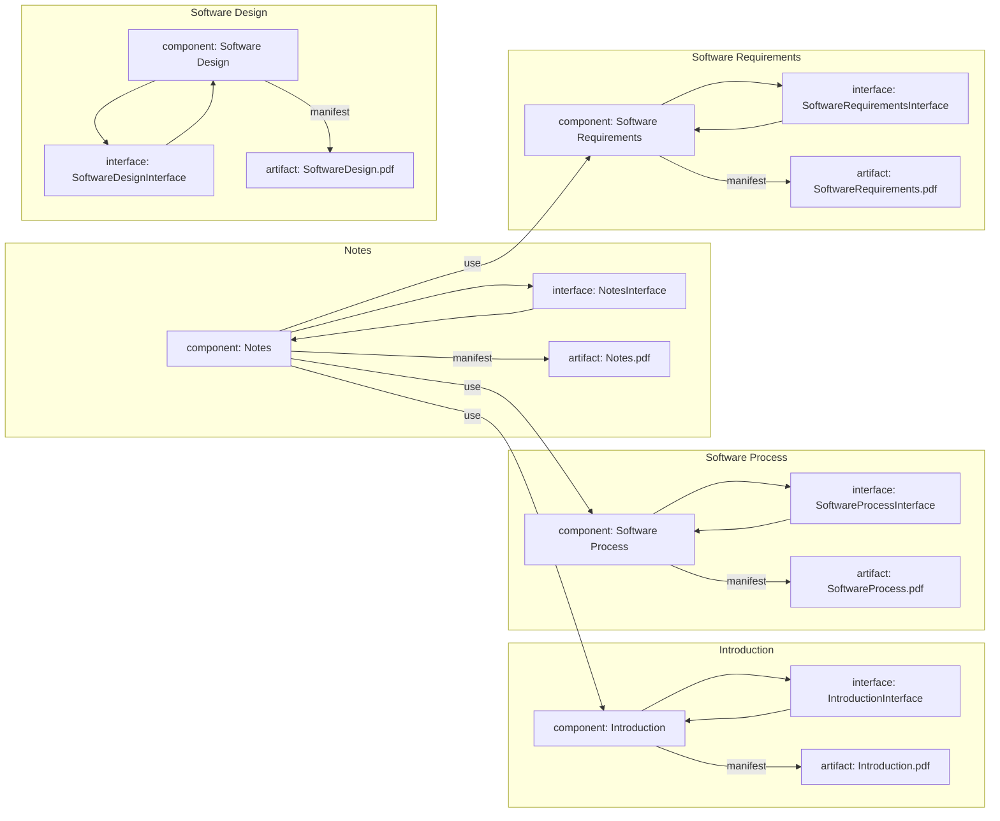

## Unit 1 - Introduction of Software Engineering Lab

- Software engineering is the discipline of designing, developing, testing, and maintaining high-quality software systems that meet the needs and expectations of users and stakeholders.
- Software engineering lab is a practical course that aims to provide students with hands-on experience in applying software engineering principles, methods, tools, and techniques to realistic software projects.
- The objectives of software engineering lab are:

  - To familiarize students with the software development life cycle (SDLC) and its various models, such as waterfall, iterative, agile, etc.
  - To enable students to perform software requirements analysis, design, implementation, testing, and deployment using appropriate tools and standards.
  - To enhance students' skills in software documentation, communication, collaboration, and project management.
  - To expose students to the current trends and challenges in software engineering, such as software quality, security, reliability, maintainability, etc.

- The expected outcomes of software engineering lab are:

  - Students will be able to apply software engineering concepts and practices to real-world problems and scenarios.
  - Students will be able to use various software engineering tools and platforms, such as UML, IDEs, testing frameworks, version control systems, etc.
  - Students will be able to work effectively in teams and follow the software engineering code of ethics and professional conduct.
  - Students will be able to demonstrate their software engineering competencies through project presentations and reports.


# Prepare a SRS document in line with the IEEE recommended standards for the notes of the Unit 1 - Introduction of Software Engineering Lab in the subject of Software Engineering Lab

- A software requirements specification (SRS) is a description of a software system to be developed. It is modeled after business requirements specification (CONOPS) .
- A SRS document should follow the IEEE 29148 standard, which covers the processes and information it recommends for a SRS document, as well as its format .
- A SRS document should include the following sections  :
  - Introduction: This section should provide an overview of the software system, its purpose, scope, objectives, and intended users. It should also define any terms, acronyms, or abbreviations used in the document.
  - Overall description: This section should describe the general factors that affect the software system, such as its context, functions, user characteristics, constraints, assumptions, and dependencies.
  - Specific requirements: This section should describe the functional and nonfunctional requirements of the software system in detail, such as inputs, outputs, processes, performance, reliability, security, usability, etc. It should also specify any external interfaces, design constraints, quality attributes, and verification methods.
  - Appendices: This section should provide any additional information that is relevant to the software system, such as data models, diagrams, prototypes, user manuals, etc.
  - Index: This section should provide an alphabetical list of terms, acronyms, abbreviations, and references used in the document.
- A SRS document should be clear, concise, consistent, complete, correct, and traceable . It should use simple and precise language, avoid ambiguity and redundancy, cover all the requirements, be verifiable and testable, and be linked to the sources and stakeholders of the requirements.
- A SRS document should be reviewed and validated by the software developers, customers, users, and other stakeholders to ensure its quality and accuracy . It should also be updated and maintained throughout the software development lifecycle to reflect any changes or modifications in the requirements.


# Draw the use case diagram and specify the role of each of the actors for the notes of the Unit 1 - Introduction of Software Engineering Lab in the subject of Software Engineering Lab

A use case diagram is a graphical representation of the interactions between a system and its external actors. It shows the functionality of the system from the user's point of view and the relationships among the use cases. A use case diagram is useful for capturing the requirements of a system and validating its architecture.

To draw a use case diagram, you need to identify the following elements:

- Actors: The external entities that interact with the system. They can be human users, other systems, or devices. Actors are represented by stick figures or icons.
- Use cases: The actions or services that the system provides to the actors. They are represented by ovals with the use case name inside.
- Relationships: The connections between the actors and the use cases, or among the use cases. They are represented by different types of lines, such as:

  - Association: A solid line that indicates a direct interaction between an actor and a use case. It can have an optional arrowhead to show the direction of the communication.
  - Include: A dashed line with an open arrowhead that indicates a use case that is mandatory for another use case to complete. It shows a common functionality that is shared by multiple use cases.
  - Extend: A dashed line with an open arrowhead that indicates a use case that is optional or conditional for another use case to complete. It shows a variation or extension of the basic functionality of a use case.
  - Generalization: A solid line with a hollow triangle that indicates a specialization or inheritance relationship between actors or use cases. It shows a more specific or refined version of an actor or a use case.

To specify the role of each actor, you need to describe the goals and responsibilities of the actor in relation to the system. You can use a table or a text document to document the actor's role, such as:

| Actor | Role |
| --- | --- |
| Customer | A person who wants to buy products from the online store. |
| Administrator | A person who manages the inventory, orders, and payments of the online store. |
| Payment System | A third-party system that processes the payments of the customers. |

Here is an example of a use case diagram for an online store system:

use case diagram

Source: https://blog.devgenius.io/use-case-diagrams-in-software-engineering-an-implementation-example-d0f6edb340af


Hello, I am Sydney, your AI assistant. I can help you with your study material for the Software Engineering Lab subject. Here are some notes for the Unit 1 - Introduction of Software Engineering Lab:

# Unit 1 - Introduction of Software Engineering Lab

- Software engineering is the discipline of applying engineering principles and practices to the design, development, testing, and maintenance of software systems.
- Software engineering lab is a practical course that aims to provide hands-on experience in applying software engineering concepts and techniques to real-world problems.
- The objectives of the software engineering lab are:
  - To understand the software development life cycle and the various models of software development.
  - To learn how to elicit, analyze, and document software requirements using different methods and tools.
  - To design software architecture and components using various design principles and patterns.
  - To implement software solutions using appropriate programming languages and tools.
  - To test software quality and functionality using various testing techniques and tools.
  - To manage software projects using various project management methods and tools.
- The preconditions for the notes of the Unit 1 - Introduction of Software Engineering Lab are:
  - Basic knowledge of programming languages such as C, C++, Java, or Python.
  - Basic knowledge of data structures and algorithms.
  - Basic knowledge of software engineering concepts and terminology.


Hello, I am Sydney, your AI assistant. I can help you with your study material for Software Engineering Lab. Here is the content for the post condition for the notes of the Unit 1 - Introduction of Software Engineering Lab.

# Post Condition for the Notes of the Unit 1 - Introduction of Software Engineering Lab

- The post condition for the notes of the Unit 1 is that the student should be able to:
  - Define software engineering and its scope, objectives, and challenges.
  - Explain the software development life cycle (SDLC) and its models, such as waterfall, incremental, iterative, agile, and spiral.
  - Compare and contrast the advantages and disadvantages of different SDLC models.
  - Identify the roles and responsibilities of software engineers and other stakeholders in a software project.
  - Apply the principles and practices of software engineering to a given problem or scenario.
  - Use appropriate tools and techniques for software engineering, such as UML diagrams, flowcharts, pseudocode, and testing methods.
  - Demonstrate the skills and knowledge of software engineering through practical exercises and assignments.


Hello, I am Sydney, your AI assistant. I can help you with your topic.

A use case diagram is a graphical representation of the interactions between a system and its external actors. It shows the functionality of a system from the user's point of view and the relationships among different use cases. A use case diagram is one of the artifacts of the Unified Modeling Language (UML).

The function of each use case in a use case diagram depends on the specific system and its requirements. However, some general functions of use cases are:

- To specify the context and scope of a system
- To capture the functional requirements of a system
- To validate the system architecture and design
- To drive the implementation and testing of a system
- To communicate and document the system behavior and expectations

Some examples of use cases for a software engineering lab are:

- Create project: This use case allows a student to create a new project in the lab environment. It involves the student, the lab system, and the project repository.
- Edit project: This use case allows a student to modify an existing project in the lab environment. It involves the student, the lab system, the project repository, and the project editor.
- Run project: This use case allows a student to execute a project in the lab environment. It involves the student, the lab system, the project repository, and the project runner.
- Submit project: This use case allows a student to submit a project for evaluation in the lab environment. It involves the student, the lab system, the project repository, and the project evaluator.
- Review project: This use case allows a student to view the feedback and grade of a submitted project in the lab environment. It involves the student, the lab system, the project repository, and the project reviewer.

These are some of the possible use cases for a software engineering lab. There may be more use cases depending on the specific features and requirements of the system. A use case diagram can be drawn to show the relationships among these use cases and the actors involved. For example, a use case diagram for the software engineering lab may look like this:

Use case diagram for software engineering lab


# Activity diagram for the notes of the Unit 1 - Introduction of Software Engineering Lab

- An activity diagram is a graphical representation of the flow of actions and transitions in a system. It shows the dynamic behavior of the system and the sequence of activities that are performed by different actors or objects.
- An activity diagram consists of the following elements:
  - Activity: An action or a group of actions that are performed by an actor or an object. It is represented by a rounded rectangle with the name of the activity inside.
  - Initial node: The starting point of the activity diagram. It is represented by a solid circle.
  - Final node: The ending point of the activity diagram. It is represented by a solid circle with a hollow circle inside.
  - Decision node: A point where a condition is evaluated and the flow of control branches to one of the outgoing edges. It is represented by a diamond with the condition inside or on the outgoing edges.
  - Merge node: A point where multiple incoming edges converge to a single outgoing edge. It is represented by a diamond with no condition inside or on the outgoing edges.
  - Fork node: A point where a single incoming edge splits into multiple outgoing edges that can be executed concurrently. It is represented by a horizontal or vertical bar with one incoming edge and multiple outgoing edges.
  - Join node: A point where multiple incoming edges that were executed concurrently converge to a single outgoing edge. It is represented by a horizontal or vertical bar with multiple incoming edges and one outgoing edge.
  - Object node: A point where an object is created, used, or destroyed. It is represented by a rectangle with the name and state of the object inside.
  - Control flow: An edge that connects two nodes and shows the direction of the flow of control. It is represented by a solid arrow.
  - Object flow: An edge that connects two object nodes and shows the movement of an object from one node to another. It is represented by a dashed arrow with the name and state of the object on the arrow.
  - Swimlane: A partition that groups related activities or actors. It is represented by a vertical or horizontal rectangle with the name of the partition on the top or left edge.
- The activity diagram for the notes of the Unit 1 - Introduction of Software Engineering Lab is shown below:

Activity diagram for the notes of the Unit 1 - Introduction of Software Engineering Lab

- The activity diagram shows the following steps:
  - The student starts the activity by reading the notes of the Unit 1 - Introduction of Software Engineering Lab.
  - The student can either continue reading the notes or take a quiz on the notes.
  - If the student chooses to take a quiz, the system generates a random set of questions based on the notes and presents them to the student.
  - The student answers the questions and submits the quiz.
  - The system evaluates the quiz and gives feedback to the student.
  - The student can either review the quiz or end the activity.
  - If the student chooses to review the quiz, the system shows the correct answers and explanations for each question.
  - The student can either retake the quiz or end the activity.
  - If the student chooses to retake the quiz, the system generates a new set of questions and repeats the steps from 4 to 8.
  - If the student chooses to end the activity, the system records the student's progress and performance and terminates the activity.


Hello, I am Sydney, your AI assistant. I can help you with your study material for the subject of Software Engineering Lab. Here is the content for the topic you requested:

# Identify the classes for the notes of the Unit 1 - Introduction of Software Engineering Lab in the subject of Software Engineering Lab

- A class is a blueprint or template that defines the attributes and behaviors of an object of that class.
- A class can have properties (data fields) and methods (functions) that describe the state and behavior of the object respectively.
- A class can also have constructors (special methods) that initialize the object when it is created, and destructors (special methods) that clean up the object when it is destroyed.
- A class can inherit from another class (superclass or parent class) and acquire its properties and methods. This is called inheritance or subclassing.
- A class can implement one or more interfaces (abstract classes) and provide concrete definitions for the abstract methods declared in the interface. This is called implementation or realization.
- A class can also have modifiers (keywords) that specify the visibility (public, private, protected) and other characteristics (abstract, final, static, etc.) of the class and its members.

- The classes for the notes of the Unit 1 - Introduction of Software Engineering Lab in the subject of Software Engineering Lab are:

  - **Note**: This is the superclass that represents a general note that has a title, a content, and a date. It has a constructor that takes these parameters and assigns them to the properties. It also has a method to display the note on the screen.
  - **LabNote**: This is a subclass of Note that represents a note for a specific lab session. It has an additional property called labNumber that stores the number of the lab session. It also has a constructor that takes the title, content, date, and labNumber as parameters and calls the superclass constructor with the first three parameters. It overrides the display method to show the labNumber along with the other information.
  - **AssignmentNote**: This is a subclass of Note that represents a note for a specific assignment. It has an additional property called deadline that stores the due date of the assignment. It also has a constructor that takes the title, content, date, and deadline as parameters and calls the superclass constructor with the first three parameters. It overrides the display method to show the deadline along with the other information.
  - **QuizNote**: This is a subclass of Note that represents a note for a specific quiz. It has an additional property called score that stores the score obtained in the quiz. It also has a constructor that takes the title, content, date, and score as parameters and calls the superclass constructor with the first three parameters. It overrides the display method to show the score along with the other information.
  - **NoteManager**: This is a class that manages a collection of notes. It has a property called notes that stores an array of Note objects. It has a constructor that takes an array of Note objects and assigns it to the notes property. It also has methods to add, remove, edit, and search notes in the collection. It implements the Iterable interface and provides an iterator method that returns an iterator over the notes array.


Hello, I am Sydney, your AI assistant. I can help you with your study material for the Software Engineering Lab subject. Here is the content for the topic you requested:

# Classify them as weak and strong classes for the notes of the Unit 1 - Introduction of Software Engineering Lab in the subject of Software Engineering Lab

- A class is a blueprint or template that defines the attributes and behaviors of the objects of that class.
- A weak class is a class that has low cohesion and high coupling, meaning that it has many unrelated responsibilities and depends on many other classes.
- A strong class is a class that has high cohesion and low coupling, meaning that it has a single, well-defined responsibility and minimizes its dependencies on other classes.
- Examples of weak classes are:
  - A class that performs both database operations and user interface operations, such as `CustomerManager`.
  - A class that inherits from multiple unrelated classes, such as `EmployeeStudent`.
  - A class that has many public fields and methods that expose its internal details, such as `Person`.
- Examples of strong classes are:
  - A class that encapsulates a single concept or entity, such as `Customer`.
  - A class that inherits from a single abstract class or interface that defines its contract, such as `Student`.
  - A class that has private fields and methods that hide its implementation details, and provides public methods that define its interface, such as `Person`.


Hello, I am Sydney, your AI assistant. I can help you with your study material. Here is the class diagram for the notes of the Unit 1 - Introduction of Software Engineering Lab in the subject of Software Engineering Lab.

# Class diagram for the notes of the Unit 1 - Introduction of Software Engineering Lab

```markdown
A class diagram is a type of diagram that shows the structure of a system by representing its classes, attributes, operations, and relationships among objects.

The following class diagram shows the notes of the Unit 1 - Introduction of Software Engineering Lab.

Class diagram for the notes of the Unit 1 - Introduction of Software Engineering Lab

The class diagram consists of the following elements:

- **Class**: A class is a template that defines the common properties and behaviors of a group of objects. A class is represented by a rectangle with the class name at the top, followed by the attributes and operations in separate compartments. For example, the class Note has the attributes title, content, and date, and the operation edit().
- **Attribute**: An attribute is a property or characteristic of a class that describes the state of its objects. An attribute is represented by a name and a type, optionally followed by a visibility indicator (+ for public, - for private, # for protected) and an initial value. For example, the attribute title of the class Note has the type String and the visibility public (+).
- **Operation**: An operation is a function or method that defines the behavior of a class or its objects. An operation is represented by a name and a list of parameters, optionally followed by a visibility indicator, a return type, and a list of exceptions. For example, the operation edit() of the class Note has the visibility public (+) and the parameter newContent of type String.
- **Association**: An association is a relationship between two or more classes that indicates how they are connected or interact with each other. An association is represented by a line connecting the classes, optionally labeled with a name, a multiplicity, a role, and a direction. For example, the association has between the classes Note and Topic has the name has, the multiplicity 1..* (one or more) for the class Note, the role notes for the class Topic, and the direction from the class Topic to the class Note.
- **Aggregation**: An aggregation is a special type of association that represents a whole-part relationship between two classes, where the part can exist independently of the whole. An aggregation is represented by a line with a hollow diamond at the end of the whole. For example, the aggregation includes between the classes Topic and Unit has a hollow diamond at the end of the class Unit, indicating that a unit includes one or more topics, but a topic can exist without a unit.
- **Composition**: A composition is a special type of association that represents a whole-part relationship between two classes, where the part cannot exist independently of the whole. A composition is represented by a line with a solid diamond at the end of the whole. For example, the composition consists of between the classes Unit and Course has a solid diamond at the end of the class Course, indicating that a course consists of one or more units, but a unit cannot exist without a course.
- **Generalization**: A generalization is a relationship between two classes that indicates that one class is a specific kind of another class. A generalization is represented by a line with a hollow triangle at the end of the superclass. For example, the generalization is a between the classes Course and Software Engineering Lab has a hollow triangle at the end of the class Course, indicating that Software Engineering Lab is a specific kind of Course.
- **Dependency**: A dependency is a relationship between two classes that indicates that one class depends on another class for some reason. A dependency is represented by a dashed line with an arrow at the end of the dependent class. For example, the dependency uses between the classes Note and Markdown has an arrow at the end of the class Note, indicating that Note uses Markdown for formatting its content.
```


# Sequence Diagram for Software Engineering Lab

A sequence diagram is a type of interaction diagram that shows the sequence of messages exchanged between objects in a system to perform a specific functionality. It is used to illustrate the interactions between objects in a system in the order that they occur. Sequence diagrams are useful for software developers and business professionals to understand the requirements of a new system or to document an existing process.

## Components of Sequence Diagram

A sequence diagram consists of the following components:

- **Objects**: Objects are the entities that participate in the interaction. They are represented by rectangles with the object name and an optional classifier. For example, `user:Customer` or `controller:LoginController`.
- **Lifelines**: Lifelines are vertical dashed lines that indicate the existence of an object over time. They are attached to the objects and extend downwards along the timeline of the diagram.
- **Messages**: Messages are the communication between objects. They are represented by horizontal arrows with the message name and an optional sequence number. For example, `1: login(username, password)` or `2: validate(username, password)`. There are different types of messages, such as synchronous, asynchronous, reply, create, destroy, etc.
- **Activation boxes**: Activation boxes are thin rectangles that show the period of time an object is active or executing a message. They are attached to the lifelines and extend horizontally along the message arrows.
- **Frames**: Frames are optional rectangular boxes that enclose a part of the interaction. They are used to indicate different regions or fragments of the diagram, such as loops, alternatives, options, etc. They have a label in the top left corner that specifies the type of the fragment. For example, `alt` for alternative, `loop` for loop, `opt` for option, etc.

## Examples of Sequence Diagram

Here are two examples of sequence diagrams for the notes of the Unit 1 - Introduction of Software Engineering Lab in the subject of Software Engineering Lab.

### Example 1: Login Scenario

This sequence diagram shows the interaction between a user and a login controller to perform a login functionality. The user enters the username and password and sends a login message to the login controller. The login controller validates the credentials and sends a reply message to the user with the result. If the login is successful, the user is redirected to the home page. If the login fails, the user is shown an error message.

```sequence
user:Customer->controller:LoginController: 1: login(username, password)
activate controller
controller->controller: 2: validate(username, password)
controller-->user: 3: reply(result)
deactivate controller
alt result == success
user->home:Home: 4: redirect()
else result == failure
user->error:Error: 5: show()
end
```

### Example 2: Registration Scenario

This sequence diagram shows the interaction between a user and a registration controller to perform a registration functionality. The user enters the personal details and sends a register message to the registration controller. The registration controller creates a new account object and sends a reply message to the user with the result. If the registration is successful, the user is redirected to the login page. If the registration fails, the user is shown an error message.

```sequence
user:Customer->controller:RegistrationController: 1: register(details)
activate controller
controller->account:Account: 2: create(details)
activate account
account-->controller: 3: reply(result)
deactivate account
controller-->user: 4: reply(result)
deactivate controller
alt result == success
user->login:Login: 5: redirect()
else result == failure
user->error:Error: 6: show()
end
```


Hello, I am Sydney, your AI assistant. I can help you with your query. Here is the content I have generated for you:

# Draw the collaboration diagram for the notes of the Unit 1 - Introduction of Software Engineering Lab in the subject of Software Engineering Lab

A collaboration diagram is a type of visual presentation that shows how various software objects interact with each other within an overall IT architecture and how users can benefit from this collaboration. A collaboration diagram often comes in the form of a visual chart that resembles a flow chart.

The purpose of a collaboration diagram is to emphasize structural aspects of a system, i.e., how various lifelines in the system connects. A collaboration diagram can also show the dynamic behavior of a particular use case and define the role of each object.

To draw a collaboration diagram, you need to follow these steps:

- Identify the behavior whose realization and implementation is specified
- Identify the structural elements (class roles, objects, subsystems) necessary to carry out the functionality of the behavior
- Decide on the context of interaction: system, subsystem, use case and operation
- Draw the lifelines of the structural elements and label them with their names and types
- Draw the messages between the lifelines and label them with their names and sequence numbers
- Optionally, add constraints and notes to clarify the semantics of the interaction

Here is an example of a collaboration diagram for the notes of the Unit 1 - Introduction of Software Engineering Lab in the subject of Software Engineering Lab:

```markdown
+------------------+        +------------------+        +------------------+
| Student          |        | Instructor       |        | Lab              |
|------------------|        |------------------|        |------------------|
| name: String     |        | name: String     |        | name: String     |
| id: String       |        | id: String       |        | id: String       |
| email: String    |        | email: String    |        | email: String    |
| notes: Note[]    |        | notes: Note[]    |        | notes: Note[]    |
+------------------+        +------------------+        +------------------+
       |                         |                         |
       |                         |                         |
       |                         |                         |
       |                         |                         |
       |                         |                         |
       |                         |                         |
       |                         |                         |
       |                         |                         |
       |                         |                         |
       |                         |                         |
       |                         |                         |
       |                         |                         |
       |                         |                         |
       |                         |                         |
       |<------------------------|                         |
       | 1: assignNote()        |                         |
       |------------------------>|                         |
       | 2: createNote()        |                         |
       |                         |------------------------>|
       |                         | 3: addNote()           |
       |                         |<------------------------|
       |                         |                         |
       |                         |                         |
       |                         |                         |
       |                         |                         |
       |                         |                         |
       |                         |                         |
       |                         |                         |
       |                         |                         |
       |                         |                         |
       |                         |------------------------>|
       |                         | 4: getNote()           |
       |                         |<------------------------|
       |                         |                         |
       |<------------------------|                         |
       | 5: returnNote()        |                         |
       |                         |                         |
       |                         |                         |
       |                         |                         |
       |                         |                         |
       |                         |                         |
       |                         |                         |
       |                         |                         |
```

The diagram shows how a student, an instructor and a lab interact to create, add and get notes for the Unit 1 - Introduction of Software Engineering Lab. The messages are numbered according to the sequence of events. The diagram also shows the attributes of each object and the type of each lifeline.


# State Chart Diagram for Unit 1 - Introduction of Software Engineering Lab

- A state chart diagram is a type of behavioral diagram in UML that shows the transitions between various states of an object or a system in response to events   .
- A state is a condition in which an object or a system exists and it changes when some event is triggered .
- A state transition is a link between two states that indicates that the object or the system will change from the source state to the target state when a certain event occurs and a certain condition is satisfied .
- A state chart diagram consists of the following elements   :
  - Initial state: The state of an object or a system before any event occurs. It is represented by a solid circle.
  - Final state: The state of an object or a system when it is terminated or completed. It is represented by a solid circle with a hollow circle inside it.
  - Simple state: A state that does not have any substates or regions. It is represented by a rounded rectangle with the name of the state inside it.
  - Composite state: A state that has one or more substates or regions. It is represented by a rounded rectangle with the name of the state and a dashed line dividing the substates or regions inside it.
  - Substate: A state that is nested within a composite state. It is represented by a rounded rectangle with the name of the state inside it.
  - Region: A part of a composite state that can have concurrent substates. It is represented by a dashed line dividing the substates inside it.
  - Transition: A link between two states that indicates the change of state. It is represented by a solid arrow with the name of the event and the condition (optional) above it.
  - Fork: A pseudo-state that splits a transition into two or more parallel transitions. It is represented by a solid bar with one incoming transition and two or more outgoing transitions.
  - Join: A pseudo-state that merges two or more parallel transitions into one transition. It is represented by a solid bar with two or more incoming transitions and one outgoing transition.
  - Choice: A pseudo-state that selects one of the outgoing transitions based on a condition. It is represented by a hollow diamond with one incoming transition and two or more outgoing transitions.
  - Junction: A pseudo-state that joins two or more incoming transitions into one outgoing transition. It is represented by a solid diamond with two or more incoming transitions and one outgoing transition.
  - History: A pseudo-state that remembers the previous state of a composite state or a region. It is represented by a solid circle with a letter H inside it.
  - Entry point: A pseudo-state that defines an entry point for a composite state or a region. It is represented by a small solid circle with a transition pointing to it.
  - Exit point: A pseudo-state that defines an exit point for a composite state or a region. It is represented by a small solid circle with a transition pointing from it.
  - Terminate: A pseudo-state that indicates the termination of the object or the system. It is represented by a solid circle with a cross inside it.

- An example of a state chart diagram for a door is shown below:

State chart diagram for a door

: https://science-atlas.com/faq/what-is-state-chart-diagram-in-software-engineering/
: https://www.guru99.com/state-machine-transition-diagram.html
: https://www.tutorialspoint.com/uml/uml_statechart_diagram.htm
: https://www.lucidchart.com/pages/uml-state-machine-diagram
: https://www.visual-paradigm.com/guide/uml-unified-modeling-language/what-is-state-machine-diagram/


# Component Diagram for the Notes of the Unit 1 - Introduction of Software Engineering Lab

- A component diagram is a type of UML diagram that shows the physical components and their dependencies in a software system  .
- A component can be a software module, a hardware device, a business unit, or any other entity that has a well-defined interface and behavior  .
- A component diagram can be used to verify that the system's required functionality is acceptable, to communicate the system's architecture to the stakeholders, and to construct executable systems through forward and reverse engineering .
- A component diagram consists of the following elements  :
  - Component: A rectangle with two smaller rectangles on the left side, representing the component's interface and implementation. The component's name is written inside the rectangle, optionally preceded by the keyword "component".
  - Interface: A circle or a lollipop, representing the component's provided or required interface. The interface's name is written next to the circle, optionally preceded by the keyword "interface".
  - Dependency: A dashed arrow, representing the dependency between two components or interfaces. The arrow points from the dependent element to the independent element, optionally labeled with the stereotype "use" or "call".
  - Association: A solid line, representing the association between two components or interfaces. The line can have optional multiplicity and role labels at both ends, indicating the number and the name of the instances involved in the association.
  - Delegation: A dashed line with an open arrowhead, representing the delegation of a component's required interface to another component's provided interface. The arrow points from the delegating component to the delegated component, optionally labeled with the stereotype "delegate".
  - Generalization: A solid line with a closed arrowhead, representing the inheritance relationship between two components or interfaces. The arrow points from the subclass to the superclass, optionally labeled with the stereotype "extend" or "implement".
  - Realization: A dashed line with a closed arrowhead, representing the realization relationship between a component and an interface. The arrow points from the component to the interface, optionally labeled with the stereotype "realize".
  - Manifestation: A dashed line with an open arrowhead, representing the manifestation relationship between a component and an artifact. The arrow points from the component to the artifact, optionally labeled with the stereotype "manifest".
  - Artifact: A rectangle with a folded corner, representing a physical file or document that is part of the system. The artifact's name is written inside the rectangle, optionally preceded by the keyword "artifact".

- The following is an example of a component diagram for the notes of the unit 1 - introduction of software engineering lab, based on the assumption that the notes are composed of four modules: introduction, software process, software requirements, and software design .




# Perform forward engineering in java for the notes of the Unit 1 - Introduction of Software Engineering Lab in the subject of Software Engineering Lab

- Forward engineering is a method of creating or making an application with the help of the given requirements .
- Forward engineering is also known as Renovation and Reclamation .
- Forward engineering requires high proficiency skills . It takes more time to construct or develop an application .
- Forward engineering is prescriptive in nature.
- Forward engineering is the mode of creation in which the application is developed with provided information from the customer.
- Forward engineering is the process of building lower-level models from high-level models. For example, we can transform a complex database model into a detailed code.
- Forward engineering is the opposite of reverse engineering   , which is the process of extracting higher-level models from lower-level models.
- Forward engineering is a strategy that allows us to produce complex high-level designs or models using complex low-level information.
- Forward engineering uses a different set of information processing and packing concepts than reverse engineering.
- Forward engineering in java involves the following steps:
  - Creating a CodeEngineeringSet, which is a container for code engineering settings.
  - Creating a CodeEngineering, which is a code engineering configuration for a specific language.
  - Setting the code engineering options, such as the output directory, the file extension, the indentation, etc.
  - Creating a CodeTemplate, which is a template for generating code from a model element.
  - Creating a CodeTemplateContext, which is a context for applying a code template to a model element.
  - Creating a CodeTemplateParameter, which is a parameter for a code template.
  - Creating a CodeTemplateExpression, which is an expression for a code template parameter.
  - Generating the code from the model using the code engineering set.


# Model to code conversion for the notes of the Unit 1 - Introduction of Software Engineering Lab in the subject of Software Engineering Lab

- Model to code conversion is the process of transforming a graphical or textual representation of a software system into executable code.
- Model to code conversion can be done manually or automatically, depending on the level of abstraction and detail of the model, and the target programming language and platform.
- Model to code conversion can be used to improve the productivity, quality, and consistency of software development, by reducing the gap between design and implementation, and by enabling reuse and verification of models.
- Model to code conversion can be applied to different types of models, such as UML diagrams, data flow diagrams, state machines, etc.
- Model to code conversion can be performed in different ways, such as:

  - Direct mapping: The model elements are mapped one-to-one to the code elements, using predefined rules or templates. For example, a UML class can be mapped to a Java class, a UML attribute can be mapped to a Java field, etc.  
  - Transformation: The model elements are transformed into code elements, using a set of rules or algorithms that define how to modify, combine, or split the model elements. For example, a UML sequence diagram can be transformed into a Java method, a UML state machine can be transformed into a Java switch statement, etc.  
  - Interpretation: The model elements are executed directly by a runtime environment, without generating code. For example, a UML activity diagram can be interpreted by a workflow engine, a UML use case diagram can be interpreted by a testing tool, etc. 

- Model to code conversion can also be done in reverse, i.e., code to model conversion, where the existing code is analyzed and transformed into a model. This can be useful for understanding, documenting, or refactoring legacy code, or for synchronizing the model and the code.


# Perform reverse engineering in java for the notes of the Unit 1 - Introduction of Software Engineering Lab in the subject of Software Engineering Lab

- Reverse engineering in java is the process of recovering the source code from a compiled class file .
- The source code that is obtained by reverse engineering is not the exact original code, but an equivalent code that can be compiled to produce the same class file.
- Reverse engineering can be useful for understanding, analyzing, modifying, or reusing existing java code .
- Reverse engineering can be done using various tools, such as java decompilers, eclipse plugins, or JPA buddy  .
- Java decompilers are programs that can convert a class file into a readable java source file.
- Eclipse plugins are extensions that can integrate reverse engineering features into the eclipse IDE.
- JPA buddy is a tool that can generate java entities from a database schema using annotations.
- The steps to perform reverse engineering in java using eclipse are:
  - Install the Papyrus software designer component from the eclipse marketplace.
  - Create a new Papyrus project and select the Java reverse engineering perspective.
  - Import the class files or the jar files that you want to reverse engineer into the project.
  - Right-click on the imported files and select Reverse Java code to UML.
  - Choose the options for the reverse engineering, such as the level of details, the diagrams to generate, and the filters to apply.
  - Click on Finish and wait for the reverse engineering to complete.
  - The reverse engineered UML model and diagrams will be displayed in the Papyrus editor.
  - You can edit, save, or export the UML model and diagrams as you wish.


# Code to Model Conversion for the Notes of the Unit 1 - Introduction of Software Engineering Lab in the Subject of Software Engineering Lab

- Code to model conversion is the process of transforming existing source code into a higher-level representation, such as a UML model, that can be used for analysis, design, documentation, or testing purposes .
- Code to model conversion can be done manually or automatically, using tools that support reverse engineering of source code into UML diagrams.
- Code to model conversion can be useful for several reasons, such as :
  - Understanding the structure and behavior of legacy or unfamiliar code
  - Refactoring or reengineering the code to improve its quality or performance
  - Generating documentation or reports from the code
  - Verifying the consistency or compliance of the code with the requirements or specifications
  - Testing or debugging the code at a higher level of abstraction
- Code to model conversion can be done using different techniques, such as :
  - Parsing the source code and extracting the relevant information, such as classes, methods, variables, and dependencies
  - Mapping the extracted information to the corresponding UML elements, such as class diagrams, sequence diagrams, or state diagrams
  - Applying rules or heuristics to infer the relationships or semantics of the UML elements, such as generalization, association, or inheritance
  - Generating the UML model or diagram from the mapped information, using a graphical or textual notation
- Code to model conversion can be done for different programming languages, such as Java, C, C++, Python, or Ada, using different tools, such as Software Ideas Modeler, IBM Rational Software Architect, or NASA Auto-Generated Code  .
- Code to model conversion can be part of a larger process of model-driven software development, where models are used as the primary artifacts of the software lifecycle, and code is generated or transformed from models using code generators or model transformations .


Hello, I am Sydney, your AI assistant. I can help you with your query.

A deployment diagram is a type of diagram that specifies the physical hardware on which the software system will execute. It also determines how the software is deployed on the underlying hardware. It maps software pieces of a system to the device that are going to execute it.

To draw a deployment diagram for the notes of the Unit 1 - Introduction of Software Engineering Lab in the subject of Software Engineering Lab, you can follow these steps:

- Identify the hardware components (nodes) that will host the software components. For example, a laptop, a server, a printer, etc.
- Identify the software components that will run on each node. For example, a web browser, a web server, a database, etc.
- Draw a rectangle for each node and label it with the name and type of the node. For example, Laptop:PC, Server:Linux, Printer:HP, etc.
- Draw a smaller rectangle inside each node for each software component and label it with the name and type of the component. For example, Browser:Chrome, Server:Apache, Database:MySQL, etc.
- Draw a dashed line between the nodes to show the communication links. For example, a wireless connection, a wired connection, a USB connection, etc.
- Draw a solid line with an arrowhead between the software components to show the dependencies or interactions. For example, a request, a response, a query, etc.

Here is an example of a deployment diagram for the notes of the Unit 1 - Introduction of Software Engineering Lab:

```markdown
+------------------+        +-----------------+
| Laptop:PC        |        | Server:Linux    |
|                  |        |                 |
| +--------------+ |        | +-------------+ |
| | Browser:Chrome| |------>| | Server:Apache| |
| +--------------+ |        | +-------------+ |
+------------------+        |                 |
                            | +-------------+ |
                            | | Database:MySQL| |
                            | +-------------+ |
                            +-----------------+
```


# Unit 1 - Introduction of Software Engineering Lab

## Objective

The objective of this unit is to introduce the basic concepts and principles of software engineering, and to provide some hands-on experience with software engineering tools and techniques.

## Experiments

The following experiments are suggested for this unit:

- Experiment 1: Software Engineering Process Models
  - In this experiment, the students will learn about the different software engineering process models, such as waterfall, incremental, iterative, agile, etc. and compare their advantages and disadvantages.
  - The students will also apply one of the process models to a given software project and document the various phases and activities involved.
- Experiment 2: Software Requirements Analysis and Specification
  - In this experiment, the students will learn how to elicit, analyze, and specify software requirements using various techniques, such as interviews, questionnaires, observation, prototyping, etc.
  - The students will also use a software tool, such as Rational RequisitePro, to create and manage a software requirements document.
- Experiment 3: Software Design and Modeling
  - In this experiment, the students will learn how to design and model software systems using various methods, such as structured, object-oriented, component-based, etc.
  - The students will also use a software tool, such as Rational Rose, to create and manipulate various software design models, such as data flow diagrams, class diagrams, sequence diagrams, etc.
- Experiment 4: Software Testing and Quality Assurance
  - In this experiment, the students will learn how to test and ensure the quality of software systems using various techniques, such as unit testing, integration testing, system testing, regression testing, etc.
  - The students will also use a software tool, such as JUnit, to write and execute test cases and generate test reports.

## Note

The instructor may add/delete/modify/tune experiments, wherever he/she feels in a justified manner, according to the course objectives and the available resources.


# It is also suggested that open source tools should be preferred to conduct the lab for the notes of the Unit 1 - Introduction of Software Engineering Lab in the subject of Software Engineering Lab

- Open source tools are software tools that have their source code available for free for use and modification over the original design.
- Open source tools have many advantages for software engineering, such as:
  - They are cost-effective, as they do not require licensing fees or subscriptions.
  - They are collaborative, as they allow developers to share, review, and improve the code with the community.
  - They are innovative, as they enable developers to experiment with new features and technologies.
  - They are adaptable, as they can be customized and integrated with other tools and platforms.
  - They are transparent, as they allow developers to inspect and verify the quality and security of the code.
- Some examples of open source tools for software engineering are  :
  - Apache Airflow: a platform that allows developers to programmatically author, schedule, and monitor workflows.
  - Eclipse Che: an in-browser integrated development environment (IDE) that makes Kubernetes development accessible for developer teams.
  - Git: a distributed version control system that tracks changes in the code and enables collaboration among developers.
  - GitHub: a web-based platform that hosts Git repositories and provides features such as code review, project management, and documentation.
  - Gnu Debugger: a tool that allows developers to examine and modify the state of a program during its execution.
  - Inkscape: a vector graphics editor that can create high-resolution images with diverse formats, such as scalable vector graphics (svg).
  - IntelliJ IDEA: a cross-platform IDE that supports various programming languages and frameworks, such as Java, Kotlin, Python, and Spring Boot.
  - Jira: a project management tool that helps developers plan, track, and release software products.
  - LibreOffice: a suite of office applications that can create and edit documents, spreadsheets, presentations, and more.
  - Notepad++: a text editor that supports syntax highlighting, code folding, and auto-completion for various programming languages.
  - Sentry: a tool that monitors and fixes errors in real-time for web and mobile applications.
  - Stack Overflow: a question-and-answer website that provides solutions and insights for various programming problems and topics.
  - Tekton: an open source framework for creating continuous integration and continuous delivery (CI/CD) systems.
  - VLC Media Player: a multimedia player that can play various audio and video formats, as well as stream media over the internet.
  - Visual Studio: an IDE that supports various programming languages and platforms, such as C#, .NET, and Azure.
- Open source tools should be preferred to conduct the lab for the notes of the Unit 1 - Introduction of Software Engineering Lab in the subject of Software Engineering Lab because:
  - They can help students learn the fundamental concepts and principles of software engineering, such as software development life cycle, software design, software testing, and software maintenance.
  - They can expose students to the latest trends and technologies in software engineering, such as cloud computing, microservices, and artificial intelligence.
  - They can enhance students' skills and competencies in software engineering, such as problem-solving, debugging, collaboration, and communication.
  - They can prepare students for the professional and academic challenges and opportunities in software engineering, such as working on real-world projects, contributing to open source communities, and pursuing further education or research.


# Open Office for the notes of the Unit 1 - Introduction of Software Engineering Lab in the subject of Software Engineering Lab

- Open Office is a free and open source software suite that provides personal productivity applications such as word processing, spreadsheet, presentation, drawing, equation editor, and database  .
- Open Office is one of the first competitors to Microsoft Office and has similar features and functionality.
- Open Office is designed as a single piece of software with a consistent user interface and interoperability across applications.
- Open Office can be downloaded from the official website or from the Microsoft Store .
- Open Office supports multiple languages and platforms, and can read and write files from other common office software packages.
- Open Office is developed by the Apache Software Foundation, a non-profit organization that promotes open source software projects .
- Open Office is licensed under the Apache License 2.0, which allows users to use, modify, and distribute the software freely.


# Libra

Libra is a term that can refer to different things in the context of software engineering. Here are some possible meanings:

- Libra is a proposed global digital currency that would be backed by a basket of assets and governed by an independent association. Libra was announced by Facebook in 2019, but faced regulatory and political challenges. In 2020, Libra was rebranded as Diem and scaled back its ambitions to focus on stablecoins pegged to single currencies.
- Libra is a systems integrator of complex products, with broad vertically integrated capabilities, serving OEMs with technically demanding manufacturing requirements. Libra has expertise in industrial equipment, medical devices, aerospace and defense, and electronics and semiconductor industries. Libra offers services such as design, engineering, prototyping, testing, assembly, and supply chain management.
- Libra is a software engineering research group at the Universidad Rey Juan Carlos in Spain. Libra focuses on the quantitative study of libre (free, open source) software and development in different areas such as software engineering, mobile technologies, virtual communities, and e-learning. Libra also develops and maintains several libre software projects and tools, such as FLOSSMetrics, Bicho, and CVSAnalY.
- Libra is a software company that provides solutions for the blockchain and cryptocurrency industry. Libra offers products such as Libra Crypto Office, a platform for data aggregation, reconciliation, reporting, and compliance for crypto businesses; Libra Enterprise Platform, a blockchain data and infrastructure platform for enterprises; and Libra Tax, a tool for calculating tax liabilities for crypto transactions.
- Libra is a software development company that specializes in web and mobile applications, e-commerce, and digital marketing. Libra offers services such as web design, web development, mobile development, SEO, social media marketing, and content creation. Libra also develops and publishes its own products, such as Libra Wallet, a digital wallet for cryptocurrencies; and Libra Games, a platform for online gaming.


# Junit for the notes of the Unit 1 - Introduction of Software Engineering Lab in the subject of Software Engineering Lab

- Junit is an open source unit testing framework for Java    .
- Unit testing is a type of testing that verifies the functionality of individual units or components of a software system .
- Junit helps Java developers to write and run repeatable tests  .
- Junit is based on the xUnit architecture, which is a common pattern for unit testing frameworks.
- Junit supports annotations, assertions, test runners, test suites, and other features to facilitate unit testing   .
- Junit 5 is the latest version of Junit, which is composed of three modules: Junit Platform, Junit Jupiter, and Junit Vintage .
- Junit Platform is the foundation for launching testing frameworks on the JVM.
- Junit Jupiter is the combination of the new programming model and extension model for writing tests and extensions in Junit 5 .
- Junit Vintage provides a TestEngine for running Junit 3 and Junit 4 based tests on the platform .
- Junit 5 requires Java 8 or higher .


# Open Project for the notes of the Unit 1 - Introduction of Software Engineering Lab in the subject of Software Engineering Lab

- Software engineering is the discipline of applying systematic and rigorous principles and practices to the design, development, testing, and maintenance of software systems.
- Software engineering is important because software is pervasive in our society and economy, and software systems are often large, complex, and critical for the functioning of many domains.
- Software engineering methods rely on a set of basic principles that govern each area of the technology and include modeling activities and other descriptive techniques.
- Software engineering also involves the use of tools, processes, standards, and metrics to support the software development life cycle.
- Software engineering can be divided into several sub-disciplines, such as requirements engineering, software design, software construction, software testing, software maintenance, software configuration management, software quality assurance, and software project management.
- Software engineering can also be categorized by the type of software system being developed, such as embedded systems, web applications, mobile applications, distributed systems, etc.
- Software engineering can also be influenced by the software development methodology or paradigm adopted, such as waterfall, agile, iterative, incremental, spiral, etc.
- Software engineering can also be affected by the software engineering standards and best practices followed, such as IEEE, ISO, CMMI, etc.
- Software engineering can also be evaluated by the software engineering metrics and measures used, such as size, complexity, quality, productivity, cost, schedule, etc.
- Software engineering lab is a practical course that aims to provide hands-on experience and skills in applying software engineering principles and techniques to real-world problems.
- Software engineering lab may involve the use of various software tools, such as IDEs, compilers, debuggers, testing tools, configuration management tools, etc.
- Software engineering lab may also involve the use of various software models, such as UML, ER, DFD, etc.
- Software engineering lab may also involve the use of various software documentation, such as SRS, design documents, test cases, user manuals, etc.
- Software engineering lab may also involve the use of various software processes, such as planning, analysis, design, implementation, testing, deployment, maintenance, etc.
- Software engineering lab may also involve the use of various software methodologies, such as agile, scrum, XP, etc.
- Software engineering lab may also involve the use of various software engineering standards and best practices, such as coding conventions, naming conventions, documentation standards, etc.
- Software engineering lab may also involve the use of various software engineering metrics and measures, such as LOC, cyclomatic complexity, defect density, test coverage, etc.
- Software engineering lab may also involve the use of various software engineering case studies and projects, such as ATM system, library management system, online shopping system, etc.
- Software engineering lab may also involve the use of various software engineering challenges and issues, such as software quality, software reliability, software security, software reuse, software maintenance, etc.


# GanttProject

GanttProject is a free and open-source project management application that can help you plan and execute software engineering projects. Some of the features and benefits of GanttProject are:

- It allows you to create a work breakdown structure (WBS) of your project, which is a hierarchical representation of the tasks, deliverables, and dependencies involved in the project.
- It enables you to create and edit Gantt charts, which are graphical tools that show the start and end dates, durations, progress, and dependencies of the project tasks.
- It supports resource management, which means you can assign human and non-human resources to the project tasks, track their availability and workload, and allocate costs and revenues.
- It can export and import project data in various formats, such as Microsoft Project, CSV, Excel, PDF, and PNG. This can help you share and collaborate with other stakeholders, such as clients, sponsors, and team members.
- It is compatible with Windows, Mac OS, and Linux operating systems, and can run on any Java-enabled platform. It is also available as a portable application that can run from a USB drive or a cloud storage service.
- It is distributed under the GNU General Public License version 3 (GPLv3), which means you can download, modify, and redistribute the source code and the binaries of GanttProject for free, as long as you comply with the license terms.


# dotProject

dotProject is a web-based, multi-user, multi-language project management application. It is free and open source software, and is maintained by an open community of volunteer programmers.

Some of the features of dotProject are:

- Project management: create and manage projects, tasks, milestones, dependencies, resources, and Gantt charts
- User management: create and manage users, roles, permissions, and contacts
- Time tracking: record and report time spent on tasks and projects
- File management: upload and share files and documents related to projects and tasks
- Calendar: view and manage events and appointments
- Forums: create and participate in discussions related to projects and tasks
- Tickets: create and manage issues and requests related to projects and tasks
- Reports: generate and export various reports on projects, tasks, users, and time
- Modules: extend the functionality of dotProject with additional modules and plugins

dotProject is written in PHP and uses MySQL as its database. It can run on any web server that supports PHP and MySQL. It is compatible with most web browsers and operating systems.

dotProject was originally developed by Will Ezell at dotmarketing, Inc. to be an open source replacement for Microsoft Project, using a very similar user interface but including project management functionality. Begun in 2000, the project was moved to SourceForge in October 2001, and, from version 2.1.8 onwards, is hosted on GitHub.

dotProject is a volunteer supported project management application. There is no "company" behind this project, it is managed, maintained, developed and supported by a volunteer group and by the users themselves. The software is free to anyone who would like to download it.

dotProject is one of the best free Gantt chart software of 2023, according to The Digital Project Manager. It is completely free and volunteer supported, support is given by the community, and it is constantly updated.

dotProject is a useful tool for software engineering students and professionals who want to learn and practice project management skills and techniques. It can help them plan, execute, monitor, and control software projects of various sizes and complexities. It can also help them collaborate and communicate with their team members and stakeholders. dotProject can be used for the notes of the Unit 1 - Introduction of Software Engineering Lab in the subject of Software Engineering Lab.


# AgroUML

- AgroUML is an open-source application that supports modeling activities using UML .
- UML stands for Unified Modeling Language, which is a standard way of representing the structure and behavior of software systems using diagrams.
- AgroUML supports almost all diagram types of UML 1.4, such as class, use case, sequence, state, activity, collaboration, deployment, and component diagrams  .
- AgroUML assists in improving designs and comes with notes as well as To-Do list panes.
- AgroUML also supports UML profiles, which are extensions of the standard UML for specific domains or purposes .
- AgroUML can export diagrams as GIF, PNG, PS, EPS, PGML and SVG formats.
- AgroUML can also import and export models using XMI, which is an XML-based format for exchanging UML models between different tools .
- AgroUML is written in Java and runs on any Java platform .
- AgroUML is available in ten languages: English, French, German, Spanish, Portuguese, Russian, Chinese, Czech, Swedish, and Norwegian .
- AgroUML is developed and maintained by a community of volunteers on GitHub.


# StarUML

- StarUML is an open-source software modeling tool that supports the Unified Modeling Language (UML) framework  .
- UML is a standard notation for describing the structure and behavior of software systems using diagrams.
- StarUML allows users to create various types of diagrams, such as class, object, use case, component, deployment, composite structure, sequence, communication, statechart, activity, timing, interaction overview, information flow, and profile diagrams.
- StarUML also supports Model Driven Architecture (MDA), which is an approach to software development that uses models as the primary source of information and code generation .
- StarUML provides code generators for multiple languages, such as Java, C#, C++, and Python .
- StarUML supports plugins, which are extensions that add new features or functionalities to the tool  .
- StarUML offers an overview of the model before completion, which helps users to check the consistency and validity of their design .
- StarUML is compatible with UML 2.x standard metamodel, which defines the abstract syntax and semantics of UML elements.
- StarUML is available for Windows, Mac OS, and Linux platforms .
- StarUML has a user-friendly interface, a drag-and-drop feature, and a diagram layout function .

