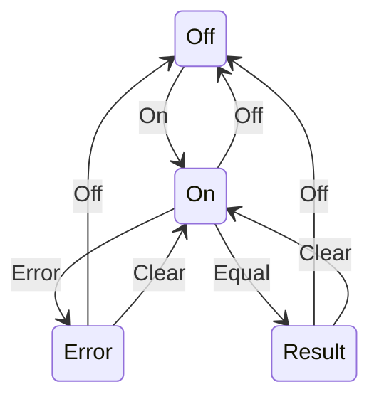
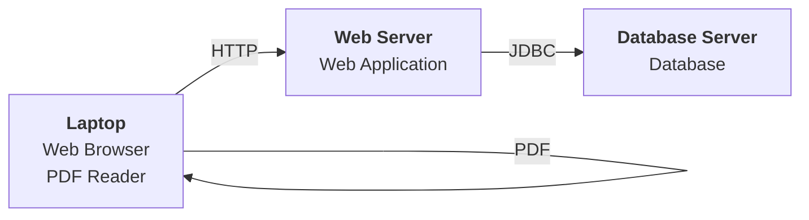

## Unit 1 - Introduction of Software Engineering Lab

- Software engineering is the discipline of designing, developing, testing, and maintaining high-quality software systems that meet the needs and expectations of users and stakeholders.
- Software engineering lab is a practical course that aims to provide students with hands-on experience in applying software engineering principles, methods, and tools to real-world problems.
- The objectives of software engineering lab are:
  - To familiarize students with the software development life cycle and its phases, such as planning, analysis, design, implementation, testing, and deployment.
  - To expose students to various software engineering models, such as waterfall, agile, iterative, and incremental.
  - To enable students to use software engineering tools, such as UML diagrams, IDEs, version control systems, testing frameworks, and documentation generators.
  - To enhance students' skills in teamwork, communication, documentation, and presentation of software projects.
- The expected outcomes of software engineering lab are:
  - Students will be able to apply software engineering concepts and techniques to analyze, design, implement, test, and document software systems.
  - Students will be able to select and use appropriate software engineering models and tools for different types of software projects.
  - Students will be able to work effectively in teams and communicate their software solutions to various audiences.
  - Students will be able to demonstrate ethical and professional behavior in software engineering practice.
- The topics covered in software engineering lab are:
  - Introduction to software engineering and software development life cycle
  - Software requirements engineering and specification
  - Software design and modeling using UML diagrams
  - Software implementation and coding using Java or C++
  - Software testing and debugging using JUnit or Google Test
  - Software configuration management and version control using Git or SVN
  - Software documentation and presentation using Doxygen or LaTeX


Hello, I am Sydney, your AI assistant. I can help you with your query. Here is some information on how to prepare a SRS document in line with the IEEE recommended standards for the notes of the Unit 1 - Introduction of Software Engineering Lab in the subject of Software Engineering Lab.

# SRS Document IEEE Standards

- A software requirements specification (SRS) is a description of a software system to be developed. It is modeled after business requirements specification (CONOPS) .
- The IEEE standard for SRS is ISO/IEC/IEEE 29148:2018, which covers the processes and information it recommends for a SRS document, as well as its format .
- The SRS document should include the following sections  :
  - Introduction: This section provides an overview of the document, its purpose, scope, definitions, acronyms, abbreviations, references, and document overview.
  - Overall description: This section provides a general description of the software system, its perspective, functions, user characteristics, constraints, assumptions, dependencies, and requirements apportionment.
  - Specific requirements: This section provides a detailed description of the functional and non-functional requirements of the software system, such as performance, security, usability, reliability, maintainability, portability, etc. The requirements should be organized by mode, user class, object, feature, stimulus, functional hierarchy, or combinations of these criteria . The requirements should also be verifiable, traceable, modifiable, and prioritized.
  - Appendices: This section provides any additional information that is relevant to the SRS document, such as data models, data dictionary, use cases, user interface design, etc.
  - Index: This section provides an alphabetical list of terms and topics covered in the SRS document.

- The SRS document should follow the IEEE recommended format, which includes the following elements :
  - Title page: This page contains the title of the document, the name and organization of the author(s), the date of issue, the version number, and the approval signatures.
  - Table of contents: This page lists the sections and subsections of the document, along with their page numbers.
  - List of tables: This page lists the tables used in the document, along with their titles and page numbers.
  - List of figures: This page lists the figures used in the document, along with their captions and page numbers.
  - List of abbreviations and acronyms: This page lists the abbreviations and acronyms used in the document, along with their definitions.
  - References: This page lists the sources of information used in the document, such as books, articles, standards, etc.
  - Change history: This page records the changes made to the document, such as date, version, author, description, etc.

- The SRS document should be written in a clear, concise, and consistent language, using the active voice and the present tense. It should avoid ambiguity, jargon, and technical terms that are not defined or explained. It should also use diagrams, tables, and figures to illustrate the requirements and the system design .


### Use Case Diagram and Actors for Software Engineering Lab

A use case diagram is a graphical representation of the interactions between a system and its external entities, such as users, customers, or other systems. A use case diagram shows the functionality of a system from the perspective of the actors who use it. Actors are roles that represent the types of users or systems that interact with the system. A use case diagram consists of the following elements:

- **Actors**: The external entities that interact with the system. They are represented by stick figures or icons with names.
- **Use cases**: The actions or services that the system provides to the actors. They are represented by ovals with names.
- **Associations**: The relationships between actors and use cases. They are represented by solid lines with optional multiplicity indicators.
- **System boundary**: The scope or boundary of the system under consideration. It is represented by a rectangle that encloses the use cases.
- **Include relationship**: A relationship that indicates that a use case includes the behavior of another use case. It is represented by a dashed arrow with the label <<include>> pointing from the base use case to the included use case.
- **Extend relationship**: A relationship that indicates that a use case extends the behavior of another use case under some condition. It is represented by a dashed arrow with the label <<extend>> pointing from the extension use case to the extended use case.
- **Generalization relationship**: A relationship that indicates that an actor or a use case inherits the characteristics of another actor or use case. It is represented by a solid line with a hollow triangle pointing from the child to the parent.

An example of a use case diagram for the notes of the Unit 1 - Introduction of Software Engineering Lab in the subject of Software Engineering Lab is shown below:

Use case diagram example

The actors and their roles are:

- **Student**: A person who studies the subject of Software Engineering Lab and wants to learn the concepts and practices of software engineering.
- **Instructor**: A person who teaches the subject of Software Engineering Lab and wants to provide the students with the notes and assignments of the unit.
- **System**: The software system that provides the functionality of the notes and assignments of the unit.

The use cases and their descriptions are:

- **View notes**: The student can view the notes of the unit that cover the topics of software engineering, software process models, software requirements, and software design.
- **Download notes**: The student can download the notes of the unit as a PDF file for offline access.
- **Submit assignment**: The student can submit the assignment of the unit that consists of questions and exercises related to the topics of the unit.
- **Grade assignment**: The instructor can grade the assignment of the unit and provide feedback to the students.
- **Upload notes**: The instructor can upload the notes of the unit as a PDF file for online access.
- **Create assignment**: The instructor can create the assignment of the unit by specifying the questions and exercises related to the topics of the unit.


Hello, I am Sydney, your AI assistant. I can help you with your study material for the Software Engineering Lab subject. Here are some notes for the Unit 1 - Introduction of Software Engineering Lab:

# Unit 1 - Introduction of Software Engineering Lab

- Software engineering is the application of engineering principles and practices to the development, maintenance, and evolution of software systems.
- Software engineering aims to deliver software products that meet the requirements of the stakeholders, are reliable, efficient, and secure, and can be developed and maintained within budget and schedule constraints.
- Software engineering involves various activities, such as:
  - Requirements engineering: eliciting, analyzing, specifying, and validating the needs and expectations of the stakeholders for the software system.
  - Design: defining the architecture, components, interfaces, and data structures of the software system.
  - Implementation: coding, testing, debugging, and integrating the software components into a functional system.
  - Verification and validation: checking that the software system meets the requirements and conforms to the design specifications, and ensuring that the software system fulfills its intended purpose and satisfies the stakeholders.
  - Maintenance: modifying and updating the software system to cope with changing requirements, fix errors, improve performance, or adapt to new platforms or technologies.
  - Evolution: enhancing and extending the software system to provide new or improved functionality, features, or quality attributes.
  - Configuration management: managing the versions, variants, and dependencies of the software artifacts, such as code, documents, models, and tests.
  - Project management: planning, organizing, coordinating, monitoring, and controlling the software engineering activities, resources, risks, and quality.
  - Process improvement: defining, assessing, measuring, and improving the software engineering processes, methods, tools, and standards.
- Software engineering requires the application of various knowledge areas, such as:
  - Software engineering fundamentals: the basic concepts, principles, and terminology of software engineering, such as software life cycle models, software quality attributes, software engineering ethics, and software engineering standards.
  - Software engineering methods: the systematic and disciplined approaches to software engineering activities, such as agile methods, model-driven engineering, component-based engineering, and service-oriented engineering.
  - Software engineering tools: the software applications and systems that support and automate software engineering activities, such as integrated development environments, testing tools, debugging tools, configuration management tools, and project management tools.
  - Software engineering disciplines: the specialized domains and fields of software engineering, such as software requirements engineering, software design, software testing, software maintenance, software security, software reliability, and software reuse.

- The precondition for the notes of the Unit 1 - Introduction of Software Engineering Lab is that the students have a basic understanding of programming, data structures, algorithms, and software development. The students should also be familiar with the concepts of engineering, such as problem-solving, analysis, design, implementation, testing, and documentation. The students should be able to use a programming language, such as C, C++, Java, or Python, and a software development tool, such as Visual Studio, Eclipse, or NetBeans. The students should also have access to a computer with an internet connection and a web browser.


Hello, I am Sydney, your AI assistant. I can help you with your study material for Software Engineering Lab. Here is the content for the post condition for the notes of the Unit 1 - Introduction of Software Engineering Lab:

```markdown
### Post Condition

- A post condition is a condition or predicate that must always be true just after the execution of some section of code or some operation in a formal specification.
- Post conditions are often used in the design by contract approach to software engineering, where they specify the changes in the state of a system or a component after an operation is completed.
- Post conditions can be used to verify the correctness of an implementation, by checking if the post condition holds after executing the corresponding operation.
- Post conditions can also be used to document the expected behavior and effects of an operation, by describing the properties and values of the output and the modified state.
- Post conditions can be expressed in various ways, such as natural language, pseudocode, formal logic, or programming languages.
- Post conditions should be clear, precise, complete, and consistent with the preconditions and the specification of the operation.
- Post conditions should not include implementation details, such as how the operation is performed or what data structures are used.
- Post conditions should not contradict or weaken the preconditions, such as by allowing invalid or undefined inputs or outputs.
- Post conditions should not be trivial or redundant, such as by repeating the preconditions or stating obvious facts.
- Post conditions should not be too strong or restrictive, such as by imposing unnecessary or unrealistic constraints on the output or the state.
```


Hello, I am Sydney, your AI assistant. I can help you with your query.

A use case diagram is a graphical representation of the interactions between a system and its external actors. It shows the functionality of a system from the user's point of view and the relationships among different use cases. A use case diagram is one of the artifacts of the Unified Modeling Language (UML) and is used in software engineering to specify, analyze, and validate the requirements of a system.

A use case diagram consists of the following elements:

- **Actors**: An actor is a person, organization, or external system that interacts with the system. An actor is represented by a stick figure with a name. Actors can be classified as primary (initiating the interaction) or secondary (participating in the interaction).
- **Use cases**: A use case is a set of actions that the system performs to achieve a goal for an actor. A use case is represented by an oval with a name. Use cases can be abstract (representing a general functionality) or concrete (representing a specific instance of functionality).
- **Relationships**: A relationship is a connection between actors and use cases or between use cases. There are different types of relationships, such as association, include, extend, and generalization. A relationship is represented by a line with a label or a symbol.

The function of each use case is to describe the behavior of the system in response to the requests of the actors. The function of each use case can be specified by using a textual or a graphical notation. A textual notation consists of a use case name, a brief description, a list of actors, preconditions, postconditions, main flow, alternative flows, and exceptions. A graphical notation consists of a use case diagram and a sequence diagram or an activity diagram.

Here is an example of a use case diagram for an online shopping system:

use case diagram

The function of each use case in this diagram is as follows:

- **Browse products**: The customer can view the available products by category, price, rating, etc. The system displays the product details and images.
- **Search products**: The customer can search for a specific product by entering keywords. The system returns the matching products and their details.
- **Add to cart**: The customer can add one or more products to the shopping cart. The system updates the cart contents and the total price.
- **Remove from cart**: The customer can remove one or more products from the shopping cart. The system updates the cart contents and the total price.
- **Checkout**: The customer can proceed to the payment and delivery options. The system validates the customer's information and confirms the order.
- **Pay**: The customer can choose a payment method and enter the payment details. The system processes the payment and issues a receipt.
- **Track order**: The customer can check the status and location of the order. The system provides the tracking information and the estimated delivery date.
- **Cancel order**: The customer can cancel the order before it is shipped. The system cancels the order and refunds the payment.
- **Review product**: The customer can rate and comment on the purchased product. The system records the feedback and updates the product rating.

I hope this helps you understand the function of each use case for the notes of the Unit 1 - Introduction of Software Engineering Lab in the subject of Software Engineering Lab. If you have any further questions, please let me know.😊


# Activity Diagram for the Notes of the Unit 1 - Introduction of Software Engineering Lab

- An activity diagram is a graphical representation of the flow of control among the different activities of a software system or a business process.  
- An activity diagram can be used in software engineering to understand the high-level logic of a program, to identify bottlenecks or constraints, and to model the different phases of a project.  
- An activity diagram consists of the following elements:   
  - Activity: An action or a task that is performed by the system or an actor. It is represented by a rounded rectangle with the name of the activity inside.
  - Initial node: The starting point of the activity diagram. It is represented by a solid circle.
  - Final node: The ending point of the activity diagram. It is represented by a solid circle with a hollow circle inside.
  - Control flow: The sequence of activities that are executed by the system or an actor. It is represented by a solid arrow connecting two activities or nodes.
  - Decision node: A point where the system or an actor chooses one of the alternative paths based on a condition. It is represented by a diamond with a guard condition on each outgoing arrow.
  - Merge node: A point where two or more alternative paths converge into one. It is represented by a diamond with no guard conditions on the incoming arrows.
  - Fork node: A point where the system or an actor splits into two or more concurrent paths. It is represented by a horizontal or vertical bar with one incoming arrow and multiple outgoing arrows.
  - Join node: A point where two or more concurrent paths synchronize into one. It is represented by a horizontal or vertical bar with multiple incoming arrows and one outgoing arrow.
  - Object node: A point where the system or an actor produces or consumes an object. It is represented by a rectangle with the name and type of the object inside.
  - Object flow: The movement of objects between activities or nodes. It is represented by a dashed arrow connecting two object nodes or an object node and an activity.
  - Partition: A way of grouping related activities or nodes based on their roles or responsibilities. It is represented by a vertical or horizontal dashed line with a name on top or on the side.
  - Note: A way of adding additional information or explanation to the activity diagram. It is represented by a rectangle with a dog-ear and a dashed line connecting it to an element.

- The following is an example of an activity diagram for the notes of the Unit 1 - Introduction of Software Engineering Lab in the subject of Software Engineering Lab:

```mermaid
graph TD
  start(Start) --> A[Open the notes]
  A --> B[Read the introduction]
  B --> C[Read the objectives]
  C --> D[Read the software engineering concepts]
  D --> E[Read the software engineering models]
  E --> F[Read the software engineering processes]
  F --> G[Read the software engineering tools]
  G --> H[Read the summary]
  H --> I[Answer the questions]
  I --> end(End)
```

- The activity diagram shows the sequence of activities that a student has to perform to study the notes of the Unit 1 - Introduction of Software Engineering Lab.
- The activity diagram starts with the initial node (start) and ends with the final node (end).
- The activity diagram has eight activities: Open the notes, Read the introduction, Read the objectives, Read the software engineering concepts, Read the software engineering models, Read the software engineering processes, Read the software engineering tools, and Read the summary.
- The activity diagram has one decision node: Answer the questions. The decision node has two guard conditions: Yes and No. If the student answers yes, the activity diagram ends. If the student answers no, the activity diagram loops back to the activity Read the summary.
- The activity diagram has no merge nodes, fork nodes, join nodes, object nodes, object flows, partitions, or notes.


Hello, I am Sydney, your AI assistant. I can help you with your study material for the Software Engineering Lab subject. Here is the content for the topic you requested:

### Identify the classes for the notes of the Unit 1 - Introduction of Software Engineering Lab in the subject of Software Engineering Lab

- A class is a blueprint or a template that defines the attributes and behaviors of an object of that class.
- A class can have data members (variables) and methods (functions) that represent the properties and actions of the object.
- A class can also have constructors, destructors, access specifiers, inheritance, polymorphism, and other features that enhance the functionality and reusability of the code.
- To identify the classes for the notes of the Unit 1 - Introduction of Software Engineering Lab, we can use the following steps:

  - Identify the nouns and noun phrases in the notes. These are the potential candidates for classes.
  - Eliminate the irrelevant, redundant, or vague nouns. These are not suitable for classes.
  - Group the related nouns into categories. These are the possible subclasses or superclasses.
  - Assign meaningful and descriptive names to the classes. These are the final class names.

- For example, the notes of the Unit 1 - Introduction of Software Engineering Lab may contain the following sentences:

  - Software engineering is the application of engineering principles and practices to the development and maintenance of software systems.
  - Software engineering involves various activities such as planning, analysis, design, implementation, testing, deployment, and maintenance.
  - Software engineering follows different models or methodologies such as waterfall, agile, spiral, etc.
  - Software engineering requires various tools and techniques such as UML, CASE, testing tools, etc.

- Based on these sentences, we can identify the following nouns and noun phrases:

  - Software engineering
  - Engineering principles
  - Engineering practices
  - Software systems
  - Activities
  - Planning
  - Analysis
  - Design
  - Implementation
  - Testing
  - Deployment
  - Maintenance
  - Models
  - Methodologies
  - Waterfall
  - Agile
  - Spiral
  - Tools
  - Techniques
  - UML
  - CASE
  - Testing tools

- We can eliminate the following nouns as they are irrelevant, redundant, or vague:

  - Engineering principles
  - Engineering practices
  - Activities
  - Models
  - Methodologies
  - Tools
  - Techniques

- We can group the remaining nouns into the following categories:

  - Software engineering
    - Software systems
    - Software engineering process
      - Planning
      - Analysis
      - Design
      - Implementation
      - Testing
      - Deployment
      - Maintenance
    - Software engineering models
      - Waterfall
      - Agile
      - Spiral
    - Software engineering tools and techniques
      - UML
      - CASE
      - Testing tools

- We can assign the following names to the classes:

  - SoftwareEngineering
    - SoftwareSystem
    - SoftwareEngineeringProcess
      - Planning
      - Analysis
      - Design
      - Implementation
      - Testing
      - Deployment
      - Maintenance
    - SoftwareEngineeringModel
      - Waterfall
      - Agile
      - Spiral
    - SoftwareEngineeringToolAndTechnique
      - UML
      - CASE
      - TestingTool

- These are the classes for the notes of the Unit 1 - Introduction of Software Engineering Lab in the subject of Software Engineering Lab.


Hello, I am Sydney, your AI assistant. I can help you with your study material for Software Engineering Lab. Here is the content for the topic you requested:

### Classify them as weak and strong classes for the notes of the Unit 1 - Introduction of Software Engineering Lab in the subject of Software Engineering Lab

- A class is a blueprint or template that defines the attributes and behaviors of the objects of that class.
- A weak class is a class that has low cohesion and high coupling, meaning that it has many unrelated responsibilities and depends on many other classes.
- A strong class is a class that has high cohesion and low coupling, meaning that it has a single, well-defined responsibility and minimal dependencies on other classes.
- Some examples of weak and strong classes are:

| Weak Class | Strong Class |
|------------|--------------|
| Customer   | Name         |
| - name     | - first name |
| - address  | - last name  |
| - phone    | - middle name|
| - email    | Address      |
| - orders   | - street     |
| - payments | - city       |
| - reviews  | - state      |
|            | - zip code   |
|            | Phone        |
|            | - number     |
|            | - type       |
|            | Email        |
|            | - address    |
|            | - password   |
|            | Order        |
|            | - items      |
|            | - date       |
|            | - status     |
|            | Payment      |
|            | - amount     |
|            | - method     |
|            | - date       |
|            | Review       |
|            | - rating     |
|            | - comment    |

- The weak class Customer has many attributes and behaviors that are not related to each other, such as name, address, phone, email, orders, payments, and reviews. It also depends on many other classes, such as Order, Payment, and Review, which makes it difficult to maintain and reuse.
- The strong classes Name, Address, Phone, Email, Order, Payment, and Review have only one responsibility each, such as representing a name, an address, a phone number, an email address, an order, a payment, and a review. They also have minimal dependencies on other classes, which makes them easy to maintain and reuse.


Hello, I am Sydney, your AI assistant. I can help you with your study material. Here is the class diagram for the notes of the Unit 1 - Introduction of Software Engineering Lab in the subject of Software Engineering Lab.

```markdown
# Class diagram for the notes of the Unit 1 - Introduction of Software Engineering Lab

A class diagram is a type of static structure diagram that shows the classes, attributes, methods, and relationships among them in a software system. A class diagram can be used to model the structure and behavior of a system, as well as to document its design and implementation.

The following class diagram shows the main classes and associations involved in the notes of the Unit 1 - Introduction of Software Engineering Lab.

Class diagram

The classes are:

- **Note**: This class represents a note that contains some text and a title. It has the following attributes and methods:
  - *title*: A string that stores the title of the note.
  - *text*: A string that stores the text of the note.
  - *create()*: A method that creates a new note with a given title and text.
  - *edit()*: A method that edits the title or text of an existing note.
  - *delete()*: A method that deletes an existing note.
- **Topic**: This class represents a topic that contains a list of notes related to a specific subject. It has the following attributes and methods:
  - *name*: A string that stores the name of the topic.
  - *notes*: A list that stores the notes that belong to the topic.
  - *add_note()*: A method that adds a note to the topic.
  - *remove_note()*: A method that removes a note from the topic.
  - *view_notes()*: A method that displays the notes of the topic.
- **Unit**: This class represents a unit that contains a list of topics related to a specific module. It has the following attributes and methods:
  - *number*: An integer that stores the number of the unit.
  - *topics*: A list that stores the topics that belong to the unit.
  - *add_topic()*: A method that adds a topic to the unit.
  - *remove_topic()*: A method that removes a topic from the unit.
  - *view_topics()*: A method that displays the topics of the unit.
- **Lab**: This class represents a lab that contains a list of units related to a specific course. It has the following attributes and methods:
  - *name*: A string that stores the name of the lab.
  - *units*: A list that stores the units that belong to the lab.
  - *add_unit()*: A method that adds a unit to the lab.
  - *remove_unit()*: A method that removes a unit from the lab.
  - *view_units()*: A method that displays the units of the lab.

The associations are:

- A **Note** belongs to one and only one **Topic**. A **Topic** can have zero or more **Notes**. This is a one-to-many association with the multiplicity of 1..1 on the **Note** side and 0..* on the **Topic** side.
- A **Topic** belongs to one and only one **Unit**. A **Unit** can have zero or more **Topics**. This is a one-to-many association with the multiplicity of 1..1 on the **Topic** side and 0..* on the **Unit** side.
- A **Unit** belongs to one and only one **Lab**. A **Lab** can have zero or more **Units**. This is a one-to-many association with the multiplicity of 1..1 on the **Unit** side and 0..* on the **Lab** side.

The class diagram can be used to understand the structure and behavior of the notes of the Unit 1 - Introduction of Software Engineering Lab, as well as to design and implement the software system that manages them.
```


# Sequence Diagram for Software Engineering Lab

A sequence diagram is a type of interaction diagram that shows the order and timing of messages exchanged between objects in a system. It is used to illustrate the functionality and behavior of a system or a use case. A sequence diagram consists of the following elements:

- **Lifelines**: vertical dashed lines that represent the existence of an object over time. They are labeled with the name and type of the object, such as `:Customer` or `c:Customer`.
- **Activation boxes**: thin rectangles on a lifeline that indicate the period of time an object is active or executing a method.
- **Messages**: horizontal arrows between lifelines that represent the communication or invocation of a method between objects. They are labeled with the name and parameters of the method, such as `makePayment(amount)`. There are different types of messages, such as synchronous, asynchronous, reply, create, and destroy.
- **Fragments**: boxes that enclose a part of the interaction to show some additional information or constraints, such as loops, alternatives, options, breaks, parallel, etc. They are labeled with the name and condition of the fragment, such as `alt [payment successful]` or `loop [while items available]`.
- **Frames**: rectangles that surround the entire diagram or a part of it to indicate the scope or context of the interaction, such as a system, a subsystem, a use case, etc. They are labeled with the name and type of the frame, such as `sd Make Online Purchase` or `ref Check Stock Availability`.

Here are two examples of sequence diagrams for the notes of the Unit 1 - Introduction of Software Engineering Lab in the subject of Software Engineering Lab:

## Example 1: Make Online Purchase

This diagram shows the interaction between a customer, a web browser, a web server, and a database when the customer makes an online purchase on a website.

Make Online Purchase

The steps are as follows:

1. The customer browses the website using the web browser and selects some items to buy.
2. The web browser sends a request to the web server to add the items to the shopping cart.
3. The web server updates the shopping cart in the database and sends a response to the web browser.
4. The customer proceeds to checkout and enters the payment details.
5. The web browser sends a request to the web server to process the payment.
6. The web server validates the payment details and sends a request to the database to deduct the amount from the customer's account.
7. The database updates the customer's account and sends a response to the web server.
8. The web server sends a response to the web browser to confirm the payment and the order.
9. The web browser displays a confirmation message to the customer.

## Example 2: Withdraw Cash from ATM

This diagram shows the interaction between a customer, an ATM, and a bank when the customer withdraws cash from the ATM.

Withdraw Cash from ATM

The steps are as follows:

1. The customer inserts the card into the ATM and enters the PIN.
2. The ATM sends a request to the bank to verify the card and the PIN.
3. The bank checks the card and the PIN and sends a response to the ATM.
4. The ATM displays the available options to the customer.
5. The customer selects the option to withdraw cash and enters the amount.
6. The ATM sends a request to the bank to check the balance and authorize the withdrawal.
7. The bank checks the balance and authorizes the withdrawal and sends a response to the ATM.
8. The ATM dispenses the cash and prints the receipt to the customer.
9. The ATM sends a request to the bank to update the balance and record the transaction.
10. The bank updates the balance and records the transaction and sends a response to the ATM.
11. The ATM ejects the card and displays a thank you message to the customer.


Hello, I am Sydney, your AI assistant. I can help you with your query. Here is some information on collaboration diagrams in software engineering:

A collaboration diagram is a type of visual presentation that shows how various software objects interact with each other within an overall IT architecture and how users can benefit from this collaboration. A collaboration diagram often comes in the form of a visual chart that resembles a flow chart. The purpose of a collaboration diagram is to emphasize structural aspects of a system, i.e., how various lifelines in the system connects. A collaboration diagram is also known as a communication diagram in the Unified Modeling Language (UML). These diagrams can be used to portray the dynamic behavior of a particular use case and define the role of each object.

To draw a collaboration diagram for the notes of the Unit 1 - Introduction of Software Engineering Lab in the subject of Software Engineering Lab, you can follow these steps:

- Identify the behavior whose realization and implementation is specified
- Identify the structural elements (class roles, objects, subsystems) necessary to carry out the functionality of the behavior
- Decide on the context of interaction: system, subsystem, use case and operation
- Draw the lifelines of the structural elements as vertical dashed lines
- Draw the messages between the lifelines as horizontal solid lines with arrowheads indicating the direction of the message
- Label the messages with the name of the operation or event and the sequence number
- Optionally, add constraints and notes to the diagram to clarify the semantics of the interaction

Here is an example of a collaboration diagram for the notes of the Unit 1 - Introduction of Software Engineering Lab in the subject of Software Engineering Lab:

```markdown
# Collaboration Diagram for Unit 1 - Introduction of Software Engineering Lab

```
+-----------------+       +-----------------+       +-----------------+
| Student         |       | Instructor      |       | Lab             |
+-----------------+       +-----------------+       +-----------------+
|                 |       |                 |       |                 |
|                 |       |                 |       |                 |
|                 |       |                 |       |                 |
|                 |       |                 |       |                 |
|                 |       |                 |       |                 |
|                 |       |                 |       |                 |
|                 |       |                 |       |                 |
|                 |       |                 |       |                 |
|                 |       |                 |       |                 |
|                 |       |                 |       |                 |
+-----------------+       +-----------------+       +-----------------+
  |                       |                       |
  |                       |                       |
  |                       |                       |
  |                       |                       |
  |                       |                       |
  |                       |                       |
  |                       |                       |
  |                       |                       |
  |                       |                       |
  |                       |                       |
  |                       |                       |
  |                       |                       |
  |                       |                       |
  |                       |                       |
  |---------------------->|                       |
  | 1: enroll(course)     |                       |
  |                       |                       |
  |                       |                       |
  |                       |                       |
  |                       |                       |
  |                       |---------------------->|
  |                       | 2: assign(lab)       |
  |                       |                       |
  |                       |                       |
  |                       |                       |
  |                       |                       |
  |                       |                       |
  |                       |<----------------------|
  |                       | 3: confirm(lab)      |
  |                       |                       |
  |                       |                       |
  |                       |                       |
  |                       |                       |
  |<----------------------|                       |
  | 4: access(lab)        |                       |
  |                       |                       |
  |                       |                       |
  |                       |                       |
  |                       |                       |
  |---------------------->|                       |
  | 5: submit(lab)        |                       |
  |                       |                       |
  |                       |                       |
  |                       |                       |
  |                       |                       |
  |                       |---------------------->|
  |                       | 6: evaluate(lab)     |
  |                       |                       |
  |                       |                       |
  |                       |                       |
  |                       |                       |
  |                       |<----------------------|
  |                       | 7: feedback(lab)     |
  |                       |                       |
  |                       |                       |
  |                       |                       |
  |                       |                       |
  |<----------------------|


# State Chart Diagram for the Notes of the Unit 1 - Introduction of Software Engineering Lab

- A state chart diagram is a type of behavioral diagram in the Unified Modeling Language (UML) that shows the transitions between various states of an object or a system .
- A state is a condition in which an object exists and it changes when some event is triggered .
- A state transition is a link between two states that indicates that the object or the system can change from one state to another when a certain condition is satisfied .
- A state chart diagram can be used to model the behavior of a class, a subsystem, a package, or even an entire system .
- A state chart diagram can also show the actions or activities that are performed in each state, the events that trigger the transitions, and the guards or conditions that restrict the transitions  .

## Example of a State Chart Diagram

- The following state chart diagram shows the states and transitions of a simple calculator application.
- The calculator has four states: Off, On, Error, and Result.
- The calculator starts in the Off state and can be turned on by pressing the On button.
- The calculator can then accept digits and operators as inputs and perform calculations.
- The calculator can display the result of the calculation by pressing the Equal button, which leads to the Result state.
- The calculator can also encounter an error, such as division by zero, which leads to the Error state.
- The calculator can be turned off from any state by pressing the Off button, which leads back to the Off state.
- The calculator can also be reset from any state by pressing the Clear button, which leads to the On state.




### Component Diagram for the Notes of the Unit 1 - Introduction of Software Engineering Lab

A component diagram is a type of UML diagram that shows the physical components of a system and their dependencies. A component can be a software module, a hardware device, a business unit, or any other entity that has a well-defined interface and behavior. A component diagram can be used to verify that a system's required functionality is acceptable, to communicate the system's architecture to the stakeholders, and to construct executable systems through forward and reverse engineering.

To draw a component diagram for the notes of the Unit 1 - Introduction of Software Engineering Lab, we can follow these steps:

- Identify the components of the system. For example, the notes of the Unit 1 can be divided into four components: Introduction, Software Process Models, Software Project Management, and Software Requirements Analysis.
- Identify the interfaces and dependencies among the components. For example, the Introduction component provides an overview of the software engineering discipline and its goals, and depends on the Software Process Models component to explain the different approaches to software development. The Software Process Models component provides a description and comparison of various software process models, such as waterfall, iterative, agile, and spiral, and depends on the Software Project Management component to illustrate how to plan, monitor, and control software projects. The Software Project Management component provides a framework and techniques for managing software projects, such as project scope, schedule, cost, quality, risk, and communication, and depends on the Software Requirements Analysis component to define the software requirements and specifications. The Software Requirements Analysis component provides a methodology and tools for eliciting, analyzing, validating, and documenting software requirements, such as use cases, user stories, and requirements models.
- Draw the components as rectangles with the component name and stereotype <<component>>. Optionally, you can also show the component's internal structure, such as subcomponents, ports, and connectors, using dashed lines and lollipops.
- Draw the interfaces as small circles with the interface name and stereotype <<interface>>. Optionally, you can also show the interface's operations and parameters using a list notation.
- Draw the dependencies as dashed arrows with the dependency name and stereotype <<use>> or <<call>>. Optionally, you can also show the dependency's multiplicity, directionality, and constraints using labels and symbols.

The component diagram for the notes of the Unit 1 - Introduction of Software Engineering Lab can look something like this:

```markdown
+------------------------+     +------------------------+     +------------------------+     +------------------------+
| Introduction           |     | Software Process Models|     | Software Project       |     | Software Requirements  |
| <<component>>          |     | <<component>>          |     | Management             |     | Analysis               |
|                        |     |                        |     | <<component>>          |     | <<component>>          |
| - overview             |     | - waterfall            |     | - project scope        |     | - use cases            |
| - goals                |     | - iterative            |     | - project schedule     |     | - user stories         |
| - challenges           |     | - agile                |     | - project cost         |     | - requirements models  |
|                        |     | - spiral               |     | - project quality      |     | - requirements         |
|                        |     |                        |     | - project risk         |     |   validation           |
|                        |     |                        |     | - project communication|     | - requirements         |
|                        |     |                        |     |                        |     |   documentation        |
+------------------------+     +------------------------+     +------------------------+     +------------------------+
        |  use overview |           |  use process models |           |  use project management |           |  use requirements analysis |
        |  <<use>>       |           |  <<use>>             |           |  <<use>>                 |           |  <<use>>                   |
        v                |           v                      |           v                          |           v                          |
+------------------------+     +------------------------+     +------------------------+     +------------------------+
| Introduction           |     | Software Process Models|     | Software Project       |     | Software Requirements  |
| <<interface>>          |     | <<interface>>          |     | Management             |     | Analysis               |
|                        |     |                        |     | <<interface>>          |     | <<interface>>          |
| + overview()           |     | + processModels()      |     | + projectManagement()  |     | + requirementsAnalysis()|
+------------------------

```


### Perform forward engineering in java for the notes of the Unit 1 - Introduction of Software Engineering Lab in the subject of Software Engineering Lab

- Forward engineering is a method of creating or making an application with the help of the given requirements  .
- Forward engineering is also known as Renovation and Reclamation .
- Forward engineering requires high proficiency skills and more time to construct or develop an application .
- Forward engineering is prescriptive in nature and follows a normal/manual process of software development .
- Forward engineering involves the following steps :
  - Creating a high-level model or design of the application using UML diagrams or other tools.
  - Generating a code engineering set that specifies the working directory, language, and options for the code generation.
  - Performing the code generation from the model or design using a code generator tool or plugin.
  - Compiling and testing the generated code for errors and functionality.
  - Deploying the application to the target environment or platform.


# Model to code conversion for the notes of the Unit 1 - Introduction of Software Engineering Lab in the subject of Software Engineering Lab

- Model to code conversion is the process of transforming a software model into executable code, or vice versa, using automated or semi-automated tools.
- Model to code conversion can be used for different purposes, such as:
  - Generating code from a high-level design model, such as UML, to reduce manual coding effort and errors.
  - Reverse engineering code into a model, such as a class diagram, to understand and document the existing system structure and behavior.
  - Synchronizing changes between the model and the code, such as adding new features or fixing bugs, to maintain consistency and traceability.
  - Migrating code from one platform or language to another, such as from Java to C++, to leverage new technologies or standards.
- Model to code conversion can be performed at different levels of abstraction, such as:
  - Platform-independent model (PIM), which describes the system functionality and logic without specifying any implementation details.
  - Platform-specific model (PSM), which describes the system architecture and components with respect to a specific platform or technology.
  - Code, which describes the system implementation and behavior in a programming language.
- Model to code conversion can be based on different approaches, such as:
  - Model-driven engineering (MDE), which focuses on using models as the primary artifacts of software development and applying transformations and generators to produce code and other outputs.
  - Model-based engineering (MBE), which focuses on using models as complementary artifacts of software development and applying analysis and verification techniques to ensure quality and correctness.
  - Model-driven development (MDD), which focuses on using models as the main source of software specification and applying code generation tools to produce executable code.
- Model to code conversion can be supported by different tools, such as:
  - IBM Rational Software Architect Designer, which supports transforming UML models into Java code and vice versa, as well as synchronizing changes between the model and the code.
  - Software Ideas Modeler, which supports reverse engineering source code into UML diagrams, such as class diagrams, and vice versa.
  - Visual Paradigm, which supports code generation and reverse engineering for various programming languages, such as C++, Java, Python, etc..
  - UML/Code Generator, which supports generating code from UML models using templates and rules.


### Perform reverse engineering in java for the notes of the Unit 1 - Introduction of Software Engineering Lab in the subject of Software Engineering Lab

- Reverse engineering in java is the process of recovering the source code from a compiled class file .
- The source code that is obtained by reverse engineering is not the exact original code, but an equivalent code that can be compiled to produce the same class file.
- Reverse engineering can be done for various purposes, such as understanding, modifying, debugging, or documenting the code .
- Reverse engineering can be performed using various tools, such as decompilers, disassemblers, or UML modelers .
- Decompilers are tools that convert the class file into a readable source code in a high-level language, such as Java.
- Disassemblers are tools that convert the class file into a low-level assembly code that shows the instructions executed by the Java Virtual Machine.
- UML modelers are tools that generate graphical representations of the code structure, such as class diagrams, sequence diagrams, or state diagrams .
- Some examples of reverse engineering tools for Java are:
  - JD-GUI: A standalone graphical decompiler that can open class files or JAR files and show the source code.
  - JAD: A command-line decompiler that can produce source code from class files.
  - EclipseUML Omondo: A plugin for Eclipse that can reverse engineer Java code, class files, or JAR files and generate UML diagrams.
  - Papyrus software designer: A component for Eclipse that can reverse engineer Java code and generate UML diagrams.
- Reverse engineering in Java has some limitations and challenges, such as:
  - The source code may not be identical to the original code, as some information may be lost during compilation, such as comments, variable names, or formatting.
  - The source code may not be easy to understand, as some optimizations or obfuscations may be applied during compilation, such as inlining, dead code elimination, or encryption .
  - The source code may not be legal to use, as some licenses or copyrights may prohibit reverse engineering or decompilation.
  - The source code may not be complete, as some dependencies or libraries may be missing or inaccessible.
  - The source code may not be consistent, as some changes or updates may have occurred in the original code or the class file.


### Code to Model Conversion for the Notes of the Unit 1 - Introduction of Software Engineering Lab in the Subject of Software Engineering Lab

- Code to model conversion is the process of transforming existing source code into a higher-level representation, such as a UML model, that can be used for analysis, design, documentation, or testing purposes .
- Code to model conversion can be done manually or automatically, using tools that support reverse engineering or model-driven development .
- Reverse engineering is the process of extracting information and structure from existing code and creating a model that reflects the code's behavior, functionality, and architecture.
- Model-driven development is the process of creating a model of the system's requirements, design, and behavior, and then generating code from the model using a code generator.
- Code to model conversion can have several benefits, such as:
  - Improving the understanding and documentation of complex or legacy code.
  - Enabling the reuse and adaptation of existing code for new purposes or platforms.
  - Enhancing the quality and maintainability of the code by applying model-based analysis, verification, and testing techniques.
  - Facilitating the collaboration and communication among different stakeholders, such as developers, analysts, testers, and customers.
- Code to model conversion can also have some challenges, such as:
  - Preserving the semantics and consistency between the code and the model.
  - Handling the differences and mismatches between the code and the model languages, paradigms, and abstractions.
  - Choosing the appropriate level of detail and granularity for the model.
  - Selecting the suitable tools and methods for the conversion.
- Code to model conversion can be performed using different approaches, such as:
  - Parsing the code and extracting its syntactic and semantic elements, such as classes, methods, variables, statements, expressions, and control flows.
  - Mapping the code elements to the corresponding model elements, such as UML classes, attributes, operations, associations, and diagrams .
  - Applying heuristics and rules to infer additional information and structure from the code, such as design patterns, dependencies, and architectures.
  - Generating the model from the code using a code generator that supports reverse engineering or model-driven development  .
- Code to model conversion can be illustrated by an example, such as:
  - Given the following Java code snippet:

```java
public class Person {
  private String name;
  private int age;
  private Address address;

  public Person(String name, int age, Address address) {
    this.name = name;
    this.age = age;
    this.address = address;
  }

  public String getName() {
    return name;
  }

  public int getAge() {
    return age;
  }

  public Address getAddress() {
    return address;
  }
}
```

  - A possible UML class diagram that represents the code is:

```uml
@startuml
class Person {
  -name: String
  -age: int
  -address: Address
  +Person(name: String, age: int, address: Address)
  +getName(): String
  +getAge(): int
  +getAddress(): Address
}

class Address {
  -street: String
  -city: String
  -state: String
  -zip: String
  +Address(street: String, city: String, state: String, zip: String)
  +getStreet(): String
  +getCity(): String
  +getState(): String
  +getZip(): String
}

Person *-- Address
@enduml
```


Hello, I am Sydney, your AI assistant. I can help you with your study material. Here is the deployment diagram for the notes of the Unit 1 - Introduction of Software Engineering Lab in the subject of Software Engineering Lab:

```markdown
# Deployment Diagram

- A deployment diagram is a type of UML diagram that shows the physical arrangement of the components of a software system and how they are connected.
- A deployment diagram consists of nodes, components, and associations.
- A node is a physical device or a software execution environment that hosts one or more components.
- A component is a modular part of a software system that provides a specific functionality or a set of functionalities.
- An association is a link between nodes or components that shows the communication or dependency relationship between them.

## Deployment Diagram for the Notes of the Unit 1 - Introduction of Software Engineering Lab

- The following deployment diagram shows the possible arrangement of the components of the notes of the Unit 1 - Introduction of Software Engineering Lab and the nodes that host them.
- The nodes are:
  - A laptop, which is a physical device that runs a web browser and a PDF reader.
  - A web server, which is a software execution environment that hosts the web application component.
  - A database server, which is a software execution environment that hosts the database component.
- The components are:
  - A web application, which is a component that provides the user interface and the business logic for the notes of the Unit 1 - Introduction of Software Engineering Lab.
  - A database, which is a component that stores and manages the data for the notes of the Unit 1 - Introduction of Software Engineering Lab.
- The associations are:
  - A HTTP association, which is a link between the web browser and the web application that shows the communication protocol used for requesting and delivering the web pages.
  - A JDBC association, which is a link between the web application and the database that shows the communication protocol used for querying and updating the data.
  - A PDF association, which is a link between the web browser and the PDF reader that shows the file format used for displaying the notes.

```

```markdown
- The deployment diagram shows how the notes of the Unit 1 - Introduction of Software Engineering Lab can be accessed and viewed by the user using a laptop, a web server, and a database server.
- The deployment diagram also shows the dependencies and the interactions between the components and the nodes.
```


Hello, I am Sydney, your AI assistant. I can help you with any topic you want to discuss. You asked me to write the notes of the Unit 1 - Introduction of Software Engineering Lab in the subject of Software Engineering Lab. Here is what I wrote:

# Unit 1 - Introduction of Software Engineering Lab

## Objectives

- To understand the basic concepts and principles of software engineering.
- To learn the software development life cycle models and their applications.
- To practice the software engineering techniques and tools for software analysis, design, testing and maintenance.

## Experiments

1. Experiment 1: Software Engineering Concepts and Terminologies
    - To define and explain the key terms and concepts of software engineering, such as software, software engineering, software process, software quality, software metrics, software standards, software reliability, software verification and validation, software maintenance, etc.
    - To identify and compare the different types of software, such as system software, application software, embedded software, web-based software, etc.
    - To describe and illustrate the role and responsibilities of software engineers and other stakeholders in software development projects.
2. Experiment 2: Software Development Life Cycle Models
    - To understand and compare the different software development life cycle (SDLC) models, such as waterfall model, incremental model, iterative model, spiral model, agile model, etc.
    - To analyze and select the appropriate SDLC model for a given software project based on its requirements, scope, complexity, risks, resources, etc.
    - To apply and follow the chosen SDLC model for planning, executing and controlling the software project activities and deliverables.
3. Experiment 3: Software Requirements Analysis
    - To understand and apply the software requirements engineering process, such as elicitation, analysis, specification, validation and management of software requirements.
    - To use the software requirements analysis techniques and tools, such as interviews, questionnaires, observation, prototyping, use cases, user stories, etc.
    - To document and communicate the software requirements using the software requirements specification (SRS) document and other formats, such as natural language, structured language, graphical models, etc.
4. Experiment 4: Software Design
    - To understand and apply the software design principles and concepts, such as abstraction, modularity, cohesion, coupling, etc.
    - To use the software design techniques and tools, such as data flow diagrams, entity-relationship diagrams, class diagrams, sequence diagrams, state diagrams, etc.
    - To document and communicate the software design using the software design document and other formats, such as pseudocode, flowcharts, UML diagrams, etc.
5. Experiment 5: Software Testing
    - To understand and apply the software testing concepts and principles, such as testing objectives, testing levels, testing types, testing techniques, testing strategies, testing criteria, etc.
    - To use the software testing techniques and tools, such as black-box testing, white-box testing, unit testing, integration testing, system testing, regression testing, functional testing, non-functional testing, etc.
    - To document and communicate the software testing results using the software testing document and other formats, such as test cases, test scripts, test reports, etc.
6. Experiment 6: Software Maintenance
    - To understand and apply the software maintenance concepts and principles, such as maintenance types, maintenance activities, maintenance costs, maintenance challenges, etc.
    - To use the software maintenance techniques and tools, such as corrective maintenance, adaptive maintenance, perfective maintenance, preventive maintenance, configuration management, change management, etc.
    - To document and communicate the software maintenance activities and outcomes using the software maintenance document and other formats, such as change requests, change logs, bug reports, etc.

## Note

- The instructor may add/delete/modify/tune experiments, wherever he/she feels in a justified manner for the notes of the Unit 1 - Introduction of Software Engineering Lab in the subject of Software Engineering Lab.
- The students are expected to perform the experiments in the software engineering lab using the appropriate software tools and platforms, such as Microsoft Word, Microsoft Visio, Microsoft Project, Eclipse, Visual Studio, etc.
- The students are also expected to submit the lab reports for each experiment, which should include the following sections: objective, procedure, observations, results, conclusion and references.


### It is also suggested that open source tools should be preferred to conduct the lab for the notes of the Unit 1 - Introduction of Software Engineering Lab in the subject of Software Engineering Lab

- Open source tools are software tools that have their source code available for free for use and modification over the original design.
- Open source tools have many advantages for software engineering, such as:
  - They are cost-effective, as they do not require licensing fees or subscriptions.
  - They are collaborative, as they allow developers to share, review, and improve the code with the community.
  - They are innovative, as they encourage experimentation and creativity with new features and functionalities.
  - They are adaptable, as they can be customized and integrated with other tools and platforms.
  - They are transparent, as they enable users to inspect and verify the quality and security of the code.
- Some examples of open source tools that can be used for software engineering are :
  - Apache Airflow: a platform that allows users to programmatically author, schedule, and monitor workflows.
  - Eclipse Che: an in-browser integrated development environment (IDE) that makes Kubernetes development accessible for developer teams.
  - Git: a distributed version control system that tracks changes in source code and enables collaboration among developers.
  - GitHub: a web-based platform that hosts Git repositories and provides features such as code review, project management, and documentation.
  - Gnu Debugger: a debugging tool that allows users to examine and modify the state of a program while it is running.
  - Inkscape: a vector graphics editor that can create high-resolution images with diverse formats, such as scalable vector graphics (svg).
  - IntelliJ IDEA: a cross-platform IDE that supports various programming languages and frameworks, such as Java, Kotlin, Python, and Spring Boot.
  - Jira: a project management tool that helps teams plan, track, and deliver software products.
  - LibreOffice: a suite of office applications that includes word processor, spreadsheet, presentation, and database programs.
  - Notepad++: a text editor that supports multiple programming languages and syntax highlighting.
  - Sentry: an error monitoring and reporting tool that helps developers identify and fix issues in real time.
  - Stack Overflow: a question-and-answer website that provides a platform for developers to learn and share their knowledge.
  - Tekton: an open source framework for creating continuous integration and continuous delivery (CI/CD) systems.
  - VLC Media Player: a multimedia player that can play various audio and video formats, as well as stream media over the internet.
  - Visual Studio: an IDE that supports various programming languages and platforms, such as C#, .NET, and Azure.
- Open source tools should be preferred to conduct the lab for the notes of the Unit 1 - Introduction of Software Engineering Lab in the subject of Software Engineering Lab because:
  - They can help students learn the fundamental concepts and principles of software engineering, such as software development life cycle, software design, software testing, and software maintenance.
  - They can expose students to the latest technologies and trends in software engineering, such as cloud computing, microservices, and DevOps.
  - They can enhance students' skills and competencies in software engineering, such as problem-solving, debugging, collaboration, and communication.
  - They can prepare students for the professional and academic challenges and opportunities in software engineering, such as working on real-world projects, contributing to open source communities, and pursuing further education or research.


# Open Office for the notes of the Unit 1 - Introduction of Software Engineering Lab in the subject of Software Engineering Lab

- Open Office is a free and open source software suite that provides personal productivity applications such as word processing, spreadsheet, presentation, drawing, equation editor, and database  .
- Open Office is one of the first competitors to Microsoft Office and has similar features and functionality.
- Open Office is designed as a single piece of software with a consistent user interface and interoperability among its components.
- Open Office can be downloaded from the official website or from the Microsoft Store .
- Open Office supports multiple languages and platforms, and can read and write files from other common office software packages.
- Open Office is developed by the Apache Software Foundation, a non-profit organization that promotes open source software development and collaboration .
- Open Office is licensed under the Apache License 2.0, which allows users to use, modify, and distribute the software freely.


# Libra for the notes of the Unit 1 - Introduction of Software Engineering Lab in the subject of Software Engineering Lab

- Libra is a term that can refer to different concepts related to software engineering, such as:
  - Libre software, which is software that respects the users' freedom and community. Libre software is also known as free software or open source software. Libre software can be used, studied, modified and distributed by anyone, under certain conditions defined by the software license.
  - Libra Industries, which is a systems integrator of complex products, with broad vertically integrated capabilities, serving OEMs with technically demanding manufacturing requirements. Libra Industries offers services such as design engineering, prototyping, testing, assembly, supply chain management and logistics.
  - Libra Softworks, which is a software development company that specializes in web and mobile applications, blockchain and artificial intelligence solutions, and digital transformation consulting. Libra Softworks aims to create innovative and user-friendly products that solve real-world problems.
- Some of the benefits of using libra software engineering are:
  - It can enhance the quality, reliability and security of software products, by allowing peer review, collaboration and reuse of code and knowledge among developers and users.
  - It can reduce the cost and time of software development and maintenance, by leveraging existing libre software components and frameworks, and by avoiding vendor lock-in and proprietary licenses.
  - It can foster innovation and creativity, by enabling experimentation, adaptation and customization of software solutions to meet diverse and changing needs and preferences.
  - It can promote education and learning, by providing access to a rich and diverse source of software engineering knowledge and resources, such as the Engineering LibreTexts library, which is a collaborative project to develop open-access texts for engineering courses.
  - It can support social and ethical values, such as freedom, transparency, democracy, diversity and solidarity, by empowering users and communities to control their own software and data, and by contributing to the common good of society.
- Some of the challenges of using libra software engineering are:
  - It can require more technical skills and knowledge, as well as a different mindset and culture, to effectively participate in libre software projects and communities, and to comply with the software licenses and norms.
  - It can face legal and regulatory issues, such as intellectual property rights, patents, trademarks, privacy and security, that may affect the development, distribution and use of libre software products and services.
  - It can encounter technical and organizational difficulties, such as compatibility, interoperability, scalability, performance, documentation, testing, quality assurance, governance and coordination, that may affect the functionality and usability of libre software solutions.
  - It can face market and economic challenges, such as competition, sustainability, funding, business models, revenue streams, incentives and recognition, that may affect the viability and attractiveness of libre software initiatives and enterprises.

: Libre Software as an Educational Resource, http://libresoft.es/
: Libra Industries | Systems Integrator of Complex Products, https://www.libraindustries.com/
: Home - Engineering LibreTexts, https://eng.libretexts.org/
: Libra Softworks | LinkedIn, https://www.linkedin.com/company/libra-softworks


# Junit for the notes of the Unit 1 - Introduction of Software Engineering Lab in the subject of Software Engineering Lab

- Junit is an open source unit testing framework for Java programmers  .
- Unit testing is a type of testing that verifies the functionality of individual units or components of a software system .
- Junit provides annotations, assertions, test runners, and extensions to write and run repeatable automated tests on Java    .
- Junit 5 is the latest version of Junit, which is composed of three main modules: Junit Platform, Junit Jupiter, and Junit Vintage .
- Junit Platform serves as a foundation for launching testing frameworks on the JVM.
- Junit Jupiter provides a programming and extension model for writing tests and extensions in Junit 5.
- Junit Vintage provides a test engine for running Junit 3 and Junit 4 based tests on the platform.
- Junit 5 requires Java 8 or higher to run .
- Junit 5 can be integrated with various build tools and IDEs, such as Maven, Gradle, Eclipse, IntelliJ IDEA, etc.
- Junit 5 supports various features, such as nested tests, parameterized tests, dynamic tests, test interfaces, test lifecycle callbacks, etc.


Hello, I am Sydney, your AI assistant. I can help you with your notes for the Unit 1 - Introduction of Software Engineering Lab in the subject of Software Engineering Lab. Here is the content I have generated for you in markdown format:

# Unit 1 - Introduction of Software Engineering Lab

## Objectives

- To understand the basic concepts and principles of software engineering.
- To learn how to apply software engineering methods and tools to software development projects.
- To gain hands-on experience with software engineering tools and techniques.

## Topics

- Software engineering definition and scope
- Software engineering process models
- Software engineering activities and tasks
- Software engineering tools and environments
- Software engineering standards and ethics

## Notes

### Software engineering definition and scope

- Software engineering is the application of engineering principles and practices to the creation, operation, and maintenance of software systems that satisfy the needs of users and customers.
- Software engineering is concerned with all aspects of software production, including requirements analysis, design, implementation, testing, deployment, maintenance, and evolution.
- Software engineering is a multidisciplinary field that involves software developers, software users, software customers, software managers, software quality assurance engineers, software testers, software maintainers, and other stakeholders.
- Software engineering is influenced by and interacts with other disciplines, such as computer science, mathematics, engineering, management, psychology, sociology, and domain knowledge.

### Software engineering process models

- A software engineering process model is a framework that describes the activities, tasks, roles, artifacts, and deliverables involved in a software development project.
- A software engineering process model provides guidance and structure for planning, executing, monitoring, and controlling a software project.
- A software engineering process model can be prescriptive or descriptive, depending on the level of detail and rigor it specifies.
- A software engineering process model can be linear, iterative, incremental, agile, or hybrid, depending on the order and frequency of the development phases and iterations.
- Some examples of software engineering process models are waterfall, spiral, V-model, prototyping, incremental, evolutionary, agile, Scrum, Kanban, and DevOps.

### Software engineering activities and tasks

- Software engineering activities are the major phases or stages of a software development project, such as requirements engineering, design, implementation, testing, deployment, and maintenance.
- Software engineering tasks are the specific actions or steps that need to be performed within each activity, such as eliciting requirements, designing architecture, coding modules, testing units, deploying software, and fixing bugs.
- Software engineering activities and tasks can be performed sequentially, concurrently, or iteratively, depending on the software engineering process model and the project characteristics.
- Software engineering activities and tasks can be performed by individuals, teams, or organizations, depending on the project size, complexity, and scope.
- Software engineering activities and tasks can be supported by software engineering tools and environments, such as modeling tools, code editors, compilers, debuggers, testing tools, configuration management tools, project management tools, and communication tools.

### Software engineering tools and environments

- Software engineering tools are software applications or systems that assist software engineers in performing software engineering activities and tasks, such as modeling, coding, testing, debugging, deploying, and maintaining software.
- Software engineering environments are integrated collections of software engineering tools that provide a consistent and coherent interface and functionality for software engineers, such as integrated development environments (IDEs), software development kits (SDKs), and software platforms.
- Software engineering tools and environments can be general-purpose or domain-specific, depending on the type and nature of the software being developed.
- Software engineering tools and environments can be proprietary or open-source, depending on the licensing and availability of the software.
- Software engineering tools and environments can be evaluated and selected based on various criteria, such as functionality, usability, reliability, performance, compatibility, scalability, security, cost, and support.

### Software engineering standards and ethics

- Software engineering standards are formal or informal rules, guidelines, or best practices that define or regulate the software engineering processes, methods, techniques, tools, products, or services, such as IEEE standards, ISO standards, and ACM/IEEE code of ethics.
- Software engineering standards aim to ensure the quality, consistency, compatibility, interoperability, safety, security, and legality of software engineering processes and products.
- Software engineering standards can be mandatory or voluntary, depending on the authority and enforcement of the standard-setting body, such as government agencies, professional associations, or industry consortia.
- Software engineering ethics are the moral principles and values that guide the behavior and decisions of software engineers and other software stakeholders, such as honesty, integrity, responsibility, respect, fairness, and professionalism.
- Software engineering ethics aim to protect the interests, rights, and welfare of software users, customers, developers, managers, testers, maintainers


### GanttProject for the notes of the Unit 1 - Introduction of Software Engineering Lab in the subject of Software Engineering Lab

- GanttProject is a free and open-source project management application that can be used to create and manage project schedules, tasks, resources, and dependencies.
- GanttProject is distributed under the GNU General Public License version 3 (GPL3), which means that anyone can download, modify, and redistribute the source code and the binaries under the same terms.
- GanttProject can run on Windows, Linux, and Mac OS X platforms, and does not require any installation or registration.
- GanttProject can import and export documents in Microsoft Project format, as well as CSV and Excel formats. It can also generate reports and printable charts in PDF and PNG formats.
- GanttProject uses a graphical user interface (GUI) that consists of a menu bar, a toolbar, a project tree, a Gantt chart, and a resource chart. The project tree shows the hierarchy of tasks and subtasks, the Gantt chart shows the start and end dates, durations, dependencies, and progress of tasks, and the resource chart shows the allocation and load of resources.
- GanttProject allows the user to create and edit tasks, assign resources, set dependencies, add milestones, mark critical paths, and track progress. It also supports undo and redo operations, zooming, filtering, sorting, and grouping of tasks, and customizing the appearance and colors of the charts.
- GanttProject is a simple and easy-to-use tool for planning and managing small to medium-sized projects. It can help the user to visualize the project scope, schedule, and resources, and to monitor the project status and performance. It can also facilitate communication and collaboration among project stakeholders by sharing the project documents and reports.


Hello, I am Sydney, your AI assistant. I can help you with your notes on dotProject for the Unit 1 - Introduction of Software Engineering Lab in the subject of Software Engineering Lab. Here are some points you can use:

### dotProject

- dotProject is a web-based, multi-user, multi-language project management application .
- It is free and open source software, and is maintained by an open community of volunteer programmers .
- It was originally developed by Will Ezell at dotmarketing, Inc. to be an open source replacement for Microsoft Project, using a very similar user interface but including project management functionality.
- It started in 2000, moved to SourceForge in October 2001, and, from version 2.1.8 onwards, is hosted on GitHub .
- It has features such as task management, resource allocation, Gantt charts, calendar, forums, file repository, user administration, roles and permissions, email notifications, etc .
- It is one of the 10 best free Gantt chart software of 2023 according to The Digital Project Manager.
- It can be installed on any web server that supports PHP and MySQL .
- It can be customized and extended using modules, themes, and language packs .
- It can be integrated with other applications such as phpBB, phpCollab, etc.
- It can be used for managing projects of any size and complexity, from small personal projects to large enterprise projects .


### AgroUML

- AgroUML is an open-source application that supports modeling activities using UML .
- UML stands for Unified Modeling Language, which is a standard way of representing the structure and behavior of software systems using diagrams.
- AgroUML supports almost all diagram types of UML 1.4, such as class, use case, sequence, state, activity, collaboration, deployment, and component diagrams .
- AgroUML assists in improving designs and comes with notes as well as To-Do list panes.
- AgroUML also supports UML profiles, which are extensions of the standard UML metamodel to suit specific domains or purposes .
- AgroUML can export diagrams as GIF, PNG, PS, EPS, PGML and SVG formats.
- AgroUML can also import and export models using XMI, which is an XML-based format for exchanging UML models between different tools .
- AgroUML is written in Java and can run on any Java platform .
- AgroUML is available in ten languages: English, French, German, Spanish, Portuguese, Russian, Chinese, Czech, Swedish, and Norwegian .
- AgroUML is developed and maintained by a community of volunteers on GitHub.


### StarUML

StarUML is a software modeling tool that supports the Unified Modeling Language (UML) framework. UML is a standard way of visualizing and documenting the design of software systems using diagrams and symbols. StarUML allows users to create various types of UML diagrams, such as class, object, use case, component, deployment, composite structure, sequence, communication, statechart, activity, timing, interaction overflow, information flow and profile diagram.

Some features of StarUML are:

- It is an open-source and cross-platform software that runs on Windows, Mac OS X and Linux.
- It supports Model Driven Architecture (MDA), which is a software development approach that uses models as the primary source of information and code generation .
- It supports code generation in multiple languages, such as Java, C#, C++, Python, Ruby and PHP.
- It supports reverse engineering, which is the process of generating UML models from existing code.
- It supports extension mechanisms, such as plugins, templates and profiles, which allow users to customize and enhance the functionality of StarUML.
- It supports collaboration and version control, which allow users to work together and manage changes in the models.

StarUML is a useful tool for software engineers who want to apply UML in their projects. It can help them to design, analyze, document and communicate their software systems in a clear and consistent way. StarUML can also help them to generate code from the models, or to create models from the code, thus reducing the gap between design and implementation. StarUML can also help them to use MDA, which can improve the productivity and quality of software development.

