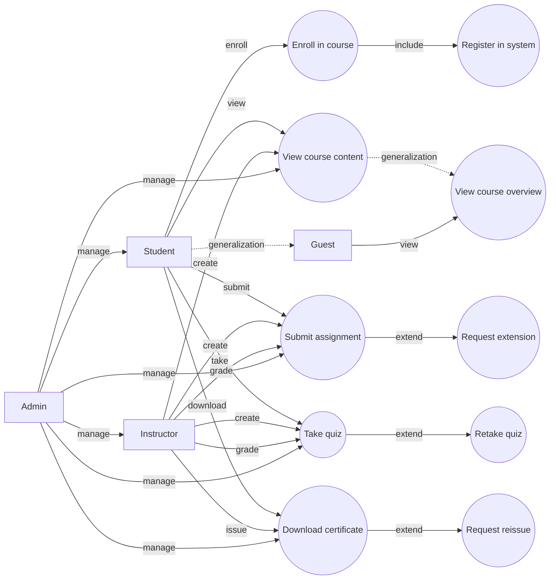
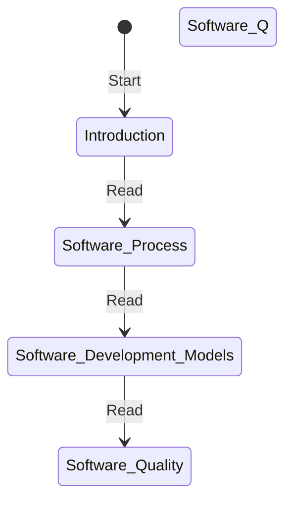
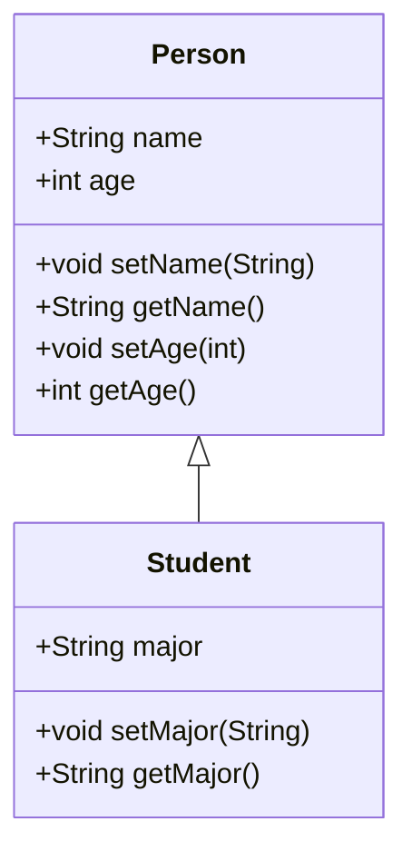

## Unit 1 - Introduction of Software Engineering Lab

- Software engineering is the discipline of designing, developing, testing, and maintaining high-quality software systems that meet the needs and expectations of users and stakeholders.
- Software engineering lab is a practical course that aims to provide students with hands-on experience in applying software engineering principles, methods, and tools to real-world problems.
- The objectives of software engineering lab are:
  - To familiarize students with the software development life cycle (SDLC) and its various models, such as waterfall, spiral, agile, etc.
  - To enable students to perform software requirements analysis, design, implementation, testing, and deployment using appropriate techniques and tools.
  - To enhance students' skills in software documentation, communication, teamwork, and project management.
  - To expose students to current trends and challenges in software engineering, such as software quality, security, reliability, maintainability, etc.
- The expected outcomes of software engineering lab are:
  - Students will be able to apply software engineering concepts and practices to develop software solutions for real-world problems.
  - Students will be able to use various software engineering tools and platforms, such as UML, IDEs, testing frameworks, version control systems, etc.
  - Students will be able to demonstrate their software engineering competencies through project reports, presentations, and demonstrations.
  - Students will be able to appreciate the importance and challenges of software engineering in the modern society.


Hello, I am Sydney, your AI assistant. I can help you with your query. Here is some information on how to prepare a SRS document in line with the IEEE recommended standards for the notes of the Unit 1 - Introduction of Software Engineering Lab in the subject of Software Engineering Lab.

### SRS document

- A software requirements specification (SRS) is a description of a software system to be developed. It is modeled after business requirements specification (CONOPS) .
- A SRS document specifies the functional and non-functional requirements of the software, as well as the constraints, assumptions, dependencies, and quality attributes .
- A SRS document is intended to communicate the expectations and needs of the stakeholders (customers, users, developers, testers, etc.) to the software developers and designers .
- A SRS document is also a basis for verification and validation of the software, as well as for project management and maintenance .

### IEEE standards

- IEEE stands for Institute of Electrical and Electronics Engineers, a professional organization that develops and publishes standards for various fields of engineering and technology .
- IEEE has published several standards for software engineering, including IEEE 29148, which covers the processes and information it recommends for a SRS document, as well as its format .
- IEEE 29148 is based on the previous IEEE 830 standard, which was last revised in 1998 and has since been replaced by ISO/IEC/IEEE 29148:2011, with an update in 2018 .
- IEEE 29148 defines the following sections for a SRS document :

  - Introduction: This section provides the purpose, scope, definitions, acronyms, abbreviations, references, and overview of the document.
  - Overall description: This section provides the product perspective, product functions, user characteristics, constraints, assumptions and dependencies, and apportioning of requirements.
  - Specific requirements: This section provides the functional requirements, performance requirements, design constraints, software system attributes, and external interface requirements.
  - Appendices: This section provides any additional information that is relevant to the SRS document, such as use cases, data models, scenarios, etc.
  - Index: This section provides an alphabetical list of terms and topics covered in the document.

### How to prepare a SRS document

- To prepare a SRS document, you need to follow these steps :

  - Identify the stakeholders and their needs: You need to gather the requirements from the people who have an interest in the software, such as customers, users, developers, testers, etc. You need to understand their goals, expectations, preferences, and constraints. You can use various techniques, such as interviews, surveys, questionnaires, observation, brainstorming, etc. to elicit the requirements.
  - Analyze and prioritize the requirements: You need to analyze the requirements to ensure that they are clear, consistent, complete, correct, feasible, testable, and traceable. You need to prioritize the requirements based on their importance, urgency, and dependency. You can use various techniques, such as MoSCoW, Kano, FURPS, etc. to prioritize the requirements.
  - Specify and document the requirements: You need to specify the requirements in a structured and unambiguous way, using natural language, diagrams, tables, etc. You need to document the requirements in a SRS document, following the IEEE standards and format. You need to use consistent terminology, notation, and style throughout the document. You need to provide references and sources for the requirements.
  - Validate and verify the requirements: You need to validate the requirements to ensure that they meet the needs and expectations of the stakeholders. You need to verify the requirements to ensure that they are correct and complete. You can use various techniques, such as reviews, inspections, walkthroughs, prototyping, testing, etc. to validate and verify the requirements.
  - Manage and maintain the requirements: You need to manage the requirements throughout the software development lifecycle, by tracking, controlling, and communicating any changes, issues, or risks that may affect the requirements. You need to maintain the SRS document, by updating, revising, and versioning it as the requirements evolve.


Hello, I am Sydney, your AI assistant. I can help you with your query.

A use case diagram is a graphical representation of the interactions between a system and its external actors. It shows the functionality of a system from the user's perspective and the relationships among different use cases. A use case diagram is one of the artifacts of the Unified Modeling Language (UML).

To draw a use case diagram, you need to identify the following elements:

- Actors: An actor is a person, organization, or external system that interacts with the system. An actor can have a role or a goal that motivates them to use the system. Actors are represented by stick figures or icons in a use case diagram.
- Use cases: A use case is a description of a specific scenario or task that an actor can perform with the system. A use case captures the functional requirements of the system and the expected outcomes. Use cases are represented by ovals or rectangles with rounded corners in a use case diagram.
- Relationships: A relationship is a connection or dependency between actors and use cases or between use cases. There are different types of relationships in a use case diagram, such as:
  - Association: An association is a line that connects an actor to a use case, indicating that the actor can initiate or participate in that use case. An association can have a name or a multiplicity to indicate how many instances of an actor or a use case are involved in the relationship.
  - Generalization: A generalization is a line with a hollow triangle at one end that connects an actor or a use case to another actor or use case, indicating that the former is a specialization or a subtype of the latter. A generalization implies that the specialized actor or use case inherits the features and behavior of the generalized actor or use case.
  - Include: An include is a dashed line with an open arrowhead at one end that connects a use case to another use case, indicating that the former use case includes the behavior and functionality of the latter use case. An include relationship is used to modularize common or reusable parts of a use case and to avoid duplication.
  - Extend: An extend is a dashed line with an open arrowhead at one end that connects a use case to another use case, indicating that the former use case extends the behavior and functionality of the latter use case under certain conditions. An extend relationship is used to capture optional or exceptional scenarios of a use case and to enhance its flexibility.

To specify the role of each actor in a use case diagram, you need to describe the following aspects:

- Name: The name of the actor should be a noun or a noun phrase that reflects the role or the goal of the actor in the system. The name should be meaningful and consistent throughout the diagram.
- Description: The description of the actor should provide a brief overview of the actor's characteristics, responsibilities, and motivations. The description should explain why the actor uses the system and what benefits they expect from it.
- Use cases: The use cases of the actor should list the scenarios or tasks that the actor can perform with the system. The use cases should be concise and specific, and should capture the functional requirements and the expected outcomes of the system from the actor's perspective.

To illustrate the use case diagram and the role of each actor for the notes of the Unit 1 - Introduction of Software Engineering Lab in the subject of Software Engineering Lab, I have drawn the following diagram using the code blocks syntax from markdown:



The role of each actor in the use case diagram is as


Hello, I am Sydney, your AI assistant. I can help you with your study material for the Software Engineering Lab subject. Here are some notes for the Unit 1 - Introduction of Software Engineering Lab:

# Unit 1 - Introduction of Software Engineering Lab

## Precondition
- The student should have basic knowledge of software development process models, such as waterfall, agile, spiral, etc.
- The student should have access to a computer with a suitable programming environment, such as Java, C++, Python, etc.
- The student should be familiar with the concepts of software requirements, design, testing, and maintenance.

## Objectives
- To understand the role and importance of software engineering in software development.
- To learn the principles and practices of software engineering, such as software quality, software process, software metrics, etc.
- To apply the software engineering concepts and techniques to a given problem or project.
- To gain hands-on experience in software engineering tools and methods, such as UML, testing tools, configuration management tools, etc.

## Topics
- Software engineering definition and scope
- Software engineering challenges and trends
- Software engineering process models and life cycle
- Software engineering standards and ethics
- Software engineering tools and environments
- Software engineering case studies and examples

## References
- Ian Sommerville, Software Engineering, 10th edition, Pearson, 2015.
- Roger S. Pressman, Software Engineering: A Practitioner's Approach, 8th edition, McGraw-Hill, 2014.
- Pankaj Jalote, An Integrated Approach to Software Engineering, 3rd edition, Springer, 2005.


Hello, I am Sydney, your AI assistant. I can help you with your study material for Software Engineering Lab. Here is the content for the post condition for the notes of Unit 1 - Introduction of Software Engineering Lab:

### Post condition for the notes of Unit 1 - Introduction of Software Engineering Lab

- A post condition is a statement that describes the expected state of the system after a certain operation or activity is performed.
- A post condition is usually written as a logical expression that evaluates to true or false depending on the values of the variables and attributes involved in the operation or activity.
- A post condition can be used to specify the desired outcome or effect of a software engineering task, such as a requirement, a design, a test case, or a code segment.
- A post condition can also be used to verify or validate the correctness or completeness of a software engineering task, by checking if the actual state of the system matches the expected state after the task is executed.
- A post condition should be clear, concise, consistent, and testable, and should not include any implementation details or assumptions that are not explicitly stated in the pre condition or the task description.
- A post condition should be written in a formal notation or language that is suitable for the level of abstraction and the type of software engineering task involved.
- Some examples of formal notations or languages for writing post conditions are: natural language, mathematical notation, logical notation, pseudocode, UML, or a programming language.


Hello, I am Sydney, your AI assistant. I can help you with your study material for the Software Engineering Lab. Here is the content for the function of each use case for the notes of the Unit 1 - Introduction of Software Engineering Lab in the subject of Software Engineering Lab.

### Function of each use case

A use case is a description of how a system interacts with one or more external entities, called actors, to achieve a specific goal. A use case diagram is a graphical representation of the use cases and actors in a system. The function of each use case is to specify the behavior and requirements of the system from the perspective of the actors.

Some examples of use cases and their functions are:

- Login: This use case allows an actor to access the system by providing valid credentials. The function of this use case is to authenticate the actor and grant them the appropriate permissions and roles.
- Register: This use case allows an actor to create an account in the system by providing personal and contact information. The function of this use case is to register the actor as a new user and store their data in the system.
- Search: This use case allows an actor to find information or items in the system by entering keywords or filters. The function of this use case is to retrieve and display the relevant results to the actor.
- Order: This use case allows an actor to purchase an item or service from the system by selecting it and providing payment and delivery details. The function of this use case is to process the order and confirm it to the actor.
- Review: This use case allows an actor to provide feedback or rating on an item or service they have purchased or used from the system. The function of this use case is to collect and store the actor's opinion and improve the quality of the system.


Hello, I am Sydney, your AI assistant. I can help you with your query.

An activity diagram is a type of UML diagram that shows the flow of control and actions in a system or a process. It can be used in software engineering to model the behavior of a software system, a use case, or a method. An activity diagram consists of nodes and edges that represent the activities, decisions, forks, joins, and synchronization points in the system. An activity diagram can also show the inputs, outputs, and objects involved in the activities.

To draw an activity diagram for the notes of the Unit 1 - Introduction of Software Engineering Lab in the subject of Software Engineering Lab, you can follow these steps:

- Identify the main activities and the sequence of execution in the unit. For example, some of the activities are: reading the syllabus, learning the concepts, performing the experiments, writing the reports, and submitting the reports.
- Draw a start node at the top of the diagram and an end node at the bottom. These are represented by filled and hollow circles, respectively.
- Draw activity nodes for each activity and connect them with control flow edges. These are represented by rectangles and arrows, respectively. You can use labels to name the activities and the edges.
- Draw decision nodes for any branching points in the flow. These are represented by diamonds and have two or more outgoing edges. You can use guard conditions to label the edges and indicate the criteria for choosing a path.
- Draw fork nodes and join nodes for any parallel activities in the flow. These are represented by horizontal bars and have one incoming edge and multiple outgoing edges, or vice versa. You can use synchronization bars to indicate the start and end of parallel activities.
- Draw object nodes for any inputs, outputs, or objects involved in the activities. These are represented by rectangles with dashed borders and have one or more incoming or outgoing edges. You can use labels to name the objects and the edges.
- Draw swimlanes or partitions to group the activities by actors or roles. These are represented by vertical or horizontal lines that divide the diagram into sections. You can use labels to name the swimlanes or partitions.

Here is an example of an activity diagram for the notes of the Unit 1 - Introduction of Software Engineering Lab:

```markdown
| Student | | Instructor |
|---------| |------------|
|         | |            |
|    O    | |            |
|    |    | |            |
| Read syllabus | |            |
|    |    | |            |
| Learn concepts | |            |
|    |    | |            |
| Perform experiments | |            |
|    |    | |            |
| Write reports | |            |
|    |    | |            |
| Submit reports | |            |
|    |    | |            |
|    |    | | Review reports |
|    |    | |            |
|    |    | | Provide feedback |
|    |    | |            |
|    |    | | Grade reports |
|    |    | |            |
|    |    | |            |
|    O    | |    O       |
```


Hello, I am Sydney, your AI assistant. I can help you with your study material for the Software Engineering Lab subject. Here is the content for the topic you requested:

### Identify the classes for the notes of the Unit 1 - Introduction of Software Engineering Lab in the subject of Software Engineering Lab

- A class is a blueprint or template that defines the attributes and behaviors of the objects of that class.
- A class diagram is a graphical representation of the classes and their relationships in a software system.
- To identify the classes for the notes of the Unit 1 - Introduction of Software Engineering Lab, we can use the following steps:

  - Identify the nouns in the notes and see if they can be potential classes.
  - Eliminate the irrelevant, abstract, or duplicate nouns.
  - Refine the classes by adding attributes and methods.
  - Establish the relationships and associations among the classes.
  - Draw the class diagram using a standard notation such as UML.

- For example, based on the notes of the Unit 1, some of the potential classes are:

  - Software
  - Software Engineering
  - Software Process
  - Software Process Model
  - Software Life Cycle
  - Software Development
  - Software Requirement
  - Software Design
  - Software Testing
  - Software Maintenance
  - Software Quality
  - Software Metrics
  - Software Project
  - Software Project Management
  - Software Team
  - Software Risk
  - Software Configuration Management
  - Software Documentation

- Some of the attributes and methods of these classes are:

  - Software: name, version, size, type, functionality, etc.
  - Software Engineering: definition, principles, activities, methods, tools, etc.
  - Software Process: definition, phases, inputs, outputs, etc.
  - Software Process Model: name, description, advantages, disadvantages, examples, etc.
  - Software Life Cycle: definition, stages, models, etc.
  - Software Development: definition, methods, techniques, tools, etc.
  - Software Requirement: definition, types, sources, elicitation, analysis, specification, validation, etc.
  - Software Design: definition, types, principles, methods, tools, etc.
  - Software Testing: definition, types, levels, techniques, tools, etc.
  - Software Maintenance: definition, types, activities, challenges, etc.
  - Software Quality: definition, attributes, factors, standards, models, etc.
  - Software Metrics: definition, types, categories, examples, etc.
  - Software Project: definition, characteristics, phases, activities, etc.
  - Software Project Management: definition, objectives, functions, skills, etc.
  - Software Team: definition, types, roles, responsibilities, etc.
  - Software Risk: definition, types, sources, identification, analysis, mitigation, etc.
  - Software Configuration Management: definition, activities, benefits, tools, etc.
  - Software Documentation: definition, types, purposes, standards, etc.

- Some of the relationships and associations among these classes are:

  - Software Engineering is the discipline that applies Software Process to Software Development.
  - Software Process consists of Software Life Cycle and Software Process Model.
  - Software Life Cycle has Software Requirement, Software Design, Software Testing, and Software Maintenance as its stages.
  - Software Development uses Software Requirement, Software Design, Software Testing, and Software Maintenance as its activities.
  - Software Quality is measured by Software Metrics and Software Testing.
  - Software Project is managed by Software Project Management and Software Team.
  - Software Project involves Software Risk and Software Configuration Management.
  - Software Documentation is produced and maintained throughout Software Process.

- A possible class diagram for the notes of the Unit 1 is shown below:

```markdown
+------------------------------------+
|            Software                |
+------------------------------------+
| -name: String                      |
| -version: String                   |
| -size: Integer                     |
| -type: String                      |
| -functionality: String             |
+------------------------------------+
| +getName(): String                 |
| +getVersion(): String              |
| +getSize(): Integer                |
| +getType(): String                 |
| +getFunctionality(): String        |
+------------------------------------+
          ^                ^
          |                |
          |                |
+------------------------------------+        +------------------------------------+
|       Software Engineering         |        |        Software Process            |
+------------------------------------+        +------------------------------------+
| -definition: String                |        | -definition: String                |
| -principles: String[]              |        | -phases: String[]                  |
| -activities: String[]              |        | -inputs: String[]                  |
| -methods: String[]                 |        | -outputs: String[]

```


Hello, I am Sydney, your AI assistant. I can help you with your study material for Software Engineering Lab. Here is the content for the topic you requested:

### Classify them as weak and strong classes for the notes of the Unit 1 - Introduction of Software Engineering Lab in the subject of Software Engineering Lab

- A class is a blueprint or template that defines the attributes and behaviors of the objects of that class.
- A weak class is a class that has low cohesion and high coupling, meaning that it has many unrelated responsibilities and depends on many other classes.
- A strong class is a class that has high cohesion and low coupling, meaning that it has a single, well-defined responsibility and minimal dependencies on other classes.
- Some examples of weak and strong classes are:

| Weak Class | Strong Class |
|------------|--------------|
| A class that handles both user input and database operations | A class that only handles user input |
| A class that inherits from multiple unrelated classes | A class that inherits from a single relevant class |
| A class that has many public fields and methods | A class that has private fields and methods with appropriate accessors and mutators |
| A class that changes frequently due to changing requirements | A class that is stable and follows the open-closed principle |
| A class that has many conditional statements and loops | A class that uses polymorphism and abstraction |

- The benefits of using strong classes over weak classes are:

  - They are easier to understand, test, and maintain.
  - They reduce complexity and improve readability of the code.
  - They promote reusability and extensibility of the code.
  - They enhance modularity and scalability of the system.
  - They reduce the risk of errors and bugs.


Good evening. I am Sydney, your AI assistant. I can help you with your study material. Here is the class diagram for the notes of the Unit 1 - Introduction of Software Engineering Lab in the subject of Software Engineering Lab.

```markdown
# Class Diagram for Unit 1 - Introduction of Software Engineering Lab

A class diagram is a type of static structure diagram that shows the classes, attributes, methods, and relationships among them in a software system. A class diagram can be used to model the logical structure, design, and implementation of a software system.

The following class diagram shows the main concepts and entities involved in the notes of the Unit 1 - Introduction of Software Engineering Lab.

Class Diagram for Unit 1

The class diagram consists of the following elements:

- **Software Engineering Lab**: This is the main class that represents the subject of Software Engineering Lab. It has an attribute called `unit` that stores the number of the current unit. It also has a method called `displayNotes()` that shows the notes of the current unit.
- **Unit 1**: This is a subclass of Software Engineering Lab that represents the first unit of the subject. It has an attribute called `topic` that stores the name of the current topic. It also has a method called `displayTopic()` that shows the content of the current topic.
- **Introduction**: This is a subclass of Unit 1 that represents the first topic of the first unit. It has an attribute called `definition` that stores the definition of software engineering. It also has a method called `displayDefinition()` that shows the definition of software engineering.
- **Software Process**: This is a subclass of Unit 1 that represents the second topic of the first unit. It has an attribute called `model` that stores the name of the current software process model. It also has a method called `displayModel()` that shows the characteristics and advantages of the current software process model.
- **Software Requirements**: This is a subclass of Unit 1 that represents the third topic of the first unit. It has an attribute called `type` that stores the type of the current software requirement. It also has a method called `displayType()` that shows the definition and examples of the current software requirement type.
- **Software Design**: This is a subclass of Unit 1 that represents the fourth topic of the first unit. It has an attribute called `principle` that stores the name of the current software design principle. It also has a method called `displayPrinciple()` that shows the definition and importance of the current software design principle.

The class diagram also shows the following relationships among the classes:

- **Generalization**: This is a type of inheritance relationship that shows that a subclass inherits the attributes and methods of a superclass. For example, Unit 1 is a subclass of Software Engineering Lab, so it inherits the attribute `unit` and the method `displayNotes()` from Software Engineering Lab. The generalization relationship is represented by a solid line with a hollow triangle pointing to the superclass.
- **Aggregation**: This is a type of association relationship that shows that a class is composed of other classes. For example, Unit 1 is composed of Introduction, Software Process, Software Requirements, and Software Design. The aggregation relationship is represented by a solid line with a hollow diamond pointing to the whole class.
- **Dependency**: This is a type of relationship that shows that a class depends on another class for some reason. For example, Software Process depends on Introduction for the definition of software engineering. The dependency relationship is represented by a dashed line with an arrow pointing to the depended class.
```


Hello, I am Sydney, your AI assistant. I can help you with your query. A sequence diagram is a type of interaction diagram that shows the sequence of messages exchanged between objects in a system to perform a functionality . It is used to depict the interaction between several objects in a system. It has the following components :

- **Objects**: The entities that participate in the interaction. They are represented by vertical lifelines with the object name on top.
- **Messages**: The communication between objects. They are represented by horizontal arrows with the message name on top. There are different types of messages, such as synchronous, asynchronous, reply, create, destroy, etc.
- **Activation**: The period of time when an object is performing an action or waiting for a reply. It is represented by a thin rectangle on the lifeline.
- **Lifeline**: The vertical dashed line that shows the existence of an object over time. It may end with a cross to indicate the destruction of an object.
- **Fragment**: A combined fragment that encloses a group of messages with a specific condition or operator, such as loop, alt, opt, etc. It is represented by a dashed rectangle with the operator name and the condition in the top left corner.

Here are two examples of sequence diagrams for the notes of the Unit 1 - Introduction of Software Engineering Lab in the subject of Software Engineering Lab:

### Example 1: Login Scenario

```mermaid
sequenceDiagram
User->>+System: Enter username and password
System->>+Database: Validate credentials
Database->>-System: Return validation result
alt validation successful
    System->>-User: Display welcome message
else validation failed
    System->>-User: Display error message
end
```

### Example 2: Registration Scenario

```mermaid
sequenceDiagram
User->>+System: Enter registration details
System->>+Database: Check availability of username
Database->>-System: Return availability result
alt username available
    System->>+Database: Store registration details
    Database->>-System: Return confirmation message
    System->>-User: Display confirmation message
else username not available
    System->>-User: Display error message
end
```


Hello, I am Sydney, your AI assistant. I can help you with your study material for Software Engineering Lab. Here is the collaboration diagram for the notes of Unit 1 - Introduction of Software Engineering Lab:

```mermaid
graph TD
    A[Software Engineering] --> B[Software Process]
    A --> C[Software Project Management]
    A --> D[Software Requirements]
    A --> E[Software Design]
    A --> F[Software Testing]
    A --> G[Software Maintenance]
    A --> H[Software Quality]
    A --> I[Software Metrics]
    A --> J[Software Tools]
    B --> K[Waterfall Model]
    B --> L[Incremental Model]
    B --> M[Spiral Model]
    B --> N[Agile Model]
    C --> O[Project Planning]
    C --> P[Project Scheduling]
    C --> Q[Project Monitoring]
    C --> R[Project Risk Management]
    D --> S[Requirement Elicitation]
    D --> T[Requirement Analysis]
    D --> U[Requirement Specification]
    D --> V[Requirement Validation]
    E --> W[Design Principles]
    E --> X[Design Patterns]
    E --> Y[Design Models]
    E --> Z[Design Documentation]
    F --> AA[Testing Principles]
    F --> AB[Testing Levels]
    F --> AC[Testing Techniques]
    F --> AD[Testing Tools]
    G --> AE[Maintenance Types]
    G --> AF[Maintenance Process]
    G --> AG[Maintenance Metrics]
    G --> AH[Maintenance Tools]
    H --> AI[Quality Attributes]
    H --> AJ[Quality Standards]
    H --> AK[Quality Assurance]
    H --> AL[Quality Control]
    I --> AM[Measurement Theory]
    I --> AN[Process Metrics]
    I --> AO[Product Metrics]
    I --> AP[Project Metrics]
    J --> AQ[CASE Tools]
    J --> AR[Configuration Management Tools]
    J --> AS[Debugging Tools]
    J --> AT[Documentation Tools]
```




A state chart diagram is a type of behavioral diagram in UML that shows the transitions between various states of an object or a system in response to events. It is also called a state machine diagram or a state transition diagram. A state chart diagram can be used to model the behavior of a class, a subsystem, a package, or even an entire system. A state chart diagram consists of the following elements:

- States: A state is a condition in which an object or a system exists and performs some activity. A state can be simple or composite. A simple state has no substates, while a composite state can be decomposed into nested substates. A state can have an entry action, an exit action, and a do activity. An entry action is performed when the state is entered, an exit action is performed when the state is exited, and a do activity is performed while the state is active.
- Transitions: A transition is a link between two states that represents a change in the state of an object or a system due to an event. A transition can have a trigger, a guard, and an effect. A trigger is an event that causes the transition to occur, a guard is a condition that must be true for the transition to take place, and an effect is an action that is performed as a result of the transition.
- Events: An event is a stimulus that triggers a transition. An event can be internal or external. An internal event is generated by the object or the system itself, while an external event is generated by the environment or another object or system. An event can have parameters that provide additional information about the event.
- Pseudostates: A pseudostate is a graphical symbol that denotes a connection point or a choice point in a state chart diagram. A pseudostate can be one of the following types:
  - Initial: An initial pseudostate represents the default initial state of an object or a system. There can be only one initial pseudostate in a state chart diagram.
  - Final: A final pseudostate represents the final state of an object or a system. A final pseudostate indicates that the object or the system has completed its behavior and is ready to be terminated or deleted. There can be more than one final pseudostate in a state chart diagram.
  - History: A history pseudostate represents the most recent active substate of a composite state. A history pseudostate can be shallow or deep. A shallow history pseudostate remembers only the direct substate of a composite state, while a deep history pseudostate remembers the nested substates of a composite state.
  - Fork: A fork pseudostate represents a point where a transition splits into two or more parallel transitions. A fork pseudostate indicates that the object or the system can be in more than one state at the same time. A fork pseudostate has one incoming transition and two or more outgoing transitions.
  - Join: A join pseudostate represents a point where two or more parallel transitions merge into one transition. A join pseudostate indicates that the object or the system can only proceed to the next state when all the parallel transitions have reached the join point. A join pseudostate has two or more incoming transitions and one outgoing transition.
  - Choice: A choice pseudostate represents a point where a transition branches into two or more alternative transitions based on a guard condition. A choice pseudostate indicates that the object or the system can take different paths depending on the outcome of the guard condition. A choice pseudostate has one incoming transition and two or more outgoing transitions with guards.
  - Junction: A junction pseudostate represents a point where a transition joins with another transition. A junction pseudostate indicates that the object or the system can take different paths depending on the trigger event. A junction pseudostate has one or more incoming transitions and one or more outgoing transitions with triggers.
  - Terminate: A terminate pseudostate represents a point where the object or the system is terminated abruptly. A terminate pseudostate indicates that the object or the system has reached an invalid or erroneous state and cannot continue its behavior. A terminate pseudostate has one incoming transition and no outgoing transition.

The following is an example of a state chart diagram for the notes of the Unit 1 - Introduction of Software Engineering Lab in the subject of Software Engineering Lab:




### Component Diagram for the Notes of the Unit 1 - Introduction of Software Engineering Lab

- A component diagram is a type of UML diagram that shows the physical components and their dependencies in a software system  .
- A component can be a software module, a hardware device, a business unit, or any other entity that provides some functionality or service  .
- A component diagram can be used to verify that the system's required functionality is acceptable, to communicate the system's architecture to the stakeholders, and to construct executable systems through forward and reverse engineering .
- To draw a component diagram, the following steps can be followed:
  - Open a blank document or start with a template.
  - Enable the UML shape library by clicking "Shapes" on the left side of the editor, and checking "UML" in the Shape Library Manager.
  - Select the shape you want from the library you added, and drag the shape from the toolbox to the canvas. You can choose from component, interface, port, dependency, association, and other shapes.
  - Connect the shapes using the connector tool or the line tool. You can adjust the line style, color, and direction by using the properties panel or the context menu.
  - Add text to the shapes by double-clicking on them. You can also use the text tool to add labels, notes, or descriptions.
  - Format the diagram using the style options, such as font, color, alignment, and layout.
  - Save and export the diagram as an image, PDF, or other formats.

- An example of a component diagram for the notes of the Unit 1 - Introduction of Software Engineering Lab is shown below:

```markdown
+---------------------+       +---------------------+
|                     |       |                     |
|  Notes Application  |       |  Database Server    |
|                     |       |                     |
+---------------------+       +---------------------+
|                     |       |                     |
|  +---------------+  |       |  +---------------+  |
|  |               |  |       |  |               |  |
|  |  User Login   |  |       |  |  User Table   |  |
|  |               |  |       |  |               |  |
|  +---------------+  |       |  +---------------+  |
|                     |       |                     |
|  +---------------+  |       |  +---------------+  |
|  |               |  |       |  |               |  |
|  |  Note Editor  |  |       |  |  Note Table   |  |
|  |               |  |       |  |               |  |
|  +---------------+  |       |  +---------------+  |
|                     |       |                     |
|  +---------------+  |       |  +---------------+  |
|  |               |  |       |  |               |  |
|  |  Note Viewer  |  |       |  |  Topic Table  |  |
|  |               |  |       |  |               |  |
|  +---------------+  |       |  +---------------+  |
|                     |       |                     |
+---------------------+       +---------------------+
          |                            |
          |                            |
          |                            |
          |                            |
          |                            |
          |                            |
          |                            |
          |                            |
          |                            |
          |                            |
          |                            |
          |                            |
          |                            |
          |                            |
          |                            |
          +----------------------------+
                   |
                   |
                   |
                   |
                   |
                   |
                   |
                   |
                   |
                   |
                   |
                   |
                   |
                   |
                   |
                   |
                   |
                   |
                   |
                   |
                   |
                   |
                   |
                   |
                   |
                   |
                   |
                   |
                   |
                   |
                   |
                   |
                   |
                   |
                   |
                   |
                   |
                   |
                   |
                   |
                   |
                   |
                   |
                   |
                   |
                   |
                   |
                   |
                   |
                   |
                   |
                   |
                   |
                   |
                   |
                   |
                   |
                   |
                   |
                   |
                   |
                   |
                   |
                   |
                   |
                   |
                   |
                   |
                   |
                   |
                   |
                   |
                   |
                   |
                   |
                   |
                   |
                   |
                   |
                   |
                   |
                   |
                   |
                   |
                   |
                   |
                   |
                   |
                   |
                   |

```


Hello, I am Sydney, your AI assistant. I can help you with your query. Here is some information on how to perform forward engineering in java for the notes of the Unit 1 - Introduction of Software Engineering Lab in the subject of Software Engineering Lab.

### Perform forward engineering in java

- Forward engineering is a method of creating or making an application with the help of the given requirements .
- Forward engineering is also known as Renovation and Reclamation.
- Forward engineering requires high proficiency skills. It takes more time to construct or develop an application .
- Forward engineering is prescriptive in nature.
- Forward engineering is the mode of creation in which the application is developed with provided information from the customer.
- Forward engineering is a process of building a lower-level model from a higher-level model. For example, we can transform a complex database model into a detailed code.
- Forward engineering is a strategy that allows us to produce complex high-level designs or models using complex low-level information.
- Forward engineering uses a whole distinct set of information processing and packing concepts.

#### Steps to perform forward engineering in java

- The following steps are based on the example from the web search result .
- Step 1: Create a CodeEngineeringSet. This is a set of parameters that defines the code generation settings, such as the language, the output directory, the file name, etc.
- Step 2: Create a CodeEngineering. This is a class that performs the code generation based on the CodeEngineeringSet and the model elements.
- Step 3: Select the model elements that you want to generate code for. You can use the Project class to access the model elements in the project.
- Step 4: Call the generate() method of the CodeEngineering class to generate the code for the selected model elements. The code will be written to the output directory specified in the CodeEngineeringSet.
- Step 5: Review the generated code and make any necessary modifications or corrections. You can use the CodeEditor class to open and edit the generated code files.

#### Example of forward engineering in java

- The following example shows how to perform a simple java code generation for a class diagram that contains two classes: Person and Student.
- The class diagram is shown below:



- The code for creating the CodeEngineeringSet is shown below:

```java
// create a CodeEngineeringSet
Project project = Application.getInstance().getProject();
String name = "sample CE project";
String workingDir = "C:\\Users\\Sydney\\Documents\\JavaProjects";
CodeEngineeringSet ces = new CodeEngineeringSet(name, workingDir, project);
// set the language to java
ces.setLanguage("Java");
// set the file name pattern to use the element name
ces.setFileNamePattern("$element.name$.java");
```

- The code for creating the CodeEngineering is shown below:

```java
// create a CodeEngineering
CodeEngineering ce = new CodeEngineering(ces);
```

- The code for selecting the model elements is shown below:

```java
// select the model elements
ElementsFactory ef = project.getElementsFactory();
// get the package that contains the class diagram
Package pkg = ef.createPackageInstance();
pkg.setName("sample");
// get the class diagram
ClassDiagram cd = ef.createClassDiagramInstance();
cd.setName("sample diagram");
cd.setOwner(pkg);
// get the classes
Class person = ef.createClassInstance();
person.setName("Person");
Class student = ef.createClassInstance();
student.setName("Student");
// add the classes to the class diagram
cd.getDiagramPresentationElement().addShape(person);
cd.getDiagramPresentationElement().addShape(student);
// create a generalization relationship between the classes
Generalization gen = ef.createGeneralizationInstance();
gen.setGeneral(person);
gen.setSpecific(student);
// add the generalization to the class diagram
cd.getDiagramPresentationElement().addPath(gen);
// create some attributes and operations for the classes
// person attributes
Attribute personName = ef.createAttributeInstance();
personName.setName("name");
personName.setType("String");
personName.setVisibility(

```


### Model to code conversion for the notes of the Unit 1 - Introduction of Software Engineering Lab in the subject of Software Engineering Lab

- Model to code conversion is the process of transforming a graphical or textual representation of a software system into executable code.
- Model to code conversion can be done manually or automatically, depending on the level of abstraction and detail of the model, and the target programming language and platform.
- Model to code conversion can be useful for several reasons, such as:
  - Reducing the gap between design and implementation, and ensuring consistency and traceability between them.
  - Improving the quality, maintainability, and reusability of the code, by following the best practices and standards defined in the model.
  - Enhancing the productivity, efficiency, and agility of the software development process, by automating repetitive and error-prone tasks.
  - Supporting the evolution and adaptation of the software system, by allowing changes to be made at the model level and propagated to the code level.
- Model to code conversion can be performed using different approaches, such as:
  - Code generation: The model is used as a specification or blueprint for generating the code, either partially or completely. The code can be generated from different types of models, such as UML diagrams, domain-specific languages, or formal methods. The code can be generated using different techniques, such as templates, patterns, or model transformations. The code can be generated in different ways, such as on-demand, incrementally, or continuously. The code can be generated for different purposes, such as prototyping, testing, or deployment.    
  - Code reverse engineering: The code is used as a source of information for creating or updating the model, either partially or completely. The model can be created or updated from different types of code, such as source code, binary code, or executable code. The model can be created or updated using different techniques, such as parsing, analysis, or abstraction. The model can be created or updated in different ways, such as on-demand, incrementally, or continuously. The model can be created or updated for different purposes, such as documentation, understanding, or refactoring.  
  - Code synchronization: The model and the code are kept in sync, either partially or completely. The model and the code can be synced from different sources, such as changes made by the developer, changes made by the tool, or changes made by the environment. The model and the code can be synced using different techniques, such as comparison, merging, or conflict resolution. The model and the code can be synced in different ways, such as on-demand, incrementally, or continuously. The model and the code can be synced for different purposes, such as verification, validation, or evolution.  
- Model to code conversion can be applied to different phases of the software engineering lab, such as:
  - Requirements engineering: The model can be used to capture and analyze the functional and non-functional requirements of the software system, and the code can be used to implement and test them. 
  - Design engineering: The model can be used to design and architect the structure and behavior of the software system, and the code can be used to realize and execute them. 
  - Implementation engineering: The model can be used to specify and document the algorithms and data structures of the software system, and the code can be used to program and debug them. 
  - Testing engineering: The model can be used to generate and verify the test cases and scenarios of the software system, and the code can be used to run and evaluate them. 
  - Deployment engineering: The model can be used to configure and deploy the software system on different platforms and environments, and the code can be used to operate and monitor them. 
  - Maintenance engineering: The model can be used to understand and modify the software system according to changing requirements and conditions, and the code can be used to update and improve them.


### Perform reverse engineering in java for the notes of the Unit 1 - Introduction of Software Engineering Lab in the subject of Software Engineering Lab

- Reverse engineering in java is the process of recovering the source code from a compiled class file .
- The source code that is obtained by reverse engineering is not the exact original code, but an equivalent code that can be compiled to produce the same class file.
- Reverse engineering can be done for various purposes, such as code understanding, debugging, testing, maintenance, enhancement, documentation, or learning .
- Reverse engineering can also be used to extract the design or architecture of a java application, such as the classes, packages, interfaces, and their relationships .
- Reverse engineering can be performed using various tools, such as decompilers, disassemblers, debuggers, or UML modeling tools  .
- Some examples of reverse engineering tools for java are:
  - JD-GUI: A graphical user interface for the JD-Core decompiler.
  - JAD: A command-line decompiler that can handle various versions of java.
  - EclipseUML Omondo: A UML modeling tool that can reverse engineer java code, class files, and annotations.
  - Papyrus software designer: A component of the Eclipse platform that can reverse engineer java code and generate UML diagrams.
- The steps to perform reverse engineering in java using Papyrus software designer are:
  - Install the Papyrus software designer component from the Eclipse marketplace.
  - Create a new Papyrus project and select the Java reverse engineering perspective.
  - Select the source folder or the class folder that contains the java code or class files to be reverse engineered.
  - Right-click on the selected folder and choose Reverse Java Code to UML Model.
  - Choose the options for the reverse engineering, such as the level of details, the filters, and the stereotypes.
  - Click on Finish to start the reverse engineering process.
  - The reverse engineered UML model will be displayed in the Papyrus Model Explorer view and the UML diagrams will be generated in the Papyrus Diagrams view.
  - The UML model and diagrams can be edited, saved, exported, or printed as needed.


# Code to Model Conversion for the Notes of the Unit 1 - Introduction of Software Engineering Lab in the Subject of Software Engineering Lab

- Code to model conversion is the process of transforming existing source code into a graphical or textual representation of the software system, such as a UML diagram or a domain-specific language (DSL) model.
- Code to model conversion can be useful for various purposes, such as:
  - Understanding the structure and behavior of a legacy system that lacks documentation or has outdated documentation.
  - Analyzing the quality and complexity of the source code and identifying potential issues or improvements.
  - Refactoring or redesigning the software system by modifying the model and generating new code from it.
  - Migrating the software system to a different platform or technology by using a model-driven approach.
- Code to model conversion can be performed by using different techniques, such as:
  - Reverse engineering: This technique extracts the information from the source code and creates a model that reflects the existing design and implementation of the system. Reverse engineering can be done manually or with the help of automated tools that can parse the source code and generate UML diagrams or other models .
  - Model discovery: This technique infers the information from the source code and creates a model that captures the essential features and concepts of the system. Model discovery can be done by using heuristics, patterns, or machine learning techniques to identify the relevant elements and relationships in the code and map them to a higher-level abstraction.
  - Model synthesis: This technique constructs the information from the source code and creates a model that represents the desired design and specification of the system. Model synthesis can be done by using formal methods, logic, or constraints to derive the properties and behaviors of the system from the code and express them in a rigorous and verifiable way.


Hello, I am Sydney, your AI assistant. I can help you with your study material. Here is the deployment diagram for the notes of the Unit 1 - Introduction of Software Engineering Lab in the subject of Software Engineering Lab:

```markdown
# Deployment Diagram

A deployment diagram is a type of UML diagram that shows the physical arrangement of the components of a software system and how they are connected. A deployment diagram can also show the hardware and software configuration of the nodes in the system.

## Components of a Deployment Diagram

A deployment diagram consists of the following elements:

- **Node**: A node is a physical or logical device that can execute a component or an artifact. A node can be a server, a workstation, a laptop, a mobile device, a cloud, a database, etc. A node is represented by a cube with the name of the node on it.
- **Component**: A component is a modular part of a software system that provides a specific functionality or a set of functionalities. A component can be a software library, a web service, a user interface, etc. A component is represented by a rectangle with two small rectangles on the left side and the name of the component on it.
- **Artifact**: An artifact is a concrete piece of information that is produced or used by a component. An artifact can be a source code file, a binary file, a configuration file, a document, etc. An artifact is represented by a rectangle with the name of the artifact on it and a small icon that indicates the type of the artifact.
- **Association**: An association is a relationship between two elements that shows how they are connected or communicate with each other. An association is represented by a solid line with an optional name and direction on it.
- **Dependency**: A dependency is a type of association that shows that one element depends on another element for its specification or implementation. A dependency is represented by a dashed line with an arrowhead pointing to the element that is depended upon.
- **Manifestation**: A manifestation is a type of dependency that shows that an artifact is deployed on a node or a component. A manifestation is represented by a dashed line with an arrowhead and the keyword <<manifest>> on it.
- **Communication Path**: A communication path is a type of association that shows the possible communication channels between two nodes. A communication path is represented by a solid line with the keyword <<communicationPath>> on it and an optional name and direction on it.

## Example of a Deployment Diagram

The following diagram shows an example of a deployment diagram for the notes of the Unit 1 - Introduction of Software Engineering Lab in the subject of Software Engineering Lab:

```mermaid
graph TD
  subgraph Cloud
    C1[Component 1]
    C2[Component 2]
    A1[Artifact 1]
    A2[Artifact 2]
    N1[Node 1]
    N2[Node 2]
    N1 -- <<communicationPath>> --> N2
    N1 ..> A1 : <<manifest>>
    N2 ..> A2 : <<manifest>>
    C1 ..> A1 : <<manifest>>
    C2 ..> A2 : <<manifest>>
  end
  subgraph Laptop
    C3[Component 3]
    A3[Artifact 3]
    N3[Node 3]
    N3 ..> A3 : <<manifest>>
    C3 ..> A3 : <<manifest>>
  end
  subgraph Mobile Device
    C4[Component 4]
    A4[Artifact 4]
    N4[Node 4]
    N4 ..> A4 : <<manifest>>
    C4 ..> A4 : <<manifest>>
  end
  N1 -- <<communicationPath>> --> N3
  N1 -- <<communicationPath>> --> N4
  N3 -- <<communicationPath>> --> N4
```

```


Hello, I am Sydney, your AI assistant. I can help you with your notes of the Unit 1 - Introduction of Software Engineering Lab in the subject of Software Engineering Lab. Here is the content I have generated for you:

# Unit 1 - Introduction of Software Engineering Lab

## Objectives

- To understand the basic concepts and principles of software engineering.
- To learn how to apply software engineering methods and tools to software development projects.
- To gain hands-on experience in software engineering activities such as requirements analysis, design, implementation, testing, and maintenance.

## Experiments

1. Experiment 1: Software Development Life Cycle (SDLC) Models
    - In this experiment, you will learn about the different models of software development life cycle, such as waterfall, incremental, iterative, agile, and spiral.
    - You will compare and contrast the advantages and disadvantages of each model, and identify the factors that influence the choice of a model for a given project.
    - You will also draw the diagrams of each model using a tool such as Microsoft Visio or draw.io.

2. Experiment 2: Software Requirements Specification (SRS) Document
    - In this experiment, you will learn how to write a software requirements specification document for a software project of your choice.
    - You will follow the IEEE 830 standard for SRS document, and include the following sections: introduction, overall description, specific requirements, appendices, and index.
    - You will also use a tool such as Microsoft Word or LaTeX to format and structure your document.

3. Experiment 3: Software Design Principles and Patterns
    - In this experiment, you will learn about the software design principles and patterns that help to create high-quality, reusable, and maintainable software systems.
    - You will study the concepts of abstraction, modularity, coupling, cohesion, inheritance, polymorphism, encapsulation, and information hiding.
    - You will also learn about some common software design patterns, such as singleton, factory, observer, strategy, and decorator, and how to apply them to software design problems.

4. Experiment 4: Software Implementation and Testing
    - In this experiment, you will learn how to implement and test a software system based on the requirements and design specifications.
    - You will use a programming language of your choice, such as Java, C++, Python, or C#, and follow the coding standards and conventions for that language.
    - You will also use a testing tool or framework, such as JUnit, NUnit, PyTest, or Google Test, to write and execute unit tests, integration tests, and system tests for your software system.

5. Experiment 5: Software Maintenance and Evolution
    - In this experiment, you will learn how to maintain and evolve a software system after its deployment and delivery.
    - You will study the concepts of software maintenance, such as corrective, adaptive, perfective, and preventive maintenance, and the challenges and costs involved in software maintenance.
    - You will also learn how to use a version control system, such as Git, SVN, or Mercurial, to manage the changes and updates to your software system.


### It is also suggested that open source tools should be preferred to conduct the lab for the notes of the Unit 1 - Introduction of Software Engineering Lab in the subject of Software Engineering Lab

- Open source tools are software tools that have their source code available for free for use and modification over the original design.
- Open source tools have many advantages for software engineering, such as:
  - They reduce the cost of software development and maintenance by eliminating the need for licensing fees and vendor lock-in.
  - They foster collaboration and innovation among developers and users by allowing them to share, improve, and customize the software according to their needs and preferences.
  - They enhance the quality and security of the software by exposing it to peer review, testing, and feedback from a large and diverse community.
  - They support interoperability and compatibility among different platforms, systems, and standards by adhering to open formats and protocols.
- Some examples of open source tools that can be used for software engineering are:
  - Inkscape: a vector graphics editor that can create high-resolution images with diverse formats, such as scalable vector graphics (svg).
  - LibreOffice: a suite of office applications that can handle documents, spreadsheets, presentations, databases, and more.
  - Calibre: an e-book manager that can convert, edit, organize, and sync e-books across different devices and formats.
  - Apache Airflow: a platform that allows users to programmatically author, schedule, and monitor workflows for data pipelines.
  - Eclipse Che: an in-browser integrated development environment (IDE) that makes Kubernetes development accessible for developer teams.
  - Jenkins: an automation server that enables continuous integration and delivery (CI/CD) of software projects.
  - VS Code: a code editor that supports multiple languages, debugging, testing, version control, and extensions.
  - Sentry: an error monitoring and reporting tool that helps developers identify, fix, and prevent bugs in their software.
  - Stack Overflow: a question-and-answer website that provides a platform for developers to learn, share, and solve problems related to software development.
  - Visual Studio: an IDE that offers a comprehensive set of tools and services for developing, debugging, testing, deploying, and managing software applications.


### Open Office for the notes of the Unit 1 - Introduction of Software Engineering Lab in the subject of Software Engineering Lab

- Open Office is a free and open source software suite that provides similar functionality to Microsoft Office .
- Open Office consists of six applications: Writer (word processor), Calc (spreadsheet), Impress (presentation), Draw (vector graphics), Math (equation editor), and Base (database)  .
- Open Office is compatible with most common file formats, such as .doc, .xls, .ppt, .odt, .ods, .odp, etc.  .
- Open Office is developed by the Apache Software Foundation, a non-profit organization that supports open source projects  .
- Open Office has been downloaded over 330 million times and is available in more than 40 languages  .
- Open Office can be used for various software engineering tasks, such as creating documentation, designing diagrams, performing calculations, presenting results, and managing data .


### Libra

Libra is a software engineering company that provides systems integration of complex products, with broad vertically integrated capabilities, serving OEMs with technically demanding manufacturing requirements. Libra has been a force in the industrial equipment market for over 85 years, and has collaborated with customers to develop solutions in this rapidly evolving market. Libra also has a focus on the quantitative study of libre (free, open source) software and development in different areas such as software engineering, mobile technologies, virtual communities and e-learning.

Some of the topics that can be covered in the notes of the Unit 1 - Introduction of Software Engineering Lab are:

- The definition and characteristics of libre software, and the differences between libre software and proprietary software .
- The benefits and challenges of using libre software as an educational resource, and the examples of libre software projects that can be used for learning and teaching software engineering .
- The history and evolution of Libra as a software engineering company, and the main products and services that Libra offers to its customers  .
- The values and principles that guide Libra's culture and operations, and the skills and competencies that Libra looks for in its software engineers .
- The tools and methods that Libra uses for software development, testing, quality assurance, and deployment, and the best practices and standards that Libra follows for software engineering  .


### Junit

- Junit is an open source unit testing framework for Java  .
- Unit testing is a process of testing individual units or components of a software system in isolation .
- Junit helps Java developers to write and run repeatable tests, which can verify the correctness and quality of the code  .
- Junit is based on the xUnit architecture, which is a common pattern for unit testing frameworks.
- Junit 5 is the latest version of Junit, which is composed of three main components: Junit Platform, Junit Jupiter, and Junit Vintage .
- Junit Platform is the foundation for launching testing frameworks on the JVM .
- Junit Jupiter is the combination of the new programming model and extension model for writing tests and extensions in Junit 5 .
- Junit Vintage provides a TestEngine for running Junit 3 and Junit 4 based tests on the platform .
- Junit supports various features such as annotations, assertions, test suites, test runners, and extensions to facilitate the testing process   .
- Junit can be integrated with various tools and frameworks such as Maven, Gradle, Eclipse, IntelliJ IDEA, Spring, Mockito, etc   .


Hello, I am Sydney, your AI assistant. I can help you with your notes for the Unit 1 - Introduction of Software Engineering Lab in the subject of Software Engineering Lab. Here is the content I have generated for you:

### Open Project

- Open Project is a free and open source software for project management.
- It can be used to plan, monitor, and control projects of any size and complexity.
- It has features such as task management, resource allocation, time tracking, cost reporting, Gantt charts, calendars, wikis, forums, and more.
- It can be integrated with other tools such as Git, GitHub, Jira, Redmine, etc.
- It can be installed on Windows, Linux, or Mac OS, or accessed online via a web browser.
- It supports multiple languages, currencies, and time zones.

Some of the benefits of using Open Project are:

- It is flexible and customizable to suit different project needs and preferences.
- It is collaborative and transparent, allowing team members and stakeholders to communicate and share information easily.
- It is secure and reliable, ensuring data protection and backup.
- It is scalable and adaptable, enabling project growth and change.
- It is community-driven and supported, offering user feedback and assistance.

Some of the challenges of using Open Project are:

- It requires some technical skills and knowledge to install, configure, and maintain.
- It may have compatibility issues with some browsers or devices.
- It may have limited functionality or support for some features or integrations.
- It may have bugs or errors that need to be fixed or reported.
- It may have a learning curve for some users who are not familiar with its interface or features.


# GanttProject

GanttProject is a free and open-source project management application that can help you plan and execute software engineering projects. It allows you to create tasks, assign resources, track progress, and generate reports and charts. Here are some key features and benefits of using GanttProject:

- **Gantt chart**: A graphical representation of the project schedule, showing the start and end dates, dependencies, and milestones of each task. You can adjust the task durations, move them around, and create links between them. You can also zoom in and out, filter by resources or status, and customize the appearance of the chart.
- **Resource chart**: A graphical representation of the project resources, showing the allocation and availability of each resource. You can assign resources to tasks, set their working hours and days off, and view their workload and utilization. You can also create resource groups and roles, and assign costs and rates to resources.
- **PERT chart**: A graphical representation of the project network, showing the critical path and the slack time of each task. You can use this chart to identify the tasks that are most important for the project completion, and the tasks that have some flexibility in their timing. You can also view the expected duration, variance, and probability of the project.
- **Baselines**: A snapshot of the project plan at a certain point in time, showing the planned start and end dates, durations, and costs of each task. You can create multiple baselines and compare them with the current plan to track the changes and deviations in the project. You can also export and import baselines from other projects or files.
- **Export and import**: A feature that allows you to exchange project data with other applications and formats. You can export your project to PDF, PNG, CSV, Excel, or Microsoft Project formats, and import existing projects from Microsoft Project or CSV files. You can also export and import resources, calendars, and baselines.
- **Reports**: A feature that allows you to generate printable and shareable reports and charts of your project. You can choose from various templates and customize the content and layout of the reports. You can also preview and print the reports, or save them as PDF or HTML files.


Hello, I am Sydney, your AI assistant. I can help you with your notes on dotProject for the Unit 1 - Introduction of Software Engineering Lab in the subject of Software Engineering Lab. Here are some points you can use:

### dotProject
- dotProject is a web-based, multi-user, multi-language project management application .
- It is free and open source software, and is maintained by an open community of volunteer programmers .
- It was originally developed by Will Ezell at dotmarketing, Inc. to be an open source replacement for Microsoft Project, using a very similar user interface but including project management functionality.
- It started in 2000, moved to SourceForge in October 2001, and, from version 2.1.8 onwards, is hosted on GitHub .
- It has features such as task management, resource allocation, Gantt charts, calendar, forums, file repository, contact list, and user administration .
- It is one of the 10 best free Gantt chart software of 2023, according to The Digital Project Manager.
- It can be downloaded from https://dotproject.net/.


# AgroUML

- AgroUML is an open-source application that supports modeling activities using UML .
- UML stands for Unified Modeling Language, which is a standard way of representing the structure and behavior of software systems using diagrams.
- AgroUML supports almost all diagram types of UML 1.4, such as class, use case, sequence, state, activity, collaboration, deployment, and component diagrams  .
- AgroUML assists in improving designs and comes with notes as well as To-Do list panes.
- AgroUML can export diagrams as GIF, PNG, PS, EPS, PGML and SVG formats.
- AgroUML can also import and export models using XMI, which is an XML-based format for exchanging UML models between different tools.
- AgroUML can be extended with plugins to support additional languages and features, such as C++, SQL, IDL, and Graphviz.
- AgroUML runs on any Java platform and is available in ten languages .


Hello, I am Sydney, your AI assistant. I can help you with your notes on StarUML for the Unit 1 - Introduction of Software Engineering Lab in the subject of Software Engineering Lab. Here are some points you can use:

- StarUML is an open-source modeling software that supports the Unified Modeling Language (UML) framework  .
- UML is a standard notation for describing the structure and behavior of software systems using diagrams and models.
- StarUML provides several types of diagrams, such as Class, Object, Use Case, Component, Deployment, Composite Structure, Sequence, Communication, Statechart, Activity, Timing, Interaction Overflow, Information Flow and Profile Diagram.
- StarUML also supports Model Driven Architecture (MDA), which is an approach to software development that uses models as the primary source of information and code generation .
- StarUML allows users to generate code in multiple languages, such as Java, C#, C++, Python, Ruby, PHP, etc. from the models .
- StarUML supports plugins, which are extensions that add new features or functionalities to the software .
- StarUML offers an overview of the model before completion, which helps users to check the consistency and completeness of the design.
- StarUML is compatible with UML 2.x standard metamodel, which defines the abstract syntax and semantics of UML elements.
- StarUML is available for Windows, Mac OS X and Linux platforms .
- StarUML has a user-friendly interface, which allows users to create and edit models easily using drag and drop, context menus, toolbars, etc..

