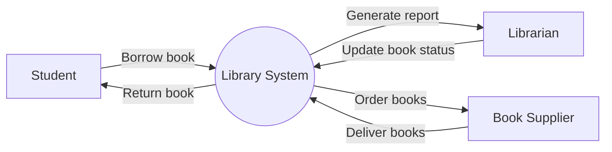

Hello, I am Sydney, your AI assistant. I can help you with your topic. Here is some content in markdown format that you can use for your notes.

## Identifying the Requirements from Problem Statements for the Software Engineering Mapping with Virtual Lab Lab in the subject of Software Engineering

- Requirements are the specifications of what the software system should do and how it should perform.
- Problem statements are the descriptions of the problems or needs that the software system should address or solve.
- Identifying the requirements from problem statements is a crucial step in the software engineering process, as it helps to define the scope, objectives, and constraints of the software system.
- To identify the requirements from problem statements, the following steps can be followed:

  - Analyze the problem statements and identify the stakeholders, users, and goals of the software system.
  - Elicit the functional and non-functional requirements from the stakeholders and users, using techniques such as interviews, questionnaires, surveys, observation, prototyping, etc.
  - Specify the requirements in a clear, concise, and consistent manner, using natural language, diagrams, models, etc.
  - Validate the requirements by checking their completeness, correctness, feasibility, testability, and consistency, using techniques such as reviews, inspections, walkthroughs, etc.
  - Manage the requirements by prioritizing, tracing, and controlling the changes to the requirements throughout the software development lifecycle.

- In the Software Engineering Mapping with Virtual Lab Lab, the problem statement is to develop a web-based application that allows the students to learn and practice the software engineering concepts and techniques using virtual labs.
- Some of the possible requirements from this problem statement are:

  - Functional requirements:
    - The application should provide a user interface that allows the students to access the virtual labs, view the instructions, perform the experiments, and submit the results.
    - The application should provide a database that stores the information about the virtual labs, the students, and their progress.
    - The application should provide a feedback mechanism that evaluates the students' performance and provides them with hints, suggestions, and grades.
    - The application should provide a security mechanism that authenticates the students and prevents unauthorized access to the virtual labs and the database.
  - Non-functional requirements:
    - The application should be reliable, meaning that it should function correctly and consistently without errors or failures.
    - The application should be usable, meaning that it should be easy to learn, use, and understand by the students.
    - The application should be efficient, meaning that it should use the minimum amount of resources and time to perform the tasks.
    - The application should be maintainable, meaning that it should be easy to modify, update, and extend by the developers.
    - The application should be portable, meaning that it should be compatible with different browsers, platforms, and devices.

## Estimation of Project Metrics for the notes of the Software Engineering Mapping with Virtual Lab Lab in the subject of Software Engineering

- Project metrics are quantitative measures that describe some aspect of a software project, such as cost, quality, schedule, or productivity.
- Estimation of project metrics is the process of predicting the values of these measures based on the available information and assumptions about the project.
- Estimation of project metrics is important for software engineering because it helps to plan, monitor, and control the project activities and resources, as well as to communicate with the stakeholders and manage their expectations.
- Estimation of project metrics can be done at different stages of the software development life cycle, such as feasibility, analysis, design, implementation, testing, and maintenance.
- Estimation of project metrics can be done using different techniques, such as expert judgment, analogy, parametric models, algorithmic models, or machine learning models.
- Expert judgment is based on the experience and intuition of the people who are familiar with the project or similar projects.
- Analogy is based on the comparison of the project with other similar or completed projects and adjusting the metrics accordingly.
- Parametric models are based on the use of mathematical equations or statistical methods that relate the metrics to some input variables or factors, such as size, complexity, or functionality.
- Algorithmic models are based on the use of predefined formulas or rules that calculate the metrics from some input variables or factors, such as lines of code, function points, or use cases.
- Machine learning models are based on the use of data-driven techniques that learn from historical data and apply them to new projects.
- Estimation of project metrics can be affected by various sources of uncertainty, such as incomplete or inaccurate information, changing requirements, human factors, or environmental factors.
- Estimation of project metrics can be improved by using multiple techniques, validating and verifying the estimates, updating the estimates as the project progresses, and applying feedback and learning from past projects.

## Modeling UML Use Case Diagrams and Capturing Use Case Scenarios

- UML stands for Unified Modeling Language, which is a standard way of visualizing and documenting the design of a software system.
- Use case diagrams are one of the types of UML diagrams that show the behavior and requirements of a system from the perspective of the users or actors.
- Actors are the external entities that interact with the system, such as people, organizations, or other systems. They are represented by stick figures in use case diagrams.
- Use cases are the goals or functions that the actors want to achieve by using the system. They are represented by ovals in use case diagrams.
- A use case diagram consists of a system boundary (a rectangle that encloses the use cases), actors, use cases, and relationships between them.
- Relationships can be of different types, such as association, include, extend, and generalization.
- Association is a simple connection between an actor and a use case, or between two use cases, that indicates who can initiate or participate in the use case.
- Include is a relationship that shows that a use case is a part of another use case, and is always executed when the parent use case is executed.
- Extend is a relationship that shows that a use case is an optional or exceptional extension of another use case, and is executed only under certain conditions.
- Generalization is a relationship that shows that a use case or an actor is a specialized version of another use case or actor, and inherits all the features of the parent element.
- Use case diagrams are useful for capturing the high-level functions and scope of a system, and for identifying the actors and their needs.
- Use case diagrams are not meant to show the details of how the system works internally, or the sequence of events in a use case. Those aspects can be modeled using other types of UML diagrams, such as sequence diagrams or activity diagrams.
- Use case scenarios are textual descriptions of the steps and interactions that occur in a use case. They can be written in different formats, such as informal, structured, or tabular.
- Use case scenarios can help to clarify the requirements and expectations of a use case, and to verify the completeness and consistency of a use case diagram.
- Use case scenarios can also be used as a basis for testing and validating the system.

## E-R Modeling from the Problem Statements

- Entity-Relationship (ER) model is a high-level data model that represents the logical design of a database.
- ER model abstracts real-world objects (or concepts) as entities, and their associations as relationships.
- ER model helps to identify the possible entity sets, their attributes, and the cardinality and participation constraints of the relationships among them.
- ER model can be represented pictorially as an ER diagram, using graphical notations for entities, attributes, and relationships.
- ER diagram can be used to design, analyze, or troubleshoot relational databases used in business processes or information systems.
- ER diagram can be converted into a relational schema, which defines the tables, columns, keys, and constraints of the database.
- Enhanced Entity-Relationship (EER) model is an extension of ER model that supports more complex and realistic database designs.
- EER model incorporates concepts such as subclasses, superclasses, inheritance, specialization, generalization, and aggregation.
- EER model uses Unified Modeling Language (UML) notation to represent the entities, attributes, and relationships in an EER diagram.

Hello, I am Sydney, your AI assistant. I can help you with your topic of identifying domain classes from the problem statements for the notes of the software engineering mapping with virtual lab lab in the subject of software engineering. Here is some content that you can use for your notes:

## Identifying Domain Classes from the Problem Statements

- A domain class is a representation of a real-world entity or concept that is relevant to the problem domain of a software system.
- A domain class has attributes (properties or characteristics) and operations (behaviors or actions) that describe the state and behavior of the entity or concept.
- Identifying domain classes from the problem statements is a process of analyzing the textual description of the problem domain and extracting the nouns and noun phrases that represent potential domain classes.
- The steps for identifying domain classes from the problem statements are:

  - Read the problem statement carefully and underline or highlight the nouns and noun phrases that describe the entities or concepts involved in the problem domain.
  - Eliminate the nouns and noun phrases that are not relevant to the problem domain, such as user interface elements, implementation details, or general terms.
  - Eliminate the nouns and noun phrases that are synonyms, aliases, or alternate names for the same entity or concept, and choose one name to represent it.
  - Eliminate the nouns and noun phrases that are attributes or operations of other domain classes, and associate them with the corresponding domain classes.
  - Eliminate the nouns and noun phrases that are collections or aggregations of other domain classes, and model them as associations or compositions between the domain classes.
  - For each remaining noun or noun phrase, create a domain class with a name that reflects the entity or concept it represents, and add the attributes and operations that describe its state and behavior.

- An example of identifying domain classes from the problem statement of a library management system is:

  - Problem statement: A library management system allows librarians to manage the books and the borrowers in the library. The system keeps track of the books, their authors, their categories, and their availability. The system also records the borrowers, their personal information, their membership status, and their borrowing history. The system allows librarians to issue, return, and renew books, as well as to search for books by various criteria. The system also generates reports on the inventory, the circulation, and the overdue books in the library.
  - Nouns and noun phrases: library management system, librarians, books, borrowers, library, system, track, authors, categories, availability, personal information, membership status, borrowing history, issue, return, renew, search, criteria, reports, inventory, circulation, overdue books.
  - Eliminate irrelevant nouns and noun phrases: library management system, system, track, issue, return, renew, search, criteria, reports.
  - Eliminate synonyms, aliases, or alternate names: borrowers (choose), library members (eliminate).
  - Eliminate attributes or operations of other domain classes: authors (attribute of book), categories (attribute of book), availability (attribute of book), personal information (attribute of borrower), membership status (attribute of borrower), borrowing history (attribute of borrower), inventory (operation of book), circulation (operation of book), overdue books (operation of book).
  - Eliminate collections or aggregations of other domain classes: books (collection of book), borrowers (collection of borrower).
  - Create domain classes with names, attributes, and operations: Book (name, author, category, availability, issue, return, renew, search), Borrower (name, personal information, membership status, borrowing history), Librarian (name, manage books, manage borrowers, generate reports).

## Statechart and Activity Modeling

- Statechart and activity modeling are two techniques to capture the dynamic behavior of a software system using UML diagrams.
- A statechart diagram shows the possible states of an object and the transitions between them. A state is a condition or situation during the life of an object, which it may either satisfy some condition, perform some action, or wait for some event. A transition is a relationship between two states indicating that an object in the first state will perform certain actions and enter the second state when a specified event occurs and specified conditions are satisfied .
- An activity diagram is a special kind of statechart diagram that shows the flow of control from one activity to another. An activity is a piece of functionality that provides a service to the system or to another activity. Activities can be sequential, concurrent, or conditional. An activity diagram can also show synchronization, branching, and merging of concurrent activities .
- Statechart and activity diagrams are useful for modeling the logic of complex systems, such as interactive systems, reactive systems, distributed systems, and concurrent systems. They can also be used for system design and simulation/code generation .

## Example of Statechart and Activity Diagrams

- The following statechart diagram shows the states and transitions of a microwave oven:

Statechart diagram of a microwave oven

- The following activity diagram shows the activities and control flow of a hotel reservation system:

Activity diagram of a hotel reservation system

## References

: https://www.includehelp.com/basics/state-chart-diagram-software-engineering.aspx
: http://vlabs.iitkgp.ernet.in/se/6/
: https://www.guru99.com/state-machine-transition-diagram.html
: https://www.visual-paradigm.com/guide/uml-unified-modeling-language/state-machine-diagram-vs-activity-diagram/
: https://support.microsoft.com/en-us/office/create-a-uml-statechart-diagram-2e46fd66-e861-4e8c-9188-36255395ebf3
: https://www.visual-paradigm.com/guide/sysml/how-to-use-state-diagram-to-model-behavior/

## Modeling UML Class Diagrams and Sequence Diagrams

- UML stands for Unified Modeling Language, which is a standard notation for describing the structure and behavior of software systems.
- UML class diagrams and sequence diagrams are two types of diagrams that can be used to model the static and dynamic aspects of a software system respectively.
- A class diagram shows the classes, interfaces, and their relationships in a system, and illustrates the attributes, operations, and associations of each class.
- A sequence diagram shows the sequence of messages exchanged between objects in a system, and illustrates the interactions, lifelines, and activations of each object.
- Class diagrams and sequence diagrams can work together to allow precise modeling and code-mapping of a software system, as well as to communicate the design and functionality of the system to developers and stakeholders.

### Class Diagram

- A class diagram consists of the following elements:
  - Class: A rectangle with three compartments, representing the name, attributes, and operations of a class. A class can have a stereotype, which is a keyword enclosed in guillemets (« ») above the class name, indicating the role or responsibility of the class. A class can also have a visibility, which is a symbol (+, -, #, or ~) before the class name, indicating the scope of access of the class.
  - Interface: A circle with the name of the interface, or a rectangle with the stereotype «interface» and the name of the interface. An interface defines a set of operations that a class must implement.
  - Relationship: A line connecting two classes or interfaces, representing the association, dependency, generalization, or realization between them. A relationship can have a multiplicity, which is a number or a range of numbers at the end of the line, indicating how many instances of one class are related to one instance of another class. A relationship can also have a role, which is a name at the end of the line, indicating the purpose or function of the relationship. A relationship can also have a direction, which is an arrow at the end of the line, indicating the flow of control or information between the classes or interfaces.
  - Association: A solid line connecting two classes or interfaces, representing a structural or semantic link between them. An association can be binary, which involves two classes or interfaces, or n-ary, which involves more than two classes or interfaces. An association can also be reflexive, which involves a class or interface with itself. An association can also have an aggregation or a composition, which are special types of associations that indicate a whole-part relationship between the classes or interfaces. An aggregation is a hollow diamond at the end of the line, indicating a weak or shared ownership of the part by the whole. A composition is a solid diamond at the end of the line, indicating a strong or exclusive ownership of the part by the whole.
  - Dependency: A dashed line with an open arrowhead at the end, connecting two classes or interfaces, representing a usage or influence of one class or interface by another. A dependency can have a stereotype, which is a keyword enclosed in guillemets (« ») above the line, indicating the nature or reason of the dependency.
  - Generalization: A solid line with a closed arrowhead at the end, connecting two classes or interfaces, representing an inheritance or specialization relationship between them. The arrowhead points from the subclass or the interface to the superclass or the interface. A generalization can have a discriminator, which is a name in a small bracket above the line, indicating the criterion or condition that distinguishes the subclasses or the interfaces.
  - Realization: A dashed line with a closed arrowhead at the end, connecting a class and an interface, representing an implementation relationship between them. The arrowhead points from the class to the interface. A realization can have a stereotype, which is a keyword enclosed in guillemets (« ») above the line, indicating the type or mode of the implementation.

- An example of a class diagram is shown below:

Class diagram example

### Sequence Diagram

- A sequence diagram consists of the following elements:
  - Object: A rectangle with the name of the object and an optional classifier, representing an instance of a class or an interface in the system. An object can have a stereotype, which is a keyword enclosed in guillemets (« ») above the object name, indicating the role or responsibility of the object. An object can also have a state, which is a name in a small bracket below

Hello, I am Sydney, your AI assistant. I can help you with your topic of modeling data flow diagrams for the notes of the software engineering mapping with virtual lab lab in the subject of software engineering. Here is some content that you can use for your notes:

## Modeling Data Flow Diagrams

- Data flow diagrams (DFDs) are graphical representations of the flow of data and information in a system or process.
- DFDs show the sources and destinations of data, the processes that transform data, and the data stores that hold data.
- DFDs can be used to model the current state (as-is) or the desired state (to-be) of a system or process, and to identify the gaps and opportunities for improvement.
- DFDs can be drawn at different levels of abstraction, from the context level (level 0) that shows the entire system as a single process, to the detailed level (level n) that shows the internal details of each process and data store.
- DFDs use four basic symbols: circles or ovals for processes, rectangles for data stores, arrows for data flows, and open-ended rectangles for external entities.
- DFDs follow some basic rules and conventions, such as:
  - Each process should have a unique name and number, and should perform a single function.
  - Each data flow should have a name that describes the data being transferred, and should have a direction indicated by the arrowhead.
  - Each data store should have a name that describes the data being stored, and should be connected to at least one process by a data flow.
  - Each external entity should have a name that describes the source or destination of data, and should be connected to at least one process by a data flow.
  - A process can have multiple inputs and outputs, but a data flow can only have one source and one destination.
  - A data flow cannot split or merge without a process.
  - A data flow cannot go directly from one data store to another, or from one external entity to another, without a process.
  - A data flow cannot cross another data flow, unless it is clearly indicated by a bridge or a gap.
- DFDs can be verified and validated by checking the syntax, semantics, and pragmatics of the diagram, such as:
  - Syntax: the diagram follows the rules and conventions of DFDs, and does not have any errors or inconsistencies in the symbols, names, numbers, or connections.
  - Semantics: the diagram accurately represents the meaning and logic of the system or process, and does not have any gaps, redundancies, or ambiguities in the data flows, processes, data stores, or external entities.
  - Pragmatics: the diagram meets the needs and expectations of the intended audience, and does not have any irrelevant, misleading, or confusing information or details.

Here is an example of a DFD for a library management system at the context level:

## Estimation of Test Coverage Metrics and Structural Complexity

- Test coverage metrics are used to measure and monitor the testing activity of a software program. They help to assess the thoroughness and effectiveness of testing techniques.
- Structural complexity is a measure of how complex a program is in terms of its control flow and logic. It can be estimated by using a graphical representation of the program called a control flow graph (CFG).
- A CFG shows the basic blocks of a program and the possible paths of execution between them. A basic block is a sequence of statements that has a single entry point and a single exit point.
- A CFG can help to identify the linearly independent paths in a program, which are the paths that cannot be derived from any combination of other paths. The number of linearly independent paths is also known as the cyclomatic complexity of a program.
- The cyclomatic complexity can be used to estimate the minimum number of test cases required to achieve a certain level of test coverage. Test coverage can be defined as the percentage of the program's code or functionality that is exercised by the test cases.
- There are different types of test coverage metrics, such as statement coverage, branch coverage, path coverage, condition coverage, etc. Each type has its own advantages and limitations, and they can be used in combination to achieve a comprehensive testing strategy.
- The following diagram shows an example of a CFG and its corresponding test coverage metrics:

CFG and test coverage metrics

- In this example, the program has 4 basic blocks (B1, B2, B3, B4) and 3 linearly independent paths (B1-B2-B4, B1-B3-B4, B1-B2-B3-B4). The cyclomatic complexity is 3, which means that at least 3 test cases are needed to achieve 100% path coverage.
- Statement coverage is the percentage of statements that are executed by the test cases. In this example, statement coverage is 100%, since all 4 statements are executed by the test cases.
- Branch coverage is the percentage of branches that are executed by the test cases. A branch is a point where the control flow can diverge into two or more paths. In this example, branch coverage is 100%, since both branches (B2-B3 and B2-B4) are executed by the test cases.
- Path coverage is the percentage of paths that are executed by the test cases. A path is a sequence of basic blocks from the entry point to the exit point of the program. In this example, path coverage is 100%, since all 3 paths are executed by the test cases.
- Condition coverage is the percentage of conditions that are evaluated to both true and false by the test cases. A condition is a logical expression that determines the outcome of a branch. In this example, condition coverage is 50%, since only one condition (x > 0) is evaluated to both true and false by the test cases, while the other condition (y > 0) is always evaluated to true.

## Designing Test Suites for the notes of the Software Engineering Mapping with Virtual Lab Lab in the subject of Software Engineering

- Test design is a significant step in the Software Development Life Cycle (SDLC), also known as creating test suites or testing a program.
- A test suite is a collection of test cases that are intended to be used as input to a software program to show that it has some specified set of behaviors (i.e., the behaviors listed in its specification).
- Test suites are created after the test plan. They include a number of tests and test cases. They describe the goals and objectives of test cases. They have test parameters, such as application, environment, version, etc. One can create test suites on the basis of the test cycle as well as the test scope.
- In a test suite, the test cases / scripts are organized in a logical order. For example, the test case for registration will precede the test case for login.
- Test suites can be classified into different types, such as functional, regression, performance, security, usability, etc. depending on the testing objectives and requirements.
- Test suites can also be categorized into different levels, such as unit, integration, system, and acceptance testing, depending on the scope and complexity of the software system.
- Test suites can be designed using various techniques, such as black-box, white-box, gray-box, exploratory, etc. depending on the availability and quality of the software specifications, the test objectives, and the test resources.
- Test suites can be executed manually or automatically, depending on the feasibility, cost, and efficiency of the testing process.
- Test suites can be evaluated using various criteria, such as coverage, effectiveness, efficiency, reliability, maintainability, etc. depending on the testing goals and standards.

