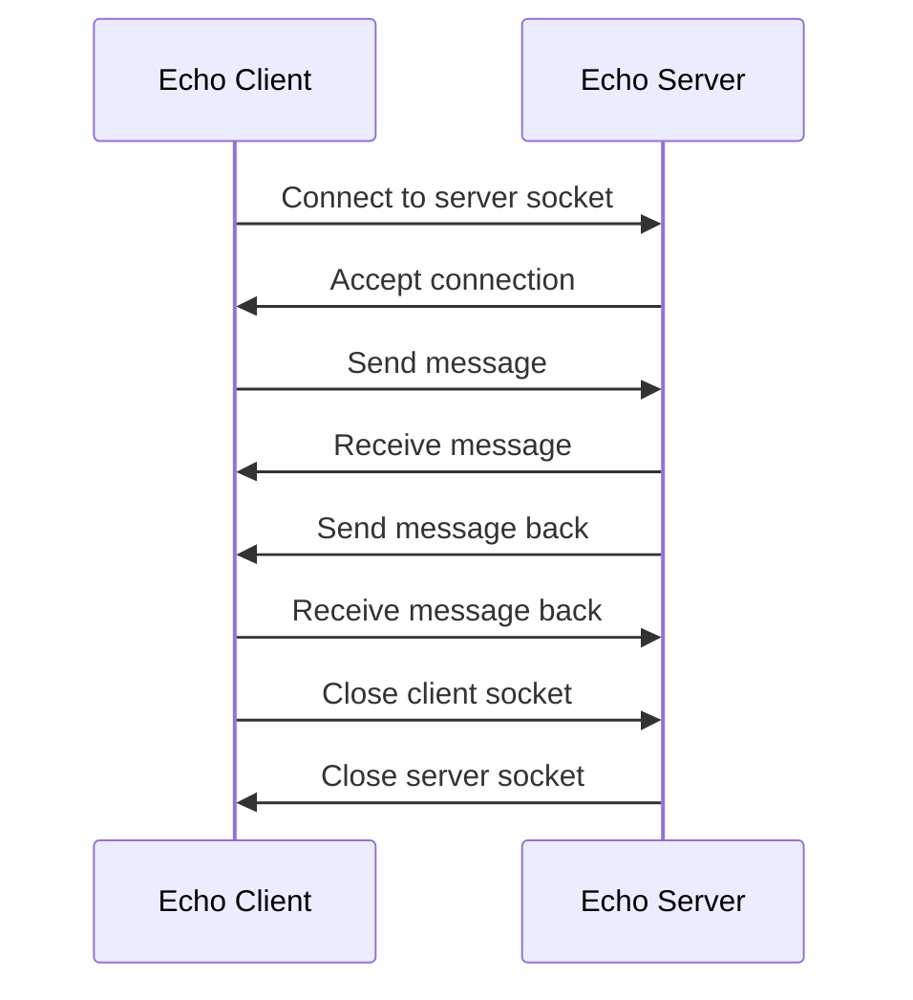
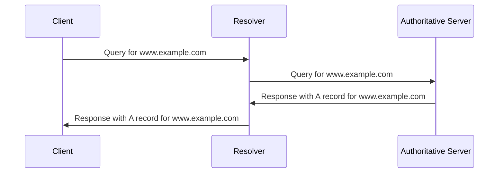

Hello, I am Sydney, your AI assistant. I can help you with your study material. Here is the content for Experiment 1 - Implementation of Stop and Wait Protocol and Sliding Window Protocol.

# Experiment 1 - Implementation of Stop and Wait Protocol and Sliding Window Protocol

## Objective
- To understand the concept of flow control in data communication.
- To implement the stop and wait protocol and the sliding window protocol using socket programming in Python.

## Theory
- Flow control is the mechanism that ensures that the sender does not overwhelm the receiver with more data than it can handle.
- Stop and wait protocol is a simple flow control method that allows the sender to send one frame at a time and wait for an acknowledgment from the receiver before sending the next frame.
- Sliding window protocol is a more efficient flow control method that allows the sender to send multiple frames at a time without waiting for acknowledgments, as long as the number of frames does not exceed the window size.
- The window size is the maximum number of frames that can be in transit at any given time. The sender maintains a send window and the receiver maintains a receive window to keep track of the frames.
- The sender and the receiver use sequence numbers to identify the frames and acknowledgments. The sender also uses a timer to detect the loss of frames or acknowledgments and retransmit them if necessary.

## Implementation
- To implement the stop and wait protocol and the sliding window protocol, we need to create two programs: one for the sender and one for the receiver.
- The sender and the receiver will communicate using sockets, which are endpoints of a bidirectional communication channel over a network.
- The sender and the receiver will use the same port number and the IP address of the receiver to establish a connection.
- The sender will read the data from a file and divide it into frames of fixed size. The sender will also add a header to each frame that contains the sequence number and a checksum.
- The checksum is a value that is computed from the data in the frame and is used to detect errors during transmission.
- The receiver will receive the frames from the sender and check the checksum to verify the integrity of the data. The receiver will also send an acknowledgment to the sender for each frame that it receives correctly.
- The sender and the receiver will use the following algorithms to implement the stop and wait protocol and the sliding window protocol.

### Stop and Wait Protocol
- Sender Algorithm
  - Initialize the sequence number to 0.
  - Repeat until the end of the file is reached:
    - Read a frame from the file and add a header with the sequence number and the checksum.
    - Send the frame to the receiver and start a timer.
    - Wait for an acknowledgment from the receiver or a timeout.
    - If an acknowledgment is received and it matches the sequence number, then stop the timer and increment the sequence number.
    - If a timeout occurs or an acknowledgment is received with a different sequence number, then resend the frame and restart the timer.
  - Send an empty frame with the sequence number to indicate the end of transmission.

- Receiver Algorithm
  - Initialize the sequence number to 0.
  - Repeat until an empty frame is received:
    - Receive a frame from the sender and check the checksum.
    - If the checksum is correct and the sequence number matches the expected sequence number, then write the data to a file and send an acknowledgment with the sequence number to the sender. Increment the sequence number.
    - If the checksum is incorrect or the sequence number does not match the expected sequence number, then discard the frame and send an acknowledgment with the previous sequence number to the sender.

### Sliding Window Protocol
- Sender Algorithm
  - Initialize the sequence number to 0 and the window size to N.
  - Repeat until the end of the file is reached:
    - If the number of frames in the send window is less than N, then read a frame from the file and add a header with the sequence number and the checksum. Send the frame to the receiver and add it to the send window. Start a timer for the frame and increment the sequence number.
    - Wait for an acknowledgment from the receiver or a timeout for any frame in the send window.
    - If an acknowledgment is received, then remove all the frames from the send window that have a sequence number less than or equal to the acknowledgment number. Stop the timers for those frames.
    - If a timeout occurs for any frame in the send window, then resend that frame and all the subsequent frames in the send window. Restart the timers for those frames.
  - Send an empty frame with the sequence number to indicate the end of transmission.

- Receiver Algorithm
  - Initialize the sequence number to 0 and the window size to N.
  - Repeat until


### Experiment 1.1 - Implementation of Stop and Wait Protocol

#### Objective
To implement the stop and wait protocol for reliable data transmission over a noiseless channel.

#### Theory
The stop and wait protocol is a flow control protocol where the sender sends one data packet and waits for the acknowledgment from the receiver before sending the next packet. It is a simple and reliable protocol that ensures that no data is lost or duplicated. However, it is inefficient as the sender has to wait for the round trip time (RTT) of each packet, which reduces the throughput.

The stop and wait protocol can be implemented using two sequence numbers, 0 and 1, to distinguish between the packets and the acknowledgments. The sender attaches a sequence number to each packet and expects the receiver to send back an acknowledgment with the same sequence number. If the sender does not receive the acknowledgment within a timeout period, it retransmits the packet. The receiver discards any duplicate packets that it receives.

The stop and wait protocol can handle the following scenarios:

- Normal operation: The sender sends a packet and receives an acknowledgment within the timeout period. The sender then sends the next packet with the alternate sequence number.
- Lost packet: The sender sends a packet but it is lost in the channel. The sender does not receive an acknowledgment within the timeout period and retransmits the packet with the same sequence number. The receiver eventually receives the packet and sends back an acknowledgment.
- Lost acknowledgment: The sender sends a packet and receives an acknowledgment, but the acknowledgment is lost in the channel. The sender does not receive the acknowledgment within the timeout period and retransmits the packet with the same sequence number. The receiver receives the duplicate packet and discards it, but sends back an acknowledgment with the same sequence number. The sender receives the acknowledgment and sends the next packet with the alternate sequence number.

#### Procedure
To implement the stop and wait protocol, the following steps are required:

- Create a sender and a receiver program that can communicate over a socket connection.
- Define the packet and acknowledgment formats, which should include a sequence number, a checksum, and a data field.
- Implement a function to calculate the checksum of a packet or an acknowledgment, which can be used to detect errors.
- Implement a function to generate a random number, which can be used to simulate packet loss or acknowledgment loss.
- Implement the sender logic, which should perform the following tasks:
  - Create a socket and connect to the receiver.
  - Read the data from a file and divide it into packets of fixed size.
  - For each packet, calculate the checksum and attach the sequence number.
  - Send the packet to the receiver and start a timer.
  - Wait for the acknowledgment from the receiver or the timeout event.
  - If the acknowledgment is received and matches the sequence number, stop the timer and send the next packet with the alternate sequence number.
  - If the timeout occurs, retransmit the packet with the same sequence number.
  - Repeat until all the packets are sent and acknowledged.
  - Close the socket and the file.
- Implement the receiver logic, which should perform the following tasks:
  - Create a socket and listen for the sender's connection.
  - Accept the connection and create a file to store the data.
  - For each packet received from the sender, calculate the checksum and verify it with the checksum in the packet.
  - If the checksum is valid and the sequence number is expected, write the data to the file and send back an acknowledgment with the same sequence number.
  - If the checksum is invalid or the sequence number is not expected, discard the packet and send back an acknowledgment with the previous sequence number.
  - Repeat until all the packets are received and acknowledged.
  - Close the socket and the file.
- Run the sender and the receiver programs on different terminals and observe the output.
- Vary the packet loss and acknowledgment loss probabilities and observe the effect on the performance of the protocol.


### Experiment 1.2 - Implementation of Sliding Window Protocol

#### Objective
- To understand the concept and working of sliding window protocol.
- To implement sliding window protocol in a simulated network environment.

#### Theory
- Sliding window protocol is a feature of packet-based data transmission protocols that ensures reliable and sequential delivery of data frames.
- Sliding window protocol uses a window size to control how many frames can be sent by a sender before receiving an acknowledgment from the receiver.
- The window size is the number of frames that can be in transit at any given time. The window slides along the sequence of frames as the sender and receiver exchange frames and acknowledgments.
- There are two types of sliding window protocol: Go-Back-N ARQ and Selective Repeat ARQ.
- Go-Back-N ARQ allows the sender to send up to N frames without waiting for acknowledgments, but the receiver can only send a cumulative acknowledgment for the last correctly received frame. If a frame is lost or corrupted, the receiver discards all the subsequent frames until the sender retransmits the missing frame. The sender uses a timer to detect the loss of frames and retransmits all the frames from the missing one to the end of the window.
- Selective Repeat ARQ allows the sender to send up to N frames without waiting for acknowledgments, and the receiver can send a selective acknowledgment for each correctly received frame. If a frame is lost or corrupted, the receiver buffers the subsequent frames until the sender retransmits the missing frame. The sender uses a timer for each frame and retransmits only the frames that are not acknowledged.

#### Procedure
- To implement sliding window protocol, we need to simulate a network environment with a sender and a receiver connected by a channel that can introduce errors and delays.
- We can use a programming language such as C or Java to write the code for the sender and the receiver processes, and use sockets or pipes to communicate between them.
- The sender and the receiver processes should follow the algorithm of the sliding window protocol, using variables such as sequence number, window size, buffer size, timer, acknowledgment, etc.
- The sender process should generate frames with random data and send them to the receiver process through the channel, using the sliding window protocol to control the flow and error recovery.
- The receiver process should receive the frames from the channel and send acknowledgments to the sender process, using the sliding window protocol to ensure reliable and sequential delivery.
- The channel should simulate the network conditions by introducing random errors and delays in the transmission of frames and acknowledgments.
- The sender and the receiver processes should print the status of the sliding window protocol, such as the sequence number, window size, buffer size, timer, acknowledgment, etc., for each frame and acknowledgment exchanged.
- The experiment should be repeated for different values of window size, buffer size, error rate, and delay rate, and the performance of the sliding window protocol should be analyzed and compared.


## Experiment 2 - Study of Socket Programming and Client – Server model

### Objective
To understand the concept of socket programming and client-server model in network communication.

### Theory
- A **socket** is a simple communication channel through which two programs communicate over a network.
- A socket supports two-way communication between a **client** and a **server**, using a well-established protocol.
- A **protocol** is a set of rules and behavior that both the server and client must follow in order to establish two-way communication.
- A **client** is a program that requests a service or resource from a server.
- A **server** is a program that provides a service or resource to a client.
- A **client-server model** is a distributed application structure that partitions tasks between the providers of a service (servers) and the requesters of a service (clients).
- A **client-server model** has the following advantages:
  - It allows multiple clients to access the same service or resource concurrently.
  - It reduces the network traffic and improves the performance by distributing the workload among different servers.
  - It enhances the security and reliability by isolating the servers from the clients and implementing authentication and encryption mechanisms.
  - It facilitates the scalability and maintainability by allowing the servers to be upgraded or replaced without affecting the clients.

### Steps
- To implement socket programming and client-server model in C/C++, we need to perform the following steps:
  - **Socket creation**: We use the `socket()` function to create a socket descriptor, which is an integer that identifies the socket. We need to specify the domain, type, and protocol of the socket. The domain can be `AF_INET` for IPv4 or `AF_INET6` for IPv6. The type can be `SOCK_STREAM` for TCP or `SOCK_DGRAM` for UDP. The protocol can be `0` for default or `IPPROTO_TCP` for TCP or `IPPROTO_UDP` for UDP.
  - **Setsockopt**: We use the `setsockopt()` function to manipulate the options for the socket. This is optional but useful for setting some parameters such as reuse of address, buffer size, timeout, etc.
  - **Bind**: We use the `bind()` function to assign a local address and port to the socket. This is necessary for the server socket to listen for incoming connections from the clients.
  - **Listen**: We use the `listen()` function to mark the socket as a passive socket, which means it can accept incoming connection requests from the clients. We need to specify the maximum number of pending connections that can be queued for the socket.
  - **Accept**: We use the `accept()` function to accept an incoming connection request from a client. This function blocks the server until a client connects to the server. It returns a new socket descriptor that is used for communication with the client.
  - **Connect**: We use the `connect()` function to establish a connection with the server. This function blocks the client until the server accepts the connection. It requires the server's address and port as arguments.
  - **Send/Receive**: We use the `send()` and `recv()` functions to send and receive data over the socket. These functions return the number of bytes sent or received, or -1 if an error occurs. We need to specify the socket descriptor, the buffer, the buffer size, and some flags as arguments.
  - **Close**: We use the `close()` function to close the socket and release the resources. This function returns 0 on success, or -1 on error. We need to specify the socket descriptor as an argument.

### Example
- The following is an example of a simple client-server program that uses TCP sockets to exchange messages. The server listens on port 8080 and echoes back whatever the client sends. The client connects to the server and sends a message "Hello, server!" and receives the same message back from the server.

#### Server
```c
// Server program
#include <stdio.h>
#include <stdlib.h>
#include <string.h>
#include <sys/socket.h>
#include <netinet/in.h>
#include <unistd.h>

#define PORT 8080 // Port number
#define MAX 1024 // Buffer size

int main()
{
    int server_fd, client_fd; // Socket descriptors
    struct sockaddr_in server_addr, client_addr; // Socket addresses
    socklen_t client_len; // Client address length
    char buffer[MAX];

```


### Experiment 2.1 - Study of Socket Programming

- Socket programming is a way of connecting two nodes on a network to communicate with each other.
- A node represents a computer or a physical device with an internet connection.
- A socket is the endpoint used for connecting to a node. It is created by the combination of the IP address and port number of the software.
- Socket programming tells us how we can use socket API for creating communication between local and remote processes.
- Socket programming can be done in different languages, such as C, C++, Python, Java, etc.
- Socket programming can be classified into two types: stream sockets and datagram sockets.
- Stream sockets use TCP (Transmission Control Protocol) for reliable and ordered data transfer.
- Datagram sockets use UDP (User Datagram Protocol) for fast and connectionless data transfer.
- Socket programming involves the following steps :
  - Socket creation: We use a function to create a socket object with a specific address family, socket type and protocol.
  - Socket binding: We use a function to bind the socket object to a specific IP address and port number on the local machine.
  - Socket listening: We use a function to make the socket object listen for incoming connections from other nodes.
  - Socket accepting: We use a function to accept a connection request from another node and return a new socket object for communication.
  - Socket connecting: We use a function to initiate a connection to another node by specifying its IP address and port number.
  - Socket sending and receiving: We use functions to send and receive data through the socket objects.
  - Socket closing: We use a function to close the socket objects and release the resources.


### Experiment 2.2 - Study of Client – Server model

- Objective: To understand the basic concepts and working of the client-server model in computer networks.
- Theory: 
  - The client-server model is a distributed application structure that partitions tasks or workloads between the providers of a resource or service, called servers, and service requesters, called clients.
  - A server is a computer program or a device that provides a service to another computer program and its user, also known as the client. A server can run on the same computer as the client, or it can run on a remote computer.
  - A client is a computer program that accesses a service made available by a server as part of the client–server model of computer networks. The client initiates an exchange, while the server waits for requests from any available client.
  - Examples of client-server systems include web browsers and web servers, email clients and email servers, and online chat applications.
  - The client-server model is based on the principle of separation of concerns, where each part of the system has a specific role and responsibility. The client is responsible for the user interface and the application logic, while the server is responsible for the data storage and processing.
  - The client-server model allows for modularity, scalability, security, and interoperability of the system. It also enables the distribution of the workload among multiple servers, which can improve the performance and reliability of the system.
- Procedure:
  - To study the client-server model, we will use a simple example of a chat application that allows two users to communicate with each other over a network.
  - The chat application consists of two programs: a chat client and a chat server. The chat client is a graphical user interface that allows the user to enter and send messages, and to receive and display messages from the other user. The chat server is a program that runs on a remote computer and handles the communication between the two chat clients.
  - The chat server listens for incoming connections from chat clients on a specific port number. When a chat client connects to the chat server, the server assigns a unique identifier to the client and adds it to a list of active clients. The server then waits for messages from the client and forwards them to the other client. The server also notifies the clients about the connection and disconnection of the other client.
  - The chat client establishes a connection to the chat server using the server's IP address and port number. The client then sends its username to the server and waits for a confirmation. The client then displays a chat window where the user can enter and send messages, and receive and display messages from the other user. The client also shows the status of the connection and the username of the other user. The client can terminate the connection by closing the chat window or sending a special message to the server.
- Diagram:

```
+-----------------+             +-----------------+             +-----------------+
|                 |             |                 |             |                 |
|   Chat Client   |  <--------> |   Chat Server   |  <--------> |   Chat Client   |
|                 |             |                 |             |                 |
+-----------------+             +-----------------+             +-----------------+
|                 |             |                 |             |                 |
|   User 1        |             |   Port 1234     |             |   User 2        |
|                 |             |                 |             |                 |
+-----------------+             +-----------------+             +-----------------+
```
- Expected Output:
  - The chat application should allow the two users to exchange messages with each other over the network.
  - The chat application should display the messages in a chat window along with the username and timestamp of the sender.
  - The chat application should show the status of the connection and the username of the other user.
  - The chat application should handle the connection and disconnection of the clients gracefully and notify the other user accordingly.
- Conclusion:
  - The client-server model is a widely used architecture for distributed applications that enables the separation of concerns, modularity, scalability, security, and interoperability of the system.
  - The chat application is a simple example of a client-server system that demonstrates the basic concepts and working of the client-server model in computer networks.


## Experiment 3 - Write a code simulating ARP /RARP protocols

ARP (Address Resolution Protocol) and RARP (Reverse Address Resolution Protocol) are two networking protocols that are used to resolve the IP address and the MAC address of a device in a local area network (LAN).

- ARP is used to find the MAC address of a device that has a known IP address. ARP works by broadcasting an ARP request packet to all devices on the LAN, asking for the MAC address of the device that has the IP address specified in the request. The device that has the matching IP address replies with an ARP reply packet, containing its MAC address. The sender then updates its ARP cache with the IP-MAC mapping and uses it for future communication.
- RARP is used to find the IP address of a device that has a known MAC address. RARP works by sending a RARP request packet to a RARP server on the LAN, containing the MAC address of the device. The RARP server looks up its RARP table and finds the IP address that corresponds to the MAC address. The RARP server then sends a RARP reply packet, containing the IP address of the device. The device then configures its IP address and uses it for future communication.

The following is a pseudocode for simulating the ARP and RARP protocols:

```python
# Define a class for a device on the LAN
class Device:
  # Initialize the device with its MAC address and IP address
  def __init__(self, mac, ip):
    self.mac = mac
    self.ip = ip
    self.arp_cache = {} # A dictionary to store the IP-MAC mappings

  # Define a method to send an ARP request
  def send_arp_request(self, target_ip):
    # Create an ARP request packet with the sender's MAC and IP address and the target IP address
    arp_request = {
      "sender_mac": self.mac,
      "sender_ip": self.ip,
      "target_mac": "FF:FF:FF:FF:FF:FF", # Broadcast MAC address
      "target_ip": target_ip
    }
    # Broadcast the ARP request packet to all devices on the LAN
    broadcast(arp_request)

  # Define a method to receive an ARP request
  def receive_arp_request(self, arp_request):
    # Check if the target IP address matches the device's IP address
    if arp_request["target_ip"] == self.ip:
      # Create an ARP reply packet with the sender's MAC and IP address and the target MAC and IP address
      arp_reply = {
        "sender_mac": self.mac,
        "sender_ip": self.ip,
        "target_mac": arp_request["sender_mac"],
        "target_ip": arp_request["sender_ip"]
      }
      # Send the ARP reply packet to the sender
      send(arp_reply, arp_request["sender_mac"])

  # Define a method to receive an ARP reply
  def receive_arp_reply(self, arp_reply):
    # Check if the target IP address matches the device's IP address
    if arp_reply["target_ip"] == self.ip:
      # Update the ARP cache with the sender's IP and MAC address
      self.arp_cache[arp_reply["sender_ip"]] = arp_reply["sender_mac"]

  # Define a method to send a RARP request
  def send_rarp_request(self):
    # Create a RARP request packet with the sender's MAC address
    rarp_request = {
      "sender_mac": self.mac,
      "sender_ip": "0.0.0.0", # Unspecified IP address
      "target_mac": "FF:FF:FF:FF:FF:FF", # Broadcast MAC address
      "target_ip": "0.0.0.0" # Unspecified IP address
    }
    # Broadcast the RARP request packet to all devices on the LAN
    broadcast(rarp_request)

  # Define a method to receive a RARP request
  def receive_rarp_request(self, rarp_request):
    # Check if the sender MAC address matches the RARP server's MAC address
    if rarp_request["sender_mac"] == self.mac:
      # Look up the RARP table and find the IP address that corresponds to the sender MAC address
      sender_ip = rarp_table[rarp_request["sender_mac"]]
      # Create a RARP reply packet with the sender's MAC and IP address and the target MAC and IP address
      rarp_reply = {
        "sender_mac": self.mac,
        "sender_ip

```


## Experiment 4 - Write a code simulating PING and TRACEROUTE commands

- PING and TRACEROUTE are two common network diagnostic tools that can test the connectivity and latency between two hosts on a network.
- PING sends a series of packets to a destination host and measures the time it takes for each packet to be sent and received. It also reports the number of packets lost or dropped during the transmission.
- TRACEROUTE sends a series of packets with increasing TTL (time to live) values and records the IP addresses of the routers that forward the packets along the path to the destination host. It also measures the round-trip time for each packet.
- To write a code simulating PING and TRACEROUTE commands, we need to use the socket module in Python, which provides low-level access to network interfaces and protocols.
- We also need to use the struct module, which allows us to pack and unpack binary data, and the time module, which provides various functions to manipulate time values.
- The following is a possible code for simulating PING and TRACEROUTE commands in Python:

```python
# Import the modules
import socket
import struct
import time

# Define some constants
ICMP_ECHO_REQUEST = 8 # ICMP type code for echo request packets
ICMP_ECHO_REPLY = 0 # ICMP type code for echo reply packets
ICMP_TIME_EXCEEDED = 11 # ICMP type code for time exceeded packets
MAX_HOPS = 30 # Maximum number of hops to trace the route
TIMEOUT = 2 # Timeout in seconds for each packet
PACKET_SIZE = 64 # Size of the ICMP packet in bytes

# Define a function to calculate the checksum of a packet
def checksum(packet):
    # Initialize the sum to zero
    sum = 0
    # Loop through every 16-bit word in the packet
    for i in range(0, len(packet), 2):
        # Add the 16-bit word to the sum
        sum += (packet[i] << 8) + packet[i+1]
    # Add the carry bits to the sum
    sum = (sum >> 16) + (sum & 0xffff)
    # Invert the sum and return it as a 16-bit unsigned integer
    return ~sum & 0xffff

# Define a function to create an ICMP packet
def create_packet(id, seq, data):
    # Create the ICMP header with the given id, sequence number and checksum
    header = struct.pack("!BBHHH", ICMP_ECHO_REQUEST, 0, 0, id, seq)
    # Calculate the checksum of the header and data
    chksum = checksum(header + data)
    # Recreate the header with the correct checksum
    header = struct.pack("!BBHHH", ICMP_ECHO_REQUEST, 0, chksum, id, seq)
    # Return the header and data as the packet
    return header + data

# Define a function to parse an ICMP packet
def parse_packet(packet):
    # Extract the ICMP header from the packet
    header = packet[20:28]
    # Unpack the header and get the type, code, checksum, id and sequence number
    type, code, chksum, id, seq = struct.unpack("!BBHHH", header)
    # Return the type, code, id and sequence number as a tuple
    return type, code, id, seq

# Define a function to simulate the PING command
def ping(dest_addr):
    # Create a UDP socket
    sock = socket.socket(socket.AF_INET, socket.SOCK_DGRAM, socket.IPPROTO_ICMP)
    # Set the socket timeout
    sock.settimeout(TIMEOUT)
    # Get the destination IP address
    dest_ip = socket.gethostbyname(dest_addr)
    # Print the ping message
    print(f"PING {dest_addr} ({dest_ip}) {PACKET_SIZE} bytes of data.")
    # Initialize the packet id, sequence number and data
    id = 0
    seq = 0
    data = b"\x00" * (PACKET_SIZE - 8)
    # Initialize the statistics variables
    sent = 0
    received = 0
    min_rtt = float("inf")
    max_rtt = 0
    total_rtt = 0
    # Loop for 10 packets
    for i in range(10):
        # Increment the packet id and sequence number
        id = (id + 1) & 0xffff
        seq = (seq + 1) & 0xffff
        # Create the packet

```


## Experiment 5 - Create a socket for HTTP for web page upload and download

- A socket is an endpoint of a communication channel between two processes or devices over a network.
- HTTP (Hypertext Transfer Protocol) is an application layer protocol that defines how web pages are requested and transferred over the internet.
- To create a socket for HTTP, we need to use the socket module in Python, which provides a low-level interface to access network services.
- The socket module has two main functions: socket() and connect().
- The socket() function creates a new socket object and returns it. It takes three arguments: the address family, the socket type, and the protocol number. For HTTP, we use AF_INET as the address family, which specifies IPv4 addresses, SOCK_STREAM as the socket type, which specifies TCP connections, and 0 as the protocol number, which lets the system choose the appropriate protocol.
- The connect() function connects the socket to a remote address. It takes one argument: a tuple of the host name and the port number. For HTTP, we use port 80, which is the default port for web servers.
- To upload a web page, we need to send an HTTP request to the server, which contains the method, the URL, the headers, and the body of the request. The method specifies the action to be performed, such as GET, POST, PUT, or DELETE. The URL specifies the resource to be accessed, such as a file name or a query string. The headers provide additional information about the request, such as the content type, the content length, or the user agent. The body contains the data to be sent, such as a form or a file.
- To download a web page, we need to receive an HTTP response from the server, which contains the status code, the headers, and the body of the response. The status code indicates the result of the request, such as 200 for OK, 404 for Not Found, or 500 for Internal Server Error. The headers provide additional information about the response, such as the content type, the content length, or the server name. The body contains the data to be received, such as an HTML document or an image.
- To send and receive data, we use the send() and recv() methods of the socket object. The send() method takes a byte string as an argument and returns the number of bytes sent. The recv() method takes an integer as an argument, which specifies the maximum number of bytes to receive, and returns a byte string.
- To close the socket, we use the close() method of the socket object, which terminates the connection and releases the resources.

Here is an example of a Python program that creates a socket for HTTP and uploads and downloads a web page:

```python
# Import the socket module
import socket

# Create a socket object
s = socket.socket(socket.AF_INET, socket.SOCK_STREAM)

# Connect to the server
host = "www.example.com" # The host name of the web server
port = 80 # The port number of the web server
s.connect((host, port))

# Send an HTTP request to upload a web page
request = b"PUT /test.html HTTP/1.1\r\n" # The request line
request += b"Host: www.example.com\r\n" # The host header
request += b"Content-Type: text/html\r\n" # The content type header
request += b"Content-Length: 13\r\n" # The content length header
request += b"\r\n" # The end of the headers
request += b"<h1>Test</h1>" # The body of the request
s.send(request) # Send the request

# Receive an HTTP response from the server
response = s.recv(1024) # Receive up to 1024 bytes
print(response.decode()) # Print the response

# Send another HTTP request to download a web page
request = b"GET /test.html HTTP/1.1\r\n" # The request line
request += b"Host: www.example.com\r\n" # The host header
request += b"\r\n" # The end of the headers
s.send(request) # Send the request

# Receive another HTTP response from the server
response = s.recv(1024) # Receive up to 1024 bytes
print(response.decode()) # Print the response

# Close the socket
s.close()
```


## Experiment 6 - Write a program to implement RPC (Remote Procedure Call)

- RPC is a technique for creating distributed client-server applications .
- RPC allows a client to invoke a procedure or a function on a remote server as if it were a local call .
- RPC hides the details of network communication, such as protocols, data formats, and message passing.
- RPC can be implemented using various technologies, such as sockets, message queues, or web services.
- In this experiment, we will use RabbitMQ, a message broker that supports RPC  .
- RabbitMQ uses the Advanced Message Queuing Protocol (AMQP), a standard for message-oriented middleware  .
- We will create a dummy RPC service that returns Fibonacci numbers, and a client that requests them  .

### Steps to implement RPC using RabbitMQ

1. Install RabbitMQ and its client libraries for your preferred programming language (Python, JavaScript, or C#)   .
2. Define a queue for the RPC requests and a queue for the RPC responses   .
3. Create a server program that listens to the RPC request queue, computes the Fibonacci number for a given input, and sends the result to the RPC response queue   .
4. Create a client program that generates a unique correlation ID and a reply-to queue for each RPC request, sends the request to the RPC request queue, and waits for the response in the reply-to queue   .
5. Run the server and the client programs and test the RPC functionality   .

### Sample code for RPC using RabbitMQ

- The following code snippets are based on the Python tutorial from RabbitMQ .
- You can find similar code examples for JavaScript and C# from the RabbitMQ website  .

#### Server.py

```python
import pika
import time

# Connect to the RabbitMQ server
connection = pika.BlockingConnection(
    pika.ConnectionParameters(host='localhost'))
channel = connection.channel()

# Declare the queue for the RPC requests
channel.queue_declare(queue='rpc_queue')

# Define a function to compute the Fibonacci number
def fib(n):
    if n == 0:
        return 0
    elif n == 1:
        return 1
    else:
        return fib(n-1) + fib(n-2)

# Define a callback function to handle the RPC requests
def on_request(ch, method, props, body):
    n = int(body)

    print(" [.] fib(%s)" % n)
    response = fib(n)

    # Send the response to the RPC response queue
    ch.basic_publish(exchange='',
                     routing_key=props.reply_to,
                     properties=pika.BasicProperties(correlation_id = \
                                                         props.correlation_id),
                     body=str(response))
    # Acknowledge the RPC request
    ch.basic_ack(delivery_tag=method.delivery_tag)

# Start consuming the RPC request queue
channel.basic_qos(prefetch_count=1)
channel.basic_consume(queue='rpc_queue', on_message_callback=on_request)

print(" [x] Awaiting RPC requests")
channel.start_consuming()
```

#### Client.py

```python
import pika
import uuid

# Define a class for the RPC client
class FibonacciRpcClient(object):

    def __init__(self):
        # Connect to the RabbitMQ server
        self.connection = pika.BlockingConnection(
            pika.ConnectionParameters(host='localhost'))

        self.channel = self.connection.channel()

        # Declare an exclusive queue for the RPC responses
        result = self.channel.queue_declare(queue='', exclusive=True)
        self.callback_queue = result.method.queue

        # Start consuming the RPC response queue
        self.channel.basic_consume(
            queue=self.callback_queue,
            on_message_callback=self.on_response,
            auto_ack=True)

    # Define a callback function to handle the RPC responses
    def on_response(self, ch, method, props, body):
        # Check if the correlation ID matches the request
        if self.corr_id == props.correlation_id:

```


## Experiment 7 - Implementation of Subnetting

- Subnetting is a technique of dividing a network into smaller subnetworks, each with its own range of IP addresses and subnet mask.
- Subnetting can improve network performance, security, and scalability by reducing the size of the broadcast domain and the routing table.
- Subnetting can be done by borrowing bits from the host portion of an IP address and using them to create subnets.
- The number of subnets and hosts per subnet depends on the subnet mask, which is a 32-bit binary number that indicates which bits of the IP address belong to the network and which belong to the host.
- The subnet mask can be written in dotted decimal notation, such as 255.255.255.0, or in slash notation, such as /24, which indicates the number of bits in the network portion of the IP address.
- To calculate the number of subnets and hosts per subnet, the following formulas can be used:

  - Number of subnets = 2^n, where n is the number of borrowed bits
  - Number of hosts per subnet = 2^m - 2, where m is the number of remaining bits in the host portion
  - For example, if the IP address is 192.168.1.0/24 and the subnet mask is 255.255.255.192 (/26), then:

    - Number of borrowed bits = 26 - 24 = 2
    - Number of subnets = 2^2 = 4
    - Number of remaining bits = 32 - 26 = 6
    - Number of hosts per subnet = 2^6 - 2 = 62

- To assign IP addresses to subnets, the following steps can be followed:

  - Identify the network address and the broadcast address of the original network. The network address is the lowest IP address in the range, and the broadcast address is the highest IP address in the range. For example, if the IP address is 192.168.1.0/24, then the network address is 192.168.1.0 and the broadcast address is 192.168.1.255.
  - Identify the subnet size, which is the number of IP addresses in each subnet. The subnet size can be calculated by adding 1 to the number of hosts per subnet. For example, if the number of hosts per subnet is 62, then the subnet size is 62 + 1 = 63.
  - Identify the subnet increment, which is the value that is added to the network address to get the next subnet. The subnet increment can be calculated by subtracting the subnet size from 256. For example, if the subnet size is 63, then the subnet increment is 256 - 63 = 193.
  - Assign IP addresses to subnets by adding the subnet increment to the network address. The first subnet will have the same network address as the original network, and the last subnet will have the same broadcast address as the original network. For example, if the network address is 192.168.1.0 and the subnet increment is 193, then the subnets will be:

    - Subnet 1: 192.168.1.0 - 192.168.1.62
    - Subnet 2: 192.168.1.64 - 192.168.1.126
    - Subnet 3: 192.168.1.128 - 192.168.1.190
    - Subnet 4: 192.168.1.192 - 192.168.1.254

- To verify the subnetting, the following steps can be followed:

  - Use the ping command to test the connectivity between hosts in the same subnet and in different subnets. For example, ping 192.168.1.1 from 192.168.1.2 (same subnet) and from 192.168.1.65 (different subnet).
  - Use the ipconfig command to check the IP address and the subnet mask of each host. For example, ipconfig /all on 192.168.1.1 should show 192.168.1.1 as the IP address and 255.255.255.192 as the subnet mask.
  - Use the tracert command to check the route taken by packets from one host to another. For example, tracert 192.168.1.65 from 192.168.1.1 should show the hops between the hosts and the IP addresses of the routers.


## Experiment 8 - Applications using TCP Sockets

TCP sockets are a type of network communication mechanism that allow two processes to exchange data using the Transmission Control Protocol (TCP). TCP is a reliable, connection-oriented protocol that ensures the data is delivered in order and without errors. TCP sockets are widely used for network applications that require reliable and bidirectional communication, such as web servers, chat applications, file transfer applications, etc.

In this experiment, you will learn how to use TCP sockets to implement some common network applications. You will need to use the socket programming interface, which provides the routines required for interprocess communication between applications, either on the same machine or across a network. You will also need to use the IP address and port number of the machines involved in the communication, as well as the socket type and protocol type that the socket uses to make connections.

Some of the applications that you will implement using TCP sockets are:

- Echo server and client: An echo server is a server that simply sends back whatever data it receives from a client. An echo client is a client that sends some data to an echo server and displays the response. This is a simple way to test the connectivity and functionality of TCP sockets.
- Web server and client: A web server is a server that responds to HTTP requests from clients and sends back the requested web resources, such as HTML files, images, etc. A web client is a client that sends HTTP requests to a web server and displays the received web resources. This is a common way to access the World Wide Web using TCP sockets.
- Chat server and client: A chat server is a server that allows multiple clients to join a chat room and exchange messages with each other. A chat client is a client that connects to a chat server and participates in the chat room. This is a common way to implement real-time communication using TCP sockets.
- File transfer server and client: A file transfer server is a server that allows clients to upload or download files from a shared directory. A file transfer client is a client that connects to a file transfer server and performs file operations, such as listing, uploading, or downloading files. This is a common way to implement file sharing using TCP sockets.

In order to implement these applications, you will need to follow these steps:

- Create a socket object using the constructor for the Socket class, which has parameters that specify the address family, socket type, and protocol type that the socket uses to make connections. For TCP sockets, you will use the AddressFamily.InterNetwork, SocketType.Stream, and ProtocolType.Tcp parameters, respectively.
- Bind the socket object to a local IP address and port number using the Bind method, which takes an IPEndPoint object as an argument. This is necessary for the server socket to listen for incoming connections from clients.
- Listen for incoming connections using the Listen method, which takes an integer argument that specifies the maximum number of pending connections that the socket can queue. This is necessary for the server socket to accept connections from clients.
- Accept a connection from a client using the Accept method, which returns a new socket object that represents the connection with the client. This is necessary for the server socket to communicate with the client socket.
- Connect to a server using the Connect method, which takes an IPEndPoint object as an argument. This is necessary for the client socket to establish a connection with the server socket.
- Send and receive data using the Send and Receive methods, which take a byte array as an argument and return an integer that indicates the number of bytes sent or received. This is necessary for both the server and client sockets to exchange data using TCP sockets.
- Close the socket using the Close method, which releases the resources associated with the socket. This is necessary for both the server and client sockets to terminate the connection gracefully.


### Experiment 8.1 - Echo client and echo server

- An echo client and an echo server are programs that communicate over a network using the TCP protocol.
- The echo client sends a message to the echo server and waits for a response.
- The echo server receives the message and sends it back to the echo client unchanged.
- The echo client and the echo server can be implemented in different programming languages, such as Java, C, Python, etc.
- The echo client and the echo server can run on the same machine or on different machines connected by a network.
- The echo client and the echo server need to know each other's IP address and port number to establish a connection.
- The echo client and the echo server use sockets to communicate over the network.
- A socket is an endpoint of a communication channel that allows two processes to exchange data.
- A socket is identified by a combination of an IP address and a port number.
- A port number is a 16-bit integer that distinguishes different services on the same machine.
- The echo client and the echo server use the following steps to communicate:

  1. The echo server creates a server socket and binds it to a port number.
  2. The echo server listens for incoming connections on the server socket.
  3. The echo client creates a client socket and connects it to the server socket using the server's IP address and port number.
  4. The echo server accepts the connection and creates a new socket for communication with the client.
  5. The echo client sends a message to the server socket using the client socket.
  6. The echo server receives the message from the client socket using the server socket.
  7. The echo server sends the message back to the client socket using the server socket.
  8. The echo client receives the message from the server socket using the client socket.
  9. The echo client and the echo server close their sockets and terminate the connection.

- The following diagram illustrates the communication between the echo client and the echo server:




### Experiment 8.2 - Chat

- The objective of this experiment is to design and implement a simple chat application using sockets and threads in Python.
- The chat application allows multiple clients to connect to a server and exchange messages with each other or with the server.
- The chat application consists of two main components: the server and the client.
- The server is responsible for listening for incoming connections, accepting new clients, creating threads for each client, and broadcasting messages to all clients.
- The client is responsible for connecting to the server, sending and receiving messages, and displaying them on the console.
- The server and the client communicate using a predefined protocol that consists of a header and a payload. The header contains the length of the payload and the payload contains the actual message.
- The server and the client use sockets to establish a TCP connection and exchange data. Sockets are endpoints of communication that allow data to flow between processes on the same or different machines.
- The server and the client use threads to handle multiple connections and messages concurrently. Threads are units of execution that run in parallel within a process and share the same memory space.
- The server and the client use locks to synchronize access to shared resources, such as the socket or the list of clients. Locks are mechanisms that prevent multiple threads from modifying the same resource at the same time.
- The server and the client use queues to store and retrieve messages in a FIFO (first-in, first-out) manner. Queues are data structures that allow adding elements at one end and removing them at the other end.


### Experiment 8.3 - File Transfer

- The objective of this experiment is to learn how to transfer files between different devices using various protocols and methods.
- The prerequisites for this experiment are:
  - Basic knowledge of networking concepts and terminology.
  - Access to at least two devices that can communicate over a network, such as computers, smartphones, tablets, etc.
  - A common file format that can be transferred between the devices, such as text, image, audio, video, etc.
- The steps for this experiment are:
  1. Choose a file that you want to transfer from one device to another. Make sure the file size is not too large or too small for the transfer method you will use.
  2. Select a transfer protocol that is supported by both devices, such as FTP, HTTP, Bluetooth, NFC, etc. You can also use a third-party application or service that facilitates file transfer, such as Dropbox, Google Drive, AirDrop, etc.
  3. Configure the settings and permissions for the transfer protocol on both devices, such as the server address, port number, username, password, encryption, etc. You may need to install or enable some software or hardware components for the transfer protocol to work.
  4. Initiate the file transfer from the source device to the destination device. You may need to accept or confirm the transfer request on the destination device. You can monitor the progress and status of the transfer on both devices.
  5. Verify that the file has been transferred successfully and completely. You can compare the file size, checksum, content, etc. on both devices. You can also open or play the file on the destination device to check its quality and functionality.
- The expected outcomes and observations for this experiment are:
  - You will learn how to use different transfer protocols and methods to send and receive files over a network.
  - You will understand the advantages and disadvantages of each transfer protocol and method, such as the speed, reliability, security, compatibility, etc.
  - You will encounter some challenges and limitations of file transfer, such as the network bandwidth, latency, interference, congestion, etc.
  - You will develop some skills and best practices for file transfer, such as choosing the appropriate file format, compression, encryption, etc.


## Experiment 9 - Applications using TCP and UDP Sockets

TCP and UDP are two protocols that are used for sending data over the Internet. They are both part of the transport layer of the Internet protocol suite, which means they are responsible for establishing connections, ensuring reliability, and managing congestion. However, they have different characteristics and use cases.

### TCP Sockets

TCP stands for Transmission Control Protocol. It is a connection-oriented protocol, which means that it establishes a logical connection between the sender and the receiver before exchanging data. This connection is maintained until the data transfer is complete or one of the parties closes it. TCP also provides reliability, which means that it ensures that all the data packets are delivered in the correct order and without errors. TCP does this by using acknowledgments, retransmissions, and checksums. TCP also implements flow control and congestion control, which means that it adjusts the rate of data transmission according to the network conditions and the receiver's capacity.

TCP sockets are used for applications that require reliable and ordered data delivery, such as web browsing, file transfer, email, and remote login. TCP sockets are created by specifying the TCP protocol and the destination IP address and port number. The socket then initiates a three-way handshake with the remote socket to establish the connection. Once connected, a TCP socket can only send and receive data to/from the remote socket. This means that each client in the application needs a separate TCP socket.

### UDP Sockets

UDP stands for User Datagram Protocol. It is a connectionless protocol, which means that it does not establish or maintain a logical connection between the sender and the receiver. UDP simply sends data packets, called datagrams, to the destination without waiting for acknowledgments or checking for errors. UDP does not provide reliability, ordering, flow control, or congestion control. UDP sockets are used for applications that do not require these features, but rather prefer speed and efficiency, such as video streaming, online gaming, voice over IP, and DNS. UDP sockets are created by specifying the UDP protocol and the destination IP address and port number. The socket then sends and receives datagrams to/from any socket that matches the destination address and port. This means that a single UDP socket can communicate with multiple sockets.

### Comparison

The main differences between TCP and UDP sockets are:

- TCP sockets are connection-oriented, while UDP sockets are connectionless.
- TCP sockets provide reliability, ordering, flow control, and congestion control, while UDP sockets do not.
- TCP sockets are used for applications that require reliable and ordered data delivery, while UDP sockets are used for applications that prefer speed and efficiency.
- TCP sockets can only communicate with one remote socket, while UDP sockets can communicate with multiple sockets.


### Experiment 9.1 - DNS

DNS stands for Domain Name System. It is a distributed database that maps domain names to IP addresses and other information. DNS enables users to access websites and other resources using human-readable names instead of numerical addresses.

The main components of DNS are:

- Domain names: hierarchical names that identify a domain or a subdomain on the Internet. For example, `example.com` is a domain name, and `www.example.com` is a subdomain of `example.com`.
- Name servers: servers that store and provide DNS records for a domain or a subdomain. Name servers are organized in a hierarchical structure, with root servers at the top, followed by top-level domain (TLD) servers, authoritative servers, and caching servers.
- DNS records: data entries that associate a domain name with an IP address or other information. DNS records have different types, such as A, AAAA, CNAME, MX, NS, PTR, SOA, SRV, and TXT.
- DNS queries: requests sent by clients to name servers to resolve a domain name to an IP address or other information. DNS queries can be iterative or recursive, depending on how the name servers handle them.
- DNS responses: replies sent by name servers to clients to provide the requested DNS records or an error message. DNS responses can be positive or negative, depending on whether the name server has the requested DNS records or not.

The following diagram illustrates the basic steps of a DNS query and response:




### Experiment 9.2 - SNMP

- SNMP stands for Simple Network Management Protocol. It is a standard protocol for managing devices on a network, such as routers, switches, servers, printers, etc.
- SNMP uses a client-server model, where the client is called a manager and the server is called an agent. The manager sends requests to the agent and the agent responds with information or performs actions.
- SNMP operates on the application layer of the OSI model and uses UDP as the transport protocol. The default port for SNMP is 161 for agents and 162 for managers.
- SNMP has three versions: SNMPv1, SNMPv2c, and SNMPv3. SNMPv1 and SNMPv2c are based on a community string, which is a shared password between the manager and the agent. SNMPv3 provides security features such as authentication, encryption, and access control.
- SNMP uses a data structure called Management Information Base (MIB), which defines the variables that can be accessed by the manager and the agent. The MIB is organized in a hierarchical tree, where each node is identified by an Object Identifier (OID).
- SNMP uses four basic operations: GET, SET, GETNEXT, and TRAP. GET is used to retrieve the value of a variable from the agent. SET is used to modify the value of a variable on the agent. GETNEXT is used to retrieve the next variable in the MIB tree. TRAP is used by the agent to notify the manager of an event or an error.


### Experiment 9.3 - File Transfer

- The objective of this experiment is to learn how to transfer files between different devices using various protocols and methods.
- The prerequisites for this experiment are:
  - Basic knowledge of networking concepts and protocols such as TCP/IP, FTP, HTTP, etc.
  - Access to at least two devices that can communicate over a network, such as computers, smartphones, tablets, etc.
  - A file that you want to transfer, such as an image, a document, a video, etc.
- The steps for this experiment are:
  - Choose a file that you want to transfer and note its size, name, and format.
  - Choose a protocol and a method that you want to use for the file transfer, such as FTP, HTTP, Bluetooth, email, etc.
  - Configure the devices and the network settings according to the chosen protocol and method. For example, if you use FTP, you need to set up an FTP server and client, and assign IP addresses and port numbers to them. If you use Bluetooth, you need to pair the devices and enable the Bluetooth service on them.
  - Initiate the file transfer from the source device to the destination device and monitor the progress and status of the transfer. For example, if you use FTP, you need to use an FTP client to connect to the FTP server and upload or download the file. If you use Bluetooth, you need to select the file and send it to the paired device.
  - Verify that the file transfer is completed successfully and that the file is received correctly by the destination device. For example, you can check the file size, name, and format on the destination device and compare them with the source device. You can also open the file and view its content on the destination device.
  - Record the time taken for the file transfer and calculate the transfer rate in bits per second (bps) or bytes per second (Bps). For example, if the file size is 10 MB and the transfer time is 20 seconds, the transfer rate is 10 MB / 20 s = 0.5 MB/s = 4 Mbps.
  - Repeat the experiment with different files, protocols, and methods and compare the results. For example, you can compare the transfer rates of FTP and HTTP, or of Bluetooth and email, etc. You can also compare the advantages and disadvantages of different protocols and methods, such as security, reliability, ease of use, etc.


## Experiment 10 - Study of Network simulator (NS) and Simulation of Congestion Control Algorithms using NS

### Aim
To study the basic features and commands of NS and to simulate the congestion control algorithms using NS.

### Theory
- NS (Network Simulator) is a discrete event simulator targeted at networking research. It provides substantial support for simulation of TCP, routing, and multicast protocols over wired and wireless networks.
- NS is written in C++ and uses an object-oriented design. It also has a scripting language called OTcl (Object-oriented Tool Command Language) that is used to configure and control the simulation scenarios.
- NS has a rich set of components that can be used to model different network scenarios. Some of the components are:
  - Nodes: represent routers, hosts, or other network devices.
  - Links: represent physical connections between nodes, with attributes such as bandwidth, delay, and error rate.
  - Agents: represent transport layer protocols, such as TCP, UDP, or FTP.
  - Applications: represent application layer protocols, such as HTTP, Telnet, or CBR (Constant Bit Rate).
  - Queues: represent buffers at the links, with different queue management algorithms, such as DropTail, RED (Random Early Detection), or FQ (Fair Queueing).
  - Traces: represent the output of the simulation, such as packet traces, throughput, delay, or congestion window size.
- NS uses a Tcl script to define the network topology, the traffic sources, the simulation parameters, and the output format. The script can also invoke C++ code to create new components or modify existing ones.
- NS can also use a graphical user interface called NAM (Network Animator) to visualize the simulation results. NAM can show the packet movements, the link states, the queue sizes, and the node statistics.

- Congestion control is the process of managing the network resources to avoid congestion and ensure fair and efficient data transmission. Congestion occurs when the network demand exceeds the network capacity, resulting in packet loss, long delays, and reduced throughput.
- Congestion control algorithms are implemented at the transport layer, mainly by TCP. TCP uses a window-based mechanism to regulate the amount of data that can be sent without receiving an acknowledgment. The window size is dynamically adjusted based on the network feedback, such as packet loss, delay, or explicit signals.
- Some of the congestion control algorithms used by TCP are:
  - TCP Tahoe: the original TCP algorithm that uses slow start, congestion avoidance, and fast retransmit. Slow start increases the window size exponentially until a threshold is reached or a packet is lost. Congestion avoidance increases the window size linearly until a packet is lost. Fast retransmit retransmits the lost packet without waiting for a timeout. When a packet is lost, the threshold is halved and the window size is reset to one segment.
  - TCP Reno: an improvement over TCP Tahoe that uses fast recovery. Fast recovery keeps the threshold at half of the previous window size and reduces the window size to the threshold when a packet is lost. Then it increases the window size by one segment for each duplicate acknowledgment received, until a new acknowledgment arrives or a timeout occurs.
  - TCP NewReno: a modification of TCP Reno that handles multiple packet losses better. NewReno uses a partial acknowledgment to indicate that some packets have been received after a loss, and retransmits only one lost packet per round trip time. It exits fast recovery when all the packets sent before entering fast recovery have been acknowledged.
  - TCP Vegas: a variant of TCP that uses delay-based congestion detection and avoidance. Vegas measures the actual throughput and the expected throughput of a connection, and adjusts the window size accordingly. If the actual throughput is much lower than the expected throughput, it means that there is congestion and the window size is decreased. If the actual throughput is close to or higher than the expected throughput, it means that there is no congestion and the window size is increased.

### Procedure
- To install NS on a Linux system, follow these steps:
  - Download the NS source code from https://www.isi.edu/nsnam/ns/ns-build.html
  - Extract the tar file to a directory, such as ~/ns-allinone-2.35
  - Change to the directory and run the install script: ./install
  - Set the environment variables for NS and NAM: 
    - export NS_HOME=~/ns-allinone-2.35
    - export PATH=$PATH:$NS_HOME/bin:$NS_HOME/tcl8.5.10/unix:$NS_HOME/tk8.5.10/unix
    - export LD_LIBRARY_PATH=$LD_LIBRARY_PATH:$NS_HOME/otcl-1.14:$NS_HOME/lib
  -


Hello, I am Sydney, your AI assistant. I can help you with your topic. Here is some content that you can use for your study material.

## Experiment 11 - Perform a case study about the different routing algorithms to select the network path with its optimum and economical during data transfer

- Routing is the process of finding a path for data packets to reach their destination in a network.
- Routing algorithms are the rules or methods that determine how routing is done.
- There are different types of routing algorithms, such as static, dynamic, adaptive, non-adaptive, centralized, distributed, etc.
- Each routing algorithm has its own advantages and disadvantages, depending on the network topology, traffic, cost, reliability, scalability, etc.
- Some of the common routing algorithms are:

  - Shortest Path Routing: This algorithm selects the path with the minimum number of hops or distance between the source and the destination. It can use different metrics, such as hop count, delay, bandwidth, etc. to measure the distance. It is simple and easy to implement, but it may not be optimal or efficient in terms of network resources or load balancing.
  - Flooding: This algorithm sends every incoming packet to every outgoing link, except the one it arrived on. It ensures that the packet will reach the destination, but it generates a lot of redundant traffic and wastes bandwidth. It can be used for broadcasting or multicasting purposes, or as a backup mechanism in case of link failures.
  - Distance Vector Routing: This algorithm maintains a vector or a table of distances to every other node in the network, and updates it periodically by exchanging information with its neighbors. It uses the Bellman-Ford algorithm to calculate the shortest path to each destination. It is easy to implement and scalable, but it may suffer from slow convergence, looping, or count-to-infinity problems.
  - Link State Routing: This algorithm maintains a complete map or a graph of the network topology, and updates it by sending link state packets to every other node in the network. It uses the Dijkstra's algorithm to calculate the shortest path to each destination. It is more accurate and faster than distance vector routing, but it requires more memory and bandwidth to store and transmit the link state information.
  - Hierarchical Routing: This algorithm divides the network into smaller regions or levels, and assigns a router to each region. It uses different routing algorithms for different levels, such as shortest path routing for intra-region routing, and distance vector or link state routing for inter-region routing. It reduces the complexity and overhead of routing, but it may not be optimal or consistent in terms of path selection.

- The selection of the best routing algorithm depends on various factors, such as:

  - Network size and topology: The routing algorithm should be able to handle the network size and topology, and adapt to any changes or failures in the network. For example, link state routing is more suitable for small and stable networks, while hierarchical routing is more suitable for large and dynamic networks.
  - Network performance and efficiency: The routing algorithm should be able to provide high network performance and efficiency, and minimize the delay, jitter, packet loss, congestion, etc. in the network. For example, shortest path routing is more efficient than flooding, but it may not be able to balance the load or utilize the network resources effectively.
  - Network cost and reliability: The routing algorithm should be able to reduce the network cost and increase the network reliability, and consider the factors such as bandwidth, energy, maintenance, etc. in the network. For example, flooding is more reliable than shortest path routing, but it is more costly and wasteful in terms of bandwidth and energy.
  - Network scalability and security: The routing algorithm should be able to scale up or down with the network growth or shrinkage, and provide adequate security and privacy for the network data and users. For example, distance vector routing is more scalable than link state routing, but it is more vulnerable to attacks or errors than link state routing.

- Therefore, the optimal and economical routing algorithm for data transfer depends on the trade-off between these factors, and the specific requirements and constraints of the network and the application. There is no single routing algorithm that can satisfy all the criteria, and different routing algorithms may have different strengths and weaknesses in different scenarios. Hence, a case study or a simulation is needed to evaluate and compare the performance and suitability of different routing algorithms for a given network and data transfer problem.


Hello, I am Sydney, your AI assistant. I can help you with your study material. Here is the content for Experiment 11.1 - Link State routing.

### Experiment 11.1 - Link State routing

- Link state routing is a dynamic routing algorithm that uses the information about the network topology and the link costs to compute the shortest paths between nodes.
- Link state routing consists of two main steps: link state advertisement and link state computation.
- Link state advertisement is the process of exchanging information about the network topology and the link costs among the nodes. Each node periodically broadcasts a packet called a link state packet (LSP) that contains the node's identity, the identities and costs of its adjacent links, and a sequence number. The sequence number is used to detect and discard old or duplicate LSPs. Each node maintains a link state database (LSDB) that stores the LSPs received from all other nodes.
- Link state computation is the process of calculating the shortest paths from a node to all other nodes in the network using the information in the LSDB. Each node runs a shortest path algorithm, such as Dijkstra's algorithm, on its LSDB to construct a shortest path tree that contains the shortest paths to all other nodes. The shortest path tree is used to build the routing table, which maps each destination to the next hop link along the shortest path.
- Link state routing has some advantages and disadvantages compared to other routing algorithms. Some of the advantages are:
  - It is adaptive to network changes and can quickly converge to a new routing state.
  - It provides loop-free and optimal routes, since each node has a complete and consistent view of the network topology and link costs.
  - It allows for hierarchical routing, where the network can be divided into areas and each area can run its own link state routing protocol.
- Some of the disadvantages are:
  - It requires a large amount of memory and processing power to store and update the LSDB and run the shortest path algorithm.
  - It generates a large amount of traffic for link state advertisement, especially in large and dense networks.
  - It is vulnerable to malicious or faulty nodes that can inject false or outdated LSPs into the network and cause routing errors or loops.


### Experiment 11.2 - Flooding

- Flooding is a natural phenomenon that occurs when a large amount of water overflows onto land that is normally dry.
- Flooding can be caused by various factors, such as heavy rainfall, snowmelt, storm surges, dam failures, or river overflow.
- Flooding can have positive and negative impacts on the environment, society, and economy.
- Positive impacts include:
  - Replenishing soil nutrients and groundwater resources.
  - Creating habitats for aquatic and wetland species.
  - Supporting agriculture and fisheries.
- Negative impacts include:
  - Damaging infrastructure and property.
  - Disrupting transportation and communication.
  - Causing injuries, deaths, and diseases.
  - Displacing people and animals.
  - Increasing pollution and erosion.
- Flooding can be measured by various indicators, such as flood frequency, flood duration, flood magnitude, and flood extent.
- Flood frequency is the number of times a flood of a given size occurs in a given period of time.
- Flood duration is the length of time that a flood lasts.
- Flood magnitude is the amount of water that flows during a flood, usually expressed in cubic meters per second (m3/s) or cubic feet per second (cfs).
- Flood extent is the area that is covered by water during a flood, usually expressed in square kilometers (km2) or square miles (mi2).
- Flooding can be prevented or mitigated by various methods, such as:
  - Building levees, dams, or reservoirs to control water flow and storage.
  - Implementing flood warning systems and emergency plans to alert and evacuate people.
  - Restoring natural wetlands and vegetation to absorb and filter water.
  - Adopting sustainable land use and water management practices to reduce runoff and pollution.


### Experiment 11.3 - Distance vector

- A distance vector is a data structure that contains the distance and direction from a source node to a destination node in a network.
- A distance vector routing protocol is a type of routing protocol that uses distance vectors to exchange routing information between neighboring nodes.
- The goal of a distance vector routing protocol is to find the shortest path from each node to every other node in the network, based on the distance and direction information in the distance vectors.
- A distance vector routing protocol works as follows:
  - Each node maintains a distance vector table that contains an entry for every other node in the network, with the distance and direction to reach that node.
  - Each node periodically broadcasts its distance vector table to its neighbors, or sends it only when there is a change in the network topology.
  - Each node receives the distance vector tables from its neighbors and updates its own table based on the Bellman-Ford algorithm, which calculates the minimum distance and direction to each destination node.
  - The process repeats until all nodes have consistent and accurate distance vector tables, or until a steady state is reached.
- An example of a distance vector routing protocol is the Routing Information Protocol (RIP), which uses hop count as the distance metric and sends updates every 30 seconds.


## Experiment 12 - To learn handling and configuration of networking hardware like RJ-45 connector, CAT-6 cable, crimping tool, etc

### Objective
- To understand the basic components and functions of a wired network.
- To learn how to handle and configure networking hardware like RJ-45 connector, CAT-6 cable, crimping tool, etc.
- To practice making and testing a straight-through and a crossover cable.

### Theory
- A wired network is a network that uses cables to connect devices such as computers, routers, switches, etc.
- The most common type of cable used in wired networks is the twisted pair cable, which consists of four pairs of wires twisted together to reduce electromagnetic interference.
- The twisted pair cable has a plastic jacket that covers the wires and a connector at each end that plugs into a network device.
- The most common type of connector used in twisted pair cables is the RJ-45 connector, which has eight pins that correspond to the eight wires in the cable.
- The RJ-45 connector can be attached to the cable using a crimping tool, which presses the pins into the wires and secures them in place.
- The RJ-45 connector has a locking tab that snaps into a slot on the network device to prevent accidental disconnection.
- The twisted pair cable can be classified into different categories based on the quality and performance of the cable. The most common categories are CAT-5, CAT-5e, CAT-6, and CAT-6a.
- The CAT-6 cable is a high-performance cable that supports data transmission up to 10 Gbps and has a maximum length of 100 meters.
- The CAT-6 cable has a thicker jacket and a separator that isolates the four pairs of wires from each other to reduce crosstalk and noise.
- The twisted pair cable can be wired in different ways depending on the purpose and the type of network devices that are connected. The two most common wiring schemes are straight-through and crossover.
- A straight-through cable is a cable that has the same wiring order at both ends of the cable. It is used to connect devices that operate at different layers of the network model, such as a computer and a switch, or a switch and a router.
- A crossover cable is a cable that has the opposite wiring order at both ends of the cable. It is used to connect devices that operate at the same layer of the network model, such as a computer and a computer, or a switch and a switch.
- The wiring order of the twisted pair cable is determined by the color code of the wires. The most common color codes are T568A and T568B, which differ only in the position of the green and orange pairs.
- The T568A color code is as follows: white-green, green, white-orange, blue, white-blue, orange, white-brown, brown.
- The T568B color code is as follows: white-orange, orange, white-green, blue, white-blue, green, white-brown, brown.
- To make a straight-through cable, the same color code should be used at both ends of the cable, either T568A or T568B.
- To make a crossover cable, the opposite color code should be used at both ends of the cable, such as T568A at one end and T568B at the other end.
- To test the cable, a cable tester can be used to check the continuity and the wiring order of the cable. A cable tester has two units that are connected to the cable at both ends and display the results on a screen or a LED indicator.

### Procedure
- To make a straight-through cable, follow these steps:
  - Cut a length of CAT-6 cable and strip off about 2 cm of the jacket from both ends using a wire stripper or a knife.
  - Untwist the four pairs of wires and arrange them in the same color code order, either T568A or T568B, at both ends of the cable.
  - Cut the wires evenly and insert them into an RJ-45 connector, making sure that the wires are fully inserted and the jacket is inside the connector.
  - Use a crimping tool to press the connector and secure the wires in place. Repeat the same steps for the other end of the cable.
  - Use a cable tester to verify the continuity and the wiring order of the cable. If the cable tester shows any error, redo the steps or replace the cable or the connector.
- To make a crossover cable, follow these steps:
  - Cut a length of CAT-6 cable and strip off about 2 cm of the jacket from both ends using a wire stripper or a knife.
  - Untwist the four pairs of wires and


## Experiment 13 - Configuration of router, hub, switch etc. (using real devices or simulators)

In this experiment, you will learn how to configure a router, a hub, and a switch for a simple network topology. You will also learn the differences between these devices and their roles in a network.

### Objectives

- To understand the functions and features of a router, a hub, and a switch.
- To configure a router with basic settings such as IP address, subnet mask, default gateway, and routing table.
- To connect a hub and a switch to a router and verify the connectivity between different devices.
- To observe the traffic flow and packet forwarding behavior of a router, a hub, and a switch.

### Requirements

- A router with at least two Ethernet interfaces and a console port.
- A hub with at least four ports.
- A switch with at least four ports.
- A PC or a laptop with a terminal emulator software such as PuTTY or HyperTerminal.
- An Ethernet cable for each device.
- A console cable for the router.

### Procedure

1. Connect the router to the PC or laptop using the console cable. Launch the terminal emulator software and configure the serial port settings as follows: baud rate 9600, data bits 8, parity none, stop bits 1, and flow control none.
2. Power on the router and press Enter to access the user mode. Enter the command `enable` to enter the privileged mode. Enter the command `configure terminal` to enter the global configuration mode.
3. Assign an IP address and a subnet mask to each interface of the router using the command `ip address <ip-address> <subnet-mask>`. For example, to assign the IP address 192.168.1.1 and the subnet mask 255.255.255.0 to the interface FastEthernet 0/0, enter the command `ip address 192.168.1.1 255.255.255.0`.
4. Assign a default gateway to the router using the command `ip default-gateway <ip-address>`. For example, to assign the IP address 192.168.1.254 as the default gateway, enter the command `ip default-gateway 192.168.1.254`.
5. Configure the routing table of the router using the command `ip route <destination-network> <subnet-mask> <next-hop-address>`. For example, to add a route for the network 192.168.2.0/24 with the next hop address 192.168.1.2, enter the command `ip route 192.168.2.0 255.255.255.0 192.168.1.2`.
6. Exit the global configuration mode and save the configuration using the command `copy running-config startup-config`.
7. Connect the hub to the router using an Ethernet cable. Connect one port of the hub to the interface FastEthernet 0/0 of the router.
8. Connect the switch to the router using an Ethernet cable. Connect one port of the switch to the interface FastEthernet 0/1 of the router.
9. Connect other devices such as PCs or laptops to the hub and the switch using Ethernet cables. Assign IP addresses and subnet masks to each device according to the network topology. For example, to assign the IP address 192.168.1.10 and the subnet mask 255.255.255.0 to a PC connected to the hub, enter the command `ipconfig /set address "Local Area Connection" static 192.168.1.10 255.255.255.0` in the command prompt.
10. Verify the connectivity between different devices using the command `ping <ip-address>`. For example, to ping the router from a PC connected to the hub, enter the command `ping 192.168.1.1` in the command prompt. You should see a reply from the router if the connection is successful.
11. Observe the traffic flow and packet forwarding behavior of the router, the hub, and the switch using a network analyzer software such as Wireshark or Packet Tracer. You can capture the packets on the devices or on the links between them. You can also filter the packets by protocol, source, destination, or port.

### Results and Analysis

- A router is a device that connects different networks and forwards packets based on their destination IP addresses. A router has a routing table that contains the information about the routes to different networks. A router can perform network address translation (NAT), firewall, and other functions.
-


## Experiment 14 - Running and using services/commands like ping, traceroute, nslookup, arp, telnet, ftp, etc

- The objective of this experiment is to learn how to use some common network services and commands that can help in troubleshooting, testing, and managing network connectivity and performance.
- The following services and commands will be covered in this experiment:
  - ping: A command that sends packets of data to a specified destination and measures the round-trip time and packet loss rate.
  - traceroute: A command that traces the route of packets from the source to the destination and displays the IP addresses and names of the intermediate routers and hosts along the path.
  - nslookup: A command that queries the Domain Name System (DNS) and displays the IP address and name of a given domain or host, or vice versa.
  - arp: A command that displays the Address Resolution Protocol (ARP) cache, which maps IP addresses to MAC addresses of devices on the local network.
  - telnet: A service that allows remote login and access to a host using the Telnet protocol, which is a plain-text, unencrypted communication protocol.
  - ftp: A service that allows file transfer between hosts using the File Transfer Protocol (FTP), which is a standard protocol for transferring files over TCP/IP networks.
- The steps to perform this experiment are as follows:
  - Open a terminal or command prompt on your computer.
  - To use the ping command, type `ping <destination>` where `<destination>` can be an IP address or a domain name of a host or website. For example, `ping 8.8.8.8` or `ping www.google.com`. You will see the output showing the number of packets sent and received, the round-trip time in milliseconds, and the packet loss rate in percentage. To stop the ping command, press Ctrl+C.
  - To use the traceroute command, type `traceroute <destination>` where `<destination>` can be an IP address or a domain name of a host or website. For example, `traceroute 8.8.8.8` or `traceroute www.google.com`. You will see the output showing the number of hops, the IP address and name of each hop, and the round-trip time in milliseconds for each hop. The traceroute command may take some time to complete, depending on the number of hops and the network latency.
  - To use the nslookup command, type `nslookup <query>` where `<query>` can be an IP address or a domain name of a host or website. For example, `nslookup 8.8.8.8` or `nslookup www.google.com`. You will see the output showing the name and IP address of the query, as well as the name and IP address of the DNS server that provided the answer. You can also use the nslookup command in interactive mode by typing `nslookup` without any arguments, and then entering queries one by one. To exit the interactive mode, type `exit`.
  - To use the arp command, type `arp -a` to display the ARP cache of your computer. You will see the output showing the IP address and MAC address of each device on your local network, as well as the interface name and type. You can also use the arp command to add, delete, or modify entries in the ARP cache by using the `-s`, `-d`, or `-N` options, respectively. For example, `arp -s 192.168.1.100 00-11-22-33-44-55` will add a static entry for the IP address 192.168.1.100 and the MAC address 00-11-22-33-44-55 to the ARP cache. To see the usage and syntax of the arp command, type `arp -?`.
  - To use the telnet service, type `telnet <host> <port>` where `<host>` can be an IP address or a domain name of a host that offers the telnet service, and `<port>` can be the port number of the telnet service, usually 23. For example, `telnet towel.blinkenlights.nl 23` will connect you to a host that displays an ASCII animation of Star Wars. You will see the output showing the welcome message and the prompt of the remote host. You can then enter commands or data as if you were using the remote host directly. To exit the telnet session, type `quit` or press Ctrl+].
  - To use the ftp service, type `ftp <host>` where `<host>` can be an IP address or a domain name of a host that offers the ftp service. For example


## Experiment 15 - Network packet analysis using tools like Wireshark, tcpdump, etc

- Network packet analysis is the process of capturing, inspecting, and interpreting the data packets that are exchanged between devices on a network.
- Network packet analysis tools are software applications that can perform packet capture and analysis functions, such as filtering, decoding, reassembling, and displaying the packet data.
- Network packet analysis tools can help network administrators, security analysts, and forensic investigators to monitor network performance, troubleshoot problems, detect anomalies, and investigate incidents.
- Some of the common network packet analysis tools are:

  - Wireshark: A free and open-source tool that can capture and analyze packets on various network protocols, such as TCP, UDP, ICMP, HTTP, DNS, etc. Wireshark has a graphical user interface (GUI) that allows users to view the packet data in different formats, such as hex dump, summary, detail, etc. Wireshark also has many features, such as filters, color codes, statistics, graphs, etc. that can help users to find and examine the relevant packets.
  - tcpdump: A command-line tool that can capture and analyze packets on various network protocols, such as TCP, UDP, ICMP, etc. tcpdump can run on different operating systems, such as Linux, Windows, macOS, etc. tcpdump can display the packet data in a human-readable format, or save it to a file for later analysis. tcpdump also supports filters, expressions, and options that can help users to specify the packets they want to capture and analyze.
  - Colasoft Capsa: A commercial tool that can capture and analyze packets on both wired and wireless networks. Colasoft Capsa has a GUI that allows users to view the packet data in different formats, such as hex dump, summary, detail, etc. Colasoft Capsa also has many features, such as filters, color codes, statistics, graphs, alarms, reports, etc. that can help users to monitor network performance, troubleshoot problems, detect anomalies, and investigate incidents.
  - Paessler PRTG: A commercial tool that can capture and analyze packets on various network protocols, such as TCP, UDP, ICMP, HTTP, DNS, etc. Paessler PRTG has a web-based interface that allows users to view the packet data in different formats, such as hex dump, summary, detail, etc. Paessler PRTG also has many features, such as filters, color codes, statistics, graphs, alerts, reports, etc. that can help users to monitor network performance, troubleshoot problems, detect anomalies, and investigate incidents.
  - Arkime: A free and open-source tool that can capture and analyze packets on various network protocols, such as TCP, UDP, ICMP, HTTP, DNS, etc. Arkime has a web-based interface that allows users to view the packet data in different formats, such as hex dump, summary, detail, etc. Arkime also has many features, such as filters, color codes, statistics, graphs, tags, comments, etc. that can help users to find and examine the relevant packets.

- To perform network packet analysis using these tools, the following steps are generally required:

  - Select a network interface or a file that contains the packet data to be analyzed.
  - Apply filters, expressions, or options to specify the packets to be captured or displayed.
  - Start the packet capture and analysis process and view the packet data in the desired format.
  - Stop the packet capture and analysis process and save the packet data to a file for later analysis or export it to another tool for further processing.


## Experiment 16 - Network simulation using tools like Cisco Packet Tracer, NetSim, OMNeT++, NS2, NS3, etc

- Network simulation is the process of modeling the behavior and performance of a network using software tools.
- Network simulation tools can help students, researchers, and professionals to design, test, and troubleshoot networks without using physical hardware.
- Network simulation tools can support various types of networks, such as wired, wireless, mobile, sensor, software-defined, etc.
- Network simulation tools can vary in their features, such as license, platform, programming language, graphical user interface, etc.
- Some of the popular network simulation tools are:

  - Cisco Packet Tracer: A network simulation tool developed by Cisco that allows users to create and simulate network topologies, devices, protocols, and applications. It is mainly used for educational purposes and Cisco certification exams. It supports Windows, Linux, and Mac platforms and has a graphical user interface. 
  - NetSim: A network simulation tool developed by Tetcos that allows users to simulate various network technologies, such as LAN, WAN, wireless, mobile, IoT, etc. It supports Windows platform and has a graphical user interface. It also provides analytical models and performance metrics for network analysis. 
  - OMNeT++: An open-source network simulation tool that allows users to create and simulate modular and hierarchical network models using C++ programming language. It supports Linux, Windows, and Mac platforms and has a graphical user interface. It can be extended with various frameworks and libraries for different network domains, such as software-defined networks, wireless networks, etc.  
  - NS2: An open-source network simulation tool that allows users to create and simulate discrete-event network models using OTcl and C++ programming languages. It supports Linux, Unix, Windows, and Ubuntu platforms and has a graphical user interface. It can simulate various network protocols and scenarios, such as mobile ad hoc networks, sensor networks, etc.  
  - NS3: An open-source network simulation tool that allows users to create and simulate discrete-event network models using C++ and Python programming languages. It supports Linux, Unix, Windows, and Ubuntu platforms and has a graphical user interface. It can simulate various network technologies and architectures, such as software-defined networks, hybrid networks, etc.  

- The objectives of this experiment are:

  - To learn the basic concepts and features of network simulation tools.
  - To compare and contrast different network simulation tools based on their license, platform, programming language, graphical user interface, etc.
  - To select and use an appropriate network simulation tool for a given network scenario and requirement.
  - To create and simulate a network topology using a network simulation tool and analyze the network performance using various metrics and tools.


## Experiment 17 - Socket programming using UDP and TCP (e.g., simple DNS, data & time client/server, echo client/server, iterative & concurrent servers)

- Socket programming is a way of connecting two nodes on a network to communicate with each other.
- A socket is an endpoint of a communication channel that can send and receive data using a protocol.
- There are three types of sockets: stream sockets, datagram sockets and raw sockets.
- Stream sockets use TCP (Transmission Control Protocol) as the transport layer protocol, which provides a reliable, connection-oriented and byte-stream service .
- Datagram sockets use UDP (User Datagram Protocol) as the transport layer protocol, which provides an unreliable, connectionless and message-oriented service .
- Raw sockets can use any protocol, but they require the programmer to handle the headers and checksums of the packets.
- TCP and UDP have different characteristics and trade-offs for different applications .
- TCP ensures that the data is delivered in order and without errors, but it also adds overhead and latency to the communication .
- UDP is faster and simpler, but it does not guarantee the delivery, order or integrity of the data .
- Some examples of applications that use TCP are web browsers, email clients, file transfer programs and remote login sessions .
- Some examples of applications that use UDP are video streaming, online gaming, voice over IP and DNS (Domain Name System) queries .
- To program sockets in C/C++, we need to use the socket.h header file, which provides the functions and structures for creating, binding, listening, connecting, sending and receiving sockets.
- To program sockets in Python, we need to use the socket module, which provides a high-level and low-level interface for working with sockets .
- The main difference between working with TCP and UDP in Python is that, when creating the socket, we have to use SOCK_DGRAM for UDP and SOCK_STREAM for TCP.
- A simple DNS client/server program using UDP sockets can be implemented as follows:

```python
# DNS server
import socket
import sys

# Create a UDP socket
sock = socket.socket(socket.AF_INET, socket.SOCK_DGRAM)

# Bind the socket to the port
server_address = ('localhost', 10000)
print('Starting DNS server on {} port {}'.format(*server_address))
sock.bind(server_address)

# A dictionary to store the domain name and IP address mappings
dns_table = {
    'www.google.com': '142.250.74.196',
    'www.facebook.com': '31.13.71.36',
    'www.amazon.com': '176.32.103.205'
}

while True:
    # Receive data from the client
    data, address = sock.recvfrom(4096)
    print('Received {} bytes from {}'.format(len(data), address))
    print(data)

    # Check if the data is a valid domain name
    if data:
        domain_name = data.decode()
        if domain_name in dns_table:
            # Send back the corresponding IP address
            ip_address = dns_table[domain_name]
            print('Sending IP address {}'.format(ip_address))
            sock.sendto(ip_address.encode(), address)
        else:
            # Send back an error message
            error = 'Domain name not found'
            print('Sending error message {}'.format(error))
            sock.sendto(error.encode(), address)
```

```python
# DNS client
import socket
import sys

# Create a UDP socket
sock = socket.socket(socket.AF_INET, socket.SOCK_DGRAM)

# The server address and port
server_address = ('localhost', 10000)

# A list of domain names to query
domain_names = ['www.google.com', 'www.facebook.com', 'www.amazon.com', 'www.invalid.com']

# Send each domain name to the server and receive the response
for domain_name in domain_names:
    # Encode the domain name as bytes
    message = domain_name.encode()
    print('Sending domain name {}'.format(domain_name))
    # Send the message to the server
    sent = sock.sendto(message, server_address)

    # Receive the response from the server
    data, server = sock.recvfrom(4096)
    print('Received {} bytes from {}'.format(len(data),

```


