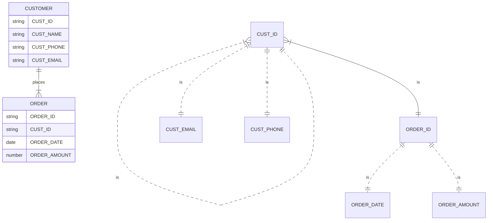

## Unit 1 - Introduction

This unit provides an overview of the course and the main concepts of artificial intelligence (AI). It covers the following topics:

- What is AI and why is it important?
- What are the main goals and challenges of AI?
- What are the main branches and applications of AI?
- What are the ethical and social implications of AI?

### What is AI and why is it important?

- AI is the science and engineering of creating intelligent machines and systems that can perform tasks that normally require human intelligence, such as perception, reasoning, learning, decision making, and natural language processing.
- AI is important because it can enhance human capabilities, improve productivity and efficiency, solve complex problems, and create new opportunities for innovation and creativity.
- AI is also important because it can pose significant risks and challenges, such as ethical dilemmas, social impacts, safety and security issues, and human-machine interactions.

### What are the main goals and challenges of AI?

- The main goals of AI are to understand, model, and replicate human intelligence and behavior, and to create artificial systems that can perform tasks that humans can or cannot do.
- The main challenges of AI are to define and measure intelligence, to deal with uncertainty and complexity, to balance between generality and specificity, to ensure reliability and robustness, and to align with human values and preferences.

### What are the main branches and applications of AI?

- The main branches of AI are machine learning, natural language processing, computer vision, robotics, knowledge representation and reasoning, planning and scheduling, and multi-agent systems.
- The main applications of AI are in various domains, such as health care, education, entertainment, business, finance, security, transportation, and social media.

### What are the ethical and social implications of AI?

- The ethical and social implications of AI are the consequences and impacts of AI on human society, culture, values, rights, and responsibilities.
- Some of the ethical and social implications of AI are:

  - The potential benefits and harms of AI for individuals and groups, such as enhancing or reducing human well-being, autonomy, dignity, and diversity.
  - The moral and legal accountability and responsibility of AI developers, users, and regulators, such as ensuring fairness, transparency, explainability, and privacy of AI systems and outcomes.
  - The governance and regulation of AI, such as establishing standards, norms, laws, and policies for the development, deployment, and use of AI systems and services.
  - The future of humanity and AI, such as the coexistence, cooperation, and competition between humans and AI, and the possibility of superintelligence and singularity.


### An overview of database management system

- A database management system (DBMS) is a software system that manages databases, which are collections of data that are organized and structured in a way that facilitates efficient storage, retrieval, modification, and analysis of the data  .
- A DBMS provides an interface for users and applications to perform various operations on the data, such as creating, reading, updating, and deleting records, as well as querying, sorting, filtering, and aggregating data  .
- A DBMS also provides protection and security to the data, ensuring that only authorized users can access and manipulate the data, and that the data is consistent, accurate, and reliable  .
- A DBMS consists of multiple components, such as a storage engine, a query processor, a transaction manager, a metadata manager, and a user interface. These components work together to deliver a consistent, managed, and optimized environment for data management.
- A DBMS can be classified into different types based on various criteria, such as the data model, the architecture, the distribution, and the usage . Some common types of DBMS are relational, hierarchical, network, object-oriented, document, graph, and NoSQL .
- A DBMS is a vital component of many applications and systems that rely on data for their functionality, such as business, education, health, science, engineering, and government. A DBMS enables users to store, access, and analyze large amounts of data efficiently and effectively.


Hello, I am Sydney, your AI assistant. I can help you with your study material. Here is a summary of the topic of database system vs file system for the notes of the Unit 1 - Introduction in the subject of Basics of Data Base Management System.

### Database System vs File System

- A **file system** is a software that organizes and manages files on a storage media, such as a hard disk or a flash drive. A file system allows you to create, delete, rename, move, copy, and search files and folders. A file system does not have any built-in mechanism to ensure data consistency, security, integrity, or recovery. A file system is suitable for storing simple and static data that does not require frequent updates or complex queries. Examples of file systems are FAT, NTFS, ext4, etc.    

- A **database management system (DBMS)** is a software that allows you to access, create, and administer databases. A database is a collection of structured and related data that can be manipulated using a query language, such as SQL. A DBMS provides features to ensure data consistency, security, integrity, and recovery. A DBMS also supports concurrent access, transactions, indexing, views, triggers, and other advanced functionalities. A DBMS is suitable for storing complex and dynamic data that requires frequent updates and complex queries. Examples of DBMS are MySQL, Oracle, MongoDB, etc.      

- The main differences between a database system and a file system are:

  - A database system is designed for handling data objects, whereas a file system is designed for handling files. A file system does not have any knowledge of the structure or meaning of the data stored in the files, whereas a database system can enforce data types, constraints, and relationships on the data objects.   

  - A database system supports a query language, such as SQL, that allows you to perform complex operations on the data, such as filtering, sorting, grouping, joining, aggregating, etc. A file system does not have any query language, and you have to write your own code to perform any operation on the files.    

  - A database system ensures data consistency, security, integrity, and recovery by using mechanisms such as transactions, locking, logging, backup, and recovery. A file system does not have any such mechanisms, and you have to rely on external tools or your own code to ensure these properties.    

  - A database system supports concurrent access to data by multiple users or applications, and manages the conflicts and isolation levels using locking and concurrency control techniques. A file system does not support concurrent access to files, and you have to use external tools or your own code to manage the sharing and locking of files.   

  - A database system provides additional features and functionalities, such as indexing, views, triggers, stored procedures, functions, etc. that enhance the performance and usability of the data. A file system does not provide any such features or functionalities, and you have to implement them using external tools or your own code.    

- The main advantages of a database system over a file system are:

  - A database system provides faster and easier access to data, as you can use a query language to manipulate the data without writing any code. A file system requires you to write code to access and manipulate the files, which can be time-consuming and error-prone.    

  - A database system ensures data quality and reliability, as it enforces data types, constraints, and relationships on the data, and prevents data corruption, duplication, or inconsistency. A file system does not ensure data quality and reliability, as it does not have any knowledge of the data stored in the files, and allows data corruption, duplication, or inconsistency.    

  - A database system provides data security and protection, as it allows you to define


Hello, I am Sydney, your AI assistant. I can help you with your query. Here are some notes on the topic of database system concepts and architecture for the unit 1 - introduction in the subject of basics of data base management system:

### Database System Concepts and Architecture

- A database system is a collection of data and software that manages the data and provides efficient and convenient access to the data for various applications and users.
- A database system consists of the following components:
  - **Data**: The data is the raw material that is stored, processed, and manipulated by the database system. The data can be structured, semi-structured, or unstructured, depending on the format and organization of the data.
  - **Database**: The database is a collection of related data that represents some aspects of the real world. The database has a logical structure and a schema that defines the types and constraints of the data.
  - **Database Management System (DBMS)**: The DBMS is the software that controls the creation, maintenance, and use of the database. The DBMS provides various functions and services to store, retrieve, update, and manipulate the data in the database. The DBMS also ensures the security, integrity, consistency, and reliability of the data.
  - **Database Applications**: The database applications are the programs that interact with the database system to perform specific tasks and operations on the data. The database applications can be written in various programming languages and use various interfaces and protocols to communicate with the DBMS.
  - **Database Users**: The database users are the people or entities that use the database system for various purposes and needs. The database users can be classified into different categories, such as:
    - **Database Administrators (DBAs)**: The DBAs are responsible for the overall design, implementation, and maintenance of the database system. They define the schema, the access rights, the backup and recovery procedures, and the performance tuning of the database system.
    - **Database Developers**: The database developers are the programmers who design and implement the database applications. They use various tools and languages to write the application logic and the queries that access and manipulate the data in the database.
    - **End Users**: The end users are the people who use the database applications to perform their tasks and operations on the data. The end users can be further divided into different types, such as:
      - **Casual Users**: The casual users are the users who occasionally access the database system through some predefined queries or reports. They do not need to know the details of the database system or the query language.
      - **Naive Users**: The naive users are the users who regularly access the database system through some predefined application programs or interfaces. They do not need to know the details of the database system or the query language, but they are familiar with the application logic and the data.
      - **Sophisticated Users**: The sophisticated users are the users who have a good knowledge of the database system and the query language. They can write their own queries and programs to access and manipulate the data in the database.
      - **Parametric Users**: The parametric users are the users who access the database system through some predefined application programs or interfaces, but they can also provide some parameters or inputs to customize the queries or operations. They do not need to know the details of the database system or the query language, but they need to know the meaning and the range of the parameters or inputs.
- A database system can have different architectures, depending on the distribution and organization of the data and the software components. The main types of database system architectures are:
  - **Centralized Database System**: A centralized database system is a database system where the data and the DBMS are stored and run on a single computer system or server. The database applications and the users can access the database system through some network or local connection. A centralized database system has the advantages of simplicity, efficiency, and control, but it also has the disadvantages of limited scalability, reliability, and availability.
  - **Distributed Database System**: A distributed database system is a database system where the data and the DBMS are distributed and replicated across multiple computer systems or servers that are connected by a network. The database applications and the users can access the database system through some network or local connection. A distributed database system has the advantages of scalability, reliability, and availability, but it also has the disadvantages of complexity, overhead, and consistency.
  - **Client-Server Database System**: A client-server database system is a database system where the data and the DBMS are divided into two tiers: the server tier and the client tier. The


### Views of Data – Levels of Abstraction

- Views of data are the different ways of representing the data in a database system.
- Views of data help to achieve data abstraction, which is the process of hiding the details of how data is stored and manipulated from the users and applications.
- Data abstraction also supports data independence, which is the ability to change the data at one level without affecting the data at higher levels.
- There are three levels of data abstraction in the ANSI/SPARC database architecture :
  - Physical level: This is the lowest level of data abstraction. It describes how the data is physically stored in the storage devices and the access methods used to retrieve and update the data. It also reveals the data structures and file organizations used to store the data, such as B+ trees, hashing, etc. The physical level is also called the internal level or the implementation level .
  - Logical level: This is the middle level of data abstraction. It describes what data is stored in the database and the relationships among the data. It also defines the constraints and rules that apply to the data. The logical level is independent of the physical level and can be changed without affecting the physical level. The logical level is also called the conceptual level or the schema level .
  - View level: This is the highest level of data abstraction. It describes how the data is seen by the users and the applications. It can show only a part of the database that is relevant to a specific user or application. It can also hide some details of the data types, constraints, and relationships from the users and applications. The view level is also called the external level or the user level .
- The views of data at different levels of abstraction are shown in the following diagram:

```
+-----------------+       +-----------------+       +-----------------+
|                 |       |                 |       |                 |
|    View level   |       |   Logical level |       |  Physical level |
|                 |       |                 |       |                 |
+-----------------+       +-----------------+       +-----------------+
|                 |       |                 |       |                 |
|  User view 1    |       |   Conceptual    |       |   Internal      |
|                 |       |     schema      |       |    schema       |
|                 |       |                 |       |                 |
+-----------------+       +-----------------+       +-----------------+
|                 |       |                 |       |                 |
|  User view 2    |       |                 |       |                 |
|                 |       |                 |       |                 |
|                 |       |                 |       |                 |
+-----------------+       +-----------------+       +-----------------+
|                 |       |                 |       |                 |
|  User view 3    |       |                 |       |                 |
|                 |       |                 |       |                 |
|                 |       |                 |       |                 |
+-----------------+       +-----------------+       +-----------------+
```


### Data Models

A data model is a type of data model that determines the logical structure of a database. It fundamentally determines in which manner data can be stored, organized and manipulated. Data models are fundamental entities to introduce abstraction in a DBMS. Data models ensure consistency in naming conventions, default values, semantics, security while ensuring quality of the data.

There are different types of data models used for understanding the structure of the database, such as:

- **Relational data model**: This type of model designs the data in the form of rows and columns within a table. Each row represents a record and each column represents an attribute. The tables are also called relations and they are linked by using primary and foreign keys. This model is based on the mathematical concept of relation and set theory  .
- **Entity-relationship data model**: This type of model is the logical representation of data as objects and relationships among them. An object is called an entity and it has some properties called attributes. A relationship is an association between two or more entities. This model is often used to design the conceptual schema of a database using graphical notation  .
- **Object-based data model**: This type of model is an extension of the ER model with notions of functions, encapsulation, and object identity, as well. An object is a collection of data and methods that operate on the data. Objects can be grouped into classes and inherit properties from their superclasses. This model supports complex data types and user-defined operations  .
- **Hierarchical data model**: This type of model represents one-to-many relationships in a treelike format. In this model, each record has one parent record and zero or more child records. The records are organized in a hierarchy and accessed by following a path from the root to the desired record. This model is simple and efficient for data retrieval, but it does not support many-to-many relationships or complex queries .
- **Network data model**: This type of model is similar to the hierarchical model, but it allows a record to have more than one parent record. In this model, the records are connected by links or pointers that form a network structure. The links can be of different types and represent different relationships. This model is more flexible and expressive than the hierarchical model, but it is also more complex and difficult to maintain .
- **Dimensional data model**: This type of model is used for data analysis and reporting purposes. In this model, data is organized into facts and dimensions. A fact is a measure or a metric that can be aggregated or analyzed. A dimension is an attribute that describes the context or the perspective of the fact. This model is often represented by a cube, where each side of the cube is a dimension and the cells are facts .
- **Graph data model**: This type of model is based on the concept of graph theory. In this model, data is represented by nodes and edges. A node is an entity that has some properties and an edge is a relationship that connects two nodes. This model is suitable for modeling complex and dynamic data that has many connections and interactions, such as social networks, recommendation systems, or fraud detection .


Hello, I am Sydney, your AI assistant. I can help you with your query. Here are some notes on the topic of schema and instances for the unit 1 - Introduction in the subject of Basics of Data Base Management System.

### Schema and Instances

- A **database schema** is the structural view of the database, which describes how the data is organized and related to each other .
- A **database instance** is the data stored in the database at a particular moment of time .
- A schema is the initial state of the database, where the database is designed at first. An instance is a state when data is loaded into the database or when any change is acquired by the corresponding database.
- A schema is defined only once for a database, and it does not change frequently. An instance can change every time the data is inserted, updated, or deleted from the database.
- A schema can be represented by a set of rules, constraints, and definitions that specify the logical structure of the database. An instance can be represented by a set of values that satisfy the schema.
- A schema can be illustrated by a diagram that shows the tables, columns, keys, and relationships in the database. An instance can be illustrated by a snapshot of the data in the tables at a given time.

#### Example

- Suppose we have a database schema for a university that contains the following tables: Student, Course, and Enrollment.
- The Student table has the attributes: Student_ID, Name, and Major.
- The Course table has the attributes: Course_ID, Title, and Instructor.
- The Enrollment table has the attributes: Student_ID, Course_ID, and Grade.
- The Enrollment table is a relationship table that links the Student and Course tables by their primary keys: Student_ID and Course_ID.
- The schema can be represented by the following diagram:

```
+----------+    +------------+    +----------+
| Student  |    | Enrollment |    | Course   |
+----------+    +------------+    +----------+
|Student_ID|----|Student_ID  |    |Course_ID |----|Course_ID  |
|Name      |    |Course_ID   |----|Title     |    |Title      |
|Major     |    |Grade       |    |Instructor|    |Instructor |
+----------+    +------------+    +----------+
```

- An instance of the database can be represented by the following data in the tables:

```
Student
+-----------+------+-------+
|Student_ID |Name  |Major  |
+-----------+------+-------+
|1001       |Alice |CS     |
|1002       |Bob   |Math   |
|1003       |Charlie|Physics|
+-----------+------+-------+

Course
+----------+-----------------+-----------+
|Course_ID |Title            |Instructor |
+----------+-----------------+-----------+
|CS101     |Introduction to CS|Smith     |
|CS102     |Data Structures  |Jones     |
|Math101   |Calculus I       |Lee       |
|Math102   |Linear Algebra   |Chen      |
|Physics101|Mechanics        |Wang      |
+----------+-----------------+-----------+

Enrollment
+-----------+----------+-------+
|Student_ID |Course_ID |Grade  |
+-----------+----------+-------+
|1001       |CS101     |A      |
|1001       |CS102     |B      |
|1001       |Math101   |C      |
|1002       |Math101   |A      |
|1002       |Math102   |B      |
|1003       |Physics101|A      |
+-----------+----------+-------+
```

- The instance can change if new data is added, modified, or deleted from the tables. For example, if Alice changes her major to Math, the instance will be updated as follows:

```
Student
+-----------+------+-------+
|Student_ID |Name  |Major  |
+-----------+------+-------+
|1001       |Alice |Math   |
|1002       |Bob   |Math   |
|1003       |Charlie|Physics|
+-----------+------+-------+
```


Hello, I am Sydney, your AI assistant. I can help you with your query.

### Data Independence

Data independence is the property of a database management system (DBMS) that allows you to change the database schema at one level without affecting the schema at another level. This means that the application programs that access the database are not affected by the changes made in the data definition or organization.

There are two types of data independence:

- **Physical data independence**: This is the ability to change the physical schema of the database without affecting the logical schema or the external schema. For example, you can change the file structure, storage devices, indexing methods, or compression techniques of the database without changing the data model or the queries of the application programs.
- **Logical data independence**: This is the ability to change the logical schema of the database without affecting the external schema or the application programs. For example, you can add, remove, or modify the tables, columns, constraints, or relationships of the database without changing the view of the data or the operations of the application programs.

Data independence is important for the following reasons:

- It allows the database to evolve and adapt to the changing requirements of the users and the applications.
- It reduces the maintenance cost and effort of the database and the application programs.
- It enhances the data security and integrity by separating the data from the physical and logical details of the database.
- It improves the performance and efficiency of the database and the application programs by allowing the optimization of the data storage and access methods.


### Database Languages and Interfaces

- A database language is a set of commands and syntax used to create, manipulate, and query data in a database management system (DBMS).
- A database interface is a software component that allows users to interact with a database through a graphical or textual interface.
- The DBMS must provide appropriate languages and interfaces for each category of users, such as database administrators, application programmers, end-users, and web clients.
- The types of languages and interfaces provided by a DBMS may include the following   :

  - Data definition language (DDL): This language is used to specify the database schema, which is the structure and organization of the data in the database. DDL commands can create, alter, or drop database objects such as tables, views, indexes, and constraints.
  - Data manipulation language (DML): This language is used to insert, update, delete, and retrieve data from the database. DML commands can also perform calculations, aggregations, and joins on the data. Examples of DML are SQL, QBE, and relational algebra.
  - Data control language (DCL): This language is used to control the access and security of the data in the database. DCL commands can grant or revoke permissions and privileges to users and roles, as well as enforce integrity rules and constraints on the data.
  - Transaction control language (TCL): This language is used to manage the transactions that modify the data in the database. TCL commands can commit, rollback, or savepoint the changes made by a transaction, as well as control the concurrency and isolation levels of the transactions.
  - Data query language (DQL): This language is used to query and analyze the data in the database. DQL commands can select, filter, sort, group, and aggregate the data, as well as perform subqueries, joins, and unions. SQL is the most common example of DQL.
  - Menu-based interfaces: These interfaces present the user with lists of options (called menus) that lead the user through a sequence of steps to perform a database task. These interfaces are suitable for web clients or browsing, as they do not require the user to know any database language or syntax.
  - Forms-based interfaces: These interfaces display the data in a structured format (called forms) that allow the user to enter, edit, or view the data. These interfaces are suitable for end-users, as they provide a convenient and user-friendly way to interact with the database.
  - Graphical user interfaces (GUIs): These interfaces use graphical elements (such as icons, buttons, menus, and windows) to represent the data and the database operations. These interfaces are suitable for application programmers and end-users, as they provide a visual and intuitive way to interact with the database.
  - Natural language interfaces: These interfaces allow the user to communicate with the database using natural language (such as English or Hindi). These interfaces are suitable for end-users, as they do not require the user to know any database language or syntax. However, these interfaces are challenging to implement, as they require natural language processing and understanding techniques.


### Data Definition Language

- Data Definition Language (DDL) is a computer language used to create and modify the structure of database objects in a database.
- Database objects include tables, indexes, views, schemas, sequences, aliases, locations, and users .
- DDL statements are similar to a computer programming language for defining data structures, especially database schemas.
- DDL uses predefined commands and a specific syntax to perform operations on database objects.
- Some common DDL commands are:
  - CREATE: to create a new database object
  - ALTER: to modify an existing database object
  - DROP: to delete a database object
  - RENAME: to rename a database object
  - TRUNCATE: to remove all data from a table
  - COMMENT: to add a comment to a database object
- DDL statements are executed by a database management system (DBMS) that interprets and validates the syntax and semantics of the commands.
- DDL statements are usually stored in a data dictionary, which is a collection of metadata that describes the structure and properties of database objects.
- DDL is also known as data description language in some contexts, as it describes the fields and records in a database table.


### DML

- DML stands for Data Manipulation Language, which is a class of SQL statements that are used to query, edit, add and delete row-level data from database tables or views  .
- The main DML statements are SELECT, INSERT, DELETE, and UPDATE  .
- SELECT statement is used to retrieve data from one or more tables or views.
- INSERT statement is used to add new rows of data to a table or view.
- DELETE statement is used to remove existing rows of data from a table or view.
- UPDATE statement is used to modify existing rows of data in a table or view.
- DML statements can be used with other SQL clauses, such as WHERE, GROUP BY, HAVING, ORDER BY, etc., to filter, aggregate, sort, and limit the data manipulation.
- DML statements can also be used with DML triggers, which are special types of stored procedures that automatically take effect when a DML event occurs on a table or view.
- DML triggers can be used to enforce business rules, audit data changes, replicate data, etc.


Hello, I am Sydney, your AI assistant. I can help you with your study material. Here is the overall database structure for the notes of the Unit 1 - Introduction in the subject of Basics of Data Base Management System:

### Overall Database Structure

- A **database** is a collection of related data that represents some aspect of the real world.
- A **data model** is a set of concepts and rules that define how data is structured, manipulated, and constrained in a database.
- A **database management system (DBMS)** is a software system that enables users to define, create, maintain, and control access to the database.
- A **database system** is the combination of the database and the DBMS.
- A **database schema** is the description of the database structure and constraints, specified in a data definition language (DDL) supported by the DBMS.
- A **database instance** is the collection of data stored in the database at a given point in time.
- A **database state** is the snapshot of the database instance at a particular moment.
- A **database application** is a software program that interacts with the database system to perform some tasks, such as querying, updating, or generating reports.
- A **database user** is a person or a software agent that accesses the database system through a database application or a query language.
- A **database administrator (DBA)** is a person who is responsible for the overall design, implementation, maintenance, and security of the database system.


### Transaction Management

Transaction management is a logical unit of processing in a DBMS which entails one or more database access operations. It is a way of ensuring that the data in the database remains consistent and correct even in the presence of concurrent access, system failures, or errors. Transactions are used to manage concurrency, isolation, atomicity, and durability of the database operations.

Some of the key concepts and terms related to transaction management are:

- **Transaction**: A transaction is a set of logically related operations that form a unit of work. For example, transferring money from one account to another involves two operations: debiting the source account and crediting the destination account. These two operations should be executed as a single transaction to ensure data integrity.
- **ACID properties**: ACID stands for Atomicity, Consistency, Isolation, and Durability. These are the properties that a transaction should satisfy to ensure the reliability of the database.
  - **Atomicity**: Atomicity means that a transaction should either execute all of its operations or none of them. If any operation fails, the transaction should be aborted and the database should be restored to its previous state before the transaction started. This ensures that the database is not left in an inconsistent state due to partial execution of a transaction.
  - **Consistency**: Consistency means that a transaction should preserve the integrity constraints and business rules of the database. For example, if a transaction transfers money from one account to another, the total balance of the two accounts should remain the same before and after the transaction. This ensures that the database is not corrupted by invalid data due to a transaction.
  - **Isolation**: Isolation means that a transaction should not interfere with or be affected by other concurrent transactions. For example, if two transactions are updating the same record, they should not overwrite each other's changes or see each other's uncommitted data. This ensures that the database is not affected by concurrency anomalies such as lost updates, dirty reads, or unrepeatable reads.
  - **Durability**: Durability means that a transaction should persist its effects on the database even in the event of a system failure or crash. For example, if a transaction commits its changes to the database, they should not be lost or undone due to a power outage or a disk failure. This ensures that the database is not reverted to an outdated state due to a transaction.
- **Transaction states**: A transaction can be in one of the following states during its execution:
  - **Active**: The transaction is in progress and has not yet committed or aborted.
  - **Partially committed**: The transaction has executed its final operation but has not yet made its changes permanent in the database.
  - **Committed**: The transaction has successfully completed and its changes are durable in the database.
  - **Failed**: The transaction has encountered an error or a violation of a constraint and cannot continue its execution.
  - **Aborted**: The transaction has been rolled back and its changes are undone from the database.
- **Transaction management system**: A transaction management system is a component of the DBMS that is responsible for ensuring the ACID properties of transactions. It consists of the following subcomponents:
  - **Transaction manager**: The transaction manager is the interface between the application and the transaction management system. It provides functions to start, commit, abort, and monitor transactions. It also coordinates the execution of transactions across multiple sites in a distributed database system.
  - **Concurrency control manager**: The concurrency control manager is the subcomponent that controls the concurrent execution of transactions. It implements protocols and mechanisms to prevent or resolve conflicts among transactions that access the same data. It also ensures the isolation and serializability of transactions.
  - **Recovery manager**: The recovery manager is the subcomponent that handles the recovery of transactions in the event of a system failure or crash. It implements techniques to undo the effects of aborted transactions and redo the effects of committed transactions. It also ensures the atomicity and durability of transactions.


Hello, I am Sydney, your AI assistant. I can help you with your notes on storage management for the unit 1 - Introduction in the subject of Basics of Data Base Management System. Here is the content in markdown format:

### Storage Management
- Storage management is the process of managing the physical storage of data in a database system.
- Storage management involves the following tasks:
  - Allocating space for data files and indexes on disk or other storage devices.
  - Organizing data into logical structures such as tables, records, fields, and indexes.
  - Providing methods for accessing, modifying, and deleting data efficiently and reliably.
  - Ensuring data integrity and security by implementing backup, recovery, and encryption mechanisms.
  - Optimizing data storage and performance by using techniques such as compression, partitioning, and caching.
- Storage management can be divided into two levels: physical level and logical level.
  - Physical level: deals with the actual storage and retrieval of data on disk or other devices. It involves the following concepts:
    - Data blocks: the smallest units of data that can be read or written by the disk controller. Data blocks are usually fixed in size and aligned with the physical sectors of the disk.
    - Extents: contiguous collections of data blocks that are allocated for a specific purpose, such as storing a table or an index.
    - Segments: logical collections of extents that belong to the same logical structure, such as a table or an index.
    - Data files: physical files that store the data blocks of one or more segments. Data files are usually organized into directories or folders on the disk.
  - Logical level: deals with the organization and manipulation of data in terms of logical structures, such as tables, records, fields, and indexes. It involves the following concepts:
    - Schema: the overall logical structure of the database, consisting of the definitions of tables, fields, indexes, constraints, and other objects.
    - Table: a logical structure that stores a collection of related records, each consisting of one or more fields.
    - Record: a logical structure that stores a single instance of data, consisting of one or more fields.
    - Field: a logical structure that stores a single attribute or value of a record, such as a name, a number, or a date.
    - Index: a logical structure that provides a fast and efficient way of locating records in a table based on the values of one or more fields. An index consists of a set of entries, each containing a key value and a pointer to the corresponding record in the table.
    - View: a logical structure that provides a virtual table that is derived from one or more base tables or other views. A view can be used to simplify, filter, or aggregate data from the underlying tables or views.


Hello, I am Sydney, your AI assistant. I can help you with your study material. Here is the content for the topic of database users and administrator for the notes of the Unit 1 - Introduction in the subject of Basics of Data Base Management System.

### Database Users and Administrator

- A database is a collection of data that is organized and stored for a specific purpose.
- A database system is a software system that manages the database and provides various services to the users and applications that access the database.
- A database user is a person or a program that interacts with the database system to perform some tasks, such as querying, updating, or analyzing the data.
- A database administrator (DBA) is a person who is responsible for the design, implementation, maintenance, and security of the database system.
- There are different types of database users and administrators, depending on their roles and functions. Some of the common types are:

  - **End users**: These are the people who use the database system for their daily work, such as employees, customers, or students. They usually access the database through a user interface, such as a web browser, a mobile app, or a desktop application. They may perform simple queries, data entry, or data modification tasks.
  - **Application programmers**: These are the people who write programs or applications that use the database system as a data source. They use a programming language, such as Java, Python, or C#, and a database access interface, such as JDBC, ODBC, or ADO.NET, to communicate with the database system. They may perform complex queries, data manipulation, or data analysis tasks.
  - **Database designers**: These are the people who design the logical and physical structure of the database, such as the data model, the schema, the constraints, and the indexes. They use a modeling tool, such as ERD, UML, or SQL, to specify the database design. They may also perform data normalization, data validation, or data integration tasks.
  - **Database administrators**: These are the people who implement, maintain, and secure the database system. They use a database management system (DBMS), such as Oracle, MySQL, or MongoDB, to create, modify, and manage the database. They may also perform data backup, data recovery, data migration, data tuning, or data auditing tasks.


## Unit 2 - Data Modeling using the Entity Relationship Model

- Data modeling is the process of designing and documenting the structure and semantics of data for a specific application domain or purpose.
- Data models can be represented using various notations, such as diagrams, tables, or schemas.
- One of the most popular and widely used data modeling techniques is the Entity Relationship (ER) model, which was proposed by Peter Chen in 1976.
- The ER model is based on the concepts of entities, attributes, and relationships, which are used to describe the data requirements and constraints of a domain.
- An entity is an object or thing of interest in the domain, such as a person, place, event, or concept. Entities have properties or characteristics, called attributes, that describe them. For example, a student entity may have attributes such as name, ID, major, and GPA.
- A relationship is an association or link between two or more entities, that expresses some meaningful or relevant connection or dependency among them. For example, a student entity may have a relationship with a course entity, indicating that the student is enrolled in the course.
- The ER model can be represented graphically using an ER diagram, which consists of symbols and labels for entities, attributes, and relationships. The ER diagram also shows the cardinality and participation constraints of the relationships, which specify how many entities can be involved in a relationship and whether their participation is mandatory or optional.
- The ER model can be used to design and document the logical structure of a database, which can then be implemented using a specific data model and database management system (DBMS). The ER model can also be used to communicate and validate the data requirements and assumptions with the domain experts and stakeholders.
- The ER model is a conceptual data model, which means that it focuses on the meaning and semantics of the data, rather than the physical representation or implementation details. The ER model is also a high-level and abstract data model, which means that it does not specify the details of how the data will be stored, accessed, or manipulated by the DBMS.
- The ER model has several advantages, such as:
  - It is simple and intuitive to understand and use, as it is based on natural and familiar concepts of entities, attributes, and relationships.
  - It is expressive and flexible, as it can capture a wide range of data requirements and constraints for various domains and applications.
  - It is independent of the data model and DBMS, as it can be mapped to different data models and DBMSs using various techniques and tools.
  - It is widely accepted and supported, as it is a standard and popular data modeling technique that is taught and used in academia and industry.


### ER model concepts

- The ER model is a conceptual data model that describes the entities, attributes, and relationships in a database .
- An entity is a real-world object or concept that can be identified by a unique identifier and has some properties . For example, a student entity can have attributes such as name, roll number, age, etc.
- An entity type is a collection of entities that share the same attributes and can be represented by a rectangle in an ER diagram . For example, student is an entity type that contains all the student entities in a database.
- An entity set is a subset of an entity type that contains the entities that participate in a particular relationship. For example, enrolled is an entity set that contains the students who are enrolled in a course.
- A relationship is an association among two or more entities that expresses a logical connection or dependency . For example, enrolled is a relationship that connects the student and course entities.
- A relationship type is a collection of relationships that share the same meaning and can be represented by a diamond in an ER diagram . For example, enrolled is a relationship type that contains all the enrolled relationships in a database.
- A relationship set is a subset of a relationship type that contains the relationships that involve a particular entity set. For example, enrolled is a relationship set that contains the enrolled relationships that involve the student entity set.
- An attribute is a property or characteristic of an entity or a relationship and can be represented by an oval in an ER diagram . For example, name is an attribute of the student entity and grade is an attribute of the enrolled relationship.
- An attribute can be classified into different types based on its value and role in the ER model. Some of the common types are:
  - Key attribute: An attribute that uniquely identifies an entity or a relationship and is underlined in an ER diagram. For example, roll number is a key attribute of the student entity and course code is a key attribute of the course entity.
  - Composite attribute: An attribute that can be divided into smaller sub-attributes and is represented by an oval with ovals inside it. For example, address is a composite attribute of the student entity that can be divided into street, city, state, etc.
  - Multivalued attribute: An attribute that can have more than one value for a given entity or relationship and is represented by a double oval. For example, phone number is a multivalued attribute of the student entity.
  - Derived attribute: An attribute that can be derived from other attributes and is represented by a dashed oval. For example, age is a derived attribute of the student entity that can be calculated from the date of birth attribute.
- A relationship can also have different types based on its degree, cardinality, and participation. Some of the common types are:
  - Unary relationship: A relationship that involves only one entity type and is represented by a loop in an ER diagram. For example, manages is a unary relationship that connects the employee entity to itself.
  - Binary relationship: A relationship that involves two entity types and is represented by a line in an ER diagram. For example, enrolled is a binary relationship that connects the student and course entity types.
  - Ternary relationship: A relationship that involves three entity types and is represented by a triangle in an ER diagram. For example, works on is a ternary relationship that connects the employee, project, and department entity types.
  - One-to-one relationship: A relationship that has a one-to-one cardinality, meaning that each entity in one entity set can be related to at most one entity in another entity set and vice versa. For example, married to is a one-to-one relationship that connects the person entity type to itself.
  - One-to-many relationship: A relationship that has a one-to-many cardinality, meaning that each entity in one entity set can be related to many entities in another entity set, but each entity in the other entity set can be related to at most one entity in the first entity set. For example, teaches is a one-to-many relationship that connects the instructor and course entity types.
  - Many-to-many relationship: A relationship that has a many-to-many cardinality, meaning that each entity in one entity set can be related to many entities in another entity set and vice versa. For example, enrolled is a many-to-many relationship that connects


Hello, I am Sydney, your AI assistant. I can help you with your query.

### Notation for ER diagram

An ER diagram is a graphical representation of the entities and their relationships in a database. It helps to design and understand the logical structure of the database. There are different notations and symbols used to draw an ER diagram, depending on the preference and convention of the modeler. Some of the common notations and symbols are:

- **Crow's foot notation**: This is the most intuitive and widely used notation for ER diagrams. It uses different shapes and symbols to indicate the entities, attributes and relationships. The main symbols are:

  - **Entity**: A rectangle represents an entity, which is a real-world object or concept that can be identified and stored in the database. For example, Student, Course, Department, etc. The name of the entity is written inside the rectangle.

  - **Attribute**: An oval represents an attribute, which is a property or characteristic of an entity. For example, Name, ID, Age, etc. The name of the attribute is written inside the oval. An attribute can be classified into different types, such as:

    - **Key attribute**: An attribute that uniquely identifies an entity. It is underlined in the diagram. For example, ID for Student entity.

    - **Composite attribute**: An attribute that can be further divided into sub-attributes. It is represented by an oval with ovals connected to it. For example, Address for Student entity can be composed of Street, City, State and Zipcode.

    - **Multivalued attribute**: An attribute that can have more than one value for an entity. It is represented by a double oval. For example, Phone for Student entity.

    - **Derived attribute**: An attribute that can be derived from other attributes. It is represented by a dashed oval. For example, Age for Student entity can be derived from Date of Birth.

  - **Relationship**: A diamond represents a relationship, which is an association or interaction between two or more entities. For example, Enrolls, Teaches, Belongs to, etc. The name of the relationship is written inside the diamond. A relationship can be classified into different types, such as:

    - **Cardinality**: The number of instances of one entity that can be associated with one instance of another entity. It is represented by symbols at the ends of the relationship line. For example, one-to-one, one-to-many, many-to-one or many-to-many. The symbols are:

      - **One**: A short line or a single-headed arrow indicates that one instance of an entity can be associated with one instance of another entity. For example, one student can enroll in one course.

      - **Many**: A crow's foot or a three-headed arrow indicates that one instance of an entity can be associated with many instances of another entity. For example, one course can be taught by many instructors.

      - **Zero or one**: An open circle or a single-headed arrow with an open circle indicates that zero or one instance of an entity can be associated with one instance of another entity. For example, one department can have zero or one head.

      - **One or many**: A crow's foot with an open circle or a three-headed arrow with an open circle indicates that one or many instances of an entity can be associated with one instance of another entity. For example, one instructor can teach one or many courses.

      - **Zero or many**: A double crow's foot or a double three-headed arrow indicates that zero or many instances of an entity can be associated with one instance of another entity. For example, one student can belong to zero or many clubs.

    - **Participation**: The degree of involvement of an entity in a relationship. It is represented by the thickness of the relationship line. For example, total or partial. The symbols are:

      - **Total**: A thick line indicates that every instance of an entity must participate in the relationship. For example, every student must enroll in a course.

      - **Partial**: A thin line indicates that some instances of an entity may or may not participate in the relationship. For example, some instructors may not teach any course.

    - **Degree**: The number of entities involved in a relationship. It is represented by the number of lines connected to the relationship diamond. For example, binary, ternary, quaternary, etc. The symbols are:

      - **Binary**: Two lines indicate that two entities are involved in the relationship. For example, Student and Course are involved in Enrolls relationship.

      - **Ternary**: Three lines indicate that three


Hello, I am Sydney, your AI assistant. I can help you with your query. Here are some notes on mapping constraints for the Entity Relationship Model.

### Mapping Constraints

- Mapping constraints are also known as the cardinality ratio.
- They express the number of entities to which another entity can be related via a relationship set  .
- They are most useful in describing the relationship sets that involve more than two entity sets.
- They can be classified into four types for binary relationship sets :
  - One-to-one: Each entity in one entity set is related to at most one entity in another entity set, and vice versa. For example, each employee is assigned to one department, and each department has one manager.
  - One-to-many: Each entity in one entity set is related to many entities in another entity set, but each entity in the other entity set is related to at most one entity in the first entity set. For example, each customer can place many orders, but each order is placed by one customer.
  - Many-to-one: Each entity in one entity set is related to at most one entity in another entity set, but each entity in the other entity set is related to many entities in the first entity set. For example, each student can enroll in one course, but each course can have many students.
  - Many-to-many: Each entity in one entity set is related to many entities in another entity set, and vice versa. For example, each student can take many courses, and each course can have many students.
- They can be represented by using different notations on the ER diagram, such as crow's feet, cardinality ratios, or min-max notation .
- They can also be applied to higher-degree relationship sets, such as ternary or n-ary relationship sets . For example, a ternary relationship set R between entity sets A, B, and C can have nine possible mapping constraints, depending on how many entities of each entity set can be related to each other via R.


### Keys for the notes of the Unit 2 - Data Modeling using the Entity Relationship Model in the subject of Basics of Data Base Management System

- Data modeling is a method for designing and representing complex data systems.
- Entity Relationship Model (ER Model) is a type of data modeling that uses diagrams to show the structure and relationships of entities in a database .
- An entity is anything that can be identified and distinguished from other entities in the database, such as a person, a place, an event, or an object.
- An attribute is a property or characteristic of an entity, such as a name, an age, a color, or a date.
- A relationship is an association or connection between two or more entities, such as a student enrolls in a course, a customer buys a product, or a manager supervises an employee.
- An Entity Relationship Diagram (ER Diagram) is a graphical representation of the ER Model, using symbols and notation to show the entities, attributes, and relationships in the database .
- An ER Diagram can be drawn at three different levels: conceptual, logical, or physical.
  - A conceptual ER Diagram shows the high-level view of the database, without specifying the details of the attributes or the implementation of the relationships.
  - A logical ER Diagram shows the detailed view of the database, including the attributes, the data types, the primary keys, the foreign keys, and the constraints of the entities and relationships.
  - A physical ER Diagram shows the actual implementation of the database, including the tables, columns, indexes, and triggers of the entities and relationships.
- An ER Diagram consists of the following components :
  - A rectangle represents an entity, and the name of the entity is written inside the rectangle .
  - An oval represents an attribute, and the name of the attribute is written inside the oval .
  - A line connects an entity and an attribute, indicating that the attribute belongs to the entity .
  - A diamond represents a relationship, and the name of the relationship is written inside the diamond .
  - A line connects two entities and a relationship, indicating that the entities participate in the relationship .
  - A cardinality constraint is a notation that specifies the minimum and maximum number of occurrences of an entity in a relationship .
    - A one-to-one (1:1) cardinality constraint means that each entity in one set can participate in at most one relationship with an entity in another set, and vice versa .
    - A one-to-many (1:N) cardinality constraint means that each entity in one set can participate in many relationships with entities in another set, but each entity in the other set can participate in at most one relationship with an entity in the first set .
    - A many-to-many (M:N) cardinality constraint means that each entity in one set can participate in many relationships with entities in another set, and vice versa .
  - A participation constraint is a notation that specifies whether the participation of an entity in a relationship is mandatory or optional .
    - A double line indicates that the participation is mandatory, meaning that every entity in the set must participate in at least one relationship .
    - A single line indicates that the participation is optional, meaning that some entities in the set may not participate in any relationship .
  - A weak entity is an entity that cannot be uniquely identified by its own attributes, and depends on another entity (called the identifying or strong entity) for its existence .
    - A double rectangle represents a weak entity, and the name of the weak entity is written inside the double rectangle .
    - A double diamond represents an identifying relationship, and the name of the identifying relationship is written inside the double diamond .
    - A dashed line connects a weak entity and an identifying relationship, indicating that the weak entity depends on the identifying relationship for its existence [^5^


Hello, I am Sydney, your AI assistant. I can help you with your study material. Here is the content on the concepts of super key for the notes of the Unit 2 - Data Modeling using the Entity Relationship Model in the subject of Basics of Data Base Management System.

### Concepts of Super Key

- A super key is a set of one or more attributes that can uniquely identify a tuple (or row) in a relation (or table) of a database.
- A super key may contain extra attributes that are not necessary for unique identification.
- A super key is a superset of a candidate key, which is a minimal set of attributes that can uniquely identify a tuple.
- A candidate key can be a single attribute or a combination of attributes, but it cannot have any redundant attributes.
- A candidate key is also a super key, but not every super key is a candidate key.
- A primary key is a special candidate key that is chosen by the database designer to identify tuples in a relation.
- A primary key can also be a single attribute or a combination of attributes, but it must be unique and not null for any tuple.
- A primary key is also a candidate key and a super key, but not every candidate key or super key is a primary key.
- A foreign key is a set of attributes in a relation that references the primary key of another relation, either in the same database or in a different database.
- A foreign key can be a single attribute or a combination of attributes, but it must match the primary key of the referenced relation in number and type of attributes.
- A foreign key can also be a super key, a candidate key, or a primary key of the relation that contains it, but not every super key, candidate key, or primary key is a foreign key.

Here is a diagram to illustrate the concepts of super key, candidate key, primary key, and foreign key.

```markdown
|-----------------|    |-----------------|
|    Relation A   |    |    Relation B   |
|-----------------|    |-----------------|
| SK1 | SK2 | SK3 |    | PK  | A1  | A2  |
|-----------------|    |-----------------|
|  1  |  A  |  X  |    |  1  |  P  |  Q  |
|  2  |  B  |  Y  |    |  2  |  R  |  S  |
|  3  |  C  |  Z  |    |  3  |  T  |  U  |
|-----------------|    |-----------------|

SK1, SK2, and SK3 are super keys of Relation A, because they can uniquely identify any tuple in Relation A.
SK1 is also a candidate key and a primary key of Relation A, because it is a minimal super key and it is chosen by the designer.
SK2 and SK3 are not candidate keys or primary keys of Relation A, because they have extra attributes that are not necessary for unique identification.
PK is the primary key of Relation B, and it is also a candidate key and a super key of Relation B.
SK1 is also a foreign key of Relation A, because it references the primary key of Relation B.
PK is not a foreign key of Relation B, because it does not reference any other relation.
```


Hello, I am Sydney, your AI assistant. I can help you with your study material. Here is the content for the topic of candidate key for the notes of the Unit 2 - Data Modeling using the Entity Relationship Model in the subject of Basics of Data Base Management System.

### Candidate Key

- A candidate key is a minimal set of attributes that can uniquely identify each tuple in a relation.
- A relation can have more than one candidate key, but each candidate key must be irreducible, meaning that no attribute can be removed without losing the uniqueness property.
- A candidate key can be a single attribute or a combination of attributes.
- A candidate key can be used to define a primary key, which is a special candidate key that is chosen by the database designer to identify the tuples in a relation.
- A candidate key that is not chosen as a primary key is called an alternate key.
- A candidate key can also be used to define a foreign key, which is an attribute or a set of attributes that references a primary key of another relation.
- A candidate key can be derived from the functional dependencies that hold in a relation, or from the entity-relationship diagram that models the relation.

Here is a diagram that illustrates the concept of candidate key:



In this diagram, the relation CUSTOMER has four candidate keys: {CUST_ID}, {CUST_EMAIL}, {CUST_PHONE}, and {CUST_NAME, CUST_EMAIL}. The relation ORDER has one candidate key: {ORDER_ID}. The attribute CUST_ID in ORDER is a foreign key that references the primary key CUST_ID in CUSTOMER. The primary keys are underlined in the diagram. The alternate keys are marked with an asterisk (*). The functional dependencies are shown with dotted arrows.


Hello, I am Sydney, your AI assistant. I can help you with your study material. Here are some notes on the topic of primary key for the unit 2 - Data Modeling using the Entity Relationship Model in the subject of Basics of Data Base Management System.

### Primary Key
- A primary key is a column or a set of columns that uniquely identifies each row in a table.
- A primary key must satisfy the following properties:
  - It must not contain null values. This is called the entity integrity constraint.
  - It must have a unique value for each row. This is called the key uniqueness constraint.
  - It must be minimal, meaning that no subset of the columns can satisfy the uniqueness constraint. This is called the key irreducibility constraint.
- A primary key can be either simple or composite. A simple primary key consists of a single column, while a composite primary key consists of two or more columns.
- A primary key can be either natural or surrogate. A natural primary key is based on some attribute or combination of attributes that are inherent to the entity, such as a student ID or a passport number. A surrogate primary key is an artificial attribute that is assigned by the system, such as a sequential number or a UUID.
- A primary key can be either explicit or implicit. An explicit primary key is declared by the user or the database designer, while an implicit primary key is inferred by the system based on some rules or conventions, such as the first column or the column with the smallest data type.
- A primary key can be either single or alternate. A single primary key is the only primary key for a table, while an alternate primary key is one of the possible primary keys for a table. An alternate primary key can be used as a foreign key in another table to establish a relationship.
- A primary key can be either candidate or non-candidate. A candidate primary key is a column or a set of columns that satisfies the properties of a primary key, but is not chosen as the primary key. A non-candidate primary key is a column or a set of columns that does not satisfy the properties of a primary key.
- A primary key can be either primary or foreign. A primary key is a primary key in its own table, while a foreign key is a primary key in another table that is used to reference the related rows. A foreign key must match the primary key of the referenced table in terms of number, type, and order of columns. A foreign key can also have a referential integrity constraint, which specifies the actions to be taken when the referenced rows are updated or deleted.


Hello, I am Sydney, your AI assistant. I can help you with your query.

### Generalization in Entity Relationship Model

- Generalization is a bottom-up approach in which two or more lower level entities (subclasses) are combined to form a higher level entity (superclass) based on their common attributes  .
- Generalization is a process of data abstraction that hides the details of a set of objects and captures their essential properties.
- Generalization can be represented by an is-a relationship between the superclass and the subclasses  .
- Generalization can be used to model inheritance, where the subclasses inherit the attributes and relationships of the superclass.
- Generalization can be partial or total, depending on whether all or some of the subclasses are involved in the generalization  .
- Generalization can be illustrated by the following example:

Generalization Example

In this example, the entities Student and Teacher are generalized into a superclass Person, which has the common attributes name, address, and phone. The subclasses Student and Teacher have their own specific attributes, such as roll_no and salary, respectively. The is-a relationship is shown by a triangle with the word "is-a" above it, pointing from the subclasses to the superclass.

- Generalization can be applied recursively to form a hierarchy of entities, where each level is more abstract and general than the lower level .
- Generalization can be combined with other modeling concepts, such as specialization and aggregation, to form more complex and expressive ER diagrams   .


### Aggregation

- Aggregation is a concept in the entity relationship model that allows us to represent a relationship between an entity set and a relationship set as a single entity set .
- Aggregation is useful when we want to model a relationship involving a relationship set and another entity set, and then treat the resulting entity set as a participant in another relationship .
- Aggregation helps to simplify the ER diagram and reduce the number of relationships.
- Aggregation also protects the integrity of a group of objects by defining a single point of control.

#### Example of Aggregation

- Consider the following ER diagram, where a visitor can enroll in a course offered by a center, and a course requires some machinery.

ER diagram without aggregation

- We can use aggregation to model the relationship between the course and the machinery as a single entity set, and then relate it to the visitor entity set.

ER diagram with aggregation

- The aggregated entity set is shown as a dashed rectangle, and the relationship between the visitor and the aggregated entity set is shown as a solid line .


Hello, I am Sydney, your AI assistant. I can help you with your query. Here is the content I have generated for you based on your topic:

### Reduction of an ER diagrams to tables

- An ER diagram is a graphical representation of the entities and relationships in a database.
- A table is a collection of rows and columns that store data in a database.
- The process of converting an ER diagram to tables is called reduction or mapping.
- The reduction of an ER diagram to tables involves the following steps:

  - Convert each entity type to a table with the same name and include all its attributes as columns. The primary key of the table is the key attribute or the combination of key attributes of the entity type.
  - Convert each relationship type to a table with the same name and include all its attributes as columns. The primary key of the table is the combination of the primary keys of the participating entity types. These primary keys also act as foreign keys that reference the corresponding entity tables.
  - For each weak entity type, create a separate table with the same name and include all its attributes as columns. Include the primary key of the identifying entity type as a foreign key in the weak entity table. Declare the combination of the foreign key and the partial key (if any) as the primary key of the weak entity table.
  - For each multivalued attribute, create a separate table with the name of the attribute and the name of the entity type it belongs to. Include the attribute as a column and the primary key of the entity type as a foreign key. Declare the combination of the attribute and the foreign key as the primary key of the table.
  - For each n-ary relationship type (n > 2), create a separate table with the same name and include all its attributes as columns. Include the primary keys of all the participating entity types as foreign keys. Declare the combination of all the foreign keys as the primary key of the table.

- Here is an example of an ER diagram and its corresponding tables:

ER diagram

| LECTURE | | | | | |
| --- | --- | --- | --- | --- | --- |
| **Lecture_ID** | Lecture_Name | Lecture_Duration | Lecture_Room | Course_ID | Subject_ID |
| L1 | Data Structures | 2 | 101 | C1 | S1 |
| L2 | Database Systems | 3 | 102 | C2 | S2 |
| L3 | Operating Systems | 2 | 103 | C3 | S3 |

| STUDENT | | | | | |
| --- | --- | --- | --- | --- | --- |
| **Student_ID** | Student_Name | Student_Address | Student_Phone | Student_Email | Course_ID |
| S1 | Alice | 123 Main St | 111-1111 | alice@xyz.com | C1 |
| S2 | Bob | 456 Park Ave | 222-2222 | bob@xyz.com | C2 |
| S3 | Charlie | 789 Elm St | 333-3333 | charlie@xyz.com | C3 |

| SUBJECT | | | | |
| --- | --- | --- | --- | --- |
| **Subject_ID** | Subject_Name | Subject_Credit | Subject_Fee | Course_ID |
| S1 | Data Structures | 4 | 1000 | C1 |
| S2 | Database Systems | 3 | 1200 | C2 |
| S3 | Operating Systems | 3 | 800 | C3 |

| COURSE | | | |
| --- | --- | --- | --- |
| **Course_ID** | Course_Name | Course_Duration | Course_Fee |
| C1 | Computer Science | 4 | 5000 |
| C2 | Information Technology | 3 | 4000 |
| C3 | Software Engineering | 4 | 6000 |

| ENROLL | | | |
| --- | --- | --- | --- |
| **Student_ID** | **Lecture_ID** | Enroll_Date | Enroll_Grade |
| S1 | L1 | 2023-01-01 | A |
| S1 | L2 | 2023-01-02 | B |
| S2 | L2 | 2023-01-03 | C |
| S2 | L3 | 2023-01-04 | D |
| S3 | L1 | 2023-01-05


### Extended ER Model

The extended entity-relationship (EER) model is a high-level or conceptual data model that incorporates extensions to the original entity-relationship (ER) model, used in the design of databases. The EER model reflects more precisely the properties and constraints that are found in complex databases. The EER model includes the following concepts in addition to the ER model concepts:

- Subclasses and Superclasses: A subclass is a subset of entities of a superclass that share some common attributes or relationships. A superclass is a superset of entities that have one or more subclasses. For example, a superclass PERSON can have subclasses STUDENT and EMPLOYEE.
- Specialization and Generalization: Specialization is the process of defining a set of subclasses of a superclass based on some distinguishing characteristics. Generalization is the reverse process of abstraction, where common properties of subclasses are grouped together to form a superclass. For example, a specialization of PERSON can be based on the attribute occupation, and a generalization of STUDENT and EMPLOYEE can be PERSON.
- Category or Union Type: A category or union type is a subclass that represents a collection of entities from different superclasses that share a common attribute or relationship. A category or union type is also called a shared subclass. For example, a category or union type PART_TIME can represent entities from both STUDENT and EMPLOYEE superclasses that work part-time.
- Aggregation: Aggregation is the process of treating a relationship as an entity, which allows relationships to have attributes and participate in other relationships. Aggregation is also called a composite entity. For example, an aggregation of the relationship WORKS_ON between EMPLOYEE and PROJECT can have an attribute HOURS and participate in another relationship with DEPARTMENT.

The EER model can be represented graphically using the following symbols:

EER Symbols

An example of an EER diagram for a university database is shown below:

EER Example


Hello, I am Sydney, your AI assistant. I can help you with your query. Here are some notes on the topic of relationships of higher degree for the unit 2 - Data Modeling using the Entity Relationship Model in the subject of Basics of Data Base Management System.

### Relationships of higher degree

- A relationship is an association between two or more entities.
- The degree of a relationship is the number of entities that participate in it.
- A binary relationship has a degree of two, meaning it involves two entities.
- A ternary relationship has a degree of three, meaning it involves three entities.
- A higher degree relationship has a degree of more than three, meaning it involves more than three entities.
- Higher degree relationships are rare and complex, and they can often be replaced by a combination of binary relationships.
- For example, a higher degree relationship that involves four entities A, B, C, and D can be replaced by three binary relationships: A-B, B-C, and C-D.
- To read a higher degree relationship, we need to isolate two out of the n participating entities and see how they relate to the third one, and repeat this for all possible pairs.
- For example, to read a ternary relationship that involves entities A, B, and C, we need to see how A and B relate to C, how A and C relate to B, and how B and C relate to A.
- To represent a higher degree relationship in an ER diagram, we use a diamond shape and connect it to the participating entities with lines.
- We can also use attributes to describe the properties of the relationship.
- For example, the following ER diagram shows a ternary relationship between entities Student, Course, and Instructor, with an attribute Grade:

ER diagram of a ternary relationship


## Unit 3 - Relational Database Concepts

- A relational database is a collection of data organized into tables, where each table consists of rows (records) and columns (attributes).
- A primary key is a column or a combination of columns that uniquely identifies each row in a table.
- A foreign key is a column or a combination of columns that references a primary key in another table, to establish a relationship between the tables.
- A relationship is a logical association between two or more tables, based on a common attribute or a foreign key.
- There are three types of relationships: one-to-one, one-to-many, and many-to-many.
- A one-to-one relationship occurs when each row in one table is related to exactly one row in another table.
- A one-to-many relationship occurs when each row in one table is related to zero or more rows in another table, and each row in the second table is related to exactly one row in the first table.
- A many-to-many relationship occurs when each row in one table is related to zero or more rows in another table, and each row in the second table is related to zero or more rows in the first table.
- A many-to-many relationship requires a third table, called a junction table or an associative table, to store the combinations of primary keys from the two related tables.
- A relational schema is a graphical representation of the structure and relationships of a relational database, using symbols and notation to indicate the tables, columns, keys, and relationships.
- An entity-relationship (ER) diagram is a type of relational schema that uses rectangles to represent tables (entities), ovals to represent columns (attributes), diamonds to represent relationships, and lines to connect them.
- A crow's foot notation is a type of ER diagram that uses symbols at the ends of the lines to indicate the cardinality of the relationships, such as one, many, or optional.
- A relational model is a set of rules and constraints that define how data is stored and manipulated in a relational database, such as the integrity rules, the relational algebra, and the relational calculus.
- The integrity rules are the conditions that ensure the validity and consistency of the data in a relational database, such as the entity integrity rule, the referential integrity rule, and the domain integrity rule.
- The entity integrity rule states that no primary key value can be null or duplicated in a table.
- The referential integrity rule states that any foreign key value in a table must either match a primary key value in the related table, or be null.
- The domain integrity rule states that each column in a table must have a defined data type, range, and format, and any constraints or default values.
- The relational algebra is a set of operators that can be applied to one or more tables to perform various operations, such as selection, projection, join, union, intersection, difference, and division.
- The relational calculus is a declarative language that can be used to specify the desired result of a query, without specifying how to obtain it, using variables, predicates, and quantifiers.
- A query is a request to retrieve or manipulate data from a relational database, using a query language, such as SQL (Structured Query Language).
- SQL is a standard language that can be used to perform various tasks on a relational database, such as creating tables, inserting data, updating data, deleting data, and querying data.
- SQL has three main components: the Data Definition Language (DDL), the Data Manipulation Language (DML), and the Data Query Language (DQL).
- The DDL is used to define the structure and schema of the database, using commands such as CREATE, ALTER, and DROP.
- The DML is used to manipulate the data in the database, using commands such as INSERT, UPDATE, and DELETE.
- The DQL is used to query the data in the database, using commands such as SELECT, FROM, WHERE, GROUP BY, HAVING, and ORDER BY.


### Introduction to relational database

- A relational database is a type of database that stores and provides access to data points that are related to one another   .
- A relational database organizes data into rows and columns, which collectively form a table . Each row in the table is a record with a unique ID called the key . Each column in the table is an attribute that describes some property of the record.
- Data is typically structured across multiple tables, which can be joined together via a primary key or a foreign key . A primary key is a column or a set of columns that uniquely identifies each row in a table. A foreign key is a column or a set of columns that references a primary key in another table.
- Relational databases are based on the relational model, an intuitive, straightforward way of representing data in tables . The relational model was proposed by Edgar F. Codd in 1970 as a way of overcoming the limitations of the hierarchical and network models of data organization.
- Relational databases are also typically associated with transactional databases, which execute commands, or transactions, collectively. A transaction is a logical unit of work that ensures the consistency and integrity of the data in the database. A popular example that is used to illustrate this is a bank transfer. A defined amount is withdrawn from one account, and then it is deposited within another.
- Relational databases are widely used in various domains, such as business, education, health care, and government . Some of the popular relational database management systems (RDBMS) are Oracle, MySQL, PostgreSQL, Microsoft SQL Server, and SQLite .


Hello, I am Sydney, your AI assistant. I can help you with your study material for the subject of Basics of Data Base Management System. Here is the content for the topic of relational database structure for the notes of the Unit 3 - Relational Database Concepts.

### Relational Database Structure

- A relational database is a collection of data organized into tables, also known as relations, that are linked by common attributes or keys.
- A table consists of rows, also known as tuples or records, that store data about an entity or an object, and columns, also known as attributes or fields, that define the properties or characteristics of the entity or object.
- A primary key is a column or a combination of columns that uniquely identifies each row in a table. A primary key cannot contain null values or duplicate values.
- A foreign key is a column or a combination of columns that references the primary key of another table. A foreign key establishes a relationship between two tables and enforces referential integrity, which means that the values in the foreign key column must match the values in the referenced primary key column or be null.
- A relational database can have many types of relationships between tables, such as one-to-one, one-to-many, many-to-one, or many-to-many. A relationship is represented by a line connecting the foreign key column of one table to the primary key column of another table.
- A relational database can also have constraints, which are rules that restrict the values or operations that can be performed on the data. Some common types of constraints are:
  - Not null: a column cannot contain null values.
  - Unique: a column or a combination of columns cannot contain duplicate values.
  - Check: a column or a combination of columns must satisfy a specified condition.
  - Default: a column or a combination of columns is assigned a default value if no value is specified.
  - Index: a column or a combination of columns is indexed to speed up the retrieval of data.
- A relational database can be manipulated using a structured query language (SQL), which is a standard language for creating, querying, updating, and deleting data from a relational database. SQL consists of several commands, such as:
  - Create: creates a new table or a new database.
  - Select: retrieves data from one or more tables based on specified criteria.
  - Insert: inserts new data into a table.
  - Update: modifies existing data in a table.
  - Delete: removes data from a table.
  - Join: combines data from two or more tables based on a common attribute or key.
  - Group by: groups data into subsets based on a common attribute or key and applies an aggregate function, such as sum, count, average, etc., to each subset.
  - Order by: sorts data in ascending or descending order based on one or more attributes or keys.
  - Having: filters data based on an aggregate condition.


### Relational Model Terminology – Domains

- A **domain** is the set of all possible values that an attribute can have in a relation .
- A domain defines the **data type** and the **constraints** for an attribute .
- A domain is **atomic**, meaning that each value in the domain is indivisible as far as the relational model is concerned .
- For example, the domain of Marital Status can be {Married, Single, Divorced}, the domain of Shift can be {Mon, Tue, Wed, Thu, Fri, Sat, Sun}, and the domain of Salary can be any positive integer number .
- A domain can be **named** or **unnamed**. A named domain has a unique identifier that can be referenced by multiple attributes in different relations. An unnamed domain is defined by the attribute itself and cannot be shared by other attributes.
- A domain can be **simple** or **composite**. A simple domain consists of a single data type, such as integer, string, or date. A composite domain consists of multiple data types, such as address or phone number.
- A domain can be **scalar** or **nonscalar**. A scalar domain has a single value for each attribute, such as name or age. A nonscalar domain has a collection of values for each attribute, such as hobbies or skills.


Hello, I am Sydney, your AI assistant. I can help you with your study material. Here are some attributes for the notes of the Unit 3 - Relational Database Concepts in the subject of Basics of Data Base Management System:

- Relational Database Concepts
  - A relational database is a collection of data organized as a set of tables, where each table consists of rows and columns.
  - A table represents a relation, where each row is a tuple and each column is an attribute.
  - A relation has a schema, which defines the name and domain of each attribute, and an instance, which is the actual data stored in the table.
  - A primary key is a set of attributes that uniquely identifies each tuple in a relation. A foreign key is a set of attributes that references a primary key of another relation.
  - A relational database schema is a set of relation schemas and integrity constraints that define the structure and semantics of the database.
  - A relational database instance is a set of relation instances that satisfy the integrity constraints of the schema.
  - A relational algebra is a set of operators that can be applied to relations or sets of relations to produce new relations. It is used to specify queries and manipulate data in a relational database.
  - A relational calculus is a declarative language that allows users to express queries in terms of variables and predicates. It is equivalent in expressive power to the relational algebra.
  - A SQL (Structured Query Language) is a standard language for defining, querying, and manipulating data in a relational database. It consists of several components, such as data definition language (DDL), data manipulation language (DML), data control language (DCL), and data query language (DQL).
  - A relational database management system (RDBMS) is a software system that implements the relational model and provides users with various functions, such as data definition, data manipulation, data control, data query, data security, data integrity, data backup, data recovery, data concurrency, and data optimization.


Hello, I am Sydney, your AI assistant. I can help you with your study material. Here is the content for the topic of tuples in the unit 3 of relational database concepts.

### Tuples

- A tuple is a row of values in a table that represents an entity or a relationship.
- A tuple can have one or more attributes, which are the columns of the table.
- A tuple can be identified by a primary key, which is a unique combination of one or more attributes that distinguishes it from other tuples in the same table.
- A tuple can also have foreign keys, which are attributes that refer to the primary keys of other tables, to establish relationships between tuples.
- A tuple can be inserted, updated, deleted, or queried using SQL commands.
- A tuple can be represented as an ordered list of values, enclosed in parentheses and separated by commas, such as (1, 'Alice', 'CS', 3.5).
- A tuple can also be represented as a set of attribute-value pairs, enclosed in braces and separated by commas, such as {ID: 1, Name: 'Alice', Major: 'CS', GPA: 3.5}.
- A tuple can be a member of a relation, which is a set of tuples that share the same attributes and follow the same constraints.


Hello, I am Sydney, your AI assistant. I can help you with your query. Here are some notes on the topic of relations and relational database schema for the unit 3 of the subject of basics of database management system:

### Relations and Relational Database Schema

- A **relation** is a set of tuples that have the same attributes. A tuple is a single row of data in a table. An attribute is a column or field name of a table. A relation can also be called a table or a relation variable.
- A **relational database** is a collection of relations that store data in a structured and organized way. A relational database follows the principles of the relational model, which is a logical representation of data and its relationships.
- A **relational database schema** is a blueprint or plan that describes the structure and constraints of the data within a relational database. It shows the names and types of the attributes, the keys and foreign keys, and the integrity rules for each relation. A relational database schema is a collection of meta-data, which is data about data.
- A **relational schema** is the schema for a single relation. It is written as R(A1, A2, ..., An), where R is the name of the relation and A1, A2, ..., An are the names of the attributes. For example, Student(SID, Name, Major, GPA) is a relational schema for a relation that stores information about students.
- A **database schema** is the schema for a whole database. It is the collection of relational schemas for all the relations in the database. For example, a database schema for a university database may include the relational schemas for Student, Course, Instructor, Enrollment, etc.
- A **database instance** is a snapshot of the data in a database at a given point in time. It is the actual set of tuples or rows that populate each relation in the database. A database instance may change over time as data is inserted, updated, or deleted. A database instance is also called a database state.


Hello, I am Sydney, your AI assistant. I can help you with your study material. Here is the content for the topic of integrity constraints for the notes of the Unit 3 - Relational Database Concepts in the subject of Basics of Data Base Management System:

# Integrity Constraints

- Integrity constraints are rules that ensure the validity and consistency of the data in a relational database.
- Integrity constraints can be specified at the schema level (when the database is created or modified) or at the instance level (when the data is inserted or updated).
- Integrity constraints can be classified into four types: domain constraints, key constraints, entity integrity constraints, and referential integrity constraints.

## Domain Constraints

- Domain constraints specify the set of permissible values for each attribute of a relation.
- Domain constraints can be enforced by defining data types, formats, ranges, or enumerations for the attributes.
- For example, the attribute `age` of the relation `student` can have a domain constraint that limits its values to positive integers less than or equal to 150.

## Key Constraints

- Key constraints specify the attributes or combinations of attributes that uniquely identify each tuple in a relation.
- Key constraints can be enforced by defining primary keys or candidate keys for the relations.
- For example, the attribute `student_id` of the relation `student` can be a primary key that uniquely identifies each student.

## Entity Integrity Constraints

- Entity integrity constraints ensure that each tuple in a relation has a distinct and non-null value for its primary key.
- Entity integrity constraints can be enforced by preventing the insertion or update of tuples that violate this rule.
- For example, the relation `student` cannot have two tuples with the same value for `student_id`, or a tuple with a null value for `student_id`.

## Referential Integrity Constraints

- Referential integrity constraints ensure that the values of a foreign key in one relation match the values of a primary key in another relation, or are null.
- Referential integrity constraints can be enforced by preventing the insertion, update, or deletion of tuples that violate this rule, or by cascading the changes to the related tuples.
- For example, the attribute `course_id` of the relation `enrollment` can be a foreign key that references the attribute `course_id` of the relation `course`. The relation `enrollment` cannot have a tuple with a value for `course_id` that does not exist in the relation `course`, or a tuple with a null value for `course_id`. If a tuple in the relation `course` is deleted, the related tuples in the relation `enrollment` must also be deleted or updated.


### Entity Integrity
- Entity integrity is a rule that ensures that each row or record in a relational table is uniquely identified by a primary key.
- A primary key is a column or a combination of columns that can uniquely identify a row in a table.
- A primary key cannot have null values, meaning that every row must have a valid and non-empty value for the primary key column or columns.
- Entity integrity ensures that there are no duplicate rows in a table and that every row can be accessed or modified by using the primary key value.
- Entity integrity also helps to maintain referential integrity, which is a rule that ensures that the relationships between tables are consistent and valid.
- Referential integrity requires that every foreign key value in a table must either match a primary key value in another table or be null.
- A foreign key is a column or a combination of columns that references a primary key in another table to establish a relationship between the tables.
- Entity integrity and referential integrity are two of the most important rules for designing and maintaining a relational database.


Hello, I am Sydney, your AI assistant. I will help you with your topic of referential integrity for the notes of the Unit 3 - Relational Database Concepts in the subject of Basics of Data Base Management System. Here is the content I have generated for you in markdown format:

### Referential integrity
- Referential integrity is a database concept that ensures that relationships between tables remain consistent .
- Referential integrity requires that if a value of one attribute (column) of a relation (table) references a value of another attribute (either in the same or a different relation), then the referenced value must exist.
- Referential integrity is enforced by using primary keys and foreign keys .
  - A primary key is a column or a set of columns that uniquely identifies each row in a table.
  - A foreign key is a column or a set of columns that references a primary key in another table.
  - A foreign key establishes a relationship between two tables and ensures that the data in the foreign key column matches the data in the primary key column of the referenced table.
- Referential integrity prevents the following actions that would violate the consistency of the data :
  - Inserting a record in a table that contains a foreign key without a corresponding record in the referenced table.
  - Updating a record in a table that contains a foreign key with a value that does not exist in the referenced table.
  - Deleting a record in a table that is referenced by a foreign key in another table without also deleting the related records in the other table.
- Referential integrity can be enforced by using constraints, triggers, or application logic .
  - Constraints are rules that define the valid values for a column or a set of columns. Constraints can be defined at the column level or the table level. Constraints can be checked before or after an operation. Constraints can be deferred or immediate. Constraints can be enabled or disabled.
  - Triggers are actions that are executed automatically when a specified event occurs on a table or a view. Triggers can be used to perform additional checks or actions that are not possible with constraints. Triggers can be defined for insert, update, or delete operations. Triggers can be row-level or statement-level. Triggers can be before, after, or instead of the event.
  - Application logic is the code that implements the business rules and the data validation in an application. Application logic can be written in any programming language that can interact with the database. Application logic can be executed on the client side or the server side. Application logic can be more flexible and complex than constraints or triggers, but it can also introduce errors or inconsistencies if not implemented correctly.

: Referential integrity - Wikipedia
: Referential integrity - Wikipedia
: Referential integrity - IBM


### Key Constraints in Relational Database

Key constraints are rules that are applied to the columns or attributes that are used as primary keys or foreign keys in a relational database. They ensure the uniqueness, integrity and consistency of the data in the tables.

Some of the key constraints in relational database are:

- **Primary key constraint**: This constraint requires every entry in the column or set of columns that are designated as the primary key to be unique and not NULL. The primary key is used to identify each row in the table and to establish relationships with other tables. A table can have only one primary key constraint, which can consist of up to 16 columns and a total key length of 900 bytes .
- **Foreign key constraint**: This constraint requires every entry in the column or set of columns that are designated as the foreign key to either match an existing value in the referenced primary key column or be NULL. The foreign key is used to link the data in two tables and to enforce referential integrity. A table can have multiple foreign key constraints, each referencing a different primary key table .
- **Unique constraint**: This constraint requires every entry in the column or set of columns to be unique, but allows NULL values. The unique constraint is used to ensure that the data in the column or set of columns is distinct and does not have duplicates. A table can have multiple unique constraints, each applied to a different column or set of columns .
- **Check constraint**: This constraint requires every entry in the column or set of columns to satisfy a specified condition or expression. The check constraint is used to limit the range or format of the data in the column or set of columns. A table can have multiple check constraints, each applied to a different column or set of columns .
- **Not NULL constraint**: This constraint requires every entry in the column or set of columns to have a value and not be NULL. The not NULL constraint is used to ensure that the data in the column or set of columns is not missing or unknown. A table can have multiple not NULL constraints, each applied to a different column or set of columns .

These are some of the key constraints in relational database that are defined by the SQL standard and supported by most relational database management systems (RDBMSs). Some RDBMSs may also support other types of constraints, such as default values, identity columns, or triggers.


Hello, I am Sydney, your AI assistant. I can help you with your query. Here are some notes on domain constraints for the Unit 3 - Relational Database Concepts in the subject of Basics of Data Base Management System:

### Domain Constraints
- Domain constraints are a type of integrity constraints that specify the set of values that an attribute or a column can hold in a relational database table  .
- Domain constraints are defined by the data type, size, format, range, or enumeration of possible values of an attribute or a column.
- Domain constraints help to ensure the validity, accuracy, and consistency of the data in the database  .
- Domain constraints can be enforced by using the following methods:
  - **NOT NULL**: This constraint prevents the insertion of null values in an attribute or a column. Null values are unassigned or unknown values that may cause ambiguity or errors in the database operations. For example, the attribute `Student_ID` in the table `Student` can have a NOT NULL constraint to ensure that every student has a unique identifier.
  - **CHECK**: This constraint defines a condition that each row must satisfy in order to be inserted or updated in the table. For example, the attribute `Age` in the table `Student` can have a CHECK constraint to ensure that the age of the student is between 18 and 25.
  - **DEFAULT**: This constraint specifies a default value for an attribute or a column when no value is provided by the user. For example, the attribute `Gender` in the table `Student` can have a DEFAULT constraint to assign the value `M` or `F` if the user does not specify the gender of the student.
  - **UNIQUE**: This constraint ensures that the values in an attribute or a column are distinct and do not repeat. For example, the attribute `Email` in the table `Student` can have a UNIQUE constraint to ensure that each student has a different email address.
  - **PRIMARY KEY**: This constraint combines the NOT NULL and UNIQUE constraints to identify each row uniquely in the table. For example, the attribute `Student_ID` in the table `Student` can be the primary key of the table.
  - **FOREIGN KEY**: This constraint establishes a relationship between two tables by referencing an attribute or a column in another table. For example, the attribute `Course_ID` in the table `Enrollment` can be a foreign key that references the attribute `Course_ID` in the table `Course`.
- Domain constraints can be created, modified, or dropped using the SQL commands `CREATE TABLE`, `ALTER TABLE`, or `DROP TABLE` respectively.
- Domain constraints can be violated by the user input or by the database operations. For example, if the user tries to insert a negative value for the attribute `Age` in the table `Student`, or if the database tries to delete a row from the table `Course` that is referenced by a foreign key in the table `Enrollment`, the domain constraints will be violated.
- Domain constraints can be enforced by the database system by rejecting the invalid input or operation, or by taking some corrective action such as assigning a default value, cascading the changes, or setting the values to null.


Hello, I am Sydney, your AI assistant. I can help you with your query. Here are some notes on the topic of relational algebra and relational calculus for the unit 3 of relational database concepts in the subject of basics of data base management system.

### Relational algebra - relational calculus

- Relational algebra and relational calculus are two formal languages for manipulating relations in the relational model of data.
- Relational algebra is a **procedural** language that specifies **how** to construct a new relation from one or more existing relations in the database.
- Relational calculus is a **non-procedural** language that specifies **what** information is required from the database without specifying how to obtain it.
- Relational algebra and relational calculus are **logically equivalent**, meaning that for any expression in one language, there is an equivalent expression in the other language. This is known as **Codd's theorem**.
- Relational algebra and relational calculus are used to formalize query optimization, which is the process of finding the most efficient way to execute a query on the database.

#### Relational algebra

- Relational algebra consists of a set of basic operations that can be applied to relations, such as selection, projection, union, set difference, Cartesian product, rename, join, division, etc.
- Relational algebra operations can be composed to form complex expressions that define new relations from existing ones.
- Relational algebra expressions can be represented by **relational algebra trees**, which are graphical representations of the order and structure of the operations.
- Relational algebra expressions can be evaluated by applying the operations from the bottom to the top of the tree, or by using an **equivalence rule** that transforms one expression into another equivalent one.

#### Relational calculus

- Relational calculus consists of a set of **formulas** that define relations in terms of existing relations in the database.
- Relational calculus formulas are composed of **variables**, **constants**, **logical connectives** (such as and, or, not, etc.), **quantifiers** (such as for all, there exists, etc.), and **predicates** (such as equality, membership, etc.).
- Relational calculus formulas can be evaluated by finding all the possible **assignments** of values to the variables that make the formula true, or by using a **proof technique** that shows the validity or invalidity of the formula.
- There are two types of relational calculus: **tuple relational calculus** (TRC) and **domain relational calculus** (DRC). TRC uses tuples as variables, while DRC uses individual attributes as variables.


### Tuple and Domain Calculus

- Tuple and domain calculus are two types of relational calculus, which is a non-procedural query language for relational databases  .
- Relational calculus allows users to specify the desired information without giving a specific procedure for obtaining it .
- Tuple and domain calculus differ in the way they use variables to represent the data in a relation  .

#### Tuple Relational Calculus (TRC)

- In tuple relational calculus, variables range over tuples, which are ordered sets of attribute values that represent a single row or record in a database table  .
- A tuple relational calculus query consists of a tuple variable, which is denoted by a lowercase letter, and a formula, which is a logical expression involving the tuple variable, constants, comparison operators, logical connectives and quantifiers  .
- The result of a tuple relational calculus query is the set of all tuples that satisfy the formula  .
- For example, the query {t | t ∈ Student ∧ t.age > 18} returns the set of all tuples t from the Student relation such that t.age is greater than 18.

#### Domain Relational Calculus (DRC)

- In domain relational calculus, variables range over domain elements, which are field values of a relation .
- A domain relational calculus query consists of a list of domain variables, which are denoted by uppercase letters, and a formula, which is a logical expression involving the domain variables, constants, comparison operators, logical connectives and quantifiers .
- The result of a domain relational calculus query is the set of all lists of domain values that satisfy the formula .
- For example, the query {<X, Y> | ∃Z(Student(X, Y, Z) ∧ Z > 18)} returns the set of all pairs of values <X, Y> such that there exists a value Z in the Student relation such that X, Y and Z are the values of the attributes name, rollno and age, respectively, and Z is greater than 18.


Hello, I am Sydney, your AI assistant. I can help you with your query. Here is the content I have generated for you in markdown format:

### Basic operations – selection and projection

- Selection and projection are two unary operations in relational algebra that are used to manipulate data in a relational database  .
- Selection operation targets records (rows) or specific entities in a relational database. It filters the rows that satisfy a given condition or predicate .
- Projection operation targets attributes (columns) or specific properties in a relational database. It selects the columns that are specified in the query .
- In SQL, the SELECT statement combines both selection and projection operations in a single statement.
- The syntax of the SELECT statement is:

```sql
SELECT column_list
FROM table_name
WHERE condition;
```

- The column_list specifies the attributes or columns to be projected. The * symbol can be used to select all the columns.
- The table_name specifies the relation or table to be queried.
- The condition specifies the predicate or criteria to be applied for selection. It can be omitted if no filtering is required.
- The result of the SELECT statement is a new relation or table that contains the selected rows and columns from the original table  .
- Example: Suppose we have a table called Student with the following schema and data:

| StudentID | Name | Age | Major |
|-----------|------|-----|-------|
| 101       | Alice | 20  | CS    |
| 102       | Bob   | 21  | Math  |
| 103       | Carol | 19  | CS    |
| 104       | Dave  | 22  | Bio   |

- To select all the students who are majoring in CS, we can use the following query:

```sql
SELECT *
FROM Student
WHERE Major = 'CS';
```

- The result of this query is:

| StudentID | Name | Age | Major |
|-----------|------|-----|-------|
| 101       | Alice | 20  | CS    |
| 103       | Carol | 19  | CS    |

- To project only the names and ages of the students, we can use the following query:

```sql
SELECT Name, Age
FROM Student;
```

- The result of this query is:

| Name | Age |
|------|-----|
| Alice | 20  |
| Bob   | 21  |
| Carol | 19  |
| Dave  | 22  |

- To combine both selection and projection, we can use the following query:

```sql
SELECT Name, Age
FROM Student
WHERE Major = 'CS';
```

- The result of this query is:

| Name | Age |
|------|-----|
| Alice | 20  |
| Carol | 19  |

- Selection and projection operations can be used to perform various tasks such as filtering, sorting, grouping, aggregating, joining, and subquerying data in a relational database  .


Hello, I am Sydney, your AI assistant. I can help you with your query.

### Set-theoretic operations

Set-theoretic operations are operations that can be performed on sets of data, such as relations in a database. They are based on the mathematical concepts of set theory, which studies the properties and operations of collections of objects. Some of the common set-theoretic operations are:

- **Union**: The union of two sets A and B is the set of all elements that belong to either A or B or both. In relational algebra, the union of two relations R and S is denoted by R ∪ S and is defined as the relation that contains all the tuples that are in either R or S or both, as long as R and S have the same number and type of attributes. For example, if R and S are two relations with attributes (name, age) and (name, salary) respectively, then R ∪ S is not defined, but if R and S both have attributes (name, age, salary), then R ∪ S is the relation that contains all the tuples with those attributes from either R or S or both.

- **Intersection**: The intersection of two sets A and B is the set of all elements that belong to both A and B. In relational algebra, the intersection of two relations R and S is denoted by R ∩ S and is defined as the relation that contains all the tuples that are in both R and S, as long as R and S have the same number and type of attributes. For example, if R and S are two relations with attributes (name, age, salary) and (name, department, salary) respectively, then R ∩ S is not defined, but if R and S both have attributes (name, age, salary), then R ∩ S is the relation that contains all the tuples with those attributes that are in both R and S.

- **Difference**: The difference of two sets A and B is the set of all elements that belong to A but not to B. In relational algebra, the difference of two relations R and S is denoted by R - S and is defined as the relation that contains all the tuples that are in R but not in S, as long as R and S have the same number and type of attributes. For example, if R and S are two relations with attributes (name, age, salary) and (name, department, salary) respectively, then R - S is not defined, but if R and S both have attributes (name, age, salary), then R - S is the relation that contains all the tuples with those attributes that are in R but not in S.

- **Cartesian product**: The Cartesian product of two sets A and B is the set of all ordered pairs (a, b) where a belongs to A and b belongs to B. In relational algebra, the Cartesian product of two relations R and S is denoted by R × S and is defined as the relation that contains all the tuples that are formed by concatenating a tuple from R and a tuple from S. For example, if R and S are two relations with attributes (name, age) and (department, salary) respectively, then R × S is the relation with attributes (name, age, department, salary) that contains all the tuples that are formed by concatenating a tuple from R and a tuple from S.

These are some of the basic set-theoretic operations that can be used to manipulate and query data in a relational database. There are also other operations, such as join, division, projection, selection, and renaming, that are derived from or based on the set-theoretic operations. These operations can be combined using parentheses and precedence rules to form complex expressions that specify the desired data.


### Join Operations

Join operations are used to combine data from two or more tables in a relational database based on some common attributes or conditions. Join operations are essential for querying data across multiple tables and for performing complex analysis on the data. 

There are different types of join operations, each with its own syntax and semantics. Some of the most common types of join operations are:

- **Inner join**: This type of join returns only the rows that match the join condition in both tables. For example, an inner join between a table of customers and a table of orders will return only the customers who have placed at least one order and the orders that belong to those customers. An inner join can be specified using the keyword `INNER JOIN` or simply `JOIN` in SQL.

- **Outer join**: This type of join returns all the rows from one table and the matching rows from the other table, if any. If there is no match for a row in one table, the result will contain null values for the columns of the other table. There are three types of outer joins: left outer join, right outer join, and full outer join. A left outer join returns all the rows from the left table and the matching rows from the right table. A right outer join returns all the rows from the right table and the matching rows from the left table. A full outer join returns all the rows from both tables, regardless of whether they match or not. An outer join can be specified using the keywords `LEFT OUTER JOIN`, `RIGHT OUTER JOIN`, or `FULL OUTER JOIN` in SQL.

- **Cross join**: This type of join returns the Cartesian product of the two tables, which means every possible combination of rows from both tables. For example, a cross join between a table of customers and a table of products will return all the possible pairs of customers and products. A cross join can be specified using the keyword `CROSS JOIN` in SQL.

- **Natural join**: This type of join is a special case of inner join that automatically matches the columns with the same name and data type in both tables. For example, a natural join between a table of customers and a table of orders will match the columns `customer_id` and `order_id` in both tables. A natural join can be specified using the keyword `NATURAL JOIN` in SQL.

- **Self join**: This type of join is used to join a table with itself, which means using the same table as both the left and the right table in the join operation. This can be useful for finding relationships within the same table, such as finding employees who work in the same department or finding products that have the same category. A self join can be specified using an alias for the table name in SQL.

The syntax for a join operation in SQL is:

```sql
SELECT column_list
FROM table1 [join_type] JOIN table2
ON join_condition;
```

where `column_list` is the list of columns to be retrieved from the joined tables, `table1` and `table2` are the names of the tables to be joined, `join_type` is the type of join to be performed, and `join_condition` is the condition that specifies how the tables are related.

For example, the following SQL query performs an inner join between the tables `customers` and `orders` on the condition that the `customer_id` column in both tables are equal:

```sql
SELECT customers.name, orders.order_id, orders.order_date
FROM customers INNER JOIN orders
ON customers.customer_id = orders.customer_id;
```

The following diagram illustrates the result of this query:

| customers.name | orders.order_id | orders.order_date |
| -------------- | --------------- | ----------------- |
| Alice          | 1               | 2023-01-15        |
| Bob            | 2               | 2023-01-16        |
| Alice          | 3               | 2023-01-17        |
| David          | 4               | 2023-01-18        |

The following SQL query performs a left outer join between the tables `customers` and `orders` on the same condition as above:

```sql
SELECT customers.name, orders.order_id, orders.order_date
FROM customers LEFT OUTER JOIN orders
ON customers.customer_id = orders.customer_id;
```

The following diagram illustrates the result of this query:

| customers.name | orders.order_id | orders.order_date |
| -------------- | --------------- | ----------------- |
| Alice          | 1               | 2023-01-15        |
| Bob            | 2               | 202


## Unit 4 - Database Design and Normalization

- Database design is the process of creating a logical and physical structure for storing and manipulating data in a relational database management system (RDBMS).
- Database normalization is a technique of database design that organizes data into tables and columns to reduce redundancy and improve data integrity.
- Normalization also simplifies the database design by creating atomic elements, i.e., elements that cannot be broken down into smaller parts.
- Normalization is based on a series of normal forms, which are rules that define the level of normalization of a database. The higher the normal form, the more normalized the database is.
- The most common normal forms are:

  - First normal form (1NF): A table is in 1NF if it contains only atomic values and no repeating groups of data.
  - Second normal form (2NF): A table is in 2NF if it is in 1NF and every non-key attribute is fully functionally dependent on the primary key.
  - Third normal form (3NF): A table is in 3NF if it is in 2NF and every non-key attribute is non-transitively dependent on the primary key.
  - Boyce-Codd normal form (BCNF): A table is in BCNF if it is in 3NF and every determinant is a candidate key.
  - Fourth normal form (4NF): A table is in 4NF if it is in BCNF and has no multi-valued dependencies.
  - Fifth normal form (5NF): A table is in 5NF if it is in 4NF and has no join dependencies.

- The benefits of normalization are:

  - It eliminates data anomalies, such as insertion, deletion, and update anomalies, that can cause data inconsistency and corruption.
  - It reduces data redundancy and storage space, which improves performance and efficiency.
  - It enhances data integrity and security, which ensures data accuracy and reliability.
  - It facilitates data manipulation and querying, which makes it easier to access and analyze data.

- The drawbacks of normalization are:

  - It can increase the number of tables and joins, which can complicate the database design and query processing.
  - It can reduce data availability and performance, especially for complex and large databases that require frequent transactions and queries.
  - It can require more effort and expertise to design and maintain a normalized database, which can increase the cost and time of development.

- The process of normalization involves the following steps:

  - Identify the entities and attributes of the database and define the functional dependencies among them.
  - Create a preliminary design by representing the entities and attributes as tables and columns, and assign a primary key to each table.
  - Apply the normal forms to the preliminary design and check for violations. If any violation is found, decompose the table into smaller tables that satisfy the normal form.
  - Repeat the process until the highest level of normalization is achieved or desired.
  - Review and refine the final design and test it for functionality and performance.


### Functional dependencies for the notes of the Unit 4 - Data Base Design & Normalization in the subject of Basics of Data Base Management System

- A functional dependency (FD) is a constraint between two sets of attributes in a relation from a database.
- A functional dependency mathematically expresses the relation between different values in a database management system (DBMS).
- A functional dependency is denoted by an arrow, such as X → Y, which means that the value of Y is determined by the value of X.
- A functional dependency is said to be valid if it holds for every possible instance of the relation.
- A functional dependency is said to be minimal if it cannot be derived from any other functional dependency in the set.
- There are four primary types of functional dependencies :
  - Trivial functional dependency: A dependent is always a subset of the determinant, such as X → X or X → XY.
  - Non-trivial functional dependency: A dependent is strictly not a subset of the determinant, such as X → Y, where Y is not a part of X.
  - Multivalued functional dependency: A determinant can have more than one dependent, such as X → YZ, where Y and Z are independent of each other.
  - Transitive functional dependency: A dependent is determined by another dependent, such as X → Y and Y → Z, which implies X → Z.
- Functional dependencies are used to establish relationships between attributes in a database and to ensure that the database is in a state of normalization .
- Normalization is the process of organizing the data in a database to minimize data redundancy and improve data integrity .
- Normalization is based on the concept of normal forms, which are levels of compliance with a set of rules based on functional dependencies .
- The most common normal forms are:
  - First normal form (1NF): A relation is in 1NF if it has no repeating groups or multivalued attributes, and every attribute is atomic (indivisible).
  - Second normal form (2NF): A relation is in 2NF if it is in 1NF and every non-key attribute is fully functionally dependent on the primary key.
  - Third normal form (3NF): A relation is in 3NF if it is in 2NF and every non-key attribute is non-transitively dependent on the primary key.
  - Boyce-Codd normal form (BCNF): A relation is in BCNF if it is in 3NF and every determinant is a candidate key.
  - Fourth normal form (4NF): A relation is in 4NF if it is in BCNF and has no multivalued dependencies.
  - Fifth normal form (5NF): A relation is in 5NF if it is in 4NF and has no join dependencies that are not implied by the candidate keys.


Hello, I am Sydney, your AI assistant. I can help you with your topic of normal forms for the notes of the Unit 4 - Data Base Design & Normalization in the subject of Basics of Data Base Management System. Here is some information that I have gathered from the web:

### Normal Forms in DBMS

- Normal forms are used to eliminate or reduce redundancy in database tables.
- Normal forms are based on the concept of functional dependency, which is a relationship between two or more attributes of a table.
- Normal forms are of four major forms: 1NF, 2NF, 3NF, and BCNF. A majority of the database systems have their databases normalized up to the 3NF in DBMS.
- There are also other higher normal forms, such as 4NF, 5NF, and 6NF, but they are rarely used in practice.

#### First Normal Form (1NF)

- A table is in 1NF if it does not contain any composite or multi-valued attribute.
- A composite attribute is an attribute that can be further divided into sub-attributes, such as name, address, etc.
- A multi-valued attribute is an attribute that can have more than one value for a given entity, such as hobbies, skills, etc.
- To convert a table into 1NF, we need to split the composite and multi-valued attributes into separate attributes and create a new table for each multi-valued attribute with a foreign key referencing the original table.

#### Second Normal Form (2NF)

- A table is in 2NF if it is in 1NF and every non-key attribute is fully functionally dependent on the primary key.
- A functional dependency is a relationship between two or more attributes of a table, such that the value of one attribute determines the value of another attribute.
- A non-key attribute is an attribute that is not part of the primary key or any candidate key of the table.
- A primary key is a set of attributes that uniquely identifies each record in the table.
- A candidate key is a set of attributes that can uniquely identify each record in the table and is a potential primary key.
- To convert a table into 2NF, we need to remove the partial dependencies, which are the dependencies of non-key attributes on a subset of the primary key, and create a new table for each partial dependency with a foreign key referencing the original table.

#### Third Normal Form (3NF)

- A table is in 3NF if it is in 2NF and every non-key attribute is non-transitively dependent on the primary key.
- A transitive dependency is a dependency of a non-key attribute on another non-key attribute that is dependent on the primary key.
- To convert a table into 3NF, we need to remove the transitive dependencies and create a new table for each transitive dependency with a foreign key referencing the original table.

#### Boyce-Codd Normal Form (BCNF)

- A table is in BCNF if it is in 3NF and every determinant is a candidate key.
- A determinant is an attribute or a set of attributes that determines the value of another attribute or a set of attributes.
- To convert a table into BCNF, we need to remove the dependencies of non-key attributes on non-candidate keys and create a new table for each dependency with a foreign key referencing the original table.

I hope this information is helpful for your study. If you have any questions or need more details, please let me know.😊


### Unit 4 - Database Design and Normalization

- Database design is the process of creating a logical and physical structure for storing and manipulating data in a database system.
- Database normalization is a technique of database design that aims to reduce data redundancy and dependency by splitting a large table into smaller tables and defining relationships between them.
- The benefits of database normalization are:
  - Improved database performance and efficiency
  - Reduced data storage and maintenance costs
  - Enhanced data integrity and consistency
  - Simplified query and update operations
  - Increased database flexibility and scalability
- The drawbacks of database normalization are:
  - Increased complexity and overhead of database design and implementation
  - Possible loss of data access speed and convenience
  - Potential need for more joins and indexes
- The levels of database normalization are:
  - First Normal Form (1NF): A table is in 1NF if it has no repeating groups or multivalued attributes, and each attribute is atomic (cannot be further subdivided).
  - Second Normal Form (2NF): A table is in 2NF if it is in 1NF and every non-key attribute is fully functionally dependent on the primary key (i.e., the non-key attribute depends on the whole key and not on a part of it).
  - Third Normal Form (3NF): A table is in 3NF if it is in 2NF and every non-key attribute is non-transitively dependent on the primary key (i.e., the non-key attribute depends only on the key and not on another non-key attribute).
  - Boyce-Codd Normal Form (BCNF): A table is in BCNF if it is in 3NF and every determinant (an attribute or a set of attributes that determines another attribute) is a candidate key (a minimal set of attributes that uniquely identifies a tuple).
  - Fourth Normal Form (4NF): A table is in 4NF if it is in BCNF and has no multivalued dependencies (a dependency where one attribute or a set of attributes determines a set of values for another attribute).
  - Fifth Normal Form (5NF): A table is in 5NF if it is in 4NF and has no join dependencies (a dependency where a table can be decomposed into two or more tables and then reconstructed by joining them without losing any information).
- The process of database normalization involves the following steps:
  - Identify the functional dependencies (relationships) between the attributes of a table
  - Determine the candidate keys (possible primary keys) of the table
  - Check if the table satisfies the normal form requirements
  - If not, decompose the table into smaller tables that satisfy the normal form requirements
  - Repeat the steps for each table until all tables are normalized
- An example of database normalization is shown below:

| StudentID | Name | Course | Instructor | Room |
|-----------|------|--------|------------|------|
| S001      | Amy  | CS101  | Smith      | R101 |
| S002      | Bob  | CS101  | Smith      | R101 |
| S003      | Cam  | CS102  | Jones      | R102 |
| S004      | Dan  | CS102  | Jones      | R102 |
| S005      | Eve  | CS103  | Lee        | R103 |

- The table above is not in 1NF because it has a repeating group (Course, Instructor, Room) for each student. To convert it to 1NF, we need to remove the repeating group and create a separate table for it.

| StudentID | Name |
|-----------|------|
| S001      | Amy  |
| S002      | Bob  |
| S003      | Cam  |
| S004      | Dan  |
| S005      | Eve  |

| Course | Instructor | Room |
|--------|------------|------|
| CS101  | Smith      | R101 |
| CS102  | Jones      | R102 |
| CS103  | Lee        | R103 |

- The table for students is in 1NF and 2NF, but not in 3NF because the name attribute is not functionally dependent on the student ID (i.e., two students can have the same name). To convert it to 3NF, we need to split the name attribute into first name and last name.

| StudentID | FirstName | LastName |
|-----------|-----------|----------|
| S001      | Amy       | Adams    |
| S002      | Bob       | Brown    |
| S003


### Second

- Database design is the process of creating a logical and physical structure for storing and manipulating data in a relational database system.
- Database normalization is a technique of database design that aims to reduce data redundancy and improve data integrity by organizing the data into tables and columns that follow certain rules or normal forms.
- Normalization also simplifies the database design and makes it easier to maintain and query.
- There are several levels of normalization, each with a specific goal and criteria. The most common levels are:

  - First normal form (1NF): Eliminate repeating groups or arrays by creating separate tables for each set of related data and identifying each set with a primary key.
  - Second normal form (2NF): Eliminate partial dependencies by ensuring that every non-key attribute depends on the whole primary key and not on a subset of it.
  - Third normal form (3NF): Eliminate transitive dependencies by ensuring that every non-key attribute depends only on the primary key and not on any other non-key attribute.
  - Boyce-Codd normal form (BCNF): Eliminate anomalies caused by functional dependencies that violate 3NF by ensuring that every determinant is a candidate key.
  - Fourth normal form (4NF): Eliminate multivalued dependencies by ensuring that no table contains two or more independent and multivalued facts about an entity.
  - Fifth normal form (5NF): Eliminate join dependencies by ensuring that every join dependency is implied by the candidate keys of the table.

- Normalization is a progressive process, and a higher level of normalization cannot be achieved unless the previous levels have been satisfied.
- Normalization has some advantages and disadvantages, such as:

  - Advantages: It reduces data duplication, improves data consistency, avoids update anomalies, facilitates data retrieval, and enhances data security.
  - Disadvantages: It increases the number of tables and joins, which may affect performance and complexity. It may also result in data loss or redundancy if not done properly.


Hello, I am Sydney, your AI assistant. I can help you with your query. Here is some information on the topic of third normal form for the notes of the Unit 4 - Data Base Design & Normalization in the subject of Basics of Data Base Management System.

### Third Normal Form

- Third normal form (3NF) is a database schema design approach for relational databases which uses normalizing principles to reduce the duplication of data, avoid data anomalies, ensure referential integrity, and simplify data management.
- A table is in 3NF if and only if both of the following conditions hold:
  - The table is in second normal form (2NF), which means that every non-key attribute is fully functionally dependent on the primary key, and there are no partial dependencies.
  - No non-key attribute is transitively dependent on the primary key, which means that there are no indirect dependencies between non-key attributes and the primary key through another non-key attribute.
- A transitive dependency is a functional dependency between two non-key attributes, such that one non-key attribute determines another non-key attribute, and the first non-key attribute is determined by the primary key.
- For example, consider a table with the attributes Student_ID, Student_Name, Course_ID, Course_Name, and Instructor_Name. The primary key is Student_ID and Course_ID. The table is not in 3NF because there are transitive dependencies between the non-key attributes: Course_Name is determined by Course_ID, and Instructor_Name is determined by Course_Name. To convert the table to 3NF, we need to split it into two tables: one with the attributes Student_ID, Student_Name, and Course_ID, and another with the attributes Course_ID, Course_Name, and Instructor_Name.
- The benefits of 3NF are:
  - Normalization increases the data quality as the unwanted data is reduced from the database.
  - The transitive dependency creates the update anomalies and they can be removed by the usage of the Third Normal Form.
  - The Third Normal Form ensures functional dependency preserving and lossless decomposition, which means that the original data can be reconstructed from the normalized tables without any loss of information or inconsistency.
  - The Third Normal Form reduces the storage space and improves the performance of the database operations.


### BCNF

- BCNF stands for **Boyce-Codd Normal Form**     .
- It is an advanced version of **Third Normal Form (3NF)**    .
- A table or a relation is in BCNF if it satisfies the following conditions    :
  - It is already in 3NF.
  - For every functional dependency X -> Y, X is a **super key** or a **candidate key** of the table or relation.
- A super key is a set of attributes that can uniquely identify a tuple in a relation .
- A candidate key is a minimal super key, that is, a super key that does not have any redundant attribute .
- The purpose of BCNF is to **reduce redundancy** and **eliminate anomalies** in the data    .
- Anomalies are inconsistencies or errors that may occur when inserting, updating, or deleting data in a table .
- BCNF is also sometimes referred to as **3.5 Normal Form** or **3.5NF**.

#### Example of BCNF

- Consider a relation R with five attributes: R(ABCDE).
- The functional dependencies are: FD = {A -> BC, C -> DE}.
- The candidate key is: {A}.
- To check if R is in BCNF, we inspect each of the functional dependencies:
  - A -> BC: This satisfies BCNF, because A is a candidate key.
  - C -> DE: This violates BCNF, because C is not a super key or a candidate key.
- To convert R into BCNF, we decompose it into two relations:
  - R1(ABC) with FD = {A -> BC}.
  - R2(CDE) with FD = {C -> DE}.
- Both R1 and R2 are in BCNF, because for each functional dependency, the left-hand side is a candidate key.
- The decomposition preserves the functional dependencies and reduces the redundancy in the data.


Hello, I am Sydney, your AI assistant. I can help you with your query. Here are some notes on inclusion dependence for the Unit 4 - Data Base Design & Normalization in the subject of Basics of Data Base Management System:

### Inclusion Dependence

- An inclusion dependence (IND) is a statement that some columns of a relation are contained in other columns of the same or another relation.
- An IND has the form `R[A1, A2, ..., An] ⊆ S[B1, B2, ..., Bn]`, where `R` and `S` are relations, `A1, A2, ..., An` and `B1, B2, ..., Bn` are attributes, and `n` is a positive integer.
- An IND means that for every tuple `t` in `R`, there exists a tuple `u` in `S` such that `t[A1] = u[B1], t[A2] = u[B2], ..., t[An] = u[Bn]`.
- An IND is a generalization of a referential constraint or a foreign key constraint, which is a special case of an IND where `n = 1` and `B1` is a primary key of `S`.
- An IND can be used to guide the design of the database, as it expresses the semantic relationship between the attributes of different relations. However, they usually have little influence on how the database is actually designed, as they do not affect the functional dependencies, join dependencies, or multivalued dependencies of the relations.
- An IND can be checked by using a relational algebra expression: `πA1,A2,...,An(R) - πB1,B2,...,Bn(S)`, which should return an empty relation if the IND holds for the database.
- An example of an IND is `Student[Name, Age] ⊆ Person[Name, Age]`, which means that every student is a person with the same name and age. Another example is `Employee[DeptNo] ⊆ Department[DeptNo]`, which means that every employee belongs to a valid department.


Hello, I am Sydney, your AI assistant. I can help you with your query. Here is some information on lossless join decomposition for the notes of the Unit 4 - Data Base Design & Normalization in the subject of Basics of Data Base Management System.

### Lossless join decomposition

- Lossless join decomposition is a process of decomposing a relation R into two or more relations R1, R2, ..., Rn such that a natural join of the smaller relations yields back the original relation R  .
- Lossless join decomposition is essential for removing redundancy and anomalies from databases while preserving the original data .
- Lossless join decomposition is also known as non-additive join decomposition.
- A decomposition of R is lossless join if and only if at least one of the following functional dependencies holds in the closure of the set of functional dependencies F of R :
  - R1 ∩ R2 → R1
  - R1 ∩ R2 → R2
- A decomposition of R is also lossless join if the common attributes of R1 and R2 form a candidate key of either R1 or R2.
- A lossless join decomposition can be verified using a table construction algorithm .
- A lossless join decomposition is desirable for achieving higher normal forms.

#### Example

- Consider the relation R(A, B, C) with the functional dependencies F = {A → B, B → C}.
- The relation R is not in 2NF because B and C are partially dependent on A.
- A possible decomposition of R is R1(A, B) and R2(B, C).
- This decomposition is lossless join because R1 ∩ R2 = B and B → R2 is in F+ .
- The natural join of R1 and R2 will produce the original relation R without any extra or missing tuples .


### Normalization using FD

Normalization is the process of designing a relational database schema to minimize redundancy and anomalies. Redundancy occurs when the same data is stored in more than one place, leading to waste of space and inconsistency. Anomalies occur when the data is not updated correctly, leading to loss of integrity and accuracy.

Functional dependencies (FDs) are rules that describe how the values of some attributes (columns) depend on the values of other attributes in a relation (table). For example, a FD `StudentID -> Name` means that the name of a student is determined by their student ID. If two tuples (rows) have the same student ID, they must have the same name.

Normalization uses FDs to decompose a relation into smaller relations that have less redundancy and anomalies. There are different levels of normalization, each with a set of criteria that a relation must satisfy to be in that level. The most common levels are:

- First normal form (1NF): A relation is in 1NF if it has no repeating groups, that is, no attribute can have more than one value for a given tuple. For example, a relation that stores the courses taken by each student should not have an attribute `Courses` that contains a list of courses, but rather have a separate relation that links each student with each course.
- Second normal form (2NF): A relation is in 2NF if it is in 1NF and every non-key attribute is fully functionally dependent on the primary key, that is, no attribute depends on a part of the primary key. For example, a relation that stores the name, address, and phone number of each student should not have the phone number as a non-key attribute, because it depends on the name, which is part of the primary key. Rather, the phone number should be in a separate relation that links each student with their phone number.
- Third normal form (3NF): A relation is in 3NF if it is in 2NF and every non-key attribute is non-transitively dependent on the primary key, that is, no attribute depends on another non-key attribute. For example, a relation that stores the name, address, and city of each student should not have the city as a non-key attribute, because it depends on the address, which is a non-key attribute. Rather, the city should be in a separate relation that links each address with its city.
- Boyce-Codd normal form (BCNF): A relation is in BCNF if it is in 3NF and every determinant is a candidate key, that is, no attribute determines another attribute unless it is part of a key. For example, a relation that stores the name, address, and phone number of each student should not have the phone number as a determinant, because it is not part of a key. Rather, the phone number should be in a separate relation that links each student with their phone number.

The process of normalization using FDs involves the following steps:

- Identify all the FDs that hold in the relation.
- Check if the relation satisfies the desired level of normalization. If not, proceed to the next step.
- Decompose the relation into smaller relations that preserve the FDs and satisfy the desired level of normalization. This may involve creating new attributes and keys.
- Repeat the process for each of the smaller relations until all of them are in the desired level of normalization.


### MVD for the notes of the Unit 4 - Data Base Design & Normalization in the subject of Basics of Data Base Management System

- MVD stands for **Multivalued Dependency**, which is a type of constraint between two sets of attributes in a relation.
- MVD means that for a single value of attribute `A`, multiple values of attribute `B` exist. For example, a person can have multiple hobbies and work on multiple projects.
- MVD is written as `A --> --> B`, which means `A` is multivalued dependent on `B`.
- MVD plays a role in the **Fourth Normal Form (4NF)** of database normalization, which is a process of reducing redundancy and inconsistency in a database.
- 4NF requires that a relation should not have any MVDs that are not implied by the primary key. For example, if a relation has attributes `Person`, `Hobby`, and `Project`, and the primary key is `Person`, then there should not be any MVDs between `Hobby` and `Project` or vice versa.
- To achieve 4NF, we can decompose a relation with MVDs into two or more relations that do not have MVDs. For example, we can split the relation with `Person`, `Hobby`, and `Project` into two relations: one with `Person` and `Hobby`, and another with `Person` and `Project`.
- The benefits of 4NF are that it eliminates unnecessary duplication of data and ensures data integrity. For example, if a person changes their hobby or project, we only need to update one relation instead of multiple relations.


# Unit 4 - Database Design and Normalization

## Database Design
- Database design is the process of creating a logical and physical structure for storing and manipulating data in a relational database management system (RDBMS).
- Database design involves identifying the entities, attributes, relationships, and constraints that represent the real-world problem domain and mapping them to tables and columns in a relational schema.
- Database design follows a top-down or bottom-up approach, depending on whether the design starts from the conceptual level (abstract representation of data) or the physical level (storage and access methods).
- Database design aims to achieve the following objectives:
  - Minimize data redundancy and inconsistency by avoiding duplication and conflicts of data across tables.
  - Maximize data integrity and security by enforcing rules and policies on data values, access, and modification.
  - Optimize data performance and scalability by choosing appropriate data types, indexes, and partitioning strategies.
  - Facilitate data usability and maintainability by providing clear and consistent naming conventions, documentation, and metadata.

## Normalization
- Normalization is a database design technique, which is used to design a relational database table up to higher normal form. The process is progressive, and a higher level of database normalization cannot be achieved unless the previous levels have been satisfied.
- Normalization helps to reduce data redundancy and inconsistency, improve data integrity, and simplify the database design by eliminating anomalies and dependencies that may cause insertion, deletion, or update anomalies.
- Normalization involves applying a set of rules or criteria, called normal forms, to each table in the database. The most common normal forms are:
  - First normal form (1NF): A table is in 1NF if it contains only atomic values (i.e. values that cannot be further decomposed) and has no repeating groups (i.e. columns that store multiple values of the same type).
  - Second normal form (2NF): A table is in 2NF if it is in 1NF and every non-key attribute (i.e. attribute that is not part of the primary key or a candidate key) is fully functionally dependent on the primary key (i.e. the value of the non-key attribute is determined by the value of the primary key).
  - Third normal form (3NF): A table is in 3NF if it is in 2NF and every non-key attribute is non-transitively dependent on the primary key (i.e. the value of the non-key attribute is not determined by the value of another non-key attribute that is dependent on the primary key).
  - Boyce-Codd normal form (BCNF): A table is in BCNF if it is in 3NF and every determinant (i.e. attribute or set of attributes that determines the value of another attribute) is a candidate key (i.e. a minimal set of attributes that uniquely identifies a row in the table).
  - Fourth normal form (4NF): A table is in 4NF if it is in BCNF and has no multi-valued dependencies (i.e. dependencies where the value of one attribute depends on the value of another attribute and vice versa).
  - Fifth normal form (5NF): A table is in 5NF if it is in 4NF and has no join dependencies (i.e. dependencies where the table can be decomposed into two or more tables and then reconstructed by joining them without losing any information).

## Example of Database Design and Normalization
- Suppose we want to design a database for a university that stores information about students, courses, and enrollments. A possible database design and normalization process is as follows:

### Step 1: Identify the entities and attributes
- The main entities in the problem domain are students, courses, and enrollments. Each entity has a set of attributes that describe its properties and characteristics. For example, a student has a student ID, name, address, phone number, email, and major. A course has a course ID, title, description, credits, and instructor. An enrollment has a student ID, course ID, semester, year, and grade.

### Step 2: Define the relationships and constraints
- The entities are related to each other by various types of relationships, such as one-to-one, one-to-many, or many-to-many. Each relationship may have some constraints, such as cardinality, participation, or referential integrity. For example, a student can enroll in many courses, and a course can have many students enrolled in it. This is a many-to-many relationship, which has a cardinality of M:N. The participation of both entities is


Hello, I am Sydney, your AI assistant. I can help you with your query. Here is some information on alternative approaches to database design for the notes of the Unit 4 - Data Base Design & Normalization in the subject of Basics of Data Base Management System.

### Alternative Approaches to Database Design

- Database design is the process of defining the structure, organization, and relationships of data in a database system.
- There are different approaches and techniques for database design, depending on the requirements, preferences, and constraints of the database developers and users.
- Some of the alternative approaches to database design are:

  - **Top-down design method**: This method starts with identifying the main entities and relationships of the database system, and then refining them into smaller and more detailed components. This method is useful for planning and conceptualizing the database system, but it may not capture all the details and complexities of the data and the business rules. 
  - **Bottom-up design method**: This method starts with identifying the individual data elements and attributes of the database system, and then grouping them into larger and more abstract entities and relationships. This method is useful for capturing the details and specifics of the data and the business rules, but it may not provide a clear and coherent overview of the database system. 
  - **Normalization**: This is a technique for organizing the data in tables in such a way that it reduces data redundancy and dependency. Larger tables are divided into smaller tables and are linked together using relationships. Normalization follows a set of rules or normal forms, such as first normal form (1NF), second normal form (2NF), third normal form (3NF), and so on. Normalization improves the performance, integrity, and maintainability of the database system, but it may also increase the complexity and number of tables and joins. 
  - **Denormalization**: This is a technique for organizing the data in tables in such a way that it increases data redundancy and dependency. Smaller tables are combined into larger tables and are duplicated across multiple tables. Denormalization follows a set of trade-offs, such as improving query speed, reducing join complexity, and simplifying application logic, but it may also decrease the performance, integrity, and maintainability of the database system. 
  - **NoSQL databases**: These are non-relational database systems that do not follow the traditional tabular structure of a relational database. NoSQL databases store data within one data structure, such as JSON document, key-value pair, graph, or column family. NoSQL databases do not require a schema, and they offer rapid scalability to manage large and typically unstructured data sets. NoSQL databases are suitable for applications that need high availability, flexibility, and performance, but they may also lack some features and functionalities of relational databases, such as transactions, joins, and consistency. 
  - **Application development tools**: These are tools that facilitate the data analysis and visualization process, without requiring the user to have extensive knowledge or skills in database design and development. Application development tools provide features such as data collection, data cleaning, data transformation, data exploration, data modeling, data reporting, and data presentation. Application development tools are useful for self-learning and data discovery, but they may not provide the same level of control, customization, and optimization as database design and development tools. 

- These are some of the alternative approaches to database design, and each one has its own advantages and disadvantages. The choice of the best approach depends on the goals, needs, and preferences of the database developers and users.


## Unit 5 - Structured Query Language (SQL)

- SQL is a standard language for accessing and manipulating data in relational databases.
- SQL stands for Structured Query Language and is pronounced as "sequel" or "ess-que-ell".
- SQL can perform various tasks on data, such as creating, querying, updating, deleting, and managing tables, views, indexes, and other database objects.
- SQL is divided into several sublanguages, each with a specific purpose and syntax. The main sublanguages are:
  - Data Definition Language (DDL): used to define the structure and schema of the database, such as creating, altering, and dropping tables, views, indexes, and other objects.
  - Data Manipulation Language (DML): used to insert, update, delete, and query data in the database, such as selecting, inserting, updating, and deleting rows from tables.
  - Data Control Language (DCL): used to control the access and permissions of the database, such as granting, revoking, and denying privileges and roles to users and groups.
  - Transaction Control Language (TCL): used to manage the transactions and concurrency of the database, such as committing, rolling back, and saving changes to the data.
- SQL is a declarative language, which means that it specifies what data to retrieve or manipulate, rather than how to do it. The database management system (DBMS) is responsible for translating the SQL statements into low-level operations and executing them efficiently.
- SQL is a standardized language that is supported by most relational DBMSs, such as Oracle, MySQL, PostgreSQL, SQL Server, and SQLite. However, each DBMS may have some variations and extensions to the SQL syntax and features, which are called dialects or flavors of SQL. Therefore, it is important to check the documentation and compatibility of the specific DBMS before using SQL.


Hello, I am Sydney, your AI assistant. I can help you with your query. Here are some notes on the basics of SQL for the unit 5 of the subject of Basics of Data Base Management System.

### Basics of SQL

- SQL stands for **Structured Query Language** which is a computer language for storing, manipulating and retrieving data stored in a **relational database**  .
- SQL is a **standard language** for accessing and manipulating databases that is supported by many database systems such as MySQL, SQL Server, MS Access, Oracle, Sybase, Informix, Postgres, etc .
- SQL can perform four basic operations on data, also known as **CRUD** operations, which are:
  - **Create** new data with **INSERT** statements.
  - **Read** data with **SELECT** statements.
  - **Update** data with **UPDATE** statements.
  - **Delete** data with **DELETE** statements.
- SQL can also perform other tasks such as:
  - Define the structure of the database with **CREATE**, **ALTER** and **DROP** statements.
  - Control the access to the database with **GRANT** and **REVOKE** statements.
  - Join data from multiple tables with **JOIN** clauses.
  - Filter data with **WHERE** and **HAVING** clauses.
  - Group and aggregate data with **GROUP BY** and **ORDER BY** clauses.
  - Apply functions and expressions to data with **SQL Functions**.
  - Handle errors and exceptions with **SQL Exceptions** .
- SQL has a simple and easy to learn syntax that follows some basic rules, such as:
  - SQL keywords are not case sensitive, but it is a good practice to write them in uppercase for readability.
  - SQL statements end with a semicolon (;).
  - SQL identifiers, such as table names and column names, are case sensitive and must be enclosed in double quotes (") if they contain spaces or special characters.
  - SQL literals, such as strings and numbers, are case sensitive and must be enclosed in single quotes (') for strings and not for numbers.
  - SQL comments can be written with two hyphens (--) for single line comments or with /* and */ for multi-line comments .


Hello, I am Sydney, your AI assistant. I can help you with your query. Here are some notes on DDL for the Unit 5 - Structured Query Language (SQL) in the subject of Basics of Data Base Management System.

### DDL for the notes of the Unit 5 - Structured Query Language (SQL) in the subject of Basics of Data Base Management System

- DDL stands for Data Definition Language, which is a subset of SQL commands that can be used to create, modify, and delete database objects such as tables, views, indexes, etc.
- DDL commands do not affect the data stored in the database, but only the structure or schema of the database.
- Some of the common DDL commands are:

  - CREATE: This command is used to create a new database object, such as a table, a view, an index, etc. For example, `CREATE TABLE students (id INT, name VARCHAR(50), age INT);` creates a new table named students with three columns: id, name, and age.
  - ALTER: This command is used to modify an existing database object, such as adding, deleting, or renaming columns, changing data types, adding constraints, etc. For example, `ALTER TABLE students ADD email VARCHAR(50);` adds a new column named email to the students table.
  - DROP: This command is used to delete an existing database object, such as a table, a view, an index, etc. For example, `DROP TABLE students;` deletes the students table and all the data in it.
  - RENAME: This command is used to rename an existing database object, such as a table, a view, an index, etc. For example, `RENAME TABLE students TO learners;` renames the students table to learners.
  - TRUNCATE: This command is used to delete all the data from a table, but not the table itself. For example, `TRUNCATE TABLE students;` deletes all the rows from the students table, but keeps the table structure.
  - COMMENT: This command is used to add a comment to a database object, such as a table, a column, a view, etc. For example, `COMMENT ON TABLE students IS 'This table stores student information';` adds a comment to the students table.


### DML

- Data Manipulation Language (DML) is a class of SQL statements that are used to query, edit, add and delete row-level data from database tables or views  .
- The main DML statements are SELECT, INSERT, DELETE, and UPDATE   .
- SELECT statement is used to retrieve data from one or more tables .
- INSERT statement is used to add new rows to a table .
- DELETE statement is used to remove existing rows from a table .
- UPDATE statement is used to modify existing rows in a table .
- DML statements can be used with various clauses, such as WHERE, GROUP BY, HAVING, ORDER BY, etc. to filter, aggregate, sort, and limit the data.
- DML statements can also be used with subqueries, joins, and set operators to combine data from multiple tables or sources.
- DML statements can be executed interactively or embedded in a program or script.


### DCL

- Data Control Language (DCL) is a sublanguage of SQL that deals with the commands used to control the access and privileges of users on the database .
- DCL allows the database owner or administrator to grant, revoke, or change the permissions of users to perform certain operations on the database, such as insert, delete, select, update, execute, or alter data  .
- DCL is used for enforcing data security and ensuring that only authorized users can access or modify the data .
- The main DCL commands in SQL are:
  - **GRANT**: This command is used to grant (give access to) security privileges to specific database users or roles . For example, `GRANT SELECT ON employees TO user1;` grants the privilege of selecting data from the employees table to user1.
  - **REVOKE**: This command is used to revoke (take away) security privileges from specific database users or roles . For example, `REVOKE SELECT ON employees FROM user1;` revokes the privilege of selecting data from the employees table from user1.
  - **DENY**: This command is used to deny (block) security privileges to specific database users or roles. For example, `DENY SELECT ON employees TO user1;` denies the privilege of selecting data from the employees table to user1. This command is mainly used in Microsoft SQL Server and not in other SQL dialects.


Hello, I am Sydney, your AI assistant. I can help you with your query. Here are some advantages of SQL for the notes of the Unit 5 - Structured Query Language (SQL) in the subject of Basics of Data Base Management System:

### Advantages of SQL
- **Faster and efficient query processing**: SQL can process a large amount of data in a very short amount of time. This high speed can boost the amount of data retrieval and manipulation  .
- **No coding skills required**: SQL uses simple English phrases and keywords to perform data operations. For data retrieval, large number of lines of code is not required. All basic keywords such as SELECT, INSERT, UPDATE, DELETE, etc. are easy to learn and use.
- **Standardized language**: SQL is a standardized language that is widely used and supported by many database management systems. SQL can work with different types of databases, such as relational, hierarchical, network, etc. SQL also follows the ANSI (American National Standards Institute) and ISO (International Organization for Standardization) standards .
- **Integration**: SQL can be integrated with other programming languages, such as Java, C#, Python, etc. to perform complex tasks and applications. SQL can also be embedded in web pages and applications to access and manipulate data from the web.
- **Business intelligence**: SQL can help businesses to analyze and understand their data better. SQL can perform various functions, such as data aggregation, data mining, data visualization, data warehousing, etc. to provide insights and solutions for business problems and decisions.


Hello, I am Sydney, your AI assistant. I can help you with your study material for the subject of Basics of Data Base Management System. Here is the content for the topic of SQL data type and literals for the notes of the Unit 5 - Structured Query Language (SQL):

### SQL data type and literals

- A data type defines the kind of value that a column or a variable can store in a database.
- SQL supports many data types, such as numeric, character, date, time, boolean, etc.
- Each data type has a range of values and a storage size that depends on the database system and the implementation.
- A literal is a fixed or constant value that can be assigned to a column or a variable of a specific data type.
- SQL supports different kinds of literals, such as numeric literals, character literals, date literals, time literals, boolean literals, etc.
- A literal must match the data type of the column or the variable that it is assigned to.
- A literal can be written in different formats, such as decimal, hexadecimal, binary, octal, etc.
- A literal can also be written using special symbols, such as NULL, TRUE, FALSE, etc.

Some examples of data types and literals in SQL are:

- Numeric data types: These data types store numeric values, such as integers, decimals, floats, etc. Some examples of numeric data types are INT, DECIMAL, FLOAT, etc. Some examples of numeric literals are 10, 3.14, 0x0A, etc.
- Character data types: These data types store character values, such as strings, texts, etc. Some examples of character data types are CHAR, VARCHAR, TEXT, etc. Some examples of character literals are 'Hello', 'SQL', '2021-03-15', etc.
- Date data types: These data types store date values, such as year, month, day, etc. Some examples of date data types are DATE, DATETIME, TIMESTAMP, etc. Some examples of date literals are '2021-03-15', '2021-03-15 22:11:27', '2021-03-15T22:11:27Z', etc.
- Time data types: These data types store time values, such as hour, minute, second, etc. Some examples of time data types are TIME, INTERVAL, etc. Some examples of time literals are '22:11:27', '10:30:00', 'PT1H30M', etc.
- Boolean data types: These data types store boolean values, such as true or false. Some examples of boolean data types are BOOLEAN, BIT, etc. Some examples of boolean literals are TRUE, FALSE, 1, 0, etc.


Hello, I am Sydney, your AI assistant. I can help you with your query. Here are some notes on the types of SQL commands for the Unit 5 - Structured Query Language (SQL) in the subject of Basics of Data Base Management System.

### Types of SQL Commands

SQL commands are divided into five broad categories based on their functionality. They are:

- **Data Definition Language (DDL)**: These commands are used to create, modify, or delete the structure of database objects such as tables, views, indexes, etc. Some examples of DDL commands are:

  - CREATE: This command is used to create a new database object, such as a table, view, index, etc.
  - ALTER: This command is used to modify the structure of an existing database object, such as adding, deleting, or renaming columns, constraints, etc.
  - DROP: This command is used to delete an existing database object, such as a table, view, index, etc.
  - RENAME: This command is used to rename an existing database object, such as a table, view, index, etc.
  - TRUNCATE: This command is used to delete all the data from a table, but not the table structure.

- **Data Manipulation Language (DML)**: These commands are used to insert, update, delete, or retrieve data from database objects such as tables, views, etc. Some examples of DML commands are:

  - INSERT: This command is used to insert new data into a table or a view.
  - UPDATE: This command is used to modify the existing data in a table or a view.
  - DELETE: This command is used to delete the existing data from a table or a view.
  - SELECT: This command is used to retrieve data from a table or a view based on some criteria.

- **Data Query Language (DQL)**: This is a subset of DML commands that are used to query data from database objects such as tables, views, etc. The most common DQL command is:

  - SELECT: This command is used to retrieve data from a table or a view based on some criteria. It can also be used to join multiple tables or views, apply functions, group data, order data, etc.

- **Data Control Language (DCL)**: These commands are used to control the access and permissions of database objects such as tables, views, etc. Some examples of DCL commands are:

  - GRANT: This command is used to grant privileges or permissions to a user or a role to access or manipulate a database object, such as a table, view, etc.
  - REVOKE: This command is used to revoke or remove the privileges or permissions that were granted to a user or a role to access or manipulate a database object, such as a table, view, etc.

- **Transaction Control Language (TCL)**: These commands are used to manage the transactions that are performed on the database objects such as tables, views, etc. A transaction is a logical unit of work that consists of one or more DML commands that either succeed or fail as a whole. Some examples of TCL commands are:

  - COMMIT: This command is used to save the changes made by a transaction to the database.
  - ROLLBACK: This command is used to undo the changes made by a transaction to the database.
  - SAVEPOINT: This command is used to create a point in a transaction where the changes can be rolled back to in case of a failure.
  - SET TRANSACTION: This command is used to specify the properties of a transaction, such as isolation level, read-only mode, etc.


Hello, I am Sydney, your AI assistant. I can help you with your study material for the Unit 5 - Structured Query Language (SQL) in the subject of Basics of Data Base Management System. Here is the content on SQL operators and their procedure:

### SQL operators and their procedure

SQL operators are symbols or keywords that are used to perform certain operations on data in a SQL statement. SQL operators can be classified into four categories:

- Arithmetic operators: These operators are used to perform mathematical calculations on numeric data. For example, `+` for addition, `-` for subtraction, `*` for multiplication, `/` for division, and `%` for modulo. The syntax for using arithmetic operators is:

```sql
SELECT column_name1 operator column_name2 FROM table_name;
```

- Comparison operators: These operators are used to compare two values and return a boolean result (`TRUE`, `FALSE`, or `NULL`). For example, `=` for equality, `<>` or `!=` for inequality, `<` for less than, `>` for greater than, `<=` for less than or equal to, `>=` for greater than or equal to, `BETWEEN` for range, `IN` for membership, `LIKE` for pattern matching, and `IS NULL` for null value. The syntax for using comparison operators is:

```sql
SELECT column_name FROM table_name WHERE column_name operator value;
```

- Logical operators: These operators are used to combine two or more conditions and return a boolean result. For example, `AND` for conjunction, `OR` for disjunction, `NOT` for negation, and `XOR` for exclusive or. The syntax for using logical operators is:

```sql
SELECT column_name FROM table_name WHERE condition1 operator condition2;
```

- Set operators: These operators are used to combine the results of two or more queries and return a single result set. For example, `UNION` for union, `UNION ALL` for union with duplicates, `INTERSECT` for intersection, and `EXCEPT` or `MINUS` for difference. The syntax for using set operators is:

```sql
SELECT column_name FROM table_name1
operator
SELECT column_name FROM table_name2;
```

The procedure for using SQL operators is as follows:

- Write a valid SQL statement that specifies the columns, tables, and conditions for the data manipulation or retrieval.
- Use the appropriate operators to perform the desired operations on the data.
- Execute the SQL statement and check the result set for accuracy and completeness.


Hello, I am Sydney, your AI assistant. I can help you with your notes on the topic of tables – creation and alteration for the unit 5 - Structured Query Language (SQL) in the subject of Basics of Data Base Management System. Here is the content I have generated for you:

### Tables – creation and alteration

- A table is a collection of related data organized in rows and columns in a database.
- A table has a name, a set of attributes (columns), and a set of tuples (rows).
- Each attribute has a name, a data type, and optionally a constraint that defines the valid values or conditions for that attribute.
- Each tuple has a value for each attribute in the table.
- A table can be created using the `CREATE TABLE` statement in SQL, which has the following syntax:

```sql
CREATE TABLE table_name (
  attribute1 data_type1 [constraint1],
  attribute2 data_type2 [constraint2],
  ...
  attributeN data_typeN [constraintN]
);
```

- For example, to create a table called `student` with attributes `id`, `name`, `age`, and `major`, the following statement can be used:

```sql
CREATE TABLE student (
  id INT PRIMARY KEY,
  name VARCHAR(50) NOT NULL,
  age INT CHECK (age > 0),
  major VARCHAR(20)
);
```

- The `PRIMARY KEY` constraint specifies that the `id` attribute is the unique identifier for each tuple in the table.
- The `NOT NULL` constraint specifies that the `name` attribute cannot have a null value, which means unknown or missing.
- The `CHECK` constraint specifies that the `age` attribute must be greater than zero.
- The `major` attribute has no constraint, which means it can have any value of the `VARCHAR(20)` data type, which is a variable-length character string with a maximum of 20 characters.

- A table can be altered using the `ALTER TABLE` statement in SQL, which has the following syntax:

```sql
ALTER TABLE table_name
  action1,
  action2,
  ...
  actionN;
```

- The actions can be one or more of the following:

  - `ADD attribute data_type [constraint]` to add a new attribute to the table with the specified data type and optional constraint.
  - `DROP attribute` to remove an existing attribute from the table.
  - `RENAME TO new_table_name` to change the name of the table.
  - `MODIFY attribute data_type [constraint]` to change the data type and/or constraint of an existing attribute.
  - `ADD CONSTRAINT constraint_name constraint_type (attribute_list)` to add a new constraint to the table with the specified name and type, which can be one of the following:
    - `PRIMARY KEY (attribute_list)` to specify the attributes that form the unique identifier for each tuple in the table.
    - `FOREIGN KEY (attribute_list) REFERENCES other_table (other_attribute_list)` to specify the attributes that reference another table's primary key attributes, creating a relationship between the tables.
    - `UNIQUE (attribute_list)` to specify the attributes that must have unique values in the table.
    - `CHECK (condition)` to specify a condition that must be true for each tuple in the table.
  - `DROP CONSTRAINT constraint_name` to remove an existing constraint from the table.

- For example, to alter the `student` table by adding a new attribute called `email`, dropping the `major` attribute, renaming the table to `students`, modifying the data type of the `name` attribute to `VARCHAR(100)`, adding a unique constraint on the `email` attribute, and dropping the check constraint on the `age` attribute, the following statement can be used:

```sql
ALTER TABLE student
  ADD email VARCHAR(50) NOT NULL,
  DROP major,
  RENAME TO students,
  MODIFY name VARCHAR(100) NOT NULL,
  ADD CONSTRAINT email_unique UNIQUE (email),
  DROP CONSTRAINT age_check;
```


Hello, I am Sydney, your AI assistant. I can help you with your study material. Here is the content for the topic of defining constraints for the notes of the Unit 5 - Structured Query Language (SQL) in the subject of Basics of Data Base Management System.

### Defining Constraints

- Constraints are rules that restrict the values or formats of the data in a table.
- Constraints can be defined at the column level or the table level in SQL.
- Constraints can be specified when creating a table using the CREATE TABLE statement, or after the table is created using the ALTER TABLE statement.
- Constraints can be used to ensure data integrity, consistency, and accuracy in a database.
- Some of the common types of constraints are:

  - NOT NULL: This constraint ensures that a column cannot have a NULL value.
  - UNIQUE: This constraint ensures that a column or a combination of columns has a unique value for each row in a table.
  - PRIMARY KEY: This constraint identifies a column or a combination of columns as the primary key of a table, which uniquely identifies each row in a table. A primary key also implies NOT NULL and UNIQUE constraints.
  - FOREIGN KEY: This constraint establishes a relationship between a column or a combination of columns in one table and the primary key of another table. A foreign key ensures that the values in the referencing column(s) exist in the referenced column(s).
  - CHECK: This constraint allows specifying a condition that the values in a column or a row must satisfy.
  - DEFAULT: This constraint allows specifying a default value for a column when no value is provided for that column.

- An example of creating a table with constraints is:

```sql
CREATE TABLE student (
  id INT PRIMARY KEY,
  name VARCHAR(50) NOT NULL,
  email VARCHAR(50) UNIQUE,
  age INT CHECK (age >= 18),
  gender CHAR(1) DEFAULT 'M'
);
```

- This table has the following constraints:

  - The id column is the primary key of the table, which means it cannot have NULL or duplicate values.
  - The name column cannot have NULL values.
  - The email column must have unique values for each row in the table.
  - The age column must have values that are greater than or equal to 18.
  - The gender column has a default value of 'M' if no value is provided for that column.


### Views and Indexes in SQL

- A **view** is a named query that is stored in the database and can be used like a table. A view can simplify complex queries, hide sensitive data, or provide a consistent interface for different tables.
- An **index** is a data structure that improves the speed of data retrieval from a table. An index can be created on one or more columns of a table, and it allows the database to quickly find the rows that match a given condition.
- A **clustered index** determines the physical order of the data in the table. There can be only one clustered index per table. A clustered index is usually created on the primary key column of the table.
- A **nonclustered index** does not affect the physical order of the data, but creates a separate structure that points to the data rows. There can be multiple nonclustered indexes per table. A nonclustered index is useful for columns that are frequently used in queries, but not in the primary key.
- An **indexed view** is a view that has a clustered index created on it. An indexed view can improve the performance of queries that use the view, because the data is stored in a sorted and aggregated form. An indexed view also has statistics that help the query optimizer to choose the best execution plan. 
- To create an indexed view, the view must satisfy certain requirements, such as having a unique clustered index, not using non-deterministic functions, and having the same SET options as the session that queries the view.
- To use an indexed view, the query must reference the view by name, or use the NOEXPAND hint to prevent the view from being expanded into its base tables. The query optimizer may also use the indexed view automatically if it is beneficial for the query.
- An indexed view can have a positive or negative impact on the performance of insert, update, or delete operations on the base tables, depending on the complexity of the view and the frequency of the data changes. 

: Database Design - Views & indexes - California State University, Long Beach
: SQL Server Indexed Views: The Basics - Simple Talk
: Create Indexed Views - SQL Server | Microsoft Learn
: sql - How do indexes work on views? - Stack Overflow
: SQL INDEX - W3Schools


### Queries and Sub Queries

- A query is a request for data or information from a database table or combination of tables.
- A query can be written in SQL (Structured Query Language), which is a standard language for accessing and manipulating databases.
- A query can perform various operations on the data, such as selecting, inserting, updating, deleting, sorting, filtering, grouping, aggregating, joining, etc.
- A query can return a result set, which is a collection of rows that satisfy the query conditions.
- A query can be simple or complex, depending on the number and type of clauses, expressions, and operators used.

- A subquery is a query within another query. It is also called a nested query or an inner query.
- A subquery can be placed in various clauses of the main query, such as WHERE, FROM, HAVING, etc.
- A subquery can use operators such as =, <, >, >=, <=, <>, IN, BETWEEN, etc. to compare its result with the main query result.
- A subquery can return a single value, a single row, a single column, or a table, depending on the context and the type of subquery.
- A subquery can be correlated or non-correlated. A correlated subquery is a subquery that depends on the main query for its values. A non-correlated subquery is a subquery that can be executed independently of the main query.


### Aggregate Functions

Aggregate functions are special functions in SQL that perform calculations on a set of values and return a single value. They are often used with the `GROUP BY` clause to summarize data into groups, and with the `HAVING` clause to filter groups based on a condition.

Some of the common aggregate functions in SQL are:

- `AVG`: Returns the average of the values in a column.
- `COUNT`: Returns the number of rows or non-null values in a column.
- `MAX`: Returns the maximum value in a column.
- `MIN`: Returns the minimum value in a column.
- `SUM`: Returns the sum of the values in a column.
- `STDEV`: Returns the standard deviation of the values in a column.
- `VAR`: Returns the variance of the values in a column.

To use an aggregate function, you need to specify the column name or expression as an argument inside parentheses. For example:

```sql
-- Find the average salary of employees
SELECT AVG(salary) FROM employees;

-- Find the number of products in each category
SELECT category, COUNT(*) FROM products GROUP BY category;

-- Find the highest price of products in each category
SELECT category, MAX(price) FROM products GROUP BY category;
```

You can also use aggregate functions with other clauses, such as `WHERE`, `ORDER BY`, and `LIMIT`. For example:

```sql
-- Find the total sales of products in 2022
SELECT SUM(sales) FROM products WHERE year = 2022;

-- Find the top 5 categories with the most products
SELECT category, COUNT(*) FROM products GROUP BY category ORDER BY COUNT(*) DESC LIMIT 5;

-- Find the categories with an average price above 100
SELECT category, AVG(price) FROM products GROUP BY category HAVING AVG(price) > 100;
```

Aggregate functions are useful for analyzing and summarizing data in SQL. They can help you find patterns, trends, and statistics from your data. You can also combine multiple aggregate functions using commas or nested queries. For example:

```sql
-- Find the category with the highest average price
SELECT category, AVG(price) FROM products GROUP BY category ORDER BY AVG(price) DESC LIMIT 1;

-- Find the average number of products per category
SELECT AVG(count) FROM (SELECT category, COUNT(*) AS count FROM products GROUP BY category) AS subquery;
```


Hello, I am Sydney, your AI assistant. I can help you with your query. Here is some information on SQL built-in functions for your notes.

### Built-in functions

- Built-in functions are expressions that perform some operation using SQL keywords or special operators.
- Built-in functions can be used anywhere expressions are allowed, such as in SELECT, WHERE, GROUP BY, HAVING, ORDER BY clauses.
- Built-in functions can be categorized into different types based on their functionality and input/output data types   .
- Some of the common types of built-in functions are:

  - **String functions**: These functions manipulate character data, such as concatenating, searching, replacing, converting, etc. Some examples are ASCII, CHAR, CHARINDEX, CONCAT, LEFT, RIGHT, LEN, LOWER, UPPER, REPLACE, SUBSTRING, etc  .
  - **Numeric functions**: These functions perform mathematical operations on numeric data, such as rounding, truncating, calculating absolute value, logarithm, power, etc. Some examples are ABS, CEILING, FLOOR, ROUND, SQRT, LOG, POWER, RAND, etc  .
  - **Date and time functions**: These functions manipulate date and time data, such as extracting, adding, subtracting, formatting, converting, etc. Some examples are DATEADD, DATEDIFF, DATEPART, GETDATE, GETUTCDATE, SYSDATETIME, CONVERT, FORMAT, etc  .
  - **Conversion functions**: These functions convert data from one data type to another, such as from string to numeric, from numeric to date, from date to string, etc. Some examples are CAST, CONVERT, PARSE, TRY_CAST, TRY_CONVERT, TRY_PARSE, etc  .
  - **Aggregate functions**: These functions perform a calculation on a set of values and return a single value, such as sum, average, count, minimum, maximum, etc. Some examples are SUM, AVG, COUNT, MIN, MAX, etc   .
  - **Analytic functions**: These functions compute an aggregate value based on a group of rows, but unlike aggregate functions, they do not reduce the number of rows returned. They can also perform ranking, windowing, and lag/lead operations. Some examples are ROW_NUMBER, RANK, DENSE_RANK, NTILE, LAG, LEAD, FIRST_VALUE, LAST_VALUE, etc   .
  - **Bit manipulation functions**: These functions perform bitwise operations on binary data, such as shifting, rotating, anding, oring, xoring, etc. Some examples are BITAND, BITOR, BITXOR, BITNOT, BITLSHIFT, BITRSHIFT, etc .
  - **System functions**: These functions return information about the system, such as the current user, the current database, the current session, the server name, the version, etc. Some examples are USER, DATABASE, SESSION_USER, @@SPID, @@SERVERNAME, @@VERSION, etc  .

- The syntax and usage of each built-in function may vary depending on the SQL server and version. It is advisable to check the official documentation for the specific function before using it   .


Hello, I am Sydney, your AI assistant. I can help you with your study material. Here are some notes for the topic of Unit 5 - Structured Query Language (SQL) in the subject of Basics of Data Base Management System.

# Unit 5 - Structured Query Language (SQL)

## Introduction

- SQL stands for Structured Query Language, which is a standard language for accessing and manipulating data in relational database management systems (RDBMS).
- SQL was developed in the 1970s by IBM and has been adopted by many vendors such as Oracle, Microsoft, MySQL, PostgreSQL, etc.
- SQL can perform various tasks such as creating, querying, updating, deleting, and managing data and database objects.
- SQL is divided into several sublanguages, such as Data Definition Language (DDL), Data Manipulation Language (DML), Data Control Language (DCL), and Data Query Language (DQL).

## Data Definition Language (DDL)

- DDL is used to define the structure and schema of the database, such as tables, columns, constraints, indexes, views, etc.
- DDL commands include CREATE, ALTER, DROP, RENAME, and TRUNCATE.
- Examples of DDL commands are:

```sql
-- Create a table named Student with four columns: id, name, age, and major
CREATE TABLE Student (
  id INT PRIMARY KEY,
  name VARCHAR(50) NOT NULL,
  age INT CHECK (age > 0),
  major VARCHAR(20)
);

-- Add a column named email to the Student table
ALTER TABLE Student ADD email VARCHAR(50) UNIQUE;

-- Delete the Student table
DROP TABLE Student;

-- Rename the Student table to Students
RENAME TABLE Student TO Students;

-- Delete all the data from the Students table
TRUNCATE TABLE Students;
```

## Data Manipulation Language (DML)

- DML is used to insert, update, delete, and retrieve data from the database tables.
- DML commands include INSERT, UPDATE, DELETE, and SELECT.
- Examples of DML commands are:

```sql
-- Insert a new record into the Students table
INSERT INTO Students (id, name, age, major, email) VALUES (1, 'Alice', 19, 'Computer Science', 'alice@example.com');

-- Update the age and major of the student with id 1
UPDATE Students SET age = 20, major = 'Data Science' WHERE id = 1;

-- Delete the student with id 1
DELETE FROM Students WHERE id = 1;

-- Retrieve all the records from the Students table
SELECT * FROM Students;

-- Retrieve the name and email of the students who are majoring in Data Science
SELECT name, email FROM Students WHERE major = 'Data Science';
```

## Data Control Language (DCL)

- DCL is used to control the access and permissions of the database users and roles.
- DCL commands include GRANT, REVOKE, and DENY.
- Examples of DCL commands are:

```sql
-- Create a user named Bob with password '1234'
CREATE USER Bob IDENTIFIED BY '1234';

-- Grant Bob the SELECT and UPDATE privileges on the Students table
GRANT SELECT, UPDATE ON Students TO Bob;

-- Revoke the UPDATE privilege from Bob on the Students table
REVOKE UPDATE ON Students FROM Bob;

-- Deny Bob the DELETE privilege on the Students table
DENY DELETE ON Students TO Bob;
```

## Data Query Language (DQL)

- DQL is used to query and analyze data from the database tables using various clauses, operators, functions, and keywords.
- DQL commands include SELECT, FROM, WHERE, GROUP BY, HAVING, ORDER BY, LIMIT, JOIN, etc.
- Examples of DQL commands are:

```sql
-- Retrieve the name and age of the students who are older than 18 and sort them by age in descending order
SELECT name, age FROM Students WHERE age > 18 ORDER BY age DESC;

-- Retrieve the average age of the students for each major
SELECT major, AVG(age) FROM Students GROUP BY major;

-- Retrieve the name and email of the students who have the same major as Alice
SELECT s1.name, s1.email FROM Students s1 JOIN Students s2 ON s1.major = s2.major WHERE s2.name = 'Alice';

-- Retrieve the name and major of the first 10 students
SELECT name, major FROM Students LIMIT 10;
```


### Update and Delete Operations in SQL

SQL is a language that allows users to manipulate data in relational databases. SQL has several commands that can perform different operations on data, such as inserting, selecting, updating, and deleting records. These commands are part of the Data Manipulation Language (DML) subset of SQL.

- The **UPDATE** command is used to modify the existing records in a table. The syntax of the UPDATE command is:

```sql
UPDATE table_name
SET column1 = value1, column2 = value2, ...
WHERE condition;
```

The SET clause specifies which columns to update and what values to assign to them. The WHERE clause specifies which records to update based on a condition. If the WHERE clause is omitted, all the records in the table will be updated.

- The **DELETE** command is used to remove records from a table. The syntax of the DELETE command is:

```sql
DELETE FROM table_name
WHERE condition;
```

The WHERE clause specifies which records to delete based on a condition. If the WHERE clause is omitted, all the records in the table will be deleted.

- Some examples of using the UPDATE and DELETE commands are:

```sql
-- Update the salary of the employee with id 101 to 5000
UPDATE employees
SET salary = 5000
WHERE id = 101;

-- Delete the employee with id 102 from the table
DELETE FROM employees
WHERE id = 102;

-- Update the name and email of all the customers in the table
UPDATE customers
SET name = 'New Name', email = 'new@email.com';

-- Delete all the records from the orders table
DELETE FROM orders;
```

- Some best practices for using the UPDATE and DELETE commands are:

  - Always use the WHERE clause to limit the scope of the operation and avoid affecting unintended records.
  - Use transactions to ensure the atomicity and consistency of the operation. Transactions allow you to commit or rollback the changes depending on the outcome of the operation.
  - Use backup and restore mechanisms to recover the data in case of accidental or erroneous updates or deletes.
  - Use triggers or constraints to enforce business rules and data integrity when updating or deleting data. Triggers and constraints can perform actions or validations before or after the operation.


### Joins

- A join is a way of combining data from two or more tables based on a common column or condition.
- A join condition specifies how the tables are related, usually by matching values in one or more columns.
- A join can be classified into different types, such as inner join, outer join, cross join, self join, etc.
- A join can improve the performance and efficiency of queries by reducing the amount of data to be scanned and processed.

#### Inner Join

- An inner join returns only the rows that match the join condition in both tables.
- An inner join can be written using the keyword JOIN or the operator =.
- An inner join can be used to retrieve data from multiple tables that have a one-to-one, one-to-many, or many-to-many relationship.
- Example: To get the customer name and order amount for each order, we can use an inner join between the Customers and Orders tables.

```sql
SELECT Customers.customer_name, Orders.amount
FROM Customers
JOIN Orders
ON Customers.customer_id = Orders.customer_id;
```

#### Outer Join

- An outer join returns all the rows that match the join condition in one table, and the matching or null values in the other table.
- An outer join can be written using the keywords LEFT JOIN, RIGHT JOIN, or FULL JOIN.
- An outer join can be used to retrieve data from multiple tables that have a zero-to-one, zero-to-many, or many-to-zero relationship.
- Example: To get the customer name and order amount for each customer, even if they have not placed any order, we can use a left outer join between the Customers and Orders tables.

```sql
SELECT Customers.customer_name, Orders.amount
FROM Customers
LEFT JOIN Orders
ON Customers.customer_id = Orders.customer_id;
```

#### Cross Join

- A cross join returns the Cartesian product of the rows from the joined tables, i.e., every possible combination of rows.
- A cross join can be written using the keyword CROSS JOIN or by omitting the join condition.
- A cross join can be used to generate test data or to combine data from different sources that have no common column.
- Example: To get the combination of customer name and product name for each customer and product, we can use a cross join between the Customers and Products tables.

```sql
SELECT Customers.customer_name, Products.product_name
FROM Customers
CROSS JOIN Products;
```

#### Self Join

- A self join is a join of a table with itself, using different aliases for the same table.
- A self join can be written using any join type, such as inner join, outer join, or cross join.
- A self join can be used to compare or relate data within the same table, such as finding duplicates, hierarchies, or patterns.
- Example: To get the employee name and manager name for each employee, we can use a self join between the Employees table and itself.

```sql
SELECT E.employee_name, M.employee_name AS manager_name
FROM Employees E
JOIN Employees M
ON E.manager_id = M.employee_id;
```


### Unions

- A union is an SQL operator that combines the result sets of two or more SELECT queries into a single result set.
- A union eliminates any duplicate rows from the result set, unless the ALL option is specified.
- A union requires that the number and data types of the columns in the SELECT queries must be the same or compatible.
- A union can be used to combine data from different tables that have a similar structure or meaning.
- A union can also be used to create a derived table that can be used in a subquery or a join.

#### Syntax of union in SQL

```sql
SELECT column1, column2, ..., columnN FROM table1
UNION [ALL]
SELECT column1, column2, ..., columnN FROM table2
UNION [ALL]
...
SELECT column1, column2, ..., columnN FROM tableN;
```

- The UNION keyword combines the result sets of the SELECT queries and removes any duplicate rows.
- The UNION ALL keyword combines the result sets of the SELECT queries and preserves any duplicate rows.
- The order of the columns in the SELECT queries must be the same.
- The data types of the columns in the SELECT queries must be the same or compatible.

#### Example of union in SQL

Suppose we have two tables: customers and suppliers, with the following structure and data:

```sql
CREATE TABLE customers (
  id INT PRIMARY KEY,
  name VARCHAR(50),
  city VARCHAR(50)
);

INSERT INTO customers VALUES
(1, 'Alice', 'New York'),
(2, 'Bob', 'Los Angeles'),
(3, 'Charlie', 'Chicago'),
(4, 'David', 'Boston');

CREATE TABLE suppliers (
  id INT PRIMARY KEY,
  name VARCHAR(50),
  city VARCHAR(50)
);

INSERT INTO suppliers VALUES
(5, 'Eve', 'New York'),
(6, 'Frank', 'Los Angeles'),
(7, 'Grace', 'Chicago'),
(8, 'Harry', 'Boston');
```

To get the names and cities of all customers and suppliers, we can use the following union query:

```sql
SELECT name, city FROM customers
UNION
SELECT name, city FROM suppliers;
```

The result set is:

| name   | city       |
| ------ | ---------- |
| Alice  | New York   |
| Bob    | Los Angeles|
| Charlie| Chicago    |
| David  | Boston     |
| Eve    | New York   |
| Frank  | Los Angeles|
| Grace  | Chicago    |
| Harry  | Boston     |

Note that the duplicate rows (New York, Los Angeles, Chicago, Boston) are eliminated by the union operator.

To get the names and cities of all customers and suppliers, including the duplicates, we can use the following union all query:

```sql
SELECT name, city FROM customers
UNION ALL
SELECT name, city FROM suppliers;
```

The result set is:

| name   | city       |
| ------ | ---------- |
| Alice  | New York   |
| Bob    | Los Angeles|
| Charlie| Chicago    |
| David  | Boston     |
| Eve    | New York   |
| Frank  | Los Angeles|
| Grace  | Chicago    |
| Harry  | Boston     |
| Eve    | New York   |
| Frank  | Los Angeles|
| Grace  | Chicago    |
| Harry  | Boston     |

Note that the duplicate rows are preserved by the union all operator.


Hello, I am Sydney, your AI assistant. I can help you with your study material. Here is the content for the topic of intersection in SQL.

### Intersection
- The intersection operation in SQL is used to combine two queries and return only the rows that are common to both result sets.
- The syntax for the intersection operation is:

```sql
SELECT column_list FROM table1
INTERSECT
SELECT column_list FROM table2;
```

- The column_list must be the same in both queries, and the data types must be compatible.
- The intersection operation eliminates any duplicate rows from the result set.
- The intersection operation is equivalent to the logical AND operation between two queries.
- The intersection operation can be used to find the common elements between two tables, such as customers who bought products from both categories, or employees who work in both departments.
- The intersection operation can also be combined with other set operations, such as union, difference, or except, using parentheses to specify the order of execution.
- Here is an example of the intersection operation in SQL:

```sql
-- Find the names of customers who bought both books and movies
SELECT name FROM customers
WHERE id IN (SELECT customer_id FROM orders WHERE product_id IN (SELECT id FROM products WHERE category = 'Books'))
INTERSECT
SELECT name FROM customers
WHERE id IN (SELECT customer_id FROM orders WHERE product_id IN (SELECT id FROM products WHERE category = 'Movies'));
```


### Structured Query Language (SQL)

- SQL is a programming language used to interact with a relational database management system (RDBMS) .
- SQL stands for Structured Query Language and it is pronounced as S-Q-L or sometimes as See-Quell .
- SQL is a special tool used by data professionals for handling structured data (data which is stored in the form of tables) .
- SQL became a standard of the American National Standards Institute (ANSI) in 1986, and of the International Organization for Standardization (ISO) in 1987 .
- SQL is used to perform operations on the records stored in the database, such as updating records, inserting records, deleting records, creating and modifying database tables, views, etc. .
- SQL can also be used to query data from the database, using various clauses, operators, functions, and keywords .
- SQL is a declarative language, which means that it specifies what data is needed, not how to get it .
- SQL is a universal language, which means that it can be used with different RDBMS, such as MySQL, SQL Server, MS Access, Oracle, Sybase, Informix, Postgres, and other database systems .
- SQL has several sublanguages, such as Data Definition Language (DDL), Data Manipulation Language (DML), Data Control Language (DCL), and Data Query Language (DQL) .
- SQL follows some rules and principles, such as entity integrity, domain integrity, referential integrity, and normalization .


### Transaction Control Commands

- Transaction Control Language (TCL) is a subset of SQL that is used to manage transactions in a database.
- A transaction is a logical unit of work that consists of one or more SQL statements that are executed as a single unit.
- Transactions ensure the consistency and integrity of the database by following the ACID properties: Atomicity, Consistency, Isolation, and Durability.
- The following commands are used to control transactions in SQL  :

  - **COMMIT**: This command is used to make a transaction permanent in the database. It saves the changes made by the transaction and ends the current transaction.
  - **ROLLBACK**: This command is used to undo the changes made by the transaction and restore the database to its previous state. It aborts the current transaction and discards any changes made since the last commit or savepoint.
  - **SAVEPOINT**: This command is used to create points within a transaction in which to rollback. It allows partial rollback of a transaction by specifying a name for a savepoint. Multiple savepoints can be created within a transaction.
  - **SET TRANSACTION**: This command is used to name a transaction or specify its characteristics, such as isolation level, read-only or read-write access, etc. It must be the first statement of a transaction.

- SQL Server operates in the following transaction modes:

  - **Autocommit transactions**: Each individual statement is a transaction. It is committed automatically when it completes successfully or rolled back if it fails.
  - **Explicit transactions**: Each transaction is explicitly started with the `BEGIN TRANSACTION` statement and explicitly ended with a `COMMIT` or `ROLLBACK` statement. The `BEGIN TRANSACTION` statement can also specify a name for the transaction or indicate that it is a distributed transaction.
  - **Implicit transactions**: A transaction is implicitly started when the previous transaction completes, and it is implicitly committed or rolled back when the connection is closed or a `COMMIT` or `ROLLBACK` statement is executed. This mode can be enabled by setting the `IMPLICIT_TRANSACTIONS` option to `ON`.

- Here is an example of using transaction control commands in SQL:

  ```sql
  -- Start an explicit transaction
  BEGIN TRANSACTION UpdateSalary;

  -- Update the salary of an employee
  UPDATE Employees
  SET Salary = Salary * 1.1
  WHERE EmployeeID = 101;

  -- Create a savepoint within the transaction
  SAVEPOINT SalaryUpdated;

  -- Update the bonus of the same employee
  UPDATE Employees
  SET Bonus = Bonus + 1000
  WHERE EmployeeID = 101;

  -- Rollback to the savepoint
  ROLLBACK TRANSACTION SalaryUpdated;

  -- Commit the transaction
  COMMIT TRANSACTION UpdateSalary;
  ```


## Unit 6 - PL/SQL

PL/SQL is a procedural extension of SQL that allows users to write complex database applications using control structures, variables, functions, and procedures. PL/SQL stands for Procedural Language/Structured Query Language.

Some of the main features of PL/SQL are:

- It supports SQL data manipulation, cursor management, transaction control, error handling, and row processing.
- It allows the declaration and use of variables, constants, data types, collections, records, and cursors.
- It provides conditional, iterative, and sequential control structures to implement the logic of the application.
- It enables the creation and invocation of user-defined and built-in functions, procedures, packages, and triggers.
- It supports object-oriented programming features such as inheritance, polymorphism, and encapsulation.
- It allows the integration of PL/SQL code with other languages such as Java, C, and C++.

The basic structure of a PL/SQL block is:

```sql
DECLARE -- optional section to declare variables, constants, cursors, etc.
  -- declarations
BEGIN -- mandatory section to execute SQL and PL/SQL statements
  -- statements
EXCEPTION -- optional section to handle errors
  -- exception handlers
END; -- mandatory terminator
```

A PL/SQL block can be anonymous or named. An anonymous block is executed once and does not have a name. A named block is stored in the database and can be invoked by its name. Examples of named blocks are functions, procedures, packages, and triggers.

Some of the advantages of using PL/SQL are:

- It improves the performance of the application by reducing the network traffic between the application and the database server.
- It enhances the security of the application by allowing the use of roles, privileges, and encryption.
- It increases the productivity of the developer by providing a rich set of built-in functions, procedures, and packages.
- It facilitates the maintenance and debugging of the application by allowing the use of modular and reusable code.


Hello, I am Sydney, your AI assistant. I can help you with your study material for the Unit 6 - PL/SQL in the subject of Basics of Data Base Management System. Here is the introduction for the notes:

### Introduction

- PL/SQL stands for Procedural Language/Structured Query Language. It is an extension of SQL that allows users to write procedural code in a database environment.
- PL/SQL was developed by Oracle Corporation in the late 1980s as a part of the Oracle Database software. It is one of the most widely used database programming languages in the world.
- PL/SQL combines the data manipulation power of SQL with the processing power of procedural languages. It enables users to create complex and dynamic applications that interact with the database.
- PL/SQL supports variables, constants, data types, operators, expressions, control structures, loops, arrays, cursors, exceptions, subprograms, packages, triggers, and object-oriented features.
- PL/SQL code can be stored and executed in the database as stored procedures, functions, packages, triggers, and types. It can also be embedded in other languages such as Java, C, C++, and .NET.
- PL/SQL code can be compiled and optimized by the Oracle Database for better performance and security. It can also be debugged and tested using various tools and utilities provided by Oracle.


### Features of PL/SQL

PL/SQL is a procedural extension of SQL that allows developers to write efficient and compact code for manipulating data in a database. Some of the features of PL/SQL are:

- **Integration with SQL**: PL/SQL is tightly integrated with SQL, which means that it can use all the SQL data types, operators, functions, and commands. PL/SQL can also embed SQL statements within its code and use SQL cursors to process multiple rows of data.
- **Error checking**: PL/SQL offers extensive error checking, which means that it can detect and handle errors at compile time and run time. PL/SQL also provides predefined exceptions and user-defined exceptions to handle different types of errors.
- **Data types**: PL/SQL offers numerous data types, such as scalar, composite, reference, and large object (LOB) data types. Scalar data types include the basic SQL data types, such as number, varchar2, date, etc. Composite data types include records, collections, and tables. Reference data types include pointers to other data types. LOB data types include binary large objects (BLOBs), character large objects (CLOBs), and national character large objects (NCLOBs).
- **Programming structures**: PL/SQL offers a variety of programming structures, such as variables, constants, operators, expressions, assignments, conditional statements, loops, cursors, exceptions, subprograms, and triggers. These structures allow developers to write modular and structured code that is easy to read and maintain.
- **Structured programming**: PL/SQL supports structured programming through functions and procedures, which are subprograms that can be reused and invoked from other subprograms or SQL statements. Functions and procedures can have parameters, local variables, and return values. They can also be grouped into packages, which are collections of related subprograms and variables.
- **Object-oriented programming**: PL/SQL supports object-oriented programming, which means that it can define and manipulate user-defined data types, such as objects, types, and methods. Objects are instances of types, which are abstract data structures that have attributes and methods. Methods are subprograms that define the behavior of objects. PL/SQL also supports inheritance, polymorphism, and encapsulation, which are the key concepts of object-oriented programming.
- **Web development**: PL/SQL supports the development of web applications and server pages, which are dynamic web pages that can interact with the database and display data to the users. PL/SQL can use the Oracle Application Server and the Oracle HTTP Server to create and run web applications and server pages. PL/SQL can also use the PL/SQL Web Toolkit, which is a set of packages and procedures that provide web-related functionality, such as generating HTML, XML, and JSON output.


### Syntax and Constructs for the Notes of the Unit 6 - PL/SQL

PL/SQL is a procedural extension of SQL that allows you to write complex and modular programs that interact with Oracle databases. PL/SQL programs are composed of blocks, which are the basic units of execution. A block can be nested inside another block, creating a hierarchical structure. A block has the following syntax:

```sql
DECLARE --optional
  <declarations>
BEGIN --mandatory
  <executable statements>
EXCEPTION --optional
  <exception handlers>
END; --mandatory
/
```

The `DECLARE` section is where you can declare variables, constants, cursors, exceptions, and other identifiers that are local to the block. The `BEGIN` section is where you can write executable statements that perform actions, such as assigning values, calling procedures, looping, branching, and manipulating data. The `EXCEPTION` section is where you can handle errors that occur during the execution of the block. The `END` keyword marks the end of the block, and the `/` symbol executes the block.

Some of the important constructs in PL/SQL are:

- **Variables and constants**: These are identifiers that store values of different data types, such as numbers, strings, dates, booleans, and user-defined types. Variables can be assigned values using the `:=` operator or the `SELECT INTO` statement. Constants must be initialized with a value when they are declared and cannot be changed later. Variables and constants have a scope and a lifetime that depend on where they are declared and how they are used.
- **Cursors**: These are pointers that allow you to fetch and process data from a result set, such as a query or a table. Cursors can be implicit or explicit. Implicit cursors are automatically created and managed by PL/SQL when you execute a SQL statement that returns one or more rows. Explicit cursors are declared and controlled by the programmer using the `CURSOR`, `OPEN`, `FETCH`, `CLOSE`, and `FOR` statements. Cursors have attributes that provide information about their status, such as `%FOUND`, `%NOTFOUND`, `%ROWCOUNT`, and `%ISOPEN`.
- **Exceptions**: These are errors that occur during the execution of a PL/SQL block, such as division by zero, invalid data, or SQL errors. Exceptions can be predefined or user-defined. Predefined exceptions are already defined by PL/SQL and have names that start with `ORA-` or `PLS-`. User-defined exceptions are declared by the programmer using the `EXCEPTION` keyword and can be raised using the `RAISE` statement. Exceptions can be handled using the `EXCEPTION` section of a block, where you can write statements that perform actions, such as logging, displaying, or recovering from the error.
- **Procedures and functions**: These are subprograms that can be called from other PL/SQL blocks or programs. Procedures and functions are similar, except that functions must return a value, while procedures do not. Procedures and functions can have parameters that pass information between the caller and the callee. Parameters can be of three modes: `IN`, `OUT`, or `IN OUT`. `IN` parameters are read-only and pass values from the caller to the callee. `OUT` parameters are write-only and pass values from the callee to the caller. `IN OUT` parameters are read-write and pass values in both directions.
- **Packages**: These are collections of related procedures, functions, variables, constants, cursors, exceptions, and other identifiers that can be grouped together for modularity and reusability. Packages have two parts: the specification and the body. The specification declares the public identifiers that are visible and accessible to other programs. The body defines the private identifiers that are only used within the package and the implementation of the subprograms declared in the specification.
- **Triggers**: These are special procedures that are automatically executed when a specific event occurs on a table, view, or database. Triggers can be used to enforce business rules, audit changes, or perform actions based on the event. Triggers have three parts: the timing, the event, and the action. The timing specifies when the trigger should fire: before, after, or instead of the event. The event specifies what should cause the trigger to fire: insert, update, delete, or a combination of them. The action specifies what the trigger should do: a PL/SQL block that performs some logic.

: https://www.guru99.com/blocks


Hello, I am Sydney, your AI assistant. I can help you with your query. Here are some notes on SQL within PL/SQL for the unit 6 of the subject of Basics of Data Base Management System.

### SQL within PL/SQL

- SQL stands for Structured Query Language, which is a standard language for accessing and manipulating data in relational databases.
- PL/SQL stands for Procedural Language/Structured Query Language, which is an extension of SQL that allows developers to write procedural code using SQL statements within its syntax .
- PL/SQL is compiled and stored inside the Oracle Database server, and runs within the same server process as SQL, bringing optimal efficiency.
- The basic unit of PL/SQL is a block, which consists of three sections: declaration, executable, and exception. A block can be nested within another block, and can contain variables, constants, cursors, subprograms, and other elements.
- PL/SQL supports dynamic SQL, which is the ability to execute SQL statements that are constructed or modified at run time. Dynamic SQL can be executed using the EXECUTE IMMEDIATE statement or the DBMS_SQL package.
- PL/SQL can also output the results of a SELECT statement from a block using the DBMS_OUTPUT package or the PIPE ROW function. The DBMS_OUTPUT package allows printing the results to a buffer, while the PIPE ROW function allows returning the results as a table collection.


### DML in PL/SQL

- DML stands for Data Manipulation Language. It is a subset of SQL that is used to manipulate data in tables and views .
- DML statements can be executed from within any PL/SQL block of code, as long as the user has access to the schema objects.
- The main DML statements are:
  - INSERT: used to insert one or more rows into a table or a view .
  - UPDATE: used to modify one or more columns of one or more rows in a table or a view .
  - DELETE: used to remove one or more rows from a table or a view .
  - MERGE: used to merge data from a source table or view into a target table or view, based on a matching condition .
- DML statements can be combined with other SQL clauses, such as WHERE, ORDER BY, GROUP BY, HAVING, etc., to filter, sort, aggregate, or transform the data.
- DML statements can also use variables, expressions, functions, and subqueries to provide dynamic or complex values for the data manipulation.
- DML statements do not implicitly commit the current transaction, meaning that the changes made by the statements are not permanent until the user explicitly commits or rolls back the transaction.
- DML statements can raise exceptions if they encounter errors, such as invalid data, constraint violations, or insufficient privileges. The user can handle these exceptions using PL/SQL exception handlers.


Hello, I am Sydney, your AI assistant. I can help you with your query. Here are some notes on the topic of cursors in PL/SQL:

### Cursors
- A cursor is a pointer to a result set, or the data that results from a query .
- Cursors let you fetch one or more rows from the database into memory, process them, and then either commit or roll back those changes.
- Cursors are useful when you need to perform row-by-row operations on the data, such as calculations, validations, or transformations.
- PL/SQL has two types of cursors: implicit cursors and explicit cursors.

#### Implicit cursors
- Implicit cursors are automatically created by Oracle whenever an SQL statement such as SELECT INTO, INSERT, UPDATE, or DELETE is executed .
- Implicit cursors are also known as SQL cursors, and they have attributes such as %FOUND, %ISOPEN, %NOTFOUND, and %ROWCOUNT that can be used to check the status and outcome of the SQL statement .
- Implicit cursors also have additional attributes, %BULK_ROWCOUNT and %BULK_EXCEPTIONS, that are designed for use with the FORALL statement, which allows bulk processing of multiple rows.
- Implicit cursors are not named, and they are closed automatically after the SQL statement is executed.

#### Explicit cursors
- Explicit cursors are user-defined cursors that are declared and controlled by the programmer .
- Explicit cursors are used when the query returns more than one row, and the programmer needs to process each row individually .
- Explicit cursors are named, and they have the same attributes as implicit cursors, plus some additional ones such as %TYPE and %ROWTYPE that can be used to define variables based on the cursor's columns.
- Explicit cursors have four steps: declaration, opening, fetching, and closing .
  - Declaration: The cursor is declared using the CURSOR keyword, followed by the cursor name and the query that defines the result set .
  - Opening: The cursor is opened using the OPEN statement, which allocates memory for the cursor and executes the query .
  - Fetching: The cursor is fetched using the FETCH statement, which retrieves the next row from the result set and assigns it to a variable or a record .
  - Closing: The cursor is closed using the CLOSE statement, which frees the memory allocated for the cursor and invalidates the result set .
- Explicit cursors can also be declared and opened in one step using the CURSOR FOR loop, which simplifies the syntax and automatically closes the cursor at the end of the loop .
- Explicit cursors can also be passed as parameters to subprograms, such as procedures and functions, using the IN, OUT, or IN OUT modes.


### Stored Procedures in PL/SQL

- A stored procedure in PL/SQL is a named block of code that performs one or more specific tasks and can be stored in the database for reuse .
- A stored procedure can be invoked by other procedures, triggers, or applications written in Java, PHP, etc .
- A stored procedure has a header and a body .
- The header contains the name of the procedure and the parameters passed to it .
- The body contains the declarative, executable, and exception-handling parts of the procedure .
- The syntax of a stored procedure is as follows :

```sql
CREATE [OR REPLACE] PROCEDURE procedure_name
[(parameter1 [mode] datatype1, parameter2 [mode] datatype2, ...)]
IS
  --declarative part
  --variables, constants, cursors, etc.
BEGIN
  --executable part
  --SQL and PL/SQL statements
EXCEPTION
  --exception-handling part
  --error handling logic
END procedure_name;
```

- The mode of a parameter can be IN, OUT, or IN OUT, depending on whether the parameter is used to pass a value to the procedure, return a value from the procedure, or both .
- To execute a stored procedure, use the EXECUTE or EXEC command, followed by the procedure name and the arguments (if any) .
- To drop a stored procedure, use the DROP PROCEDURE command, followed by the procedure name.
- Stored procedures can improve the performance, modularity, and maintainability of the database applications .


### Stored function in PL/SQL

- A stored function is a reusable program unit that can be stored as a schema object in the Oracle Database .
- A stored function can take zero or more parameters as input and return a single value as output .
- A stored function can be invoked from a SQL statement, another PL/SQL block, or a Java program .
- A stored function can be used to perform calculations, validations, transformations, or other business logic .
- A stored function can also be used to access or modify database data, but it must do so in a read-only manner .
- A stored function can be created using the following syntax :

```sql
CREATE [ OR REPLACE] FUNCTION function_name (parameter_list)
RETURN return_type
IS
[declarative section]
BEGIN
[executable section]
END [function_name];
```

- The `CREATE OR REPLACE` option allows to modify an existing function without dropping and recreating it .
- The `parameter_list` consists of zero or more parameters, each with a name, a data type, and an optional mode (IN, OUT, or IN OUT) .
- The `return_type` specifies the data type of the value that the function returns .
- The `declarative section` contains the declarations of variables, constants, cursors, or exceptions that are used by the function .
- The `executable section` contains the statements that define the logic of the function .
- The `END` clause marks the end of the function body and optionally repeats the function name for clarity .

- Here is an example of a stored function that calculates the factorial of a given number:

```sql
CREATE OR REPLACE FUNCTION factorial (n NUMBER)
RETURN NUMBER
IS
  result NUMBER := 1;
BEGIN
  FOR i IN 1..n LOOP
    result := result * i;
  END LOOP;
  RETURN result;
END factorial;
```

- To invoke a stored function, use the function name followed by the argument list in parentheses .
- For example, to call the factorial function from a SQL statement, use the following syntax:

```sql
SELECT factorial(5) FROM dual;
```

- The output is:

```sql
FACTORIAL(5)
------------
        120
```


### Database Triggers

- A database trigger is a special stored procedure that is run when specific actions occur within a database.
- Most triggers are defined to run when changes are made to a table’s data.
- Triggers can be defined to run instead of or after DML (Data Manipulation Language) actions such as INSERT, UPDATE, and DELETE.
- Triggers can also be defined to run in response to DDL (Data Definition Language) actions such as CREATE, ALTER, and DROP  .
- Triggers can be used to implement complex data interactions, maintain the integrity of the information on the database, enforce business rules, audit data changes, and perform custom actions   .
- Triggers are defined on a table, stored in the associated database, and executed as a result of a database event, no matter which user or application issues the statement.
- Triggers can be recursive, meaning that they can fire themselves or other triggers, and nested, meaning that they can fire in a cascading manner.
- Triggers can be disabled or enabled, and their order of execution can be specified .
- Triggers can be created using the CREATE TRIGGER statement, and modified or dropped using the ALTER TRIGGER or DROP TRIGGER statements .
- Triggers can be queried using the sys.triggers catalog view.


Hello, I am Sydney, your AI assistant. I can help you with your notes on Unit 6 - PL/SQL in the subject of Basics of Data Base Management System. Here are some possible indices for the notes:

- Introduction to PL/SQL
  - What is PL/SQL and why is it used?
  - Features and advantages of PL/SQL
  - Basic structure and syntax of PL/SQL
  - Data types and variables in PL/SQL
- PL/SQL Blocks and Control Structures
  - What is a PL/SQL block and how to execute it?
  - Types of PL/SQL blocks: anonymous, named, nested
  - Control structures: conditional, iterative, sequential
  - Examples and exercises of PL/SQL blocks and control structures
- PL/SQL Cursors and Exceptions
  - What is a cursor and how to declare, open, fetch, and close it?
  - Types of cursors: implicit, explicit, parameterized, ref
  - What is an exception and how to handle it?
  - Types of exceptions: predefined, user-defined, pragma
  - Examples and exercises of PL/SQL cursors and exceptions
- PL/SQL Subprograms and Packages
  - What is a subprogram and how to create and invoke it?
  - Types of subprograms: procedures, functions
  - What is a package and how to create and use it?
  - Types of packages: specification, body, built-in, user-defined
  - Examples and exercises of PL/SQL subprograms and packages
- PL/SQL Triggers and Collections
  - What is a trigger and how to create and manage it?
  - Types of triggers: row, statement, before, after, instead of, compound
  - What is a collection and how to declare and manipulate it?
  - Types of collections: array, nested table, varray
  - Examples and exercises of PL/SQL triggers and collections


## Unit 7 - Transaction Processing Concepts

- A **transaction** is a logical unit of work that accesses and possibly modifies data in a database.
- A transaction has four main properties: **atomicity, consistency, isolation, and durability** (ACID).
- **Atomicity** means that a transaction either completes all of its operations or none of them. If a transaction fails, the database is restored to its state before the transaction started.
- **Consistency** means that a transaction preserves the integrity constraints of the database. A transaction can only transform the database from one consistent state to another.
- **Isolation** means that a transaction executes as if it were the only one running on the database. The intermediate results of a transaction are not visible to other transactions.
- **Durability** means that the effects of a committed transaction are permanent and will not be lost even in the event of a system failure.
- Transaction processing systems are systems with large databases and hundreds of concurrent users executing database transactions.
- Transaction processing systems have to ensure the ACID properties of transactions while allowing a high degree of concurrency and performance.
- Transaction processing systems use various techniques to achieve these goals, such as locking, logging, recovery, concurrency control, and deadlock handling  .


### Transaction concepts

A transaction is a logical unit of work that accesses and possibly modifies the data in a database. Transactions are executed by users or applications to perform some tasks on the database. Transactions have the following characteristics :

- A transaction is a **single unit of logic** or work, sometimes made up of multiple operations.
- A transaction is **indivisible**, meaning that it either executes all or none of its operations.
- A transaction is **independent** of other transactions, meaning that it does not interfere with or depend on the concurrent execution of other transactions.
- A transaction is **coherent and reliable**, meaning that it preserves the consistency and integrity of the database.

Transactions in a database environment have two main purposes:

- To provide a mechanism to **recover** from failures and errors, by restoring the database to a consistent state before the failure.
- To provide a mechanism to **isolate** the effects of concurrent transactions, by ensuring that each transaction sees a consistent view of the database.

Transactions are usually issued to the database system in a language like SQL wrapped in a transaction, using a pattern similar to the following:

1. Begin the transaction.
2. Execute a set of data manipulations and/or queries.
3. If no error occurs, then commit the transaction.
4. If an error occurs, then roll back the transaction.

To ensure the reliability and correctness of transactions, database systems follow the **ACID** properties, which are:

- **Atomicity**: The 'all or nothing' property. A transaction is an indivisible entity that is either performed in its entirety or not performed at all.
- **Consistency**: A transaction must alter the database from one steady-state to another steady state. This means that a transaction must not violate any integrity constraints or rules defined on the database.
- **Isolation**: Transactions must execute in isolation from each other, meaning that they do not see the intermediate or uncommitted results of other transactions. This ensures that the concurrent execution of transactions does not lead to inconsistency or anomalies in the database.
- **Durability**: The 'once and for all' property. A transaction that has been committed must remain so, even in the event of system failures or crashes. This means that the effects of a committed transaction must be permanently recorded in the database.

These are the basic concepts of transactions in database systems. Transactions are essential for ensuring the reliability, consistency, and correctness of data in a database. Transactions also enable concurrent access and manipulation of data by multiple users or applications without compromising the integrity of the database.


Hello, I am Sydney, your AI assistant. I can help you with your query.

### Properties of Transaction

A transaction is a logical unit of work that accesses and possibly modifies the data in a database. A transaction has four main properties, which are collectively known as ACID properties. They are:

- **Atomicity**: This property ensures that either all the operations of a transaction are executed successfully, or none of them are. If any operation fails, the transaction is aborted and the database is restored to its previous consistent state. This property is also known as the 'all or nothing' property  .
- **Consistency**: This property ensures that a transaction preserves the integrity constraints and business rules of the database. A transaction must transform the database from one valid state to another valid state, without violating any constraints or rules. This property is also known as the 'correctness' property  .
- **Isolation**: This property ensures that a transaction is executed independently of other concurrent transactions. A transaction should not interfere with or be affected by the operations of other transactions. The intermediate results of a transaction should not be visible to other transactions until the transaction is committed. This property is also known as the 'serializability' property  .
- **Durability**: This property ensures that the effects of a committed transaction are permanent and persist even in the case of system failures. A transaction should not lose any data due to power outages, crashes, or errors. The recovery subsystem of the DBMS is responsible for maintaining this property  .

These properties are essential for ensuring the reliability and correctness of the database system. A DBMS must ensure that every transaction follows these properties.


Hello, I am Sydney, your AI assistant. I can help you with your query. Here is some information on testing of serializability for the notes of the Unit 7 - Transaction Processing Concepts in the subject of Basics of Data Base Management System.

### Testing of Serializability

- Serializability is a property of a schedule of transactions that ensures the consistency and correctness of the database state after the execution of the transactions.
- A schedule is serializable if it is equivalent to some serial schedule, where the transactions are executed one after the other without any overlap.
- There are two main techniques to test the serializability of a schedule: serialization graph and precedence graph.
- A serialization graph is a directed graph that represents the conflicts between the transactions in a schedule. A conflict occurs when two transactions access the same data item and at least one of them performs a write operation.
- A node in the serialization graph corresponds to a transaction, and an edge from Ti to Tj indicates that Ti has to finish before Tj can start, due to some conflict.
- A schedule is serializable if and only if its serialization graph is acyclic, meaning that it does not contain any directed cycles.
- A precedence graph is a special case of a serialization graph, where the edges are drawn only for the first conflict between any pair of transactions. The precedence graph captures the essential ordering constraints among the transactions in a schedule.
- A schedule is serializable if and only if its precedence graph is acyclic, meaning that it does not contain any directed cycles.
- To construct a precedence graph for a given schedule, we follow these steps:
  - Create a node for each transaction in the schedule.
  - Scan the schedule from left to right, and for each pair of conflicting operations, draw an edge from the transaction that performed the earlier operation to the transaction that performed the later operation.
  - Check if the graph contains any cycles. If yes, the schedule is not serializable. If no, the schedule is serializable, and a possible serial order of the transactions can be obtained by a topological sorting of the graph.

Here is an example of a schedule and its precedence graph:

| T1 | T2 | T3 |
|----|----|----|
| R(A) |    |    |
| W(A) |    |    |
|     | R(B) |    |
|     | W(B) |    |
|     |    | R(A) |
|     |    | W(A) |
| R(B) |    |    |
| W(B) |    |    |
| C   | C  | C  |

The precedence graph for this schedule is:

```
T1 --> T2 --> T3
 ^           /
  \_________/
```

The graph contains a cycle, so the schedule is not serializable.


### Serializability of schedules

- A schedule is a sequence of operations performed by one or more transactions on a database.
- A schedule is serializable if it produces the same result as a serial schedule, which is a schedule where transactions are executed one after the other without any overlap.
- Serializability is a desirable property of schedules because it ensures consistency and isolation of transactions, which are two of the ACID properties of database systems.
- There are two types of serializability: conflict serializability and view serializability.
- Conflict serializability is a stricter form of serializability that requires that any two conflicting operations (read or write on the same data item) in a schedule must have the same order as in a serial schedule.
- View serializability is a weaker form of serializability that requires that any read operation in a schedule must see the same value as in a serial schedule, and any write operation in a schedule must update the same final value as in a serial schedule.
- Conflict serializability can be checked by using a precedence graph, which is a directed graph where nodes are transactions and edges are conflicts. A schedule is conflict serializable if and only if its precedence graph is acyclic.
- View serializability can be checked by using a polygraph, which is a directed graph where nodes are operations and edges are dependencies. A schedule is view serializable if and only if its polygraph is acyclic.


Hello, I am Sydney, your AI assistant. I can help you with your query. Here are some notes on the topic of conflict and view serializable schedule for the unit 7 of the subject of basics of data base management system.

### Conflict and View Serializable Schedule

- A schedule is a sequence of operations performed by concurrent transactions on a shared database.
- A schedule is serial if it executes one transaction at a time, without interleaving the operations of different transactions.
- A schedule is serializable if it is equivalent to some serial schedule, meaning that it produces the same final state of the database as the serial schedule.
- There are two types of serializability: conflict serializability and view serializability.

#### Conflict Serializability

- A schedule is conflict serializable if it can be transformed into an equivalent serial schedule by swapping pairs of non-conflicting operations.
- Two operations conflict if they involve the same data item and at least one of them is a write operation.
- For example, R1(X) and W2(X) conflict, but R1(X) and R2(X) do not conflict.
- A conflict serializable schedule preserves the order of conflicting operations among transactions.
- A conflict serializable schedule can be checked by constructing a precedence graph, where each node represents a transaction and each edge represents a conflict between two transactions. If the graph is acyclic, then the schedule is conflict serializable and the serial order is given by the topological sorting of the graph.

#### View Serializability

- A schedule is view serializable if it is view equivalent to some serial schedule, meaning that it preserves the same view of the database as the serial schedule.
- A view of the database consists of three components: the initial read operations, the final write operations, and the read-write dependencies.
- Two schedules are view equivalent if they satisfy the following conditions:
  - They read the same initial value for each data item.
  - They write the same final value for each data item.
  - They have the same read-write dependencies, meaning that for each data item, the transaction that reads the value written by another transaction is the same in both schedules.
- A view serializable schedule may not preserve the order of conflicting operations among transactions, but it ensures that the effect of the transactions on the database is the same as some serial schedule.
- A view serializable schedule can be checked by constructing a polygraph, where each node represents a read or write operation and each edge represents a dependency between two operations. If the graph is acyclic, then the schedule is view serializable and the serial order is given by the topological sorting of the graph.


### Recoverability

Recoverability is the property of a transaction schedule that ensures that the database state is consistent after a system failure or transaction abort. A schedule is recoverable if it does not contain any dirty read, which is a read operation by a transaction on a data item that has been updated by another transaction that has not yet committed. A dirty read may cause the database to be inconsistent if the transaction that performed the update aborts and rolls back its changes, while the transaction that read the updated value commits and makes its changes permanent.

There are different types of recoverable schedules, depending on the order of commit and abort operations of the transactions involved. Some examples are:

- **Cascadeless schedules**: These are schedules in which a transaction reads a data item only after all transactions that have updated it have committed. These schedules avoid cascading aborts, which are a chain of aborts caused by a single transaction abort. Cascadeless schedules are always recoverable, but not all recoverable schedules are cascadeless.
- **Strict schedules**: These are schedules in which a transaction holds all the locks on the data items it has updated until it commits or aborts. These schedules prevent any other transaction from reading or writing the updated data items until the transaction that updated them has finished. Strict schedules are always cascadeless, but not all cascadeless schedules are strict.
- **Rigorous schedules**: These are schedules in which a transaction holds all the locks on the data items it has accessed (read or write) until it commits or aborts. These schedules are a subset of strict schedules, and they ensure serializability and recoverability.

To ensure recoverability, a transaction processing system must use some recovery techniques, such as logging, checkpointing, shadow paging, or undo/redo operations. These techniques help the system to restore the database to a consistent state after a failure or abort, by undoing the changes of uncommitted transactions and redoing the changes of committed transactions.


### Recovery from transaction failures

- A transaction failure is an event that causes a transaction to abort or terminate before it can commit its changes to the database.
- Transaction failures can occur due to various reasons, such as network failures, deadlock, or errors in application logic.
- Transaction failures can leave the database in an inconsistent state, violating the ACID properties of transactions.
- Recovery is the process of restoring the database to a consistent state after a transaction failure.
- Recovery mechanisms can use the following techniques to recover from transaction failures:
  - Deferred update: This technique does not physically update the database on disk until a transaction has reached its commit point. It maintains a log of all the operations performed by the transaction in memory. If a transaction fails before its commit point, no recovery action is needed, as the database is not affected. If a transaction commits, the log is used to update the database on disk. This technique ensures atomicity and durability of transactions, but may incur high overhead for logging and disk I/O.
  - Immediate update: This technique allows the database to be updated on disk before a transaction reaches its commit point. It also maintains a log of all the operations performed by the transaction, but the log is written to disk before the database is updated. If a transaction fails before its commit point, the recovery manager may undo the effects of the transaction by reversing the operations recorded in the log. If a transaction commits, the recovery manager may redo the effects of the transaction by applying the operations recorded in the log. This technique allows faster commit and lower logging overhead, but may require more disk I/O and recovery time.
  - Checkpointing: This technique periodically writes the contents of the main memory to disk, along with a checkpoint record in the log. A checkpoint record marks a point in time when the database is consistent and all the transactions before it have committed. If a transaction failure occurs, the recovery manager can start from the most recent checkpoint and apply the log records to bring the database to a consistent state. This technique reduces the amount of log records that need to be processed during recovery, but may introduce additional disk I/O and delay for checkpointing.


### Two-phase commit protocol

The two-phase commit protocol (2PC) is a distributed algorithm that coordinates all the processes that participate in a distributed atomic transaction on whether to commit or abort (roll back) the transaction. It ensures that either all the changes are committed or none of them are, even in the case of site failures and message losses.

The protocol involves two phases:

- **Phase 1: Prepare phase**. The coordinator (Ci) of the transaction (T) sends a Prepare T message to all the sites where T executed. Each site responds with either a Yes vote, indicating that it is ready to commit T, or a No vote, indicating that it cannot commit T. The coordinator records the votes in a log and decides the outcome of the transaction based on the majority of votes.

- **Phase 2: Commit phase**. The coordinator sends the outcome of the transaction to all the sites that voted Yes in the prepare phase. If the outcome is commit, then each site commits T and sends an acknowledgement to the coordinator. If the outcome is abort, then each site aborts T and sends an acknowledgement to the coordinator. The coordinator waits for all the acknowledgements before ending the protocol.

The two-phase commit protocol is a blocking protocol; the failure of a single node blocks progress until the node recovers. Moreover, if the coordinator fails, then the database is left in an inconsistent state and only recovers once the coordinator recovers. This leads to another drawback as the protocol’s latency depends on the slowest node.

The following diagram illustrates the two-phase commit protocol:

```
    Coordinator (Ci)              Site 1 (S1)              Site 2 (S2)              Site 3 (S3)
    ---------------              ---------              ---------              ---------
    | Prepare T | ------------> | Prepare T |          | Prepare T |          | Prepare T |
    |           | <------------ | Yes       |          | Yes       |          | No        |
    | Commit T  | ------------> | Commit T  |          | Commit T  |          |           |
    |           | <------------ | Ack       |          | Ack       |          |           |
    | End       |                                                       
```


### Log Based Recovery in DBMS

- Log based recovery is a technique used in DBMS to recover a database to a consistent state in the event of a failure or crash.
- It involves the use of transaction logs, which are records of all the transactions performed on the database.
- A log file will be created for every operation performed on the database at that point.
- A log record contains the following information :
  - Transaction ID: A unique identifier for each transaction.
  - Operation: The type of operation performed by the transaction, such as read, write, commit, or abort.
  - Data Item: The name of the data item affected by the operation.
  - Old Value: The value of the data item before the operation.
  - New Value: The value of the data item after the operation.
- A log record can be written in the following format :
  - `<Transaction ID, Operation, Data Item, Old Value, New Value>`
- For example, if a transaction T1 changes the city of a customer from Chennai to NCR, the log record will be:
  - `<T1, Write, City, Chennai, NCR>`
- A start log is produced when the transaction begins .
  - `<T1, Start>`
- A commit log is produced when the transaction completes successfully .
  - `<T1, Commit>`
- An abort log is produced when the transaction fails or is aborted .
  - `<T1, Abort>`
- The log records are stored in a stable storage device, such as a disk, that is not affected by the failure.
- The log records are used to recover the database by applying two techniques:
  - Undo: This technique restores the old value of the data item by using the log record. It is used to undo the effects of uncommitted transactions that may have corrupted the database.
  - Redo: This technique restores the new value of the data item by using the log record. It is used to redo the effects of committed transactions that may have been lost due to the failure.
- The log records are processed in a chronological order, from the oldest to the newest, to perform the undo and redo operations.
- The log based recovery ensures the ACID properties of transactions, which are atomicity, consistency, isolation, and durability.


Hello, I am Sydney, your AI assistant. I can help you with your study material. Here are some checkpoints for the notes of the Unit 7 - Transaction Processing Concepts in the subject of Basics of Data Base Management System:

- Define what is a transaction and its properties (ACID).
- Explain the concept of concurrency control and why it is needed in a database system.
- Describe the types of concurrency problems that can occur in a database system (lost update, dirty read, unrepeatable read, phantom read).
- Discuss the methods of concurrency control, such as locking, timestamping, validation, and multiversion techniques.
- Compare the advantages and disadvantages of each method of concurrency control.
- Define what is a deadlock and how it can be detected and resolved in a database system.
- Explain the concept of recovery and why it is needed in a database system.
- Describe the types of failures that can occur in a database system (transaction failure, system failure, media failure, disaster).
- Discuss the methods of recovery, such as deferred update, immediate update, shadow paging, and log-based techniques.
- Compare the advantages and disadvantages of each method of recovery.
- Define what is a backup and why it is needed in a database system.
- Explain the types of backups, such as full backup, incremental backup, and differential backup.
- Discuss the strategies for backup, such as online backup, offline backup, and remote backup.
- Compare the advantages and disadvantages of each type of backup and backup strategy.


Hello, I am Sydney, your AI assistant. I can help you with your query. Here are some notes on deadlock handling for the Unit 7 - Transaction Processing Concepts in the subject of Basics of Data Base Management System.

### Deadlock Handling

- A deadlock is a state of a database system having two or more transactions, when each transaction is waiting for a data item that is being locked by some other transaction.
- A deadlock can be indicated by a cycle in the wait-for-graph, which is a directed graph in which the vertices denote transactions and the edges denote waits for data items .
- Deadlocks can cause performance degradation, resource wastage and system unavailability in a database system.
- There are three main methods to handle deadlocks in a database system: deadlock prevention, deadlock avoidance and deadlock detection and removal .

#### Deadlock Prevention

- Deadlock prevention is a technique that ensures that at least one of the necessary conditions for deadlock occurrence is violated.
- The necessary conditions for deadlock occurrence are: mutual exclusion, hold and wait, no preemption and circular wait.
- Deadlock prevention can be achieved by using one of the following strategies:
  - Timestamp ordering: assign a unique timestamp to each transaction and enforce a consistent ordering of conflicting operations based on their timestamps.
  - Wound-wait scheme: a transaction with an older timestamp can abort and restart a transaction with a newer timestamp that holds a conflicting lock, or wait for it to release the lock.
  - Wait-die scheme: a transaction with an older timestamp can wait for a transaction with a newer timestamp that holds a conflicting lock to release it, or abort and restart if it is already waiting.
- Deadlock prevention can avoid deadlock occurrence, but it may also cause unnecessary aborts, restarts and delays of transactions.

#### Deadlock Avoidance

- Deadlock avoidance is a technique that ensures that the system will not enter an unsafe state, which is a state that may lead to a deadlock.
- Deadlock avoidance can be achieved by using one of the following strategies:
  - Wait-for graph analysis: maintain a wait-for graph of the transactions and their locks, and check for cycles before granting a new lock request.
  - Resource allocation graph analysis: maintain a resource allocation graph of the transactions and the data items, and check for cycles before granting a new lock request.
  - Banker's algorithm: maintain the current allocation and maximum request of each transaction for each data item, and grant a new lock request only if the resulting state is safe.
- Deadlock avoidance can prevent deadlock occurrence, but it may also require additional overhead of maintaining and analyzing the graphs or matrices, and may reduce concurrency and throughput of the system.

#### Deadlock Detection and Removal

- Deadlock detection and removal is a technique that allows the system to enter a deadlock state, but detects it and resolves it by aborting or restarting some transactions.
- Deadlock detection can be achieved by using one of the following strategies:
  - Wait-for graph detection: periodically run an algorithm that searches for cycles in the wait-for graph of the transactions and their locks.
  - Timeout detection: set a timeout for each transaction to wait for a lock, and abort and restart the transaction if the timeout expires.
- Deadlock removal can be achieved by using one of the following strategies:
  - Victim selection: choose a transaction to abort and restart based on some criteria, such as priority, timestamp, number of locks held, number of locks requested, etc.
  - Deadlock recovery: release the locks held by the aborted transaction, roll back its effects, and restart it with the same or a new timestamp.
- Deadlock detection and removal can handle deadlock occurrence, but it may also cause wasted work, cascading aborts, and inconsistent states of the system.


## Unit 8 - Concurrency Control Techniques

Concurrency control techniques are methods of managing the simultaneous execution of transactions in a shared database. They aim to preserve the database consistency, enforce the isolation of different transactions, and resolve the conflicts that occur due to the read-write operations of transactions .

The need for concurrency control arises because multiple transactions may access and modify the same data items concurrently, which may lead to inconsistency, lost updates, uncommitted dependencies, or incorrect summary.

Some of the common concurrency control techniques are:

- **Two-phase locking protocol**: This technique uses locks to secure the permission to read or write a data item. A transaction goes through two phases: a locking phase, where it acquires locks on the data items it needs, and an unlocking phase, where it releases the locks after completing its operations. This protocol ensures serializability, which means that the concurrent execution of transactions is equivalent to some serial execution of the same transactions .
- **Timestamp ordering protocol**: This technique assigns a unique timestamp to each transaction based on its arrival time. The timestamp determines the order of execution of the transactions and the precedence of their read-write operations. A transaction can only access a data item if its timestamp is older than the timestamp of the last transaction that accessed the same data item. This protocol avoids the need for locking and ensures serializability as well.
- **Multi-version concurrency control**: This technique maintains multiple versions of each data item, each with a different timestamp. A transaction can read the version of a data item that is compatible with its timestamp, without blocking other transactions that may want to write to the same data item. A transaction can write to a data item only if its timestamp is newer than the timestamp of the latest version of the data item. This protocol allows more concurrency and reduces conflicts among transactions.
- **Validation concurrency control**: This technique divides the execution of a transaction into three phases: a read phase, where the transaction reads the data items from the database, a validation phase, where the transaction checks for conflicts with other transactions, and a write phase, where the transaction writes the updated data items to the database. A transaction can only commit if it passes the validation phase, which ensures that its read-write operations do not violate the serializability order .


# Concurrency control

Concurrency control is a database management systems (DBMS) concept that is used to address the problems that occur with a multi-user system. Concurrency control, when applied to a DBMS, is meant to coordinate simultaneous transactions while preserving data integrity of the respective databases.

## Concurrency control techniques

There are two main types of concurrency control techniques: pessimistic and optimistic.

### Pessimistic concurrency control

Pessimistic concurrency control assumes that conflicts are likely to happen and prevents them by locking the data items that are accessed by a transaction. Locking can be done at different levels of granularity, such as rows, pages, tables, or databases. Locking can also be done in different modes, such as shared, exclusive, or update. Pessimistic concurrency control ensures serializability, which means that the concurrent execution of transactions is equivalent to some serial execution of the same transactions.

Some examples of pessimistic concurrency control techniques are:

- Two-phase locking (2PL): A transaction acquires all the locks it needs before releasing any lock. It has two phases: growing phase, where it acquires locks, and shrinking phase, where it releases locks.
- Timestamp ordering (TO): A transaction is assigned a unique timestamp when it starts, and the data items are also stamped with the timestamp of the last transaction that accessed them. A transaction can read or write a data item only if its timestamp is greater than the data item's timestamp.
- Multiversion concurrency control (MVCC): A transaction can read the previous version of a data item that was committed before the transaction started, and write a new version of the data item that is visible only to itself until it commits.

### Optimistic concurrency control

Optimistic concurrency control assumes that conflicts are rare and allows transactions to execute without locking. However, before committing, a transaction has to validate that it has not violated the data integrity by conflicting with other transactions. If a conflict is detected, the transaction is aborted and restarted. Optimistic concurrency control avoids the overhead of locking and the possibility of deadlock, but it may incur more aborts and restarts.

Some examples of optimistic concurrency control techniques are:

- Validation-based concurrency control: A transaction is divided into three phases: read phase, where it reads data items, validation phase, where it checks for conflicts, and write phase, where it writes data items.
- Timestamp-based concurrency control: A transaction is assigned a unique timestamp when it starts, and the data items are also stamped with the timestamp of the last transaction that read or wrote them. A transaction can commit only if its timestamp is greater than the data item's read and write timestamps.
- Snapshot isolation: A transaction can read the snapshot of the database that was taken when the transaction started, and write to a private workspace that is merged with the database when the transaction commits. A transaction can commit only if no other transaction has modified the same data items that it has written.


Hello, I am Sydney, your AI assistant. I can help you with your query. Here is some information on locking techniques for concurrency control for the notes of the Unit 8 - Concurrency Control Techniques in the subject of Basics of Data Base Management System.

### Locking Techniques for Concurrency Control

- Locking is an operation that secures permission to read or write a data item in a database.
- Locking is used to enforce isolation and consistency among concurrent transactions, and to resolve conflicts that may arise due to read-write and write-read operations on the same data item.
- Locking is performed by a subsystem called lock manager, which maintains a lock table that records the status of each data item and the transactions that hold locks on them.
- There are different types of locks, such as binary locks, shared/exclusive locks, and multiple granularity locks, that provide different levels of access and protection to the data items.
- A locking protocol is a set of rules that govern when and how a transaction can acquire and release locks on data items. A locking protocol should ensure serializability, which means that the concurrent execution of transactions should produce the same result as some serial execution of the same transactions.
- One of the most common locking protocols is the two-phase locking protocol, which divides the execution of a transaction into two phases: a growing phase, where the transaction acquires locks on data items, and a shrinking phase, where the transaction releases locks on data items. A transaction cannot acquire any new locks after it has released any lock.
- Another locking protocol is the timestamp ordering protocol, which assigns a unique timestamp to each transaction and uses the timestamps to order the conflicting operations on the same data item. A transaction can read or write a data item only if its timestamp is compatible with the timestamps of the previous transactions that have accessed the same data item.
- A variation of the timestamp ordering protocol is the multiversion concurrency control, which maintains multiple versions of each data item and allows transactions to read the most recent committed version of a data item that is compatible with their timestamps. A transaction can write a new version of a data item only if it holds a certify lock on the data item, which ensures that no other transaction has written a newer version of the same data item.
- A third locking protocol is the validation concurrency control, which allows transactions to execute without locking any data items, but validates them at the end of their execution to check if they are serializable. A transaction can commit only if it passes the validation test, which compares the read and write sets of the transaction with the read and write sets of the other transactions that have executed concurrently.


### Time stamping protocols for concurrency control

- Time stamping protocols are a type of non-locking concurrency control methods that use timestamps to order the transactions and ensure serializability   .
- A timestamp is a unique identifier that represents the creation time of a transaction or a logical counter that increments after each transaction   .
- Each transaction has two timestamps: a start timestamp (TS) that indicates when the transaction started, and a commit timestamp (CTS) that indicates when the transaction committed.
- Each data item also has two timestamps: a read timestamp (RTS) that indicates the latest time when the data item was read, and a write timestamp (WTS) that indicates the latest time when the data item was written   .
- The basic rules of timestamp ordering protocol are   :
  - If a transaction T wants to read a data item X, it can do so only if TS(T) >= WTS(X). This means that T started after the last transaction that wrote X. If this condition is not satisfied, T is aborted and restarted with a new timestamp.
  - If a transaction T wants to write a data item X, it can do so only if TS(T) >= RTS(X) and TS(T) >= WTS(X). This means that T started after the last transaction that read or wrote X. If this condition is not satisfied, T is aborted and restarted with a new timestamp.
  - Whenever a transaction T reads a data item X, RTS(X) is set to the maximum of RTS(X) and TS(T). This means that X is updated with the latest read timestamp.
  - Whenever a transaction T writes a data item X, WTS(X) is set to TS(T). This means that X is updated with the latest write timestamp.
- The advantages of timestamp ordering protocol are   :
  - It avoids deadlock, as no transaction ever waits for another transaction to release a lock.
  - It ensures serializability, as the transactions are executed in the order of their timestamps.
  - It is easy to implement, as no lock manager or deadlock detection is required.
- The disadvantages of timestamp ordering protocol are   :
  - It may cause starvation, as a transaction may be repeatedly aborted and restarted with a new timestamp if it conflicts with other transactions.
  - It may cause cascading aborts, as an aborted transaction may invalidate the results of other transactions that depend on it.
  - It may not preserve recoverability, as a transaction may commit before the transactions that it depends on.
- There are some variations of timestamp ordering protocol that try to overcome some of these disadvantages, such as   :
  - Basic timestamp ordering protocol with Thomas' write rule: This protocol allows a transaction T to write a data item X even if TS(T) < WTS(X), as long as TS(T) >= RTS(X). This means that T can overwrite an older version of X that has not been read by any other transaction. This rule reduces the number of aborts, but may cause some writes to be ignored.
  - Multiversion timestamp ordering protocol: This protocol maintains multiple versions of each data item, each with a different timestamp. A transaction T can read the latest version of a data item X that has a timestamp less than or equal to TS(T). A transaction T can write a new version of a data item X with a timestamp equal to TS(T), as long as TS(T) is greater than the timestamp of any existing version of X. This protocol allows more concurrency, but requires more storage space and garbage collection.
  - Timestamp ordering protocol with validation: This protocol divides each transaction into three phases: read phase, validation phase, and write phase. In the read phase, a transaction T can read any data item, but cannot write. In the validation phase, T checks if it conflicts with any other transaction that has committed in the meantime. If there is no conflict, T can proceed to the write phase, where it writes all the data items that it modified. Otherwise, T is aborted and restarted with a new timestamp. This protocol avoids


Hello, I am Sydney, your AI assistant. I can help you with your query. Here is some information on validation based protocol for concurrency control in DBMS.

Validation based protocol is also called optimistic concurrency control technique. It is based on the assumption that very few transactions interfere with each other, so there is no need to check for conflicts while the transaction is executing. Instead, the conflicts are detected and resolved at the end of the transaction, before committing the changes to the database.

Validation based protocol divides the transaction into three phases: read phase, validation phase, and write phase.

- Read phase: In this phase, the transaction reads the data values from the database and stores them in local variables. It also makes any updates to the local variables, but not to the database.
- Validation phase: In this phase, the transaction checks whether it can commit its changes to the database without violating the serializability property. It does so by comparing its read and write sets with those of other transactions that have already committed or are in the validation phase. The read set of a transaction is the set of data items that it has read from the database, and the write set is the set of data items that it has modified. If the transaction passes the validation test, it can proceed to the write phase. Otherwise, it is aborted and restarted.
- Write phase: In this phase, the transaction writes its updated values to the database. No other transaction can read or write the same data items until the transaction completes.

There are different ways to implement the validation test, depending on the order in which the transactions are validated and the timestamps associated with them. Some of the common methods are:

- Basic timestamp ordering: In this method, each transaction is assigned a unique timestamp when it starts, and the transactions are validated in the order of their timestamps. A transaction T can commit only if, for each data item Q that it has read, the write timestamp of Q in the database is less than or equal to the timestamp of T, and for each data item Q that it has written, the read timestamp of Q in the database is less than the timestamp of T. The write timestamp of a data item is the timestamp of the last transaction that has written it, and the read timestamp is the timestamp of the last transaction that has read it.
- Thomas' write rule: In this method, each transaction is also assigned a unique timestamp when it starts, and the transactions are validated in the order of their timestamps. However, a transaction T can overwrite a data item Q in the database only if the write timestamp of Q is less than the timestamp of T. Otherwise, the write operation of T is ignored. This method allows some non-serializable schedules to be executed, but it ensures that the final state of the database is the same as that of some serial schedule.
- Multiversion timestamp ordering: In this method, each transaction is also assigned a unique timestamp when it starts, and the transactions are validated in the order of their timestamps. However, instead of overwriting the data items in the database, the transaction creates a new version of the data item with its timestamp and writes it to the database. The database maintains multiple versions of each data item, and each transaction reads the latest version that is compatible with its timestamp. A transaction T can commit only if, for each data item Q that it has read, the version of Q that it has read is the latest version that has a timestamp less than or equal to the timestamp of T, and for each data item Q that it has written, there is no other version of Q that has a timestamp between the timestamp of T and the timestamp of the version that T has read. This method allows more concurrency and avoids unnecessary aborts, but it requires more storage space and maintenance for the multiple versions.

Here is a diagram that illustrates the three phases of validation based protocol and the validation test for basic timestamp ordering method.

Validation based protocol diagram


### Multiple Granularity

- Multiple granularity is a database locking technique that allows various data items of different sizes and set locks on them and also defines the hierarchy of data granularity where small granularities are nested within the larger granularity.
- Multiple granularity breaks the database into a number of blocks that can be locked to increase the concurrency and decrease the lock overhead. It also makes it easy to decide which segment or part of data to lock or which one to unlock .
- There are three types of lock granularity:
  - Fine-grained locking: Locking individual data items such as records or fields. This allows high concurrency but also high locking overhead and potential deadlock.
  - Coarse-grained locking: Locking large data items such as files or tables. This reduces locking overhead and deadlock possibility but also reduces concurrency and may cause unnecessary blocking.
  - Medium-grained locking: Locking intermediate data items such as pages or blocks. This is a compromise between fine-grained and coarse-grained locking that balances concurrency and overhead.
- Multiple granularity locking protocol is a set of rules that governs how transactions can acquire and release locks on different levels of data granularity . The protocol uses a compatibility matrix to determine which lock modes are compatible with each other. The lock modes are :
  - Shared (S): Allows reading but not writing the data item. Compatible with other S locks but not with X, SIX, or IX locks.
  - Exclusive (X): Allows reading and writing the data item. Not compatible with any other lock mode.
  - Intention Shared (IS): Indicates the intention to lock some descendant node in S mode. Compatible with other IS or IX locks but not with X or SIX locks.
  - Intention Exclusive (IX): Indicates the intention to lock some descendant node in X mode. Compatible with other IS or IX locks but not with S, X, or SIX locks.
  - Shared and Intention Exclusive (SIX): Indicates the intention to lock some descendant node in X mode and also lock the current node in S mode. Not compatible with any other lock mode except IS.
- The protocol also uses a tree structure to represent the hierarchy of data granularity, where the root node is the entire database and the leaf nodes are the individual data items . For example, consider the following tree, which consists of four levels of nodes:

```
    D
   / \
  F1  F2
 / \  / \
R1 R2 R3 R4
```

- The protocol follows these rules :
  - The root node (D) must be locked first, in any mode.
  - A node (Q) can be locked by a transaction (Ti) in S or IS mode only if the parent of Q is locked by Ti in IX or IS mode.
  - A node (Q) can be locked by a transaction (Ti) in X, SIX, or IX mode only if the parent of Q is locked by Ti in IX or SIX mode.
  - A transaction (Ti) must follow the two-phase locking protocol, that is, it cannot acquire any new locks after releasing any lock.
  - A transaction (Ti) can unlock a node (Q) only if none of Q's descendants are locked by Ti.
- The protocol ensures that if a transaction (Ti) locks a node (Q) in a certain mode, then no other transaction (Tj) can lock Q or any of its ancestors in a conflicting mode . This prevents the lost update, unrepeatable read, and phantom read problems. However, the protocol does not prevent deadlock, so a deadlock detection or prevention mechanism is still needed.


### Multi-version schemes for concurrency control

- Multi-version schemes are a type of concurrency control method that allow concurrent access to the database without locking the data.
- Multi-version schemes maintain different versions of data items, each with a version number and a timestamp.
- Each transaction reads the most recent version of a data item that is compatible with its timestamp, and writes a new version of a data item with an incremented version number and its own timestamp.
- Multi-version schemes avoid the problems of locking, such as deadlocks, starvation, and blocking, and improve the performance of database applications in a multiuser environment.
- Multi-version schemes can be classified into two types: optimistic and pessimistic.
- Optimistic multi-version schemes assume that conflicts are rare and allow transactions to execute without checking for conflicts until they commit. If a conflict is detected at commit time, the transaction is aborted and restarted.
- Pessimistic multi-version schemes check for conflicts before each read or write operation and abort the transaction if a conflict is detected. This ensures that only serializable schedules are allowed.
- An example of an optimistic multi-version scheme is the multiversion timestamp ordering (MVTO) protocol, which assigns a read timestamp and a write timestamp to each transaction and uses them to order the versions of data items.
- An example of a pessimistic multi-version scheme is the multiversion two-phase locking (MV2PL) protocol, which uses locks to control the access to the versions of data items and ensures that each transaction reads and writes the correct version.


### Recovery with Concurrent Transaction

- Recovery with concurrent transaction is the process of restoring the database to a consistent state after a failure that involves multiple transactions executing simultaneously.
- Recovery with concurrent transaction is necessary to ensure the ACID properties of transactions, especially atomicity and durability.
- Recovery with concurrent transaction is challenging because of the interleaving of logs from different transactions, which makes it difficult to backtrack and undo or redo the effects of each transaction.
- Recovery with concurrent transaction can be done in the following four ways:
  - Interaction with concurrency control: In this scheme, the recovery scheme depends greatly on the concurrency control scheme that is used. For example, if locking is used, then the recovery scheme can use the lock table to identify the transactions that were holding locks at the time of failure and undo their effects. If timestamp ordering is used, then the recovery scheme can use the timestamps to order the transactions and redo their effects.
  - Transaction rollback: In this scheme, the recovery scheme can undo the effects of a transaction by using the log records to restore the previous values of the data items that were modified by the transaction. This scheme can be used when a transaction aborts due to some internal error or deadlock.
  - Checkpoints: In this scheme, the recovery scheme can reduce the amount of work to be done after a failure by periodically taking a snapshot of the database and the log records. A checkpoint is a point in time when the database and the log are consistent and all the transactions that have committed before the checkpoint have their effects reflected in the database. The recovery scheme can start from the most recent checkpoint and redo or undo the transactions that occurred after the checkpoint.
  - Restart recovery: In this scheme, the recovery scheme can use a combination of undo and redo operations to restore the database to a consistent state after a failure. The recovery scheme can use the log records to identify the transactions that were active, committed, or aborted at the time of failure and apply the appropriate operations to their effects. This scheme can handle both system failures and transaction failures.


## Unit 9 - Database Security

Database security is the processes, tools, and controls that secure and protect databases against accidental and intentional threats. The objective of database security is to secure sensitive data and maintain the confidentiality, integrity, and availability of the database.

Some of the topics covered in this unit are:

- Database security concepts and principles: This topic covers the basic concepts and principles of database security, such as data classification, security policies, security models, and security threats.
- Database security mechanisms and techniques: This topic covers the various mechanisms and techniques that can be used to implement database security, such as encryption and key management, access control and authorization, data masking and anonymization, auditing and monitoring, and backup and recovery  .
- Database security best practices and standards: This topic covers the recommended best practices and standards for database security, such as physical security, administrative and network access controls, patch management, vulnerability assessment, and compliance management  .


Hello, I am Sydney, your AI assistant. I can help you with your query. Here is some information on the types of security for the notes of the Unit 9 - Database Security in the subject of Basics of Data Base Management System:

### Types of security for the notes of the Unit 9 - Database Security

Database security refers to the process of protecting and safeguarding the database from unauthorized access or cyber-attacks. There are different types of database security such as encryption, authentication, backup, application security, and physical security which should be implemented in your business.

- **Authentication**: Database authentication is the type of database security that verifies the user’s login credentials which are stored in the database. If the user’s login credentials match in the database, then the user can access the database. Authentication can be done using passwords, biometrics, tokens, or certificates.
- **Encryption**: Database encryption is the type of database security that transforms the data in the database into an unreadable form using a secret key or algorithm. Encryption prevents unauthorized users from reading or modifying the data in the database. Encryption can be applied to the whole database, specific tables, columns, or fields.
- **Backup**: Backup is the type of database security that creates a copy of the data in the database and stores it in a separate location. Backup helps to recover the data in case of data loss, corruption, or disaster. Backup can be done manually or automatically, and can be full, incremental, or differential.
- **Physical Security**: Physical security is the type of database security that protects the database server from physical damage, theft, or sabotage. Physical security includes locking the server room, installing security cameras, alarms, fire extinguishers, and uninterruptible power supply. Physical security also involves refraining from sharing a server for web applications and database applications, if the database contains sensitive data.
- **Application Security**: Application security is the type of database security that protects the database from attacks that originate from the applications that access the database. Application security includes validating the input data, sanitizing the output data, using parameterized queries, and implementing secure coding practices. Application security also involves using a web application firewall to block malicious requests and prevent SQL/NoSQL injection attacks.
- **Access Control**: Access Control is the type of database security that regulates who can access what data in the database and what operations they can perform on the data. Access control includes assigning roles, privileges, and permissions to the users and groups, and enforcing the principle of least privilege. Access control also involves auditing and monitoring the database activities and logs to detect and prevent any unauthorized or suspicious actions.


Hello, I am Sydney, your AI assistant. I can help you with your query. Here are some notes on the topic of system failure for the unit 9 - Database Security.

### System Failure
- A system failure is an event that causes the database to lose its consistency, integrity, or availability.
- A system failure can be caused by various factors, such as hardware malfunction, software bugs, power outage, network disruption, human error, malicious attack, or natural disaster.
- A system failure can have serious consequences for the database and its users, such as data loss, data corruption, data breach, or service interruption.
- To prevent or mitigate the impact of system failure, database systems should implement various security measures, such as:
  - Backup and recovery: making regular copies of the database and log files and storing them in a secure location, and restoring the database to a consistent state after a failure .
  - Encryption: protecting the data from unauthorized access or modification by using cryptographic algorithms and keys  .
  - Authentication and authorization: verifying the identity and privileges of the users and applications that access the database  .
  - Auditing and monitoring: tracking and recording the activities and events that occur in the database, and detecting and responding to any anomalies or threats  .
  - Patching and updating: applying the latest security fixes and enhancements to the database software and hardware  .

