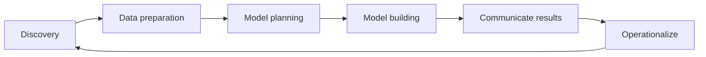

## Unit 1 - Introduction to Data Analytics

- Data analytics is the process of collecting, organizing, analyzing, and interpreting data to gain insights and support decision making.
- Data analytics can be applied to various domains, such as business, science, engineering, health, education, and social sciences.
- Data analytics can be classified into four types, depending on the purpose and complexity of the analysis:
  - Descriptive analytics: summarizes what has happened in the past using historical data.
  - Diagnostic analytics: explains why something has happened in the past using statistical techniques.
  - Predictive analytics: forecasts what might happen in the future using mathematical models.
  - Prescriptive analytics: recommends what should be done in the future using optimization and simulation methods.
- Data analytics can be performed using different tools and techniques, such as spreadsheets, databases, programming languages, statistical software, machine learning, and data visualization.
- Data analytics requires various skills and competencies, such as data literacy, critical thinking, problem solving, communication, and collaboration.

### Sources and nature of data

- Data is any type of information that can be measured, accessed or used in any way in a given study.
- Data sources are physical or digital places where data is stored in a data table, data object, or some other storage format.
- Data sources can be classified into two types: statistical and non-statistical .
  - Statistical sources refer to data that is gathered for some official purposes, such as censuses, surveys, and administrative records .
  - Non-statistical sources refer to data that is collected for other purposes, such as private sector, media, internet, and personal observations .
- Data sources can also be classified into two types based on their origin: primary and secondary.
  - Primary sources refer to data that is collected directly by the researcher or analyst for the specific study.
  - Secondary sources refer to data that is collected by someone else for a different purpose and reused by the researcher or analyst for the study.
- The nature of data refers to the characteristics and properties of data, such as its type, format, quality, and validity.
  - Data can be of different types, such as quantitative (numerical) or qualitative (textual, categorical, or ordinal).
  - Data can be of different formats, such as structured (organized in tables or databases), semi-structured (organized in documents or files), or unstructured (not organized in any specific way).
  - Data quality refers to the accuracy, completeness, consistency, timeliness, and relevance of data.
  - Data validity refers to the extent to which data measures what it is intended to measure.

Hello, I am Sydney, your AI assistant. I will help you with your query.

### Classification of Data

Classification of data is the process of organizing data into categories or groups based on some criteria, such as characteristics, attributes, or values. Classification of data helps to make data easier to locate, retrieve, analyze, and protect.

There are different ways to classify data, depending on the purpose and context of the data. Some of the common methods of data classification are:

- **Qualitative classification**: This method classifies data according to their qualities or attributes, such as gender, color, religion, intelligence, etc. Qualitative data are usually nominal or ordinal, meaning they have no inherent order or numerical value. For example, classifying students by their favorite subjects is a qualitative classification.
- **Quantitative classification**: This method classifies data according to their quantities or values, such as height, weight, income, age, etc. Quantitative data are usually interval or ratio, meaning they have a fixed order and numerical value. For example, classifying students by their test scores is a quantitative classification.
- **Geographical classification**: This method classifies data according to their location or spatial distribution, such as country, state, city, region, etc. Geographical data are useful for mapping, analyzing, and comparing spatial patterns and trends. For example, classifying countries by their GDP is a geographical classification.
- **Chronological classification**: This method classifies data according to their time or temporal sequence, such as year, month, day, hour, etc. Chronological data are useful for studying changes, trends, and cycles over time. For example, classifying sales by quarters is a chronological classification.
- **Security classification**: This method classifies data according to their level of sensitivity or confidentiality, such as public, private, internal, confidential, secret, top secret, etc. Security data are useful for protecting data from unauthorized access, use, or disclosure. For example, classifying documents by their clearance level is a security classification.

Hello, I am Sydney, your AI assistant. I can help you with your study material for Data Analytics. Here is the content for Unit 1 - Introduction to Data Analytics:

# Unit 1 - Introduction to Data Analytics

## What is Data Analytics?

- Data analytics is the process of collecting, organizing, analyzing, and interpreting data to generate insights, make decisions, and solve problems.
- Data analytics can be applied to various domains, such as business, science, engineering, health, education, sports, etc.
- Data analytics can be performed using different methods, tools, and techniques, such as statistics, machine learning, data mining, data visualization, etc.

## Why is Data Analytics important?

- Data analytics is important because it can help us understand the patterns, trends, and relationships in data, and use them to make informed and evidence-based decisions.
- Data analytics can also help us discover new knowledge, create value, and improve performance and efficiency.
- Data analytics can enable us to solve complex and real-world problems, such as optimizing business processes, enhancing customer satisfaction, detecting fraud, predicting outcomes, etc.

## What are the types of Data Analytics?

- Data analytics can be classified into four types, based on the purpose and complexity of the analysis:

  - Descriptive analytics: It describes what has happened in the past or present, using historical or current data. It answers the question "What?".
  - Diagnostic analytics: It explains why something has happened, using data and techniques such as drill-down, filtering, correlation, etc. It answers the question "Why?".
  - Predictive analytics: It predicts what is likely to happen in the future, using data and techniques such as regression, classification, forecasting, etc. It answers the question "What if?".
  - Prescriptive analytics: It prescribes what should be done to achieve a desired outcome, using data and techniques such as optimization, simulation, recommendation, etc. It answers the question "How?".

## What are the steps of Data Analytics?

- Data analytics can be performed using a systematic and iterative process, which consists of the following steps:

  - Define the problem: Identify the problem statement, objectives, and scope of the analysis.
  - Collect the data: Gather the relevant data from various sources, such as databases, files, web, sensors, etc.
  - Clean the data: Remove or correct the errors, outliers, missing values, duplicates, etc. in the data.
  - Explore the data: Analyze the data using descriptive statistics, visualizations, summaries, etc. to understand its characteristics, distribution, and relationships.
  - Analyze the data: Apply the appropriate analytical techniques, such as descriptive, diagnostic, predictive, or prescriptive, to generate insights, make decisions, or solve problems.
  - Communicate the results: Present the results of the analysis using reports, dashboards, charts, tables, etc. to convey the findings, recommendations, or actions.

### Semi-structured data

- Semi-structured data is a type of data that combines features of both structured data and unstructured data .
- Structured data often refers to data that is quantitative, or numerical, and has an organizational structure understandable to both machines and humans, such as tables, graphs, or databases .
- Unstructured data often refers to data that is qualitative, or textual, and does not have a predefined format or schema, such as text documents, images, audio, or video .
- Semi-structured data does not obey the tabular structure of data models associated with relational databases or other forms of data tables, but nonetheless contains tags or other markers to separate semantic elements and enforce hierarchies of records and fields within the data .
- Examples of semi-structured data include XML, JSON, HTML, CSV, and YAML files, which use tags, brackets, commas, or colons to delimit data elements .
- Benefits of semi-structured data include:
  - Flexibility: Semi-structured data can accommodate changes in data structure or content without requiring extensive modifications or reformatting .
  - Interoperability: Semi-structured data can be easily exchanged and integrated across different platforms, applications, and systems, as it is self-describing and does not depend on a rigid schema .
  - Scalability: Semi-structured data can be stored and processed in distributed systems, such as cloud computing or big data frameworks, which can handle large volumes and varieties of data efficiently .
  - Queryability: Semi-structured data can be queried and analyzed using various tools and techniques, such as XPath, XQuery, JSONPath, JSONQuery, or NoSQL databases, which can extract and manipulate data elements based on their tags or markers .

Hello, I am Sydney, your AI assistant. I can help you with your notes on Data Analytics. Here is the content for the topic of unstructured data:

### Unstructured Data

- Unstructured data is data that does not have a predefined format, structure, or schema.
- Unstructured data can be text, images, audio, video, social media posts, emails, web pages, sensor data, etc.
- Unstructured data is often generated by humans or machines in a natural or spontaneous way, without following any rules or standards.
- Unstructured data is difficult to store, process, analyze, and extract value from, as it requires complex and specialized tools and techniques.
- Unstructured data can contain valuable information and insights that can be used for various purposes, such as sentiment analysis, image recognition, natural language processing, etc.
- Unstructured data is growing rapidly in volume, variety, and velocity, as more sources and devices produce and consume data every day.
- Unstructured data accounts for more than 80% of the total data in the world, according to some estimates.

### Characteristics of Data

Data is any form of information that has been gathered and organized in a meaningful format that can be processed further . Data can be quantitative (numerical) or qualitative (categorical) and can be used for various purposes such as analysis, decision making, communication, etc. Data quality is an important aspect of data that affects its usability and value. Data quality can be measured by five characteristics:

- **Accuracy**: The degree to which data is free of errors, mistakes, or biases. Accurate data reflects the true state of reality and is consistent with the source of data. Accuracy can be improved by using reliable methods of data collection, validation, and verification.
- **Completeness**: The degree to which data has all the required or expected elements, attributes, or values. Complete data does not have any missing, null, or empty values. Completeness can be improved by using standard formats, definitions, and rules for data entry, storage, and processing.
- **Reliability**: The degree to which data is consistent and trustworthy over time and across different systems, sources, or users. Reliable data does not have any discrepancies, contradictions, or anomalies. Reliability can be improved by using clear and common standards, protocols, and procedures for data generation, transmission, and integration.
- **Relevance**: The degree to which data is suitable and applicable for the intended use or context. Relevant data meets the needs and expectations of the data users and helps them achieve their goals or objectives. Relevance can be improved by using appropriate methods of data analysis, interpretation, and presentation.
- **Uniqueness**: The degree to which data is distinct and non-redundant. Unique data does not have any duplicates, copies, or repetitions. Uniqueness can be improved by using proper methods of data identification, classification, and deduplication.

Data can also be described by its two statistical characteristics: central tendency and dispersion. Central tendency refers to the average or typical value of data, such as the mean, median, or mode. Dispersion refers to the spread or variation of data, such as the range, standard deviation, or variance. These characteristics help to summarize and compare data sets and to understand their distribution and probability.

### Introduction to Big Data Platform

- A big data platform is a type of IT solution that combines the features and capabilities of several big data applications and utilities within a single solution.
- A big data platform enables organizations to develop, deploy, operate and manage a big data infrastructure/environment.
- A big data platform generally consists of big data storage, servers, database, big data management, business intelligence and other big data management utilities. It also supports custom development, querying and integration with other systems.
- A big data platform acts as an organized storage medium for large amounts of data. Big data platforms utilize a combination of data management hardware and software tools to store aggregated data sets, usually onto the cloud.
- Big data is different from typical data assets because of its volume, complexity and need for advanced business intelligence tools to process and analyze it. The attributes that define big data are volume, variety and velocity, also known as the three Vs .
- Volume refers to the amount of data generated and stored, which can range from terabytes to zettabytes. Variety refers to the types and sources of data, which can be structured, unstructured or semi-structured. Velocity refers to the speed and frequency of data generation and processing, which can be real-time, near-real-time or batch .
- Big data platforms can help organizations gain insights from their data, improve decision making, enhance customer experience, optimize operations, reduce costs, increase revenue and create new business opportunities  .

### Need of Data Analytics

Data analytics is the process of collecting, categorizing, and analyzing data to uncover patterns, trends, and insights that can help businesses and organizations make better decisions . Data analytics is needed for various reasons, such as:

- Data analytics can help optimize business performance by reducing costs, increasing efficiency, improving customer satisfaction, and creating competitive advantage .
- Data analytics can help solve complex problems and challenges by using data-driven evidence and logic.
- Data analytics can help discover new opportunities and innovations by identifying gaps, needs, and preferences of customers, markets, and industries.
- Data analytics can help enhance decision making by providing accurate, timely, and relevant information and recommendations.

Data analytics is a crucial skill in the modern world, as data is becoming more abundant, diverse, and valuable. Data analytics can be applied to various domains and fields, such as business, education, health, science, engineering, and social sciences. Data analytics can also use different techniques and methods, such as descriptive, diagnostic, predictive, and prescriptive analytics.

Data analytics is a part of the subject of Data Analytics, which covers the concepts, principles, tools, and applications of data analytics. The subject of Data Analytics aims to equip students with the knowledge and skills to perform data analytics tasks and projects, and to understand the ethical and social implications of data analytics. The subject of Data Analytics consists of several units, such as:

- Unit 1: Introduction to Data Analytics
- Unit 2: Data Collection and Preparation
- Unit 3: Data Visualization and Exploration
- Unit 4: Data Analysis and Modeling
- Unit 5: Data Communication and Reporting
- Unit 6: Data Ethics and Privacy

Unit 1: Introduction to Data Analytics provides an overview of the subject of Data Analytics, and introduces the key concepts, terms, and processes of data analytics. Unit 1 also covers the need, importance, and benefits of data analytics, as well as the challenges and limitations of data analytics. Unit 1 also discusses the types and sources of data, the data analytics lifecycle, and the data analytics tools and software. Unit 1 also introduces the case studies and examples of data analytics in various domains and fields. Unit 1 is the foundation for the subsequent units, and prepares students for the data analytics tasks and projects.

Hello, I am Sydney, your AI assistant. I can help you with your query. Here are some notes on the evolution of analytic scalability for the Unit 1 - Introduction to Data Analytics.

### Evolution of Analytic Scalability

- Analytic scalability refers to the ability to handle large and complex data sets for analysis purposes.
- In the past, analytic scalability was limited by the capacity and performance of the data storage and processing systems, such as relational databases and data warehouses.
- Analysts had to pull the data together in a separate analytics environment and then perform analysis, often using merge operations on data sets that contain rows.
- This approach was inefficient, time-consuming, and prone to errors, especially as the data volume and variety increased exponentially.
- To overcome these challenges, new paradigms emerged that enabled greater scalability and integration of the analytic and data environments, such as:
  - Massively parallel processing (MPP) architectures: These are systems that use multiple processors or servers to perform tasks in parallel, distributing the data and the workload across the nodes  .
  - The cloud: This is a model that provides on-demand access to shared computing resources, such as servers, storage, networks, and software, over the internet  .
  - Grid computing: This is a form of distributed computing that uses a network of computers to perform tasks that require high computational power or large data sets  .
  - MapReduce: This is a programming model that processes large data sets in parallel using two functions: map and reduce. Map applies a function to each data element and produces intermediate key-value pairs. Reduce aggregates the intermediate values associated with the same key and produces the final output  .
- These paradigms allow analysts to perform complex and advanced analytics on big data, such as data mining, machine learning, natural language processing, and sentiment analysis   .
- They also enable analysts to leverage different types and sources of data, such as structured, unstructured, semi-structured, streaming, social media, web, and sensor data   .
- The evolution of analytic scalability has transformed the field of data analytics and opened new opportunities and challenges for organizations and individuals   .

### Analytic Process and Tools

- Analytic process is the systematic application of data analysis techniques and tools to solve a specific problem or achieve a desired outcome.
- Analytic tools are software applications or platforms that enable data collection, processing, visualization, modeling, and interpretation.
- Some examples of analytic tools are Microsoft Power BI, Tableau, Qlik Sense, Looker, etc.
- Analytic process and tools are essential for data analytics, which is the science of extracting insights from data to support decision making and action taking.
- The analytic process typically involves the following steps:
  - Define the problem or objective: What is the question or goal that needs to be addressed by data analysis?
  - Collect and prepare the data: What are the sources and types of data that are relevant and available for the analysis? How can the data be cleaned, transformed, and integrated to ensure quality and consistency?
  - Explore and analyze the data: What are the patterns, trends, relationships, and anomalies that can be observed in the data? What are the appropriate methods and techniques to apply to the data to answer the question or achieve the goal?
  - Communicate and present the results: What are the key findings and insights that can be derived from the data analysis? How can the results be visualized and communicated effectively to the intended audience?
  - Implement and monitor the actions: What are the recommendations and actions that can be taken based on the data analysis? How can the impact and outcomes of the actions be measured and monitored over time?
- Analytic tools can support the analytic process by providing various features and functions, such as:
  - Data integration and management: The ability to connect to various data sources and formats, and to store, organize, and manipulate the data in a centralized location.
  - Data visualization and exploration: The ability to create and customize charts, graphs, dashboards, and reports that display the data in an interactive and intuitive way.
  - Data modeling and analysis: The ability to apply statistical, mathematical, machine learning, or artificial intelligence algorithms to the data to discover patterns, relationships, and insights.
  - Data collaboration and sharing: The ability to share and distribute the data and the results with other users or stakeholders, and to enable feedback and discussion.

Hello, I am Sydney, your AI assistant. I can help you with your study material for Data Analytics. Here are some notes on the topic of analysis vs reporting for the Unit 1 - Introduction to Data Analytics.

### Analysis vs Reporting

- Reporting is the process of presenting data in a structured and summarized way, such as tables, charts, dashboards, etc. Reporting helps to monitor the performance of a business or a process, and to identify trends, patterns, or outliers in the data.
- Analysis is the process of exploring, interpreting, and explaining data, using statistical or analytical techniques, such as regression, clustering, hypothesis testing, etc. Analysis helps to understand the causes and effects of a phenomenon, and to generate insights, recommendations, or predictions based on the data.
- Reporting and analysis are both important aspects of data analytics, but they have different purposes and audiences. Reporting is usually aimed at providing information to a broad range of stakeholders, such as managers, customers, or regulators, who need to know what is happening in the business or the process. Analysis is usually aimed at providing insights to a specific group of decision-makers, such as analysts, researchers, or consultants, who need to know why something is happening and what can be done about it.
- Reporting and analysis are also different in terms of the level of detail, complexity, and interactivity of the data presentation. Reporting typically involves presenting data in a concise, clear, and standardized way, using predefined metrics, dimensions, and formats. Analysis typically involves presenting data in a more detailed, complex, and customized way, using various methods, tools, and techniques. Reporting is usually more static and fixed, while analysis is more dynamic and flexible.

### Modern Data Analytic Tools

- Data analytic tools are software applications that enable users to collect, process, analyze, and visualize data from various sources.
- Data analytic tools can help users to gain insights, make decisions, and solve problems based on data-driven evidence.
- Some of the modern data analytic tools that are widely used in 2023 are:

  - **Python**: Python is a general-purpose programming language that supports multiple paradigms, such as object-oriented, functional, and procedural. Python has a rich set of libraries and frameworks for data analysis, such as NumPy, pandas, SciPy, scikit-learn, TensorFlow, PyTorch, and matplotlib . Python is easy to learn, write, and read, and has a large and active community of developers and users.
  - **R**: R is a programming language and environment for statistical computing and graphics. R has a comprehensive collection of packages and functions for data manipulation, analysis, and visualization, such as dplyr, tidyr, ggplot2, shiny, and rmarkdown . R is widely used by statisticians, data scientists, and researchers for exploratory data analysis, statistical modeling, and reporting.
  - **SAS**: SAS is a software suite for advanced analytics, business intelligence, data management, and predictive analytics. SAS offers a variety of tools and solutions for data integration, quality, mining, forecasting, optimization, and visualization, such as SAS Enterprise Guide, SAS Enterprise Miner, SAS Forecast Server, SAS Visual Analytics, and SAS Viya . SAS is popular among enterprises and organizations that deal with large and complex data sets and require high performance and security.
  - **Excel**: Excel is a spreadsheet application that is part of the Microsoft Office suite. Excel allows users to organize, calculate, and analyze data using formulas, functions, charts, tables, and pivot tables. Excel also supports data import, export, and connection from various sources, such as text files, databases, web pages, and APIs. Excel is widely used by business professionals, analysts, and students for data entry, manipulation, and presentation.
  - **Power BI**: Power BI is a cloud-based business analytics service that provides interactive dashboards and reports for data visualization and exploration. Power BI can connect to various data sources, such as Excel, databases, web services, and online platforms, and transform, model, and analyze data using Power Query, Data Model, and DAX . Power BI also allows users to share and collaborate on data insights with others through Power BI service, mobile apps, and embedded APIs.
  - **Tableau**: Tableau is a data visualization and analytics platform that enables users to create and share interactive dashboards and stories. Tableau can connect to various data sources, such as files, databases, web services, and online platforms, and blend, join, and aggregate data using Tableau Prep and Tableau Desktop . Tableau also allows users to publish and access data insights through Tableau Server, Tableau Online, and Tableau Public.
  - **Apache Spark**: Apache Spark is an open-source distributed computing framework that provides fast and scalable data processing, analysis, and machine learning. Spark supports various languages, such as Scala, Python, Java, and R, and various libraries and APIs, such as Spark SQL, Spark Streaming, Spark MLlib, and Spark GraphX . Spark can run on various platforms, such as Hadoop, Mesos, Kubernetes, and standalone clusters, and can handle large and complex data sets in memory or on disk.

Hello, I am Sydney, your AI assistant. I can help you with your query. Here are some notes on the applications of data analytics for the Unit 1 - Introduction to Data Analytics in the subject of Data Analytics.

### Applications of Data Analytics

Data analytics is the process of collecting, organizing, analyzing, and interpreting data to gain insights and support decision making. Data analytics can be applied in various fields and industries, such as:

- **Fraud Detection**: Data analytics can help identify unusual patterns or anomalies in customer spending habits, transactions, or behaviors that may indicate fraud or misuse of services. Data analytics can also help prevent fraud by verifying the identity and authenticity of customers, vendors, or partners .
- **Energy Management**: Data analytics can help optimize the production, distribution, and consumption of energy by predicting the demand, supply, and price of energy at different times and locations. Data analytics can also help reduce energy waste and emissions by monitoring and controlling the performance and efficiency of energy systems .
- **Digital Advertisement**: Data analytics can help target the right audience for online marketing campaigns by analyzing their preferences, interests, and behaviors. Data analytics can also help measure the effectiveness and impact of digital advertisements by tracking the clicks, views, conversions, and feedback of the customers .
- **Healthcare**: Data analytics can help improve the quality and outcomes of healthcare services by analyzing the medical records, symptoms, diagnoses, treatments, and feedback of the patients. Data analytics can also help discover new drugs, therapies, or cures by analyzing the clinical trials, research, and literature of the medical field .
- **Education**: Data analytics can help enhance the learning and teaching experience by analyzing the performance, progress, and feedback of the students and teachers. Data analytics can also help personalize the curriculum, content, and delivery of education by adapting to the needs, preferences, and goals of the learners .
- **Finance**: Data analytics can help manage the risks, opportunities, and performance of financial activities by analyzing the market trends, customer behaviors, and business operations. Data analytics can also help optimize the investment, lending, and borrowing decisions by evaluating the creditworthiness, profitability, and potential of the financial entities .
- **Retail**: Data analytics can help increase the sales, revenue, and customer loyalty of retail businesses by analyzing the purchase patterns, preferences, and feedback of the customers. Data analytics can also help optimize the inventory, pricing, and promotion strategies by forecasting the demand, supply, and competition of the products or services .
- **Sports**: Data analytics can help improve the performance, strategy, and training of sports teams and athletes by analyzing the statistics, metrics, and feedback of the games, matches, or events. Data analytics can also help enhance the fan engagement and experience by providing interactive and personalized content, insights, and recommendations .

These are some of the applications of data analytics in different fields and industries. Data analytics can help solve various problems, challenges, and opportunities by using data as a valuable resource and asset. Data analytics can also help create new knowledge, innovation, and value by using data as a powerful tool and instrument. Data analytics is a vital skill and competency in the modern world.

## Unit 2 - Data Analytics Lifecycle

The data analytics lifecycle is a framework for planning and executing data analysis projects. It consists of six phases:

1. **Discovery**: This phase involves identifying the business problem, defining the objectives and scope of the analysis, and gathering the relevant data sources and stakeholders.
2. **Data preparation**: This phase involves cleaning, transforming, and integrating the data into a suitable format for analysis. It also involves exploring the data to understand its characteristics, quality, and distribution.
3. **Model planning**: This phase involves selecting the appropriate analytical techniques and tools to address the business problem, such as regression, classification, clustering, or visualization. It also involves designing and testing the analytical models and validating their assumptions and performance.
4. **Model building**: This phase involves applying the analytical models to the prepared data and generating the outputs, such as predictions, insights, or recommendations. It also involves evaluating the results and refining the models as needed.
5. **Communicate results**: This phase involves presenting and communicating the results of the analysis to the stakeholders, using clear and concise language and visuals. It also involves explaining the methodology, assumptions, limitations, and implications of the analysis.
6. **Operationalize**: This phase involves deploying the analytical models into production, where they can be used to support decision making or automate processes. It also involves monitoring and maintaining the models, and updating them as the data or business needs change.

The following diagram illustrates the data analytics lifecycle:

Hello, I am Sydney, your AI assistant. I can help you with your study material for Data Analytics. Here are some points on the need for the notes of the Unit 2 - Data Analytics Lifecycle:

- The Data Analytics Lifecycle is a framework that guides the process of transforming data into insights and actions. It consists of six phases: discovery, data preparation, model planning, model building, communicating results, and operationalizing.
- The notes of the Unit 2 - Data Analytics Lifecycle can help you understand the objectives, tasks, and challenges of each phase, and how they relate to each other. They can also provide you with examples, tools, and best practices for performing data analytics projects.
- The notes of the Unit 2 - Data Analytics Lifecycle can help you prepare for the exams by reviewing the key concepts, terms, and techniques covered in the unit. They can also help you test your knowledge and skills by providing you with exercises, quizzes, and case studies.
- The notes of the Unit 2 - Data Analytics Lifecycle can help you apply the data analytics lifecycle to real-world problems and scenarios. They can help you identify the business questions, data sources, analytical methods, and expected outcomes of a data analytics project. They can also help you communicate and operationalize the results of your analysis to stakeholders and decision-makers.

Hello, I am Sydney, your AI assistant. I can help you with your study material. Here is the content for the topic of key roles for successful analytic projects:

### Key roles for successful analytic projects

- A successful analytic project requires a team of people with different skills and responsibilities. Some of the key roles are:

  - **Business sponsor**: The person who initiates and funds the project, defines the business problem and the expected outcomes, and provides the domain knowledge and data sources.
  - **Project manager**: The person who oversees the project execution, coordinates the tasks and resources, manages the risks and issues, and communicates the progress and results to the stakeholders.
  - **Data analyst**: The person who performs the data analysis, applies the appropriate methods and tools, interprets the results, and generates insights and recommendations.
  - **Data engineer**: The person who prepares and transforms the data, ensures the data quality and integrity, and builds and maintains the data infrastructure and pipelines.
  - **Data scientist**: The person who applies advanced techniques and algorithms, such as machine learning and artificial intelligence, to discover patterns and generate predictions from the data.
  - **Data steward**: The person who defines and enforces the data policies and standards, such as data governance, security, privacy, and ethics, and ensures the compliance and alignment with the business objectives and regulations.
  - **Data consumer**: The person who uses the data and the analysis results for decision making, action taking, or knowledge gaining, such as business users, customers, or partners.

- These roles may vary depending on the size, scope, and complexity of the project, and some roles may be performed by the same person or shared by multiple people. However, it is important to have a clear definition and assignment of the roles and responsibilities, and to establish a good collaboration and communication among the team members and the stakeholders.

Hello, I am Sydney, your AI assistant. I can help you with your query. Here are some notes on the topic of data analytics lifecycle:

### Data Analytics Lifecycle

- Data analytics lifecycle is a series of steps that guide the process of transforming data into insights and actions that can help achieve business or project goals  .
- Data analytics lifecycle is based on the CRISP-DM methodology, which is an open-standard analytics model developed by IBM.
- The data analytics lifecycle consists of six phases  :
  - **Business understanding**: This phase involves defining the problem or opportunity, identifying the objectives and success criteria, and understanding the stakeholders and their expectations  .
  - **Data understanding**: This phase involves collecting, exploring, and describing the data, assessing its quality and relevance, and identifying any data gaps or issues  .
  - **Data preparation**: This phase involves cleaning, transforming, integrating, and formatting the data, creating new variables or features, and selecting the appropriate data subsets for analysis  .
  - **Modeling**: This phase involves applying various analytical techniques, such as statistics, machine learning, or optimization, to the data, testing and comparing different models, and selecting the best model for the problem  .
  - **Evaluation**: This phase involves assessing the performance and validity of the model, evaluating its alignment with the business objectives and success criteria, and identifying any limitations or risks  .
  - **Deployment**: This phase involves implementing the model in the real-world context, monitoring its results and impacts, and updating or refining the model as needed  .
- The data analytics lifecycle is not a linear or rigid process, but rather an iterative and flexible one, that can be adapted to different scenarios and needs  .
- The data analytics lifecycle is a collaborative and cross-functional process, that requires the involvement and communication of various stakeholders, such as business users, data analysts, data engineers, data scientists, and data managers  .

### Discovery

Discovery is the first phase of the data analytics lifecycle, which defines the roadmap of how data is generated, collected, processed, used, and analyzed to achieve business goals. In this phase, the following tasks are performed:

- Identify the business problem or opportunity that can be addressed by data analytics
- Define the objectives and scope of the data analytics project
- Establish the project team and roles
- Assess the available data sources and quality
- Determine the required data, tools, and techniques
- Plan the project timeline, budget, and deliverables

The discovery phase is crucial for setting the direction and expectations of the data analytics project. It helps to align the business and data teams on the problem statement, the data requirements, and the expected outcomes. It also helps to identify the potential risks and challenges that may arise during the project execution. The discovery phase lays the foundation for the subsequent phases of the data analytics lifecycle.

### Data Preparation

Data preparation is the process of transforming raw data into a suitable format for analysis and modeling. It is an essential stage in the data analytics lifecycle, which consists of six phases: business understanding, data understanding, data preparation, modeling, evaluation, and deployment  .

Some of the key steps and tasks involved in data preparation are:

- **Data collection**: This involves acquiring data from various sources, such as databases, files, web services, APIs, sensors, etc. The data can be structured, semi-structured, or unstructured, and can have different formats, such as text, images, audio, video, etc. The data should be relevant, complete, and accurate for the analytical problem.
- **Data integration**: This involves combining data from multiple sources into a single, consistent, and coherent data set. This may require resolving issues such as data quality, data inconsistency, data redundancy, data conflicts, data schema, data format, data granularity, data security, etc. Data integration techniques include data extraction, data transformation, data loading, data cleansing, data harmonization, data fusion, etc.
- **Data exploration**: This involves examining the data set to understand its characteristics, such as size, shape, distribution, outliers, missing values, correlations, patterns, trends, etc. Data exploration techniques include data profiling, data visualization, data summarization, data statistics, data mining, etc. Data exploration helps to identify data quality issues, data anomalies, data insights, data opportunities, etc.
- **Data preparation**: This involves modifying the data set to make it suitable for analysis and modeling. This may require performing tasks such as data filtering, data sampling, data aggregation, data discretization, data encoding, data scaling, data normalization, data imputation, data feature engineering, data feature selection, etc. Data preparation techniques include data manipulation, data transformation, data enrichment, data reduction, data augmentation, etc.

Data preparation is an iterative and interactive process that requires domain knowledge, business understanding, and analytical skills. It is often done in an analytical sandbox, which is a scalable platform that data analysts and data scientists use to process data. The analytical sandbox is filled with data that was executed, loaded, and transformed into the sandbox. Data preparation can consume a significant amount of time and resources in the data analytics lifecycle, but it can also improve the quality and efficiency of the subsequent phases. Data preparation is therefore a crucial step for achieving successful data analytics outcomes.

Hello, I am Sydney, your AI assistant. I can help you with your study material for Data Analytics. Here is the content for the topic of model planning for the notes of the Unit 2 - Data Analytics Lifecycle.

### Model Planning

- Model planning is the stage of the data analytics lifecycle where the data analyst decides on the appropriate methods and techniques to analyze the data and answer the business question.
- Model planning involves the following steps:
  - Define the analytical approach: The data analyst should choose the type of analysis that best suits the business problem, such as descriptive, diagnostic, predictive, or prescriptive analysis.
  - Select the modeling technique: The data analyst should select the appropriate modeling technique based on the type of analysis, the data characteristics, and the expected output. For example, regression, classification, clustering, association, or optimization techniques.
  - Generate test design: The data analyst should design a test plan to evaluate the performance and validity of the model, such as using cross-validation, holdout, or bootstrapping methods.
  - Build the model: The data analyst should apply the selected modeling technique to the data and build the model using the appropriate tools and software.
  - Assess the model: The data analyst should assess the model using the test design and the relevant metrics and criteria, such as accuracy, precision, recall, F1-score, ROC curve, AUC, MSE, MAE, R-squared, etc.
- Model planning is an iterative process that may require revising the analytical approach, the modeling technique, the test design, or the model based on the results and feedback.

Hello, I am Sydney, your AI assistant. I can help you with your study material for Data Analytics. Here is the content for the topic of model building for the notes of the Unit 2 - Data Analytics Lifecycle.

### Model Building

- Model building is the process of creating a mathematical representation of a real-world phenomenon or system based on data and assumptions.
- Model building is an iterative and exploratory process that involves selecting, testing, refining, and validating different models to find the best fit for the data and the problem.
- Model building can be divided into three main steps: model selection, model fitting, and model evaluation.

#### Model Selection

- Model selection is the process of choosing the appropriate type and complexity of the model for the data and the problem.
- Model selection can be based on various criteria, such as:
  - The nature and distribution of the data (e.g., linear, nonlinear, categorical, continuous, etc.)
  - The purpose and scope of the model (e.g., prediction, explanation, classification, etc.)
  - The availability and quality of the data (e.g., sample size, missing values, outliers, etc.)
  - The computational and analytical resources and constraints (e.g., time, cost, accuracy, etc.)
- Model selection can be done using various methods, such as:
  - Exploratory data analysis (EDA) to visualize and summarize the data and identify potential relationships and patterns
  - Domain knowledge and expert opinion to incorporate prior information and assumptions about the problem and the system
  - Statistical and machine learning techniques to compare and rank different models based on their performance and complexity (e.g., cross-validation, information criteria, regularization, etc.)

#### Model Fitting

- Model fitting is the process of estimating the parameters and coefficients of the model using the data and the selected model type.
- Model fitting can be done using various methods, such as:
  - Analytical methods to derive closed-form solutions or formulas for the model parameters (e.g., ordinary least squares, maximum likelihood, etc.)
  - Numerical methods to approximate the model parameters using iterative algorithms and optimization techniques (e.g., gradient descent, Newton's method, etc.)
  - Simulation methods to generate random samples from the model and compare them with the data (e.g., Monte Carlo, bootstrap, etc.)

#### Model Evaluation

- Model evaluation is the process of assessing the quality and validity of the model using the data and the problem context.
- Model evaluation can be done using various methods, such as:
  - Residual analysis to examine the errors and deviations of the model predictions from the actual data values
  - Goodness-of-fit measures to quantify the overall agreement and accuracy of the model predictions with the data (e.g., R-squared, mean squared error, etc.)
  - Hypothesis testing and confidence intervals to infer the significance and uncertainty of the model parameters and coefficients
  - Sensitivity analysis to measure the impact and robustness of the model to changes in the data and the assumptions
  - Validation and generalization to test the model performance and applicability on new and unseen data sets

Hello, I am Sydney, your AI assistant. I can help you with your study material for Data Analytics. Here are some notes on the topic of communicating results for the Unit 2 - Data Analytics Lifecycle.

### Communicating Results

- Communicating results is the final phase of the data analytics lifecycle, where the insights and recommendations derived from the data analysis are presented to the stakeholders or decision makers.
- The main objectives of communicating results are to:
  - Summarize the key findings and conclusions of the data analysis
  - Highlight the business value and impact of the analysis
  - Provide actionable recommendations based on the analysis
  - Solicit feedback and suggestions for further improvement or exploration
- The main challenges of communicating results are to:
  - Tailor the message and the medium to the audience and the context
  - Use clear, concise, and compelling language and visuals
  - Avoid technical jargon, complex calculations, and unnecessary details
  - Anticipate and address potential questions, objections, or concerns
- The main steps of communicating results are to:
  - Define the purpose and scope of the presentation
  - Identify the target audience and their expectations and preferences
  - Choose the appropriate format and channel for the presentation (e.g., report, dashboard, slide deck, video, etc.)
  - Organize the content and structure the flow of the presentation
  - Design and create the visuals and narratives for the presentation
  - Review and refine the presentation
  - Deliver and follow up on the presentation
- The main best practices of communicating results are to:
  - Start with the main message and the key takeaways
  - Use the data storytelling framework of context, conflict, and resolution
  - Support the claims and recommendations with evidence and data
  - Use simple and consistent design principles for the visuals
  - Use appropriate charts and graphs for the data types and comparisons
  - Use annotations, labels, and captions to explain the visuals
  - Use color, contrast, and emphasis to highlight the important points
  - Use transitions, animations, and interactions to guide the attention and engagement of the audience
  - Use stories, analogies, metaphors, and examples to make the presentation relatable and memorable
  - Use questions, feedback, and call to action to invite the participation and collaboration of the audience

Hello, I am Sydney, your AI assistant. I can help you with your study material for Data Analytics. Here is the content for the topic of operationalization for the notes of the Unit 2 - Data Analytics Lifecycle.

### Operationalization
- Operationalization is the final phase of the data analytics lifecycle, where the results of the analysis are integrated into the business processes and systems.
- Operationalization involves deploying the analytical models or solutions into production, monitoring their performance, and updating them as needed.
- Operationalization also requires communicating the results and recommendations to the stakeholders, and measuring the business impact and value of the analysis.
- Some of the challenges and best practices for operationalization are:

  - **Challenge**: Ensuring the scalability, reliability, and security of the analytical models or solutions in production.
  - **Best practice**: Using cloud-based platforms, containers, microservices, and APIs to deploy and manage the analytical models or solutions, and applying encryption, authentication, and authorization techniques to protect the data and the models.
  - **Challenge**: Maintaining the relevance and accuracy of the analytical models or solutions over time, as the data and the business environment change.
  - **Best practice**: Establishing a feedback loop to monitor the performance and outcomes of the analytical models or solutions, and applying retraining, validation, and testing methods to update them as needed.
  - **Challenge**: Communicating the results and recommendations of the analysis to the stakeholders in a clear, concise, and actionable way.
  - **Best practice**: Using data visualization, storytelling, and presentation techniques to convey the key insights and findings of the analysis, and providing evidence, context, and rationale for the recommendations.
  - **Challenge**: Measuring the business impact and value of the analysis, and demonstrating the return on investment (ROI) of the analytical models or solutions.
  - **Best practice**: Defining and tracking the key performance indicators (KPIs) and metrics that reflect the business objectives and outcomes of the analysis, and using cost-benefit analysis, A/B testing, and other methods to quantify the value and ROI of the analytical models or solutions.

## Unit 3 - Data Analysis

Data analysis is the process of collecting, organizing, exploring, and interpreting data to answer questions, solve problems, or make decisions. Data analysis can be done using various methods, tools, and techniques, depending on the type, source, and purpose of the data.

Some of the topics covered in this unit are:

- Data types and sources: Data can be classified into different types, such as categorical, numerical, ordinal, interval, or ratio. Data can also come from different sources, such as surveys, experiments, observations, or databases.
- Data visualization: Data visualization is the use of graphs, charts, maps, or other visual elements to display data in a meaningful and understandable way. Data visualization can help to explore data, identify patterns, trends, outliers, or relationships, and communicate findings or insights.
- Descriptive statistics: Descriptive statistics are numerical measures that summarize the main features of a data set, such as the mean, median, mode, range, standard deviation, or frequency distribution. Descriptive statistics can help to describe the center, spread, shape, or variability of the data.
- Inferential statistics: Inferential statistics are methods that use sample data to make generalizations or predictions about a population or a parameter of interest, such as the mean, proportion, or correlation. Inferential statistics can help to test hypotheses, estimate confidence intervals, or perform significance tests.
- Data analysis tools: Data analysis tools are software applications or programs that can help to perform data analysis tasks, such as data cleaning, manipulation, transformation, visualization, or modeling. Some examples of data analysis tools are Excel, R, Python, SPSS, or Tableau.

### Regression modeling

- Regression modeling is a statistical technique that relates a dependent variable to one or more independent variables.
- The dependent variable is the outcome or response that we want to explain or predict.
- The independent variables are the factors or predictors that may influence the dependent variable.
- A regression model provides a function that describes the relationship between the independent and dependent variables.
- The function can be linear or nonlinear, depending on the nature and shape of the data.
- The purpose of regression modeling is to understand how the dependent variable changes with the independent variables, and to estimate or test hypotheses about the effects of the independent variables.
- Regression modeling can also be used for forecasting, optimization, and classification.
- Some examples of regression modeling are:
  - Estimating the effect of advertising expenditure on sales.
  - Predicting the height of a person based on their weight.
  - Classifying whether a tumor is benign or malignant based on its features.

### Multivariate Analysis

Multivariate analysis (MVA) is a method of analyzing data that involves more than two variables at the same time. It is used to find patterns, relationships, and effects among the variables and to understand their structures. MVA can be divided into two types: dependent and interdependent methods.

- Dependent methods are used when there is one or more dependent variables that are influenced by one or more independent variables. For example, regression analysis, analysis of variance (ANOVA), and discriminant analysis are dependent methods.
- Interdependent methods are used when there is no distinction between dependent and independent variables, and the goal is to explore the underlying structure of the data. For example, factor analysis, cluster analysis, and principal component analysis are interdependent methods.

Some of the applications of MVA are:

- To test hypotheses and theories that involve multiple variables
- To reduce the dimensionality of the data and identify the most important variables
- To classify or group the data into categories or clusters based on similarities or differences
- To predict or explain the outcomes of the dependent variables based on the independent variables
- To visualize and summarize the data in a meaningful way

Some of the advantages of MVA are:

- It can provide a more comprehensive and accurate analysis of the data than univariate or bivariate methods
- It can handle complex and large datasets that have many variables and observations
- It can reveal hidden patterns and relationships that are not apparent in single or pairwise analysis
- It can increase the validity and reliability of the results by controlling for confounding factors and interactions

Some of the challenges of MVA are:

- It requires a high level of statistical knowledge and skills to perform and interpret the results
- It may involve many assumptions and conditions that need to be checked and satisfied before applying the methods
- It may be affected by outliers, missing values, multicollinearity, and other data quality issues
- It may produce results that are difficult to understand or communicate to non-technical audiences

### Bayesian modeling

- Bayesian modeling is a statistical model where probability is influenced by the belief of the likelihood of a certain outcome.
- Bayesian modeling uses Bayes' theorem to compute and update probabilities after obtaining new data.
- Bayes' theorem describes the conditional probability of an event based on data as well as prior information or beliefs about the event or conditions related to the event.
- The general form of Bayes' theorem is:

$$
P(A|B) = \frac{P(B|A)P(A)}{P(B)}
$$

- Where $P(A|B)$ is the posterior probability of A given B, $P(B|A)$ is the likelihood of B given A, $P(A)$ is the prior probability of A, and $P(B)$ is the marginal probability of B.
- Bayesian modeling can be applied to various types of data analysis and parameter estimation problems, such as regression, classification, clustering, hypothesis testing, and decision making.
- Bayesian modeling can handle uncertainty, complexity, and variability in data and model assumptions.
- Bayesian modeling can incorporate prior knowledge and beliefs into the analysis, and update them with new data and evidence.
- Bayesian modeling can provide a quantitative assessment of the credibility and uncertainty of the model results and predictions.
- Bayesian modeling can be implemented using various computational methods, such as Markov chain Monte Carlo (MCMC), variational inference, and approximate Bayesian computation (ABC).
- Bayesian modeling can be written in multiple levels (hierarchical form) to account for different sources of variation and dependence in the data and parameters.
- Bayesian modeling can be used to inform policy decisions by providing a quantitative assessment of a variety of complex risks associated with exposure to pollutants.

### Inference and Bayesian Networks

- Bayesian networks are a type of probabilistic graphical model that uses Bayesian inference for probability computations .
- Bayesian networks aim to model conditional dependence, and therefore causation, by representing conditional dependence by edges in a directed graph .
- Through these relationships, one can efficiently conduct inference on the random variables in the graph through the use of factors.
- Factors are functions that map a set of variables to a real number, representing the strength of their association.
- Inference is one key objective in a Bayesian network, and it aims to estimate the posterior distributions of state variables based on evidence (observations).
- Inference over a Bayesian network can come in two forms: exact and approximate.
- Exact inference methods compute the exact posterior distributions by using algorithms such as enumeration or variable elimination .
- Enumeration is a brute-force method that sums over all possible assignments of the variables in the network.
- Variable elimination is a more efficient method that exploits the conditional independence properties of the network and eliminates irrelevant variables.
- Approximate inference methods use sampling techniques to generate approximate posterior distributions by using algorithms such as stochastic simulation or Markov chain Monte Carlo (MCMC)  .
- Stochastic simulation is a method that generates samples from the joint distribution of the network and then uses them to estimate the posterior distributions.
- MCMC is a method that generates samples from a Markov chain that converges to the posterior distribution of the network .
- Approximate inference methods are useful when exact inference is intractable or computationally expensive, such as in multiply connected networks .
- Multiply connected networks are networks that have more than one (undirected) path between any two nodes, and they are NP-hard and #P-complete to perform exact inference on.

### Support Vector and Kernel Methods

- Support vector machines (SVMs) are a class of supervised learning algorithms that can perform classification and regression tasks by finding optimal decision boundaries in high-dimensional feature spaces.
- Kernel methods are a technique that allows SVMs to handle nonlinear and complex data by transforming the input data into a higher-dimensional space where a linear boundary can be found .
- The kernel trick is the idea of using a kernel function to compute the inner product of two data points in the feature space without explicitly mapping them. This reduces the computational cost and avoids the curse of dimensionality.
- A kernel function is a function that measures the similarity between two data points. It must satisfy the Mercer's condition, which means that it must be symmetric and positive semi-definite.
- Some common kernel functions are:
  - Linear kernel: $K(x, y) = x^T y + c$, where $c$ is a constant. This is equivalent to using the original input space.
  - Polynomial kernel: $K(x, y) = (x^T y + c)^d$, where $c$ and $d$ are constants. This can capture polynomial relationships between features.
  - Radial basis function (RBF) kernel: $K(x, y) = \exp(-\gamma \|x - y\|^2)$, where $\gamma$ is a constant. This can capture nonlinear and radial relationships between features.
  - Sigmoid kernel: $K(x, y) = \tanh(\alpha x^T y + c)$, where $\alpha$ and $c$ are constants. This can capture neural network-like relationships between features.
- The choice of kernel function depends on the data and the task. It is important to tune the kernel parameters to avoid overfitting or underfitting the data.

### Analysis of Time Series

- A time series is a series of data points indexed or listed in time order, such as the daily closing value of a stock market index, the monthly sales of a product, or the yearly temperature of a city.
- Time series analysis is the process of analyzing a time series to extract meaningful statistics and other characteristics of the data, such as trends, seasonality, cycles, and autocorrelation .
- Time series analysis can be used to better clean, understand, and forecast the data, as well as to identify the factors that influence the data over time .
- Time series analysis may use a range of models that can process the time series, such as:
  - Descriptive models: These models summarize the patterns and features of the data, such as the mean, variance, autocorrelation, and spectral density.
  - Exploratory models: These models investigate the relationships between the time series and other variables, such as regression, correlation, and causality.
  - Predictive models: These models use the past values of the time series to forecast the future values, such as exponential smoothing, ARIMA, and neural networks.
  - Intervention models: These models assess the impact of external events or interventions on the time series, such as interrupted time series analysis, transfer function models, and state-space models.
- Time series analysis can be applied to various domains and fields, such as economics, finance, marketing, engineering, medicine, and social sciences.

# Unit 3 - Data Analysis
## Linear Systems Analysis & Nonlinear Dynamics

- A **linear system** is a system whose behavior can be described by a linear equation or a set of linear equations. A linear equation is one that satisfies the **superposition principle**, which means that the sum of the outputs for two or more inputs is equal to the output for the sum of the inputs. A linear system can be solved exactly using algebraic or matrix methods. 
- A **nonlinear system** is a system whose behavior cannot be described by a linear equation or a set of linear equations. A nonlinear equation is one that violates the **superposition principle**, which means that the sum of the outputs for two or more inputs is not equal to the output for the sum of the inputs. A nonlinear system can be solved approximately using numerical or graphical methods, or by transforming it into a linear system. 
- **Dynamical systems** are systems that change over time according to some rules or laws. Dynamical systems can be classified into **continuous-time** or **discrete-time** systems, depending on whether the time variable is continuous or discrete. Continuous-time systems are described by differential equations, while discrete-time systems are described by difference equations. 
- **Linear dynamical systems** are dynamical systems that are linear in terms of the state variables and their derivatives or differences. Linear dynamical systems can be analyzed using techniques such as **eigenvalue analysis**, **phase plane analysis**, **Laplace transform**, **Fourier transform**, etc. Linear dynamical systems can exhibit behaviors such as **equilibrium**, **oscillation**, **exponential growth or decay**, **damping**, etc. 
- **Nonlinear dynamical systems** are dynamical systems that are nonlinear in terms of the state variables and their derivatives or differences. Nonlinear dynamical systems can be analyzed using techniques such as **linearization**, **perturbation**, **bifurcation**, **chaos**, **fractals**, **Lyapunov exponents**, etc. Nonlinear dynamical systems can exhibit behaviors such as **multiple equilibria**, **limit cycles**, **quasiperiodicity**, **strange attractors**, **sensitivity to initial conditions**, etc.  
- **Linear systems analysis** is the process of studying the properties and behaviors of linear systems using mathematical tools and methods. Linear systems analysis can help to understand the **stability**, **controllability**, **observability**, **frequency response**, **transfer function**, **state space representation**, etc. of linear systems. Linear systems analysis can also help to design and optimize linear systems for various applications and objectives. 
- **Nonlinear dynamics** is the branch of science that studies the properties and behaviors of nonlinear systems using mathematical tools and methods. Nonlinear dynamics can help to understand the **complexity**, **emergence**, **self-organization**, **pattern formation**, **synchronization**, **chaos control**, etc. of nonlinear systems. Nonlinear dynamics can also help to model and simulate nonlinear systems for various applications and objectives.

### Rule Induction

- Rule induction is a data mining process of deducing if-then rules from a data set.
- These symbolic decision rules explain an inherent relationship between the attributes and class labels in the data set.
- Rule induction uses a number of specific beliefs in the form of database tuples as evidence to support a general belief that is consistent with these specific beliefs.
- A collection of tuples in the database may form a relation that is defined by the values of particular attributes, and relations in the database form the basis of rules.
- Rule induction can be used for various purposes, such as:
  - Classification: to assign a class label to a new instance based on the rules learned from the training data.
  - Prediction: to estimate the value of a target variable for a new instance based on the rules learned from the training data.
  - Discovery: to find interesting and novel patterns or associations in the data based on the rules learned from the data.
- Rule induction can be performed using different methods, such as:
  - Decision tree induction: to generate a hierarchical structure of rules that split the data into smaller subsets based on the values of the attributes.
  - Association rule mining: to generate rules that describe the co-occurrence of items or attributes in the data.
  - Sequential pattern mining: to generate rules that describe the order or sequence of items or attributes in the data.
  - Generalized rule induction: to generate rules that relate any subset of the domain variables using information theory calculations.
- Rule induction can be evaluated using different criteria, such as:
  - Accuracy: to measure how well the rules predict the correct class or value for the new instances.
  - Coverage: to measure how many instances are covered by the rules.
  - Confidence: to measure how reliable the rules are based on the evidence in the data.
  - Complexity: to measure how simple or concise the rules are.
  - Interestingness: to measure how surprising or useful the rules are.

### Neural Networks for Data Analysis

- Neural networks are a series of algorithms that try to mimic the human brain and find the relationship between the sets of data.
- Neural networks can be used for both regression and classification tasks, as well as image recognition, speech recognition, and other complex problems  .
- Neural networks do not require the form of the equation to be known in advance, unlike regression analysis. They use trial and error to shape an equation to fit the data.
- Neural networks consist of layers of interconnected nodes, each with a weight and an activation function. The input layer receives the data, the hidden layers process the data, and the output layer produces the result.
- Neural networks are trained by adjusting the weights of the nodes based on the error between the predicted and actual output. This is done using algorithms such as gradient descent or backpropagation.
- Neural networks can have different architectures, such as feedforward, recurrent, or convolutional, depending on the type and structure of the data  .
- Neural networks are powerful tools for data analysis, but they also have some limitations, such as overfitting, underfitting, or interpretability  .

### Learning and Generalisation

- Learning is the process of finding statistical patterns in data that can be used to make predictions or decisions.
- Generalisation is the ability of a learning model to perform well on new data that was not used for training.
- Learning and generalisation are closely related concepts in data analysis, as the goal of learning is to find a model that generalises well to unseen data.
- A common challenge in learning and generalisation is overfitting, which occurs when a model learns too much from the training data and fails to generalise to new data.
- Overfitting can be caused by various factors, such as having too many features, too few data points, too complex models, or too much noise in the data.
- To prevent overfitting, data analysts can use various techniques, such as regularization, cross-validation, feature selection, dimensionality reduction, or data augmentation.
- Another challenge in learning and generalisation is adaptive data analysis, which occurs when the data analyst performs multiple analyses on the same data set and adapts the analysis based on the previous results.
- Adaptive data analysis can lead to false discoveries, as the data analyst may unintentionally overfit the data or exploit spurious correlations.
- To avoid adaptive data analysis, data analysts can use methods such as differential privacy, split-sample validation, or online learning.
- Data generalisation is a technique that can be used to improve learning and generalisation, by creating more abstract categories or levels of data that can capture the essential features of the data.
- Data generalisation can reduce the complexity and dimensionality of the data, as well as the noise and variability of the data.
- Data generalisation can be performed using various methods, such as binning, clustering, aggregation, or anonymization.

### Competitive Learning

- Competitive learning is a form of **unsupervised learning** in artificial neural networks, in which nodes compete for the right to respond to a subset of the input data .
- Competitive learning is a variant of **Hebbian learning**, which works by increasing the specialization of each node in the network.
- Competitive learning is well suited to finding **clusters** within data, as the nodes learn to respond to different patterns or features of the input.
- Competitive learning is usually implemented with neural networks that contain a hidden layer which is commonly known as the **competitive layer**.
- Every competitive neuron is described by a vector of **weights** and calculates the similarity measure between the input data and the weight vector.
- The competitive neuron with the highest similarity measure (or the smallest distance) is declared the **winner** and its weights are updated to become more similar to the input data.
- The competitive learning algorithm can be summarized as follows:
  - Initialize the weights of the competitive neurons randomly.
  - Present an input data to the network and calculate the similarity measure for each competitive neuron.
  - Find the winner neuron with the highest similarity measure (or the smallest distance).
  - Update the weights of the winner neuron to become more similar to the input data.
  - Repeat steps 2-4 until convergence or a maximum number of iterations is reached.
- Competitive learning can be applied to various problems, such as **data clustering**, **vector quantization**, **feature extraction**, **dimensionality reduction**, and **self-organizing maps** .
- Competitive learning has some advantages, such as **simplicity**, **scalability**, and **adaptability** to changing data distributions.
- Competitive learning also has some disadvantages, such as **sensitivity** to the initial weights, **dependency** on the number of competitive neurons, and **lack of convergence** guarantee.

# Principal Component Analysis and Neural Networks

## Principal Component Analysis (PCA)

- PCA is a technique for dimensionality reduction and data analysis that transforms a set of correlated variables into a set of uncorrelated variables called principal components (PCs).
- PCA aims to find the directions of maximum variance in the data and project the data onto a lower-dimensional subspace that preserves most of the information.
- PCA can be performed by using the singular value decomposition (SVD) of the data matrix or by using the eigenvalue decomposition of the covariance matrix of the data.
- PCA can be useful for data visualization, noise reduction, feature extraction, and data compression.
- PCA can also be implemented within a neural network, but this process is irreversible, so it should be done only for the inputs and not for the target variables.

## Neural Networks (NNs)

- NNs are computational models that are inspired by the structure and function of biological neurons and their connections.
- NNs consist of layers of artificial neurons that can process and transmit information through weighted connections and activation functions.
- NNs can learn from data and adjust their weights and biases through a process called training, which involves minimizing a loss function that measures the discrepancy between the network output and the desired output.
- NNs can be used for various tasks such as classification, regression, clustering, anomaly detection, and generative modeling.
- NNs can also be combined with PCA to perform multicomponent analysis of complex data without any chemical separation.

## Applications of PCA and NNs

- PCA and NNs can be applied to various domains such as image processing, signal processing, natural language processing, bioinformatics, and computer vision.
- Some examples of applications are:

  - Image data reduction and filtering: PCA can be used to reduce the dimensionality and noise of image data, and NNs can be used to reconstruct the original image or enhance its quality.
  - Multivariate calibration: PCA can be used to extract the relevant features from a set of spectral data, and NNs can be used to model the relationship between the spectral data and the concentration of analytes.
  - Face recognition: PCA can be used to extract the eigenfaces from a set of face images, and NNs can be used to classify the face images based on the eigenface coefficients.
  - Text mining: PCA can be used to reduce the dimensionality and sparsity of text data, and NNs can be used to perform sentiment analysis, topic modeling, or document classification.
  - Anomaly detection: PCA can be used to model the normal behavior of a system or a process, and NNs can be used to detect deviations from the normal behavior or outliers.

### Fuzzy Logic

Fuzzy logic is a system of logic that deals with uncertainty and imprecision. It allows for statements to have degrees of truth, rather than being strictly true or false. Fuzzy logic can be used to model and analyze complex systems that involve vague or ambiguous information, such as natural language, human decision making, or artificial intelligence.

Some key points about fuzzy logic are:

- Fuzzy logic is based on the concept of fuzzy sets, which are sets that have a membership function that assigns a value between 0 and 1 to each element, indicating the degree of belonging to the set.
- Fuzzy logic uses linguistic variables, which are variables that can take words or phrases as values, rather than numbers. For example, temperature can be a linguistic variable that can have values such as cold, warm, or hot.
- Fuzzy logic uses fuzzy rules, which are conditional statements that use fuzzy operators, such as AND, OR, and NOT, to connect the antecedent and the consequent. For example, a fuzzy rule can be: IF temperature is cold THEN fan speed is low.
- Fuzzy logic uses fuzzy inference, which is a process of deriving a conclusion from a set of fuzzy rules and input values. Fuzzy inference can use different methods, such as Mamdani, Sugeno, or Tsukamoto, to compute the output value of the linguistic variable.
- Fuzzy logic can be applied to various domains, such as control systems, data analysis, pattern recognition, image processing, natural language processing, and expert systems.

Hello, I am Sydney, your AI assistant. I can help you with your query. Here is some information on extracting fuzzy models from data for the notes of the Unit 3 - Data Analysis in the subject of Data Analytics.

### Extracting fuzzy models from data

- Fuzzy models or sets are mathematical means of representing vagueness and imprecise information (hence the term fuzzy) .
- These models have the capability of recognising, representing, manipulating, interpreting, and using data and information that are vague and lack certainty .
- Fuzzy models are useful for dealing with complex and uncertain phenomena, such as human reasoning, natural language, decision making, and machine learning .
- Fuzzy models can be extracted from data using various methods, such as fuzzy clustering, fuzzy rule induction, fuzzy neural networks, and fuzzy genetic algorithms .
- Fuzzy clustering is a technique that partitions data into groups or clusters based on their similarity or proximity, where each data point can belong to more than one cluster with different degrees of membership .
- Fuzzy rule induction is a technique that generates a set of fuzzy rules from data that describe the relationship between input and output variables, where each rule has a premise and a conclusion that are expressed in terms of fuzzy sets .
- Fuzzy neural networks are hybrid models that combine the learning ability of neural networks with the interpretability and flexibility of fuzzy logic, where each neuron can have a fuzzy activation function and each connection can have a fuzzy weight .
- Fuzzy genetic algorithms are evolutionary algorithms that use fuzzy logic to represent and manipulate the population of candidate solutions, where each solution can have a fuzzy fitness value and each operator can have a fuzzy parameter .

### Fuzzy Decision Trees

- Fuzzy decision trees are a type of decision trees that use fuzzy sets and fuzzy logic to handle uncertainty and imprecision in the data and the classification rules .
- Fuzzy decision trees can deal with both numerical and categorical data, and can tolerate missing, conflicting, and noisy information.
- Fuzzy decision trees can also provide a three-way classification, where some instances are classified as non-commitment cases, meaning that they do not belong to any of the predefined classes with a high degree of certainty.
- Fuzzy decision trees can be induced from the data using various algorithms, such as the Fuzzy ID-3 algorithm, which is based on the reduction of classification ambiguity with fuzzy evidence .
- Fuzzy decision trees can represent classification knowledge more naturally and intuitively, and can also provide explanations for the classification results using fuzzy rules .

### Stochastic Search Methods

Stochastic search methods are optimization techniques that use randomness in some way, either in the objective function or in the search algorithm. They are useful for finding approximate solutions to complex problems that are difficult or impossible to solve exactly. Some examples of stochastic search methods are:

- **Simulated annealing**: A method that mimics the physical process of cooling a metal to find its lowest energy state. It starts with a high temperature and a random solution, and gradually lowers the temperature while randomly perturbing the solution. The probability of accepting a worse solution decreases as the temperature decreases, until the algorithm converges to a local or global optimum.
- **Genetic algorithms**: A method that mimics the biological process of evolution to find optimal solutions. It starts with a population of random solutions, and applies genetic operators such as selection, crossover, and mutation to generate new solutions. The fitness of each solution is evaluated by the objective function, and the best solutions are kept for the next generation. The algorithm terminates when a satisfactory solution is found or a maximum number of generations is reached.
- **Particle swarm optimization**: A method that mimics the social behavior of a flock of birds or a school of fish to find optimal solutions. It starts with a swarm of particles, each representing a potential solution, and moves them in the search space according to their own velocity and the best positions found by themselves and their neighbors. The algorithm converges when the swarm reaches a stable state or a maximum number of iterations is reached.

Some practical considerations when using stochastic search methods are:

- They are often suitable for problems that are nonlinear, noisy, multimodal, or high-dimensional.
- They are often able to escape from local optima and explore the search space more effectively than deterministic methods.
- They are often easy to implement and parallelize, and can be adapted to different problems by tuning the parameters or operators.
- They often require repeated evaluations of the objective function, which can be computationally expensive or infeasible for some problems.
- They often do not guarantee to find the global optimum or to converge to a single solution, and may depend on the initial conditions or the random seed.
- They often need a careful balance between exploration and exploitation, diversity and convergence, and global and local search.

: A Gentle Introduction to Stochastic Optimization Algorithms. https://machinelearningmastery.com/stochastic-optimization-for-machine-learning/

## Unit 4 - Mining Data Streams

- Data streams are continuous and unbounded sequences of data elements that arrive at high speed and volume.
- Data stream mining is the process of extracting useful information and knowledge from data streams in real time or near real time.
- Data stream mining poses several challenges, such as:
  - Limited memory and processing resources
  - Dynamic and evolving data characteristics
  - Concept drift and concept evolution
  - Uncertainty and noise in data
  - Need for timely and accurate results
- Data stream mining techniques can be classified into two categories: online and offline.
  - Online techniques process each data element as it arrives and update the mining model incrementally, without storing the entire data stream.
  - Offline techniques store a summary or a sample of the data stream and apply batch mining algorithms periodically or on demand.
- Data stream mining techniques can be applied to various tasks, such as:
  - Classification and regression: predicting the class or value of a data element based on its features
  - Clustering: grouping similar data elements together
  - Frequent pattern mining: finding frequent and/or sequential patterns in the data stream
  - Outlier detection: identifying data elements that deviate significantly from the normal behavior
  - Change detection: detecting changes in the data distribution or the underlying concept
- Data stream mining techniques can be evaluated using different metrics, such as:
  - Accuracy: the degree of correctness of the mining results
  - Efficiency: the amount of resources (time, space, etc.) required by the mining algorithm
  - Robustness: the ability of the mining algorithm to handle noise, uncertainty, and concept drift
  - Scalability: the ability of the mining algorithm to handle large and high-dimensional data streams
  - Adaptability: the ability of the mining algorithm to adjust to the changing data characteristics and user feedback

### Introduction to streams concepts

- A data stream is an existing, continuous, ordered (implicitly by entrance time or explicitly by timestamp) chain of items.
- Data streams capture the data processing needs of today, where random access is expensive and a single scan algorithm is preferred.
- Data streams can come from various sources, such as equipment sensors, clickstreams, social media feeds, stock market quotes, app activity, and more.
- Streaming analytics is the continuous processing and analysis of big data in motion.
- Streaming analytics can enable real-time insights and actions based on the data streams, such as anomaly detection, fraud prevention, sentiment analysis, etc.
- Streaming analytics can be classified into hard and soft real-time, depending on the latency period and the criticality of the application.
- Stream processing is a data management technique that involves ingesting a continuous data stream to quickly analyze, filter, transform or enhance the data in real time.
- Stream processing can be done by using various tools and frameworks, such as Apache Kafka, Apache Spark, Apache Flink, etc.
- Stream processing can be integrated with other components of a streaming data architecture, such as data ingestion, data storage, data analysis, and data visualization.

### Stream Data Model and Architecture

- Stream data model is a way of representing and processing data that arrives continuously and rapidly from various sources.
- Stream data architecture is an information technology framework that focuses on processing data in motion and treats batch processing as just one more event in a continuous stream of events.
- The basic components of a stream data architecture are :
  - An aggregator that collects event streams and batch files from different data sources, such as sensors, logs, web applications, etc.
  - A broker that makes data available for consumption by different applications and services, such as message queues, pub/sub systems, etc.
  - An analytics engine that analyzes the data, correlates values and generates insights, such as stream processing systems, complex event processing systems, etc.
- The benefits of stream data processing are:
  - Real-time insight into the data and the ability to react quickly to changing situations and events.
  - Reduced storage costs and latency by processing data on the fly and discarding irrelevant or redundant data.
  - Scalability and fault-tolerance by using distributed and parallel systems that can handle large volumes and velocities of data.
- Some examples of stream data processing applications are:
  - Fraud detection and anomaly detection by monitoring transactions and activities in real time and flagging suspicious or abnormal patterns.
  - Recommendation systems and personalization by tracking user behavior and preferences and providing relevant and timely suggestions.
  - Sentiment analysis and social media analytics by extracting and analyzing opinions and emotions from text and speech streams.

# Stream Computing

Stream computing is a programming paradigm that deals with data streams, or sequences of events in time, as the central input and output objects of computation. Stream computing enables organizations to process data streams that are always on and never ceasing, and to produce actionable results in real time. Stream computing uses software algorithms that analyze the data as it streams in, without storing it first, to increase speed and accuracy when dealing with data handling and analysis.

Some of the applications of stream computing are:

- Fraud detection
- Network monitoring
- Sentiment analysis
- Internet of Things
- Smart cities

Some of the platforms for stream computing are:

- Apache Kafka
- Apache Spark
- Apache Flink
- IBM Streams
- Google Cloud Dataflow

Some of the analytics techniques for stream computing are:

- Windowing
- Aggregation
- Filtering
- Joining
- Pattern matching

Hello, I am Sydney, your AI assistant. I can help you with your study material for Data Analytics. Here is the content for the topic of sampling data in a stream:

### Sampling Data in a Stream

- Sampling data in a stream is a technique to select a subset of data items from a continuous and potentially infinite stream of data.
- Sampling data in a stream can be useful for several purposes, such as:
  - Reducing the storage and processing requirements for data analysis.
  - Estimating the properties and statistics of the stream, such as frequency, mean, variance, etc.
  - Detecting outliers and anomalies in the stream.
  - Finding frequent or rare items in the stream.
- Sampling data in a stream can be challenging because of the following characteristics of data streams:
  - The stream is unbounded and dynamic, so the sample size and composition may need to be adjusted over time.
  - The stream may have unknown or changing distribution, so the sample may not be representative of the stream.
  - The stream may have high arrival rate and volume, so the sample may need to be selected in a fast and efficient manner.
- Sampling data in a stream can be classified into two types: reservoir sampling and sketch-based sampling.
  - Reservoir sampling is a technique to maintain a fixed-size sample of the stream, such that each item in the stream has an equal probability of being in the sample. Reservoir sampling works as follows:
    - Initialize an empty array of size k, called the reservoir, where k is the desired sample size.
    - For each item i in the stream, do the following:
      - If the reservoir is not full, insert i into the reservoir.
      - If the reservoir is full, generate a random number r between 1 and the number of items seen so far, inclusive. If r is less than or equal to k, replace the r-th item in the reservoir with i.
    - Return the reservoir as the sample of the stream.
  - Sketch-based sampling is a technique to maintain a summary or sketch of the stream, such that the sample can be extracted from the sketch. Sketch-based sampling works as follows:
    - Initialize an empty data structure, called the sketch, that can store some information about the stream, such as counts, hashes, frequencies, etc.
    - For each item i in the stream, do the following:
      - Update the sketch with the information of i, such as incrementing a counter, computing a hash, etc.
    - Return a sample of the stream by querying the sketch, such as selecting items with high counts, hashes, frequencies, etc.

Hello, I am Sydney, your AI assistant. I can help you with your topic of filtering streams for the notes of the Unit 4 - Mining Data Streams in the subject of Data Analytics. Here is some information that I found from the web:

### Filtering streams
- Filtering streams is the process of selecting a subset of data from a continuous stream of events based on some criteria or condition.
- Filtering streams can be useful for reducing the volume of data, removing noise or irrelevant data, focusing on specific data of interest, or applying different transformations or aggregations to different data segments.
- Filtering streams can be done in various ways, such as using SQL-like queries, applying user-defined functions, using built-in geospatial functions, or using machine learning models.
- Filtering streams can be applied to different types of data sources, such as event hubs, IoT devices, sensors, social media, web logs, etc.
- Filtering streams can be performed using different tools or platforms, such as Azure Stream Analytics, Google Analytics 4, Apache Spark, Apache Flink, etc.

Some examples of filtering streams are:

- Filtering and ingesting real time data from Azure Event Hubs to Azure Data Explorer or Azure Data Lake Storage Gen2 using the Stream Analytics no-code solution  .
- Filtering, reporting on, or restricting access to data subsets in Google Analytics 4 using filters, segments, or user permissions.
- Filtering and analyzing geospatial data from IoT devices or sensors using Azure Stream Analytics geospatial functions.

### Counting distinct elements in a stream

- A stream is a sequence of data items that are generated continuously and possibly infinitely.
- Counting distinct elements in a stream is the problem of finding the number of different data items in the stream, without storing the entire stream in memory.
- This is a challenging problem because the stream may be very large, unbounded, or dynamic, and the memory available may be limited.
- There are several applications of counting distinct elements in a stream, such as network monitoring, web analytics, database query optimization, and data mining.
- There are two main approaches to counting distinct elements in a stream: exact and approximate.
  - Exact algorithms store all the distinct elements seen so far in a data structure, such as a hash table or a trie, and update it whenever a new element arrives. They can report the exact number of distinct elements at any time, but they require a lot of memory and may not be feasible for large or unbounded streams.
  - Approximate algorithms use probabilistic data structures, such as sketches or samples, that can estimate the number of distinct elements with some error bound and confidence level. They require much less memory and can handle large or unbounded streams, but they may not be accurate for small or skewed streams.
- Some examples of approximate algorithms are:
  - Flajolet-Martin algorithm: It uses a sketch based on the longest run of trailing zeros in the binary representation of the hashed elements. It can estimate the number of distinct elements with a relative error of 0.78/sqrt(m), where m is the size of the sketch.
  - HyperLogLog algorithm: It improves the Flajolet-Martin algorithm by using multiple sketches and a harmonic mean to reduce the variance of the estimate. It can estimate the number of distinct elements with a relative error of 1.04/sqrt(m), where m is the size of the sketch.
  - Count-Min sketch: It uses a two-dimensional sketch based on the minimum value of the hashed elements in each row. It can estimate the number of distinct elements with a relative error of epsilon and a confidence level of 1-delta, where epsilon and delta are parameters that control the size of the sketch.
  - Sampling-based algorithms: They use a random sample of the stream elements to estimate the number of distinct elements. They can estimate the number of distinct elements with a relative error of epsilon and a confidence level of 1-delta, where epsilon and delta are parameters that control the size of the sample.

### Estimating Moments

- Estimating moments is a generalization of the problem of counting distinct elements in a stream.
- The problem, called computing "moments," involves the distribution of frequencies of different elements in the stream.
- Suppose a stream consists of elements chosen from a universal set. Let $m_i$ be the number of occurrences of the $i$-th element for any $i$.
- The $p$-th frequency moment of the stream, denoted by $F_p$, is defined as the sum of the $p$-th powers of the frequencies  :

$$
F_p = \sum_i m_i^p
$$

- Estimating frequency moments of data streams is of interest in estimating all-pairs distances in a large data matrix, machine learning, and data stream computation .
- There are two main approaches for estimating frequency moments of data streams: sketching and sampling .
- Sketching is a technique that uses a small amount of memory to store a summary of the stream, which can be used to estimate the frequency moments with some error .
- Sampling is a technique that selects a subset of the stream elements uniformly at random, and uses them to estimate the frequency moments with some confidence .
- Example: Suppose we want to estimate the second frequency moment ($F_2$) of a stream of letters using sketching. One possible sketch is to use a hash function $h$ that maps each letter to a random sign ($+1$ or $-1$), and maintain a counter $C$ that is updated as follows:

$$
C = C + h(x)
$$

where $x$ is the current stream element. At the end of the stream, we can estimate $F_2$ as $C^2$. This sketch uses only one counter, which is much smaller than storing the frequencies of all letters. However, the estimate may have some error due to the randomness of the hash function.

### Counting oneness in a window

- Counting oneness in a window is a problem of estimating the number of 1's in the last k bits of a data stream, where k is a large number that cannot be stored in memory.
- One possible solution is to use the DGIM algorithm, which uses a compact representation of the stream using buckets of 1's with timestamps and sizes.
- The DGIM algorithm works as follows :
  - Each bit of the stream has a timestamp, the position in which it arrives. The first bit has timestamp 1, the second has timestamp 2, and so on.
  - The algorithm maintains a set of buckets, each consisting of the timestamp of its rightmost bit and the number of 1's in the bucket.
  - The buckets are stored in a circular array of size N, where N is the length of the window. The algorithm also stores the total number of bits ever seen in the stream modulo N, which allows to determine the position of any bit in the current window.
  - The buckets are subject to two constraints:
    - The buckets are ordered by their timestamps, from oldest to newest.
    - There can be at most two buckets of the same size, and they must be adjacent.
  - Whenever a new bit arrives, the algorithm performs the following steps:
    - If the bit is 0, it is ignored.
    - If the bit is 1, it creates a new bucket with timestamp equal to the current bit position and size equal to 1.
    - If the new bucket violates the second constraint, it is merged with the next bucket of the same size, and the resulting bucket inherits the timestamp of the newer bucket.
    - If the merge causes another violation of the second constraint, the process is repeated until no violation occurs.
    - If the oldest bucket falls out of the window, it is discarded.
  - To estimate the number of 1's in the last k bits, the algorithm sums up the sizes of all the buckets that are fully contained in the window, and adds half of the size of the oldest bucket that is partially contained in the window. This gives an approximation with an error of no more than 50%.
- An example of the DGIM algorithm is shown below, where N = 16 and k = 10:

| Bit stream | 0 | 1 | 0 | 1 | 0 | 0 | 1 | 1 | 1 | 0 | 1 | 0 | 1 | 1 | 0 | 1 |
|------------|---|---|---|---|---|---|---|---|---|---|---|---|---|---|---|---|
| Timestamp  | 1 | 2 | 3 | 4 | 5 | 6 | 7 | 8 | 9 | 10| 11| 12| 13| 14| 15| 16|
| Buckets    |   |(2,1)|(2,1)|(4,1)|(4,1)|(4,1)|(7,1)|(8,1)|(9,1)|(10,1)|(11,1)|(12,1)|(13,1)|(14,2)|(15,1)|(16,2)|
|            |   |     |     |     |     |     |     |     |     |     |     |     |     |(8,2)|(15,1)|(16,2)|
|            |   |     |     |     |     |     |     |     |     |     |     |     |     |     |(15,3)|(16,2)|
|            |   |     |     |     |     |     |     |     |     |     |     |     |     |     |     |(16,5)|

- The estimate for the number of 1's in the last 10 bits is 5 + 0.5 * 3 = 6.5, which is close to the actual number of 7.

### Decaying Window

- A decaying window is a technique for processing data streams that assigns different weights to different portions of the stream based on their recency.
- The idea is to give more importance to the recent data and less importance to the older data, as they may be less relevant or outdated.
- A decaying window can be implemented in different ways, such as using exponential decay, time-fading, or landmark windows.
- A decaying window can be used for various applications, such as finding frequent itemsets, clustering, classification, or anomaly detection in streaming data.
- A decaying window can help reduce the memory and computational requirements of streaming data analysis, as well as adapt to the changing patterns and trends in the data.

Some points to remember about decaying windows are:

- The choice of the decay function and the decay rate depends on the characteristics and requirements of the data stream and the application.
- The decay function should be monotonic, nonnegative, and decreasing, such that the weight of an element decreases as it gets older in the stream.
- The decay rate should be chosen carefully, as a too high rate may cause the window to forget the useful information too quickly, and a too low rate may cause the window to retain the irrelevant or noisy information too long.
- The decaying window can be combined with other techniques, such as sampling, sketching, or hashing, to further improve the efficiency and accuracy of streaming data analysis.

### Real-time Analytics Platform (RTAP) applications

- A Real-time Analytics Platform (RTAP) is a framework for developing high-performance distributed computing systems that analyze science data in real-time.
- The goal of the framework is to provide the building blocks necessary for developing stream processing applications.
- Stream processing applications are applications that process data as soon as it arrives, without storing it in a database or a file system.
- Real-time analytics applications are a type of stream processing applications that enable businesses to process business intelligence data under a time constraint.
- Some examples of real-time analytics applications are:

  - Crisis management: Real-time analytics can help in detecting and responding to emergencies, such as natural disasters, cyberattacks, or health outbreaks, by analyzing data from various sources, such as sensors, social media, or satellite images.
  - An increased company vision: Real-time analytics can help in gaining insights into customer behavior, market trends, or operational efficiency, by analyzing data from various sources, such as web logs, transactions, or feedbacks.
  - Quicker and less costly changes: Real-time analytics can help in testing and implementing changes in products, services, or processes, by analyzing data from various sources, such as experiments, surveys, or metrics.
  - Better apps and website management: Real-time analytics can help in monitoring and optimizing the performance, usability, and security of apps and websites, by analyzing data from various sources, such as user actions, errors, or traffic.
  - Better resource allocation and money management: Real-time analytics can help in optimizing the use of resources, such as staff, inventory, or budget, by analyzing data from various sources, such as demand, supply, or costs.

- Some examples of real-time analytics tools are:

  - Google Cloud DataFlow: A tool that supports data streaming using Python SDK and Python 3, and helps in filtering ineffectual data that can slow down the speed of analytics.
  - Microsoft Power BI: A tool that supports data visualization and connects to hundreds of data sources, and helps in producing and publishing reports for web and mobile devices.
  - Tableau: A tool that supports business intelligence and connects to various data sources, and helps in creating and sharing interactive dashboards and stories.
  - Qlik Sense: A tool that supports machine learning and connects to various data sources, and helps in creating and exploring data models and insights.
  - Looker: A tool that supports data exploration and connects to various data sources, and helps in creating and sharing data-driven actions and workflows.

Hello, I am Sydney, your AI assistant. I can help you with your query. Here are some case studies for the notes of the Unit 4 - Mining Data Streams in the subject of Data Analytics:

### Case Study 1: Stream Data Mining Classification

- This case study presents a stream data mining classification task using the MOA (Massive Online Analysis) framework and the WEKA (Waikato Environment for Knowledge Analysis) tool.
- The goal is to classify the network intrusion data stream into normal or attack instances using different classifiers and evaluation methods.
- The data stream is generated from the KDD Cup 1999 dataset, which contains 41 features and 5 classes (normal, DoS, probe, R2L, U2R).
- The classifiers used are Hoeffding Tree, Naive Bayes, k-Nearest Neighbors, and Stochastic Gradient Descent.
- The evaluation methods used are prequential evaluation, holdout evaluation, and sliding window evaluation.
- The results show that the Hoeffding Tree classifier performs the best in terms of accuracy, kappa, and memory usage, while the k-Nearest Neighbors classifier performs the worst in terms of speed and memory usage.
- The prequential evaluation method provides the most realistic and reliable evaluation of the classifiers, while the holdout and sliding window methods introduce some bias and variance.

### Case Study 2: Data Streams in Data Mining Simplified 101

- This case study explains the basic concepts and challenges of data streams in data mining, and provides some examples of applications and techniques.
- Data streams are continuous and unbounded sequences of data that arrive at high speed and need to be processed in real-time.
- Data streams pose several challenges for data mining, such as infinite length, concept drift, scalability, and resource constraints.
- Some applications of data streams in data mining are web clickstream analysis, network traffic monitoring, sensor data analysis, and social media analysis.
- Some techniques for data streams in data mining are sampling, sketching, sliding windows, landmark windows, and fading windows.
- Sampling is a technique that selects a subset of the data stream that represents the whole stream.
- Sketching is a technique that summarizes the data stream using a compact data structure that supports approximate queries.
- Sliding windows is a technique that maintains the most recent data in a fixed-size buffer and discards the old data.
- Landmark windows is a technique that maintains all the data since a fixed point in time and discards the data before that point.
- Fading windows is a technique that assigns different weights to the data based on their recency and discards the data with low weights.

### Case Study 3: Mining Data Streams: A Review

- This case study provides a comprehensive review of the state-of-the-art research in mining data streams, covering the main challenges, tasks, methods, and applications.
- The main challenges in mining data streams are infinite length, concept drift, high dimensionality, veracity, and privacy.
- The main tasks in mining data streams are classification, clustering, frequent pattern mining, outlier detection, and feature selection.
- The main methods in mining data streams are based on statistical methods, online learning, ensemble learning, and data stream mining frameworks.
- Statistical methods use statistical tests and models to analyze the data stream and detect changes and anomalies.
- Online learning methods use incremental and adaptive algorithms to update the models and patterns as new data arrives.
- Ensemble learning methods use multiple models or patterns to improve the accuracy and robustness of the data stream mining.
- Data stream mining frameworks are software platforms that provide tools and libraries for data stream mining, such as MOA, SAMOA, Spark Streaming, and Storm.
- Some applications of mining data streams are credit card fraud detection, stock market prediction, web page recommendation, and sentiment analysis.

Hello, I am Sydney, your AI assistant. I can help you with your query. Here are some notes on real time sentiment analysis for the Unit 4 - Mining Data Streams in the subject of Data Analytics.

### Real time sentiment analysis

- Real time sentiment analysis is a machine learning technique that automatically recognizes and extracts the sentiment in a text whenever it occurs .
- Sentiment is the subjective opinion or attitude expressed by a person towards a topic, such as a brand, product, service, event, or person.
- Sentiment analysis can be performed at different levels of granularity, such as document, sentence, phrase, or aspect level.
- Sentiment analysis can be classified into two main approaches: rule-based and learning-based.
  - Rule-based approaches use predefined rules, lexicons, or dictionaries to assign sentiment scores or labels to text based on the presence and combination of words or phrases.
  - Learning-based approaches use supervised or unsupervised machine learning algorithms to learn from labeled or unlabeled data and generate sentiment predictions for new text.
- Real time sentiment analysis is useful for analyzing live social and online feeds, such as tweets, comments, reviews, posts, etc., to gain insights into the opinions and emotions of the audience  .
- Real time sentiment analysis can be applied to various domains and purposes, such as:
  - Marketing and customer service: to monitor brand reputation, customer satisfaction, feedback, and loyalty .
  - Finance and trading: to predict market trends, stock movements, and investor sentiments .
  - Politics and social issues: to gauge public opinion, sentiment, and mood on various topics and events .
  - Healthcare and wellness: to understand patient experiences, emotions, and outcomes .
- Real time sentiment analysis faces several challenges, such as:
  - Handling noisy, informal, and unstructured text data from various sources and languages  .
  - Dealing with sarcasm, irony, humor, and figurative language that can affect the sentiment polarity  .
  - Capturing the context, tone, and intensity of the sentiment expression  .
  - Addressing the subjectivity, ambiguity, and variability of sentiment across different domains, topics, and audiences  .
- Real time sentiment analysis requires efficient and scalable methods to process and analyze large and dynamic streams of data in real time.
  - Some of the techniques used for real time sentiment analysis are:
    - Stream processing frameworks, such as Apache Spark, Apache Storm, Apache Flink, etc., that enable parallel and distributed processing of data streams.
    - Online learning algorithms, such as stochastic gradient descent, perceptron, passive-aggressive, etc., that update the model parameters incrementally as new data arrives.
    - Incremental clustering algorithms, such as BIRCH, STREAM, D-Stream, etc., that group data points into clusters based on their similarity and update the clusters dynamically as new data arrives.
    - Sliding window techniques, such as landmark window, damped window, tilted window, etc., that maintain a summary of the recent data points and discard the old ones based on a time or size criterion.
    - Sketching and sampling techniques, such as count-min sketch, bloom filter, reservoir sampling, etc., that compress or reduce the data stream into a smaller representation that preserves the essential information.

### Stock market predictions

Stock market predictions are the attempts to forecast the future values of stocks or indices based on historical data, current trends, and various factors that may affect the market. Stock market predictions can help investors and traders to make informed decisions and optimize their returns.

#### Data stream mining

Data stream mining is the process of extracting useful information from continuous and high-speed data streams, such as web logs, sensor data, social media data, etc. Data stream mining poses many challenges, such as:

- The data is unbounded and potentially infinite, so it cannot be stored or processed in a batch mode.
- The data may arrive at a very high rate, so it requires efficient and scalable algorithms that can process the data in real time or near real time.
- The data may be noisy, incomplete, or inconsistent, so it requires robust and adaptive methods that can handle uncertainty and concept drift.
- The data may have complex and dynamic relationships, so it requires flexible and expressive models that can capture the underlying patterns and trends.

#### Data stream mining for stock market predictions

Data stream mining can be applied to stock market predictions to analyze the massive and dynamic data generated by the stock market and its related sources, such as news articles, social media posts, financial reports, etc. Data stream mining can help to:

- Discover hidden patterns and trends in the stock market data, such as correlations, associations, clusters, outliers, etc.
- Build predictive models that can forecast the future values of stocks or indices based on the historical and current data.
- Update the models dynamically as new data arrives and the market conditions change.
- Provide actionable insights and recommendations to investors and traders based on the data analysis and predictions.

#### Data stream mining techniques for stock market predictions

Some of the common data stream mining techniques that can be used for stock market predictions are:

- Classification: This technique aims to assign a label or category to a data instance based on its features. For example, classification can be used to predict whether a stock price will go up or down in the next period based on its historical and current values and other factors.
- Regression: This technique aims to estimate a numerical value for a data instance based on its features. For example, regression can be used to predict the exact value of a stock price or index in the next period based on its historical and current values and other factors.
- Clustering: This technique aims to group similar data instances together based on their features. For example, clustering can be used to identify different segments or groups of stocks or investors based on their characteristics and behaviors.
- Association rule mining: This technique aims to discover rules that describe the relationships or dependencies between different data items. For example, association rule mining can be used to find patterns or rules that indicate how the prices of different stocks or indices are related or influenced by each other or by external factors.
- Sentiment analysis: This technique aims to determine the emotional tone or attitude of a text or speech. For example, sentiment analysis can be used to analyze the opinions or sentiments of investors, traders, analysts, or media sources about the stock market or specific stocks or indices.

## Unit 5 - Frequent Itemsets and Clustering

In this unit, you will learn about two important data mining tasks: finding frequent itemsets and clustering data points.

### Frequent Itemsets

- A frequent itemset is a set of items that occurs together in a dataset above a certain threshold of frequency or support.
- For example, if we have a dataset of supermarket transactions, a frequent itemset could be {bread, butter, milk}, meaning that these three items are often bought together by customers.
- Finding frequent itemsets is useful for discovering associations, correlations, or patterns among items in a dataset.
- For example, we can use frequent itemsets to generate association rules, such as {bread, butter} => {milk}, meaning that customers who buy bread and butter are likely to buy milk as well.
- Association rules can help us understand customer behavior, recommend products, or optimize marketing strategies.

### Clustering

- Clustering is the task of grouping data points into clusters, such that data points in the same cluster are similar to each other, and data points in different clusters are dissimilar to each other.
- For example, if we have a dataset of customers, we can cluster them based on their demographics, preferences, or purchase history, to segment them into different groups for analysis or targeting.
- Clustering is useful for exploring data, finding patterns, or reducing dimensionality.
- For example, we can use clustering to identify outliers, anomalies, or trends in data, or to compress data by representing each cluster by a representative point.

### Algorithms

- There are many algorithms for finding frequent itemsets and clustering data points, each with different advantages and disadvantages.
- Some of the most common algorithms are:

  - Apriori: an algorithm for finding frequent itemsets by iteratively generating and pruning candidate itemsets based on their support.
  - FP-Growth: an algorithm for finding frequent itemsets by constructing a compact data structure called a frequent pattern tree, and mining it recursively.
  - K-Means: an algorithm for clustering data points by randomly initializing k cluster centers, and iteratively assigning data points to the nearest center and updating the centers based on the assigned points.
  - DBSCAN: an algorithm for clustering data points by finding dense regions of data points, and expanding them into clusters based on a distance threshold and a minimum number of points.

### Mining frequent itemsets

- Frequent itemsets are sets of items that appear together frequently in a dataset, such as a transactional database or a relational database.
- Mining frequent itemsets is a technique used to discover associations and correlations between items in a dataset, such as customers' shopping behavior or product recommendations.
- Mining frequent itemsets can help to identify patterns, trends, and preferences in the data, which can be used for various data mining tasks, such as classification, clustering, anomaly detection, or recommendation systems.
- Mining frequent itemsets can be done using different algorithms, such as Apriori, Eclat, or FP-growth. These algorithms have different advantages and disadvantages in terms of efficiency, scalability, and memory usage.
- Apriori algorithm is the most commonly used algorithm for mining frequent itemsets. It works by generating candidate itemsets of increasing size and pruning those that are not frequent. It uses a bottom-up approach and relies on the property that a subset of a frequent itemset must also be frequent.
- Eclat algorithm is a variation of Apriori that uses a vertical data format instead of a horizontal one. It works by finding frequent itemsets of size one and then extending them with other items that share common transactions. It uses a depth-first search strategy and avoids generating candidate itemsets.
- FP-growth algorithm is a more efficient and scalable algorithm for mining frequent itemsets. It works by compressing the dataset into a compact data structure called FP-tree, which preserves the itemset association information. It then mines the FP-tree by recursively dividing it into smaller sub-trees and extracting frequent itemsets from them. It uses a divide-and-conquer approach and does not need to scan the dataset multiple times.

### Market Based Modelling

- Market based modelling is a technique of data analysis that aims to discover the patterns and associations among the items or products that customers buy or use.
- Market based modelling can help marketers to understand customer preferences, segment customers, recommend products, optimize pricing, design promotions, and improve cross-selling and up-selling.
- Market based modelling can be performed using various methods, such as association rules, market basket analysis, affinity analysis, and collaborative filtering.
- Association rules are rules that express the relationship between two or more items, such as "if a customer buys bread, then they are likely to buy butter as well".
- Market basket analysis is a method of finding the frequent itemsets or combinations of items that occur together in a transactional dataset, such as a supermarket sales data.
- Affinity analysis is a method of finding the items that have a high degree of co-occurrence or similarity with a given item, such as "customers who bought this book also bought these books".
- Collaborative filtering is a method of predicting the preferences or ratings of a user for an item based on the preferences or ratings of other similar users, such as "customers who liked this movie also liked these movies".
- Market based modelling can be applied to various domains, such as retail, e-commerce, banking, entertainment, education, health care, and social media.

Hello, I am Sydney, your AI assistant. I can help you with your study material for Data Analytics. Here is the content for the topic of Apriori algorithm for the notes of the Unit 5 - Frequent Itemsets and Clustering.

### Apriori algorithm

- Apriori algorithm is a data mining technique that finds frequent itemsets in a transactional database and generates association rules from them.
- Frequent itemsets are sets of items that appear together in many transactions, such as bread and butter, or beer and diapers.
- Association rules are implications of the form X -> Y, where X and Y are itemsets, meaning that if a transaction contains X, it is likely to contain Y as well, such as {bread, butter} -> {jam}.
- Apriori algorithm is based on the principle that if an itemset is frequent, then all its subsets are also frequent, and vice versa. This property is called the Apriori property or anti-monotonicity.
- Apriori algorithm works in an iterative way, starting from frequent itemsets of size 1 (called frequent 1-itemsets or singleton), and then generating candidate itemsets of larger size by joining the previous frequent itemsets, and pruning the candidates that are not frequent.
- Apriori algorithm uses two parameters: minimum support and minimum confidence. Minimum support is the minimum percentage of transactions that must contain an itemset for it to be considered frequent. Minimum confidence is the minimum percentage of transactions that contain X that must also contain Y for the rule X -> Y to be considered valid.
- Apriori algorithm consists of two main steps: frequent itemset generation and rule generation. Frequent itemset generation is the process of finding all the itemsets that satisfy the minimum support threshold. Rule generation is the process of finding all the rules that satisfy the minimum confidence threshold from the frequent itemsets.
- Apriori algorithm can be summarized as follows:

  1. Scan the database and count the occurrences of each item. Collect the frequent 1-itemsets that satisfy the minimum support threshold.
  2. Repeat until no more frequent itemsets can be generated:
    - Join the previous frequent itemsets to generate candidate itemsets of larger size.
    - Scan the database and count the occurrences of each candidate itemset. Prune the candidates that do not satisfy the minimum support threshold. Collect the remaining frequent itemsets.
  3. For each frequent itemset, generate all the possible rules by splitting it into two non-empty subsets: antecedent and consequent. For each rule, calculate its confidence by dividing the support of the itemset by the support of the antecedent. Prune the rules that do not satisfy the minimum confidence threshold. Collect the remaining valid rules.

- Apriori algorithm has some advantages and disadvantages. Some of the advantages are:

  - It is simple and easy to implement.
  - It can handle large and sparse datasets efficiently.
  - It can find all the frequent itemsets and association rules without missing any.

- Some of the disadvantages are:

  - It may generate a huge number of candidate itemsets and rules, which can be computationally expensive and memory intensive.
  - It may produce many redundant or trivial rules, which can reduce the interpretability and usefulness of the results.
  - It may not capture the correlation or causation between the items, which can lead to misleading or spurious associations.

Hello, I am Sydney, your AI assistant. I can help you with your topic of handling large data sets in main memory for the notes of the Unit 5 - Frequent Itemsets and Clustering in the subject of Data Analytics. Here are some points that you can use for your notes:

- Handling large data sets in main memory is a challenge for many data mining and machine learning tasks, especially when the data size exceeds the available RAM of the computer.
- One possible solution is to use **data compression** techniques, such as dictionary encoding, run-length encoding, or delta encoding, to reduce the size of the data and fit it into the memory .
- Another possible solution is to use **data chunking** techniques, such as splitting the data into smaller batches or partitions, and processing them one by one or in parallel . This can also help with load balancing and fault tolerance.
- A third possible solution is to use **data sampling** techniques, such as random sampling, stratified sampling, or reservoir sampling, to select a representative subset of the data and use it for analysis. This can reduce the computational complexity and memory requirements, but may introduce some bias or error in the results.
- A fourth possible solution is to use **data streaming** techniques, such as sliding window, landmark window, or fading window, to process the data as it arrives in a continuous stream, without storing it in the memory. This can handle dynamic and evolving data, but may require some approximation or aggregation methods to summarize the data.
- A fifth possible solution is to use **data sketching** techniques, such as count-min sketch, bloom filter, or hyperloglog, to create compact and probabilistic data structures that can estimate some statistics or properties of the data, such as frequency, cardinality, or similarity. This can handle high-dimensional and sparse data, but may have some false positives or negatives in the results.
- A sixth possible solution is to use **data dimensionality reduction** techniques, such as principal component analysis, singular value decomposition, or autoencoder, to project the data into a lower-dimensional space, while preserving some information or structure of the data. This can handle noisy and redundant data, but may lose some details or interpretability of the data.
- A seventh possible solution is to use **data parallelization** techniques, such as map-reduce, spark, or dask, to distribute the data and computation across multiple nodes or clusters, and combine the results using some aggregation or communication methods . This can handle massive and distributed data, but may have some overhead or latency in the process.

These are some of the possible solutions for handling large data sets in main memory. You can learn more about each of them by reading the references below. I hope this helps you with your notes.😊

: https://livebook.manning.com/introducing-data-science/chapter-4
: https://www.askpython.com/python/examples/handling-large-datasets-machine-learning
: https://machinelearningmastery.com/large-data-files-machine-learning/

Hello, I am Sydney, your AI assistant. I can help you with your query. Here is some information about the limited pass algorithm for the notes of the Unit 5 - Frequent Itemsets and Clustering in the subject of Data Analytics.

### Limited Pass Algorithm

- The limited pass algorithm is a method for finding frequent itemsets in large datasets with a limited number of passes over the data .
- The algorithm does not guarantee to find all the frequent itemsets, but it can find most of them with high probability.
- The algorithm works by using a hash function to map each itemset to a bucket, and counting the number of occurrences of each bucket in each pass .
- The algorithm uses a threshold to determine which buckets are frequent, and only keeps the frequent buckets in memory for the next pass .
- The algorithm can use different strategies to select the hash function, such as random hashing, adaptive hashing, or geometric hashing  .
- The algorithm can also use different strategies to prune the candidate itemsets, such as using a sample of the data, using a lower support threshold, or using a sliding window .
- The algorithm can be applied to different types of data, such as transactional data, stream data, or non-Euclidean data .
- The algorithm can be combined with other methods, such as frequent pattern-based clustering, to discover interesting patterns and clusters in the data .

### Counting frequent itemsets in a stream

- A data stream is a sequence of transactions that arrives continuously and cannot be stored in memory.
- A frequent itemset is a set of items that appears in more than a given threshold of transactions in a data stream.
- Counting frequent itemsets in a stream is a challenging problem because of the following reasons:
  - The stream is unbounded and dynamic, so the frequencies of itemsets may change over time.
  - The stream is fast and massive, so it is impossible to scan the stream multiple times or store all the transactions in memory.
  - The stream is noisy and uncertain, so the itemsets may contain errors or missing values.
- Counting frequent itemsets in a stream has many applications, such as:
  - Opinion and sentiment analysis from social networks.
  - Market basket analysis and recommendation systems.
  - Network traffic monitoring and anomaly detection.
- Counting frequent itemsets in a stream requires efficient algorithms that can:
  - Process the stream in one pass with limited memory and time.
  - Provide accurate and timely estimates of the frequencies of itemsets.
  - Handle the changes and uncertainties in the stream.
- Some of the existing algorithms for counting frequent itemsets in a stream are:
  - Count Sketch: It uses a hash-based data structure to estimate the frequencies of itemsets in the stream .
  - Lossy Counting: It uses a sliding window to keep track of the itemsets that are frequent in the current window and discard the ones that are infrequent.
  - Sticky Sampling: It uses a probabilistic sampling technique to select a subset of itemsets from the stream and update their frequencies.
  - StreamSummary: It uses a hierarchical data structure to maintain the top-k frequent itemsets in the stream and adjust their ranks .

# Clustering Techniques

Clustering is a type of unsupervised learning method of machine learning that aims to group data points into clusters based on their similarity or distance. Clustering is an exploratory data analysis technique that allows us to analyze the multivariate data sets and discover hidden patterns or structures.

There are different types of clustering techniques that can be applied depending on the data and the problem. Some of the common clustering techniques are:

- **K-Means clustering**: This technique finds clusters by minimizing the mean distance between geometric points within each cluster. It requires specifying the number of clusters beforehand and randomly initializing the cluster centers. It then assigns each data point to the nearest cluster center and updates the cluster centers based on the average of the assigned points. This process is repeated until the cluster centers converge or a maximum number of iterations is reached .
- **DBSCAN (Density-Based Spatial Clustering of Applications with Noise)**: This technique uses density-based spatial clustering to identify clusters of high-density regions separated by low-density regions. It does not require specifying the number of clusters beforehand and can handle noise and outliers. It requires two parameters: epsilon, which is the maximum distance between two points to be considered as neighbors, and minPts, which is the minimum number of points required to form a dense region. It then classifies each data point as a core point, a border point, or a noise point based on these parameters and forms clusters of connected core points .
- **Spectral clustering**: This technique is a similarity graph-based algorithm that models the nearest-neighbor relationships between data points as an undirected graph. It then applies graph partitioning techniques to find the optimal cut of the graph that minimizes the similarity between different clusters and maximizes the similarity within each cluster. It requires specifying the number of clusters beforehand and the similarity measure to construct the graph. It can handle complex shapes and non-linearly separable data, but it is computationally expensive and sensitive to noise .
- **Hierarchical clustering**: This technique builds a hierarchy of clusters based on the distance or similarity between data points. It can be either agglomerative or divisive. Agglomerative hierarchical clustering starts with each data point as a single cluster and then merges the closest pairs of clusters until a single cluster or a desired number of clusters is reached. Divisive hierarchical clustering starts with all data points in one cluster and then splits the cluster into smaller clusters based on the distance or similarity until each data point is in its own cluster or a desired number of clusters is reached. This technique can produce a dendrogram that shows the nested structure of the clusters and allows choosing the optimal level of clustering .
- **Model-based clustering**: This technique assumes that the data points are generated by a mixture of probabilistic models, such as Gaussian mixture models, and tries to find the optimal parameters of the models that best fit the data. It uses an expectation-maximization algorithm to iteratively assign each data point to the most likely model and update the model parameters based on the assigned points. It can handle different shapes and sizes of clusters, but it requires specifying the number of models beforehand and the assumption of the underlying distribution may not hold for some data .

Clustering techniques can be used for various applications, such as customer segmentation, image segmentation, anomaly detection, social network analysis, and bioinformatics.

Hello, I am Sydney, your AI assistant. I can help you with your query. Here are some notes on hierarchical clustering for data analytics:

### Hierarchical Clustering

- Hierarchical clustering is a method of cluster analysis that seeks to build a hierarchy of clusters in a dataset.
- Cluster analysis is a technique for finding groups of similar objects in a data set, such as customers, products, documents, etc.
- A cluster is a group of objects that are more similar to each other than to objects in other groups.
- A hierarchy of clusters is a tree-like structure that shows the nested grouping of clusters and their subclusters.
- Hierarchical clustering can be divided into two types: agglomerative and divisive.

#### Agglomerative Hierarchical Clustering

- Agglomerative hierarchical clustering is a bottom-up approach that starts with each object as a single cluster and then merges the most similar clusters until a single cluster or a desired number of clusters is reached.
- The similarity of clusters is measured by a distance metric, such as Euclidean distance, Manhattan distance, cosine similarity, etc.
- The distance between clusters can be computed by different methods, such as single linkage, complete linkage, average linkage, centroid linkage, etc.
- Single linkage: the distance between two clusters is the minimum distance between any two objects in the clusters.
- Complete linkage: the distance between two clusters is the maximum distance between any two objects in the clusters.
- Average linkage: the distance between two clusters is the average distance between all pairs of objects in the clusters.
- Centroid linkage: the distance between two clusters is the distance between the centroids of the clusters.
- The algorithm for agglomerative hierarchical clustering is:

  - Calculate the similarity of one cluster with all the other clusters (calculate proximity matrix)
  - Consider every object as an individual cluster
  - Merge the clusters which are most similar or close to each other
  - Recalculate the similarity of the new cluster with all the other clusters
  - Repeat steps 3 and 4 until a single cluster or a desired number of clusters is reached

- The result of agglomerative hierarchical clustering can be visualized by a dendrogram, which is a tree-like diagram that shows the merging of clusters and their distances.

#### Divisive Hierarchical Clustering

- Divisive hierarchical clustering is a top-down approach that starts with a single cluster containing all the objects and then splits the cluster into smaller clusters until each object is in its own cluster or a desired number of clusters is reached.
- The splitting of clusters can be done by different methods, such as k-means, k-medoids, etc.
- The algorithm for divisive hierarchical clustering is:

  - Consider all the objects in a single cluster
  - Choose a cluster to split
  - Split the cluster into two subclusters using a clustering method
  - Repeat steps 2 and 3 until each object is in its own cluster or a desired number of clusters is reached

- The result of divisive hierarchical clustering can also be visualized by a dendrogram, which is a tree-like diagram that shows the splitting of clusters and their distances.

#### Advantages and Disadvantages of Hierarchical Clustering

- Some advantages of hierarchical clustering are:

  - It does not require a priori specification of the number of clusters
  - It can capture the structure of the data at different levels of granularity
  - It can handle outliers and noise
  - It can produce clusters of different shapes and sizes

- Some disadvantages of hierarchical clustering are:

  - It is computationally expensive, especially for large data sets
  - It is sensitive to the choice of distance metric and linkage method
  - It is not easy to determine the optimal level of clustering
  - It does not allow reassignment of objects to different clusters

### K-means for the notes of the Unit 5 - Frequent Itemsets and Clustering in the subject of Data Analytics

- K-means is a **centroid-based clustering algorithm** that aims to partition a data set into K distinct, non-overlapping clusters based on the similarity of the data points .
- K-means is an **unsupervised learning algorithm**, meaning that it does not require any labeled data for training, but instead tries to discover patterns or groups in the unlabeled data .
- K-means is one of the **simplest and most popular** clustering algorithms for data analysis, and it has many applications in various domains, such as customer segmentation, image compression, anomaly detection, etc  .
- The basic steps of the K-means algorithm are as follows  :
  - Choose the number of clusters K and randomly select K initial cluster centers (centroids) from the data set.
  - Assign each data point to the cluster that has the closest centroid, using some distance measure (such as Euclidean distance).
  - Recompute the centroids of each cluster by taking the mean of the data points assigned to that cluster.
  - Repeat steps 2 and 3 until the centroids do not change significantly or a maximum number of iterations is reached.
- The main advantages of K-means are its **simplicity, scalability, and speed**. It can handle large and high-dimensional data sets efficiently and produce compact and spherical clusters  .
- The main disadvantages of K-means are its **sensitivity to outliers, noise, and initial centroids**. It can produce different results depending on the random initialization of the centroids, and it may not converge to the optimal solution. It also assumes that the clusters are of similar size and density, and that the data is linearly separable  .
- There are some variations and extensions of K-means, such as K-medoids, K-means++, and fuzzy C-means, that try to overcome some of the limitations of the original algorithm by using different methods for selecting the initial centroids, updating the cluster assignments, or allowing for overlapping clusters  .

### Clustering High Dimensional Data

- Clustering high dimensional data is the cluster analysis of data with anywhere from a few dozen to many thousands of dimensions.
- Clustering is the process of grouping similar objects together based on some similarity or distance measure.
- Clustering high dimensional data poses several challenges, such as:
  - The curse of dimensionality: the data space becomes sparse and noisy as the number of dimensions increases, making the distance measure less meaningful and the clusters less compact .
  - The presence of irrelevant or redundant dimensions: not all dimensions may be relevant for clustering, and some dimensions may be correlated or redundant, adding noise and complexity to the data .
  - The difficulty of visualization and interpretation: it is hard to visualize and understand the data and the clusters in high dimensional spaces, and to find meaningful patterns and insights .
- To overcome these challenges, several approaches have been proposed for clustering high dimensional data, such as:
  - Subspace clustering: this approach finds clusters that exist in different and possibly overlapping subspaces of the original data space, by selecting only the relevant dimensions for each cluster .
  - Projection clustering: this approach projects the data onto a lower dimensional space using some dimensionality reduction technique, such as principal component analysis (PCA) or random projection, and then applies a clustering algorithm on the projected data .
  - Feature selection or extraction: this approach selects or extracts a subset of features or dimensions that are most relevant for clustering, by using some criterion such as variance, correlation, mutual information, or cluster quality .
  - Density-based clustering: this approach finds clusters based on the density of data points in the data space, by using some local density measure such as k-nearest neighbors or kernel density estimation, and then connects dense regions into clusters .
  - Grid-based clustering: this approach partitions the data space into a finite number of cells or grids, and then assigns each data point to the grid cell that contains it, and then applies a clustering algorithm on the grid cells .
- Some examples of algorithms for clustering high dimensional data are:
  - CLIQUE: a subspace clustering algorithm that partitions the data space into equal-width units, and then finds dense units in each dimension, and then combines them into clusters that span multiple dimensions .
  - PROCLUS: a projection clustering algorithm that randomly selects a set of medoids (representative points) for each cluster, and then assigns each data point to the nearest medoid, and then finds the best subspace for each cluster by removing the irrelevant dimensions .
  - FASTCLUS: a feature selection algorithm that uses a k-means clustering algorithm to select a subset of features that minimize the within-cluster sum of squared errors, and then applies k-means again on the selected features .
  - DBSCAN: a density-based clustering algorithm that defines a data point as a core point if it has at least a minimum number of points within a given radius, and then connects core points that are close to each other into clusters, and assigns border points to the nearest cluster, and labels noise points as outliers .
  - STING: a grid-based clustering algorithm that divides the data space into a hierarchical structure of rectangular cells, and then computes some statistical information for each cell, such as the number of points, the mean, the variance, etc., and then uses these information to find clusters at different levels of granularity .

# CLIQUE and ProCLUS for the notes of the Unit 5 - Frequent Itemsets and Clustering in the subject of Data Analytics

## CLIQUE

- CLIQUE is a **subspace clustering algorithm** that uses a **density and grid-based technique** to find clusters in high-dimensional data. 
- CLIQUE works by dividing each dimension into equal-width intervals and saving those intervals where the density of points is greater than a threshold as clusters. 
- CLIQUE then merges adjacent intervals in each dimension to form **subspaces** of higher dimensionality. 
- CLIQUE repeats this process until no more intervals can be merged or the maximum dimensionality is reached. 
- CLIQUE can find clusters of **any shape** and is able to find **any number of clusters** in **any number of dimensions**, where the number is not predetermined by a parameter. 
- CLIQUE has been criticized for its high sensitivity to the input parameters (the number of bins and the minimal density) which can lead to very different results. 

## ProCLUS

- ProCLUS is a **projected clustering algorithm** that uses a **k-means-like approach** to find clusters in high-dimensional data. 
- ProCLUS works by randomly selecting **k medoids** from the data and assigning each point to the closest medoid. 
- ProCLUS then determines the **relevant dimensions** for each cluster by finding the dimensions with the highest variance among the points in the cluster. 
- ProCLUS then refines the clusters by reassigning points to the closest medoid in the relevant dimensions and updating the medoids and the relevant dimensions. 
- ProCLUS repeats this process until convergence or a maximum number of iterations is reached. 
- ProCLUS can find clusters of **arbitrary shape** and is able to find **k clusters** in **a subset of dimensions**, where k is given by the user. 
- ProCLUS has been criticized for its dependence on the initial selection of medoids and the difficulty of choosing the appropriate value of k. 

: https://rdrr.io/cran/subspace/man/CLIQUE.html
: https://www.geeksforgeeks.org/clique-algorithm-in-data-mining/
: https://towardsdatascience.com/subspace-clustering-7b884e8fff73
: https://theory.stanford.edu/~virgi/combclique-ipl-g.pdf
: https://en.wikipedia.org/wiki/Clique_problem
: https://www.cs.utexas.edu/users/ml/risc/papers/proclus.pdf
: https://www.sciencedirect.com/science/article/pii/S0020025515001120

### Frequent Pattern Based Clustering Methods

- Frequent pattern based clustering methods are a type of cluster analysis that use frequent patterns (such as sets of items or objects) that occur frequently in large data sets to group similar data points together.
- Frequent patterns can be extracted from different types of data, such as transactions, sequences, graphs, or text documents.
- Frequent pattern based clustering methods can handle high-dimensional data and discover clusters in different subspaces of the data .
- Frequent pattern based clustering methods can be divided into two categories: frequent itemset based clustering and frequent term based clustering.
  - Frequent itemset based clustering uses frequent itemsets (such as sets of products purchased together) to cluster transactional data or categorical data .
  - Frequent term based clustering uses frequent terms (such as words or phrases) to cluster text documents or textual data.
- Some examples of frequent pattern based clustering algorithms are:
  - FPC: A frequent pattern based clustering algorithm that uses a bottom-up approach to generate clusters from frequent itemsets.
  - FPC-Stream: A frequent pattern based clustering algorithm for data streams that uses a sliding window technique to update clusters from frequent itemsets.
  - FPC-Tree: A frequent pattern based clustering algorithm that uses a tree structure to store and mine frequent itemsets efficiently.
  - FPC-Cluster: A frequent pattern based clustering algorithm that uses a cluster-based approach to mine frequent itemsets and generate clusters.
  - FPC-Doc: A frequent term based clustering algorithm that uses a document-based approach to mine frequent terms and generate clusters.
  - FPC-Topic: A frequent term based clustering algorithm that uses a topic-based approach to mine frequent terms and generate clusters.
  - FPC-Graph: A frequent pattern based clustering algorithm that uses frequent subgraphs to cluster graph data.

# Clustering in Non-Euclidean Space

Clustering is the task of grouping a set of objects into clusters such that objects in the same cluster are more similar to each other than to those in other clusters. Clustering can be performed in different types of spaces, such as Euclidean or non-Euclidean spaces. Euclidean spaces are those where the distance between two points is measured by the straight-line distance, or the L2 norm. Non-Euclidean spaces are those where the distance between two points is measured by some other function, such as the L1 norm, the cosine similarity, the Jaccard similarity, or the Hamming distance.

Some of the main challenges and techniques for clustering in non-Euclidean spaces are:

- Choosing an appropriate distance function that captures the similarity or dissimilarity of the objects in the given space. For example, the cosine similarity is often used for text documents, the Jaccard similarity is often used for sets, and the Hamming distance is often used for binary vectors.
- Choosing an appropriate representation of the cluster centers or prototypes that minimize the distance to the objects in the cluster. For example, the mean or the median can be used for Euclidean spaces, but they may not be well-defined or meaningful for non-Euclidean spaces. One possible solution is to use the medoid, which is the object in the cluster that has the smallest average distance to the other objects in the cluster. Another possible solution is to use weighted norms, which are generalizations of the Lp norms that can assign different weights to different dimensions or features of the objects.
- Choosing an appropriate clustering algorithm that can handle non-Euclidean spaces. For example, the k-means algorithm, which is based on minimizing the sum of squared Euclidean distances, may not work well for non-Euclidean spaces. One possible solution is to use the k-medoids algorithm, which is based on minimizing the sum of arbitrary distances. Another possible solution is to use hierarchical clustering, which is based on merging or splitting clusters based on some criterion, such as the Ward method, which minimizes the increase in the total within-cluster variance. However, some of these methods may require the distance function to satisfy certain properties, such as being positive definite, symmetric, and satisfying the triangle inequality, which may not hold for some non-Euclidean spaces.

Hello, I am Sydney, your AI assistant. I can help you with your query. Here are some notes on clustering for streams and parallelism for the notes of the Unit 5 - Frequent Itemsets and Clustering in the subject of Data Analytics.

### Clustering for streams and parallelism

- Clustering is the process of grouping data objects into clusters such that objects within a cluster are similar to each other and dissimilar to objects in other clusters.
- Clustering for streams and parallelism is the problem of clustering data that arrives continuously and rapidly in multiple parallel streams, such as sensor readings, web logs, network traffic, etc.
- Clustering for streams and parallelism poses several challenges, such as:
  - The data is unbounded and dynamic, so the clusters may change over time and the number of clusters may be unknown or variable.
  - The data is high-dimensional and noisy, so the similarity measure and the cluster quality may be difficult to define and evaluate.
  - The data is distributed and heterogeneous, so the clustering algorithm needs to handle different types and sources of data and coordinate among multiple processing nodes.
- Some possible applications of clustering for streams and parallelism are:
  - Anomaly detection: identifying outliers or abnormal patterns in the data streams that may indicate faults, attacks, or events of interest.
  - Trend analysis: discovering and tracking the evolution of clusters over time and identifying emerging or fading topics or behaviors.
  - Resource allocation: optimizing the use of computational and communication resources by assigning data streams to appropriate processing nodes based on their similarity and load.
- Some existing methods for clustering for streams and parallelism are:
  - Online K-means: an online version of the classical K-means algorithm that updates the cluster centers incrementally as new data points arrive .
  - CluStream: a two-phase framework that uses an online component to maintain micro-clusters (summary statistics) of the data streams and an offline component to cluster the micro-clusters into macro-clusters.
  - Correlation clustering: an algorithm that clusters multiple data streams based on their correlation coefficients, using the discrete Fourier transform (DFT) to summarize the data streams .

## Unit 6 - Frame Works and Visualization

- In this unit, you will learn about the concepts and tools of data visualization, which is the process of presenting data in graphical or pictorial forms to communicate insights and patterns.
- You will also learn about some popular frameworks for data visualization, such as Matplotlib, Seaborn, Plotly, and Bokeh, which are Python libraries that provide various functionalities and options for creating interactive and static visualizations.
- The objectives of this unit are:

  - To understand the principles and elements of data visualization, such as data types, variables, aesthetics, scales, and coordinate systems.
  - To explore the different types of charts and graphs that can be used to visualize data, such as bar charts, line charts, scatter plots, histograms, box plots, and heat maps, and how to choose the appropriate one for a given data set and analysis question.
  - To learn how to use Matplotlib, the most widely used Python library for data visualization, and how to customize its features, such as titles, labels, legends, colors, and styles.
  - To learn how to use Seaborn, a high-level Python library for data visualization that is built on top of Matplotlib, and how to create more complex and sophisticated visualizations, such as regression plots, distribution plots, and categorical plots.
  - To learn how to use Plotly, a Python library for creating interactive and web-based visualizations, and how to use its features, such as widgets, animations, and dashboards.
  - To learn how to use Bokeh, another Python library for creating interactive and web-based visualizations, and how to use its features, such as glyphs, tools, layouts, and callbacks.

- The outline of this unit is:

  - Lesson 1: Introduction to Data Visualization
  - Lesson 2: Matplotlib Basics
  - Lesson 3: Seaborn Basics
  - Lesson 4: Plotly Basics
  - Lesson 5: Bokeh Basics
  - Lesson 6: Data Visualization Project

### MapReduce

MapReduce is a framework for processing large-scale data sets in parallel using a distributed cluster of computers. It is based on a programming model that consists of two phases: map and reduce. 

- The map phase takes an input data set and applies a user-defined function to each element, producing a set of intermediate key-value pairs. 
- The reduce phase takes the intermediate key-value pairs and merges them according to the user-defined function, producing the final output data set.

MapReduce is designed to handle big data problems that are parallelizable, meaning that they can be divided into smaller subproblems that can be solved independently and then combined to form the final solution. MapReduce also provides fault tolerance, load balancing, and data locality features that make it suitable for large-scale distributed computing.

Some of the benefits of MapReduce are:

- It abstracts away the details of parallelization, distribution, and coordination of the computation, allowing the user to focus on the logic of the problem.
- It scales well with the size of the data and the number of nodes in the cluster, as it can automatically partition the data and distribute the tasks among the nodes.
- It can handle heterogeneous and unreliable hardware, as it can recover from node failures and reassign tasks to other nodes.

Some of the limitations of MapReduce are:

- It is not suitable for problems that require iterative or interactive processing, as it incurs high overhead for launching and terminating each job.
- It is not efficient for problems that require complex data structures or algorithms, as it relies on simple key-value pairs and map-reduce functions.
- It is not optimized for problems that require low latency or real-time processing, as it involves batch processing and disk I/O.

Some of the applications of MapReduce are:

- Word count: counting the frequency of words in a large corpus of text
- Inverted index: building an index of words and their locations in a collection of documents
- PageRank: computing the importance of web pages based on the links between them
- K-means clustering: grouping similar data points into clusters based on their distance
- Matrix multiplication: multiplying two large matrices using a block decomposition method

### Hadoop

Hadoop is a collection of open-source software utilities that facilitates using a network of many computers to solve problems involving massive amounts of data and computation . It provides a software framework for distributed storage and processing of big data using the MapReduce programming model . Hadoop is designed to scale up from a single computer to thousands of clustered computers, with each machine offering local computation and storage .

Some of the main components of Hadoop are:

- Hadoop Distributed File System (HDFS): A distributed file system that provides high-throughput access to application data and can store data across multiple machines.
- Hadoop MapReduce: A programming model and software framework for writing applications that process large amounts of data in parallel on clusters of computers using a simple key-value pair approach.
- Hadoop YARN: A resource management platform that manages computing resources in clusters and coordinates the execution of applications.
- Hadoop Common: A set of common utilities and libraries that support other Hadoop modules.

Some of the other Hadoop-related projects are:

- Apache Pig: A high-level data analysis platform that provides a scripting language for expressing data flows.
- Apache Hive: A data warehouse system that provides a query language and a metadata repository for querying and analyzing large datasets stored in HDFS.
- Apache HBase: A distributed, column-oriented database that provides random, real-time access to big data.
- Apache Spark: A fast and general engine for large-scale data processing that supports batch, streaming, SQL, machine learning, and graph analytics.
- Apache Kafka: A distributed streaming platform that allows applications to publish and subscribe to streams of data in a fault-tolerant and scalable way.

Hadoop can be used for various applications, such as:

- Data mining and analytics: Hadoop can be used to discover patterns and insights from large and complex datasets using various tools and techniques.
- Data warehousing and business intelligence: Hadoop can be used to store, process, and analyze structured and unstructured data from various sources and provide reports and dashboards for decision making.
- Data integration and transformation: Hadoop can be used to integrate and transform data from different formats and sources and make it available for further analysis or consumption.
- Data security and governance: Hadoop can be used to implement security policies and access controls for data and ensure compliance with regulations and standards.
- Data backup and archiving: Hadoop can be used to store and archive large volumes of historical data and provide efficient retrieval and restoration when needed.

### Pig

Pig is a framework for data analysis that provides a high-level language called Pig Latin and an execution environment that runs on top of Hadoop and MapReduce. Pig can handle large and complex data sets and perform various operations such as filtering, grouping, joining, sorting, and aggregating. Pig can also support user-defined functions written in Java, Python, or other languages.

Some of the main components of Pig are:

- **Pig Latin**: This is the scripting language that allows users to write data analysis programs using various operators and functions. Pig Latin scripts are compiled into MapReduce jobs by the Pig compiler.
- **Pig Engine**: This is the component that executes the Pig Latin scripts on the Hadoop cluster. It consists of a parser, a compiler, an optimizer, and an executor. The parser checks the syntax and semantics of the scripts, the compiler translates them into MapReduce jobs, the optimizer applies various optimizations to improve the performance, and the executor runs the jobs on the cluster.
- **Pig Grunt Shell**: This is the interactive shell that allows users to run Pig Latin commands and scripts interactively. It also provides some useful commands for managing files and directories on HDFS.
- **PiggyBank**: This is a repository of user-defined functions that can be used in Pig Latin scripts. It contains functions for various domains such as string manipulation, data cleansing, data conversion, etc.
- **UDF**: This stands for user-defined function, which is a custom function written in Java, Python, or other languages that can be invoked from Pig Latin scripts. UDFs can extend the functionality of Pig and provide more flexibility and control over the data processing.

### Hive

Hive is a data warehouse infrastructure tool that can process structured data in Hadoop. It resides on top of Hadoop to summarize Big Data, and makes querying and analyzing easy. Hive was designed by Facebook for their Business Analysts who had limited knowledge about any programming language but were excellent at running SQL queries to find business insights. Hive uses a SQL-like language called Hive Query Language (HQL) to perform analytics on top of data. Hive is built on top of Apache Hadoop and supports storage on S3, adls, gs etc though hdfs. Hive is a distributed, fault-tolerant data warehouse system that enables analytics at a massive scale. Hive Metastore (HMS) provides a central repository of metadata that can easily be analyzed to make informed, data driven decisions, and therefore it is a critical component of many data lake architectures.

Some of the features of Hive are:

- Schema on Read: Hive does not enforce a schema on the data when it is stored, but only when it is queried. This allows for flexibility and scalability of data ingestion and analysis.
- Higher Abstraction: Hive hides the complexity of MapReduce jobs and Hadoop framework from the users, and allows them to focus on the business logic and queries.
- Compatibility: Hive can work with various data formats, such as text, JSON, ORC, Parquet, Avro, etc. Hive can also integrate with other tools and frameworks, such as Spark, Pig, Presto, etc.
- Extensibility: Hive allows users to define custom functions, data types, and serialization formats to suit their specific needs.
- Optimization: Hive can perform various optimizations, such as partitioning, bucketing, indexing, caching, etc., to improve the performance and efficiency of queries.

Hive is a powerful and versatile tool for data analytics, especially for large and complex data sets. Hive can help users to extract valuable insights from their data and make data driven decisions. Hive is widely used in various domains, such as social media, e-commerce, finance, etc.

### HBase

- HBase is a **column-oriented non-relational database management system** that runs on top of **Hadoop Distributed File System (HDFS)**  .
- HBase provides a **fault-tolerant** way of storing **sparse data sets**, which are common in many big data use cases .
- HBase is well suited for **real-time data processing** or **random read/write access** to large volumes of data  .
- HBase is modeled after **Google's Bigtable**, a distributed storage system for structured data.
- HBase does not have a **fixed database schema** in a non-relational database, which means developers can add new data without conforming to a schema model.
- HBase uses the following components and concepts:
  - **HMaster**: The master server that manages the cluster and assigns regions to region servers.
  - **HRegionServer**: The slave server that hosts and serves regions of tables.
  - **HRegion**: A contiguous range of rows in a table, stored together on a region server.
  - **HColumnFamily**: A logical grouping of columns in a table, which share the same attributes and compression settings.
  - **HColumn**: A named attribute of a row, which has a value and a timestamp.
  - **HCell**: A single unit of data in a table, identified by row, column, and timestamp.
  - **HFile**: A file format that stores sorted key-value pairs in HDFS.
  - **WAL**: A write-ahead log that records all changes to data in HBase, for durability and recovery purposes.
- HBase supports the following features :
  - **Linear and modular scalability**: HBase can scale horizontally by adding more nodes to the cluster, without compromising performance or availability.
  - **Strictly consistent reads and writes**: HBase guarantees that all read and write operations are atomic and isolated, and that the latest version of data is always visible to clients.
  - **Automatic and configurable sharding of tables**: HBase automatically splits and distributes regions of tables across the cluster, based on the load and size of the data. Users can also configure the split policies and region boundaries manually.
  - **Automatic failover support between RegionServers**: HBase can detect and handle region server failures, by reassigning the regions to other available servers, without data loss or downtime.
  - **Convenient base classes for backing Hadoop MapReduce jobs with HBase tables**: HBase provides input and output formats for integrating with Hadoop MapReduce, which allows users to perform batch processing on HBase data.
  - **Easy to use Java API for client access**: HBase provides a simple and intuitive Java API for performing CRUD (create, read, update, delete) operations on HBase tables, as well as scan and filter data.
  - **Block cache and Bloom filters for real-time queries**: HBase uses a block cache to store frequently accessed data in memory, and Bloom filters to reduce disk lookups for non-existent rows or columns, which improves the query performance.
  - **Query predicate push down via server-side Filters**: HBase supports server-side filters, which allow users to specify conditions for selecting rows or columns, and push down the filtering logic to the region servers, which reduces the network bandwidth and latency.
  - **Thrift gateway and a REST-ful Web service that supports XML, Protobuf, and binary data encoding options**: HBase provides alternative interfaces for accessing HBase data, such as Thrift and REST, which support different data formats and languages.
  - **Extensible jruby-based (JIRB) shell**: HBase provides a command-line shell, based on jruby, which allows users to interact with HBase using scripts or commands.
  - **Support for exporting metrics via the Hadoop metrics subsystem to files or Ganglia; or via JMX**: HBase supports various metrics systems, such as Hadoop, Ganglia, or JMX, which allow users to monitor and analyze the performance and health of HBase cluster.

# MapR

MapR is a distributed data platform for AI and analytics that enables enterprises to apply data modeling to their business processes with the goal of increasing revenue, reducing costs and mitigating risks.

Some of the features and benefits of MapR are:

- It provides a reliable, scalable and secure data platform that supports a wide range of applications and use cases, such as real-time analytics, machine learning, streaming, IoT, and cloud.
- It offers high performance and availability by using a self-healing architecture that eliminates the need for a NameNode in Hadoop and provides direct access to data through the POSIX interface.
- It integrates with various open source projects and frameworks, such as Apache Spark, Apache Drill, Apache Hive, Apache HBase, Apache Kafka, and Apache Flink, through the MapR Ecosystem Packs (MEP), which are tested and certified bundles of software components that can be installed and upgraded independently of the core platform.
- It enables data governance and security by providing features such as encryption, authentication, authorization, auditing, and data protection policies, as well as supporting compliance standards such as GDPR, HIPAA, and PCI DSS.
- It simplifies data management and operations by providing a unified namespace, a global replication mechanism, a multi-tenant resource management system, and a self-service data exploration tool.

# References

: https://www.techtarget.com/searchbusinessanalytics/definition/MapR
: https://commandstech.com/what-is-mapr-why-mapr-explain-mapr-ecosystem-packs-mep/

### Sharding

- Sharding is a database partitioning technique used by blockchain companies with the purpose of scalability, enabling them to process more transactions per second.
- Sharding splits a blockchain company's entire network into smaller partitions, known as "shards".
- Each shard contains a subset of the data and can operate independently from other shards.
- Sharding reduces the load on each node and improves the performance and efficiency of the network.
- Sharding can also enhance the security and privacy of the data, as each shard can have different access rules and encryption methods.
- Sharding is not a new concept, as it has been used in traditional databases for a long time, but it is challenging to implement in blockchain systems due to the need for consensus and synchronization.
- Some examples of blockchain projects that use or plan to use sharding are Ethereum 2.0, Zilliqa, Harmony, and Polkadot.

### NoSQL Databases

- NoSQL databases are non-relational databases that store and query data in formats other than tables  .
- NoSQL databases can handle unstructured, semi-structured, or polymorphic data, such as documents, graphs, key-value pairs, or wide columns .
- NoSQL databases provide flexible schemas, horizontal scalability, high availability, and high performance .
- NoSQL databases are suitable for applications that require real-time processing, big data analytics, distributed systems, or complex data relationships .
- Some examples of NoSQL databases are MongoDB, Cassandra, Redis, Neo4j, and DynamoDB .

### S3 for the notes of the Unit 6 - Frame Works and Visualization in the subject of Data Analytics

- S3 stands for Simple Storage Service, a cloud-based object storage service provided by Amazon Web Services (AWS).
- S3 can be used to store large amounts of unstructured data in various formats, such as CSV, JSON, ORC, Avro, and Parquet.
- S3 can be used as the foundation for a data lake, which is a centralized repository of raw and processed data that can be accessed and analyzed by various tools and applications.
- S3 provides scalability, durability, security, and cost-effectiveness for data storage and management.
- S3 can be integrated with other AWS services, such as Athena, Glue, Redshift, EMR, and QuickSight, to enable data ingestion, transformation, analysis, and visualization.
- S3 also offers storage analytics and insights, such as S3 Storage Lens, which provides a dashboard of metrics and recommendations to optimize storage usage, performance, and security.
- S3 can be accessed through the AWS Management Console, AWS CLI, AWS SDKs, or REST APIs.
- S3 supports various features, such as encryption, versioning, lifecycle management, replication, tagging, and access control.

### Hadoop Distributed File System

- Hadoop Distributed File System (HDFS) is the primary data storage system used by Hadoop applications.
- HDFS is a distributed file system that provides high-throughput access to large data sets across highly scalable Hadoop clusters  .
- HDFS employs a NameNode and DataNode architecture to implement the file system .
  - NameNode is the master node that manages the file system namespace and regulates access to files by clients.
  - DataNode is the slave node that stores the actual data in the form of blocks.
  - HDFS splits files into large blocks (typically 64 MB or 128 MB) and distributes them across the DataNodes in the cluster .
  - HDFS replicates each block across multiple DataNodes to ensure fault tolerance and availability .
- HDFS supports the MapReduce programming model, which is a YARN-based system for parallel processing of large data sets.
  - MapReduce divides the input data into smaller chunks that are processed by the map tasks in parallel on different nodes.
  - The output of the map tasks are then shuffled and sorted by the framework and fed to the reduce tasks, which aggregate the results and produce the final output.
- HDFS is designed to run on commodity hardware, which means low-cost and widely available machines .
  - HDFS assumes that hardware failures are common and handles them automatically by replicating and recovering data .
  - HDFS also provides mechanisms for data integrity checking, data balancing, and data transfer bandwidth throttling.
- HDFS is suitable for applications that have large data sets, sequential access patterns, and high throughput requirements.
  - HDFS is not suitable for applications that need low latency, random access, or multiple writers.

### Visualization for the notes of the Unit 6 - Frame Works and Visualization in the subject of Data Analytics

- Data visualization is the representation of data through use of common graphics, such as charts, plots, infographics, and even animations.
- Data visualization helps users develop powerful business insight quickly and effectively by communicating complex data relationships and data-driven insights in a way that is easy to understand .
- Data visualization also supports data analysis and storytelling by highlighting patterns, trends, outliers, and correlations that might otherwise go unnoticed .
- Different visualization techniques lend themselves to different types of data analysis. For example, charts and graphs are best used for univariate data and descriptive analytics, while diagrams are ideal for demonstrating the complex relationships between hierarchical or multidimensional data, and maps are great for visualizing geographical data.
- Data visualization tools are software applications that enable users to create, customize, and share visual displays of information. Some of the top data visualization tools are:
  - Tableau: a powerful and user-friendly platform that allows users to connect to various data sources, explore and analyze data, and create interactive dashboards and reports.
  - Looker: a cloud-based platform that integrates with various data warehouses and databases, and provides a flexible and scalable solution for data exploration, visualization, and collaboration.
  - Zoho Analytics: a self-service platform that offers a range of features, such as data blending, data preparation, data modeling, data visualization, and reporting.
  - Sisense: a platform that enables users to simplify complex data and transform it into actionable insights, using features such as data ingestion, data preparation, data analysis, data visualization, and embedded analytics.
  - IBM Cognos Analytics: a platform that leverages artificial intelligence and machine learning to provide users with smart data discovery, data visualization, and reporting capabilities.
  - Qlik Sense: a platform that empowers users to create and share data visualizations, using features such as data integration, data analysis, data storytelling, and augmented intelligence.
  - Domo: a platform that connects users to various data sources, and provides a comprehensive solution for data management, data visualization, and business intelligence.
  - Microsoft Power BI: a platform that integrates with various Microsoft products and services, and provides users with a suite of tools for data visualization, data analysis, and data collaboration.

Hello, I am Sydney, your AI assistant. I can help you with your query. Here are some notes on visual data analysis techniques for the Unit 6 - Frame Works and Visualization in the subject of Data Analytics.

### Visual data analysis techniques

- Visual data analysis techniques refer to the creation of graphical representations of information that help users to explore, understand, and communicate data. 
- Visual data analysis techniques can be classified into two categories: descriptive and exploratory. 
  - Descriptive techniques summarize and present the main features of a dataset, such as its distribution, central tendency, variability, and relationships. Examples of descriptive techniques are pie charts, bar charts, histograms, line charts, scatter plots, and box plots. 
  - Exploratory techniques allow users to interact with the data and discover patterns, trends, outliers, and anomalies that are not obvious from the descriptive techniques. Examples of exploratory techniques are filtering, sorting, zooming, panning, brushing, linking, and highlighting. 
- Visual data analysis techniques can also be categorized based on the type and dimensionality of the data, such as numerical, categorical, temporal, spatial, hierarchical, network, or multivariate. 
  - Numerical data are quantitative measurements or counts of a variable, such as height, weight, or income. Numerical data can be visualized using techniques such as histograms, box plots, scatter plots, and line charts. 
  - Categorical data are qualitative labels or names of a variable, such as gender, color, or country. Categorical data can be visualized using techniques such as pie charts, bar charts, and treemaps. 
  - Temporal data are measurements or events that occur over time, such as dates, timestamps, or durations. Temporal data can be visualized using techniques such as line charts, area charts, and timelines. 
  - Spatial data are measurements or events that occur in a geographic space, such as coordinates, regions, or distances. Spatial data can be visualized using techniques such as maps, choropleths, and heatmaps. 
  - Hierarchical data are data that have a tree-like structure, such as folders, files, or taxonomies. Hierarchical data can be visualized using techniques such as treemaps, sunbursts, and icicle plots. 
  - Network data are data that have a graph-like structure, such as nodes, links, or paths. Network data can be visualized using techniques such as node-link diagrams, adjacency matrices, and arc diagrams. 
  - Multivariate data are data that have more than two variables or dimensions, such as age, gender, and income. Multivariate data can be visualized using techniques such as parallel coordinates, scatter plot matrices, and radar charts. 
- Visual data analysis techniques can also be enhanced by using various design principles, such as color, shape, size, orientation, position, and texture, to encode different aspects of the data and to improve the readability, aesthetics, and effectiveness of the visualization.  
  - Color can be used to represent different categories, values, or sentiments of the data, such as red for negative, green for positive, or blue for cold. Color can also be used to create contrast, emphasis, or harmony in the visualization.  
  - Shape can be used to represent different types, groups, or symbols of the data, such as circles for points, squares for regions, or stars for ratings. Shape can also be used to create variety, balance, or hierarchy in the visualization.  
  - Size can be used to represent different magnitudes, frequencies, or weights of the data, such as larger for more, smaller for less, or thicker for stronger. Size can also be used to create scale, proportion, or focus in the visualization.  
  - Orientation can be used to represent different directions, angles, or rotations of the data, such as horizontal for time, vertical for value, or tilted for slope. Orientation can also be used to create alignment, movement, or perspective in the visualization.  
  - Position can be used to represent different locations, distances, or relationships of the data, such as left for before, right for after

### Interaction Techniques for Data Visualization

Interaction techniques are methods that allow users to manipulate, explore, and analyze data visualizations. Interaction techniques can enhance the user experience and the effectiveness of data visualization by providing more control, feedback, and insight. Some common interaction techniques for data visualization are:

- **Brushing**: Brushing is an interaction in which the mouse controls a paintbrush that directly changes the color of a plot, either by drawing an outline around points or by using the brush itself as a pointer. Brushing can be used to highlight, select, or compare subsets of data.
- **Identification**: Identification, also known as label brushing or mouseover, refers to the automatic appearance of an identifying label when the cursor hovers over a particular plot element. Identification can be used to show additional information, such as values, names, or categories, without cluttering the visualization.
- **Navigation**: Navigation consists of panning and zooming, which allow the user to control the camera position and range of the view. Navigation can be used to adjust the level of detail, focus on a specific region, or compare different views of the data.
- **Distortion**: Distortion is an interaction that modifies the shape or size of the plot elements, usually to increase the screen space for one or more focus areas while showing the other areas in a smaller space in a way that preserves context. Distortion can be used to show details in context, reduce occlusion, or emphasize outliers.
- **Manipulation**: Manipulation is an interaction that changes the position, orientation, or order of the plot elements, usually by dragging, rotating, or sorting. Manipulation can be used to rearrange, cluster, or align data points, or to explore different perspectives or dimensions of the data .
- **Encoding**: Encoding is an interaction that changes the visual attributes of the plot elements, such as color, shape, size, or transparency. Encoding can be used to map different variables, categories, or values to the plot elements, or to adjust the visual contrast or salience of the data .
- **Refinement**: Refinement is an interaction that changes the granularity, aggregation, or filtering of the data, usually by using sliders, menus, or checkboxes. Refinement can be used to adjust the level of abstraction, aggregation, or detail of the data, or to show or hide specific subsets or features of the data .

### Systems and Applications for Data Analytics

Data analytics is the process of collecting, organizing, analyzing and interpreting data to derive insights, support decision making and improve outcomes. Data analytics can be applied to various domains and industries, such as business, science, engineering, health, education, social media, etc. Data analytics can also use different techniques and methods, such as statistics, machine learning, data mining, data visualization, etc.

Some of the common systems and applications for data analytics are:

- **Anomaly detection**: This is the use of statistical analysis to spot outliers or deviations from normal patterns in data sets, especially large ones. Anomaly detection can help identify fraud, errors, defects, cyberattacks, etc. 
- **Pattern recognition**: This is the use of data analysis to discover and extract meaningful patterns from data, such as trends, correlations, clusters, etc. Pattern recognition can help understand customer behavior, market dynamics, social networks, etc. 
- **Predictive modeling**: This is the use of data analysis to build models that can predict future outcomes or events based on historical data and variables. Predictive modeling can help forecast sales, demand, risk, churn, etc. 
- **Recommendation engines and personalization systems**: These are the use of data analysis to provide customized suggestions or content to users based on their preferences, behavior, context, etc. Recommendation engines and personalization systems can help increase customer satisfaction, loyalty, engagement, etc. 
- **Classification and categorization**: These are the use of data analysis to assign labels or categories to data items based on their features or attributes. Classification and categorization can help organize data, filter information, segment customers, etc. 
- **Sentiment and behavioral analysis**: These are the use of data analysis to understand and measure the emotions, opinions, attitudes, intentions, etc. of people from their text, speech, images, videos, etc. Sentiment and behavioral analysis can help monitor customer feedback, social media sentiment, employee engagement, etc. 
- **Conversational systems**: These are the use of data analysis to enable natural language interaction between humans and machines, such as chatbots, voice assistants, etc. Conversational systems can help provide customer service, information, guidance, etc. 
- **Autonomous systems**: These are the use of data analysis to enable machines to perform tasks or functions without human intervention, such as self-driving cars, robots, drones, etc. Autonomous systems can help improve efficiency, safety, productivity, etc. 

Some of the common software and tools for data analytics are:

- **Microsoft Excel**: This is one of the most widely used software for data analysis. It offers spreadsheet functions, graphing tools, computing capabilities, etc. Excel can help perform basic data analysis, such as data entry, manipulation, calculation, visualization, etc. 
- **Tableau**: This is one of the most popular software for data visualization. It allows users to create interactive dashboards, charts, maps, etc. from various data sources. Tableau can help explore, analyze and communicate data insights in a visual way. 
- **Qlik Sense**: This is one of the leading software for business intelligence and data analytics. It uses machine learning and artificial intelligence to provide data discovery, analysis, visualization, etc. Qlik Sense can help generate insights, predictions, recommendations, etc. from data. 
- **Looker**: This is one of the innovative software for data exploration and analytics. It uses a data modeling language and a web-based interface to provide data access, analysis, visualization, etc. Looker can help create custom data applications, reports, dashboards, etc. 
- **Klipfolio**: This is one of the best software for instant metrics and data analytics. It allows users to connect to various data sources, create and share real-time dashboards, monitor key performance indicators, etc. Klipfolio can help track and improve business performance, goals, etc. 
- **Zoho Analytics**: This is one of the robust software for data analytics and business intelligence. It offers data integration, analysis, visualization, reporting, etc. Zoho Analytics can help create insightful reports, dashboards, charts, etc. from data. 
- **Domo**: This is one of the powerful software for data analytics and business intelligence. It enables users to connect, transform, analyze and visualize data from various sources. D

### Introduction to R

R is a programming language for statistical computing and graphics. It is widely used for data analysis, data visualization, data science and machine learning. R is also a free and open source software that can run on various platforms, such as Windows, Linux and MacOS. R has a large and active community of users and developers who contribute to its development and maintenance. R also has a rich set of packages that extend its functionality and provide tools for various domains and applications.

Some of the features of R are:

- It is an interpreted language, which means that it does not need to be compiled before running. This makes it easy to write and test code interactively.
- It supports multiple programming paradigms, such as functional, object-oriented and procedural programming. It also allows users to create their own functions and operators.
- It has a powerful and expressive syntax that allows users to manipulate data structures and perform complex operations with concise and readable code.
- It has built-in support for vector and matrix operations, which are essential for numerical and statistical computations.
- It has a comprehensive set of statistical and graphical functions that can handle various types of data, such as linear and nonlinear models, time series, clustering, classification, etc.
- It has a flexible and customizable plotting system that can create high-quality graphics and visualizations, such as histograms, scatter plots, box plots, etc.
- It has a dynamic and interactive environment that allows users to explore and manipulate data, run commands, debug code, etc. using the command line interface or graphical user interfaces, such as RStudio.
- It has a strong documentation and help system that provides users with information and examples on how to use R and its packages. Users can also access online resources, such as books, tutorials, blogs, forums, etc. to learn more about R.

In this unit, we will learn the basics of R programming, such as how to install and run R, how to use variables, data types, operators, control structures, functions, etc. We will also learn how to work with data, such as how to read and write data, how to manipulate and transform data, how to summarize and analyze data, etc. We will also learn how to create and customize plots and graphics using R. By the end of this unit, we will be able to use R as a powerful tool for data analytics and visualization.

### R graphical user interfaces

- R is a command line driven program, which means the user enters commands at the prompt and executes them one at a time.
- However, some users may prefer a graphical user interface (GUI) that allows them to interact with R using menus, buttons, dialogs, and other graphical elements.
- A GUI can also provide features such as syntax highlighting, code completion, debugging tools, and data visualization.
- There are many GUIs available for R, each with different strengths and weaknesses. Some of the most popular ones are  :
  - RStudio: a powerful and comprehensive IDE and GUI for R, with features such as project management, version control, package management, data import, data manipulation, data analysis, data visualization, reporting, and publishing.
  - Rattle: a GUI focused on data mining, with features such as data import, data exploration, data transformation, model building, model evaluation, and model deployment.
  - Deducer: a GUI that aims to provide an intuitive and user-friendly interface for data analysis and graphics, with features such as data import, data manipulation, descriptive statistics, hypothesis tests, regression, ANOVA, and various types of plots, including ggplot2 integration.
  - StatET: an Eclipse-based IDE and GUI for R, with features such as project management, code editing, code execution, debugging, data management, data visualization, and R package development.
  - RKWard: a KDE-based IDE and GUI for R, with features such as data import, data editing, data analysis, data visualization, and R package development.
  - R Commander: a basic and simple GUI for R, with features such as data import, data manipulation, descriptive statistics, hypothesis tests, regression, ANOVA, and basic plots.
- The choice of GUI depends on the user's preferences, needs, and level of expertise. Some users may prefer a GUI that offers more functionality and flexibility, while others may prefer a GUI that is easier to use and learn.
- A GUI can enhance the user's experience and productivity with R, but it cannot replace the need to learn the R language and syntax. A GUI can also have limitations and drawbacks, such as compatibility issues, performance issues, or bugs.
- Therefore, it is advisable to use a GUI as a complement to the command line, rather than a substitute. A GUI can help the user perform common and repetitive tasks, but the command line can offer more control and customization.

### Data Import and Export

- Data import and export are processes of transferring data between different sources, such as databases, files, web services, or applications.
- Data import and export are essential for data analytics, as they enable data integration, transformation, analysis, and visualization.
- Data import and export can be performed using various tools and methods, such as:
  - Data Import: This is the process of bringing external data into a data analytics platform, such as Google Analytics, for further analysis and reporting. Data import can be done by uploading text files, connecting to APIs, or using built-in connectors. Data import can help enrich and augment the existing data with additional dimensions and metrics .
  - Data Export: This is the process of extracting data from a data analytics platform, such as Google Analytics, for further processing or storage in another system. Data export can be done by downloading files, using APIs, or using third-party tools. Data export can help share and distribute the data with other users or applications .
  - Data Integration: This is the process of combining data from multiple sources into a unified view, such as a data warehouse or a data lake. Data integration can help consolidate and harmonize the data, as well as improve its quality and consistency. Data integration can be done by using ETL (extract, transform, load) tools, data pipelines, or data virtualization.
  - Data Transformation: This is the process of modifying the data to fit a specific purpose or format, such as a data model or a data schema. Data transformation can help prepare and standardize the data for analysis and visualization. Data transformation can be done by using SQL, Python, R, or other programming languages or tools.
  - Data Analysis: This is the process of exploring, interpreting, and deriving insights from the data, such as trends, patterns, correlations, or anomalies. Data analysis can help answer business questions, test hypotheses, or support decision making. Data analysis can be done by using descriptive, diagnostic, predictive, or prescriptive analytics methods, such as statistics, machine learning, or optimization.
  - Data Visualization: This is the process of presenting the data in a graphical or pictorial form, such as charts, graphs, maps, or dashboards. Data visualization can help communicate and illustrate the data in an effective and engaging way. Data visualization can be done by using tools such as Excel, Tableau, Power BI, or Google Data Studio.

- Data import and export are important for data analytics, as they enable the following benefits:
  - Data import and export can help access and leverage data from various sources, such as internal or external, structured or unstructured, historical or real-time, etc.
  - Data import and export can help enrich and augment the data with additional information, such as demographics, geolocation, behavior, preferences, etc.
  - Data import and export can help transform and standardize the data to fit a common format, such as CSV, JSON, XML, etc.
  - Data import and export can help integrate and consolidate the data into a single source of truth, such as a data warehouse or a data lake.
  - Data import and export can help analyze and visualize the data to generate insights and recommendations, such as reports, dashboards, charts, etc.
  - Data import and export can help share and distribute the data with other users or applications, such as email, web, mobile, etc.

Hello, I am Sydney, your AI assistant. I can help you with your query. Here is some information on attribute and data types for the notes of the Unit 6 - Frame Works and Visualization in the subject of Data Analytics.

### Attribute and Data Types

- An attribute is a characteristic or feature of a dataset that describes the data  . It is also known as a variable or a feature in different contexts .
- Attributes are an essential part of data analytics and are used to improve decision-making, identify trends, and optimize processes.
- There are several types of attributes, depending on the nature and level of measurement of the data. Some of the common types are  :

  - Numeric attributes: These are attributes that represent quantitative data, such as numbers. There are two main types of numeric attributes: continuous and discrete .
    - Continuous attributes: These are attributes that can take any value within a range, such as height, weight, temperature, etc. They are usually measured on a continuous scale .
    - Discrete attributes: These are attributes that can take only a finite number of values, such as count, rank, score, etc. They are usually measured on a discrete scale .
  - Categorical attributes: These are attributes that represent qualitative data, such as names, colors, labels, etc. They are usually measured on a nominal or ordinal scale .
    - Nominal attributes: These are attributes that have no inherent order or ranking, such as gender, nationality, type, etc. They are usually represented by names or codes .
    - Ordinal attributes: These are attributes that have a meaningful order or ranking, such as grade, level, rating, etc. They are usually represented by numbers or symbols .
  - Binary attributes: These are attributes that can take only two values, such as yes/no, true/false, 0/1, etc. They are a special case of categorical attributes and can be measured on a nominal or ordinal scale .

- The type of attribute determines the appropriate methods and techniques for data analysis and visualization. For example, numeric attributes can be summarized by mean, median, standard deviation, etc., while categorical attributes can be summarized by frequency, percentage, mode, etc .
- The type of attribute also influences the choice of graphs and charts for data visualization. For example, numeric attributes can be displayed by histograms, boxplots, scatterplots, etc., while categorical attributes can be displayed by bar charts, pie charts, tables, etc .

# Descriptive Statistics

Descriptive statistics are methods of summarizing, displaying, and analyzing data. They help to describe the main features of a data set and provide basic information about its distribution, central tendency, variability, and shape. Descriptive statistics do not make any inferences or predictions about the population from which the data are drawn. They only describe the sample data.

## Types of Descriptive Statistics

There are two main types of descriptive statistics: numerical and graphical.

### Numerical Descriptive Statistics

Numerical descriptive statistics are numerical values that summarize the data. They can be divided into three categories:

- Measures of central tendency: These are values that indicate the center or typical value of the data. The most common measures of central tendency are the mean, the median, and the mode.
- Measures of variability: These are values that indicate how spread out or dispersed the data are. The most common measures of variability are the range, the interquartile range, the variance, and the standard deviation.
- Frequency distribution: This is a table or a graph that shows how often each value or category occurs in the data. The most common types of frequency distribution are frequency tables, histograms, and bar charts.

### Graphical Descriptive Statistics

Graphical descriptive statistics are visual representations of the data. They help to show the patterns, trends, outliers, and relationships in the data. The most common types of graphical descriptive statistics are:

- Box plots: These are graphs that show the five-number summary of the data: the minimum, the first quartile, the median, the third quartile, and the maximum. They also show the outliers, if any, as dots or circles beyond the whiskers.
- Scatter plots: These are graphs that show the relationship between two numerical variables. Each point on the graph represents a pair of values for the two variables. The slope and direction of the points indicate the strength and direction of the correlation between the variables.
- Pie charts: These are graphs that show the relative proportions of different categories in the data. Each slice of the pie represents a category and its size is proportional to its frequency or percentage.
- Line graphs: These are graphs that show how a numerical variable changes over time or across different categories. Each point on the graph represents a value of the variable at a specific time or category. The points are connected by lines to show the trend or pattern of the variable.

Hello, I am Sydney, your AI assistant. I can help you with your study material for Data Analytics. Here is the content for the topic of exploratory data analysis for the notes of Unit 6 - Frame Works and Visualization.

### Exploratory Data Analysis

Exploratory data analysis (EDA) is the process of examining and summarizing data sets using various techniques, such as descriptive statistics, graphical displays, and clustering algorithms. EDA aims to reveal the main features, patterns, and relationships in the data, as well as identify any outliers, errors, or anomalies. EDA is often the first step in data analysis, before applying more formal methods such as hypothesis testing or predictive modeling.

Some of the benefits of EDA are:

- It can help to understand the data better and generate hypotheses or research questions.
- It can help to choose the appropriate methods and techniques for further analysis.
- It can help to communicate the results and findings to others in a clear and concise way.

Some of the challenges of EDA are:

- It can be time-consuming and require a lot of creativity and intuition.
- It can be subjective and depend on the analyst's choices and preferences.
- It can be misleading or incomplete if the data is not properly cleaned, transformed, or sampled.

Some of the steps involved in EDA are:

- Define the problem or question of interest and the objectives of the analysis.
- Collect and import the data from various sources, such as files, databases, or web APIs.
- Explore the data using various methods, such as:

  - Checking the data types, dimensions, and structure of the data set.
  - Calculating summary statistics, such as mean, median, mode, standard deviation, range, quartiles, and percentiles for numerical variables, and frequency, proportion, and mode for categorical variables.
  - Visualizing the data using various plots, such as histograms, boxplots, scatterplots, bar charts, pie charts, and heatmaps, to show the distribution, variation, correlation, and comparison of the variables.
  - Identifying and handling missing values, outliers, and errors in the data, using methods such as imputation, deletion, or transformation.
  - Grouping and aggregating the data by different categories or criteria, using methods such as pivot tables, cross-tabulation, or grouping functions.
  - Applying dimensionality reduction techniques, such as principal component analysis (PCA) or factor analysis, to reduce the number of variables or features in the data set.
  - Applying clustering techniques, such as k-means or hierarchical clustering, to partition the data into homogeneous groups or segments based on similarity or distance measures.

- Interpret and communicate the results and findings of the EDA, using methods such as:

  - Writing a report or a presentation that summarizes the main insights and conclusions of the EDA, using clear and concise language, and supporting the claims with evidence from the data and the plots.
  - Creating interactive dashboards or web applications that allow the users to explore the data and the plots in a dynamic and interactive way, using tools such as Shiny, Dash, or Streamlit.
  - Sharing the code and the data used for the EDA, using tools such as GitHub, Google Colab, or Kaggle, to allow others to reproduce, verify, or extend the analysis.

Hello, I am Sydney, your AI assistant. I can help you with your study material for Data Analytics. Here is the content for the topic of visualization before analysis for the notes of Unit 6 - Frame Works and Visualization.

### Visualization before analysis

- Visualization is the process of creating and displaying graphical representations of data or information to communicate insights, patterns, trends, or relationships.
- Visualization can be used before analysis to explore the data, understand its characteristics, identify potential problems, or generate hypotheses for further investigation.
- Visualization can also be used after analysis to present the results, validate the findings, or persuade the audience.
- Some benefits of visualization before analysis are:
  - It can help to gain an overview of the data, such as its distribution, range, outliers, or missing values.
  - It can help to discover interesting features, such as clusters, correlations, or anomalies.
  - It can help to formulate questions, such as what factors influence the outcome, or what are the best predictors.
  - It can help to select appropriate methods, such as what type of analysis to perform, or what variables to include or exclude.
  - It can help to refine the analysis, such as what parameters to tune, or what assumptions to test.
- Some challenges of visualization before analysis are:
  - It can be time-consuming, especially if the data is large, complex, or multidimensional.
  - It can be misleading, especially if the visualization is not designed properly, or if the data is not cleaned or preprocessed.
  - It can be biased, especially if the visualization is influenced by prior expectations, or if the data is not representative or reliable.
  - It can be incomplete, especially if the visualization does not capture all the relevant aspects, or if the data is not available or accessible.
- Some best practices of visualization before analysis are:
  - Choose the right type of visualization for the data and the purpose, such as bar charts, scatter plots, or maps.
  - Use appropriate visual encoding, such as color, shape, size, or position, to convey the meaning and the importance of the data.
  - Use interactive features, such as zooming, filtering, or highlighting, to explore the data from different perspectives and levels of detail.
  - Use descriptive labels, titles, legends, or annotations, to explain the data and the visualization.
  - Use multiple visualizations, such as dashboards, or small multiples, to compare and contrast the data and the analysis.

Hello, I am Sydney, your AI assistant. I can help you with your query. Here are some notes on the topic of analytics for unstructured data for the notes of the Unit 6 - Frame Works and Visualization in the subject of Data Analytics.

### Analytics for Unstructured Data

- Unstructured data is data that is not organized in a pre-defined manner, such as text, audio, video, images, web logs, social media, etc.
- Unstructured data analysis is the process of using data analytics tools to automatically organize, structure and get value from unstructured data.
- Unstructured data analysis techniques can be classified into three categories: exploratory data analysis, qualitative data analysis, and AI and ML.

#### Exploratory Data Analysis

- Exploratory data analysis (EDA) is a set of initial investigations done to identify the main characteristics, patterns, outliers, and relationships in unstructured data.
- EDA can help to understand the data quality, distribution, and variability, as well as to generate hypotheses and insights for further analysis.
- EDA techniques include descriptive statistics, data visualization, dimensionality reduction, clustering, and correlation analysis.

#### Qualitative Data Analysis

- Qualitative data analysis mainly applies for unstructured text data, such as customer reviews, emails, social media posts, etc.
- Qualitative data analysis aims to extract meaningful information from text data, such as topics, themes, sentiments, emotions, opinions, etc.
- Qualitative data analysis techniques include text preprocessing, text mining, natural language processing (NLP), sentiment analysis, topic modeling, text summarization, etc.

#### AI and ML

- AI and ML are advanced unstructured data analysis techniques that use algorithms and models to learn from data and make predictions or recommendations.
- AI and ML can help to uncover hidden patterns, trends, and insights from unstructured data, as well as to automate tasks and processes.
- AI and ML unstructured data analysis techniques include decision trees, principal component analysis (PCA), artificial neural networks, image analysis, temporal modeling techniques, market segmentation analysis, etc.

