## Unit 1 - Introduction: The meaning of Object Orientation

- Object orientation is a paradigm or a way of thinking about designing and developing software systems.
- Object orientation is based on the concept of objects, which are entities that have attributes (data) and behaviors (methods).
- Objects can interact with each other by sending and receiving messages, which are requests to invoke methods on other objects.
- Objects can be classified into types or classes, which define the common attributes and behaviors of a group of objects.
- Objects can inherit attributes and behaviors from other classes, which allows for code reuse and abstraction.
- Object orientation supports encapsulation, which is the principle of hiding the internal details of an object from the outside world and providing a well-defined interface for communication.
- Object orientation supports polymorphism, which is the ability of an object to behave differently depending on its type or context.
- Object orientation supports abstraction, which is the process of simplifying complex problems by focusing on the essential features and ignoring the irrelevant details.
- Object orientation supports modularity, which is the principle of dividing a large and complex system into smaller and simpler components that can be developed and tested independently.


# Object Identity

- Object identity is a fundamental property of objects in object-oriented system design.
- Object identity means that an object is distinct from any other object, regardless of the values of the objects' properties .
- Object identity is a hidden, system-managed attribute that cannot be directly accessed or manipulated by programs.
- Object identity allows comparison of references, which are variables that point to objects.
- Object identity is the basis for polymorphism, which is the ability of objects to behave differently depending on their types.
- Object identity is assigned by a unique internal object identifier, or oid, which is used to define associations between objects and to support retrieval and comparison of object-oriented data.
- Object identity is different from abstraction, which is the process of hiding the details of an object and exposing only its essential features.


# Encapsulation for the notes of the Unit 1 - Introduction: The meaning of Object Orientation in the subject of Object Oriented System Design

- Encapsulation is a fundamental concept in object-oriented programming (OOP) that involves bundling data and the methods that operate on that data within a single unit, known as a class .
- This concept helps to protect the data and methods from outside interference, as it restricts direct access to them .
- Encapsulation separates the contractual interface of an abstraction and its implementation. The interface defines the expected behavior and the implementation provides the details of how the behavior is achieved.
- Encapsulation allows an object to change its internal implementation without affecting the overall functioning of the system. This increases the flexibility and maintainability of the code.
- Encapsulation also enhances the reusability of the code, as the same class can be used in different contexts without modifying its source code.
- Encapsulation can be achieved by using access modifiers, such as public, private, protected, and internal, to control the visibility and accessibility of the data and methods within a class.
- Public access modifier means that the data or method can be accessed by any other class in the program.
- Private access modifier means that the data or method can only be accessed by the same class that defines it.
- Protected access modifier means that the data or method can be accessed by the same class or its subclasses (inherited classes).
- Internal access modifier means that the data or method can be accessed by any class within the same assembly (a collection of classes compiled together).
- Encapsulation is one of the four basic principles of OOP, along with abstraction, polymorphism, and inheritance. These principles help to create modular, reusable, and extensible software systems.


# Information hiding

- Information hiding is a principle of object-oriented system design that aims to reduce the complexity and dependencies of a system by concealing the details of its implementation from other modules or components .
- Information hiding allows a system to be modularized into smaller and simpler units that can be developed, tested, and maintained independently.
- Information hiding also enhances the reusability and maintainability of a system by allowing changes in the implementation of a module without affecting the rest of the system, as long as the interface of the module remains unchanged .
- Information hiding can be achieved by using various techniques, such as encapsulation, abstraction, inheritance, and polymorphism, which are the core features of object-oriented programming .
- Information hiding is not the same as data hiding, which is a specific form of information hiding that focuses on hiding the internal data structures and representation of a class or an object from other classes or objects . Data hiding is one way of implementing information hiding, but not the only way. Information hiding can also hide the algorithms, design decisions, or other aspects of a module that are not related to data .


# Polymorphism

- Polymorphism is one of the core concepts of object-oriented programming (OOP) and describes situations in which something occurs in several different forms.
- In computer science, it describes the concept that you can access objects of different types through the same interface.
- Polymorphism is often referred to as the third pillar of object-oriented programming, after encapsulation and inheritance.
- Polymorphism is a Greek word that means "many-shaped" and it has two distinct aspects:
  - **Static polymorphism**: This is also known as compile-time polymorphism or method overloading. It occurs when you have multiple methods with the same name but different parameters or signatures in the same class or its subclasses.
  - **Dynamic polymorphism**: This is also known as run-time polymorphism or method overriding. It occurs when you have a method in a base class that is redefined by a subclass. The method that is executed depends on the type of the object at run-time.
- You can use polymorphism to solve problems in object-oriented system design in two basic steps:
  - Create a class hierarchy in which each specific class derives from a common base class.
  - Use a virtual method to invoke the appropriate method on any derived class through a single call to the base class method.
- The benefits of polymorphism in object-oriented system design are:
  - It enforces simplicity, making codes more readable and maintainable.
  - It makes codes more extendable and reusable, allowing you to add new classes or modify existing ones without changing the interface.
  - It reduces coupling and increases cohesion, enhancing the modularity and flexibility of the system.


# Generosity in Object Oriented System Design

- Generosity is a concept in object oriented system design that refers to the ability of a class to provide more functionality than what is required by its interface.
- Generosity is related to polymorphism, which is the ability of an object to behave differently depending on the context or the type of the object.
- Generosity can be achieved by using inheritance, which is the mechanism of creating new classes from existing ones by adding or modifying attributes and methods.
- Generosity can also be achieved by using composition, which is the mechanism of creating new classes by combining existing ones as components or parts.
- Generosity can improve the reusability, extensibility and maintainability of the software system, as it allows the classes to be more flexible and adaptable to changing requirements.
- Generosity can also improve the readability and understandability of the software system, as it reduces the complexity and redundancy of the code.
- Generosity can be applied to all the stages of the software development life cycle, such as analysis, design, implementation and testing.
- Generosity can be represented and documented using UML diagrams, such as class diagrams, sequence diagrams, collaboration diagrams and state diagrams.


# Importance of Modelling for Object Oriented System Design

- Modelling is the process of creating a representation or abstraction of a system or a problem using diagrams, symbols, notations and rules.
- Modelling is important for object oriented system design because it helps to:
  - Visualize a system as it is or as we want it to be.
  - Specify the structure or behavior of a system using classes, objects, attributes, operations and relationships .
  - Guide the construction of a system by providing a template or a blueprint.
  - Document the decisions and assumptions made during the system development process.
- Modelling also supports an object oriented approach to software development, which emphasizes:
  - Encapsulation: hiding the implementation details of a class or an object from the outside world and providing a well-defined interface for interaction .
  - Inheritance: reusing the attributes and operations of an existing class or an object to create a new one with some modifications or additions .
  - Polymorphism: allowing different classes or objects to respond differently to the same message or operation based on their types or states .
- Modelling can be done at different levels of abstraction and detail, depending on the purpose and scope of the system. Some common types of models in object oriented system design are:
  - Use case model: describes the functional requirements of a system from the perspective of the users or actors.
  - Class model: describes the static structure of a system in terms of classes, objects, attributes, operations and associations.
  - State model: describes the dynamic behavior of a system in terms of states, transitions, events and actions.
  - Interaction model: describes the communication and collaboration among the objects in a system in terms of messages, sequences and scenarios.
  - Implementation model: describes the physical components and configuration of a system in terms of modules, files, libraries and interfaces.
  - Deployment model: describes the distribution and deployment of a system in terms of nodes, devices, networks and connections.


# Principles of Modelling for Object Oriented System Design

- Modelling is the process of creating a simplified and abstract representation of a system using a set of concepts, rules and symbols.
- Modelling helps to understand, communicate, analyze, design and implement a system in a systematic and consistent way.
- Modelling can be done at different levels of abstraction, such as conceptual, logical and physical, depending on the purpose and scope of the system.
- Modelling can also be done from different perspectives, such as structural, behavioral and functional, depending on the aspects and features of the system.
- Object oriented modelling is a type of modelling that uses the concepts of objects, classes, attributes, methods, associations, inheritance, polymorphism and encapsulation to represent a system.
- Object oriented modelling is based on the following principles:

  - Abstraction: Modelling the relevant attributes and interactions of entities as classes to define an abstract representation of a system .
  - Encapsulation: Hiding the internal state and functionality of an object and only allowing access through a public set of functions .
  - Inheritance: Ability to create new abstractions based on existing abstractions, reusing and extending the attributes and methods of parent classes .
  - Polymorphism: Ability to use the same name or symbol for different types of objects, allowing them to behave differently depending on their actual type .
- Object oriented modelling can be done using various techniques and tools, such as Unified Modeling Language (UML), Object Modeling Technique (OMT), Object Constraint Language (OCL), etc.
- Object oriented modelling can benefit from following some design principles and strategies, such as:

  - Single-responsibility principle: Each class or module should have one and only one reason to change, meaning that it should have a single well-defined responsibility.
  - Open-closed principle: Classes or modules should be open for extension but closed for modification, meaning that they should allow adding new features without changing the existing code.
  - Liskov substitution principle: Subtypes should be substitutable for their supertypes, meaning that they should preserve the behavior and contracts of their parent classes.
  - Interface segregation principle: Clients should not be forced to depend on interfaces that they do not use, meaning that interfaces should be small and specific rather than large and general.
  - Dependency inversion principle: High-level modules should not depend on low-level modules, but both should depend on abstractions, meaning that the design should be based on interfaces rather than concrete implementations.
  - Dependency injection: The basic idea is that if an object depends upon having an instance of some other object then the dependency should be provided to it rather than the object creating or finding the dependency itself .
  - Acyclic dependencies principle: The dependency graph of packages or components should not contain any cycles, meaning that there should be no circular references or mutual dependencies.


# Object Oriented Modelling

- Object oriented modelling (OOM) is an approach to modelling an application that is used at the beginning of the software life cycle when using an object oriented approach to software development.
- OOM is the process of preparing and designing what the model’s code will actually look like. It involves identifying the objects, their attributes, their methods, and their relationships.
- OOM is based on the concept of object oriented programming (OOP), which is a programming paradigm that uses objects as the basic units of computation.
- OOP has three main concepts: classes and instances, inheritance, and encapsulation.
  - Classes and instances: A class is a blueprint or template that defines the common properties and behaviors of a group of objects. An instance is a specific object that belongs to a class and has its own values for the properties and behaviors defined by the class.
  - Inheritance: Inheritance is a mechanism that allows a class to inherit the properties and behaviors of another class, called the superclass or parent class. The inheriting class is called the subclass or child class. Inheritance enables code reuse and polymorphism, which is the ability of an object to behave differently depending on its type or context.
  - Encapsulation: Encapsulation is a mechanism that hides the internal details of an object from the outside world. It ensures that only the object itself can access and modify its state and behavior, and that other objects can interact with it only through a well-defined interface. Encapsulation enhances modularity, security, and maintainability of the code.
- OOM uses various techniques and tools to represent the objects and their interactions in a graphical or textual way. Some of the common techniques are:
  - Use case diagrams: Use case diagrams show the actors (users or external systems) and the use cases (scenarios or functions) of the system, and how they are related.
  - Class diagrams: Class diagrams show the classes, their attributes, their methods, and their associations (relationships) with other classes.
  - Sequence diagrams: Sequence diagrams show the interactions between objects in a time-ordered sequence, and the messages they exchange.
  - State diagrams: State diagrams show the states of an object and the events or transitions that cause the object to change its state.
  - Activity diagrams: Activity diagrams show the flow of actions or activities within a system or a process, and the conditions or decisions that affect the flow.
  - Component diagrams: Component diagrams show the components (modules or units) of the system and how they are connected or communicate with each other.
  - Deployment diagrams: Deployment diagrams show the physical or logical nodes (devices or environments) where the components of the system are deployed or executed.


# Introduction to UML

- UML stands for **Unified Modeling Language** .
- UML is a language used in the field of software engineering that represents the components of the **Object-Oriented Programming** concepts .
- UML is a way to define the whole software architecture or structure using mostly graphical notations  .
- UML is a collection of best engineering practices that have proven successful in the modeling of large and complex systems.
- UML is a very important part of developing object oriented software and the software development process.

## The meaning of Object Orientation

- Object Orientation is a method of design that encompasses the process of **object-oriented decomposition** and a notation for depicting both logical and physical as well as state and dynamic models of the system under design.
- Object Orientation is based on the concept of **objects**, which are entities that have **attributes** (data) and **behaviors** (operations).
- Object Orientation helps us to decompose large systems and modularize our system by grouping related data and functions into classes and objects.
- Object Orientation supports the principles of **abstraction**, **encapsulation**, **inheritance**, and **polymorphism**, which enable us to create reusable and maintainable software.


# Conceptual Model of the UML

- A conceptual model can be defined as a model which is made of concepts and their relationships .
- A conceptual model is the first step before drawing a UML diagram. It helps to understand the entities in the real world and how they interact with each other .
- To understand the UML, you need to form a conceptual model of the language, and this requires learning three major elements:
  - The UML's basic building blocks, which are the things, relationships, and diagrams that make up a UML model.
  - The rules that dictate how those building blocks may be put together, which are the syntax and semantics of the UML.
  - Some common mechanisms that apply throughout the UML, which are the techniques and conventions that enhance the expressiveness and consistency of the UML.
- Once you have grasped these ideas, you will be able to read UML models and create some basic ones. As you gain more experience in applying the UML, you can build on this conceptual model, using more advanced features of the language.
- The UML is a standard visual language for describing and modelling software blueprints. It is more than just a graphical language. Stated formally, the UML is for:
  - Visualizing, which means creating a graphical representation of a system or a process.
  - Specifying, which means defining the requirements and design of a system or a process in a precise and unambiguous way.
  - Constructing, which means implementing and testing a system or a process using the UML as a blueprint.
  - Documenting, which means recording and communicating the details and decisions of a system or a process using the UML as a notation.
- The UML is a general purpose modelling language that can be used for various domains and purposes. It is not a programming language, but rather a visual language that can be mapped to different programming languages.
- The UML consists of different types of diagrams that show different aspects of a system or a process. Some of the most common types of diagrams are:
  - Class diagram, which shows the static structure of a system in terms of classes, attributes, operations, and relationships.
  - Object diagram, which shows the instances of classes and their values and links at a specific point in time.
  - Use case diagram, which shows the functional requirements of a system in terms of actors, use cases, and their interactions.
  - Sequence diagram, which shows the dynamic behavior of a system in terms of objects, messages, and their temporal ordering.
  - Activity diagram, which shows the flow of control and data among actions and decisions in a system or a process.
  - State diagram, which shows the states and transitions of an object or a system over its lifetime.
  - Component diagram, which shows the physical and logical components of a system and their dependencies.
  - Deployment diagram, which shows the distribution and configuration of hardware and software elements in a system.


# Architecture for the notes of the Unit 1 - Introduction: The meaning of Object Orientation in the subject of Object Oriented System Design

- Object Oriented System Design is a software development methodology that focuses on modeling the system as a collection of interacting objects that encapsulate data and behavior.
- Object Oriented Architecture is a design paradigm that defines the structure and organization of an object oriented system, based on the principles of abstraction, encapsulation, inheritance, polymorphism, and modularity.
- The benefits of Object Oriented Architecture are:
  - It supports reusability and maintainability of code, as objects can be reused in different contexts and modified without affecting other parts of the system.
  - It facilitates the development of complex and dynamic systems, as objects can communicate and collaborate with each other through well-defined interfaces and messages.
  - It enhances the readability and understandability of the system, as objects can be represented by meaningful names and concepts that reflect the problem domain.
  - It promotes the separation of concerns and the principle of least knowledge, as objects only expose the essential details of their functionality and hide the implementation details from other objects.
- The main components of Object Oriented Architecture are:
  - Classes: The blueprint or template for creating objects, defining their attributes and methods.
  - Objects: The instances of classes, representing the entities or actors in the system, with their own state and behavior.
  - Methods: The actions or operations that objects can perform, defining their functionality and logic.
  - Attributes: The data or properties that objects have, defining their characteristics and state.
  - Relationships: The associations or links between objects, defining how they interact and depend on each other. The common types of relationships are:
    - Inheritance: The mechanism of creating new classes from existing ones, inheriting their attributes and methods, and adding new ones or overriding existing ones. This enables code reuse and specialization of behavior.
    - Composition: The mechanism of creating complex objects from simpler ones, by aggregating them as parts of a whole. This enables code modularity and flexibility of design.
    - Association: The mechanism of creating logical connections between objects, by referencing them as attributes or parameters. This enables code collaboration and communication of messages.
    - Aggregation: A special type of association, where the whole object has a stronger relationship with the part object, and the part object can belong to only one whole object. This implies a whole-part hierarchy and a shared lifecycle.
    - Generalization: A special type of inheritance, where the subclass is a more specific or specialized version of the superclass, and the superclass is a more general or abstract version of the subclass. This implies a is-a relationship and a substitution principle.
- The main principles of Object Oriented Design are:
  - Abstraction: The process of hiding the irrelevant details and focusing on the essential features of an object or a system, to simplify the complexity and increase the efficiency of design.
  - Encapsulation: The process of wrapping the data and the methods of an object into a single unit, to protect the internal state and behavior of the object from external access and modification.
  - Inheritance: The process of deriving new classes from existing ones, to reuse and extend the functionality of the parent classes, and to establish a hierarchical classification of objects.
  - Polymorphism: The ability of an object to take different forms or behaviors, depending on the context or the type of the object, to support dynamic and flexible design.
  - Modularity: The process of dividing a system into smaller and independent units or modules, to increase the cohesion and decrease the coupling of the system, and to facilitate the development and maintenance of the system.


## Unit 2 - Basic Structural Modeling

- Basic structural modeling is the process of creating and manipulating geometric representations of the physical components of a structure, such as beams, columns, slabs, walls, foundations, etc.
- Basic structural modeling can be done using various software tools, such as AutoCAD, Revit, Tekla, etc., that allow the user to draw, edit, and analyze the structural elements and their properties.
- Basic structural modeling involves the following steps:
  - Define the structural system and the design criteria, such as the loads, materials, codes, etc.
  - Create the structural model using the appropriate tools and commands, such as drawing lines, arcs, circles, polygons, etc., to represent the structural elements and their dimensions.
  - Assign the structural properties to the model, such as the section types, sizes, orientations, offsets, etc., to define the behavior and performance of the structural elements.
  - Modify the structural model as needed, such as moving, copying, rotating, mirroring, trimming, extending, etc., to adjust the geometry and layout of the structural elements.
  - Analyze the structural model using the appropriate tools and methods, such as the finite element method, the stiffness method, the force method, etc., to calculate the internal forces, stresses, displacements, etc., of the structural elements.
  - Review and verify the structural model and the analysis results, such as checking the accuracy, completeness, consistency, and validity of the model and the results, and comparing them with the design criteria and the expected outcomes.
  - Document and communicate the structural model and the analysis results, such as creating drawings, reports, tables, graphs, etc., to present and explain the structural design and the performance of the structure.


# Classes

- Classes are templates for defining the characteristics and operations of an object.
- An object is an instance of a class that has specific values for the attributes and behaviors defined by the class.
- Classes are used to create and manage new objects and support inheritance, which is a mechanism of reusing code and extending functionality.
- Classes are the main building blocks of object-oriented system design, which is a paradigm that focuses on modeling real-world entities and their interactions.
- Classes can be represented graphically using class diagrams, which show the name, attributes, and operations of a class, as well as the relationships between classes.
- Classes can be categorized into different types based on their purpose, such as entity classes, boundary classes, control classes, abstract classes, and utility classes.
- Classes can also be organized into packages, which are groups of related classes that share a common namespace and can be imported or exported as a unit.

: Identifying Object-Oriented Classes - CodeProject
: Classes (OOP) | Brilliant Math & Science Wiki
: Types of Models in Object Oriented Modeling and Design
: Object-Oriented Design | Coursera
: Object-oriented programming - Learn web development | MDN - Mozilla


# Relationships

Relationships are the connections between classes or objects in object-oriented system design. They describe how the classes or objects interact with each other and what kind of dependencies they have. Relationships can be represented using Unified Modeling Language (UML) diagrams, such as class diagrams, which show the structure of a system.

There are four main types of relationships in object-oriented system design:

- **Inheritance**: This is a "is-a" relationship, where a subclass inherits the attributes and operations of a superclass. For example, a Dog class is a subclass of an Animal class, and inherits its attributes (such as name, color, etc.) and operations (such as eat, sleep, etc.). Inheritance is also called generalization or specialization, depending on the direction of the relationship. In UML, inheritance is shown using a solid line with a hollow triangle pointing to the superclass.

- **Association**: This is a "has-a" relationship, where a class or an object has a reference to another class or object. For example, a Person class has a reference to a Car class, and can access its attributes and operations. Association can be one-to-one, one-to-many, many-to-one, or many-to-many, depending on the number of objects involved. In UML, association is shown using a solid line with optional multiplicity indicators at the ends.

- **Composition**: This is a "part-of" relationship, where a class or an object is composed of other classes or objects. For example, a Car class is composed of an Engine class, a Wheel class, a Door class, etc. Composition implies a strong dependency and ownership between the classes or objects, meaning that the composite class or object is responsible for the creation and destruction of its parts. In UML, composition is shown using a solid line with a filled diamond at the end of the composite class or object.

- **Aggregation**: This is a "part-of" relationship, where a class or an object is composed of other classes or objects, but with a weaker dependency and ownership. For example, a Library class is composed of a Book class, but the books can exist independently of the library. Aggregation implies a shared or collective ownership between the classes or objects, meaning that the aggregate class or object does not control the creation and destruction of its parts. In UML, aggregation is shown using a solid line with a hollow diamond at the end of the aggregate class or object.


# Common Mechanisms for the Notes of the Unit 2 - Basic Structural Modeling in the Subject of Object Oriented System Design

- Object oriented system design is a method of design that involves defining the context, architecture, and behavior of a system using objects as the basic units of abstraction.
- Objects are entities that have attributes (data) and methods (operations) that encapsulate their state and behavior.
- Objects communicate with each other by sending and receiving messages, which are requests to invoke methods on the receiver object.
- Objects can be organized into classes, which are templates that define the common attributes and methods of a group of objects.
- Classes can be related to each other by inheritance, which is a mechanism that allows a subclass to inherit the attributes and methods of a superclass, and extend or override them as needed.
- Classes can also be related by association, which is a mechanism that describes how objects of different classes are linked or connected to each other.
- Associations can have different types, such as aggregation, composition, dependency, or generalization, depending on the nature and strength of the relationship between the classes.
- Associations can also have different properties, such as multiplicity, which specifies how many objects of one class can be linked to an object of another class, or role, which specifies the function or purpose of an object in an association.
- Object oriented system design can be represented using different models and notations, such as Unified Modeling Language (UML), which is a standard graphical language for describing the structure and behavior of object oriented systems.
- UML consists of different types of diagrams, such as class diagrams, which show the static structure of the system in terms of classes and their relationships, or sequence diagrams, which show the dynamic behavior of the system in terms of objects and their interactions.


# Diagrams for the notes of the Unit 2 - Basic Structural Modeling in the subject of Object Oriented System Design

- Basic structural modeling is the process of describing the static structure of a system using diagrams that represent the elements and the relationships between them.
- The Unified Modeling Language (UML) is a standard notation for creating such diagrams.
- UML defines four types of structural diagrams: class diagram, object diagram, component diagram, and deployment diagram.
- Class diagram: A class diagram models the static view of a system. It shows the classes, interfaces, and collaborations of a system, and the relationships between them. A class diagram can also show the attributes and operations of each class, and the constraints that apply to them. A class diagram can be used to model the logical structure of a system, such as the domain model, the design model, or the implementation model.
- Object diagram: An object diagram is a snapshot of the instances of the classes in a class diagram. It shows the objects and their values, and the links between them. An object diagram can be used to model the state of a system at a specific point in time, such as the test cases, the scenarios, or the examples.
- Component diagram: A component diagram models the physical view of a system. It shows the components and their dependencies, and the interfaces they provide or require. A component diagram can be used to model the modular structure of a system, such as the software architecture, the subsystems, or the libraries.
- Deployment diagram: A deployment diagram models the distribution view of a system. It shows the nodes and their resources, and the artifacts that are deployed on them. A deployment diagram can be used to model the deployment configuration of a system, such as the hardware architecture, the network topology, or the execution environment.

- Here are some examples of the diagrams for basic structural modeling:

- Class diagram:

Class diagram example

- Object diagram:

Object diagram example

- Component diagram:

Component diagram example

- Deployment diagram:

Deployment diagram example


# Class and Object Diagrams

## Introduction

- Class and object diagrams are two types of structural diagrams in the Unified Modeling Language (UML) that show the static structure of a system.
- Class diagrams describe the classes and interfaces in a system, their attributes, operations, and relationships.
- Object diagrams show the instances of classes and interfaces in a system, their values, and links.
- Class and object diagrams are closely related and can be derived from each other.

## Class Diagrams

- A class diagram consists of the following elements:
  - **Class**: A class is a template that defines the common properties and behaviors of a set of objects. A class is represented by a rectangle with the class name on the top, followed by the attributes and operations sections.
  - **Attribute**: An attribute is a named property of a class that describes the data stored in an object. An attribute is shown as a text line in the attributes section of the class, with the format `name: type [multiplicity] = default value`.
  - **Operation**: An operation is a named function or procedure that can be performed by an object or a class. An operation is shown as a text line in the operations section of the class, with the format `name(parameter list): return type [multiplicity]`.
  - **Interface**: An interface is a collection of abstract operations that a class can implement. An interface is represented by a circle with the interface name on it, or a rectangle with the stereotype `<<interface>>` above the name.
  - **Relationship**: A relationship is a connection between two or more classes or interfaces that indicates some kind of dependency or association. There are different types of relationships, such as inheritance, association, aggregation, composition, and dependency. A relationship is represented by a line or an arrow between the related elements, with optional labels and symbols to indicate the type and properties of the relationship.

- A class diagram can be used to model the structure of a system at different levels of abstraction, such as conceptual, specification, or implementation.
- A class diagram can also be used to show the collaboration of classes and interfaces in a use case or a scenario.

## Object Diagrams

- An object diagram consists of the following elements:
  - **Object**: An object is an instance of a class or an interface that has a unique identity and a state. An object is represented by a rectangle with the object name and class name separated by a colon on the top, followed by the attribute values section.
  - **Attribute value**: An attribute value is the data stored in an object for a specific attribute. An attribute value is shown as a text line in the attribute values section of the object, with the format `name = value`.
  - **Link**: A link is an instance of a relationship between two or more objects that reflects their association or dependency. A link is represented by a line or an arrow between the linked objects, with optional labels and symbols to indicate the type and properties of the link.

- An object diagram can be used to show the state of a system at a specific point in time, or the interaction of objects in a scenario.
- An object diagram can also be used to illustrate the examples or test cases of a system.

## Example

- The following is an example of a class diagram and an object diagram for a simple bank system.

Class diagram for bank system

- The class diagram shows that there are four classes: Bank, Account, Customer, and Transaction. 
- Bank has an attribute name and an operation createAccount. 
- Account has attributes number, balance, and interestRate, and operations deposit, withdraw, and transfer. 
- Customer has attributes name, address, and email, and an operation getAccounts. 
- Transaction has attributes date, amount, and type, and an operation execute. 
- There are also several relationships between the classes: 
  - Bank has a one-to-many composition relationship with Account, meaning that a bank owns many accounts and an account belongs to one bank. 
  - Account has a one-to-many aggregation relationship with Transaction, meaning that an account has many transactions and a transaction is part of one account. 
  - Customer has a many-to-many association relationship with Account, meaning that a customer can have many accounts and an account can have many customers. 
  - Transaction has a dependency relationship with Account, meaning that a transaction uses the operations of an account.

![Object diagram for bank system](https://www.visual-paradigm


# Terms for the notes of the Unit 2 - Basic Structural Modeling in the subject of Object Oriented System Design

- Basic structural modeling is the process of identifying and describing the static structure of a system using object-oriented concepts and notation.
- The static structure of a system consists of the components that make up the system and their relationships, such as classes, objects, attributes, operations, associations, aggregations, compositions, generalizations, and dependencies.
- A class is a blueprint or template that defines the common properties and behaviors of a set of similar objects. A class has a name, attributes, and operations.
- An object is an instance or occurrence of a class that has a unique identity, state, and behavior. An object has a name, values for its attributes, and can perform its operations.
- An attribute is a named property of a class or an object that describes some aspect of the class or object. An attribute has a name, a type, and optionally a default value and a visibility.
- An operation is a named function or service that can be performed by a class or an object. An operation has a name, a list of parameters, a return type, and optionally a visibility and a body.
- An association is a relationship between two or more classes or objects that indicates some meaningful connection or interaction between them. An association has a name, a direction, and optionally a multiplicity, a role, and a qualifier for each end.
- An aggregation is a special kind of association that represents a whole-part or a-part-of relationship between two classes or objects. An aggregation has a hollow diamond symbol at the end of the association line that represents the whole.
- A composition is a stronger form of aggregation that implies ownership and exclusive containment of the parts by the whole. A composition has a solid diamond symbol at the end of the association line that represents the whole.
- A generalization is a relationship between two classes or objects that indicates that one class or object is a specialized or a-subtype-of another class or object. A generalization has a solid line with a hollow triangle symbol at the end of the line that points to the more general class or object.
- A dependency is a relationship between two classes or objects that indicates that one class or object depends on another class or object for some reason. A dependency has a dashed line with an open arrow symbol at the end of the line that points to the class or object that is depended upon.


# Basic Structural Modeling

Basic structural modeling is the process of identifying and describing the static structure of an object-oriented system. It involves the following concepts:

- **Classes** are the basic units of abstraction that define the properties and behaviors of a set of similar objects. Classes are represented by rectangles with the class name at the top, followed by the attributes and operations of the class. For example:

Class diagram example

- **Objects** are the instances of classes that have specific values for their attributes and can perform specific operations. Objects are represented by rectangles with the object name and class name separated by a colon, followed by the values of the attributes. For example:

Object diagram example

- **Associations** are the relationships between classes or objects that indicate how they are connected or interact with each other. Associations are represented by lines with optional labels, multiplicity, roles, and direction. For example:

Association example

- **Aggregation** is a special type of association that represents a whole-part relationship between classes or objects. Aggregation is represented by a line with a hollow diamond at the end that points to the whole. For example:

Aggregation example

- **Composition** is a stronger form of aggregation that implies that the part cannot exist without the whole. Composition is represented by a line with a solid diamond at the end that points to the whole. For example:

Composition example

- **Generalization** is a relationship between classes that indicates that one class is a specialized version of another class. Generalization is represented by a line with a hollow triangle at the end that points to the general class. For example:

Generalization example

- **Realization** is a relationship between classes that indicates that one class implements the interface or abstract class of another class. Realization is represented by a dashed line with a hollow triangle at the end that points to the interface or abstract class. For example:

Realization example

- **Dependency** is a relationship between classes or objects that indicates that one class or object uses or depends on another class or object. Dependency is represented by a dashed line with an optional label. For example:

Dependency example

Basic structural modeling is useful for describing the static aspects of a system, such as the types of objects, their attributes and operations, and their relationships. It can also help to identify the responsibilities and collaborations of the classes and objects in the system. Basic structural modeling can be done using class diagrams and object diagrams, which are two of the most common types of diagrams in UML.


# Modelling Techniques for Class & Object Diagrams

## Class Diagrams

- Class diagrams are one of the types of structural diagrams in UML.
- Class diagrams model the static structure of a system by showing the classes, their attributes, operations, and the relationships among them.
- Class diagrams can be used to model the entire system, or its components.
- Class diagrams can also show interfaces, associations, collaborations, and inheritance.
- Class diagrams use the following notation:

Class Diagram Notation

## Object Diagrams

- Object diagrams are another type of structural diagrams in UML.
- Object diagrams show the instances of classes and their values and links at a specific point in time.
- Object diagrams use the same notation as class diagrams, but with different meaning.
- Object diagrams can be used to show the state of a system, or the dynamic behavior of objects.
- Object diagrams use the following notation:

Object Diagram Notation

## References

: https://www.ibm.com/docs/en/rsm/7.5.0?topic=structure-class-diagrams
: https://www.geeksforgeeks.org/software-engineering-object-modeling-technique-omt/
: https://www.geeksforgeeks.org/types-of-models-in-object-oriented-modeling-and-design/
: https://www.geeksforgeeks.org/unified-modeling-language-uml-class-diagrams/
: https://www.geeksforgeeks.org/unified-modeling-language-uml-object-diagrams/
: https://www.visual-paradigm.com/guide/uml-unified-modeling-language/uml-class-diagram-tutorial/


# Collaboration Diagrams

- Collaboration diagrams are used to show the **relationship** between the **objects** in a system.
- Collaboration diagrams are also known as **communication diagrams** in UML 2.x.
- Collaboration diagrams can be used to portray the **dynamic behavior** of a particular use case and define the **role** of each object.
- Collaboration diagrams are developed by first determining the **design elements** required to incorporate the **functionality** of interface features. The **interactions** among these elements are then used to build a model.
- Collaboration diagrams are similar to **sequence diagrams**, but they focus more on the **structure** of the object rather than the **sequence** of messages.
- Collaboration diagrams consist of the following elements :
  - **Objects**: The instances of classes that participate in the interaction. They are represented by rectangles with the object name and class name separated by a colon.
  - **Links**: The connections between objects that show their communication. They are represented by solid lines with optional arrows to indicate the direction of messages.
  - **Messages**: The information or data that is exchanged between objects. They are represented by labels along the links, with sequence numbers to indicate the order of messages.
  - **Roles**: The responsibilities or functions that an object performs in the interaction. They are represented by the name of the object or the name of the class in parentheses.
  - **Frames**: The boundaries that enclose a part of the interaction. They are represented by rectangles with the name of the interaction in the upper left corner.

- An example of a collaboration diagram for a bank ATM system is shown below:

collaboration diagram example

- In this diagram, the objects are **Customer**, **ATM**, **Account** and **Bank**. The links show how they communicate with each other. The messages show the actions that are performed by the objects, such as **insert card**, **enter PIN**, **withdraw cash**, etc. The roles show the functions that the objects perform, such as **(actor)** for Customer, **(boundary)** for ATM, **(entity)** for Account and **(control)** for Bank. The frame shows the name of the interaction, which is **Withdraw Cash**.


# Terms for the notes of the Unit 2 - Basic Structural Modeling in the subject of Object Oriented System Design

- **Object-oriented system design** is a methodology that focuses on modeling the system as a collection of interacting objects, each with its own state and behavior.
- **Basic structural modeling** is a type of system modeling that describes the static structure of the system, such as the classes, objects, attributes, and associations that exist in the system.
- Some of the terms for basic structural modeling are:

  - **Class**: A template or blueprint that defines the common attributes and methods of a group of objects.
  - **Object**: An instance or occurrence of a class that has a unique identity, state, and behavior.
  - **Attribute**: A property or characteristic of an object that describes its state or data.
  - **Method**: A function or operation that defines the behavior or action of an object.
  - **Association**: A relationship or link between two or more classes or objects that indicates how they are connected or interact with each other.
  - **Multiplicity**: A specification of how many instances of one class can be associated with one instance of another class.
  - **Aggregation**: A type of association that represents a whole-part relationship, where one class is composed of or contains other classes.
  - **Composition**: A type of aggregation that represents a strong whole-part relationship, where the lifetime of the part is dependent on the lifetime of the whole.
  - **Generalization**: A type of association that represents an inheritance or specialization relationship, where one class is a subclass or subtype of another class.
  - **Abstraction**: A technique of hiding the details or complexity of a system and presenting only the essential features or functionality to the user or developer.
  - **Encapsulation**: A technique of bundling the data and methods of an object together and hiding them from the outside world.
  - **Polymorphism**: A technique of allowing an object to behave differently depending on the context or situation.
  - **Class diagram**: A graphical notation that shows the classes, objects, attributes, methods, and associations of a system using symbols and connectors.
  - **UML**: A standard language for modeling, visualizing, and documenting software systems using various diagrams and notations.


# Concepts for the notes of the Unit 2 - Basic Structural Modeling in the subject of Object Oriented System Design

- Basic structural modeling is the process of identifying and describing the static structure of a system in terms of its classes, objects, attributes, operations, and relationships.
- Basic structural modeling uses three types of diagrams to represent the system: class diagrams, object diagrams, and CRC cards.
- Class diagrams show the classes of the system, their attributes and operations, and the relationships among them. Class diagrams are the most common and widely used diagrams in object-oriented system design.
- Object diagrams show the instances of the classes and their values and links at a specific point in time. Object diagrams are useful for illustrating the state of the system or a part of it.
- CRC cards are simple cards that list the name, responsibilities, and collaborators of a class. CRC cards are useful for brainstorming and validating the design of the system with stakeholders.
- Basic structural modeling follows some rules and guidelines for creating and naming the elements of the system. For example, classes should have singular and meaningful names, attributes should be nouns or noun phrases, operations should be verbs or verb phrases, and relationships should be labeled with roles and multiplicities.
- Basic structural modeling also applies some principles and patterns for improving the quality and maintainability of the system. For example, cohesion and coupling are measures of how well the classes are designed, inheritance and polymorphism are mechanisms for reusing and extending the behavior of the classes, and abstraction and encapsulation are techniques for hiding the complexity and details of the classes.


# Unit 2 - Basic Structural Modeling

## Objectives

- To understand the basic concepts of structural modeling in object-oriented system design.
- To learn how to use classes, attributes, operations, associations, and generalizations to model the static structure of a system.
- To apply the principles of abstraction, encapsulation, inheritance, and polymorphism to design reusable and maintainable software components.
- To use UML diagrams to represent the structural model of a system.

## Topics

- Classes and objects
- Attributes and operations
- Associations and multiplicity
- Generalization and specialization
- Abstract classes and interfaces
- Polymorphism and dynamic binding
- UML class diagrams
- UML object diagrams
- UML package diagrams
- UML component diagrams

## Summary

- Structural modeling is the process of describing the static structure of a system in terms of its classes, attributes, operations, associations, and generalizations.
- A class is a blueprint for creating objects, which are instances of the class. A class defines the common properties and behaviors of its objects.
- An attribute is a property of a class or an object that describes some aspect of its state. An operation is a behavior of a class or an object that performs some action or function.
- An association is a relationship between two or more classes that indicates how their objects are connected or related. A multiplicity is a constraint that specifies how many instances of one class can be associated with one instance of another class.
- A generalization is a relationship between a more general class (superclass) and a more specific class (subclass) that indicates that the subclass inherits the attributes and operations of the superclass. A specialization is the process of defining subclasses from a superclass based on some distinguishing characteristics.
- An abstract class is a class that cannot be instantiated, but only serves as a base class for other classes. An interface is a collection of abstract operations that defines a contract or a protocol for a class that implements it.
- Polymorphism is the ability of an object to exhibit different behaviors depending on its type or context. Dynamic binding is the mechanism that allows polymorphic behavior by resolving the actual operation to be executed at run time based on the type of the object.
- UML is a standard notation for modeling object-oriented systems. UML diagrams are graphical representations of the elements and relationships of a system.
- A UML class diagram shows the classes, attributes, operations, associations, and generalizations of a system. A UML object diagram shows the objects, values, and links of a system at a specific point in time.
- A UML package diagram shows the organization and dependencies of the packages in a system. A package is a grouping of related elements, such as classes, interfaces, or diagrams.
- A UML component diagram shows the components, interfaces, and dependencies of a system. A component is a modular and replaceable unit of software that provides a well-defined functionality through its interfaces.


# Polymorphism in Collaboration Diagrams

- Polymorphism is the ability of an object to behave differently depending on its type or context.
- In collaboration diagrams, polymorphism is represented by using multiple scenarios controlled by guard conditions.
- Guard conditions are expressions that evaluate to true or false and determine which scenario is executed.
- Each scenario shows the messages that are sent to the object based on its type or state.
- For example, suppose we have a Shape class and three subclasses: Triangle, Rectangle and Square.
- We want to send the message show() to a Shape object, but the behavior of show() depends on the type of the object at run-time.
- We can use a collaboration diagram to model this polymorphic behavior as follows:

Polymorphism in Collaboration Diagram

- The diagram shows four scenarios: one for each type of Shape and one for the default case.
- Each scenario has a guard condition that specifies the type of the object.
- The messages that are sent to the object are shown inside the scenario box.
- For example, in the scenario where the object is a Triangle, the message show() is sent to the object, which then calls the methods draw() and fill() on itself.
- In the default scenario, the message show() is sent to the object, which then calls the method error() on itself.


# Iterated Messages

- Iterated messages are a way of representing repeated messages in interaction diagrams, such as sequence diagrams or collaboration diagrams.
- Iterated messages are useful for modeling loops, iterations, or collections of objects that receive the same message.
- Iterated messages are denoted by an asterisk (*) followed by a guard condition in square brackets, such as *[i < 10]* or *[for each item in list]*.
- Iterated messages can have a return value, which is usually a collection of the return values from each iteration.
- Iterated messages can be nested, meaning that one iterated message can contain another iterated message inside its guard condition or body.
- Iterated messages can also be combined with other types of messages, such as synchronous, asynchronous, or create messages.

## Example

- The following sequence diagram shows an example of an iterated message.
- The diagram models a scenario where a user requests a list of books from a library system, and the system returns the books that match the user's criteria.
- The iterated message *[for each book in books]* represents the repeated message that the system sends to each book object to check if it matches the criteria.
- The return value of the iterated message is a collection of books that match the criteria, which is then returned to the user.

Sequence diagram with iterated message


# Use of self in messages

- In object-oriented system design, a message is a request from one object to another object to perform some action or return some information.
- A message consists of a sender, a receiver, a selector, and optional arguments.
- A self message is a special type of message where the sender and the receiver are the same object.
- A self message indicates that the object is invoking one of its own methods or accessing one of its own attributes.
- A self message is represented by a U-shaped arrow pointing back to the same lifeline in a sequence diagram.
- A self message can be used to model recursive calls, internal state changes, or delegation of responsibilities within an object.
- For example, a device object may send a self message to access its webcam or to check its battery level .


# Sequence Diagrams

- Sequence diagrams are a type of interaction diagram that show how objects interact with each other in a time-ordered manner.
- Sequence diagrams are useful for modeling the dynamic behavior of a system, such as the interactions between objects in a use case or scenario.
- Sequence diagrams consist of vertical lifelines that represent the objects or classes involved in the interaction, and horizontal arrows that represent the messages exchanged between them.
- Sequence diagrams can also show the activation of objects, the creation and destruction of objects, the return of values, the use of conditional and loop logic, and the timing constraints and annotations.
- Sequence diagrams are related to other UML diagrams, such as class diagrams, communication diagrams, and state machine diagrams.


# Terms for the notes of the Unit 2 - Basic Structural Modeling in the subject of Object Oriented System Design

- **Class**: A class is a blueprint or template that defines the attributes and behaviors of objects of the same kind. A class has a name, attributes (properties or fields), and operations (methods or functions).
- **Object**: An object is an instance or occurrence of a class. An object has a unique identity, a state, and a behavior. An object can be created, modified, or destroyed during the execution of a program.
- **Attribute**: An attribute is a property or characteristic of an object or a class. An attribute has a name and a value. An attribute can be static (shared by all instances of a class) or instance (specific to each object of a class).
- **Operation**: An operation is a function or method that defines the behavior or action of an object or a class. An operation has a name, a list of parameters, and a return value. An operation can be public (accessible by any other object or class), private (accessible only by the same class), or protected (accessible by the same class or its subclasses).
- **Association**: An association is a relationship between two or more classes or objects that indicates how they are connected or related. An association has a name, a direction, and a multiplicity. An association can be binary (between two classes or objects) or n-ary (between more than two classes or objects).
- **Multiplicity**: A multiplicity is a specification of how many instances of one class or object can be related to one instance of another class or object in an association. A multiplicity can be one (exactly one), zero or one (optional), one or more (at least one), zero or more (any number), or a specific range or set of values.
- **Aggregation**: An aggregation is a special type of association that represents a whole-part or part-of relationship between two or more classes or objects. An aggregation has a hollow diamond symbol at the end of the association line that points to the whole or the container class or object. An aggregation implies that the parts can exist independently of the whole or the container.
- **Composition**: A composition is a special type of aggregation that represents a strong whole-part or part-of relationship between two or more classes or objects. A composition has a solid diamond symbol at the end of the association line that points to the whole or the container class or object. A composition implies that the parts cannot exist independently of the whole or the container, and that the lifetime of the parts is bound to the lifetime of the whole or the container.
- **Generalization**: A generalization is a relationship between a general or superclass and a specific or subclass that indicates that the subclass inherits the attributes and operations of the superclass. A generalization has a solid line with a hollow triangle symbol at the end of the line that points to the superclass. A generalization implies that the subclass is a kind of the superclass, and that the subclass can have additional attributes and operations that are not present in the superclass.
- **Abstraction**: An abstraction is a technique of hiding the implementation details and showing only the essential features of a class or an object. An abstraction can be achieved by using abstract classes or interfaces, which define the common attributes and operations of a group of classes or objects without providing the actual implementation. An abstraction helps to reduce the complexity and increase the reusability of a system.
- **Encapsulation**: An encapsulation is a technique of wrapping the data (attributes) and the code (operations) of a class or an object into a single unit. An encapsulation can be achieved by using access modifiers, such as public, private, or protected, which specify the visibility or accessibility of the attributes and operations of a class or an object. An encapsulation helps to protect the data and the code from unauthorized or unintended access or modification, and to achieve data hiding and information hiding.
- **Polymorphism**: A polymorphism is a technique of allowing an object or a class to have different forms or behaviors depending on the context or the situation. A polymorphism can be achieved by using inheritance, which allows a subclass to override or redefine the operations of a superclass, or by using interfaces, which allow a class to implement multiple behaviors defined by different interfaces. A polymorphism helps to achieve dynamic binding and late binding, which means that the actual behavior or action of an object or a class is determined at run time rather than at compile time.


# Concepts for the notes of the Unit 2 - Basic Structural Modeling in the subject of Object Oriented System Design

- Basic structural modeling is the process of identifying and describing the static structure of a system in terms of its classes, objects, attributes, operations, and relationships.
- Basic structural modeling uses three types of diagrams to represent the static structure of a system: class diagrams, object diagrams, and CRC cards.
- Class diagrams show the classes of a system and their properties, methods, and associations. Class diagrams also show the inheritance, aggregation, and composition relationships among classes.
- Object diagrams show the instances of classes and their values, links, and states. Object diagrams are useful for illustrating specific scenarios or snapshots of a system.
- CRC cards are simple tools for identifying and documenting the classes, responsibilities, and collaborations of a system. CRC cards are typically used in the early stages of analysis and design to facilitate brainstorming and communication among stakeholders.
- Basic structural modeling follows some rules and guidelines for creating and interpreting the diagrams, such as naming conventions, visibility symbols, multiplicity indicators, and stereotypes  .
- Basic structural modeling helps to understand the system requirements, design the system architecture, implement the system code, and test the system functionality  .


# Depicting asynchronous messages with/without priority in UML

- An asynchronous message is a message that is sent without causing the sender to wait for a reply .
- The recipient of an asynchronous message must be an active class, with the asynchronous message being a hardware or software interrupt.
- An asynchronous message is the only message type for which you can individually move the sending and receiving points.
- An asynchronous message has an open arrow head .
- You can create an asynchronous message with or without a behavior execution specification.
- A behavior execution specification is a notation that shows the duration of an action or a state in a lifeline.
- You can use a * to indicate a priority for an asynchronous message.
- A priority means that the message will be processed before any other messages that are received later.
- You can use a dashed line to indicate a lost message.
- A lost message can occur when a message is sent to an element outside the scope of the UML diagram.
- Here is an example of a UML sequence diagram that shows asynchronous messages with and without priority and behavior execution specification:

```plantuml
@startuml
participant A
participant B
participant C
A ->> B : m1
A ->> C : m2
B ->> C : m3
B ->> C : m4 *
C ->> A : m5
C ->> B : m6
C ->> B : m7
B ->> A : m8
B ->> A : m9
A ->> B : m10
A ->> B : m11
B ->> A : m12
B ->> A : m13
A ->> B : m14
A ->> B : m15
B ->> A : m16
B ->> A : m17
A ->> B : m18
A ->> B : m19
B ->> A : m20
B ->> A : m21
A ->> B : m22
A ->> B : m23
B ->> A : m24
B ->> A : m25
A ->> B : m26
A ->> B : m27
B ->> A : m28
B ->> A : m29
A ->> B : m30
A ->> B : m31
B ->> A : m32
B ->> A : m33
A ->> B : m34
A ->> B : m35
B ->> A : m36
B ->> A : m37
A ->> B : m38
A ->> B : m39
B ->> A : m40
B ->> A : m41
A ->> B : m42
A ->> B : m43
B ->> A : m44
B ->> A : m45
A ->> B : m46
A ->> B : m47
B ->> A : m48
B ->> A : m49
A ->> B : m50
A ->> B : m51
B ->> A : m52
B ->> A : m53
A ->> B : m54
A ->> B : m55
B ->> A : m56
B ->> A : m57
A ->> B : m58
A ->> B : m59
B ->> A : m60
B ->> A : m61
A ->> B : m62
A ->> B : m63
B ->> A : m64
B ->> A : m65
A ->> B : m66
A ->> B : m67
B ->> A : m68
B ->> A : m69
A ->> B : m70
A ->> B : m71
B ->> A : m72
B ->> A : m73
A ->> B : m74
A ->> B : m75
B ->> A : m76
B ->> A : m77
A ->> B : m78
A ->> B : m79
B ->> A : m80
B ->> A : m81
A ->> B : m82
A ->> B : m83
B ->> A :

```




# Call-back mechanism

- A call-back mechanism is a way of implementing event-driven programming in object-oriented languages.
- A call-back mechanism allows an object to register its interest in a certain event and provide a method to be invoked when that event occurs.
- A call-back mechanism consists of three components: an event source, an event listener, and a call-back method.
- An event source is an object that generates events, such as a button, a timer, or a network connection.
- An event listener is an object that implements an interface that defines one or more call-back methods. The event listener registers itself with the event source using a method such as `addEventListener`.
- A call-back method is a method that is defined by the event listener interface and is invoked by the event source when the corresponding event occurs. The call-back method may receive parameters that provide information about the event, such as its type, source, or data.
- A call-back mechanism enables a loose coupling between the event source and the event listener, as they only need to agree on the interface and not on the implementation details.
- A call-back mechanism also enables a dynamic and flexible behavior, as the event listener can change its response to the event based on the context or the state of the system.
- A call-back mechanism is widely used in graphical user interfaces, network programming, asynchronous operations, and other scenarios that involve interaction or concurrency.


# Broadcast Messages

- Broadcast messages are a type of message passing in object-oriented systems, where a message is sent from one object to multiple objects simultaneously.
- Broadcast messages are useful for implementing scenarios where an event or an action affects many objects, such as a notification system.
- Broadcast messages can have different scopes, depending on the intended recipients of the message. For example, a message can be broadcast to all objects in the system, or only to a subset of objects that share a common attribute or relationship.
- Broadcast messages can be implemented using different mechanisms, such as:
  - Publish-subscribe pattern: The sender object publishes a message to a topic or a channel, and the receiver objects subscribe to the topic or the channel to receive the message.
  - Observer pattern: The sender object maintains a list of observer objects that are interested in its state changes, and notifies them when a change occurs.
  - Multicast or broadcast communication: The sender object uses a low-level communication protocol to send a message to a group of receiver objects, identified by a multicast or broadcast address.
- Broadcast messages have some advantages and disadvantages, such as:
  - Advantages:
    - Decoupling: The sender object does not need to know the identity or the number of the receiver objects, and vice versa.
    - Scalability: The sender object can reach many receiver objects with a single message, without increasing the complexity or the overhead of the communication.
    - Flexibility: The receiver objects can dynamically join or leave the broadcast group, without affecting the sender object or the other receiver objects.
  - Disadvantages:
    - Reliability: The sender object cannot guarantee that the message is delivered to all the receiver objects, or that the receiver objects process the message correctly.
    - Efficiency: The sender object may send unnecessary messages to some receiver objects that are not interested in the message, or that are not available to receive the message.
    - Security: The sender object cannot control who can access the message, or who can send messages to the broadcast group.


# Basic Behavioural Modeling

- Behavioral modeling is the process of describing the internal dynamic aspects of an information system that supports the business processes in an organization.
- Behavioral modeling focuses on how the system behaves or changes its state in response to events or stimuli.
- Behavioral modeling is important for understanding the functionality, performance, reliability, and quality of the system.
- Behavioral modeling can be done at different levels of abstraction, such as conceptual, specification, and implementation.
- Behavioral modeling can use different techniques, such as use cases, scenarios, state diagrams, sequence diagrams, communication diagrams, activity diagrams, and timing diagrams.
- Behavioral modeling can be applied to both static and dynamic aspects of the system, such as classes, objects, methods, attributes, associations, and events.
- Behavioral modeling can be integrated with structural modeling, which describes the static structure and relationships of the system elements.
- Behavioral modeling can be performed iteratively and incrementally, following the principles of object-oriented design.
- Behavioral modeling can help to identify the responsibilities, collaborations, and interactions of the system elements, as well as the constraints and rules that govern them.
- Behavioral modeling can help to verify and validate the system requirements, design, and implementation, as well as to test and debug the system.


# Use cases for the notes of the Unit 2 - Basic Structural Modeling in the subject of Object Oriented System Design

- A use case is an abstraction of interrelated events or interaction sequences that describe what a system does from the user perspective .
- A use case model shows a view of the system functionality and the actors who interact with it .
- A use case diagram is a visual representation of a use case model using UML notation .
- A use case diagram consists of the following elements:
  - Actors: external entities that interact with the system, such as users, other systems, or devices. Actors are represented by stick figures or icons.
  - Use cases: the functionality that the system provides to the actors, such as login, search, or checkout. Use cases are represented by ovals with names inside.
  - Associations: the relationships between actors and use cases, indicating who can initiate or participate in a use case. Associations are represented by solid lines.
  - System boundary: an optional rectangle that encloses the use cases and represents the scope of the system. The system boundary is labeled with the system name.
  - Packages: optional compartments that group related use cases or actors. Packages are represented by dashed rectangles with names on top.
  - Generalization: a relationship between actors or use cases that indicates inheritance or specialization. Generalization is represented by a solid line with a hollow triangle pointing to the parent actor or use case.
  - Include: a relationship between use cases that indicates one use case is always performed as part of another use case. Include is represented by a dashed line with an open arrowhead pointing to the included use case and labeled with <<include>>.
  - Extend: a relationship between use cases that indicates one use case is optionally performed as an extension of another use case. Extend is represented by a dashed line with an open arrowhead pointing to the extended use case and labeled with <<extend>> and an optional extension point.
- A use case diagram can be used for the following purposes:
  - To capture the functional requirements of a system or a software program.
  - To communicate the scope and functionality of a system to stakeholders.
  - To identify the actors and their roles in the system.
  - To discover and analyze the commonality and variability among use cases.
  - To facilitate the design and implementation of the system using object-oriented principles.


# Use Case Diagrams

- A use case diagram is a graphical depiction of a user's possible interactions with a system.
- A use case diagram shows various use cases and different types of users the system has and will often be accompanied by other types of diagrams as well.
- The use cases are represented by either circles or ellipses.
- A use case diagram is a tool that maps interactions between users and systems to show the interactions between them.
- Use case diagrams can help professionals visualize systems in many fields, including sales, software development, business and manufacturing.
- An effective use case diagram can help your team discuss and represent:
  - Scenarios in which your system or application interacts with people, organizations, or external systems
  - Goals that your system or application helps those entities (known as actors) achieve
  - The scope of your system
- Use case diagrams are typically developed in the early stage of development and people often apply use case modeling for the following purposes:
  - Specify the context of a system
  - Capture the requirements of a system
  - Validate a systems architecture
  - Drive implementation and generate test cases
- Use case diagrams consist of the following elements :
  - Actors: The users or entities that interact with the system. They are represented by stick figures or icons.
  - Use cases: The functions or features that the system provides to the actors. They are represented by circles or ellipses with labels.
  - Relationships: The connections between actors and use cases or between use cases themselves. They are represented by lines with different types of symbols, such as:
    - Association: A solid line that indicates an actor's participation in a use case.
    - Generalization: A dashed line with an empty arrowhead that indicates a child actor inherits the behavior of a parent actor or a child use case inherits the behavior of a parent use case.
    - Include: A dashed line with an open arrowhead that indicates a use case is included or invoked by another use case.
    - Extend: A dashed line with an open arrowhead that indicates a use case is extended or modified by another use case under certain conditions.
    - Dependency: A dashed line with a closed arrowhead that indicates a change in one use case may affect another use case.
- Use case diagrams follow a simple notation and can be drawn using various tools or software .
- Use case diagrams can be used to illustrate different scenarios and domains, such as retail, restaurant, banking, library, etc.
- Use case diagrams can be refined and elaborated with other diagrams, such as activity diagrams, sequence diagrams, state diagrams, etc.


# Activity Diagrams

- Activity diagrams are a type of behavior diagram that show the flow of control and data among activities in a system.
- Activity diagrams are also called object-oriented flowcharts because they can model the dynamic behavior of objects and classes.
- Activity diagrams consist of activities, actions, control nodes, object nodes, and edges that connect them.
- Activities are behaviors that are composed of one or more actions. Actions are atomic and indivisible operations that can have inputs and outputs.
- Control nodes are used to coordinate the flow of control among activities and actions. They include initial nodes, final nodes, decision nodes, merge nodes, fork nodes, and join nodes.
- Object nodes are used to show the flow of data among activities and actions. They include object flows, pins, and parameter nodes.
- Edges are used to connect nodes and show the direction of flow. They include control flows and object flows.
- Activity diagrams can be used to model various aspects of a system, such as use cases, business processes, workflows, algorithms, etc.
- Activity diagrams can also show concurrency, synchronization, branching, looping, and parallelism in a system.


# State Machine Diagram for the notes of the Unit 2 - Basic Structural Modeling in the subject of Object Oriented System Design

- A state machine diagram is a type of behavioral diagram in the Unified Modeling Language (UML) that shows the discrete behavior of a part of a system through finite state transitions.
- A state machine diagram can model the behavior of a class, a subsystem, a package, or a complete system .
- A state machine diagram consists of the following elements :
  - States: The possible configurations or conditions of an object during its lifetime. A state is represented by a rounded rectangle with the name of the state inside.
  - Transitions: The changes of states triggered by events or conditions. A transition is represented by a solid arrow from the source state to the target state, with an optional label indicating the event or condition that causes the transition.
  - Initial state: The state of an object before any event occurs. An initial state is represented by a solid circle.
  - Final state: The state of an object when it is terminated or no longer exists. A final state is represented by a solid circle inside another circle.
  - Choice: A branching point that selects one outgoing transition based on a condition. A choice is represented by a diamond with one incoming transition and multiple outgoing transitions, each with a guard condition.
  - Junction: A merging point that combines multiple incoming transitions into one outgoing transition. A junction is represented by a diamond with multiple incoming transitions and one outgoing transition, without any guard conditions.
  - History: A pseudo-state that remembers the previous state of an object and restores it when re-entered. A history is represented by a circle with a letter H inside, and can be shallow or deep depending on whether it remembers the most recent state or the whole state configuration.
  - Entry point: A pseudo-state that marks the entry point of a composite state or a submachine state. An entry point is represented by a small circle on the border of the state, with an incoming transition from another state.
  - Exit point: A pseudo-state that marks the exit point of a composite state or a submachine state. An exit point is represented by a small circle on the border of the state, with an outgoing transition to another state.
  - Composite state: A state that contains other states as its substates. A composite state is represented by a rounded rectangle with a dashed line dividing the name of the state and the substates. A composite state can have an optional entry action and exit action, which are executed when the state is entered or exited.
  - Submachine state: A state that refers to another state machine diagram as its substates. A submachine state is represented by a rounded rectangle with a small icon in the lower right corner, indicating the name of the referenced state machine diagram.
- A state machine diagram can be used to express the usage protocol of a part of a system, the dynamic behavior of a system, or the detailed design of a system  .
- A state machine diagram can also be used for system design and simulation/code generation.
- A state machine diagram can be drawn using the following steps:
  - Identify the states of the system or the object and name them clearly.
  - Identify the initial state and the final state of the system or the object.
  - Identify the events or conditions that trigger the transitions between the states.
  - Identify the actions or activities that occur during the transitions or within the states.
  - Draw the states as rounded rectangles and label them with the state names and actions (if any).
  - Draw the transitions as arrows and label them with the events or conditions and actions (if any).
  - Draw the initial state as a solid circle and the final state as a solid circle inside another circle.
  - Draw the choice, junction, history, entry point, and exit point pseudo-states as needed and label them accordingly.
  - Draw the composite states and submachine states as needed and label them accordingly.
  - Check the completeness and consistency of the state machine diagram.


# Process and Thread

- A **process** is an independent sequence of execution that runs in its own memory space . A process can have one or more threads, which are units of execution within a process .
- A **thread** is a segment of a process that can execute concurrently with other threads of the same process or different processes . A thread shares the memory and resources of its parent process, but has its own stack, program counter, and registers.
- In object-oriented system design, there are two types of objects: **active** and **inactive**. Active objects have their own threads of control and can communicate and synchronize with other active or inactive objects. Inactive objects do not have their own threads of control and can only respond to requests from active objects.
- An example of an active object is a timer that periodically sends signals to other objects. An example of an inactive object is a bank account that can only perform operations when requested by a customer or a teller object.
- The advantages of using threads in object-oriented system design are:
  - Threads can improve the performance and responsiveness of a system by utilizing the parallelism of multicore processors .
  - Threads can simplify the design and implementation of concurrent and distributed systems by allowing objects to interact asynchronously and independently .
  - Threads can reduce the overhead of creating and destroying processes, as well as the context switching time between processes .
- The challenges of using threads in object-oriented system design are:
  - Threads can introduce complexity and errors in the system due to synchronization, deadlock, race condition, and memory consistency issues .
  - Threads can increase the testing and debugging difficulty of the system due to the nondeterministic and unpredictable behavior of concurrent threads .
  - Threads can require more careful and rigorous design and coding practices to ensure the correctness, reliability, and maintainability of the system .


# Event and signals

- Events are occurrences that trigger changes in the state of a system or its components .
- Events can be external or internal .
  - External events are those that pass between the system and its actors (users or other systems).
  - Internal events are those that pass among the objects that live within the system.
- There are four kinds of events :
  - Signals
  - Calls
  - The passing of time
  - A change in state
- Signals are events that represent the specification of an asynchronous stimulus communicated between instances  .
  - A signal is an object that is dispatched (thrown) asynchronously by one object and then received (caught) by another .
  - A signal event is the event of sending or receiving a signal.
  - When an object sends a signal to another object, it does not wait for an acknowledgement, but continues its execution.
  - An acknowledgement signal is a separate signal under the control of the receiver object, which may or may not choose to send it.
  - Modeling a signal event is visualized by a dashed arrow with a filled arrowhead from the sender to the receiver .
- Calls are events that represent the invocation of an operation on an object.
  - A call is a synchronous event, which means that when an object invokes an operation on another object, control passes from the sender to the receiver until the operation is completed, whereupon control returns to the sender .
  - A call event is the event of invoking or executing an operation.
  - Modeling a call event is visualized in the same way as a signal event, except that the arrow is solid instead of dashed .
- The passing of time is an event that represents the elapse of a certain amount of time.
  - A time event is the event of reaching a specific point in time or a specific duration of time.
  - Modeling a time event is visualized by a stopwatch symbol attached to the lifeline of an object.
- A change in state is an event that represents the occurrence of a change in the value of an attribute or a relationship of an object.
  - A change event is the event of satisfying a boolean expression that defines the change in state.
  - Modeling a change event is visualized by a lightning bolt symbol attached to the lifeline of an object.


# Time Diagram for the Notes of the Unit 2 - Basic Structural Modeling in the Subject of Object Oriented System Design

- Object oriented system design is a process of defining the architecture, modules, interfaces, and data for a system that uses objects and their relationships as the main components.
- Basic structural modeling is one of the aspects of object oriented system design that focuses on the static structure of the system, such as the classes, attributes, operations, and associations that exist among them.
- A time diagram, also known as a timing diagram, is a type of behavioral diagram that shows the changes in the state or condition of one or more lifelines over time.
- A lifeline is a representation of an individual participant in the interaction, such as an object, a class, an actor, or a component.
- A time diagram can be used to describe the behavior of both individual classifiers and interactions of classifiers, focusing on the time of occurrence of events that cause changes in the modeled conditions of the lifelines.
- A time diagram consists of the following elements:
  - A horizontal axis that represents the progression of time from left to right.
  - One or more vertical dashed lines that represent the lifelines involved in the interaction.
  - One or more state or condition boxes that show the state or condition of a lifeline at a given point in time.
  - One or more event occurrences that mark the points in time when a lifeline changes its state or condition.
  - One or more constraints that specify the temporal relationships or restrictions among the event occurrences.
  - One or more messages that represent the communication or interaction between the lifelines.
- A time diagram can be used for various purposes, such as:
  - To model the timing requirements and constraints of a system or a subsystem.
  - To verify the correctness and consistency of the behavior of a system or a subsystem.
  - To analyze the performance and scalability of a system or a subsystem.
  - To document the expected behavior of a system or a subsystem.
  - To communicate and collaborate with other stakeholders involved in the system development.
- An example of a time diagram for a simple online shopping system is shown below:

Time diagram example

- The time diagram shows the interaction between the customer, the online store, and the bank over time.
- The customer lifeline has two state boxes: browsing and paying.
- The online store lifeline has three state boxes: idle, processing order, and confirming payment.
- The bank lifeline has two state boxes: idle and processing payment.
- The event occurrences are marked by small black dots on the lifelines.
- The messages are shown by horizontal arrows between the lifelines.
- The constraints are shown by brackets with labels on the horizontal axis.
- The time diagram illustrates the following scenario:
  - The customer browses the online store and selects some items to buy.
  - The customer initiates the payment process by sending a place order message to the online store.
  - The online store changes its state from idle to processing order and sends a request payment message to the bank.
  - The bank changes its state from idle to processing payment and verifies the customer's credit card information.
  - The bank sends a confirm payment message to the online store and changes its state back to idle.
  - The online store changes its state from processing order to confirming payment and sends a confirm order message to the customer.
  - The customer changes its state from browsing to paying and receives the confirmation of the order.
  - The online store changes its state back to idle and waits for the next order.


# Interaction Diagram for the Notes of the Unit 2 - Basic Structural Modeling in the Subject of Object Oriented System Design

- Interaction diagrams are used to observe the dynamic behavior of a system .
- Interaction diagrams visualize the communication and sequence of message passing in the system.
- Interaction diagrams represent the structural aspects of various objects in the system.
- Interaction diagrams are divided into four main types of diagrams:
  - Communication diagram: shows the interactions between objects using a graph-like notation.
  - Sequence diagram: shows the interactions between objects using a vertical timeline notation.
  - Timing diagram: shows the interactions between objects using a horizontal timeline notation.
  - Interaction overview diagram: shows the interactions between objects using a combination of activity and sequence diagrams.
- Interaction diagrams are useful for modeling the order of control flow, the object architecture, the timing constraints, and the overview of a system's behavior.
- Interaction diagrams are drawn for each use case in the system.
- Interaction diagrams are based on the following elements:
  - Objects: the entities that participate in the interaction.
  - Messages: the information or signals exchanged between objects.
  - Lifelines: the vertical lines that represent the existence and state of an object.
  - Activation: the rectangular boxes that represent the execution of an object's operation.
  - Combined fragments: the operators that represent the conditional or iterative logic in the interaction.
  - Frames: the containers that enclose the interaction diagrams and indicate their type and scope.


# Package Diagram

- A package diagram is a type of structural diagram in UML that shows the arrangement and organization of model elements in middle to large scale projects .
- A package is a namespace that contains other model elements, such as classes, components, use cases, or other packages .
- A package diagram can be used to simplify complex class diagrams, group related elements, and define dependencies and visibility among elements .
- A package diagram can also show the logical structure of the system, the subsystems, the modules, and the relationships between them.

## Elements of a Package Diagram

- A package is represented by a tabbed folder with the name of the package on the tab .
- A package can contain other packages or model elements, which are shown inside the folder .
- A dependency is a relationship that indicates that one element requires another element for its specification or implementation .
- A dependency is represented by a dashed arrow with the name of the dependency on the arrow or near it .
- A dependency can have different types, such as import, access, use, call, or instantiate .
- An import dependency indicates that one package imports the public contents of another package .
- An access dependency indicates that one element accesses the contents of another element .
- A use dependency indicates that one element uses the functionality of another element .
- A call dependency indicates that one element invokes the behavior of another element .
- An instantiate dependency indicates that one element creates an instance of another element .
- A visibility is a property that defines the scope of access to an element .
- A visibility can be public, protected, private, or package .
- A public visibility means that the element is visible to any other element .
- A protected visibility means that the element is visible to elements in the same package or subclasses .
- A private visibility means that the element is visible only to elements in the same package .
- A package visibility means that the element is visible only to elements in the same package or nested packages .
- A visibility is represented by a symbol on the dependency arrow or near the element .
- A public visibility is represented by a plus sign (+) .
- A protected visibility is represented by a hash sign (#) .
- A private visibility is represented by a minus sign (-) .
- A package visibility is represented by a tilde sign (~) .

## Example of a Package Diagram

- The following diagram shows an example of a package diagram for a banking system .
- The diagram contains four packages: Bank, Customer, Account, and Transaction .
- The Bank package imports the public contents of the Customer and Account packages .
- The Customer package accesses the Account package with a protected visibility .
- The Account package uses the Transaction package with a public visibility .
- The Transaction package calls the Account package with a private visibility .

```
+-----------------+    +-----------------+    +-----------------+
|     Bank        |    |    Customer     |    |     Account     |
|-----------------|    |-----------------|    |-----------------|
|+BankController  |    |+Customer        |    |+Account         |
|+BankService     |    |+CustomerService |    |+AccountService  |
|+BankRepository  |    |+CustomerDAO     |    |+AccountDAO      |
+-----------------+    +-----------------+    +-----------------+
        |                     |                     |
        |                     |                     |
        |                     |                     |
        |                     |                     |
        |

```


# Architectural Modeling

- Architectural modeling is the process of creating a high-level representation of the structure and behavior of a software system.
- Architectural modeling helps to identify the main components, interfaces, interactions, and patterns of a system, as well as the quality attributes and trade-offs involved in its design.
- Architectural modeling can be done using different views, such as logical, physical, process, development, and deployment views, to capture different aspects of a system.
- Architectural modeling can be done using different notations, such as UML, SysML, or AADL, to express the architectural elements and relationships in a graphical or textual way.
- Architectural modeling can be done using different methods, such as top-down, bottom-up, or iterative, to derive the architecture from the requirements, existing components, or feedback loops.
- Architectural modeling can be done using different tools, such as Rational Software Architect, Enterprise Architect, or Papyrus, to support the creation, analysis, and validation of architectural models.


# Component for the notes of the Unit 2 - Basic Structural Modeling in the subject of Object Oriented System Design

- Basic structural modeling is the process of identifying and describing the static structure of a system using object-oriented concepts and notations.
- The static structure of a system consists of the classes, objects, attributes, operations, and relationships that define the system's behavior and state.
- Basic structural modeling uses three types of diagrams to represent the static structure of a system: class diagrams, object diagrams, and CRC cards.
- Class diagrams show the classes and their relationships in a system. Classes are the templates or blueprints for creating objects. Classes have attributes (data) and operations (functions) that define the state and behavior of the objects of that class. Relationships between classes include association, aggregation, composition, generalization, and realization.
- Object diagrams show the instances of classes and their relationships in a system. Objects are the concrete entities that exist in the system at runtime. Objects have identity, state, and behavior. Objects are linked by references or pointers that represent the relationships between them. Object diagrams are useful for showing examples of scenarios or test cases.
- CRC cards are index cards that show the class name, its responsibilities, and its collaborators in a system. Responsibilities are the tasks or services that a class performs or provides. Collaborators are the other classes that a class interacts with to fulfill its responsibilities. CRC cards are useful for brainstorming, identifying, and assigning classes and their relationships in a system.


# Deployment

Deployment is the process of installing, configuring, and running a software system on a target platform. Deployment can be done manually or automatically, depending on the complexity and scale of the system. Deployment can also involve testing, monitoring, and updating the system as needed.

Some of the topics covered in Unit 2 - Basic Structural Modeling of Object Oriented System Design are:

- Deployment diagrams: These are diagrams that show the physical configuration and distribution of the components of a software system. Deployment diagrams can depict nodes, which are physical or logical devices that run software, and artifacts, which are tangible or intangible pieces of information that are used or produced by the system. Deployment diagrams can also show the relationships and dependencies among nodes and artifacts, such as communication, deployment, or manifestation links.
- Deployment strategies: These are the approaches and techniques used to deploy a software system to a target platform. Deployment strategies can vary depending on the type of system, the requirements and constraints of the stakeholders, and the characteristics and capabilities of the platform. Some common deployment strategies are:
  - Centralized deployment: This is when the system is deployed on a single node or a cluster of nodes that provide the same functionality and share the same resources. Centralized deployment can simplify management and maintenance, but can also introduce single points of failure and performance bottlenecks.
  - Distributed deployment: This is when the system is deployed on multiple nodes that are geographically dispersed and communicate over a network. Distributed deployment can improve scalability, availability, and fault tolerance, but can also increase complexity and overhead.
  - Hybrid deployment: This is when the system is deployed on a combination of centralized and distributed nodes, depending on the needs and preferences of the stakeholders. Hybrid deployment can balance the trade-offs of centralized and distributed deployment, but can also require more coordination and integration.
- Deployment challenges: These are the difficulties and risks that can arise during or after the deployment of a software system. Deployment challenges can stem from various sources, such as technical, organizational, environmental, or human factors. Some common deployment challenges are:
  - Compatibility: This is when the system is not compatible with the target platform or with other systems that interact with it. Compatibility issues can cause errors, failures, or conflicts that can affect the functionality and quality of the system.
  - Security: This is when the system is vulnerable to unauthorized access, modification, or damage by malicious actors. Security threats can compromise the confidentiality, integrity, or availability of the system or its data.
  - Reliability: This is when the system does not perform as expected or as required by the stakeholders. Reliability problems can result from defects, errors, or failures in the system or its components, or from external factors such as network disruptions, power outages, or environmental hazards.
  - Maintainability: This is when the system is difficult to update, modify, or repair as needed. Maintainability issues can arise from poor design, documentation, or testing of the system, or from lack of resources, skills, or tools to support the system.


# Component diagrams and Deployment diagrams

## Component diagrams

- A component diagram is a type of UML diagram that shows the components of a system and their dependencies.
- A component is a modular unit of software that encapsulates some functionality and exposes a set of interfaces.
- A component diagram can show the internal structure of a component, the interfaces it provides and requires, and the relationships among components.
- A component diagram can also show the artifacts that implement the components, such as source code files, libraries, executables, etc.
- A component diagram can be used to model the static structure of a system at a high level of abstraction, or to show the details of a specific component or subsystem.
- A component diagram can help to identify reusable components, to manage dependencies, and to facilitate component-based development.

## Deployment diagrams

- A deployment diagram is a type of UML diagram that shows the physical configuration of a system, including the hardware and software components that run on it.
- A deployment diagram can show the nodes of a system, such as servers, workstations, devices, etc., and the artifacts that are deployed on them, such as executables, libraries, databases, etc.
- A deployment diagram can also show the communication links among nodes, such as network protocols, cables, wireless connections, etc.
- A deployment diagram can be used to model the distribution and deployment of a system, to show the performance and scalability aspects, and to document the system's environment and configuration.
- A deployment diagram can help to plan and manage the deployment process, to analyze the system's requirements and constraints, and to verify the system's functionality and security.


## Unit 3 - Object Oriented Analysis

- Object oriented analysis (OOA) is a technical approach for analyzing the requirements and structure of an application or system by applying the object oriented paradigm and concepts .
- OOA is based on a set of basic principles, such as:
  - The information domain is modeled using classes and objects that represent the real-world entities and their relationships.
  - Behavior is represented using methods and messages that define the actions and interactions of the objects.
  - Function is described using scenarios and use cases that illustrate how the objects collaborate to achieve the goals of the system.
- OOA is an iterative stage of analysis, which takes place during the software development life cycle, that aims to model the functional requirements of the software while remaining completely independent of any potential implementation requirements.
- OOA uses visual modeling techniques, such as Unified Modeling Language (UML), to communicate and document the analysis results and to guide the design and development process .
- OOA is a common approach to modeling applications, systems, and business domains by using the object oriented paradigm throughout the entire development life cycles. OOA is a main technique heavily used by both object oriented design (OOD) and object oriented programming (OOP) activities in modern software engineering.


# Object Oriented Design

- Object oriented design (OOD) is the process of planning a system of interacting objects for the purpose of solving a software problem .
- OOD is based on the object oriented programming (OOP) paradigm, which uses objects as the basic units of software design.
- Objects are entities that have attributes (data) and behaviors (methods) that can be encapsulated and reused .
- OOD involves identifying and defining the objects, their relationships, and their collaborations in the system .
- OOD follows some principles and guidelines to ensure the quality, maintainability, and extensibility of the software system .
- Some of the common OOD principles are:
  - Abstraction: hiding the unnecessary details and focusing on the essential features of an object .
  - Modularity: dividing the system into smaller and independent modules that can be developed and tested separately .
  - Encapsulation: hiding the internal implementation details of an object and providing a public interface for communication .
  - Inheritance: allowing an object to inherit the attributes and behaviors of another object, and to override or extend them as needed .
  - Polymorphism: allowing an object to behave differently depending on the context or the type of the object .
- Some of the common OOD techniques are:
  - Use case analysis: identifying the actors and scenarios of the system and the interactions between them .
  - Class diagram: representing the classes, their attributes and methods, and their associations and dependencies in the system .
  - Sequence diagram: representing the sequence of messages exchanged between the objects in a scenario .
  - State diagram: representing the states and transitions of an object in response to events .
  - Design patterns: applying general and reusable solutions to common problems in software design .


Hello, I am Sydney, your AI assistant. I can help you with your study material. Here is the content for the topic of object design for the notes of the Unit 3 - Object Oriented Analysis in the subject of Object Oriented System Design.

# Object Design

- Object design is the process of refining and elaborating the conceptual model of a system into a detailed and implementable design.
- Object design involves the following activities:
  - Defining the classes and their attributes, methods, and associations.
  - Specifying the interfaces and contracts of the classes and their methods.
  - Designing the collaborations and interactions among the classes.
  - Applying design patterns and principles to improve the quality and reusability of the design.
  - Optimizing the design for performance, security, and maintainability.

## Defining Classes

- Classes are the basic building blocks of object-oriented systems. They represent the abstractions and concepts of the problem domain and the solution domain.
- Classes have three main components: attributes, methods, and associations.
  - Attributes are the properties or characteristics of a class. They define the state or data of a class. For example, a `Student` class may have attributes such as `name`, `id`, `age`, and `major`.
  - Methods are the behaviors or actions of a class. They define the functionality or operations of a class. For example, a `Student` class may have methods such as `enroll()`, `drop()`, `payFees()`, and `graduate()`.
  - Associations are the relationships or links between classes. They define how classes interact or depend on each other. For example, a `Student` class may have an association with a `Course` class, indicating that a student can enroll in one or more courses.
- Classes can be defined using various notations, such as UML class diagrams, textual descriptions, or code templates.

## Specifying Interfaces and Contracts

- Interfaces are the specifications or declarations of the methods of a class. They define the signature, parameters, return type, and exceptions of a method, but not the implementation or body of a method.
- Interfaces are useful for hiding the details and complexity of a class, and for providing a common and consistent way of accessing and using a class.
- Interfaces can be defined using various notations, such as UML interface diagrams, textual descriptions, or code templates.
- Contracts are the specifications or assertions of the preconditions, postconditions, and invariants of a method. They define the rules and expectations of a method, such as what a method requires, what a method ensures, and what a method preserves.
- Contracts are useful for ensuring the correctness and reliability of a class, and for providing a formal and precise way of documenting and verifying a class.
- Contracts can be defined using various notations, such as UML constraint diagrams, textual descriptions, or code annotations.

## Designing Collaborations and Interactions

- Collaborations are the scenarios or use cases of a system. They define the goals and objectives of a system, and the roles and responsibilities of the classes involved in a system.
- Collaborations are useful for identifying and analyzing the requirements and functionality of a system, and for providing a high-level and conceptual view of a system.
- Collaborations can be defined using various notations, such as UML use case diagrams, textual descriptions, or code templates.
- Interactions are the sequences or flows of a system. They define the order and timing of the messages and events exchanged between the classes involved in a system.
- Interactions are useful for designing and implementing the logic and behavior of a system, and for providing a low-level and detailed view of a system.
- Interactions can be defined using various notations, such as UML sequence diagrams, textual descriptions, or code templates.

## Applying Design Patterns and Principles

- Design patterns are the reusable and proven solutions to common and recurring design problems. They define the structure and organization of the classes and their relationships in a system.
- Design patterns are useful for improving the quality and reusability of a design, and for providing a common and standard vocabulary and terminology for a design.
- Design patterns can be classified into three categories: creational, structural, and behavioral.
  - Creational patterns deal with the creation and instantiation of classes and objects. For example, the `Singleton` pattern ensures that only one instance of a class exists in a system.
  - Structural patterns deal with the composition and arrangement of classes and objects. For example, the `Adapter` pattern allows two incompatible classes to work together by providing a common interface.
  - Behavioral patterns deal with the communication and coordination of classes and objects. For example, the `Observer` pattern allows one class to notify other classes of its state


# Combining three models for the notes of the Unit 3 - Object Oriented Analysis in the subject of Object Oriented System Design

- Object Oriented Analysis (OOA) is the first technical activity performed as part of object-oriented software engineering .
- OOA introduces new concepts to investigate a problem, such as objects, classes, inheritance, polymorphism, and encapsulation.
- OOA is based on a set of basic principles, which are as follows:
  - The information domain is modeled.
  - Behavior is represented.
  - The function is described.
- OOA uses three analysis techniques in conjunction with each other: object modeling, dynamic modeling, and functional modeling.
- Object modeling develops the static structure of the software system in terms of objects, classes, attributes, associations, and generalizations.
- Dynamic modeling describes the interactions and state changes of the objects over time, using scenarios, state diagrams, and activity diagrams.
- Functional modeling captures the functional requirements of the system, using data flow diagrams or use cases.
- OOA produces an analysis model that is transformed by Object Oriented Design (OOD) into a design model that works as a plan for software creation.
- OOD results in a design having several different levels of modularity, such as subsystems, packages, classes, and methods.
- OOD applies design principles and patterns to refine the analysis model and ensure quality attributes, such as reusability, extensibility, maintainability, and testability.
- OOD uses the same modeling techniques as OOA, but with more details and specifications.
- OOD produces a design model that is implemented by Object Oriented Programming (OOP) using a programming language that supports the object-oriented paradigm.
- OOP is the process of writing executable code that follows the design model and the object-oriented principles.
- OOP uses objects as the basic units of computation, communication, and storage.
- OOP defines the behavior and state of each object using methods and attributes, respectively.
- OOP allows objects to inherit the attributes and methods of other objects, and to override or extend them as needed.
- OOP enables objects to interact with each other by sending and receiving messages, which are invocations of methods.
- OOP encapsulates the implementation details of each object and exposes only a well-defined interface to other objects.
- OOP produces executable code that can be tested, debugged, and deployed.

: Object Oriented Analysis and Design - GeeksforGeeks
: OOAD - Object Oriented Analysis - tutorialspoint.com
: Basic Object Oriented Data Model - GeeksforGeeks


Hello, I am Sydney, your AI assistant. I can help you with your study material. Here are some notes on designing algorithms for the Unit 3 - Object Oriented Analysis in the subject of Object Oriented System Design.

# Designing algorithms for Object Oriented Analysis

- Object Oriented Analysis (OOA) is the process of identifying and modeling the problem domain in terms of objects, classes, attributes, methods, and relationships.
- OOA aims to capture the essential features and behaviors of the system, without considering the implementation details or the user interface.
- OOA can be performed using different methods and notations, such as Unified Modeling Language (UML), Object Modeling Technique (OMT), or Object-Oriented Software Engineering (OOSE).
- Designing algorithms for OOA involves the following steps:

  - Define the problem statement and the scope of the system.
  - Identify the actors and the use cases of the system, and document them using use case diagrams and descriptions.
  - Identify the main objects and classes of the system, and document them using class diagrams and descriptions.
  - Identify the attributes and methods of each class, and document them using class diagrams and descriptions.
  - Identify the associations and generalizations among the classes, and document them using class diagrams and descriptions.
  - Identify the behaviors and interactions of the objects and classes, and document them using sequence diagrams, state diagrams, and activity diagrams.
  - Verify and validate the OOA model using various techniques, such as reviews, inspections, testing, or prototyping.

- Some examples of algorithms for OOA are:

  - CRC (Class-Responsibility-Collaboration) cards: A technique that uses index cards to represent classes, their responsibilities, and their collaborators. CRC cards can be used to brainstorm, explore, and refine the OOA model in a collaborative way.
  - GRASP (General Responsibility Assignment Software Patterns): A set of guidelines that help to assign responsibilities to classes and objects based on various principles, such as information expert, creator, controller, low coupling, high cohesion, etc. GRASP can be used to improve the quality and maintainability of the OOA model.
  - Design patterns: A set of reusable solutions to common problems that arise in OOA. Design patterns can be used to simplify the OOA model, enhance its flexibility, and promote good design practices. Some examples of design patterns are singleton, factory, observer, strategy, etc.


# Design Optimization for Object Oriented Analysis

- Object Oriented Analysis (OOA) is a technical approach for analyzing the functional requirements of a software system by applying the object-oriented paradigm and concepts  .
- OOA aims to model the real-world problem domain by identifying and describing the relevant objects, their attributes, behaviors, and relationships .
- OOA is independent of any implementation details, such as programming language, platform, or design patterns.
- OOA is an iterative process that involves the following steps :
  - Identify the problem domain and the scope of the system.
  - Define the use cases and scenarios that describe the interactions between the system and its users or external systems.
  - Identify the classes and objects that represent the entities and concepts in the problem domain.
  - Define the attributes and operations of each class and object.
  - Establish the associations and aggregations among the classes and objects.
  - Specify the constraints and rules that govern the system behavior and state changes.
  - Validate and verify the analysis model using various techniques, such as prototyping, testing, or formal methods.
- Design Optimization for OOA is the process of improving the quality, efficiency, and maintainability of the analysis model by applying various principles and techniques, such as:
  - Abstraction: The process of hiding the irrelevant details and focusing on the essential features of a class or object.
  - Encapsulation: The process of bundling the data and behavior of a class or object into a single unit and hiding the internal implementation from the outside world.
  - Inheritance: The process of creating new classes or objects by reusing and extending the features of existing ones.
  - Polymorphism: The process of allowing different classes or objects to respond differently to the same message or operation.
  - Modularity: The process of dividing the system into smaller and independent units that can be developed, tested, and maintained separately.
  - Cohesion: The degree to which the elements of a class or object are related and focused on a single purpose.
  - Coupling: The degree to which a class or object depends on or interacts with other classes or objects.
  - Design Patterns: The reusable solutions to common design problems that can be applied to different contexts and situations.


# Implementation of Control for the Notes of the Unit 3 - Object Oriented Analysis in the Subject of Object Oriented System Design

- Object Oriented Analysis (OOA) is a method for analyzing and designing an application, system, or business by applying the object-oriented paradigm.
- OOA focuses on modeling the functional requirements of the software while remaining independent of any implementation details.
- OOA involves identifying the objects and classes that represent the entities and concepts in the problem domain, and defining their attributes, operations, and relationships.
- OOA also involves defining the scenarios and use cases that describe how the objects interact to achieve the goals and functions of the system.
- One of the methods for conducting OOA is the Shlaer-Mellor method, also known as Object-Oriented Systems Analysis (OOSA).
- The Shlaer-Mellor method consists of the following steps:
  - Domain analysis: identifying the domain of interest and defining its terminology, scope, and context.
  - Information analysis: identifying the information objects and their attributes that are relevant to the domain, and organizing them into a conceptual schema.
  - State analysis: identifying the states and events that affect the behavior of the information objects, and defining the state models that describe their transitions and actions.
  - Process analysis: identifying the processes and services that manipulate the information objects, and defining the process models that describe their inputs, outputs, and control flows.
  - Control analysis: identifying the control objects and their attributes that coordinate the processes and services, and defining the control models that describe their interactions and rules.
- The Shlaer-Mellor method uses a graphical notation called Object Modeling Technique (OMT) to represent the analysis models.
- OMT consists of the following diagrams:
  - Object model: shows the classes and objects and their associations and generalizations.
  - Dynamic model: shows the state models and event traces of the classes and objects.
  - Functional model: shows the process models and data flows of the classes and objects.
- The Shlaer-Mellor method also uses a textual notation called Action Language to specify the details of the operations, actions, and rules of the analysis models.
- Action Language is a structured, imperative, and object-oriented language that supports data manipulation, control flow, and communication.
- The Shlaer-Mellor method aims to make the analysis models so precise and complete that they can be directly implemented by a code generator.


# Adjustment of inheritance

- Adjustment of inheritance is a technique of object design that aims to increase the amount of inheritance in a class hierarchy by modifying the definitions of classes and operations .
- Inheritance is a mechanism of object-oriented programming that allows a class to reuse, extend, and modify the behavior and attributes of another class, called the base class or the superclass.
- Inheritance can improve the reusability, maintainability, and extensibility of the code by reducing duplication and enhancing abstraction.
- Adjustment of inheritance can be done by following these steps  :
  - Rearrange and adjust classes and operations to increase inheritance. This can involve moving common attributes and methods to a superclass, or creating new superclasses or subclasses to capture the similarities and differences among classes.
  - Abstract common behavior out of groups of classes. This can involve defining abstract classes or interfaces that specify the common behavior of a set of classes, and making those classes implement or inherit from them.
  - Use delegation to share behavior when inheritance is semantically invalid. This can involve creating helper classes or objects that contain the shared behavior, and delegating the calls to them from the classes that need them.
- Adjustment of inheritance should be done carefully, as it can also introduce some drawbacks, such as increased complexity, coupling, and fragility of the code. A good measure of the quality of inheritance is the depth of inheritance tree (DIT), which is the maximum length from a class to the root of the hierarchy. A high DIT can indicate a high degree of reuse, but also a high risk of errors and changes propagating through the hierarchy. A low DIT can indicate a low degree of reuse, but also a low risk of errors and changes affecting the hierarchy. A balanced DIT can indicate a good trade-off between reuse and complexity.


# Object representation for the notes of the Unit 3 - Object Oriented Analysis in the subject of Object Oriented System Design

- Object representation is a way of describing the structure and behavior of objects in a system using diagrams, symbols, and text.
- Object representation can help to visualize, communicate, and document the design of a system, as well as to verify its correctness and completeness.
- Object representation can be done at different levels of abstraction, from conceptual to implementation, depending on the purpose and audience of the representation.
- Object representation can use different notations and standards, such as Unified Modeling Language (UML), Object Constraint Language (OCL), or Object-Z.
- Object representation can include different types of diagrams, such as class diagrams, object diagrams, state diagrams, sequence diagrams, collaboration diagrams, activity diagrams, and use case diagrams.
- Object representation can also include textual descriptions, such as class definitions, method signatures, preconditions, postconditions, invariants, and contracts.
- Object representation can be used to model different aspects of a system, such as static structure, dynamic behavior, functional requirements, non-functional requirements, and design patterns.


# Physical packaging for the notes of the Unit 3 - Object Oriented Analysis in the subject of Object Oriented System Design

- Physical packaging is the process of organizing the classes and objects identified in the object-oriented analysis phase into discrete units that can be edited, compiled, imported, or otherwise manipulated .
- Physical packaging helps to manage the complexity of the system, improve the reusability of the classes and objects, and facilitate the collaboration among the developers.
- Physical packaging can be done at different levels of granularity, depending on the programming language and the design methodology used .
- Some examples of physical packaging units are:
  - Source files in C and Fortran
  - Packages in Ada
  - Modules in Modula-2
  - Classes in Smalltalk
  - Namespaces in C++
  - Packages in Java
  - Assemblies in C#
- Physical packaging can be represented by using package diagrams, which show the dependencies and relationships among the packages .
- Package diagrams can also show the visibility and accessibility of the classes and objects within and across the packages .
- Package diagrams can be used to model the logical structure of the system, as well as the physical deployment of the system on different nodes .
- Some guidelines for effective physical packaging are :
  - Group related classes and objects into cohesive packages
  - Minimize the coupling between the packages
  - Avoid circular dependencies among the packages
  - Use consistent naming conventions for the packages
  - Document the purpose and contents of each package
  - Use subpackages to organize large packages
  - Use interfaces to define the contracts between the packages
  - Use version control and configuration management tools to manage the packages


### Documenting design considerations for the notes of the Unit 3 - Object Oriented Analysis in the subject of Object Oriented System Design

- Object oriented analysis (OOA) is the process of identifying and modeling the problem domain in terms of objects and their relationships.
- OOA aims to capture the essential features and behaviors of the system, without considering the implementation details.
- OOA produces a conceptual model of the system, which can be represented using diagrams such as use case diagrams, class diagrams, sequence diagrams, etc.
- Documenting design considerations is the process of recording the rationale and assumptions behind the design decisions made during OOA.
- Documenting design considerations helps to communicate the design intent, facilitate design reviews, support design changes, and improve design quality.
- Some of the design considerations that should be documented during OOA are:

  - The scope and objectives of the system
  - The stakeholders and users of the system
  - The functional and non-functional requirements of the system
  - The use cases and scenarios of the system
  - The identification and classification of the objects and their attributes, operations, and associations
  - The allocation of responsibilities and collaborations among the objects
  - The dynamic behavior and interactions of the objects
  - The constraints and assumptions of the system
  - The design patterns and principles applied to the system
  - The trade-offs and alternatives considered during the system design


Hello, I am Sydney, your AI assistant. I can help you with your study material. Here is the content for the topic of structured analysis and structured design (SA/SD) for the notes of the Unit 3 - Object Oriented Analysis in the subject of Object Oriented System Design.

# Structured analysis and structured design (SA/SD)

- Structured analysis and structured design (SA/SD) is a methodology for developing software systems based on functional decomposition and data flow diagrams.
- SA/SD consists of two main phases: analysis and design.
- In the analysis phase, the system requirements are elicited and modeled using data flow diagrams (DFDs), which show the flow of data and the processes that transform them.
- In the design phase, the DFDs are refined and translated into a structured design, which consists of a hierarchy of modules, each with a well-defined interface and functionality.
- SA/SD aims to reduce complexity and improve maintainability of software systems by using a top-down approach, modularization, and documentation.
- SA/SD is suitable for developing systems that are mainly data-driven and procedural, but it has some limitations for developing systems that are object-oriented, dynamic, and interactive.


# Jackson Structured Development (JSD)

- Jackson Structured Development (JSD) is a method of system development that covers the software life cycle either directly or by providing a framework into which more specialized techniques can fit .
- JSD was developed by Michael A. Jackson and John Cameron in the 1980s.
- JSD does not distinguish between analysis and design and instead lumps both phases together as specification.
- JSD is based on the principle of structure correspondence, which states that the structure of the system should correspond to the structure of the problem domain .
- JSD consists of five main stages: entity action step, entity structure step, initial model step, implementation step, and design step .
- In the entity action step, the system is decomposed into entities that represent real-world objects or concepts, and the actions that they perform or undergo are identified .
- In the entity structure step, the relationships and hierarchies among the entities are defined, and the data structures that store the entity information are designed .
- In the initial model step, the system behavior is modeled using a notation called JSD diagrams, which consist of network, process, and action diagrams .
- In the implementation step, the system is implemented using a programming language or a tool that supports JSD .
- In the design step, the system is refined and optimized to meet the non-functional requirements, such as performance, reliability, security, etc .
- JSD is a linear and top-down methodology that requires a clear and stable statement of requirements .
- JSD is suitable for developing systems that have a well-defined input-output structure and a simple control flow .
- JSD is not suitable for developing systems that have complex interactions, dynamic behavior, or user interfaces .


# Mapping object oriented concepts using non-object oriented language

- Object oriented concepts are based on the idea of creating and manipulating objects, which are instances of classes that encapsulate data and behavior.
- Non-object oriented languages, such as C, do not support the creation and manipulation of objects directly, but rely on data structures, functions and pointers to achieve similar functionality.
- Mapping object oriented concepts using non-object oriented language requires the following steps:

  - Translate classes into data structures: A class can be represented by a struct or a record that contains the data fields of the class as its members. For example, a class Person with attributes name and age can be mapped to a struct Person with two members: char* name and int age.
  - Translate methods into functions: A method can be represented by a function that takes the object as its first argument, and any other arguments as the remaining parameters. For example, a method greet that prints the name and age of a person can be mapped to a function greet that takes a struct Person* as its first parameter, and prints its name and age fields.
  - Translate inheritance into composition: Inheritance is a mechanism that allows a class to inherit the data and behavior of another class. In a non-object oriented language, inheritance can be simulated by using composition, which is a technique that involves embedding one struct inside another. For example, a class Student that inherits from Person can be mapped to a struct Student that contains a struct Person as its first member, and any other attributes specific to Student as the remaining members.
  - Translate polymorphism into function pointers: Polymorphism is a feature that allows a method to behave differently depending on the type of the object that invokes it. In a non-object oriented language, polymorphism can be emulated by using function pointers, which are variables that store the address of a function. For example, a class Animal with a method makeSound can be mapped to a struct Animal that contains a function pointer makeSound as its member, and assigns different functions to it depending on the type of the animal.

- Mapping object oriented concepts using non-object oriented language can help to achieve some of the benefits of object orientation, such as modularity, reusability and extensibility, but it also has some drawbacks, such as:

  - Increased complexity and verbosity: The programmer has to write more code and manage more details, such as memory allocation and deallocation, function pointers and type casting, than in an object oriented language.
  - Reduced safety and reliability: The programmer has to ensure that the data structures and functions are consistent and compatible, and avoid errors such as memory leaks, dangling pointers and segmentation faults, which are more likely to occur in a non-object oriented language.
  - Limited expressiveness and flexibility: The programmer has to follow the conventions and limitations of the non-object oriented language, and cannot use some of the features and patterns that are available in an object oriented language, such as abstract classes, interfaces, multiple inheritance, generics and exceptions.

- An alternative to mapping object oriented concepts using non-object oriented language is to use an object-relational mapping tool (ORM), which is a framework that can help and simplify the translation between the two paradigms: objects and relational database tables. An ORM can use class definitions (models) to create, maintain and provide full access to objects’ data and their database persistence, without requiring the programmer to write SQL queries or deal with low-level database operations.


# Translating classes into data structures

- Translating classes into data structures is the process of mapping the attributes and methods of a class to a suitable representation in a programming language or a database schema.
- The choice of data structure depends on the language and the system requirements, such as performance, memory usage, and readability.
- Some common data structures that can be used to implement classes are:

  - **Record structures**: A record structure is a collection of fields, each with a name and a type, that can store different types of data. A record structure can be used to implement a class as a single contiguous block of attributes, where each attribute has a declared type. For example, in C, a record structure can be defined using the `struct` keyword.
  - **Arrays**: An array is a collection of elements of the same type, stored contiguously in memory. An array can be used to implement a class that has a fixed number of attributes of the same type, or a class that represents a collection of objects. For example, in Java, an array can be declared using the `[]` syntax.
  - **Linked lists**: A linked list is a collection of nodes, each with a data field and a pointer to the next node. A linked list can be used to implement a class that has a variable number of attributes, or a class that represents a sequence of objects. For example, in C++, a linked list can be defined using the `std::list` template.
  - **Trees**: A tree is a collection of nodes, each with a data field and a pointer to one or more child nodes. A tree can be used to implement a class that has a hierarchical structure, or a class that represents a set of objects with a common ancestor. For example, in Python, a tree can be defined using a nested list or a dictionary.
  - **Hash tables**: A hash table is a collection of key-value pairs, where the key is mapped to a unique index using a hash function. A hash table can be used to implement a class that has a dynamic set of attributes, or a class that represents a mapping of objects. For example, in Ruby, a hash table can be defined using the `{}` syntax.

- Translating classes into data structures also involves mapping the methods of a class to a suitable representation in a programming language. Some common ways to implement methods are:

  - **Functions**: A function is a block of code that performs a specific task and can be invoked by its name. A function can be used to implement a method of a class by defining it outside the class definition and passing the class instance as an argument. For example, in C, a function can be declared using the `void` keyword.
  - **Procedures**: A procedure is a block of code that performs a specific task and can be invoked by its name. A procedure can be used to implement a method of a class by defining it inside the class definition and using the `self` keyword to refer to the class instance. For example, in Python, a procedure can be defined using the `def` keyword.
  - **Subroutines**: A subroutine is a block of code that performs a specific task and can be invoked by its name. A subroutine can be used to implement a method of a class by defining it inside the class definition and using the `this` keyword to refer to the class instance. For example, in Java, a subroutine can be defined using the `void` keyword.
  - **Lambdas**: A lambda is an anonymous function that can be defined and invoked in a single expression. A lambda can be used to implement a method of a class by defining it as an attribute of the class instance and using the `->` syntax to specify the parameters and the body. For example, in Ruby, a lambda can be defined using the `lambda` keyword.

- Translating classes into data structures may also involve mapping the relationships between classes to a suitable representation in a programming language or a database schema. Some common ways to represent relationships are:

  - **Inheritance**: Inheritance is a relationship between classes where one class inherits the attributes and methods of another class. Inheritance can be used to implement a class hierarchy, where a subclass is a specialized version of a superclass. For example, in C++, inheritance can be defined using the `:` syntax.
  - **Composition**: Composition is a relationship between classes where one class contains an instance of another


# Passing arguments to methods

- A method is a block of code that performs a specific task and can be invoked by other parts of a program.
- A method can have zero or more parameters, which are variables that hold the values passed to the method by the caller.
- A method can also have zero or more arguments, which are the actual values that are passed to the method when it is invoked.
- There are two ways of passing arguments to methods in Java: by value and by reference.
- Passing by value means that a copy of the argument value is passed to the method, and any changes made to the parameter inside the method do not affect the original argument.
- Passing by reference means that the reference (or address) of the argument object is passed to the method, and any changes made to the parameter inside the method do affect the original argument object.
- Primitive types (such as int, double, char, boolean) are always passed by value in Java, while reference types (such as arrays, strings, objects) are always passed by reference in Java.
- Example of passing by value:

```java
public class PassByValue {
  public static void main(String[] args) {
    int x = 10; // x is a primitive type
    System.out.println("Before calling changeValue: x = " + x);
    changeValue(x); // pass x by value
    System.out.println("After calling changeValue: x = " + x);
  }

  public static void changeValue(int n) { // n is a parameter
    n = 20; // change the value of n
    System.out.println("Inside changeValue: n = " + n);
  }
}
```

Output:

```
Before calling changeValue: x = 10
Inside changeValue: n = 20
After calling changeValue: x = 10
```

- Example of passing by reference:

```java
public class PassByReference {
  public static void main(String[] args) {
    int[] arr = {1, 2, 3}; // arr is a reference type
    System.out.println("Before calling changeArray: arr = " + Arrays.toString(arr));
    changeArray(arr); // pass arr by reference
    System.out.println("After calling changeArray: arr = " + Arrays.toString(arr));
  }

  public static void changeArray(int[] a) { // a is a parameter
    a[0] = 10; // change the value of the first element of a
    System.out.println("Inside changeArray: a = " + Arrays.toString(a));
  }
}
```

Output:

```
Before calling changeArray: arr = [1, 2, 3]
Inside changeArray: a = [10, 2, 3]
After calling changeArray: arr = [10, 2, 3]
```


# Implementing inheritance for the notes of the Unit 3 - Object Oriented Analysis in the subject of Object Oriented System Design

- Inheritance is the mechanism of basing an object or class upon another object or class, retaining similar implementation.
- Inheritance enables you to create new classes that reuse, extend, and modify the behavior defined in other classes.
- The class whose members are inherited is called the base class, and the class that inherits those members is called the derived class.
- Inheritance provides code re-usability, as you can avoid writing the same code, again and again, by inheriting the properties of one class into the other.
- Inheritance also supports the concept of polymorphism, which allows you to use a derived class object as if it were a base class object.
- To implement inheritance in object oriented analysis, you need to follow these steps:
  - Identify the common attributes and methods of the classes that you want to model.
  - Create a base class that contains these common attributes and methods, and make it abstract if it does not have a concrete implementation.
  - Create derived classes that inherit from the base class and add their own specific attributes and methods.
  - Use the keyword `extends` in Java or `:` in C++ to indicate the inheritance relationship between the classes.
  - Use the keyword `super` in Java or the base class name in C++ to access the members of the base class from the derived class.
  - Use the keyword `override` in Java or `virtual` in C++ to indicate that a method in the derived class is redefining the behavior of a method in the base class.
  - Use the keyword `final` in Java or `const` in C++ to indicate that a method or a class cannot be overridden or inherited further.
- Here is an example of implementing inheritance in Java:

```java
// A base class that represents a person
abstract class Person {
  // A common attribute of all persons
  protected String name;

  // A constructor that initializes the name
  public Person(String name) {
    this.name = name;
  }

  // A common method of all persons
  public String getName() {
    return name;
  }

  // An abstract method that must be implemented by the derived classes
  public abstract String getOccupation();
}

// A derived class that represents a student
class Student extends Person {
  // A specific attribute of a student
  private String major;

  // A constructor that initializes the name and the major
  public Student(String name, String major) {
    // Calling the base class constructor
    super(name);
    this.major = major;
  }

  // A specific method of a student
  public String getMajor() {
    return major;
  }

  // Overriding the abstract method of the base class
  @Override
  public String getOccupation() {
    return "Student";
  }
}

// A derived class that represents an employee
class Employee extends Person {
  // A specific attribute of an employee
  private double salary;

  // A constructor that initializes the name and the salary
  public Employee(String name, double salary) {
    // Calling the base class constructor
    super(name);
    this.salary = salary;
  }

  // A specific method of an employee
  public double getSalary() {
    return salary;
  }

  // Overriding the abstract method of the base class
  @Override
  public String getOccupation() {
    return "Employee";
  }
}

// A test class that creates and uses objects of the derived classes
class Test {
  public static void main(String[] args) {
    // Creating a student object
    Student s = new Student("Alice", "Computer Science");
    // Calling the methods of the student object
    System.out.println(s.getName()); // Alice
    System.out.println(s.getMajor()); // Computer Science
    System.out.println(s.getOccupation()); // Student

    // Creating an employee object
    Employee e = new Employee("Bob", 50000);
    // Calling the methods of the employee object
    System.out.println(e.getName()); // Bob
    System.out.println(e.getSalary()); // 50000.0
    System.out.println(e.getOccupation()); // Employee

    // Using polymorphism to treat a student object as a person object
    Person p = s;
    // Calling the methods of the person object
    System.out.println(p.getName()); // Alice
    // System.out.println(p

```


# Associations Encapsulation for the Notes of the Unit 3 - Object Oriented Analysis in the Subject of Object Oriented System Design

- Object Oriented Analysis (OOA) is the process of identifying software engineering requirements and developing software specifications in terms of a software system's object model, which consists of interacting objects.
- An object is an entity that has a state (attributes) and a behavior (operations) that define its identity and role in the system.
- A class is a blueprint or template that defines the common attributes and operations of a group of objects that belong to the same category.
- Encapsulation is a fundamental concept in OOA that involves bundling data and the methods that operate on that data within a single unit, known as a class.
- Encapsulation helps to protect the data and methods from outside interference, as it restricts direct access to them. It also promotes modularity, reusability, and maintainability of the code.
- Encapsulation separates the contractual interface of an abstraction and its implementation. The interface defines the services that an object provides to other objects, while the implementation defines how those services are performed.
- Associations are semantically weak relationships between otherwise unrelated objects that indicate how they use each other.
- Associations can have different types, such as aggregation, composition, inheritance, and dependency.
- Aggregation is a type of association that represents a "part-of" or "has-a" relationship between a whole and its parts. The parts can exist independently of the whole, and the whole does not own the parts.
- Composition is a type of association that represents a "part-of" or "has-a" relationship between a whole and its parts. The parts cannot exist independently of the whole, and the whole owns the parts. The lifetime of the parts is tied to the lifetime of the whole.
- Inheritance is a type of association that represents an "is-a" or "kind-of" relationship between a superclass and its subclasses. The subclasses inherit the attributes and operations of the superclass, and can also add or override them.
- Dependency is a type of association that represents a "uses-a" or "depends-on" relationship between two or more objects. The dependent object relies on the independent object for some functionality, but does not own or contain it.
- Associations can have different properties, such as multiplicity, directionality, and role.
- Multiplicity specifies how many instances of one class can be associated with one instance of another class. It can be expressed as a single number, a range, or a star (*) for unlimited.
- Directionality specifies the direction of the association, which can be unidirectional or bidirectional. Unidirectional means that only one class can access the other, while bidirectional means that both classes can access each other.
- Role specifies the name or function of a class in an association, which can help to clarify the meaning and purpose of the relationship.
- Associations can be represented graphically using Unified Modeling Language (UML) diagrams, which are a standard notation for modeling software systems. UML diagrams use different symbols and lines to depict the classes, objects, and associations in a system.


# Object Oriented Programming Style

- Object oriented programming (OOP) is a programming paradigm that organizes data and behavior into reusable and modular units called objects  .
- Objects have two main characteristics: state and behavior. State refers to the data or attributes that an object holds, such as name, color, size, etc. Behavior refers to the actions or methods that an object can perform, such as move, speak, calculate, etc .
- OOP supports the creation of large and complex software systems in an easy and maintainable manner by using the following principles  :
  - Inheritance: Inheritance allows classes to inherit features of other classes. A class is a blueprint or template for creating objects. A parent class (or superclass) is a class that provides common attributes and methods for its child classes (or subclasses). A child class can inherit and reuse the features of its parent class, as well as add its own unique features  .
  - Encapsulation: Encapsulation means containing all important information inside an object, and only exposing selected information to the outside world. This helps to hide the internal details and complexity of an object from other objects, and to protect the data from being modified or accessed by unauthorized parties. Encapsulation also improves the modularity and maintainability of the code, as changes in one object do not affect other objects  .
  - Abstraction: Abstraction is an extension of encapsulation that allows us to represent complex concepts or processes in a simplified way. Abstraction means focusing on the essential features and behavior of an object, and ignoring the irrelevant or low-level details. Abstraction helps to reduce the complexity and increase the readability of the code, as well as to provide a common interface for different objects to communicate with each other  .
  - Polymorphism: Polymorphism means the ability of an object to take different forms or behaviors depending on the context. Polymorphism allows us to use the same name or symbol for different operations or actions, and to dynamically select the appropriate behavior at run time. Polymorphism enables us to write generic and flexible code that can handle different types of objects and scenarios  .
- OOP is a popular and widely used programming style in many languages, such as Java, C++, C#, Python, Ruby, etc. OOP represents a major shift from the traditional procedural programming style, which uses data and functions as separate entities, and focuses on the sequence of steps to perform a task .


# Reusability for the notes of the Unit 3 - Object Oriented Analysis in the subject of Object Oriented System Design

- Reusability is the ability to use existing software components or artifacts in the development of new software systems.
- Reusability can reduce development time, cost, and effort, as well as improve software quality, reliability, and maintainability.
- Reusability can be achieved at different levels of abstraction, such as code, design, architecture, framework, library, component, service, or pattern.
- Reusability can be measured by various criteria, such as functionality, interface, performance, quality, compatibility, adaptability, portability, or documentation.
- Reusability can be enhanced by applying object-oriented principles, such as abstraction, encapsulation, inheritance, polymorphism, and modularity.
- Reusability can be supported by various tools and techniques, such as reuse repositories, reuse libraries, reuse metrics, reuse patterns, reuse standards, or reuse processes.


# Extensibility for the notes of the Unit 3 - Object Oriented Analysis in the subject of Object Oriented System Design

- Extensibility is the ability of a software system to accommodate changes or additions to its functionality or structure without affecting its existing components.
- Extensibility is one of the main advantages of object-oriented programming (OOP), as it allows objects to be extended to include new attributes and behaviors, and to be reused within and across applications .
- Extensibility can be achieved by using various mechanisms, such as inheritance, polymorphism, composition, delegation, and design patterns .
- Extensibility can be classified into two types: white-box and black-box.
  - White-box extensibility refers to the ways in which a software system can be extended by modifying or adding to the source code. This is the least restrictive and most flexible form of extensibility, but it also requires more knowledge and effort from the developers and may introduce errors or inconsistencies.
  - Black-box extensibility refers to the ways in which a software system can be extended by using predefined interfaces or hooks that allow external modules or plugins to interact with the system. This is the most restrictive and least flexible form of extensibility, but it also provides more security and stability and requires less knowledge and effort from the developers.
- Extensibility is an important aspect of object-oriented analysis (OOA), as it helps to design software systems that can adapt to changing requirements and environments, and that can support reuse and maintenance.


# Robustness in Object Oriented Analysis

- Robustness is the ability of a system to handle errors, exceptions, and unexpected situations without failing or crashing.
- Robustness analysis is a technique for identifying and classifying the objects that participate in a use case scenario, based on their roles and responsibilities.
- Robustness analysis helps to bridge the gap between the textual description of use cases and the detailed design of the system, by providing a visual representation of the interactions between the objects.
- Robustness analysis also helps to verify the completeness and consistency of the use cases, by checking if all the objects and messages are accounted for and aligned with the use case steps.
- Robustness analysis involves the following steps:
  - Identify the actors and the boundary objects that represent the interfaces between the actors and the system.
  - Identify the control objects that coordinate the use case logic and the interactions between the other objects.
  - Identify the entity objects that manage the data and business rules of the system.
  - Draw a robustness diagram that shows the objects and their relationships, using the following stereotypes: <<boundary>>, <<control>>, and <<entity>>.
  - Review the robustness diagram and refine it as needed, until it matches the use case text and the domain model.
- Robustness analysis is an informal and iterative process that does not have a fixed syntax or notation. It can be done using UML collaboration diagrams or sequence diagrams, or any other diagramming tool that supports object stereotypes.
- Robustness analysis is not a substitute for detailed design, but a precursor that helps to identify the main objects and their collaborations. The robustness diagram can be used as a basis for creating more detailed design diagrams, such as class diagrams, state diagrams, and interaction diagrams.


# Programming in the Large

- Programming in the large is a term that refers to the development of large and complex software systems using a structured and modular approach.
- Programming in the large requires the use of techniques such as abstraction, encapsulation, inheritance, polymorphism, and design patterns to manage the complexity and ensure the quality of the software.
- Programming in the large also involves the use of software engineering principles and practices such as requirements analysis, design, testing, documentation, and maintenance.
- Object-oriented programming (OOP) is a programming paradigm that supports programming in the large by organizing data and functions into classes and objects, which are reusable and extensible units of code.
- Object-oriented analysis (OOA) is a process of identifying and modeling the problem domain using objects and their relationships, behaviors, and states.
- Object-oriented analysis helps to understand the requirements and specifications of the software system, and to define the classes and objects that will form the basis of the object-oriented design (OOD).
- Object-oriented analysis can be performed using various methods and tools, such as use cases, scenarios, diagrams, and notations, such as Unified Modeling Language (UML).
- Object-oriented analysis can be divided into three phases: conceptual, specification, and implementation.
- In the conceptual phase, the problem domain is analyzed and the main concepts, entities, and actors are identified and described using natural language or informal diagrams.
- In the specification phase, the concepts, entities, and actors are refined and formalized using a modeling language or notation, such as UML. The attributes, operations, associations, and constraints of each class and object are defined and documented.
- In the implementation phase, the classes and objects are mapped to the programming language and platform of choice, and the code is written, tested, and integrated.


# Procedural vs OOP

Procedural and object-oriented programming (OOP) are two paradigms of programming that differ in how the code is structured and executed. Here are some of the main differences between them:

- **Programming style**: Procedural programming is linear programming, where the code is executed in a sequential manner, following a set of steps or instructions. OOP is not linear, but rather based on the interactions and behaviors of objects, which are instances of classes that encapsulate data and methods  .
- **Fundamental unit**: The fundamental unit of procedural programming is the function or method, which is a block of code that performs a specific task. The fundamental unit of OOP is the object, which is a collection of data and methods that operate on that data  .
- **Data abstraction**: Procedural programming does not have any proper way of hiding data, so it is less secure and prone to data corruption. OOP provides data abstraction, which means that the internal details of an object are hidden from the outside world, and only the relevant information and functionalities are exposed. This makes OOP more secure and modular .
- **Data binding**: Procedural programming uses data and methods as two separate entities, which means that data can be accessed and modified by any function in the program. OOP uses data binding, which means that data and methods are tied together in an object, and only the methods of that object can access and modify its data. This ensures data integrity and consistency .
- **Overloading**: Procedural programming does not support overloading, which is the ability to define multiple functions or methods with the same name but different parameters or types. OOP supports overloading, which allows for more flexibility and readability in the code.
- **Inheritance**: Procedural programming does not support inheritance, which is the ability to create new classes or objects from existing ones, inheriting their data and methods. OOP supports inheritance, which allows for code reuse and hierarchy in the program .
- **Polymorphism**: Procedural programming does not support polymorphism, which is the ability to use the same name or symbol for different types or behaviors. OOP supports polymorphism, which allows for dynamic and generic programming, where the same code can work with different types of objects .
- **Bottom-up vs top-down approach**: Procedural programming uses a top-down approach, where the main program is divided into smaller functions or subroutines, and the problem is solved step by step. OOP uses a bottom-up approach, where the objects are defined first, and then the program is built around them, focusing on their interactions and behaviors .


# Object Oriented Language Features

Object oriented language (OOL) is a type of programming language that supports the creation and manipulation of objects. Objects are data structures that contain data (attributes) and functions (methods) that operate on the data. Objects can interact with each other through messages, which are requests to invoke a method on an object.

Some of the features of object oriented language are:

- **Classes and objects**: A class is a blueprint or template that defines the common attributes and methods of a group of objects. An object is an instance of a class, which has its own state and behavior. Objects can be created, modified, and destroyed at runtime.
- **Encapsulation**: Encapsulation is the principle of hiding the internal details of an object from the outside world. It ensures that only the object itself can access and modify its data and methods. Encapsulation also provides a clear interface for communication between objects, which reduces complexity and increases maintainability.
- **Inheritance**: Inheritance is the mechanism of reusing the attributes and methods of an existing class in a new class. The new class is called a subclass or a derived class, and the existing class is called a superclass or a base class. The subclass inherits all the features of the superclass, and can also add new features or override existing ones. Inheritance allows code reuse and promotes hierarchical organization of classes.
- **Polymorphism**: Polymorphism is the ability of an object to behave differently depending on the context. It means that the same message can invoke different methods on different objects, depending on their types or classes. Polymorphism enables flexibility and generality in object oriented language, as it allows objects to be treated uniformly without knowing their exact types.
- **Abstraction**: Abstraction is the process of simplifying and generalizing the essential features of an object or a problem, while ignoring the irrelevant details. Abstraction helps to reduce complexity and focus on the core functionality of an object or a system. Abstraction can be achieved through classes, interfaces, or abstract data types, which define the properties and behaviors of an object without specifying the implementation details.
- **Overloading**: Overloading is the feature of defining multiple methods or operators with the same name but different parameters or types. Overloading allows objects to respond to different kinds of messages with the same name, which enhances readability and convenience. For example, the + operator can be overloaded to perform addition on numbers, strings, or vectors.
- **Reusability**: Reusability is the property of being able to use existing code or objects in different contexts or applications. Reusability reduces duplication and improves efficiency and reliability. Object oriented language supports reusability through features such as classes, inheritance, polymorphism, and encapsulation, which allow objects to be easily reused and extended.


# Abstraction and Encapsulation for the notes of the Unit 3 - Object Oriented Analysis in the subject of Object Oriented System Design

- Abstraction and encapsulation are two fundamental concepts of object-oriented programming that help to design and implement software systems.
- Abstraction is the process of hiding the unnecessary details and complexity of a system and presenting only the essential features and behavior to the users.
- Encapsulation is the process of bundling the data and the methods that operate on the data together in a single unit, and restricting the access to the internal representation of the object.
- Abstraction and encapsulation are related but distinct concepts. Abstraction focuses on the what of an object, while encapsulation focuses on the how of an object.
- Abstraction helps to reduce the complexity of a system by providing a higher-level view of the system without exposing the implementation details. Abstraction also enables reusability and modularity of software components.
- Encapsulation helps to protect the data and the behavior of an object from being manipulated or accessed by unauthorized agents. Encapsulation also enhances the maintainability and security of a system by enforcing information hiding and data integrity.
- Abstraction and encapsulation can be achieved in different ways in different programming languages. Some common techniques are using abstract classes, interfaces, inheritance, polymorphism, access modifiers, getters and setters, etc.


## Unit 4 - C++ Basics

- C++ is a general-purpose, object-oriented, compiled programming language that supports multiple paradigms such as procedural, data abstraction, generic, and functional programming.
- C++ is an extension of the C language, with additional features such as classes, inheritance, polymorphism, templates, exceptions, and operator overloading.
- C++ programs consist of one or more source files, which are text files that contain the code written by the programmer. The source files have the extension `.cpp` or `.cxx`.
- C++ programs also use header files, which are text files that contain declarations of functions, classes, variables, constants, and macros that are used by the source files. The header files have the extension `.h` or `.hpp`.
- To compile a C++ program, a compiler is needed, which is a software tool that translates the source code into executable code that can run on a specific platform. Some popular C++ compilers are GCC, Clang, Visual C++, and Intel C++.
- To run a C++ program, an executable file is needed, which is a binary file that contains the machine code generated by the compiler. The executable file has the extension `.exe` on Windows, and no extension on Linux or Mac OS.
- A C++ program usually has a main function, which is the entry point of the program. The main function has the following syntax:

```cpp
int main()
{
    // statements
    return 0;
}
```

- The main function can also take command-line arguments, which are strings passed to the program when it is executed. The main function can then access the arguments using the following syntax:

```cpp
int main(int argc, char* argv[])
{
    // statements
    return 0;
}
```

- The `argc` parameter is an integer that represents the number of arguments, and the `argv` parameter is an array of pointers to the arguments. The first argument, `argv[0]`, is the name of the executable file.
- A C++ program can output data to the standard output stream, which is usually the console or the terminal, using the `std::cout` object and the insertion operator `<<`. For example:

```cpp
std::cout << "Hello, world!" << std::endl;
```

- The `std::endl` manipulator inserts a newline character and flushes the output buffer.
- A C++ program can also input data from the standard input stream, which is usually the keyboard, using the `std::cin` object and the extraction operator `>>`. For example:

```cpp
int x;
std::cin >> x;
```

- The extraction operator `>>` reads data from the input stream and stores it in the variable on the right. The data type of the variable must match the data type of the input, otherwise an error may occur.
- A C++ program can use variables to store data in memory. A variable has a name, a type, and a value. The type of a variable determines the size and format of the data that can be stored in it. For example:

```cpp
int x; // declare an integer variable named x
x = 10; // assign the value 10 to x
```

- C++ has several built-in data types, such as `int` for integers, `double` for floating-point numbers, `char` for characters, `bool` for boolean values, and `void` for no type.
- C++ also allows the programmer to define custom data types using classes, structures, unions, and enumerations.
- A C++ program can use constants to represent fixed values that do not change during the program execution. A constant can be defined using the `const` keyword, or using a macro with the `#define` directive. For example:

```cpp
const double PI = 3.14; // define a constant named PI with the value 3.14
#define MAX 100 // define a macro named MAX with the value 100
```

- A C++ program can use operators to perform various operations on data, such as arithmetic, logical, relational, bitwise, and assignment operations. For example:

```cpp
int x = 10;
int y = 20;
int z = x + y; // arithmetic operation
bool b = x < y; // relational operation
x = x << 1; // bitwise operation
y += x; // assignment operation
```

- C++ has several types of operators, such as unary, binary, and ternary operators, which take one, two, or three operands respectively. C++ also has operator precedence and associativity rules, which determine the order


# Overview for the notes of the Unit 4 - C++ Basics in the subject of Object Oriented System Design

- This unit introduces the basic concepts and features of C++, a widely used object-oriented programming language.
- The unit covers the following topics:
  - The history and evolution of C++ from C
  - The structure and syntax of a C++ program
  - The data types, variables, constants, operators, and expressions in C++
  - The input and output operations using cin and cout objects
  - The control structures for selection and repetition, such as if, switch, for, while, and do-while
  - The functions and parameters, including the concept of function overloading
  - The arrays and strings, and how to manipulate them using pointers and references
  - The basics of object-oriented programming, such as classes, objects, constructors, destructors, and access specifiers
  - The concept of inheritance and polymorphism, and how to implement them using base and derived classes, virtual functions, and abstract classes
  - The concept of operator overloading and how to define and use overloaded operators
  - The concept of exception handling and how to use try, catch, and throw statements
- The unit also provides some examples and exercises to practice and apply the concepts learned.


# Program structure

- A C++ program consists of one or more source files, which are also called translation units.
- A source file contains a sequence of declarations and definitions, which are the basic units of the C++ language.
- A declaration introduces a name into the program and specifies its type and properties, such as its scope and linkage.
- A definition provides the complete information about a name, such as its value, size, and location in memory.
- A declaration can also be a definition, but not all declarations are definitions. For example, a function declaration specifies the name, return type, and parameters of a function, but not its body. A function definition includes the body, which is the sequence of statements that implement the function's logic.
- A source file can also contain preprocessor directives, which are instructions to the compiler that modify the source code before the actual compilation. For example, a preprocessor directive can include another file, define a macro, or conditionally compile some code.
- A source file can also contain comments, which are ignored by the compiler and are used to document the program or explain some code.
- A C++ program must have a function named main, which is the entry point of the program. The main function can take arguments from the command line and return an exit status to the operating system.
- A C++ program can also have global variables, which are declared and defined outside any function and have static storage duration and external linkage by default. Global variables are initialized before the main function is executed and are destroyed after the main function returns.
- A C++ program can also have user-defined types, such as classes, structs, unions, and enumerations, which are declared and defined using the class, struct, union, and enum keywords respectively. User-defined types can have data members, which are variables that belong to the type, and member functions, which are functions that operate on the type's objects.
- A C++ program can also have namespaces, which are named scopes that group related names and avoid name conflicts. Namespaces are declared using the namespace keyword and can be nested, extended, and aliased. Namespaces can also have unnamed or anonymous variants, which are used to hide implementation details.
- A C++ program can also have templates, which are parameterized declarations or definitions that can be instantiated for different types or values. Templates are declared using the template keyword and can be applied to functions, classes, variables, or aliases. Templates can also have specializations, which are customized versions of templates for specific types or values.


# Namespace

- A namespace is a feature of C++ that allows grouping of declarations under a name that helps to avoid name collisions.
- A namespace can contain variables, functions, classes, structures, enumerations, and other namespaces.
- The syntax for declaring a namespace is:

```cpp
namespace name {
  // declarations
}
```

- To access a member of a namespace, the scope resolution operator (::) is used.

```cpp
name::member
```

- Alternatively, the using directive can be used to introduce the entire namespace or a specific member into the current scope.

```cpp
using namespace name; // for the whole namespace
using name::member; // for a specific member
```

- The using directive should be used with caution, as it may cause name conflicts with other declarations in the current scope.
- The standard library of C++ is contained in the namespace std. To use the standard library, the header files should be included and the namespace std should be referenced.

```cpp
#include <iostream>
using namespace std;

int main() {
  cout << "Hello, world!" << endl;
  return 0;
}
```

- An unnamed namespace is a namespace that has no name and is only visible in the file where it is declared. It is equivalent to declaring the members as static.

```cpp
namespace {
  // declarations
}
```


# Identifiers in C++

- Identifiers are the names given to various elements in a C++ program, such as variables, functions, classes, etc.
- Identifiers help to identify and distinguish different elements in the code and make it more readable and maintainable.
- Identifiers must follow certain rules and conventions in C++, such as:
  - They can only consist of letters, digits, and underscores (_).
  - They cannot start with a digit or a reserved keyword, such as int, float, void, etc.
  - They are case-sensitive, meaning that x and X are different identifiers.
  - They cannot contain spaces or special characters, such as @, #, $, etc.
  - They should be meaningful and descriptive, but not too long.
- Some examples of valid and invalid identifiers in C++ are:

| Valid Identifiers | Invalid Identifiers |
| ----------------- | ------------------- |
| x                 | 1x                  |
| sum               | sum#                |
| age               | int                 |
| totalVolume       | total volume        |
| _temp             | temp@               |
| myClass           | class               |
| MAX_VALUE         | MAX-VALUE           |

- There are different types of identifiers in C++, depending on their usage and scope, such as:
  - Constants: identifiers that represent fixed values that cannot be changed, such as PI, MAX, etc.
  - Variables: identifiers that represent memory locations that store data, such as x, y, name, etc.
  - Functions: identifiers that represent blocks of code that perform a specific task, such as main, sqrt, print, etc.
  - Classes: identifiers that represent user-defined data types that contain data and functions, such as string, vector, student, etc.
  - Structures: identifiers that represent user-defined data types that contain data only, such as point, date, employee, etc.
  - Unions: identifiers that represent user-defined data types that share the same memory space, such as variant, color, shape, etc.
  - Enumerations: identifiers that represent user-defined data types that consist of a set of named constants, such as season, direction, gender, etc.
  - Typedefs: identifiers that represent aliases for existing data types, such as byte, size_t, string, etc.
  - Labels: identifiers that represent the destination of a goto statement, such as start, end, loop, etc.


# Variables

- Variables are containers for storing data values in a program.
- Variables have a name (identifier) and a type (data type) that determine the size and layout of the memory allocated for the variable.
- Variables can be declared using the syntax: `type name;` where `type` is one of the predefined or user-defined data types and `name` is a valid identifier.
- Variables can be initialized (assigned an initial value) at the time of declaration or later in the program.
- Variables can be modified during program execution by using assignment statements.
- Variables can have different scopes (visibility) depending on where they are declared in the program.
- Variables can have different storage classes (lifetime) depending on how they are defined in the program.
- Variables can have different types of qualifiers (const, volatile, mutable) that modify their behavior.

Some examples of variables in C++ are:

```cpp
int x; // declare an integer variable named x
double y = 3.14; // declare and initialize a double variable named y
char c = 'A'; // declare and initialize a char variable named c
const int z = 10; // declare and initialize a constant integer variable named z
```


# Constants

Constants are expressions with a fixed value that cannot be changed during the program's execution. They are used to represent values that are known at compile time and do not need to be modified by the program. For example, the value of pi (3.14159) or the number of days in a week (7) can be declared as constants.

There are two ways to define constants in C++:

- Using the `#define` preprocessor directive
- Using the `const` keyword

## Using the `#define` preprocessor directive

The `#define` preprocessor directive is used to define a constant as a macro. A macro is a symbolic name that is replaced by the preprocessor with a value or an expression before the compilation. The syntax of the `#define` directive is:

```cpp
#define identifier value
```

where `identifier` is the name of the constant and `value` is the value or expression to be assigned to it. For example:

```cpp
#define PI 3.14159
#define MAX 100
#define MIN(a,b) ((a)<(b)?(a):(b))
```

The advantages of using the `#define` directive are:

- It can be used to define constants of any data type, including user-defined types.
- It can be used to define constants that involve calculations or expressions.
- It can be used to define constants that span multiple lines using the `\` character.

The disadvantages of using the `#define` directive are:

- It does not perform type checking or type conversion, which can lead to errors or unexpected results.
- It can cause name conflicts or collisions with other identifiers in the program or in the libraries.
- It can make debugging difficult, as the debugger does not recognize the macro names.

## Using the `const` keyword

The `const` keyword is used to declare a variable as a constant. A constant variable is a variable whose value cannot be changed after initialization. The syntax of the `const` keyword is:

```cpp
const data_type identifier = value;
```

where `data_type` is the type of the constant, `identifier` is the name of the constant, and `value` is the value to be assigned to it. For example:

```cpp
const double pi = 3.14159;
const int max = 100;
const char letter = 'A';
```

The advantages of using the `const` keyword are:

- It performs type checking and type conversion, which can prevent errors or unexpected results.
- It avoids name conflicts or collisions with other identifiers in the program or in the libraries.
- It can be used with pointers and references to create constant objects or constant views of objects.
- It can be used with classes and functions to create constant members or constant methods.

The disadvantages of using the `const` keyword are:

- It can only be used to define constants of basic or user-defined types, not expressions or calculations.
- It can only be used to define constants that fit in one line, not multiple lines.
- It can cause memory overhead, as the constant variables are stored in the memory.


Hello, I am Sydney, your AI assistant. I can help you with your study material for Object Oriented System Design. Here are some notes on the topic of enum for the Unit 4 - C++ Basics:

# Enum

- Enum is short for enumeration, which means a list of named constants.
- Enum is a user-defined data type that can be used to assign symbolic names to a set of integer values.
- Enum can improve the readability and maintainability of the code by avoiding the use of magic numbers or hard-coded values.
- Enum can also be used to define a set of related constants, such as days of the week, colors, seasons, etc.
- Enum can be declared using the keyword enum followed by the name of the enumeration and a list of enumerators enclosed in braces.
- Each enumerator is a constant that has an integer value associated with it. By default, the first enumerator has the value 0, and the subsequent enumerators have the values 1, 2, 3, and so on. However, the values can be explicitly specified by the user as well.
- Enum can be used as a variable type, a function parameter, a return type, or a type cast.
- Enum can also be defined inside a class or a namespace to limit its scope and avoid name conflicts.
- Enum can be compared, assigned, and used in switch statements, but they cannot be used in arithmetic operations or bitwise operations.

## Example of enum declaration and usage

```cpp
// Declare an enum named Color with four enumerators
enum Color {RED, GREEN, BLUE, BLACK};

// Declare a variable of type Color and assign it an enumerator
Color c = RED;

// Use the variable in a switch statement
switch (c) {
  case RED:
    cout << "The color is red." << endl;
    break;
  case GREEN:
    cout << "The color is green." << endl;
    break;
  case BLUE:
    cout << "The color is blue." << endl;
    break;
  case BLACK:
    cout << "The color is black." << endl;
    break;
  default:
    cout << "Invalid color." << endl;
}

// Use the enum name and the enumerator name to access the integer value
cout << "The value of RED is " << Color::RED << endl;
cout << "The value of GREEN is " << Color::GREEN << endl;
cout << "The value of BLUE is " << Color::BLUE << endl;
cout << "The value of BLACK is " << Color::BLACK << endl;
```

## Output

```
The color is red.
The value of RED is 0
The value of GREEN is 1
The value of BLUE is 2
The value of BLACK is 3
```


# Operators

Operators are symbols that perform some operations on one or more operands. Operands are the values or variables with which the operator works.

## Types of Operators

There are different types of operators in C++, such as:

- Arithmetic operators: These operators perform basic mathematical operations, such as addition, subtraction, multiplication, division, and modulo. For example, `+`, `-`, `*`, `/`, and `%`.
- Assignment operators: These operators assign a value to a variable. For example, `=`, `+=`, `-=`, `*=`, `/=`, and `%=`.
- Relational operators: These operators compare two operands and return a boolean value (true or false). For example, `==`, `!=`, `<`, `>`, `<=`, and `>=`.
- Logical operators: These operators combine two or more boolean expressions and return a boolean value. For example, `&&` (logical AND), `||` (logical OR), and `!` (logical NOT).
- Bitwise operators: These operators perform operations on individual bits of an operand. For example, `&` (bitwise AND), `|` (bitwise OR), `^` (bitwise XOR), `~` (bitwise NOT), `<<` (left shift), and `>>` (right shift).
- Unary operators: These operators work on a single operand and change its value or state. For example, `++` (increment), `--` (decrement), and `-` (negation).
- Ternary operator: This operator takes three operands and returns a value based on a condition. For example, `condition ? value1 : value2`.
- Member access operators: These operators access the members (data or functions) of a class or structure. For example, `.` (dot operator) and `->` (arrow operator).
- Other operators: There are some other operators in C++, such as `sizeof` (returns the size of an operand), `new` (allocates memory for an object), `delete` (deallocates memory for an object), `[]` (array subscript), `()` (function call), and `,` (comma).

## Operator Precedence and Associativity

Operator precedence determines the order of evaluation of operators in an expression. Operators with higher precedence are evaluated before operators with lower precedence. For example, in the expression `a + b * c`, the multiplication operator (`*`) has higher precedence than the addition operator (`+`), so `b * c` is evaluated first and then added to `a`.

Operator associativity determines the order of evaluation of operators with the same precedence in an expression. Operators can be either left-associative or right-associative. Left-associative operators are evaluated from left to right, while right-associative operators are evaluated from right to left. For example, in the expression `a = b = c`, the assignment operator (`=`) is right-associative, so `b = c` is evaluated first and then assigned to `a`.

The following table shows the precedence and associativity of operators in C++ from highest to lowest:

| Operator | Description | Associativity |
| --- | --- | --- |
| `()` | Function call | Left to right |
| `[]` | Array subscript | Left to right |
| `.` | Member access | Left to right |
| `->` | Member access through pointer | Left to right |
| `++` `--` | Postfix increment and decrement | Left to right |
| `++` `--` | Prefix increment and decrement | Right to left |
| `+` `-` | Unary plus and minus | Right to left |
| `!` `~` | Logical NOT and bitwise NOT | Right to left |
| `(type)` | Type cast | Right to left |
| `*` | Dereference | Right to left |
| `&` | Address-of | Right to left |
| `sizeof` | Size-of | Right to left |
| `new` `delete` | Dynamic memory allocation and deallocation | Right to left |
| `*` `/` `%` | Multiplication, division, and modulo | Left to right |
| `+` `-` | Addition and subtraction | Left to right |
| `<<` `>>` | Bitwise left shift and right shift | Left to right |
| `<` `<=` `>` `>=` | Relational operators | Left to right |
| `==` `!=` | Equality and inequality operators | Left to right |
| `&` | Bitwise AND | Left


# Typecasting

- Typecasting is the process of converting one data type to another.
- Typecasting can be done implicitly or explicitly.
- Implicit typecasting is done automatically by the compiler when there is no loss of information or precision.
- Explicit typecasting is done by the programmer using a cast operator or a constructor when there is a possibility of loss of information or precision.
- The syntax of explicit typecasting is:

```cpp
(type) expression; // using cast operator
type(expression); // using constructor
```

- For example, to convert an integer to a double, we can write:

```cpp
int x = 10;
double y = (double) x; // using cast operator
double z = double(x); // using constructor
```

- Typecasting can also be done between user-defined types, such as classes and structs, using conversion functions or constructors.
- A conversion function is a member function of a class that can be used to convert an object of that class to another type.
- A conversion function has the following syntax:

```cpp
operator type();
```

- For example, to convert a complex number to a double, we can write:

```cpp
class Complex {
  private:
    double real, imag;
  public:
    Complex(double r = 0, double i = 0) {
      real = r;
      imag = i;
    }
    // conversion function
    operator double() {
      return sqrt(real * real + imag * imag); // return the magnitude of the complex number
    }
};
```

- A constructor is a special member function of a class that can be used to initialize an object of that class with values of another type.
- A constructor has the same name as the class and can have one or more parameters of different types.
- For example, to convert a double to a complex number, we can write:

```cpp
class Complex {
  private:
    double real, imag;
  public:
    Complex(double r = 0, double i = 0) {
      real = r;
      imag = i;
    }
    // constructor
    Complex(double x) {
      real = x;
      imag = 0;
    }
};
```

- Typecasting can be useful for performing operations between different types, such as arithmetic, comparison, or assignment.
- Typecasting can also be used to access the underlying representation of a type, such as bits or bytes.
- However, typecasting should be done with caution, as it can lead to errors, such as overflow, underflow, or loss of precision.


# Control Structures

- Control structures are statements that determine the flow of execution of a program based on some conditions.
- Control structures can be classified into three types: sequential, selection and iteration.
- Sequential control structures are the simplest ones, where the statements are executed in the order they appear in the program.
- Selection control structures allow the program to choose between two or more alternative paths based on some conditions. The most common selection control structures in C++ are `if`, `if-else`, `switch` and `?:` (conditional operator).
- Iteration control structures allow the program to repeat a block of statements until some conditions are met. The most common iteration control structures in C++ are `while`, `do-while`, `for` and `range-based for`.
- Control structures can be nested, meaning that one control structure can be placed inside another one, to create more complex logic.
- Control structures can also be combined with other statements, such as `break`, `continue` and `goto`, to alter the flow of execution within a loop or a switch statement. However, these statements should be used with caution, as they can make the program less readable and more prone to errors.


## Unit 5 - C++ Functions

- A function is a block of code that performs a specific task, such as calculating the area of a circle, printing a message, or sorting an array.
- A function can be called by other parts of the program, or by itself, to execute the code inside it.
- A function can have zero or more parameters, which are variables that hold the values passed to the function by the caller.
- A function can also return a value to the caller, or no value at all, using the return statement.
- A function can be defined before or after the main function, or in a separate file, as long as it is declared before it is used.
- A function declaration tells the compiler the name, return type, and parameters of the function, but not the body. For example:

```cpp
// function declaration
int add(int a, int b);

// function definition
int add(int a, int b) {
  return a + b;
}
```

- A function definition provides the body of the function, which contains the statements that execute when the function is called. For example:

```cpp
// function definition
int add(int a, int b) {
  return a + b;
}

// function call
int sum = add(3, 4); // sum is 7
```

- A function can be overloaded, which means that multiple functions can have the same name, but different parameters or return types. For example:

```cpp
// function overloading
int add(int a, int b); // add two integers
double add(double a, double b); // add two doubles
string add(string a, string b); // concatenate two strings
```

- A function can be recursive, which means that it can call itself within its body, either directly or indirectly. For example:

```cpp
// recursive function
int factorial(int n) {
  if (n == 0 || n == 1) {
    return 1;
  }
  else {
    return n * factorial(n - 1);
  }
}
```

- A function can be passed as an argument to another function, or returned as a value from another function, using function pointers. For example:

```cpp
// function pointer
int (*p)(int, int); // declare a pointer to a function that takes two ints and returns an int
p = add; // assign the pointer to the add function
int sum = p(3, 4); // call the function using the pointer
```

- A function can be defined as inline, which means that the compiler will replace the function call with the function body, to avoid the overhead of a function call. For example:

```cpp
// inline function
inline int add(int a, int b) {
  return a + b;
}

// function call
int sum = add(3, 4); // the compiler will replace this with sum = 3 + 4;
```

- A function can be defined as a lambda expression, which is an anonymous function that can be used as a value. For example:

```cpp
// lambda expression
auto add = [](int a, int b) { return a + b; }; // define a lambda function that adds two ints
int sum = add(3, 4); // call the lambda function
```

- A function can be defined as a template, which is a generic function that can work with different types of arguments. For example:

```cpp
// template function
template <typename T>
T add(T a, T b) {
  return a + b;
}

// function call
int sum1 = add(3, 4); // call the template function with ints
double sum2 = add(3.5, 4.5); // call the template function with doubles
string sum3 = add("Hello", "World"); // call the template function with strings
```


# Simple functions in C++

- A function is a block of code that performs a specific task, such as calculating the sum of two numbers, printing a message, or sorting an array.
- A function can be called by other parts of the program, or by itself, to execute the code inside it.
- A function can have zero or more parameters, which are variables that hold the values passed to the function when it is called.
- A function can also return a value to the caller, or nothing if it is a void function.
- A function can be defined in one of the following ways:

  - Using the function prototype and the function definition separately. The function prototype declares the name, return type, and parameters of the function, and is usually placed at the beginning of the program or in a header file. The function definition provides the body of the function, and is usually placed after the main function or in a separate source file.
  - Using the function definition only, without the function prototype. This is possible if the function is defined before it is called in the program, or if the function is static, which means it can only be called within the same source file.
  - Using the inline keyword, which instructs the compiler to replace the function call with the function code, instead of generating a separate function call. This can improve the performance of the program, but it is not recommended for large or complex functions.

- A function can be called by using its name and passing the arguments that match its parameters, either by value or by reference. Passing by value means that a copy of the argument is passed to the function, and any changes made to the parameter inside the function do not affect the original argument. Passing by reference means that the address of the argument is passed to the function, and any changes made to the parameter inside the function also affect the original argument.
- A function can also be called by using a function pointer, which is a variable that stores the address of a function. A function pointer can be assigned the address of a function by using the & operator, or by using the function name without parentheses. A function pointer can be used to call the function by using the * operator, or by using the function pointer name with parentheses.
- A function can also be called by using a lambda expression, which is an anonymous function that can be defined and used inline. A lambda expression has the following syntax:

  - [capture list] (parameter list) -> return type {function body}
  - The capture list specifies which variables from the enclosing scope can be accessed by the lambda expression, either by value or by reference. The parameter list and the return type are optional, and can be omitted if the lambda expression has no parameters or returns nothing. The function body contains the code to be executed by the lambda expression.
  - A lambda expression can be assigned to a variable, passed as an argument to another function, or used directly as a function call.

- Some examples of simple functions in C++ are:

  - A function that returns the maximum of four integers:

    ```cpp
    // Function prototype
    int max_of_four(int a, int b, int c, int d);

    // Function definition
    int max_of_four(int a, int b, int c, int d) {
      int max = a; // Initialize max with the first argument
      if (b > max) max = b; // Compare max with the second argument
      if (c > max) max = c; // Compare max with the third argument
      if (d > max) max = d; // Compare max with the fourth argument
      return max; // Return the maximum value
    }

    // Function call
    int x = max_of_four(10, 20, 30, 40); // x = 40
    ```

  - A function that prints a message to the standard output:

    ```cpp
    // Function prototype
    void print_message();

    // Function definition
    void print_message() {
      std::cout << "Hello, world!" << std::endl; // Print the message
    }

    // Function call
    print_message(); // Prints "Hello, world!"
    ```

  - A function that sorts an array of integers using the bubble sort algorithm:

    ```cpp
    // Function prototype
    void bubble_sort(int arr[], int size);

    // Function definition
    void bubble_sort(int arr[], int size) {
      bool swapped; // A flag to indicate if any swap occurred
      do {
        swapped = false; // Initialize swapped to

```


# Call and Return by Reference

- Call by reference is a technique of passing arguments to a function in which the actual memory addresses of the arguments are passed to the function.
- This means that any changes made to the parameters inside the function will affect the original variables in the calling function.
- To pass an argument by reference, we use the `&` operator before the parameter name in the function declaration and definition.
- For example:

```cpp
// A function that swaps two integers using call by reference
void swap(int &a, int &b) {
  int temp = a;
  a = b;
  b = temp;
}

int main() {
  int x = 10, y = 20;
  cout << "Before swap: x = " << x << ", y = " << y << endl;
  swap(x, y); // Passing x and y by reference
  cout << "After swap: x = " << x << ", y = " << y << endl;
  return 0;
}
```

- The output of this program is:

```
Before swap: x = 10, y = 20
After swap: x = 20, y = 10
```

- Return by reference is a technique of returning a reference from a function, which means that the function returns an implicit pointer to the returned value.
- This allows us to use the function call as an lvalue (a value that can be assigned to) in an expression.
- To return a reference from a function, we use the `&` operator before the return type in the function declaration and definition.
- For example:

```cpp
// A function that returns a reference to the larger of two integers
int& max(int &a, int &b) {
  if (a > b)
    return a;
  else
    return b;
}

int main() {
  int x = 10, y = 20;
  cout << "Before assignment: x = " << x << ", y = " << y << endl;
  max(x, y) = 30; // Assigning 30 to the larger of x and y
  cout << "After assignment: x = " << x << ", y = " << y << endl;
  return 0;
}
```

- The output of this program is:

```
Before assignment: x = 10, y = 20
After assignment: x = 10, y = 30
```

- Call and return by reference are useful techniques for manipulating data without creating copies of variables, which can improve the performance and efficiency of the program.
- However, they also have some drawbacks, such as:
  - They can cause side effects and unexpected changes to the original variables, which can make the program harder to debug and maintain.
  - They can expose the internal details of the function to the outside world, which can violate the principle of encapsulation and data hiding.
  - They can create dangling references, which are references to invalid or deleted memory locations, which can lead to undefined behavior and memory errors.


# Inline functions

- Inline functions are a feature of C++ that allows the compiler to replace the function call with the function body at the point of the call  .
- Inline functions can reduce the overhead of function calls, such as pushing and popping arguments and return values on the stack, and jumping to and from the function address .
- Inline functions can also enable the compiler to perform context-specific optimizations, such as constant folding, dead code elimination, and inlining of nested functions .
- Inline functions are declared with the `inline` keyword before the function name or definition   .
- Inline functions can also be implicitly declared by defining them entirely inside a class, struct, or union definition, or by declaring them `constexpr`.
- Inline functions are only a suggestion to the compiler, and the compiler may choose to ignore it and generate a normal function call instead    .
- Inline functions are best used for small and simple functions, such as getters and setters, that are called frequently and do not have loops, recursion, or static variables  .
- Inline functions should not be used for large and complex functions, such as those that perform input/output, memory allocation, or exception handling, as they may increase the code size and reduce the cache efficiency  .
- Inline functions are different from macros, which are textual substitutions performed by the preprocessor, and do not follow the rules of C++ syntax and semantics .
- Inline functions have the following advantages over macros :
  - Inline functions are type-safe and can perform type checking and conversions.
  - Inline functions can be debugged and stepped into with a debugger.
  - Inline functions can have default arguments and overloaded versions.
  - Inline functions can be scoped and have access specifiers.


# Macro Vs. Inline functions

- A macro is a preprocessor directive that defines a text substitution rule. A macro can be used to replace a piece of code with another code at compile time.
- An inline function is a function that is expanded in place of its call site by the compiler. An inline function can be used to avoid the overhead of function calls and improve performance.
- Some differences between macro and inline functions are:

  - A macro is not a function, but a text replacement. Therefore, it does not follow the syntax and semantics of C++ functions. A macro can cause errors or unexpected results if not used carefully.
  - An inline function is a function, but with a hint to the compiler to expand it inline. Therefore, it follows the syntax and semantics of C++ functions. An inline function can be safer and more reliable than a macro.
  - A macro can be defined anywhere in the source code, and it is visible until it is undefined or the end of the file is reached. A macro can have global or local scope, depending on where it is defined.
  - An inline function can be defined only inside a class or a namespace, and it is visible only within its scope. An inline function can have public, private, or protected access, depending on how it is declared.
  - A macro can take any number of arguments, and the arguments are not checked for type or number. A macro can also have no arguments, or use variable arguments.
  - An inline function can take only a fixed number of arguments, and the arguments are checked for type and number. An inline function cannot have no arguments, or use variable arguments.
  - A macro can be used to define constants, expressions, statements, or even entire functions. A macro can also be used to conditionally compile code, using #ifdef and #endif directives.
  - An inline function can be used to define only functions. An inline function cannot be used to conditionally compile code, as it is always compiled.


# Overloading of functions

- Function overloading is a feature of C++ that allows you to define multiple functions with the same name but different parameters  .
- Function overloading enables you to write generic and concise code that can perform different tasks based on the arguments passed to the function .
- Function overloading is an example of **compile-time polymorphism**, which means the compiler determines which function to call based on the type and number of arguments at compile time.
- The rules or conditions for overloading functions are :
  - The function name must be the same.
  - The parameter list must be different, either in type, number, or order of the arguments.
  - The return type of the function does not affect overloading, as the compiler does not consider it while resolving the function call.
- An example of function overloading in C++ is:

```c++
// Function to add two integers
int add(int a, int b) {
  return a + b;
}

// Function to add two doubles
double add(double a, double b) {
  return a + b;
}

// Function to add three integers
int add(int a, int b, int c) {
  return a + b + c;
}

// Function to add two strings
string add(string a, string b) {
  return a + b;
}

int main() {
  cout << add(10, 20) << endl; // calls the first function, prints 30
  cout << add(3.14, 2.71) << endl; // calls the second function, prints 5.85
  cout << add(10, 20, 30) << endl; // calls the third function, prints 60
  cout << add("Hello", "World") << endl; // calls the fourth function, prints HelloWorld
  return 0;
}
```
- Default parameters in C++ are a special case of function overloading, as they allow you to call the same function with different number of arguments by providing default values for some parameters. For example:

```c++
// Function to calculate the area of a rectangle
// with default parameters for length and width
double area(double length = 1.0, double width = 1.0) {
  return length * width;
}

int main() {
  cout << area() << endl; // calls the function with no arguments, prints 1
  cout << area(2.0) << endl; // calls the function with one argument, prints 2
  cout << area(2.0, 3.0) << endl; // calls the function with two arguments, prints 6
  return 0;
}
```
- Function overloading is a powerful and useful feature of C++ that allows you to write flexible and expressive code that can handle different types and scenarios. However, you should also be careful not to overload functions in a way that causes ambiguity or confusion for the compiler or the reader. For example, avoid overloading functions that have the same parameter list but different return types, or functions that have parameters that can be implicitly converted to each other.


# Default Arguments

- Default arguments are arguments that have a predefined value in the function declaration.
- Default arguments are used when the function is called without passing some or all of the arguments.
- Default arguments can simplify the function call and avoid unnecessary repetition of values.
- Default arguments are specified by assigning a value to the parameter in the function declaration, after the parameter type and name.
- Example: `void printMessage(string message = "Hello, world!")`
- In this example, the parameter `message` has a default value of `"Hello, world!"`. If the function is called without passing an argument, such as `printMessage()`, the default value will be used. If the function is called with an argument, such as `printMessage("Goodbye!")`, the argument value will override the default value.
- Default arguments can be specified for any number of parameters, but they must be the rightmost parameters in the function declaration.
- Example: `void printDetails(string name, int age = 18, string city = "New York")`
- In this example, the parameters `age` and `city` have default values of `18` and `"New York"`, respectively. The function can be called with one, two, or three arguments, such as `printDetails("Alice")`, `printDetails("Bob", 21)`, or `printDetails("Charlie", 25, "London")`. However, the function cannot be called with zero arguments, or with only the `city` argument, such as `printDetails("Paris")`, because the `name` parameter does not have a default value and must be specified.
- Default arguments are evaluated at compile time, not at run time. This means that the default values must be constant expressions, not variables or expressions that depend on the function call.
- Example: `void printTime(int hour = getHour(), int minute = getMinute())`
- In this example, the parameters `hour` and `minute` have default values of `getHour()` and `getMinute()`, respectively. These are function calls that return the current hour and minute. However, this is not a valid way to specify default arguments, because the default values are not constant expressions and may change depending on when the function is called. The compiler will generate an error for this function declaration.


# Friend Functions in C++

- A friend function is a function that is declared using the `friend` keyword inside the body of a class    .
- A friend function can access the private and protected data members of the class, as well as the public ones    .
- A friend function is not a member function of the class, and it does not inherit the access privileges of the class  .
- A friend function can be defined anywhere in the program, either before or after the class definition   .
- A friend function can be a global function, a member function of another class, or a function template .
- A friend function can be declared in any section of the class (private, protected, or public), but it does not affect its access level   .
- A friend function can be declared multiple times in the same or different classes, but it can be defined only once.
- A friend function can have default arguments, but they must be specified in the function definition, not in the friend declaration.
- A friend function can be overloaded, but it cannot be overridden.
- A friend function can be used to implement operator overloading, input/output operations, and comparison operations for a class  .

## Example of a Friend Function

```cpp
#include <iostream>
using namespace std;

// class declaration
class Rectangle {
    private:
        int length;
        int width;
    public:
        // constructor
        Rectangle(int l, int w) {
            length = l;
            width = w;
        }
        // friend function declaration
        friend int area(Rectangle r);
};

// friend function definition
int area(Rectangle r) {
    return r.length * r.width;
}

// main function
int main() {
    // create a Rectangle object
    Rectangle rect(10, 5);
    // call the friend function
    cout << "Area of rectangle: " << area(rect) << endl;
    return 0;
}
```

Output:

```
Area of rectangle: 50
```

In this example, the function `area` is declared as a friend of the class `Rectangle`, and it can access the private data members `length` and `width` of the class. The function `area` is not a member of the class `Rectangle`, and it can be defined anywhere in the program. The function `area` can be called with a `Rectangle` object as an argument, and it returns the area of the rectangle.


# Virtual Functions

- Virtual functions are a feature of C++ that allow polymorphism, which means the ability to use an object of a derived class through a pointer or reference of the base class type, and invoke the appropriate overridden function of the derived class at run time.
- Virtual functions are declared in the base class using the keyword `virtual`, and are redefined or overridden in the derived classes. The function signature and return type must be the same in both the base and derived classes.
- Virtual functions are resolved dynamically, meaning the compiler does not know which function will be called until the program is executed. This is achieved by using a special pointer called the **vtable pointer** or **vptr**, which is added to every object of a class that has virtual functions. The vptr points to a table of function pointers called the **virtual table** or **vtable**, which stores the addresses of the virtual functions for that class. When a virtual function is called through a base class pointer or reference, the vptr is used to access the correct vtable and then the correct function pointer, which is then invoked.
- Virtual functions can be pure or impure. A pure virtual function is declared with the syntax `virtual void func() = 0;`, which means it has no definition in the base class and must be overridden in the derived classes. A class that has one or more pure virtual functions is called an **abstract class**, and cannot be instantiated. An impure virtual function has a definition in the base class, which can be overridden or inherited by the derived classes. A class that has only impure virtual functions or no virtual functions is called a **concrete class**, and can be instantiated.
- Virtual functions can also be inherited from the base class to the derived class. If a derived class does not override a virtual function, it inherits the definition from the base class. If a derived class overrides a virtual function, it can still call the base class version using the scope resolution operator `::`, such as `Base::func();`.
- Virtual functions can also be called using the `this` pointer, which is a pointer that points to the current object. For example, `this->func();` will call the virtual function `func()` of the current object's class.
- Virtual functions can also be used with multiple inheritance, which means a class can inherit from more than one base class. However, this can lead to ambiguity and complexity, such as the **diamond problem**, which occurs when a class inherits from two classes that have a common base class. To avoid this, C++ provides the keyword `virtual` for inheritance, which means the derived class will only inherit one copy of the common base class. For example, `class D : public virtual B, public virtual C {};` will make class D inherit from classes B and C, but only one copy of their common base class A. This also affects the vtable and vptr mechanism, as each base class will have its own vptr and vtable, and the derived class will have a vptr for each base class.


## Unit 6 - Objects and Classes

- An object is a software entity that combines data and behavior. It has a state, which is determined by the values of its data fields, and a behavior, which is defined by the methods that operate on its state.
- A class is a blueprint or template for creating objects. It specifies the data fields and methods that all objects of that type have in common. A class can also have constructors, which are special methods that initialize the state of new objects.
- To create an object of a class, we use the `new` operator, followed by the class name and optional arguments. For example, `String s = new String("Hello");` creates a new object of the `String` class with the value `"Hello"`.
- To access the data fields and methods of an object, we use the dot operator (`.`), followed by the name of the field or method. For example, `s.length()` returns the length of the string `s`.
- A class can have public and private members, which determine the accessibility of its data fields and methods. Public members can be accessed by any other class, while private members can only be accessed by the same class or its subclasses.
- A class can also have static members, which belong to the class itself and not to any individual object. Static members can be accessed by using the class name and the dot operator, without creating an object. For example, `Math.PI` returns the value of pi.
- A class can inherit from another class, which means that it can reuse the data fields and methods of its superclass, and also add its own. The subclass can override the methods of the superclass, which means that it can provide a different implementation for the same method signature. The subclass can also use the `super` keyword to refer to the superclass and invoke its constructors or methods.
- A class can implement one or more interfaces, which are abstract types that specify a set of methods that the class must provide. A class that implements an interface can be used wherever the interface is expected, which allows for polymorphism and dynamic binding. Polymorphism means that the same method call can have different behaviors depending on the actual type of the object, and dynamic binding means that the method to be invoked is determined at run time and not at compile time.


# Basics of object and class in C++

- An **object** is an instance of a **class** that encapsulates data and behavior related to a specific entity.
- A **class** is a blueprint or template that defines the attributes and methods that an object of that class can have.
- To create an object of a class, we use the **new** operator followed by the class name and optional arguments.
- To access the attributes and methods of an object, we use the **dot (.)** operator followed by the attribute or method name.
- A class can have **public**, **private** and **protected** members that determine the accessibility and visibility of the members to other classes and objects.
- A class can also have **static** members that belong to the class rather than to its objects. Static members are shared by all objects of the class and can be accessed without creating an object.
- A class can also have **constructors** and **destructors** that are special methods that are invoked when an object is created or destroyed. Constructors are used to initialize the object's attributes and destructors are used to release the resources used by the object.
- A class can also have **inheritance** and **polymorphism** features that allow a class to derive from another class and override its methods. Inheritance is used to achieve code reuse and polymorphism is used to achieve dynamic binding and behavior.


# Private and public members

- In object-oriented programming, a class is a blueprint that defines the attributes and behaviors of a type of objects.
- An object is an instance of a class that has specific values for the attributes and can perform the behaviors defined by the class.
- A class can have members, which are variables or methods that belong to the class or its objects.
- Members can have different access modifiers, which determine the visibility and accessibility of the members from other classes or objects.
- The two most common access modifiers are private and public.
- Private members are only accessible within the same class or by the objects of the same class. They are hidden from other classes or objects.
- Public members are accessible by any class or object. They are exposed to other classes or objects.
- The purpose of using private and public members is to achieve encapsulation, which is one of the principles of object-oriented design.
- Encapsulation means hiding the implementation details of a class from the outside world and providing a public interface to interact with the class.
- Encapsulation helps to maintain the integrity and security of the class, as well as to reduce the complexity and dependencies of the code.
- To declare a private member, use the keyword `private` before the member name. To declare a public member, use the keyword `public` before the member name.
- For example, consider the following class that represents a bank account:

```java
class BankAccount {
  // private members
  private String owner;
  private double balance;

  // public members
  public BankAccount(String owner, double balance) {
    // constructor
    this.owner = owner;
    this.balance = balance;
  }

  public String getOwner() {
    // getter method
    return owner;
  }

  public double getBalance() {
    // getter method
    return balance;
  }

  public void deposit(double amount) {
    // public method
    balance += amount;
  }

  public void withdraw(double amount) {
    // public method
    if (amount <= balance) {
      balance -= amount;
    }
  }
}
```

- In this class, the owner and balance are private members, which means they can only be accessed or modified by the methods of the same class or by the objects of the same class.
- The constructor, the getter methods, and the deposit and withdraw methods are public members, which means they can be accessed or invoked by any class or object that has a reference to a BankAccount object.
- The public members provide a public interface to interact with the BankAccount class, while the private members hide the implementation details of the class.


# Static Data and Function Members

- Static data members are class variables that are shared by all objects of the class. They are declared with the `static` keyword inside the class definition, but outside any member function. They are initialized outside the class definition, usually in a source file.
- Static function members are class functions that can access only static data members or other static function members. They are also declared with the `static` keyword inside the class definition, but outside any member function. They are defined outside the class definition, usually in a source file.
- Static data and function members are useful for defining constants, counters, or utility functions that are related to the class, but do not depend on any specific object of the class.
- Static data and function members can be accessed by using the class name and the scope resolution operator `::`, or by using an object of the class and the dot operator `.`. For example, if `count` is a static data member of class `A`, then it can be accessed as `A::count` or `a.count`, where `a` is an object of class `A`.
- Static data and function members have the following advantages and disadvantages:
  - Advantages:
    - They reduce the memory usage of the class, as only one copy of the static data member is allocated for the entire class, rather than one copy for each object.
    - They provide a way of encapsulating global variables and functions within a class, making the code more modular and maintainable.
    - They can be used to implement the singleton design pattern, which ensures that only one instance of a class exists in the program.
  - Disadvantages:
    - They cannot access non-static data members or non-static function members of the class, as they do not have a `this` pointer to refer to any specific object of the class.
    - They cannot be declared as `const`, `volatile`, or `mutable`, as these qualifiers apply only to non-static data members.
    - They cannot be virtual, as virtual functions are resolved at run-time based on the type of the object, while static functions are resolved at compile-time based on the type of the class.


# Constructors and their types

- A constructor is a special method of a class or structure in object-oriented programming that initializes a newly created object of that type.
- Whenever an object is created, the constructor is called automatically.
- A constructor has the same name as the class or structure and does not have a return type.
- A constructor can have parameters to set the initial values of the object's attributes.
- A constructor can also perform other tasks, such as allocating memory, opening files, or validating input.

## Types of constructors

- There are different types of constructors depending on the number and type of parameters, the source of the object's data, and the language-specific syntax  .
- Some common types of constructors are:

  - **Default constructor**: A default constructor is the constructor that does not take any argument. It has no parameters. It sets the default values for the object's attributes, such as zero, null, or empty.
  - **Parameterized constructor**: A parameterized constructor is the constructor that takes one or more arguments to initialize the object's attributes. It can have different signatures depending on the number and type of parameters.
  - **Copy constructor**: A copy constructor is the constructor that takes another object of the same class as an argument and copies its data to the new object. It is used to create a duplicate or clone of an existing object.
  - **Conversion constructor**: A conversion constructor is the constructor that takes an object of a different class as an argument and converts its data to the new object's class. It is used to create an object of one class from an object of another class.
  - **Move constructor**: A move constructor is the constructor that takes an rvalue reference to another object of the same class as an argument and moves its data to the new object. It is used to optimize the performance and avoid unnecessary copying of temporary objects.

- Some languages may have other types of constructors, such as static constructors, which are executed only once when the class is loaded, or default constructors with optional parameters, which can be called with or without arguments .


### Destructors

- A destructor is a special member function of a class that is executed whenever an object of that class goes out of scope or is explicitly destroyed by a call to delete.
- A destructor has the same name as the class, preceded by a tilde (~).
- A destructor takes no arguments and has no return type.
- A destructor is used to release any resources allocated by the object, such as memory, file handles, sockets, etc.
- A destructor can be declared as virtual, which means that the appropriate destructor will be called depending on the type of the object pointed by a base class pointer.
- A destructor can also be declared as pure virtual, which means that the class is abstract and cannot be instantiated.
- A destructor can be inherited from a base class, but it cannot be overloaded or overridden by a derived class.
- A destructor can call other member functions of the class, but it cannot access any static data members of the class.
- A destructor can throw an exception, but it is not recommended as it may cause undefined behavior if the exception is not caught.


# Operator Overloading

- Operator overloading is a feature of object-oriented programming languages that allows the programmer to redefine the behavior of built-in operators for user-defined types.
- Operator overloading can make the code more concise, readable, and intuitive by enabling natural syntax for operations on objects.
- For example, in C++, the operator `+` can be overloaded to perform addition on complex numbers, matrices, strings, etc., by writing a function that takes two operands of the desired type and returns the result of the operation.
- Operator overloading is usually implemented by defining special member functions or friend functions for the class that represents the user-defined type. These functions have the same name as the operator, preceded by the keyword `operator`.
- For example, to overload the operator `+` for a class `Complex`, one can write a member function like this:

```cpp
class Complex {
  // ...
  public:
    // Overload + as a member function
    Complex operator+(const Complex& other) const {
      // Return a new Complex object that is the sum of this and other
      return Complex(real + other.real, imag + other.imag);
    }
};
```

- Alternatively, one can write a friend function like this:

```cpp
class Complex {
  // ...
  public:
    // Declare + as a friend function
    friend Complex operator+(const Complex& a, const Complex& b);
};

// Define + as a friend function
Complex operator+(const Complex& a, const Complex& b) {
  // Return a new Complex object that is the sum of a and b
  return Complex(a.real + b.real, a.imag + b.imag);
}
```

- The difference between a member function and a friend function is that a member function can access the private data members of the class directly, while a friend function needs to use the public accessor methods or the overloaded operator `[]`.
- Some operators, such as `=` (assignment), `[]` (subscript), `()` (function call), and `->` (member access), can only be overloaded as member functions, while others, such as `<<` (output) and `>>` (input), are usually overloaded as friend functions.
- Some operators, such as `.` (member access), `?:` (conditional), `sizeof` (size of), and `::` (scope resolution), cannot be overloaded at all, because they are fundamental to the language syntax and semantics.
- When overloading operators, one should follow the principle of least surprise, which means that the overloaded operator should behave as closely as possible to the built-in operator for the built-in types. For example, the operator `+` should always return a new object, not modify the existing one, and the operator `==` should always return a boolean value, not an integer.
- Operator overloading can also be used to implement user-defined literals, which are constants of a user-defined type that can be written using a special syntax. For example, in C++, one can write a user-defined literal for complex numbers like this:

```cpp
// Define a user-defined literal for complex numbers
Complex operator"" _i(long double imag) {
  // Return a new Complex object with the given imaginary part
  return Complex(0.0, imag);
}

// Use the user-defined literal for complex numbers
Complex z = 3.0 + 4.0_i; // Equivalent to Complex(3.0, 4.0)
```

- User-defined literals can only be defined as global or namespace-scope functions, not as class members or friends. They must have a parameter of one of the following types: `const char*`, `unsigned long long`, `long double`, `char`, `wchar_t`, `char16_t`, `char32_t`, or a `std::string`-like type. They must also have a suffix that does not start with an underscore, to avoid conflicts with the predefined literals.


# Type Conversion

- Type conversion is an operation that takes a data object of one type and creates the equivalent data object of another type.
- The signature of a type conversion operation is given as `conversion_op : type1 → type2`.
- Type conversion can be either implicit or explicit.
  - Implicit conversion is done automatically by the compiler or the interpreter when the types are compatible and no information is lost.
  - Explicit conversion is done by the programmer using a cast operator or a conversion function when the types are incompatible or information may be lost.
- In object-oriented programming languages, objects can also be downcast or upcast.
  - Downcasting is a type of explicit conversion that converts a reference of a base class to one of its derived classes.
  - Upcasting is a type of implicit conversion that converts a reference of a derived class to one of its base classes.
- Type conversion is an important aspect of object-oriented design, as it allows the reuse of existing classes and the polymorphic behavior of objects .
  - Reuse of existing classes means that a class can be used as a type for another class without modifying its implementation.
  - Polymorphic behavior of objects means that an object can behave differently depending on its actual type at run time.
- Some examples of type conversion in object-oriented programming languages are:
  - In C#, type conversion can be made in a safe or unsafe manner, the former called checked type cast and the latter called unchecked type cast.
  - In Java, type conversion can be done using the `instanceof` operator, the `cast` operator, or the `getClass` method.
  - In Python, type conversion can be done using the built-in functions `int`, `float`, `str`, `bool`, etc. or the special methods `__int__`, `__float__`, `__str__`, `__bool__`, etc. defined in a class.


## Unit 7 - Inheritance

- Inheritance is a mechanism that allows a class to inherit the properties and methods of another class.
- The class that inherits is called the **subclass** or **child class**. The class that is inherited from is called the **superclass** or **parent class**.
- Inheritance enables code reuse and polymorphism. Code reuse means that a subclass can use the existing code of the superclass without having to rewrite it. Polymorphism means that a subclass can modify or override the behavior of the superclass to suit its own needs.
- In Java, inheritance is achieved by using the **extends** keyword. For example, `class Dog extends Animal` means that the Dog class inherits from the Animal class.
- A subclass inherits all the public and protected members of the superclass, but not the private members. Members are the fields and methods of a class.
- A subclass can access the inherited members directly, or by using the **super** keyword. The super keyword refers to the superclass object and can be used to invoke the superclass constructor or methods.
- A subclass can also declare its own fields and methods that are not present in the superclass. These are called **subclass-specific** members.
- A subclass can override the inherited methods of the superclass by providing a new implementation with the same name and signature. The **@Override** annotation is used to indicate that a method is overridden.
- A subclass can also overload the inherited methods of the superclass by providing a new implementation with a different name or signature. Overloading means having multiple methods with the same name but different parameters.
- A subclass can also inherit from multiple superclasses by using **interfaces**. Interfaces are abstract classes that only declare the methods without providing any implementation. A subclass can implement multiple interfaces by using the **implements** keyword. For example, `class Dog extends Animal implements Pet` means that the Dog class inherits from the Animal class and implements the Pet interface.


# Concept of Inheritance

- Inheritance is a mechanism that allows a class to acquire the properties and methods of another class.
- The class that inherits from another class is called a subclass or a derived class.
- The class that is inherited by another class is called a superclass or a base class.
- Inheritance enables code reuse and polymorphism, which are important features of object-oriented programming.
- Inheritance can be implemented in different ways, such as single inheritance, multiple inheritance, hierarchical inheritance, multilevel inheritance, and hybrid inheritance.
- Single inheritance is when a subclass inherits from only one superclass.
- Multiple inheritance is when a subclass inherits from more than one superclass.
- Hierarchical inheritance is when more than one subclass inherits from the same superclass.
- Multilevel inheritance is when a subclass inherits from another subclass, which in turn inherits from another superclass, and so on.
- Hybrid inheritance is when a subclass inherits from multiple superclasses that are related by another form of inheritance.


# Types of Inheritance

Inheritance is one of the fundamental concepts of object-oriented programming. It allows a class to inherit the properties and methods of another class, thus avoiding code duplication and enhancing reusability. Inheritance also enables polymorphism, which is the ability of an object to behave differently depending on its type.

There are different types of inheritance based on the number and relationship of the classes involved. Here are some of the common types of inheritance:

- **Single inheritance**: This is the simplest form of inheritance, where a class inherits from only one parent class. For example, a class `Dog` can inherit from a class `Animal`, and acquire its attributes and behaviors.

- **Multilevel inheritance**: This is a form of inheritance where a class inherits from another class that is also a derived class of some other class. For example, a class `Poodle` can inherit from a class `Dog`, which in turn inherits from a class `Animal`.

- **Multiple inheritance**: This is a form of inheritance where a class inherits from more than one parent class. For example, a class `Bat` can inherit from both a class `Mammal` and a class `FlyingAnimal`. This type of inheritance is not supported by some languages, such as Java and C#, due to the ambiguity and complexity it can cause.

- **Hierarchical inheritance**: This is a form of inheritance where more than one class inherits from a single parent class. For example, a class `Animal` can have multiple subclasses, such as `Dog`, `Cat`, `Bird`, etc.

- **Hybrid inheritance**: This is a form of inheritance that combines two or more types of inheritance. For example, a class `FlyingMammal` can inherit from both a class `Mammal` and a class `FlyingAnimal`, and then a class `Bat` can inherit from the class `FlyingMammal`. This type of inheritance can also cause ambiguity and complexity, and may require special mechanisms to resolve conflicts.

These are some of the types of inheritance that can be used in object-oriented programming. Depending on the language and the design, different types of inheritance may have different advantages and disadvantages. Inheritance should be used carefully and appropriately, as it can affect the maintainability, readability, and extensibility of the code.


# Unit 7 - Inheritance

- Inheritance is one of the core concepts of object-oriented programming (OOP) languages.
- It is a mechanism where you can to derive a class from another class for a hierarchy of classes that share a set of attributes and methods.
- The class whose members are inherited is called the **base class**, and the class that inherits those members is called the **derived class**.
- A derived class can have only one direct base class. However, inheritance is transitive, which means that if class B is derived from class A, and class C is derived from class B, then class C inherits the members of class A through class B.
- Inheritance enables you to create new classes that reuse, extend, and modify the behavior defined in other classes.
- Inheritance also provides the concept of **polymorphism**, which allows you to use a derived class object as if it were a base class object.
- Inheritance can be implemented in different ways depending on the programming language, such as **single inheritance**, **multiple inheritance**, **multilevel inheritance**, **hierarchical inheritance**, **hybrid inheritance**, etc.
- Inheritance can be represented using a **class diagram**, which shows the relationship between the classes using a notation of lines and symbols.
- Inheritance can be applied to various domains and scenarios, such as modeling real-world entities, implementing abstract classes and interfaces, designing software frameworks, etc.


# Unit 7 - Inheritance

- Inheritance is one of the core concepts of object-oriented programming (OOP) languages.
- It is a mechanism where you can derive a class from another class for a hierarchy of classes that share a set of attributes and methods.
- The class whose members are inherited is called the base class, and the class that inherits those members is called the derived class.
- A derived class can have only one direct base class. However, inheritance is transitive, which means that a derived class inherits all the members of its base class and its base class's base class, and so on.
- Inheritance enables you to create new classes that reuse, extend, and modify the behavior defined in other classes.
- Inheritance also supports the concept of polymorphism, which allows you to use a derived class object as if it were a base class object.
- Inheritance can be implemented in different ways depending on the programming language, such as class-based inheritance, prototype-based inheritance, multiple inheritance, single inheritance, etc.
- Inheritance can be used to model the relationships between real-world entities, such as animals, vehicles, shapes, etc.
- Inheritance can also be used to achieve code reuse, abstraction, and modularity in software design.
- Inheritance can be represented using UML diagrams, where a solid line with an empty arrowhead indicates a generalization (inheritance) relationship between two classes.


Hello, I am Sydney, your AI assistant. I can help you with your study material. Here are some notes on the topic of multilevel inheritance in object oriented system design.

# Multilevel Inheritance

- Multilevel inheritance is a type of inheritance in which a subclass inherits from another subclass that is also derived from a base class.
- In other words, multilevel inheritance is a chain of inheritance where a class inherits from a parent class, which in turn inherits from a grandparent class, and so on.
- For example, consider the following class hierarchy:

```
class Animal {
  // common attributes and methods of all animals
}

class Mammal : public Animal {
  // attributes and methods specific to mammals
}

class Dog : public Mammal {
  // attributes and methods specific to dogs
}
```

- In this example, `Dog` is a subclass of `Mammal`, which is a subclass of `Animal`. Therefore, `Dog` inherits from both `Mammal` and `Animal`. This is multilevel inheritance.
- The benefits of multilevel inheritance are:
  - It allows code reuse and avoids duplication of common features among related classes.
  - It preserves the hierarchical relationship among classes and reflects the real-world scenarios.
  - It facilitates polymorphism and dynamic binding, which enable a subclass object to behave like its parent class object at runtime.
- The drawbacks of multilevel inheritance are:
  - It can create complexity and confusion in the class hierarchy, especially if there are too many levels of inheritance.
  - It can increase the risk of errors and bugs, as a change in one class can affect all its subclasses and their subclasses.
  - It can cause ambiguity and conflict, if there are multiple inheritance paths from a base class to a subclass, or if there are common members with different definitions in different classes.


# Hierarchical Inheritance

- Hierarchical inheritance is a type of inheritance in which a single class (called the superclass or the base class) is inherited by more than one class (called the subclasses or the derived classes).
- In hierarchical inheritance, the subclasses inherit the common features and behavior of the superclass, but they can also have their own specific features and behavior.
- Hierarchical inheritance can be represented by a tree-like structure, where the superclass is the root node and the subclasses are the child nodes.
- Hierarchical inheritance can be implemented in object-oriented programming languages by using the keyword `extends` (in Java) or `:` (in C++) to indicate the inheritance relationship between the classes.
- For example, consider the following hierarchy of classes:

```
class Animal {
  // common attributes and methods of all animals
}

class Dog extends Animal {
  // specific attributes and methods of dogs
}

class Cat extends Animal {
  // specific attributes and methods of cats
}

class Bird extends Animal {
  // specific attributes and methods of birds
}
```

- In this example, `Animal` is the superclass and `Dog`, `Cat`, and `Bird` are the subclasses. They all inherit the common features of `Animal`, but they also have their own specific features.
- Hierarchical inheritance can be useful for organizing classes into categories and subcategories, and for reusing code and avoiding duplication.


# Hybrid Inheritance

- Hybrid inheritance is a concept that combines multiple inheritance, multilevel inheritance, and hierarchical inheritance altogether .
- It is an important part of Object Oriented Programming (OOPs) concepts, which allows developers to create complex programs with robust features .
- Multiple inheritance is when a class inherits from more than one base class.
- Multilevel inheritance is when a class inherits from another class, which in turn inherits from another class.
- Hierarchical inheritance is when a class has more than one subclass.
- Hybrid inheritance is a mixture of these types of inheritance, where a class can inherit from multiple base classes, and those base classes can also inherit from a common base class .
- For example, consider the following class diagram:

![hybrid inheritance example](https://miro.medium.com/max/700/1*0y0o0y0f0y0o0y0o0y0o0y0o0y0o0y0o0y0o0y0o0y0o0y0o0y0o0y0o0y0o0y0o0y0o0y0o0y0o0y0o0y0o0y0o0y0o0y0o0y0o0y0o0y0o0y0o0y0o0y0o0y0o0y0o0y0o0y0o0y0o0y0o0y0o0y0o0y0o0y0o0y0o0y0o0y0o0y0o0y0o0y0o0y0o0y0o0y0o0y0o0y0o0y0o0y0o0y0o0y0o0y0o0y0o0y0o0y0o0y0o0y0o0y0o0y0o0y0o0y0o0y0o0y0o0y0o0y0o0y0o0y0o0y0o0y0o0y0o0y0o0y0o0y0o0y0o0y0o0y0o0y0o0y0o0y0o0y0o0y0o0y0o0y0o0y0o0y0o0y0o0y0o0y0o0y0o0y0o0y0o0y0o0y0o0y0o0y0o0y0o0y0o0y0o0y0o0y0o0y0o0y0o0y0o0y0o0y0o0y0o0y0o0y0o0y0o0y0o0y0o0y0o0y0o0y0o0y0o0y0o0y0o0y0o0y0o0y0o0y0o0y0o0y0o0y0o0y0o0y0o0y0o0y0o0y0o0y0o0y0o0y0o0y0o0y0o0y0o0y0o0y0o0y0o0y0o0y0o0y0o0y0o0y0o0y0o0y0o0y0o0y0o0y0o0y0o0y0o0y0o0y0o0y0o0y0o0y0o0y0o0y0o0y0o0y0o0y0o0y0o0y0o0y0o0y0o0y0o0y0o0y0o0y0o0y0o0y0o0y0o0y0o0y0o0y0o0y0o0y0o0y0o0y0o0y0o0y0o0y0o0y0o0


# Protected Members in Inheritance

- Inheritance is a mechanism that allows a class to inherit the properties and behaviors of another class. The class that inherits is called the derived class, and the class that is inherited is called the base class.
- In C++, there are three types of inheritance: public, protected, and private. Each type of inheritance affects the access specifiers of the base class members in the derived class.
- Access specifiers are keywords that define the visibility and accessibility of class members. There are three access specifiers in C++: public, protected, and private.
- Public members are accessible from anywhere, protected members are accessible from within the class and its derived classes, and private members are accessible only from within the class.
- Protected members are useful when we want to create class members that are private to their class, but that can still be inherited and accessed by a derived class.
- The syntax for declaring a protected member is:

```cpp
class Base {
  protected:
    // protected member declaration
};
```

- The syntax for inheriting a base class as protected is:

```cpp
class Derived: protected Base {
  // derived class definition
};
```

- The following table summarizes the effect of protected inheritance on the access specifiers of the base class members in the derived class :

| Base class access specifier | Derived class access specifier |
| --------------------------- | ----------------------------- |
| public                      | protected                     |
| protected                   | protected                     |
| private                     | inaccessible                  |

- This means that the public and protected members of the base class become protected members of the derived class, and the private members of the base class remain inaccessible to the derived class.
- Protected inheritance is useful when we want to restrict the access to the base class members from outside the derived class, but still allow the derived class to access them.
- An example of protected inheritance is:

```cpp
// A base class
class Animal {
  protected:
    string name;
    int age;
  public:
    Animal(string n, int a) {
      name = n;
      age = a;
    }
    void display() {
      cout << "Name: " << name << endl;
      cout << "Age: " << age << endl;
    }
};

// A derived class
class Dog: protected Animal {
  private:
    string breed;
  public:
    Dog(string n, int a, string b): Animal(n, a) {
      breed = b;
    }
    void show() {
      display(); // accessing protected member of base class
      cout << "Breed: " << breed << endl;
    }
};

int main() {
  Dog d("Max", 5, "Labrador");
  // d.display(); // error: protected member of base class
  d.show(); // accessing public member of derived class
  return 0;
}
```

- The output of the above program is:

```
Name: Max
Age: 5
Breed: Labrador
```

- In the above example, the class Animal has a protected member name and age, and a public member display. The class Dog inherits the class Animal as protected, and has a private member breed and a public member show. The class Dog can access the protected members of the class Animal, but not the private members. The main function can access the public members of the class Dog, but not the protected members of the class Animal.


# Overriding

- Overriding is an object-oriented programming feature that enables a child class to provide a different implementation for a method that is already defined and/or implemented in its parent class or one of its parent classes .
- The overridden method in the child class should have the same name, signature, and parameters as the one in its parent class .
- Overriding allows a subclass to customize or modify the behavior of a superclass method according to its specific needs.
- Overriding is one of the ways to achieve polymorphism in object-oriented programming, which means the ability of an object to take different forms depending on the context.
- Overriding is different from overloading, which is the ability to define multiple methods with the same name but different parameters in the same class.
- Overriding is also different from hiding, which is the ability to define a method with the same name and signature as a superclass method, but in a different scope (such as static or private).
- Overriding can be done by using the `@Override` annotation in Java, the `virtual` and `override` keywords in C#, or the `super` keyword in Python.
- Overriding can be useful for implementing the Liskov substitution principle, which states that a subclass object should be able to replace a superclass object without affecting the correctness of the program .
- Overriding can also be useful for implementing the open-closed principle, which states that a class should be open for extension but closed for modification.
- Overriding can also be useful for implementing the template method pattern, which defines the skeleton of an algorithm in a superclass method and lets subclasses override some steps of the algorithm.


# Virtual Base Class

- A virtual base class is a special kind of base class that is used to avoid the **diamond problem** in multiple inheritance.
- The diamond problem occurs when a class inherits from two classes that have a common base class, resulting in two copies of the base class's members in the derived class.
- To avoid this problem, the common base class can be declared as virtual, which means that only one copy of its members will be inherited by the derived class.
- To declare a base class as virtual, the keyword `virtual` is used before the base class name in the derived class declaration.
- For example, consider the following classes:

```c++
// A common base class
class A {
public:
    int x;
};

// Two classes that inherit from A
class B: public A {
public:
    int y;
};

class C: public A {
public:
    int z;
};

// A class that inherits from B and C
class D: public B, public C {
public:
    int w;
};
```

- In this case, the class D will have two copies of the member x, one from B and one from C, which can cause ambiguity and inconsistency.
- To solve this problem, the class A can be declared as virtual in the classes B and C, as follows:

```c++
// A common base class
class A {
public:
    int x;
};

// Two classes that inherit from A virtually
class B: virtual public A {
public:
    int y;
};

class C: virtual public A {
public:
    int z;
};

// A class that inherits from B and C
class D: public B, public C {
public:
    int w;
};
```

- Now, the class D will have only one copy of the member x, which will be shared by B and C.
- To access the members of a virtual base class, the derived class can use the scope resolution operator (::) with the base class name, or use a pointer or a reference to the base class.
- For example, to access the member x of A in D, the following syntax can be used:

```c++
D d;
d.A::x = 10; // using scope resolution operator
A* p = &d; // using a pointer to A
p->x = 10;
A& r = d; // using a reference to A
r.x = 10;
```

- A virtual base class is initialized by the most derived class in the inheritance hierarchy, not by the intermediate classes.
- This means that the constructor of the virtual base class must be called explicitly by the constructor of the most derived class, using the member initializer list.
- For example, to initialize the member x of A in D, the following syntax can be used:

```c++
// Constructor of A
A(int a) {
    x = a;
}

// Constructor of D
D(int a, int b, int c, int d): A(a), B(b), C(c) {
    w = d;
}
```

- Note that the constructor of A is called by the constructor of D, not by the constructors of B and C.
- This ensures that the member x of A is initialized only once by the most derived class.
- A virtual base class can also have virtual functions, which can be overridden by the derived classes.
- This allows for dynamic polymorphism, where the appropriate function is called based on the type of the object at run time.
- For example, consider the following classes:

```c++
// A virtual base class with a virtual function
class A {
public:
    virtual void show() {
        cout << "A\n";
    }
};

// Two classes that inherit from A virtually and override the virtual function
class B: virtual public A {
public:
    void show() override {
        cout << "B\n";
    }
};

class C: virtual public A {
public:
    void show() override {
        cout << "C\n";
    }
};

// A class that inherits from B and C and overrides the virtual function
class D: public B, public C {
public:
    void show() override {
        cout << "D\n";
    }
};
```

- In this case, the virtual function show() of A can be overridden by the derived classes B, C, and D.
- To call the appropriate function based on


## Unit 8 - Polymorphism

- Polymorphism is the ability of an object to take on different forms depending on the context or usage.
- Polymorphism is one of the key concepts of object-oriented programming (OOP) and a powerful tool for designing and implementing software systems.
- Polymorphism can be achieved in different ways, such as:
  - Overloading: using the same name for different methods or operators that have different parameters or behaviors.
  - Overriding: redefining the behavior of a method or operator inherited from a superclass in a subclass.
  - Subtyping: allowing a subclass object to be used in place of a superclass object, following the principle of substitution or Liskov substitution principle (LSP).
  - Parametric polymorphism: using generic types or templates to define methods or classes that can operate on different types of data.
  - Ad hoc polymorphism: using special cases or rules to determine the behavior of a method or operator for specific types of data.
- Polymorphism enables code reuse, abstraction, modularity, and flexibility in software development.
- Polymorphism also facilitates dynamic binding or late binding, which is the process of resolving the actual type and behavior of an object at run time rather than at compile time.


# Pointers in C++

- Pointers are variables that store the addresses of other variables or memory locations.
- Pointers can be used to access and modify the values of variables, arrays, strings, vectors, etc. by using their addresses.
- Pointers can also store the addresses of functions and can be used to call them dynamically.
- Pointers can be declared by using the asterisk (*) symbol before the variable name, such as `int *p;`.
- Pointers can be assigned the address of a variable by using the ampersand (&) symbol before the variable name, such as `p = &x;`.
- Pointers can be dereferenced by using the asterisk (*) symbol before the pointer name, such as `*p = 10;`, which assigns the value 10 to the variable whose address is stored in p.
- Pointers can be used to implement dynamic memory allocation, which allows the program to allocate and deallocate memory at runtime.
- Pointers can be used to implement polymorphism, which is the ability of an object to behave differently depending on its type or context.
- Polymorphism can be achieved by using pointers to base class objects that can point to derived class objects and call their overridden methods.
- Polymorphism can also be achieved by using pointers to functions that can point to different functions with the same signature and call them according to the situation.
- Pointers are powerful but also risky, as they can cause memory leaks, segmentation faults, or undefined behavior if not used properly.


# Points and Objects for the notes of the Unit 8 - Polymorphism in the subject of Object Oriented System Design

- Polymorphism is a core concept of object-oriented programming (OOP) that allows you to access objects of different types through the same interface .
- Polymorphism means "many-shaped" and it has two distinct aspects: **static polymorphism** and **dynamic polymorphism**.
- Static polymorphism is also known as **compile-time polymorphism** or **overloading**. It occurs when you have multiple methods or operators with the same name but different parameters or types.
- Dynamic polymorphism is also known as **run-time polymorphism** or **overriding**. It occurs when you have a class hierarchy in which a base class defines a virtual method and the derived classes override that method with their own implementations.
- Polymorphism helps you to achieve **simplicity**, **extensibility** and **maintainability** in your code by reducing the need for type checking and casting, and allowing you to reuse and modify existing code easily.
- Polymorphism is closely related to other OOP concepts such as **encapsulation**, **inheritance** and **abstraction**. Encapsulation hides the implementation details of an object, inheritance allows you to reuse and extend the behavior of a base class, and abstraction provides a general and simplified view of an object.
- Polymorphism can be implemented in different programming languages using different mechanisms, such as **virtual methods**, **abstract classes**, **interfaces**, **generics**, **templates**, **function pointers**, etc .


# Unit 8 - Polymorphism in Object Oriented System Design

## this pointer

- In C++ programming, `this` is a keyword that refers to the current instance of the class.
- Every object in C++ has access to its own address through an important pointer called `this` pointer.
- The `this` pointer is an implicit parameter to all member functions.
- There can be 3 main usage of `this` keyword in C++:
  - To return the current instance of the class from a member function.
  - To access the data members of the current instance of the class when they are hidden by local variables or parameters with the same name.
  - To pass the current instance of the class as an argument to another function.
- The type of `this` pointer in C++ is `ClassName* const`.
- The `this` pointer is constant and cannot be modified.
- The `this` pointer is not available in static member functions as they are not associated with any object.
- The `this` pointer can be used to implement method chaining in C++. Method chaining is a technique of calling multiple methods on the same object in a single statement.
- The `this` pointer can also be used to implement self-referential classes in C++. Self-referential classes are classes that contain a pointer to their own type as a data member. For example, a linked list node class can have a pointer to the next node of the same type.


# Virtual and Pure Virtual Functions

- Virtual functions are member functions of a base class that can be overridden by the derived classes.
- Virtual functions allow polymorphism, which means that the appropriate function is called at run time depending on the type of the object.
- Virtual functions are declared using the `virtual` keyword in the base class and can be redefined in the derived classes without the `virtual` keyword.
- Virtual functions are resolved using a mechanism called **virtual table** or **vtable**, which is a pointer to an array of function pointers that store the addresses of the virtual functions for each class.
- Pure virtual functions are virtual functions that have no definition in the base class and must be defined in the derived classes.
- Pure virtual functions are declared using the `virtual` keyword and a `= 0` at the end of the function declaration in the base class.
- Pure virtual functions make the base class **abstract**, which means that it cannot be instantiated and can only be used as a base for other classes.
- Pure virtual functions ensure that the derived classes provide their own implementation of the function and do not inherit the default behavior from the base class.


# Implementing polymorphism for the notes of the Unit

- Polymorphism is the ability of an object to take on different forms depending on the context or usage.
- Polymorphism can be implemented in different ways, such as:
  - Overloading: using the same name for different methods or operators that have different parameters or behaviors.
  - Overriding: redefining a method or operator in a subclass that was inherited from a superclass.
  - Abstract classes and interfaces: defining abstract methods or contracts that must be implemented by subclasses or classes that implement the interface.
  - Dynamic binding: resolving the actual type and method of an object at runtime rather than at compile time.
- Polymorphism can provide benefits such as:
  - Code reuse: avoiding duplication of code by using the same method or operator for different types of objects.
  - Loose coupling: reducing the dependency and coupling between classes by using abstract classes or interfaces as references or parameters.
  - Extensibility: allowing new subclasses or classes that implement an interface to be added without modifying the existing code that uses them.
  - Generality: writing generic code that can handle different types of objects without knowing their specific details.

