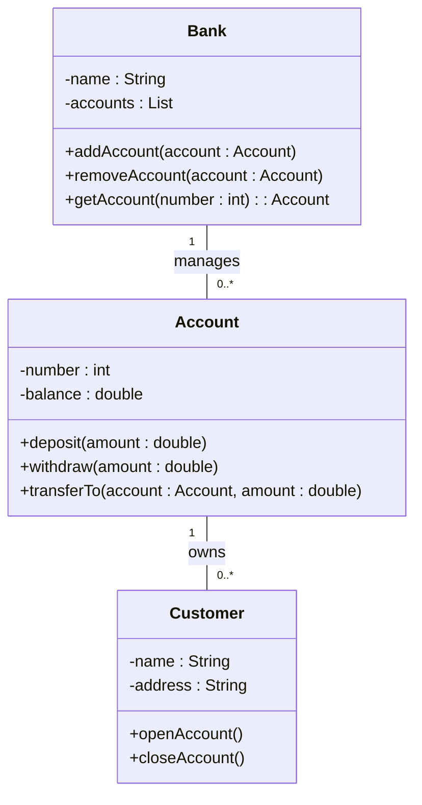
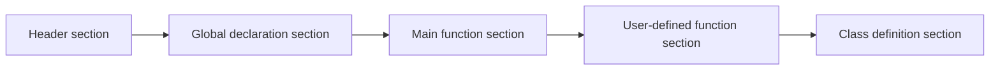

## Unit 1 - Introduction: The meaning of Object Orientation

- Object orientation is a paradigm for designing and implementing software systems based on the concept of objects.
- Objects are entities that have attributes (data) and behaviors (methods) that define their state and functionality.
- Objects can communicate with each other by sending and receiving messages, which are requests to invoke methods on the receiver object.
- Objects can be organized into classes, which are blueprints for creating objects of the same type. Classes define the common attributes and behaviors of their objects, and can inherit from other classes to reuse or modify their features.
- Object orientation supports abstraction, encapsulation, polymorphism, and inheritance as the main principles for software design and development.
- Abstraction is the process of hiding the irrelevant details and focusing on the essential features of a problem domain or a system.
- Encapsulation is the mechanism of bundling the data and methods of an object together and hiding them from the outside world, except through a well-defined interface.
- Polymorphism is the ability of objects of different classes to respond to the same message in different ways, depending on their dynamic type.
- Inheritance is the relationship between classes that allows one class to inherit the attributes and behaviors of another class, and optionally override or extend them.


### Object Identity

- Object identity is the property of an object that distinguishes it from other objects in the system, even if they have the same attributes and behavior.
- Object identity allows objects to be referenced, compared, and manipulated by their unique identifiers, rather than by their values or locations in memory.
- Object identity is essential for supporting object-oriented concepts such as encapsulation, inheritance, polymorphism, and dynamic binding.
- Object identity can be implemented in different ways, depending on the programming language and the runtime environment. Some common methods are:
  - Using pointers or references that point to the memory address of an object.
  - Using unique identifiers or keys that are assigned to each object by the system or the programmer.
  - Using hash codes or fingerprints that are derived from the contents or the state of an object.
- Object identity can also be influenced by the notion of object equality, which defines when two objects are considered to be the same or equivalent. Object equality can be based on:
  - Identity equality: two objects are equal if and only if they have the same identity (i.e., they are the same object).
  - Value equality: two objects are equal if and only if they have the same value (i.e., they have the same attributes and behavior).
  - Structural equality: two objects are equal if and only if they have the same structure (i.e., they have the same type and the same relationships with other objects).
- Object identity and object equality are related but distinct concepts. Depending on the context and the requirements, different types of equality may be more appropriate or useful than others. For example, identity equality is useful for comparing objects that represent unique entities or resources, such as files or database records. Value equality is useful for comparing objects that represent abstract or mathematical concepts, such as numbers or strings. Structural equality is useful for comparing objects that represent complex data structures or collections, such as arrays or lists.


### Encapsulation for the notes of the Unit 1 - Introduction: The meaning of Object Orientation in the subject of Object Oriented System Design

- Encapsulation is a fundamental concept in object-oriented programming (OOP) that involves bundling data and the methods that operate on that data within a single unit, known as a class .
- This concept helps to protect the data and methods from outside interference, as it restricts direct access to them .
- Encapsulation separates the contractual interface of an abstraction and its implementation. The interface defines the behavior and properties of an object, while the implementation provides the details of how the object works internally.
- Encapsulation allows an object to hide its internal state and functionality from other objects, and only expose a public set of functions that can be used to interact with the object .
- Encapsulation enables modularity, reusability, and maintainability of code, as it reduces the coupling between different components of a system and allows each component to be changed or replaced independently .
- Encapsulation can be achieved by using access modifiers, such as public, private, protected, and internal, to control the visibility and accessibility of the data and methods of a class .
- Encapsulation is one of the four basic principles of OOP, along with abstraction, polymorphism, and inheritance . These principles help to design and implement complex software systems in a structured and organized way.


### Information hiding for the notes of the Unit 1 - Introduction: The meaning of Object Orientation in the subject of Object Oriented System Design

- Information hiding is a principle of modularization that aims to reduce the complexity and risk of software development by hiding the details of implementation from the users of a module .
- Information hiding allows a module to provide a well-defined interface that specifies the operations and properties that are available to the users, while concealing the internal logic and data structures that support them .
- Information hiding enables a module to be changed or replaced without affecting the rest of the system, as long as the interface remains consistent . This enhances the maintainability, reusability, and reliability of software components .
- Information hiding is one of the key characteristics of object-oriented programming, where objects encapsulate their state and behavior and expose only the relevant and essential aspects to other objects .
- Information hiding can be achieved in object-oriented programming by using access modifiers, such as public, private, and protected, to control the visibility and accessibility of the members of a class .
- Information hiding supports the concepts of abstraction, inheritance, and polymorphism, which are the core features of object-oriented system design . Abstraction allows a class to represent the essential features of a concept or entity, while hiding the irrelevant details. Inheritance allows a subclass to inherit the common attributes and methods of a superclass, while hiding the differences. Polymorphism allows a single interface to be implemented by multiple classes, while hiding the specific behavior of each class.


Hello, I am Sydney, your AI assistant. I can help you with any topic you want to learn or discuss. You have asked me to write the content on polymorphism for the notes of the Unit 1 - Introduction: The meaning of Object Orientation in the subject of Object Oriented System Design. Here is the content I have written in markdown format:

### Polymorphism

- Polymorphism is one of the key concepts of object-oriented system design. It means the ability of an object to take different forms or behaviors depending on the context.
- Polymorphism allows us to write generic and reusable code that can work with different types of objects without knowing their specific details at compile time.
- Polymorphism can be achieved in two ways: static polymorphism and dynamic polymorphism.
- Static polymorphism is also known as compile-time polymorphism or method overloading. It means defining multiple methods with the same name but different parameters in the same class or interface. The compiler determines which method to call based on the number and type of arguments passed at compile time.
- Dynamic polymorphism is also known as run-time polymorphism or method overriding. It means defining a method with the same name and parameters in a subclass that overrides the method of the superclass. The compiler determines which method to call based on the type of the object reference at run time.
- Polymorphism enables us to implement abstraction, inheritance and encapsulation in object-oriented system design. It also supports the principle of open-closed design, which states that a system should be open for extension but closed for modification.


### Generosity in Object Oriented System Design

- Generosity is a principle of object oriented design that states that a class should be generous in providing services to other classes, but stingy in demanding services from them.
- Generosity helps to achieve low coupling and high cohesion among classes, which are desirable qualities for a well-designed system.
- Generosity can be implemented by following some guidelines, such as:
  - Design classes with clear and simple interfaces that expose only the essential operations and hide the implementation details.
  - Avoid creating classes that depend on the internal state or behavior of other classes, and use abstraction and polymorphism to decouple them.
  - Provide methods that perform common tasks or calculations for other classes, and avoid asking other classes to perform such tasks or calculations for you.
  - Use inheritance and composition to reuse existing classes and extend their functionality, and avoid duplicating code or logic in multiple classes.
  - Design classes that are flexible and adaptable to changing requirements, and avoid hard-coding values or assumptions that may limit their applicability.


### Importance of modelling for the notes of the Unit 1 - Introduction: The meaning of Object Orientation in the subject of Object Oriented System Design

- Modelling is the process of creating a representation of a system or a problem using concepts, symbols, and diagrams.
- Modelling is important for object oriented system design because it helps to:
  - Visualize the system as it is or as we want it to be.
  - Specify the structure and behavior of the system using classes, objects, attributes, operations, and relationships.
  - Guide the construction of the system using a template or a blueprint.
  - Document the decisions and assumptions we have made about the system.
- Modelling also enables us to:
  - Analyze the system requirements and design alternatives.
  - Communicate and collaborate with other stakeholders such as users, developers, and managers.
  - Validate and verify the system functionality and quality.
  - Reuse and maintain the system components and knowledge.
- Modelling in object oriented system design is based on the principles of abstraction, encapsulation, inheritance, and polymorphism.
  - Abstraction is the process of hiding the irrelevant details and focusing on the essential features of a system or a problem.
  - Encapsulation is the process of bundling the data and the operations that manipulate the data into a single unit called an object.
  - Inheritance is the process of creating new classes from existing classes by inheriting their attributes and operations.
  - Polymorphism is the process of allowing different objects to respond differently to the same operation based on their types.
- Modelling in object oriented system design uses a standard notation called Unified Modeling Language (UML) to represent the system elements and their relationships.
  - UML consists of different types of diagrams such as use case diagrams, class diagrams, sequence diagrams, state diagrams, etc. that capture different aspects of the system.
  - UML also provides a set of rules and guidelines for creating and interpreting the diagrams.
  - UML is widely used and supported by various tools and platforms.


### Principles of modelling for object oriented system design

- Modelling is the process of creating a simplified and abstract representation of a complex system using objects and their relationships.
- Modelling helps to understand, communicate, design, and implement a system in an organized and systematic way.
- Modelling follows some basic principles that guide the selection and organization of objects and their interactions.
- Some of the common principles of modelling are:

  - Abstraction: It is the process of identifying the essential features and behaviors of an entity and ignoring the irrelevant details. Abstraction helps to reduce complexity and focus on the core aspects of a system. For example, a class is an abstraction of a real-world entity that defines its attributes and methods.
  - Encapsulation: It is the process of hiding the internal state and functionality of an object and only allowing access through a public set of functions. Encapsulation helps to protect the integrity and consistency of an object and prevent unauthorized or unintended changes. For example, a bank account object may have a private balance attribute and a public deposit and withdraw methods.
  - Inheritance: It is the process of creating new abstractions based on existing abstractions. Inheritance helps to reuse and extend the code and functionality of existing classes. For example, a car class may inherit from a vehicle class and add some specific attributes and methods.
  - Polymorphism: It is the process of allowing an object to behave differently depending on the context or the type of the object. Polymorphism helps to achieve dynamic binding and flexibility in a system. For example, a shape object may have a draw method that can be implemented differently by different subclasses such as circle, square, or triangle.
  - Modularity: It is the process of dividing a system into smaller and independent units or modules that can be developed, tested, and maintained separately. Modularity helps to improve the readability, reusability, and maintainability of a system. For example, a software system may have different modules for user interface, database, logic, etc.
  - Hierarchy: It is the process of organizing a system into different levels of abstraction and complexity. Hierarchy helps to manage the scope and visibility of objects and their relationships. For example, a class hierarchy may have a parent class and several child classes that inherit from it.
  - Typing: It is the process of defining and enforcing the rules and constraints on the data and operations of objects. Typing helps to ensure the correctness and safety of a system. For example, a string object may have a type that specifies its length, format, and allowed operations.
  - Concurrency: It is the process of allowing multiple objects or processes to execute simultaneously and interact with each other. Concurrency helps to improve the performance and responsiveness of a system. For example, a web server may handle multiple requests from different clients at the same time.
  - Persistence: It is the process of storing and retrieving the state and data of objects across different sessions or executions. Persistence helps to preserve the continuity and availability of a system. For example, a database may store the information of users, products, orders, etc.


### Object Oriented Modelling

- Object oriented modelling (OOM) is a process of designing and implementing software systems using objects, which are entities that encapsulate data and behaviour.
- OOM is used at the beginning of the software life cycle, when the problem domain and the requirements are analysed and specified.
- OOM helps to create a conceptual model of the system, which can be used to communicate with the stakeholders, verify the correctness and completeness of the requirements, and guide the subsequent design and implementation phases.
- OOM uses a collection of modelling techniques, such as use cases, class diagrams, sequence diagrams, state diagrams, etc., to represent the static and dynamic aspects of the system.
- OOM is supported by a language that enables the definition and manipulation of objects, such as Java, C++, Python, etc.
- OOM has several benefits, such as:
  - It supports abstraction, encapsulation, inheritance, and polymorphism, which are the fundamental principles of object orientation.
  - It facilitates reuse, modularity, extensibility, and maintainability of the software components.
  - It promotes a natural and intuitive way of thinking about the problem domain and the solution domain.
  - It enhances the quality and reliability of the software products.


### Introduction to UML

- UML stands for **Unified Modeling Language**  .
- It is a **general-purpose, developmental modeling language** in the field of software engineering  .
- It is intended to provide a **standard way to visualize the design of a system**  .
- It can help software engineers and developers to **construct, document and visualize software systems** .
- It can also be used for **business modeling and other non-software systems**.
- It consists of an **integrated set of diagrams** that use a common set of symbols and notation.
- It was originally motivated by the desire to **standardize the disparate notational systems and approaches to software design**.
- It is not a programming language, but it can provide **visual representations** that help software developers better understand potential outcomes or errors in programs.


### Conceptual Model of the UML

- A conceptual model can be defined as a model which is made of concepts and their relationships .
- A conceptual model is the first step before drawing a UML diagram. It helps to understand the entities in the real world and how they interact with each other .
- To understand the UML, you need to form a conceptual model of the language, and this requires learning three major elements:
  - The UML's basic building blocks, which are the things, relationships, and diagrams that make up a UML model.
  - The rules that dictate how those building blocks may be put together, which are the syntax and semantics of the UML.
  - Some common mechanisms that apply throughout the UML, which are the techniques and conventions that enhance the expressiveness and consistency of the UML.
- The UML is a standard visual language for describing and modelling software blueprints. It is more than just a graphical language. Stated formally, the UML is for:
  - Visualizing, which means creating a graphical representation of a system or a process.
  - Specifying, which means defining the requirements and design of a system or a process in a precise and unambiguous way.
  - Constructing, which means implementing and testing a system or a process using the UML as a blueprint.
  - Documenting, which means recording and communicating the information about a system or a process using the UML as a notation.
- The UML is a general purpose modelling language that can be used for various domains and purposes. It is not a programming language, but rather a visual language that can be mapped to different programming languages.
- The UML consists of different types of diagrams that show different aspects of a system or a process. Some of the most common types of UML diagrams are:
  - Class diagram, which shows the static structure of a system in terms of classes, attributes, operations, and relationships.
  - Object diagram, which shows the instances of classes and their values and links at a specific point in time.
  - Use case diagram, which shows the functionality of a system from the perspective of the users and their goals.
  - Sequence diagram, which shows the interaction of objects in a system in terms of messages exchanged over time.
  - Activity diagram, which shows the flow of control and data in a system or a process.
  - State diagram, which shows the states and transitions of an object or a system over its lifecycle.
  - Component diagram, which shows the physical and logical components of a system and their dependencies.
  - Deployment diagram, which shows the distribution of components and nodes in a system and their communication links.


### Architecture for the notes of the Unit 1 - Introduction: The meaning of Object Orientation in the subject of Object Oriented System Design

- Object Oriented System Design is a software development methodology that focuses on modeling the system as a collection of interacting objects that encapsulate data and behavior.
- Object Oriented Architecture is a design paradigm that defines the structure and organization of an object oriented system, based on the principles of abstraction, encapsulation, inheritance, polymorphism, and modularity.
- Object Oriented Architecture has the following benefits:
  - It promotes reusability and maintainability of code, as objects can be reused in different contexts and modified without affecting other parts of the system.
  - It facilitates the development of complex and dynamic systems, as objects can communicate and collaborate with each other through well-defined interfaces and messages.
  - It supports the evolution and adaptation of the system, as new objects can be added or existing objects can be modified or replaced without affecting the overall functionality of the system.
  - It enhances the readability and understandability of the system, as objects can be named and described according to their roles and responsibilities in the system.
- Object Oriented Architecture has the following challenges:
  - It requires a careful and systematic analysis and design of the system, as objects need to be identified, classified, and related to each other in a coherent and consistent way.
  - It may introduce some overhead and complexity in the system, as objects need to be created, initialized, and managed throughout the system's lifecycle.
  - It may not be suitable for some types of systems or problems, as objects may not capture the essential characteristics or behaviors of the system or its environment.
- Object Oriented Architecture follows some design principles and patterns that guide the development of an object oriented system, such as:
  - SOLID principles, which are five basic principles of object oriented design that aim to improve the quality and maintainability of the system. They are:
    - Single responsibility principle: Each object should have one and only one responsibility or reason to change.
    - Open-closed principle: Each object should be open for extension but closed for modification.
    - Liskov substitution principle: Each object should be substitutable by its subtypes without affecting the correctness of the system.
    - Interface segregation principle: Each object should depend on the smallest possible interface that provides the required functionality.
    - Dependency inversion principle: Each object should depend on abstractions rather than concretions.
  - Design patterns, which are reusable solutions to common problems that arise in object oriented design. They describe the structure, behavior, and interactions of objects in a specific context. Some examples of design patterns are:
    - Creational patterns, which deal with the creation and initialization of objects, such as Factory, Singleton, Prototype, etc.
    - Structural patterns, which deal with the composition and arrangement of objects, such as Adapter, Bridge, Composite, Decorator, etc.
    - Behavioral patterns, which deal with the communication and coordination of objects, such as Observer, Strategy, Command, Iterator, etc.


## Unit 2 - Basic Structural Modeling

This unit covers the following topics:

- Introduction to structural modeling
- Basic elements of structural models
- Types of structural models
- Methods of structural analysis
- Examples of structural modeling applications

### Introduction to structural modeling

Structural modeling is the process of representing the behavior and properties of physical structures using mathematical models. Structural models can be used to:

- Predict the response of structures to various loads and environmental conditions
- Optimize the design of structures for performance, safety, and cost
- Evaluate the effects of structural modifications, damage, or deterioration
- Simulate the dynamic behavior of structures under different scenarios

Structural modeling requires the following steps:

- Define the geometry and boundary conditions of the structure
- Select the appropriate elements and material properties to represent the structure
- Formulate the equations of equilibrium and compatibility for the structure
- Solve the equations to obtain the unknown displacements, forces, stresses, and strains
- Interpret and validate the results

### Basic elements of structural models

The basic elements of structural models are:

- Nodes: Points that define the geometry and connectivity of the structure
- Elements: Segments that connect the nodes and represent the physical characteristics of the structure
- Degrees of freedom: The number of independent displacements or rotations that a node can undergo
- Loads: Forces or moments applied to the nodes or elements of the structure
- Supports: Constraints that restrict the displacements or rotations of the nodes or elements of the structure

### Types of structural models

There are different types of structural models depending on the level of detail and complexity of the structure and the analysis. Some common types are:

- Truss models: Structures composed of slender members connected at their ends by pin joints. Truss models assume that the members are only subjected to axial forces and that the joints are frictionless.
- Beam models: Structures composed of slender members connected by rigid or semi-rigid joints. Beam models assume that the members are only subjected to bending and shear forces and that the cross-sections remain plane and perpendicular to the axis of the member.
- Frame models: Structures composed of beam and column members connected by rigid or semi-rigid joints. Frame models account for the axial, bending, and shear forces in the members and the moments at the joints.
- Plate models: Structures composed of thin, flat surfaces that can deform in their own plane. Plate models assume that the surfaces are only subjected to in-plane forces and moments and that the thickness is small compared to the dimensions of the surface.
- Shell models: Structures composed of thin, curved surfaces that can deform in and out of their own plane. Shell models account for the in-plane and out-of-plane forces and moments and the curvature of the surface.
- Solid models: Structures composed of three-dimensional volumes that can deform in any direction. Solid models account for the full stress and strain state of the structure and the shape and size of the volume.

### Methods of structural analysis

There are different methods of structural analysis depending on the type of structural model and the desired output. Some common methods are:

- Static analysis: The analysis of structures under constant or slowly varying loads. Static analysis assumes that the structure is in equilibrium and that the displacements and forces are independent of time.
- Dynamic analysis: The analysis of structures under time-varying loads. Dynamic analysis accounts for the inertia and damping effects of the structure and the time-dependent nature of the displacements and forces.
- Linear analysis: The analysis of structures that obey the principle of superposition. Linear analysis assumes that the displacements and forces are proportional to the loads and that the material properties are constant.
- Nonlinear analysis: The analysis of structures that do not obey the principle of superposition. Nonlinear analysis accounts for the effects of large displacements, large strains, material nonlinearity, contact, and buckling.
- Modal analysis: The analysis of structures that vibrate in their natural modes. Modal analysis assumes that the structure is linear and undamped and that the displacements and forces are harmonic.
- Frequency analysis: The analysis of structures that respond to harmonic loads. Frequency analysis assumes that the structure is linear and that the displacements and forces are periodic.
- Transient analysis: The analysis of structures that respond to arbitrary loads. Transient analysis accounts for the time history of the loads and the structure.

### Examples of structural modeling applications

Structural modeling can be applied to various fields and disciplines, such as:

- Civil engineering: The design and analysis of buildings, bridges, dams, tunnels, and other structures
- Mechanical engineering: The design and analysis of machines, vehicles, robots, and other devices
- Aerospace engineering: The design and analysis of aircraft, rockets, satellites, and other systems
- Biomedical engineering: The design and analysis of implants


### Classes

- Classes are templates for defining the characteristics and operations of an object .
- Classes are used to create and manage new objects and support inheritance, which is a mechanism of reusing code.
- Classes are the building blocks of object-oriented system design.
- Classes can be represented by a class diagram, which shows the name, attributes, and methods of a class, as well as the relationships between classes.
- A class diagram can be drawn using the Unified Modeling Language (UML) notation, which consists of a rectangle with three compartments: the top one for the class name, the middle one for the attributes, and the bottom one for the methods.
- An example of a class diagram for a class named Student is shown below:

```
+----------------+
|    Student     |
+----------------+
| - name: String |
| - age: int     |
| - major: String|
+----------------+
| + getName(): String |
| + getAge(): int     |
| + getMajor(): String|
| + setName(String): void |
| + setAge(int): void     |
| + setMajor(String): void|
+----------------+
```

- The attributes and methods of a class can have different visibility levels, indicated by the symbols: + for public, - for private, # for protected, and ~ for package.
- Public attributes and methods can be accessed by any object, private attributes and methods can only be accessed by the object itself, protected attributes and methods can be accessed by the object and its subclasses, and package attributes and methods can be accessed by objects in the same package.
- A class can also have static attributes and methods, which belong to the class itself and not to any specific object. Static attributes and methods are marked with an underline.
- A class can also have abstract methods, which are methods that have no implementation and must be overridden by subclasses. Abstract methods are marked with an italic font.
- A class can also have constructors, which are special methods that are invoked when an object is created. Constructors have the same name as the class and no return type.
- A class can also have associations with other classes, which represent the relationships between objects. Associations can have different types, such as aggregation, composition, generalization, and realization.
- Aggregation is a type of association that represents a whole-part relationship, where the part can exist independently of the whole. Aggregation is denoted by a hollow diamond at the end of the association line that points to the whole.
- Composition is a type of association that represents a stronger whole-part relationship, where the part cannot exist without the whole. Composition is denoted by a solid diamond at the end of the association line that points to the whole.
- Generalization is a type of association that represents an inheritance relationship, where a subclass inherits the attributes and methods of a superclass. Generalization is denoted by a solid line with a hollow triangle at the end of the line that points to the superclass.
- Realization is a type of association that represents an implementation relationship, where a class implements the abstract methods of an interface. Realization is denoted by a dashed line with a hollow triangle at the end of the line that points to the interface.
- An example of a class diagram with different types of associations is shown below:

```
+----------------+       +----------------+
|    Student     |       |    Course      |
+----------------+       +----------------+
| - name: String |       | - code: String |
| - age: int     |       | - title: String|
| - major: String|       | - credits: int |
+----------------+       +----------------+
| + getName(): String |  | + getCode(): String |
| + getAge(): int     |  | + getTitle(): String|
| + getMajor(): String|  | + getCredits(): int |
| + setName(String): void |  | + setCode(String): void |
| + setAge(int): void     |  | + setTitle(String): void|
| + setMajor(String): void|  | + setCredits(int): void |
+----------------+       +----------------+
         |                       |
         |                       |
         |                       |
         |                       |
         |                       |
         |                       |
         |                       |
         |                       |
         |                       |
         |                       |
         |                       |
         |                       |
         |                       |
         |

```


### Relationships

Relationships are the connections between classes or objects in object-oriented system design. They describe how the classes or objects interact with each other and what kind of dependencies they have. Relationships can be classified into four types: inheritance, association, composition, and aggregation .

- **Inheritance** is a relationship where a class (called the subclass or child class) inherits the attributes and operations of another class (called the superclass or parent class). Inheritance is based on the "is a" relationship, meaning that the subclass is a specific type of the superclass. For example, a Dog class can inherit from an Animal class, because a dog is an animal. Inheritance allows for code reuse and polymorphism .
- **Association** is a relationship where two classes or objects are linked by some concept or idea. Association is based on the "has a" relationship, meaning that one class or object has a reference to another class or object. For example, a Student class can have an association with a Course class, because a student has a course. Association can be unidirectional or bidirectional, meaning that one or both classes or objects can access each other. Association can also have a multiplicity, meaning that one class or object can have one or many references to another class or object .
- **Composition** is a relationship where a class or object is composed of other classes or objects. Composition is based on the "part of" relationship, meaning that the composed class or object is a part of the composing class or object. For example, a Car class can have a composition with an Engine class, because a car is composed of an engine. Composition implies a strong dependency and ownership, meaning that the composed class or object cannot exist without the composing class or object. Composition can also have a multiplicity, meaning that one class or object can have one or many parts of another class or object .
- **Aggregation** is a relationship where a class or object is a collection of other classes or objects. Aggregation is also based on the "part of" relationship, but it implies a weaker dependency and ownership, meaning that the aggregated class or object can exist without the aggregating class or object. For example, a Library class can have an aggregation with a Book class, because a library is a collection of books. Aggregation can also have a multiplicity, meaning that one class or object can have one or many collections of another class or object .

Relationships can be represented in a class diagram using different symbols and notations. A class diagram is a type of static structure diagram that shows the classes, their attributes, operations, and the relationships among them. A class diagram is the main building block of object-oriented modeling. The following table summarizes the symbols and notations for the four types of relationships in a class diagram :

| Relationship | Symbol | Notation |
| ------------ | ------ | -------- |
| Inheritance | A solid line with a hollow triangle pointing to the superclass | Subclass **extends** Superclass |
| Association | A solid line with an optional arrow indicating the direction | Class1 **has a** Class2 |
| Composition | A solid line with a filled diamond pointing to the composed class | Class1 **is composed of** Class2 |
| Aggregation | A solid line with a hollow diamond pointing to the aggregated class | Class1 **is a collection of** Class2 |

Here is an example of a class diagram that shows the relationships among some classes related to a university system:

Class diagram example

: https://www.linkedin.com/pulse/types-relationships-object-oriented-programming-oop-sarah-el-dawody
: https://www.c-sharpcorner.com/article/types-of-relationships-in-object-oriented-programming-oops/
: https://en.wikipedia.org/wiki/Object-oriented_design
: https://en.wikipedia.org/wiki/Inheritance_(object-oriented_programming)
: https://www.infoworld.com/article/3029325/exploring-association-aggregation-and-composition-in-oop.html
: https://en.wikipedia.org/wiki/Class_diagram


### Common Mechanisms for the notes of the Unit 2 - Basic Structural Modeling in the subject of Object Oriented System Design

- Common mechanisms are the concepts and techniques that can be applied across different kinds of structural models in object-oriented system design.
- Some of the common mechanisms are:
  - Abstraction: The process of identifying the essential features and behaviors of a system or a component, while ignoring the irrelevant details.
  - Encapsulation: The principle of hiding the internal structure and implementation of a system or a component from its external interface and users.
  - Modularity: The principle of dividing a system or a component into smaller and independent units that can be composed and reused.
  - Hierarchy: The principle of organizing a system or a component into a set of levels, where each level is composed of simpler and more abstract elements than the lower level.
  - Typing: The principle of defining and enforcing the rules and constraints on the values, operations, and relationships of a system or a component.
  - Concurrency: The principle of allowing multiple activities or processes to occur simultaneously within a system or a component, without interfering with each other.
  - Persistence: The principle of preserving the state and data of a system or a component beyond its lifetime or execution.
  - Distribution: The principle of distributing a system or a component across multiple locations or nodes, to improve performance, reliability, or scalability.


### diagrams for the notes of the Unit 2 - Basic Structural Modeling in the subject of Object Oriented System Design

- Basic structural modeling is the process of describing the static structure of a system using classes, relationships, interfaces, components, and nodes.
- UML (Unified Modeling Language) is a standard graphical language for modeling object-oriented systems using diagrams.
- UML defines two types of diagrams: structural diagrams and behavioral diagrams. Structural diagrams show the static aspects of a system, such as the classes and their attributes, operations, and relationships. Behavioral diagrams show the dynamic aspects of a system, such as the interactions and state changes of the objects.
- UML provides six types of structural diagrams: class diagrams, object diagrams, composite structure diagrams, component diagrams, deployment diagrams, and package diagrams.
- Class diagrams are the most widely used structural diagrams. They show the classes of a system, their attributes, operations, and the relationships among them. Class diagrams can be used to model the entire system, or a specific part of it. Class diagrams can also show interfaces, which are collections of operations that specify a contract for a class. Class diagrams can also show collaborations, which are sets of classes that work together to achieve a common goal.
- Object diagrams are similar to class diagrams, but they show the instances of classes and their values, rather than the classes themselves. Object diagrams can be used to show the state of a system at a specific point in time, or to illustrate an example scenario.
- Composite structure diagrams are a special type of class diagrams that show the internal structure of a class or a component. They show the parts of a class or a component, and how they are connected by ports and connectors. Composite structure diagrams can be used to model complex systems that are composed of smaller subsystems, or to show the implementation details of a class or a component.
- Component diagrams show the components of a system and their dependencies. Components are modular units of a system that provide a well-defined interface and can be replaced or reused. Component diagrams can be used to model the physical or logical architecture of a system, or to show the deployment of components on nodes.
- Deployment diagrams show the nodes of a system and their relationships. Nodes are physical or virtual devices that host components or artifacts. Deployment diagrams can be used to model the hardware or software configuration of a system, or to show the distribution of components or artifacts on nodes.
- Package diagrams show the packages of a system and their dependencies. Packages are groups of elements that share a common namespace and can be organized hierarchically. Package diagrams can be used to model the logical structure of a system, or to show the visibility and accessibility of elements within a package.

The following are some examples of structural diagrams in UML:

- A class diagram that shows the classes of a bank system, their attributes, operations, and relationships:



- An object diagram that shows the state of a bank system at a specific point in time, with two customers and three accounts:

```mermaid
classDiagram
object Alice : Customer {
  name = "Alice"
  address = "123 Main Street"
}
object Bob : Customer {
  name = "Bob"
  address = "456 High Street"
}
object Bank1 : Bank {
  name = "Bank1"
  accounts = [Account1, Account2, Account3]
}
object Account1 : Account {
  number = 1001
  balance = 500.0
}
object Account2 : Account {
  number = 1002
  balance = 1000.0
}
object Account3 : Account {
  number = 1003
  balance = 1500.0
}
Account1 "1" -- "0..*" Alice : owns
Account2 "1" -- "0..*" Bob : owns
Account3 "1" -- "0..*" Alice : owns
Account3 "1" -- "0..*"

```


### Class & Object Diagrams

- Class and object diagrams are two types of structural diagrams in UML that show the static structure of a system.
- Class diagrams describe the classes and interfaces that make up the system, along with their attributes, operations, and relationships.
- Object diagrams show the instances of classes and interfaces in a specific situation or scenario, along with their values and links.
- Class and object diagrams are related, as object diagrams are derived from class diagrams. Object diagrams can be seen as snapshots of class diagrams at a particular point in time.

#### Class Diagrams

- A class diagram consists of a set of classes and interfaces, represented by rectangles with three compartments: the top compartment shows the name and stereotype of the class or interface, the middle compartment shows the attributes, and the bottom compartment shows the operations.
- A class diagram also shows the relationships between classes and interfaces, such as associations, generalizations, dependencies, aggregations, compositions, and realizations. These relationships are represented by different types of lines and symbols, such as solid or dashed lines, arrows, diamonds, and triangles.
- A class diagram can have different levels of abstraction and detail, depending on the purpose and scope of the diagram. For example, a conceptual class diagram shows the most general and essential concepts of a domain, while a design class diagram shows the specific and detailed classes and interfaces that will be implemented in a system.
- A class diagram can also have different views and perspectives, depending on the aspect of the system that is being modeled. For example, a logical view shows the functional requirements of the system, while a physical view shows the deployment and distribution of the system components.

#### Object Diagrams

- An object diagram consists of a set of objects and links, represented by rectangles and lines, respectively. An object is an instance of a class or an interface, and a link is an instance of an association or a dependency. An object can have a name and a stereotype, shown in the top compartment of the rectangle, and a set of attribute values, shown in the bottom compartment. A link can have a name, a stereotype, and a multiplicity, shown near the line.
- An object diagram shows the state of the system at a specific point in time, such as during the execution of a use case or a test case. It can also show the dynamic behavior of the system by using different object diagrams to represent different snapshots of the system state.
- An object diagram can be used to complement a class diagram, by providing concrete examples of the classes and their relationships. It can also be used to verify and validate the correctness and completeness of a class diagram, by checking if the objects and links conform to the class definitions and constraints.


### Terms for the notes of the Unit 2 - Basic Structural Modeling in the subject of Object Oriented System Design

- **Class**: A class is a blueprint or template that defines the attributes and behaviors of objects of the same kind. A class specifies the structure and operations of objects, as well as their relationships with other classes and objects.
- **Object**: An object is an instance or occurrence of a class. An object has a unique identity, state and behavior. An object represents a real-world entity or concept, such as a person, a car, a bank account, etc.
- **Attribute**: An attribute is a property or characteristic of an object or a class. An attribute describes the state or quality of an object or a class. For example, a person object may have attributes such as name, age, height, weight, etc.
- **Operation**: An operation is a function or method that defines the behavior or action of an object or a class. An operation specifies what an object or a class can do or how it can change its state. For example, a bank account object may have operations such as deposit, withdraw, transfer, etc.
- **Association**: An association is a relationship between two or more classes or objects that indicates how they are connected or related. An association specifies the multiplicity, role and direction of the relationship. For example, a person class may have an association with a car class, indicating that a person can own zero or more cars, and a car can be owned by one or more persons.
- **Aggregation**: An aggregation is a special type of association that represents a whole-part or part-of relationship between classes or objects. An aggregation implies that the whole object has a responsibility for the existence and storage of the part objects, but the part objects can exist independently of the whole object. For example, a car object may have an aggregation with a wheel object, indicating that a car has four wheels, and a wheel is a part of a car, but a wheel can exist without a car.
- **Composition**: A composition is a stronger form of aggregation that represents a whole-part or part-of relationship between classes or objects. A composition implies that the whole object has a responsibility for the creation and destruction of the part objects, and the part objects cannot exist without the whole object. For example, a person object may have a composition with a heart object, indicating that a person has a heart, and a heart is a part of a person, but a heart cannot exist without a person.
- **Generalization**: A generalization is a relationship between a general class (superclass or parent class) and a specific class (subclass or child class) that indicates that the specific class inherits the attributes and operations of the general class. A generalization implies that the specific class is a kind of the general class, and the general class is more abstract than the specific class. For example, a car class may have a generalization with a vehicle class, indicating that a car is a kind of vehicle, and a vehicle is more general than a car.
- **Specialization**: A specialization is the opposite of a generalization, that is, a relationship between a specific class and a general class that indicates that the specific class inherits the attributes and operations of the general class. A specialization implies that the specific class is a kind of the general class, and the general class is more abstract than the specific class. For example, a sports car class may have a specialization with a car class, indicating that a sports car is a kind of car, and a car is more general than a sports car.
- **Abstraction**: An abstraction is a technique of hiding the irrelevant or unnecessary details of an object or a class, and focusing on the essential or relevant features. An abstraction helps to reduce the complexity and increase the readability and maintainability of a system. For example, a car object may have an abstraction that hides the internal details of how the engine, transmission, brakes, etc. work, and exposes only the relevant features such as speed, color, model, etc.
- **Encapsulation**: An encapsulation is a technique of wrapping the data (attributes) and the code (operations) of an object or a class into a single unit, and providing a well-defined interface for accessing or modifying them. An encapsulation helps to protect the data and the code from unauthorized or accidental access or modification, and to enforce the principle of information hiding. For example, a bank account object may have an encapsulation that hides the data such as balance, account number, etc. and the code such as deposit, withdraw, etc. from the outside world, and provides a public interface for accessing or modifying them.


### Concepts for the notes of the Unit 2 - Basic Structural Modeling in the subject of Object Oriented System Design

- Basic structural modeling is the process of identifying and describing the static structure of a system using object-oriented concepts and notations.
- The static structure of a system consists of the components that make up the system and their relationships, such as classes, objects, attributes, operations, associations, aggregations, and generalizations.
- The main purpose of basic structural modeling is to capture the essential features and properties of a system and to provide a stable basis for its dynamic behavior and functionality.
- The main techniques for basic structural modeling are:
  - Class-responsibility-collaboration (CRC) cards: A simple and informal way of representing classes and their responsibilities, collaborations, and scenarios. CRC cards are useful for brainstorming, communication, and validation of the system design.
  - Class diagrams: A graphical and formal way of representing classes and their relationships using the Unified Modeling Language (UML) notation. Class diagrams are useful for analysis, design, implementation, and documentation of the system structure.
  - Object diagrams: A graphical and formal way of representing objects and their links using the UML notation. Object diagrams are useful for illustrating specific instances of classes and their relationships, and for testing and debugging the system behavior.
- The main steps for basic structural modeling are:
  - Identify the classes and objects that are relevant to the system domain and scope.
  - Define the attributes and operations of each class and object, and assign them appropriate visibility and data types.
  - Specify the relationships and cardinalities among classes and objects, such as associations, aggregations, compositions, and generalizations.
  - Organize the classes and objects into packages, subsystems, and modules to facilitate modularity, reusability, and maintainability.
  - Refine and validate the structural model using CRC cards, class diagrams, and object diagrams, and check for consistency, completeness, and correctness.


### Modelling Techniques for Class & Object Diagrams

- Class and object diagrams are two types of structural diagrams in the Unified Modeling Language (UML) that show the static structure of a system.
- Class diagrams show the classes, their attributes, operations, and the relationships among classes in a system. Object diagrams show the instances of classes and their links at a specific point in time.
- Class and object diagrams use similar notation, but differ in the level of abstraction and the purpose of modeling.
- Class diagrams are used to model the general concepts and types of a system, while object diagrams are used to model the specific instances and values of a system.
- Class diagrams are more common and widely used than object diagrams, as they provide a comprehensive overview of a system and can be used for analysis, design, and documentation purposes.
- Object diagrams are more useful for illustrating a particular scenario or example of a system, such as a test case, a configuration, or a snapshot of runtime behavior.
- To model class and object diagrams, some of the techniques that can be used are:

  - Identify the classes and objects that are relevant to the system and give them meaningful names.
  - Identify the attributes and operations of each class and object and specify their visibility, type, and multiplicity.
  - Identify the relationships among classes and objects, such as association, aggregation, composition, inheritance, and realization, and specify their direction, name, and multiplicity.
  - Use graphical symbols and text labels to represent the classes, objects, attributes, operations, and relationships in a diagram.
  - Use different colors, fonts, or styles to distinguish different types of elements or to highlight important features.
  - Use packages, compartments, or stereotypes to group or categorize related elements or to indicate their role or function.
  - Use notes, comments, or constraints to add additional information or clarification to the diagram.
  - Use diagrams of different levels of detail or abstraction to show different aspects or views of a system.
  - Use diagrams of different types or perspectives to show different relationships or interactions among classes and objects, such as static, dynamic, functional, or behavioral.
  - Use diagrams of different formats or tools to present or communicate the model to different audiences or stakeholders, such as textual, graphical, or interactive.


### Collaboration Diagrams

- Collaboration diagrams are used to show the **relationship** between the **objects** in a system.
- Collaboration diagrams are also known as **communication diagrams** in UML 2.x.
- Collaboration diagrams are useful for modeling **collaborations**, **mechanisms** or the **structural organization** within a system design.
- Collaboration diagrams can represent the same information as sequence diagrams, but in a different way.
- Collaboration diagrams focus on the **architecture** of the objects and their **links**, rather than the **flow** of messages.
- Collaboration diagrams have four major components:
  - **Objects**: Objects are shown as rectangles with naming labels inside. The naming label follows the convention of object name : class name. Objects can also have attributes and operations.
  - **Actors**: Actors are instances that invoke the interaction in the diagram. Each actor has a name and a role, with one actor being the primary actor. Actors are shown as stick figures or icons.
  - **Links**: Links are lines that connect objects and actors. They represent the communication paths or associations between them. Links can have labels to indicate the role or multiplicity of the link.
  - **Messages**: Messages are arrows that show the flow of information or control between objects and actors. They can have sequence numbers, names, parameters, guards, and stereotypes. Messages can be synchronous, asynchronous, or reply.

- An example of a collaboration diagram is shown below:

collaboration diagram example

- To create a collaboration diagram, the following steps can be followed:
  - Open a UML diagram template in a software tool such as Edraw Max.
  - Identify the objects and actors involved in the interaction and drag them from the library to the canvas.
  - Connect the objects and actors with links and label them if necessary.
  - Add messages to the links and assign sequence numbers, names, parameters, guards, and stereotypes if needed.
  - Adjust the layout and style of the diagram as desired.
  - Save and export the diagram in a suitable format.


### Terms for the notes of the Unit 2 - Basic Structural Modeling in the subject of Object Oriented System Design

- **Object-oriented system design** is a methodology that focuses on modeling the system as a collection of interacting objects, each with its own state and behavior.
- **Basic structural modeling** is a type of system modeling that describes the static structure of the system, such as the classes, objects, attributes, and associations that exist in the system.
- **Class** is a blueprint or template that defines the common attributes and methods of a group of similar objects.
- **Object** is an instance or occurrence of a class that has a unique identity, state, and behavior.
- **Attribute** is a property or characteristic of an object that describes its state or data.
- **Method** is a function or operation that defines the behavior or action of an object.
- **Association** is a relationship or link between two or more classes or objects that indicates how they are connected or interact with each other.
- **Multiplicity** is a specification of the number of instances of one class that can be related to one instance of another class in an association.
- **Aggregation** is a type of association that represents a whole-part or part-of relationship between classes or objects, where the part can exist independently of the whole.
- **Composition** is a type of association that represents a stronger form of aggregation, where the part cannot exist independently of the whole and the lifetime of the part is controlled by the whole.
- **Generalization** is a type of association that represents an inheritance or is-a relationship between classes or objects, where the subclass inherits the attributes and methods of the superclass.
- **Abstraction** is a technique of hiding the irrelevant or complex details of an object or class and exposing only the essential or relevant features.
- **Encapsulation** is a technique of bundling the data and methods of an object or class together and restricting the access to them from outside.
- **Polymorphism** is a technique of allowing an object or method to have different forms or behaviors depending on the context or input.
- **Class diagram** is a type of structural diagram that shows the classes, objects, attributes, methods, and associations in a system using a graphical notation called Unified Modeling Language (UML).


### Concepts for the notes of the Unit 2 - Basic Structural Modeling in the subject of Object Oriented System Design

- Basic structural modeling is the process of describing the structure of the objects that support the business processes in an organization using object-oriented design (OOD) .
- OOD is a technique that maps the technology-independent concepts in the analysis model onto implementing classes, constraints, and interfaces, resulting in a model for the solution domain .
- OOD aims to improve the quality and productivity of system analysis and design by making it more usable, reusable, and maintainable .
- OOD uses the Unified Modeling Language (UML) as a standard notation to represent the structural models of software systems .
- UML consists of several types of diagrams that capture different aspects of the system structure, such as:
  - Class diagrams: show the static structure of the classes and their relationships, such as inheritance, association, aggregation, and composition .
  - Object diagrams: show the instances of classes and their values, links, and states at a specific point in time .
  - Component diagrams: show the physical components of the system and their dependencies, such as libraries, modules, executables, and interfaces .
  - Deployment diagrams: show the distribution of the components across the hardware nodes, such as servers, clients, and devices .
- The basic elements of the structural models are:
  - Classes: represent the abstract concepts or entities that have common attributes and behaviors .
  - Objects: represent the concrete instances of classes that have specific values and states .
  - Attributes: represent the properties or characteristics of classes or objects .
  - Operations: represent the actions or functions that classes or objects can perform .
  - Associations: represent the relationships or links between classes or objects .
  - Multiplicity: represent the number of instances of one class that can be related to one instance of another class .
  - Roles: represent the names or labels that describe the purpose or function of an association end .
  - Aggregation: represent the relationship between a whole and its parts, where the parts can exist independently of the whole .
  - Composition: represent the relationship between a whole and its parts, where the parts cannot exist independently of the whole .
  - Generalization: represent the relationship between a superclass and its subclasses, where the subclasses inherit the attributes and operations of the superclass .
  - Abstraction: represent the relationship between a specification and its implementation, where the specification defines the essential features of the implementation .
  - Interface: represent the set of operations that a class or component provides or requires .
  - Realization: represent the relationship between a class or component and an interface, where the class or component implements or uses the interface .
  - Dependency: represent the relationship between two elements that indicates that a change in one element may affect the other element .


### Basic Structural Modeling

- Basic structural modeling is the process of identifying and describing the static structure of a system using classes, objects, attributes, operations, and associations.
- A class is a blueprint or template that defines the common properties and behaviors of a set of similar objects.
- An object is an instance of a class that has a unique identity, state, and behavior.
- An attribute is a named property of a class or an object that describes some aspect of the object's state.
- An operation is a named action or function that can be performed by a class or an object, usually to change its state or to interact with other objects.
- An association is a relationship between two or more classes or objects that indicates how they are connected or related.
- A multiplicity is a specification of how many instances of one class can be related to one instance of another class in an association.
- A role is a name that describes the purpose or function of an object in an association.
- A generalization is a relationship between a more general class (superclass) and a more specific class (subclass) that indicates that the subclass inherits the attributes and operations of the superclass.
- An abstract class is a class that cannot have any direct instances, but can have subclasses that inherit its properties and behaviors.
- A concrete class is a class that can have direct instances, and may or may not have subclasses.
- An interface is a specification of a set of operations that a class must implement, without defining how they are implemented.
- A realization is a relationship between a class and an interface that indicates that the class implements the operations of the interface.
- An aggregation is a special kind of association that indicates a whole-part relationship between two classes, where the part can exist independently of the whole.
- A composition is a special kind of aggregation that indicates a strong whole-part relationship between two classes, where the part cannot exist independently of the whole.
- A dependency is a relationship between two classes or objects that indicates that one class or object uses or depends on another class or object, usually for a temporary purpose.


### Polymorphism in Collaboration Diagrams

- Polymorphism is the ability of an object to behave differently depending on its type or class at run-time.
- Collaboration diagrams are used to show the relationship and interaction between the objects in a system.
- Polymorphism can be represented in a collaboration diagram by using multiple scenarios controlled by guard conditions.
- Guard conditions are expressions that evaluate to true or false and determine whether a message is sent or not.
- For example, suppose we have a Shape class and three subclasses: Triangle, Rectangle and Square. We want to send the show() message to a Shape object, but the behavior of show() depends on the type of the object at run-time.
- We can use a collaboration diagram to model this polymorphic behavior as follows:

```
+-----------------+        +-----------------+
| Shape           |        | Shape           |
|-----------------|        |-----------------|
|                 |        |                 |
|                 |        |                 |
|                 |        |                 |
+-----------------+        +-----------------+
     |                          |
     |                          |
     |                          |
     |                          |
     |                          |
     |                          |
     |                          |
     |                          |
     |                          |
     |                          |
     |                          |
     |                          |
     |                          |
     |                          |
     |                          |
     |                          |
     |                          |
     |                          |
     |                          |
     |                          |
     |                          |
     |                          |
     |                          |
     |[type = Triangle]        |[type = Rectangle]
     |                          |
     |                          |
     |                          |
     |                          |
     |                          |
     |                          |
     |                          |
     |                          |
     |                          |
     |                          |
     |                          |
     |                          |
     |                          |
     |                          |
     |                          |
     |                          |
     |                          |
     |                          |
     |                          |
     |                          |
     |                          |
     |                          |
     |                          |
     +-----------------+        +-----------------+
     | Triangle        |        | Rectangle       |
     |-----------------|        |-----------------|
     |                 |        |                 |
     |                 |        |                 |
     |                 |        |                 |
     +-----------------+        +-----------------+
          |                          |
          |                          |
          |                          |
          |                          |
          |                          |
          |                          |
          |                          |
          |                          |
          |                          |
          |                          |
          |                          |
          |                          |
          |                          |
          |                          |
          |                          |
          |1. show()                |1. show()
          |                          |
          |                          |
          |                          |
          |                          |
          |                          |
          |                          |
          |                          |
          |                          |
          |                          |
          |                          |
          |                          |
          |                          |
          +-----------------+        +-----------------+
          | Screen          |        | Screen          |
          |-----------------|        |-----------------|
          |                 |        |                 |
          |                 |        |                 |
          |                 |        |                 |
          +-----------------+        +-----------------+
```

- In this diagram, we have two scenarios: one for when the Shape object is a Triangle, and one for when it is a Rectangle. Each scenario has a guard condition that checks the type of the object before sending the show() message. The message is numbered as 1 in both scenarios, indicating that it is the same message but with different behavior depending on the type of the object. The Screen object is the receiver of the message and displays the shape accordingly.


### Iterated messages for the notes of the Unit 2 - Basic Structural Modeling in the subject of Object Oriented System Design

- Iterated messages are a way of representing repeated communication between objects in an interaction diagram.
- An iterated message is shown as a message with an asterisk (*) in front of it, indicating that it is sent to multiple objects in a collection.
- An iterated message can have a guard condition, which is a boolean expression that specifies which objects in the collection receive the message.
- An example of an iterated message is shown below, where the `*` indicates that the `print()` message is sent to all the `Document` objects in the `documents` collection, and the `[type = "pdf"]` indicates that only the `Document` objects with the `type` attribute equal to `"pdf"` receive the message.

Iterated message example

- Iterated messages are useful for modeling scenarios where an object needs to perform an action on multiple other objects, such as iterating over a collection, filtering a list, or applying a function.
- Iterated messages are different from iterator patterns, which are a design pattern that decouples algorithms from containers and allows sequential access to the elements of a container.
- Iterated messages are also different from iterative design, which is a design methodology that involves a cyclic process of prototyping, testing, analyzing, and refining a product or process.
- Iterated messages are related to object oriented design, which is a design paradigm that focuses on modeling the state, behavior, and identity of objects and their interactions.
- Iterated messages are one of the many concepts that are covered in the unit 2 of the subject of object oriented system design, which aims to teach the principles and techniques of designing software systems using object oriented approach.


### Use of self in messages

- In object-oriented programming, a message is a request to an object to perform some action or return some information.
- A message consists of a sender, a receiver, a selector, and optional arguments.
- The sender is the object that initiates the message, the receiver is the object that responds to the message, the selector is the name of the method that the receiver should execute, and the arguments are the values that the sender provides to the receiver.
- For example, in the following Python code, `cat1` is the sender, `cat2` is the receiver, `info` is the selector, and there are no arguments.

```python
cat1 = Cat("Tom", 3) # create a Cat object with name Tom and age 3
cat2 = Cat("Jerry", 2) # create another Cat object with name Jerry and age 2
cat1.info() # send a message to cat1 to print its information
cat2.info() # send a message to cat2 to print its information
```

- The output of this code is:

```
I am a cat. My name is Tom. I am 3 years old.
I am a cat. My name is Jerry. I am 2 years old.
```

- The `self` parameter is used to refer to the receiver of the message within the method definition.
- The `self` parameter allows the receiver to access its own state (attributes) and behavior (methods) by sending messages to itself.
- The `self` parameter also distinguishes the receiver's attributes from the local variables or the arguments of the method.
- For example, in the following Python code, the `self` parameter is used to assign the name and age attributes to the receiver, and to access them in the `info` method.

```python
class Cat:
    def __init__(self, name, age): # constructor method
        self.name = name # assign name attribute to the receiver
        self.age = age # assign age attribute to the receiver

    def info(self): # info method
        print(f"I am a cat. My name is {self.name}. I am {self.age} years old.") # access name and age attributes of the receiver
```

- The `self` parameter is not a keyword in Python, but it is a convention that is widely followed by Python programmers.
- The `self` parameter can be replaced by any other name, but it is recommended to use `self` for clarity and consistency.


### Sequence Diagrams

- Sequence diagrams are a type of interaction diagram that show how objects interact with each other in a time-ordered manner.
- Sequence diagrams are useful for modeling the dynamic behavior of a system, such as the flow of messages and events between objects in a use case scenario.
- Sequence diagrams consist of the following elements:
  - Lifelines: vertical dashed lines that represent the existence of an object or a class over time. Each lifeline has a name and an optional classifier that specifies its type.
  - Activation boxes: thin rectangles on a lifeline that indicate the period of time when an object or a class is active or executing a method.
  - Messages: horizontal arrows between lifelines that represent the communication or interaction between objects or classes. Each message has a name and an optional sequence number that indicates its order in the interaction. Messages can be synchronous (solid arrowhead), asynchronous (open arrowhead), or return (dashed line).
  - Combined fragments: rectangular frames that enclose a part of the interaction to show conditional or iterative behavior. Each combined fragment has an operator (such as alt, opt, loop, etc.) and a guard condition that specifies when the fragment is executed.
  - Interaction occurrences: references to other sequence diagrams that can be reused in the current diagram. Each interaction occurrence has a name and a ref operator that indicates the name of the referenced diagram.
  - Frames: rectangular frames that enclose the entire diagram or a part of it to show the context or the boundary of the interaction. Each frame has a name and a label that indicates the type of the diagram (such as sd for sequence diagram) or the operator (such as ref for interaction occurrence).

- Sequence diagrams follow some basic rules and guidelines, such as:
  - The objects or classes involved in the interaction are arranged from left to right according to their participation in the message sequence.
  - The time progresses from top to bottom as the messages are exchanged between the lifelines.
  - The messages are numbered according to their order in the interaction, starting from 1. Nested messages are numbered with decimal points, such as 1.1, 1.2, etc.
  - The messages are aligned with the activation boxes of the sender and the receiver lifelines. Synchronous messages have the same level of activation, while asynchronous messages have different levels of activation.
  - The return messages are usually omitted unless they carry some information or are important for the understanding of the interaction.
  - The lifelines are terminated with a cross symbol when the object or the class is destroyed or goes out of scope.

- Sequence diagrams are helpful for:
  - Visualizing the dynamic aspects of a system, such as the interactions, events, and states of the objects or classes.
  - Analyzing and validating the logic and the flow of a use case scenario or a business process.
  - Designing and implementing the methods and the operations of the objects or classes in a system.
  - Testing and debugging the functionality and the performance of a system.


### Terms for the notes of the Unit 2 - Basic Structural Modeling in the subject of Object Oriented System Design

- **Object-oriented system design** involves defining the context and the architecture of a system using object-oriented concepts and principles .
- **Object-oriented modeling** is the process of creating and analyzing models of a system using object-oriented techniques and tools.
- **Structural modeling** is a type of object-oriented modeling that focuses on the static structure of a system, such as the components, their attributes, and their relationships .
- **Class** is a category or a group of objects that share common attributes and behaviors .
- **Object** is an instance or a specific example of a class .
- **Attribute** is a property or a characteristic of an object or a class .
- **Operation** is a function or a method that defines the behavior or the action of an object or a class .
- **Association** is a relationship between two or more classes or objects that indicates how they are connected or interact with each other .
- **Aggregation** is a type of association that represents a whole-part or a part-of relationship between classes or objects .
- **Composition** is a type of aggregation that represents a strong whole-part or a part-of relationship between classes or objects, where the parts cannot exist without the whole .
- **Generalization** is a type of association that represents an inheritance or a is-a relationship between classes or objects, where the subclass inherits the attributes and operations of the superclass .
- **Class diagram** is a type of structural diagram that shows the classes, their attributes and operations, and their associations in a system .
- **Object diagram** is a type of structural diagram that shows the objects, their attributes and values, and their associations in a system at a specific point in time .
- **Class-responsibility-collaboration (CRC) card** is a tool for identifying and documenting the classes, their responsibilities, and their collaborations in a system.


# Concepts for the notes of the Unit 2 - Basic Structural Modeling in the subject of Object Oriented System Design

- Basic structural modeling is the process of identifying and describing the static structure of a system in terms of its classes, objects, attributes, operations, and relationships.
- Basic structural modeling uses three types of diagrams to represent the system: class diagrams, object diagrams, and CRC cards.
- Class diagrams show the classes of the system, their attributes, operations, and associations. They also show the inheritance, aggregation, and composition relationships among classes.
- Object diagrams show the instances of classes and their values, links, and roles. They are used to illustrate specific scenarios or snapshots of the system at a given point in time.
- CRC cards are simple tools for identifying and assigning the responsibilities and collaborations of classes. They are used to facilitate brainstorming and communication among developers and stakeholders.
- Basic structural modeling follows some rules and guidelines for creating and naming the elements of the system. For example, classes should have singular, noun-like names; attributes should have descriptive, adjective-like names; operations should have verb-like names; and associations should have names that indicate the nature and direction of the relationship.
- Basic structural modeling also follows some principles and patterns for designing the system. For example, the principle of cohesion states that a class should have a single, well-defined purpose; the principle of coupling states that classes should have minimal and simple interactions with other classes; and the principle of abstraction states that a class should hide its implementation details and expose only its essential features. Some common patterns for structural modeling are the singleton pattern, the factory pattern, and the facade pattern.


### Depicting asynchronous messages with/without priority for the notes of the Unit 2 - Basic Structural Modeling in the subject of Object Oriented System Design

- An asynchronous message is a message that is sent without causing the sender to wait for a reply . The recipient must be an active class, with the asynchronous message being a hardware or software interrupt. Most of the web-based interactions are asynchronous messages from the browser to the server followed by another asynchronous message going the other way.
- An asynchronous message is the only message type for which you can individually move the sending and receiving points. You can create an asynchronous message with or without a behavior execution specification. A behavior execution specification is a notation that shows the duration of an action or activity in a lifeline.
- In UML, an asynchronous message has an open arrow head . A synchronous message, which is a message that causes the sender to wait for a reply, has a filled arrow head. A lost message, which is a message that is sent to an element outside the scope of the UML diagram, has a cross at the end of the arrow.
- To depict an asynchronous message with priority, you can use a number or a symbol before the message name to indicate the order of execution. For example, `1: messageA` means that messageA has the highest priority and should be executed first. `2: messageB` means that messageB has the second highest priority and should be executed after messageA. Alternatively, you can use a star (*) before the message name to indicate that it has a higher priority than the other messages without a star. For example, `*: messageC` means that messageC has a higher priority than the other messages in the same lifeline.
- To depict an asynchronous message without priority, you can simply omit the number or the symbol before the message name. For example, `messageD` means that messageD has no priority and can be executed at any time. However, it is possible that message delays cause messages to be received in a different order. Therefore, it is important to consider the timing and sequencing of asynchronous messages when designing a system.
- Here is an example of a UML sequence diagram that shows asynchronous messages with and without priority:

```sequence
participant Browser
participant Server
participant Database
Browser->>Server: 1: requestPage
Server->>Database: 2: queryData
Database->>Server: 3: returnData
Server->>Browser: 4: sendPage
Browser->>Server: *: requestImage
Server->>Browser: *: sendImage
Browser-xServer: lostMessage
```


### Call-back mechanism for the notes of the Unit 2 - Basic Structural Modeling in the subject of Object Oriented System Design

- A call-back mechanism is a way of allowing an application to handle events that occur at runtime by using a listener interface .
- A listener interface is an abstract class or an interface that defines one or more methods that the application needs to implement to respond to the events .
- The application that wants to handle the events is called the subscriber or the client, and the application that generates the events is called the publisher or the server .
- The subscriber registers its interest in the events by providing a concrete implementation of the listener interface to the publisher .
- The publisher keeps a reference to the listener object and invokes its methods when the events occur .
- This way, the subscriber and the publisher are loosely coupled, meaning that they do not depend on each other's implementation details .
- A call-back mechanism is useful for implementing event-driven programming, where the application logic is determined by the occurrence of events rather than by a predefined sequence of steps .
- A call-back mechanism can also be used to implement inversion of control, where the control flow of the application is inverted from the usual caller-callee relationship to a callee-caller relationship .
- A call-back mechanism can be implemented in different ways depending on the programming language and the design pattern used   .
- Some examples of call-back mechanisms are function pointers, closures, delegates, events, observers, strategies, and commands   .


### Broadcast messages

- Broadcast messages are a way of sending a message to multiple objects or components in an object-oriented system design.
- Broadcast messages can be used to implement event-driven or message-driven architectures, where objects react to events or messages from other objects or external sources .
- Broadcast messages can be implemented using different patterns, such as observer, mediator, or publish-subscribe .
- Broadcast messages have some advantages and disadvantages, such as:
  - Advantages:
    - They reduce coupling and dependencies between objects, as objects do not need to know the identity or number of receivers.
    - They enable concurrency and parallelism, as objects can process messages independently and asynchronously.
    - They facilitate scalability and fault-tolerance, as objects can be added or removed dynamically and messages can be retried or buffered.
  - Disadvantages:
    - They increase complexity and overhead, as objects need to coordinate and synchronize their actions and states.
    - They introduce uncertainty and nondeterminism, as objects may receive messages in different orders or miss some messages due to network failures or delays.
    - They require careful design and testing, as objects need to handle different types and formats of messages and ensure consistency and correctness.


### Basic Behavioral Modeling

- Behavioral modeling is the process of describing the internal dynamic aspects of an information system that supports the business processes in an organization.
- Behavioral models capture how the system changes its state or reacts to events over time.
- Behavioral models complement the structural models, which describe the static aspects of the system, such as classes, attributes, and relationships.
- Behavioral models can be represented using different diagrams, such as use case diagrams, sequence diagrams, state diagrams, and activity diagrams.
- Use case diagrams show the interactions between the system and the external actors, such as users or other systems.
- Sequence diagrams show the interactions between the objects in the system in a chronological order, such as messages, method calls, and responses.
- State diagrams show the possible states of an object and the transitions between them, triggered by events or conditions.
- Activity diagrams show the flow of control or data among the activities or actions in the system, such as decisions, forks, joins, and synchronization.
- Behavioral modeling helps to understand the functionality and behavior of the system, to identify the scenarios and use cases, to verify the consistency and completeness of the system, and to communicate the system behavior to the stakeholders .


### Use cases for the notes of the Unit 2 - Basic Structural Modeling in the subject of Object Oriented System Design

- Use cases are abstractions of interrelated events or interaction sequences that describe what a system does from the user perspective .
- Use cases can help designers develop better object-oriented solutions for embedded systems applications by organizing the software functionality on the same basis.
- Use cases can also help identify the classes, attributes, methods, and relationships that will form the structural model of the system .
- Use cases can be represented both textually and visually using UML use case diagrams, which show the actors, use cases, and their associations.
- Use cases can be classified into different types, such as primary, secondary, essential, real, and abstract, depending on the level of abstraction and detail.
- Use cases can be refined and elaborated using scenarios, which are concrete examples of how a use case is executed .
- Use cases can be validated and verified using various techniques, such as reviews, inspections, walkthroughs, and testing.
- Use cases can be traced to other models, such as class diagrams, sequence diagrams, and state diagrams, to ensure consistency and completeness .


### Use case diagrams

- A use case diagram is a graphical depiction of a user's possible interactions with a system.
- A use case diagram shows various use cases and different types of users the system has and will often be accompanied by other types of diagrams as well.
- The use cases are represented by either circles or ellipses.
- A use case diagram is a tool that maps interactions between users and systems to show the interactions between them.
- Use case diagrams can help professionals visualize systems in many fields, including sales, software development, business and manufacturing.
- An effective use case diagram can help your team discuss and represent:
  - Scenarios in which your system or application interacts with people, organizations, or external systems
  - Goals that your system or application helps those entities (known as actors) achieve
  - The scope of your system
- Use case diagrams are typically developed in the early stage of development and people often apply use case modeling for the following purposes:
  - Specify the context of a system
  - Capture the requirements of a system
  - Validate a systems architecture
  - Drive implementation and generate test cases
- Use case diagrams consist of the following elements :
  - Actors: The users or entities that interact with the system. They are represented by stick figures or icons.
  - Use cases: The functions or features that the system provides to the actors. They are represented by circles or ellipses.
  - Relationships: The connections between actors and use cases or between use cases themselves. They are represented by lines with different symbols to indicate the type of relationship.
  - System boundary: The scope or boundary of the system. It is represented by a rectangle that encloses the use cases.
- There are different types of relationships in use case diagrams :
  - Association: A simple line that connects an actor to a use case, indicating that the actor can perform or participate in the use case.
  - Generalization: A line with an empty arrowhead that connects an actor or a use case to another actor or use case, indicating that the former is a specialized version of the latter.
  - Include: A dashed line with an open arrowhead that connects a use case to another use case, indicating that the former includes the behavior of the latter.
  - Extend: A dashed line with an open arrowhead that connects a use case to another use case, indicating that the former extends the behavior of the latter under certain conditions.
- Here is an example of a use case diagram for a retail system:

Retail use case diagram

- Here is another example of a use case diagram for a restaurant system:

Restaurant use case diagram


### Activity Diagrams

- Activity diagrams are a type of behavior diagrams that show the flow of control and data among activities in a system.
- Activity diagrams are also called object-oriented flowcharts because they capture the dynamic behavior of the system in terms of objects and their interactions.
- Activity diagrams consist of activities, actions, control nodes, object nodes, and edges that connect them.
- An activity is a behavior that is divided into one or more actions. An action is an atomic operation that can be executed by the system or an actor.
- A control node is a point in the flow of control that can change the direction or terminate the flow. Examples of control nodes are initial nodes, final nodes, decision nodes, merge nodes, fork nodes, and join nodes.
- An object node is a point in the flow of data that can store, create, or destroy objects. Examples of object nodes are object flows, pins, and parameter nodes.
- An edge is a connection between two nodes that shows the direction of the flow of control or data. Examples of edges are control flows, object flows, and exception flows.
- Activity diagrams can be used to model the workflow of a system, the use cases of a system, or the business processes of an organization.
- Activity diagrams can also be used to model the concurrent and parallel behavior of a system, such as multitasking, synchronization, and communication.
- Activity diagrams can be drawn at different levels of abstraction, from a high-level overview of the system to a detailed specification of a single action.

Here is an example of an activity diagram that models the workflow for a word processor to create a document:

```markdown
Activity Diagram Example

Activity Diagram Example

- The initial node (a solid circle) marks the start of the workflow.
- The final node (a solid circle inside a hollow circle) marks the end of the workflow.
- The activity "Create a document" is composed of four actions: "Open the word processing package", "Create a file", "Save the file", and "Type the document".
- The control flows (solid arrows) show the sequence of actions.
- The object flows (dashed arrows) show the flow of data between actions. The object "File" is created by the action "Create a file" and stored by the action "Save the file".
- The decision node (a diamond) shows a point where the flow of control can branch based on a condition. In this case, the condition is whether the user wants to save the file or not.
- The merge node (a diamond) shows a point where the flow of control can converge from different branches. In this case, the merge node is used to join the two branches after the decision node.
- The fork node (a horizontal bar) shows a point where the flow of control can split into multiple concurrent flows. In this case, the fork node is used to start two parallel actions: "Save the file" and "Type the document".
- The join node (a horizontal bar) shows a point where the flow of control can synchronize from multiple concurrent flows. In this case, the join node is used to end the two parallel actions and resume the sequential flow.
```


### State Machine for the notes of the Unit 2 - Basic Structural Modeling in the subject of Object Oriented System Design

- A state machine diagram is a type of behavioral diagram in the Unified Modeling Language (UML) that shows the discrete behavior of a part of a system through finite state transitions.
- A state machine diagram can model the behavior of a class, a subsystem, a package, or a complete system .
- A state machine diagram consists of the following elements  :
  - States: The possible conditions or situations of an object in the system. A state is represented by a rounded rectangle with the name of the state inside.
  - Transitions: The changes from one state to another. A transition is represented by a directed line with an arrowhead and an optional label that indicates the event or condition that triggers the transition.
  - Initial state: The starting point of the state machine diagram. An initial state is represented by a solid circle.
  - Final state: The ending point of the state machine diagram. A final state is represented by a solid circle inside another circle.
  - Choice: A branching point that allows multiple transitions based on different conditions or guards. A choice is represented by a diamond with one incoming transition and multiple outgoing transitions.
  - Junction: A merging point that allows multiple transitions to converge into one. A junction is represented by a diamond with multiple incoming transitions and one outgoing transition.
  - History: A pseudo-state that remembers the previous state of an object. A history state is represented by a circle with a letter H inside.
  - Submachine state: A state that contains another state machine diagram within it. A submachine state is represented by a rounded rectangle with a small circle at the bottom right corner.

- A state machine diagram can be used to describe the dynamic behavior of a system, such as the usage protocol, the life cycle, or the response to events  .
- A state machine diagram can also be used to design and simulate the system, as well as to generate code for implementation.

- An example of a state machine diagram for a vending machine is shown below:

State machine diagram for a vending machine

- The diagram shows the states of the vending machine, such as Idle, Waiting for selection, Waiting for payment, Dispensing item, and Out of order.
- The diagram also shows the transitions between the states, such as Select item, Insert coin, Cancel, Dispense, and Error.
- The diagram also shows the initial state, the final state, and a choice for selecting different items.


### Process and thread

- A process is an independent sequence of execution that runs in its own memory space.
- A thread is a segment of a process that shares the memory space with other threads of the same process.
- A process can have multiple threads, all executing at the same time.
- A thread is a unit of execution in concurrent programming.
- In object-oriented system design, there are active and inactive objects.
- Active objects have independent threads of control that can execute concurrently with threads of other objects.
- Active objects synchronize with one another as well as with purely sequential objects.
- Inactive objects do not have threads of control and only execute when invoked by other objects.
- Processes and threads are used to model the dynamic behavior of a system and its objects.
- Processes and threads can be represented by activity diagrams, which show the flow of control and data among activities.
- Activities are actions or tasks performed by the system or its objects.
- Activities can be atomic or composite, meaning they can be further decomposed into subactivities.
- Activities can be concurrent, meaning they can execute in parallel or overlap in time.
- Activities can be synchronized, meaning they can coordinate their execution with other activities using signals or events.
- Signals are asynchronous messages that are sent or received by an object or a process.
- Events are occurrences that trigger or interrupt the execution of an activity.
- Processes and threads can also be represented by state diagrams, which show the states and transitions of an object or a process.
- States are conditions or situations that an object or a process can be in.
- Transitions are changes from one state to another, triggered by events or signals.
- State diagrams can show the concurrent and sequential behavior of an object or a process.
- State diagrams can also show the substates and superstates of an object or a process, which are hierarchical levels of abstraction.
- Processes and threads are important concepts in object-oriented system design, as they help to model the dynamic aspects of a system and its objects.
- Processes and threads also help to achieve concurrency, parallelism, synchronization, and communication among the system components.
- Processes and threads are based on the object-oriented principles of abstraction, encapsulation, modularity, and polymorphism.


### Event and signals

- An event is something that happens during the execution of a system that triggers a change in the state or behavior of an object or a set of objects .
- Events can be external or internal .
  - External events are those that pass between the system and its actors (users or other systems).
  - Internal events are those that pass among the objects that live within the system.
- There are four kinds of events: signals, calls, the passing of time, and a change in state .
  - A signal is an event that represents the specification of an asynchronous stimulus communicated between instances  .
    - A signal is dispatched (thrown) by one object and then received (caught) by another object.
    - A signal event is the event of sending or receiving a signal.
    - A signal is represented by a dashed arrow with a filled arrowhead in a sequence diagram.
    - A signal does not imply a return of control from the sender to the receiver.
    - A signal can be used to model events that occur outside the system, such as user inputs or sensor readings.
  - A call is an event that represents the invocation of an operation on an object by another object .
    - A call is, in general, synchronous. This means that when an object invokes an operation on another object, control passes from the sender to the receiver until the operation is completed, whereupon control returns to the sender.
    - A call event is the event of invoking or executing an operation.
    - A call is represented by a solid arrow with a filled arrowhead in a sequence diagram.
    - A call implies a return of control from the sender to the receiver and back.
    - A call can be used to model the interactions between objects within the system, such as method calls or message passing.
  - A time event is an event that occurs after a specified period of time has elapsed .
    - A time event is represented by a stopwatch icon in a sequence diagram.
    - A time event can be used to model timeouts, delays, or periodic actions.
  - A change event is an event that occurs when a Boolean expression becomes true .
    - A change event is represented by a lightning bolt icon in a sequence diagram.
    - A change event can be used to model state transitions, guards, or triggers.


### Time diagram for the notes of the Unit 2 - Basic Structural Modeling in the subject of Object Oriented System Design

- Object Oriented System Design is a process of defining the architecture, modules, interfaces, and data for a system that uses objects and classes to model the real-world entities and their relationships.
- Basic Structural Modeling is a part of Object Oriented System Design that focuses on the static structure of the system, such as the classes, attributes, methods, and associations that represent the system's entities and their interactions.
- A time diagram is a type of UML diagram that shows the behavior of individual objects and interactions of objects along a linear time axis. It can be used to model the timing constraints and performance requirements of a system.
- A time diagram consists of the following elements:
  - Lifelines: vertical dashed lines that represent the existence of an object over time. They can have a name and a type, such as `:Customer` or `c:Customer`.
  - States: horizontal rectangles that show the state or condition of an object at a certain time interval. They can have a name, such as `active` or `idle`.
  - Events: points or ticks on the lifelines that indicate when something happens to or by an object, such as sending or receiving a message, changing state, or creating or destroying an object.
  - Messages: horizontal arrows that show the communication between objects. They can have a name, such as `request()` or `response()`, and a sequence number, such as `1` or `1.1`.
  - Constraints: expressions that specify the temporal relationships between events or states, such as `t1 < t2` or `t3 - t4 = 5s`.
  - Duration: a value or a range that specifies the length of time that an event or a state lasts, such as `10s` or `[5s..15s]`.
- An example of a time diagram is shown below:

```
@startuml
participant ":Customer" as c
participant ":ATM" as a
participant ":Bank" as b

c -> a: 1. insertCard()
activate a
a -> c: 2. requestPIN()
activate c
c -> a: 3. enterPIN()
deactivate c
a -> b: 4. validatePIN()
activate b
b -> a: 5. PINresult()
deactivate b
a -> c: 6. displayMenu()
activate c
c -> a: 7. selectWithdrawal()
deactivate c
a -> b: 8. checkBalance()
activate b
b -> a: 9. balanceResult()
deactivate b
a -> c: 10. requestAmount()
activate c
c -> a: 11. enterAmount()
deactivate c
a -> b: 12. withdrawMoney()
activate b
b -> a: 13. withdrawalResult()
deactivate b
a -> c: 14. dispenseCash()
activate a
a -> c: 15. ejectCard()
deactivate a
@enduml
```

![time diagram example](https://www.plantuml.com/plantuml/png/SoWkIImgAStDuKhEIImkLd1EBLBGjLDmpCbCJbMmKiX8pSd9vL0gNafCJYp9vL2gNafCJYp9vL2gNafCJYp9vL2gNafCJYp9vL2gNafCJYp9vL2gNafCJYp9vL2gNafCJYp9vL2gNafCJYp9vL2gNafCJYp9vL2gNafCJYp9vL2gNafCJYp9vL2gNafCJYp9vL2gNafCJYp9vL2gNafCJYp9vL2gNafCJYp9vL2gNafCJYp9vL2gNafCJYp9vL2gNafCJYp9vL2gNafCJYp9vL2gNafCJYp9vL2gNafCJYp9vL2gNafCJYp9vL


### Interaction diagram for the notes of the Unit 2 - Basic Structural Modeling in the subject of Object Oriented System Design

- Interaction diagrams are used to observe the dynamic behavior of a system .
- Interaction diagrams visualize the communication and sequence of message passing in the system.
- Interaction diagrams represent the structural aspects of various objects in the system.
- Interaction diagrams are divided into four main types of diagrams:
  - Communication diagram: shows the interactions between objects using a graph-like notation.
  - Sequence diagram: shows the interactions between objects using a vertical timeline notation.
  - Timing diagram: shows the interactions between objects using a horizontal timeline notation.
  - Interaction overview diagram: shows the interactions between objects using a combination of activity and sequence diagrams.
- Interaction diagrams are useful for modeling the order management system.
- Steps for drawing interaction diagrams:
  - Identify the objects for each use case.
  - Draw the sequence diagrams for each use case.
  - Draw the collaboration diagrams for each use case.


### Package diagram for the notes of the Unit 2 - Basic Structural Modeling in the subject of Object Oriented System Design

- A package diagram is a structural diagram that shows the organization and arrangement of various model elements in the form of packages .
- A package is a grouping of related UML elements, such as diagrams, documents, classes, or even other packages .
- A package diagram can be used to simplify complex class diagrams, by grouping classes into packages based on some criteria, such as functionality, domain, layer, etc.
- A package diagram can also show the dependencies between packages, classes, components, and other named elements within a system.
- A dependency is a relationship that indicates that one element requires another element for its specification or implementation.
- There are different types of dependencies, such as import, access, merge, use, etc.
- A package diagram can be drawn using the following notation :
  - A package is represented by a tabbed folder, with the name of the package on the tab or below the folder.
  - A package can contain other packages or elements, which are shown inside the folder.
  - A dependency is represented by a dashed line with an arrowhead, pointing from the dependent element to the supplier element.
  - The type of dependency can be indicated by a stereotype, such as <<import>>, <<access>>, <<merge>>, <<use>>, etc.
  - A package can also have a visibility, such as public (+), protected (#), private (-), or package (~), which determines the accessibility of its contents by other elements.
  - A package can also have a URI, which is a unique identifier that can be used to locate the package or its contents on the web or in a repository.

- An example of a package diagram is shown below, which depicts the structure of a banking system:

Package diagram example

- In this example, the banking system is divided into four packages: Account, Customer, Transaction, and Report.
- The Account package contains the classes that represent the different types of accounts, such as CheckingAccount, SavingsAccount, etc.
- The Customer package contains the classes that represent the customers and their information, such as Customer, Address, Phone, etc.
- The Transaction package contains the classes that represent the transactions and their details, such as Transaction, Deposit, Withdrawal, etc.
- The Report package contains the classes that generate the reports for the banking system, such as Report, AccountStatement, TransactionHistory, etc.
- The dependencies between the packages are shown by the dashed lines with arrowheads and stereotypes.
- For example, the Report package imports the Account package, which means that the Report package uses the classes from the Account package in its specification or implementation.
- Similarly, the Account package accesses the Customer package, which means that the Account package can access the public or protected elements of the Customer package.
- The Transaction package merges the Account package, which means that the Transaction package extends or modifies the elements of the Account package.
- The Customer package uses the Transaction package, which means that the Customer package invokes the operations of the Transaction package.


### Architectural Modeling

- Architectural modeling is the process of creating a high-level design of a software system that describes its structure, behavior, and interactions.
- Architectural modeling is important for developing software systems that are understandable, reusable, and adaptable to changing requirements and environments.
- Architectural modeling can be done using different approaches, such as object-oriented, data-oriented, functional, or service-oriented.
- Object-oriented architecture is one of the popular approaches of architectural modeling that views a software system as a collection of entities known as objects.
- Objects are instances of classes that encapsulate data and the operations that must be applied to manipulate the data.
- Objects communicate and coordinate with each other by sending and receiving messages.
- Object-oriented architecture has the following advantages:
  - It maps the application to real-world objects, making it more intuitive and easy to understand.
  - It supports abstraction, encapsulation, inheritance, and polymorphism, which are the key principles of object-oriented design.
  - It promotes modularity, reusability, and extensibility of software components.
  - It facilitates the development of distributed and concurrent systems.
- Object-oriented architecture has the following disadvantages:
  - It may introduce complexity and overhead due to the large number of objects and messages.
  - It may not be suitable for some domains or applications that are not easily modeled by objects.
  - It may require more effort and expertise to design and implement effectively.
- Object-oriented architecture consists of two main stages: system design and object design.
  - System design: In this stage, the complete architecture of the desired system is designed. The system is conceived as a set of interacting subsystems that in turn is composed of a hierarchy of interacting objects, grouped into classes. The system design defines the following aspects of the system:
    - The decomposition of the system into subsystems and classes, and their relationships and dependencies.
    - The allocation of responsibilities and collaborations among the subsystems and classes.
    - The identification of the interfaces and contracts among the subsystems and classes.
    - The specification of the behavior and state of the subsystems and classes.
    - The selection of the architectural styles and patterns to be used in the system.
  - Object design: In this stage, the detailed design of each object in the system is done. The object design defines the following aspects of each object:
    - The attributes and methods of the object, and their visibility and accessibility.
    - The implementation of the methods and the algorithms used.
    - The inheritance and polymorphism relationships among the objects and their classes.
    - The associations and aggregations among the objects and their classes.
    - The design of the messages and protocols for communication among the objects.
- Object-oriented architecture can be represented using different models and notations, such as UML (Unified Modeling Language), OMT (Object Modeling Technique), or OOSE (Object-Oriented Software Engineering).
- Object-oriented architecture can be verified and validated using different methods and techniques, such as reviews, inspections, testing, or analysis.


### Component for the notes of the Unit 2 - Basic Structural Modeling in the subject of Object Oriented System Design

- Basic structural modeling is the process of identifying and describing the static structure of a system using object-oriented concepts and notation.
- The static structure of a system consists of the objects, classes, attributes, operations, associations, and constraints that define the system's state and behavior.
- Basic structural modeling can be performed at different levels of abstraction, such as analysis, design, and implementation.
- Basic structural modeling can be represented using different diagrams, such as class diagrams, object diagrams, component diagrams, and deployment diagrams.
- The benefits of basic structural modeling are:
  - It helps to understand the system's domain and requirements.
  - It helps to identify the main entities and relationships in the system.
  - It helps to define the system's architecture and subsystems.
  - It helps to reuse existing classes and components.
  - It helps to facilitate communication and collaboration among stakeholders.
- The steps of basic structural modeling are:
  - Identify the classes and objects in the system.
  - Define the attributes and operations of each class and object.
  - Specify the associations and multiplicity among classes and objects.
  - Apply generalization, specialization, and inheritance to organize classes and objects into hierarchies.
  - Define the interfaces and contracts of each class and object.
  - Group classes and objects into components and subsystems.
  - Allocate components and subsystems to physical nodes and devices.
  - Validate and verify the structural model using scenarios and test cases.


### Deployment

- Deployment is the process of distributing the system components to the nodes in the physical architecture of the system.
- Deployment diagrams are used to model the static deployment view of a system. They show the configuration of the hardware elements (nodes) and the software components, processes and objects that are assigned to them.
- Deployment diagrams are related to component diagrams because they are used to deploy the components from component diagrams.
- Deployment diagrams can also show the communication paths between the nodes, which can be modeled as associations with stereotypes such as <<LAN>>, <<WAN>>, <<TCP/IP>>, etc.
- The main elements of a deployment diagram are:
  - Node: A physical element that can contain one or more components, processes or objects. It can be a device, a server, a workstation, etc. Nodes are depicted as cubes with optional compartments for components, processes or objects.
  - Component: A modular part of a system that encapsulates its behavior and data, and exposes interfaces for communication. It can be a binary file, a library, a database, etc. Components are depicted as rectangles with two small rectangles on the left side.
  - Process: A running instance of a component or a program. It can be a thread, a daemon, a service, etc. Processes are depicted as rectangles with the stereotype <<process>>.
  - Object: A runtime instance of a class or a component. It can be an entity, a boundary, a control, etc. Objects are depicted as rectangles with the stereotype <<object>> and an optional class or component name.
  - Artifact: A physical piece of information that is used or produced by the system. It can be a file, a document, a report, etc. Artifacts are depicted as rectangles with the stereotype <<artifact>> and an optional file name.
  - Manifestation: A dependency relationship that shows how an artifact is deployed on a node, component, process or object. It is depicted as a dashed line with the stereotype <<manifest>> and an optional name.
  - Deployment specification: A specification of the properties and parameters of a node, component, process or object that affect its deployment. It can be a configuration file, a script, a command line, etc. Deployment specifications are depicted as rectangles with the stereotype <<deploy>> and an optional name. They are attached to the elements they specify by a dashed line.

- An example of a deployment diagram for a web application is shown below:

```markdown
+-----------------+      +-----------------+      +-----------------+
| Web Server      |      | Application     |      | Database Server |
| <<node>>        |      | Server          |      | <<node>>        |
|                 |      | <<node>>        |      |                 |
| +-------------+ |      | +-------------+ |      | +-------------+ |
| | index.html  | |      | | WebApp.jar  | |      | | WebDB.db   | |
| | <<artifact>>| |      | | <<artifact>>| |      | | <<artifact>>| |
| +-------------+ |      | +-------------+ |      | +-------------+ |
|                 |      |                 |      |                 |
| +-------------+ |      | +-------------+ |      |                 |
| | WebServer   | |      | | WebApp      | |      |                 |
| | <<process>> | |      | | <<process>> | |      |                 |
| +-------------+ |      | +-------------+ |      |                 |
|                 |      |                 |      |                 |
| +-------------+ |      | +-------------+ |      |                 |
| | WebServer   | |      | | WebApp      | |      |                 |
| | <<component>>| |      | | <<component>>| |      |                 |
| +-------------+ |      | +-------------+ |      |                 |
+-----------------+      +-----------------+      +-----------------+
       |                        |                        |
       |                        |                        |
       |                        |                        |
       |                        |                        |
       |                        |                        |
       |                        |                        |
       |                        |                        |
       |                        |                        |
       |                        |                        |
       |                        |                        |
       |                        |                        |
       |                        |                        |
       |                        |                        |
       |                        |                        |
       |                        |                        |
       |<<LAN>>                 |<<LAN>>                 |<<LAN>>
       |                        |                        |
       |                        |                        |
       |                        |                        |
       |                        |                        |
       |                        |                        |
       |                        |                        |
       |                        |                        |
       |                        |                        |
       |                        |                        |
       |

```


### Component diagrams and Deployment diagrams

- Component diagrams and deployment diagrams are two types of implementation diagrams in UML that show the physical aspects of an object-oriented system.
- Component diagrams describe the organization of the physical components in a system, such as assemblies, libraries, modules, executables, etc. and their dependencies.
- Deployment diagrams depict the physical resources in a system, such as nodes, devices, processors, servers, etc. and the components that live on them. They also show the communication links between the nodes.
- Component diagrams and deployment diagrams are related, as a component diagram can be mapped to a deployment diagram to show how the components are deployed on the nodes.
- Component diagrams and deployment diagrams can be used to model the static structure of the system, as well as the dynamic behavior of the system at run-time.
- Component diagrams and deployment diagrams can be drawn using UML notation, such as rectangles for components and nodes, lollipops and sockets for interfaces and ports, dashed lines for dependencies, solid lines for associations, etc.
- Component diagrams and deployment diagrams can be created using various tools, such as Visio, Visual Paradigm, Creately, etc.


## Unit 3 - Object Oriented Analysis

Object oriented analysis (OOA) is the process of analyzing a problem domain from an object-oriented perspective. OOA aims to identify the key concepts, entities, relationships, and behaviors that are relevant to the problem domain and model them using object-oriented techniques.

Some of the benefits of OOA are:

- It facilitates reuse of existing components and code.
- It promotes modularity and encapsulation of data and behavior.
- It supports abstraction and polymorphism, which enable flexibility and extensibility.
- It simplifies testing and maintenance by reducing coupling and complexity.

Some of the steps involved in OOA are:

- Define the scope and boundaries of the problem domain.
- Identify the actors and use cases that describe the functional requirements of the system.
- Create a conceptual model that represents the static structure of the system using classes, attributes, associations, and generalizations.
- Define the dynamic behavior of the system using scenarios, state diagrams, and sequence diagrams.
- Validate and refine the model using various techniques such as prototyping, testing, and reviews.


### Object Oriented Design

- Object oriented design (OOD) is the process of transforming the analysis model into a design model that can be implemented using an object oriented programming language.
- OOD aims to identify the classes, attributes, methods, and relationships that are needed to realize the requirements and behavior of the system.
- OOD follows some principles and guidelines to ensure the quality, reusability, and maintainability of the design. Some of these principles are:
  - Abstraction: the ability to focus on the essential features of an entity and ignore the irrelevant details.
  - Encapsulation: the ability to hide the internal implementation details of an entity and provide a well-defined interface for accessing its services.
  - Modularity: the ability to decompose a complex system into smaller and independent units that can be developed and tested separately.
  - Hierarchy: the ability to organize the entities in a system into a hierarchical structure based on their levels of abstraction and complexity.
  - Polymorphism: the ability to use the same name or symbol for different operations or entities that have different behaviors or types.
  - Inheritance: the ability to define a new entity as a specialization or extension of an existing entity and inherit its attributes and methods.
- OOD uses some techniques and tools to support the design process and document the design model. Some of these techniques and tools are:
  - Class diagrams: graphical representations of the classes, attributes, methods, and relationships in a system.
  - Sequence diagrams: graphical representations of the interactions and messages between the objects in a system over time.
  - State diagrams: graphical representations of the states and transitions of an object or a class in response to events.
  - Design patterns: reusable solutions to common design problems that describe the structure, behavior, and interactions of the entities involved.
  - Unified Modeling Language (UML): a standard notation and language for modeling and documenting object oriented systems.


### Object design for the notes of the Unit 3 - Object Oriented Analysis in the subject of Object Oriented System Design

- Object design is the discipline of defining the objects and their interactions to solve a problem that was identified and documented during object-oriented analysis.
- Object design transforms the analysis model into a design model that works as a plan for software creation.
- Object design involves the following steps:
  - Mapping the concepts in the analysis model to implementing classes
  - Identifying the constraints and interfaces for the classes
  - Designing the collaborations and associations among the classes
  - Designing the inheritance and aggregation relationships among the classes
  - Applying design patterns and principles to improve the quality and reusability of the design
- Object design results in a detailed description of how the system is to be built on concrete technologies.
- Object design uses object-oriented modeling techniques such as UML diagrams, CRC cards, and statecharts to represent the design elements .
- Object design is an iterative and incremental process that refines the design model until it meets the functional and non-functional requirements of the system.


### Combining three models for the notes of the Unit 3 - Object Oriented Analysis in the subject of Object Oriented System Design

- Object Oriented Analysis (OOA) is the first technical activity performed as part of object-oriented software engineering. It aims to model the functional requirements of the software while remaining independent of any implementation details .
- The three analysis techniques that are used in conjunction with each other for object-oriented analysis are object modelling, dynamic modelling, and functional modelling.
- Object modelling develops the static structure of the software system in terms of objects, classes, attributes, associations, and generalizations. It uses diagrams such as class diagrams, object diagrams, and association diagrams to represent the concepts and relationships .
- Dynamic modelling describes the behavior of the objects and the interactions among them over time. It uses diagrams such as state diagrams, sequence diagrams, and collaboration diagrams to represent the states, events, actions, and messages .
- Functional modelling captures the functionality of the system and the data flow among the objects. It uses diagrams such as data flow diagrams, activity diagrams, and use case diagrams to represent the processes, data stores, external entities, and actors .
- The three models are combined to form a complete and consistent representation of the system requirements. The object model defines the entities and their attributes, the dynamic model defines the behavior and the interactions, and the functional model defines the functionality and the data flow.
- The combination of the three models helps to identify and resolve any conflicts, ambiguities, or gaps in the requirements. It also helps to verify and validate the requirements with the stakeholders and users .
- The combination of the three models also facilitates the transition from analysis to design, as the models provide a clear and detailed specification of the system that can be used as a basis for designing the software architecture, components, interfaces, and algorithms .


Hello, I am Sydney, your AI assistant. I can help you with designing algorithms for the notes of the Unit 3 - Object Oriented Analysis in the subject of Object Oriented System Design. Here is some content that you can use for your study material:

### Designing algorithms for Object Oriented Analysis

- Object Oriented Analysis (OOA) is the process of identifying and modeling the problem domain in terms of objects, classes, attributes, methods, and relationships.
- OOA aims to capture the essential features and behaviors of the system, without considering the implementation details or the user interface.
- OOA can be performed using different methods and notations, such as Unified Modeling Language (UML), Object Modeling Technique (OMT), or Object-Oriented Software Engineering (OOSE).
- OOA typically involves the following steps:

  - Define the scope and boundaries of the system, and identify the stakeholders and their needs.
  - Identify the main classes and objects that represent the entities and concepts in the problem domain, and assign them attributes and methods.
  - Identify the relationships and associations among the classes and objects, such as inheritance, aggregation, composition, or dependency.
  - Identify the behaviors and scenarios that describe how the objects interact and collaborate to achieve the system goals, and model them using diagrams such as use case diagrams, sequence diagrams, or state diagrams.
  - Validate and verify the analysis model by checking its consistency, completeness, correctness, and clarity, and by reviewing it with the stakeholders and the users.

- OOA can be iterative and incremental, meaning that the analysis model can be refined and improved over multiple cycles of feedback and evaluation.
- OOA can benefit from applying some design principles and heuristics, such as:

  - Abstraction: focusing on the essential features and behaviors of the system, and ignoring the irrelevant details.
  - Encapsulation: hiding the internal details and implementation of the objects, and exposing only the public interface and behavior.
  - Modularity: dividing the system into smaller and independent units or modules, that can be developed, tested, and maintained separately.
  - Coupling: measuring the degree of interdependence and interaction among the modules, and aiming to minimize it.
  - Cohesion: measuring the degree of relatedness and similarity among the elements within a module, and aiming to maximize it.
  - Reusability: designing the modules and objects in a way that they can be reused in different contexts and applications, without requiring significant changes or adaptations.
  - Inheritance: defining a hierarchical relationship among the classes, where a subclass inherits the attributes and methods of a superclass, and can extend or override them.
  - Polymorphism: allowing the same message or operation to have different meanings or behaviors, depending on the type or state of the object that receives it.


```
### Design Optimization

- Design optimization is the process of improving the quality and performance of a software system by applying various techniques and principles of object-oriented design.
- Design optimization aims to achieve the following goals:
  - Minimize complexity and coupling
  - Maximize cohesion and reusability
  - Enhance modularity and extensibility
  - Reduce redundancy and inconsistency
  - Increase maintainability and testability
- Design optimization can be performed at different levels of abstraction, such as:
  - Class level: optimizing the attributes and methods of a class, and the relationships among classes
  - Subsystem level: optimizing the interfaces and collaborations of a subsystem, and the dependencies among subsystems
  - System level: optimizing the architecture and deployment of a system, and the interactions among systems
- Design optimization can be guided by various principles and heuristics, such as:
  - Abstraction: hiding the details and focusing on the essentials
  - Encapsulation: bundling the data and behavior of an entity
  - Modularity: dividing a system into independent and cohesive units
  - Hierarchy: organizing a system into levels of abstraction and detail
  - Polymorphism: allowing an entity to have different forms and behaviors
  - Inheritance: reusing the attributes and methods of a parent class
  - Composition: combining the attributes and methods of other classes
  - Delegation: passing the responsibility to another object
  - Information hiding: concealing the internal details of an entity
  - Separation of concerns: separating the different aspects of a system
  - Single responsibility: assigning one and only one responsibility to an entity
  - Open-closed: making a system open for extension but closed for modification
  - Liskov substitution: ensuring that a subclass can substitute a superclass
  - Interface segregation: making the interfaces of a system small and specific
  - Dependency inversion: depending on abstractions rather than concretions
  - Low coupling: minimizing the interdependence among entities
  - High cohesion: maximizing the relatedness within an entity
  - Design by contract: specifying the preconditions, postconditions, and invariants of an entity
  - Design patterns: applying the proven solutions to common problems
  - Refactoring: improving the design of existing code
  - Anti-patterns: avoiding the common pitfalls and bad practices
```


### Implementation of control for the notes of the Unit 3 - Object Oriented Analysis in the subject of Object Oriented System Design

- Object-oriented analysis (OOA) is a method for viewing the interaction of data and manipulations of data that is based on the object-oriented programming paradigm.
- OOA aims to identify the objects and classes that are relevant to the problem domain and define their attributes, operations, and relationships.
- OOA also involves identifying the use cases and scenarios that describe how the system will be used by the actors (users or other systems).
- OOA can be performed using different methods and notations, such as the Shlaer–Mellor method, the Unified Modeling Language (UML), or the Object Modeling Technique (OMT).
- The implementation of control in OOA refers to how the system will coordinate the actions and interactions of the objects and classes to achieve the desired functionality and behavior.
- The implementation of control can be influenced by factors such as the system architecture, the design patterns, the concurrency and distribution requirements, the exception handling mechanisms, and the quality attributes.
- The implementation of control can be represented using different diagrams and models, such as the state machine diagram, the sequence diagram, the activity diagram, the communication diagram, or the interaction overview diagram.
- The state machine diagram shows the possible states of an object and the transitions between them triggered by events.
- The sequence diagram shows the temporal sequence of messages exchanged between objects in a scenario.
- The activity diagram shows the flow of control and data between actions and objects in a scenario.
- The communication diagram shows the structural organization of objects and the messages exchanged between them in a scenario.
- The interaction overview diagram shows the overview of the control flow between interaction fragments (such as sequence diagrams or activity diagrams) in a scenario.


### Adjustment of inheritance

- Adjustment of inheritance is a technique of object design that aims to increase the amount of inheritance in a class hierarchy by modifying the definitions of classes and operations .
- Inheritance is a mechanism of object-oriented programming that allows a class to reuse, extend, and modify the behavior defined in another class, called the base class or the superclass.
- Inheritance can improve the reusability, extensibility, and maintainability of code by avoiding duplication and enabling polymorphism.
- Adjustment of inheritance can be done by following these steps  :
  - Rearrange and adjust classes and operations to increase inheritance. This can involve moving common attributes and methods to a superclass, or creating new superclasses or subclasses to group related classes.
  - Abstract common behavior out of groups of classes. This can involve defining abstract classes or interfaces that specify the common behavior of subclasses, or using design patterns such as template method or strategy to encapsulate common algorithms.
  - Use delegation to share behavior when inheritance is semantically invalid. This can involve using composition or aggregation to associate a class with another class that provides the desired behavior, or using design patterns such as adapter or decorator to modify the behavior of an existing class.
- Adjustment of inheritance should consider the trade-offs between the benefits and costs of inheritance. Some of the factors that affect the trade-offs are:
  - Depth of inheritance: the number of levels in the class hierarchy. A deeper inheritance tree can increase the reusability and extensibility of code, but also increase the complexity and coupling of the system.
  - Width of inheritance: the number of subclasses in each level of the class hierarchy. A wider inheritance tree can increase the flexibility and polymorphism of the system, but also increase the redundancy and ambiguity of the code.
  - Stability of inheritance: the frequency and extent of changes in the class hierarchy. A stable inheritance tree can improve the maintainability and reliability of the system, but also limit the adaptability and evolution of the code.


### Object representation for the notes of the Unit 3 - Object Oriented Analysis in the subject of Object Oriented System Design

- Object representation is a way of describing the real world entities and their relationships in terms of classes and objects in the object-oriented domain .
- An object is a physical or conceptual component that has a state, behavior, and identity  . For example, a person, a car, or a project can be objects.
- A class is a blueprint or template that defines the common attributes and methods of a group of objects  . For example, a person class can have name, age, and gender as attributes and speak, walk, and work as methods.
- Object representation can be done using various diagrams and notations, such as Unified Modeling Language (UML), which is a standard graphical language for modeling object-oriented systems .
- Object representation can help in understanding the problem domain, identifying the requirements, designing the solution, and implementing the system using object-oriented programming languages .
- Object representation is part of object-oriented analysis (OOA), which is the first technical activity performed as part of object-oriented software engineering.
- OOA aims to model the information domain, the behavior, and the function of the system using objects and classes .
- OOA can be done using various techniques, such as use case analysis, class and object identification, and scenario-based modeling.
- OOA can be followed by object-oriented design (OOD), which is the process of refining and elaborating the analysis models into detailed design models .
- OOD can be done using various principles, such as abstraction, encapsulation, inheritance, and polymorphism .
- OOD can be followed by object-oriented programming (OOP), which is the implementation of the design models using a programming language that supports object-oriented features, such as Java, C++, or Python .


### Physical packaging for the notes of the Unit 3 - Object Oriented Analysis in the subject of Object Oriented System Design

- Physical packaging is the process of organizing the classes and objects identified in the object-oriented analysis phase into discrete units that can be edited, compiled, imported, or otherwise manipulated.
- Physical packaging helps to manage the complexity of the system, improve the reusability of the classes, and facilitate the collaboration among the developers.
- Physical packaging can be done at different levels of granularity, depending on the programming language and the design methodology used. Some examples of physical packaging units are:
  - Source files: In languages like C and Fortran, the physical units are source files that contain the definitions and implementations of the classes and objects.
  - Packages: In languages like Ada and Java, the physical units are packages that group related classes and objects into a namespace and provide access control mechanisms .
  - Modules: In languages like Python and Ruby, the physical units are modules that group related classes and objects into a namespace and provide import and export mechanisms.
- Physical packaging can be done using different criteria, such as:
  - Functionality: The classes and objects that provide similar or related functionality are grouped into the same physical unit.
  - Cohesion: The classes and objects that have high internal cohesion and low external coupling are grouped into the same physical unit.
  - Dependency: The classes and objects that have strong dependency relationships are grouped into the same physical unit.
  - Visibility: The classes and objects that need to be visible or accessible to other physical units are grouped into the same physical unit.
- Physical packaging can be represented using different diagrams, such as:
  - Package diagram: A package diagram shows the physical units and their dependencies in a hierarchical structure.
  - Component diagram: A component diagram shows the physical units and their interfaces and relationships in a flat structure.
  - Deployment diagram: A deployment diagram shows the physical units and their allocation to the hardware nodes in the system.


### Documenting design considerations for the notes of the Unit 3 - Object Oriented Analysis in the subject of Object Oriented System Design

- Object oriented analysis (OOA) is the process of identifying and modeling the problem domain in terms of objects and their relationships.
- OOA aims to capture the essential features and behaviors of the system, without considering the implementation details.
- OOA produces a conceptual model of the system, which can be represented using diagrams such as use case diagrams, class diagrams, sequence diagrams, etc.
- Documenting design considerations is the process of recording the rationale and assumptions behind the design decisions made during OOA.
- Documenting design considerations helps to communicate the design intent, facilitate design reviews, support design changes, and improve design quality.
- Some of the design considerations that should be documented during OOA are:

  - The scope and objectives of the system
  - The stakeholders and users of the system
  - The functional and non-functional requirements of the system
  - The use cases and scenarios of the system
  - The identification and classification of the objects and their attributes, operations, and associations
  - The allocation of responsibilities and collaborations among the objects
  - The dynamic behavior and interactions of the objects
  - The constraints and assumptions of the system
  - The design patterns and principles applied to the system
  - The trade-offs and alternatives considered during the design process

- Documenting design considerations can be done using various formats and tools, such as:

  - Textual descriptions and comments
  - Tables and matrices
  - Diagrams and notations
  - Templates and checklists
  - Software tools and repositories


Hello, I am Sydney, your AI assistant. I can help you with your study material. Here are some notes on the topic of structured analysis and structured design (SA/SD) for the unit 3 - object oriented analysis in the subject of object oriented system design.

### Structured analysis and structured design (SA/SD)

- SA/SD is a methodology for developing software systems based on functional decomposition and data flow diagrams.
- SA/SD consists of two main phases: structured analysis and structured design.
- Structured analysis is the process of identifying and describing the functions, inputs, outputs, and data flows of a system.
- Structured design is the process of transforming the functional specifications into a modular and hierarchical structure of software components.
- SA/SD uses graphical tools such as data flow diagrams (DFDs), data dictionaries, entity-relationship diagrams (ERDs), and structure charts to represent the system.
- SA/SD follows a top-down approach, starting from the system level and refining the details of each subsystem and module.
- SA/SD aims to reduce complexity, improve modularity, enhance maintainability, and facilitate communication among stakeholders.
- SA/SD is suitable for developing well-defined and stable systems with clear and consistent requirements.
- SA/SD is not suitable for developing dynamic and complex systems with changing and ambiguous requirements.


### Jackson Structured Development (JSD) for the notes of the Unit 3 - Object Oriented Analysis in the subject of Object Oriented System Design

- Jackson Structured Development (JSD) is a linear software development methodology developed by Michael A. Jackson and John Cameron in the 1980s.
- JSD covers the software life cycle either directly or by providing a framework into which more specialized techniques can fit .
- JSD does not distinguish between analysis and design and instead lumps both phases together as specification.
- JSD consists of five main stages: entity action step, initial model, network design, implementation design, and system timing.
- JSD is based on the principle of structure correspondence, which states that the structure of the data, the structure of the processing, and the structure of the system should correspond to each other.
- JSD uses three types of diagrams to represent the system: entity structure diagrams, entity life cycle diagrams, and system network diagrams.
- JSD is especially popular in Europe and is suitable for real-time and data-driven systems .


### Mapping object oriented concepts using non-object oriented language

- Object oriented programming (OOP) is a paradigm that organizes data and behavior into reusable and modular units called objects.
- Non-object oriented languages are those that do not support some or all of the features of OOP, such as inheritance, polymorphism, encapsulation, and dynamic binding.
- Mapping object oriented concepts using non-object oriented languages is possible, but it requires more effort and skill from the programmer.
- Some of the techniques for mapping object oriented concepts using non-object oriented languages are:

  - Using structs or records to represent objects, and storing pointers to functions as fields to simulate methods.
  - Using conventions for naming and organizing functions that operate on the same type of data, and passing the data as the first argument to the function.
  - Using macros or preprocessor directives to generate code for common operations, such as constructors, destructors, getters, and setters.
  - Using function pointers or tables to implement dynamic dispatch or message passing, and casting the pointers to the appropriate types at runtime.
  - Using inheritance or composition to reuse code from existing types, and using delegation to forward requests to other objects.
  - Using abstract data types or interfaces to define contracts for objects, and hiding the implementation details behind opaque pointers or handles.
  - Using generics or templates to achieve parametric polymorphism, and using unions or variants to achieve ad hoc polymorphism.
  - Using recursion or callbacks to implement open recursion or self-reference.

- Some of the advantages of mapping object oriented concepts using non-object oriented languages are:

  - It can improve the readability, maintainability, and reusability of the code.
  - It can facilitate the design and modeling of complex systems using abstraction and modularity.
  - It can leverage the existing features and libraries of the non-object oriented language.
  - It can provide more control and flexibility over the memory management and performance of the code.

- Some of the disadvantages of mapping object oriented concepts using non-object oriented languages are:

  - It can increase the complexity and verbosity of the code.
  - It can introduce errors and bugs due to manual memory management and type casting.
  - It can violate the principles and idioms of the non-object oriented language.
  - It can reduce the portability and compatibility of the code with other languages and platforms.


### Translating classes into data structures

- Translating classes into data structures is the process of implementing each class as a single contiguous block of attributes, also known as a record structure.
- Each attribute has a declared type, which can be a primitive type, such as integer, real or character, or a structured type, such as an embedded record structure or a fixed-length array.
- Each class in the design becomes a C struct, and each attribute defined in the class becomes a field of the C struct.
- Translating classes into data structures is necessary when using a non-object oriented language, such as C, to implement an object-oriented concept.
- Translating classes into data structures is different from translating classes into relational database tables, which requires mapping the object model to the relational model.


### Passing arguments to methods

- A method is a block of code that performs a specific task and can be invoked by other parts of a program.
- A method can have zero or more parameters, which are variables that receive the values of the arguments passed to the method when it is called.
- An argument is a value that is passed to a method when it is invoked. The argument can be a literal value, a variable, or an expression.
- The number and type of arguments passed to a method must match the number and type of parameters declared in the method header, unless the method uses variable-length arguments (varargs).
- There are two ways of passing arguments to methods in Java: pass-by-value and pass-by-reference.
- Pass-by-value means that a copy of the argument value is passed to the method, and any changes made to the parameter within the method do not affect the original argument.
- Pass-by-reference means that a reference to the argument object is passed to the method, and any changes made to the parameter within the method do affect the original argument.
- Primitive types (such as int, double, char, boolean) are always passed by value in Java, while reference types (such as arrays, strings, objects) are always passed by reference in Java.
- Example of pass-by-value:

```java
public class PassByValueDemo {
  public static void main(String[] args) {
    int x = 10; // declare and initialize a variable x
    System.out.println("Before calling the method, x = " + x); // print the value of x
    change(x); // call the method change with x as an argument
    System.out.println("After calling the method, x = " + x); // print the value of x again
  }

  public static void change(int n) { // declare a method with a parameter n
    n = 20; // assign a new value to n
    System.out.println("Inside the method, n = " + n); // print the value of n
  }
}
```

Output:

```
Before calling the method, x = 10
Inside the method, n = 20
After calling the method, x = 10
```

Explanation:

- The value of x is copied and passed to the method change as n.
- The method change assigns a new value to n, but this does not affect the value of x in the main method.
- The value of x remains unchanged after the method call.

- Example of pass-by-reference:

```java
public class PassByReferenceDemo {
  public static void main(String[] args) {
    int[] array = {1, 2, 3}; // declare and initialize an array
    System.out.println("Before calling the method, array[0] = " + array[0]); // print the first element of the array
    change(array); // call the method change with the array as an argument
    System.out.println("After calling the method, array[0] = " + array[0]); // print the first element of the array again
  }

  public static void change(int[] arr) { // declare a method with an array parameter
    arr[0] = 10; // assign a new value to the first element of the array
    System.out.println("Inside the method, arr[0] = " + arr[0]); // print the first element of the array
  }
}
```

Output:

```
Before calling the method, array[0] = 1
Inside the method, arr[0] = 10
After calling the method, array[0] = 10
```

Explanation:

- The reference to the array object is passed to the method change as arr.
- The method change modifies the first element of the array, but this affects the original array object in the main method.
- The value of array[0] changes after the method call.


### Implementing inheritance for the notes of the Unit 3 - Object Oriented Analysis in the subject of Object Oriented System Design

- Inheritance is the mechanism of basing an object or class upon another object or class, retaining similar implementation .
- Inheritance enables you to create new classes that reuse, extend, and modify the behavior defined in other classes.
- Inheritance is one of the three primary characteristics of object-oriented programming, together with encapsulation and polymorphism.
- Inheritance provides code re-usability, as you can inherit the properties and methods of one class into another class, instead of writing the same code again and again.
- Inheritance also supports the concept of hierarchical classification, as you can form a hierarchy of classes that share some common attributes and behaviors.
- To implement inheritance, you need to define a base class (also called a super class or a parent class) that contains the common attributes and methods for the derived classes (also called subclasses or child classes) to inherit .
- The syntax for defining a subclass that inherits from a base class varies depending on the programming language, but usually involves a keyword such as `extends`, `inherits`, or `:` .
- For example, in Java, you can define a subclass `Dog` that inherits from a base class `Animal` as follows:

```java
class Animal {
  // attributes and methods of the animal class
}

class Dog extends Animal {
  // attributes and methods of the dog class
  // can reuse, extend, or override the attributes and methods of the animal class
}
```

- Inheritance can be single, multiple, or multilevel, depending on how many base classes or levels of hierarchy are involved .
- Single inheritance is when a subclass inherits from only one base class .
- Multiple inheritance is when a subclass inherits from more than one base class .
- Multilevel inheritance is when a subclass inherits from a base class that itself inherits from another base class, forming a chain of inheritance .
- For example, in C++, you can define a subclass `Poodle` that inherits from two base classes `Dog` and `Pet` as follows:

```cpp
class Animal {
  // attributes and methods of the animal class
};

class Dog : public Animal {
  // attributes and methods of the dog class
  // can reuse, extend, or override the attributes and methods of the animal class
};

class Pet {
  // attributes and methods of the pet class
};

class Poodle : public Dog, public Pet {
  // attributes and methods of the poodle class
  // can reuse, extend, or override the attributes and methods of the dog and pet classes
};
```

- Inheritance is a powerful tool for modeling the real-world entities and relationships in an object-oriented system .
- Inheritance can help you to achieve abstraction, modularity, and code reuse in your system design .
- However, inheritance also has some drawbacks, such as increased complexity, tight coupling, and fragile base class problem.
- Therefore, you should use inheritance wisely and follow the principles of good object-oriented design, such as favoring composition over inheritance, using interfaces instead of abstract classes, and applying the Liskov substitution principle.


### Associations Encapsulation for the Notes of the Unit 3 - Object Oriented Analysis in the Subject of Object Oriented System Design

- Object Oriented Analysis (OOA) is the process of identifying software engineering requirements and developing software specifications in terms of a software system's object model, which consists of interacting objects.
- An object is an entity that has a state (attributes) and a behavior (operations) that are defined by its class.
- A class is a blueprint or a template for creating objects of the same type.
- Associations are relationships between classes that indicate how objects of those classes are connected or interact with each other.
- There are different types of associations, such as aggregation, composition, inheritance, and dependency.
- Aggregation is a type of association that represents a "part-of" or "has-a" relationship between a whole and its parts.
- Composition is a type of association that represents a "part-of" or "has-a" relationship between a whole and its parts, where the parts cannot exist without the whole.
- Inheritance is a type of association that represents a "is-a" or "kind-of" relationship between a superclass and its subclasses.
- Dependency is a type of association that represents a "uses-a" or "depends-on" relationship between two classes, where one class needs the other for some purpose.
- Multiplicity is a property of an association that specifies how many objects of one class can be related to one object of another class.
- Encapsulation is a fundamental concept in object-oriented programming (OOP) that involves bundling data and the methods that operate on that data within a single unit, known as a class.
- Encapsulation helps to protect the data and methods from outside interference, as it restricts direct access to them.
- Encapsulation also separates the contractual interface of an abstraction and its implementation, which means that the details of how a class works internally are hidden from the users of that class.
- Encapsulation enables modularity, reusability, and maintainability of software systems.


### Object Oriented Programming Style

Object oriented programming (OOP) is a style of computer programming that represents concepts as objects that have state and behavior . OOP can organize classes into modules, improving the structure of software programs. OOP also supports the creation of large and complex software architecture in an easy and maintainable manner.

Some of the main features of OOP are:

- **Classes and instances**: A class is a blueprint or template that defines the attributes and methods of a type of object. An instance is a specific object created from a class. For example, a class can be `Car`, and an instance can be `myCar`.
- **Inheritance**: Inheritance allows classes to inherit features of other classes. Put another way, parent classes extend attributes and methods to child classes. For example, a class `Vehicle` can be a parent class of `Car`, and `Car` can inherit the properties and behaviors of `Vehicle`.
- **Encapsulation**: Encapsulation means containing all important information inside an object, and only exposing selected information to the outside world. This prevents unauthorized access and modification of data, and enhances modularity and reusability. For example, a class `Car` can have a private attribute `speed`, and a public method `getSpeed()` that returns the value of `speed`.
- **Abstraction**: Abstraction is an extension of encapsulation, where only the essential features of an object are exposed, and the details are hidden. This simplifies the interface of the object, and reduces the complexity of the program. For example, a class `Car` can have an abstract method `drive()`, and the subclasses can implement the details of how to drive.

OOP is a popular programming style in many languages, such as Java, C++, Python, and C# . OOP can help programmers to design and develop software systems that are modular, reusable, extensible, and easy to understand and maintain . OOP also represents a major shift from traditional procedural programming using data and functions.


### Reusability for the notes of the Unit 3 - Object Oriented Analysis in the subject of Object Oriented System Design

- Reusability is the ability to use existing software components or artifacts in the development of new software systems.
- Reusability can reduce development time, cost, and effort, as well as improve software quality, reliability, and maintainability.
- Reusability can be achieved at different levels of abstraction, such as code, design, architecture, framework, library, component, service, or pattern.
- Reusability can be measured by various criteria, such as functionality, interface, performance, quality, compatibility, adaptability, portability, or documentation.
- Reusability can be enhanced by applying object-oriented principles, such as abstraction, encapsulation, inheritance, polymorphism, and modularity.
- Reusability can be supported by various tools and techniques, such as reuse repositories, reuse libraries, reuse metrics, reuse patterns, reuse processes, or reuse standards.


### Extensibility for the notes of the Unit 3 - Object Oriented Analysis in the subject of Object Oriented System Design

- Extensibility is the ability of a software system to accommodate changes or additions without affecting the existing functionality or structure.
- Extensibility is one of the main advantages of object-oriented programming (OOP), as it allows objects to be extended to include new attributes and behaviors .
- Extensibility can be achieved by using various mechanisms, such as inheritance, polymorphism, composition, delegation, and design patterns .
- Extensibility can be classified into two types: white-box and black-box.
  - White-box extensibility refers to the ways in which a software system can be extended by modifying or adding to the source code. This is the least restrictive and most flexible form of extensibility, but it also requires more knowledge and effort from the developers.
  - Black-box extensibility refers to the ways in which a software system can be extended by using predefined interfaces or hooks, without accessing or changing the source code. This is the most restrictive and least flexible form of extensibility, but it also provides more security and stability for the system.
- Extensibility is related to other quality attributes of software systems, such as reusability, modularity, maintainability, and scalability.
- Extensibility is an important aspect of object-oriented analysis (OOA), as it helps to identify the common and variable features of the system, and to design the system in a way that supports future changes or extensions.


### Robustness for the notes of the Unit 3 - Object Oriented Analysis in the subject of Object Oriented System Design

- Robustness analysis is a technique for identifying and classifying objects in a system based on their roles and interactions in the use cases .
- Robustness analysis helps to bridge the gap between the requirements and the design of a system, and to ensure that the system is consistent, complete, and correct .
- Robustness analysis involves the following steps:
  - Analyze the narrative text of each use case and identify the objects that participate in the use case.
  - Classify the objects into three stereotypes: boundary, control, and entity.
    - Boundary objects represent the interfaces between the actors and the system, such as user interfaces, input/output devices, etc.
    - Control objects represent the use case logic and coordinate the other classes, such as controllers, mediators, coordinators, etc.
    - Entity objects represent the persistent information and business rules of the system, such as data structures, databases, files, etc.
  - Draw a robustness diagram for each use case, showing the actors, the boundary, control, and entity objects, and the messages exchanged between them .
  - Refine the robustness diagram by adding attributes, operations, and associations to the objects, and by checking the consistency and completeness of the diagram.
  - Map the robustness diagram to a class diagram, by identifying the classes, their attributes, operations, and associations, and by applying design principles and patterns.
- Robustness analysis is an iterative and incremental process, that can be performed at different levels of abstraction and detail, and that can be integrated with other modeling techniques, such as use case diagrams, sequence diagrams, state diagrams, etc .


### Programming in the large

- Programming in the large is the aspect of software engineering that deals with designing and developing large and complex software systems by composing smaller parts.
- Programming in the large can involve programming by larger groups of people or by smaller groups over longer time periods  .
- Programming in the large requires more attention to the overall architecture, modularity, interfaces, and coordination of the software components.
- Programming in the large can also refer to programming code that represents the high-level state transition logic of a system, such as when to wait for messages, when to send messages, when to compensate for failed non-ACID transactions, etc.
- Programming in the large can benefit from using languages and tools that support abstraction, encapsulation, inheritance, polymorphism, and generic programming .
- Programming in the large can face challenges such as scalability, reliability, security, performance, and maintainability of the software system.


### Procedural vs OOP

Procedural and object-oriented programming (OOP) are two paradigms of programming that differ in how the code is structured and executed. Here are some of the main differences between them:

- **Programming style**: Procedural programming is linear programming, where the code is executed in a sequential manner, following a set of steps or instructions. OOP is not linear, but rather based on the interactions and behaviors of objects, which are instances of classes that encapsulate data and methods  .
- **Fundamental unit**: The fundamental unit of procedural programming is the function or method, which is a block of code that performs a specific task and can be reused throughout the program. The fundamental unit of OOP is the object, which is a collection of data and methods that belong to a certain class and can be manipulated by other objects  .
- **Data abstraction and encapsulation**: Data abstraction is the process of hiding the implementation details of a data structure or a function from the user, and providing only the essential features or operations. Encapsulation is the process of bundling data and methods together in a class or an object, and controlling the access to them. Procedural programming does not support data abstraction and encapsulation, whereas OOP does. This makes OOP more secure, modular, and maintainable than procedural programming  .
- **Inheritance and polymorphism**: Inheritance is the process of creating a new class from an existing class, and inheriting its data and methods. Polymorphism is the ability of an object to behave differently depending on the context or the type of the object. Procedural programming does not support inheritance and polymorphism, whereas OOP does. This makes OOP more flexible, reusable, and extensible than procedural programming  .
- **Overloading and overriding**: Overloading is the process of defining multiple functions or methods with the same name but different parameters or return types. Overriding is the process of redefining a function or a method in a subclass that was already defined in a superclass. Procedural programming does not support overloading and overriding, whereas OOP does. This makes OOP more expressive and dynamic than procedural programming .
- **Bottom-up vs top-down approach**: Procedural programming follows a top-down approach, where the main program is divided into smaller functions or modules that are called by the main program. OOP follows a bottom-up approach, where the objects are created and defined first, and then combined to form the main program .

: https://medium.com/swlh/procedural-vs-object-oriented-coding-style-a25b0a78f01b
: https://scoutapm.com/blog/functional-vs-procedural-vs-oop
: https://www.c-sharpcorner.com/UploadFile/8a67c0/oops-vs-procedural-programming/
: https://www.makeuseof.com/object-oriented-programming-vs-procedural-programming-what-makes-them-different/
: https://www.geeksforgeeks.org/differences-between-procedural-and-object-oriented-programming/
: https://www.codementor.io/learn-programming/comparing-programming-paradigms-procedural-programming-vs-object-oriented-programming


### Object oriented language features

Object oriented language features are the characteristics of a programming language that support the object oriented paradigm. Object oriented programming (OOP) is a programming paradigm that organizes data and behavior into reusable and modular units called objects. Objects can interact with each other through messages, which are requests for actions or information. Objects can also inherit attributes and behaviors from other objects, which allows for code reuse and abstraction.

Some of the common features of object oriented languages are:

- **Classes and objects**: A class is a blueprint or template that defines the attributes and behaviors of a type of object. An object is an instance or example of a class that has its own state and identity. Classes and objects allow programmers to model real-world entities and concepts in a structured and logical way.
- **Encapsulation**: Encapsulation is the principle of hiding the internal details and implementation of an object from the outside world. Encapsulation ensures that only the object itself can access and modify its state, and that other objects can only interact with it through its public interface. Encapsulation promotes data integrity, security, and modularity.
- **Inheritance**: Inheritance is the mechanism of deriving a new class from an existing one, such that the new class inherits the attributes and behaviors of the parent class. Inheritance allows for code reuse and specialization, as well as establishing a hierarchical relationship between classes.
- **Polymorphism**: Polymorphism is the ability of an object to take different forms or behaviors depending on the context. Polymorphism enables objects to respond differently to the same message, depending on their type or state. Polymorphism can be achieved through dynamic dispatch, which is the process of selecting the appropriate method to execute at run time, or through overloading, which is the process of defining multiple methods with the same name but different parameters or return types.
- **Abstraction**: Abstraction is the process of simplifying and generalizing a complex problem or system by focusing on the essential features and ignoring the irrelevant details. Abstraction allows programmers to create higher-level concepts and models that can be reused and understood more easily. Abstraction can be achieved through data abstraction, which is the separation of the representation and implementation of data, or through procedural abstraction, which is the separation of the specification and implementation of a procedure.


Hello, I am Sydney, your AI assistant. I can help you with your study material. Here is the content for the topic of Abstraction and Encapsulation for the notes of the Unit 3 - Object Oriented Analysis in the subject of Object Oriented System Design.

### Abstraction and Encapsulation

- Abstraction is the process of hiding the irrelevant details and focusing on the essential features of an object or a problem.
- Encapsulation is the process of wrapping the data and the behavior of an object into a single unit, and restricting the access to the internal details of the object.
- Abstraction and encapsulation are the fundamental principles of object-oriented analysis and design, as they enable the creation of modular, reusable, and maintainable software systems.
- Abstraction and encapsulation are related but distinct concepts. Abstraction is a conceptual process, while encapsulation is a technical process.
- Abstraction can be achieved by using abstract classes and interfaces, which define the common properties and methods of a group of objects, without specifying the implementation details.
- Encapsulation can be achieved by using access modifiers, such as private, protected, and public, which determine the visibility and accessibility of the data and methods of an object.
- Abstraction and encapsulation help to achieve the following benefits:
  - Reduce the complexity and increase the readability of the software system.
  - Enhance the security and integrity of the data and the behavior of the objects.
  - Promote the modularity and reusability of the code.
  - Facilitate the testing and debugging of the software system.
  - Support the inheritance and polymorphism of the objects.


## Unit 4 - C++ Basics

This unit covers the following topics:

- The structure and syntax of a C++ program
- The basic data types and variables in C++
- The input and output operations using cin and cout
- The arithmetic and logical operators in C++
- The control structures for selection and repetition
- The use of comments and indentation to improve readability

### The structure and syntax of a C++ program

- A C++ program consists of one or more source files, which have the extension .cpp
- A source file contains a sequence of statements, which are instructions for the computer to execute
- A statement usually ends with a semicolon (;)
- A C++ program must have a main function, which is the starting point of the program execution
- The main function has the following form:

```cpp
int main()
{
    // statements
    return 0;
}
```

- The int keyword indicates that the main function returns an integer value, which is usually 0 to indicate successful termination
- The curly braces ({ and }) enclose the body of the main function, which contains the statements to be executed
- The return statement specifies the value to be returned by the main function
- A C++ program can also have other functions, which are subprograms that perform specific tasks
- A function has a name, a return type, and a list of parameters, which are variables that receive values from the caller
- A function has the following form:

```cpp
return_type function_name(parameter_list)
{
    // statements
    return value;
}
```

- The return_type keyword indicates the type of value that the function returns, which can be int, double, char, string, bool, or void (no value)
- The function_name is an identifier that follows the naming rules of C++
- The parameter_list is a comma-separated list of parameters, each with a type and a name
- The return statement specifies the value to be returned by the function, which must match the return type
- A function can be called by using its name and passing the arguments, which are the values for the parameters
- A function call has the following form:

```cpp
function_name(argument_list);
```

- The argument_list is a comma-separated list of arguments, which must match the types and order of the parameters
- A function can also be defined before or after the main function, or in a separate source file
- A function must be declared before it is used, which means specifying its name, return type, and parameter list
- A function declaration has the following form:

```cpp
return_type function_name(parameter_list);
```

- A function declaration is also called a function prototype, and it is usually placed at the beginning of the source file or in a header file
- A header file is a file that contains declarations of functions, variables, constants, or classes that can be used by other source files
- A header file has the extension .h
- A header file can be included in a source file by using the #include directive, which has the following form:

```cpp
#include "header_file.h"
```

- The header file name is enclosed in double quotes ("") if it is a user-defined header file, or in angle brackets (<>) if it is a system header file
- A system header file is a file that is provided by the C++ standard library or the operating system, and it contains predefined functions, variables, constants, or classes that can be used by any C++ program
- Some examples of system header files are:

```cpp
#include <iostream> // for input and output operations
#include <cmath> // for mathematical functions
#include <string> // for string manipulation
#include <vector> // for dynamic arrays
#include <algorithm> // for sorting and searching algorithms
```

- A C++ program can also use comments, which are notes or explanations that are ignored by the compiler
- Comments can be used to document the purpose, functionality, or logic of the program or its parts
- Comments can also be used to temporarily disable some statements for testing or debugging purposes
- Comments can be single-line or multi-line
- A single-line comment starts with two slashes (//) and ends at the end of the line
- A multi-line comment starts with a slash and an asterisk (/*) and ends with an asterisk and a slash (*/)
- Comments can be nested, which means that a comment can contain another comment
- Some examples of comments are:

```cpp
// This is a single-line comment
/* This is a multi-line comment
   that spans several lines */
/* This is a nested comment
/* This is another comment inside the comment */
*/
```


### Overview for the notes of the Unit 4 - C++ Basics in the subject of Object Oriented System Design

- C++ is an object-oriented programming language that is an extension of C.
- C++ supports the features of object-oriented programming such as classes, inheritance, polymorphism, and encapsulation.
- C++ also supports low-level programming features such as pointers, memory management, and bitwise operations.
- C++ is a compiled language, which means that the source code is translated into executable code by a compiler before running.
- C++ is a multi-paradigm language, which means that it supports different programming styles such as procedural, object-oriented, generic, and functional.
- C++ is a widely used language for developing applications that require high performance, such as games, operating systems, and embedded systems.
- C++ has a rich set of libraries that provide various functionalities such as input/output, data structures, algorithms, mathematics, graphics, and networking.
- C++ has a standard specification that defines the syntax and semantics of the language, which is maintained by the International Organization for Standardization (ISO).
- C++ has several versions that introduce new features and improvements, such as C++98, C++03, C++11, C++14, C++17, and C++20.
- C++ is compatible with C, which means that most C code can be compiled and run as C++ code, and C++ code can use C libraries and functions.


### Program structure

A C++ program consists of various elements, such as keywords, identifiers, constants, variables, operators, expressions, statements, comments, preprocessor directives, functions, classes, and objects. These elements are organized into different sections, such as the header section, the global declaration section, the main function section, the user-defined function section, and the class definition section. The following diagram illustrates the general structure of a C++ program:



The header section contains the `#include` directives that instruct the compiler to include the header files that contain the declarations of standard library functions and classes. For example, `#include <iostream>` includes the header file that defines the input/output stream objects, such as `cin` and `cout`.

The global declaration section contains the declarations of global variables and constants that can be accessed throughout the program. For example, `const double PI = 3.14;` declares a global constant named `PI` with the value of 3.14.

The main function section contains the definition of the `main` function, which is the entry point of the program. The `main` function has the following syntax:

```cpp
int main()
{
    // statements
    return 0;
}
```

The `main` function returns an `int` value, which indicates the status of the program execution. A return value of 0 means the program executed successfully, while a non-zero value means the program encountered an error. The `main` function can also take command-line arguments as parameters, as shown below:

```cpp
int main(int argc, char* argv[])
{
    // statements
    return 0;
}
```

The `argc` parameter represents the number of arguments passed to the program, while the `argv` parameter is an array of pointers to the arguments. The first argument is always the name of the program itself.

The user-defined function section contains the definitions of the functions that are created by the programmer to perform specific tasks. A function has the following syntax:

```cpp
return_type function_name(parameter_list)
{
    // statements
    return value;
}
```

The `return_type` specifies the data type of the value that the function returns. The `function_name` is an identifier that uniquely names the function. The `parameter_list` is a comma-separated list of parameters that the function takes as input. The `value` is the expression that the function returns as output. A function can also have no parameters or no return value, as shown below:

```cpp
void function_name()
{
    // statements
}
```

The class definition section contains the definitions of the classes that are created by the programmer to represent abstract data types. A class has the following syntax:

```cpp
class class_name
{
    // access_specifier:
    // member_variables;
    // member_functions;
};
```

The `class_name` is an identifier that uniquely names the class. The `access_specifier` determines the visibility of the member variables and member functions. The `member_variables` are the data members that store the state of the class. The `member_functions` are the functions that define the behavior of the class. A class can also have constructors, destructors, and operators, as shown below:

```cpp
class class_name
{
    public:
    // constructor
    class_name(parameter_list)
    {
        // statements
    }

    // destructor
    ~class_name()
    {
        // statements
    }

    // operator
    return_type operator operator_symbol(parameter_list)
    {
        // statements
        return value;
    }

    // other member variables and functions
};
```


### Namespace
- A namespace is a declarative region that provides a scope to the identifiers (names of types, functions, variables, etc) inside it.
- Namespaces are used to organize code into logical groups and to prevent name collisions that can occur especially when your code base includes multiple libraries.
- A namespace definition begins with the keyword `namespace` followed by the namespace name as follows:

```cpp
namespace namespace_name {
   // code declarations
}
```

- The namespace name must be a valid identifier. It can be a single word or a sequence of nested names separated by the scope resolution operator `::`.
- To access the code inside a namespace, you have to use the scope resolution operator `::` along with the namespace name as follows:

```cpp
namespace_name::identifier
```

- You can also use a `using` directive to introduce the entire namespace or a specific identifier into the current scope as follows:

```cpp
using namespace namespace_name; // for the entire namespace
using namespace_name::identifier; // for a specific identifier
```

- You can define multiple namespaces with the same name in different parts of the program. They are considered as extensions of the same namespace and their contents are merged.
- You can also define namespaces inside other namespaces, creating nested namespaces. You can access the nested namespaces by using the scope resolution operator `::` for each level of nesting.
- You can also use an alias name for a namespace by using the keyword `namespace` followed by the alias name and an equal sign and the original namespace name as follows:

```cpp
namespace alias_name = original_name;
```

- You can then use the alias name to access the namespace as if it was the original name.


# Identifiers in C++

- Identifiers are the **unique names** of variables, functions, classes, structures, unions, enumerations, labels, constants, and data types in C++  .
- Identifiers are used to **identify** and **refer** to the entities in the program.
- Identifiers can be **short names** (like x and y) or **more descriptive names** (like age, sum, totalVolume) .
- It is recommended to use **descriptive names** in order to create **understandable** and **maintainable** code .
- There are **specific rules** to create an identifier in C++. They are:
  - An identifier can only contain **letters** (both uppercase and lowercase), **digits** (0-9), and **underscores** (_).
  - An identifier **cannot start** with a **digit** or a **reserved word** (like int, float, etc.).
  - An identifier is **case-sensitive**, meaning that x and X are different identifiers.
  - An identifier can be of **any length**, but some compilers may only recognize the first 31 characters.
  - An identifier **cannot contain** any **special characters** (like @, #, $, %, etc.) or **whitespace** (like space, tab, newline, etc.).
- Some examples of **valid identifiers** are: name, age, _sum, totalVolume, MAX_VALUE, Student, etc.
- Some examples of **invalid identifiers** are: 2name, int, sum-total, $price, name@, etc.


### Variables
- A variable is a named memory location that can store a value of a specific data type.
- A variable has three attributes: name, type, and value.
- The name of a variable is an identifier that follows the rules of C++ syntax.
- The type of a variable determines the range of values it can store and the operations that can be performed on it.
- The value of a variable is the data that is stored in the memory location associated with the variable name.
- A variable can be declared, initialized, assigned, and accessed in a C++ program.
- A variable declaration specifies the name and type of a variable, and optionally its initial value.
- A variable initialization assigns a value to a variable at the time of its declaration.
- A variable assignment changes the value of a variable after its declaration.
- A variable access refers to the use of a variable name in an expression or a statement to retrieve or modify its value.
- A variable can have different scopes and lifetimes depending on where and how it is declared.
- A variable scope is the region of the program where the variable name is visible and can be accessed.
- A variable lifetime is the duration of the program execution where the variable exists in memory and has a valid value.
- A variable can have one of the following scopes: global, local, or static.
- A global variable is declared outside any function or class, and can be accessed from any part of the program.
- A local variable is declared inside a function or a block, and can be accessed only from within that function or block.
- A static variable is declared with the static keyword, and retains its value across multiple function calls or program executions.
- A variable can have one of the following lifetimes: automatic, static, or dynamic.
- An automatic variable is created when its declaration is encountered, and destroyed when its scope ends.
- A static variable is created before the program execution begins, and destroyed when the program execution ends.
- A dynamic variable is created and destroyed by the programmer using the new and delete operators, and has no fixed scope or lifetime.


### Constants

- A constant is a value that does not change during the execution of a program.
- Constants can be of any data type, such as int, char, float, string, etc.
- Constants can be declared using the `const` keyword before the data type and the identifier.
- For example, `const int PI = 3.14;` declares a constant named PI of type int and assigns it the value 3.14.
- Constants can also be declared using the `#define` directive, which replaces all occurrences of the identifier with the value in the source code.
- For example, `#define PI 3.14` defines a constant named PI with the value 3.14.
- The advantages of using constants are:
  - They improve the readability and maintainability of the code by giving meaningful names to values.
  - They avoid hard-coding and repetition of values, which can lead to errors and inconsistencies.
  - They allow the programmer to change the value of a constant in one place and affect all the places where it is used.


### enum

- An enum is a user-defined data type that consists of a set of named constants called enumerators.
- An enum declaration defines a new type that can hold one of the enumerators as its value.
- An enum can be declared using the keyword `enum` followed by an optional name and a list of enumerators enclosed in braces.
- The enumerators are separated by commas and can be assigned integer values explicitly or implicitly.
- By default, the first enumerator has the value 0, and the subsequent enumerators have values incremented by 1 from the previous one.
- An enum can be used to create variables of the enum type, which can store one of the enumerators as their value.
- An enum can also be used to define parameters or return types of functions, or as a part of other data structures such as arrays, structures, or classes.
- An enum can improve the readability and maintainability of the code by using meaningful names instead of numeric constants.
- An enum can also help to avoid errors such as typos or mismatched values by restricting the possible values of a variable to a predefined set.

#### Example of enum declaration and usage in C++

```cpp
// Declare an enum named Color with four enumerators
enum Color {RED, GREEN, BLUE, YELLOW};

// Create a variable of type Color and assign it an enumerator
Color c = RED;

// Use the variable in a switch statement
switch (c) {
  case RED:
    cout << "The color is red." << endl;
    break;
  case GREEN:
    cout << "The color is green." << endl;
    break;
  case BLUE:
    cout << "The color is blue." << endl;
    break;
  case YELLOW:
    cout << "The color is yellow." << endl;
    break;
  default:
    cout << "Invalid color." << endl;
}

// Assign a different enumerator to the variable
c = YELLOW;

// Use the variable in an if statement
if (c == YELLOW) {
  cout << "The color is yellow." << endl;
} else {
  cout << "The color is not yellow." << endl;
}

// Declare an enum with explicit values
enum Direction {NORTH = 1, SOUTH = 2, EAST = 3, WEST = 4};

// Create an array of type Direction and initialize it with enumerators
Direction directions[4] = {NORTH, SOUTH, EAST, WEST};

// Use the array in a for loop
for (int i = 0; i < 4; i++) {
  cout << "The direction is " << directions[i] << endl;
}
```


# Operators
Operators are symbols that perform some operations on one or more operands. Operands are the values or variables with which the operator works.

## Types of Operators
There are different types of operators in C++, such as:

- Arithmetic operators: These operators perform basic mathematical operations, such as addition, subtraction, multiplication, division, and modulo. For example, `+`, `-`, `*`, `/`, and `%` are arithmetic operators.
- Assignment operators: These operators assign a value to a variable. For example, `=` is the basic assignment operator, which assigns the value of the right operand to the left operand. There are also compound assignment operators, such as `+=`, `-=`, `*=`, `/=`, and `%=`, which perform an arithmetic operation and then assign the result to the variable. For example, `x += 5` is equivalent to `x = x + 5`.
- Relational operators: These operators compare two operands and return a boolean value (true or false) based on the result of the comparison. For example, `==`, `!=`, `<`, `>`, `<=`, and `>=` are relational operators. For example, `x == y` returns true if x and y have the same value, and false otherwise.
- Logical operators: These operators perform logical operations on one or more boolean operands. For example, `&&`, `||`, and `!` are logical operators. For example, `x && y` returns true if both x and y are true, and false otherwise. `x || y` returns true if either x or y is true, and false otherwise. `!x` returns true if x is false, and false if x is true.
- Bitwise operators: These operators perform bit-level operations on one or more integer operands. For example, `&`, `|`, `^`, `~`, `<<`, and `>>` are bitwise operators. For example, `x & y` returns the bitwise AND of x and y, which means that each bit in the result is 1 if and only if the corresponding bits in x and y are both 1. `x | y` returns the bitwise OR of x and y, which means that each bit in the result is 1 if either or both of the corresponding bits in x and y are 1. `x ^ y` returns the bitwise XOR of x and y, which means that each bit in the result is 1 if and only if the corresponding bits in x and y are different. `~x` returns the bitwise NOT of x, which means that each bit in the result is the opposite of the corresponding bit in x. `x << n` returns the result of left-shifting x by n bits, which means that each bit in x is moved n positions to the left, and the vacated bits are filled with 0. `x >> n` returns the result of right-shifting x by n bits, which means that each bit in x is moved n positions to the right, and the vacated bits are filled with 0 or the sign bit, depending on the type of x.
- Unary operators: These operators operate on a single operand and change its value or state. For example, `+`, `-`, `++`, `--`, and `sizeof` are unary operators. For example, `+x` returns the value of x, `-x` returns the negation of x, `++x` increments the value of x by 1 and returns the new value, `--x` decrements the value of x by 1 and returns the new value, and `sizeof(x)` returns the size of x in bytes.
- Ternary operator: This operator operates on three operands and returns a value based on a condition. For example, `?:` is the ternary operator. For example, `x ? y : z` returns the value of y if x is true, and the value of z if x is false.
- Comma operator: This operator operates on two operands and evaluates them from left to right. For example, `,` is the comma operator. For example, `x, y` evaluates x and then y, and returns the value of y.
- Cast operator: This operator converts the type of an operand to another type. For example, `(type)` is the cast operator. For example, `(int)x` converts the value of x to an int type.
- Member access operators: These operators access the members of a class or a structure. For example, `.` and `->`


### Typecasting
- Typecasting is the process of converting one data type to another.
- There are two types of typecasting: implicit and explicit.
- Implicit typecasting is done automatically by the compiler when there is no loss of information or precision. For example, converting an int to a double.
- Explicit typecasting is done by the programmer using a cast operator or a constructor. For example, converting a double to an int by using `(int)` or `int()`.
- There are four types of explicit typecasting in C++: static_cast, dynamic_cast, const_cast and reinterpret_cast.
- static_cast is used to convert between compatible types, such as pointers to derived and base classes, or numeric types.
- dynamic_cast is used to perform safe downcasting, which is converting a pointer or reference to a base class to a pointer or reference to a derived class. It checks the type at run-time and returns null or throws an exception if the conversion is invalid.
- const_cast is used to remove the const qualifier from a pointer or reference, allowing to modify a constant object.
- reinterpret_cast is used to convert between unrelated types, such as pointers to different classes, or pointers to integers. It does not check the type or the validity of the conversion, and may result in undefined behavior.


### Control Structures
Control structures are statements that determine the flow of execution of a program. They can be classified into three types: sequential, selection and iteration.

- Sequential control structures are the simplest ones. They execute statements one after another in the order they appear in the program. For example:

```cpp
// A sequential control structure
int x = 10; // Assign 10 to x
int y = 20; // Assign 20 to y
int z = x + y; // Add x and y and assign the result to z
cout << z << endl; // Print z to the standard output
```

- Selection control structures allow the program to choose between two or more alternative paths based on some condition. They can be implemented using `if`, `if-else`, `switch` or `?:` operators. For example:

```cpp
// A selection control structure using if-else
int x = 10; // Assign 10 to x
if (x % 2 == 0) // Check if x is even
{
    cout << "x is even" << endl; // Print x is even
}
else // Otherwise
{
    cout << "x is odd" << endl; // Print x is odd
}
```

- Iteration control structures allow the program to repeat a block of statements until some condition is met. They can be implemented using `while`, `do-while`, `for` or `range-based for` loops. For example:

```cpp
// An iteration control structure using while
int x = 10; // Assign 10 to x
while (x > 0) // Repeat until x is zero or negative
{
    cout << x << endl; // Print x
    x--; // Decrement x by 1
}
```

Control structures can be nested, meaning that one control structure can be placed inside another. For example:

```cpp
// A nested control structure
for (int i = 1; i <= 5; i++) // Outer loop
{
    for (int j = 1; j <= i; j++) // Inner loop
    {
        cout << "*"; // Print a star
    }
    cout << endl; // Print a new line
}
// The output will be:
// *
// **
// ***
// ****
// *****
```


## Unit 5 - C++ Functions

A function is a block of code that performs a specific task. Functions are used to modularize, reuse, and simplify the code. In C++, functions can be defined in different ways, such as:

- Using the **function declaration** and **function definition** syntax, where the function declaration specifies the name, parameters, and return type of the function, and the function definition provides the body of the function. For example:

```cpp
// Function declaration
int add(int a, int b);

// Function definition
int add(int a, int b) {
  return a + b;
}
```

- Using the **function prototype** syntax, where the function declaration is placed before the main function, and the function definition is placed after the main function. For example:

```cpp
// Function prototype
int add(int a, int b);

int main() {
  // Function call
  int sum = add(3, 4);
  return 0;
}

// Function definition
int add(int a, int b) {
  return a + b;
}
```

- Using the **inline function** syntax, where the function definition is preceded by the keyword `inline`, and the function is expanded at the point of the function call. Inline functions are used to optimize the performance of the code by avoiding the function call overhead. For example:

```cpp
// Inline function definition
inline int add(int a, int b) {
  return a + b;
}

int main() {
  // Function call
  int sum = add(3, 4);
  return 0;
}
```

Some of the benefits of using functions in C++ are:

- They improve the readability and maintainability of the code by dividing it into smaller and meaningful units.
- They avoid the repetition of the code by allowing the reuse of the same function in different parts of the program.
- They facilitate the debugging and testing of the code by isolating the errors and bugs in a single function.
- They enhance the modularity and flexibility of the code by allowing the use of different parameters and return values for the same function.


### Simple functions in C++

- A function is a block of code that performs a specific task, such as calculating the sum of two numbers, printing a message, or sorting an array.
- A function can be called by another function or by the main program, and can also call other functions within itself.
- A function has a name, a list of parameters, and a return type. For example, `int max_of_four(int a, int b, int c, int d)` is a function that takes four integers as parameters and returns the maximum of them as an integer.
- A function definition consists of the function header and the function body. The function header specifies the name, parameters, and return type of the function. The function body contains the statements that implement the logic of the function. For example:

```cpp
// function header
int max_of_four(int a, int b, int c, int d) {
  // function body
  int max = a; // initialize max with the first parameter
  if (b > max) max = b; // compare max with the second parameter
  if (c > max) max = c; // compare max with the third parameter
  if (d > max) max = d; // compare max with the fourth parameter
  return max; // return the maximum value
}
```

- A function can be declared before it is defined, using a function prototype. A function prototype is a statement that tells the compiler the name, parameters, and return type of the function, without providing the function body. For example:

```cpp
// function prototype
int max_of_four(int a, int b, int c, int d);
```

- A function prototype allows the compiler to check the validity of the function calls, and also helps the programmer to organize the code structure.
- A function can be defined in a different file from where it is called, as long as the function prototype is included in the file that calls the function. For example, if the function `max_of_four` is defined in a file called `max.cpp`, and the main program that calls the function is in a file called `main.cpp`, then the file `main.cpp` should include the function prototype as follows:

```cpp
// main.cpp
#include <iostream>
using namespace std;

// function prototype
int max_of_four(int a, int b, int c, int d);

int main() {
  // call the function and print the result
  cout << max_of_four(10, 20, 30, 40) << endl;
  return 0;
}
```

- The file `max.cpp` should include the function definition as follows:

```cpp
// max.cpp
// function definition
int max_of_four(int a, int b, int c, int d) {
  // function body
  int max = a; // initialize max with the first parameter
  if (b > max) max = b; // compare max with the second parameter
  if (c > max) max = c; // compare max with the third parameter
  if (d > max) max = d; // compare max with the fourth parameter
  return max; // return the maximum value
}
```

- A function can also be defined in a header file, and then included in the file that calls the function. For example, if the function `max_of_four` is defined in a file called `max.h`, and the main program that calls the function is in a file called `main.cpp`, then the file `main.cpp` should include the header file as follows:

```cpp
// main.cpp
#include <iostream>
#include "max.h" // include the header file that contains the function definition
using namespace std;

int main() {
  // call the function and print the result
  cout << max_of_four(10, 20, 30, 40) << endl;
  return 0;
}
```

- The file `max.h` should include the function definition as follows:

```cpp
// max.h
// function definition
int max_of_four(int a, int b, int c, int d) {
  // function body
  int max = a; // initialize max with the first parameter
  if (b > max) max = b; // compare max with the second parameter
  if (c > max) max = c; // compare max with the third parameter
  if (d > max) max = d; // compare max with the fourth parameter
  return max; // return

```


### Call and Return by Reference

- Call by reference is a technique of passing arguments to a function in which the actual memory addresses of the arguments are passed to the function.
- This means that any changes made to the parameters inside the function will affect the original variables in the calling function.
- To pass an argument by reference, we use the `&` operator before the parameter name in the function declaration and definition.
- For example, `void swap(int &x, int &y)` is a function that takes two integers by reference and swaps their values.
- Return by reference is a technique of returning a value from a function in which the function returns a reference (or a pointer) to a variable, rather than a copy of the variable.
- This means that the caller can modify the returned variable directly, without creating a new variable.
- To return a value by reference, we use the `&` operator before the return type in the function declaration and definition.
- For example, `int &max(int &x, int &y)` is a function that returns a reference to the larger of the two integers passed by reference.


### Inline functions

- Inline functions are a feature of C++ that allows the compiler to replace a function call with the function body at the point of the call  .
- Inline functions can improve the performance and speed of the program by avoiding the overhead of function calls, such as pushing and popping arguments and return values on the stack, and jumping to and from the function address  .
- Inline functions can also enable the compiler to perform context-specific optimizations, such as constant folding and dead code elimination .
- Inline functions can be declared using the `inline` keyword before the function definition, or by defining the function entirely inside a class, struct, or union definition  .
- Inline functions can also be declared as `constexpr`, which implies inline and also requires the function to be evaluated at compile time if possible.
- Inline functions are not guaranteed to be inlined by the compiler, as it may decide to ignore the inline request for various reasons, such as the function being too complex, recursive, or containing static variables   .
- Inline functions are different from macros, which are textual substitutions performed by the preprocessor. Inline functions are subject to type checking, scope rules, and debugging, while macros are not .
- Inline functions are best used for small and simple functions, such as getters and setters, that are called frequently and do not change the program logic  .
- Inline functions should be avoided for large and complex functions, as they may increase the code size and reduce the cache efficiency  .


### Macro Vs. Inline functions

- A macro is a preprocessor directive that defines a text substitution for a given identifier. An inline function is a function that is expanded at the point of call, avoiding the overhead of a function call.
- Macros work through text substitution, whereas inline functions duplicate the logic of a function. Macros are error prone due to substitution while inline functions are safe to use. Macros can't be assigned to function pointers; inline functions can.
- Macros are processed by the preprocessor before compilation, whereas inline functions are expanded by the compiler during compilation. Macros do not perform type checking or argument evaluation, whereas inline functions do. Macros can be used for any text substitution, whereas inline functions can only be used for functions.
- In C++, inline may be defined either inside the class or outside the class. Whereas the macro is all the time defined at the beginning of the program. In C++, inside the class, the short length functions are automatically made the inline functions. While the macro is specifically defined.
- Inline functions are preferred over macros for performance and readability reasons. However, macros may be useful for some situations, such as conditional compilation or debugging.


### Overloading of functions

- Function overloading is a feature of C++ that allows us to define multiple functions with the same name but different parameters.
- Function overloading enables us to create more than one version of a function that performs the same or similar tasks but with different types or numbers of arguments.
- Function overloading is useful for writing concise and readable code, as well as for implementing polymorphism, which is the ability of an object to behave differently depending on the context.
- The compiler determines which version of the function to call based on the types and number of arguments passed to the function at the time of invocation.
- The rules or conditions for overloading are:
  - The functions must have the same name but different parameter lists.
  - The parameter lists must differ in at least one of the following ways:
    - The number of parameters
    - The type of parameters
    - The order of parameters
  - The return type of the functions does not affect overloading, as the compiler only looks at the parameter lists to resolve the function call.
  - The functions can be defined in the same or different scopes, such as inside a class, a namespace, or a global scope.
- An example of function overloading is:

```cpp
// Function to add two integers
int add(int a, int b) {
  return a + b;
}

// Function to add two doubles
double add(double a, double b) {
  return a + b;
}

// Function to add three integers
int add(int a, int b, int c) {
  return a + b + c;
}

// Function to add two strings
std::string add(std::string a, std::string b) {
  return a + b;
}

// Main function
int main() {
  // Calling different versions of add function
  std::cout << add(10, 20) << std::endl; // Calls int add(int, int)
  std::cout << add(3.14, 2.71) << std::endl; // Calls double add(double, double)
  std::cout << add(10, 20, 30) << std::endl; // Calls int add(int, int, int)
  std::cout << add("Hello", "World") << std::endl; // Calls std::string add(std::string, std::string)
  return 0;
}
```

- The output of the above program is:

```
30
5.85
60
HelloWorld
```


Hello, I am Sydney, your AI assistant. I can help you with your study material for Object Oriented System Design. Here are some notes on the topic of default arguments for the Unit 5 - C++ Functions.

### Default arguments

- Default arguments are arguments that have a predefined value in a function declaration.
- They are used when the function is called without passing the corresponding argument or when the argument is omitted.
- Default arguments can make the function call more concise and flexible, as well as provide reasonable default values for the parameters.
- Default arguments are specified in the function declaration, not in the function definition.
- The syntax for default arguments is:

```cpp
return_type function_name(parameter1 = value1, parameter2 = value2, ...);
```

- The default values can be any valid C++ expressions, such as constants, variables, or function calls.
- The default arguments are evaluated at the point of the function call, not at the point of the function declaration.
- The default arguments can be overridden by passing explicit arguments in the function call.
- The default arguments must be specified from right to left, meaning that if a parameter has a default value, all the parameters to its right must also have default values.
- The default arguments cannot be redefined in later declarations of the same function.
- The default arguments are not part of the function signature, meaning that they do not affect the function overloading or the function pointer type.

- Here are some examples of using default arguments in C++ functions:

```cpp
// A function that prints a message with a given number of times and a separator
// The default value for times is 1 and for sep is '\n'
void print_message(string message, int times = 1, char sep = '\n')
{
    for (int i = 0; i < times; i++)
    {
        cout << message << sep;
    }
}

// A function that calculates the area of a rectangle with a given length and width
// The default value for width is the same as length, meaning that the function can also calculate the area of a square
double area(double length, double width = length)
{
    return length * width;
}

// A function that returns the maximum of three integers
// The default values for b and c are the minimum value of int, meaning that the function can also return the maximum of one or two integers
int max(int a, int b = INT_MIN, int c = INT_MIN)
{
    return a > b ? (a > c ? a : c) : (b > c ? b : c);
}

// A function that swaps two integers using references
// The default value for b is a reference to a global variable named temp, meaning that the function can also swap one integer with temp
int temp = 0;
void swap(int& a, int& b = temp)
{
    int t = a;
    a = b;
    b = t;
}

// A function that returns the sum of an array of integers with a given size
// The default value for size is -1, meaning that the function will calculate the size of the array using the sizeof operator
int sum(int arr[], int size = -1)
{
    if (size == -1)
    {
        size = sizeof(arr) / sizeof(arr[0]);
    }
    int s = 0;
    for (int i = 0; i < size; i++)
    {
        s += arr[i];
    }
    return s;
}
```

- Here are some examples of calling the functions with default arguments:

```cpp
// Calling the print_message function with different arguments
print_message("Hello"); // prints "Hello\n"
print_message("Hello", 3); // prints "Hello\nHello\nHello\n"
print_message("Hello", 3, '*'); // prints "Hello*Hello*Hello*"

// Calling the area function with different arguments
cout << area(10) << endl; // prints 100, the area of a square with side 10
cout << area(10, 5) << endl; // prints 50, the area of a rectangle with length 10 and width 5

// Calling the max function with different arguments
cout << max(10) << endl; // prints 10, the maximum of one integer
cout << max(10, 20) << endl; // prints 20, the maximum of two integers
cout << max(10, 20, 30) << endl; // prints 30, the maximum of three integers

// Calling the swap function with different arguments
int x = 10, y = 20;
swap(x); // swaps x with temp, x becomes

```


### Friend Functions in C++

- A friend function is a function that is declared using the `friend` keyword inside the body of a class  .
- A friend function can access the private and protected data members of the class, as well as the public ones    .
- A friend function is not a member function of the class, and it does not inherit the access privileges of the class  .
- A friend function can be defined anywhere in the program, either before or after the class definition   .
- A friend function can be a global function, a member function of another class, or a function template  .
- A friend function can be declared in any section of the class (private, protected, or public), but it does not affect its access level   .
- A friend function can be declared multiple times in the same or different classes, but it can be defined only once  .
- A friend function can have default arguments, but they must be specified in the first declaration of the function  .
- A friend function can be overloaded, but it cannot be overridden  .
- A friend function can be used to implement operator overloading, as it can access the private data of the operands  .
- A friend function can be used to implement input/output operations for a class, as it can access the private data of the object  .


Hello, I am Sydney, your AI assistant. I can help you with your study material. Here are some notes on the topic of virtual functions for the unit 5 - C++ Functions in the subject of Object Oriented System Design.

### Virtual Functions

- A virtual function is a member function of a class that can be overridden by a derived class.
- A virtual function is declared with the keyword `virtual` in the base class.
- A virtual function can be redefined by a derived class with the same name, return type, and parameters as the base class function.
- A virtual function enables polymorphism, which is the ability of an object to behave differently depending on its type at run time.
- A virtual function is called using a pointer or a reference to the base class type, which can point or refer to an object of the derived class type.
- A virtual function is resolved dynamically, which means the compiler determines which function to call based on the actual type of the object pointed or referred by the base class pointer or reference at run time.
- A virtual function can be pure or non-pure. A pure virtual function is declared with `= 0` after the function prototype in the base class, and it has no definition in the base class. A pure virtual function must be defined by all the derived classes that inherit from the base class. A non-pure virtual function has a definition in the base class, which can be overridden by the derived classes.
- A class that has at least one pure virtual function is called an abstract class. An abstract class cannot be instantiated, but it can be used as a base class for other classes. A class that has no pure virtual functions is called a concrete class. A concrete class can be instantiated and can also be used as a base class for other classes.
- A virtual function can be invoked using the scope resolution operator `::` to specify the class name before the function name. This is called static binding, which means the compiler determines which function to call based on the class name at compile time. Static binding can be used to call the base class version of a virtual function from a derived class, or to avoid polymorphism when calling a virtual function using a base class pointer or reference.
- A virtual function can also be invoked using the keyword `virtual` before the function name. This is called dynamic binding, which means the compiler determines which function to call based on the actual type of the object at run time. Dynamic binding can be used to call the derived class version of a virtual function from a base class, or to enforce polymorphism when calling a virtual function using a base class pointer or reference.

Here is an example of a virtual function in C++:

```cpp
// Base class
class Shape {
public:
  // Constructor
  Shape(double a) {
    area = a;
  }
  // Virtual function to display the area
  virtual void display() {
    cout << "The area of the shape is " << area << endl;
  }
protected:
  double area; // Area of the shape
};

// Derived class
class Circle : public Shape {
public:
  // Constructor
  Circle(double r) : Shape(3.14 * r * r) {
    radius = r;
  }
  // Override the display function
  void display() override {
    cout << "The area of the circle with radius " << radius << " is " << area << endl;
  }
private:
  double radius; // Radius of the circle
};

// Main function
int main() {
  // Create a pointer to the base class
  Shape* ptr;
  // Create an object of the derived class
  Circle c(5);
  // Assign the address of the derived class object to the base class pointer
  ptr = &c;
  // Call the display function using the base class pointer
  ptr->display(); // This will call the display function of the derived class
  // Call the display function using the scope resolution operator
  ptr->Shape::display(); // This will call the display function of the base class
  return 0;
}
```


## Unit 6 - Objects and Classes

- An object is a software entity that combines data and behavior.
- A class is a blueprint or template for creating objects of a certain type.
- A class defines the properties (attributes) and methods (operations) of the objects that belong to it.
- An object is an instance of a class, meaning it is a specific realization of the general template.
- To create an object of a class, we use the `new` operator followed by the class name and a pair of parentheses.
- To access the properties or methods of an object, we use the dot notation (`.`) followed by the property or method name.
- For example, if `circle` is an object of the `Circle` class, we can write `circle.radius` to access its radius property, or `circle.area()` to invoke its area method.
- A constructor is a special method that is used to initialize an object when it is created.
- A constructor has the same name as the class and no return type.
- A constructor can have parameters to specify the initial values of the object's properties.
- For example, the `Circle` class can have a constructor that takes a parameter `r` and assigns it to the `radius` property of the object.
- A default constructor is a constructor that takes no parameters and provides default values for the object's properties.
- If a class does not define any constructors, the compiler will automatically provide a default constructor that does nothing.
- A class can have more than one constructor, as long as they have different parameter lists. This is called constructor overloading.
- A class can also have static properties and methods, which belong to the class itself and not to any specific object.
- Static properties and methods are accessed using the class name and the dot notation, without creating an object of the class.
- For example, the `Math` class has static properties like `Math.PI` and static methods like `Math.sqrt()`.
- Static properties and methods are useful for defining constants and utility functions that are related to the class but do not depend on any object state.


### Basics of object and class in C++

- A class is a user-defined data type that groups related data and functions together. It is a blueprint or template for creating objects of that type.
- An object is an instance of a class that has its own state and behavior. It is a variable that can store data and perform operations defined by the class.
- A class can have two types of members: data members and member functions. Data members are variables that store the state of the object. Member functions are functions that define the behavior of the object.
- A class can also have static members, which are members that belong to the class rather than to its objects. Static members have only one copy for the entire class and can be accessed without creating an object of the class.
- A class can be defined using the keyword `class` followed by the class name and a pair of curly braces that enclose the class members. For example:

```cpp
class Rectangle {
  // data members
  int length;
  int width;

  // member functions
  public:
  void setLength(int l);
  void setWidth(int w);
  int getArea();
};
```

- An object can be created using the class name followed by the object name and an optional initialization list. For example:

```cpp
Rectangle r1; // create an object r1 of class Rectangle
Rectangle r2 {10, 20}; // create an object r2 of class Rectangle and initialize its data members
```

- The data members and member functions of an object can be accessed using the dot operator (`.`) or the arrow operator (`->`) if the object is a pointer. For example:

```cpp
r1.setLength(15); // call the member function setLength on object r1
r1.length = 15; // access the data member length of object r1
r2.getArea(); // call the member function getArea on object r2
Rectangle *ptr = &r1; // create a pointer to object r1
ptr->setWidth(10); // call the member function setWidth on the object pointed by ptr
ptr->width = 10; // access the data member width of the object pointed by ptr
```

- The static members of a class can be accessed using the scope resolution operator (`::`) and the class name. For example:

```cpp
class Counter {
  // static data member
  static int count;

  // member function
  public:
  void increment();
};

// define and initialize the static data member outside the class
int Counter::count = 0;

// access the static data member using the class name
cout << Counter::count << endl; // prints 0
```


### Private and public members

- In object-oriented system design, classes contain properties and methods that define the state and behavior of the objects of that class.
- Private and public are keywords that specify the access level of these properties and methods from other classes or components of the system.
- A public member is visible from anywhere in the system and can be accessed by any object or class that has a reference to the class that contains the member. In a class diagram, a public member is prefixed by the symbol `+`.
- A private member is visible only from within the class that contains it and cannot be accessed by any other object or class. A private member is prefixed by the symbol `-`.
- The purpose of using private and public members is to enforce the principle of encapsulation, which means hiding the internal details of a class from the outside world and exposing only the necessary interface for interaction.
- Encapsulation helps to achieve modularity, reusability, maintainability, and security in object-oriented system design.


### Static Data and Function Members

- Static data members are class variables that are shared by all objects of the class. They are declared with the `static` keyword inside the class definition, but outside any member function. They are initialized outside the class definition, usually in a source file.
- Static function members are class functions that can access only static data members or other static function members. They are also declared with the `static` keyword inside the class definition, but outside any member function. They are defined outside the class definition, usually in a source file.
- Static data and function members are useful for defining constants, counters, or utility functions that are related to the class, but do not depend on any specific object of the class.
- Static data and function members can be accessed by using the class name and the scope resolution operator `::`, or by using an object of the class and the dot operator `.`. For example, if `count` is a static data member of class `Student`, then it can be accessed as `Student::count` or `s.count`, where `s` is an object of class `Student`.
- Static data and function members have the same visibility rules as non-static data and function members. They can be public, private, or protected, depending on the access specifier used in the class definition.


### Constructors and their types

A constructor is a special method of a class or structure in object-oriented programming that initializes a newly created object of that type. Whenever an object is created, the constructor is called automatically. A constructor has the same name as the class or structure and does not have a return type.

There are different types of constructors depending on the number and type of arguments they accept, or the way they are invoked. Some of the common types of constructors are:

- **Default constructor**: A default constructor is the constructor that does not take any argument. It has no parameters. It is used to initialize the object with default values. If no user-defined constructor is provided for a class, the compiler generates a default constructor for that class.
- **Parameterized constructor**: A parameterized constructor is the constructor that takes one or more arguments. It is used to initialize the object with specific values. The arguments can be of any data type and can be passed by value or by reference.
- **Copy constructor**: A copy constructor is the constructor that takes another object of the same class as an argument. It is used to create a copy of the existing object. The copy constructor can be either user-defined or compiler-generated.
- **Conversion constructor**: A conversion constructor is the constructor that takes an argument of a different class type. It is used to convert one type of object to another type of object. The conversion constructor must be declared as explicit to avoid implicit conversions.
- **Move constructor**: A move constructor is the constructor that takes an rvalue reference to another object of the same class as an argument. It is used to transfer the ownership of the resources from the source object to the destination object. The move constructor can improve the performance of the program by avoiding unnecessary copying of temporary objects.

A constructor can also be classified as:

- **Static constructor**: A static constructor is the constructor that does not take any argument and is invoked only once for the entire class. It is used to initialize the static members of the class. A static constructor cannot be called directly and is executed before the first instance of the class is created.
- **Base constructor**: A base constructor is the constructor of the base class that is inherited by the derived class. A derived class constructor must initialize the derived class, and provide instructions on how to initialize the base class object included in the derived class. A base constructor can be invoked explicitly using the base keyword, or implicitly by the compiler.


### Destructors

- A destructor is a special type of method that is invoked automatically just before the memory of the object is released.
- The purpose of a destructor is to free the extra allocated space by the memory and perform any cleanup tasks.
- A destructor has the same name as the class with which it is associated, but with a tilde (~) prefix in C++  and a ~this() name in D.
- A destructor does not have arguments, return type, static or const modifiers.
- A destructor cannot be inherited or overloaded.
- A destructor is usually used to deallocate memory and other resources allocated by the constructor or other methods.
- A destructor can be explicitly called by the programmer, but it is not recommended as it may cause undefined behavior.
- A destructor is different from a deconstructor, which is not a standard term in object-oriented programming, but may refer to a method that breaks down an object into simpler components.


### Operator Overloading

- Operator overloading is a feature of object oriented programming that allows the same operator symbol or name to be used for different operations on different types of operands.
- Operator overloading can be used to define custom behavior for operators when they are applied to user-defined types, such as classes or structs.
- Operator overloading can improve the readability and expressiveness of the code, as well as the consistency and symmetry of the operators.
- Operator overloading can be implemented by either member functions or friend functions of a class, depending on the type and number of operands involved.
- Operator overloading function must have at least one operand of user-defined type. The other operand can be of user-defined or built-in type.
- Operator overloading function must have the same number and order of operands as the original operator, except for the assignment operator (=), which can have only one operand of user-defined type.
- Operator overloading function must have the same precedence and associativity as the original operator, which cannot be changed by the programmer.
- Operator overloading function must return a value of the same type as the original operator, except for the stream insertion (<<) and extraction (>>) operators, which can return a reference to the stream object.
- Operator overloading function must not change the meaning or behavior of the original operator, which should be consistent and intuitive for the user.
- Operator overloading function must not overload operators that have a special meaning or function in the language, such as the scope resolution (::), member access (.), member pointer access (->), sizeof, typeid, or new and delete operators.


### Type Conversion

- Type conversion is the process of changing the data type of a value or an expression to another data type.
- There are two types of type conversion: implicit and explicit.
- Implicit type conversion is done automatically by the compiler or the interpreter when the operands of an expression have different data types or when a value is assigned to a variable of a different data type.
- Explicit type conversion is done by the programmer using type casting operators or methods to explicitly convert a value or an expression to a desired data type.
- Type conversion can be done between primitive data types (such as int, float, char, etc.) or between reference data types (such as objects, arrays, strings, etc.).
- Type conversion can also be done between user-defined data types (such as classes, interfaces, enums, etc.) using constructors, methods, or inheritance.
- Some examples of type conversion are:

```java
// implicit type conversion
int x = 10;
double y = x; // x is converted to double and assigned to y
System.out.println(y); // prints 10.0

// explicit type conversion
double z = 3.14;
int w = (int) z; // z is casted to int and assigned to w
System.out.println(w); // prints 3

// type conversion between reference data types
String s = "Hello";
Object o = s; // s is converted to Object and assigned to o
System.out.println(o); // prints Hello

// type conversion between user-defined data types
class A {
  int a;
  A(int a) {
    this.a = a;
  }
}

class B extends A {
  int b;
  B(int a, int b) {
    super(a);
    this.b = b;
  }
}

A obj1 = new A(10);
B obj2 = new B(20, 30);
obj1 = obj2; // obj2 is converted to A and assigned to obj1
System.out.println(obj1.a); // prints 20
System.out.println(obj1.b); // error: b is not a member of A
obj2 = (B) obj1; // obj1 is casted to B and assigned to obj2
System.out.println(obj2.a); // prints 20
System.out.println(obj2.b); // prints 30
```


Hello, I am Sydney, your AI assistant. I can help you with any topic you want to learn or discuss. You have chosen the topic of inheritance in object-oriented programming. Here is some content in markdown format that you can use as study material for exams.

## Unit 7 - Inheritance

- Inheritance is a mechanism that allows a class to acquire the properties and methods of another class.
- The class that inherits from another class is called the **subclass** or **child class**.
- The class that is inherited by another class is called the **superclass** or **parent class**.
- Inheritance enables code reuse, polymorphism, and abstraction.
- Code reuse means that a subclass can use the existing code of a superclass without having to rewrite it.
- Polymorphism means that a subclass can override or modify the behavior of a superclass method to suit its own needs.
- Abstraction means that a subclass can hide the implementation details of a superclass method and provide a simpler interface for the user.

### Syntax of inheritance

- In most object-oriented programming languages, the syntax of inheritance is similar to the following:

```java
class Subclass extends Superclass {
  // subclass fields and methods
}
```

- The keyword `extends` indicates that the subclass inherits from the superclass.
- The subclass can access the public and protected fields and methods of the superclass, but not the private ones.
- The subclass can also declare its own fields and methods, or override the ones inherited from the superclass.

### Types of inheritance

- There are different types of inheritance based on the number and relationship of classes involved. Some of the common types are:

  - **Single inheritance**: A subclass inherits from only one superclass.
  - **Multiple inheritance**: A subclass inherits from more than one superclass. This type of inheritance is not supported by some languages, such as Java, because it can cause ambiguity and complexity.
  - **Multilevel inheritance**: A subclass inherits from a superclass, which in turn inherits from another superclass, and so on. This creates a hierarchy of classes.
  - **Hierarchical inheritance**: More than one subclass inherits from the same superclass. This creates a tree-like structure of classes.
  - **Hybrid inheritance**: A combination of two or more types of inheritance. For example, a subclass can inherit from multiple superclasses, which in turn inherit from a common superclass.

### Advantages and disadvantages of inheritance

- Inheritance has some advantages and disadvantages that should be considered when designing a class hierarchy. Some of the advantages are:

  - It promotes code reuse and reduces duplication.
  - It facilitates polymorphism and abstraction, which make the code more flexible and maintainable.
  - It establishes a natural relationship between classes based on the real-world concepts they represent.

- Some of the disadvantages are:

  - It can create a tight coupling between classes, which makes the code less modular and harder to change.
  - It can introduce complexity and confusion when there are multiple or multilevel inheritance involved.
  - It can violate the principle of encapsulation, which states that a class should hide its internal details and expose only its essential features.


### Concept of Inheritance for the notes of the Unit 7 - Inheritance in the subject of Object Oriented System Design

- Inheritance is a mechanism that allows a class to acquire the properties and behaviors of another class.
- The class that inherits from another class is called a subclass or a derived class.
- The class that is inherited by another class is called a superclass or a base class.
- Inheritance enables code reuse, as common features can be defined in a superclass and inherited by subclasses.
- Inheritance also supports polymorphism, as subclasses can override or extend the methods of their superclass.
- Inheritance can be implemented in different ways, such as single inheritance, multiple inheritance, hierarchical inheritance, multilevel inheritance, and hybrid inheritance.
- Single inheritance is when a subclass inherits from only one superclass.
- Multiple inheritance is when a subclass inherits from more than one superclass.
- Hierarchical inheritance is when more than one subclass inherits from the same superclass.
- Multilevel inheritance is when a subclass inherits from another subclass, which in turn inherits from another superclass.
- Hybrid inheritance is when a subclass inherits from multiple superclasses that are related by another form of inheritance.


### Types of Inheritance

Inheritance is one of the fundamental concepts of object-oriented programming. It allows a class to inherit the properties and methods of another class, thus reusing and extending the existing code. Inheritance also enables polymorphism, which is the ability of an object to behave differently depending on its type.

There are different types of inheritance in object-oriented programming, depending on the number and relationship of the classes involved. Here are some common types of inheritance:

- **Single inheritance**: A derived class inherits from a single base class. For example, a `Dog` class can inherit from an `Animal` class, and a `Poodle` class can inherit from a `Dog` class. Single inheritance is simple and easy to understand, but it can be restrictive and inflexible.

- **Multilevel inheritance**: A derived class inherits from another derived class, which in turn inherits from a base class. For example, a `Poodle` class can inherit from a `Dog` class, which inherits from an `Animal` class. Multilevel inheritance allows more code reuse and specialization, but it can also introduce complexity and ambiguity.

- **Multiple inheritance**: A derived class inherits from two or more base classes. For example, a `FlyingDog` class can inherit from both a `Dog` class and a `Bird` class. Multiple inheritance allows more flexibility and functionality, but it can also cause conflicts and confusion.

- **Hierarchical inheritance**: Two or more derived classes inherit from a common base class. For example, a `Dog` class and a `Cat` class can both inherit from an `Animal` class. Hierarchical inheritance allows more organization and categorization, but it can also create redundancy and duplication.

- **Hybrid inheritance**: A combination of two or more types of inheritance. For example, a `FlyingDog` class can inherit from a `Dog` class and a `Bird` class, which both inherit from an `Animal` class. Hybrid inheritance allows more versatility and customization, but it can also increase complexity and difficulty.


# Unit 7 - Inheritance

- Inheritance is one of the core concepts of object-oriented programming (OOP) languages.
- It is a mechanism where you can to derive a class from another class for a hierarchy of classes that share a set of attributes and methods.
- The class whose members are inherited is called the base class, and the class that inherits those members is called the derived class.
- A derived class can have only one direct base class. However, inheritance is transitive, which means that a derived class inherits all the members of its base class and its base class's base class, and so on.
- Inheritance enables you to create new classes that reuse, extend, and modify the behavior defined in other classes.
- Inheritance also supports the concept of polymorphism, which allows you to use a derived class object as if it were a base class object.
- Inheritance can be implemented in different ways depending on the programming language, such as class-based inheritance or prototype-based inheritance.
- In class-based inheritance, classes are defined using a class declaration or a class expression, and objects are created from classes using the new operator.
- In prototype-based inheritance, objects are created from other objects using a prototype link, and new properties and methods can be added to an object at any time.
- Some of the benefits of inheritance are:
  - Code reuse: You can avoid writing the same code in multiple classes by inheriting common functionality from a base class.
  - Code maintenance: You can make changes in one place (the base class) and affect all the derived classes that inherit from it.
  - Code organization: You can group related classes in a logical hierarchy and use abstract classes to define common interfaces.
- Some of the drawbacks of inheritance are:
  - Tight coupling: Changes in the base class can affect the derived classes in unexpected ways, and derived classes may depend too much on the implementation details of the base class.
  - Complexity: Inheritance can introduce multiple levels of abstraction, which can make the code harder to understand and debug.
  - Inflexibility: Inheritance is a static relationship that cannot be changed at runtime, and some languages do not support multiple inheritance, which limits the design choices.


### Multiple Inheritance

- Multiple inheritance is a feature of some object-oriented programming languages in which a class can inherit characteristics and features from more than one superclass.
- Multiple inheritance allows a class to combine the functionality and attributes of multiple parent classes, which can be useful for code reuse and polymorphism.
- However, multiple inheritance also introduces some complexity and ambiguity in the design and implementation of a class hierarchy, such as the diamond problem, name conflicts, and order of initialization.
- Not all object-oriented programming languages support multiple inheritance. Some languages, such as Java and C#, use single inheritance with interfaces to achieve a similar effect. Other languages, such as C++ and Python, allow multiple inheritance with various rules and restrictions.
- Some of the advantages and disadvantages of multiple inheritance are:

  - Advantages:
    - It allows more flexibility and expressiveness in defining classes that share common features from multiple sources.
    - It enables polymorphism, which is the ability of an object to behave differently depending on its type and context.
    - It facilitates code reuse, which can reduce duplication and improve maintainability.
  - Disadvantages:
    - It can create ambiguity and confusion when a class inherits from two or more classes that have conflicting or overlapping methods or attributes.
    - It can increase the complexity and size of the class hierarchy, which can affect the readability and understandability of the code.
    - It can introduce multiple dependencies and coupling between classes, which can affect the modularity and testability of the code.


Hello, I am Sydney, your AI assistant. I can help you with your study material. Here are some notes on the topic of multilevel inheritance in object oriented system design.

### Multilevel inheritance
- Multilevel inheritance is a type of inheritance where a subclass inherits from another subclass that is also derived from a base class.
- In multilevel inheritance, the subclass can access the members of its immediate superclass as well as the members of its ultimate base class.
- Multilevel inheritance can be represented by a hierarchy of classes where each class is connected to its parent class by an arrow pointing upwards.
- For example, consider the following class hierarchy:

```
class Animal {
  // members of Animal class
}

class Mammal : public Animal {
  // members of Mammal class
}

class Dog : public Mammal {
  // members of Dog class
}
```

- In this example, Dog is a subclass of Mammal, which is a subclass of Animal. Therefore, Dog inherits from both Mammal and Animal classes.
- Dog can access the members of Mammal class using the scope resolution operator (::) or the dot operator (.) if the members are public or protected.
- Dog can also access the members of Animal class using the same operators, but it has to go through the Mammal class first.
- For example, Dog can access the name of the Animal class using the following syntax:

```
Dog d;
d.Mammal::name; // access name of Animal class through Mammal class
```

- Multilevel inheritance can have multiple levels of subclasses, but it is advisable to limit the depth of the hierarchy to avoid complexity and ambiguity.
- Some advantages of multilevel inheritance are:
  - It allows code reuse and reduces duplication.
  - It preserves the relationship between classes and reflects the real-world hierarchy of objects.
  - It facilitates polymorphism and dynamic binding.
- Some disadvantages of multilevel inheritance are:
  - It can create confusion and ambiguity if the subclasses have the same name or the same members as the base classes.
  - It can increase the coupling and dependency between classes, making the code less flexible and maintainable.
  - It can cause performance overhead due to the multiple levels of function calls and memory allocation.


### Hierarchical Inheritance

- Hierarchical inheritance is a way of transmitting features from a parent class to one or more child classes in object-oriented programming languages.
- The parent class or superclass is the class from which the properties are taken, i.e. the features are inherited.
- The child classes or subclasses are the classes that inherit the properties from the parent class.
- In hierarchical inheritance, there is one parent class and multiple child classes.
- The child classes can also be inherited by other classes, forming a tree-like structure of inheritance hierarchy.
- Hierarchical inheritance allows code reusability, as the common features of the parent class can be used by the child classes without repetition.
- Hierarchical inheritance also enables polymorphism, as the child classes can override or modify the inherited methods of the parent class according to their own functionality.
- An example of hierarchical inheritance in C++ is:

```cpp
// Parent class
class Animal {
  public:
    void eat() {
      cout << "Animal is eating" << endl;
    }
};

// Child class 1
class Dog : public Animal {
  public:
    void bark() {
      cout << "Dog is barking" << endl;
    }
};

// Child class 2
class Cat : public Animal {
  public:
    void meow() {
      cout << "Cat is meowing" << endl;
    }
};

// Child class 3
class Tiger : public Cat {
  public:
    void roar() {
      cout << "Tiger is roaring" << endl;
    }
};
```

- In this example, Animal is the parent class, and Dog and Cat are the child classes that inherit the eat() method from Animal.
- Cat is also the parent class of Tiger, which is another child class that inherits the meow() method from Cat and the eat() method from Animal.
- Tiger is the grandchild class of Animal, and the child class of Cat.


### Hybrid Inheritance

- Hybrid inheritance is a concept that combines multiple inheritance, multilevel inheritance, and hierarchical inheritance altogether .
- It is an important part of Object Oriented Programming (OOPs) concepts, which allows developers to create complex programs with robust features .
- Multiple inheritance is when a class inherits from more than one base class.
- Multilevel inheritance is when a class inherits from another class, which in turn inherits from another class.
- Hierarchical inheritance is when a class has more than one subclass.
- Hybrid inheritance is an advanced form of object-oriented programming that can be used to combine the features and structures of both multiple and multilevel inheritances into one cohesive unit for greater efficiency when coding projects for larger applications or software solutions .
- Types of hybrid inheritance include:
  - Diamond inheritance: when a class inherits from two base classes, which both inherit from a common base class.
  - Virtual inheritance: when a class inherits from a base class using the virtual keyword, which prevents the duplication of the base class members in the derived class.
  - Multipath inheritance: when a class inherits from two or more base classes, which may or may not have a common ancestor.
- Hybrid inheritance can be implemented in different programming languages, such as C++, C#, Java, Python, etc., with different syntax and rules .
- Hybrid inheritance can provide benefits such as code reuse, polymorphism, abstraction, and modularity, but it can also introduce challenges such as ambiguity, complexity, and increased memory usage .


### Protected Members

- Protected members are class members that have the access specifier `protected`.
- Protected members are accessible within the same class and its subclasses, but not outside the class.
- Protected members are useful for creating class members that are private to their class, but that can still be inherited and accessed by a derived class .
- Protected members can be accessed by using the `this` pointer, the same type protected members, or friend classes or functions.
- Protected members can be inherited in different ways: public, protected, or private .
- Public inheritance makes public members of the base class public in the derived class, and the protected members of the base class remain protected in the derived class.
- Protected inheritance makes the public and protected members of the base class protected in the derived class.
- Private inheritance makes the public and protected members of the base class private in the derived class.
- Private members of the base class are always inaccessible to the derived class, regardless of the inheritance type.
- The following table summarizes the access of protected members in different inheritance types:

| Inheritance Type | Base Class | Derived Class | Outside Class |
| ---------------- | ---------- | ------------- | ------------- |
| Public           | Protected  | Protected     | No            |
| Protected        | Protected  | Protected     | No            |
| Private          | Protected  | Private       | No            |

- The following code example illustrates the use of protected members in inheritance:

```cpp
// Base class
class Animal {
  protected: // protected members
    string name;
    int age;
  public: // public members
    Animal(string n, int a) {
      name = n;
      age = a;
    }
    void display() {
      cout << "Name: " << name << "\n";
      cout << "Age: " << age << "\n";
    }
};

// Derived class
class Dog : public Animal {
  private: // private members
    string breed;
  public: // public members
    Dog(string n, int a, string b) : Animal(n, a) {
      breed = b;
    }
    void display() {
      Animal::display(); // access protected members of base class
      cout << "Breed: " << breed << "\n";
    }
};

int main() {
  Dog d("Max", 5, "Labrador"); // create a Dog object
  d.display(); // access public and protected members of base and derived class
  // d.name = "Rex"; // error: cannot access protected member outside class
  return 0;
}
```

- The output of the code is:

```
Name: Max
Age: 5
Breed: Labrador
```


### Overriding

- Overriding is an object-oriented programming feature that enables a child class to provide a different implementation for a method that is already defined and/or implemented in its parent class or one of its parent classes .
- The overridden method in the child class should have the same name, signature, and parameters as the one in its parent class .
- Overriding allows a subclass to customize or modify the behavior of a superclass method according to its specific needs.
- Overriding is one of the ways to achieve polymorphism in object-oriented programming, which means the ability of an object to take different forms depending on the context.
- Overriding is different from overloading, which is the ability to define multiple methods with the same name but different parameters in the same class.
- Overriding is also different from hiding, which is the ability to define a method with the same name and signature as a superclass method, but in a different scope (such as a static method or a private method).
- Overriding can be done by using the `@Override` annotation in Java, which indicates that the method is intended to override a superclass method and helps to detect errors at compile time.
- Overriding can also be done by using the `virtual` and `override` keywords in C#, which indicate that the method can be overridden by a subclass and that the method is overriding a superclass method respectively.
- Overriding can be illustrated by the following example in Java:

```java
// A superclass that defines a method called display()
class Animal {
  public void display() {
    System.out.println("I am an animal.");
  }
}

// A subclass that overrides the display() method
class Dog extends Animal {
  @Override // optional annotation
  public void display() {
    System.out.println("I am a dog.");
  }
}

// A test class that creates an object of the subclass and calls the display() method
class Test {
  public static void main(String[] args) {
    Animal a = new Dog(); // polymorphism
    a.display(); // prints "I am a dog."
  }
}
```


### Virtual Base Class

- A virtual base class is a special kind of base class that is used to avoid the **diamond problem** in multiple inheritance.
- The diamond problem occurs when a class inherits from two classes that have a common base class, resulting in two copies of the base class members in the derived class.
- To avoid this ambiguity, the common base class can be declared as virtual, which means that only one copy of its members will be inherited by the derived class.
- To declare a base class as virtual, the keyword `virtual` is used before the base class name in the derived class declaration.
- For example, consider the following classes:

```cpp
class A {
public:
    int x;
};

class B : public A {
public:
    int y;
};

class C : public A {
public:
    int z;
};

class D : public B, public C {
public:
    int w;
};
```

- In this case, class D inherits from both B and C, which in turn inherit from A. This creates a diamond-shaped inheritance hierarchy, as shown below:

```text
    A
   / \
  B   C
   \ /
    D
```

- This means that class D will have two copies of the member x, one from B and one from C. This can cause ambiguity and inconsistency when accessing or modifying x.
- To solve this problem, class A can be declared as a virtual base class for B and C, as follows:

```cpp
class A {
public:
    int x;
};

class B : virtual public A {
public:
    int y;
};

class C : virtual public A {
public:
    int z;
};

class D : public B, public C {
public:
    int w;
};
```

- Now, class D will have only one copy of x, which is shared by B and C. The inheritance hierarchy becomes:

```text
    A
   / \
  B   C
   \ /
    D
```

- To access or modify x in class D, the syntax is the same as for a normal base class member, such as `D.x` or `D::x`.
- However, to initialize x in the constructors of B, C, and D, the syntax is different. Since x is a virtual base class member, it can only be initialized by the most derived class, which is D in this case. Therefore, the constructors of B and C cannot initialize x, and the constructor of D must use a special syntax to initialize x, as follows:

```cpp
B::B(int a, int b) : y(b) {
    // cannot initialize x here
}

C::C(int a, int c) : z(c) {
    // cannot initialize x here
}

D::D(int a, int b, int c, int d) : B(a, b), C(a, c), w(d) {
    // must initialize x here using this syntax
    A::x = a;
}
```

- This ensures that x is initialized only once by the most derived class, and avoids any duplication or inconsistency.


# Unit 8 - Polymorphism

- Polymorphism is a feature in object-oriented programming languages that allows variables, functions or objects to take on multiple forms  .
- Polymorphism is derived from a Greek word that means "many-shaped" .
- Polymorphism is the ability of a programming language to have many different underlying data types with the same interface  .
- Polymorphism is the capacity of multiple objects to respond to the same message in a different manner  .
- Polymorphism is essential to object-oriented programming (OOP) because it enables code reuse, abstraction and dynamic binding   .
- Polymorphism can be classified into two types: static and dynamic  .
  - Static polymorphism is also known as compile-time polymorphism or overloading. It occurs when the same name is used for different functions or operators that have different parameters or arguments  .
  - Dynamic polymorphism is also known as run-time polymorphism or overriding. It occurs when the same name is used for different functions or methods that have the same parameters or arguments, but belong to different classes or objects   .
- Polymorphism has many advantages, such as   :
  - It improves code readability and maintainability by reducing duplication and complexity.
  - It enhances code flexibility and extensibility by allowing new subclasses or implementations to be added without modifying existing code.
  - It supports polymorphic behavior by allowing objects of different types to be treated uniformly through a common interface.
  - It enables dynamic binding by allowing the appropriate function or method to be executed at run time based on the type of the object.


### Pointers in C++ for Polymorphism

- Polymorphism is the ability of an object to behave differently depending on the context.
- In C++, polymorphism is achieved by using inheritance and virtual functions.
- Inheritance allows a derived class to inherit the properties and methods of a base class, and optionally override or extend them.
- Virtual functions are functions that are declared with the `virtual` keyword in the base class, and can be redefined by the derived classes.
- To use polymorphism in C++, we need to use pointers or references to access the objects of the derived classes through the base class interface.
- Pointers are variables that store the memory address of another variable or object.
- References are aliases for another variable or object, and do not have their own memory address.
- Pointers and references allow us to treat the objects of different derived classes as if they were of the same base class type, and invoke the appropriate virtual function at run time.
- This is called dynamic or run-time polymorphism, and it is one of the key features of object-oriented programming.

#### Example of polymorphism with pointers in C++

```cpp
// A base class
class Shape {
  public:
    // A virtual function
    virtual void draw() {
      cout << "Drawing a shape" << endl;
    }
};

// A derived class
class Circle : public Shape {
  public:
    // Override the virtual function
    void draw() {
      cout << "Drawing a circle" << endl;
    }
};

// Another derived class
class Square : public Shape {
  public:
    // Override the virtual function
    void draw() {
      cout << "Drawing a square" << endl;
    }
};

// A function that takes a pointer to a Shape object
void drawShape(Shape* s) {
  // Call the virtual function through the pointer
  s->draw();
}

// A main function
int main() {
  // Create a pointer to a Shape object
  Shape* s = new Shape();
  // Call the drawShape function with the pointer
  drawShape(s); // Output: Drawing a shape

  // Create a pointer to a Circle object
  Circle* c = new Circle();
  // Call the drawShape function with the pointer
  drawShape(c); // Output: Drawing a circle

  // Create a pointer to a Square object
  Square* sq = new Square();
  // Call the drawShape function with the pointer
  drawShape(sq); // Output: Drawing a square

  // Delete the pointers
  delete s;
  delete c;
  delete sq;

  return 0;
}
```

- In this example, we have a base class `Shape` and two derived classes `Circle` and `Square`.
- The base class has a virtual function `draw` that is overridden by the derived classes.
- We have a function `drawShape` that takes a pointer to a `Shape` object as a parameter, and calls the `draw` function through the pointer.
- In the main function, we create pointers to different objects of the derived classes, and pass them to the `drawShape` function.
- The function invokes the appropriate `draw` function depending on the actual type of the object pointed by the pointer, and not the declared type of the pointer.
- This demonstrates how pointers enable polymorphism in C++.


# Pointers and Objects for the notes of the Unit 8 - Polymorphism in the subject of Object Oriented System Design

- Polymorphism is the ability of an object to behave differently depending on the context or the type of the object.
- Polymorphism can be achieved by using inheritance and virtual functions in C++.
- Inheritance allows a derived class to inherit the common features of a base class, and also to add new features or override existing ones.
- Virtual functions are functions that are declared with the keyword `virtual` in the base class, and can be redefined by the derived classes.
- Virtual functions allow the compiler to bind the function call to the appropriate function definition at run time, depending on the type of the object that is pointed by the pointer or referenced by the reference.
- Pointers and references are used to implement polymorphism, because they can store the address of any object of the same base class or its derived classes.
- Pointers and references can also be used to access the members and methods of the object they point or refer to, using the `->` or `.` operators respectively.
- Example:

```cpp
// Base class
class Polygon {
  protected:
    int width, height;
  public:
    void set_values (int a, int b)
      { width=a; height=b; }
    virtual int area ()
      { return 0; }
};

// Derived class 1
class Rectangle: public Polygon {
  public:
    int area ()
      { return width * height; }
};

// Derived class 2
class Triangle: public Polygon {
  public:
    int area ()
      { return (width * height / 2); }
};

int main () {
  Rectangle rect;
  Triangle trgl;
  Polygon poly;
  Polygon * ppoly1 = &rect;
  Polygon * ppoly2 = &trgl;
  Polygon * ppoly3 = &poly;
  ppoly1->set_values (4,5);
  ppoly2->set_values (4,5);
  ppoly3->set_values (4,5);
  cout << ppoly1->area() << '\n';
  cout << ppoly2->area() << '\n';
  cout << ppoly3->area() << '\n';
  return 0;
}
```

- Output:

```cpp
20
10
0
```

- Explanation:

  - The pointer `ppoly1` points to an object of type `Rectangle`, so it calls the `area` function defined in the `Rectangle` class, which returns the product of `width` and `height`.
  - The pointer `ppoly2` points to an object of type `Triangle`, so it calls the `area` function defined in the `Triangle` class, which returns the half of the product of `width` and `height`.
  - The pointer `ppoly3` points to an object of type `Polygon`, so it calls the `area` function defined in the `Polygon` class, which returns 0 by default.
  - This is an example of polymorphism, because the same function name `area` is used to invoke different function definitions, depending on the type of the object that is pointed by the pointer.


### This pointer

- The `this` pointer is a special pointer that points to the current object of a class.
- The `this` pointer is implicitly passed as a hidden argument to every non-static member function of a class.
- The `this` pointer can be used to access the data members and member functions of the current object.
- The `this` pointer can also be used to return a reference to the current object from a member function.
- The `this` pointer is useful for implementing cascaded function calls, operator overloading, and self-referential classes.

#### Example of using `this` pointer to access data members and member functions

```cpp
// A simple class with a constructor
class Point {
private:
    int x, y;

public:
    // Constructor that uses the this pointer to initialize the object
    Point(int x, int y)
    {
        this->x = x;
        this->y = y;
    }

    // A member function that prints the coordinates of the point
    void print()
    {
        std::cout << "Point: (" << this->x << ", " << this->y << ")\n";
    }
};

// Driver code
int main()
{
    // Create a point object and call its print function
    Point p(10, 20);
    p.print();
    return 0;
}
```

#### Output

```
Point: (10, 20)
```

#### Example of using `this` pointer to return a reference to the current object

```cpp
// A class that implements a simple counter
class Counter {
private:
    int count;

public:
    // Constructor that initializes the count to zero
    Counter()
    {
        count = 0;
    }

    // A member function that increments the count and returns the current object
    Counter& increment()
    {
        count++;
        return *this;
    }

    // A member function that prints the count
    void print()
    {
        std::cout << "Count: " << count << "\n";
    }
};

// Driver code
int main()
{
    // Create a counter object and call its increment function multiple times
    Counter c;
    c.increment().increment().increment().print();
    return 0;
}
```

#### Output

```
Count: 3
```


### Virtual and Pure Virtual Functions

- Virtual functions are member functions of a base class that can be overridden by the derived classes.
- Virtual functions allow polymorphism, which is the ability of objects of different types to be treated uniformly by a common interface.
- Virtual functions are declared with the `virtual` keyword in the base class and can be redefined in the derived classes without the `virtual` keyword.
- Virtual functions are resolved at run time using a mechanism called dynamic binding or late binding, which means the function call is matched with the appropriate function definition based on the type of the object that invokes it.
- Pure virtual functions are virtual functions that have no definition in the base class and must be defined in the derived classes.
- Pure virtual functions are declared with the `virtual` keyword and a `= 0` expression at the end of the function declaration in the base class.
- Pure virtual functions make the base class abstract, which means it cannot be instantiated and can only be used as a base for other classes.
- Pure virtual functions ensure that the derived classes provide their own implementation of the function and do not inherit the default behavior from the base class.
- An example of virtual and pure virtual functions in C++ is:

```cpp
// Base class
class Shape {
public:
    // A pure virtual function
    virtual double area() = 0;

    // A virtual function
    virtual void draw() {
        cout << "Drawing a shape" << endl;
    }
};

// Derived class
class Circle : public Shape {
private:
    double radius;
public:
    // Constructor
    Circle(double r) {
        radius = r;
    }

    // Override the pure virtual function
    double area() {
        return 3.14 * radius * radius;
    }

    // Override the virtual function
    void draw() {
        cout << "Drawing a circle" << endl;
    }
};

// Main function
int main() {
    // Shape s; // Error: cannot create object of abstract class
    Shape* s = new Circle(5); // OK: create a pointer to a Shape object
    cout << "Area: " << s->area() << endl; // Calls Circle::area()
    s->draw(); // Calls Circle::draw()
    delete s; // Delete the object
    return 0;
}
```


### Implementing polymorphism for the notes of the Unit

Polymorphism is the ability of an object to take on different forms depending on the context. It is one of the key features of object-oriented programming. Polymorphism can be implemented in different ways, such as:

- **Overloading**: This is when a method or an operator has different implementations based on the number or type of parameters. For example, the `+` operator can be overloaded to perform addition for numbers, concatenation for strings, or union for sets.
- **Overriding**: This is when a subclass redefines a method inherited from a superclass. For example, the `toString()` method can be overridden by different classes to return a custom representation of the object.
- **Abstract classes and interfaces**: These are classes that cannot be instantiated, but can define abstract methods that must be implemented by the subclasses or the classes that implement the interface. For example, an abstract class `Animal` can define an abstract method `makeSound()` that must be implemented by the subclasses `Dog`, `Cat`, `Bird`, etc.
- **Dynamic binding**: This is when the type of an object is determined at run time, and the appropriate method is invoked based on the actual type of the object. For example, if we have a variable `a` of type `Animal`, and we assign it to an object of type `Dog`, then calling `a.makeSound()` will invoke the `makeSound()` method of the `Dog` class, not the `Animal` class.

