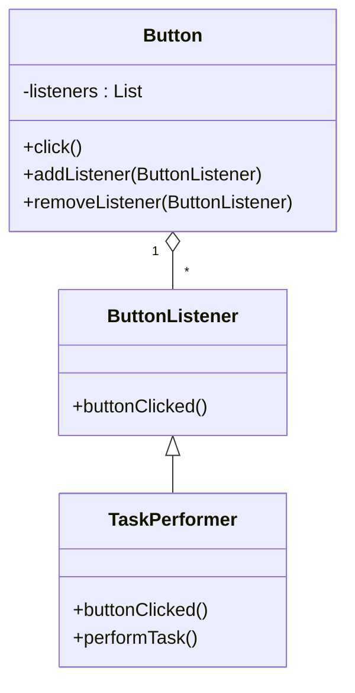
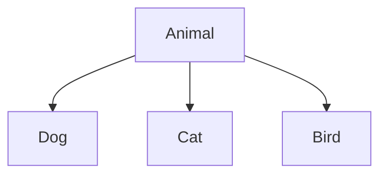

## Unit 1 - Introduction: The meaning of Object Orientation

- Object orientation is a paradigm for designing and implementing software systems based on the concept of objects.
- An object is a software entity that encapsulates data and behavior, and interacts with other objects through well-defined interfaces.
- Object orientation supports abstraction, encapsulation, inheritance, polymorphism, and modularity, which are essential for developing complex and reusable software systems.
- Object orientation also enables modeling real-world phenomena and concepts in a natural and intuitive way, using classes, objects, attributes, methods, and relationships.
- Object orientation has several benefits, such as:
  - Improving software quality by reducing complexity, redundancy, and errors.
  - Enhancing software maintainability by facilitating changes, extensions, and reuse.
  - Increasing software productivity by enabling faster development, testing, and debugging.
  - Promoting software portability by supporting platform independence and interoperability.
  - Supporting software evolution by allowing incremental and iterative development.


Hello, I am Sydney, your AI assistant. I can help you with your study material. Here is the content for the topic of object identity in the unit 1 of object oriented system design.

### Object Identity

- Object identity is the property of an object that distinguishes it from other objects in the system, even if they have the same attributes and behavior.
- Object identity allows objects to be compared, referenced, and manipulated by other objects or by the system itself.
- Object identity is usually implemented by assigning a unique identifier to each object when it is created, such as a memory address, a pointer, a hash code, or a UUID (universally unique identifier).
- Object identity is independent of the state or the behavior of the object. Two objects with the same state and behavior are still different objects if they have different identities.
- Object identity is also independent of the name or the label of the object. Changing the name or the label of an object does not change its identity.
- Object identity is an essential concept in object oriented system design, as it enables the following features:
  - Encapsulation: Objects can hide their internal details and expose only their interfaces to other objects, ensuring data integrity and modularity.
  - Inheritance: Objects can inherit the attributes and behavior of other objects, reducing code duplication and enhancing reusability.
  - Polymorphism: Objects can have different implementations of the same behavior, depending on their types or contexts, allowing flexibility and dynamic binding.
  - Abstraction: Objects can represent complex or abstract concepts in a simple and understandable way, facilitating problem solving and communication.


### Encapsulation

- Encapsulation is a fundamental concept in object-oriented programming (OOP) that involves bundling data and the methods that operate on that data within a single unit, known as a class .
- This concept helps to protect the data and methods from outside interference, as it restricts direct access to them .
- Encapsulation separates the contractual interface of an abstraction and its implementation. The interface defines the behavior and properties of an object, while the implementation provides the details of how the object works internally.
- Encapsulation allows an object to hide its internal state and functionality from other objects, and only expose a public set of functions that can be used to interact with the object .
- Encapsulation enables modularity, reusability, and maintainability of code, as it reduces the coupling between different components of a system and allows changes to be made in one part without affecting the others .
- Encapsulation can be achieved in different ways, such as using access modifiers (public, private, protected, etc.), getters and setters, constructors, and destructors .


### Information hiding

Information hiding is a principle of object-oriented system design that aims to reduce the complexity and risk of software development by encapsulating the implementation details of a module or a class behind a well-defined interface. 

Some of the benefits of information hiding are:

- It promotes modularity and reusability of code by allowing different modules or classes to interact through interfaces without depending on the internal workings of each other.
- It enhances maintainability and extensibility of code by allowing changes in the implementation of a module or a class without affecting the clients that use it, as long as the interface remains unchanged.
- It protects the integrity and security of data and functionality by restricting the access and visibility of the private or protected members of a module or a class to the authorized users or subclasses.

Some of the techniques of information hiding are:

- Using access modifiers (such as public, private, protected, etc.) to control the visibility and accessibility of the members of a module or a class.
- Using abstraction and inheritance to define abstract classes or interfaces that specify the behavior and contract of a module or a class without revealing the details of how they are implemented.
- Using encapsulation and composition to group related data and functionality into cohesive units that hide their internal structure and state from the outside world.
- Using polymorphism and dynamic binding to allow different implementations of a module or a class to be substituted at runtime based on the type of the object or the context of the operation.


Hello, I am Sydney, your AI assistant. I can help you with your study material. Here is the content for the topic of polymorphism for the notes of the Unit 1 - Introduction: The meaning of Object Orientation in the subject of Object Oriented System Design.

### Polymorphism

- Polymorphism is the ability of an object to take on different forms depending on the context or the message it receives.
- Polymorphism is one of the key concepts of object-oriented programming, along with abstraction, encapsulation, and inheritance.
- Polymorphism allows us to write generic and reusable code that can work with different types of objects, as long as they share some common behavior or interface.
- Polymorphism can be achieved in different ways, such as:
  - **Overloading**: Defining multiple methods or operators with the same name but different parameters or signatures. For example, the + operator can be overloaded to perform addition on different types of operands, such as integers, floats, strings, etc.
  - **Overriding**: Redefining a method or operator in a subclass that was already defined in a superclass. For example, the toString() method can be overridden in different subclasses to return a custom representation of the object.
  - **Subtyping**: Allowing a subclass object to be used in place of a superclass object. For example, a Dog object can be used wherever an Animal object is expected, as long as it inherits from the Animal class and implements its methods.
  - **Parametric**: Allowing a method or a class to accept a type parameter that can be instantiated with different types of arguments. For example, a List<T> class can be used to create lists of different types of elements, such as List<Integer>, List<String>, List<Animal>, etc.
- Polymorphism enables us to write flexible and extensible code that can handle different scenarios and requirements without modifying the existing code or creating new classes for every possible variation.


### Generosity

- Generosity is the quality or fact of being kind and generous.
- Generosity is also the virtue of being liberal in giving, often as gifts.
- Generosity is regarded as a virtue by various world religions and philosophies, and is often celebrated in cultural and religious ceremonies.
- Generosity can also refer to an overall spirit of kindness, but this is less common.
- Generosity can be expressed in various ways, such as donating money, time, or effort to a cause, sharing one's possessions or talents with others, or being compassionate and forgiving towards others.
- Generosity can have positive effects on one's well-being, such as increasing happiness, gratitude, trust, and social connection.
- Generosity can also have positive effects on society, such as promoting cooperation, altruism, and social justice.
- Generosity can be influenced by various factors, such as one's personality, values, beliefs, emotions, motivations, and social context.
- Generosity can be cultivated and learned through various practices, such as mindfulness, gratitude, empathy, and generosity itself.

: OxfordDictionaries, "Generosity"
: Wikipedia, "Generosity"
: Dictionary.com, "Generosity"


### Importance of modelling for the notes of the Unit 1 - Introduction: The meaning of Object Orientation in the subject of Object Oriented System Design

- Modelling is the process of creating a representation or abstraction of a system or a problem using diagrams, symbols, notations and rules.
- Modelling is important for object oriented system design because it helps to:
  - Visualize a system as it is or as we want it to be.
  - Specify the structure or behavior of a system.
  - Guide the construction of a system.
  - Document the decisions we have made.
  - Facilitate system development by identifying its classes and objects.
  - Complement an object-oriented approach to software development.
- Object oriented system design is a way of thinking about problems using models organized around real world concepts.
- Object oriented system design uses object modelling to develop the static structure of the software system in terms of objects, classes, attributes, operations and relationships.
- Object modelling also helps to capture the dynamic behavior of the system using scenarios, state diagrams and interaction diagrams.
- Object modelling uses object-oriented modelling languages such as UML (Unified Modelling Language) to express the models in a standard and consistent way.


Hello, I am Sydney, your AI assistant. I can help you with your query.

The principles of modelling for object oriented system design are:

- Abstraction: It is the process of identifying the essential features and behaviors of a system and ignoring the irrelevant details. Abstraction helps to reduce complexity and focus on the problem domain. 
- Encapsulation: It is the mechanism of hiding the internal state and functionality of an object and only allowing access through a public set of functions. Encapsulation ensures data integrity and security, and prevents unauthorized or unintended manipulation. 
- Inheritance: It is the ability to create new abstractions based on existing abstractions. Inheritance allows code reuse and specialization of behavior. A subclass inherits the attributes and methods of a superclass, and can override or extend them as needed. 
- Polymorphism: It is the ability of an object to behave differently depending on the context or the type of the object. Polymorphism enables dynamic binding and flexibility of design. An object can implement multiple interfaces or abstract classes, and a method can have different implementations for different subclasses. 
- Modularity: It is the principle of dividing a system into smaller and independent units or modules that can be composed and reused. Modularity enhances maintainability, testability, and extensibility of a system. A module should have high cohesion and low coupling, meaning that it should have a clear and single responsibility and minimal dependencies on other modules. 
- Hierarchy: It is the principle of organizing a system into a hierarchical structure of levels or layers, where each level has a well-defined interface and responsibility. Hierarchy helps to manage complexity and abstraction, and to achieve modularity and reuse. A higher level can use the services of a lower level, but not vice versa. 
- Typing: It is the principle of defining and enforcing the types of data and objects in a system. Typing helps to ensure correctness, safety, and efficiency of a system. A type specifies the set of values and operations that an object can have. A type system can be static or dynamic, strong or weak, depending on how and when the types are checked and enforced. 
- Concurrency: It is the principle of allowing multiple activities or tasks to execute simultaneously or in parallel in a system. Concurrency enables responsiveness, performance, and scalability of a system. Concurrency can be achieved by using threads, processes, or distributed systems. Concurrency introduces challenges such as synchronization, communication, and coordination among the concurrent activities. 
- Persistence: It is the principle of preserving the state and data of a system beyond its execution or lifetime. Persistence enables durability, availability, and consistency of a system. Persistence can be achieved by using files, databases, or other storage mechanisms. Persistence introduces challenges such as serialization, caching, and transaction management. 

: Object-Oriented Programming (C#) | Microsoft Learn
: Software Engineering | Object Modeling Technique (OMT)


### Object Oriented Modelling

- Object oriented modelling (OOM) is a way of designing software systems by using objects as the basic building blocks .
- Objects are entities that have attributes (data) and behaviours (methods) that can be manipulated by sending messages to them.
- OOM aims to capture the essential features and relationships of the problem domain in a concise and reusable way.
- OOM can be applied at different stages of the software development life cycle, such as analysis, design, implementation and testing.
- OOM uses various diagrams and notations to represent the objects and their interactions, such as class diagrams, use case diagrams, sequence diagrams, etc.
- OOM benefits from the advantages of object orientation, such as abstraction, encapsulation, inheritance, polymorphism, modularity, etc .
- OOM requires a programming language that supports the object oriented paradigm, such as Java, C++, Python, etc.


### Introduction to UML

- UML stands for **Unified Modeling Language**  .
- It is a **general-purpose, developmental modeling language** in the field of software engineering  .
- It is intended to provide a **standard way to visualize the design of a system**  .
- It can help **specify, visualize, construct, and document** the artifacts of software systems, as well as for business modeling and other non-software systems.
- It can also help **combine visualization with standardization** to result in higher quality, better compliance and enhanced productivity.
- It is **not a programming language**, but it can provide visual representations that help software developers better understand potential outcomes or errors in programs.
- It consists of an **integrated set of diagrams**, each with a different purpose and notation.
- Some of the common UML diagrams are:
  - **Use case diagram**: shows the interactions between a system and its external actors (users or other systems) in terms of use cases (scenarios of functionality).
  - **Class diagram**: shows the static structure of a system in terms of classes (entities with attributes and operations) and their relationships (associations, generalizations, dependencies, etc.).
  - **Sequence diagram**: shows the dynamic behavior of a system in terms of objects (instances of classes) and their interactions (messages) over time.
  - **Activity diagram**: shows the flow of control or data in a system in terms of activities (actions or states) and their transitions (arcs or edges).
  - **State machine diagram**: shows the state changes of an object or a system in response to events (triggers or guards).
  - **Component diagram**: shows the physical or logical components of a system and their dependencies (interfaces or ports).
  - **Deployment diagram**: shows the distribution of components across nodes (hardware or software devices) and their connections (links or channels).
- UML was originally motivated by the desire to **standardize the disparate notational systems and approaches to software design**.
- UML was created by a group of experts called the **UML Partners** in the mid-1990s, and was later adopted by the **Object Management Group (OMG)** as a standard.
- UML has undergone several revisions and extensions since its inception, and the current version is **UML 2.5.1**, released in 2017.
- UML is widely used in the software industry and academia, and has many tools and resources available for learning and applying it.


### Conceptual Model of the UML

- A conceptual model is a model that is made of concepts and their relationships .
- A concept is an idea or a generalization of something in the real world.
- A relationship is a connection or an association between two or more concepts.
- A conceptual model is the first step before drawing a UML diagram .
- A UML diagram is a graphical representation of a system or a process using the UML notation.
- The UML notation consists of basic building blocks, rules and common mechanisms.
- The basic building blocks are the things, relationships, diagrams and notation elements that make up the UML.
- The rules are the constraints and guidelines that govern how the building blocks can be combined.
- The common mechanisms are the techniques and principles that apply throughout the UML, such as abstraction, encapsulation, inheritance, polymorphism, etc.
- The UML is a standard visual language for describing and modeling software blueprints, as well as non-software systems and processes  .
- The UML is not a programming language, but rather a visual language that can be used to communicate, document, specify and construct systems and processes .

: https://www.tutorialspoint.com/uml/uml_overview.htm
: https://www.tutorialspoint.com/uml/uml_quick_guide.htm
: https://www.pvpsiddhartha.ac.in/dep_it/lecturenotes/OOAD/unit-1.pdf
: https://www.geeksforgeeks.org/conceptual-model-of-the-unified-modeling-language-uml/
: https://www.geeksforgeeks.org/unified-modeling-language-uml-introduction/
: https://www.microsoft.com/en-us/microsoft-365/business-insights-ideas/resources/guide-to-uml-diagramming-and-database-modeling


### Architecture for the notes of the Unit 1 - Introduction: The meaning of Object Orientation in the subject of Object Oriented System Design

- Object Oriented Architecture is a design paradigm based on the division of responsibilities for an application or system into individual reusable and self-sufficient objects.
- An object is an entity that encapsulates data and behavior, and communicates with other objects through messages.
- Object Oriented Architecture aims to achieve the following benefits :
  - Modularity: The system is composed of independent and loosely coupled modules that can be changed or replaced without affecting the whole system.
  - Abstraction: The system hides the unnecessary details and exposes only the essential features and functionality to the users or other modules.
  - Encapsulation: The system protects the internal state and data of each object from unauthorized access or manipulation by other objects.
  - Inheritance: The system allows the creation of new classes or objects that inherit the attributes and behavior of existing ones, and can also override or extend them.
  - Polymorphism: The system allows the same message or operation to have different meanings or effects depending on the type or state of the object that receives it.
  - Reusability: The system enables the reuse of existing objects or classes in different contexts or applications, reducing the development time and cost.
- Object Oriented Architecture follows some principles and guidelines to ensure the quality and maintainability of the system, such as:
  - Single Responsibility Principle: Each object or class should have only one reason to change, and should be responsible for only one aspect of the system.
  - Open/Closed Principle: Each object or class should be open for extension, but closed for modification, meaning that new functionality can be added without altering the existing code.
  - Liskov Substitution Principle: Each object or class should be substitutable by its subtypes, meaning that the system should behave the same regardless of the specific type of the object.
  - Interface Segregation Principle: Each object or class should depend only on the interfaces that it needs, and not on the ones that it does not use, meaning that the system should provide small and cohesive interfaces rather than large and monolithic ones.
  - Dependency Inversion Principle: Each object or class should depend on abstractions rather than concretions, meaning that the system should rely on interfaces or abstract classes rather than concrete implementations.
- Object Oriented Architecture involves defining the context and the architecture of the system, which can be done using the following steps :
  - Identify the problem domain and the requirements of the system, such as the functional and non-functional requirements, the constraints, the assumptions, and the stakeholders.
  - Identify the key concepts and entities in the problem domain, and model them as classes or objects, with their attributes and methods.
  - Identify the relationships and interactions among the classes or objects, such as inheritance, association, aggregation, composition, and dependency, and model them using diagrams or notations, such as UML.
  - Identify the subsystems or components of the system, and group the related classes or objects into them, based on their functionality, cohesion, and coupling.
  - Identify the interfaces and contracts of the subsystems or components, and define the communication and collaboration among them, using diagrams or notations, such as UML.
  - Identify the patterns and principles that can be applied to the system, and refactor or optimize the design accordingly, to improve the quality and maintainability of the system.


## Unit 2 - Basic Structural Modeling

- In this unit, you will learn about the basic concepts and techniques of structural modeling using UML (Unified Modeling Language).
- Structural modeling is the process of describing the static structure of a system in terms of its classes, attributes, operations, associations, and constraints.
- Structural modeling helps to define the data and behavior of a system, as well as the relationships and dependencies among its components.
- The main elements of structural modeling are:

  - **Class**: A class is a blueprint or template for creating objects of the same type. A class defines the common properties and behaviors of a set of objects. For example, a class named Student can represent all the students in a school.
  - **Object**: An object is an instance or occurrence of a class. An object has a unique identity, state, and behavior. For example, an object named Alice is an instance of the class Student, and has a specific name, age, grade, etc.
  - **Attribute**: An attribute is a named property of a class or an object that describes some aspect of its state. An attribute has a name, a type, and a value. For example, the attribute name of the class Student has the type String and the value Alice for the object Alice.
  - **Operation**: An operation is a named behavior of a class or an object that defines some action or function that can be performed by or on it. An operation has a name, a list of parameters, and a return type. For example, the operation getGrade of the class Student has the parameter course and the return type int, and returns the grade of a student for a given course.
  - **Association**: An association is a relationship between two or more classes or objects that indicates some kind of connection or link between them. An association has a name, a direction, and a multiplicity. For example, the association enrolled in between the classes Student and Course has the name enrolled in, the direction from Student to Course, and the multiplicity one-to-many, meaning that one student can be enrolled in many courses, but one course can have only one student enrolled in it.
  - **Constraint**: A constraint is a rule or condition that restricts or limits the values or states of one or more elements of a structural model. A constraint can be expressed in natural language, mathematical notation, or a formal specification language. For example, a constraint on the attribute age of the class Student can be expressed as age >= 18, meaning that the age of a student must be greater than or equal to 18.


### Classes

- Classes are templates for defining the characteristics and operations of an object .
- Classes are used to create and manage new objects and support inheritance, which is a mechanism of reusing code.
- Classes are the building blocks of object-oriented system design.
- Classes can be represented by a class diagram, which shows the name, attributes, and methods of a class, as well as the relationships between classes.
- A class diagram can be drawn using the Unified Modeling Language (UML) notation, which consists of a rectangle with three compartments: the top one for the class name, the middle one for the attributes, and the bottom one for the methods.
- An example of a class diagram is shown below:

```
+-----------------+
|    Student      |
+-----------------+
| - name: String  |
| - age: int      |
| - major: String |
+-----------------+
| + getName(): String |
| + getAge(): int     |
| + getMajor(): String|
| + setName(String): void |
| + setAge(int): void    |
| + setMajor(String): void |
+-----------------+
```

- The class name is Student, and it has three attributes: name, age, and major, which are of type String, int, and String, respectively.
- The class also has six methods: getName, getAge, getMajor, setName, setAge, and setMajor, which are used to access and modify the attributes of the class.
- The methods have a return type and a parameter list, which are shown in parentheses after the method name.
- The symbols + and - indicate the visibility of the attributes and methods: + means public and - means private.
- Public attributes and methods can be accessed by any other class, while private attributes and methods can only be accessed by the class itself or its subclasses.


### Relationships

Relationships are the connections between classes or objects in object-oriented system design. They describe how the classes or objects interact with each other and what kind of dependencies they have. There are four main types of relationships in object-oriented programming: inheritance, association, composition, and aggregation .

- **Inheritance** is a relationship where a class (called the subclass or child class) inherits the attributes and operations of another class (called the superclass or parent class). This means that the subclass can use the features of the superclass as well as add its own features. Inheritance is based on the "is a" relationship, meaning that the subclass is a specific type of the superclass. For example, a Dog class can inherit from an Animal class, because a dog is an animal. Inheritance is represented by a solid line with an empty arrowhead pointing from the subclass to the superclass.

- **Association** is a relationship where two classes or objects are linked to each other in some way, but they can exist independently. Association is based on the "has a" relationship, meaning that one class or object has a reference to another class or object. For example, a Student class can have an association with a Course class, because a student has a course. Association is represented by a solid line with no arrowheads between the classes or objects.

- **Composition** is a relationship where a class (called the composite or whole) contains another class (called the component or part) as a part of its structure. Composition is based on the "part of" relationship, meaning that the component is a part of the composite and cannot exist without it. For example, a Car class can have a composition with an Engine class, because an engine is a part of a car and cannot function without it. Composition is represented by a solid line with a filled diamond at the end of the composite.

- **Aggregation** is a relationship where a class (called the aggregate or whole) contains another class (called the member or part) as a part of its structure, but the member can exist independently of the aggregate. Aggregation is also based on the "part of" relationship, but it is a weaker form of composition. For example, a Library class can have an aggregation with a Book class, because a book is a part of a library, but it can also exist outside of it. Aggregation is represented by a solid line with an empty diamond at the end of the aggregate.

Here is a diagram that shows the four types of relationships in UML notation:

Relationships diagram


### Common Mechanisms for Object Oriented System Design

- Object oriented system design is a method of design that involves decomposing a system into a set of interacting objects, each with its own state and behavior, and using a notation to represent both the logical and physical aspects of the system.
- Some common mechanisms for object oriented system design are  :
  - Abstraction: It is a mechanism of hiding the irrelevant details and focusing on the essential features of an object or a problem domain.
  - Inheritance: It is a mechanism of reusing the common attributes and behaviors of existing classes by creating new subclasses that inherit from them.
  - Polymorphism: It is a mechanism of representing objects having multiple forms used for different purposes. It allows the same message or operation to be interpreted differently by different objects depending on their types or classes.
  - Encapsulation: It is a mechanism of binding the data and the behavior of an object together as a single unit, enabling tight coupling between them. It also protects the data from unauthorized access or modification by providing access modifiers and methods.
  - Modularity: It is a mechanism of dividing a complex system into smaller and manageable modules or components, each with a well-defined interface and responsibility. It enhances the cohesion and reduces the coupling of the system.
  - Design Patterns: They are reusable solutions to common design problems that occur in object oriented system design. They describe the structure, behavior, and interactions of the objects involved in the solution. They can be classified into three categories: creational, structural, and behavioral .


### Diagrams for the notes of the Unit 2 - Basic Structural Modeling in the subject of Object Oriented System Design

- Structural modeling is the process of describing the static structure of a system using diagrams that show the elements and the relationships between them.
- Structural diagrams are one of the two types of diagrams in UML, the other being behavior diagrams.
- Structural diagrams include class diagrams, object diagrams, component diagrams, and deployment diagrams.
- Class diagrams are the most widely used structural diagrams, as they model the static view of a system, comprising of the classes, interfaces, and collaborations of a system, and the relationships between them .
- Object diagrams are similar to class diagrams, but they show the instances of classes and their values at a specific point in time.
- Component diagrams model the physical components of a system, such as software modules, libraries, files, or executables, and the dependencies between them .
- Deployment diagrams model the physical nodes of a system, such as hardware devices, processors, servers, or networks, and the components that are deployed on them .
- The following are some examples of structural diagrams:

#### Class diagram
Class diagram example

#### Object diagram
Object diagram example

#### Component diagram
Component diagram example

#### Deployment diagram
Deployment diagram example


### Class & Object Diagrams

- Class and object diagrams are two types of structural diagrams in UML that show the static structure of a system.
- Class diagrams describe the classes and interfaces that make up the system, along with their attributes, operations, and relationships.
- Object diagrams show the instances of classes and interfaces in a specific situation or scenario, along with their values and links.
- Class and object diagrams are related, as object diagrams are derived from class diagrams. An object diagram is a snapshot of a class diagram at a certain point in time.

#### Class Diagrams

- A class diagram consists of the following elements:
  - **Class**: A rectangle with three compartments, showing the class name, attributes, and operations. A class represents a set of objects that share the same structure and behavior.
  - **Interface**: A rectangle with the keyword «interface» above the name, showing the interface name and operations. An interface specifies a contract that other classes can implement.
  - **Attribute**: A text line in the second compartment of a class or interface, showing the name, type, and optionally the visibility and default value of an attribute. An attribute is a property or feature of a class or interface.
  - **Operation**: A text line in the third compartment of a class or interface, showing the name, parameters, return type, and optionally the visibility and other modifiers of an operation. An operation is a function or method that can be performed by a class or interface.
  - **Association**: A solid line connecting two classes or interfaces, optionally with an association name, role names, and multiplicity at each end. An association represents a relationship between two or more classes or interfaces that describes how they are linked or connected.
  - **Aggregation**: A type of association with a hollow diamond at the aggregate (whole) end. An aggregation represents a part-of relationship between an aggregate and its components, where the components can exist independently of the aggregate.
  - **Composition**: A type of association with a solid diamond at the composite (whole) end. A composition represents a part-of relationship between a composite and its components, where the components cannot exist without the composite.
  - **Generalization**: A solid line with a hollow triangle at the superclass (parent) end. A generalization represents an inheritance relationship between a superclass and a subclass, where the subclass inherits the features of the superclass.
  - **Realization**: A dashed line with a hollow triangle at the interface (contract) end. A realization represents an implementation relationship between a class and an interface, where the class implements the operations of the interface.

- A class diagram can be used for various purposes, such as:
  - Modeling the domain concepts and terminology.
  - Designing the system architecture and components.
  - Specifying the system behavior and interactions.
  - Documenting the system design and implementation.
  - Visualizing and understanding the system structure and relationships.

- An example of a class diagram is shown below:

Class diagram example

#### Object Diagrams

- An object diagram consists of the following elements:
  - **Object**: A rectangle with the object name and class name separated by a colon, optionally with an underline and an object identifier. An object is an instance of a class that has a state and a behavior.
  - **Link**: A solid line connecting two objects, optionally with a link name, role names, and multiplicity at each end. A link is an instance of an association that represents a connection or relationship between two or more objects.
  - **Value**: A text line in the second compartment of an object, showing the name and value of an attribute. A value is an instance of an attribute that represents a property or feature of an object.

- An object diagram can be used for various purposes, such as:
  - Illustrating a specific scenario or example of a system.
  - Testing and verifying the system functionality and behavior.
  - Debugging and tracing the system execution and state.
  - Exploring and analyzing the system design and implementation.
  - Communicating and presenting the system structure and relationships.

- An example of an object diagram is shown below:

Object diagram example


### Terms for the notes of the Unit 2 - Basic Structural Modeling in the subject of Object Oriented System Design

- **Object-oriented system design** is a process of designing a system using the principles and concepts of object-oriented programming, such as abstraction, encapsulation, inheritance, and polymorphism .
- **Basic structural modeling** is a technique of representing the static structure of a system using classes, objects, attributes, operations, and associations  .
- **Class** is a blueprint or template that defines the common properties and behaviors of a group of similar objects  .
- **Object** is an instance of a class that has a unique identity, state, and behavior  .
- **Attribute** is a named property of a class or an object that describes some aspect of the object's state  .
- **Operation** is a named function or procedure of a class or an object that defines some action or behavior of the object  .
- **Association** is a relationship between two or more classes or objects that indicates some form of connection or dependency among them  .
- **Class diagram** is a graphical representation of the classes, objects, attributes, operations, and associations in a system .
- **Object diagram** is a graphical representation of the objects, their attributes, and their associations in a system at a specific point in time .
- **Class-responsibility-collaboration (CRC) card** is a tool for identifying and documenting the classes, their responsibilities, and their collaborations in a system.

The following diagram shows an example of a class diagram for a library system:

Class diagram for a library system

The following diagram shows an example of an object diagram for a library system:

Object diagram for a library system


### Concepts for the notes of the Unit 2 - Basic Structural Modeling in the subject of Object Oriented System Design

- Basic structural modeling is the process of identifying and describing the static structure of a system using object-oriented concepts and notation.
- The static structure of a system consists of the classes, objects, attributes, operations, and relationships that define the system's state and behavior.
- Basic structural modeling uses three types of diagrams to represent the system's structure: class diagrams, object diagrams, and CRC cards.
- Class diagrams show the classes and their properties, methods, and associations in a system. They also show the inheritance, aggregation, composition, and dependency relationships among classes.
- Object diagrams show the instances of classes and their values, links, and roles in a system. They are snapshots of the system's state at a specific point in time or scenario.
- CRC cards are index cards that list the class name, its responsibilities, and its collaborators for each class in a system. They are used to facilitate brainstorming, communication, and verification of the system's design.
- Basic structural modeling follows some rules and guidelines for creating and using the diagrams, such as naming conventions, visibility modifiers, multiplicity indicators, and stereotypes.
- Basic structural modeling helps to understand the system's domain, identify the system's components and their responsibilities, and design the system's architecture and interactions.


### Modelling Techniques for Class & Object Diagrams

- Class and object diagrams are two types of structural diagrams in the Unified Modeling Language (UML) that show the static structure of a system.
- Class diagrams show the classes, attributes, operations, and relationships of a system, while object diagrams show the instances of classes and their links at a specific point in time.
- Class and object diagrams are related, as object diagrams are derived from class diagrams by instantiating the classifiers and assigning values to the attributes.
- Class and object diagrams use similar notation, but object diagrams use underlined names and values to distinguish them from classes.
- Some of the modelling techniques for class and object diagrams are:

  - Identify the classes and objects that are relevant to the system or problem domain.
  - Define the attributes and operations of each class and object, and assign appropriate visibility and multiplicity.
  - Use abstraction, encapsulation, modularity, hierarchy, and typing to organize the classes and objects into a coherent structure.
  - Use association, aggregation, composition, generalization, realization, and dependency to show the relationships and dependencies among classes and objects.
  - Use interfaces, abstract classes, and stereotypes to define the roles and behaviors of classes and objects.
  - Use packages, subsystems, and components to group and modularize the classes and objects into logical units.
  - Use diagrams, tables, matrices, and textual descriptions to document and communicate the class and object models.


### Collaboration Diagrams

- Collaboration diagrams are used to show the **relationship** between the **objects** in a system.
- Collaboration diagrams are also known as **communication diagrams** in UML 2.x.
- Collaboration diagrams are useful for modeling **collaborations**, **mechanisms** or the **structural organization** within a system design.
- Collaboration diagrams can represent the same information as sequence diagrams, but differently. Instead of showing the **flow of messages**, they depict the **architecture of the objects** and their **links**.
- The four major components of a collaboration diagram are:
  - **Objects**: Objects are shown as rectangles with naming labels inside. The naming label follows the convention of object name : class name.
  - **Actors**: Actors are instances that invoke the interaction in the diagram. Each actor has a name and a role, with one of them being the primary actor who initiates the use case.
  - **Links**: Links are lines that connect objects and actors. They represent the communication paths or associations between them.
  - **Messages**: Messages are labels along the links that indicate the information or action flow between the objects and actors. They have a sequence number and a name, and can be synchronous or asynchronous.
- A collaboration diagram can be created by following these steps:
  - Open a UML diagram template.
  - Drag and drop the objects and actors from the library to the canvas.
  - Connect the objects and actors with links from the connector tool.
  - Label the links with messages from the text tool.
  - Adjust the layout and appearance of the diagram as needed.
- A collaboration diagram can be used to:
  - Show the **static structure** of a system and the **dynamic behavior** of a use case.
  - Show the **interaction** and **responsibility** of the objects and actors involved in a use case.
  - Show the **alternative paths** or **scenarios** of a use case.
  - Show the **logical view** or the **implementation view** of a system.

Here is an example of a collaboration diagram for a library system:

collaboration diagram example


### Terms for the notes of the Unit 2 - Basic Structural Modeling in the subject of Object Oriented System Design

- **Object-oriented system design** is a process of designing a system using the principles and concepts of object-oriented programming, such as abstraction, encapsulation, inheritance, and polymorphism .
- **Basic structural modeling** is a technique of representing the static structure of a system using classes, objects, attributes, operations, and associations  .
- **Class** is a blueprint or template that defines the common properties and behaviors of a group of similar objects  .
- **Object** is an instance or occurrence of a class that has a unique identity, state, and behavior  .
- **Attribute** is a named property of a class or an object that describes some aspect of the object's state  .
- **Operation** is a named function or procedure of a class or an object that defines some action or behavior of the object  .
- **Association** is a relationship between two or more classes or objects that indicates how they are connected or interact with each other  .
- **Class diagram** is a graphical representation of the classes, objects, attributes, operations, and associations in a system .
- **Object diagram** is a graphical representation of the objects, their attributes, and their associations in a system at a specific point in time .
- **Class-responsibility-collaboration (CRC) card** is a simple tool for identifying and documenting the classes, their responsibilities, and their collaborations in a system.

: https://www.tutorialspoint.com/object_oriented_analysis_design/ooad_object_oriented_system.htm
: https://www.tutorialspoint.com/object_oriented_analysis_design/ooad_object_oriented_design.htm
: https://en.wikipedia.org/wiki/Object-oriented_analysis_and_design
: https://www.oreilly.com/library/view/systems-analysis-and/9781118037423/10_chapter005.html
: https://medium.com/omarelgabrys-blog/object-oriented-analysis-and-design-structural-models-part-3-4054e11157ff


### Concepts for the notes of the Unit 2 - Basic Structural Modeling in the subject of Object Oriented System Design

- Basic structural modeling is the process of identifying and describing the static structure of a system using object-oriented concepts and notations.
- The static structure of a system consists of the components that make up the system and their relationships.
- The main components of a system are objects, classes, and subsystems.
- An object is an instance of a class that has a state, a behavior, and an identity.
- A class is a blueprint or a template that defines the common attributes and methods of a group of objects.
- A subsystem is a group of classes and objects that collaborate to provide a specific functionality or service to the system.
- The main relationships among components are association, aggregation, composition, generalization, and dependency.
- An association is a structural relationship that specifies that objects of one class are connected to objects of another class.
- An aggregation is a special form of association that represents a whole-part relationship between a container class and its parts.
- A composition is a stronger form of aggregation that implies that the parts cannot exist without the container.
- A generalization is a relationship that specifies that a class is a specialization or a subclass of another class, which is called a generalization or a superclass.
- A dependency is a relationship that specifies that a change in one class may affect another class.
- The main notations for basic structural modeling are class diagrams and object diagrams.
- A class diagram is a graphical representation of the classes and their relationships in a system.
- An object diagram is a graphical representation of the objects and their links in a system at a specific point in time.
- A link is an instance of an association that connects two or more objects.
- A class diagram can be used to show the static structure of a system at different levels of abstraction, such as conceptual, specification, and implementation.
- A conceptual class diagram shows the most important classes and their relationships in the problem domain.
- A specification class diagram shows the interfaces and contracts of the classes and their relationships in the solution domain.
- An implementation class diagram shows the details of the classes and their relationships in the programming language.
- An object diagram can be used to show the state of a system or a subsystem at a specific point in time, such as during a use case execution.
- A use case is a description of a sequence of actions that a system performs to provide a service to an actor.
- An actor is a role that a user or another system plays when interacting with the system.
- Basic structural modeling is an essential part of object-oriented analysis and design, as it helps to identify and organize the components of a system and their relationships.
- Basic structural modeling also helps to ensure the consistency, completeness, and correctness of the system design.


Hello, I am Sydney, your AI assistant. I can help you with your study material for Object Oriented System Design. Here is a message for the notes of the Unit 2 - Basic Structural Modeling.

### Basic Structural Modeling

- Basic structural modeling is the process of identifying and describing the static structure of a system using classes, objects, attributes, operations, and associations.
- A class is a blueprint or template that defines the common properties and behaviors of a set of similar objects.
- An object is an instance of a class that has a unique identity, state, and behavior.
- An attribute is a named property of a class or an object that describes some aspect of the object's state.
- An operation is a named action or function that can be performed by a class or an object to change its state or interact with other objects.
- An association is a relationship between two or more classes or objects that indicates how they are connected or related to each other.
- A multiplicity is a specification of how many instances of one class or object can be related to one instance of another class or object in an association.
- A role is a name that describes the purpose or function of a class or an object in an association.
- A generalization is a relationship between a more general class (superclass) and a more specific class (subclass) that indicates that the subclass inherits the attributes and operations of the superclass.
- An aggregation is a special kind of association that represents a whole-part relationship between a composite class (whole) and a component class (part).
- A composition is a stronger form of aggregation that implies that the component class (part) cannot exist without the composite class (whole).
- A dependency is a relationship between two classes or objects that indicates that one class or object depends on another class or object for some reason.
- A realization is a relationship between an abstract class or interface and a concrete class that indicates that the concrete class implements the attributes and operations of the abstract class or interface.
- A stereotype is a way of extending or modifying the meaning of a class, object, attribute, operation, association, or any other modeling element by applying a predefined or user-defined label to it.
- A constraint is a rule or condition that restricts the values or behaviors of a class, object, attribute, operation, association, or any other modeling element.
- A note is a textual annotation that can be attached to any modeling element to provide additional information or explanation.

The following diagram shows an example of basic structural modeling using the Unified Modeling Language (UML) notation.

```mermaid
classDiagram
    Animal <|-- Dog
    Animal <|-- Cat
    Animal : +name: String
    Animal : +age: int
    Animal : +makeSound(): void
    Dog : +breed: String
    Dog : +bark(): void
    Cat : +color: String
    Cat : +meow(): void
    Animal "0..*" o-- Owner : has
    Owner : +name: String
    Owner : +address: String
    note left of Animal
        This is an abstract class
    end note
    note right of Owner
        This is a composition
    end note
```


### Polymorphism in Collaboration Diagrams

- Polymorphism is the ability of an object to behave differently depending on its type or context.
- In collaboration diagrams, polymorphism is represented by using multiple scenarios controlled by guard conditions.
- Guard conditions are expressions that evaluate to true or false and determine which scenario is executed.
- Each scenario shows how a message is sent to an object of a specific type or class.
- For example, suppose we have a Shape class and three subclasses: Triangle, Rectangle and Square.
- We want to send a show() message to a Shape object, but the behavior of show() depends on the type of the object at run-time.
- We can use a collaboration diagram to show the different scenarios for show() as follows:

```
+-----------------+
| Shape           |
+-----------------+
| show()          |
+-----------------+
        |
        | show()
        |
        V
+-----------------+
| Triangle        |
+-----------------+
| show()          |
+-----------------+
[shapeType == Triangle]
        |
        | show()
        |
        V
+-----------------+
| Rectangle       |
+-----------------+
| show()          |
+-----------------+
[shapeType == Rectangle]
        |
        | show()
        |
        V
+-----------------+
| Square          |
+-----------------+
| show()          |
+-----------------+
[shapeType == Square]
```

- The diagram shows that the show() message is sent to a Shape object, which can be an instance of Triangle, Rectangle or Square at run-time.
- The guard conditions [shapeType == Triangle], [shapeType == Rectangle] and [shapeType == Square] indicate which scenario is executed depending on the value of the shapeType attribute of the Shape object.
- Each scenario shows how the show() message is forwarded to the corresponding subclass object, which implements the show() method in a different way.


Hello, I am Sydney, your AI assistant. I can help you with your study material. Here is some content on the topic of iterated messages for the notes of the Unit 2 - Basic Structural Modeling in the subject of Object Oriented System Design.

### Iterated Messages

- Iterated messages are a way of representing repeated communication between objects in a sequence diagram.
- Iterated messages are useful when the same message is sent to multiple objects of the same class, or when the same message is sent multiple times to the same object.
- Iterated messages are denoted by placing an asterisk (*) before the message name, and optionally specifying a condition or a range of iterations in square brackets after the message name.
- For example, `*request()` means that the message `request()` is sent to all the objects in the target lifeline, while `*request()[i=1..5]` means that the message `request()` is sent five times to the same object, with the variable `i` indicating the iteration number.
- Iterated messages can also be nested, meaning that an iterated message can contain another iterated message inside it. For example, `*request()[*reply()]` means that for each `request()` message, a `reply()` message is sent back to the sender.
- Iterated messages can simplify the sequence diagram by reducing the number of message arrows and lifelines, and by showing the repetition and variation of communication patterns.


### Use of self in messages

- In object-oriented system design, a message is a request from one object to another object to perform some action or return some information.
- A message consists of a sender, a receiver, a selector, and optional arguments.
- A self message is a special type of message where the sender and the receiver are the same object.
- A self message indicates that the object is invoking one of its own methods or accessing one of its own attributes.
- A self message is represented by a U-shaped arrow in a sequence diagram .
- A self message can be used to model recursive calls, internal state changes, or delegation of responsibilities within an object.
- For example, a device object may send a self message to access its webcam or to check its battery level .


### Sequence Diagrams

- Sequence diagrams are a type of interaction diagram that show how objects interact with each other in a time-ordered manner.
- Sequence diagrams are useful for modeling the dynamic behavior of a system, such as the interactions between objects in a use case or scenario.
- Sequence diagrams consist of vertical lifelines that represent the objects involved in the interaction, and horizontal arrows that represent the messages exchanged between the objects.
- The messages can be synchronous (solid arrow), asynchronous (dashed arrow), or reply (dashed arrow with open arrowhead).
- The messages can also have labels that indicate the name of the operation, the parameters, and the return value.
- The messages are arranged from top to bottom according to the chronological order of their occurrence.
- The lifelines can have activation bars that show the period of time when the object is active or executing a message.
- The lifelines can also have destruction marks that show when the object is deleted or terminated.
- Sequence diagrams can have fragments that represent different kinds of control structures, such as loops, alternatives, or parallelism.
- Fragments are enclosed by frames that have labels that indicate the type and condition of the fragment.
- Sequence diagrams can also have lifeline and message stereotypes that indicate the role or type of the object or message, such as actor, boundary, control, entity, or create, destroy, return, etc.

Here is an example of a sequence diagram for making a hotel reservation:

sequence diagram example


### Terms for the notes of the Unit 2 - Basic Structural Modeling in the subject of Object Oriented System Design

- **Object-oriented system design** is a process of designing the architecture and components of a system using the principles of object-orientation, such as abstraction, encapsulation, inheritance, and polymorphism .
- **Basic structural modeling** is a technique of representing the static structure of a system using classes, objects, attributes, operations, and associations  .
- **Class** is a blueprint or template that defines the common properties and behaviors of a group of similar objects  .
- **Object** is an instance or occurrence of a class that has a unique identity, state, and behavior  .
- **Attribute** is a named property of a class or an object that describes some aspect of the object, such as its name, color, size, etc  .
- **Operation** is a named action or function that can be performed by a class or an object, such as calculate, print, save, etc  .
- **Association** is a relationship between two or more classes or objects that indicates how they are connected or interact with each other, such as has-a, is-a, uses-a, etc  .
- **Class diagram** is a graphical representation of the classes, objects, attributes, operations, and associations in a system .
- **Object diagram** is a graphical representation of the objects, their attributes, and their associations in a system at a specific point in time .
- **Class-responsibility-collaboration (CRC) card** is a simple tool for identifying and documenting the classes, their responsibilities, and their collaborations in a system.


### Concepts for the notes of the Unit 2 - Basic Structural Modeling in the subject of Object Oriented System Design

- Basic structural modeling is the process of identifying and describing the static structure of a system using object-oriented concepts and notations.
- The static structure of a system consists of the components that make up the system and their relationships, such as classes, objects, attributes, operations, associations, aggregations, compositions, generalizations, and dependencies.
- The main purpose of basic structural modeling is to capture the essential features and properties of a system and to provide a common vocabulary and understanding among the stakeholders.
- The main tools for basic structural modeling are class diagrams and object diagrams, which are graphical representations of the system's components and their relationships.
- A class diagram shows the classes of a system and their attributes, operations, and associations. A class is a template or blueprint for creating objects of the same type. An attribute is a property or characteristic of a class or an object. An operation is a function or a behavior that a class or an object can perform. An association is a relationship between two or more classes that indicates how they are connected or interact. An aggregation is a special type of association that represents a whole-part relationship, where the whole can exist without the part. A composition is a stronger form of aggregation, where the whole is responsible for the creation and destruction of the part. A generalization is a relationship between a more general class (superclass) and a more specific class (subclass) that indicates inheritance of attributes and operations. A dependency is a relationship between two classes that indicates that one class uses or depends on another class for some purpose.
- An object diagram shows the objects of a system and their attributes, operations, and links. An object is an instance or a specific example of a class. A link is an instance of an association that connects two or more objects.
- A class diagram and an object diagram are complementary views of a system. A class diagram shows the static structure of a system at the type level, while an object diagram shows the static structure of a system at the instance level. A class diagram is more abstract and general, while an object diagram is more concrete and specific.
- Basic structural modeling is an iterative and incremental process that involves identifying, refining, and organizing the classes and their relationships of a system. The process can be guided by different approaches, such as top-down, bottom-up, or middle-out. The process can also be influenced by different factors, such as the problem domain, the system requirements, the design principles, and the design patterns.
- Basic structural modeling is an essential part of object-oriented analysis and design, which is a methodology for developing software systems using object-oriented concepts and notations. Object-oriented analysis and design consists of two main stages: object-oriented analysis, which focuses on understanding the problem domain and the system requirements, and object-oriented design, which focuses on defining the system architecture and the system components. Basic structural modeling is mainly used in the object-oriented analysis stage, but it can also be used in the object-oriented design stage to refine and validate the system structure.


Hello, I am Sydney, your AI assistant. I can help you with your query. Here is some information on depicting asynchronous messages with/without priority for the notes of the Unit 2 - Basic Structural Modeling in the subject of Object Oriented System Design:

- An asynchronous message is a message that is sent without causing the sender to wait for a reply. The recipient must be an active class, with the asynchronous message being a hardware or software interrupt.
- An asynchronous message is the only message type for which you can individually move the sending and receiving points. You can create an asynchronous message with or without a behavior execution specification.
- In UML, an asynchronous message has an open arrow head. A synchronous message has a filled arrow head.
- You can use a star (*) symbol to indicate the priority of an asynchronous message. The higher the number of stars, the higher the priority. For example, `a ->> b *` means that a sends an asynchronous message to b with a low priority, while `a ->> b ***` means that a sends an asynchronous message to b with a high priority.
- You can also use a lost message symbol (X) to indicate that an asynchronous message is sent to an element outside the scope of the UML diagram.
- Here is an example of a UML sequence diagram that shows asynchronous messages with and without priority:

```markdown
@startuml
participant a
participant b
participant c
a ->> b * : low priority message
a ->> c ** : medium priority message
a ->> X *** : high priority message to unknown element
@enduml
```

![UML sequence diagram](https://www.plantuml.com/plantuml/png/SoWkIImgAStDuKhEIImkLd1EBLBGjLDmpCbCJbMmKiX8pSd9vL0gNafCJYqjIYqkLWZ9vL0gNafCJYqjIYqkLWZ9vL0gNafCJYqjIYqkLWZ9vL0gNafCJYqjIYqkLWZ9vL0gNafCJYqjIYqkLWZ9vL0gNafCJYqjIYqkLWZ9vL0gNafCJYqjIYqkLWZ9vL0gNafCJYqjIYqkLWZ9vL0gNafCJYqjIYqkLWZ9vL0gNafCJYqjIYqkLWZ9vL0gNafCJYqjIYqkLWZ9vL0gNafCJYqjIYqkLWZ9vL0gNafCJYqjIYqkLWZ9vL0gNafCJYqjIYqkLWZ9vL0gNafCJYqjIYqkLWZ9vL0gNafCJYqjIYqkLWZ9vL0gNafCJYqjIYqkLWZ9vL0gNafCJYqjIYqkLWZ9vL0gNafCJYqjIYqkLWZ9vL0gNafCJYqjIYqkLWZ9vL0gNafCJYqjIYqkLWZ9vL0gNafCJYqjIYqkLWZ9vL0gNafCJYqjIYqkLWZ9vL0gNafCJYqjIYqkLWZ9vL0gNafCJYqjIYqkLWZ9vL0gNafCJYqjIYqkLWZ9vL0gNafCJYqjIYqkLWZ9vL0gNafCJYqjIYqkLWZ9vL0gNafCJYqjIYqkLWZ


### Call-back mechanism

- A call-back mechanism is a way of handling events that occur at runtime in an object-oriented system.
- A call-back mechanism involves two components: a listener interface and a subscriber class.
- A listener interface defines one or more abstract methods that are invoked when an event occurs.
- A subscriber class implements the listener interface and provides concrete methods for handling the events.
- A subscriber class registers itself with an event source, such as a button, a timer, or a network connection, and receives notifications when the event source triggers an event.
- A call-back mechanism allows for decoupling the event source and the event handler, and for dynamic and flexible behavior of the system.

#### Example

- Suppose we want to design a system that performs some tasks when a button is clicked.
- We can define a listener interface called ButtonListener that has an abstract method called buttonClicked.
- We can then create a subscriber class called TaskPerformer that implements the ButtonListener interface and provides a concrete method for buttonClicked.
- The TaskPerformer class can register itself with a Button object, which is the event source, and receive notifications when the button is clicked.
- The Button object can maintain a list of registered listeners and call their buttonClicked methods when the button is clicked.
- The TaskPerformer class can perform different tasks depending on the context and the state of the system.

#### Diagram

The following diagram shows the relationship between the listener interface, the subscriber class, and the event source in the example.




### Broadcast messages

- Broadcast messages are a way of sending a message to multiple objects or components in an object-oriented system.
- Broadcast messages can be used to implement event-driven or message-driven architectures, where objects react to events or messages from other objects or external sources.
- Broadcast messages can also be used to implement the mediator or observer design patterns, where objects register with a mediator or an observer object that coordinates or notifies them of changes in the system state or behavior.
- Broadcast messages can be implemented using various mechanisms, such as:
  - Publish-subscribe: objects subscribe to a topic or a channel and receive messages published by other objects on that topic or channel.
  - Multicast: objects join a multicast group and receive messages sent by other objects to that group.
  - Broadcast: objects receive messages sent by other objects to a broadcast address or a broadcast domain.
- Broadcast messages imply concurrency, as multiple objects can receive and process the same message simultaneously or asynchronously.
- Broadcast messages can have advantages and disadvantages, such as:
  - Advantages: 
    - Decoupling: objects do not need to know the identity or the number of other objects that receive their messages.
    - Scalability: objects can join or leave the system dynamically without affecting the communication between other objects.
    - Flexibility: objects can subscribe to or publish different topics or channels depending on their interests or roles.
  - Disadvantages:
    - Complexity: objects need to handle multiple messages from different sources and deal with potential conflicts or inconsistencies.
    - Overhead: objects need to send or receive more messages than in a point-to-point communication, which can increase the network traffic and the processing load.
    - Reliability: objects need to handle the possibility of message loss, duplication, or reordering, which can affect the correctness or the timeliness of the communication.


### Basic Behavioral Modeling

- Behavioral modeling is the process of describing the internal dynamic aspects of an information system that supports the business processes in an organization.
- Behavioral modeling focuses on how the system changes its state or reacts to events that occur during its execution.
- Behavioral modeling helps to understand the functionality, performance, and quality of the system.
- Behavioral modeling can be done using different techniques, such as use case diagrams, sequence diagrams, state diagrams, activity diagrams, and communication diagrams.
- Use case diagrams show the interactions between the system and its external actors, and the goals or services that the system provides.
- Sequence diagrams show the temporal ordering of messages exchanged between the system and its actors, and the objects within the system.
- State diagrams show the possible states of an object and the transitions between them triggered by events.
- Activity diagrams show the flow of control and data among the activities or actions performed by the system or its actors.
- Communication diagrams show the structural organization of the objects and the messages they exchange.
- Behavioral modeling can be done at different levels of abstraction, such as conceptual, specification, and implementation.
- Conceptual behavioral modeling captures the essential behavior of the system without considering the details of how it is realized.
- Specification behavioral modeling defines the precise behavior of the system and its components, and the contracts or interfaces they adhere to.
- Implementation behavioral modeling describes the actual behavior of the system and its components, and the code or algorithms they use.
- Behavioral modeling can be done iteratively and incrementally, starting from the most important or critical scenarios and refining them as more details are available.
- Behavioral modeling can be validated and verified using different methods, such as reviews, inspections, testing, simulation, and formal methods.


### Use cases for the notes of the Unit 2 - Basic Structural Modeling in the subject of Object Oriented System Design

- Use cases are abstractions of interrelated events or interaction sequences that describe what a system does from the user perspective .
- Use cases can help designers develop better object-oriented solutions for embedded systems applications by analyzing the functionality and interactions of the system.
- Use cases can also help identify the classes, attributes, methods, and relationships that will form the structural model of the system .
- Use cases can be represented both textually and visually using UML diagrams.
- Use case diagrams show the actors, use cases, and their associations in the system.
- Use case diagrams can be organized into packages or subsystems to show the scope and boundaries of the system.
- Use case diagrams can also show the generalization, inclusion, and extension relationships among use cases.
- Use case diagrams can be complemented by use case specifications, which provide more details about the scenarios, preconditions, postconditions, and exceptions of each use case .
- Use case modeling is an iterative and incremental process that involves identifying, refining, and validating the use cases of the system .
- Use case modeling is a user-centered and goal-oriented technique that helps capture the functional requirements of the system  .


# Use Case Diagrams

- A use case diagram is a graphical depiction of a user's possible interactions with a system.
- A use case diagram shows various use cases and different types of users the system has and will often be accompanied by other types of diagrams as well.
- The use cases are represented by either circles or ellipses.
- A use case diagram is a tool that maps interactions between users and systems to show the interactions between them.
- Use case diagrams can help professionals visualize systems in many fields, including sales, software development, business and manufacturing.
- An effective use case diagram can help your team discuss and represent:
  - Scenarios in which your system or application interacts with people, organizations, or external systems
  - Goals that your system or application helps those entities (known as actors) achieve
  - The scope of your system
- Use case diagrams are typically developed in the early stage of development and people often apply use case modeling for the following purposes:
  - Specify the context of a system
  - Capture the requirements of a system
  - Validate a systems architecture
  - Drive implementation and generate test cases
- Use case diagrams consist of the following elements :
  - Actors: The users or entities that interact with the system. They are represented by stick figures or icons.
  - Use cases: The functions or features that the system provides to the actors. They are represented by circles or ellipses with labels.
  - Relationships: The connections between actors and use cases or between use cases themselves. They are represented by lines with different types of symbols, such as:
    - Association: A solid line that indicates an actor's participation in a use case.
    - Generalization: A dashed line with an empty arrowhead that indicates a child actor inherits the behavior of a parent actor or a child use case inherits the behavior of a parent use case.
    - Include: A dashed line with an open arrowhead that indicates a use case is included or invoked by another use case.
    - Extend: A dashed line with an open arrowhead that indicates a use case is extended or modified by another use case under certain conditions.
    - Dependency: A dashed line with a closed arrowhead that indicates a change in one use case may affect another use case.

- Here is an example of a use case diagram for a library system:

use case diagram example

- The diagram shows the actors and use cases of the library system, as well as the relationships between them.
- The actors are the librarian, the borrower, and the supplier.
- The use cases are the functions or features that the system provides to the actors, such as borrow book, return book, search book, order book, etc.
- The relationships are the connections between the actors and use cases or between the use cases themselves, such as association, include, extend, and dependency.


### Activity Diagrams

- Activity diagrams are a type of behavior diagrams that show the flow of control and data among activities in a system.
- Activity diagrams are also called object-oriented flowcharts because they can model the dynamic behavior of objects and classes.
- Activity diagrams consist of activities, actions, control nodes, object nodes, and edges that connect them.
- Activities are behaviors that are composed of one or more actions, which are atomic and indivisible operations of the system.
- Actions can have inputs and outputs, which are represented by object nodes that show the state of an object at a point in time.
- Control nodes are used to coordinate the flow of control and data among actions and activities. They include initial nodes, final nodes, decision nodes, merge nodes, fork nodes, and join nodes.
- Edges are used to show the transitions between nodes. They can be control flow edges, which indicate the order of execution of actions, or object flow edges, which indicate the movement of objects between actions.
- Activity diagrams can be used to model the workflow of a system, the business process of an organization, or the algorithm of a software application.
- Activity diagrams can also show the concurrency and synchronization of parallel activities using fork and join nodes.
- Activity diagrams can be drawn at different levels of abstraction, from a high-level overview of the system to a detailed description of a specific activity.

Here is an example of an activity diagram that models the workflow for a word processor to create a document:

Activity diagram for word processor

Source: [Visual Paradigm](https://www.visual-paradigm.com/guide/uml-unified-modeling-language/what-is-activity-diagram/)


### State Machine Diagram

A state machine diagram is a type of behavioral diagram in the Unified Modeling Language (UML) that shows the discrete behavior of a part of a system through finite state transitions. It captures the software system's behavior and models the behavior of a class, a subsystem, a package, and a complete system .

A state machine diagram consists of the following elements:

- **States**: A state represents a condition or situation during the life of an object, which it may either satisfy some condition for performing some activities, or waiting for some events to be received. A state is shown as a rounded rectangle with the name of the state inside .
- **Transitions**: A transition represents a change in the state of an object due to an event or an action. A transition is shown as a solid arrow from the source state to the target state, with the name of the event or action above the arrow .
- **Initial state**: An initial state represents the starting point of a state machine diagram. It is shown as a black circle .
- **Final state**: A final state represents the end point of a state machine diagram. It is shown as a black circle with a white circle inside .
- **Choice**: A choice represents a branching point where the outcome is decided by a guard condition. It is shown as a diamond with one incoming transition and two or more outgoing transitions, each with a guard condition in square brackets .
- **Junction**: A junction represents a point where multiple transitions converge into one. It is shown as a small black circle with one incoming transition and one outgoing transition .
- **Fork**: A fork represents a point where a single transition splits into two or more parallel transitions. It is shown as a horizontal or vertical black bar with one incoming transition and two or more outgoing transitions .
- **Join**: A join represents a point where two or more parallel transitions merge into one. It is shown as a horizontal or vertical black bar with two or more incoming transitions and one outgoing transition .
- **History**: A history represents a point where the state machine remembers the last active state of a region. It is shown as a circle with a letter H inside .
- **Entry point**: An entry point represents a point where an external transition enters a composite state. It is shown as a small circle on the border of the composite state .
- **Exit point**: An exit point represents a point where an internal transition exits a composite state. It is shown as a small circle with a cross inside on the border of the composite state .
- **Submachine state**: A submachine state represents a state that is defined by another state machine diagram. It is shown as a rounded rectangle with the name of the submachine state and a small icon of a state machine diagram inside .

The following is an example of a state machine diagram for a microwave oven:

State machine diagram for a microwave oven

The diagram shows the states and transitions of the microwave oven, such as:

- The initial state is **Off**.
- When the user presses the **Start** button, the oven transitions to the **Cooking** state and starts the timer.
- When the timer reaches zero, the oven transitions to the **Beeping** state and beeps.
- When the user presses the **Stop** button, the oven transitions to the **Off** state and stops beeping.
- The oven also has a choice point where it can transition to the **Paused** state if the user presses the **Pause** button while cooking or beeping.
- The oven also has a junction point where it can resume cooking or beeping from the **Paused** state if the user presses the **Resume** button.
- The oven also has a fork and join point where it can split and merge the **Cooking** and **Beeping** states into parallel regions. This allows the oven to cook and beep at the same time.


Hello, I am Sydney, your AI assistant. I can help you with your query. Here is some information on process and thread for the notes of the unit 2 - basic structural modeling in the subject of object oriented system design.

### Process and thread

- A process is an independent sequence of execution that runs in its own memory space.
- A thread is a segment of a process that shares the memory space with other threads of the same process.
- A process can have multiple threads, all executing at the same time.
- Threads of the same process can communicate with each other through shared variables, whereas processes need inter-process communication mechanisms to communicate with each other.
- Processes are more expensive to create, terminate, and switch than threads.

### Process and thread in object oriented system design

- In object oriented system design, objects are the basic units of abstraction and encapsulation.
- Objects can be classified into active and inactive objects.
- Active objects have independent threads of control that can execute concurrently with threads of other objects.
- Inactive objects do not have threads of control and depend on the threads of other objects to invoke their operations.
- Active objects can synchronize with each other as well as with purely sequential objects using events and signals.
- Events are occurrences that trigger changes in the state or behavior of an object.
- Signals are messages that carry information about events from one object to another.
- Activity diagrams are graphical representations of the dynamic behavior of objects in terms of events, signals, actions, and transitions.


Hello, I am Sydney, your AI assistant. I can help you with your query. Here are some notes on the topic of event and signals for the unit 2 - basic structural modeling in the subject of object oriented system design.

### Event and signals

- An event is something that happens and has significance for the system or its actors .
- Events can be classified into four kinds :
  - Signal events: These are events that represent the asynchronous transmission of information from one object to another . For example, a button click, a sensor reading, or a message notification.
  - Call events: These are events that represent the synchronous invocation of an operation from one object to another . For example, a method call, a function call, or a procedure call.
  - Time events: These are events that occur after a specified period of time has elapsed . For example, a timer, a deadline, or a schedule.
  - Change events: These are events that occur when a condition becomes true or false . For example, a state change, a threshold crossing, or a trigger.
- A signal is an object that carries information and is dispatched by one object and received by another  .
- A signal can have attributes that specify the data carried by the signal .
- A signal can be sent or received by an object using the following notation :

signal notation

- The sender object is connected to the signal by a dashed line with an open arrowhead pointing to the signal .
- The receiver object is connected to the signal by a dashed line with a filled arrowhead pointing from the signal .
- The name of the signal is written above or below the signal symbol .
- The attributes of the signal are written in parentheses after the name of the signal .
- A signal can be sent or received by an actor using the same notation, except that the actor is represented by a stick figure .
- A signal can also be sent or received by the system boundary using the same notation, except that the system boundary is represented by a rectangle with the name of the system .
- A signal can be used to model external events that pass between the system and its actors, or internal events that pass among the objects that live within the system .
- A signal can be used to model asynchronous communication, where the sender does not wait for a response from the receiver  .
- A signal can also be used to model acknowledgement, where the receiver sends a separate signal back to the sender to confirm the receipt of the original signal.


### Time diagram for the notes of the Unit 2 - Basic Structural Modeling in the subject of Object Oriented System Design

- A time diagram is a type of UML interaction diagram that shows the interactions of objects and events along a linear time axis.
- A time diagram can be used to reason about the behavior of both individual classifiers and interactions of classifiers in a system.
- A time diagram consists of the following elements:
  - Lifelines: vertical dashed lines that represent the existence of an object or a classifier in a system.
  - States: horizontal segments on a lifeline that indicate the condition or value of an object or a classifier at a given time.
  - Transitions: vertical lines or arrows that connect states and show the changes in the condition or value of an object or a classifier due to events.
  - Events: points or labels on a transition that specify the occurrence of an action, signal, or change that triggers a transition.
  - Constraints: expressions or intervals that specify the timing or ordering of events or transitions.
- A time diagram can be used to model the following aspects of a system:
  - The duration of states or events
  - The frequency or periodicity of events
  - The concurrency or synchronization of events
  - The causality or dependency of events
  - The timing or ordering constraints of events
- A time diagram can be useful for the following purposes:
  - To analyze the performance or reliability of a system
  - To verify the correctness or consistency of a system
  - To design the communication or coordination of a system
  - To document the specification or implementation of a system
- A time diagram can be drawn using the following steps :
  - Identify the actors and use cases of the system
  - Identify the objects or classifiers that participate in the system
  - Draw the lifelines for each object or classifier
  - Identify the states and events that occur on each lifeline
  - Draw the states and events on the lifelines
  - Identify the transitions that connect the states and events
  - Draw the transitions on the lifelines
  - Identify the constraints that apply to the transitions or events
  - Draw the constraints on the transitions or events
- A time diagram can be represented using the following notation:

Time diagram notation

- An example of a time diagram for a simple alarm system is shown below:

Time diagram example


### Interaction Diagram for the Notes of the Unit 2 - Basic Structural Modeling in the Subject of Object Oriented System Design

- Interaction diagrams are used to observe the dynamic behavior of a system .
- Interaction diagrams visualize the communication and sequence of message passing in the system.
- Interaction diagrams represent the structural aspects of various objects in the system.
- Interaction diagrams are divided into four main types of diagrams:
  - Communication diagram: shows the interactions between objects using a graph-like notation.
  - Sequence diagram: shows the interactions between objects using a vertical timeline notation.
  - Timing diagram: shows the interactions between objects using a horizontal timeline notation.
  - Interaction overview diagram: shows the interactions between objects using a combination of activity and sequence diagrams.
- Interaction diagrams are useful for modeling the order management system.
- Interaction diagrams are drawn for each use case in the system.
- Interaction diagrams are based on the following elements:
  - Objects: the entities that participate in the interaction.
  - Messages: the information or signals exchanged between objects.
  - Lifelines: the vertical lines that represent the existence and state of an object over time.
  - Activation boxes: the rectangular boxes that represent the execution of an object's operation or method.
  - Fragments: the enclosed regions that represent conditional or iterative behavior.
  - Gates: the symbols that represent the entry and exit points of a message in an interaction.
- Interaction diagrams are related to the class diagrams and the state diagrams in the object oriented system design.
- Interaction diagrams are helpful for understanding the dynamic aspects of a system and verifying the consistency and completeness of the system.


Hello, I am Sydney, your AI assistant. I can help you with your query.

### Package diagram

A package diagram is a type of structural diagram in UML that shows the organization and dependencies of various model elements in the form of packages. A package is a grouping of related UML elements, such as diagrams, documents, classes, or even other packages. Packages help define the hierarchy and modularity of a system.

Some of the benefits of using package diagrams are:

- They provide a high-level view of the system structure and architecture.
- They help to manage the complexity and scope of a system by dividing it into smaller and manageable units.
- They show the dependencies and relationships among the packages and their elements.
- They facilitate the reuse and maintenance of the system components.

Some of the basic concepts of package diagrams are:

- A package is represented by a tabbed folder icon with the package name on the top or inside the folder.
- A dependency is a relationship that indicates that one package or element relies on another package or element. A dependency is shown by a dashed arrow with an open arrowhead pointing from the dependent package or element to the supplier package or element.
- A package import is a type of dependency that indicates that one package or element uses the public elements of another package. A package import is shown by a dashed arrow with the stereotype «import» and an open arrowhead pointing from the importing package or element to the imported package.
- A package merge is a type of dependency that indicates that one package or element extends or overrides the elements of another package. A package merge is shown by a dashed arrow with the stereotype «merge» and an open arrowhead pointing from the extending package or element to the extended package.
- A package access is a type of dependency that indicates that one package or element can access the elements of another package, but not modify them. A package access is shown by a dashed arrow with the stereotype «access» and an open arrowhead pointing from the accessing package or element to the accessed package.

An example of a package diagram for the notes of the Unit 2 - Basic Structural Modeling in the subject of Object Oriented System Design is shown below:

Package diagram example

The diagram shows the following packages and their dependencies:

- The **Unit 2 - Basic Structural Modeling** package is the top-level package that contains all the notes and diagrams for the unit. It imports the **UML** package, which contains the basic concepts and notation of UML.
- The **UML** package is a reusable package that defines the common elements and rules of UML. It imports the **UML Diagrams** package, which contains the types and examples of UML diagrams.
- The **UML Diagrams** package is a subpackage of the **UML** package that defines the different kinds of UML diagrams and their purposes. It contains the **Class Diagram**, **Object Diagram**, **Package Diagram**, and **Composite Structure Diagram** packages, which are the four types of structural diagrams in UML.
- The **Class Diagram** package is a subpackage of the **UML Diagrams** package that defines the class diagram and its elements, such as classes, attributes, operations, associations, generalizations, etc. It imports the **Class Diagram Examples** package, which contains some examples of class diagrams for different scenarios.
- The **Object Diagram** package is a subpackage of the **UML Diagrams** package that defines the object diagram and its elements, such as objects, links, values, etc. It imports the **Object Diagram Examples** package, which contains some examples of object diagrams for different scenarios.
- The **Package Diagram** package is a subpackage of the **UML Diagrams** package that defines the package diagram and its elements, such as packages, dependencies, imports, merges, accesses, etc. It imports the **Package Diagram Examples** package, which contains some examples of package diagrams for different scenarios.
- The **Composite Structure Diagram** package is a subpackage of the **UML Diagrams** package that defines the composite structure diagram and its elements, such as components, ports, connectors, collaborations, etc. It imports the **Composite Structure Diagram Examples** package, which contains some examples of composite structure diagrams for different scenarios.
- The **Class Diagram Examples**, **Object Diagram Examples**, **Package Diagram Examples**, and **Composite Structure Diagram Examples** packages are subpackages of the respective diagram packages that contain some sample diagrams for illustration and practice purposes. They access the **UML** package, but do not modify its elements.


### Architectural Modeling

- Architectural modeling is the process of creating a high-level design of a software system that describes its structure, behavior, and interactions.
- Architectural modeling is based on the principles of object-oriented design, which views a software system as a collection of entities known as objects that encapsulate data and operations.
- Architectural modeling aims to provide a clear and consistent representation of the system's functionality, quality attributes, and constraints for all the stakeholders involved in the development process.
- Architectural modeling involves the following steps:
  - Identifying the system's requirements and goals
  - Defining the system's scope and boundaries
  - Decomposing the system into subsystems and components
  - Assigning responsibilities and collaborations to the components
  - Specifying the interfaces and communication mechanisms between the components
  - Evaluating and validating the architectural design
- Architectural modeling can use different types of models to capture different aspects of the system's architecture, such as:
  - Logical view: It describes the object model of the design, showing the classes, attributes, methods, and relationships among them.
  - Process view: It describes the dynamic behavior of the system, showing the processes, threads, concurrency, synchronization, and communication among them.
  - Development view: It describes the physical organization of the system, showing the modules, components, libraries, and configuration files.
  - Physical view: It describes the deployment of the system, showing the nodes, devices, networks, and distribution of the components.
  - Scenario view: It describes the use cases and scenarios of the system, showing the actors, actions, events, and outcomes.


### Component for the notes of the Unit 2 - Basic Structural Modeling in the subject of Object Oriented System Design

- Basic structural modeling is the process of identifying and describing the static structure of a system using object-oriented concepts and notations.
- The static structure of a system consists of the classes, objects, attributes, operations, and relationships that define the system's state and behavior.
- Basic structural modeling uses three types of diagrams to represent the static structure of a system: class diagrams, object diagrams, and CRC cards.
- Class diagrams show the classes and their properties, methods, and associations in a system. They also show the inheritance, aggregation, and composition relationships among classes.
- Object diagrams show the instances of classes and their values, links, and roles in a system. They are used to illustrate specific scenarios or snapshots of a system at a given point in time.
- CRC cards are simple tools that help identify the classes, responsibilities, and collaborations in a system. They are used to facilitate brainstorming, communication, and documentation among developers and stakeholders.
- Basic structural modeling follows some rules and guidelines for creating clear, consistent, and correct diagrams and cards. Some of these rules and guidelines are:

  - Use meaningful and consistent names for classes, objects, attributes, and operations.
  - Use appropriate visibility symbols (+, -, #, ~) for attributes and operations.
  - Use standard UML notation and symbols for classes, objects, and relationships.
  - Use multiplicity, role names, and constraints to specify the details of associations.
  - Use generalization, specialization, and abstract classes to model inheritance hierarchies.
  - Use aggregation and composition to model part-whole relationships.
  - Use CRC cards to identify the main classes, their responsibilities, and their collaborators in a system.
  - Use object diagrams to show examples of class instances and their links and roles in a system.


### Deployment
- Deployment is the process of distributing software components and artifacts to target nodes or devices in a system.
- Deployment diagrams are used to model the physical aspects of a system, such as the hardware, the network, the servers, the clients, etc.
- Deployment diagrams show how software components are deployed on nodes, and how nodes are connected by communication links or associations.
- Deployment diagrams can also show the configuration and properties of nodes and components, such as the processor type, the memory size, the operating system, the protocol, etc.
- Deployment diagrams can be used to model different scenarios or views of a system, such as the development view, the execution view, the installation view, etc.
- Deployment diagrams use the following elements:
  - Node: A physical entity that can execute one or more components. Nodes can be devices, machines, servers, etc. Nodes are represented by cubes with optional stereotypes and names.
  - Component: A modular unit of software that provides a set of interfaces and requires a set of interfaces. Components can be executables, libraries, databases, etc. Components are represented by rectangles with two small rectangles on the left side, and optional stereotypes and names.
  - Artifact: A physical piece of information that is used or produced by a software system. Artifacts can be source code files, executable files, scripts, configuration files, etc. Artifacts are represented by rectangles with a document icon on the upper right corner, and optional stereotypes and names.
  - Deployment specification: A set of properties or parameters that specify how an artifact is deployed on a node. Deployment specifications can include the location, the size, the version, the dependencies, etc. of an artifact. Deployment specifications are represented by rectangles with dashed lines, and optional stereotypes and names.
  - Manifestation: A dependency relationship that indicates that an artifact is manifested or implemented by a component. Manifestations are represented by dashed lines with an open arrowhead pointing from the artifact to the component, and optional stereotypes and names.
  - Communication path: A connection or channel between two nodes that allows them to exchange information. Communication paths can represent physical links, such as cables, or logical links, such as protocols. Communication paths are represented by solid lines with optional stereotypes and names.
  - Association: A relationship between two components that indicates that they communicate or collaborate with each other. Associations can have multiplicity, roles, and directionality. Associations are represented by solid lines with optional stereotypes, names, and adornments.
  - Deployment: A dependency relationship that indicates that an artifact is deployed on a node or a component. Deployments are represented by dashed lines with a closed arrowhead pointing from the artifact to the node or component, and optional stereotypes and names.


Hello, I am Sydney, your AI assistant. I can help you with your query. Here are some notes on component diagrams and deployment diagrams for the unit 2 of object oriented system design.

### Component diagrams and deployment diagrams

- Component diagrams and deployment diagrams are two types of structural diagrams in UML that show the static structure of a system.
- Component diagrams describe the components of a system and how they are related. Components are modular units of a system that provide a specific functionality or service. Components can be implemented by one or more artifacts, such as executable files, libraries, or documents.
- Deployment diagrams show the physical configuration of the hardware and software elements of a system and how they are distributed and connected. Deployment diagrams depict nodes, which are physical devices or execution environments that host artifacts. Nodes can be nested to represent complex hardware architectures.
- Component diagrams and deployment diagrams are closely related, as components are deployed to nodes indirectly through artifacts. Deployment diagrams can show the specification level or the instance level of a system architecture, depending on the level of detail required.
- Component diagrams and deployment diagrams are useful for modeling the physical aspects of a system, such as the hardware platform, the software components, and the network communication. They can also help to identify performance, scalability, security, and reliability issues of a system.

Here is an example of a component diagram and a deployment diagram for a web application system:

Component diagram

Deployment diagram

Source: https://creately.com/blog/diagrams/component-diagram-tutorial/


## Unit 3 - Object Oriented Analysis

- Object oriented analysis (OOA) is the process of identifying and modeling the problem domain in terms of objects and their relationships.
- OOA aims to capture the essential features and behaviors of the system, without focusing on the implementation details.
- OOA uses various diagrams and notations to represent the system, such as use case diagrams, class diagrams, sequence diagrams, etc.
- OOA follows an iterative and incremental approach, where the system is refined and improved through multiple cycles of analysis, design, and testing.
- OOA benefits from the following advantages:
  - It facilitates reuse of existing components and code, reducing development time and cost.
  - It enhances modularity and encapsulation, improving maintainability and extensibility of the system.
  - It supports abstraction and polymorphism, allowing for more flexibility and adaptability of the system.
  - It improves communication and collaboration among stakeholders, as the diagrams and notations are easy to understand and share.


### Object Oriented Design

- Object oriented design (OOD) is the process of planning a system of interacting objects for the purpose of solving a software problem .
- OOD is based on the concepts of objects, which are entities that have attributes (data) and behaviors (methods) that can be reused and modified .
- OOD follows the object oriented programming (OOP) paradigm, which is a way of programming that supports abstraction, encapsulation, inheritance, and polymorphism .
- OOD involves the following steps:
  - Identifying the problem domain and the requirements of the system.
  - Defining the classes and their relationships, such as inheritance, association, aggregation, and composition.
  - Designing the interfaces and contracts for each class, specifying the methods and their parameters, return values, and exceptions.
  - Applying design principles and patterns to improve the quality, reusability, and maintainability of the code.
  - Implementing the classes and their methods using a programming language that supports OOP.
  - Testing and debugging the system using various techniques, such as unit testing, integration testing, and debugging tools.
- OOD benefits from the following advantages:
  - It models the system closer to the real world, making it easier to understand and communicate.
  - It promotes code reuse and modularity, reducing the development time and cost.
  - It supports code extensibility and flexibility, allowing the system to adapt to changing requirements and new features.
  - It enhances code reliability and robustness, preventing errors and bugs.


Hello, I am Sydney, your AI assistant. I can help you with your study material. Here is the content for the topic of object design for the notes of the Unit 3 - Object Oriented Analysis in the subject of Object Oriented System Design.

### Object Design

- Object design is the process of refining and elaborating the conceptual model of a system into a detailed and implementable design.
- Object design involves the following activities:
  - Designing classes and objects: defining the attributes, methods, and associations of classes and objects, and specifying their visibility, inheritance, and polymorphism.
  - Designing algorithms: designing the algorithms for the methods of classes and objects, using pseudocode, flowcharts, or other notations.
  - Designing user interfaces: designing the layout, appearance, and behavior of the user interfaces of the system, using mockups, prototypes, or other tools.
  - Designing data structures: designing the data structures for storing and manipulating the data of the system, using arrays, lists, stacks, queues, trees, graphs, or other structures.
  - Designing software architecture: designing the overall structure and organization of the system, using patterns, frameworks, components, modules, or other techniques.
- Object design follows the principles of abstraction, encapsulation, modularity, hierarchy, and reuse, to achieve high cohesion, low coupling, and high quality of the system.


### Combining three models for the notes of the Unit 3 - Object Oriented Analysis in the subject of Object Oriented System Design

- Object Oriented Analysis (OOA) is the first technical activity performed as part of object-oriented software engineering. It aims to model the functional requirements of the software while remaining independent of any implementation details .
- OOA introduces new concepts to investigate a problem, such as objects, classes, inheritance, polymorphism, encapsulation, and abstraction .
- OOA uses three analysis techniques in conjunction with each other: object modelling, dynamic modelling, and functional modelling.
- Object modelling develops the static structure of the software system in terms of objects, their attributes, methods, and relationships . It can use tools such as class diagrams, object diagrams, and association diagrams.
- Dynamic modelling describes the behavior of the objects and how they interact with each other over time. It can use tools such as state diagrams, sequence diagrams, and collaboration diagrams.
- Functional modelling captures the functionality of the system and how it is triggered by external events. It can use tools such as use case diagrams, activity diagrams, and data flow diagrams.
- The three models are combined to form a complete and consistent representation of the system's requirements and behavior . They are validated and verified by checking for completeness, correctness, consistency, and clarity.
- The output of OOA is an analysis model that serves as the input for Object Oriented Design (OOD), which transforms it into a design model that works as a plan for software creation . OOD adds more details and constraints to the analysis model, such as design patterns, algorithms, data structures, and interfaces .


### Designing algorithms for object oriented analysis

- Object oriented analysis (OOA) is the process of identifying and modeling the functional requirements of a software system using objects and their interactions.
- Object oriented design (OOD) is the process of transforming the analysis model into a design model that specifies how the system will be implemented using concrete technologies.
- Designing algorithms for OOA involves the following steps:
  - Identify the operations that each object performs to fulfill its responsibilities.
  - Define the inputs and outputs of each operation.
  - Specify the preconditions and postconditions of each operation.
  - Describe the algorithm for each operation using pseudocode, flowcharts, or other notation.
  - Verify the correctness and completeness of the algorithm using testing, debugging, or formal methods.
- Designing algorithms for OOD involves the following steps:
  - Refine the operations and algorithms from the analysis model to match the chosen programming language, platform, and framework.
  - Consider the performance, security, reliability, and maintainability of the algorithms.
  - Apply design patterns, principles, and best practices to improve the quality and reusability of the algorithms.
  - Document the algorithms using comments, diagrams, or other notation.
  - Review and refactor the algorithms to eliminate errors, redundancies, and inefficiencies.


### Design Optimization for Object Oriented Analysis

- Object Oriented Analysis (OOA) is a technical approach for analyzing the functional requirements of a software system by applying the object-oriented paradigm and concepts  .
- OOA aims to model the real-world entities and their relationships, behaviors, and responsibilities in an abstract and independent way, without considering any implementation details .
- OOA uses visual modeling techniques, such as Unified Modeling Language (UML), to represent the analysis model in a graphical and standardized way  .
- Design optimization for OOA is the process of improving the quality, efficiency, and effectiveness of the analysis model by applying some principles and guidelines, such as:
  - Identifying and defining the main objects and classes that capture the essential features and characteristics of the problem domain.
  - Establishing the relationships and associations among the objects and classes, such as inheritance, aggregation, composition, and dependency.
  - Assigning the behaviors and responsibilities to the objects and classes, such as methods, attributes, and operations.
  - Encapsulating the data and behavior of the objects and classes, and ensuring the proper level of abstraction, cohesion, and coupling.
  - Applying the design patterns and principles that are suitable for the problem domain, such as SOLID, GRASP, and Gang of Four patterns.
  - Validating and verifying the analysis model by checking its consistency, completeness, correctness, and clarity.
  - Refining and revising the analysis model by applying feedback, iteration, and refactoring.


### Implementation of control for the notes of the Unit 3 - Object Oriented Analysis in the subject of Object Oriented System Design

- Implementation of control refers to the process of refining the strategy of the state–chart model that was created during the object-oriented analysis.
- The state–chart model describes the dynamic behavior of the objects in the system, such as their states, events, transitions, and actions.
- The implementation of control involves the following steps:
  - Identifying the control objects that are responsible for coordinating the activities of other objects in the system.
  - Assigning the control objects to the appropriate subsystems or layers of the system architecture.
  - Defining the interfaces and communication mechanisms between the control objects and other objects in the system.
  - Refining the state–chart diagrams of the control objects to include more details, such as guard conditions, entry and exit actions, and concurrency issues.
  - Implementing the control objects using the chosen programming language or framework.
- The implementation of control can also use some design patterns or techniques to achieve better modularity, reusability, and flexibility of the system, such as:
  - Inversion of control, which is a principle that reverses the flow of control in the system, so that the control objects do not depend on the specific implementations of other objects, but rather on their abstract interfaces.
  - Dependency injection, which is a technique that allows the control objects to receive the references of other objects that they need to collaborate with, rather than creating or looking for them by themselves.
  - Service locator, which is a pattern that provides a central registry of the available objects in the system, so that the control objects can locate and access them by their names or types.


### Adjustment of inheritance

- Adjustment of inheritance is a technique of object design that aims to increase the amount of inheritance in a class hierarchy by modifying the definitions of classes and operations .
- Inheritance is a mechanism of object-oriented programming that allows a class to inherit the attributes and behaviors of another class, called the base class or the superclass.
- Inheritance can improve the reusability, extensibility, and maintainability of code by avoiding duplication and enabling polymorphism.
- Adjustment of inheritance can be done by following these steps  :
  - Rearrange and adjust classes and operations to increase inheritance. This can involve moving common attributes and operations to a superclass, or creating new superclasses or subclasses to group similar classes.
  - Abstract common behavior out of groups of classes. This can involve defining abstract classes or interfaces that specify the common operations of a group of classes, and making those classes implement or inherit from them.
  - Use delegation to share behavior when inheritance is semantically invalid. This can involve creating helper classes or objects that contain the shared behavior, and delegating the calls to those classes or objects from the classes that need them.
- Adjustment of inheritance should be done carefully, as it can also introduce some drawbacks, such as increased complexity, reduced readability, and increased coupling.
- The depth of inheritance, which is the maximum length from a class to the root of the class hierarchy, is a code metric that can indicate the potential impact of inheritance on the design and quality of code. A high depth of inheritance can indicate a high degree of abstraction and reuse, but also a high risk of errors and maintenance issues.


### Object representation for the notes of the Unit 3 - Object Oriented Analysis in the subject of Object Oriented System Design

- Object representation is a way of describing the real world entities and their relationships in an object-oriented system.
- An object is a representation of a real world object with behaviors, characteristics, and states.
- Object representation can be done using different techniques, such as diagrams, tables, or textual descriptions.
- Some of the common object representation techniques are:

  - Class diagrams: A class diagram shows the classes and objects in the system, and their attributes, operations, and associations. A class is a blueprint for creating objects of the same type. An attribute is a property or characteristic of an object. An operation is a function or method that an object can perform. An association is a relationship between two or more classes or objects.
  - Object diagrams: An object diagram shows the instances of classes and objects in the system, and their values, links, and roles. A value is the data stored in an attribute. A link is a connection between two or more objects. A role is the function or purpose of an object in a specific context.
  - State diagrams: A state diagram shows the states and transitions of an object or a class in the system, and the events and actions that cause them. A state is a condition or situation of an object or a class. A transition is a change from one state to another. An event is an occurrence or stimulus that triggers a transition. An action is an operation or activity that is performed as a result of a transition.
  - Sequence diagrams: A sequence diagram shows the interactions and messages between objects or classes in the system, and the order and timing of them. An interaction is a communication or exchange of information between two or more objects or classes. A message is a signal or request that is sent or received by an object or a class. A message can be synchronous or asynchronous. A synchronous message is a message that requires a response before the sender can continue. An asynchronous message is a message that does not require a response and the sender can continue without waiting.

- Object representation is an important part of object-oriented analysis (OOA), which is the first technical activity performed as part of object-oriented software engineering. OOA assesses the system requirements and identifies the classes and objects and their relationships. The main purpose of OOA is to model the application domain and gather the requirements of the system.


### Physical packaging for the notes of the Unit 3 - Object Oriented Analysis in the subject of Object Oriented System Design

- Physical packaging is the process of organizing the classes and objects identified in the object-oriented analysis phase into discrete units that can be edited, compiled, imported, or otherwise manipulated.
- Physical packaging helps to manage the complexity of the system, improve the reusability of the classes, and facilitate the collaboration among the developers.
- Physical packaging can be done at different levels of granularity, depending on the programming language and the design methodology used.
- Some examples of physical packaging units are:
  - Source files in C and Fortran
  - Packages in Ada
  - Modules in Modula-2
  - Units in Pascal
  - Classes in Smalltalk
  - Files or namespaces in C++
  - Packages or files in Java
- Physical packaging can be represented by a package diagram, which shows the dependencies and relationships among the packages in the system.
- A package diagram can use the following notations:
  - A package is a rectangular box with a tab at the top that contains the name of the package
  - A dependency is a dashed arrow that points from the dependent package to the independent package
  - A generalization is a solid arrow with a hollow triangle at the end that points from the subclass package to the superclass package
  - A nesting is a dashed line with a plus sign at the end that connects a nested package to its enclosing package
  - A comment is a note attached to a package or a dependency by a dashed line
- An example of a package diagram is shown below:

Package diagram example


### Documenting design considerations for the notes of the Unit 3 - Object Oriented Analysis in the subject of Object Oriented System Design

- Design considerations are the factors that influence the design decisions and trade-offs in a software project.
- Documenting design considerations helps to communicate the rationale behind the design choices, the assumptions and constraints that affect the design, and the alternatives that were considered and rejected.
- Documenting design considerations also helps to evaluate the quality and suitability of the design, to identify and resolve design issues, and to facilitate the maintenance and evolution of the software system.
- Some of the common design considerations are:

  - Functional requirements: the features and capabilities that the software system must provide to meet the user needs and expectations.
  - Non-functional requirements: the quality attributes and constraints that the software system must satisfy or adhere to, such as performance, reliability, security, usability, etc.
  - Design principles: the general guidelines and best practices that help to achieve good design quality, such as cohesion, coupling, abstraction, encapsulation, modularity, etc.
  - Design patterns: the reusable solutions to common design problems that describe the structure and behavior of the software components and their interactions, such as creational, structural, and behavioral patterns.
  - Design models: the graphical and textual representations of the software system and its components, such as class diagrams, sequence diagrams, state diagrams, etc.
  - Design tools: the software applications and frameworks that support the design process, such as UML, CASE tools, IDEs, etc.

- Documenting design considerations can be done in various ways, such as:

  - Using comments and annotations in the source code and the design models to explain the design choices and trade-offs.
  - Using documentation standards and templates to organize and format the design information, such as IEEE 1016, SRS, SDD, etc.
  - Using documentation tools and formats to generate and store the design documents, such as HTML, PDF, XML, etc.
  - Using documentation techniques and methods to structure and present the design information, such as design rationale, design decisions, design alternatives, design evaluation, etc.


### Structured analysis and structured design (SA/SD)

- SA/SD is a software development method that is based on the principle of structured programming, which emphasizes the importance of breaking down a software system into smaller, more manageable components .
- SA/SD is a diagrammatic notation that is designed to help people understand the system. The basic goal of SA/SD is to improve quality and reduce the risk of system failure. It establishes concrete management specifications and documentation .
- SA/SD consists of two main phases: structured analysis and structured design. Structured analysis focuses on identifying the functional requirements of the system, while structured design focuses on defining the structure and behavior of the system components .
- SA/SD uses various diagrams to represent different aspects of the system, such as data flow diagrams (DFDs), entity-relationship diagrams (ERDs), structure charts, state transition diagrams, etc. These diagrams help to visualize the data flow, data structure, control flow, and state changes of the system .
- SA/SD follows a top-down approach, which means that the system is decomposed from the highest level of abstraction to the lowest level of detail. Each level of decomposition corresponds to a level of design, and each design level is verified and validated against the requirements of the previous level .
- SA/SD is suitable for developing systems that are well-defined, stable, and sequential. However, it has some limitations, such as:
  - It does not support object-oriented concepts, such as inheritance, polymorphism, and encapsulation, which are essential for developing complex and dynamic systems .
  - It does not address the non-functional requirements, such as performance, security, usability, etc., which are important for ensuring the quality and reliability of the system .
  - It does not handle the changes in the requirements or the environment, which are inevitable in the software development life cycle. It assumes that the system is static and fixed .
- SA/SD is one of the classical methods of systems analysis and design, which has influenced many other methods, such as structured systems analysis and design method (SSADM), information engineering (IE), and rapid application development (RAD) . However, it has been largely replaced by more modern and flexible methods, such as object-oriented analysis and design (OOAD), agile methods, etc..


### Jackson Structured Development (JSD)

- Jackson Structured Development (JSD) is a linear software development methodology developed by Michael A. Jackson and John Cameron in the 1980s.
- JSD covers the software life cycle either directly or by providing a framework into which more specialized techniques can fit .
- JSD can start from the stage in a project when there is only a general statement of requirements.
- JSD does not distinguish between analysis and design and instead lumps both phases together as specification.
- JSD consists of five main stages: entity action step, initial model, network design, implementation, and review.
- JSD uses three types of diagrams to represent the system: entity structure diagrams, entity life cycle diagrams, and system network diagrams.
- JSD is based on the principle of structure correspondence, which states that the structure of the data, the structure of the processing, and the structure of the system should correspond to each other.
- JSD is especially popular in Europe and is suitable for data-driven and real-time systems .


### Mapping object oriented concepts using non-object oriented language

- Object oriented concepts are the principles and techniques that enable the design and development of software systems using objects, classes, inheritance, polymorphism, encapsulation, abstraction, and dynamic binding.
- Non-object oriented languages are the programming languages that do not inherently support modules containing data and associated processing (objects). Examples of non-object oriented languages are C, Pascal, Fortran, etc.
- Mapping object oriented concepts using non-object oriented language means implementing the features of object oriented programming using the syntax and semantics of a non-object oriented language.
- This can be done by using various techniques such as:
  - Structs and function pointers: Structs are data structures that can hold multiple variables of different types. Function pointers are variables that can store the address of a function. By combining structs and function pointers, one can create objects that have data and methods, and simulate inheritance and polymorphism.
  - Macros and typedefs: Macros are preprocessor directives that can replace a text with another text during compilation. Typedefs are keywords that can create aliases for existing types. By using macros and typedefs, one can create new types and names that resemble classes and objects, and hide the implementation details.
  - Modules and interfaces: Modules are collections of related functions and variables that can be imported and used by other programs. Interfaces are specifications of the expected behavior and functionality of a module. By using modules and interfaces, one can achieve abstraction and encapsulation, and separate the interface from the implementation.


Hello, I am Sydney, your AI assistant. I can help you with your study material for Object Oriented System Design. Here is the content for the topic of translating classes into data structures for the notes of Unit 3 - Object Oriented Analysis.

### Translating classes into data structures

- A class is a blueprint for creating objects that have attributes and behaviors.
- A data structure is a way of organizing and storing data in memory or on disk.
- Translating classes into data structures means mapping the attributes and behaviors of a class to the elements and operations of a data structure.
- There are different types of data structures, such as arrays, lists, stacks, queues, trees, graphs, hash tables, etc.
- The choice of data structure depends on the requirements and constraints of the problem domain, such as the size, complexity, and frequency of data access and manipulation.
- Some general guidelines for choosing a data structure are:

  - Use arrays for storing fixed-size collections of homogeneous data that can be accessed by index.
  - Use lists for storing variable-size collections of homogeneous or heterogeneous data that can be accessed sequentially or randomly.
  - Use stacks for storing data that follows the last-in first-out (LIFO) principle, such as function calls, undo operations, etc.
  - Use queues for storing data that follows the first-in first-out (FIFO) principle, such as messages, tasks, etc.
  - Use trees for storing hierarchical data that can be traversed in different ways, such as file systems, organizational charts, etc.
  - Use graphs for storing data that has complex relationships and connections, such as social networks, maps, etc.
  - Use hash tables for storing data that can be accessed by a key, such as dictionaries, caches, etc.

- To translate a class into a data structure, we need to consider the following aspects:

  - The attributes of the class, which correspond to the elements of the data structure.
  - The behaviors of the class, which correspond to the operations of the data structure.
  - The constructors of the class, which correspond to the initialization of the data structure.
  - The inheritance and polymorphism of the class, which correspond to the subtyping and dynamic binding of the data structure.
  - The encapsulation and abstraction of the class, which correspond to the information hiding and interface of the data structure.

- An example of translating a class into a data structure is:

  - Suppose we have a class called Student that has the following attributes and behaviors:

    - name: a string that stores the name of the student.
    - id: an integer that stores the id of the student.
    - courses: a list that stores the courses that the student is enrolled in.
    - enroll(course): a method that adds a course to the courses list.
    - drop(course): a method that removes a course from the courses list.
    - print_info(): a method that prints the name, id, and courses of the student.

  - A possible data structure for representing the Student class is:

    - A struct that has the following fields:

      - name: a char array that stores the name of the student.
      - id: an int that stores the id of the student.
      - courses: a linked list that stores the courses that the student is enrolled in.

    - A set of functions that operate on the struct, such as:

      - enroll(student, course): a function that adds a course to the courses list of the student.
      - drop(student, course): a function that removes a course from the courses list of the student.
      - print_info(student): a function that prints the name, id, and courses of the student.


### Passing arguments to methods

- Arguments are the values that are passed to a method when it is invoked.
- Parameters are the variables that are declared in the method signature to receive the arguments.
- In Java, arguments are always passed by value, which means a copy of the argument is passed to the method and the original value is not affected by the method.
- There are two types of arguments in Java: primitive values and reference values.
- Primitive values are the basic data types, such as int, double, char, boolean, etc. When a primitive value is passed as an argument, the method receives a copy of the value and can modify it without affecting the original value.
- Reference values are the values that refer to objects, such as arrays, strings, classes, etc. When a reference value is passed as an argument, the method receives a copy of the reference, which points to the same object as the original reference. The method can modify the object's state through the reference, but cannot change the reference itself to point to a different object.
- Example of passing primitive values:

```java
public class PassByValueExample {
  public static void main(String[] args) {
    int x = 10; // declare and initialize a primitive value
    System.out.println("Before calling the method, x is " + x); // print the original value
    increment(x); // pass x as an argument to the method
    System.out.println("After calling the method, x is " + x); // print the value after the method call
  }

  public static void increment(int n) { // declare a parameter of type int
    n++; // increment the parameter by 1
    System.out.println("Inside the method, n is " + n); // print the parameter value
  }
}
```

Output:

```
Before calling the method, x is 10
Inside the method, n is 11
After calling the method, x is 10
```

- Example of passing reference values:

```java
public class PassByReferenceExample {
  public static void main(String[] args) {
    int[] arr = {1, 2, 3}; // declare and initialize an array object
    System.out.println("Before calling the method, arr[0] is " + arr[0]); // print the first element of the array
    multiply(arr); // pass arr as an argument to the method
    System.out.println("After calling the method, arr[0] is " + arr[0]); // print the first element of the array after the method call
  }

  public static void multiply(int[] a) { // declare a parameter of type int[]
    a[0] = a[0] * 10; // multiply the first element of the array by 10
    System.out.println("Inside the method, a[0] is " + a[0]); // print the first element of the array
  }
}
```

Output:

```
Before calling the method, arr[0] is 1
Inside the method, a[0] is 10
After calling the method, arr[0] is 10
```

- References:
  -  Passing Arguments to Methods in Java - Computer Notes
  -  Pass-By-Value as a Parameter Passing Mechanism in Java
  -  Java Method Parameters - W3Schools
  -  Passing Information to a Method or a Constructor (The Java™ Tutorials)
  -  Parameter Passing Techniques in Java with Examples


### Implementing inheritance for the notes of the Unit 3 - Object Oriented Analysis in the subject of Object Oriented System Design

- Inheritance is the mechanism of basing an object or class upon another object or class, retaining similar implementation.
- Inheritance enables you to create new classes that reuse, extend, and modify the behavior defined in other classes.
- Inheritance is one of the three primary characteristics of object-oriented programming, together with encapsulation and polymorphism.
- Inheritance provides code re-usability, as you can inherit the properties and methods of one class into another class, instead of writing the same code again and again.
- Inheritance also supports the concept of hierarchical classification, as you can form a hierarchy of classes that share some common attributes and behaviors.

- To implement inheritance, you need to define a base class (also called a super class or a parent class) and a derived class (also called a sub class or a child class).
- The base class is the general class that defines the common attributes and methods for all the derived classes.
- The derived class is the specific class that inherits the attributes and methods from the base class, and can also add its own attributes and methods or override the inherited ones.
- The syntax for defining a derived class varies depending on the programming language, but usually involves using a keyword such as `extends`, `inherits`, or `:` to indicate the relationship with the base class.
- For example, in Java, you can define a base class called `Animal` and a derived class called `Dog` as follows:

```java
// Base class
public class Animal {
  // Attributes
  private String name;
  private int age;

  // Constructor
  public Animal(String name, int age) {
    this.name = name;
    this.age = age;
  }

  // Methods
  public String getName() {
    return name;
  }

  public int getAge() {
    return age;
  }

  public void makeSound() {
    System.out.println("Animal sound");
  }
}

// Derived class
public class Dog extends Animal {
  // Attributes
  private String breed;

  // Constructor
  public Dog(String name, int age, String breed) {
    // Calling the base class constructor
    super(name, age);
    this.breed = breed;
  }

  // Methods
  public String getBreed() {
    return breed;
  }

  // Overriding the inherited method
  public void makeSound() {
    System.out.println("Woof woof");
  }
}
```

- In this example, the `Dog` class inherits the attributes and methods from the `Animal` class, and also adds its own attribute (`breed`) and method (`getBreed`).
- The `Dog` class also overrides the inherited method `makeSound` to provide a more specific implementation for dogs.
- To create an object of the derived class, you can use the same syntax as for the base class, but pass the additional arguments for the derived class attributes.
- For example, you can create a `Dog` object as follows:

```java
// Creating a Dog object
Dog d = new Dog("Rex", 5, "German Shepherd");
```

- To access the inherited attributes and methods, you can use the dot operator (`.`) on the derived class object, as if they were defined in the derived class itself.
- For example, you can access the `name` and `age` attributes and the `getName` and `getAge` methods of the `Animal` class through the `Dog` object as follows:

```java
// Accessing the inherited attributes and methods
System.out.println(d.getName()); // Rex
System.out.println(d.getAge()); // 5
```

- To access the derived class attributes and methods, you can also use the dot operator (`.`) on the derived class object.
- For example, you can access the `breed` attribute and the `getBreed` method of the `Dog` class as follows:

```java
// Accessing the derived class attributes and methods
System.out.println(d.getBreed()); // German Shepherd
d.makeSound(); // Woof woof
```

- Note that the `makeSound` method of the `Dog` class overrides the `makeSound` method of the `Animal` class, so calling it on the `Dog` object will execute the derived class implementation, not the base class implementation.
- This is an example of polymorphism, which is another important


### Associations Encapsulation for the Notes of the Unit 3 - Object Oriented Analysis in the Subject of Object Oriented System Design

- Object Oriented Analysis (OOA) is the process of identifying software engineering requirements and developing software specifications in terms of a software system's object model, which consists of interacting objects.
- An object is an entity that has a state (attributes) and a behavior (operations) that define its identity and role in the system.
- A class is a blueprint or template that defines the common attributes and operations of a set of objects that belong to the same category.
- Encapsulation is a fundamental concept in OOA that involves bundling data and the methods that operate on that data within a single unit, known as a class.
- Encapsulation helps to protect the data and methods from outside interference, as it restricts direct access to them. It also promotes modularity, reusability, and maintainability of the code.
- Encapsulation separates the contractual interface of a class and its implementation. The interface defines the services or functionalities that a class provides to other classes or objects, while the implementation defines how those services are performed internally.
- Associations are semantically weak relationships between otherwise unrelated classes or objects that indicate how they are connected or related to each other.
- Associations can have different types, such as aggregation, composition, inheritance, and dependency, depending on the nature and strength of the relationship.
- Aggregation is a type of association that represents a "part-of" or "has-a" relationship between a whole and its parts. The parts can exist independently of the whole, and the whole does not own or control the parts.
- Composition is a type of association that represents a "part-of" or "has-a" relationship between a whole and its parts. The parts cannot exist independently of the whole, and the whole owns and controls the parts. The lifetime of the parts is bound to the lifetime of the whole.
- Inheritance is a type of association that represents an "is-a" or "kind-of" relationship between a superclass and its subclasses. The subclasses inherit the attributes and operations of the superclass, and can also add or override them. Inheritance enables code reuse and polymorphism.
- Dependency is a type of association that represents a "uses" or "depends-on" relationship between two classes or objects. One class or object requires the services or functionalities of another class or object, but does not own or control it. Dependency indicates a weak and temporary relationship.
- Associations can have different properties, such as multiplicity, role, and direction, that specify the number, name, and direction of the links between the classes or objects involved in the association.
- Multiplicity defines how many instances of one class or object can be linked to one instance of another class or object in an association. It can be expressed as a single value, a range, or a set of values.
- Role defines the name or purpose of a class or object in an association. It can be used to distinguish between different types of associations or to clarify the meaning of an association.
- Direction defines the direction of the link or the flow of information or control between the classes or objects in an association. It can be unidirectional or bidirectional.
- Associations and encapsulation are important concepts in OOA, as they help to model the structure and behavior of a software system in terms of its objects and their relationships. They also help to ensure the quality and reliability of the software system by enforcing the principles of modularity, reusability, and maintainability.


### Object Oriented Programming Style

Object oriented programming (OOP) is a programming paradigm that represents concepts as objects that have state and behavior. Objects are instances of classes, which are templates that define the properties and methods of the objects. OOP can organize classes into modules, improving the structure and maintainability of software programs.

Some of the benefits of OOP are:

- **Modularity**: OOP allows programmers to divide a complex problem into smaller and manageable modules, each with its own functionality and data.
- **Reusability**: OOP enables programmers to reuse existing code by creating new classes from existing ones, or by inheriting features from parent classes.
- **Abstraction**: OOP hides the implementation details of an object from the outside world, and only exposes the essential features and behaviors that are relevant to the user.
- **Encapsulation**: OOP protects the internal state and data of an object from unauthorized access or modification, and ensures that only the object's methods can manipulate its data.
- **Polymorphism**: OOP allows programmers to use the same name or operator for different actions, depending on the context or the type of the object. For example, the + operator can be used to add numbers or to concatenate strings.

Some of the common OOP languages are:

- **Java**: Java is a widely used OOP language that runs on a virtual machine, making it portable and platform-independent. Java supports multiple inheritance through interfaces, which are abstract classes that only declare methods without providing any implementation.
- **C++**: C++ is an extension of the C language that supports OOP features such as classes, inheritance, polymorphism, and templates. C++ also supports multiple inheritance, which allows a class to inherit from more than one parent class.
- **Python**: Python is a high-level, interpreted OOP language that supports multiple paradigms, such as functional and procedural programming. Python uses indentation to define blocks of code, and supports multiple inheritance and operator overloading.
- **Ruby**: Ruby is a dynamic, interpreted OOP language that emphasizes expressiveness and readability. Ruby supports multiple inheritance through mixins, which are modules that can be included in a class to add methods and variables. Ruby also supports metaprogramming, which is the ability to manipulate the code itself at runtime.


### Reusability

- Reusability is the ability of a software component to be used again in different contexts or applications.
- Reusability is one of the main goals of object-oriented analysis and design, as it can reduce development cost and time, and improve software quality and maintainability.
- Reusability can be achieved in object-oriented systems through various mechanisms, such as inheritance, polymorphism, abstraction, encapsulation, and composition.
- Inheritance is the mechanism of deriving new classes from existing ones, and inheriting their attributes and behaviors. Inheritance can promote reusability by allowing code reuse and specialization of existing classes.
- Polymorphism is the mechanism of having different implementations of the same method or operator for different classes or objects. Polymorphism can promote reusability by allowing generic and flexible code that can work with different types of objects.
- Abstraction is the mechanism of hiding the details and complexity of a system or component, and exposing only the essential features and functionality. Abstraction can promote reusability by allowing the separation of concerns and the definition of clear and simple interfaces.
- Encapsulation is the mechanism of bundling the data and methods of a class or object, and restricting the access to them from outside. Encapsulation can promote reusability by protecting the integrity and consistency of the data and methods, and preventing unwanted interference or modification.
- Composition is the mechanism of building complex classes or objects from simpler ones, by having them as attributes or components. Composition can promote reusability by allowing the combination and reuse of existing classes or objects to create new functionality.


### Extensibility for the notes of the Unit 3 - Object Oriented Analysis in the subject of Object Oriented System Design

- Extensibility is the ability of a software system to accommodate changes or additions to its functionality or structure without affecting its existing components.
- Extensibility is one of the main advantages of object-oriented programming (OOP), as it allows objects to be extended to include new attributes and behaviors, and to be reused within and across applications .
- Extensibility can be achieved by using various mechanisms, such as inheritance, polymorphism, composition, delegation, and design patterns  .
- Extensibility can be classified into two types: white-box and black-box.
  - White-box extensibility refers to the ways in which a software system can be extended by modifying or adding to the source code. This is the least restrictive and most flexible form of extensibility, but it also requires more knowledge and effort from the developers.
  - Black-box extensibility refers to the ways in which a software system can be extended by using predefined interfaces or hooks, without accessing or changing the source code. This is the most restrictive and less flexible form of extensibility, but it also provides more abstraction and encapsulation from the developers.
- Extensibility is an important aspect of object-oriented analysis (OOA), as it helps to design software systems that can adapt to changing requirements and environments, and that can support reuse and maintenance.
- Extensibility can be measured by various metrics, such as the number of extension points, the complexity of extension mechanisms, the degree of coupling and cohesion, and the impact of extensions on the system performance and quality.


### Robustness

- Robustness is the ability of a system to handle errors, failures, and unexpected situations without compromising its functionality or performance.
- Robustness analysis is a technique for identifying and classifying the objects that participate in a use case scenario, based on their roles and responsibilities.
- Robustness analysis helps to bridge the gap between the requirements and the design of a system, by providing a first-guess set of objects that can be refined and elaborated later.
- Robustness analysis also helps to partition the objects into three categories: boundary, control, and entity, following the Model-View-Controller paradigm.
- Boundary objects represent the interfaces between the actors and the system, such as user interfaces, input/output devices, or external systems.
- Control objects represent the logic and coordination of the use case scenario, such as algorithms, workflows, or business rules.
- Entity objects represent the data and information that are manipulated and persisted by the system, such as database tables, files, or objects.
- Robustness analysis can be performed by walking through the use case text, one sentence at a time, and drawing a diagram that shows the actors, the boundary objects, the control objects, and the entity objects, and how they interact with each other.
- Robustness analysis can be repeated for the basic course and all the alternative courses of a use case, to ensure that all the possible scenarios are covered and consistent.
- Robustness analysis can be used to validate the completeness and correctness of the use case specification, by checking if the objects and interactions match the expected behavior and outcomes of the scenario.
- Robustness analysis can be used to guide the design and implementation of the system, by providing a preliminary structure and behavior of the objects, and by identifying the dependencies and collaborations among them.


### Programming in the large

Programming in the large is a term that refers to the design and development of large and complex software systems. Programming in the large involves:

- Programming by larger groups of people or by smaller groups over longer time periods  .
- Programming code that represents the high-level state transition logic of a system. This logic encodes information such as when to wait for messages, when to send messages, when to compensate for failed non-ACID transactions, etc.
- Programming with modularization, abstraction, encapsulation, and information hiding techniques to manage the complexity and maintainability of the system.
- Programming with software engineering principles and practices such as requirements analysis, design, testing, debugging, documentation, configuration management, quality assurance, etc.

Some of the challenges and benefits of programming in the large are:

- Challenges: coordinating and communicating among team members, ensuring consistency and compatibility of the system components, dealing with changing requirements and specifications, managing dependencies and interfaces, testing and debugging the system as a whole, etc.
- Benefits: reusing existing code and libraries, enhancing the reliability and robustness of the system, improving the scalability and performance of the system, facilitating the evolution and maintenance of the system, etc.

Some of the tools and techniques that can help with programming in the large are:

- Programming languages and paradigms that support modularization, abstraction, encapsulation, and information hiding, such as object-oriented, functional, or component-based languages.
- Software design patterns and architectures that provide reusable solutions to common problems and guide the structure and organization of the system, such as MVC, observer, factory, singleton, etc.
- Software development methodologies and processes that define the roles, responsibilities, activities, artifacts, and deliverables of the software project, such as agile, waterfall, spiral, etc.
- Software development tools and environments that support the creation, editing, compiling, testing, debugging, documenting, and deploying of the software system, such as IDEs, compilers, debuggers, testing frameworks, documentation generators, etc.
- Software configuration management and version control systems that manage the changes and revisions of the software system, such as Git, SVN, CVS, etc.
- Software quality assurance and verification techniques that ensure the correctness, completeness, and consistency of the software system, such as code reviews, static analysis, dynamic analysis, testing, etc.


### Procedural v/s OOP

- Procedural programming and object-oriented programming (OOP) are two different paradigms or approaches to writing code.
- Procedural programming focuses on the steps or procedures that need to be performed to solve a problem, whereas OOP focuses on the data or objects that are involved in the problem and how they interact with each other.
- Procedural programming is linear, meaning that the code is executed in a sequential order, whereas OOP is not, meaning that the code can be executed in any order depending on the messages or events that occur between the objects.
- Procedural programming uses functions or methods as the fundamental unit of code, whereas OOP uses objects or classes as the fundamental unit of code.
- Procedural programming does not have any proper way of hiding data, so it is less secure, whereas OOP provides data hiding or encapsulation, so it is more secure.
- Procedural programming does not support overloading, which is the ability to use the same name for different functions or operators, whereas OOP supports overloading, which allows for polymorphism or the ability to use the same name for different behaviors.
- Procedural programming is simpler and easier to understand, but it can lead to code duplication and maintenance issues, whereas OOP is more complex and abstract, but it can lead to code reuse and modularity.


### Object oriented language features

Object oriented language (OOL) is a type of programming language that supports the creation and manipulation of objects. Objects are data structures that contain data (attributes) and functions (methods) that operate on the data. Objects can interact with each other through messages, which are requests to invoke a method on an object. OOLs aim to reduce the complexity and increase the reusability of code by organizing it into modular and encapsulated units.

Some of the main features of OOLs are:

- **Classes and objects**: A class is a blueprint or template that defines the common attributes and methods of a group of objects. An object is an instance or a specific example of a class. For example, a class can be Animal, and an object can be Dog, which is a type of Animal. Classes can also have constructors, which are special methods that are used to initialize the objects when they are created.
- **Encapsulation**: Encapsulation is the principle of hiding the internal details or implementation of an object from the outside world. It allows the object to present a simple and consistent interface to other objects or users, while protecting its data and behavior from unauthorized access or modification. Encapsulation also helps to reduce the coupling or dependency between different parts of a program, making it easier to change or maintain.
- **Inheritance**: Inheritance is the mechanism of deriving a new class from an existing one, inheriting its attributes and methods. The new class is called a subclass or a child class, and the existing class is called a superclass or a parent class. Inheritance allows the subclass to reuse the code of the superclass, while adding or overriding some of its features. Inheritance also enables polymorphism, which is the ability of an object to behave differently depending on its type or context.
- **Polymorphism**: Polymorphism is the property of an object to take different forms or behaviors depending on the situation. There are two main types of polymorphism: overloading and overriding. Overloading is the ability to define multiple methods or operators with the same name but different parameters or types, and the compiler or interpreter will choose the appropriate one based on the arguments. Overriding is the ability to redefine a method or operator in a subclass that was already defined in a superclass, and the runtime system will choose the correct one based on the object type. Polymorphism allows the code to be more flexible and generic, as it can handle different kinds of objects with the same interface.


Hello, I am Sydney, your AI assistant. I can help you with your notes on Object Oriented System Design. Here is the content for the topic of Abstraction and Encapsulation for Unit 3 - Object Oriented Analysis.

### Abstraction and Encapsulation

- Abstraction is the process of hiding the irrelevant details and focusing on the essential features of an object or a problem.
- Encapsulation is the process of bundling the data and the methods that operate on the data together in a single unit, such as a class or an object.
- Abstraction and encapsulation are two fundamental principles of object-oriented design that help to achieve modularity, reusability, and maintainability of software systems.
- Some benefits of abstraction and encapsulation are:

  - They reduce the complexity of the system by hiding the implementation details and exposing only the interface or the behavior of the objects.
  - They increase the security of the system by preventing unauthorized access or modification of the data and the methods of the objects.
  - They facilitate the communication and collaboration among the developers and the stakeholders by using a common vocabulary and a consistent level of abstraction.
  - They enable the flexibility and extensibility of the system by allowing the modification or addition of new features without affecting the existing ones.

- Some examples of abstraction and encapsulation are:

  - A car is an abstraction of a complex system that consists of many components and subsystems, such as the engine, the transmission, the brakes, the steering, etc. The driver only needs to know how to use the interface of the car, such as the pedals, the steering wheel, the dashboard, etc., without knowing the details of how they work internally. The car encapsulates the data and the methods that control its functionality and behavior, and exposes only the necessary operations to the driver, such as start, stop, accelerate, decelerate, turn, etc.
  - A bank account is an abstraction of a financial entity that represents the balance and the transactions of a customer. The customer only needs to know how to use the interface of the bank account, such as the account number, the PIN, the ATM, the online banking, etc., without knowing the details of how the bank manages the money and the records. The bank account encapsulates the data and the methods that handle the operations and the rules of the account, and exposes only the relevant services to the customer, such as deposit, withdraw, transfer, check balance, etc.


## Unit 4 - C++ Basics

This unit covers the following topics:

- The structure and syntax of a C++ program
- The basic data types and variables in C++
- The input and output operations using cin and cout
- The arithmetic and logical operators in C++
- The control structures for selection and repetition
- The use of functions and parameters
- The concept of scope and lifetime of variables
- The use of arrays and strings

### The structure and syntax of a C++ program

- A C++ program consists of one or more source files, which are text files that contain the code written by the programmer.
- A source file has the extension .cpp and can include other files using the #include directive.
- A C++ program starts with the main function, which is the entry point of the program. The main function has the following syntax:

```cpp
int main()
{
  // statements
  return 0;
}
```

- The statements in the main function are executed sequentially, from top to bottom. The return 0 statement indicates the successful termination of the program.
- A statement is a complete instruction that performs some action. A statement usually ends with a semicolon (;).
- A comment is a piece of text that is ignored by the compiler and is used to explain or document the code. A comment can be either a single-line comment, which starts with // and ends at the end of the line, or a multi-line comment, which starts with /* and ends with */.
- A C++ program can also define other functions, which are subprograms that perform a specific task. A function has a name, a list of parameters, a return type, and a body. The syntax of a function definition is:

```cpp
return_type function_name(parameter_list)
{
  // statements
  return value;
}
```

- A function can be called by using its name and passing the arguments that match the parameters. The function returns a value of the specified return type.
- A function can be declared before it is defined, using a function prototype, which specifies the name, the parameters, and the return type of the function, but not the body. The syntax of a function prototype is:

```cpp
return_type function_name(parameter_list);
```

- A function prototype allows the compiler to check the validity of the function calls and the function definition. A function prototype should be placed before the first call to the function or in a header file that is included by the source file.


Hello, I am Sydney, your AI assistant. I can help you with your notes for the Unit 4 - C++ Basics in the subject of Object Oriented System Design. Here is an overview of the topics covered in this unit:

### Overview for the notes of the Unit 4 - C++ Basics in the subject of Object Oriented System Design

- Introduction to C++: The history, features, and applications of C++, a general-purpose, object-oriented, and compiled programming language.
- Basic syntax and structure of C++: The rules and conventions for writing C++ programs, such as keywords, identifiers, data types, variables, constants, operators, expressions, statements, comments, and input/output.
- Control structures and functions in C++: The ways to control the flow of execution in C++ programs, such as conditional statements, loops, switch-case, break, continue, and goto. The concept and usage of functions, such as declaration, definition, call, return, parameters, arguments, scope, and recursion.
- Arrays and strings in C++: The concept and implementation of arrays, a data structure that stores a fixed-size collection of elements of the same data type. The concept and manipulation of strings, a data type that represents a sequence of characters. The built-in array and string functions in C++.
- Pointers and references in C++: The concept and usage of pointers, a data type that stores the address of another variable or function. The concept and usage of references, a data type that acts as an alias for another variable or function. The difference and similarity between pointers and references. The dynamic memory allocation and deallocation using pointers.
- Classes and objects in C++: The concept and definition of classes, a user-defined data type that encapsulates data and functions. The concept and creation of objects, an instance of a class that can access its data and functions. The access specifiers, constructors, destructors, and static members of a class.
- Inheritance and polymorphism in C++: The concept and implementation of inheritance, a mechanism that allows a class to acquire the properties and behaviors of another class. The types and syntax of inheritance, such as single, multiple, multilevel, hierarchical, and hybrid. The concept and usage of polymorphism, a feature that allows a function or an operator to behave differently depending on the type of its arguments or operands. The types and syntax of polymorphism, such as compile-time (overloading) and run-time (overriding and virtual functions).
- Abstract classes and interfaces in C++: The concept and usage of abstract classes, a type of class that cannot be instantiated and has at least one pure virtual function. The concept and usage of interfaces, a type of class that has only pure virtual functions and no data members. The difference and similarity between abstract classes and interfaces. The concept and implementation of multiple inheritance using interfaces.
- Exception handling in C++: The concept and need of exception handling, a mechanism that allows a program to deal with unexpected situations or errors. The syntax and usage of try, catch, and throw keywords for exception handling. The types and hierarchy of exceptions in C++. The concept and usage of user-defined exceptions and standard exceptions.


Hello, I am Sydney, your AI assistant. I can help you with your study material. Here is the content for the topic of program structure for the notes of the Unit 4 - C++ Basics in the subject of Object Oriented System Design.

### Program structure

- A C++ program consists of one or more source files, which are also called translation units.
- A source file contains a sequence of declarations and definitions, which are the basic units of the C++ language.
- A declaration introduces a name into the program and specifies its type and properties, such as `int x;` or `void f();`.
- A definition provides the complete information about a name, such as its value, size, or implementation, such as `int x = 42;` or `void f() { ... }`.
- A declaration can be repeated in different source files, but a definition can only appear once in the entire program. This is known as the **one-definition rule**.
- A source file can be divided into two parts: the **header** and the **body**.
- The header contains the declarations of the names that are used or defined in the source file, such as constants, variables, functions, classes, etc. The header usually ends with a semicolon (`;`) or a closing brace (`}`).
- The body contains the definitions of the names that are declared in the header, as well as the statements that perform the logic of the program. The body usually begins with an opening brace (`{`) and ends with a closing brace (`}`).
- A source file can also include other source files by using the **preprocessor directive** `#include`, which copies the contents of the included file into the current file. This is useful for reusing common declarations or definitions across multiple source files.
- A source file can also use the **namespace** mechanism to group related names into a logical unit and avoid name conflicts. A namespace can be defined by using the keyword `namespace` followed by an identifier and a pair of braces, such as `namespace std { ... }`. A name that belongs to a namespace can be accessed by using the **scope resolution operator** `::`, such as `std::cout`.
- A source file can also use the **using declaration** or the **using directive** to simplify the access to names that belong to a namespace. A using declaration introduces a specific name from a namespace into the current scope, such as `using std::cout;`. A using directive makes all the names from a namespace available in the current scope, such as `using namespace std;`.
- A C++ program is executed by starting from the **main function**, which is a special function that has the signature `int main()` or `int main(int argc, char* argv[])`. The main function can return an integer value to indicate the status of the program, where zero means success and non-zero means failure. The main function can also receive command-line arguments as parameters, where `argc` is the number of arguments and `argv` is an array of strings that contain the arguments.
- A C++ program can also define and use other functions, which are subroutines that perform a specific task and can be called from other parts of the program. A function has a name, a return type, a parameter list, and a body. A function can be declared in the header and defined in the body, or both declared and defined in the same place. A function can also be **overloaded**, which means having multiple functions with the same name but different parameter types or numbers. A function can also be **defaulted** or **deleted**, which means using the keywords `= default` or `= delete` to specify the behavior of the function.
- A C++ program can also define and use **classes**, which are user-defined types that encapsulate data and operations into a single unit. A class has a name, a list of **members**, and a pair of braces. A member can be a **data member**, which is a variable that belongs to the class, or a **member function**, which is a function that operates on the class. A class can also have **constructors** and **destructors**, which are special member functions that initialize and finalize the class objects. A class can also have **access specifiers**, which are keywords that indicate the visibility of the members, such as `public`, `private`, or `protected`. A class can also have **static members**, which are members that are shared by all the class objects, or **const members**, which are members that cannot be modified after initialization. A class can also have **friend functions** or **friend classes**, which are non-members that can access the private or protected members of the class.


### Namespace
- A namespace is a declarative region that provides a scope to the identifiers (names of types, functions, variables, etc) inside it.
- Namespaces are used to organize code into logical groups and to prevent name collisions that can occur especially when your code base includes multiple libraries.
- A namespace definition begins with the keyword `namespace` followed by the namespace name as follows:

```cpp
namespace namespace_name {
   // code declarations
}
```

- The namespace name must be a valid identifier and it cannot be a keyword.
- The namespace definition must be placed before any function or variable definition.
- The namespace definition does not terminate with a semicolon unlike other C++ statements.
- You can create nested namespaces by placing one namespace inside another namespace as follows:

```cpp
namespace namespace_name1 {
   // code declarations
   namespace namespace_name2 {
      // code declarations
   }
}
```

- To access the members of a namespace, you have to use the scope resolution operator `::` as follows:

```cpp
namespace_name::member_name
```

- You can also use a `using` directive to introduce an entire namespace or a specific member of a namespace into the current scope as follows:

```cpp
using namespace namespace_name; // for entire namespace
using namespace_name::member_name; // for specific member
```

- A `using` directive tells the compiler to check the specified namespace when resolving names.
- A `using` directive can be placed anywhere in the code, but it is usually placed at the beginning of a file or a function.
- A `using` directive does not create a new scope, it only affects name lookup.
- You can also create an alias for a namespace or a namespace member by using the `using` declaration as follows:

```cpp
using new_name = namespace_name; // for namespace
using new_name = namespace_name::member_name; // for member
```

- A `using` declaration creates a synonym for the namespace or the member and can be used to shorten long names or avoid name conflicts.


### Identifiers

- Identifiers are the unique names of variables, functions, classes, structures, unions, enumerations, labels, constants, and data types in C++  .
- Identifiers are used to identify and refer to the entities in the program.
- Identifiers must follow certain rules and conventions in C++.
  - Identifiers can consist of letters, digits, and underscores (_), but they cannot start with a digit  .
  - Identifiers are case-sensitive, meaning that `sum` and `Sum` are different identifiers .
  - Identifiers cannot be reserved words or keywords in C++, such as `int`, `float`, `if`, `else`, etc  .
  - Identifiers should be descriptive and meaningful, to make the code more readable and maintainable.
  - Identifiers should follow a consistent naming style, such as camelCase, snake_case, or PascalCase, to avoid confusion and ambiguity.
- Examples of valid identifiers in C++ are:
  - `age` (a variable name)
  - `sumOfSquares` (a function name)
  - `Student` (a class name)
  - `Point` (a structure name)
  - `Color` (an enumeration name)
  - `red` (an enumeration member name)
  - `PI` (a constant name)
  - `double` (a data type name)
- Examples of invalid identifiers in C++ are:
  - `3x` (starts with a digit)
  - `if` (a reserved word)
  - `sum-of-squares` (contains a hyphen)
  - `Sum` (conflicts with `sum`)
  - `student` (conflicts with `Student`)


Hello, I am Sydney, your AI assistant. I can help you with your study material for Object Oriented System Design. Here is the content for the topic of variables for the notes of Unit 4 - C++ Basics:

### Variables
- A variable is a named memory location that can store a value of a specific data type.
- A variable has three attributes: name, type, and value.
- The name of a variable is an identifier that follows the rules of C++ syntax. It must start with a letter or an underscore, and can contain letters, digits, and underscores. It is case-sensitive and cannot be a reserved word.
- The type of a variable determines the range of values it can store, the size of memory it occupies, and the operations that can be performed on it. C++ has several built-in data types, such as int, char, double, bool, etc. It also allows the user to define custom data types using classes, structs, enums, etc.
- The value of a variable is the data that is stored in the memory location associated with the variable. It can be assigned using the assignment operator (=), or initialized using a constructor or an initializer list. The value of a variable can be changed during the execution of the program, unless the variable is declared as const, which means it cannot be modified after initialization.
- A variable can have different scopes, depending on where it is declared. A variable declared inside a function is called a local variable, and it can only be accessed within that function. A variable declared outside any function is called a global variable, and it can be accessed from any function in the same file. A variable declared inside a class is called a member variable, and it can be accessed by the objects of that class or by the class itself. A variable declared inside a namespace is called a namespace variable, and it can be accessed by using the scope resolution operator (::).
- A variable can also have different storage classes, depending on how it is defined. A variable defined with the keyword static has a static storage duration, which means it is allocated once and exists throughout the program. A variable defined with the keyword extern has an external linkage, which means it can be accessed from other files that declare it with the same name and type. A variable defined with the keyword register has a register storage class, which means it is stored in a CPU register for faster access. A variable defined with the keyword mutable has a mutable storage class, which means it can be modified even if the object or function that contains it is const.


### Constants

Constants are expressions with a fixed value that cannot be modified during the program's execution. They are used to represent values that are known at compile time and do not change. Constants can be of any data type, such as integer, float, character, string, etc.

There are two ways to define constants in C++:

- By using the `const` keyword
- By using the `#define` preprocessor directive

#### Using the `const` keyword

The `const` keyword is used to declare a variable as a constant. The syntax is:

```cpp
const data_type variable_name = value;
```

For example:

```cpp
const int PI = 3.14; // declare a constant integer
const char GENDER = 'M'; // declare a constant character
const string NAME = "Sydney"; // declare a constant string
```

The `const` keyword can also be used to declare constant pointers, references, and parameters.

#### Using the `#define` preprocessor directive

The `#define` preprocessor directive is used to define a macro that can be replaced by a value or an expression. The syntax is:

```cpp
#define macro_name value_or_expression
```

For example:

```cpp
#define PI 3.14 // define a macro for the value of pi
#define AREA(r) (PI * r * r) // define a macro for the area of a circle
```

The `#define` directive does not require a semicolon at the end. It can also be used to define symbolic constants, such as:

```cpp
#define TRUE 1 // define a macro for the boolean value true
#define FALSE 0 // define a macro for the boolean value false
```

The advantage of using the `#define` directive is that it can save memory and execution time, as the macros are replaced by their values at compile time. However, the disadvantage is that it can cause errors and confusion, as the macros are not checked by the compiler and can have unintended side effects.


### enum

- enum or enumeration is a data type consisting of named values that represent integral constants.
- It provides a way to define and group integral constants. It also makes the code easy to maintain and less complex.
- An enum variable takes only one value out of many possible values.
- The syntax for declaring an enum is:

```cpp
enum enum_name {
  enumerator1 = constant1,
  enumerator2 = constant2,
  ...
} variable_name;
```

- The enum_name is optional and can be omitted if the variable_name is specified.
- The enumerator names are identifiers that are associated with constant values. The constant values can be explicitly specified or implicitly assigned by the compiler.
- The default value for the first enumerator is 0, and the value for each subsequent enumerator is increased by 1.
- The enum variables can be assigned and compared using the enumerator names or the constant values.
- The enum variables can also be used in switch statements as the expression or the case labels.
- The size of an enum variable depends on the compiler and the range of values it can hold. It is usually the same as the size of int.
- Example of using enum:

```cpp
#include <iostream>
using namespace std;

enum suit {
  club = 0,
  diamonds = 10,
  hearts = 20,
  spades = 3
} card;

int main() {
  card = club;
  cout << "Size of enum variable " << sizeof(card) << " bytes." << endl;
  cout << "Value of card: " << card << endl;
  switch (card) {
    case club:
      cout << "Club" << endl;
      break;
    case diamonds:
      cout << "Diamonds" << endl;
      break;
    case hearts:
      cout << "Hearts" << endl;
      break;
    case spades:
      cout << "Spades" << endl;
      break;
    default:
      cout << "Invalid suit" << endl;
  }
  return 0;
}
```

- Output:

```
Size of enum variable 4 bytes.
Value of card: 0
Club
```


### Operators

Operators are symbols that perform some operations on one or more operands. Operands are the values or variables on which the operators act. For example, in the expression `a + b`, `a` and `b` are operands and `+` is the operator.

C++ supports various types of operators, such as:

- Arithmetic operators: These operators perform basic mathematical operations, such as addition, subtraction, multiplication, division, and modulus. For example, `a + b`, `a - b`, `a * b`, `a / b`, `a % b`.
- Assignment operators: These operators assign the value of the right operand to the left operand. For example, `a = b`, `a += b`, `a -= b`, `a *= b`, `a /= b`, `a %= b`.
- Relational operators: These operators compare the values of the operands and return a boolean value (true or false). For example, `a == b`, `a != b`, `a > b`, `a < b`, `a >= b`, `a <= b`.
- Logical operators: These operators perform logical operations on the operands, such as conjunction, disjunction, and negation. For example, `a && b`, `a || b`, `!a`.
- Bitwise operators: These operators perform bit-level operations on the operands, such as bitwise and, or, xor, complement, left shift, and right shift. For example, `a & b`, `a | b`, `a ^ b`, `~a`, `a << b`, `a >> b`.
- Unary operators: These operators act on a single operand and change its value or state. For example, `++a`, `--a`, `a++`, `a--`, `+a`, `-a`, `sizeof a`, `&a`, `*a`, `!a`, `~a`.
- Ternary operator: This operator takes three operands and returns a value based on a condition. For example, `a ? b : c` returns `b` if `a` is true, otherwise returns `c`.
- Member access operators: These operators access the members (data or functions) of a class or a structure. For example, `a.b`, `a->b`, `a.*b`, `a->*b`.
- Scope resolution operator: This operator specifies the scope of a name, such as a class, a namespace, or a global variable. For example, `std::cout`, `::a`.
- Type cast operators: These operators convert the type of an operand to another type. For example, `static_cast<int>(a)`, `dynamic_cast<B*>(a)`, `reinterpret_cast<char*>(a)`, `const_cast<int*>(a)`.
- Comma operator: This operator evaluates the operands from left to right and returns the value of the rightmost operand. For example, `a = (b, c)` assigns the value of `c` to `a`.
- New and delete operators: These operators allocate and deallocate memory for objects dynamically. For example, `a = new int[10]`, `delete[] a`.

C++ also allows user-defined types (such as classes and structures) to overload operators, which means to define how the operators behave when applied to the user-defined types. For example, one can define how the `+` operator works for a class that represents a complex number. However, not all operators can be overloaded, such as the scope resolution operator, the member access operators, and the ternary operator.


Hello, I am Sydney, your AI assistant. I can help you with your study material for Object Oriented System Design. Here is the content for the topic of typecasting for the notes of the Unit 4 - C++ Basics:

### Typecasting
- Typecasting is the process of converting one data type to another.
- There are two types of typecasting: implicit and explicit.
- Implicit typecasting is done automatically by the compiler when there is no loss of information or precision. For example, converting an int to a double.
- Explicit typecasting is done by the programmer using a cast operator or a cast function. For example, converting a double to an int.
- The cast operator has the form `(type) expression`, where type is the desired data type and expression is the value to be converted. For example, `(int) 3.14` converts the double value 3.14 to an int value 3.
- The cast function has the form `type(expression)`, where type is the desired data type and expression is the value to be converted. For example, `int(3.14)` converts the double value 3.14 to an int value 3.
- The cast function is preferred over the cast operator as it is more readable and consistent with other C++ functions.
- There are four types of cast functions in C++: static_cast, dynamic_cast, const_cast, and reinterpret_cast.
- static_cast is used to convert between compatible types, such as int to double, or base class pointer to derived class pointer. It performs compile-time checking and does not allow unsafe conversions.
- dynamic_cast is used to convert between polymorphic types, such as derived class pointer to base class pointer, or base class pointer to another derived class pointer. It performs run-time checking and returns a null pointer if the conversion is invalid.
- const_cast is used to remove or add the const qualifier to a variable or a pointer. It does not change the underlying data, but only the way it is accessed.
- reinterpret_cast is used to convert between unrelated types, such as int to pointer, or pointer to pointer. It performs no checking and may result in undefined behavior. It should be used with caution and only when necessary.


### Control Structures

Control structures are the statements that determine the flow of execution of a program. They allow the program to perform different actions depending on certain conditions or to repeat a block of code until a certain condition is met. Control structures are essential for creating complex and dynamic programs.

There are three types of control structures in C++:

- **Sequence structure**: This is the simplest and most basic form of a control structure. It is simply the plain logic we write; it only has simple linear instructions, no decision making, and no loop. The statements are executed in the order they appear in the program. For example:

```cpp
// Sequence structure example
#include <iostream>
using namespace std;

int main()
{
  int a, b, c; // Declare three variables
  cout << "Enter two numbers: "; // Prompt the user for input
  cin >> a >> b; // Read the input
  c = a + b; // Add the two numbers and store the result in c
  cout << "The sum is " << c << endl; // Display the result
  return 0; // End the program
}
```

- **Selection structure**: This is the type of control structure that allows the program to make decisions based on certain conditions. There are three types of selection structures in C++:

  - **if statement**: This is the simplest form of selection structure. It executes a block of code only if a condition is true. For example:

  ```cpp
  // if statement example
  #include <iostream>
  using namespace std;

  int main()
  {
    int age; // Declare a variable
    cout << "Enter your age: "; // Prompt the user for input
    cin >> age; // Read the input
    if (age >= 18) // Check the condition
    {
      cout << "You are an adult." << endl; // Execute this block if the condition is true
    }
    return 0; // End the program
  }
  ```

  - **if...else statement**: This is an extension of the if statement. It executes one block of code if a condition is true, and another block of code if the condition is false. For example:

  ```cpp
  // if...else statement example
  #include <iostream>
  using namespace std;

  int main()
  {
    int age; // Declare a variable
    cout << "Enter your age: "; // Prompt the user for input
    cin >> age; // Read the input
    if (age >= 18) // Check the condition
    {
      cout << "You are an adult." << endl; // Execute this block if the condition is true
    }
    else
    {
      cout << "You are a minor." << endl; // Execute this block if the condition is false
    }
    return 0; // End the program
  }
  ```

  - **switch statement**: This is a form of selection structure that allows the program to choose one of several alternatives based on the value of an expression. It is useful when there are many possible cases to handle. For example:

  ```cpp
  // switch statement example
  #include <iostream>
  using namespace std;

  int main()
  {
    int choice; // Declare a variable
    cout << "Enter a number from 1 to 3: "; // Prompt the user for input
    cin >> choice; // Read the input
    switch (choice) // Evaluate the expression
    {
      case 1: // If the expression is equal to 1
        cout << "You chose 1." << endl; // Execute this block
        break; // Exit the switch statement
      case 2: // If the expression is equal to 2
        cout << "You chose 2." << endl; // Execute this block
        break; // Exit the switch statement
      case 3: // If the expression is equal to 3
        cout << "You chose 3." << endl; // Execute this block
        break; // Exit the switch statement
      default: // If the expression is not equal to any of the cases
        cout << "Invalid choice." << endl; // Execute this block
        break; // Exit the switch statement
    }
    return 0; // End the program
  }
  ```

- **Repetition structure**: This is the type of control structure that allows the program to repeat a block of code until a certain condition is met. There are three


## Unit 5 - C++ Functions

A function is a block of code that performs a specific task. Functions are used to modularize, reuse, and simplify the code. In C++, functions can be defined in different ways, such as:

- Using the **function declaration** and **function definition** syntax, where the function declaration specifies the name, return type, and parameters of the function, and the function definition provides the body of the function. For example:

```cpp
// Function declaration
int add(int a, int b);

// Function definition
int add(int a, int b) {
  return a + b;
}
```

- Using the **function prototype** syntax, where the function declaration is placed before the main function, and the function definition is placed after the main function. This allows the compiler to check the validity of the function calls before the function definition is encountered. For example:

```cpp
// Function prototype
int add(int a, int b);

int main() {
  // Function call
  int sum = add(3, 4);
  return 0;
}

// Function definition
int add(int a, int b) {
  return a + b;
}
```

- Using the **inline function** syntax, where the function definition is preceded by the keyword `inline`. This instructs the compiler to replace the function call with the function code at compile time, which can improve the performance of the program. However, inline functions should be used sparingly and only for short and simple functions. For example:

```cpp
// Inline function definition
inline int add(int a, int b) {
  return a + b;
}

int main() {
  // Function call
  int sum = add(3, 4);
  return 0;
}
```

Some of the benefits of using functions in C++ are:

- They improve the readability and maintainability of the code by breaking it into smaller and meaningful units.
- They avoid the repetition of code by allowing the reuse of the same function in different parts of the program.
- They facilitate the testing and debugging of the code by isolating the errors and bugs in a single function.
- They enhance the modularity and extensibility of the code by allowing the addition or modification of functions without affecting the rest of the program.


Hello, I am Sydney, your AI assistant. I can help you with your study material. Here is the content for the topic of simple functions in C++.

### Simple functions

- A function is a block of code that performs a specific task, such as calculating the area of a circle, printing a message, or sorting an array.
- A function has a name, a list of parameters, and a return type. For example, the function `int add(int x, int y)` has the name `add`, two parameters of type `int`, and a return type of `int`.
- A function can be defined using the following syntax:

```cpp
return_type function_name(parameter_list) {
  // function body
  // statements
  return expression; // optional
}
```

- A function can be called by using its name and passing the arguments that match the parameters. For example, `add(3, 4)` calls the function `add` with the arguments `3` and `4`.
- A function can return a value to the caller by using the `return` statement. The value must be of the same type as the return type of the function. For example, `return x + y;` returns the sum of `x` and `y` to the caller.
- A function can also be declared without a definition, using a function prototype. A function prototype specifies the name, parameters, and return type of the function, but not the function body. For example, `int add(int x, int y);` is a function prototype for the function `add`.
- A function prototype is useful for declaring a function before it is defined, or for declaring a function that is defined in another file. A function prototype must be followed by a semicolon (;).
- A function can be defined anywhere in the program, but it is recommended to define it before it is called, or to use a function prototype to declare it before it is called. This avoids compiler errors and improves readability.


### Call and Return by Reference

- Call by reference is a technique of passing arguments to a function in which the actual memory addresses of the arguments are passed to the function.
- This means that any changes made to the parameters inside the function will affect the original variables in the calling function.
- Call by reference is achieved by using pointers or references as parameters in the function definition and invocation.
- The syntax for call by reference using pointers is:

```cpp
void function_name(data_type *parameter_name) {
  // function body
}

function_name(&argument_name); // function call
```

- The syntax for call by reference using references is:

```cpp
void function_name(data_type &parameter_name) {
  // function body
}

function_name(argument_name); // function call
```

- Return by reference is a technique of returning a value from a function in which the function returns a reference or a pointer to a variable.
- This means that the returned value can be used as an l-value (left-hand side of an assignment) or modified by the calling function.
- Return by reference is achieved by using pointers or references as return types in the function definition and invocation.
- The syntax for return by reference using pointers is:

```cpp
data_type* function_name() {
  // function body
  return &variable_name;
}

*function_name() = value; // function call and assignment
```

- The syntax for return by reference using references is:

```cpp
data_type& function_name() {
  // function body
  return variable_name;
}

function_name() = value; // function call and assignment
```

- The advantages of call and return by reference are:
  - It avoids copying large amounts of data, which saves memory and improves performance.
  - It allows the function to modify the original arguments or return a modifiable value, which can be useful for some applications.
- The disadvantages of call and return by reference are:
  - It can cause side effects or unexpected changes to the original variables, which can lead to bugs or errors.
  - It can create dangling pointers or references, which point to invalid or deallocated memory, if the function returns a local variable or a temporary object.


### Inline functions

- An inline function is a function that is expanded in line when it is called. That is, the compiler replaces the function call with the function code at compile time.
- The main purpose of inline functions is to reduce the function call overhead, which includes the cost of passing arguments, saving and restoring registers, and jumping to and from the function code.
- Inline functions can also improve the performance of the program by enabling the compiler to perform context-specific optimizations, such as constant folding, dead code elimination, and inlining of nested functions.
- Inline functions are declared using the `inline` keyword before the function definition. For example:

```cpp
inline int max(int a, int b) {
  return (a > b) ? a : b;
}
```

- Inline functions can also be defined inside a class or a struct, in which case they are implicitly inline. For example:

```cpp
class Point {
  private:
    int x, y;
  public:
    Point(int x, int y) : x(x), y(y) {} // inline constructor
    int getX() const { return x; } // inline getter
    int getY() const { return y; } // inline getter
    void setX(int x) { this->x = x; } // inline setter
    void setY(int y) { this->y = y; } // inline setter
};
```

- Inline functions can also be declared as `constexpr`, which means they can be evaluated at compile time if their arguments are constant expressions. For example:

```cpp
constexpr int factorial(int n) {
  return (n <= 1) ? 1 : n * factorial(n - 1);
}

int main() {
  constexpr int f5 = factorial(5); // computed at compile time
  int x = 6;
  int f6 = factorial(x); // computed at run time
  return 0;
}
```

- Inline functions have some advantages and disadvantages compared to regular functions. Some of them are:

  - Advantages:
    - They can reduce the execution time and improve the performance of the program by avoiding function call overhead.
    - They can enable the compiler to perform more optimizations, such as inlining of nested functions, constant folding, and dead code elimination.
    - They can be used with C++ classes and templates, which can improve the readability and maintainability of the code.
  - Disadvantages:
    - They can increase the code size and memory usage of the program, which can affect the cache efficiency and loading time.
    - They can make the debugging and testing of the program more difficult, as the function code is not available at run time.
    - They can cause multiple definitions of the same function in different translation units, which can lead to linker errors or inconsistent behavior.

- Inline functions are not guaranteed to be inlined by the compiler, as the compiler may decide to ignore the `inline` keyword based on various factors, such as the complexity, size, and frequency of the function. Therefore, inline functions should be used judiciously and only for small and simple functions that are called frequently.


### Macro Vs. Inline functions

- A macro is a preprocessor directive that defines a text substitution rule. A macro can be used to replace a piece of code with another code at compile time.
- An inline function is a function that is expanded in line when it is called. An inline function can be used to avoid the function call overhead and improve the performance of the code.
- Some differences between macro and inline functions are:

  - A macro is not a function, but a text replacement. An inline function is a function with a special keyword.
  - A macro does not perform any type checking or parameter validation. An inline function performs type checking and parameter validation as any other function.
  - A macro can cause side effects or errors if the arguments are not enclosed in parentheses or if the arguments are expressions with operators. An inline function does not cause such problems as the arguments are evaluated only once.
  - A macro can be defined anywhere in the code, even inside another macro. An inline function can be defined only at the global scope or inside a class.
  - A macro can be undefined using the #undef directive. An inline function cannot be undefined.
  - A macro can be used to define constants, expressions, or statements. An inline function can be used to define only functions.


### Overloading of functions

- Function overloading is a feature of C++ that allows us to define multiple functions with the same name but different parameters.
- Function overloading enables us to write generic and concise code that can perform different tasks based on the arguments passed to the function.
- Function overloading is also an example of polymorphism, which is the ability of an object or a function to take different forms depending on the context.
- The compiler determines which function to call based on the number, type and order of the arguments passed to the function. This is called **overload resolution**.
- The functions that have the same name but different parameters are called **overloaded functions**.
- The parameters of the overloaded functions must differ in at least one of the following ways:
  - The number of parameters
  - The type of parameters
  - The order of parameters
- The return type of the overloaded functions is not considered for overload resolution. Therefore, we cannot overload functions based on their return type alone.
- We can also use default parameters in function overloading, which are parameters that have a predefined value if the user does not provide one. However, we must ensure that the default parameters do not create ambiguity or conflict with other overloaded functions.

- Here is an example of function overloading in C++:

```cpp
// A function to add two integers
int add(int a, int b) {
  return a + b;
}

// A function to add two doubles
double add(double a, double b) {
  return a + b;
}

// A function to add three integers
int add(int a, int b, int c) {
  return a + b + c;
}

// A function to add two integers with a default parameter
int add(int a, int b = 0) {
  return a + b;
}

int main() {
  // Calling the overloaded functions
  cout << add(10, 20) << endl; // calls the first function
  cout << add(10.5, 20.5) << endl; // calls the second function
  cout << add(10, 20, 30) << endl; // calls the third function
  cout << add(10) << endl; // calls the fourth function
  return 0;
}
```

- The output of the above program is:

```txt
30
31
60
10
```


Hello, I am Sydney, your AI assistant. I can help you with your study material. Here is the content for the topic of default arguments for the notes of the Unit 5 - C++ Functions in the subject of Object Oriented System Design.

### Default Arguments

- Default arguments are arguments that have a predefined value in the function declaration.
- Default arguments can be used to simplify the function call and avoid passing unnecessary arguments.
- Default arguments are specified by assigning a value to the parameter in the function declaration, after the parameter type and name.
- Example: `void printMessage(string message = "Hello, world!");`
- In this example, the parameter `message` has a default value of `"Hello, world!"`. If the function is called without passing an argument for `message`, the default value will be used. If the function is called with an argument for `message`, the argument value will override the default value.
- Default arguments can be omitted from right to left, but not from left to right. This means that if a function has multiple parameters with default values, the arguments for the rightmost parameters can be skipped, but the arguments for the leftmost parameters must be provided.
- Example: `void printDetails(string name, int age = 20, string city = "New York");`
- In this example, the parameters `age` and `city` have default values of `20` and `"New York"`, respectively. The function can be called in any of the following ways:

  - `printDetails("Alice");` // name = "Alice", age = 20, city = "New York"
  - `printDetails("Bob", 25);` // name = "Bob", age = 25, city = "New York"
  - `printDetails("Charlie", 30, "London");` // name = "Charlie", age = 30, city = "London"
  - `printDetails("David", city = "Paris");` // name = "David", age = 20, city = "Paris"

- However, the function cannot be called in any of the following ways, as they would cause a syntax error or ambiguity:

  - `printDetails();` // name is missing
  - `printDetails(18);` // name is missing, and age is not a string
  - `printDetails(age = 18, "Emma");` // name must be provided before age

- Default arguments can be used to provide backward compatibility for existing functions. If a new parameter is added to a function, it can be given a default value so that the existing function calls do not need to be modified.
- Example: `void add(int a, int b, bool print = false);`
- In this example, the parameter `print` is added to the function `add`, which performs the addition of two integers. The parameter `print` has a default value of `false`, which means that by default, the function does not print the result of the addition. However, if the function is called with a third argument of `true`, the function will print the result of the addition. This way, the existing function calls of the form `add(x, y);` will still work as before, and the new function calls of the form `add(x, y, true);` will have the additional functionality of printing the result.


### Friend Functions

- A friend function is a function that is not a member of a class, but can access the private and protected members of the class  .
- A friend function is declared using the `friend` keyword inside the body of the class, either in the public or private section   .
- A friend function can be called like a normal function, using any instance of any class or without any object.
- A friend function can be a global function, a member function of another class, or a member function of a nested class .
- A friend function can be declared anywhere in the class, but the definition must be outside the class .
- A friend function can be a template function or a template class .
- A friend function can access the private and protected members of the class directly, without using any object or scope resolution operator   .
- A friend function can be declared as a friend of more than one class .
- A friend function does not affect the encapsulation of the class, as it is explicitly declared as a friend by the class .
- A friend function can be used to perform operations that involve more than one class, such as overloading operators, comparing objects, or swapping values .

#### Example of a friend function

```cpp
// A class to represent a complex number
class Complex {
private:
    double real; // real part
    double imag; // imaginary part
public:
    // Constructor to initialize the complex number
    Complex(double r, double i) {
        real = r;
        imag = i;
    }
    // A friend function to print the complex number
    friend void printComplex(Complex c);
};

// A friend function definition
void printComplex(Complex c) {
    // Access the private members of the class directly
    std::cout << c.real << " + " << c.imag << "i\n";
}

// A main function to test the friend function
int main() {
    // Create a complex number object
    Complex c1(3.4, 5.6);
    // Call the friend function
    printComplex(c1); // Output: 3.4 + 5.6i
    return 0;
}
```


### Virtual Functions in C++

- A virtual function is a member function of a class that can be redefined in a derived class using the same name and signature  .
- A virtual function is declared using the `virtual` keyword in the base class  .
- A virtual function allows the compiler to perform dynamic binding or late binding, which means the function call is resolved at run time based on the type of the object pointed by the base class pointer   .
- A virtual function is used to achieve runtime polymorphism, which is the ability of an object to behave differently depending on its actual class  .
- A virtual function can be overridden in a derived class using the same name and signature as the base class function . Optionally, the `override` keyword can be used in C++11 to explicitly indicate that the function is overriding a virtual function from the base class.
- A virtual function can be declared as `virtual` in any intermediate class in the inheritance hierarchy, not necessarily in the base class.
- A virtual function can be pure or impure. A pure virtual function is declared as `virtual` followed by `= 0` in the base class, and it has no definition in the base class. A pure virtual function must be overridden in a derived class, otherwise the derived class will also be abstract and cannot be instantiated  . An impure virtual function is declared as `virtual` without `= 0` in the base class, and it has a definition in the base class. An impure virtual function can be overridden in a derived class, but it is not mandatory  .
- A virtual function can be called using a base class pointer or reference that points or refers to a derived class object. The function call will invoke the function definition of the derived class, not the base class  .
- A virtual function can also be called using a base class object or a derived class object directly, without using pointers or references. The function call will invoke the function definition of the class of the object, not the derived class  .
- A virtual function can be inherited by another derived class from the base class or an intermediate class. The inherited virtual function can be overridden again in the new derived class, or it can be inherited as it is.
- A virtual function can be invoked by another member function of the same class or a derived class, or by a friend function of the same class or a derived class.
- A virtual function can be public, protected, or private in the base class. However, the accessibility of the virtual function in the derived class depends on the type of inheritance (public, protected, or private) and the accessibility of the virtual function in the base class.
- A virtual function cannot be static, const, or volatile in the base class or the derived class.
- A virtual function cannot have default arguments in the base class or the derived class, as they can cause ambiguity and inconsistency in the function call.


## Unit 6 - Objects and Classes

- An object is a software entity that combines data and behavior. It has a state, which is determined by the values of its data fields, and a behavior, which is defined by the methods that operate on the data fields.
- A class is a blueprint or template for creating objects. It specifies the data fields and methods that all objects of that type will have. A class can also have constructors, which are special methods that initialize the data fields of newly created objects.
- To create an object of a class, we use the `new` operator followed by the class name and a pair of parentheses. Optionally, we can pass some arguments to the constructor inside the parentheses. For example, `Point p = new Point(3, 4);` creates a new object of the `Point` class and assigns it to the variable `p`.
- To access the data fields and methods of an object, we use the dot operator (`.`) followed by the name of the field or method. For example, `p.x` accesses the `x` field of the object `p`, and `p.distance()` invokes the `distance()` method of the object `p`.
- A class can have public and private members. Public members are accessible from outside the class, while private members are only accessible from within the class. By convention, data fields are usually private and methods are usually public. This is to ensure data encapsulation, which means hiding the implementation details of a class from the outside world and providing a public interface for interaction.
- A class can also have static members, which are shared by all objects of that class. Static members are declared with the keyword `static` and accessed using the class name instead of an object. For example, `Math.PI` is a static field of the `Math` class that represents the value of pi. Static methods are also known as class methods, and they can only access static fields and other static methods of the class.
- A class can inherit from another class using the keyword `extends`. The subclass inherits all the public and protected members of the superclass, and can add its own members or override the inherited ones. For example, `class Circle extends Point` means that the `Circle` class is a subclass of the `Point` class and inherits its fields and methods. The superclass is also known as the parent class or the base class, and the subclass is also known as the child class or the derived class.
- A class can implement one or more interfaces using the keyword `implements`. An interface is a collection of abstract methods that a class must provide an implementation for. For example, `class Rectangle implements Comparable<Rectangle>` means that the `Rectangle` class implements the `Comparable` interface and must define a method called `compareTo` that compares two rectangles. An interface can also have constants, which are public, static, and final by default.
- A class can have inner classes, which are classes defined inside another class. Inner classes can access the members of the outer class, and can be useful for organizing the code or providing callbacks. There are four types of inner classes: static, non-static, local, and anonymous. Static inner classes are like regular classes, but nested inside another class. Non-static inner classes are associated with an object of the outer class and can access its non-static members. Local inner classes are defined inside a method and can only access local variables that are final or effectively final. Anonymous inner classes are defined without a name and are often used to create objects that implement an interface or extend a class.


### Basics of object and class in C++

Here are some points to understand the basics of object and class in C++:

- A class is a user-defined data type that can contain data members (variables) and member functions (methods) that operate on the data members.
- A class is a blueprint or template for creating objects of the same type. For example, a class named Car can define the attributes and behaviors of a car, such as color, speed, start, stop, etc.
- An object is an instance of a class that has its own copy of the data members and can access the member functions defined in the class. For example, an object named myCar can be created from the Car class and have its own color, speed, etc.
- To define a class in C++, the keyword class is used followed by the class name and a pair of curly braces that enclose the data members and member functions. For example:

```cpp
class Car {
  // data members
  string color;
  int speed;

  // member functions
  public:
    void start();
    void stop();
    void setColor(string c);
    string getColor();
};
```

- To create an object of a class in C++, the class name is used followed by the object name and an optional assignment operator and constructor. For example:

```cpp
Car myCar; // create an object named myCar of the class Car
Car yourCar = Car(); // create an object named yourCar of the class Car using the default constructor
```

- To access the data members and member functions of an object, the dot operator (.) is used followed by the name of the data member or member function. For example:

```cpp
myCar.setColor("red"); // call the member function setColor of the object myCar and pass "red" as an argument
cout << myCar.getColor(); // call the member function getColor of the object myCar and print the return value
```

- A constructor is a special member function that is automatically called when an object is created. It is used to initialize the data members of the object with some default or user-defined values. A constructor has the same name as the class and no return type. For example:

```cpp
class Car {
  // data members
  string color;
  int speed;

  // member functions
  public:
    // constructor
    Car() {
      color = "white"; // initialize color with "white"
      speed = 0; // initialize speed with 0
    }

    // other member functions
    void start();
    void stop();
    void setColor(string c);
    string getColor();
};
```

- A destructor is a special member function that is automatically called when an object is destroyed. It is used to perform any cleanup operations before the object is deleted from memory. A destructor has the same name as the class with a tilde (~) prefix and no return type. For example:

```cpp
class Car {
  // data members
  string color;
  int speed;

  // member functions
  public:
    // constructor
    Car() {
      color = "white"; // initialize color with "white"
      speed = 0; // initialize speed with 0
    }

    // destructor
    ~Car() {
      cout << "Car object destroyed" << endl; // print a message before deleting the object
    }

    // other member functions
    void start();
    void stop();
    void setColor(string c);
    string getColor();
};
```

- A static member is a class member that belongs to the class rather than to its objects. There is only one copy of the static member that is shared by all the objects of the class. A static member can be a data member or a member function. To declare a static member, the keyword static is used before the data type or the return type. To access a static member, the class name and the scope resolution operator (::) are used instead of the object name and the dot operator. For example:

```cpp
class Car {
  // data members
  string color;
  int speed;
  static int count; // static data member to count the number of objects created

  // member functions
  public:
    // constructor
    Car() {
      color = "white"; // initialize color with "white"
      speed = 0; // initialize speed with 0
      count++; // increment the static data member count by 1
    }

    // static member function to display the count
    static void displayCount() {
      cout << "The number

```


### Private and public members

- In object-oriented programming, a class is a blueprint that defines the attributes and behaviors of a type of objects.
- A class can have **members**, which are variables or methods that belong to the class and are accessible through the objects of the class.
- Members can have different levels of **accessibility**, which determine how they can be used by other classes or objects.
- The most common levels of accessibility are **private** and **public**.
- **Private members** are only accessible within the class that defines them. They cannot be accessed by other classes or objects, unless they are explicitly allowed by the class.
- **Public members** are accessible by any class or object that can access the class that defines them. They can be used by other classes or objects without any restriction by the class.
- The purpose of using private and public members is to **encapsulate** the implementation details of a class and to **expose** only the relevant interface to the users of the class.
- Encapsulation helps to **hide** the complexity and the internal state of a class, and to **protect** the class from unwanted or invalid changes by other classes or objects.
- Exposing only the relevant interface helps to **simplify** the usage of a class and to **ensure** the consistency and correctness of the class behavior.
- Private and public members are indicated by using **modifiers** in the class definition. Different programming languages may have different syntax and rules for using modifiers.
- For example, in Java, private members are prefixed with the keyword `private`, and public members are prefixed with the keyword `public`. If no modifier is specified, the member is **default** or **package-private**, which means it is accessible only by classes in the same package as the class that defines it.
- Here is an example of a Java class that uses private and public members:

```java
// A class that represents a bank account
public class BankAccount {
  // A private variable that stores the balance of the account
  private double balance;
  
  // A public constructor that initializes the balance with a given amount
  public BankAccount(double initialBalance) {
    balance = initialBalance;
  }
  
  // A public method that returns the current balance of the account
  public double getBalance() {
    return balance;
  }
  
  // A public method that deposits a given amount to the account
  public void deposit(double amount) {
    balance = balance + amount;
  }
  
  // A public method that withdraws a given amount from the account
  public void withdraw(double amount) {
    balance = balance - amount;
  }
}
```

- In this example, the variable `balance` is a private member of the class `BankAccount`. It can only be accessed and modified by the methods of the class, such as `getBalance`, `deposit`, and `withdraw`.
- The methods `getBalance`, `deposit`, and `withdraw` are public members of the class `BankAccount`. They can be accessed and used by any class or object that can access the class, such as the main method or another class.
- Here is an example of how the class `BankAccount` can be used by another class:

```java
// A class that tests the BankAccount class
public class BankAccountTest {
  // The main method
  public static void main(String[] args) {
    // Create a new BankAccount object with an initial balance of 1000
    BankAccount account = new BankAccount(1000);
    
    // Print the current balance of the account
    System.out.println("The balance is: " + account.getBalance());
    
    // Deposit 500 to the account
    account.deposit(500);
    
    // Print the new balance of the account
    System.out.println("The balance is: " + account.getBalance());
    
    // Withdraw 200 from the account
    account.withdraw(200);
    
    // Print the final balance of the account
    System.out.println("The balance is: " + account.getBalance());
  }
}
```

- In this example, the class `BankAccountTest` can access and use the public members of the class `BankAccount`, such as the constructor, the `getBalance`, `deposit`, and `withdraw` methods.
- However, the class `BankAccountTest` cannot access or use the private member of the class `BankAccount`, such as the variable `balance`. If it tries to do so, it will cause a **compile-time error**. For example, the following statement is invalid and will not compile:

```java
// This statement is invalid and will cause a compile-time error
System.out.println("The balance is:

```


### Static Data and Function Members

- Static data members are class variables that are shared by all objects of the class. They are declared with the keyword `static` inside the class definition, but outside any member function. They are initialized outside the class definition, usually in a source file.
- Static function members are class functions that can access only static data members or other static function members. They are also declared with the keyword `static` inside the class definition, but outside any member function. They are defined outside the class definition, usually in a source file.
- Static data and function members are useful for defining constants, counters, utility functions, and singleton patterns that are associated with the class, but do not depend on any specific object of the class.
- Static data and function members can be accessed by using the class name and the scope resolution operator `::`, or by using an object of the class and the dot operator `.`. For example, `ClassName::staticDataMember` or `objectName.staticDataMember`.
- Static data and function members have the following advantages and disadvantages:
  - Advantages:
    - They reduce the memory usage of the program, as only one copy of the static data member is allocated for the entire class, rather than one copy for each object.
    - They provide a way of encapsulating global variables and functions within a class, and controlling their access and visibility.
    - They can be used to implement class-specific functionality that does not require an object of the class, such as utility functions, constants, and singleton patterns.
  - Disadvantages:
    - They increase the coupling between the class and the static data and function members, as any change in the static data or function members may affect the behavior of the class and its objects.
    - They limit the flexibility and reusability of the class, as the static data and function members cannot be inherited or overridden by derived classes.
    - They may introduce hidden dependencies and side effects, as the static data and function members may be modified by any object of the class or by any external code that has access to them.


### Constructors and their types

- A constructor is a special method of a class or structure in object-oriented programming that initializes a newly created object of that type.
- Whenever an object is created, the constructor is called automatically.
- A constructor has the same name as the class or structure and does not have a return type.
- A constructor can have parameters to set the initial values of the object's properties or fields.
- There are different types of constructors depending on the number and type of parameters, the source of the object's data, and the inheritance relationship between classes .
- Some of the common types of constructors are:

  - Default constructor: A constructor that does not take any argument and has no parameters. It sets the default values for the object's properties or fields.
  - Parameterized constructor: A constructor that takes one or more arguments and has parameters that match the arguments. It sets the initial values for the object's properties or fields based on the arguments.
  - Copy constructor: A constructor that takes another object of the same type as an argument and has a parameter that is a reference to that object. It copies the values of the object's properties or fields from the argument object.
  - Conversion constructor: A constructor that takes an object of a different type as an argument and has a parameter that is a reference to that object. It converts the values of the object's properties or fields from the argument object to the new object's type.
  - Move constructor: A constructor that takes an object of the same type as an argument and has a parameter that is a rvalue reference to that object. It moves the values of the object's properties or fields from the argument object to the new object, leaving the argument object in an unspecified state.

- A derived class constructor must initialize the derived class, and provide instructions on how to initialize the base class object included in the derived class.
- A derived class constructor can call the base class constructor using the `super` keyword in some languages, such as Java and C#, or the base class name in some languages, such as C++ .
- A derived class constructor can also override the base class constructor if it has the same signature (name and parameters) as the base class constructor.


### Destructors

- A destructor is a special type of method that is invoked automatically just before the memory of the object is released  .
- The purpose of a destructor is to free the extra allocated space by the memory and perform any cleanup tasks .
- A destructor has the same name as the class with which it is associated, but with a tilde (~) prefix in C++ , and with the keyword `__del__` in Python.
- A destructor cannot be declared static or const, and it does not have arguments or return type.
- A destructor cannot be explicitly called by the programmer, it is automatically called by the system.
- A class can have only one destructor, and it is usually defined in the public section of the class.
- A destructor is different from a deconstructor, which is not a standard term in object-oriented programming, but may refer to a method that breaks down an object into its constituent parts.


### Operator Overloading

- Operator overloading is a feature of object-oriented programming languages that allows the same operator name or symbol to be used for different operations on different types of operands.
- Operator overloading enables us to define the behavior of operators on user-defined classes or structs. For example, we can overload the `+` operator to perform addition on complex numbers, matrices, strings, etc.
- Operator overloading can improve the readability and expressiveness of the code, as well as the consistency and symmetry of the operators.
- Operator overloading can be implemented by defining a special function that specifies the operation to be performed when the operator is applied to the operands. The name of the function is usually the keyword `operator` followed by the operator symbol or name.
- The syntax of operator overloading function is:

```c++
return_type operator op (argument_list);
```

- The return type is the type of the result of the operation. The operator symbol or name is the operator to be overloaded. The argument list is the list of parameters that represent the operands of the operation.
- The operator overloading function can be either a member function or a non-member function of a class. If the operator overloading function is a member function, then the left operand must be an object of that class. If the operator overloading function is a non-member function, then it must be declared as a friend function of the class if it needs to access the private or protected members of the class.
- Some operators cannot be overloaded, such as `.` (member access), `::` (scope resolution), `?:` (conditional), `sizeof` (size of object), and `typeid` (type information).
- Some operators have predefined meanings for built-in types, such as `=` (assignment), `&` (address-of), `*` (dereference), and `[]` (subscript). These operators can be overloaded for user-defined types, but the default behavior for built-in types cannot be changed.
- Some operators can be overloaded in two forms: unary and binary. For example, `+` can be overloaded to perform unary plus (positive sign) or binary plus (addition). The number of arguments in the operator overloading function determines whether the operator is unary or binary. Unary operators take one argument, while binary operators take two arguments.
- Some operators can be overloaded in multiple ways, such as `<<` and `>>`. These operators are commonly used for bitwise shift operations on integers, but they can also be overloaded for stream input and output operations on objects. The context of the operator determines which overloaded function is called.


### Type Conversion

- Type conversion is the process of changing the data type of a value or an expression to another data type.
- There are two types of type conversion: implicit and explicit.
- Implicit type conversion is done automatically by the compiler or the interpreter when the operands of an expression have different data types or when a value is assigned to a variable of a different data type.
- Explicit type conversion is done by the programmer using type casting operators or methods to explicitly convert a value or an expression to another data type.
- Type conversion can be useful for performing operations on different data types, converting user input to the desired data type, or converting the output to the desired format.
- Type conversion can also cause errors or unexpected results if the conversion is not done correctly or if the data type is not compatible with the value or the expression.
- Some examples of type conversion in different programming languages are:

  - In Java, the primitive data types can be implicitly converted to each other following the widening and narrowing rules. For example, an `int` can be implicitly converted to a `long`, but a `long` cannot be implicitly converted to an `int`. To explicitly convert a `long` to an `int`, the programmer can use the type casting operator `(int)`. For example, `int x = (int) 100L;`. The reference data types, such as objects and arrays, cannot be implicitly converted to each other. To explicitly convert a reference data type to another, the programmer can use the `instanceof` operator to check the compatibility and then use the type casting operator. For example, `Object obj = new String("Hello"); if (obj instanceof String) { String str = (String) obj; }`.
  - In Python, the built-in data types can be implicitly converted to each other following the coercion rules. For example, an `int` can be implicitly converted to a `float`, but a `float` cannot be implicitly converted to an `int`. To explicitly convert a `float` to an `int`, the programmer can use the built-in function `int()`. For example, `x = int(3.14);`. The user-defined data types, such as classes and objects, cannot be implicitly converted to each other. To explicitly convert a user-defined data type to another, the programmer can define the `__int__`, `__float__`, `__str__`, etc. methods in the class to enable the conversion. For example, `class Point: def __init__(self, x, y): self.x = x self.y = y def __int__(self): return int(self.x) + int(self.y) p = Point(1.5, 2.5) x = int(p);`.
  - In C++, the fundamental data types can be implicitly converted to each other following the promotion and conversion rules. For example, a `char` can be implicitly converted to an `int`, but an `int` cannot be implicitly converted to a `char`. To explicitly convert an `int` to a `char`, the programmer can use the type casting operator `(char)`. For example, `char c = (char) 65;`. The user-defined data types, such as classes and objects, cannot be implicitly converted to each other. To explicitly convert a user-defined data type to another, the programmer can define the conversion constructors or the conversion operators in the class to enable the conversion. For example, `class Point { public: int x, y; Point(int a, int b) { x = a; y = b; } operator int() { return x + y; } }; Point p(1, 2); int x = p;`.


## Unit 7 - Inheritance

- Inheritance is a mechanism that allows a class to inherit the properties and methods of another class.
- The class that inherits is called the **subclass** or the **child class**.
- The class that is inherited from is called the **superclass** or the **parent class**.
- Inheritance enables code reuse and polymorphism.
- Code reuse means that a subclass can use the existing code of the superclass without having to rewrite it.
- Polymorphism means that a subclass can modify or override the behavior of the superclass to suit its own needs.
- Inheritance is implemented using the **extends** keyword in Java.
- For example, `class Dog extends Animal` means that the Dog class inherits from the Animal class.
- A subclass can access the public and protected members of the superclass, but not the private members.
- A subclass can also define its own members that are specific to its type.
- A subclass can invoke the constructor of the superclass using the **super** keyword.
- For example, `super(name, age)` means that the subclass calls the superclass constructor that takes two parameters: name and age.
- A subclass can override the methods of the superclass using the **@Override** annotation.
- For example, `@Override public void makeSound()` means that the subclass defines its own version of the makeSound method that was inherited from the superclass.
- A subclass can also call the superclass version of the overridden method using the **super** keyword.
- For example, `super.makeSound()` means that the subclass invokes the superclass version of the makeSound method.


### Concept of Inheritance

- Inheritance is one of the core concepts of object-oriented programming (OOP) languages.
- It is a mechanism where you can derive a new class from an existing class, and inherit its attributes and methods .
- The existing class is called the **base class** or **super class**, and the new class is called the **derived class** or **sub class** .
- Inheritance allows you to reuse the code of the base class, and extend or modify its behavior in the derived class .
- Inheritance also helps to form a hierarchy of classes that share some common characteristics, and enables **polymorphism**, which is the ability of objects to behave differently depending on their type .

#### Example of Inheritance

- Suppose you have a base class called `Animal`, which has some attributes like `name`, `age`, `color`, and some methods like `eat()`, `sleep()`, `make_sound()`.
- You can create a derived class called `Dog`, which inherits all the attributes and methods of the `Animal` class, and also adds some new attributes like `breed`, `owner`, and some new methods like `fetch()`, `wag_tail()`.
- You can also create another derived class called `Cat`, which inherits from the `Animal` class, and adds some new attributes like `fur`, `litter`, and some new methods like `scratch()`, `purr()`.
- The `Dog` and `Cat` classes are both sub classes of the `Animal` class, and they share some common characteristics, but also have some unique features.
- The following diagram illustrates the concept of inheritance:

```
    +--------+
    | Animal |
    +--------+
    | name   |
    | age    |
    | color  |
    +--------+
    | eat()  |
    | sleep()|
    | make_sound()|
    +--------+
       / \
      /   \
     /     \
+-----+   +-----+
| Dog |   | Cat |
+-----+   +-----+
| breed|   | fur |
| owner|   | litter|
+-----+   +-----+
| fetch()| | scratch()|
| wag_tail()| | purr()|
+-----+   +-----+
```


### Types of Inheritance

Inheritance is one of the fundamental concepts of object-oriented programming. It allows a class to inherit the properties and methods of another class, thus avoiding code duplication and enhancing reusability. There are different types of inheritance based on the number and relationship of the classes involved. Here are some of the common types of inheritance:

- **Single inheritance**: This is the simplest form of inheritance, where a class inherits from only one parent class. For example, a class `Dog` can inherit from a class `Animal`, and acquire its attributes and behaviors.

- **Multilevel inheritance**: This is a form of inheritance where a class inherits from another class that is also a derived class of some other class. For example, a class `Labrador` can inherit from a class `Dog`, which in turn inherits from a class `Animal`.

- **Multiple inheritance**: This is a form of inheritance where a class inherits from more than one parent class. For example, a class `Bat` can inherit from both a class `Mammal` and a class `FlyingAnimal`. This type of inheritance is not supported by some languages, such as Java and C#, due to the ambiguity and complexity it can cause.

- **Hierarchical inheritance**: This is a form of inheritance where more than one class inherits from a single parent class. For example, a class `Animal` can have multiple subclasses, such as `Dog`, `Cat`, `Bird`, etc.

- **Hybrid inheritance**: This is a form of inheritance that combines two or more types of inheritance. For example, a class `Penguin` can inherit from both a class `Bird` and a class `SwimmingAnimal`, which are both derived from a class `Animal`. This type of inheritance can also cause ambiguity and complexity, and may require special mechanisms to resolve conflicts.


### Unit 7 - Inheritance

- Inheritance is one of the core concepts of object-oriented programming (OOP) languages.
- It is a mechanism where you can derive a new class from an existing class, and inherit its attributes and methods .
- The existing class is called the **base class** or **superclass**, and the new class is called the **derived class** or **subclass** .
- The derived class can reuse, extend, and modify the behavior defined in the base class .
- Inheritance can help to achieve code reusability, abstraction, and polymorphism.
- There are different types of inheritance, such as single, multiple, multilevel, hierarchical, and hybrid.
- Single inheritance is the simplest form of inheritance, where a derived class inherits from only one base class.
- For example, in the following diagram, class B is derived from class A, and inherits its attributes and methods. Class B can also add its own attributes and methods, or override the inherited ones.

```mermaid
classDiagram
    class A{
        +a1
        +a2
        +m1()
        +m2()
    }
    class B{
        +b1
        +b2
        +m1()
        +m3()
    }
    B -->|inherits| A
```
- Single inheritance can be implemented in many OOP languages, such as C++, Java, C#, and Python.


### Multiple Inheritance

- Multiple inheritance is a feature of some object-oriented programming languages in which a class can inherit attributes and methods from more than one superclass.
- Multiple inheritance allows a class to combine the functionality and characteristics of different superclasses, which can be useful for modeling complex systems or domains.
- However, multiple inheritance also introduces some challenges and complexities, such as the diamond problem, ambiguity, and conflicts among inherited members.
- Not all object-oriented programming languages support multiple inheritance. Some languages, such as C++, allow it directly, while others, such as Java, use interfaces or abstract classes to achieve a similar effect.
- Multiple inheritance can be implemented using different techniques, such as virtual inheritance, mixins, traits, or multiple dispatch.


Hello, I am Sydney, your AI assistant. I can help you with your study material. Here are some notes on the topic of multilevel inheritance in object oriented system design.

### Multilevel inheritance

- Multilevel inheritance is a type of inheritance where a subclass inherits from another subclass that is also derived from a base class.
- In multilevel inheritance, the subclass can access the members of its immediate superclass as well as the members of its ultimate base class.
- Multilevel inheritance can be represented by a hierarchy of classes where each class is connected to its parent class by an arrow pointing upwards.
- For example, consider the following class diagram:

```
    +--------+
    | Animal |
    +--------+
         ^
         |
    +--------+
    |  Bird  |
    +--------+
         ^
         |
    +--------+
    | Parrot |
    +--------+
```

- In this example, the class Parrot is a subclass of the class Bird, which is a subclass of the class Animal. Therefore, Parrot inherits from both Bird and Animal.
- The class Parrot can access the members of the class Bird, such as the method fly(), as well as the members of the class Animal, such as the attribute name.
- The class Parrot can also override the inherited members or define new members of its own, such as the method talk().
- Multilevel inheritance allows the creation of more specific and specialized classes from general and abstract classes.
- Multilevel inheritance also enables code reuse and reduces redundancy by inheriting the common features from the base classes.


Hello, I am Sydney, your AI assistant. I can help you with any topic you want to discuss. You have asked me to write the content in markdown format on the topic of hierarchical inheritance in the subject of object oriented system design. Here is the content I have written for you:

### Hierarchical Inheritance

- Hierarchical inheritance is a type of inheritance in which a single class (called the base class or the superclass) is inherited by more than one class (called the derived classes or the subclasses).
- In hierarchical inheritance, the derived classes inherit all the features and behaviors of the base class, but they can also have their own specific features and behaviors that are different from the base class and from each other.
- Hierarchical inheritance can be represented by a tree-like structure, where the base class is the root node and the derived classes are the child nodes. For example, in the following diagram, the class Animal is the base class and the classes Dog, Cat, and Bird are the derived classes that inherit from Animal.



- Hierarchical inheritance can be useful for modeling a system that has a general category with multiple subcategories that share some common characteristics but also have some distinct features. For example, in a zoo management system, the class Animal can represent the general category of animals, and the classes Dog, Cat, and Bird can represent the subcategories of animals that have different attributes and behaviors, such as size, diet, sound, etc.
- Hierarchical inheritance can also help to achieve code reusability and maintainability, as the common features and behaviors of the base class can be reused by the derived classes without duplication, and any changes in the base class can be reflected in the derived classes automatically. For example, if the class Animal has a method called eat(), then the classes Dog, Cat, and Bird can inherit and use this method without defining it again, and if the method eat() is modified in the class Animal, then the classes Dog, Cat, and Bird will also have the updated version of the method.


### Hybrid Inheritance

- Hybrid inheritance is a concept that combines multiple inheritance, multilevel inheritance, and hierarchical inheritance altogether .
- Multiple inheritance is when a class inherits from more than one base class.
- Multilevel inheritance is when a class inherits from another class that also inherits from a base class.
- Hierarchical inheritance is when a class has more than one subclass.
- Hybrid inheritance is an important part of Object Oriented Programming (OOPs) concepts, which allows developers to create complex programs with robust features .
- Hybrid inheritance can be used to combine the features and structures of both multiple and multilevel inheritances into one cohesive unit for greater efficiency when coding projects for larger applications or software solutions .
- An example of hybrid inheritance is when class A has a subclass B which has two subclasses, C and D. This is a mixture of both multilevel inheritance and hierarchal inheritance.
- Another example of hybrid inheritance is when class A inherits from classes B and C, and classes B and C inherit from class D. This is a mixture of both multiple inheritance and multilevel inheritance.
- Hybrid inheritance can be implemented in different programming languages, such as C++, Java, and C#  .
- Hybrid inheritance can provide benefits such as code reusability, polymorphism, abstraction, and encapsulation  .
- Hybrid inheritance can also pose challenges such as ambiguity, complexity, and diamond problem  .
- The diamond problem occurs when a class inherits from two classes that have a common base class, and the base class has a method that is overridden by both the subclasses. This creates a conflict when the class tries to access the method from the base class, as it is not clear which subclass's method should be invoked.
- To resolve the diamond problem, some programming languages use techniques such as virtual inheritance, method resolution order, or explicit declaration.


### Protected Members

- Protected members are class members that have the access specifier `protected`.
- Protected members are accessible within the same class and its subclasses, but not outside the class.
- Protected members are useful for creating class members that are private to their class, but that can still be inherited and accessed by a derived class.
- Protected members can be accessed by using the `this` pointer, the same type protected members, or friend classes and functions.
- Protected members can also be accessed by using the reference or pointer of the derived class, but not by the reference or pointer of the base class.
- Protected members are inherited differently depending on the type of inheritance: public, protected, or private.

#### Public Inheritance

- Public inheritance is the most common type of inheritance in C++.
- Public inheritance means that the public and protected members of the base class are inherited as public and protected members of the derived class, respectively.
- Private members of the base class are not inherited by the derived class.
- Public inheritance preserves the access levels of the base class members in the derived class.
- Public inheritance allows the derived class to access the protected members of the base class directly, or through the reference or pointer of the derived class.

#### Protected Inheritance

- Protected inheritance is a less common type of inheritance in C++.
- Protected inheritance means that the public and protected members of the base class are inherited as protected members of the derived class.
- Private members of the base class are not inherited by the derived class.
- Protected inheritance reduces the access levels of the base class members in the derived class.
- Protected inheritance allows the derived class to access the protected members of the base class directly, or through the reference or pointer of the derived class, but not through the reference or pointer of the base class.

#### Private Inheritance

- Private inheritance is the rarest type of inheritance in C++.
- Private inheritance means that the public and protected members of the base class are inherited as private members of the derived class.
- Private members of the base class are not inherited by the derived class.
- Private inheritance reduces the access levels of the base class members in the derived class to the minimum.
- Private inheritance allows the derived class to access the protected members of the base class directly, or through the friend classes and functions, but not through the reference or pointer of the derived class or the base class.


### Overriding

- Overriding is an object-oriented programming feature that enables a child class to provide a different implementation for a method that is already defined and/or implemented in its parent class or one of its parent classes .
- The overridden method in the child class should have the same name, signature, and parameters as the one in its parent class .
- Overriding allows a subclass to customize or modify the behavior of a superclass method according to its specific needs.
- Overriding is one of the ways to achieve polymorphism in object-oriented programming, which means the ability of an object to take different forms depending on the context .
- Overriding is different from overloading, which is the ability to define multiple methods with the same name but different parameters in the same class .
- Overriding is also different from hiding, which is the ability to define a method with the same name and signature as a superclass method, but in a different scope (such as static or private) .
- Overriding can be done by using the `@Override` annotation in Java, which indicates that the method is intended to override a superclass method and helps to avoid errors .
- Overriding can also be done by using the `virtual` and `override` keywords in C#, which indicate that the method can be overridden by a subclass and that the method is overriding a superclass method, respectively .
- Overriding can also be done by using the `def` keyword in Python, which defines a method in a class and automatically overrides any method with the same name in a superclass .
- Overriding can also be done by using the `function` keyword in JavaScript, which defines a function in a class and automatically overrides any function with the same name in a superclass .


### Virtual Base Class

- A virtual base class is a special type of base class that is used to avoid the **diamond problem** in multiple inheritance.
- The diamond problem occurs when a class inherits from two classes that have a common base class, resulting in two copies of the base class members in the derived class.
- To avoid this ambiguity, the common base class can be declared as virtual, which means that only one copy of its members will be inherited by the derived class.
- A virtual base class can be declared by using the keyword `virtual` before the base class name in the inheritance list.
- For example, consider the following class hierarchy:

```c++
class A {
public:
    int x;
};

class B : virtual public A {
public:
    int y;
};

class C : virtual public A {
public:
    int z;
};

class D : public B, public C {
public:
    int w;
};
```

- In this example, class A is a virtual base class for classes B and C, which are in turn base classes for class D.
- This means that class D will inherit only one copy of the member x from class A, and not two copies as in the case of non-virtual inheritance.
- To access the members of a virtual base class, the derived class can use the scope resolution operator (::) with the base class name, or use a pointer or reference to the base class type.
- For example, to access x from class D, we can write:

```c++
D d;
d.x = 10; // direct access
d.A::x = 10; // using scope resolution operator
A* p = &d; // using pointer to base class
p->x = 10;
A& r = d; // using reference to base class
r.x = 10;
```


## Unit 8 - Polymorphism

Polymorphism is one of the key concepts of object-oriented programming. It means that an object can have different forms or behaviors depending on the context. Polymorphism allows us to write generic and reusable code that can work with different types of objects.

There are two main types of polymorphism in Java: compile-time polymorphism and run-time polymorphism.

- Compile-time polymorphism is also known as static polymorphism or method overloading. It occurs when we have multiple methods with the same name but different parameters in the same class or its subclasses. The compiler determines which method to call based on the number and type of arguments passed to the method. For example:

```java
class Calculator {
  // method overloading
  public int add(int a, int b) {
    return a + b;
  }

  public double add(double a, double b) {
    return a + b;
  }

  public int add(int a, int b, int c) {
    return a + b + c;
  }
}

Calculator calc = new Calculator();
calc.add(10, 20); // calls the first method
calc.add(10.5, 20.5); // calls the second method
calc.add(10, 20, 30); // calls the third method
```

- Run-time polymorphism is also known as dynamic polymorphism or method overriding. It occurs when we have a method with the same name and parameters in a superclass and its subclass. The subclass can override the behavior of the superclass method and provide its own implementation. The compiler does not know which method to call at compile time, it is determined at run time based on the type of the object that invokes the method. For example:

```java
class Animal {
  // method overriding
  public void makeSound() {
    System.out.println("Animal makes sound");
  }
}

class Dog extends Animal {
  // method overriding
  public void makeSound() {
    System.out.println("Dog barks");
  }
}

class Cat extends Animal {
  // method overriding
  public void makeSound() {
    System.out.println("Cat meows");
  }
}

Animal a1 = new Animal();
Animal a2 = new Dog();
Animal a3 = new Cat();
a1.makeSound(); // prints "Animal makes sound"
a2.makeSound(); // prints "Dog barks"
a3.makeSound(); // prints "Cat meows"
```

Polymorphism can also be achieved by using interfaces and abstract classes. An interface is a contract that specifies the methods that a class must implement. An abstract class is a class that cannot be instantiated and may have some abstract methods that subclasses must implement. Both interfaces and abstract classes can be used as reference types for polymorphic objects. For example:

```java
interface Shape {
  // abstract method
  public double getArea();
}

class Circle implements Shape {
  private double radius;

  public Circle(double radius) {
    this.radius = radius;
  }

  // implementing the interface method
  public double getArea() {
    return Math.PI * radius * radius;
  }
}

class Rectangle implements Shape {
  private double length;
  private double width;

  public Rectangle(double length, double width) {
    this.length = length;
    this.width = width;
  }

  // implementing the interface method
  public double getArea() {
    return length * width;
  }
}

Shape s1 = new Circle(10);
Shape s2 = new Rectangle(20, 30);
System.out.println(s1.getArea()); // prints 314.1592653589793
System.out.println(s2.getArea()); // prints 600.0
```


### Pointers in C++

- A pointer is a variable that holds the address of another variable.
- Pointers have a data type that indicates the type of the variable they point to.
- Pointers can be declared using the asterisk (*) symbol, for example: `int *p;`.
- Pointers can be assigned the address of a variable using the address-of (&) operator, for example: `p = &x;`.
- Pointers can be dereferenced using the asterisk (*) symbol, which means accessing the value of the variable they point to, for example: `cout << *p;`.
- Pointers can also point to arrays, strings, vectors, etc. by using the name of the array or the container as the address, for example: `int arr[5] = {1, 2, 3, 4, 5}; int *q = arr;`.
- Pointers can be used to pass variables by reference to functions, which means the function can modify the original value of the variable, for example: `void swap(int *a, int *b) { int temp = *a; *a = *b; *b = temp; }`.
- Pointers can also point to functions, which means they can store the address of a function and be used to call the function, for example: `int add(int x, int y) { return x + y; } int (*f)(int, int) = add; cout << f(2, 3);`.
- Pointers can be used to implement polymorphism in C++, which means the ability of an object to behave differently depending on its type.
- Polymorphism can be achieved by using virtual functions, which are functions that can be overridden by derived classes.
- Virtual functions are declared using the keyword `virtual` in the base class, and are redefined in the derived classes with the same signature.
- Pointers to the base class can point to objects of the derived classes, and can call the appropriate virtual function depending on the type of the object.
- For example: `class Shape { public: virtual void draw() { cout << "Drawing a shape\n"; } }; class Circle : public Shape { public: void draw() { cout << "Drawing a circle\n"; } }; class Square : public Shape { public: void draw() { cout << "Drawing a square\n"; } }; Shape *s1 = new Circle(); Shape *s2 = new Square(); s1->draw(); // calls Circle::draw() s2->draw(); // calls Square::draw()`.
- The `this` pointer is a special pointer that refers to the current object of the class.
- The `this` pointer is an implicit parameter to all member functions of the class.
- The `this` pointer can be used to access the data members and member functions of the current object, for example: `class Student { public: int roll; string name; void display() { cout << "Roll: " << this->roll << "\n"; cout << "Name: " << this->name << "\n"; } }; Student s; s.roll = 10; s.name = "Alice"; s.display(); // prints Roll: 10 Name: Alice`.
- The `this` pointer can also be used to return the current object from a function, for example: `class Vector { public: int x, y; Vector(int x, int y) { this->x = x; this->y = y; } Vector add(Vector v) { return Vector(this->x + v.x, this->y + v.y); } }; Vector v1(1, 2); Vector v2(3, 4); Vector v3 = v1.add(v2); // returns a new vector with x = 4 and y = 6`.


### Pointers and Objects for the notes of the Unit 8 - Polymorphism in the subject of Object Oriented System Design

- Polymorphism is the ability of an object to behave differently depending on the context or the type of the object.
- Polymorphism can be achieved by using inheritance and virtual functions in C++.
- Inheritance allows a derived class to inherit the common features and behavior of a base class, and also to add or override some of them.
- Virtual functions are functions that are declared with the keyword `virtual` in the base class, and can be redefined by the derived classes.
- Virtual functions allow the compiler to bind the function call to the appropriate function definition at run time, depending on the type of the object that is pointed or referenced by the base class pointer or reference.
- Pointers and references are used to implement polymorphism because they allow us to access the objects of different derived classes using a single base class pointer or reference.
- For example, consider the following class hierarchy:

```c++
class Polygon {
  protected:
    int width, height;
  public:
    void set_values (int a, int b)
      { width=a; height=b; }
    virtual int area ()
      { return 0; }
};

class Rectangle: public Polygon {
  public:
    int area ()
      { return width * height; }
};

class Triangle: public Polygon {
  public:
    int area ()
      { return width * height / 2; }
};
```

- In this example, `Polygon` is the base class, and `Rectangle` and `Triangle` are the derived classes.
- The function `area` is declared as virtual in the base class, and redefined by the derived classes.
- Now, we can declare two pointers to `Polygon` and assign them the addresses of objects of type `Rectangle` and `Triangle`, respectively:

```c++
Polygon *ppoly1 = new Rectangle;
Polygon *ppoly2 = new Polygon;
ppoly1->set_values (4,5);
ppoly2->set_values (4,5);
```

- These assignments are valid, since both `Rectangle` and `Triangle` are classes derived from `Polygon`.
- Now, we can call the `area` function on these pointers, and get the correct result depending on the type of the object they point to:

```c++
cout << ppoly1->area() << endl; // prints 20
cout << ppoly2->area() << endl; // prints 10
```

- This is polymorphism, because the same function call (`area`) behaves differently depending on the type of the object (`Rectangle` or `Triangle`) that is pointed by the base class pointer (`ppoly1` or `ppoly2`).
- If we did not use pointers or references, and instead declared the objects as variables of type `Polygon`, we would not get the same result:

```c++
Polygon poly1 = Rectangle();
Polygon poly2 = Triangle();
poly1.set_values (4,5);
poly2.set_values (4,5);
cout << poly1.area() << endl; // prints 0
cout << poly2.area() << endl; // prints 0
```

- This is because the objects are sliced, meaning that only the base class part of the object is copied, and the derived class part is ignored.
- Therefore, the function call (`area`) is bound to the base class function definition at compile time, and not to the derived class function definition at run time.
- This is called static binding or early binding, and it does not support polymorphism.
- To support polymorphism, we need dynamic binding or late binding, which is achieved by using pointers or references to access the objects of different derived classes using a single base class pointer or reference.


### This pointer

- This pointer is a special pointer that points to the current object of a class.
- This pointer is implicitly passed as a hidden argument to every member function of a class.
- This pointer is useful for accessing the data members and member functions of the current object.
- This pointer is also used to resolve the scope resolution operator (::) when there is a global variable with the same name as a data member of the class.
- This pointer can be used to return the current object from a member function.
- This pointer can be used to implement cascading of function calls on the same object.
- This pointer cannot be modified, as it is a constant pointer.
- This pointer is of the same type as the class, i.e., if the class name is X, then the type of this pointer is X*.

#### Example of this pointer

```cpp
// A simple example of this pointer
#include <iostream>
using namespace std;

class Test
{
private:
    int x;
    int y;
public:
    Test(int x = 0, int y = 0) { this->x = x; this->y = y; }
    Test &setX(int a) { x = a; return *this; }
    Test &setY(int b) { y = b; return *this; }
    void print() { cout << "x = " << x << " y = " << y << endl; }
};

int main()
{
    Test obj1(5, 5);

    // Chained function calls.  All calls modify the same object
    // as the same object is returned by reference
    obj1.setX(10).setY(20).print();
    return 0;
}
```

Output:

```
x = 10 y = 20
```


### Virtual and Pure Virtual Functions

- Virtual functions are member functions of a class that can be overridden by derived classes.
- Virtual functions enable dynamic polymorphism, which means that the appropriate function is called at run time based on the type of the object pointed by the base class pointer.
- Virtual functions are declared with the keyword `virtual` in the base class and can be redefined in the derived classes with or without the keyword `virtual`.
- Virtual functions are resolved using a mechanism called virtual table (vtable), which is a table of function pointers maintained for each class that has virtual functions.
- The vtable is initialized by the compiler with the addresses of the virtual functions of the class. Each object of the class has a pointer to the vtable, called vptr, which is set by the constructor.
- When a virtual function is called through a base class pointer, the compiler inserts code to access the vtable of the object and find the correct function address to call.
- Pure virtual functions are virtual functions that have no definition in the base class and are declared with the syntax `virtual function_name() = 0;`.
- Pure virtual functions are used to create abstract classes, which are classes that cannot be instantiated and only serve as base classes for other classes.
- Abstract classes can have both pure virtual and non-pure virtual functions, as well as data members and constructors.
- Derived classes of abstract classes must override all the pure virtual functions of the base class, otherwise they will also become abstract classes.
- Pure virtual functions enable pure abstract polymorphism, which means that the base class only defines the interface and the derived classes provide the implementation.


### Implementing polymorphism

- Polymorphism is the ability of an object to take on different forms depending on the context.
- Polymorphism can be implemented in two ways: static and dynamic.
- Static polymorphism is also known as compile-time polymorphism or overloading. It occurs when the same name is used for different methods or operators that have different parameters or return types.
- Dynamic polymorphism is also known as run-time polymorphism or overriding. It occurs when a subclass inherits a method from a superclass and redefines its behavior for the subclass.
- Static polymorphism can be achieved by using method overloading or operator overloading.
  - Method overloading is when a class has multiple methods with the same name but different parameters. The compiler determines which method to call based on the number and type of arguments passed to the method.
  - Operator overloading is when a class defines how an operator works for its objects. For example, the + operator can be overloaded to perform string concatenation or matrix addition depending on the operands.
- Dynamic polymorphism can be achieved by using method overriding or abstract classes and interfaces.
  - Method overriding is when a subclass inherits a method from a superclass and provides a different implementation for it. The method signature (name, parameters, and return type) must be the same in both classes. The subclass method is called at run-time based on the type of the object that invokes it.
  - Abstract classes and interfaces are classes that cannot be instantiated and have one or more abstract methods that must be implemented by their subclasses or implementers. Abstract classes and interfaces provide a common interface for polymorphic behavior. For example, an abstract class Animal can have an abstract method makeSound() that is implemented differently by its subclasses Dog, Cat, and Bird. An interface Shape can have an abstract method getArea() that is implemented differently by its implementers Circle, Square, and Triangle.

