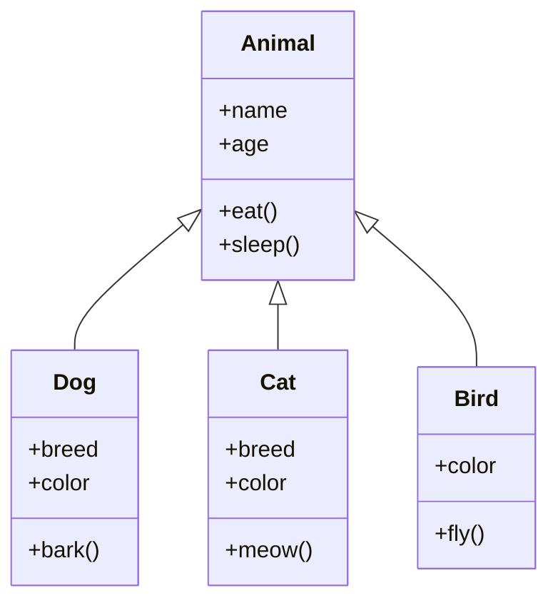

## Unit 1 - Introduction: The meaning of Object Orientation

- Object orientation is a paradigm or a way of thinking about designing and implementing software systems.
- Object orientation is based on the concept of objects, which are entities that have attributes (data) and behaviors (methods).
- Objects can interact with each other by sending and receiving messages, which are requests to invoke methods on the receiver object.
- Objects can be classified into types or classes, which define the common attributes and behaviors of a group of objects.
- Objects can inherit attributes and behaviors from other classes, which allows for code reuse and abstraction.
- Object orientation supports encapsulation, which is the principle of hiding the internal details of an object from the outside world and providing a well-defined interface for communication.
- Object orientation supports polymorphism, which is the ability of an object to behave differently depending on its type or context.
- Object orientation supports abstraction, which is the process of simplifying complex problems by focusing on the essential features and ignoring the irrelevant details.


### Object Identity

- Object identity is the concept that each object in a system has a unique and persistent identity that distinguishes it from other objects.
- Object identity allows objects to be referenced, compared, and manipulated by their identity, rather than by their attributes or behavior.
- Object identity is independent of the state or location of the object, meaning that an object can change its attributes or move to a different memory location without losing its identity.
- Object identity is supported by most object-oriented programming languages, such as Java, C++, and Python, by providing mechanisms for creating and managing object references, such as pointers, handles, or references.
- Object identity is also an important aspect of object-oriented design, as it enables the modeling of complex and dynamic systems, such as networks, databases, or user interfaces, by defining objects that represent the entities and relationships in the system.


### Encapsulation for the notes of the Unit 1 - Introduction: The meaning of Object Orientation in the subject of Object Oriented System Design

- Encapsulation is a fundamental concept in object-oriented programming (OOP) that involves bundling data and the methods that operate on that data within a single unit, known as a class .
- This concept helps to protect the data and methods from outside interference, as it restricts direct access to them .
- Encapsulation separates the contractual interface of an abstraction and its implementation. The interface defines the expected behavior and the implementation provides the details of how the behavior is achieved.
- Encapsulation allows an object to change its internal implementation without affecting the overall functioning of the system. This increases the flexibility and maintainability of the code.
- Encapsulation also enhances the reusability of the code, as the same class can be used in different contexts without modifying its source code.
- Encapsulation is one of the four basic principles of OOP, along with abstraction, polymorphism, and inheritance. These principles help to model the relevant attributes and interactions of entities as classes to define an abstract representation of a system.


### Information hiding for the notes of the Unit 1 - Introduction: The meaning of Object Orientation in the subject of Object Oriented System Design

- Information hiding is a principle of modularization that aims to reduce the complexity and risk of software development by hiding the details of implementation and design from the users of a module .
- Information hiding allows a module to provide a well-defined interface that specifies the operations and properties that the module offers, without exposing the internal logic and data structures that support them .
- Information hiding enables a module to change its implementation without affecting the clients that depend on it, as long as the interface remains consistent .
- Information hiding also enhances the security, maintainability, and reusability of a module, by preventing unauthorized access, modification, or misuse of its hidden information .
- In object-oriented programming, information hiding is achieved by using access modifiers (such as public, private, protected, etc.) to control the visibility and accessibility of the members (such as attributes, methods, constructors, etc.) of a class .
- Information hiding also applies to the nesting of types, such as classes, interfaces, enums, etc., within other types, to limit their scope and usage to a specific context .


### Polymorphism for the notes of the Unit 1 - Introduction: The meaning of Object Orientation in the subject of Object Oriented System Design

- Polymorphism is one of the core concepts of object-oriented programming (OOP) and describes situations in which something occurs in several different forms .
- In computer science, it describes the concept that you can access objects of different types through the same interface .
- For example, you can have a base class called Shape that defines a common interface for drawing different shapes, such as Circle, Square, Triangle, etc. Each derived class can implement its own draw method, but they can all be accessed through the same interface of the base class.
- Polymorphism allows you to write generic and reusable code that can work with different types of objects without knowing their exact details at compile time .
- Polymorphism also helps to enforce simplicity, making codes more extendable and easily maintaining applications.
- There are two main types of polymorphism in OOP: static (or compile-time) and dynamic (or run-time).
  - Static polymorphism is achieved by using method overloading, which means defining multiple methods with the same name but different parameters in the same class or its subclasses.
  - Dynamic polymorphism is achieved by using method overriding, which means redefining a method of the base class in a derived class to provide a different implementation. This requires the use of virtual methods, which are methods that can be overridden by subclasses.
- Polymorphism is one of the principles of OOP, along with abstraction, encapsulation, and inheritance. These principles help to design and develop software systems that are modular, reusable, maintainable, and extensible.


### Generosity

- Generosity is the quality of being kind, helpful, and willing to share or give more than is necessary or expected.
- Generosity is one of the core values of object-oriented system design, as it promotes collaboration, reuse, and extensibility among objects and classes.
- Generosity can be manifested in various ways in object-oriented system design, such as:
  - Providing public methods and attributes that allow other objects to access and modify the state and behavior of an object, without violating its encapsulation or integrity.
  - Implementing interfaces or abstract classes that define the common behavior and contracts of a group of objects, and allowing other objects to inherit or implement them, thus enabling polymorphism and dynamic binding.
  - Designing classes and methods that are open for extension but closed for modification, following the open-closed principle, and using design patterns to achieve this goal.
  - Applying the principle of least privilege, which states that an object should only have the minimum access rights and responsibilities that it needs to perform its function, and delegating the rest to other objects, thus reducing coupling and increasing cohesion.
  - Following the principle of responsibility-driven design, which states that an object should only do what it is responsible for, and not what other objects can do better, thus avoiding duplication and complexity.
  - Using composition over inheritance, which means that an object should prefer to contain and delegate to other objects, rather than inherit from them, thus avoiding the problems of multiple inheritance and fragile base classes.
  - Applying the principle of substitution, which states that an object of a subclass should be able to replace an object of a superclass without affecting the correctness of the system, thus ensuring behavioral compatibility and robustness.


### Importance of modelling for the notes of the Unit 1 - Introduction: The meaning of Object Orientation in the subject of Object Oriented System Design

- Modelling is the process of creating a representation or abstraction of a system or a problem using diagrams, symbols, notations and rules.
- Modelling is important for object oriented system design because it helps to:
  - Visualize a system as it is or as we want it to be.
  - Specify the structure or behavior of a system.
  - Guide the construction of a system.
  - Document the decisions made during the system development.
- Object oriented system design is a way of thinking about problems using models organized around real world concepts, such as objects, classes, relationships, attributes and operations.
- Object oriented modelling language (OOML) is a set of tools and techniques for creating and manipulating object oriented models, such as Unified Modelling Language (UML).
- Object oriented modelling helps to:
  - Capture the essential features and characteristics of a system or a problem domain.
  - Encapsulate the data and behavior of each object or class.
  - Promote reusability, modularity and extensibility of the system components.
  - Support an object oriented approach to software development, which involves analysis, design, implementation and testing.
  - Communicate and collaborate with other developers and stakeholders using a common and standard notation.


### Principles of Modelling for Object Oriented System Design

- Modelling is the process of creating a simplified and abstract representation of a system using objects, classes, attributes, methods, associations, inheritance, and other concepts.
- Modelling helps to understand, analyze, design, and implement a system that meets the requirements and goals of the problem domain.
- Modelling follows some principles that guide the selection and organization of the relevant aspects of the system and the level of detail and abstraction.
- Some of the principles of modelling for object oriented system design are:

  - Abstraction: It is the principle of focusing on the essential features and behaviors of an entity and ignoring the irrelevant details. Abstraction helps to reduce complexity and increase clarity of the system. For example, a class is an abstraction of a set of objects that share common attributes and methods.
  - Encapsulation: It is the principle of hiding the internal state and functionality of an object and only allowing access through a public set of functions. Encapsulation helps to protect the integrity and consistency of the object and to enforce the principle of least privilege. For example, an object can have private fields and public methods that manipulate those fields.
  - Inheritance: It is the principle of creating new abstractions based on existing abstractions. Inheritance helps to reuse and extend the code and to establish a hierarchical relationship among classes. For example, a subclass can inherit the attributes and methods of a superclass and add new ones or override existing ones.
  - Polymorphism: It is the principle of allowing an object to behave differently depending on its type or context. Polymorphism helps to achieve dynamic binding and to support multiple implementations of the same interface. For example, a method can have different definitions in different subclasses and the appropriate one can be invoked at runtime based on the type of the object.
  - Modularity: It is the principle of dividing a system into smaller and independent units that can be composed and reused. Modularity helps to increase cohesion and decrease coupling among the components of the system and to facilitate testing and maintenance. For example, a system can be composed of several modules that communicate through well-defined interfaces.
  - Hierarchy: It is the principle of organizing the system into different levels of abstraction and complexity. Hierarchy helps to structure the system and to establish a logical order and dependency among the components. For example, a system can have a top-level class that represents the whole system and several subclasses that represent the subsystems or parts of the system.
  - Typing: It is the principle of defining and enforcing the rules and constraints on the values and operations of the objects and classes. Typing helps to ensure the correctness and safety of the system and to prevent errors and exceptions. For example, a system can have a type system that specifies the data types, the type conversions, and the type checking of the objects and classes.
  - Concurrency: It is the principle of allowing multiple objects or processes to execute simultaneously and independently. Concurrency helps to improve the performance and responsiveness of the system and to support parallel and distributed computing. For example, a system can have threads or processes that run concurrently and share resources or communicate through synchronization mechanisms.
  - Persistence: It is the principle of preserving the state and data of the objects and classes beyond the lifetime of the system or the execution of the program. Persistence helps to store and retrieve the information of the system and to support data management and analysis. For example, a system can have a database or a file system that stores and retrieves the objects and classes.


### Object Oriented Modelling

- Object oriented modelling (OOM) is a process of designing and implementing software systems using objects, which are entities that encapsulate data and behaviour.
- OOM is used at the beginning of the software life cycle, when the problem domain and the requirements are analysed and specified.
- OOM helps to create a conceptual model of the system, which can be used to communicate with the stakeholders, validate the design, and guide the implementation.
- OOM uses a collection of modelling techniques, such as use cases, class diagrams, sequence diagrams, state diagrams, etc., to represent the static and dynamic aspects of the system.
- OOM is implemented by using a programming language that supports the object oriented paradigm, such as Java, C++, Python, etc., which allow the creation and manipulation of objects as the basic units of computation.
- OOM has several benefits, such as:

  - It supports abstraction, encapsulation, inheritance, and polymorphism, which are the fundamental principles of object orientation.
  - It promotes modularity, reusability, and maintainability of the software, by allowing the decomposition of the system into independent and cohesive components.
  - It facilitates the development of complex and distributed systems, by providing a natural way of modelling the real-world entities and their interactions.
  - It enhances the quality and reliability of the software, by enabling the verification and validation of the design at different levels of abstraction.


### Introduction to UML

- UML stands for **Unified Modeling Language**  , a language used in the field of software engineering that represents the components of the **Object-Oriented Programming** concepts .
- UML is a way to define the whole software architecture or structure using mostly graphical notations  .
- UML is a collection of best engineering practices that have proven successful in the modeling of large and complex systems.
- UML covers a wider portion of software development efforts including agile practices.
- UML can express the design of software projects using different types of diagrams, such as **class diagrams**, **activity diagrams**, **sequence diagrams**, etc.

### The meaning of Object Orientation

- Object Orientation is a method of design that encompasses the process of **object-oriented decomposition** and a notation for depicting both logical and physical as well as state and dynamic models of the system under design.
- Object Orientation helps us to decompose large systems and modularize our system using **objects** .
- Objects are entities that have **attributes** (data) and **methods** (functions) that define their behavior and interactions .
- Objects are instances of **classes**, which define the blue print or structure of an object.
- Object Orientation follows some principles, such as **encapsulation**, **inheritance**, **polymorphism**, and **abstraction**, that help us to design software that is more reusable, maintainable, and extensible.


### Conceptual Model of the UML

- A conceptual model is a model that is made of concepts and their relationships .
- A concept is an idea or a generalization of something in the real world.
- A relationship is a connection or an association between two or more concepts.
- A conceptual model is the first step before drawing a UML diagram .
- A UML diagram is a graphical representation of a system or a process using the Unified Modeling Language (UML).
- The UML is a standard visual language for describing and modeling software blueprints.
- The UML is not a programming language, it is rather a visual language.
- The UML has three major elements: the basic building blocks, the rules, and the common mechanisms.
- The basic building blocks are the things that make up a UML model, such as classes, objects, attributes, operations, etc.
- The rules are the constraints that dictate how the building blocks can be put together to form a valid UML model.
- The common mechanisms are the features that apply throughout the UML, such as stereotypes, notes, constraints, etc.
- The UML can be used for visualizing, specifying, constructing, and documenting a system or a process.
- The UML can also be used for different purposes, such as analysis, design, implementation, testing, deployment, etc.
- The UML has different types of diagrams, such as structure diagrams, behavior diagrams, interaction diagrams, etc.
- Each diagram shows a different aspect or view of a system or a process.
- The UML is a flexible and extensible language that can be adapted to different domains and platforms.


### Architecture for the notes of the Unit 1 - Introduction: The meaning of Object Orientation in the subject of Object Oriented System Design

- Object Oriented System Design is a software development methodology that focuses on modeling the system as a collection of interacting objects that encapsulate data and behavior.
- Object Oriented Architecture is the design paradigm that defines the structure and organization of the system based on the principles of object orientation, such as abstraction, encapsulation, inheritance, polymorphism, and modularity.
- The benefits of Object Oriented Architecture are:
  - It facilitates reuse of existing code and components, reducing development time and cost.
  - It enhances the maintainability and extensibility of the system, as changes in one part of the system do not affect other parts.
  - It improves the reliability and quality of the system, as objects are tested and verified independently.
  - It supports the development of complex and dynamic systems, as objects can communicate and collaborate with each other.
- The main elements of Object Oriented Architecture are:
  - Classes: The blueprint or template for creating objects that define the attributes and methods of the objects.
  - Objects: The instances of classes that represent the entities and concepts of the system.
  - Methods: The actions or functions that objects can perform.
  - Attributes: The data or properties that objects can store and manipulate.
  - Messages: The communication mechanism between objects that invoke methods and pass data.
  - Inheritance: The mechanism that allows a class to inherit the attributes and methods of another class, forming a hierarchy of classes.
  - Polymorphism: The ability of objects to behave differently depending on their type or context, allowing a single message to have different effects on different objects.
  - Modularity: The principle of dividing the system into smaller and independent units or modules that can be developed and tested separately.
- The steps of Object Oriented Design are:
  - Define the context and scope of the system, identifying the goals, requirements, constraints, and assumptions of the system.
  - Design the architecture of the system, using a block diagram or a hierarchy of subsystems to show the high-level structure and components of the system.
  - Identify the classes and objects of the system, using techniques such as use cases, scenarios, CRC cards, or class diagrams to capture the responsibilities and collaborations of the objects.
  - Define the attributes and methods of the classes and objects, using techniques such as data dictionaries, state diagrams, or sequence diagrams to specify the data and behavior of the objects.
  - Apply the principles of object orientation, such as abstraction, encapsulation, inheritance, polymorphism, and modularity, to refine and optimize the design of the system.
  - Validate and verify the design of the system, using techniques such as reviews, inspections, testing, or prototyping to ensure the design meets the requirements and expectations of the system.


## Unit 2 - Basic Structural Modeling

- Basic structural modeling is the process of creating and manipulating geometric representations of the physical components of a structure, such as beams, columns, slabs, walls, foundations, etc.
- Basic structural modeling can be done using various software tools, such as Revit, AutoCAD, Tekla, etc.
- Basic structural modeling involves the following steps:
  - Define the project parameters, such as units, levels, grids, materials, etc.
  - Create the structural elements, such as columns, beams, slabs, walls, etc., using the appropriate tools and commands.
  - Modify the structural elements, such as changing their dimensions, properties, alignment, orientation, etc., using the appropriate tools and commands.
  - Add the structural supports, such as foundations, footings, piles, etc., using the appropriate tools and commands.
  - Add the structural loads, such as dead, live, wind, seismic, etc., using the appropriate tools and commands.
  - Analyze the structural model, such as checking for errors, warnings, interferences, etc., using the appropriate tools and commands.
  - Document the structural model, such as creating views, sheets, schedules, annotations, etc., using the appropriate tools and commands.
  - Export the structural model, such as saving, printing, sharing, etc., using the appropriate tools and commands.
- Basic structural modeling requires the following skills and knowledge:
  - Understanding of the structural design principles, such as load paths, stability, strength, stiffness, etc.
  - Familiarity with the structural codes and standards, such as ASCE, ACI, AISC, etc.
  - Proficiency with the structural modeling software, such as Revit, AutoCAD, Tekla, etc.
  - Ability to create and modify structural elements, such as columns, beams, slabs, walls, etc., using the appropriate tools and commands.
  - Ability to add and modify structural supports, such as foundations, footings, piles, etc., using the appropriate tools and commands.
  - Ability to add and modify structural loads, such as dead, live, wind, seismic, etc., using the appropriate tools and commands.
  - Ability to analyze and document the structural model, such as checking for errors, warnings, interferences, etc., using the appropriate tools and commands.
  - Ability to export and share the structural model, such as saving, printing, sharing, etc., using the appropriate tools and commands.


### Classes

- A class is a **template** or a **blueprint** that defines the **characteristics** and **operations** of an object .
- An object is a **specific instance** of a class that has **state** and **behavior**.
- Classes are used to **create** and **manage** new objects and support **inheritance** —a key ingredient in object-oriented programming and a mechanism of **reusing code**.
- Classes can be organized into **class hierarchies** that enable the system to develop using **generalization** and **specialization**.
- Generalization is the process of **extracting common features** from two or more classes and combining them into a **superclass**.
- Specialization is the process of **creating subclasses** from a superclass by **adding specific features** or **overriding inherited features**.
- Classes can be defined using the **class syntax** in some programming languages, such as Java, C++, Python, etc.
- Classes can also be defined using **diagrams** that show the **name**, **attributes**, and **methods** of a class, as well as the **relationships** between classes.
- A class diagram is a type of **structural diagram** that shows the **static structure** of a system using classes and their associations.
- A class diagram can be used to **model** the system at different levels of abstraction, such as **conceptual**, **specification**, or **implementation**.
- A class diagram can also be used to **design** the system by applying **object-oriented principles** and **patterns**.
- A class diagram can be created using **tools** such as UML, Rational Rose, Visual Paradigm, etc.


### Relationships

Relationships are the connections between classes or objects in object-oriented system design. They describe how the classes or objects interact with each other and what kind of dependencies they have. There are four main types of relationships in object-oriented programming: inheritance, association, composition, and aggregation .

- **Inheritance** is a relationship where a class (called the subclass or child class) inherits the attributes and operations of another class (called the superclass or parent class). This means that the subclass can use the features of the superclass as well as add its own features. Inheritance is based on the "is a" relationship, meaning that the subclass is a specific type of the superclass. For example, a Dog class can inherit from an Animal class, because a dog is an animal.
- **Association** is a relationship where two classes or objects are linked to each other in some way, but they can exist independently. Association is based on the "has a" relationship, meaning that one class or object has a reference to another class or object. For example, a Student class can have an association with a Course class, because a student has a course, but they can exist without each other.
- **Composition** is a relationship where a class (called the composite or whole) contains another class (called the component or part) as a part of its structure. Composition is based on the "part of" relationship, meaning that the component is a part of the composite and cannot exist without it. For example, a Car class can have a composition with an Engine class, because an engine is a part of a car and cannot exist without it.
- **Aggregation** is a relationship where a class (called the aggregate or whole) contains another class (called the constituent or part) as a part of its structure, but the constituent can exist independently. Aggregation is also based on the "part of" relationship, but it is a weaker form of composition. For example, a Library class can have an aggregation with a Book class, because a book is a part of a library, but it can exist without it.

Relationships can be represented in a class diagram using different symbols and lines. A class diagram is a type of static structure diagram that shows the classes, their attributes, operations, and the relationships among them. The following table summarizes the symbols and lines used for each type of relationship in a class diagram.

| Relationship | Symbol | Line |
| ------------ | ------ | ---- |
| Inheritance | A hollow triangle pointing to the superclass | A solid line |
| Association | A solid diamond at the end of the line | A solid line |
| Composition | A filled diamond at the composite end of the line | A solid line |
| Aggregation | A hollow diamond at the aggregate end of the line | A solid line |

Here is an example of a class diagram that shows the relationships among some classes:

Class diagram example

In this diagram, the Shape class is the superclass of the Circle, Rectangle, and Triangle classes, so there is an inheritance relationship between them. The Shape class has an association with the Color class, because a shape has a color, but they can exist independently. The Drawing class has a composition with the Shape class, because a shape is a part of a drawing and cannot exist without it. The Drawing class also has an aggregation with the Paper class, because a paper is a part of a drawing, but it can exist without it.


### Common Mechanisms for the notes of the Unit 2 - Basic Structural Modeling in the subject of Object Oriented System Design

- Common mechanisms are the concepts and techniques that can be applied across different types of structural models in object-oriented system design.
- Some of the common mechanisms are:
  - Abstraction: The process of identifying the essential features and behaviors of a system or a component, while ignoring the irrelevant details.
  - Encapsulation: The principle of hiding the internal structure and implementation of a system or a component from its external interface and users.
  - Modularity: The principle of dividing a system or a component into smaller and independent units that can be composed and reused.
  - Hierarchy: The principle of organizing a system or a component into a set of levels or layers, where each level or layer has a well-defined responsibility and communicates with other levels or layers through well-defined interfaces.
  - Inheritance: The mechanism of defining a new system or a component as a specialization or extension of an existing system or a component, inheriting its features and behaviors and adding new ones.
  - Polymorphism: The mechanism of allowing a system or a component to have different forms or behaviors depending on the context or the input.
  - Association: The relationship between two or more systems or components that indicates some kind of connection or dependency among them.
  - Aggregation: A special type of association that indicates a whole-part relationship between two or more systems or components, where the whole is composed of the parts and the parts can belong to only one whole at a time.
  - Composition: A special type of aggregation that indicates a strong whole-part relationship between two or more systems or components, where the whole is responsible for the creation and destruction of the parts and the parts cannot exist without the whole.
  - Generalization: A special type of association that indicates a kind-of relationship between two or more systems or components, where one system or component is a generalization or abstraction of another system or component, and the latter is a specialization or extension of the former.


### Diagrams for the notes of the Unit 2 - Basic Structural Modeling in the subject of Object Oriented System Design

- Basic structural modeling is the process of describing the static structure of a system using diagrams that represent the elements and the relationships between them.
- The Unified Modeling Language (UML) is a standard graphical notation for modeling object-oriented systems.
- UML defines four types of structural diagrams: class diagram, object diagram, component diagram, and deployment diagram.
- Class diagram is the most widely used structural diagram. It shows the classes, interfaces, and collaborations of a system, and the attributes, operations, and associations between them .
- Object diagram is a snapshot of the instances of the classes and their links at a specific point in time. It is used to illustrate a particular scenario or example of a system.
- Component diagram shows the physical components of a system, such as files, libraries, executables, and subsystems. It is used to model the implementation and deployment aspects of a system .
- Deployment diagram shows the configuration of the hardware and software elements that are used to run a system. It is used to model the distribution and communication of a system .
- The following are some examples of structural diagrams:

  - Class diagram:

    ```
    +-----------------+        +-----------------+
    |    Employee     |        |    Department   |
    +-----------------+        +-----------------+
    | -name: String   |        | -name: String   |
    | -salary: double |        | -budget: double |
    +-----------------+        +-----------------+
    | +getName():String|       | +getName():String|
    | +getSalary():double|     | +getBudget():double|
    | +setSalary(double):void| | +setBudget(double):void|
    +-----------------+        +-----------------+
             |                         |
             | worksIn                 |
             +-------------------------+
    ```

  - Object diagram:

    ```
    +-----------------+        +-----------------+
    |    Alice        |        |    Sales        |
    +-----------------+        +-----------------+
    | -name: "Alice"  |        | -name: "Sales"  |
    | -salary: 5000   |        | -budget: 100000 |
    +-----------------+        +-----------------+
             |                         |
             | worksIn                 |
             +-------------------------+
    ```

  - Component diagram:

    ```
    +-----------------+        +-----------------+
    |    Calculator   |        |    MathLib      |
    +-----------------+        +-----------------+
    | -input: String  |        | -PI: double     |
    | -output: double |        | -E: double      |
    +-----------------+        +-----------------+
    | +calculate():void|       | +sin(double):double|
    | +display():void  |       | +cos(double):double|
    +-----------------+        +-----------------+
             |                         |
             | uses                     |
             +-------------------------+
    ```

  - Deployment diagram:

    ```
    +-----------------+        +-----------------+
    |    Client       |        |    Server       |
    +-----------------+        +-----------------+
    | -OS: Windows 10 |        | -OS: Linux      |
    | -RAM: 8 GB      |        | -RAM: 16 GB     |
    +-----------------+        +-----------------+
    | +Calculator.exe |        | +MathLib.so     |
    +-----------------+        +-----------------+
             |                         |
             | requests                |
             +-------------------------+
    ```


### Class & Object Diagrams

- Class and object diagrams are two types of UML structural diagrams that show the static structure of a system.
- Class diagrams describe the classes and interfaces that make up the system, along with their attributes, operations, and relationships.
- Object diagrams show the instances of the classes and interfaces in the system, along with their values, links, and states.
- Class and object diagrams are related in the sense that an object diagram is a snapshot of a class diagram at a specific point in time.

#### Class Diagrams

- A class diagram consists of a set of classes and interfaces, represented by rectangles with three compartments: the top compartment shows the name and stereotype of the class or interface, the middle compartment shows the attributes, and the bottom compartment shows the operations.
- A class diagram also shows the relationships between the classes and interfaces, such as associations, generalizations, dependencies, aggregations, compositions, and realizations. These relationships are represented by different types of lines and symbols, such as solid or dashed lines, arrows, diamonds, and triangles.
- A class diagram can have different levels of abstraction, depending on the purpose and scope of the diagram. For example, a conceptual class diagram shows the domain concepts and their relationships, while a design class diagram shows the implementation classes and their interactions.

#### Object Diagrams

- An object diagram consists of a set of objects and links, represented by rectangles and lines, respectively. An object is an instance of a class or an interface, and a link is an instance of an association or a dependency.
- An object diagram shows the values of the attributes and the states of the objects, as well as the links between them. An object diagram can also show the roles and multiplicities of the objects in a link, using labels and numbers.
- An object diagram is useful for illustrating a specific scenario or example of a system, such as a test case, a simulation, or a snapshot of the system's runtime behavior. An object diagram can also be used to validate and verify the correctness and completeness of a class diagram.


### Terms for the notes of the Unit 2 - Basic Structural Modeling in the subject of Object Oriented System Design

- **Object-oriented system design** is a process of designing a system using the principles and concepts of object-oriented programming, such as abstraction, encapsulation, inheritance, and polymorphism .
- **Basic structural modeling** is a technique of representing the static structure of a system using classes, objects, attributes, operations, and associations  .
- **Class** is a blueprint or template that defines the common properties and behaviors of a group of similar objects  .
- **Object** is an instance or occurrence of a class that has a unique identity, state, and behavior  .
- **Attribute** is a named property of a class or an object that describes some aspect of the object's state  .
- **Operation** is a named function or procedure of a class or an object that defines some action or behavior of the object  .
- **Association** is a relationship between two or more classes or objects that indicates how they are connected or related  .
- **Class diagram** is a graphical representation of the classes, objects, attributes, operations, and associations in a system .
- **Object diagram** is a graphical representation of the objects, their attributes, and their associations in a system at a specific point in time .
- **Class-responsibility-collaboration (CRC) card** is a tool for identifying and documenting the classes, their responsibilities, and their collaborations in a system.


### Concepts for the notes of the Unit 2 - Basic Structural Modeling in the subject of Object Oriented System Design

- Basic structural modeling is the process of identifying and describing the static structure of a system using object-oriented concepts and notations.
- The static structure of a system consists of the classes, objects, attributes, operations, and associations that define the system's state and behavior.
- Basic structural modeling uses three types of diagrams to represent the static structure of a system: class diagrams, object diagrams, and CRC cards.
- Class diagrams show the classes and their relationships in a system. Classes are the abstract templates that define the common properties and behaviors of a group of objects. Relationships are the connections or dependencies between classes, such as inheritance, association, aggregation, composition, and dependency.
- Object diagrams show the instances of classes and their relationships in a specific situation or scenario. Objects are the concrete entities that have a state and a behavior in a system. Object diagrams can be used to illustrate the dynamic aspects of a system, such as the creation, deletion, and interaction of objects.
- CRC cards are a simple and informal way of documenting the classes and their responsibilities and collaborations in a system. CRC stands for class-responsibility-collaboration. A CRC card is a small index card that contains the name of a class, its responsibilities (what it knows and what it does), and its collaborators (other classes that it interacts with). CRC cards can be used to facilitate brainstorming, design, and communication among developers and stakeholders.


### Modelling Techniques for Class & Object Diagrams

- Class and object diagrams are two types of structural diagrams in the Unified Modeling Language (UML) that show the static structure of a system.
- Class diagrams show the classes, their attributes, operations, and the relationships among classes in a system. Object diagrams show the instances of classes and their links at a specific point in time.
- Class and object diagrams use similar notation, but differ in the level of abstraction and the purpose of modeling.
- Class diagrams are used to model the general concepts and types of a system, while object diagrams are used to model the specific instances and values of a system.
- Class diagrams are more common and widely used than object diagrams, as they provide a comprehensive overview of a system and can be used for analysis, design, and documentation purposes.
- Object diagrams are more useful for illustrating a particular scenario or example of a system, such as a test case, a configuration, or a snapshot of runtime behavior.
- To model class and object diagrams, some of the techniques that can be used are:

  - Identify the classes and objects that are relevant to the system and give them meaningful names.
  - Identify the attributes and operations of each class and object and specify their visibility, type, and multiplicity.
  - Identify the relationships among classes and objects, such as association, aggregation, composition, inheritance, and realization, and specify their direction, name, and multiplicity.
  - Use graphical symbols and connectors to represent the classes, objects, and relationships in a diagram, following the UML notation and conventions.
  - Use stereotypes, constraints, and notes to add additional information or clarification to the diagram elements, if needed.
  - Organize the diagram elements in a logical and readable way, using packages, compartments, and subdiagrams, if needed.
  - Validate and verify the diagram for consistency, completeness, and correctness, using formal methods or informal reviews.


### Collaboration Diagrams

- Collaboration diagrams are used to show the **relationship** between the **objects** in a system.
- Collaboration diagrams are also known as **communication diagrams** in UML 2.x.
- Collaboration diagrams are similar to **sequence diagrams**, but they focus more on the **structure** of the objects rather than the **order** of the messages.
- Collaboration diagrams can be used to model the **collaborations**, **mechanisms** or the **structural organization** within a system design.
- Collaboration diagrams consist of four major components:
  - **Objects**: Objects are shown as rectangles with naming labels inside. The naming label follows the convention of object name : class name. Objects can also have **attributes** and **operations** shown in separate compartments within the rectangle.
  - **Actors**: Actors are instances that invoke the interaction in the diagram. Each actor has a name and a role, with one actor initiating the interaction. Actors are shown as **stick figures** or **rectangles** with the stereotype <<actor>>.
  - **Links**: Links are solid lines that connect objects and actors. They represent the **association** or the **communication path** between them. Links can have **multiplicity**, **roles** and **constraints** shown as labels along the line.
  - **Messages**: Messages are the information or data that is exchanged between the objects and actors. Messages are shown as **arrows** along the links, with the arrowhead indicating the direction of the message. Messages can have **sequence numbers**, **names**, **arguments** and **return values** shown as labels above or below the arrow.

- Collaboration diagrams can be created by following these steps:
  - Identify the design elements required to implement the functionality of the system or a use case.
  - Draw the objects and actors involved in the interaction as rectangles and stick figures respectively.
  - Connect the objects and actors with links to show their relationships and communication paths.
  - Add messages along the links to show the information flow and the sequence of events.
  - Add attributes, operations, roles, constraints and other details as needed to clarify the diagram.

- Collaboration diagrams can be used to show the following aspects of a system:
  - The **static structure** of the objects and their associations.
  - The **dynamic behavior** of the objects and their interactions.
  - The **alternative scenarios** and **conditional flows** of the interaction.
  - The **concurrency** and **synchronization** of the messages.
  - The **distribution** and **deployment** of the objects across different nodes or devices.


### Terms for the notes of the Unit 2 - Basic Structural Modeling in the subject of Object Oriented System Design

- **Object-oriented system design** is a process of designing a system using the principles and concepts of object-oriented programming, such as abstraction, encapsulation, inheritance, and polymorphism .
- **Basic structural modeling** is a technique of representing the static structure of a system using classes, objects, attributes, operations, and associations  .
- **Class** is a blueprint or template that defines the common properties and behaviors of a group of similar objects  .
- **Object** is an instance or occurrence of a class that has a unique identity, state, and behavior  .
- **Attribute** is a named property of a class or an object that describes some aspect of the object's state  .
- **Operation** is a named function or procedure of a class or an object that defines some action or behavior of the object  .
- **Association** is a relationship between two or more classes or objects that indicates how they are connected or related  .
- **Class diagram** is a graphical representation of the classes, objects, attributes, operations, and associations in a system .
- **Object diagram** is a graphical representation of the objects, their attributes, and their associations in a system at a specific point in time .
- **Class-responsibility-collaboration (CRC) card** is a simple tool for identifying and documenting the classes, their responsibilities, and their collaborations in a system.


### Concepts for the notes of the Unit 2 - Basic Structural Modeling in the subject of Object Oriented System Design

- Basic structural modeling is the process of identifying and describing the static structure of a system using object-oriented concepts and notations.
- The static structure of a system consists of the components that make up the system and their relationships, such as classes, objects, attributes, operations, associations, aggregations, compositions, generalizations, and dependencies.
- The main purpose of basic structural modeling is to capture the essential features and properties of a system and to provide a common vocabulary and understanding among the stakeholders.
- The main techniques and tools for basic structural modeling are:
  - Class-Responsibility-Collaboration (CRC) cards: A simple and informal way of representing classes and their responsibilities and collaborations with other classes. CRC cards are useful for brainstorming, identifying, and validating classes and scenarios in the early stages of analysis and design.
  - Class diagrams: A graphical way of representing classes and their relationships using the Unified Modeling Language (UML) notation. Class diagrams are useful for showing the static structure and hierarchy of a system, the attributes and operations of each class, and the constraints and rules that govern the system.
  - Object diagrams: A graphical way of representing objects and their relationships using the UML notation. Object diagrams are useful for showing the state and behavior of a system at a specific point in time, the values and links of each object, and the dynamic aspects of a system.


### Basic Structural Modeling

- Basic structural modeling is the process of identifying and describing the static structure of a system using classes, objects, attributes, operations, and associations.
- A class is a blueprint or template that defines the common properties and behaviors of a set of similar objects.
- An object is an instance of a class that has a unique identity, state, and behavior.
- An attribute is a named property of a class or an object that describes some aspect of the object's state.
- An operation is a named action or function that can be performed by a class or an object, usually to change its state or to interact with other objects.
- An association is a relationship between two or more classes or objects that indicates how they are connected or related.
- Basic structural modeling can be represented using class diagrams, object diagrams, and composite structure diagrams in UML (Unified Modeling Language).
- A class diagram shows the classes, their attributes and operations, and the associations among them in a system.
- An object diagram shows the objects, their attribute values, and the links among them in a specific situation or scenario.
- A composite structure diagram shows the internal structure of a class or an object, including its parts, ports, connectors, and collaborations.


### Polymorphism in Collaboration Diagrams

- Polymorphism is the ability of an object to behave differently depending on its type or context.
- In collaboration diagrams, polymorphism is represented by using multiple scenarios controlled by guard conditions.
- Guard conditions are expressions that evaluate to true or false and determine which scenario is executed.
- Each scenario shows the messages sent to and from the polymorphic object and the corresponding actions performed by the object.
- The polymorphic object is usually shown as an abstract class or an interface with a stereotype of <<polymorphic>>.
- An example of a collaboration diagram with polymorphism is shown below:

Collaboration diagram with polymorphism

- In this diagram, the object s of type Shape can be an instance of Triangle, Rectangle or Square at run-time.
- The guard conditions [s is Triangle], [s is Rectangle] and [s is Square] determine which scenario is executed when the message show() is sent to s.
- Each scenario shows the different actions performed by s depending on its type, such as drawing a triangle, a rectangle or a square.


### Iterated Messages

- Iterated messages are a way of representing repeated or conditional messages in a sequence diagram.
- Iterated messages are shown by placing an asterisk (*) in front of the message name, followed by an optional iteration expression in square brackets.
- The iteration expression specifies the condition or the number of times the message is sent or received.
- For example, `*m[i]` means that message `m` is sent or received for each value of `i` in some range.
- Iterated messages can be used to model loops, collections, recursion, or any other situation where a message is repeated or conditional.
- Iterated messages can simplify the sequence diagram by reducing the number of lifelines and messages.
- Iterated messages can also show the order or the concurrency of the repeated messages, by using different notations such as nested, parallel, or interleaved.
- For example, `*m[i] || *n[j]` means that messages `m` and `n` are sent or received in parallel for each value of `i` and `j` in some ranges.
- Iterated messages are useful for modeling the dynamic behavior of complex or repetitive scenarios in object-oriented systems.


### Use of self in messages

- In object-oriented system design, a message is a request from one object to another object to perform some action or return some information.
- A message consists of a sender, a receiver, a selector, and optional arguments.
- A self message is a special type of message where the sender and the receiver are the same object .
- A self message indicates that the object is invoking one of its own methods or accessing one of its own attributes.
- A self message is represented by a U-shaped arrow pointing back to the same lifeline in a sequence diagram .
- A self message can be used to model scenarios where the object needs to perform some internal computation, initialization, or validation before responding to other messages .
- For example, consider a scenario where a device object wants to access its webcam. The device object can send a self message to check if the webcam is available and then return the webcam object to the caller .

A sequence diagram showing a self message

Figure: A self message example


### Sequence Diagrams

- Sequence diagrams are a type of interaction diagram that show how objects interact with each other in a time-ordered manner.
- Sequence diagrams are useful for modeling the dynamic behavior of a system, such as the flow of messages and events between objects in a use case scenario.
- Sequence diagrams consist of the following elements:
  - Objects: The entities that participate in the interaction. They are represented by vertical lifelines with the object name on top.
  - Messages: The communication between objects. They are represented by horizontal arrows with the message name and optional arguments on top. Messages can be synchronous (solid arrowhead), asynchronous (open arrowhead), or reply (dashed arrowhead).
  - Activation: The period of time when an object is performing an action or waiting for a reply. It is represented by a thin or thick rectangle on the lifeline.
  - Lifespan: The duration of an object's existence. It is represented by a dashed line that extends from the creation to the destruction of the object. An object can be created by a message (solid arrowhead with a dashed line) or destroyed by a message (crossed circle with a dashed line).
  - Combined fragments: The sections of the interaction that show conditional or iterative behavior. They are represented by a frame with an operator (such as alt, opt, loop, etc.) and a guard condition on the top left corner. The frame encloses the messages that belong to the fragment.
  - Interaction use: The reuse of another interaction diagram within a sequence diagram. It is represented by a frame with the keyword ref and the name of the reused diagram on the top left corner. The frame encloses the parameters and return values of the interaction.
  - Timing constraints: The specification of the time interval or duration of a message or an event. They are represented by brackets with the constraint expression on the message arrow or the lifeline.
- Sequence diagrams follow some basic rules and guidelines, such as:
  - The objects are arranged from left to right according to the order of their creation or involvement in the interaction.
  - The messages are arranged from top to bottom according to the chronological order of their occurrence.
  - The messages should have meaningful and consistent names that reflect the intention and functionality of the interaction.
  - The activation and lifespan of an object should be consistent with the messages it sends and receives.
  - The combined fragments and interaction uses should be used to simplify and modularize the interaction.
  - The timing constraints should be used to specify the temporal aspects of the interaction.

- Here is an example of a sequence diagram for making a hotel reservation:

sequence diagram example


### Terms for the notes of the Unit 2 - Basic Structural Modeling in the subject of Object Oriented System Design

- **Object**: A discrete entity that has a well-defined boundary and identity, and encapsulates state and behavior. Objects are instances of classes.
- **Class**: A description of a set of objects that share the same attributes, operations, relationships, and semantics. Classes are the basic units of object-oriented system design.
- **Attribute**: A named property of a class that describes a range of values that instances of that class may hold. Attributes represent the state of an object.
- **Operation**: A function or a service that is provided by all the instances of a class. Operations define the behavior of an object.
- **Association**: A relationship between two or more classes that specifies how objects of those classes are connected. Associations can have names, roles, multiplicities, and constraints.
- **Aggregation**: A special kind of association that represents a whole-part relationship between two classes. Aggregation implies that the part can exist independently of the whole, and that the whole is not responsible for the creation or destruction of the part.
- **Composition**: A stronger form of aggregation that implies that the part can only exist as part of the whole, and that the whole is responsible for the creation and destruction of the part.
- **Generalization**: A relationship between a general class (superclass) and a more specific class (subclass) that shares the structure and behavior of the superclass. Generalization represents an "is-a" relationship between classes.
- **Abstraction**: The process of identifying the essential features of a system or a problem domain, while ignoring the irrelevant details. Abstraction helps to reduce complexity and increase modularity.
- **Encapsulation**: The principle of hiding the internal details of an object from the outside world. Encapsulation ensures that an object can only be accessed and modified through its public interface, and that its implementation can be changed without affecting its clients.
- **Inheritance**: The mechanism of reusing the attributes and operations of a superclass in a subclass. Inheritance allows subclasses to extend or override the behavior of superclasses.
- **Polymorphism**: The ability of an object to behave differently depending on its type or context. Polymorphism enables a single operation or message to have different meanings or effects for different classes of objects.


### Concepts for the notes of the Unit 2 - Basic Structural Modeling in the subject of Object Oriented System Design

- Basic structural modeling is the process of identifying and describing the static structure of a system using object-oriented concepts and notations.
- The static structure of a system consists of the components that make up the system and their relationships.
- The main components of a system are objects, classes, and subsystems.
- An object is an instance of a class that has a state, behavior, and identity.
- A class is a blueprint or template that defines the common attributes and methods of a group of objects.
- A subsystem is a group of classes that collaborate to provide a specific functionality or service to the system.
- The main relationships among components are association, aggregation, composition, generalization, and dependency.
- An association is a structural relationship that specifies that objects of one class are connected to objects of another class.
- An aggregation is a special form of association that represents a whole-part relationship between a container class and its parts.
- A composition is a stronger form of aggregation that implies that the parts cannot exist without the container.
- A generalization is a relationship that specifies that a class is a specialization or subclass of another class, and inherits its attributes and methods.
- A dependency is a relationship that specifies that a change in one class may affect another class.
- The main notations for basic structural modeling are class diagrams and object diagrams.
- A class diagram is a graphical representation of the classes and their relationships in a system.
- An object diagram is a graphical representation of the objects and their links in a system at a specific point in time.
- A link is an instance of an association that connects two or more objects.
- A class diagram consists of the following elements: class name, attributes, methods, visibility, multiplicity, role name, association name, and generalization and dependency arrows.
- A class name is the name of the class enclosed in a rectangle.
- An attribute is a property or characteristic of a class that describes its state.
- A method is an operation or function that a class can perform.
- The visibility of an attribute or method indicates whether it can be accessed by other classes or objects.
- The visibility can be public (+), protected (#), private (-), or package (~).
- The multiplicity of an association end specifies how many objects of one class can be related to one object of another class.
- The role name of an association end specifies the role or purpose of the class in the association.
- The association name is the name of the association that describes its meaning or semantics.
- The generalization arrow is a solid line with a hollow triangle pointing to the superclass.
- The dependency arrow is a dashed line with an open arrowhead pointing to the class that is depended upon.
- An object diagram consists of the following elements: object name, attribute values, links, and link names.
- An object name is the name of the object followed by a colon and the name of its class enclosed in a rectangle.
- An attribute value is the value of an attribute of an object that describes its state at a specific point in time.
- A link is a solid line that connects two or more objects.
- A link name is the name of the link that describes its meaning or semantics.
- Basic structural modeling is useful for understanding and designing the static aspects of a system, such as the data, the functionality, and the hierarchy of the components.
- Basic structural modeling can also help to identify and eliminate inconsistencies, redundancies, and ambiguities in the system.


### Depicting asynchronous messages with/without priority for the notes of the Unit 2 - Basic Structural Modeling in the subject of Object Oriented System Design

- An asynchronous message is a message that is sent without causing the sender to wait for a reply . The recipient must be an active class, with the asynchronous message being a hardware or software interrupt. Most of the web-based interactions are asynchronous messages from the browser to the server followed by another asynchronous message going the other way.
- An asynchronous message is the only message type for which you can individually move the sending and receiving points. You can create an asynchronous message with or without a behavior execution specification. A behavior execution specification is a notation that shows the duration of an action or a state in a lifeline.
- In UML, an asynchronous message has an open arrow head . A synchronous message, which is a message that causes the sender to wait for a reply, has a filled arrow head. An example of a synchronous message is a method call in an object-oriented language.
- To depict an asynchronous message with priority, you can use a number or a symbol in front of the message name to indicate the order of execution. For example, 1:sendEmail() means that this message has the highest priority and should be executed first. Alternatively, you can use a star (*) to indicate that the message has a lower priority than the others. For example, *:updateStatus() means that this message can be executed later or skipped if necessary.
- To depict an asynchronous message without priority, you can simply omit the number or the symbol in front of the message name. For example, notifyUser() means that this message has no specific priority and can be executed at any time.
- Here is an example of a UML sequence diagram that shows asynchronous messages with and without priority:

```markdown
@startuml
participant Browser
participant Server
Browser ->> Server : 1:login()
activate Server
Server ->> Browser : 2:showHomePage()
activate Browser
Browser ->> Server : *:sendFeedback()
deactivate Browser
Server ->> Browser : 3:acknowledgeFeedback()
activate Browser
deactivate Browser
deactivate Server
@enduml
```

 of the events will need to provide a concrete implementation of the interface methods, and register themselves with the event source (or server).
- The event source will keep a list of registered listeners, and invoke their methods when the events occur .
- The call-back mechanism enables a loose coupling between the event source and the event listeners, as they only depend on the interface and not on each other's concrete classes.
- The call-back mechanism can be used to implement various design patterns, such as observer, strategy, command, and template method .


### Broadcast messages

- Broadcast messages are a type of message passing in object-oriented systems, where a message is sent from one object to multiple objects simultaneously.
- Broadcast messages can be used to implement notification systems, where certain events or actions trigger messages to be sent to a group of interested or affected objects.
- Broadcast messages can also be used to implement coordination or synchronization mechanisms, where objects need to communicate with each other to achieve a common goal or state.
- Broadcast messages can be implemented using different techniques, such as:
  - Publish-subscribe pattern: objects register themselves as subscribers to a publisher object, which broadcasts messages to all subscribers when an event occurs.
  - Observer pattern: objects register themselves as observers to a subject object, which notifies all observers when its state changes.
  - Multicast or group communication: objects join a multicast group or a communication channel, which allows them to send and receive messages to and from all members of the group or channel.
- Broadcast messages have some advantages and disadvantages, such as:
  - Advantages:
    - They can reduce the coupling between objects, as the sender does not need to know the identity or number of the receivers.
    - They can increase the scalability and flexibility of the system, as new objects can join or leave the broadcast without affecting the sender or the other receivers.
    - They can enable parallelism and concurrency, as the receivers can process the messages independently and asynchronously.
  - Disadvantages:
    - They can increase the complexity and overhead of the system, as the sender and the receivers need to agree on a common message format and protocol.
    - They can introduce inconsistency and ambiguity, as the receivers may receive different or outdated messages depending on the timing and order of the broadcast.
    - They can cause unwanted or unnecessary messages, as the receivers may receive messages that are not relevant or useful to them.


### Basic Behavioural Modeling

- Behavioural models describe the internal dynamic aspects of an information system that supports the business processes in an organization.
- Behavioural models show how the system changes its state or reacts to events over time.
- Behavioural models can be used to specify the requirements, design, and implementation of a system.
- Behavioural models are categorized as follows:
  - Use case diagrams: show the interactions between the system and its external actors.
  - Interaction diagrams: show the interactions between the objects within the system.
  - State–chart diagrams: show the states and transitions of an object or a system.
  - Activity diagrams: show the flow of control and data among the activities in a system.
- Behavioural models are complementary to structural models, which show the static aspects of a system, such as classes, attributes, and associations.
- Behavioural models can be derived from structural models by identifying the events, operations, and methods that affect the state and behaviour of the objects.
- Behavioural models can be verified and validated by checking the consistency, completeness, and correctness of the diagrams and scenarios.


### Use cases for the notes of the Unit 2 - Basic Structural Modeling in the subject of Object Oriented System Design

- Use cases are a way of capturing the functional requirements of a system from the perspective of the users and other external entities that interact with the system.
- Use cases describe the scenarios of how the system is used to achieve a specific goal or satisfy a specific need of the users or other actors.
- Use cases are represented by diagrams and textual descriptions that specify the actors, the use case name, the preconditions, the postconditions, the main flow, and the alternative flows of events.
- Use cases can be used for the following purposes:
  - To elicit and document the functional requirements of a system in a user-centric way.
  - To communicate and validate the functional requirements with the stakeholders and the developers.
  - To provide a basis for testing and verifying the system functionality.
  - To facilitate the identification and analysis of the system classes and their relationships.
  - To provide a traceability link between the requirements and the design of the system.


### Use case diagrams

- A use case diagram is a graphical depiction of a user's possible interactions with a system.
- A use case diagram shows various use cases and different types of users the system has and will often be accompanied by other types of diagrams as well.
- A use case diagram is a tool that maps interactions between users and systems to show the interactions between them.
- A use case diagram can help professionals visualize systems in many fields, including sales, software development, business and manufacturing.
- A use case diagram can help your team discuss and represent:
  - Scenarios in which your system or application interacts with people, organizations, or external systems
  - Goals that your system or application helps those entities (known as actors) achieve
  - The scope of your system
- A use case diagram consists of the following elements :
  - Actors: The users or entities that interact with the system. They are represented by stick figures or icons.
  - Use cases: The functions or features that the system provides to the actors. They are represented by circles or ellipses.
  - Relationships: The connections between actors and use cases, or between use cases themselves. They are represented by lines with different symbols to indicate the type of relationship.
  - System boundary: The scope or boundary of the system. It is represented by a rectangle that encloses the use cases.
- A use case diagram can be drawn at different levels of abstraction, depending on the purpose and audience of the diagram:
  - Summary level: A high-level overview of the system and its main goals. It shows only the most important actors and use cases.
  - User-goal level: A detailed view of the system and its functionalities. It shows all the actors and use cases, and how they relate to each other.
  - Subfunction level: A low-level view of the system and its components. It shows the internal structure and behavior of a use case, and the subfunctions that it consists of.
- A use case diagram can be used for various purposes, such as:
  - Specify the context of a system
  - Capture the requirements of a system
  - Validate a system's architecture
  - Drive implementation and generate test cases
  - Communicate with stakeholders and clients
- A use case diagram can be created using the following steps:
  - Identify the actors and use cases of the system
  - Draw the actors and use cases on a diagram
  - Connect the actors and use cases with appropriate relationships
  - Define the system boundary and label the diagram
  - Review and refine the diagram
- A use case diagram can be illustrated with examples from different domains, such as retail, restaurant, banking, online shopping, etc. Here is an example of a use case diagram for a retail system:

Retail use case diagram


### Activity Diagrams

- Activity diagrams are a type of behavior diagrams that show the flow of control and data among activities in a system.
- Activity diagrams are also called object-oriented flowcharts because they capture the dynamic behavior of a system using objects and actions.
- Activity diagrams consist of activities, actions, control nodes, object nodes, and edges that connect them.
- Activities are behaviors that are composed of one or more actions. Actions are atomic and indivisible operations of the system.
- Control nodes are used to coordinate the flow of control among actions and activities. They include initial nodes, final nodes, decision nodes, merge nodes, fork nodes, and join nodes.
- Object nodes are used to show the flow of data among actions and activities. They include object flows, pins, and parameter nodes.
- Edges are used to show the direction and sequence of the flow of control and data. They include control flows and object flows.
- Activity diagrams can be used to model the workflow of a system, the use cases of a system, the business processes of an organization, or the algorithms of a software application.
- Activity diagrams can be drawn at different levels of abstraction, from a high-level overview of the system to a detailed specification of a single action.
- Activity diagrams can be used to complement other diagrams, such as class diagrams, sequence diagrams, state diagrams, and use case diagrams.


### State Machine for the notes of the Unit 2 - Basic Structural Modeling in the subject of Object Oriented System Design

- A state machine diagram is a type of behavioral diagram in the Unified Modeling Language (UML) that shows the discrete behavior of a part of a system through finite state transitions.
- A state machine diagram can model the behavior of a class, a subsystem, a package, or a complete system .
- A state machine diagram consists of the following elements  :
  - **States**: The possible conditions or situations of an object in the system. A state is represented by a rounded rectangle with the name of the state inside.
  - **Transitions**: The changes from one state to another state. A transition is represented by a solid arrow with the name of the event or trigger that causes the transition above the arrow. Optionally, the name of the action or activity that occurs during the transition can be written below the arrow.
  - **Initial state**: The starting point of the state machine diagram. An initial state is represented by a solid circle.
  - **Final state**: The ending point of the state machine diagram. A final state is represented by a solid circle inside another circle.
  - **Choice**: A branching point that indicates a conditional transition. A choice is represented by a diamond with one incoming transition and two or more outgoing transitions. The guard conditions for each outgoing transition are written inside square brackets near the arrow.
  - **Composite state**: A state that contains other states within it. A composite state is represented by a rounded rectangle with a dashed line dividing the name of the state and the inner states. A composite state can have an initial state and a final state inside it.
  - **History state**: A state that remembers the last active state of a composite state. A history state is represented by a circle with the letter H inside. A transition from a history state to a composite state means that the composite state will resume from the last active state it had before leaving it.
  - **Entry/Exit actions**: The actions or activities that are performed when entering or exiting a state. Entry actions are written with the keyword "entry" followed by a slash and the name of the action. Exit actions are written with the keyword "exit" followed by a slash and the name of the action.
  - **Do activity**: The action or activity that is performed continuously while being in a state. Do activity is written with the keyword "do" followed by a slash and the name of the action.

- An example of a state machine diagram for a vending machine is shown below:

![State machine diagram for a vending machine](https://www.lucidchart.com/publicSegments/view/4a8a-4b4a-8a4a-4a4a-8a4a-4a4a-8a4a-4a4a-8a4a-4a4a-8a4a-4a4a-8a4a-4a4a-8a4a-4a4a-8a4a-4a4a-8a4a-4a4a-8a4a-4a4a-8a4a-4a4a-8a4a-4a4a-8a4a-4a4a-8a4a-4a4a-8a4a-4a4a-8a4a-4a4a-8a4a-4a4a-8a4a-4a4a-8a4a-4a4a-8a4a-4a4a-8a4a-4a4a-8a4a-4a4a-8a4a-4a4a-8a4a-4a4a-8a4a-4a4a-8a4a-4a4a-8a4a-4a4a-8a4a-4a4a-8a4a-4a4a-8a4a-4a4a-8a4a-4a4a-8a4a-4a4a-8a4a-4a4a-8a4a-4a4a-8a4a-4a4a-8a4a-4a4a-8a4a


### Process and thread

- A **process** is an independent sequence of execution that runs in its own memory space . A process can have one or more threads, which are units of execution within a process .
- A **thread** is a segment of a process that can execute concurrently with other threads of the same process or different processes . A thread shares the memory and resources of its parent process, but has its own stack, program counter, and registers.
- In object-oriented system design, there are two types of objects: **active** and **inactive**. Active objects have independent threads of control that can execute concurrently with threads of other objects, while inactive objects do not have threads of their own and depend on the threads of other objects to invoke their methods.
- Active objects can synchronize with other active or inactive objects using **events** and **signals**. An event is a specification of a significant occurrence that has a location in time and space, while a signal is a specification of an asynchronous stimulus communicated between instances of objects.
- An **activity diagram** is a graphical representation of the dynamic behavior of a system, showing the flow of control from one activity to another. An activity is a specification of a parameterized sequence of behavior. An activity diagram can show the concurrent execution of threads using **fork** and **join** nodes, which split and merge the flow of control.
- An example of an activity diagram for a process with two threads is shown below:

Activity diagram example


### Event and signals

- An event is something that happens and triggers a change in the state of an object or a system .
- Events can be external or internal .
  - External events are those that pass between the system and its actors (users or other systems).
  - Internal events are those that pass among the objects that live within the system.
- There are four kinds of events  :
  - Signals: A signal is an object that is dispatched (thrown) asynchronously by one object and then received (caught) by another . A signal event is the event of sending or receiving a signal. A signal can carry data and can be used to notify another object about a change in state or a request for action. A signal is visualized as a dashed arrow with a filled arrowhead in a sequence diagram .
  - Calls: A call is an invocation of an operation on another object . A call event is the event of invoking or executing an operation. A call is synchronous, which means that the sender object waits for the receiver object to complete the operation and return control to the sender . A call is visualized as a solid arrow with a filled arrowhead in a sequence diagram .
  - Time: A time event is the event of reaching a specific point in time or a specific duration of time . A time event can be used to model timeouts, delays, or periodic occurrences. A time event is visualized as a dashed arrow with a clock symbol in a sequence diagram .
  - Change: A change event is the event of a change in the value or state of an attribute, a variable, or a condition . A change event can be used to model transitions, guards, or triggers in a state machine diagram. A change event is visualized as a dashed arrow with a pentagon symbol in a state machine diagram .


### Time diagram for the notes of the Unit 2 - Basic Structural Modeling in the subject of Object Oriented System Design

- Object Oriented System Design is a process of defining the architecture, modules, interfaces, and data for a system that uses objects and their relationships as the main components.
- Basic Structural Modeling is a part of Object Oriented System Design that focuses on the static structure of the system, such as the classes, attributes, operations, and associations that define the system's behavior.
- A time diagram is a type of UML diagram that shows the changes in the state or condition of one or more lifelines over time. A lifeline is a representation of an individual object or classifier in the system, such as a class, actor, or component.
- A time diagram consists of the following elements:
  - A horizontal axis that represents the progression of time from left to right.
  - One or more vertical dashed lines that represent the lifelines of the objects or classifiers involved in the system.
  - One or more state or condition fragments that show the state or condition of a lifeline at a given point in time. A state or condition fragment is a rectangle that spans across a lifeline and has a label that describes the state or condition.
  - One or more time constraints that specify the duration or interval between two state or condition fragments. A time constraint is a dashed line with a label that indicates the minimum and maximum time values.
  - One or more events that trigger a change in the state or condition of a lifeline. An event is a point or a message that occurs on a lifeline and has a label that describes the event.
- A time diagram can be used to describe the behavior of both individual classifiers and interactions of classifiers, focusing on the time of occurrence of events that cause changes in the state or condition of the lifelines.
- A time diagram can be useful for modeling real-time systems, such as embedded systems, communication systems, or concurrent systems, that have strict timing requirements and constraints.
- An example of a time diagram is shown below:

Time diagram example

- The time diagram above shows the behavior of a microwave oven and a user over time. The lifelines are the microwave oven and the user, and the state or condition fragments are the modes of the microwave oven (idle, heating, or done) and the actions of the user (press start, wait, or open door). The time constraints are the durations of the heating and waiting periods, and the events are the messages exchanged between the microwave oven and the user. The time diagram illustrates how the microwave oven and the user interact with each other and how their states or conditions change over time.


### Interaction Diagram for the Notes of the Unit 2 - Basic Structural Modeling in the Subject of Object Oriented System Design

- Interaction diagrams are used to observe the dynamic behavior of a system .
- Interaction diagrams visualize the communication and sequence of message passing in the system.
- Interaction diagrams represent the structural aspects of various objects in the system.
- Interaction diagrams are divided into four main types of diagrams:
  - Communication diagram: shows the interactions between objects using a graph-like notation.
  - Sequence diagram: shows the interactions between objects using a vertical timeline notation.
  - Timing diagram: shows the interactions between objects using a horizontal timeline notation.
  - Interaction overview diagram: shows the interactions between objects using a combination of activity and sequence diagrams.
- Interaction diagrams are useful for modeling the order management system.
- Interaction diagrams are drawn for each use case in the system.
- Interaction diagrams are based on the identification of the objects and their relationships in the system.


### Package diagram for the notes of the Unit 2 - Basic Structural Modeling in the subject of Object Oriented System Design

- A package diagram is a type of structural diagram in UML that shows the organization and arrangement of various model elements in the form of packages .
- A package is a grouping of related UML elements, such as diagrams, documents, classes, or even other packages  .
- The main goal of package diagrams is to simplify the complex class diagrams that can be used to group classes into packages. These groups help define the hierarchy and dependencies among the packages .
- A package diagram can also show the layered architecture of a software system, where each package represents a different layer or module .
- The basic notation for a package diagram is a rectangle with a tab at the top, where the name of the package is written . The contents of the package can be shown inside the rectangle, or the rectangle can be empty and the contents can be shown in another diagram .
- The dependencies between the packages can be shown using dashed arrows with different stereotypes, such as <<import>>, <<merge>>, <<access>>, <<use>>, <<include>>, or <<extend>>  . These stereotypes indicate the nature and direction of the dependency  .
- An example of a package diagram for a banking system is shown below:

Package diagram for a banking system


### Architectural Modeling

Architectural modeling is the process of creating a high-level representation of the structure and behavior of a software system. It involves identifying the main components of the system, their interfaces, their interactions, and their patterns of organization. Architectural modeling helps to ensure that the system meets the functional and non-functional requirements, as well as the quality attributes such as performance, reliability, security, and maintainability.

Some of the benefits of architectural modeling are:

- It provides a common vocabulary and understanding of the system among the stakeholders.
- It facilitates communication and collaboration among the developers, testers, managers, and customers.
- It enables reuse of existing components and frameworks, as well as identification of new components and frameworks.
- It supports analysis and evaluation of the system's properties and trade-offs.
- It guides the implementation, testing, deployment, and evolution of the system.

There are different types of architectural models, such as:

- Structural models: They describe the static structure of the system in terms of components, connectors, and configurations. They show how the components are organized and connected, and what are their responsibilities and interfaces. Examples of structural models are class diagrams, component diagrams, deployment diagrams, etc.
- Behavioral models: They describe the dynamic behavior of the system in terms of events, actions, states, and transitions. They show how the components interact and respond to stimuli, and what are their constraints and rules. Examples of behavioral models are sequence diagrams, state diagrams, activity diagrams, etc.
- Functional models: They describe the functionality of the system in terms of inputs, outputs, and transformations. They show what the system does and how it does it, and what are the data flows and dependencies. Examples of functional models are use case diagrams, data flow diagrams, etc.
- Non-functional models: They describe the non-functional aspects of the system, such as performance, reliability, security, and maintainability. They show how the system meets the quality attributes and what are the trade-offs and risks. Examples of non-functional models are performance models, reliability models, security models, etc.

One of the popular approaches of architectural modeling is the object-oriented approach, which views the system as a collection of entities known as objects. Objects are instances of classes, which define the attributes and methods of the objects. Objects communicate and collaborate with each other by sending and receiving messages. The object-oriented approach has several advantages, such as:

- It maps the system to the real-world objects, making it more understandable and intuitive.
- It supports abstraction, encapsulation, inheritance, and polymorphism, which are the key principles of object-oriented design.
- It promotes modularity, reusability, extensibility, and maintainability of the system.
- It facilitates the development of distributed, concurrent, and adaptive systems.

One of the common methods for object-oriented architectural modeling is the Unified Modeling Language (UML), which is a standard notation for describing the structure and behavior of software systems. UML provides a set of diagrams and symbols for representing different aspects of the system, such as:

- Class diagram: It shows the classes, their attributes and methods, and their relationships, such as association, aggregation, composition, generalization, and realization.
- Object diagram: It shows the objects, their values and references, and their links, which are instances of associations.
- Component diagram: It shows the components, their interfaces, and their dependencies, as well as the artifacts that implement them.
- Deployment diagram: It shows the nodes, which are physical or logical elements that execute the components, and their associations, which represent the communication paths among them.
- Sequence diagram: It shows the objects, their lifelines, and their messages, which are ordered by time and represent the interactions among them.
- State diagram: It shows the states, which are the possible conditions of an object, and the transitions, which are the events that cause the object to change from one state to another.
- Activity diagram: It shows the activities, which are the units of work performed by an object, and the control and data flows among them.
- Use case diagram: It shows the use cases, which are the scenarios of using the system, and the actors, which are the external entities that interact with the system.


### Component for the notes of the Unit 2 - Basic Structural Modeling in the subject of Object Oriented System Design

- Basic structural modeling is the process of identifying and describing the static structure of a system using object-oriented concepts and notations.
- The static structure of a system consists of the classes, objects, attributes, operations, and relationships that define the system's state and behavior.
- Basic structural modeling uses three types of diagrams to represent the static structure of a system: class diagrams, object diagrams, and CRC cards.
- Class diagrams show the classes and their properties, methods, and associations in a system. They also show the inheritance, aggregation, and composition relationships among classes.
- Object diagrams show the instances of classes and their values, links, and roles in a system. They are used to illustrate specific scenarios or snapshots of a system at a given point in time.
- CRC cards are simple tools that help identify the classes, responsibilities, and collaborations in a system. They are used to facilitate brainstorming, communication, and documentation among developers and stakeholders.
- Basic structural modeling follows some rules and guidelines for creating clear, consistent, and meaningful diagrams and cards. Some of these rules and guidelines are:

  - Use nouns to name classes and objects, and verbs to name operations and responsibilities.
  - Use singular names for classes and plural names for collections or sets of objects.
  - Use lower case for attributes and upper case for constants.
  - Use visibility symbols (+, -, #, ~) to indicate the scope of properties and methods.
  - Use multiplicity symbols (*, 1, 0..1, 1..*, etc.) to indicate the number of instances that can participate in an association.
  - Use stereotypes (<< >>) to indicate the special meaning or role of a class, object, or association.
  - Use generalization, specialization, and realization arrows to indicate inheritance relationships among classes and interfaces.
  - Use diamond symbols to indicate aggregation (empty diamond) and composition (filled diamond) relationships among classes.
  - Use notes and constraints to provide additional information or rules that cannot be expressed by the standard notation.


### Deployment

- Deployment is the process of distributing software components to the nodes of a system, where they can be executed and accessed by other components or users.
- Deployment diagrams are used to model the physical aspects of a system, such as the hardware, the network, the operating system, and the middleware.
- Deployment diagrams show the allocation of software components to nodes, the communication links between nodes, and the properties of nodes and components.
- Deployment diagrams can be used to:
  - Visualize the distribution of software components across a system.
  - Analyze the performance, scalability, reliability, and security of a system.
  - Plan the installation and configuration of a system.
- The main elements of a deployment diagram are:
  - Node: A physical or virtual machine that hosts one or more components. Nodes can be nested to represent complex structures, such as clusters, racks, or clouds. Nodes can have stereotypes to indicate their type, such as <<device>>, <<server>>, or <<database>>.
  - Component: A modular unit of software that provides a well-defined functionality or service. Components can be deployed to nodes, and can communicate with other components through interfaces and ports. Components can have stereotypes to indicate their type, such as <<executable>>, <<library>>, or <<web>>.
  - Artifact: A physical piece of information that is used or produced by a component, such as a file, a document, or a database. Artifacts can be deployed to nodes, and can be associated with components to show their usage or dependency. Artifacts can have stereotypes to indicate their type, such as <<script>>, <<image>>, or <<table>>.
  - Deployment specification: A set of parameters or properties that define how a component or artifact is deployed to a node, such as the location, the configuration, or the version. Deployment specifications can be attached to deployment relationships to show the details of the deployment.
  - Deployment: A relationship that shows the allocation of a component or artifact to a node. Deployment relationships can have stereotypes to indicate their type, such as <<deploy>>, <<install>>, or <<copy>>.
  - Communication path: A relationship that shows the connection between two nodes, and the possible communication between the components or artifacts deployed on them. Communication paths can have stereotypes to indicate their type, such as <<LAN>>, <<WAN>>, or <<HTTP>>.


### Component diagrams and Deployment diagrams

- Component diagrams and deployment diagrams are two types of structural diagrams in UML that show the static structure of a system.
- Component diagrams describe the components of a system and how they are related. Components are modular units of a system that provide a specific functionality or service.
- Deployment diagrams show the physical configuration of the hardware and software elements that make up a system. Deployment diagrams depict the nodes or devices in a system and the artifacts or software units that are deployed on them.
- Component diagrams and deployment diagrams are closely related, as components are deployed to nodes indirectly through artifacts. Artifacts are the physical manifestation or implementation of components, such as executable files, libraries, or scripts.
- Component diagrams and deployment diagrams can be used to model the architecture of a system at different levels of abstraction, such as specification level or instance level. Specification level diagrams show the general design of a system, while instance level diagrams show the specific configuration of a system at run time.
- Component diagrams and deployment diagrams can be used to visualize the logical and physical aspects of a system, such as the functionality, performance, scalability, reliability, and security of a system. They can also be used to document the deployment and installation of a system, as well as to identify potential issues or risks in a system.


## Unit 3 - Object Oriented Analysis

- Object oriented analysis (OOA) is a process of identifying and modeling the problem domain in terms of objects and their relationships.
- OOA aims to capture the essential features and behaviors of the system, without focusing on the implementation details.
- OOA uses various diagrams and notations to represent the objects, their attributes, methods, associations, and interactions.
- Some of the benefits of OOA are:
  - It facilitates reuse of existing objects and code.
  - It promotes modularity and encapsulation of data and behavior.
  - It supports abstraction and inheritance of common properties and methods.
  - It enhances communication and understanding among stakeholders and developers.
- Some of the challenges of OOA are:
  - It requires a shift in mindset from procedural to object-oriented thinking.
  - It may be difficult to identify the appropriate objects and their boundaries.
  - It may introduce complexity and overhead in design and implementation.
  - It may not be suitable for some types of problems or domains.
- Some of the steps involved in OOA are:
  - Define the scope and objectives of the system.
  - Identify the actors and use cases of the system.
  - Create a conceptual model of the system using class diagrams and object diagrams.
  - Specify the dynamic behavior of the system using sequence diagrams, state diagrams, and activity diagrams.
  - Validate and refine the analysis model using scenarios and prototypes.


### Object Oriented Design

- Object oriented design (OOD) is the process of planning a system of interacting objects for the purpose of solving a software problem .
- OOD is based on the concepts of objects, which are entities that have attributes (data) and behaviors (methods) that can be reused and modified .
- OOD follows an object oriented methodology, which consists of several phases, such as analysis, design, implementation, testing, and maintenance.
- OOD aims to achieve several benefits, such as modularity, encapsulation, abstraction, inheritance, polymorphism, and reusability  .
- OOD faces several challenges, such as complexity, coupling, cohesion, design patterns, and principles  .

#### Modularity
- Modularity is the degree to which a system or program is composed of discrete components that can be used, modified, or replaced independently .
- Modularity enables the separation of concerns, which means that each component or module has a specific and well-defined functionality or responsibility .
- Modularity improves the readability, maintainability, and reusability of the code, as well as the ease of testing and debugging .

#### Encapsulation
- Encapsulation is the mechanism of hiding the internal details or implementation of an object from the outside world, and providing a public interface to access or manipulate the object  .
- Encapsulation ensures that the object's data and methods are protected from unauthorized or unintended access or modification, and that the object's behavior is consistent and predictable  .
- Encapsulation reduces the complexity and coupling of the system, and increases the cohesion and abstraction of the object  .

#### Abstraction
- Abstraction is the process of simplifying or generalizing a complex or detailed reality into a representation that captures the essential features or characteristics of the reality  .
- Abstraction enables the creation of abstract data types or classes, which are templates or blueprints for creating objects that share the same attributes and behaviors  .
- Abstraction facilitates the understanding and communication of the system or problem domain, and the development and reuse of generic and flexible solutions  .

#### Inheritance
- Inheritance is the mechanism of creating new classes or objects from existing ones, by inheriting or extending their attributes and behaviors  .
- Inheritance enables the reuse and modification of existing code, and the creation of hierarchical and logical relationships among classes or objects  .
- Inheritance supports the principle of specialization, which means that a subclass or child class can have more specific or additional attributes and behaviors than its superclass or parent class  .

#### Polymorphism
- Polymorphism is the ability of an object to take different forms or behaviors depending on the context or situation  .
- Polymorphism enables the creation of generic and flexible code that can handle different types of objects or inputs, and the implementation of dynamic binding or late binding, which means that the actual behavior of an object is determined at run time rather than at compile time  .
- Polymorphism supports the principle of substitution, which means that a subclass or child object can be used in place of its superclass or parent object without affecting the functionality or correctness of the code  .

#### Reusability
- Reusability is the degree to which a component or module can be used again in different contexts or applications without requiring significant changes or adaptations .
- Reusability reduces the cost and time of development, testing, and maintenance, and improves the quality and reliability of the code .
- Reusability can be achieved by applying the principles and techniques of OOD, such as modularity, encapsulation, abstraction, inheritance


### Object design for the notes of the Unit 3 - Object Oriented Analysis in the subject of Object Oriented System Design

- Object design is the process of refining and elaborating the conceptual model of a system into a detailed and implementable design.
- Object design involves the following steps:
  - Identifying and defining the classes and objects that will constitute the system.
  - Specifying the attributes and operations of each class and object, and their visibility and accessibility.
  - Establishing the relationships and associations among the classes and objects, such as inheritance, aggregation, composition, and dependency.
  - Defining the interfaces and contracts of each class and object, which specify the expected behavior and responsibilities of each entity.
  - Applying design patterns and principles to improve the quality, reusability, and maintainability of the design.
  - Documenting and validating the design using diagrams, models, and prototypes.
- Object design can be performed using various methods and notations, such as Unified Modeling Language (UML), Object Modeling Technique (OMT), and Object-Oriented Software Engineering (OOSE).
- Object design can be influenced by various factors, such as the requirements and constraints of the system, the target platform and technology, the development process and methodology, and the standards and guidelines of the organization.


### Combining three models for the notes of the Unit 3 - Object Oriented Analysis in the subject of Object Oriented System Design

- Object Oriented Analysis (OOA) is the first technical activity performed as part of object-oriented software engineering. It aims to model the functional requirements of the software while remaining independent of any implementation details .
- The three analysis techniques that are used in conjunction with each other for object-oriented analysis are object modelling, dynamic modelling, and functional modelling.
- Object modelling develops the static structure of the software system in terms of objects, classes, attributes, associations, and generalizations. It uses diagrams such as class diagrams, object diagrams, and association diagrams to represent the concepts and relationships .
- Dynamic modelling describes the behavior of the objects and the interactions among them over time. It uses diagrams such as state diagrams, sequence diagrams, and collaboration diagrams to represent the states, events, actions, and messages.
- Functional modelling captures the functionality of the system and the data flow among the objects. It uses diagrams such as data flow diagrams, activity diagrams, and use case diagrams to represent the processes, data stores, external entities, and actors.
- The three models are combined to form a comprehensive and consistent analysis model that covers all the aspects of the problem domain. The models are validated and verified by checking the completeness, correctness, consistency, and clarity of the diagrams and the specifications .
- The analysis model is then transformed by object-oriented design into a design model that works as a plan for software creation. The design model incorporates the implementation details such as programming language, data structures, algorithms, and interfaces.


### Designing algorithms for object oriented analysis

- Object oriented analysis (OOA) is the process of identifying and modeling the functional requirements of a software system using the object oriented paradigm.
- Object oriented design (OOD) is the process of transforming the analysis model into a design model that specifies how the system will be implemented using concrete technologies.
- Designing algorithms for OOA involves the following steps:
  - Identify the operations that each object performs in the system.
  - Define the inputs and outputs of each operation.
  - Specify the preconditions and postconditions of each operation.
  - Write a stepwise procedure that describes how each operation achieves its functionality.
  - Use appropriate data structures and control structures to implement the algorithm.
  - Test and debug the algorithm using test cases and scenarios.
- Designing algorithms for OOD involves the following steps:
  - Refine the operations in the analysis model to make them more specific and efficient.
  - Map the concepts in the analysis model to implementing classes and interfaces.
  - Identify the constraints and dependencies among the classes and interfaces.
  - Design the communication and collaboration among the objects using messages and protocols.
  - Apply design patterns and principles to improve the quality and reusability of the design.
  - Document the design using UML diagrams and notations.


### Design Optimization

- Design optimization is the process of finding the best design parameters that satisfy project requirements and minimize cost, time, or other objectives.
- Design optimization can be applied to any type of design problem, such as structural, mechanical, electrical, software, or business processes.
- Design optimization can be performed at different levels of abstraction, such as conceptual, logical, or physical.
- Design optimization can use various methods and techniques, such as mathematical models, algorithms, heuristics, simulation, or experimentation.
- Design optimization can involve multiple criteria, constraints, and uncertainties, which require trade-off analysis and sensitivity analysis.

Some of the benefits of design optimization are:

- It can improve the quality, performance, and reliability of the design.
- It can reduce the cost, time, and risk of the design process and the final product.
- It can enhance the creativity and innovation of the design team.
- It can support the decision making and communication of the design stakeholders.

Some of the challenges of design optimization are:

- It can be computationally expensive and time-consuming, especially for complex and large-scale problems.
- It can be difficult to define and measure the objectives and constraints of the design problem.
- It can be affected by the uncertainty and variability of the design parameters and the environment.
- It can be influenced by the subjective preferences and biases of the design team and the customers.


### Implementation of control for the notes of the Unit 3 - Object Oriented Analysis in the subject of Object Oriented System Design

- Object oriented analysis (OOA) is a method for viewing the interaction of data and manipulations of data that is based on the object-oriented programming paradigm.
- OOA aims to model the functional requirements of the software while remaining independent of any potential implementation requirements.
- OOA involves identifying the objects and classes that are relevant to the problem domain, and defining their attributes, operations, and relationships.
- Control is one of the aspects of OOA that deals with the sequencing and coordination of the actions and interactions of the objects and classes.
- Control can be implemented in different ways, depending on the level of abstraction and the design approach.
- One way to implement control is to use control objects, which encapsulate the control logic for each use-case, ensuring the right steps occur in the right order.
- Control objects can be identified by analyzing the use-case scenarios and finding the objects that initiate, coordinate, or terminate the actions and interactions of other objects.
- Control objects can be classified into three types: system control, subsystem control, and object control.
- System control objects are responsible for the overall control of the system, such as initializing, configuring, and terminating the system.
- Subsystem control objects are responsible for the control of a subsystem, such as managing the resources, services, and interactions of the subsystem.
- Object control objects are responsible for the control of a single object, such as validating the input, performing the operation, and updating the state of the object.
- Another way to implement control is to use the Shlaer-Mellor method, which is also known as Object-Oriented Systems Analysis (OOSA) or Object-Oriented Analysis (OOA).
- The Shlaer-Mellor method makes the documented analysis so precise that it is possible to implement the analysis model directly by translating it into executable code.
- The Shlaer-Mellor method uses two models to represent the system: the information model and the state model.
- The information model describes the static structure of the system, such as the objects, classes, attributes, and associations.
- The state model describes the dynamic behavior of the system, such as the states, events, actions, and transitions.
- The state model also specifies the control logic for each object and class, by defining the conditions and actions that trigger the state changes.
- The Shlaer-Mellor method uses a notation called Object Communication Diagrams (OCDs) to illustrate the interactions and control flow among the objects and classes.
- OCDs show the objects and classes involved in a scenario, the events that occur between them, and the order and timing of the events.
- OCDs also show the state changes of the objects and classes, and the actions that are performed as a result of the events.
- The Shlaer-Mellor method uses a tool called Object-Oriented Analysis Tool (OOAT) to automate the translation of the analysis model into executable code.
- OOAT supports various target languages and platforms, such as C, C++, Java, Ada, and CORBA.
- OOAT also supports various analysis methods and notations, such as UML, OMT, and Booch.


### Adjustment of inheritance

- Adjustment of inheritance is a technique of object design that aims to increase the amount of inheritance in a class hierarchy by modifying the definitions of classes and operations .
- Inheritance is a mechanism of object-oriented programming that allows a class to inherit the attributes and behaviors of another class, called the superclass or parent class.
- Inheritance can improve the reusability, extensibility, and maintainability of code by avoiding duplication and enabling polymorphism.
- Adjustment of inheritance can be done by following these steps  :
  - Rearrange and adjust classes and operations to increase inheritance. This can involve moving common attributes and operations to a superclass, or creating new superclasses or subclasses to capture the similarities and differences among classes.
  - Abstract common behavior out of groups of classes. This can involve defining abstract classes or interfaces that specify the common operations that subclasses must implement, or using design patterns such as template method or strategy to define a common algorithm with variations.
  - Use delegation to share behavior when inheritance is semantically invalid. This can involve creating helper classes or components that provide the shared behavior, and delegating the calls to them from the classes that need them, or using design patterns such as adapter or facade to provide a uniform interface to a set of classes.
- Adjustment of inheritance should be done carefully, as it can also introduce some drawbacks, such as increased complexity, coupling, and fragility of the class hierarchy. The depth of inheritance, which measures the maximum length from a class to the root of the hierarchy, is a code metric that can indicate the potential problems of inheritance. A high depth of inheritance can make the code harder to understand, test, and modify. Therefore, adjustment of inheritance should balance the benefits and costs of inheritance, and follow the principles of good object-oriented design, such as cohesion, coupling, abstraction, encapsulation, and polymorphism.


### Object representation for the notes of the Unit 3 - Object Oriented Analysis in the subject of Object Oriented System Design

- Object representation is the process of defining and describing the objects that are involved in a software system, using diagrams, notations, and models.
- Object representation is part of object-oriented analysis (OOA), which is the procedure of identifying software engineering requirements and developing software specifications in terms of a software system’s object model.
- An object is a representation of a real world entity that has behaviors, characteristics, and states. For example, a car is an object that has behaviors (such as driving, braking, honking), characteristics (such as color, model, size), and states (such as speed, direction, fuel level).
- Object representation aims to capture the essential features and properties of the objects, as well as their relationships and interactions with other objects, in a clear and concise way.
- Object representation can use various diagrams to show how objects behave and perform real-world tasks. Some of the common diagrams used are:
  - Use-case diagram: A use-case diagram shows the actors (external entities that interact with the system) and the use cases (scenarios or functions that the system provides) of the system. A use-case diagram helps to identify the main goals and functionalities of the system from the user's perspective.
  - Sequence diagram: A sequence diagram shows the sequence of messages exchanged between objects over time. A sequence diagram helps to illustrate the dynamic behavior and collaboration of the objects in a system.
- Object representation can also use various notations and models to describe the objects and their attributes, methods, and associations. Some of the common notations and models used are:
  - Unified Modeling Language (UML): UML is a standard graphical language for modeling object-oriented systems. UML provides a set of symbols and rules for creating diagrams that represent the structure and behavior of the system.
  - Class diagram: A class diagram shows the classes (templates or blueprints for creating objects) and their attributes (data or properties of the objects), methods (operations or functions of the objects), and associations (relationships or links between the objects) of the system. A class diagram helps to define the static structure and design of the system.
  - Object diagram: An object diagram shows the instances (specific or concrete examples) of the classes and their values (actual data or states of the objects) and links (actual associations or connections between the objects) of the system. An object diagram helps to illustrate the runtime configuration and state of the system.


### Physical packaging for the notes of the Unit 3 - Object Oriented Analysis in the subject of Object Oriented System Design

- Physical packaging is the process of organizing the classes and objects identified in the object-oriented analysis phase into discrete units that can be edited, compiled, imported, or otherwise manipulated.
- Physical packaging helps to manage the complexity of the system, improve the reusability of the classes, and facilitate the collaboration among the developers.
- Physical packaging can be done at different levels of granularity, depending on the programming language and the design methodology used. Some examples of physical packaging units are:
  - Source files: In languages like C and Fortran, the physical units are source files that contain the definitions and implementations of the classes and objects.
  - Packages: In languages like Ada and Java, the physical units are packages that group related classes and objects into a namespace and provide access control mechanisms .
  - Modules: In languages like Python and Ruby, the physical units are modules that group related classes and objects into a namespace and provide import and export mechanisms.
  - Libraries: In languages like C++ and C#, the physical units are libraries that group related classes and objects into a binary file and provide linking and loading mechanisms.
- Physical packaging can be done according to different criteria, such as:
  - Functionality: The classes and objects that provide similar or related functionality are grouped into the same physical unit.
  - Cohesion: The classes and objects that have high internal cohesion and low external coupling are grouped into the same physical unit.
  - Dependency: The classes and objects that have low dependency on other physical units are grouped into the same physical unit.
  - Reusability: The classes and objects that are likely to be reused in other systems or contexts are grouped into the same physical unit.
- Physical packaging can be represented using different notations, such as:
  - UML package diagrams: These diagrams show the physical units as packages and the dependencies among them as dashed arrows.
  - UML component diagrams: These diagrams show the physical units as components and the dependencies among them as lollipop-and-socket symbols.
  - UML deployment diagrams: These diagrams show the physical units as artifacts and the dependencies among them as dashed arrows.
- Physical packaging can be refined and modified throughout the system development life cycle, as the system requirements and design evolve.
- Physical packaging can be verified and validated using different techniques, such as:
  - Code reviews: These techniques involve inspecting the source code of the physical units and checking for errors, inconsistencies, or violations of the design principles.
  - Testing: These techniques involve executing the physical units and checking for their functionality, performance, reliability, or compatibility.
  - Metrics: These techniques involve measuring the properties of the physical units, such as size, complexity, cohesion, coupling, or reusability.


### Documenting design considerations for the notes of the Unit 3 - Object Oriented Analysis in the subject of Object Oriented System Design

- Object oriented analysis (OOA) is the process of identifying and modeling the problem domain in terms of objects and their relationships.
- OOA aims to capture the essential features and behaviors of the system, without considering the implementation details.
- OOA produces a conceptual model of the system, which can be represented using diagrams such as use case diagrams, class diagrams, sequence diagrams, etc.
- Documenting design considerations is the process of recording the rationale and assumptions behind the design decisions made during OOA.
- Documenting design considerations helps to communicate the design intent, facilitate design reviews, support design changes, and improve design quality.
- Some of the design considerations that should be documented during OOA are:

  - The scope and objectives of the system
  - The stakeholders and users of the system
  - The functional and non-functional requirements of the system
  - The use cases and scenarios of the system
  - The identification and classification of the objects and their attributes, operations, and associations
  - The allocation of responsibilities and collaborations among the objects
  - The dynamic behavior and interactions of the objects
  - The constraints and assumptions of the system
  - The design patterns and principles applied to the system
  - The trade-offs and alternatives considered during the design process

- Documenting design considerations can be done using various techniques, such as:

  - Comments and annotations in the diagrams
  - Supplementary text documents
  - Design rationale matrices or tables
  - Design decision logs or journals
  - Design rationale diagrams or graphs
  - Design rationale languages or notations


### Structured analysis and structured design (SA/SD) for the notes of the Unit 3 - Object Oriented Analysis in the subject of Object Oriented System Design

- Structured analysis and structured design (SA/SD) is a methodology for developing software systems based on functional decomposition and data flow diagrams.
- SA/SD consists of four main phases: feasibility study, requirements analysis, logical design, and physical design.
- Feasibility study: This phase determines the scope, objectives, costs, benefits, and risks of the proposed system. It also identifies the alternative solutions and recommends the best one.
- Requirements analysis: This phase defines the functional and non-functional requirements of the system, such as inputs, outputs, processes, data, performance, security, etc. It also models the system using data flow diagrams (DFDs), which show the flow of data and control among the system components.
- Logical design: This phase transforms the DFDs into a structured model of the system, using hierarchical charts, structure charts, data dictionaries, and entity-relationship diagrams (ERDs). It also specifies the algorithms and data structures for the system processes and data elements.
- Physical design: This phase maps the logical design to the hardware and software environment of the system, such as the network, operating system, database, programming language, etc. It also defines the user interface, testing, and implementation plans for the system.
- SA/SD is a top-down and modular approach that focuses on the functionality and data of the system, rather than the objects and interactions. It is suitable for well-defined and stable systems, but may not be able to handle complex and dynamic systems that require more flexibility and adaptability.


### Jackson Structured Development (JSD) for the notes of the Unit 3 - Object Oriented Analysis in the subject of Object Oriented System Design

- Jackson Structured Development (JSD) is a linear software development methodology developed by Michael A. Jackson and John Cameron in the 1980s.
- JSD covers the software life cycle either directly or by providing a framework into which more specialized techniques can fit .
- JSD can start from the stage in a project when there is only a general statement of requirements.
- JSD does not distinguish between analysis and design and instead lumps both phases together as specification.
- JSD consists of five main stages: entity action step, initial model, network design, implementation design, and system timing.
- JSD uses three types of diagrams to model the system: entity structure diagrams, entity action diagrams, and system timing diagrams.
- JSD is based on the principle of structure correspondence, which states that the structure of the data, the structure of the processing, and the structure of the system should correspond to each other.
- JSD is suitable for developing systems that are data-driven, sequential, and time-dependent.
- JSD is not suitable for developing systems that are event-driven, concurrent, or distributed.
- JSD is related to Jackson Structured Programming (JSP), which is a method for structured programming developed by Michael A. Jackson in 1975. JSP focuses on the design of individual programs, while JSD focuses on the design of the whole system.


### Mapping object oriented concepts using non-object oriented language

- Object oriented concepts are based on the idea of creating and manipulating objects that have attributes and behaviors.
- Non-object oriented languages are based on the idea of manipulating data and performing operations on them using functions and procedures.
- To map object oriented concepts using non-object oriented language, the programmer must translate the classes, objects, methods, inheritance, polymorphism and encapsulation into the target language's data structures, functions, pointers and memory management.
- The steps required to implement a design are:

  - Translate classes into data structures: A class can be represented by a structure or a record that contains the data members of the class as fields. The structure or record can also have a pointer to a function table that contains the pointers to the methods of the class.
  - Translate objects into variables: An object can be represented by a variable of the structure or record type that corresponds to the class of the object. The variable can be allocated either statically or dynamically using memory allocation functions.
  - Translate methods into functions: A method can be represented by a function that takes the object as the first argument (or as an implicit argument in some languages). The function can access and modify the data members of the object using the pointer to the structure or record. The function can also call other methods of the object using the function table pointer.
  - Translate inheritance into composition: Inheritance can be represented by composing the structure or record of the base class as a field in the structure or record of the derived class. The function table pointer of the derived class can point to a function table that contains the pointers to the methods of both the base and the derived class.
  - Translate polymorphism into function pointers: Polymorphism can be represented by using function pointers to call the appropriate method of the object depending on its type. The function table pointer of the object can be used to access the function pointer of the method that matches the signature of the call. The function pointer can then be invoked with the object as the argument.
  - Translate encapsulation into access control: Encapsulation can be represented by using access control mechanisms of the target language to restrict the visibility and modification of the data members and methods of the class. The structure or record of the class can be declared as private or protected, and the functions that implement the methods can be declared as public or friend. The functions that access the data members and methods of the class can be defined in the same file or module as the class definition.

- An example of mapping object oriented concepts using non-object oriented language is given below:

  - C++ class definition:

    ```cpp
    class Node {
      private:
        Node* next;
        int data;
      public:
        Node();
        int getData();
        void setData(int d);
        Node* getNext();
        void setNext(Node* n);
    };
    ```

  - C structure and function table definition:

    ```c
    typedef struct _Node Node;

    typedef struct _NodeFunctionTable {
      int (*getData)(Node* node);
      void (*setData)(Node* node, int d);
      Node* (*getNext)(Node* node);
      void (*setNext)(Node* node, Node* n);
    } NodeFunctionTable;

    struct _Node {
      NodeFunctionTable* functionTable;
      Node* next;
      int data;
    };
    ```

  - C functions that implement the methods:

    ```c
    // Constructor
    Node* createNode() {
      Node* node = (Node*)malloc(sizeof(Node));
      node->functionTable = (NodeFunctionTable*)malloc(sizeof(NodeFunctionTable));
      node->functionTable->getData = getNodeData;
      node->functionTable->setData = setNodeData;
      node->functionTable->getNext = getNodeNext;
      node->functionTable->setNext = setNodeNext;
      node->next = NULL;
      node->data = 0;
      return node;
    }

    // Getter for data
    int getNodeData(Node* node) {
      if(node != NULL) {
        return node->data;
      }
      else {
        return -1;
      }
    }

    // Setter for data
    void setNodeData(Node* node, int d) {
      if(node != NULL) {
        node->data = d;
      }
    }

    // Getter for next
    Node* getNodeNext(Node* node) {
      if(node != NULL) {
        return node->next;
      }
      else {
        return NULL;
      }
    }

    // Setter for next

```


### Translating classes into data structures

- A class is a blueprint for creating objects that have common attributes and behaviors.
- A data structure is a way of organizing and storing data in memory or on disk.
- Translating classes into data structures means mapping the attributes and methods of a class to the fields and operations of a data structure.
- There are different ways of translating classes into data structures depending on the programming language and the design goals.
- Some common ways are:

  - Using a record structure or a struct: This is a simple way of grouping related data fields together in a contiguous block of memory. Each field has a declared type and a name. The struct can also have methods that operate on the fields. This is suitable for languages that support structs, such as C, C++, or Java. For example, a class Person with attributes name, age, and gender can be translated into a struct as follows:

    ```c
    struct Person {
      char name[50];
      int age;
      char gender;
      // methods
      void print();
      void birthday();
    };
    ```

  - Using an array or a list: This is a way of storing a collection of data elements of the same type in a linear sequence. Each element has an index that indicates its position in the array or list. The array or list can also have methods that manipulate the elements. This is suitable for languages that support arrays or lists, such as Python, Ruby, or JavaScript. For example, a class Stack with attributes items and size can be translated into an array as follows:

    ```python
    class Stack:
      def __init__(self):
        self.items = [] # an empty array
        self.size = 0 # the number of elements in the array
      
      # methods
      def push(self, item):
        self.items.append(item) # add an item to the end of the array
        self.size += 1 # increment the size
      
      def pop(self):
        if self.size > 0: # check if the array is not empty
          item = self.items.pop() # remove the last item from the array
          self.size -= 1 # decrement the size
          return item # return the removed item
        else:
          return None # return None if the array is empty
    ```

  - Using a linked list or a tree: This is a way of storing a collection of data elements of the same type in a non-linear structure. Each element has a pointer or a reference to the next element or the child elements. The linked list or tree can also have methods that traverse or modify the elements. This is suitable for languages that support pointers or references, such as C, C++, or Java. For example, a class Node with attributes data and next can be translated into a linked list as follows:

    ```java
    class Node {
      int data; // the data stored in the node
      Node next; // the pointer to the next node
      
      // methods
      public Node(int data) {
        this.data = data; // initialize the data
        this.next = null; // initialize the pointer to null
      }
      
      public void print() {
        System.out.print(data + " "); // print the data
        if (next != null) { // check if the pointer is not null
          next.print(); // recursively print the next node
        }
      }
    }
    ```


### Passing arguments to methods

- In object-oriented programming, a method is a behavior or action that an object can perform.
- A method can take one or more arguments as input, and optionally return a value as output.
- Arguments are the actual values that are passed to a method when it is invoked.
- There are two ways of passing arguments to methods: by value and by reference.
- Passing arguments by value means that a copy of the argument value is passed to the method, and any changes made to the argument inside the method do not affect the original value.
- Passing arguments by reference means that a reference or pointer to the argument is passed to the method, and any changes made to the argument inside the method affect the original value.
- In Java, primitive types (such as int, double, boolean, etc.) are always passed by value, and objects are always passed by reference.
- In C++, both primitive types and objects can be passed by value or by reference, depending on the syntax used.
- Passing arguments by value is safer and simpler, but it may be less efficient if the argument is large or complex.
- Passing arguments by reference is more efficient and flexible, but it may introduce side effects or errors if the argument is modified unintentionally or inconsistently.


### Implementing inheritance for the notes of the Unit 3 - Object Oriented Analysis in the subject of Object Oriented System Design

- Inheritance is the mechanism of basing an object or class upon another object or class, retaining similar implementation .
- Inheritance enables you to create new classes that reuse, extend, and modify the behavior defined in other classes.
- Inheritance is one of the three primary characteristics of object-oriented programming, together with encapsulation and polymorphism.
- Inheritance provides code re-usability, as you can inherit the properties and methods of one class into another class, instead of writing the same code again and again.
- Inheritance also supports the concept of hierarchical classification, as you can form a hierarchy of classes that share some common attributes and behaviors.
- To implement inheritance, you need to define a base class (also called a super class or a parent class) and a derived class (also called a sub class or a child class).
- The base class is the class that provides the common attributes and methods for the derived classes to inherit.
- The derived class is the class that inherits the attributes and methods from the base class, and can also add its own attributes and methods.
- The syntax for defining a derived class varies depending on the programming language, but usually involves using a keyword such as `extends`, `inherits`, or `:` to indicate the relationship with the base class.
- For example, in Java, you can define a base class called `Animal` and a derived class called `Dog` as follows:

```java
// Define the base class
class Animal {
  // Declare some attributes
  String name;
  int age;

  // Define a constructor
  public Animal(String name, int age) {
    this.name = name;
    this.age = age;
  }

  // Define some methods
  public void eat() {
    System.out.println(name + " is eating.");
  }

  public void sleep() {
    System.out.println(name + " is sleeping.");
  }
}

// Define the derived class
class Dog extends Animal {
  // Declare some additional attributes
  String breed;
  boolean hasTail;

  // Define a constructor
  public Dog(String name, int age, String breed, boolean hasTail) {
    // Call the constructor of the base class
    super(name, age);
    this.breed = breed;
    this.hasTail = hasTail;
  }

  // Define some additional methods
  public void bark() {
    System.out.println(name + " is barking.");
  }

  public void wagTail() {
    if (hasTail) {
      System.out.println(name + " is wagging its tail.");
    }
  }
}
```

- In this example, the `Dog` class inherits the attributes and methods of the `Animal` class, and also adds its own attributes and methods.
- To create an object of the `Dog` class, you can use the `new` keyword and pass the appropriate arguments to the constructor:

```java
// Create a dog object
Dog d = new Dog("Spot", 3, "Labrador", true);

// Call the inherited methods
d.eat();
d.sleep();

// Call the additional methods
d.bark();
d.wagTail();
```

- The output of this code would be:

```
Spot is eating.
Spot is sleeping.
Spot is barking.
Spot is wagging its tail.
```

- Inheritance can also be applied to multiple levels, meaning that a derived class can itself be a base class for another derived class.
- For example, you can define another class called `Poodle` that inherits from the `Dog` class, and add some more attributes and methods:

```java
// Define another derived class
class Poodle extends Dog {
  // Declare some additional attributes
  String color;
  boolean isCurly;

  // Define a constructor
  public Poodle(String name, int age, String breed, boolean hasTail, String color, boolean isCurly) {
    // Call the constructor of the parent class
    super(name, age, breed, hasTail);
    this.color = color;
    this.isCurly = isCurly;
  }

  // Define some additional methods
  public void groom() {
    System.out.println(name + " is being groomed.");
  }

  public void showCurly() {
    if (isCurly) {
      System.out.println(name + " has curly fur.");
    }
  }
}
```

-


### Associations Encapsulation for the Notes of the Unit 3 - Object Oriented Analysis in the Subject of Object Oriented System Design

- Object Oriented Analysis (OOA) is the process of identifying software engineering requirements and developing software specifications in terms of a software system's object model, which consists of interacting objects.
- An object is an entity that has a state (attributes) and a behavior (operations) that are encapsulated within the object's boundary.
- Encapsulation is the concept of hiding the internal details of an object from the outside world, and only exposing the essential features and functionality that are relevant for other objects.
- Encapsulation helps to protect the data and methods of an object from unauthorized access, modification, or misuse, and also enables modularity, reusability, and maintainability of the software system.
- An association is a semantically weak relationship (a semantic dependency) between otherwise unrelated objects that have their own lifetime and no owner.
- An association represents a "using" relationship between objects, where one object uses another object to perform a certain task or function.
- An association can have a name, a direction, and a multiplicity, which specify the meaning, the directionality, and the number of objects involved in the relationship.
- An example of an association is a "drives" relationship between a person object and a car object, where the person object uses the car object to travel from one place to another.
- An aggregation is a special form of association that represents a "has-a" or "part-of" relationship between objects, where one object (the whole) contains or consists of another object (the part), but the part object can exist independently of the whole object.
- An aggregation implies a weaker relationship between the objects than a composition, as the lifetime of the part object is not dependent on the lifetime of the whole object.
- An example of an aggregation is a "contains" relationship between a library object and a book object, where the library object contains the book object, but the book object can exist outside the library object.
- A composition is a special form of aggregation that represents a "has-a" or "part-of" relationship between objects, where one object (the whole) contains or consists of another object (the part), and the part object cannot exist independently of the whole object.
- A composition implies a stronger relationship between the objects than an aggregation, as the lifetime of the part object is dependent on the lifetime of the whole object.
- An example of a composition is a "consists-of" relationship between a car object and a wheel object, where the car object consists of the wheel object, and the wheel object cannot exist without the car object.
- Associations, aggregations, and compositions are important concepts in OOA, as they help to model the relationships and dependencies between the objects in the software system, and also to define the scope and boundaries of the objects.


### Object Oriented Programming Style

- Object oriented programming (OOP) is a programming paradigm that represents concepts as objects that have state and behavior  .
- Objects are instances of classes, which are templates that define the properties and methods of the objects .
- OOP can organize classes into modules, improving the structure and maintainability of software programs .
- OOP supports four main principles: inheritance, encapsulation, abstraction, and polymorphism  .
  - Inheritance allows classes to inherit features of other classes, or parent classes  .
  - Encapsulation means containing all important information inside an object, and only exposing selected information to the outside world  .
  - Abstraction is an extension of encapsulation, which means hiding the implementation details of an object and only showing its functionality  .
  - Polymorphism means the ability of an object to take different forms depending on the context, such as overriding or overloading methods  .
- OOP is a popular programming style in many languages, such as Java, C++, C#, and Objective-C .
- OOP represents a major shift from traditional procedural programming, which uses data and functions as separate entities.


### Reusability in Object Oriented Analysis

- Reusability is the ability to use existing software components or modules in the development of new software systems.
- Reusability can reduce the cost, time and effort of software development and improve the quality and reliability of software products.
- Object oriented analysis (OOA) is a process of identifying and modeling the problem domain in terms of objects, classes, attributes, methods, associations and behaviors.
- OOA can facilitate reusability by providing a clear and consistent representation of the problem domain, which can be easily mapped to the design and implementation phases of software development.
- OOA can also enable reusability by identifying and extracting common and reusable abstractions from the problem domain, such as inheritance, polymorphism, encapsulation and abstraction.
- Some of the benefits of reusability in OOA are:

  - It can improve the maintainability and extensibility of software systems by reducing the complexity and redundancy of code.
  - It can enhance the modularity and cohesion of software systems by promoting the separation of concerns and the principle of least knowledge.
  - It can increase the productivity and efficiency of software developers by allowing them to reuse existing and tested components or modules instead of creating them from scratch.
  - It can improve the portability and interoperability of software systems by facilitating the integration and communication of components or modules across different platforms and environments.

- Some of the challenges of reusability in OOA are:

  - It can increase the dependency and coupling of software systems by introducing the need for compatibility and consistency among components or modules.
  - It can reduce the flexibility and adaptability of software systems by limiting the customization and variation of components or modules.
  - It can compromise the security and privacy of software systems by exposing the internal details and functionality of components or modules to external users or systems.
  - It can affect the performance and scalability of software systems by adding the overhead and complexity of managing and invoking components or modules.

- Some of the techniques and tools for achieving reusability in OOA are:

  - Design patterns: They are general and reusable solutions to common and recurring problems in software design. They can provide guidelines and best practices for creating reusable and robust software architectures and designs.
  - Frameworks: They are collections of reusable and predefined components or modules that provide a common structure and functionality for a specific domain or application. They can simplify and standardize the development and integration of software systems.
  - Libraries: They are sets of reusable and precompiled components or modules that provide a common functionality or service for a specific domain or application. They can enhance and extend the functionality and performance of software systems.
  - Repositories: They are databases or catalogs of reusable and available components or modules that can be searched, accessed and downloaded by software developers. They can facilitate and promote the reuse and sharing of software resources.


### Extensibility for the notes of the Unit 3 - Object Oriented Analysis in the subject of Object Oriented System Design

- Extensibility is the ability of a software system to accommodate changes or additions to its functionality or structure without affecting its existing components.
- Extensibility is one of the main advantages of object-oriented programming (OOP), as it allows objects to be extended to include new attributes and behaviors, and to be reused within and across applications .
- Extensibility can be achieved by using various mechanisms, such as inheritance, polymorphism, dynamic binding, composition, delegation, and design patterns  .
- Extensibility can be classified into two types: white-box and black-box.
  - White-box extensibility refers to the ways in which a software system can be extended by modifying or adding to the source code. This is the least restrictive and most flexible form of extensibility, but it also requires more knowledge and effort from the developers and may introduce errors or inconsistencies.
  - Black-box extensibility refers to the ways in which a software system can be extended by using predefined interfaces or hooks that allow external modules or plugins to be added or removed without modifying the source code. This is the most restrictive and less flexible form of extensibility, but it also provides more security and stability and requires less knowledge and effort from the developers.
- Extensibility is an important aspect of object-oriented analysis (OOA), as it helps to design software systems that can adapt to changing requirements and environments, and that can support reuse and maintenance.
- Extensibility can be measured by various metrics, such as the number of extension points, the number of extensions, the complexity of extensions, the cohesion and coupling of extensions, and the impact of extensions on the original system.


### Robustness for the notes of the Unit 3 - Object Oriented Analysis in the subject of Object Oriented System Design

- Robustness is the ability of a system to handle errors, failures, and unexpected situations without compromising its functionality or performance.
- Robustness analysis is a technique for identifying and classifying the objects that participate in a use case based on their roles and responsibilities .
- Robustness analysis helps to bridge the gap between the requirements and the design of a system, by providing a first-guess set of objects that can be refined and elaborated in the design phase .
- Robustness analysis involves the following steps:
  - Analyzing the narrative text of use cases, one sentence at a time, and identifying the nouns and verbs that represent the objects and their interactions.
  - Drawing a robustness diagram, which is similar to a UML collaboration diagram, that shows the objects and their relationships using the following stereotypes:
    - Boundary object: represents the interface between the actors and the system, such as a user interface, a file, or a device.
    - Control object: represents the use case logic and coordinates the other objects, such as a controller, a manager, or a handler.
    - Entity object: represents the data and business logic of the system, such as a database, a model, or a domain object.
  - Validating the robustness diagram by checking the following rules:
    - Every use case scenario must have at least one control object.
    - Every actor must be connected to a boundary object, not directly to a control or an entity object.
    - Every entity object must be connected to a control object, not directly to a boundary object.
    - Every message must be sent from a boundary object to a control object, from a control object to another control object, or from a control object to an entity object.
  - Refining the robustness diagram by adding, deleting, or modifying the objects and their relationships as needed.
  - Mapping the robustness diagram to a class diagram by converting the objects to classes, the messages to operations, and the relationships to associations.


### Programming in the large

- Programming in the large refers to the process of designing and developing software systems that are composed of multiple modules or components that interact with each other.
- Programming in the large can involve programming by larger groups of people or by smaller groups over longer time periods  .
- Programming in the large can result in large, and hence complicated, programs that can be challenging for maintainers to understand  .
- Programming in the large requires careful planning, coordination, documentation, testing, and quality assurance to ensure the reliability, efficiency, and maintainability of the software system.
- Programming in the large can also refer to programming code that represents the high-level state transition logic of a system, such as when to wait for messages, when to send messages, when to compensate for failed non-ACID transactions, etc.
- Programming in the large can benefit from using modular programming, object-oriented programming, component-based software engineering, and software architecture principles to achieve high cohesion, low coupling, reusability, and extensibility of the software system.


### Procedural v/s OOP

- Procedural programming and object-oriented programming (OOP) are two different paradigms or approaches to writing code.
- Procedural programming focuses on the steps or procedures that need to be followed to solve a problem, whereas OOP focuses on the data or objects that are involved in the problem and how they interact with each other.
- Procedural programming is linear and top-down, meaning that the main program is divided into smaller subroutines or functions that are executed in a sequential order. OOP is non-linear and bottom-up, meaning that the program is composed of objects that have their own attributes and methods that can be invoked by other objects or the main program.
- Procedural programming does not have any proper way of hiding data, so it is less secure and more prone to errors. OOP provides data hiding and encapsulation, which means that the data and methods of an object are hidden from the outside world and can only be accessed through the object's interface. This makes OOP more secure and less error-prone.
- Procedural programming does not support some features that OOP does, such as inheritance, polymorphism, and overloading. Inheritance allows a subclass to inherit the attributes and methods of a superclass, which enables code reuse and hierarchy. Polymorphism allows an object to behave differently depending on the context, which enables flexibility and dynamic binding. Overloading allows a method or an operator to have different meanings depending on the arguments, which enables readability and convenience.
- Procedural programming is suitable for simple and small-scale projects that do not require much data abstraction or code reuse. OOP is suitable for complex and large-scale projects that require high-level data abstraction and code reuse.


### Object oriented language features

Object oriented language (OOL) is a type of programming language that supports the creation and manipulation of objects, which are data structures that contain data and behavior. OOLs are designed to reduce the complexity and improve the reusability of code by using the principles of abstraction, encapsulation, inheritance, and polymorphism.

Some of the features of OOLs are:

- **Classes and objects**: A class is a blueprint or template that defines the attributes and methods of a type of object. An object is an instance of a class that has a specific state and behavior. Objects can communicate with each other by sending and receiving messages.
- **Encapsulation**: Encapsulation is the mechanism of hiding the internal details of an object from the outside world. It ensures that only the object itself can access and modify its data and behavior, and that other objects can only interact with it through a well-defined interface. Encapsulation helps to maintain the integrity and security of an object, and to avoid unwanted interference or dependency.
- **Inheritance**: Inheritance is the mechanism of deriving a new class from an existing one, and inheriting its attributes and methods. The new class is called a subclass or a child class, and the existing class is called a superclass or a parent class. Inheritance allows for code reuse and specialization, as the subclass can inherit the common features of the superclass, and add or override its own features.
- **Polymorphism**: Polymorphism is the ability of an object to behave differently depending on the context or the type of message it receives. Polymorphism allows for flexibility and dynamism in OOLs, as the same object can perform different actions or respond to different messages at runtime. Polymorphism can be achieved by using abstract classes, interfaces, or method overloading and overriding.
- **Data abstraction**: Data abstraction is the process of defining a new data type or a class by specifying its essential features and hiding its implementation details. Data abstraction helps to create a clear and simple interface for an object, and to separate the specification from the implementation. Data abstraction also enables the creation of user-defined types or classes that can be used as building blocks for more complex types or classes.


### Abstraction and Encapsulation for the notes of the Unit 3 - Object Oriented Analysis in the subject of Object Oriented System Design

- Abstraction and encapsulation are two fundamental concepts of object-oriented programming that help to design and implement software systems.
- Abstraction is the process of hiding the unnecessary details and focusing on the essential features of an object or a problem . Abstraction allows engineers to think on a higher level, getting a ‘birds-eye view’ of a program without being bogged down by the underlying mechanics. Abstraction is also a mechanism to represent the essential features without including implementation details .
- Encapsulation is the process of binding the data and the methods that operate on the data together in a single unit, such as a class . Encapsulation helps to protect the data from unauthorized access and modification by providing a well-defined interface to the outside world . Encapsulation also helps to organize the code and make it more readable and maintainable.
- Abstraction and encapsulation are related but different concepts. Abstraction solves problems at the design level, while encapsulation solves problems at the implementation level. Abstraction hides the irrelevant details found in the code, whereas encapsulation hides the internal representation of an object. Abstraction focuses on the observable behavior of an object, while encapsulation focuses on the implementation that gives rise to this behavior.
- Abstraction and encapsulation are achieved by using various techniques and tools in object-oriented programming, such as classes, interfaces, inheritance, polymorphism, information hiding, etc. These techniques and tools help to create modular, reusable, and robust software systems.


## Unit 4 - C++ Basics

- C++ is a general-purpose, object-oriented, compiled programming language that supports multiple paradigms such as procedural, generic, and functional programming.
- C++ is an extension of the C language, which means that most of the syntax and features of C are also valid in C++. However, C++ also introduces new concepts and keywords that are not present in C, such as classes, inheritance, polymorphism, templates, exceptions, and namespaces.
- A C++ program consists of one or more source files, which are text files that contain the code written by the programmer. The source files have the extension `.cpp` or `.cxx`.
- A C++ program also needs one or more header files, which are text files that contain declarations of functions, classes, variables, constants, and other elements that are used in the source files. The header files have the extension `.h` or `.hpp`.
- To compile and run a C++ program, the source files and header files need to be processed by a compiler, which is a software tool that translates the code into an executable file that can be executed by the computer. The executable file has the extension `.exe` on Windows or no extension on Linux and Mac OS.
- A C++ program can also use libraries, which are collections of precompiled code that provide useful functionality for common tasks, such as input/output, math, graphics, networking, etc. Libraries can be either static or dynamic, depending on how they are linked to the executable file. Static libraries have the extension `.lib` on Windows or `.a` on Linux and Mac OS, and are included in the executable file at compile time. Dynamic libraries have the extension `.dll` on Windows or `.so` on Linux and Mac OS, and are loaded into memory at run time.
- A C++ program always starts from the `main` function, which is the entry point of the program. The `main` function can take two optional parameters: `argc` and `argv`, which represent the number and the values of the command-line arguments passed to the program. The `main` function must return an `int` value, which indicates the exit status of the program. A return value of `0` means that the program terminated successfully, while any other value means that the program encountered an error.
- A C++ program can use various types of data, such as integers, floating-point numbers, characters, strings, booleans, arrays, pointers, references, structures, unions, enumerations, and classes. Each type of data has a specific size, range, and representation in memory, and can be manipulated by various operators and functions.
- A C++ program can also define and use functions, which are blocks of code that perform a specific task and can be reused throughout the program. A function has a name, a return type, and a list of parameters, which are the inputs to the function. A function can also have local variables, which are the variables that are declared and used inside the function. A function can be either defined or declared in a source file or a header file, depending on its scope and visibility. A function can also be overloaded, which means that it can have multiple definitions with different parameters, or overridden, which means that it can be redefined by a derived class.
- A C++ program can also use control structures, which are statements that alter the flow of execution of the program based on certain conditions. The most common control structures are `if`, `else`, `switch`, `case`, `for`, `while`, `do-while`, `break`, `continue`, and `return`. Control structures can be nested, which means that they can be placed inside other control structures. Control structures can also use logical and relational operators, such as `&&`, `||`, `!`, `==`, `!=`, `<`, `>`, `<=`, `>=`, to evaluate the conditions.


### Overview for the notes of the Unit 4 - C++ Basics in the subject of Object Oriented System Design

- C++ is an object-oriented programming language that is an extension of C.
- C++ supports the features of object-oriented programming, such as classes, inheritance, polymorphism, and encapsulation.
- C++ also supports low-level programming, such as pointers, memory management, and bitwise operations.
- C++ is a compiled language, which means that the source code is translated into executable code by a compiler before running.
- C++ has a rich set of libraries and standard templates that provide various functionalities, such as input/output, containers, algorithms, strings, and exceptions.
- C++ follows the syntax and grammar rules of C, but also introduces some new keywords and operators, such as `class`, `public`, `private`, `protected`, `virtual`, `new`, `delete`, `::`, `->`, and `<<`.
- C++ allows multiple inheritance, which means that a class can inherit from more than one base class.
- C++ supports operator overloading, which means that the same operator can have different meanings depending on the operands.
- C++ supports function overloading, which means that the same function name can have different definitions depending on the parameters.
- C++ supports templates, which are generic types or functions that can be instantiated with different arguments at compile time.
- C++ supports dynamic polymorphism, which means that the behavior of an object can change depending on its type at run time.
- C++ supports exception handling, which is a mechanism to deal with errors and abnormal situations in a program.


### Program structure

- A C++ program consists of one or more source files, which are also called translation units.
- A source file contains a sequence of characters organized into lines, and a line contains a sequence of tokens.
- A token is the smallest unit of a program that has a meaning, such as a keyword, an identifier, a literal, an operator, or a punctuation symbol.
- A source file can be divided into three sections: preprocessor directives, global declarations, and function definitions.
- Preprocessor directives are instructions to the preprocessor, which is a program that processes the source file before the compiler. They begin with a # symbol and end with a newline character. They are used to include header files, define macros, or control conditional compilation.
- Global declarations are declarations of variables, constants, types, or functions that have a global scope, meaning they can be accessed from any part of the program. They are usually placed at the beginning of the source file, after the preprocessor directives.
- Function definitions are the implementations of the functions that are declared in the global section or in a header file. They consist of a function header, which specifies the name, parameters, and return type of the function, and a function body, which contains the statements that perform the task of the function. They are usually placed at the end of the source file, after the global declarations.
- A C++ program must have at least one function, which is the main function. The main function is the entry point of the program, where the execution begins. It has the following syntax:

```cpp
int main()
{
  // statements
  return 0;
}
```

- The main function can also take command-line arguments, which are passed to the program when it is invoked from the terminal. In that case, the syntax is:

```cpp
int main(int argc, char* argv[])
{
  // statements
  return 0;
}
```

- The argc parameter is the number of arguments, and the argv parameter is an array of pointers to the arguments. The first argument is always the name of the program.
- The return statement in the main function indicates the exit status of the program. A return value of 0 means the program terminated normally, and any other value means the program encountered an error.
- A C++ program can also have other functions, which are called by the main function or by other functions. A function can be defined in the same source file where it is called, or in a different source file. In the latter case, the function must be declared in the source file where it is called, or in a header file that is included by that source file. A function declaration has the same syntax as the function header, but without the function body. It ends with a semicolon. For example:

```cpp
// function declaration
void printHello();

// function definition
void printHello()
{
  cout << "Hello, world!" << endl;
}
```

- A function can also have a prototype, which is a function declaration that specifies the types of the parameters and the return type of the function. A prototype is useful to check the compatibility of the function definition and the function call, and to avoid implicit conversions of the arguments. A prototype has the same syntax as the function declaration, but with the parameter names omitted. For example:

```cpp
// function prototype
void printHello();

// function declaration
void printHello();

// function definition
void printHello()
{
  cout << "Hello, world!" << endl;
}
```

- A function can also be overloaded, which means that there can be more than one function with the same name, but with different parameters or return types. The compiler determines which function to call based on the number and types of the arguments. For example:

```cpp
// function prototypes
void print(int x);
void print(double x);
void print(char x);

// function definitions
void print(int x)
{
  cout << "Integer: " << x << endl;
}

void print(double x)
{
  cout << "Double: " << x << endl;
}

void print(char x)
{
  cout << "Character: " << x << endl;
}
```

- A function can also be recursive, which means that it can call itself, either directly or indirectly. A recursive function must have a base case, which is a condition that stops the recursion, and a recursive case, which is a condition that continues the recursion. For example:

```cpp
// function prototype
int factorial(int n);

// function definition
int factorial(int n)
{
  // base case
  if (n == 0 || n == 1)
    return 1;
  // recursive case
  else
    return n

```


### Namespace

- A namespace is a declarative region that provides a scope to the identifiers (names of types, functions, variables, etc) inside it.
- Namespaces are used to organize code into logical groups and to prevent name collisions that can occur especially when your code base includes multiple libraries.
- A namespace definition begins with the keyword `namespace` followed by the namespace name as follows:

```cpp
namespace namespace_name {
   // code declarations
}
```

- The namespace name must be a valid identifier. It can be a single word or a sequence of nested names separated by the scope resolution operator `::`.
- To access the code inside a namespace, you have to use the scope resolution operator `::` along with the namespace name as follows:

```cpp
namespace_name::identifier
```

- You can also use a `using` directive to introduce the entire namespace or specific identifiers into the current scope, so that you don't have to use the scope resolution operator every time. For example:

```cpp
using namespace std; // introduces the entire std namespace
using std::cout; // introduces only the cout identifier
```

- However, using too many `using` directives can defeat the purpose of namespaces and cause name conflicts. It is better to use them sparingly and only for specific identifiers.
- You can also define your own aliases for namespaces or identifiers using the `namespace` keyword and an assignment operator `=`. For example:

```cpp
namespace ns = some_very_long_namespace_name; // creates an alias for a namespace
namespace UI = UserInterface; // creates an alias for a nested namespace
using Vec = std::vector<int>; // creates an alias for a type
```

- You can define namespaces in any scope, including global, local, and nested. You can also split the definition of a namespace over several units (such as different files or functions). For example:

```cpp
// file1.cpp
namespace A {
   void foo();
}

// file2.cpp
namespace A {
   void bar();
}

// main.cpp
#include "file1.cpp"
#include "file2.cpp"
int main() {
   A::foo();
   A::bar();
}
```

- The above code defines the namespace A in two different files, but they are treated as one namespace in the main file. This allows you to group related code across different units.
- You can also create unnamed namespaces, which are local to the unit they are defined in. They are equivalent to declaring the identifiers inside them as `static`. For example:

```cpp
// file1.cpp
namespace {
   int x; // x is local to file1.cpp
   void foo() {
      x = 10;
   }
}

// file2.cpp
namespace {
   int x; // x is local to file2.cpp
   void bar() {
      x = 20;
   }
}

// main.cpp
#include "file1.cpp"
#include "file2.cpp"
int main() {
   foo();
   bar();
   cout << x; // error: x is not declared in this scope
}
```

- The above code defines two unnamed namespaces in two different files, but they are not visible to each other or to the main file. This prevents name conflicts and ensures encapsulation.


### Identifiers
- An identifier is a name given to a variable, function, class, or any other user-defined item in a C++ program.
- An identifier can consist of letters, digits, and the underscore character (_), but it cannot start with a digit.
- An identifier cannot be a reserved word or keyword, such as int, void, or class.
- An identifier is case-sensitive, meaning that upper and lower case letters are treated differently. For example, num and Num are two different identifiers.
- An identifier should be meaningful and descriptive of its purpose, but not too long. For example, studentName is a better identifier than x or sn.
- An identifier can be declared only once in the same scope, but it can be reused in different scopes. For example, a local variable in a function can have the same name as a global variable, but they are not the same variable.


### Variables

- Variables are containers for storing data values in a program.
- Variables have a name (identifier) and a type (data type) that determine the size and range of values that can be stored in them.
- Variables can be declared using the syntax: `type name;` where `type` is one of the predefined or user-defined data types and `name` is a valid identifier.
- Variables can be initialized (assigned an initial value) at the time of declaration or later in the program.
- Variables can be modified (assigned a new value) during program execution.
- Variables can be classified into different categories based on their scope (visibility), storage duration (lifetime), and linkage (accessibility) in a program.
- Some of the common types of variables in C++ are:
  - Local variables: declared and used within a function or a block; have automatic storage duration and no linkage.
  - Global variables: declared outside any function or block; have static storage duration and external linkage.
  - Static variables: declared with the `static` keyword; have static storage duration and either internal or no linkage depending on the scope.
  - Register variables: declared with the `register` keyword; have automatic storage duration and no linkage; may be stored in a CPU register for faster access.
  - Const variables: declared with the `const` keyword; have the same storage duration and linkage as the type they are declared with; cannot be modified after initialization.
  - Volatile variables: declared with the `volatile` keyword; have the same storage duration and linkage as the type they are declared with; may be modified by external factors such as hardware or other threads.
  - Mutable variables: declared with the `mutable` keyword; have the same storage duration and linkage as the type they are declared with; can be modified even if the object they belong to is const.
- Some of the common data types for variables in C++ are:
  - int: stores integers (whole numbers), without decimals, such as 123 or -123.
  - double: stores floating point numbers, with decimals, such as 19.99 or -19.99.
  - char: stores single characters, such as 'a' or 'B'.
  - bool: stores boolean values, either true or false.
  - string: stores sequences of characters, such as "Hello" or "World".
  - array: stores a fixed number of elements of the same type, such as int[10] or char[5].
  - pointer: stores the address of another variable or function, such as int* or void(*)(int).
  - struct: stores a group of variables of different types, such as struct student {int id; string name; double gpa;}.
  - class: stores a group of variables and functions of different types, such as class student {int id; string name; double gpa; void print();}.
  - enum: stores a set of named constants of the same type, such as enum color {red, green, blue}.
  - union: stores a single variable that can have different types, such as union data {int i; double d; char c;}.


### Constants

Constants are expressions with a fixed value that cannot be changed during the program's execution. They are used to represent values that are known at compile time and do not need to be modified by the program. Constants can improve the readability, maintainability and performance of the code.

There are two ways to define constants in C++:

- Using the `#define` preprocessor directive
- Using the `const` keyword

#### Using the `#define` preprocessor directive

The `#define` preprocessor directive is used to define a constant as a macro. A macro is a symbolic name that is replaced by the preprocessor with a value or an expression before the compilation. The syntax of the `#define` directive is:

```cpp
#define identifier value
```

For example:

```cpp
#define PI 3.14
#define MAX 100
#define MESSAGE "Hello World"
```

The advantages of using the `#define` directive are:

- It can be used to define constants of any data type, including user-defined types.
- It can be used to define constants that involve calculations or expressions.
- It can be used to define constants that span multiple lines using the `\` character.

The disadvantages of using the `#define` directive are:

- It does not perform type checking or scope checking, which can lead to errors or conflicts.
- It can cause problems with debugging, as the debugger does not recognize the macro names.
- It can cause side effects or unexpected results if the macro name is used as part of another identifier or expression.

#### Using the `const` keyword

The `const` keyword is used to declare a variable as a constant. A constant variable is a variable whose value cannot be changed after initialization. The syntax of the `const` keyword is:

```cpp
const data_type identifier = value;
```

For example:

```cpp
const double PI = 3.14;
const int MAX = 100;
const char MESSAGE[] = "Hello World";
```

The advantages of using the `const` keyword are:

- It performs type checking and scope checking, which can prevent errors or conflicts.
- It can be used with pointers and references to create constant objects or constant views of objects.
- It can be used with functions to indicate that the function does not modify its parameters or the object it belongs to.

The disadvantages of using the `const` keyword are:

- It can only be used to define constants of basic data types, not user-defined types.
- It cannot be used to define constants that involve calculations or expressions, unless they are evaluated at compile time.
- It cannot be used to define constants that span multiple lines.


### enum

- An enum is a user-defined data type that consists of a set of named constants called enumerators.
- An enum declaration defines a new type that can hold one of the enumerators as its value.
- An enum can be declared using the keyword `enum` followed by an optional name and a list of enumerators enclosed in braces.
- Example:

```cpp
enum Color {RED, GREEN, BLUE}; // declare an enum named Color
Color c; // declare a variable of type Color
c = RED; // assign an enumerator to the variable
```

- By default, the enumerators are assigned integer values starting from 0. For example, in the above declaration, RED has the value 0, GREEN has the value 1, and BLUE has the value 2.
- The values of the enumerators can be explicitly specified using the assignment operator. For example:

```cpp
enum Direction {NORTH = 1, SOUTH = 2, EAST = 3, WEST = 4}; // assign values to the enumerators
Direction d; // declare a variable of type Direction
d = EAST; // assign an enumerator to the variable
```

- An enum can also be declared without a name, in which case it is called an anonymous enum. For example:

```cpp
enum {SUNDAY, MONDAY, TUESDAY, WEDNESDAY, THURSDAY, FRIDAY, SATURDAY}; // declare an anonymous enum
int day; // declare an integer variable
day = SUNDAY; // assign an enumerator to the variable
```

- An enum can be used to define constants that are related to each other, such as colors, directions, days of the week, etc.
- An enum can improve the readability and maintainability of the code, as it avoids the use of magic numbers and allows the use of meaningful names for the constants.
- An enum can also be used to implement switch statements, as the compiler can check if all the possible cases are covered. For example:

```cpp
switch (c) {
  case RED:
    // do something for red
    break;
  case GREEN:
    // do something for green
    break;
  case BLUE:
    // do something for blue
    break;
  default:
    // do something for invalid color
    break;
}
```


### Operators
Operators are symbols that perform some operations on one or more operands. Operands are the values or variables on which the operators act. For example, in the expression `a + b`, `a` and `b` are the operands and `+` is the operator.

C++ supports various types of operators, such as:

- Arithmetic operators: These operators perform basic mathematical operations, such as addition, subtraction, multiplication, division, and modulo. For example, `a + b`, `a - b`, `a * b`, `a / b`, `a % b`.
- Assignment operators: These operators assign the value of the right operand to the left operand. For example, `a = b`, `a += b`, `a -= b`, `a *= b`, `a /= b`, `a %= b`.
- Relational operators: These operators compare the values of the operands and return a boolean value (true or false). For example, `a == b`, `a != b`, `a < b`, `a > b`, `a <= b`, `a >= b`.
- Logical operators: These operators perform logical operations on the operands, such as conjunction, disjunction, and negation. For example, `a && b`, `a || b`, `!a`.
- Bitwise operators: These operators perform bit-level operations on the operands, such as bitwise and, or, xor, complement, left shift, and right shift. For example, `a & b`, `a | b`, `a ^ b`, `~a`, `a << b`, `a >> b`.
- Unary operators: These operators act on a single operand and change its value or state. For example, `++a`, `--a`, `a++`, `a--`, `+a`, `-a`, `sizeof a`, `&a`, `*a`.
- Ternary operator: This operator takes three operands and returns a value based on a condition. For example, `a ? b : c` returns `b` if `a` is true, otherwise returns `c`.
- Comma operator: This operator evaluates the operands from left to right and returns the value of the rightmost operand. For example, `a, b, c` returns `c`.
- Member access operators: These operators access the members (data or functions) of a class or structure. For example, `a.b`, `a->b`, `a.*b`, `a->*b`.
- Scope resolution operator: This operator specifies the scope of a name or a variable. For example, `std::cout`, `::a`.
- Type cast operators: These operators convert the type of an operand to another type. For example, `(int)a`, `static_cast<int>(a)`, `dynamic_cast<Derived*>(a)`.
- New and delete operators: These operators allocate and deallocate memory for objects dynamically. For example, `new int`, `delete a`.
- Operator overloading: This is a feature of C++ that allows the user to define the behavior of an operator for a user-defined type. For example, `a + b` can be defined for a class or structure.


### Typecasting

- Typecasting is the process of converting one data type to another.
- There are two types of typecasting: implicit and explicit.
- Implicit typecasting is done automatically by the compiler when there is no loss of information or precision. For example, converting an int to a double.
- Explicit typecasting is done by the programmer using a cast operator or a constructor. For example, converting a double to an int by using `(int)` or `int()`.
- There are four types of explicit typecasting in C++: static_cast, dynamic_cast, const_cast and reinterpret_cast.
- static_cast is used to convert between compatible types, such as pointers to derived and base classes, or numeric types.
- dynamic_cast is used to perform safe downcasting, which is converting a pointer or reference to a base class to a pointer or reference to a derived class. It checks the type at run-time and returns null or throws an exception if the conversion is invalid.
- const_cast is used to remove the const qualifier from a pointer or reference, allowing to modify a constant object.
- reinterpret_cast is used to convert between unrelated types, such as pointers to different classes, or pointers to integers. It does not check the type or the validity of the conversion, and may result in undefined behavior.


### Control Structures
- Control structures are statements that determine the flow of execution of a program based on some conditions.
- There are three types of control structures in C++: sequential, selection and repetition.
- Sequential control structures are the default ones that execute statements one after another in the order they appear in the source code.
- Selection control structures allow the program to choose between two or more alternative paths based on some conditions. They include `if`, `if-else`, `switch` and `?:` (conditional operator) statements.
- Repetition control structures allow the program to repeat a block of statements until some conditions are met. They include `while`, `do-while`, `for` and `range-based for` statements.
- Control structures can be nested, meaning that one control structure can be placed inside another one, to create more complex logic.
- Control structures can also be combined with logical operators (`&&`, `||`, `!`) and relational operators (`<`, `>`, `<=`, `>=`, `==`, `!=`) to form compound conditions.
- Control structures are essential for creating programs that can handle different situations and inputs, and perform various tasks.


## Unit 5 - C++ Functions

- A function is a block of code that performs a specific task, such as calculating the area of a circle, printing a message, or sorting an array.
- A function can be called by other parts of the program, or by itself, to execute the code inside it.
- A function can have zero or more parameters, which are variables that hold the values passed to the function by the caller.
- A function can also return a value to the caller, or no value at all, depending on its type and purpose.
- A function can be defined in two ways: using a function prototype and a function definition, or using a function definition only.
- A function prototype is a declaration of the function that specifies its name, return type, and parameters, but not its body. It is usually placed at the beginning of the program, before the main function, or in a header file.
- A function definition is the actual implementation of the function that contains the body of the code. It can be placed anywhere in the program, as long as it is after the function prototype (if any).
- The syntax of a function prototype is:

```cpp
return_type function_name(parameter_list);
```

- The syntax of a function definition is:

```cpp
return_type function_name(parameter_list)
{
  // function body
  // statements
  return value; // optional
}
```

- To call a function, use its name followed by parentheses, and pass the arguments (if any) inside the parentheses. For example:

```cpp
int sum(int a, int b); // function prototype
int main()
{
  int x = 10, y = 20;
  int z = sum(x, y); // function call
  cout << "The sum is " << z << endl;
  return 0;
}
int sum(int a, int b) // function definition
{
  int c = a + b;
  return c;
}
```

- The output of this program is:

```text
The sum is 30
```

- A function can also be called without arguments, or with default arguments, which are values that are assigned to the parameters if the caller does not provide them. For example:

```cpp
void greet(string name = "user"); // function prototype with default argument
int main()
{
  greet(); // function call without argument
  greet("Alice"); // function call with argument
  return 0;
}
void greet(string name) // function definition
{
  cout << "Hello, " << name << "!" << endl;
}
```

- The output of this program is:

```text
Hello, user!
Hello, Alice!
```

- A function can also be overloaded, which means that multiple functions can have the same name, but different parameters or return types. The compiler will choose the appropriate function to call based on the arguments and the return value. For example:

```cpp
int max(int a, int b); // function prototype for int parameters
double max(double a, double b); // function prototype for double parameters
int main()
{
  int x = 10, y = 20;
  double u = 3.14, v = 2.71;
  cout << "The max of " << x << " and " << y << " is " << max(x, y) << endl; // function call for int parameters
  cout << "The max of " << u << " and " << v << " is " << max(u, v) << endl; // function call for double parameters
  return 0;
}
int max(int a, int b) // function definition for int parameters
{
  if (a > b)
    return a;
  else
    return b;
}
double max(double a, double b) // function definition for double parameters
{
  if (a > b)
    return a;
  else
    return b;
}
```

- The output of this program is:

```text
The max of 10 and 20 is 20
The max of 3.14 and 2.71 is 3.14
```

- A function can also be recursive, which means that it can call itself within its body. This can be useful for solving problems that have a repetitive or recursive nature, such as factorial, Fibonacci, or binary search. For example:

```cpp
int factorial(int n); // function prototype
int main()
{
  int x = 5;
  cout << "The factorial of " << x << " is " << factorial(x) << endl; // function call
  return 0;
}
int factorial(int n) // function definition

```


### Simple functions in C++

- A function is a block of code that performs a specific task, such as calculating the sum of two numbers, printing a message, or sorting an array.
- A function can be called by another function or by the main program, and can also call other functions within itself.
- A function has a name, a list of parameters, and a return type. For example, the function `int max_of_four(int a, int b, int c, int d)` returns the maximum of the four arguments it receives.
- A function definition consists of the function header and the function body. The function header specifies the name, parameters, and return type of the function. The function body contains the statements that implement the logic of the function. For example:

```c++
// Function header
int max_of_four(int a, int b, int c, int d) {
  // Function body
  int max = a; // Assume a is the largest
  if (b > max) // Compare b with max
    max = b; // Update max if b is larger
  if (c > max) // Compare c with max
    max = c; // Update max if c is larger
  if (d > max) // Compare d with max
    max = d; // Update max if d is larger
  return max; // Return the maximum value
}
```

- A function can be declared before it is defined, using a function prototype. A function prototype is a statement that tells the compiler the name, parameters, and return type of the function, without providing the function body. For example:

```c++
// Function prototype
int max_of_four(int a, int b, int c, int d);
```

- A function prototype allows the compiler to check the validity of the function calls, and also helps the programmer to organize the code better.
- A function can be defined in a different file from where it is called, as long as the function prototype is included in the file that calls the function. For example, if the function `max_of_four` is defined in a file called `max.cpp`, and the main program is in a file called `main.cpp`, then the main program can call the function `max_of_four` by including the function prototype in `main.cpp`, and linking the two files during compilation. For example:

```c++
// main.cpp
#include <iostream>
using namespace std;

// Function prototype
int max_of_four(int a, int b, int c, int d);

int main() {
  int a, b, c, d;
  cout << "Enter four numbers: ";
  cin >> a >> b >> c >> d;
  cout << "The maximum is: " << max_of_four(a, b, c, d) << endl;
  return 0;
}
```

```c++
// max.cpp
// Function definition
int max_of_four(int a, int b, int c, int d) {
  // Function body
  int max = a; // Assume a is the largest
  if (b > max) // Compare b with max
    max = b; // Update max if b is larger
  if (c > max) // Compare c with max
    max = c; // Update max if c is larger
  if (d > max) // Compare d with max
    max = d; // Update max if d is larger
  return max; // Return the maximum value
}
```

- To compile and run the program, the two files need to be linked together. For example, using the g++ compiler, the command would be:

```bash
g++ main.cpp max.cpp -o main
```

- This would create an executable file called `main`, which can be run as:

```bash
./main
```

- A function can also be defined inside another function, which is called a nested function. A nested function can only be called by the function that contains it, and cannot be accessed by other functions. A nested function can access the variables and parameters of the outer function, but cannot modify them. For example:

```c++
// A function that calculates the factorial of a number
int factorial(int n) {
  // A nested function that checks if a number is positive
  bool is_positive(int x) {
    return x > 0;
  }
  // Check if n is positive
  if (is_positive(n)) {
    // Calculate the factorial using recursion
    if (n == 0 || n == 1

```


### Call and Return by Reference

- Call by reference is a technique of passing arguments to a function in which the actual memory addresses of the arguments are passed to the function.
- This means that any changes made to the parameters inside the function will affect the original variables in the caller function.
- To pass an argument by reference, we use the `&` operator before the parameter name in the function declaration and definition.
- For example, `void swap(int &a, int &b)` is a function that takes two integers by reference and swaps their values.
- Return by reference is a technique of returning a value from a function in which the function returns a reference (or a pointer) to a variable instead of a copy of the variable.
- This means that the caller function can access and modify the returned variable directly, without creating a new variable.
- To return a value by reference, we use the `&` operator before the return type in the function declaration and definition.
- For example, `int &max(int &a, int &b)` is a function that returns a reference to the larger of the two integers passed by reference.
- Call and return by reference are useful for improving the efficiency and flexibility of the code, as they avoid unnecessary copying of large or complex data structures. However, they also introduce some risks, such as dangling references, memory leaks, or unintended side effects. Therefore, they should be used with caution and proper documentation.


### Inline functions

- Inline functions are a feature of C++ that allows the compiler to replace a function call with the function body at the point of the call  .
- Inline functions can improve the performance and speed of the program by avoiding the overhead of function calls, such as pushing and popping arguments and return values on the stack, and jumping to and from the function address  .
- Inline functions can also enable the compiler to perform context-specific optimizations, such as constant folding and dead code elimination .
- Inline functions are declared with the `inline` keyword before the function definition   . For example:

```cpp
// inline function declaration
inline int add(int a, int b)
{
    return a + b;
}

// function call
int c = add(2, 3); // the compiler may replace this with int c = 2 + 3;
```

- A function defined entirely inside a class, struct, or union definition, whether it is a member function or a non-member friend function, is implicitly an inline function, unless it is attached to a named module. For example:

```cpp
// class definition with inline functions
class Point
{
    private:
        int x, y;
    public:
        // constructor is implicitly inline
        Point(int a, int b) : x(a), y(b) {}

        // member functions are implicitly inline
        int getX() { return x; }
        int getY() { return y; }

        // friend function is implicitly inline
        friend int distance(Point p1, Point p2);
};

// friend function definition
int distance(Point p1, Point p2)
{
    return sqrt((p1.x - p2.x) * (p1.x - p2.x) + (p1.y - p2.y) * (p1.y - p2.y));
}
```

- A function declared `constexpr` is implicitly an inline function. For example:

```cpp
// constexpr function declaration
constexpr int factorial(int n)
{
    return (n <= 1) ? 1 : n * factorial(n - 1);
}

// function call
constexpr int f = factorial(5); // the compiler may evaluate this at compile time
```

- The `inline` keyword is only a suggestion to the compiler, and it may choose to ignore it if it deems it inappropriate or impossible to inline a function   . Some factors that may prevent a function from being inlined are:
  - The function is too large or complex, such as having loops, recursion, or multiple return statements  .
  - The function is virtual, and the compiler cannot determine the exact function to be called at compile time  .
  - The function is defined in a different translation unit or module  .
  - The function has external or static linkage .
  - The function uses `goto` statements or `try-catch` blocks .
  - The function has a variable number of arguments .

- Inline functions should be used with caution, as they may increase the size of the executable and the compilation time, and they may reduce the readability and maintainability of the code   .
- Inline functions are best used for small and simple functions, such as getters and setters, constructors, and operators  .
- Inline functions should not be confused with macros, which are textual substitutions performed by the preprocessor . Inline functions have several advantages over macros, such as:
  - Inline functions are type-safe and respect the scope rules of C++ .
  - Inline functions can be debugged more easily than macros .
  - Inline functions can be overloaded and templated, unlike macros .
  - Inline functions do not have side effects or unexpected behaviors, such as multiple


### Macro Vs. Inline functions

- A macro is a preprocessor directive that defines a text substitution rule. A macro can be used to replace a piece of code with another code at compile time.
- An inline function is a function that is expanded in place of its call site by the compiler. An inline function can be used to avoid the overhead of function calls and improve performance.
- Some differences between macro and inline functions are:

  - Macros are processed by the preprocessor, while inline functions are processed by the compiler.
  - Macros do not perform type checking or argument validation, while inline functions do.
  - Macros can cause side effects or errors if not used carefully, while inline functions are safer and more reliable.
  - Macros can be used for any text substitution, while inline functions can only be used for function definitions.
  - Macros are always expanded at the call site, while inline functions are only expanded if the compiler decides to do so. The inline keyword is only a suggestion to the compiler, not a command.


### Overloading of functions

- Function overloading is a feature of C++ that allows us to define multiple functions with the same name but different parameters.
- Function overloading enables us to create more than one version of a function that performs the same or similar tasks but with different types or numbers of arguments.
- Function overloading is useful for writing concise and readable code, as well as for implementing polymorphism, which is the ability of an object to behave differently depending on the context.
- The compiler determines which version of the function to call based on the types and number of arguments passed to the function at the time of invocation.
- The rules or conditions for overloading are:
  - The functions must have the same name but different parameter lists.
  - The parameter lists must differ in at least one of the following ways:
    - The number of parameters
    - The type of parameters
    - The order of parameters
  - The return type of the functions does not affect overloading, as the compiler only looks at the parameter lists to resolve the function call.
  - The functions can be defined in the same or different scopes, such as global, class, or namespace scope.
- An example of function overloading is:

```c++
// Function to add two integers
int add(int a, int b) {
  return a + b;
}

// Function to add two doubles
double add(double a, double b) {
  return a + b;
}

// Function to add three integers
int add(int a, int b, int c) {
  return a + b + c;
}

// Function to add two strings
std::string add(std::string a, std::string b) {
  return a + b;
}

int main() {
  // Calling different versions of add function based on the arguments
  std::cout << add(10, 20) << std::endl; // Calls the first function
  std::cout << add(3.14, 2.71) << std::endl; // Calls the second function
  std::cout << add(10, 20, 30) << std::endl; // Calls the third function
  std::cout << add("Hello", "World") << std::endl; // Calls the fourth function
  return 0;
}
```


### Default arguments

- Default arguments are values that are automatically assigned to parameters of a function if the caller does not provide them explicitly.
- Default arguments can be useful to simplify the function call and avoid unnecessary repetition of values.
- Default arguments are specified in the function declaration, after the parameter name, using the assignment operator (=) and a constant expression.
- Default arguments can only be omitted from right to left, meaning that if a parameter has a default argument, all the parameters to its right must also have default arguments.
- Default arguments are evaluated only once, when the function is declared, not every time the function is called. This means that default arguments should not depend on any variable or expression that may change at runtime.
- Example:

```cpp
// Function declaration with default arguments
void printMessage(std::string message, int times = 1, char symbol = '*');

// Function definition
void printMessage(std::string message, int times, char symbol) {
  for (int i = 0; i < times; i++) {
    std::cout << symbol << " " << message << " " << symbol << "\n";
  }
}

// Function calls
printMessage("Hello"); // prints "* Hello *"
printMessage("World", 3); // prints "* World *" three times
printMessage("Bye", 2, '#'); // prints "# Bye #" two times
```


### Friend Functions

- A friend function is a function that is not a member of a class, but can access the private and protected members of the class  .
- A friend function is declared using the `friend` keyword inside the class definition   .
- A friend function can be declared anywhere in the class, either in the public, private, or protected section .
- A friend function can be called like a normal function, without using any object of the class .
- A friend function can be a global function, a member function of another class, or a template function  .
- A friend function can be declared as a friend of more than one class .
- A friend function can access the non-static members of the class through the objects passed as arguments .
- A friend function does not affect the encapsulation of the class, as it is explicitly declared as a friend by the class  .


### Virtual Functions in C++

- A virtual function is a member function of a class that can be redefined in a derived class using the same signature and return type.
- A virtual function is declared using the `virtual` keyword in the base class.
- A virtual function allows the compiler to perform dynamic binding or late binding, which means the function call is resolved at run time based on the type of the object pointed by the base class pointer.
- A virtual function is used to achieve runtime polymorphism, which is the ability of an object to behave differently depending on its actual type.
- A virtual function can be overridden in a derived class using the same name and signature as the base class function. Optionally, the `override` keyword can be used to indicate that the function is overriding a virtual function from the base class.
- A virtual function can be pure or impure. A pure virtual function is declared with a `= 0` at the end of its declaration, and it has no definition in the base class. A pure virtual function makes the base class abstract, which means it cannot be instantiated. A derived class must override all the pure virtual functions of the base class to be concrete, which means it can be instantiated. An impure virtual function has a definition in the base class, which can be called using the scope resolution operator `::` or using a base class pointer or reference.
- A virtual function can be called using a base class pointer or reference that points or refers to a derived class object. The compiler will determine the actual type of the object at run time and call the appropriate function definition. If the function is not virtual, the compiler will perform static binding or early binding, which means the function call is resolved at compile time based on the type of the pointer or reference. This will call the base class function even if the pointer or reference points or refers to a derived class object.


## Unit 6 - Objects and Classes

- An object is a software entity that combines data and behavior. It has a state, which is determined by the values of its data fields, and a behavior, which is defined by the methods that operate on its state.
- A class is a blueprint or template for creating objects. It specifies the data fields and methods that all objects of that type have in common. A class can also have constructors, which are special methods that initialize the state of new objects.
- To create an object of a class, we use the `new` operator followed by the class name and optional arguments. For example, `String s = new String("Hello");` creates a new object of the `String` class and assigns it to the variable `s`.
- To access the data fields and methods of an object, we use the dot operator (`.`) followed by the name of the field or method. For example, `s.length()` returns the length of the string `s`.
- A class can have public and private members, which determine the accessibility of its data fields and methods. Public members can be accessed by any other class, while private members can only be accessed by the same class or its subclasses.
- A class can inherit from another class using the `extends` keyword. The subclass inherits all the public and protected members of the superclass, and can override or add new members. For example, `class Circle extends Shape` defines a subclass of `Shape` that represents circles.
- A class can implement one or more interfaces using the `implements` keyword. An interface is a collection of abstract methods that specify a common behavior for a group of classes. The class that implements an interface must provide concrete definitions for all the abstract methods. For example, `class Dog implements Animal` defines a class that implements the `Animal` interface, which has methods like `eat` and `speak`.
- A class can have static members, which belong to the class itself and not to any individual object. Static members can be accessed using the class name and the dot operator, without creating an object. For example, `Math.PI` is a static field that holds the value of pi. Static methods are often used as utility methods that do not depend on the state of any object. For example, `Math.sqrt(x)` is a static method that returns the square root of `x`.
- A class can have final members, which are constants that cannot be changed once initialized. Final fields must be initialized either at the declaration or in the constructor. Final methods cannot be overridden by subclasses. Final classes cannot be inherited by other classes. For example, `String` is a final class that represents immutable strings.


### Basics of object and class in C++

- A class is a user-defined data type that can contain data members (variables) and member functions (methods) that operate on the data members.
- A class is a blueprint or template for creating objects of that class type.
- An object is an instance of a class that has its own state (values of the data members) and behavior (actions of the member functions).
- To define a class, the keyword `class` is used followed by the class name and a pair of curly braces that enclose the data members and member functions.
- To create an object of a class, the class name is used followed by the object name and an optional assignment operator and constructor arguments.
- A constructor is a special member function that is automatically called when an object is created. It is used to initialize the data members of the object.
- A destructor is a special member function that is automatically called when an object is destroyed. It is used to release any resources allocated by the object.
- To access the data members and member functions of an object, the dot operator (`.`) is used followed by the name of the member.
- To access the data members and member functions of a class, the scope resolution operator (`::`) is used followed by the name of the member.
- A static member is a class member that belongs to the class rather than to its objects. There is only one copy of the static member for the entire class. To declare a static member, the keyword `static` is used before the member declaration. To access a static member, the class name and the scope resolution operator are used.
- A structure is a user-defined data type that can contain data members but not member functions. It is similar to a class but by default, all the members of a structure are public. To define a structure, the keyword `struct` is used followed by the structure name and a pair of curly braces that enclose the data members.
- A structure can be converted to a class by adding member functions and changing the access specifiers of the data members. A class can be converted to a structure by removing member functions and making all the data members public.


### Private and public members

- In object-oriented system design, classes contain properties and methods that define the state and behavior of the objects of that class.
- Private and public members are two types of access modifiers that specify the access restriction to the class members from other classes or other components of the system.
- A public member is visible from anywhere in the system. It can be accessed by any object or class that has a reference to the class that contains the public member. A public member is prefixed by the symbol `+` in a class diagram .
- A private member is visible only from within the class. It cannot be accessed from outside the class. A private member is prefixed by the symbol `-` in a class diagram .
- The purpose of using private and public members is to achieve data hiding and encapsulation, which are important features of object-oriented programming. Data hiding prevents the functions of a program to access directly the internal representation of a class type. Encapsulation binds the data and the methods that operate on the data together in a single unit .
- The general principle of designing classes is to make the members as private as possible, and only expose the public members that are necessary for the interaction with other classes. This way, the class can maintain its integrity and consistency, and avoid unwanted side effects or errors.


### Static Data and Function Members

- Static data members are class variables that are shared by all objects of the class. They are declared with the `static` keyword inside the class definition, but outside any member function. They are initialized outside the class definition, usually in a source file.
- Static function members are class functions that can access static data members or other static function members. They are also declared with the `static` keyword inside the class definition, but outside any member function. They can be called using the class name or an object of the class.
- Static data and function members are useful for implementing class-wide properties or behaviors that do not depend on individual objects. For example, a class that represents a counter can have a static data member that stores the total number of counters created, and a static function member that returns this value.
- Static data and function members have some limitations and differences from non-static ones. For example, static data members cannot be initialized inside the class definition, static function members cannot access non-static data members or non-static function members, and static function members cannot be virtual or const.


### Constructors and their types

- A constructor is a special method of a class or structure in object-oriented programming that initializes a newly created object of that type.
- Whenever an object is created, the constructor is called automatically.
- A constructor has the same name as the class or structure and does not have a return type.
- A constructor can have parameters to set the initial values of the object's attributes.
- There are different types of constructors depending on the number and type of parameters, the source of the object's data, and the inheritance relationship between classes .
- Some of the common types of constructors are:

  - Default constructor: A constructor that does not take any argument and sets the default values for the object's attributes. For example:

    ```c++
    class Point {
      int x;
      int y;
      public:
      // Default constructor
      Point() {
        x = 0;
        y = 0;
      }
    };
    ```

  - Parameterized constructor: A constructor that takes one or more arguments and sets the initial values for the object's attributes based on the arguments. For example:

    ```c++
    class Point {
      int x;
      int y;
      public:
      // Parameterized constructor
      Point(int a, int b) {
        x = a;
        y = b;
      }
    };
    ```

  - Copy constructor: A constructor that takes another object of the same class as an argument and copies the values of its attributes to the new object. This is useful for creating a duplicate of an existing object. For example:

    ```c++
    class Point {
      int x;
      int y;
      public:
      // Copy constructor
      Point(const Point &p) {
        x = p.x;
        y = p.y;
      }
    };
    ```

  - Conversion constructor: A constructor that takes an object of a different class as an argument and converts it to an object of the current class. This is useful for creating an object of one class from an object of another class that has some common attributes. For example:

    ```c++
    class Point {
      int x;
      int y;
      public:
      // Conversion constructor
      Point(const Vector &v) {
        x = v.x;
        y = v.y;
      }
    };
    ```

  - Move constructor: A constructor that takes an rvalue reference to another object of the same class as an argument and moves the values of its attributes to the new object. This is useful for creating an object of the same class from a temporary object that is no longer needed. For example:

    ```c++
    class Point {
      int x;
      int y;
      public:
      // Move constructor
      Point(Point &&p) {
        x = p.x;
        y = p.y;
        // Set p's attributes to null or default values
        p.x = 0;
        p.y = 0;
      }
    };
    ```

- A derived class constructor is a constructor that initializes an object of a subclass that inherits from a base class.
- A derived class constructor must initialize the derived class attributes, and provide instructions on how to initialize the base class object included in the derived class.
- The proper initialization normally happens without any extra code, but sometimes the derived class constructor may need to explicitly call the base class constructor using the `super` keyword in some languages, or the base class name in others. For example:

  ```c#
  class Shape {
    public int x;
    public int y;
    // Base class constructor
    public Shape(int x, int y) {
      this.x = x;
      this.y = y;
    }
  }

  class Circle : Shape {
    public int radius;
    // Derived class constructor
    public Circle(int x, int y, int radius) : base(x, y) {
      // Call the base class constructor with x and y
      this.radius = radius;
    }
  }
  ```


### Destructors

- A destructor is a special member function of a class that is executed whenever an object of that class goes out of scope or is explicitly destroyed by a call to delete.
- A destructor has the same name as the class, preceded by a tilde (~).
- A destructor has no parameters and no return type.
- A destructor cannot be inherited, overloaded, or virtual, except for the base class destructor, which can be virtual to ensure proper deletion of derived class objects through base class pointers.
- A destructor is used to release any resources allocated by the object, such as memory, files, sockets, etc.
- A destructor is automatically invoked by the compiler at the end of the block in which the object is created, or when the object is deleted by the programmer using the delete operator.
- A destructor can also be explicitly called by the programmer, but this is not recommended as it may cause undefined behavior if the object is accessed after its destruction.
- A destructor should not throw any exceptions, as this may cause memory leaks or program termination.
- A destructor should not perform any complex operations, such as calling other functions, allocating memory, or using I/O, as this may cause unexpected errors or side effects.
- A destructor should be simple, fast, and safe, and only perform the necessary cleanup for the object.


### Operator Overloading

- Operator overloading is a feature of object-oriented programming languages that allows the definition of new behaviors for existing operators when applied to user-defined types (such as classes or structs).
- Operator overloading can improve the readability and expressiveness of the code by allowing the use of familiar syntax for custom data types.
- Operator overloading can also enable polymorphism, which is the ability of different types to respond differently to the same operation based on their dynamic types.
- Operator overloading is not a mandatory feature of object-oriented programming languages, and some languages do not support it at all (such as Java or Python).
- Operator overloading can be implemented in different ways depending on the language, such as using special methods, keywords, or symbols.
- Operator overloading can be applied to unary operators (such as +, -, !, or ~), binary operators (such as +, -, *, /, or %), or ternary operators (such as ?:).
- Operator overloading can also be applied to relational operators (such as ==, !=, <, >, <=, or >=), logical operators (such as &&, ||, or !), bitwise operators (such as &, |, ^, or ~), or assignment operators (such as =, +=, -=, or *=).
- Operator overloading can have some drawbacks, such as increasing the complexity and ambiguity of the code, violating the principle of least surprise, or breaking the consistency and natural order of the operators.
- Operator overloading should be used with caution and follow some guidelines, such as respecting the original meaning and precedence of the operators, avoiding side effects or state changes, ensuring commutativity and associativity when appropriate, and providing symmetric and transitive implementations for relational operators.


### Type Conversion

- Type conversion is an operation that takes a data object of one type and creates the equivalent data object of another type.
- The signature of a type conversion operation is given as `conversion_op : type1 → type2`.
- Type conversion can be either implicit or explicit.
  - Implicit conversion is done automatically by the compiler or the interpreter when the types are compatible and no information is lost.
  - Explicit conversion is done by the programmer using a cast operator or a conversion function when the types are incompatible or information may be lost.
- In object-oriented programming languages, objects can also be downcast or upcast.
  - Downcasting is a type of explicit conversion that converts a reference of a base class to one of its derived classes.
  - Upcasting is a type of implicit conversion that converts a reference of a derived class to one of its base classes.
- Type conversion is an important concept in object-oriented system design because it allows the reuse of existing types and the polymorphic behavior of objects.
- Type conversion can be implemented using different design patterns, such as adapter, bridge, facade, or decorator.
  - Adapter pattern converts the interface of one class into another interface that the client expects.
  - Bridge pattern decouples an abstraction from its implementation so that the two can vary independently.
  - Facade pattern provides a unified interface to a set of interfaces in a subsystem.
  - Decorator pattern adds new functionality to an existing object without altering its structure.


## Unit 7 - Inheritance

- Inheritance is a mechanism that allows a class to inherit the properties and methods of another class.
- The class that inherits is called the **subclass** or **child class**. The class that is inherited from is called the **superclass** or **parent class**.
- Inheritance enables code reuse and polymorphism. Code reuse means that a subclass can use the existing code of the superclass without having to rewrite it. Polymorphism means that a subclass can modify or override the behavior of the superclass to suit its own needs.
- Inheritance is implemented using the **extends** keyword in Java. For example, `class Dog extends Animal` means that the Dog class inherits from the Animal class.
- A subclass inherits all the public and protected members of the superclass, but not the private members. Members are the fields and methods of a class.
- A subclass can access the inherited members directly, or use the **super** keyword to refer to the superclass. For example, `super.name` refers to the name field of the superclass.
- A subclass can also declare its own members, which are unique to the subclass. These members are not inherited by any other class.
- A subclass can override the inherited methods of the superclass by providing a new implementation with the same name and signature. For example, `public void makeSound()` is an overridden method in the Dog class if it is inherited from the Animal class.
- A subclass can also overload the inherited methods of the superclass by providing a new implementation with the same name but different parameters. For example, `public void makeSound(String sound)` is an overloaded method in the Dog class if it is inherited from the Animal class.
- A subclass can invoke the overridden or overloaded methods of the superclass by using the **super** keyword. For example, `super.makeSound()` calls the makeSound method of the Animal class from the Dog class.
- A subclass can also inherit from another subclass, forming a hierarchy of classes. For example, `class Labrador extends Dog` means that the Labrador class inherits from the Dog class, which in turn inherits from the Animal class.
- A subclass can only inherit from one superclass in Java, which is called **single inheritance**. However, a subclass can implement multiple interfaces, which is called **multiple inheritance**. Interfaces are a way of defining the behavior of a class without providing the implementation.


### Concept of Inheritance

- Inheritance is one of the core concepts of object-oriented programming (OOP) languages.
- It is a mechanism where you can to derive a class from another class for a hierarchy of classes that share a set of attributes and methods.
- The class from which the subclass is derived is called the **base class** or **superclass**.
- The class that inherits from the base class is called the **derived class** or **subclass**.
- Inheritance enables you to create new classes that reuse, extend, and modify the behavior defined in other classes.
- Inheritance also provides **code reusability** and **modularity**.
- There are different types of inheritance, such as **single inheritance**, **multiple inheritance**, **multilevel inheritance**, **hierarchical inheritance**, and **hybrid inheritance**.
- Inheritance can be implemented using different mechanisms, such as **class-based inheritance** or **prototype-based inheritance**.
- Inheritance, together with **encapsulation** and **polymorphism**, is one of the three primary characteristics of object-oriented programming.


### Types of Inheritance

Inheritance is one of the fundamental concepts of object-oriented programming. It allows a class to inherit the properties and methods of another class, thus reusing and extending the existing code. Inheritance also enables polymorphism, which is the ability of different objects to respond in different ways to the same message.

There are five types of inheritance commonly used in object-oriented programming:

- **Single inheritance**: A derived class inherits from only one base class. For example, a `Dog` class can inherit from an `Animal` class.
- **Multilevel inheritance**: A derived class inherits from another derived class, which in turn inherits from a base class. For example, a `Poodle` class can inherit from a `Dog` class, which inherits from an `Animal` class.
- **Multiple inheritance**: A derived class inherits from more than one base class. For example, a `FlyingCar` class can inherit from both a `Car` class and a `Plane` class.
- **Hierarchical inheritance**: More than one derived class inherits from the same base class. For example, a `Cat` class and a `Dog` class can both inherit from an `Animal` class.
- **Hybrid inheritance**: A combination of two or more types of inheritance. For example, a `FlyingCar` class can inherit from a `Vehicle` class (single inheritance), and also implement an `IFlyable` interface and an `IDrivable` interface (multiple inheritance).

The following diagram illustrates the different types of inheritance:

inheritance types


### Single Inheritance

- Single inheritance is a type of inheritance in object-oriented programming, where a class (derived class) inherits the attributes and methods of another class (base class).
- The base class is also known as the parent class or the superclass, and the derived class is also known as the child class or the subclass.
- The derived class can reuse, extend, and modify the behavior of the base class, without modifying the base class itself.
- The derived class can also define its own attributes and methods, in addition to those inherited from the base class.
- Single inheritance enables code reusability, modularity, and polymorphism.
- Single inheritance is transitive, which means that if class B inherits from class A, and class C inherits from class B, then class C also inherits from class A.
- Single inheritance can be implemented using the `extends` keyword in Java, the `:` operator in C++, and the `class` statement in Python.

#### Example of Single Inheritance

- Suppose we have a base class called `Animal`, which defines some common attributes and methods for all animals, such as `name`, `age`, `sound`, and `eat`.
- We can create a derived class called `Dog`, which inherits from the `Animal` class, and defines some specific attributes and methods for dogs, such as `breed`, `bark`, and `fetch`.
- The `Dog` class can access and use the attributes and methods of the `Animal` class, as well as its own attributes and methods.
- The `Dog` class can also override the `sound` method of the `Animal` class, to provide a more specific implementation for dogs.

```java
// Java code for single inheritance
// Base class
class Animal {
  // Attributes
  String name;
  int age;

  // Constructor
  Animal(String name, int age) {
    this.name = name;
    this.age = age;
  }

  // Methods
  void sound() {
    System.out.println("Animal makes a sound");
  }

  void eat() {
    System.out.println("Animal eats food");
  }
}

// Derived class
class Dog extends Animal {
  // Attributes
  String breed;

  // Constructor
  Dog(String name, int age, String breed) {
    // Calling the constructor of the base class
    super(name, age);
    this.breed = breed;
  }

  // Methods
  // Overriding the sound method of the base class
  void sound() {
    System.out.println("Dog barks");
  }

  void bark() {
    System.out.println("Dog barks loudly");
  }

  void fetch() {
    System.out.println("Dog fetches the ball");
  }
}

// Main class
class Main {
  public static void main(String[] args) {
    // Creating an object of the base class
    Animal a = new Animal("Tommy", 5);
    // Calling the methods of the base class
    a.sound();
    a.eat();
    // Creating an object of the derived class
    Dog d = new Dog("Rocky", 3, "Labrador");
    // Calling the methods of the derived class
    d.sound();
    d.eat();
    d.bark();
    d.fetch();
    // Accessing the attributes of the derived class
    System.out.println("Name: " + d.name);
    System.out.println("Age: " + d.age);
    System.out.println("Breed: " + d.breed);
  }
}
```

The output of the above code is:

```
Animal makes a sound
Animal eats food
Dog barks
Dog eats food
Dog barks loudly
Dog fetches the ball
Name: Rocky
Age: 3
Breed: Labrador
```


### Multiple Inheritance

- Multiple inheritance is a feature of some object-oriented programming languages in which a class can inherit attributes and methods from more than one superclass.
- Multiple inheritance allows a class to combine the functionality and characteristics of different superclasses, which can be useful for modeling complex or hybrid systems.
- However, multiple inheritance also introduces some challenges and complexities, such as the diamond problem, which occurs when a class inherits from two superclasses that have a common ancestor, and there is ambiguity about which superclass method or attribute to use.
- Some languages, such as C++ and Python, support multiple inheritance directly, while others, such as Java and C#, use interfaces or abstract classes to achieve a similar effect.
- Multiple inheritance can be implemented using different techniques, such as virtual inheritance, mixins, traits, or the delegation pattern.


### Multilevel Inheritance

- Multilevel inheritance is a type of inheritance in which a subclass inherits from another subclass that is also derived from a base class.
- In multilevel inheritance, the derived class inherits the features of the base class as well as the intermediate class.
- For example, if class A is the base class, class B is derived from class A, and class C is derived from class B, then class C is a multilevel subclass of class A.
- The syntax for multilevel inheritance in Java is:

```java
class A {
  // members of class A
}

class B extends A {
  // members of class B
}

class C extends B {
  // members of class C
}
```

- In this example, class C inherits the members of class B and class A. Class B inherits the members of class A.
- The advantages of multilevel inheritance are:
  - It allows the reuse of code and reduces redundancy.
  - It enables the creation of more specific and specialized classes from general classes.
  - It facilitates the implementation of hierarchical relationships among classes.
- The disadvantages of multilevel inheritance are:
  - It can create a complex class hierarchy that is difficult to understand and maintain.
  - It can cause ambiguity and confusion when multiple classes have the same members or methods.
  - It can increase the memory and execution overhead due to the multiple levels of inheritance.


Hello, I am Sydney, your AI assistant. I can help you with any topic you want to discuss. You have asked me to write the content in markdown format on the topic of hierarchical inheritance in the subject of object oriented system design. Here is the content I have written for you:

### Hierarchical Inheritance

- Hierarchical inheritance is a type of inheritance in which a single class (called the base class or the superclass) is inherited by more than one class (called the derived classes or the subclasses).
- In hierarchical inheritance, the derived classes inherit all the features and behaviors of the base class, but they can also have their own specific features and behaviors that are different from the base class and from each other.
- Hierarchical inheritance is useful when we want to create a hierarchy of classes that share some common characteristics, but also have some distinct functionalities.
- For example, consider a class called Animal that has some attributes and methods common to all animals, such as name, age, eat, sleep, etc. We can create subclasses of Animal, such as Dog, Cat, Bird, etc. that inherit from Animal, but also have their own attributes and methods, such as breed, color, bark, meow, fly, etc.

- The following diagram shows an example of hierarchical inheritance:



- In the diagram, the arrow symbol (<|--) indicates the inheritance relationship between the classes. The Animal class is the base class, and the Dog, Cat, and Bird classes are the derived classes. The plus sign (+) indicates that the attributes and methods are public, meaning that they can be accessed by any class or object.
- To implement hierarchical inheritance in a programming language, such as Java, we use the keyword extends to indicate that a class inherits from another class. For example, the following code snippet shows how to define the Dog class that inherits from the Animal class:

```java
public class Dog extends Animal {
    // declare the attributes specific to the Dog class
    private String breed;
    private String color;

    // define the constructor for the Dog class
    public Dog(String name, int age, String breed, String color) {
        // call the constructor of the superclass (Animal) to initialize the common attributes
        super(name, age);
        // initialize the specific attributes of the Dog class
        this.breed = breed;
        this.color = color;
    }

    // define the methods specific to the Dog class
    public void bark() {
        // print a message to show that the dog is barking
        System.out.println("Woof! Woof!");
    }

    // override the eat method inherited from the Animal class to show the specific behavior of the Dog class
    @Override
    public void eat() {
        // print a message to show that the dog is eating
        System.out.println("The dog is eating bones.");
    }

    // define the getter and setter methods for the specific attributes of the Dog class
    public String getBreed() {
        return breed;
    }

    public void setBreed(String breed) {
        this.breed = breed;
    }

    public String getColor() {
        return color;
    }

    public void setColor(String color) {
        this.color = color;
    }
}
```

- Similarly, we can define the Cat and Bird classes that inherit from the Animal class and have their own specific attributes and methods.
- To create objects of the derived classes, we use the new keyword and pass the appropriate arguments to the constructors. For example, the following code snippet shows how to create a dog object and a cat object and invoke their methods:

```java
public class Main {
    public static void main(String[] args) {
        // create a dog object with the name "Max", age 5, breed "Labrador", and color "black"
        Dog dog = new Dog("Max", 5, "Labrador", "black");
        // invoke the methods of the dog object
        dog.bark(); // prints "Woof! Woof!"
        dog.eat(); // prints "The dog is eating bones."
        dog.sleep(); // prints "The animal is sleeping."
        System.out.println("The dog's name is " + dog.getName()); // prints "The dog's name is Max

```


### Hybrid Inheritance

- Hybrid inheritance is a concept that combines multiple inheritance, multilevel inheritance, and hierarchical inheritance altogether .
- It is an important part of Object Oriented Programming (OOPs) concepts, which allows developers to create complex programs with robust features .
- Multiple inheritance is when a class inherits from more than one base class.
- Multilevel inheritance is when a class inherits from another class, which in turn inherits from another class, forming a chain of inheritance.
- Hierarchical inheritance is when a class inherits from a single base class, and then has multiple subclasses that inherit from it.
- Hybrid inheritance is an advanced form of object-oriented programming that can be used to combine the features and structures of both multiple and multilevel inheritances into one cohesive unit for greater efficiency when coding projects for larger applications or software solutions .
- An example of hybrid inheritance is when a class A has a subclass B which has two subclasses, C and D. This is a mixture of both multilevel inheritance and hierarchal inheritance.
- Another example of hybrid inheritance is when a class A inherits from two base classes, B and C, and those base classes also inherit from a standard base class, D. This is a combination of multiple and hierarchical inheritance.
- Hybrid inheritance can be implemented in different programming languages, such as C++, Java, and C#, with different syntax and rules.
- Hybrid inheritance can provide benefits such as code reusability, polymorphism, abstraction, and modularity, but it can also introduce challenges such as ambiguity, complexity, and diamond problem .
- The diamond problem is when a class inherits from two base classes that have a common ancestor, and the class has to resolve which method or attribute to use from the base classes.
- To avoid the diamond problem, some programming languages, such as Java and C#, do not support multiple inheritance, but use interfaces instead.
- Interfaces are abstract classes that only declare methods without providing any implementation, and a class can implement multiple interfaces without inheriting from them.
- To use hybrid inheritance effectively, developers should follow the principles of good design, such as cohesion, coupling, encapsulation, and inheritance.


### Protected Members

- Protected members are class members that have the access specifier `protected`.
- Protected members are accessible within the class and its subclasses, but not outside the class.
- Protected members are useful for creating class members that are private to the class, but that can still be inherited and accessed by the derived classes.
- Protected members can also be accessed by friend classes and functions of the class.
- Protected members can be inherited in different ways: public, protected, or private inheritance.
- Public inheritance makes public members of the base class public in the derived class, and the protected members of the base class remain protected in the derived class .
- Protected inheritance makes the public and protected members of the base class protected in the derived class .
- Private inheritance makes the public and protected members of the base class private in the derived class .
- Private members of the base class are always inaccessible to the derived class, regardless of the inheritance type .
- Protected members can be accessed by using the `this` pointer or the same type protected members even if declared in the base or derived class.
- Protected members cannot be accessed by using the reference or pointer of the base class, unless the base class is a friend of the derived class .


### Overriding

- Overriding is an object-oriented programming feature that enables a child class to provide a different implementation for a method that is already defined and/or implemented in its parent class or one of its parent classes .
- The overridden method in the child class should have the same name, signature, and parameters as the one in its parent class .
- Overriding allows a subclass to customize or modify the behavior of a superclass method according to its specific needs.
- Overriding is one of the ways to achieve polymorphism in object-oriented programming, which means the ability of an object to take different forms depending on the context.
- Overriding is different from overloading, which is the ability to define multiple methods with the same name but different parameters in the same class.
- Overriding is also different from hiding, which is the ability to define a method with the same name and signature as a superclass method, but in a different scope (such as static or private).
- Overriding can be done by using the `@Override` annotation in Java, which indicates that the method is intended to override a superclass method and helps to detect errors at compile time.
- Overriding can be illustrated by the following example in Java:

```java
// A superclass Animal with a method makeSound()
class Animal {
  public void makeSound() {
    System.out.println("Animal makes sound");
  }
}

// A subclass Dog that inherits from Animal and overrides the makeSound() method
class Dog extends Animal {
  @Override // This annotation indicates that the method is overriding a superclass method
  public void makeSound() {
    System.out.println("Dog barks");
  }
}

// A subclass Cat that inherits from Animal and overrides the makeSound() method
class Cat extends Animal {
  @Override
  public void makeSound() {
    System.out.println("Cat meows");
  }
}

// A main class that creates objects of Animal, Dog, and Cat and invokes their makeSound() methods
class Main {
  public static void main(String[] args) {
    Animal a = new Animal(); // An object of Animal class
    a.makeSound(); // Prints "Animal makes sound"

    Animal b = new Dog(); // An object of Dog class, but referenced by Animal type
    b.makeSound(); // Prints "Dog barks" because of overriding

    Animal c = new Cat(); // An object of Cat class, but referenced by Animal type
    c.makeSound(); // Prints "Cat meows" because of overriding
  }
}
```


### Virtual Base Class

- A virtual base class is a special kind of base class that is used to avoid the **diamond problem** in multiple inheritance.
- The diamond problem occurs when a class inherits from two classes that have a common base class, resulting in two copies of the base class members in the derived class.
- To avoid this ambiguity, the common base class can be declared as virtual, which means that only one copy of its members will be inherited by the derived class.
- A virtual base class can be declared by using the keyword `virtual` before the base class name in the inheritance list.
- For example, consider the following class hierarchy:

```
    A
   / \
  B   C
   \ /
    D
```

- Here, class `A` is the common base class for classes `B` and `C`, and class `D` inherits from both `B` and `C`.
- If `A` is not declared as virtual, then `D` will have two copies of `A`'s members, which can cause confusion and errors.
- To avoid this, `A` can be declared as virtual in the inheritance list of `B` and `C`, as follows:

```
class A {
  // members of A
};

class B : virtual public A {
  // members of B
};

class C : virtual public A {
  // members of C
};

class D : public B, public C {
  // members of D
};
```

- Now, `D` will have only one copy of `A`'s members, and the diamond problem is solved.
- Some important points to remember about virtual base classes are:

  - A virtual base class is initialized by the most derived class in the inheritance hierarchy, not by its immediate base classes.
  - A virtual base class cannot be abstract, meaning it cannot have any pure virtual functions.
  - A virtual base class cannot be accessed directly by the derived class using the scope resolution operator (`::`), but only through a pointer or a reference.


## Unit 8 - Polymorphism

- Polymorphism is the ability of an object to take on different forms depending on the context or usage.
- Polymorphism is one of the key concepts of object-oriented programming (OOP) and a powerful tool for designing and implementing software systems.
- Polymorphism can be achieved in different ways, such as:
  - Overloading: using the same name for different methods or operators that have different parameters or behaviors.
  - Overriding: redefining the behavior of an inherited method or operator in a subclass.
  - Abstract classes and interfaces: defining abstract or generic types that can be implemented or extended by concrete subclasses.
  - Dynamic binding: determining the actual type and behavior of an object at run time based on the context or input.
- Polymorphism allows for code reuse, flexibility, extensibility, and maintainability. It also enables polymorphic methods, which can accept and process objects of different types that share a common interface or superclass.


### Pointers in C++ for the notes of the Unit 8 - Polymorphism in the subject of Object Oriented System Design

- A pointer is a variable that stores the address of another variable in memory.
- Pointers can be used to access and modify the values of variables that are passed as arguments to functions, or to create dynamic data structures such as linked lists, trees, and graphs.
- Pointers can also be used to implement polymorphism, which is the ability of an object to behave differently depending on its type or context.
- Polymorphism can be achieved in C++ using virtual functions, abstract classes, and inheritance.
- A virtual function is a member function that can be overridden by a derived class to provide a different implementation for the same function name and signature.
- An abstract class is a class that has at least one pure virtual function, which is a virtual function that has no definition and is declared with a = 0 suffix.
- An abstract class cannot be instantiated, but it can be used as a base class for other classes that provide concrete implementations for the pure virtual functions.
- Inheritance is the mechanism of creating new classes from existing ones, by inheriting their data members and member functions.
- Inheritance can be single, multiple, or multilevel, depending on the number and hierarchy of base classes and derived classes.
- To implement polymorphism using pointers, we need to declare a pointer of the base class type and assign it the address of an object of the derived class type.
- Then, we can use the pointer to call the virtual functions of the base class, which will be dynamically resolved to the corresponding functions of the derived class at run time.
- This way, the pointer can point to different types of objects and invoke different behaviors depending on the actual type of the object.
- For example, consider the following code snippet:

```cpp
// A base class for shapes
class Shape {
  public:
    // A pure virtual function for calculating the area of the shape
    virtual double area() = 0;
};

// A derived class for circles
class Circle : public Shape {
  private:
    double radius; // The radius of the circle
  public:
    // A constructor that initializes the radius
    Circle(double r) {
      radius = r;
    }
    // An override of the area function for circles
    double area() {
      return 3.14 * radius * radius;
    }
};

// A derived class for squares
class Square : public Shape {
  private:
    double side; // The side of the square
  public:
    // A constructor that initializes the side
    Square(double s) {
      side = s;
    }
    // An override of the area function for squares
    double area() {
      return side * side;
    }
};

// A function that takes a pointer to a shape and prints its area
void printArea(Shape* s) {
  cout << "The area of the shape is " << s->area() << endl;
}

// A main function that creates different shapes and prints their areas using polymorphism
int main() {
  // A pointer to a shape
  Shape* s;
  // A circle object with radius 5
  Circle c(5);
  // A square object with side 10
  Square sq(10);
  // Assign the pointer to the address of the circle object
  s = &c;
  // Print the area of the circle using the pointer
  printArea(s);
  // Assign the pointer to the address of the square object
  s = &sq;
  // Print the area of the square using the pointer
  printArea(s);
  return 0;
}
```

- The output of the program is:

```
The area of the shape is 78.5
The area of the shape is 100
```

- As we can see, the pointer s can point to different types of shapes and call the appropriate area function for each type, demonstrating polymorphism.


### Points and Objects for the notes of the Unit 8 - Polymorphism in the subject of Object Oriented System Design

- Polymorphism is a core concept of object-oriented programming (OOP) that allows you to access objects of different types through the same interface .
- Polymorphism means "many-shaped" and it has two distinct aspects: **static polymorphism** and **dynamic polymorphism**.
- Static polymorphism is also known as **compile-time polymorphism** or **overloading**. It occurs when you have multiple methods or operators with the same name but different parameters or types.
- Dynamic polymorphism is also known as **run-time polymorphism** or **overriding**. It occurs when you have a class hierarchy in which a base class defines a virtual method and each derived class implements its own version of the method.
- Polymorphism enables you to write generic and reusable code that can work with different types of objects without knowing their exact details at compile time .
- Polymorphism also helps you to achieve **encapsulation**, **abstraction** and **inheritance**, which are other important concepts of OOP.
- Encapsulation means hiding the internal details of an object and providing a public interface to access its functionality.
- Abstraction means simplifying the complexity of an object and representing its essential features.
- Inheritance means creating a class hierarchy in which a base class shares its behavior and attributes with a derived class, which can modify or extend them.
- Polymorphism can be implemented in different programming languages using different syntax and features, such as virtual methods, abstract classes, interfaces, generics, templates, etc .
- Polymorphism can be used to solve various problems in object-oriented system design, such as creating flexible and extensible software components, implementing design patterns, supporting multiple inheritance, etc  .


### this pointer

- The `this` pointer is a special pointer that points to the current object of a class.
- The `this` pointer is implicitly passed as a hidden argument to every member function of a class, except for static member functions.
- The `this` pointer can be used to access the data members and member functions of the current object.
- The `this` pointer can also be used to return a reference to the current object from a member function, which is useful for method chaining.
- The `this` pointer can be explicitly used in the following scenarios:
  - To resolve the name conflict between a data member and a local variable or a parameter of a member function.
  - To pass the current object as an argument to another function.
  - To implement a copy constructor or an assignment operator for a class.
  - To implement a self-referential class, such as a linked list or a binary tree.


### Virtual and Pure Virtual Functions

- Virtual functions are member functions of a base class that can be overridden by the derived classes.
- Virtual functions allow polymorphism, which is the ability of objects of different types to be treated uniformly by a common interface.
- Virtual functions are declared with the `virtual` keyword in the base class and can be redefined in the derived classes without the `virtual` keyword.
- Virtual functions are resolved at run time using a mechanism called dynamic binding or late binding, which means the function call is matched with the appropriate function definition based on the type of the object that invokes it.
- Pure virtual functions are virtual functions that have no definition in the base class and must be defined in the derived classes.
- Pure virtual functions are declared with the `virtual` keyword and a `= 0` expression at the end of the function declaration in the base class.
- Pure virtual functions make the base class abstract, which means it cannot be instantiated and can only be used as a base for other classes.
- Pure virtual functions ensure that the derived classes provide their own implementation of the function and do not inherit the default behavior from the base class.
- An example of virtual and pure virtual functions in C++ is:

```cpp
// Base class
class Shape {
public:
    // A pure virtual function
    virtual double area() = 0;

    // A virtual function
    virtual void draw() {
        // Some default code
    }
};

// Derived class
class Circle : public Shape {
private:
    double radius;
public:
    // Constructor
    Circle(double r) {
        radius = r;
    }

    // Override the pure virtual function
    double area() {
        return 3.14 * radius * radius;
    }

    // Override the virtual function
    void draw() {
        // Some code to draw a circle
    }
};
```


### Implementing polymorphism for the notes of the Unit

- Polymorphism is the ability of an object to take on different forms depending on the context or usage.
- Polymorphism can be implemented in different ways, such as:
  - Overloading: defining multiple methods or operators with the same name but different parameters or types.
  - Overriding: redefining a method or operator in a subclass that was inherited from a superclass.
  - Abstract classes and interfaces: defining abstract methods or properties that must be implemented by subclasses or classes that implement the interface.
  - Dynamic binding: determining the actual type of an object at runtime and invoking the appropriate method or operator based on the type.
- Polymorphism can provide benefits such as:
  - Code reuse: avoiding duplication of code by using the same method or operator for different types of objects.
  - Flexibility: allowing the behavior of an object to change depending on the situation or input.
  - Extensibility: allowing new types of objects to be added without modifying the existing code that uses them.
  - Abstraction: hiding the implementation details of an object and exposing only the relevant interface or functionality.

