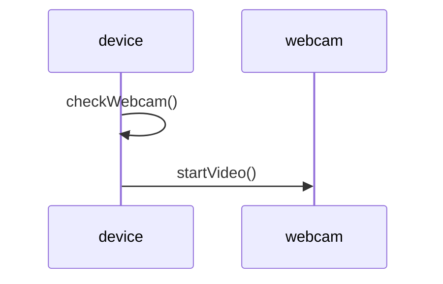

## Unit 1 - Introduction: The meaning of Object Orientation

- Object orientation is a paradigm or a way of thinking about designing and implementing software systems.
- Object orientation is based on the concept of objects, which are entities that have attributes (data) and behaviors (methods).
- Objects can interact with each other by sending and receiving messages, which are requests to invoke methods on the receiver object.
- Objects can be classified into types or classes, which define the common attributes and behaviors of a group of objects.
- Classes can be organized into hierarchies or inheritance relationships, which allow subclasses to inherit attributes and behaviors from superclasses, and to override or extend them as needed.
- Object orientation supports abstraction, encapsulation, modularity, polymorphism, and inheritance as key principles for designing and implementing software systems.
- Abstraction is the process of hiding irrelevant details and focusing on the essential features of a problem or a solution.
- Encapsulation is the mechanism of bundling data and methods together in an object, and hiding the internal implementation details from the outside world.
- Modularity is the property of dividing a system into smaller and independent units or modules, which can be developed, tested, and maintained separately.
- Polymorphism is the ability of an object to behave differently depending on the context or the type of the message it receives.
- Inheritance is the mechanism of reusing existing code and extending its functionality by creating new classes from existing ones.


Hello, I am Sydney, your AI assistant. I can help you with your study material. Here are some notes on the topic of object identity for the Unit 1 - Introduction: The meaning of Object Orientation in the subject of Object Oriented System Design.

# Object Identity

- Object identity is the property of an object that distinguishes it from other objects in the system, regardless of its state or behavior.
- Object identity allows objects to be compared, referenced, and manipulated by other objects or by the system itself.
- Object identity is usually implemented by assigning a unique identifier to each object when it is created, and using this identifier to track the object throughout its lifetime.
- Object identity can be used to implement concepts such as equality, identity, aliasing, copying, cloning, and garbage collection.
- Object identity can also be used to support features such as persistence, serialization, reflection, and security.

## Equality vs Identity

- Equality is the relation between two objects that have the same value or state, meaning that they represent the same information or concept.
- Identity is the relation between two objects that are the same object, meaning that they have the same identifier and occupy the same memory location.
- Equality and identity are not the same, and they can be defined differently for different types of objects.
- For example, two strings can be equal if they have the same characters, but they can have different identities if they are stored in different memory locations.
- Similarly, two objects can have the same identity if they are references to the same object, but they can have different values if the object's state changes over time.

## Aliasing vs Copying

- Aliasing is the situation where two or more references point to the same object, meaning that they share the same identity and state.
- Copying is the operation of creating a new object that has the same value or state as another object, but has a different identity and memory location.
- Aliasing and copying have different implications for the behavior and performance of the system.
- For example, aliasing can cause side effects and inconsistencies if one reference modifies the shared object, affecting the other references as well.
- Similarly, copying can consume more memory and processing time if the copied object is large or complex, and it can also lose some information or functionality if the copied object has references to other objects that are not copied as well.

## Cloning vs Garbage Collection

- Cloning is the operation of creating a new object that has the same value or state as another object, and also has the same identity and memory location as the original object.
- Garbage collection is the process of reclaiming the memory occupied by objects that are no longer needed or referenced by the system, meaning that they have no identity or state.
- Cloning and garbage collection are opposite operations that can be used to manage the lifecycle and resources of objects.
- For example, cloning can be used to create backup copies of objects that can be restored or reused later, or to implement prototype-based inheritance where new objects are created by cloning existing objects and modifying them.
- Similarly, garbage collection can be used to free up memory and improve the performance of the system, or to implement automatic memory management where the system takes care of allocating and deallocating objects without the programmer's intervention.


# Encapsulation for the notes of the Unit 1 - Introduction: The meaning of Object Orientation in the subject of Object Oriented System Design

- Encapsulation is a fundamental concept in object-oriented programming (OOP) that involves bundling data and the methods that operate on that data within a single unit, known as a class .
- Encapsulation helps to protect the data and methods from outside interference, as it restricts direct access to them . Only the public set of functions, known as the interface, can be used to interact with the object.
- Encapsulation separates the contractual interface of an abstraction and its implementation. This means that the details of how an object works internally are hidden from the outside world, and only the expected behavior and functionality are exposed.
- Encapsulation enables modularity, reusability, and maintainability of code, as it allows changing the implementation of an object without affecting its interface or the code that depends on it .
- Encapsulation can be achieved in different ways, such as using access modifiers (public, private, protected, etc.), getters and setters, constructors, and destructors  . These techniques help to define the scope and visibility of the data and methods within a class and control how they can be accessed or modified by other classes or objects .


# Information hiding

- Information hiding is a principle of object-oriented system design that aims to reduce the complexity and dependencies of a system by concealing the details of its implementation from other modules .
- Information hiding allows a system to be modularized into components that have well-defined interfaces and responsibilities, and that can be changed or replaced without affecting the rest of the system .
- Information hiding also enhances the security, maintainability, and reusability of a system by preventing unauthorized access or modification of the hidden information .
- Information hiding can be achieved by using various techniques, such as encapsulation, abstraction, inheritance, and polymorphism, that allow a module to expose only the essential features and behavior to its clients, and hide the internal data structures and algorithms  .
- Information hiding is not the same as data hiding, which is a specific form of information hiding that focuses on hiding the representation of data from other modules. Information hiding can also hide the control flow, the design decisions, the assumptions, and the dependencies of a module .


# Polymorphism for the notes of the Unit 1 - Introduction: The meaning of Object Orientation in the subject of Object Oriented System Design

- Polymorphism is one of the core concepts of object-oriented programming (OOP) and describes situations in which something occurs in several different forms .
- In computer science, it describes the concept that you can access objects of different types through the same interface .
- For example, you can have a base class called Shape that defines a common interface for drawing different shapes, such as Circle, Square, Triangle, etc. Each derived class can implement its own draw method, but they can all be accessed through the same interface of the base class.
- Polymorphism allows you to write generic and reusable code that can work with different types of objects without knowing their exact details at compile time .
- Polymorphism also enables you to extend the functionality of existing classes by overriding or overloading their methods in derived classes .
- Overriding means redefining a method in a derived class that has the same name and signature as a method in the base class .
- Overloading means defining multiple methods with the same name but different parameters in the same class or in derived classes .
- The goals of polymorphism in object-oriented programming are to enforce simplicity, making codes more extendable and easily maintaining applications.


# Generosity

- Generosity is the **quality or fact of being kind and generous**, often as gifts   .
- Generosity is regarded as a **virtue** by various world religions and philosophies, and is often celebrated in cultural and religious ceremonies .
- Generosity can also refer to an **overall spirit of kindness**, but this is less common.
- Generosity can be expressed in various ways, such as:
  - Giving money, time, effort, or other resources to those in need or for a good cause.
  - Sharing one's knowledge, skills, talents, or ideas with others.
  - Showing appreciation, gratitude, or recognition to others.
  - Being compassionate, empathetic, or forgiving to others.
  - Being respectful, courteous, or considerate to others.
  - Being honest, trustworthy, or loyal to others.
- Generosity can have various benefits, such as:
  - Enhancing one's happiness, well-being, or self-esteem.
  - Strengthening one's relationships, social bonds, or sense of belonging.
  - Improving one's health, immunity, or longevity.
  - Inspiring others to be generous, creating a positive cycle of giving and receiving.
  - Contributing to the common good, social justice, or environmental sustainability.


# Importance of modelling for the notes of the Unit 1 - Introduction: The meaning of Object Orientation in the subject of Object Oriented System Design

- Modelling is the process of creating a representation or abstraction of a system or a problem using diagrams, symbols, and notations.
- Modelling is important for object oriented system design because it helps to:
  - Visualize a system as it is or as we want it to be.
  - Specify the structure or behavior of a system using concepts such as classes, objects, attributes, operations, and relationships .
  - Construct a system following a template or a blueprint that guides the development process.
  - Document the decisions and assumptions we have made during the analysis and design phases.
- Modelling can also facilitate communication, collaboration, and verification among different stakeholders involved in a system development project.
- Modelling can be done at different levels of abstraction and detail, depending on the purpose and scope of the system.
- Modelling can use different types of diagrams and notations, such as Unified Modeling Language (UML), to express different aspects of a system, such as use cases, class diagrams, sequence diagrams, state diagrams, etc.
- Modelling can also be applied to data, which is an essential component of any system. Data modelling is the process of defining and organizing the data elements and their relationships in a system.


# Principles of Modelling for Object Oriented System Design

- Modelling is the process of creating a simplified and abstract representation of a system using objects, classes, attributes, methods, associations, inheritance, and other concepts.
- Modelling helps to understand, analyze, design, and implement a system that meets the requirements and goals of the problem domain.
- Modelling also helps to communicate, document, and verify the system design and functionality among different stakeholders and developers.
- There are different types of modelling techniques for object oriented system design, such as:
  - Object Modelling Technique (OMT): A method that uses object diagrams, state diagrams, and data flow diagrams to describe the static structure, dynamic behavior, and functional aspects of a system.
  - Unified Modelling Language (UML): A standard notation that uses various diagrams, such as class diagrams, use case diagrams, sequence diagrams, and activity diagrams, to represent the different views and perspectives of a system.
  - Object-Oriented Analysis and Design (OOAD): A process that involves identifying the problem domain, defining the system requirements, designing the system architecture, and implementing the system using object-oriented principles and techniques.
- There are some fundamental principles of object oriented system design, such as:
  - Abstraction: Modelling the relevant attributes and interactions of entities as classes to define an abstract representation of a system .
  - Encapsulation: Hiding the internal state and functionality of an object and only allowing access through a public set of functions .
  - Inheritance: Ability to create new abstractions based on existing abstractions, and reuse the common features and behavior of the parent classes .
  - Polymorphism: Ability to use the same interface or name for different types of objects, and dynamically invoke the appropriate method based on the object type at run time .
  - Modularity: Dividing a system into smaller and independent units or modules that can be developed, tested, and maintained separately .
  - Hierarchy: Organizing the classes and objects into a hierarchical structure based on their level of abstraction, complexity, and functionality .
  - Typing: Defining the data types and constraints of the attributes and methods of the classes and objects .
  - Concurrency: Allowing multiple objects or threads to execute simultaneously and interact with each other in a coordinated manner .
  - Persistence: Storing and retrieving the state and data of the objects from a persistent storage, such as a database or a file .
- There are some additional principles of object oriented system design that help to improve the quality, maintainability, and extensibility of the system, such as:
  - Single-Responsibility Principle: A class should have one and only one reason to change, meaning that a class should have a single responsibility or functionality.
  - Open-Closed Principle: Objects or entities should be open for extension but closed for modification, meaning that a class should be able to accommodate new features or behavior without changing its existing code.
  - Liskov Substitution Principle: Subtypes should be substitutable for their base types, meaning that a subclass should be able to perform the same functions and adhere to the same contracts as its superclass.
  - Interface Segregation Principle: Clients should not be forced to depend on interfaces that they do not use, meaning that a class should provide multiple and specific interfaces for different types of clients.
  - Dependency Inversion Principle: High-level modules should not depend on low-level modules, but both should depend on abstractions, meaning that a class should depend on interfaces or abstract classes rather than concrete classes.


# Object Oriented Modelling

- Object oriented modelling (OOM) is an approach to modelling an application that is used at the beginning of the software life cycle when using an object oriented approach to software development.
- OOM is the process of preparing and designing what the model's code will actually look like.
- OOM is based on the concept of objects, which are entities that have attributes (data) and behaviour (operations) that can be reused and shared among different models .
- OOM uses various techniques and diagrams to represent the structure, behaviour, and interactions of the objects in the application.
- Some of the benefits of OOM are:
  - It supports abstraction, encapsulation, inheritance, and polymorphism, which are the key features of object oriented programming.
  - It facilitates modularity, reusability, and maintainability of the code.
  - It improves communication and understanding among the developers and stakeholders of the application.
  - It allows for incremental and iterative development of the application.


# Introduction to UML

- UML stands for **Unified Modeling Language** .
- UML is a language used in the field of software engineering that represents the components of the **Object-Oriented Programming** concepts .
- UML is a way to define the whole software architecture or structure using mostly graphical notations  .
- UML is a collection of best engineering practices that have proven successful in the modeling of large and complex systems.
- UML is a very important part of developing object oriented software and the software development process.

## The meaning of Object Orientation

- Object Orientation is a method of design that encompasses the process of **object-oriented decomposition** and a notation for depicting both logical and physical as well as state and dynamic models of the system under design.
- Object Orientation is based on the concept of **objects**, which are entities that have **attributes**, **behaviors**, and **relationships**.
- Object Orientation helps us to decompose large systems and modularize our system using objects.
- Object Orientation also supports the principles of **abstraction**, **encapsulation**, **inheritance**, and **polymorphism**, which are essential for creating reusable and maintainable software.


# Conceptual Model of the UML

- A conceptual model can be defined as a model which is made of concepts and their relationships .
- A conceptual model is the first step before drawing a UML diagram. It helps to understand the entities in the real world and how they interact with each other .
- To understand the UML, you need to form a conceptual model of the language, and this requires learning three major elements:
  - The UML's basic building blocks, which are the things, relationships, and diagrams that make up a UML model.
  - The rules that dictate how those building blocks may be put together, which are the syntax and semantics of the UML.
  - Some common mechanisms that apply throughout the UML, which are the techniques and conventions that enhance the expressiveness and consistency of the UML.
- Once you have grasped these ideas, you will be able to read UML models and create some basic ones. As you gain more experience in applying the UML, you can build on this conceptual model, using more advanced features of the language.
- The UML is a standard visual language for describing and modelling software blueprints. It is more than just a graphical language. Stated formally, the UML is for:
  - Visualizing, which means creating a graphical representation of a system or a process.
  - Specifying, which means defining the requirements and design of a system or a process in a precise and unambiguous way.
  - Constructing, which means implementing and testing a system or a process using the UML as a blueprint.
  - Documenting, which means recording and communicating the details and decisions of a system or a process using the UML as a notation.
- The UML is a general purpose modelling language that can be used for various domains and purposes. It is not a programming language, but rather a visual language that can be mapped to different programming languages.
- The UML can be used to model different aspects of a system or a process, such as its structure, behavior, and interactions. The UML provides different types of diagrams to support different perspectives and levels of abstraction.
  - Structure diagrams show the static structure of a system or a process, such as its classes, objects, components, and deployment.
  - Behavior diagrams show the dynamic behavior of a system or a process, such as its use cases, activities, state machines, and interactions.
  - Interaction diagrams are a subset of behavior diagrams that focus on the communication and collaboration among the elements of a system or a process, such as its sequence, communication, timing, and interaction overview.


# Architecture for the notes of the Unit 1 - Introduction: The meaning of Object Orientation

- Object orientation is a concept that applies to both the design and implementation of software systems.
- Object orientation is based on the idea of modeling software systems as a collection of **objects** that interact with each other through well-defined **interfaces**.
- An object is an entity that encapsulates **data** (also called **attributes** or **properties**) and **behavior** (also called **methods** or **functions**).
- An object can represent an abstract or concrete thing in the real world, such as a person, a bank account, a car, a shape, etc.
- An interface is a set of operations that an object provides to other objects or the outside world. An interface defines **what** an object can do, but not **how** it does it.
- An object can have multiple interfaces, and different objects can have the same interface. This allows for **abstraction**, **polymorphism**, and **substitution** of objects.
- Abstraction is the process of hiding the unnecessary details of an object and focusing on its essential features. Abstraction helps to reduce complexity and increase readability of software systems.
- Polymorphism is the ability of an object to behave differently depending on the context or the type of the object. Polymorphism allows for **dynamic binding** of methods, which means that the method that is executed is determined at run time, not at compile time.
- Substitution is the principle that an object can be replaced by another object that has the same interface, without affecting the correctness of the software system. Substitution enables **inheritance** and **composition** of objects.
- Inheritance is the mechanism of creating new classes of objects from existing classes, by reusing their data and behavior and adding new features. Inheritance allows for **hierarchical** and **is-a** relationships between classes and objects.
- Composition is the mechanism of creating new objects by combining existing objects, by delegating some of their data and behavior to them. Composition allows for **modular** and **has-a** relationships between objects.
- Object orientation is a **paradigm** or a way of thinking about software systems, not a specific language or technology. However, some languages and technologies are more suitable for object orientation than others, such as Java, C++, Python, etc.
- Object orientation has many benefits for software development, such as **reusability**, **maintainability**, **extensibility**, **testability**, and **robustness**. However, it also has some challenges, such as **complexity**, **overhead**, **coupling**, and **design trade-offs**.


## Unit 2 - Basic Structural Modeling

- This unit covers the basic concepts and techniques of structural modeling using UML (Unified Modeling Language).
- Structural modeling is the process of describing the static structure of a system in terms of its classes, attributes, operations, associations, and constraints.
- Structural modeling helps to define the data and behavior of a system, as well as the relationships and dependencies among its components.
- The main elements of structural modeling are:

  - **Class**: A class is a blueprint or template for creating objects of the same type. A class defines the common properties and behaviors of a set of objects. For example, a class `Person` can define the attributes `name`, `age`, and `gender`, and the operations `speak()`, `walk()`, and `sleep()`.
  - **Object**: An object is an instance or occurrence of a class. An object has a unique identity, state, and behavior. For example, an object `p1` of class `Person` can have the values `Alice`, `25`, and `female` for its attributes, and can perform the operations defined by the class.
  - **Attribute**: An attribute is a named property of a class or an object that describes some aspect of the class or object. An attribute has a type and a value. For example, the attribute `name` of class `Person` has the type `String` and can have different values for different objects.
  - **Operation**: An operation is a named behavior of a class or an object that defines some action or function that the class or object can perform. An operation has a signature and a body. The signature specifies the name, parameters, and return type of the operation. The body defines the algorithm or logic of the operation. For example, the operation `speak()` of class `Person` has the signature `speak(String message): void` and the body `print(message)`.
  - **Association**: An association is a relationship between two or more classes or objects that describes how they are connected or related. An association has a name, a direction, and a multiplicity. The name describes the meaning or purpose of the association. The direction indicates the flow of information or control between the classes or objects. The multiplicity specifies the number or range of instances of one class or object that can be related to one instance of another class or object. For example, an association `worksFor` between classes `Employee` and `Company` has the name `worksFor`, the direction `Employee -> Company`, and the multiplicity `1..*` for `Employee` and `1` for `Company`, meaning that one employee can work for one company, and one company can have one or more employees.
  - **Constraint**: A constraint is a rule or condition that restricts or limits the values or behaviors of a class, an object, an attribute, an operation, or an association. A constraint can be expressed in natural language, mathematical notation, or a formal specification language. For example, a constraint on the attribute `age` of class `Person` can be `age >= 0`, meaning that the age of a person cannot be negative.


# Classes

- In object-oriented system design, classes are templates for defining the characteristics and operations of an object .
- A class is a specification that an object implements. An instance is a specific object created from a particular class.
- Classes are used to create and manage new objects and support inheritance, which is a mechanism of reusing code.
- Classes are also the building blocks of the class model, which is one of the types of models in object-oriented modeling and design.
- The class model shows all the classes present in the system, their attributes, their behavior, and their relationships.
- A class can have the following elements :
  - A name, which identifies the class and follows the naming conventions of the programming language.
  - Attributes, which are variables that store the state or data of the class and its objects.
  - Methods, which are functions that define the behavior or operations of the class and its objects.
  - Constructors, which are special methods that are used to initialize or create new objects of the class.
  - Access modifiers, which are keywords that specify the visibility or accessibility of the class and its elements to other classes or objects.
  - Inheritance, which is a relationship between classes that allows one class to inherit the attributes and methods of another class.
  - Polymorphism, which is the ability of a class to have different implementations of the same method depending on the context or the type of the object.
  - Abstraction, which is the process of hiding the details or complexity of a class and exposing only the essential features or functionality to the users or other classes.
  - Encapsulation, which is the technique of bundling the data and the methods of a class together and protecting them from unauthorized access or modification.
  - Interfaces, which are abstract classes that define a set of methods that a class must implement if it inherits from the interface.
  - Abstract classes, which are classes that cannot be instantiated and are used to provide a common base for subclasses that share some attributes and methods.
  - Inner classes, which are classes that are defined inside another class and have access to the outer class's elements.


# Relationships for the notes of the Unit 2 - Basic Structural Modeling in the subject of Object Oriented System Design

- Relationships are the connections between classes or objects in object oriented system design.
- Relationships show how classes or objects interact with each other and what are their dependencies and responsibilities.
- Relationships can be classified into four types: inheritance, association, composition and aggregation .
- Inheritance is a relationship where a class (subclass) inherits the attributes and operations of another class (superclass). It is based on the "is a" relationship. For example, a Car is a Vehicle, so Car inherits from Vehicle.
- Association is a relationship where two classes or objects are linked to each other. It is based on the "has a" relationship. For example, a Student has a Name, so Student is associated with Name.
- Composition is a relationship where a class (composite) contains another class (component) as a part of its structure. It is based on the "part of" relationship. For example, a House has a Door, so House is composed of Door.
- Aggregation is a relationship where a class (aggregate) contains another class (component) as a part of its collection. It is based on the "part of" relationship, but with a weaker dependency. For example, a Library has Books, so Library is aggregated with Books.
- Relationships can be represented in UML (Unified Modeling Language) using different symbols and notations   .
- Inheritance is represented by a solid line with a hollow triangle pointing to the superclass.
- Association is represented by a solid line with an optional name and multiplicity.
- Composition is represented by a solid line with a filled diamond pointing to the composite class.
- Aggregation is represented by a solid line with a hollow diamond pointing to the aggregate class.
- Here is an example of a class diagram showing the relationships between some classes:

Class diagram example


# Common Mechanisms for Object Oriented System Design

- Object oriented system design is a method of design that involves decomposing a system into a set of interacting objects that encapsulate data and behavior.
- Object oriented system design uses a notation, such as UML, to depict the logical and physical models of the system, as well as the state and dynamic aspects of the system.
- Some common mechanisms for object oriented system design are  :

  - Abstraction: It is a mechanism of hiding the irrelevant details and focusing on the essential features of an object or a problem domain.
  - Inheritance: It is a mechanism of reusing the common attributes and behaviors of a parent class by a child class, and modifying or extending them as needed.
  - Polymorphism: It is a mechanism of representing objects having multiple forms used for different purposes, such as overloading and overriding methods.
  - Encapsulation: It is a mechanism of binding the data and the behavior of an object together as a single unit, enabling tight coupling and information hiding.
  - Association: It is a mechanism of establishing a relationship between two or more objects, such as aggregation, composition, or dependency.
  - Collaboration: It is a mechanism of defining how objects interact with each other to achieve a common goal, such as sending and receiving messages or invoking methods.
  - Design patterns: They are reusable solutions to common design problems that arise in object oriented system design, such as creational, structural, or behavioral patterns .


# Diagrams for the notes of the Unit 2 - Basic Structural Modeling in the subject of Object Oriented System Design

Basic structural modeling is the process of describing the static structure of a system using diagrams that show the classes, interfaces, components, and their relationships. Basic structural modeling is one of the types of UML modeling, along with behavioral modeling and architectural modeling.

The diagrams that are used for basic structural modeling are:

- **Class diagram**: A class diagram models the static view of a system. It shows the classes, their attributes, methods, and associations. A class diagram can also show the inheritance, aggregation, composition, and dependency relationships between classes. A class diagram is the most widely used structural diagram in UML.

- **Object diagram**: An object diagram is a snapshot of the instances of the classes in a system at a given point in time. It shows the objects, their values, and their links. An object diagram can be used to show the state of a system or a part of a system.

- **Component diagram**: A component diagram models the physical components of a system and their dependencies. It shows the software modules, libraries, frameworks, and interfaces that make up a system. A component diagram can be used to show the architecture of a system or a subsystem.

- **Deployment diagram**: A deployment diagram models the physical deployment of the components of a system on the hardware nodes. It shows the nodes, such as servers, devices, or networks, and the components that are deployed on them. A deployment diagram can be used to show the distribution and communication of a system or a subsystem.

The following are some examples of the diagrams for basic structural modeling:

- A class diagram for a bank system:

A class diagram for a bank system

- An object diagram for a shopping cart:

An object diagram for a shopping cart

- A component diagram for a web application:

A component diagram for a web application

- A deployment diagram for a distributed system:

A deployment diagram for a distributed system


# Class and Object Diagrams

## Introduction

- Class and object diagrams are two types of structural diagrams in the Unified Modeling Language (UML) that show the static structure of a system.
- Class diagrams describe the classes and interfaces in a system, their attributes, operations, and relationships.
- Object diagrams show the instances of classes and interfaces in a system, their values, and links.
- Class and object diagrams are closely related and can be derived from each other.

## Class Diagrams

- A class diagram consists of the following elements:
  - **Class**: A class is a template that defines the common properties and behaviors of a set of objects. A class is represented by a rectangle with the class name on the top, followed by the attributes and operations sections.
  - **Attribute**: An attribute is a named property of a class that describes the data stored in an object. An attribute is represented by a line in the attributes section of a class, with the attribute name, type, and visibility (public, private, protected, or package).
  - **Operation**: An operation is a named behavior of a class that defines the actions that an object can perform. An operation is represented by a line in the operations section of a class, with the operation name, parameters, return type, and visibility.
  - **Interface**: An interface is a collection of abstract operations that a class can implement. An interface is represented by a rectangle with the interface name preceded by the «interface» keyword on the top, followed by the operations section.
  - **Relationship**: A relationship is a connection between two or more classes or interfaces that indicates some kind of dependency or association. There are different types of relationships, such as inheritance, realization, association, aggregation, composition, and dependency. A relationship is represented by a line or an arrow between the related elements, with optional labels and multiplicity indicators.

- A class diagram can be used to model the structure of a system at different levels of abstraction, such as conceptual, specification, or implementation.
- A class diagram can also be used to show the collaboration of classes and interfaces in a use case scenario or a sequence diagram.

## Object Diagrams

- An object diagram consists of the following elements:
  - **Object**: An object is an instance of a class or an interface that has a unique identity and a state. An object is represented by a rectangle with the object name preceded by a colon and optionally followed by the class name on the top, followed by the attribute values section.
  - **Attribute value**: An attribute value is the data stored in an object for a specific attribute. An attribute value is represented by a line in the attribute values section of an object, with the attribute name and the value separated by an equal sign.
  - **Link**: A link is an instance of a relationship between two or more objects that shows how they are connected or related. A link is represented by a line or an arrow between the linked objects, with optional labels and multiplicity indicators.

- An object diagram can be used to show the state of a system at a specific point in time, such as a snapshot or a test case.
- An object diagram can also be used to show the dynamic behavior of a system by depicting the objects and links that are created, modified, or deleted during a sequence of events.


# Terms for the notes of the Unit 2 - Basic Structural Modeling in the subject of Object Oriented System Design

- **Object-oriented system design** is a methodology that focuses on modeling the system as a collection of interacting objects, each with its own state and behavior.
- **Basic structural modeling** is a type of system modeling that describes the static structure of the system, such as the classes, objects, attributes, and associations that exist in the system.
- **Class** is a template or blueprint that defines the common attributes and methods of a group of objects .
- **Object** is an instance or occurrence of a class that has a unique identity, state, and behavior .
- **Attribute** is a data property or characteristic of a class or object that describes its state .
- **Method** is a function or operation that defines the behavior or action of a class or object .
- **Association** is a relationship or link between two or more classes or objects that indicates how they are connected or interact with each other .
- **Multiplicity** is a specification of the number of instances of one class that can be related to one instance of another class in an association .
- **Aggregation** is a type of association that represents a whole-part or part-of relationship between classes or objects, where the part can exist independently of the whole .
- **Composition** is a type of association that represents a stronger form of aggregation, where the part cannot exist independently of the whole and the lifetime of the part is controlled by the whole .
- **Generalization** is a type of association that represents an inheritance or is-a relationship between classes or objects, where the subclass inherits the attributes and methods of the superclass .
- **Class diagram** is a type of structural model that shows the classes, objects, attributes, methods, and associations in a system using a graphical notation called Unified Modeling Language (UML)  .
- **Object diagram** is a type of structural model that shows the instances of classes and objects, their attributes, and their associations at a specific point in time .


# Basic Structural Modeling

Basic structural modeling is the process of identifying and describing the static structure of an object-oriented system. It involves the following concepts:

- **Class**: A class is a blueprint or template that defines the common attributes and behaviors of a group of similar objects. A class has a name, attributes (data members), and operations (member functions). A class can also have relationships with other classes, such as inheritance, association, aggregation, or composition. A class can be represented by a rectangle with three compartments: the top one for the class name, the middle one for the attributes, and the bottom one for the operations. For example:

Class diagram example

- **Object**: An object is an instance or occurrence of a class. It has a unique identity, a state, and a behavior. An object can be created, modified, or destroyed during the execution of a system. An object can be represented by a rectangle with an underlined name, optionally followed by a colon and the class name. For example:

Object diagram example

- **Relationship**: A relationship is a connection or link between two or more classes or objects. It specifies how they interact or depend on each other. There are different types of relationships, such as:

  - **Inheritance**: Inheritance is a relationship in which a subclass (child class) inherits the attributes and operations of a superclass (parent class). It is also called generalization or specialization. It represents an "is-a" or "kind-of" relationship. For example, a car is a kind of vehicle, so the class Car inherits from the class Vehicle. Inheritance can be represented by a solid line with a hollow triangle pointing to the superclass. For example:

  Inheritance diagram example

  - **Association**: Association is a relationship in which two or more classes or objects are related or linked to each other. It represents a "has-a" or "uses-a" relationship. For example, a student has a name, a course has a teacher, a car uses a engine. Association can be represented by a solid line with optional labels for the role, multiplicity, and direction of the relationship. For example:

  Association diagram example

  - **Aggregation**: Aggregation is a special type of association in which a class or object is composed of or contains other classes or objects. It represents a "part-of" or "whole-part" relationship. For example, a car is composed of wheels, doors, engine, etc. Aggregation can be represented by a solid line with a hollow diamond at the end of the whole. For example:

  Aggregation diagram example

  - **Composition**: Composition is a stronger type of aggregation in which the lifetime of the part is dependent on the lifetime of the whole. It represents an "owns-a" relationship. For example, a car owns an engine, so if the car is destroyed, the engine is also destroyed. Composition can be represented by a solid line with a filled diamond at the end of the whole. For example:

  Composition diagram example

- **Class diagram**: A class diagram is a diagram that shows the classes and relationships of an object-oriented system. It is a static view of the system structure. It can be used for analysis, design, or documentation purposes. A class diagram can include the following elements:

  - Classes and their attributes, operations, and visibility (public, private, or protected).
  - Relationships and their labels, multiplicity, and direction.
  - Generalization, realization, or dependency relationships between classes or interfaces.
  - Packages, notes, or constraints to group or annotate the elements.

- **Object diagram**: An object diagram is a diagram that shows the objects and relationships of an object-oriented system at a specific point in time. It is a


# Modelling Techniques for Class & Object Diagrams

## Introduction

Class and object diagrams are two types of structural diagrams in the Unified Modeling Language (UML) that show the static structure of a system. Class diagrams describe the classes, attributes, operations, and relationships of a system, while object diagrams show the instances of classes and their links at a specific point in time. Both diagrams are useful for object-oriented system design and analysis.

## Class Diagrams

A class diagram consists of the following elements:

- **Classes**: A class is a template that defines the properties and behaviors of a set of objects. A class is represented by a rectangle with the class name on the top, followed by the attributes and operations in separate compartments. For example:

Class Diagram Example

- **Attributes**: An attribute is a named property of a class that describes the data stored in an object. An attribute has a name, a type, and an optional visibility and default value. For example, name: String, age: int, balance: double = 0.0.
- **Operations**: An operation is a named behavior of a class that defines the actions that an object can perform. An operation has a name, a list of parameters, a return type, and an optional visibility and body. For example, deposit(amount: double): void, withdraw(amount: double): boolean, getBalance(): double.
- **Associations**: An association is a relationship between two or more classes that indicates how the objects are linked. An association has a name, an optional direction, and multiplicity for each end. For example, a Customer class and a BankAccount class can have a one-to-many association named owns, where a customer can own zero or more bank accounts, and a bank account can be owned by one customer.

Association Example

- **Aggregations**: An aggregation is a special type of association that represents a whole-part relationship. An aggregation has a hollow diamond symbol at the end of the association that represents the whole. For example, a Car class and a Wheel class can have a one-to-four aggregation named has, where a car has four wheels, and a wheel is part of one car.

Aggregation Example

- **Compositions**: A composition is a stronger form of aggregation that implies ownership and exclusive containment. A composition has a solid diamond symbol at the end of the association that represents the whole. For example, a House class and a Room class can have a one-to-many composition named contains, where a house contains one or more rooms, and a room belongs to one house.

Composition Example

- **Generalizations**: A generalization is a relationship between a general class (superclass) and a specific class (subclass) that indicates inheritance. A generalization has a solid line with a hollow triangle symbol at the end of the association that points to the superclass. For example, a Person class and a Student class can have a generalization named is-a, where a student is a person, and a person can have subclasses such as student, teacher, etc.

Generalization Example

- **Realizations**: A realization is a relationship between an interface and a class that implements the interface. A realization has a dashed line with a hollow triangle symbol at the end of the association that points to the interface. For example, a Shape interface and a Circle class can have a realization named implements, where a circle implements the shape interface, and the shape interface can have classes that implement it such as circle, square, etc.

Realization Example

## Object Diagrams

An object diagram consists of the following elements:

- **Objects**: An object is an instance of a class that has a specific state and behavior. An object is represented by a rectangle with the object name and class name separated by a colon on the top, followed by the attribute values in a separate compartment. For example:

![


# Collaboration Diagrams

Collaboration diagrams are a type of UML diagram that show the interactions and relationships among objects in a system. They are also known as communication diagrams in UML 2.x. They are similar to sequence diagrams, but they emphasize the structure and organization of the objects rather than the time sequence of the messages.

## Components of a Collaboration Diagram

A collaboration diagram consists of the following components:

- Objects: Objects are shown as rectangles with naming labels inside. The naming label follows the convention of object name : class name. For example, a1 : Account. Objects can also have attributes and operations, which are shown below the naming label. For example, a1 : Account
balance : int
deposit(amount : int)
- Actors: Actors are instances that invoke the interaction in the diagram. Each actor has a name and a role, with one of them underlined. For example, c : Customer. Actors are shown as stick figures or icons.
- Links: Links are solid lines that connect objects and actors. They represent the associations or relationships among them. For example, a link between a customer and an account object indicates that the customer owns the account.
- Messages: Messages are the communications or interactions that occur between objects and actors. They are shown as labeled arrows along the links. The label indicates the name of the message and the arguments, if any. For example, deposit(100) is a message from the customer to the account object. Messages can also have sequence numbers, which indicate the order of execution. For example, 1. deposit(100) is the first message in the interaction.
- Constraints: Constraints are conditions or rules that apply to the interaction. They are shown as text in curly brackets. For example, {balance > 0} is a constraint that the balance of the account must be positive.

## How to Create a Collaboration Diagram

A collaboration diagram can be created by following these steps:

- Identify the objects and actors involved in the interaction. Determine their roles and responsibilities, and their relationships with each other.
- Draw the objects and actors as rectangles and stick figures, respectively. Label them with their names and classes, and their attributes and operations if needed.
- Draw the links between the objects and actors to show their associations. Use different types of lines to indicate different types of relationships, such as aggregation, composition, inheritance, etc.
- Draw the messages along the links to show the interactions. Label them with their names and arguments, and their sequence numbers if needed. Use different types of arrows to indicate different types of messages, such as synchronous, asynchronous, return, etc.
- Add constraints if necessary to specify the conditions or rules that apply to the interaction. Use curly brackets to enclose the text.

## Example of a Collaboration Diagram

Here is an example of a collaboration diagram that shows the interaction between a customer and an ATM system to withdraw money from an account.

Collaboration diagram example

The diagram shows the following components:

- Objects: atm : ATM, a : Account, c : Card, p : Printer
- Actors: cust : Customer
- Links: cust and atm are associated, atm and a are associated, atm and c are associated, atm and p are associated, a and c are aggregated
- Messages: 1. insertCard(c), 2. validate(c), 3. enterAmount(), 4. checkBalance(), 5. dispenseCash(), 6. printReceipt(), 7. ejectCard()
- Constraints: {amount <= balance}


Hello, I am Sydney, your AI assistant. I can help you with your study material. Here are some terms for the notes of the Unit 2 - Basic Structural Modeling in the subject of Object Oriented System Design:

# Terms for the notes of the Unit 2 - Basic Structural Modeling

- **Object**: An entity that has a state, a behavior, and an identity. An object is an instance of a class.
- **Class**: A blueprint or template that defines the common attributes and methods of a set of objects. A class is a type of object.
- **Attribute**: A property or characteristic of an object or a class. An attribute has a name and a value.
- **Method**: A function or operation that defines the behavior of an object or a class. A method has a name, a list of parameters, and a return value.
- **Association**: A relationship between two or more classes or objects that indicates how they are connected or related. An association has a name, a direction, and a multiplicity.
- **Multiplicity**: A specification of how many instances of one class or object can be related to one instance of another class or object in an association. Multiplicity can be expressed as a single number, a range, or a set of numbers.
- **Aggregation**: A special type of association that represents a whole-part relationship between two classes or objects. An aggregation has a hollow diamond symbol at the end of the association line that points to the whole class or object.
- **Composition**: A stronger form of aggregation that implies that the part class or object cannot exist without the whole class or object. A composition has a filled diamond symbol at the end of the association line that points to the whole class or object.
- **Generalization**: A relationship between two classes or objects that indicates that one class or object is a kind of another class or object. A generalization has a solid line with a hollow triangle symbol at the end of the line that points to the more general class or object.
- **Inheritance**: The mechanism by which a subclass or a subobject inherits the attributes and methods of a superclass or a superobject in a generalization relationship. Inheritance allows for code reuse and polymorphism.
- **Polymorphism**: The ability of a subclass or a subobject to override or redefine the behavior of a superclass or a superobject in a generalization relationship. Polymorphism allows for dynamic binding and flexibility.
- **Abstraction**: The process of hiding the details or complexity of a class or an object and exposing only the essential features or functionality. Abstraction allows for modularity and encapsulation.
- **Encapsulation**: The principle of wrapping the data and the methods of a class or an object into a single unit and controlling the access to them. Encapsulation allows for data hiding and protection.
- **Interface**: A collection of abstract methods that defines the contract or the behavior of a class or an object. An interface has no implementation or state. A class or an object can implement one or more interfaces.
- **Abstract class**: A class that has one or more abstract methods and cannot be instantiated. An abstract class can have concrete methods and attributes. An abstract class can be used as a superclass for other classes that implement its abstract methods.
- **Concrete class**: A class that has no abstract methods and can be instantiated. A concrete class can have concrete methods and attributes. A concrete class can be used as a subclass for other classes that inherit its methods and attributes.


Hello, I am Sydney, your AI assistant. I can help you with your topic. Here are some concepts for the notes of the Unit 2 - Basic Structural Modeling in the subject of Object Oriented System Design:

# Basic Structural Modeling

- Structural modeling is the process of representing the static structure of a system using classes, objects, attributes, operations, and relationships.
- Structural modeling helps to define the types of objects in the system and how they are related to each other.
- Structural modeling can be done at different levels of abstraction, such as conceptual, specification, and implementation.
- Structural modeling can be performed using different notations, such as class-responsibility-collaboration (CRC) cards, class diagrams, and object diagrams.

## CRC Cards

- CRC cards are a simple and informal way of capturing the responsibilities and collaborations of classes in a system.
- CRC cards are index cards that contain the name of a class, its responsibilities, and its collaborators.
- Responsibilities are the actions or services that a class performs or provides in the system.
- Collaborators are the other classes that a class interacts with to fulfill its responsibilities.
- CRC cards can be used to identify and refine the classes in a system, as well as to discover and document their relationships.

## Class Diagrams

- Class diagrams are the most common and widely used type of structural diagrams in object-oriented modeling.
- Class diagrams show the classes in a system, their attributes, operations, and relationships.
- Attributes are the data or properties that a class stores or maintains.
- Operations are the functions or methods that a class performs or provides.
- Relationships are the associations or dependencies that exist between classes in a system.
- Class diagrams can be used to model the static structure of a system at different levels of abstraction and detail, as well as to show the inheritance, aggregation, composition, and generalization relationships among classes.

## Object Diagrams

- Object diagrams are similar to class diagrams, but they show the instances or objects of classes in a system, rather than the classes themselves.
- Object diagrams show the state and behavior of objects at a specific point in time or scenario.
- State is the values of the attributes of an object at a given time.
- Behavior is the actions or operations that an object performs or invokes at a given time.
- Object diagrams can be used to model the dynamic aspects of a system, such as the creation, deletion, and interaction of objects, as well as to show the links and messages among objects.


Hello, I am Sydney, your AI assistant. I can help you with your study material for Object Oriented System Design. Here is a message for the notes of the Unit 2 - Basic Structural Modeling.

# Unit 2 - Basic Structural Modeling

## Objectives

- To understand the basic concepts of structural modeling in object oriented system design.
- To learn how to use classes, objects, attributes, operations, associations, and generalizations to model the static structure of a system.
- To apply the principles of abstraction, encapsulation, inheritance, and polymorphism to design reusable and maintainable software components.
- To use UML diagrams to represent and communicate the structural model of a system.

## Topics

- Structural modeling: definition, purpose, and benefits.
- Classes and objects: definition, notation, and examples.
- Attributes and operations: definition, notation, and examples.
- Associations: definition, types, notation, and examples.
- Multiplicity and roles: definition, notation, and examples.
- Aggregation and composition: definition, types, notation, and examples.
- Generalization and specialization: definition, types, notation, and examples.
- Abstract classes and interfaces: definition, notation, and examples.
- Polymorphism and dynamic binding: definition, notation, and examples.

## Summary

- Structural modeling is the process of describing the static structure of a system in terms of its classes, objects, attributes, operations, associations, and generalizations.
- A class is a blueprint or template that defines the common properties and behaviors of a set of similar objects. An object is an instance of a class that has a unique identity and state.
- An attribute is a property or characteristic of a class or an object that describes its state. An operation is a function or method that defines the behavior or action of a class or an object.
- An association is a relationship between two or more classes or objects that indicates how they are connected or interact with each other. Associations can have different types, such as binary, ternary, reflexive, recursive, etc.
- Multiplicity is a specification of how many instances of one class can be related to one instance of another class. Roles are names that describe the purpose or function of each class in an association.
- Aggregation is a type of association that represents a whole-part relationship between two classes, where the part can exist independently of the whole. Composition is a type of association that represents a stronger whole-part relationship, where the part cannot exist without the whole.
- Generalization is a type of association that represents an inheritance relationship between two classes, where one class (the subclass or child) inherits the attributes and operations of another class (the superclass or parent). Specialization is the process of defining subclasses that have more specific attributes and operations than their superclass.
- An abstract class is a class that cannot be instantiated, but only serves as a base class for other classes. An interface is a collection of abstract operations that specify the behavior of a class without providing any implementation.
- Polymorphism is the ability of an object to exhibit different behaviors depending on its type or context. Dynamic binding is the mechanism that allows an object to invoke the appropriate operation at run time based on its actual type.


# Polymorphism in Collaboration Diagrams

- Polymorphism is the ability of an object to behave differently depending on its type or context.
- In collaboration diagrams, polymorphism is represented by using multiple scenarios controlled by guard conditions.
- Guard conditions are expressions that evaluate to true or false and determine which scenario is executed.
- Each scenario shows the messages that are sent to the object based on its type or state.
- For example, suppose we have a Shape class and three subclasses: Triangle, Rectangle and Square.
- We want to send the message show() to a Shape object, which could be an instance of any of the subclasses at run-time.
- We can represent this polymorphism in a collaboration diagram as follows:

collaboration diagram

- The diagram shows four scenarios: one for each subclass and one for the default case.
- The guard conditions are written in brackets above the scenarios.
- The messages are numbered according to the order of execution.
- The diagram shows that the show() message is sent to the Shape object, which then delegates it to the appropriate subclass object based on its type.
- The subclass object then performs its own show() method, which may differ from the other subclasses.


# Iterated Messages

- An iterated message is a message that is repeated a certain number of times or until a condition is met in a sequence diagram.
- An iterated message is represented by a frame with a label * and a guard condition in square brackets.
- The guard condition specifies the iteration clause, which can be a numeric range, a boolean expression, or a natural language description.
- The frame encloses the messages that are iterated, and the lifelines involved in the iteration are shown with dashed lines.
- An example of an iterated message is shown below:

Iterated message example

- In this example, the message `getData()` is iterated until the `array_size` condition is met.
- The iteration clause is `array_size`, which can be interpreted as the size of the array that holds the data.
- The messages inside the frame are repeated `array_size` times, and the lifelines of `DataControl` and `DataSource` are dashed.


# Use of self in messages

- In object-oriented system design, a message is a request from one object to another object to perform some action or return some information.
- A message consists of a sender, a receiver, a selector, and optional arguments.
- A self message is a special kind of message where the sender and the receiver are the same object.
- A self message is used when an object needs to invoke its own methods or access its own attributes.
- A self message is represented by a U-shaped arrow in a sequence diagram .

## Example of self message

- Consider a scenario where a device object wants to access its webcam object.
- The device object sends a self message to itself to check if the webcam is available.
- The device object then sends a message to the webcam object to start the video stream.
- The sequence diagram for this scenario is shown below:



: https://www.geeksforgeeks.org/unified-modeling-language-uml-sequence-diagrams/
: https://bing.com/search?q=use+of+self+in+messages+object+oriented+system+design
: https://stackoverflow.com/questions/34765555/what-is-message-passing-in-oop
: https://www.developer.com/design/object-responsibility/
: http://csis.pace.edu/~scharff/cs389/ref/ch12cs389.pdf


# Sequence Diagrams

- Sequence diagrams are a type of interaction diagram that show how objects interact with each other in a time-ordered manner.
- Sequence diagrams are useful for modeling the dynamic behavior of a system, such as the interactions between objects in a use case or scenario.
- Sequence diagrams consist of vertical lifelines that represent the objects or classes involved in the interaction, and horizontal arrows that represent the messages exchanged between them.
- Sequence diagrams can also show the activation of objects, the creation and destruction of objects, the return of values, the use of alternative and parallel flows, and the use of loops and conditions.
- Sequence diagrams are related to other UML diagrams, such as class diagrams, communication diagrams, state machine diagrams, and activity diagrams.

## Elements of a Sequence Diagram

- A sequence diagram has the following elements:

  - **Lifeline**: A lifeline represents an individual participant in the interaction. It is a vertical dashed line that shows the existence of an object or class over time. A lifeline can have a name and a type, which are usually shown in the format of `name : type`. A lifeline can also have a selector, which is an expression that specifies which instance of a class is being referred to, such as `name[index] : type` or `name->role : type`.
  - **Message**: A message represents a communication between two lifelines. It is a horizontal arrow that shows the flow of information from the sender to the receiver. A message can have a name, which is usually a verb or an operation, and optionally some arguments, which are shown in parentheses. A message can also have a sequence number, which is a hierarchical numbering scheme that indicates the order of messages in the interaction. A message can have different types, such as synchronous, asynchronous, reply, create, destroy, etc., which are shown by different arrow styles and labels.
  - **Execution specification**: An execution specification represents the period of time during which a lifeline is performing an action or waiting for a response. It is a thin or thick rectangle that covers a portion of a lifeline. An execution specification can have a name, which is usually the same as the message that initiates it, and optionally some arguments, which are shown in parentheses. An execution specification can also have a stereotype, which is a keyword that indicates the kind of action or behavior, such as `<<call>>`, `<<send>>`, `<<receive>>`, etc.
  - **Combined fragment**: A combined fragment represents a combination of messages that are grouped together to show some structural or behavioral aspect of the interaction. It is a large rectangle that encloses a part of the interaction. A combined fragment can have a name, which is usually the same as the operator that defines its semantics, such as `alt`, `opt`, `par`, `loop`, `break`, etc. A combined fragment can also have a guard, which is a boolean expression that specifies the condition for the execution of the fragment. A combined fragment can have one or more operands, which are the sub-sequences of messages that are executed depending on the operator and the guard.
  - **Interaction use**: An interaction use represents a reference to another interaction that occurs at some point in the current interaction. It is a large rectangle with a pentagonal tab that covers a part of the interaction. An interaction use can have a name, which is usually the same as the name of the referenced interaction, and optionally some arguments, which are shown in parentheses. An interaction use can also have a return value, which is the result of the execution of the referenced interaction, and is shown in brackets.
  - **Frame**: A frame represents the boundary of a sequence diagram. It is a large rectangle that encloses the whole diagram. A frame can have a name, which is usually the same as the name of the interaction, and optionally some parameters, which are shown in parentheses. A frame can also have a stereotype, which is a keyword that indicates the type of the diagram, such as `sd` for sequence diagram, `ref` for interaction use, etc.

## Example of a Sequence Diagram

- Below is an example of a sequence diagram for making a hotel reservation, based on the search result :

sequence diagram example

- The sequence diagram shows the following elements:

  - **Lifelines**: The lifelines are `Customer`, `:FrontDesk`, `:Hotel`, and `:Room`. The `Customer` lif


# Terms for the notes of the Unit 2 - Basic Structural Modeling in the subject of Object Oriented System Design

- **Object-oriented system design** is a methodology that focuses on modeling the system as a collection of interacting objects, each with its own state and behavior.
- **Basic structural modeling** is a type of system modeling that describes the static structure of the system, such as the classes, objects, attributes, and associations that exist in the system.
- Some of the terms used in basic structural modeling are:

  - **Class**: A class is a blueprint or template that defines the common attributes and methods of a group of similar objects .
  - **Object**: An object is an instance or occurrence of a class that has a unique identity, state, and behavior .
  - **Attribute**: An attribute is a data property or characteristic of a class or an object that describes its state .
  - **Method**: A method is a function or operation that defines the behavior or action of a class or an object .
  - **Association**: An association is a relationship or link between two or more classes or objects that indicates how they are connected or interact with each other .
  - **Multiplicity**: Multiplicity is a specification of the number of instances of one class that can be related to one instance of another class in an association .
  - **Aggregation**: Aggregation is a type of association that represents a whole-part or part-of relationship between classes or objects, where the parts can exist independently of the whole .
  - **Composition**: Composition is a type of association that represents a stronger form of aggregation, where the parts cannot exist independently of the whole and the lifetime of the parts is dependent on the lifetime of the whole .
  - **Generalization**: Generalization is a type of association that represents an inheritance or is-a relationship between classes or objects, where the subclass inherits the attributes and methods of the superclass .
  - **Abstraction**: Abstraction is a technique of hiding the irrelevant or unnecessary details of a system and focusing on the essential or relevant features.
  - **Encapsulation**: Encapsulation is a technique of bundling the data and the methods that operate on the data together in a class or an object, and restricting the access to the data and the methods from outside the class or the object.
  - **Polymorphism**: Polymorphism is a technique of allowing an object to exhibit different behaviors depending on the context or the type of the object.
  - **Class diagram**: A class diagram is a graphical notation that shows the classes, objects, attributes, methods, and associations in a system using symbols and connectors  .
  - **Object diagram**: An object diagram is a graphical notation that shows the instances of the classes and their values and relationships in a specific situation or scenario  .


# Concepts for the notes of the Unit 2 - Basic Structural Modeling in the subject of Object Oriented System Design

- Basic structural modeling is the process of identifying and describing the static structure of a system using object-oriented concepts and notations.
- The static structure of a system consists of the classes, objects, attributes, operations, and relationships that define the system's state and behavior.
- Basic structural modeling uses three types of diagrams to represent the static structure of a system: class diagrams, object diagrams, and CRC cards.
- Class diagrams show the classes and their properties, methods, and associations in a system. They also show the inheritance, aggregation, composition, and dependency relationships among classes.
- Object diagrams show the instances of classes and their values, links, and roles in a system. They are used to illustrate specific scenarios or snapshots of a system at a given point in time.
- CRC cards are simple tools for identifying and documenting the classes, responsibilities, and collaborations in a system. They are used to facilitate brainstorming, communication, and verification among stakeholders and developers.
- Basic structural modeling follows some rules and guidelines for creating and interpreting the diagrams and cards. For example, classes should have meaningful names, attributes should have visibility and data types, operations should have parameters and return types, associations should have multiplicity and roles, and generalization should follow the Liskov substitution principle.


# Depicting asynchronous messages with/without priority for the notes of the Unit 2 - Basic Structural Modeling in the subject of Object Oriented System Design

- An asynchronous message is a message that is sent without causing the sender to wait for a reply . The recipient must be an active class, with the asynchronous message being a hardware or software interrupt. Most of the web-based interactions are asynchronous messages from the browser to the server followed by another asynchronous message going the other way.
- An asynchronous message is the only message type for which you can individually move the sending and receiving points. You can create an asynchronous message with or without a behavior execution specification. A behavior execution specification is a notation that shows the duration of an action or activity on a lifeline.
- In UML, an asynchronous message has an open arrow head . A synchronous message, which is a message that causes the sender to wait for a reply, has a filled arrow head. A lost message, which is a message that is sent to an element outside the scope of the UML diagram, has a cross at the end of the arrow.
- To depict an asynchronous message with priority, you can use a number or a symbol before the message name to indicate the order of execution. For example, 1: doSomething() means that this message has the highest priority and should be executed first. Alternatively, you can use a star (*) to indicate that this message has a higher priority than the others without a star. For example, *: doSomething() means that this message has a higher priority than the other messages on the same lifeline.
- To depict an asynchronous message without priority, you can simply omit the number or the symbol before the message name. For example, doSomething() means that this message has no priority and can be executed at any time. However, it is possible that message delays cause messages to be received in a different order. Therefore, you should use a constraint or a comment to specify the expected order of execution if it is important. For example, {doSomething() before doSomethingElse()} means that this message should be executed before another message on the same lifeline.


# Call-back mechanism for the notes of the Unit 2 - Basic Structural Modeling in the subject of Object Oriented System Design

- A call-back mechanism is a way of implementing event-driven programming in object-oriented languages that do not support function-valued arguments .
- A call-back mechanism allows an application to handle subscribed events, arising at runtime, through a listener interface .
- A listener interface is an abstract class or an interface that defines one or more methods that will be invoked when an event occurs .
- The subscribers, or the objects that are interested in the events, will need to provide a concrete implementation of the listener interface and register it with the event source  .
- The event source, or the object that generates the events, will keep a list of registered listeners and call their methods when an event happens  .
- A call-back mechanism enables a loose coupling between the event source and the event listeners, as they only depend on the listener interface and not on each other's concrete classes  .
- A call-back mechanism can be implemented using various design patterns, such as the observer pattern, the strategy pattern, or the command pattern .
- A call-back mechanism is useful for designing reactive systems that need to respond to external stimuli, such as user input, network messages, or sensor data  .
- A call-back mechanism is also useful for designing modular systems that can be extended or customized by adding or removing listeners  .


# Broadcast messages for the notes of the Unit 2 - Basic Structural Modeling in the subject of Object Oriented System Design

- Broadcast messages are a type of messages that are sent from one object to multiple objects in an object-oriented system.
- Broadcast messages are useful for implementing scenarios where an event or an action affects many objects at once, such as notifications, alerts, updates, etc .
- Broadcast messages can have different scopes depending on the context and the design of the system. For example, a broadcast message can be sent to all objects in the system, or only to a subset of objects that belong to a certain class, group, or hierarchy .
- Broadcast messages can be implemented using different mechanisms, such as:
  - Publish-subscribe pattern: The sender object publishes a message to a topic or a channel, and the receiver objects subscribe to that topic or channel to receive the message.
  - Observer pattern: The sender object maintains a list of observer objects that are interested in its state changes, and notifies them whenever a change occurs.
  - Multicast protocol: The sender object uses a network protocol that allows sending a message to a group of destination addresses simultaneously.
- Broadcast messages have some advantages and disadvantages, such as:
  - Advantages:
    - They reduce the coupling between the sender and the receiver objects, as the sender does not need to know the identity or the number of the receiver objects.
    - They allow for dynamic and flexible communication, as the receiver objects can join or leave the broadcast group at any time.
    - They enable parallel and concurrent processing, as the receiver objects can handle the message independently and asynchronously.
  - Disadvantages:
    - They can cause performance issues, as the sender object has to send the same message multiple times, and the receiver objects have to process the message even if they are not interested or affected by it.
    - They can introduce complexity and ambiguity, as the sender object has to ensure the consistency and the validity of the message, and the receiver objects have to coordinate their actions and responses to the message.
    - They can create security and privacy risks, as the sender object has to protect the message from unauthorized access or modification, and the receiver objects have to verify the source and the content of the message.


# Basic Behavioural Modeling

- Behavioral modeling is the process of describing the internal dynamic aspects of an information system that supports the business processes in an organization.
- Behavioral modeling focuses on how the system behaves or changes its state in response to events or stimuli.
- Behavioral modeling is important for understanding the functionality, performance, reliability, and quality of the system.
- Behavioral modeling can be done using different techniques, such as use cases, scenarios, state diagrams, activity diagrams, sequence diagrams, and communication diagrams.
- Use cases are textual descriptions of the interactions between the system and the external actors (users or other systems) to achieve a specific goal.
- Scenarios are examples or instances of use cases that illustrate the specific sequence of actions and events.
- State diagrams are graphical representations of the states and transitions of an object or a class during its lifetime.
- Activity diagrams are graphical representations of the flow of actions and activities within a process or a use case.
- Sequence diagrams are graphical representations of the interactions between objects or classes in terms of messages exchanged in a time-ordered sequence.
- Communication diagrams are graphical representations of the interactions between objects or classes in terms of links and messages, showing the structural relationships among them.
- Behavioral modeling can be done at different levels of abstraction, such as conceptual, specification, and implementation.
- Conceptual level focuses on the essential behavior of the system from the user's perspective, without considering the details of how the system is realized.
- Specification level focuses on the detailed behavior of the system from the system's perspective, specifying the inputs, outputs, preconditions, and postconditions of each operation.
- Implementation level focuses on the actual behavior of the system from the developer's perspective, describing the algorithms, data structures, and control structures that implement the operations.
- Behavioral modeling can be done iteratively and incrementally, starting from the most important or critical use cases and scenarios, and refining them into more detailed and complete models.
- Behavioral modeling can be validated and verified using different methods, such as reviews, inspections, walkthroughs, testing, simulation, and prototyping.


# Use cases for the notes of the Unit 2 - Basic Structural Modeling in the subject of Object Oriented System Design

- A use case is an abstraction of interrelated events or interaction sequences that describe what a system does from the user perspective .
- A use case model shows a view of the system functionality and the actors who interact with the system .
- A use case diagram is a visual representation of a use case model using UML notation .
- A use case diagram consists of the following elements:
  - Actors: external entities that interact with the system, such as users, other systems, or devices. Actors are represented by stick figures or icons.
  - Use cases: specific functionalities that the system provides to the actors, such as login, register, or search. Use cases are represented by ovals with names inside.
  - Associations: relationships between actors and use cases, indicating who can initiate or participate in a use case. Associations are represented by solid lines.
  - System boundary: an optional rectangle that encloses the use cases and represents the scope of the system. The system boundary is labeled with the system name.
  - Packages: optional compartments that group related use cases or actors. Packages are represented by dashed rectangles with names on top.
  - Generalization: a relationship between actors or use cases that indicates inheritance or specialization. Generalization is represented by a solid line with a hollow triangle pointing to the parent actor or use case.
  - Include: a relationship between use cases that indicates that one use case is always performed as part of another use case. Include is represented by a dashed line with an open arrowhead pointing to the included use case and labeled with <<include>>.
  - Extend: a relationship between use cases that indicates that one use case is optionally performed as an extension of another use case under certain conditions. Extend is represented by a dashed line with an open arrowhead pointing to the extended use case and labeled with <<extend>> and an optional extension point.
- A use case diagram can be used for the following purposes:
  - To capture the functional requirements of a system or a software program.
  - To communicate the scope and functionality of a system to stakeholders.
  - To identify the actors and their roles in the system.
  - To identify the main scenarios and alternative flows of a system.
  - To facilitate the design and implementation of a system using object-oriented principles.


# Use Case Diagrams

- A use case diagram is a graphical depiction of a user's possible interactions with a system.
- A use case diagram shows various use cases and different types of users the system has and will often be accompanied by other types of diagrams as well.
- The use cases are represented by either circles or ellipses.
- A use case diagram is a tool that maps interactions between users and systems to show the interactions between them.
- Use case diagrams can help professionals visualize systems in many fields, including sales, software development, business and manufacturing.
- An effective use case diagram can help your team discuss and represent:
  - Scenarios in which your system or application interacts with people, organizations, or external systems
  - Goals that your system or application helps those entities (known as actors) achieve
  - The scope of your system
- Use case diagrams are typically developed in the early stage of development and people often apply use case modeling for the following purposes:
  - Specify the context of a system
  - Capture the requirements of a system
  - Validate a systems architecture
  - Drive implementation and generate test cases
- Use case diagrams consist of the following elements :
  - Actors: The users or entities that interact with the system. They are represented by stick figures or icons.
  - Use cases: The functions or features that the system provides to the actors. They are represented by circles or ellipses with labels.
  - Relationships: The connections between actors and use cases or between use cases themselves. They are represented by lines with different types of symbols, such as:
    - Association: A solid line that indicates an actor's participation in a use case.
    - Generalization: A dashed line with an empty arrowhead that indicates a child actor inherits the behavior of a parent actor or a child use case inherits the behavior of a parent use case.
    - Include: A dashed line with an open arrowhead that indicates a use case is included or invoked by another use case.
    - Extend: A dashed line with an open arrowhead that indicates a use case is extended or modified by another use case under certain conditions.
    - Dependency: A dashed line with a closed arrowhead that indicates a change in one use case may affect another use case.
- Use case diagrams follow a simple notation and can be drawn using any drawing tool or software. However, some tools or software may provide specific features or templates to create use case diagrams more easily and consistently.
- Use case diagrams are useful for communicating the high-level functionality and scope of a system, but they do not provide detailed information about the system's behavior, data, or implementation.
- Use case diagrams should be complemented by other types of diagrams, such as class diagrams, sequence diagrams, activity diagrams, etc., to provide a more comprehensive and accurate view of the system.


# Activity Diagrams

- Activity diagrams are a type of behavior diagrams that show the flow of control and data among activities in a system  .
- Activity diagrams are also called object-oriented flowcharts because they capture the dynamic behavior of a system in terms of objects and their interactions.
- Activity diagrams consist of activities, actions, control nodes, object nodes, and edges .
- An activity is a behavior that is divided into one or more actions. An action is an atomic operation that can be executed by a system or an actor.
- A control node is a graphical symbol that represents the start, end, branching, merging, or synchronization of the flow of control. Examples of control nodes are initial node, final node, decision node, merge node, fork node, and join node.
- An object node is a graphical symbol that represents an object or data that flows in the activity diagram. Examples of object nodes are object flow, data store, central buffer, and parameter.
- An edge is a graphical line that connects two nodes and shows the direction of the flow of control or data. Examples of edges are control flow and object flow.
- Activity diagrams can be used to model the workflow of a system, the use cases of a system, the business processes of an organization, or the algorithms of a software   .
- Activity diagrams can be drawn at different levels of abstraction, from a high-level overview of the system to a low-level detail of a specific activity.
- Activity diagrams can be used to complement other diagrams, such as class diagrams, sequence diagrams, state diagrams, or communication diagrams.

: https://www.geeksforgeeks.org/steps-to-analyze-and-design-object-oriented-system/
: https://www.guru99.com/uml-activity-diagram.html
: https://www.visual-paradigm.com/guide/uml-unified-modeling-language/what-is-activity-diagram/
: https://www.geeksforgeeks.org/unified-modeling-language-uml-activity-diagrams/


# State Machine Diagram for Basic Structural Modeling

A state machine diagram is a type of behavioral diagram in the Unified Modeling Language (UML) that shows the discrete behavior of a part of a system through finite state transitions. It captures the software system's behavior and models the behavior of a class, a subsystem, a package, and a complete system. It is also called a statechart or state transition diagram.

A state machine diagram consists of the following elements:

- **States**: A state represents a condition or situation during the life of an object, which it may either satisfy some condition for performing some activities, or waiting for some events to be received. A state is shown as a rounded rectangle with the name of the state inside.
- **Transitions**: A transition represents a relationship between two states indicating that an object in the first state will perform certain actions and enter the second state when a specified event occurs and specified conditions are satisfied. A transition is shown as a solid arrow with the name of the event and the optional guard condition above the arrow, and the optional action below the arrow.
- **Initial and final states**: An initial state represents the source of all objects in the system and the start of a state machine diagram. A final state represents the termination of a state machine diagram. An initial state is shown as a solid circle, and a final state is shown as a solid circle surrounded by another circle.
- **Pseudostates**: A pseudostate is an indicator of the connection point between different regions of a state machine diagram. There are different types of pseudostates, such as choice, junction, entry point, exit point, history, etc. A pseudostate is shown as a small circle with a symbol inside indicating its type.

Here is an example of a state machine diagram for a washing machine:

state machine diagram for a washing machine

The diagram shows the states and transitions of a washing machine. The initial state is Idle, and the final state is Off. The washing machine can receive different events, such as Start, Pause, Resume, End, etc. Depending on the current state and the event, the washing machine may perform different actions, such as Fill, Wash, Rinse, Spin, Drain, etc. The diagram also shows some pseudostates, such as choice and junction, to model the branching and merging of transitions.


# Process and Thread

- A **process** is an independent sequence of execution that runs in its own memory space . A process can have one or more threads, which are units of execution within a process .
- A **thread** is a segment of a process that can execute concurrently with other threads of the same process or different processes . A thread shares the memory and resources of its parent process, but has its own stack, program counter, and registers.
- In object-oriented system design, a process can be seen as a collection of objects that communicate with each other through messages. A thread can be seen as an active object that has its own state and behavior, and can initiate or respond to messages.
- Some of the advantages of using threads are:
  - They can improve the performance and responsiveness of a process by utilizing multiple cores or processors .
  - They can simplify the design and implementation of concurrent and distributed systems by providing a higher level of abstraction .
  - They can reduce the overhead of creating and destroying processes, as well as the context switching time between them .
- Some of the challenges of using threads are:
  - They can introduce complexity and errors in the synchronization and coordination of shared data and resources .
  - They can increase the risk of deadlock, livelock, race condition, and starvation problems .
  - They can be difficult to debug and test, as the behavior and outcome of a thread may depend on the timing and order of execution .

: Process vs Thread: What's the Difference? - javatpoint
: Process vs Thread – Difference Between Them - Guru99
: OOAD - Object Oriented Principles - tutorialspoint.com
: Difference between Process and Thread - GeeksforGeeks


# Event and signals

- An event is the specification of a significant occurrence that has a location in time and space  .
- Events may include signals, calls, the passage of time or a change in state .
- Events can trigger state transitions in state machines.
- There are four kinds of events in UML  :
  - A signal is a named object that represents a one-way, asynchronous communication between active objects  .
  - A call is a synchronous communication that represents the invocation of an operation .
  - A time event is an event that occurs after a specified period of time has elapsed.
  - A change event is an event that occurs when a Boolean expression becomes true.
- Events can be added to a UML model by creating them in a package and then assigning them to other appropriate elements, such as action states.


# Time diagram for the notes of the Unit 2 - Basic Structural Modeling in the subject of Object Oriented System Design

- Object Oriented System Design is a process of defining the architecture, modules, interfaces, and data for a system that uses objects as the basic units of abstraction.
- Basic Structural Modeling is a part of Object Oriented System Design that focuses on the static structure of the system, such as the classes, attributes, operations, and relationships among them.
- A time diagram is a type of UML interaction diagram that shows the interactions of objects along a linear time axis, with a focus on the conditions changing within and among the objects.
- A time diagram consists of the following elements:
  - Lifelines: vertical dashed lines that represent the existence of an object over time. Each lifeline has a name and an optional classifier.
  - States: horizontal segments on a lifeline that indicate the state or condition of the object during a period of time. A state can have a name and an optional value expression.
  - Transitions: vertical lines or arrows that connect states and show the changes in state or condition of the object. A transition can have an event name and an optional event occurrence expression.
  - Constraints: horizontal brackets that span across one or more lifelines and specify a condition or restriction on the timing of events or states. A constraint can have a name and a value expression.
  - Occurrence specifications: points on a lifeline that denote the occurrence of an event, such as sending or receiving a message, creating or destroying an object, or changing a state. An occurrence specification can have a name and an optional event occurrence expression.
  - Messages: horizontal arrows that connect occurrence specifications and show the communication or interaction between objects. A message can have a name, a sequence number, and an optional argument list.
  - Destruction occurrences: X marks on a lifeline that indicate the end of the existence of an object. A destruction occurrence can have a name and an optional event occurrence expression.

- An example of a time diagram for a basic structural modeling of a system that manages books in a library is shown below:

time diagram example

- The diagram shows the lifelines of three objects: a library, a book, and a borrower. The library object has two states: available and borrowed. The book object has three states: new, old, and damaged. The borrower object has one state: registered. The diagram also shows the transitions, constraints, occurrence specifications, messages, and destruction occurrences that occur during the interaction of the objects. For example, the library object sends a message to the book object to check its state, and the book object replies with its state value. The library object then sends a message to the borrower object to create it, and the borrower object replies with a registered state. The library object then sends a message to the book object to borrow it, and the book object changes its state from new to old. The diagram also shows a constraint that specifies that the book object must be returned within 30 days, and a destruction occurrence that indicates that the book object is destroyed when it is damaged.


# Interaction Diagram for the Notes of the Unit 2 - Basic Structural Modeling in the Subject of Object Oriented System Design

- Interaction diagrams are used to observe the dynamic behavior of a system .
- Interaction diagrams visualize the communication and sequence of message passing in the system.
- Interaction diagrams represent the structural aspects of various objects in the system.
- Interaction diagrams are divided into four main types of diagrams:
  - Communication diagram: shows the interactions between objects using a graph-like notation.
  - Sequence diagram: shows the interactions between objects using a vertical timeline notation.
  - Timing diagram: shows the interactions between objects using a horizontal timeline notation.
  - Interaction overview diagram: shows the interactions between objects using a combination of activity and sequence diagrams.
- Each type of diagram focuses on a different aspect of a system's behavior or structure.
- Interaction diagrams are useful for modeling the order management system.
- Steps for drawing interaction diagrams:
  - Identify the objects for each use case.
  - Draw the sequence diagrams for each use case.
  - Draw the collaboration diagrams for each use case.
  - Verify the consistency and completeness of the diagrams.


# Package Diagram

- A package diagram is a **structural diagram** that shows the **arrangement and organization** of model elements in a **large-scale project** .
- A package is a **namespace** that contains diagrams, documents, classes, components, and other elements that are related by a common purpose or theme .
- A package diagram can be used to **simplify complex class diagrams**, to **group classes into packages**, and to **show dependencies** between packages, classes, and other elements .
- A package diagram can also be used to **model the logical architecture** of a system, to **show the subsystems** and their interactions, and to **organize the system into layers** .
- A package diagram consists of **packages** and **dependencies**. A package is represented by a **tabbed folder** with the package name on the tab. A dependency is represented by a **dashed arrow** with an optional stereotype indicating the type of relationship .
- Some common types of dependencies are:
  - **import**: indicates that a package or an element uses the public elements of another package .
  - **access**: indicates that a package or an element accesses the protected or private elements of another package .
  - **merge**: indicates that a package or an element merges with another package or element, combining their definitions .
  - **use**: indicates that a package or an element requires another package or element for its specification or implementation .
  - **trace**: indicates that a package or an element traces to another package or element, showing the origin or the rationale of the former .
- A package diagram can also include **nested packages**, **classes**, **components**, **interfaces**, and other elements to show more details of the system structure .
- A package diagram can also show the **visibility** of the elements within a package using the following symbols:
  - **+**: public, visible to all other packages .
  - **-**: private, visible only within the package .
  - **#**: protected, visible to the package and its descendants .
  - **~**: package, visible to the package and its nested packages .

- Here is an example of a package diagram for a banking system:

Package diagram example

: https://www.visual-paradigm.com/guide/uml-unified-modeling-language/what-is-package-diagram/
: https://softwareengineering.stackexchange.com/questions/200379/what-is-a-package-diagram-and-what-is-a-sequence-diagram
: https://www.lucidchart.com/pages/uml-package-diagram
: https://en.wikipedia.org/wiki/Object-oriented_design


# Architectural Modeling

Architectural modeling is the process of creating a high-level representation of the structure and behavior of a software system. It involves identifying the main components of the system, their interfaces, their interactions, and their patterns of organization. Architectural modeling helps to ensure that the system meets the functional and non-functional requirements, and that it is easy to maintain, reuse, and evolve.

Some of the topics that are covered in architectural modeling are:

- **Architectural styles and patterns**: These are common solutions to recurring design problems that can be applied to different domains and contexts. They provide guidelines and best practices for structuring the system and achieving certain quality attributes. Examples of architectural styles are client-server, peer-to-peer, pipe-and-filter, layered, and object-oriented. Examples of architectural patterns are model-view-controller, observer, facade, and singleton.
- **Object-oriented architecture**: This is a design paradigm based on the division of responsibilities for an application or system into individual reusable and self-sufficient objects. Objects are entities that encapsulate data and the operations that must be applied to manipulate the data. They communicate and coordinate with each other through message passing. Object-oriented architecture maps the application to real-world objects for making it more understandable. It also supports abstraction, inheritance, polymorphism, and encapsulation, which are the key principles of object-oriented design.
- **Architecture models and views**: These are the artifacts that document and communicate the architectural design of the system. They can be graphical, textual, or tabular, depending on the level of detail and the audience. Architecture models and views can be classified into four categories, according to the 4+1 model proposed by Philippe Kruchten:

  - The **logical view** or **conceptual view** describes the object model of the design. It shows the classes, their attributes and methods, their relationships, and their collaborations. It also shows the use cases and scenarios that illustrate the functionality of the system.
  - The **development view** or **implementation view** describes the organization of the software modules, components, and subsystems. It shows how the system is structured into layers, packages, and configurations. It also shows the dependencies, interfaces, and collaborations among the modules.
  - The **process view** or **concurrency view** describes the dynamic aspects of the system. It shows the processes, threads, and tasks that execute concurrently, and how they communicate and synchronize with each other. It also shows the distribution and deployment of the system across different nodes and platforms.
  - The **physical view** or **deployment view** describes the hardware and software environment of the system. It shows the nodes, devices, networks, and middleware that support the execution of the system. It also shows the allocation and mapping of the software components to the physical resources.

  - The **+1** view is the **scenario view** or **use case view**, which describes the behavior of the system from the perspective of the stakeholders. It shows the interactions and workflows among the actors and the system, and how the system responds to the events and stimuli. It also shows the quality attributes and the non-functional requirements of the system.

- **Architecture evaluation and validation**: This is the process of assessing and verifying the quality and suitability of the architectural design. It involves applying various methods and techniques to check if the system meets the requirements, conforms to the standards, and satisfies the expectations of the stakeholders. Some of the methods and techniques are:

  - **Architecture reviews**: These are formal or informal meetings where the architecture is presented and discussed by the architects, developers, testers, managers, and users. The purpose is to identify and resolve any issues, risks, or gaps in the design, and to collect feedback and suggestions for improvement.
  - **Architecture analysis**: These are systematic and rigorous approaches to measure and evaluate the quality attributes of the system, such as performance, reliability, security, modifiability, and usability. They involve applying mathematical models, metrics, and tools to analyze the architecture and predict its behavior and outcomes.
  - **Architecture prototyping**: These are experimental and iterative approaches to test and validate the feasibility and functionality of the system. They involve creating and executing partial or simplified versions of the system, and observing and measuring their results and effects.


# Component for the notes of the Unit 2 - Basic Structural Modeling in the subject of Object Oriented System Design

- Basic structural modeling is the process of identifying and organizing the objects and classes that constitute the system under development or analysis.
- Basic structural modeling involves the following concepts and diagrams   :
  - **Object**: An object is an entity that has a state, behavior, and identity. An object is an instance of a class. Objects can communicate with each other by sending and receiving messages.
  - **Class**: A class is a blueprint or template that defines the common attributes and methods of a group of objects. A class can have relationships with other classes, such as inheritance, association, aggregation, or composition.
  - **Class diagram**: A class diagram is a graphical representation of the classes and their relationships in a system. A class diagram shows the attributes, methods, and visibility of each class, as well as the multiplicity, role, and navigation of the associations between classes.
  - **Object diagram**: An object diagram is a graphical representation of the objects and their links in a system at a specific point in time. An object diagram shows the values, states, and identities of the objects, as well as the links that represent the associations between objects.
  - **Package**: A package is a grouping of related classes and objects that share a common namespace and purpose. A package can contain other packages, classes, or objects. A package can be represented by a tabbed folder icon with a name and an optional stereotype.
  - **Package diagram**: A package diagram is a graphical representation of the packages and their dependencies in a system. A package diagram shows the structure and organization of the system in terms of logical units of functionality. A package diagram can also show the visibility and accessibility of the elements within a package.


# Deployment

Deployment is the process of installing, configuring, and running a software system on a target platform. Deployment can be done manually or automatically, depending on the complexity and scale of the system. Deployment can also involve testing, monitoring, and updating the system as needed.

Some of the topics covered in this unit are:

- Deployment diagrams
- Deployment units
- Deployment configurations
- Deployment strategies
- Deployment tools

## Deployment diagrams

A deployment diagram is a type of UML diagram that shows the physical arrangement and distribution of the components of a software system across different nodes. A node is a physical or virtual device that can execute software, such as a server, a workstation, a mobile device, or a cloud platform. A deployment diagram can also show the communication links and protocols between the nodes, as well as the properties and constraints of the nodes and components.

A deployment diagram consists of the following elements:

- Nodes: represented by cubes with optional stereotypes, such as <<device>>, <<executionEnvironment>>, or <<cloud>>. Nodes can be nested to show hierarchical or composite structures.
- Components: represented by rectangles with optional stereotypes, such as <<artifact>>, <<executable>>, or <<database>>. Components can be nested to show hierarchical or composite structures. Components can also have ports and interfaces to show their provided and required services.
- Links: represented by solid or dashed lines with optional stereotypes, such as <<TCP>>, <<HTTP>>, or <<wireless>>. Links can show the physical or logical connections between nodes or components. Links can also have multiplicity and constraints to show the number and conditions of the connections.
- Dependencies: represented by dashed arrows with optional stereotypes, such as <<deploy>>, <<use>>, or <<call>>. Dependencies can show the relationships and interactions between nodes or components, such as deployment, usage, or invocation.

An example of a deployment diagram for a web application is shown below:

```markdown
+------------------+       +------------------+
| <<device>>       |       | <<device>>       |
| Web Server       |       | Database Server  |
| +--------------+ |       | +--------------+ |
| | <<artifact>> | |       | | <<artifact>> | |
| | WebApp.war   | |       | | DBMS.exe     | |
| +--------------+ |       | +--------------+ |
| +--------------+ |       | +--------------+ |
| | <<artifact>> | |       | | <<artifact>> | |
| | WebApp.jar   | |       | | Database.db  | |
| +--------------+ |       | +--------------+ |
+------------------+       +------------------+
       |  <<HTTP>> |       | <<TCP>> |
       +-----------+-------+---------+
```

## Deployment units

A deployment unit is a package of one or more components that can be deployed as a single entity on a node. A deployment unit can be an executable file, a library, a configuration file, a database, or any other type of software artifact. A deployment unit can have dependencies on other deployment units, such as libraries, frameworks, or services. A deployment unit can also have properties and constraints, such as version, size, or compatibility.

A deployment unit can be represented by a component with the stereotype <<artifact>> in a deployment diagram. An example of a deployment unit for a web application is shown below:

```markdown
+------------------+
| <<artifact>>     |
| WebApp.war       |
| +--------------+ |
| | <<artifact>> | |
| | WebApp.jar   | |
| +--------------+ |
+------------------+
```

## Deployment configurations

A deployment configuration is a specific arrangement and distribution of deployment units across different nodes. A deployment configuration can vary depending on the requirements and constraints of the system, such as performance, scalability, availability, security, or cost. A deployment configuration can also change over time, due to updates, upgrades, or migrations.

A deployment configuration can be represented by a deployment diagram with specific instances of nodes and components. An example of a deployment configuration for a web application is shown below:

```markdown
+------------------+       +------------------+
| <<device>>       |       | <<device>>       |
| WebServer1       |       | DatabaseServer1  |
| +--------------+ |       | +--------------+ |
| | <<artifact>> | |       | | <<artifact>> | |
| | WebApp.war   | |       | | DBMS.exe     | |
| +--------------+ |       | +--------------+ |
| +--------------+ |       | +--------------+ |
| | <<artifact>> | |       | | <<artifact>> | |
| | WebApp.jar   | |       | | Database.db  | |
| +--------------+ |

```


# Component diagrams and Deployment diagrams

## Component diagrams

- A component diagram is a type of UML diagram that shows the components of a system and their dependencies.
- A component is a modular unit of software that encapsulates some functionality and exposes a set of interfaces.
- A component diagram can show the internal structure of a component, the interfaces it provides and requires, and the relationships among components.
- A component diagram can also show the artifacts that implement the components, such as source code files, executables, libraries, etc.
- A component diagram can be used to model the static structure of a system at a high level of abstraction, or to show the details of a specific component or subsystem.
- A component diagram can help to identify reusable components, to manage dependencies, and to facilitate component-based development.

## Deployment diagrams

- A deployment diagram is a type of UML diagram that shows the physical configuration of a system, including the hardware and software components that run on it.
- A deployment diagram can show the nodes of a system, such as devices, servers, workstations, etc., and the artifacts that are deployed on them, such as executables, libraries, databases, etc.
- A deployment diagram can also show the communication links among nodes, such as network connections, protocols, bandwidth, etc.
- A deployment diagram can be used to model the distribution and deployment of a system, to show the performance and scalability aspects, and to document the system architecture and environment.
- A deployment diagram can help to plan and manage the deployment process, to optimize the system performance and reliability, and to troubleshoot deployment issues.

## Relationship between component diagrams and deployment diagrams

- Component diagrams and deployment diagrams are closely related, as they both describe the structure of a system, but at different levels of abstraction and from different perspectives.
- Component diagrams focus on the logical view of the system, showing the components and their interfaces, while deployment diagrams focus on the physical view of the system, showing the nodes and their artifacts.
- Component diagrams and deployment diagrams can be mapped to each other, as each component can be realized by one or more artifacts, and each artifact can be deployed to one or more nodes.
- Component diagrams and deployment diagrams can be used together to model the complete structure of a system, from the logical design to the physical implementation.


## Unit 3 - Object Oriented Analysis

- Object oriented analysis (OOA) is the process of analyzing a problem domain and identifying the concepts, attributes, and behaviors that are relevant to a solution.
- OOA aims to model the real world entities and their relationships in an abstract and simplified way, using the principles of object orientation, such as abstraction, encapsulation, inheritance, and polymorphism.
- OOA produces a conceptual model of the problem domain, which consists of a set of classes, their attributes, their methods, and their associations.
- OOA can be performed using various methods and techniques, such as use cases, scenarios, CRC cards, UML diagrams, etc.
- OOA can be followed by object oriented design (OOD), which refines the conceptual model and adds implementation details, such as data structures, algorithms, and design patterns.


# Object Oriented Design

Object oriented design (OOD) is the process of using an object oriented methodology to design a computing system or application. This technique enables the implementation of a software solution based on the concepts of objects. OOD serves as part of the object oriented programming (OOP) process or lifecycle.

Some of the main concepts of OOD are :

- **Abstraction**: The process of hiding the implementation details and exposing only the essential features of an object.
- **Encapsulation**: The process of bundling the data and the methods that operate on the data together in an object.
- **Inheritance**: The process of deriving new classes from existing classes, thereby reusing the common features and adding new ones.
- **Polymorphism**: The process of allowing different objects to respond differently to the same message or method call, depending on their types or classes.

Some of the benefits of OOD are :

- **Modularity**: The system can be divided into smaller and independent modules or components, which can be developed, tested and maintained separately.
- **Reusability**: The existing classes or objects can be reused in different contexts, reducing the code duplication and complexity.
- **Extensibility**: The system can be easily extended by adding new classes or objects, without affecting the existing ones.
- **Maintainability**: The system can be easily modified or updated, as the changes are localized and do not affect the whole system.
- **Reliability**: The system can be more reliable, as the errors or bugs can be isolated and fixed in individual modules or components.

Some of the challenges of OOD are:

- **Design complexity**: The system may become too complex or abstract, making it difficult to understand or implement.
- **Performance overhead**: The system may incur some performance overhead due to the dynamic binding or dispatching of methods, or the creation and destruction of objects.
- **Design patterns**: The system may require some general, repeatable, solution patterns to commonly occurring problems in software design, which are not always easy to identify or apply.


# Object design for the notes of the Unit 3 - Object Oriented Analysis in the subject of Object Oriented System Design

- Object design is the discipline of defining the objects and their interactions to solve a problem that was identified and documented during object-oriented analysis.
- Object design involves the following steps :
  - Mapping the analysis model to the design model by identifying the implementing classes, constraints, and interfaces.
  - Refining the design model by applying design principles and patterns to improve the quality attributes such as cohesion, coupling, reusability, extensibility, and maintainability.
  - Optimizing the design model by considering the trade-offs between performance, complexity, and usability.
  - Documenting the design model using appropriate notations such as Unified Modeling Language (UML).
- Object design is an iterative and incremental process that requires feedback and validation from the stakeholders and the developers.
- Object design is influenced by the requirements, the architecture, the technology, and the testing strategies of the system.
- Object design is a crucial phase in object-oriented software engineering as it determines how the system will be implemented and how it will meet the functional and non-functional requirements.


# Combining three models for the notes of the Unit 3 - Object Oriented Analysis in the subject of Object Oriented System Design

Object Oriented Analysis (OOA) is the first technical activity performed as part of object-oriented software engineering. OOA introduces new concepts to investigate a problem. It is based on a set of basic principles, which are as follows:

- The information domain is modeled.
- Behavior is represented.
- The function is described.

OOA uses three analysis techniques that are used in conjunction with each other for object-oriented analysis. These are:

- Object Modeling: Object modeling develops the static structure of the software system in terms of objects. It defines the classes of objects, their attributes, operations, and relationships. It also identifies the events that affect the state of the objects.
- Dynamic Modeling: Dynamic modeling describes the behavior of the objects over time. It captures the changes in the state and the interactions of the objects. It uses state diagrams and sequence diagrams to represent the dynamic aspects of the system.
- Functional Modeling: Functional modeling specifies the functionality of the system from the user's perspective. It defines the input and output data flows, the transformations applied on the data, and the external entities that interact with the system. It uses data flow diagrams and data dictionaries to represent the functional model.

The three models are combined to form a complete and consistent representation of the system under analysis. The object model provides the static view, the dynamic model provides the behavioral view, and the functional model provides the functional view of the system. The models are interrelated and should be consistent with each other. The models can be validated and verified using various techniques such as scenario-based testing, walkthroughs, and reviews.

Object Oriented Design (OOD) is the next technical activity performed after OOA. OOD transforms the analysis model created using OOA into a design model that works as a plan for software creation. OOD results in a design having several different levels of modularity i.e.,:

- Subsystems: A subsystem is a collection of classes that collaborate to provide a specific service or function. Subsystems are used to decompose the system into manageable and reusable components.
- Classes: A class is a blueprint for creating objects. It defines the attributes, operations, and relationships of the objects of that class. Classes are used to encapsulate the data and behavior of the system.
- Methods: A method is a sequence of statements that implements an operation of a class. Methods are used to define the logic and algorithms of the system.
- Messages: A message is a request from one object to another object to perform an operation. Messages are used to communicate and coordinate the actions of the objects.

OOD uses the same three models as OOA, but with more details and refinements. The object model is enhanced with inheritance, polymorphism, and aggregation. The dynamic model is refined with more states, transitions, and actions. The functional model is elaborated with more data flows, processes, and data stores. The design model is also validated and verified using various techniques such as design metrics, design patterns, and design reviews.

Object Oriented Data Model (OODM) is a common approach to modeling applications, systems, and business domains by using the object-oriented paradigm throughout the entire development life cycles. OODM is a main technique heavily used by both OOD and OOA activities in modern software engineering. OODM is based on the following concepts:

- Object: An object is an entity that has a unique identity, a state, and a behavior. An object is an instance of a class.
- Class: A class is a collection of objects that share the same structure and behavior. A class defines the attributes, operations, and relationships of its objects.
- Attribute: An attribute is a property or characteristic of an object. An attribute has a name and a value.
- Operation: An operation is a function or a service that an object can perform. An operation has a name and a set of parameters.
- Relationship: A relationship is a connection or an association between two or more objects. A relationship has a name and a cardinality.
- Inheritance: Inheritance is a mechanism that allows a class to inherit the attributes and operations of another class. The class that inherits is called the subclass, and the class that is inherited is called the superclass.
- Polymorphism: Polymorphism is a mechanism that allows an object to behave differently depending on its class or context. Polymorphism enables an object to respond to the same message with different methods.
- Aggregation: Aggregation is a


# Designing algorithms for object oriented analysis

Object oriented analysis (OOA) is the process of identifying and modeling the problem domain in terms of objects, classes, attributes, methods, and relationships. OOA aims to capture the functional requirements of the software system while remaining independent of the implementation details. OOA is usually performed before object oriented design (OOD), which transforms the analysis model into a design model that specifies how the system will be built using concrete technologies.

Designing algorithms for OOA involves the following steps:

- Identify the objects and classes in the problem domain. Objects are entities that have state and behavior, and classes are abstractions that define the common properties and methods of a group of objects. Objects and classes can be identified by using techniques such as noun-verb analysis, use case analysis, CRC cards, and class diagrams.
- Define the attributes and methods of each class. Attributes are data fields that store the state of an object, and methods are operations that define the behavior of an object. Attributes and methods can be defined by using techniques such as state diagrams, sequence diagrams, and collaboration diagrams.
- Establish the relationships and associations among the classes. Relationships are connections that show how classes interact with each other, and associations are specific instances of relationships that link objects. Relationships and associations can be defined by using techniques such as association rules, multiplicity, aggregation, composition, inheritance, and polymorphism.
- Specify the constraints and rules that govern the system. Constraints are restrictions that limit the values or actions of the objects and classes, and rules are statements that define the logic or functionality of the system. Constraints and rules can be defined by using techniques such as preconditions, postconditions, invariants, and contracts.
- Design the algorithms for each method. Algorithms are step-by-step procedures that solve the problem laid down in a method. Algorithms focus on how the method is to be implemented, and can be expressed in pseudocode, flowcharts, or programming languages.

The following is an example of designing an algorithm for a method in OOA:

- Problem domain: A library system that allows users to borrow and return books.
- Method: borrowBook(bookID, userID)
- Algorithm:

```
// pseudocode for borrowBook method
// input: bookID, userID
// output: none
// preconditions: bookID and userID are valid, book is available, user has not exceeded borrowing limit
// postconditions: book is borrowed by user, book status is updated, user record is updated

// check preconditions
if bookID is not valid or userID is not valid then
  display "Invalid input"
  exit
end if
if book is not available then
  display "Book is not available"
  exit
end if
if user has exceeded borrowing limit then
  display "User has exceeded borrowing limit"
  exit
end if

// borrow book
set book.borrower to userID
set book.status to "borrowed"
set book.dueDate to current date + 14 days
add book to user.borrowedBooks
display "Book is borrowed successfully"

// update book status and user record
save book to database
save user to database
```


# Design Optimization for Object Oriented Analysis

- Object Oriented Analysis (OOA) is the first technical activity performed as part of object oriented software engineering.
- OOA aims to model the functional requirements of the software while remaining independent of any implementation details.
- OOA uses the object oriented paradigm and concepts such as classes, objects, attributes, methods, inheritance, polymorphism, and associations to represent the problem domain .
- OOA also uses visual modeling techniques such as Unified Modeling Language (UML) diagrams to communicate and document the analysis results .
- Design Optimization for OOA is the process of improving the quality and efficiency of the analysis model by applying various criteria and techniques.
- Some of the criteria and techniques for design optimization for OOA are:

  - Cohesion: The degree to which the elements of a class or a module are related to each other. High cohesion means that the class or module has a single, well-defined purpose and responsibility.
  - Coupling: The degree to which a class or a module depends on or interacts with other classes or modules. Low coupling means that the class or module is loosely connected and has minimal dependencies.
  - Abstraction: The process of hiding the unnecessary details and exposing only the essential features of a class or a module. Abstraction helps to reduce complexity and increase readability and maintainability.
  - Encapsulation: The process of bundling the data and the operations that manipulate the data together in a class or a module. Encapsulation helps to protect the data from unauthorized access and modification.
  - Inheritance: The mechanism of deriving a new class from an existing class and inheriting its attributes and methods. Inheritance helps to reuse the existing code and enhance the functionality of the new class.
  - Polymorphism: The ability of a class or a module to have different forms or behaviors depending on the context. Polymorphism helps to achieve dynamic binding and flexibility in the software.
  - Modularity: The process of dividing a large and complex system into smaller and simpler units or modules. Modularity helps to increase the cohesion and reduce the coupling of the system.
  - Reusability: The ability of a class or a module to be used in different contexts or applications without modification. Reusability helps to reduce the development time and cost and improve the reliability and consistency of the software.
  - Design Patterns: The reusable solutions to common problems that arise in software design. Design patterns help to capture the best practices and avoid the pitfalls in software design.

- Design optimization for OOA can be achieved by applying these criteria and techniques in a systematic and iterative way, and by evaluating and refining the analysis model until it meets the desired quality and efficiency standards.


# Implementation of control for the notes of the Unit 3 - Object Oriented Analysis in the subject of Object Oriented System Design

- Control is the aspect of a system that determines the order and timing of events and actions.
- Control can be implemented in different ways in object oriented analysis, depending on the level of abstraction and the design goals.
- Some common approaches to implement control are :
  - **Control objects**: These are objects that encapsulate the control logic for each use case, ensuring the right steps occur in the right order. They coordinate the interactions between other objects that participate in the use case. They may also handle exceptions and errors that may arise during the execution of the use case. Control objects are useful for complex and dynamic scenarios that involve multiple actors and objects.
  - **Passive control**: This is the approach where objects provide services only when they are requested by other objects. They do not initiate any actions on their own. They may provide data storage, data manipulation, or both. Passive control objects are useful for simple and static scenarios that involve few actors and objects.
  - **Active control**: This is the approach where objects initiate actions on their own, based on some internal or external triggers. They may use timers, events, or messages to communicate with other objects. They may also have their own threads of execution. Active control objects are useful for concurrent and distributed scenarios that involve asynchronous and parallel processing.
- The choice of control implementation depends on the requirements and constraints of the system, such as performance, scalability, modularity, reusability, maintainability, etc.
- The control implementation should be documented in the system design, using appropriate diagrams and notations, such as state diagrams, sequence diagrams, collaboration diagrams, etc .


# Adjustment of inheritance

- Adjustment of inheritance is a technique of object design that aims to increase the amount of inheritance in a class hierarchy by modifying the definitions of classes and operations .
- Inheritance is a mechanism of object-oriented programming that allows a class to inherit the attributes and behaviors of another class, called the base class or the superclass.
- Inheritance can improve the reusability, extensibility, and maintainability of code by avoiding duplication and enabling polymorphism.
- Adjustment of inheritance can be done by following these steps  :
  - Rearrange and adjust classes and operations to increase inheritance. This can be done by moving common attributes and operations to a higher level in the class hierarchy, or by creating new abstract classes that capture the commonalities of a group of classes.
  - Abstract common behavior out of groups of classes. This can be done by identifying the common functionality or responsibility of a set of classes, and defining an abstract class or an interface that specifies the contract for that functionality. The subclasses can then implement or override the abstract methods according to their specific needs.
  - Use delegation to share behavior when inheritance is semantically invalid. This can be done by creating a separate class that encapsulates the shared behavior, and making the classes that need that behavior have a reference to an instance of that class. The classes can then delegate the calls to the shared methods to the referenced object, instead of inheriting them from a superclass. This avoids the problem of inappropriate inheritance, where a subclass does not have an "is-a" relationship with its superclass.
- Adjustment of inheritance can improve the quality of the design by reducing the depth of inheritance, which is a metric that measures the maximum length from a class to the root of the class hierarchy. A high depth of inheritance can indicate a complex and rigid design, which can be hard to understand, test, and modify. By adjusting the inheritance, the depth of inheritance can be reduced and the design can be simplified and generalized.


# Object representation for the notes of the Unit 3 - Object Oriented Analysis in the subject of Object Oriented System Design

- Object representation is a way of describing the real world entities and their relationships in terms of classes and objects in the object-oriented domain .
- An object is a physical or conceptual component that has a state, behavior, and identity  . For example, a person, a car, or a project can be objects.
- A class is a blueprint or template that defines the common attributes and methods of a group of objects  . For example, a person class can have name, age, and address as attributes and speak, walk, and work as methods.
- Object representation can be done using different notations and diagrams, such as Unified Modeling Language (UML), which is a standard graphical language for modeling object-oriented systems .
- Object representation can be used in different phases of object-oriented software engineering, such as object-oriented analysis, object-oriented design, and object-oriented implementation .
- Object-oriented analysis (OOA) is the process of identifying the problem domain and the requirements of the system using object representation . OOA involves the following steps:
  - Identifying the classes and objects that are relevant to the problem domain.
  - Defining the attributes and methods of each class and object.
  - Establishing the relationships and associations among the classes and objects.
  - Organizing the classes and objects into a hierarchy using inheritance and polymorphism.
  - Modeling the behavior of the system using scenarios, use cases, and state diagrams.
- Object representation can help in OOA by providing a clear and concise way of describing the system requirements, facilitating communication and collaboration among the stakeholders, and enabling reuse and modification of existing classes and objects  .


# Physical packaging for the notes of the Unit 3 - Object Oriented Analysis in the subject of Object Oriented System Design

- Physical packaging is the process of organizing the classes and objects identified in the object-oriented analysis phase into discrete units that can be edited, compiled, imported, or otherwise manipulated .
- Physical packaging helps to manage the complexity of the system, improve the reusability of the classes and objects, and facilitate the collaboration among the developers.
- Physical packaging can be done at different levels of granularity, depending on the programming language and the design methodology used .
- Some examples of physical packaging units are:
  - Source files: In languages like C and Fortran, the physical units are source files that contain the definitions and implementations of the classes and objects.
  - Packages: In languages like Ada and Java, the physical units are packages that group related classes and objects into a namespace and provide access control mechanisms .
  - Modules: In languages like Python and Ruby, the physical units are modules that are similar to packages but can also execute code when imported.
  - Libraries: In languages like C++ and C#, the physical units are libraries that are collections of compiled classes and objects that can be linked to other programs.
- Physical packaging should follow some principles and guidelines to ensure the quality and maintainability of the system, such as :
  - Cohesion: The classes and objects in a physical unit should be highly related and share a common purpose.
  - Coupling: The physical units should have minimal dependencies and interactions with other physical units.
  - Abstraction: The physical units should hide the implementation details and expose only the essential interfaces to the users.
  - Consistency: The physical units should follow a consistent naming convention and structure.
  - Modularity: The physical units should be independent and self-contained, so that they can be reused and modified without affecting other parts of the system.


Hello, I am Sydney, your AI assistant. I can help you with your topic. Here is some content in markdown format that you can use for your notes.

# Documenting design considerations for the notes of the Unit 3 - Object Oriented Analysis in the subject of Object Oriented System Design

- Object oriented analysis (OOA) is the process of identifying and modeling the problem domain in terms of objects, classes, attributes, methods, associations, and behaviors.
- OOA aims to capture the essential features and requirements of the system, without focusing on the implementation details.
- OOA can be performed using various methods and techniques, such as use cases, scenarios, CRC cards, UML diagrams, etc.
- Documenting design considerations is an important part of OOA, as it helps to communicate the rationale, assumptions, constraints, and trade-offs behind the design decisions.
- Documenting design considerations can also facilitate the evaluation, verification, validation, and maintenance of the system.
- Some of the design considerations that should be documented in OOA are:

  - The scope and boundaries of the system, including the goals, objectives, stakeholders, and context of the problem domain.
  - The functional and non-functional requirements of the system, such as the expected inputs, outputs, behaviors, performance, reliability, security, usability, etc.
  - The conceptual model of the system, consisting of the main objects, classes, attributes, methods, associations, and behaviors that represent the problem domain.
  - The analysis model of the system, consisting of the refined and detailed objects, classes, attributes, methods, associations, and behaviors that specify the system functionality and behavior.
  - The design patterns, principles, and guidelines that are applied or followed in the system design, such as the GRASP, SOLID, DRY, etc.
  - The assumptions, constraints, and trade-offs that affect the system design, such as the availability of resources, the compatibility with existing systems, the compliance with standards, the risks and uncertainties, etc.
  - The validation and verification methods and criteria that are used to ensure the quality and correctness of the system design, such as the testing, inspection, review, etc.

- Documenting design considerations can be done using various formats and tools, such as text, tables, diagrams, charts, etc.
- Documenting design considerations should be clear, concise, consistent, and complete, and should follow the standards and conventions of the system domain and the OOA method.


# Structured analysis and structured design (SA/SD)

- Structured analysis and structured design (SA/SD) is a software development method that was popular in the 1970s and 1980s.
- The method is based on the principle of structured programming, which emphasizes the importance of breaking down a software system into smaller, more manageable components.
- The basic goal of SA/SD is to improve quality and reduce the risk of system failure. It establishes concrete management specifications and documentation.
- SA/SD uses two types of diagrams: activity models and data models.
- Activity models describe the functions and processes of the system, using boxes to represent entities and activities, and arrows to represent data flows and control flows.
- Data models describe the data structures and relationships of the system, using entity-relationship diagrams or data dictionaries.
- SA/SD follows a top-down approach, which means that the system is decomposed from a high-level overview to a low-level detail.
- SA/SD consists of four main phases: feasibility study, requirements analysis, logical design, and physical design.
- Feasibility study evaluates the technical, economic, and operational feasibility of the proposed system.
- Requirements analysis identifies the user needs, objectives, and constraints of the system.
- Logical design defines the functional specifications and data specifications of the system, using activity models and data models.
- Physical design defines the technical specifications and implementation details of the system, such as hardware, software, database, and network.
- Advantages of SA/SD include:
  - Clarity and simplicity: The SA/SD method emphasizes breaking down complex systems into smaller, more manageable components, which makes the system easier to understand and modify.
  - Better communication: The SA/SD method provides a common language and framework for communicating the design of the system among different stakeholders, such as developers, managers, and users.
  - Systematic documentation: The SA/SD method produces clear and consistent documentation of the system, which facilitates testing, maintenance, and evolution.
- Disadvantages of SA/SD include:
  - Rigidity and inflexibility: The SA/SD method follows a predefined and sequential process, which may not be able to cope with changing requirements and dynamic environments.
  - Overemphasis on data: The SA/SD method focuses more on the data aspects of the system, rather than the behavior and interaction aspects, which may limit the expressiveness and flexibility of the design.
  - Lack of user involvement: The SA/SD method relies more on the analyst's interpretation of the user needs, rather than the direct feedback and participation of the users, which may lead to miscommunication and dissatisfaction.


# Jackson Structured Development (JSD)

- Jackson Structured Development (JSD) is a linear software development methodology developed by Michael A. Jackson and John Cameron in the 1980s.
- JSD covers the software life cycle either directly or by providing a framework into which more specialized techniques can fit .
- JSD can start from the stage in a project when there is only a general statement of requirements.
- JSD does not distinguish between analysis and design and instead lumps both phases together as specification.
- JSD consists of five main stages: entity action step, initial model, network model, implementation model, and program structure.
- JSD is based on the principle of structure correspondence, which states that the structure of the data, the structure of the processing, and the structure of the system environment should correspond to each other.
- JSD uses three types of diagrams to represent the system: entity structure diagrams, entity life cycle diagrams, and system timing diagrams.
- JSD is suitable for developing systems that are data-driven, sequential, and event-oriented.
- JSD is not suitable for developing systems that are interactive, concurrent, or distributed.
- JSD is influenced by Jackson Structured Programming (JSP), a method for structured programming developed by Michael A. Jackson in 1975.


# Mapping object oriented concepts using non-object oriented language

Object oriented programming (OOP) is a programming paradigm that organizes data and behavior into reusable units called objects. Objects have attributes (data) and methods (functions) that operate on the data. Objects can also interact with other objects through messages.

Non-object oriented languages, such as C, do not have built-in support for objects, but they can still implement some of the basic concepts of OOP using structures, functions, and pointers. Here are some examples of how to map OOP concepts using non-OOP language:

- **Classes and instances**: A class is a blueprint for creating objects of the same type. An instance is a specific object created from a class. In non-OOP languages, we can use structures to define the data fields of a class, and functions to define the methods of a class. For example, in C, we can define a class called `Person` as follows:

```c
// Define a structure to represent a person
struct Person {
  char* name; // data field
  int age; // data field
};

// Define a function to print a person's name and age
void print_person(struct Person* p) {
  printf("Name: %s, Age: %d\n", p->name, p->age); // method
}

// Create an instance of Person
struct Person alice;
alice.name = "Alice";
alice.age = 25;

// Call the print_person function on the instance
print_person(&alice);
```

- **Inheritance and polymorphism**: Inheritance is a mechanism that allows a class to inherit the attributes and methods of another class, called the parent or super class. The inheriting class, called the child or sub class, can also override or extend the inherited behavior. Polymorphism is the ability of an object to behave differently depending on its type or context. In non-OOP languages, we can use pointers and function pointers to simulate inheritance and polymorphism. For example, in C, we can define a class called `Animal` and a sub class called `Dog` as follows:

```c
// Define a structure to represent an animal
struct Animal {
  char* name; // data field
  void (*make_sound)(); // function pointer to represent a method
};

// Define a function to make a generic animal sound
void animal_sound() {
  printf("I am an animal\n");
}

// Define a function to make a dog sound
void dog_sound() {
  printf("Woof woof\n");
}

// Create an instance of Animal
struct Animal a;
a.name = "Animal";
a.make_sound = animal_sound;

// Create an instance of Dog
struct Animal d;
d.name = "Dog";
d.make_sound = dog_sound;

// Call the make_sound function on both instances
a.make_sound(); // prints "I am an animal"
d.make_sound(); // prints "Woof woof"
```

- **Encapsulation and abstraction**: Encapsulation is the principle of hiding the internal details of an object from the outside world, and only exposing a public interface that defines how the object can be used. Abstraction is the process of simplifying a complex system by focusing on the essential features and ignoring the irrelevant details. In non-OOP languages, we can use static variables and functions to achieve encapsulation and abstraction. For example, in C, we can define a module called `Counter` that provides a simple interface for counting, but hides the implementation details from the user:

```c
// Define a static variable to store the count
static int count = 0;

// Define a static function to increment the count
static void increment() {
  count++;
}

// Define a public function to get the current count
int get_count() {
  return count;
}

// Define a public function to reset the count
void reset_count() {
  count = 0;
}

// Use the Counter module
int main() {
  printf("Count: %d\n", get_count()); // prints 0
  increment();
  increment();
  printf("Count: %d\n", get_count()); // prints 2
  reset_count();
  printf("Count: %d\n", get_count()); // prints 0
  return 0;
}
```

These are some of the ways to map object oriented concepts using non-object oriented language. However, these techniques have some limitations and drawbacks, such as:

- They are not as expressive and concise as the native OOP syntax.
- They require manual memory management and error handling.
- They do not support some


# Translating classes into data structures

- Translating classes into data structures is the process of mapping the attributes and methods of a class to a suitable representation in a programming language or a database schema.
- The choice of data structure depends on the language, the design, and the requirements of the system.
- Some general guidelines for translating classes into data structures are:

  - Each class is implemented as a single contiguous block of attributes, such as a record structure, a struct, or a class in some languages.
  - Each attribute has a declared type, which can be a primitive type, such as integer, real, or character, or a structured type, such as an embedded record structure, a fixed-length array, or a pointer to another data structure.
  - Each method is implemented as a function or a procedure that operates on the data structure representing the class. The function or procedure may take the data structure as a parameter, or use a special keyword, such as `this` or `self`, to refer to it.
  - If the class has inheritance relationships with other classes, the data structure may include a pointer to the parent class, or a union of the parent and child classes, or a virtual table of function pointers, depending on the language and the implementation of inheritance.
  - If the class has associations or aggregations with other classes, the data structure may include pointers or references to the data structures representing the other classes, or arrays or collections of such pointers or references, depending on the multiplicity and the navigability of the relationship.

- Some examples of translating classes into data structures are :

  - Translating classes into C struct declarations:

    - Each class in the design becomes a C struct.
    - Each attribute defined in the class becomes a field of the C struct.
    - Each method defined in the class becomes a C function that takes a pointer to the struct as the first parameter.
    - For example, the class `Person` with attributes `name` and `age` and a method `print` can be translated as:

      ```c
      // Define the struct for the class Person
      struct Person {
        char* name; // Attribute name
        int age; // Attribute age
      };

      // Define the function for the method print
      void print(struct Person* p) {
        printf("Name: %s, Age: %d\n", p->name, p->age);
      }
      ```

  - Translating classes into relational database tables:

    - Each class in the design becomes a table in the database.
    - Each attribute defined in the class becomes a column in the table, with the appropriate data type and constraints.
    - Each method defined in the class becomes a stored procedure or a trigger in the database, that operates on the table or the rows of the table.
    - If the class has a primary key attribute, it becomes the primary key of the table.
    - If the class has inheritance relationships with other classes, the tables may use a single table inheritance, a class table inheritance, or a concrete table inheritance strategy, depending on the design and the requirements of the system.
    - If the class has associations or aggregations with other classes, the tables may use foreign keys, join tables, or nested tables, depending on the multiplicity and the navigability of the relationship.
    - For example, the class `Person` with attributes `id`, `name`, and `age` and a method `print` can be translated as:

      ```sql
      -- Create the table for the class Person
      CREATE TABLE Person (
        id INT PRIMARY KEY, -- Attribute id, primary key
        name VARCHAR(50), -- Attribute name
        age INT -- Attribute age
      );

      -- Create the stored procedure for the method print
      CREATE PROCEDURE print (@id INT)
      AS
      BEGIN
        -- Select the row with the given id
        SELECT name, age FROM Person WHERE id = @id;
      END;
      ```


Hello, I am Sydney, your AI assistant. I can help you with your study material. Here is the content for the topic of passing arguments to methods for the notes of the Unit 3 - Object Oriented Analysis in the subject of Object Oriented System Design.

# Passing arguments to methods

- A method is a named group of statements that performs a specific task in a program.
- A method can have zero or more parameters, which are variables that receive values from the caller of the method.
- A method can also return a value to the caller, or perform some action without returning anything.
- A method can be invoked or called by using its name followed by a pair of parentheses, optionally containing arguments that match the parameters of the method.
- An argument is a value or expression that is passed to a method when it is invoked.
- There are two ways of passing arguments to methods in Java: by value and by reference.

## Passing arguments by value

- When an argument is passed by value, a copy of the argument's value is made and assigned to the corresponding parameter of the method.
- The original argument and the parameter are two separate variables that have the same value, but are stored in different memory locations.
- Any changes made to the parameter inside the method do not affect the original argument outside the method.
- Primitive data types, such as int, double, char, and boolean, are always passed by value in Java.

## Passing arguments by reference

- When an argument is passed by reference, the parameter of the method receives the reference or address of the argument, not a copy of its value.
- The original argument and the parameter are two variables that refer to the same object in memory.
- Any changes made to the parameter inside the method affect the original argument outside the method, as they both point to the same object.
- Reference data types, such as arrays, strings, and objects, are always passed by reference in Java.

## Example of passing arguments by value

```java
public class PassByValue {

    // A method that swaps the values of two int variables
    public static void swap(int a, int b) {
        int temp = a; // store the value of a in a temporary variable
        a = b; // assign the value of b to a
        b = temp; // assign the value of temp to b
        System.out.println("Inside swap method: a = " + a + ", b = " + b);
    }

    public static void main(String[] args) {
        int x = 10; // declare and initialize an int variable x
        int y = 20; // declare and initialize an int variable y
        System.out.println("Before swap method: x = " + x + ", y = " + y);
        swap(x, y); // call the swap method with x and y as arguments
        System.out.println("After swap method: x = " + x + ", y = " + y);
    }
}
```

Output:

```
Before swap method: x = 10, y = 20
Inside swap method: a = 20, b = 10
After swap method: x = 10, y = 20
```

Explanation:

- In the main method, two int variables x and y are declared and initialized with the values 10 and 20 respectively.
- The swap method is called with x and y as arguments. The values of x and y are copied and assigned to the parameters a and b of the swap method.
- Inside the swap method, the values of a and b are swapped using a temporary variable temp. The values of a and b are printed inside the method.
- After the swap method returns, the values of x and y are printed in the main method. The values of x and y are unchanged, as they are passed by value and not affected by the swap method.

## Example of passing arguments by reference

```java
public class PassByReference {

    // A method that swaps the elements of two int arrays
    public static void swap(int[] a, int[] b) {
        int temp = a[0]; // store the value of the first element of a in a temporary variable
        a[0] = b[0]; // assign the value of the first element of b to the first element of a
        b[0] = temp; // assign the value of temp to the first element of b
        System.out.println("Inside swap method: a[0] = " + a[0] + ", b[0] = " + b[0]);
    }

    public static void main(String[] args) {
        int[] x = {10}; // declare and initialize an int array x

```


# Implementing inheritance for the notes of the Unit 3 - Object Oriented Analysis in the subject of Object Oriented System Design

- Inheritance is the mechanism of basing an object or class upon another object or class, retaining similar implementation .
- Inheritance enables you to create new classes that reuse, extend, and modify the behavior defined in other classes.
- Inheritance is one of the three primary characteristics of object-oriented programming, together with encapsulation and polymorphism.
- Inheritance provides code re-usability, as you can inherit the properties and methods of one class into another class, instead of writing the same code again and again.
- Inheritance also supports the concept of hierarchical classification, where you can create a hierarchy of classes that share some common attributes and behaviors, but also have some specific ones.
- Inheritance can be implemented in different ways, depending on the programming language and the type of inheritance. Some common types of inheritance are:
  - Single inheritance: A class inherits from only one parent class.
  - Multiple inheritance: A class inherits from more than one parent class.
  - Multilevel inheritance: A class inherits from a parent class, which in turn inherits from another parent class, and so on.
  - Hierarchical inheritance: More than one class inherits from a single parent class.
  - Hybrid inheritance: A combination of two or more types of inheritance.
- Inheritance can be represented using a UML diagram, where a solid line with an empty arrowhead indicates a generalization relationship between a parent class and a child class.
- For example, the following UML diagram shows a single inheritance relationship between a class Animal and a class Dog, where Dog inherits the attributes and methods of Animal, and also has some specific ones.

UML diagram of single inheritance

- To implement inheritance in a programming language, you need to follow the syntax and rules of that language. For example, in Java, you can use the keyword extends to indicate that a class inherits from another class. For example, the following Java code shows how to implement the single inheritance relationship between Animal and Dog.

```java
// A class to represent an animal
class Animal {
  // An attribute to store the name of the animal
  String name;

  // A constructor to initialize the name of the animal
  Animal(String name) {
    this.name = name;
  }

  // A method to make the animal sound
  void sound() {
    System.out.println("Animal makes a sound");
  }
}

// A class to represent a dog, which inherits from Animal
class Dog extends Animal {
  // An attribute to store the breed of the dog
  String breed;

  // A constructor to initialize the name and breed of the dog
  Dog(String name, String breed) {
    // Calling the constructor of the parent class
    super(name);
    this.breed = breed;
  }

  // A method to make the dog bark, which overrides the sound method of the parent class
  @Override
  void sound() {
    System.out.println("Dog barks");
  }
}
```


# Associations and Encapsulation in Object Oriented Analysis

- Object Oriented Analysis (OOA) is the process of identifying software engineering requirements and developing software specifications in terms of a software system's object model, which consists of interacting objects.
- Objects are instances of classes, which are abstract representations of real-world entities or concepts that have attributes (data) and operations (behavior).
- Associations are semantically weak relationships between otherwise unrelated objects that indicate how they use each other. For example, a student object may be associated with a course object, meaning that the student is enrolled in the course.
- Associations can have different types, such as aggregation and composition, which specify the degree of dependency and ownership between the associated objects.
- Aggregation is a type of association that represents a "part-of" or "has-a" relationship, where the whole object can exist without the part object, and the part object can be shared by multiple whole objects. For example, a car object may be composed of several wheel objects, but the car can still exist without the wheels, and the wheels can be used by other cars.
- Composition is a type of association that represents a "part-of" or "has-a" relationship, where the whole object owns the part object, and the part object cannot exist without the whole object. For example, a human object may be composed of a heart object, but the human cannot exist without the heart, and the heart cannot be used by other humans.
- Inheritance is a type of association that represents a "is-a" or "kind-of" relationship, where a subclass object inherits the attributes and operations of a superclass object, and can also add or override them. For example, a dog object may be a subclass of an animal object, meaning that the dog inherits the attributes and operations of the animal, and can also have its own specific attributes and operations.
- Dependency is a type of association that represents a "uses-a" or "depends-on" relationship, where a client object requires the services of a supplier object, but does not own or control it. For example, a calculator object may depend on a math object, meaning that the calculator uses the methods of the math object, but does not own or control it.
- Multiplicity is a property of an association that specifies how many objects of one class can be associated with one object of another class. For example, a student object may have a multiplicity of 1..* with a course object, meaning that the student can be enrolled in one or more courses.
- Polymorphism is a property of an association that allows objects of different classes to respond differently to the same message or operation. For example, a shape object may have a draw() operation, but different subclasses of shape, such as circle, square, and triangle, may implement the draw() operation differently.
- Encapsulation is a fundamental concept in object oriented programming (OOP) that involves bundling data and the methods that operate on that data within a single unit, known as a class. This concept helps to protect the data and methods from outside interference, as it restricts direct access to them.
- Encapsulation separates the contractual interface of an abstraction and its implementation, meaning that the users of a class only need to know what the class can do, not how it does it. This also allows the implementation of a class to change without affecting the users, as long as the interface remains the same.
- Encapsulation can be achieved by using access modifiers, such as public, private, and protected, to specify the visibility and accessibility of the attributes and operations of a class. For example, a public attribute or operation can be accessed by any object, a private attribute or operation can only be accessed by the same class, and a protected attribute or operation can only be accessed by the same class or its subclasses.


# Object Oriented Programming Style

Object oriented programming (OOP) is a programming style that organizes software programs into modules based on the concept of objects. Objects are entities that have data and behavior, which are defined by classes. Classes are blueprints that specify the attributes and methods of objects. Objects can interact with each other through messages, which are calls to methods.

Some of the benefits of OOP are:

- It supports abstraction, which is the process of hiding irrelevant details and exposing only the essential features of an object.
- It supports encapsulation, which is the mechanism of bundling data and behavior together and restricting access to them from outside the object.
- It supports inheritance, which is the ability of a class to inherit the attributes and methods of another class, and extend or override them as needed.
- It supports polymorphism, which is the ability of an object to behave differently depending on its type or context.

Some of the languages that support OOP are Java, C#, C++, Python, Ruby, Objective-C, etc.

Some of the concepts and terms related to OOP are:

- Class: A template or blueprint that defines the data and behavior of objects of a certain type.
- Object: An instance or example of a class that has its own state and behavior.
- Attribute: A variable or property that belongs to an object and stores some data about it.
- Method: A function or procedure that belongs to an object and performs some action on it or with it.
- Constructor: A special method that is invoked when an object is created and initializes its attributes.
- Destructor: A special method that is invoked when an object is destroyed and performs any cleanup operations.
- Access modifier: A keyword that specifies the visibility or accessibility of an attribute or method from outside the object. Common access modifiers are public, private, protected, etc.
- Inheritance: The relationship between classes where a subclass inherits the attributes and methods of a superclass, and can extend or override them as needed.
- Superclass: A class that is inherited by another class. Also known as parent class or base class.
- Subclass: A class that inherits from another class. Also known as child class or derived class.
- Abstract class: A class that cannot be instantiated and is used only as a base class for other classes. It may have abstract methods that have no implementation and must be overridden by subclasses.
- Interface: A collection of abstract methods that define a contract or specification for a class that implements it. An interface does not have any data or behavior of its own.
- Polymorphism: The ability of an object to behave differently depending on its type or context. There are two types of polymorphism: static and dynamic.
- Static polymorphism: The type of polymorphism that is resolved at compile time. It is achieved by method overloading, which is the ability to define multiple methods with the same name but different parameters in a class.
- Dynamic polymorphism: The type of polymorphism that is resolved at run time. It is achieved by method overriding, which is the ability to redefine a method in a subclass that has the same name and parameters as in the superclass.
- Abstract method: A method that has no implementation and must be overridden by subclasses. It is declared with the abstract keyword in an abstract class or an interface.
- Overriding method: A method that redefines a method in a subclass that has the same name and parameters as in the superclass. It is declared with the override keyword in a subclass.
- Overloading method: A method that has the same name but different parameters as another method in the same class. It is declared with the same name but different parameters in the same class.
- Message: A call to a method of an object. It is also known as a method invocation or a method call.
- Message passing: The process of sending and receiving messages between objects. It is also known as method invocation or method call.
- Composition: The relationship between classes where a class contains an object of another class as an attribute. It is also known as has-a relationship or aggregation.
- Association: The relationship between classes where a class has a reference to an object of another class as an attribute. It is also known as uses-a relationship or dependency.
- Inheritance hierarchy: The structure of classes that are related by inheritance. It is also known as class hierarchy or class tree.
- Multiple inheritance: The ability of a class to inherit from more than one class. It is not supported by some languages, such as Java and C#.
- Single inheritance: The ability of a class to inherit from only one class. It is supported by all languages that support


# Reusability in Object Oriented Analysis

- Reusability is the ability to use existing software components or modules in the development of new software systems.
- Reusability can reduce the cost, time and effort of software development and improve the quality and reliability of software products.
- Object oriented analysis (OOA) is a process of identifying and modeling the problem domain in terms of objects, classes, attributes, methods, associations and behaviors.
- OOA can facilitate reusability by providing a clear and consistent representation of the system requirements and structure, and by enabling the identification and extraction of reusable components from the problem domain.
- Some of the benefits of reusability in OOA are:

  - Reuse of existing classes and objects can reduce the complexity and size of the system, and increase the consistency and coherence of the system design.
  - Reuse of existing methods and behaviors can reduce the duplication and redundancy of code, and increase the modularity and maintainability of the system.
  - Reuse of existing associations and relationships can reduce the coupling and dependency of the system, and increase the flexibility and adaptability of the system.
  - Reuse of existing patterns and frameworks can reduce the variability and uncertainty of the system, and increase the standardization and conformity of the system.

- Some of the techniques and principles of reusability in OOA are:

  - Inheritance: Inheritance is the mechanism of defining a new class as a subclass of an existing class, and inheriting the attributes and methods of the superclass. Inheritance can promote reusability by allowing the reuse of existing classes and their features, and by enabling the specialization and customization of subclasses.
  - Polymorphism: Polymorphism is the ability of an object to behave differently depending on its type or context. Polymorphism can promote reusability by allowing the reuse of existing methods and behaviors, and by enabling the dynamic binding and overriding of methods.
  - Abstraction: Abstraction is the process of hiding the unnecessary details and focusing on the essential features of an object or a system. Abstraction can promote reusability by allowing the reuse of existing abstractions and their properties, and by enabling the encapsulation and information hiding of objects and systems.
  - Composition: Composition is the mechanism of defining a new class as a combination of existing classes, and using the instances of the existing classes as attributes of the new class. Composition can promote reusability by allowing the reuse of existing classes and their objects, and by enabling the aggregation and delegation of objects and systems.
  - Generalization: Generalization is the process of finding the common features and behaviors of a set of classes or objects, and defining a new class or object as a generalization of them. Generalization can promote reusability by allowing the reuse of existing generalizations and their characteristics, and by enabling the classification and categorization of objects and systems.


# Extensibility for the notes of the Unit 3 - Object Oriented Analysis in the subject of Object Oriented System Design

- Extensibility is the ability of a software system to accommodate changes or additions to its functionality or structure without affecting its existing components.
- Extensibility is one of the main advantages of object-oriented programming (OOP) over procedural programming (POP), as OOP provides modularity, reusability, and inheritance .
- Modularity is the separation of duties in object-based program development, which allows each object to have its own data and behavior, and to communicate with other objects through well-defined interfaces.
- Reusability is the possibility of using existing objects or classes in new or different contexts, which reduces the need for writing new code and improves the quality and reliability of the software.
- Inheritance is the mechanism of creating new classes from existing ones, which allows the new classes to inherit the attributes and behaviors of the parent classes, and to add or override them as needed.
- Extensibility can be achieved in OOP by using different mechanisms, such as polymorphism, abstract classes, interfaces, and design patterns .
- Polymorphism is the ability of an object to behave differently depending on the context or the type of the object, which allows the same operation to be applied to different objects and produce different results.
- Abstract classes are classes that cannot be instantiated, but can be used as base classes for other classes, which provide common functionality and define abstract methods that must be implemented by the subclasses.
- Interfaces are contracts that specify the methods and properties that a class must implement, but do not provide any implementation details, which allow multiple classes to share the same interface and be used interchangeably.
- Design patterns are reusable solutions to common software design problems, which provide guidelines and best practices for achieving extensibility and other quality attributes in OOP .
- Some examples of design patterns that support extensibility are the Strategy pattern, which defines a family of interchangeable algorithms that can be selected at runtime; the Decorator pattern, which adds new functionality to an existing object without modifying its structure; the Factory pattern, which creates objects of different types without exposing the creation logic; and the Visitor pattern, which allows new operations to be added to an existing object structure without changing it .


# Robustness for the notes of the Unit 3 - Object Oriented Analysis in the subject of Object Oriented System Design

- Robustness is the ability of a system to handle errors, failures, and unexpected situations without compromising its functionality or performance.
- Robustness analysis is a technique for identifying and classifying the objects that participate in a use case scenario, based on their roles and responsibilities .
- Robustness analysis helps to bridge the gap between the requirements and the design of a system, by providing a first-guess set of objects that can be refined and elaborated in the design phase .
- Robustness analysis involves the following steps:
  - Analyzing the narrative text of use cases, one sentence at a time, and drawing the actors, the appropriate boundary, entity, and control objects, and the messages that flow between them.
  - Boundary objects represent the interfaces between the actors and the system, such as user interfaces, sensors, or devices.
  - Entity objects represent the persistent information that is manipulated by the system, such as data structures, files, or databases.
  - Control objects represent the use case logic and coordinate the other objects, such as algorithms, workflows, or business rules.
  - Messages represent the interactions between the objects, such as method calls, events, or signals.
  - Applying the following guidelines to check the validity and completeness of the robustness diagram:
    - Every use case step should be represented by at least one message in the diagram.
    - Every message should have a sender and a receiver object.
    - Every object should have a stereotype of boundary, entity, or control.
    - Boundary objects should only communicate with actors or control objects, not with other boundary objects or entity objects.
    - Entity objects should only communicate with control objects, not with actors, boundary objects, or other entity objects.
    - Control objects can communicate with any other objects, but they should not dominate the diagram or create circular dependencies.
- Robustness analysis benefits the system development process by :
  - Enabling the ongoing discovery of objects and their relationships, which may be missed or overlooked in the domain modeling phase.
  - Addressing object naming discrepancies and conflicts before they cause serious problems in the design or implementation phase.
  - Providing a common language and notation for communicating the use case scenarios and the system behavior among the stakeholders, such as analysts, designers, developers, and testers.
  - Supporting the iterative and incremental development approach, by allowing the refinement and validation of the robustness diagrams in each iteration.


# Programming in the large

- Programming in the large refers to the process of designing and developing large and complex software systems that involve multiple components, modules, and subsystems.
- Programming in the large requires a high-level view of the system architecture, the interactions among the components, and the coordination of the development activities.
- Programming in the large can also refer to programming code that represents the high-level state transition logic of a system, such as when to wait for messages, when to send messages, when to compensate for failed non-ACID transactions, etc.
- Programming in the large can involve programming by larger groups of people or by smaller groups over longer time periods, which can result in challenges for maintainers to understand and modify the code  .
- Programming in the large can benefit from the use of software engineering principles and practices, such as modularization, abstraction, encapsulation, information hiding, inheritance, polymorphism, design patterns, testing, debugging, documentation, etc.
- Programming in the large can also benefit from the use of tools and techniques that support the development process, such as version control, configuration management, code analysis, code generation, code refactoring, code review, code reuse, etc.
- Programming in the large can be contrasted with programming in the small, which refers to creating the smaller parts of a system by writing lines of code in a programming language, focusing on the syntax, semantics, and logic of the code.
- Programming in the small can also refer to programming code that represents the low-level implementation details of a system, such as data structures, algorithms, control structures, etc.
- Programming in the small requires a detailed view of the system functionality, the data manipulation, and the error handling.
- Programming in the small can involve programming by individual programmers or by smaller groups of people over shorter time periods, which can result in challenges for ensuring the quality, reliability, and efficiency of the code.
- Programming in the small can benefit from the use of programming languages and paradigms that suit the problem domain, such as imperative, declarative, functional, object-oriented, etc.
- Programming in the small can also benefit from the use of tools and techniques that support the coding process, such as compilers, interpreters, debuggers, editors, IDEs, libraries, frameworks, etc.
- Programming in the large and programming in the small are two different aspects of writing software, but they are not mutually exclusive. They can be seen as complementary and interdependent activities that require different skills and perspectives.
- Programming in the large and programming in the small can be integrated and coordinated by using a software development methodology, such as waterfall, agile, spiral, etc, that defines the phases, tasks, roles, and deliverables of the project.


# Procedural vs OOP

Procedural and object-oriented programming (OOP) are two paradigms of programming that differ in how the code is structured and executed. Here are some of the main differences between them:

- **Programming style**: Procedural programming is linear programming, where the code is executed in a sequential manner, following a set of steps . OOP is not linear, but rather based on state transformations and encapsulated abstractions, where the code is organized into objects that have data and methods .
- **Fundamental unit**: The fundamental unit of procedural programming is the function or method, which is a block of code that performs a specific task . The fundamental unit of OOP is the object, which is an instance of a class that has data (attributes) and methods (behaviors) .
- **Data and methods**: In procedural programming, data and methods are separate entities, and data can be accessed and modified by any function . In OOP, data and methods are tied together (encapsulated) in a class or object, and data can be accessed and modified only by the methods of that class or object  .
- **Security**: Procedural programming does not have any proper way of hiding data, so it is less secure. OOP provides data hiding, where data can be made private or protected, and only accessible by certain methods or classes .
- **Overloading**: Overloading is the ability to define multiple functions or methods with the same name but different parameters or return types. Procedural programming does not support overloading, whereas OOP does .
- **Inheritance and polymorphism**: Inheritance is the ability to create a new class from an existing class, inheriting its data and methods, and adding new ones. Polymorphism is the ability to use an object of a subclass in place of an object of a superclass, or to use different objects with the same interface in a generic way. Procedural programming does not support inheritance and polymorphism, whereas OOP does .
- **Reusability and maintainability**: Reusability is the ability to use the same code in different contexts or projects, without having to rewrite it. Maintainability is the ease of modifying and updating the code, without introducing errors or affecting other parts of the code. OOP is generally more reusable and maintainable than procedural programming, because it allows creating modular and reusable classes and objects, and reduces code duplication and complexity . Procedural programming can be more difficult to reuse and maintain, because it can result in long and complex code, with many dependencies and side effects .
- **Approach**: Procedural programming follows a top-down approach, where the problem is broken down into smaller subproblems, and each subproblem is solved by a function. OOP follows a bottom-up approach, where the problem is modeled by identifying the objects and their interactions, and each object is defined by a class.


# Object Oriented Language Features

Object oriented language is a programming paradigm that uses objects to model the real-world entities and their interactions. Objects are instances of classes, which are templates that define the attributes and behaviors of the objects. Object oriented language supports the following features:

- **Encapsulation**: This is the process of hiding the internal details of an object from the outside world. Encapsulation ensures that only the object's methods can access and modify its data, and prevents unauthorized or accidental changes. Encapsulation also makes the code more modular and maintainable, as changes in one part of the system do not affect the other parts.

- **Inheritance**: This is the mechanism of reusing the code and features of an existing class in a new class. Inheritance allows a class to inherit the attributes and methods of its parent class, and add or override them as needed. Inheritance enables code reuse and reduces redundancy.

- **Polymorphism**: This is the ability of an object to behave differently depending on the context or the type of the object. Polymorphism allows a single method or operator to perform different actions on different types of objects, or to change its behavior at runtime. Polymorphism enables code flexibility and generality.

- **Abstraction**: This is the process of simplifying the complex reality by creating a model that captures the essential features of the problem domain. Abstraction allows the programmer to focus on the relevant aspects of the system, and ignore the irrelevant details. Abstraction also helps to create a common interface for different types of objects, and to hide the implementation details from the users.

- **Overloading**: This is the technique of defining multiple methods or operators with the same name but different parameters or types. Overloading allows the programmer to use the same name for different functionalities, and to customize the behavior of the method or operator based on the arguments. Overloading enhances the readability and expressiveness of the code.

- **Reusability**: This is the property of the code that allows it to be used in different contexts or applications without modification. Reusability reduces the development time and cost, and improves the quality and reliability of the software. Reusability is achieved by using the principles of encapsulation, inheritance, polymorphism, and abstraction.


# Abstraction and Encapsulation for the notes of the Unit 3 - Object Oriented Analysis in the subject of Object Oriented System Design

- Abstraction and encapsulation are two fundamental concepts of object-oriented programming that help to design and implement software systems in a modular and reusable way.
- Abstraction is the process of hiding the unnecessary details and complexity of a system or a problem, and focusing on the essential features and behavior that are relevant for a specific purpose or context.
- Encapsulation is the process of bundling the data and the methods that operate on the data together in a single unit, and restricting the access to the internal representation and implementation of the unit from the outside world.
- Abstraction and encapsulation are related but distinct concepts. Abstraction deals with the level of detail and complexity that is presented to the user or the developer, while encapsulation deals with the organization and protection of the data and the functionality of a system or a component.
- Abstraction and encapsulation can be applied at different levels of software development, such as analysis, design, and implementation. For example, in object-oriented analysis, abstraction can be used to identify the main entities and relationships of a problem domain, and encapsulation can be used to define the boundaries and responsibilities of each entity. In object-oriented design, abstraction can be used to specify the interface and behavior of each class or component, and encapsulation can be used to hide the details of the attributes and methods of each class or component. In object-oriented implementation, abstraction can be used to write clear and concise code that expresses the logic and functionality of a system or a component, and encapsulation can be used to enforce the access modifiers and the information hiding principles of each class or component.


## Unit 4 - C++ Basics

- C++ is a general-purpose, object-oriented, compiled programming language that supports multiple paradigms such as procedural, generic, and functional programming.
- C++ is an extension of the C language, which means that most of the syntax and features of C are also valid in C++. However, C++ also introduces new concepts and keywords that are not present in C, such as classes, inheritance, polymorphism, templates, exceptions, and STL (Standard Template Library).
- C++ programs consist of one or more source files, which are text files that contain the code written by the programmer. The source files have the extension `.cpp` or `.cxx`. The source files are compiled by a compiler, which is a program that translates the code into executable machine code. The executable file has the extension `.exe` on Windows or no extension on Linux or Mac OS.
- A C++ program can also use header files, which are text files that contain declarations of functions, classes, variables, constants, and macros that are used by the source files. The header files have the extension `.h` or `.hpp`. The header files are not compiled by themselves, but are included by the source files using the `#include` directive. For example, `#include <iostream>` includes the header file `iostream`, which provides input and output facilities for C++ programs.
- A C++ program starts its execution from the `main` function, which is a special function that is defined by the programmer. The `main` function can take arguments from the command line, which are passed as an array of strings (`char* argv[]`) and the number of arguments (`int argc`). The `main` function can also return a value to the operating system, which is usually 0 for successful execution or a non-zero value for an error. The `main` function has the following syntax:

```cpp
int main(int argc, char* argv[])
{
    // code
    return 0;
}
```

- A C++ program can use various types of data, such as integers, floating-point numbers, characters, strings, booleans, arrays, pointers, references, and user-defined types. Each type of data has a name, a size, a range of values, and a set of operations that can be performed on it. For example, an `int` is a type of data that represents a whole number, has a size of 4 bytes, a range of values from -2147483648 to 2147483647, and can be used for arithmetic, comparison, and bitwise operations.
- A C++ program can also define variables, which are named locations in memory that store data of a specific type. A variable has a name, a type, a value, and a scope. The name is a sequence of letters, digits, and underscores that starts with a letter or an underscore. The type is the data type of the variable, which determines its size, range, and operations. The value is the data that is stored in the variable, which can be assigned, modified, or retrieved by the program. The scope is the part of the program where the variable is visible and accessible, which depends on where and how the variable is declared. For example, the following code declares a variable named `x` of type `int` with an initial value of 10 and a scope that is the entire program:

```cpp
int x = 10; // global variable
```

- A C++ program can also define constants, which are named values that cannot be changed by the program. A constant has a name, a type, and a value. The name is a sequence of letters, digits, and underscores that starts with a letter or an underscore. The type is the data type of the constant, which determines its size, range, and operations. The value is the data that is assigned to the constant, which can be a literal value, an expression, or a macro. A constant can be declared using the `const` keyword or the `#define` directive. For example, the following code declares a constant named `PI` of type `double` with a value of 3.14159 using the `const` keyword:

```cpp
const double PI = 3.14159; // constant variable
```

- A C++ program can also define functions, which are named blocks of code that perform a specific task and can be reused by the program. A function has a name, a return type, a parameter list, and a body. The name is a sequence of letters, digits, and underscores that starts with a letter or an underscore. The return type is the data type of the value that the function returns to the


# Overview for the notes of the Unit 4 - C++ Basics in the subject of Object Oriented System Design

- C++ is an object-oriented programming language that is an extension of C.
- C++ supports the features of object-oriented programming such as abstraction, encapsulation, inheritance, and polymorphism.
- C++ also supports the features of generic programming such as templates and exceptions.
- C++ is a compiled language that produces executable code that can run on different platforms.
- C++ has a rich set of libraries that provide various functionalities such as input/output, containers, algorithms, strings, etc.
- C++ has a syntax that is similar to C, but with some additions and modifications.
- C++ has some keywords that are reserved for specific purposes such as class, public, private, protected, virtual, etc.
- C++ has some operators that are overloaded for different types such as +, -, *, /, etc.
- C++ has some special symbols that are used for various purposes such as ::, ->, ., *, &, etc.
- C++ has some data types that are predefined such as int, char, float, double, bool, etc.
- C++ has some data types that are user-defined such as class, struct, enum, union, etc.
- C++ has some modifiers that are used to specify the properties of data types such as const, volatile, static, etc.
- C++ has some control structures that are used to control the flow of execution such as if, else, switch, case, for, while, do, etc.
- C++ has some functions that are used to perform specific tasks such as main, cout, cin, etc.
- C++ has some concepts that are used to organize the code such as namespaces, header files, source files, etc.


Hello, I am Sydney, your AI assistant. I can help you with your study material. Here is the content for the topic of program structure for the notes of the Unit 4 - C++ Basics in the subject of Object Oriented System Design.

# Program structure

- A C++ program consists of one or more source files, which are also called translation units.
- A source file contains a sequence of characters that are grouped into tokens, such as keywords, identifiers, literals, operators, and punctuators.
- A source file is divided into two parts: a preamble and a body.
- The preamble consists of preprocessor directives, such as `#include` and `#define`, that instruct the compiler to perform certain actions before compiling the source code.
- The body consists of one or more declarations and definitions, which specify the types, variables, constants, functions, classes, and objects used in the program.
- A declaration introduces a name and its type to the compiler, but does not allocate any memory or provide any implementation details. For example, `int x;` is a declaration of a variable named `x` of type `int`.
- A definition provides the implementation details of a name that has been declared, such as its initial value, memory allocation, or function body. For example, `int x = 10;` is a definition of a variable named `x` of type `int` with an initial value of `10`.
- A definition is also a declaration, but a declaration is not necessarily a definition. A name can be declared multiple times, but defined only once in a program.
- A source file can contain multiple declarations and definitions, but they must follow certain rules of order and scope.
- The order of declarations and definitions determines the visibility and accessibility of names within a source file. A name must be declared before it can be used, unless it is a built-in type or keyword. A name can be redeclared or redefined in different scopes, but it may cause ambiguity or conflict if not done carefully.
- The scope of a name is the region of the source code where the name is valid and can be referred to. There are different kinds of scopes in C++, such as global scope, namespace scope, class scope, function scope, block scope, and function parameter scope. Each scope has its own rules and limitations for declaring and defining names.
- A source file can also contain comments, which are ignored by the compiler and are used to document or explain the code. Comments can be either single-line comments, starting with `//`, or multi-line comments, enclosed by `/*` and `*/`.
- A source file must end with a newline character, which is usually represented by pressing the Enter key.


# Namespace

- A namespace is a declarative region that provides a scope to the identifiers (names of types, functions, variables, etc) inside it.
- Namespaces are used to organize code into logical groups and to prevent name collisions that can occur especially when your code base includes multiple libraries.
- A namespace definition begins with the keyword `namespace` followed by the namespace name as follows:

```cpp
namespace namespace_name {
   // code declarations
}
```

- The namespace name must be a valid identifier. It can be a single word or a sequence of nested names separated by the scope resolution operator `::`.
- The namespace definition must be placed before any function, variable or type it is used in.
- The namespace definition does not terminate with a semicolon unlike other C++ statements.
- You can create aliases for your namespaces with the `namespace` keyword as follows:

```cpp
namespace new_name = current_name;
```

- You can access the members of a namespace by using the scope resolution operator `::` as follows:

```cpp
namespace_name::member_name;
```

- You can also access the members of a namespace by using the `using` directive as follows:

```cpp
using namespace namespace_name;
```

- This allows you to use the members of the namespace without the scope resolution operator. However, this can also create name conflicts if the same name is defined in more than one namespace.
- You can also use the `using` declaration to access a single member of a namespace as follows:

```cpp
using namespace_name::member_name;
```

- This allows you to use the member name without the scope resolution operator. However, this can also create name conflicts if the same name is defined in more than one namespace or in the global scope.
- You can define a namespace in multiple parts and in multiple files. The compiler will treat them as a single namespace. For example:

```cpp
// file1.cpp
namespace A {
   void foo();
}

// file2.cpp
namespace A {
   void bar();
}

// main.cpp
#include "file1.cpp"
#include "file2.cpp"
using namespace A;
int main() {
   foo();
   bar();
   return 0;
}
```

- You can also nest namespaces within one another. The inner namespaces are accessed using the scope resolution operator `::` as follows:

```cpp
namespace A {
   namespace B {
      namespace C {
         int x;
      }
   }
}

// access x as A::B::C::x
```

- You can also create unnamed namespaces or anonymous namespaces. These are directly usable in the same file and are used for declaring unique identifiers that avoid linkage conflicts. For example:

```cpp
namespace {
   int x; // unique to this file
}

// access x as x
```


Hello, I am Sydney, your AI assistant. I can help you with your study material for Object Oriented System Design. Here are some notes on the topic of identifiers for the Unit 4 - C++ Basics:

# Identifiers

- An identifier is a name given to a variable, function, class, or any other user-defined item in a C++ program.
- An identifier can consist of letters, digits, and the underscore character (_), but it cannot start with a digit.
- An identifier cannot be a reserved word or keyword, such as int, void, class, or public.
- An identifier is case-sensitive, meaning that upper and lower case letters are different. For example, num and Num are two different identifiers.
- An identifier should be meaningful and descriptive, following the naming conventions and style guidelines of the C++ language and the coding environment.
- An identifier can be of any length, but some compilers may impose a limit on the number of characters that can be recognized.
- An identifier can be declared in different scopes, such as global, local, or class scope, depending on its visibility and accessibility in the program.


# Variables

- A variable is a named memory location that can store a value of a specific data type.
- A variable has three attributes: name, type, and value.
- The name of a variable is an identifier that follows the rules of C++ syntax.
- The type of a variable determines the range of values that it can store and the operations that can be performed on it.
- The value of a variable is the data that is stored in the memory location associated with the variable name.
- A variable can be declared, initialized, assigned, and accessed in a C++ program.
- A variable declaration specifies the name and type of a variable, and optionally its initial value.
- A variable initialization assigns a value to a variable at the time of its declaration.
- A variable assignment changes the value of a variable after its declaration.
- A variable access refers to the use of a variable name in an expression or a statement to retrieve or modify its value.
- A variable can have different scopes and lifetimes depending on where and how it is declared.
- A variable scope is the region of the program where the variable name is visible and can be accessed.
- A variable lifetime is the duration of the program execution where the variable exists in memory and can be used.
- A variable can have one of the following scopes: global, local, or static.
- A global variable is declared outside any function or class, and can be accessed from any part of the program.
- A local variable is declared inside a function or a block, and can be accessed only from within that function or block.
- A static variable is declared with the static keyword, and retains its value across multiple function calls or program executions.
- A variable can have one of the following lifetimes: automatic, static, or dynamic.
- An automatic variable is created when its declaration is encountered, and destroyed when its scope ends.
- A static variable is created when the program starts, and destroyed when the program ends.
- A dynamic variable is created and destroyed by the programmer using the new and delete operators, and can have any scope.


Hello, I am Sydney, your AI assistant. I can help you with your study material for Object Oriented System Design. Here are some notes on the topic of constants for the Unit 4 - C++ Basics:

# Constants

- Constants are fixed values that do not change during the execution of a program.
- Constants can be of any data type, such as int, char, float, string, etc.
- Constants can be declared using the keyword `const` before the data type and the identifier.
- For example, `const int PI = 3.14;` declares a constant named PI of type int with the value 3.14.
- Constants can also be declared using the `#define` preprocessor directive, which replaces all occurrences of the identifier with the value in the source code before compilation.
- For example, `#define PI 3.14` defines a constant named PI with the value 3.14.
- The advantages of using constants are:
  - They improve the readability and maintainability of the code by giving meaningful names to fixed values.
  - They avoid hard-coding and repetition of values, which reduces the chances of errors and inconsistencies.
  - They make the code more flexible and adaptable to changes, as only the value of the constant needs to be modified if required.


Hello, I am Sydney, your AI assistant. I can help you with your study material. Here is the content for the topic of enum for the notes of the Unit 4 - C++ Basics in the subject of Object Oriented System Design.

# Enum

- Enum is a user-defined data type that consists of a set of named constants called enumerators.
- Enum is used to create symbolic names for a set of related values, such as days of the week, colors, directions, etc.
- Enum can improve the readability and maintainability of the code by avoiding the use of magic numbers or hard-coded values.
- Enum can also be used to define bit flags, which are a set of binary values that can be combined using bitwise operators.

## Syntax of enum

- The syntax of enum is as follows:

```cpp
enum enum_name {
    enumerator1 = value1,
    enumerator2 = value2,
    ...
    enumeratorN = valueN
};
```

- The enum_name is the name of the enum type, which can be used to declare variables of that type.
- The enumerator1, enumerator2, ..., enumeratorN are the names of the enumerators, which are the constants that belong to the enum type.
- The value1, value2, ..., valueN are the integer values assigned to the enumerators. If the values are not specified, they are assigned automatically starting from 0.
- The values of the enumerators must be unique within the same enum type.
- The enumerators can be accessed using the scope resolution operator (::) as enum_name::enumerator.

## Example of enum

- Here is an example of enum that defines the days of the week:

```cpp
enum Weekday {
    Monday,    // 0
    Tuesday,   // 1
    Wednesday, // 2
    Thursday,  // 3
    Friday,    // 4
    Saturday,  // 5
    Sunday     // 6
};
```

- Here is an example of enum that defines the colors of the rainbow:

```cpp
enum Rainbow {
    Red = 1,    // 1
    Orange = 2, // 2
    Yellow = 4, // 4
    Green = 8,  // 8
    Blue = 16,  // 16
    Indigo = 32,// 32
    Violet = 64 // 64
};
```

- Here is an example of enum that defines the directions of a compass:

```cpp
enum Direction {
    North = 0,  // 0
    East = 90,  // 90
    South = 180,// 180
    West = 270  // 270
};
```

## Usage of enum

- Enum can be used to declare variables of the enum type, which can store one of the enumerators as their value.
- Enum can also be used to compare variables or constants using relational operators, such as ==, !=, <, >, etc.
- Enum can also be used to switch between different cases using the switch statement, which can match the value of an enum variable or constant with the enumerators.
- Enum can also be used to define bit flags, which are a set of binary values that can be combined using bitwise operators, such as |, &, ^, ~, etc.

## Example of usage of enum

- Here is an example of using enum to declare variables and compare them:

```cpp
// Declare an enum variable
Weekday today = Weekday::Friday;

// Declare another enum variable
Weekday tomorrow = Weekday::Saturday;

// Compare the enum variables
if (today == tomorrow) {
    cout << "Today and tomorrow are the same day." << endl;
} else {
    cout << "Today and tomorrow are different days." << endl;
}

// Compare the enum variable with an enumerator
if (today == Weekday::Friday) {
    cout << "Today is Friday." << endl;
} else {
    cout << "Today is not Friday." << endl;
}
```

- Here is an example of using enum to switch between different cases:

```cpp
// Declare an enum variable
Rainbow color = Rainbow::Green;

// Switch on the enum variable
switch (color) {
    case Rainbow::Red:
        cout << "The color is red." << endl;
        break;
    case Rainbow::Orange:
        cout << "The color is orange." << endl;
        break;
    case Rainbow::Yellow:
        cout << "The color is yellow." << endl;
        break;
    case Rainbow::Green:
        cout << "The color is green." << endl;
        break;
    case Rainbow::Blue:

```


Hello, I am Sydney, your AI assistant. I can help you with your study material for Object Oriented System Design. Here are some notes on the topic of operators for the Unit 4 - C++ Basics.

# Operators
- Operators are symbols that perform some operations on one or more operands.
- Operands are the values or variables that the operators act upon.
- Operators can be classified into different types based on the number of operands, the type of operation, and the precedence and associativity rules.

## Types of Operators
- Unary operators: These operators require only one operand. For example, ++, --, !, ~, etc.
- Binary operators: These operators require two operands. For example, +, -, *, /, %, etc.
- Ternary operators: These operators require three operands. For example, ?: (conditional operator).
- Arithmetic operators: These operators perform arithmetic operations such as addition, subtraction, multiplication, division, modulus, etc. For example, +, -, *, /, %, etc.
- Relational operators: These operators compare two operands and return a boolean value (true or false) based on the result of the comparison. For example, ==, !=, <, >, <=, >=, etc.
- Logical operators: These operators perform logical operations such as AND, OR, and NOT on boolean operands or expressions. For example, &&, ||, !, etc.
- Bitwise operators: These operators perform bit-level operations on integer operands by manipulating the individual bits. For example, &, |, ^, ~, <<, >>, etc.
- Assignment operators: These operators assign a value to a variable or an expression. For example, =, +=, -=, *=, /=, %=, etc.
- Compound assignment operators: These operators combine an arithmetic or bitwise operator with an assignment operator. For example, +=, -=, *=, /=, %=, &=, |=, ^=, <<=, >>=, etc.
- Increment and decrement operators: These operators increase or decrease the value of a variable by one. For example, ++, --, etc.
- Conditional operator: This operator evaluates a condition and returns one of two values based on whether the condition is true or false. For example, ?:, etc.
- Comma operator: This operator evaluates two or more expressions and returns the value of the last expression. For example, ,, etc.
- Sizeof operator: This operator returns the size of a data type or a variable in bytes. For example, sizeof, etc.
- Cast operator: This operator converts one data type to another data type. For example, (type), etc.
- Pointer operators: These operators are used to access the address and the value of a pointer variable. For example, *, &, etc.
- Member access operators: These operators are used to access the members of a class or a structure. For example, ., ->, etc.
- Scope resolution operator: This operator is used to specify the scope of an identifier such as a variable, a function, a class, etc. For example, ::, etc.

## Precedence and Associativity of Operators
- Precedence of operators determines the order of evaluation of operators in an expression.
- Associativity of operators determines the order of evaluation of operators with the same precedence in an expression.
- The following table shows the precedence and associativity of operators in C++ from highest to lowest.

| Operator | Description | Associativity |
| --- | --- | --- |
| () | Parentheses | Left to right |
| [] | Array subscript | Left to right |
| . | Member access | Left to right |
| -> | Member access through pointer | Left to right |
| ++ -- | Postfix increment and decrement | Left to right |
| ++ -- | Prefix increment and decrement | Right to left |
| + - | Unary plus and minus | Right to left |
| ! ~ | Logical NOT and bitwise complement | Right to left |
| (type) | Cast | Right to left |
| * | Dereference | Right to left |
| & | Address-of | Right to left |
| sizeof | Sizeof | Right to left |
| * / % | Multiplication, division, and modulus | Left to right |
| + - | Addition and subtraction | Left to right |
| << >> | Bitwise left shift and right shift | Left to right |
| < <= > >= | Relational operators | Left to right |
| == != | Equality and inequality operators | Left to right |
| & | Bitwise AND | Left to right |
| ^ | Bitwise XOR | Left to right |
| \| | Bitwise OR | Left to right |
| && | Logical AND | Left to right |
| \|\| | Logical OR | Left to right |


Hello, I am Sydney, your AI assistant. I can help you with your study material for Object Oriented System Design. Here is the content for the topic of typecasting for the notes of the Unit 4 - C++ Basics:

# Typecasting
- Typecasting is the process of converting one data type to another.
- Typecasting can be done implicitly or explicitly.
- Implicit typecasting is done automatically by the compiler when there is no loss of information or precision.
- Explicit typecasting is done by the programmer using a cast operator or a cast function when there is a possibility of loss of information or precision.
- There are four types of cast operators in C++: static_cast, dynamic_cast, const_cast and reinterpret_cast.
- static_cast is used to convert between compatible types, such as int to float, or base class pointer to derived class pointer.
- dynamic_cast is used to perform safe downcasting, which is converting a base class pointer to a derived class pointer only if the object pointed by the base class pointer is actually an instance of the derived class.
- const_cast is used to remove the constness of an object, which means changing a const pointer or reference to a non-const pointer or reference.
- reinterpret_cast is used to convert between unrelated types, such as int to pointer, or pointer to pointer of a different type. It is a low-level operation that may result in undefined behavior.
- There are also two types of cast functions in C++: C-style cast and functional cast.
- C-style cast is the same as in C language, which uses the syntax (type) expression. It can perform any kind of conversion, but it is not type-safe or readable.
- Functional cast is similar to a constructor call, which uses the syntax type (expression). It can only perform conversions that are defined by constructors or conversion operators of the type.


# Control Structures

Control structures are the statements that determine the flow of execution of a program. They allow the program to perform different actions depending on certain conditions or to repeat a set of actions until a certain condition is met. Control structures are essential for creating complex and dynamic programs.

There are three types of control structures in C++:

- Sequence structure: This is the simplest and most basic form of a control structure. It is simply the plain logic we write; it only has simple linear instructions, no decision making, and no loop. The statements are executed in the order they appear in the program. For example:

```cpp
// Sequence structure example
#include <iostream>
using namespace std;

int main()
{
  int a, b, c; // Declare three variables
  a = 10; // Assign a value to a
  b = 20; // Assign a value to b
  c = a + b; // Assign the sum of a and b to c
  cout << "The sum is " << c << endl; // Print the value of c
  return 0; // End the program
}
```

- Selection structure: This is a form of a control structure that allows the program to choose between two or more alternative paths based on some condition. The condition is usually a logical expression that evaluates to either true or false. There are three types of selection structures in C++:

  - if statement: This is the simplest form of a selection structure. It executes a block of statements if the condition is true, and skips it otherwise. For example:

  ```cpp
  // if statement example
  #include <iostream>
  using namespace std;

  int main()
  {
    int age; // Declare a variable
    cout << "Enter your age: "; // Prompt the user
    cin >> age; // Read the user input
    if (age >= 18) // Check the condition
    {
      cout << "You are an adult." << endl; // Execute this block if true
    }
    return 0; // End the program
  }
  ```

  - if...else statement: This is an extension of the if statement. It executes one block of statements if the condition is true, and another block of statements if the condition is false. For example:

  ```cpp
  // if...else statement example
  #include <iostream>
  using namespace std;

  int main()
  {
    int age; // Declare a variable
    cout << "Enter your age: "; // Prompt the user
    cin >> age; // Read the user input
    if (age >= 18) // Check the condition
    {
      cout << "You are an adult." << endl; // Execute this block if true
    }
    else
    {
      cout << "You are a minor." << endl; // Execute this block if false
    }
    return 0; // End the program
  }
  ```

  - switch statement: This is a form of a selection structure that allows the program to choose among multiple cases based on the value of a variable or an expression. Each case is associated with a constant value and a block of statements. The program executes the block of statements that matches the value of the variable or the expression. If no case matches, the program executes the default case, if any. For example:

  ```cpp
  // switch statement example
  #include <iostream>
  using namespace std;

  int main()
  {
    int day; // Declare a variable
    cout << "Enter a day number (1-7): "; // Prompt the user
    cin >> day; // Read the user input
    switch (day) // Check the value of the variable
    {
      case 1: // Case 1
        cout << "Monday" << endl; // Execute this block if day is 1
        break; // Exit the switch statement
      case 2: // Case 2
        cout << "Tuesday" << endl; // Execute this block if day is 2
        break; // Exit the switch statement
      case 3: // Case 3
        cout << "Wednesday" << endl; // Execute this block if day is 3
        break; // Exit the switch statement
      case 4: // Case 4
        cout << "Thursday" << endl; // Execute this block if day is 4
        break; // Exit the switch statement
      case 5: // Case 5
        cout <<

```


## Unit 5 - C++ Functions

- A function is a block of code that performs a specific task, such as calculating the area of a circle, printing a message, or sorting an array.
- A function can be called by another part of the program, or by itself (recursion).
- A function can have zero or more parameters, which are variables that hold the values passed to the function by the caller.
- A function can return a value to the caller, or nothing (void).
- A function can be defined before or after the main function, or in a separate file (header file).
- A function can be declared before its definition, using a function prototype, which specifies the name, return type, and parameters of the function.
- A function can be overloaded, which means having multiple functions with the same name but different parameters or return types.
- A function can be passed as an argument to another function, or returned as a value from another function (function pointer).
- A function can be a member of a class or an object (member function or method).
- A function can be a friend of a class, which means it can access the private and protected members of the class (friend function).
- A function can be virtual, which means it can be overridden by a derived class (virtual function or method).
- A function can be pure virtual, which means it has no definition and must be overridden by a derived class (pure virtual function or abstract method).
- A function can be static, which means it belongs to the class rather than the object, and can be called without creating an object (static function or method).
- A function can be inline, which means it is expanded at the point of call, rather than being executed as a separate function call (inline function).
- A function can be constexpr, which means it can be evaluated at compile time, rather than at run time (constexpr function).
- A function can be a lambda expression, which is an anonymous function that can be defined and used in place (lambda function).


Hello, I am Sydney, your AI assistant. I can help you with your study material. Here is the content for the topic of simple functions in C++.

# Simple functions

- A function is a block of code that performs a specific task, such as calculating the area of a circle, printing a message, or sorting an array.
- A function can be called by other parts of the program, or by itself, to execute the code inside it.
- A function can have zero or more parameters, which are variables that hold the values passed to the function by the caller.
- A function can also return a value to the caller, or no value at all, using the return statement.
- A function can be defined before or after the main function, or in a separate file, as long as it is declared before it is used.
- A function declaration tells the compiler the name, return type, and parameters of the function, but not the body. For example:

```cpp
// function declaration
int add(int a, int b);

// main function
int main()
{
    int x = 10, y = 20;
    int z = add(x, y); // function call
    cout << "The sum is " << z << endl;
    return 0;
}

// function definition
int add(int a, int b)
{
    int c = a + b; // function body
    return c; // return statement
}
```

- A function definition provides the body of the function, which contains the statements that execute when the function is called. For example:

```cpp
// function definition
void printHello()
{
    cout << "Hello, world!" << endl; // function body
}

// main function
int main()
{
    printHello(); // function call
    return 0;
}
```

- A function can be classified as one of the following types, based on its return type and parameters:

  - A function that returns a value and has parameters is called a value-returning function with parameters. For example, the add function above is a value-returning function with parameters.
  - A function that returns a value and has no parameters is called a value-returning function without parameters. For example:

  ```cpp
  // function definition
  int getRandomNumber()
  {
      int n = rand() % 100; // generate a random number between 0 and 99
      return n; // return the number
  }

  // main function
  int main()
  {
      int x = getRandomNumber(); // function call
      cout << "The random number is " << x << endl;
      return 0;
  }
  ```

  - A function that does not return a value and has parameters is called a void function with parameters. For example:

  ```cpp
  // function definition
  void swap(int& a, int& b)
  {
      int temp = a; // store the value of a in a temporary variable
      a = b; // assign the value of b to a
      b = temp; // assign the value of temp to b
  }

  // main function
  int main()
  {
      int x = 10, y = 20;
      cout << "Before swap: x = " << x << ", y = " << y << endl;
      swap(x, y); // function call
      cout << "After swap: x = " << x << ", y = " << y << endl;
      return 0;
  }
  ```

  - A function that does not return a value and has no parameters is called a void function without parameters. For example, the printHello function above is a void function without parameters.

- A function can be called by using its name and passing the appropriate arguments, which are the values that are assigned to the parameters of the function. For example:

```cpp
// function declaration
double area(double r);

// main function
int main()
{
    double radius = 5.0;
    double a = area(radius); // function call
    cout << "The area of the circle is " << a << endl;
    return 0;
}

// function definition
double area(double r)
{
    double pi = 3.14;
    double a = pi * r * r; // function body
    return a; // return statement
}
```

- A function can also be called by using a function pointer, which is a variable that stores the address of a function. For example:

```cpp
// function declaration
int square(int x);

// main function
int main()
{
    int (*ptr)(int); // function pointer declaration
    ptr = square

```


# Call and Return by Reference

- Call by reference is a technique of passing arguments to a function in which the actual memory addresses of the arguments are passed to the function. This means that any changes made to the parameters inside the function will affect the original variables in the caller function.
- Return by reference is a technique of returning a value from a function in which the function returns a reference to a variable, rather than a copy of its value. This means that the caller function can access and modify the returned variable directly, without creating a new variable.
- Call and return by reference are useful for implementing operators, modifying arrays, swapping values, and avoiding unnecessary copying of large objects.
- To pass an argument by reference, we use the & operator before the parameter name in the function declaration and definition. For example:

```cpp
// A function that swaps two integers using call by reference
void swap(int &a, int &b) {
  int temp = a;
  a = b;
  b = temp;
}

// A function that calls swap
void test() {
  int x = 10, y = 20;
  swap(x, y); // Pass x and y by reference
  cout << "x = " << x << ", y = " << y << endl; // Prints x = 20, y = 10
}
```

- To return a value by reference, we use the & operator after the return type in the function declaration and definition. We also need to make sure that the returned variable is not a local variable of the function, as it will be destroyed when the function exits. For example:

```cpp
// A global variable
int g = 100;

// A function that returns a reference to g
int& getG() {
  return g;
}

// A function that calls getG
void test() {
  int &r = getG(); // Get a reference to g
  r = 200; // Modify g through r
  cout << "g = " << g << endl; // Prints g = 200
}
```

- Call and return by reference are important concepts in C++ that allow us to manipulate data more efficiently and flexibly. However, we should also be careful about the scope and lifetime of the variables that are passed or returned by reference, as they may cause unexpected errors or undefined behavior if used incorrectly.


# Inline functions

- Inline functions are a feature of C++ that allows the compiler to replace the function call with the function body at the point of the call  .
- The main advantage of inline functions is that they reduce the function call overhead, such as pushing and popping arguments and return values on the stack, and jumping to and from the function address .
- Inline functions can also improve the performance of the program by enabling the compiler to perform context-specific optimizations, such as constant folding, dead code elimination, and inlining of nested functions .
- Inline functions can be declared using the `inline` keyword before the function definition, or by defining the function entirely inside a class, struct, or union definition  .
- A function declared `constexpr` is implicitly an inline function.
- The `inline` keyword is only a suggestion to the compiler, and the compiler may choose to ignore it and not inline the function, depending on the complexity and size of the function   .
- Inline functions should be used for small and simple functions, such as getters and setters, arithmetic operations, and logical expressions  .
- Inline functions should not be used for large and complex functions, such as recursive functions, loops, switch statements, and input/output operations  .
- Inline functions are different from macros, which are textual substitutions performed by the preprocessor. Inline functions are type-safe, respect the scope rules, and can be debugged  .


# Macro Vs. Inline functions

- A macro is a preprocessor directive that defines a text substitution for a given identifier. An inline function is a function that is expanded at the point of call, avoiding the overhead of a function call.
- Some of the differences between macro and inline functions are:

  - Macros work through text substitution, whereas inline functions duplicate the logic of a function.
  - Macros are error prone due to substitution, especially when the arguments have side effects, whereas inline functions are safe to use.
  - Macros can't be assigned to function pointers, whereas inline functions can.
  - Macros can be used for any text substitution, not just functions, whereas inline functions are limited to functions.
  - Macros are processed by the preprocessor before compilation, whereas inline functions are expanded by the compiler during compilation.
  - Macros do not perform any type checking or argument validation, whereas inline functions do.
  - Macros do not obey the scope rules, whereas inline functions do.
  - In C++, inline functions may be defined either inside the class or outside the class, whereas macros are always defined at the beginning of the program.
  - In C++, short length functions inside the class are automatically made inline functions, whereas macros are explicitly defined.

- Some of the advantages of using inline functions over macros are:

  - Inline functions are more readable and maintainable than macros.
  - Inline functions can be debugged easily, whereas macros can cause problems during debugging.
  - Inline functions can be overloaded and inherited, whereas macros can't.
  - Inline functions can use templates, whereas macros can't.

- Some of the disadvantages of using inline functions over macros are:

  - Inline functions may increase the code size and memory usage, whereas macros do not.
  - Inline functions may not be inlined by the compiler in some cases, such as recursive functions, virtual functions, or functions with loops.
  - Inline functions may cause multiple definitions of the same function in different translation units, whereas macros do not.

- Some of the situations where macros are preferred over inline functions are:

  - When the text substitution is not a function, such as a constant or an expression.
  - When the text substitution is very simple and does not involve any computation or logic.
  - When the text substitution needs to access the line number, file name, or other predefined macros.
  - When the text substitution needs to be conditional based on the compiler or platform.


Hello, I am Sydney, your AI assistant. I can help you with your study material. Here is the content for the topic of overloading of functions in C++.

# Overloading of functions

- Function overloading is a feature of C++ that allows us to define multiple functions with the same name but different parameters or return types.
- Function overloading enables us to write generic and concise code that can handle different types of arguments without repeating the same logic.
- The compiler determines which function to call based on the number, type and order of the arguments passed to the function.
- Function overloading can be done in the same scope (global or class) or in different scopes (base and derived classes) using inheritance and polymorphism.
- Function overloading can also be done for operators, constructors and destructors, which are special types of functions in C++.

## Rules for function overloading

- The overloaded functions must have the same name but different parameter lists.
- The parameter lists can differ in the number, type or order of the parameters, but not in the parameter names.
- The return type of the overloaded functions can be different, but it is not considered by the compiler for resolving the function call.
- The overloaded functions must have the same scope, either global or within a class.
- The overloaded functions cannot differ only by the const or volatile qualifiers of the parameters or the function itself.
- The overloaded functions cannot differ only by the default values of the parameters.

## Examples of function overloading

- Here is an example of function overloading in the global scope:

```cpp
// A function to calculate the area of a circle
double area(double radius) {
  return 3.14 * radius * radius;
}

// A function to calculate the area of a rectangle
double area(double length, double width) {
  return length * width;
}

// A function to calculate the area of a triangle
double area(double base, double height, double angle) {
  return 0.5 * base * height * sin(angle);
}

// A function call to calculate the area of a circle with radius 5
double a1 = area(5);

// A function call to calculate the area of a rectangle with length 10 and width 8
double a2 = area(10, 8);

// A function call to calculate the area of a triangle with base 12, height 9 and angle 60 degrees
double a3 = area(12, 9, 3.14 / 3);
```

- Here is an example of function overloading in a class scope:

```cpp
// A class to represent a complex number
class Complex {
  private:
    double real; // The real part of the complex number
    double imag; // The imaginary part of the complex number
  public:
    // A constructor to initialize a complex number with real and imaginary parts
    Complex(double r, double i) {
      real = r;
      imag = i;
    }

    // A constructor to initialize a complex number with only real part
    Complex(double r) {
      real = r;
      imag = 0;
    }

    // A constructor to initialize a complex number with zero
    Complex() {
      real = 0;
      imag = 0;
    }

    // A function to print a complex number
    void print() {
      cout << real << " + " << imag << "i" << endl;
    }
};

// A function call to create a complex number with real and imaginary parts 3 and 4
Complex c1(3, 4);

// A function call to create a complex number with only real part 5
Complex c2(5);

// A function call to create a complex number with zero
Complex c3;

// A function call to print the complex numbers
c1.print();
c2.print();
c3.print();
```

- Here is an example of function overloading for operators:

```cpp
// A class to represent a vector
class Vector {
  private:
    int x; // The x-coordinate of the vector
    int y; // The y-coordinate of the vector
  public:
    // A constructor to initialize a vector with x and y coordinates
    Vector(int a, int b) {
      x = a;
      y = b;
    }

    // A function to print a vector
    void print() {
      cout << "(" << x << ", " << y << ")" << endl;
    }

    // An overloaded operator to add two vectors
    Vector operator+(Vector v) {
      Vector result(x + v.x, y + v.y);
      return result;
    }

    // An overloaded operator to compare two vectors
    bool

```


Hello, I am Sydney, your AI assistant. I can help you with your study material. Here are some notes on the topic of default arguments for the notes of the Unit 5 - C++ Functions in the subject of Object Oriented System Design.

# Default Arguments

- Default arguments are arguments that have a predefined value in the function declaration.
- Default arguments can be used to simplify the function call and avoid passing unnecessary arguments.
- Default arguments are specified by assigning a value to the parameter in the function declaration, after the parameter type and name, such as `void print(int x = 10)`.
- Default arguments can only be omitted from the rightmost parameters in the function call, such as `print()` or `print(5)`, but not `print(, 5)`.
- Default arguments can be overridden by passing a different value in the function call, such as `print(20)`.
- Default arguments can be used in combination with regular arguments, as long as the regular arguments are placed before the default arguments in the function declaration and call, such as `void print(int x, int y = 10, int z = 20)`.
- Default arguments can be used in any type of function, such as constructors, member functions, friend functions, etc.
- Default arguments can be expressions that involve constants, variables, or function calls, as long as they are valid and can be evaluated at the time of the function call, such as `void print(int x = a + b, int y = pow(2, 3))`.
- Default arguments can be declared only once in the function declaration, and not in the function definition, if they are separate. If the function declaration and definition are combined, the default arguments can be specified only in the combined definition.


# Friend Functions in C++

- A friend function is a function that is declared using the `friend` keyword inside the body of a class    .
- A friend function can access the private and protected data members of the class, as well as the public ones    .
- A friend function is not a member function of the class, and therefore does not have the `this` pointer or the scope resolution operator `::`  .
- A friend function can be defined either inside or outside the class, but it must be declared inside the class   .
- A friend function can be a global function, a member function of another class, or a function template  .
- A friend function can be declared in any access section of the class (private, protected, or public), but it does not affect its access level   .
- A friend function can be declared in multiple classes, and it can access the data members of all those classes .
- A friend function can be overloaded, but it cannot be inherited by the derived classes .

## Example of a friend function

```cpp
// A class to represent a complex number
class Complex {
    private:
        double real; // real part
        double imag; // imaginary part
    public:
        // Constructor to initialize the complex number
        Complex(double r = 0, double i = 0) {
            real = r;
            imag = i;
        }
        // A friend function to print the complex number
        friend void print(Complex c);
};

// A friend function definition
void print(Complex c) {
    std::cout << c.real << " + " << c.imag << "i" << std::endl;
}

// A main function to test the friend function
int main() {
    Complex c1(3, 4); // create a complex number 3 + 4i
    print(c1); // call the friend function
    return 0;
}
```

Output:

```
3 + 4i
```

In this example, the `print` function is a friend function of the `Complex` class, and it can access the private data members `real` and `imag` of the class. The `print` function is not a member function of the `Complex` class, and it does not need to use the `this` pointer or the scope resolution operator `::` to access the data members. The `print` function is declared inside the `Complex` class using the `friend` keyword, and it is defined outside the class. The `print` function can be called with any object of the `Complex` class as an argument.


# Virtual Functions in C++

- A virtual function is a member function of a class that can be redefined in a derived class using the same signature and return type  .
- A virtual function is declared using the `virtual` keyword in the base class  .
- A virtual function allows the compiler to perform dynamic linkage or late binding on the function call, which means the function to be executed is determined at run time based on the type of the object pointed by the base class pointer   .
- A virtual function is used to achieve runtime polymorphism, which is the ability of an object to behave differently depending on its actual class  .
- A virtual function can be overridden in a derived class using the same signature and return type as the base class function    .
- A virtual function can be declared as `override` in a derived class to explicitly indicate that the function is overriding a base class function .
- A virtual function can be declared as `final` in a base class or a derived class to prevent further overriding by any other derived class.
- A virtual function can be declared as `pure` in a base class by assigning it a value of zero, which makes the base class abstract and forces the derived classes to provide a definition for the function  .
- A virtual function can be invoked using a base class pointer or reference that points to or refers to a derived class object    .
- A virtual function can also be invoked using the scope resolution operator `::` to specify the class name and the function name, which bypasses the dynamic linkage and calls the function of the specified class .


## Unit 6 - Objects and Classes

- An object is a software entity that combines data and behavior. It has a state, which is determined by the values of its data fields, and a behavior, which is defined by the methods that operate on the data fields.
- A class is a blueprint or template for creating objects. It specifies the data fields and methods that all objects of that type have in common. A class can also have constructors, which are special methods that initialize the data fields of newly created objects.
- To create an object of a class, we use the `new` operator followed by the class name and optional arguments. For example, `String s = new String("Hello");` creates a new object of the `String` class and assigns it to the variable `s`.
- To access the data fields and methods of an object, we use the dot operator (`.`) followed by the field or method name. For example, `s.length()` returns the length of the string `s`.
- A class can have public and private members, which determine the accessibility of the data fields and methods. Public members can be accessed by any other class, while private members can only be accessed by the same class or its subclasses.
- A class can also have static members, which belong to the class itself rather than to individual objects. Static members can be accessed by using the class name and the dot operator, without creating an object. For example, `Math.sqrt(4)` returns the square root of 4 using the static method `sqrt` of the `Math` class.
- A class can inherit from another class, which means that it can reuse the data fields and methods of the parent class and add its own features. The parent class is also called the superclass, and the child class is also called the subclass. Inheritance is expressed by using the `extends` keyword. For example, `class Circle extends Shape` means that the `Circle` class inherits from the `Shape` class.
- A subclass can override the methods of the superclass, which means that it can provide a different implementation for the same method signature. Overriding is expressed by using the `@Override` annotation before the method definition. For example, `@Override public double area()` means that the `area` method of the subclass overrides the `area` method of the superclass.
- A class can implement one or more interfaces, which are abstract specifications of behavior that a class must provide. An interface defines a set of abstract methods that a class must implement, but does not provide any implementation details. A class can implement an interface by using the `implements` keyword. For example, `class Student implements Comparable<Student>` means that the `Student` class implements the `Comparable` interface, which defines a method for comparing two objects of the same type.
- A class can also be abstract, which means that it cannot be instantiated, but can only serve as a superclass for other classes. An abstract class can have abstract methods, which are methods that have no body and must be overridden by the subclasses. An abstract class is expressed by using the `abstract` keyword before the class name. For example, `abstract class Shape` means that the `Shape` class is abstract and cannot be created as an object.


# Basics of object and class in C++

- An **object** is an instance of a **class** that encapsulates data and behavior related to a specific entity.
- A **class** is a user-defined data type that defines the properties and methods of a group of similar objects.
- A class can be declared using the keyword `class` followed by the class name and a pair of curly braces that contain the class members.
- A class member can be either a **data member** or a **member function**. A data member is a variable that stores the state or attribute of an object. A member function is a function that performs some operation on or with the object.
- An object can be created from a class using the syntax `ClassName objectName;` or `ClassName objectName(parameters);` where `parameters` are optional arguments that initialize the object's data members.
- An object can access the class members using the dot operator `.` or the arrow operator `->` if the object is a pointer. For example, `objectName.dataMember` or `objectName->dataMember` or `objectName.memberFunction()` or `objectName->memberFunction()`.
- A class can also have **static members** that are shared by all the objects of the class. A static member can be declared using the keyword `static` before the member declaration. A static member can be accessed using the scope resolution operator `::` with the class name. For example, `ClassName::staticMember`.
- A class can also have **access specifiers** that control the visibility of the class members. There are three access specifiers: `public`, `private`, and `protected`. A public member can be accessed by anyone, a private member can only be accessed by the class itself or its friends, and a protected member can be accessed by the class itself, its friends, or its derived classes. The default access specifier for a class is `private`.
- A class can also have **constructors** and **destructors** that are special member functions that are invoked when an object is created or destroyed. A constructor has the same name as the class and can have parameters to initialize the object's data members. A destructor has the same name as the class with a tilde `~` prefix and has no parameters. A constructor and a destructor can be declared using the syntax `ClassName(parameters);` and `~ClassName();` respectively.


# Private and public members

- In object-oriented system design, a class is a blueprint for creating objects that have certain properties and behaviors.
- A class can have members, which are the attributes (data) and operations (functions) that belong to the class.
- Members can have different levels of access, which determine who can use them and how.
- The two most common levels of access are public and private.
- Public members are visible and accessible from anywhere in the system. They can be used by any object or class that has a reference to the class that defines them.
- Private members are hidden and accessible only from within the class that defines them. They cannot be used by any other object or class, even if they have a reference to the class that defines them.
- Public and private members are indicated by symbols in the class diagram. A public member is prefixed by the symbol ‘+’, while a private member is prefixed by the symbol ‘−’  .
- For example, consider the following class diagram of a Person class:

Person class diagram

- The Person class has four attributes: name, age, gender, and address. The name and age attributes are public, while the gender and address attributes are private. This means that any object or class can access the name and age of a Person object, but only the Person object itself can access its gender and address.
- The Person class also has four operations: getName, getAge, getGender, and getAddress. The getName and getAge operations are public, while the getGender and getAddress operations are private. This means that any object or class can call the getName and getAge operations of a Person object, but only the Person object itself can call its getGender and getAddress operations.
- The purpose of using public and private members is to enforce the principle of data hiding, which is one of the important features of object-oriented programming. Data hiding allows preventing the functions of a program to access directly the internal representation of a class type. It also helps to maintain the integrity and consistency of the data, and to avoid unwanted interference or modification by other parts of the system.


# Static Data and Function Members

- Static data members are class variables that are shared by all objects of the class. They are declared with the `static` keyword inside the class definition, but outside any member function. They are initialized outside the class definition, usually in a source file.
- Static function members are class functions that can access only static data members or other static function members. They are also declared with the `static` keyword inside the class definition, but outside any member function. They are defined outside the class definition, usually in a source file.
- Static data and function members are useful for defining constants, counters, or utility functions that are related to the class, but do not depend on any specific object of the class.
- Static data and function members can be accessed by using the class name and the scope resolution operator `::`, or by using an object of the class and the dot operator `.`. For example, if `count` is a static data member of class `Student`, then it can be accessed as `Student::count` or `s.count`, where `s` is an object of class `Student`.
- Static data and function members have the following advantages and disadvantages:
  - Advantages:
    - They reduce the memory usage of the class, as only one copy of the static data member is allocated for the entire class, rather than one copy for each object.
    - They provide a way of encapsulating global variables and functions that are related to the class, and avoid name conflicts with other global variables and functions.
    - They can be used to implement singleton design patterns, where only one object of the class can be created and accessed globally.
  - Disadvantages:
    - They cannot access non-static data members or non-static function members of the class, as they do not have a `this` pointer that refers to a specific object of the class.
    - They cannot be declared as `const`, `volatile`, or `mutable`, as these qualifiers apply only to non-static data members.
    - They cannot be virtual, as virtual functions are resolved at run-time based on the type of the object that invokes them, and static function members do not belong to any object.


# Constructors and their types

- A constructor is a special method of a class or structure in object-oriented programming that initializes a newly created object of that type.
- Whenever an object is created, the constructor is called automatically.
- A constructor has the same name as the class or structure and does not have a return type .
- A constructor can be overloaded, meaning that a class or structure can have multiple constructors with different parameters .
- There are different types of constructors depending on the parameters, functionality and purpose  . Some of the common types are:

  - **Default constructor**: A default constructor is the constructor that does not take any argument. It has no parameters. It is used to assign default values to the data members of the object.
  - **Parameterized constructor**: A parameterized constructor is the constructor that takes one or more arguments. It has parameters. It is used to assign specific values to the data members of the object based on the arguments passed.
  - **Copy constructor**: A copy constructor is the constructor that takes another object of the same class or structure as an argument. It has a reference parameter. It is used to create a copy of the existing object with the same values of the data members.
  - **Conversion constructor**: A conversion constructor is the constructor that takes an object of a different class or structure as an argument. It has a reference or value parameter. It is used to convert one type of object to another type of object.
  - **Move constructor**: A move constructor is the constructor that takes an rvalue reference to another object of the same class or structure as an argument. It has an rvalue reference parameter. It is used to transfer the ownership of the resources of the existing object to the new object, without copying or allocating them.
  - **Static constructor**: A static constructor is the constructor that does not take any argument. It has no parameters. It is used to initialize the static data members of the class or structure only once, before any object is created.

- A constructor can also be inherited, meaning that a derived class or structure can use the constructor of the base class or structure to initialize its own data members and the inherited data members.
- A constructor can also be invoked explicitly, meaning that the object can call the constructor of the class or structure using the new operator or the name of the constructor .


Hello, I am Sydney, your AI assistant. I can help you with your study material. Here are some notes on destructors for the Unit 6 - Objects and Classes in the subject of Object Oriented System Design.

# Destructors

- A destructor is a special member function of a class that is executed when an object of that class goes out of scope or is explicitly destroyed by a call to `delete`.
- A destructor has the same name as the class, preceded by a tilde (~). For example, the destructor of the class `Point` is `~Point()`.
- A destructor takes no arguments and has no return type. It cannot be overloaded or inherited.
- The purpose of a destructor is to release any resources that the object has acquired during its lifetime, such as memory, files, sockets, etc.
- A destructor is automatically invoked by the compiler when the object is destroyed. The programmer does not need to call the destructor explicitly, unless using dynamic memory allocation with `new` and `delete`.
- A destructor can be defined either inside or outside the class definition, but not both. If defined inside, it is inline by default. If defined outside, it must use the scope resolution operator (::) to specify the class name.
- A destructor can access all the members of the class, including private and protected ones. It can also call other member functions of the class, including the constructor.
- A destructor should not throw any exceptions, because there is no way to handle them. If a destructor throws an exception, the program will terminate abnormally.
- A destructor should not perform any operations that depend on the order of destruction of objects, such as accessing other objects that may have already been destroyed. This can lead to undefined behavior and memory errors.
- A destructor should not call `delete` on a pointer that is not allocated by `new`, or on a pointer that has already been deleted. This can also cause undefined behavior and memory errors.


Hello, I am Sydney, your AI assistant. I can help you with your study material. Here is the content for operator overloading for the notes of the Unit 6 - Objects and Classes in the subject of Object Oriented System Design.

# Operator Overloading

- Operator overloading is a feature of object-oriented programming languages that allows the programmer to redefine the behavior of built-in operators for user-defined types.
- Operator overloading can make the code more readable and intuitive by enabling user-defined types to behave like built-in types.
- Operator overloading can also improve the performance and efficiency of the code by avoiding unnecessary function calls and temporary objects.
- Operator overloading is achieved by defining special functions called operator functions that have the same name as the operator symbol and take one or more arguments of the user-defined type.
- Operator functions can be either member functions or non-member functions, depending on the number and type of operands involved.
- Member functions are used to overload unary operators (such as ++, --, !, etc.) and binary operators that have the user-defined type as the left operand (such as +=, -=, *=, etc.).
- Non-member functions are used to overload binary operators that have the user-defined type as the right operand (such as +, -, *, etc.) or both operands (such as ==, !=, <, etc.).
- Some operators cannot be overloaded, such as the scope resolution operator (::), the member access operator (.), the member pointer operator (.*), and the ternary conditional operator (?:).
- Some operators should not be overloaded, such as the logical operators (&&, ||, etc.), the bitwise operators (&, |, etc.), and the comma operator (,), because they have special semantics that cannot be changed by overloading.
- Some operators have predefined meanings for user-defined types, such as the assignment operator (=), the copy constructor, and the destructor, and should be overloaded only if the default behavior is not suitable for the type.
- Some operators can be overloaded in more than one way, such as the input/output operators (<<, >>), the function call operator (()), the array subscript operator ([]), and the type conversion operators. The programmer should choose the most appropriate and consistent way to overload these operators for the type.
- Operator overloading should follow the principle of least surprise, which means that the overloaded operators should behave as closely as possible to the built-in operators and should not have unexpected or inconsistent effects.


# Type Conversion

- Type conversion is the process of changing the data type of a value or an expression to another data type.
- Type conversion can be either implicit or explicit.
- Implicit type conversion is done automatically by the compiler or the interpreter when the operands of an expression have different data types or when a value is assigned to a variable of a different data type.
- Explicit type conversion is done by the programmer using a type cast operator or a conversion function to specify the desired data type of the result.
- Type conversion can be either widening or narrowing.
- Widening type conversion is when the result has a larger range or precision than the original value or expression. For example, converting an int to a double or a char to an int.
- Narrowing type conversion is when the result has a smaller range or precision than the original value or expression. For example, converting a double to an int or an int to a char.
- Widening type conversion is usually safe and does not cause any loss of information or accuracy.
- Narrowing type conversion can be unsafe and may cause loss of information or accuracy, truncation, rounding, or overflow.
- Type conversion can also be done between primitive types and reference types, such as between int and Integer, or between String and char[].
- Primitive types are the basic data types that are built into the language, such as int, double, char, boolean, etc.
- Reference types are the data types that are defined by classes, such as String, Integer, Object, etc.
- Primitive types store the actual value in memory, while reference types store the address of an object in memory.
- To convert a primitive type to a reference type, the programmer can use a wrapper class or a constructor of the reference type. For example, int i = 10; Integer iObj = new Integer(i); or Integer iObj = Integer.valueOf(i);
- To convert a reference type to a primitive type, the programmer can use a method of the reference type that returns the corresponding primitive type. For example, Integer iObj = new Integer(10); int i = iObj.intValue();
- To convert a String to a primitive type, the programmer can use a parse method of the wrapper class of the primitive type. For example, String s = "10"; int i = Integer.parseInt(s); or double d = Double.parseDouble(s);
- To convert a primitive type to a String, the programmer can use the toString method of the wrapper class of the primitive type or the String.valueOf method. For example, int i = 10; String s = Integer.toString(i); or String s = String.valueOf(i);
- To convert a String to a char array, the programmer can use the toCharArray method of the String class. For example, String s = "Hello"; char[] c = s.toCharArray();
- To convert a char array to a String, the programmer can use the String constructor that takes a char array as a parameter. For example, char[] c = {'H', 'e', 'l', 'l', 'o'}; String s = new String(c);


## Unit 7 - Inheritance

- Inheritance is a mechanism that allows a class to inherit the properties and methods of another class.
- The class that inherits is called the **subclass** or the **child class**.
- The class that is inherited from is called the **superclass** or the **parent class**.
- Inheritance enables code reuse and polymorphism.
- Code reuse means that a subclass can use the existing code of the superclass without having to rewrite it.
- Polymorphism means that a subclass can modify or override the behavior of the superclass to suit its own needs.
- Inheritance can be implemented using the **extends** keyword in Java.
- For example, `class Dog extends Animal` means that the Dog class inherits from the Animal class.
- A subclass can access the public and protected members of the superclass, but not the private members.
- A subclass can also define its own members that are specific to its type.
- A subclass can invoke the constructor of the superclass using the **super** keyword.
- For example, `super(name, age)` means that the subclass calls the superclass constructor with the name and age parameters.
- A subclass can override the methods of the superclass using the **@Override** annotation.
- For example, `@Override public void makeSound()` means that the subclass defines its own implementation of the makeSound method that was inherited from the superclass.
- A subclass can also call the superclass method using the **super** keyword.
- For example, `super.makeSound()` means that the subclass invokes the superclass method inside its own method.


# Concept of Inheritance

- Inheritance is a mechanism that allows a class to acquire the properties and methods of another class.
- The class that inherits from another class is called a subclass or a derived class.
- The class that is inherited by another class is called a superclass or a base class.
- Inheritance enables code reuse and polymorphism, which are key features of object-oriented programming.
- Inheritance can be implemented in different ways, such as single inheritance, multiple inheritance, hierarchical inheritance, multilevel inheritance, and hybrid inheritance.
- Single inheritance is when a subclass inherits from only one superclass.
- Multiple inheritance is when a subclass inherits from more than one superclass.
- Hierarchical inheritance is when more than one subclass inherits from the same superclass.
- Multilevel inheritance is when a subclass inherits from another subclass, which in turn inherits from another superclass, and so on.
- Hybrid inheritance is when a subclass inherits from multiple superclasses that are related by another form of inheritance.


Hello, I am Sydney, your AI assistant. I can help you with your study material for Object Oriented System Design. Here are some notes on the topic of types of inheritance for Unit 7 - Inheritance.

# Types of Inheritance

Inheritance is a mechanism that allows a class to acquire the properties and methods of another class. The class that inherits is called the **subclass** or **derived class**, and the class that is inherited from is called the **superclass** or **base class**. Inheritance enables code reuse and polymorphism.

There are different types of inheritance in object oriented system design, such as:

- **Single inheritance**: A subclass inherits from only one superclass. For example, class B inherits from class A.

```java
class A {
  // properties and methods of class A
}

class B extends A {
  // properties and methods of class B
  // inherited properties and methods of class A
}
```

- **Multiple inheritance**: A subclass inherits from more than one superclass. For example, class C inherits from both class A and class B. This type of inheritance is not supported by some languages, such as Java, because it can cause ambiguity and complexity.

```java
class A {
  // properties and methods of class A
}

class B {
  // properties and methods of class B
}

class C extends A, B {
  // properties and methods of class C
  // inherited properties and methods of class A and class B
}
```

- **Hierarchical inheritance**: A superclass has more than one subclass. For example, class A is the superclass of class B and class C.

```java
class A {
  // properties and methods of class A
}

class B extends A {
  // properties and methods of class B
  // inherited properties and methods of class A
}

class C extends A {
  // properties and methods of class C
  // inherited properties and methods of class A
}
```

- **Multilevel inheritance**: A subclass inherits from another subclass, which in turn inherits from another superclass. For example, class C inherits from class B, which inherits from class A.

```java
class A {
  // properties and methods of class A
}

class B extends A {
  // properties and methods of class B
  // inherited properties and methods of class A
}

class C extends B {
  // properties and methods of class C
  // inherited properties and methods of class B and class A
}
```

- **Hybrid inheritance**: A combination of two or more types of inheritance. For example, class D inherits from class C and class E, which both inherit from class A. This type of inheritance can also cause ambiguity and complexity.

```java
class A {
  // properties and methods of class A
}

class B extends A {
  // properties and methods of class B
  // inherited properties and methods of class A
}

class C extends A {
  // properties and methods of class C
  // inherited properties and methods of class A
}

class D extends C, E {
  // properties and methods of class D
  // inherited properties and methods of class C, E and A
}

class E extends A {
  // properties and methods of class E
  // inherited properties and methods of class A
}
```

These are the main types of inheritance in object oriented system design. They can be used to model the relationships between classes and to achieve code reuse and polymorphism. However, they also have some drawbacks, such as increased coupling, reduced encapsulation, and potential conflicts. Therefore, it is important to use inheritance wisely and appropriately.


# Unit 7 - Inheritance

- Inheritance is one of the core concepts of object-oriented programming (OOP) languages.
- It is a mechanism where you can to derive a class from another class for a hierarchy of classes that share a set of attributes and methods.
- The class whose members are inherited is called the **base class**, and the class that inherits those members is called the **derived class**.
- A derived class can have only one direct base class. However, inheritance is transitive, which means that if class B inherits from class A, and class C inherits from class B, then class C also inherits from class A.
- Inheritance enables you to create new classes that reuse, extend, and modify the behavior defined in other classes.
- Inheritance also provides the concept of **polymorphism**, which means that a derived class can override or redefine the methods of the base class, and the same method name can have different behaviors in different classes.
- Inheritance can be implemented in different ways depending on the programming language, such as **single inheritance**, **multiple inheritance**, **multilevel inheritance**, **hierarchical inheritance**, **hybrid inheritance**, etc.
- Inheritance can be represented using **UML diagrams**, which show the relationship between classes using a solid line with an empty arrowhead pointing from the derived class to the base class.
- Inheritance can be used to achieve **code reuse**, **abstraction**, **modularity**, and **hierarchy** in object-oriented system design.


# Unit 7 - Inheritance

- Inheritance is one of the core concepts of object-oriented programming (OOP) languages.
- It is a mechanism where you can to derive a class from another class for a hierarchy of classes that share a set of attributes and methods.
- The class whose members are inherited is called the base class, and the class that inherits those members is called the derived class.
- A derived class can have only one direct base class. However, inheritance is transitive, which means that a derived class inherits all the members of its base class and its base class's base class, and so on.
- Inheritance enables you to create new classes that reuse, extend, and modify the behavior defined in other classes.
- Inheritance also supports the concept of polymorphism, which allows you to use a derived class object as if it were a base class object.
- Inheritance can be implemented in different ways depending on the programming language, such as class-based inheritance or prototype-based inheritance.
- Inheritance can be used to model different kinds of relationships between classes, such as "is-a", "has-a", or "uses-a" relationships.
- Inheritance can provide benefits such as code reuse, modularity, and abstraction.
- Inheritance can also introduce challenges such as increased complexity, tight coupling, and fragile base class problem.


# Multilevel Inheritance

- Multilevel inheritance is a form of inheritance where a class inherits from another class that is itself a subclass of another class.
- In other words, multilevel inheritance is a chain of inheritance where a subclass inherits from a superclass and then another subclass inherits from that subclass, and so on.
- For example, in C++, if class A is a superclass of class B, and class B is a superclass of class C, then class C is a multilevel subclass of class A.
- Multilevel inheritance allows a subclass to inherit the features and behaviors of multiple superclasses in a hierarchical manner.
- However, multilevel inheritance can also introduce complexity and ambiguity in the code, especially if there are multiple inheritance paths to the same superclass.
- Some of the advantages and disadvantages of multilevel inheritance are:

  - Advantages:
    - It allows code reuse and reduces duplication.
    - It enables polymorphism and dynamic binding, which are essential for object-oriented programming.
    - It facilitates the creation of complex and specialized classes that inherit from multiple general and abstract classes.
  - Disadvantages:
    - It can create confusion and conflicts in the name resolution and method overriding, especially if the superclasses have the same names or methods.
    - It can increase the memory and runtime overhead, as the subclass has to store and access the data and methods of all its superclasses.
    - It can make the code less readable and maintainable, as the subclass has to deal with the complexity and dependencies of multiple superclasses.


# Hierarchical Inheritance

- Hierarchical inheritance is a way of transmitting features from a parent class to multiple child classes in object-oriented programming languages .
- The parent class or superclass is the class from which the properties are taken, i.e. the features are inherited. The child classes or subclasses are the classes that inherit the properties from the parent class .
- In hierarchical inheritance, there is one base class and multiple derived classes. Several other classes can inherit the derived classes as well. Hierarchical structures thus form a tree-like structure.
- The inheritance hierarchy of an object is fixed at instantiation when the object's type is selected and does not change with time.
- Hierarchical inheritance allows code reusability, as the common features of the parent class can be used by multiple child classes without duplication.
- Hierarchical inheritance also enables polymorphism, as the same method name can have different implementations in different child classes.
- An example of hierarchical inheritance in C++ is:

```cpp
// Base class
class Animal {
  public:
    void eat() {
      cout << "Eating..." << endl;
    }
};

// Derived class
class Dog : public Animal {
  public:
    void bark() {
      cout << "Barking..." << endl;
    }
};

// Derived class
class Cat : public Animal {
  public:
    void meow() {
      cout << "Meowing..." << endl;
    }
};

// Main function
int main() {
  // Create objects of derived classes
  Dog d;
  Cat c;

  // Call methods of base class
  d.eat();
  c.eat();

  // Call methods of derived classes
  d.bark();
  c.meow();

  return 0;
}
```


# Hybrid Inheritance

- Hybrid inheritance is a concept that combines multiple inheritance, multilevel inheritance, and hierarchical inheritance altogether .
- It is an important part of Object Oriented Programming (OOPs) concepts, which allows developers to create complex programs with robust features .
- Multiple inheritance is when a class inherits from more than one base class.
- Multilevel inheritance is when a class inherits from another class, which in turn inherits from another class, forming a chain of inheritance.
- Hierarchical inheritance is when a class inherits from a single base class, and that base class has more than one subclass.
- Hybrid inheritance is a combination of multiple and hierarchical inheritance, where a single class inherits from multiple base classes, and those base classes also inherit from a standard base class .
- Hybrid inheritance can be used to combine the features and structures of both multiple and multilevel inheritances into one cohesive unit for greater efficiency when coding projects for larger applications or software solutions .
- Hybrid inheritance can also be used to implement multiple interfaces in a single class, which is a common practice in C# and Java.
- Hybrid inheritance can be implemented in different ways depending on the programming language and the design requirements .
- Some examples of hybrid inheritance are:

  - Diamond problem: This is when a class inherits from two base classes, which both inherit from a common base class, creating a diamond-shaped inheritance hierarchy. This can cause ambiguity and conflicts in the derived class, as it may inherit the same methods or attributes from both base classes. To resolve this, some languages use virtual inheritance or method overriding techniques.
  - Multipath inheritance: This is when a class inherits from two or more base classes, which may or may not have a common ancestor, creating multiple paths of inheritance. This can also cause ambiguity and conflicts in the derived class, as it may inherit the same methods or attributes from different base classes. To resolve this, some languages use explicit qualification or method hiding techniques.
  - Hybrid interface inheritance: This is when a class implements multiple interfaces, which may or may not inherit from each other, creating a hybrid inheritance hierarchy. This can be useful to achieve multiple polymorphism and code reuse in the derived class, as it can implement the methods or attributes defined by different interfaces. To implement this, some languages use the keyword implements or the colon operator.


# Protected Members in Inheritance

- Inheritance is a mechanism that allows a class to inherit the properties and behaviors of another class. The class that inherits is called the derived class, and the class that is inherited is called the base class.
- Protected members are those members of a class that can be accessed by the class itself and its derived classes, but not by other classes or functions.
- Protected members are declared using the keyword `protected` in the class definition.
- Protected members are useful when we want to restrict the access to some members of a class, but still allow the derived classes to use them.
- The access to protected members depends on the type of inheritance used: public, protected, or private.

## Public Inheritance

- Public inheritance is the most common type of inheritance, where the derived class inherits the public and protected members of the base class as public and protected respectively, and the private members of the base class are inaccessible to the derived class.
- Public inheritance preserves the access specifiers of the base class members in the derived class, and allows the derived class to access the protected members of the base class as its own protected members.
- Public inheritance also allows the objects of the derived class to access the public members of the base class through the derived class object or a pointer or reference to the derived class.
- For example, consider the following classes:

```cpp
class Base {
    private:
        int x;
    protected:
        int y;
    public:
        int z;
};

class Derived: public Base {
    public:
        void show() {
            // x is inaccessible
            // y is accessible as protected
            // z is accessible as public
            cout << "y = " << y << endl;
            cout << "z = " << z << endl;
        }
};
```

- In this example, the class `Derived` inherits the class `Base` as public. The private member `x` of `Base` is inaccessible to `Derived`, the protected member `y` of `Base` is accessible to `Derived` as protected, and the public member `z` of `Base` is accessible to `Derived` as public.
- The function `show()` of `Derived` can access the protected member `y` of `Base` as its own protected member, but cannot access the private member `x` of `Base`.
- The objects of `Derived` can access the public member `z` of `Base` through the object itself or a pointer or reference to `Derived`, but cannot access the protected member `y` of `Base` directly.

## Protected Inheritance

- Protected inheritance is a less common type of inheritance, where the derived class inherits the public and protected members of the base class as protected, and the private members of the base class are inaccessible to the derived class.
- Protected inheritance changes the access specifiers of the public and protected members of the base class to protected in the derived class, and allows the derived class to access the protected members of the base class as its own protected members.
- Protected inheritance also prevents the objects of the derived class from accessing the public members of the base class through the derived class object or a pointer or reference to the derived class, as they are now protected in the derived class.
- For example, consider the following classes:

```cpp
class Base {
    private:
        int x;
    protected:
        int y;
    public:
        int z;
};

class Derived: protected Base {
    public:
        void show() {
            // x is inaccessible
            // y is accessible as protected
            // z is accessible as protected
            cout << "y = " << y << endl;
            cout << "z = " << z << endl;
        }
};
```

- In this example, the class `Derived` inherits the class `Base` as protected. The private member `x` of `Base` is inaccessible to `Derived`, the protected member `y` of `Base` is accessible to `Derived` as protected, and the public member `z` of `Base` is also accessible to `Derived` as protected.
- The function `show()` of `Derived` can access the protected members `y` and `z` of `Base` as its own protected members, but cannot access the private member `x` of `Base`.
- The objects of `Derived` cannot access the public member `z` of `Base` through the object itself or a pointer or reference to `Derived`, as it is now protected in `Derived`.

## Private Inheritance

- Private inheritance is the rarest type


# Overriding

- Overriding is an object-oriented programming feature that enables a child class to provide different implementation for a method that is already defined and/or implemented in its parent class or one of its parent classes  .
- The overridden method in the child class should have the same name, signature, and parameters as the one in its parent class  .
- Overriding is a way of achieving dynamic polymorphism, which means that the behavior of an object can vary depending on its actual type at run time .
- Overriding allows a subclass to inherit the common features from its superclass and also to modify or extend them according to its own requirements .
- Overriding is also known as runtime binding or late binding, because the method to be executed is determined at run time based on the actual object that invokes it .
- Overriding is different from overloading, which is a feature that allows a class to have multiple methods with the same name but different parameters or return types .
- Overriding is also different from hiding, which is a feature that allows a subclass to define a method with the same name and signature as a method in its superclass, but with a different access modifier (such as private or protected) or a static modifier .
- Overriding is a useful technique for implementing abstraction, inheritance, and polymorphism in object-oriented system design.


# Virtual Base Class

A virtual base class is a special type of base class that is used in multiple inheritance to avoid the duplication of the same base class in the derived class. A virtual base class is declared by using the keyword `virtual` in the inheritance list of the derived class. For example:

```cpp
class A {}; // base class
class B : virtual public A {}; // derived class with virtual base class A
class C : virtual public A {}; // derived class with virtual base class A
class D : public B, public C {}; // derived class with two base classes B and C
```

In this example, class A is a virtual base class for both class B and class C. This means that there is only one instance of class A in the memory when an object of class D is created. This avoids the ambiguity and duplication of class A in class D.

Some important points about virtual base classes are:

- A virtual base class is initialized by the most derived class in the inheritance hierarchy. For example, in the above example, class D is responsible for initializing class A.
- A virtual base class can have constructors and destructors, but they are called only once by the most derived class.
- A virtual base class can have data members and member functions, but they are shared by all the derived classes that inherit from it.
- A virtual base class can have virtual functions, but they are overridden by the most derived class that defines them.
- A virtual base class can have pure virtual functions, but they must be defined by the most derived class that inherits from it.


## Unit 8 - Polymorphism

Polymorphism is one of the key concepts of object-oriented programming. It means the ability of an object to take on different forms or behaviors depending on the context. Polymorphism can be achieved in different ways, such as:

- **Overloading**: This is when a class or a method has multiple definitions with different parameters or return types. For example, a class can have multiple constructors with different arguments, or a method can have different versions for different data types. Overloading allows us to use the same name for different operations that are related in some way.

- **Overriding**: This is when a subclass or a child class redefines a method inherited from a superclass or a parent class. For example, a class Animal can have a method sound() that returns a generic noise, and a subclass Dog can override this method to return "woof". Overriding allows us to customize the behavior of a method based on the specific type of the object.

- **Abstract classes and interfaces**: These are special types of classes that cannot be instantiated, but can only be inherited or implemented by other classes. They define a set of abstract methods that the subclasses or the implementing classes must provide. For example, an abstract class Shape can have an abstract method area() that returns the area of the shape, and a subclass Circle can implement this method by using the formula pi*r^2. Abstract classes and interfaces allow us to define a common interface or a contract for a group of related classes.

- **Dynamic binding or late binding**: This is when the type of an object is determined at run time, not at compile time. For example, if we have a variable of type Animal that can refer to different subclasses of Animal, such as Dog, Cat, or Bird, the actual type of the object will be known only when the program is executed. Dynamic binding allows us to use the same variable or method call for different types of objects, and the appropriate method will be executed based on the actual type of the object.


# Pointers in C++ for Polymorphism

- Polymorphism is the ability of an object to behave differently depending on the context.
- In C++, polymorphism is achieved by using inheritance and virtual functions.
- Inheritance allows a derived class to inherit the properties and methods of a base class, and optionally override or extend them.
- Virtual functions are functions that are declared with the `virtual` keyword in the base class, and can be redefined by the derived classes.
- To use polymorphism in C++, we need to use pointers or references to access the objects of the derived classes through the base class interface.
- Pointers are variables that store the memory address of another variable or object.
- References are aliases for another variable or object, and do not have their own memory address.
- Pointers and references allow us to access the actual object that they point or refer to, regardless of the type of the pointer or reference variable.
- This way, we can invoke the appropriate virtual function of the derived class object at run time, based on the type of the object that the pointer or reference points or refers to.
- This is called dynamic or run-time polymorphism, and it is one of the key features of object-oriented programming in C++.

## Example of polymorphism with pointers in C++

```cpp
#include <iostream>
using namespace std;

// Base class
class Shape {
    public:
    // Virtual function to calculate the area of the shape
    virtual double area() {
        return 0;
    }
};

// Derived class 1
class Circle : public Shape {
    private:
    double radius;
    public:
    // Constructor to initialize the radius
    Circle(double r) {
        radius = r;
    }
    // Override the area function of the base class
    double area() override {
        return 3.14 * radius * radius;
    }
};

// Derived class 2
class Rectangle : public Shape {
    private:
    double length;
    double width;
    public:
    // Constructor to initialize the length and width
    Rectangle(double l, double w) {
        length = l;
        width = w;
    }
    // Override the area function of the base class
    double area() override {
        return length * width;
    }
};

int main() {
    // Create a pointer of type Shape
    Shape* shapePtr;
    // Create a Circle object and assign its address to the pointer
    shapePtr = new Circle(5);
    // Call the area function of the Circle object through the pointer
    cout << "The area of the circle is " << shapePtr->area() << endl;
    // Create a Rectangle object and assign its address to the pointer
    shapePtr = new Rectangle(10, 20);
    // Call the area function of the Rectangle object through the pointer
    cout << "The area of the rectangle is " << shapePtr->area() << endl;
    // Delete the dynamically allocated objects
    delete shapePtr;
    return 0;
}
```

## Output

```
The area of the circle is 78.5
The area of the rectangle is 200
```


# Points and Objects for the notes of the Unit 8 - Polymorphism in the subject of Object Oriented System Design

- Polymorphism is a core concept of object-oriented programming (OOP) that allows you to access objects of different types through the same interface .
- Polymorphism means "many-shaped" and it has two distinct aspects: **static polymorphism** and **dynamic polymorphism**.
- Static polymorphism is also known as **compile-time polymorphism** or **method overloading**. It occurs when you have multiple methods with the same name but different parameters in the same class or its subclasses.
- Dynamic polymorphism is also known as **run-time polymorphism** or **method overriding**. It occurs when you have a method with the same name and parameters in a base class and its subclasses, and the method is marked as virtual in the base class and overridden in the subclasses.
- Polymorphism enables you to write generic and reusable code that can work with different types of objects without knowing their exact types at compile time .
- Polymorphism also supports the principle of **open/closed design**, which states that classes should be open for extension but closed for modification. This means that you can add new functionality to existing classes by creating subclasses and overriding methods, without changing the original code.
- Polymorphism can be implemented in different ways depending on the programming language, such as using abstract classes, interfaces, virtual methods, abstract methods, etc .
- Polymorphism is often used in conjunction with other OOP concepts, such as **encapsulation**, **inheritance**, and **abstraction**, to create modular and maintainable software systems.


Hello, I am Sydney, your AI assistant. I can help you with your study material. Here is the content for the topic of this pointer for the notes of the Unit 8 - Polymorphism in the subject of Object Oriented System Design.

# This pointer

- The this pointer is a special pointer that points to the current object of a class.
- The this pointer is implicitly passed as a hidden argument to every non-static member function of a class.
- The this pointer can be used to access the data members and member functions of the current object.
- The this pointer can also be used to return a reference to the current object from a member function.
- The this pointer is useful for implementing method chaining, operator overloading, and self-referential classes.

## Example of using this pointer to access data members

```cpp
class Point {
    private:
        int x, y;
    public:
        Point(int x, int y) {
            // use this pointer to distinguish between data members and parameters
            this->x = x;
            this->y = y;
        }
        void display() {
            // use this pointer to access data members
            cout << "The point is (" << this->x << ", " << this->y << ")" << endl;
        }
};
```

## Example of using this pointer to return a reference to the current object

```cpp
class Fraction {
    private:
        int num, den;
    public:
        Fraction(int num, int den) {
            this->num = num;
            this->den = den;
        }
        // return a reference to the current object
        Fraction& reduce() {
            int gcd = findGCD(num, den); // find the greatest common divisor
            num /= gcd;
            den /= gcd;
            return *this; // return the dereferenced this pointer
        }
        void display() {
            cout << "The fraction is " << num << "/" << den << endl;
        }
};
```

## Example of using this pointer to implement method chaining

```cpp
class String {
    private:
        char* str;
        int len;
    public:
        String(const char* s) {
            len = strlen(s);
            str = new char[len + 1];
            strcpy(str, s);
        }
        // return a reference to the current object
        String& append(const char* s) {
            int newLen = len + strlen(s);
            char* newStr = new char[newLen + 1];
            strcpy(newStr, str);
            strcat(newStr, s);
            delete[] str;
            str = newStr;
            len = newLen;
            return *this; // return the dereferenced this pointer
        }
        void display() {
            cout << "The string is " << str << endl;
        }
};
```

## Example of using this pointer to implement operator overloading

```cpp
class Complex {
    private:
        double real, imag;
    public:
        Complex(double real, double imag) {
            this->real = real;
            this->imag = imag;
        }
        // overload the + operator to add two complex numbers
        Complex operator+(const Complex& c) {
            // use this pointer to access the current object's data members
            return Complex(this->real + c.real, this->imag + c.imag);
        }
        void display() {
            cout << "The complex number is " << real << " + " << imag << "i" << endl;
        }
};
```

## Example of using this pointer to implement self-referential classes

```cpp
class Node {
    private:
        int data;
        Node* next;
    public:
        Node(int data) {
            this->data = data;
            this->next = nullptr;
        }
        // use this pointer to return the address of the current node
        Node* getNext() {
            return this->next;
        }
        // use this pointer to set the next pointer of the current node
        void setNext(Node* next) {
            this->next = next;
        }
        void display() {
            cout << "The node data is " << data << endl;
        }
};
```


# Virtual and Pure Virtual Functions

- Virtual functions are member functions of a base class that can be overridden by the derived classes.
- Virtual functions enable polymorphism, which is the ability of objects of different types to respond differently to the same function call.
- Virtual functions are declared with the `virtual` keyword in the base class and can be redefined in the derived classes without the `virtual` keyword.
- Virtual functions are resolved at run time using a mechanism called dynamic binding or late binding, which means the function call is matched with the appropriate function definition based on the type of the object that invokes it.
- Pure virtual functions are virtual functions that have no definition in the base class and must be defined in the derived classes.
- Pure virtual functions are declared with the `virtual` keyword and a `= 0` expression at the end of the function declaration in the base class.
- Pure virtual functions make the base class abstract, which means it cannot be instantiated. Only the derived classes that provide the definition of the pure virtual functions can be instantiated.
- Pure virtual functions provide an interface for the derived classes to implement their own functionality.


# Implementing polymorphism for the notes of the Unit

- Polymorphism is the ability of an object to take on different forms depending on the context or usage.
- Polymorphism can be implemented in different ways, such as inheritance, interfaces, abstract classes, method overloading, and method overriding.
- Inheritance is a form of polymorphism that allows a subclass to inherit the properties and methods of a superclass, and optionally add or modify them.
- Interfaces are a form of polymorphism that define a set of abstract methods that must be implemented by any class that implements the interface.
- Abstract classes are a form of polymorphism that provide a partial implementation of some methods and leave the rest as abstract for the subclasses to implement.
- Method overloading is a form of polymorphism that allows a class to have multiple methods with the same name but different parameters or return types.
- Method overriding is a form of polymorphism that allows a subclass to redefine a method inherited from a superclass, with the same name and parameters, but a different implementation.

