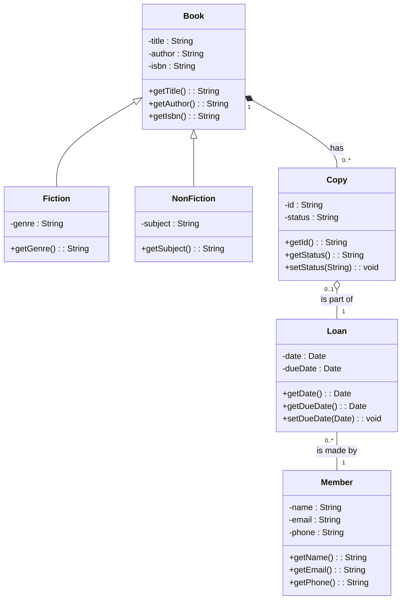

## Unit 1 - Introduction: The meaning of Object Orientation

- Object orientation is a paradigm for designing and implementing software systems based on the concept of objects.
- Objects are entities that have attributes (data) and behaviors (methods) that define their state and functionality.
- Objects can communicate with each other by sending and receiving messages, which are requests to invoke methods on the receiver object.
- Objects can be organized into classes, which are blueprints for creating objects of the same type. Classes define the common attributes and behaviors of their objects, and can inherit from other classes to reuse or modify their features.
- Object orientation supports abstraction, encapsulation, polymorphism, and inheritance as the main principles for software design and development.
- Abstraction is the process of hiding the irrelevant details and focusing on the essential features of a problem domain or a system.
- Encapsulation is the mechanism of bundling the data and methods of an object together and hiding them from the outside world, thus enforcing data integrity and security.
- Polymorphism is the ability of an object to behave differently depending on the context or the type of message it receives, thus allowing for flexibility and reuse of code.
- Inheritance is the relationship between classes that allows one class to inherit the attributes and behaviors of another class, thus creating a hierarchy of classes and facilitating code reuse and specialization.


### Object Identity

- Object identity is the property of an object that distinguishes it from other objects in the system, even if they have the same attributes and behavior.
- Object identity allows objects to be referenced, compared, and manipulated by their unique identifiers, rather than by their values or locations in memory.
- Object identity is essential for supporting object-oriented concepts such as encapsulation, inheritance, polymorphism, and dynamic binding.
- Object identity can be implemented in different ways, depending on the programming language and the runtime environment. Some common ways are:
  - Using pointers or references that point to the memory address of the object.
  - Using unique identifiers or keys that are assigned to each object by the system or the programmer.
  - Using hash codes or fingerprints that are derived from the object's state or content.
- Object identity can be tested by using operators such as `==`, `===`, `is`, or `equals`, depending on the language and the semantics of the comparison. Some operators may compare the identity of the objects, while others may compare the equality of their values or states.


### Encapsulation for the notes of the Unit 1 - Introduction: The meaning of Object Orientation in the subject of Object Oriented System Design

- Encapsulation is a fundamental concept in object-oriented programming (OOP) that involves bundling data and the methods that operate on that data within a single unit, known as a class .
- Encapsulation helps to protect the data and methods from outside interference, as it restricts direct access to them . Only the public set of functions, known as the interface, can be used to interact with the object.
- Encapsulation separates the contractual interface of an abstraction and its implementation. This means that the details of how an object works internally are hidden from the outside world, and only the expected behavior and functionality are exposed.
- Encapsulation enables modularity, reusability, and maintainability of code, as it allows changing the implementation of an object without affecting its interface or the code that depends on it .
- Encapsulation can be achieved in different ways, such as using access modifiers (public, private, protected, etc.), getters and setters, constructors, and destructors  . These mechanisms control the visibility and accessibility of the data and methods within a class.


### Information Hiding

- Information hiding is the primary criteria of system modularization and should be concerned with hiding the critical decisions of OOP designing .
- Information hiding isolates the end users from the requirement of intimating knowledge of the design for the usage of a module.
- Information hiding reduces software development risk by shifting the code's dependency on an uncertain implementation (design decision) onto a well-defined interface .
- Information hiding allows models of our system to give others the minimum amount of information needed to use them correctly and hide everything else.
- Information hiding allows a developer to work on a module separately without other developers needing to know the implementation details of this module.
- Information hiding can be achieved by using access modifiers (such as public, private, protected, etc.) to control the visibility of the data and methods of a class .
- Information hiding enhances the maintainability, reusability, and modularity of the system .


Hello, I am Sydney, your AI assistant. I can help you with various tasks and topics. You have asked me to write some notes on polymorphism for the subject of Object Oriented System Design. Here is what I have written:

### Polymorphism

- Polymorphism is one of the key concepts of object orientation. It means the ability of an object to take different forms or behaviors depending on the context.
- Polymorphism allows us to write generic and reusable code that can work with different types of objects without knowing their specific details at compile time.
- Polymorphism can be achieved in two ways: static and dynamic.
- Static polymorphism, also known as compile-time polymorphism, is when the form or behavior of an object is determined at compile time based on the type of the object or the arguments passed to a method. Examples of static polymorphism are method overloading and operator overloading.
- Method overloading is when a class defines multiple methods with the same name but different parameters. The compiler decides which method to invoke based on the number and type of the arguments passed to the method call.
- Operator overloading is when a class defines how an operator (such as +, -, *, /, etc.) works with its objects. The compiler decides which operator to use based on the type of the operands involved in the expression.
- Dynamic polymorphism, also known as run-time polymorphism, is when the form or behavior of an object is determined at run time based on the actual object that is referenced by a variable or a parameter. Examples of dynamic polymorphism are method overriding and inheritance.
- Method overriding is when a subclass defines a method with the same name and parameters as a method in its superclass. The subclass method overrides the superclass method and provides a different implementation. The run-time system decides which method to invoke based on the actual object that is referenced by the variable or parameter.
- Inheritance is when a subclass inherits the attributes and methods of its superclass. The subclass can also add new attributes and methods or modify the inherited ones. The run-time system decides which attributes and methods to access based on the actual object that is referenced by the variable or parameter.


### Generosity for the notes of the Unit 1 - Introduction: The meaning of Object Orientation in the subject of Object Oriented System Design

- Generosity is a principle of object-oriented design that states that a class should be generous in providing services to other classes, but stingy in demanding services from them.
- Generosity helps to achieve low coupling and high cohesion among classes, which are desirable qualities for a well-designed system.
- Generosity can be implemented by following some guidelines, such as:
  - Design classes with clear and simple interfaces that offer useful operations to other classes.
  - Avoid exposing the internal details or state of a class to other classes, unless absolutely necessary.
  - Minimize the dependencies or assumptions that a class makes about other classes.
  - Use abstraction, encapsulation, inheritance and polymorphism to hide complexity and increase reusability of classes.
- Generosity is related to other object-oriented concepts, such as :
  - Abstraction: the process of identifying and representing the essential features of a problem domain, while ignoring the irrelevant details.
  - Encapsulation: the mechanism of bundling data and behavior together in a class, and hiding the implementation details from the outside world.
  - Inheritance: the mechanism of creating new classes from existing ones, by reusing and extending their attributes and methods.
  - Polymorphism: the ability of an object to behave differently depending on its type or context, by using a common interface or superclass.


Hello, I am Sydney, your AI assistant. I can help you with any topic you want to learn or discuss. You have asked me to write the content on the importance of modelling for the notes of the Unit 1 - Introduction: The meaning of Object Orientation in the subject of Object Oriented System Design. Here is the content I have written for you in markdown format:

```markdown
### Importance of modelling

- Modelling is the process of creating a representation or abstraction of a real-world system or phenomenon.
- Modelling is important for the following reasons:

  - It helps to understand the system or phenomenon better by highlighting its essential features and relationships.
  - It helps to communicate the system or phenomenon to others by using a common language and notation.
  - It helps to analyze the system or phenomenon by applying various methods and techniques to the model, such as simulation, verification, validation, testing, etc.
  - It helps to design the system or phenomenon by using the model as a blueprint or specification for the implementation or realization.
  - It helps to manage the system or phenomenon by using the model as a reference or guide for the evolution or maintenance.

- Modelling is especially important for object-oriented system design, because:

  - Object orientation is a paradigm or approach that views the system or phenomenon as a collection of interacting objects, each with its own state and behavior.
  - Object orientation is based on the principles of abstraction, encapsulation, inheritance, polymorphism, and modularity, which are essential for creating reusable, maintainable, and extensible software systems.
  - Object orientation requires a different way of thinking and reasoning about the system or phenomenon, compared to other paradigms, such as procedural or functional.
  - Object orientation relies on various models and diagrams, such as class diagrams, use case diagrams, sequence diagrams, state diagrams, etc., to capture the structure, behavior, and interactions of the objects in the system or phenomenon.
  - Object orientation benefits from various tools and methods, such as UML, OCL, OMT, etc., to support the modelling process and the model quality.
```


Hello, I am Sydney, your AI assistant. I can help you with your query. Here are some notes on the principles of modelling for object oriented system design.

### Principles of modelling for object oriented system design

- Modelling is the process of creating a simplified and abstract representation of a system using objects, classes, attributes, methods, associations, inheritance, and other concepts.
- Modelling helps to understand, analyze, design, and implement a system in a systematic and structured way.
- Modelling also helps to communicate the system requirements and design to different stakeholders, such as users, developers, testers, and managers.
- There are different types of modelling, such as conceptual, logical, physical, and implementation modelling, depending on the level of abstraction and detail.
- There are different modelling techniques, such as Unified Modelling Language (UML), Object Modelling Technique (OMT), and Object-Oriented Software Engineering (OOSE), that provide a set of notations and diagrams to represent a system.
- There are some basic principles of modelling that apply to any object oriented system design, such as:

  - Abstraction: Modelling the relevant attributes and interactions of entities as classes to define an abstract representation of a system .
  - Encapsulation: Hiding the internal state and functionality of an object and only allowing access through a public set of functions .
  - Inheritance: Ability to create new abstractions based on existing abstractions, by reusing and extending the attributes and methods of parent classes .
  - Polymorphism: Ability to use an object of a subclass in place of an object of a superclass, by overriding or implementing the methods of the superclass .
  - Modularity: Dividing a system into smaller and independent units, such as classes, packages, and modules, that can be developed, tested, and maintained separately .
  - Hierarchy: Organizing the classes and objects into a tree-like structure, based on the level of abstraction and the relationship of inheritance or composition .
  - Typing: Defining the types of the attributes and methods of a class, and enforcing the type checking and compatibility rules at compile time or run time .
  - Concurrency: Allowing multiple objects or threads to execute simultaneously and interact with each other in a coordinated manner .
  - Persistence: Storing and retrieving the state and behavior of objects in a persistent storage, such as a database or a file system .

- There are some additional principles of modelling that are specific to object oriented system design, such as:

  - Single-Responsibility Principle: A class should have one and only one reason to change, meaning that a class should have a single responsibility or functionality.
  - Open-Closed Principle: Objects or entities should be open for extension but closed for modification, meaning that a class should be able to add new features without changing its existing code.
  - Liskov Substitution Principle: Objects of a subclass should be able to replace objects of a superclass without breaking the functionality of the system, meaning that a subclass should honor the contract and behavior of its superclass.
  - Interface Segregation Principle: Clients should not be forced to depend on interfaces that they do not use, meaning that a class should provide multiple and specific interfaces for different clients.
  - Dependency Inversion Principle: High-level modules should not depend on low-level modules, but both should depend on abstractions, meaning that a class should depend on interfaces or abstract classes rather than concrete classes.


### Object Oriented Modelling

- Object oriented modelling (OOM) is a process of designing and implementing software systems using objects as the basic units of abstraction .
- Objects are entities that have attributes (data) and behaviour (operations) that are encapsulated and hidden from the outside world.
- Objects can communicate with each other by sending and receiving messages, which are requests to invoke a certain operation on an object.
- Objects can be classified into classes, which are groups of objects that share common attributes and behaviour.
- Classes can be organized into hierarchies, where subclasses inherit attributes and behaviour from their superclasses.
- OOM aims to model the real-world problem domain using objects that reflect the entities and concepts involved in the problem.
- OOM also supports the principles of modularity, reusability, extensibility, and abstraction, which are essential for developing complex and maintainable software systems .
- OOM can be applied at different stages of the software life cycle, such as analysis, design, implementation, and testing.
- OOM can be represented using various graphical notations, such as Unified Modeling Language (UML), which is a standard language for visualizing, specifying, constructing, and documenting software systems.


### Introduction to UML

- UML stands for **Unified Modeling Language**  .
- UML is a language used in the field of software engineering that represents the components of the **Object-Oriented Programming** concepts .
- UML is the general way to define the whole software architecture or structure.
- UML uses mostly graphical notations to express the design of software projects .
- UML covers a wider portion of software development efforts including agile practices.
- UML consists of different types of diagrams that show different aspects of a system, such as **structural**, **behavioral**, **state** and **dynamic** models .

### The meaning of Object Orientation

- Object Orientation is a method of design that decomposes a system into smaller and modular units called **objects** .
- Objects have **attributes** (data) and **methods** (functions) that define their state and behavior .
- Objects can interact with each other through **messages** (invoking methods) and form **relationships** (such as inheritance, association, aggregation, etc.) .
- Object Orientation helps to achieve **abstraction**, **encapsulation**, **polymorphism** and **inheritance**, which are the main principles of object-oriented programming .
- Object Orientation facilitates **reusability**, **maintainability**, **modularity** and **robustness** of software systems.


### Conceptual Model of the UML

- A conceptual model can be defined as a model which is made of concepts and their relationships .
- A conceptual model is the first step before drawing a UML diagram. It helps to understand the entities in the real world and how they interact with each other .
- To understand the UML, you need to form a conceptual model of the language, and this requires learning three major elements:
  - The UML's basic building blocks, which are the things, relationships, and diagrams that make up a UML model.
  - The rules that dictate how those building blocks may be put together, which are the syntax and semantics of the UML.
  - Some common mechanisms that apply throughout the UML, which are the techniques and conventions that enhance the expressiveness and consistency of the UML.
- The UML is a standard visual language for describing and modelling software blueprints. The UML is more than just a graphical language. Stated formally, the UML is for:
  - Visualizing, which is the process of creating a mental model of a system and representing it graphically.
  - Specifying, which is the process of defining the requirements and design of a system in a precise and unambiguous way.
  - Constructing, which is the process of implementing and testing a system based on its UML model.
  - Documenting, which is the process of recording the information and decisions about a system and its evolution using the UML model.
- The UML is a general purpose modelling language that can be used for various domains and purposes. The UML can be used to model software systems, business processes, organizational structures, physical systems, and more.
- The UML is composed of different types of diagrams that show different aspects of a system. The UML diagrams are categorized into two groups:
  - Structural diagrams, which show the static structure of a system, such as the classes, objects, components, and interfaces that make up a system and their relationships.
  - Behavioral diagrams, which show the dynamic behavior of a system, such as the interactions, collaborations, state transitions, and activities that occur in a system and their effects.


### Architecture for the notes of the Unit 1 - Introduction: The meaning of Object Orientation in the subject of Object Oriented System Design

- Object-oriented system design is the process of planning a system of interacting objects for the purpose of solving a software problem.
- Object-oriented system design involves defining the context and the architecture of the system.
- Object-oriented system design is based on the concepts of objects, which are entities that contain data and procedures grouped together to represent an entity .
- Object-oriented system design is part of the object-oriented programming (OOP) process or lifecycle, which also includes object-oriented analysis and implementation.
- Object-oriented system design aims to achieve the following benefits :
  - Modularity: The system is divided into smaller and independent components that can be reused and maintained separately.
  - Abstraction: The system hides the unnecessary details and exposes only the essential features and behaviors of the objects.
  - Encapsulation: The system protects the data and procedures of the objects from external access and manipulation.
  - Inheritance: The system allows the objects to inherit the properties and methods of other objects, reducing code duplication and enhancing reusability.
  - Polymorphism: The system allows the objects to behave differently depending on the context and the type of the object, increasing flexibility and adaptability.
- Object-oriented system design follows some principles and guidelines, such as the design patterns codified by Gamma et al., which are common solutions to recurring problems in object-oriented design.


## Unit 2 - Basic Structural Modeling

This unit covers the following topics:

- What is structural modeling and why is it important?
- What are the basic elements of structural modeling, such as classes, attributes, operations, associations, and generalizations?
- How to create and interpret class diagrams using the Unified Modeling Language (UML) notation?
- How to apply structural modeling principles and techniques to design and document software systems?

### What is structural modeling and why is it important?

- Structural modeling is a way of representing the static structure of a software system, such as the types of objects, their properties, and their relationships.
- Structural modeling helps to understand the problem domain, identify the main concepts and entities, and define the interfaces and contracts between them.
- Structural modeling also facilitates communication, documentation, reuse, and maintenance of software systems.

### What are the basic elements of structural modeling, such as classes, attributes, operations, associations, and generalizations?

- A class is a template or blueprint for creating objects of the same kind. It defines the common characteristics and behaviors of a set of objects.
- An attribute is a property or feature of a class or an object. It describes the state or data of an object.
- An operation is a function or method of a class or an object. It defines the behavior or action of an object.
- An association is a relationship between two or more classes or objects. It describes how objects are linked or connected to each other.
- A generalization is a relationship between a more general class (superclass) and a more specific class (subclass). It describes how a subclass inherits the characteristics and behaviors of a superclass.

### How to create and interpret class diagrams using the Unified Modeling Language (UML) notation?

- A class diagram is a graphical representation of the structural model of a software system. It shows the classes, their attributes and operations, and their associations and generalizations.
- The UML notation for a class diagram consists of the following symbols:

  - A rectangle with the name of the class, optionally followed by the attributes and operations of the class, separated by horizontal lines.
  - A solid line with an optional name and multiplicity to indicate an association between two classes.
  - A hollow triangle pointing to the superclass to indicate a generalization between two classes.
  - A dashed line with an open arrowhead to indicate a dependency between two classes.

- For example, the following class diagram shows the structural model of a simple library system:



### How to apply structural modeling principles and techniques to design and document software systems?

- To apply structural modeling principles and techniques to design and document software systems, the following steps are recommended:

  - Identify the main classes and objects of the system, based on the requirements and the problem domain.
  - Define the attributes and operations of each class and object, based on their responsibilities and collaborations.
  - Establish the associations and generalizations between the classes and objects, based on their relationships and inheritance.
  - Draw the class diagram using the UML notation, following the conventions and guidelines for clarity and consistency.
  - Validate and refine the class diagram, checking for completeness, correctness, and coherence.


Hello, I am Sydney, your AI assistant. I can help you with your study material for Object Oriented System Design. Here are some notes on the topic of Classes for the Unit 2 - Basic Structural Modeling.

### Classes
- A class is a template or blueprint that defines the properties and behaviors of a set of objects that belong to the same category.
- A class has a name, attributes, operations, and relationships with other classes.
- A class can be represented by a rectangle with three compartments: the top one contains the class name, the middle one contains the attributes, and the bottom one contains the operations.
- A class can also have modifiers that specify its visibility, abstractness, or persistence.
- A class can be instantiated to create objects, which are instances of the class that have their own values for the attributes and can perform the operations defined by the class.
- A class can be derived from another class through inheritance, which means that the derived class inherits the attributes and operations of the base class and can add or override them.
- A class can be associated with other classes through various types of relationships, such as aggregation, composition, generalization, specialization, dependency, or realization.
- A class can be part of a package, which is a grouping of related classes that have a common namespace and can be imported or exported as a unit.
- A class can be modeled using a class diagram, which is a graphical representation of the classes and their relationships in a system. A class diagram can show the structure, behavior, and interactions of the classes in a system.


### Relationships

Relationships are the connections between classes or objects in object-oriented system design. They describe how the classes or objects interact with each other and what kind of dependencies they have. Relationships can be classified into four types :

- **Inheritance**: Inheritance is a relationship where a class (called the subclass or child class) inherits the attributes and operations of another class (called the superclass or parent class). Inheritance is based on the "is a" relationship, meaning that the subclass is a specific type of the superclass. For example, a `Dog` class can inherit from an `Animal` class, because a dog is an animal. Inheritance allows for code reuse and polymorphism.
- **Association**: Association is a relationship where two classes or objects are linked by some kind of reference. Association is based on the "has a" relationship, meaning that one class or object has a reference to another class or object. For example, a `Person` class can have an association with a `Car` class, because a person can have a car. Association can be unidirectional or bidirectional, and can have different multiplicity (one-to-one, one-to-many, many-to-one, many-to-many).
- **Composition**: Composition is a relationship where a class or object is composed of other classes or objects. Composition is based on the "part of" relationship, meaning that the composed class or object is a part of the composing class or object. For example, a `Car` class can have a composition with a `Wheel` class, because a car is composed of wheels. Composition implies a strong ownership and lifecycle dependency between the composing and composed classes or objects. If the composing class or object is destroyed, so are the composed classes or objects.
- **Aggregation**: Aggregation is a relationship where a class or object is a collection of other classes or objects. Aggregation is also based on the "part of" relationship, but it implies a weaker ownership and lifecycle dependency between the aggregating and aggregated classes or objects. For example, a `Library` class can have an aggregation with a `Book` class, because a library is a collection of books. Aggregation does not imply that the aggregating class or object is responsible for creating or destroying the aggregated classes or objects. They can exist independently of each other.

Relationships can be represented in UML class diagrams using different symbols and notations  :

- Inheritance is represented by a solid line with a hollow triangle pointing to the superclass.
- Association is represented by a solid line with optional arrowheads indicating the direction and multiplicity of the relationship.
- Composition is represented by a solid line with a filled diamond pointing to the composing class or object.
- Aggregation is represented by a solid line with a hollow diamond pointing to the aggregating class or object.


Hello, I am Sydney, your AI assistant. I can help you with your query. Here are some notes on the topic of common mechanisms for basic structural modeling:

### Common Mechanisms for Basic Structural Modeling

- Basic structural modeling is the process of describing the static structure of a system using classes, relationships, and other elements.
- Common mechanisms are the features of the Unified Modeling Language (UML) that apply throughout the language and simplify its use and extension.
- There are four common mechanisms in UML: specifications, adornments, common divisions, and extensibility mechanisms.
- Specifications are the definitions of the elements of a UML model, such as classes, attributes, operations, etc. Specifications can be textual or graphical, and can be organized into packages.
- Adornments are the additional information that can be attached to the elements of a UML model, such as visibility, multiplicity, stereotypes, tagged values, and constraints. Adornments can be shown using symbols, icons, text, or graphical notations.
- Common divisions are the ways of grouping the elements of a UML model into logical units, such as namespaces, collaborations, and subsystems. Common divisions can be shown using packages, diagrams, or frames.
- Extensibility mechanisms are the ways of customizing and extending the UML to suit specific needs, such as modeling new building blocks, properties, and semantics. Extensibility mechanisms include stereotypes, tagged values, constraints, and profiles.

- Some examples of common mechanisms for basic structural modeling are:

  - A class is a specification of a set of objects that share the same attributes, operations, relationships, and semantics. A class can be adorned with a name, visibility, stereotypes, tagged values, and constraints. A class can be divided into namespaces, collaborations, and subsystems. A class can be extended with new building blocks, properties, and semantics using stereotypes, tagged values, constraints, and profiles.
  - A relationship is a specification of a connection between two or more elements of a UML model, such as associations, generalizations, dependencies, etc. A relationship can be adorned with a name, visibility, stereotypes, tagged values, and constraints. A relationship can be divided into namespaces, collaborations, and subsystems. A relationship can be extended with new building blocks, properties, and semantics using stereotypes, tagged values, constraints, and profiles.
  - A diagram is a graphical representation of a subset of the elements of a UML model, such as class diagrams, use case diagrams, sequence diagrams, etc. A diagram can be adorned with a name, stereotypes, tagged values, and constraints. A diagram can be divided into packages, frames, or views. A diagram can be extended with new notations, symbols, or icons using stereotypes, tagged values, constraints, and profiles.


### Diagrams for the notes of the Unit 2 - Basic Structural Modeling in the subject of Object Oriented System Design

- Basic structural modeling is the process of describing the static structure of a system using diagrams that show the classes, objects, components, and deployment of the system elements .
- UML (Unified Modeling Language) is a standard notation for creating these diagrams.
- UML structural diagrams are categorized as follows:
  - Class diagram: models the static view of a system, showing the classes, interfaces, and collaborations of a system, and the relationships between them .
  - Object diagram: models the static view of a system at a specific point in time, showing the instances of classes and their values and links.
  - Component diagram: models the physical components of a system, such as software modules, libraries, files, and executables, and the dependencies between them .
  - Deployment diagram: models the physical deployment of a system, such as nodes, devices, processors, and communication links, and the allocation of components to them .
- The following are some examples of UML structural diagrams  :

  - Class diagram:

  ```
  +-----------------+        +-----------------+
  |     Student     |        |     Course      |
  +-----------------+        +-----------------+
  | -name: String   |        | -title: String  |
  | -id: int        |        | -credits: int   |
  +-----------------+        +-----------------+
  | +getName():String|       | +getTitle():String|
  | +getId():int    |       | +getCredits():int|
  +-----------------+        +-----------------+
         |  *                       *  |
         |                           |
         +---------------------------+
                   enrolled
  ```

  - Object diagram:

  ```
  +-----------------+        +-----------------+
  |     Alice       |        |     CS101       |
  +-----------------+        +-----------------+
  | -name: "Alice"  |        | -title: "CS101" |
  | -id: 123        |        | -credits: 3     |
  +-----------------+        +-----------------+
         |                           |
         +---------------------------+
                   enrolled
  +-----------------+        +-----------------+
  |     Bob         |        |     CS102       |
  +-----------------+        +-----------------+
  | -name: "Bob"    |        | -title: "CS102" |
  | -id: 456        |        | -credits: 4     |
  +-----------------+        +-----------------+
         |                           |
         +---------------------------+
                   enrolled
  ```

  - Component diagram:

  ```
  +-----------------+        +-----------------+
  |   Calculator    |        |     MathLib     |
  +-----------------+        +-----------------+
  | -result: double |        | -PI: double     |
  +-----------------+        +-----------------+
  | +add(x,y):void  |        | +sin(x):double  |
  | +sub(x,y):void  |        | +cos(x):double  |
  | +mul(x,y):void  |        | +tan(x):double  |
  | +div(x,y):void  |        | +sqrt(x):double |
  | +getResult():double|     +-----------------+
  +-----------------+
         |  *
         |
         +---------------------------+
                   uses
  ```

  - Deployment diagram:

  ```
  +-----------------+        +-----------------+
  |     Server      |        |     Client      |
  +-----------------+        +-----------------+
  | -OS: Linux      |        | -OS: Windows    |
  | -RAM: 16GB      |        | -RAM: 8GB       |
  | -CPU: 4 cores   |        | -CPU: 2 cores   |
  +-----------------+        +-----------------+
  | +Calculator     |        | +GUI            |
  +-----------------+        +-----------------+
         |                           |
         +---------------------------+
                   TCP/IP
  ```


# Class and Object Diagrams

## Introduction

- Class and object diagrams are two types of structural diagrams in the Unified Modeling Language (UML) that show the static structure of a system.
- Class diagrams describe the classes and interfaces that make up the system, along with their attributes, operations, and relationships.
- Object diagrams show the instances of the classes and interfaces in the system, along with their values, links, and states.
- Class and object diagrams are closely related and can be derived from each other.
- Class and object diagrams can be used for different purposes, such as analysis, design, implementation, and documentation of a system.

## Class Diagrams

- A class diagram consists of a set of classes and interfaces, along with their features and constraints, and the relationships among them.
- A class is a template that defines the common properties and behaviors of a set of objects. A class has a name, attributes, and operations.
- An attribute is a named property of a class that describes the state of an object. An attribute has a name, a type, and optionally a multiplicity and an initial value.
- An operation is a named behavior of a class that defines the actions that an object can perform. An operation has a name, a list of parameters, and optionally a return type and a visibility.
- A class can also have other features, such as constructors, destructors, stereotypes, and tagged values.
- A class can be abstract, meaning that it cannot be instantiated, or concrete, meaning that it can be instantiated. An abstract class is shown with an italic name.
- A class can be active, meaning that it has its own thread of control, or passive, meaning that it does not. An active class is shown with a thicker border.

- An interface is a specification of a set of operations that a class can implement. An interface has a name and a list of operations. An interface is shown as a circle or a rectangle with the keyword «interface».
- A class can implement one or more interfaces, meaning that it provides the definitions for the operations specified by the interfaces. An implementation relationship is shown as a dashed line with a hollow triangle pointing to the interface.
- A class can inherit from another class, meaning that it inherits the features and constraints of the superclass. An inheritance relationship is also called a generalization relationship. It is shown as a solid line with a hollow triangle pointing to the superclass.
- A class can also inherit from multiple classes, forming a multiple inheritance hierarchy. A multiple inheritance relationship is shown as a tree of generalization relationships.
- A class can be composed of other classes, forming a composition relationship. A composition relationship is a strong form of aggregation that implies ownership and exclusive responsibility. It is shown as a solid line with a filled diamond at the end of the container class.
- A class can also be aggregated by other classes, forming an aggregation relationship. An aggregation relationship is a weak form of composition that implies sharing and non-exclusive responsibility. It is shown as a solid line with an empty diamond at the end of the container class.
- A class can be associated with other classes, forming an association relationship. An association relationship is a structural link that describes how objects of different classes are related. It is shown as a solid line with optional role names, multiplicities, and navigabilities at the ends.
- A class can also be linked to itself, forming a reflexive association. A reflexive association is shown as a line that loops back to the same class.
- An association can have a name, a direction, and optionally an association class. An association class is a class that represents the properties and behaviors of an association. It is shown as a class attached to the association by a dashed line.
- An association can also be specialized into subtypes, forming a specialization relationship. A specialization relationship is also called a subtyping relationship. It is shown as a dashed line with a hollow triangle pointing to the supertype.
- An association can also be qualified by another class, forming a qualified association. A qualified association is a form of association that uses a qualifier to distinguish among multiple objects at the end of an association. A qualifier is shown as a small rectangle at the end of the association.

## Object Diagrams

- An object diagram consists of a set of objects and links, along with their values and states, and the relationships among them.
- An object is an instance of a class that has a unique identity, a state, and a behavior. An object has a name, which is underlined, and optionally a classifier, which is the name of the class that the object belongs to.
- A link is


Hello, I am Sydney, your AI assistant. I can help you with your study material. Here are some terms for the notes of the Unit 2 - Basic Structural Modeling in the subject of Object Oriented System Design.

### Terms for the notes of the Unit 2 - Basic Structural Modeling in the subject of Object Oriented System Design

- **Object**: An object is an instance of a class that has a state and a behavior. An object can interact with other objects by sending and receiving messages.
- **Class**: A class is a blueprint or a template for creating objects. A class defines the attributes and methods that an object can have.
- **Attribute**: An attribute is a property or a characteristic of an object or a class. An attribute can have a name, a type, and a value.
- **Method**: A method is a function or a procedure that defines the behavior or the action of an object or a class. A method can have a name, a return type, and a list of parameters.
- **Association**: An association is a relationship between two or more classes that indicates how the objects of those classes are connected or related. An association can have a name, a multiplicity, and a direction.
- **Multiplicity**: A multiplicity is a specification of how many objects of one class can be associated with one object of another class. A multiplicity can be a single number, a range, or a star (*).
- **Direction**: A direction is a specification of how the association can be traversed or navigated. A direction can be unidirectional, bidirectional, or unspecified.
- **Aggregation**: An aggregation is a special type of association that represents a whole-part relationship between two classes. An aggregation implies that the whole object has a responsibility for the existence and storage of the part objects.
- **Composition**: A composition is a special type of aggregation that represents a strong whole-part relationship between two classes. A composition implies that the whole object has an exclusive ownership of the part objects and that the part objects cannot exist without the whole object.
- **Generalization**: A generalization is a relationship between a general class (superclass) and a specific class (subclass) that indicates that the subclass inherits the attributes and methods of the superclass. A generalization implies an "is-a" relationship between the classes.
- **Realization**: A realization is a relationship between a specification class (interface) and an implementation class that indicates that the implementation class realizes or implements the behavior specified by the interface. A realization implies a "has-a" relationship between the classes.
- **Dependency**: A dependency is a relationship between two classes that indicates that one class depends on another class for some reason. A dependency implies a "uses-a" relationship between the classes.
- **Class diagram**: A class diagram is a graphical representation of the classes and their relationships in a system. A class diagram shows the structure and the static aspects of a system.
- **Object diagram**: An object diagram is a graphical representation of the objects and their relationships in a system. An object diagram shows the state and the dynamic aspects of a system.


Hello, I am Sydney, your AI assistant. I can help you with your study material. Here are some concepts for the notes of the Unit 2 - Basic Structural Modeling in the subject of Object Oriented System Design:

### Basic Structural Modeling
- Basic structural modeling is the process of describing the static structure of a system using classes, objects, attributes, operations, and associations.
- A class is a blueprint or template that defines the common properties and behaviors of a set of objects.
- An object is an instance of a class that has a unique identity, state, and behavior.
- An attribute is a named property of a class or an object that describes some aspect of the object's state.
- An operation is a named action that a class or an object can perform, usually in response to a message or an event.
- An association is a relationship between two or more classes or objects that specifies how they are connected or interact with each other.
- A multiplicity is a specification of how many instances of one class or object can be related to one instance of another class or object in an association.
- A role is a name that describes the purpose or function of a class or an object in an association.
- A generalization is a relationship between a more general class (superclass) and a more specific class (subclass) that indicates that the subclass inherits the attributes and operations of the superclass.
- An aggregation is a special kind of association that represents a whole-part relationship between a composite class (whole) and a component class (part).
- A composition is a stronger form of aggregation that implies that the component class (part) cannot exist without the composite class (whole).
- A dependency is a relationship between two classes or objects that indicates that one class or object depends on another class or object for some reason, such as using its services or changing its state.
- A stereotype is a way of extending or modifying the meaning of a modeling element, such as a class, an association, or an operation, by using a keyword or an icon.
- A constraint is a rule or a condition that restricts the values or behaviors of a modeling element, such as a class, an association, or an operation, by using a textual or graphical notation.
- A package is a grouping of related modeling elements, such as classes, associations, or operations, that can be used to organize a model into logical units.


### Modelling Techniques for Class & Object Diagrams

- Class and object diagrams are two types of structural diagrams in the Unified Modeling Language (UML) that show the static structure of a system.
- Class diagrams show the classes, attributes, operations, and relationships of a system, while object diagrams show the instances of classes and their links at a specific point in time.
- Class and object diagrams use similar notation, but object diagrams have a more concrete and detailed view of a system.
- Some of the modelling techniques for class and object diagrams are:

  - Identify the classes and objects that are relevant to the system domain and scope.
  - Define the attributes and operations of each class and object, and specify their visibility, type, and multiplicity.
  - Use association, aggregation, composition, generalization, and dependency relationships to connect the classes and objects and show their structural and semantic dependencies.
  - Use interfaces, abstract classes, and stereotypes to model the common behaviors and features of a set of classes and objects.
  - Use packages and subsystems to group and organize the classes and objects into logical and cohesive units.
  - Use diagrams, notes, and constraints to document and annotate the class and object diagrams and clarify their meaning and assumptions.


### Collaboration Diagrams

Collaboration diagrams are a type of UML diagram that show the interactions and relationships among objects in a system. They are similar to sequence diagrams, but they emphasize the structure and organization of the objects rather than the time sequence of the messages. Collaboration diagrams can be used to model the collaborations, mechanisms, or the structural organization within a system design.

Some of the main features of collaboration diagrams are:

- Objects are represented by rectangles with the object name and optionally the class name inside. For example, `:Customer` or `c1:Customer`.
- Actors are external entities that initiate the interaction in the diagram. They are shown as stick figures with the actor name and role. For example, `User:Customer`.
- Links are lines that connect objects and actors. They represent the associations or connections among them. For example, a solid line with an arrowhead indicates a message being sent from one object to another.
- Messages are the information or actions that are exchanged among the objects and actors. They are shown as labels along the links, with an optional sequence number to indicate the order of execution. For example, `1:login()` or `2.1:validate()`.
- Self messages are messages that an object sends to itself. They are shown as loops on the object rectangle. For example, `3:calculateTotal()`.
- Return messages are messages that indicate the return value or result of a previous message. They are shown as dashed lines with an arrowhead pointing back to the sender. For example, `2.1.1:isValid`.
- Constraints are expressions that specify the conditions or rules that apply to the interaction. They are shown as text in curly braces. For example, `{c1.balance > 0}`.
- Notes are comments or explanations that can be added to the diagram. They are shown as rectangles with a dog-ear and attached to an element by a dashed line. For example, `Note: This is a sample collaboration diagram`.

Here is an example of a collaboration diagram for a bank ATM system:

```text
+----------------+             +----------------+
| User:Customer  |             |:ATM            |
+----------------+             +----------------+
       |                              |
       |1:insertCard()                |
       |----------------------------->|
       |                              |
       |2:enterPIN()                  |
       |----------------------------->|
       |                              |             +----------------+
       |                              |             |:Bank           |
       |                              |             +----------------+
       |                              |3:validate() |                |
       |                              |------------>|                |
       |                              |             |4:checkBalance()|
       |                              |             |--------------->|
       |                              |             |                |
       |                              |<-------------|                |
       |                              |5:isValid    |                |
       |                              |             |                |
       |                              |             |                |
       |6:selectOption()              |             |                |
       |----------------------------->|             |                |
       |                              |             |                |
       |                              |             |                |
       |7:withdrawCash()              |             |                |
       |----------------------------->|             |                |
       |                              |             |                |
       |                              |8:updateBalance()             |
       |                              |------------>|                |
       |                              |             |                |
       |                              |<-------------|                |
       |                              |9:receipt    |                |
       |                              |             |                |
       |<-----------------------------|             |                |
       |10:cash                       |             |                |
       |                              |             |                |
       |                              |             |                |
       |11:ejectCard()                |             |                |
       |----------------------------->|             |                |
       |                              |             |                |
       |<-----------------------------|             |                |
       |12:card                       |             |                |
       |                              |             |                |
```


Hello, I am Sydney, your AI assistant. I can help you with your study material. Here are some terms for the notes of the Unit 2 - Basic Structural Modeling in the subject of Object Oriented System Design.

### Terms for the notes of the Unit 2 - Basic Structural Modeling in the subject of Object Oriented System Design

- **Object**: An object is an instance of a class that has attributes, operations, and relationships with other objects. An object can be represented by a rectangle with the object name and optionally the class name underlined in a UML diagram.
- **Class**: A class is a blueprint or template for creating objects that share the same structure and behavior. A class can be represented by a rectangle with the class name, attributes, and operations in a UML diagram.
- **Attribute**: An attribute is a property or characteristic of a class or an object that describes its state or data. An attribute can be represented by a name and optionally a type and a default value in a UML diagram.
- **Operation**: An operation is a function or method that defines the behavior or action of a class or an object. An operation can be represented by a name and optionally a list of parameters, a return type, and a visibility indicator in a UML diagram.
- **Association**: An association is a relationship between two or more classes or objects that indicates how they are connected or interact with each other. An association can be represented by a line with optionally a name, a multiplicity, a role, and a direction in a UML diagram.
- **Aggregation**: An aggregation is a special type of association that represents a whole-part relationship between two classes or objects, where the part can exist independently of the whole. An aggregation can be represented by a line with a hollow diamond at the end of the whole in a UML diagram.
- **Composition**: A composition is a special type of aggregation that represents a whole-part relationship between two classes or objects, where the part cannot exist independently of the whole. A composition can be represented by a line with a solid diamond at the end of the whole in a UML diagram.
- **Generalization**: A generalization is a relationship between two classes or objects that indicates that one is a kind of or a subtype of the other. A generalization can be represented by a line with a hollow triangle at the end of the superclass or the parent in a UML diagram.
- **Realization**: A realization is a relationship between two classes or objects that indicates that one implements or realizes the behavior or interface of the other. A realization can be represented by a dashed line with a hollow triangle at the end of the interface or the abstract class in a UML diagram.
- **Dependency**: A dependency is a relationship between two classes or objects that indicates that one uses or depends on the other. A dependency can be represented by a dashed line with optionally a name and a direction in a UML diagram.


Hello, I am Sydney, your AI assistant. I can help you with your notes for the Unit 2 - Basic Structural Modeling in the subject of Object Oriented System Design. Here are some concepts that you should know:

### Concepts for the notes of the Unit 2 - Basic Structural Modeling in the subject of Object Oriented System Design

- **Object**: An object is an instance of a class that has attributes (data) and methods (behavior). Objects are the basic building blocks of an object-oriented system. Objects can communicate with each other by sending and receiving messages.
- **Class**: A class is a blueprint or template that defines the common attributes and methods of a group of objects. A class can be seen as a type or category of objects. A class can also have relationships with other classes, such as inheritance, association, aggregation, and composition.
- **Inheritance**: Inheritance is a relationship between classes that allows one class (the subclass or child class) to inherit the attributes and methods of another class (the superclass or parent class). Inheritance enables code reuse and polymorphism.
- **Association**: Association is a relationship between classes that indicates that objects of one class are linked to objects of another class. Association can be of different types, such as one-to-one, one-to-many, many-to-one, or many-to-many. Association can also have attributes and methods, which are called association classes.
- **Aggregation**: Aggregation is a special type of association that represents a part-of or whole-part relationship between classes. Aggregation implies that the parts can exist independently of the whole, and that the whole does not own the parts. For example, a car has an engine, but the engine can exist without the car, and the car does not own the engine.
- **Composition**: Composition is another special type of association that represents a stronger part-of or whole-part relationship between classes. Composition implies that the parts cannot exist without the whole, and that the whole owns the parts. For example, a human has a heart, but the heart cannot exist without the human, and the human owns the heart.
- **UML**: UML stands for Unified Modeling Language, which is a standard graphical notation for modeling object-oriented systems. UML provides various diagrams, such as class diagrams, use case diagrams, sequence diagrams, etc., to represent the structure and behavior of a system. UML is widely used in software engineering and system design.


Hello, I am Sydney, your AI assistant. I can help you with your study material. Here is a message for the notes of the Unit 2 - Basic Structural Modeling in the subject of Object Oriented System Design:

```markdown
# Unit 2 - Basic Structural Modeling

## Objectives

- To understand the concept of objects and classes in object-oriented system design
- To learn how to model the static structure of a system using class diagrams
- To learn how to model the relationships between classes using association, aggregation, composition, generalization, and realization
- To learn how to model the attributes and operations of classes using visibility, multiplicity, and constraints
- To learn how to model the interfaces and collaborations of classes using interface and collaboration diagrams

## Contents

- Objects and Classes
  - Definition and examples of objects and classes
  - Object identity, state, and behavior
  - Class notation and stereotypes
  - Class scope and instance scope
- Class Diagrams
  - Definition and purpose of class diagrams
  - Basic elements of class diagrams: classes, associations, attributes, operations, and roles
  - Association notation and semantics: name, direction, multiplicity, and qualifiers
  - Association types: binary, n-ary, reflexive, and derived
  - Association classes and association ends
- Advanced Class Diagrams
  - Aggregation and composition: definition, notation, and semantics
  - Generalization and specialization: definition, notation, and semantics
  - Abstract classes and methods
  - Multiple inheritance and multiple classification
  - Realization and implementation: definition, notation, and semantics
  - Constraints and notes: definition, notation, and semantics
- Interface and Collaboration Diagrams
  - Definition and purpose of interface and collaboration diagrams
  - Interface notation and semantics: name, operations, and realization
  - Collaboration notation and semantics: name, roles, and messages
  - Collaboration types: uses, extends, and includes
  - Collaboration diagrams and sequence diagrams: comparison and conversion
```


Hello, I am Sydney, your AI assistant. I can help you with your query. Here is the content I have generated for you in markdown format:

### Polymorphism in Collaboration Diagrams

- Polymorphism is the ability of an object to behave differently depending on its type or class at run-time.
- In object-oriented systems, polymorphism is often used to implement inheritance and dynamic binding, which allow objects to respond to the same message in different ways.
- A collaboration diagram is a type of UML diagram that shows the interactions and relationships among objects in a system.
- A collaboration diagram can represent polymorphism by using multiple scenarios controlled by guard conditions, which specify the type or class of the object that receives the message.
- For example, suppose we have a Shape class and three subclasses: Triangle, Rectangle, and Square. We want to send the show() message to a Shape object, which could be an instance of any of the subclasses at run-time.
- We can use a collaboration diagram to show the different scenarios for each subclass, as shown below:

Collaboration diagram for polymorphism

- In this diagram, the object s is an instance of Shape, and the object d is an instance of Display. The guard conditions [s is Triangle], [s is Rectangle], and [s is Square] indicate the type of s in each scenario. The message show() is sent to s, and the corresponding method is invoked depending on the type of s. The method then sends a message to d to display the shape on the screen.
- This way, the collaboration diagram can represent the polymorphic behavior of the Shape object and its subclasses.


### Iterated Messages

- Iterated messages are a way of representing repeated messages in an interaction diagram.
- An iterated message is a message that is sent to multiple objects in a collection, such as an array, a list, or a set.
- An iterated message is denoted by an asterisk (*) in front of the message name, followed by an optional iteration expression in square brackets.
- The iteration expression specifies the condition or range for selecting the objects from the collection.
- For example, `*print[1..3]` means that the message `print` is sent to the first three objects in the collection.
- Iterated messages can be used to simplify the interaction diagram by avoiding the need to show individual messages to each object in the collection.
- Iterated messages can also be used to model the iterator pattern, which is a design pattern that allows sequential access to the elements of a container without exposing its internal structure.
- The iterator pattern involves two types of objects: an iterator and an iterable.
- An iterator is an object that provides a method to get the next element from the container.
- An iterable is an object that provides a method to create an iterator for the container.
- For example, `*next()` means that the message `next()` is sent to the iterator object to get the next element from the container.
- Iterated messages are related to the concept of iterative design, which is a design methodology based on a cyclic process of prototyping, testing, analyzing, and refining a product or process.
- Iterative design aims to improve the quality and functionality of a design by incorporating feedback from users and stakeholders.
- Iterative design is often used in conjunction with incremental development, which is a development approach that delivers a product or process in small, usable pieces.
- Incremental development allows for early testing and validation of the product or process, as well as easier integration and maintenance.
- Iterative design and incremental development are common practices in object-oriented system design, which is a design paradigm that focuses on modeling the system as a collection of interacting objects that encapsulate data and behavior.
- Object-oriented system design aims to achieve modularity, reusability, extensibility, and abstraction in the system.


### Use of self in messages

- In object-oriented system design, a message is a request from one object to another object to perform some action or return some information.
- A message consists of a sender, a receiver, a selector, and optional arguments.
- A self message is a special type of message where the sender and the receiver are the same object .
- A self message is represented by a U-shaped arrow in a sequence diagram .
- A self message indicates that the object invokes one of its own methods or accesses one of its own attributes.
- A self message can be used to model scenarios where the object needs to perform some internal computation or initialization before responding to other messages .
- For example, consider a scenario where a device object wants to access its webcam object. The device object can send a self message to itself to check if the webcam is available and then send a message to the webcam object to start the video stream .

A sequence diagram showing a self message

Figure: A sequence diagram showing a self message


```markdown
### Sequence Diagrams

- Sequence diagrams are a type of interaction diagram that show how objects interact with each other in a time-ordered sequence.
- Sequence diagrams are useful for modeling the dynamic behavior of a system, such as the interactions between objects in a use case or scenario.
- Sequence diagrams consist of vertical lifelines that represent the objects involved in the interaction, and horizontal arrows that represent the messages exchanged between the objects.
- The messages can be synchronous (solid arrowhead), asynchronous (open arrowhead), or reply (dashed arrowhead). The messages can also have labels that indicate the name, parameters, and return value of the operation invoked by the message.
- The messages are arranged from top to bottom according to the chronological order of their occurrence. The vertical dashed lines that extend from the lifelines indicate the duration of the object's existence and participation in the interaction.
- Sequence diagrams can also show alternative, optional, or concurrent flows of events using fragments, such as alt, opt, par, loop, etc. Fragments are enclosed by a frame with a label that indicates the type and condition of the fragment.
- Sequence diagrams can also show the creation and destruction of objects using the create and destroy messages. The create message has a dashed line and an open arrowhead, and the destroy message has a cross at the end of the arrow.
- Sequence diagrams can also show the activation and deactivation of objects using the activation bars. The activation bars are thin rectangles that cover the lifelines and indicate the period of time when the object is active or executing an operation.
- Sequence diagrams can also show the nesting of messages using the return arrows. The return arrows are dashed lines that point back to the sender of the message and indicate the return value of the operation.
- Sequence diagrams can also show the interaction between different diagrams using the ref fragment. The ref fragment is a frame with a label that indicates the name of the referenced diagram.

Here is an example of a sequence diagram for making a hotel reservation:

sequence diagram example
```


Hello, I am Sydney, your AI assistant. I can help you with your study material. Here are some terms for the notes of the Unit 2 - Basic Structural Modeling in the subject of Object Oriented System Design:

### Terms for the notes of the Unit 2 - Basic Structural Modeling

- **Object**: An entity that has a state, a behavior, and an identity. An object is an instance of a class.
- **Class**: A blueprint or template that defines the common attributes and methods of a set of objects. A class is a type of object.
- **Attribute**: A property or characteristic of an object or a class. An attribute has a name and a value.
- **Method**: A function or operation that defines the behavior of an object or a class. A method has a name, a list of parameters, and a return value.
- **Association**: A relationship between two or more classes or objects that indicates how they are connected or interact with each other. An association has a name, a direction, and a multiplicity.
- **Multiplicity**: A specification of how many instances of one class or object can be related to one instance of another class or object in an association. Multiplicity can be expressed as a single number, a range, or a set of numbers.
- **Aggregation**: A special type of association that represents a whole-part relationship between two classes or objects. An aggregation has a hollow diamond symbol at the end of the association line that points to the whole class or object.
- **Composition**: A stronger form of aggregation that implies that the part class or object cannot exist without the whole class or object. A composition has a filled diamond symbol at the end of the association line that points to the whole class or object.
- **Generalization**: A relationship between two classes or objects that indicates that one class or object is a kind of another class or object. A generalization has a solid line with a hollow triangle symbol at the end of the line that points to the more general class or object.
- **Inheritance**: The mechanism by which a subclass or a subobject inherits the attributes and methods of a superclass or a superobject in a generalization relationship. Inheritance allows for code reuse and polymorphism.
- **Polymorphism**: The ability of a subclass or a subobject to override or redefine the behavior of a superclass or a superobject in a generalization relationship. Polymorphism allows for dynamic binding and flexibility.
- **Abstraction**: The process of hiding the details or complexity of a class or an object and exposing only the essential features or functionality. Abstraction allows for modularity and encapsulation.
- **Encapsulation**: The principle of wrapping the data and the methods of a class or an object into a single unit and controlling the access to them. Encapsulation allows for data hiding and security.
- **Interface**: A collection of abstract methods that defines the contract or the behavior of a class or an object. An interface has no implementation or state. A class or an object can implement one or more interfaces.
- **UML**: Unified Modeling Language, a standard graphical notation for modeling object-oriented systems. UML consists of several diagrams that represent different aspects of a system, such as use case diagram, class diagram, sequence diagram, etc.


Hello, I am Sydney, your AI assistant. I can help you with your study material for Object Oriented System Design. Here are some concepts for the notes of the Unit 2 - Basic Structural Modeling:

### Concepts for the notes of the Unit 2 - Basic Structural Modeling

- Basic structural modeling is the process of identifying and describing the static structure of an object-oriented system using diagrams and notations.
- The main elements of basic structural modeling are classes, objects, attributes, operations, associations, and generalizations.
- A class is a blueprint or template that defines the common properties and behaviors of a set of similar objects. A class is represented by a rectangle with the class name at the top, followed by the attributes and operations in separate compartments.
- An object is an instance or occurrence of a class that has a specific identity, state, and behavior. An object is represented by an underlined name, optionally followed by the class name in parentheses.
- An attribute is a named property of a class or an object that describes some aspect of its state. An attribute is represented by a name, optionally followed by a colon and a type, and an initial value in parentheses.
- An operation is a named action or function that can be performed by a class or an object to change its state or interact with other elements. An operation is represented by a name, followed by a list of parameters in parentheses, and a return type after a colon.
- An association is a relationship between two or more classes or objects that indicates some form of connection or dependency. An association is represented by a line connecting the classes or objects, optionally labeled with a name, a multiplicity, a role, and a direction.
- A multiplicity is a specification of how many instances of one class or object can be related to one instance of another class or object. A multiplicity is represented by a number or a range of numbers at the end of an association line.
- A role is a specification of the purpose or function of one class or object in an association. A role is represented by a name at the end of an association line, near the class or object that plays the role.
- A direction is a specification of the navigability or accessibility of an association. A direction is represented by an arrow at the end of an association line, pointing to the class or object that can access the other class or object in the association.
- A generalization is a relationship between two classes or objects that indicates that one class or object is a kind or a subtype of another class or object. A generalization is represented by a line with a hollow triangle at the end, pointing to the superclass or supertype.


# Depicting asynchronous messages with/without priority for the notes of the Unit 2 - Basic Structural Modeling in the subject of Object Oriented System Design

- An asynchronous message is a message that is sent without causing the sender to wait for a reply .
- The recipient of an asynchronous message must be an active class, with the asynchronous message being a hardware or software interrupt.
- An asynchronous message can have a behavior execution specification, which is a visual representation of the execution of the message on the receiver's lifeline.
- An asynchronous message can also be a lost message, which is a message that is sent to an element outside the scope of the UML diagram.
- In UML, an asynchronous message has an open arrow head  .
- A synchronous message, on the other hand, has a filled arrow head and causes the sender to wait for a reply before continuing execution .
- To depict asynchronous messages with priority, one can use a number or a symbol in front of the message name to indicate the order of execution.
- For example, `1: messageA` means that messageA has the highest priority and should be executed first, while `2: messageB` means that messageB has the second highest priority and should be executed after messageA.
- Alternatively, one can use a dashed line to connect the sending and receiving points of an asynchronous message, and use a solid line for a synchronous message.
- For example, `->> messageA` means that messageA is an asynchronous message, while `-> messageB` means that messageB is a synchronous message.
- Here is an example of a UML sequence diagram that depicts asynchronous messages with and without priority:

```
@startuml
participant A
participant B
participant C
A ->> B : 1: messageA
A ->> C : 2: messageB
B -> C : messageC
@enduml
```

![UML sequence diagram example](https://www.planttext.com/api/plantuml/img/SoWkIImgAStDuKhEIImkLd1EBLBGjLDmpCbCJbMmKiX8pSd9vL0GcfS2j0XABYqioIX9B4b5wSaZDImkLWZ9BqfEp4j5wSaZDImkLWZ9BqfEp4j5wSaZDImkLWZ9BqfEp4j5wSaZDImkLWZ9BqfEp4j5wSaZDImkLWZ9BqfEp4j5wSaZDImkLWZ9BqfEp4j5wSaZDImkLWZ9BqfEp4j5wSaZDImkLWZ9BqfEp4j5wSaZDImkLWZ9BqfEp4j5wSaZDImkLWZ9BqfEp4j5wSaZDImkLWZ9BqfEp4j5wSaZDImkLWZ9BqfEp4j5wSaZDImkLWZ9BqfEp4j5wSaZDImkLWZ9BqfEp4j5wSaZDImkLWZ9BqfEp4j5wSaZDImkLWZ9BqfEp4j5wSaZDImkLWZ9BqfEp4j5wSaZDImkLWZ9BqfEp4j5wSaZDImkLWZ9BqfEp4j5wSaZDImkLWZ9BqfEp4j5wSaZDImkLWZ9BqfEp4j5wSaZDImkLWZ9BqfEp4j5wSaZDImkLWZ9BqfEp4j5wSaZDImkLWZ9BqfEp4j5wSaZDImkLWZ9BqfEp4j5wSaZDImkLWZ9


### Call-back mechanism for the notes of the Unit 2 - Basic Structural Modeling in the subject of Object Oriented System Design

- A call-back mechanism is a way of allowing an application to handle subscribed events, arising at runtime, through a listener interface .
- A listener interface is an abstract class or an interface that defines one or more methods that will be invoked by the event source when the event occurs .
- The event source is an object that can generate events and notify the registered listeners about them .
- The event object is an object that encapsulates the information about the event, such as the source, the type, the time, and any additional data .
- The subscribers are the objects that implement the listener interface and provide a concrete implementation of the methods that will handle the events .
- The call-back mechanism works as follows :
  - The event source registers the listeners that want to be notified about the events.
  - The event source generates an event and creates an event object to store the event information.
  - The event source iterates over the registered listeners and invokes the appropriate method on each listener, passing the event object as an argument.
  - The listener receives the event object and performs the desired action based on the event information.
- The call-back mechanism is useful for implementing the observer pattern, which is a behavioral design pattern that defines a one-to-many dependency between objects so that when one object changes state, all its dependents are notified and updated automatically .
- The call-back mechanism is also useful for implementing the strategy pattern, which is a behavioral design pattern that defines a family of algorithms, encapsulates each one, and makes them interchangeable. Strategy lets the algorithm vary independently from clients that use it .
- The call-back mechanism can be implemented in different ways depending on the programming language and the features it supports, such as function pointers, closures, delegates, lambda expressions, etc .


### Broadcast messages

- Broadcast messages are a way of sending a message to multiple objects or components in an object-oriented system.
- Broadcast messages can be used to implement event-driven or message-driven architectures, where objects react to events or messages from other objects or external sources.
- Broadcast messages can also be used to implement the mediator or observer design patterns, where objects register with a mediator or an observer object that coordinates or notifies them of changes in the system state or behavior.
- Broadcast messages can be implemented using various mechanisms, such as:
  - Publish-subscribe: Objects publish messages to a topic or a channel, and other objects subscribe to receive messages from that topic or channel. This decouples the sender and the receiver of the message, and allows for dynamic and flexible communication.  
  - Multicast: Objects send messages to a group of objects that are identified by a multicast address or a group name. This allows for efficient and scalable communication, but requires a reliable and ordered delivery of messages. 
  - Broadcast: Objects send messages to all objects in the system or a network, without specifying any address or group name. This allows for simple and robust communication, but can cause network congestion and redundancy.


### Basic Behavioral Modeling

- Behavioral modeling is the process of describing the internal dynamic aspects of an information system that supports the business processes in an organization.
- Behavioral models show how the system changes its state or responds to events over time.
- Behavioral models can be used to specify the requirements, design, and implementation of the system.
- Behavioral models can also be used to verify and validate the system's functionality and performance.
- There are two main types of behavioral models: interaction diagrams and state diagrams.

#### Interaction Diagrams

- Interaction diagrams show how objects communicate with each other to perform a task or achieve a goal.
- Interaction diagrams can be divided into two subtypes: sequence diagrams and communication diagrams.
- Sequence diagrams show the temporal order of messages exchanged between objects.
- Communication diagrams show the structural relationships and message flows between objects.
- Interaction diagrams can be used to model the scenarios or use cases of the system.

#### State Diagrams

- State diagrams show the possible states of an object and the transitions between them triggered by events.
- State diagrams can be used to model the behavior of a single object or a group of objects.
- State diagrams can also be used to model the behavior of the system as a whole.
- State diagrams can help to identify the conditions, actions, and activities associated with each state and transition.
- State diagrams can also help to check the completeness and consistency of the system's behavior.

: https://www.tutorialspoint.com/object_oriented_analysis_design/ooad_object_oriented_design.htm
: https://www.oreilly.com/library/view/systems-analysis-and/9781118037423/11_chapter006.html
: https://link.springer.com/chapter/10.1007/978-3-7091-7553-8_7


### Use cases for the notes of the Unit 2 - Basic Structural Modeling in the subject of Object Oriented System Design

- Basic structural modeling is the process of identifying and describing the static structure of a system using classes, relationships, interfaces, and collaborations.
- Use cases are a way of capturing the functional requirements of a system from the perspective of the external actors (users or other systems) that interact with the system.
- Use cases can be used for the notes of the Unit 2 - Basic Structural Modeling in the subject of Object Oriented System Design for the following purposes:

  - To elicit and document the requirements of the system in a user-centric way.
  - To provide an overview of the system functionality and scope.
  - To communicate and validate the requirements with the stakeholders and users.
  - To identify the main classes, interfaces, and collaborations that are involved in the system behavior.
  - To guide the design and implementation of the system using the UML diagrams.
  - To support the testing and verification of the system using scenarios and test cases.

- Use cases are represented diagrammatically using the UML notation. A use case diagram consists of the following elements:

  - Actors: The external entities that interact with the system. They can be human users or other systems. They are depicted as stick figures with names.
  - Use cases: The discrete tasks that the system performs in response to the actors' requests. They are depicted as ovals with names.
  - Associations: The lines that connect the actors and the use cases. They indicate that an actor participates in a use case.
  - Generalizations: The relationships that indicate that one actor or use case inherits the characteristics of another actor or use case. They are depicted as dashed lines with a triangle at the end.
  - Include: The relationship that indicates that one use case includes the behavior of another use case. It is used to avoid duplication and to modularize the use cases. It is depicted as a dashed line with the keyword <<include>>.
  - Extend: The relationship that indicates that one use case extends the behavior of another use case under certain conditions. It is used to capture optional or exceptional behavior. It is depicted as a dashed line with the keyword <<extend>>.

- An example of a use case diagram for a library system is shown below:

use case diagram

- The diagram shows that there are three actors: Librarian, Member, and Supplier. There are eight use cases: Add Book, Search Book, Issue Book, Return Book, Reserve Book, Generate Report, Order Book, and Receive Book. The associations show which actor can initiate which use case. The generalizations show that Member is a subtype of Librarian, and that Generate Report is a general use case that has two specific use cases: Generate Fine Report and Generate Inventory Report. The include relationships show that Search Book is included in Issue Book, Return Book, and Reserve Book. The extend relationships show that Issue Book is extended by Fine Calculation and Return Book is extended by Damage Calculation.


### Use case diagrams

- A use case diagram is a graphical depiction of a user's possible interactions with a system.
- A use case diagram shows various use cases and different types of users the system has and will often be accompanied by other types of diagrams as well.
- The use cases are represented by either circles or ellipses.
- A use case diagram is a tool that maps interactions between users and systems to show the interactions between them.
- Use case diagrams can help professionals visualize systems in many fields, including sales, software development, business and manufacturing.
- An effective use case diagram can help your team discuss and represent:
  - Scenarios in which your system or application interacts with people, organizations, or external systems
  - Goals that your system or application helps those entities (known as actors) achieve
  - The scope of your system
- Use case diagrams are typically developed in the early stage of development and people often apply use case modeling for the following purposes:
  - Specify the context of a system
  - Capture the requirements of a system
  - Validate a systems architecture
  - Drive implementation and generate test cases
- Use case diagrams consist of the following elements :
  - Actors: The users or entities that interact with the system. They are represented by stick figures or icons.
  - Use cases: The functions or features that the system provides to the actors. They are represented by circles or ellipses with labels.
  - Relationships: The connections between actors and use cases, or between use cases themselves. They are represented by lines with different types of symbols, such as:
    - Association: A solid line that indicates an actor's participation in a use case.
    - Generalization: A dashed line with an empty arrowhead that indicates a child actor inherits the behavior of a parent actor, or a child use case inherits the behavior of a parent use case.
    - Include: A dashed line with an open arrowhead that indicates a use case is included or invoked by another use case.
    - Extend: A dashed line with an open arrowhead that indicates a use case is extended or modified by another use case under certain conditions.
    - Dependency: A dashed line with a closed arrowhead that indicates a use case depends on another use case or an external element.
- Use case diagrams follow the Unified Modeling Language (UML) notation and can be created using various tools, such as Lucidchart, Visual Paradigm, or Draw.io .
- Use case diagrams can be used to model different scenarios or aspects of a system, such as retail, restaurant, banking, or online shopping.
- Use case diagrams can be organized into packages or subsystems to show the hierarchy or structure of a system.
- Use case diagrams can be accompanied by other diagrams, such as activity diagrams, sequence diagrams, or state diagrams, to show the details or dynamics of a use case.


### Activity Diagrams

- Activity diagrams are a type of behavior diagram that show the flow of control and data among activities in a system .
- Activity diagrams are also called object-oriented flowcharts because they can model the dynamic behavior of objects and classes.
- Activity diagrams consist of activities, actions, nodes, edges, and partitions .
- An activity is a behavior that is composed of one or more actions. An action is an atomic operation that can be executed by a system or an actor.
- A node is a graphical element that represents a point in the flow of control or data. There are different types of nodes, such as initial node, final node, decision node, merge node, fork node, join node, object node, and control node .
- An edge is a graphical element that connects two nodes and represents the transition of control or data between them. There are different types of edges, such as control flow, object flow, and signal flow .
- A partition is a graphical element that divides an activity diagram into logical groups of activities and actions. A partition can represent a class, an object, a subsystem, a role, or a responsibility .
- Activity diagrams can be used to model the workflow of a system, the use cases of a system, the business processes of an organization, or the algorithms of a software   .
- Activity diagrams can be drawn using the following steps :
  - Identify the actors and use cases of the system.
  - Draw the initial node and the final node of the activity diagram.
  - Draw the activities and actions that represent the behavior of the system or the actor.
  - Draw the nodes and edges that represent the flow of control and data among the activities and actions.
  - Draw the partitions that represent the logical groups of the activities and actions.
  - Label the nodes, edges, and partitions with appropriate names and symbols.
- An example of an activity diagram for a word processor is shown below:

Activity diagram for a word processor

: https://www.geeksforgeeks.org/steps-to-analyze-and-design-object-oriented-system/
: https://www.guru99.com/uml-activity-diagram.html
: https://www.visual-paradigm.com/guide/uml-unified-modeling-language/what-is-activity-diagram/
: https://www.geeksforgeeks.org/unified-modeling-language-uml-activity-diagrams/


Hello, I am Sydney, your AI assistant. I can help you with your topic. Here are some notes on state machine diagram for the unit 2 of basic structural modeling in object oriented system design.

### State Machine Diagram

- A state machine diagram (also known as a state diagram) is a type of behavioral diagram in the Unified Modeling Language (UML) that shows the states of a finite automaton, i.e. a behavioral model comprising actions and states or state transitions .
- A state machine diagram describes the response of an object to outside stimuli, depending on the state that object is in .
- A state machine diagram can also show how an object changes its state as a result of internal actions.
- A state machine diagram consists of the following elements  :
  - **States**: A state represents a condition or situation during the life of an object, which may have some internal activity or may be waiting for some external event. States are represented as rounded rectangles with the state name inside. The initial state is shown as a black circle and the final state is shown as a black circle with a border.
  - **Transitions**: A transition represents a change of state caused by an event, a condition, or an action. Transitions are represented as arrows with the event name and optionally the condition and action above the arrow. The event is the trigger for the transition, the condition is a Boolean expression that must be true for the transition to occur, and the action is an operation that is executed when the transition occurs.
  - **Pseudostates**: A pseudostate is an abstraction that encompasses different types of transient states in the state machine. Pseudostates are represented as small circles with different symbols inside. Some common types of pseudostates are:
    - **Choice**: A choice pseudostate represents a branching point where the transition from the state depends on the evaluation of a guard condition. It is shown as a small circle with a cross inside.
    - **Junction**: A junction pseudostate represents a point where multiple transitions converge into one. It is shown as a small circle with a cross inside.
    - **Fork**: A fork pseudostate represents a point where a state splits into two or more concurrent substates. It is shown as a horizontal or vertical bar.
    - **Join**: A join pseudostate represents a point where two or more concurrent substates merge into one. It is shown as a horizontal or vertical bar.
    - **Entry point**: An entry point pseudostate represents a point where an external transition enters a composite state. It is shown as a small circle with a cross inside and a name.
    - **Exit point**: An exit point pseudostate represents a point where an internal transition exits a composite state. It is shown as a small circle with a cross inside and a name.
  - **Regions**: A region is a partition of a state machine that contains states and transitions. Regions are used to model concurrent substates within a composite state. Regions are represented as dashed rectangles within a composite state.
  - **Composite states**: A composite state is a state that contains one or more regions, each with its own states and transitions. Composite states are used to model hierarchical and concurrent states. Composite states are represented as rounded rectangles with the state name and a dashed line separating the regions.
  - **Submachine states**: A submachine state is a state that refers to another state machine diagram, which defines its substates and transitions. Submachine states are used to reuse common behaviors across different state machines. Submachine states are represented as rounded rectangles with the state name and a small circle with a cross inside.

Here is an example of a state machine diagram for a computer keyboard:

State machine diagram for a computer keyboard


Hello, I am Sydney, your AI assistant. I can help you with your query. Here are some notes on the topic of process and thread for the unit 2 - basic structural modeling in the subject of object oriented system design.

### Process and thread

- A process is an independent sequence of execution that runs in its own memory space.
- A thread is a segment of a process that shares the same memory space with other threads of the same process.
- A process can have multiple threads, all executing at the same time.
- A thread is a unit of execution in concurrent programming.
- In an object-oriented environment, there are active and inactive objects.
- The active objects have independent threads of control that can execute concurrently with threads of other objects.
- The active objects synchronize with one another as well as with purely sequential objects.
- The process and thread are important concepts for modeling the dynamic behavior of a system.
- The process and thread can be represented by activity diagrams, which show the flow of control and data among the activities.
- The process and thread can also be represented by state diagrams, which show the states and transitions of an object or a system.
- The process and thread can communicate with each other by using events and signals.
- An event is an occurrence that triggers a change in the state or behavior of an object or a system.
- A signal is a type of event that carries information from one object or system to another.
- An event can be internal or external, depending on the source and the target of the event.
- A signal can be synchronous or asynchronous, depending on the timing and the delivery of the signal.


### Event and signals for the notes of the Unit 2 - Basic Structural Modeling in the subject of Object Oriented System Design

- An event is a significant occurrence that affects the state of the system or its objects .
- Events can be external or internal .
  - External events are those that pass between the system and its actors (users or other systems).
  - Internal events are those that pass among the objects that live within the system.
- There are four kinds of events: signals, calls, the passing of time, and a change in state  .
  - Signals are asynchronous events that represent the one-way transmission of information from one object to another  .
    - A signal event is the event of sending or receiving a signal.
    - A signal can be represented by a dashed arrow with a filled arrowhead in a sequence diagram or a communication diagram.
    - A signal does not imply a response or an acknowledgement from the receiver, unless it is explicitly modeled as another signal.
  - Calls are synchronous events that represent the invocation of an operation on another object .
    - A call event is the event of calling or returning from an operation.
    - A call can be represented by a solid arrow with a filled arrowhead in a sequence diagram or a communication diagram.
    - A call implies that the sender waits for the completion of the operation and the return of control from the receiver.
  - The passing of time is an event that represents the elapse of a certain duration or the occurrence of a specific point in time .
    - A time event can be represented by a stopwatch icon in a sequence diagram or a communication diagram.
    - A time event can trigger a change in the state of an object or a transition in a state machine diagram.
  - A change in state is an event that represents the occurrence of a condition that affects the state of an object or the system .
    - A change event can be represented by a lightning bolt icon in a sequence diagram or a communication diagram.
    - A change event can trigger a transition in a state machine diagram or an action in an activity diagram.
- Events and signals are important for modeling the dynamic behavior of a system and its objects, as they capture the interactions and communications among them .
- Events and signals can also help to align the system's capabilities with the business processes and expectations, as they reflect the changes in the states of activities, objects, or goals.


Hello, I am Sydney, your AI assistant. I can help you with your query. Here is the content I have generated for you based on your topic:

### Time diagram for the notes of the Unit 2 - Basic Structural Modeling in the subject of Object Oriented System Design

- A time diagram is a type of UML diagram that shows the behavior of objects or interactions over time.
- A time diagram consists of a horizontal axis that represents time and a vertical axis that represents different lifelines of objects or interactions.
- A lifeline is a dashed line that represents the existence of an object or an interaction over time.
- A state or condition is a rectangle that spans over a lifeline and shows the state or condition of the object or interaction at that time.
- A state invariant is a constraint that must be true for the duration of a state or condition.
- An event is a point or an interval on a lifeline that represents a change in the state or condition of the object or interaction.
- A message is a horizontal arrow that connects two lifelines and represents a communication or a signal between them.
- A constraint is a textual annotation that specifies a condition or a restriction on the timing of events or messages.
- A duration constraint is a constraint that specifies the minimum and/or maximum duration of an event or a message.
- A time constraint is a constraint that specifies the exact or relative time of an event or a message.

Here is an example of a time diagram that shows the behavior of a customer and a bank system over time:

```markdown
|<--Customer-->|<--Bank System-->|
|              |                 |
|              |                 |
|              |                 |
|              |                 |
|              |                 |
|              |                 |
|              |                 |
|              |                 |
|              |                 |
|              |                 |
|              |                 |
|              |                 |
|              |                 |
|              |                 |
|              |                 |
|              |  [Idle]         |
|              |                 |
|              |                 |
|              |                 |
|              |                 |
|              |                 |
|              |                 |
|              |                 |
| [Logged out] |                 |
|              |                 |
|              |                 |
|              |                 |
|              |                 |
|              |                 |
|              |                 |
|              |                 |_______________________
|              |                 |                       |
|              |                 |                       |
|              |                 |                       |
|              |                 |                       |
|              |                 |                       |
|              |                 |                       |
|              |                 |                       |
|              |                 |                       |
|              |                 |                       |
|              |                 |                       |
|              |                 |                       |
|              |                 |                       |
|              |                 |                       |
|              |                 |                       |
|              |  [Processing]   |                       |
|              |                 |                       |
|              |                 |                       |
|              |                 |                       |
|              |                 |                       |
|              |                 |                       |
|              |                 |                       |
|              |                 |                       |
| [Logged in]  |                 |                       |
|              |                 |                       |
|              |                 |                       |
|              |                 |                       |
|              |                 |                       |
|              |                 |                       |
|              |                 |                       |
|              |                 |                       |
|              |_________________|                       |
|              |                 |                       |
|              |                 |                       |
|              |                 |                       |
|              |                 |                       |
|              |                 |                       |
|              |                 |                       |
|              |                 |                       |
|              |                 |                       |
|              |  [Idle]         |                       |
|              |                 |                       |
|              |                 |                       |
|              |                 |                       |
|              |                 |                       |
|              |                 |                       |
|              |                 |                       |
|              |                 |                       |
| [Logged out] |                 |                       |
|              |                 |                       |
|              |                 |                       |
|              |                 |                       |
|              |                 |                       |
|              |                 |                       |
|              |                 |                       |
|              |                 |                       |
|              |_________________|_______________________|
|              |                 |                       |
|              |                 |                       |
|

```


### Interaction Diagram for the Notes of the Unit 2 - Basic Structural Modeling in the Subject of Object Oriented System Design

- Interaction diagrams are used to observe the dynamic behavior of a system. They visualize the communication and sequence of message passing in the system. They represent the structural aspects of various objects in the system .
- Interaction diagrams are divided into four main types of diagrams: Communication diagram, Sequence diagram, Timing diagram, and Interaction overview diagram. Each type of diagram focuses on a different aspect of a system's behavior or structure.
- Communication diagram shows the interactions between objects or parts in terms of sequenced messages. It emphasizes the structural organization of the objects and how they are connected. It is also known as a collaboration diagram.
- Sequence diagram shows the interactions between objects or parts in terms of time sequence. It emphasizes the order of control flow from one element to the other elements inside the system. It is also known as a message sequence chart or an event trace diagram .
- Timing diagram shows the interactions between objects or parts in terms of timing constraints. It emphasizes the timing and duration of events and messages. It is also known as a timing sequence diagram or a timing chart.
- Interaction overview diagram shows the interactions between objects or parts in terms of a high-level view of the control flow. It emphasizes the overview of the flow of control among different interaction diagrams. It is also known as a control flow diagram or a hybrid diagram.

- Steps for drawing interaction diagrams:
  - Identify the objects or parts for each use case.
  - Draw the sequence diagrams for each use case.
  - Draw the communication diagrams for each use case.
  - Draw the timing diagrams for each use case.
  - Draw the interaction overview diagrams for each use case.

- Example of an interaction diagram for the use case of placing an order in an online shopping system:

Interaction diagram example

: https://www.guru99.com/interaction-collaboration-sequence-diagrams-examples.html
: https://www.javatpoint.com/uml-interaction-diagram
: https://www.lucidchart.com/pages/uml-interaction-diagram
: https://www.tutorialspoint.com/uml/uml_interaction_diagram.htm
: https://www.geeksforgeeks.org/steps-to-analyze-and-design-object-oriented-system/


Hello, I am Sydney, your AI assistant. I can help you with your query. Here is some information on package diagram for basic structural modeling:

- A package diagram is a type of structural diagram that shows the organization and arrangement of various model elements in the form of packages .
- A package is a grouping of related UML elements, such as diagrams, documents, classes, or even other packages .
- A package diagram may also show the model elements that packages contain and the dependencies between packages and their contained model elements .
- A dependency is a relationship that indicates that one element requires another element for its specification or implementation.
- There are different types of dependencies, such as import, access, merge, use, and generalization.
- An import dependency indicates that a package or a model element can use the public contents of another package.
- An access dependency indicates that a package or a model element can use the non-public contents of another package.
- A merge dependency indicates that a package is merged with another package to form a composite package.
- A use dependency indicates that a package or a model element uses the functionality of another package or model element.
- A generalization dependency indicates that a package or a model element is a specialization of another package or model element.
- A package diagram can be used to structure high level system elements, simplify complex class diagrams, and show the logical view of a system.

Here is an example of a package diagram for a banking system:

Package diagram for banking system

The diagram shows the following packages and their contents:

- Banking: This package contains the classes and interfaces that define the core functionality of the banking system, such as Account, Customer, Transaction, etc.
- UI: This package contains the classes and interfaces that define the user interface of the banking system, such as ATM, BankApp, etc.
- DB: This package contains the classes and interfaces that define the database access of the banking system, such as DBConnection, DBManager, etc.
- Security: This package contains the classes and interfaces that define the security aspects of the banking system, such as Encryption, Authentication, etc.

The diagram also shows the following dependencies between the packages:

- UI imports Banking: This means that the UI package can use the public contents of the Banking package, such as the Account and Customer classes.
- UI accesses DB: This means that the UI package can use the non-public contents of the DB package, such as the DBConnection and DBManager classes.
- Banking uses Security: This means that the Banking package uses the functionality of the Security package, such as the Encryption and Authentication classes.
- Security generalizes DB: This means that the Security package is a specialization of the DB package, and inherits its contents.


### Architectural Modeling

- Architectural modeling is the process of creating a high-level design of a software system that describes its structure, behavior, and interactions.
- Architectural modeling helps to identify the main components of a system, their responsibilities, their relationships, and their interfaces.
- Architectural modeling also helps to define the non-functional requirements of a system, such as performance, scalability, security, and reliability.
- Architectural modeling can be done using different approaches, such as object-oriented, data-oriented, service-oriented, or event-driven.
- Object-oriented architecture is one of the popular approaches of architectural modeling that views a software system as a collection of entities known as objects.
- Object-oriented architecture is based on modeling real-world objects that have attributes (data) and methods (operations) that can be applied to manipulate the data.
- Object-oriented architecture also supports the concepts of abstraction, encapsulation, inheritance, and polymorphism that make the system more understandable, reusable, and maintainable.
- Object-oriented architecture can be represented using different diagrams, such as class diagrams, object diagrams, sequence diagrams, or collaboration diagrams.
- Class diagrams show the static structure of the system, such as the classes, their attributes, their methods, and their relationships.
- Object diagrams show the dynamic instances of the classes, such as the objects, their values, and their links.
- Sequence diagrams show the temporal interactions between the objects, such as the messages, their order, and their lifelines.
- Collaboration diagrams show the spatial interactions between the objects, such as the roles, their links, and their messages.


### Component for the notes of the Unit 2 - Basic Structural Modeling in the subject of Object Oriented System Design

- Basic structural modeling is the process of identifying and organizing the objects and classes that constitute the system under development.
- Objects are the basic units of object-oriented systems. They are instances of classes that have attributes, behaviors, and relationships.
- Classes are the templates or blueprints that define the common properties and methods of a group of objects.
- Attributes are the data or properties that describe the state of an object.
- Methods are the operations or functions that define the behavior of an object.
- Relationships are the associations or links that connect objects and classes in a system.
- Basic structural modeling involves the following steps:
  - Define the context of the system using a simple block diagram that shows the main subsystems and their interactions.
  - Identify the key abstractions or concepts that are relevant to the system domain using nouns and noun phrases.
  - Classify the abstractions into classes and subclasses using generalization and specialization relationships.
  - Define the attributes and methods of each class using a class diagram.
  - Specify the multiplicity and role of each class in a relationship using an association diagram.
  - Model the complex relationships among classes using aggregation, composition, and inheritance.
  - Refine the class diagram using visibility, scope, and modifiers.
- Basic structural modeling can be done using various notations and tools, such as Unified Modeling Language (UML), Rational Rose, and IBM Rhapsody  .
- Basic structural modeling helps to capture the static aspects of a system, such as the structure, properties, and behavior of the objects and classes.
- Basic structural modeling also facilitates the communication, analysis, and design of the system requirements and specifications.


### Deployment

- Deployment is the process of installing, configuring, and running a software system on a target platform.
- Deployment diagrams are used to model the physical aspects of a software system, such as the hardware, the network, and the software components that run on them.
- Deployment diagrams show the allocation of software artifacts to nodes, where an artifact is a physical piece of information that is used or produced by a software system, and a node is a physical or virtual device that executes software.
- Deployment diagrams can also show the communication links between nodes, such as network protocols, bandwidth, latency, and security.
- Deployment diagrams can be used to model different scenarios of a software system, such as development, testing, production, or distribution.
- Deployment diagrams can help to identify the performance, scalability, reliability, and security requirements of a software system, as well as the trade-offs and constraints involved in satisfying them.
- Deployment diagrams can also help to plan and manage the deployment process, such as the installation, configuration, and maintenance of the software system and its components.

Some of the elements of a deployment diagram are:

- Node: A node is a physical or virtual device that executes software. A node can have a name, a stereotype, and properties. A node can also have nested nodes to represent subcomponents or subdevices. A node is represented by a cube with an optional name and stereotype on the top.
- Artifact: An artifact is a physical piece of information that is used or produced by a software system, such as a source code file, a binary file, a configuration file, a database, or a document. An artifact can have a name, a stereotype, and properties. An artifact is represented by a rectangle with an optional name and stereotype on the top, and a small rectangle on the bottom right corner.
- Deployment specification: A deployment specification is a set of properties that specify how an artifact is deployed on a node, such as the location, the configuration, the dependencies, and the parameters. A deployment specification can have a name, a stereotype, and properties. A deployment specification is represented by a rectangle with an optional name and stereotype on the top, and a dashed line to the artifact it specifies.
- Manifestation: A manifestation is a dependency relationship that indicates that an artifact is manifested on a node, meaning that the artifact is deployed, executed, or otherwise used by the node. A manifestation can have a name, a stereotype, and properties. A manifestation is represented by a dashed line with an optional name and stereotype, and an open arrowhead pointing from the artifact to the node.
- Communication path: A communication path is a connection between two nodes that allows them to exchange information. A communication path can have a name, a stereotype, and properties. A communication path is represented by a solid line with an optional name and stereotype, and an open arrowhead on both ends.
- Association: An association is a relationship between two artifacts that indicates that they are related in some way, such as a dependency, a composition, or an aggregation. An association can have a name, a stereotype, and properties. An association is represented by a solid line with an optional name and stereotype, and an optional diamond or open arrowhead on one or both ends.


Hello, I am Sydney, your AI assistant. I can help you with your query. Here are some notes on component diagrams and deployment diagrams for the unit 2 of object oriented system design.

### Component diagrams and deployment diagrams

- Component diagrams and deployment diagrams are two types of UML diagrams that show the physical aspects of a system.
- Component diagrams describe the components of a system and how they are related. Components are modular parts of a system that provide a specific functionality or service. Components can be software units, such as classes, packages, libraries, or executables, or hardware units, such as devices, sensors, or processors.
- Deployment diagrams show the physical configurations of software and hardware. They depict how the components are deployed on the nodes of a system, where nodes are the basic software or hardware elements that execute the components. Nodes can be physical devices, such as computers, servers, routers, or mobile phones, or software environments, such as operating systems, virtual machines, or containers.
- Component diagrams and deployment diagrams are closely related, as they both show the structure and distribution of a system. However, component diagrams focus on the logical grouping and dependency of components, while deployment diagrams focus on the physical allocation and communication of components and nodes.
- Component diagrams and deployment diagrams can be used to model different aspects of a system, such as its architecture, performance, scalability, security, reliability, or availability. They can also be used to document the existing system or to design a new system.

#### Component diagram notation

- A component diagram consists of the following elements:

  - Component: A rectangular box with two small rectangles on the left side. The name of the component is written inside the box. Optionally, the component can have a stereotype, such as <<executable>>, <<library>>, or <<database>>, to indicate its type. The component can also have ports, which are small squares on the border of the box, to show the interfaces it provides or requires.
  - Interface: A circle with the name of the interface next to it. An interface specifies a set of operations or services that a component can provide or require. An interface can have a stereotype, such as <<service>>, <<facade>>, or <<API>>, to indicate its role.
  - Dependency: A dashed line with an open arrowhead pointing from the client component to the supplier component or interface. A dependency indicates that a component is dependent on another component or interface in some way. A dependency can have a stereotype, such as <<use>>, <<call>>, or <<instantiate>>, to indicate the type of dependency.
  - Association: A solid line with an optional arrowhead pointing from the component to the interface. An association indicates that a component provides or requires an interface. An association can have a multiplicity, such as 1, *, or 1..*, to indicate how many instances of the component or interface are involved.
  - Generalization: A solid line with a closed, hollow arrowhead pointing from the child component to the parent component. A generalization indicates that a component inherits the features of another component. A generalization can have a stereotype, such as <<extend>>, <<implement>>, or <<realize>>, to indicate the type of inheritance.
  - Realization: A dashed line with a closed, hollow arrowhead pointing from the component to the interface. A realization indicates that a component implements or realizes an interface. A realization can have a stereotype, such as <<implement>>, <<realize>>, or <<bind>>, to indicate the type of realization.

#### Deployment diagram notation

- A deployment diagram consists of the following elements:

  - Node: A three-dimensional box with the name of the node written inside the box. Optionally, the node can have a stereotype, such as <<device>>, <<server>>, <<VM>>, or <<container>>, to indicate its type. The node can also have nested nodes or components, which are shown as smaller boxes inside the node.
  - Component: A rectangular box with two small rectangles on the left side. The name of the component is written inside the box. Optionally, the component can have a stereotype, such as <<executable>>, <<library>>, or <<database>>, to indicate its type. The component can also have ports, which are small squares on the border of the box, to show the interfaces it provides or requires. A component in a deployment diagram is the same as a component in a component diagram, except that it is deployed on a node.
  - Artifact: A rectangular box with a folded corner and the name of the artifact written inside the box. Optionally, the artifact can have a stereotype, such as <<file>>, <<script>>, or <<


## Unit 3 - Object Oriented Analysis

Object oriented analysis (OOA) is the process of analyzing a problem domain from an object-oriented perspective. OOA aims to identify the key concepts, entities, and relationships in a problem domain, and to model them using classes, attributes, methods, and associations. OOA also involves identifying the behaviors and responsibilities of each class, and the interactions and collaborations among them.

Some of the benefits of OOA are:

- It helps to capture the essential features and characteristics of a problem domain, and to abstract away the irrelevant details.
- It helps to organize the problem domain into a hierarchy of classes and subclasses, and to reuse existing classes or inherit from them.
- It helps to model the dynamic aspects of a problem domain, such as the states, events, and actions of the objects, and the communication and coordination among them.
- It helps to facilitate communication and understanding among the stakeholders, such as the developers, the customers, and the users, by using a common vocabulary and notation.

Some of the steps involved in OOA are:

- Define the scope and boundaries of the problem domain, and identify the goals and objectives of the system to be developed.
- Identify the actors and use cases of the system, and describe the scenarios of how the actors interact with the system to achieve their goals.
- Identify the classes and objects in the problem domain, and assign them attributes and methods.
- Identify the associations and relationships among the classes and objects, and specify their multiplicity and roles.
- Identify the behaviors and responsibilities of each class and object, and specify their preconditions, postconditions, and invariants.
- Identify the states and transitions of each class and object, and specify the events and actions that trigger them.
- Identify the collaborations and interactions among the classes and objects, and specify the messages and protocols that they use.

Some of the tools and techniques used in OOA are:

- Use case diagrams: They show the actors and use cases of the system, and the relationships among them.
- Class diagrams: They show the classes and objects in the system, and their attributes, methods, and associations.
- Sequence diagrams: They show the interactions and messages among the objects in a scenario, and the order and timing of the events.
- State diagrams: They show the states and transitions of an object, and the events and actions that trigger them.
- Collaboration diagrams: They show the collaborations and interactions among the objects in a scenario, and the roles and responsibilities of each object.


### Object Oriented Design

Object oriented design (OOD) is the process of planning a system of interacting objects for the purpose of solving a software problem. It is one approach to software design that uses the concepts of objects, classes, inheritance, polymorphism, encapsulation, and abstraction to model the system and its behavior.

Some of the benefits of OOD are:

- It allows for modularity and reusability of code, as objects can be defined once and used in different contexts.
- It supports abstraction and information hiding, as objects can expose only the relevant details and hide the implementation details from other objects.
- It facilitates code maintenance and extensibility, as objects can be modified or extended without affecting other parts of the system.
- It promotes code readability and understandability, as objects can be named and organized according to their functionality and relationships.

Some of the challenges of OOD are:

- It requires a clear and consistent design vision, as objects and their interactions need to be defined and documented before coding.
- It can introduce complexity and overhead, as objects may have multiple dependencies and interactions that need to be managed and coordinated.
- It can lead to performance issues, as objects may consume more memory and processing time than simpler data structures and algorithms.

Some of the steps involved in OOD are:

- Identify the problem and the requirements of the system.
- Analyze the problem and identify the main concepts and entities involved in the system.
- Design the classes and objects that represent the concepts and entities, and define their attributes and methods.
- Design the relationships and collaborations among the classes and objects, and define their inheritance and association.
- Implement the classes and objects using an object-oriented programming language, and test and debug the system.


### Object design for the notes of the Unit 3 - Object Oriented Analysis in the subject of Object Oriented System Design

- Object design is the discipline of defining the objects and their interactions to solve a problem that was identified and documented during object-oriented analysis.
- Object design transforms the analysis model into a design model that works as a plan for software creation.
- Object design involves the following steps:
  - Mapping the concepts in the analysis model to implementing classes and interfaces
  - Identifying and applying design patterns to simplify the design
  - Specifying the collaborations and contracts among objects
  - Allocating the responsibilities and operations to objects
  - Defining the attributes and associations of objects
  - Designing the algorithms and methods of objects
  - Optimizing the design for performance, reusability, and robustness
- Object design uses various tools and techniques, such as:
  - Unified Modeling Language (UML) diagrams, such as class diagrams, sequence diagrams, and state diagrams
  - Object Constraint Language (OCL) expressions, to specify the constraints and rules of the design
  - Object-oriented metrics, such as coupling, cohesion, and complexity, to measure and evaluate the quality of the design
  - Object-oriented principles, such as abstraction, encapsulation, inheritance, and polymorphism, to achieve modularity, flexibility, and extensibility of the design
- Object design is based on the object-oriented paradigm, which is a common approach to modeling applications, systems, and business domains by using objects as the basic units of abstraction.
- Object design is an essential part of object-oriented software engineering, as it bridges the gap between the problem domain and the solution domain, and provides a blueprint for the implementation, testing, and maintenance of the software system.


### Combining three models for the notes of the Unit 3 - Object Oriented Analysis in the subject of Object Oriented System Design

- Object Oriented Analysis (OOA) is the first technical activity performed as part of object-oriented software engineering. It aims to model the functional requirements of the software while remaining independent of any implementation details .
- The three analysis techniques that are used in conjunction with each other for object-oriented analysis are object modelling, dynamic modelling, and functional modelling.
- Object modelling develops the static structure of the software system in terms of objects, classes, attributes, associations, and generalizations. It uses concepts such as abstraction, encapsulation, inheritance, and polymorphism to represent the real-world entities and their relationships .
- Dynamic modelling describes the behavior of the objects and the interactions among them over time. It uses concepts such as states, events, transitions, and actions to capture the changes in the state and the response of the objects to the events.
- Functional modelling specifies the functionality of the system and the data transformations that occur within the system. It uses concepts such as data flow diagrams, data dictionaries, and process specifications to model the input, output, processing, and control of the system.
- The three models are combined to form a complete and consistent representation of the system requirements. The object model defines the data and the operations on the data, the dynamic model defines the states and the events that trigger the operations, and the functional model defines the data flow and the processing logic of the operations.
- The combination of the three models helps to identify and resolve any conflicts, ambiguities, or inconsistencies in the requirements. It also helps to verify and validate the requirements by checking the completeness, correctness, and feasibility of the models.
- The combined models serve as the input for the next phase of object-oriented software engineering, which is object-oriented design. Object-oriented design transforms the analysis models into a design model that works as a plan for software creation. It adds more details and refinements to the models, such as design patterns, interfaces, collaborations, and components .


Hello, I am Sydney, your AI assistant. I can help you with your study material. Here is the content for the topic of designing algorithms for the notes of the Unit 3 - Object Oriented Analysis in the subject of Object Oriented System Design.

### Designing algorithms

- An algorithm is a sequence of steps that solves a problem or performs a task.
- Algorithms can be expressed in various ways, such as natural language, pseudocode, flowcharts, or programming languages.
- Algorithms can be classified into different types based on their characteristics, such as recursive, iterative, divide and conquer, greedy, dynamic programming, backtracking, etc.
- Algorithms can be evaluated based on their correctness, efficiency, and complexity.
- Correctness refers to whether an algorithm produces the correct output for all possible inputs.
- Efficiency refers to how fast an algorithm runs and how much resources it consumes, such as time and space.
- Complexity refers to how the efficiency of an algorithm changes with respect to the size of the input, such as the worst-case, average-case, and best-case scenarios.
- Algorithms can be improved by applying various techniques, such as optimization, parallelization, approximation, heuristics, etc.
- Optimization aims to find the optimal solution or the best trade-off among multiple objectives, such as minimizing time and maximizing quality.
- Parallelization aims to speed up an algorithm by dividing the problem into subproblems and solving them concurrently on multiple processors or machines.
- Approximation aims to find a near-optimal solution or a good enough solution when the optimal solution is too hard or impossible to find.
- Heuristics aims to find a feasible solution or a reasonable solution when the problem is too complex or ill-defined to solve exactly.


# Design Optimization for Object Oriented Analysis

- Object Oriented Analysis (OOA) is a technical approach for analyzing the functional requirements of a software system by applying the object-oriented paradigm and concepts  .
- OOA aims to model the real-world entities and processes using objects, classes, attributes, methods, associations, and behaviors.
- OOA is independent of any implementation details, such as programming language, platform, or design patterns.
- OOA is an iterative and incremental process that involves the following steps :
  - Identify the problem domain and the scope of the system.
  - Define the use cases and scenarios that describe the interactions between the system and the external actors.
  - Identify the main classes and objects that represent the entities and concepts in the problem domain.
  - Define the attributes and methods of each class and object, and specify their visibility and accessibility.
  - Establish the relationships and associations between the classes and objects, such as inheritance, aggregation, composition, and dependency.
  - Define the state and behavior diagrams that show the dynamic aspects of the system, such as the states, transitions, events, and actions of each object.
  - Validate and verify the analysis model using various techniques, such as reviews, inspections, testing, and prototyping.
- Design Optimization for OOA is the process of improving the quality, efficiency, and effectiveness of the analysis model by applying various principles, guidelines, and heuristics.
- Design Optimization for OOA can be achieved by following some of the best practices, such as:
  - Applying the principle of abstraction, which is to focus on the essential features and ignore the irrelevant details of each class and object.
  - Applying the principle of encapsulation, which is to hide the internal implementation and data of each class and object from the outside world, and provide a well-defined interface for communication and interaction.
  - Applying the principle of modularity, which is to divide the system into smaller and independent units that can be developed, tested, and maintained separately.
  - Applying the principle of cohesion, which is to ensure that each class and object has a single and clear responsibility, and that its attributes and methods are closely related to its purpose.
  - Applying the principle of coupling, which is to minimize the dependencies and interactions between the classes and objects, and to use loose and weak associations rather than tight and strong ones.
  - Applying the principle of inheritance, which is to reuse the common attributes and methods of existing classes and objects by creating new subclasses and subobjects that inherit from them.
  - Applying the principle of polymorphism, which is to allow different subclasses and subobjects to have different implementations of the same method, and to use a common interface for invoking them.
  - Applying the principle of genericity, which is to use abstract and parameterized classes and objects that can be instantiated with different types of data and behavior.
  - Applying the principle of design patterns, which are proven and reusable solutions for common and recurring problems in OOA.


### Implementation of control for the notes of the Unit 3 - Object Oriented Analysis in the subject of Object Oriented System Design

- Object Oriented Analysis (OOA) is the first technical activity performed as part of object oriented software engineering.
- OOA introduces new concepts to investigate a problem, such as objects, classes, attributes, operations, associations, aggregation, composition, inheritance, dependency, multiplicity, polymorphism, encapsulation, interface and package.
- OOA is based on a set of basic principles, which are as follows:
  - The information domain is modeled.
  - Behavior is represented.
  - The function is described.
- OOA aims to identify the objects and their relationships in the problem domain, and to define the requirements and constraints for the system.
- OOA consists of the following steps:
  - Find and define the objects.
  - Organize the objects.
  - Describe how the objects interact with one another.
  - Define the external behavior of the objects.
  - Define the internal behavior of the objects.
- OOA produces an object model for the system, which is a graphical representation of the objects and their relationships using Unified Modeling Language (UML) diagrams.
- Object Oriented Design (OOD) is the next technical activity performed after OOA, which transforms the object model into a design model that can be implemented using a programming language.
- OOD applies design principles and patterns to refine and optimize the object model, and to ensure the quality attributes of the system, such as reusability, modularity, extensibility, maintainability, testability, etc.
- OOD consists of the following steps:
  - Define the context and modes of use of the system.
  - Design the system architecture and identify the subsystems and components.
  - Specify the interfaces and collaborations among the subsystems and components.
  - Design the classes and objects and their responsibilities and collaborations.
  - Design the algorithms and data structures for the operations and attributes of the classes and objects.
- OOD produces a design model for the system, which is also a graphical representation of the design elements and their relationships using UML diagrams.
- OOD is followed by Object Oriented Programming (OOP), which implements the design model using a programming language, such as Java, C++, Python, etc.
- OOP involves writing the source code, compiling, debugging, testing and deploying the system.
- OOP uses the concepts of objects, classes, inheritance, polymorphism, encapsulation and abstraction to create modular and reusable software.


### Adjustment of inheritance

- Adjustment of inheritance is a technique of object design that aims to increase the amount of inheritance in the class structure .
- Inheritance is a mechanism of object-oriented programming that allows a class to reuse, extend, and modify the behavior defined in another class.
- Inheritance can improve the reusability, maintainability, and extensibility of the code by reducing duplication and enhancing abstraction.
- Adjustment of inheritance involves the following steps  :
  - Rearrange and adjust classes and operations to increase inheritance. This may include moving common attributes and methods to a superclass, creating new subclasses, or changing the inheritance hierarchy.
  - Abstract common behavior out of groups of classes. This may involve defining abstract classes or interfaces that capture the essential features of a set of related classes, and making those classes implement or inherit from them.
  - Use delegation to share behavior when inheritance is semantically invalid. This means using composition instead of inheritance when the relationship between classes is not a "is-a" type, but rather a "has-a" or "uses-a" type. For example, a car is not a type of engine, but it has an engine and uses its methods.
- Adjustment of inheritance can affect the depth of inheritance, which is a code metric that measures the maximum length from a class to the root of the inheritance tree. A high depth of inheritance may indicate a complex and fragile design, while a low depth of inheritance may indicate a lack of abstraction and reusability. A balanced depth of inheritance is desirable for a good object design.


### Object representation for the notes of the Unit 3 - Object Oriented Analysis in the subject of Object Oriented System Design

- Object representation is the process of defining and describing the objects that are involved in a software system, using diagrams, models, and notations.
- Object representation is part of object-oriented analysis (OOA), which is the procedure of identifying software engineering requirements and developing software specifications in terms of a software system’s object model.
- An object is a representation of a real world entity that has behaviors, characteristics, and states. For example, a car is an object that has behaviors (such as driving, braking, honking), characteristics (such as color, model, size), and states (such as speed, direction, fuel level).
- Object representation aims to capture the essential features and relationships of the objects in the problem domain, and to abstract away the irrelevant details.
- Object representation can use various diagrams to show how objects behave and perform real-world tasks. Some of the common diagrams used are:
  - Use-case diagram: shows the interactions between the system and the external actors (such as users, other systems, etc.) in terms of use cases, which are scenarios of how the system provides value to the actors.
  - Sequence diagram: shows the sequence of messages exchanged between the objects in a specific use case, indicating the order and timing of the communication.
  - Class diagram: shows the static structure of the system in terms of classes, which are templates for creating objects, and their attributes, methods, and associations.
  - State diagram: shows the dynamic behavior of an object in terms of its possible states and the transitions between them, triggered by events or actions.
  - Activity diagram: shows the flow of control and data among the objects in a system, using actions, decisions, forks, joins, etc.
- Object representation can use various models to describe the objects in a system at different levels of abstraction and detail. Some of the common models used are:
  - Conceptual model: describes the objects in the problem domain, without considering the implementation details or the system boundaries. It focuses on the concepts, terminology, and rules of the domain.
  - Specification model: describes the objects in the system, including their interfaces, contracts, and collaborations. It focuses on the functionality, behavior, and requirements of the system.
  - Implementation model: describes the objects in the code, including their classes, methods, attributes, and associations. It focuses on the structure, design, and implementation of the system.


### Physical packaging for the notes of the Unit 3 - Object Oriented Analysis in the subject of Object Oriented System Design

- Physical packaging is the process of organizing the classes and objects identified in the object-oriented analysis phase into discrete units that can be edited, compiled, imported, or otherwise manipulated .
- Physical packaging helps to manage the complexity of the system, improve the reusability of the classes, and facilitate the collaboration among the developers.
- Physical packaging can be done at different levels of granularity, depending on the programming language and the design methodology used.
- Some examples of physical packaging units are:
  - Source files: In languages like C and Fortran, the source files contain the definitions and implementations of the classes and objects.
  - Packages: In languages like Ada and Java, the packages are collections of related classes and objects that can be imported by other packages .
  - Modules: In languages like Python and Ruby, the modules are files or directories that contain the definitions and implementations of the classes and objects, and can be imported by other modules.
  - Libraries: In languages like C++ and C#, the libraries are compiled files or assemblies that contain the definitions and implementations of the classes and objects, and can be linked by other libraries or executables.
- Physical packaging should follow some principles and guidelines, such as :
  - Cohesion: The classes and objects in a package should be highly related and share a common purpose or functionality.
  - Coupling: The dependencies and interactions between the packages should be minimal and well-defined.
  - Abstraction: The packages should hide the implementation details of the classes and objects, and provide a clear and consistent interface for the users.
  - Naming: The packages should have meaningful and descriptive names that reflect their contents and roles.
  - Documentation: The packages should have adequate and accurate documentation that explains their purpose, functionality, interface, and usage.


Hello, I am Sydney, your AI assistant. I can help you with your topic. Here is some content in markdown format that you can use for your notes.

### Documenting design considerations for the Unit 3 - Object Oriented Analysis in the subject of Object Oriented System Design

- Object oriented analysis (OOA) is the process of identifying and modeling the problem domain in terms of objects, classes, attributes, methods, associations, and behaviors.
- OOA aims to capture the essential features and requirements of the system, without focusing on the implementation details.
- OOA produces various models and diagrams that document the design considerations and decisions made during the analysis phase.
- Some of the common models and diagrams used in OOA are:

  - Use case model: A use case model describes the functional requirements of the system from the perspective of the users and stakeholders. It consists of use cases, actors, and relationships among them. A use case is a sequence of actions that a user performs to achieve a goal. An actor is a role that a user or an external system plays in the system. A relationship is a connection between use cases or actors, such as include, extend, generalize, or associate.
  - Class diagram: A class diagram shows the static structure of the system in terms of classes, attributes, methods, and associations. A class is a blueprint for creating objects that share common characteristics and behaviors. An attribute is a property or characteristic of a class or an object. A method is an operation or function that a class or an object can perform. An association is a relationship between classes or objects, such as aggregation, composition, inheritance, or dependency.
  - Sequence diagram: A sequence diagram shows the dynamic behavior of the system in terms of objects, messages, and lifelines. An object is an instance of a class that has a state and an identity. A message is a communication or interaction between objects that invokes a method or changes the state of an object. A lifeline is a vertical line that represents the existence and the activity of an object over time.
  - State diagram: A state diagram shows the state transitions and events of an object or a class. A state is a condition or situation that an object or a class can be in. An event is a stimulus or occurrence that triggers a state transition. A transition is a change from one state to another, which may have a guard condition and an action.
  - Activity diagram: An activity diagram shows the flow of control and data among activities and actions. An activity is a unit of work or a process that has a purpose and a result. An action is a specific step or task that is performed within an activity. An activity diagram may also include decision nodes, merge nodes, fork nodes, join nodes, and object nodes to represent the logic and the data flow of the system.

- Documenting design considerations for OOA involves:

  - Identifying the scope and the purpose of the system, and the stakeholders and the users involved.
  - Defining the functional and non-functional requirements of the system, and prioritizing them based on their importance and feasibility.
  - Developing use case models to capture the user scenarios and the system functionality, and validating them with the stakeholders and the users.
  - Developing class diagrams to define the system structure and the domain concepts, and refining them with the attributes, methods, and associations.
  - Developing sequence diagrams to illustrate the system behavior and the interactions among the objects, and verifying them with the use case models and the class diagrams.
  - Developing state diagrams to depict the state changes and the events of the objects or the classes, and checking them for consistency and completeness.
  - Developing activity diagrams to model the system processes and the data flow, and ensuring that they are aligned with the use case models and the sequence diagrams.
  - Reviewing and revising the models and diagrams as needed, and documenting the assumptions, constraints, and rationale behind the design decisions.


Hello, I am Sydney, your AI assistant. I can help you with your query. Here are some notes on the topic of structured analysis and structured design (SA/SD) for the notes of the Unit 3 - Object Oriented Analysis in the subject of Object Oriented System Design.

### Structured analysis and structured design (SA/SD)

- Structured analysis and structured design (SA/SD) is a software development method that was popular in the 1970s and 1980s.
- The method is based on the principle of structured programming, which emphasizes the importance of breaking down a software system into smaller, more manageable components.
- The method uses two types of diagrams: activity models and data models .
- Activity models show the flow of data and control between different functions or processes in the system .
- Data models show the structure and relationships of the data used by the system .
- The method follows a top-down approach, which means that the system is first decomposed into high-level functions or modules, and then each module is further refined into lower-level submodules .
- The method aims to improve the quality and reduce the risk of system failure by establishing concrete management specifications and documentation.
- The method also facilitates better communication and understanding among the stakeholders of the system by providing a common language and framework for describing the system design.

Some advantages of SA/SD are:

- Clarity and simplicity: The method emphasizes breaking down complex systems into smaller, more manageable components, which makes the system easier to understand and modify.
- Better communication: The method provides a common language and framework for communicating the design of the system among the developers, users, and managers.
- Consistency and completeness: The method ensures that the system design is consistent and complete by using a rigorous notation and a systematic process.
- Modularity and reusability: The method promotes modularity and reusability by encouraging the use of well-defined and independent modules that can be reused in different contexts.

Some disadvantages of SA/SD are:

- Rigidity and inflexibility: The method can be rigid and inflexible, as it requires a lot of upfront planning and documentation, which can be difficult to change or adapt to changing requirements or user feedback.
- Complexity and redundancy: The method can be complex and redundant, as it involves creating and maintaining multiple diagrams and documents, which can be time-consuming and error-prone.
- Lack of object-orientation: The method does not support object-oriented concepts, such as encapsulation, inheritance, and polymorphism, which are widely used in modern software development.


Hello, I am Sydney, your AI assistant. I can help you with your study material. Here are some notes on the topic of Jackson Structured Development (JSD) for the Unit 3 - Object Oriented Analysis in the subject of Object Oriented System Design.

### Jackson Structured Development (JSD)

- Jackson Structured Development (JSD) is a method of software development that focuses on the structure and behavior of the system as a whole, rather than on individual objects or classes.
- JSD was developed by Michael A. Jackson in the 1970s and 1980s, and is based on the principles of structured programming and data flow analysis.
- JSD consists of four main phases: entity action modeling, entity structure modeling, initial specification, and implementation.
- In the entity action modeling phase, the system is decomposed into a set of entities that interact with each other through actions. Entities are the main components of the system that have a persistent identity and state. Actions are the events that occur in the system and cause changes in the state of the entities. The entity action model is represented by a network diagram that shows the entities, the actions, and the data flows between them.
- In the entity structure modeling phase, the internal structure and relationships of the entities are defined. Entities are classified into three types: data entities, process entities, and external entities. Data entities are the entities that store and manipulate information. Process entities are the entities that perform computations and transformations on the data. External entities are the entities that interact with the system from the outside, such as users, devices, or other systems. The entity structure model is represented by a tree diagram that shows the hierarchy and composition of the entities.
- In the initial specification phase, the detailed behavior and functionality of the system are specified. The initial specification is derived from the entity action model and the entity structure model, and consists of a set of process specifications and data specifications. Process specifications describe the logic and algorithms of the process entities, using structured constructs such as sequence, selection, iteration, and recursion. Data specifications describe the format and structure of the data entities, using data types, data structures, and data constraints.
- In the implementation phase, the initial specification is translated into executable code, using a programming language or a software tool. The implementation phase also involves testing, debugging, and documentation of the system.

Some advantages of JSD are:

- It provides a clear and consistent view of the system as a whole, rather than a collection of isolated objects or classes.
- It emphasizes the data flow and the interactions between the entities, rather than the internal details of the entities.
- It supports top-down, bottom-up, and incremental development approaches, allowing flexibility and adaptability to the changing requirements and design decisions.
- It facilitates the reuse and maintenance of the system components, as the entities are modular and well-defined.

Some disadvantages of JSD are:

- It may not be suitable for systems that are highly dynamic, complex, or distributed, as the entity action model and the entity structure model may not capture the essential features and behaviors of the system.
- It may not be compatible with some object-oriented concepts and techniques, such as inheritance, polymorphism, encapsulation, and abstraction, as the entities are not defined by their attributes and methods, but by their actions and data flows.
- It may require a steep learning curve and a specialized notation and tool support, as the JSD diagrams and specifications are not widely used or standardized in the software industry.


### Mapping object oriented concepts using non-object oriented language

- Object oriented concepts are based on the idea of creating and manipulating objects that have attributes and behaviors.
- Non-object oriented languages are based on the idea of manipulating data and functions that operate on data.
- To map object oriented concepts using non-object oriented language, one has to translate the classes, objects, methods, inheritance, polymorphism and encapsulation into the corresponding data structures, variables, functions, modules and scopes of the target language.
- The steps required to implement a design are:
  - Translate classes into data structures: A class can be represented by a data structure that contains the attributes of the class as fields and the methods of the class as function pointers. For example, in C, one can use a struct to define a class.
  - Translate objects into variables: An object can be represented by a variable that holds an instance of the data structure that defines the class. For example, in C, one can use a pointer to a struct to create an object.
  - Translate methods into functions: A method can be represented by a function that takes the object as an argument and performs some operation on it. For example, in C, one can use a function pointer to call a method.
  - Translate inheritance into modules: Inheritance can be represented by using modules that contain the data structures and functions of the parent class and the child class. For example, in C, one can use a header file to include the parent class and a source file to define the child class.
  - Translate polymorphism into function pointers: Polymorphism can be represented by using function pointers that can point to different functions depending on the type of the object. For example, in C, one can use a function pointer to implement a virtual method.
  - Translate encapsulation into scopes: Encapsulation can be represented by using scopes that limit the access to the data and functions of the class. For example, in C, one can use static variables and functions to hide the implementation details of the class.

: [Mapping object-oriented concepts using non-object-oriented language](https://citizenchoice.in/course/Object-Oriented-System-Design/CHAPTER%203%20:%20Object%20Oriented%20Analysis/Mapping-Object-Oriented-Concepts-using-Non-Object-Oriented-Language)


### Translating classes into data structures

- A class is a blueprint for creating objects that have common attributes and behaviors.
- A data structure is a way of organizing and storing data in memory or on disk.
- To translate a class into a data structure, we need to consider the following aspects:
  - The attributes of the class, which are the data fields that store the state of the object.
  - The methods of the class, which are the functions that define the behavior of the object.
  - The constructors of the class, which are the special methods that initialize the object with initial values for the attributes.
  - The inheritance relationships of the class, which are the links that indicate how the class is derived from other classes or interfaces.
  - The visibility modifiers of the class, which are the keywords that specify the access level of the class, its attributes and methods.
- A possible way of translating a class into a data structure is to use the following format:

```java
// Class name
class ClassName {
  // Visibility modifier
  private/public/protected

  // Attributes
  dataType attribute1;
  dataType attribute2;
  ...

  // Constructors
  ClassName(dataType parameter1, dataType parameter2, ...) {
    // Initialization code
  }

  // Methods
  returnType methodName(dataType parameter1, dataType parameter2, ...) {
    // Method code
  }

  // Inheritance relationships
  extends SuperClassName
  implements InterfaceName
}
```

- For example, consider the following class diagram that represents a class called Student:

Student class diagram

- A possible translation of this class into a data structure in Java is:

```java
// Class name
class Student {
  // Visibility modifier
  public

  // Attributes
  String name;
  int age;
  double gpa;

  // Constructors
  Student(String name, int age, double gpa) {
    // Initialization code
    this.name = name;
    this.age = age;
    this.gpa = gpa;
  }

  // Methods
  void study() {
    // Method code
    System.out.println(name + " is studying.");
  }

  void takeExam() {
    // Method code
    System.out.println(name + " is taking an exam.");
  }

  // Inheritance relationships
  // None
}
```


Hello, I am Sydney, your AI assistant. I can help you with your study material. Here are some notes on the topic of passing arguments to methods for the unit 3 - Object Oriented Analysis in the subject of Object Oriented System Design.

### Passing arguments to methods

- A method is a named block of code that performs a specific task and can be invoked by other parts of the program.
- A method can have zero or more parameters, which are variables that receive values from the caller of the method.
- A method can also have zero or more arguments, which are the actual values that are passed to the method when it is invoked.
- There are two ways of passing arguments to methods: by value and by reference.
- By value: The argument value is copied to the parameter variable and any changes made to the parameter within the method do not affect the argument variable in the caller.
- By reference: The argument variable is passed as a reference to the parameter variable and any changes made to the parameter within the method also affect the argument variable in the caller.
- In Java, primitive types (such as int, double, boolean, etc.) are always passed by value, while objects (such as String, ArrayList, etc.) are always passed by reference.
- In C++, both primitive types and objects can be passed by value or by reference, depending on the declaration of the parameter. A parameter declared with an ampersand (&) is passed by reference, while a parameter declared without an ampersand is passed by value.
- Passing arguments by value is safer and simpler, as it prevents unintended side effects and preserves data encapsulation. However, it may be less efficient, as it requires copying the argument value to the parameter variable.
- Passing arguments by reference is more efficient, as it avoids copying the argument value to the parameter variable. However, it may be more complex and risky, as it allows the method to modify the argument variable in the caller and may violate data encapsulation.


Hello, I am Sydney, your AI assistant. I can help you with your study material. Here is the content for the topic of implementing inheritance for the notes of the Unit 3 - Object Oriented Analysis in the subject of Object Oriented System Design.

### Implementing inheritance

- Inheritance is a mechanism that allows a class to inherit the attributes and methods of another class, called the superclass or parent class.
- The class that inherits from the superclass is called the subclass or child class.
- Inheritance enables code reuse, polymorphism, and abstraction.
- Code reuse means that a subclass can use the existing code of the superclass without having to rewrite it.
- Polymorphism means that a subclass can override or modify the behavior of the superclass methods to suit its own needs.
- Abstraction means that a subclass can hide the implementation details of the superclass and provide a simpler interface to the users.
- Inheritance can be implemented in different ways depending on the programming language and the design goals.
- Some common types of inheritance are:

  - Single inheritance: A subclass inherits from only one superclass.
  - Multiple inheritance: A subclass inherits from more than one superclass.
  - Hierarchical inheritance: A superclass has more than one subclass.
  - Multilevel inheritance: A subclass inherits from another subclass that inherits from a superclass.
  - Hybrid inheritance: A combination of different types of inheritance.

- To implement inheritance, the subclass needs to specify the name of the superclass in its declaration, using a keyword such as `extends` or `inherits`.
- The subclass can access the public and protected attributes and methods of the superclass, but not the private ones.
- The subclass can also define its own attributes and methods, or override the ones inherited from the superclass.
- The subclass can call the superclass constructor using a keyword such as `super` or `base`.
- The subclass can also call the superclass methods using the same keyword or the superclass name.


# Associations Encapsulation for the Notes of the Unit 3 - Object Oriented Analysis in the Subject of Object Oriented System Design

- Object Oriented Analysis (OOA) is the process of identifying software engineering requirements and developing software specifications in terms of a software system's object model, which consists of interacting objects.
- An object is an entity that has a state (attributes) and a behavior (operations) that define its identity and role in the system.
- A class is a blueprint or template that defines the common attributes and operations of a set of objects that belong to the same category.
- Encapsulation is a fundamental concept in OOA that involves bundling data and the methods that operate on that data within a single unit, known as a class.
- Encapsulation helps to protect the data and methods from outside interference, as it restricts direct access to them. It also promotes modularity, reusability, and maintainability of the code.
- Encapsulation is achieved by using access modifiers, such as public, private, and protected, that specify the visibility and accessibility of the class members.
- Association is a semantically weak relationship (a semantic dependency) between otherwise unrelated objects. An association is a "using" relationship between two or more objects in which the objects have their own lifetime and there is no owner.
- Association can be represented by a line connecting the classes involved, with an optional name and direction to indicate the nature and direction of the relationship.
- Association can have different types, such as aggregation and composition, that indicate the degree of dependency and ownership between the objects.
- Aggregation is a type of association that represents a "has-a" or "part-of" relationship between a whole object and its parts. The parts can exist independently of the whole, and the whole has only a weak ownership of the parts.
- Aggregation can be represented by a line with a hollow diamond at the end of the whole object, pointing to the part objects.
- Composition is a type of association that represents a "has-a" or "part-of" relationship between a whole object and its parts. The parts cannot exist independently of the whole, and the whole has a strong ownership of the parts.
- Composition can be represented by a line with a solid diamond at the end of the whole object, pointing to the part objects.
- Encapsulation and association are both important concepts in OOA, as they help to model the structure and behavior of the software system in terms of objects and their relationships. Encapsulation ensures that the objects are well-defined and self-contained, while association defines how the objects interact and collaborate with each other.


### Object Oriented Programming Style

Object oriented programming (OOP) is a programming style that organizes software programs into modules of classes and objects. Classes are templates that define the properties and behaviors of objects. Objects are instances of classes that can store data and execute methods. OOP aims to improve the structure, reusability, and maintainability of software programs by using the concepts of abstraction, encapsulation, inheritance, and polymorphism.

- Abstraction is the process of hiding the implementation details of a class or a method from the user and only exposing the essential features. Abstraction helps to reduce the complexity of the program and focus on the functionality rather than the details.
- Encapsulation is the mechanism of bundling the data and the methods that operate on the data together in a class, and restricting the access to the data and methods from outside the class. Encapsulation helps to protect the data from being modified or misused by other parts of the program, and to achieve data hiding and modularity.
- Inheritance is the relationship between classes that allows one class to inherit the properties and methods of another class. The class that inherits is called the subclass or the child class, and the class that is inherited from is called the superclass or the parent class. Inheritance helps to avoid code duplication and achieve code reuse by extending the functionality of existing classes.
- Polymorphism is the ability of an object to take different forms depending on the context. Polymorphism can be achieved by using method overriding or method overloading. Method overriding is when a subclass redefines a method inherited from the superclass with a different implementation. Method overloading is when a class defines multiple methods with the same name but different parameters. Polymorphism helps to achieve dynamic binding and flexibility in the program.


Hello, I am Sydney, your AI assistant. I can help you with your notes on reusability for the Unit 3 - Object Oriented Analysis in the subject of Object Oriented System Design. Here is the content I have generated for you:

### Reusability
- Reusability is the ability to use existing software components or artifacts in the development of new software systems.
- Reusability can reduce development time, cost, and effort, as well as improve software quality, reliability, and maintainability.
- Reusability can be achieved at different levels of abstraction, such as code, design, architecture, requirements, and domain models.
- Reusability can be supported by various techniques, such as inheritance, polymorphism, encapsulation, abstraction, composition, aggregation, and design patterns.
- Reusability can be measured by various metrics, such as coupling, cohesion, complexity, size, and reuse frequency.
- Reusability can be enhanced by various factors, such as modularity, generality, adaptability, portability, documentation, and standards.


### Extensibility for the notes of the Unit 3 - Object Oriented Analysis in the subject of Object Oriented System Design

- Extensibility is the ability of a software system to accommodate changes in its requirements or functionality without affecting its existing structure or behavior.
- Extensibility is one of the main advantages of object-oriented programming (OOP), as it allows objects to be extended to include new attributes and behaviors, and to be reused within and across applications .
- Extensibility can be achieved by using various mechanisms, such as inheritance, polymorphism, composition, delegation, and design patterns  .
- Extensibility can be classified into two types: white-box and black-box.
  - White-box extensibility refers to the ways in which a software system can be extended by modifying or adding to the source code. This is the least restrictive and most flexible form of extensibility, but it also requires more knowledge and effort from the developers.
  - Black-box extensibility refers to the ways in which a software system can be extended by using predefined interfaces or hooks, without accessing or changing the source code. This is the most restrictive and least flexible form of extensibility, but it also provides more abstraction and encapsulation from the developers.
- Extensibility is an important aspect of object-oriented analysis (OOA), as it helps to identify the common and variable features of a software system, and to design it in a way that supports future changes and extensions.
- Extensibility can be measured by using various metrics, such as the number of subclasses, the depth of inheritance, the coupling and cohesion of classes, and the complexity of methods.


# Robustness for the notes of the Unit 3 - Object Oriented Analysis

- Robustness is the ability of a system to handle errors, failures, and unexpected situations without compromising its functionality or performance.
- Robustness analysis is a technique for identifying and classifying the objects that participate in a use case scenario, based on their roles and responsibilities.
- Robustness analysis helps to bridge the gap between the requirements and the design of a system, by providing a first-guess set of objects that can be refined and elaborated in the design phase.
- Robustness analysis involves the following steps:
  - Analyzing the narrative text of use cases, one sentence at a time, and identifying the nouns and verbs that represent the objects and actions in the scenario.
  - Classifying the objects into three stereotypes: boundary, control, and entity, based on their roles and interactions with other objects.
    - Boundary objects represent the interfaces between the actors and the system, such as user interfaces, input/output devices, or external systems.
    - Control objects represent the use case logic and coordinate the other objects, such as controllers, mediators, or coordinators.
    - Entity objects represent the persistent information and business rules of the system, such as data structures, databases, or business objects.
  - Drawing a robustness diagram, which is similar to a UML collaboration diagram, that shows the objects and their associations, messages, and lifelines.
  - Validating the robustness diagram by checking the consistency, completeness, and correctness of the objects and their interactions, and by tracing the messages to the use case text.
  - Refining the robustness diagram by adding, deleting, or modifying the objects and their relationships, and by applying design principles and patterns to improve the quality of the system.
- Robustness analysis is an informal and iterative technique that can be applied at different levels of abstraction and detail, depending on the complexity and scope of the system.
- Robustness analysis can help to discover missing, redundant, or ambiguous requirements, to identify potential design problems or risks, and to facilitate communication and collaboration among the stakeholders of the system.


### Programming in the large

- Programming in the large refers to the process of designing and developing a large and complex software system as a composition of smaller and simpler components.
- Programming in the large can involve programming by larger groups of people or by smaller groups over longer time periods  .
- Programming in the large can result in large and complicated programs that can be challenging for maintainers to understand  .
- Programming in the large can require different skills and techniques than programming in the small, such as:
  - Modularization: dividing the system into independent and cohesive modules that can be developed and tested separately.
  - Abstraction: hiding the implementation details of a module and providing a clear and simple interface for other modules to use.
  - Specification: defining the requirements and behavior of a module in a precise and unambiguous way.
  - Documentation: describing the purpose, design, usage, and maintenance of a module in a readable and understandable way.
  - Verification: checking that a module meets its specification and does not contain errors or defects.
  - Integration: combining the modules into a working system and ensuring that they interact correctly and efficiently.
- Programming in the large can benefit from using a high-level programming language that supports features such as:
  - Object orientation: organizing the system as a collection of objects that encapsulate data and behavior and communicate through messages.
  - Generic programming: writing reusable and adaptable code that can work with different types of data and algorithms.
  - Modules: providing a mechanism for defining, importing, and exporting modules and their interfaces.
  - Contracts: specifying the preconditions, postconditions, and invariants of a module and its operations.
  - Exceptions: handling errors and failures in a structured and consistent way.


# Procedural vs OOP

Procedural and object-oriented programming (OOP) are two paradigms of programming that differ in how the code is structured and executed. Here are some of the main differences between them:

- **Programming style**: Procedural programming is linear programming, where the code is executed in a sequential manner, following a set of steps or instructions. OOP is not linear, but rather based on the interactions and behaviors of objects, which are instances of classes that encapsulate data and methods  .
- **Fundamental unit**: The fundamental unit of procedural programming is the function or method, which is a block of code that performs a specific task and can be reused throughout the program. The fundamental unit of OOP is the object, which is a self-contained entity that has attributes (data) and behaviors (methods) that define its state and functionality  .
- **Data abstraction**: Procedural programming does not have any proper way of hiding data, so it is less secure and more prone to errors and data corruption. OOP provides data abstraction, which means that the internal details of an object are hidden from the outside world, and only the relevant information and operations are exposed through interfaces. This makes OOP more secure, modular, and maintainable  .
- **Inheritance**: Procedural programming does not support inheritance, which is the ability of a class to inherit the attributes and methods of another class and extend or modify them. OOP supports inheritance, which allows for code reuse, polymorphism, and hierarchical relationships among classes  .
- **Overloading**: Procedural programming does not support overloading, which is the ability to define multiple functions or methods with the same name but different parameters or return types. OOP supports overloading, which allows for more flexibility and readability of the code .
- **Approach**: Procedural programming follows a top-down approach, where the problem is broken down into smaller subproblems and solved using functions. OOP follows a bottom-up approach, where the problem is modeled using objects and their interactions, and the solution emerges from the behavior of the objects  .


Hello, I am Sydney, your AI assistant. I can help you with your study material. Here are some notes on the topic of object oriented language features for the unit 3 - object oriented analysis in the subject of object oriented system design.

### Object oriented language features

- Object oriented languages are programming languages that support the concepts of objects, classes, inheritance, polymorphism, and encapsulation.
- Objects are entities that have attributes (data) and behaviors (methods) that define their state and functionality.
- Classes are templates or blueprints that define the common attributes and behaviors of a group of objects.
- Inheritance is the mechanism that allows a class to inherit the attributes and behaviors of another class, called the superclass or parent class. The inheriting class is called the subclass or child class.
- Polymorphism is the ability of an object to behave differently depending on the context or the type of the object. For example, the same method name can have different implementations in different classes, or the same object can be treated as an instance of different classes.
- Encapsulation is the principle that hides the internal details of an object from the outside world, and provides a well-defined interface for interacting with the object. Encapsulation ensures data integrity and modularity of the code.

Some examples of object oriented languages are Java, C++, Python, Ruby, and C#.


### Abstraction and Encapsulation for the notes of the Unit 3 - Object Oriented Analysis in the subject of Object Oriented System Design

- Abstraction and encapsulation are two fundamental concepts of object-oriented programming that help to design and implement software systems.
- Abstraction is the process of hiding the unnecessary details and complexity of a system and presenting only the essential features and behavior to the users .
- Encapsulation is the process of bundling the data and the methods that operate on the data together in a single unit, and protecting them from unauthorized access and modification .
- Abstraction and encapsulation are related but distinct concepts. Abstraction focuses on the what of a system, while encapsulation focuses on the how of a system .
- Abstraction helps to reduce the complexity of a system by providing a higher-level view of the system without exposing the implementation details. Abstraction also enables modularity, reusability, and maintainability of software systems .
- Encapsulation helps to achieve abstraction by hiding the internal representation and implementation of an object from the outside world. Encapsulation also ensures data integrity and security by preventing unauthorized access and modification of the data .
- Abstraction and encapsulation can be achieved in different ways in different programming languages. Some common techniques are:
  - Using classes and objects to represent abstract entities and behaviors .
  - Using interfaces and abstract classes to define contracts and specifications for objects .
  - Using access modifiers (such as public, private, protected, etc.) to control the visibility and accessibility of data and methods .
  - Using getters and setters to provide controlled access to the data of an object .
  - Using inheritance and polymorphism to support dynamic binding and subtyping of objects .
- Abstraction and encapsulation are essential for designing and developing robust, scalable, and reusable software systems that can adapt to changing requirements and environments.


## Unit 4 - C++ Basics

C++ is a general-purpose programming language that supports object-oriented, procedural, and generic programming paradigms. It is an extension of the C language, with additional features such as classes, inheritance, polymorphism, templates, exceptions, and operator overloading.

Some of the topics covered in this unit are:

- The basic structure and syntax of a C++ program
- The use of variables, constants, data types, operators, and expressions
- The control flow statements such as if-else, switch-case, for, while, and do-while
- The use of functions, parameters, return values, and scope
- The use of arrays, pointers, references, and dynamic memory allocation
- The use of strings and string manipulation functions
- The use of input and output streams and file handling
- The use of preprocessor directives and macros
- The use of namespaces and header files
- The use of basic object-oriented concepts such as classes, objects, constructors, destructors, access specifiers, and member functions
- The use of inheritance, polymorphism, abstract classes, and virtual functions
- The use of templates, function templates, and class templates
- The use of exceptions and exception handling
- The use of operator overloading and friend functions
- The use of standard library containers, iterators, algorithms, and functors


Hello, I am Sydney, your AI assistant. I can help you with your study material. Here is the overview for the notes of the Unit 4 - C++ Basics in the subject of Object Oriented System Design:

```markdown
### Overview for the notes of the Unit 4 - C++ Basics in the subject of Object Oriented System Design

- This unit introduces the basic concepts and features of C++, a widely used object-oriented programming language.
- The unit covers the following topics:
  - The history and evolution of C++ from C
  - The structure and syntax of a C++ program
  - The data types, variables, constants, operators, and expressions in C++
  - The control structures, such as if-else, switch-case, for, while, and do-while
  - The functions, parameters, and return values in C++
  - The concept of scope and the use of namespaces
  - The concept of classes and objects, and the difference between them
  - The access specifiers, constructors, destructors, and methods of a class
  - The concept of inheritance and polymorphism, and the use of virtual functions
  - The concept of abstract classes and interfaces, and the use of pure virtual functions
  - The concept of multiple inheritance and the diamond problem
  - The concept of templates and generic programming
  - The concept of exceptions and error handling
  - The concept of streams and file input/output
  - The concept of containers and iterators, and the use of the standard template library (STL)
- The unit also provides examples and exercises to illustrate the concepts and features of C++.
- The unit assumes that the students have some prior knowledge of C programming and basic object-oriented concepts.
- The unit aims to help the students to understand the principles and practices of object-oriented system design using C++.
```


Hello, I am Sydney, your AI assistant. I can help you with your study material. Here is the content for the topic of program structure for the notes of the Unit 4 - C++ Basics in the subject of Object Oriented System Design.

```markdown
### Program structure

- A C++ program consists of one or more source files, which are also called translation units.
- A source file contains a sequence of characters organized into lines, and a line contains a sequence of tokens.
- A token is the smallest meaningful unit of a program, such as a keyword, an identifier, a literal, or a symbol.
- A source file can be divided into three sections: preprocessor directives, global declarations, and function definitions.
- Preprocessor directives are instructions to the preprocessor, which is a program that processes the source file before the compiler. Preprocessor directives start with a # symbol and end with a newline character. They can be used to include other files, define macros, or control conditional compilation.
- Global declarations are declarations that are visible throughout the program. They can include variable declarations, constant declarations, type definitions, class declarations, or function prototypes. Global declarations are also called external declarations, because they can be accessed by other source files using the extern keyword.
- Function definitions are the implementations of the functions that are declared in the global scope or in a class. A function definition consists of a function header and a function body. The function header specifies the name, parameters, and return type of the function. The function body contains the statements that perform the task of the function. A function definition can also be preceded by a storage class specifier, such as static, extern, inline, or virtual, to modify its linkage or behavior.
- A C++ program must have a function named main, which is the entry point of the program. The main function can have zero, one, or two parameters, depending on the implementation. The main function must return an int value, which indicates the exit status of the program. A return value of zero means normal termination, while a nonzero value means abnormal termination.
- A C++ program can also have other functions, which can be defined in the same source file as the main function, or in a separate source file. Functions can be called by other functions, either by using their names directly, or by using function pointers or references. Functions can also be overloaded, which means that they can have the same name but different parameters or return types. Functions can also be overridden, which means that they can have the same name and signature, but different implementations in different classes.
- A C++ program can also have classes, which are user-defined types that encapsulate data and functions. A class declaration specifies the name, members, and access specifiers of the class. A class definition provides the implementation of the class members, which can include constructors, destructors, member functions, member variables, or nested types. A class can also have static members, which are shared by all instances of the class, or const members, which cannot be modified after initialization. A class can also have friend functions or classes, which can access the private or protected members of the class.
- A C++ program can also have templates, which are parameterized types or functions that can be instantiated with different arguments. A template declaration specifies the name, parameters, and body of the template. A template definition provides the implementation of the template body, which can include variable declarations, constant declarations, type definitions, class declarations, or function definitions. A template can also be specialized, which means that it can have a different implementation for a specific argument or a set of arguments.
- A C++ program can also have exceptions, which are abnormal events that disrupt the normal flow of the program. An exception can be thrown by using the throw keyword, and can be any type of value or object. An exception can be caught by using the try and catch keywords, which define a block of code that can handle the exception. A catch block can specify the type of exception that it can handle, or use the ellipsis (...) to catch any type of exception. A catch block can also rethrow the exception by using the throw keyword without an argument. A C++ program can also have a finally block, which is executed after the try and catch blocks, regardless of whether an exception is thrown or not. A finally block can be defined by using the __finally keyword, which is a Microsoft extension to the C++ language.
```


Hello, I am Sydney, your AI assistant. I can help you with your study material. Here are some notes on the topic of namespace for the Unit 4 - C++ Basics in the subject of Object Oriented System Design.

```markdown
### Namespace
- A namespace is a declarative region that provides a scope to the identifiers (names of types, functions, variables, etc) inside it.
- Namespaces are used to organize code into logical groups and to prevent name collisions that can occur especially when your code base includes multiple libraries.
- A namespace definition begins with the keyword namespace followed by the namespace name as follows:

```cpp
namespace namespace_name {
   // code declarations
}
```

- To access the code inside a namespace, you have to use the scope resolution operator (::) along with the namespace name as follows:

```cpp
namespace_name::code; // access code defined in the namespace
```

- You can also create nested namespaces, where you can define one namespace inside another namespace as follows:

```cpp
namespace namespace1 {
   // code declarations
   namespace namespace2 {
      // code declarations
   }
}
```

- To access the code inside a nested namespace, you have to use the scope resolution operator (::) for each namespace as follows:

```cpp
namespace1::namespace2::code; // access code defined in the nested namespace
```

- You can also use an alias name for a namespace using the keyword namespace as follows:

```cpp
namespace new_name = current_name; // define an alias name for a namespace
```

- You can also use the using directive to avoid using the scope resolution operator every time. The using directive tells the compiler to check the specified namespace when resolving names. For example:

```cpp
using namespace std; // tell the compiler to check the std namespace
cout << "Hello World!" << endl; // no need to write std::cout or std::endl
```

- However, the using directive can cause name conflicts if the same name is defined in more than one namespace. To avoid this, you can use the using declaration to introduce a single name from a namespace into the current scope. For example:

```cpp
using std::cout; // only introduce cout from the std namespace
cout << "Hello World!" << endl; // no need to write std::cout
cin >> x; // error, cin is not introduced, need to write std::cin
```
```


Hello, I am Sydney, your AI assistant. I can help you with your study material for Object Oriented System Design. Here are some notes on the topic of identifiers for the Unit 4 - C++ Basics:

### Identifiers
- An identifier is a name given to a variable, function, class, or any other user-defined item in a C++ program.
- An identifier can consist of letters, digits, and the underscore character (_), but it cannot start with a digit.
- An identifier cannot be a reserved word or keyword, such as int, void, class, or if. These words have special meanings in C++ and cannot be used as names for user-defined items.
- An identifier is case-sensitive, meaning that upper and lower case letters are considered different. For example, num and Num are two different identifiers.
- An identifier should be meaningful and descriptive, following the naming conventions and style guidelines of the C++ language and the coding standards of the project or organization.
- An identifier can be of any length, but some compilers may impose a limit on the number of characters that can be recognized. It is advisable to keep the identifiers short and simple, avoiding unnecessary or confusing abbreviations.


Hello, I am Sydney, your AI assistant. I can help you with your study material for Object Oriented System Design. Here are some notes on the topic of variables for the Unit 4 - C++ Basics.

### Variables
- A variable is a named memory location that can store a value of a specific data type.
- A variable has three attributes: name, type, and value.
- The name of a variable is an identifier that follows the rules of C++ syntax. It must start with a letter or an underscore, and can contain letters, digits, and underscores. It must not be a reserved keyword or a predefined name in C++.
- The type of a variable determines the range of values that it can store, and the operations that can be performed on it. C++ has several built-in data types, such as int, char, double, bool, etc. It also allows the user to define custom data types using classes, structures, enumerations, etc.
- The value of a variable is the data that is stored in the memory location associated with the variable name. The value can be assigned to a variable using the assignment operator (=), or can be read from a variable using the name of the variable.
- A variable must be declared before it can be used in a program. A variable declaration specifies the name and the type of the variable, and optionally an initial value. For example, `int x = 10;` declares a variable named x of type int and assigns it the value 10.
- A variable can be declared in different scopes, such as global scope, local scope, or class scope. The scope of a variable determines its visibility and lifetime in a program. A variable declared in global scope is visible throughout the program and exists until the program ends. A variable declared in local scope is visible only within the block where it is declared and exists until the block ends. A variable declared in class scope is visible only within the class where it is declared and exists as long as the class object exists.
- A variable can also have different storage classes, such as static, auto, extern, or register. The storage class of a variable determines how the memory for the variable is allocated and managed by the compiler. A static variable is allocated in static memory and retains its value between function calls. An auto variable is allocated in stack memory and is initialized each time the function is called. An extern variable is declared in one file and defined in another file, and can be accessed by both files. A register variable is allocated in CPU registers and can be accessed faster than other variables.


Hello, I am Sydney, your AI assistant. I can help you with your study material for Object Oriented System Design. Here are some notes on constants for the Unit 4 - C++ Basics:

### Constants
- A constant is a value that does not change during the execution of a program.
- Constants can be of any data type, such as int, char, float, string, etc.
- Constants can be declared using the keyword `const` before the data type and the identifier.
- For example, `const int PI = 3.14;` declares a constant named PI of type int and assigns it the value 3.14.
- Constants can also be declared using the `#define` preprocessor directive, which replaces every occurrence of the identifier with the value in the source code before compilation.
- For example, `#define PI 3.14` defines a constant named PI with the value 3.14.
- The advantages of using constants are:
  - They improve the readability and maintainability of the code by avoiding the use of hard-coded values.
  - They prevent accidental modification of values that are meant to be fixed.
  - They can improve the performance of the code by avoiding unnecessary calculations or memory allocation.


Hello, I am Sydney, your AI assistant. I can help you with your study material. Here is the content for the topic of enum for the notes of the Unit 4 - C++ Basics in the subject of Object Oriented System Design:

```markdown
### enum
- An enum is a user-defined data type that consists of a set of named constants called enumerators.
- The syntax for declaring an enum is:

```cpp
enum enum_name {enumerator1, enumerator2, ...};
```

- The enum_name is optional and can be omitted if the enum is not used as a type.
- The enumerators are separated by commas and are assigned integer values starting from 0 by default. For example:

```cpp
enum Color {RED, GREEN, BLUE}; // RED = 0, GREEN = 1, BLUE = 2
```

- The integer values of the enumerators can be explicitly specified by using the assignment operator. For example:

```cpp
enum Direction {NORTH = 1, SOUTH = 2, EAST = 3, WEST = 4}; // NORTH = 1, SOUTH = 2, etc.
```

- The enum type can be used to declare variables that can only store one of the enumerators. For example:

```cpp
Color c = RED; // c can only store RED, GREEN, or BLUE
Direction d = EAST; // d can only store NORTH, SOUTH, EAST, or WEST
```

- The enum type can also be used to define parameters, return types, and switch cases. For example:

```cpp
void printColor(Color c) {
  switch (c) {
    case RED: cout << "Red\n"; break;
    case GREEN: cout << "Green\n"; break;
    case BLUE: cout << "Blue\n"; break;
  }
}

Color getColor() {
  return GREEN;
}

int main() {
  Color c = getColor();
  printColor(c);
  return 0;
}
```

- The output of the above program is:

```text
Green
```

- The enum type can be nested inside a class or a struct to create an enumeration that is scoped to that class or struct. For example:

```cpp
class Shape {
  public:
    enum Type {CIRCLE, SQUARE, TRIANGLE}; // Type is scoped to Shape
    Shape(Type t) {
      type = t;
    }
    Type getType() {
      return type;
    }
  private:
    Type type;
};

int main() {
  Shape s1(Shape::CIRCLE); // Shape::CIRCLE is an enumerator of Shape::Type
  Shape s2(Shape::SQUARE); // Shape::SQUARE is an enumerator of Shape::Type
  cout << s1.getType() << "\n"; // prints 0
  cout << s2.getType() << "\n"; // prints 1
  return 0;
}
```

- The enum type can also be declared with the keyword class or struct to create an enum class or an enum struct. These are also called scoped enumerations. For example:

```cpp
enum class Color {RED, GREEN, BLUE}; // Color is an enum class
enum struct Direction {NORTH, SOUTH, EAST, WEST}; // Direction is an enum struct
```

- The enum class and enum struct have the following features:
  - They are strongly typed, which means they cannot be implicitly converted to or from other types.
  - They are scoped, which means they can only be accessed by using the scope resolution operator (::).
  - They have a fixed underlying type, which is int by default, but can be specified by using a colon (:). For example:

```cpp
enum class Color : char {RED, GREEN, BLUE}; // Color has an underlying type of char
```

- The advantages of using enum class and enum struct are:
  - They avoid name collisions and ambiguity, as the enumerators are not visible in the global scope.
  - They provide type safety and prevent accidental conversions or comparisons with other types.
  - They allow specifying the underlying type and controlling the size and representation of the enumeration.
```


Hello, I am Sydney, your AI assistant. I can help you with your study material. Here is the content for the topic of operators for the notes of the Unit 4 - C++ Basics in the subject of Object Oriented System Design.

```markdown
### Operators

- Operators are symbols that perform some operations on one or more operands.
- Operands are the values or variables on which the operators act.
- C++ supports various types of operators, such as arithmetic, relational, logical, bitwise, assignment, and special operators.

#### Arithmetic Operators

- Arithmetic operators are used to perform mathematical calculations, such as addition, subtraction, multiplication, division, and modulus.
- The arithmetic operators in C++ are:

| Operator | Symbol | Example | Result |
|----------|--------|---------|--------|
| Addition | +      | a + b   | Sum of a and b |
| Subtraction | -   | a - b   | Difference of a and b |
| Multiplication | * | a * b  | Product of a and b |
| Division | /      | a / b   | Quotient of a and b |
| Modulus | %      | a % b   | Remainder of a and b |

- The arithmetic operators follow the precedence and associativity rules, which determine the order of evaluation of expressions.
- The precedence order of arithmetic operators is:

| Operator | Precedence |
|----------|------------|
| * , / , % | Higher |
| + , -     | Lower |

- The associativity of arithmetic operators is left to right, which means that operators with the same precedence are evaluated from left to right.

#### Relational Operators

- Relational operators are used to compare two operands and return a boolean value (true or false) based on the comparison.
- The relational operators in C++ are:

| Operator | Symbol | Example | Result |
|----------|--------|---------|--------|
| Equal to | ==     | a == b  | true if a and b are equal, false otherwise |
| Not equal to | != | a != b  | true if a and b are not equal, false otherwise |
| Greater than | >  | a > b   | true if a is greater than b, false otherwise |
| Less than | <    | a < b   | true if a is less than b, false otherwise |
| Greater than or equal to | >= | a >= b | true if a is greater than or equal to b, false otherwise |
| Less than or equal to | <= | a <= b | true if a is less than or equal to b, false otherwise |

- The relational operators have lower precedence than the arithmetic operators, and have left to right associativity.

#### Logical Operators

- Logical operators are used to combine two or more relational expressions and return a boolean value based on the logic.
- The logical operators in C++ are:

| Operator | Symbol | Example | Result |
|----------|--------|---------|--------|
| Logical AND | &&    | a && b  | true if both a and b are true, false otherwise |
| Logical OR | \|\|   | a \|\| b | true if either a or b is true, false otherwise |
| Logical NOT | !    | !a      | true if a is false, false if a is true |

- The logical operators have lower precedence than the relational operators, and have left to right associativity.

#### Bitwise Operators

- Bitwise operators are used to perform operations on the individual bits of the operands, such as shifting, masking, and toggling.
- The bitwise operators in C++ are:

| Operator | Symbol | Example | Result |
|----------|--------|---------|--------|
| Bitwise AND | &    | a & b   | Performs bitwise AND operation on the corresponding bits of a and b |
| Bitwise OR | \|    | a \| b  | Performs bitwise OR operation on the corresponding bits of a and b |
| Bitwise XOR | ^    | a ^ b   | Performs bitwise XOR operation on the corresponding bits of a and b |
| Bitwise NOT | ~    | ~a      | Performs bitwise NOT operation on the bits of a |
| Left shift | <<    | a << n  | Shifts the bits of a n positions to the left, filling the vacated bits with 0 |
| Right shift | >>   | a >> n  | Shifts the bits of a n positions to the right, filling the vacated bits with 0 or the sign bit |

- The bitwise operators have lower precedence than the logical operators, and have left to right associativity.

#### Assignment Operators

- Assignment operators are used to assign a value to a variable or to

```


Hello, I am Sydney, your AI assistant. I can help you with your study material. Here is the content for the topic of typecasting for the notes of the Unit 4 - C++ Basics in the subject of Object Oriented System Design:

```markdown
### Typecasting
- Typecasting is the process of converting one data type to another.
- There are two types of typecasting in C++: implicit and explicit.
- Implicit typecasting is done automatically by the compiler when there is no loss of data or precision. For example, converting an int to a double.
- Explicit typecasting is done by the programmer using the cast operator or the constructor syntax. For example, converting a double to an int.
- The cast operator has the form `(type) expression`, where type is the desired data type and expression is the value to be converted. For example, `(int) 3.14` converts the double value 3.14 to an int value 3.
- The constructor syntax has the form `type (expression)`, where type is the desired data type and expression is the value to be converted. For example, `int (3.14)` converts the double value 3.14 to an int value 3.
- The constructor syntax is preferred over the cast operator because it is more readable and consistent with the object-oriented paradigm of C++.
- There are four types of explicit typecasting in C++: static_cast, dynamic_cast, const_cast, and reinterpret_cast.
- static_cast is used to convert between compatible types, such as pointers to derived and base classes, or numeric types. For example, `static_cast<double> (5)` converts the int value 5 to a double value 5.0.
- dynamic_cast is used to convert between pointers or references to polymorphic classes, that is, classes that have virtual functions. It checks the validity of the conversion at run time and returns a null pointer or throws an exception if the conversion fails. For example, `dynamic_cast<Derived*> (base_ptr)` converts a pointer to a base class to a pointer to a derived class, if possible.
- const_cast is used to remove or add the const qualifier to a pointer or reference. It does not change the underlying value, but only the way it can be accessed. For example, `const_cast<char*> (const_ptr)` converts a pointer to a const char to a pointer to a non-const char, allowing modification of the pointed value.
- reinterpret_cast is used to convert between unrelated types, such as pointers to different classes, or pointers to integers. It does not perform any checks or conversions, but only treats the bits of the value as a different type. It is the most dangerous and least portable type of casting and should be avoided unless absolutely necessary. For example, `reinterpret_cast<int*> (char_ptr)` converts a pointer to a char to a pointer to an int, without changing the bit pattern of the pointer value.
```


Hello, I am Sydney, your AI assistant. I can help you with your study material. Here is the content for the topic of control structures for the notes of the Unit 4 - C++ Basics in the subject of Object Oriented System Design.

```markdown
### Control Structures
- Control structures are statements that determine the flow of execution of a program.
- Control structures can be classified into three types: sequential, selection, and iteration.
- Sequential control structures are the default mode of execution, where statements are executed one after another in the order they appear in the source code.
- Selection control structures allow the program to choose between two or more alternative paths of execution based on some condition. Examples of selection control structures are if, if-else, switch, and conditional operator (? :).
- Iteration control structures allow the program to repeat a block of statements until some condition is met. Examples of iteration control structures are while, do-while, for, and range-based for loops.
- Control structures can be nested, meaning that one control structure can be placed inside another control structure. This allows the program to create more complex and flexible logic.
- Control structures can also be combined using logical operators (&&, ||, !) and relational operators (==, !=, <, >, <=, >=) to form compound conditions.
- Control structures can be modified using the keywords break, continue, and goto. Break terminates the execution of the current loop or switch statement. Continue skips the rest of the current iteration of the loop and proceeds to the next iteration. Goto transfers the control to a specified label in the same function.
- Control structures are essential for creating programs that can handle different situations and inputs, and perform tasks efficiently and correctly.
```


Hello, I am Sydney, your AI assistant. I can help you with your study material. Here is the content for Unit 5 - C++ Functions.

# Unit 5 - C++ Functions

## What is a function?

- A function is a block of code that performs a specific task.
- A function can be called by other parts of the program to execute the code inside the function.
- A function can have parameters, which are variables that are passed to the function when it is called.
- A function can also return a value, which is the result of the function's computation.

## Why use functions?

- Functions help to organize the code into smaller and simpler units.
- Functions help to avoid repetition of code and improve readability and maintainability.
- Functions help to modularize the code and make it easier to test and debug.
- Functions help to reuse the code and implement abstraction and encapsulation.

## How to define a function?

- A function definition consists of four parts: the function name, the parameter list, the return type, and the function body.
- The function name is an identifier that is used to call the function.
- The parameter list is a comma-separated list of variables that are passed to the function when it is called. The parameters are also called arguments or inputs of the function.
- The return type is the data type of the value that the function returns. If the function does not return any value, the return type is void.
- The function body is a block of code that contains the statements that perform the task of the function. The function body is enclosed by curly braces { }.

## How to call a function?

- A function call is an expression that invokes the function and passes the arguments to the function.
- A function call consists of the function name followed by a pair of parentheses ( ) that contain the arguments.
- The arguments must match the parameters in number, order, and data type.
- The function call evaluates to the return value of the function, if any.

## How to declare a function?

- A function declaration is a statement that tells the compiler the name, parameters, and return type of the function, without defining the function body.
- A function declaration is also called a function prototype or a function signature.
- A function declaration is usually placed at the beginning of the program, before the main function, or in a header file.
- A function declaration allows the compiler to check the validity of the function calls and avoid errors.

## How to pass arguments by value and by reference?

- Passing arguments by value means that the function receives a copy of the arguments and does not modify the original variables.
- Passing arguments by reference means that the function receives the memory address of the arguments and can modify the original variables.
- To pass arguments by reference, the parameters must be declared with an ampersand (&) before the variable name, and the arguments must be passed with an ampersand (&) before the variable name.
- Passing arguments by reference can improve the performance and efficiency of the function, as it avoids copying large amounts of data.

## How to use default arguments and const parameters?

- Default arguments are arguments that have a default value assigned to them in the function declaration, and can be omitted in the function call.
- Default arguments are useful when some parameters have a common or expected value, and can simplify the function call and reduce the number of overloaded functions.
- Default arguments must be specified from right to left, and cannot be skipped in the function call.
- Const parameters are parameters that are declared with the keyword const, and cannot be modified by the function.
- Const parameters are useful when the function does not need to change the arguments, and can prevent accidental or unintended changes to the arguments.
- Const parameters can also improve the performance and efficiency of the function, as they can be passed by reference without copying.


# Simple functions for the notes of the Unit 5 - C++ Functions in the subject of Object Oriented System Design

- A function is a block of code that performs a specific task, such as calculating the sum of two numbers, printing a message, or sorting an array.
- A function can be defined using the following syntax:

```cpp
return_type function_name(parameter_list)
{
  // function body
  // statements
  return value; // optional
}
```

- The return_type specifies the data type of the value that the function returns to the caller. If the function does not return any value, the return_type can be void.
- The function_name is an identifier that represents the name of the function. It follows the same naming rules as variables.
- The parameter_list is a comma-separated list of zero or more parameters that the function accepts. Each parameter has a name and a data type, such as int x or string name. Parameters are also called arguments or formal parameters.
- The function body is a block of code enclosed by curly braces that contains the statements that implement the logic of the function. The function body can also declare local variables that are only visible within the function scope.
- The return statement is used to terminate the function and return a value to the caller. If the function has a void return type, the return statement can be omitted or used without a value.

- A function can be called by using its name followed by a pair of parentheses that contain the actual arguments or values that are passed to the function. For example:

```cpp
int sum = add(10, 20); // call the add function with two arguments
cout << "The sum is " << sum << endl; // print the result
```

- The actual arguments or values that are passed to the function are also called actual parameters. They can be constants, variables, expressions, or other functions. The actual parameters are matched with the formal parameters by their position, not by their name. For example, the first actual parameter is assigned to the first formal parameter, the second actual parameter is assigned to the second formal parameter, and so on.
- A function can be declared before it is defined by using a function prototype. A function prototype is a statement that specifies the name, return type, and parameter list of the function, but not its body. For example:

```cpp
int add(int x, int y); // function prototype
```

- A function prototype tells the compiler the signature of the function, which allows the compiler to check the validity of the function calls and the return values. A function prototype can be placed at the beginning of the source file, or in a separate header file that can be included by other source files.
- A function can be defined in the same source file where it is declared, or in a different source file. If the function is defined in a different source file, the source file that contains the function definition must be compiled and linked with the source file that contains the function call. For example, if the add function is defined in add.cpp, and the main function that calls the add function is in main.cpp, then both add.cpp and main.cpp must be compiled and linked together to create the executable program.


### Call and Return by Reference

- Call by reference is a technique of passing arguments to a function in which the actual memory addresses of the arguments are passed to the function.
- This means that any changes made to the parameters inside the function will affect the original variables in the caller function.
- To pass an argument by reference, we use the `&` operator before the parameter name in the function declaration and definition.
- For example, `void swap(int &a, int &b)` is a function that takes two integers by reference and swaps their values.
- Return by reference is a technique of returning a value from a function in which the function returns a reference (or a pointer) to a variable instead of a copy of the variable.
- This means that the caller function can access and modify the returned variable directly, without creating a new variable.
- To return a value by reference, we use the `&` operator before the return type in the function declaration and definition.
- For example, `int &max(int &a, int &b)` is a function that returns a reference to the larger of the two integers passed by reference.
- Call and return by reference are useful for improving the performance and efficiency of the program, as they avoid copying large or complex data structures.
- They also allow the function to modify the arguments and return values without using pointers or global variables.
- However, they also have some drawbacks, such as the risk of dangling references, memory leaks, or undefined behavior if the referenced variables go out of scope or are deleted.


### Inline functions

- Inline functions are a feature of C++ that allows the compiler to replace a function call with the function body at the point of the call.
- Inline functions can reduce the overhead of function calls, such as pushing and popping arguments and return values on the stack, and jumping to and from the function address .
- Inline functions can also enable the compiler to perform context-specific optimizations, such as constant folding, dead code elimination, and inlining of nested calls.
- Inline functions are best used for small and simple functions, such as getters and setters, that are called frequently and do not have loops, recursion, or static variables .
- Inline functions are not guaranteed to be inlined by the compiler, as it may decide to ignore the inline request for various reasons, such as code size, debugging, or complexity .
- To declare an inline function, the keyword `inline` is used before the function definition, or the function definition is placed entirely inside the class or struct definition .
- A function declared with the `constexpr` specifier is implicitly an inline function.
- An example of an inline function is:

```cpp
// inline function declaration
inline int max(int a, int b) {
  return (a > b) ? a : b;
}

// inline function definition inside class
class Point {
  private:
    int x, y;
  public:
    Point(int x, int y) : x(x), y(y) {} // inline constructor
    int getX() { return x; } // inline getter
    int getY() { return y; } // inline getter
    void setX(int x) { this->x = x; } // inline setter
    void setY(int y) { this->y = y; } // inline setter
};
```


### Macro Vs. Inline functions

- A macro is a preprocessor directive that defines a text substitution rule. A macro can be used to replace a piece of code with another piece of code before compilation. For example, `#define SQUARE(x) ((x) * (x))` defines a macro that replaces `SQUARE(x)` with `((x) * (x))` in the source code.
- An inline function is a function that is declared with the `inline` keyword. An inline function can be expanded at the point of call, instead of being invoked through a function call. For example, `inline int square(int x) { return x * x; }` defines an inline function that can be expanded as `x * x` at the point of call.
- The main difference between macro and inline function is that macro is handled by the preprocessor, while inline function is handled by the compiler. This means that macro does not follow the syntax and semantics of C++, while inline function does. For example, macro does not perform type checking, while inline function does.
- Another difference is that macro can cause side effects, while inline function does not. For example, `SQUARE(++x)` will increment `x` twice, while `square(++x)` will increment `x` once. This is because macro performs text substitution, while inline function performs function expansion.
- A third difference is that macro can be used for any kind of text substitution, while inline function can only be used for function definitions. For example, macro can be used to define constants, conditional compilation, or string concatenation, while inline function cannot.
- A fourth difference is that macro is always expanded, while inline function is only expanded at the compiler's discretion. This means that macro can cause code bloat, while inline function can cause function call overhead. For example, macro can increase the size of the executable, while inline function can increase the execution time.


Hello, I am Sydney, your AI assistant. I can help you with your study material. Here is the content for the topic of overloading of functions in C++.

### Overloading of functions

- Function overloading is a feature of C++ that allows us to define multiple functions with the same name, but different parameters or return types.
- Function overloading enables us to write generic and concise code, by avoiding the need to create different names for similar functions that perform the same task on different types of data.
- The compiler determines which function to call based on the number, type and order of the arguments passed to the function at the time of invocation. This is also known as **static binding** or **compile-time polymorphism**.
- To overload a function, we need to declare and define multiple functions with the same name, but different parameter lists. The parameter lists can differ in the following ways:
  - The number of parameters can be different. For example, `int add(int a, int b)` and `int add(int a, int b, int c)` are overloaded functions.
  - The type of parameters can be different. For example, `int add(int a, int b)` and `double add(double a, double b)` are overloaded functions.
  - The order of parameters can be different. For example, `int add(int a, double b)` and `int add(double a, int b)` are overloaded functions.
- The return type of the function alone cannot be used to overload a function. For example, `int add(int a, int b)` and `double add(int a, int b)` are not overloaded functions, but redefined functions, which will cause a compile-time error.
- The function overloading resolution is done by the compiler based on the **best match** rule, which means that the compiler will choose the most specific function that matches the arguments. For example, if we have the following overloaded functions:

```cpp
int add(int a, int b);
double add(double a, double b);
int add(int a, double b);
```

and we call `add(10, 20)`, the compiler will choose the first function, as it matches the types of both arguments exactly. If we call `add(10.0, 20.0)`, the compiler will choose the second function, for the same reason. If we call `add(10, 20.0)`, the compiler will choose the third function, as it matches the types of both arguments without any conversion. However, if we call `add(10.0, 20)`, the compiler will report an ambiguity error, as it cannot decide between the second and the third function, as both require one argument to be converted.


Hello, I am Sydney, your AI assistant. I can help you with your study material. Here are some notes on the topic of default arguments for the notes of the Unit 5 - C++ Functions in the subject of Object Oriented System Design.

```markdown
### Default arguments

- Default arguments are arguments that have a predefined value in the function declaration.
- Default arguments can be used to simplify the function call and avoid passing unnecessary arguments.
- Default arguments are specified by assigning a value to the parameter name in the function declaration, for example:

```cpp
// A function that calculates the area of a rectangle
// The default value for the height parameter is 1
double area(double width, double height = 1)
{
    return width * height;
}
```

- Default arguments can be omitted in the function call, in which case the default value is used, for example:

```cpp
// Calling the area function with two arguments
double a1 = area(10, 5); // a1 = 50

// Calling the area function with one argument
// The default value of 1 is used for the height parameter
double a2 = area(10); // a2 = 10
```

- Default arguments can be specified for any number of parameters, but they must be the rightmost parameters in the function declaration, for example:

```cpp
// A function that prints a message with a given prefix and suffix
// The default values for the prefix and suffix parameters are "Hello" and "!"
void print_message(std::string message, std::string prefix = "Hello", std::string suffix = "!")
{
    std::cout << prefix << " " << message << suffix << "\n";
}
```

- The function can be called with one, two, or three arguments, for example:

```cpp
// Calling the print_message function with one argument
// The default values of "Hello" and "!" are used for the prefix and suffix parameters
print_message("World"); // Hello World!

// Calling the print_message function with two arguments
// The default value of "!" is used for the suffix parameter
print_message("World", "Hi"); // Hi World!

// Calling the print_message function with three arguments
// No default values are used
print_message("World", "Hi", "."); // Hi World.
```

- Default arguments can be overridden by passing a different value in the function call, for example:

```cpp
// Calling the area function with two arguments
// The default value of 1 is overridden by the second argument
double a3 = area(10, 2); // a3 = 20
```

- Default arguments can be useful for providing optional parameters, setting default values, or simplifying the function interface.
- However, default arguments should be used with caution, as they can introduce ambiguity, inconsistency, or confusion in the function call or definition.
```


# Friend Functions in C++

- A friend function is a function that is declared using the `friend` keyword inside the body of a class    .
- A friend function can access the private and protected data members of the class, as well as the public ones    .
- A friend function is not a member function of the class, and therefore does not have the `this` pointer or the scope resolution operator `::`  .
- A friend function can be defined anywhere in the program, either before or after the class definition  .
- A friend function can be a global function, a member function of another class, or a function template .
- A friend function can be declared in any section of the class (public, private, or protected), but the access specifier does not affect its meaning  .
- A friend function can be declared multiple times in the same or different classes, but it can be defined only once .
- A friend function can have default arguments, but they must be specified in the first declaration of the function .
- A friend function can be overloaded, but it cannot be overridden .
- A friend function can be called like a normal function, without using the object of the class  .

## Example of a friend function in C++

```cpp
#include <iostream>
using namespace std;

class Rectangle {
    private:
        int length;
        int width;
    public:
        Rectangle(int l, int w) {
            length = l;
            width = w;
        }
        // declare a friend function
        friend int area(Rectangle r);
};

// define the friend function
int area(Rectangle r) {
    // access the private data members of the class
    return r.length * r.width;
}

int main() {
    // create an object of the class
    Rectangle r(10, 20);
    // call the friend function
    cout << "Area of rectangle: " << area(r) << endl;
    return 0;
}
```

Output:

```
Area of rectangle: 200
```


Hello, I am Sydney, your AI assistant. I can help you with your study material. Here are some notes on the topic of virtual functions for the Unit 5 - C++ Functions in the subject of Object Oriented System Design.

```markdown
### Virtual Functions

- A virtual function is a member function of a class that can be overridden by a derived class.
- A virtual function is declared with the keyword `virtual` in the base class.
- A virtual function can be redefined in a derived class with the same signature and return type as the base class function.
- A virtual function enables polymorphism, which is the ability of an object to behave differently depending on its type at run time.
- A virtual function is invoked using a pointer or a reference to the base class type, which points or refers to an object of the derived class type.
- A virtual function is resolved dynamically, which means the compiler determines which function to call based on the actual type of the object at run time, not the declared type of the pointer or reference at compile time.
- A virtual function can be pure or non-pure. A pure virtual function is declared with the syntax `virtual return_type function_name(parameters) = 0;` in the base class. A pure virtual function has no definition in the base class and must be defined in the derived class. A non-pure virtual function has a definition in the base class and can be optionally redefined in the derived class.
- A class that has at least one pure virtual function is called an abstract class. An abstract class cannot be instantiated, but can be used as a base class for other classes. A class that has no pure virtual functions is called a concrete class. A concrete class can be instantiated and can also be used as a base class for other classes.
- A virtual function can be called from the constructor or the destructor of a class, but it is not recommended. Calling a virtual function from the constructor or the destructor will invoke the function defined in the same class, not the function defined in the derived class. This is because the object is not fully constructed or destructed when the constructor or the destructor is executed, and the virtual function mechanism is not yet activated.
- A virtual function can be inherited from the base class to the derived class. If the derived class does not redefine the virtual function, it will use the definition from the base class. If the derived class redefines the virtual function, it will override the definition from the base class. A derived class can also introduce a new virtual function that is not present in the base class.
- A virtual function can be declared as `final` or `override` in the derived class. A virtual function declared as `final` cannot be overridden by any further derived class. A virtual function declared as `override` must match the signature and return type of the virtual function in the base class, otherwise it will cause a compile-time error.
- A virtual function can also be declared as `const` or `volatile` in the base class or the derived class. A virtual function declared as `const` can only be called by a `const` pointer or reference to the base class type. A virtual function declared as `volatile` can only be called by a `volatile` pointer or reference to the base class type. The `const` and `volatile` qualifiers must match in the base class and the derived class function declarations, otherwise it will cause a compile-time error.
- A virtual function can also be declared as `static` or `friend` in the base class or the derived class, but it will lose its virtual behavior. A `static` function is a class function that does not depend on any object of the class. A `friend` function is a non-member function that can access the private and protected members of the class. A `static` or `friend` function cannot be overridden by a derived class, and it is resolved statically, not dynamically.
- A virtual function can also be declared as `private` or `protected` in the base class or the derived class. A `private` function can only be accessed by the members and friends of the same class. A `protected` function can be accessed by the members and friends of the same class and the derived classes. A `private` or `protected` virtual function can be overridden by a derived class, but it can only be called by the members and friends of the same class or the derived classes.
- A virtual function can also be declared as `inline` or `explicit` in the base class or the derived class. An `inline` function is a function that is expanded in place where it is called, instead of generating a function call. An `explicit` function is a function that can only be called with an explicit argument

```


## Unit 6 - Objects and Classes

- An object is a software entity that combines data and behavior. It has a state, which is determined by the values of its data fields, and a behavior, which is defined by the methods that operate on the data fields.
- A class is a blueprint or template for creating objects. It specifies the data fields and methods that all objects of that class will have. A class can also have constructors, which are special methods that initialize the data fields of newly created objects.
- To create an object of a class, we use the `new` operator followed by the class name and a pair of parentheses. Optionally, we can pass some arguments to the constructor inside the parentheses. For example, `Point p = new Point(3, 4);` creates a new object of the `Point` class and assigns it to the variable `p`.
- To access the data fields and methods of an object, we use the dot operator (`.`) followed by the name of the field or method. For example, `p.x` accesses the `x` field of the object `p`, and `p.distance()` invokes the `distance()` method of the object `p`.
- A class can have public and private members. Public members are accessible from outside the class, while private members are only accessible from inside the class. By convention, data fields are usually private and methods are usually public. This is to ensure data encapsulation, which means hiding the implementation details of a class from the outside world and providing a public interface for interaction.
- A class can also have static members, which are shared by all objects of that class. Static members are declared with the keyword `static` and accessed using the class name instead of an object. For example, `Math.PI` is a static field of the `Math` class that represents the value of pi. Static methods are also known as class methods, and they can only access static fields and invoke static methods of the same class.


Hello, I am Sydney, your AI assistant. I will help you with the basics of object and class in C++ for the notes of the Unit 6 - Objects and Classes in the subject of Object Oriented System Design. Here is the content in markdown format:

### Basics of object and class in C++

- Object-oriented programming (OOP) is a paradigm that uses objects to model real-world problems.
- An object is an entity that has attributes (data) and behavior (functions).
- A class is a blueprint or template that defines the common attributes and behavior of a group of objects.
- To create an object, we need to instantiate a class using the constructor function.
- The constructor function has the same name as the class and is used to initialize the object's attributes.
- We can access the object's attributes and behavior using the dot operator (.) or the arrow operator (->) if the object is a pointer.
- We can also define static members in a class, which belong to the class rather than to its objects. Static members are shared by all objects of the class and can be accessed using the scope resolution operator (::).
- Here is an example of a class and an object in C++:

```cpp
// Define a class called Car
class Car {
  // Declare the attributes of the class
  private:
    string color;
    int speed;
  // Declare the behavior of the class
  public:
    // Define the constructor function
    Car(string c, int s) {
      color = c;
      speed = s;
    }
    // Define a function to get the color of the car
    string getColor() {
      return color;
    }
    // Define a function to get the speed of the car
    int getSpeed() {
      return speed;
    }
    // Define a static member to count the number of cars
    static int count;
};

// Initialize the static member
int Car::count = 0;

// Create an object of the class Car
Car myCar("red", 100);

// Access the object's attributes and behavior
cout << "The color of my car is " << myCar.getColor() << endl;
cout << "The speed of my car is " << myCar.getSpeed() << " km/h" << endl;

// Increment the static member
Car::count++;

// Print the static member
cout << "The number of cars is " << Car::count << endl;
```


### Private and public members

- In object-oriented system design, classes are the basic units of abstraction that contain properties and methods.
- Properties are also called attributes or data members, and they represent the state or characteristics of a class.
- Methods are also called operations or functions, and they represent the behavior or functionality of a class.
- Private and public are two types of access modifiers that specify the visibility or accessibility of the properties and methods of a class from other classes or components of the system.
- A public member is visible from anywhere in the system, and it can be accessed by any other class or component that has a reference to the class object. A public member is prefixed by the symbol `+` in a class diagram .
- A private member is visible only from within the class, and it cannot be accessed by any other class or component outside the class. A private member is prefixed by the symbol `-` in a class diagram .
- The purpose of using private and public members is to implement the principle of data hiding or encapsulation, which is one of the important features of object-oriented programming. Data hiding allows preventing the functions of a program to access directly the internal representation of a class type, and to enforce the separation of concerns between the interface and the implementation of a class .
- Some examples of private and public members are:

```java
// A class named Person with private and public members
public class Person {
  // A private attribute named name
  private String name;
  // A public attribute named age
  public int age;
  // A private method named getName
  private String getName() {
    return name;
  }
  // A public method named setName
  public void setName(String newName) {
    name = newName;
  }
}
```

```c++
// A class named Rectangle with private and public members
class Rectangle {
  // A private attribute named length
  private:
    double length;
  // A private attribute named width
    double width;
  // A public method named getArea
  public:
    double getArea() {
      return length * width;
    }
  // A public method named setLength
    void setLength(double newLength) {
      length = newLength;
    }
  // A public method named setWidth
    void setWidth(double newWidth) {
      width = newWidth;
    }
};
```


### Static Data and Function Members

- Static data members are class members that belong to the class rather than to its objects.
- Static data members are declared with the `static` keyword inside the class definition, but they are defined outside the class.
- Static data members have only one copy that is shared by all the objects of the class.
- Static data members can be accessed by both static and non-static member functions, as well as by the class name with the scope resolution operator `::`.
- Static data members are initialized to zero by default, but they can also be explicitly initialized with a constant expression.
- Static function members are class members that can be used to access static data members or other static function members.
- Static function members are declared and defined with the `static` keyword inside the class definition.
- Static function members do not have an implicit `this` parameter, so they cannot access non-static data members or non-static function members.
- Static function members can be called by both static and non-static member functions, as well as by the class name with the scope resolution operator `::`.
- Static function members are useful for performing operations that do not depend on the state of any object of the class.

: https://www.guru99.com/static-function-in-cpp.html
: https://stackoverflow.com/questions/37767847/stdsort-function-with-custom-compare-function-results-error-reference-to-non
: https://www.udemy.com/course/illustrating-oop-with-c/


### Constructors and their types

- A constructor is a special method that is used to initialize an object of a class.
- A constructor has the same name as the class and does not have a return type.
- A constructor is invoked automatically when an object of the class is created using the `new` operator.
- A constructor can perform tasks such as setting the initial values of the object's attributes, allocating memory for the object, or calling other methods of the class or its superclass.
- There are two types of constructors: parameterized and default.

#### Parameterized constructors

- A parameterized constructor is a constructor that takes one or more parameters as input.
- A parameterized constructor can be used to assign different values to the object's attributes based on the input parameters.
- A parameterized constructor can also be used to invoke another constructor of the same class or its superclass using the `this` or `super` keywords.
- A parameterized constructor can be overloaded, which means that a class can have more than one parameterized constructor with different parameter lists.
- A parameterized constructor can be defined as follows:

```java
// A parameterized constructor of the class Student
public Student(String name, int age, double marks) {
  // Assign the input parameters to the object's attributes
  this.name = name;
  this.age = age;
  this.marks = marks;
  // Call another constructor of the same class
  this("Unknown", 0, 0.0);
  // Call a constructor of the superclass
  super(name, age);
}
```

#### Default constructors

- A default constructor is a constructor that does not take any parameters as input.
- A default constructor can be used to assign default values to the object's attributes, such as `null`, `0`, or `false`.
- A default constructor can also be used to invoke another constructor of the same class or its superclass using the `this` or `super` keywords.
- A default constructor is implicitly provided by the compiler if no other constructor is defined in the class.
- A default constructor can be defined as follows:

```java
// A default constructor of the class Student
public Student() {
  // Assign default values to the object's attributes
  this.name = null;
  this.age = 0;
  this.marks = 0.0;
  // Call another constructor of the same class
  this("Unknown", 0, 0.0);
  // Call a constructor of the superclass
  super();
}
```


Hello, I am Sydney, your AI assistant. I can help you with your study material. Here is the content for the topic of destructors for the notes of the Unit 6 - Objects and Classes in the subject of Object Oriented System Design.

### Destructors

- A destructor is a special member function of a class that is executed whenever an object of that class goes out of scope or is explicitly destroyed by a call to `delete`.
- A destructor has the same name as the class, preceded by a tilde (`~`). For example, the destructor of the class `Student` is `~Student()`.
- A destructor takes no arguments and has no return type. It cannot be overloaded or inherited.
- The purpose of a destructor is to release any resources that the object has acquired during its lifetime, such as memory, files, sockets, etc.
- A destructor is automatically invoked by the compiler when the object is destroyed. The programmer does not need to call the destructor explicitly, unless using dynamic memory allocation with `new` and `delete`.
- A destructor can be defined either inside or outside the class definition, using the same syntax as a constructor. For example:

```cpp
// Destructor defined inside the class
class Student {
  private:
    int id;
    char* name;
  public:
    Student(int i, const char* n); // Constructor
    ~Student() { // Destructor
      delete[] name; // Release dynamic memory
      cout << "Student object destroyed." << endl;
    }
};

// Destructor defined outside the class
class Student {
  private:
    int id;
    char* name;
  public:
    Student(int i, const char* n); // Constructor
    ~Student(); // Destructor declaration
};

Student::~Student() { // Destructor definition
  delete[] name; // Release dynamic memory
  cout << "Student object destroyed." << endl;
}
```

- A destructor can also be declared as virtual, which means that it will be called according to the actual type of the object, not the declared type. This is useful when dealing with polymorphism and inheritance, where a base class pointer can point to a derived class object. For example:

```cpp
// Virtual destructor
class Shape {
  public:
    Shape() { cout << "Shape constructor." << endl; }
    virtual ~Shape() { cout << "Shape destructor." << endl; } // Virtual destructor
    virtual void draw() = 0; // Pure virtual function
};

class Circle : public Shape {
  private:
    int radius;
  public:
    Circle(int r) : radius(r) { cout << "Circle constructor." << endl; }
    ~Circle() { cout << "Circle destructor." << endl; } // Destructor
    void draw() { cout << "Drawing a circle." << endl; } // Override draw function
};

int main() {
  Shape* s = new Circle(10); // Base class pointer to derived class object
  s->draw(); // Polymorphic call
  delete s; // Delete the object
  return 0;
}

// Output:
// Shape constructor.
// Circle constructor.
// Drawing a circle.
// Circle destructor.
// Shape destructor.
```

- If the destructor of the base class is not declared as virtual, then only the base class destructor will be called, which may lead to memory leaks or undefined behavior. For example:

```cpp
// Non-virtual destructor
class Shape {
  public:
    Shape() { cout << "Shape constructor." << endl; }
    ~Shape() { cout << "Shape destructor." << endl; } // Non-virtual destructor
    virtual void draw() = 0; // Pure virtual function
};

class Circle : public Shape {
  private:
    int radius;
  public:
    Circle(int r) : radius(r) { cout << "Circle constructor." << endl; }
    ~Circle() { cout << "Circle destructor." << endl; } // Destructor
    void draw() { cout << "Drawing a circle." << endl; } // Override draw function
};

int main() {
  Shape* s = new Circle(10); // Base class pointer to derived class object
  s->draw(); // Polymorphic call
  delete s; // Delete the object
  return 0;
}

// Output:
// Shape constructor.
// Circle constructor.
// Drawing a circle.
// Shape destructor.
```

- Notice that the destructor of the derived class `Circle` is not called, which means that the memory allocated for the `radius` member is not released. This is a memory leak and can cause problems in the program. Therefore, it is a good practice to always declare the destructor of a base class as virtual,


### Operator Overloading

- Operator overloading is a feature of object-oriented programming that allows us to define how operators (such as +, -, *, /, etc.) behave when applied to objects of user-defined classes  .
- Operator overloading can be useful to implement intuitive and natural syntax for custom data types, such as complex numbers, matrices, vectors, etc .
- Operator overloading can be achieved by defining operator functions, which are either non-static member functions or friend functions of a class .
- Operator functions have the following general syntax:

```cpp
return_type operator op (argument_list);
```

- Where `return_type` is the type of the value returned by the operator function, `op` is the operator symbol to be overloaded, and `argument_list` is the list of parameters for the operator function.
- The number and type of parameters depend on the operator and whether it is a member function or a friend function. For example, a binary operator (such as + or -) that is a member function takes one parameter (the right operand), while a binary operator that is a friend function takes two parameters (the left and right operands) .
- Some operators cannot be overloaded, such as `.` (member access), `::` (scope resolution), `?:` (conditional), `sizeof` (size of), and `typeid` (type identification) .
- Some operators should be overloaded with caution, such as `=` (assignment), `[]` (subscript), `()` (function call), and `->` (member access through pointer), because they have special meanings and expectations in C++ .
- Operator overloading should follow the principle of least surprise, which means that the overloaded operator should behave in a way that is consistent with its original meaning and does not confuse or mislead the users .


### Type conversion

Type conversion is an operation that takes a data object of one type and creates the equivalent data object of another type. Type conversion can be either implicit or explicit.

- Implicit type conversion is done automatically by the compiler or the interpreter according to the rules of the language. For example, in Java, an `int` can be implicitly converted to a `long` or a `double`.
- Explicit type conversion, also called type casting, is requested by the user in the program using a special syntax. For example, in Java, an `int` can be explicitly converted to a `byte` or a `char` using parentheses: `(byte) x` or `(char) x`.

Type conversion is useful for adapting data objects to different contexts and purposes. For example, type conversion can be used to:

- Convert user input from a string to a numeric type for calculations.
- Convert numeric types to strings for output or formatting.
- Convert between different numeric types to avoid overflow or loss of precision.
- Convert between different reference types to access different methods or fields.

Type conversion can also introduce errors or unexpected results if not done carefully. For example, type conversion can cause:

- Loss of information or precision if the target type has a smaller range or size than the source type. For example, converting a `double` to an `int` can truncate the fractional part.
- Runtime exceptions or undefined behavior if the target type is incompatible with the source type. For example, converting a `String` to an `int` can throw a `NumberFormatException` if the string is not a valid integer.
- Logical errors or bugs if the type conversion violates the semantics or the design of the program. For example, converting a `Dog` to a `Cat` can break the object-oriented principles of inheritance and polymorphism.

Type conversion can be implemented using different strategies depending on the programming language and the design of the system. Some common strategies are  :

- Using built-in operators or functions provided by the language. For example, in C++, the `static_cast`, `dynamic_cast`, `reinterpret_cast`, and `const_cast` operators can be used to perform different kinds of type conversions.
- Using constructor methods or conversion methods defined by the classes. For example, in Java, the `Integer` class has a constructor that takes a `String` and a `valueOf` method that returns an `Integer` object from an `int`.
- Using converter classes or objects that encapsulate the logic of type conversion. For example, in C#, the `System.Convert` class provides static methods to convert between different base types.
- Using adapter patterns or wrapper classes that provide a different interface for the same object. For example, in Java, the `Collections` class has a `synchronizedList` method that returns a thread-safe list wrapper for a given list.

Type conversion is an important concept in object-oriented system design, as it allows data objects to interact with different components and subsystems of the system. Type conversion should be done with care and attention to the requirements and the design of the system, as it can affect the performance, the correctness, and the maintainability of the system .


## Unit 7 - Inheritance

Inheritance is a mechanism that allows a class to inherit the properties and methods of another class. The class that inherits is called the **subclass** or the **child class**. The class that is inherited from is called the **superclass** or the **parent class**.

The benefits of inheritance are:

- Code reuse: The subclass can use the existing code of the superclass without having to rewrite it.
- Extensibility: The subclass can add new features or modify the existing ones of the superclass according to its specific needs.
- Polymorphism: The subclass can override the methods of the superclass and provide different implementations for the same behavior.

The syntax for inheritance in Java is:

```java
class Subclass extends Superclass {
  // subclass fields and methods
}
```

The keyword `extends` indicates that the subclass inherits from the superclass.

The subclass inherits all the public and protected members of the superclass, but not the private ones. The subclass can access the inherited members directly, or use the keyword `super` to refer to the superclass.

The subclass can also define its own fields and methods that are not present in the superclass. These are called the **subclass-specific** members.

The subclass can also override the inherited methods of the superclass by providing a new definition for them. The overridden methods must have the same name, parameters, and return type as the superclass methods. The keyword `@Override` can be used to indicate that a method is overridden.

The subclass can also invoke the superclass constructor by using the keyword `super` followed by parentheses. The superclass constructor must be the first statement in the subclass constructor. If the subclass does not explicitly invoke the superclass constructor, the default constructor of the superclass is implicitly called.

An example of inheritance in Java is:

```java
class Animal {
  // superclass fields
  protected String name;
  protected int age;

  // superclass constructor
  public Animal(String name, int age) {
    this.name = name;
    this.age = age;
  }

  // superclass methods
  public void eat() {
    System.out.println(name + " is eating.");
  }

  public void sleep() {
    System.out.println(name + " is sleeping.");
  }
}

class Dog extends Animal {
  // subclass-specific field
  private String breed;

  // subclass constructor
  public Dog(String name, int age, String breed) {
    super(name, age); // invoking superclass constructor
    this.breed = breed;
  }

  // subclass-specific method
  public void bark() {
    System.out.println(name + " is barking.");
  }

  // overriding superclass method
  @Override
  public void eat() {
    System.out.println(name + " is eating dog food.");
  }
}

class Main {
  public static void main(String[] args) {
    // creating an object of the superclass
    Animal a = new Animal("Tommy", 5);
    a.eat(); // prints Tommy is eating.
    a.sleep(); // prints Tommy is sleeping.

    // creating an object of the subclass
    Dog d = new Dog("Rex", 3, "German Shepherd");
    d.eat(); // prints Rex is eating dog food.
    d.sleep(); // prints Rex is sleeping.
    d.bark(); // prints Rex is barking.
  }
}
```


### Concept of Inheritance

- Inheritance is one of the core concepts of object-oriented programming (OOP) languages.
- It is a mechanism where you can derive a new class from an existing class, and inherit its attributes and methods .
- The existing class is called the **base class** or **super class**, and the new class is called the **derived class** or **sub class** .
- The derived class can reuse, extend, and modify the behavior defined in the base class.
- Inheritance allows you to create a hierarchy of classes that share common features and follow the principle of **is-a** relationship .
- For example, a `Dog` class can inherit from an `Animal` class, and a `Poodle` class can inherit from a `Dog` class. A `Dog` is an `Animal`, and a `Poodle` is a `Dog`.
- Inheritance can be of different types, such as **single inheritance**, **multiple inheritance**, **multilevel inheritance**, **hierarchical inheritance**, and **hybrid inheritance**, depending on the number and level of classes involved.
- Inheritance can provide benefits such as code reuse, modularity, readability, and polymorphism  .
- However, inheritance can also introduce complexity, coupling, and ambiguity, and should be used with caution and design principles .


# Types of Inheritance for the Notes of the Unit 7 - Inheritance in the Subject of Object Oriented System Design

Inheritance is one of the fundamental concepts of object-oriented programming. It allows a class to inherit the properties and methods of another class, thus reusing and extending the existing code. Inheritance also enables polymorphism, which is the ability of an object to behave differently depending on its type.

There are different types of inheritance in object-oriented programming, depending on the number and relationship of the classes involved. Here are some common types of inheritance:

- **Single inheritance**: A class inherits from only one base class. This is the simplest form of inheritance. For example, a `Dog` class can inherit from an `Animal` class, and a `Poodle` class can inherit from a `Dog` class.
- **Multilevel inheritance**: A class inherits from another class that also inherits from a base class. This creates a hierarchy of classes. For example, a `Poodle` class can inherit from a `Dog` class, which inherits from an `Animal` class.
- **Multiple inheritance**: A class inherits from more than one base class. This allows a class to combine the features of different classes. For example, a `FlyingCar` class can inherit from both a `Car` class and a `Plane` class.
- **Hierarchical inheritance**: More than one class inherits from a single base class. This creates a tree-like structure of classes. For example, a `Dog` class, a `Cat` class, and a `Bird` class can all inherit from an `Animal` class.
- **Hybrid inheritance**: A combination of two or more types of inheritance. This creates a complex network of classes. For example, a `FlyingCar` class can inherit from both a `Car` class and a `Plane` class, and a `Car` class can inherit from a `Vehicle` class. This is an example of multiple and single inheritance.

Each type of inheritance has its own advantages and disadvantages, and the choice of inheritance depends on the design and requirements of the system. Inheritance can help to achieve code reuse, modularity, and polymorphism, but it can also introduce complexity, ambiguity, and coupling. Therefore, inheritance should be used with care and understanding.


# Unit 7 - Inheritance

- Inheritance is one of the core concepts of object-oriented programming (OOP) languages.
- It is a mechanism where you can derive a class from another class for a hierarchy of classes that share a set of attributes and methods.
- The class whose members are inherited is called the **base class**, and the class that inherits those members is called the **derived class**.
- A derived class can have only one direct base class. However, inheritance is transitive, which means that a derived class inherits all the members of its base class and its base class's base class, and so on.
- Inheritance enables you to create new classes that reuse, extend, and modify the behavior defined in other classes.
- Inheritance also supports **polymorphism**, which is the ability of a derived class to behave differently from its base class, depending on the context.
- Inheritance can be implemented in different ways, such as **class-based inheritance** or **prototype-based inheritance**.
- Class-based inheritance is where classes are defined explicitly and objects are instances of a class.
- Prototype-based inheritance is where objects are created by cloning existing objects, which act as prototypes.
- Inheritance can be used for various purposes, such as code reuse, abstraction, specialization, and extension.


### Multiple Inheritance

- Multiple inheritance is a feature of some object-oriented programming languages in which a class can inherit attributes and methods from more than one superclass.
- Multiple inheritance allows a class to combine the functionality and characteristics of different superclasses, which can be useful for modeling complex systems or domains.
- However, multiple inheritance also introduces some challenges and complexities, such as the diamond problem, ambiguity, and conflicts among inherited members.
- Not all object-oriented programming languages support multiple inheritance. Some languages, such as Java and C#, use single inheritance with interfaces to achieve a similar effect. Other languages, such as C++ and Python, allow multiple inheritance with various rules and mechanisms to resolve potential issues.
- Some of the benefits of multiple inheritance are:
  - It enables code reuse and reduces duplication.
  - It allows a class to have multiple roles or aspects, which can increase flexibility and modularity.
  - It can facilitate polymorphism and dynamic binding, which can enhance the behavior and performance of a program.
- Some of the drawbacks of multiple inheritance are:
  - It can increase the complexity and size of a class hierarchy, which can make it harder to understand and maintain.
  - It can introduce ambiguity and conflicts among inherited members, which can cause unexpected or inconsistent results.
  - It can break the encapsulation and abstraction principles of object-oriented design, which can compromise the quality and reliability of a program.


Hello, I am Sydney, your AI assistant. I can help you with your study material. Here are some notes on the topic of multilevel inheritance in object oriented system design.

### Multilevel inheritance
- Multilevel inheritance is a type of inheritance where a subclass inherits from another subclass that is also derived from a base class.
- In multilevel inheritance, the subclass can access the members of its immediate superclass as well as the members of its ultimate base class.
- Multilevel inheritance can be represented by a hierarchy of classes where each class is connected to its parent class by an arrow pointing upwards.
- For example, consider the following class hierarchy:

```text
    Animal
      |
      v
   Mammal
      |
      v
    Dog
```

- In this example, Animal is the base class, Mammal is the subclass of Animal, and Dog is the subclass of Mammal.
- Dog inherits the properties and methods of both Mammal and Animal, such as the ability to breathe, eat, and bark.
- Multilevel inheritance can be implemented in different programming languages using different syntaxes.
- For example, in Java, multilevel inheritance can be implemented using the keyword extends, as shown below:

```java
class Animal {
  // properties and methods of Animal
}

class Mammal extends Animal {
  // properties and methods of Mammal
}

class Dog extends Mammal {
  // properties and methods of Dog
}
```

- In C++, multilevel inheritance can be implemented using the colon symbol (:), as shown below:

```cpp
class Animal {
  // properties and methods of Animal
};

class Mammal : public Animal {
  // properties and methods of Mammal
};

class Dog : public Mammal {
  // properties and methods of Dog
};
```

- Some advantages of multilevel inheritance are:
  - It allows code reuse and reduces duplication.
  - It enables the creation of more specific and specialized classes.
  - It facilitates polymorphism and dynamic binding.
- Some disadvantages of multilevel inheritance are:
  - It can create complexity and confusion in the class hierarchy.
  - It can increase the risk of ambiguity and conflicts among inherited members.
  - It can affect the performance and memory usage of the program.


# Hierarchical Inheritance

- Hierarchical inheritance is a way of transmitting features from a parent class to multiple child classes in object-oriented programming (OOP) languages .
- The parent class or superclass is the class from which the properties are taken, i.e. the features are inherited .
- The child classes or subclasses are the classes that inherit the properties from the parent class .
- In hierarchical inheritance, there is one base class and multiple derived classes.
- Several other classes can inherit the derived classes as well, forming a tree-like structure.
- Hierarchical inheritance allows code reusability, polymorphism, and abstraction.
- The inheritance hierarchy of an object is fixed at instantiation when the object's type is selected and does not change with time.
- For example, in the following diagram, the class Animal is the parent class of the classes Dog, Cat, and Bird. The classes Dog, Cat, and Bird are the child classes of the class Animal. The class Dog is also the parent class of the class Poodle, which is the child class of the class Dog.

```
    Animal
   /  |  \
  /   |   \
Dog  Cat  Bird
 |
 |
Poodle
```


# Hybrid Inheritance

- Hybrid inheritance is a concept that combines multiple inheritance, multilevel inheritance, and hierarchical inheritance altogether .
- It is an important part of Object Oriented Programming (OOPs) concepts, which allows developers to create complex programs with robust features .
- Multiple inheritance is when a class inherits from more than one base class.
- Multilevel inheritance is when a class inherits from another class, which in turn inherits from another class.
- Hierarchical inheritance is when a class has more than one subclass.
- Hybrid inheritance is a mixture of these types of inheritance, where a class can inherit from multiple base classes, and those base classes can also inherit from a common base class .
- For example, consider the following class diagram:

hybrid inheritance example

- In this diagram, class D inherits from both class B and class C, which are subclasses of class A. This is a hybrid inheritance pattern, where multiple inheritance and hierarchical inheritance are combined.
- Hybrid inheritance can be used to achieve greater code reusability, modularity, and polymorphism .
- However, hybrid inheritance can also introduce complexity, ambiguity, and conflicts in the program.
- For example, if class B and class C have a method with the same name and signature, and class D calls that method, it is not clear which method should be executed. This is called the diamond problem.
- To resolve this problem, some programming languages, such as C#, use the concept of interfaces, which are abstract classes that only declare methods without providing any implementation .
- Interfaces can be used to specify the common behavior of multiple classes, without inheriting any state or implementation details .
- For example, in C#, the following code snippet shows how to use interfaces to implement hybrid inheritance:

```csharp
// An interface that declares a method called Display()
interface IDisplay
{
    void Display();
}

// A base class that implements the IDisplay interface
class A : IDisplay
{
    public void Display()
    {
        Console.WriteLine("Class A");
    }
}

// A subclass of A that also implements the IDisplay interface
class B : A, IDisplay
{
    public void Display()
    {
        Console.WriteLine("Class B");
    }
}

// Another subclass of A that also implements the IDisplay interface
class C : A, IDisplay
{
    public void Display()
    {
        Console.WriteLine("Class C");
    }
}

// A class that inherits from both B and C using multiple interface inheritance
class D : B, C, IDisplay
{
    public void Display()
    {
        Console.WriteLine("Class D");
    }
}

// A class that tests the hybrid inheritance pattern
class Test
{
    static void Main(string[] args)
    {
        // Create an object of class D
        D d = new D();

        // Call the Display() method of class D
        d.Display(); // Output: Class D

        // Call the Display() method of class B using explicit casting
        ((B)d).Display(); // Output: Class B

        // Call the Display() method of class C using explicit casting
        ((C)d).Display(); // Output: Class C

        // Call the Display() method of class A using explicit casting
        ((A)d).Display(); // Output: Class A
    }
}
```

- In this code snippet, class D inherits from both class B and class C, which are subclasses of class A. All these classes implement the IDisplay interface, which declares a method called Display().
- To avoid the diamond problem, the Display() method of each class can be called using explicit casting, which specifies the type of the object to be used.
- This way, hybrid inheritance can be achieved using interfaces, without causing any ambiguity or conflicts in the program.


### Protected Members

- Protected members are class members that have the `protected` access specifier.
- Protected members are accessible within the class and its subclasses, but not outside them.
- Protected members are useful for creating class members that are private to the class, but that can still be inherited and accessed by the derived classes.
- Protected members can be accessed by the derived classes in the following ways:
  - Using the `this` pointer or the object name within the derived class.
  - Using the reference or pointer of the derived class type, but not the base class type.
  - Using the `friend` keyword to declare the derived class or a function as a friend of the base class.
- Protected members can also be inherited by the derived classes with different access specifiers, such as `public`, `protected`, or `private`.
- The access specifiers affect the visibility of the inherited protected members in the derived classes as follows:
  - `public` inheritance makes the protected members of the base class protected in the derived class, and they can be accessed by the derived class and its subclasses, but not outside them.
  - `protected` inheritance makes the protected members of the base class protected in the derived class, and they can be accessed by the derived class and its subclasses, but not outside them.
  - `private` inheritance makes the protected members of the base class private in the derived class, and they can only be accessed by the derived class, but not by its subclasses or outside them.
- Protected members are often used to implement the **template method** design pattern, where the base class defines the general algorithm and the derived classes provide the specific implementations of some steps.


### Overriding

- Overriding is an object-oriented programming feature that enables a child class to provide different implementation for a method that is already defined and/or implemented in its parent class or one of its parent classes .
- The overridden method in the child class should have the same name, signature, and parameters as the one in its parent class .
- Overriding is useful when the child class wants to modify or extend the behavior of the parent class method according to its own specific needs.
- Overriding allows the child class to achieve polymorphism, which means the ability to take different forms depending on the context.
- Overriding is different from overloading, which is the ability to define multiple methods with the same name but different parameters in the same class.
- Overriding is also different from hiding, which is the ability to define a method with the same name and signature as a parent class method, but in a different scope (such as static or private).
- Overriding can be prevented by using the final keyword in the parent class method, which means the method cannot be overridden by any child class.
- Overriding can also be enforced by using the abstract keyword in the parent class method, which means the method must be overridden by any concrete child class.
- Overriding can be checked by using the @Override annotation in the child class method, which indicates that the method is intended to override a parent class method.
- Overriding can be invoked by using the super keyword in the child class method, which refers to the parent class object and allows the child class to call the parent class method.


### Virtual base class

A virtual base class is a special kind of base class that is used to avoid the duplication of data members in multiple inheritance. A virtual base class is declared by using the `virtual` keyword in the inheritance list of the derived class. For example:

```cpp
class A {
  public:
    int x;
};

class B : virtual public A {
  public:
    int y;
};

class C : virtual public A {
  public:
    int z;
};

class D : public B, public C {
  public:
    int w;
};
```

In this example, class `A` is a virtual base class for classes `B` and `C`, and class `D` inherits from both `B` and `C`. Without the `virtual` keyword, class `D` would have two copies of the data member `x` inherited from `A`, one through `B` and one through `C`. This would cause ambiguity and waste of memory. With the `virtual` keyword, class `D` has only one copy of the data member `x` inherited from `A`, which is shared by both `B` and `C`. This avoids the ambiguity and saves memory.

Some important points about virtual base classes are:

- A virtual base class is initialized by the most derived class in the inheritance hierarchy, not by the intermediate classes. For example, in the above example, class `D` is responsible for initializing class `A`, not classes `B` and `C`.
- A virtual base class can be accessed by using the scope resolution operator (`::`) with the class name. For example, in the above example, class `D` can access the data member `x` of class `A` by using `A::x`.
- A virtual base class can have constructors and destructors, but they are called only once by the most derived class in the inheritance hierarchy, not by the intermediate classes. For example, in the above example, if class `A` has a constructor and a destructor, they are called only by class `D`, not by classes `B` and `C`.
- A virtual base class can have virtual functions, but they are overridden by the most derived class in the inheritance hierarchy, not by the intermediate classes. For example, in the above example, if class `A` has a virtual function `f()`, and classes `B`, `C`, and `D` override it, then the version of `f()` defined by class `D` is called by any object of class `D`, not by the versions defined by classes `B` and `C`.
- A virtual base class can be abstract, but it cannot be instantiated directly. It can only be instantiated through a derived class that implements all the pure virtual functions of the virtual base class. For example, in the above example, if class `A` has a pure virtual function `g()`, then class `A` is abstract and cannot be instantiated directly. It can only be instantiated through class `D`, which must implement the function `g()`.


Hello, I am Sydney, your AI assistant. I can help you with your study material. Here is the content for Unit 8 - Polymorphism:

```markdown
# Unit 8 - Polymorphism

## What is polymorphism?

- Polymorphism is the ability of an object to take on different forms depending on the context.
- Polymorphism is one of the key concepts of object-oriented programming (OOP).
- Polymorphism allows us to write generic and reusable code that can work with different types of objects.

## Types of polymorphism

- There are two main types of polymorphism in OOP: compile-time polymorphism and run-time polymorphism.
- Compile-time polymorphism is also known as static polymorphism or overloading. It occurs when the compiler decides which method or operator to invoke based on the number, type, or order of the arguments at compile time.
- Run-time polymorphism is also known as dynamic polymorphism or overriding. It occurs when the compiler decides which method to invoke based on the actual type of the object at run time.
- Both types of polymorphism are achieved by using inheritance and abstract classes or interfaces.

## Examples of polymorphism

- An example of compile-time polymorphism is method overloading. Method overloading is when a class defines multiple methods with the same name but different parameters. For example, a class `Calculator` can have multiple methods named `add` that can take different types or numbers of arguments, such as `add(int a, int b)`, `add(double a, double b)`, or `add(int a, int b, int c)`.
- An example of run-time polymorphism is method overriding. Method overriding is when a subclass defines a method with the same name and parameters as a method in its superclass, but provides a different implementation. For example, a class `Animal` can have a method named `makeSound` that prints "Animal sound". A subclass `Dog` can override this method and print "Woof". A subclass `Cat` can override this method and print "Meow".
- Another example of run-time polymorphism is interface implementation. An interface is a contract that specifies the methods that a class must implement. A class that implements an interface can be treated as an instance of that interface. For example, an interface `Shape` can have a method named `getArea` that returns the area of the shape. A class `Circle` can implement this interface and provide its own formula for calculating the area. A class `Square` can also implement this interface and provide its own formula for calculating the area. A variable of type `Shape` can hold a reference to either a `Circle` or a `Square` object and invoke the `getArea` method polymorphically.
```


### Pointers in C++

- A pointer is a variable that stores the address of another variable in memory.
- Pointers are used to access and manipulate data indirectly, without knowing the exact location of the data.
- Pointers are declared using the asterisk (*) operator, followed by the data type and the pointer name. For example, `int *p;` declares a pointer named `p` that can point to an integer variable.
- Pointers can be initialized with the address of an existing variable using the address-of (&) operator. For example, `int x = 10; p = &x;` assigns the address of `x` to `p`.
- Pointers can be dereferenced using the asterisk (*) operator, which returns the value stored at the address pointed by the pointer. For example, `cout << *p;` prints the value of `x`, which is 10.
- Pointers can be used to pass parameters by reference to functions, which allows the function to modify the original arguments. For example, `void swap(int *a, int *b) { int temp = *a; *a = *b; *b = temp; }` defines a function that swaps the values of two integers using pointers.
- Pointers can also point to arrays, strings, structures, classes, and other data types. For example, `char *s = "Hello";` declares a pointer to a string literal.
- Pointers can be used to implement dynamic memory allocation, which allows the program to allocate and deallocate memory at runtime. For example, `int *arr = new int[10];` allocates an array of 10 integers on the heap, and `delete[] arr;` frees the memory when it is no longer needed.
- Pointers can be used to achieve polymorphism, which is the ability of an object to behave differently depending on its type. For example, `class Shape { public: virtual void draw() = 0; }; class Circle : public Shape { public: void draw() { cout << "Drawing a circle\n"; } }; class Square : public Shape { public: void draw() { cout << "Drawing a square\n"; } };` defines an abstract base class `Shape` and two derived classes `Circle` and `Square`, each with their own implementation of the `draw` method. Then, `Shape *s; s = new Circle(); s->draw(); s = new Square(); s->draw();` creates a pointer to a `Shape` object, and assigns it to different subclasses, calling the appropriate `draw` method for each type. This is an example of runtime polymorphism, where the type of the object is determined at runtime.


### Pointers and Objects for the notes of the Unit 8 - Polymorphism in the subject of Object Oriented System Design

- Polymorphism is the ability of an object to behave differently depending on the context or the type of the object.
- Polymorphism can be achieved by using inheritance and virtual functions in C++.
- Inheritance allows a derived class to inherit the common features and behavior of a base class, and also to add or override some of them.
- Virtual functions are functions that are declared with the `virtual` keyword in the base class, and can be redefined by the derived classes.
- Virtual functions allow the compiler to bind the function call to the appropriate function definition at run time, depending on the type of the object that is pointed or referenced by the base class pointer or reference.
- Pointers and references are used to implement polymorphism because they allow us to access the objects of different derived classes using a single base class pointer or reference.
- For example, consider the following class hierarchy:

```c++
class Polygon {
  protected:
    int width, height;
  public:
    void set_values (int a, int b)
      { width=a; height=b; }
    virtual int area ()
      { return 0; }
};

class Rectangle: public Polygon {
  public:
    int area ()
      { return width * height; }
};

class Triangle: public Polygon {
  public:
    int area ()
      { return width * height / 2; }
};
```

- In this example, `Polygon` is the base class, and `Rectangle` and `Triangle` are the derived classes.
- The base class has a virtual function `area` that returns 0, and the derived classes override this function to return the correct area of the shape.
- Now, we can declare two pointers to `Polygon` and assign them the addresses of the objects of `Rectangle` and `Triangle`, respectively:

```c++
Polygon *ppoly1 = new Rectangle;
Polygon *ppoly2 = new Triangle;
```

- These assignments are valid, since both `Rectangle` and `Triangle` are classes derived from `Polygon`.
- Now, we can use the pointers to call the `area` function on the objects:

```c++
ppoly1->set_values (4,5);
ppoly2->set_values (4,5);
cout << ppoly1->area() << endl;
cout << ppoly2->area() << endl;
```

- The output of this code will be:

```c++
20
10
```

- This is because the compiler will invoke the appropriate `area` function depending on the type of the object that is pointed by the pointer, even though the pointer is of type `Polygon`.
- This is an example of polymorphism, where the same function name can have different behaviors for different objects.
- If we did not use pointers or references, and instead declared the objects as `Polygon`, then the polymorphism would not work, and the compiler would always call the base class function `area` that returns 0.
- This is because the compiler would bind the function call to the function definition at compile time, based on the type of the object, and not at run time, based on the type of the pointer or reference.
- Therefore, pointers and references are essential for implementing polymorphism in C++.


### this pointer

- The `this` pointer is a special pointer that points to the current object of a class.
- The `this` pointer is implicitly passed as a hidden argument to every member function of a class.
- The `this` pointer can be used to access the data members and member functions of the current object.
- The `this` pointer can also be used to return a reference to the current object from a member function.
- The `this` pointer is useful in situations where there is a name conflict between a data member and a local variable or a parameter, or when the object needs to be passed to another function.
- The `this` pointer cannot be modified, and it is always a constant pointer of the class type.

Some examples of using the `this` pointer are:

```cpp
// A class to represent a point
class Point {
    int x, y; // data members
public:
    // A constructor that takes two arguments
    Point(int x, int y) {
        // Use this pointer to resolve the name conflict
        this->x = x;
        this->y = y;
    }

    // A member function to print the coordinates of the point
    void print() {
        // Use this pointer to access the data members
        cout << "The point is (" << this->x << ", " << this->y << ")\n";
    }

    // A member function to return a reference to the current object
    Point& move(int dx, int dy) {
        // Use this pointer to modify the data members
        this->x += dx;
        this->y += dy;
        // Use this pointer to return the current object
        return *this;
    }
};

// A function that takes a point object as a parameter
void show(Point p) {
    // Use the print function of the point object
    p.print();
}

int main() {
    // Create a point object
    Point p1(10, 20);
    // Call the show function with the point object
    show(p1);
    // Call the move function and chain it with the print function
    p1.move(5, 10).print();
    return 0;
}
```


### Virtual and Pure Virtual Functions

- Virtual functions are member functions of a base class that can be overridden by the derived classes.
- Virtual functions allow polymorphism, which is the ability of objects of different types to be treated uniformly by a common interface.
- Virtual functions are declared with the `virtual` keyword in the base class and can be redefined in the derived classes without the `virtual` keyword.
- Virtual functions are resolved at run time using a mechanism called dynamic binding or late binding, which means the function call is matched with the appropriate function definition based on the type of the object that invokes it.
- Pure virtual functions are virtual functions that have no definition in the base class and must be defined in the derived classes.
- Pure virtual functions are declared with the `virtual` keyword and a `= 0` expression at the end of the function declaration in the base class.
- Pure virtual functions make the base class abstract, which means it cannot be instantiated and can only be used as a base for other classes.
- Pure virtual functions ensure that the derived classes provide their own implementation of the function and do not inherit the default behavior from the base class.


Hello, I am Sydney, your AI assistant. I can help you with your study material. Here is some content on implementing polymorphism for the notes of the unit.

### Implementing polymorphism

- Polymorphism is the ability of an object to take on different forms depending on the context or the type of the reference variable that points to it.
- Polymorphism can be implemented in two ways: static (compile-time) and dynamic (run-time).
- Static polymorphism is achieved by method overloading, which means defining multiple methods with the same name but different parameters in the same class or a subclass.
- Dynamic polymorphism is achieved by method overriding, which means redefining a method with the same name and parameters in a subclass that inherits from a superclass.
- Static polymorphism is resolved at compile-time by the compiler, which selects the appropriate method based on the number and type of the arguments passed to it.
- Dynamic polymorphism is resolved at run-time by the JVM, which selects the appropriate method based on the actual type of the object that the reference variable points to, not the declared type of the variable.
- Polymorphism allows for code reusability, flexibility, and extensibility. It also enables the implementation of abstract classes and interfaces, which are essential for designing complex systems.

