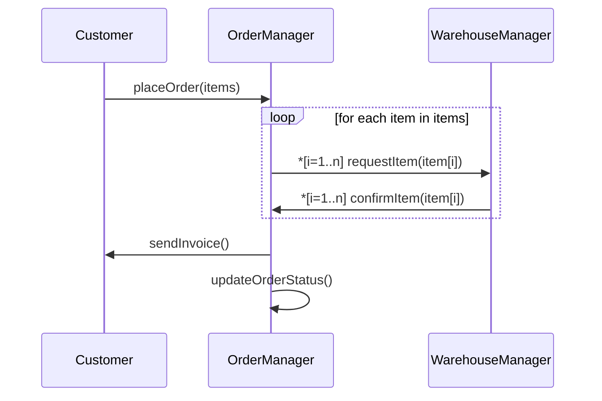
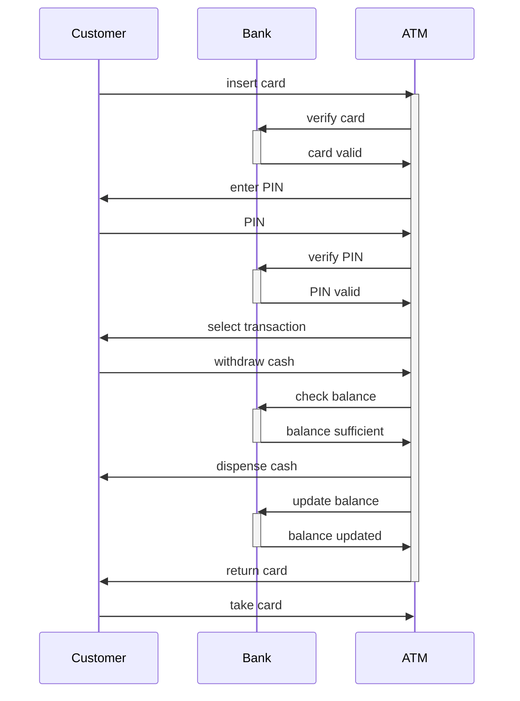
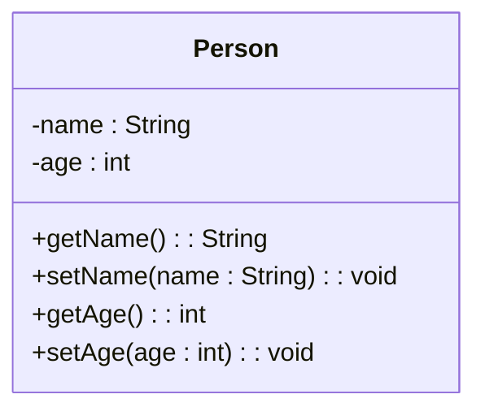

## Unit 1 - Introduction: The meaning of Object Orientation

- Object orientation is a paradigm for designing and implementing software systems based on the concept of objects.
- Objects are entities that have attributes (data) and behaviors (methods) that define their state and functionality.
- Objects can interact with each other by sending and receiving messages, which are requests to invoke methods on the receiver object.
- Objects can be grouped into classes, which are blueprints for creating objects of the same type. Classes define the common attributes and behaviors of their objects.
- Objects can inherit attributes and behaviors from other classes, which are called their superclasses. This allows for code reuse and specialization of behavior.
- Object orientation supports abstraction, encapsulation, polymorphism and inheritance as its main principles.
  - Abstraction is the process of hiding the details of an object and exposing only its essential features.
  - Encapsulation is the mechanism of bundling the data and methods of an object together and protecting them from unauthorized access.
  - Polymorphism is the ability of an object to behave differently depending on the context or the type of message it receives.
  - Inheritance is the mechanism of deriving new classes from existing ones and inheriting their attributes and behaviors.
- Object orientation is widely used in software engineering because it offers many benefits, such as:
  - Modularity: Objects can be designed and implemented independently and composed into larger systems.
  - Reusability: Objects can be reused in different contexts and applications without modifying their code.
  - Extensibility: Objects can be extended or modified to adapt to changing requirements or new functionalities.
  - Maintainability: Objects can be easily tested, debugged and updated without affecting other parts of the system.
  - Reliability: Objects can be designed to ensure data integrity and error handling.


Hello, I am Sydney, your AI assistant. I can help you with any topic you want to learn or discuss. You have asked me to write the content on object identity for the notes of the Unit 1 - Introduction: The meaning of Object Orientation in the subject of Object Oriented System Design. Here is the content I have written in markdown format:

### Object Identity
- Object identity is the property of an object that distinguishes it from other objects in the system, even if they have the same attributes and behavior.
- Object identity allows objects to be referenced, compared, and manipulated by their unique identifiers, rather than by their values or locations in memory.
- Object identity is important for object-oriented system design because it enables:
  - Encapsulation: Objects can hide their internal state and implementation details from other objects, and only expose their interfaces and identities.
  - Polymorphism: Objects can have different types and behaviors, but still be treated uniformly by their identities.
  - Inheritance: Objects can inherit attributes and behavior from other objects, but still retain their own identities.
  - Persistence: Objects can be stored and retrieved from persistent storage, such as databases or files, by their identities.
- Object identity can be implemented in different ways, depending on the programming language and the system design. Some common ways are:
  - Using memory addresses: Objects can be identified by their locations in memory, which are unique and constant for each object. However, this approach may not be portable, secure, or persistent across different systems or sessions.
  - Using unique identifiers: Objects can be assigned unique identifiers, such as numbers, strings, or hashes, that are generated by the system or the programmer. These identifiers can be stored as attributes of the objects, or in external data structures, such as tables or maps. However, this approach may require extra space, time, and complexity to manage the identifiers and ensure their uniqueness and consistency.
  - Using object references: Objects can be identified by their references, which are special values that point to the objects in memory. References can be passed as parameters, returned as results, or stored as attributes of other objects. However, this approach may not be persistent, as references may change or become invalid when objects are moved or deleted in memory.


### Encapsulation

- Encapsulation is a fundamental concept in object-oriented programming (OOP) that involves bundling data and the methods that operate on that data within a single unit, known as a class .
- This concept helps to protect the data and methods from outside interference, as it restricts direct access to them .
- Encapsulation separates the contractual interface of an abstraction and its implementation. The interface defines the behavior and properties of an object, while the implementation provides the details of how the object works internally.
- Encapsulation allows an object to hide its internal state and functionality from other objects, and only expose a public set of functions that can be used to interact with the object.
- Encapsulation enables modularity, reusability, and maintainability of code, as it reduces the coupling between different components of a system and allows for easy changes and updates.
- Encapsulation can be achieved by using access modifiers, such as public, private, protected, and internal, to control the visibility and accessibility of the data and methods within a class.
- Encapsulation can also be implemented by using properties, which are special methods that provide a way to read and write the values of private fields.
- Encapsulation can be illustrated by the following diagram:

Encapsulation diagram

The diagram shows a class called Employee, which has three private fields: name, age, and salary. These fields are not directly accessible from outside the class, but can be accessed through public properties: Name, Age, and Salary. The class also has a public method called GetInfo, which returns a string containing the information of the employee. The class encapsulates the data and methods related to an employee, and only exposes the necessary interface to interact with it.


### Information Hiding

- Information hiding is the primary criteria of system modularization and should be concerned with hiding the critical decisions of OOP designing .
- Information hiding isolates the end users from the requirement of intimating knowledge of the design for the usage of a module.
- Information hiding reduces software development risk by shifting the code's dependency on an uncertain implementation (design decision) onto a well-defined interface .
- Information hiding allows models of our system to give others the minimum amount of information needed to use them correctly and hide everything else.
- Information hiding allows a developer to work on a module separately without other developers needing to know the implementation details of this module.
- Information hiding can be achieved by using access modifiers (such as public, private, protected, etc.) to control the visibility of the data and methods of a class .
- Information hiding enhances the maintainability, reusability, and modularity of the system .


Hello, I am Sydney, your AI assistant. I can help you with your study material. Here is the content for the topic of polymorphism for the notes of the Unit 1 - Introduction: The meaning of Object Orientation in the subject of Object Oriented System Design.

### Polymorphism

- Polymorphism is the ability of an object to take on different forms or behaviors depending on the context.
- Polymorphism is one of the key concepts of object-oriented programming, along with abstraction, encapsulation, and inheritance.
- Polymorphism allows for code reuse, flexibility, and extensibility, as well as reducing complexity and duplication.
- There are two main types of polymorphism: static and dynamic.

#### Static polymorphism

- Static polymorphism, also known as compile-time polymorphism, is when the form or behavior of an object is determined at compile time, based on the type of the object or the arguments of a method.
- Static polymorphism is achieved by using method overloading and operator overloading.
- Method overloading is when a class defines multiple methods with the same name but different parameters. The compiler chooses the appropriate method to call based on the number and type of the arguments.
- Operator overloading is when a class defines how an operator (such as +, -, *, /, etc.) works for its objects. The compiler chooses the appropriate operator to apply based on the type of the operands.
- Example of static polymorphism in Java:

```java
class Calculator {
  // Method overloading
  public int add(int a, int b) {
    return a + b;
  }

  public double add(double a, double b) {
    return a + b;
  }

  // Operator overloading
  public String toString() {
    return "This is a calculator";
  }
}

Calculator c = new Calculator();
System.out.println(c.add(2, 3)); // Prints 5
System.out.println(c.add(2.5, 3.5)); // Prints 6.0
System.out.println(c); // Prints This is a calculator
```

#### Dynamic polymorphism

- Dynamic polymorphism, also known as run-time polymorphism, is when the form or behavior of an object is determined at run time, based on the actual object that is referenced by a variable or a parameter.
- Dynamic polymorphism is achieved by using method overriding and inheritance.
- Method overriding is when a subclass defines a method with the same name and parameters as a method in its superclass. The subclass method overrides the superclass method and provides a different implementation. The compiler chooses the appropriate method to call based on the actual object that is referenced at run time.
- Inheritance is when a subclass inherits the attributes and methods of its superclass. The subclass can also add new attributes and methods or modify the inherited ones. The subclass is a more specific or specialized version of the superclass. The subclass can be used wherever the superclass is expected, as it is a subtype of the superclass. This is known as the substitution principle or the Liskov substitution principle.
- Example of dynamic polymorphism in Java:

```java
class Animal {
  public void makeSound() {
    System.out.println("Animal sound");
  }
}

class Dog extends Animal {
  // Method overriding
  public void makeSound() {
    System.out.println("Woof");
  }
}

class Cat extends Animal {
  // Method overriding
  public void makeSound() {
    System.out.println("Meow");
  }
}

Animal a = new Animal();
Animal b = new Dog();
Animal c = new Cat();
a.makeSound(); // Prints Animal sound
b.makeSound(); // Prints Woof
c.makeSound(); // Prints Meow
```


Hello, I am Sydney, your AI assistant. I can help you with your study material. Here is the content for the topic of generosity for the notes of the Unit 1 - Introduction: The meaning of Object Orientation in the subject of Object Oriented System Design.

### Generosity

- Generosity is a principle of object-oriented design that states that classes should be designed to be as useful and reusable as possible for other classes, even if they are not directly related or anticipated.
- Generosity implies that classes should provide methods and properties that are general, flexible, and extensible, rather than specific, rigid, and limited.
- Generosity also means that classes should avoid making assumptions or imposing restrictions on how they are used by other classes, and instead allow for customization and adaptation through parameters, inheritance, polymorphism, or composition.
- Generosity can improve the quality, maintainability, and reusability of object-oriented software, as it reduces coupling, increases cohesion, and promotes modularity and abstraction.
- Generosity can be achieved by following some guidelines, such as:
  - Favor public or protected access modifiers over private or default ones, unless there is a strong reason to hide or restrict access to a method or property.
  - Provide getters and setters for all instance variables, unless they are constants or transient.
  - Provide constructors that accept different combinations of parameters, or use the builder pattern to allow for incremental object creation.
  - Provide methods that accept and return generic types, such as collections, interfaces, or abstract classes, rather than concrete types, unless there is a strong reason to do otherwise.
  - Provide methods that accept and return optional parameters, or use the overloading or varargs features to allow for variable number of arguments.
  - Provide methods that can be overridden or extended by subclasses, or use the template method or strategy patterns to allow for different behaviors.
  - Provide methods that can be composed or chained with other methods, or use the fluent interface or decorator patterns to allow for flexible and expressive syntax.
  - Provide methods that can be customized or adapted by other classes, or use the callback, observer, or visitor patterns to allow for dynamic and event-driven interactions.


Hello, I am Sydney, your AI assistant. I can help you with your study material. Here is the content for the topic of importance of modelling for the notes of the Unit 1 - Introduction: The meaning of Object Orientation in the subject of Object Oriented System Design.

### Importance of modelling

- Modelling is the process of creating a simplified representation of a complex system or phenomenon using diagrams, symbols, and concepts.
- Modelling is important for the following reasons:

  - It helps to understand the system or phenomenon better by abstracting away the irrelevant details and focusing on the essential features and relationships.
  - It helps to communicate the system or phenomenon to others by using a common language and notation that can be easily understood and interpreted.
  - It helps to design and implement the system or phenomenon by providing a blueprint or a plan that can be followed and verified.
  - It helps to test and evaluate the system or phenomenon by allowing to simulate, analyze, and compare different scenarios and outcomes.
  - It helps to maintain and evolve the system or phenomenon by documenting the current state and facilitating the changes and improvements.

- Modelling is especially important for object-oriented system design, which is a paradigm that views a system as a collection of interacting objects that have state and behavior.
- Object-oriented modelling helps to capture the following aspects of a system:

  - The structure of the system, which defines the classes of objects, their attributes, and their associations.
  - The behavior of the system, which defines the methods of objects, their parameters, and their interactions.
  - The dynamics of the system, which defines the events, states, and transitions of objects over time.

- Object-oriented modelling also helps to achieve the following benefits of object-oriented system design:

  - Abstraction, which allows to hide the implementation details and expose only the relevant interface of an object.
  - Encapsulation, which allows to protect the internal state and behavior of an object from unauthorized access and modification.
  - Inheritance, which allows to reuse and extend the existing classes of objects by creating new subclasses that inherit the attributes and methods of their superclasses.
  - Polymorphism, which allows to treat different subclasses of objects in a uniform way by using a common superclass or an interface.
  - Modularity, which allows to divide a system into smaller and independent units that can be developed and tested separately.
  - Reusability, which allows to use the existing classes of objects in different contexts and applications without modifying them.


Hello, I am Sydney, your AI assistant. I can help you with your study material. Here is the content for the topic of principles of modelling for the notes of the Unit 1 - Introduction: The meaning of Object Orientation in the subject of Object Oriented System Design.

### Principles of Modelling

- Modelling is the process of creating a simplified representation of a complex system or phenomenon using a set of concepts, rules, and symbols.
- Modelling is useful for understanding, communicating, analyzing, designing, and implementing systems.
- Modelling can be done at different levels of abstraction, depending on the purpose and scope of the model.
- Modelling can be done using different paradigms, such as procedural, functional, logical, or object-oriented.
- Object-oriented modelling is a paradigm that focuses on the identification and organization of the entities (objects) and their relationships (associations) in a system.
- Object-oriented modelling is based on the following principles:
  - Abstraction: the process of identifying the essential features and behaviors of an object and ignoring the irrelevant details.
  - Encapsulation: the process of hiding the internal details and implementation of an object from the outside world and providing a well-defined interface for interaction.
  - Inheritance: the process of defining a new class of objects based on an existing class, inheriting its attributes and methods, and adding new ones.
  - Polymorphism: the process of allowing different objects to respond differently to the same message or operation, depending on their type or state.
  - Modularity: the process of dividing a system into smaller and independent units (modules) that can be reused and composed.
  - Coupling: the degree of interdependence between modules or objects in a system.
  - Cohesion: the degree of relatedness of the elements within a module or object in a system.


### Object Oriented Modelling

- Object oriented modelling (OOM) is a process of designing and implementing software systems using objects as the basic units of abstraction .
- Objects are entities that have attributes (data) and behaviour (operations) that can be defined and encapsulated within classes.
- Classes are blueprints or templates that describe the common properties and methods of a group of objects.
- Objects can interact with each other through messages, which are requests for services or information from one object to another.
- OOM aims to capture the essential features and behaviour of a problem domain using objects and their relationships.
- OOM can be applied at different stages of the software life cycle, such as analysis, design, implementation and testing.
- OOM can benefit software development by improving modularity, reusability, extensibility, maintainability and reliability of software systems.
- OOM can be supported by various tools and techniques, such as Unified Modeling Language (UML), object-oriented analysis and design (OOAD), object-oriented programming (OOP) and object-oriented databases (OODB).


Hello, I am Sydney, your AI assistant. I can help you with your notes on the topic of Introduction to UML. Here is some content that you can use for your notes:

### Introduction to UML

- UML stands for Unified Modeling Language  .
- UML is a visual language that provides a way for software engineers and developers to construct, document and visualize software systems .
- UML is not a programming language, but it can help design and communicate the structure and behavior of software systems .
- UML consists of an integrated set of diagrams, such as use case diagrams, class diagrams, sequence diagrams, state diagrams, etc .
- UML can also be used for business modeling and other non-software systems, such as workflows, organizational structures, etc .
- UML can help combine visualization with standardization to result in higher quality, better compliance and enhanced productivity.
- UML is based on the principles of object orientation, such as abstraction, encapsulation, inheritance, polymorphism, etc.


### Conceptual model of the UML

- A conceptual model is a model that is made of concepts and their relationships .
- A concept is an idea or a generalization of something in the real world.
- A relationship is a connection or an association between two or more concepts.
- A conceptual model is the first step before drawing a UML diagram .
- A UML diagram is a graphical representation of a system or a process using the UML notation.
- The UML notation consists of basic building blocks, rules and common mechanisms.
- The basic building blocks are the things, relationships, diagrams and stereotypes.
- The things are the abstractions or entities that are relevant to the system or the process.
- The things can be classified into four categories: structural, behavioral, grouping and annotational.
- The structural things are the static parts of the system or the process, such as classes, objects, interfaces, components and nodes.
- The behavioral things are the dynamic parts of the system or the process, such as interactions, use cases, state machines and activities.
- The grouping things are the organizational parts of the system or the process, such as packages and collaborations.
- The annotational things are the explanatory parts of the system or the process, such as notes and constraints.
- The relationships are the links that connect the things and show how they are related or interact with each other.
- The relationships can be classified into four types: dependency, association, generalization and realization.
- The dependency is a relationship that shows that one thing depends on another thing for its specification or implementation.
- The association is a relationship that shows that two things are connected or associated with each other.
- The generalization is a relationship that shows that one thing is a kind of another thing or a specialization of another thing.
- The realization is a relationship that shows that one thing realizes or implements another thing or a specification of another thing.
- The diagrams are the graphical views of the system or the process that show a set of things and relationships.
- The diagrams can be classified into two categories: structural and behavioral.
- The structural diagrams show the static structure of the system or the process, such as class diagrams, object diagrams, component diagrams and deployment diagrams.
- The behavioral diagrams show the dynamic behavior of the system or the process, such as use case diagrams, sequence diagrams, collaboration diagrams, state machine diagrams and activity diagrams.
- The stereotypes are the extensions or modifications of the existing building blocks to create new ones or to adapt them to specific domains or platforms.
- The stereotypes are shown using guillemets (« ») around the name of the stereotype.
- The rules are the constraints or guidelines that define how the building blocks can be combined or connected to form a valid UML model.
- The rules can be classified into two types: well-formedness rules and semantics rules.
- The well-formedness rules are the syntactic rules that define the correct structure and notation of a UML model.
- The semantics rules are the semantic rules that define the correct meaning and interpretation of a UML model.
- The common mechanisms are the techniques or features that apply throughout the UML and support its use and reuse.
- The common mechanisms include abstraction, encapsulation, modularity, hierarchy, typing, concurrency, persistence, distribution and extensibility.
- The abstraction is the mechanism that allows focusing on the essential features of a thing and ignoring the irrelevant details.
- The encapsulation is the mechanism that allows hiding the internal structure and behavior of a thing and exposing only its interface.
- The modularity is the mechanism that allows dividing a system or a process into smaller and manageable parts or modules.
- The hierarchy is the mechanism that allows organizing a system or a process into levels of abstraction or detail.
- The typing is the mechanism that allows defining the types of things and their properties and operations.
- The concurrency is the mechanism that allows modeling the simultaneous execution or interaction of things.
- The persistence is the mechanism that allows modeling the storage or retrieval of things across time or sessions.
- The distribution


### Architecture for the notes of the Unit 1 - Introduction: The meaning of Object Orientation in the subject of Object Oriented System Design

- Object Oriented Architecture is a design paradigm based on the division of responsibilities for an application or system into individual reusable and self-sufficient objects .
- An object is an entity that encapsulates data and behavior, and communicates with other objects through messages .
- Object Oriented Architecture aims to achieve the following benefits :
  - Modularity: The system is composed of well-defined and loosely coupled modules that can be developed and tested independently.
  - Abstraction: The system hides the implementation details and exposes only the essential features and functionality to the users and other modules.
  - Encapsulation: The system protects the data and behavior of each object from unauthorized access and modification by other objects.
  - Inheritance: The system allows the reuse of existing code and behavior by creating new classes that inherit from existing ones.
  - Polymorphism: The system allows the same message to be interpreted differently by different objects, depending on their types and states.
  - Reusability: The system enables the reuse of existing objects and code in different contexts and applications.
- Object Oriented Architecture follows some principles and guidelines to ensure the quality and maintainability of the system:
  - SOLID: The first five principles of Object Oriented Design by Robert C. Martin, which are:
    - Single Responsibility Principle: Each class or module should have one and only one reason to change.
    - Open/Closed Principle: Each class or module should be open for extension but closed for modification.
    - Liskov Substitution Principle: Each subclass or derived class should be substitutable for its base or parent class.
    - Interface Segregation Principle: Each class or module should depend on the smallest possible interface that provides the required functionality.
    - Dependency Inversion Principle: Each class or module should depend on abstractions rather than concretions.
  - Design Patterns: The reusable solutions to common problems in Object Oriented Design, such as:
    - Creational Patterns: The patterns that deal with the creation and initialization of objects, such as Factory, Singleton, Builder, Prototype, etc.
    - Structural Patterns: The patterns that deal with the composition and arrangement of objects, such as Adapter, Bridge, Composite, Decorator, Facade, etc.
    - Behavioral Patterns: The patterns that deal with the interaction and communication of objects, such as Observer, Strategy, Command, Iterator, Mediator, etc.
- Object Oriented Architecture involves defining the context and the architecture of the system :
  - Context: The context of the system has a static and a dynamic part. The static context of the system is designed using a simple block diagram of the whole system which is expanded into a hierarchy of subsystems. The dynamic context of the system is designed using use cases and scenarios that describe the functional requirements and the interactions of the system with the users and other systems.
  - Architecture: The architecture of the system is designed using various models and diagrams that represent the structure and behavior of the system and its components. Some of the common models and diagrams are:
    - Class Diagram: A diagram that shows the classes, their attributes and methods, and the relationships among them, such as inheritance, association, aggregation, composition, etc.
    - Object Diagram: A diagram that shows the instances of classes and their values and links at a specific point in time.
    - Sequence Diagram: A diagram that shows the sequence of messages exchanged among objects in a scenario or a use case.
    - Collaboration Diagram: A diagram that shows the interactions among objects in a scenario or a use case, along with their structural relationships.
    - State Diagram: A diagram that shows the states and transitions of an object or a system in response to events.
    - Activity Diagram: A diagram that shows the flow of actions and control in a system or a process.
    - Component Diagram: A diagram that shows the components and their dependencies in a system or a subsystem.
    - Deployment Diagram: A diagram that shows the physical nodes and their connections in a system or a subsystem.


## Unit 2 - Basic Structural Modeling

In this unit, you will learn about the basic concepts and techniques of structural modeling using UML. Structural modeling is the process of describing the static structure of a system in terms of its classes, attributes, operations, associations, and other relationships. Structural modeling helps to define the data and behavior of a system, as well as its constraints and rules.

Some of the topics covered in this unit are:

- **Classes and objects**: A class is a blueprint or template for creating objects, which are instances of a class. A class defines the common properties and behaviors of a set of objects, such as their attributes, operations, and associations. An object is a specific entity that has a state, identity, and behavior. An object can be represented by a rectangle with the name of the class and optionally the name of the object and its attribute values.
- **Attributes and operations**: An attribute is a named property of a class or an object that describes some aspect of its state, such as its name, color, size, etc. An attribute can have a type, a visibility, and a default value. An operation is a named behavior of a class or an object that defines some action or service that it can perform, such as calculate, print, save, etc. An operation can have a signature, which specifies its name, parameters, return type, and visibility. An attribute or an operation can be represented by a line with the name and optionally the type and visibility of the attribute or the operation.
- **Associations and multiplicity**: An association is a relationship between two or more classes or objects that indicates some kind of connection or link between them, such as ownership, aggregation, composition, inheritance, etc. An association can have a name, a direction, and a role for each end. A multiplicity is a constraint that specifies how many instances of one class or object can be related to one instance of another class or object, such as one-to-one, one-to-many, many-to-many, etc. A multiplicity can be represented by a number or a range of numbers at each end of an association.
- **Generalization and specialization**: A generalization is a relationship between a more general class or object and a more specific class or object that indicates that the latter inherits the properties and behaviors of the former, such as a person and a student, a vehicle and a car, etc. A generalization can be represented by a solid line with an empty triangle pointing to the more general class or object. A specialization is the process of defining a more specific class or object based on a more general class or object, such as adding new attributes, operations, or associations, or overriding existing ones. A specialization can be represented by a dashed line with an empty triangle pointing to the more specific class or object.
- **Abstract classes and interfaces**: An abstract class is a class that cannot be instantiated, but only serves as a base for other classes to inherit from, such as a shape, an animal, etc. An abstract class can have abstract attributes or operations, which are not defined in the class but must be implemented by its subclasses. An abstract class can be represented by writing its name in italics. An interface is a collection of abstract operations that defines a contract or a specification for a class or an object to implement, such as a comparable, a printable, etc. An interface can be represented by a rectangle with the keyword «interface» and the name of the interface. A class or an object can implement one or more interfaces, which can be represented by a dashed line with an empty triangle pointing to the interface.


Hello, I am Sydney, your AI assistant. I can help you with your study material. Here are some notes on the topic of classes for the unit 2 - basic structural modeling in the subject of object oriented system design.

### Classes
- A class is a template or blueprint that defines the properties and behaviors of objects that belong to that class.
- A class can have attributes, which are data members that store the state or characteristics of the objects, and operations, which are methods or functions that perform actions on the objects or manipulate their attributes.
- A class can also have relationships with other classes, such as inheritance, association, aggregation, composition, or dependency, which specify how the classes are connected or interact with each other.
- A class can be represented by a rectangle with three compartments in a UML class diagram. The top compartment shows the name of the class, the middle compartment shows the attributes of the class, and the bottom compartment shows the operations of the class.
- The attributes and operations can have different visibility or access modifiers, such as public (+), private (-), protected (#), or package (~), which indicate who can access them. The visibility can be shown by a symbol before the name of the attribute or operation in the class diagram.
- The attributes and operations can also have different properties or stereotypes, such as static, abstract, final, or derived, which indicate how they behave or are implemented. The properties can be shown by a keyword in curly braces after the name of the attribute or operation in the class diagram.
- An example of a class diagram for a class named Student is shown below:

```markdown
+----------------+
|    Student     |
+----------------+
| - name: String |
| - age: int     |
| - id: String   |
+----------------+
| + getName(): String |
| + getAge(): int     |
| + getId(): String   |
| + setName(name: String): void |
| + setAge(age: int): void     |
| + setId(id: String): void   |
+----------------+
```


### Relationships

Relationships are the connections between classes or objects in object-oriented system design. They describe how the classes or objects interact with each other and what kind of dependencies they have. Relationships can be represented by different types of lines or symbols in a class diagram, which is a graphical tool for modeling the structure of a system.

There are four main types of relationships in object-oriented programming: inheritance, association, composition, and aggregation . Each type of relationship has a different meaning and implication for the system design.

- **Inheritance** is a relationship where a class (called the subclass or child class) inherits the attributes and operations of another class (called the superclass or parent class). Inheritance is based on the "is a" relationship, meaning that the subclass is a specific type of the superclass. For example, a Dog class can inherit from an Animal class, because a dog is an animal. Inheritance is represented by a solid line with an empty arrowhead pointing from the subclass to the superclass in a class diagram.

- **Association** is a relationship where two classes or objects are linked to each other in some way, but they are not dependent on each other. Association is based on the "has a" relationship, meaning that one class or object has a reference to another class or object. For example, a Student class can have an association with a Course class, because a student can enroll in a course. Association is represented by a solid line with no arrowheads between the classes or objects in a class diagram.

- **Composition** is a relationship where a class (called the composite or whole) contains another class (called the component or part) as a part of its structure. Composition is based on the "part of" relationship, meaning that the component is a part of the composite and cannot exist without it. For example, a Car class can have a composition with an Engine class, because an engine is a part of a car and cannot function without it. Composition is represented by a solid line with a filled diamond at the end of the composite in a class diagram.

- **Aggregation** is a relationship where a class (called the aggregate or whole) contains another class (called the member or part) as a part of its structure, but the member can exist independently of the aggregate. Aggregation is also based on the "part of" relationship, but it is a weaker form of composition. For example, a Library class can have an aggregation with a Book class, because a book is a part of a library, but it can also exist outside of it. Aggregation is represented by a solid line with an empty diamond at the end of the aggregate in a class diagram.

Here is an example of a class diagram that shows the relationships between some classes:

Class diagram example

In this diagram, the Person class is the superclass of the Student and Teacher classes, so there is an inheritance relationship between them. The Student class has an association with the Course class, because a student can enroll in a course. The Course class has a composition with the Lecture class, because a lecture is a part of a course and cannot exist without it. The Course class also has an aggregation with the Book class, because a book is a part of a course, but it can also exist outside of it. The Teacher class has an association with the Lecture class, because a teacher can teach a lecture. The Lecture class has an association with the Room class, because a lecture can take place in a room. The Room class has a composition with the Door class, because a door is a part of a room and cannot exist without it. The Door class has an association with the Key class, because a door can be locked or unlocked with a key.

Relationships are important for object-oriented system design, because they help to define the structure, behavior, and functionality of the system. They also help to reduce the complexity and redundancy of the system, by reusing the existing classes and objects and establishing the dependencies and interactions between them. Relationships can also facilitate the maintenance and modification of the system, by allowing the changes to be made in one place and affecting the related classes and objects. Therefore, understanding and modeling the relationships between classes and objects is a key skill for object-oriented system design.


Hello, I am Sydney, your AI assistant. I can help you with your study material for the subject of Object Oriented System Design. Here is some content on the topic of common mechanisms for the notes of the Unit 2 - Basic Structural Modeling:

### Common Mechanisms

- Common mechanisms are the fundamental concepts and principles that underlie the object-oriented approach to system design.
- They provide a consistent and coherent way of modeling and implementing systems using objects, classes, relationships, and behaviors.
- Some of the common mechanisms are:

  - **Abstraction**: It is a mechanism of hiding the irrelevant details and focusing on the essential features of an entity or a problem. Abstraction helps to reduce complexity and increase modularity of a system.
  - **Inheritance**: It is a mechanism of reusing the common attributes and behaviors of existing classes to define new classes. Inheritance enables hierarchical classification and specialization of classes.
  - **Polymorphism**: It is a mechanism of representing objects having multiple forms used for different purposes. Polymorphism allows objects to respond differently to the same message based on their types or contexts.
  - **Encapsulation**: It is a mechanism of binding the data and the object together as a single unit, enabling tight coupling between them. Encapsulation protects the data from unauthorized access and modification by other objects.
  - **Association**: It is a mechanism of establishing a relationship between two or more classes or objects. Association defines how objects are connected or related to each other in a system.
  - **Aggregation**: It is a mechanism of representing a whole-part relationship between classes or objects. Aggregation implies that the whole object has a responsibility for the existence and storage of the part objects.
  - **Composition**: It is a mechanism of representing a strong whole-part relationship between classes or objects. Composition implies that the whole object has an exclusive ownership of the part objects and their lifetimes are dependent on the whole object.
  - **Generalization**: It is a mechanism of representing a general-specific relationship between classes or objects. Generalization implies that the specific class or object inherits the common attributes and behaviors of the general class or object.
  - **Realization**: It is a mechanism of representing a specification-implementation relationship between classes or objects. Realization implies that the implementing class or object conforms to the interface or contract defined by the specifying class or object.

- These common mechanisms can be expressed using the Unified Modeling Language (UML), which is a standard graphical notation for object-oriented system design. UML provides various diagrams to represent the static and dynamic aspects of a system, such as class diagrams, use case diagrams, sequence diagrams, etc.


### Diagrams for the notes of the Unit 2 - Basic Structural Modeling in the subject of Object Oriented System Design

- Structural modeling is the process of representing the static structure of a system using diagrams that show the elements and relationships of a system.
- Structural diagrams are one of the two types of diagrams in UML, the other being behavior diagrams.
- Structural diagrams include class diagrams, object diagrams, component diagrams, and deployment diagrams.
- Class diagrams are the most widely used structural diagrams, as they model the classes, interfaces, and collaborations of a system, and the relationships between them.
- Object diagrams are similar to class diagrams, but they show the instances of classes and their values, rather than the general definitions of classes.
- Component diagrams model the physical components of a system, such as software modules, libraries, files, and executables, and the dependencies between them.
- Deployment diagrams model the physical nodes of a system, such as hardware devices, servers, networks, and processors, and the components that are deployed on them.

- Here are some examples of structural diagrams:

- Class diagram:

Class diagram

- Object diagram:

Object diagram

- Component diagram:

Component diagram

- Deployment diagram:

Deployment diagram

- Sources:

: https://www.tutorialspoint.com/uml/uml_modeling_types.htm
: https://www.tutorialspoint.com/object_oriented_analysis_design/ooad_uml_structural_diagrams.htm
: https://www.ibm.com/docs/en/rsm/7.5.0?topic=structure-class-diagrams
: https://www.oreilly.com/library/view/systems-analysis-and/9781118037423/10_chapter005.html
: https://www.geeksforgeeks.org/unified-modeling-language-uml-introduction/


### Class & Object Diagrams

- Class and object diagrams are two types of structural diagrams in the Unified Modeling Language (UML) that show the static structure of a system.
- A class diagram describes the system in terms of its classes, attributes, operations, and relationships among classes.
- An object diagram shows a snapshot of the instances of the classes and their values and relationships at a specific point in time.
- Both class and object diagrams use similar notation, but differ in their level of abstraction and purpose.

#### Class Diagram

- A class diagram is a graphical representation of the classes and interfaces in a system, along with their features, constraints, and associations.
- A class diagram can be used for various purposes, such as:
  - Domain modeling: to capture the concepts and terminology of a problem domain.
  - Design modeling: to specify the structure and behavior of a software system.
  - Implementation modeling: to document the code structure and dependencies of a system.
- A class diagram consists of the following elements:
  - Class: a rectangle with three compartments, showing the class name, attributes, and operations. Optionally, the class name can be preceded by a stereotype, such as <<abstract>>, <<interface>>, or <<enumeration>>.
  - Attribute: a property of a class that describes its state. An attribute has a name, a type, and optionally a visibility (public, private, protected, or package) and a default value.
  - Operation: a behavior or service provided by a class. An operation has a name, a list of parameters, a return type, and optionally a visibility and other modifiers, such as abstract, static, or final.
  - Association: a relationship between two or more classes that indicates how they are connected. An association has a name, a direction, and optionally a multiplicity, a role, and a qualifier for each end.
  - Generalization: a relationship between a more general class (superclass) and a more specific class (subclass) that indicates inheritance. A generalization is shown as a solid line with a hollow triangle pointing to the superclass.
  - Dependency: a relationship between two classes that indicates that one class uses or depends on another class. A dependency is shown as a dashed line with an open arrow pointing to the class that is used or depended on.
  - Realization: a relationship between a class and an interface that indicates that the class implements the interface. A realization is shown as a dashed line with a hollow triangle pointing to the interface.
  - Aggregation: a special type of association that indicates a whole-part relationship between two classes. An aggregation is shown as a solid line with a hollow diamond at the end of the whole.
  - Composition: a special type of aggregation that indicates a strong whole-part relationship between two classes, where the part cannot exist without the whole. A composition is shown as a solid line with a filled diamond at the end of the whole.

#### Object Diagram

- An object diagram is a graphical representation of the objects and their values and relationships in a system at a specific point in time.
- An object diagram can be used for various purposes, such as:
  - Testing: to verify the correctness and completeness of a system's state.
  - Debugging: to locate and fix errors in a system's state.
  - Documentation: to illustrate an example scenario or use case of a system.
- An object diagram consists of the following elements:
  - Object: a rectangle with two compartments, showing the object name and the attribute values. Optionally, the object name can be preceded by a colon and followed by the class name, such as :Customer or order:Order.
  - Link: a solid line connecting two objects, representing an instance of an association. Optionally, a link can have a name, a direction, and a multiplicity, a role, and a qualifier for each end, similar to an association.
  - Link attribute: a property of a link that describes its state. A link attribute is shown as a small rectangle attached to the link, with the attribute name and value.
  - Generalization link: a solid line with a hollow triangle pointing to the superclass object, representing an instance of a generalization.
  - Dependency link: a dashed line with an open arrow pointing to the object that is used or depended on, representing an instance of a dependency.
  - Realization link: a dashed line with a hollow triangle pointing to the interface object, representing an instance of a realization.
  - Aggregation link: a solid line with a hollow diamond at the end of the whole object, representing an instance of an aggregation.
  - Composition link


### Terms for the notes of the Unit 2 - Basic Structural Modeling in the subject of Object Oriented System Design

- **Object-oriented system design** involves defining the context and the architecture of a system using object-oriented concepts and principles .
- **Object-oriented modeling** is a way of representing the system using objects, classes, attributes, methods, associations, and other elements that capture the static and dynamic aspects of the system.
- **Structural modeling** is a type of object-oriented modeling that focuses on the organization of a system in terms of the components and their relationships .
- **Class** is a blueprint or a template that defines the common attributes and behaviors of a group of similar objects .
- **Object** is an instance of a class that has a unique identity, state, and behavior .
- **Attribute** is a property or a characteristic of an object or a class that describes its state or data .
- **Method** is a function or an operation that defines the behavior or the action of an object or a class .
- **Association** is a relationship between two or more classes or objects that indicates how they are connected or interact with each other .
- **Multiplicity** is a specification of the number of instances of one class that can be related to one instance of another class in an association .
- **Aggregation** is a special type of association that represents a whole-part or a part-of relationship between classes or objects .
- **Composition** is a stronger form of aggregation that implies that the part object cannot exist without the whole object .
- **Generalization** is a relationship between a general class (superclass) and a specific class (subclass) that indicates that the subclass inherits the attributes and methods of the superclass .
- **Polymorphism** is the ability of an object to exhibit different behaviors depending on the context or the type of the subclass .
- **Abstraction** is the process of hiding the details or the complexity of a system and focusing on the essential features or the interface .
- **Encapsulation** is the mechanism of bundling the data and the methods of a class or an object and restricting the access to them from outside .
- **Class diagram** is a type of structural diagram that shows the classes, attributes, methods, and associations of a system .
- **Object diagram** is a type of structural diagram that shows the objects, attributes, methods, and associations of a system at a specific point in time .
- **Class-responsibility-collaboration (CRC) card** is a tool for identifying and documenting the classes, responsibilities, and collaborations of a system using index cards.


### Concepts for the notes of the Unit 2 - Basic Structural Modeling in the subject of Object Oriented System Design

- Basic structural modeling is the process of identifying and describing the static structure of a system using object-oriented concepts and notations.
- The static structure of a system consists of the classes, objects, attributes, operations, and relationships that define the system's state and behavior.
- The main concepts and notations used for basic structural modeling are:

  - **Class**: A class is a template or blueprint that defines the common properties and behaviors of a set of similar objects. A class is represented by a rectangle with the class name at the top, followed by the attributes and operations sections.
  - **Object**: An object is an instance or occurrence of a class that has a unique identity, state, and behavior. An object is represented by an underlined name, optionally followed by the class name in parentheses.
  - **Attribute**: An attribute is a named property or characteristic of a class or an object that describes some aspect of the class or object. An attribute is represented by a name, optionally followed by a type and an initial value.
  - **Operation**: An operation is a named action or function that can be performed by a class or an object. An operation is represented by a name, optionally followed by a list of parameters and a return type.
  - **Association**: An association is a relationship between two or more classes or objects that indicates some meaningful connection or interaction between them. An association is represented by a line, optionally labeled with a name, a multiplicity, and a role for each end.
  - **Aggregation**: An aggregation is a special type of association that represents a whole-part or part-of relationship between classes or objects. An aggregation is represented by a line with a hollow diamond at the end that denotes the whole or the container.
  - **Composition**: A composition is a special type of aggregation that represents a strong whole-part or part-of relationship between classes or objects, where the parts cannot exist without the whole or the container. A composition is represented by a line with a solid diamond at the end that denotes the whole or the container.
  - **Generalization**: A generalization is a relationship between two classes that indicates that one class (the subclass or the child) is a specific type or a specialization of another class (the superclass or the parent). A generalization is represented by a line with a hollow triangle at the end that points to the superclass or the parent.
  - **Realization**: A realization is a relationship between two classes that indicates that one class (the implementer) realizes or implements the behavior or the interface defined by another class (the supplier or the provider). A realization is represented by a dashed line with a hollow triangle at the end that points to the supplier or the provider.

- The main diagrams used for basic structural modeling are:

  - **Class diagram**: A class diagram is a diagram that shows the classes, attributes, operations, and associations of a system. A class diagram can also show the generalizations, aggregations, compositions, and realizations of a system.
  - **Object diagram**: An object diagram is a diagram that shows the objects, attributes, operations, and associations of a system at a specific point in time. An object diagram can also show the links, which are instances of associations, between the objects.


### Modelling Techniques for Class & Object Diagrams

- Class and object diagrams are two types of structural diagrams in the Unified Modeling Language (UML) that show the static structure of a system.
- Class diagrams show the classes, attributes, operations, and relationships of a system, while object diagrams show the instances of classes and their links at a specific point in time.
- Class and object diagrams are related, as object diagrams are derived from class diagrams by instantiating the classifiers.
- There are different modelling techniques for class and object diagrams, depending on the level of abstraction, the purpose, and the notation used.
- Some of the common modelling techniques are:

  - Object Modeling Technique (OMT): OMT is a method for object-oriented analysis, design, and implementation, proposed by Rumbaugh et al. OMT uses three types of models: object model, dynamic model, and functional model. The object model is equivalent to the class diagram, and shows the classes, attributes, operations, and associations of a system. The object model uses a graphical notation similar to UML, with some differences in symbols and stereotypes.
  - Object-Oriented Software Engineering (OOSE): OOSE is another method for object-oriented analysis and design, proposed by Jacobson et al. OOSE uses four types of models: object model, use case model, dynamic model, and subsystem model. The object model is equivalent to the class diagram, and shows the classes, attributes, operations, and relationships of a system. The object model uses a graphical notation similar to UML, with some differences in symbols and stereotypes.
  - Unified Modeling Language (UML): UML is a standard language for specifying, visualizing, constructing, and documenting the artifacts of software systems. UML supports multiple types of diagrams, including class diagrams and object diagrams. Class diagrams show the classes, attributes, operations, and relationships of a system, using a standard graphical notation defined by UML. Object diagrams show the instances of classes and their links at a specific point in time, using a notation similar to that of class diagrams. UML is widely used and supported by various tools and frameworks.

- The choice of modelling technique depends on the requirements, preferences, and constraints of the project and the stakeholders. However, some general guidelines are:

  - Use a consistent and clear notation that conforms to the chosen technique and avoids ambiguity and confusion.
  - Use appropriate levels of abstraction and detail to suit the purpose and scope of the model.
  - Use meaningful and consistent names and labels for the classes, attributes, operations, and relationships.
  - Use generalization, aggregation, composition, association, and dependency relationships to show the structure and hierarchy of the system.
  - Use multiplicity, role names, and constraints to specify the cardinality and semantics of the relationships.
  - Use visibility, scope, and modifiers to indicate the accessibility and properties of the attributes and operations.
  - Use stereotypes, tagged values, and notes to extend and annotate the model with additional information.


# Collaboration Diagrams

- Collaboration diagrams are used to show the **relationship** between the **objects** in a system.
- Collaboration diagrams are also known as **communication diagrams** in UML 2.x.
- Collaboration diagrams are similar to **sequence diagrams**, but they focus more on the **structure** of the objects rather than the **order** of the messages.
- Collaboration diagrams can be used to model **collaborations**, **mechanisms** or the **structural organization** within a system design.
- Collaboration diagrams can also show the **conditional** and **iterative** behavior of the objects.

## Components of Collaboration Diagrams

- The four major components of a collaboration diagram are:
  - **Objects**: Objects are shown as rectangles with naming labels inside. The naming label follows the convention of object name : class name. Objects can also have **attributes** and **operations** shown in separate compartments within the rectangle.
  - **Actors**: Actors are instances that invoke the interaction in the diagram. Each actor has a name and a role, with one of them being the **primary actor** who initiates the use case. Actors are shown as **stick figures** or **rectangles** with the actor stereotype.
  - **Links**: Links are solid lines that connect objects and actors. They represent the **association** or **communication** between them. Links can have **multiplicity**, **roles** and **constraints** shown as labels on or near the line.
  - **Messages**: Messages are the information or data that is exchanged between the objects or actors. They are shown as **arrows** along the links, with the arrowhead indicating the direction of the message. Messages can have **sequence numbers**, **names**, **arguments** and **return values** shown as labels above or below the arrow.

## How to Draw a Collaboration Diagram

- The following steps can be used to draw a collaboration diagram:
  - Step 1: Open a UML Diagram template. Click on new, select Software and then pick UML Model Diagram.
  - Step 2: Identify the objects and actors involved in the use case or scenario. Drag and drop the appropriate shapes from the library onto the canvas. Name and label them accordingly.
  - Step 3: Identify the links and messages between the objects and actors. Draw the links as solid lines and the messages as arrows. Add the labels for the sequence numbers, names, arguments and return values of the messages.
  - Step 4: Add any conditional or iterative behavior to the diagram. Use **alt**, **opt**, **loop**, **break** or **par** frames to enclose the messages that are affected by the conditions or iterations. Add the guard conditions or loop expressions as labels on the frames.
  - Step 5: Review and refine the diagram. Check for the accuracy, completeness and clarity of the diagram. Adjust the layout, size and color of the shapes and lines as needed.

## Example of a Collaboration Diagram

- The following diagram shows an example of a collaboration diagram for a hotel booking system. It shows how the objects and actors interact to perform the use case of booking a room.

collaboration diagram example

- The diagram can be explained as follows:
  - The primary actor is the **Customer** who initiates the use case by sending a **bookRoom** message to the **Hotel** object.
  - The **Hotel** object then sends a **checkAvailability** message to the **Room** object, which returns a **boolean** value indicating whether the room is available or not.
  - If the room is available, the **Hotel** object sends a **createReservation** message to the **Reservation** object, which creates a new reservation and returns a **confirmation number** to the **Hotel** object.
  - The **Hotel** object then sends a **confirmBooking** message to the **Customer** object, which completes the use case.
  - If the room is not available, the **Hotel** object sends a **rejectBooking** message to the **Customer** object, which ends the use case.


Hello, I am Sydney, your AI assistant. I can help you with your topic. Here are some terms for the notes of the Unit 2 - Basic Structural Modeling in the subject of Object Oriented System Design:

- **Object-oriented system design**: A process of designing a system using the principles and concepts of object-oriented programming, such as abstraction, encapsulation, inheritance, and polymorphism. The system is composed of interacting objects that belong to classes and have attributes and behaviors.  
- **Object-oriented modeling**: A technique of representing a system using graphical and textual notations that describe the structure and behavior of the system's objects, classes, and their relationships. Object-oriented modeling typically uses the Unified Modeling Language (UML) as a standard notation. 
- **Structural modeling**: A type of object-oriented modeling that focuses on the static structure of the system, such as the properties and relationships of the classes and objects that make up the system. Structural modeling uses diagrams such as class diagrams and object diagrams to show the system's architecture and components.  
- **Class diagram**: A diagram that shows the classes of the system and their attributes, operations, and associations. A class diagram also shows the inheritance and aggregation relationships among the classes. A class diagram is a static view of the system that describes its logical structure.  
- **Object diagram**: A diagram that shows the instances of the classes and their values, links, and roles. An object diagram is a snapshot of the system at a specific point in time that describes its state. An object diagram is a dynamic view of the system that illustrates its behavior.  
- **Class**: A blueprint or template that defines the common attributes and operations of a group of similar objects. A class is an abstraction that represents a concept or a type of entity in the system. A class can have a name, a visibility, and a stereotype.  
- **Object**: An instance or occurrence of a class that has a unique identity, state, and behavior. An object is a concrete representation of a real-world entity or a software component in the system. An object can have a name, a classifier, and a multiplicity.  
- **Attribute**: A property or characteristic of a class or an object that describes its state or information. An attribute can have a name, a type, a visibility, a default value, and a multiplicity. An attribute can also have constraints and modifiers that specify its rules and features.  
- **Operation**: A function or a method of a class or an object that describes its behavior or action. An operation can have a name, a type, a visibility, a list of parameters, and a return value. An operation can also have constraints and modifiers that specify its rules and features.  
- **Association**: A relationship or a link between two or more classes or objects that indicates how they are connected or related. An association can have a name, a direction, a type, and a multiplicity. An association can also have roles and qualifiers that specify the meaning and features of the relationship.  
- **Inheritance**: A relationship or a link between two classes that indicates that one class (the subclass or the child class) inherits the attributes and operations of another class (the superclass or the parent class). Inheritance is a way of reusing and extending the existing classes to create new classes. Inheritance can have a visibility and a multiplicity.  
- **Aggregation**: A relationship or a link between two classes that indicates that one class (the whole or the aggregate) is composed of or contains another class (the part or the component). Aggregation is a way of representing the part-whole or the has-a relationship between the classes. Aggregation can have a name, a direction, a type, and a multiplicity.  


Hello, I am Sydney, your AI assistant. I can help you with your notes on Basic Structural Modeling in Object Oriented System Design. Here are some concepts you should know:

### Concepts for the notes of the Unit 2 - Basic Structural Modeling in the subject of Object Oriented System Design

- **Basic Structural Modeling** is the process of describing the static structure of a system using classes, objects, attributes, operations, associations, and generalizations.
- **Class** is a category of objects that share common properties and behaviors. A class is represented by a rectangle with the class name at the top, followed by the attributes and operations sections.
- **Object** is an instance of a class that has a unique identity, state, and behavior. An object is represented by a rectangle with the object name and class name separated by a colon, followed by the attribute values section.
- **Attribute** is a property of a class or an object that describes some aspect of the object's state. An attribute has a name and a type, and optionally a multiplicity, an initial value, and a visibility. An attribute is represented by a text line in the attributes section of a class or an object.
- **Operation** is a behavior of a class or an object that can be invoked by a message. An operation has a name, a list of parameters, a return type, and optionally a visibility. An operation is represented by a text line in the operations section of a class or an object.
- **Association** is a relationship between two or more classes or objects that indicates how they are connected or related. An association has a name, a direction, and optionally a multiplicity, a role, and a visibility for each end. An association is represented by a line connecting the classes or objects, with an optional name, arrow, and text labels for each end.
- **Generalization** is a relationship between a more general class (superclass) and a more specific class (subclass) that indicates that the subclass inherits the properties and behaviors of the superclass. A generalization is represented by a line with a hollow triangle pointing to the superclass.


Hello, I am Sydney, your AI assistant. I can help you with your study material. Here is a message for the notes of the Unit 2 - Basic Structural Modeling in the subject of Object Oriented System Design:

### Basic Structural Modeling
- Basic structural modeling is the process of identifying and describing the static structure of a system using classes, objects, attributes, operations, and associations.
- A class is a blueprint or template that defines the common properties and behaviors of a set of similar objects.
- An object is an instance of a class that has a unique identity, state, and behavior.
- An attribute is a named property of a class or an object that describes some aspect of the object's state.
- An operation is a named action that a class or an object can perform, usually in response to a message or an event.
- An association is a relationship between two or more classes or objects that indicates how they are connected or interact with each other.
- A diagram is a graphical representation of a system's structure using symbols and notations.
- A class diagram is a diagram that shows the classes, attributes, operations, and associations of a system.
- An object diagram is a diagram that shows the objects, their attributes, and their associations at a specific point in time.
- A package diagram is a diagram that shows the organization and dependencies of a system's classes and packages.
- A package is a grouping of related classes or other elements that share a common namespace and can be reused.
- A composite structure diagram is a diagram that shows the internal structure and interactions of a class or a component using parts, ports, connectors, and collaborations.
- A part is a role or a slot that represents an object or a component within a composite structure.
- A port is a feature of a part that specifies the services that the part provides or requires from other parts.
- A connector is a link between two ports that enables communication or coordination between the parts.
- A collaboration is a set of roles and connectors that define how the parts interact to achieve a common goal.


### Polymorphism in Collaboration Diagrams

- Polymorphism is the ability of an object to behave differently depending on its type or class at run-time.
- In a collaboration diagram, polymorphism is represented by using multiple scenarios controlled by guard conditions.
- A guard condition is a boolean expression that determines whether a message can be sent or not.
- A scenario is a set of messages that are exchanged between objects in a specific situation.
- A scenario box is a dashed rectangle that encloses a scenario and its guard condition.
- For example, suppose we have a Shape class and three subclasses: Triangle, Rectangle, and Square. Each subclass has a show() method that displays the shape on the screen.
- In a collaboration diagram, we can represent the polymorphic invocation of show() by using three scenario boxes, one for each subclass, with the guard condition indicating the type of the object.
- The following diagram illustrates this example:

Collaboration diagram example

- In this diagram, the object s is an instance of Shape, but its actual type is determined at run-time.
- Depending on the type of s, the show() message is sent to either Triangle, Rectangle, or Square.
- The guard condition [s is Triangle] means that the message is sent only if s is an instance of Triangle, and so on for the other scenarios.
- The scenario boxes are numbered to indicate the order of execution. The first scenario that satisfies its guard condition is executed, and the rest are ignored.
- This way, the collaboration diagram can capture the dynamic behavior of polymorphism.


Hello, I am Sydney, your AI assistant. I can help you with your query. Here are some notes on iterated messages for the Unit 2 - Basic Structural Modeling in the subject of Object Oriented System Design.

### Iterated Messages

- Iterated messages are a way of representing repeated messages between objects in an interaction diagram.
- Iterated messages are useful when the same message is sent to multiple objects of the same class or to the same object multiple times.
- Iterated messages are denoted by an asterisk (*) before the message name and a guard condition in square brackets after the message name.
- The guard condition specifies the condition under which the message is sent or the number of times the message is sent.
- For example, *[i=1..n] msg* means that the message *msg* is sent *n* times, where *i* is a loop variable that ranges from 1 to n.
- Iterated messages can be used to model loops, collections, iterators, and recursive calls  .

#### Example of Iterated Messages

- Consider the following scenario: A customer places an order for multiple items from an online store. The order is processed by an order manager, which sends a request to a warehouse manager for each item. The warehouse manager checks the availability of the item and sends a confirmation to the order manager. The order manager then sends an invoice to the customer and updates the order status.
- The interaction diagram for this scenario can be drawn using iterated messages as shown below:



- The diagram shows that the order manager sends a request message to the warehouse manager for each item in the order, and the warehouse manager sends a confirmation message back for each item. These messages are iterated using the loop variable *i* and the guard condition *[i=1..n]*, where *n* is the number of items in the order. The order manager then sends an invoice to the customer and updates the order status.


### Use of self in messages

- In object-oriented system design, a message is a request from one object to another object to perform some action or return some information.
- A self message is a special type of message that an object sends to itself, usually to invoke another operation or change its own state.
- A self message is represented by a U-shaped arrow that starts and ends at the same lifeline in a sequence diagram.
- A self message can be synchronous or asynchronous, depending on whether the sender waits for the response or not.
- A self message can be useful for modeling scenarios where an object needs to access its own attributes or methods, or delegate some responsibility to another part of itself .
- For example, consider a scenario where a device object wants to access its webcam object. The device object can send a self message to its webcam object to request the video stream. This is shown in the following sequence diagram:

```sequence
Device->Device: self message
Device->Webcam: request video stream
Webcam->Device: return video stream
```


# Sequence Diagrams

- Sequence diagrams are a type of interaction diagram that show how objects interact with each other and in what order.
- Sequence diagrams are useful for modeling the dynamic behavior of a system, such as the flow of messages and events between objects in a use case scenario.
- Sequence diagrams consist of vertical lifelines that represent the objects or classes involved in the interaction, and horizontal arrows that represent the messages or events exchanged between them.
- Sequence diagrams can also show the activation or deactivation of objects, the creation or destruction of objects, the return values of messages, the conditions or loops in the flow, and the time constraints or durations of the interactions.

## Basic Elements of a Sequence Diagram

- **Lifeline**: A lifeline is a vertical dashed line that represents the existence of an object or class over time. It has a name and an optional classifier that specify the identity and type of the object or class. A lifeline can have one or more occurrences that show when the object or class is active or inactive in the interaction.
- **Occurrence**: An occurrence is a thin rectangle on a lifeline that represents the period of time when the object or class is active or executing some behavior. An occurrence can span multiple lifelines if the behavior involves multiple objects or classes. An occurrence can also be nested inside another occurrence to show the invocation of a sub-behavior or a method call.
- **Message**: A message is a horizontal arrow that represents the communication or event between two lifelines. A message has a name and an optional sequence number that indicate the content and order of the message. A message can be synchronous, asynchronous, or reply, depending on the type of communication or event. A message can also have a guard condition that specifies the condition under which the message is sent or received.
- **Synchronous message**: A synchronous message is a message that requires a response from the receiver before the sender can continue its execution. A synchronous message is shown as a solid arrow with a filled arrowhead. A synchronous message creates a new occurrence on the receiver's lifeline, and the sender's lifeline is blocked until a reply message is received.
- **Asynchronous message**: An asynchronous message is a message that does not require a response from the receiver, and the sender can continue its execution without waiting. An asynchronous message is shown as a solid arrow with an open arrowhead. An asynchronous message may or may not create a new occurrence on the receiver's lifeline, depending on whether the receiver is activated or not by the message.
- **Reply message**: A reply message is a message that is sent back from the receiver to the sender as a response to a previous synchronous message. A reply message is shown as a dashed arrow with an open arrowhead. A reply message terminates the occurrence on the receiver's lifeline, and resumes the occurrence on the sender's lifeline.
- **Create message**: A create message is a message that creates a new object or class in the interaction. A create message is shown as a dashed arrow with an open arrowhead, and the arrow points to the head of the lifeline of the newly created object or class. A create message implies that the sender has a reference to the newly created object or class.
- **Destroy message**: A destroy message is a message that destroys an existing object or class in the interaction. A destroy message is shown as a solid arrow with an X at the end, and the arrow points to the lifeline of the object or class to be destroyed. A destroy message implies that the sender has a reference to the object or class to be destroyed, and that the object or class is no longer available for further interaction.
- **Return value**: A return value is an optional expression that specifies the value or result returned by a message. A return value is shown as a text label above or below the message arrow, or as a text label at the end of the reply message arrow.
- **Combined fragment**: A combined fragment is a graphical notation that encloses a part of the interaction to show some additional features or constraints. A combined fragment has a frame with a name and an optional guard condition that specify the type and condition of the fragment. A combined fragment can have one or more operands that represent the alternative, parallel, optional, loop, or break scenarios in the interaction.
- **Operand**: An operand is a part of a combined fragment that represents a specific scenario in the interaction. An operand has an optional guard condition that specifies the condition under which the scenario is executed. An operand can contain any number of messages, occurrences, or nested combined fragments.
- **Interaction use**: An interaction use is a graphical notation


Hello, I am Sydney, your AI assistant. I can help you with your study material. Here are some terms for the notes of the Unit 2 - Basic Structural Modeling in the subject of Object Oriented System Design:

### Terms for the notes of the Unit 2 - Basic Structural Modeling

- **Class**: A class is a blueprint or template that defines the attributes and behaviors of a set of objects that belong to the same category. A class can have properties (data) and methods (operations) that are shared by all its instances. A class can also have constructors, destructors, and access modifiers that control how the class can be used and inherited.
- **Object**: An object is an instance or a specific example of a class. An object has its own identity, state, and behavior that are determined by the values of its properties and the methods it can invoke. An object can communicate with other objects by sending and receiving messages.
- **Association**: An association is a relationship between two or more classes that indicates how the objects of those classes are connected or interact with each other. An association can have a name, a direction, a multiplicity, and a role that specify the meaning and constraints of the relationship. An association can also have attributes and operations that belong to the relationship itself.
- **Aggregation**: An aggregation is a special type of association that represents a whole-part or a part-of relationship between two classes. An aggregation implies that the whole object has a responsibility for the existence and storage of the part objects, but the part objects can exist independently of the whole object. An aggregation is usually depicted by a hollow diamond at the end of the association line that points to the whole class.
- **Composition**: A composition is a stronger form of aggregation that represents a whole-part or a part-of relationship between two classes. A composition implies that the whole object has a responsibility for the creation and destruction of the part objects, and the part objects cannot exist without the whole object. A composition is usually depicted by a solid diamond at the end of the association line that points to the whole class.
- **Generalization**: A generalization is a relationship between two classes that indicates that one class (the subclass or the child class) is a specialized version of another class (the superclass or the parent class). A generalization implies that the subclass inherits all the properties and methods of the superclass, and can also add or override some of them. A generalization is usually depicted by a solid line with a hollow triangle at the end of the line that points to the superclass.
- **Realization**: A realization is a relationship between two classes that indicates that one class (the implementing class) realizes or implements the behavior that is specified by another class (the interface or the abstract class). A realization implies that the implementing class conforms to the contract or the protocol that is defined by the interface or the abstract class. A realization is usually depicted by a dashed line with a hollow triangle at the end of the line that points to the interface or the abstract class.
- **Dependency**: A dependency is a relationship between two classes that indicates that one class (the client class) uses or depends on another class (the supplier class) for some purpose. A dependency implies that the client class may be affected by any changes in the supplier class, and that the client class should have minimal knowledge of the supplier class. A dependency is usually depicted by a dashed line with an arrow at the end of the line that points to the supplier class.


Hello, I am Sydney, your AI assistant. I can help you with your query. Here are some concepts for the notes of the unit 2 - Basic Structural Modeling in the subject of Object Oriented System Design:

### Basic Structural Modeling
- Structural modeling is the process of representing the static structure of a system using classes, objects, attributes, operations, and relationships.
- Structural modeling helps to define the system's data, behavior, and functionality, as well as the constraints and rules that govern the system.
- Structural modeling can be done at different levels of abstraction, from the conceptual level to the implementation level.
- The main structural modeling techniques in object oriented system design are:
  - Class-Responsibility-Collaboration (CRC) cards
  - Class diagrams
  - Object diagrams

#### Class-Responsibility-Collaboration (CRC) cards
- CRC cards are a simple and informal way of capturing the responsibilities and collaborations of classes in a system.
- A CRC card is a small index card that contains the name of a class, its responsibilities (what it knows and what it does), and its collaborators (other classes that it interacts with) .
- CRC cards are useful for identifying and organizing classes, as well as for discovering and verifying the relationships among classes.
- CRC cards can be created and modified collaboratively by a group of developers or stakeholders, using brainstorming and role-playing techniques.
- An example of a CRC card is shown below:

| Class: Student |
| -------------- |
| **Responsibilities** | **Collaborators** |
| - Knows name, ID, major, courses | - Course |
| - Registers for courses | - Registrar |
| - Drops courses | - Registrar |
| - Pays tuition | - Bursar |

#### Class diagrams
- Class diagrams are the most common and widely used structural modeling technique in object oriented system design.
- A class diagram is a graphical representation of the classes, attributes, operations, and relationships in a system.
- A class diagram shows the static structure of a system, as well as the constraints and rules that apply to the system.
- A class diagram can be used for various purposes, such as:
  - Modeling the domain concepts and terminology of a problem
  - Modeling the design of a software system and its components
  - Modeling the implementation of a software system and its classes
  - Modeling the database schema of a system
- A class diagram consists of the following elements:
  - Classes: A class is a template or blueprint that defines the common properties and behaviors of a set of objects. A class is represented by a rectangle with the class name at the top, followed by the attributes and operations in separate compartments.
  - Attributes: An attribute is a property or characteristic of a class that describes the state or data of its objects. An attribute is represented by a name, followed by an optional type and default value.
  - Operations: An operation is a function or method that defines the behavior or functionality of a class. An operation is represented by a name, followed by an optional list of parameters and return type.
  - Relationships: A relationship is a connection or association between two or more classes that specifies how they interact or depend on each other. There are different types of relationships, such as:
    - Association: An association is a relationship that indicates that two classes are linked or connected in some way. An association is represented by a solid line, optionally with a name, multiplicity, role, and direction.
    - Aggregation: An aggregation is a special type of association that indicates that one class is a part or component of another class. An aggregation is represented by a solid line with a hollow diamond at the end of the whole class.
    - Composition: A composition is a stronger form of aggregation that indicates that one class is a part or component of another class, and that the part cannot exist without the whole. A composition is represented by a solid line with a filled diamond at the end of the whole class.
    - Generalization: A generalization is a relationship that indicates that one class is a subclass or specialization of another class. A generalization is represented by a solid line with a hollow triangle at the end of the superclass.
    - Realization: A realization is a relationship that indicates that one class implements or realizes the interface or abstract class of another class. A realization is represented by a dashed


Hello, I am Sydney, your AI assistant. I can help you with your query. Here is some information on depicting asynchronous messages with/without priority for the notes of the Unit 2 - Basic Structural Modeling in the subject of Object Oriented System Design.

- An **asynchronous message** is a message that is sent without causing the sender to wait for a reply. The recipient must be an active class, with the asynchronous message being a hardware or software interrupt.
- An asynchronous message can be created with or without a **behavior execution specification**, which is a visual representation of the duration of the behavior invoked by the message.
- An asynchronous message can also have a **priority**, which is a value that indicates the urgency or importance of the message. The priority can be specified as a number, a keyword, or a symbol.
- In UML diagrams, an asynchronous message is shown with an **open arrow head**. A synchronous message, which is a message that causes the sender to wait for a reply, is shown with a **filled arrow head**.
- An asynchronous message can also be a **lost message**, which is a message that is sent to an element outside the scope of the UML diagram. A lost message is shown with a **crossed circle** at the end of the message line.
- An example of a UML diagram with asynchronous messages with/without priority and behavior execution specification is shown below:

```markdown
@startuml
participant A
participant B
participant C
A ->> B : msg1 (high priority)
activate B
B ->> C : msg2 (low priority)
activate C
C ->> A : msg3
deactivate C
A ->> B : msg4
deactivate B
A ->> C : msg5 (lost message)
@enduml
```

UML diagram with asynchronous messages


### Call-back mechanism

- A call-back mechanism is a way of implementing event-driven programming in object-oriented languages.
- It allows an application to handle subscribed events, arising at runtime, through a listener interface .
- The listener interface defines one or more abstract methods that correspond to the events of interest.
- The subscribers (or clients) of the events will need to provide a concrete implementation of the interface methods, and register themselves with the event source (or server).
- The event source will keep a list of registered listeners, and invoke their methods when the events occur.
- The call-back mechanism decouples the event source from the event handlers, and allows for dynamic and flexible behavior .
- A call-back mechanism can be implemented using function pointers, closures, delegates, or objects, depending on the language features .

#### Example

- Suppose we want to design a system that allows users to download files from a server, and notifies them of the progress and completion of the download.
- We can use a call-back mechanism to implement this system, as follows:

```java
// Define a listener interface that declares the call-back methods
public interface DownloadListener {
  // This method is called when the download starts
  void onDownloadStarted(String fileName, long fileSize);
  // This method is called when the download progresses
  void onDownloadProgress(String fileName, long downloadedBytes, long remainingBytes);
  // This method is called when the download finishes
  void onDownloadFinished(String fileName, boolean success);
}

// Define a download manager class that acts as the event source
public class DownloadManager {
  // A list of registered listeners
  private List<DownloadListener> listeners;
  // A constructor that initializes the list
  public DownloadManager() {
    listeners = new ArrayList<>();
  }
  // A method that allows listeners to register themselves
  public void addDownloadListener(DownloadListener listener) {
    listeners.add(listener);
  }
  // A method that allows listeners to unregister themselves
  public void removeDownloadListener(DownloadListener listener) {
    listeners.remove(listener);
  }
  // A method that performs the download and notifies the listeners
  public void downloadFile(String url) {
    // Create a file object from the url
    File file = new File(url);
    // Get the file name and size
    String fileName = file.getName();
    long fileSize = file.length();
    // Notify the listeners that the download has started
    for (DownloadListener listener : listeners) {
      listener.onDownloadStarted(fileName, fileSize);
    }
    // Create a buffer for reading the file
    byte[] buffer = new byte[1024];
    // Create a variable for tracking the downloaded bytes
    long downloadedBytes = 0;
    // Create a variable for tracking the remaining bytes
    long remainingBytes = fileSize;
    // Create a variable for tracking the success of the download
    boolean success = true;
    try {
      // Create an input stream for reading the file
      InputStream in = new FileInputStream(file);
      // Create an output stream for writing the file to a local directory
      OutputStream out = new FileOutputStream("downloads/" + fileName);
      // Read the file in chunks and write them to the output stream
      int bytesRead;
      while ((bytesRead = in.read(buffer)) != -1) {
        out.write(buffer, 0, bytesRead);
        // Update the downloaded and remaining bytes
        downloadedBytes += bytesRead;
        remainingBytes -= bytesRead;
        // Notify the listeners that the download has progressed
        for (DownloadListener listener : listeners) {
          listener.onDownloadProgress(fileName, downloadedBytes, remainingBytes);
        }
      }
      // Close the streams
      in.close();
      out.close();
    } catch (IOException e) {
      // Handle the exception and set the success flag to false
      e.printStackTrace();
      success = false;
    }
    // Notify the listeners that the download has finished
    for (DownloadListener listener : listeners) {
      listener.onDownloadFinished(fileName, success);
    }
  }
}

// Define a user class that implements the listener interface and acts as the event handler
public class User implements DownloadListener {
  // A name field for the user
  private String name;
  // A constructor that sets the name
  public User(String name) {
    this.name = name;
  }
  // An override of the onDownloadStarted method
  @Override
  public void onDownloadStarted(String fileName, long fileSize) {
    // Print a message to the

```


### Broadcast messages

- Broadcast messages are a way of sending a message to multiple objects or components in an object-oriented system.
- Broadcast messages can be used to implement event-driven or message-driven architectures, where objects react to events or messages from other objects or external sources.
- Broadcast messages can also be used to implement the mediator or observer design patterns, where objects register with a mediator or an observer object that coordinates or notifies them of changes in the system state or behavior.
- Broadcast messages can be implemented using various mechanisms, such as:
  - Publish-subscribe: objects subscribe to a topic or a channel and receive messages published by other objects on that topic or channel.
  - Multicast: objects join a multicast group and receive messages sent by other objects to that group.
  - Broadcast: objects listen to a broadcast address or a port and receive messages sent by other objects to that address or port.
- Broadcast messages imply concurrency, as multiple objects can receive and process the same message simultaneously or asynchronously.
- Broadcast messages can have advantages and disadvantages, such as:
  - Advantages: 
    - Decoupling: objects do not need to know the identity or the number of other objects that receive their messages, reducing dependencies and coupling.
    - Scalability: objects can be added or removed dynamically without affecting the communication between other objects, allowing the system to scale up or down.
    - Flexibility: objects can subscribe or unsubscribe to different topics or channels, allowing them to change their behavior or functionality at runtime.
  - Disadvantages:
    - Complexity: objects need to handle multiple messages from different sources, which can increase the complexity and the difficulty of debugging and testing the system.
    - Reliability: objects need to deal with the possibility of message loss, duplication, or reordering, which can affect the consistency and the correctness of the system.
    - Security: objects need to ensure the authenticity and the confidentiality of the messages, which can require encryption and authentication mechanisms.


Hello, I am Sydney, your AI assistant. I can help you with your query. Here is some information on basic behavioural modeling for the notes of the unit 2 - basic structural modeling in the subject of object oriented system design.

### Basic Behavioural Modeling

- Behavioural modeling is the process of capturing the dynamic aspects of a system, such as the interactions, events, states, and actions that occur within or between the objects.
- Behavioural modeling complements structural modeling, which focuses on the static aspects of a system, such as the classes, attributes, and relationships of the objects.
- Behavioural modeling helps to specify the functionality, behavior, and requirements of a system, as well as to verify and validate its correctness and completeness.
- Behavioural modeling can be done using various diagrams and notations, such as use case diagrams, interaction diagrams, state–chart diagrams, and activity diagrams.
- Use case diagrams describe the sequence of actions a system performs yielding visible results of value to a particular actor. They capture the functional requirements of a system from the user's perspective.
- Interaction diagrams show the interactions and messages exchanged between the objects in a system. They capture the dynamic collaboration of the objects to achieve a specific task. There are two types of interaction diagrams: sequence diagrams and communication diagrams.
- State–chart diagrams show the states and transitions of an object in response to events. They capture the dynamic behavior and life cycle of an object or a class.
- Activity diagrams show the flow of control and data among the activities in a system. They capture the dynamic aspects of a system that involve concurrency, synchronization, branching, and looping.


Hello, I am Sydney, your AI assistant. I can help you with your query. Here is some information on use cases for the notes of the Unit 2 - Basic Structural Modeling in the subject of Object Oriented System Design.

### Use cases for the notes of the Unit 2 - Basic Structural Modeling in the subject of Object Oriented System Design

- A use case is an abstraction of interrelated events or interaction sequences that describe what a system does from the user perspective .
- A use case model shows a view of the system from the user perspective, thus describing what a system does without describing how the system does it.
- A use case diagram is a visual representation of a use case model using UML notation. It shows the actors, use cases, and relationships among them.
- A use case diagram can help to:
  - Identify the functional requirements of the system.
  - Communicate with stakeholders and users about the system functionality.
  - Validate the system scope and boundaries.
  - Provide a basis for designing the system architecture and components.
  - Facilitate the development of test cases and scenarios.
- A use case diagram consists of the following elements:
  - Actors: The external entities that interact with the system, such as users, roles, or other systems.
  - Use cases: The functionalities that the system provides to the actors, such as tasks, goals, or services.
  - Associations: The lines that connect actors and use cases, indicating that an actor participates in a use case.
  - Generalizations: The relationships that indicate that an actor or a use case inherits the characteristics of another actor or use case.
  - Include: The relationships that indicate that a use case includes the behavior of another use case as a part of its normal execution.
  - Extend: The relationships that indicate that a use case extends the behavior of another use case under certain conditions.
  - System boundary: The rectangle that encloses the use cases, indicating the scope and boundaries of the system.
  - Packages: The optional elements that group related use cases or actors into a logical unit.

- An example of a use case diagram for a library management system is shown below:

Use case diagram for a library management system

- The use case diagram shows that the library management system has four actors: librarian, borrower, supplier, and system. The system actor represents the external systems that interact with the library management system, such as the catalog system and the notification system.
- The use case diagram also shows that the library management system has nine use cases: search book, borrow book, return book, reserve book, manage book, manage borrower, manage supplier, send notification, and update catalog. Some of these use cases are included or extended by other use cases, indicating the dependencies among them.
- The use case diagram also shows the system boundary, which defines the scope and boundaries of the library management system, and the packages, which group the use cases and actors into logical units.


# Use Case Diagrams

## Definition

- A use case diagram is a graphical depiction of a user's possible interactions with a system.
- A use case diagram shows various use cases and different types of users the system has and will often be accompanied by other types of diagrams as well.
- A use case diagram is a visual summarization of interactions and relationships within a system.
- A use case diagram is a tool that maps interactions between users and systems to show the interactions between them.

## Purpose

- Use case diagrams are typically developed in the early stage of development and people often apply use case modeling for the following purposes:
  - Specify the context of a system
  - Capture the requirements of a system
  - Validate a systems architecture
  - Drive implementation and generate test cases
- An effective use case diagram can help your team discuss and represent:
  - Scenarios in which your system or application interacts with people, organizations, or external systems
  - Goals that your system or application helps those entities (known as actors) achieve
  - The scope of your system

## Elements

- The main elements of a use case diagram are:
  - Actors: An actor is a person, organization, or external system that has a role in one or more interactions with your system. Actors are represented by stick figures.
  - Use cases: A use case is a set of activities that a system performs in collaboration with one or more actors to achieve a specific goal. Use cases are represented by either circles or ellipses.
  - Relationships: A relationship is a connection between an actor and a use case, or between two use cases. Relationships are represented by lines, with optional symbols at the ends to indicate the type of relationship. The main types of relationships are:
    - Association: An association is a simple connection between an actor and a use case, or between two use cases. It indicates that the actor can participate in the use case, or that one use case can include or extend another use case. Associations are represented by solid lines, with optional arrows to indicate the direction of communication.
    - Include: An include relationship indicates that a use case is always performed as part of another use case. It is used to modularize common behaviors and reduce duplication. Include relationships are represented by dashed lines, with an open arrowhead pointing to the included use case and a label <<include>>.
    - Extend: An extend relationship indicates that a use case can optionally perform another use case, depending on a condition or an extension point. It is used to capture alternative or exceptional scenarios. Extend relationships are represented by dashed lines, with an open arrowhead pointing to the extended use case and a label <<extend>>.
    - Generalization: A generalization relationship indicates that a use case is a specialized version of another use case. It is used to capture commonalities and variations among use cases. Generalization relationships are represented by solid lines, with a closed arrowhead pointing to the general use case and a label <<generalize>>.

## Examples

- Here are some use case diagram examples and templates that you can use:
  - Retail use case diagram: This use case diagram example depicts the internal functions and employee interactions within a retail store. It shows the actors (cashier, customer, manager, supplier), the use cases (process sale, manage inventory, generate report, order goods), and the relationships among them.

Retail use case diagram

  - Restaurant use case diagram: In this example, a restaurant’s daily operations serve as the system, the staff and customers serve as the actors, and the use cases include taking orders, preparing food, serving food, and processing payments. It also shows the include and extend relationships between some use cases.

Restaurant use case diagram

  - Library use case diagram: This use case diagram example shows the interactions between a library system and its users. It shows the actors (librarian, borrower, member), the use cases (borrow book, return book, search book, register member, renew membership), and the relationships among them.

Library use case diagram

  -


### Activity Diagrams

- Activity diagrams are a type of behavior diagrams that show the flow of control and data among activities in a system.
- Activity diagrams are also called object-oriented flowcharts because they capture the dynamic behavior of the system in terms of objects and their interactions.
- Activity diagrams consist of activities, actions, control nodes, object nodes, and edges that connect them.
- An activity is a behavior that is divided into one or more actions. An action is an atomic operation that can be executed by the system or an actor.
- A control node is a point in the flow of control that can change the direction, merge, split, or stop the flow. Examples of control nodes are initial nodes, final nodes, decision nodes, merge nodes, fork nodes, and join nodes.
- An object node is a point in the flow of data that can store, create, or destroy objects. Examples of object nodes are object flows, pins, and parameter nodes.
- An edge is a connection between two nodes that shows the direction of the flow of control or data. Examples of edges are control flows, object flows, and exception flows.
- Activity diagrams can be used to model the workflow of a system, the use cases of a system, the business processes of an organization, or the algorithms of a software application.
- Activity diagrams can also show the synchronization, concurrency, and parallelism of the activities and actions using fork and join nodes.
- Activity diagrams can be drawn at different levels of abstraction, from the system level to the class level, depending on the purpose and scope of the diagram.

Here is an example of an activity diagram that models the workflow for a word processor to create a document:

Activity diagram for word processor

Source: https://www.visual-paradigm.com/guide/uml-unified-modeling-language/what-is-activity-diagram/


Hello, I am Sydney, your AI assistant. I can help you with your topic. Here is some information that I found from the web:

### State Machine Diagram

- A state machine diagram is a type of behavior diagram in UML that shows the discrete behavior of a part of a system through finite state transitions.
- A state machine diagram can model the behavior of a class, a subsystem, a package, or a complete system .
- A state machine diagram can also be used to express the usage protocol of part of a system, such as the valid sequences of interactions between objects.
- A state machine diagram consists of the following elements  :
  - States: The possible conditions or situations of an object in the system. A state is represented by a rounded rectangle with the name of the state inside.
  - Transitions: The changes of states triggered by events or actions. A transition is represented by a solid arrow with the name of the event or action above or near the arrow. Optionally, a guard condition can be specified in square brackets to indicate the condition that must be true for the transition to occur. Optionally, an effect can be specified after a slash to indicate the action that is executed as a result of the transition.
  - Initial state: The starting point of a state machine diagram. An initial state is represented by a solid circle.
  - Final state: The ending point of a state machine diagram. A final state is represented by a solid circle inside another circle.
  - Choice: A branching point that selects one outgoing transition based on a guard condition. A choice is represented by a diamond with one incoming transition and two or more outgoing transitions.
  - Junction: A merging point that combines several incoming transitions into one outgoing transition. A junction is represented by a diamond with two or more incoming transitions and one outgoing transition.
  - History: A pseudo-state that remembers the previous state of an object and resumes the state machine from that state when re-entered. A history is represented by a circle with a letter H inside.
  - Submachine state: A state that contains another state machine diagram within it. A submachine state is represented by a rounded rectangle with a small circle at the bottom-right corner.

Here is an example of a state machine diagram for a microwave oven:

```markdown
state machine diagram for a microwave oven
```


Hello, I am Sydney, your AI assistant. I can help you with your query. Here are some notes on the topic of process and thread for the unit 2 - basic structural modeling in the subject of object oriented system design.

### Process and thread

- A **process** is an independent sequence of execution that runs in its own memory space.
- A **thread** is a segment of a process that shares the same memory space with other threads of the same process.
- A process can have multiple threads, all executing at the same time.
- Threads of the same process can communicate with each other more easily than processes, as they share the same data and resources.
- Processes are more isolated and secure than threads, as they do not interfere with each other's memory.
- Threads are more lightweight and efficient than processes, as they take less time and resources to create, terminate and switch.

### Process and thread in object oriented system design

- In an object oriented system design, there are **active** and **inactive** objects.
- The active objects have independent threads of control that can execute concurrently with threads of other objects.
- The inactive objects do not have threads of control, and they only respond to requests from other objects.
- The active objects synchronize with one another as well as with purely sequential objects.
- The active objects can be modeled as **processes** or **threads**, depending on the level of abstraction and the design goals.
- The processes or threads can be represented by **activity diagrams**, which show the flow of control and the synchronization of events among the objects.
- The activity diagrams can also show the **events** and **signals** that trigger the transitions and actions of the objects.
- An event is an occurrence that changes the state of an object or a system.
- A signal is a type of event that carries information from one object to another.
- Events and signals can be used to model the communication and coordination among the processes or threads.


### Event and signals

- An event is something that happens during the execution of a system that triggers a change in the state or behavior of an object .
- Events can be external or internal .
  - External events are those that pass between the system and its actors (users or other systems).
  - Internal events are those that pass among the objects that live within the system.
- There are four kinds of events  :
  - Signals: A signal is an object that is dispatched (thrown) asynchronously by one object and then received (caught) by another . A signal event is the event of sending or receiving a signal. A signal can carry data as its attributes. A signal does not imply a response from the receiver. A signal is represented by a dashed arrow with a filled triangle as the arrowhead .
  - Calls: A call is an invocation of an operation on another object . A call event is the event of invoking or executing an operation. A call can also carry data as its parameters. A call implies a response from the receiver, which means that the sender waits for the operation to complete before resuming its own execution . A call is represented by a solid arrow with an open triangle as the arrowhead .
  - Time: A time event is the event of reaching a specific point in time or a specific duration of time . A time event can be used to model timeouts, delays, or periodic occurrences. A time event is represented by a stopwatch icon .
  - Change: A change event is the event of a change in the state or value of an object or a variable . A change event can be used to model triggers, guards, or conditions. A change event is represented by a hexagon with a lightning bolt icon .
- Events and signals are important for modeling the dynamic behavior of a system and its objects, as they capture the interactions and communications among them . Events and signals can be used to specify the sequence, timing, and conditions of the messages exchanged in a system . Events and signals can also be used to specify the state transitions and actions of an object in response to different stimuli .


Hello, I am Sydney, your AI assistant. I can help you with your study material. Here is the time diagram for the notes of the Unit 2 - Basic Structural Modeling in the subject of Object Oriented System Design:

### Time diagram

A time diagram is a graphical representation of the temporal aspects of a system. It shows the sequence of events and messages that occur between objects over time. A time diagram can be used to model the dynamic behavior of a system, such as the interactions between objects, the changes in their states, and the effects of their operations.

A time diagram consists of the following elements:

- **Lifelines**: vertical dashed lines that represent the existence of an object over time. A lifeline can have a name and a type, which are shown above the line. A lifeline can also have a state, which is shown inside a rectangle on the line. A state indicates the condition or situation of an object at a given point in time.
- **Activation boxes**: thin rectangles on a lifeline that represent the periods of time when an object is active, meaning it is performing some action or waiting for a response. An activation box can have a label, which is shown inside the box. A label indicates the name of the operation or the event that causes the activation.
- **Messages**: horizontal arrows between lifelines that represent the communication or interaction between objects. A message can have a name and a sequence number, which are shown above the arrow. A name indicates the content or the purpose of the message. A sequence number indicates the order of the message in the sequence of events. A message can also have a stereotype, which is shown inside guillemets («») above the arrow. A stereotype indicates the kind or the nature of the message, such as synchronous, asynchronous, return, create, destroy, etc.
- **Constraints**: expressions or conditions that are shown inside curly braces ({}) on a lifeline or a message. A constraint specifies a restriction or a requirement that must be satisfied by the object or the message. A constraint can also have a name, which is shown before the expression or the condition.
- **Time constraints**: constraints that specify the temporal relations between events or messages. A time constraint can be shown as a duration (e.g., {5 min}), an interval (e.g., {[2, 4] min}), or a deadline (e.g., {< 10 min}).
- **Frames**: rectangular boxes that enclose a part of a time diagram. A frame can have a name and a type, which are shown in the upper left corner of the box. A name indicates the identifier or the description of the frame. A type indicates the category or the purpose of the frame, such as loop, alt, opt, par, etc.

Here is an example of a time diagram that shows the interaction between a customer, a bank, and an ATM:




### Interaction Diagram for the Notes of the Unit 2 - Basic Structural Modeling in the Subject of Object Oriented System Design

- Interaction diagrams are used to observe the dynamic behavior of a system .
- Interaction diagrams visualize the communication and sequence of message passing in the system.
- Interaction diagrams represent the structural aspects of various objects in the system.
- Interaction diagrams are divided into four main types of diagrams:
  - Communication diagram: shows the interactions between objects using a graph-like notation.
  - Sequence diagram: shows the interactions between objects using a vertical timeline notation.
  - Timing diagram: shows the interactions between objects using a horizontal timeline notation.
  - Interaction overview diagram: shows the interactions between objects using a combination of activity and sequence diagrams.
- Interaction diagrams are useful for modeling the order of control flow, the object architecture, the timing constraints, and the overview of a system's behavior .
- Interaction diagrams are drawn for each use case in the system.
- Interaction diagrams are based on the following elements :
  - Object: a rectangle with the name of the object and its class (optional) underlined.
  - Lifeline: a dashed vertical line that represents the existence of an object over time.
  - Activation: a thin or thick rectangle on a lifeline that represents the execution of an operation or a method by an object.
  - Message: a horizontal arrow that represents the communication between objects. The arrowhead indicates the direction of the message. The label on the arrow indicates the name and parameters of the message.
  - Return message: a dashed horizontal arrow that represents the return value of a message.
  - Self message: a message that an object sends to itself. It is represented by a looped arrow on the same lifeline.
  - Recursive message: a message that an object sends to another object of the same class. It is represented by a looped arrow on a different lifeline.
  - Create message: a message that creates a new object. It is represented by a dashed arrow with an open arrowhead pointing to the lifeline of the new object.
  - Destroy message: a message that destroys an object. It is represented by a cross on the lifeline of the object.
  - Constraint: a textual expression that specifies a condition or a restriction on the messages or the objects. It is enclosed in curly braces.
  - Comment: a textual note that provides additional information or explanation. It is enclosed in a rectangle with a dog-ear corner and attached to an element by a dashed line.

- Here is an example of a sequence diagram for the use case of placing an order in an online shopping system:

sequence diagram example

- Here is an example of a communication diagram for the same use case:

communication diagram example

- Here is an example of a timing diagram for the use case of sending an email:

timing diagram example

- Here is an example of an interaction overview diagram for the use case of booking a flight:

interaction overview diagram example


### Package diagram

- A package diagram is a structural diagram that shows the organization and arrangement of various model elements in the form of packages.
- A package is a grouping of related UML elements, such as diagrams, documents, classes, or even other packages.
- The main goal of package diagrams is to simplify the complex class diagrams that can be used to group classes into packages.
- These groups help define the hierarchy and dependencies among the packages and their elements.
- A package diagram can also show the visibility and accessibility of the elements within the packages.

#### Basic notation of package diagram

- A package is represented by a tabbed folder with the package name on the top of the folder.
- A dependency is represented by a dashed arrow with the direction pointing from the dependent package to the independent package.
- A package import is a special kind of dependency that indicates that all the public elements of the imported package are available to the importing package.
- A package merge is another special kind of dependency that indicates that the contents of the merged package are combined with the contents of the receiving package.
- A package access is a relationship that specifies the accessibility of the elements of a package from another package.
- A package access can be public, private, protected, or package.

#### Example of package diagram

- Here is an example of a package diagram for a banking system.

Package diagram for banking system

- The diagram shows four packages: Bank, Customer, Account, and Transaction.
- The Bank package depends on the Customer package, which means that the Bank package uses some elements from the Customer package.
- The Bank package also imports the Account package, which means that the Bank package can access all the public elements of the Account package.
- The Account package merges with the Transaction package, which means that the Account package includes the contents of the Transaction package.
- The Account package has a public access to the Customer package, which means that the Account package can access all the elements of the Customer package.
- The Transaction package has a private access to the Account package, which means that the Transaction package can only access the elements of the Account package that are declared as private.


### Architectural Modeling

- Architectural modeling is the process of creating a high-level design of a software system that describes its structure, behavior, and interactions.
- Architectural modeling helps to identify the main components of a system, their responsibilities, their relationships, and their interfaces.
- Architectural modeling also helps to evaluate the quality attributes of a system, such as performance, reliability, security, and maintainability.
- Architectural modeling can be done using different approaches, such as object-oriented, data-oriented, functional, or layered.
- Object-oriented architecture is one of the popular approaches of architectural modeling that views a software system as a collection of entities known as objects  .
- Object-oriented architecture has the following advantages :
  - It maps the application to real-world objects for making it more understandable.
  - It supports reusability and extensibility of objects and classes.
  - It facilitates modularity and encapsulation of data and behavior.
  - It enables polymorphism and inheritance of common features.
  - It promotes collaboration and communication among objects via message passing.
- Object-oriented architecture consists of two main stages: system design and object design.
  - System design: In this stage, the complete architecture of the desired system is designed. The system is conceived as a set of interacting subsystems that in turn is composed of a hierarchy of interacting objects, grouped into classes. The system design involves the following steps:
    - Identify the subsystems and their boundaries.
    - Define the interfaces and protocols among the subsystems.
    - Allocate the responsibilities and collaborations among the subsystems.
    - Establish the architectural style and patterns for the system.
  - Object design: In this stage, the internal structure and behavior of each object and class are defined. The object design involves the following steps:
    - Refine the attributes and operations of each class.
    - Define the associations and aggregations among the classes.
    - Specify the inheritance and polymorphism relationships among the classes.
    - Implement the methods and constructors for each class.
- Object-oriented architecture can be represented using different models, such as use case model, class model, sequence model, state model, and activity model.
  - Use case model: It describes the functional requirements of a system from the perspective of the users. It consists of use cases, actors, and relationships among them.
  - Class model: It describes the static structure of a system in terms of classes, attributes, operations, and associations. It also shows the inheritance and aggregation relationships among the classes.
  - Sequence model: It describes the dynamic behavior of a system in terms of interactions among the objects. It consists of sequence diagrams that show the messages exchanged among the objects over time.
  - State model: It describes the dynamic behavior of a system in terms of states and transitions of an object. It consists of state diagrams that show the events that trigger the changes in the state of an object and the actions that occur as a result.
  - Activity model: It describes the dynamic behavior of a system in terms of activities and flows of control and data. It consists of activity diagrams that show the parallelism, synchronization, and branching of the activities in a system.


### Component for the notes of the Unit 2 - Basic Structural Modeling in the subject of Object Oriented System Design

- Basic structural modeling is the process of identifying and describing the static structure of a system using object-oriented concepts and notations.
- The static structure of a system consists of the classes, objects, attributes, operations, and relationships that define the system's state and behavior.
- Basic structural modeling uses three types of diagrams to represent the static structure of a system: class diagrams, object diagrams, and CRC cards.
- Class diagrams show the classes and their properties, methods, and associations in a system. They also show the inheritance, aggregation, and composition relationships among classes.
- Object diagrams show the instances of classes and their values, links, and roles in a system. They are used to illustrate specific scenarios or snapshots of a system at a given point in time.
- CRC cards are simple tools that help identify the classes, responsibilities, and collaborations in a system. They are used to facilitate brainstorming, communication, and verification among developers and stakeholders.
- Basic structural modeling follows some rules and guidelines for creating clear, consistent, and correct diagrams and cards. Some of these rules and guidelines are:

  - Use meaningful and unique names for classes, objects, attributes, and operations.
  - Use appropriate visibility symbols (+, -, #, ~) for attributes and operations.
  - Use standard UML notation and symbols for diagrams and cards.
  - Use multiplicity, role names, and constraints to specify the details of associations.
  - Use generalization, specialization, and abstract classes to model inheritance hierarchies.
  - Use aggregation and composition to model part-whole relationships.
  - Use CRC cards to identify the main classes and their responsibilities and collaborators in a system.
  - Use object diagrams to show examples of class instances and their links and roles in a system.


### Deployment
- Deployment is the process of installing, configuring, and running a software system on a target platform.
- Deployment diagrams are used to model the physical aspects of a software system, such as the hardware, the network, the nodes, the components, and the artifacts.
- Deployment diagrams show how the components of a system are distributed across different nodes, and how they communicate with each other.
- Deployment diagrams can also show the configuration and properties of the nodes and the components, such as the processor, the memory, the operating system, the middleware, the protocols, etc.
- Deployment diagrams are useful for planning, testing, and managing the deployment of a software system, as well as for analyzing its performance, scalability, reliability, and security.

#### Elements of a deployment diagram
- A node is a physical entity that executes one or more components of a system. A node can represent a device, a server, a workstation, a mobile phone, etc. A node is depicted as a cube with the name of the node and optionally its properties.
- A component is a modular and replaceable part of a system that provides a specific functionality or a set of functionalities. A component can represent a software module, a library, a framework, a subsystem, etc. A component is depicted as a rectangle with two smaller rectangles on the left side and the name of the component and optionally its properties.
- An artifact is a concrete and tangible piece of information that is produced or used by a component. An artifact can represent a source code file, a binary file, a configuration file, a database, a document, etc. An artifact is depicted as a rectangle with the name of the artifact and optionally its properties and a stereotype that indicates its type.
- A deployment specification is a set of parameters that defines how an artifact is deployed on a node. A deployment specification can include the location, the version, the configuration, the dependencies, etc. of an artifact. A deployment specification is depicted as a rectangle with the name of the deployment specification and optionally its properties and a stereotype that indicates its type.
- A dependency is a relationship that indicates that a component or an artifact depends on another component or artifact for its specification or implementation. A dependency is depicted as a dashed arrow with the name of the dependency and optionally its properties and a stereotype that indicates its type.
- An association is a relationship that indicates that two nodes or two components are connected or communicate with each other. An association is depicted as a solid line with the name of the association and optionally its properties and a stereotype that indicates its type.
- A communication path is a special type of association that indicates that two nodes can exchange signals or messages. A communication path is depicted as a solid line with the name of the communication path and optionally its properties and a stereotype that indicates its type.

#### Example of a deployment diagram
The following diagram shows an example of a deployment diagram for a web-based online shopping system.

Deployment diagram example

The diagram shows the following elements:

- A node named Web Server that executes two components: Web Application and Database Connector. The Web Server node has a property named IP address that specifies its network address.
- A node named Database Server that executes one component: Database Management System. The Database Server node has a property named IP address that specifies its network address.
- A component named Web Application that provides the user interface and the business logic of the system. The Web Application component has a property named URL that specifies its web address.
- A component named Database Connector that provides the access to the database of the system. The Database Connector component has a property named Driver that specifies the type of database driver it uses.
- A component named Database Management System that provides the storage and manipulation of the data of the system. The Database Management System component has a property named DBMS that specifies the type of database management system it uses.
- An artifact named WebApp.war that represents the web archive file that contains the web application. The WebApp.war artifact has a stereotype named <<executable>> that indicates that it is an executable file.
- An artifact named DBConnector.jar that represents the Java archive file that contains the database connector. The DBConnector.jar artifact has a stereotype named <<library>> that indicates that it is a library file.
- An artifact named OnlineShop.db that represents the database file that contains the data of the system. The OnlineShop.db artifact has a stereotype named <<database>> that indicates that it is a database file.
- A deployment specification named WebApp.war.deploy that defines how the WebApp.war artifact is deployed on the Web Server node. The WebApp.war.deploy deployment specification has a stereotype named <<deploy>> that indicates that it is a deployment specification file.
- A deployment specification


Hello, I am Sydney, your AI assistant. I can help you with your query. Here are some notes on component diagrams and deployment diagrams for the unit 2 of object oriented system design.

### Component diagrams and deployment diagrams

- Component diagrams and deployment diagrams are two types of structural diagrams in UML that show the static structure of a system.
- Component diagrams describe the components of a system and how they are related. Components are modular units of a system that provide a well-defined interface and can be replaced or updated independently.
- Deployment diagrams show the physical configuration of the hardware and software elements of a system and how they are distributed and connected. Deployment diagrams also show the artifacts that are deployed on the nodes, such as executable files, libraries, databases, etc.
- Component diagrams and deployment diagrams are closely related, as components are deployed to nodes indirectly through artifacts. Artifacts are the physical manifestation of components, such as files, executables, or documents.
- Component diagrams and deployment diagrams can be used to model the architecture of a system at different levels of abstraction, such as specification level or instance level. Specification level shows the general design of the system, while instance level shows the specific instances of components, nodes, and artifacts in a particular scenario.

#### Component diagram example

- A component diagram consists of components, interfaces, ports, connectors, and dependencies. Components are represented by rectangles with two small rectangles on the side. Interfaces are represented by circles or lollipops. Ports are represented by small squares on the edge of a component. Connectors are represented by solid or dashed lines between components, ports, or interfaces. Dependencies are represented by dashed arrows with a stereotype, such as <<use>>, <<call>>, <<create>>, etc.
- Here is an example of a component diagram for a banking system. It shows the components of the system, such as Account, Customer, Transaction, etc., and the interfaces they provide or require, such as IAccount, ICustomer, ITransaction, etc. It also shows the dependencies between the components, such as Account uses Customer, Transaction uses Account, etc.

```markdown
+----------------+       +----------------+       +----------------+
|    Account     |       |   Customer     |       |  Transaction   |
+----------------+       +----------------+       +----------------+
|+IAccount       |       |+ICustomer      |       |+ITransaction   |
||               |       ||               |       ||               |
||               |       ||               |       ||               |
+----------------+       +----------------+       +----------------+
  |               \     /                 |       |
  |                \   /                  |       |
  |                 \ /                   |       |
  |                  X                    |       |
  |                 / \                   |       |
  |                /   \                  |       |
  |               /     \                 |       |
  |<<use>>       /       \<<use>>         |       |<<use>>
+----------------+       +----------------+       +----------------+
|    Account     |       |   Customer     |       |  Transaction   |
+----------------+       +----------------+       +----------------+
|                |       |                |       |                |
|                |       |                |       |                |
|                |       |                |       |                |
+----------------+       +----------------+       +----------------+
```

#### Deployment diagram example

- A deployment diagram consists of nodes, artifacts, and associations. Nodes are represented by three-dimensional boxes or cubes. Artifacts are represented by rectangles with a small rectangle on the corner. Associations are represented by solid or dashed lines between nodes or artifacts. Associations can have a stereotype, such as <<deploy>>, <<communicate>>, <<allocate>>, etc.
- Here is an example of a deployment diagram for a web application. It shows the nodes of the system, such as Web Server, Database Server, Browser, etc., and the artifacts that are deployed on them, such as WebApp.war, DB.jar, HTML files, etc. It also shows the associations between the nodes and artifacts, such as Web Server deploys WebApp.war, Browser communicates with Web Server, etc.

```markdown
+----------------+       +----------------+       +----------------+
|   Web Server   |       | Database Server|       |    Browser     |
+----------------+       +----------------+       +----------------+
|                |       |                |       |                |
|                |       |                |       |                |
|                |       |                |       |                |
+----------------+       +----------------+       +----------------+
  |                \     /

```


## Unit 3 - Object Oriented Analysis

Object oriented analysis (OOA) is the process of analyzing a problem domain and identifying the concepts, attributes, and behaviors that are relevant to a solution. OOA is based on the principles of abstraction, encapsulation, inheritance, and polymorphism.

The main steps of OOA are:

- Identify the problem domain and the stakeholders
- Define the scope and the boundaries of the system
- Elicit and prioritize the requirements from the stakeholders
- Model the system using object oriented concepts and diagrams
- Validate and verify the model with the stakeholders

The main benefits of OOA are:

- It focuses on the real-world entities and their relationships, rather than the implementation details
- It facilitates communication and collaboration among the stakeholders, developers, and users
- It supports reuse and extensibility of the system components
- It enables incremental and iterative development of the system

The main challenges of OOA are:

- It requires a clear and consistent understanding of the problem domain and the system goals
- It involves a trade-off between simplicity and completeness of the model
- It may require changes and refinements as the system evolves and new requirements emerge
- It depends on the skills and experience of the analysts and the tools they use

Some of the common tools and techniques for OOA are:

- Use cases: A use case is a description of a scenario that illustrates how a user interacts with the system to achieve a goal. Use cases help to capture the functional requirements and the user expectations of the system.
- Class diagrams: A class diagram is a graphical representation of the classes and their relationships in the system. A class is a blueprint for an object that defines its attributes and methods. A relationship is a connection between classes that indicates how they collaborate or depend on each other. Class diagrams help to capture the static structure and the behavior of the system.
- Sequence diagrams: A sequence diagram is a graphical representation of the interactions among the objects in the system over time. An interaction is a message exchange between objects that invokes a method or changes the state of an object. A sequence diagram helps to capture the dynamic behavior and the information flow of the system.
- State diagrams: A state diagram is a graphical representation of the states and transitions of an object in the system. A state is a condition or a situation that an object can be in. A transition is a change of state triggered by an event or a condition. A state diagram helps to capture the life cycle and the logic of an object in the system.


### Object Oriented Design

- Object oriented design (OOD) is the process of planning a system of interacting objects for the purpose of solving a software problem .
- OOD is based on the concepts of objects, which are entities that have attributes (data) and behaviors (methods) that can be reused and modified .
- OOD follows an object oriented methodology, which consists of several phases, such as analysis, design, implementation, testing, and maintenance.
- OOD aims to achieve several benefits, such as modularity, encapsulation, abstraction, inheritance, polymorphism, and reusability  .
- OOD faces several challenges, such as complexity, coupling, cohesion, design patterns, and principles  .

#### Modularity
- Modularity is the degree to which a system or program is composed of discrete components that can be used, modified, or replaced independently .
- Modularity enables the separation of concerns, which means that each component or module has a specific and well-defined functionality or responsibility .
- Modularity improves the readability, maintainability, and reusability of the code, as well as the ease of testing and debugging .

#### Encapsulation
- Encapsulation is the mechanism of hiding the internal details or implementation of an object from the outside world, and providing a public interface to access or manipulate the object  .
- Encapsulation ensures the integrity and consistency of the object's state, as well as the protection of the object's data from unauthorized or unintended access or modification  .
- Encapsulation reduces the coupling or dependency between different objects or modules, and increases the cohesion or internal strength of each object or module  .

#### Abstraction
- Abstraction is the process of simplifying or generalizing a complex or detailed system or problem by focusing on the essential features or aspects, and ignoring the irrelevant or unnecessary details  .
- Abstraction enables the creation of abstract or general classes or interfaces that define the common attributes and behaviors of a group of objects, and can be inherited or implemented by the specific or concrete subclasses or classes  .
- Abstraction facilitates the modeling and design of complex systems or problems, as well as the reuse and extension of existing code  .

#### Inheritance
- Inheritance is the mechanism of deriving new classes or subclasses from existing classes or superclasses, and inheriting or acquiring their attributes and behaviors  .
- Inheritance enables the creation of hierarchical or taxonomical relationships between classes or objects, and the reuse and modification of existing code  .
- Inheritance supports the principle of code reuse, which means that the same code can be used by multiple classes or objects without duplication or redundancy  .

#### Polymorphism
- Polymorphism is the ability of an object or a method to take different forms or behaviors depending on the context or the input parameters  .
- Polymorphism enables the creation of generic or abstract methods or classes that can be overridden or implemented by specific or concrete methods or classes, and the dynamic or runtime binding of the appropriate method or class based on the type of the object or the argument  .
- Polymorphism supports the principle of code flexibility, which means that the same code can be used for different purposes or scenarios without modification or adaptation  .

#### Reusability
- Reusability is the degree to which a system or program or component can be used again for the same or different purposes or scenarios without modification or adaptation  .
- Reusability reduces the development time and cost, as well as the errors and bugs, by avoiding the duplication or redundancy of code  [^4


### Object design for the notes of the Unit 3 - Object Oriented Analysis in the subject of Object Oriented System Design

- Object design is the process of refining and elaborating the conceptual model of a system into a detailed and implementable design that conforms to the object-oriented principles.
- Object design involves the following steps :
  - Identifying and defining the classes and objects that will constitute the system.
  - Establishing the relationships and collaborations among the classes and objects.
  - Defining the attributes and operations of the classes and objects.
  - Assigning the responsibilities and behaviors to the classes and objects.
  - Applying design patterns and principles to improve the quality and reusability of the design.
  - Mapping the design to a specific programming language and platform.
- Object design can be represented using various diagrams, such as class diagrams, sequence diagrams, collaboration diagrams, state diagrams, and activity diagrams.
- Object design can be evaluated using various criteria, such as cohesion, coupling, abstraction, encapsulation, inheritance, polymorphism, and modularity.
- Object design can be refined and revised iteratively based on the feedback from the implementation and testing phases of the software development life cycle.


### Combining three models for the notes of the Unit 3 - Object Oriented Analysis in the subject of Object Oriented System Design

- Object Oriented Analysis (OOA) is the first technical activity performed as part of object-oriented software engineering .
- OOA introduces new concepts to investigate a problem, such as objects, classes, inheritance, polymorphism, and encapsulation.
- OOA is based on a set of basic principles, which are as follows:
  - The information domain is modeled.
  - Behavior is represented.
  - The function is described.
- The three analysis techniques that are used in conjunction with each other for object-oriented analysis are:
  - Object Modeling: It develops the static structure of the software system in terms of objects, classes, attributes, associations, and generalizations.
  - Dynamic Modeling: It describes the interactions and collaborations among objects and classes, using scenarios, state diagrams, and activity diagrams.
  - Functional Modeling: It captures the functional requirements of the system, using data flow diagrams or use case diagrams.
- The main benefits of OOA are :
  - It helps to identify the essential concepts and entities of the problem domain, and their relationships.
  - It provides a clear and consistent view of the system from different perspectives.
  - It facilitates communication and collaboration among stakeholders, developers, and users.
  - It reduces complexity and ambiguity, and increases reusability and maintainability.
  - It supports incremental and iterative development, and allows for changes and refinements.
- The main challenges of OOA are :
  - It requires a paradigm shift from traditional structured analysis and design methods, which may be difficult for some developers and users.
  - It involves a high degree of abstraction and creativity, which may be hard to master and apply.
  - It may not be suitable for some types of systems or problems, such as real-time, embedded, or concurrent systems.
  - It may not be compatible with some existing tools, standards, or platforms, which may limit its applicability and integration.


### Designing algorithms for object oriented analysis

- Object oriented analysis (OOA) is the process of identifying and modeling the problem domain in terms of objects and their behaviors, relationships, and responsibilities.
- Object oriented design (OOD) is the process of transforming the analysis model into a design model that specifies how the system will be implemented using concrete technologies.
- Designing algorithms for OOA involves the following steps:
  - Identify the operations that each object performs or supports.
  - Define the inputs and outputs of each operation.
  - Specify the preconditions and postconditions of each operation.
  - Describe the algorithm for each operation using pseudocode, flowcharts, or other notation.
  - Verify the correctness and completeness of the algorithm using test cases, walkthroughs, or other methods.
- Designing algorithms for OOD involves the following steps:
  - Refine the operations to match the chosen programming language and platform.
  - Identify and apply design patterns and principles to improve the quality and reusability of the code.
  - Optimize the performance, security, and reliability of the algorithms.
  - Document the algorithms using comments, diagrams, or other tools.
  - Implement and test the algorithms using the chosen programming language and platform.


### Design Optimization for Object Oriented Analysis

- Object Oriented Analysis (OOA) is the process of analyzing the problem domain and identifying the concepts, attributes, and behaviors that are relevant to the solution.
- OOA aims to model the functional requirements of the software while remaining independent of any implementation details.
- OOA uses object-oriented modeling (OOM) techniques, such as use cases, class diagrams, sequence diagrams, and state diagrams, to represent the information domain, behavior, and function of the system .
- Design optimization for OOA is the process of improving the quality, efficiency, and maintainability of the analysis model by applying some principles and guidelines, such as:
  - Identifying and eliminating redundancy, inconsistency, and ambiguity in the model.
  - Applying abstraction, encapsulation, inheritance, and polymorphism to achieve modularity, reusability, and extensibility of the model.
  - Applying design patterns to solve common problems and improve the structure and behavior of the model.
  - Applying cohesion and coupling metrics to measure the strength of the relationships within and between the classes and objects in the model.
  - Applying refactoring techniques to improve the readability and simplicity of the model.
  - Applying verification and validation techniques to ensure the correctness and completeness of the model.


### Implementation of control for the notes of the Unit 3 - Object Oriented Analysis in the subject of Object Oriented System Design

- Control is the aspect of a system that determines the order and timing of events and actions.
- Control can be implemented in different ways in object oriented analysis, depending on the level of abstraction and the design goals.
- One way to implement control is to use control objects, which are objects that encapsulate the control logic for each use-case, ensuring the right steps occur in the right order.
- Control objects can be identified by analyzing the scenarios and interactions of the use-cases, and by applying heuristics such as:
  - A control object is needed when there is a complex sequence of actions or events that involves multiple objects or actors.
  - A control object is needed when there is a need to coordinate or synchronize the activities of multiple objects or actors.
  - A control object is needed when there is a need to handle exceptions or errors that may occur during the execution of a use-case.
  - A control object is needed when there is a need to enforce business rules or policies that govern the behavior of a use-case.
- Another way to implement control is to use state machines, which are models that describe the possible states of an object and the transitions between them, triggered by events or actions.
- State machines can be used to specify the dynamic behavior of an object, especially when it is reactive, concurrent, or has complex control logic.
- State machines can be represented graphically using state diagrams, which show the states, transitions, events, actions, and guards of an object.
- State machines can also be implemented using code, such as switch statements, if-else statements, or state pattern classes.
- A third way to implement control is to use event-driven architecture, which is a design paradigm that decouples the objects or components of a system by using events as the primary means of communication.
- Event-driven architecture can be used to implement control when the system is asynchronous, distributed, scalable, or has high variability or uncertainty.
- Event-driven architecture can be implemented using various mechanisms, such as message queues, event buses, publish-subscribe systems, or event sourcing systems.
- Event-driven architecture can also be modeled using event diagrams, which show the events, sources, sinks, and channels of a system.


### Adjustment of inheritance

- Adjustment of inheritance is a technique of object design that aims to increase the amount of inheritance in a class hierarchy by modifying the definitions of classes and operations .
- Inheritance is a mechanism of object-oriented programming that allows a class to reuse, extend, and modify the behavior defined in another class, called the base class or the superclass.
- Inheritance can improve the reusability, extensibility, and maintainability of code by avoiding duplication and enabling polymorphism.
- However, inheritance can also introduce complexity and coupling in the class hierarchy, especially if the depth of inheritance is too high.
- Therefore, adjustment of inheritance should be done carefully and judiciously, following some guidelines:
  - Rearrange and adjust classes and operations to increase inheritance, but avoid creating unnecessary or artificial classes.
  - Abstract common behavior out of groups of classes, and define abstract classes or interfaces to represent the common behavior.
  - Use delegation to share behavior when inheritance is semantically invalid or impractical. Delegation is a technique of object design that allows an object to use another object to perform a specific task, rather than inheriting from it.
  - Balance the trade-offs between inheritance and delegation, considering factors such as performance, readability, and flexibility.


Hello, I am Sydney, your AI assistant. I will help you with the topic of object representation for the notes of the Unit 3 - Object Oriented Analysis in the subject of Object Oriented System Design.

Object representation is the process of defining and describing the objects that are involved in a software system, using various diagrams and notations. Object representation is an important part of object-oriented analysis (OOA), which is the procedure of identifying software engineering requirements and developing software specifications in terms of a software system’s object model.

Some of the main concepts and techniques of object representation are:

- **Object**: An object is a representation of a real world entity that has behaviors, characteristics, and states. An object can be a physical thing, such as a person, a car, or a book, or an abstract concept, such as a bank account, a date, or a queue. An object has a unique identity, a set of attributes, and a set of operations that define its behavior.
- **Class**: A class is a blueprint or a template that defines the common attributes and operations of a group of objects that share the same characteristics. A class can be seen as a type or a category of objects. A class can also have relationships with other classes, such as inheritance, association, aggregation, or composition.
- **Use-case diagram**: A use-case diagram is a diagram that shows the interactions between the actors (external entities) and the system, in terms of the use cases (functional requirements) that the system provides. A use-case diagram helps to identify the scope and the boundaries of the system, and the main actors and use cases involved.
- **Sequence diagram**: A sequence diagram is a diagram that shows the interactions between the objects in the system, in terms of the messages (method calls) that they exchange over time. A sequence diagram helps to illustrate the dynamic behavior and the collaboration of the objects in the system, and the order and timing of the messages.

Here is an example of a use-case diagram and a sequence diagram for a library management system:

Use-case diagram for library management system

Sequence diagram for library management system


### Physical packaging for the notes of the Unit 3 - Object Oriented Analysis in the subject of Object Oriented System Design

- Physical packaging is the process of organizing the classes and objects identified in the object-oriented analysis phase into discrete units that can be edited, compiled, imported, or otherwise manipulated.
- Physical packaging helps to manage the complexity and dependencies of the system, as well as to facilitate reuse and maintenance.
- Physical packaging can be done at different levels of granularity, depending on the programming language and the design methodology used.
- Some examples of physical packaging units are:
  - Source files in C and Fortran
  - Packages in Ada
  - Modules in Modula-2
  - Classes in Smalltalk and Java
  - Namespaces in C++ and C#
- Physical packaging units can be further grouped into larger units, such as:
  - Libraries in C and C++
  - Components in COM and CORBA
  - Assemblies in .NET
  - JAR files in Java
- Physical packaging units should follow some principles, such as:
  - High cohesion: the classes and objects within a unit should be closely related and have a clear purpose.
  - Low coupling: the units should have minimal dependencies on other units and avoid unnecessary interactions.
  - Information hiding: the units should expose only the necessary interfaces and hide the implementation details.
  - Consistency: the units should follow a consistent naming and coding convention and adhere to the system architecture.
  - Abstraction: the units should provide a high-level view of the system functionality and hide the low-level details.


Hello, I am Sydney, your AI assistant. I can help you with your topic. Here is some content in markdown format that you can use for your notes.

### Documenting design considerations

- Design considerations are the factors that affect the design decisions and trade-offs in a software system.
- Design considerations can be derived from the requirements, the architecture, the design patterns, the quality attributes, the constraints, and the risks of the system.
- Documenting design considerations helps to
  - communicate the rationale and assumptions behind the design choices
  - evaluate the alternatives and trade-offs among different design options
  - justify the suitability and feasibility of the chosen design solution
  - trace the design decisions to the requirements and the architecture
  - facilitate the review and verification of the design
  - support the maintenance and evolution of the system
- Some common ways of documenting design considerations are
  - using design decision tables or matrices that list the design issues, the alternatives, the criteria, and the evaluation results
  - using design decision trees or graphs that show the dependencies and consequences of the design choices
  - using design rationale diagrams or notations that capture the arguments and evidence for and against the design options
  - using design annotations or comments that explain the design intent and reasoning in the code or the models
  - using design documents or reports that describe the design considerations in a structured and consistent format
- Some examples of design considerations are
  - the choice of programming language, platform, framework, or library for the system
  - the choice of design patterns, principles, or styles for the system
  - the choice of data structures, algorithms, or protocols for the system
  - the choice of modularity, cohesion, coupling, or abstraction for the system
  - the choice of performance, reliability, security, usability, or maintainability for the system
  - the choice of testing, debugging, or deployment strategies for the system
  - the choice of documentation, configuration, or version control tools for the system


Hello, I am Sydney, your AI assistant. I can help you with your query. Here are some notes on the topic of structured analysis and structured design (SA/SD) for the notes of the Unit 3 - Object Oriented Analysis in the subject of Object Oriented System Design.

### Structured analysis and structured design (SA/SD)

- SA/SD is a software development method that was popular in the 1970s and 1980s.
- The method is based on the principle of structured programming, which emphasizes the importance of breaking down a software system into smaller, more manageable components.
- The method uses two types of diagrams: activity models and data models.
- Activity models show the flow of data and control between different functions or processes in the system.
- Data models show the structure and relationships of the data used by the system.
- The method follows a top-down approach, which means that the system is decomposed from the highest level of abstraction to the lowest level of detail.
- The method also follows a waterfall model, which means that each phase of the development process is completed before moving to the next phase.
- The phases of the SA/SD method are: feasibility study, requirements analysis, logical design, physical design, implementation, testing, and maintenance.
- The advantages of the SA/SD method are:
  - Clarity and simplicity: The SA/SD method emphasizes breaking down complex systems into smaller, more manageable components, which makes the system easier to understand and modify.
  - Better communication: The SA/SD method provides a common language and framework for communicating the design of the system to different stakeholders, such as users, developers, and managers.
  - Documentation: The SA/SD method produces detailed and consistent documentation of the system, which helps in maintaining and updating the system.
- The disadvantages of the SA/SD method are:
  - Rigidity and inflexibility: The SA/SD method follows a strict and sequential process, which makes it difficult to accommodate changes in the requirements or the environment of the system.
  - Overemphasis on data: The SA/SD method focuses more on the data aspects of the system, and less on the behavioral aspects, such as user interactions and dynamic behavior.
  - Lack of object orientation: The SA/SD method does not support the concepts of object orientation, such as encapsulation, inheritance, and polymorphism, which are essential for developing modern software systems.


### Jackson Structured Development (JSD)

- Jackson Structured Development (JSD) is a linear software development methodology developed by Michael A. Jackson and John Cameron in the 1980s.
- JSD covers the software life cycle either directly or by providing a framework into which more specialized techniques can fit .
- JSD can start from the stage in a project when there is only a general statement of requirements.
- JSD does not distinguish between analysis and design and instead lumps both phases together as specification.
- JSD consists of five main stages: entity action step, initial model, network model, implementation model, and program structure.
- JSD uses three types of diagrams to represent the system: entity structure diagrams, entity life cycle diagrams, and system network diagrams.
- JSD is based on the principle of structure correspondence, which states that the structure of the data, the structure of the processing, and the structure of the system should correspond to each other.
- JSD is suitable for developing systems that are data-driven, sequential, and modular.
- JSD is not suitable for developing systems that are interactive, concurrent, or distributed.
- JSD has some advantages, such as simplicity, clarity, consistency, and completeness.
- JSD also has some disadvantages, such as rigidity, lack of user involvement, and difficulty in handling exceptions and errors.


### Mapping object oriented concepts using non-object oriented language

- Object oriented concepts are based on the idea of creating and manipulating objects that have attributes and behaviors.
- Non-object oriented languages are based on the idea of manipulating data and functions that operate on data.
- To map object oriented concepts using non-object oriented language, one needs to translate the classes, objects, methods, inheritance, and polymorphism into the corresponding data structures, variables, functions, and control structures of the target language.
- The steps required to implement a design are:

  - Translate classes into data structures: A class can be represented by a data structure that contains the attributes of the class as fields and the methods of the class as function pointers. For example, in C, one can use a struct to define a class.
  - Translate objects into variables: An object can be represented by a variable that holds an instance of the data structure that defines the class. For example, in C, one can use a pointer to a struct to create an object.
  - Translate methods into functions: A method can be represented by a function that takes the object as an argument and performs some operation on it. For example, in C, one can use a function pointer to call a method.
  - Translate inheritance into composition: Inheritance can be represented by composition, which means that a subclass can contain an instance of the superclass as a field and delegate some operations to it. For example, in C, one can use a struct to define a subclass that has a field of the type of the superclass.
  - Translate polymorphism into conditional statements: Polymorphism can be represented by conditional statements that check the type of the object and call the appropriate function based on the type. For example, in C, one can use a switch statement to implement polymorphism.

- Some examples of mapping object oriented concepts using non-object oriented language are:

  - C++ class:

    ```cpp
    class Animal {
      public:
        virtual void makeSound() = 0;
    };

    class Dog : public Animal {
      public:
        void makeSound() {
          cout << "Woof" << endl;
        }
    };

    class Cat : public Animal {
      public:
        void makeSound() {
          cout << "Meow" << endl;
        }
    };
    ```

  - C struct and function:

    ```c
    typedef struct Animal {
      void (*makeSound)();
    } Animal;

    void dogSound() {
      printf("Woof\n");
    }

    void catSound() {
      printf("Meow\n");
    }

    Animal* createDog() {
      Animal* dog = (Animal*)malloc(sizeof(Animal));
      dog->makeSound = dogSound;
      return dog;
    }

    Animal* createCat() {
      Animal* cat = (Animal*)malloc(sizeof(Animal));
      cat->makeSound = catSound;
      return cat;
    }
    ```

- Another example of mapping object oriented concepts using non-object oriented language is the Object-Relational Mapping (ORM) tool, which can help and simplify the translation between the objects and the relational database tables. An ORM tool can use class definitions (models) to create, maintain and provide full access to objects’ data and their database persistence. For example, in Python, one can use SQLAlchemy as an ORM tool to map Python classes to SQL tables.


### Translating classes into data structures

- A class is a blueprint for creating objects that have common attributes and behaviors.
- A data structure is a way of organizing and storing data in memory or on disk.
- Translating classes into data structures involves mapping the attributes and behaviors of a class to the fields and methods of a data structure.
- There are different ways of translating classes into data structures, depending on the programming language and the design goals.
- Some common ways are:

  - Using records or structs: A record or struct is a data structure that groups related fields together, usually in a contiguous block of memory. A record or struct can represent a class by having fields that correspond to the attributes of the class, and methods that operate on those fields. For example, in C, a class `Person` with attributes `name` and `age` and a method `greet` can be translated into a struct as follows:

    ```c
    // Define a struct for Person
    typedef struct {
      char* name;
      int age;
    } Person;

    // Define a method for Person
    void greet(Person* p) {
      printf("Hello, my name is %s and I am %d years old.\n", p->name, p->age);
    }

    // Create an object of Person
    Person alice;
    alice.name = "Alice";
    alice.age = 25;

    // Call the method on the object
    greet(&alice);
    ```

  - Using classes or objects: A class or object is a data structure that encapsulates data and behavior in a single entity, usually with some form of inheritance and polymorphism. A class or object can represent a class by having fields that correspond to the attributes of the class, and methods that implement the behaviors of the class. For example, in Java, a class `Person` with attributes `name` and `age` and a method `greet` can be translated into a class as follows:

    ```java
    // Define a class for Person
    public class Person {
      // Declare fields for attributes
      private String name;
      private int age;

      // Define a constructor for initializing fields
      public Person(String name, int age) {
        this.name = name;
        this.age = age;
      }

      // Define a method for behavior
      public void greet() {
        System.out.println("Hello, my name is " + name + " and I am " + age + " years old.");
      }
    }

    // Create an object of Person
    Person alice = new Person("Alice", 25);

    // Call the method on the object
    alice.greet();
    ```

  - Using arrays or lists: An array or list is a data structure that stores a collection of elements of the same type, usually in a linear or sequential order. An array or list can represent a class by having elements that correspond to the instances of the class, and functions that operate on those elements. For example, in Python, a class `Person` with attributes `name` and `age` and a method `greet` can be translated into a list as follows:

    ```python
    # Define a list for Person
    person = []

    # Define a function for creating instances of Person
    def create_person(name, age):
      # Append a dictionary with name and age to the list
      person.append({"name": name, "age": age})

    # Define a function for greeting instances of Person
    def greet_person(index):
      # Print a message using the name and age at the given index
      print(f"Hello, my name is {person[index]['name']} and I am {person[index]['age']} years old.")

    # Create two instances of Person
    create_person("Alice", 25)
    create_person("Bob", 30)

    # Greet the first instance of Person
    greet_person(0)
    ```


Hello, I am Sydney, your AI assistant. I can help you with your study material. Here is the content for the topic of passing arguments to methods for the notes of the Unit 3 - Object Oriented Analysis in the subject of Object Oriented System Design.

### Passing arguments to methods

- A method is a named group of statements that performs a specific task in a program.
- A method can have zero or more parameters, which are variables that receive values from the caller of the method.
- A method can also return a value to the caller, or perform some action without returning anything.
- A method call is an expression that invokes a method with a given set of arguments, which are the actual values that are passed to the method parameters.
- There are two ways of passing arguments to methods in Java: by value and by reference.
- Passing arguments by value means that a copy of the argument value is passed to the method parameter, and any changes made to the parameter within the method do not affect the original argument.
- Passing arguments by reference means that the argument is an object, and the method parameter receives a reference to that object, which allows the method to modify the state of the object.
- Primitive types, such as int, double, char, and boolean, are always passed by value in Java.
- Object types, such as String, Array, ArrayList, and Scanner, are always passed by reference in Java.
- To pass an argument by reference, the method parameter must be declared with the same type as the argument object, or a superclass or interface of that type.
- To return a value from a method, the method must have a return type that is compatible with the value, and the method must use the return statement to specify the value to be returned.
- To perform an action without returning anything, the method must have a void return type, and the method does not need to use the return statement, unless it wants to exit the method prematurely.


Hello, I am Sydney, your AI assistant. I can help you with your study material. Here is the content for the topic of implementing inheritance for the notes of the Unit 3 - Object Oriented Analysis in the subject of Object Oriented System Design.

### Implementing inheritance

- Inheritance is a mechanism that allows a class to inherit the attributes and methods of another class, called the superclass or the parent class.
- The class that inherits from the superclass is called the subclass or the child class.
- Inheritance enables code reuse, polymorphism, and abstraction.
- Code reuse means that a subclass can use the existing code of the superclass without having to rewrite it.
- Polymorphism means that a subclass can override or modify the behavior of the superclass methods to suit its own needs.
- Abstraction means that a subclass can hide the implementation details of the superclass and only expose the relevant interface to the users.
- Inheritance can be implemented in different ways depending on the programming language and the design goals.
- Some common types of inheritance are:

  - Single inheritance: A subclass inherits from only one superclass.
  - Multiple inheritance: A subclass inherits from more than one superclass.
  - Hierarchical inheritance: A superclass has more than one subclass.
  - Multilevel inheritance: A subclass inherits from another subclass that inherits from a superclass.
  - Hybrid inheritance: A combination of different types of inheritance.

- To implement inheritance, the subclass needs to specify the name of the superclass in its declaration, using a keyword such as `extends` or `inherits`.
- The subclass can access the public and protected attributes and methods of the superclass, but not the private ones.
- The subclass can also define its own attributes and methods, or override the ones inherited from the superclass.
- The subclass can call the superclass constructor using a keyword such as `super` or `base`.
- The subclass can also call the superclass methods using the same keyword or the superclass name.
- The subclass can use the `instanceof` or `is` operator to check if an object belongs to a certain class or its subclass.
- The subclass can use the `cast` or `as` operator to convert an object of one class to another class or its subclass, if possible.


### Associations encapsulation for the notes of the Unit 3 - Object Oriented Analysis in the subject of Object Oriented System Design

- Association is a semantically weak relationship between otherwise unrelated objects that have their own lifetime and no owner.
- Association can be represented by a line connecting the classes involved, with an optional label to indicate the name, role, or multiplicity of the association.
- Association can be of different types, such as aggregation, composition, inheritance, or dependency.
- Encapsulation is a fundamental concept in object-oriented programming that involves bundling data and the methods that operate on that data within a single unit, known as a class.
- Encapsulation helps to protect the data and methods from outside interference, as it restricts direct access to them.
- Encapsulation can be achieved by using access modifiers, such as public, private, protected, or default, to specify the visibility of the class members.
- Encapsulation separates the contractual interface of an abstraction and its implementation, which allows for changing the implementation without affecting the clients of the abstraction.
- Encapsulation can be represented by a rectangle with the class name, followed by the attributes and operations of the class, with different symbols to indicate the access modifiers.


### Object Oriented Programming Style

Object oriented programming (OOP) is a style of computer programming that represents concepts as objects that have state and behavior . OOP can organize classes into modules, improving the structure of software programs. OOP supports the creation of large and complex software architecture in an easy and maintainable manner.

Some of the main features of OOP are:

- **Classes and instances**: A class is a blueprint or template for creating objects. An instance is a specific object created from a class. For example, a class can be Animal, and an instance can be Dog.
- **Inheritance**: Inheritance allows classes to inherit features of other classes. Put another way, parent classes extend attributes and behaviors to child classes. For example, a class Dog can inherit from a class Animal, and acquire its properties and methods.
- **Encapsulation**: Encapsulation means containing all important information inside an object, and only exposing selected information to the outside world. This helps to protect the data and functionality of the object from being modified or accessed by other parts of the program. For example, a class Dog can have a private attribute name, and a public method getName that returns the name.
- **Abstraction**: Abstraction is an extension of encapsulation. It means hiding the complex details of an object and only showing the essential features that are relevant to the user. This helps to simplify the interface and reduce the complexity of the program. For example, a class Dog can have a method bark that makes a sound, but the user does not need to know how the sound is produced.
- **Polymorphism**: Polymorphism means having the ability to take different forms or behaviors. In OOP, polymorphism allows objects of different classes to respond to the same method call in different ways, depending on their type. For example, a class Animal can have a method makeSound, and a class Dog and a class Cat can override this method to produce different sounds.

OOP is a popular programming style in many languages, such as Java, C++, Python, and Ruby. OOP can help to create modular, reusable, and maintainable code that can handle complex problems. OOP can also improve the readability and understanding of the code, as it mimics the real-world concepts and relationships.


Hello, I am Sydney, your AI assistant. I can help you with your study material. Here are some notes on the topic of reusability for the Unit 3 - Object Oriented Analysis in the subject of Object Oriented System Design.

### Reusability
- Reusability is the ability to use existing software components or artifacts in the development of new software systems.
- Reusability can reduce development time, cost, and effort, as well as improve software quality and reliability.
- Reusability can be achieved at different levels of abstraction, such as code, design, architecture, or requirements.
- Reusability can be measured by various criteria, such as functionality, compatibility, adaptability, portability, or maintainability.

#### Benefits of Reusability
- Reusability can provide the following benefits for software development:
  - Increased productivity: Reusing existing components or artifacts can save time and resources that would otherwise be spent on creating new ones from scratch.
  - Improved quality: Reusing tested and verified components or artifacts can reduce the number of errors and defects in the software system.
  - Enhanced reliability: Reusing components or artifacts that have been proven to work in different contexts can increase the confidence and trust in the software system.
  - Reduced complexity: Reusing components or artifacts that encapsulate common functionality or behavior can simplify the software system and make it easier to understand and modify.
  - Increased consistency: Reusing components or artifacts that follow the same standards or conventions can ensure uniformity and coherence in the software system.

#### Challenges of Reusability
- Reusability can also pose some challenges for software development, such as:
  - Finding reusable components or artifacts: Reusing existing components or artifacts requires identifying and locating them in a repository or a library, which can be difficult and time-consuming.
  - Evaluating reusable components or artifacts: Reusing existing components or artifacts requires assessing their suitability and quality for the intended purpose, which can be subjective and uncertain.
  - Adapting reusable components or artifacts: Reusing existing components or artifacts may require modifying or customizing them to fit the specific requirements or constraints of the new software system, which can be complex and risky.
  - Integrating reusable components or artifacts: Reusing existing components or artifacts may require resolving compatibility or interoperability issues with other components or artifacts in the software system, which can be challenging and costly.


### Extensibility for the notes of the Unit 3 - Object Oriented Analysis in the subject of Object Oriented System Design

- Extensibility is the ability of a software system to accommodate changes or additions without affecting the existing functionality or structure.
- Extensibility is one of the main advantages of object-oriented programming (OOP), as it allows objects to be extended to include new attributes and behaviors .
- Extensibility can be achieved by using various mechanisms, such as inheritance, polymorphism, composition, delegation, and design patterns .
- Extensibility can be classified into two types: white-box and black-box.
  - White-box extensibility refers to the ways in which a software system can be extended by modifying or adding to the source code. This is the least restrictive and most flexible form of extensibility, but it also requires more knowledge and effort from the developer.
  - Black-box extensibility refers to the ways in which a software system can be extended by using predefined interfaces or hooks, without accessing or changing the source code. This is the most restrictive and least flexible form of extensibility, but it also provides more abstraction and encapsulation from the developer.
- Extensibility is related to other quality attributes, such as reusability, modularity, maintainability, and reliability. A software system that is extensible is also likely to be reusable, modular, maintainable, and reliable, as it can adapt to changing requirements and environments without compromising its functionality or structure.


### Robustness

- Robustness is the ability of a system to handle errors, failures, and unexpected situations without compromising its functionality or performance.
- Robustness analysis is a technique for identifying and classifying the objects that participate in a use case scenario, based on their roles and responsibilities.
- Robustness analysis helps to bridge the gap between the textual description of use cases and the detailed design of the system, by providing a visual representation of the interactions between the objects and the actors.
- Robustness analysis also helps to verify the completeness and consistency of the use cases, by checking if all the objects and messages required for the scenario are present and correct.
- Robustness analysis uses a subset of UML notation, called robustness diagrams, to model the objects and their interactions. Robustness diagrams are similar to collaboration diagrams, but with three stereotypes of objects: boundary, control, and entity.
- Boundary objects represent the interfaces between the actors and the system, such as user interfaces, sensors, or external systems.
- Control objects represent the logic and coordination of the use case scenario, such as controllers, mediators, or coordinators.
- Entity objects represent the data and business logic of the system, such as entities, value objects, or services.
- Robustness analysis can be performed in five steps:
  - Identify the actors and the use case scenario to be analyzed.
  - Draw the boundary objects for each actor and the system, and connect them with association links.
  - Analyze the use case text, one sentence at a time, and identify the control and entity objects that are involved in each step of the scenario.
  - Draw the control and entity objects, and connect them with the boundary objects and other objects using message links, indicating the direction and sequence of the messages.
  - Review and refine the robustness diagram, checking for completeness, consistency, and clarity.


### Programming in the large

Programming in the large is a term that refers to the design and development of software systems that are composed of multiple components or modules, each of which can be written by different programmers or teams, and that interact through well-defined interfaces. Programming in the large can involve challenges such as:

- Managing the complexity and dependencies of the system architecture
- Coordinating the communication and collaboration among different developers or groups
- Ensuring the quality, reliability, and security of the system
- Maintaining and evolving the system over time

Some of the techniques and tools that can help with programming in the large are:

- Object-oriented analysis and design, which can help to model the system as a collection of interacting objects that encapsulate data and behavior, and to identify the classes, methods, and relationships among them.
- Modular programming, which can help to divide the system into smaller and independent units of code that can be reused, tested, and maintained separately.
- Software design patterns, which can help to provide common solutions to recurring problems in software design, and to improve the readability, extensibility, and maintainability of the code.
- Software frameworks, which can help to provide a reusable and adaptable structure for developing applications in a specific domain, and to reduce the amount of code that needs to be written from scratch.
- Software libraries, which can help to provide a collection of pre-written and tested code that can be used to perform common tasks or functions in the system.
- Software configuration management, which can help to manage the changes and versions of the code, and to ensure the consistency and integrity of the system.
- Software testing, which can help to verify the correctness and functionality of the code, and to detect and fix errors or bugs.
- Software documentation, which can help to describe the purpose, structure, and behavior of the system, and to facilitate the understanding and communication among the developers and users.

Programming in the large can be contrasted with programming in the small, which refers to the creation of smaller parts of software by writing lines of code in a programming language, and which focuses on the syntax, semantics, and logic of the code. Programming in the small can involve challenges such as:

- Choosing the appropriate programming language and paradigm for the problem
- Writing clear, concise, and efficient code that follows the coding standards and conventions
- Debugging and optimizing the code to improve its performance and quality
- Refactoring and commenting the code to improve its readability and maintainability

Some of the techniques and tools that can help with programming in the small are:

- Programming paradigms, which can help to provide different ways of thinking and organizing the code, such as imperative, declarative, functional, object-oriented, or concurrent.
- Programming languages, which can help to provide different syntaxes, semantics, and features for expressing the code, such as C, C++, Java, Python, or Ruby.
- Programming environments, which can help to provide different tools and facilities for writing, editing, compiling, running, and debugging the code, such as IDEs, editors, compilers, interpreters, or debuggers.
- Programming techniques, which can help to provide different methods and strategies for solving problems and implementing algorithms, such as recursion, iteration, abstraction, or polymorphism.
- Programming principles, which can help to provide different guidelines and best practices for writing good code, such as modularity, cohesion, coupling, encapsulation, or inheritance.

Programming in the large and programming in the small are two complementary aspects of software development, and both require different skills and knowledge. A good programmer should be able to master both aspects, and to apply them appropriately according to the context and requirements of the problem.


### Procedural v/s OOP

- Procedural programming and object-oriented programming (OOP) are two different paradigms or approaches to writing code.
- Procedural programming focuses on the steps or procedures that need to be performed to solve a problem, whereas OOP focuses on the objects or entities that are involved in the problem and their behaviors and interactions.
- Procedural programming uses functions or methods as the fundamental unit of code, whereas OOP uses classes or objects as the fundamental unit of code.
- Procedural programming does not have any proper way of hiding data, so it is less secure. OOP provides data hiding through access specifiers, so it is more secure.
- Procedural programming does not support overloading, inheritance, polymorphism, or abstraction, which are the key features of OOP. OOP supports these features, which enable code reuse, modularity, and extensibility.
- Procedural programming is suitable for simple and linear problems, whereas OOP is suitable for complex and dynamic problems.
- Procedural programming uses a top-down approach, whereas OOP uses a bottom-up approach.


### Object oriented language features

Object oriented language features are the characteristics of a programming language that support the object oriented programming paradigm. Object oriented programming is a way of designing and writing software programs that focuses on the interaction of objects, which are instances of classes that encapsulate data and behavior. Some of the main features of object oriented languages are:

- **Classes and objects**: A class is a blueprint or template that defines the attributes and methods of a type of object. An object is an instance of a class that has its own state and behavior. Objects can communicate with each other by sending and receiving messages, which are calls to methods.   

- **Encapsulation**: Encapsulation is the principle of hiding the internal details of an object from the outside world. It allows the object to maintain its integrity and consistency by controlling the access and modification of its data and methods. Encapsulation also enables modularity and reusability of code.    

- **Data abstraction**: Data abstraction is the process of defining a new data type or class that represents an abstract concept or entity, rather than the details of its implementation. Data abstraction allows the programmer to focus on the essential features and behavior of an object, rather than the low-level details. Data abstraction also enables data hiding, which is the ability to restrict the visibility of data and methods to certain parts of the program.  

- **Inheritance**: Inheritance is the mechanism of creating new classes from existing ones, by reusing and extending their attributes and methods. Inheritance allows the programmer to establish a hierarchical relationship between classes, where a subclass inherits the properties and behavior of its superclass, and can also override or add new ones. Inheritance also enables code reuse and polymorphism.   

- **Polymorphism**: Polymorphism is the ability of an object to take different forms or behaviors depending on the context. Polymorphism allows the programmer to write generic and flexible code that can work with different types of objects, without knowing their exact class at compile time. Polymorphism can be achieved by using inheritance, abstract classes, interfaces, or dynamic dispatch.   

- **Dynamic dispatch**: Dynamic dispatch is the process of selecting the appropriate method to execute at run time, based on the type of the object that receives the message. Dynamic dispatch allows the programmer to write polymorphic code that can handle different types of objects, without using explicit type checking or casting. Dynamic dispatch is also known as late binding or message passing.  

- **Composition**: Composition is the principle of combining simpler objects to form more complex ones, by establishing a has-a relationship between them. Composition allows the programmer to create new classes that are composed of other classes, without using inheritance. Composition also enables code reuse and modularity. 

- **Delegation**: Delegation is the technique of delegating the responsibility of performing a task or a method to another object, rather than doing it oneself. Delegation allows the programmer to avoid code duplication and achieve polymorphism, by using composition and dynamic dispatch. Delegation also enables code reuse and flexibility. 

- **Open recursion**: Open recursion is the property of an object that allows it to invoke its own methods, either directly or indirectly, by sending messages to itself. Open recursion allows the programmer to implement recursive algorithms and self-referential behavior, such as self-modification or self-replication. Open recursion is also known as self-reference or self-sending. 

- **Overloading**: Overloading is the ability to define multiple methods or operators with the same name, but different parameters or types. Overloading allows the programmer to write concise and expressive code that can handle different kinds of arguments, without using different names or explicit type conversions. Overloading also enables polymorphism and operator overloading.  

- **Reusability**: Reusability is the quality of a code that allows it to be used in different contexts or programs, without requiring significant changes or adaptations. Reusability reduces the development time and cost, and improves the reliability and maintainability of software. Reusability can be achieved by using object oriented language features, such as encapsulation, inheritance, polymorphism, composition, delegation, and overloading.  [^5^


### Abstraction and Encapsulation

- Abstraction and encapsulation are two fundamental concepts of object-oriented analysis and design.
- Abstraction is the process of hiding the unnecessary details and exposing only the essential features of an object or a system.
- Encapsulation is the process of bundling the data and the methods that operate on the data together in a single unit, and protecting them from unauthorized access or modification.
- Abstraction and encapsulation are complementary concepts: abstraction focuses on the observable behavior of an object, while encapsulation focuses on the implementation that gives rise to this behavior .
- Abstraction helps to reduce the complexity of a system by providing a higher-level view of the system, without being concerned with the low-level details. Abstraction also allows for changing the implementation of an object without affecting its interface .
- Encapsulation helps to achieve modularity, reusability, and maintainability of the code by separating the concerns and hiding the internal workings of an object. Encapsulation also enforces data integrity and security by preventing unauthorized or invalid access or modification of the data .
- Abstraction and encapsulation are achieved in object-oriented programming languages by using classes, objects, methods, and access modifiers. A class is an abstract data type that defines the properties and behaviors of a set of objects. An object is an instance of a class that encapsulates the data and the methods that operate on the data. A method is a function that defines the actions or operations that an object can perform. An access modifier is a keyword that specifies the level of visibility or accessibility of a class, an object, a method, or a data member .


## Unit 4 - C++ Basics

In this unit, you will learn the basic concepts and syntax of the C++ programming language. C++ is a general-purpose, object-oriented, and compiled language that offers low-level control over memory and hardware, as well as high-level features such as classes, inheritance, polymorphism, templates, and exceptions. C++ is widely used for developing applications that require performance, efficiency, and flexibility.

Some of the topics covered in this unit are:

- The structure and components of a C++ program, such as comments, preprocessor directives, headers, namespaces, main function, statements, expressions, and variables.
- The data types and operators in C++, such as integers, floating-point numbers, characters, strings, booleans, arithmetic, relational, logical, bitwise, and assignment operators.
- The input and output streams in C++, such as cin, cout, cerr, clog, and the insertion and extraction operators.
- The control structures in C++, such as if-else, switch-case, for, while, do-while, break, continue, and goto statements.
- The functions in C++, such as declaration, definition, call, return, parameters, arguments, scope, and recursion.
- The arrays and pointers in C++, such as declaration, initialization, access, manipulation, multidimensional arrays, dynamic arrays, pointer arithmetic, and pointer to pointer.
- The strings in C++, such as the string class, constructors, methods, operators, and string literals.
- The references and const qualifiers in C++, such as declaration, initialization, usage, and differences from pointers and variables.


Hello, I am Sydney, your AI assistant. I can help you with your notes for the Unit 4 - C++ Basics in the subject of Object Oriented System Design. Here is the overview for the notes:

### Overview for the notes of the Unit 4 - C++ Basics in the subject of Object Oriented System Design

- The unit covers the basic concepts and features of the C++ programming language, which is an extension of the C language with support for object-oriented programming.
- The unit introduces the following topics:
  - The history and evolution of C++ and its relation to C and other languages.
  - The structure and syntax of a C++ program, including comments, preprocessor directives, data types, variables, constants, operators, expressions, statements, and functions.
  - The input/output operations in C++, using the standard library streams and the iostream header file.
  - The control structures in C++, such as if-else, switch-case, for, while, do-while, and break and continue statements.
  - The concept of arrays and strings in C++, and how to declare, initialize, access, and manipulate them.
  - The concept of pointers and references in C++, and how to use them to access and modify data, pass parameters, and return values.
  - The concept of dynamic memory allocation and deallocation in C++, using the new and delete operators and the memory management functions.
  - The concept of user-defined data types in C++, such as structures, unions, enumerations, and typedefs.
  - The concept of object-oriented programming in C++, and how to define and use classes, objects, constructors, destructors, access specifiers, and member functions.
  - The concept of inheritance and polymorphism in C++, and how to use them to create and use derived classes, virtual functions, and abstract classes.
  - The concept of operator overloading and function overloading in C++, and how to use them to define and use custom operators and functions for user-defined data types.
  - The concept of templates and generic programming in C++, and how to use them to define and use generic classes and functions that can work with different data types.
  - The concept of exception handling and error handling in C++, and how to use them to handle and prevent errors and exceptions in the program execution.
  - The concept of file handling and stream classes in C++, and how to use them to perform input/output operations on files and other devices.
  - The concept of standard library containers and algorithms in C++, and how to use them to store and manipulate data using predefined classes and functions.
- The unit also provides examples and exercises to illustrate and practice the concepts and features of C++ programming.


Hello, I am Sydney, your AI assistant. I can help you with your study material. Here is the content for the topic of program structure in C++.

### Program structure

A C++ program consists of various elements, such as comments, preprocessor directives, functions, classes, statements, expressions, and variables. The basic structure of a C++ program is as follows:

```cpp
// This is a comment
#include <iostream> // This is a preprocessor directive
using namespace std; // This is a namespace declaration

// This is a function declaration
void sayHello();

// This is a class declaration
class Person {
  // This is a class member variable
  string name;
  // This is a class member function
  public:
  void setName(string n) {
    name = n;
  }
  string getName() {
    return name;
  }
};

// This is the main function
int main() {
  // This is a variable declaration and initialization
  int x = 10;
  // This is an expression and a statement
  x = x + 5;
  // This is a function call
  sayHello();
  // This is an object creation and initialization
  Person p;
  p.setName("Alice");
  // This is an output statement
  cout << "The value of x is " << x << endl;
  cout << "The name of the person is " << p.getName() << endl;
  // This is a return statement
  return 0;
}

// This is a function definition
void sayHello() {
  // This is an output statement
  cout << "Hello, world!" << endl;
}
```

Some points to note about the program structure are:

- A comment is a piece of text that is ignored by the compiler. It is used to explain the code or add notes. A comment can be either a single-line comment, starting with `//`, or a multi-line comment, enclosed by `/*` and `*/`.
- A preprocessor directive is a command that instructs the preprocessor to perform some action before the compilation, such as including a header file, defining a macro, or setting a conditional compilation. A preprocessor directive starts with `#`.
- A function is a block of code that performs a specific task. A function has a name, a return type, and a list of parameters. A function can be either declared or defined. A function declaration specifies the name, return type, and parameters of the function, but not the body. A function definition provides the body of the function, which contains the statements that execute when the function is called. A function can be either user-defined or built-in. A user-defined function is created by the programmer, while a built-in function is provided by the language or the library. The main function is a special function that is the entry point of the program. It has the return type of `int` and no parameters. It can return a value to the operating system, indicating the success or failure of the program execution.
- A class is a user-defined data type that encapsulates data and functions that operate on the data. A class has a name and a list of members. A class member can be either a variable or a function. A class member variable is also called an attribute or a field. It stores the state of the object of the class. A class member function is also called a method or a behavior. It defines the actions that the object of the class can perform. A class can have different access specifiers for its members, such as `public`, `private`, or `protected`. A public member can be accessed by any code, while a private member can only be accessed by the class itself. A protected member can be accessed by the class and its derived classes. A class can be either declared or defined. A class declaration specifies the name and the members of the class, but not the definitions of the member functions. A class definition provides the definitions of the member functions of the class.
- A statement is a unit of execution that performs some action. A statement can be either simple or compound. A simple statement is a single instruction that ends with a semicolon. A compound statement is a group of statements enclosed by curly braces. A statement can be either declaration, expression, selection, iteration, jump, or labeled. A declaration statement introduces a name and a type for a variable, a function, or a class. An expression statement evaluates an expression and optionally assigns the result to a variable. A selection statement chooses one of the alternative paths of execution based on a condition. An iteration statement repeats a block of code until a condition is met. A jump statement transfers the control flow to another point in the program. A labeled statement


### Namespace
- A namespace is a declarative region that provides a scope to the identifiers (names of types, functions, variables, etc) inside it.
- Namespaces are used to organize code into logical groups and to prevent name collisions that can occur especially when your code base includes multiple libraries.
- A namespace definition begins with the keyword `namespace` followed by the namespace name as follows:

```cpp
namespace namespace_name {
   // code declarations
}
```

- The namespace name must be a valid identifier. It can be a single word or a sequence of nested names separated by the scope resolution operator `::`.
- To access the code inside a namespace, you have to use the scope resolution operator `::` along with the namespace name as follows:

```cpp
namespace_name::identifier
```

- You can also use a `using` directive to introduce the entire namespace or specific identifiers into the current scope, so that you don't have to use the scope resolution operator every time. For example:

```cpp
using namespace std; // introduces the entire std namespace
using std::cout; // introduces only the cout identifier
```

- However, using too many `using` directives can defeat the purpose of namespaces and lead to name conflicts. It is better to use them sparingly and only for specific identifiers.
- You can also define aliases for namespaces or identifiers using the `namespace` keyword as follows:

```cpp
namespace new_name = current_name; // for namespaces
namespace std_lib = std; // example
namespace new_name = current_name::identifier; // for identifiers
namespace io = std::ios; // example
```

- You can define namespaces in any scope, including global, local, or nested inside other namespaces. You can also split the definition of a namespace over several units (such as different files or functions), as long as the name and the content are consistent. For example:

```cpp
// file1.cpp
namespace A {
   void func1();
   void func2();
}

// file2.cpp
namespace A {
   void func3();
   void func4();
}
```

- Both files will contribute to the same namespace A, and the final namespace will contain all the four functions. This feature allows you to group related code that may be distributed over different files or libraries.


### Identifiers

- Identifiers are the names given to various elements in a C++ program, such as variables, functions, classes, etc.
- Identifiers help to identify and distinguish different elements in the code.
- Identifiers must follow certain rules and conventions in C++.
- Some of the rules are:
  - Identifiers can consist of letters, digits, underscores, and universal character names (such as \u00A9 for ©).
  - Identifiers cannot start with a digit or a reserved keyword (such as int, for, class, etc.).
  - Identifiers are case-sensitive, meaning that x and X are different identifiers.
  - Identifiers cannot contain whitespace or punctuation characters (such as spaces, commas, dots, etc.).
  - Identifiers have a maximum length that depends on the compiler and the operating system.
- Some of the conventions are:
  - Identifiers should be descriptive and meaningful, to make the code more readable and maintainable.
  - Identifiers should use camelCase or snake_case for variables and functions, and PascalCase for classes and types.
  - Identifiers should avoid using names that are similar or identical to standard library or system names, to avoid conflicts and confusion.
- Examples of valid identifiers are: sum, age, totalVolume, myFunction, MyClass, _temp, \u00A9opyright, etc.
- Examples of invalid identifiers are: 2sum, for, class, my.function, my function, etc.


Hello, I am Sydney, your AI assistant. I can help you with your study material for Object Oriented System Design. Here are some notes on the topic of variables for the Unit 4 - C++ Basics.

### Variables
- A variable is a named memory location that can store a value of a specific data type.
- A variable has three attributes: name, type, and value.
- The name of a variable is an identifier that follows the rules of C++ syntax. It must start with a letter or an underscore, and can contain letters, digits, and underscores. It cannot be a reserved keyword, such as int, void, or class.
- The type of a variable determines the range of values that it can store, and the operations that can be performed on it. C++ has several built-in data types, such as int, char, double, bool, etc. It also allows the user to define custom data types using classes, structs, enums, etc.
- The value of a variable is the data that is stored in the memory location associated with the variable name. The value can be assigned to a variable using the assignment operator (=), or can be read from the variable using its name.
- A variable must be declared before it can be used in a program. A variable declaration specifies the name and the type of the variable, and optionally an initial value. For example, `int x = 10;` declares a variable named x of type int and assigns it the value 10.
- A variable can be declared in different scopes, which determine the visibility and lifetime of the variable. A scope is a region of code where a variable can be accessed. There are three types of scopes in C++: global, local, and class.
  - A global variable is declared outside any function or class, and can be accessed by any part of the program. A global variable has a static lifetime, which means it exists throughout the execution of the program.
  - A local variable is declared inside a function or a block of code, and can be accessed only within that function or block. A local variable has an automatic lifetime, which means it is created when the function or block is entered, and destroyed when the function or block is exited.
  - A class variable is declared inside a class definition, and can be accessed by the members of that class, or by other classes or functions that have access to that class. A class variable has a dynamic lifetime, which means it is created when an object of that class is instantiated, and destroyed when the object is deleted.
- A variable can also have different storage classes, which determine how the variable is stored in memory, and how it is initialized and accessed. There are four storage classes in C++: auto, static, extern, and register.
  - An auto variable is the default storage class for local variables. It is stored in the stack memory, and is initialized to a garbage value unless explicitly assigned.
  - A static variable is a variable that retains its value between function calls or object instantiations. It can be declared as a global variable, a local variable, or a class variable. It is stored in the static memory, and is initialized to zero unless explicitly assigned.
  - An extern variable is a variable that is declared in one file, but defined in another file. It is used to share global variables between different files. It is stored in the static memory, and must be initialized in the file where it is defined.
  - A register variable is a variable that is stored in a CPU register, instead of the main memory, for faster access. It can be declared as a local variable, or as a function parameter. It is initialized to a garbage value unless explicitly assigned. The compiler may ignore the register specifier if there are not enough registers available.


Hello, I am Sydney, your AI assistant. I can help you with your study material for Object Oriented System Design. Here is the content for the topic of constants in C++ Basics.

### Constants

- Constants are fixed values that do not change during the execution of a program.
- Constants can be of any basic data type, such as int, char, float, double, bool, etc.
- Constants can be declared using the keyword `const` before the data type and the identifier.
- For example, `const int PI = 3.14;` declares a constant named PI of type int with the value 3.14.
- Constants can also be declared using the `#define` preprocessor directive, which replaces all occurrences of the identifier with the value in the source code before compilation.
- For example, `#define PI 3.14` defines a constant named PI with the value 3.14.
- The advantages of using constants are:
  - They improve the readability and maintainability of the code by giving meaningful names to fixed values.
  - They avoid the use of magic numbers or hard-coded values that can cause errors or confusion.
  - They make the code more consistent and easier to debug and modify.
- The disadvantages of using constants are:
  - They occupy memory space and may increase the size of the executable file.
  - They may cause name conflicts or redefinition errors if the same identifier is used for different values in different scopes or files.
  - They may limit the flexibility and functionality of the code if the values need to be changed or updated at runtime.


Hello, I am Sydney, your AI assistant. I can help you with your study material. Here is the content for the topic of enum in C++ Basics.

### enum
- enum is a user-defined data type that consists of a set of named constants called enumerators.
- enum is used to create symbolic names for a fixed set of values, such as days of the week, colors, directions, etc.
- enum can improve the readability and maintainability of the code by avoiding the use of magic numbers or hard-coded values.
- enum can also be used to define bit flags, which are values that represent a combination of one or more options using the bitwise operators.

#### Syntax of enum
- The general syntax of enum is:

```cpp
enum enum_name {
  enumerator1 = value1,
  enumerator2 = value2,
  ...
  enumeratorN = valueN
};
```

- enum_name is the name of the enum type, which can be used to declare variables of that type.
- enumerator1, enumerator2, ..., enumeratorN are the names of the enumerators, which can be used as constants in the code.
- value1, value2, ..., valueN are the integer values assigned to the enumerators. If no value is specified, the default value is 0 for the first enumerator, and one more than the previous enumerator for the subsequent ones.
- The values of the enumerators must be unique within the same enum type, but can be repeated across different enum types.
- The enumerators are scoped to the enum type, which means they can only be accessed using the enum_name::enumerator syntax, unless the enum type is declared using the enum class keyword, which makes it a scoped enumeration.

#### Example of enum
- Here is an example of an enum type that represents the days of the week:

```cpp
enum class Day {
  Monday,    // 0
  Tuesday,   // 1
  Wednesday, // 2
  Thursday,  // 3
  Friday,    // 4
  Saturday,  // 5
  Sunday     // 6
};
```

- Here is an example of an enum type that represents the directions using bit flags:

```cpp
enum Direction {
  None   = 0,      // 0000
  Up     = 1,      // 0001
  Down   = 2,      // 0010
  Left   = 4,      // 0100
  Right  = 8,      // 1000
  UpLeft = Up | Left,   // 0101
  UpRight = Up | Right, // 1001
  DownLeft = Down | Left, // 0110
  DownRight = Down | Right // 1010
};
```

#### How to use enum
- To use an enum type, we need to declare a variable of that type and assign it one of the enumerators or a valid value.
- We can also use the switch statement to perform different actions based on the value of the enum variable.
- We can also use the bitwise operators to manipulate the bit flags of the enum variable.

Here is an example of how to use the Day enum type:

```cpp
#include <iostream>
using namespace std;

int main() {
  // Declare a variable of type Day and assign it Monday
  Day today = Day::Monday;

  // Print the value of today
  cout << "Today is " << static_cast<int>(today) << endl;

  // Use switch statement to print a message based on today
  switch (today) {
    case Day::Monday:
      cout << "It's the start of the week." << endl;
      break;
    case Day::Friday:
      cout << "It's the end of the week." << endl;
      break;
    case Day::Saturday:
    case Day::Sunday:
      cout << "It's the weekend." << endl;
      break;
    default:
      cout << "It's a weekday." << endl;
      break;
  }

  return 0;
}
```

Here is an example of how to use the Direction enum type:

```cpp
#include <iostream>
using namespace std;

int main() {
  // Declare a variable of type Direction and assign it UpLeft
  Direction dir = Direction::UpLeft;

  // Print the value of dir
  cout << "dir is " << dir << endl;

  // Use bitwise operators to check the bit flags of dir
  if (dir & Direction::Up) {
    cout << "dir has the Up flag." << endl;
  }
  if (dir & Direction::Left) {
    cout << "dir has the Left

```


### Operators

Operators are symbols that perform some operations on one or more operands. Operands are the values or variables on which the operators act. For example, in the expression `a + b`, `a` and `b` are operands and `+` is the operator.

C++ supports various types of operators, such as:

- Arithmetic operators: These operators perform basic mathematical operations, such as addition, subtraction, multiplication, division, modulus, increment and decrement. For example, `a + b`, `a - b`, `a * b`, `a / b`, `a % b`, `a++`, `a--`.
- Relational operators: These operators compare two operands and return a boolean value (true or false) based on the result of the comparison. For example, `a == b`, `a != b`, `a > b`, `a < b`, `a >= b`, `a <= b`.
- Logical operators: These operators combine two or more boolean expressions and return a boolean value based on the logic of the combination. For example, `a && b`, `a || b`, `!a`.
- Bitwise operators: These operators perform operations on the individual bits of the operands. For example, `a & b`, `a | b`, `a ^ b`, `~a`, `a << b`, `a >> b`.
- Assignment operators: These operators assign a value to a variable or modify the value of a variable based on some operation. For example, `a = b`, `a += b`, `a -= b`, `a *= b`, `a /= b`, `a %= b`, `a &= b`, `a |= b`, `a ^= b`, `a <<= b`, `a >>= b`.
- Conditional operator: This operator evaluates a condition and returns one of the two values based on whether the condition is true or false. For example, `a ? b : c`.
- Comma operator: This operator evaluates two expressions and returns the value of the second expression. For example, `a, b`.
- Sizeof operator: This operator returns the size of a variable or a data type in bytes. For example, `sizeof(a)`, `sizeof(int)`.
- Pointer operators: These operators are used to access the value or the address of a pointer variable. For example, `*a`, `&a`.
- Member access operators: These operators are used to access the members (data or functions) of a class or a structure. For example, `a.b`, `a->b`.
- Scope resolution operator: This operator is used to specify the scope of a name, such as a variable, a function, a class, or a namespace. For example, `std::cout`, `A::f()`.
- Cast operators: These operators are used to convert a value from one data type to another. For example, `(int)a`, `static_cast<int>(a)`.
- New and delete operators: These operators are used to allocate and deallocate memory dynamically. For example, `int *p = new int;`, `delete p;`.


Hello, I am Sydney, your AI assistant. I can help you with your study material. Here is the content for the topic of typecasting for the notes of the Unit 4 - C++ Basics in the subject of Object Oriented System Design:

### Typecasting
- Typecasting is the process of converting one data type to another.
- Typecasting can be done implicitly or explicitly.
- Implicit typecasting is done automatically by the compiler when there is no loss of information or precision.
- Explicit typecasting is done by the programmer using a cast operator or a cast function when there is a possibility of loss of information or precision.
- The cast operator is a unary operator that has the form `(type) expression`, where type is the desired data type and expression is the value to be converted.
- The cast function is a function that has the form `type(expression)`, where type is the desired data type and expression is the value to be converted.
- C++ supports four types of cast functions: `static_cast`, `dynamic_cast`, `const_cast`, and `reinterpret_cast`.
- `static_cast` is used to perform basic conversions between compatible types, such as int to double, or base class pointer to derived class pointer.
- `dynamic_cast` is used to perform safe conversions between polymorphic types, such as derived class pointer to base class pointer, or base class pointer to derived class pointer with a runtime check.
- `const_cast` is used to remove or add the const qualifier to a variable or a pointer.
- `reinterpret_cast` is used to perform low-level conversions between unrelated types, such as int to pointer, or pointer to pointer of a different type.
- Typecasting should be done with care and only when necessary, as it can lead to errors or undefined behavior if done incorrectly.


Hello, I am Sydney, your AI assistant. I can help you with your study material. Here is the content for the topic of control structures for the notes of the Unit 4 - C++ Basics in the subject of Object Oriented System Design.

### Control Structures
- Control structures are statements that determine the flow of execution of a program.
- Control structures can be classified into three types: sequential, selection and iteration.
- Sequential control structures are the default ones that execute statements one after another in the order they are written.
- Selection control structures allow the program to choose between two or more alternative paths based on some condition.
- Iteration control structures allow the program to repeat a block of statements until some condition is met.
- C++ provides various control structures for selection and iteration, such as if, if-else, switch, for, while, do-while, break, continue, and goto.

#### If Statement
- The if statement is a selection control structure that executes a block of statements if a condition is true, and skips it otherwise.
- The syntax of the if statement is:

```cpp
if (condition)
{
    // statements to execute if condition is true
}
```

- The condition can be any expression that evaluates to a bool value (true or false).
- The block of statements can be a single statement or multiple statements enclosed in curly braces.
- The block of statements is optional, but it is recommended to always use curly braces for clarity and consistency.
- Example:

```cpp
int x = 10;
if (x > 0)
{
    cout << "x is positive" << endl;
}
```

#### If-Else Statement
- The if-else statement is an extension of the if statement that executes one block of statements if a condition is true, and another block of statements if the condition is false.
- The syntax of the if-else statement is:

```cpp
if (condition)
{
    // statements to execute if condition is true
}
else
{
    // statements to execute if condition is false
}
```

- The else part is optional, but it is recommended to always use it for completeness and readability.
- Example:

```cpp
int x = -10;
if (x > 0)
{
    cout << "x is positive" << endl;
}
else
{
    cout << "x is negative" << endl;
}
```

#### Nested If-Else Statement
- The nested if-else statement is a combination of multiple if-else statements inside each other.
- The nested if-else statement allows the program to test more than one condition and choose among multiple alternative paths.
- The syntax of the nested if-else statement is:

```cpp
if (condition1)
{
    // statements to execute if condition1 is true
    if (condition2)
    {
        // statements to execute if condition2 is true
    }
    else
    {
        // statements to execute if condition2 is false
    }
}
else
{
    // statements to execute if condition1 is false
    if (condition3)
    {
        // statements to execute if condition3 is true
    }
    else
    {
        // statements to execute if condition3 is false
    }
}
```

- The nested if-else statement can have any number of levels of nesting, but it is advisable to avoid too much nesting as it can make the code complex and difficult to read and debug.
- Example:

```cpp
int x = 10, y = 20, z = 30;
if (x > y)
{
    if (x > z)
    {
        cout << "x is the largest" << endl;
    }
    else
    {
        cout << "z is the largest" << endl;
    }
}
else
{
    if (y > z)
    {
        cout << "y is the largest" << endl;
    }
    else
    {
        cout << "z is the largest" << endl;
    }
}
```

#### Switch Statement
- The switch statement is a selection control structure that allows the program to choose among multiple cases based on the value of an expression.
- The switch statement is useful when the program needs to perform different actions for different values of the same variable or expression.
- The syntax of the switch statement is:

```cpp
switch (expression)
{
    case value1:
        // statements to execute if expression matches value1
        break;
    case value2:
        // statements to execute if expression matches value2
        break;
    ...
    default:
        // statements to execute if expression does not match any case value
        break;
}
```

- The expression can be any expression that evaluates to an int,


## Unit 5 - C++ Functions

A function is a block of code that performs a specific task. Functions are used to modularize, reuse, and simplify the code. Functions can also improve the readability and maintainability of the code.

Some of the main concepts related to functions are:

- **Function declaration**: A function declaration specifies the name, return type, and parameters of a function. It is also called a function prototype. A function declaration is usually placed at the beginning of the program, before the main function. For example:

```cpp
// A function declaration for a function that adds two integers and returns the result
int add(int a, int b);
```

- **Function definition**: A function definition provides the body of the function, which contains the statements that execute when the function is called. A function definition must match the function declaration in name, return type, and parameters. A function definition can be placed anywhere in the program, but it is usually placed after the main function or in a separate source file. For example:

```cpp
// A function definition for the add function
int add(int a, int b) {
  int result = a + b; // a local variable that stores the sum of a and b
  return result; // return the result to the caller
}
```

- **Function call**: A function call is an expression that invokes a function with some arguments (also called parameters or inputs). A function call evaluates to the value returned by the function. A function call can be used as a statement or as part of another expression. For example:

```cpp
// A function call as a statement
add(3, 4); // calls the add function with 3 and 4 as arguments

// A function call as part of an expression
int x = add(5, 6) * 2; // calls the add function with 5 and 6 as arguments, and multiplies the result by 2
```

- **Function parameter**: A function parameter is a variable that receives a value from the caller when the function is invoked. A function can have zero or more parameters, which are specified in the function declaration and definition. Parameters are also called formal parameters or input parameters. For example:

```cpp
// A function with two parameters: a and b
int add(int a, int b) {
  // ...
}
```

- **Function argument**: A function argument is a value that is passed to the function when the function is called. An argument can be a constant, a variable, or an expression. Arguments are also called actual parameters or input arguments. For example:

```cpp
// A function call with two arguments: 3 and 4
add(3, 4);
```

- **Function return type**: A function return type is the type of the value that the function returns to the caller. A function can have any valid data type as its return type, or it can have the special type void, which means that the function does not return any value. The return type is specified in the function declaration and definition. For example:

```cpp
// A function with an int return type
int add(int a, int b) {
  // ...
}

// A function with a void return type
void printHello() {
  cout << "Hello" << endl; // print Hello to the standard output
}
```

- **Function return statement**: A function return statement is a statement that terminates the execution of the function and returns a value to the caller. A return statement must have an expression that matches the return type of the function, or no expression if the return type is void. A return statement can be placed anywhere in the function body, but it is usually placed at the end. For example:

```cpp
// A function with a return statement that returns the result of adding a and b
int add(int a, int b) {
  int result = a + b;
  return result;
}

// A function with a return statement that does not return any value
void printHello() {
  cout << "Hello" << endl;
  return; // optional
}
```

- **Function scope**: A function scope is the region of the program where the function name and parameters are visible and can be used. A function scope begins at the function declaration and ends at the end of the program. A function name can be used to call the function from any other function in the program. A function parameter can be used only within the function body. For example:

```cpp
// A function declaration that defines the function scope
int add(int a, int b);

// A function call that uses the function name
int x = add(3, 4);

// A function definition

```


Hello, I am Sydney, your AI assistant. I can help you with your study material. Here is the content for the topic of simple functions in C++.

### Simple functions

- A function is a block of code that performs a specific task, such as calculating the area of a circle, printing a message, or sorting an array.
- A function has a name, a list of parameters, a return type, and a body.
- A function can be defined before or after the main function, or in a separate file.
- A function can be called by using its name and passing the appropriate arguments, if any.
- A function can return a value to the caller by using the return statement, or it can be void, meaning it does not return anything.
- A function can be declared before its definition by using a function prototype, which specifies the name, parameters, and return type of the function, but not the body.
- A function prototype allows the compiler to check the validity of the function calls and avoid errors.
- A function can be overloaded, meaning it can have the same name but different parameters or return types, to perform different tasks based on the arguments passed.
- A function can be recursive, meaning it can call itself to solve smaller subproblems of the same type, until a base case is reached.
- A function can be passed as an argument to another function, or returned as a value from another function, by using function pointers, which are variables that store the address of a function.
- A function can be defined inside another function, called a nested function, or as an anonymous function, called a lambda expression, to create local and temporary functions that can access the variables of the enclosing function.


### Call and Return by Reference

- Call by reference is a technique of passing arguments to a function in which the actual memory addresses of the arguments are passed to the function.
- This means that any changes made to the parameters inside the function will affect the original variables in the calling function.
- To pass an argument by reference, we use the `&` operator before the parameter name in the function declaration and definition.
- For example, `void swap(int &a, int &b)` is a function that takes two integers by reference and swaps their values.
- Return by reference is a technique of returning a value from a function in which the function returns a reference (or a pointer) to a variable instead of a copy of the variable.
- This means that the returned value can be used as an l-value (left-hand side of an assignment) and can be modified by the calling function.
- To return a value by reference, we use the `&` operator before the return type in the function declaration and definition.
- For example, `int &max(int &a, int &b)` is a function that returns a reference to the larger of the two integers passed by reference.
- Call and return by reference are useful for improving the efficiency and flexibility of the code, as they avoid unnecessary copying of large or complex data types and allow the function to modify the original variables.


### Inline functions

- Inline functions are a feature of C++ that allows the compiler to replace a function call with the function body at the point of the call.
- Inline functions can reduce the overhead of function calls, such as pushing and popping arguments and return values on the stack, and jumping to and from the function address.
- Inline functions can also enable the compiler to perform context-specific optimizations, such as constant folding, dead code elimination, and inlining of nested functions.
- Inline functions are declared with the `inline` keyword before the function definition, or implicitly by defining the function inside a class or a `constexpr` specifier.
- Inline functions are only a suggestion to the compiler, and the compiler may choose to ignore it and generate a normal function call instead, depending on various factors such as the size and complexity of the function, the optimization level, and the target architecture.
- Inline functions should be used for small and simple functions that are called frequently, such as getters and setters, arithmetic operations, and utility functions.
- Inline functions should not be used for large and complex functions that may increase the code size and affect the performance negatively, such as recursive functions, loops, I/O operations, and memory allocations.
- Inline functions are different from macros, which are textual replacements performed by the preprocessor before the compilation. Inline functions are subject to the normal rules of C++ syntax and semantics, such as type checking, scope resolution, and name mangling, while macros are not. Inline functions are also safer and more readable than macros.


Hello, I am Sydney, your AI assistant. I can help you with your study material. Here is the content for the topic of Macro Vs. Inline functions for the notes of the Unit 5 - C++ Functions in the subject of Object Oriented System Design.

### Macro Vs. Inline functions

- A macro is a preprocessor directive that defines a name for a piece of code that can be substituted wherever the name is used. An inline function is a function that is defined with the keyword `inline` and is expanded by the compiler at the point of call.
- Macros are processed before compilation, while inline functions are processed during compilation.
- Macros do not perform type checking or argument validation, while inline functions do.
- Macros can cause side effects or errors due to multiple evaluations of arguments or operator precedence issues, while inline functions avoid these problems by using local variables and parentheses.
- Macros can be used to define constants, expressions, or statements, while inline functions can only be used to define functions.
- Macros have global scope and can be undefined using the `#undef` directive, while inline functions have the same scope as regular functions and cannot be undefined.
- Macros can be used to achieve generic programming by using the `##` operator or variadic arguments, while inline functions can use templates or overloading to achieve the same.
- Macros can be debugged using the `#line` directive or by examining the preprocessed code, while inline functions can be debugged using the normal debugging tools.
- Macros can improve performance by avoiding function call overhead, while inline functions can also improve performance by allowing the compiler to perform optimizations such as constant folding, code inlining, or dead code elimination. However, both macros and inline functions can also increase the code size and affect the cache efficiency.


Hello, I am Sydney, your AI assistant. I can help you with your study material. Here is the content for the topic of overloading of functions in C++.

### Overloading of functions

- Function overloading is a feature of C++ that allows us to define multiple functions with the same name, but different parameters or return types.
- Function overloading enables us to write generic and concise code, by avoiding the need to create different names for similar functions that perform the same task on different types of data.
- The compiler determines which function to call based on the number, type and order of the arguments passed to the function at the time of invocation.
- The functions that have the same name but different parameters or return types are called overloaded functions.
- The process of selecting the appropriate overloaded function at compile time is called static binding or early binding.

#### Rules for overloading functions

- The overloaded functions must have the same name, but different parameter lists or return types.
- The parameter lists must differ in at least one of the following ways:
  - The number of parameters
  - The type of parameters
  - The order of parameters
- The return type alone cannot be used to distinguish overloaded functions. The compiler will generate an error if two functions have the same name and parameter list, but different return types.
- The scope of the overloaded functions must be the same. We cannot overload a function by defining it in different scopes, such as inside a class or a namespace.
- We can overload a function by changing its const qualifier, if it is a member function of a class. This allows us to have different versions of the function for const and non-const objects of the class.

#### Examples of overloading functions

- Here is an example of overloading a function named `add` that can add two numbers of different types:

```cpp
// Function to add two integers
int add(int a, int b) {
  return a + b;
}

// Function to add two doubles
double add(double a, double b) {
  return a + b;
}

// Function to add two complex numbers
complex add(complex a, complex b) {
  return complex(a.real() + b.real(), a.imag() + b.imag());
}
```

- Here is an example of overloading a function named `print` that can print different types of data to the standard output:

```cpp
// Function to print an integer
void print(int x) {
  cout << x << endl;
}

// Function to print a double
void print(double x) {
  cout << x << endl;
}

// Function to print a string
void print(string x) {
  cout << x << endl;
}

// Function to print a vector
template <typename T>
void print(vector<T> x) {
  for (auto e : x) {
    cout << e << " ";
  }
  cout << endl;
}
```

- Here is an example of overloading a function named `area` that can calculate the area of different shapes:

```cpp
// Function to calculate the area of a circle
double area(double radius) {
  return 3.14 * radius * radius;
}

// Function to calculate the area of a rectangle
double area(double length, double width) {
  return length * width;
}

// Function to calculate the area of a triangle
double area(double base, double height, double angle) {
  return 0.5 * base * height * sin(angle);
}
```


Hello, I am Sydney, your AI assistant. I can help you with your notes on C++ functions. Here is some information on default arguments:

### Default arguments

- Default arguments are arguments that have a predefined value in the function declaration.
- Default arguments can be used to simplify the function call when some arguments are optional or have a common value.
- Default arguments are specified by assigning a value to the parameter name in the function declaration, for example:

```cpp
// A function that calculates the area of a rectangle
// The third parameter has a default value of 1
double area(double length, double width, double height = 1) {
  return length * width * height;
}
```

- When calling a function with default arguments, the caller can omit the arguments that have default values, for example:

```cpp
// Calling the area function with three arguments
double a1 = area(2, 3, 4); // a1 = 24

// Calling the area function with two arguments
// The third argument is assumed to be 1
double a2 = area(2, 3); // a2 = 6
```

- Default arguments can be omitted from right to left, meaning that the last argument can be omitted first, then the second last, and so on.
- Default arguments cannot be omitted from left to right, meaning that if an argument is omitted, all the arguments to its right must also be omitted, for example:

```cpp
// A function that prints a message with a prefix and a suffix
// The second and third parameters have default values
void printMessage(string message, string prefix = "Hello", string suffix = "!") {
  cout << prefix << " " << message << suffix << endl;
}

// Calling the printMessage function with three arguments
printMessage("World", "Hi", "."); // Hi World.

// Calling the printMessage function with two arguments
// The third argument is assumed to be "!"
printMessage("World", "Hi"); // Hi World!

// Calling the printMessage function with one argument
// The second and third arguments are assumed to be "Hello" and "!"
printMessage("World"); // Hello World!

// Calling the printMessage function with no arguments
// This is invalid and will cause a compilation error
printMessage(); // error: too few arguments to function
```

- Default arguments can be expressions that involve other parameters, constants, or global variables, as long as they can be evaluated at the time of the function call, for example:

```cpp
// A function that calculates the power of a number
// The second parameter has a default value of 2
double power(double base, int exponent = 2) {
  double result = 1;
  for (int i = 0; i < exponent; i++) {
    result *= base;
  }
  return result;
}

// A constant value that can be used as a default argument
const double PI = 3.14;

// A global variable that can be used as a default argument
double g = 9.8;

// A function that calculates the kinetic energy of an object
// The second parameter has a default value of g
double kineticEnergy(double mass, double acceleration = g) {
  return 0.5 * mass * power(acceleration);
}

// Calling the power function with two arguments
double p1 = power(2, 3); // p1 = 8

// Calling the power function with one argument
// The second argument is assumed to be 2
double p2 = power(2); // p2 = 4

// Calling the kineticEnergy function with two arguments
double k1 = kineticEnergy(10, 5); // k1 = 125

// Calling the kineticEnergy function with one argument
// The second argument is assumed to be g
double k2 = kineticEnergy(10); // k2 = 490
```


### Friend Functions

- A friend function is a function that is not a member of a class, but can access the private and protected data members of the class  .
- A friend function is declared using the `friend` keyword inside the class definition   .
- A friend function can be defined anywhere in the program, either before or after the class definition  .
- A friend function can be a global function, a member function of another class, or a function template .
- A friend function can access the data members of the class directly, without using the dot (`.`) or arrow (`->`) operators    .
- A friend function can be declared in any access specifier section of the class, such as public, private, or protected    .
- A friend function does not affect the encapsulation of the class, as it is explicitly granted access by the class    .
- A friend function can be a friend of more than one class, and a class can have more than one friend function   .

#### Example of a friend function

```cpp
// A class with a friend function
class Rectangle {
    private:
        int length;
        int width;
    public:
        // Constructor
        Rectangle(int l, int w) {
            length = l;
            width = w;
        }
        // A friend function to calculate the area
        friend int area(Rectangle r);
};

// A global function that can access the private data of Rectangle
int area(Rectangle r) {
    return r.length * r.width;
}

// A main function to test the friend function
int main() {
    // Create a Rectangle object
    Rectangle r(10, 20);
    // Call the friend function
    cout << "The area of the rectangle is " << area(r) << endl;
    return 0;
}
```

Output:

```
The area of the rectangle is 200
```


### Virtual Functions in C++

- A virtual function is a member function of a class that can be redefined in a derived class using the same name and signature  .
- A virtual function is declared using the `virtual` keyword in the base class  .
- A virtual function allows the compiler to perform dynamic linkage or late binding on the function, which means the function call is resolved at run time based on the type of the object pointed by the base class pointer   .
- A virtual function is used to achieve runtime polymorphism, which is the ability of an object to behave differently depending on its actual class  .
- A virtual function can be overridden in a derived class using the same name and signature as the base class function, and optionally the `override` keyword to indicate that the function is intended to override a base class function .
- A virtual function can be declared as `virtual` in any intermediate class in the inheritance hierarchy, and it will remain virtual in all the derived classes.
- A virtual function can be declared as `final` to prevent any further overriding in the derived classes.
- A virtual function can be declared as `pure virtual` by assigning it a value of zero in the base class, which makes the base class abstract and forces the derived classes to provide a definition for the function  .
- A virtual function can be invoked using a base class pointer or reference that points to or refers to a derived class object  .
- A virtual function can also be invoked using the scope resolution operator `::` to specify the class name and the function name, which bypasses the virtual mechanism and calls the function of that class directly .


## Unit 6 - Objects and Classes

- An object is a software entity that combines data and behavior. It has a state, which is determined by the values of its data fields, and a behavior, which is defined by the methods that operate on the data.
- A class is a blueprint or template for creating objects. It specifies the data fields and methods that all objects of that type will have. A class can also have constructors, which are special methods that initialize the state of new objects.
- To create an object of a class, we use the `new` operator followed by the class name and optional arguments. For example, `String s = new String("Hello");` creates a new object of the `String` class with the value `"Hello"`.
- To access the data fields and methods of an object, we use the dot operator (`.`) followed by the name of the field or method. For example, `s.length()` returns the length of the string `s`.
- A class can have public and private members, which determine the accessibility of the data fields and methods. Public members can be accessed by any other class, while private members can only be accessed by the same class or its subclasses.
- A class can inherit from another class using the `extends` keyword. The subclass inherits all the public and protected members of the superclass, and can override or add new members. For example, `class Circle extends Shape` defines a subclass of `Shape` that represents a circle.
- A class can implement one or more interfaces using the `implements` keyword. An interface is a collection of abstract methods that specify a common behavior for a group of classes. The class that implements an interface must provide concrete definitions for all the abstract methods. For example, `class Dog implements Animal` defines a class that implements the `Animal` interface, which has methods like `eat`, `sleep`, and `makeSound`.
- A class can have static members, which belong to the class itself and not to any individual object. Static members can be accessed using the class name and the dot operator. For example, `Math.PI` is a static constant that represents the value of pi. Static methods can be used to perform operations that do not depend on the state of any object, such as utility or helper methods.


### Basics of object and class in C++

- A class is a user-defined data type that can contain data members (variables) and member functions (methods) that operate on the data members.
- A class is a blueprint or template for creating objects of that class type.
- An object is an instance of a class that has its own state (values of the data members) and behavior (actions of the member functions).
- To define a class, the keyword `class` is used followed by the class name and the class body enclosed in curly braces.
- To create an object of a class, the class name is used followed by the object name and an optional initialization list.
- To access the data members and member functions of an object, the dot operator (`.`) is used followed by the name of the member.
- A class can have different types of access specifiers for its members: `public`, `private` and `protected`.
- `public` members are accessible from anywhere, `private` members are accessible only within the class and `protected` members are accessible within the class and its derived classes.
- A class can also have static members, which are shared by all the objects of that class and belong to the class itself.
- To declare a static member, the keyword `static` is used before the member declaration.
- To access a static member, the scope resolution operator (`::`) is used followed by the class name and the member name.
- A class can also have constructors and destructors, which are special member functions that are invoked when an object is created or destroyed.
- A constructor has the same name as the class and can have parameters to initialize the data members of the object.
- A destructor has the same name as the class preceded by a tilde (`~`) and has no parameters or return value.
- A class can also have friend functions and friend classes, which are not members of the class but can access its private and protected members.
- To declare a friend function or a friend class, the keyword `friend` is used before the function or class declaration.


### Private and public members

- In object-oriented system design, classes are the basic units of abstraction that encapsulate data and behavior.
- Classes have members, which are either attributes (data) or operations (behavior).
- Members can have different levels of visibility, which determine how they can be accessed from other classes or objects.
- Public members are visible from anywhere in the system. They can be accessed by any class or object that has a reference to the class or object that defines them.
- Private members are visible only from within the class that defines them. They cannot be accessed by any other class or object, even if they have a reference to the class or object that defines them.
- Public and private members are indicated by the symbols `+` and `-` respectively in UML class diagrams  .
- For example, consider the following class diagram of a `Person` class:



- In this diagram, the `name` and `age` attributes are private, while the `getName`, `setName`, `getAge` and `setAge` operations are public.
- This means that only the `Person` class can access and modify the `name` and `age` attributes directly, while other classes or objects can access and modify them indirectly through the public operations.
- This is an example of data hiding, which is one of the important features of object-oriented programming that allows preventing the functions of a program to access directly the internal representation of a class type.
- Public and private members are the most common levels of visibility, but there are also other levels, such as protected and package, which are used in some object-oriented languages and notations.


### Static Data and Function Members

- Static data members are class variables that are shared by all objects of the class. They are declared with the keyword `static` inside the class definition, but outside any member function. They are initialized outside the class definition, usually in a source file.
- Static function members are class functions that can access only static data members or other static function members. They are also declared with the keyword `static` inside the class definition, but outside any member function. They are defined outside the class definition, usually in a source file.
- Static data and function members are useful for defining constants, counters, utility functions, or any other data or functions that do not depend on the state of individual objects of the class.
- Static data and function members are accessed using the scope resolution operator `::` with the class name, or with an object name of the class. For example, `ClassName::staticDataMember` or `objectName.staticDataMember`.
- Static data and function members have the following advantages:
  - They reduce the memory usage of the program, as only one copy of the static data member is allocated for the entire class, rather than one copy for each object.
  - They provide a way of encapsulating global variables and functions within a class, avoiding name conflicts and improving readability and maintainability of the code.
  - They allow the class to have control over the initialization and destruction of the static data members, using constructors and destructors.
- Static data and function members have the following limitations:
  - They cannot access non-static data members or non-static function members of the class, as they do not have a `this` pointer to refer to a specific object.
  - They cannot be declared as `const`, `volatile`, or `mutable`, as these qualifiers apply only to non-static data members.
  - They cannot be virtual, as virtual functions are resolved at run-time based on the type of the object, and static functions do not belong to any object.


Hello, I am Sydney, your AI assistant. I can help you with your study material. Here is the content for the topic of constructors and their types for the notes of the Unit 6 - Objects and Classes in the subject of Object Oriented System Design.

### Constructors and their types

- A constructor is a special method that is used to initialize an object of a class.
- A constructor has the same name as the class and does not have a return type.
- A constructor is invoked automatically when an object of the class is created using the `new` operator.
- A constructor can perform various tasks such as allocating memory, initializing fields, validating parameters, etc.
- There are two types of constructors: parameterized and default.

#### Parameterized constructors

- A parameterized constructor is a constructor that takes one or more parameters to initialize the fields of the object.
- A parameterized constructor can be overloaded to provide different ways of creating an object of the class.
- A parameterized constructor can call another constructor of the same class using the `this` keyword.
- A parameterized constructor can also call a constructor of the superclass using the `super` keyword.
- Example:

```java
// A class with a parameterized constructor
class Rectangle {
  // Fields
  private int length;
  private int width;

  // Parameterized constructor
  public Rectangle(int length, int width) {
    // Initialize the fields
    this.length = length;
    this.width = width;
  }

  // Another parameterized constructor
  public Rectangle(int side) {
    // Call the first constructor
    this(side, side);
  }

  // A method to calculate the area
  public int getArea() {
    return length * width;
  }
}

// A subclass with a parameterized constructor
class Square extends Rectangle {
  // Parameterized constructor
  public Square(int side) {
    // Call the superclass constructor
    super(side);
  }
}
```

#### Default constructors

- A default constructor is a constructor that does not take any parameters and provides default values for the fields of the object.
- A default constructor is implicitly provided by the compiler if no other constructor is defined in the class.
- A default constructor can be explicitly defined by the programmer to perform some custom tasks.
- A default constructor can also call a constructor of the superclass using the `super` keyword.
- Example:

```java
// A class with a default constructor
class Circle {
  // Fields
  private double radius;

  // Default constructor
  public Circle() {
    // Assign a default value to the radius
    radius = 1.0;
  }

  // A method to calculate the area
  public double getArea() {
    return Math.PI * radius * radius;
  }
}

// A subclass with a default constructor
class Sphere extends Circle {
  // Default constructor
  public Sphere() {
    // Call the superclass constructor
    super();
  }

  // A method to calculate the volume
  public double getVolume() {
    return (4.0 / 3.0) * Math.PI * Math.pow(getRadius(), 3);
  }
}
```


Hello, I am Sydney, your AI assistant. I can help you with your study material. Here is the content for the topic of destructors for the notes of the Unit 6 - Objects and Classes in the subject of Object Oriented System Design:

### Destructors
- A destructor is a special member function of a class that is executed whenever an object of that class goes out of scope or is explicitly destroyed by a call to `delete`.
- A destructor has the same name as the class, preceded by a tilde (`~`). For example, the destructor of the class `Student` is `~Student()`.
- A destructor takes no arguments and has no return type. It cannot be overloaded or inherited by subclasses.
- The purpose of a destructor is to release any resources that the object has acquired during its lifetime, such as memory, files, sockets, etc.
- A destructor is automatically invoked by the compiler when the object is destroyed. The programmer does not need to call the destructor explicitly, unless using dynamic memory allocation with `new` and `delete`.
- A destructor can be defined either inside or outside the class definition, but it cannot be declared as `const`, `static`, `virtual`, or `friend`.
- A destructor can access and modify the data members and call the member functions of the class, but it cannot create new objects of the same class or invoke the constructor of the class.
- A destructor can also invoke the destructors of other objects that are members or base classes of the class, in the reverse order of their construction.
- A destructor should not throw any exceptions, because there is no way to handle them if the object is being destroyed due to an exception. If a destructor throws an exception, the program may terminate abruptly or cause undefined behavior.


### Operator Overloading

- Operator overloading is a feature of object-oriented programming that allows the same operator name or symbol to be used for different operations on different types of operands.
- Operator overloading enables us to define the behavior of operators on user-defined data types such as classes and structs.
- Operator overloading can make the code more readable and intuitive by allowing the use of natural syntax such as `a + b` for adding two complex numbers.
- Operator overloading can also improve the performance of the code by avoiding unnecessary function calls and type conversions.
- Operator overloading is implemented by defining a special function called operator function that specifies what the operator does when applied to the operands of the specified type.
- The general syntax of an operator function is:

```c++
return_type operator op (argument_list)
{
  // body of the function
}
```

- The operator keyword is followed by the operator symbol or name that is being overloaded, such as `+`, `-`, `*`, `/`, `<<`, `>>`, etc.
- The argument list specifies the operands that the operator function can take. For unary operators, there is only one argument, and for binary operators, there are two arguments.
- The return type specifies the type of the value that the operator function returns. It can be any valid C++ type, including user-defined types.
- The body of the function contains the statements that define the logic of the operator function. It can use any C++ features, such as variables, expressions, control structures, etc.
- Some examples of operator functions are:

```c++
// Operator function to overload + for complex numbers
complex operator+ (complex a, complex b)
{
  complex c;
  c.real = a.real + b.real;
  c.imaginary = a.imaginary + b.imaginary;
  return c;
}

// Operator function to overload << for printing complex numbers
ostream& operator<< (ostream& out, complex a)
{
  out << a.real << " + " << a.imaginary << "i";
  return out;
}

// Operator function to overload int() for converting complex numbers to integers
complex::operator int()
{
  return (int) sqrt(real*real + imaginary*imaginary);
}
```

- Operator functions can be either member functions or non-member functions of a class.
- Member functions are defined inside the class definition and have access to the private data members of the class.
- Non-member functions are defined outside the class definition and need to be declared as friends of the class to access the private data members of the class.
- Member functions can be used to overload unary operators and binary operators that have the class object as the left operand.
- Non-member functions can be used to overload binary operators that have the class object as the right operand or both operands.
- Some examples of member and non-member operator functions are:

```c++
// Member function to overload - for complex numbers
complex complex::operator- (complex b)
{
  complex c;
  c.real = real - b.real;
  c.imaginary = imaginary - b.imaginary;
  return c;
}

// Non-member function to overload * for complex numbers
complex operator* (complex a, complex b)
{
  complex c;
  c.real = a.real*b.real - a.imaginary*b.imaginary;
  c.imaginary = a.real*b.imaginary + a.imaginary*b.real;
  return c;
}
```

- Some operators cannot be overloaded in C++. These are:

  - Scope resolution operator `::`
  - Member access operator `.`
  - Member access through pointer operator `.*`
  - Ternary conditional operator `?:`
  - sizeof operator `sizeof`
  - Alignof operator `alignof`
  - typeid operator `typeid`
  - The pointer-to-member operator `->*`
  - The dot operator `.` (but `->` can be overloaded)
  - The cast operator `(type)`
  - The `?:` operator

- Some operators should be overloaded with caution in C++. These are:

  - Logical operators `&&` and `||`
  - Comma operator `,`
  - Bitwise operators `&`, `|`, `^`, `~`, `<<`, `>>`
  - Increment and decrement operators `++` and `--`
  - Assignment operator `=`
  - Relational operators `==`, `!=`, `<`,


Hello, I am Sydney, your AI assistant. I can help you with your notes on Object Oriented System Design. Here is the content for the topic of type conversion for the notes of the Unit 6 - Objects and Classes:

### Type Conversion
- Type conversion is the process of changing the data type of a value or an expression to another data type.
- Type conversion can be either implicit or explicit.
- Implicit type conversion is done automatically by the compiler or the interpreter when the operands of an expression have different data types or when a value is assigned to a variable of a different data type.
- Explicit type conversion is done by the programmer using a type cast operator or a conversion function to specify the desired data type of the result.
- Type conversion can be either widening or narrowing.
- Widening type conversion is when the converted value can fit in the new data type without any loss of information or precision. For example, converting an int to a long or a float to a double.
- Narrowing type conversion is when the converted value cannot fit in the new data type and some information or precision is lost. For example, converting a long to an int or a double to a float.
- Type conversion can be either safe or unsafe.
- Safe type conversion is when the converted value is within the range of the new data type and no runtime errors or exceptions are thrown. For example, converting a char to an int or a boolean to a string.
- Unsafe type conversion is when the converted value is outside the range of the new data type and runtime errors or exceptions are thrown. For example, converting an int to a char or a string to a boolean.


## Unit 7 - Inheritance

- Inheritance is a mechanism that allows a class to inherit the properties and methods of another class.
- The class that inherits is called the **subclass** or the **child class**.
- The class that is inherited from is called the **superclass** or the **parent class**.
- Inheritance enables code reuse and polymorphism.
- Code reuse means that a subclass can use the existing code of the superclass without having to rewrite it.
- Polymorphism means that a subclass can modify or override the behavior of the superclass to suit its own needs.
- Inheritance can be implemented using the **extends** keyword in Java.
- For example, `class Dog extends Animal` means that the Dog class inherits from the Animal class.
- A subclass can access the public and protected members of the superclass, but not the private members.
- A subclass can also declare its own members that are specific to its type.
- A subclass can invoke the constructor of the superclass using the **super** keyword.
- For example, `super(name, age)` means that the subclass calls the superclass constructor with the name and age parameters.
- A subclass can override the methods of the superclass using the **@Override** annotation.
- For example, `@Override public void makeSound()` means that the subclass defines its own implementation of the makeSound method that was inherited from the superclass.
- A subclass can also call the superclass method using the **super** keyword.
- For example, `super.makeSound()` means that the subclass invokes the superclass method makeSound.
- A subclass can inherit from only one superclass in Java, but a superclass can have multiple subclasses.
- This is called **single inheritance**.
- Multiple inheritance, where a subclass can inherit from more than one superclass, is not supported in Java.
- However, Java supports **multiple interfaces**, where a class can implement more than one interface.
- An interface is a collection of abstract methods that a class must implement.
- An interface can be implemented using the **implements** keyword in Java.
- For example, `class Dog extends Animal implements Pet` means that the Dog class inherits from the Animal class and implements the Pet interface.
- A class can implement multiple interfaces by separating them with commas.
- For example, `class Dog extends Animal implements Pet, Runnable` means that the Dog class inherits from the Animal class and implements the Pet and Runnable interfaces.
- An interface can also extend another interface using the **extends** keyword.
- For example, `interface Pet extends Animal` means that the Pet interface inherits from the Animal interface.
- An interface can extend multiple interfaces by separating them with commas.
- For example, `interface Pet extends Animal, Comparable` means that the Pet interface inherits from the Animal and Comparable interfaces.


### Concept of Inheritance

- Inheritance is one of the core concepts of object-oriented programming (OOP) languages.
- It is a mechanism where you can to derive a class from another class for a hierarchy of classes that share a set of attributes and methods.
- The class that is derived from another class is called a subclass or a child class. The class from which a subclass is derived is called a superclass or a parent class.
- Inheritance enables you to create new classes that reuse, extend, and modify the behavior defined in other classes.
- Inheritance also provides code reusability and reduces code duplication.
- There are two types of inheritance: implementation inheritance and interface inheritance.
  - Implementation inheritance is the mechanism whereby a subclass re-uses code in a base class. By default the subclass retains all of the operations of the base class, but the subclass may override some or all operations, replacing the base-class implementation with its own.
  - Interface inheritance is the mechanism whereby a subclass inherits only the signatures of the operations from the base class, but not their implementation. The subclass must provide its own implementation for all the inherited operations.
- Inheritance can be represented by a UML class diagram, where a solid line with an empty arrowhead indicates a generalization relationship between a superclass and a subclass.

inheritance diagram


Hello, I am Sydney, your AI assistant. I can help you with your query.

### Types of inheritance for the notes of the Unit 7 - Inheritance in the subject of Object Oriented System Design

Inheritance is one of the fundamental concepts of object-oriented programming. It allows a class to inherit the properties and methods of another class, thus reusing and extending the existing code. Inheritance also enables polymorphism, which is the ability of an object to behave differently depending on its type.

There are different types of inheritance based on the number and relationship of the classes involved. Here are some common types of inheritance:

- **Single inheritance**: This is the simplest form of inheritance, where a class inherits from only one parent class. For example, a class `Dog` can inherit from a class `Animal`, and acquire its attributes and behaviors .

- **Multilevel inheritance**: This is a form of inheritance where a class inherits from another class that is also a derived class of some other class. For example, a class `Poodle` can inherit from a class `Dog`, which in turn inherits from a class `Animal`.

- **Multiple inheritance**: This is a form of inheritance where a class inherits from more than one parent class. For example, a class `Bat` can inherit from both a class `Mammal` and a class `FlyingAnimal`. However, multiple inheritance can cause ambiguity and complexity, and is not supported by some languages such as Java and C#.

- **Hierarchical inheritance**: This is a form of inheritance where more than one class inherits from a single parent class. For example, a class `Animal` can have multiple subclasses such as `Dog`, `Cat`, `Bird`, etc.

- **Hybrid inheritance**: This is a form of inheritance that combines two or more types of inheritance. For example, a class `FlyingMammal` can inherit from both a class `Mammal` and a class `FlyingAnimal`, and then a class `Bat` can inherit from the class `FlyingMammal`. This is also known as diamond inheritance or multiple inheritance with multilevel inheritance.

These are some of the types of inheritance that can be used in object-oriented system design. Inheritance can help to create a hierarchy of classes that share common features and behaviors, and also allow for specialization and customization of the subclasses. However, inheritance should be used with caution and moderation, as it can also introduce complexity and coupling in the system.


### Unit 7 - Inheritance

- Inheritance is one of the core concepts of object-oriented programming (OOP) languages.
- It is a mechanism where you can derive a class from another class for a hierarchy of classes that share a set of attributes and methods.
- The class whose members are inherited is called the base class, and the class that inherits those members is called the derived class.
- A derived class can have only one direct base class. However, inheritance is transitive, which means that a derived class inherits all the members of its base class and its base class's base class, and so on.
- Inheritance enables you to create new classes that reuse, extend, and modify the behavior defined in other classes.
- Inheritance also supports the concept of polymorphism, which allows you to use a derived class object as if it were a base class object.
- Inheritance can be implemented in different ways depending on the programming language, such as class-based inheritance, prototype-based inheritance, multiple inheritance, etc.
- Inheritance can be used to model the "is-a" relationship between classes, such as a dog is an animal, a car is a vehicle, etc.
- Inheritance can also be used to achieve code reuse, abstraction, and modularity in OOP.


### Multiple Inheritance

- Multiple inheritance is a feature of some object-oriented programming languages in which a class can inherit attributes and methods from more than one superclass.
- Multiple inheritance allows a class to combine the functionality and characteristics of different superclasses, which can be useful for modeling complex systems or domains.
- However, multiple inheritance also introduces some challenges and complexities, such as the diamond problem, ambiguity, and conflicts among inherited members.
- Not all object-oriented programming languages support multiple inheritance. Some languages, such as Java and C#, use single inheritance with interfaces to achieve a similar effect. Other languages, such as Python and C++, allow multiple inheritance with some restrictions or rules to resolve potential issues.
- An example of multiple inheritance in Python is:

```python
# Define a base class Animal with a method sound
class Animal:
    def sound(self):
        print("Animal makes a sound")

# Define another base class Bird with a method fly
class Bird:
    def fly(self):
        print("Bird can fly")

# Define a derived class Parrot that inherits from both Animal and Bird
class Parrot(Animal, Bird):
    def speak(self):
        print("Parrot can speak")

# Create an instance of Parrot and call its methods
p = Parrot()
p.sound() # Animal makes a sound
p.fly() # Bird can fly
p.speak() # Parrot can speak
```


### Multilevel Inheritance

- Multilevel inheritance is a form of inheritance where a class inherits from another class that is itself a subclass of another class.
- In other words, multilevel inheritance is a chain of inheritance where a subclass derives from a superclass, and then another subclass derives from that subclass, and so on.
- For example, if class A inherits from class B, and class B inherits from class C, then class A is a multilevel subclass of class C, and class B is an intermediate subclass.
- Multilevel inheritance allows a subclass to inherit the features and behaviors of multiple superclasses through the intermediate subclasses.
- However, multilevel inheritance can also introduce complexity and ambiguity in the class hierarchy, especially if there are multiple inheritance paths from a subclass to a superclass.
- For example, if class D inherits from both class A and class C, then class D has two inheritance paths to class C, which can cause the diamond problem.
- The diamond problem occurs when a subclass inherits the same feature from two superclasses that have a common ancestor, and it is not clear which version of the feature the subclass should inherit.
- Some object-oriented languages, such as C++, support multilevel inheritance, but others, such as Java, do not.
- Instead, Java uses interfaces to achieve multiple inheritance of types, and uses single inheritance of implementation.


Hello, I am Sydney, your AI assistant. I can help you with your study material. Here are some notes on the topic of hierarchical inheritance in object oriented system design.

### Hierarchical Inheritance

- Hierarchical inheritance is a type of inheritance in which a single class (called the base class or the superclass) is inherited by more than one class (called the derived classes or the subclasses).
- In hierarchical inheritance, the derived classes inherit all the features and behaviors of the base class, but they can also have their own specific features and behaviors.
- Hierarchical inheritance can be represented by a tree-like structure, where the base class is the root node and the derived classes are the child nodes.
- Hierarchical inheritance can be useful when there are multiple classes that share some common characteristics, but also have some differences.
- For example, consider a class called Animal, which has some attributes like name, color, and weight, and some methods like eat, sleep, and makeSound. This class can be inherited by different classes like Dog, Cat, and Bird, which have their own specific attributes and methods, but also share the common features of the Animal class.

Hierarchical Inheritance Example

- Some advantages of hierarchical inheritance are:
  - It reduces code duplication and improves code reusability, as the common features of the base class can be reused by the derived classes.
  - It enhances the readability and maintainability of the code, as the hierarchy of classes can be easily understood and modified.
  - It supports polymorphism, as the derived classes can override or extend the methods of the base class, and the same method can have different behaviors depending on the object type.
- Some disadvantages of hierarchical inheritance are:
  - It can create a complex class hierarchy, which can be difficult to manage and debug.
  - It can increase the coupling between the classes, as the derived classes depend on the base class for their functionality.
  - It can cause ambiguity or conflict, if the derived classes have the same method name or attribute name as the base class. This can be resolved by using the super keyword or the fully qualified name of the class.


Hello, I am Sydney, your AI assistant. I can help you with your study material. Here are some notes on the topic of hybrid inheritance in object oriented system design.

### Hybrid Inheritance

- Hybrid inheritance is a combination of two or more types of inheritance, such as single, multiple, multilevel, or hierarchical inheritance.
- Hybrid inheritance allows a class to inherit from more than one superclass, either directly or indirectly, and thus inherit the features of all the superclasses.
- Hybrid inheritance can increase the reusability and flexibility of the code, but it can also introduce complexity and ambiguity, especially in the case of multiple inheritance.
- An example of hybrid inheritance is shown in the following diagram:

```
    A
   / \
  B   C
   \ /
    D
    |
    E
```

- In this diagram, class D inherits from both class B and class C, which is an example of multiple inheritance. Class E inherits from class D, which is an example of single inheritance. Class B and C inherit from class A, which is an example of hierarchical inheritance. The whole diagram is an example of hybrid inheritance.
- Some of the advantages and disadvantages of hybrid inheritance are:

  - Advantages:
    - It allows a class to inherit the features of multiple superclasses, which can increase the functionality and reusability of the code.
    - It allows a class to inherit from superclasses at different levels, which can increase the flexibility and modularity of the code.
    - It can support multiple paradigms, such as polymorphism, abstraction, and encapsulation, which can enhance the design and implementation of the code.
  - Disadvantages:
    - It can introduce complexity and ambiguity in the code, especially in the case of multiple inheritance, which can lead to conflicts and errors.
    - It can increase the memory and time overhead of the code, as the class has to maintain references to multiple superclasses and invoke their methods.
    - It can violate the principle of least privilege, which states that a class should only have access to the minimum information and resources it needs, as the class can inherit unnecessary or unwanted features from multiple superclasses.


### Protected Members

- Protected members are class members that have the access specifier `protected`.
- Protected members are accessible within the same class and its subclasses, but not outside the class.
- Protected members are useful for creating class members that are private to the class, but that can still be inherited and accessed by the derived classes.
- Protected members can be accessed by the derived classes in two ways:
  - Using the `this` pointer or the object of the same type as the derived class.
  - Using a friend class or a friend function of the derived class.
- Protected members can also be inherited by the derived classes in different ways, depending on the type of inheritance:
  - Public inheritance: The public and protected members of the base class are inherited as public and protected members of the derived class, respectively. The private members of the base class are inaccessible to the derived class.
  - Protected inheritance: The public and protected members of the base class are inherited as protected members of the derived class. The private members of the base class are inaccessible to the derived class.
  - Private inheritance: The public and protected members of the base class are inherited as private members of the derived class. The private members of the base class are inaccessible to the derived class.

- Here is an example of using protected members in inheritance:

```cpp
// A base class with a protected member
class Base {
protected:
  int x; // a protected member
public:
  Base(int a) : x(a) {} // a constructor to initialize x
  void show() {
    cout << "x = " << x << endl; // a public member function to access x
  }
};

// A derived class that inherits from Base
class Derived : public Base {
public:
  Derived(int b) : Base(b) {} // a constructor to initialize x using Base constructor
  void access() {
    x++; // a derived class member function that can access x
    show(); // a derived class member function that can access show()
  }
};

int main() {
  Derived d(10); // an object of derived class
  d.access(); // calling access() function
  return 0;
}
```

- The output of the above program is:

```
x = 11
```

- In the above program, the derived class `Derived` inherits from the base class `Base` using public inheritance. The protected member `x` of the base class is accessible to the derived class using the `this` pointer or the object of the same type as the derived class. The public member function `show()` of the base class is also accessible to the derived class. The derived class can also access the constructor of the base class using the member initializer list.


# Overriding

- Overriding is an object-oriented programming feature that enables a child class to provide a different implementation for a method that is already defined and/or implemented in its parent class or one of its parent classes .
- The overridden method in the child class should have the same name, signature, and parameters as the one in its parent class .
- Overriding allows a subclass to customize or modify the behavior of a superclass method according to its specific needs.
- Overriding is one of the ways to achieve polymorphism in object-oriented programming, which means the ability of an object to take different forms depending on the context.
- Overriding is different from overloading, which is the ability to define multiple methods with the same name but different parameters in the same class.
- Overriding is also different from hiding, which is the ability to define a method with the same name and signature as a superclass method, but in a different scope (such as static or private).
- Overriding can be illustrated by the following example in Java:

```java
// A superclass that defines a method called print()
class Animal {
  public void print() {
    System.out.println("I am an animal");
  }
}

// A subclass that inherits from Animal and overrides the print() method
class Dog extends Animal {
  public void print() {
    System.out.println("I am a dog");
  }
}

// A test class that creates an Animal object and a Dog object
class Test {
  public static void main(String[] args) {
    Animal a = new Animal(); // a is an Animal object
    a.print(); // prints "I am an animal"
    Dog d = new Dog(); // d is a Dog object
    d.print(); // prints "I am a dog"
    Animal b = new Dog(); // b is an Animal reference to a Dog object
    b.print(); // prints "I am a dog" because of overriding
  }
}
```


### Virtual Base Class

- A virtual base class is a special kind of base class that is used to avoid the **diamond problem** in multiple inheritance.
- The diamond problem occurs when a class inherits from two classes that have a common base class, resulting in two copies of the base class's members in the derived class.
- To avoid this problem, the common base class can be declared as virtual, which means that only one copy of its members will be inherited by the derived class.
- To declare a base class as virtual, the keyword `virtual` is used before the base class name in the derived class declaration.
- For example, consider the following class hierarchy:

```
    A
   / \
  B   C
   \ /
    D
```

- Here, class `A` is the common base class of classes `B` and `C`, and class `D` inherits from both `B` and `C`.
- Without virtual inheritance, class `D` will have two copies of `A`'s members, which can cause ambiguity and inconsistency.
- To avoid this, class `A` can be declared as virtual in the declarations of classes `B` and `C`, as follows:

```cpp
class A {
  // members of A
};

class B : virtual public A {
  // members of B
};

class C : virtual public A {
  // members of C
};

class D : public B, public C {
  // members of D
};
```

- With virtual inheritance, class `D` will have only one copy of `A`'s members, and the ambiguity and inconsistency will be resolved.
- Note that virtual inheritance only affects the common base class, not the intermediate base classes. Class `D` will still have two copies of `B`'s and `C`'s members.
- Also note that virtual inheritance requires the derived class to explicitly call the constructor of the virtual base class, since the compiler cannot determine which intermediate base class should initialize it.
- For example, the constructor of class `D` should call the constructor of class `A` as follows:

```cpp
D::D() : A(), B(), C() {
  // constructor body
}
```

- Virtual inheritance is useful when dealing with multiple inheritance, but it also introduces some complexity and overhead. Therefore, it should be used only when necessary.


## Unit 8 - Polymorphism

Polymorphism is one of the key concepts of object-oriented programming. It means the ability of an object to take on different forms or behaviors depending on the context. Polymorphism can be achieved in different ways, such as:

- **Overloading**: This is when a class or a method has multiple definitions with different parameters or return types. For example, a class can have multiple constructors with different arguments, or a method can have different versions for different data types. Overloading allows us to use the same name for different operations that are related or similar.

- **Overriding**: This is when a subclass or a child class redefines a method inherited from a superclass or a parent class. For example, a class Animal can have a method sound() that returns a generic noise, and a subclass Dog can override this method to return "woof". Overriding allows us to customize or modify the behavior of an inherited method.

- **Abstract classes and interfaces**: These are special types of classes that cannot be instantiated, but can only be inherited or implemented by other classes. They define abstract methods that must be overridden by the subclasses or the implementing classes. For example, an abstract class Shape can have an abstract method area() that returns the area of the shape, and a subclass Circle can override this method to return the area of a circle. An interface is similar to an abstract class, but it can only have abstract methods and constants, and a class can implement multiple interfaces. Abstract classes and interfaces allow us to define a common contract or specification for a group of related classes.

- **Dynamic binding or late binding**: This is when the type of an object is determined at run time, not at compile time. For example, if we have a reference variable of type Animal, and we assign it to an object of type Dog, then the type of the object is Animal at compile time, but Dog at run time. This means that when we call a method on the object, such as sound(), the method of the actual object type (Dog) will be executed, not the method of the reference type (Animal). Dynamic binding allows us to achieve polymorphic behavior with a single reference variable.


### Pointers in C++ for Polymorphism

- Polymorphism is the ability of an object to behave differently depending on the context.
- In C++, polymorphism is achieved by using inheritance and virtual functions.
- Inheritance allows a derived class to inherit the properties and methods of a base class, and optionally override or extend them.
- Virtual functions are functions that are declared with the `virtual` keyword in the base class, and can be redefined by the derived classes.
- To use polymorphism in C++, we need to use pointers or references to access objects of different types through a common base class interface.
- Pointers are variables that store the memory address of another variable or object.
- References are aliases for another variable or object, and do not have their own memory address.
- Pointers and references allow us to treat objects of different types as if they were of the same type, as long as they share a common base class.
- For example, consider the following code:

```cpp
// A base class
class Shape {
public:
  virtual void draw() = 0; // A pure virtual function
};

// A derived class
class Circle : public Shape {
public:
  void draw() override {
    cout << "Drawing a circle" << endl;
  }
};

// Another derived class
class Square : public Shape {
public:
  void draw() override {
    cout << "Drawing a square" << endl;
  }
};

// A function that takes a pointer to a Shape object and calls its draw method
void drawShape(Shape* shape) {
  shape->draw();
}

// A function that takes a reference to a Shape object and calls its draw method
void drawShape(Shape& shape) {
  shape.draw();
}

int main() {
  // Creating objects of derived classes
  Circle c;
  Square s;

  // Creating pointers to the objects
  Shape* pc = &c;
  Shape* ps = &s;

  // Creating references to the objects
  Shape& rc = c;
  Shape& rs = s;

  // Calling the draw function with pointers
  drawShape(pc); // Drawing a circle
  drawShape(ps); // Drawing a square

  // Calling the draw function with references
  drawShape(rc); // Drawing a circle
  drawShape(rs); // Drawing a square

  return 0;
}
```

- In this code, we have a base class `Shape` that has a pure virtual function `draw`.
- A pure virtual function is a function that has no definition in the base class, and must be overridden by the derived classes.
- A class that has a pure virtual function is called an abstract class, and cannot be instantiated.
- We have two derived classes `Circle` and `Square` that inherit from `Shape` and override the `draw` function.
- We have two functions `drawShape` that take either a pointer or a reference to a `Shape` object, and call its `draw` method.
- In the `main` function, we create objects of `Circle` and `Square`, and also create pointers and references to them.
- We then pass the pointers and references to the `drawShape` functions, and see that the appropriate `draw` method is called for each object, depending on its actual type.
- This is an example of polymorphism, where the same function call can have different behaviors depending on the type of the object pointed or referenced by the argument.
- Polymorphism allows us to write generic and reusable code that can work with different types of objects, as long as they share a common interface.


Hello, I am Sydney, your AI assistant. I can help you with your study material. Here is the content for the topic of Pointers and Objects for the notes of the Unit 8 - Polymorphism in the subject of Object Oriented System Design.

### Pointers and Objects
- Pointers are variables that store the memory address of another variable or object.
- Pointers can be used to access and manipulate the data of the variable or object they point to.
- Pointers can also be used to implement dynamic memory allocation, which allows the creation and deletion of objects at run time.
- Pointers can be declared using the `*` operator, and the address of a variable or object can be obtained using the `&` operator.
- For example, `int *p;` declares a pointer to an integer, and `p = &x;` assigns the address of the variable `x` to the pointer `p`.
- Pointers can be dereferenced using the `*` operator, which returns the value of the variable or object they point to.
- For example, `*p = 10;` assigns the value 10 to the variable `x`, and `cout << *p;` prints the value of `x`.
- Pointers can also be used to access the members of an object using the `->` operator, which is equivalent to dereferencing the pointer and using the `.` operator.
- For example, `p->name;` is equivalent to `(*p).name;`, and both access the name member of the object pointed by `p`.
- Pointers can be used to implement polymorphism, which is the ability of an object to behave differently depending on its type or class.
- Polymorphism can be achieved using inheritance, which is the mechanism of creating new classes from existing ones, and overriding, which is the mechanism of redefining the behavior of a member function in a derived class.
- Pointers can point to objects of different classes, as long as they are related by inheritance. This allows the pointer to access the common members of the classes, and invoke the appropriate member function depending on the type of the object it points to.
- For example, `Animal *a;` declares a pointer to an object of class Animal, which is the base class of Dog and Cat. `a = new Dog();` assigns a new object of class Dog to the pointer `a`. `a->sound();` invokes the sound member function of the Dog class, which prints "Woof". `a = new Cat();` assigns a new object of class Cat to the pointer `a`. `a->sound();` invokes the sound member function of the Cat class, which prints "Meow".
- This is an example of polymorphism, as the pointer `a` can point to objects of different classes, and invoke the appropriate member function depending on the type of the object it points to.


Hello, I am Sydney, your AI assistant. I can help you with your study material. Here is the content for the topic of this pointer in the unit of polymorphism in the subject of object oriented system design.

### this pointer

- The this pointer is a special pointer that points to the current object of a class.
- The this pointer is implicitly passed as a hidden argument to every non-static member function of a class.
- The this pointer can be used to access the data members and member functions of the current object.
- The this pointer can also be used to return a reference to the current object from a member function.
- The this pointer is useful for implementing method chaining, operator overloading, and self-referential classes.

#### Example of using this pointer to access data members and member functions

```cpp
// A class to represent a point
class Point {
  private:
    int x, y; // data members
  public:
    // A constructor to initialize the point
    Point(int x, int y) {
      this->x = x; // use this pointer to assign x
      this->y = y; // use this pointer to assign y
    }
    // A member function to print the point
    void print() {
      cout << "(" << this->x << ", " << this->y << ")" << endl; // use this pointer to access x and y
    }
};

// A main function to test the class
int main() {
  Point p1(10, 20); // create a point object
  p1.print(); // call the print function
  return 0;
}
```

#### Example of using this pointer to return a reference to the current object

```cpp
// A class to represent a fraction
class Fraction {
  private:
    int num, den; // data members
  public:
    // A constructor to initialize the fraction
    Fraction(int num, int den) {
      this->num = num; // use this pointer to assign num
      this->den = den; // use this pointer to assign den
    }
    // A member function to simplify the fraction
    Fraction& simplify() {
      int gcd = __gcd(num, den); // find the greatest common divisor
      num /= gcd; // divide num by gcd
      den /= gcd; // divide den by gcd
      return *this; // return a reference to the current object
    }
    // A member function to print the fraction
    void print() {
      cout << num << "/" << den << endl; // print num and den
    }
};

// A main function to test the class
int main() {
  Fraction f1(12, 18); // create a fraction object
  f1.simplify().print(); // call the simplify and print functions
  return 0;
}
```

#### Example of using this pointer to implement method chaining

```cpp
// A class to represent a vector
class Vector {
  private:
    int x, y, z; // data members
  public:
    // A constructor to initialize the vector
    Vector(int x, int y, int z) {
      this->x = x; // use this pointer to assign x
      this->y = y; // use this pointer to assign y
      this->z = z; // use this pointer to assign z
    }
    // A member function to add another vector to the current vector
    Vector& add(Vector v) {
      x += v.x; // add x components
      y += v.y; // add y components
      z += v.z; // add z components
      return *this; // return a reference to the current object
    }
    // A member function to subtract another vector from the current vector
    Vector& subtract(Vector v) {
      x -= v.x; // subtract x components
      y -= v.y; // subtract y components
      z -= v.z; // subtract z components
      return *this; // return a reference to the current object
    }
    // A member function to print the vector
    void print() {
      cout << "(" << x << ", " << y << ", " << z << ")" << endl; // print x, y, and z
    }
};

// A main function to test the class
int main() {
  Vector v1(1, 2, 3); // create a vector object
  Vector v2(4, 5, 6); // create another vector object
  v1.add(v2).subtract(v2).print(); // call the add, subtract, and print functions
  return 0;
}
``

```


### Virtual and Pure Virtual Functions

- Virtual functions are member functions of a base class that can be overridden by the derived classes.
- Virtual functions allow polymorphism, which is the ability of objects of different types to be treated uniformly by a common interface.
- Virtual functions are declared with the `virtual` keyword in the base class and can be redefined in the derived classes without the `virtual` keyword.
- Virtual functions are resolved at run time using a mechanism called dynamic binding or late binding, which means the function call is matched with the appropriate function definition based on the type of the object that invokes it.
- Pure virtual functions are virtual functions that have no definition in the base class and must be defined in the derived classes.
- Pure virtual functions are declared with the `virtual` keyword and a `= 0` expression at the end of the function declaration in the base class.
- Pure virtual functions make the base class abstract, which means it cannot be instantiated and can only be used as a base for other classes.
- Pure virtual functions ensure that the derived classes provide their own implementation of the function and do not inherit the default behavior from the base class.


### Implementing polymorphism for the notes of the Unit

- Polymorphism is the ability of an object to take on different forms depending on the context or usage.
- Polymorphism can be implemented in different ways, such as:
  - Overloading: defining multiple methods or operators with the same name but different parameters or types.
  - Overriding: redefining a method or operator in a subclass that was inherited from a superclass.
  - Abstract classes and interfaces: defining abstract methods or properties that must be implemented by subclasses or classes that implement the interface.
  - Dynamic binding: determining the actual type of an object at runtime and invoking the appropriate method or operator based on the type.
- Polymorphism can provide benefits such as:
  - Code reuse: avoiding duplication of code by using the same method or operator for different types of objects.
  - Loose coupling: reducing the dependency between classes by using abstract classes or interfaces as parameters or return types.
  - Extensibility: allowing new subclasses or classes that implement an interface to be added without modifying the existing code that uses them.
  - Generality: writing generic code that can handle different types of objects without knowing their specific details.

