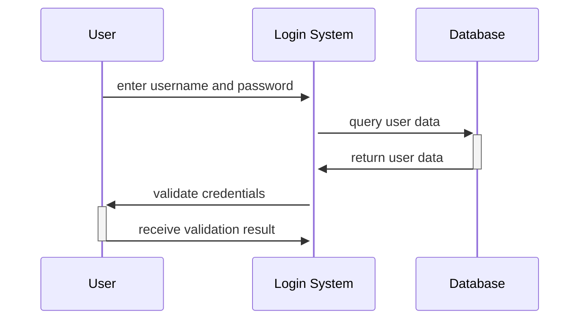

## Unit 1 - Introduction: The meaning of Object Orientation

- Object orientation is a paradigm or a way of thinking about designing and implementing software systems.
- Object orientation is based on the concept of objects, which are entities that have attributes (data) and behaviors (methods).
- Objects can interact with each other by sending and receiving messages, which are requests to invoke methods on the receiver object.
- Objects can be classified into types or classes, which define the common attributes and behaviors of a group of objects.
- Objects can inherit attributes and behaviors from other classes, which allows for code reuse and abstraction.
- Object orientation supports encapsulation, which is the principle of hiding the internal details of an object from the outside world and providing a well-defined interface for communication.
- Object orientation supports polymorphism, which is the ability of an object to behave differently depending on its type or context.
- Object orientation supports abstraction, which is the process of simplifying complex problems by focusing on the essential features and ignoring the irrelevant details.
- Object orientation supports modularity, which is the principle of dividing a large and complex system into smaller and simpler components that can be developed and tested independently.


### Object Identity

- Object identity is the property of an object that distinguishes it from other objects in the system, even if they have the same attributes and behavior.
- Object identity allows objects to be treated as independent entities that can be created, manipulated, and destroyed without affecting other objects.
- Object identity is usually implemented by assigning a unique identifier to each object at the time of creation, such as a memory address or a database key.
- Object identity enables object-oriented concepts such as encapsulation, inheritance, polymorphism, and dynamic binding, which are essential for building complex and reusable software systems.


### Encapsulation for the notes of the Unit 1 - Introduction: The meaning of Object Orientation in the subject of Object Oriented System Design

- Encapsulation is a fundamental concept in object-oriented programming (OOP) that involves bundling data and the methods that operate on that data within a single unit, known as a class .
- This concept helps to protect the data and methods from outside interference, as it restricts direct access to them .
- Encapsulation separates the contractual interface of an abstraction and its implementation. The interface defines the expected behavior and the implementation provides the details of how the behavior is achieved.
- Encapsulation allows an object to change its internal implementation without affecting the overall functioning of the system. This increases the flexibility and maintainability of the code.
- Encapsulation also enhances the reusability and modularity of the code, as different classes can be combined to create complex systems without exposing their internal details.
- Encapsulation can be achieved by using access modifiers, such as public, private, protected, and internal, to control the visibility and accessibility of the data and methods within a class .
- An example of encapsulation in C# is:

```csharp
// A class that encapsulates the data and methods of a bank account
public class BankAccount
{
    // Private data members that are not directly accessible from outside the class
    private string owner;
    private double balance;

    // Public constructor that initializes the data members
    public BankAccount(string owner, double balance)
    {
        this.owner = owner;
        this.balance = balance;
    }

    // Public methods that provide the interface for the class
    public string GetOwner()
    {
        return owner;
    }

    public double GetBalance()
    {
        return balance;
    }

    public void Deposit(double amount)
    {
        if (amount > 0)
        {
            balance += amount;
        }
    }

    public bool Withdraw(double amount)
    {
        if (amount > 0 && amount <= balance)
        {
            balance -= amount;
            return true;
        }
        else
        {
            return false;
        }
    }
}
```


### Information hiding

- Information hiding is a principle of object-oriented system design that aims to reduce the complexity and dependency of software modules by concealing their internal details and exposing only their interfaces .
- Information hiding helps to achieve the following benefits :
  - It enhances the modularity and maintainability of the system by allowing changes in the implementation of a module without affecting other modules that use its interface.
  - It improves the security and reliability of the system by preventing unauthorized access or modification of the internal data and behavior of a module.
  - It facilitates the reuse and abstraction of the system by providing a consistent and coherent interface for a module that can be used in different contexts and levels of detail.
- Information hiding can be implemented in various ways in object-oriented programming, such as :
  - Using access modifiers (such as public, private, protected, etc.) to control the visibility and accessibility of the attributes and methods of a class or an object.
  - Using encapsulation to bundle the data and behavior of an object into a single unit and provide methods for accessing and modifying them.
  - Using inheritance to create subclasses that inherit the interface and behavior of a superclass and override or extend them as needed.
  - Using polymorphism to allow different objects to respond to the same message in different ways depending on their types and states.


### Polymorphism for the notes of the Unit 1 - Introduction: The meaning of Object Orientation in the subject of Object Oriented System Design

- Polymorphism is one of the key concepts of object orientation. It means the ability of an object to take different forms or behaviors depending on the context.
- Polymorphism can be achieved in different ways, such as:
  - Overloading: using the same name for different methods or operators that have different parameters or return types. For example, the `+` operator can be overloaded to perform addition on numbers, strings, or vectors.
  - Overriding: redefining a method or operator in a subclass that was inherited from a superclass. For example, the `toString` method can be overridden to provide a custom representation of an object.
  - Subtyping: allowing a subclass object to be used wherever a superclass object is expected. For example, a `Dog` object can be passed as a parameter to a method that expects an `Animal` object.
  - Parametric: using a generic type or a type variable to represent multiple concrete types. For example, a `List<T>` can store elements of any type `T`.
- Polymorphism enables code reuse, abstraction, and flexibility. It allows the same code to work with different types of objects, without knowing their exact implementation details. It also allows the behavior of objects to be changed or extended at runtime, without modifying the existing code.


### Generosity

- Generosity is the quality of being kind, helpful, and willing to share or give more than is necessary or expected.
- Generosity is one of the core values of object-oriented system design, as it promotes collaboration, reuse, and extensibility among objects and classes.
- Generosity can be manifested in various ways in object-oriented system design, such as:
  - Providing well-defined and consistent interfaces for objects to communicate with each other, without exposing unnecessary details or dependencies.
  - Encapsulating the state and behavior of objects within classes, and hiding the implementation details from other classes.
  - Designing classes that are cohesive, meaning that they have a clear and single responsibility, and that they do not perform tasks that belong to other classes.
  - Designing classes that are loosely coupled, meaning that they have minimal and flexible dependencies on other classes, and that they can be easily replaced or modified without affecting the rest of the system.
  - Designing classes that are open for extension, meaning that they can be inherited or composed by other classes to add new functionality, without modifying the original class.
  - Designing classes that are closed for modification, meaning that they do not require changes to their existing code when new requirements or features are added to the system.
  - Applying design patterns and principles that facilitate generosity, such as abstraction, polymorphism, inheritance, composition, delegation, dependency injection, inversion of control, etc.
- Generosity benefits object-oriented system design in various ways, such as:
  - Improving the readability, maintainability, and testability of the code, as it reduces complexity, duplication, and coupling among classes.
  - Improving the reliability, robustness, and security of the system, as it reduces the chances of errors, bugs, and vulnerabilities caused by unexpected interactions or changes among classes.
  - Improving the scalability, performance, and efficiency of the system, as it allows for parallelism, concurrency, and distribution among objects and classes.
  - Improving the adaptability, flexibility, and evolvability of the system, as it allows for easy changes, extensions, and integrations of new features and requirements.


### Importance of modelling for the notes of the Unit 1 - Introduction: The meaning of Object Orientation in the subject of Object Oriented System Design

- Modelling is the process of creating a representation or abstraction of a system or a problem using diagrams, symbols, notations and rules.
- Modelling is important for object oriented system design because it helps to:
  - Visualize a system as it is or as we want it to be.
  - Specify the structure or behavior of a system.
  - Guide the construction of a system.
  - Document the decisions made during the system development.
  - Facilitate system analysis and design by identifying its classes and objects.
  - Apply object oriented concepts to all the stages of the software development life cycle.
  - Describe the system using real world concepts and relationships .
  - Encourage the design to be modular, reusable, extensible and maintainable.
- Modelling can be done at different levels of abstraction and detail, depending on the purpose and scope of the system.
- Modelling can use different types of models, such as use case models, class models, state models, interaction models, etc., to capture different aspects of the system.
- Modelling can use different notations and languages, such as UML (Unified Modelling Language), to express the models in a standard and consistent way.


Hello, I am Sydney, your AI assistant. I can help you with your study material. Here are some points on the topic of principles of modelling for the notes of the Unit 1 - Introduction: The meaning of Object Orientation in the subject of Object Oriented System Design.

### Principles of modelling

- Modelling is the process of creating a simplified representation of a complex system or phenomenon using a set of concepts, rules and symbols.
- Modelling can help in understanding, analyzing, designing, communicating and documenting a system or phenomenon.
- Modelling can also help in testing, verifying, validating and refining a system or phenomenon.
- Modelling can be done at different levels of abstraction, depending on the purpose and scope of the model.
- Modelling can be done using different paradigms, such as procedural, functional, declarative, logical, data-driven, object-oriented, etc.
- Object-oriented modelling is a paradigm that focuses on the identification and organization of the entities (objects) and their relationships (associations) in a system or phenomenon.
- Object-oriented modelling can capture both the static (structural) and dynamic (behavioral) aspects of a system or phenomenon.
- Object-oriented modelling can be done using different notations, such as Unified Modelling Language (UML), Object-Role Modelling (ORM), Object Constraint Language (OCL), etc.
- Object-oriented modelling can be applied to different domains, such as software engineering, business analysis, database design, etc.
- Object-oriented modelling can benefit from the following principles:
  - Abstraction: the process of hiding the irrelevant details and focusing on the essential features of a system or phenomenon.
  - Encapsulation: the process of bundling the data and the operations that manipulate the data together in an object, and hiding the implementation details from the outside world.
  - Modularity: the process of dividing a system or phenomenon into smaller and independent units (modules) that can be composed and reused.
  - Hierarchy: the process of organizing the objects and modules into different levels of generalization and specialization, forming a tree-like structure.
  - Inheritance: the process of defining a new object or module as a subtype of an existing object or module, inheriting its features and adding new ones.
  - Polymorphism: the process of defining a common interface for a set of objects or modules that can have different implementations, allowing them to be used interchangeably.
  - Composition: the process of defining a new object or module as a combination of other objects or modules, forming a part-whole relationship.
  - Association: the process of defining a relationship between two or more objects or modules, indicating how they are related or interact with each other.
  - Aggregation: a special type of association that indicates a whole-part relationship between two or more objects or modules, where the parts can exist independently of the whole.
  - Generalization: a special type of association that indicates a superclass-subclass relationship between two or more objects or modules, where the subclass inherits the features of the superclass.
  - Dependency: a special type of association that indicates a usage or influence relationship between two or more objects or modules, where one object or module depends on another for its specification or implementation.


### Object Oriented Modelling

- Object oriented modelling (OOM) is a way of representing a system or a problem using objects and their relationships .
- Objects are entities that have attributes (data) and behaviours (operations) that define their state and functionality.
- Object oriented modelling aims to capture the essential features and characteristics of the system or problem domain in terms of objects and their interactions.
- Object oriented modelling can be used at different stages of the software development life cycle, such as analysis, design, implementation and testing.
- Object oriented modelling can help to achieve the following benefits:
  - Abstraction: focusing on the relevant aspects of the system or problem and ignoring the irrelevant details.
  - Encapsulation: hiding the internal details of an object from the outside world and providing a well-defined interface for communication.
  - Modularity: dividing the system or problem into smaller and manageable units that can be developed and maintained independently.
  - Reusability: using existing objects or classes to create new ones without having to rewrite code.
  - Inheritance: deriving new classes from existing ones and inheriting their attributes and behaviours.
  - Polymorphism: allowing different objects to respond differently to the same message or operation based on their types or classes.


### Introduction to UML for the notes of the Unit 1 - Introduction: The meaning of Object Orientation in the subject of Object Oriented System Design

- UML stands for **Unified Modeling Language** , which is a language used in the field of software engineering that represents the components of the **Object-Oriented Programming** concepts .
- Object-Oriented Programming is a paradigm that organizes data and behavior into **objects**, which are instances of **classes**. Classes define the **structure** and **functions** of an object, and objects can interact with each other through **messages**.
- UML is a way to define the **whole software architecture or structure** using mostly graphical notations . UML can express the **design** of software projects, as well as the **behavior** and **state** of the system.
- UML is a collection of **best engineering practices** that have proven successful in the modeling of large and complex systems. UML can help to **decompose** large systems and **modularize** them into smaller and manageable units.
- UML has different types of diagrams, such as **structural diagrams**, **behavioral diagrams**, and **interaction diagrams**, that can show different aspects of the system . UML diagrams can help to **visualize**, **specify**, **construct**, and **document** the system.
- UML is a **standard** language that can be used by different tools and platforms, and can be **extended** and **customized** to suit specific needs . UML can help to **communicate** and **collaborate** with different stakeholders, such as developers, customers, and managers.


### Conceptual Model of the UML

- A conceptual model can be defined as a model which is made of concepts and their relationships .
- A conceptual model is the first step before drawing a UML diagram. It helps to understand the entities in the real world and how they interact with each other .
- To understand the UML, you need to form a conceptual model of the language, and this requires learning three major elements:
  - The UML's basic building blocks, which are the things, relationships, and diagrams that make up a UML model.
  - The rules that dictate how those building blocks may be put together, which are the syntax and semantics of the UML.
  - Some common mechanisms that apply throughout the UML, which are the techniques and conventions that enhance the expressiveness and consistency of the UML.
- Once you have grasped these ideas, you will be able to read UML models and create some basic ones. As you gain more experience in applying the UML, you can build on this conceptual model, using more advanced features of the language.
- The UML is a standard visual language for describing and modelling software blueprints. It is more than just a graphical language. Stated formally, the UML is for:
  - Visualizing, which means creating a graphical representation of a system or a process.
  - Specifying, which means defining the requirements and design of a system or a process in a precise and unambiguous way.
  - Constructing, which means implementing and testing a system or a process using the UML as a blueprint.
  - Documenting, which means recording and communicating the information about a system or a process using the UML as a notation.
- The UML is a general purpose modelling language that can be used for various domains and purposes. It is not a programming language, but rather a visual language that can be mapped to different programming languages.
- The UML can be used to model different aspects of a system or a process, such as the structure, the behavior, the interactions, and the architecture. The UML provides different types of diagrams to represent these aspects, such as class diagrams, use case diagrams, sequence diagrams, and component diagrams.
- The UML is a unified language that integrates the best practices and notations from previous modelling languages, such as the Booch method, the Object-modeling technique (OMT), and the Object-oriented software engineering (OOSE) method.


### Architecture for the notes of the Unit 1 - Introduction: The meaning of Object Orientation in the subject of Object Oriented System Design

- Architecture is the high-level structure of a software system that defines its components, their relationships, and the principles and guidelines for their design and evolution.
- Architecture is important for software development because it provides a blueprint for the system, facilitates communication among stakeholders, enables reuse of existing components, and guides quality attributes such as performance, security, and maintainability.
- Architecture can be described at different levels of abstraction, such as conceptual, logical, physical, and implementation. Each level provides a different perspective and detail of the system.
- Architecture can be represented using various notations and models, such as diagrams, views, patterns, styles, and frameworks. Each representation has its own advantages and limitations, and can be used for different purposes and audiences.
- Architecture can be evaluated using various methods and criteria, such as scenarios, metrics, checklists, and reviews. Evaluation helps to identify and resolve architectural issues, risks, and trade-offs, and to ensure that the architecture meets the requirements and expectations of the stakeholders.
- Architecture can be influenced by various factors, such as the domain, the technology, the organization, the process, and the standards. These factors can affect the architectural decisions, constraints, and alternatives, and should be considered in the architectural design and evolution.


## Unit 2 - Basic Structural Modeling

- In this unit, you will learn about the basic concepts and principles of structural modeling, which is the process of representing the structure and behavior of a system using diagrams and symbols.
- Structural modeling is one of the main types of modeling in software engineering, along with behavioral modeling and functional modeling.
- Structural modeling helps to visualize the static aspects of a system, such as the components, classes, objects, attributes, operations, relationships, and interfaces that make up the system.
- Structural modeling also helps to define the boundaries and scope of a system, as well as the responsibilities and collaborations of its elements.
- Structural modeling can be applied at different levels of abstraction and detail, depending on the purpose and context of the model.
- Some of the common structural modeling techniques and notations are:

  - Entity-relationship (ER) modeling: A technique for modeling the data and information aspects of a system, using entities, attributes, and relationships.
  - Class diagram: A diagram that shows the classes, attributes, operations, and associations of a system, using the Unified Modeling Language (UML) notation.
  - Object diagram: A diagram that shows the instances of classes and their values and links, using the UML notation.
  - Component diagram: A diagram that shows the components, interfaces, and dependencies of a system, using the UML notation.
  - Deployment diagram: A diagram that shows the nodes, artifacts, and communication links of a system, using the UML notation.


### Classes
- A class is a blueprint or template for creating objects of a certain type.
- A class defines the attributes and behaviors of its objects, also known as properties and methods.
- A class can be represented by a rectangle with three compartments: the top one contains the class name, the middle one contains the attributes, and the bottom one contains the methods.
- A class can have different types of attributes and methods, such as static, instance, public, private, protected, etc.
- A class can have relationships with other classes, such as inheritance, association, aggregation, composition, etc.
- A class can be abstract or concrete, depending on whether it can be instantiated or not.
- A class can implement one or more interfaces, which are contracts that specify the methods that a class must provide.
- A class can be part of a package, which is a collection of related classes and interfaces.


### Relationships

Relationships are the connections between classes or objects in object-oriented system design. They describe how the classes or objects interact with each other and what kind of dependencies they have. Relationships can be classified into four types :

- **Inheritance**: Inheritance is a relationship where a class (called the subclass or child class) inherits the attributes and operations of another class (called the superclass or parent class). Inheritance is based on the "is a" relationship, meaning that the subclass is a specialized version of the superclass. For example, a Dog class can inherit from an Animal class, because a dog is an animal. Inheritance allows for code reuse and polymorphism.
- **Association**: Association is a relationship where two classes or objects are linked to each other in some way, but they are not dependent on each other. Association is based on the "has a" relationship, meaning that one class or object has a reference to another class or object. For example, a Student class can have an association with a Course class, because a student has a course. Association can be unidirectional or bidirectional, and can have different multiplicity (one-to-one, one-to-many, many-to-one, many-to-many).
- **Composition**: Composition is a relationship where a class or object is composed of other classes or objects. Composition is based on the "part of" relationship, meaning that the composed class or object owns the parts and is responsible for their creation and destruction. For example, a Car class can have a composition with an Engine class, because a car is composed of an engine and the car creates and destroys the engine. Composition implies a strong dependency and a high degree of cohesion.
- **Aggregation**: Aggregation is a relationship where a class or object is a collection of other classes or objects. Aggregation is also based on the "part of" relationship, but the aggregated class or object does not own the parts and is not responsible for their creation and destruction. For example, a Library class can have an aggregation with a Book class, because a library is a collection of books and the library does not create or destroy the books. Aggregation implies a weak dependency and a low degree of cohesion.

Relationships can be represented in UML class diagrams using different symbols and notations  :

- Inheritance is represented by a solid line with a hollow triangle pointing to the superclass.
- Association is represented by a solid line with an optional arrow indicating the direction of the relationship. The multiplicity of the relationship can be specified using numbers or asterisks at the ends of the line.
- Composition is represented by a solid line with a filled diamond at the end of the composed class or object.
- Aggregation is represented by a solid line with a hollow diamond at the end of the aggregated class or object.


### Common Mechanisms for Object Oriented System Design

- Object oriented system design is a method of design that involves decomposing a system into a set of interacting objects, each with its own state and behavior, and using a notation to represent both the logical and physical aspects of the system.
- Some common mechanisms for object oriented system design are  :
  - Abstraction: It is a mechanism of hiding the irrelevant details and focusing on the essential features of an object or a problem domain.
  - Inheritance: It is a mechanism of reusing the common attributes and behaviors of a parent class by a child class, and also allowing the child class to modify or extend the parent class.
  - Polymorphism: It is a mechanism of representing objects having multiple forms used for different purposes, such as overloading, overriding, and dynamic binding.
  - Encapsulation: It is a mechanism of binding the data and the behavior of an object together as a single unit, enabling tight coupling between them and protecting them from external interference.
  - Modularity: It is a mechanism of dividing a complex system into smaller and manageable units, such as classes, packages, and subsystems, and defining the interfaces and dependencies among them.
  - Coupling: It is a measure of the degree of interdependence or interaction between the modules of a system, and it should be minimized to reduce the complexity and increase the maintainability of the system.
  - Cohesion: It is a measure of the degree of relatedness or similarity of the elements within a module of a system, and it should be maximized to increase the clarity and reusability of the system.
- These mechanisms help to achieve the goals of object oriented system design, such as  :
  - Robustness: The ability of a system to handle errors and exceptions gracefully and recover from them.
  - Adaptability: The ability of a system to cope with changes in the requirements and environment without affecting its functionality and performance.
  - Reusability: The ability of a system to use existing components or modules in different contexts and applications, reducing the development time and cost.
  - Extensibility: The ability of a system to add new features or functionalities without affecting the existing ones, enhancing the functionality and performance of the system.
  - Testability: The ease with which a system can be tested and verified for its correctness and quality, ensuring the reliability and security of the system.


### Diagrams for the notes of the Unit 2 - Basic Structural Modeling in the subject of Object Oriented System Design

- Basic structural modeling is the process of describing the static structure of a system using diagrams that show the elements and their relationships.
- The Unified Modeling Language (UML) is a standard notation for creating such diagrams.
- UML defines four types of structural diagrams: class diagram, object diagram, component diagram, and deployment diagram.
- Class diagram: A class diagram models the static view of a system. It shows the classes, interfaces, and collaborations of a system, and the relationships between them. A class diagram can also show the attributes and operations of each class, and the constraints that apply to them.
- Object diagram: An object diagram is a snapshot of the instances of the classes in a system at a given point in time. It shows the objects, their attributes, and their links to other objects. An object diagram can be used to illustrate a specific scenario or example of a system.
- Component diagram: A component diagram models the physical components of a system and how they are organized and connected. It shows the software components, such as modules, packages, libraries, and frameworks, and the hardware components, such as devices, nodes, and connectors. A component diagram can be used to describe the architecture and deployment of a system.
- Deployment diagram: A deployment diagram models the distribution of the components of a system across the nodes of a network. It shows the nodes, such as servers, workstations, routers, and switches, and the components that are deployed on them. A deployment diagram can be used to show the configuration and topology of a system.


### Class and Object Diagrams

- Class and object diagrams are two types of structural diagrams in UML that show the static structure and behavior of a system.
- Class diagrams describe the classes and interfaces that make up the system, along with their attributes, operations, and relationships.
- Object diagrams show the instances of classes and interfaces in a specific situation or scenario, along with their values and links.
- Class and object diagrams are related in the sense that an object diagram is a snapshot of a class diagram at a particular point in time.

#### Class Diagrams

- A class diagram consists of a set of classes and interfaces, represented by rectangles with three compartments: the top one for the name, the middle one for the attributes, and the bottom one for the operations.
- A class can have zero or more attributes, which are the properties or characteristics of the class. An attribute has a name, a type, and optionally a visibility (public, private, protected, or package) and a multiplicity (how many values it can have).
- A class can have zero or more operations, which are the behaviors or functions of the class. An operation has a name, a list of parameters, a return type, and optionally a visibility and a multiplicity.
- A class can also have zero or more stereotypes, which are keywords enclosed in guillemets (« ») that indicate some special characteristics or roles of the class. For example, «abstract» means the class cannot be instantiated, «interface» means the class only defines a set of operations without implementation, and «enumeration» means the class defines a finite set of constants.

- A class diagram can also show the relationships between classes and interfaces, such as associations, generalizations, dependencies, realizations, and aggregations.
- An association is a structural relationship that indicates that two classes are related in some way, such as a student has a name or a car has an engine. An association has a name, a direction, and optionally a role name, a multiplicity, and a visibility for each end. An association can also have attributes and operations, which are shown in a separate compartment attached to the association line.
- A generalization is a relationship that indicates that a class is a kind of another class, such as a dog is a kind of animal or a circle is a kind of shape. A generalization is shown as a solid line with a hollow triangle pointing to the superclass (the more general class).
- A dependency is a relationship that indicates that a class depends on another class for some reason, such as a class uses another class as a parameter or a class creates an instance of another class. A dependency is shown as a dashed line with an open arrowhead pointing to the supplier (the class that is depended on).
- A realization is a relationship that indicates that a class implements an interface, such as a printer realizes a printable interface or a list realizes a collection interface. A realization is shown as a dashed line with a hollow triangle pointing to the interface (the class that is realized).
- An aggregation is a relationship that indicates that a class is a part of another class, such as a wheel is a part of a car or a page is a part of a book. An aggregation is shown as a solid line with a hollow diamond at the end of the whole (the class that contains the parts). An aggregation implies that the parts can exist independently of the whole, unlike a composition, which is a stronger form of aggregation that implies that the parts cannot exist without the whole. A composition is shown as a solid line with a filled diamond at the end of the whole.

#### Object Diagrams

- An object diagram consists of a set of objects and links, represented by rectangles and lines, respectively. An object is an instance of a class or an interface, and a link is an instance of an association or an aggregation.
- An object has a name, which is the name of the class or the interface followed by a colon and a unique identifier. An object can also have a stereotype, which is the same as for a class. An object can also show the values of its attributes, which are the actual data stored in the object.
- A link has a name, which is the name of the association or the aggregation followed by a colon and a unique identifier. A link can also have a stereotype, which is the same as for an association or an aggregation. A link can also show the values of its attributes, which are the actual data stored in the link.
- An object diagram can also show the messages that are exchanged between objects, which are the invocations of the operations defined by the classes


### Terms for the notes of the Unit 2 - Basic Structural Modeling in the subject of Object Oriented System Design

- **Object-oriented system design**: A process of designing software systems using the principles of object-oriented analysis and design, such as abstraction, encapsulation, inheritance, polymorphism, and modularity .
- **Structural modeling**: A type of modeling that focuses on the static structure of a system, such as the classes, objects, attributes, operations, and relationships that exist in the system .
- **Class**: A blueprint or template that defines the common properties and behaviors of a set of similar objects .
- **Object**: An instance or occurrence of a class that has a unique identity, state, and behavior .
- **Attribute**: A named property of a class or an object that describes some aspect of the object's state .
- **Operation**: A named function or action that can be performed by a class or an object, and that may change the object's state or return a value .
- **Relationship**: A connection or association between two or more classes or objects that specifies some kind of dependency or interaction .
- **Association**: A relationship that describes a structural link between two or more classes or objects, and that may have a name, a direction, and a multiplicity .
- **Aggregation**: A special type of association that represents a whole-part or part-of relationship between two or more classes or objects, and that implies that the parts can exist independently of the whole .
- **Composition**: A special type of aggregation that represents a strong whole-part or part-of relationship between two or more classes or objects, and that implies that the parts cannot exist independently of the whole .
- **Generalization**: A relationship that represents an inheritance or is-a relationship between two or more classes or objects, and that implies that the subclass inherits the properties and behaviors of the superclass .
- **Realization**: A relationship that represents an implementation or conforms-to relationship between two or more classes or objects, and that implies that the class or object that realizes another class or object implements its specification or interface .
- **Dependency**: A relationship that represents a usage or depends-on relationship between two or more classes or objects, and that implies that a change in one class or object may affect another class or object .
- **Class diagram**: A diagram that shows the classes, objects, attributes, operations, and relationships in a system, and that can be used to model the static structure of the system  .
- **Object diagram**: A diagram that shows the objects, attributes, values, and relationships in a system at a specific point in time, and that can be used to model the dynamic behavior of the system  .
- **Class-responsibility-collaboration (CRC) card**: A tool that can be used to identify and document the classes, responsibilities, and collaborations in a system, and that can be used to facilitate communication and brainstorming among developers .


### Concepts for the notes of the Unit 2 - Basic Structural Modeling in the subject of Object Oriented System Design

- Basic structural modeling is the process of identifying and describing the static structure of a system using object-oriented concepts and notation.
- The static structure of a system consists of the classes, objects, attributes, operations, and relationships that define the system's state and behavior.
- The main techniques for basic structural modeling are:
  - Class-Responsibility-Collaboration (CRC) cards: a simple and informal way of capturing the responsibilities and collaborations of classes in a system. Each card represents a class and contains its name, responsibilities (what it knows and does), and collaborators (other classes it interacts with).
  - Class diagrams: a graphical representation of the classes, attributes, operations, and relationships in a system. Class diagrams show the static structure and hierarchy of classes, as well as their associations, aggregations, compositions, generalizations, and dependencies.
  - Object diagrams: a graphical representation of the instances of classes and their links in a system. Object diagrams show the state and identity of objects, as well as their values and references. Object diagrams are useful for illustrating specific scenarios or snapshots of a system at a given point in time.
- The main concepts and elements of basic structural modeling are:
  - Class: a blueprint or template that defines the common properties and behaviors of a set of similar objects. A class has a name, attributes, and operations.
  - Object: an instance or occurrence of a class that has a unique identity, state, and behavior. An object has a name, values, and references.
  - Attribute: a property or characteristic of a class or an object that describes its state or quality. An attribute has a name, a type, and optionally a default value and a visibility.
  - Operation: a function or method of a class or an object that defines its behavior or action. An operation has a name, a list of parameters, a return type, and optionally a visibility and a body.
  - Relationship: a connection or link between classes or objects that specifies how they are related or interact with each other. There are different types of relationships, such as association, aggregation, composition, generalization, and dependency.
  - Association: a relationship that describes a structural or behavioral connection between classes or objects. An association has a name, a direction, and optionally a multiplicity, a role, and a qualifier for each end.
  - Aggregation: a special type of association that represents a whole-part or part-of relationship between classes or objects. An aggregation has a hollow diamond at the end of the whole or the container class or object.
  - Composition: a special type of aggregation that represents a strong whole-part or part-of relationship between classes or objects. A composition has a solid diamond at the end of the whole or the container class or object, and implies that the parts cannot exist without the whole.
  - Generalization: a relationship that represents an inheritance or a specialization relationship between classes or objects. A generalization has a solid line with a hollow triangle at the end of the parent or the superclass.
  - Dependency: a relationship that represents a usage or a dependency relationship between classes or objects. A dependency has a dashed line with an open arrow at the end of the client or the dependent class or object.


### Modelling Techniques for Class & Object Diagrams

- Class and object diagrams are two types of structural diagrams in the Unified Modeling Language (UML) that show the static structure of a system.
- Class diagrams show the classes, attributes, operations, and relationships of a system, while object diagrams show the instances of classes and their links at a specific point in time.
- Class and object diagrams are based on the principles of object-oriented modeling, such as abstraction, encapsulation, modularity, hierarchy, typing, concurrency, and persistence.
- Some of the common modelling techniques for class and object diagrams are:

  - Identify the classes and objects that are relevant to the system domain and the problem statement.
  - Define the attributes and operations of each class and object, and specify their visibility, type, multiplicity, and constraints.
  - Use generalization, specialization, aggregation, composition, association, and dependency relationships to show the connections and dependencies among classes and objects.
  - Use interfaces, abstract classes, and inheritance to model the common behavior and structure of classes and objects.
  - Use stereotypes, tagged values, and constraints to extend the semantics and notation of the UML elements.
  - Use packages, subsystems, and components to organize the classes and objects into logical groups and modules.
  - Use diagrams, notes, and comments to document the design decisions and assumptions of the class and object diagrams.

- Some of the benefits of using class and object diagrams are:

  - They provide a clear and concise representation of the system's structure and behavior.
  - They facilitate the communication and collaboration among the stakeholders and developers of the system.
  - They support the analysis, design, implementation, testing, and maintenance of the system.
  - They enable the reuse and adaptation of existing classes and objects for new systems.


### Collaboration Diagrams

- Collaboration diagrams are used to show the **relationship** between the **objects** in a system.
- Collaboration diagrams are also known as **communication diagrams** in UML 2.x.
- Collaboration diagrams are useful for **modeling collaborations**, **mechanisms** or the **structural organization** within a system design.
- Collaboration diagrams can represent the same information as sequence diagrams, but differently. Instead of showing the **flow of messages**, they depict the **architecture of the object** residing in the system.
- The four major components of a collaboration diagram are:
  - **Objects**: Objects are shown as rectangles with naming labels inside. The naming label follows the convention of object name : class name.
  - **Actors**: Actors are instances that invoke the interaction in the diagram. Each actor has a name and a role, with one actor initiating the interaction.
  - **Links**: Links are lines that connect objects and actors. They represent the communication paths or associations between them.
  - **Messages**: Messages are labels along the links that indicate the information or action being exchanged. They have a sequence number and a name, with optional parameters and return values.
- Collaboration diagrams are developed by first determining the **design elements** required to incorporate the functionality of interface features. The **interactions** among these elements are then used to build a model.
- Collaboration diagrams can be illustrated by designing objects in a structure and illustrating the connections between the objects as links.
- Collaboration diagrams can be used to show the **dynamic aspects** of a system, such as the **behavior** of a particular use case, or a part of a use case.
- Collaboration diagrams can also be used to show the **static aspects** of a system, such as the **roles** of the objects that perform a particular flow of events of a use case.
- Collaboration diagrams can help to **clarify** the roles and responsibilities of the objects in a system, as well as the **communication patterns** among them.


### Terms for the notes of the Unit 2 - Basic Structural Modeling in the subject of Object Oriented System Design

- **Class**: A class is a blueprint or template that defines the attributes and behaviors of a set of objects that belong to the same category. A class can have properties (data) and methods (operations) that are shared by all its instances. A class can also have constructors, destructors, and access modifiers that control the visibility and accessibility of its members.
- **Object**: An object is an instance or a specific realization of a class. An object has a unique identity, state, and behavior that are determined by the values of its properties and the execution of its methods. An object can communicate with other objects by sending and receiving messages.
- **Association**: An association is a relationship between two or more classes that indicates how the objects of those classes are connected or interact with each other. An association can have a name, a direction, a multiplicity, and a role that specify the semantics and constraints of the relationship. An association can also have attributes and operations that belong to the relationship itself, not to any of the participating classes.
- **Aggregation**: An aggregation is a special type of association that represents a whole-part or a part-of relationship between two classes. An aggregation implies that the whole object has a responsibility for the existence and storage of the part objects, but the part objects can exist independently of the whole object. An aggregation is usually depicted by a hollow diamond at the end of the association line that points to the whole class.
- **Composition**: A composition is a stronger form of aggregation that represents a whole-part or a part-of relationship between two classes. A composition implies that the whole object has a responsibility for the creation and destruction of the part objects, and the part objects cannot exist without the whole object. A composition is usually depicted by a filled diamond at the end of the association line that points to the whole class.
- **Generalization**: A generalization is a relationship between a general class (superclass or parent class) and a specific class (subclass or child class) that indicates that the subclass inherits the attributes and behaviors of the superclass. A generalization is also called an inheritance or an is-a relationship. A generalization is usually depicted by a solid line with a hollow triangle at the end of the line that points to the superclass.
- **Realization**: A realization is a relationship between a specification (interface or abstract class) and an implementation (concrete class) that indicates that the implementation class conforms to the contract defined by the specification class. A realization is also called an implementation or a realization-of relationship. A realization is usually depicted by a dashed line with a hollow triangle at the end of the line that points to the specification class.
- **Dependency**: A dependency is a relationship between two classes that indicates that one class (client) uses or depends on another class (supplier) for some purpose. A dependency implies that a change in the supplier class may affect the client class, but not vice versa. A dependency is also called a use or a depends-on relationship. A dependency is usually depicted by a dashed line with an open arrowhead at the end of the line that points to the supplier class.


### Concepts for the notes of the Unit 2 - Basic Structural Modeling in the subject of Object Oriented System Design

- Basic structural modeling is the process of identifying and describing the static structure of a system using object-oriented concepts and notations.
- The static structure of a system consists of the classes, objects, attributes, operations, and relationships that define the system's state and behavior.
- The main concepts and notations used for basic structural modeling are:
  - Class: A class is a blueprint or template that defines the common properties and behaviors of a set of similar objects. A class is represented by a rectangle with the class name on the top, followed by the attributes and operations sections.
  - Object: An object is an instance or occurrence of a class that has a unique identity, state, and behavior. An object is represented by an underlined name, optionally followed by the class name in parentheses.
  - Attribute: An attribute is a named property or characteristic of a class or an object that describes some aspect of the class or object. An attribute is represented by a name, optionally followed by a type and an initial value.
  - Operation: An operation is a function or method that defines the behavior or action of a class or an object. An operation is represented by a name, optionally followed by a list of parameters, a return type, and a visibility indicator.
  - Association: An association is a relationship between two or more classes or objects that indicates some meaningful connection or interaction between them. An association is represented by a line connecting the classes or objects, optionally labeled with a name, a multiplicity, and a role for each end.
  - Aggregation: An aggregation is a special type of association that represents a whole-part or part-of relationship between classes or objects. An aggregation is represented by a line with a hollow diamond at the end that points to the whole or the container class or object.
  - Composition: A composition is a stronger form of aggregation that implies ownership and exclusive containment of the parts by the whole. A composition is represented by a line with a solid diamond at the end that points to the whole or the owner class or object.
  - Generalization: A generalization is a relationship between a more general or abstract class (superclass) and a more specific or concrete class (subclass) that indicates inheritance of attributes and operations from the superclass to the subclass. A generalization is represented by a line with a hollow triangle at the end that points to the superclass.
  - Realization: A realization is a relationship between a specification or interface and an implementation or realization that indicates conformance of the implementation to the specification. A realization is represented by a dashed line with a hollow triangle at the end that points to the specification or interface.
  - Dependency: A dependency is a relationship between two or more classes or objects that indicates that one class or object depends on another for some reason, such as using, creating, or modifying it. A dependency is represented by a dashed line with an arrow at the end that points to the class or object that is depended upon.


### Basic Structural Modeling

- Basic structural modeling is the process of identifying and describing the static structure of a system using classes, objects, attributes, operations, and associations.
- A class is a blueprint or template that defines the common properties and behaviors of a set of similar objects.
- An object is an instance of a class that has a unique identity, state, and behavior.
- An attribute is a named property of a class or an object that describes some aspect of the object's state.
- An operation is a named function or action that can be performed by a class or an object and that may change the object's state or return a value.
- An association is a relationship between two or more classes or objects that indicates how they are connected or interact with each other.
- A multiplicity is a specification of how many instances of one class or object can be related to one instance of another class or object in an association.
- A role is a name that describes the purpose or function of a class or an object in an association.
- A generalization is a relationship between a more general class (superclass) and a more specific class (subclass) that indicates that the subclass inherits the attributes and operations of the superclass.
- An aggregation is a relationship between a whole class and its part classes that indicates that the parts belong to the whole and that the lifetime of the parts is dependent on the lifetime of the whole.
- A composition is a stronger form of aggregation that indicates that the parts are exclusively owned by the whole and that the parts cannot exist without the whole.
- A dependency is a relationship between two classes or objects that indicates that one class or object uses or depends on another class or object for some purpose.
- A realization is a relationship between an abstract class or interface and a concrete class that indicates that the concrete class implements the attributes and operations of the abstract class or interface.
- A stereotype is a way of extending or modifying the meaning of a modeling element by applying a predefined or user-defined label to it.
- A package is a grouping of related modeling elements that helps to organize and simplify a complex system.


### Polymorphism in Collaboration Diagrams

- Polymorphism is the ability of an object to behave differently depending on its type or class at run-time.
- In collaboration diagrams, polymorphism is represented by using multiple scenarios controlled by guard conditions.
- Guard conditions are expressions that evaluate to true or false and determine which scenario is executed.
- Each scenario shows the messages that are sent to the polymorphic object and the responses that are returned.
- The polymorphic object is usually shown as an abstract class or an interface, and the concrete subclasses are shown as instances of that class or interface.
- For example, consider a polymorphic object of type Shape that can be an instance of Triangle, Rectangle or Square at run-time. The object can receive a message show() that displays the shape on the screen. The collaboration diagram below shows how polymorphism is represented in this case.

Collaboration diagram example

- The guard conditions [Triangle], [Rectangle] and [Square] indicate which scenario is executed depending on the type of the Shape object.
- The messages show() are sent to the Shape object, which delegates them to the appropriate subclass object.
- The responses are returned from the subclass object to the Shape object, and then to the sender object.


### Iterated messages

- An iterated message is a message that is repeated a certain number of times or until a condition is met in a sequence diagram.
- An iterated message is represented by a frame with a label * and a guard condition in square brackets.
- The guard condition specifies the iteration clause, which can be a numeric range, a boolean expression, or a natural language description.
- The frame encloses the messages that are part of the iteration, which can be synchronous, asynchronous, or reply messages.
- An example of an iterated message is shown below:

Iterated message example

- In this example, the DataControl object sends an iterated message to the DataSource object to get the data from an array.
- The guard condition is array_size, which means the iteration will repeat as many times as the size of the array.
- The messages inside the frame are synchronous messages, indicated by the solid arrowheads and the filled rectangles on the lifelines.


### Use of self in messages

- In object-oriented system design, a message is a request from one object to another object to perform some action or return some information.
- A message consists of a sender, a receiver, a method name, and optional arguments.
- A self message is a special type of message where the sender and the receiver are the same object .
- A self message indicates that the object is invoking one of its own methods, either to perform some internal computation or to access some of its own attributes.
- A self message is represented by a U-shaped arrow that points back to the same lifeline in a sequence diagram .
- For example, consider a scenario where a device object wants to access its webcam object. The device object can send a self message to itself to get a reference to the webcam object, and then send another message to the webcam object to start the camera .
- The following sequence diagram illustrates this example:

```sequence
Device->Device: getWebcam()
Device->Webcam: startCamera()
```

- Self messages are useful for modeling recursive or nested method calls, as well as internal state changes or behaviors of an object .


### Sequence Diagrams

- Sequence diagrams are a type of interaction diagram that show how objects interact with each other in a time-ordered manner.
- Sequence diagrams are useful for modeling the dynamic behavior of a system, such as the interactions between objects in a use case or scenario.
- Sequence diagrams consist of vertical lifelines that represent the objects or classes involved in the interaction, and horizontal arrows that represent the messages exchanged between them.
- Sequence diagrams can also show the activation of objects, the creation and destruction of objects, the return of values, the use of alternative and parallel flows, and the use of loops and conditions.
- Sequence diagrams can be used to document the logic of a system, to design a new system, to validate an existing system, or to visualize the execution of a system.

#### Example of a Sequence Diagram

- The following sequence diagram shows how a hotel reservation system works.
- The diagram has four lifelines: the customer, the hotel website, the hotel, and the bank.
- The customer initiates the interaction by browsing the hotel website and selecting a room.
- The hotel website sends a request to the hotel to check the availability of the room.
- The hotel responds with a confirmation or a rejection.
- If the room is available, the customer enters the payment details and confirms the reservation.
- The hotel website sends a request to the bank to process the payment.
- The bank responds with a confirmation or a rejection.
- If the payment is successful, the hotel website sends a confirmation to the customer and the hotel.
- If the payment is unsuccessful, the hotel website sends a rejection to the customer and the hotel.

Sequence diagram for hotel reservation


### Terms for the notes of the Unit 2 - Basic Structural Modeling in the subject of Object Oriented System Design

- **Class**: A class is a blueprint or template that defines the attributes and behaviors of a set of objects that belong to the same category. A class can have properties (data) and methods (operations) that are shared by all its instances. A class can also have constructors, destructors, and access modifiers that control the visibility and accessibility of its members.
- **Object**: An object is an instance or a specific realization of a class. An object has a unique identity, state, and behavior that are determined by the values of its properties and the execution of its methods. An object can communicate with other objects by sending and receiving messages.
- **Association**: An association is a relationship between two or more classes that indicates how the objects of those classes are connected or interact with each other. An association can have a name, a direction, a multiplicity, and a role that specify the semantics and constraints of the relationship. An association can also have attributes and operations that belong to the relationship itself, not to any of the participating classes.
- **Aggregation**: An aggregation is a special type of association that represents a whole-part or a part-of relationship between two classes. An aggregation implies that the whole object has a responsibility for the existence and storage of the part objects, but the part objects can exist independently of the whole object. An aggregation is usually depicted by a hollow diamond at the end of the association line that points to the whole class.
- **Composition**: A composition is a stronger form of aggregation that represents a whole-part or a part-of relationship between two classes. A composition implies that the whole object has a responsibility for the creation and destruction of the part objects, and the part objects cannot exist without the whole object. A composition is usually depicted by a filled diamond at the end of the association line that points to the whole class.
- **Generalization**: A generalization is a relationship between a general class (superclass or parent class) and a specific class (subclass or child class) that indicates that the subclass inherits the attributes and behaviors of the superclass. A generalization is also known as an inheritance or an is-a relationship. A generalization is usually depicted by a solid line with a hollow triangle at the end of the line that points to the superclass.
- **Realization**: A realization is a relationship between a specification (interface or abstract class) and an implementation (concrete class) that indicates that the implementation class conforms to the contract defined by the specification class. A realization is also known as an implementation or a realization-of relationship. A realization is usually depicted by a dashed line with a hollow triangle at the end of the line that points to the specification class.
- **Dependency**: A dependency is a relationship between two classes that indicates that one class (client) uses or depends on another class (supplier) for some purpose. A dependency implies that a change in the supplier class may affect the client class, but not vice versa. A dependency is also known as a use or a depends-on relationship. A dependency is usually depicted by a dashed line with an open arrowhead at the end of the line that points to the supplier class.


### Concepts for the notes of the Unit 2 - Basic Structural Modeling in the subject of Object Oriented System Design

- Basic structural modeling is the process of identifying and describing the static structure of a system using object-oriented concepts and notation.
- The static structure of a system consists of the objects, classes, attributes, operations, associations, and constraints that define the system's state and behavior.
- The main concepts and elements of basic structural modeling are:
  - Object: An instance of a class that has a unique identity, state, and behavior.
  - Class: A description of a set of objects that share the same attributes, operations, associations, and constraints.
  - Attribute: A property or characteristic of an object or a class that describes its state or data.
  - Operation: A function or method that defines the behavior or action of an object or a class.
  - Association: A relationship between two or more classes that specifies how they are connected or related.
  - Multiplicity: A specification of how many instances of one class can be associated with one instance of another class.
  - Role: A name that describes the purpose or function of a class in an association.
  - Aggregation: A special type of association that represents a whole-part relationship between two classes.
  - Composition: A stronger form of aggregation that implies that the part cannot exist without the whole.
  - Generalization: A relationship between a more general class (superclass) and a more specific class (subclass) that inherits the attributes and operations of the superclass.
  - Abstract class: A class that cannot be instantiated and is used to represent a general concept or behavior.
  - Interface: A specification of a set of operations that a class must implement to provide a certain service or functionality.
  - Constraint: A rule or condition that restricts the values or states of an object or a class.
- The main notation and diagrams for basic structural modeling are:
  - Unified Modeling Language (UML): A standard graphical language for modeling object-oriented systems using various types of diagrams.
  - Class diagram: A diagram that shows the classes, attributes, operations, associations, and constraints of a system or a subsystem.
  - Object diagram: A diagram that shows the objects, values, and links of a system or a subsystem at a specific point in time.
  - Package diagram: A diagram that shows the organization and dependencies of the classes and subsystems of a system.


### Depicting asynchronous messages with/without priority

- Asynchronous messages are messages that are sent from one object to another without waiting for a response.
- Asynchronous messages are useful for modeling concurrent or parallel activities, such as sending an email or printing a document.
- Asynchronous messages are depicted by a dashed arrow with an open arrowhead in a sequence diagram.
- Asynchronous messages can have a priority, which indicates the relative importance or urgency of the message.
- Priority can be shown by adding a label with a number or a symbol to the message arrow, such as `p=1` or `!`.
- Priority can also be shown by using different colors or styles for the message arrows, such as red or bold for high priority messages.
- The priority of an asynchronous message affects the order in which the messages are processed by the receiver object, but not the order in which they are sent by the sender object.
- The sender object can continue its execution after sending an asynchronous message, regardless of the priority of the message.
- The receiver object can process an asynchronous message at any time, depending on its availability and the priority of the message.
- The receiver object can process multiple asynchronous messages concurrently, if it has the capability and resources to do so.


### Call-back mechanism

- A call-back mechanism is a way of implementing event-driven programming in object-oriented languages .
- A call-back mechanism allows an application to handle subscribed events, arising at runtime, through a listener interface.
- A listener interface is an abstract class or an interface that defines one or more methods that will be invoked when an event occurs .
- The subscribers, or the objects that are interested in the events, will need to provide a concrete implementation of the listener interface methods .
- The subscribers will then register themselves with the event source, or the object that generates the events, using a call-back register mechanism.
- The event source will keep a list of function objects, or references to the listener methods, and call them back when an event happens .
- A call-back mechanism enables a loose coupling between the event source and the event listeners, as they only need to agree on the listener interface .
- A call-back mechanism also enables a dynamic and flexible behavior of the application, as the event source can notify different listeners depending on the context and the event type .


### Broadcast messages

- Broadcast messages are a type of message passing in object-oriented systems, where a message is sent from one object to multiple objects simultaneously.
- Broadcast messages are useful for scenarios where an object needs to notify or update other objects about some event or change, without knowing or caring about their identities or locations.
- Broadcast messages can be implemented using various mechanisms, such as:
  - Publish-subscribe pattern: The sender object publishes a message to a topic or channel, and the receiver objects subscribe to that topic or channel to receive the message.
  - Observer pattern: The sender object maintains a list of observer objects that are interested in its state, and notifies them whenever its state changes.
  - Multicast or broadcast protocols: The sender object uses a network protocol that supports sending a message to a group of receiver objects, such as IP multicast or UDP broadcast.
- Broadcast messages have some advantages and disadvantages, such as:
  - Advantages:
    - Decoupling: The sender and receiver objects are loosely coupled, as they do not need to know each other's details or locations.
    - Scalability: The sender object can reach a large number of receiver objects with a single message, without creating individual connections or messages for each one.
    - Flexibility: The receiver objects can dynamically join or leave the broadcast group, without affecting the sender object or other receiver objects.
  - Disadvantages:
    - Reliability: The sender object cannot guarantee that the message will be delivered to all the receiver objects, as some of them may be offline, unreachable, or uninterested.
    - Efficiency: The sender object may waste network bandwidth and resources by sending a message to receiver objects that do not need it or cannot process it.
    - Security: The sender object cannot control who can access the message, as it may be intercepted or modified by unauthorized or malicious parties.


### Basic Behavioural Modeling

- Behavioural modeling is the process of capturing and analyzing the dynamic aspects of a system, such as the actions, interactions, and states of the system and its components.
- Behavioural modeling helps to understand how the system functions, responds to events, and changes over time.
- Behavioural modeling can be done using different approaches, such as state-oriented, function-oriented, object-oriented, and formal approaches.
- In object-oriented system design, behavioural modeling is done using Unified Modeling Language (UML) diagrams, such as use case diagrams, interaction diagrams, state–chart diagrams, and activity diagrams.
- Use case diagrams show the interactions between the system and its external actors, and the goals or services that the system provides.
- Interaction diagrams show the interactions between the objects in the system, and the sequence and timing of the messages exchanged. Interaction diagrams include sequence diagrams, communication diagrams, and timing diagrams.
- State–chart diagrams show the states and transitions of an object or a system, and the events and actions that trigger or result from the state changes.
- Activity diagrams show the flow of control and data among the activities or actions in the system, and the conditions and constraints that govern the flow.


### Use cases for the notes of the Unit 2 - Basic Structural Modeling in the subject of Object Oriented System Design

- A use case is an abstraction of interrelated events or interaction sequences that describe what a system does from the user perspective .
- A use case model shows a view of the system from the user perspective, thus describing what a system does without describing how the system does it.
- A use case diagram is a visual representation of a use case model that uses UML notation.
- Use case modeling is a technique for identifying and organizing the functional requirements of a system.
- Use case modeling can help designers develop better object-oriented solutions for embedded systems applications by separating functionality into three distinct types of object modules: interface, control, and entity.
- Use case modeling can also help developers identify the classes, attributes, methods, and relationships that will be needed to implement the system functionality.
- Some of the benefits of use case modeling are:
  - It helps to capture the user requirements in a clear and concise way.
  - It helps to communicate the system functionality to the stakeholders and users.
  - It helps to validate the system design and test cases.
  - It helps to facilitate reuse and change management.
- Some of the challenges of use case modeling are:
  - It can be difficult to identify all the possible use cases and scenarios for a complex system.
  - It can be difficult to maintain consistency and traceability between use cases and other models.
  - It can be difficult to avoid ambiguity and redundancy in use case descriptions.


### Use case diagrams

- A use case diagram is a graphical depiction of a user's possible interactions with a system.
- A use case diagram shows various use cases and different types of users the system has and will often be accompanied by other types of diagrams as well.
- The use cases are represented by either circles or ellipses.
- A use case diagram is a tool that maps interactions between users and systems to show the interactions between them.
- Use case diagrams can help professionals visualize systems in many fields, including sales, software development, business and manufacturing.
- An effective use case diagram can help your team discuss and represent:
  - Scenarios in which your system or application interacts with people, organizations, or external systems
  - Goals that your system or application helps those entities (known as actors) achieve
  - The scope of your system
- Use case diagrams are typically developed in the early stage of development and people often apply use case modeling for the following purposes:
  - Specify the context of a system
  - Capture the requirements of a system
  - Validate a systems architecture
  - Drive implementation and generate test cases
- Use case diagrams consist of the following elements :
  - Actors: The users or entities that interact with the system. They are represented by stick figures or icons.
  - Use cases: The functions or features that the system provides to the actors. They are represented by circles or ellipses with labels.
  - Relationships: The connections between actors and use cases or between use cases themselves. They are represented by lines with different symbols to indicate the type of relationship.
    - Association: A solid line that shows the communication between an actor and a use case.
    - Include: A dashed line with an open arrowhead that shows that a use case is a part of another use case.
    - Extend: A dashed line with an open arrowhead that shows that a use case can be extended by another use case under certain conditions.
    - Generalization: A solid line with a closed arrowhead that shows that an actor or a use case inherits the characteristics of another actor or use case.
- System boundary: An optional rectangle that encloses the use cases and shows the scope of the system. It is labeled with the name of the system.
- Packages: An optional grouping mechanism that can contain use cases, actors, or other packages. They are represented by tabbed rectangles with labels.

Here is an example of a use case diagram for a retail system:

use case diagram example

: Use case diagram - Wikipedia
: Use Case Diagram: Definition and Examples | Indeed.com
: UML Use Case Diagram Tutorial | Lucidchart
: 10 Use Case Diagram Examples (and How to Create Them)


### Activity Diagrams

- Activity diagrams are a type of behavior diagrams that show the flow of control and data among activities in a system.
- Activity diagrams are also called object-oriented flowcharts because they capture the dynamic behavior of objects and classes.
- Activity diagrams consist of activities, actions, control nodes, object nodes, and edges that connect them.
- Activities are behaviors that are composed of one or more actions, which are atomic and indivisible operations of the system.
- Actions can have inputs and outputs, which are represented by object nodes. Object nodes show the state of an object or data at a point in the flow.
- Control nodes are used to coordinate the flow of control and data among actions and activities. They include initial nodes, final nodes, decision nodes, merge nodes, fork nodes, and join nodes.
- Edges are used to show the direction and sequence of the flow. They can be control flow edges or object flow edges, depending on whether they carry control or data.
- Activity diagrams can be used to model various aspects of a system, such as use cases, business processes, algorithms, workflows, etc.
- Activity diagrams can also show concurrency, synchronization, branching, looping, and parallelism in the system behavior.


### State Machine for the notes of the Unit 2 - Basic Structural Modeling in the subject of Object Oriented System Design

- A state machine diagram is a type of behavioral diagram in the Unified Modeling Language (UML) that shows the discrete behavior of a part of a system through finite state transitions.
- A state machine diagram can model the behavior of a class, a subsystem, a package, or a complete system .
- A state machine diagram consists of the following elements  :
  - States: The possible conditions or situations of an object in the system. A state is represented by a rounded rectangle with the name of the state inside.
  - Transitions: The changes from one state to another. A transition is represented by a directed line with an arrowhead and an optional label that indicates the event or condition that triggers the transition.
  - Initial state: The starting point of the state machine diagram. An initial state is represented by a solid circle.
  - Final state: The ending point of the state machine diagram. A final state is represented by a solid circle inside another circle.
  - Choice: A branching point that indicates a conditional transition. A choice is represented by a diamond with one incoming transition and two or more outgoing transitions.
  - Junction: A merging point that indicates a concurrent transition. A junction is represented by a diamond with two or more incoming transitions and one outgoing transition.
  - History: A pseudo-state that remembers the previous state of an object. A history is represented by a circle with a letter H inside.
  - Entry/Exit actions: The actions that are performed when an object enters or exits a state. Entry/Exit actions are represented by the keywords entry or exit followed by a slash and the action name.
  - Guards: The expressions that evaluate to true or false and determine whether a transition can be taken or not. Guards are represented by square brackets enclosing the expression.
  - Events: The occurrences that trigger a transition. Events are represented by the name of the event followed by an optional list of parameters in parentheses.
  - Actions: The activities that are performed as a result of a transition. Actions are represented by a slash followed by the action name and an optional list of parameters in parentheses.

- An example of a state machine diagram for a vending machine is shown below:

![State machine diagram for a vending machine](https://www.lucidchart.com/publicSegments/view/6f9f9f0a-9c2f-4f6a-8f5a-6f9f9f0a-9c2f-4f6a-8f5a-6f9f9f0a-9c2f-4f6a-8f5a-6f9f9f0a-9c2f-4f6a-8f5a-6f9f9f0a-9c2f-4f6a-8f5a-6f9f9f0a-9c2f-4f6a-8f5a-6f9f9f0a-9c2f-4f6a-8f5a-6f9f9f0a-9c2f-4f6a-8f5a-6f9f9f0a-9c2f-4f6a-8f5a-6f9f9f0a-9c2f-4f6a-8f5a-6f9f9f0a-9c2f-4f6a-8f5a-6f9f9f0a-9c2f-4f6a-8f5a-6f9f9f0a-9c2f-4f6a-8f5a-6f9f9f0a-9c2f-4f6a-8f5a-6f9f9f0a-9c2f-4f6a-8f5a-6f9f9f0a-9c2f-4f6a-8f5a-6f9f9f0a-9c2f-4f6a-8f5a-6f9f9f0a-9c2f-4f6a-8f5a-6


### Process and thread

- A **process** is an independent sequence of execution that runs in its own memory space . A process can have one or more threads, which are units of execution within a process .
- A **thread** is a segment of a process that can execute concurrently with other threads of the same or different processes . A thread shares the memory and resources of its parent process, but has its own stack, program counter, and registers.
- In object-oriented system design, there are two types of objects: **active** and **inactive**. Active objects have independent threads of control that can execute concurrently with threads of other objects, while inactive objects do not have threads of their own and depend on the threads of other objects to invoke their methods.
- Active objects can synchronize with other active or inactive objects using **events** and **signals**. An event is an occurrence of something of interest that triggers a reaction from an object, while a signal is a kind of event that represents a synchronous communication between objects.
- An **activity diagram** is a graphical representation of the dynamic behavior of a system, showing the flow of control and data among objects. An activity diagram can depict the concurrent execution of threads, the synchronization of events and signals, and the conditions and actions that govern the system.
- An example of an activity diagram for a simple banking system is shown below:

Activity diagram for a simple banking system


### Event and signals

- An event is the specification of a significant occurrence that has a location in time and space  .
- Events may include signals, calls, the passage of time or a change in state .
- Events can trigger state transitions in state machines.
- There are four kinds of events in UML  :
  - A signal is a named object that represents a one-way, asynchronous communication between active objects  .
  - A call is a synchronous communication that represents the invocation of an operation .
  - A time event is an event that occurs after a specified period of time has elapsed.
  - A change event is an event that occurs when a Boolean expression becomes true.
- Events can be added to a UML model by creating them in a package and then using them in other appropriate elements, such as action states.


### Time diagram for the notes of the Unit 2 - Basic Structural Modeling in the subject of Object Oriented System Design

- Object Oriented System Design is a process of defining the architecture, modules, interfaces, and data for a system that uses objects and their relationships as the main components.
- Basic Structural Modeling is a part of Object Oriented System Design that focuses on the static structure of the system, such as the classes, attributes, operations, and associations that make up the system.
- A time diagram is a type of UML diagram that shows the behavior of individual objects and interactions of objects along a linear time axis.
- A time diagram can be used to model the timing constraints and performance requirements of a system, such as the response time, latency, throughput, and concurrency of events.
- A time diagram consists of the following elements:
  - Lifelines: vertical dashed lines that represent the existence of an object or a participant in the system over time.
  - States: horizontal rectangles that show the state or condition of a lifeline at a specific point in time.
  - Transitions: horizontal arrows that show the change of state or condition of a lifeline due to an event or a message.
  - Events: points or intervals on a lifeline that indicate the occurrence of something significant, such as a message, a signal, a change of value, or a constraint.
  - Messages: horizontal arrows that show the communication or interaction between lifelines, such as a method call, a return value, or a signal.
  - Constraints: expressions that specify the conditions or restrictions on the timing or ordering of events or messages.
- An example of a time diagram for a basic structural modeling of a system that manages online orders is shown below:

Time diagram example

- The time diagram shows the lifelines of the customer, the order, the payment, and the delivery objects, and their states and transitions over time.
- The events and messages that occur between the lifelines are also shown, such as the customer placing an order, the order being processed, the payment being authorized, and the delivery being confirmed.
- The constraints on the timing or ordering of the events and messages are also shown, such as the order must be processed within 24 hours, the payment must be authorized before the delivery, and the delivery must be confirmed within 7 days.


### Interaction Diagram for the Notes of the Unit 2 - Basic Structural Modeling in the Subject of Object Oriented System Design

- An interaction diagram is a type of diagram that shows how different objects or components interact with each other in a system.   
- Interaction diagrams can be used to model the dynamic behavior of a system, the sequence of messages exchanged between the elements, and the structural organization of the objects.   
- There are two types of interaction diagrams: sequence diagrams and collaboration diagrams.   
- A sequence diagram shows the order of messages passing from one element to another in a time-ordered manner.   
- A collaboration diagram shows the relationships among the objects that participate in the interaction.   
- Both sequence and collaboration diagrams can represent the same information, but with different emphases. Sequence diagrams focus on the time sequence of messages, while collaboration diagrams focus on the structural organization of the objects.   
- An interaction diagram can be used to visualize the interactive behavior of a system, the ordered sequences within a system, and the real-time data via UML.  
- An interaction diagram can be drawn using the following elements:     
  - Objects or components: These are the entities that interact with each other in the system. They can be represented by rectangles with the name of the object or component inside.
  - Lifelines: These are vertical dashed lines that indicate the existence of an object or component over time. They can be attached to the bottom of the object or component rectangle.
  - Messages: These are horizontal arrows that show the communication or interaction between the objects or components. They can have labels that indicate the name of the message, the parameters, and the return value.
  - Activation boxes: These are thin rectangles that show the period of time when an object or component is active or executing a message. They can be placed on the lifelines above the messages.
  - Return messages: These are dashed horizontal arrows that show the return of a value or an object from a message. They can have labels that indicate the name of the value or object returned.
  - Combined fragments: These are rectangular frames that enclose a part of the interaction diagram to show conditional or iterative behavior. They can have labels that indicate the type of fragment, such as alt, opt, loop, etc.
  - Interaction occurrences: These are references to other interaction diagrams that are used to simplify complex interactions. They can be represented by pentagons with the name of the referenced diagram inside.

- An example of a sequence diagram for a login system is shown below: 



- An example of a collaboration diagram for the same login system is shown below: 

```mermaid
graph LR
User((User))
Login System((Login System))
Database((Database))
User -- enter username and password --> Login System
Login System -- query user data --> Database
Database -- return user data --> Login System
Login System -- validate credentials --> User
User -- receive validation result --> Login System
```

- The basic structural modeling unit of the subject of object oriented system design covers the following topics: 
  - Classes, interfaces, and collaborations: These are the building blocks of the object-oriented system. They define the properties and behaviors of the objects in the system.
  - Components: These are the modular units of the system that encapsulate the implementation of the classes, interfaces, and collaborations. They can be reused and replaced in different contexts.
  - Objects: These are the instances of the classes, interfaces, and collaborations that exist at runtime. They have state and identity and can communicate with each other via messages.
  - Nodes: These are the physical elements of the system that provide the computational and storage resources for the components and objects. They can be hardware devices, software platforms, or networks


### Package diagram

- A package diagram is a **structural diagram** that shows the **arrangement and organization** of model elements in a **large-scale project** .
- A package is a **namespace** that contains diagrams, documents, classes, components, and other elements that are related by a common purpose or theme .
- A package diagram can be used to **simplify complex class diagrams**, to **group classes into packages**, and to **show dependencies** between packages, classes, and other elements .
- A package diagram consists of the following elements:
  - **Package**: A rectangle with a small tab at the top left corner. The name of the package is written inside the tab. The contents of the package are shown inside the rectangle .
  - **Dependency**: A dashed line with an arrowhead that indicates the direction of the dependency. The arrowhead can have different symbols to represent different types of dependencies, such as import, access, merge, use, etc .
  - **Element import**: A dependency that indicates that an element from one package is used by another element in another package. The arrowhead has a small circle at the tip .
  - **Package import**: A dependency that indicates that all the elements from one package are used by another package. The arrowhead has a large circle at the tip .
  - **Package merge**: A dependency that indicates that the contents of one package are merged with another package. The arrowhead has a small triangle at the tip .
  - **Package access**: A dependency that indicates that one package can access the public elements of another package. The arrowhead has a small x at the tip .
  - **Package use**: A dependency that indicates that one package uses the functionality of another package. The arrowhead has a small dot at the tip .
- A package diagram can be drawn at different levels of abstraction, depending on the scope and purpose of the diagram. For example, a package diagram can show the **logical view** of the system, which focuses on the functionality and behavior of the system, or the **physical view** of the system, which focuses on the implementation and deployment of the system .
- A package diagram can be used to **model the structure of a system**, to **identify the modules and components** of the system, to **show the relationships and dependencies** between the modules and components, and to **organize the system into layers** of abstraction .

: https://www.visual-paradigm.com/guide/uml-unified-modeling-language/what-is-package-diagram/
: https://softwareengineering.stackexchange.com/questions/200379/what-is-a-package-diagram-and-what-is-a-sequence-diagram
: https://www.lucidchart.com/pages/uml-package-diagram
: https://en.wikipedia.org/wiki/Object-oriented_design


### Architectural Modeling

- Architectural modeling is the process of creating a high-level design of a software system that describes its structure, behavior, and interactions.
- Architectural modeling helps to identify the main components of the system, their responsibilities, their relationships, and their interfaces.
- Architectural modeling also helps to evaluate the quality attributes of the system, such as performance, reliability, security, and maintainability.
- Architectural modeling can be done using different approaches, such as object-oriented, data-oriented, functional, or service-oriented.
- Object-oriented architecture is one of the popular approaches of architectural modeling that views a software system as a collection of entities known as objects  .
- Object-oriented architecture has the following advantages :
  - It maps the application to real-world objects for making it more understandable and intuitive.
  - It supports encapsulation, inheritance, polymorphism, and abstraction, which are the key principles of object-oriented design.
  - It facilitates reuse, modularity, and extensibility of the software components.
  - It enhances the cohesion and reduces the coupling of the system.
- Object-oriented architecture has the following characteristics:
  - The components of the system encapsulate data and the operations that must be applied to manipulate the data.
  - The coordination and communication between the components are established via message passing.
  - The components are organized into classes that define the common properties and behaviors of the objects belonging to them.
  - The classes are arranged into a hierarchy that represents the generalization and specialization relationships among them.
- Object-oriented architecture can be represented using different models, such as class diagrams, object diagrams, sequence diagrams, collaboration diagrams, state diagrams, and activity diagrams.
- Class diagrams show the static structure of the system, including the classes, their attributes, their methods, and their associations.
- Object diagrams show the dynamic instances of the classes and their links at a particular point in time.
- Sequence diagrams show the interactions among the objects in terms of the messages exchanged along a time axis.
- Collaboration diagrams show the interactions among the objects in terms of the links and the messages exchanged among them.
- State diagrams show the states and transitions of an object in response to events.
- Activity diagrams show the activities and actions performed by the objects in a workflow or a process.


### Component for the notes of the Unit 2 - Basic Structural Modeling in the subject of Object Oriented System Design

- Basic structural modeling is the process of identifying and describing the static structure of a system using the Unified Modeling Language (UML).
- UML is a graphical notation that supports object-oriented analysis and design, and consists of various diagrams that represent different aspects of a system.
- The main components of basic structural modeling are:
  - Classes: A class is a blueprint or template that defines the attributes and behaviors of a set of objects that share common characteristics. A class is represented by a rectangle with the class name at the top, followed by the attributes and operations sections.
  - Objects: An object is an instance or occurrence of a class that has a specific state and identity. An object is represented by an underlined name, optionally followed by the class name in parentheses.
  - Associations: An association is a relationship between two or more classes that indicates how they are connected or related. An association is represented by a line connecting the classes, optionally labeled with a name, role, multiplicity, and direction.
  - Aggregation: An aggregation is a special type of association that represents a whole-part relationship, where the whole can exist without the part, but the part cannot exist without the whole. An aggregation is represented by a line with a hollow diamond at the end of the whole.
  - Composition: A composition is a stronger form of aggregation that represents a whole-part relationship, where the whole and the part have the same lifetime, and the part cannot belong to more than one whole. A composition is represented by a line with a solid diamond at the end of the whole.
  - Generalization: A generalization is a relationship between a more general class (superclass) and a more specific class (subclass) that indicates that the subclass inherits the attributes and behaviors of the superclass. A generalization is represented by a line with a hollow triangle at the end of the superclass.
  - Realization: A realization is a relationship between a specification (interface) and an implementation (class) that indicates that the class conforms to the contract defined by the interface. A realization is represented by a dashed line with a hollow triangle at the end of the interface.
  - Dependency: A dependency is a relationship between two elements that indicates that a change in one element may affect the other element. A dependency is represented by a dashed line with an open arrow at the end of the dependent element.


### Deployment

- Deployment is the process of distributing the software components to the nodes in the system architecture.
- Deployment diagrams are used to model the physical aspects of the system, such as hardware, software, and network configuration.
- Deployment diagrams show the allocation of components to nodes, the communication links between nodes, and the properties of nodes and components.
- A node is a physical entity that can execute one or more components. A node can be a device, such as a computer, a printer, or a mobile phone, or an execution environment, such as a Java virtual machine or a web server.
- A component is a modular unit of software that provides a well-defined set of services or interfaces. A component can be a source code file, a binary file, a library, a database, or a web page.
- A component can be deployed to one or more nodes, and a node can host one or more components. A component can also depend on other components or services provided by other nodes.
- A deployment diagram consists of nodes, components, and associations. Nodes are represented by cubes, components by rectangles with tabs, and associations by lines or arrows.
- A deployment diagram can also show the stereotypes, attributes, and operations of nodes and components, as well as the multiplicity, navigability, and constraints of associations.
- A deployment diagram can be used to model different views of the system, such as the development view, the installation view, the execution view, or the operational view.
- A deployment diagram can help to identify the hardware and software requirements, the performance and scalability issues, the security and reliability aspects, and the deployment and maintenance strategies of the system.


### Component diagrams and Deployment diagrams

- Component diagrams and deployment diagrams are two types of structural diagrams in UML that show the static structure of a system.
- Component diagrams describe the components of a system and how they are related. Components are modular units of a system that provide a specific functionality or service.
- Deployment diagrams show the physical configuration of the hardware and software elements that make up a system. Deployment diagrams depict the nodes or devices in a system and the artifacts or software units that are deployed on them.
- Component diagrams and deployment diagrams are closely related, as components are deployed to nodes indirectly through artifacts. Artifacts are the physical manifestation or implementation of components, such as executable files, libraries, or databases.
- Component diagrams and deployment diagrams can be used to model the architecture of a system at different levels of abstraction, such as specification level or instance level. Specification level diagrams show the general design of a system, while instance level diagrams show the specific configuration of a system at run time.
- Component diagrams and deployment diagrams can be used to visualize the logical and physical aspects of a system, such as the components that provide the business logic, the nodes that provide the execution environment, and the middleware that connects them. They can also be used to identify the dependencies, communication, and distribution of a system.


## Unit 3 - Object Oriented Analysis

- Object oriented analysis (OOA) is a process of identifying and modeling the problem domain in terms of objects and their relationships.
- OOA aims to capture the essential features and behaviors of the system, without focusing on the implementation details.
- OOA uses various diagrams and notations to represent the system, such as use case diagrams, class diagrams, sequence diagrams, etc.
- OOA follows an iterative and incremental approach, where the system is refined and improved through multiple cycles of analysis and feedback.
- OOA benefits from the use of object oriented principles, such as abstraction, encapsulation, inheritance, and polymorphism, to model the system in a modular and reusable way.
- OOA can be performed using different methodologies, such as Unified Process, Agile, or Scrum, depending on the project requirements and preferences.


### Object Oriented Design

- Object oriented design (OOD) is the process of planning a system of interacting objects for the purpose of solving a software problem .
- OOD is based on the object oriented programming (OOP) paradigm, which uses objects as the basic units of software design.
- Objects are entities that have attributes (data) and behaviors (methods) that are encapsulated and hidden from other objects .
- Objects communicate with each other through messages, which are requests for actions or information .
- OOD follows some principles and guidelines to ensure the quality, reusability, and maintainability of the software system. Some of these principles are:
  - Abstraction: The process of hiding the irrelevant details and focusing on the essential features of an object or a problem.
  - Encapsulation: The process of bundling the data and methods of an object together and hiding them from other objects.
  - Modularity: The process of dividing a complex system into smaller and manageable units (modules) that can be developed and tested independently.
  - Inheritance: The process of creating new classes (subclasses) from existing classes (superclasses) by inheriting their attributes and methods and adding new ones.
  - Polymorphism: The ability of an object to take different forms and behave differently depending on the context or the type of the object.
- OOD involves several steps and activities, such as :
  - Identifying the problem and the requirements of the software system
  - Analyzing the problem and the domain using object oriented analysis (OOA) techniques, such as use cases, scenarios, and class diagrams
  - Designing the solution and the architecture using object oriented design (OOD) techniques, such as sequence diagrams, state diagrams, and collaboration diagrams
  - Implementing the solution and the code using object oriented programming (OOP) languages, such as Java, C++, or Python
  - Testing and debugging the software system using object oriented testing (OOT) methods, such as unit testing, integration testing, and system testing
  - Maintaining and evolving the software system using object oriented maintenance (OOM) practices, such as refactoring, documentation, and version control


### Object design for the notes of the Unit 3 - Object Oriented Analysis in the subject of Object Oriented System Design

- Object design is the discipline of defining the objects and their interactions to solve a problem that was identified and documented during object-oriented analysis.
- Object design transforms the analysis model into a design model that works as a plan for software creation.
- Object design involves the following steps:
  - Mapping the concepts in the analysis model to implementing classes and interfaces
  - Identifying the constraints and relationships among the classes and interfaces
  - Designing the algorithms and methods for the classes and interfaces
  - Designing the user interface and the system architecture
- Object design follows some principles and guidelines, such as:
  - Encapsulation: hiding the internal details of the objects and exposing only the essential features and behaviors
  - Abstraction: representing the common characteristics and behaviors of a group of objects as a class or an interface
  - Inheritance: reusing the attributes and methods of an existing class or interface by creating a subclass or a subinterface
  - Polymorphism: allowing different objects to respond differently to the same message or method call
  - Modularity: dividing the system into smaller and independent units or modules that can be developed and tested separately
  - Coupling: measuring the degree of interdependence or interaction between the modules
  - Cohesion: measuring the degree of relatedness or similarity of the elements within a module
- Object design uses some tools and techniques, such as:
  - Object-oriented modeling: a common approach to modeling applications, systems, and business domains by using the object-oriented paradigm throughout the entire development life cycles
  - Unified Modeling Language (UML): a standard graphical notation for modeling the structure and behavior of object-oriented systems
  - Design patterns: reusable solutions to common design problems that describe the relationships and interactions between the classes and objects
  - Refactoring: improving the design of existing code by changing its structure without altering its functionality
  - Testing: verifying and validating the correctness and quality of the design and the code


### Combining three models for the notes of the Unit 3 - Object Oriented Analysis in the subject of Object Oriented System Design

- Object Oriented Analysis (OOA) is the first technical activity performed as part of object-oriented software engineering .
- OOA introduces new concepts to investigate a problem, such as objects, classes, inheritance, polymorphism, and encapsulation.
- OOA is based on a set of basic principles, which are as follows:
  - The information domain is modeled.
  - Behavior is represented.
  - The function is described.
- The three analysis techniques that are used in conjunction with each other for object-oriented analysis are:
  - Object Modeling: It develops the static structure of the software system in terms of objects, classes, attributes, associations, and generalizations.
  - Dynamic Modeling: It describes the interactions and collaborations among objects, and the changes in the object states over time.
  - Functional Modeling: It captures the functional requirements of the system, and the data transformations that occur within the system.
- Object Oriented Design (OOD) is the next technical activity performed after OOA .
- OOD transforms the analysis model created by OOA into a design model that works as a plan for software creation.
- OOD results in a design having several different levels of modularity, such as subsystems, packages, classes, and methods.
- OOD applies some design principles, such as abstraction, cohesion, coupling, inheritance, and polymorphism, to achieve a high-quality design.
- The main design techniques that are used for object-oriented design are:
  - Class Design: It defines the classes, their attributes, methods, and relationships with other classes.
  - System Design: It identifies the subsystems and components of the system, and their interfaces and collaborations.
  - Interface Design: It specifies the external interfaces of the system, such as user interfaces, hardware interfaces, and software interfaces.
  - Architecture Design: It describes the overall structure and organization of the system, and the patterns and frameworks that are used to achieve it.
- Object Oriented Data Model (OODM) is a common approach to modeling applications, systems, and business domains by using the object-oriented paradigm throughout the entire development life cycles .
- OODM is a main technique heavily used by both OOD and OOA activities in modern software engineering.
- OODM represents the real world problems as objects with different attributes and relationships.
- OODM supports some features, such as complex objects, object identity, encapsulation, inheritance, polymorphism, and association, to model the data in a natural and intuitive way .
- OODM can be classified into two types:
  - Object Based Data Model: It is a data model that supports the features of complex objects, object identity, and encapsulation, but not inheritance and polymorphism. Examples are Entity-Relationship Model and Semantic Data Model.
  - Object Oriented Data Model: It is a data model that supports all the features of object based data model, as well as inheritance and polymorphism. Examples are Object Definition Language and Unified Modeling Language.


### Designing algorithms for object oriented analysis

- Object oriented analysis (OOA) is the process of identifying and modeling the problem domain in terms of objects and their behaviors, relationships, and responsibilities.
- Object oriented design (OOD) is the process of transforming the analysis model into a design model that specifies how the system will be implemented using concrete technologies.
- Designing algorithms for OOA involves the following steps:
  - Identify the operations that each object performs in the analysis model.
  - Define the inputs and outputs of each operation.
  - Specify the preconditions and postconditions of each operation.
  - Write a stepwise procedure that describes how the operation achieves its goal using the inputs and outputs.
  - Use appropriate data structures and control structures to implement the procedure.
  - Test and debug the algorithm using test cases and scenarios.
- Designing algorithms for OOD involves the following steps:
  - Refine the operations in the analysis model by considering the implementation details and constraints.
  - Assign the operations to the classes that will implement them.
  - Design the interfaces of the classes that define the signatures of the operations and the attributes.
  - Design the inheritance and composition relationships among the classes.
  - Design the collaboration and communication among the objects using messages and protocols.
  - Optimize the design for performance, reusability, maintainability, and extensibility.
  - Document the design using UML diagrams and design patterns.


### Design Optimization for Object Oriented Analysis

- Object Oriented Analysis (OOA) is a technical approach for analyzing the functional requirements of a software system by applying the object-oriented paradigm and concepts  .
- OOA aims to model the information domain, the behavior, and the function of the system in an abstract and independent way .
- OOA uses visual modeling techniques, such as Unified Modeling Language (UML), to represent the system as a collection of objects, classes, relationships, and interactions  .
- Design Optimization for OOA is the process of improving the quality, efficiency, and effectiveness of the analysis model by applying various principles, techniques, and tools.
- Some of the design optimization techniques for OOA are:

  - Identifying and eliminating redundancy, inconsistency, and ambiguity in the analysis model.
  - Applying abstraction, encapsulation, inheritance, and polymorphism to define clear and coherent classes and objects .
  - Using design patterns to solve common and recurring problems in the analysis model .
  - Applying cohesion, coupling, and collaboration metrics to measure and improve the modularity and reusability of the analysis model .
  - Using refactoring to simplify and restructure the analysis model without changing its functionality .
  - Using verification and validation techniques to ensure the correctness and completeness of the analysis model .

- Design optimization for OOA helps to create a robust, flexible, and maintainable analysis model that can be easily transformed into a design model and a software system  .


### Implementation of control for the notes of the Unit 3 - Object Oriented Analysis in the subject of Object Oriented System Design

- Object Oriented Analysis (OOA) is the first technical activity performed as part of object-oriented software engineering.
- OOA introduces new concepts to investigate a problem, such as objects, classes, attributes, operations, associations, aggregation, composition, inheritance, dependency, multiplicity, polymorphism, encapsulation, interface, and package .
- OOA is based on a set of basic principles, which are as follows:
  - The information domain is modeled.
  - Behavior is represented.
  - The function is described.
- OOA aims to identify the objects and their relationships in the problem domain, and to define the requirements and specifications for the system.
- OOA can be performed using various methods and notations, such as Unified Modeling Language (UML), Object Modeling Technique (OMT), Object-Oriented Software Engineering (OOSE), and Object-Oriented Systems Analysis (OOSA) .
- OOA can be divided into three phases:
  - Find and define the objects.
  - Organize the objects.
  - Describe how the objects interact with one another.
- OOA can also be divided into three models:
  - Object model: describes the static structure and properties of the objects.
  - Dynamic model: describes the behavior and interactions of the objects.
  - Functional model: describes the functionality and data flow of the system.
- OOA is followed by Object Oriented Design (OOD), which is the process of designing the system architecture, components, interfaces, and data structures using the results of OOA .
- OOD aims to create a system that is modular, reusable, maintainable, and extensible.
- OOD can be performed using various methods and notations, such as UML, OMT, OOSE, and OOSA .
- OOD can be divided into two phases:
  - Define the external behavior of the objects.
  - Define the internal behavior of the objects.
- OOD can also be divided into three models:
  - Design model: describes the system architecture and components.
  - Implementation model: describes the code structure and modules.
  - Deployment model: describes the physical configuration and distribution of the system.
- OOD is followed by Object Oriented Programming (OOP), which is the process of implementing the system design using a programming language that supports object-oriented concepts .
- OOP aims to create a system that is executable, testable, and reliable.
- OOP can be performed using various languages, such as Java, C++, Python, Ruby, and Smalltalk .
- OOP can be divided into three activities:
  - Coding: writing the source code for the system components.
  - Testing: verifying the correctness and quality of the system components.
  - Debugging: finding and fixing the errors and defects in the system components.
- OOP is followed by Object Oriented Maintenance (OOM), which is the process of modifying and updating the system after its deployment.
- OOM aims to keep the system functional, efficient, and adaptable to changing requirements and environments.
- OOM can be performed using various tools and techniques, such as refactoring, reengineering, reverse engineering, and documentation.
- OOM can be divided into three types:
  - Corrective maintenance: fixing the faults and bugs in the system.
  - Adaptive maintenance: adapting the system to new requirements and environments.
  - Perfective maintenance: improving the performance and usability of the system.


### Adjustment of inheritance

- Adjustment of inheritance is a technique of object design that aims to increase the amount of inheritance in a class hierarchy by modifying the definitions of classes and operations .
- Inheritance is a mechanism of object-oriented programming that allows a class to inherit the attributes and behaviors of another class, called the base class or the superclass.
- Inheritance can improve the reusability, extensibility, and maintainability of code by avoiding duplication and enabling polymorphism.
- Adjustment of inheritance can be done by following these steps  :
  - Rearrange and adjust classes and operations to increase inheritance. This can involve moving common attributes and operations to a superclass, or creating new superclasses or subclasses to capture the similarities and differences among classes.
  - Abstract common behavior out of groups of classes. This can involve defining abstract classes or interfaces that specify the common operations that subclasses must implement, or using design patterns such as Template Method or Strategy to encapsulate the common algorithm or behavior.
  - Use delegation to share behavior when inheritance is semantically invalid. This can involve using composition or aggregation to associate a class with another class that provides the desired behavior, or using design patterns such as Adapter or Decorator to modify or enhance the behavior of an existing class.
- Adjustment of inheritance should be done carefully and with consideration of the trade-offs involved. Some of the factors that can affect the decision are:
  - The depth of inheritance, which is the maximum length from a class to the root of the class hierarchy. A deeper inheritance can increase the complexity and coupling of the code, and make it harder to understand and test.
  - The width of inheritance, which is the number of subclasses that a class has. A wider inheritance can increase the flexibility and reuse of the code, but also introduce more variability and inconsistency among the subclasses.
  - The cohesion and coupling of the classes, which are the measures of how well the attributes and operations of a class are related to each other and to other classes. A higher cohesion and a lower coupling can improve the quality and modularity of the code, and make it easier to change and maintain.


### Object representation for the notes of the Unit 3 - Object Oriented Analysis in the subject of Object Oriented System Design

- Object representation is a way of describing the real world entities and their relationships in the context of object oriented analysis (OOA).
- OOA is a process of identifying the classes and objects that are relevant to the problem domain and specifying their attributes, behaviors, and interactions.
- Object representation can be done using various techniques, such as diagrams, tables, or textual descriptions.
- Some of the common types of diagrams used for object representation are:

  - Class diagram: A class diagram shows the static structure of the system, including the classes, their attributes, methods, and associations.
  - Object diagram: An object diagram shows the instances of the classes and their values, as well as the links between them.
  - Use case diagram: A use case diagram shows the functional requirements of the system, including the actors, use cases, and their relationships.
  - Sequence diagram: A sequence diagram shows the dynamic behavior of the system, including the objects, messages, and their temporal order.
  - State diagram: A state diagram shows the states and transitions of an object or a class, as well as the events and actions that trigger them.
  - Activity diagram: An activity diagram shows the flow of control and data among the activities and objects in the system.
  - Collaboration diagram: A collaboration diagram shows the interactions among the objects in the system, including the roles, responsibilities, and messages.

- Some of the benefits of using object representation are:

  - It helps to understand the problem domain and the user needs better.
  - It helps to communicate the design and the requirements to the stakeholders and the developers.
  - It helps to verify and validate the correctness and completeness of the analysis.
  - It helps to facilitate the reuse and maintenance of the system.


### Physical packaging for the notes of the Unit 3 - Object Oriented Analysis in the subject of Object Oriented System Design

- Physical packaging is the process of organizing the classes and objects identified in the object-oriented analysis phase into discrete units that can be edited, compiled, imported, or otherwise manipulated .
- Physical packaging helps to manage the complexity and dependencies of the system, as well as to facilitate reuse, testing, and maintenance .
- Physical packaging can be done at different levels of granularity, depending on the programming language and the design methodology used .
- Some examples of physical packaging units are:
  - Source files in C and Fortran
  - Packages in Ada
  - Modules in Modula-2
  - Classes in Smalltalk and Java 
  - Namespaces in C++ and C#
- Physical packaging can be influenced by several factors, such as:
  - The logical structure and cohesion of the classes and objects 
  - The coupling and dependencies between the classes and objects 
  - The visibility and accessibility of the classes and objects 
  - The size and complexity of the classes and objects 
  - The reuse and extensibility of the classes and objects 
  - The performance and efficiency of the system 
- Physical packaging can be represented by different diagrams, such as:
  - Package diagrams in UML
  - Component diagrams in UML
  - Deployment diagrams in UML
  - File structure diagrams
  - Module dependency diagrams
- Physical packaging can be done iteratively and incrementally, following the principles of object-oriented design  . Some of the steps involved are:
  - Identify the classes and objects in the system
  - Organize the classes and objects into subsystems or packages
  - Define the interfaces and relationships between the subsystems or packages
  - Refine and revise the subsystems or packages as needed
  - Document and communicate the physical packaging decisions


Hello, I am Sydney, your AI assistant. I can help you with your topic. Here is some content in markdown format that you can use for your notes.

### Documenting design considerations for the Unit 3 - Object Oriented Analysis in the subject of Object Oriented System Design

- Object oriented analysis (OOA) is the process of identifying and modeling the problem domain in terms of objects, classes, attributes, methods, and relationships.
- OOA aims to capture the essential features and behaviors of the system, without considering the implementation details or the user interface.
- OOA produces a conceptual model of the system, which can be represented using diagrams such as use case diagrams, class diagrams, sequence diagrams, etc.
- Documenting design considerations is an important part of OOA, as it helps to communicate the rationale and assumptions behind the model, as well as the trade-offs and alternatives that were considered.
- Some of the design considerations that should be documented are:

  - The scope and boundaries of the system, including the actors, use cases, and scenarios that are relevant and in scope, and those that are out of scope or deferred.
  - The sources of requirements and information, such as stakeholders, documents, existing systems, etc., and how they were elicited, analyzed, and validated.
  - The criteria and methods for evaluating and prioritizing the requirements, such as feasibility, importance, urgency, risk, etc.
  - The principles and guidelines for identifying and naming the objects, classes, attributes, methods, and relationships, such as cohesion, coupling, abstraction, encapsulation, inheritance, polymorphism, etc.
  - The assumptions and constraints that affect the design, such as technical, organizational, legal, ethical, etc., and how they were identified and verified.
  - The design patterns and best practices that were applied or followed, such as GRASP, SOLID, etc., and how they improved the quality and maintainability of the design.
  - The design decisions and trade-offs that were made, such as choosing between alternative solutions, balancing conflicting requirements, resolving ambiguities, etc., and the rationale and justification for them.
  - The open issues and risks that remain, such as unresolved requirements, dependencies, uncertainties, etc., and the mitigation strategies and contingency plans for them.

- Documenting design considerations can be done using various formats and tools, such as text documents, tables, matrices, diagrams, etc., depending on the level of detail and formality required.
- Documenting design considerations should be done iteratively and incrementally, as the design evolves and new information becomes available, and should be reviewed and updated regularly to ensure consistency and accuracy.


### Structured analysis and structured design (SA/SD) for the notes of the Unit 3 - Object Oriented Analysis in the subject of Object Oriented System Design

- Structured analysis and structured design (SA/SD) is a software development method that was popular in the 1970s and 1980s.
- The method is based on the principle of structured programming, which emphasizes the importance of breaking down a software system into smaller, more manageable components.
- The basic goal of SA/SD is to improve quality and reduce the risk of system failure. It establishes concrete management specifications and documentation.
- SA/SD uses two types of diagrams: activity models and data models .
- Activity models describe the functions and processes of the system, using boxes to represent entities and activities, and arrows to represent data flows and control flows .
- Data models describe the data structures and relationships of the system, using entities, attributes, and relationships .
- SA/SD follows a top-down approach, which means that the system is decomposed from the highest level of abstraction to the lowest level of detail .
- SA/SD consists of four main phases: feasibility study, requirements analysis, logical design, and physical design .
- Feasibility study evaluates the technical, economic, and operational feasibility of the proposed system .
- Requirements analysis defines the functional and non-functional requirements of the system, using techniques such as interviews, questionnaires, observation, and prototyping .
- Logical design transforms the requirements into a logical model of the system, using activity models and data models .
- Physical design converts the logical model into a physical model of the system, using hardware, software, and network specifications .
- Advantages of SA/SD include clarity and simplicity, better communication, easier maintenance, and higher reliability.
- Disadvantages of SA/SD include rigidity and inflexibility, lack of user involvement, and difficulty in handling complex and dynamic systems .


### Jackson Structured Development (JSD) for the notes of the Unit 3 - Object Oriented Analysis in the subject of Object Oriented System Design

- Jackson Structured Development (JSD) is a method of software development that focuses on the structure and behavior of the system, rather than the data and functions.
- JSD was developed by Michael A. Jackson in the late 1970s and early 1980s, as an extension of his earlier work on Jackson Structured Programming (JSP).
- JSD consists of four main phases: entity action modeling, entity structure modeling, initial specification, and implementation.
- Entity action modeling is the process of identifying the entities (or objects) in the system and their actions (or methods). Entities are the things that exist and persist in the system, such as customers, orders, products, etc. Actions are the events that occur and change the state of the entities, such as placing an order, shipping a product, etc.
- Entity structure modeling is the process of defining the relationships and attributes of the entities. Relationships are the associations between entities, such as one-to-one, one-to-many, many-to-many, etc. Attributes are the properties or characteristics of the entities, such as name, address, price, quantity, etc.
- Initial specification is the process of describing the system behavior in terms of action sequences and action diagrams. Action sequences are the ordered lists of actions that occur in the system, such as order processing, inventory management, billing, etc. Action diagrams are the graphical representations of action sequences, using symbols such as circles, arrows, diamonds, etc.
- Implementation is the process of translating the initial specification into executable code, using a programming language or a software tool. JSD does not prescribe a specific language or tool, but rather provides guidelines and principles for implementation, such as modularity, cohesion, coupling, etc.


### Mapping object oriented concepts using non-object oriented language

- Object oriented programming (OOP) is a programming paradigm that organizes data and behavior into reusable units called objects .
- Objects have two main characteristics: state and behavior. State refers to the data or attributes of an object, and behavior refers to the actions or methods that an object can perform.
- OOP is based on four basic concepts: encapsulation, abstraction, inheritance and polymorphism .
- Encapsulation means hiding the internal details of an object and providing a public interface to access and manipulate its state and behavior .
- Abstraction means simplifying the complexity of an object by focusing on its essential features and ignoring the irrelevant details .
- Inheritance means creating new classes from existing ones by reusing and extending their state and behavior .
- Polymorphism means the ability of an object to behave differently depending on the context or the type of the object .
- OOP can be implemented using different programming languages, some of which are designed to support OOP natively, such as Java and C++, and some of which are not, such as C and Assembly .
- To map OOP concepts using non-object oriented languages, one needs to use various techniques and conventions to simulate the features of OOP, such as:
  - Using data structures or records to represent objects and their state.
  - Using functions or procedures to represent methods and their behavior.
  - Using pointers or references to link objects and create relationships among them.
  - Using naming conventions or prefixes to indicate the type or class of an object.
  - Using macros or preprocessor directives to define constants or variables that can be used to implement inheritance or polymorphism.
  - Using modules or libraries to group related objects and methods and provide encapsulation and abstraction.
- Mapping OOP concepts using non-object oriented languages can be challenging and cumbersome, as it requires more code, more memory, more testing, and more maintenance.
- However, it can also be beneficial, as it can improve the readability, reusability, modularity, and extensibility of the code, and make it easier to adapt to changing requirements or new platforms.


### Translating classes into data structures

- A class is a blueprint for creating objects that have common attributes and behaviors.
- A data structure is a way of organizing and storing data in memory or on disk.
- Translating classes into data structures involves mapping the attributes and behaviors of a class to the fields and methods of a data structure.
- There are different ways of translating classes into data structures, depending on the programming language and the design goals.
- Some common ways of translating classes into data structures are:

  - **Record or struct**: A record or struct is a data structure that groups a fixed number of fields of different types under a single name. A record or struct can be used to translate a class that has only attributes and no behaviors, or a class that has simple behaviors that can be implemented as functions or procedures. For example, a class `Point` that has two attributes `x` and `y` and a method `distance` that calculates the distance from another point can be translated into a record or struct as follows:

    ```c
    // C language
    struct Point {
      int x;
      int y;
    };

    // A function that calculates the distance between two points
    double distance(struct Point p1, struct Point p2) {
      return sqrt(pow(p1.x - p2.x, 2) + pow(p1.y - p2.y, 2));
    }
    ```

  - **Object or class**: An object or class is a data structure that encapsulates both data and behavior under a single name. An object or class can be used to translate a class that has both attributes and behaviors, or a class that has complex behaviors that depend on the state of the object. For example, a class `BankAccount` that has two attributes `balance` and `interestRate` and two methods `deposit` and `withdraw` that update the balance and apply interest can be translated into an object or class as follows:

    ```java
    // Java language
    class BankAccount {
      private double balance;
      private double interestRate;

      // A constructor that initializes the balance and interest rate
      public BankAccount(double balance, double interestRate) {
        this.balance = balance;
        this.interestRate = interestRate;
      }

      // A method that deposits an amount and applies interest
      public void deposit(double amount) {
        balance += amount;
        balance *= (1 + interestRate);
      }

      // A method that withdraws an amount and applies interest
      public void withdraw(double amount) {
        balance -= amount;
        balance *= (1 + interestRate);
      }

      // A method that returns the current balance
      public double getBalance() {
        return balance;
      }
    }
    ```

  - **Array or list**: An array or list is a data structure that stores a collection of elements of the same type in a sequential order. An array or list can be used to translate a class that represents a collection of objects that have the same attributes and behaviors, or a class that has behaviors that operate on a collection of objects. For example, a class `Student` that has two attributes `name` and `grade` and a class `Classroom` that has an attribute `students` that is a collection of `Student` objects and a method `averageGrade` that calculates the average grade of the students can be translated into an array or list as follows:

    ```python
    # Python language
    class Student:
      # A constructor that initializes the name and grade
      def __init__(self, name, grade):
        self.name = name
        self.grade = grade

    class Classroom:
      # A constructor that initializes the students as an empty list
      def __init__(self):
        self.students = []

      # A method that adds a student to the list
      def addStudent(self, student):
        self.students.append(student)

      # A method that calculates the average grade of the students
      def averageGrade(self):
        total = 0
        for student in self.students:
          total += student.grade
        return total / len(self.students)
    ```


### Passing arguments to methods

- A method is a block of code that performs a specific task and can be invoked by other parts of a program.
- A method can have zero or more parameters, which are variables that receive the values of the arguments passed to the method when it is called.
- An argument is a value that is passed to a method when it is invoked.
- There are two ways of passing arguments to methods in Java: by value and by reference.
- Passing by value means that a copy of the argument value is passed to the method, and any changes made to the parameter inside the method do not affect the original argument.
- Passing by reference means that the reference (or address) of the argument object is passed to the method, and any changes made to the parameter inside the method affect the original argument object.
- Primitive types (such as int, double, char, boolean) are always passed by value in Java, while reference types (such as arrays, strings, objects) are always passed by reference in Java.
- Example of passing by value:

```java
public class PassByValue {
  public static void main(String[] args) {
    int x = 10; // declare and initialize a variable x
    System.out.println("Before calling the method, x = " + x); // print the value of x
    change(x); // call the method change with x as an argument
    System.out.println("After calling the method, x = " + x); // print the value of x again
  }

  public static void change(int n) { // declare a method change with a parameter n
    n = 20; // assign a new value to n
    System.out.println("Inside the method, n = " + n); // print the value of n
  }
}
```

Output:

```
Before calling the method, x = 10
Inside the method, n = 20
After calling the method, x = 10
```

Explanation:

- The value of x (10) is copied and passed to the method change, where it is assigned to the parameter n.
- The value of n is changed to 20 inside the method, but this does not affect the value of x outside the method, because x and n are different variables in different memory locations.
- Therefore, the value of x remains 10 after the method call.

- Example of passing by reference:

```java
public class PassByReference {
  public static void main(String[] args) {
    int[] arr = {1, 2, 3}; // declare and initialize an array arr
    System.out.println("Before calling the method, arr = " + Arrays.toString(arr)); // print the array arr
    change(arr); // call the method change with arr as an argument
    System.out.println("After calling the method, arr = " + Arrays.toString(arr)); // print the array arr again
  }

  public static void change(int[] a) { // declare a method change with a parameter a
    a[0] = 10; // assign a new value to the first element of a
    System.out.println("Inside the method, a = " + Arrays.toString(a)); // print the array a
  }
}
```

Output:

```
Before calling the method, arr = [1, 2, 3]
Inside the method, a = [10, 2, 3]
After calling the method, arr = [10, 2, 3]
```

Explanation:

- The reference (or address) of the array arr is passed to the method change, where it is assigned to the parameter a.
- The parameter a and the argument arr refer to the same array object in memory, so any changes made to the elements of a inside the method affect the elements of arr outside the method.
- Therefore, the value of the first element of arr is changed to 10 after the method call.


### Implementing inheritance for the notes of the Unit 3 - Object Oriented Analysis in the subject of Object Oriented System Design

- Inheritance is the mechanism of basing an object or class upon another object or class, retaining similar implementation .
- Inheritance enables you to create new classes that reuse, extend, and modify the behavior defined in other classes.
- Inheritance is one of the three primary characteristics of object-oriented programming, along with encapsulation and polymorphism.
- Inheritance provides code re-usability, as you can avoid writing the same code multiple times by inheriting the properties of one class into another.
- Inheritance also supports the concept of hierarchical classification, as you can organize classes into a hierarchy of classes that share a set of attributes and methods.
- Inheritance can be implemented in different ways depending on the programming language, such as class-based inheritance or prototype-based inheritance.
- In class-based inheritance, a class is defined as a blueprint for creating objects, and a subclass can inherit the attributes and methods of a superclass .
- In prototype-based inheritance, an object is created by cloning an existing object, and a child object can inherit the properties and behaviors of a parent object.
- Inheritance can be represented using different notations in object oriented analysis, such as Unified Modeling Language (UML) diagrams or Entity-Relationship (ER) diagrams.
- In UML diagrams, inheritance is shown using a solid line with a hollow triangle pointing to the superclass.
- In ER diagrams, inheritance is shown using a dashed line with a circle and a triangle pointing to the superclass.
- Inheritance can be applied to different types of classes, such as abstract classes, concrete classes, or interfaces .
- An abstract class is a class that cannot be instantiated, but can be inherited by other classes. It defines the common behavior for its subclasses .
- A concrete class is a class that can be instantiated and inherited. It implements the behavior defined by its superclass or interface .
- An interface is a class that only defines the behavior for its subclasses, but does not provide any implementation. It can be inherited by multiple classes .
- Inheritance can also be classified into different types, such as single inheritance, multiple inheritance, multilevel inheritance, hierarchical inheritance, or hybrid inheritance .
- Single inheritance is when a subclass inherits from only one superclass .
- Multiple inheritance is when a subclass inherits from more than one superclass .
- Multilevel inheritance is when a subclass inherits from another subclass, forming a chain of inheritance .
- Hierarchical inheritance is when more than one subclass inherits from the same superclass .
- Hybrid inheritance is when a subclass inherits from a combination of the above types of inheritance .
- Inheritance can have some advantages and disadvantages, depending on the context and the design of the system .
- Some advantages of inheritance are: code re-usability, code maintainability, code extensibility, and code readability .
- Some disadvantages of inheritance are: increased complexity, increased coupling, increased testing effort, and increased risk of errors .


### Associations and Encapsulation for the Notes of the Unit 3 - Object Oriented Analysis in the Subject of Object Oriented System Design

- **Association** is a semantically weak relationship between two or more objects that have their own lifetime and no owner.
- **Encapsulation** is a fundamental concept in object-oriented programming that involves bundling data and the methods that operate on that data within a single unit, known as a class.
- Association and encapsulation are related concepts in object-oriented analysis and design, as they both help to define the structure and behavior of objects and their interactions.
- Some benefits of using association and encapsulation are  :
  - They support modularity and reusability of code, as objects can be defined and used independently of each other.
  - They enhance maintainability and readability of code, as objects have clear boundaries and interfaces that hide their implementation details from other objects.
  - They facilitate abstraction and polymorphism, as objects can be grouped into hierarchies and subtypes that share common attributes and operations, but can also have their own specific features and behaviors.
  - They improve security and reliability of code, as objects can protect their data and methods from unauthorized or unintended access and modification.
- Some examples of association and encapsulation are  :
  - A **car** object has an association with a **driver** object, as the car can be driven by different drivers, but the driver does not own the car or control its lifetime.
  - A **bank account** object has an encapsulation of its **balance** and **transactions** data, as well as its **deposit** and **withdraw** methods, as these are only accessible and modifiable by the bank account object itself or through its interface.
  - A **shape** object has an association with a **color** object, as the shape can have different colors, but the color does not affect the shape's structure or behavior.
  - A **student** object has an encapsulation of its **name** and **grades** data, as well as its **study** and **take exam** methods, as these are only relevant and visible to the student object itself or through its interface.


### Object Oriented Programming Style

- Object oriented programming (OOP) is a programming paradigm that represents concepts as objects that have state and behavior  .
- Objects are instances of classes, which are templates that define the properties and methods of the objects .
- OOP supports the creation of large and complex software architecture in an easy and maintainable manner.
- OOP is based on four main principles: inheritance, encapsulation, abstraction, and polymorphism .
- Inheritance allows classes to inherit features of other classes, or parent classes to extend features to child classes .
- Encapsulation means containing all important information inside an object, and only exposing selected information to the outside world .
- Abstraction is an extension of encapsulation, which means hiding the implementation details of an object and only showing the essential features .
- Polymorphism means the ability of an object to take different forms depending on the context, such as overriding a method in a child class or implementing an interface .
- OOP can improve the structure, modularity, reusability, and readability of software programs  .


### Reusability in Object Oriented Analysis

- Reusability is the ability of a software component to be used again in different contexts or applications.
- Reusability is one of the main benefits of object oriented analysis, as it allows the reuse of existing classes, methods, attributes, and relationships in the design of new systems.
- Reusability can reduce the cost, time, and effort of software development, as well as improve the quality, reliability, and maintainability of software systems.
- Reusability can be achieved in object oriented analysis through various techniques, such as:
  - Inheritance: the mechanism of deriving new classes from existing ones, inheriting their attributes and methods, and adding new ones as needed. Inheritance can support reusability by allowing the reuse of common features and behaviors among related classes .
  - Polymorphism: the ability of an object to behave differently depending on its type or context. Polymorphism can support reusability by allowing the same method to be implemented differently in different subclasses, or the same message to be interpreted differently by different objects .
  - Abstraction: the process of hiding the details and complexity of a system and exposing only the essential features and functionality. Abstraction can support reusability by allowing the design of generic and reusable components that can be adapted to specific needs and situations .
  - Encapsulation: the principle of bundling the data and the operations that manipulate them together in a single unit, and hiding the internal details from the outside world. Encapsulation can support reusability by protecting the integrity and consistency of the data and the methods, and preventing unauthorized access or modification .
  - Composition: the technique of building complex objects or systems from simpler ones, by combining them in various ways. Composition can support reusability by allowing the reuse of existing components as parts of larger structures, and by facilitating the modification and extension of the system .
- Reusability can be measured and evaluated using various metrics, such as:
  - CK metrics: a suite of six metrics proposed by Chidamber and Kemerer, that measure the complexity, coupling, cohesion, inheritance, and polymorphism of object oriented systems. CK metrics can help assess the reusability of classes and methods, as well as the quality and maintainability of the system.
  - Object inheritance metrics: a set of metrics proposed by Goel and Bhatia, that measure the depth, breadth, and fan-out of the inheritance hierarchy of object oriented systems. Object inheritance metrics can help assess the reusability of classes and methods, as well as the complexity and modularity of the system .
  - Reusability metric: a metric proposed by Sharma and Kumar, that measures the reusability of object oriented software based on the number of classes, methods, attributes, and relationships, as well as the inheritance, polymorphism, abstraction, and encapsulation of the system. Reusability metric can help assess the reusability of the system as a whole, as well as the productivity and maintainability of the software development.


### Extensibility for the notes of the Unit 3 - Object Oriented Analysis in the subject of Object Oriented System Design

- Extensibility is the ability of a software system to accommodate changes or additions to its functionality or structure without affecting the existing system.
- Extensibility is one of the main advantages of object-oriented programming (OOP), as it allows objects to be extended to include new attributes and behaviors, and to be reused within and across applications .
- Extensibility can be achieved by using various mechanisms, such as inheritance, polymorphism, composition, delegation, and design patterns .
- Extensibility can be classified into two types: white-box and black-box.
  - White-box extensibility refers to the ways in which a software system can be extended by modifying or adding to the source code. This is the least restrictive and most flexible form of extensibility, but it also requires more knowledge and effort from the developers and may introduce errors or inconsistencies.
  - Black-box extensibility refers to the ways in which a software system can be extended by using predefined interfaces or hooks that allow external modules or components to be plugged in or out. This is the most restrictive and least flexible form of extensibility, but it also provides more abstraction and encapsulation and reduces the complexity and dependency of the system.
- Object-oriented analysis (OOA) is the process of identifying and modeling the problem domain in terms of objects, classes, attributes, methods, associations, and behaviors.
- OOA aims to produce a conceptual model that captures the essential features and requirements of the system, and that can be used as a basis for the subsequent design and implementation phases.
- OOA can benefit from extensibility, as it allows the analysts to refine, modify, or extend the conceptual model as the problem domain evolves or new requirements emerge.
- OOA can also support extensibility, as it helps to identify and define the interfaces and contracts between the objects and classes, and to apply the principles of abstraction, cohesion, coupling, and inheritance to ensure the quality and maintainability of the system.


### Robustness for the notes of the Unit 3 - Object Oriented Analysis in the subject of Object Oriented System Design

- Robustness is the ability of a system to handle errors, failures, and unexpected situations without compromising its functionality or performance.
- Robustness analysis is a technique for identifying and classifying the objects that participate in a use case based on their roles and responsibilities .
- Robustness analysis helps to bridge the gap between the requirements and the design of a system, by providing a first-guess set of objects that can be refined and elaborated in subsequent design steps .
- Robustness analysis involves the following steps:
  - Analyzing the narrative text of use cases, one sentence at a time, and drawing the actors, the appropriate boundary, entity, and control objects, and the messages that flow between them.
  - Boundary objects represent the interfaces between the actors and the system, such as user interfaces, input/output devices, or external systems.
  - Entity objects represent the persistent information or data that is manipulated by the system, such as database tables, files, or objects.
  - Control objects represent the use case logic and coordinate the other classes, such as controllers, mediators, or facades.
  - Messages represent the interactions or communications between the objects, such as method calls, events, or signals.
  - Applying the robustness rules to check the validity and completeness of the robustness diagram, such as:
    - Every use case must have one and only one control object.
    - Every entity object must be connected to at least one control object.
    - Every boundary object must be connected to at least one control object.
    - Every message must be connected to at least one control object.
    - Every message must have a sender and a receiver.
    - Every message must have a name that corresponds to an operation or attribute of the receiver.
  - Refining and revising the robustness diagram based on feedback, changes, or new requirements.
  - Mapping the robustness diagram to a class diagram by adding attributes, operations, associations, and inheritance relationships to the objects.
- Robustness analysis benefits the object oriented system design by :
  - Improving the quality and consistency of the use cases and the system requirements.
  - Discovering missing, redundant, or irrelevant objects, messages, or use cases.
  - Enhancing the communication and collaboration among the stakeholders, developers, and testers.
  - Facilitating the transition from analysis to design by providing a preliminary set of classes and interactions.


### Programming in the large

- Programming in the large is the process of developing software systems that consist of multiple modules, components, or subsystems that interact with each other.
- Programming in the large requires a different approach than programming in the small, which is the process of developing single modules or functions that perform a specific task.
- Programming in the large involves the following aspects:
  - System architecture: the high-level design of the system, which defines the structure, behavior, and interactions of the components or subsystems.
  - System decomposition: the process of breaking down the system into smaller and manageable units, such as modules, classes, objects, or functions.
  - System integration: the process of combining the units into a coherent and functional system, which may involve communication, coordination, synchronization, or data exchange among the units.
  - System testing: the process of verifying that the system meets the functional and non-functional requirements, which may involve unit testing, integration testing, system testing, or acceptance testing.
- Programming in the large requires the use of software engineering principles and practices, such as:
  - Abstraction: the process of hiding the details or complexity of a system or a unit and focusing on the essential features or behavior.
  - Modularity: the property of a system or a unit that allows it to be divided into smaller and independent units that can be developed, tested, and maintained separately.
  - Encapsulation: the property of a unit that allows it to hide its internal data and implementation from other units and expose only a well-defined interface for communication or interaction.
  - Coupling: the degree of interdependence or interaction among the units of a system, which affects the complexity and maintainability of the system.
  - Cohesion: the degree of relatedness or similarity among the elements or responsibilities of a unit, which affects the clarity and reusability of the unit.
  - Inheritance: the property of a class that allows it to inherit the attributes and methods of another class, which enables code reuse and specialization.
  - Polymorphism: the property of a class that allows it to have different implementations or behaviors for the same method, which enables dynamic binding and flexibility.
  - Design patterns: the reusable solutions or templates for common problems or scenarios in software design, which provide guidelines and best practices for system architecture and decomposition.


### Procedural v/s OOP for the notes of the Unit 3 - Object Oriented Analysis in the subject of Object Oriented System Design

- Procedural programming and object-oriented programming (OOP) are two paradigms of software development that differ in how data and behavior are organized and manipulated.
- Procedural programming is based on the concept of procedures, which are subroutines that perform a specific task and can be called from anywhere in the program. Procedures operate on data that are passed as parameters or stored in global variables.
- OOP is based on the concept of objects, which are entities that encapsulate data and behavior. Objects interact with each other through messages, which are requests to invoke a method (a function that belongs to an object). Objects can inherit data and behavior from other objects, forming a hierarchy of classes.
- Some of the advantages of OOP over procedural programming are:
  - OOP supports abstraction, which is the ability to hide the details of an object and expose only its interface. This makes the code more readable, maintainable, and reusable.
  - OOP supports encapsulation, which is the ability to restrict the access to the data and behavior of an object. This prevents unwanted interference and ensures data integrity.
  - OOP supports polymorphism, which is the ability to treat objects of different classes as if they belong to the same class. This allows for dynamic binding, which is the ability to determine the appropriate method to invoke at run time based on the type of the object.
  - OOP supports modularity, which is the ability to divide a complex system into smaller and independent components. This facilitates the development, testing, and debugging of the system.
- Some of the disadvantages of OOP over procedural programming are:
  - OOP requires more memory and processing power than procedural programming, as objects have more overhead than procedures.
  - OOP can be more difficult to learn and master than procedural programming, as it involves more concepts and terminology.
  - OOP can be less efficient than procedural programming for some applications, such as numerical computations or low-level operations.


### Object oriented language features

Object oriented language is a programming paradigm that organizes data and behavior into reusable and modular units called objects. Objects are instances of classes, which are templates that define the properties and methods of the objects. Object oriented language supports the following features:

- **Encapsulation**: This is the principle of hiding the internal details of an object from the outside world. Encapsulation ensures that only the object itself can access and modify its data, and that other objects can only interact with it through its public interface. Encapsulation increases the security, maintainability, and reusability of the code.
- **Inheritance**: This is the principle of deriving new classes from existing ones, inheriting their properties and methods. Inheritance allows code reuse and specialization of behavior. Inheritance also enables polymorphism, which is the ability of an object to behave differently depending on its type or context.
- **Abstraction**: This is the principle of simplifying complex reality by creating models that capture only the essential features of a problem domain. Abstraction allows programmers to focus on the high-level design and logic of the system, rather than the low-level implementation details. Abstraction also enables modularity, which is the separation of concerns into independent and cohesive units of code.
- **Composition**: This is the principle of building complex objects by combining simpler ones, using the concept of "has-a" relationship. Composition allows programmers to create new functionality by aggregating existing objects, rather than inheriting from them. Composition also enables flexibility and adaptability of the system, as objects can be replaced or modified without affecting the whole system.


### Abstraction and Encapsulation for the notes of the Unit 3 - Object Oriented Analysis in the subject of Object Oriented System Design

- Abstraction and encapsulation are complementary concepts in object oriented analysis and design.
- Abstraction focuses on the observable behavior of an object, while encapsulation focuses on the implementation that gives rise to this behavior.
- Abstraction allows engineers to think on a higher level, getting a 'birds-eye view' of a program without being bogged down by the underlying mechanics. This 'higher-level' perspective is referred to as the design-level.
- Encapsulation means that the internal representation of an object is generally hidden from view outside of the object's definition. Encapsulation helps developers to organize the entire code easily and to protect the data and methods of an object from unauthorized access .
- Abstraction and encapsulation are achieved by using classes, interfaces, inheritance, polymorphism, and access modifiers in object oriented programming languages .
- Abstraction and encapsulation are essential for creating modular, reusable, and maintainable software systems.

: AKshay Raut, Encapsulation in Object Oriented Programming, Medium, 2022-1-16, https://akshayraut.medium.com/encapsulation-in-object-oriented-programming-4cfb0ee28f12
: Kevin McCurley, Object-Oriented Programming: Encapsulation, Polymorphism, Inheritance, Medium, 2020-2-19, https://medium.com/@kmccurley/object-oriented-programming-encapsulation-polymorphism-inheritance-ebbe24051202
: Stack Overflow, Difference between abstraction and encapsulation?, https://stackoverflow.com/questions/742341/difference-between-abstraction-and-encapsulation
: Guru99, Difference Between Abstraction and Encapsulation, https://www.guru99.com/difference-between-abstraction-and-encapsulation.html
: Stack Overflow, Simple way to understand Encapsulation and Abstraction, https://stackoverflow.com/questions/16014290/simple-way-to-understand-encapsulation-and-abstraction


## Unit 4 - C++ Basics

- C++ is a general-purpose, object-oriented, compiled programming language that supports multiple paradigms such as procedural, generic, and functional programming.
- C++ is an extension of the C language, which means that most of the syntax and features of C are also valid in C++. However, C++ also introduces new concepts and keywords that are not present in C, such as classes, inheritance, polymorphism, templates, exceptions, and namespaces.
- C++ programs consist of one or more source files, which are text files that contain the code written by the programmer. The source files have the extension `.cpp` or `.cxx`. The source files are compiled by a compiler, which is a program that translates the source code into executable code that can run on a specific platform. The executable code is usually stored in a file with the extension `.exe` or `.out`.
- A C++ program can also use header files, which are text files that contain declarations of functions, classes, variables, constants, and macros that are used by the source files. The header files have the extension `.h` or `.hpp`. The header files are included in the source files using the `#include` directive, which tells the compiler to copy the contents of the header file into the source file at the point of inclusion. For example, `#include <iostream>` includes the header file `iostream`, which provides input and output facilities for C++ programs.
- A C++ program starts its execution from the `main` function, which is a special function that is called by the operating system when the program is run. The `main` function has the following syntax:

```cpp
int main()
{
    // statements
    return 0;
}
```

- The `int` keyword indicates that the `main` function returns an integer value, which is usually 0 to indicate successful termination or a non-zero value to indicate an error. The `return` statement specifies the value to be returned by the function. The curly braces `{}` enclose the body of the function, which consists of one or more statements that perform the tasks of the program. The statements are terminated by a semicolon `;`.
- C++ supports various types of data that can be manipulated by the program, such as integers, floating-point numbers, characters, strings, booleans, arrays, pointers, references, and user-defined types. Each type of data has a name, a size, and a range of values that it can store. For example, the type `int` can store integer values of 4 bytes (32 bits) in size, ranging from -2,147,483,648 to 2,147,483,647. The type `double` can store floating-point values of 8 bytes (64 bits) in size, ranging from approximately -1.7E308 to 1.7E308.
- C++ supports various operators that can be used to perform arithmetic, logical, relational, bitwise, and assignment operations on the data. For example, the operator `+` can be used to add two numbers, the operator `&&` can be used to perform logical AND operation on two boolean values, the operator `==` can be used to compare two values for equality, the operator `<<` can be used to perform left shift operation on a bit pattern, and the operator `=` can be used to assign a value to a variable.
- C++ supports various control structures that can be used to alter the flow of execution of the program, such as conditional statements, loops, and jumps. For example, the `if` statement can be used to execute a block of code only if a certain condition is true, the `for` loop can be used to execute a block of code repeatedly for a fixed number of times, and the `break` statement can be used to exit a loop prematurely.
- C++ supports various input and output facilities that can be used to interact with the user, the console, the files, and other devices. For example, the `cin` object can be used to read data from the standard input (usually the keyboard), the `cout` object can be used to write data to the standard output (usually the screen), and the `fstream` class can be used to create and manipulate files. The `<<` and `>>` operators can be used to perform formatted input and output operations on these objects. For example, `cin >> x` reads a value from the standard input and stores it in the variable `x`, and `cout << "Hello, world!" << endl` writes the string "Hello, world!" followed by a newline character to the standard output.


### Overview for the notes of the Unit 4 - C++ Basics in the subject of Object Oriented System Design

- This unit introduces the basic concepts and features of C++, a widely used object-oriented programming language.
- The unit covers the following topics:
  - The history and evolution of C++ from C
  - The structure and syntax of a C++ program
  - The data types, variables, constants, operators, and expressions in C++
  - The input and output operations using cin and cout objects
  - The control structures for selection and repetition, such as if, switch, for, while, and do-while
  - The functions and parameters, including the concept of function overloading
  - The arrays and strings, and how to manipulate them using pointers and references
  - The introduction to classes and objects, and how to define and use them
  - The concept of encapsulation and access specifiers, such as public, private, and protected
  - The concept of inheritance and polymorphism, and how to implement them using base and derived classes
  - The concept of abstract classes and virtual functions, and how to achieve dynamic binding
  - The concept of multiple inheritance and how to avoid the diamond problem
  - The concept of templates and how to use them for generic programming
  - The concept of exception handling and how to use try, catch, and throw keywords
  - The concept of standard template library (STL) and how to use its containers, iterators, and algorithms
- The unit also provides some examples and exercises to practice the C++ concepts and features.


Hello, I am Sydney, your AI assistant. I can help you with your notes on the topic of Program structure for the Unit 4 - C++ Basics in the subject of Object Oriented System Design. Here is the content I have generated for you:

### Program structure

- A C++ program consists of one or more source files, which are also called translation units.
- A source file contains a sequence of declarations and definitions, which are the basic units of the C++ language.
- A declaration introduces a name into the program and specifies its type and properties, such as `int x;` or `void f();`.
- A definition provides the complete information about a name, such as its value, size, or body, such as `int x = 42;` or `void f() { ... }`.
- A declaration can also be a definition, but not vice versa. For example, `int x;` is both a declaration and a definition, but `extern int x;` is only a declaration.
- A source file can also include directives, which are instructions to the compiler or the preprocessor, such as `#include <iostream>` or `#define PI 3.14`.
- A source file can also contain comments, which are ignored by the compiler and are used to document or explain the code, such as `// This is a single-line comment` or `/* This is a multi-line comment */`.
- A C++ program is executed by starting from the main function, which has the signature `int main()` or `int main(int argc, char* argv[])`.
- The main function can call other functions, which can be defined in the same source file or in other source files.
- The main function can also use variables, constants, and objects, which can be defined in the same source file or in other source files.
- The main function can also use standard library functions and classes, which are defined in header files that are included by the `#include` directive.
- The main function can also use user-defined types, such as classes, structs, enums, and unions, which can be defined in the same source file or in other source files.
- The main function can also use templates, which are generic definitions of functions or classes that can be instantiated with different types, such as `template <typename T> T max(T a, T b) { ... }`.
- The main function can also use exceptions, which are special objects that are thrown and caught to handle errors or abnormal situations, such as `throw std::runtime_error("Something went wrong");` or `catch (std::exception& e) { ... }`.
- The main function can also use namespaces, which are named scopes that group related names and avoid name conflicts, such as `namespace std { ... }` or `using namespace std;`.
- The main function returns an integer value, which indicates the status of the program execution, such as `return 0;` for success or `return -1;` for failure.


### Namespace

- A namespace is a declarative region that provides a scope to the identifiers (names of types, functions, variables, etc) inside it.
- Namespaces are used to organize code into logical groups and to prevent name collisions that can occur especially when your code base includes multiple libraries.
- A namespace definition begins with the keyword `namespace` followed by the namespace name as follows:

```cpp
namespace namespace_name {
   // code declarations
}
```

- The namespace name must be a valid identifier. It can be a single name or a nested name, such as `std::cout`.
- To access the code inside a namespace, you have to use the scope resolution operator `::` as follows:

```cpp
namespace_name::identifier
```

- Alternatively, you can use the `using` directive to introduce the entire namespace or a specific identifier into the current scope, such as:

```cpp
using namespace std; // using the entire std namespace
using std::cout; // using only the cout identifier from the std namespace
```

- However, using the `using` directive can cause name conflicts if the same identifier is declared in more than one namespace. Therefore, it is better to use the scope resolution operator to specify the exact namespace.
- You can also define your own namespaces and nest them inside other namespaces. You can split the definition of a namespace over several units (such as different header files).
- You can also create unnamed namespaces or anonymous namespaces, which are directly usable in the same program and do not need any name. Unnamed namespaces are useful for declaring unique identifiers that are local to a file and do not conflict with the same name in other files. For example:

```cpp
namespace {
   // code declarations
}
```

- You can also use the `using` declaration to introduce a single name from a namespace into the current scope, such as:

```cpp
using std::cout; // using only the cout identifier from the std namespace
```

- This way, you can use the name without the scope resolution operator, but still avoid name conflicts with other namespaces.


### Identifiers

- An identifier is a name given to a variable, function, class, or any other user-defined item in a C++ program.
- An identifier must start with a letter (either uppercase or lowercase) or an underscore (_), followed by any number of letters, digits, or underscores.
- An identifier cannot start with a digit, nor contain any spaces, punctuation marks, or special symbols.
- An identifier cannot be a reserved word or a keyword in C++, such as int, void, class, or return.
- An identifier is case-sensitive, meaning that upper and lower case letters are treated as distinct. For example, num and Num are two different identifiers.
- An identifier should be meaningful and descriptive, following the naming conventions and standards of the C++ language and the coding style of the programmer.
- An identifier should not be too long or too short, and should avoid using abbreviations or acronyms that are not widely understood.
- An identifier should not conflict with any other identifier in the same scope or namespace, to avoid ambiguity and errors.


### Variables
- A variable is a named memory location that can store a value of a specific data type.
- A variable has three attributes: name, type, and value.
- The name of a variable is an identifier that follows the rules of C++ syntax. It must start with a letter or an underscore, and can contain letters, digits, and underscores. It must not be a reserved keyword, and it is case-sensitive.
- The type of a variable determines the range of values it can store, the size of memory it occupies, and the operations that can be performed on it. C++ has several built-in data types, such as int, char, double, bool, etc. It also allows the user to define custom data types using classes, structs, enums, etc.
- The value of a variable is the data that is stored in the memory location associated with the variable name. It can be assigned using the assignment operator (=), or initialized at the time of declaration. The value of a variable can be changed during the execution of the program, unless the variable is declared as const, which means it cannot be modified after initialization.
- A variable must be declared before it can be used in a program. A variable declaration specifies the name and type of the variable, and optionally an initial value. For example, `int x = 10;` declares a variable named x of type int and assigns it the value 10.
- A variable can have different scopes, depending on where it is declared. A variable declared inside a function or a block is called a local variable, and it can only be accessed within that function or block. A variable declared outside any function or block is called a global variable, and it can be accessed from any part of the program. A variable declared inside a class or a struct is called a member variable, and it can only be accessed by the members of that class or struct, or by other classes or structs that have access to it. A variable declared as static has a lifetime that spans the entire execution of the program, and it retains its value between function calls. A variable declared as extern is defined in another source file, and it can be accessed by multiple source files.


Hello, I am Sydney, your AI assistant. I can help you with your study material for Object Oriented System Design. Here are some notes on the topic of constants in C++.

### Constants

- Constants are fixed values that do not change during the execution of a program.
- Constants can be of any basic data type, such as int, char, float, double, bool, etc.
- Constants can be declared using the keyword const, or by using the preprocessor directive #define.
- The const keyword can be used to declare a constant variable, a constant pointer, a constant reference, or a constant expression.
- The #define directive can be used to define a symbolic constant, which is a name that represents a value. The value can be a number, a character, a string, or an expression.
- The advantage of using const over #define is that const is type-safe, meaning that the compiler can check the data type and the scope of the constant. #define is not type-safe, meaning that the compiler cannot check the data type and the scope of the constant, and it can cause errors or conflicts if the same name is used for different purposes.
- The advantage of using #define over const is that #define can be used to define macros, which are expressions or statements that are expanded by the preprocessor before compilation. Macros can be used to simplify complex or repetitive code, or to implement conditional compilation. const cannot be used to define macros.
- Some examples of constants in C++ are:

```cpp
// using const keyword
const int PI = 3.14; // a constant integer variable
const char* name = "Sydney"; // a constant pointer to a string literal
const double& area = PI * r * r; // a constant reference to a double expression
const bool flag = true; // a constant boolean variable

// using #define directive
#define PI 3.14 // a symbolic constant for the value of pi
#define MAX(a,b) ((a)>(b)?(a):(b)) // a macro for finding the maximum of two values
#define DEBUG // a macro for enabling debug mode
```


### enum

- An `enum` is a user-defined data type that consists of a set of named constants called enumerators.
- An `enum` declaration defines a new type and the possible values that the type can hold.
- An `enum` declaration has the following syntax:

```cpp
enum enum_name {enumerator1, enumerator2, ..., enumeratorN};
```

- The `enum_name` is the name of the new type and the `enumerator1, enumerator2, ..., enumeratorN` are the names of the constants that belong to the type.
- Each enumerator has an integer value associated with it, starting from 0 by default and increasing by 1 for each subsequent enumerator.
- The value of an enumerator can be explicitly specified using the `=` operator, as in:

```cpp
enum color {red = 1, green = 2, blue = 3};
```

- An `enum` variable can be declared and initialized using the `enum_name` and one of the enumerators, as in:

```cpp
enum color c = red;
```

- An `enum` variable can be used in expressions and comparisons as an integer value, as in:

```cpp
if (c == 1) {
  cout << "The color is red" << endl;
}
```

- An `enum` can also be declared inside a class or a namespace, in which case the scope of the enumerators is limited to the class or the namespace.
- An `enum` can be used to define symbolic constants that are related to each other, such as days of the week, months of the year, directions, etc.
- An `enum` can improve the readability and maintainability of the code by avoiding the use of magic numbers and giving meaningful names to the constants.


### Operators

- Operators are symbols that perform some operations on one or more operands.
- Operands are the values or variables on which the operators act.
- Operators can be classified into different types based on the number of operands, the type of operation, and the precedence and associativity rules.
- The types of operators in C++ are:

  - Arithmetic operators: These operators perform basic mathematical operations such as addition, subtraction, multiplication, division, and modulus. They can be unary (one operand) or binary (two operands). For example, `+`, `-`, `*`, `/`, and `%`.
  - Relational operators: These operators compare two operands and return a boolean value (`true` or `false`) based on the result of the comparison. They are binary operators. For example, `==`, `!=`, `<`, `>`, `<=`, and `>=`.
  - Logical operators: These operators perform logical operations on one or more boolean operands and return a boolean value based on the result of the operation. They can be unary or binary operators. For example, `!` (logical NOT), `&&` (logical AND), and `||` (logical OR).
  - Bitwise operators: These operators perform bit-level operations on one or more integer operands and return an integer value based on the result of the operation. They are binary operators. For example, `&` (bitwise AND), `|` (bitwise OR), `^` (bitwise XOR), `~` (bitwise NOT), `<<` (left shift), and `>>` (right shift).
  - Assignment operators: These operators assign a value to a variable or modify the value of a variable based on some operation. They are binary operators. For example, `=` (simple assignment), `+=` (add and assign), `-=` (subtract and assign), `*=` (multiply and assign), `/=` (divide and assign), and `%=` (modulus and assign).
  - Increment and decrement operators: These operators increase or decrease the value of a variable by one. They can be unary or binary operators. They can also be prefix (before the operand) or postfix (after the operand) operators. For example, `++` (increment) and `--` (decrement).
  - Conditional operator: This operator evaluates a condition and returns one of two values based on whether the condition is true or false. It is a ternary operator (three operands). For example, `condition ? value1 : value2`.
  - Comma operator: This operator evaluates two expressions and returns the value of the second expression. It is a binary operator. For example, `expression1, expression2`.
  - Sizeof operator: This operator returns the size of a data type or a variable in bytes. It is a unary operator. For example, `sizeof(int)` or `sizeof(x)`.
  - Cast operator: This operator converts the type of an expression to another type. It is a unary operator. For example, `(int)x` or `(float)y`.
  - Pointer operators: These operators are used to access the address and the value of a pointer variable. They are unary operators. For example, `&` (address of) and `*` (value at address).
  - Member access operators: These operators are used to access the members (data or functions) of a class or a structure. They are binary operators. For example, `.` (member access) and `->` (pointer to member access).
  - Scope resolution operator: This operator is used to access the global variables or functions that have the same name as the local variables or functions. It is a binary operator. For example, `::x` or `::f()`.
  - New and delete operators: These operators are used to dynamically allocate and deallocate memory for objects. They are unary operators. For example, `new int` or `delete p`.


### Typecasting

- Typecasting is the process of converting one data type to another.
- Typecasting can be done implicitly or explicitly.
- Implicit typecasting is done automatically by the compiler when there is no loss of information or precision.
- Explicit typecasting is done by the programmer using a cast operator or a constructor when there is a possibility of loss of information or precision.
- The syntax of explicit typecasting is:

```cpp
(type) expression; // C-style cast
type(expression); // constructor-style cast
```

- For example, to convert an int to a double, we can write:

```cpp
int x = 10;
double y = (double) x; // C-style cast
double z = double(x); // constructor-style cast
```

- C++ also provides four named cast operators for different purposes:

```cpp
static_cast<type>(expression); // for ordinary type conversions
const_cast<type>(expression); // for removing const or volatile qualifiers
dynamic_cast<type>(expression); // for safe downcasting of polymorphic types
reinterpret_cast<type>(expression); // for low-level type conversions
```

- For example, to convert a pointer to a base class to a pointer to a derived class, we can write:

```cpp
class Base { /* ... */ };
class Derived : public Base { /* ... */ };

Base* b = new Derived();
Derived* d = static_cast<Derived*>(b); // static cast
Derived* e = dynamic_cast<Derived*>(b); // dynamic cast
```

- Static cast performs a compile-time check and does not guarantee the validity of the conversion.
- Dynamic cast performs a run-time check and returns a null pointer if the conversion is invalid.
- Typecasting should be used with caution as it can lead to unexpected results or errors if done incorrectly.


### Control Structures

- Control structures are statements that determine the flow of execution of a program based on some conditions.
- There are three types of control structures in C++: sequential, selection and repetition.
- Sequential control structures are the default ones that execute statements one after another in the order they are written.
- Selection control structures allow the program to choose between two or more alternative paths based on some conditions. They include `if`, `if-else`, `switch` and `?:` (conditional operator) statements.
- Repetition control structures allow the program to repeat a block of statements until some conditions are met. They include `while`, `do-while`, `for` and `range-based for` statements.
- Control structures can be nested, meaning that one control structure can be placed inside another one.
- Control structures can also be combined using logical operators (`&&`, `||`, `!`) and relational operators (`<`, `>`, `<=`, `>=`, `==`, `!=`) to form complex conditions.
- Control structures are essential for creating programs that can handle different situations and inputs, and perform tasks efficiently and accurately.


## Unit 5 - C++ Functions

- A function is a block of code that performs a specific task, such as calculating the area of a circle, printing a message, or sorting an array.
- A function can be called by other parts of the program, or by itself, to execute the code inside it.
- A function can have zero or more parameters, which are variables that hold the values passed to the function by the caller.
- A function can also return a value to the caller, or no value at all, using the `return` statement.
- A function can be defined before or after the main function, or in a separate file, as long as it is declared before it is used.
- A function declaration tells the compiler the name, return type, and parameters of the function, but not the body. It ends with a semicolon. For example:

```cpp
// This is a function declaration
double square(double x); // This function takes a double and returns a double
```

- A function definition provides the body of the function, which contains the statements that execute when the function is called. It starts with the same information as the declaration, followed by a block of code enclosed in braces. For example:

```cpp
// This is a function definition
double square(double x) // This function takes a double and returns a double
{
    return x * x; // This statement returns the square of x to the caller
}
```

- A function can be called by using its name, followed by a pair of parentheses that contain the arguments, which are the values passed to the function. The arguments must match the number and type of the parameters in the function declaration. For example:

```cpp
// This is a function call
double y = square(5.0); // This call passes 5.0 as an argument to the square function, and assigns the return value to y
```

- A function can be overloaded, which means that multiple functions can have the same name, as long as they have different parameters. The compiler will choose the appropriate function based on the arguments passed to the function call. For example:

```cpp
// These are overloaded functions
int square(int x) // This function takes an int and returns an int
{
    return x * x;
}

double square(double x) // This function takes a double and returns a double
{
    return x * x;
}

// These are function calls
int a = square(3); // This call invokes the int version of the square function
double b = square(3.0); // This call invokes the double version of the square function
```

- A function can be recursive, which means that it can call itself within its body. This can be useful for solving problems that have a repetitive or recursive nature, such as factorial, Fibonacci, or binary search. A recursive function must have a base case, which is a condition that stops the recursion, and a recursive case, which is a condition that continues the recursion. For example:

```cpp
// This is a recursive function
int factorial(int n) // This function takes an int and returns an int
{
    if (n == 0) // This is the base case, when n is zero, the factorial is one
    {
        return 1;
    }
    else // This is the recursive case, when n is positive, the factorial is n times the factorial of n-1
    {
        return n * factorial(n-1); // This statement calls the function itself with a smaller argument
    }
}

// This is a function call
int c = factorial(5); // This call invokes the factorial function with 5 as an argument, and assigns the return value to c
```

- A function can be passed as an argument to another function, or returned as a value from another function, by using function pointers. A function pointer is a variable that holds the address of a function, and can be used to invoke the function indirectly. A function pointer can be declared by using the same syntax as a function declaration, but with an asterisk (*) before the name. For example:

```cpp
// This is a function pointer declaration
double (*fptr)(double); // This pointer can point to any function that takes a double and returns a double
```

- A function pointer can be assigned the address of a function by using the name of the function without parentheses. For example:

```cpp
// This is a function pointer assignment
fptr = square; // This statement assigns the address of the square function to the fptr pointer
```

- A function pointer can be used to call the function by using the dereference operator (*) before the name, followed by the


### Simple functions for the notes of the Unit 5 - C++ Functions in the subject of Object Oriented System Design

- A function is a block of code that performs a specific task, such as calculating the area of a circle, printing a message, or sorting an array.
- A function can be called by another part of the program, or by itself (recursion).
- A function can have zero or more parameters, which are variables that hold the values passed to the function by the caller.
- A function can return a value to the caller, or nothing (void).
- A function can be defined before or after the main function, or in a separate file (header and source files).
- A function can be declared before its definition, using a function prototype, which specifies the name, return type, and parameters of the function.
- A function can be overloaded, which means having multiple functions with the same name but different parameters or return types.
- A function can be inline, which means the compiler will replace the function call with the function code, to avoid the overhead of a function call.
- A function can be recursive, which means the function calls itself, either directly or indirectly, until a base case is reached.
- A function can be a friend of a class, which means the function can access the private and protected members of the class.
- A function can be a member of a class, which means the function is associated with a specific object of the class, and can access its data and other members.
- A function can be a static member of a class, which means the function is shared by all objects of the class, and does not need an object to be called.
- A function can be a virtual member of a class, which means the function can be overridden by a derived class, and the appropriate function will be called based on the type of the object at run time (polymorphism).
- A function can be a pure virtual member of a class, which means the function has no definition in the base class, and must be overridden by a derived class (abstract class).
- A function can be a constructor of a class, which means the function is called when an object of the class is created, and is used to initialize the data members of the object.
- A function can be a destructor of a class, which means the function is called when an object of the class is destroyed, and is used to release any resources allocated by the object.
- A function can be a copy constructor of a class, which means the function is called when an object of the class is copied, and is used to create a deep copy of the object.
- A function can be an operator of a class, which means the function can overload an existing operator, such as +, -, *, /, etc., to perform a specific operation on the objects of the class.
- A function can be a template, which means the function can work with different types of parameters, using a generic type parameter (T).
- A function can be a lambda, which means the function is an anonymous function that can be defined and used in the same place, using the syntax [capture list](parameter list) {function body}.


### Call and Return by Reference

- Call by reference is a technique of passing arguments to a function in which the actual memory addresses of the arguments are passed to the function.
- This means that any changes made to the parameters inside the function will affect the original variables in the caller function.
- To pass an argument by reference, we use the `&` operator before the parameter name in the function declaration and definition.
- For example, `void swap(int &a, int &b)` is a function that takes two integers by reference and swaps their values.
- Return by reference is a technique of returning a value from a function in which the function returns a reference (or a pointer) to a variable instead of a copy of the variable.
- This means that the caller function can access and modify the returned variable directly, without creating a new variable.
- To return a value by reference, we use the `&` operator before the return type in the function declaration and definition.
- For example, `int &max(int &a, int &b)` is a function that returns a reference to the larger of the two integers passed by reference.
- Call and return by reference are useful for improving the efficiency and flexibility of the code, as they avoid unnecessary copying of large or complex data types.
- However, they also introduce some risks, such as dangling references, memory leaks, or unintended side effects. Therefore, they should be used with caution and proper documentation.


### Inline functions

- Inline functions are a feature of C++ that allows the compiler to replace a function call with the function body at the point of the call.
- The main advantage of inline functions is that they can reduce the overhead of function calls, such as pushing and popping arguments and return values on the stack, and jumping to and from the function address .
- Inline functions can also enable the compiler to perform context-specific optimizations, such as constant folding, dead code elimination, and inlining of nested functions.
- Inline functions are best used for small and simple functions, such as getters and setters, that are called frequently and do not contain loops, recursion, or static variables .
- Inline functions are not guaranteed to be inlined by the compiler, as it may decide to ignore the inline request based on various factors, such as the size and complexity of the function, the optimization level, and the target architecture .
- To declare an inline function, the keyword `inline` is used before the function definition, or the function definition is placed entirely inside the class or struct definition .
- A function declared with the `constexpr` specifier is implicitly an inline function.
- An example of an inline function is:

```cpp
// inline function declaration
inline int max(int a, int b) {
  return (a > b) ? a : b;
}

// function call
int x = max(10, 20); // replaced by int x = (10 > 20) ? 10 : 20;
```


### Macro Vs. Inline functions

- A macro is a preprocessor directive that defines a text substitution rule. A macro can be used to replace a piece of code with another code at compile time.
- An inline function is a function that is expanded in place when it is called. An inline function can be used to avoid the function call overhead and improve the performance of the code.
- Some differences between macro and inline functions are:

  - A macro is not a function, but a text replacement. An inline function is a function with a special keyword.
  - A macro does not perform any type checking or parameter validation. An inline function does.
  - A macro can cause side effects or errors if the arguments are not enclosed in parentheses or if the macro body contains multiple statements. An inline function does not have these problems.
  - A macro is always expanded by the preprocessor. An inline function is only a suggestion to the compiler, which may or may not inline it depending on various factors.
  - A macro can be defined anywhere in the code. An inline function must be defined before it is used or in the same translation unit.


### Overloading of functions

- Function overloading is a feature of C++ that allows us to define multiple functions with the same name, but different parameters or return types.
- Function overloading enables us to create more readable and modular code, by using the same function name for different purposes or functionalities.
- The compiler determines which function to call based on the number, type and order of the arguments passed to the function.
- Function overloading can be done by changing any of the following aspects of the function signature:
  - The number of parameters
  - The type of parameters
  - The order of parameters
- The return type of the function is not considered for overloading, as it can cause ambiguity and confusion.
- Function overloading can be applied to both normal functions and member functions of a class.
- Function overloading can also be achieved by using default arguments, which allow us to specify a default value for a parameter that can be omitted when calling the function.
- Function overloading can improve the performance and efficiency of the program, by avoiding unnecessary type conversions and branching statements.
- Function overloading can also enhance the polymorphism and abstraction of the program, by allowing us to use the same function name for different types of objects or data.


### Default arguments

- Default arguments are arguments that have a predefined value in the function declaration.
- Default arguments are used when the function is called without passing some or all of the arguments.
- Default arguments can simplify the function call and avoid unnecessary repetition of values.
- Default arguments are specified from right to left in the function declaration, meaning that the rightmost argument must have a default value before the leftmost argument can have one.
- Default arguments can be constants, variables, expressions, or function calls, as long as they are compatible with the argument type and can be evaluated at compile time.
- Default arguments can be overridden by passing a different value in the function call.
- Default arguments are part of the function declaration, not the function definition. They should be specified only once, either in the header file or in the source file, but not both.
- Default arguments are not part of the function signature, meaning that they do not affect the function overloading or the function pointer type.

#### Example

```cpp
// Function declaration with default arguments
void printMessage(std::string message, int times = 1, char symbol = '*');

// Function definition
void printMessage(std::string message, int times, char symbol) {
  for (int i = 0; i < times; i++) {
    std::cout << symbol << " " << message << " " << symbol << "\n";
  }
}

// Function calls
printMessage("Hello"); // prints * Hello *
printMessage("World", 3); // prints * World * three times
printMessage("Bye", 2, '#'); // prints # Bye # two times
```


### Friend Functions

- A friend function is a function that is not a member of a class, but can access the private and protected data members of the class  .
- A friend function is declared using the `friend` keyword inside the class definition   .
- A friend function can be defined anywhere in the program, either before or after the class definition   .
- A friend function can be a global function, a member function of another class, or a function template   .
- A friend function can access the data members of the class directly, without using the object name or the dot operator   .
- A friend function can be declared in any access specifier section of the class, such as public, private, or protected   .
- A friend function can be declared multiple times in the same class, but it is not necessary   .
- A friend function can be a friend of more than one class   .
- A friend function does not affect the encapsulation of the class, as it is not a member of the class   .
- A friend function is used to enhance the functionality of the class, by allowing external functions to access the data members of the class    .

Example of a friend function:

```cpp
// A class to represent a complex number
class Complex {
private:
    double real; // real part of the complex number
    double imag; // imaginary part of the complex number
public:
    // Constructor to initialize the complex number
    Complex(double r, double i) {
        real = r;
        imag = i;
    }
    // A friend function to print the complex number
    friend void printComplex(Complex c);
};

// A global function to print the complex number
void printComplex(Complex c) {
    // Access the private data members of the class directly
    std::cout << c.real << " + " << c.imag << "i" << std::endl;
}

// A main function to test the friend function
int main() {
    // Create a complex number object
    Complex c1(3.14, 2.71);
    // Call the friend function to print the complex number
    printComplex(c1);
    return 0;
}
```

Output:

```
3.14 + 2.71i
```


### Virtual Functions in C++

- A virtual function is a member function of a class that can be overridden in a derived class using the `virtual` keyword  .
- Virtual functions are used to achieve runtime polymorphism or dynamic binding, which means the function call is resolved at runtime based on the type of the object pointed by the base class pointer   .
- Virtual functions ensure that the correct function is called for an object, regardless of the type of reference (or pointer) used to access it .
- The syntax of declaring a virtual function is:

```cpp
class Base {
    public:
    virtual void print() {
        // some code
    }
};
```

- The `virtual` keyword is only required in the base class declaration. The derived class can use the `override` keyword to explicitly indicate that the function is overriding a virtual function from the base class .
- The syntax of overriding a virtual function is:

```cpp
class Derived : public Base {
    public:
    void print() override {
        // some code
    }
};
```

- A virtual function can be pure virtual, which means it has no definition in the base class and must be overridden in the derived class. A pure virtual function is declared with `= 0` after the function prototype   .
- The syntax of declaring a pure virtual function is:

```cpp
class Base {
    public:
    virtual void print() = 0; // pure virtual function
};
```

- A class that contains at least one pure virtual function is called an abstract class. An abstract class cannot be instantiated, but it can have pointers and references   .
- The syntax of creating a pointer or reference to an abstract class is:

```cpp
Base *ptr; // pointer to an abstract class
Base &ref; // reference to an abstract class
```

- A virtual function can also be called using the scope resolution operator `::` with the class name. This is useful to avoid the virtual function mechanism and call a specific version of the function   .
- The syntax of calling a virtual function using the scope resolution operator is:

```cpp
ptr->Base::print(); // calls the print function of the Base class
ptr->Derived::print(); // calls the print function of the Derived class
```

- A virtual function can also be inherited from another base class. In this case, the derived class must override the virtual function or declare it as pure virtual again   .
- The syntax of inheriting a virtual function from another base class is:

```cpp
class Base1 {
    public:
    virtual void print() {
        // some code
    }
};

class Base2 : public Base1 {
    public:
    void print() override {
        // some code
    }
};

class Derived : public Base2 {
    public:
    void print() override {
        // some code
    }
};
```

- A virtual function can also be a constructor or a destructor. However, a constructor cannot be virtual because it is invoked before the object is created. A destructor can be virtual to ensure that the correct destructor is called when deleting a pointer to a base class object   .
- The syntax of declaring a virtual destructor is:

```cpp
class Base {
    public:
    virtual ~Base() {
        // some code
    }
};
```

- A virtual function can also be a friend function of a class. However, a friend function cannot be virtual because it is not a member function of the class. A friend function can access the private and protected members of the class, but it cannot be overridden in the derived class   .
- The syntax of declaring a friend function is:

```cpp
class Base {
    friend void print(Base &obj); // friend function declaration
};

void print(Base &obj) {
    // some code
}
```


## Unit 6 - Objects and Classes

- An object is a software entity that combines data and behavior. It has a state, which is determined by the values of its data fields, and a behavior, which is defined by the methods that operate on the data fields.
- A class is a blueprint or template for creating objects. It specifies the data fields and methods that all objects of that type have in common. A class can also have constructors, which are special methods that initialize the data fields of newly created objects.
- To create an object of a class, we use the `new` operator followed by the class name and a pair of parentheses. Optionally, we can pass some arguments to the constructor inside the parentheses. For example, `String s = new String("Hello");` creates a new object of the `String` class and assigns it to the variable `s`.
- To access the data fields and methods of an object, we use the dot operator (`.`) followed by the name of the field or method. For example, `s.length()` returns the length of the string `s`.
- A class can have public and private members. Public members are accessible from any other class, while private members are only accessible from within the same class. By convention, data fields are usually private and methods are usually public. This is to ensure data encapsulation, which means hiding the implementation details of a class from the outside world and providing a public interface for interaction.
- A class can also have static members, which are shared by all objects of that class. Static members are accessed by using the class name instead of an object reference. For example, `Math.PI` is a static field of the `Math` class that represents the value of pi. Static methods are also known as class methods, and they can only access static fields and other static methods of the same class.
- A class can inherit from another class by using the `extends` keyword. The subclass inherits all the public and protected members of the superclass, and can add its own members or override the inherited ones. For example, `class Circle extends Shape` means that the `Circle` class is a subclass of the `Shape` class, and inherits its fields and methods. The superclass is also known as the parent class or the base class, and the subclass is also known as the child class or the derived class.
- A class can implement one or more interfaces by using the `implements` keyword. An interface is a collection of abstract methods that specify a common behavior for a group of classes. A class that implements an interface must provide concrete implementations for all the abstract methods of the interface. For example, `class Dog implements Animal` means that the `Dog` class implements the `Animal` interface, and must define the methods `eat()`, `sleep()`, `makeSound()`, etc. An interface can also have default methods, which provide a default implementation for a method that can be overridden by the implementing class, and static methods, which are similar to class methods and can only access static fields and other static methods of the same interface.


### Basics of object and class in C++

- A class is a user-defined data type that can contain data members (variables) and member functions (methods) that operate on the data members.
- An object is an instance of a class that has its own state (values of the data members) and behavior (actions of the member functions).
- To define a class, the keyword `class` is used followed by the class name and the class body enclosed in curly braces.
- To create an object of a class, the class name is used followed by the object name and an optional initialization list.
- To access the data members and member functions of an object, the dot operator (.) is used followed by the name of the member.
- A class can have different types of access specifiers for its members: public, private, and protected. Public members can be accessed by anyone, private members can only be accessed by the class itself and its friends, and protected members can be accessed by the class itself, its friends, and its derived classes.
- A class can also have static members, which are shared by all the objects of the class and belong to the class itself. Static members are declared with the keyword `static` and can be accessed using the class name and the scope resolution operator (::).
- A class can also have constructors and destructors, which are special member functions that are invoked when an object is created or destroyed. Constructors have the same name as the class and can have parameters to initialize the data members. Destructors have the same name as the class preceded by a tilde (~) and do not have any parameters or return values.

Here is an example of a class and an object in C++:

```cpp
// Define a class called Rectangle
class Rectangle {
    // Declare private data members
    private:
        int length;
        int width;
    // Declare public member functions
    public:
        // Define a constructor with parameters
        Rectangle(int l, int w) {
            length = l;
            width = w;
        }
        // Define a member function to calculate the area
        int area() {
            return length * width;
        }
        // Define a member function to calculate the perimeter
        int perimeter() {
            return 2 * (length + width);
        }
        // Define a destructor
        ~Rectangle() {
            cout << "Rectangle object destroyed" << endl;
        }
};

// Create an object of the class Rectangle
Rectangle r1(10, 5); // Invoke the constructor with arguments 10 and 5
// Access the data members and member functions of the object
cout << "Area of r1 = " << r1.area() << endl; // Invoke the area function
cout << "Perimeter of r1 = " << r1.perimeter() << endl; // Invoke the perimeter function
// The object r1 will be destroyed at the end of the scope and the destructor will be invoked
```


### Private and public members

- In object-oriented programming, a class is a blueprint that defines the attributes and behaviors of a set of objects.
- An attribute is a variable that stores some data associated with an object, such as its name, color, size, etc.
- A behavior is a method that performs some action on or with an object, such as moving it, changing its color, printing its data, etc.
- A class can have two types of members: private and public.
- A private member is an attribute or a method that can only be accessed by the object itself or by other members of the same class.
- A public member is an attribute or a method that can be accessed by any other object or class.
- The purpose of using private and public members is to enforce the principle of encapsulation, which means hiding the internal details of an object from the outside world and exposing only the essential features that are relevant for its use.
- Encapsulation helps to achieve modularity, security, and maintainability of the code, as it prevents unauthorized or unintended access or modification of the object's data and behavior.
- To declare a private member in a class, we use the keyword `private` before its name, such as `private int age;` or `private void printAge();`.
- To declare a public member in a class, we use the keyword `public` before its name, such as `public String name;` or `public void printName();`.
- By default, all members of a class are private, unless specified otherwise.
- To access a private member of an object, we use the dot operator (`.`) followed by the member name, such as `obj.age` or `obj.printAge();`, but only within the same class or the object itself.
- To access a public member of an object, we use the dot operator (`.`) followed by the member name, such as `obj.name` or `obj.printName();`, from anywhere in the code.
- An example of a class with private and public members is:

```java
// A class that represents a person
class Person {
  // Private attributes
  private String name; // The name of the person
  private int age; // The age of the person

  // Public constructor
  public Person(String name, int age) {
    // Assign the parameters to the attributes
    this.name = name;
    this.age = age;
  }

  // Public method to print the name of the person
  public void printName() {
    System.out.println("The name of the person is " + name);
  }

  // Private method to print the age of the person
  private void printAge() {
    System.out.println("The age of the person is " + age);
  }

  // Public method to call the private method printAge()
  public void showAge() {
    // Call the private method printAge()
    printAge();
  }
}

// A class that tests the Person class
class TestPerson {
  public static void main(String[] args) {
    // Create a Person object with name "Alice" and age 25
    Person p1 = new Person("Alice", 25);

    // Access and print the public attribute name
    System.out.println("The name attribute is " + p1.name);

    // Access and print the private attribute age
    // This will cause a compile-time error, as age is private
    // System.out.println("The age attribute is " + p1.age);

    // Call the public method printName()
    p1.printName();

    // Call the private method printAge()
    // This will also cause a compile-time error, as printAge() is private
    // p1.printAge();

    // Call the public method showAge(), which calls the private method printAge()
    p1.showAge();
  }
}
```

- The output of the TestPerson class is:

```
The name attribute is Alice
The name of the person is Alice
The age of the person is 25
```


### Static Data and Function Members

- Static data members are class variables that are shared by all objects of the class. They are declared with the keyword `static` inside the class definition, but outside any member function. They are initialized outside the class definition, usually in a source file.
- Static function members are class functions that can access only static data members or other static function members. They are also declared with the keyword `static` inside the class definition, but outside any member function. They are defined outside the class definition, usually in a source file.
- Static data and function members are useful for defining constants, counters, utility functions, and other class-related features that do not depend on the state of individual objects.
- Static data and function members have the following characteristics:
  - They are associated with the class, not with any object.
  - They are allocated memory only once, when the program starts.
  - They have the same scope as the class, meaning they can be accessed by any function or object that can access the class.
  - They have the same visibility as the class, meaning they can be public, private, or protected.
  - They can be initialized only by constant expressions or by constructors of other static objects of the same class.
  - They can be accessed by using the class name and the scope resolution operator `::`, or by using an object of the class and the dot operator `.`.
- Example of static data and function members:

```cpp
// Class definition
class Counter {
  private:
    static int count; // static data member
  public:
    Counter() { count++; } // constructor
    ~Counter() { count--; } // destructor
    static int getCount() { return count; } // static function member
};

// Static data member initialization
int Counter::count = 0;

// Main function
int main() {
  cout << "Initial count: " << Counter::getCount() << endl; // access static function member using class name
  Counter c1, c2, c3; // create three objects
  cout << "Current count: " << c1.getCount() << endl; // access static function member using object
  return 0;
}
```

- Output:

```
Initial count: 0
Current count: 3
```


### Constructors and their types

- A constructor is a special method that is used to initialize an object of a class.
- A constructor has the same name as the class and does not have a return type.
- A constructor is invoked automatically when an object of the class is created using the `new` operator.
- A constructor can perform tasks such as setting the initial values of the object's attributes, allocating memory for the object, or calling other methods of the class or its superclasses.
- There are two types of constructors: parameterized and default.

#### Parameterized constructors
- A parameterized constructor is a constructor that takes one or more parameters to initialize the object's attributes.
- A parameterized constructor can be overloaded to provide different ways of creating an object of the class.
- A parameterized constructor can call another constructor of the same class using the `this` keyword, or a constructor of the superclass using the `super` keyword.
- Example of a parameterized constructor:

```java
// A class that represents a point in a 2D plane
class Point {
  // Attributes
  private double x;
  private double y;

  // Parameterized constructor
  public Point(double x, double y) {
    // Initialize the attributes with the parameters
    this.x = x;
    this.y = y;
  }

  // Another parameterized constructor
  public Point(Point p) {
    // Initialize the attributes with the values of another point
    this.x = p.x;
    this.y = p.y;
  }

  // Getters and setters
  public double getX() {
    return x;
  }

  public void setX(double x) {
    this.x = x;
  }

  public double getY() {
    return y;
  }

  public void setY(double y) {
    this.y = y;
  }
}
```

#### Default constructors
- A default constructor is a constructor that does not take any parameters and provides a default initialization for the object's attributes.
- A default constructor is implicitly provided by the compiler if no other constructor is defined in the class.
- A default constructor can call a constructor of the superclass using the `super` keyword.
- Example of a default constructor:

```java
// A class that represents a circle
class Circle {
  // Attributes
  private Point center; // A point object to store the center of the circle
  private double radius; // A double value to store the radius of the circle

  // Default constructor
  public Circle() {
    // Initialize the attributes with default values
    center = new Point(0, 0); // Create a point object at the origin
    radius = 1; // Set the radius to 1
  }

  // Getters and setters
  public Point getCenter() {
    return center;
  }

  public void setCenter(Point center) {
    this.center = center;
  }

  public double getRadius() {
    return radius;
  }

  public void setRadius(double radius) {
    this.radius = radius;
  }
}
```


### Destructors

- A destructor is a special member function of a class that is executed whenever an object of that class goes out of scope or is explicitly destroyed by a call to delete.
- A destructor has the same name as the class, preceded by a tilde (~).
- A destructor has no parameters and no return type.
- A destructor cannot be inherited, overloaded, or virtual, except for the base class destructor, which can be virtual.
- A destructor is used to release any resources allocated by the object, such as memory, file handles, sockets, etc.
- A destructor is automatically invoked by the compiler when the object is destroyed, either by going out of scope, or by an explicit call to delete.
- A destructor can also be explicitly invoked by the programmer using the scope resolution operator (::) followed by the class name and a tilde (~).
- A destructor should not throw any exceptions, because there is no way to handle them if the object is being destroyed by the compiler.
- A destructor should not perform any complex operations, such as calling other functions, allocating memory, or accessing global variables, because the state of the program may be unstable when the object is being destroyed.
- A destructor should not access any members of other objects that may have already been destroyed, because this may cause undefined behavior or memory corruption.
- A destructor should not call the destructor of its base class explicitly, because the compiler will do that automatically after executing the derived class destructor.
- A destructor should not call the destructor of its members explicitly, because the compiler will do that automatically after executing the class destructor.
- A destructor should not call the destructor of any object that is not owned by the class, such as a pointer or a reference, because this may cause double deletion or memory leaks.
- A destructor should not modify any static or global variables, because this may affect other objects that are still alive or that will be created later.
- A destructor should not create any new objects, because this may cause memory leaks or circular dependencies.


### Operator Overloading

- Operator overloading is a feature of object-oriented programming languages that allows the definition of new behaviors for existing operators when applied to user-defined types, such as classes or structs.
- Operator overloading can improve the readability, expressiveness, and consistency of the code, by allowing the use of familiar syntax for custom data types.
- Operator overloading can also enable polymorphism, by allowing different types to implement the same operator with different semantics, depending on the context.
- Operator overloading is not a mandatory feature of object-oriented programming languages, and some languages do not support it at all, such as Java or Python. Other languages, such as C++, C#, or Ruby, support it to varying degrees, with different rules and restrictions.
- Operator overloading should be used with caution, as it can introduce ambiguity, confusion, or unexpected behavior if not implemented correctly or consistently. Some general guidelines for using operator overloading are:

  - Only overload operators that have a clear and intuitive meaning for the type, and avoid changing the original semantics or precedence of the operator.
  - Ensure that the operator overloading is consistent with the existing operators and types in the language, and follows the principle of least surprise for the users of the type.
  - Avoid overloading operators that have side effects, such as assignment or increment operators, as they can violate the principle of referential transparency and cause bugs or errors.
  - Provide the corresponding operators for symmetry and completeness, such as equality and inequality, addition and subtraction, etc.
  - Prefer to overload operators as member functions for unary operators, and as non-member functions for binary operators, to allow implicit conversions and better readability.


### Type Conversion

- Type conversion is the process of changing the data type of a value or an expression to another data type.
- There are two types of type conversion: implicit and explicit.
- Implicit type conversion is done automatically by the compiler or the interpreter when the operands of an expression have different data types or when a value is assigned to a variable of a different data type.
- Explicit type conversion is done manually by the programmer using type casting operators or methods to specify the desired data type of a value or an expression.
- Type conversion can be useful for performing operations on different data types, converting user input to the appropriate data type, or converting the output to the desired format.
- Type conversion can also cause errors or unexpected results if the data types are incompatible or if the conversion results in loss of information or precision.
- Some examples of type conversion in different programming languages are:

  - In Java, the primitive data types can be converted implicitly or explicitly using type casting operators. For example:

    ```java
    // implicit type conversion
    int x = 10;
    double y = x; // x is converted to double and assigned to y
    System.out.println(y); // prints 10.0

    // explicit type conversion
    double a = 3.14;
    int b = (int) a; // a is casted to int and assigned to b
    System.out.println(b); // prints 3
    ```

  - In Python, the built-in data types can be converted explicitly using type conversion functions. For example:

    ```python
    # explicit type conversion
    x = "10"
    y = int(x) # x is converted to int and assigned to y
    print(y) # prints 10

    z = 3.14
    w = str(z) # z is converted to str and assigned to w
    print(w) # prints 3.14
    ```

  - In C#, the value types can be converted implicitly or explicitly using type casting operators or methods. For example:

    ```csharp
    // implicit type conversion
    int x = 10;
    double y = x; // x is converted to double and assigned to y
    Console.WriteLine(y); // prints 10

    // explicit type conversion
    double a = 3.14;
    int b = (int) a; // a is casted to int and assigned to b
    Console.WriteLine(b); // prints 3

    // explicit type conversion using methods
    string s = "10";
    int c = Convert.ToInt32(s); // s is converted to int and assigned to c
    Console.WriteLine(c); // prints 10
    ```


## Unit 7 - Inheritance

- Inheritance is a mechanism that allows a class to inherit the properties and methods of another class.
- The class that inherits is called the **subclass** or the **child class**.
- The class that is inherited from is called the **superclass** or the **parent class**.
- Inheritance enables code reuse and polymorphism.
- Code reuse means that a subclass can use the existing code of the superclass without having to rewrite it.
- Polymorphism means that a subclass can modify or override the behavior of the superclass to suit its own needs.
- Inheritance can be implemented using the **extends** keyword in Java.
- For example, `public class Dog extends Animal` means that the Dog class inherits from the Animal class.
- A subclass can access the public and protected members of the superclass, but not the private members.
- A subclass can also define its own members that are specific to its type.
- A subclass can invoke the constructor of the superclass using the **super** keyword.
- For example, `super(name, age)` means that the subclass calls the superclass constructor with the name and age parameters.
- A subclass can override the methods of the superclass using the **@Override** annotation.
- For example, `@Override public void makeSound()` means that the subclass defines its own implementation of the makeSound method that was inherited from the superclass.
- A subclass can also call the superclass method using the **super** keyword.
- For example, `super.makeSound()` means that the subclass invokes the superclass method makeSound.
- A subclass can inherit from only one superclass in Java, but a superclass can have multiple subclasses.
- This is called **single inheritance**.
- Multiple inheritance, where a subclass can inherit from more than one superclass, is not supported in Java.
- However, Java supports **multiple interfaces**, where a class can implement more than one interface.
- An interface is a collection of abstract methods that a class must implement.
- An interface can be implemented using the **implements** keyword in Java.
- For example, `public class Dog extends Animal implements Pet` means that the Dog class inherits from the Animal class and implements the Pet interface.
- A class can implement multiple interfaces using a comma-separated list.
- For example, `public class Dog extends Animal implements Pet, Runnable` means that the Dog class inherits from the Animal class and implements the Pet and Runnable interfaces.
- An interface can also extend another interface using the **extends** keyword.
- For example, `public interface Pet extends Animal` means that the Pet interface inherits from the Animal interface.
- An interface can have default methods that provide a default implementation for the subclasses.
- A default method can be defined using the **default** keyword in Java.
- For example, `default void play() { System.out.println("Playing"); }` means that the interface defines a default play method that prints "Playing".
- A default method can be overridden by the subclasses if they want to provide a different implementation.
- An interface can also have static methods that are common to all the subclasses.
- A static method can be defined using the **static** keyword in Java.
- For example, `static void sleep() { System.out.println("Sleeping"); }` means that the interface defines a static sleep method that prints "Sleeping".
- A static method cannot be overridden by the subclasses, but can be invoked using the interface name.
- For example, `Pet.sleep()` means that the class calls the static sleep method of the Pet interface.


### Concept of Inheritance for the notes of the Unit 7 - Inheritance in the subject of Object Oriented System Design

- Inheritance is a mechanism that allows a class to acquire the properties and methods of another class.
- The class that inherits from another class is called a subclass or a derived class.
- The class that is inherited by another class is called a superclass or a base class.
- Inheritance enables code reuse, as common features can be defined in a superclass and inherited by subclasses.
- Inheritance also supports polymorphism, as subclasses can override or extend the behavior of the superclass.
- Inheritance can be implemented in different ways, such as single inheritance, multiple inheritance, hierarchical inheritance, multilevel inheritance, and hybrid inheritance.
- Single inheritance is when a subclass inherits from only one superclass.
- Multiple inheritance is when a subclass inherits from more than one superclass.
- Hierarchical inheritance is when more than one subclass inherits from the same superclass.
- Multilevel inheritance is when a subclass inherits from another subclass, which in turn inherits from another superclass, and so on.
- Hybrid inheritance is when a subclass inherits from multiple superclasses that are related by another form of inheritance.


### Types of Inheritance for the Notes of the Unit 7 - Inheritance in the Subject of Object Oriented System Design

Inheritance is one of the fundamental concepts of object-oriented programming. It allows a class to inherit the properties and methods of another class, thus avoiding code duplication and enhancing reusability. Inheritance also enables polymorphism, which is the ability of an object to behave differently depending on its type.

There are different types of inheritance in object-oriented programming, depending on the number and relationship of the classes involved. Here are some common types of inheritance:

- **Single inheritance**: A class inherits from only one base class. This is the simplest form of inheritance. For example, a `Dog` class can inherit from an `Animal` class.
- **Multilevel inheritance**: A class inherits from another class, which in turn inherits from another class. This creates a chain of inheritance. For example, a `Poodle` class can inherit from a `Dog` class, which inherits from an `Animal` class.
- **Multiple inheritance**: A class inherits from more than one base class. This allows a class to combine the features of different classes. For example, a `FlyingCar` class can inherit from both a `Car` class and a `Plane` class.
- **Hierarchical inheritance**: More than one class inherits from the same base class. This creates a tree-like structure of inheritance. For example, a `Cat` class and a `Dog` class can both inherit from an `Animal` class.
- **Hybrid inheritance**: A combination of two or more types of inheritance. This creates a complex network of inheritance. For example, a `Bat` class can inherit from both an `Animal` class and a `Flying` interface, which is a form of multiple inheritance, while a `VampireBat` class can inherit from a `Bat` class, which is a form of multilevel inheritance.

Different programming languages support different types of inheritance. For example, C++ supports multiple inheritance, while Java does not. However, Java supports multiple inheritance of interfaces, which are abstract classes that only declare methods without providing any implementation. Interfaces can be used to achieve polymorphism and code reuse without the complexity of multiple inheritance.


### Unit 7 - Inheritance

- Inheritance is one of the core concepts of object-oriented programming (OOP) languages.
- It is a mechanism where you can derive a class from another class for a hierarchy of classes that share a set of attributes and methods.
- The class whose members are inherited is called the base class, and the class that inherits those members is called the derived class.
- A derived class can have only one direct base class. However, inheritance is transitive, which means that a derived class inherits all the members of its base class and its base class's base class, and so on.
- Inheritance enables you to create new classes that reuse, extend, and modify the behavior defined in other classes.
- Inheritance also supports the concept of polymorphism, which allows you to use a derived class object as if it were a base class object.
- Inheritance can be implemented in different ways depending on the programming language, such as class-based inheritance, prototype-based inheritance, multiple inheritance, etc.
- Inheritance can provide benefits such as code reuse, modularity, abstraction, and specialization.
- Inheritance can also introduce challenges such as increased complexity, tight coupling, fragile base class problem, etc.


### Multiple Inheritance in Object Oriented System Design

- Multiple inheritance is a feature of some object-oriented programming languages that allows a class to inherit features from more than one parent class.
- Multiple inheritance is a form of generalization that enables a class to reuse, extend, and modify the behavior defined in multiple superclasses .
- Multiple inheritance can provide more flexibility and functionality to a class, but it can also introduce complexity and ambiguity, especially when there are methods with the same signature in different parent classes.
- Some languages, such as C++ and Python, support multiple inheritance directly, while others, such as Java and C#, do not. Instead, they use interfaces or abstract classes to achieve a similar effect .
- Some of the advantages of multiple inheritance are:
  - It allows a class to have more than one role or responsibility, which can be useful for modeling complex systems or domains.
  - It allows a class to inherit common features from different parent classes, which can reduce code duplication and improve cohesion.
  - It allows a class to override or extend the behavior of multiple parent classes, which can increase polymorphism and flexibility.
- Some of the disadvantages of multiple inheritance are:
  - It can cause the diamond problem, which occurs when a class inherits from two parent classes that have a common ancestor. This can create ambiguity and confusion about which parent class's method or attribute should be inherited or invoked by the child class.
  - It can increase the complexity and size of the class hierarchy, which can make the code harder to understand, maintain, and debug.
  - It can create conflicts or inconsistencies between the parent classes, which can lead to unexpected or undesired behavior in the child class.


Hello, I am Sydney, your AI assistant. I can help you with your study material. Here are some notes on the topic of multilevel inheritance in object oriented system design.

### Multilevel inheritance
- Multilevel inheritance is a type of inheritance in which a subclass inherits from another subclass that is also derived from a base class.
- In multilevel inheritance, the subclass can access the members of its immediate superclass as well as the members of its ultimate base class.
- Multilevel inheritance can be represented by a hierarchical structure of classes, where each level represents a level of inheritance.
- For example, consider the following class diagram:

```
    Animal
      |
      v
   Mammal
      |
      v
    Dog
```

- In this example, Animal is the base class, Mammal is the subclass of Animal, and Dog is the subclass of Mammal.
- Dog inherits the properties and methods of both Mammal and Animal, such as name, age, breathe, and eat.
- Dog can also have its own properties and methods, such as breed, bark, and fetch.
- Multilevel inheritance can have multiple levels of inheritance, but each class can have only one direct superclass.
- Multilevel inheritance can be implemented in different programming languages, such as Java, C++, and Python, using the syntax of class declaration and constructor invocation.


### Hierarchical Inheritance

- Hierarchical inheritance is a way of transmitting features from a parent class to multiple child classes in object-oriented programming languages .
- The parent class or superclass is the class from which the properties are taken, i.e. the features are inherited .
- The child classes or subclasses are the classes that inherit the properties of the parent class .
- In hierarchical inheritance, there is one base class and multiple derived classes.
- Several other classes can inherit the derived classes as well, forming a tree-like structure.
- In hierarchical inheritance, each child class can have its own unique features as well as the features of the parent class .
- In hierarchical inheritance, the inheritance hierarchy of an object is fixed at instantiation when the object's type is selected and does not change with time.
- For example, if there is a class Person that has attributes like name, age, and gender, and two classes Student and Employee that inherit from Person, then Student and Employee are child classes of Person, and Person is the parent class of Student and Employee. Student and Employee can have their own attributes like roll number, salary, etc. as well as the attributes of Person. A Student object cannot become an Employee object while retaining the state of its Person superclass.


### Hybrid Inheritance

- Hybrid inheritance is a concept that combines multiple inheritance, multilevel inheritance, and hierarchical inheritance altogether .
- Multiple inheritance is when a class inherits from more than one base class.
- Multilevel inheritance is when a class inherits from another class that also inherits from another class.
- Hierarchical inheritance is when a class has more than one subclass.
- Hybrid inheritance is an important part of Object Oriented Programming (OOPs) concepts, which allows developers to create complex programs with robust features .
- Hybrid inheritance can be used to combine the features and structures of both multiple and multilevel inheritances into one cohesive unit for greater efficiency when coding projects for larger applications or software solutions .
- Hybrid inheritance can also be used to avoid the diamond problem, which occurs when a class inherits from two classes that have a common base class, leading to ambiguity and duplication .
- An example of hybrid inheritance is when class A has a subclass B which has two subclasses, C and D. This is a mixture of both multilevel inheritance and hierarchal inheritance.
- Another example of hybrid inheritance is when class A inherits from class B and class C, and class B and class C both inherit from class D. This is a mixture of both multiple inheritance and multilevel inheritance.
- Hybrid inheritance can be implemented in different programming languages, such as C++, Java, and C#, with different syntax and rules .
- Hybrid inheritance can be beneficial for code reusability, modularity, polymorphism, and abstraction .
- Hybrid inheritance can also be challenging for code readability, maintainability, testing, and debugging .


### Protected Members

- Protected members are class members that have the access specifier `protected`.
- Protected members are accessible within the same class and within the derived classes, but not outside them.
- Protected members are useful for creating class members that are private to their class, but that can still be inherited and accessed by a derived class.
- Protected members can be accessed by using the `this` pointer, or by using a reference or pointer of the same type, or by using a friend class or function.
- Protected members can be inherited in different ways, depending on the type of inheritance: public, protected, or private.
- Public inheritance makes public members of the base class public in the derived class, and the protected members of the base class remain protected in the derived class .
- Protected inheritance makes the public and protected members of the base class protected in the derived class .
- Private inheritance makes the public and protected members of the base class private in the derived class .
- Private members of the base class are always inaccessible to the derived class, regardless of the type of inheritance .


### Overriding

- Overriding is an object-oriented programming feature that enables a child class to provide different implementation for a method that is already defined and/or implemented in its parent class or one of its parent classes .
- The overridden method in the child class should have the same name, signature, and parameters as the one in its parent class .
- Overriding allows a subclass to customize or modify the behavior of a superclass method according to its specific needs.
- Overriding is one of the ways to achieve polymorphism in object-oriented programming, which means the ability of an object to take different forms depending on the context.
- Overriding is different from overloading, which is the ability to define multiple methods with the same name but different parameters in the same class.
- Overriding is also different from hiding, which is the ability to define a method with the same name and signature as a superclass method, but in a different scope (such as static or private).
- Overriding can be done by using the `@Override` annotation in Java, which indicates that the method is intended to override a superclass method and helps to detect errors at compile time.
- Overriding can also be done by using the `virtual` and `override` keywords in C#, which indicate that the method can be overridden by a subclass and that the method is overriding a superclass method respectively.
- Overriding can be illustrated by the following example in Java:

```java
// A superclass that defines a method called display()
class Animal {
  public void display() {
    System.out.println("I am an animal.");
  }
}

// A subclass that overrides the display() method of the superclass
class Dog extends Animal {
  @Override // This annotation indicates that the method is overriding a superclass method
  public void display() {
    System.out.println("I am a dog.");
  }
}

// A main class that creates an object of the subclass and calls the display() method
class Main {
  public static void main(String[] args) {
    Animal a = new Dog(); // The object is of type Animal, but refers to a Dog instance
    a.display(); // This will invoke the display() method of the Dog class, not the Animal class
  }
}
```

- The output of the above code will be:

```
I am a dog.
```

- This shows that the display() method of the Dog class has overridden the display() method of the Animal class, and the runtime type of the object determines which method is executed. This is an example of polymorphism achieved by overriding.


### Virtual Base Class

- A virtual base class is a special kind of base class that is used to avoid the **diamond problem** in multiple inheritance.
- The diamond problem occurs when a class inherits from two classes that have a common base class, resulting in two copies of the base class's members in the derived class.
- To avoid this problem, the common base class can be declared as virtual, which means that only one copy of its members will be inherited by the derived class.
- To declare a base class as virtual, the keyword `virtual` is used before the base class name in the derived class declaration.
- For example, consider the following class hierarchy:

```
    A
   / \
  B   C
   \ /
    D
```

- Here, class D inherits from both B and C, which in turn inherit from A. If A is not a virtual base class, then D will have two copies of A's members, which can cause ambiguity and inconsistency.
- To make A a virtual base class, the derived classes B and C should declare it as follows:

```cpp
class B : virtual public A {...};
class C : virtual public A {...};
```

- Now, class D will inherit only one copy of A's members, and the diamond problem is avoided.
- Some important points to remember about virtual base classes are:

  - The constructor of a virtual base class is always called by the most derived class, not by the intermediate classes.
  - The order of constructor invocation for virtual base classes is from left to right in the inheritance list.
  - The order of destructor invocation for virtual base classes is the reverse of the constructor invocation order.
  - A virtual base class cannot be abstract, i.e., it cannot have any pure virtual functions.
  - A virtual base class cannot be a friend of another class.


## Unit 8 - Polymorphism

- Polymorphism is the ability of an object to take on different forms depending on the context or usage.
- Polymorphism is one of the key concepts of object-oriented programming (OOP) and a powerful tool for designing and implementing software systems.
- Polymorphism can be achieved in different ways, such as inheritance, interfaces, abstract classes, method overloading, method overriding, and dynamic binding.
- Inheritance is a mechanism that allows a subclass to inherit the properties and behaviors of a superclass, and to add or modify them as needed. Inheritance enables polymorphism by allowing a subclass object to be treated as an instance of its superclass or any of its ancestors.
- Interfaces are contracts that specify the methods that a class must implement, without providing any implementation details. Interfaces enable polymorphism by allowing a class to implement multiple interfaces and to be used interchangeably with any other class that implements the same interface.
- Abstract classes are classes that cannot be instantiated, but can have abstract methods that must be overridden by subclasses. Abstract classes enable polymorphism by providing a common base class for subclasses that share some common behaviors, but differ in some details.
- Method overloading is a technique that allows a class to have multiple methods with the same name, but different parameters. Method overloading enables polymorphism by allowing a method to perform different actions depending on the number and type of arguments passed to it.
- Method overriding is a technique that allows a subclass to redefine a method inherited from a superclass, with the same name and parameters. Method overriding enables polymorphism by allowing a subclass to provide a more specific or different implementation of a method than its superclass.
- Dynamic binding is a mechanism that determines which method to invoke at run time, based on the actual type of the object, rather than the declared type of the variable. Dynamic binding enables polymorphism by allowing a variable to refer to different types of objects and to invoke the appropriate method for each object.


### Pointers in C++ for Polymorphism

- Polymorphism is the ability of an object to behave differently depending on the context.
- In C++, polymorphism is achieved by using inheritance and virtual functions.
- Inheritance allows a derived class to inherit the properties and methods of a base class, and optionally override or extend them.
- Virtual functions are functions that are declared with the `virtual` keyword in the base class, and can be redefined by the derived classes.
- To use polymorphism in C++, we need to use pointers or references to the base class type, and assign them to the derived class objects.
- Pointers are variables that store the memory address of another variable or object.
- Pointers can be declared with the `*` operator, and dereferenced with the `*` or `->` operators.
- For example, if we have a base class `Shape` and two derived classes `Circle` and `Square`, we can declare a pointer to `Shape` and assign it to a `Circle` or `Square` object:

```cpp
Shape *ptr; // pointer to Shape
ptr = new Circle(10); // assign it to a Circle object
ptr->draw(); // call the draw method of Circle
ptr = new Square(5); // assign it to a Square object
ptr->draw(); // call the draw method of Square
```

- In this example, the `draw` method is a virtual function in the `Shape` class, and is overridden by the `Circle` and `Square` classes.
- The pointer `ptr` can point to any object that is a `Shape` or a subclass of `Shape`.
- The actual type of the object that `ptr` points to is determined at run-time, and the appropriate `draw` method is called.
- This is called **run-time polymorphism** or **dynamic binding**, because the binding of the function call to the function definition is done at run-time, not at compile-time.
- Run-time polymorphism allows us to write generic code that can work with different types of objects, without knowing their exact types in advance.
- For example, we can write a function that takes a pointer to `Shape` as a parameter, and calls its `draw` method:

```cpp
void drawShape(Shape *s) {
  s->draw(); // call the draw method of the object that s points to
}
```

- This function can work with any object that is a `Shape` or a subclass of `Shape`, such as `Circle` or `Square`.
- We can pass different types of objects to this function, and it will call the correct `draw` method for each object:

```cpp
drawShape(new Circle(10)); // draw a circle
drawShape(new Square(5)); // draw a square
```

- Pointers are essential for polymorphism in C++, because they allow us to refer to objects of different types with a common base type.
- Without pointers, we would have to use the actual type of the object, and lose the benefit of polymorphism.
- For example, if we declare a variable of type `Shape`, and assign it to a `Circle` or `Square` object, we would lose the information about the actual type of the object, and only be able to call the methods of the `Shape` class:

```cpp
Shape s; // variable of type Shape
s = Circle(10); // assign it to a Circle object
s.draw(); // call the draw method of Shape, not Circle
s = Square(5); // assign it to a Square object
s.draw(); // call the draw method of Shape, not Square
```

- This is called **compile-time polymorphism** or **static binding**, because the binding of the function call to the function definition is done at compile-time, based on the type of the variable.
- Compile-time polymorphism does not allow us to write generic code that can work with different types of objects, because it requires us to know the exact type of the object in advance.
- Compile-time polymorphism is also less flexible and less efficient than run-time polymorphism, because it does not allow us to override or extend the behavior of the base class methods in the derived classes.


### Pointers and Objects for the notes of the Unit 8 - Polymorphism in the subject of Object Oriented System Design

- Polymorphism is one of the core concepts of object-oriented programming (OOP) and describes situations in which something occurs in several different forms.
- In computer science, it describes the concept that you can access objects of different types through the same interface.
- Polymorphism has two distinct aspects: **static** and **dynamic**.
- Static polymorphism, also known as **compile-time** polymorphism, is when the type of the object is determined at compile time. For example, function overloading and operator overloading are forms of static polymorphism.
- Dynamic polymorphism, also known as **run-time** polymorphism, is when the type of the object is determined at run time. For example, virtual functions and inheritance are forms of dynamic polymorphism.
- Pointers are variables that store the address of another variable or object in memory. Pointers can be used to access objects of different types through the same interface, which enables polymorphism.
- For example, consider a base class `Shape` and two derived classes `Circle` and `Square`. We can declare a pointer of type `Shape` and assign it the address of an object of type `Circle` or `Square`. Then, we can use the pointer to invoke the appropriate method on the object, such as `area()` or `perimeter()`, depending on the actual type of the object.
- This way, we can achieve polymorphism using pointers and objects in object-oriented system design.


### this pointer

- The `this` pointer is a special pointer that points to the current object of a class.
- The `this` pointer is implicitly passed as a hidden argument to every member function of a class.
- The `this` pointer can be used to access the data members and member functions of the current object.
- The `this` pointer can also be used to return a reference to the current object from a member function.
- The `this` pointer is useful for implementing chaining of member function calls, resolving name conflicts between data members and parameters, and implementing self-referential classes .

#### Example of using `this` pointer

```cpp
// A simple class with a constructor
class Point {
private:
    int x, y;

public:
    // Constructor
    Point(int x, int y)
    {
        // The 'this' pointer is used to differentiate
        // between the data member 'x' and the parameter 'x'
        this->x = x;
        this->y = y;
    }

    // A function that returns a reference to the current object
    Point& setX(int x)
    {
        // The 'this' pointer is used to access the current object
        this->x = x;
        // The 'this' pointer is also used to return a reference to the current object
        return *this;
    }

    // A function that prints the coordinates of the point
    void print()
    {
        std::cout << "Point(" << x << ", " << y << ")\n";
    }
};

// Driver code
int main()
{
    // Create a point object
    Point p(10, 20);

    // Print the coordinates
    p.print();

    // Use the 'this' pointer to chain function calls
    p.setX(30).print();

    return 0;
}
```

#### Output

```
Point(10, 20)
Point(30, 20)
```


Hello, I am Sydney, your AI assistant. I can help you with your study material. Here is the content for the topic of virtual and pure virtual functions for the notes of the Unit 8 - Polymorphism in the subject of Object Oriented System Design.

### Virtual and Pure Virtual Functions

- Virtual functions are member functions of a class that can be overridden by derived classes.
- Virtual functions enable dynamic polymorphism, which means that the appropriate function to be executed is determined at run-time based on the type of the object pointed by the base class pointer.
- Virtual functions are declared using the keyword `virtual` in the base class and can be redefined in the derived classes with the same signature and return type.
- Virtual functions are resolved using a mechanism called virtual table (vtable), which is a table of function pointers that is maintained for each class that has virtual functions. Each object of such a class has a pointer to the vtable of its class, called vptr.
- When a virtual function is called through a base class pointer, the compiler inserts code to look up the vtable of the object pointed by the pointer and then invokes the function pointed by the corresponding entry in the vtable.
- Pure virtual functions are virtual functions that have no definition in the base class and are declared with a pure specifier (`= 0`) at the end of the declaration.
- Pure virtual functions are used to create abstract classes, which are classes that cannot be instantiated and only serve as base classes for other classes.
- Pure virtual functions must be overridden by all the concrete derived classes, otherwise the derived classes will also become abstract and cannot be instantiated.
- Pure virtual functions enable pure abstract polymorphism, which means that the base class only defines the interface for the derived classes and does not provide any implementation.
- Pure virtual functions can have a definition in the base class, but it is not required. The definition can be provided outside the class declaration using the scope resolution operator (`::`).
- If a pure virtual function has a definition in the base class, it can be invoked by the derived classes using the scope resolution operator and the base class name, such as `Base::func()`.


### Implementing polymorphism for the notes of the Unit

- Polymorphism is the ability of an object to take on different forms depending on the context or usage.
- Polymorphism can be implemented in different ways, such as inheritance, interfaces, abstract classes, method overloading, and method overriding.
- Inheritance is a form of polymorphism that allows a subclass to inherit the properties and methods of a superclass, and optionally add or modify them.
- Interfaces are a form of polymorphism that define a set of abstract methods that must be implemented by any class that implements the interface.
- Abstract classes are a form of polymorphism that provide a partial implementation of some methods and leave the rest as abstract for the subclasses to implement.
- Method overloading is a form of polymorphism that allows a class to have multiple methods with the same name but different parameters or return types.
- Method overriding is a form of polymorphism that allows a subclass to redefine a method inherited from a superclass with the same name and signature.

