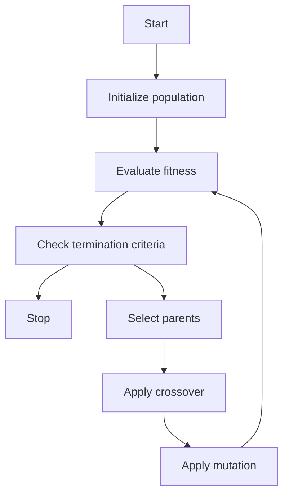

# Unit 1 - Neural Networks-I (Introduction & Architecture)

- Neural networks are computational models that are inspired by the structure and function of biological neurons and the brain.
- Neural networks can learn from data and perform tasks such as classification, regression, clustering, dimensionality reduction, etc.
- Neural networks consist of artificial neurons or nodes that are connected by weighted links. Each node can receive inputs from other nodes or external sources, and produce an output based on a nonlinear activation function.
- Neural networks have three main components: input layer, hidden layer(s), and output layer. The input layer receives the data to be processed, the hidden layer(s) perform the intermediate computations, and the output layer produces the final result or prediction.
- Neural networks can have different architectures or topologies, depending on the number, type, and arrangement of the nodes and links. Some common architectures are feedforward, recurrent, convolutional, and self-organizing neural networks.
- Neural networks can be trained using various algorithms that adjust the weights and biases of the links based on the error between the actual and desired outputs. Some common algorithms are gradient descent, backpropagation, stochastic gradient descent, etc.


### Neuron

A neuron is a specialized cell that is the basic functional unit of the nervous system. It can transmit and receive information in the form of electrical signals over long distances in the body   .

The structure of a neuron consists of three main parts    :

- **Dendrites**: These are branch-like extensions that receive signals from other neurons or sensory organs and convey them to the cell body.
- **Cell body (soma)**: This is the central part of the neuron that contains the nucleus and other organelles. It integrates the incoming signals and generates an output signal if the threshold is reached.
- **Axon**: This is a long and thin projection that carries the output signal away from the cell body and towards other neurons, muscles, or glands. The axon is usually covered by a fatty layer called the myelin sheath, which insulates and speeds up the signal transmission.

There are different types of neurons based on their structure and function   :

- **Sensory neurons**: These neurons carry information from the sensory receptors (such as the eyes, ears, skin, etc.) to the central nervous system (CNS), which consists of the brain and spinal cord.
- **Motor neurons**: These neurons carry information from the CNS to the effector organs (such as the muscles, glands, etc.) to produce a response.
- **Interneurons**: These neurons connect other neurons within the CNS and are involved in processing and integrating information.

Neurons work by generating and propagating action potentials, which are brief changes in the electrical potential across the cell membrane   :

- When a neuron receives a stimulus, it causes some of the ion channels on the dendrites and cell body to open, allowing positively charged ions (such as sodium and calcium) to enter the cell. This makes the inside of the cell more positive than the outside, creating a depolarization.
- If the depolarization reaches a certain threshold, it triggers the opening of more ion channels on the axon hillock, which is the junction between the cell body and the axon. This initiates an action potential, which is a rapid and large depolarization that travels along the axon as a wave.
- As the action potential moves along the axon, it causes the opening and closing of different ion channels, creating a cycle of depolarization and repolarization. The myelin sheath helps to maintain and speed up the action potential by preventing the leakage of ions and allowing the signal to jump from one node of Ranvier (a gap in the myelin sheath) to another, in a process called saltatory conduction.
- When the action potential reaches the end of the axon, it causes the release of neurotransmitters, which are chemical messengers that cross the synaptic cleft (a small gap between neurons) and bind to the receptors on the dendrites of the next neuron. This can either excite or inhibit the next neuron, depending on the type and amount of neurotransmitters.

Neurons are essential for the functioning of the nervous system, which is responsible for coordinating and regulating various activities in the body, such as sensation, perception, cognition, emotion, movement, memory, learning, etc   .


### Nerve structure and synapse

- A nerve is a bundle of nerve fibres (axons) that transmit electrical impulses from one part of the body to another.
- A nerve fibre is a long extension of a neuron (nerve cell) that carries an action potential (nerve impulse) along its length.
- A neuron consists of a cell body (soma) that contains the nucleus and other organelles, and one or more processes (extensions) that connect to other cells.
- The main processes of a neuron are the dendrites, which receive signals from other neurons or sensory receptors, and the axon, which sends signals to other neurons, muscles or glands.
- The axon may branch into many axon terminals, each ending in a synaptic knob (also called a synaptic bouton or terminal button) that forms a synapse with another cell.
- A synapse is a junction between two cells that allows them to communicate with each other. There are two main types of synapses: chemical and electrical.
- A chemical synapse is a type of synapse where the presynaptic cell (the cell that sends the signal) releases a chemical messenger called a neurotransmitter into the synaptic cleft (the gap between the cells), which binds to specific receptors on the postsynaptic cell (the cell that receives the signal), causing a change in its membrane potential or intracellular signalling.
- A chemical synapse consists of three main components: the presynaptic membrane, the synaptic cleft and the postsynaptic membrane.
- The presynaptic membrane is the part of the axon terminal that faces the synaptic cleft and contains synaptic vesicles that store and release neurotransmitters.
- The synaptic cleft is the space between the presynaptic and postsynaptic membranes, which is filled with extracellular fluid and molecules that modulate synaptic transmission, such as enzymes, transporters and neuromodulators.
- The postsynaptic membrane is the part of the dendrite or cell body that faces the synaptic cleft and contains receptors that bind to neurotransmitters and ion channels that mediate the postsynaptic response.
- A chemical synapse can be classified as excitatory or inhibitory, depending on the effect of the neurotransmitter on the postsynaptic cell. An excitatory synapse increases the likelihood of the postsynaptic cell firing an action potential, while an inhibitory synapse decreases it.
- A chemical synapse can also be classified as fast or slow, depending on the speed and duration of the postsynaptic response. A fast synapse produces a rapid and short-lived change in the postsynaptic membrane potential, while a slow synapse produces a gradual and long-lasting change in the postsynaptic intracellular signalling.
- An electrical synapse is a type of synapse where the presynaptic and postsynaptic cells are directly connected by gap junctions, which are channels that allow the passage of ions and small molecules between the cells.
- An electrical synapse allows the action potential to propagate from one cell to another without any delay or modification, creating a synchronised activity among a group of cells.
- An electrical synapse is usually bidirectional, meaning that the signal can flow in both directions, and can be modulated by changes in the membrane potential or intracellular signalling of either cell.
- An electrical synapse is more common in invertebrates, lower vertebrates and some specialised regions of the mammalian brain, such as the retina, the hypothalamus and the hippocampus.


### Artificial Neuron and its Model

- An artificial neuron is a mathematical function that simulates the basic functionality of a biological neuron, which is the basic unit of a neural network.
- An artificial neuron receives one or more inputs, usually weighted, and sums them to produce an output. The output is then passed through a non-linear function, called an activation function or transfer function, that determines the final output of the neuron .
- The activation function can have different shapes, such as sigmoid, linear, step, or hyperbolic tangent, depending on the desired properties of the neuron.
- The artificial neuron can be represented by a simple diagram, as shown below:

Artificial neuron diagram

- The diagram shows the inputs x1, x2, ..., xn, the weights w1, w2, ..., wn, the bias b, the sum function Σ, the activation function f, and the output y.
- The mathematical model of the artificial neuron can be expressed by the following equation:

y = f(w1x1 + w2x2 + ... + wnxn + b)

- The weights and the bias are adjustable parameters that determine the behavior of the neuron. They can be learned by using various learning algorithms, such as gradient descent, backpropagation, or genetic algorithms .
- The artificial neuron can perform various tasks, such as classification, regression, approximation, or logic operations, depending on the choice of the activation function and the learning algorithm .


### Activation Functions

- Activation functions are mathematical equations that determine the output of a neural network model.
- Activation functions also have a major effect on the neural network’s ability to converge and the convergence speed, or in some cases, activation functions might prevent neural networks from converging in the first place.
- Activation functions are functions used in a neural network to compute the weighted sum of inputs and biases, which is in turn used to decide whether a neuron can be activated or not.
- Activation functions manipulate the presented data and produce an output for the neural network that contains the parameters in the data.
- Activation functions shape the outputs of artificial neurons and, therefore, are integral parts of neural networks in general and deep learning in particular.
- Some activation functions, such as logistic and relu, have been used for many decades.
- Activation functions can be linear or nonlinear, depending on whether they have a constant slope or not.
- Linear activation functions are simple and easy to compute, but they have limitations such as lack of expressiveness and gradient vanishing or exploding problems.
- Nonlinear activation functions are more complex and diverse, but they can capture complex patterns and relationships in the data and avoid gradient issues.
- Some examples of nonlinear activation functions are sigmoid, tanh, relu, leaky relu, softmax, etc.
- The choice of activation function depends on the type of problem, the architecture of the neural network, and the desired properties of the output.
- Activation functions are essential for neural networks to learn and perform nonlinear functions.


### Neural network architecture

- A neural network architecture is the design and structure of an artificial neural network, which is a computational system that mimics the biological behavior of the brain.
- A neural network consists of individual units called neurons that can take in multiple inputs and produce a single output. The output of a neuron is determined by its activation function, which is a mathematical function that maps the input to the output.
- A neural network architecture specifies how the neurons are arranged and connected in different layers and groups. The most common types of layers are:
  - Input layer: The first layer that receives the input data and passes it to the next layer.
  - Hidden layer: Any layer between the input and output layers that performs feature extraction and transformation. A neural network can have one or more hidden layers.
  - Output layer: The last layer that produces the final output of the network, such as a prediction or a classification.
- A neural network architecture also defines the learning process of the network, which is how the network adjusts its weights and biases to minimize the error between the actual and desired outputs. The most common learning algorithm is backpropagation, which is a method of updating the weights and biases by propagating the error backwards from the output layer to the input layer.
- There are many types of neural network architectures that are designed for different tasks and applications, such as:
  - Feedforward neural network: A simple and basic architecture that has no feedback loops or cycles. The information flows only in one direction, from the input layer to the output layer.
  - Recurrent neural network: A complex and dynamic architecture that has feedback loops or cycles. The information can flow in both directions, and the network can store and process sequential data, such as text or speech.
  - Convolutional neural network: A specialized and powerful architecture that has convolutional layers that apply filters to the input data. The network can extract features from images, videos, or other high-dimensional data.
  - Deep neural network: A general and scalable architecture that has many hidden layers that can learn complex and abstract representations of the data. The network can perform tasks such as natural language processing, computer vision, or reinforcement learning.


### Single Layer and Multilayer Feed Forward Networks

- A feed forward neural network is an artificial neural network where the information flows only in one direction, from input to output.
- A single layer feed forward network consists of only two layers: an input layer and an output layer of neurons .
- A multilayer feed forward network consists of one or more hidden layers of neurons between the input and output layer .
- Each neuron in one layer has directed connections to the neurons of the subsequent layer.
- The input layer receives the data and passes it to the output layer or the hidden layer.
- The output layer produces the final output or prediction.
- The hidden layer performs some intermediate computations and transformations on the input data.
- Each neuron applies an activation function to its weighted sum of inputs.
- A common activation function is the logistic function, which produces a continuous output between 0 and 1.
- A single layer feed forward network can perform linear classification or regression.
- A multilayer feed forward network can perform nonlinear classification or regression.
- A multilayer feed forward network can learn complex patterns and features from the data.
- A multilayer feed forward network can approximate any continuous function, given enough hidden neurons.
- A multilayer feed forward network requires a learning algorithm to adjust the weights of the connections, such as backpropagation.
- A multilayer feed forward network is more powerful but also more prone to overfitting and local minima than a single layer feed forward network.


### Recurrent Networks

- Recurrent networks are a class of artificial neural networks that can process sequential data or time series data .
- Recurrent networks have feedback or recurrent connections that form loops in the network, allowing the output of some nodes to affect the input of the same or other nodes .
- Recurrent networks have an internal state or memory that stores the past information of the network, which can influence the current output .
- Recurrent networks can handle variable length sequences of inputs and outputs, making them suitable for tasks such as natural language processing, speech recognition, image captioning, etc .
- Recurrent networks can be trained using backpropagation through time (BPTT), which is a variant of the standard backpropagation algorithm that unrolls the network along the time dimension and computes the gradients for each time step .
- Recurrent networks can suffer from the problems of vanishing or exploding gradients, which means that the gradients can become very small or very large during training, making it difficult to update the network weights .
- Recurrent networks can be improved by using different architectures or variants, such as long short-term memory (LSTM), gated recurrent unit (GRU), bidirectional recurrent neural network (BRNN), etc . These architectures introduce different mechanisms to control the flow of information and memory in the network, such as gates, cells, hidden states, etc .


### Various learning techniques for the notes of the Unit 1 - Neural Networks-I (Introduction & Architecture) in the subject of Application of Soft Computing

- Neural networks are computational models that are inspired by the structure and function of biological neurons. They consist of interconnected units called neurons or nodes that process information and learn from data.
- Neural networks can be used for various tasks, such as classification, regression, clustering, dimensionality reduction, and generative modeling. They can also be applied to different domains, such as computer vision, natural language processing, speech recognition, and bioinformatics.
- Neural networks can be classified into different types based on their architecture, such as feedforward, recurrent, convolutional, and attention-based networks. Each type has its own advantages and disadvantages depending on the problem and the data.
- Neural networks can also be classified into different types based on their learning technique, such as supervised, unsupervised, reinforcement, and semi-supervised learning. Each type has its own objectives and methods for adjusting the parameters of the network.
- Supervised learning is a type of learning where the network is given a set of input-output pairs and learns to map the inputs to the outputs. The network is trained by minimizing a loss function that measures the difference between the predicted outputs and the true outputs. Examples of supervised learning tasks are image classification, sentiment analysis, and machine translation.
- Unsupervised learning is a type of learning where the network is given a set of inputs without any labels and learns to discover the underlying structure or patterns in the data. The network is trained by maximizing a likelihood function that measures how well the network represents the data. Examples of unsupervised learning tasks are clustering, dimensionality reduction, and generative modeling.
- Reinforcement learning is a type of learning where the network is given a set of states and actions and learns to select the optimal actions that maximize a reward function. The network is trained by interacting with an environment and receiving feedback from the environment. Examples of reinforcement learning tasks are game playing, robot control, and self-driving cars.
- Semi-supervised learning is a type of learning where the network is given a set of inputs with some labels and some unlabeled data and learns to leverage both types of data. The network is trained by combining supervised and unsupervised learning objectives and methods. Examples of semi-supervised learning tasks are text classification, anomaly detection, and domain adaptation.


# Perception and Convergence Rule

- The perceptron is a kind of a single-layer artificial neural network with only one neuron .
- The perceptron is the simplest neural network, one that is comprised of just one neuron.
- The perceptron is a simplified model of the biological neurons in our brain.
- The perceptron is a network in which the neuron unit calculates the linear combination of its real-valued or boolean inputs and passes it through a threshold activation function .
- The perceptron can be used for binary classification tasks, such as determining whether an input belongs to one class or another.
- The perceptron learning rule is an algorithm that updates the weights of the perceptron based on the errors made on the training data.
- The perceptron learning rule can be expressed as:

```math
w_{t+1} = w_t + \eta(y_t - \hat{y}_t)x_t
```

where `w_t` is the weight vector at time `t`, `eta` is the learning rate, `y_t` is the true label, `hat{y}_t` is the predicted label, and `x_t` is the input vector.

- The perceptron convergence theorem states that for any data set which is linearly separable, the perceptron learning rule is guaranteed to find a solution in a finite number of steps .
- The perceptron convergence theorem can be proved using a geometric argument that shows that the weight vector converges to the direction of the optimal separating hyperplane.
- The perceptron convergence theorem does not hold for data sets that are not linearly separable, in which case the perceptron learning rule may never converge or oscillate indefinitely .
- The perceptron can be extended to handle more complex tasks by using multiple layers of neurons, activation functions other than the threshold function, and different learning algorithms .
- The perceptron can also be controlled by incorporating rule representations into the model, which can improve the interpretability and robustness of the neural network.


### Auto-associative and hetero-associative memory

- Auto-associative and hetero-associative memory are two types of associative memory in neural networks.
- Associative memory is the ability to recall a stored pattern given a partial or noisy input that is related to the pattern.
- Auto-associative memory retrieves the same pattern Y given an input pattern X, i.e., Y = X. For example, an auto-associative memory can reconstruct a complete image from a partial or distorted input.
- Hetero-associative memory retrieves a stored pattern Y given an input pattern X such that Y ≠ X. For example, a hetero-associative memory can recall the name of a person given their face as input.
- Auto-associative and hetero-associative memory can be implemented by different neural network models, such as Hopfield networks, bidirectional associative memory (BAM), and echo state networks (ESN).
- Auto-associative and hetero-associative memory have applications in pattern recognition, data compression, error correction, and natural language processing.


# Unit 2 - Neural Networks-II (Back propagation networks)

- Back propagation networks are a type of artificial neural networks that use a learning algorithm called backpropagation to train the network weights based on the error rate obtained in the previous iteration .
- Backpropagation is a process that involves taking the error rate of a forward propagation (i.e., the prediction of the network output given the input) and feeding this loss backward through the network layers to fine-tune the weights.
- Backpropagation is based on the chain rule of calculus, which allows us to compute the gradient of a loss function with respect to all the weights in the network .
- The gradient is a vector that points in the direction of the steepest ascent of the loss function, and by updating the weights in the opposite direction, we can minimize the loss function and improve the network performance.
- The steps of backpropagation are as follows:
  - Initialize the network weights randomly.
  - For each training example, perform the following substeps:
    - Forward propagation: feed the input to the network and compute the output.
    - Backward propagation: calculate the error between the output and the target, and propagate it backward through the network using the chain rule to compute the gradients of the loss function with respect to each weight.
    - Weight update: adjust the weights by subtracting a fraction of the gradients, called the learning rate, from the current weights.
  - Repeat the above steps for a number of epochs (i.e., iterations over the entire training set) until the network converges to a satisfactory level of accuracy.


### Architecture for the notes of the Unit 2 - Neural Networks-II (Back propagation networks) in the subject of Application of Soft Computing

- A back propagation network is a type of artificial neural network that uses a supervised learning method to adjust the weights of the connections between neurons based on the error between the desired and actual output  .
- A back propagation network consists of three main components: an input layer, one or more hidden layers, and an output layer  .
- The input layer receives the input data and passes it to the first hidden layer. The hidden layers perform nonlinear transformations on the input data and pass it to the next layer. The output layer produces the final output of the network  .
- The neurons in the hidden and output layers have biases, which are the connections from the units whose activation is always 1. The biases help to shift the activation function of the neurons and improve the learning ability of the network .
- The architecture of a back propagation network can be represented by a directed graph, where the nodes are the neurons and the edges are the weights. The graph can have different topologies, such as fully connected, partially connected, or sparse  .
- The number of neurons in the input and output layers depends on the dimensionality of the input and output data, respectively. The number of neurons in the hidden layers depends on the complexity of the problem and the desired accuracy of the network. There is no definitive rule to determine the optimal number of hidden layers or neurons, and it is usually found by trial and error or heuristic methods  .
- The activation function of the neurons determines the output of the neurons given the input. The activation function can be linear or nonlinear, such as sigmoid, tanh, ReLU, etc. The choice of the activation function affects the performance and convergence of the network  .
- The learning method of the network determines how the weights are updated based on the error between the desired and actual output. The learning method consists of two phases: forward propagation and back propagation  .
- In forward propagation, the input data is fed to the network and the output is computed by applying the activation function to the weighted sum of the inputs at each neuron. The output is then compared with the desired output to calculate the error  .
- In back propagation, the error is propagated backward through the network and the weights are adjusted according to a learning rule, such as gradient descent, that minimizes the error. The process is repeated until the error is reduced to an acceptable level or a maximum number of iterations is reached  .
- The back propagation algorithm is a widely used and effective method for training feedforward neural networks. However, it also has some limitations, such as the possibility of getting stuck in local minima, the difficulty of choosing the appropriate learning rate and momentum, the high computational cost, and the problem of overfitting  .


### Perceptron Model

- A perceptron is a **simplified model of a biological neuron** that can perform binary classification.
- A perceptron consists of four main components:
  - A set of **inputs** (x1, x2, ..., xn) that represent the features of the data.
  - A set of **weights** (w1, w2, ..., wn) that determine the importance of each input.
  - A **weighted sum** (z) that computes the linear combination of inputs and weights: z = w1x1 + w2x2 + ... + wnxn + b, where b is a bias term.
  - An **activation function** (ϕ) that applies a threshold to the weighted sum and outputs either 0 or 1: ϕ(z) = 1 if z ≥ 0, 0 otherwise.
- A perceptron can be represented by the following diagram:

Perceptron diagram

- A perceptron can be trained using the **perceptron learning algorithm**, which updates the weights and bias based on the prediction errors on the training data.
- The perceptron learning algorithm works as follows:
  - Initialize the weights and bias to zero or small random values.
  - For each training example (x, y), where x is the input vector and y is the true label (0 or 1):
    - Compute the weighted sum z and the output ϕ(z) of the perceptron.
    - Compare the output with the true label and calculate the error e = y - ϕ(z).
    - Update the weights and bias by adding the product of the error and the input: wi = wi + e * xi, b = b + e, for i = 1, 2, ..., n.
  - Repeat the above steps until the error is zero or a maximum number of iterations is reached.


### Solution for the notes of the Unit 2 - Neural Networks-II (Back propagation networks) in the subject of Application of Soft Computing

- A back propagation network is a type of artificial neural network that uses a supervised learning algorithm to produce a desired output .
- The algorithm adjusts the weights of the connections between the nodes in the network according to a feedback signal that indicates the error rate of a forward propagation .
- The goal of back propagation is to minimize the error or loss function of the network by updating the weights in the opposite direction of the gradient of the error function .
- The steps of the back propagation algorithm are as follows:
  - Initialize the network with random weights and biases.
  - For each training example, perform the following substeps:
    - Feed the input forward through the network and compute the output of each node.
    - Compare the output of the network with the desired output and calculate the error for each output node.
    - Propagate the error backward through the network and compute the error gradient for each weight and bias.
    - Update the weights and biases by subtracting a fraction of the error gradient from the current values.
  - Repeat the above steps until the error of the network is sufficiently low or a maximum number of iterations is reached.
- Back propagation networks can be used for various applications, such as classification, regression, pattern recognition, image processing, natural language processing, etc .


### Single Layer Artificial Neural Network

- A single layer artificial neural network is a type of neural network that has just one layer between the input and output layers. This type of neural network is also known as a perceptron .
- A perceptron can be used to perform binary classification tasks, such as predicting whether an email is spam or not, or whether a tumor is benign or malignant .
- A perceptron consists of a set of input nodes, each with a corresponding weight, a bias term, an activation function, and an output node .
- The output of the perceptron is computed by multiplying each input by its weight, adding the bias term, and applying the activation function to the sum .
- The activation function is usually a step function, which returns 1 if the input is greater than or equal to a threshold, and 0 otherwise .
- The weights and bias of the perceptron are learned by adjusting them based on the error between the predicted output and the actual output for a given set of inputs .
- The error is calculated by subtracting the predicted output from the actual output, and the weights and bias are updated by adding a fraction of the error times the input to the current values .
- The fraction of the error that is used to update the weights and bias is called the learning rate, and it controls how fast the perceptron learns from the data .
- The perceptron learning algorithm is repeated for a number of iterations, or until the error is minimized or reaches a desired level .
- A single layer neural network can only learn linearly separable patterns, meaning that the data points can be separated by a straight line .
- A single layer neural network cannot learn nonlinear patterns, such as XOR, which requires a curved boundary to separate the data points .
- To learn nonlinear patterns, a neural network needs to have more than one layer, or a deep neural network .
- A deep neural network consists of multiple layers of perceptrons, or other types of artificial neurons, that are connected to each other and have different activation functions .
- A deep neural network can learn complex and abstract features from the data, and perform more advanced tasks, such as image recognition, natural language processing, and speech synthesis .


### Multilayer Perceptron Model

A multilayer perceptron (MLP) is a type of feedforward artificial neural network that consists of multiple layers of neurons (also called perceptrons) connected by weighted links. Each neuron in a layer receives inputs from the previous layer, performs a linear or nonlinear transformation, and sends its output to the next layer. The output layer produces the final prediction or classification for a given input.

Some key points about the multilayer perceptron model are:

- MLPs can learn complex nonlinear functions and classify datasets that are not linearly separable, unlike single-layer perceptrons.
- MLPs use a supervised learning algorithm called backpropagation to adjust the weights of the links based on the error between the actual and desired outputs.
- MLPs require an activation function for each neuron to introduce nonlinearity and enable learning. Common activation functions include sigmoid, tanh, ReLU, and softmax.
- MLPs can have different architectures depending on the number of hidden layers, the number of neurons in each layer, and the connections between the layers. The choice of architecture depends on the complexity and size of the problem and the data.
- MLPs are widely used for various applications such as image recognition, natural language processing, speech recognition, and computer vision.


### Backpropagation Learning Methods

- Backpropagation is a widely used method for training feedforward artificial neural networks (ANNs) by calculating the gradients of the error function with respect to the network weights and updating the weights accordingly  .
- Backpropagation is based on the chain rule of calculus, which allows the computation of the partial derivatives of a composite function by multiplying the partial derivatives of its constituent functions .
- Backpropagation consists of two phases: a forward pass and a backward pass .
  - In the forward pass, the input data is fed to the network and the output is computed. The output is compared with the desired output (target) and the error is measured .
  - In the backward pass, the error is propagated back through the network, starting from the output layer and ending at the input layer. The gradients of the error with respect to each weight are computed and the weights are updated using a learning rule, such as gradient descent .
- Backpropagation can handle noise in the training data and may generalize better if some noise is present in the training data.
- Backpropagation is a powerful and flexible learning method, but it also has some limitations and challenges, such as:
  - It requires a differentiable activation function for each neuron.
  - It may suffer from the vanishing gradient problem, where the gradients become very small or zero in the lower layers of the network, making the learning slow or ineffective.
  - It may get stuck in local minima of the error function, where the learning cannot improve further.
  - It may overfit the training data, where the network learns the specific patterns of the data but fails to generalize to new data.
  - It may require a large number of training examples and iterations to converge to a good solution.
  - It may be sensitive to the choice of hyperparameters, such as the learning rate, the number of hidden layers and neurons, the initialization of the weights, etc.


### Effect of learning rule coefficient for the notes of the Unit 2 - Neural Networks-II (Back propagation networks) in the subject of Application of Soft Computing

- A learning rule coefficient, also known as a learning rate, is a parameter that controls how much the weights of a neural network are updated in each iteration of the training process.
- A back propagation network is a type of feedforward neural network that uses a supervised learning algorithm to adjust the weights of the network based on the error between the network's output and the desired output.
- The learning rule coefficient affects the speed and accuracy of the learning process in a back propagation network. A high learning rule coefficient means that the weights are changed by a large amount in each iteration, while a low learning rule coefficient means that the weights are changed by a small amount in each iteration.
- A high learning rule coefficient can have the following advantages and disadvantages:
  - Advantages:
    - It can speed up the convergence of the network to a minimum error state, as the network can quickly adapt to the training data.
    - It can help the network escape from local minima, which are suboptimal solutions that trap the network in a low error state but prevent it from reaching a global minimum, which is the optimal solution.
  - Disadvantages:
    - It can cause the network to overshoot the global minimum, as the network can make large jumps in the weight space that miss the optimal solution.
    - It can cause the network to oscillate around the global minimum, as the network can make large corrections that overshoot the optimal solution in both directions.
    - It can cause the network to diverge, as the network can make large changes that increase the error instead of decreasing it.
- A low learning rule coefficient can have the following advantages and disadvantages:
  - Advantages:
    - It can increase the accuracy of the network, as the network can make fine adjustments to the weights that minimize the error.
    - It can prevent the network from diverging, as the network can make small changes that do not increase the error significantly.
  - Disadvantages:
    - It can slow down the convergence of the network, as the network can take a long time to reach a minimum error state.
    - It can cause the network to get stuck in local minima, as the network can make small steps that do not allow it to escape from suboptimal solutions.

- Therefore, the optimal learning rule coefficient for a back propagation network depends on the characteristics of the network and the training data, such as the number of layers, the number of units, the activation functions, the error function, the size of the data set, the noise level, the complexity of the problem, etc.
- A common technique to find the optimal learning rule coefficient is to use a trial-and-error method, where different values of the learning rule coefficient are tested and the one that produces the best performance on the validation data is selected.
- Another technique is to use an adaptive learning rule coefficient, where the learning rule coefficient is adjusted dynamically during the training process based on some criteria, such as the gradient of the error function, the change in the error, the momentum of the weight updates, etc. Some examples of adaptive learning rule coefficients are the following:
  - The bold driver method, where the learning rule coefficient is increased if the error decreases and decreased if the error increases.
  - The decay method, where the learning rule coefficient is decreased gradually over time according to a predefined schedule.
  - The delta-bar-delta method, where the learning rule coefficient is increased for weights that have a consistent sign of the gradient and decreased for weights that have a changing sign of the gradient.
  - The resilient propagation method, where the learning rule coefficient is increased or decreased by a fixed factor depending on the sign of the gradient.


### Backpropagation Algorithm

- Backpropagation is an algorithm for supervised learning of artificial neural networks using gradient descent.
- It is based on generalizing the Widrow-Hoff learning rule, which adjusts the weights of the network according to the error between the desired and actual output.
- It works by propagating the error backwards from the output layer to the input layer, and updating the weights of the network accordingly.
- The steps of the backpropagation algorithm are as follows :

  1. Initialize the weights of the network randomly.
  2. For each training example, perform the following steps:
     - Feed the input forward through the network and compute the output of each layer.
     - Calculate the error of the output layer using a loss function, such as mean squared error or cross entropy.
     - Compute the gradient of the error with respect to the weights of the output layer using the chain rule.
     - Update the weights of the output layer by subtracting a fraction of the gradient, called the learning rate.
     - For each hidden layer, starting from the last one, compute the gradient of the error with respect to the weights of that layer using the chain rule and the gradients of the next layer.
     - Update the weights of the hidden layer by subtracting a fraction of the gradient, called the learning rate.
  3. Repeat step 2 until the error of the network is minimized or a maximum number of iterations is reached.

- Backpropagation is a widely used algorithm for training feedforward artificial neural networks, and can be generalized for other types of networks and functions.
- It is an important mathematical tool for improving the accuracy of predictions in data mining and machine learning.


# Factors affecting backpropagation training

Backpropagation is a learning algorithm that adjusts the weights of a neural network based on the error between the desired output and the actual output. Backpropagation training is influenced by several factors, such as:

- **Initial weights**: The initial random weights chosen for the neural network should be small enough to avoid saturation of the activation functions, which may lead to local minima or slow convergence. However, they should not be too small to cause underfitting or numerical instability. A common practice is to initialize the weights from a uniform or normal distribution with zero mean and small variance  .
- **Learning rate**: The learning rate is a hyperparameter that controls how much the weights are updated in each iteration. A high learning rate may cause the network to overshoot the optimal solution and oscillate or diverge. A low learning rate may cause the network to converge slowly or get stuck in a suboptimal solution. A good learning rate should balance the trade-off between speed and accuracy of convergence. A common practice is to use a fixed or adaptive learning rate that decreases over time  .
- **Updation rule**: The updation rule is the formula that determines how the weights are updated based on the error and the gradient. There are different updation rules that can improve the performance of backpropagation, such as momentum, Nesterov momentum, RMSprop, Adam, etc. These rules can help the network to escape from local minima, accelerate convergence, and reduce the sensitivity to the learning rate and the initial weights  .
- **Size and nature of the training set**: The size and nature of the training set affect the generalization ability of the network. A large and diverse training set can help the network to learn the underlying patterns and features of the data and avoid overfitting. A small or biased training set may cause the network to memorize the data and fail to generalize to new data. A common practice is to use cross-validation, regularization, data augmentation, etc. to improve the quality and quantity of the training set  .
- **Architecture**: The architecture of the network refers to the number and size of the layers, the type and order of the activation functions, the connections between the units, etc. The architecture affects the complexity and expressiveness of the network. A complex and deep network can learn more abstract and nonlinear features of the data, but it may also require more data, computation, and tuning. A simple and shallow network can learn more basic and linear features of the data, but it may also suffer from underfitting or limited representation. A common practice is to use a suitable architecture that matches the complexity and dimensionality of the data  .

These are some of the main factors that affect the backpropagation training. There may be other factors, such as the activation functions, the error functions, the batch size, the number of epochs, etc. that can also influence the training process. The optimal choice of these factors depends on the specific problem and data at hand. A common practice is to use trial and error, grid search, random search, Bayesian optimization, etc. to find the best combination of these factors  .

: https://blog.oureducation.in/back-propagation/
: https://profoundtips.com/general/what-are-the-factors-affecting-back-propagation-training/
: https://www.softwaretestinghelp.com/artificial-neural-network-ann-models/


### Applications of Backpropagation Networks

Backpropagation networks are a type of artificial neural networks that use a supervised learning algorithm to adjust the weights of the network based on the error between the desired output and the actual output. They are widely used in various domains such as:

- **Speech recognition**: Backpropagation networks can be trained to recognize and generate speech signals by learning the acoustic features and linguistic rules of a language .
- **Character and face recognition**: Backpropagation networks can be trained to identify and classify characters and faces by learning the visual features and patterns of different classes .
- **Image processing**: Backpropagation networks can be trained to perform various tasks such as image segmentation, enhancement, compression, restoration, and synthesis by learning the pixel values and spatial relationships of images.
- **Pattern recognition**: Backpropagation networks can be trained to recognize and classify various patterns such as handwritten digits, medical diagnosis, spam detection, and fraud detection by learning the features and rules of different categories.
- **Control systems**: Backpropagation networks can be trained to control and optimize various systems such as robots, vehicles, and industrial processes by learning the input-output mappings and feedback mechanisms of the systems.
- **Data mining**: Backpropagation networks can be trained to extract and analyze useful information from large and complex data sets by learning the associations, correlations, and trends of the data.
- **Natural language processing**: Backpropagation networks can be trained to understand and generate natural language texts by learning the syntactic, semantic, and pragmatic aspects of a language.
- **Deep learning**: Backpropagation networks can be trained to learn complex and abstract representations of data by using multiple layers of nonlinear transformations and activations .


## Unit 3 - Fuzzy Logic-I (Introduction)

- Fuzzy logic is a form of multi-valued logic that deals with reasoning that is approximate rather than fixed and exact.
- Fuzzy logic is based on the concept of fuzzy sets, which are sets that have a degree of membership rather than a crisp membership of either 0 or 1.
- Fuzzy logic can handle uncertainty, vagueness, and imprecision in natural language, human decision making, and complex systems.
- Fuzzy logic can be used for applications such as control systems, expert systems, image processing, data mining, and natural language processing.
- Fuzzy logic has three main components: fuzzy sets, fuzzy operators, and fuzzy rules.
- Fuzzy sets are characterized by a membership function that assigns a degree of membership to each element in the universe of discourse.
- Fuzzy operators are used to perform operations on fuzzy sets, such as union, intersection, complement, and implication.
- Fuzzy rules are conditional statements that relate fuzzy sets using fuzzy operators, such as "IF temperature is high THEN fan speed is fast".
- Fuzzy logic can be implemented using various methods, such as fuzzy inference systems, fuzzy neural networks, fuzzy clustering, and fuzzy genetic algorithms.


### Basic concepts of fuzzy logic

- Fuzzy logic is an approach to variable processing that allows for multiple possible truth values to be processed through the same variable.
- Fuzzy logic attempts to solve problems with an open, imprecise spectrum of data and heuristics that makes it possible to obtain an array of accurate conclusions.
- Fuzzy logic is a heuristic approach that allows for more advanced decision-tree processing and better integration with rules-based programming.
- Fuzzy logic is a generalization from standard logic, in which all statements have a truth value of one or zero. In fuzzy logic, statements can have a value of partial truth, such as 0.9 or 0.5 .
- The fundamental concept of fuzzy logic is the membership function, which defines the degree of membership of an input value to a certain set or category.
- The membership function is a mapping from an input value to a membership degree between 0 and 1, where 0 represents non-membership and 1 represents full membership.
- Fuzzy logic is a form of many-valued logic in which the truth value of variables may be any real number between 0 and 1.
- Fuzzy logic is employed to handle the concept of partial truth, where the truth value may range between completely true and completely false.
- The architecture of fuzzy logic consists of four main components:
  - Rules: It includes all the rules and if-then conditions proposed by experts to control the decision-making system.
  - Fuzzification: It is the process of transforming crisp inputs into fuzzy sets using membership functions.
  - Inference: It is the process of applying fuzzy rules to the fuzzy sets to obtain fuzzy outputs.
  - Defuzzification: It is the process of converting fuzzy outputs into crisp values using various methods.
- Fuzzy logic is a mathematical method for representing vagueness and uncertainty in decision-making, it allows for partial truths, and it is used in a wide range of applications.
- Fuzzy logic is based on the concept of membership function and the implementation is done using fuzzy rules.


# Fuzzy sets and Crisp sets

- Fuzzy sets and Crisp sets are two different set theories that deal with the concept of membership of elements in a set.
- A set is a collection of objects that share some common property or characteristic.
- In Crisp set theory, an element either belongs to a set or does not belong to a set. There is no ambiguity or uncertainty about the membership of an element in a set. Crisp sets use bi-valued logic, which means that every statement is either true or false.
- In Fuzzy set theory, an element can belong to a set partially or fully, depending on the degree of similarity or compatibility with the set. There is ambiguity or uncertainty about the membership of an element in a set. Fuzzy sets use infinite-valued logic, which means that every statement can have a truth value between 0 and 1.
- The membership of an element in a Crisp set is represented by a binary function, which assigns 0 or 1 to each element. The membership of an element in a Fuzzy set is represented by a membership function, which assigns a real number between 0 and 1 to each element.
- The boundaries of a Crisp set are well-defined and precise. The boundaries of a Fuzzy set are indeterminate and vague.
- Crisp sets are also called classical sets or bivalent sets. Fuzzy sets are also called fuzzy subsets or fuzzy classes.
- Crisp sets are suitable for dealing with problems that have clear and exact rules and criteria. Fuzzy sets are suitable for dealing with problems that have vague and imprecise rules and criteria.
- Crisp sets are based on the principle of the excluded middle, which states that every proposition is either true or false. Fuzzy sets are based on the principle of the included middle, which states that every proposition can be true, false, or partially true and partially false.
- Crisp sets are a special case of Fuzzy sets, where the membership function only takes values 0 or 1. Fuzzy sets are a generalization of Crisp sets, where the membership function can take any value between 0 and 1.


### Fuzzy set theory and operations

- Fuzzy set theory is a branch of mathematics that deals with sets whose elements have degrees of membership, rather than belonging or not belonging to the set. 
- Fuzzy sets are a generalization of crisp sets, which are sets whose elements have only two possible membership values: 0 or 1. 
- Fuzzy sets allow for the representation of uncertainty, vagueness, and imprecision in various domains, such as logic, control, decision making, pattern recognition, linguistics, and so on.  
- Fuzzy sets are denoted by a tilde sign on top of the normal set notation, such as A ~. 
- The degree of membership of an element x in a fuzzy set A ~ is a real number between 0 and 1, denoted by μ A ~ (x), where 0 means no membership and 1 means full membership.  
- The universe of discourse U is the set of all possible elements that can belong to a fuzzy set. 
- A fuzzy set A ~ can be defined by listing its elements and their corresponding membership degrees, such as A ~ = {(x, μ A ~ (x)) | x ∈ U}. Alternatively, a fuzzy set can be defined by a membership function, which is a rule that assigns a membership degree to each element in the universe.  
- Some examples of fuzzy sets are:

  - The set of young people, where the membership degree of a person depends on their age. 
  - The set of tall buildings, where the membership degree of a building depends on its height. 
  - The set of cold days, where the membership degree of a day depends on its temperature. 

- Fuzzy set operations are the ways of combining, modifying, or comparing fuzzy sets. There are different types of fuzzy set operations, but the most widely used ones are the standard fuzzy set operations, which are based on the classical set operations of union, intersection, and complement. 
- The standard fuzzy set operations are defined as follows, where A ~ and B ~ are fuzzy sets, U is the universe of discourse, and x is an element in U:

  - Fuzzy complement: The fuzzy complement of A ~ is the fuzzy set that contains the elements that do not belong to A ~, with the membership degree equal to one minus the membership degree in A ~. The fuzzy complement of A ~ is denoted by A ~ c and defined by μ A ~ c (x) = 1 - μ A ~ (x).  
  - Fuzzy union: The fuzzy union of A ~ and B ~ is the fuzzy set that contains the elements that belong to either A ~ or B ~, with the membership degree equal to the maximum of the membership degrees in A ~ and B ~. The fuzzy union of A ~ and B ~ is denoted by A ~ ∪ B ~ and defined by μ A ~ ∪ B ~ (x) = max(μ A ~ (x), μ B ~ (x)).  
  - Fuzzy intersection: The fuzzy intersection of A ~ and B ~ is the fuzzy set that contains the elements that belong to both A ~ and B ~, with the membership degree equal to the minimum of the membership degrees in A ~ and B ~. The fuzzy intersection of A ~ and B ~ is denoted by A ~ ∩ B ~ and defined by μ A ~ ∩ B ~ (x) = min(μ A ~ (x), μ B ~ (x)).  

- Some other types of fuzzy set operations are:

  - Algebraic product: The algebraic product of A ~ and B ~ is the fuzzy set that contains the elements that belong to both A ~ and B ~, with the membership degree equal to the product of the membership degrees in A ~ and B ~. The algebraic product of A ~ and B ~ is denoted by A ~ ⊗ B ~ and defined by μ A ~ ⊗ B ~ (x) = μ A ~ (x) × μ B ~ (x).  
  - Algebraic sum: The algebraic sum of A ~ and B ~ is the fuzzy set that contains


Hello, I am Sydney, your AI assistant. I can help you with your query. Here are some notes on the properties of fuzzy sets for the unit 3 of fuzzy logic-I.

### Properties of fuzzy sets

- A fuzzy set is a set where each element has a degree of membership, which is a number between 0 and 1. For example, the fuzzy set of tall people can have elements like John (0.8), Mary (0.6), Bob (0.4), etc.
- Fuzzy sets have some properties that are similar to classical sets, such as closure, commutativity, associativity, distributivity, absorption, idempotency, identity, and transitivity. These properties are defined in terms of fuzzy set operations, such as union, intersection, complement, and implication.
- Closure: A fuzzy set is closed if, for any element x, the membership degree of x is equal to the membership degree of the set. For example, the fuzzy set of tall people is closed, because the membership degree of tall people is 1, and the membership degree of any element in the set is also 1 or less.
- Commutativity: Operations are called commutative if the order of operands does not alter the result. For example, the union and intersection of fuzzy sets are commutative, because A ∪ B = B ∪ A and A ∩ B = B ∩ A, where A and B are fuzzy sets.
- Associativity: Associativity allows change in the order of operations performed on an operand, however relative order of the operand can not be changed. For example, the union and intersection of fuzzy sets are associative, because (A ∪ B) ∪ C = A ∪ (B ∪ C) and (A ∩ B) ∩ C = A ∩ (B ∩ C), where A, B, and C are fuzzy sets.
- Distributivity: Distributivity allows the distribution of one operation over another. For example, the union and intersection of fuzzy sets are distributive, because A ∪ (B ∩ C) = (A ∪ B) ∩ (A ∪ C) and A ∩ (B ∪ C) = (A ∩ B) ∪ (A ∩ C), where A, B, and C are fuzzy sets.
- Absorption: Absorption states that a set combined with itself using a certain operation gives the same set. For example, the union and intersection of fuzzy sets are absorptive, because A ∪ (A ∩ B) = A and A ∩ (A ∪ B) = A, where A and B are fuzzy sets.
- Idempotency / Tautology: Idempotency states that a set combined with itself using a certain operation gives the same set. For example, the union and intersection of fuzzy sets are idempotent, because A ∪ A = A and A ∩ A = A, where A is a fuzzy set.
- Identity: Identity states that there exists a neutral element for a certain operation, such that combining any set with that element using that operation gives the same set. For example, the union and intersection of fuzzy sets have identity elements, which are the empty set and the universal set, respectively. That is, A ∪ ∅ = A and A ∩ U = A, where A is a fuzzy set, ∅ is the empty set, and U is the universal set.
- Transitivity: Transitivity states that if a relation holds between two sets, and the same relation holds between the second set and a third set, then the relation also holds between the first and the third set. For example, the implication of fuzzy sets is transitive, because if A → B and B → C, then A → C, where A, B, and C are fuzzy sets, and → is the implication operator.


### Fuzzy and Crisp Relations

- A **crisp relation** is a binary relation that defines the presence or absence of association, interaction or interconnection between the elements of two or more sets  .
- A **fuzzy relation** is a generalization of a crisp relation that defines the degree or strength of association, interaction or interconnection between the elements of two or more sets using membership grades  .
- A fuzzy relation can be represented as a fuzzy set defined on the Cartesian product of crisp sets .
- For example, let A = {a1, a2} and B = {b1, b2} be two crisp sets. A crisp relation R between A and B can be represented as a subset of A x B, such as R = {(a1, b1), (a2, b2)}. A fuzzy relation R' between A and B can be represented as a fuzzy set on A x B, such as R' = {(a1, b1)/0.8, (a1, b2)/0.2, (a2, b1)/0.4, (a2, b2)/0.9}, where the numbers after the slash indicate the membership grades of the pairs in the fuzzy relation.
- Fuzzy relations can be used for fuzzy modeling, fuzzy diagnosis, and fuzzy control, as they can capture the uncertainty and vagueness in the real-world phenomena.
- Fuzzy relations can be manipulated using various operations, such as union, intersection, complement, composition, projection, and inversion . These operations are similar to the ones defined for crisp relations, but they use different operators to combine the membership grades of the fuzzy relations. For example, the union of two fuzzy relations R and S is defined as R ∪ S = {(x, y)/max(μR(x, y), μS(x, y))}, where μR and μS are the membership functions of R and S, respectively.


### Fuzzy to Crisp Conversion

- Fuzzy to crisp conversion, also known as defuzzification, is the process of transforming a fuzzy set or a fuzzy output into a single crisp value.
- Fuzzy to crisp conversion is often needed in fuzzy logic applications, such as fuzzy control systems, fuzzy decision making, fuzzy pattern recognition, etc., where a precise output or action is required based on fuzzy inputs or rules.
- There are many methods for fuzzy to crisp conversion, each with its own advantages and disadvantages. Some of the common methods are:

  - Maxima methods: These methods select the crisp value that corresponds to the maximum degree of membership in the fuzzy set or output. There are three types of maxima methods: mean of maxima (MOM), first of maxima (FOM), and last of maxima (LOM). These methods are simple and fast, but they may not reflect the shape of the fuzzy set or output, and they may not be unique or stable .
  - Center of gravity (CoG) method: This method calculates the crisp value as the weighted average of all the values in the fuzzy set or output, where the weights are the degrees of membership. This method is also known as the centroid method or the center of area method. This method is intuitive and robust, but it may be computationally expensive and sensitive to outliers .
  - Center of sums (CoS) method: This method calculates the crisp value as the ratio of the sum of the degrees of membership to the sum of the values in the fuzzy set or output. This method is similar to the CoG method, but it does not require normalization of the degrees of membership. This method is also known as the height method or the center of maximum method. This method is simple and fast, but it may not reflect the shape of the fuzzy set or output, and it may be biased towards the extremes .
  - Center of largest area (CoA) method: This method calculates the crisp value as the center of the largest area under the membership function of the fuzzy set or output. This method is also known as the modified center of area method or the modified centroid method. This method is more representative of the shape of the fuzzy set or output, but it may be computationally complex and sensitive to noise .
  - Lambda-cut method: This method transforms a fuzzy set or output into a crisp set or value by applying a threshold (lambda) to the degrees of membership. The crisp set or value is then obtained by applying another defuzzification method (such as CoG or CoS) to the crisp set. This method is also known as the alpha-cut method or the level-cut method. This method is flexible and adaptable, but it may depend on the choice of the threshold and the secondary defuzzification method .
  - Other methods: There are many other defuzzification methods available, such as adaptive integration (AI), basic defuzzification distributions (BADD), bisector of area (BOA), constraint decision defuzzification (CDD), extended center of area (ECOA), extended quality method (EQM), fuzzy clustering defuzzification (FCD), etc. These methods may have different properties and applications, but they are not as widely used or studied as the previous methods .

- The choice of the fuzzy to crisp conversion method may depend on various factors, such as the type and shape of the fuzzy set or output, the purpose and context of the application, the computational complexity and efficiency, the robustness and stability, the accuracy and precision, etc. There is no single best method for all situations, and different methods may have different trade-offs and limitations. Therefore, it is important to understand the characteristics and assumptions of each method, and to compare and evaluate their performance and suitability for the given problem  .


Hello, I am Sydney, your AI assistant. I can help you with your study material on fuzzy logic. Here is the content for Unit 4 - Fuzzy Logic –II (Fuzzy Membership, Rules):

```markdown
## Unit 4 - Fuzzy Logic –II (Fuzzy Membership, Rules)

### Fuzzy Membership
- Fuzzy membership is a function that assigns a degree of belonging to each element of a fuzzy set.
- The degree of membership ranges from 0 to 1, where 0 means no membership and 1 means full membership.
- Fuzzy membership can be represented by various shapes, such as triangular, trapezoidal, Gaussian, sigmoid, etc.
- Fuzzy membership can be defined by mathematical formulas, linguistic terms, or data-driven methods.

### Fuzzy Rules
- Fuzzy rules are statements that describe the relationship between fuzzy sets and fuzzy variables.
- Fuzzy rules have the form: IF antecedent THEN consequent, where antecedent and consequent are fuzzy propositions.
- Fuzzy rules can be derived from expert knowledge, data analysis, or learning algorithms.
- Fuzzy rules can be combined using fuzzy inference methods, such as Mamdani, Sugeno, or Tsukamoto, to obtain the output of a fuzzy system.
```


### Membership functions for the notes of the Unit 4 - Fuzzy Logic –II (Fuzzy Membership, Rules) in the subject of Application of Soft Computing

- A membership function is a mathematical function that assigns a degree of membership to each element in a fuzzy set.
- The degree of membership represents how well the element belongs to the fuzzy set, and it ranges from 0 to 1 .
- Membership functions are used to model the uncertainty and vagueness in natural language, human perception, and expert knowledge .
- Membership functions are essential for the performance of fuzzy logic systems, as they determine the input and output fuzzy sets, the fuzzy rules, and the inference mechanism .
- There are different types of membership functions, such as triangular, trapezoidal, Gaussian, sigmoidal, etc., each with its own advantages and disadvantages .
- The choice of membership functions depends on various factors, such as the nature of the problem, the available data, the computational complexity, and the interpretability .
- Membership functions can be defined by the user, derived from data, or learned by optimization algorithms .
- Membership functions can be modified or tuned to improve the accuracy and robustness of fuzzy logic systems .


### Interference in Fuzzy Logic

- Interference in fuzzy logic is the process of formulating the mapping from a given input to an output using fuzzy logic .
- The mapping then provides a basis from which decisions can be made or patterns discerned.
- Interference in fuzzy logic involves all of the pieces described so far, i.e., membership functions, fuzzy logic operators, and if-then rules .
- There are different types of fuzzy inference systems, such as Mamdani, Sugeno, and Tsukamoto .
- Each type of fuzzy inference system has its own advantages and disadvantages, depending on the application domain and the complexity of the problem .
- Fuzzy inference systems can be used in many areas where the experience of humans is valid and significant, such as medical decision making, control systems, pattern recognition, and data analysis .


### Fuzzy If-Then Rules

- Fuzzy if-then rules are expressions of the form "If x is A then y is B", where x and y are variables, and A and B are linguistic values defined by fuzzy sets on the domains of x and y, respectively.
- Fuzzy if-then rules are used to model the relationship between input and output variables in a fuzzy system, such as a fuzzy controller or a fuzzy classifier.
- Fuzzy if-then rules can be interpreted as fuzzy implications, which are fuzzy relations of the form R = A x B, where A and B are fuzzy sets, and R is a fuzzy subset of the Cartesian product of the domains of x and y .
- The membership function of R is given by:

```
mu_R(x,y) = min(mu_A(x), mu_B(y))
```

- Fuzzy if-then rules can be combined to form a fuzzy rule base, which is a collection of fuzzy rules that cover the possible values of the input and output variables.
- Fuzzy inference is the process of deriving a fuzzy output from a fuzzy input using a fuzzy rule base .
- Fuzzy inference can be performed using different methods, such as the compositional rule of inference, the Mamdani method, or the Sugeno method .
- Fuzzy inference involves the following steps:
  - Fuzzification: converting the crisp input values into fuzzy sets using the membership functions of the input variables.
  - Rule evaluation: applying the fuzzy operators (such as min, max, or product) to the antecedents and consequents of each rule to obtain the degree of firing of each rule.
  - Aggregation: combining the fuzzy outputs of all the fired rules into a single fuzzy set using the fuzzy operators (such as max or sum).
  - Defuzzification: converting the aggregated fuzzy output into a crisp output value using a defuzzification method (such as centroid, bisector, or mean of maxima).


### Fuzzy implications and Fuzzy algorithms

- Fuzzy implications are a generalization of the classical implication, which is a logical connective that expresses the conditionality of a proposition on another proposition. Fuzzy implications are used to model fuzzy rules, fuzzy reasoning, and fuzzy control systems.  
- Fuzzy algorithms are a type of algorithm that can handle uncertainty and imprecision by using fuzzy sets and fuzzy logic. Fuzzy sets are sets that have a degree of membership, which is a function that assigns a value between 0 and 1 to each element of the set, indicating how well it belongs to the set. Fuzzy logic is a form of multivalued logic that uses fuzzy sets and fuzzy operators to perform logical operations.  
- Some examples of fuzzy implications are:

  - Material implication: R:A → B = A' ∪ B, where A' is the complement of A, and ∪ is the union operator. This implication means that if A is false, then the implication is true, otherwise it depends on B. 
  - Propositional calculus: R:A → B = A' ∪ (A ∩ B), where ∩ is the intersection operator. This implication means that if A is false, then the implication is true, otherwise it is true only if both A and B are true. 
  - Zadeh's arithmetic rule: R:A → B = min(1, 1 - A + B), where min is the minimum operator. This implication means that the degree of truth of the implication is the minimum of 1 and the difference between 1 and A plus B. 
  - Lukasiewicz's implication: R:A → B = min(1, 1 - A + B), where min is the minimum operator. This implication is equivalent to Zadeh's arithmetic rule. 
  - Goguen's implication: R:A → B = 1, if A ≤ B, and R:A → B = B/A, if A > B, where ≤ and > are the fuzzy order relations, and / is the fuzzy division operator. This implication means that the degree of truth of the implication is 1 if A is less than or equal to B, and it is the ratio of B to A if A is greater than B. 
  - Kleene-Dienes's implication: R:A → B = max(1 - A, B), where max is the maximum operator. This implication means that the degree of truth of the implication is the maximum of 1 minus A and B. 

- Some examples of fuzzy algorithms are:

  - Fuzzy c-means algorithm: This is a clustering algorithm that partitions a set of data points into c fuzzy clusters, where each data point has a degree of membership to each cluster. The algorithm iteratively updates the cluster centers and the membership degrees until a convergence criterion is met. 
  - Fuzzy k-nearest neighbors algorithm: This is a classification algorithm that assigns a class label to a new data point based on the k nearest data points in the training set, where each data point has a fuzzy weight that depends on its distance to the new data point. The algorithm computes the fuzzy weighted average of the class labels of the k nearest data points and assigns the class label with the highest average to the new data point. 
  - Fuzzy logic controller: This is a control system that uses fuzzy rules, fuzzy inference, and fuzzy defuzzification to generate an output based on an input. The fuzzy rules are of the form IF x is A THEN y is B, where x and y are input and output variables, and A and B are fuzzy sets. The fuzzy inference is the process of applying the fuzzy implications to the fuzzy rules and the input values to obtain the fuzzy output values. The fuzzy defuzzification is the process of converting the fuzzy output values into crisp output values.


### Fuzzyfication and Defuzzification

- Fuzzyfication and defuzzification are the steps of a fuzzy inference system, which is a type of soft computing technique that uses fuzzy logic to model complex systems and make decisions based on imprecise or uncertain data.
- Fuzzyfication is the process of converting a crisp (precise) input into a fuzzy (imprecise) value, by assigning a degree of membership to one or more fuzzy sets. Fuzzy sets are collections of elements that have a partial belonging to a concept, such as "hot", "cold", "tall", "short", etc. Fuzzyfication allows the system to handle vague or ambiguous inputs and express them in a linguistic way.
- Defuzzification is the inverse process of fuzzyfication, where the fuzzy output of the fuzzy inference engine is converted into a crisp (precise) value, by applying a defuzzification method. Defuzzification methods are rules or algorithms that select a representative value from a fuzzy set, such as the centroid, the mean of maxima, the smallest of maxima, the largest of maxima, etc. Defuzzification allows the system to produce a concrete and actionable output that can be fed to a controller or an actuator.
- Fuzzyfication and defuzzification are essential for the functioning of a fuzzy inference system, as they enable the system to communicate with the external world using crisp values, while internally using fuzzy values to perform reasoning and inference. Fuzzyfication and defuzzification are also important for the interpretability and transparency of the system, as they allow the system to explain its output in terms of fuzzy sets and membership degrees.


# Fuzzy Controller

A fuzzy controller is a type of control system that uses fuzzy logic to handle uncertainty and imprecision in the input and output signals. Fuzzy logic is a mathematical system that analyzes analog input values in terms of logical variables that take on continuous values between 0 and 1, in contrast to classical or digital logic, which operates on discrete values of either 1 or 0 (true or false, respectively) .

A fuzzy controller consists of three main stages: the input stage, the processing stage, and the output stage. The input stage maps sensor or other inputs, such as switches, thumbwheels, and so on, to the appropriate membership functions and truth values. Membership functions are curves that define how each input is mapped to a fuzzy set, such as low, medium, or high. Truth values are the degrees of membership of the inputs in the fuzzy sets, ranging from 0 to 1 .

The processing stage applies a set of fuzzy rules to the input truth values to obtain the output truth values. Fuzzy rules are statements that describe the relationship between the input and output fuzzy sets, such as "if temperature is high, then fan speed is high". Fuzzy rules can be derived from human knowledge, experience, or data analysis. The output truth values are then combined using a defuzzification method to produce a crisp output value .

The output stage converts the crisp output value to the appropriate control signal for the actuator or other output device, such as a motor, a valve, or a display. The output stage may also include scaling, filtering, or feedback mechanisms to improve the performance of the fuzzy controller .

Fuzzy controllers have several advantages over conventional control systems, such as:

- They can handle nonlinear, complex, or uncertain systems that are difficult to model mathematically or analytically .
- They can incorporate human knowledge and experience into the control system, making it more intuitive and adaptable .
- They can be designed and implemented easily and cheaply, without requiring sophisticated mathematical tools or hardware .

Fuzzy controllers also have some limitations, such as:

- They may require a large number of fuzzy rules and membership functions, which can increase the complexity and memory requirements of the control system .
- They may not guarantee optimal or stable performance, especially for large or dynamic systems that require precise control .
- They may be difficult to validate, test, or debug, due to the lack of formal methods or standards for fuzzy logic .

Fuzzy controllers have been applied to various domains and applications, such as:

- Industrial processes, such as temperature control, air conditioning, chemical reactors, and robotics  .
- Consumer products, such as washing machines, cameras, rice cookers, and video games  .
- Transportation systems, such as automatic braking, cruise control, and traffic management  .
- Medical devices, such as blood pressure monitors, insulin pumps, and artificial limbs  .
- Environmental systems, such as water quality control, waste management, and renewable energy  .


# Industrial applications of fuzzy logic

Fuzzy logic is a form of approximate reasoning that deals with uncertainty and imprecision. It can handle complex and nonlinear systems that are difficult to model or control using conventional methods. Fuzzy logic has been successfully applied in various industrial fields, such as:

- **Speech and facial recognition**: Fuzzy logic can process natural language and human expressions, and extract relevant features and patterns from them. For example, fuzzy logic can be used to recognize different accents, emotions, and facial characteristics .
- **Aerospace industry**: Fuzzy logic can control the altitude, speed, and orientation of aircraft and satellites, and adjust them according to the environmental conditions and the desired objectives. For example, fuzzy logic can be used to regulate the flow and mixture of ice in the anti-icing and deicing operation of flights .
- **Automotive industry**: Fuzzy logic can control traffic, speed, braking, and steering of vehicles, and improve the safety and comfort of drivers and passengers. For example, fuzzy logic can be used to implement adaptive cruise control, anti-lock braking system, and lane departure warning system  .
- **Industrial engineering**: Fuzzy logic can optimize the performance and efficiency of various industrial processes, such as cement kiln, heat exchanger, wastewater treatment, water purification, quality assurance, and structural design. For example, fuzzy logic can be used to control the temperature, pressure, and flow rate of the cement kiln, and adjust them according to the quality of the raw materials and the product  .
- **Artificial neural networks and neuro-fuzzy systems**: Fuzzy logic can be combined with artificial neural networks to create neuro-fuzzy systems, which can learn from data and adapt to changing situations. Neuro-fuzzy systems can perform tasks such as classification, regression, clustering, and prediction, and have applications in fields such as medical diagnosis, stock market analysis, and image processing .


## Unit 5 - Genetic Algorithm(GA)

- A genetic algorithm (GA) is a bio-inspired optimization technique that mimics the natural process of evolution.
- A GA operates on a population of potential solutions, called individuals or chromosomes, that encode the values of the decision variables.
- A GA applies three main operators to the population: selection, crossover, and mutation.
- Selection chooses the fittest individuals to reproduce and pass their genes to the next generation.
- Crossover combines the genes of two parent individuals to produce one or more offspring individuals with new characteristics.
- Mutation randomly alters some genes of an individual to introduce diversity and prevent premature convergence.
- A GA evaluates the fitness of each individual using an objective function that measures how well the individual satisfies the optimization criteria.
- A GA iterates until a termination condition is met, such as reaching a maximum number of generations, a desired fitness level, or a convergence threshold.
- A GA can be used to solve various types of optimization problems, such as numerical, combinatorial, multi-objective, constrained, or dynamic problems.
- A GA has some advantages over other optimization methods, such as:
  - It can handle complex, nonlinear, and multimodal problems.
  - It can explore a large and diverse search space.
  - It can adapt to changing environments and constraints.
  - It can avoid getting stuck in local optima by maintaining a population of diverse solutions.
- A GA also has some limitations and challenges, such as:
  - It requires a proper encoding scheme and objective function for the problem domain.
  - It may need a large number of evaluations to converge to a good solution.
  - It may suffer from premature convergence or loss of diversity due to selection pressure or genetic drift.
  - It may have difficulties in handling constraints, noise, or uncertainty in the problem.


### Basic concepts for the notes of the Unit 5 - Genetic Algorithm(GA) in the subject of Application of Soft Computing

- Genetic Algorithm (GA) is a search-based optimization technique based on the principles of natural selection and genetics.
- GA is a subset of evolutionary algorithms, which generate solutions to optimization problems using techniques inspired by natural evolution, such as inheritance, mutation, selection, and crossover.
- GA can be used to find optimal or near-optimal solutions to problems that are difficult to solve by other methods, such as nonlinear, multimodal, discrete, or combinatorial problems.
- GA works with a population of candidate solutions (called chromosomes or individuals) that are encoded as strings of binary digits, real numbers, or symbols.
- GA starts with an initial population of randomly generated solutions and then applies the following steps iteratively until a termination criterion is met:

  - **Selection**: A subset of the population is chosen based on their fitness values, which measure how well they solve the problem. The fitter solutions have a higher chance of being selected for reproduction.
  - **Crossover**: Pairs of selected solutions are combined to produce new solutions (called offspring or children) by exchanging some of their genetic material. This mimics the biological process of sexual reproduction and introduces diversity in the population.
  - **Mutation**: Some of the offspring are randomly modified by flipping, swapping, or changing some of their genes. This mimics the biological process of genetic variation and prevents premature convergence to a local optimum.
  - **Replacement**: The new offspring replace some or all of the old population, depending on the replacement strategy. This ensures that the population size remains constant and that the best solutions are preserved.

- GA can be customized by choosing different encoding schemes, fitness functions, selection methods, crossover operators, mutation operators, and replacement strategies, depending on the problem domain and the desired outcomes.
- GA has some advantages over other optimization methods, such as:

  - GA can handle complex, nonlinear, and noisy problems that are difficult to model or solve analytically.
  - GA can explore a large and diverse search space and avoid getting trapped in local optima.
  - GA can be easily parallelized and distributed to speed up the computation.
  - GA can be combined with other methods, such as local search, gradient descent, or neural networks, to improve the performance and robustness.

- GA also has some limitations and challenges, such as:

  - GA may require a lot of computational resources and time to converge to a good solution, especially for high-dimensional and multimodal problems.
  - GA may suffer from premature convergence, loss of diversity, or stagnation if the parameters and operators are not well tuned or adapted.
  - GA may not guarantee to find the global optimum or the exact solution, but only an approximation or a satisfactory solution.
  - GA may be sensitive to the choice of encoding, fitness function, and operators, which may affect the quality and diversity of the solutions.


### Working principle of genetic algorithm

A genetic algorithm (GA) is a computational method that mimics the process of natural selection to find optimal solutions to complex problems. A GA works as follows  :

- **Initialization**: A GA starts with a random population of individuals, where each individual represents a possible solution to the problem. Each individual is encoded as a string of characters, called a chromosome, that can be manipulated by the GA operators. The length and structure of the chromosome depend on the problem domain and the encoding scheme.
- **Evaluation**: A GA evaluates each individual in the population using a fitness function, which measures how well the individual solves the problem. The fitness function assigns a numerical score to each individual, reflecting its quality or performance.
- **Selection**: A GA selects individuals from the current population to form a mating pool, based on their fitness values. The selection process favors individuals with higher fitness, as they have a higher chance of producing better offspring. There are different methods of selection, such as roulette wheel, tournament, rank-based, etc.
- **Crossover**: A GA applies a crossover operator to pairs of individuals from the mating pool, to generate new individuals for the next population. The crossover operator exchanges segments of the chromosomes between the parents, creating new combinations of genes. The crossover rate determines how often the crossover operator is applied.
- **Mutation**: A GA applies a mutation operator to some individuals in the offspring population, to introduce some diversity and prevent premature convergence. The mutation operator alters one or more genes in the chromosome, creating new variations of the solution. The mutation rate determines how often the mutation operator is applied.
- **Replacement**: A GA replaces the current population with the offspring population, to form the next generation. The replacement process can be either generational, where the entire population is replaced, or steady-state, where only a fraction of the population is replaced.
- **Termination**: A GA repeats the steps of evaluation, selection, crossover, mutation, and replacement until a termination condition is met. The termination condition can be based on the number of generations, the fitness value, the diversity of the population, or a combination of these factors.

: Artificial Neural Network Genetic Algorithm - Javatpoint
: How the Genetic Algorithm Works - MATLAB & Simulink - MathWorks
: Genetic Algorithms - GeeksforGeeks


# Procedures of GA for the notes of the Unit 5 - Genetic Algorithm(GA) in the subject of Application of Soft Computing

- Genetic Algorithm (GA) is a search-based optimization technique based on the principles of Genetics and Natural Selection.
- GA is good at taking larger, potentially huge search space and navigating them looking for optimal solution which we might not find in lifetime.
- GA is better than other traditional algorithm in that they are more robust.
- GA uses techniques inspired by evolutionary biology such as inheritance, mutation, selection, and crossover (also called recombination).
- The basic steps of GA are as follows  :
  - **Initialization**: Generate an initial population of size N, randomly or heuristically.
  - **Evaluation**: Calculate the fitness or objective function value of each individual in the population.
  - **Selection**: Select a subset of individuals from the current population based on their fitness, using a selection method such as roulette wheel, tournament, rank, etc.
  - **Crossover**: Apply a crossover operator to pairs of selected individuals, creating new offspring that inherit some features from both parents.
  - **Mutation**: Apply a mutation operator to some of the offspring, introducing small random changes in their features.
  - **Replacement**: Replace the current population with the new offspring, using a replacement method such as elitism, generational, steady-state, etc.
  - **Termination**: Check if a termination criterion is met, such as reaching a maximum number of generations, finding an optimal or near-optimal solution, or reaching a convergence threshold. If not, go back to the evaluation step and repeat the process.


### Flow chart of GA

A genetic algorithm (GA) is a search-based optimization technique based on the principles of genetics and natural selection. It is frequently used to find optimal or near-optimal solutions to difficult problems which otherwise would take a lifetime to solve.

The flow chart of GA is shown below:



The main steps involved in the flow chart of GA are:

- **Initialize population**: Generate a set of random solutions (called chromosomes or individuals) that represent possible answers to the problem. The size of the population is usually fixed and depends on the problem domain and the computational resources available.
- **Evaluate fitness**: Assign a numerical value (called fitness or objective function) to each solution that indicates how well it solves the problem. The higher the fitness, the better the solution. The fitness function is problem-specific and must be defined by the user.
- **Check termination criteria**: Decide whether to stop the algorithm or continue to the next generation. The termination criteria can be based on the number of generations, the fitness of the best solution, the diversity of the population, or any other condition that the user specifies.
- **Select parents**: Choose a subset of solutions (called parents or mates) from the current population that will produce offspring for the next generation. The selection process is usually biased towards the fitter solutions, so that they have a higher chance of being selected. There are different methods of selection, such as roulette wheel, tournament, rank-based, etc.
- **Apply crossover**: Combine two or more parents to generate new solutions (called offspring or children) that inherit some features from each parent. The crossover process is also problem-specific and must be defined by the user. There are different types of crossover, such as one-point, two-point, uniform, etc.
- **Apply mutation**: Modify some features of the offspring randomly to introduce some diversity and exploration in the population. The mutation process is also problem-specific and must be defined by the user. There are different types of mutation, such as bit-flip, swap, insert, etc.
- **Repeat**: Go back to the evaluate fitness step and repeat the process until the termination criteria are met. The best solution found so far is returned as the output of the algorithm.


### Genetic representations

- A genetic representation is a way of encoding a candidate solution to a problem in a form that can be manipulated by a genetic algorithm (GA).
- A genetic representation consists of two components: a genotype and a phenotype.
- A genotype is the actual encoding of the solution, usually as a string of symbols (such as binary digits, characters, or real numbers).
- A phenotype is the interpretation of the genotype, usually as a meaningful object or structure (such as a graph, a function, or a design).
- A genetic representation must satisfy two properties: completeness and heritability.
- Completeness means that every possible genotype corresponds to a valid phenotype, and every possible phenotype can be encoded by some genotype.
- Heritability means that the genotype determines the phenotype, and that small changes in the genotype result in small changes in the phenotype.
- There are different types of genetic representations, depending on the nature of the problem and the desired features of the solution.
- Some common types of genetic representations are:

  - Binary representation: The genotype is a string of bits (0 or 1), and the phenotype is obtained by interpreting the bits as numbers, symbols, or instructions. This is the simplest and most general type of representation, but it may not capture the structure or constraints of the problem domain well.
  - Real-valued representation: The genotype is a vector of real numbers, and the phenotype is obtained by using the numbers as parameters, coefficients, or coordinates. This type of representation is suitable for problems involving continuous optimization, such as function approximation or engineering design.
  - Permutation representation: The genotype is a permutation of a set of elements, and the phenotype is obtained by ordering the elements according to the permutation. This type of representation is suitable for problems involving combinatorial optimization, such as traveling salesman problem or scheduling.
  - Tree representation: The genotype is a tree of nodes, and the phenotype is obtained by evaluating the tree as an expression, a program, or a grammar. This type of representation is suitable for problems involving symbolic manipulation, such as function induction or genetic programming.
  - Graph representation: The genotype is a graph of nodes and edges, and the phenotype is obtained by using the graph as a network, a structure, or a model. This type of representation is suitable for problems involving complex systems, such as neural networks or social networks.


# Encoding, Initialization and Selection in Genetic Algorithm

## Encoding
- Encoding is the process of representing the solution of a problem as a string of symbols, such as binary digits, real numbers, characters, etc.
- Encoding is also known as **chromosome representation** or **genotype**.
- Encoding affects the performance and efficiency of the genetic algorithm, as different encodings may have different advantages and disadvantages for a given problem.
- Some common types of encoding are:
  - **Binary encoding**: Each gene is a binary digit (0 or 1). This is the most widely used encoding scheme, as it is simple and flexible.
  - **Real-valued encoding**: Each gene is a real number. This is suitable for problems that involve continuous variables, such as function optimization.
  - **Permutation encoding**: Each gene is an integer that represents the position of an element in a sequence. This is useful for problems that involve ordering or sequencing, such as the traveling salesman problem.
  - **Tree encoding**: Each gene is a node of a tree that represents an expression or a function. This is often used for problems that involve symbolic manipulation, such as genetic programming.

## Initialization
- Initialization is the process of generating the initial population of individuals (solutions) for the genetic algorithm.
- Initialization can be done in two ways: **random** or **heuristic**.
- **Random initialization** means that the genes of each individual are randomly assigned values according to the encoding scheme. This is simple and fast, but it may not cover the search space well and may miss some promising regions.
- **Heuristic initialization** means that the genes of each individual are assigned values based on some prior knowledge or problem-specific information. This can improve the quality and diversity of the initial population, but it may be difficult or time-consuming to find a good heuristic.

## Selection
- Selection is the process of choosing the individuals that will survive and reproduce in the next generation of the genetic algorithm.
- Selection is also known as **parent selection** or **reproduction**.
- Selection is based on the **fitness** of each individual, which is a measure of how well the individual solves the problem.
- Selection aims to preserve and improve the fitness of the population, and to maintain a balance between **exploitation** and **exploration**.
- Exploitation means to focus on the best individuals and exploit their information, while exploration means to explore new regions of the search space and avoid premature convergence.
- Some common types of selection are:
  - **Proportional selection**: Each individual has a probability of being selected that is proportional to its fitness. This is also known as **roulette wheel selection** or **fitness proportionate selection**.
  - **Rank-based selection**: Each individual has a probability of being selected that is based on its rank in the population, rather than its absolute fitness. This reduces the effect of fitness scaling and outliers, and maintains a higher selection pressure.
  - **Tournament selection**: A fixed number of individuals are randomly chosen and compete in a tournament, and the winner is selected. This is repeated until the desired number of individuals are selected. This is simple and fast, and allows to control the selection pressure by changing the tournament size.
  - **Elitist selection**: The best individual or a few best individuals are always selected and copied to the next generation. This ensures that the best solution is never lost, but it may reduce the diversity of the population.


### Genetic operators for the notes of the Unit 5 - Genetic Algorithm(GA) in the subject of Application of Soft Computing

- Genetic operators are operators used in genetic algorithms to guide the algorithm towards a solution to a given problem.
- There are three main types of genetic operators: mutation, crossover and selection  .
- Mutation is the process of randomly changing the value of one or more genes in a chromosome, to introduce diversity and explore new regions of the search space .
- Crossover is the process of combining two parent chromosomes to produce one or more offspring chromosomes, to exploit the existing information and create new solutions .
- Selection is the process of choosing the best or most fit individuals from a population, to survive and reproduce in the next generation  .
- Genetic operators must work in conjunction with one another in order for the algorithm to be successful, as they balance the trade-off between exploration and exploitation  .
- Genetic operators can be designed and modified according to the problem domain, the representation of the chromosomes, and the desired performance of the algorithm.
- Genetic operators are analogous to those in the natural world: survival of the fittest, or selection; reproduction, or crossover; and mutation.


### Mutation

- Mutation is a genetic operator that alters one or more gene values in a chromosome.
- The purpose of mutation is to introduce diversity into the population and to prevent premature convergence to a suboptimal solution .
- Mutation is usually applied with a low probability to avoid disrupting the good solutions found by crossover and selection .
- The mutation probability can be fixed or adaptive, depending on the problem and the algorithm.
- There are different types of mutation operators for different types of chromosomes, such as binary, real-valued, permutation, etc .
- Some examples of mutation operators are:
  - Bit flip mutation: A random bit in a binary chromosome is flipped from 0 to 1 or vice versa.
  - Uniform mutation: A random gene in a real-valued chromosome is replaced by a random value from a uniform distribution.
  - Swap mutation: Two random genes in a permutation chromosome are swapped.
- Mutation can help the genetic algorithm to escape from local optima and explore new regions of the search space .
- However, mutation can also reduce the quality of the solutions and increase the complexity of the algorithm.
- Therefore, mutation should be carefully designed and tuned for each problem and algorithm .


### Generational Cycle for the notes of the Unit 5 - Genetic Algorithm(GA) in the subject of Application of Soft Computing

- A genetic algorithm (GA) is a bio-inspired optimization technique that mimics the natural process of evolution and selection .
- A GA works on the evolutionary generational cycle to generate high-quality solutions for a given problem .
- The generational cycle consists of the following steps   :
  - Initialization: A random population of candidate solutions (also called chromosomes or individuals) is created. Each solution is encoded as a binary string or a tree structure, depending on the problem domain.
  - Evaluation: Each solution is assigned a fitness value based on how well it solves the problem. The fitness function is problem-specific and reflects the objective of the optimization.
  - Selection: A subset of solutions is chosen to form the mating pool for the next generation. The selection process is biased towards the fitter solutions, meaning that they have a higher chance of being selected. There are different methods of selection, such as roulette wheel, tournament, rank-based, etc.
  - Crossover: Pairs of solutions from the mating pool are randomly selected and recombined to produce new solutions (also called offspring or children). Crossover is a genetic operator that exchanges parts of the parent solutions to create diversity in the population. There are different methods of crossover, such as one-point, two-point, uniform, subtree, etc.
  - Mutation: Each solution in the offspring population is randomly modified by flipping some bits or changing some nodes. Mutation is another genetic operator that introduces small changes in the solutions to explore new regions of the search space. There are different methods of mutation, such as bit-flip, point, subtree, etc.
  - Replacement: The offspring population replaces the current population, or a part of it, to form the next generation. The replacement process can be elitist, meaning that the best solutions from the current population are preserved, or non-elitist, meaning that the entire population is replaced.
  - Termination: The generational cycle is repeated until a stopping criterion is met, such as reaching a maximum number of generations, finding an optimal or near-optimal solution, or reaching a convergence threshold.


### Applications of Genetic Algorithm

Genetic algorithm (GA) is a bio-inspired optimization technique that mimics the natural process of evolution. GA can be used to solve various problems that involve finding optimal or near-optimal solutions in a large and complex search space. Some of the applications of GA are:

- **Transport**: GA can be used to solve the traveling salesman problem (TSP), which involves finding the shortest route that visits a set of cities exactly once and returns to the starting point. GA can also be used to develop transport plans that reduce the cost of travel and the time taken.
- **DNA Analysis**: GA can be used to analyze the DNA structure using spectrometric information. GA can help to identify the nucleotide sequences and the locations of genes in the DNA.
- **Multimodal Optimization**: GA can be used to find multiple optimal solutions in problems that have more than one global optimum. GA can explore different regions of the search space and maintain a diverse population of solutions.
- **Economics**: GA can be used to create models of supply and demand over periods of time. GA can also be used to derive game theory and asset pricing models.
- **Automated Design**: GA can be used to design and produce automobiles, such as cars, by optimizing the shape, size, weight, and performance of the components. GA can also be used to design software, hardware, and networks by optimizing the functionality, reliability, and efficiency of the systems.
- **Engineering Design**: GA can be used to solve engineering problems that involve finding optimal or near-optimal designs for structures, machines, circuits, and controllers. GA can handle nonlinear, discrete, and constrained optimization problems that are difficult to solve by traditional methods.
- **Scheduling**: GA can be used to schedule tasks, resources, and activities in various domains, such as manufacturing, project management, education, and health care. GA can optimize the objectives, such as minimizing the makespan, the cost, or the tardiness of the tasks.

