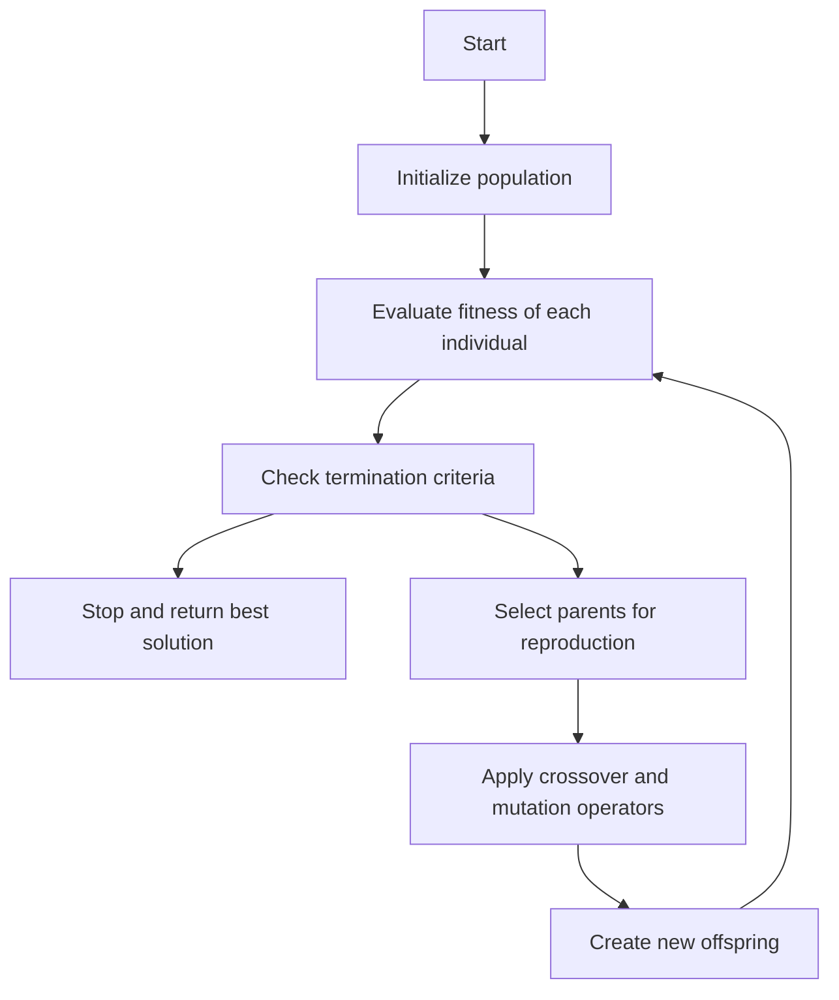
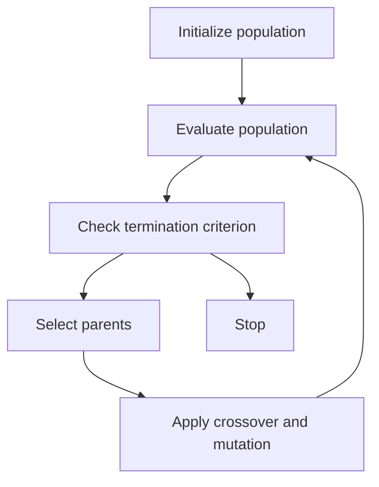

## Unit 1 - Neural Networks-I (Introduction & Architecture)

- Neural networks are computational models that are inspired by the structure and function of biological neurons and synapses.
- Neural networks can learn from data and perform tasks such as classification, regression, clustering, dimensionality reduction, etc.
- Neural networks consist of layers of artificial neurons, also called units or nodes, that are connected by weighted links, also called edges or synapses.
- Each neuron receives inputs from other neurons or external sources, and computes an output based on a nonlinear activation function.
- The output of a neuron can be transmitted to other neurons or used as the final output of the network.
- The weights of the links determine the strength and direction of the influence of one neuron on another.
- The weights can be adjusted by a learning algorithm that minimizes a loss function, which measures the discrepancy between the network output and the desired output.
- The learning algorithm can be supervised, unsupervised, or reinforcement-based, depending on the availability and nature of the data and the task.
- The architecture of a neural network refers to the number, type, and arrangement of the layers and neurons in the network.
- The architecture determines the complexity and capacity of the network, as well as the computational cost and efficiency of the learning and inference processes.
- The most common types of layers are:
  - Input layer: the layer that receives the input data and passes it to the next layer.
  - Hidden layer: the layer that performs some computation on the input or previous layer output and passes it to the next layer.
  - Output layer: the layer that produces the final output of the network.
- The most common types of neurons are:
  - Linear neuron: the neuron that computes a weighted sum of the inputs and adds a bias term.
  - Sigmoid neuron: the neuron that applies a sigmoid function to the linear output, which squashes the output to the range (0, 1).
  - Tanh neuron: the neuron that applies a hyperbolic tangent function to the linear output, which squashes the output to the range (-1, 1).
  - ReLU neuron: the neuron that applies a rectified linear unit function to the linear output, which sets the output to zero if it is negative and keeps it unchanged if it is positive.
  - Softmax neuron: the neuron that applies a softmax function to the linear output, which normalizes the output to a probability distribution over a set of classes.
- The most common types of architectures are:
  - Feedforward neural network: the network that has no cycles or loops in the connections, and the information flows from the input layer to the output layer in one direction.
  - Recurrent neural network: the network that has cycles or loops in the connections, and the information can flow back and forth between the layers, allowing the network to store and process sequential data.
  - Convolutional neural network: the network that has layers that perform convolution operations on the input or previous layer output, which can extract local and hierarchical features from spatial data such as images or videos.
  - Autoencoder: the network that has an encoder layer that compresses the input data to a lower-dimensional representation, and a decoder layer that reconstructs the input data from the representation, which can learn useful features or reduce noise from the data.
  - Generative adversarial network: the network that has a generator layer that produces synthetic data from a random input, and a discriminator layer that tries to distinguish the synthetic data from the real data, which can learn to generate realistic and diverse data.


### Neuron

A neuron is a specialized cell that is the basic functional unit of the nervous system. Neurons communicate with each other and with other cells through electrical signals and chemical messengers. Neurons are responsible for processing and transmitting information in the brain and throughout the body.

The structure of a neuron consists of three main parts:

- **Dendrites**: These are the branch-like extensions that receive signals from other neurons or sensory cells and convey them to the cell body. Dendrites typically have many spines or protrusions that increase their surface area and allow them to form connections with multiple neurons.
- **Cell body (soma)**: This is the central part of the neuron that contains the nucleus and other organelles. The cell body integrates the signals received from the dendrites and generates an output signal that travels along the axon.
- **Axon**: This is the long, thin projection that carries the output signal from the cell body to the target cells, such as other neurons, muscles, or glands. Axons can be very long, reaching up to a meter in length in some cases. Axons are usually covered by a fatty layer called myelin, which insulates them and speeds up the transmission of electrical impulses. Axons end in terminal branches that form synapses with the target cells.

The diagram below shows the structure of a typical neuron:

neuron diagram

There are different types of neurons based on their shape, function, and location. Some of the common types are:

- **Sensory neurons**: These are the neurons that receive sensory information from the external or internal environment and relay it to the central nervous system. For example, sensory neurons in the skin detect touch, temperature, and pain stimuli and send signals to the spinal cord and brain.
- **Motor neurons**: These are the neurons that control the movement of muscles and glands. They receive signals from the central nervous system and transmit them to the effector cells. For example, motor neurons in the spinal cord stimulate the contraction of skeletal muscles and control voluntary movements.
- **Interneurons**: These are the neurons that connect other neurons within the central nervous system. They are involved in various functions, such as integrating sensory and motor information, coordinating reflexes, learning, memory, and cognition.

Neurons work by generating and propagating electrical signals called action potentials. An action potential is a brief change in the voltage across the membrane of a neuron, caused by the movement of ions in and out of the cell. An action potential is triggered when the neuron receives enough stimulation from other neurons or sensory cells. The action potential then travels along the axon until it reaches the synapse, where it causes the release of chemical messengers called neurotransmitters. Neurotransmitters bind to receptors on the target cells and either excite or inhibit them, depending on the type of neurotransmitter and receptor. This way, neurons communicate and modulate the activity of other cells.

Neurons are essential for the functioning of the nervous system and the body. They enable us to sense, think, feel, and act. Neurons are also involved in various processes, such as memory formation, learning, emotion, motivation, and behavior. Neurons are constantly forming new connections and modifying existing ones, which allows the nervous system to adapt and change in response to experience. Neurons are also vulnerable to damage and disease, which can impair their function and lead to various neurological disorders.


### Nerve structure and synapse

- A nerve is a bundle of nerve fibres (axons) that transmit electrical impulses from one part of the body to another.
- A nerve fibre is a long extension of a nerve cell (neuron) that carries an action potential (a brief change in the electrical charge of the cell membrane) along its length.
- A neuron consists of three main parts: a cell body (soma), which contains the nucleus and other organelles; a dendrite, which is a branched projection that receives signals from other neurons or sensory receptors; and an axon, which is a long projection that sends signals to other neurons, muscles or glands.
- A synapse is a structure that allows a neuron to communicate with another neuron or a target cell. There are two main types of synapses: chemical and electrical.
- A chemical synapse is a type of synapse where the presynaptic neuron (the neuron that sends the signal) releases a chemical messenger called a neurotransmitter into the synaptic cleft (a small gap between the presynaptic and postsynaptic cells). The neurotransmitter binds to specific receptors on the postsynaptic cell (the cell that receives the signal), causing a change in its membrane potential or intracellular signalling.
- An electrical synapse is a type of synapse where the presynaptic and postsynaptic cells are connected by gap junctions (channels that allow the direct flow of ions and small molecules between cells). Electrical synapses allow the rapid and synchronous transmission of electrical signals between cells.
- The structure and function of synapses are essential for the processing and integration of information in the nervous system. Synapses can be excitatory (increasing the likelihood of the postsynaptic cell to fire an action potential) or inhibitory (decreasing the likelihood of the postsynaptic cell to fire an action potential). Synapses can also be modulated by various factors, such as the frequency and timing of the presynaptic signals, the availability and breakdown of the neurotransmitters, and the activity of other neurons or glial cells (supportive cells of the nervous system).


### Artificial Neuron and its Model

- An artificial neuron is a mathematical function that simulates the basic functionality of a biological neuron .
- An artificial neuron receives one or more inputs, applies a weight to each input, and sums them to produce an output .
- The output of an artificial neuron is usually passed through a non-linear function known as an activation function or transfer function .
- The activation function determines the output range and the threshold of the artificial neuron .
- The activation function can have different shapes, such as sigmoid, step, linear, or hyperbolic tangent .
- An artificial neuron can be represented by the following diagram :

Artificial neuron diagram

- In the diagram, x1, x2, ..., xn are the inputs, w1, w2, ..., wn are the weights, b is the bias, net is the weighted sum, f is the activation function, and y is the output .
- The weighted sum net is calculated as follows :

net = w1 * x1 + w2 * x2 + ... + wn * xn + b

- The output y is calculated as follows :

y = f(net)

- The weights and the bias are adjustable parameters that determine the behavior of the artificial neuron .
- The weights and the bias can be learned from data using various learning algorithms, such as gradient descent, backpropagation, or genetic algorithms .
- An artificial neuron is the basic unit of an artificial neural network, which is a system of interconnected artificial neurons that can perform complex tasks, such as pattern recognition, classification, regression, or control  .
- An artificial neural network can have different architectures, such as feedforward, recurrent, convolutional, or deep  .
- An artificial neural network can be trained using supervised, unsupervised, or reinforcement learning methods  .


### Activation Functions

- Activation functions are mathematical equations that determine the output of a neural network model.
- Activation functions also have a major effect on the neural network’s ability to converge and the convergence speed, or in some cases, activation functions might prevent neural networks from converging in the first place.
- Activation functions are functions used in a neural network to compute the weighted sum of inputs and biases, which is in turn used to decide whether a neuron can be activated or not.
- Activation functions manipulate the presented data and produce an output for the neural network that contains the parameters in the data.
- Activation functions shape the outputs of artificial neurons and, therefore, are integral parts of neural networks in general and deep learning in particular.
- Some activation functions, such as logistic and relu, have been used for many decades.
- Activation functions can be linear or nonlinear, depending on whether they preserve or distort the linearity of the input data.
- Activation functions can be classified into four main types: threshold, sigmoid, hyperbolic tangent, and rectified linear unit.
- Threshold activation function outputs a binary value (0 or 1) based on whether the input exceeds a certain threshold.
- Sigmoid activation function outputs a value between 0 and 1, which can be interpreted as a probability or a degree of activation.
- Hyperbolic tangent activation function outputs a value between -1 and 1, which can be interpreted as a positive or negative activation.
- Rectified linear unit activation function outputs the input value if it is positive, and 0 otherwise.
- The choice of activation function depends on the type of problem, the architecture of the neural network, and the desired properties of the output.
- Some of the desired properties of activation functions are: differentiability, monotonicity, smoothness, boundedness, and non-saturation.
- Differentiability allows the use of gradient-based optimization methods, such as backpropagation, to train the neural network.
- Monotonicity ensures that the output of the activation function increases or decreases as the input increases or decreases.
- Smoothness ensures that the output of the activation function does not have abrupt changes or discontinuities.
- Boundedness ensures that the output of the activation function is within a finite range, which can prevent numerical instability or overflow.
- Non-saturation ensures that the output of the activation function does not approach a constant value as the input becomes large or small, which can prevent vanishing or exploding gradients.


### Neural network architecture

- A neural network architecture is the design and structure of an artificial neural network, which is a computational system inspired by the biological brain.
- A neural network consists of artificial neurons, which are units that can receive inputs, process them, and produce an output. The neurons are connected by weights, which determine the strength and direction of the signal transmission.
- A neural network architecture can be described by the following components:
  - The number of layers, which are groups of neurons that perform a similar function. There are three types of layers: input, hidden, and output. The input layer receives the data, the hidden layer(s) extract features, and the output layer produces the prediction or classification.
  - The number of neurons in each layer, which affects the complexity and capacity of the network. The number of neurons in the input and output layers depends on the dimensionality of the data and the task, while the number of neurons in the hidden layer(s) is usually determined by trial and error or optimization methods.
  - The activation function, which is a mathematical function that determines the output of a neuron based on its input. The activation function introduces non-linearity to the network, which enables it to learn complex patterns. Some common activation functions are sigmoid, tanh, ReLU, and softmax.
  - The learning algorithm, which is a method that updates the weights of the network based on the error between the actual and desired output. The learning algorithm aims to minimize the loss function, which measures the discrepancy between the network's prediction and the ground truth. Some common learning algorithms are gradient descent, backpropagation, and stochastic gradient descent.
- There are many types of neural network architectures, each with different characteristics and applications. Some examples are:
  - Feedforward neural network, which is the simplest and most basic type of neural network. It has a single direction of information flow, from the input layer to the output layer, without any feedback loops or cycles. It can be used for regression and classification tasks, such as image recognition, natural language processing, and speech recognition.
  - Recurrent neural network, which is a type of neural network that has feedback loops or cycles in its structure. It can store and process sequential data, such as time series, text, and audio. It can be used for tasks such as natural language generation, machine translation, and speech synthesis.
  - Convolutional neural network, which is a type of neural network that has convolutional layers, which are composed of filters that slide over the input and perform local operations. It can extract features from spatial data, such as images, videos, and maps. It can be used for tasks such as object detection, face recognition, and semantic segmentation.
  - Deep neural network, which is a type of neural network that has multiple hidden layers, which can learn more abstract and complex features from the data. It can achieve high performance and accuracy on various tasks, such as computer vision, natural language understanding, and reinforcement learning.


### Single layer and multilayer feed forward networks

- A feedforward neural network is an artificial neural network where the information flows only in one direction, from input to output.
- A feedforward neural network consists of three main parts: an input layer, one or more hidden layers, and an output layer.
- Each layer consists of one or more computational units, called neurons, that perform some mathematical operation on the input data and pass the result to the next layer.
- Each neuron in one layer has directed connections to the neurons of the subsequent layer, and each connection has a weight that determines the strength of the signal.
- The activation function of a neuron is a function that maps the weighted sum of the inputs to the output of the neuron.
- A common choice of activation function is the sigmoid function, which has the form: `f(x) = 1 / (1 + e^(-x))`.
- A single layer feedforward network is a network that has only one layer of neurons between the input and output layer.
- A single layer feedforward network can perform linear classification or regression tasks, but it cannot handle nonlinear problems.
- A multilayer feedforward network is a network that has one or more hidden layers of neurons between the input and output layer.
- A multilayer feedforward network can approximate any continuous function, given enough hidden neurons and a suitable activation function.
- A multilayer feedforward network can perform nonlinear classification or regression tasks, as well as complex tasks such as image recognition, natural language processing, and speech synthesis.
- A multilayer feedforward network can be trained using the backpropagation algorithm, which is a method of adjusting the weights of the connections based on the error between the desired and actual output.


### Recurrent Networks

- Recurrent networks are a class of artificial neural networks that can process sequential data or time series data .
- Recurrent networks have feedback or recurrent connections that form loops in the network, allowing the output of some nodes to affect the input of the same or other nodes .
- Recurrent networks have an internal state or memory that can store past information and use it to influence the current output .
- Recurrent networks can handle variable length sequences of inputs and outputs, making them suitable for tasks such as natural language processing, speech recognition, machine translation, and image captioning .
- Recurrent networks can be trained using backpropagation through time (BPTT), which is a variant of the standard backpropagation algorithm that unrolls the network along the time dimension and computes the gradients for each time step.
- Recurrent networks can suffer from the vanishing or exploding gradient problem, which means that the gradients can become very small or very large as they propagate through time, making the learning unstable or ineffective.
- Recurrent networks can be improved by using different architectures or variants, such as long short-term memory (LSTM), gated recurrent unit (GRU), bidirectional recurrent neural network (BRNN), and attention mechanism.


### Various learning techniques for the notes of the Unit 1 - Neural Networks-I (Introduction & Architecture) in the subject of Application of Soft Computing

- Neural networks are computational models that try to emulate the human brain, combining computer science and statistics to solve common problems in the field of artificial intelligence, machine learning and deep learning.
- Neural networks consist of layers of interconnected nodes, each node performing a simple mathematical operation on its inputs and passing the output to the next layer. The nodes are also called neurons, and the layers are called input layer, hidden layer(s) and output layer.
- Neural networks can learn from data by adjusting the weights and biases of the nodes, which are the free parameters of the model. The learning process involves finding the optimal values of these parameters that minimize a predefined loss function, which measures the discrepancy between the network's output and the desired output.
- There are different learning techniques that can be used in neural networks, depending on the type and availability of the data, the structure and complexity of the network, and the desired outcome. Some of the common learning techniques are :
  - Supervised learning: The network is trained with labeled data, which means that each input is associated with a known output. The network learns to map the inputs to the outputs by minimizing the loss function. Examples of supervised learning tasks are classification and regression.
  - Unsupervised learning: The network is trained with unlabeled data, which means that the output is unknown or irrelevant. The network learns to discover the underlying structure or patterns in the data by maximizing some objective function. Examples of unsupervised learning tasks are clustering and dimensionality reduction.
  - Reinforcement learning: The network is trained with feedback from the environment, which means that the output is not given but evaluated by a reward or penalty. The network learns to optimize its behavior by maximizing the cumulative reward. Examples of reinforcement learning tasks are control and decision making.
  - Semi-supervised learning: The network is trained with a combination of labeled and unlabeled data, which means that some of the inputs have known outputs and some do not. The network learns to leverage both types of data by using the labeled data to guide the learning of the unlabeled data. Examples of semi-supervised learning tasks are self-training and co-training.
- The architecture of the neural network refers to the number, size and arrangement of the layers and nodes, as well as the connections and activation functions between them. The architecture determines the capacity and complexity of the network, as well as its suitability for different learning tasks and data types. Some of the common architectures are  :
  - Feedforward network: The network has a simple structure, where the nodes are arranged in layers and the connections are directed from the input layer to the output layer, without any loops or cycles. The network can learn a fixed mapping from the inputs to the outputs, but cannot capture temporal or sequential dependencies. Examples of feedforward networks are perceptron, multilayer perceptron and convolutional neural network.
  - Recurrent network: The network has a complex structure, where the nodes are arranged in layers and the connections are directed both forward and backward, creating loops or cycles. The network can learn a dynamic mapping from the inputs to the outputs, and can capture temporal or sequential dependencies. Examples of recurrent networks are simple recurrent network, long short-term memory and gated recurrent unit.
  - Self-organizing network: The network has a flexible structure, where the nodes are arranged in a grid or a map and the connections are adaptive and competitive, creating clusters or regions. The network can learn to organize the inputs into meaningful groups or categories, and can capture spatial or topological dependencies. Examples of self-organizing networks are self-organizing map and growing neural gas.


### Perception and Convergence Rule

- A perceptron is a kind of a single-layer artificial neural network with only one neuron.
- A perceptron is a simplified model of the biological neurons in our brain.
- A perceptron calculates the linear combination of its inputs and passes it through a threshold activation function.
- A perceptron can be used for binary classification tasks, such as detecting whether an email is spam or not.
- The perceptron learning rule is an algorithm that updates the weights of the perceptron based on the errors made on the training data.
- The perceptron convergence theorem states that for any data set that is linearly separable, the perceptron learning rule is guaranteed to find a solution in a finite number of steps.
- The perceptron convergence theorem can be proved by showing that the weight vector of the perceptron converges to a vector that is orthogonal to the decision boundary.
- The perceptron learning rule can be modified to incorporate a rule encoder that enables a shared representation for decision making based on predefined rules.
- The perceptron is the building block of artificial neural networks, and can be extended to multilayer perceptrons that use more complex activation functions and can learn nonlinear functions.


### Auto-associative and hetero-associative memory

- Auto-associative and hetero-associative memory are two types of associative memory in neural networks.
- Associative memory is the ability to recall a stored pattern given a partial or noisy input that is related to the pattern.
- Auto-associative memory retrieves the same pattern Y given an input pattern X, i.e., Y = X.
- Hetero-associative memory retrieves a stored pattern Y given an input pattern X such that Y ≠ X.
- Auto-associative memory is also known as unidirectional memory, while hetero-associative memory is also known as bidirectional memory.
- Auto-associative memory can be used for pattern completion, noise reduction, and data compression.
- Hetero-associative memory can be used for pattern recognition, classification, and mapping.
- Auto-associative memory can be implemented by recurrent neural networks, such as Hopfield network and Boltzmann machine.
- Hetero-associative memory can be implemented by feedforward neural networks, such as perceptron and multilayer perceptron.
- Auto-associative memory can store multiple patterns in a single network, while hetero-associative memory requires a separate network for each pair of patterns.
- Auto-associative memory can learn patterns in an unsupervised manner, while hetero-associative memory requires supervised learning with target outputs.
- Auto-associative memory can recall patterns based on similarity, while hetero-associative memory can recall patterns based on association.


## Unit 2 - Neural Networks-II (Back propagation networks)

- Back propagation networks are a type of artificial neural networks that use a learning algorithm called backpropagation to train the network weights based on the error rate obtained in the previous iteration .
- Backpropagation is a process that involves taking the error rate of a forward propagation (i.e., the prediction of the network output based on the input) and feeding this loss backward through the network layers to fine-tune the weights.
- Backpropagation is based on the chain rule of calculus, which allows us to compute the gradient of a loss function with respect to all the weights in the network by applying the product rule repeatedly.
- The gradient of the loss function is a vector that points in the direction of the steepest ascent of the loss function, which means that subtracting the gradient from the weights will move them towards the direction of the steepest descent, or the minimum of the loss function.
- The steps of the backpropagation algorithm are as follows:
  - Initialize the network weights randomly.
  - For each training example:
    - Perform a forward pass to compute the network output and the loss function.
    - Perform a backward pass to compute the gradient of the loss function with respect to each weight using the chain rule.
    - Update the weights by subtracting a fraction of the gradient, called the learning rate, from the current weights.
  - Repeat the above steps for a fixed number of iterations, called epochs, or until the loss function reaches a desired value or stops decreasing.
- Backpropagation is the essence of neural network training, as it allows the network to learn from its own errors and adjust its weights accordingly to improve its performance .


### Architecture of Back Propagation Networks

- A back propagation network is a type of artificial neural network that uses a supervised learning algorithm to train the network weights.
- A back propagation network consists of three main components: an input layer, one or more hidden layers, and an output layer.
- The input layer receives the input data and passes it to the first hidden layer. The hidden layers perform nonlinear transformations on the input data and pass it to the next layer. The output layer produces the final output of the network.
- The network is feed-forward, which means that the data flows from the input layer to the output layer in one direction. There are no feedback loops or recurrent connections in the network.
- The network is fully connected, which means that every neuron in one layer is connected to every neuron in the next layer. Each connection has a weight that determines the strength of the signal between the neurons.
- The network also has biases, which are special neurons that have a constant activation of 1. The biases are connected to the neurons in the hidden and output layers and act as thresholds for the activation functions.
- The network uses an activation function to determine the output of each neuron. The activation function can be linear, sigmoid, tanh, relu, or any other nonlinear function that maps the input to the output.
- The network learns by adjusting the weights and biases based on the error between the actual output and the desired output. The error is calculated using a loss function, such as mean squared error, cross entropy, or any other function that measures the difference between the outputs.
- The network uses a learning algorithm called back propagation to update the weights and biases. Back propagation is a method of gradient descent that computes the gradient of the loss function with respect to the weights and biases using the chain rule of calculus.
- Back propagation consists of two phases: forward propagation and backward propagation. In forward propagation, the network computes the output for a given input and calculates the error. In backward propagation, the network propagates the error back through the layers and updates the weights and biases using the gradient and a learning rate.


### Perceptron Model

- A perceptron is a **simplified model of a biological neuron** that can perform binary classification.
- A perceptron has four key components:
  - **Inputs**: A set of numerical features that represent the data, such as x1, x2, ..., xn.
  - **Weights**: A set of coefficients that determine how much each input contributes to the output, such as w1, w2, ..., wn.
  - **Bias**: A constant term that shifts the decision boundary, such as b.
  - **Activation function**: A function that maps the weighted sum of the inputs and the bias to the output, such as a step function or a sigmoid function.
- The output of a perceptron is given by the following formula:

  ```math
  y = \phi(w_1x_1 + w_2x_2 + ... + w_nx_n + b)
  ```

  where y is the output, \phi is the activation function, w_i is the weight for the i-th input, x_i is the i-th input, and b is the bias.
- The perceptron can be trained using a learning algorithm that updates the weights and the bias based on the error between the predicted output and the actual output.
- The perceptron can be used to model linearly separable problems, such as logical operations (AND, OR, NOT) or simple classification tasks.
- The perceptron can be extended to a multi-layer perceptron, which consists of multiple perceptrons arranged in layers, to model more complex and nonlinear problems.


### Solution for the notes of the Unit 2 - Neural Networks-II (Back propagation networks) in the subject of Application of Soft Computing

- A back propagation network is a type of artificial neural network that uses a supervised learning algorithm to produce a desired output .
- The algorithm adjusts the weights of the connections between the nodes in the network according to a feedback signal that indicates the error between the actual output and the desired output .
- The feedback signal is obtained by comparing the output of the network with the target output for a given input pattern.
- The error is then propagated backwards through the network, layer by layer, using the chain rule of calculus .
- The weights are updated by a small amount in the opposite direction of the gradient of the error function with respect to each weight .
- The process is repeated for each input pattern until the error is minimized or a predefined criterion is met.
- The advantages of back propagation networks are that they can learn complex nonlinear functions, generalize well to unseen data, and adapt to changing environments .
- The disadvantages of back propagation networks are that they can be slow to converge, prone to overfitting, and sensitive to the choice of parameters such as learning rate, momentum, and network architecture .
- Some applications of back propagation networks are image recognition, natural language processing, speech recognition, and control systems  .


### Single Layer Artificial Neural Network

- A single layer artificial neural network is a type of neural network that has just one layer between the input and output layers. This type of neural network is also known as a perceptron .
- A perceptron can be used to perform binary classification tasks, such as predicting whether an email is spam or not, or whether a tumor is benign or malignant.
- A perceptron consists of a set of input nodes, each with a corresponding weight, a bias term, an activation function, and an output node  .
- The input nodes receive the features of the data, such as the words in an email or the size of a tumor. The weights are the parameters that determine how much each input contributes to the output. The bias term is a constant that shifts the output. The activation function is a nonlinear function that maps the weighted sum of the inputs and the bias to the output. The output node produces the final prediction, usually 0 or 1  .
- The perceptron can be trained using a learning algorithm, such as the gradient descent algorithm, that updates the weights and the bias based on the error between the predicted output and the actual output. The goal is to minimize the error and make the perceptron learn the optimal decision boundary that separates the classes  .
- A single layer neural network has some limitations, such as the inability to learn complex nonlinear patterns or to solve problems that are not linearly separable, such as the XOR problem. To overcome these limitations, multiple layers of neurons can be stacked together to form a multilayer neural network or a deep neural network.


### Multilayer Perceptron Model

- A multilayer perceptron (MLP) is a type of feedforward artificial neural network (ANN) that consists of multiple layers of neurons (also called perceptrons) connected by weighted links.
- A perceptron is a simple unit that takes a vector of inputs, applies a linear transformation, and outputs a binary value based on a threshold function.
- A layer is a group of perceptrons that share the same inputs and outputs. The first layer is called the input layer, the last layer is called the output layer, and the layers in between are called hidden layers.
- An activation function is a nonlinear function that maps the output of a perceptron to a value between 0 and 1 (or -1 and 1). It introduces nonlinearity to the network and allows it to learn complex patterns.
- Some common activation functions are sigmoid, tanh, ReLU, softmax, etc.
- A multilayer perceptron can learn to approximate any continuous function, given enough hidden units and training data.
- The learning process of a multilayer perceptron is based on adjusting the weights of the links between the neurons, using a technique called backpropagation.
- Backpropagation is an algorithm that computes the gradient of the error function with respect to the weights, and updates them in the opposite direction of the gradient, using a learning rate parameter.
- The error function is a measure of how well the network predicts the desired outputs, given the inputs. It is usually defined as the sum of squared errors or the cross-entropy loss.
- The learning rate is a hyperparameter that controls how much the weights are changed at each iteration. A high learning rate can lead to faster convergence, but also to instability or divergence. A low learning rate can lead to slower convergence, but also to better accuracy or generalization.
- A multilayer perceptron can be used for various tasks, such as classification, regression, clustering, dimensionality reduction, etc.
- A multilayer perceptron can be implemented using various frameworks, such as TensorFlow, PyTorch, Keras, etc.


### Backpropagation Learning Methods

Backpropagation learning methods are a class of algorithms for training feedforward artificial neural networks (ANNs) using the gradient descent optimization technique. The main idea of backpropagation is to propagate the errors (or differences) between the actual and desired outputs of the network backwards through the layers, and adjust the weights of the connections accordingly.

The steps of backpropagation learning are as follows:

- Initialize the weights of the network randomly or with some heuristic method.
- Present an input pattern to the network and compute the output of each layer using the activation functions.
- Compare the output of the network with the desired output and calculate the error for each output unit.
- Propagate the error backwards from the output layer to the hidden layers, using the chain rule of differentiation and the derivative of the activation functions.
- Update the weights of each connection by subtracting a fraction of the error gradient with respect to the weight. This fraction is called the learning rate and controls the speed and stability of the learning process.
- Repeat steps 2 to 5 for each input pattern in the training set, until the error is minimized or some stopping criterion is met.

Backpropagation learning methods have some advantages and disadvantages, such as:

- Advantages:
  - They can learn complex nonlinear functions and generalize well to unseen data, given enough training examples and hidden units.
  - They are widely available and supported by most commercial neural network software and frameworks.
  - They can handle noise and uncertainty in the training data and may improve their performance with some regularization techniques.
- Disadvantages:
  - They can be slow and computationally expensive, especially for large and deep networks.
  - They can get stuck in local minima of the error function and fail to find the optimal solution.
  - They can suffer from overfitting and underfitting problems, depending on the choice of the network architecture, the learning rate, and the number of training epochs.
  - They can be sensitive to the initial weights and the order of the training patterns.


### Effect of learning rule coefficient for the notes of the Unit 2 - Neural Networks-II (Back propagation networks) in the subject of Application of Soft Computing

- A learning rule coefficient is a parameter that controls the rate or speed of learning in a neural network. It is also known as the learning rate or the convergence coefficient .
- A learning rule coefficient affects how much the weights of the network are updated based on the error signal and the gradient of the cost function .
- A learning rule coefficient can have different values depending on the type of learning algorithm used. For example, in the backpropagation algorithm, which is based on the Widrow-Hoff learning rule, the learning rule coefficient is a positive constant that is multiplied by the gradient-descent correction term .
- A learning rule coefficient can also be combined with other parameters, such as the momentum coefficient, which is a term that adds a fraction of the previous weight change to the current weight change, to improve the stability and speed of learning.
- A learning rule coefficient has a significant effect on the performance and convergence of the neural network. If the learning rule coefficient is too small, the learning process will be slow and may get stuck in local minima. If the learning rule coefficient is too large, the learning process will be fast but may overshoot the optimal solution and diverge  .
- Therefore, choosing an appropriate learning rule coefficient is a crucial task in neural network design and training. There are different methods for selecting or adapting the learning rule coefficient, such as trial and error, grid search, heuristic rules, or stochastic automata .


### Backpropagation Algorithm

- Backpropagation is an algorithm for supervised learning of artificial neural networks using gradient descent.
- It is based on generalizing the Widrow-Hoff learning rule, which adjusts the weights of the network according to the error between the desired and actual output.
- It works by propagating the error backwards from the output layer to the input layer, and updating the weights of the network accordingly.
- The steps of the backpropagation algorithm are as follows :

  1. Initialize the weights of the network randomly.
  2. For each training example, perform the following steps:
     - Forward propagation: compute the output of the network for the given input, and compare it with the desired output.
     - Backward propagation: compute the error at the output layer, and use the chain rule to calculate the error at each hidden layer.
     - Weight update: adjust the weights of the network by subtracting a fraction of the error gradient with respect to each weight.
  3. Repeat step 2 until the error of the network is minimized or a maximum number of iterations is reached.

- The backpropagation algorithm can be applied to any feedforward artificial neural network, and can be generalized to other types of networks and functions.
- The backpropagation algorithm is an important mathematical tool for improving the accuracy of predictions in data mining and machine learning.


Hello, I am Sydney, your AI assistant. I can help you with your query. Here is some information on the factors affecting backpropagation training:

### Factors affecting backpropagation training

- **Initial weights**: The initial random weights chosen for the neural network to be trained contribute to the final solution. They should be of very small value as larger inputs in binary sigmoidal functions may lead to saturation at the very beginning, thereby leading the function to be stuck at local minima .
- **Cumulative weight adjustment vs Incremental updating**: Cumulative weight adjustment means updating the weights after presenting all the training patterns, while incremental updating means updating the weights after each training pattern. Incremental updating is faster and more accurate than cumulative weight adjustment.
- **The steepness of the activation function**: The activation function determines the output of the neurons in the network. The steepness of the activation function affects the sensitivity of the output to the input. A steeper activation function leads to faster learning, but also to a higher risk of overshooting the optimal solution .
- **Learning constant**: The learning constant, also known as the learning rate, controls the magnitude of the weight changes in each iteration. A larger learning constant leads to faster learning, but also to a higher risk of instability and divergence. A smaller learning constant leads to slower learning, but also to a higher chance of convergence and stability .
- **Momentum method**: The momentum method is a technique to accelerate the learning process and avoid local minima. It adds a fraction of the previous weight change to the current weight change, creating a momentum that helps the network escape from shallow valleys in the error surface  .
- **The size and nature of the training set**: The training set is the collection of input-output pairs that are used to train the network. The size and nature of the training set affect the generalization ability and the accuracy of the network. A larger and more diverse training set leads to better generalization and less overfitting, but also to longer training time and more computational resources. A smaller and more homogeneous training set leads to faster training and less computational resources, but also to poorer generalization and more overfitting .
- **The architecture**: The architecture of the network refers to the number of layers, the number of neurons in each layer, and the connections between them. The architecture affects the complexity and the expressiveness of the network. A more complex and expressive network can learn more complicated and nonlinear functions, but also requires more training time and more parameters to tune. A simpler and less expressive network can learn simpler and linear functions, but also requires less training time and less parameters to tune .


### Applications of Backpropagation Networks

Backpropagation networks are a type of artificial neural networks that use a supervised learning algorithm to adjust the weights of the network based on the error between the desired output and the actual output. They are widely used in various domains such as:

- **Speech recognition**: Backpropagation networks can be trained to recognize and generate speech signals by learning the acoustic features and linguistic rules of a language .
- **Image recognition**: Backpropagation networks can be trained to recognize and classify images based on their pixel values and features. They can also be used for face detection, segmentation, and recognition .
- **Natural language processing**: Backpropagation networks can be trained to perform tasks such as text classification, sentiment analysis, machine translation, and natural language generation by learning the semantic and syntactic patterns of natural languages .
- **Control systems**: Backpropagation networks can be trained to control complex systems such as robots, vehicles, and industrial processes by learning the optimal actions and feedbacks for different situations and goals .
- **Data mining**: Backpropagation networks can be trained to discover patterns, trends, and anomalies in large and complex datasets by learning the underlying structure and distribution of the data .

These are some of the applications of backpropagation networks in the field of soft computing. They are useful for solving problems that require nonlinear and adaptive learning, generalization, and approximation. However, they also have some limitations such as slow convergence, local minima, overfitting, and high computational cost. Therefore, they need to be carefully designed and optimized for different tasks and domains.


## Unit 3 - Fuzzy Logic-I (Introduction)

- Fuzzy logic is a form of many-valued logic that allows for partial truths, where the truth value of variables may be any real number between 0 and 1.
- Fuzzy logic is an extension of classical logic that incorporates the uncertainties that factor into human decision-making. It is frequently used to solve complex problems, where the parameters may be unclear or imprecise.
- Fuzzy logic is based on the concept of fuzzy set theory, introduced by Lotfi Zadeh in 1965. A fuzzy set assigns a degree of membership, typically a real number from the interval [0,1], to elements of a universe .
- Fuzzy logic is implemented using fuzzy rules, which are conditional statements that describe the relation between fuzzy sets and fuzzy variables. Fuzzy rules can be expressed in natural language or in mathematical notation.
- Fuzzy logic can work with any type of inputs, whether they are imprecise, distorted or noisy. It provides a simple and understandable way of reasoning with vague and uncertain information. Fuzzy logic has a wide range of applications, such as control systems, expert systems, image processing, natural language processing, etc.


### Basic concepts of fuzzy logic

- Fuzzy logic is an approach to variable processing that allows for multiple possible truth values to be processed through the same variable.
- Fuzzy logic attempts to solve problems with an open, imprecise spectrum of data and heuristics that makes it possible to obtain an array of accurate conclusions.
- Fuzzy logic is a heuristic approach that allows for more advanced decision-tree processing and better integration with rules-based programming.
- Fuzzy logic is a generalization from standard logic, in which all statements have a truth value of one or zero. In fuzzy logic, statements can have a value of partial truth, such as 0.9 or 0.5 .
- The fundamental concept of fuzzy logic is the membership function, which defines the degree of membership of an input value to a certain set or category.
- The membership function is a mapping from an input value to a membership degree between 0 and 1, where 0 represents non-membership and 1 represents full membership.
- Fuzzy logic is a mathematical method for representing vagueness and uncertainty in decision-making, it allows for partial truths, and it is used in a wide range of applications.
- Fuzzy logic is based on the concept of membership function and the implementation is done using fuzzy rules.
- Fuzzy logic is a form of many-valued logic in which the truth value of variables may be any real number between 0 and 1.
- Fuzzy logic is employed to handle the concept of partial truth, where the truth value may range between completely true and completely false.
- The architecture of fuzzy logic consists of four main components:
  - Rules: It includes all the rules and if-then conditions proposed by experts to control the decision-making system.
  - Fuzzification: It is the process of transforming crisp input values into fuzzy values using membership functions.
  - Inference: It is the process of applying fuzzy rules to the fuzzy input values and obtaining fuzzy output values.
  - Defuzzification: It is the process of converting fuzzy output values into crisp output values using membership functions.


### Fuzzy sets and Crisp sets

- Fuzzy sets and Crisp sets are two different set theories that deal with the representation of uncertainty and vagueness in data and information.
- A Crisp set is a classical set that has a clear and precise boundary between its elements and non-elements. A Crisp set follows the bi-valued logic, which means that an element either belongs to the set or not, with no intermediate possibility. A Crisp set can be defined by a characteristic function that assigns a value of 1 to the elements of the set and a value of 0 to the non-elements of the set.
- A Fuzzy set is a generalization of a Crisp set that allows for partial membership of elements in the set. A Fuzzy set follows the infinite-valued logic, which means that an element can belong to the set with a degree of membership that ranges from 0 to 1, where 0 means no membership and 1 means full membership. A Fuzzy set can be defined by a membership function that assigns a value between 0 and 1 to each element of the universe of discourse, indicating the degree of belongingness of the element to the set.
- Some examples of Crisp sets are: the set of even numbers, the set of students in a class, the set of countries in Europe, etc. Some examples of Fuzzy sets are: the set of tall people, the set of cold days, the set of beautiful paintings, etc.
- The main difference between Fuzzy sets and Crisp sets is that Fuzzy sets can capture the ambiguity and imprecision of natural language and human perception, while Crisp sets can only represent binary and exact concepts. Fuzzy sets are more suitable for modeling complex and uncertain phenomena, such as human decision making, pattern recognition, artificial intelligence, etc. Crisp sets are more suitable for modeling simple and deterministic phenomena, such as mathematics, logic, computer science, etc.


### Fuzzy set theory and operations

- Fuzzy set theory is a branch of mathematics that deals with sets whose elements have degrees of membership, rather than belonging or not belonging to the set. 
- Fuzzy sets are a generalization of crisp sets, which are sets whose elements have binary membership (either 0 or 1). 
- Fuzzy sets can model uncertainty, vagueness, ambiguity, and imprecision in natural language, human reasoning, and decision making. 
- Fuzzy sets are denoted with a tilde sign on top of the normal set notation, such as $\tilde{A}$, and the degree of membership of an element $x$ in a fuzzy set $\tilde{A}$ is denoted by $\mu_{\tilde{A}}(x)$. 
- The degree of membership is a real number between 0 and 1, where 0 means no membership and 1 means full membership. 
- Fuzzy sets can be represented by membership functions, which map each element of the universe of discourse (the set of all possible values) to its degree of membership in the fuzzy set. 
- Membership functions can have different shapes, such as triangular, trapezoidal, Gaussian, sigmoid, etc. 
- Fuzzy set operations are a generalization of crisp set operations for fuzzy sets. There are different ways to define fuzzy set operations, but the most widely used ones are called standard fuzzy set operations. 
- Standard fuzzy set operations include fuzzy complements, fuzzy intersections, and fuzzy unions. 
- Fuzzy complements are defined by negating the degree of membership of each element in the fuzzy set, such as $\mu_{\tilde{A}'}(x) = 1 - \mu_{\tilde{A}}(x)$. 
- Fuzzy intersections are defined by taking the minimum of the degrees of membership of each element in the fuzzy sets, such as $\mu_{\tilde{A} \cap \tilde{B}}(x) = \min(\mu_{\tilde{A}}(x), \mu_{\tilde{B}}(x))$. 
- Fuzzy unions are defined by taking the maximum of the degrees of membership of each element in the fuzzy sets, such as $\mu_{\tilde{A} \cup \tilde{B}}(x) = \max(\mu_{\tilde{A}}(x), \mu_{\tilde{B}}(x))$. 
- Other fuzzy set operations include algebraic product, algebraic sum, bounded difference, bounded sum, etc. 
- Fuzzy set operations can be used to perform various operations on fuzzy sets, such as aggregation, combination, comparison, etc. 
- Fuzzy set theory has many applications in various fields, such as automata theory, logic, control, game, topology, pattern recognition, integral, linguistics, taxonomy, system, decision making, information retrieval, and so on. 

: Chapter 1 Fuzzy set - IIT Kharagpur
: Fuzzy Logic - Set Theory - tutorialspoint.com
: Fuzzy set operations - Wikipedia
: Fuzzy set - Wikipedia
: Common Operations on Fuzzy Set with Example and Code


### Properties of fuzzy sets

- A fuzzy set is a set where each element has a degree of membership, which is a number between 0 and 1. 
- A fuzzy set can be represented by a membership function, which maps each element to its membership degree. 
- A fuzzy set can be considered as an extension and oversimplification of classical sets, which allow only binary membership (0 or 1). 
- Some properties of fuzzy sets are:

  - Closure: A fuzzy set is closed if, for any element x, the membership degree of x is equal to the membership degree of the set. 
  - Involution: The complement of the complement of a fuzzy set is the set itself. 
  - Commutativity: The union and intersection of fuzzy sets are commutative, which means that the order of the operands does not alter the result. 
  - Associativity: The union and intersection of fuzzy sets are associative, which means that the order of the operations performed on the operands can be changed, but not the relative order of the operands. 
  - Distributivity: The union and intersection of fuzzy sets are distributive over each other, which means that the operations can be applied to each operand separately and then combined. 
  - Absorption: The union and intersection of fuzzy sets obey the absorption law, which means that a set is equal to the union or intersection of itself with any other set. 
  - Idempotency: The union and intersection of a fuzzy set with itself are equal to the set itself. 
  - Identity: The union of a fuzzy set with the empty set is equal to the set itself, and the intersection of a fuzzy set with the universal set is equal to the set itself. 
  - Transitivity: A fuzzy relation is transitive if, for any elements x, y, and z, the membership degree of (x, z) is greater than or equal to the minimum of the membership degrees of (x, y) and (y, z). 

- A fuzzy variable is a variable that can take fuzzy values, which are fuzzy sets defined on a domain. 
- A fuzzy variable can have different numbers of fuzzy values, such as three, five, or seven, depending on the level of granularity needed. 
- A fuzzy variable can be represented by a graph that shows the membership functions of its fuzzy values.


### Fuzzy and Crisp Relations

- A **crisp relation** is a binary relation that represents the presence or absence of association, interaction or interconnection between the elements of two or more sets   .
- A **fuzzy relation** is a fuzzy set defined on the Cartesian product of crisp sets  . It represents the degrees or strengths of association, interaction or interconnection between the elements of two or more sets using membership grades.
- A fuzzy relation can be seen as a generalization of a crisp relation, where the binary values of 0 and 1 are replaced by real values in the interval [0, 1] .
- A fuzzy relation can also be seen as a collection of fuzzy sets, where each fuzzy set corresponds to a row or column of the relation matrix.
- Some examples of fuzzy relations are:
  - The relation of similarity between objects, where the degree of similarity is a fuzzy value.
  - The relation of preference between alternatives, where the degree of preference is a fuzzy value.
  - The relation of causality between events, where the degree of causality is a fuzzy value.
- Some properties and operations of fuzzy relations are:
  - The **complement** of a fuzzy relation is obtained by subtracting each element of the relation matrix from 1.
  - The **union** of two fuzzy relations is obtained by taking the maximum of the corresponding elements of the relation matrices.
  - The **intersection** of two fuzzy relations is obtained by taking the minimum of the corresponding elements of the relation matrices.
  - The **composition** of two fuzzy relations is obtained by applying a t-norm (a generalization of logical and) to the products of the corresponding elements of the relation matrices.
  - The **inverse** of a fuzzy relation is obtained by transposing the relation matrix.
  - The **reflexivity**, **symmetry**, **transitivity** and **equivalence** of a fuzzy relation are defined in terms of the membership grades of the relation matrix.


### Fuzzy to Crisp Conversion

- Fuzzy to crisp conversion, also known as defuzzification, is the process of transforming a fuzzy set into a single crisp value that represents the best decision or action based on the fuzzy set .
- Fuzzy sets are collections of elements that have degrees of membership between 0 and 1, indicating how well they belong to a certain concept or category.
- Fuzzy sets are useful for modeling uncertainty, vagueness, ambiguity, and imprecision in natural language, human reasoning, and complex systems.
- However, fuzzy sets cannot be directly used in applications that require crisp values, such as controllers, actuators, or displays .
- Therefore, defuzzification methods are needed to convert fuzzy sets into crisp values that can be understood and used by these applications .
- There are many defuzzification methods available, each with different advantages and disadvantages.
- Some of the common defuzzification methods are:
  - Center of gravity (COG): This method calculates the crisp value as the centroid of the area under the fuzzy set's membership function . It is the most widely used method, as it is intuitive, stable, and unbiased . However, it may be computationally expensive and sensitive to outliers .
  - Mean of maxima (MOM): This method calculates the crisp value as the average of the values that have the maximum membership degree in the fuzzy set . It is simple, fast, and robust to outliers . However, it may be ambiguous and biased, as it ignores the shape and size of the fuzzy set .
  - Bisector of area (BOA): This method calculates the crisp value as the value that divides the area under the fuzzy set's membership function into two equal parts . It is unbiased and consistent with the fuzzy set's shape and size . However, it may be computationally expensive and sensitive to noise .
  - Leftmost maximum (LM): This method calculates the crisp value as the smallest value that has the maximum membership degree in the fuzzy set . It is simple, fast, and suitable for conservative decisions . However, it may be ambiguous and biased, as it ignores the rest of the fuzzy set .
  - Rightmost maximum (RM): This method calculates the crisp value as the largest value that has the maximum membership degree in the fuzzy set . It is simple, fast, and suitable for optimistic decisions . However, it may be ambiguous and biased, as it ignores the rest of the fuzzy set .
- The choice of the defuzzification method depends on the application, the fuzzy set, and the desired properties of the crisp value .
- The following diagram illustrates the defuzzification process using the COG method:

```
    ^ Membership
    |
1.0 |    /\
    |   /  \
    |  /    \
    | /      \
    |/        \
0.0 +-----------------> Value
    |A    B    C
    |
    |<----COG---->
```

- In this example, the fuzzy set has three values: A, B, and C, with membership degrees of 0.5, 1.0, and 0.5, respectively .
- The COG method calculates the crisp value as the centroid of the triangular area under the fuzzy set's membership function .
- The COG method can be mathematically expressed as:

```
COG = (sum of (value * membership)) / (sum of membership)
```

- In this example, the COG method gives:

```
COG = ((A * 0.5) + (B * 1.0) + (C * 0.5)) / (0.5 + 1.0 + 0.5)
COG = ((A + 2B

```


Hello, I am Sydney, your AI assistant. I can help you with your study material on fuzzy logic. Here is the content for Unit 4 - Fuzzy Logic –II (Fuzzy Membership, Rules):

## Fuzzy Membership
- Fuzzy membership is a measure of how well an element belongs to a fuzzy set.
- Fuzzy membership is a function that maps an element to a value between 0 and 1, where 0 means no membership and 1 means full membership.
- Fuzzy membership can be represented by a graph, where the x-axis is the domain of the element and the y-axis is the membership value.
- Fuzzy membership can have different shapes, such as triangular, trapezoidal, Gaussian, sigmoid, etc.
- Fuzzy membership can be defined by mathematical formulas, linguistic terms, or data-driven methods.

## Fuzzy Rules
- Fuzzy rules are statements that describe the relationship between fuzzy sets and fuzzy variables.
- Fuzzy rules have the form: IF antecedent THEN consequent, where antecedent and consequent are fuzzy propositions.
- Fuzzy propositions are expressions that involve fuzzy sets and fuzzy operators, such as AND, OR, NOT, etc.
- Fuzzy rules can be represented by a table, where each row corresponds to a rule and each column corresponds to a variable.
- Fuzzy rules can be derived from expert knowledge, data analysis, or learning algorithms.


### Membership functions

- Membership functions are used to describe the degree of belongingness of an element to a fuzzy set.
- Membership functions are generalizations of the indicator functions in classical sets, which assign either 0 or 1 to an element depending on whether it belongs to the set or not.
- Membership functions in fuzzy logic assign values in the range [0, 1] to an element, representing the degree of truth or the degree of membership in a vaguely defined set.
- Membership functions were introduced by Zadeh in the first paper on fuzzy sets in 1965 .
- Membership functions play a vital role in the overall performance of fuzzy representation, as they characterize the fuzziness in the data and the shape of the fuzzy sets.
- Membership functions can be defined by various mathematical expressions, such as triangular, trapezoidal, Gaussian, sigmoid, etc., depending on the application and the domain of the data .
- Membership functions can be constructed by using expert knowledge, data analysis, or learning algorithms.
- Membership functions are used to convert the crisp input provided to the fuzzy inference system, which then applies fuzzy rules to produce a fuzzy output, which is then defuzzified to obtain a crisp output.


### Interference in Fuzzy Logic

- Interference in fuzzy logic is the process of formulating the mapping from a given input to an output using fuzzy logic .
- The mapping then provides a basis from which decisions can be made or patterns discerned.
- Interference in fuzzy logic involves all of the pieces described so far, i.e., membership functions, fuzzy logic operators, and if-then rules .
- There are different types of fuzzy inference systems, such as Mamdani, Sugeno, and Tsukamoto .
- Each type of fuzzy inference system has its own advantages and disadvantages, depending on the application domain and the complexity of the problem .
- Fuzzy inference systems can be used in many areas where the experience of humans is valid and significant, such as medical decision making, control systems, pattern recognition, and natural language processing .


### Fuzzy If-Then Rules

- Fuzzy if-then rules are expressions of the form "If x is A then y is B", where A and B are linguistic variables defined by fuzzy sets on universes of discourse X and Y respectively.
- The if part of a fuzzy rule is called the antecedent, which specifies the membership function for each input variable. The then part of a fuzzy rule is called the consequent, which specifies the membership function for each output variable.
- Fuzzy if-then rules can be interpreted as fuzzy implications or fuzzy relations. A fuzzy implication is a function that maps a fuzzy set A to a fuzzy set B, such that the degree of membership of B is at least as high as the degree of membership of A. A fuzzy relation is the cartesian product of fuzzy sets, such that the degree of membership of the relation is the minimum of the degrees of membership of the fuzzy sets.
- Fuzzy if-then rules can be used to model the knowledge and reasoning of human experts in various domains, such as control, classification, diagnosis, decision making, etc. Fuzzy rules can capture the imprecision, uncertainty, and vagueness of natural language and human cognition.
- Fuzzy inference is the process of deriving a conclusion from a set of fuzzy if-then rules and a given input. Fuzzy inference can be performed using different methods, such as Mamdani, Sugeno, or Tsukamoto. Fuzzy inference involves four steps: fuzzification, rule evaluation, aggregation, and defuzzification.
- Fuzzification is the process of converting crisp inputs into fuzzy sets using the membership functions of the antecedents. Rule evaluation is the process of applying a fuzzy operator (such as min, max, or product) to the fuzzy sets of the antecedents to obtain the firing strength of each rule. Aggregation is the process of combining the firing strengths and the consequents of all the rules to obtain a fuzzy output. Defuzzification is the process of converting the fuzzy output into a crisp output using a defuzzification method (such as centroid, bisector, or mean of maxima).


### Fuzzy implications and Fuzzy algorithms

- Fuzzy implications are a generalization of the classical implication, which is a logical connective that expresses the conditionality of a proposition on another proposition. Fuzzy implications are used to model fuzzy rules, such as "if x is A then y is B", where A and B are fuzzy sets. Fuzzy implications can also be used to perform fuzzy inference, which is a process of deriving new fuzzy propositions from existing ones using fuzzy logic.
- Fuzzy algorithms are a type of algorithms that use fuzzy logic to deal with uncertainty, vagueness, and imprecision in data and information. Fuzzy algorithms can be described with little data, so little memory is required. Fuzzy algorithms can also handle complex problems that are difficult to solve with conventional methods, such as control, optimization, classification, and pattern recognition.
- Fuzzy implications and fuzzy algorithms are related in the sense that fuzzy implications are often used as building blocks for fuzzy algorithms, especially for fuzzy control and approximate reasoning. Fuzzy algorithms can also be seen as a way of implementing fuzzy implications in a computational manner  .
- Some examples of fuzzy implications and fuzzy algorithms are:

  - Zadeh's arithmetic rule: a fuzzy implication function that is defined as R:A → B = min(1, 1 - A + B), where A and B are fuzzy sets. This rule is based on the material implication of classical logic.
  - Mamdani's fuzzy control algorithm: a fuzzy algorithm that is used to design fuzzy controllers for complex systems. The algorithm consists of four steps: fuzzification, rule evaluation, aggregation, and defuzzification. Fuzzification converts crisp inputs into fuzzy sets, rule evaluation applies fuzzy implications to derive fuzzy outputs, aggregation combines the fuzzy outputs into a single fuzzy set, and defuzzification converts the fuzzy set into a crisp output.
  - Fuzzy c-means algorithm: a fuzzy algorithm that is used to perform clustering of data points into fuzzy groups. The algorithm assigns a membership degree to each data point for each cluster, and iteratively updates the cluster centers and the membership degrees until a convergence criterion is met. The algorithm minimizes the objective function J = ∑i=1n ∑j=1c uijm ||xi - cj||2, where uij is the membership degree of data point i for cluster j, m is a fuzziness parameter, xi is the data point, and cj is the cluster center.


### Fuzzification and Defuzzification

- Fuzzification and defuzzification are the steps of a fuzzy inference system, which is a type of artificial intelligence that uses fuzzy logic to model complex systems and make decisions based on uncertain or imprecise data.
- Fuzzification is the process of converting a crisp (precise) input into a fuzzy (imprecise) value, by assigning a degree of membership to one or more fuzzy sets. Fuzzy sets are collections of elements that have a partial or gradual belonging to a concept, rather than a binary or absolute belonging. For example, the temperature of a room can be fuzzified into fuzzy sets such as cold, warm, and hot, with each set having a membership function that defines how much a given temperature belongs to that set.
- Defuzzification is the inverse process of fuzzification, where the fuzzy output of the fuzzy inference engine is converted into a crisp (precise) value, so that it can be used for further processing or control. Defuzzification methods use different criteria to select a single value from the fuzzy output, such as the centroid, the maximum, the average, or the weighted average of the membership degrees. For example, the defuzzified output of a fuzzy controller that regulates the temperature of a room can be a specific value of the fan speed or the heater power.
- Fuzzification and defuzzification are essential for fuzzy systems to interact with the real world, where most of the data and variables are crisp and precise. Fuzzification allows fuzzy systems to handle uncertainty and ambiguity in the input data, while defuzzification allows fuzzy systems to produce meaningful and actionable output.


### Fuzzy Controller

A fuzzy controller is a type of controller that uses fuzzy logic to handle imprecise and uncertain inputs and outputs. Fuzzy logic is a mathematical system that deals with degrees of truth rather than binary values. Fuzzy logic can represent linguistic variables, such as "hot", "cold", "fast", "slow", etc., using fuzzy sets and membership functions.

A fuzzy controller consists of three main stages: fuzzification, inference, and defuzzification.

- Fuzzification: This stage converts the crisp inputs, such as sensor measurements, into fuzzy values using membership functions. Membership functions define how much an input belongs to a certain fuzzy set, such as "low", "medium", or "high". The output of this stage is a set of fuzzy values for each input variable.

- Inference: This stage applies a set of fuzzy rules to the fuzzy inputs to obtain fuzzy outputs. Fuzzy rules are conditional statements that describe the relationship between the input and output variables using linguistic terms. For example, a fuzzy rule for a temperature controller could be: "If the temperature is cold, then turn on the heater". The output of this stage is a set of fuzzy values for each output variable.

- Defuzzification: This stage converts the fuzzy outputs into crisp outputs using defuzzification methods. Defuzzification methods aggregate the fuzzy outputs and produce a single value for each output variable. For example, a defuzzification method could be: "Choose the output value that has the highest membership degree". The output of this stage is a set of crisp values that can be used to control the system.

A fuzzy controller can handle nonlinearities, uncertainties, and imprecise data in the system. It can also incorporate human knowledge and experience into the design of the controller. A fuzzy controller is usually cheaper and easier to develop than a conventional controller, and can be customized for different applications. However, a fuzzy controller may also have some disadvantages, such as:

- The choice of membership functions, fuzzy rules, and defuzzification methods may be subjective and depend on the designer's intuition and expertise.
- The fuzzy controller may not have a clear mathematical model or analysis, and may be difficult to verify or optimize.
- The fuzzy controller may have a high computational cost and require more memory and processing power than a conventional controller.


### Industrial applications of fuzzy logic

Fuzzy logic is a form of approximate reasoning that deals with uncertainty, vagueness, and imprecision. It can handle complex and nonlinear systems that are difficult to model or control with conventional methods. Fuzzy logic has been successfully applied in various industrial fields, such as:

- **Speech and facial recognition**: Fuzzy logic can be used to process natural language and extract features from images. It can also handle noise, ambiguity, and variations in speech and facial expressions. Fuzzy logic can improve the accuracy and robustness of speech and facial recognition systems.
- **Aerospace industry**: Fuzzy logic can be used to control the altitude, speed, and trajectory of aircraft and satellites. It can also handle uncertainties and disturbances in the environment, such as wind, turbulence, and gravity. Fuzzy logic can enhance the safety and performance of aerospace systems .
- **Anti-icing and de-icing operations**: Fuzzy logic can be used to regulate the flow and mixture of ice and anti-icing fluids on the wings and engines of aircraft. It can also adapt to the changing weather conditions and optimize the energy consumption and effectiveness of the de-icing process. Fuzzy logic can prevent ice accumulation and damage on aircraft.
- **Automotive industry**: Fuzzy logic can be used to control traffic, parking, braking, steering, and cruise systems in vehicles. It can also handle uncertainties and variations in road conditions, traffic signals, and driver behavior. Fuzzy logic can improve the comfort, safety, and efficiency of vehicles .
- **Cement kiln control**: Fuzzy logic can be used to control the temperature, pressure, and quality of the cement production process. It can also handle nonlinearities and disturbances in the kiln system, such as fuel quality, raw material composition, and clinker formation. Fuzzy logic can optimize the energy consumption and product quality of cement kilns.
- **Heat exchanger control**: Fuzzy logic can be used to control the heat transfer and fluid flow in heat exchangers. It can also handle uncertainties and variations in the inlet and outlet temperatures, pressures, and flow rates. Fuzzy logic can enhance the stability and efficiency of heat exchangers.
- **Wastewater treatment process control**: Fuzzy logic can be used to control the biological and chemical reactions in wastewater treatment plants. It can also handle uncertainties and variations in the influent and effluent quality, flow rate, and pH. Fuzzy logic can improve the performance and reliability of wastewater treatment plants.
- **Water purification plant control**: Fuzzy logic can be used to control the filtration, disinfection, and distribution of water in water purification plants. It can also handle uncertainties and variations in the water quality, demand, and pressure. Fuzzy logic can ensure the safety and availability of water in water purification plants.
- **Quantitative pattern analysis for industrial quality assurance**: Fuzzy logic can be used to analyze and classify patterns in industrial data, such as images, signals, and measurements. It can also handle noise, outliers, and missing values in the data. Fuzzy logic can improve the accuracy and reliability of industrial quality assurance.
- **Control of constraint satisfaction problems in structural design**: Fuzzy logic can be used to solve optimization problems in structural design, such as minimizing the weight, cost, or stress of a structure. It can also handle uncertainties and variations in the design parameters, constraints, and objectives. Fuzzy logic can enhance the feasibility and quality of structural design.


## Unit 5 - Genetic Algorithm (GA)

- A genetic algorithm is a **metaheuristic** inspired by the process of **natural selection** that belongs to the larger class of **evolutionary algorithms** .
- A genetic algorithm is used for finding **optimized solutions** to search problems based on the theory of **natural selection and evolutionary biology**.
- A genetic algorithm makes use of techniques inspired from evolutionary biology such as **selection, mutation, inheritance and recombination** to solve a problem .
- The most commonly employed method in genetic algorithms is to create a group of individuals randomly from a given population. This group is called the **initial population** .
- Each individual in the population is called a **chromosome** and represents a possible solution to the problem. A chromosome is composed of a sequence of **genes**, which are the basic units of information.
- Each chromosome is assigned a **fitness value** based on how well it solves the problem. The fitness value is calculated by a **fitness function** that evaluates the quality of the solution.
- The genetic algorithm then applies the following steps repeatedly until a termination condition is met:
  - **Selection**: A subset of chromosomes is chosen from the current population based on their fitness values. The selection process favors the fitter chromosomes, which have a higher chance of being selected for reproduction.
  - **Crossover**: Pairs of chromosomes are randomly selected from the subset and combined to produce new chromosomes. The crossover process recombines the genes of the parent chromosomes to create new variations of solutions.
  - **Mutation**: Some genes in the new chromosomes are randomly altered to introduce further diversity in the population. The mutation process introduces small changes in the solutions that may lead to improvement or deterioration.
  - **Replacement**: The new chromosomes replace some or all of the old chromosomes in the population. The replacement process determines which chromosomes will survive to the next generation.
- The termination condition can be based on a number of criteria, such as reaching a maximum number of generations, achieving a desired fitness value, or converging to a similar solution.
- The genetic algorithm returns the best chromosome (solution) found in the final population.


Hello, I am Sydney, your AI assistant. I can help you with your notes on the topic of Genetic Algorithm (GA) in the subject of Application of Soft Computing. Here is some content that you can use for your notes:

### Basic concepts for the notes of the Unit 5 - Genetic Algorithm(GA) in the subject of Application of Soft Computing

- Genetic Algorithm (GA) is a search and optimization technique inspired by the natural process of evolution.
- GA works with a population of candidate solutions, called individuals or chromosomes, that are encoded as strings of symbols, such as binary digits, characters, or real numbers.
- GA applies operators such as selection, crossover, and mutation to the population, in order to generate new and better solutions over successive generations.
- GA can be used to solve various types of problems, such as function optimization, combinatorial optimization, machine learning, and design.
- Some of the basic concepts and terms used in GA are:

  - **Fitness function**: A function that evaluates the quality or performance of a solution, and assigns a numerical value, called fitness, to it. The higher the fitness, the better the solution.
  - **Selection**: A process that chooses a subset of individuals from the current population, based on their fitness values, to participate in the next generation. Selection can be done using various methods, such as roulette wheel, tournament, rank-based, or elitist selection.
  - **Crossover**: A process that combines two or more individuals, called parents, to produce one or more new individuals, called offspring or children. Crossover can be done using various methods, such as one-point, two-point, uniform, or arithmetic crossover.
  - **Mutation**: A process that introduces random changes to an individual, to create a new and different individual. Mutation can be done using various methods, such as bit-flip, swap, insert, or invert mutation.
  - **Termination criterion**: A condition that determines when to stop the GA, such as reaching a maximum number of generations, a desired fitness value, or a convergence of the population.


### Working principle of genetic algorithm

A genetic algorithm (GA) is a computational method that mimics the process of natural selection to find optimal solutions to complex problems. A GA works as follows:

- **Initialization**: A GA starts with a population of randomly generated solutions, called individuals or chromosomes. Each individual is a string of characters (usually binary digits) that encodes a possible solution to the problem.
- **Evaluation**: A GA evaluates each individual in the population using a fitness function, which measures how well the individual solves the problem. The higher the fitness, the better the solution.
- **Selection**: A GA selects some individuals from the current population to produce the next generation. The selection is based on the fitness values, such that individuals with higher fitness have a higher chance of being selected. This mimics the survival of the fittest principle in nature.
- **Crossover**: A GA applies a crossover operator to some pairs of selected individuals, which creates new individuals by combining parts of their parents. This mimics the genetic recombination that occurs during sexual reproduction in nature.
- **Mutation**: A GA applies a mutation operator to some individuals in the new population, which alters some characters in their strings randomly. This mimics the genetic variation that occurs due to errors in DNA replication or environmental factors in nature.
- **Termination**: A GA repeats the steps of evaluation, selection, crossover, and mutation until a termination criterion is met, such as reaching a maximum number of generations, finding an individual with a desired fitness, or reaching a convergence of the population.

The following diagram illustrates the working principle of a standard GA:

GA diagram

Source: [Artificial Neural Network Genetic Algorithm - Javatpoint](https://www.javatpoint.com/artificial-neural-network-genetic-algorithm)


### Procedures of GA for the notes of the Unit 5 - Genetic Algorithm(GA) in the subject of Application of Soft Computing

- Genetic Algorithm (GA) is a search-based optimization technique based on the principles of Genetics and Natural Selection.
- GA is good at taking larger, potentially huge search space and navigating them looking for optimal solution which we might not find in lifetime.
- GA is better than other traditional algorithm in that they are more robust.
- GA starts with the creation of an initial population of size N.
- Then, we evaluate the goodness/fitness of each of the solutions/individuals.
- Next, we select some of the best solutions for reproduction.
- We apply genetic operators such as crossover and mutation to generate new solutions/children.
- We replace some of the old solutions with the new ones.
- We repeat this process until a termination criterion is met.
- The termination criterion can be a fixed number of generations, a desired fitness value, or a convergence of the population.
- The basic steps of GA can be summarized as follows:

GA steps

- GA can be used to solve optimization problems, in research, and in machine learning.


A flow chart of GA is a graphical representation of the steps involved in a genetic algorithm, which is a search-based optimization technique based on the principles of genetics and natural selection. A flow chart of GA can help to understand the main components and operations of the algorithm, as well as to visualize the flow of information and control. A possible flow chart of GA for the notes of the Unit 5 - Genetic Algorithm(GA) in the subject of Application of Soft Computing is shown below:

### Flow chart of GA



The flow chart of GA consists of the following steps:

- Start: The algorithm begins with a problem definition and a set of parameters, such as the population size, the crossover and mutation rates, the fitness function, and the termination criteria.
- Initialize population: The algorithm randomly generates an initial population of individuals, each representing a possible solution to the problem. Each individual is encoded as a string of genes, which can be binary, real-valued, or symbolic.
- Evaluate fitness of each individual: The algorithm evaluates the quality of each individual according to the fitness function, which measures how well the individual solves the problem. The fitness function can be domain-specific or general-purpose, depending on the problem.
- Check termination criteria: The algorithm checks if one or more of the termination criteria are met, such as reaching a maximum number of generations, achieving a desired fitness level, or finding an optimal or near-optimal solution. If any of the criteria are met, the algorithm stops and returns the best solution found so far. Otherwise, the algorithm proceeds to the next step.
- Select parents for reproduction: The algorithm selects a subset of individuals from the current population to produce the next generation. The selection process is based on the fitness of the individuals, such that the fitter individuals have a higher chance of being selected. The selection methods can be proportional, ranking, tournament, or elitist, among others.
- Apply crossover and mutation operators: The algorithm applies two genetic operators to the selected parents: crossover and mutation. Crossover is the process of exchanging genes between two parents to create new offspring. Mutation is the process of randomly altering one or more genes in an individual to introduce diversity. The crossover and mutation rates determine how frequently these operators are applied.
- Create new offspring: The algorithm creates a new population of offspring by applying the crossover and mutation operators to the selected parents. The new population replaces the old one, and the algorithm returns to the step of evaluating the fitness of each individual.


### Genetic representations for the notes of the Unit 5 - Genetic Algorithm(GA) in the subject of Application of Soft Computing

- Genetic representation is the way of encoding the possible solutions (individuals) of a problem domain into a data structure that can be manipulated by a genetic algorithm (GA).
- A genetic representation should capture the essential features of the problem domain and allow the GA to explore the search space efficiently and effectively.
- There are different types of genetic representations, depending on the nature and complexity of the problem domain. Some common genetic representations are:

  - Binary representation: The simplest and most widely used representation, where each individual is encoded as a fixed-length array of bits (0 or 1). This representation is suitable for problems that have discrete and binary variables, such as combinatorial optimization or feature selection.  
  - Integer or real-valued representation: A more general representation, where each individual is encoded as a fixed-length array of integers or real numbers. This representation is suitable for problems that have continuous or discrete variables, such as function optimization or parameter tuning.  
  - Tree representation: A hierarchical representation, where each individual is encoded as a rooted tree with nodes and branches. This representation is suitable for problems that have a recursive or nested structure, such as symbolic regression or natural language parsing.  
  - Graph representation: A network representation, where each individual is encoded as a directed or undirected graph with nodes and edges. This representation is suitable for problems that have a complex or irregular structure, such as scheduling or routing.  

- The choice of genetic representation depends on the problem domain, the GA operators, and the performance criteria. A good genetic representation should:

  - Be expressive: It should be able to represent a large and diverse set of feasible solutions for the problem domain.
  - Be compact: It should use a minimal amount of information to encode each solution, avoiding redundancy and waste of resources.
  - Be robust: It should be able to withstand the effects of genetic operators, such as mutation and crossover, without losing or corrupting the information.
  - Be adaptive: It should be able to adjust to the changing environment and the feedback from the fitness function, improving the quality of the solutions over time.


Hello, I am Sydney, your AI assistant. I can help you with your query. Here are some notes on encoding, initialization and selection for the unit 5 - Genetic Algorithm (GA) in the subject of Application of Soft Computing.

### Encoding
- Encoding is the process of representing the possible solutions of a problem as a set of genes or chromosomes.
- Each gene or chromosome corresponds to a parameter or variable in the problem domain.
- Encoding can be done in different ways, such as binary, integer, real, permutation, tree, etc.
- The choice of encoding depends on the nature and complexity of the problem and the operators used in the genetic algorithm.

### Initialization
- Initialization is the process of generating the initial population of individuals or solutions for the genetic algorithm.
- The population size is usually fixed and predetermined by the user.
- Initialization can be done in two ways: random or heuristic.
- Random initialization involves creating the individuals by randomly assigning values to their genes or chromosomes.
- Heuristic initialization involves creating the individuals by using some prior knowledge or domain-specific rules to guide the search.
- The advantage of random initialization is that it can explore a large and diverse search space, while the advantage of heuristic initialization is that it can exploit the problem structure and reduce the search time.

### Selection
- Selection is the process of choosing the individuals from the current population to produce the next generation of individuals or solutions.
- The main goal of selection is to find the region where getting the best solution is more likely and to preserve the genetic diversity of the population.
- Selection can be done in different ways, such as roulette wheel, tournament, rank-based, elitist, etc.
- The choice of selection depends on the fitness function and the desired balance between exploration and exploitation.
- The fitness function is a measure of the quality or performance of an individual or solution in the problem domain.
- Exploration is the ability to search for new and potentially better solutions, while exploitation is the ability to use the existing information and improve the current solutions.


### Genetic operators for the notes of the Unit 5 - Genetic Algorithm(GA) in the subject of Application of Soft Computing

- Genetic operators are operators used in genetic algorithms to guide the algorithm towards a solution to a given problem.
- There are three main types of genetic operators: mutation, crossover and selection .
- Mutation is the process of randomly changing the value of one or more genes in a chromosome . Mutation introduces diversity and helps the algorithm to escape from local optima.
- Crossover is the process of combining two parent chromosomes to produce one or more offspring chromosomes . Crossover exploits the existing information and creates new solutions by recombining the best features of the parents.
- Selection is the process of choosing the best individuals from the current population to form the next generation . Selection simulates the survival of the fittest principle and preserves the fittest solutions.
- Genetic operators must work in conjunction with one another in order for the algorithm to be successful. The balance between exploration (mutation) and exploitation (crossover and selection) is crucial for the performance of the algorithm.


### Mutation

- Mutation is a genetic operator that alters one or more gene values in a chromosome.
- The purpose of mutation is to introduce diversity into the population and to prevent premature convergence to a suboptimal solution .
- Mutation is usually applied with a low probability to avoid disrupting the good solutions found by crossover and selection .
- The mutation probability can be fixed or adaptive, depending on the problem and the algorithm.
- There are different types of mutation operators for different types of chromosomes, such as binary, real-valued, permutation, etc .
- Some examples of mutation operators are:
  - Bit flip mutation: a random bit in a binary chromosome is flipped from 0 to 1 or vice versa.
  - Uniform mutation: a random gene in a real-valued chromosome is replaced by a random value from a uniform distribution.
  - Swap mutation: two random genes in a permutation chromosome are swapped.
- Mutation can help the genetic algorithm to escape from local optima and explore new regions of the search space .
- However, mutation can also reduce the quality of the solutions and increase the complexity of the algorithm.
- Therefore, mutation should be carefully designed and tuned for each problem and algorithm .


### Generational Cycle for Genetic Algorithm

- A genetic algorithm (GA) is a bio-inspired optimization technique that mimics the natural process of evolution and selection .
- A GA works on a population of candidate solutions, each encoded as a string of symbols (usually binary digits) that represent the values of the problem variables .
- A GA iterates through a series of generations, where each generation consists of the following steps   :

  - **Selection**: A subset of the population is chosen based on their fitness values, which measure how well they solve the problem. The selection process favors the fitter individuals, which have a higher chance of being selected for reproduction  .
  - **Crossover**: Pairs of selected individuals are recombined to produce new offspring, which inherit some features from each parent. Crossover is a way of exploring the search space and creating diversity in the population  .
  - **Mutation**: Some of the offspring are randomly modified by flipping, inserting, deleting, or swapping some of their symbols. Mutation is a way of introducing variation and preventing premature convergence to a suboptimal solution  .
  - **Evaluation**: The fitness values of the offspring are calculated based on the problem objective function. The fitness values are used to rank the individuals and determine their survival chances in the next generation  .
  - **Replacement**: The population is updated by replacing some or all of the old individuals with the new offspring. The replacement strategy can be either generational, where the entire population is replaced, or steady-state, where only a fraction of the population is replaced  .

- The generational cycle is repeated until a termination criterion is met, such as reaching a maximum number of generations, finding an optimal or near-optimal solution, or reaching a convergence threshold  .
- A GA can be represented by a flow chart as shown below:




### Applications of Genetic Algorithm

Genetic algorithm (GA) is a bio-inspired optimization technique that mimics the natural process of evolution. GA can be used to solve various problems that involve finding optimal or near-optimal solutions in a large and complex search space. Some of the applications of GA are:

- **Transport**: GA can be used to solve the traveling salesman problem (TSP), which involves finding the shortest route that visits a set of cities exactly once and returns to the starting point. GA can also be used to develop transport plans that reduce the cost of travel and the time taken.
- **DNA Analysis**: GA can be used to analyze the DNA structure using spectrometric information. GA can help to identify the nucleotide sequences and the locations of genes in the DNA.
- **Multimodal Optimization**: GA can be used to find multiple optimal solutions in problems that have more than one global optimum. GA can explore different regions of the search space and maintain a diverse population of solutions.
- **Economics**: GA can be used to create models of supply and demand over periods of time. GA can also be used to derive game theory and asset pricing models.
- **Automated Design**: GA can be used to design and produce automobiles, such as cars, by optimizing the shape, size, weight, and performance of the components. GA can also be used to design other products, such as antennas, circuits, and software.
- **Scheduling**: GA can be used to schedule tasks, resources, and personnel in various domains, such as manufacturing, education, health care, and sports. GA can help to minimize the completion time, the cost, and the conflicts in the scheduling problems.
- **Engineering Design**: GA can be used to optimize the design of engineering systems, such as bridges, buildings, aircraft, and robots. GA can help to improve the efficiency, reliability, and safety of the systems.

