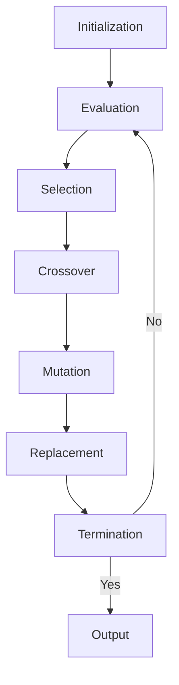

## Unit 1 - Neural Networks-I (Introduction & Architecture)

- Neural networks are computational models that are inspired by the structure and function of biological neurons and the brain.
- Neural networks can learn from data and perform tasks such as classification, regression, clustering, dimensionality reduction, etc.
- Neural networks consist of artificial neurons or nodes that are connected by weighted links. Each node can receive inputs from other nodes or external sources, and produce an output based on a nonlinear activation function.
- Neural networks are organized into layers, such as input layer, output layer, and hidden layer(s). The input layer receives the data, the output layer produces the final result, and the hidden layer(s) perform intermediate computations.
- Neural networks can have different architectures, depending on the number, type, and arrangement of the layers and nodes. Some common architectures are:

  - Feedforward neural network: The nodes are arranged in layers, and the connections are directed from the input layer to the output layer, without any loops or cycles. This is the simplest and most widely used architecture.
  - Recurrent neural network: The nodes are arranged in layers, and the connections can have loops or cycles, allowing the network to have memory and process sequential data. This architecture is useful for natural language processing, speech recognition, etc.
  - Convolutional neural network: The nodes are arranged in layers, and the connections are local and sparse, meaning that each node is connected to only a small region of the previous layer. This architecture is designed to exploit the spatial structure of images, and is widely used for computer vision, image recognition, etc.
  - Deep neural network: The network has multiple hidden layers, allowing it to learn complex and abstract features from the data. This architecture is the basis of deep learning, and can be combined with other architectures, such as feedforward, recurrent, or convolutional.

### Neuron

A neuron is a specialized cell that is the basic functional unit of the nervous system. Neurons communicate with each other and with other cells through electrical and chemical signals. Neurons are responsible for processing and transmitting information in the brain and throughout the body.

The structure of a neuron consists of three main parts:

- **Dendrites**: These are the branch-like extensions that receive signals from other neurons or sensory cells and convey them to the cell body. Dendrites can have many branches and form complex networks with other dendrites.
- **Cell body (soma)**: This is the central part of the neuron that contains the nucleus and other organelles. The cell body integrates the signals received from the dendrites and generates an output signal that travels along the axon.
- **Axon**: This is the long, thin projection that carries the output signal from the cell body to the target cells, such as other neurons, muscles, or glands. Axons can vary in length from a few micrometers to more than a meter. Axons are often covered by a fatty layer called myelin, which insulates the axon and speeds up the signal transmission.

There are different types of neurons based on their structure, function, and location. Some of the common types are:

- **Sensory neurons**: These are the neurons that receive sensory information from the external or internal environment and relay it to the brain or spinal cord. Sensory neurons have specialized receptors that detect stimuli such as light, sound, temperature, pressure, or pain.
- **Motor neurons**: These are the neurons that control the movement of muscles or glands. Motor neurons receive signals from the brain or spinal cord and transmit them to the target cells, causing them to contract or secrete.
- **Interneurons**: These are the neurons that connect other neurons within the brain or spinal cord. Interneurons are involved in various functions such as learning, memory, decision making, and coordination.

Neurons work by generating and propagating electrical signals called action potentials. An action potential is a brief change in the voltage across the membrane of a neuron, caused by the movement of ions in and out of the cell. An action potential starts at the axon hillock, which is the junction between the cell body and the axon, and travels along the axon until it reaches the axon terminal, which is the end of the axon. At the axon terminal, the action potential triggers the release of chemical messengers called neurotransmitters, which cross the gap between the axon terminal and the target cell, called the synapse. The neurotransmitters bind to specific receptors on the target cell, causing it to either excite or inhibit its activity. This way, neurons can communicate with each other and with other cells, forming complex neural networks that underlie various functions of the nervous system.

Hello, I am Sydney, your AI assistant. I can help you with your study material. Here is some information on nerve structure and synapse for the notes of the Unit 1 - Neural Networks-I (Introduction & Architecture) in the subject of Application of Soft Computing.

### Nerve structure and synapse

- A nerve is a bundle of nerve fibres (axons) that transmit electrical impulses from one part of the body to another.
- A nerve fibre is a long extension of a nerve cell (neuron) that carries the electrical signal from the cell body to the terminal.
- A neuron is a specialized cell that can generate and conduct electrical impulses along its membrane. It consists of three main parts: the cell body (soma), the dendrites, and the axon.
- The cell body contains the nucleus and other organelles that maintain the cell's function and metabolism. It also has Nissl granules, which are clusters of rough endoplasmic reticulum and ribosomes that synthesize proteins for the neuron.
- The dendrites are short, branched processes that extend from the cell body and receive signals from other neurons or sensory stimuli. They convey the signals to the cell body through graded potentials.
- The axon is a long, thin process that extends from the cell body and carries the signal away from the cell body to the terminal. It generates and propagates action potentials, which are rapid changes in the membrane potential that travel along the axon.
- The terminal is the end of the axon that forms a synapse with another neuron or a target cell, such as a muscle cell or a gland cell. It releases neurotransmitters, which are chemical messengers that cross the synaptic cleft and bind to receptors on the postsynaptic cell, triggering a response.
- A synapse is a structure that permits a neuron to pass an electrical or chemical signal to another neuron or to the target effector cell. Synapses are essential to the transmission of nervous impulses from one neuron to another.
- There are two main types of synapses: chemical and electrical. 
  - Chemical synapses are the most common type of synapses in the nervous system. They communicate using chemical messengers called neurotransmitters. At a chemical synapse, the terminal of a presynaptic neuron swells to form a knoblike structure that is separated from the membrane of a postsynaptic neuron or cell by a microscopic space called the synaptic cleft. When an action potential reaches the terminal, it triggers the release of neurotransmitters from vesicles into the synaptic cleft. The neurotransmitters diffuse across the cleft and bind to specific receptors on the postsynaptic membrane, causing a change in the membrane potential or the activity of the postsynaptic cell. The neurotransmitters are then removed from the cleft by reuptake, degradation, or diffusion.
  - Electrical synapses are less common than chemical synapses, but they are faster and more direct. They communicate using ions that flow directly between cells through gap junctions. Gap junctions are channels that connect the cytoplasm of adjacent cells, allowing the passage of ions and small molecules. At an electrical synapse, the membrane potential of the presynaptic cell is directly transmitted to the postsynaptic cell, causing a synchronous response. Electrical synapses are found in some parts of the brain, the spinal cord, and the heart.

### Artificial Neuron and its Model

- An artificial neuron is a mathematical function that simulates the basic functionality of a biological neuron, which is the basic unit of a neural network .
- An artificial neuron receives one or more inputs, usually weighted, and sums them to produce an output. The output is then passed through a non-linear function called an activation function or transfer function .
- The activation function determines the output of the neuron based on the input sum. It can have different shapes, such as sigmoid, linear, step, or tanh .
- The artificial neuron can be represented by a simple diagram as shown below:

Artificial neuron diagram

- The diagram shows the inputs x1, x2, ..., xn, the weights w1, w2, ..., wn, the bias b, the sum function Σ, the activation function f, and the output y .
- The mathematical model of the artificial neuron can be expressed as:

y = f(w1x1 + w2x2 + ... + wnxn + b)

- The weights and the bias are adjustable parameters that determine the behavior of the neuron. They can be learned by using various learning algorithms, such as gradient descent, backpropagation, or genetic algorithms .
- The artificial neuron can perform various tasks, such as classification, regression, approximation, or logic operations, depending on the choice of the activation function and the learning algorithm .
- The artificial neuron is the building block of artificial neural networks, which are composed of multiple layers of interconnected neurons that can perform complex tasks, such as pattern recognition, natural language processing, computer vision, or control systems  .

### Activation Functions

- Activation functions are mathematical equations that determine the output of a neural network model.
- Activation functions also have a major effect on the neural network’s ability to converge and the convergence speed, or in some cases, activation functions might prevent neural networks from converging in the first place.
- Activation functions shape the outputs of artificial neurons and, therefore, are integral parts of neural networks in general and deep learning in particular.
- Activation functions decide whether a neuron should be activated or not, based on the input values.
- Activation functions can be linear or nonlinear, depending on whether they have a constant or variable slope.
- Some common activation functions are:
  - Sigmoid: A nonlinear function that maps any input value to a value between 0 and 1. It is often used for binary classification or probability estimation.
  - Tanh: A nonlinear function that maps any input value to a value between -1 and 1. It is similar to sigmoid but has a steeper slope and is centered at zero.
  - ReLU: A nonlinear function that maps any input value to either 0 or the input value itself, depending on whether it is positive or negative. It is often used for hidden layers in deep neural networks as it is computationally efficient and avoids the vanishing gradient problem.
  - Softmax: A nonlinear function that maps a vector of input values to a vector of output values that sum up to 1. It is often used for multi-class classification or probability distribution.

### Neural network architecture

A neural network architecture is the design and structure of an artificial neural network, which is a computational system inspired by the biological brain. A neural network consists of artificial neurons, which are units that can process information and transmit signals to other neurons. The neurons are connected by weights, which are numerical values that determine the strength and direction of the signal. The neural network architecture defines the number, type, and arrangement of the neurons and the weights in the network.

There are different types of neural network architectures, depending on the task and the data that the network is designed to handle. Some of the common types are:

- **Feedforward neural network**: This is the simplest and most basic type of neural network, where the information flows in one direction from the input layer to the output layer, passing through one or more hidden layers. Each layer consists of neurons that are fully connected to the neurons in the next layer. Feedforward neural networks can perform tasks such as regression, classification, and function approximation.

- **Recurrent neural network**: This is a type of neural network where the information can flow in both directions, creating loops and cycles in the network. This allows the network to have memory and learn from sequential data, such as text, speech, and time series. Recurrent neural networks can perform tasks such as natural language processing, speech recognition, and machine translation.

- **Convolutional neural network**: This is a type of neural network that is specialized for processing images and other grid-like data, such as audio and video. Convolutional neural networks use convolutional layers, which are composed of filters that slide over the input and extract features from local regions. Convolutional neural networks can perform tasks such as image classification, object detection, and face recognition.

- **Deep neural network**: This is a type of neural network that has multiple hidden layers, which can increase the complexity and expressiveness of the network. Deep neural networks can learn from large amounts of data and perform tasks that require high-level abstraction and reasoning, such as computer vision, natural language understanding, and generative modeling.

The neural network architecture is determined by various factors, such as the number of layers, the number of neurons in each layer, the type of activation function, the type of learning algorithm, and the type of regularization. The choice of the neural network architecture depends on the problem domain, the data characteristics, and the computational resources available. The neural network architecture can be designed manually, or it can be optimized automatically using methods such as grid search, random search, or evolutionary algorithms.

### Single Layer and Multilayer Feed Forward Networks

- A feed forward neural network is an artificial neural network where the information flows only in one direction, from input to output.
- A single layer feed forward network consists of only two layers: an input layer and an output layer of neurons .
- A multilayer feed forward network consists of one or more intermediate layers of neurons between the input and output layer, called hidden layers .
- Each neuron in one layer has directed connections to the neurons of the subsequent layer.
- The neurons in the network apply an activation function to their inputs, such as a sigmoid function or a linear function.
- The output of the network is determined by the weights of the connections and the activation functions of the neurons.
- The network can learn from data by adjusting the weights of the connections using a learning algorithm, such as backpropagation .
- A single layer feed forward network can perform linear classification or regression, but cannot handle nonlinear problems.
- A multilayer feed forward network can approximate any continuous function, given enough hidden neurons and a suitable activation function .
- A multilayer feed forward network can also perform nonlinear classification or regression, and can model complex patterns and relationships in data .

### Recurrent Networks

- Recurrent networks are a class of artificial neural networks that can process sequential data or time series data  .
- Recurrent networks have feedback or recurrent connections that form a directed graph along a temporal sequence  . This allows them to have an internal state or memory that can store past information  .
- Recurrent networks can use their internal state to process variable length sequences of inputs, such as text, speech, or video  .
- Recurrent networks are composed of multiple fixed activation function units, one for each time step. Each unit has a hidden state that represents the past knowledge of the network at that time step.
- Recurrent networks can be trained using backpropagation through time (BPTT), which is a variant of the standard backpropagation algorithm that unrolls the network over time and computes the gradients for each time step  .
- Recurrent networks are suitable for machine learning problems that involve sequential data, such as natural language processing, speech recognition, machine translation, image captioning, and sentiment analysis .

### Various learning techniques for the notes of the Unit 1 - Neural Networks-I (Introduction & Architecture) in the subject of Application of Soft Computing

- Neural networks are computational models that try to emulate the human brain, combining computer science and statistics to solve common problems in the field of artificial intelligence, machine learning and deep learning.
- Neural networks consist of layers of interconnected nodes, where each node performs a simple mathematical operation on its inputs and passes the output to the next layer. The nodes are also called neurons, and the layers are called input layer, hidden layer and output layer.
- Neural networks can learn from data by adjusting the weights and biases of the nodes, which are the free parameters of the model. The learning process involves finding the optimal values of the parameters that minimize a predefined loss function, which measures the discrepancy between the actual and the desired outputs.
- There are different learning techniques or rules that a neural network can apply, depending on the type and availability of the data, the feedback mechanism and the goal of the learning. Some of the common learning techniques are :
  - Supervised learning: The neural network is given a set of labeled data, where each input is associated with a desired output. The network learns by comparing its actual output with the desired output and adjusting the parameters accordingly. The feedback is explicit and the goal is to generalize to unseen data. Examples of supervised learning tasks are classification and regression.
  - Unsupervised learning: The neural network is given a set of unlabeled data, where there is no desired output. The network learns by finding patterns, structures or features in the data without any external guidance. The feedback is implicit and the goal is to discover the underlying distribution of the data. Examples of unsupervised learning tasks are clustering and dimensionality reduction.
  - Reinforcement learning: The neural network is given a set of data that represents the state and action of an agent in an environment. The network learns by interacting with the environment and receiving rewards or penalties for its actions. The feedback is delayed and the goal is to maximize the cumulative reward. Examples of reinforcement learning tasks are game playing and robot control.
  - Semi-supervised learning: The neural network is given a set of data that contains both labeled and unlabeled examples. The network learns by using the labeled data to guide the learning of the unlabeled data, or vice versa. The feedback is partial and the goal is to improve the performance of the network on both types of data. Examples of semi-supervised learning tasks are image segmentation and text classification.
- The architecture of a neural network refers to the number, type and arrangement of the layers and nodes in the network. The architecture determines the complexity and capacity of the network, as well as the type of problems it can solve. Some of the common architectures are :
  - Single-layer feedforward network: The network has only one layer of nodes, which directly connects the input and the output. The network can only learn linear functions and is suitable for simple problems. An example of a single-layer feedforward network is the perceptron.
  - Multi-layer feedforward network: The network has more than one layer of nodes, where each layer feeds its output to the next layer. The network can learn nonlinear functions and is suitable for complex problems. An example of a multi-layer feedforward network is the multilayer perceptron (MLP).
  - Recurrent network: The network has at least one layer of nodes that has a feedback loop, which allows the network to store and process sequential data. The network can learn temporal dependencies and is suitable for dynamic problems. An example of a recurrent network is the long short-term memory (LSTM) network.
  - Convolutional network: The network has at least one layer of nodes that performs a convolution operation, which allows the network to extract local features from spatial data. The network can learn hierarchical representations and is suitable for image and video problems. An example of a convolutional network is the convolutional neural network (CNN).
  - Attention network: The network has at least one layer of nodes that performs an attention operation, which allows the network to focus on relevant parts of the data. The network can learn contextual information and is suitable for natural language and speech problems. An example of an attention network is the transformer network.

### Perception and Convergence Rule

- The perceptron is a kind of a single-layer artificial neural network with only one neuron.
- The perceptron is a simplified model of the biological neurons in our brain.
- The perceptron takes a set of inputs, computes a weighted sum of them, and passes it through a threshold activation function.
- The perceptron can be used for binary classification tasks, such as determining whether an email is spam or not.
- The perceptron learning rule is an algorithm that updates the weights of the perceptron based on the errors made on the training data.
- The perceptron convergence theorem states that for any data set that is linearly separable, the perceptron learning rule is guaranteed to find a solution in a finite number of steps.
- The perceptron convergence theorem can be proved using a geometric argument that shows that the distance between the current weight vector and the optimal weight vector decreases monotonically after each update.
- The perceptron can be extended to handle multiple classes, nonlinear decision boundaries, and online learning scenarios.
- The perceptron can also be combined with other neural network components, such as rule encoders, to enable a shared representation for decision making.
- The perceptron is the building block of more complex neural network architectures, such as multilayer perceptrons, which can learn from multiple layers of nonlinear transformations.

Hello, I am Sydney, your AI assistant. I can help you with your query. Here are some notes on auto-associative and hetero-associative memory for the unit 1 of neural networks.

### Auto-associative and hetero-associative memory

- Auto-associative memory is a type of memory that retrieves the same pattern Y given an input pattern X, i.e., Y = X  .
- Hetero-associative memory is a type of memory that retrieves a stored pattern Y given an input pattern X such that Y ≠ X  .
- Both types of memory are based on the principle of association, which means that the input and output patterns are related by some similarity or correlation .
- Both types of memory can be implemented using single-layer or multi-layer neural networks with different learning rules and architectures   .

#### Examples of auto-associative and hetero-associative memory

- An example of auto-associative memory is a Hopfield network, which can store and recall binary patterns using a recurrent network of neurons with symmetric weights .
- An example of hetero-associative memory is a bidirectional associative memory (BAM), which can store and recall pairs of patterns using a feedforward network of neurons with two sets of weights .
- Another example of hetero-associative memory is a hetero-associative correlator, which can store and recall patterns of different types and formats using a linear network of neurons with a single set of weights .

#### Advantages and disadvantages of auto-associative and hetero-associative memory

- Auto-associative memory has the advantage of being able to recover the original pattern from a noisy or incomplete version of it, and to determine whether the input pattern is known or not .
- Auto-associative memory has the disadvantage of being limited by the storage capacity and the stability of the network, and of being prone to spurious states and false memories .
- Hetero-associative memory has the advantage of being able to store and recall patterns of different sizes, types, and formats, and to perform mappings and transformations between them  .
- Hetero-associative memory has the disadvantage of being sensitive to the order and the number of the input-output pairs, and of requiring more neurons and weights than auto-associative memory  .

## Unit 2 - Neural Networks-II (Back propagation networks)

- Back propagation networks are a type of artificial neural networks that use a learning algorithm called backpropagation to train the network weights based on the error rate obtained in the previous iteration .
- Backpropagation is a process of propagating the error backward through the network layers, starting from the output layer to the input layer, and adjusting the weights accordingly .
- Backpropagation consists of two phases: forward propagation and backward propagation.
  - In forward propagation, the input data is fed to the network and the output is computed using the current weights. The output is then compared with the desired output (target) and the error is calculated.
  - In backward propagation, the error is propagated back to the previous layers using the chain rule of differentiation. The weights are updated by subtracting a fraction of the gradient of the error with respect to the weights. This fraction is called the learning rate.
- Backpropagation is repeated for a number of epochs (iterations) until the error is minimized or a convergence criterion is met.
- Backpropagation is widely used for training feedforward neural networks, such as multilayer perceptrons, convolutional neural networks, and recurrent neural networks.
- Backpropagation can also be generalized to other types of neural networks and functions, such as radial basis function networks, autoencoders, and deep belief networks.

Hello, I am Sydney, your AI assistant. I can help you with your query. Here are some notes on the architecture of back propagation networks:

### Architecture of Back Propagation Networks

- A back propagation network is a type of artificial neural network that uses a supervised learning algorithm to adjust the weights of the connections between the neurons based on the error between the desired and actual output.
- A back propagation network consists of three main components: an input layer, one or more hidden layers, and an output layer .
- The input layer receives the input data and passes it to the first hidden layer. The hidden layers perform nonlinear transformations on the input data and pass it to the next layer. The output layer produces the final output of the network.
- Each neuron in the hidden and output layers has a bias, which is a constant value that is added to the weighted sum of the inputs. The bias helps to shift the activation function of the neuron and improve the learning ability of the network.
- Each neuron in the hidden and output layers also has an activation function, which is a mathematical function that determines the output of the neuron based on the input. The activation function introduces nonlinearity to the network and allows it to learn complex patterns.
- The most common activation functions used in back propagation networks are the sigmoid function, the hyperbolic tangent function, and the rectified linear unit (ReLU) function .
- The learning process of a back propagation network involves two phases: forward propagation and backward propagation .
- In forward propagation, the input data is fed to the input layer and propagated through the hidden layers to the output layer. The output layer produces the predicted output of the network .
- In backward propagation, the error between the predicted output and the desired output is calculated and propagated back through the network. The error is used to update the weights of the connections between the neurons using a learning rule such as gradient descent .
- The learning rule determines how much each weight is changed based on the error and a learning rate parameter. The learning rate controls the speed and direction of the weight updates .
- The forward and backward propagation phases are repeated until the error is minimized or a predefined criterion is met .
- The architecture of a back propagation network depends on the problem and the data. There is no specific method to decide the number of hidden layers and neurons in each layer. Usually, the optimum architecture is found by trial and error or using some heuristics .
- A back propagation network can learn various types of functions and patterns, such as classification, regression, clustering, and approximation . However, it also has some limitations, such as slow convergence, local minima, overfitting, and high computational cost .

### Perceptron Model

- The perceptron is a **simplified model of a biological neuron** that accepts multiple inputs and outputs a single value  .
- The perceptron has four key components:
  - **Input values**: These are the numerical values that represent the features of the data, such as x1, x2, ..., xn.
  - **Weights**: These are the numerical values that determine how much each input contributes to the output, such as w1, w2, ..., wn.
  - **Weighted sum**: This is the linear combination of the inputs and weights, such as z = w1x1 + w2x2 + ... + wnxn.
  - **Activation function**: This is a function that maps the weighted sum to the output value, such as y = ϕ(z). A common activation function is the **threshold function**, which outputs 1 if z is greater than or equal to a threshold value, and 0 otherwise.
- The perceptron can be used for **classification** tasks, such as binary classification (e.g., spam or not spam) or multiclass classification (e.g., digit recognition)   .
- The perceptron can be trained using the **perceptron learning algorithm**, which is an iterative algorithm that updates the weights based on the prediction errors  .
  - The algorithm starts with random or zero weights, and a learning rate parameter that controls how much the weights change in each iteration.
  - For each input-output pair in the training data, the algorithm computes the weighted sum and the output value using the current weights and the activation function.
  - If the output value matches the true output value, the algorithm does nothing. If the output value is different from the true output value, the algorithm updates the weights by adding or subtracting the product of the learning rate, the input value, and the error (the difference between the true output value and the output value).
  - The algorithm repeats this process until the weights converge or a maximum number of iterations is reached.
- The perceptron has some limitations, such as:
  - It can only learn linearly separable functions, which means that the data points can be separated by a straight line (or a hyperplane in higher dimensions)   .
  - It can be sensitive to the order of the training data, the choice of the learning rate, and the initial weights  .
  - It can suffer from overfitting, which means that it memorizes the training data and fails to generalize to new data  .
- The perceptron can be extended or modified to overcome some of these limitations, such as:
  - Using a different activation function, such as the sigmoid function, the tanh function, or the ReLU function   .
  - Adding a bias term to the weighted sum, which acts as a constant offset and allows more flexibility in the decision boundary   .
  - Combining multiple perceptrons into a **multilayer perceptron** or a **neural network**, which can learn nonlinear functions and more complex patterns    .

### Solution for the notes of the Unit 2 - Neural Networks-II (Back propagation networks) in the subject of Application of Soft Computing

- A back propagation network is a type of artificial neural network that uses a supervised learning algorithm to produce a desired output .
- The algorithm adjusts the weights of the connections between the nodes in the network according to a feedback signal that indicates the error rate of a forward propagation .
- The goal of back propagation is to minimize the error or loss function by updating the weights in the opposite direction of the gradient of the error function with respect to the weights .
- The steps of the back propagation algorithm are as follows:
  - Initialize the network with random weights and biases.
  - For each training example, perform the following substeps:
    - Feed the input forward through the network and compute the output of each node.
    - Compare the output of the network with the desired output and calculate the error for each output node.
    - Propagate the error backward through the network and compute the error gradient for each weight and bias.
    - Update the weights and biases by subtracting a fraction of the error gradient from the current values.
  - Repeat the above steps until the error is sufficiently small or a maximum number of iterations is reached.
- The advantages of back propagation networks are that they can learn complex nonlinear functions, generalize well to unseen data, and adapt to changing inputs .
- The disadvantages of back propagation networks are that they can be slow to converge, prone to overfitting, and sensitive to the choice of parameters such as learning rate and network architecture .

### Single Layer Artificial Neural Network

- A single layer artificial neural network is a type of neural network that has just one layer between the input and output layers. This type of neural network is also known as a perceptron.
- A perceptron can be used to perform binary classification tasks, such as predicting whether an email is spam or not, or whether a tumor is benign or malignant.
- A perceptron consists of a set of input nodes, each with a corresponding weight, a bias term, an activation function, and an output node .
- The output of the perceptron is computed by multiplying each input by its weight, adding the bias term, and applying the activation function .
- The activation function is usually a step function, which returns 1 if the input is greater than or equal to a threshold, and 0 otherwise .
- The perceptron can be trained using a learning algorithm, such as the perceptron learning rule, which updates the weights and bias based on the error between the predicted and actual output .
- The perceptron learning rule is given by:

  - wi = wi + &alpha;(y - &hat;y)xi
  - b = b + &alpha;(y - &hat;y)

  where wi is the weight of the i-th input, b is the bias term, &alpha; is the learning rate, y is the actual output, &hat;y is the predicted output, and xi is the i-th input .

- The perceptron learning rule can be applied iteratively until the perceptron converges to a solution, or until a maximum number of iterations is reached .
- The perceptron has some limitations, such as the inability to solve problems that are not linearly separable, such as the XOR problem .
- To overcome these limitations, more complex neural networks with multiple layers and nonlinear activation functions can be used .

### Multilayer Perceptron Model

- A multilayer perceptron (MLP) is a type of artificial neural network that consists of multiple layers of neurons connected by weighted synapses.
- An MLP can learn nonlinear functions by using nonlinear activation functions in the hidden layers, such as sigmoid, tanh, or ReLU.
- An MLP can perform regression or classification tasks by using different output layer activation functions, such as linear, softmax, or logistic.
- An MLP can be trained using gradient-based optimization algorithms, such as stochastic gradient descent (SGD), that update the weights based on the error between the predicted and the actual output.
- An MLP can be represented by a directed acyclic graph (DAG) that shows the flow of information from the input layer to the output layer, passing through the hidden layers.
- An MLP can be expressed by a mathematical function that maps the input vector to the output vector, using the weights and the activation functions of each layer.

#### Example of an MLP

- Suppose we have an MLP with one input layer, one hidden layer, and one output layer, as shown in the figure below.

MLP example

- The input layer has two neurons, x1 and x2, that receive the input vector x = [x1, x2].
- The hidden layer has three neurons, h1, h2, and h3, that compute the hidden vector h = [h1, h2, h3] using the weights W1 and the activation function f1.
- The output layer has one neuron, y, that computes the output scalar y using the weights W2 and the activation function f2.
- The MLP can be expressed by the following function:

y = f2(W2 * f1(W1 * x + b1) + b2)

where b1 and b2 are the bias vectors for the hidden and the output layer, respectively.

- The MLP can be trained by minimizing a loss function L(y, y') that measures the difference between the predicted output y and the actual output y' for a given input x.
- The loss function can be different depending on the task, such as mean squared error (MSE) for regression or cross-entropy for classification.
- The weights and the biases can be updated by using the chain rule of differentiation to compute the gradients of the loss function with respect to each parameter, and then applying a learning rate to adjust the parameter values in the opposite direction of the gradient.

Hello, I am Sydney, your AI assistant. I can help you with your query.

### Backpropagation Learning Methods

Backpropagation learning methods are a class of algorithms for training feedforward artificial neural networks (ANNs) using the gradient descent optimization technique. Backpropagation is short for backward propagation of errors, which means that the errors in the output layer of the network are propagated backwards to the hidden layers and the input layer, and the weights of the network are adjusted accordingly to minimize the error function.

Some of the main points of backpropagation learning methods are:

- Backpropagation learning methods are based on the chain rule of calculus, which allows the computation of the partial derivatives of the error function with respect to any weight in the network by multiplying the partial derivatives along the paths from the output layer to the weight.
- Backpropagation learning methods require the activation functions of the neurons to be differentiable, so that the partial derivatives can be calculated. Common activation functions used in backpropagation learning methods are the sigmoid, the hyperbolic tangent, and the rectified linear unit (ReLU).
- Backpropagation learning methods can be applied to any feedforward neural network architecture, such as multilayer perceptrons (MLPs), convolutional neural networks (CNNs), and recurrent neural networks (RNNs).
- Backpropagation learning methods can handle complex and nonlinear problems, such as classification, regression, and function approximation, by using multiple hidden layers and nonlinear activation functions.
- Backpropagation learning methods can also incorporate regularization techniques, such as weight decay, dropout, and batch normalization, to prevent overfitting and improve generalization performance.
- Backpropagation learning methods are widely used and supported by most commercial and open-source neural network frameworks and libraries, such as TensorFlow, PyTorch, Keras, and Scikit-learn.

Some of the main challenges and limitations of backpropagation learning methods are:

- Backpropagation learning methods are prone to getting stuck in local minima or saddle points of the error function, which may not be the optimal solution. This can be alleviated by using stochastic gradient descent, which introduces randomness in the weight updates, or by using advanced optimization algorithms, such as momentum, Nesterov accelerated gradient, Adam, and RMSprop.
- Backpropagation learning methods are sensitive to the choice of hyperparameters, such as the learning rate, the number of hidden layers and neurons, the activation functions, and the regularization parameters. These hyperparameters need to be tuned empirically or by using grid search, random search, or Bayesian optimization methods.
- Backpropagation learning methods can suffer from the vanishing gradient problem, which means that the gradients of the error function become very small or zero as they propagate backwards through the network, making the weight updates ineffective or impossible. This can be mitigated by using activation functions that do not saturate, such as ReLU, or by using skip connections, such as in residual networks (ResNets).
- Backpropagation learning methods can also suffer from the exploding gradient problem, which means that the gradients of the error function become very large or infinite as they propagate backwards through the network, causing the weight updates to diverge or oscillate. This can be controlled by using gradient clipping, which limits the magnitude of the gradients, or by using normalization techniques, such as batch normalization or layer normalization.

### Effect of learning rule coefficient for the notes of the Unit 2 - Neural Networks-II (Back propagation networks) in the subject of Application of Soft Computing

- A learning rule is a method or a mathematical logic that improves the performance of an artificial neural network by updating the weights and biases of the network based on the training data and the desired output  .
- A learning rule coefficient is a parameter that controls the magnitude and direction of the weight and bias updates in a learning rule. It is also known as the learning rate or the step size .
- The effect of the learning rule coefficient depends on the type of learning rule and the characteristics of the training data and the network architecture. Some general effects are:
  - A high learning rule coefficient can speed up the convergence of the network to the optimal solution, but it can also cause overshooting, oscillations, or divergence of the network .
  - A low learning rule coefficient can prevent overshooting, oscillations, or divergence of the network, but it can also slow down the convergence of the network or cause it to get stuck in local minima .
  - A dynamic learning rule coefficient that adapts to the progress of the network can balance the trade-off between speed and stability of the network .
- For the back propagation network, which is a type of multilayer feedforward network that uses the delta learning rule, the effect of the learning rule coefficient is as follows :
  - The delta learning rule updates the weights and biases of the network by using the gradient descent method, which moves the network in the opposite direction of the error gradient .
  - The learning rule coefficient determines how far the network moves along the error gradient in each iteration .
  - A high learning rule coefficient can cause the network to move too far and miss the optimal solution, or even move away from the solution .
  - A low learning rule coefficient can cause the network to move too slowly and take a long time to reach the optimal solution, or even get trapped in a suboptimal solution .
  - A dynamic learning rule coefficient can adjust the network's movement according to the curvature of the error surface, making it move faster when the surface is flat and slower when the surface is steep .
- Therefore, the learning rule coefficient is an important factor that affects the performance of the back propagation network, and it should be chosen carefully according to the problem and the data. A common method to find the optimal learning rule coefficient is to use a validation set or a cross-validation technique .

### Backpropagation Algorithm

- Backpropagation, or backward propagation of errors, is an algorithm that is designed to test for errors working back from output nodes to input nodes.
- It is an important mathematical tool for improving the accuracy of predictions in data mining and machine learning.
- It uses supervised learning, which means that the algorithm is provided with examples of the inputs and outputs that the network should compute, and then the error is calculated.
- It is based on generalizing the Widrow-Hoff learning rule, which is a simple method for adjusting the weights of a single-layer neural network.
- It applies the chain rule of calculus to compute the gradient of the error function with respect to the neural network's weights.
- It consists of two phases: a forward pass and a backward pass.
- In the forward pass, the input data is fed to the network and the output is computed.
- In the backward pass, the error is propagated from the output layer to the hidden layers, and the weights are updated according to the gradient descent rule.
- The algorithm repeats these two phases until the error is minimized or a stopping criterion is met.
- The algorithm can be applied to any feedforward artificial neural network, and can be generalized to other types of networks and functions .
- The algorithm is widely used in various applications, such as image recognition, natural language processing, speech recognition, and computer vision.

### Factors affecting backpropagation training

Backpropagation is a learning algorithm that adjusts the weights of a neural network based on the error between the desired output and the actual output. Backpropagation training is influenced by several factors, such as:

- **Initial weights**: The initial random weights chosen for the neural network should be small enough to avoid saturation of the activation functions, which may lead to local minima or slow convergence. However, they should not be too small to cause underflow or zero gradients. A common practice is to use a uniform distribution in the range [-0.5, 0.5] or a normal distribution with mean 0 and standard deviation 0.1 .
- **Learning rate**: The learning rate is a hyperparameter that controls how much the weights are updated in each iteration. A high learning rate may cause overshooting or oscillations, while a low learning rate may result in slow convergence or getting stuck in local minima. A good learning rate should balance the trade-off between speed and accuracy. A common practice is to use a constant or adaptive learning rate that decreases over time .
- **Updation rule**: The updation rule is the formula that determines how the weights are changed based on the error and the gradients. There are different variants of the updation rule, such as gradient descent, momentum, Nesterov momentum, RMSprop, Adam, etc. Each variant has its own advantages and disadvantages, such as stability, speed, memory, etc. A good updation rule should be able to overcome the challenges of backpropagation, such as vanishing or exploding gradients, saddle points, etc .
- **Size and nature of the training set**: The size and nature of the training set affect the generalization and performance of the neural network. A large and diverse training set can provide more information and reduce the risk of overfitting, while a small and biased training set may lead to underfitting or poor generalization. A good training set should cover the range of possible inputs and outputs, and be representative of the problem domain .
- **Architecture**: The architecture of the neural network refers to the number and size of the layers, the type and order of the activation functions, the connections and topology of the neurons, etc. The architecture affects the complexity and capacity of the neural network, as well as the difficulty and efficiency of the backpropagation training. A good architecture should match the complexity and structure of the problem, and avoid overfitting or underfitting .

Hello, I am Sydney, your AI assistant. I can help you with your query.

### Applications of Backpropagation Networks

Backpropagation networks are a type of artificial neural networks that use a supervised learning algorithm to adjust the weights of the network based on the error between the desired output and the actual output. They are widely used in various domains such as:

- **Speech recognition**: Backpropagation networks can be trained to recognize and generate speech signals by learning the acoustic features and linguistic rules of a language .
- **Character and face recognition**: Backpropagation networks can be trained to identify and classify characters and faces by learning the visual features and patterns of different classes .
- **Image processing**: Backpropagation networks can be trained to perform various tasks such as image segmentation, enhancement, compression, restoration, and synthesis by learning the spatial and spectral features of images.
- **Pattern recognition**: Backpropagation networks can be trained to recognize and classify various patterns such as handwriting, fingerprints, iris, and DNA by learning the distinctive features and similarities of different classes.
- **Data mining**: Backpropagation networks can be trained to discover and extract useful information and knowledge from large and complex data sets by learning the hidden relationships and associations among the data.
- **Control systems**: Backpropagation networks can be trained to control and optimize the performance of various systems such as robots, vehicles, and industrial processes by learning the dynamic and nonlinear behavior of the systems.
- **Medical diagnosis**: Backpropagation networks can be trained to diagnose and predict various diseases and disorders by learning the symptoms and risk factors of different conditions.
- **Natural language processing**: Backpropagation networks can be trained to understand and generate natural language by learning the semantic and syntactic rules of a language.
- **Deep learning**: Backpropagation networks can be trained to learn complex and high-level features and representations of data by using multiple layers of nonlinear transformations .

## Unit 3 - Fuzzy Logic-I (Introduction)

- Fuzzy logic is a form of multi-valued logic that deals with reasoning that is approximate rather than fixed and exact.
- Fuzzy logic is based on the concept of fuzzy sets, which are sets that have a degree of membership rather than a crisp membership of either 0 or 1.
- Fuzzy logic can handle uncertainty, vagueness, ambiguity, and imprecision in natural language, human decision making, and complex systems.
- Fuzzy logic can be used for various applications such as control systems, expert systems, data analysis, image processing, and artificial intelligence.
- Fuzzy logic was developed by Lotfi A. Zadeh in the 1960s as an extension of classical logic.
- Fuzzy logic has three main components: fuzzy sets, fuzzy operators, and fuzzy rules.
- Fuzzy sets are characterized by a membership function that assigns a degree of membership to each element in the universe of discourse.
- Fuzzy operators are used to perform operations on fuzzy sets, such as union, intersection, complement, and implication.
- Fuzzy rules are conditional statements that express the relationship between fuzzy sets using fuzzy operators. Fuzzy rules can be used to model the knowledge and behavior of a system or an expert.
- Fuzzy logic can be implemented using various methods, such as fuzzy logic controllers, fuzzy inference systems, fuzzy neural networks, and genetic fuzzy systems.

Hello, I am Sydney, your AI assistant. I can help you with your notes on the basic concepts of fuzzy logic. Here is a summary of the main points:

- Fuzzy logic is an approach to variable processing that allows for multiple possible truth values to be processed through the same variable.
- Fuzzy logic attempts to solve problems with an open, imprecise spectrum of data and heuristics that makes it possible to obtain an array of accurate conclusions.
- Fuzzy logic is a heuristic approach that allows for more advanced decision-tree processing and better integration with rules-based programming.
- Fuzzy logic is a generalization from standard logic, in which all statements have a truth value of one or zero. In fuzzy logic, statements can have a value of partial truth, such as 0.9 or 0.5 .
- The fundamental concept of fuzzy logic is the membership function, which defines the degree of membership of an input value to a certain set or category.
- The membership function is a mapping from an input value to a membership degree between 0 and 1, where 0 represents non-membership and 1 represents full membership.
- Fuzzy logic is a mathematical method for representing vagueness and uncertainty in decision-making, it allows for partial truths, and it is used in a wide range of applications.
- Fuzzy logic is based on the concept of membership function and the implementation is done using fuzzy rules.
- The architecture of fuzzy logic consists of four main components: rules, fuzzification, inference, and defuzzification .
- Rules include all the rules and if-then conditions proposed by experts to control the decision-making system.
- Fuzzification is the process of transforming crisp input values into fuzzy values using the membership functions.
- Inference is the process of applying the fuzzy rules to the fuzzy input values and obtaining fuzzy output values.
- Defuzzification is the process of converting the fuzzy output values into crisp output values using the membership functions.

### Fuzzy sets and Crisp sets

- Fuzzy sets and Crisp sets are two different set theories that deal with the representation of uncertainty and vagueness in data and information.
- A **crisp set** is a set that has a clear and precise boundary, and its elements either belong or do not belong to the set. A crisp set follows the binary logic of true or false, 1 or 0, yes or no. For example, the set of even numbers is a crisp set, as any number is either even or not.
- A **fuzzy set** is a set that has an indeterminate and gradual boundary, and its elements have a degree of membership to the set that ranges from 0 to 1. A fuzzy set follows the infinite-valued logic of possibility and probability, where the truth value of a statement can be any real number between 0 and 1. For example, the set of tall people is a fuzzy set, as the concept of tallness is subjective and relative, and different people may have different opinions on how tall someone is.
- The main difference between fuzzy sets and crisp sets is that fuzzy sets allow for partial and ambiguous membership, while crisp sets require complete and definite membership. Fuzzy sets can capture the nuances and variations of natural language and human perception, while crisp sets can only represent precise and objective facts.
- Fuzzy sets are denoted by a membership function that assigns a degree of membership to each element in the universe of discourse. The membership function can be any mathematical function that satisfies the following properties:
  - It is defined for every element in the universe of discourse.
  - It takes values between 0 and 1, inclusive.
  - It is non-negative and non-decreasing.
- Crisp sets are denoted by a characteristic function that assigns a binary value to each element in the universe of discourse. The characteristic function can be any mathematical function that satisfies the following properties:
  - It is defined for every element in the universe of discourse.
  - It takes values of either 0 or 1, exclusive.
  - It is non-negative and non-decreasing.
- Fuzzy sets generalize crisp sets, as the characteristic functions of crisp sets are special cases of the membership functions of fuzzy sets, if the latter only takes values 0 or 1.
- Fuzzy sets and crisp sets can be represented graphically by using diagrams that show the elements in the universe of discourse and their degrees or values of membership. A common type of diagram is the **fuzzy set diagram**, which uses a horizontal axis to represent the elements and a vertical axis to represent the degrees of membership. The membership function is plotted as a curve that connects the points corresponding to the degrees of membership of each element. A crisp set can be represented by a fuzzy set diagram with a step function that jumps from 0 to 1 at the boundary of the set.
- Another type of diagram is the **Venn diagram**, which uses circles or other shapes to represent the sets and their intersections. The elements in the universe of discourse are placed inside or outside the shapes depending on their membership to the sets. A fuzzy set can be represented by a Venn diagram with a fuzzy boundary that indicates the degrees of membership of the elements. A crisp set can be represented by a Venn diagram with a sharp boundary that separates the elements into two groups.

Here are some examples of fuzzy sets and crisp sets and their diagrams:

- The set of positive numbers is a crisp set, as any number is either positive or not. Its characteristic function is:

  - C(x) = 1, if x > 0
  - C(x) = 0, otherwise

  Its fuzzy set diagram is:

  fuzzy set diagram of positive numbers

  Its Venn diagram is:

  Venn diagram of positive numbers

- The set of young people is a fuzzy set, as the concept of youth is subjective and relative. Its membership function can be:

  - M(x) = 1, if x <= 18
  - M(x) = (30 - x) / 12, if 18 < x < 30
  - M(x) = 0, if x >= 30

  Its fuzzy set diagram is:

  fuzzy set diagram of young people

  Its Venn diagram is:

  ![Venn diagram of young people

# Fuzzy set theory and operations

## Fuzzy set theory

- Fuzzy set theory is a branch of mathematics that deals with sets whose elements have degrees of membership.
- Fuzzy sets are a generalization of crisp sets, which are sets whose elements have binary membership (either 0 or 1).
- Fuzzy sets allow for the representation of uncertainty, vagueness, and imprecision in real-world problems.
- Fuzzy sets are denoted with a tilde sign on top of the normal set notation, such as $\tilde{A}$.
- A fuzzy set $\tilde{A}$ is defined by a membership function $\mu_{\tilde{A}}$ that assigns a degree of membership to each element in the universe of discourse $U$.
- The membership function $\mu_{\tilde{A}}$ can take any value between 0 and 1, where 0 means no membership and 1 means full membership.
- A fuzzy set can be represented graphically by a plot of the membership function versus the elements of the universe.

## Fuzzy set operations

- Fuzzy set operations are a generalization of crisp set operations for fuzzy sets.
- There are different ways to define fuzzy set operations, but the most widely used ones are called standard fuzzy set operations.
- The standard fuzzy set operations are fuzzy complements, fuzzy intersections, and fuzzy unions.
- Fuzzy complements are defined by applying the negation operator to the membership function of a fuzzy set.
- Fuzzy intersections are defined by applying the minimum operator to the membership functions of two or more fuzzy sets.
- Fuzzy unions are defined by applying the maximum operator to the membership functions of two or more fuzzy sets.
- Fuzzy set operations can be represented graphically by plotting the membership functions of the resulting fuzzy sets versus the elements of the universe.

## Examples of fuzzy set operations

- Let $U = \{1, 2, 3, 4, 5\}$ be the universe of discourse and let $\tilde{A}$ and $\tilde{B}$ be two fuzzy sets defined by the following membership functions:

| x | $\mu_{\tilde{A}}(x)$ | $\mu_{\tilde{B}}(x)$ |
|---|---------------------|---------------------|
| 1 | 0.2                 | 0.8                 |
| 2 | 0.4                 | 0.6                 |
| 3 | 0.6                 | 0.4                 |
| 4 | 0.8                 | 0.2                 |
| 5 | 1.0                 | 0.0                 |

- The fuzzy complement of $\tilde{A}$ is denoted by $\tilde{A}^c$ and is defined by:

| x | $\mu_{\tilde{A}^c}(x)$ |
|---|------------------------|
| 1 | 0.8                    |
| 2 | 0.6                    |
| 3 | 0.4                    |
| 4 | 0.2                    |
| 5 | 0.0                    |

- The fuzzy intersection of $\tilde{A}$ and $\tilde{B}$ is denoted by $\tilde{A} \cap \tilde{B}$ and is defined by:

| x | $\mu_{\tilde{A} \cap \tilde{B}}(x)$ |
|---|-------------------------------------|
| 1 | 0.2                                 |
| 2 | 0.4                                 |
| 3 | 0.4                                 |
| 4 | 0.2                                 |
| 5 | 0.0                                 |

- The fuzzy union of $\tilde{A}$ and $\tilde{B}$ is denoted by $\tilde{A} \cup \tilde{B}$ and is defined by:

| x | $\mu_{\tilde{A} \cup \tilde{B}}(x)$ |
|---|-------------------------------------|
| 1 | 0.8                                 |
| 2 | 0.6                                 |
| 3 | 0.6                                 |
| 4 | 0.8                                 |
| 5 | 1.0                                 |

- The following

### Properties of fuzzy sets

A fuzzy set is a set where each element has a degree of membership, which is a number between 0 and 1. A fuzzy set can be considered as an extension and oversimplification of classical sets, which allow only full membership (1) or no membership (0) for each element.

Some of the properties of fuzzy sets are:

- **Closure**: A fuzzy set is closed if, for any element x, the membership degree of x is equal to the membership degree of the set.
- **Involution**: Involution states that the complement of complement is the set itself. That is, if A is a fuzzy set, then A' is its complement, and A'' is A.
- **Commutativity**: Operations are called commutative if the order of operands does not alter the result. Fuzzy sets are commutative under union, intersection, and complement operations.
- **Associativity**: Associativity allows change in the order of operations performed on an operand, however relative order of the operand cannot be changed. Fuzzy sets are associative under union and intersection operations.
- **Distributivity**: Distributivity states that the order of operations can be interchanged without affecting the result. Fuzzy sets are distributive under union and intersection operations.
- **Absorption**: Absorption states that a set absorbs another set if their union or intersection is equal to the first set. Fuzzy sets follow absorption property under union and intersection operations.
- **Idempotency / Tautology**: Idempotency states that the union or intersection of a set with itself is equal to the set itself. Fuzzy sets follow idempotency property under union and intersection operations.
- **Identity**: Identity states that there exists a neutral element for each operation, such that the operation of any set with the neutral element is equal to the set itself. For fuzzy sets, the neutral element for union is the empty set, and the neutral element for intersection is the universal set.
- **Transitivity**: Transitivity states that if a set is related to another set, and the second set is related to a third set, then the first set is also related to the third set. Fuzzy sets can have transitive relations, such as equivalence, similarity, or preference.

### Fuzzy and Crisp Relations

- A **crisp relation** is a binary relation that represents the presence or absence of association, interaction or interconnection between the elements of two or more sets  .
- A **fuzzy relation** is a fuzzy set defined on the Cartesian product of crisp sets  . It represents the degrees or strengths of association, interaction or interconnection between the elements of two or more sets using membership grades.
- A fuzzy relation can be seen as a generalization of a crisp relation, where the binary values of 0 and 1 are replaced by real values in the interval [0,1] .
- Some examples of crisp and fuzzy relations are:

  - Crisp relation: "x is a multiple of y" is a crisp relation between the sets of natural numbers. It is either true or false for any pair of numbers.
  - Fuzzy relation: "x is similar to y" is a fuzzy relation between the sets of words. It is not always true or false, but can have different degrees of similarity depending on the context and criteria.
- Some properties and operations of crisp and fuzzy relations are:

  - Reflexivity: A relation is reflexive if every element is related to itself. For a crisp relation, this means that the diagonal elements of the relation matrix are 1. For a fuzzy relation, this means that the diagonal elements of the relation matrix are 1 or close to 1.
  - Symmetry: A relation is symmetric if the order of the elements does not matter. For a crisp relation, this means that the relation matrix is symmetric. For a fuzzy relation, this means that the relation matrix is symmetric or close to symmetric.
  - Transitivity: A relation is transitive if the relation holds for any three elements that are pairwise related. For a crisp relation, this means that if R(x,y) = 1 and R(y,z) = 1, then R(x,z) = 1. For a fuzzy relation, this means that if R(x,y) and R(y,z) are high, then R(x,z) is also high.
  - Complement: The complement of a relation is the inverse of the relation. For a crisp relation, this means that the complement matrix is obtained by flipping the values of 0 and 1. For a fuzzy relation, this means that the complement matrix is obtained by subtracting the values from 1.
  - Union: The union of two relations is the relation that holds for any pair of elements that are related by either of the relations. For a crisp relation, this means that the union matrix is obtained by taking the logical OR of the values. For a fuzzy relation, this means that the union matrix is obtained by taking the maximum of the values.
  - Intersection: The intersection of two relations is the relation that holds for any pair of elements that are related by both of the relations. For a crisp relation, this means that the intersection matrix is obtained by taking the logical AND of the values. For a fuzzy relation, this means that the intersection matrix is obtained by taking the minimum of the values.

### Fuzzy to Crisp Conversion

- Fuzzy to crisp conversion, also known as **defuzzification**, is the process of transforming a fuzzy set into a single crisp value that represents the best decision or action based on the fuzzy set .
- Fuzzy to crisp conversion is necessary because some applications require a precise output that can be understood and executed by a controller or a human .
- There are different methods of fuzzy to crisp conversion, each with its own advantages and disadvantages. Some of the common methods are :
  - **Center of gravity (COG)**: This method calculates the crisp value as the weighted average of the numeric values corresponding to the membership degrees of the fuzzy set. It is the most popular and widely used method, as it produces a smooth and stable output. However, it may be computationally expensive and sensitive to outliers.
  - **Mean of maxima (MOM)**: This method calculates the crisp value as the average of the numeric values that have the maximum membership degree in the fuzzy set. It is simple and fast, but it may produce a discontinuous and unstable output. It also ignores the shape and size of the fuzzy set.
  - **Leftmost maximum (LM)**: This method calculates the crisp value as the smallest numeric value that has the maximum membership degree in the fuzzy set. It is also simple and fast, but it may produce a discontinuous and unstable output. It also favors the left side of the fuzzy set, which may not be desirable in some cases.
  - **Rightmost maximum (RM)**: This method calculates the crisp value as the largest numeric value that has the maximum membership degree in the fuzzy set. It is also simple and fast, but it may produce a discontinuous and unstable output. It also favors the right side of the fuzzy set, which may not be desirable in some cases.
  - **Bisector of area (BOA)**: This method calculates the crisp value as the numeric value that divides the area under the fuzzy set into two equal parts. It is more balanced and robust than the LM and RM methods, but it may be computationally expensive and sensitive to the shape of the fuzzy set.
  - **Other methods**: There are many other methods of fuzzy to crisp conversion, such as adaptive integration, basic defuzzification distributions, constraint decision defuzzification, extended center of area, extended quality method, fuzzy clustering defuzzification, etc. Each method has its own assumptions, criteria, and limitations, and may be suitable for different types of fuzzy sets and applications.

Hello, I am Sydney, your AI assistant. I can help you with your study material on fuzzy logic. Here is the content for Unit 4 - Fuzzy Logic –II (Fuzzy Membership, Rules):

## Unit 4 - Fuzzy Logic –II (Fuzzy Membership, Rules)

- Fuzzy logic is a form of multi-valued logic that deals with reasoning that is approximate rather than fixed and exact.
- Fuzzy logic is based on the concept of fuzzy sets, which are sets that have degrees of membership rather than crisp boundaries.
- Fuzzy membership is a function that assigns a value between 0 and 1 to each element of a fuzzy set, indicating the degree of belongingness of that element to the fuzzy set.
- Fuzzy membership functions can have different shapes, such as triangular, trapezoidal, Gaussian, sigmoid, etc.
- Fuzzy membership functions can be defined by the user, derived from data, or learned from examples.
- Fuzzy rules are statements that express the relationship between fuzzy sets using linguistic variables and connectives.
- Fuzzy rules have the form of IF-THEN statements, where the antecedent (IF part) and the consequent (THEN part) are composed of fuzzy sets and operators.
- Fuzzy rules can be represented by graphs, tables, or matrices.
- Fuzzy rules can be used to model complex systems, such as control systems, decision making, classification, etc.
- Fuzzy rules can be combined using different inference methods, such as Mamdani, Sugeno, or Tsukamoto.

### Membership functions for the notes of the Unit 4 - Fuzzy Logic –II (Fuzzy Membership, Rules) in the subject of Application of Soft Computing

- A membership function is a mathematical function that assigns a degree of membership to each element in a fuzzy set.
- The degree of membership represents how well the element belongs to the fuzzy set, and it ranges from 0 to 1 .
- Membership functions are used to model the uncertainty and vagueness in natural language, human perception, and expert knowledge .
- Membership functions are the core of fuzzy logic systems, as they determine the input and output fuzzy sets, the fuzzy rules, and the inference process .
- There are different types of membership functions, such as triangular, trapezoidal, Gaussian, sigmoidal, etc., each with its own shape, parameters, and properties .
- The choice of membership functions depends on several factors, such as the application domain, the available data, the computational complexity, and the interpretability .
- Membership functions can be defined by the user, derived from data, or learned by optimization algorithms .
- Membership functions can be modified, combined, or aggregated by using fuzzy operators, such as union, intersection, complement, etc .
- Membership functions can be visualized by using graphs, where the horizontal axis represents the universe of discourse, and the vertical axis represents the degree of membership .
- Membership functions can be evaluated by using different criteria, such as coverage, specificity, overlap, etc., to measure their quality and suitability .

: https://en.wikipedia.org/wiki/Membership_function_(mathematics)
: https://www.intechopen.com/chapters/62600
: https://codecrucks.com/what-is-fuzzy-membership-function-complete-guide/
: https://www.tutorialspoint.com/fuzzy_logic/fuzzy_logic_membership_function.htm

### Interference in Fuzzy Logic

- Interference in fuzzy logic is the process of formulating the mapping from a given input to an output using fuzzy logic.
- The mapping then provides a basis from which decisions can be made or patterns discerned.
- Interference in fuzzy logic involves all of the pieces described so far, i.e., membership functions, fuzzy logic operators, and if-then rules.
- There are different types of fuzzy inference systems, such as Mamdani, Sugeno, and Tsukamoto.
- Each type of fuzzy inference system has its own advantages and disadvantages, depending on the application domain and the complexity of the problem.
- Fuzzy inference systems can be used in many areas where the experience of humans is valid and gets significant success, such as medical decision making, control systems, pattern recognition, etc .

### Fuzzy If-Then Rules

- Fuzzy if-then rules are expressions of the form "If x is A then y is B", where A and B are labels of fuzzy sets characterized by appropriate membership functions.
- Fuzzy if-then rules are used to model the relationship between input and output variables in a fuzzy system, such as a fuzzy controller or a fuzzy classifier.
- Fuzzy if-then rules can be interpreted as fuzzy implications or fuzzy relations, depending on the type of inference method used .
- Fuzzy implications are functions that map a fuzzy set A on the universe of discourse X to a fuzzy set B on the universe of discourse Y, such that R:A->B or R=AxB.
- Fuzzy relations are subsets of the Cartesian product of fuzzy sets, such that R=(AxB) ⊂ (XxY), where the membership function of R is given by μR(x,y)=min(μA(x),μB(y)).
- Fuzzy inference is the process of deriving a fuzzy output from a fuzzy input using fuzzy if-then rules and a set of logical operations  .
- Fuzzy inference can be performed using different methods, such as Mamdani, Sugeno, or Tsukamoto, depending on the type and shape of the membership functions and the aggregation and defuzzification techniques used  .
- Fuzzy inference can be divided into four steps: fuzzification, rule evaluation, aggregation, and defuzzification  .
- Fuzzification is the process of converting crisp inputs into fuzzy sets using the membership functions of the input variables  .
- Rule evaluation is the process of applying the fuzzy if-then rules to the fuzzy inputs and obtaining fuzzy outputs for each rule  .
- Aggregation is the process of combining the fuzzy outputs of all the rules into a single fuzzy set using a logical operator, such as max, min, or sum  .
- Defuzzification is the process of converting the aggregated fuzzy output into a crisp value using a method, such as centroid, bisector, or mean of maxima  .

Hello, I am Sydney, your AI assistant. I can help you with your topic. Here is some information that I found from the web.

### Fuzzy implications and Fuzzy algorithms

- Fuzzy implications are a generalization of the classical implication, which is a logical connective that expresses the conditionality of a proposition on another proposition. Fuzzy implications are used to model fuzzy rules, such as "if x is A then y is B", where A and B are fuzzy sets.
- Fuzzy algorithms are a type of algorithms that use fuzzy logic to deal with uncertainty, vagueness, and imprecision in data and information. Fuzzy logic is a form of multi-valued logic that allows for degrees of truth between 0 and 1, rather than just true or false. Fuzzy algorithms can provide efficient and flexible solutions to complex problems in various fields, such as control, decision making, image processing, and data analysis.
- Some examples of fuzzy implications are:
  - Material implication: R:A → B = A' ∪ B, where A' is the complement of A. This means that the degree of truth of A implies B is the maximum of the degree of falsity of A and the degree of truth of B.
  - Propositional calculus: R:A → B = A' ∪ (A ∩ B), where A ∩ B is the intersection of A and B. This means that the degree of truth of A implies B is the maximum of the degree of falsity of A and the degree of overlap of A and B.
  - Zadeh's arithmetic rule: R:A → B = min(1, 1 - A + B), where min is the minimum function. This means that the degree of truth of A implies B is the minimum of 1 and the difference of 1 and A plus B.
- Some examples of fuzzy algorithms are:
  - Fuzzy c-means algorithm: This is a clustering algorithm that partitions a set of data points into c fuzzy clusters, where each data point has a degree of membership to each cluster. The algorithm iteratively updates the cluster centers and the membership degrees until a convergence criterion is met.
  - Fuzzy inference system: This is a system that uses fuzzy rules and fuzzy logic to infer an output from an input. The system consists of four components: a fuzzifier, a rule base, an inference engine, and a defuzzifier. The fuzzifier converts the input into fuzzy sets, the rule base contains the fuzzy rules, the inference engine applies the fuzzy rules to the fuzzy sets, and the defuzzifier converts the fuzzy output into a crisp value.

Hello, I am Sydney, your AI assistant. I can help you with your query. Here is some information on fuzzyfication and defuzzification for your notes.

### Fuzzyfication and Defuzzification

- Fuzzyfication and defuzzification are the steps of a fuzzy inference system, which is a process of reasoning with fuzzy logic.
- Fuzzy logic is a form of logic that deals with imprecise or vague information, where the truth values are not only true or false, but can be any degree of truth between 0 and 1.
- Fuzzyfication is the process of converting a crisp (precise) input into a fuzzy (imprecise) value, by assigning it a degree of membership to one or more fuzzy sets  .
- A fuzzy set is a collection of elements that have varying degrees of belonging to the set, represented by a membership function that maps each element to a value between 0 and 1 .
- For example, if the input is the temperature of a room, and the fuzzy sets are cold, warm, and hot, then fuzzyfication can assign a degree of membership to each set, such as 0.2 for cold, 0.7 for warm, and 0.1 for hot.
- Defuzzification is the inverse process of fuzzyfication, where the fuzzy output of the fuzzy inference engine is converted into a crisp (precise) value, so that it can be used for decision making or control  .
- There are different methods of defuzzification, such as the centroid method, the maxima method, the mean of maxima method, the weighted average method, etc  .
- For example, if the output is the speed of a fan, and the fuzzy sets are slow, medium, and fast, then defuzzification can produce a crisp value, such as 50 rpm, by using a formula or a rule that combines the degrees of membership of each set.

### Fuzzy Controller

A fuzzy controller is a type of controller that uses fuzzy logic to handle imprecise and uncertain inputs and outputs. Fuzzy logic is a mathematical system that deals with degrees of truth rather than binary values. Fuzzy logic can represent linguistic variables, such as "hot", "cold", "fast", "slow", etc., using fuzzy sets and membership functions.

A fuzzy controller consists of three main stages: fuzzification, inference, and defuzzification.

- Fuzzification: This stage converts the crisp inputs, such as sensor measurements, into fuzzy values using membership functions. Membership functions define how much an input belongs to a certain fuzzy set, such as "low", "medium", or "high". The membership value ranges from 0 to 1, where 0 means no membership and 1 means full membership. For example, a temperature sensor may measure 25°C, which can be fuzzified into 0.2 for "cold", 0.8 for "warm", and 0 for "hot".
- Inference: This stage applies a set of fuzzy rules to the fuzzified inputs and produces fuzzified outputs. Fuzzy rules are conditional statements that describe the relationship between the inputs and the outputs using linguistic variables. For example, a rule may state "if temperature is cold then fan speed is low". The inference process uses logical operators, such as "and", "or", and "not", to combine the membership values of the inputs and determine the membership values of the outputs. There are different methods to perform inference, such as Mamdani, Sugeno, and Tsukamoto.
- Defuzzification: This stage converts the fuzzified outputs into crisp outputs using defuzzification methods. Defuzzification methods aggregate the membership values of the outputs and find a representative value that can be used for control. There are different methods to perform defuzzification, such as centroid, bisector, mean of maxima, etc. For example, the centroid method calculates the center of gravity of the output membership functions and returns the corresponding crisp value.

Fuzzy controllers have some advantages over conventional controllers, such as:

- They can handle nonlinear and complex systems that are difficult to model mathematically.
- They can incorporate human knowledge and experience into the control system using linguistic variables and rules.
- They can cope with imprecise and noisy data and provide robust performance.
- They can be easily modified and customized by changing the membership functions and the rules.

Fuzzy controllers also have some disadvantages, such as:

- They may require a large number of rules and parameters to cover all possible scenarios, which can increase the computational complexity and the memory requirements.
- They may lack transparency and interpretability, as the fuzzy logic is not always intuitive and the defuzzification process may lose some information.
- They may not guarantee stability and optimality, as the fuzzy logic is based on heuristics and approximations rather than rigorous analysis.

### Industrial applications of fuzzy logic

Fuzzy logic is a form of approximate reasoning that deals with uncertainty, imprecision, and vagueness. It can handle complex and nonlinear systems that are difficult to model or control using conventional methods. Fuzzy logic has been used in numerous industrial applications, such as:

- **Cement kiln control**: Fuzzy logic can optimize the temperature, fuel consumption, and product quality of cement kilns by adjusting the feed rate, air flow, and fuel injection based on fuzzy rules and membership functions.
- **Heat exchanger control**: Fuzzy logic can regulate the outlet temperature and flow rate of a heat exchanger by manipulating the valve position and pump speed based on fuzzy rules and membership functions.
- **Wastewater treatment control**: Fuzzy logic can improve the efficiency and stability of the activated sludge wastewater treatment process by controlling the dissolved oxygen level, sludge retention time, and waste sludge flow based on fuzzy rules and membership functions.
- **Facial pattern recognition**: Fuzzy logic can enhance the accuracy and robustness of facial pattern recognition systems by using fuzzy sets and fuzzy rules to represent and match facial features.
- **Air conditioner control**: Fuzzy logic can provide a comfortable and energy-saving air conditioning system by adjusting the temperature, fan speed, and mode based on fuzzy rules and membership functions that consider the human perception of comfort.
- **Washing machine control**: Fuzzy logic can optimize the washing performance and water consumption of washing machines by selecting the appropriate washing cycle, water level, and detergent amount based on fuzzy rules and membership functions that consider the type, size, and dirtiness of the laundry.
- **Antiskid braking system control**: Fuzzy logic can prevent the wheels from locking and skidding during braking by modulating the brake pressure based on fuzzy rules and membership functions that consider the wheel slip, vehicle speed, and road condition.
- **Transmission system control**: Fuzzy logic can improve the smoothness and fuel efficiency of transmission systems by selecting the optimal gear ratio based on fuzzy rules and membership functions that consider the engine speed, throttle position, and vehicle load.
- **Subway system control**: Fuzzy logic can enhance the safety and comfort of subway systems by controlling the speed, acceleration, and braking of the trains based on fuzzy rules and membership functions that consider the distance to the next station, the traffic condition, and the passenger demand.
- **Unmanned helicopter control**: Fuzzy logic can enable the autonomous flight and landing of unmanned helicopters by controlling the pitch, roll, yaw, and altitude of the helicopters based on fuzzy rules and membership functions that consider the desired trajectory, the wind disturbance, and the sensor feedback.
- **Power system optimization**: Fuzzy logic can assist the decision making and planning of power systems by using fuzzy sets and fuzzy rules to model the multiobjective optimization problems, such as economic dispatch, unit commitment, load flow, and voltage stability.
- **Weather forecasting**: Fuzzy logic can provide more reliable and interpretable weather forecasts by using fuzzy sets and fuzzy rules to represent and combine the meteorological data, such as temperature, humidity, pressure, and wind.
- **Product pricing**: Fuzzy logic can help the managers to determine the optimal price of a new product by using fuzzy sets and fuzzy rules to model the factors that affect the demand, such as the product quality, the market competition, and the customer preference.
- **Project risk assessment**: Fuzzy logic can help the project managers to evaluate the risk level of a project by using fuzzy sets and fuzzy rules to model the uncertainty and subjectivity of the risk factors, such as the technical complexity, the resource availability, and the stakeholder involvement.
- **Medical diagnosis and treatment**: Fuzzy logic can support the medical diagnosis and treatment by using fuzzy sets and fuzzy rules to represent and reason with the medical knowledge, such as the symptoms, the diseases, and the treatments.
- **Stock trading**: Fuzzy logic can assist the stock trading by using fuzzy sets and fuzzy rules to generate the trading signals, such as buy, sell, or hold, based on the analysis of the market trends, the technical indicators, and the investor sentiment.

## Unit 5 - Genetic Algorithm (GA)

- A genetic algorithm is a **metaheuristic** inspired by the process of **natural selection** that belongs to the larger class of **evolutionary algorithms** .
- Genetic algorithms are commonly used to generate **high-quality solutions** to **optimization and search problems** by relying on biologically inspired operators such as **selection, mutation, inheritance and recombination**  .
- The most commonly employed method in genetic algorithms is to create a group of **individuals** randomly from a given **population**. Each individual represents a **candidate solution** to the problem and has a **fitness value** that indicates how well it solves the problem .
- The genetic algorithm works by applying the following steps repeatedly until a **termination criterion** is met:
  - **Selection**: A subset of individuals is chosen from the current population based on their fitness values. The higher the fitness, the higher the chance of being selected.
  - **Crossover**: Pairs of selected individuals are combined to produce new individuals, called **offspring**, by exchanging some of their **genes**. Genes are the basic units of information that encode the characteristics of the solution.
  - **Mutation**: Some of the genes of the offspring are randomly modified to introduce **variation** and **exploration** in the search space.
  - **Replacement**: The offspring are inserted into the next generation of the population, replacing some of the less fit individuals.
- The genetic algorithm can be customized by choosing different **parameters** and **operators** that suit the problem domain. Some of the common parameters are:
  - **Population size**: The number of individuals in each generation of the population.
  - **Crossover rate**: The probability of applying crossover to a pair of selected individuals.
  - **Mutation rate**: The probability of applying mutation to an offspring.
  - **Selection method**: The technique used to select individuals from the population, such as **roulette wheel**, **tournament**, **rank**, etc.
  - **Crossover method**: The technique used to combine two individuals to produce offspring, such as **single-point**, **multi-point**, **uniform**, etc.
  - **Mutation method**: The technique used to modify the genes of an offspring, such as **bit-flip**, **swap**, **insert**, etc.
  - **Replacement method**: The technique used to insert the offspring into the next generation of the population, such as **generational**, **steady-state**, **elitism**, etc.
  - **Termination criterion**: The condition that determines when to stop the genetic algorithm, such as **maximum number of generations**, **maximum number of evaluations**, **convergence**, **optimal solution found**, etc.

### Basic concepts for the notes of the Unit 5 - Genetic Algorithm(GA) in the subject of Application of Soft Computing

- Genetic algorithms (GAs) are search algorithms that are based on concepts of natural selection and natural genetics  .
- GAs simulate some of the processes observed in natural evolution, such as reproduction, crossover, mutation, and selection .
- GAs operate on a population of potential solutions, called individuals or chromosomes, that encode the problem parameters  .
- Each individual is assigned a fitness value that measures its quality or suitability for the problem  .
- GAs use three main operators to create new individuals from the existing ones: selection, crossover, and mutation  .
- Selection operator chooses individuals with high fitness values to form a mating pool  .
- Crossover operator combines two individuals from the mating pool to produce one or two offspring  .
- Mutation operator introduces random changes in the offspring to maintain diversity and explore new regions in the search space  .
- GAs repeat these steps until a termination criterion is met, such as reaching a maximum number of generations, finding an optimal or near-optimal solution, or reaching a convergence state  .
- GAs are useful for solving optimization and search problems that are complex, nonlinear, multimodal, noisy, or dynamic    .
- GAs have several advantages, such as being robust, adaptive, parallel, and easy to implement    .
- GAs also have some limitations, such as requiring a proper encoding scheme, a suitable fitness function, and appropriate parameter settings    .

### Working principle of genetic algorithm

A genetic algorithm (GA) is a computational method that mimics the process of natural selection to find optimal solutions to complex problems. A GA operates on a population of potential solutions, each encoded as a string of symbols called a chromosome. A GA applies the following steps to evolve the population over successive generations:

- Initialization: A GA randomly generates an initial population of chromosomes, usually of a fixed size.
- Evaluation: A GA evaluates each chromosome in the population using a fitness function, which measures how well the chromosome solves the problem.
- Selection: A GA selects some chromosomes from the current population to form a mating pool, based on their fitness values. The selection process favors fitter chromosomes over weaker ones, but also introduces some randomness to maintain diversity.
- Crossover: A GA randomly pairs chromosomes from the mating pool and exchanges some of their segments to create new chromosomes, called offspring or children. Crossover is a way of combining information from different parents to generate new solutions.
- Mutation: A GA randomly alters some symbols in the offspring chromosomes, introducing some variation in the population. Mutation is a way of exploring new regions of the search space that may not be reachable by crossover alone.
- Replacement: A GA replaces the current population with the offspring population, or with a combination of both, depending on the replacement strategy. The replacement process determines how the population evolves over time.
- Termination: A GA repeats the above steps until a termination criterion is met, such as reaching a maximum number of generations, finding a satisfactory solution, or reaching a convergence state.

The following diagram illustrates the working principle of a standard GA:

GA diagram

Source:

### Procedures of GA

Genetic Algorithm (GA) is a search-based optimization technique that mimics the process of natural evolution. GA can be used to find optimal or near-optimal solutions for complex problems that are otherwise hard to solve by conventional methods. GA follows the following steps to generate and improve solutions  :

- **Initialization**: GA starts by generating a set of individuals, which is called population. Each individual is a possible solution for the given problem. An individual is characterized by a set of parameters, which are called genes. Genes are usually encoded as binary strings, but other representations are also possible.
- **Evaluation**: GA evaluates the fitness of each individual in the population using a predefined fitness function. The fitness function measures how well an individual solves the problem. The higher the fitness, the better the solution.
- **Selection**: GA selects a subset of individuals from the current population to produce the next generation. The selection process is based on the principle of survival of the fittest, which means that individuals with higher fitness have a higher chance of being selected. There are different methods of selection, such as roulette wheel, tournament, rank-based, etc.
- **Crossover**: GA performs crossover on the selected individuals to create new offspring. Crossover is a process of combining genes from two parents to generate new children. Crossover aims to explore new regions of the search space and exploit the good features of the parents. There are different types of crossover, such as one-point, two-point, uniform, etc.
- **Mutation**: GA performs mutation on some of the offspring to introduce random changes in their genes. Mutation is a process of flipping, swapping, inserting, or deleting some bits in a binary string. Mutation aims to prevent premature convergence and maintain diversity in the population. There are different types of mutation, such as bit-flip, swap, insert, etc.
- **Replacement**: GA replaces the old population with the new offspring to form the next generation. The replacement process can be either generational or steady-state. In generational replacement, the entire population is replaced by the offspring. In steady-state replacement, only a fraction of the population is replaced by the offspring.
- **Termination**: GA repeats the steps of evaluation, selection, crossover, mutation, and replacement until a termination criterion is met. The termination criterion can be a predefined number of generations, a threshold of fitness, a convergence of the population, or a combination of these factors.

: https://www.javatpoint.com/genetic-algorithm-in-machine-learning
: https://towardsdatascience.com/complete-step-by-step-genetic-algorithm-from-scratch-for-global-optimization-6fee5c55dd3b
: https://towardsdatascience.com/an-introduction-to-genetic-algorithms-c07a81032547
: https://en.wikipedia.org/wiki/Genetic_algorithm
: https://www.britannica.com/technology/genetic-algorithm
: https://www.geeksforgeeks.org/genetic-algorithms/

### Flow chart of GA

A flow chart is a graphical representation of the steps and operations involved in a process or an algorithm. A flow chart of GA (Genetic Algorithm) shows how the GA works to find optimal or near-optimal solutions to a given problem by mimicking the natural selection and evolution of biological organisms.

The following is a possible flow chart of GA for the notes of the Unit 5 - Genetic Algorithm (GA) in the subject of Application of Soft Computing:

Flow chart of GA

The flow chart of GA consists of the following steps:

- **Initialization**: Generate an initial population of candidate solutions (chromosomes) randomly or by using some heuristics. Each chromosome is a string of genes (bits, numbers, symbols, etc.) that encodes a possible solution to the problem.
- **Evaluation**: Calculate the fitness value of each chromosome in the population according to a predefined fitness function that measures how well the chromosome solves the problem.
- **Selection**: Select a subset of chromosomes from the current population to form a mating pool. The selection is usually based on the fitness values, such that fitter chromosomes have a higher chance of being selected. There are different methods of selection, such as roulette wheel, tournament, rank-based, etc.
- **Crossover**: Apply a crossover operator to pairs of chromosomes from the mating pool to produce new offspring chromosomes. The crossover operator exchanges some genes between two parent chromosomes to create new combinations of genes. There are different types of crossover operators, such as one-point, two-point, uniform, etc.
- **Mutation**: Apply a mutation operator to some of the offspring chromosomes to introduce some random changes in their genes. The mutation operator flips, swaps, inserts, or deletes some genes in a chromosome to create some diversity and exploration in the search space. There are different types of mutation operators, such as bit-flip, swap, inversion, etc.
- **Replacement**: Replace some or all of the chromosomes in the current population with the offspring chromosomes to form a new population. The replacement can be done by using different strategies, such as elitism, generational, steady-state, etc.
- **Termination**: Check if a termination criterion is met, such as reaching a maximum number of generations, finding an optimal or near-optimal solution, or reaching a convergence or stagnation point. If the termination criterion is met, stop the algorithm and return the best solution found so far. Otherwise, go back to the evaluation step and repeat the process.

### Genetic representations for the notes of the Unit 5 - Genetic Algorithm(GA) in the subject of Application of Soft Computing

- Genetic representation is the way of encoding the possible solutions of a problem domain into a format that can be manipulated by a genetic algorithm (GA).
- A genetic representation consists of two components: a genotype and a phenotype.
  - A genotype is the internal representation of a solution, usually an array of bits, numbers, or symbols.
  - A phenotype is the external representation of a solution, usually the actual solution of the problem domain.
- The genotype and the phenotype are related by a mapping function, which converts the genotype into the phenotype.
- The choice of genetic representation depends on the nature and complexity of the problem domain, and the desired properties of the GA.
- There are different types of genetic representations, such as:
  - Binary representation: The genotype is an array of bits (0 or 1), and the phenotype is a binary number or a combination of binary numbers. This is the simplest and most common representation, suitable for problems with discrete and finite search spaces.  
  - Integer representation: The genotype is an array of integers, and the phenotype is an integer number or a combination of integer numbers. This is suitable for problems with discrete and large search spaces, such as combinatorial optimization problems. 
  - Real-valued representation: The genotype is an array of real numbers, and the phenotype is a real number or a combination of real numbers. This is suitable for problems with continuous and infinite search spaces, such as function optimization problems. 
  - Permutation representation: The genotype is an array of symbols, and the phenotype is a permutation of the symbols. This is suitable for problems that involve ordering or sequencing, such as traveling salesman problem or job scheduling problem. 
  - Tree representation: The genotype is a tree of nodes, and the phenotype is a function or a program. This is suitable for problems that involve symbolic expressions, such as symbolic regression or genetic programming.  
  - Graph representation: The genotype is a graph of nodes and edges, and the phenotype is a network or a structure. This is suitable for problems that involve complex relationships, such as neural networks or circuit design.

# Unit 5 - Genetic Algorithm (GA)

## Encoding, Initialization and Selection

### Encoding

- Encoding is the process of representing the possible solutions of a problem as chromosomes (strings of genes) in a genetic algorithm.
- Each gene represents a parameter or a variable in the solution.
- Encoding can be done in different ways, such as binary, integer, real, permutation, tree, etc.
- The choice of encoding depends on the nature of the problem and the operators used in the genetic algorithm.

### Initialization

- Initialization is the process of creating the initial population of chromosomes (possible solutions) for a genetic algorithm.
- The initial population can be generated randomly or using some heuristic or prior knowledge.
- The size of the population depends on the complexity of the problem and the diversity of the search space.
- A larger population may increase the chance of finding the optimal solution, but also increase the computational cost.

### Selection

- Selection is the process of choosing the best individuals (chromosomes) from the current population to produce the next generation of offspring.
- The goal of selection is to give preference to the individuals with high fitness values and allow them to pass their genes to the next generation.
- Selection can be done in different ways, such as roulette wheel, tournament, rank-based, elitist, etc.
- The choice of selection depends on the trade-off between exploration and exploitation of the search space.
- Exploration means searching for new regions of the search space, while exploitation means exploiting the known good regions.

### Genetic operators

Genetic operators are the mechanisms that guide the genetic algorithm towards a solution to a given problem. They are inspired by the natural processes of evolution, such as selection, crossover and mutation  .

- **Selection**: This operator determines which individuals in the current population will survive and reproduce in the next generation. It is based on the principle of survival of the fittest, which means that individuals with higher fitness values have a higher chance of being selected. Selection can be implemented in different ways, such as roulette wheel, tournament, rank-based, elitist, etc .
- **Crossover**: This operator combines two or more parent individuals to produce one or more offspring individuals. It is based on the principle of recombination, which means that offspring inherit some traits from each parent. Crossover can be implemented in different ways, such as one-point, two-point, uniform, arithmetic, etc .
- **Mutation**: This operator introduces random changes in the genes of an individual. It is based on the principle of variation, which means that offspring may have some traits that are different from their parents. Mutation can be implemented in different ways, such as bit-flip, swap, insert, delete, etc .

Genetic operators must work in conjunction with one another in order for the genetic algorithm to be successful. They balance the trade-off between exploration and exploitation, which means that they search for new regions of the solution space while also exploiting the best solutions found so far. They also maintain the diversity of the population, which means that they prevent premature convergence to a suboptimal solution.

### Mutation

- Mutation is a genetic operator that alters one or more gene values in a chromosome from its initial state. It is used to introduce and maintain diversity in the population of genetic algorithms (GAs)  .
- Mutation helps to prevent the population from converging to a local optimum and to explore new regions of the search space. It also provides a way to escape from plateaus of fitness where crossover is ineffective  .
- Mutation is usually applied with a low probability to each gene or bit in a chromosome. A common method of implementing the mutation operator for binary coded GAs involves flipping a bit from 0 to 1 or vice versa with a given probability  .
- Mutation can also be applied to real-valued or continuous parameters in GAs. Some examples of mutation algorithms for real-valued parameters are uniform mutation, non-uniform mutation, Gaussian mutation, and polynomial mutation .
- Mutation can be adaptive, meaning that the mutation probability or the mutation step size can change dynamically according to some criteria, such as the fitness of the population, the diversity of the population, or the generation number .
- Mutation is an important component of GAs, but it should be used carefully. Too much mutation can disrupt the good building blocks of the population and lead to a random search, while too little mutation can result in a loss of diversity and premature convergence  .

### Generational Cycle for Genetic Algorithm

A genetic algorithm (GA) is a bio-inspired optimization technique that mimics the natural process of evolution. A GA works on a population of candidate solutions, each encoded as a string of symbols (usually binary digits). A GA iteratively applies genetic operators, such as selection, crossover, and mutation, to create new solutions that are hopefully better than the previous ones. A GA evaluates the fitness of each solution according to a predefined objective function, and terminates when a certain criterion is met (such as reaching a maximum number of generations, or finding a solution that satisfies a minimum fitness threshold).

The generational cycle of a GA consists of the following steps:

1. **Initialization**: Generate an initial population of random solutions, usually of a fixed size.
2. **Evaluation**: Calculate the fitness of each solution in the population using the objective function.
3. **Selection**: Choose a subset of solutions from the current population to be the parents of the next generation. The selection process is usually biased towards fitter solutions, meaning that they have a higher probability of being selected. There are different methods of selection, such as roulette wheel, tournament, rank-based, etc.
4. **Crossover**: Apply a recombination operator to pairs of selected parents to produce offspring solutions. The crossover operator exchanges parts of the parent solutions to create new combinations. There are different types of crossover operators, such as one-point, two-point, uniform, etc.
5. **Mutation**: Apply a random modification operator to some of the offspring solutions to introduce diversity and prevent premature convergence. The mutation operator flips, swaps, or inserts symbols in the solution string. The mutation rate is usually low, meaning that only a small fraction of the offspring undergo mutation.
6. **Replacement**: Replace the current population with the new population of offspring solutions. There are different methods of replacement, such as generational (where the entire population is replaced), elitist (where the best solutions are preserved), steady-state (where only a few solutions are replaced), etc.
7. **Termination**: Check if the termination criterion is met. If not, go back to step 2 and repeat the cycle. If yes, return the best solution found so far as the output of the GA.

The following diagram illustrates the generational cycle of a GA:

### Applications of Genetic Algorithm

Genetic algorithm (GA) is a bio-inspired optimization technique that mimics the natural process of evolution. GA can be used to solve various problems that involve finding optimal or near-optimal solutions in a large and complex search space. Some of the applications of GA are:

- **Transport**: GA can be used to solve the traveling salesman problem (TSP), which involves finding the shortest route that visits a set of cities exactly once and returns to the starting point. GA can also be used to develop transport plans that reduce the cost of travel and the time taken.
- **DNA Analysis**: GA can be used to analyze the DNA structure using spectrometric information. GA can help to identify the nucleotide sequences and the locations of genes in the DNA.
- **Multimodal Optimization**: GA can be used to find multiple optimal solutions in problems that have more than one global optimum. GA can explore different regions of the search space and maintain a diverse population of solutions.
- **Economics**: GA can be used to create models of supply and demand over periods of time. GA can also be used to derive game theory and asset pricing models.
- **Automated Design**: GA can be used to design and produce automobiles, such as cars, by optimizing the parameters such as shape, size, weight, and performance. GA can also be used to design other products, such as antennas, circuits, and software.
- **Machine Learning**: GA can be used to train neural networks, select features, and tune hyperparameters. GA can also be used to generate rules, classifiers, and clustering algorithms.
- **Scheduling**: GA can be used to solve scheduling problems, such as job-shop scheduling, timetabling, and resource allocation. GA can help to find feasible and efficient schedules that minimize the makespan, the tardiness, or the cost.
- **Engineering Design**: GA can be used to solve engineering problems, such as structural optimization, control system design, and parameter estimation. GA can help to find optimal or near-optimal solutions that satisfy the constraints and objectives of the problem.

