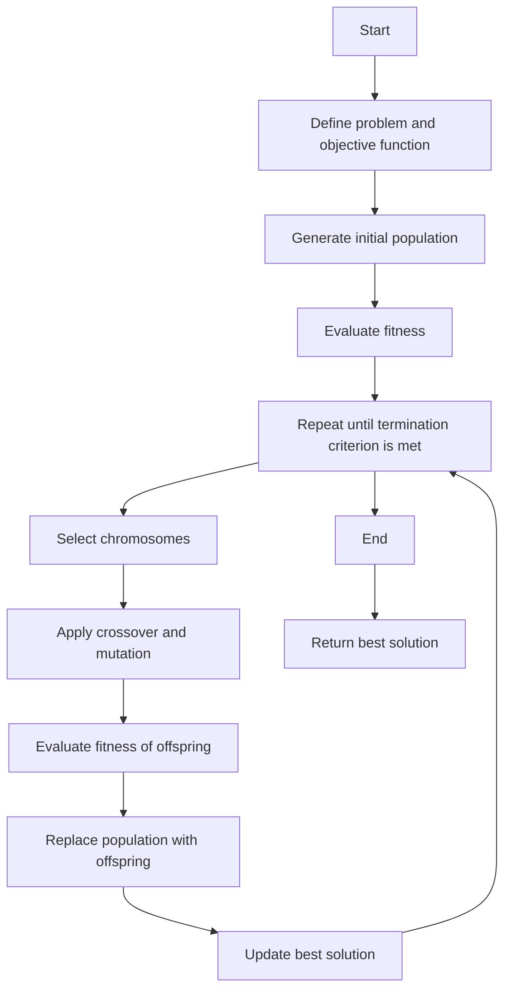

## Unit 1 - Neural Networks-I (Introduction & Architecture)

- A neural network is a network or circuit of biological neurons, or, in a modern sense, an artificial neural network, composed of artificial neurons or nodes.
- A neural network is either a biological neural network, made up of biological neurons, or an artificial neural network, used for solving artificial intelligence (AI) problems.
- A neural network can take in multiple inputs to produce a single output. This is the primary job of a neural network – to transform input into a meaningful output.
- A neural network consists of an input and output layer with one or multiple hidden layers within. It is also known as Artificial Neural Network or ANN.
- The neural network architecture is made of individual units called neurons that mimic the biological behavior of the brain. Here are the various components of a neuron:
  - Input: The input is the data that is fed into the neuron. It can be a single value or a vector of values.
  - Weights: The weights are the parameters that determine how much each input contributes to the output. They are learned during the training process.
  - Bias: The bias is an additional parameter that adds a constant value to the weighted sum of the inputs. It is also learned during the training process.
  - Activation function: The activation function is a nonlinear function that maps the weighted sum of the inputs and the bias to the output. It introduces nonlinearity to the model and allows the neural network to learn complex patterns. Some common activation functions are sigmoid, tanh, ReLU, softmax, etc.
  - Output: The output is the final value that is produced by the neuron. It can be a single value or a vector of values.
- A neural network can have different types of architectures depending on the number and arrangement of the layers and neurons. Some common types of neural network architectures are:
  - Feedforward neural network: A feedforward neural network is the simplest type of neural network, where the information flows from the input layer to the output layer without any feedback loops. The layers are fully connected, meaning that each neuron in one layer is connected to every neuron in the next layer. A feedforward neural network can have one or more hidden layers.
  - Recurrent neural network: A recurrent neural network is a type of neural network that has feedback loops, meaning that the output of a neuron can be fed back to itself or to previous neurons. This allows the neural network to have a memory and process sequential data, such as natural language, speech, or time series. A recurrent neural network can have one or more hidden layers, and each hidden layer can have one or more recurrent connections.
  - Convolutional neural network: A convolutional neural network is a type of neural network that uses convolutional layers, which are composed of filters or kernels that slide over the input and produce feature maps. This allows the neural network to extract local features and reduce the number of parameters. A convolutional neural network is especially useful for processing image data, but can also be applied to other types of data. A convolutional neural network can have one or more convolutional layers, followed by one or more fully connected layers.
  - Generative adversarial network: A generative adversarial network is a type of neural network that consists of two competing networks: a generator and a discriminator. The generator tries to generate realistic data from random noise, while the discriminator tries to distinguish between real data and fake data. The two networks are trained simultaneously, and the goal is to make the generator produce data that can fool the discriminator. A generative adversarial network can be used for generating images, text, audio, etc.


### Neuron

- A neuron is the structural and functional unit of the nervous system that transmits information in the form of electrical signals .
- A typical neuron consists of three main parts: the cell body (soma), the dendrites, and the axon .
- The cell body contains the nucleus and other organelles that maintain the metabolic functions of the neuron .
- The dendrites are branched extensions of the cell body that receive signals from other neurons or sensory stimuli and convey them to the cell body  .
- The axon is a long and thin projection of the cell body that carries signals away from the cell body to other neurons, muscles, or glands  .
- The axon is usually covered by a fatty layer called the myelin sheath, which insulates the axon and increases the speed of signal transmission  .
- The axon terminates in specialized structures called axon terminals or synaptic knobs, which form junctions with the dendrites or cell bodies of other neurons or with the effector organs  .
- The junctions between neurons are called synapses, and they allow the transfer of information between neurons through the release and reception of chemical messengers called neurotransmitters   .
- Neurons can be classified into three types based on their function: sensory neurons, motor neurons, and interneurons  .
- Sensory neurons carry information from the sensory receptors to the central nervous system (CNS), which consists of the brain and the spinal cord  .
- Motor neurons carry information from the CNS to the effector organs, such as muscles and glands, to produce a response  .
- Interneurons are located within the CNS and connect sensory and motor neurons, as well as other interneurons, to process and integrate information  .
- Neurons are the basic functional units of the nervous system, and they enable us to perceive, think, communicate, and act  .


### Nerve structure and synapse

- A nerve is a bundle of nerve fibres (axons) that transmit electrical impulses from one part of the body to another.
- A nerve fibre is a long extension of a nerve cell (neuron) that carries an action potential (a brief change in the electrical charge of the cell membrane) along its length.
- A neuron consists of three main parts: a cell body (soma), which contains the nucleus and other organelles; a dendrite, which is a branched projection that receives signals from other neurons or sensory receptors; and an axon, which is a long projection that sends signals to other neurons, muscles or glands.
- A synapse is a structure that allows a neuron to communicate with another neuron or a target cell. There are two main types of synapses: chemical and electrical.
- A chemical synapse is a type of synapse where the presynaptic neuron (the neuron that sends the signal) releases a chemical messenger called a neurotransmitter into the synaptic cleft (a narrow gap between the presynaptic and postsynaptic cells). The neurotransmitter binds to specific receptors on the postsynaptic cell (the cell that receives the signal), causing a change in its membrane potential or intracellular signalling.
- An electrical synapse is a type of synapse where the presynaptic and postsynaptic cells are connected by gap junctions (channels that allow the direct flow of ions and small molecules between cells). Electrical synapses allow the rapid and synchronous transmission of electrical signals between cells.
- The structure and function of synapses are essential for the processing and integration of information in the nervous system. Synapses can be excitatory (increasing the likelihood of the postsynaptic cell to fire an action potential) or inhibitory (decreasing the likelihood of the postsynaptic cell to fire an action potential). Synapses can also be modulated by various factors, such as hormones, drugs, or learning and memory.


### Artificial Neuron and its model

- An artificial neuron is a mathematical function that is inspired by the structure and function of biological neurons, which are the basic units of the nervous system.
- An artificial neuron is also called a node or a unit in an artificial neural network, which is a computational model that mimics the learning and processing abilities of the brain.
- An artificial neuron receives one or more inputs, which can be numerical values or signals from other artificial neurons, and computes an output based on a weighted sum of the inputs and a non-linear activation function.
- The weights are adjustable parameters that determine the strength and direction of the influence of each input on the output. The activation function is a mathematical function that maps the weighted sum to a desired output range, such as 0 or 1, or -1 or 1, or any continuous interval.
- The activation function can also introduce non-linearity to the artificial neuron, which enables it to model complex phenomena that are not linearly separable, such as XOR logic or image recognition.
- The most common activation functions are sigmoid, tanh, ReLU, and softmax, but there are many other types and variations of activation functions that can be used depending on the task and the data.
- An artificial neuron can be represented graphically as a circle or a rectangle with input arrows and an output arrow, or mathematically as a function of the form:

  `y = f(w1x1 + w2x2 + ... + wnxn + b)`

  where `y` is the output, `f` is the activation function, `w` are the weights, `x` are the inputs, and `b` is the bias term, which is an additional parameter that shifts the weighted sum by a constant value.

- An artificial neuron can be modeled at different levels of abstraction, from the biological level, which considers the electrochemical processes and the spiking behavior of the neuron, to the logical level, which considers the neuron as a binary or discrete unit that performs logical operations, to the computational level, which considers the neuron as a continuous or analog unit that performs numerical computations.

- The artificial neuron model was first proposed by Warren McCulloch and Walter Pitts in 1943, and later refined by Frank Rosenblatt, who developed the perceptron, one of the earliest and simplest types of artificial neural networks, in 1958. Since then, many variations and extensions of the artificial neuron model have been developed, such as the radial basis function neuron, the adaptive linear neuron, the stochastic neuron, and the spiking neuron.


### Activation Functions

- Activation functions are mathematical equations that determine the output of a neural network model.
- Activation functions also have a major effect on the neural network’s ability to converge and the convergence speed, or in some cases, activation functions might prevent neural networks from converging in the first place.
- Activation functions shape the outputs of artificial neurons and, therefore, are integral parts of neural networks in general and deep learning in particular.
- Activation functions decide whether a neuron should be activated or not, based on the input values.
- Activation functions can be linear or nonlinear, depending on whether they have a constant or variable slope.
- Some common activation functions are:
  - Sigmoid: A nonlinear function that maps any input value to a value between 0 and 1. It is useful for binary classification problems.
  - Tanh: A nonlinear function that maps any input value to a value between -1 and 1. It is similar to sigmoid but has a steeper slope and is centered at zero.
  - ReLU: A nonlinear function that maps any input value to a value greater than or equal to zero. It is useful for sparse representations and avoiding the vanishing gradient problem.
  - Leaky ReLU: A nonlinear function that maps any input value to a value greater than or equal to zero, except for negative values which are multiplied by a small constant. It is useful for avoiding the dying ReLU problem.
  - Softmax: A nonlinear function that maps any input value to a probability distribution over a set of classes. It is useful for multi-class classification problems.


### Neural network architecture

- A neural network architecture is the design and structure of an artificial neural network, which is a computational system inspired by the biological brain.
- A neural network consists of artificial neurons, which are units that can receive and process inputs, and produce an output. The neurons are connected by weights, which represent the strength of the connection between them.
- A neural network architecture can be classified into three main types: feedforward, recurrent, and convolutional.
  - Feedforward neural networks are the simplest type, where the information flows from the input layer to the output layer, without any feedback loops. They are suitable for tasks such as regression and classification.
  - Recurrent neural networks have feedback loops that allow the network to store and use previous information. They are suitable for tasks that involve sequential data, such as natural language processing and time series analysis.
  - Convolutional neural networks have special layers that perform convolution operations, which extract features from the input using filters. They are suitable for tasks that involve spatial data, such as image recognition and computer vision.
- A neural network architecture can also be characterized by its depth, width, and activation functions.
  - The depth of a neural network is the number of layers it has. A deep neural network has many hidden layers between the input and output layers, which allows it to learn more complex and abstract features.
  - The width of a neural network is the number of neurons in each layer. A wide neural network can capture more information and diversity from the input, but it may also increase the risk of overfitting.
  - The activation functions are the functions that determine the output of each neuron, based on its input. They introduce non-linearity to the network, which enables it to learn more complex patterns. Some common activation functions are sigmoid, tanh, ReLU, and softmax.
- A neural network architecture is usually designed and optimized using various techniques, such as hyperparameter tuning, regularization, dropout, batch normalization, and transfer learning .


### Single Layer and Multilayer Feed Forward Networks

- A feed forward network is a type of artificial neural network in which data and calculations flow in a single direction, from the input layer to the output layer, without any feedback loops.
- A single layer feed forward network consists of only two layers: an input layer and an output layer of neurons (also called perceptrons or units).
- A multilayer feed forward network consists of more than two layers: an input layer, one or more hidden layers, and an output layer of neurons.
- The hidden layers are internal to the network and have no direct connection to the external inputs or outputs.
- Each neuron in one layer has directed connections (also called weights or synapses) to the neurons of the subsequent layer.
- The neurons in each layer apply an activation function to their weighted inputs to produce their outputs.
- A common choice of activation function is the sigmoid function, which has a continuous and differentiable output between 0 and 1.
- The output of the network is determined by the values of the weights and the activation functions.
- The network can learn to approximate any function by adjusting the weights based on the training data and a learning algorithm.
- A common learning algorithm is the backpropagation algorithm, which uses the gradient descent method to minimize the error between the network output and the desired output for each training example.
- The network can generalize to new inputs that are not in the training data by finding a suitable representation of the input-output mapping in the hidden layers.


### Recurrent Networks

- Recurrent networks are a class of artificial neural networks that can process sequential data or time series data .
- Recurrent networks have feedback or recurrent connections that form loops in the network, allowing the output of some nodes to affect the input of the same or other nodes .
- Recurrent networks have an internal state or memory that stores the past information or knowledge of the network at each time step .
- Recurrent networks can use their internal state to learn from variable length sequences of inputs and outputs, and to capture long-term dependencies and temporal dynamics in the data .
- Recurrent networks are commonly used for ordinal or temporal problems, such as natural language processing, speech recognition, machine translation, image captioning, etc.
- Recurrent networks can be classified into different types based on their architecture, such as simple recurrent network, Elman network, Jordan network, long short-term memory network, gated recurrent unit network, etc .


### Various learning techniques for the notes of the Unit 1 - Neural Networks-I (Introduction & Architecture) in the subject of Application of Soft Computing

- Neural networks are computational models that try to emulate the human brain, combining computer science and statistics to solve common problems in the field of artificial intelligence, machine learning and deep learning.
- Neural networks consist of layers of interconnected nodes, each node performing a simple mathematical operation on its inputs and passing the output to the next layer. The nodes are also called neurons, and the layers are called input layer, hidden layer(s) and output layer.
- Neural networks can learn from data by adjusting the weights and biases of the nodes, which are the free parameters that determine how the network responds to the inputs. The learning process involves finding the optimal values of the weights and biases that minimize a predefined error function or maximize a predefined performance function.
- There are different learning techniques or rules that a neural network can apply, depending on the type and availability of the data, the desired output and the network architecture. Some of the common learning techniques are :
  - Supervised learning: The network is given a set of input-output pairs, and the goal is to learn a function that maps the inputs to the outputs. The network compares its output with the desired output and adjusts the weights and biases accordingly. This technique is suitable for problems such as classification, regression and prediction.
  - Unsupervised learning: The network is given a set of inputs only, and the goal is to discover patterns, features or structures in the data. The network does not have a predefined output or error function, but rather tries to optimize some internal criteria, such as clustering, density estimation or dimensionality reduction.
  - Reinforcement learning: The network is given a set of inputs and a reward or penalty signal, and the goal is to learn a policy that maximizes the expected reward or minimizes the expected penalty. The network interacts with an environment and learns from its own actions and feedback. This technique is suitable for problems such as control, optimization and decision making.
  - Semi-supervised learning: The network is given a set of inputs, some of which are labeled with outputs and some of which are unlabeled. The goal is to leverage both the labeled and unlabeled data to improve the learning performance. This technique is useful when the labeled data is scarce or expensive to obtain, and the unlabeled data is abundant or cheap to obtain.


### Perception and Convergence Rule

- A perceptron is a kind of a single-layer artificial neural network with only one neuron.
- A perceptron is a simplified model of the biological neurons in our brain.
- A perceptron calculates the linear combination of its real-valued or boolean inputs and passes it through a threshold activation function.
- A perceptron can be used for binary classification tasks, such as detecting whether an email is spam or not.
- The perceptron learning rule is an algorithm that updates the weights of the perceptron based on the errors between the predicted and actual outputs.
- The perceptron convergence theorem states that for any data set which is linearly separable, the perceptron learning rule is guaranteed to find a solution in a finite number of steps.
- The perceptron convergence theorem can be proved using mathematical induction and geometry.
- The perceptron convergence theorem does not hold for data sets that are not linearly separable, in which case the perceptron learning rule may never converge.
- A common variant of the basic perceptron algorithm is the averaged perceptron, which uses the average of the weights over all iterations instead of the final weights.
- The averaged perceptron can reduce the variance and improve the generalization of the perceptron.
- A recent extension of the perceptron is the deep neural network with controllable rule representations (DeepCTRL), which incorporates a rule encoder into the model coupled with a rule-based objective, enabling a shared representation for decision making.
- DeepCTRL can be applied to any kind of rule defined for inputs and outputs, and can handle complex and noisy data.


### Auto-associative and hetero-associative memory

- Auto-associative and hetero-associative memory are two types of associative memory in neural networks.
- Associative memory is the ability to recall a stored pattern given a partial or noisy input that is similar to the original pattern.
- Auto-associative memory retrieves the same pattern Y given an input pattern X, i.e., Y = X.
- Hetero-associative memory retrieves a stored pattern Y given an input pattern X such that Y ≠ X.
- Auto-associative memory is also known as unidirectional memory, while hetero-associative memory is also known as bidirectional memory.
- Auto-associative memory can be used for pattern completion, noise reduction, data compression, and feature extraction.
- Hetero-associative memory can be used for pattern recognition, classification, and mapping.
- Auto-associative memory can be implemented by recurrent neural networks, such as Hopfield network, that have feedback connections between neurons.
- Hetero-associative memory can be implemented by feedforward neural networks, such as perceptron, that have no feedback connections between neurons.
- Auto-associative memory can store multiple patterns in a distributed manner, while hetero-associative memory can store only one pair of patterns in a local manner.
- Auto-associative memory can learn patterns in an unsupervised way, while hetero-associative memory can learn patterns in a supervised way.
- Auto-associative memory can recall patterns in an iterative way, while hetero-associative memory can recall patterns in a one-shot way.
- Auto-associative memory can be influenced by biological constraints, such as synaptic plasticity, neuronal excitability, and network topology.
- Hetero-associative memory can be enhanced by logical rules, such as Hebbian learning, correlation learning, and delta learning.


## Unit 2 - Neural Networks-II (Back propagation networks)

- Backpropagation is a process involved in training a neural network  .
- It involves taking the error rate of a forward propagation and feeding this loss backward through the neural network layers to fine-tune the weights .
- Backpropagation is the essence of neural net training . It is the method of fine-tuning the weights of a neural network based on the error rate obtained in the previous epoch (i.e., iteration).
- Proper tuning of the weights allows you to reduce error rates and make the model reliable by increasing its generalization.
- Backpropagation is also known as "backward propagation of errors" . It is a standard method of training artificial neural networks.
- Backpropagation can be applied to any feedforward artificial neural network, and also to other types of artificial neural networks with some modifications.
- The backpropagation algorithm consists of the following steps:
  - Initialize the network weights randomly.
  - Perform a forward pass through the network and compute the output and the error for each training example.
  - Perform a backward pass through the network and compute the gradients of the error with respect to each weight using the chain rule.
  - Update the weights using a learning rate and the gradients.
  - Repeat the forward and backward passes for a number of epochs until the error is minimized or a stopping criterion is met.


### Architecture for the notes of the Unit 2 - Neural Networks-II (Back propagation networks) in the subject of Application of Soft Computing

- A back propagation network is a type of artificial neural network that uses a supervised learning algorithm to produce a desired output .
- The algorithm adjusts the weights of the connections between the nodes in the network according to a feedback signal that indicates the error rate of a forward propagation .
- The feedback signal is calculated by comparing the actual output of the network with the expected output for a given input.
- The error is then propagated backward through the network, layer by layer, and the weights are updated using a learning rule that minimizes the error .
- The learning rule is usually based on the gradient descent method, which finds the optimal weights that minimize a loss function .
- The back propagation algorithm consists of two phases: the forward phase and the backward phase.
- In the forward phase, the input is fed to the network and the output is computed by applying the activation functions of the nodes.
- In the backward phase, the error is computed by subtracting the actual output from the expected output, and the weights are updated by applying the learning rule.
- The algorithm repeats these two phases until the error is reduced below a certain threshold or a maximum number of iterations is reached.
- The architecture of a back propagation network consists of three main components: the input layer, the hidden layer(s), and the output layer .
- The input layer consists of nodes that receive the input data and pass it to the hidden layer(s) .
- The hidden layer(s) consist of nodes that perform nonlinear transformations on the input data and pass it to the output layer .
- The output layer consists of nodes that produce the final output of the network .
- The nodes in each layer are connected by weighted links that represent the strength of the influence of one node on another .
- The number of nodes and layers in a back propagation network depends on the complexity of the problem and the amount of training data available .
- A back propagation network can be represented by a directed acyclic graph, where the nodes are the vertices and the weighted links are the edges.
- A back propagation network can also be represented by a matrix, where the rows are the nodes and the columns are the weights.
- A back propagation network can be trained using various methods, such as batch, online, stochastic, or mini-batch .
- A back propagation network can be used for various applications, such as classification, regression, pattern recognition, image processing, natural language processing, etc .


### Perceptron Model

- A perceptron is a **simplified model of a biological neuron** that can perform binary classification.
- A perceptron consists of four main components:
  - A set of input features **x1, x2, ..., xn** that represent the attributes of the data point.
  - A set of weights **w1, w2, ..., wn** that measure the importance of each input feature.
  - A bias term **b** that shifts the decision boundary away from the origin.
  - An activation function **ϕ** that maps the weighted sum of the inputs and the bias to an output value, usually 0 or 1.
- The output of a perceptron is given by the following formula:

  ```math
  y = ϕ(w1x1 + w2x2 + ... + wnxn + b)
  ```

- The activation function ϕ is typically a **step function** that returns 1 if the argument is positive and 0 otherwise.
- The perceptron can be trained using a **learning algorithm** that updates the weights and the bias based on the prediction errors.
- The perceptron learning algorithm works as follows:
  - Initialize the weights and the bias to zero or small random values.
  - For each training example **(x, y)**, where **x** is the input vector and **y** is the true label, do the following:
    - Compute the output **y'** of the perceptron using the current weights and bias.
    - Compute the error **e = y - y'**.
    - Update the weights and the bias using the following rules:

      ```math
      w_i = w_i + αex_i
      b = b + αe
      ```

      where **α** is the learning rate, a positive constant that controls the size of the updates.
  - Repeat the above steps until the perceptron converges to a solution or a maximum number of iterations is reached.


### Solution for the notes of the Unit 2 - Neural Networks-II (Back propagation networks) in the subject of Application of Soft Computing

- A back propagation network is a type of artificial neural network that uses a supervised learning algorithm to produce a desired output .
- The algorithm adjusts the weights of the connections between the nodes in the network according to a feedback signal that indicates the error rate of a forward propagation .
- The goal of back propagation is to minimize the error or loss function by updating the weights in the opposite direction of the gradient of the error function with respect to the weights .
- The steps of the back propagation algorithm are as follows:
  - Initialize the network with random weights and biases.
  - For each training example, perform the following substeps:
    - Feed the input forward through the network and compute the output of each node.
    - Compare the output of the network with the desired output and calculate the error for each output node.
    - Propagate the error backward through the network and compute the error gradient for each weight and bias.
    - Update the weights and biases by subtracting a fraction of the error gradient from the current values.
  - Repeat the above steps until the error is sufficiently low or a maximum number of iterations is reached.
- Back propagation networks can be used for various applications, such as classification, regression, pattern recognition, image processing, natural language processing, etc .


### Single Layer Artificial Neural Network

- A single layer artificial neural network is a type of neural network that has just one layer between the input and output layers. This type of neural network is also known as a perceptron.
- A perceptron can be used to perform binary classification tasks, such as predicting whether an email is spam or not, or whether a tumor is benign or malignant.
- A perceptron consists of a set of input nodes, each with a corresponding weight, a bias term, an activation function, and an output node .
- The output of the perceptron is computed by multiplying each input by its weight, adding the bias term, and applying the activation function .
- The activation function is usually a step function, which returns 1 if the input is greater than or equal to a threshold, and 0 otherwise .
- The perceptron can be trained using a learning algorithm, such as the perceptron learning rule, which updates the weights and bias based on the error between the predicted and actual output .
- The perceptron learning rule is given by:

    - w<sub>i</sub> = w<sub>i</sub> + &alpha;(y - &hat;y)x<sub>i</sub>
    - b = b + &alpha;(y - &hat;y)

    where w<sub>i</sub> is the weight of the i-th input, b is the bias term, &alpha; is the learning rate, y is the actual output, &hat;y is the predicted output, and x<sub>i</sub> is the i-th input .

- The perceptron learning rule can be applied iteratively until the perceptron converges to a solution, or until a maximum number of iterations is reached .
- The perceptron can only learn linearly separable patterns, meaning that there exists a hyperplane that can separate the two classes of data .
- The perceptron cannot learn nonlinear patterns, such as the XOR function, which requires more than one layer of neurons .
- A single layer neural network can be extended to a multilayer neural network, which has one or more hidden layers between the input and output layers.
- A multilayer neural network can learn more complex and nonlinear patterns, such as image recognition, natural language processing, and speech synthesis.
- A multilayer neural network can be trained using a more advanced learning algorithm, such as the backpropagation algorithm, which updates the weights and biases of all the layers based on the error gradient.


### Multilayer Perceptron Model

- A multilayer perceptron (MLP) is a type of feedforward artificial neural network that consists of multiple layers of neurons.
- Each neuron in a layer is connected to all the neurons in the previous and the next layer, forming a fully connected network.
- Each connection has a weight that determines the strength of the signal between the neurons.
- Each neuron also has a bias that shifts the activation function of the neuron.
- The activation function is a nonlinear function that maps the input of the neuron to its output.
- The input layer of the MLP receives the predictor variables and passes them to the hidden layer(s).
- The hidden layer(s) perform nonlinear transformations on the input and pass them to the output layer.
- The output layer produces the predicted values for the dependent (target) variables.
- The MLP can be trained using a supervised learning algorithm called backpropagation.
- Backpropagation is a method of adjusting the weights and biases of the MLP based on the error between the predicted and the actual values.
- Backpropagation consists of two steps: forward propagation and backward propagation.
- Forward propagation is the process of computing the output of the MLP given the input and the current weights and biases.
- Backward propagation is the process of computing the gradients of the error with respect to the weights and biases using the chain rule of differentiation.
- The gradients are then used to update the weights and biases using a learning rate parameter.
- The learning rate determines how much the weights and biases change in each iteration.
- The MLP can be used to approach multiclass classification and regression problems.
- The MLP can learn complex and nonlinear patterns from the data.
- The MLP can also generalize well to unseen data if the network is not overfitted.
- The MLP has some limitations, such as the high computational cost, the risk of overfitting, and the difficulty of choosing the optimal network architecture.


### Backpropagation Learning Methods

- Backpropagation is a widely used method for training feedforward artificial neural networks (ANNs) by adjusting the weights of the network to minimize the error between the desired output and the actual output  .
- Backpropagation is based on the chain rule of calculus, which allows the computation of the gradient of a function with respect to its inputs by propagating the errors backward from the output layer to the input layer .
- Backpropagation consists of two phases: a forward pass and a backward pass .
  - In the forward pass, the input is fed to the network and the output is computed. The error between the desired output and the actual output is also calculated.
  - In the backward pass, the error is propagated back through the network and the weights are updated according to a learning rule, such as stochastic gradient descent, that aims to reduce the error.
- Backpropagation can handle noise in the training data and may generalize better if some noise is present in the training data.
- Backpropagation is a powerful and flexible learning method that can be applied to various types of ANNs, such as multilayer perceptrons, convolutional neural networks, recurrent neural networks, etc.
- Backpropagation has some limitations and challenges, such as the vanishing gradient problem, the local minima problem, the overfitting problem, the choice of hyperparameters, etc.


### Effect of learning rule coefficient for the notes of the Unit 2 - Neural Networks-II (Back propagation networks) in the subject of Application of Soft Computing

- Learning rule coefficient, also known as learning rate, is a parameter that controls how much the weights of a neural network are updated in each iteration of the training process.
- Learning rate affects the speed and accuracy of the learning process. A high learning rate can lead to faster convergence, but also to overshooting the optimal solution and oscillating around it. A low learning rate can lead to slower convergence, but also to more precise and stable solutions.
- Back propagation networks are a type of feedforward neural networks that use a learning algorithm called backpropagation to adjust the weights of the network based on the prediction error of the output layer.
- Backpropagation involves two steps: forward propagation and backward propagation. In forward propagation, the input data is fed to the network and the output is computed. In backward propagation, the error between the output and the desired target is calculated and propagated back to the previous layers, using the chain rule of calculus, to update the weights of the network.
- The learning rule for backpropagation networks is given by:

$$\Delta w_{ij} = -\eta \frac{\partial E}{\partial w_{ij}}$$

where $\Delta w_{ij}$ is the change in the weight from unit $i$ to unit $j$, $\eta$ is the learning rate, $E$ is the error function, and $w_{ij}$ is the weight from unit $i$ to unit $j$.

- The effect of learning rate on backpropagation networks can be summarized as follows:

  - A high learning rate can cause the network to learn faster, but also to miss the optimal solution and oscillate around it. This can result in poor generalization and high variance.
  - A low learning rate can cause the network to learn slower, but also to find the optimal solution and converge to it. This can result in better generalization and low variance.
  - A moderate learning rate can balance the trade-off between speed and accuracy, and achieve a good performance of the network.
  - The optimal learning rate depends on the problem, the data, the network architecture, and the error function. It can be determined by trial and error, or by using adaptive methods that adjust the learning rate dynamically based on the feedback from the network.


### Backpropagation Algorithm

- Backpropagation, or backward propagation of errors, is an algorithm that is designed to test for errors working back from output nodes to input nodes.
- It is an important mathematical tool for improving the accuracy of predictions in data mining and machine learning.
- It uses supervised learning, which means that the algorithm is provided with examples of the inputs and outputs that the network should compute, and then the error is calculated.
- It is based on generalizing the Widrow-Hoff learning rule, which is a simple method for adjusting the weights of a single-layer neural network.
- It applies the chain rule of calculus to compute the gradient of the error function with respect to the neural network's weights.
- It consists of two phases: a forward pass and a backward pass.
- In the forward pass, the input data is fed to the network and the output is computed.
- In the backward pass, the error is propagated from the output layer to the input layer, and the weights are updated according to the gradient.
- It is a widely used algorithm for training feedforward artificial neural networks, which are networks that have no cycles or loops.
- It can also be generalized to other artificial neural networks, such as recurrent neural networks, which have cycles or loops.
- It can also be applied to other functions, such as cost functions, loss functions, or objective functions.
- It is an iterative algorithm, which means that it repeats the process of forward and backward passes until the error is minimized or a stopping criterion is met.
- It is a gradient-based algorithm, which means that it follows the direction of the steepest descent of the error function.
- It is a local optimization algorithm, which means that it can get stuck in local minima or saddle points of the error function.
- It is a computationally intensive algorithm, which means that it requires a lot of memory and processing power.


### Factors affecting backpropagation training

Backpropagation is a learning algorithm for artificial neural networks that adjusts the weights of the connections between the neurons based on the error between the desired and the actual output. Backpropagation training is influenced by several factors, such as :

- **Initial weights**: The initial values of the weights affect the final solution and the convergence speed of the algorithm. Randomly initializing the weights can help avoid local minima and symmetry problems. However, the range of the random values should be chosen carefully to avoid saturation or instability of the neurons.
- **Learning rate**: The learning rate is a parameter that controls the size of the weight updates at each iteration. A high learning rate can speed up the convergence, but it can also cause overshooting or oscillations. A low learning rate can ensure stability, but it can also slow down the convergence or get stuck in local minima. A dynamic learning rate that adapts to the error gradient can be a good compromise.
- **Momentum term**: The momentum term is a parameter that adds a fraction of the previous weight update to the current one. This can help accelerate the convergence and escape from local minima by adding inertia to the weight changes. However, too much momentum can also cause overshooting or instability.
- **Activation function**: The activation function determines the output of each neuron given its input. The choice of the activation function affects the steepness of the error surface and the sensitivity of the neurons to the weight changes. A common activation function is the sigmoid function, which has a smooth and bounded output, but it can also cause saturation or vanishing gradients. Other activation functions, such as tanh, ReLU, or softmax, can have different advantages and disadvantages depending on the problem domain.
- **Update rule**: The update rule determines how the weights are adjusted based on the error gradient and the learning parameters. The most common update rule is the gradient descent, which moves the weights in the opposite direction of the gradient. However, gradient descent can be slow or inefficient in some cases, especially when the error surface is complex or noisy. Other update rules, such as stochastic gradient descent, conjugate gradient, or Adam, can improve the performance and robustness of the algorithm by introducing randomness, directionality, or adaptive learning rates.
- **Training set**: The training set is the collection of input-output pairs that are used to train the neural network. The size, quality, and diversity of the training set affect the generalization and accuracy of the network. A large and representative training set can help avoid overfitting and improve the network's ability to learn the underlying patterns. However, a large training set can also increase the computational cost and the risk of redundancy or noise. A small or biased training set can lead to underfitting or poor generalization. A good practice is to split the training set into training, validation, and test subsets, and use cross-validation or early stopping techniques to monitor and optimize the network's performance.
- **Network architecture**: The network architecture refers to the number, type, and arrangement of the neurons and the layers in the network. The network architecture affects the complexity and the expressiveness of the network. A large and deep network can have more capacity and flexibility to learn complex and nonlinear functions, but it can also be prone to overfitting and require more training time and resources. A small and shallow network can be simpler and faster to train, but it can also be limited and unable to capture the essential features of the problem. A good network architecture should balance the trade-off between the bias and the variance of the network, and match the characteristics and the requirements of the problem.


### Applications of Backpropagation Networks

Backpropagation networks are a type of artificial neural networks that use a supervised learning algorithm to adjust the weights of the network based on the error between the desired output and the actual output. They are widely used in various domains such as:

- **Speech recognition**: Backpropagation networks can be trained to recognize and generate speech signals by learning the acoustic features and linguistic rules of a language .
- **Image recognition**: Backpropagation networks can be trained to recognize and classify images based on their pixel values and features. They can also be used for face detection, segmentation, and recognition .
- **Natural language processing**: Backpropagation networks can be trained to perform various tasks in natural language processing such as sentiment analysis, machine translation, text summarization, and question answering by learning the semantic and syntactic structures of natural languages .
- **Data mining**: Backpropagation networks can be trained to discover patterns and associations in large and complex datasets by learning the underlying distributions and correlations of the data .
- **Control systems**: Backpropagation networks can be trained to control and optimize the performance of dynamic systems such as robots, vehicles, and industrial processes by learning the input-output relationships and feedback mechanisms of the systems .
- **Medical diagnosis**: Backpropagation networks can be trained to diagnose diseases and disorders based on the symptoms and test results of patients by learning the medical knowledge and rules of the domain .


## Unit 3 - Fuzzy Logic-I (Introduction)

- Fuzzy logic is a form of multi-valued logic that deals with reasoning that is approximate rather than fixed and exact.
- Fuzzy logic is based on the concept of fuzzy sets, which are sets that have a degree of membership rather than a crisp membership of either 0 or 1.
- Fuzzy logic can handle uncertainty, vagueness, ambiguity, and imprecision in natural language, human decision making, and complex systems.
- Fuzzy logic can be used for various applications such as control systems, expert systems, data analysis, image processing, and artificial intelligence.
- Fuzzy logic was developed by Lotfi A. Zadeh in the 1960s as an extension of classical logic.
- Fuzzy logic has three main components: fuzzy sets, fuzzy operators, and fuzzy rules.
- Fuzzy sets are characterized by a membership function that assigns a degree of membership to each element in the universe of discourse.
- Fuzzy operators are used to perform operations on fuzzy sets, such as union, intersection, complement, and implication.
- Fuzzy rules are conditional statements that relate fuzzy sets using fuzzy operators, such as "if x is low then y is high".
- Fuzzy logic can be implemented using various methods, such as fuzzy logic controllers, fuzzy inference systems, fuzzy neural networks, and fuzzy genetic algorithms.


### Basic concepts of fuzzy logic

- Fuzzy logic is an approach to variable processing that allows for multiple possible truth values to be processed through the same variable.
- Fuzzy logic attempts to solve problems with an open, imprecise spectrum of data and heuristics that makes it possible to obtain an array of accurate conclusions.
- Fuzzy logic is a heuristic approach that allows for more advanced decision-tree processing and better integration with rules-based programming.
- Fuzzy logic is a generalization from standard logic, in which all statements have a truth value of one or zero. In fuzzy logic, statements can have a value of partial truth, such as 0.9 or 0.5 .
- The fundamental concept of fuzzy logic is the membership function, which defines the degree of membership of an input value to a certain set or category.
- The membership function is a mapping from an input value to a membership degree between 0 and 1, where 0 represents non-membership and 1 represents full membership.
- Fuzzy logic is a form of many-valued logic in which the truth value of variables may be any real number between 0 and 1.
- Fuzzy logic is employed to handle the concept of partial truth, where the truth value may range between completely true and completely false.
- The architecture of fuzzy logic consists of four main components:
  - Rules: It includes all the rules and if-then conditions proposed by experts to control the decision-making system.
  - Fuzzification: It is the process of transforming crisp inputs into fuzzy sets using membership functions.
  - Inference: It is the process of applying fuzzy rules to the fuzzy sets to obtain fuzzy outputs.
  - Defuzzification: It is the process of converting fuzzy outputs into crisp values using various methods.
- Fuzzy logic is a mathematical method for representing vagueness and uncertainty in decision-making, it allows for partial truths, and it is used in a wide range of applications.
- Fuzzy logic is based on the concept of membership function and the implementation is done using fuzzy rules.


### Fuzzy sets and Crisp sets

- Fuzzy sets and Crisp sets are two different set theories that deal with the representation of uncertainty and vagueness in data and information.
- A **crisp set** is a set that has a clear and precise boundary, and its elements either belong or do not belong to the set. A crisp set follows the binary logic of true or false, 1 or 0, yes or no. For example, the set of even numbers is a crisp set, as any number is either even or not.
- A **fuzzy set** is a set that has an indeterminate and gradual boundary, and its elements have a degree of membership to the set that ranges from 0 to 1. A fuzzy set follows the infinite-valued logic of possibility and probability, where the truth value of a statement can be any real number between 0 and 1. For example, the set of tall people is a fuzzy set, as the concept of tallness is subjective and relative, and different people may have different opinions on how tall someone is.
- The degree of membership of an element to a fuzzy set is represented by a **membership function**, which maps the element to a real number between 0 and 1. The membership function can have different shapes and forms, depending on the nature and context of the fuzzy set. For example, a triangular membership function can be used to define the fuzzy set of young people, where the age of 0 has a membership of 1, the age of 30 has a membership of 0.5, and the age of 60 has a membership of 0.
- Fuzzy sets generalize classical sets, since the indicator functions (aka characteristic functions) of classical sets are special cases of the membership functions of fuzzy sets, if the latter only takes values 0 or 1. In fuzzy set theory, classical bivalent sets are usually called **crisp sets**.
- Fuzzy sets and crisp sets have different operations and properties, such as union, intersection, complement, inclusion, equality, etc. For example, the union of two fuzzy sets A and B is defined as the fuzzy set C, where C(x) = max(A(x), B(x)) for any element x in the universe of discourse. The union of two crisp sets A and B is defined as the crisp set C, where C(x) = 1 if x belongs to A or B, and C(x) = 0 otherwise.


### Fuzzy set theory and operations

- Fuzzy set theory is a branch of mathematics that deals with sets whose elements have degrees of membership, ranging from 0 to 1, instead of the binary membership (0 or 1) of classical sets.
- Fuzzy sets can model uncertainty, vagueness, ambiguity, and imprecision in various domains, such as logic, control, decision making, pattern recognition, linguistics, etc .
- Fuzzy sets are denoted by a tilde sign on top of the normal set notation, such as A ~.
- The degree of membership of an element x in a fuzzy set A ~ is denoted by μA ~ (x) and is a real number between 0 and 1, where 0 means no membership and 1 means full membership .
- The universe of information U is the set of all possible elements that can belong to a fuzzy set.
- Fuzzy set operations are generalizations of crisp set operations, such as union, intersection, and complement, for fuzzy sets.
- There are different ways to define fuzzy set operations, but the most widely used ones are called standard fuzzy set operations, which are based on the min-max principle.
- The standard fuzzy set operations are defined as follows  :

  - Fuzzy complement: The complement of a fuzzy set A ~ is the fuzzy set A ~c such that μA ~c (x) = 1 - μA ~ (x) for all x in U.
  - Fuzzy union: The union of two fuzzy sets A ~ and B ~ is the fuzzy set A ~ ∪ B ~ such that μA ~ ∪ B ~ (x) = max(μA ~ (x), μB ~ (x)) for all x in U.
  - Fuzzy intersection: The intersection of two fuzzy sets A ~ and B ~ is the fuzzy set A ~ ∩ B ~ such that μA ~ ∩ B ~ (x) = min(μA ~ (x), μB ~ (x)) for all x in U.

- Other fuzzy set operations include algebraic product, algebraic sum, bounded sum, bounded difference, etc., which are defined using different formulas for combining the degrees of membership of the elements .
- Fuzzy set operations can be used to perform various operations on fuzzy sets, such as aggregation, combination, comparison, projection, etc .


### Properties of fuzzy sets

- A fuzzy set is a set where each element has a degree of membership, which is often represented by a number between 0 and 1, where 0 means the element is not a member of the set, and 1 means the element is a member of the set.
- Fuzzy sets can be considered as an extension and gross oversimplification of classical sets, which allow only binary membership (0 or 1).
- Fuzzy sets have many useful properties, such as :
  - **Involution**: The complement of the complement of a fuzzy set is the set itself, i.e., `~(~A) = A`.
  - **Commutativity**: The order of operands does not alter the result of fuzzy set operations, i.e., `A ∪ B = B ∪ A` and `A ∩ B = B ∩ A`.
  - **Associativity**: The order of operations performed on fuzzy sets can be changed, but the relative order of the operands cannot be changed, i.e., `(A ∪ B) ∪ C = A ∪ (B ∪ C)` and `(A ∩ B) ∩ C = A ∩ (B ∩ C)`.
  - **Distributivity**: Fuzzy set operations can be distributed over each other, i.e., `A ∪ (B ∩ C) = (A ∪ B) ∩ (A ∪ C)` and `A ∩ (B ∪ C) = (A ∩ B) ∪ (A ∩ C)`.
  - **Absorption**: A fuzzy set absorbs another fuzzy set if the union or intersection of them is equal to the first set, i.e., `A ∪ (A ∩ B) = A` and `A ∩ (A ∪ B) = A`.
  - **Idempotency / Tautology**: The union or intersection of a fuzzy set with itself is equal to the set itself, i.e., `A ∪ A = A` and `A ∩ A = A`.
  - **Identity**: The union or intersection of a fuzzy set with the universal set or the empty set is equal to the universal set or the fuzzy set itself, i.e., `A ∪ U = U` and `A ∪ ∅ = A`, and `A ∩ U = A` and `A ∩ ∅ = ∅`.
  - **Transitivity**: A fuzzy relation is transitive if the degree of membership of any pair of elements is equal to or greater than the minimum degree of membership of any other pair of elements that are related to the first pair, i.e., `μR(x,z) ≥ min(μR(x,y), μR(y,z))` for all `x, y, z`.


### Fuzzy and Crisp Relations

- A **crisp relation** is a binary relation that represents the presence or absence of association, interaction or interconnection between the elements of two or more sets   .
- A **fuzzy relation** is a fuzzy set defined on the Cartesian product of crisp sets  . It represents the degrees or strengths of association, interaction or interconnection between the elements of two or more sets using membership grades.
- A fuzzy relation can be seen as a generalization of a crisp relation, where the binary values of 0 and 1 are replaced by continuous values in the interval [0,1] .
- Some examples of fuzzy relations are:
  - The relation of similarity between two objects, such as colors, shapes, or sounds.
  - The relation of preference between two alternatives, such as products, services, or candidates.
  - The relation of causality between two events, such as smoking and lung cancer, or exercise and health.
- Some properties and operations of fuzzy relations are:
  - The **cardinality** of a fuzzy relation is the sum of the membership grades of all the ordered pairs in the relation.
  - The **complement** of a fuzzy relation is obtained by subtracting the membership grades of the original relation from 1 .
  - The **union** of two fuzzy relations is obtained by taking the maximum of the membership grades of the corresponding ordered pairs .
  - The **intersection** of two fuzzy relations is obtained by taking the minimum of the membership grades of the corresponding ordered pairs .
  - The **composition** of two fuzzy relations is obtained by applying a t-norm (a generalization of logical and) to the membership grades of the ordered pairs that form a chain .
  - The **inverse** of a fuzzy relation is obtained by swapping the first and second elements of each ordered pair .
  - The **projection** of a fuzzy relation is obtained by applying a t-conorm (a generalization of logical or) to the membership grades of the ordered pairs that share a common element .
  - The **cylindrical extension** of a fuzzy relation is obtained by assigning the same membership grade to all the ordered pairs that have a common element with the original relation .
  - A fuzzy relation is **reflexive** if the membership grade of each ordered pair with the same element is 1 .
  - A fuzzy relation is **symmetric** if the membership grade of each ordered pair is equal to the membership grade of its inverse .
  - A fuzzy relation is **transitive** if the membership grade of each ordered pair is greater than or equal to the membership grade of its composition with itself .
  - A fuzzy relation is **equivalence** if it is reflexive, symmetric, and transitive .


### Fuzzy to Crisp Conversion

- Fuzzy to crisp conversion, also known as **defuzzification**, is the process of transforming a fuzzy set into a single crisp value that represents the best decision or action based on the fuzzy set .
- Fuzzy to crisp conversion is necessary because some applications require a precise output that can be understood and executed by a controller or a human .
- There are different methods of fuzzy to crisp conversion, each with its own advantages and disadvantages. Some of the common methods are :
  - **Center of gravity (COG)**: This method calculates the crisp value as the weighted average of the fuzzy set, where the weights are the membership degrees. This method is simple and intuitive, but it may not reflect the shape of the fuzzy set well.
  - **Center of sums (COS)**: This method calculates the crisp value as the ratio of the sum of the fuzzy set values to the sum of the membership degrees. This method is similar to COG, but it gives more weight to the higher values of the fuzzy set.
  - **Center of maxima (COM)**: This method calculates the crisp value as the average of the values that have the maximum membership degree in the fuzzy set. This method is suitable for symmetric fuzzy sets, but it may not be unique if there are multiple maxima.
  - **Mean of maxima (MOM)**: This method calculates the crisp value as the mean of the values that have the maximum membership degree in the fuzzy set. This method is similar to COM, but it gives equal weight to all the maxima.
  - **Bisector of area (BOA)**: This method calculates the crisp value as the value that divides the area under the fuzzy set curve into two equal parts. This method is robust and stable, but it may not be unique if the fuzzy set is not convex.
  - **Smallest of maxima (SOM)**: This method calculates the crisp value as the smallest value that has the maximum membership degree in the fuzzy set. This method is suitable for left-skewed fuzzy sets, but it may ignore the other values of the fuzzy set.
  - **Largest of maxima (LOM)**: This method calculates the crisp value as the largest value that has the maximum membership degree in the fuzzy set. This method is suitable for right-skewed fuzzy sets, but it may ignore the other values of the fuzzy set.


## Unit 4 - Fuzzy Logic –II (Fuzzy Membership, Rules)

- Fuzzy logic is a form of multi-valued logic that deals with reasoning that is approximate rather than fixed and exact. It is based on the concept of fuzzy sets, which are sets that have degrees of membership rather than crisp boundaries.
- Fuzzy membership is a function that assigns a degree of belonging to each element of a fuzzy set, ranging from 0 (no membership) to 1 (full membership). The shape of the membership function depends on the type of fuzzy set and the context of the problem.
- Fuzzy rules are statements that express the relationship between fuzzy sets using linguistic variables and connectives. For example, a fuzzy rule for temperature control could be: IF temperature is high THEN fan speed is fast.
- Fuzzy rules can be represented using different formats, such as natural language, mathematical expressions, tables, graphs, or matrices. The most common format is the IF-THEN rule, which consists of an antecedent (condition) and a consequent (action).
- Fuzzy rules can be combined using different methods, such as min-max, max-min, max-product, or max-average. The combination method determines how the degree of fulfillment of each rule is calculated and how the consequent actions are aggregated.


### Membership functions for the notes of the Unit 4 - Fuzzy Logic –II (Fuzzy Membership, Rules) in the subject of Application of Soft Computing

- A membership function is a mathematical function that assigns a degree of membership to each element in a fuzzy set.
- The degree of membership represents how well the element belongs to the fuzzy set, and it ranges from 0 to 1 .
- Membership functions are the core of fuzzy logic, as they allow us to model vague and imprecise concepts, such as "hot", "cold", "tall", "short", etc .
- There are different types of membership functions, such as triangular, trapezoidal, Gaussian, sigmoidal, etc . Each type has its own shape, parameters, and advantages and disadvantages.
- The choice of membership function depends on the application, the available data, the desired accuracy, and the computational complexity .
- Membership functions can be defined by the user, derived from data, or learned by optimization algorithms .
- Membership functions are used to fuzzify the crisp inputs and defuzzify the fuzzy outputs of a fuzzy inference system .
- Fuzzification is the process of mapping the crisp inputs to fuzzy sets using the membership functions .
- Defuzzification is the process of mapping the fuzzy outputs to crisp values using the membership functions .
- A fuzzy inference system is a system that uses fuzzy logic to infer the output from the input based on a set of fuzzy rules .
- A fuzzy rule is a conditional statement that relates the fuzzy sets in the input and output domains .
- A fuzzy rule has the form: IF x is A THEN y is B, where x and y are variables, and A and B are fuzzy sets .
- A fuzzy rule can be interpreted as a fuzzy relation between the input and output variables .
- There are different methods to combine the fuzzy rules and infer the output, such as the Mamdani method, the Sugeno method, the Tsukamoto method, etc .
- The fuzzy inference system can be represented by a block diagram, as shown below :

Fuzzy inference system block diagram


### Interference in Fuzzy Logic

- Interference in fuzzy logic is the process of formulating the mapping from a given input to an output using fuzzy logic .
- The mapping then provides a basis from which decisions can be made or patterns discerned.
- Interference in fuzzy logic involves all of the pieces described so far, i.e., membership functions, fuzzy logic operators, and if-then rules .
- There are different types of fuzzy inference systems, such as Mamdani, Sugeno, and Tsukamoto .
- Each type of fuzzy inference system has its own advantages and disadvantages, depending on the application domain and the complexity of the problem .
- Fuzzy inference systems can be used in many areas where the experience of humans is valid and gets significant success, such as medical decision making, boiling control, image processing, etc .


### Fuzzy If-Then Rules

- Fuzzy if-then rules are expressions of the form "If x is A then y is B", where x and y are variables, and A and B are linguistic values defined by fuzzy sets on the domains of x and y, respectively.
- Fuzzy if-then rules are used to model the relationship between input and output variables in a fuzzy system, such as a fuzzy controller or a fuzzy classifier.
- Fuzzy if-then rules can be interpreted as fuzzy implications, which are logical statements that imply a certain degree of truth for the consequent given the antecedent.
- Fuzzy if-then rules can be classified into two types: Mamdani-type and Takagi-Sugeno-type.
  - Mamdani-type rules have fuzzy sets as both antecedents and consequents, and the output of the rule is a fuzzy set that can be combined with other rules using fuzzy aggregation operators.
  - Takagi-Sugeno-type rules have fuzzy sets as antecedents and crisp functions as consequents, and the output of the rule is a crisp value that can be combined with other rules using weighted averaging.
- Fuzzy if-then rules can be inferred using different methods, such as the compositional rule of inference, the max-min inference, the max-product inference, or the fuzzy modus ponens .
  - The compositional rule of inference is a general method that applies a fuzzy relation (the implication) to a fuzzy set (the input) to obtain another fuzzy set (the output).
  - The max-min inference is a special case of the compositional rule of inference that uses the minimum operator as the implication and the maximum operator as the aggregation.
  - The max-product inference is another special case of the compositional rule of inference that uses the product operator as the implication and the maximum operator as the aggregation.
  - The fuzzy modus ponens is a method that uses the degree of membership of the input in the antecedent to scale the membership function of the consequent.


### Fuzzy Implications and Fuzzy Algorithms

- Fuzzy implications are a generalization of the classical implication, which is a logical connective that expresses the conditionality of a proposition on another proposition. For example, if A implies B, then B is true whenever A is true. Fuzzy implications extend this concept to fuzzy sets and fuzzy logic, where the truth values are not binary but continuous in the interval [0, 1].
- Fuzzy algorithms are a type of algorithms that use fuzzy sets, fuzzy logic, and fuzzy arithmetic to deal with imprecise, uncertain, or vague information. Fuzzy algorithms can provide efficient and flexible solutions to complex problems in various fields, such as control, decision making, data analysis, image processing, etc. Fuzzy algorithms can be described with little data, so they require little memory.
- Fuzzy implications and fuzzy algorithms are related in the following ways:
  - Fuzzy implications are used to define fuzzy rules, which are the basic components of fuzzy algorithms. Fuzzy rules are conditional statements that describe the relationship between fuzzy sets or fuzzy variables. For example, a fuzzy rule can be: if temperature is high, then fan speed is high. Fuzzy rules can be combined to form fuzzy systems, which are collections of fuzzy rules that perform a specific task. Fuzzy systems can be implemented as fuzzy algorithms.  
  - Fuzzy implications are also used to perform fuzzy inference, which is the process of deriving new fuzzy propositions from existing ones using fuzzy logic. Fuzzy inference is an essential part of fuzzy algorithms, as it allows them to reason and make decisions based on fuzzy information. Fuzzy inference can be divided into two types: modus ponens and modus tollens. Modus ponens is the inference from a fuzzy proposition and a fuzzy implication to a fuzzy conclusion. For example, if temperature is high (0.8) and if temperature is high, then fan speed is high (0.9), then fan speed is high (0.8 * 0.9 = 0.72). Modus tollens is the inference from a fuzzy conclusion and a fuzzy implication to a fuzzy proposition. For example, if fan speed is high (0.7) and if temperature is high, then fan speed is high (0.9), then temperature is high (0.7 / 0.9 = 0.78). 
  - Fuzzy implications are also used to measure the similarity or dissimilarity between fuzzy sets or fuzzy propositions. This can be useful for fuzzy algorithms that involve clustering, classification, or pattern recognition. For example, a fuzzy implication can be used to define a fuzzy distance function, which can be used to compare fuzzy sets or fuzzy propositions. A fuzzy distance function is a function that assigns a value between 0 and 1 to a pair of fuzzy sets or fuzzy propositions, where 0 means identical and 1 means completely different. One possible fuzzy distance function is the complement of a fuzzy implication, which is defined as 1 - R(A, B), where R is a fuzzy implication and A and B are fuzzy sets or fuzzy propositions. For example, if R is the material implication, which is defined as R(A, B) = A' ∪ B, where A' is the complement of A, then the fuzzy distance function is D(A, B) = 1 - (A' ∪ B).


### Fuzzification and Defuzzification

- Fuzzification and defuzzification are the steps of a fuzzy inference system, where the input and output variables are mapped to fuzzy sets.
- Fuzzification is the process of converting a crisp (precise) quantity into a fuzzy (imprecise) quantity, by assigning a degree of membership to each fuzzy set defined on the universe of discourse of the input variable .
- Defuzzification is the inverse process of fuzzification, where the fuzzy output of the inference engine is converted into a crisp (precise) quantity, by applying a defuzzification method that produces a single value from the fuzzy set defined on the universe of discourse of the output variable  .
- Fuzzification and defuzzification are necessary because the fuzzy results generated by the inference engine cannot be used in an application where a decision has to be taken only on crisp values, such as a controller .
- Some examples of fuzzification and defuzzification methods are:
  - Fuzzification methods: singleton fuzzifier, Gaussian fuzzifier, triangular fuzzifier, trapezoidal fuzzifier, etc.
  - Defuzzification methods: centroid method, bisector method, mean of maxima method, smallest of maxima method, largest of maxima method, etc.


### Fuzzy Controller

A fuzzy controller is a type of control system that uses fuzzy logic to handle uncertainty and imprecision in the input and output signals. Fuzzy logic is a mathematical system that deals with linguistic variables that can take on continuous values between 0 and 1, instead of binary values of either 0 or 1. Fuzzy logic can capture human knowledge and experience in the form of fuzzy rules, which are conditional statements that relate the input variables to the output variables using fuzzy sets and fuzzy operators.

A fuzzy controller consists of three main stages: fuzzification, inference, and defuzzification.

- Fuzzification: This stage converts the crisp input values into fuzzy values by assigning them to the appropriate fuzzy sets. Fuzzy sets are collections of elements that have a degree of membership between 0 and 1, defined by a membership function. For example, a temperature sensor may have three fuzzy sets: cold, warm, and hot, each with a different membership function that maps the temperature value to a degree of membership.
- Inference: This stage applies the fuzzy rules to the fuzzy input values and produces fuzzy output values. Fuzzy rules are usually expressed in the form of IF-THEN statements, such as IF temperature is cold THEN fan speed is low. Fuzzy operators, such as AND, OR, and NOT, are used to combine the antecedents and consequents of the rules. The inference process can use different methods, such as Mamdani, Sugeno, or Tsukamoto, to evaluate the rules and aggregate the results.
- Defuzzification: This stage converts the fuzzy output values into crisp output values by using a defuzzification method, such as centroid, bisector, or maxima. The defuzzification method determines the most representative value for the fuzzy output set, which is then sent to the actuator or the device that performs the control action.

Fuzzy controllers have several advantages over conventional controllers, such as:

- They can handle nonlinear and complex systems that are difficult to model mathematically.
- They can incorporate human knowledge and experience into the control system, which can improve the performance and adaptability of the system.
- They can deal with imprecise and noisy data, which are common in real-world applications.
- They can be designed and implemented easily and cheaply, compared to more traditional approaches.

Some examples of fuzzy controllers are:

- A fuzzy controller for an industrial air conditioner that uses temperature sensor input and controls the inverter, the compressor valve, and the fan motor output.
- A fuzzy controller for a magnetic bearing system that uses displacement and velocity sensors input and controls the coil currents output.
- A fuzzy controller for a washing machine that uses water level, dirtiness, and load size input and controls the water temperature, detergent amount, and washing time output.


### Industrial applications of fuzzy logic

Fuzzy logic is a form of approximate reasoning that deals with uncertainty, imprecision, and vagueness. It is based on the concept of fuzzy sets, which are sets that have degrees of membership rather than crisp boundaries. Fuzzy logic can be used to model complex systems that are difficult to describe with precise mathematical equations or rules.

Some of the industrial applications of fuzzy logic are:

- **Speech and facial recognition**: Fuzzy logic can be used to process natural language and recognize human speech and facial characteristics. For example, fuzzy logic can help identify the emotions, intentions, and identities of speakers and faces.
- **Aerospace industry**: Fuzzy logic can be used to control the altitude, speed, and orientation of aircraft and satellites. For example, fuzzy logic can help stabilize the flight of a helicopter in turbulent conditions or adjust the orbit of a satellite to avoid collisions .
- **Anti-icing and deicing operations**: Fuzzy logic can be used to regulate the flow and mixture of ice-preventing fluids on the wings and engines of aircraft. For example, fuzzy logic can help optimize the amount and timing of deicing fluid based on the temperature, humidity, and wind speed.
- **Automotive industry**: Fuzzy logic can be used to control various aspects of vehicles, such as transmission, braking, steering, and cruise control. For example, fuzzy logic can help smooth the gear shifting of an automatic transmission or adapt the cruise control speed to the traffic conditions .
- **Water quality and treatment**: Fuzzy logic can be used to monitor and control the quality and quantity of water in various processes, such as purification, distribution, and wastewater treatment. For example, fuzzy logic can help adjust the pH, turbidity, and chlorine levels of water or regulate the aeration and sedimentation of wastewater .
- **Cement kiln control**: Fuzzy logic can be used to control the temperature, pressure, and flow of materials in a cement kiln. For example, fuzzy logic can help maintain the optimal conditions for the chemical reactions and prevent clinker formation or overheating.
- **Heat exchanger control**: Fuzzy logic can be used to control the heat transfer between two fluids in a heat exchanger. For example, fuzzy logic can help regulate the flow rates and temperatures of the fluids to achieve the desired output temperature and efficiency.
- **Quantitative pattern analysis**: Fuzzy logic can be used to analyze and classify patterns in data, such as images, signals, or measurements. For example, fuzzy logic can help detect defects, faults, or anomalies in industrial quality assurance or diagnosis.
- **Structural design**: Fuzzy logic can be used to solve constraint satisfaction problems in structural design, such as finding the optimal shape, size, or material of a structure. For example, fuzzy logic can help balance the trade-offs between cost, performance, and safety of a bridge or a building.


## Unit 5 - Genetic Algorithm (GA)

- A genetic algorithm is a **metaheuristic** inspired by the process of **natural selection** that belongs to the larger class of **evolutionary algorithms** .
- A genetic algorithm is used for finding **optimized solutions** to search problems based on the theory of **natural selection and evolutionary biology**.
- A genetic algorithm makes use of techniques inspired from evolutionary biology such as **selection, mutation, inheritance and recombination** to solve a problem .
- A genetic algorithm typically involves the following steps:
  - **Initialization**: Generate a random population of individuals (possible solutions) to the problem.
  - **Evaluation**: Calculate the fitness value of each individual according to a predefined objective function.
  - **Selection**: Select a subset of individuals from the current population based on their fitness values. The fitter individuals have a higher chance of being selected.
  - **Crossover**: Combine two or more selected individuals to produce new offspring (new solutions) by exchanging some of their genetic information.
  - **Mutation**: Introduce some random changes in the offspring to increase the diversity of the population and avoid premature convergence.
  - **Termination**: Check if a stopping criterion is met, such as reaching a maximum number of generations, a desired fitness value, or a satisfactory solution. If not, go back to the evaluation step and repeat the process.
- A genetic algorithm is a **stochastic** and **population-based** search method that can explore a large and complex search space efficiently and effectively .
- A genetic algorithm can be applied to various types of problems, such as optimization, machine learning, scheduling, engineering design, bioinformatics, and artificial creativity .


### Basic concepts for the notes of the Unit 5 - Genetic Algorithm(GA) in the subject of Application of Soft Computing

- Genetic algorithms (GAs) are search algorithms that are based on concepts of natural selection and natural genetics  .
- GAs simulate some of the processes observed in natural evolution, such as reproduction, crossover, mutation, and selection .
- GAs operate on a population of potential solutions, called individuals or chromosomes, that encode the problem parameters  .
- Each individual is assigned a fitness value that measures its quality or suitability for the problem  .
- GAs use three main operators to create new individuals from the existing ones: selection, crossover, and mutation  .
- Selection operator chooses the individuals with high fitness values to form a mating pool  .
- Crossover operator combines two individuals from the mating pool to produce one or two offspring  .
- Mutation operator introduces random changes in the offspring to maintain diversity and explore new regions in the search space  .
- GAs repeat these steps until a termination criterion is met, such as reaching a maximum number of generations, finding an optimal or near-optimal solution, or reaching a convergence state .
- GAs are useful for solving complex optimization and search problems that are difficult or impossible to solve by traditional methods  .


### Working principle of genetic algorithm

- A genetic algorithm (GA) is a computational method that mimics the process of natural selection to find optimal solutions to complex problems.
- The basic principle behind the GA is that it generates and maintains a population of individuals represented by chromosomes, which are encoded solutions to the problem.
- The GA evaluates the fitness of each individual in the population according to a predefined objective function, which measures how well the solution satisfies the problem criteria .
- The GA then applies genetic operators, such as selection, crossover, and mutation, to create a new population of individuals that are more fit than the previous one  .
- The GA repeats this process until a termination condition is met, such as reaching a maximum number of generations, a desired level of fitness, or a convergence of the population .
- The GA can be used to solve various types of problems, such as optimization, search, classification, and scheduling, by using different encoding schemes, fitness functions, and genetic operators .


### Procedures of GA

Genetic algorithm (GA) is a search and optimization technique inspired by the natural process of evolution. It can be used to find approximate solutions to complex problems that are difficult to solve by traditional methods. GA works by creating and evolving a population of candidate solutions, each represented by a string of symbols called genes. The quality of each solution is measured by a fitness function, which evaluates how well it satisfies the problem objectives and constraints. GA applies the principles of selection, crossover, and mutation to generate new solutions from the existing ones, and iteratively improves the population until a termination criterion is met. The basic steps of GA are as follows:

1. **Initialization**: Generate an initial population of random solutions, usually by assigning random values to the genes of each solution. The size of the population and the length of the genes depend on the problem domain and the encoding scheme.
2. **Evaluation**: Calculate the fitness value of each solution in the population using the fitness function. The fitness function should reflect the problem objectives and constraints, and assign higher values to better solutions.
3. **Selection**: Select a subset of solutions from the current population to produce offspring for the next generation. The selection process should favor solutions with higher fitness values, but also maintain some diversity in the population. There are different methods of selection, such as roulette wheel, tournament, rank-based, etc.
4. **Crossover**: Apply a recombination operator to pairs of selected solutions to create new solutions by exchanging some of their genes. The crossover operator should preserve some of the characteristics of the parent solutions, but also introduce some variation in the offspring. There are different types of crossover operators, such as one-point, two-point, uniform, etc.
5. **Mutation**: Apply a modification operator to some of the solutions (or genes) in the population to create new solutions by altering some of their genes. The mutation operator should introduce some random changes in the solutions, but not too much to destroy the good features. There are different types of mutation operators, such as bit-flip, swap, insert, etc.
6. **Replacement**: Replace some or all of the solutions in the current population with the offspring generated by crossover and mutation. The replacement process should maintain the population size and the diversity of the solutions. There are different methods of replacement, such as generational, steady-state, elitist, etc.
7. **Termination**: Check if a stopping condition is met, such as reaching a maximum number of generations, finding a solution with a desired fitness value, or reaching a convergence threshold. If the termination condition is met, stop the algorithm and return the best solution found so far. Otherwise, go back to step 2 and repeat the process.


### Flow chart of GA

A flow chart is a graphical representation of the steps involved in a process or an algorithm. A flow chart of GA shows the main components and operations of a genetic algorithm, which is a search-based optimization technique based on the principles of genetics and natural selection.

The following is a possible flow chart of GA for the notes of the Unit 5 - Genetic Algorithm(GA) in the subject of Application of Soft Computing:

- Start
- Define the problem and the objective function to be optimized
- Generate an initial population of candidate solutions (chromosomes) randomly or by using some heuristics
- Evaluate the fitness of each chromosome in the population
- Repeat until a termination criterion is met (such as reaching a maximum number of generations, achieving a desired fitness level, or finding an optimal solution):
  - Select a subset of chromosomes from the current population based on their fitness (selection)
  - Apply genetic operators such as crossover and mutation to the selected chromosomes to create new offspring (variation)
  - Evaluate the fitness of the offspring
  - Replace some or all of the current population with the offspring (replacement)
  - Update the best solution found so far
- End
- Return the best solution found

The following is a possible diagram of the flow chart of GA:




### Genetic representations for the notes of the Unit 5 - Genetic Algorithm(GA) in the subject of Application of Soft Computing

- Genetic representation is the way of encoding the possible solutions of a problem into a data structure that can be manipulated by a genetic algorithm (GA).
- A genetic algorithm is a bio-inspired optimization technique that mimics the natural process of evolution by applying operators such as selection, crossover and mutation to a population of candidate solutions.
- The data structure that represents a candidate solution is called a chromosome, and each element of the chromosome is called a gene. The value of a gene is called an allele.
- The choice of genetic representation depends on the nature and complexity of the problem domain, and the desired properties of the solution space. Different representations have different advantages and disadvantages in terms of efficiency, diversity, scalability, etc.
- Some common types of genetic representations are:

  - Binary representation: The chromosome is a string of bits (0 or 1), and each gene can have only two possible alleles. This is the simplest and most widely used representation, and it is suitable for problems that have discrete and binary variables, such as logic circuits, feature selection, etc. However, it may suffer from the Hamming cliff problem, which means that a small change in the bit string can result in a large change in the phenotype (the actual solution).
  - Integer or real-valued representation: The chromosome is an array of integers or real numbers, and each gene can have a range of possible values. This representation is more natural and expressive for problems that have continuous or numeric variables, such as function optimization, neural network weights, etc. However, it may require more computational resources and more sophisticated operators to handle the diversity and precision of the values.
  - Tree representation: The chromosome is a tree structure, where each node is a gene and each branch is a connection. This representation is useful for problems that have hierarchical or recursive structures, such as symbolic regression, natural language parsing, genetic programming, etc. However, it may be difficult to maintain the validity and balance of the trees, and to avoid bloat (excessive growth of the tree size).
  - Graph representation: The chromosome is a graph structure, where each node is a gene and each edge is a connection. This representation is applicable for problems that have complex and irregular topologies, such as network design, scheduling, routing, etc. However, it may pose challenges for defining and implementing the crossover and mutation operators, and for preserving the connectivity and feasibility of the graphs.


### Encoding, Initialization and Selection in Genetic Algorithm

- Encoding is the process of representing the parameters of a solution as a string of symbols, called a chromosome. Encoding can be binary, integer, real, or symbolic, depending on the nature of the problem and the operators used for reproduction and mutation .
- Initialization is the process of generating an initial population of chromosomes, usually randomly. The population size can be fixed or variable, depending on the algorithm and the problem. The initial population should cover a wide range of the search space to increase the diversity and the chance of finding the optimal solution .
- Selection is the process of choosing the best chromosomes from the current population to produce offspring for the next generation. Selection can be based on fitness, rank, tournament, or other criteria. The goal of selection is to increase the average fitness of the population and to preserve the genetic diversity .


### Genetic operators for the notes of the Unit 5 - Genetic Algorithm(GA) in the subject of Application of Soft Computing

- Genetic operators are operators used in genetic algorithms to guide the algorithm towards a solution to a given problem.
- There are three main types of genetic operators: mutation, crossover and selection  .
- Mutation is the process of randomly changing the value of one or more genes in a chromosome, to introduce diversity and explore new regions of the search space .
- Crossover is the process of combining two parent chromosomes to produce one or more offspring chromosomes, to exploit the existing information and create better solutions .
- Selection is the process of choosing the best or most fit individuals from a population, to survive and reproduce in the next generation  .
- Genetic operators must work in conjunction with one another in order for the algorithm to be successful, as they balance the trade-off between exploration and exploitation  .
- Genetic operators can be designed and modified according to the problem domain, the representation of the chromosomes, and the fitness function.
- Genetic operators are analogous to those in the natural world: survival of the fittest, or selection; reproduction, or crossover; and mutation.


### Mutation

- Mutation is a genetic operator that alters one or more gene values in a chromosome from its initial state. It is used to introduce diversity and avoid premature convergence in the population of chromosomes.
- Mutation can be applied to different types of chromosomes, such as binary, real-valued, or permutation. Depending on the type, different mutation operators can be used, such as bit-flip, random, swap, inversion, etc .
- Mutation probability is a parameter that controls how often mutation occurs. A low mutation probability can preserve the good solutions, while a high mutation probability can explore new regions of the search space.
- Mutation is usually applied after crossover, and only affects a small portion of the population. The mutated chromosomes are then evaluated and selected for the next generation.
- Mutation is an essential component of genetic algorithms, as it helps to maintain the balance between exploration and exploitation, and to escape from local optima.


### Generational Cycle for the notes of the Unit 5 - Genetic Algorithm(GA) in the subject of Application of Soft Computing

- A genetic algorithm (GA) is a bio-inspired optimization technique that mimics the natural process of evolution and selection  .
- A GA works on a population of candidate solutions, each encoded as a string of symbols (usually binary digits) that represent the values of the decision variables  .
- A GA operates on the evolutionary generational cycle, which consists of the following steps  :
  - Initialization: Generate an initial population of random strings, usually of a fixed size .
  - Evaluation: Assign a fitness value to each individual in the population, based on how well it solves the problem .
  - Selection: Choose a subset of individuals from the current population to be the parents of the next generation, based on their fitness values  .
  - Genetic operators: Apply genetic operators such as crossover and mutation to the selected parents, to produce new offspring that inherit some characteristics from their parents  .
  - Replacement: Replace the current population with the new offspring, or combine them in some way, to form the next generation  .
  - Termination: Check if a stopping criterion is met, such as reaching a maximum number of generations, or finding an optimal or near-optimal solution . If not, go back to the evaluation step and repeat the cycle .
- The generational cycle aims to improve the quality of the population over time, by preserving the best individuals and exploring new regions of the search space .
- The generational cycle can be represented by a flow chart as shown below:

Flow chart of generational cycle


### Applications of Genetic Algorithm

Genetic algorithm (GA) is a bio-inspired optimization technique that mimics the natural process of evolution. GA can be used to solve various problems that involve finding optimal or near-optimal solutions in a large and complex search space. Some of the applications of GA are:

- **Transport**: GA can be used to solve the traveling salesman problem (TSP), which involves finding the shortest route that visits a set of cities exactly once and returns to the starting point. GA can also be used to develop transport plans that reduce the cost of travel and the time taken.
- **DNA Analysis**: GA can be used to analyze the DNA structure using spectrometric information. GA can help to identify the nucleotide sequences and the locations of genes in the DNA.
- **Multimodal Optimization**: GA can be used to find multiple optimal solutions in problems that have more than one global optimum. GA can explore different regions of the search space and maintain a diverse population of solutions.
- **Economics**: GA can be used to create models of supply and demand over periods of time. GA can also be used to derive game theory and asset pricing models.
- **Automated Design**: GA can be used to design and produce automobiles, such as cars, by optimizing the shape, size, weight, and performance of the components. GA can also be used to design other products, such as antennas, circuits, and software.
- **Scheduling**: GA can be used to schedule tasks, resources, and activities in various domains, such as manufacturing, education, health care, and sports. GA can help to minimize the completion time, the cost, and the conflicts in the scheduling problems.
- **Engineering Design**: GA can be used to optimize the design of engineering systems, such as bridges, buildings, aircraft, and robots. GA can help to improve the efficiency, reliability, and safety of the systems.

