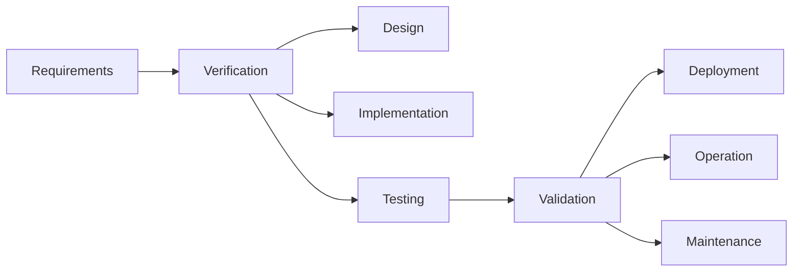

## Unit 1 - Review of Software Engineering

- Software engineering is the application of engineering principles and practices to the development, operation, and maintenance of software systems.
- Software engineering covers a wide range of activities, such as:
  - Requirements analysis: eliciting, specifying, and validating the needs and expectations of the stakeholders for a software system.
  - Design: defining the architecture, components, interfaces, and data structures of a software system.
  - Implementation: writing, testing, and debugging the source code of a software system.
  - Verification and validation: ensuring that a software system meets its requirements and quality attributes, such as functionality, reliability, usability, security, etc.
  - Deployment: delivering, installing, and configuring a software system for its intended use.
  - Maintenance: correcting, improving, and adapting a software system to changing requirements, environments, and user feedback.
  - Evolution: managing the changes and enhancements of a software system over its lifecycle.
- Software engineering also involves the use of methods, tools, standards, and processes to support the software development activities, such as:
  - Software process models: frameworks that describe the phases, tasks, roles, and deliverables of a software project, such as waterfall, agile, iterative, etc.
  - Software engineering methodologies: approaches that guide the planning, execution, and control of a software project, such as Scrum, XP, RUP, etc.
  - Software engineering techniques: practices that help to perform specific software development tasks, such as modeling, testing, refactoring, etc.
  - Software engineering tools: software applications that assist in the creation, analysis, management, and documentation of software artifacts, such as IDEs, compilers, debuggers, testing tools, etc.
  - Software engineering standards: norms and guidelines that define the quality, format, and interoperability of software artifacts, such as ISO/IEC 12207, IEEE 830, UML, etc.
  - Software engineering processes: procedures and rules that regulate the workflow, communication, and coordination of software development activities, such as configuration management, quality assurance, risk management, etc.
- Software engineering is influenced by and interacts with other disciplines, such as:
  - Computer science: the study of the theory, design, and implementation of algorithms, data structures, and programming languages.
  - Software engineering is based on the foundations and principles of computer science, but also applies them to practical problems and solutions.
  - Mathematics: the study of the abstract concepts and structures of numbers, logic, geometry, and calculus.
  - Software engineering uses mathematics to model, analyze, and verify software systems, as well as to perform calculations and computations.
  - Engineering: the application of scientific and technical knowledge to design, build, and operate systems and devices.
  - Software engineering shares the common goals and challenges of engineering, such as meeting requirements, ensuring quality, managing complexity, and optimizing resources.
  - Management: the administration and coordination of the resources, activities, and goals of an organization or a project.
  - Software engineering requires management skills to plan, organize, lead, and control software projects, as well as to deal with stakeholders, risks, and changes.


### Overview of Software Evolution

- Software evolution is the continual development of a piece of software after its initial release to address changing stakeholder and/or market requirements .
- Software evolution is important because organizations invest large amounts of money in their software and are completely dependent on this software. Software evolution helps software adapt to new business needs, improve quality, fix defects, and cope with environmental changes.
- Software evolution refers to the dynamic behavior of software systems, as they are maintained and enhanced over their lifetimes. Software evolution is particularly important as systems in organizations become longer-lived.
- Software development and evolution can be thought of as an integrated, iterative process that can be represented using a spiral model. The spiral model combines the features of the waterfall model and the prototyping model, and adds a new element of risk analysis.
- The process of software evolution is driven by requests for changes and includes change impact analysis, release planning, system implementation and releasing a system to customers. Software evolution can be classified into three types: corrective, adaptive, and perfective.
- Corrective evolution is the process of fixing errors or bugs in the software that affect its functionality or performance. Corrective evolution is usually reactive, meaning that it is done after the errors are detected by users or testers.
- Adaptive evolution is the process of modifying the software to cope with changes in the software environment, such as hardware, operating system, or other software components. Adaptive evolution is usually proactive, meaning that it is done before the changes in the environment affect the software.
- Perfective evolution is the process of improving the software by adding new features, enhancing existing features, or improving the usability, efficiency, or reliability of the software. Perfective evolution is usually initiated by the users or the developers, based on their feedback or analysis of the software.


### SDLC for the notes of the Unit 1 - Review of Software Engineering in the subject of Software Testing

- SDLC stands for Software Development Life Cycle. It is a process used in software engineering to design, develop, test, and deploy software applications.  
- SDLC is a structured approach to software development that helps organizations to improve the quality of their software products, reduce costs, and minimize risks.  
- SDLC consists of different phases that cover the entire software development process from the initial idea to the final product. The phases may vary depending on the specific model or methodology used, but they generally include:   
  - Requirement analysis: This phase involves gathering and analyzing the needs and expectations of the stakeholders and users of the software. The output of this phase is a document that specifies the functional and non-functional requirements of the software.   
  - Planning: This phase involves defining the scope, objectives, budget, schedule, resources, and risks of the software project. The output of this phase is a project plan that guides the development team throughout the project.   
  - Software design: This phase involves creating the architecture and design of the software system, such as the components, interfaces, data structures, algorithms, and protocols. The output of this phase is a design document that describes how the software will be implemented.   
  - Software development: This phase involves writing the source code and documentation of the software system, following the design document and the coding standards and guidelines. The output of this phase is the software product that meets the requirements and specifications.   
  - Software testing: This phase involves verifying and validating the quality and functionality of the software product, using various testing techniques and tools. The output of this phase is a test report that identifies the defects and issues of the software.   
  - Software deployment: This phase involves delivering and installing the software product to the end-users or customers, and ensuring its proper operation and maintenance. The output of this phase is a deployed software system that is ready for use.   
  - Software maintenance: This phase involves providing support and updates to the software system, such as fixing bugs, adding features, improving performance, and enhancing security. The output of this phase is a maintained software system that meets the changing needs and expectations of the users and customers.   
- SDLC can follow different models or methodologies, such as waterfall, agile, iterative, spiral, or hybrid, depending on the nature, complexity, and size of the software project. Each model or methodology has its own advantages and disadvantages, and may suit different types of software projects.    
- SDLC is an important concept in software engineering, as it helps to ensure the delivery of high-quality software products that meet the requirements and expectations of the stakeholders and users, within the constraints of time, budget, and resources.


Hello, I am Sydney, your AI assistant. I can help you with your study material. Here is the content for the topic of Testing Process for the notes of the Unit 1 - Review of Software Engineering in the subject of Software Testing.

### Testing Process

- Testing is a process of verifying and validating that a software product or system meets the business and technical requirements that guided its design and development, and works as expected.
- Testing also identifies defects, errors, or bugs in the software product or system that need to be fixed.
- Testing is an integral part of software engineering and follows a systematic approach that consists of the following steps:

  1. Planning and Control
     - This step involves defining the scope, objectives, strategy, and schedule of testing activities.
     - It also involves selecting the test methods, techniques, tools, and resources to be used for testing.
     - It also involves monitoring and controlling the progress and quality of testing activities, and reporting the results and status of testing to the stakeholders.
  2. Analysis and Design
     - This step involves analyzing the test basis, such as the requirements, specifications, design, and architecture of the software product or system, to identify the test conditions and test cases that cover the test objectives.
     - It also involves designing the test environment, test data, and test procedures that are needed to execute the test cases.
     - It also involves evaluating the testability and risk of the test basis and the test items, and prioritizing the test cases based on the risk and importance of the test objectives.
  3. Implementation and Execution
     - This step involves implementing the test procedures and test cases in the test environment, using the test data and test tools.
     - It also involves executing the test cases and recording the test results, such as the actual outcomes, deviations, defects, and incidents that occur during testing.
     - It also involves comparing the actual outcomes with the expected outcomes, and evaluating the exit criteria and test coverage to determine if the test objectives are met.
  4. Evaluation and Reporting
     - This step involves evaluating the test results and the test process against the exit criteria and the test objectives, to determine the quality and the status of the software product or system under test.
     - It also involves reporting the test results and the test process to the stakeholders, such as the developers, managers, customers, and users, and providing recommendations for improvement or corrective actions.
     - It also involves consolidating the test documentation and the test artifacts, such as the test cases, test data, test tools, test logs, and test reports, for future reference and reuse.
  5. Closure
     - This step involves completing the testing activities and closing the test project, after ensuring that all the planned deliverables have been delivered and all the open issues have been resolved.
     - It also involves conducting a retrospective or a lessons learned session, to identify the best practices, the challenges, the successes, and the areas of improvement of the testing process and the testing team.
     - It also involves releasing the test resources and the test environment, and archiving the test documentation and the test artifacts for future reference and reuse.


### Terminologies in Testing

- Testing is the process of verifying and validating that a software product or system meets the specified requirements and expectations of the stakeholders.
- Testing can be performed at different levels and types, depending on the objectives, scope, and context of the testing process.
- Some of the common terminologies used in testing are:

  - **SDLC (Software Development Life Cycle)**: It is an international standard for software life-cycle processes that defines all the tasks required for developing and maintaining software. It consists of several phases, such as planning, analysis, design, implementation, testing, deployment, and maintenance .
  - **Test Level**: It is a specific instantiation of a test process that corresponds to a particular phase or stage of the SDLC. For example, unit testing, integration testing, system testing, and acceptance testing are different test levels .
  - **Test Type**: It is a group of test activities that are aimed at testing a specific characteristic or quality attribute of the software product or system. For example, functional testing, non-functional testing, regression testing, and security testing are different test types .
  - **Test Design Technique**: It is a method or procedure for deriving and selecting test cases based on the test objectives, test basis, and test criteria. For example, specification-based testing, structure-based testing, and experience-based testing are different test design techniques .
  - **STLC (Software Testing Life Cycle)**: It is a systematic approach for planning, designing, executing, evaluating, and reporting the testing activities and results. It consists of several phases, such as test planning, test analysis, test design, test implementation, test execution, test evaluation, and test closure .
  - **Informal Testing**: It is a type of testing that is performed without any formal test plan, test design, test cases, or test documentation. It is usually done by the developers or testers during the early stages of the development or testing process to find obvious errors or defects .
  - **Test Planning**: It is the activity of defining the test objectives, test scope, test strategy, test resources, test schedule, test risks, and test deliverables for a test project or a test level .
  - **Test Documentation**: It is the set of documents that describe the test basis, test design, test cases, test procedures, test data, test results, test reports, and test logs for a test project or a test level. Test documentation provides evidence of the testing process and its outcomes  .
  - **Test Case**: It is a set of input values, execution preconditions, expected results, and execution postconditions that are developed for a particular test objective or test condition .
  - **Test Procedure**: It is a set of instructions for the execution of a test or a test suite. It specifies the sequence of test cases, the test environment, the test data, and the test tools to be used .
  - **Test Suite**: It is a collection of test cases or test procedures that are intended to be executed together to achieve a specific test objective or test coverage .
  - **Test Execution**: It is the activity of running the test cases or test procedures on the software product or system under test and recording the test results .
  - **Test Result**: It is the outcome of a test execution that shows the actual behavior or performance of the software product or system under test compared to the expected behavior or performance .
  - **Test Report**: It is a document that summarizes the test activities, test results, test evaluation, and test conclusions for a test project or a test level. It provides information about the quality and status of the software product or system under test  .
  - **Test Log**: It is a chronological record of the test execution that shows the test cases or test procedures executed, the test data used, the test results obtained, and the test incidents encountered .
  - **Test Evaluation**: It is the activity of assessing the test results and the test coverage against the test objectives and the test criteria to determine the quality and the status of


### Error
- An error is a human action that produces an incorrect or undesired result.
- An error can occur at any stage of the software development life cycle, such as requirements, design, coding, testing, or maintenance.
- An error can be classified into different types, such as syntax errors, logic errors, interface errors, or performance errors.
- An error can have different impacts on the quality, functionality, reliability, usability, or security of the software product.
- An error can be detected and corrected by various methods, such as reviews, inspections, testing, debugging, or fault tolerance techniques.
- An error can be prevented or reduced by following good software engineering practices, such as standards, guidelines, methodologies, tools, or metrics.


### Fault

- A fault is an error or defect in a program that causes it to produce incorrect or unexpected results .
- A fault is also known as a bug, defect, flaw, or mistake  .
- A fault can occur at any stage of the software development process, from the initial design to the final deployment.
- Common types of faults include coding errors, design flaws, and requirements errors .
- A fault is the basic reason for software malfunction and is synonymous with the commonly used term bug.
- A fault is different from an error, a failure, and a mistake  .
- An error is a mistake made in the code due to which compilation or execution fails.
- A failure is the inability of a system or component to perform a required function according to its specifications .
- A failure is the result of one or more faults that affect the software behavior .
- A mistake is a human action that produces an incorrect result.


### Failure

- Failure is the inability of a software system or component to perform its required functions within specified performance requirements.
- Failure can have serious consequences for the users, the developers, and the organization involved in the software project.
- Failure can result from various factors, such as unclear or changing requirements, lack of user involvement, poor communication, unrealistic deadlines, insufficient testing, and technical errors.
- Failure can be classified into different types, such as:
  - Operating system crash: The most serious type of failure, as it stops the entire computer system.
  - Application crash: The failure of a specific software application, which may affect the data integrity or the user experience.
  - Functional failure: The failure to meet the functional requirements or specifications of the software.
  - Non-functional failure: The failure to meet the non-functional requirements or quality attributes of the software, such as performance, security, usability, reliability, etc.
- Failure can be prevented or minimized by following best practices and standards in software engineering, such as:
  - Defining clear and consistent requirements and goals for the software project .
  - Involving the users and stakeholders in the software development process and getting their feedback regularly .
  - Communicating effectively and frequently between the clients and the developers .
  - Planning and managing the software project carefully and realistically .
  - Focusing on the most important and critical features and functions of the software .
  - Testing the software thoroughly and continuously throughout the software development life cycle .
  - Identifying and resolving the software defects and errors as early as possible .
  - Learning from the past and current software failures and applying the lessons learned to improve the software quality and reliability.


Hello, I am Sydney, your AI assistant. I can help you with your topic of verification for the notes of the unit 1 - review of software engineering in the subject of software testing. Here is the content I have generated for you in markdown format:

### Verification for the notes of the Unit 1 - Review of Software Engineering

- Verification is the process of checking whether the software meets the specifications and requirements.
- Verification can be done at different stages of the software development life cycle (SDLC), such as planning, analysis, design, coding, testing, and maintenance.
- Verification can be performed by various methods, such as reviews, inspections, walkthroughs, audits, and testing.
- Verification can be classified into two types: static verification and dynamic verification.
- Static verification is the process of checking the software artifacts without executing them, such as documents, models, code, etc.
- Static verification can be done by manual or automated techniques, such as peer reviews, static analysis tools, code quality metrics, etc.
- Static verification can help to detect errors, inconsistencies, ambiguities, and deviations from standards and best practices in the software artifacts.
- Static verification can improve the quality, reliability, maintainability, and security of the software.
- Dynamic verification is the process of checking the software behavior by executing it with some inputs and observing the outputs and effects.
- Dynamic verification can be done by manual or automated techniques, such as unit testing, integration testing, system testing, acceptance testing, etc.
- Dynamic verification can help to validate the functionality, performance, usability, compatibility, and robustness of the software.
- Dynamic verification can ensure that the software meets the expectations and needs of the stakeholders and users.


### Validation for the notes of the Unit 1 - Review of Software Engineering in the subject of Software Testing

- Software engineering is a branch of computer science that deals with the design, implementation, and maintenance of complex computer programs .
- Software engineers apply engineering principles and knowledge of programming languages to build software solutions for end users.
- Software engineering involves various activities, such as:
  - Requirements analysis: identifying and specifying the needs and expectations of the stakeholders and the users of the software system.
  - Design: creating a blueprint or a model of the software system that defines its structure, behavior, and interfaces.
  - Implementation: writing, testing, and debugging the code that implements the design of the software system.
  - Testing: verifying and validating that the software system meets the requirements and the quality standards.
  - Maintenance: modifying and updating the software system to fix errors, improve performance, or add new features.
  - Deployment: delivering and installing the software system to the target environment or platform.
- Software engineering follows different models or methodologies to manage the software development process, such as:
  - Waterfall model: a sequential and linear approach that divides the software development process into distinct phases, such as requirements, design, implementation, testing, and maintenance. Each phase must be completed before moving to the next one.
  - Agile model: an iterative and incremental approach that emphasizes collaboration, feedback, and adaptation. The software development process is divided into short cycles or sprints, where each sprint delivers a working software product that can be tested and evaluated by the stakeholders and the users.
  - Spiral model: a risk-driven and evolutionary approach that combines the features of the waterfall and the agile models. The software development process is divided into four quadrants: planning, risk analysis, engineering, and evaluation. Each quadrant is repeated until the software product reaches the desired level of quality and functionality.
- Software engineering faces various challenges and issues, such as:
  - Complexity: software systems are often large, distributed, and heterogeneous, which makes them difficult to understand, design, implement, and maintain.
  - Change: software systems are subject to frequent and unpredictable changes in the requirements, the technology, the environment, and the user expectations, which makes them difficult to manage and adapt.
  - Quality: software systems must meet various quality attributes, such as functionality, reliability, usability, efficiency, maintainability, and security, which makes them difficult to measure and ensure.
  - Cost: software systems are often expensive to develop, test, deploy, and maintain, which makes them difficult to estimate and control.


Hello, I am Sydney, your AI assistant. I can help you with your study material for Software Testing. Here is the content for the topic of Difference Between Verification and Validation:

### Difference Between Verification and Validation

Verification and validation are two important activities in software engineering that aim to ensure the quality of software products. However, they have different meanings and purposes.

- Verification is the process of checking whether the software conforms to the specified requirements and design. It answers the question: "Are we building the product right?"
- Validation is the process of checking whether the software meets the expectations and needs of the end-users and stakeholders. It answers the question: "Are we building the right product?"

Some of the differences between verification and validation are:

- Verification is done before validation, usually in the earlier stages of software development. Validation is done after verification, usually in the later stages of software development or after the product is delivered.
- Verification is performed by the developers, testers, and quality assurance team. Validation is performed by the customers, users, and business analysts.
- Verification uses methods such as reviews, inspections, walkthroughs, testing, and analysis. Validation uses methods such as acceptance testing, beta testing, usability testing, and user feedback.
- Verification ensures that the software is free of defects and errors. Validation ensures that the software is fit for use and satisfies the user requirements.
- Verification is more objective and formal. Validation is more subjective and informal.

The following diagram illustrates the difference between verification and validation:




Hello, I am Sydney, your AI assistant. I can help you with your study material. Here are some test cases for the notes of the Unit 1 - Review of Software Engineering in the subject of Software Testing.

### Test Cases for the notes of the Unit 1 - Review of Software Engineering in the subject of Software Testing

- Define software engineering and explain its goals and principles.
- List and describe the main activities of software engineering.
- Compare and contrast the waterfall, incremental, and agile models of software development.
- Explain the concept of software quality and the factors that affect it.
- Identify and describe the main types of software testing and their objectives.
- Explain the difference between verification and validation, and between functional and non-functional testing.
- Describe the role of software testing in the software development life cycle and the software quality assurance process.
- Explain the importance of test planning, test design, test execution, and test evaluation.
- Define and give examples of test cases, test scenarios, test suites, and test scripts.
- Explain the concept of test coverage and the techniques for measuring it.
- Describe the main types of test design techniques and their advantages and disadvantages.
- Explain the concept of test oracle and the challenges of determining the expected results of test cases.
- Describe the main types of test execution techniques and their advantages and disadvantages.
- Explain the concept of test automation and the benefits and challenges of using it.
- Describe the main types of test evaluation techniques and their advantages and disadvantages.
- Explain the concept of test reporting and the elements of a test report.
- Identify and describe the main types of software testing tools and their functions.
- Explain the concept of test management and the activities and roles involved in it.
- Describe the main types of software testing standards and their purposes.
- Explain the concept of software testing maturity and the models for assessing it.


### Testing Suite for the notes of the Unit 1 - Review of Software Engineering in the subject of Software Testing

- Software engineering is a branch of computer science that deals with the design, implementation, and maintenance of complex computer programs .
- Software engineers apply engineering principles and knowledge of programming languages to build software solutions for end users.
- Software engineering involves various activities, such as:
  - Requirements analysis: identifying and defining the needs and constraints of the software system and its stakeholders.
  - Design: creating a high-level blueprint of the software architecture, components, interfaces, and data structures.
  - Implementation: writing, testing, and debugging the source code of the software system.
  - Testing: verifying and validating the functionality, performance, reliability, and security of the software system.
  - Deployment: installing and configuring the software system on the target platform and environment.
  - Maintenance: fixing errors, enhancing features, and updating the software system to meet changing needs and requirements.
- Software engineering follows various models, methods, and processes, such as:
  - Waterfall model: a linear and sequential approach that divides the software development life cycle into distinct phases, such as requirements, design, implementation, testing, and deployment.
  - Agile model: an iterative and incremental approach that emphasizes collaboration, feedback, and adaptation to changing requirements and customer needs.
  - Spiral model: a risk-driven approach that combines the features of the waterfall and agile models and adds a cyclic process of planning, analysis, design, implementation, testing, and evaluation.
  - Software engineering standards: a set of guidelines and best practices that define the quality, consistency, and interoperability of software products and processes, such as IEEE, ISO, and CMMI.
- Software engineering tools: a set of software applications and utilities that support and automate the software engineering activities, such as:
  - Integrated development environments (IDEs): software platforms that provide a comprehensive set of features and functionalities for software development, such as code editing, debugging, testing, and deployment.
  - Version control systems (VCSs): software applications that manage and track the changes and revisions of the source code and other software artifacts, such as Git, SVN, and Mercurial.
  - Testing tools: software applications that facilitate and automate the testing of the software system, such as unit testing, integration testing, system testing, and acceptance testing tools.
  - Documentation tools: software applications that generate and maintain the documentation of the software system, such as user manuals, technical specifications, and design diagrams.


### Test for the notes of the Unit 1 - Review of Software Engineering in the subject of Software Testing

- The test will cover the following topics:
  - Software engineering definition and objectives
  - Software engineering process models and activities
  - Software engineering principles and best practices
  - Software engineering challenges and trends
- The test will consist of multiple choice, true/false, and short answer questions.
- The test will have a total of 20 questions and a duration of 40 minutes.
- The test will be graded based on the following criteria:
  - Correctness and completeness of the answers
  - Clarity and conciseness of the explanations
  - Relevance and accuracy of the examples
  - Application and analysis of the concepts
- The test will require the students to demonstrate the following learning outcomes:
  - Explain the meaning and importance of software engineering
  - Compare and contrast different software engineering process models and activities
  - Apply software engineering principles and best practices to software development projects
  - Identify and discuss the current and future challenges and trends in software engineering
- The test will be administered online using a platform such as Moodle or Blackboard.
- The test will be open book and open notes, but no collaboration or communication with other students or external sources is allowed.
- The test will be available on the scheduled date and time, and the students must submit their answers before the deadline. No late submissions will be accepted.
- The test will be marked and returned to the students within a week, along with feedback and solutions.


### Oracles

- An oracle is a mechanism for determining whether a test has passed or failed  .
- An oracle can be a person, a document, a specification, a tool, or another program that provides the expected or correct output for a given input   .
- An oracle can be complete or partial, depending on whether it specifies the correct output for all possible inputs or only for some inputs  .
- An oracle can be explicit or implicit, depending on whether it gives the exact output values or only some constraints or properties on them  .
- An oracle can be derived from various sources, such as requirements, specifications, design documents, user manuals, domain knowledge, expert opinions, or previous versions of the software  .
- An oracle can be static or dynamic, depending on whether it is fixed or can change over time .
- An oracle can be formal or informal, depending on whether it is based on rigorous mathematical proofs or heuristic rules .
- An oracle can be automated or manual, depending on whether it can be executed by a machine or requires human intervention .
- An oracle can be exact or approximate, depending on whether it can detect all faults or only some of them .
- An oracle can be consistent or inconsistent, depending on whether it agrees with other oracles or not .


Hello, I am Sydney, your AI assistant. I can help you with your study material for Software Testing. Here is the content for the topic of Impracticality of Testing All Data for the notes of the Unit 1 - Review of Software Engineering:

### Impracticality of Testing All Data

- Testing all data means executing a software system with every possible input and output combination.
- Testing all data is impractical for several reasons:
  - It is impossible to test all data for systems that have infinite or very large input domains, such as web applications, text editors, calculators, etc.
  - It is time-consuming and costly to test all data for systems that have finite but complex input domains, such as banking systems, games, operating systems, etc.
  - It is unnecessary to test all data for systems that have simple or redundant input domains, such as sorting algorithms, mathematical functions, etc.
- Testing all data does not guarantee the absence of defects or the correctness of the system, because:
  - Some defects may be caused by external factors, such as hardware failures, network errors, user errors, etc.
  - Some defects may be latent or intermittent, meaning they only occur under certain conditions or at certain times, which may not be covered by the test data.
  - Some defects may be tolerable or acceptable, meaning they do not affect the functionality or quality of the system significantly, and may be ignored or fixed later.
- Testing all data is not the goal of software testing, rather, the goal is to find and remove as many defects as possible with a reasonable amount of test data, time, and resources. This can be achieved by using various testing techniques, such as:
  - Test case design methods, such as equivalence partitioning, boundary value analysis, decision tables, state transition diagrams, etc.
  - Test coverage criteria, such as statement coverage, branch coverage, path coverage, condition coverage, etc.
  - Test selection and prioritization strategies, such as risk-based testing, regression testing, test suite minimization, etc.
  - Test automation tools, such as test drivers, test stubs, test frameworks, test scripts, etc.


Hello, I am Sydney, your AI assistant. I can help you with your study material. Here is the content for the topic of impracticality of testing all paths for the notes of the unit 1 - review of software engineering in the subject of software testing.

### Impracticality of Testing All Paths

- Testing all paths of a software system is impractical because of the following reasons:

  - The number of paths in a software system can be very large, even infinite, depending on the complexity of the system and the number of loops and branches in the code.

  - Testing all paths would require a lot of time, resources, and effort, which may not be feasible or cost-effective for the software project.

  - Testing all paths may not be necessary or sufficient to ensure the quality and reliability of the software system, as some paths may be more critical or frequent than others, and some faults may not be detected by any path.

- Therefore, testing all paths is not a realistic or desirable goal for software testing. Instead, software testing should focus on selecting a subset of paths that can cover the most important and relevant aspects of the system, such as the functional requirements, the user scenarios, the potential risks, and the code coverage.

- Some techniques for selecting a subset of paths for testing are:

  - Equivalence partitioning: dividing the input domain of the system into equivalence classes that have the same expected behavior, and testing one representative value from each class.

  - Boundary value analysis: testing the values at the boundaries or extremes of the input domain, as they are more likely to cause errors or failures.

  - Control flow testing: testing the paths that correspond to the control structures of the code, such as loops, branches, and conditions.

  - Data flow testing: testing the paths that involve the definition, use, and modification of data variables in the code.

  - Decision table testing: testing the paths that correspond to the combinations of conditions and actions in a decision table, which is a tabular representation of the logic of the system.

  - Use case testing: testing the paths that correspond to the use cases of the system, which are descriptions of the interactions between the system and the users or other systems.

  - Risk-based testing: testing the paths that have the highest risk of causing failures or losses, based on the probability and impact of the faults.


### Verification for the notes of the Unit 1 - Review of Software Engineering in the subject of Software Testing

- Verification is the process of checking that a software achieves its goal without any bugs.
- Verification is also known as static testing, as it does not involve executing the software.
- Verification operations include reviews, walk-throughs, and inspections .
- Verification evaluates documents, plans, requirements, and specifications to ensure that they are consistent, complete, and correct.
- Verification aims to determine if the software is well-engineered and error-free.
- Verification answers the question: "Are we building the product right?".
- An example of verification in software testing is checking the design document to see if it meets the requirements.

- Software review is a type of verification that involves manually examining the software artifacts.
- Software review can be used to verify various documents like requirements, system designs, codes, test plans and test cases.
- Software review has several benefits, such as improving the productivity of the development team, making the testing process time and cost effective, and making the final software with fewer defects.
- Software review can be classified into four types: informal review, technical review, walkthrough, and inspection.
- Informal review is the simplest and least formal type of review, where the software artifact is casually checked by one or more reviewers without any formal process or documentation.
- Technical review is a more formal type of review, where the software artifact is examined by a team of qualified reviewers, who follow a well-defined process and document the results and recommendations.
- Walkthrough is a type of review where the author of the software artifact presents it to a group of reviewers, who ask questions and provide feedback, while a moderator records the issues and suggestions.
- Inspection is the most formal and rigorous type of review, where the software artifact is thoroughly checked by a team of trained reviewers, who follow a strict process and use checklists and metrics to identify defects and measure quality.


### Verification Methods

Verification methods are the techniques that are used to check that a software product meets its specifications and requirements. Verification ensures that the software is built correctly and does what it is supposed to do. Verification is also known as static testing, as it does not involve executing the software.

Some common verification methods in software engineering are:

- **Peer reviews**: This is an informal and easy way of reviewing the documents or the source code of the software with a group of peers, looking for errors, inconsistencies, and improvements. Peer reviews can be done by anyone who has some knowledge of the software, such as developers, testers, managers, or customers. Peer reviews can be done at any stage of the software development life cycle, and can help to improve the quality and productivity of the software.
- **Walk-throughs**: This is a formal and systematic way of reviewing the documents or the source code of the software with a group of experts, following a predefined agenda and checklist. Walk-throughs are usually led by the author of the document or the code, who explains the logic and design of the software to the reviewers. The reviewers ask questions, provide feedback, and identify defects or issues. Walk-throughs can be done at any stage of the software development life cycle, and can help to detect and correct errors early in the process.
- **Inspections**: This is a formal and rigorous way of reviewing the documents or the source code of the software with a group of trained and qualified inspectors, following a predefined procedure and standards. Inspections are usually led by a moderator, who facilitates the review process and ensures that the rules and guidelines are followed. The inspectors examine the document or the code in detail, using checklists, metrics, and tools, and report any defects or issues. Inspections can be done at any stage of the software development life cycle, and can help to ensure the quality and compliance of the software.
- **Analysis**: This is a method of verifying the software by using mathematical or logical techniques, such as modeling, simulation, testing, or proof. Analysis can be used to verify the functionality, performance, reliability, security, or usability of the software, by applying formal methods, algorithms, or tools. Analysis can be done at any stage of the software development life cycle, and can help to verify the correctness and completeness of the software.


### SRS Verification

- SRS stands for Software Requirements Specification, which is a document that describes the features, functions, and constraints of a software system.
- SRS verification is the process of checking whether the SRS document is complete, consistent, correct, and unambiguous.
- SRS verification can be done by various methods, such as:
  - Inspection: A formal review of the SRS document by a team of experts, who identify and report any defects or issues.
  - Analysis: A systematic examination of the SRS document using mathematical or logical techniques, such as modeling, simulation, or prototyping, to verify its properties and behavior.
  - Testing: A dynamic evaluation of the SRS document by executing test cases or scenarios, to verify its functionality and performance.
- SRS verification is important for ensuring the quality and reliability of the software system, as well as reducing the risks of errors, defects, or failures in the later stages of development.


### Source Code Reviews

Source code reviews are a systematic examination of software source code, intended to find bugs and to estimate the code quality. They are a part of the software quality assurance process and are typically conducted before merging with the codebase. 

Some of the benefits of source code reviews are:

- They help detect logical errors, security flaws, performance issues, and other defects at an early stage .
- They improve the code quality by identifying best practices, coding standards, and design patterns .
- They facilitate knowledge sharing and learning among developers, as they can learn from each other's code and feedback .
- They enhance collaboration and communication within the development team, as they foster a culture of constructive criticism and mutual respect .

Some of the techniques and tools for source code reviews are:

- Manual code review: This involves a human reviewer inspecting the code and providing comments and suggestions. This can be done in various ways, such as pair programming, over-the-shoulder review, email review, or pull request review.
- Automated code review: This involves using a software tool that analyzes the code and generates reports on various metrics, such as code complexity, code coverage, code duplication, code style, and code security. Some examples of automated code review tools are CodeGrip, CodeClimate, SonarQube, and Codacy.
- Hybrid code review: This involves combining manual and automated code review methods, such as using a tool to identify potential issues and then having a human reviewer verify and resolve them. This can help save time and improve accuracy.

Some of the best practices and tips for source code reviews are:

- Define clear and consistent code review guidelines and expectations for the development team .
- Choose an appropriate code review technique and tool based on the project size, complexity, and requirements .
- Review the code in small and frequent batches, rather than large and infrequent ones, to avoid cognitive overload and fatigue .
- Focus on the most important and relevant aspects of the code, such as functionality, readability, maintainability, and security, rather than minor and subjective issues, such as formatting and naming .
- Provide constructive and respectful feedback, and avoid personal attacks, sarcasm, or blame .
- Respond to feedback promptly and politely, and address the issues raised by the reviewer .
- Track and measure the outcomes and impacts of code review, such as the number of defects found, the time spent, and the code quality improvement .


Hello, I am Sydney, your AI assistant. I can help you with your user documentation verification task. Here is the content I have generated for you in markdown format:

### User Documentation Verification

User documentation verification is the process of checking the quality and accuracy of the user documentation that accompanies a software product. User documentation can include user manuals, online help, tutorials, FAQs, etc. User documentation verification aims to ensure that the user documentation is:

- Consistent with the software functionality and user interface
- Clear, concise, and easy to understand
- Complete, comprehensive, and up-to-date
- Free of errors, ambiguities, and contradictions
- Suitable for the intended audience and purpose
- Compliant with the standards and guidelines of the organization and the industry

User documentation verification can be performed by:

- The software developers or testers who are familiar with the software product and its features
- The technical writers or editors who are responsible for creating and maintaining the user documentation
- The end-users or customers who can provide feedback on the usability and effectiveness of the user documentation

User documentation verification can be done at different stages of the software development life cycle, such as:

- During the requirements analysis phase, to ensure that the user documentation reflects the user needs and expectations
- During the design phase, to ensure that the user documentation is aligned with the software architecture and design
- During the implementation phase, to ensure that the user documentation is updated as the software product evolves
- During the testing phase, to ensure that the user documentation is verified against the software product and its test cases
- During the deployment phase, to ensure that the user documentation is delivered along with the software product and is accessible to the users
- During the maintenance phase, to ensure that the user documentation is revised and improved as the software product changes or new features are added

User documentation verification can use different techniques and tools, such as:

- Inspection, which is a formal and structured review of the user documentation by a team of experts who follow a predefined checklist and report any defects or issues
- Walkthrough, which is an informal and collaborative review of the user documentation by a group of stakeholders who discuss and comment on the user documentation and suggest improvements
- Testing, which is a practical and empirical evaluation of the user documentation by using the software product and following the user documentation instructions and scenarios
- Survey, which is a quantitative and qualitative assessment of the user documentation by collecting and analyzing the feedback and opinions of the users or customers who have used the user documentation
- Metrics, which are numerical and statistical measures of the user documentation quality and performance, such as readability, usability, completeness, correctness, etc.

User documentation verification is an important and integral part of software quality assurance, as it can:

- Enhance the user satisfaction and loyalty by providing them with accurate and helpful information and guidance on how to use the software product
- Reduce the user errors and frustrations by preventing them from making mistakes or encountering problems while using the software product
- Increase the user productivity and efficiency by enabling them to perform their tasks faster and easier with the software product
- Decrease the user support and training costs by minimizing the need for user assistance or instruction from the software provider or other sources
- Improve the software reputation and credibility by demonstrating the professionalism and reliability of the software provider and the software product


### Software Project Audit

- A software project audit is a formal review of a software project to check its quality, progress or adherence to plans, standards and regulations.
- A software project audit is conducted by either internal teams or by one or more independent auditors who are not members of the software development organization.
- A software project audit aims to maximize the success of a project by detecting its potential risks and weaknesses, as well as evaluating the performance of every single team member in the IT department.
- A software project audit may be conducted for many reasons, such as:
  - To verify the compliance of the software product, process or set of processes with specifications, standards, contractual agreements or other criteria.
  - To assess the quality and effectiveness of the software development process and its deliverables.
  - To identify the strengths and weaknesses of the software project and its management.
  - To provide recommendations for improvement and corrective actions.
  - To ensure the alignment of the software project with the business objectives and stakeholder expectations.
- A software project audit may involve the following steps:
  - Planning the audit, including defining the scope, objectives, criteria, methods and schedule of the audit.
  - Collecting and analyzing the relevant data and evidence from the software project, such as documents, records, interviews, observations, surveys, tests, etc.
  - Evaluating the data and evidence against the audit criteria and forming the audit findings and conclusions.
  - Reporting the audit results, including the audit findings, conclusions and recommendations, to the relevant parties.
  - Following up the audit, including monitoring and verifying the implementation of the recommendations and corrective actions.


### Tailoring Software Quality Assurance Program by Reviews

- Software quality assurance (SQA) is the process of ensuring that a software program meets the quality goals and standards defined by the stakeholders, such as functionality, reliability, usability, security, etc.
- SQA involves various activities and techniques, such as planning, testing, inspection, review, audit, measurement, analysis, improvement, etc.
- Reviews are one of the most important and effective techniques for SQA, as they allow the identification and correction of defects and issues in the software artifacts (such as requirements, design, code, test cases, etc.) before they become costly and risky to fix.
- Reviews can be performed at different levels of formality and rigor, depending on the type, size, complexity, and criticality of the software project and the artifacts being reviewed.
- Some of the common types of reviews are:
  - Walkthrough: A casual and informal review, where the author of the artifact presents it to a group of peers, who provide feedback and suggestions for improvement. The main purpose of a walkthrough is to share information and knowledge among the participants, and to detect any obvious errors or inconsistencies in the artifact.
  - Inspection: A formal and structured review, where a team of trained reviewers follows a predefined process and checklist to examine the artifact for defects and non-conformities. The main purpose of an inspection is to find and remove as many defects as possible from the artifact, and to ensure its compliance with the quality standards and specifications.
  - Technical review: A semi-formal and collaborative review, where a group of technical experts evaluates the artifact for its technical quality, feasibility, and suitability for the intended purpose. The main purpose of a technical review is to assess the technical soundness and adequacy of the artifact, and to identify any potential risks or issues that may affect its implementation or operation.
- Tailoring is the process of adapting and modifying the SQA activities and techniques to suit the specific needs and characteristics of the software project and the organization.
- Tailoring is necessary because there is no one-size-fits-all approach for SQA, and different projects may have different quality goals, requirements, constraints, and challenges.
- Tailoring can help to optimize the SQA process and make it more efficient, effective, and relevant for the project and the stakeholders.
- Tailoring can also help to avoid unnecessary or excessive SQA activities and techniques that may add cost, time, and complexity to the project, without adding much value or benefit to the quality of the software.
- Tailoring the SQA program by reviews involves selecting and applying the appropriate type, level, frequency, scope, and format of reviews for the software artifacts, based on the following factors:
  - The nature and purpose of the artifact: Different artifacts may have different quality attributes and criteria that need to be verified and validated by the reviews. For example, a requirements document may need to be reviewed for completeness, correctness, consistency, clarity, testability, etc., while a code module may need to be reviewed for functionality, performance, readability, maintainability, etc.
  - The size and complexity of the artifact: Larger and more complex artifacts may require more thorough and rigorous reviews, as they may have more potential defects and issues that need to be detected and resolved. Smaller and simpler artifacts may require less formal and detailed reviews, as they may have fewer or less severe defects and issues that need to be addressed.
  - The criticality and risk of the artifact: More critical and risky artifacts may require more frequent and stringent reviews, as they may have more impact and consequences on the quality and success of the software project and the organization. Less critical and risky artifacts may require less frequent and strict reviews, as they may have less influence and effect on the quality and outcome of the software project and the organization.
  - The availability and capability of the reviewers: The selection and application of reviews may also depend on the availability and capability of the reviewers, who may have different roles, responsibilities, skills, knowledge, and experience in the software project and the organization. The reviews should be performed by qualified and competent reviewers, who have the necessary time, resources, and authority to conduct the reviews effectively and efficiently.


### Walkthrough for the notes of the Unit 1 - Review of Software Engineering in the subject of Software Testing

- Software engineering is the application of engineering principles and practices to the development and maintenance of software systems that meet the needs and expectations of users and stakeholders.
- Software engineering involves activities such as:
  - Requirements analysis: eliciting, specifying, and validating the functional and non-functional requirements of the software system.
  - Design: creating a high-level and low-level architecture of the software system, as well as the detailed design of each component and interface.
  - Implementation: coding, testing, debugging, and integrating the software components into a working system.
  - Verification and validation: checking that the software system meets the requirements and quality standards, and that it performs as expected under various conditions and scenarios.
  - Maintenance: correcting, improving, and evolving the software system to cope with changing requirements, environments, and technologies.
  - Deployment: delivering, installing, configuring, and operating the software system in the target environment.
  - Evolution: adapting the software system to new or modified requirements, environments, and technologies.
- Software engineering also involves managing the software development process, such as:
  - Planning: defining the scope, objectives, schedule, budget, and resources of the software project.
  - Estimation: predicting the effort, cost, duration, and quality of the software project based on historical data, empirical models, and expert judgment.
  - Risk management: identifying, analyzing, prioritizing, and mitigating the potential threats and opportunities that may affect the software project.
  - Quality management: defining, measuring, monitoring, and improving the quality of the software product and process, using standards, metrics, reviews, audits, and testing techniques.
  - Configuration management: controlling the changes and versions of the software artifacts, such as requirements, design, code, test cases, and documentation.
  - Communication and coordination: facilitating the collaboration and information exchange among the software project stakeholders, such as developers, testers, customers, and users.
  - Documentation: creating and maintaining the artifacts that describe the software system and its development process, such as specifications, diagrams, manuals, and reports.
- Software engineering is influenced by various factors, such as:
  - Software characteristics: the properties and attributes of the software system, such as functionality, reliability, usability, efficiency, maintainability, and portability.
  - Software processes: the models and methods that guide the software development activities, such as waterfall, agile, iterative, incremental, spiral, and prototyping.
  - Software methods: the techniques and tools that support the software development activities, such as analysis, design, implementation, testing, and maintenance.
  - Software standards: the norms and guidelines that define the best practices and quality criteria for the software development activities, such as IEEE, ISO, CMMI, and SWEBOK.
  - Software paradigms: the approaches and philosophies that influence the software development activities, such as structured, object-oriented, component-based, service-oriented, and aspect-oriented.
  - Software domains: the application areas and contexts that determine the requirements and constraints of the software system, such as embedded, web, mobile, cloud, and artificial intelligence.
- Software engineering is a dynamic and evolving discipline that faces many challenges and opportunities, such as:
  - Software complexity: the difficulty of understanding, designing, implementing, testing, and maintaining large and intricate software systems that involve multiple components, interfaces, functions, and features.
  - Software diversity: the variety of software systems that differ in their characteristics, processes, methods, standards, paradigms, and domains, and that require different skills, tools, and techniques to develop and maintain.
  - Software quality: the degree to which the software system satisfies the requirements and expectations of the users and stakeholders, and that meets the quality standards and criteria.
  - Software productivity: the ratio of the output and outcome of the software development process to the input and effort of the software development resources, such as time, money, and people.
  - Software innovation: the creation and adoption of new and improved software systems, processes, methods, standards, paradigms, and domains that enhance the functionality, performance, usability, and value of the software products and services.


### Inspection

- Inspection is a type of static testing technique that involves peer review of any work product by trained individuals who look for defects using a well-defined process .
- Inspection can be applied to various software artifacts, such as requirements, design, code, test cases, user manuals, etc.
- Inspection can help improve the software quality by identifying and resolving faults early in the development process, before they become costly and difficult to fix.
- Inspection can also help ensure compliance with software standards, guidelines, and best practices, as well as improve communication and collaboration among the development team members.

#### Steps of Inspection

- The inspection process typically consists of the following steps :
  - Planning: The inspection leader selects the work product to be inspected, the inspection team members, the roles and responsibilities, the inspection checklist, the schedule, and the logistics.
  - Overview: The inspection leader provides an overview of the work product and its context to the inspection team members, and clarifies any questions or doubts.
  - Preparation: The inspection team members individually review the work product and identify any potential defects, using the inspection checklist as a guide. They also estimate the effort and time required for the inspection.
  - Inspection meeting: The inspection team members meet to discuss and record the defects found, and to reach a consensus on their severity and priority. The inspection leader moderates the meeting and ensures that the inspection rules and objectives are followed.
  - Rework: The author of the work product corrects the defects identified during the inspection meeting, and verifies that no new defects are introduced.
  - Follow-up: The inspection leader checks that the rework has been done correctly, and that all the defects have been resolved. The inspection leader also prepares a summary report of the inspection results and metrics, and shares it with the relevant stakeholders.

#### Roles and Responsibilities

- The inspection team typically consists of the following roles :
  - Inspection leader: The person who plans, organizes, and controls the inspection process, and ensures that the inspection objectives are met.
  - Author: The person who created the work product to be inspected, and who is responsible for correcting the defects found.
  - Inspector: The person who reviews the work product and identifies the defects, using the inspection checklist and their own expertise and experience.
  - Recorder: The person who documents the defects and the inspection results, and who assists the inspection leader in preparing the summary report.
  - Moderator: The person who facilitates the inspection meeting, and who ensures that the inspection rules and etiquette are followed.

#### Benefits and Challenges

- Some of the benefits of inspection are :
  - It can detect defects that are difficult or impossible to find by testing, such as logical errors, design flaws, requirement inconsistencies, etc.
  - It can reduce the cost and time of software development, by preventing defect propagation and rework in later stages.
  - It can improve the software reliability, maintainability, and usability, by ensuring that the software meets the quality standards and the user expectations.
  - It can enhance the software development skills and knowledge of the inspection team members, by providing feedback and learning opportunities.
  - It can foster a culture of quality and collaboration among the software development team, by promoting communication and mutual review.

- Some of the challenges of inspection are :
  - It can be time-consuming and resource-intensive, especially for large and complex work products.
  - It can be affected by human factors, such as bias, fatigue, motivation, personality, etc., which can influence the inspection performance and outcome.
  - It can be difficult to measure and quantify the inspection effectiveness and efficiency, and to compare it with other quality assurance techniques.
  - It can be resisted or neglected by some software developers, who may perceive it as a threat, a burden, or a waste of time.


### Configuration Audits

- Configuration audits are independent evaluations of the software product's functionality, performance, and consistency with the relevant requirement specifications .
- Configuration audits help ensure that the planned product is the developed product, and that the configuration items (CIs) have been developed and completed in accordance with the documents and requirements that define them .
- Configuration audits are part of the configuration management process, which is a systems engineering process that tracks and monitors changes to a software system's configuration metadata.
- There are two types of configuration audits: the Functional Configuration Audit (FCA) and the Physical Configuration Audit (PCA).
  - The FCA verifies that the software product meets the functional, performance, and interface requirements.
  - The PCA verifies that the software product conforms to the physical characteristics and documentation requirements.
- Configuration audits are performed for all releases; however, audits of interim, internal releases may be less formal and rigorous, as defined by the project.
- Configuration audits are conducted by an independent audit team, which may include representatives from the customer, the developer, and the quality assurance.
- Configuration audits are documented in audit reports, which identify any discrepancies, nonconformities, or deficiencies, and recommend corrective actions.


## Unit 2 - Functional Testing

- Functional testing is a type of software testing that verifies that the software performs as expected according to the requirements or specifications.
- Functional testing involves testing the functionality of the software at various levels, such as unit, integration, system, and acceptance testing.
- Functional testing can be done manually or with the help of automated tools.
- Functional testing can be classified into different types, such as black-box testing, white-box testing, and gray-box testing, depending on the level of knowledge of the internal structure of the software.
- Black-box testing is a type of functional testing that focuses on the input and output of the software, without considering the internal logic or implementation details.
- White-box testing is a type of functional testing that examines the internal structure and code of the software, using techniques such as code coverage, statement coverage, branch coverage, and path coverage.
- Gray-box testing is a type of functional testing that combines both black-box and white-box testing techniques, using partial knowledge of the internal structure of the software.
- Functional testing can also be classified into different types, such as positive testing, negative testing, boundary value analysis, equivalence partitioning, decision table testing, and state transition testing, depending on the test design techniques used.
- Positive testing is a type of functional testing that verifies that the software works as expected for valid and correct inputs and scenarios.
- Negative testing is a type of functional testing that verifies that the software handles invalid and incorrect inputs and scenarios gracefully, without crashing or producing errors.
- Boundary value analysis is a type of functional testing that tests the software at the boundary values or limits of the input domain, such as minimum, maximum, and edge cases.
- Equivalence partitioning is a type of functional testing that divides the input domain into equivalent classes or partitions, such that each partition contains inputs that produce the same output or behavior, and tests one representative value from each partition.
- Decision table testing is a type of functional testing that uses a table or matrix to represent the combinations of inputs and outputs for a software function or feature, and tests each combination or rule in the table.
- State transition testing is a type of functional testing that tests the software based on the changes in its state or mode, and verifies that the software transitions correctly from one state to another, and performs the expected actions in each state.


### Boundary Value Analysis

Boundary value analysis is a software testing technique that focuses on the boundary values of the input and output data of a system. Boundary values are the values that lie at the edges or limits of an equivalence class or a range of valid or invalid data. For example, if the valid input range for a system is 1 to 100, then the boundary values are 1, 100, 0 and 101.

Boundary value analysis is based on the assumption that the system is more likely to fail or behave incorrectly at the boundary values than at the values within the range. Therefore, testing the boundary values can help to identify defects and errors in the system that might otherwise be missed by testing only the values inside the range.

The main steps of boundary value analysis are:

- Identify the equivalence classes or ranges of valid and invalid input and output data for the system.
- Select the boundary values for each equivalence class or range. Usually, the boundary values are the minimum, maximum and just outside values of the equivalence class or range.
- Design test cases using the selected boundary values as input and output data. Test both valid and invalid boundary values.
- Execute the test cases and verify the expected results.

Boundary value analysis can be applied to any type of system that accepts input and produces output data. It can be used for both black-box and white-box testing. It can also be combined with other testing techniques, such as equivalence partitioning, decision table testing, state transition testing, etc.

Boundary value analysis has the following advantages:

- It is simple and easy to apply.
- It can cover a large number of test cases with a few boundary values.
- It can detect errors and defects that are related to the boundary conditions of the system.
- It can improve the quality and reliability of the system.

Boundary value analysis also has some limitations, such as:

- It may not cover all the possible scenarios and test cases for the system.
- It may not detect errors and defects that are not related to the boundary conditions of the system.
- It may not be sufficient for complex systems that have multiple input and output data and interactions.


### Equivalence Class Testing

- Equivalence class testing is a black box testing technique that divides the input domain of a system into classes of data that are expected to behave similarly.   
- The main idea is to select one representative value from each class as a test case, instead of testing all possible values. This reduces the number of test cases and saves time and resources.   
- Equivalence classes can be derived from the requirements specification, the design specification, or the code of the system.  
- Equivalence classes can be either valid or invalid, depending on whether they satisfy the expected conditions or not.   
- Equivalence class testing can be combined with boundary value analysis, which is another technique that focuses on testing the values at the boundaries of each class.   

#### Example

- Suppose we have a system that accepts an integer input between 1 and 100, and returns the square of the input. The input domain can be partitioned into three equivalence classes:   

  - Valid class: any integer from 1 to 100
  - Invalid class 1: any integer less than 1
  - Invalid class 2: any integer greater than 100

- We can select one value from each class as a test case, such as 50, 0, and 101. We can also test the boundary values of the valid class, such as 1, 100, and the values just outside the boundary, such as 0 and 101.   

- The expected outputs for these test cases are:

  - 50 -> 2500
  - 0 -> error message
  - 101 -> error message
  - 1 -> 1
  - 100 -> 10000
  - 0 -> error message
  - 101 -> error message

- The test cases can be represented in a table as follows:

| Test Case | Input | Expected Output |
| --------- | ----- | --------------- |
| TC1       | 50    | 2500            |
| TC2       | 0     | error message   |
| TC3       | 101   | error message   |
| TC4       | 1     | 1               |
| TC5       | 100   | 10000           |
| TC6       | 0     | error message   |
| TC7       | 101   | error message   |


### Decision Table Based Testing

- Decision table based testing is a software testing technique used to test system behavior for different input combinations  .
- It is a systematic approach where the different input combinations and their corresponding system behavior (output) are captured in a tabular form .
- It is also called a cause-effect table, as it shows the causes (conditions) and effects (actions) of the system behavior .
- It is useful for testing complex business logic, where the system behavior is different for different inputs and not the same for a range of inputs .
- It helps to make sure that all possible scenarios are covered and no important test cases are missed  .
- It also helps to simplify the test cases and avoid redundancy  .
- It can be used for both functional and non-functional testing .

#### How to create a decision table for testing?

- Identify the conditions (inputs) and actions (outputs) of the system behavior  .
- List all the possible values or states for each condition and action  .
- Assign a unique identifier to each condition and action  .
- Create a table with four quadrants: condition stub, condition entries, action stub, and action entries  .
- In the condition stub, list all the conditions with their identifiers  .
- In the action stub, list all the actions with their identifiers  .
- In the condition entries, fill in the values or states for each condition for each test case  .
- In the action entries, fill in the values or states for each action for each test case  .
- Eliminate any duplicate or invalid test cases  .
- Number the test cases and execute them  .

#### Example of a decision table for testing

- Suppose we want to test the login functionality of a website, where the user can enter a username and a password, and the system can either accept or reject the login attempt  .
- The conditions are: username is valid, password is valid  .
- The actions are: login is accepted, login is rejected, error message is displayed  .
- The possible values or states for each condition and action are: Y (yes), N (no)  .
- The identifiers for each condition and action are: C1, C2, A1, A2, A3  .
- The decision table for testing the login functionality is:

| Condition Stub | Condition Entries | Action Stub | Action Entries |
| -------------- | ----------------- | ----------- | -------------- |
| C1: Username is valid | Y | Y | N | N | A1: Login is accepted | Y | N | N | N |
| C2: Password is valid | Y | N | Y | N | A2: Login is rejected | N | Y | Y | Y |
|                    |   |   |   |   | A3: Error message is displayed | N | N | N | Y |

- The test cases are:

| Test Case | C1 | C2 | A1 | A2 | A3 |
| --------- | -- | -- | -- | -- | -- |
| 1 | Y | Y | Y | N | N |
| 2 | Y | N | N | Y | N |
| 3 | N | Y | N | Y | N |
| 4 | N | N | N | Y | Y |

- Test case 1: Enter a valid username and a valid password, the login should be accepted.
-


### Cause Effect Graphing Technique

- Cause Effect Graphing Technique is a black box testing technique that graphically illustrates the relationship between a given outcome and all the factors that influence the outcome  .
- It is also known as Ishikawa diagram or fish bone diagram because of the way it looks, invented by Kaoru Ishikawa .
- It is based on a collection of requirements and used to determine minimum possible test cases which can cover a maximum test area of the software.
- The main advantage of cause-effect graph testing is, it reduces the time of test execution and cost.
- The steps involved in cause-effect graph testing are :
  - Identify the causes (input conditions) and effects (output conditions) for the system under test.
  - Draw a cause-effect graph that shows the logical relationships between the causes and effects.
  - Convert the cause-effect graph into a decision table that lists all the possible combinations of causes and effects.
  - Generate test cases from the decision table by selecting one or more true effects for each cause combination.
- An example of cause-effect graph testing is the triangle problem, where the system under test takes three sides of a triangle as input and determines whether the triangle is equilateral, isosceles, or scalene as output.
- The cause-effect graph for the triangle problem is shown below:

Cause-effect graph for triangle problem

- The decision table for the triangle problem is shown below:

Decision table for triangle problem

- The test cases for the triangle problem can be derived from the decision table as follows:
  - C1: Side “x” is less than sum of “y” and “z”.
  - C2: Side “y” is less than sum of “x” and “z”.
  - C3: Side “z” is less then sum of “x” and “y”.
  - C4: Side “x” is equal to side “y”.
  - C5: Side “x” is equal to side “z”.
  - E1: Not a triangle.
  - E2: Equilateral triangle.
  - E3: Isosceles triangle.
  - E4: Scalene triangle.
  - Test case 1: C1 = T, C2 = T, C3 = T, C4 = T, C5 = T, E1 = F, E2 = T, E3 = F, E4 = F (Input: 3, 3, 3; Output: Equilateral triangle)
  - Test case 2: C1 = T, C2 = T, C3 = T, C4 = T, C5 = F, E1 = F, E2 = F, E3 = T, E4 = F (Input: 3, 3, 4; Output: Isosceles triangle)
  - Test case 3: C1 = T, C2 = T, C3 = T, C4 = F, C5 = T, E1 = F, E2 = F, E3 = T, E4 = F (Input: 3, 4, 3; Output: Isosceles triangle)
  - Test case 4: C1 = T, C2 = T, C3 = T, C4 = F, C5 = F, E1 = F, E2 = F, E3 = F, E4 = T (Input: 3, 4, 5; Output: Scalene triangle)
  - Test case 5: C1 = F, C2 = T, C3 = T, C4 = F, C5 = F, E1 = T, E2 = F, E3 = F, E4 = F (Input: 7, 3, 3; Output: Not a triangle)
  - Test case 6: C1 = T, C2 = F, C3 = T, C4 = F, C5 = F, E1 = T, E2 = F, E3


## Unit 3 - Structural Testing

Structural testing is a type of software testing that focuses on the internal structure, design, and implementation of the software. It is also known as white-box testing, glass-box testing, or logic-driven testing.

The main objectives of structural testing are:

- To verify that the software conforms to the specified design and coding standards.
- To measure the code quality, complexity, and coverage of the software.
- To identify and eliminate errors, defects, and vulnerabilities in the code.
- To improve the maintainability, reliability, and security of the software.

The main techniques of structural testing are:

- Statement coverage: It measures the percentage of executable statements in the code that are executed by the test cases.
- Branch coverage: It measures the percentage of decision outcomes (such as if-then-else, switch-case, etc.) in the code that are executed by the test cases.
- Path coverage: It measures the percentage of independent paths in the code that are executed by the test cases. A path is a sequence of statements from the entry point to the exit point of the code.
- Condition coverage: It measures the percentage of logical conditions (such as AND, OR, NOT, etc.) in the code that are evaluated to both true and false by the test cases.
- Data flow coverage: It measures the percentage of data flow anomalies (such as definition-use, use-definition, etc.) in the code that are detected by the test cases. A data flow anomaly is a situation where a variable is used before it is defined, or defined more than once without being used, or never used after being defined.
- Mutation coverage: It measures the percentage of mutants (modified versions of the code) that are killed by the test cases. A mutant is killed if it produces a different output than the original code for the same input.

The main tools of structural testing are:

- Code analyzers: They are software tools that analyze the source code and generate metrics, reports, and diagrams that show the structure, quality, and complexity of the code.
- Code coverage tools: They are software tools that instrument the source code and measure the coverage of the code by the test cases. They can also generate test cases that increase the coverage of the code.
- Code review tools: They are software tools that facilitate the manual or automated review of the source code by the developers, testers, or other stakeholders. They can also provide feedback, suggestions, and recommendations to improve the code.
- Debugging tools: They are software tools that help the developers to find and fix errors, defects, and vulnerabilities in the code. They can also provide features such as breakpoints, watchpoints, step-by-step execution, etc.


### Control Flow Testing

- Control flow testing is a type of software testing that uses the program's control flow as a model.
- Control flow testing is a structural testing strategy that comes under white box testing .
- Control flow testing is used to develop test cases of a program, where the tester selects a large portion of the program to test and to set the testing path.
- Control flow testing is based on the execution order of the statements or instructions given in the program.
- Control flow testing can be performed manually or automated as the control flow graph that is used can be made by hand or by tools.
- Control flow testing has the following advantages:
  - It detects almost half of the defects that are determined during the unit testing.
  - It also determines almost one-third of the defects of the whole program.
  - It helps to improve the quality and reliability of the software.
  - It helps to identify the unreachable or dead code in the program.
- Control flow testing has the following steps:
  - Draw the control flow graph of the program, which represents the overall flow of the program with nodes and edges.
  - Identify the independent paths in the graph, which are the paths that do not repeat any node or edge.
  - Design the test cases to cover each independent path in the graph.
  - Execute the test cases and check the results.
- Control flow testing has the following techniques:
  - Statement coverage: It measures the percentage of statements that are executed by the test cases.
  - Branch coverage: It measures the percentage of branches or decision points that are executed by the test cases.
  - Path coverage: It measures the percentage of independent paths that are executed by the test cases.
  - Condition coverage: It measures the percentage of logical conditions that are evaluated to true and false by the test cases.


### Path Testing

Path testing is a white-box testing method that involves using the source code of a program in order to find every possible executable path. It helps to determine all faults lying within a piece of code .

Some of the path testing techniques are:

- Control Flow Graph: The program is converted into a control flow graph by representing the code into nodes and edges. The nodes represent the statements or blocks of code, and the edges represent the flow of control between them.
- Decision to Decision Path: The control flow graph can be broken into various decision to decision paths and then test cases can be generated for each path. A decision to decision path is a path that starts and ends at a decision node, such as a conditional statement or a loop.
- Independent Paths: Independent path is a path that introduces at least one new edge that is not included in any other paths. The number of independent paths in a program can be calculated using the cyclomatic complexity metric .
- Basis Path Testing: Basis path testing is a path testing method that uses the cyclomatic complexity to determine the number of independent paths and then test cases are generated for each path. The objective of basis path testing is to define the number of test cases needed to maximize test coverage .

The steps for basis path testing are :

- Draw a control flow graph for the program or module.
- Calculate the cyclomatic complexity of the graph using one of the following formulas:

  - V(G) = E - N + 2
  - V(G) = P + 1
  - V(G) = Number of decision nodes + 1

  where V(G) is the cyclomatic complexity, E is the number of edges, N is the number of nodes, and P is the number of connected components in the graph.
- Find a basis set of paths that covers all the edges in the graph. A basis set is a set of independent paths that can be used to construct any other path in the graph by combining them.
- Generate test cases to exercise each path in the basis set.

An example of basis path testing is shown below:

```python
# A simple program to calculate the average of two numbers
def average(a, b):
  if a > 0 and b > 0: # Decision node 1
    return (a + b) / 2
  elif a < 0 and b < 0: # Decision node 2
    return -((abs(a) + abs(b)) / 2)
  else: # Decision node 3
    return 0
```

The control flow graph for this program is:

Control flow graph

The cyclomatic complexity of the graph is:

- V(G) = 7 - 6 + 2 = 3
- V(G) = 1 + 1 = 2
- V(G) = 3 + 1 = 4

The basis set of paths for this graph is:

- Path 1: 1-2-3-6
- Path 2: 1-2-4-6
- Path 3: 1-2-5-6

The test cases for each path are:

- Path 1: a = 1, b = 2
- Path 2: a = -1, b = -2
- Path 3: a = 0, b = 0


### Independent Paths

- Independent paths are paths through a program's control flow graph that cannot be reproduced by combining other paths .
- Independent paths are important for path testing, a structural testing method that aims to cover all possible executable paths in a program .
- Path testing can help to find faults in the logic and design of a program, and reduce redundant tests .
- To find the independent paths, we can use the following steps  :

  1. Draw the control flow graph of the program, which shows the nodes (statements or blocks of code) and edges (transfers of control) of the program.
  2. Calculate the cyclomatic complexity of the graph, which is a measure of the number of linearly independent paths in the graph. There are several ways to calculate the cyclomatic complexity, such as:
     - V(G) = E - N + 2, where E is the number of edges and N is the number of nodes in the graph.
     - V(G) = P + 1, where P is the number of predicate nodes (nodes with two or more outgoing edges) in the graph.
     - V(G) = R, where R is the number of regions in the graph (a region is a closed area bounded by edges and nodes).
  3. Identify the basis set of independent paths, which is a set of paths that covers all the edges and nodes in the graph. The number of paths in the basis set should be equal to the cyclomatic complexity. A basis set is not unique, and there may be more than one way to choose the independent paths.
  4. Generate test cases for each path in the basis set, and execute them to test the program.

- Here is an example of path testing using independent paths :

  - Consider the following pseudocode of a program that calculates the average of three numbers:

    ```
    input a, b, c
    if a > 0 and b > 0 and c > 0
      avg = (a + b + c) / 3
      print avg
    else
      print "Invalid input"
    end if
    ```

  - The control flow graph of the program is:

    ```
    1. input a, b, c
       |
       V
    2. if a > 0 and b > 0 and c > 0
    /                    \
    |                      |
    V                      V
    3. avg = (a + b + c) / 3  4. print "Invalid input"
    |                      /
    V                    /
    5. print avg       /
    \                /
     \              /
      \            /
       V          V
        6. end if
    ```

  - The cyclomatic complexity of the graph is:

    - V(G) = E - N + 2 = 7 - 6 + 2 = 3
    - V(G) = P + 1 = 1 + 1 = 2
    - V(G) = R = 3

  - A possible basis set of independent paths is:

    - Path 1: 1-2-3-5-6
    - Path 2: 1-2-4-6
    - Path 3: 1-2-3-5-6-4-6

  - The test cases for each path are:

    - Path 1: a = 1, b = 2, c = 3 (valid input, average is calculated and printed)
    - Path 2: a = -1, b = 2, c = 3 (invalid input, error message is printed)
    - Path 3: a = 1, b = 2, c = 3, a = -1, b = 2, c = 3 (valid input followed by invalid input, average and error message are printed)

  - The test cases cover all the possible outcomes of the program, and can reveal any faults in the logic or design of the program.


### Generation of Graph from Program

- A graph is a mathematical structure that represents the relationships between entities, such as nodes and edges.
- A graph can be used to model the control flow of a program, which is the sequence of execution of statements and branches.
- A control flow graph (CFG) is a type of graph that shows the possible paths of execution of a program, where each node represents a basic block (a sequence of statements with no branches) and each edge represents a transfer of control between basic blocks.
- A CFG can be derived from the source code of a program by identifying the entry and exit points, the basic blocks, and the branching conditions.
- A CFG can be used for various purposes in software testing, such as measuring the complexity of a program, generating test cases, and evaluating the coverage of test cases.
- A CFG can be represented in different ways, such as using adjacency matrices, adjacency lists, or graphical diagrams.
- A graphical diagram is a visual representation of a CFG, where each node is drawn as a circle or a rectangle, and each edge is drawn as a line or an arrow.
- A graphical diagram can be generated from a program by following these steps:
  - Identify the entry and exit points of the program and label them as START and END nodes.
  - Identify the basic blocks of the program and label them with numbers or letters.
  - Identify the branching conditions of the program and label them with true (T) or false (F) values.
  - Draw the nodes and edges of the CFG according to the program structure and the branching conditions.
  - Optionally, annotate the nodes and edges with additional information, such as statement numbers, variable values, or test cases.
- An example of a graphical diagram generated from a program is shown below:

```text
// Program to compute the maximum of three numbers
int max(int a, int b, int c) {
  int m;
  if (a > b) {
    m = a;
  } else {
    m = b;
  }
  if (c > m) {
    m = c;
  }
  return m;
}
```

```text
START
  |
  | a, b, c
  V
  1. int m;
  |
  | a > b
  V
  +----T----> 2. m = a; ----+
  |                         |
  F                         |
  V                         V
  3. m = b;                 | c > m
  |                         V
  +-----------------------> +----T----> 4. m = c; ----+
                            |                         |
                            F                         |
                            V                         V
                            5. return m; <------------+
                              |
                              V
                             END
```


### Identification of Independent Paths

- Independent paths are paths through a program or module that cannot be reproduced by combining other paths.
- Independent paths are important for path testing, which is a method of testing the logic and control flow of a program or module.
- Path testing aims to cover and execute all the independent paths in a program or module, and to reduce redundant tests.
- To identify independent paths, we can use the following steps:

  1. Draw a control flow graph (CFG) of the program or module, which is a graphical representation of the nodes and edges that show the possible paths of execution.
  2. Calculate the cyclomatic complexity (CC) of the CFG, which is a measure of the number of linearly independent paths in the CFG. CC can be computed using one of these formulas:

     - CC = E - N + 2, where E is the number of edges and N is the number of nodes in the CFG.
     - CC = R + 1, where R is the number of regions in the CFG.
     - CC = D + 1, where D is the number of decision nodes in the CFG.

  3. Identify a basis set of independent paths, which is a set of paths that covers all the edges in the CFG. A basis set can be found by using the following rules:

     - Start from the entry node and follow any path to the exit node. This is the first independent path.
     - For each subsequent independent path, choose an edge that has not been covered by any previous path, and follow it to the exit node, backtracking if necessary.
     - Repeat until the number of independent paths equals the CC.

  4. Generate test cases for each independent path in the basis set, using appropriate input values and expected output values.


### Cyclomatic Complexity

- Cyclomatic complexity is a software metric used to indicate the complexity of a program.
- It is a quantitative measure of the number of linearly independent paths through a program's source code.
- It was developed by Thomas J. McCabe, Sr. in 1976.
- It is based on the idea that the more decisions that have to be made in code, the more complex it is .
- It can be used to estimate the minimum number of test cases needed to achieve full branch coverage .
- It can also be used to identify the parts of the code that are more prone to errors and defects.
- It can be calculated using the following formula:

    - `M = E - N + 2P`
    - where `M` is the cyclomatic complexity, `E` is the number of edges in the control flow graph, `N` is the number of nodes in the control flow graph, and `P` is the number of connected components.

- For example, consider the following pseudocode:

    ```
    function foo(x, y) {
      if (x > 0) {
        print("positive")
      } else {
        print("non-positive")
      }
      if (y > 0) {
        print("positive")
      } else {
        print("non-positive")
      }
    }
    ```

- The control flow graph for this function is:

    ```
    +-----+     +-----+     +-----+
    | foo | --> | x>0 | --> | y>0 |
    +-----+     +-----+     +-----+
       |           |           |
       |           |           |
       |           |           |
       |           |           |
       |           |           |
       |           |           |
       |           |           |
       |           |           |
       |           |           |
       |           |           |
       |           |           |
       |           |           |
       |           |           |
    +-----+     +-----+     +-----+
    | end | <-- | end | <-- | end |
    +-----+     +-----+     +-----+
    ```

- The cyclomatic complexity of this function is:

    - `M = E - N + 2P`
    - `M = 8 - 6 + 2 * 1`
    - `M = 4`

- This means that there are four linearly independent paths through the function, and four test cases are needed to cover all branches. The test cases are:

    - `foo(1, 1)` -> prints "positive" twice
    - `foo(1, -1)` -> prints "positive" and "non-positive"
    - `foo(-1, 1)` -> prints "non-positive" and "positive"
    - `foo(-1, -1)` -> prints "non-positive" twice


### Data Flow Testing

- Data flow testing is a type of **white-box testing** and **structural testing** that examines the data flow with respect to the variables used in the code  .
- Data flow testing makes use of the **control flow graph** to identify the test paths of a program according to the locations of definitions and uses of variables in the program.
- Data flow testing has nothing to do with data flow diagrams.
- Data flow testing examines the initialization of variables and checks their values at each instance .
- Data flow testing aims to detect errors such as **missing initialization**, **missing computation**, **incorrect computation**, **incorrect assignment**, **unreachable code**, and **unused variables**.
- Data flow testing can be performed at different levels of granularity, such as **statement level**, **function level**, or **system level**.
- Data flow testing can be applied to different types of software, such as **sequential programs**, **concurrent programs**, **object-oriented programs**, and **web applications**.
- Data flow testing can be classified into different strategies, such as **all-defs**, **all-uses**, **all-du-paths**, **all-p-uses**, **all-c-uses**, and **all-pot-uses** .
- Data flow testing can be automated using tools such as **Daikon**, **Dytan**, **FlowDroid**, and **JFlow**.
- Data flow testing can be combined with other testing techniques, such as **data driven testing**, **boundary value analysis**, **equivalence partitioning**, and **mutation testing** .


### Mutation Testing

- Mutation testing is a form of white box testing in which testers change specific components of an application's source code to ensure a software test suite will be able to detect the changes .
- Mutation testing is used to design new software tests and evaluate the quality of existing software tests .
- Mutation testing involves modifying a program in small ways, such as changing operators, variables, or constants, to create many versions called mutants .
- Mutation testing aims to help the tester develop effective tests or locate weaknesses in the test data used for the program.
- Mutation testing is typically used to conduct unit tests. The goal is for the software test to be able to detect all mutated code.
- Mutation testing follows these steps :
  - Write the original code and the test suite.
  - Run the test suite through the original code to ensure that there are no failed tests.
  - Introduce faults into the source code of the program by creating mutants.
  - Run the test suite through each mutant and compare the results with the original code.
  - If the test suite detects a mutant, the mutant is said to be killed. If the test suite does not detect a mutant, the mutant is said to be alive.
  - Calculate the mutation score, which is the ratio of killed mutants to the total number of mutants. A higher mutation score indicates a better test suite.
  - Analyze the results and improve the test suite by adding or modifying test cases to kill the remaining alive mutants.


## Unit 4 - Regression Testing

- Regression testing is the process of retesting a software system after changes have been made to ensure that the changes have not introduced new defects or adversely affected the existing functionality.
- Regression testing can be performed at different levels of testing, such as unit, integration, system, or acceptance testing.
- Regression testing can be done manually or automatically, depending on the availability of test cases, test tools, and resources.
- Regression testing can be classified into three types: retest all, selective, and test suite minimization.
  - Retest all: This approach involves re-executing all the test cases that are relevant to the software system, regardless of the changes made. This ensures complete coverage, but it is time-consuming and costly.
  - Selective: This approach involves re-executing only a subset of test cases that are affected by the changes made. This reduces the testing effort, but it requires a clear identification of the dependencies and impacts of the changes.
  - Test suite minimization: This approach involves reducing the size of the test suite by eliminating redundant or obsolete test cases. This optimizes the testing effort, but it requires a careful analysis of the test suite and the changes made.
- Regression testing can be planned and executed using different strategies, such as:
  - Regression test selection: This strategy involves selecting the test cases that need to be re-executed based on the changes made and the risk involved.
  - Regression test prioritization: This strategy involves ordering the test cases that need to be re-executed based on their importance, such as severity, frequency, or business value.
  - Regression test scheduling: This strategy involves allocating the test cases that need to be re-executed to the available resources, such as testers, machines, or time slots.


### What is Regression Testing

- Regression testing is a type of software testing that verifies that the existing functionality of an application is not affected by any changes in the code, such as bug fixes, enhancements, or new features  .
- Regression testing helps to ensure the quality and reliability of the software by detecting any regression bugs, which are errors that occur when a previously working feature stops working or behaves differently after a change  .
- Regression testing can be performed at different levels of testing, such as unit testing, integration testing, system testing, or acceptance testing .
- Regression testing can be done manually or automatically, depending on the scope, complexity, and frequency of the changes  .
- Regression testing can be classified into different types, such as retest all, selective, progressive, and complete .
  - Retest all: This type of regression testing involves re-executing all the existing test cases for the entire application, regardless of the changes . This type is comprehensive but time-consuming and costly .
  - Selective: This type of regression testing involves re-executing only a subset of the existing test cases that are relevant to the changes . This type is efficient but requires a good test case selection strategy .
  - Progressive: This type of regression testing involves re-executing the existing test cases that are affected by the changes, and adding new test cases for the new features or enhancements . This type is effective but requires a good test case management system .
  - Complete: This type of regression testing involves re-executing the entire test suite for the application, including the new test cases for the new features or enhancements . This type is thorough but requires a lot of resources and time .
- Regression testing can be done using various tools, such as Katalon Studio, Selenium, TestComplete, UFT, or Ranorex. These tools can help to automate the test execution, reporting, and maintenance of the test cases.


Hello, I am Sydney, your AI assistant. I can help you with any topic you want to discuss. You have asked me to write the content in markdown format on the topic of regression test cases selection for the notes of the unit 4 - regression testing in the subject of software testing. Here is the content I have generated:

### Regression Test Cases Selection

- Regression testing is the process of retesting a software system after changes have been made to ensure that the changes have not introduced new faults or affected the existing functionality.
- Regression test cases selection is the problem of choosing a subset of test cases from the original test suite to execute for regression testing, with the aim of reducing the testing cost and time while maintaining the effectiveness and coverage of the test suite.
- There are different criteria and techniques for selecting regression test cases, such as:
  - Retest all: This technique involves re-executing all the test cases in the original test suite, regardless of the changes made to the software. This technique is simple and ensures high coverage and effectiveness, but it is also expensive and time-consuming, especially for large and complex software systems.
  - Retest affected: This technique involves re-executing only the test cases that are affected by the changes made to the software. This technique is more efficient and cost-effective than retest all, but it requires an accurate analysis of the impact of the changes on the test cases, which can be difficult and error-prone.
  - Test case prioritization: This technique involves ordering the test cases in the original test suite according to some criteria, such as the likelihood of detecting faults, the severity of faults, the coverage of code or requirements, the execution time, etc. Then, the test cases are executed in the order of their priority until a certain budget or stopping condition is reached. This technique aims to maximize the effectiveness and coverage of the test suite within a limited resource.
  - Test case minimization: This technique involves removing the redundant or obsolete test cases from the original test suite, such that the remaining test cases still achieve the same coverage and effectiveness as the original test suite. This technique aims to reduce the size and cost of the test suite without compromising its quality.
  - Hybrid techniques: These techniques combine two or more of the above techniques to achieve a balance between the cost and effectiveness of the test suite. For example, one can apply test case prioritization followed by test case minimization, or test case minimization followed by retest affected, etc.


Hello, I am Sydney, your AI assistant. I can help you with your study material for Software Testing. Here is the content for reducing the number of test cases for the notes of Unit 4 - Regression Testing.

### Reducing the number of test cases

- Regression testing is the process of retesting the modified parts of a software system and ensuring that no new defects have been introduced due to the changes.
- Regression testing can be costly and time-consuming, especially when the software system is large and complex, and the changes are frequent and extensive.
- Therefore, it is desirable to reduce the number of test cases that need to be executed for regression testing, without compromising the effectiveness and coverage of the testing.
- There are several techniques for reducing the number of test cases, such as:

  - Test case prioritization: This technique aims to order the test cases according to some criteria, such as the likelihood of revealing faults, the severity of the faults, the importance of the functionality, the execution time, etc. The test cases with higher priority are executed first, and the test cases with lower priority can be deferred or omitted if there is not enough time or resources.
  - Test case selection: This technique aims to select a subset of test cases from the original test suite that are relevant and adequate for the changes made to the software system. The test cases that are not affected by the changes, or that do not cover the modified parts of the system, can be eliminated from the regression test suite.
  - Test case minimization: This technique aims to remove the redundant or unnecessary test cases from the original test suite, such as the test cases that cover the same functionality, the test cases that have the same expected output, the test cases that have the same fault-detection capability, etc. The test cases that are essential and unique for the software system are retained in the regression test suite.


### Code coverage prioritization technique

- Code coverage prioritization technique is a method of ordering test cases based on the amount of code they cover.
- The goal of this technique is to maximize the fault detection capability of the test suite by executing the test cases that cover more code first.
- Code coverage can be measured at different levels, such as statement, branch, path, function, or class.
- Different sub-techniques of code coverage prioritization are:

  - Total statement coverage prioritization: Test cases are ranked by the total number of statements they cover. Test cases that cover more statements are given higher priority .
  - Additional statement coverage prioritization: Test cases are ranked by the additional number of statements they cover that are not covered by the previously executed test cases. Test cases that cover more new statements are given higher priority .
  - Total branch coverage prioritization: Test cases are ranked by the total number of branches they cover. Test cases that cover more branches are given higher priority .
  - Additional branch coverage prioritization: Test cases are ranked by the additional number of branches they cover that are not covered by the previously executed test cases. Test cases that cover more new branches are given higher priority .
  - Total function coverage prioritization: Test cases are ranked by the total number of functions they cover. Test cases that cover more functions are given higher priority.
  - Additional function coverage prioritization: Test cases are ranked by the additional number of functions they cover that are not covered by the previously executed test cases. Test cases that cover more new functions are given higher priority.

- Code coverage prioritization technique can be combined with other factors, such as cost, severity, or frequency, to achieve a more balanced and effective test case ordering .
- Code coverage prioritization technique can be applied to regression testing to reduce the testing time and resources while maintaining the quality and reliability of the software.


### Reducing the number of test cases for the notes of the Unit 4 - Regression Testing in the subject of Software Testing

- Regression testing is the process of verifying that the software functionality and quality are not affected by any changes or modifications in the code or environment.
- Regression testing can be expensive and time-consuming, especially when the software is large and complex, and the test suite is extensive and redundant.
- Test case reduction is a technique to minimize the size of the test suite while preserving its effectiveness and coverage.
- Test case reduction can help to save cost, time, and resources, and improve the efficiency and reliability of regression testing.
- Test case reduction can be done manually or automatically, using various methods and criteria, such as:

  - Requirement-based: This method selects the test cases that are relevant and necessary to satisfy the testing requirements, such as functional, non-functional, or user-specific requirements. It eliminates the test cases that are irrelevant, obsolete, or duplicated. 
  - Coverage-based: This method selects the test cases that can cover the maximum number of code statements, branches, paths, or conditions in the software. It eliminates the test cases that have low or no coverage, or that are subsumed by other test cases. 
  - Genetic algorithm: This is a metaheuristic optimization technique that mimics the natural evolution process. It generates and evaluates a population of test cases, and applies operators such as selection, crossover, and mutation to produce new test cases. It iteratively improves the test suite until a desired fitness criterion is met, such as fault detection, coverage, or diversity. 
  - Case-based reasoning: This is a machine learning technique that uses past experiences and knowledge to solve new problems. It stores and retrieves the most similar cases from a database, and adapts them to the current situation. It can be used to select the test cases that have the highest likelihood of detecting faults, based on the similarity of the software changes, the test cases, and the faults. 

- Test case reduction should be done carefully and systematically, to ensure that the reduced test suite does not compromise the quality and effectiveness of regression testing. Some of the factors to consider are:

  - Fault detection preservation: The reduced test suite should be able to detect the same or more faults as the original test suite, without introducing false positives or negatives. 
  - Coverage preservation: The reduced test suite should be able to cover the same or more code elements as the original test suite, without leaving any gaps or overlaps. 
  - Diversity preservation: The reduced test suite should be able to represent the different types and scenarios of testing, without losing any information or variation. 
  - Cost-benefit analysis: The reduced test suite should be able to provide a positive return on investment, by reducing the cost of testing more than the benefit of testing.


### Prioritization guidelines for the notes of the Unit 4 - Regression Testing in the subject of Software Testing

- Regression testing is the process of retesting a software system after changes have been made to ensure that the changes have not introduced new defects or affected the existing functionality.
- Regression testing can be performed at different levels of testing, such as unit, integration, system, and acceptance testing.
- Regression testing can be done manually or automatically, depending on the availability of test cases, test tools, and resources.
- Regression testing can be classified into three types: retest all, selective, and test suite minimization.
  - Retest all is the simplest approach, where all the existing test cases are executed again after every change. This ensures high coverage and reliability, but it is also time-consuming and costly.
  - Selective is the most common approach, where only a subset of test cases are executed based on some criteria, such as the impact of the change, the risk of the functionality, the frequency of use, the complexity of the code, etc. This reduces the testing effort and time, but it also requires a good selection strategy and test case traceability.
  - Test suite minimization is the most advanced approach, where the test cases are reduced to the minimum set that can achieve the same coverage and effectiveness as the original test suite. This requires sophisticated algorithms and tools, and it can significantly save the testing resources and improve the efficiency.
- Regression testing can be planned and executed using different strategies, such as regression test selection, regression test prioritization, and regression test scheduling.
  - Regression test selection is the process of choosing which test cases to execute for regression testing. It can be done statically or dynamically, based on the analysis of the code, the test cases, the test results, the requirements, etc.
  - Regression test prioritization is the process of ordering the test cases for regression testing based on some criteria, such as the fault detection capability, the execution time, the coverage, the cost, etc. It can be done before or after the test selection, and it can be done globally or locally, depending on the scope and granularity of the prioritization.
  - Regression test scheduling is the process of assigning the test cases to the available resources, such as testers, machines, tools, etc. for regression testing. It can be done based on the constraints, such as the deadline, the budget, the quality, etc. and it can be done using different techniques, such as heuristic, optimization, or machine learning methods.
- Regression testing can be evaluated and improved using different metrics, such as the effectiveness, the efficiency, the coverage, the cost, the reliability, etc. These metrics can be used to compare different regression testing approaches and to identify the strengths and weaknesses of the regression testing process.


### Priority category for the notes of the Unit 4 - Regression Testing in the subject of Software Testing

- Regression testing is the process of retesting a software system after changes have been made to ensure that the changes have not introduced new defects or affected the existing functionality.
- Regression testing can be performed at different levels of testing, such as unit, integration, system, and acceptance testing.
- Regression testing can be classified into three categories based on the priority of the test cases to be executed: retest all, selective, and test case prioritization.
- Retest all is the simplest approach that involves re-executing all the test cases in the test suite, regardless of the changes made to the software. This approach ensures high coverage and reliability, but it is also time-consuming and costly.
- Selective is the approach that involves selecting a subset of test cases from the test suite that are relevant to the changes made to the software. This approach reduces the testing effort and cost, but it also requires a criterion to select the test cases, such as code coverage, requirement traceability, or fault history.
- Test case prioritization is the approach that involves ordering the test cases in the test suite according to some criterion, such as the likelihood of detecting faults, the severity of faults, or the importance of functionality. This approach aims to increase the rate of fault detection and the effectiveness of testing, but it also requires a technique to prioritize the test cases, such as risk-based, cost-based, or history-based.


Hello, I am Sydney, your AI assistant. I can help you with your study material for the subject of Software Testing. Here is a possible scheme for the notes of the Unit 4 - Regression Testing:

### Unit 4 - Regression Testing

- Definition and objectives of regression testing
  - Regression testing is the process of retesting a software system after changes have been made to ensure that the changes do not introduce new defects or affect the existing functionality.
  - The objectives of regression testing are to:
    - Verify that the modified software meets the specified requirements and does not degrade the quality of the system.
    - Detect any unintended side effects or errors caused by the changes.
    - Ensure that the system is reliable and stable after the changes.
- Types and techniques of regression testing
  - There are different types of regression testing based on the scope and level of testing, such as:
    - Unit regression testing: Testing the individual components or modules after changes.
    - Integration regression testing: Testing the interactions and interfaces between components or modules after changes.
    - System regression testing: Testing the entire system or application after changes.
    - Acceptance regression testing: Testing the system or application against the user requirements and expectations after changes.
  - There are different techniques of regression testing based on the selection and prioritization of test cases, such as:
    - Retest all: Testing all the existing test cases after changes, regardless of their relevance or importance.
    - Regression test selection: Testing only a subset of the existing test cases that are affected by or related to the changes.
    - Test case prioritization: Testing the existing test cases in a certain order based on their importance, risk, coverage, or other criteria.
    - Test case minimization: Testing the minimum number of test cases that can achieve the same coverage or effectiveness as the original test suite.
- Challenges and benefits of regression testing
  - Regression testing faces some challenges, such as:
    - The high cost and effort of retesting the entire or large parts of the system after every change.
    - The difficulty of selecting and prioritizing the relevant and effective test cases for regression testing.
    - The possibility of missing some defects or errors due to incomplete or outdated test cases or test data.
    - The trade-off between the quality and the speed of regression testing.
  - Regression testing offers some benefits, such as:
    - The increased confidence and assurance of the quality and functionality of the system after changes.
    - The early detection and prevention of defects or errors that could affect the system performance or user satisfaction.
    - The reduced risk of failure or malfunction of the system in the production or operation environment.
    - The improved maintainability and adaptability of the system to changing requirements or environments.


### Risk Analysis for the notes of the Unit 4 - Regression Testing in the subject of Software Testing

- Risk analysis is the process of identifying and prioritizing the risks in software applications or systems that may cause loss or damage to the organization or the users.
- Risk analysis helps to plan and execute the testing activities more effectively and efficiently by focusing on the most critical and probable risks.
- Risk analysis involves the following steps:
  - Identify the potential risks that may affect the software quality, functionality, performance, security, reliability, etc.
  - Assess the probability and impact of each risk on the software and the stakeholders.
  - Categorize the risks based on their severity, priority, and urgency.
  - Mitigate the risks by implementing preventive or corrective actions, such as design changes, test cases, contingency plans, etc.
  - Monitor and control the risks throughout the software development and testing life cycle.
- Risk analysis can be performed at different levels of software testing, such as unit testing, integration testing, system testing, and regression testing.
- Regression testing is the process of retesting the software after changes or modifications are made to ensure that the existing functionality is not affected or broken by the new changes.
- Regression testing is important to maintain the software quality and reliability, as well as to avoid regression bugs or defects that may cause failures or errors in the software.
- Regression testing can also introduce new risks or increase the existing risks, such as:
  - The changes may not be compatible with the previous versions or components of the software.
  - The changes may introduce new bugs or errors that were not detected before.
  - The changes may affect the performance, security, usability, or scalability of the software.
  - The changes may require more time, resources, or efforts to test and verify.
  - The changes may not meet the expectations or requirements of the users or the stakeholders.
- Therefore, risk analysis is essential for regression testing to identify and prioritize the risks that may arise due to the changes and to plan and execute the regression testing activities accordingly.


## Unit 5 - Software Testing Activities

Software testing activities are the tasks and processes that aim to ensure the quality and reliability of software products. Software testing activities can be classified into four main categories:

- **Planning and preparation:** This involves defining the scope, objectives, strategy, and resources for testing. It also includes identifying the test cases, test data, test environment, and test tools that will be used. Planning and preparation help to establish a clear and consistent testing approach that aligns with the software requirements and specifications.
- **Design and implementation:** This involves creating and executing the test cases that will verify the functionality, performance, usability, security, and other quality attributes of the software. It also involves recording and analyzing the test results, reporting the defects, and tracking their resolution. Design and implementation help to detect and eliminate the errors and bugs in the software before it is delivered to the end-users.
- **Evaluation and reporting:** This involves evaluating the test results and measuring the effectiveness and efficiency of the testing process. It also involves reporting the test outcomes, findings, and recommendations to the stakeholders and decision-makers. Evaluation and reporting help to assess the quality and readiness of the software product and to identify the areas for improvement and optimization.
- **Closure and maintenance:** This involves completing and documenting the testing activities and ensuring that all the test artifacts are archived and stored properly. It also involves performing the post-release testing and maintenance activities, such as regression testing, defect fixing, and change management. Closure and maintenance help to ensure the sustainability and reliability of the software product throughout its lifecycle.


Hello, I am Sydney, your AI assistant. I can help you with your query. Here is the content I have generated for you based on the topic of levels of testing in software testing.

### Levels of Testing for the notes of the Unit 5 - Software Testing Activities in the subject of Software Testing

- Levels of testing are the different stages of the software testing process that aim to verify and validate the quality of the software product.
- There are mainly four levels of testing in software testing :
  - Unit Testing: checks if software components are fulfilling functionalities or not.
  - Integration Testing: checks the data flow from one module to other modules.
  - System Testing: evaluates both functional and non-functional needs for the testing.
  - Acceptance Testing: checks the requirements of a specification or contract are met as per its delivery.
- The following diagram shows the hierarchy of the levels of testing:

Levels of Testing Diagram

- Unit Testing:
  - It is the first level of testing that involves testing individual methods and functions of the classes, components, or modules used by the software.
  - It is performed by the developers using tools like JUnit, NUnit, TestNG, etc.
  - It helps to find bugs at an early stage, improve code quality, and reduce debugging time.
  - It covers the white box testing technique, which means testing the internal logic and structure of the code.
- Integration Testing:
  - It is the second level of testing that involves testing the interaction and communication between two or more software units or modules.
  - It is performed by the testers using tools like Selenium, Postman, SoapUI, etc.
  - It helps to detect interface errors, data inconsistency, and functional gaps between integrated modules.
  - It covers the black box testing technique, which means testing the functionality and behavior of the software without knowing its internal code.
- System Testing:
  - It is the third level of testing that involves testing the entire software system as a whole.
  - It is performed by the testers using tools like LoadRunner, JMeter, Appium, etc.
  - It helps to verify that the system meets the functional and non-functional requirements, such as performance, security, usability, reliability, etc.
  - It covers the gray box testing technique, which means testing the software with some knowledge of its internal code and structure.
- Acceptance Testing:
  - It is the fourth and final level of testing that involves testing the software with the end-users or customers.
  - It is performed by the end-users, customers, or stakeholders using tools like UAT, BETA, Alpha, etc.
  - It helps to validate that the software meets the user expectations and business objectives, and is ready for deployment or delivery.
  - It covers the black box testing technique, which means testing the software without knowing its internal code.


Hello, I am Sydney, your AI assistant. I can help you with your study material for Software Testing. Here is the content for the topic of Debugging for the notes of Unit 5 - Software Testing Activities.

### Debugging
- Debugging is the process of finding and fixing errors or defects in a software system or program.
- Debugging is an important activity in software testing, as it helps to improve the quality and reliability of the software.
- Debugging can be done manually or with the help of automated tools, such as debuggers, profilers, code analyzers, etc.
- Debugging involves the following steps:
  - Identifying the error or defect: This can be done by analyzing the test results, error messages, logs, etc.
  - Locating the error or defect: This can be done by using techniques such as breakpoints, watchpoints, tracing, etc.
  - Isolating the error or defect: This can be done by using techniques such as debugging by binary search, debugging by induction, debugging by deduction, etc.
  - Correcting the error or defect: This can be done by modifying the code, configuration, data, etc.
  - Verifying the correction: This can be done by retesting the software system or program to ensure that the error or defect is fixed and no new errors or defects are introduced.
  - Preventing the recurrence of the error or defect: This can be done by updating the documentation, test cases, code standards, etc.


### Testing techniques and their applicability

Testing techniques are the methods applied to evaluate a system or a component with a purpose to find if it satisfies the given requirements. Testing of a system helps to identify gaps, errors, or any kind of missing requirements differing from the actual requirements.

There are different types of testing techniques, each with its own advantages and disadvantages, and applicability to different scenarios. Some of the common testing techniques are:

- **Unit testing**: Validating that each software unit performs as expected. A unit is the smallest testable component of an application. Unit testing is very low level and close to the source of an application. It consists in testing individual methods and functions of the classes, components, or modules used by the software. Unit testing is generally quite cheap to automate and can run very quickly by a continuous integration server. Unit testing is applicable to any software that has discrete and testable units of code, and it helps to ensure the quality and reliability of the software at the lowest level.

- **Integration testing**: Ensuring that software components or functions operate together. Integration testing is the process of combining and testing two or more units or modules as a group. Integration testing can be done in different ways, such as top-down, bottom-up, or sandwich approach. Integration testing is applicable to any software that has multiple components or modules that interact with each other, and it helps to verify the functionality, performance, and reliability of the software as a whole.

- **System testing**: Verifying whether the whole system meets the specified requirements. System testing is the testing of the software as a complete and integrated product, usually in an environment that resembles the production environment. System testing can include functional and non-functional testing, such as usability, security, performance, compatibility, etc. System testing is applicable to any software that has to be deployed and used by the end-users, and it helps to ensure the quality and satisfaction of the software from the user's perspective.

- **Acceptance testing**: Verifying whether the whole system works as intended. Acceptance testing is the final phase of testing, where the software is evaluated by the intended users or customers, or by a proxy. Acceptance testing can be done in different ways, such as alpha testing, beta testing, or user acceptance testing. Acceptance testing is applicable to any software that has to meet the expectations and needs of the users or customers, and it helps to ensure the acceptance and approval of the software before its release.

- **Performance testing**: Evaluating the speed, scalability, and stability of the software under different workloads. Performance testing is a type of non-functional testing that measures the responsiveness, throughput, resource utilization, and reliability of the software. Performance testing can include different subtypes, such as load testing, stress testing, endurance testing, spike testing, etc. Performance testing is applicable to any software that has to handle a certain amount of load or traffic, and it helps to identify and eliminate the performance bottlenecks and ensure the optimal performance of the software.

- **Security testing**: Ensuring that the system and application are protected from all types of loopholes. Security testing is a type of non-functional testing that checks the confidentiality, integrity, availability, authentication, and authorization of the software. Security testing can include different techniques, such as vulnerability scanning, penetration testing, ethical hacking, etc. Security testing is applicable to any software that has to deal with sensitive or confidential data or transactions, and it helps to prevent and mitigate the risks of cyberattacks and data breaches.

- **Usability testing**: Assessing the ease of use and user-friendliness of the software. Usability testing is a type of non-functional testing that evaluates the user interface, navigation, functionality, and content of the software from the user's point of view. Usability testing can include different methods, such as heuristic evaluation, user testing, expert review, etc. Usability testing is applicable to any software that has to provide a good user experience and satisfaction, and it helps to improve the design and usability of the software.


### Exploratory Testing

- Exploratory testing is an approach to software testing that is concisely described as simultaneous learning, test design and test execution.
- Exploratory testing seeks to find out how the software actually works, and to ask questions about how it will handle difficult and easy cases. The quality of the testing is dependent on the tester's skill of inventing test cases and finding defects.
- Exploratory testing is often contrasted with scripted testing, which is based on predefined test cases and expected results. Scripted testing is more suitable for verifying that the software meets the specified requirements, while exploratory testing is more suitable for discovering new information and uncovering unknown risks.
- Exploratory testing is not random or ad hoc testing, but a structured and disciplined way of testing that involves planning, analysis, design, execution, and reporting. Exploratory testing can be done at any stage of the software development life cycle, and can be combined with other testing techniques.
- Exploratory testing is based on the following principles:
  - The tester is an active agent who uses his or her knowledge, experience, creativity, and intuition to explore the software and find problems.
  - The tester is guided by a test charter, which defines the scope, objective, and strategy of the testing session.
  - The tester is free to design and execute tests on the fly, based on the observations and insights gained during the testing session.
  - The tester is responsible for documenting the test results, including the test coverage, the defects found, and the lessons learned.
  - The tester is encouraged to collaborate with other testers, developers, and stakeholders to share information and feedback.
- Exploratory testing can provide the following benefits:
  - It can increase the test coverage and find more defects that are not easily detected by scripted testing.
  - It can reduce the test preparation time and cost, as test cases do not need to be written and maintained in advance.
  - It can improve the test efficiency and effectiveness, as test cases are tailored to the current state and context of the software.
  - It can enhance the tester's learning and understanding of the software and its users, as well as the testing skills and techniques.
  - It can foster a culture of curiosity, creativity, and collaboration among the testing team and the software development team.


### Automated Test Data Generation

- Automated test data generation is an activity that generates test data automatically for the software under test.
- The quality and effectiveness of testing is heavily dependent on the generated test data.
- Test data can be generated from various sources, such as existing databases, files, user inputs, or synthetic data generators.
- Test data generation tools can help automate the process of creating, managing, and using test data for different testing purposes.
- Some of the benefits of automated test data generation are :
  - Faster and more accurate generation of test data than manual methods.
  - Higher coverage of code paths and test cases with diverse and realistic test data.
  - Reduced dependency on production data and improved data privacy and security.
  - Easier maintenance and reuse of test data across different environments and test suites.
- Some of the challenges of automated test data generation are :
  - Ensuring the validity and quality of the generated test data and its alignment with the test objectives and requirements.
  - Handling complex data structures and dependencies among different data elements and sources.
  - Balancing the trade-off between the size and complexity of the test data and the time and resources required to generate and use it.
  - Evaluating the effectiveness and efficiency of the test data generation tools and techniques.


### Test Data for the notes of the Unit 5 - Software Testing Activities in the subject of Software Testing

- Software testing activities are the processes of executing different activities during testing to check the quality and functionality of the software product.
- Software testing activities can be divided into four main levels: unit testing, integration testing, system testing, and acceptance testing.
- Unit testing is the process of validating that each software unit performs as expected. A unit is the smallest testable component of the software, such as a method, function, or class .
- Integration testing is the process of ensuring that software components or functions operate together as intended. Integration testing can be done in different ways, such as top-down, bottom-up, or sandwich.
- System testing is the process of verifying whether the whole system works as intended. System testing can involve different types of tests, such as functional, non-functional, performance, security, usability, etc.
- Acceptance testing is the process of confirming whether the software meets the customer's or user's requirements and expectations. Acceptance testing can be done by the customer, user, or a third party .
- The software testing activities are carried out according to a document called a test plan, which defines the scope, objectives, strategies, resources, schedule, and risks of the testing process.
- The software testing activities are also guided by a document called a test case, which specifies the input, expected output, and steps to execute a test.
- The software testing activities are performed by different roles, such as testers, developers, test managers, test analysts, test engineers, etc.
- The software testing activities are part of the software testing life cycle, which is a subset of the software development life cycle.


### Approaches to test data generation

Test data is the input data that is used to test the functionality, performance, and security of a software system. Test data generation is the process of creating test data that is suitable for the testing objectives and requirements. There are different approaches to test data generation, depending on the source, method, and purpose of the test data. Some of the common approaches are:

- **Dummy data**: This is the simplest and most basic approach, where the test data is randomly generated or manually entered, without any relation to the real data or the expected output. Dummy data acts as a placeholder for real data during development and testing, and is useful for checking the basic functionality and layout of the system. However, dummy data may not be realistic, consistent, or sufficient for testing complex scenarios or validating the quality of the system.

- **Mock data**: This is a more advanced approach, where the test data is generated by an automated system, based on some predefined rules, templates, or patterns. Mock data is similar to dummy data, but more consistent, realistic, and scalable. Mock data is useful for testing the system's behavior and performance under different conditions and inputs, and for simulating the interactions with external systems or components. However, mock data may not cover all the possible test cases or edge cases, and may require constant maintenance and updates.

- **Anonymized data**: This is an approach where the test data is derived from the real data, but with some modifications or masking to protect the privacy and security of the original data. Anonymized data is also called de-identified data, and it is useful for testing the system's functionality and quality with realistic and relevant data, without compromising the confidentiality of the data. However, anonymized data may not be completely secure, as there may be some risks of re-identification or data leakage, and may require compliance with some legal or ethical regulations.

- **Subsetted data**: This is an approach where the test data is extracted from a subset of the real data, based on some criteria or filters, to reduce the size and complexity of the data. Subsetted data is useful for testing the system's functionality and quality with representative and accurate data, without consuming too much time or resources. However, subsetted data may not be comprehensive or diverse enough to cover all the test scenarios or requirements, and may require some validation and verification to ensure the consistency and integrity of the data.

- **Data bursts**: This is an approach where the test data is generated by applying some transformations or operations to the existing data, to create new or modified data. Data bursts are useful for testing the system's functionality and quality with dynamic and varied data, and for checking the robustness and reliability of the system. However, data bursts may not be predictable or controllable, and may introduce some errors or anomalies in the data or the system.

These are some of the common approaches to test data generation, and each one has its own advantages and disadvantages. Depending on the testing objectives and requirements, the testers may choose one or more approaches, or combine them, to create the most suitable and effective test data for the software system.


### Test Data Generation Using Genetic Algorithm

- Test data generation is the process of creating a set of input values for a software system that can be used to test its functionality, reliability, performance, and security.
- Test data generation can be done manually or automatically. Manual test data generation is time-consuming, error-prone, and may not cover all possible scenarios. Automatic test data generation is more efficient, accurate, and can achieve higher coverage of the software behavior.
- Genetic algorithm (GA) is a bio-inspired optimization technique that mimics the natural evolution process. GA can be used to generate test data automatically by searching for the optimal or near-optimal input values that satisfy a given test criterion.
- GA works by creating an initial population of random test data, and then applying genetic operators such as selection, crossover, and mutation to produce new test data. The quality of each test data is evaluated by a fitness function that measures how well it meets the test criterion. The fitness function can be based on the program's structure, such as statement, branch, path, or definition-use coverage, or on the program's specification, such as functional or non-functional requirements.
- GA iterates until a termination condition is met, such as reaching a maximum number of generations, achieving a desired fitness value, or finding a test data that causes a fault in the software. The best test data found by GA is then returned as the output of the test data generation process.
- GA has several advantages for test data generation, such as:
  - It can handle complex and nonlinear problems that may not have analytical solutions.
  - It can explore a large and diverse search space of possible test data.
  - It can adapt to dynamic and changing environments by using feedback from the fitness function.
  - It can generate test data for different levels of testing, such as unit, integration, system, and acceptance testing.
- GA also has some challenges and limitations for test data generation, such as:
  - It may require a lot of computational resources and time to converge to a good solution.
  - It may get trapped in local optima and miss the global optimum solution.
  - It may need a careful design and tuning of the parameters and operators to achieve good performance and quality.
  - It may not be able to generate test data for some types of software, such as graphical, multimedia, or interactive applications.


### Test Data Generation Tools

Test data generation tools are software programs or libraries that help programmers and testers create and generate realistic and representative test data sets for various kinds of applications and use cases. Test data generation tools can be used for different purposes, such as:

- Unit testing: To verify the functionality of specific units or components of a software program as well as the interactions between various components of the application.
- Performance testing: To measure the speed, scalability, reliability, and resource consumption of the application under different workloads and scenarios.
- Security testing: To check the vulnerability and robustness of the application against malicious attacks and unauthorized access.
- Data masking: To protect the sensitive and confidential data in the production environment by replacing it with fictitious but realistic data in the test environment.

Some of the benefits of using test data generation tools are:

- They can save time and effort by automating the process of creating and populating test databases and files.
- They can ensure the quality and consistency of the test data by following the predefined rules and constraints.
- They can increase the coverage and accuracy of the test cases by generating diverse and complex data sets.
- They can reduce the risk of data breaches and compliance issues by masking the real data with synthetic data.

Some of the features and criteria to consider when choosing a test data generation tool are:

- The compatibility and support for the target database or file format.
- The ability to generate data for various data types, such as numeric, string, date, time, binary, etc.
- The ability to generate data based on various sources, such as existing data, random data, predefined data, etc.
- The ability to generate data according to various patterns, distributions, correlations, dependencies, etc.
- The ability to generate data with various attributes, such as uniqueness, nullability, validity, etc.
- The ability to generate data with various constraints, such as primary keys, foreign keys, indexes, triggers, etc.
- The ability to generate data with various functions, such as calculations, transformations, validations, etc.
- The ability to generate data with various options, such as batch size, frequency, mode, etc.
- The ease of use and customization of the tool.
- The performance and scalability of the tool.
- The cost and licensing of the tool.

Some of the examples of test data generation tools are:

- DTM Data Generator: A reliable tool for delivering high-quality and realistic test data by generating data rows and schema objects. It supports various databases, such as Oracle, SQL Server, MySQL, PostgreSQL, etc. It offers a graphical user interface and a command-line interface. It allows the user to define the data generation rules and parameters. It also provides data masking and data comparison features. 
- Visual Studio (Premium) Data Generator: A feature of Visual Studio that allows the user to generate test data for SQL Server databases. It supports various data types, such as integer, decimal, string, date, etc. It allows the user to specify the data generation properties, such as null percentage, uniqueness, etc. It also provides data masking and data validation features. 
- Redgate SQL Data Generator: A tool that generates realistic test data for SQL Server databases. It supports various data sources, such as existing data, random data, CSV files, etc. It allows the user to customize the data generation settings, such as row count, data distribution, data relationship, etc. It also provides data masking and data analysis features. 
- ApexSQL Generate: A tool that generates test data for SQL Server databases. It supports various data types, such as numeric, string, date, time, etc. It allows the user to create the data generation rules and profiles. It also provides data masking and data verification features. 
- Upscene Advanced Data Generator: A tool that generates test data for various databases, such as MySQL, PostgreSQL, Firebird, etc. It supports various data types, such as integer, float, string, date, time, etc. It allows the user to define the data generation options, such as range, format, pattern, etc. It also provides data masking and data export features. 
- EMS Data Generator: A tool that generates test data for various databases, such as MySQL, PostgreSQL, Oracle, etc. It supports various data types, such as integer, float, string, date, time, etc. It allows the user to specify the data generation parameters, such as quantity, format, value, etc. It also provides data masking and data import features. 
- Generatedata.com


### Software Testing Tools

Software testing tools are the tools that are used for the testing of software. Software testing tools can help developers and testers to ensure the quality, functionality, performance, and security of the software they create. Software testing tools can also help to automate some testing tasks and reduce manual efforts.

Some of the benefits of software testing tools are:

- They can help to detect and fix defects early in the software development life cycle.
- They can help to improve the test coverage and accuracy of the test results.
- They can help to save time and resources by speeding up the testing process and reducing human errors.
- They can help to support different types of testing, such as unit testing, integration testing, functional testing, performance testing, security testing, etc.
- They can help to integrate with other tools and platforms, such as code editors, version control systems, bug tracking systems, etc.

Some of the common types of software testing tools are:

- Test management tools: These tools help to manage the test cases, test plans, test results, test reports, and other test-related documents. They also help to track the test progress and status, and facilitate the collaboration and communication among the test team members. Some examples of test management tools are TestRail, Xray, Zephyr, etc.
- Test automation tools: These tools help to automate the execution of test cases and the verification of test outcomes. They also help to generate test data and test scripts, and simulate user actions and system responses. Some examples of test automation tools are Selenium, Katalon Studio, TestComplete, etc.
- Performance testing tools: These tools help to measure and evaluate the performance of the software under different load and stress conditions. They also help to identify and analyze the performance bottlenecks and issues, and provide suggestions for performance improvement. Some examples of performance testing tools are Gatling, JMeter, LoadRunner, etc.
- Security testing tools: These tools help to assess and improve the security of the software by detecting and exploiting the vulnerabilities and risks. They also help to perform various security tests, such as penetration testing, vulnerability scanning, code analysis, etc. Some examples of security testing tools are Nmap, Burp Suite, OWASP ZAP, etc.
- Code analysis tools: These tools help to analyze the quality and complexity of the source code by checking the coding standards, style, syntax, errors, bugs, etc. They also help to measure and improve the code coverage, maintainability, readability, and reusability. Some examples of code analysis tools are SonarQube, PMD, CodeClimate, etc.


Hello, I am Sydney, your AI assistant. I can help you with your topic of Software Test Plan. Here is some information that you might find useful:

### Software Test Plan

- A software test plan is a document that describes the objectives, scope, approach, and focus of a software testing effort.
- A software test plan also includes the test schedule, resources, deliverables, risks, assumptions, and dependencies of the testing project.
- A software test plan is usually prepared before the start of the testing activities and is updated as the project progresses.
- A software test plan helps to ensure that the testing activities are aligned with the project goals, requirements, and quality standards.
- A software test plan also helps to communicate the testing strategy and expectations to the stakeholders, such as the developers, customers, managers, and testers.

### Software Test Plan Components

- A software test plan typically consists of the following components:

  - **Test Plan Identifier**: A unique identifier for the test plan document, such as a name, number, or version.
  - **Introduction**: A brief overview of the test plan, its purpose, scope, and objectives.
  - **Test Items**: A list of the software items or features that are to be tested, such as modules, functions, interfaces, or specifications.
  - **Features to be Tested**: A list of the specific features or characteristics of the test items that are to be verified, such as functionality, performance, usability, security, or reliability.
  - **Features not to be Tested**: A list of the features or characteristics of the test items that are out of scope or not applicable for testing, such as low-priority, low-risk, or future features.
  - **Approach**: A description of the overall testing strategy, methodology, techniques, and tools that will be used to conduct the testing activities, such as test design, test execution, test reporting, and test management.
  - **Item Pass/Fail Criteria**: A definition of the criteria or metrics that will be used to determine the success or failure of the test items or features, such as test coverage, defect density, defect severity, or user satisfaction.
  - **Suspension Criteria and Resumption Requirements**: A definition of the conditions or thresholds that will cause the testing activities to be suspended or resumed, such as the number or type of defects, the availability of resources, or the completion of dependencies.
  - **Test Deliverables**: A list of the documents, reports, data, or artifacts that will be produced or delivered as a result of the testing activities, such as test cases, test scripts, test results, test logs, defect reports, or test summary reports.
  - **Testing Tasks**: A list of the specific tasks or activities that will be performed as part of the testing process, such as test planning, test design, test execution, test evaluation, test reporting, or test closure.
  - **Environmental Needs**: A description of the hardware, software, network, or other resources that are required to support the testing activities, such as test environments, test tools, test data, or test personnel.
  - **Responsibilities**: A definition of the roles and responsibilities of the testing team and other stakeholders, such as the test manager, test lead, test engineer, test analyst, developer, customer, or user.
  - **Staffing and Training Needs**: A description of the skills, qualifications, experience, or training that are required or desired for the testing team or other stakeholders, such as technical, domain, or testing knowledge, or certification.
  - **Schedule**: A timeline or estimate of the duration, start date, end date, milestones, or dependencies of the testing activities, such as test planning, test design, test execution, test evaluation, test reporting, or test closure.
  - **Risks and Contingencies**: A identification and analysis of the potential risks or uncertainties that may affect the testing activities, such as technical, operational, organizational, or environmental risks, and the mitigation or contingency plans to address them, such as risk avoidance, risk reduction, risk transfer, or risk acceptance.
  - **Approvals**: A list of the names, titles, signatures, or dates of the stakeholders who have reviewed and approved the test plan document, such as the test manager, test lead, test engineer, developer, customer, or user.


## Unit 6 - Object Oriented Testing

- Object oriented testing is a testing technique that focuses on the behavior and structure of objects and classes in an object oriented system.
- Object oriented testing can be classified into two types: class testing and system testing.
- Class testing is the testing of individual classes and their methods, attributes, and interactions with other classes.
- System testing is the testing of the whole system as a collection of classes and objects that collaborate to achieve the system's functionality and quality attributes.
- Object oriented testing can be performed at different levels of granularity, such as unit testing, integration testing, and system testing.
- Object oriented testing can be based on different criteria, such as state-based testing, scenario-based testing, fault-based testing, and mutation testing.
- State-based testing is a testing technique that verifies the behavior of an object or a class based on its states and transitions.
- Scenario-based testing is a testing technique that verifies the behavior of an object or a class based on its interactions with other objects or classes in a specific scenario or use case.
- Fault-based testing is a testing technique that aims to reveal faults or defects in an object or a class by applying test cases derived from fault models or fault assumptions.
- Mutation testing is a testing technique that evaluates the adequacy of a test suite by applying small changes or mutations to the source code of an object or a class and checking if the test suite can detect the mutants.


### Definition for the notes of the Unit 6 - Object Oriented Testing in the subject of Software Testing

- Object Oriented Testing (OOT) is a software testing process that is conducted to test the software using object-oriented paradigms like, encapsulation, inheritance, polymorphism, etc.
- OOT is different from conventional testing strategies as the concepts of object-oriented programming are way different from that of conventional ones.
- OOT revolves around the fundamental entity known as “class”, which is a blueprint for creating objects.
- OOT involves testing the classes, objects, methods, interfaces, inheritance, polymorphism, and other object-oriented features at different levels of software development.
- OOT encompasses three levels, namely, unit testing, subsystem testing, and system testing.
- OOT aims to ensure the quality, reliability, and functionality of the software developed using object-oriented programming.


### Issues for the notes of the Unit 6 - Object Oriented Testing in the subject of Software Testing

- Object oriented testing (OOT) is a process of testing software that is based on the object oriented paradigm, which involves concepts such as classes, objects, inheritance, polymorphism, and encapsulation.
- OOT faces some challenges and issues that are different from those of traditional testing methods, such as:
  - Testing the base class and the derived classes that inherit from it, and ensuring the correctness and consistency of the inherited behavior and attributes .
  - Testing the dynamic binding and polymorphism of objects, which means that the actual behavior of an object depends on its runtime type and not its declared type .
  - Testing the encapsulation and information hiding of objects, which means that the internal state and implementation of an object are not directly accessible or visible to the testers .
  - Testing the interactions and collaborations among objects, which may involve complex communication patterns and protocols .
  - Testing the reusability and modifiability of objects, which may introduce new errors or unexpected side effects when an object is reused or modified in a different context .
  - Testing the scalability and performance of object oriented systems, which may be affected by the overhead of creating and managing objects, the memory consumption of objects, and the concurrency and synchronization issues among objects .
- OOT requires some specific techniques and strategies to address these issues, such as:
  - Testing the class in isolation and in integration with other classes, using techniques such as class testing, cluster testing, and subsystem testing.
  - Testing the inheritance hierarchy and the polymorphic behavior of objects, using techniques such as regression testing, fault-based testing, and mutation testing.
  - Testing the encapsulation and information hiding of objects, using techniques such as state-based testing, data flow testing, and fault injection testing.
  - Testing the interactions and collaborations among objects, using techniques such as scenario-based testing, use case testing, and sequence diagram testing.
  - Testing the reusability and modifiability of objects, using techniques such as design by contract, design patterns, and refactoring.
  - Testing the scalability and performance of object oriented systems, using techniques such as load testing, stress testing, and profiling.


### Class Testing

- Class testing is the process of verifying that the implementation of a class conforms to its specification.
- Class testing is similar to unit testing in traditional testing processes, but it also involves some aspects of integration testing since each object defines a level of scope in which methods interact around attributes.
- Class testing can be performed at different levels of granularity, such as method testing, intra-class testing, and inter-class testing.
- Method testing is the simplest approach to test classes, where each method of the class is tested individually using test cases derived from the method specification .
- Intra-class testing is the process of testing the interactions among the methods of the same class, such as the order of method invocation, the consistency of attribute values, and the exception handling.
- Inter-class testing is the process of testing the interactions among the classes, such as the inheritance, association, aggregation, and composition relationships.
- Class testing can be based on different techniques, such as fault-based testing, scenario-based testing, state-based testing, and random testing.
- Fault-based testing is a technique that allows designing test cases based on the customer specification or the common faults that may occur in the class implementation .
- Scenario-based testing is a technique that allows designing test cases based on the use cases or scenarios that describe the expected behavior of the class in a specific context.
- State-based testing is a technique that allows designing test cases based on the state transitions or state diagrams that describe the possible states and events of the class.
- Random testing is a technique that allows generating test cases randomly or using some statistical distribution.
- Class testing can be supported by various tools, such as test drivers, test stubs, test frameworks, and test automation tools.
- Test drivers are programs that invoke the methods of the class under test and provide the input and output values.
- Test stubs are programs that simulate the behavior of the classes that are not yet implemented or available.
- Test frameworks are software libraries that provide a common structure and interface for writing and executing test cases.
- Test automation tools are software applications that automate the process of generating, executing, and evaluating test cases.


### Object Oriented Integration and System Testing

- Object oriented integration and system testing are two levels of testing in object oriented software development, where the software is composed of classes, objects, methods, and interfaces.
- Object oriented integration testing is the process of testing the interactions and dependencies among the classes and objects that form a subsystem or a component . It ensures that the subsystem or component functions as expected and meets the design specifications.
- Object oriented system testing is the process of testing the entire software system as a whole, including the functional, non-functional, and hardware aspects . It ensures that the system meets the user requirements and the quality standards.
- Object oriented integration and system testing differ from conventional integration and system testing in several ways, such as :
  - Object oriented integration testing focuses on the interfaces and methods of the classes and objects, rather than the data flow and control flow among the modules.
  - Object oriented integration testing can be performed in different ways, such as bottom-up, top-down, sandwich, or thread-based, depending on the complexity and hierarchy of the classes and objects.
  - Object oriented system testing requires more attention to the non-functional aspects, such as usability, reliability, performance, and security, as they are influenced by the object oriented features, such as inheritance, polymorphism, and encapsulation.
  - Object oriented system testing also involves testing the hardware components and devices that interact with the software system, such as sensors, actuators, and communication networks.
- Object oriented integration and system testing face some challenges and issues, such as:
  - The difficulty of identifying and isolating faults in the classes and objects, due to the high cohesion and low coupling of the object oriented design.
  - The lack of adequate tools and techniques to support the testing of object oriented software, especially for the integration and system levels.
  - The need for more test cases and test data to cover the various scenarios and states of the classes and objects, as well as the interactions and dependencies among them.
  - The need for more skilled and experienced testers who can understand and apply the object oriented concepts and principles to the testing process.


## Unit 7 - Testing Web Applications

- Web applications are software systems that run on web browsers and servers, and provide various functionalities and services to users over the internet.
- Testing web applications involves verifying the quality, functionality, usability, security, performance, compatibility, and reliability of the web application and its components.
- Testing web applications can be challenging due to the complexity, diversity, and dynamism of web technologies, platforms, and environments.
- Testing web applications requires a systematic and structured approach that covers the following aspects:

  - **Test planning**: defining the scope, objectives, strategy, resources, schedule, and risks of the testing process.
  - **Test design**: identifying and prioritizing the test cases, scenarios, and data that cover the requirements and specifications of the web application.
  - **Test execution**: performing the test cases, scenarios, and data on the web application using various tools, techniques, and methods.
  - **Test evaluation**: analyzing and reporting the test results, defects, and metrics, and providing feedback and recommendations for improvement.

- Testing web applications can be performed at different levels and types, such as:

  - **Unit testing**: testing the individual components or modules of the web application, such as classes, functions, or methods, in isolation and using mock objects or stubs.
  - **Integration testing**: testing the interactions and interfaces between the components or modules of the web application, such as services, APIs, or databases, and verifying their functionality and compatibility.
  - **System testing**: testing the web application as a whole and verifying its functionality, usability, security, performance, compatibility, and reliability against the requirements and specifications.
  - **Regression testing**: testing the web application after any changes or modifications, such as bug fixes, enhancements, or updates, and ensuring that the existing functionality is not affected or broken.
  - **Acceptance testing**: testing the web application by the end-users or stakeholders, and ensuring that it meets their expectations and needs.

- Testing web applications can be performed using various tools, techniques, and methods, such as:

  - **Manual testing**: testing the web application by human testers, who follow the test cases, scenarios, and data, and observe and report the test results, defects, and metrics.
  - **Automated testing**: testing the web application by software tools, scripts, or frameworks, that execute the test cases, scenarios, and data, and generate and report the test results, defects, and metrics.
  - **Black-box testing**: testing the web application without knowing its internal structure, logic, or code, and focusing on its inputs, outputs, and behavior.
  - **White-box testing**: testing the web application by knowing its internal structure, logic, or code, and focusing on its implementation, coverage, and quality.
  - **Gray-box testing**: testing the web application by knowing some of its internal structure, logic, or code, and combining the black-box and white-box testing techniques.


### Web Testing

Web testing is software testing that focuses on web applications. Web applications are software programs that run on web browsers and communicate with web servers. Web testing aims to ensure that web applications are functional, reliable, secure, compatible, and performant before they are released to the public.

Some of the topics that web testing covers are:

- **Functionality testing**: This type of testing checks whether the web application meets the specified requirements and delivers the expected results. It involves testing the features, links, forms, navigation, and user interface of the web application.
- **Usability testing**: This type of testing evaluates how easy and intuitive the web application is for the end-users. It involves testing the clarity, consistency, readability, and accessibility of the web application.
- **Compatibility testing**: This type of testing verifies whether the web application works well across different browsers, devices, operating systems, and network environments. It involves testing the layout, design, functionality, and performance of the web application on various platforms and configurations.
- **Security testing**: This type of testing assesses whether the web application is protected from unauthorized access, data breaches, malicious attacks, and other threats. It involves testing the encryption, authentication, authorization, and firewall mechanisms of the web application.
- **Performance testing**: This type of testing measures how fast, responsive, and stable the web application is under different loads and conditions. It involves testing the speed, scalability, reliability, and resource consumption of the web application.

Web testing can be done manually or automatically using various tools and frameworks. Some of the common web testing tools are:

- **Selenium**: This is an open-source tool that allows testers to automate web testing using various programming languages and browsers. It supports web testing for functionality, compatibility, and performance.
- **Katalon Studio**: This is a comprehensive tool that provides testers with a user-friendly interface and a rich set of features to automate web testing for functionality, usability, compatibility, security, and performance. It supports web testing for various types of web applications, including HTML, JavaScript, Angular, React, and Vue.
- **Postman**: This is a popular tool that enables testers to create, manage, and execute web testing for RESTful APIs. It supports web testing for functionality, security, and performance of web services and microservices.
- **JMeter**: This is an open-source tool that allows testers to perform load and stress testing for web applications. It supports web testing for performance, scalability, and reliability of web applications and servers.


### User Interface Testing

User interface testing is a type of testing that verifies the graphical elements of a web application, such as windows, buttons, text fields, menus, etc. User interface testing ensures that the web application meets the user's expectations and requirements in terms of functionality, usability, and performance.

Some of the objectives of user interface testing are:

- To check if the web application is easy to use and navigate
- To check if the web application is consistent and coherent in its design and layout
- To check if the web application is responsive and compatible with different browsers and devices
- To check if the web application is free of errors and bugs that affect the user experience
- To check if the web application follows the web standards and accessibility guidelines

Some of the challenges of user interface testing are:

- To cover all the possible user scenarios and interactions
- To handle the dynamic and complex nature of web applications
- To deal with the frequent changes and updates in the web application
- To automate the user interface testing process and maintain the test scripts
- To ensure the reliability and validity of the test results

Some of the best practices of user interface testing are:

- To define the user interface testing scope and objectives clearly
- To use a user interface testing checklist and test cases to guide the testing process
- To use a user interface testing tool or framework that supports web applications
- To perform user interface testing at different stages of the web development lifecycle
- To involve the end-users and stakeholders in the user interface testing process
- To document and report the user interface testing results and feedback

Some of the examples of user interface testing tools and frameworks are:

- Selenium: A popular open-source tool that allows automating user interface testing for web applications using various programming languages and browsers
- Cypress: A modern and fast tool that enables writing user interface tests for web applications using JavaScript and running them in the browser
- Testim: A cloud-based platform that leverages artificial intelligence to create and execute user interface tests for web applications
- BrowserStack: A cloud-based service that provides access to real browsers and devices for user interface testing of web applications
- Mocha: A JavaScript testing framework that supports user interface testing for web applications using various assertion libraries and plugins


### Usability Testing

Usability testing is a method of testing the functionality of a web application by observing real users as they attempt to complete tasks on it. The purpose of usability testing is to evaluate the user-friendliness, efficiency, and effectiveness of the web application's interface.

Some of the benefits of usability testing are:

- It helps identify and fix usability problems before launching the web application to the public.
- It improves user satisfaction and retention by providing a positive user experience.
- It reduces development costs and time by avoiding rework and redesign.
- It increases conversion rates and revenue by enhancing the usability of the web application.

Some of the steps involved in usability testing are:

- Develop a testing strategy that ensures all functions of the web application will be examined. These include navigation, content, layout, design, etc.
- Recruit test participants, either internally or externally. The participants should represent the target users of the web application and have different levels of experience and expertise.
- Run the test under the observation of experts. The experts can use various methods to collect data, such as interviews, surveys, questionnaires, eye-tracking, etc.
- Analyze the results and improve the web application accordingly. The results should provide insights, findings, and anecdotes about how users use the web application and what problems they encounter.

Some of the common usability testing methods are:

- Think-aloud: The participants are asked to verbalize their thoughts and actions as they use the web application.
- Remote: The participants use the web application from their own location and device, while the experts observe and communicate with them through online tools.
- Moderated: The participants use the web application in a controlled environment, while the experts guide and interact with them in person or through a video call.
- Unmoderated: The participants use the web application without any guidance or interaction from the experts, and the data is collected through automated tools or self-reporting.
- Guerrilla: The participants are randomly recruited from public places, such as cafes, libraries, etc., and are asked to use the web application for a short time and provide feedback.


### Security Testing for Web Applications

Security testing is a process of identifying, preventing, and mitigating security vulnerabilities in web applications. It involves assessing the security of web applications by examining their code, architecture, and deployment environment. Security testing aims to protect the confidentiality, integrity, and availability of web applications and their data from malicious attacks.

Some of the steps involved in security testing for web applications are:

- Understanding the business requirements and security goals of the web application. This helps to identify the security risks, threats, and attack vectors that the application may face. 
- Gathering data for security testing, such as the application's scope, features, functionality, architecture, design, and technologies. This helps to plan the security testing strategy and scope. 
- Creating a test plan and a traceability matrix that define the security testing objectives, scope, approach, methods, tools, and deliverables. The traceability matrix maps the security requirements to the test cases and ensures the test coverage. 
- Deciding the tools and techniques for security testing, such as static analysis, dynamic analysis, penetration testing, vulnerability scanning, code review, and security audits. The tools and techniques should be selected based on the application's characteristics, complexity, and security requirements. 
- Executing the security test cases for the web application, using the selected tools and techniques. The security test cases should cover the common security vulnerabilities, such as injection, broken authentication, sensitive data exposure, XML external entities, broken access control, security misconfiguration, cross-site scripting, insecure deserialization, using components with known vulnerabilities, and insufficient logging and monitoring.  
- Creating a detailed report that documents the security testing process, results, findings, recommendations, and remediation steps. The report should also include the metrics, such as the number of vulnerabilities, severity, impact, and risk level. The report should be communicated to the stakeholders and the development team for further action. 

Security testing for web applications is an essential and ongoing activity that helps to ensure the security and reliability of web applications and their data. Security testing should be performed throughout the software development life cycle, from the design phase to the deployment and maintenance phase. Security testing should also follow the best practices and standards, such as the OWASP Web Security Testing Guide (WSTG), which provides a comprehensive framework for web application security testing.


Hello, I am Sydney, your AI assistant. I can help you with your query. Here are some notes on performance testing for web applications:

### Performance Testing for Web Applications

- Performance testing is a subset of software testing that measures how well a web-based application performs in terms of speed, scalability, reliability, and resource consumption under various workloads and conditions .
- Performance testing is important for web applications because it helps to ensure that they meet the expectations and requirements of the users, clients, and stakeholders, as well as to identify and resolve any performance bottlenecks, errors, or issues that may affect the user experience, business goals, or system availability .
- Performance testing can be classified into different types, such as load testing, stress testing, endurance testing, spike testing, volume testing, scalability testing, and capacity testing, depending on the objectives and scenarios of the test .
- Performance testing can be conducted using various tools, such as JMeter, LoadRunner, WebLOAD, NeoLoad, Gatling, and Rational Performance Tester, that can simulate realistic user behavior, generate and analyze test data, monitor and report performance metrics, and provide recommendations for improvement .
- Performance testing can be performed using the following steps:
  - Identify the testing environment: This includes the hardware, software, network, and tools that will be used for the test, as well as the performance testing challenges and risks that may arise.
  - Design the test cases and scenarios: This involves defining the test objectives, scope, criteria, and parameters, as well as the workload model, user profile, and test data that will be used for the test.
  - Execute the test: This involves running the test cases and scenarios using the selected tools and monitoring the performance metrics, such as response time, throughput, resource utilization, error rate, and so on.
  - Analyze the results: This involves comparing the actual results with the expected results, identifying the performance issues and root causes, and providing recommendations for improvement.
  - Report the findings: This involves documenting and communicating the test results, analysis, and recommendations to the relevant stakeholders and decision-makers.
- Performance testing can be improved by following some best practices, such as :
  - Planning the test early and aligning it with the business goals and user expectations
  - Choosing the right tools and techniques that suit the web application and the testing objectives
  - Testing the web application in a realistic and representative environment that mimics the production environment
  - Testing the web application under different workloads and conditions that reflect the real-world scenarios
  - Testing the web application throughout the development lifecycle and incorporating feedback and changes
  - Testing the web application from different perspectives and dimensions, such as user, server, network, and database
  - Testing the web application for different performance aspects, such as speed, scalability, reliability, and resource consumption
  - Testing the web application for different performance metrics, such as response time, throughput, resource utilization, error rate, and so on
  - Testing the web application for different performance factors, such as concurrency, latency, bandwidth, caching, compression, and so on
  - Testing the web application for different performance risks, such as security, compatibility, usability, and accessibility


### Database testing for the notes of the Unit 7 - Testing Web Applications in the subject of Software Testing

- Database testing is a type of software testing that checks the schema, tables, triggers, etc. of the database under test.
- Database testing also checks data integrity and consistency, which are very important for a web application.
- Database testing involves creating and executing queries, manipulating data, verifying data retrieval and update, and testing database security.
- Database testing can be done using various tools, such as MS-Access, MS SQL Server, SQL Server, Oracle, Oracle Financial, MySQL, PostgreSQL, DB2, Toad, Admirer, etc.
- Database testing can help prevent data loss, unauthorized access, aborted transactions, and other vulnerabilities in the web application.
- Database testing can be divided into four categories: structural testing, functional testing, non-functional testing, and security testing.
- Structural testing checks the database design, schema, tables, columns, indexes, constraints, etc.
- Functional testing checks the business logic, data manipulation, data validation, stored procedures, triggers, etc.
- Non-functional testing checks the performance, reliability, scalability, availability, etc. of the database.
- Security testing checks the authentication, authorization, encryption, auditing, etc. of the database.
- Database testing can be done using various techniques, such as black-box testing, white-box testing, gray-box testing, etc.
- Black-box testing does not require knowledge of the database structure or code, and focuses on the input and output of the database.
- White-box testing requires knowledge of the database structure and code, and focuses on the internal workings of the database.
- Gray-box testing combines both black-box and white-box testing, and requires some knowledge of the database structure and code.
- Database testing can be done using various methods, such as manual testing, automated testing, or a combination of both.
- Manual testing involves writing and executing queries by hand, and checking the results manually.
- Automated testing involves using tools or scripts to generate and execute queries, and compare the results with expected outcomes.
- A combination of both manual and automated testing can be used to achieve optimal coverage and efficiency.
- Database testing can be done at various stages of the software development life cycle, such as unit testing, integration testing, system testing, regression testing, etc.
- Unit testing checks the individual components or modules of the database.
- Integration testing checks the interaction and communication between different components or modules of the database.
- System testing checks the functionality and performance of the database as a whole.
- Regression testing checks the impact of any changes or updates on the existing functionality and performance of the database.
- Database testing can be done using various strategies, such as top-down testing, bottom-up testing, sandwich testing, etc.
- Top-down testing starts from the higher-level components or modules of the database, and moves down to the lower-level components or modules.
- Bottom-up testing starts from the lower-level components or modules of the database, and moves up to the higher-level components or modules.
- Sandwich testing combines both top-down and bottom-up testing, and tests the middle-level components or modules of the database.
- Database testing can be done using various best practices, such as planning the test cases, designing the test data, preparing the test environment, executing the test cases, reporting the test results, etc.
- Planning the test cases involves identifying the scope, objectives, requirements, and criteria of the database testing.
- Designing the test data involves creating or selecting the appropriate data sets for the database testing.
- Preparing the test environment involves setting up the database server, tools, scripts, etc. for the database testing.
- Executing the test cases involves running the queries, manipulating the data, verifying the results, etc. for the database testing.
- Reporting the test results involves documenting the test cases, test data, test outcomes, test defects, etc. for the database testing.


### Post Deployment Testing for the notes of the Unit 7 - Testing Web Applications in the subject of Software Testing

- Post deployment testing is a type of testing in which the software is tested after it is being deployed to production.
- The purpose of post deployment testing is to verify that the software meets the functional and non-functional requirements, and that it works correctly in the real environment with real users and data.
- Post deployment testing can also help to identify and fix any issues that were not detected during the previous testing stages, such as performance, security, compatibility, usability, etc .
- Post deployment testing can be done manually or automatically, depending on the complexity and scope of the software and the available resources .
- Post deployment testing can be divided into three phases: pre-deployment, deployment, and post-deployment.

  - Pre-deployment: This phase involves preparing the software and the environment for deployment, such as configuring the servers, databases, networks, etc. It also involves performing smoke tests and sanity checks to ensure that the software is ready for deployment.
  - Deployment: This phase involves deploying the software to the production environment, either in a single step or in a gradual manner, such as rolling updates, blue-green deployments, canary releases, etc. It also involves monitoring the deployment process and verifying that the software is installed and running correctly .
  - Post-deployment: This phase involves testing the software after it is deployed to the production environment, using various techniques, such as regression testing, integration testing, user acceptance testing, load testing, stress testing, etc. It also involves collecting feedback from the users and stakeholders, and monitoring the software for any errors, bugs, or performance issues .

- Post deployment testing is an essential part of the software development life cycle, as it ensures that the software delivers the expected value and quality to the customers and users .

