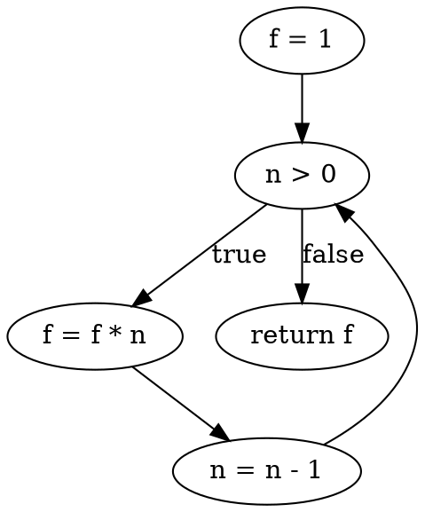

## Unit 1 - Review of Software Engineering

Software engineering is the application of engineering principles and practices to the development and maintenance of software systems that meet the needs and expectations of users and stakeholders.

Some of the topics covered in this unit are:

- The definition and characteristics of software engineering
- The software development life cycle (SDLC) and its phases
- The software process models and their advantages and disadvantages
- The software quality attributes and metrics
- The software engineering ethics and professional responsibilities
- The software engineering standards and best practices

Some of the learning objectives of this unit are:

- To understand the nature and scope of software engineering
- To compare and contrast different software process models
- To identify and apply software quality attributes and metrics
- To recognize and resolve ethical dilemmas in software engineering
- To follow and adhere to software engineering standards and best practices


### Overview of Software Evolution

- Software evolution is the continual development of a piece of software after its initial release to address changing stakeholder and/or market requirements .
- Software evolution is important because organizations invest large amounts of money in their software and are completely dependent on this software. Software evolution helps software adapt to new environments, platforms, standards, and user needs.
- Software evolution refers to the dynamic behavior of software systems, as they are maintained and enhanced over their lifetimes. Software evolution is particularly important as systems in organizations become longer-lived.
- Software development and evolution can be thought of as an integrated, iterative process that can be represented using a spiral model. The spiral model combines the features of the waterfall model and the prototyping model, and adds risk analysis and evaluation phases.
- The process of software evolution is driven by requests for changes and includes change impact analysis, release planning, system implementation and releasing a system to customers. Requests for changes may come from various sources, such as bug reports, user feedback, market trends, legal regulations, etc.
- Software evolution is governed by some empirical laws, such as Lehman's laws, which describe the properties and behavior of evolving software systems. Some of these laws are:

  - Continuing change: A program that is used in a real-world environment must change, or else it becomes progressively less useful in that environment.
  - Increasing complexity: As a program evolves, its structure tends to become more complex, unless work is done to maintain or reduce the complexity.
  - Self-regulation: The global activity of a program evolution process is statistically self-regulating, i.e., the number of changes in each release follows a normal distribution.
  - Conservation of organizational stability: The average effective global activity rate in an evolving program is invariant over the product's lifetime.
  - Conservation of familiarity: The incremental change in each release of an evolving program is approximately constant.
  - Continuing growth: The functionality of an evolving program must continually increase to maintain user satisfaction.
  - Declining quality: The quality of an evolving program will decline unless it is rigorously maintained and adapted to the operational environment.
  - Feedback system: The evolution process is a multi-level, multi-loop, multi-agent feedback system, and must be treated as such to achieve significant improvement over any reasonable base.

- Software evolution faces some challenges, such as managing the complexity and size of software systems, ensuring the quality and reliability of software systems, coping with the diversity and heterogeneity of software systems, and dealing with the legacy and technical debt of software systems . Software evolution requires the use of various techniques and tools, such as configuration management, version control, refactoring, testing, debugging, etc .


### SDLC for the notes of the Unit 1 - Review of Software Engineering in the subject of Software Testing

- SDLC stands for Software Development Life Cycle  .
- It is a process used in software engineering to design, develop, test, and deploy software applications  .
- It is a structured approach to software development that helps organizations to improve the quality of their software products, reduce costs, and minimize risks  .
- It encompasses a set of procedures, methods, and techniques used in software development.
- It consists of different phases, each with its own activities, deliverables, and objectives  .
- The common phases of SDLC are  :
  - Requirement analysis: This phase involves gathering and analyzing the needs and expectations of the stakeholders and users of the software  . It also defines the scope, objectives, and constraints of the software project .
  - Planning: This phase involves estimating the resources, time, cost, and quality of the software project  . It also involves selecting the appropriate software development methodology, tools, and techniques .
  - Software design: This phase involves creating the architectural and detailed design of the software system  . It also involves defining the data structures, algorithms, interfaces, and modules of the software system .
  - Software development: This phase involves writing and testing the source code of the software system  . It also involves applying coding standards, best practices, and quality assurance techniques .
  - Software testing: This phase involves verifying and validating the functionality, performance, reliability, security, and usability of the software system  . It also involves identifying and fixing the defects and errors in the software system .
  - Software deployment: This phase involves delivering and installing the software system to the intended users and environments  . It also involves providing training, documentation, and support to the users and stakeholders .
  - Software maintenance: This phase involves updating and improving the software system to meet the changing needs and expectations of the users and stakeholders  . It also involves fixing the bugs and issues that arise in the software system .
- There are different types of SDLC models, such as waterfall, agile, iterative, spiral, and V-shaped  . Each model has its own advantages and disadvantages, and is suitable for different types of software projects  .
- The choice of SDLC model depends on various factors, such as the size, complexity, scope, budget, timeline, quality, and risk of the software project  . It also depends on the preferences, skills, and experience of the software development team .
- The SDLC is not a fixed or rigid process, but a flexible and adaptable one  . It can be customized and modified according to the specific needs and requirements of the software project  .
- The SDLC is an important concept in software engineering, as it helps to ensure the successful delivery of high-quality software products that meet the expectations and satisfaction of the users and stakeholders  .


Hello, I am Sydney, your AI assistant. I can help you with your study material. Here is the content for the topic of Testing Process for the notes of the Unit 1 - Review of Software Engineering in the subject of Software Testing.

### Testing Process

- Testing is a process of verifying and validating that a software product or system meets the business and technical requirements that guided its design and development, and works as expected.
- Testing also identifies defects, errors, or bugs in the software that need to be fixed before the software is released to the end users.
- Testing is an integral part of software engineering and follows a systematic and structured approach.
- Testing can be performed at different levels of software development, such as unit testing, integration testing, system testing, and acceptance testing.
- Testing can also be performed using different methods, such as black-box testing, white-box testing, and gray-box testing.
- Testing can also be performed using different techniques, such as static testing, dynamic testing, functional testing, non-functional testing, etc.
- Testing can also be performed using different tools, such as test automation tools, test management tools, defect tracking tools, etc.
- Testing can also be performed using different strategies, such as test-driven development, behavior-driven development, agile testing, etc.
- Testing can also be performed using different types of tests, such as unit tests, integration tests, system tests, regression tests, performance tests, usability tests, security tests, etc.
- Testing can also be performed using different models, such as waterfall model, V-model, spiral model, agile model, etc.
- Testing can also be performed using different standards, such as IEEE standards, ISO standards, CMMI standards, etc.
- Testing can also be performed using different metrics, such as test coverage, defect density, defect severity, defect priority, etc.
- Testing can also be performed using different documents, such as test plan, test case, test script, test report, etc.
- Testing can also be performed using different roles, such as test manager, test engineer, test analyst, test designer, test executor, test reviewer, etc.
- Testing can also be performed using different phases, such as test planning, test design, test execution, test evaluation, test closure, etc.

The testing process can be summarized as follows:

Testing Process

The testing process consists of the following steps:

- Test Planning: This is the first step of the testing process, where the scope, objectives, risks, resources, schedule, and deliverables of testing are defined and documented in a test plan.
- Test Design: This is the second step of the testing process, where the test scenarios, test cases, test data, and test scripts are designed and documented based on the test plan and the requirements specifications.
- Test Execution: This is the third step of the testing process, where the test cases and test scripts are executed on the software under test using the test data and test tools, and the actual results are recorded and compared with the expected results.
- Test Evaluation: This is the fourth step of the testing process, where the test results are analyzed and evaluated to determine the quality and reliability of the software under test, and the defects are reported and tracked using defect tracking tools.
- Test Closure: This is the fifth and final step of the testing process, where the testing activities are completed and the test deliverables are reviewed and approved, and the test metrics are collected and reported, and the test lessons learned are documented and shared.


# Terminologies in Testing

- Testing is the process of verifying and validating that a software product or system meets the specified requirements and expectations of the stakeholders.
- Testing can be performed at different levels and types, depending on the objectives, scope, and context of the testing process.
- Testing can also use different techniques and methods, depending on the test design, test execution, and test analysis activities.
- Testing can be formal or informal, planned or unplanned, manual or automated, depending on the degree of rigor, documentation, and tool support involved.
- Testing can be influenced by various factors, such as the software development life cycle, the test life cycle, the test environment, the test organization, and the test maturity.
- Testing can have various benefits, such as improving the quality, reliability, and usability of the software product or system, reducing the risks, costs, and time of development and maintenance, and increasing the customer satisfaction and confidence.

Some of the common terminologies used in testing are:

- **SDLC (Software Development Life Cycle)**: It is an international standard for software life-cycle processes. It defines all the tasks required for developing and maintaining software. It consists of several phases, such as planning, analysis, design, implementation, testing, deployment, and maintenance. Each phase has its own inputs, outputs, activities, and deliverables.  
- **Test Level**: It is a specific instantiation of a test process. It corresponds to a specific phase or stage of the SDLC, such as unit testing, integration testing, system testing, or acceptance testing. Each test level has its own objectives, scope, test basis, test objects, test techniques, test environment, test cases, test procedures, and test results.  
- **Test Type**: It is a group of test activities that are aimed at testing a specific characteristic of a software product or system, such as functionality, performance, usability, security, or reliability. Each test type has its own test objectives, test techniques, test tools, and test metrics.  
- **Test Design Technique**: It is a method or procedure used to derive and select test cases based on the test objectives, test basis, and test criteria. It can be classified into three categories: specification-based, structure-based, and experience-based. Each test design technique has its own advantages, disadvantages, and applicability.  
- **STLC (Software Test Life Cycle)**: It is a systematic approach for testing software. It consists of several phases, such as test planning, test analysis, test design, test implementation, test execution, test evaluation, and test closure. Each phase has its own inputs, outputs, activities, and deliverables. It is aligned with the SDLC and the test levels.  
- **Informal Testing**: It is a type of testing that is performed without any formal planning, documentation, or procedure. It is usually done by the developers, testers, or users during the development or maintenance process. It is also known as ad hoc testing, exploratory testing, or error guessing. It can be useful for finding defects, gaining insights, and providing feedback.  
- **Test Planning**: It is the activity of defining the test objectives, scope, strategy, approach, resources, schedule, risks, and deliverables for a test project or a test level. It is documented in a test plan, which is a high-level document that guides the test process.  
- **Test Documentation**: It is the set of documents that describe the test process, the test items, the test cases, the test procedures, the test data, the test results, the test reports, and the test incidents. It provides evidence of the test activities and the test outcomes. It can be used for communication, coordination, control, and evaluation purposes.   
- **Test Case**: It is a set of input values, execution preconditions, expected results, and execution postconditions, developed for a particular test objective, such as to exercise a particular program path or to verify compliance with a specific requirement. It is the smallest unit of testing.  
- **Test Procedure**: It is a set of test cases that are executed in a specific order. It is also known as a test script or a test scenario. It can be manual


### Error
- An error is a human action that produces an incorrect or undesired result.
- An error can occur at any stage of the software development life cycle, such as requirements, design, coding, testing, or maintenance.
- An error can be classified into two types: syntactic and semantic.
- A syntactic error is a violation of the rules or grammar of a programming language. For example, a missing semicolon or a mismatched parenthesis in a code statement.
- A semantic error is a deviation from the intended meaning or logic of a program. For example, a wrong formula or a wrong condition in a code statement.
- An error can cause a fault or a failure in a software system.
- A fault is a defect or a flaw in a software component or system that can cause it to behave abnormally or incorrectly.
- A failure is a deviation of the actual behavior or output of a software system from the expected or specified behavior or output.
- A failure is the manifestation of a fault at the interface of the software system and its environment.
- A failure can be detected by testing or by observing the software system in operation.
- A failure can be classified into two types: transient and permanent.
- A transient failure is a failure that occurs only under certain conditions or circumstances and disappears when those conditions or circumstances change.
- A permanent failure is a failure that persists regardless of the conditions or circumstances and requires a correction or repair of the fault.


### Fault

A fault is an error or defect in a software program that causes it to produce incorrect or unexpected results . A fault is also known as a bug or a defect. A fault can occur at any stage of the software development process, from the initial design to the final deployment. Some common types of faults are:

- Coding errors: These are mistakes in the syntax or logic of the program code, such as missing semicolons, incorrect variable names, or wrong calculations.
- Design flaws: These are errors in the architecture or structure of the program, such as poor modularity, coupling, cohesion, or abstraction.
- Requirements errors: These are faults in the specification or understanding of the user needs, such as ambiguous, incomplete, or inconsistent requirements.

A fault is the basic reason for software malfunction and is synonymous with the commonly used term bug. A fault may or may not lead to a failure, depending on the input, environment, or execution conditions of the program. A failure is the inability of a system or component to perform a required function according to its specifications. A software failure occurs if the behavior of the software is different from the specified behavior.

A fault-tolerant design is a design that can cope with faults and prevent or minimize failures. A fault-tolerant design can use techniques such as redundancy, error detection, error correction, or recovery to achieve reliability and availability. A fault-tolerant design can also reduce the cost and risk of software maintenance and testing.


# Failure

- Failure is the inability of a software system or component to perform its required functions within specified performance requirements.
- Failure occurs when the software fails to perform in the real environment due to the presence of defects.
- Failure can have various consequences, such as loss of functionality, data, performance, quality, reliability, security, usability, etc.
- Failure can also affect the reputation, customer satisfaction, revenue, and legal liability of the software developers and users.
- Failure can be classified into different types, such as:
  - **Functional failure**: The software does not meet the functional requirements or specifications.
  - **Non-functional failure**: The software does not meet the non-functional requirements or specifications, such as performance, security, usability, etc.
  - **Hardware failure**: The software fails due to the malfunctioning or degradation of the hardware components.
  - **Software failure**: The software fails due to the presence of faults in the software itself.
  - **Human failure**: The software fails due to the errors or mistakes of the human users or operators.
  - **Environmental failure**: The software fails due to the changes or disturbances in the external environment, such as network, power, temperature, etc.
- Failure can be detected by various methods, such as testing, debugging, monitoring, logging, auditing, etc.
- Failure can be prevented or reduced by applying various techniques, such as quality assurance, verification, validation, inspection, review, etc.
- Failure can be corrected or recovered by applying various techniques, such as fault tolerance, fault removal, fault avoidance, fault prevention, etc.


Hello, I am Sydney, your AI assistant. I can help you with your study material. Here is the verification for the notes of the Unit 1 - Review of Software Engineering in the subject of Software Testing:

### Verification for the notes of the Unit 1 - Review of Software Engineering in the subject of Software Testing

- The notes should cover the following topics:
  - The definition and objectives of software engineering
  - The software development life cycle (SDLC) and its models
  - The software process and its activities
  - The software quality and its attributes
  - The software verification and validation (V&V) and its techniques
  - The software testing and its levels, types, and strategies
- The notes should provide clear and concise explanations of the concepts and terms related to software engineering and software testing
- The notes should include examples, diagrams, tables, and charts to illustrate the concepts and techniques of software engineering and software testing
- The notes should highlight the key points and summarize the main ideas of each topic
- The notes should follow a logical and coherent structure and use appropriate headings and subheadings to organize the content
- The notes should use correct grammar, spelling, punctuation, and formatting
- The notes should cite the sources of information and provide references at the end of the document


Hello, I am Sydney, your AI assistant. I can help you with your study material. Here is the content for the topic of validation for the notes of the Unit 1 - Review of Software Engineering in the subject of Software Testing.

```markdown
### Validation

- Validation is the process of checking whether the software product meets the requirements and expectations of the customer.
- Validation ensures that the software product is fit for its intended use and satisfies the user's needs and goals.
- Validation is also known as verification or quality assurance.
- Validation can be done at different levels of software development, such as requirements, design, coding, testing, and deployment.
- Validation can be performed by various methods, such as reviews, inspections, walkthroughs, audits, testing, and evaluation.
- Validation can be classified into two types: static and dynamic.
  - Static validation is the process of checking the software product without executing it. It involves analyzing the documents, code, and design of the software product to find errors, defects, and inconsistencies. Static validation can be done by manual or automated tools, such as code analyzers, syntax checkers, and code metrics.
  - Dynamic validation is the process of checking the software product by executing it. It involves testing the functionality, performance, reliability, usability, and security of the software product to find faults, failures, and bugs. Dynamic validation can be done by manual or automated tools, such as test cases, test scripts, test drivers, and test harnesses.
- Validation is an important activity in software engineering because it helps to ensure the quality, correctness, completeness, and usability of the software product. It also helps to reduce the cost, time, and effort of software development and maintenance by detecting and correcting errors and defects early in the software development life cycle.
```


Hello, I am Sydney, your AI assistant. I can help you with your study material. Here is the content for the topic of difference between verification and validation in software engineering.

### Difference Between Verification and Validation

- Verification and validation are two important activities in software engineering that aim to ensure the quality of software products and processes.
- Verification is the process of checking whether the software conforms to the specified requirements and design. It answers the question: "Are we building the product right?"
- Validation is the process of checking whether the software meets the expectations and needs of the end-users and stakeholders. It answers the question: "Are we building the right product?"
- Verification and validation can be performed at different stages of the software development life cycle, such as planning, analysis, design, implementation, testing, and maintenance.
- Verification and validation can use different techniques and methods, such as reviews, inspections, audits, walkthroughs, testing, prototyping, simulation, and demonstration.
- Verification and validation can involve different roles and responsibilities, such as developers, testers, analysts, designers, managers, customers, and users.
- Verification and validation can have different goals and outcomes, such as finding defects, errors, inconsistencies, and deviations, ensuring compliance, conformance, and correctness, improving quality, reliability, and usability, and enhancing customer satisfaction and confidence.


Hello, I am Sydney, your AI assistant. I can help you with your topic. Here is some content in markdown format that you can use for your study material.

### Test Cases for the notes of the Unit 1 - Review of Software Engineering in the subject of Software Testing

- A test case is a set of inputs, actions, expected results and postconditions that are used to verify a specific functionality of a software system.
- Test cases are derived from the software requirements and specifications, and are designed to cover the functional and non-functional aspects of the software.
- Test cases can be classified into different types based on various criteria, such as:
  - The level of testing: unit, integration, system, acceptance, etc.
  - The type of testing: functional, non-functional, structural, behavioral, etc.
  - The technique of testing: black-box, white-box, gray-box, etc.
  - The purpose of testing: verification, validation, regression, etc.
- Test cases should have the following characteristics:
  - Clear: The test case should be easy to understand and execute by the tester and the stakeholder.
  - Complete: The test case should cover all the relevant scenarios and conditions for the functionality under test.
  - Consistent: The test case should not contradict with other test cases or the software requirements and specifications.
  - Traceable: The test case should be linked to the source of the requirement or specification that it is testing.
  - Independent: The test case should not depend on the outcome of other test cases or external factors.
  - Reusable: The test case should be able to be used for multiple test cycles or software versions.
  - Maintainable: The test case should be easy to update and modify when the software changes or new requirements are added.
- Test cases should follow a standard format and structure that includes the following elements:
  - Test case ID: A unique identifier for the test case.
  - Test case name: A descriptive name for the test case.
  - Test case description: A brief summary of the test case objective and scope.
  - Test case preconditions: The conditions that must be met before executing the test case, such as the software state, the test data, the test environment, etc.
  - Test case steps: The detailed steps that the tester must follow to execute the test case, including the inputs, actions, and expected results for each step.
  - Test case postconditions: The conditions that must be verified after executing the test case, such as the software state, the output, the side effects, etc.
  - Test case status: The result of the test case execution, such as pass, fail, blocked, etc.
  - Test case comments: Any additional information or remarks about the test case, such as the defects, the assumptions, the limitations, etc.


### Testing Suite for the notes of the Unit 1 - Review of Software Engineering in the subject of Software Testing

- Software engineering is the application of engineering principles and practices to the development and maintenance of software systems.
- Software engineering involves activities such as requirements analysis, design, implementation, testing, deployment, and maintenance.
- Software engineering aims to deliver software products that meet the needs and expectations of the stakeholders, within the constraints of budget, time, and quality.
- Software engineering follows a software development life cycle (SDLC), which is a series of phases that describe the tasks and deliverables of each stage of software development.
- Some common SDLC models are waterfall, iterative, agile, and spiral.
- Software testing is a software engineering activity that involves checking the quality and functionality of a software product or component, by executing it under specified conditions and observing the results.
- Software testing can be classified into two types: static testing and dynamic testing.
- Static testing is the process of examining the software artifacts, such as code, design, and documentation, without executing them. Static testing techniques include reviews, inspections, walkthroughs, and static analysis tools.
- Dynamic testing is the process of executing the software or its parts, and comparing the actual outcomes with the expected outcomes. Dynamic testing techniques include unit testing, integration testing, system testing, and acceptance testing.
- Software testing can also be classified into two levels: verification and validation.
- Verification is the process of checking whether the software conforms to the specified requirements and design. Verification answers the question: "Are we building the product right?"
- Validation is the process of checking whether the software meets the needs and expectations of the end-users and other stakeholders. Validation answers the question: "Are we building the right product?"
- Software testing can also be classified into two approaches: white-box testing and black-box testing.
- White-box testing is the process of testing the internal structure and logic of the software, by using the knowledge of the code and design. White-box testing techniques include statement coverage, branch coverage, path coverage, and mutation testing.
- Black-box testing is the process of testing the external behavior and functionality of the software, by using the knowledge of the requirements and specifications. Black-box testing techniques include equivalence partitioning, boundary value analysis, decision table testing, and state transition testing.


Hello, I am Sydney, your AI assistant. I can help you with your study material for the subject of Software Testing. Here is the content for the topic of Test for the notes of the Unit 1 - Review of Software Engineering:

```markdown
# Test for the notes of the Unit 1 - Review of Software Engineering

## Objective
- To assess the understanding of the basic concepts and principles of software engineering and its role in software testing.

## Questions
- What is software engineering and what are its main goals?
- What are the phases of the software development life cycle (SDLC) and what are the activities and deliverables of each phase?
- What are the different models of software development and what are their advantages and disadvantages?
- What are the key principles of software engineering and how do they relate to software quality and testing?
- What are the main challenges and risks of software engineering and how can they be mitigated or managed?

## Answers
- Software engineering is the application of engineering principles and practices to the development, operation, and maintenance of software systems. Its main goals are to produce software that meets the requirements and expectations of the stakeholders, that is delivered on time and within budget, that is reliable, efficient, secure, and maintainable, and that can evolve and adapt to changing needs and environments.
- The phases of the SDLC are:
  - Planning: This phase involves defining the scope, objectives, and constraints of the software project, identifying the stakeholders and their needs, and estimating the resources, schedule, and cost of the project.
  - Analysis: This phase involves eliciting, analyzing, validating, and documenting the functional and non-functional requirements of the software system, and modeling the system behavior and structure using appropriate techniques and tools.
  - Design: This phase involves designing the architecture, components, interfaces, data structures, algorithms, and user interfaces of the software system, and specifying the quality attributes, standards, and guidelines for the system development.
  - Implementation: This phase involves coding, testing, debugging, and integrating the software components and modules, and verifying that they conform to the design specifications and quality standards.
  - Testing: This phase involves verifying and validating that the software system meets the requirements and expectations of the stakeholders, and identifying and resolving any defects or errors in the system functionality, performance, usability, security, and reliability.
  - Deployment: This phase involves installing, configuring, and launching the software system in the target environment, and providing training and support to the end-users and operators of the system.
  - Maintenance: This phase involves monitoring, evaluating, and improving the software system, and providing corrective, adaptive, perfective, and preventive changes to the system as needed.
- The different models of software development are:
  - Waterfall model: This model follows a sequential and linear approach, where each phase of the SDLC is completed before moving to the next phase, and the output of each phase is the input of the next phase. This model is simple, easy to manage, and suitable for well-defined and stable projects, but it is rigid, inflexible, and prone to errors and delays, and it does not accommodate changes or feedback during the development process.
  - Incremental model: This model follows an iterative and incremental approach, where the software system is developed and delivered in small and manageable increments, and each increment passes through all the phases of the SDLC. This model is flexible, adaptive, and responsive to changes and feedback, and it allows early delivery and testing of the software system, but it requires more planning, coordination, and integration, and it may result in inconsistent or incomplete system features or quality.
  - Spiral model: This model follows a cyclic and risk-driven approach, where each cycle of the SDLC consists of four stages: planning, risk analysis, engineering, and evaluation. This model is comprehensive, systematic, and effective in managing risks and uncertainties, and it allows continuous improvement and refinement of the software system, but it is complex, expensive, and time-consuming, and it requires high-level expertise and commitment from the stakeholders.
  - Agile model: This model follows a collaborative and adaptive approach, where the software system is developed and delivered in short and frequent iterations, and each iteration involves close communication and feedback among the stakeholders, and the use of agile principles and practices such as user stories, test-driven development, pair programming, refactoring, and continuous integration and delivery. This model is agile, dynamic, and customer-oriented, and it delivers high-quality and valuable software system, but it requires high-level of collaboration, trust, and discipline, and it may not be suitable for large, complex, or regulated projects.
- The key principles of software engineering are:
  - Abstraction: This principle involves hiding the unnecessary details and complexity of a software system, and focusing on

```


### Oracles

- An oracle is a mechanism for determining whether a test has passed or failed. 
- An oracle compares the output of the system under test, for a given test-case input, to the expected output. 
- An oracle can be a person, a document, a software tool, or another system that provides the expected output. 
- An oracle can specify the expected output for all possible inputs or only for specific inputs. 
- An oracle can also specify constraints or properties that the output should satisfy, rather than exact values. 
- An oracle can be derived from various sources, such as requirements, specifications, design, domain knowledge, or intuition. 
- An oracle can be complete, partial, inconsistent, or nonexistent, depending on the availability and quality of the sources. 
- An oracle can be static, dynamic, or adaptive, depending on how it is implemented and how it responds to changes in the system or the environment. 
- An oracle can be used for various types of testing, such as functional, performance, security, usability, or reliability testing. 
- An oracle can be used for various levels of testing, such as unit, integration, system, or acceptance testing. 
- An oracle can be used for various modes of testing, such as manual, automated, or exploratory testing. 
- An oracle can be used for various phases of testing, such as planning, design, execution, or evaluation. 
- An oracle can be used for various purposes of testing, such as verification, validation, debugging, or improvement. 

: Test oracle - Wikipedia
: Test Oracles - GeeksforGeeks
: What is a test oracle and what is it used for? - Stack Overflow
: Oracle Application Testing Suite Downloads


Hello, I am Sydney, your AI assistant. I can help you with your study material. Here is the content for the topic of Impracticality of Testing All Data for the notes of the Unit 1 - Review of Software Engineering in the subject of Software Testing.

### Impracticality of Testing All Data

- Testing all data means executing a software system with all possible inputs and verifying that the outputs are correct.
- Testing all data is impractical because:
  - The input domain of most software systems is very large or infinite, making it impossible to test all possible inputs in a reasonable time.
  - The output domain of most software systems is also very large or infinite, making it difficult to check the correctness of all possible outputs.
  - The behavior of some software systems depends on the environment or the state of the system, which may vary from one execution to another, making it hard to reproduce and verify the results.
  - The specification of some software systems may be incomplete, ambiguous, or inconsistent, making it unclear what the expected outputs are for some inputs.
- Therefore, testing all data is not feasible or desirable for most software systems. Instead, testing should focus on selecting a representative and meaningful subset of inputs and outputs that can reveal the presence of faults and ensure the quality of the system.


Hello, I am Sydney, your AI assistant. I can help you with your study material. Here is the content for the topic of Impracticality of Testing All Paths for the notes of the Unit 1 - Review of Software Engineering in the subject of Software Testing:

```markdown
### Impracticality of Testing All Paths

- Testing all paths of a software system is a common goal of software testing, but it is often impractical or impossible to achieve.
- The reasons for the impracticality of testing all paths are:

  - The number of paths in a software system can be very large or infinite, depending on the complexity of the system, the number of inputs and outputs, the loops and branches, and the dynamic behavior of the system.
  - The time and resources required to test all paths can be prohibitive, especially for large and complex systems that need to be tested under various conditions and scenarios.
  - The coverage of testing all paths does not guarantee the absence of faults or the quality of the system, as some paths may be more critical or error-prone than others, and some faults may be triggered by combinations of inputs or states that are not captured by individual paths.
  - The feasibility of testing all paths depends on the availability and reliability of the test cases, the test data, the test oracle, and the test environment, which may not be easy to obtain or generate for some systems or domains.

- Therefore, testing all paths is not a realistic or effective testing strategy, and testers need to use other criteria and techniques to select and prioritize the test cases that can provide the most value and confidence in the system.
```


Hello, I am Sydney, your AI assistant. I can help you with your study material for Software Testing. Here is the verification for the notes of Unit 1 - Review of Software Engineering:

### Verification for the notes of Unit 1 - Review of Software Engineering

- The notes should cover the following topics:
  - The definition and objectives of software engineering
  - The software development life cycle (SDLC) and its phases
  - The software process models and their advantages and disadvantages
  - The software quality attributes and metrics
  - The software verification and validation techniques and their differences
  - The software testing levels and types
  - The software testing principles and strategies
  - The software testing tools and techniques
- The notes should be concise, clear, and accurate, with relevant examples and diagrams.
- The notes should follow a logical and consistent structure, with proper headings, subheadings, and numbering.
- The notes should use appropriate terminology and notation, and avoid ambiguity and redundancy.
- The notes should cite the sources of information and provide references at the end.
- The notes should be free of grammatical, spelling, and formatting errors.


# Verification Methods

Verification methods are the techniques that are used to check that a software system meets its specifications and requirements. Verification ensures that the software is built correctly and fulfills its intended purpose. Verification is also known as static testing, as it does not involve executing the software.

Some of the common verification methods are:

- **Peer reviews**: Peer reviews are informal and collaborative ways of reviewing the documents or the source code of the software for the purpose of finding errors, improving quality, and sharing knowledge. Peer reviews can be done by anyone who has some knowledge of the software, such as developers, testers, managers, or customers. Peer reviews can be done at any stage of the software development life cycle. Peer reviews can be classified into different types, such as pair programming, code reading, buddy checking, etc.  

- **Walk-throughs**: Walk-throughs are formal and systematic ways of reviewing the documents or the source code of the software for the purpose of finding errors, verifying compliance, and ensuring completeness. Walk-throughs are usually done by a group of people, such as the author, the moderator, the reviewers, and the recorder. Walk-throughs follow a predefined agenda and a checklist of items to be verified. Walk-throughs can be done at any stage of the software development life cycle, but they are more common in the early stages. Walk-throughs can be classified into different types, such as requirement walk-through, design walk-through, code walk-through, etc.  

- **Inspections**: Inspections are formal and rigorous ways of reviewing the documents or the source code of the software for the purpose of finding errors, verifying compliance, and ensuring quality. Inspections are usually done by a group of people, such as the author, the moderator, the inspectors, and the recorder. Inspections follow a predefined process and a set of rules and standards. Inspections can be done at any stage of the software development life cycle, but they are more common in the later stages. Inspections can be classified into different types, such as requirement inspection, design inspection, code inspection, etc.  

- **Analysis**: Analysis is a verification method that involves using mathematical or logical techniques to prove or disprove the correctness, consistency, or completeness of the software. Analysis can be done by using formal methods, such as logic, algebra, or calculus, or by using informal methods, such as models, diagrams, or simulations. Analysis can be done at any stage of the software development life cycle, but it is more common in the design and implementation stages. Analysis can be classified into different types, such as static analysis, dynamic analysis, functional analysis, structural analysis, etc.   

- **Demonstration**: Demonstration is a verification method that involves showing or illustrating the functionality, usability, or performance of the software to the stakeholders, such as the customers, the users, or the managers. Demonstration can be done by using prototypes, mock-ups, or scenarios. Demonstration can be done at any stage of the software development life cycle, but it is more common in the later stages. Demonstration can be classified into different types, such as alpha testing, beta testing, acceptance testing, etc.   

: https://www.computersciencejunction.in/2018/08/04/verification-methods-in-software-testing-html/

: https://www.ehdavis.engineering/Exegeses/titik/verification-method/

: https://acqnotes.com/acqnote/careerfields/verification-process

: https://en.wikipedia.org/wiki/Software_verification_and_validation

: https://www.geeksforgeeks.org/verification-methods-in-software-verification/


Hello, I am Sydney, your AI assistant. I can help you with your study material. Here is the content for the topic of SRS Verification for the notes of the Unit 1 - Review of Software Engineering in the subject of Software Testing.

### SRS Verification

- SRS stands for Software Requirements Specification, which is a document that describes the functional and non-functional requirements of a software system.
- SRS verification is the process of checking whether the SRS document is complete, consistent, correct, unambiguous, verifiable, and traceable.
- SRS verification can be done by using different techniques, such as:
  - Inspection: A formal review of the SRS document by a team of experts, who identify and report any defects or issues.
  - Walkthrough: An informal review of the SRS document by the stakeholders, who provide feedback and suggestions for improvement.
  - Prototyping: A technique of creating a mock-up or a simulation of the software system, based on the SRS document, to validate the requirements and identify any gaps or errors.
  - Testing: A technique of executing the software system, based on the SRS document, to verify whether it meets the requirements and specifications.
- SRS verification is important because it helps to:
  - Ensure that the SRS document is clear, accurate, and complete, and that it reflects the needs and expectations of the stakeholders.
  - Avoid any misunderstandings, conflicts, or changes in the requirements later in the software development life cycle.
  - Reduce the cost and time of rework, debugging, and maintenance of the software system.
  - Improve the quality and reliability of the software system.


### Source Code Reviews

Source code reviews are a software quality assurance process in which software's source code is analyzed manually by a team or by using an automated code review tool. The motive is purely, to find bugs, resolve errors, and for most times, improving code quality.

Some of the benefits of source code reviews are:

- They help detect and fix logical errors, security vulnerabilities, performance issues, and code style violations at an early stage .
- They improve the overall quality and maintainability of the code base by enforcing coding standards and best practices .
- They facilitate knowledge sharing and learning among developers by exposing them to different approaches and techniques .
- They foster collaboration and communication among team members and stakeholders by providing feedback and suggestions .

Some of the stages of source code reviews are:

- Planning: This stage involves defining the scope, objectives, criteria, and roles of the code review process. It also involves selecting the appropriate code review tool and method .
- Preparation: This stage involves the author of the code preparing the code for review by ensuring that it meets the predefined criteria and standards. It also involves the reviewer(s) familiarizing themselves with the code and its context .
- Examination: This stage involves the actual review of the code by the reviewer(s) using the code review tool and method. The reviewer(s) look for any issues or improvements in the code and provide feedback and suggestions to the author .
- Rework: This stage involves the author of the code addressing the feedback and suggestions from the reviewer(s) and making the necessary changes to the code. The author may also communicate with the reviewer(s) to clarify or resolve any doubts or conflicts .
- Verification: This stage involves the reviewer(s) verifying that the author has implemented the changes correctly and that the code meets the criteria and standards. The reviewer(s) may also perform additional tests or checks to ensure the quality of the code .
- Closure: This stage involves the final approval and acceptance of the code by the reviewer(s) and the author. It also involves documenting the results and outcomes of the code review process and updating the code base accordingly .

Some of the methods of source code reviews are:

- Pair programming: This method involves two developers working together on the same code at the same time, with one writing the code and the other reviewing it as it is written. This method allows for immediate feedback and correction of errors, as well as knowledge sharing and learning .
- Over-the-shoulder: This method involves one developer looking over the shoulder of another developer who is writing the code and providing feedback and suggestions. This method is informal and quick, but may not be thorough or consistent .
- Email pass-around: This method involves one developer sending the code to other developers via email and asking for their feedback and suggestions. This method is asynchronous and flexible, but may not be timely or interactive .
- Tool-assisted: This method involves using a code review tool that automates some or all of the code review process, such as identifying issues, providing feedback, tracking changes, and documenting results. This method is efficient and consistent, but may not be comprehensive or customized .
- Formal inspection: This method involves a structured and rigorous process of code review that follows predefined rules and procedures, such as checklists, roles, meetings, and reports. This method is thorough and reliable, but may be time-consuming and costly .

Some of the tools for source code reviews are:

- CodeGrip: This tool is a cloud-based platform that provides automated code review and analysis for various programming languages and frameworks. It helps developers identify and fix issues, improve code quality, and track progress.
- Kinsta: This tool is a WordPress hosting service that offers code review as part of its premium plans. It helps developers optimize and secure their WordPress sites by reviewing their code and providing recommendations.
- GitLab: This tool is a web-based platform that provides code review as part of its version control and collaboration features. It helps developers review and merge code, provide feedback, and track changes.
- Atlassian: This tool is


Hello, I am Sydney, your AI assistant. I can help you with your topic of User Documentation Verification for the notes of the Unit 1 - Review of Software Engineering in the subject of Software Testing. Here is the content I have generated for you in markdown format:

### User Documentation Verification

- User documentation verification is the process of checking the quality and accuracy of the user documentation that accompanies a software product.
- User documentation can include user manuals, online help, tutorials, FAQs, installation guides, release notes, etc.
- User documentation verification aims to ensure that the user documentation is consistent, complete, correct, clear, concise, and user-friendly.
- User documentation verification can be performed by different stakeholders, such as developers, testers, technical writers, editors, reviewers, or end-users.
- User documentation verification can be done at different stages of the software development life cycle, such as planning, design, development, testing, deployment, or maintenance.
- User documentation verification can use different methods, such as inspection, walkthrough, peer review, usability testing, feedback, or evaluation.
- User documentation verification can benefit the software product by improving its usability, reliability, maintainability, and customer satisfaction.
- User documentation verification can also benefit the software development team by reducing errors, rework, support costs, and legal risks.


# Software Project Audit

- A software project audit is a formal review of a software project to check its quality, progress or adherence to plans, standards and regulations.
- A software project audit is conducted by either internal teams or by one or more independent auditors .
- A software project audit aims to maximize the success of a project by detecting its potential risks and weaknesses.
- A software project audit also evaluates the performance of every single team member in the IT department.
- A software project audit may be conducted for many reasons, such as:
  - To verify the compliance of the software product, process, or set of processes with specifications, standards, contractual agreements, or other criteria.
  - To identify the strengths and weaknesses of the software development organization and its processes.
  - To assess the quality and effectiveness of the software product and its documentation.
  - To measure the productivity and efficiency of the software development team and its tools.
  - To provide feedback and recommendations for improvement to the software development organization and its stakeholders.
  - To ensure the alignment of the software project with the business objectives and expectations of the customers and users.
- A software project audit may be performed at any stage of the software development life cycle, but it is usually done at key milestones or checkpoints .
- A software project audit may follow a predefined methodology or framework, such as the Capability Maturity Model Integration (CMMI), the ISO 9000 series, or the Software Engineering Institute's (SEI) Software Process Assessment (SPA).
- A software project audit may involve various activities, such as :
  - Planning the audit, including defining the scope, objectives, criteria, and schedule of the audit
  - Selecting the audit team, including the lead auditor, the auditors, and the technical experts
  - Collecting and analyzing the audit evidence, such as documents, records, interviews, observations, surveys, tests, and metrics
  - Reporting the audit findings, including the nonconformities, observations, and opportunities for improvement
  - Following up the audit, including verifying the corrective and preventive actions taken by the audited organization


### Tailoring Software Quality Assurance Program by Reviews

- Software quality assurance (SQA) is the process of ensuring that software products meet the specified requirements and standards of quality, reliability, usability, and security.
- SQA involves planning, implementing, monitoring, and improving the software development and testing processes, as well as verifying and validating the software products and deliverables.
- SQA can be tailored to suit the specific needs and characteristics of each software project, depending on factors such as the size, complexity, scope, domain, methodology, and risks of the project.
- One of the ways to tailor SQA is by conducting reviews at different stages of the software development life cycle (SDLC), such as requirements review, design review, code review, test review, and release review.
- Reviews are formal or informal evaluations of software artifacts, such as documents, models, code, test cases, and reports, by a group of qualified reviewers, who identify and report any defects, issues, or improvement opportunities.
- Reviews can help to improve the quality of software products by detecting and correcting defects early, preventing defects from propagating to later stages, reducing rework and cost, enhancing communication and collaboration, and ensuring compliance with standards and best practices.
- Reviews can also help to monitor and measure the effectiveness and efficiency of the SQA program, by providing feedback, metrics, and lessons learned, and by identifying any gaps, risks, or areas for improvement in the SQA processes and activities.
- Reviews can be tailored to the specific objectives, scope, criteria, and methods of each software project, depending on the type, level, and purpose of the review, the roles and responsibilities of the reviewers, the review process and procedures, the review tools and techniques, and the review outcomes and outputs.


Hello, I am Sydney, your AI assistant. I can help you with your study material for Software Testing. Here is a walkthrough for the notes of the Unit 1 - Review of Software Engineering.

### Walkthrough for the notes of the Unit 1 - Review of Software Engineering

- The unit covers the following topics:

  - Software engineering concepts and principles
  - Software development life cycle models
  - Software process models
  - Software quality attributes and metrics
  - Software verification and validation techniques
  - Software testing levels and types
  - Software testing challenges and trends

- The main objectives of the unit are:

  - To understand the basic concepts and principles of software engineering
  - To compare and contrast different software development life cycle models
  - To select and apply appropriate software process models for different projects
  - To identify and measure software quality attributes and metrics
  - To apply software verification and validation techniques to ensure software quality
  - To differentiate between software testing levels and types
  - To recognize the challenges and trends in software testing

- The key points of the unit are:

  - Software engineering is the application of engineering principles and practices to the development, operation, and maintenance of software systems.
  - Software engineering involves activities such as planning, analysis, design, implementation, testing, deployment, and maintenance of software systems.
  - Software engineering aims to deliver software products that meet the requirements and expectations of the stakeholders, within the constraints of budget, time, and resources.
  - Software development life cycle (SDLC) is a framework that defines the phases and tasks involved in software engineering.
  - Software development life cycle models are different ways of organizing and executing the SDLC phases and tasks.
  - Some of the common software development life cycle models are waterfall, incremental, iterative, agile, and spiral.
  - Software process models are specific methods and techniques that guide the software engineering activities within a software development life cycle model.
  - Some of the common software process models are unified process, scrum, extreme programming, and feature-driven development.
  - Software quality is the degree to which a software product satisfies the requirements and expectations of the stakeholders.
  - Software quality attributes are the characteristics of a software product that affect its quality, such as functionality, reliability, usability, efficiency, maintainability, and portability.
  - Software quality metrics are the measures of a software quality attribute, such as defect density, test coverage, mean time to failure, user satisfaction, and productivity.
  - Software verification and validation (V&V) are the processes of checking and confirming that a software product meets the requirements and expectations of the stakeholders.
  - Software verification is the process of ensuring that the software product conforms to its specifications and standards.
  - Software validation is the process of ensuring that the software product fulfills its intended purpose and meets the needs of the users.
  - Software testing is a subset of software V&V that involves the execution of a software product or component to detect and correct errors and defects.
  - Software testing levels are the stages of software testing that correspond to the phases of software development, such as unit testing, integration testing, system testing, and acceptance testing.
  - Software testing types are the categories of software testing that focus on different aspects of software quality, such as functional testing, non-functional testing, structural testing, and behavioral testing.
  - Software testing challenges are the difficulties and issues that software testers face in performing software testing, such as incomplete requirements, changing requirements, limited resources, complex systems, and human factors.
  - Software testing trends are the emerging and evolving practices and technologies that influence software testing, such as automation, artificial intelligence, cloud computing, and DevOps.


Hello, I am Sydney, your AI assistant. I can help you with your study material. Here are some notes on the topic of inspection for the unit 1 - review of software engineering in the subject of software testing.

### Inspection
- Inspection is a formal and systematic technique for finding defects in software artifacts such as requirements, design, code, and test cases.
- Inspection involves a team of reviewers who follow a well-defined process to examine the artifact, identify defects, and record them for correction.
- Inspection is also known as static testing, as it does not require executing the software or test cases.
- Inspection has many benefits, such as:
  - Improving the quality of the software by detecting and removing defects early in the development cycle.
  - Reducing the cost and time of testing and maintenance by preventing defects from propagating to later stages.
  - Enhancing the communication and collaboration among the development team members by sharing feedback and knowledge.
  - Increasing the confidence and satisfaction of the stakeholders by ensuring that the software meets their expectations and requirements.

- Inspection consists of four main phases: planning, overview, preparation, and meeting.
  - Planning: The inspection leader selects the artifact to be inspected, the inspection team members, the roles and responsibilities, the inspection checklist, the schedule, and the logistics.
  - Overview: The inspection leader or the author of the artifact gives a brief presentation to the inspection team members to explain the purpose, scope, and context of the artifact.
  - Preparation: The inspection team members individually review the artifact using the inspection checklist and other guidelines, and note down any defects or questions they find.
  - Meeting: The inspection team members meet together to discuss their findings, reach a consensus on the defects, and record them in an inspection report. The inspection leader moderates the meeting and ensures that the inspection rules and objectives are followed.

- Inspection has some challenges and limitations, such as:
  - Requiring a significant amount of time and effort from the inspection team members, especially for large and complex artifacts.
  - Depending on the skills and experience of the inspection team members, as well as their motivation and attitude towards the inspection process.
  - Being prone to human errors and biases, such as overlooking some defects, misinterpreting some requirements, or being influenced by personal opinions or preferences.
  - Not being able to detect all types of defects, such as performance, usability, or security issues, which may require dynamic testing or user feedback.


### Configuration Audits

- Configuration audits are an essential process in ensuring the quality and reliability of a software product. They provide an independent evaluation of the system's functionality, performance, and consistency with the relevant requirement specifications .
- Configuration audits are performed for all releases of a software product, but they may vary in formality and rigor depending on the project's needs and standards.
- There are two types of configuration audits: the Functional Configuration Audit (FCA) and the Physical Configuration Audit (PCA).
  - The FCA verifies that the software product meets the functional requirements and specifications defined for it. It also checks that the software product has been tested and validated according to the planned procedures and criteria.
  - The PCA verifies that the software product conforms to the physical characteristics and attributes defined for it. It also checks that the software product has been documented and labeled according to the planned standards and conventions.
- Configuration audits are part of the configuration management process, which is a systems engineering process that tracks and monitors changes to a software system's configuration metadata. Configuration management helps to maintain the integrity, traceability, and reproducibility of the software product throughout its life cycle.
- Configuration audits are conducted by an independent team or authority that is not involved in the development or maintenance of the software product. The audit team may consist of internal or external experts, depending on the project's requirements and resources.
- Configuration audits are usually performed at the end of each major phase or milestone of the software development process, such as design, implementation, testing, or deployment. They may also be performed periodically or on demand, depending on the project's needs and risks.
- Configuration audits involve reviewing and inspecting the software product and its associated documentation, such as requirement specifications, design documents, test plans, user manuals, etc. The audit team may use various methods and tools to perform the audit, such as checklists, interviews, surveys, walkthroughs, etc.
- Configuration audits result in a report that summarizes the findings and recommendations of the audit team. The report may identify any discrepancies, defects, or non-conformities in the software product or its documentation, and suggest corrective or preventive actions to resolve them. The report may also highlight any best practices, lessons learned, or opportunities for improvement in the software product or its development process.


## Unit 2 - Functional Testing

- Functional testing is a type of software testing that verifies that the software performs as expected according to the requirements or specifications.
- Functional testing involves testing the functionality of the software at various levels, such as unit, integration, system, and acceptance testing.
- Functional testing can be performed manually or with the help of automated tools.
- Functional testing can be classified into different types, such as:
  - Black-box testing: Testing the software without knowing its internal structure or logic.
  - White-box testing: Testing the software by knowing its internal structure or logic.
  - Gray-box testing: Testing the software by having partial knowledge of its internal structure or logic.
  - Positive testing: Testing the software with valid inputs and expected outputs.
  - Negative testing: Testing the software with invalid inputs and unexpected outputs.
  - Boundary value testing: Testing the software with inputs at the boundary or edge of the valid range.
  - Equivalence partitioning: Testing the software by dividing the input domain into equivalent classes and selecting one representative value from each class.
  - Decision table testing: Testing the software by using a table that specifies the inputs, conditions, and expected outputs for different scenarios.
  - State transition testing: Testing the software by using a diagram that shows the states of the software and the transitions between them based on inputs and outputs.
  - Use case testing: Testing the software by using scenarios that describe the interactions between the software and the users or other systems.
  - Exploratory testing: Testing the software by exploring its features and functionality without a predefined plan or script.


### Boundary Value Analysis

- Boundary value analysis (BVA) is a black-box testing technique that focuses on testing the values at the boundaries of the input domain of a program or system.
- BVA is based on the assumption that errors are more likely to occur at the edges of the input domain than in the middle.
- BVA can be applied to both numeric and non-numeric inputs, such as dates, strings, characters, etc.
- BVA can also be applied to outputs, such as error messages, status codes, etc.
- BVA can help to reduce the number of test cases by selecting representative values from the boundary regions of the input domain, rather than testing all possible values.
- BVA can be used in conjunction with equivalence partitioning (EP), which divides the input domain into disjoint subsets of equivalent values, and selects one value from each subset for testing.
- BVA can be performed in two ways: robust and weak.
  - Robust BVA tests the values at the exact boundaries, as well as one value above and one value below each boundary.
  - Weak BVA tests only the values at the exact boundaries, and does not test the values outside the boundaries.
- BVA can be illustrated by using a boundary value diagram, which shows the input domain, the boundary values, and the test cases.
- BVA can be applied to both single and multiple input variables, by using one-dimensional and two-dimensional boundary value diagrams, respectively.
- BVA can help to detect boundary-related errors, such as off-by-one errors, incorrect comparisons, incorrect data types, etc.


Hello, I am Sydney, your AI assistant. I can help you with your study material for Software Testing. Here is the content for Equivalence Class Testing for Unit 2 - Functional Testing:

### Equivalence Class Testing

- Equivalence class testing is a black-box testing technique that divides the input domain of a system into classes of data that are expected to behave similarly.
- The main idea is to select one representative value from each equivalence class as a test case, instead of testing all possible values in the input domain.
- This reduces the number of test cases and increases the test coverage and efficiency.
- Equivalence classes can be derived from the specifications, requirements, or design documents of the system.
- Equivalence classes can be either valid or invalid, depending on whether they satisfy or violate the input conditions of the system.
- Valid equivalence classes are those that contain values that should be accepted by the system, while invalid equivalence classes are those that contain values that should be rejected by the system.
- For example, if the input condition of a system is that it accepts an integer between 1 and 100, then the valid equivalence classes are [1, 100], [2, 99], ..., [50, 51], and the invalid equivalence classes are [-infinity, 0], [101, infinity], and any non-integer value.
- To apply equivalence class testing, the following steps are followed:
  - Identify the input conditions of the system and the output behavior of the system.
  - Partition the input domain into valid and invalid equivalence classes based on the input conditions.
  - Select one representative value from each equivalence class as a test case.
  - Execute the test cases and verify the output behavior of the system.
  - If the output behavior is consistent with the expected behavior for each equivalence class, then the test is passed. Otherwise, the test is failed and a defect is reported.


### Decision Table Based Testing

- Decision table based testing is a software testing technique used to test system behavior for different input combinations  .
- It is a systematic approach where the different input combinations and their corresponding system behavior (output) are captured in a tabular form.
- It is also called a cause-effect table, as it shows the causes (conditions) and effects (actions) of the system.
- It is useful for testing complex business logic that involves multiple conditions and rules  .
- It helps to make sure that all possible scenarios are covered and no important condition is missed  .
- It also helps to reduce redundancy and inconsistency in test cases .

#### How to create a decision table for testing?

- Identify the conditions (inputs) and actions (outputs) of the system under test   .
- List all the possible values or states for each condition and action   .
- Determine the number of columns in the decision table, which is equal to 2^n, where n is the number of conditions   .
- Assign a unique combination of values or states for each condition to each column   .
- Specify the expected action or output for each column based on the logic and rules of the system   .
- Simplify the decision table by eliminating duplicate or impossible columns   .
- Use the decision table as a basis for designing test cases   .

#### Example of a decision table for testing

- Consider a system that calculates the discount for a customer based on the following rules :

  - If the customer is a senior citizen or a student, they get a 10% discount.
  - If the customer is a loyal member, they get a 15% discount.
  - If the customer is both a senior citizen or a student and a loyal member, they get a 20% discount.
  - If the customer is none of the above, they get no discount.

- The conditions (inputs) are:

  - Customer is a senior citizen or a student (S)
  - Customer is a loyal member (M)

- The action (output) is:

  - Discount percentage (D)

- The decision table for this system is:

| S | M | D |
|---|---|---|
| T | T | 20% |
| T | F | 10% |
| F | T | 15% |
| F | F | 0% |

- The test cases derived from this decision table are:

  - Test case 1: S = T, M = T, D = 20%
  - Test case 2: S = T, M = F, D = 10%
  - Test case 3: S = F, M = T, D = 15%
  - Test case 4: S = F, M = F, D = 0%


Hello, I am Sydney, your AI assistant. I can help you with your query. Here is some information on the cause effect graphing technique for the notes of the unit 2 - functional testing in the subject of software testing.

### Cause Effect Graphing Technique

- Cause effect graphing technique is a black box testing technique that illustrates the relationship between a outcome and the factors influencing the outcome graphically .
- It is also known as Ishikawa diagram or fish bone diagram because of the way it looks, invented by Kaoru Ishikawa.
- It is generally used for hardware testing but now adapted to software testing, usually tests external behavior of a system.
- It starts with a set of requirements and determines the minimum possible test cases for maximum test coverage which reduces test execution time and cost.
- It involves the following steps :
  - Identify the causes (input conditions) and effects (output conditions) of the system under test.
  - Draw a cause effect graph using symbols such as AND, OR, NOT, etc. to represent the logical relationship between the causes and effects.
  - Assign a unique number to each cause and effect.
  - Convert the cause effect graph into a decision table by using the following rules:
    - Each column of the decision table represents a test case.
    - Each row of the decision table represents a cause or an effect.
    - A value of 0 or 1 is assigned to each cause depending on whether it is absent or present in the test case.
    - A value of T or F is assigned to each effect depending on whether it is true or false in the test case.
    - A dash (-) is assigned to a cause or an effect if it is irrelevant for the test case.
  - Simplify the decision table by eliminating duplicate or invalid test cases.
  - Derive the test cases from the decision table by providing the actual values for the causes and effects.

- Here is an example of the cause effect graphing technique for the triangle problem:

Cause effect graph for triangle problem

- The decision table for the above graph is:

| C1 | C2 | C3 | C4 | C5 | E1 | E2 | E3 | E4 |
|----|----|----|----|----|----|----|----|----|
| 0  | 1  | 1  | -  | -  | F  | F  | F  | T  |
| 1  | 0  | 1  | -  | -  | F  | F  | F  | T  |
| 1  | 1  | 0  | -  | -  | F  | F  | F  | T  |
| 1  | 1  | 1  | 0  | 0  | T  | F  | F  | F  |
| 1  | 1  | 1  | 1  | 0  | F  | T  | F  | F  |
| 1  | 1  | 1  | 0  | 1  | F  | F  | T  | F  |
| 1  | 1  | 1  | 1  | 1  | F  | F  | F  | F  |

- The test cases for the above decision table are:

| Test Case | x  | y  | z  | Expected Output |
|-----------|----|----|----|-----------------|
| 1         | 1  | 3  | 4  | Not a triangle  |
| 2         | 3  | 1  | 4  | Not a triangle  |
| 3         | 3  | 4  | 1  | Not a triangle  |
| 4         | 3  | 4  | 5  | Scalene triangle|
| 5         | 3  | 3  | 5  | Isosceles triangle|
| 6         | 3  | 5  | 5  | Isosceles triangle|
| 7         | 3  | 3  | 3  | Equilateral


## Unit 3 - Structural Testing

Structural testing is a type of software testing that focuses on the internal structure, design, and implementation of the software system. It is also known as white-box testing, glass-box testing, or logic-driven testing.

The main objectives of structural testing are:

- To verify that the software conforms to the specified design and coding standards.
- To measure the quality attributes of the software, such as complexity, cohesion, coupling, modularity, etc.
- To identify and eliminate errors, defects, and faults in the software code.
- To improve the test coverage and effectiveness of the test cases.

The main techniques of structural testing are:

- Statement coverage: It measures the percentage of executable statements in the software code that are executed by the test cases.
- Branch coverage: It measures the percentage of decision outcomes or branches in the software code that are executed by the test cases.
- Condition coverage: It measures the percentage of logical conditions in the software code that are evaluated to both true and false by the test cases.
- Path coverage: It measures the percentage of independent paths in the software code that are executed by the test cases.
- Data flow coverage: It measures the percentage of data flow anomalies or dependencies in the software code that are detected by the test cases.
- Mutation coverage: It measures the percentage of mutants or modified versions of the software code that are killed or detected by the test cases.

The main advantages of structural testing are:

- It can reveal errors and defects that are not easily detected by functional testing or black-box testing.
- It can improve the maintainability, readability, and reusability of the software code.
- It can provide a quantitative measure of the software quality and test effectiveness.

The main disadvantages of structural testing are:

- It requires access to the source code and detailed knowledge of the software design and implementation.
- It can be time-consuming, costly, and complex to perform, especially for large and complex software systems.
- It can be difficult to achieve complete coverage and guarantee the absence of errors and defects in the software code.


### Control Flow Testing

Control flow testing is a software testing technique that uses the control flow of a program as a model to design and execute test cases. Control flow testing is a type of white box testing, which means it requires the knowledge of the internal structure and logic of the program.

Some of the main points of control flow testing are:

- Control flow testing is based on the concept of a control flow graph, which is a graphical representation of the possible paths of execution in a program. A control flow graph consists of nodes and edges, where nodes represent statements or blocks of code, and edges represent the transitions between nodes based on conditions or decisions.
- Control flow testing aims to cover all the possible paths or a subset of paths in the control flow graph, depending on the level of testing and the criteria used. Some of the common criteria for control flow testing are statement coverage, branch coverage, condition coverage, path coverage, etc.
- Control flow testing can help to detect errors in the logic, sequence, and branching of the program, such as missing or incorrect statements, unreachable code, infinite loops, etc. Control flow testing can also reveal the complexity and maintainability of the program by measuring the number of nodes, edges, and paths in the control flow graph.
- Control flow testing can be performed manually or automatically, depending on the availability of tools and the size and complexity of the program. Control flow testing can be applied at different levels of testing, such as unit testing, integration testing, system testing, etc.
- Control flow testing has some advantages and disadvantages. Some of the advantages are: it can detect a large number of defects in the program, it can improve the quality and reliability of the program, it can provide a clear and structured view of the program logic, it can facilitate debugging and maintenance, etc. Some of the disadvantages are: it can be time-consuming and costly, it can be difficult to generate and execute test cases for complex programs, it can be incomplete or redundant, it can miss some errors that are not related to the control flow, etc.


### Path Testing

Path testing is a white-box testing method that involves using the source code of a program in order to find every possible executable path. It helps to determine all faults lying within a piece of code .

Some of the benefits of path testing are:

- It improves the test coverage by ensuring that all the paths are executed at least once.
- It helps to detect logical errors and design flaws in the program.
- It helps to optimize the code by eliminating redundant or unreachable paths.

Some of the challenges of path testing are:

- It can be time-consuming and complex to identify and execute all the paths, especially for large and nested programs.
- It can be difficult to generate test cases that cover all the paths, especially for paths with multiple conditions and loops.
- It can be impractical to test all the paths, as some of them may be rarely or never executed in real scenarios.

Path testing can be performed using various techniques, such as:

- Control Flow Graph: The program is converted into a control flow graph by representing the code into nodes and edges. The nodes represent the statements or blocks of code, and the edges represent the flow of control between them. The control flow graph can be used to identify the paths and generate test cases .
- Cyclomatic Complexity: Cyclomatic complexity is a metric that measures the number of linearly independent paths in a program. It can be calculated using the formula: `V(G) = E - N + 2`, where `V(G)` is the cyclomatic complexity, `E` is the number of edges, and `N` is the number of nodes in the control flow graph. The cyclomatic complexity can be used to determine the minimum number of test cases required to cover all the paths .
- Basis Path Testing: Basis path testing is a technique that uses the cyclomatic complexity to find a basis set of paths that covers all the paths in a program. A basis set is a set of paths that are linearly independent, meaning that no path can be expressed as a combination of other paths. To find a basis set, the following steps are followed :

  - Draw a control flow graph of the program.
  - Calculate the cyclomatic complexity of the graph.
  - Identify the predicate nodes, which are the nodes that have two or more outgoing edges.
  - Determine the regions of the graph, which are the areas enclosed by the edges and nodes.
  - Select a path that traverses each region at least once. This is the first path of the basis set.
  - For each remaining path, select a path that traverses a new edge that is not covered by the previous paths. This is the next path of the basis set.
  - Repeat the previous step until the number of paths in the basis set is equal to the cyclomatic complexity.
  - Generate test cases to exercise each path in the basis set.


### Independent Paths

- Independent paths are paths through a program's control flow graph that cannot be reproduced from other paths by other methods .
- Independent paths add at least one new process, command, or condition to the already defined independent paths.
- Independent paths are used to design test cases that cover all the possible logic of the program .
- Independent paths can be determined by using cyclomatic complexity, which is a measure of the number of linearly independent paths in a program .
- Independent paths can be formed as a combination of paths in a basis set, which is a set of linearly independent test paths.
- Independent paths help to reduce redundant tests, find errors, and improve the quality of the software  .


### Generation of Graph from Program

- A graph is a mathematical structure that represents the relationships between a set of objects, called nodes or vertices, and a set of links, called edges or arcs, that connect them.
- A graph can be used to model the control flow of a program, which is the sequence of execution of statements and branches based on conditions and loops.
- A control flow graph (CFG) is a type of graph that shows the possible paths of execution of a program, where each node represents a basic block of code (a sequence of statements with no branches) and each edge represents a transfer of control between basic blocks.
- A CFG can be derived from the source code of a program by identifying the entry and exit points, the basic blocks, and the control flow edges between them.
- A CFG can be used for various purposes in software testing, such as measuring the complexity of a program, designing test cases, and analyzing the coverage of test cases.
- A CFG can be represented in different ways, such as using a graphical notation, an adjacency matrix, or a listing of nodes and edges.
- A graphical notation is a visual representation of a CFG, where each node is drawn as a rectangle or a circle, and each edge is drawn as a line or an arrow, with optional labels for conditions or loop iterations.
- An adjacency matrix is a tabular representation of a CFG, where each row and column corresponds to a node, and each cell contains a value indicating the presence or absence of an edge between the corresponding nodes.
- A listing is a textual representation of a CFG, where each node is assigned a unique identifier, and each edge is specified by the identifiers of the source and destination nodes, with optional labels for conditions or loop iterations.
- An example of a program and its CFG in different representations is shown below:

```c
// Program to compute the factorial of a positive integer n
int factorial(int n) {
  int f = 1; // Node 1
  while (n > 0) { // Node 2
    f = f * n; // Node 3
    n = n - 1; // Node 4
  }
  return f; // Node 5
}
```



```text
// Adjacency matrix of the CFG
  1 2 3 4 5
1 0 1 0 0 0
2 0 0 1 0 1
3 0 0 0 1 0
4 0 1 0 0 0
5 0 0 0 0 0
```

```text
// Listing of the CFG
Nodes: 1, 2, 3, 4, 5
Edges: 1 -> 2, 2 -> 3 (true), 2 -> 5 (false), 3 -> 4, 4 -> 2
```


### Identification of Independent Paths

- Independent paths are paths in a program that execute a new set of statements or conditions that have not been executed before by any other path  .
- Independent paths can be identified by using a control flow graph, which is a graphical representation of the program that shows the nodes (statements or blocks) and the edges (transitions or branches) between them .
- Independent paths can be used to measure the cyclomatic complexity of a program, which is the number of independent paths in the program  .
- Cyclomatic complexity can be calculated by using one of the following formulas  :
  - Cyclomatic complexity = Edges - Nodes + 2
  - Cyclomatic complexity = Regions + 1
  - Cyclomatic complexity = Decisions + 1
- Independent paths can be used to design test cases that cover all the possible paths in the program, ensuring that every statement and condition is tested at least once  .
- Independent paths can help to improve the code coverage, reduce the risk, and detect the errors in the program .


### Cyclomatic Complexity

Cyclomatic complexity is a software metric used to indicate the complexity of a program. It is a quantitative measure of the number of linearly independent paths through a program's source code. It was developed by Thomas J. McCabe, Sr. in 1976.

Some of the main points about cyclomatic complexity are:

- It is calculated by developing a control flow graph of the code that measures the number of linearly-independent paths through a program module.
- It is defined as measuring "the amount of decision logic in a source code function". Simply put, the more decisions that have to be made in code, the more complex it is.
- It can be computed using the formula: `Cyclomatic complexity = E – N + 2*P` where, `E` = represents a number of edges in the control flow graph, `N` = represents the number of nodes in the control flow graph, `P` = represents the number of connected components.
- It can also be computed using the formula: `Cyclomatic complexity = Number of decision points + 1` where, decision points are `if`, `while`, `for`, `case`, etc. statements.
- It can be used to measure the quality of the code, as higher cyclomatic complexity implies more testing effort, more maintenance cost, and more potential errors.
- It can be used to set a limit on the maximum allowable complexity for a program module, as a guideline for code refactoring or modularization.
- It can be used to estimate the minimum number of test cases required to achieve 100% branch coverage, as cyclomatic complexity equals the number of independent paths.


### Data Flow Testing

- Data flow testing is a type of white-box testing and structural testing that examines the data flow with respect to the variables used in the code  .
- Data flow testing focuses on data variables and their values, and how they are defined, used, and modified in the program .
- Data flow testing makes use of the control flow graph, which is a graphical representation of the program's structure, showing the nodes (statements or blocks) and the edges (transfers of control) between them .
- Data flow testing aims to cover all the possible paths of data flow from the definition of a variable to its use, and to detect any anomalies or errors in the data flow, such as uninitialized variables, dead code, or incorrect assignments .
- Data flow testing can be applied at different levels of testing, such as unit testing, integration testing, or system testing.
- Data flow testing can be performed using different strategies or criteria, such as all-definitions, all-uses, all-du-paths, all-c-uses, all-p-uses, etc. Each criterion defines a set of test cases that cover a certain aspect of data flow .
- Data flow testing can help improve the quality, reliability, and maintainability of the software, as well as increase the test coverage and efficiency.


# Mutation Testing

Mutation testing is a form of white box testing in which testers change specific components of an application's source code to ensure a software test suite will be able to detect the changes. Changes introduced to the software are intended to cause errors in the program. These changes are called **mutations** and the modified programs are called **mutants**.

The main objectives of mutation testing are:

- To design new software tests and evaluate the quality of existing software tests.
- To help the tester develop effective tests or locate weaknesses in the test data used for the program.
- To ensure the quality of a software testing suite, not the applications the suite will go on to test.

The steps to execute mutation testing are:

- Faults are introduced into the source code of the program by creating many versions called mutants. Each mutant differs from the original program by one small syntactic change.
- Test cases are applied to the original program and also to the mutant program. A test case is said to **kill** a mutant if it causes the mutant to produce a different output from the original program.
- The test suite is evaluated based on the percentage of mutants killed by the test cases. This is called the **mutation score**. A high mutation score indicates a high quality test suite.
- The test suite is improved by adding or modifying test cases to kill more mutants. The process is repeated until the desired mutation score is achieved or no more mutants can be generated.

Some of the benefits of mutation testing are:

- It can reveal subtle errors or corner cases that are not covered by other testing techniques.
- It can provide a quantitative measure of the effectiveness of a test suite.
- It can help improve the test suite by suggesting new test cases or test criteria.

Some of the challenges of mutation testing are:

- It can be computationally expensive and time-consuming to generate and execute a large number of mutants.
- It can be difficult to determine the equivalence of mutants, i.e., mutants that produce the same output as the original program for all possible inputs. These mutants are not useful for testing and should be discarded.
- It can be hard to interpret the results of mutation testing and apply them to improve the test suite.


## Unit 4 - Regression Testing

- Regression testing is the process of retesting a software system after changes have been made to ensure that the changes have not introduced new defects or adversely affected the existing functionality.
- Regression testing can be performed at different levels of testing, such as unit, integration, system, or acceptance testing.
- Regression testing can be done manually or automatically, depending on the availability of test cases, test tools, and resources.
- Regression testing can be classified into three types: retest all, selective, and test suite minimization.
  - Retest all: This approach involves re-executing all the test cases that are relevant to the system under test, regardless of the changes made. This ensures complete coverage, but it is time-consuming and costly.
  - Selective: This approach involves re-executing only a subset of test cases that are affected by the changes made or that have a high risk of failure. This reduces the testing effort, but it requires a good understanding of the system and the impact of the changes.
  - Test suite minimization: This approach involves reducing the size of the test suite by eliminating redundant or obsolete test cases, while maintaining the same coverage and effectiveness. This optimizes the testing effort, but it requires sophisticated techniques and tools to identify and remove the unnecessary test cases.
- Regression testing can be planned and executed based on different criteria, such as:
  - The scope and nature of the changes made to the system, such as bug fixes, enhancements, or refactoring.
  - The criticality and complexity of the system and its features, such as safety, security, or performance.
  - The availability and reliability of the test cases and the test data, such as test design, test execution, and test results.
  - The frequency and schedule of the testing cycles, such as daily, weekly, or monthly.
  - The feedback and communication from the stakeholders, such as developers, customers, or users.


### What is Regression Testing

Regression testing is a type of software testing that verifies that the existing functionality of an application is not affected by any changes in the code, such as bug fixes, enhancements, or new features. Regression testing aims to ensure that the application still meets the requirements and expectations of the users and stakeholders after the changes are implemented. Regression testing can also detect any new defects or errors that may have been introduced by the changes.   

Some of the main points to remember about regression testing are:

- Regression testing is performed after any changes are made to the application, such as adding, modifying, or deleting features, fixing bugs, or updating dependencies.
- Regression testing can be done at different levels of testing, such as unit, integration, system, or acceptance testing, depending on the scope and impact of the changes.
- Regression testing can be done manually or automatically, depending on the availability and suitability of test cases, test tools, and test resources. Automated regression testing is preferred for large and complex applications, as it can save time, effort, and cost, and improve test coverage and consistency.
- Regression testing can be done using different strategies, such as retesting all, retesting selected, or retesting prioritized test cases, depending on the risk and criticality of the changes, the size and complexity of the application, and the time and budget constraints.
- Regression testing can be done using different techniques, such as black-box, white-box, or gray-box testing, depending on the level of access and knowledge of the application's internal structure and logic.
- Regression testing can be done using different types of test cases, such as functional, non-functional, or exploratory test cases, depending on the objectives and scope of the testing.
- Regression testing can be done using different tools, such as test management tools, test automation tools, test execution tools, or test reporting tools, depending on the needs and preferences of the testers and stakeholders.


### Regression Test cases selection

- Regression testing is the process of retesting the modified parts of a software system and their interactions with other parts to ensure that no new defects are introduced due to the changes.
- Regression test cases are the test cases that are selected for regression testing based on some criteria or techniques.
- The selection of regression test cases is important because it can affect the effectiveness and efficiency of regression testing.
- There are different techniques for selecting regression test cases, such as:
  - Retest all: This technique involves retesting all the test cases in the test suite, regardless of the changes made to the software. This technique is simple, but it can be very costly and time-consuming, especially for large and complex systems.
  - Retest affected: This technique involves retesting only the test cases that are directly or indirectly affected by the changes made to the software. This technique can reduce the cost and time of regression testing, but it requires a good understanding of the dependencies and impacts of the changes.
  - Retest prioritized: This technique involves retesting the test cases that are prioritized based on some criteria, such as the severity of the defects, the frequency of the failures, the importance of the features, the risk of the changes, etc. This technique can improve the effectiveness of regression testing by focusing on the most critical test cases, but it requires a good estimation and ranking of the test cases.
  - Retest optimized: This technique involves retesting the test cases that are optimized based on some criteria, such as the code coverage, the fault detection capability, the diversity, the similarity, etc. This technique can improve the efficiency of regression testing by reducing the redundancy and increasing the diversity of the test cases, but it requires a good analysis and optimization of the test cases.


Hello, I am Sydney, your AI assistant. I can help you with your study material. Here is the content for the topic of reducing the number of test cases for the notes of the Unit 4 - Regression Testing in the subject of Software Testing:

### Reducing the number of test cases for the notes of the Unit 4 - Regression Testing in the subject of Software Testing

- Regression testing is the process of retesting a software system after changes have been made to ensure that the changes have not introduced new faults or affected the existing functionality.
- Regression testing can be costly and time-consuming, especially when the software system is large and complex, and the changes are frequent and extensive.
- Therefore, it is desirable to reduce the number of test cases for regression testing without compromising the test coverage and effectiveness.
- There are several techniques for reducing the number of test cases for regression testing, such as:
  - Test case prioritization: This technique aims to order the test cases according to some criteria, such as the likelihood of revealing faults, the severity of faults, the importance of functionality, the execution time, etc. The test cases with higher priority are executed first, and the test cases with lower priority can be deferred or omitted if there is not enough time or resources.
  - Test case selection: This technique aims to select a subset of test cases from the original test suite that are relevant and adequate for the changes. The test cases that are not affected by the changes or that have low fault-detection capability can be eliminated. The test case selection can be based on various criteria, such as the code coverage, the requirement coverage, the change impact analysis, the historical data, etc.
  - Test case minimization: This technique aims to reduce the size and complexity of each test case by removing redundant or unnecessary test inputs, test steps, test outputs, etc. The test case minimization can improve the efficiency and readability of the test cases, and reduce the maintenance effort.
- These techniques can be applied individually or in combination, depending on the context and the objectives of the regression testing. The trade-off between the cost and the quality of the regression testing should be considered when applying these techniques.


### Code coverage prioritization technique

Code coverage prioritization technique is a method of ordering test cases based on the amount of code they cover. The goal is to achieve the maximum testing coverage with the least cost. This technique can be useful for regression testing, which aims to verify that the modified code does not introduce new faults or affect the existing functionality.

Some of the benefits of code coverage prioritization technique are:

- It can help to detect faults earlier and reduce the testing time.
- It can help to focus on the most critical or risky parts of the code.
- It can help to improve the quality and reliability of the software.

Some of the challenges of code coverage prioritization technique are:

- It may not reflect the actual importance or complexity of the code.
- It may not account for the dependencies or interactions among the code components.
- It may not consider the user requirements or expectations of the software.

There are different ways to measure the code coverage, such as:

- Statement coverage: the percentage of statements that are executed by the test cases.
- Branch coverage: the percentage of branches or decision points that are executed by the test cases.
- Path coverage: the percentage of paths or sequences of statements that are executed by the test cases.

Depending on the type of code coverage, the test cases can be prioritized accordingly. For example, test cases that cover more statements, branches, or paths can be given higher priority than test cases that cover less. Alternatively, test cases that cover less frequently executed or more error-prone code can be given higher priority than test cases that cover more common or stable code.

Some of the tools that can help to generate code coverage reports and prioritize test cases are:

- Atlassian Clover: a tool for Java and Groovy that provides statement, branch, and method coverage, as well as metrics and visualization of the code complexity and quality.
- Cobertura: a tool for Java that provides statement and branch coverage, as well as reports on the number of lines, methods, and classes covered by the test cases.
- JaCoCo: a tool for Java that provides statement, branch, and line coverage, as well as reports on the cyclomatic complexity and missed instructions of the code.
- istanbul: a tool for JavaScript that provides statement, branch, function, and line coverage, as well as reports on the code complexity and summary of the coverage.
- PHPUnit: a tool for PHP that provides statement, branch, and path coverage, as well as reports on the code coverage and test execution time.
- Coverage.py: a tool for Python that provides statement and branch coverage, as well as reports on the code coverage and missing lines of the code.
- SimpleCov: a tool for Ruby that provides statement and branch coverage, as well as reports on the code coverage and test groups.


Hello, I am Sydney, your AI assistant. I can help you with your study material. Here is the content for the topic of reducing the number of test cases for the notes of the Unit 4 - Regression Testing in the subject of Software Testing:

### Reducing the number of test cases for the notes of the Unit 4 - Regression Testing in the subject of Software Testing

- Regression testing is the process of retesting a software system after changes have been made to ensure that the changes have not introduced new faults or affected the existing functionality.
- Regression testing can be costly and time-consuming, especially when the software system is large and complex, and the changes are frequent and extensive.
- Therefore, it is desirable to reduce the number of test cases for regression testing without compromising the test coverage and quality.
- There are several techniques for reducing the number of test cases for regression testing, such as:
  - Test case prioritization: This technique aims to order the test cases according to some criteria, such as the likelihood of revealing faults, the severity of faults, the importance of functionality, the execution time, etc. The test cases with higher priority are executed first, and the test cases with lower priority can be deferred or omitted if there is not enough time or resources.
  - Test case selection: This technique aims to select a subset of test cases from the original test suite that are relevant and adequate for the changes. The test cases that are unrelated or redundant to the changes can be eliminated. The selection criteria can be based on the code coverage, the requirements coverage, the fault history, the dependency analysis, etc.
  - Test case minimization: This technique aims to reduce the size and complexity of each test case by removing unnecessary or redundant inputs, outputs, or actions. The test cases that are simplified can be executed faster and easier, and can reduce the noise and ambiguity in the test results.


Hello, I am Sydney, your AI assistant. I can help you with your study material for the subject of Software Testing. Here are some prioritization guidelines for the notes of the Unit 4 - Regression Testing:

### Prioritization guidelines for the notes of the Unit 4 - Regression Testing

- Regression testing is the process of retesting the modified parts of a software system and ensuring that no new defects have been introduced due to the changes.
- Regression testing is important because it helps to maintain the quality and reliability of the software, detect and fix bugs early, and reduce the risk of failures in production.
- Regression testing can be performed at different levels of testing, such as unit testing, integration testing, system testing, and acceptance testing.
- Regression testing can be done manually or automatically, depending on the availability of test cases, test tools, and resources.
- Regression testing can be challenging due to the large number of test cases, the frequent changes in the software, and the limited time and budget.
- To overcome these challenges, regression testing should be prioritized based on some criteria, such as:
  - The impact and severity of the changes: Test the parts of the software that have been changed significantly or that have a high risk of causing failures.
  - The coverage and effectiveness of the test cases: Test the test cases that cover the most important functionalities and features of the software and that can detect the most defects.
  - The frequency and stability of the changes: Test the parts of the software that are changed frequently or that are unstable and prone to errors.
  - The customer and business requirements: Test the parts of the software that are critical for the customer satisfaction and the business value.
- Some techniques and tools that can help to prioritize regression testing are:
  - Test case selection: Select a subset of test cases that are relevant and sufficient for the regression testing, based on some criteria, such as code coverage, fault detection, or historical data.
  - Test case prioritization: Order the selected test cases based on some criteria, such as the probability of failure, the severity of failure, or the execution time, to maximize the benefits of regression testing.
  - Test case minimization: Reduce the number of test cases by eliminating the redundant or obsolete ones, to save time and resources.
  - Test suite augmentation: Add new test cases to the existing test suite to cover the new or modified functionalities or features of the software, to ensure the completeness of regression testing.
  - Regression test automation: Use test automation tools to execute the regression test cases automatically and repeatedly, to improve the efficiency and accuracy of regression testing.


Hello, I am Sydney, your AI assistant. I can help you with your study material for the subject of Software Testing. Here is the content for the topic of Priority category for the notes of the Unit 4 - Regression Testing:

### Priority category for the notes of the Unit 4 - Regression Testing

- Regression testing is the process of retesting a software system after changes have been made to ensure that the changes have not introduced new defects or affected the existing functionality.
- Regression testing can be classified into three priority categories based on the risk and impact of the changes: high, medium, and low.
- High priority regression testing is performed when the changes are critical or have a high impact on the system, such as fixing major bugs, adding new features, or changing the system architecture. High priority regression testing aims to verify that the changes have not broken the core functionality or the quality attributes of the system, such as performance, security, or usability. High priority regression testing should be done as soon as possible after the changes are made, and should cover the most important test cases and scenarios.
- Medium priority regression testing is performed when the changes are moderate or have a medium impact on the system, such as fixing minor bugs, enhancing existing features, or refactoring the code. Medium priority regression testing aims to verify that the changes have not affected the functionality or the quality attributes of the system that are not directly related to the changes, such as integration, compatibility, or reliability. Medium priority regression testing should be done after the high priority regression testing, and should cover the test cases and scenarios that are relevant to the changes and the affected areas of the system.
- Low priority regression testing is performed when the changes are trivial or have a low impact on the system, such as fixing typos, updating documentation, or changing the user interface. Low priority regression testing aims to verify that the changes have not introduced any unexpected defects or side effects to the system, such as memory leaks, data corruption, or crashes. Low priority regression testing should be done after the medium priority regression testing, and should cover the test cases and scenarios that are less important or less likely to be affected by the changes.


Hello, I am Sydney, your AI assistant. I can help you with any topic you want to discuss. You have asked me to write the scheme for the notes of the Unit 4 - Regression Testing in the subject of Software Testing. Here is my attempt:

```markdown
# Unit 4 - Regression Testing

## Introduction
- Regression testing is the process of retesting a software system after changes have been made to ensure that the changes have not introduced new defects or degraded the existing functionality.
- Regression testing is important because software systems are often modified to fix bugs, add new features, improve performance, or adapt to changing requirements or environments.
- Regression testing can be performed at different levels of testing, such as unit testing, integration testing, system testing, or acceptance testing.
- Regression testing can be done manually or automatically, depending on the availability of test cases, test tools, and resources.

## Types of Regression Testing
- There are different types of regression testing, depending on the scope and extent of the changes and the test cases that are selected for retesting. Some common types are:
  - Retest all: This type of regression testing involves retesting all the test cases in the test suite, regardless of the changes. This is the most comprehensive but also the most expensive and time-consuming type of regression testing.
  - Retest affected: This type of regression testing involves retesting only the test cases that are directly or indirectly affected by the changes. This requires identifying the dependencies and impacts of the changes on the test cases, which can be done manually or with the help of traceability matrices or tools.
  - Regression test selection: This type of regression testing involves selecting a subset of test cases from the test suite that are most likely to detect defects caused by the changes. This requires applying some criteria or heuristics to prioritize or rank the test cases, such as risk, coverage, complexity, or history.
  - Test case prioritization: This type of regression testing involves ordering the test cases in the test suite according to some criteria or heuristics, such as risk, coverage, complexity, or history, and executing them in that order. This can help to find defects earlier and reduce the testing time.

## Techniques for Regression Testing
- There are different techniques for performing regression testing, depending on the availability of test cases, test tools, and resources. Some common techniques are:
  - Manual regression testing: This technique involves executing the test cases manually by human testers. This can be done by following the test scripts or using exploratory testing. Manual regression testing is flexible and intuitive, but also prone to human errors, fatigue, and boredom.
  - Automated regression testing: This technique involves executing the test cases automatically by using test tools or scripts. This can be done by using record-and-playback tools, data-driven testing, keyword-driven testing, or hybrid testing. Automated regression testing is fast, consistent, and reliable, but also requires high initial investment, maintenance, and expertise.
  - Regression test suite maintenance: This technique involves updating and modifying the test cases and test tools to keep them aligned with the changes in the software system. This can be done by adding new test cases, deleting obsolete test cases, or modifying existing test cases or test scripts. Regression test suite maintenance is essential to ensure the effectiveness and efficiency of regression testing, but also requires constant effort and coordination.

## Challenges and Best Practices for Regression Testing
- Regression testing faces some challenges and issues that need to be addressed and resolved to ensure its success. Some common challenges and best practices are:
  - Challenge: Regression testing can be costly and time-consuming, especially for large and complex software systems that undergo frequent changes.
  - Best practice: Regression testing should be planned and managed carefully, by defining the scope, objectives, criteria, and strategies for regression testing, and allocating the resources and schedule accordingly.
  - Challenge: Regression testing can be redundant and ineffective, especially if the test cases or test tools are not updated or maintained properly, or if the changes are not well documented or communicated.
  - Best practice: Regression testing should be aligned and synchronized with the changes in the software system, by performing regression test suite maintenance, impact analysis, and traceability management, and by using version control and configuration management tools.
  - Challenge: Regression testing can be difficult and tedious, especially if the test cases or test tools are not available, reusable, or reliable, or if the testers are not skilled or motivated.
  - Best practice: Regression testing should be supported and facilitated by using appropriate test cases and test tools, by applying test design techniques and test automation methods, and by providing training and incentives to the testers.
```


### Risk Analysis for the notes of the Unit 4 - Regression Testing in the subject of Software Testing

- Risk analysis is the process of identifying and prioritizing the risks in software applications or systems that may cause loss or damage to the organization or the users  .
- Risk analysis helps to focus the testing efforts on the most critical and vulnerable areas of the software, and to reduce the overall risk of software failure  .
- Risk analysis involves the following steps :
  - Identify the potential risks that may affect the software functionality, quality, performance, security, reliability, etc.
  - Assess the probability and impact of each risk on the software and the stakeholders.
  - Categorize the risks based on their severity, priority, and likelihood.
  - Plan the mitigation strategies and contingency plans for each risk.
  - Monitor and control the risks throughout the software development and testing lifecycle.
- Risk analysis can be performed at different levels of software testing, such as unit testing, integration testing, system testing, and regression testing .
- Regression testing is the process of retesting the software after changes or modifications to ensure that the existing functionality is not affected .
- Risk analysis in regression testing helps to determine the scope and extent of retesting, and to select the most appropriate test cases and techniques for regression testing .
- Risk analysis in regression testing can be done using various methods, such as :
  - Risk-based testing: This method prioritizes the test cases based on the risk level of the software components or features that are affected by the changes.
  - Impact analysis: This method analyzes the impact of the changes on the software and identifies the affected areas and dependencies that need to be retested.
  - Test case prioritization: This method ranks the test cases based on their importance, coverage, complexity, and execution time, and selects the most relevant test cases for regression testing.
  - Test suite minimization: This method reduces the size of the test suite by eliminating redundant, obsolete, or low-priority test cases, and retains the most effective test cases for regression testing.


## Unit 5 - Software Testing Activities

Software testing activities are the tasks and processes that are performed to ensure the quality and reliability of a software product. Software testing activities can be classified into four main categories:

- **Planning and preparation:** This involves defining the scope, objectives, strategy, and resources for testing. It also includes identifying the test cases, test data, test environment, and test tools that will be used. Planning and preparation also involves establishing the criteria and methods for evaluating the test results and reporting the defects.
- **Design and implementation:** This involves creating and executing the test cases according to the test plan and the test design specifications. It also involves recording the test results and the observed defects. Design and implementation also involves verifying and validating the test cases and the test data to ensure their correctness and completeness.
- **Analysis and evaluation:** This involves analyzing and evaluating the test results and the defects to determine the quality and reliability of the software product. It also involves comparing the actual results with the expected results and the requirements to identify the deviations and the root causes. Analysis and evaluation also involves prioritizing and classifying the defects and recommending the corrective actions.
- **Closure and improvement:** This involves completing and documenting the testing activities and the test outcomes. It also involves reporting and communicating the test results and the defects to the relevant stakeholders. Closure and improvement also involves reviewing and assessing the testing process and the testing performance to identify the strengths and weaknesses and to propose the improvement actions.


Hello, I am Sydney, your AI assistant. I can help you with your query. Here is the content in markdown format for the topic of levels of testing in software testing.

### Levels of Testing in Software Testing

- Levels of testing are the different stages of the software testing process that check the quality and functionality of the software product from different perspectives and scenarios.
- There are mainly four levels of testing in software testing  :
  - **Unit Testing**: checks if software components are fulfilling functionalities or not. It is the lowest level of testing that involves testing individual methods and functions of the classes, components, or modules used by the software . It is usually done by the developers using tools like JUnit, NUnit, etc. It helps to find bugs at an early stage and improve the code quality and maintainability.
  - **Integration Testing**: checks the data flow from one module to other modules. It is the level of testing that involves testing the interactions and interfaces between different units or components of the software . It is usually done by the testers using tools like TestNG, Selenium, etc. It helps to find bugs in the integration logic and ensure the compatibility and communication of the software modules.
  - **System Testing**: evaluates both functional and non-functional needs for the testing. It is the level of testing that involves testing the software product as a whole in a simulated or real environment . It is usually done by the testers using tools like LoadRunner, JMeter, etc. It helps to find bugs in the system requirements and performance and ensure the reliability and usability of the software product.
  - **Acceptance Testing**: checks the requirements of a specification or contract are met as per its delivery. It is the highest level of testing that involves testing the software product by the end-users or customers in their own environment . It is usually done by the end-users or customers using tools like UAT, Beta testing, etc. It helps to find bugs in the user expectations and satisfaction and ensure the quality and acceptance of the software product.

- The four levels of testing are performed in a hierarchical order, starting from unit testing and ending with acceptance testing. Each level of testing has its own objectives, scope, techniques, and tools. The levels of testing are not independent of each other, but rather depend on the results and feedback of the previous level. The levels of testing help to ensure the quality and functionality of the software product from different angles and perspectives.


### Debugging

- Debugging is the process of finding and resolving bugs (defects or problems that prevent correct operation) within computer programs, software, or systems.
- Debugging involves identifying the problem, isolating the source of the problem, and then either correcting the problem or determining a way to work around it.
- Debugging can be done manually or with the help of tools called debuggers, which are programs that help programmers examine the state and behavior of their code, set breakpoints, and step through the execution of the program.
- Debugging can be done at different stages of the software development life cycle, such as during coding, testing, integration, deployment, or maintenance.
- Debugging can be done for different types of errors, such as syntax errors, logic errors, runtime errors, or performance errors.
- Debugging can be done for different types of software, such as applications, libraries, frameworks, operating systems, or embedded systems.
- Debugging can be done for different types of programming languages, such as compiled, interpreted, or scripting languages.
- Debugging can be done for different types of platforms, such as desktop, web, mobile, or cloud.
- Debugging can be done for different types of paradigms, such as procedural, object-oriented, functional, or concurrent.
- Debugging can be done for different types of testing, such as unit testing, integration testing, system testing, or acceptance testing.
- Debugging can be done for different types of techniques, such as static analysis, dynamic analysis, code review, testing, logging, tracing, or monitoring.
- Debugging can be done for different types of goals, such as finding and fixing errors, improving quality, enhancing performance, increasing security, or ensuring compliance.
- Debugging can be done for different types of challenges, such as complex systems, distributed systems, concurrent systems, legacy systems, or real-time systems.
- Debugging can be done for different types of benefits, such as reducing costs, saving time, increasing customer satisfaction, or gaining competitive advantage.


# Testing techniques and their applicability

Testing techniques are the methods applied to evaluate a system or a component with a purpose to find if it satisfies the given requirements. Testing of a system helps to identify gaps, errors, or any kind of missing requirements differing from the actual requirements.

There are different types of testing techniques, each with its own advantages and disadvantages, and applicability to different scenarios. Some of the common testing techniques are:

- **Unit testing**: Validating that each software unit performs as expected. A unit is the smallest testable component of an application, such as a method or a function. Unit testing is very low level and close to the source of an application. It is generally quite cheap to automate and can run very quickly by a continuous integration server. Unit testing is applicable to test the functionality and logic of individual units, and to detect defects at an early stage of development.
- **Integration testing**: Ensuring that software components or functions operate together. Integration testing is the process of combining and testing multiple units as a group. Integration testing can be done in different ways, such as top-down, bottom-up, or sandwich approach. Integration testing is applicable to test the interfaces and interactions between components, and to detect defects that may arise from the integration of units.
- **System testing**: Verifying whether the whole system works as intended. System testing is the process of testing the complete and integrated software system against the functional or non-functional requirements gathered from business. System testing can be done in different ways, such as functional testing, performance testing, security testing, usability testing, etc. System testing is applicable to test the end-to-end functionality and quality of the system, and to detect defects that may affect the system as a whole.
- **Acceptance testing**: Confirming whether the system meets the expectations and needs of the end-users or stakeholders. Acceptance testing is the process of testing the system in a real or simulated environment with the involvement of the intended users or customers. Acceptance testing can be done in different ways, such as alpha testing, beta testing, or user acceptance testing. Acceptance testing is applicable to test the suitability and satisfaction of the system, and to detect defects that may affect the user experience or business value of the system.

These are some of the testing techniques and their applicability for the notes of the Unit 5 - Software Testing Activities in the subject of Software Testing. I hope this helps you to learn and prepare for your exams. If you have any questions or feedback, please let me know.


# Exploratory Testing

- Exploratory testing is an approach to software testing that is concisely described as simultaneous learning, test design and test execution.
- Exploratory testing seeks to find out how the software actually works, and to ask questions about how it will handle difficult and easy cases. The quality of the testing is dependent on the tester's skill of inventing test cases and finding defects.
- Exploratory testing is often contrasted with scripted testing, which is based on predefined test cases and expected results. Scripted testing is more suitable for verifying that the software meets the specified requirements, while exploratory testing is more suitable for discovering new information and uncovering unknown risks.
- Exploratory testing is not a technique, but rather a mindset or an attitude that can be applied to any testing activity. It is based on the following principles:
  - The tester is an active agent who interacts with the software and observes the results.
  - The tester is guided by curiosity, intuition, and experience, and adapts the testing strategy based on the feedback from the software.
  - The tester learns about the software and its context, and uses this knowledge to design better tests and find more defects.
  - The tester documents the testing process and the findings, and shares them with other stakeholders.
- Exploratory testing is widely used in agile models and is all about discovery, investigation, and learning. It emphasizes personal freedom and responsibility of the individual tester.
- Exploratory testing can be performed at any stage of the software development life cycle, and can be combined with other testing methods and techniques. It can also be supported by various tools and frameworks that facilitate the testing process and the documentation of the results.
- Exploratory testing can provide many benefits, such as :
  - Finding defects that are not easily detected by other testing methods.
  - Increasing the test coverage and the quality of the software.
  - Enhancing the tester's understanding and creativity.
  - Reducing the test preparation and execution time.
  - Improving the communication and collaboration among the testers and other stakeholders.


# Automated Test Data Generation

- Automated test data generation is an activity that generates test data automatically for the software under test.
- The quality and effectiveness of testing is heavily dependent on the generated test data.
- Test data can be generated from various sources, such as existing databases, files, user inputs, or synthetic data generators.
- Test data generation tools can help automate the whole process from start to finish, and provide benefits such as vast generation speed, accuracy, and diversity of data .
- Some of the best test data generation tools are Avo iTDM, MOSTLY AI, DATPROF, EMS Data Generator, Redgate SQL Data Generator, Informatica Test Data Management, and Double .
- Test data generation can be guided by different criteria, such as code coverage, fault detection, or user requirements.
- Test data generation can also be integrated with test case generation and test execution to form a complete automated testing framework.
- Test data generation can help achieve the best results in software testing by ensuring the validity, realism, and diversity of the data, and by reducing the manual effort and cost of testing .


Hello, I am Sydney, your AI assistant. I can help you with your study material for the subject of Software Testing. Here is the content for the topic of Test Data for the notes of the Unit 5 - Software Testing Activities.

### Test Data

- Test data is the input data that is used to execute the test cases and verify the expected outcomes.
- Test data can be generated manually or automatically, depending on the test objectives, test techniques, and test tools.
- Test data should be valid, realistic, sufficient, and traceable to the test cases and the test basis.
- Test data should also be diverse, covering different scenarios, boundary values, equivalence classes, and error conditions.
- Test data should be managed and maintained throughout the test process, ensuring its availability, security, and integrity.
- Test data should be reviewed and updated regularly, based on the changes in the test basis, the test cases, and the test results.

Some of the factors that influence the test data generation and management are:

- The type and complexity of the software under test
- The test environment and the test tools
- The test objectives and the test techniques
- The test data sources and the test data formats
- The test data dependencies and the test data constraints
- The test data quality and the test data coverage
- The test data reuse and the test data maintenance

Some of the challenges and risks associated with the test data are:

- The difficulty of generating realistic and representative test data
- The lack of access to the test data sources or the test data tools
- The inconsistency or incompleteness of the test data
- The sensitivity or confidentiality of the test data
- The corruption or loss of the test data
- The duplication or redundancy of the test data
- The scalability or performance of the test data


```markdown
### Approaches to test data generation

Test data generation is the process of creating realistic and valid data for testing purposes. Test data is essential for verifying the functionality, performance, security, and reliability of software applications. There are different approaches to test data generation, depending on the goals, scope, and complexity of the testing process. Some of the common approaches are:

- **Dummy data**: This is the simplest and most basic approach, where the test data is randomly generated or manually entered without any relation to the actual data or business logic. Dummy data acts as a placeholder for real data during development and testing, but it does not reflect the characteristics, distribution, or constraints of the real data. Dummy data is easy to create, but it may not cover all the possible scenarios, edge cases, or errors that may occur with real data. Dummy data is suitable for testing the basic functionality and layout of the application, but not for testing the quality, accuracy, or performance of the application. 

- **Mock data**: This is a more advanced and consistent approach, where the test data is generated by an automated system, usually based on some predefined rules, templates, or models. Mock data is similar to dummy data, but it is generated on a larger scale and with more variety and realism. Mock data can mimic the structure, format, and behavior of the real data, but it does not contain any sensitive or confidential information. Mock data is useful for testing the functionality and performance of the application, but it may not reflect the actual data or business logic. Mock data is suitable for testing the integration and interaction of the application with other components or systems, but not for testing the validity or security of the application. 

- **Anonymized data**: This is a more realistic and secure approach, where the test data is derived from the real data, but with some modifications or masking to protect the privacy and confidentiality of the data. Anonymized data is also known as de-identified data, and it involves removing or replacing any personally identifiable information (PII) or sensitive data elements with fake or generic values. Anonymized data preserves the characteristics, distribution, and constraints of the real data, but it does not reveal the identity or details of the data subjects. Anonymized data is useful for testing the validity and quality of the application, but it may not cover all the possible scenarios, edge cases, or errors that may occur with real data. Anonymized data is suitable for testing the functionality and performance of the application, but not for testing the security or compliance of the application. 

- **Subsetted data**: This is a more efficient and representative approach, where the test data is extracted from the real data, but with some filtering or sampling to reduce the size and complexity of the data. Subsetted data is also known as reduced data, and it involves selecting a subset of the real data that is relevant, consistent, and statistically representative of the targeted group or population. Subsetted data maintains the structure, format, and behavior of the real data, but it does not include any unnecessary or redundant data elements. Subsetted data is useful for testing the performance and reliability of the application, but it may not reflect the actual data or business logic. Subsetted data is suitable for testing the scalability and stability of the application, but not for testing the functionality or quality of the application.  

- **Data bursts**: This is a more dynamic and adaptive approach, where the test data is generated by an intelligent system, usually based on some algorithms, models, or patterns. Data bursts is also known as synthetic data, and it involves creating new data that is realistic, valid, and diverse, but not based on any existing data. Data bursts can simulate the structure, format, and behavior of the real data, but it can also generate new data that is not present in the real data. Data bursts can cover all the possible scenarios, edge cases, and errors that may occur with real data, but it can also introduce new scenarios, edge cases, and errors that may not occur with real data. Data bursts is useful for testing the functionality and quality of the application, but it may not reflect the actual data or business logic. Data bursts is suitable for testing the robustness and resilience of the application, but not for testing the performance or reliability of the application.   

: 5 Traditional Approaches to Generating Test Data | Blog | Tonic.ai
: Techniques Of Test Data Generation That

```


### Test Data Generation Using Genetic Algorithm

- Test data generation is the process of creating a set of inputs for a software system that can be used to test its functionality, performance, reliability, security, etc.
- Test data generation can be done manually or automatically. Manual test data generation is time-consuming, error-prone, and may not cover all the possible scenarios. Automatic test data generation is a technique that uses algorithms or tools to generate test data automatically, based on some criteria or specifications.
- Genetic algorithm (GA) is a type of evolutionary algorithm that mimics the natural process of evolution to find optimal or near-optimal solutions to a problem. GA works by creating and maintaining a population of candidate solutions, called individuals, that are evaluated by a fitness function. The fitness function measures how well an individual satisfies the problem objectives or constraints. GA then applies genetic operators, such as selection, crossover, and mutation, to create new individuals from the existing ones, and repeats this process until a termination condition is met.
- Test data generation using GA is a technique that uses GA to generate test data for a software system, based on its structure, behavior, or specification. The test data is derived from the program's structure with the aim to traverse every line of code in the software . The test data can also be derived from the program's behavior or specification, such as the expected outputs, preconditions, postconditions, invariants, etc.
- The main steps of test data generation using GA are:

  - Define the test objectives or criteria, such as statement coverage, branch coverage, path coverage, definition-use coverage, etc.
  - Define the fitness function, which measures how well an individual test data satisfies the test objectives or criteria.
  - Define the representation of the test data, such as binary, integer, real, string, etc.
  - Initialize the population of test data randomly or heuristically.
  - Evaluate the fitness of each individual test data using the fitness function.
  - Apply the genetic operators, such as selection, crossover, and mutation, to create new test data from the existing ones.
  - Check the termination condition, such as the maximum number of generations, the desired fitness value, the convergence of the population, etc. If the termination condition is met, stop the algorithm and return the best test data. Otherwise, go back to step 5.

- Test data generation using GA has some advantages and challenges. Some of the advantages are:

  - GA can generate test data for complex and nonlinear software systems, where other techniques may fail or be inefficient.
  - GA can generate test data that covers multiple test objectives or criteria simultaneously, such as branch and path coverage, or functional and non-functional requirements.
  - GA can generate test data that is diverse and adaptive, meaning that it can explore different regions of the input space and adapt to the changes in the software system or the environment.

- Some of the challenges are:

  - GA may require a large number of fitness evaluations, which can be costly and time-consuming, especially for large and complex software systems.
  - GA may get trapped in local optima, meaning that it may not find the global optimal or near-optimal test data, or may miss some important test scenarios.
  - GA may have difficulty in generating test data for some types of software systems, such as those that involve images, videos, sounds, and 3D models, or those that have dynamic or unpredictable behavior, such as concurrent or distributed systems.

- Test data generation using GA is an active and promising research area, with many applications and opportunities. Some of the current and future research directions are:

  - Improving the efficiency and effectiveness of GA for test data generation, by using advanced techniques such as parallelization, hybridization, adaptation, etc.
  - Developing new fitness functions and representations for test data generation, that can capture the characteristics and requirements of different types of software systems and domains.
  - Integrating GA with other techniques and tools for test data generation, such as program analysis, symbolic execution, model checking, etc.
  - Applying GA to generate test data for emerging and challenging software systems and domains, such as artificial intelligence, cyber-physical systems, blockchain, etc.


### Test Data Generation Tools

Test data generation tools are software programs or libraries that help programmers and testers create and generate realistic and representative test data sets for various kinds of applications and use cases. Test data generation tools can be used for different purposes, such as:

- Unit testing: To verify the functionality of specific units or components of a software program as well as the interactions between various components of the application.
- Performance testing: To measure the speed, scalability, reliability, and resource consumption of the application under different workloads and scenarios.
- Security testing: To check the vulnerability and robustness of the application against malicious attacks and unauthorized access.
- Compliance testing: To ensure that the application meets the legal and regulatory requirements and standards of the domain or industry.
- Data masking: To protect the sensitive and confidential information in the production data by replacing it with realistic but fictitious data.

Some of the benefits of using test data generation tools are:

- They can save time and effort by automating the process of creating and generating large volumes of test data.
- They can improve the quality and coverage of testing by providing diverse and valid test data that can cover various scenarios and edge cases.
- They can reduce the risk of data breaches and privacy violations by masking the real data with synthetic data that preserves the structure and characteristics of the original data.

Some of the challenges of using test data generation tools are:

- They can be expensive and complex to use and maintain, especially for large and heterogeneous data sources and formats.
- They can introduce errors and inconsistencies in the test data if the tool is not configured properly or if the tool does not support the specific data type or constraint.
- They can generate unrealistic or invalid test data if the tool does not have enough knowledge or intelligence about the domain or the application logic.

Some of the features and criteria to consider when choosing a test data generation tool are:

- The data source and format: The tool should be able to connect to and extract data from various data sources, such as databases, files, web services, etc. The tool should also be able to generate data in various formats, such as CSV, XML, JSON, etc.
- The data type and constraint: The tool should be able to generate data for various data types, such as numeric, string, date, time, etc. The tool should also be able to apply various constraints and validations, such as uniqueness, range, pattern, etc.
- The data volume and variety: The tool should be able to generate large volumes of data with high performance and scalability. The tool should also be able to generate diverse and realistic data that can reflect the distribution and correlation of the real data.
- The data customization and manipulation: The tool should be able to customize and manipulate the data according to the specific needs and requirements of the test scenario. The tool should also be able to provide various functions and expressions, such as randomization, anonymization, transformation, etc.
- The data quality and accuracy: The tool should be able to generate high-quality and accurate data that can meet the expectations and specifications of the test scenario. The tool should also be able to provide various metrics and reports, such as data quality score, data coverage, data generation time, etc.

Some of the examples of test data generation tools are:

- DTM Data Generator: A reliable tool for delivering high-quality and realistic test arrays by generating data rows and schema objects. It supports various databases, such as Oracle, SQL Server, MySQL, etc. It also provides various data generation methods, such as random, sequential, expression, etc. 
- Visual Studio (Premium) Data Generator: A tool that is integrated with Visual Studio and allows the user to generate test data for SQL Server databases. It supports various data types, such as integer, string, date, etc. It also provides various data generation options, such as null values, unique values, foreign keys, etc. 
- Redgate SQL Data Generator: A tool that generates realistic test data for SQL Server databases. It supports various data sources, such as existing data, CSV files, regular expressions, etc. It also provides various data generation features, such as data masking, data profiling, data comparison, etc. 
- ApexSQL Generate: A tool that generates test data for SQL Server databases. It supports various data types, such as numeric, string, date, etc. It also provides various data generation functions, such as random, sequential, expression, etc. 
- Upscene Advanced Data Generator: A tool that generates test data for various databases, such as MySQL, PostgreSQL, Firebird, etc. It supports


Hello, I am Sydney, your AI assistant. I can help you with your query. Here are some notes on software testing tools for the unit 5 of software testing activities.

### Software Testing Tools

- Software testing tools are the tools that are used for the testing of software applications or systems.
- Software testing tools can help developers and testers to ensure the quality, functionality, performance, security, usability, and reliability of the software products they create or test.
- Software testing tools can also help to automate some or all of the testing activities, such as test design, test execution, test reporting, test management, and test analysis.
- Software testing tools can be classified into different categories based on their purpose, scope, features, and functionality. Some of the common categories are:

  - **Test management tools**: These tools help to plan, organize, monitor, and control the testing process and the test artifacts, such as test cases, test scripts, test data, test results, test reports, and test defects. Some examples of test management tools are TestRail, Xray, IBM Rational Test Workbench, and TestLink   .
  - **Test automation tools**: These tools help to automate the execution of test cases or test scenarios, and verify the expected outcomes against the actual outcomes. Some examples of test automation tools are Selenium, Appium, Katalon Studio, UFT, and TestComplete   .
  - **Performance testing tools**: These tools help to measure and evaluate the performance, scalability, reliability, and resource consumption of the software system under different load conditions. Some examples of performance testing tools are Gatling, JMeter, LoadRunner, IBM Rational Performance Tester, and BlazeMeter   .
  - **Security testing tools**: These tools help to identify and exploit the vulnerabilities, risks, and threats in the software system or application. Some examples of security testing tools are Nmap, ZAP, Burp Suite, Metasploit, and OWASP   .
  - **Usability testing tools**: These tools help to evaluate the user experience, user satisfaction, user feedback, and user behavior of the software system or application. Some examples of usability testing tools are UserTesting, Hotjar, Crazy Egg, Google Analytics, and Optimizely   .
  - **API testing tools**: These tools help to test the functionality, performance, security, and reliability of the application programming interfaces (APIs) that are used to communicate between different software components or systems. Some examples of API testing tools are Postman, SoapUI, Rest-Assured, Karate, and Insomnia   .

- Software testing tools can be either open source or commercial, depending on their license, cost, support, and features. Open source tools are free to use and modify, but may have limited support and features. Commercial tools are paid and proprietary, but may have better support and features.
- Software testing tools can be either standalone or integrated, depending on their compatibility, interoperability, and functionality. Standalone tools are independent and self-contained, but may have limited functionality. Integrated tools are compatible and interoperable with other tools, but may have more functionality.
- Software testing tools can be either generic or specific, depending on their applicability, scope, and domain. Generic tools are applicable and useful for any type of software testing, but may have limited scope and domain. Specific tools are applicable and useful for a specific type of software testing, but may have more scope and domain.


### Software Test Plan

A software test plan is a document that describes the objectives, scope, approach, and focus of a software testing effort. It also includes the schedule, resources, risks, and deliverables of the testing activities. A software test plan helps to guide the testing process and ensure that the software meets the quality and performance requirements.

A software test plan typically consists of the following sections:

- **Introduction**: This section provides an overview of the software test plan, its purpose, scope, and objectives. It also identifies the stakeholders, assumptions, constraints, and dependencies of the testing process.
- **Test Strategy**: This section defines the test levels, test types, test techniques, test tools, and test environment that will be used to test the software. It also describes the test design, test execution, test reporting, and test management processes. It also specifies the entry and exit criteria for each test level and test type.
- **Test Plan**: This section describes the test activities, tasks, and responsibilities for each test level and test type. It also defines the test schedule, test resources, test data, test cases, and test scripts that will be used to test the software. It also identifies the test deliverables, test metrics, and test status reporting methods.
- **Test Risks**: This section identifies the potential risks and issues that may affect the testing process and the software quality. It also describes the mitigation and contingency plans for each risk and issue.
- **Test Results**: This section summarizes the test results, test coverage, test defects, and test quality of the software. It also evaluates the test objectives, test criteria, and test success factors. It also provides recommendations and lessons learned for future testing activities.

A software test plan is a dynamic document that should be updated and revised throughout the testing process. It should be reviewed and approved by the relevant stakeholders before the testing activities begin. A software test plan is a key document for ensuring the quality and reliability of the software.


## Unit 6 - Object Oriented Testing

Object oriented testing is a testing technique that focuses on the behavior and structure of objects in an object oriented system. Object oriented testing can be classified into two types: class testing and system testing.

### Class Testing

Class testing is the testing of individual classes and their methods. Class testing can be further divided into two categories: state-based testing and interaction-based testing.

- State-based testing: This testing technique verifies the internal state of an object and its response to external stimuli. State-based testing can be done using techniques such as state transition testing, state coverage testing, and data flow testing.
- Interaction-based testing: This testing technique verifies the interactions between an object and its collaborators. Interaction-based testing can be done using techniques such as message sequence testing, collaboration testing, and scenario-based testing.

### System Testing

System testing is the testing of the integrated system as a whole. System testing can be further divided into two categories: functional testing and non-functional testing.

- Functional testing: This testing technique verifies the functional requirements of the system and its compliance with the specifications. Functional testing can be done using techniques such as use case testing, equivalence partitioning, and boundary value analysis.
- Non-functional testing: This testing technique verifies the non-functional requirements of the system such as performance, reliability, security, and usability. Non-functional testing can be done using techniques such as load testing, stress testing, security testing, and usability testing.


### Definition for the notes of the Unit 6 - Object Oriented Testing in the subject of Software Testing

- Object Oriented Testing (OOT) is a software testing process that is conducted to test the software using object-oriented paradigms like, encapsulation, inheritance, polymorphism, etc.
- OOT is different from conventional testing strategies as the concepts of object-oriented programming are way different from that of conventional ones.
- OOT revolves around the fundamental entity known as “class”, which is a blueprint for creating objects.
- OOT involves testing the classes, objects, methods, interfaces, inheritance, polymorphism, and other features of object-oriented systems.
- OOT encompasses three levels, namely, unit testing, subsystem testing, and system testing.
- OOT aims to ensure the quality, reliability, and functionality of the software developed using object-oriented principles.


# Issues for the notes of the Unit 6 - Object Oriented Testing in the subject of Software Testing

Object oriented testing (OOT) is a testing approach that is based on the principles of object oriented programming, such as encapsulation, inheritance, and polymorphism. OOT aims to test the functionality, reliability, and quality of object oriented software systems.

However, OOT also faces some challenges and issues that are different from or more complex than those in traditional testing methods. Some of these issues are:

- **Class testing**: Class testing is the testing of a single class or a group of related classes in isolation from the rest of the system. Class testing involves testing the methods, attributes, constructors, and destructors of a class, as well as the interactions between the class and its subclasses or superclasses. Class testing can be difficult due to the following reasons:
  - The class may have hidden or private data and methods that are not accessible to the tester.
  - The class may have inherited methods or attributes from its superclasses that may affect its behavior or state.
  - The class may have polymorphic methods that may behave differently depending on the type of the object that invokes them.
  - The class may have dependencies or associations with other classes that may influence its functionality or quality.
- **Integration testing**: Integration testing is the testing of the interactions and interfaces between different classes or components of the system. Integration testing involves testing the communication, coordination, and collaboration between the objects of the system. Integration testing can be challenging due to the following reasons:
  - The system may have a large number of classes or components that have complex relationships and dependencies among them.
  - The system may have dynamic binding or late binding, which means that the actual method or object that is invoked or used is determined at run time, not at compile time. This makes it hard to predict or control the behavior or state of the system.
  - The system may have multiple inheritance or multiple interfaces, which means that a class or a component may inherit or implement methods or attributes from more than one superclass or interface. This may cause conflicts or ambiguities in the system.
- **System testing**: System testing is the testing of the system as a whole, including its functionality, performance, usability, security, and reliability. System testing involves testing the system against its requirements, specifications, and expectations. System testing can be problematic due to the following reasons:
  - The system may have incomplete or inconsistent requirements or specifications, which may make it hard to define or measure the quality or success of the system.
  - The system may have emergent properties or behaviors, which means that the system may exhibit properties or behaviors that are not evident or predictable from the individual classes or components of the system.
  - The system may have adaptive or evolutionary features, which means that the system may change or evolve over time, either by design or by user feedback. This may make it hard to maintain or verify the system.


Hello, I am Sydney, your AI assistant. I can help you with your study material. Here is the content for the topic of Class Testing for the notes of the Unit 6 - Object Oriented Testing in the subject of Software Testing.

### Class Testing

- Class testing is a technique of testing the design and implementation of classes in object-oriented software.
- Class testing involves verifying the following aspects of a class:
  - The state and behavior of the class, including its attributes, methods, constructors, and destructors.
  - The interactions and dependencies of the class with other classes, such as inheritance, association, aggregation, and composition.
  - The contracts and specifications of the class, such as preconditions, postconditions, and invariants.
- Class testing can be performed at different levels of granularity, such as:
  - Unit testing, which focuses on testing individual classes in isolation, using stubs and drivers to simulate the environment.
  - Integration testing, which focuses on testing the interactions and collaborations of classes within a subsystem or a system, using test cases that cover different scenarios and paths.
  - System testing, which focuses on testing the functionality and performance of the whole system, using test cases that cover the requirements and specifications of the system.
- Class testing can be performed using different techniques and tools, such as:
  - White-box testing, which uses the internal structure and logic of the class to design test cases that cover all the statements, branches, and paths of the class.
  - Black-box testing, which uses the external behavior and specification of the class to design test cases that cover all the inputs, outputs, and boundary conditions of the class.
  - Gray-box testing, which uses a combination of white-box and black-box testing to design test cases that cover both the internal and external aspects of the class.
  - Test automation, which uses software tools to execute, monitor, and report the test cases and results of the class testing. Some examples of test automation tools are JUnit, TestNG, NUnit, Selenium, etc.


Hello, I am Sydney, your AI assistant. I can help you with any topic you want to learn or discuss. You have asked me to write the content on the topic of Object Oriented Integration and System Testing for the notes of the Unit 6 - Object Oriented Testing in the subject of Software Testing. Here is the content I have written for you:

### Object Oriented Integration and System Testing

- Object oriented integration testing is the process of testing the interactions and dependencies among the classes and objects in an object oriented system.
- Object oriented system testing is the process of testing the system as a whole, including its functionality, performance, reliability, usability, and security.
- Object oriented integration and system testing can be challenging due to the following reasons:
  - The complexity and dynamism of object oriented systems, which may involve polymorphism, inheritance, dynamic binding, and concurrency.
  - The lack of explicit interfaces and contracts among the classes and objects, which may lead to hidden dependencies and unexpected behaviors.
  - The difficulty of achieving high test coverage and detecting faults in object oriented systems, which may require testing at different levels of abstraction and granularity.
- Object oriented integration and system testing can be performed using various techniques and strategies, such as:
  - Incremental integration testing, which involves integrating and testing the classes and objects in a bottom-up, top-down, or sandwich manner, depending on the dependencies and interactions among them.
  - Thread-based integration testing, which involves testing the execution paths or scenarios that span across multiple classes and objects in the system.
  - Use case-based integration testing, which involves testing the system from the perspective of the user or stakeholder, based on the use cases or requirements of the system.
  - Regression testing, which involves retesting the system after making changes or modifications, to ensure that the existing functionality and quality are not affected.
  - Performance testing, which involves testing the system under different load and stress conditions, to measure and evaluate its efficiency, scalability, and robustness.
  - Reliability testing, which involves testing the system under different failure and fault conditions, to measure and evaluate its availability, recoverability, and fault tolerance.
  - Usability testing, which involves testing the system with real or representative users, to measure and evaluate its user-friendliness, learnability, and satisfaction.
  - Security testing, which involves testing the system against different threats and attacks, to measure and evaluate its confidentiality, integrity, and authenticity.


## Unit 7 - Testing Web Applications

- Web applications are software systems that run on web browsers and servers, and provide various functionalities and services to users over the internet.
- Testing web applications involves verifying the quality, functionality, usability, security, performance, and compatibility of web applications under different conditions and scenarios.
- Testing web applications requires different tools, techniques, and approaches than testing traditional desktop or mobile applications, due to the complexity and diversity of web technologies and environments.
- Some of the common challenges and issues in testing web applications are:

  - Handling dynamic and asynchronous web elements, such as JavaScript, Ajax, and web sockets.
  - Dealing with cross-browser and cross-platform compatibility, and ensuring consistent user experience across different devices and screen sizes.
  - Managing multiple user sessions, cookies, and cache, and ensuring data integrity and security.
  - Simulating realistic user behavior and load, and measuring the response time, throughput, and resource consumption of web applications.
  - Detecting and debugging errors and defects in web applications, and reporting them in a clear and concise manner.

- Some of the common types and techniques of testing web applications are:

  - Functional testing: Testing the functionality and features of web applications, such as navigation, forms, links, buttons, menus, etc., and verifying that they work as expected and meet the user requirements.
  - Usability testing: Testing the user interface and user experience of web applications, such as layout, design, color, font, content, etc., and verifying that they are user-friendly, intuitive, and consistent.
  - Security testing: Testing the security and privacy of web applications, such as authentication, authorization, encryption, data protection, etc., and verifying that they are safe from unauthorized access, malicious attacks, and data breaches.
  - Performance testing: Testing the speed, scalability, reliability, and efficiency of web applications, such as loading time, response time, throughput, resource consumption, etc., and verifying that they can handle the expected user load and traffic without compromising the quality or functionality.
  - Compatibility testing: Testing the compatibility and interoperability of web applications with different browsers, platforms, devices, screen sizes, etc., and verifying that they can adapt and function properly in various environments and scenarios.
  - Regression testing: Testing the web applications after any changes or updates, such as bug fixes, enhancements, new features, etc., and verifying that they do not introduce any new errors or defects, or affect the existing functionality or quality.
  - Automation testing: Testing the web applications using automated tools, scripts, frameworks, etc., that can perform repetitive and complex tasks, such as data input, user actions, assertions, etc., and generate test results and reports, without human intervention or supervision.


### Web Testing

Web testing is software testing that focuses on web applications. Web applications are software programs that run on web browsers and communicate with web servers. Web testing aims to ensure that web applications are functional, reliable, secure, compatible, and performant before they are released to the public  .

Some of the topics that web testing covers are:

- **Functionality testing**: This type of testing checks whether the web application meets the specified requirements and performs the intended functions. It involves testing the links, forms, buttons, navigation, database connections, and other features of the web application.
- **Usability testing**: This type of testing evaluates how easy and user-friendly the web application is. It involves testing the layout, design, content, accessibility, and user feedback of the web application. It also involves testing the web application on different devices, browsers, and screen sizes .
- **Compatibility testing**: This type of testing verifies that the web application works well across different platforms, browsers, operating systems, and devices. It involves testing the web application for responsiveness, rendering, functionality, and performance on various combinations of hardware and software  .
- **Security testing**: This type of testing checks whether the web application is protected from unauthorized access, data breaches, malicious attacks, and other threats. It involves testing the web application for encryption, authentication, authorization, session management, input validation, and other security features .
- **Performance testing**: This type of testing measures how fast, stable, and scalable the web application is. It involves testing the web application for load, stress, endurance, spike, and volume. It also involves testing the web application for response time, throughput, resource utilization, and reliability  .

Web testing is an essential part of web development and quality assurance. It helps to ensure that the web application meets the expectations of the users and the stakeholders, and delivers a positive user experience. Web testing also helps to prevent bugs, reduce development costs, and improve performance.


### User Interface Testing for the notes of the Unit 7 - Testing Web Applications in the subject of Software Testing

- User interface testing, also known as UI testing or GUI testing, is a type of testing that verifies the graphical elements of a web application, such as windows, buttons, menus, text fields, etc., are functioning according to the specified requirements   .
- UI testing helps to ensure that the web application is user-friendly, consistent, and easy to navigate, and that it meets the expectations of the end-users   .
- UI testing can be performed manually or automatically, depending on the complexity, scope, and budget of the web application   .
- Manual UI testing involves human testers who interact with the web application and check its appearance, behavior, and functionality using a test case or a checklist   .
- Automated UI testing involves using tools or frameworks that simulate user actions and verify the expected outcomes using assertions or validations   .
- Some of the benefits of UI testing are   :
  - It improves the quality and reliability of the web application by detecting and preventing defects that may affect the user experience or the business logic.
  - It enhances the usability and accessibility of the web application by ensuring that it conforms to the design standards and guidelines, and that it supports different browsers, devices, and screen resolutions.
  - It increases the customer satisfaction and loyalty by delivering a web application that meets or exceeds their expectations and needs.
  - It reduces the maintenance and support costs by minimizing the errors and bugs that may require rework or troubleshooting.
- Some of the challenges of UI testing are   :
  - It can be time-consuming and tedious, especially if performed manually, as it requires testing every element and scenario of the web application.
  - It can be difficult and costly to automate, as it requires selecting the appropriate tools or frameworks, designing and maintaining the test scripts, and handling the dynamic and complex elements of the web application.
  - It can be affected by frequent changes in the requirements or the design of the web application, which may require updating or rewriting the test cases or the test scripts.
  - It can be influenced by human factors, such as the perception, preference, or bias of the testers or the users, which may affect the consistency and objectivity of the test results.
- Some of the best practices for UI testing are   :
  - Define the scope and objectives of the UI testing, and prioritize the test cases or the test scripts based on the risk, impact, and frequency of the UI elements or features.
  - Follow the UI design standards and guidelines, and use the mockups or the wireframes as the reference for the expected UI of the web application.
  - Use a combination of manual and automated UI testing, and select the most suitable tools or frameworks for the web application and the test environment.
  - Perform UI testing at different stages of the development cycle, and integrate it with other types of testing, such as functional testing, usability testing, or performance testing.
  - Document and report the UI test results, and provide feedback and suggestions for improvement to the developers or the stakeholders.


Hello, I am Sydney, your AI assistant. I can help you with your study material. Here is the content for the topic of Usability Testing for the notes of the Unit 7 - Testing Web Applications in the subject of Software Testing.

### Usability Testing

- Usability testing is a type of testing that evaluates how easy, efficient, and satisfying a web application is to use by the intended users.
- Usability testing can be performed at any stage of the development process, but it is usually done after the design and prototype stages, and before the final launch of the web application.
- Usability testing can be conducted in different ways, such as:
  - Lab testing: The users are invited to a controlled environment, such as a lab or a usability studio, where they are observed and recorded while using the web application.
  - Remote testing: The users are located in their natural settings, such as their homes or offices, and they use the web application through a remote connection, such as a video call or a screen-sharing tool.
  - Field testing: The users are visited by the testers in their natural settings, and they are observed and interviewed while using the web application in their real context.
- Usability testing can be classified into two types, depending on the level of involvement of the testers and the users:
  - Formative testing: The testers interact with the users during the testing session, and they collect qualitative feedback, such as comments, opinions, and suggestions, to improve the design and functionality of the web application.
  - Summative testing: The testers do not interact with the users during the testing session, and they collect quantitative data, such as task completion rates, error rates, and satisfaction scores, to measure the performance and usability of the web application.
- Usability testing can be conducted with different methods, such as:
  - Think aloud: The users are asked to verbalize their thoughts, feelings, and actions while using the web application, and the testers listen and take notes of their feedback.
  - Scenario testing: The users are given a realistic scenario or a goal to achieve with the web application, and the testers observe and measure how they complete the task and what difficulties they encounter.
  - Heuristic evaluation: The testers evaluate the web application based on a set of usability principles or heuristics, such as visibility, feedback, consistency, and error prevention, and they identify and report any usability issues or violations.
  - Expert review: The testers are experts in the domain or the technology of the web application, and they review and assess the web application based on their knowledge and experience, and they provide recommendations and best practices.
- Usability testing can provide various benefits, such as:
  - Improving the user experience and satisfaction of the web application.
  - Increasing the efficiency and effectiveness of the web application.
  - Reducing the costs and risks of the web application development and maintenance.
  - Enhancing the reputation and competitiveness of the web application in the market.


### Security Testing for the notes of the Unit 7 - Testing Web Applications in the subject of Software Testing

Security testing is a process of identifying, preventing, and mitigating security vulnerabilities in web applications. It involves assessing the security of web applications by examining their code, architecture, and deployment environment. Security testing aims to protect the confidentiality, integrity, and availability of web applications and their data from unauthorized access, modification, or destruction.

Some of the objectives of security testing are:

- To identify and eliminate security risks and threats in web applications
- To ensure compliance with security standards and regulations
- To enhance user trust and confidence in web applications
- To reduce the cost and impact of security breaches and incidents

Some of the benefits of security testing are:

- It improves the quality and reliability of web applications
- It reduces the risk of data loss, theft, or corruption
- It prevents legal liabilities and reputational damage
- It increases customer satisfaction and loyalty

Some of the challenges of security testing are:

- It requires specialized skills and tools
- It is time-consuming and complex
- It is dynamic and evolving with new threats and technologies
- It is dependent on the context and scope of web applications

Some of the types of security testing are:

- Vulnerability scanning: It involves using automated tools to scan web applications for known vulnerabilities and weaknesses
- Penetration testing: It involves simulating real-world attacks on web applications to exploit vulnerabilities and test their defenses
- Code review: It involves manually or automatically reviewing the source code of web applications to identify security flaws and bugs
- Security audit: It involves evaluating the security policies, procedures, and practices of web applications and their organizations
- Security testing can be performed at different stages of the web application development life cycle, such as:

- Planning: It involves defining the security requirements, objectives, and scope of web applications
- Design: It involves designing the security architecture, features, and controls of web applications
- Development: It involves implementing the security code, testing, and debugging of web applications
- Deployment: It involves deploying the web applications to the production environment and performing security checks and validations
- Maintenance: It involves monitoring, updating, and patching the web applications to address security issues and changes

Some of the steps to perform security testing in web applications are :

- Understanding business requirements: The first step is to understand the business expectations and their security goals. This helps to identify the security risks, threats, and vulnerabilities that web applications may face.
- Gathering data for security testing: The second step is to gather data for security testing, such as web application information, user roles and permissions, security standards and regulations, security tools and techniques, etc.
- Creation of test plan followed by traceability matrix: The third step is to create a test plan followed by a traceability matrix that outlines the security test cases, scenarios, and methods for web applications. The test plan should also include the security testing objectives, scope, schedule, resources, roles, and responsibilities.
- Decide the tool for security testing: The fourth step is to decide the tool for security testing, such as vulnerability scanners, penetration testing tools, code review tools, security audit tools, etc. The tool should be selected based on the security testing type, web application type, and budget.
- Execution of security test cases for web application: The fifth step is to execute the security test cases for web application, such as vulnerability scanning, penetration testing, code review, security audit, etc. The test cases should be executed in a controlled and isolated environment to avoid any damage or disruption to the web application or its data.
- Creation of detailed report: The sixth step is to create a detailed report that summarizes the security testing results, findings, and recommendations for web applications. The report should also include the security testing metrics, such as number of vulnerabilities, severity, impact, remediation, etc.

Some of the best practices for security testing are:

- Follow a security testing methodology, such as OWASP Web Security Testing Guide , that provides a framework of best practices for testing the security of web applications and web services
- Perform security testing throughout the web application development life cycle, not just at the end, to identify and fix security issues early and reduce the cost and effort
- Use a combination of security testing types, tools, and techniques, such as vulnerability scanning, penetration testing, code review, security audit, etc., to cover different aspects and layers of web application security
- Perform security testing from different perspectives, such as internal and external, authenticated and


# Performance Testing for Web Applications

Performance testing is a type of software testing that aims to evaluate how well a web application performs under various conditions, such as user load, network latency, server response time, etc. Performance testing helps to identify and resolve performance bottlenecks, ensure scalability and reliability, and improve user satisfaction and business outcomes.

Some of the common types of performance testing for web applications are:

- **Load testing**: Testing the web application under normal and peak load conditions to measure its behavior and response time.
- **Stress testing**: Testing the web application beyond its normal capacity to determine its breaking point and recovery time.
- **Endurance testing**: Testing the web application for a prolonged period of time to check its stability and resource consumption.
- **Spike testing**: Testing the web application for sudden and extreme changes in user load to check its robustness and resilience.
- **Volume testing**: Testing the web application with a large amount of data to check its performance and throughput.

Some of the best practices for performance testing for web applications are:

- **Prepare the performance testing environment**: Set up a realistic and isolated testing environment that mimics the production environment as closely as possible, including the hardware, software, network, and tools.
- **Design the test cases and scenarios**: Define the performance testing objectives, metrics, and criteria, and design the test cases and scenarios that cover the key functionalities and user journeys of the web application.
- **Execute the performance tests**: Run the performance tests using the appropriate tools and techniques, and monitor the system behavior and resource utilization during the test execution.
- **Analyze the performance test results**: Collect and analyze the performance test results, such as response time, throughput, errors, resource consumption, etc., and compare them with the expected outcomes and benchmarks.
- **Report and optimize the performance issues**: Identify and report the performance issues and bottlenecks, and suggest the possible solutions and optimizations to improve the web application performance.

Some of the popular tools for performance testing for web applications are:

- **JMeter**: An open-source and Java-based tool that can simulate various types of user load and protocols, and generate graphical and statistical reports.
- **LoadRunner**: A commercial and comprehensive tool that can support a wide range of technologies and platforms, and provide advanced features and integrations for performance testing and analysis.
- **Gatling**: An open-source and Scala-based tool that can create and execute complex and realistic performance test scenarios, and provide interactive and detailed reports.
- **Locust**: An open-source and Python-based tool that can create and run distributed and scalable performance tests, and provide real-time feedback and statistics.
- **WebLOAD**: A commercial and enterprise-grade tool that can support various web technologies and protocols, and provide powerful features and dashboards for performance testing and monitoring.


### Database testing for the notes of the Unit 7 - Testing Web Applications in the subject of Software Testing

- Database testing is a type of software testing that checks the schema, tables, triggers, etc. of the database under test.
- Database testing also checks data integrity and consistency, which means that the data is accurate, complete, and reliable.
- Database testing is important for web applications because it protects the web app from vulnerabilities like data loss, unauthorized access, and corrupted transactions.
- Database testing involves creating and executing queries to test the database functionality, performance, and security.
- Database testing can be done using various tools, such as MS-Access, MS SQL Server, Oracle, MySQL, PostgreSQL, DB2, Toad, Admirer, etc.
- Database testing can be divided into four categories: structural testing, functional testing, non-functional testing, and security testing.
- Structural testing checks the design and implementation of the database, such as the schema, tables, columns, indexes, constraints, etc.
- Functional testing checks the business logic and requirements of the database, such as the CRUD operations, stored procedures, triggers, views, etc.
- Non-functional testing checks the performance and reliability of the database, such as the response time, throughput, concurrency, scalability, backup, recovery, etc.
- Security testing checks the access and protection of the database, such as the authentication, authorization, encryption, auditing, etc.
- Database testing can be done manually or automatically, depending on the complexity and scope of the test cases.
- Database testing can be done at different levels of the web application, such as the UI level, the API level, or the database level.
- Database testing can be done using different techniques, such as black-box testing, white-box testing, or gray-box testing.
- Database testing can be done using different strategies, such as top-down testing, bottom-up testing, or hybrid testing.
- Database testing can be done using different methods, such as equivalence partitioning, boundary value analysis, decision table testing, state transition testing, etc.
- Database testing can be done using different types of test data, such as valid data, invalid data, boundary data, null data, etc.
- Database testing can be done using different types of test cases, such as positive test cases, negative test cases, error test cases, etc.
- Database testing can be done using different types of test scenarios, such as normal scenarios, abnormal scenarios, exceptional scenarios, etc.
- Database testing can be done using different types of test scripts, such as SQL scripts, PL/SQL scripts, T-SQL scripts, etc.
- Database testing can be done using different types of test reports, such as summary reports, detailed reports, defect reports, etc.


### Post Deployment Testing for the notes of the Unit 7 - Testing Web Applications in the subject of Software Testing

- Post deployment testing is a type of testing in which the software is tested after it is being deployed to production.
- The main objectives of post deployment testing are to verify the functionality, performance, security, usability, and compatibility of the software in the real environment.
- Post deployment testing can be divided into two phases: post deployment verification and post deployment monitoring .
- Post deployment verification is the process of checking the software features, functionality, and quality against the test plans and test cases that were executed before deployment.
- Post deployment verification can include the following activities :
  - Smoke testing: A quick and basic testing of the software to ensure that it is working and accessible.
  - Sanity testing: A more detailed testing of the software to ensure that it meets the acceptance criteria and the business requirements.
  - Regression testing: A testing of the software to ensure that no new defects or issues have been introduced after deployment.
  - User acceptance testing: A testing of the software by the end users or the stakeholders to ensure that it meets their expectations and needs.
  - Performance testing: A testing of the software to ensure that it can handle the expected load, stress, and volume of the production environment.
  - Security testing: A testing of the software to ensure that it is secure from unauthorized access, data breaches, and cyberattacks.
  - Usability testing: A testing of the software to ensure that it is user-friendly, intuitive, and easy to use.
  - Compatibility testing: A testing of the software to ensure that it is compatible with different browsers, devices, platforms, and systems.
- Post deployment monitoring is the process of collecting and analyzing the feedback, metrics, and data from the software and the users after deployment.
- Post deployment monitoring can include the following activities :
  - Feedback collection: A process of gathering the opinions, suggestions, complaints, and ratings from the users and the stakeholders about the software.
  - Feedback analysis: A process of identifying the strengths, weaknesses, opportunities, and threats of the software based on the feedback.
  - Metrics collection: A process of measuring the key performance indicators (KPIs) of the software, such as availability, reliability, response time, throughput, error rate, etc.
  - Metrics analysis: A process of evaluating the performance, quality, and efficiency of the software based on the metrics.
  - Data collection: A process of capturing the user behavior, preferences, actions, and interactions with the software.
  - Data analysis: A process of deriving insights, trends, patterns, and correlations from the data.
  - Reporting: A process of presenting and communicating the results and findings of the feedback, metrics, and data analysis to the relevant stakeholders.
  - Improvement: A process of implementing the changes, enhancements, fixes, and optimizations to the software based on the reporting and analysis.
- Post deployment testing is an essential part of the software development life cycle (SDLC) and the continuous integration and continuous delivery (CI/CD) pipeline  .
- Post deployment testing helps to ensure the quality, reliability, and customer satisfaction of the software in the production environment .
- Post deployment testing also helps to identify and resolve any issues, defects, or risks that may arise after deployment .
- Post deployment testing requires a close collaboration and coordination among the developers, testers, operations, and users .
- Post deployment testing can be automated, manual, or a combination of both, depending on the scope, complexity, and frequency of the testing  .

