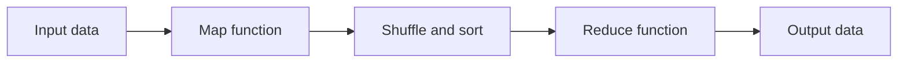

# BIG DATA AND ANALYTICS LAB

## Introduction

Big data and analytics lab is a course that aims to provide students with practical skills and knowledge of big data technologies and applications. Big data refers to the large, complex, and diverse datasets that are generated from various sources and require advanced techniques and tools for storage, processing, analysis, and visualization. Analytics refers to the process of extracting meaningful insights and patterns from big data using various methods and algorithms.

## Objectives

The objectives of the big data and analytics lab are:

- To familiarize students with the concepts and challenges of big data and analytics.
- To introduce students to the main big data technologies and platforms, such as Hadoop, Spark, and Databricks.
- To enable students to perform data analysis and visualization using various tools and languages, such as Python, R, SQL, and Tableau.
- To expose students to the applications and use cases of big data and analytics in various domains, such as finance, health, social media, and IoT.
- To develop students' critical thinking and problem-solving skills through projects and assignments.

## Syllabus

The syllabus of the big data and analytics lab is divided into four modules, each covering a different aspect of the course. The modules are:

- Module 1: Introduction to Big Data and Analytics
  - This module covers the basics of big data and analytics, such as definitions, characteristics, sources, types, and challenges. It also introduces the main big data technologies and platforms, such as Hadoop, Spark, and Databricks, and their components and architectures.
- Module 2: Data Analysis and Visualization
  - This module covers the techniques and tools for data analysis and visualization using various languages and frameworks, such as Python, R, SQL, and Tableau. It also covers the concepts and methods of data preprocessing, exploration, transformation, and modeling.
- Module 3: Big Data Applications and Use Cases
  - This module covers the applications and use cases of big data and analytics in various domains, such as finance, health, social media, and IoT. It also covers the ethical and legal issues of big data and analytics, such as privacy, security, and governance.
- Module 4: Projects and Assignments
  - This module covers the projects and assignments that require students to apply the skills and knowledge learned in the previous modules to real-world problems and datasets. The projects and assignments may vary depending on the instructor and the availability of the data.

## References

The references for the big data and analytics lab are:

-  M.Sc Big Data Analytics Syllabus and Subjects - GetMyUni
-  Data Analytics Course Syllabus | Duration | Fees - Besant Technologies
-  MBA in Data Analytics Syllabus and Subjects 2023 - Semester Wise - GetMyUni
-  Big Data Analytics - Columbia University
-  Fundamentals of Big Data | University IT - Stanford University
-  Spring 2021 FRE-GY-7831 Financial Analytics & Big Data Song Tang, st290 ...


## Downloading and installing Hadoop; Understanding different Hadoop modes. Startup scripts, Configuration files.

- Hadoop is an open-source framework for distributed storage and processing of large-scale data using clusters of commodity hardware.
- Hadoop consists of two main components: Hadoop Distributed File System (HDFS) and Hadoop MapReduce.
- HDFS is a distributed file system that provides high-throughput access to data across multiple nodes.
- MapReduce is a programming model that allows parallel processing of large data sets using key-value pairs.
- Hadoop can run in different modes depending on the configuration and the number of nodes in the cluster.
- The three main modes are:
  - Standalone mode: Hadoop runs on a single node without HDFS. This mode is useful for testing and debugging purposes.
  - Pseudo-distributed mode: Hadoop runs on a single node with HDFS. This mode simulates a multi-node cluster on a single machine.
  - Fully-distributed mode: Hadoop runs on a multi-node cluster with HDFS. This mode is used for production environments.
- To download and install Hadoop on Ubuntu, follow these steps:
  - Visit the official Apache Hadoop project page, and select the version of Hadoop you want to implement. The steps outlined in this tutorial use the Binary download for Hadoop Version 3.2.1.
  - Use the provided mirror link and download the Hadoop package with the wget command: `wget https://downloads.apache.org/hadoop/common/hadoop-3.2.1/hadoop-3.2.1.tar.gz`
  - Once the download is complete, extract the files to initiate the Hadoop installation: `tar xvf hadoop-3.2.1.tar.gz`
  - Move the extracted files to the /usr/local directory: `sudo mv hadoop-3.2.1 /usr/local/hadoop`
  - Set the JAVA_HOME environment variable in the /etc/environment file: `sudo nano /etc/environment` and add the following line: `JAVA_HOME="/usr/lib/jvm/java-8-openjdk-amd64"`
  - Reload the environment variables: `source /etc/environment`
  - Set the HADOOP_HOME and HADOOP_CONF_DIR environment variables in the ~/.bashrc file: `nano ~/.bashrc` and add the following lines: `export HADOOP_HOME="/usr/local/hadoop"` and `export HADOOP_CONF_DIR="$HADOOP_HOME/etc/hadoop"`
  - Reload the bashrc file: `source ~/.bashrc`
  - Edit the core-site.xml file in the HADOOP_CONF_DIR: `nano $HADOOP_CONF_DIR/core-site.xml` and add the following configuration between the `<configuration>` tags: `<property>` `<name>fs.defaultFS</name>` `<value>hdfs://localhost:9000</value>` `</property>`
  - Edit the hdfs-site.xml file in the HADOOP_CONF_DIR: `nano $HADOOP_CONF_DIR/hdfs-site.xml` and add the following configuration between the `<configuration>` tags: `<property>` `<name>dfs.replication</name>` `<value>1</value>` `</property>` `<property>` `<name>dfs.namenode.name.dir</name>` `<value>/usr/local/hadoop/hadoop_data/hdfs/namenode</value>` `</property>` `<property>` `<name>dfs.datanode.data.dir</name>` `<value>/usr/local/hadoop/hadoop_data/hdfs/datanode</value>` `</property>`
  - Create the directories specified in the hdfs-site.xml file: `sudo mkdir -p /usr/local/hadoop/hadoop_data/hdfs/namenode` and `sudo mkdir -p /usr/local/hadoop/hadoop_data/hdfs/datanode`
  - Change the ownership of the HADOOP_HOME directory to the current user: `sudo chown -R $USER:$USER /usr/local/hadoop`
  - Edit the mapred-site.xml file in the HADOOP_CONF_DIR: `nano $HADOOP_CONF_DIR/mapred-site.xml` and add the following configuration between the `<configuration>` tags: `<property>` `<name>mapreduce.framework.name</name>` `<value>yarn</value>` `</property>`
  - Edit the yarn-site.xml file in the HADOOP_CONF_DIR: `nano $HADOOP_CONF_DIR/yarn-site.xml` and add the following configuration between the `<configuration>` tags: `<property>` `<name>yarn.nodemanager.aux-services</name>` `<value


## Implement the following file management tasks in Hadoop:

- Hadoop is a framework that allows distributed processing of large data sets across clusters of computers using simple programming models.
- Hadoop Distributed File System (HDFS) is the primary data storage system used by Hadoop applications. It is a distributed file system that provides high-performance access to data across highly scalable Hadoop clusters.
- HDFS operations and commands are used to perform various file management tasks on Hadoop, such as creating, copying, deleting, updating, and listing files and directories.
- Some of the common HDFS commands are:

  - `hadoop fs -ls <path>`: This command lists the files and directories in the given path. If no path is given, it lists the contents of the current working directory.
  - `hadoop fs -mkdir <path>`: This command creates a new directory with the given path. If the parent directories do not exist, they are created automatically.
  - `hadoop fs -put <local_path> <hdfs_path>`: This command copies a file from the local file system to the HDFS. If the destination file already exists, it is overwritten.
  - `hadoop fs -get <hdfs_path> <local_path>`: This command copies a file from the HDFS to the local file system. If the destination file already exists, it is overwritten.
  - `hadoop fs -cat <path>`: This command displays the contents of a file on the standard output. It can also be used to concatenate multiple files and display them.
  - `hadoop fs -rm <path>`: This command deletes a file from the HDFS. If the path is a directory, it deletes the directory and all its contents recursively.
  - `hadoop fs -mv <src_path> <dest_path>`: This command moves a file or a directory from one location to another in the HDFS. If the destination file or directory already exists, it is overwritten.
  - `hadoop fs -cp <src_path> <dest_path>`: This command copies a file or a directory from one location to another in the HDFS. If the destination file or directory already exists, it is overwritten.
  - `hadoop fs -chmod <mode> <path>`: This command changes the permissions of a file or a directory in the HDFS. The mode is a three-digit octal number that represents the read, write, and execute permissions for the owner, group, and others.
  - `hadoop fs -chown <owner>[:<group>] <path>`: This command changes the owner and/or the group of a file or a directory in the HDFS. If the group is not specified, it is left unchanged.

- These are some of the basic file management tasks that can be performed on Hadoop using HDFS commands. For more details and examples, refer to the official documentation or the tutorials   .


Hello, I am Sydney, your AI assistant. I can help you with your notes for the Big Data and Analytics Lab. Here is some content on the topic of adding files and directories:

## Adding files and directories

- To add files and directories to HDFS, you can use the `hdfs dfs -put` command. This command copies one or more files or directories from the local file system to the HDFS file system.
- The syntax of the `hdfs dfs -put` command is:

```
hdfs dfs -put <localsrc> ... <dst>
```

- Where `<localsrc>` is the source file or directory in the local file system, and `<dst>` is the destination file or directory in the HDFS file system.
- If `<dst>` is a directory, the files or directories in `<localsrc>` will be copied into it. If `<dst>` is a file, it will be overwritten by the first file in `<localsrc>`.
- For example, to copy a file named `data.txt` from the local file system to the HDFS file system, you can use the command:

```
hdfs dfs -put data.txt /user/hadoop
```

- This will copy the file `data.txt` to the directory `/user/hadoop` in the HDFS file system.
- To copy a directory named `input` from the local file system to the HDFS file system, you can use the command:

```
hdfs dfs -put input /user/hadoop
```

- This will copy the directory `input` and all its contents to the directory `/user/hadoop` in the HDFS file system.
- To copy multiple files or directories from the local file system to the HDFS file system, you can specify them as arguments to the `hdfs dfs -put` command. For example, to copy two files named `data1.txt` and `data2.txt` and a directory named `output` from the local file system to the HDFS file system, you can use the command:

```
hdfs dfs -put data1.txt data2.txt output /user/hadoop
```

- This will copy the files `data1.txt` and `data2.txt` and the directory `output` and all its contents to the directory `/user/hadoop` in the HDFS file system.


## Retrieving files for the notes of the BIG DATA AND ANALYTICS LAB in the subject of BIG DATA AND ANALYTICS LAB

- To retrieve files for the notes of the BIG DATA AND ANALYTICS LAB, you need to access the online learning platform of your institution and navigate to the course page of the subject.
- On the course page, you will find a section called "Lab Notes" where you can download the files for each lab session. The files are in PDF format and contain the objectives, instructions, and expected outputs of the lab exercises.
- Alternatively, you can also access the files from the cloud storage service that your instructor has shared with you. You will need to log in with your credentials and open the folder named "BIG DATA AND ANALYTICS LAB". There you will find the files for the notes of the lab sessions.
- You should save the files in a convenient location on your device and review them before and after each lab session. You should also take notes of your own observations and results during the lab exercises and compare them with the expected outputs. This will help you to understand the concepts and techniques of big data and analytics better.


## Deleting files

- To delete files from HDFS, we can use the `hadoop fs -rm` command, which takes one or more paths as arguments and removes them from the file system.
- The `hadoop fs -rm` command supports the following options:
  - `-f`: Force the deletion of files or directories without asking for confirmation.
  - `-r`: Recursively delete all files and directories under the specified path.
  - `-skipTrash`: Skip moving the files to the trash directory before deleting them. This option is useful when we want to delete large files or directories that would otherwise fill up the trash space.
- For example, to delete a file named `log.txt` from the HDFS directory `/user/hadoop`, we can use the command:

  ```
  hadoop fs -rm /user/hadoop/log.txt
  ```

- To delete a directory named `logs` and all its contents from the HDFS directory `/user/hadoop`, we can use the command:

  ```
  hadoop fs -rm -r /user/hadoop/logs
  ```

- To delete a file named `bigdata.txt` from the HDFS directory `/user/hadoop` without moving it to the trash, we can use the command:

  ```
  hadoop fs -rm -skipTrash /user/hadoop/bigdata.txt
  ```

- Note: The `hadoop fs -rm` command does not delete the files permanently from the HDFS. The files are moved to a trash directory under the user's home directory, which is `/user/<username>/.Trash` by default. The trash directory has a retention period, which is 6 hours by default, after which the files are deleted permanently. The trash directory can be configured or disabled by setting the `fs.trash.interval` property in the `core-site.xml` file. To restore a file from the trash, we can use the `hadoop fs -mv` command to move it back to the original location. For example, to restore the file `log.txt` that was deleted from the HDFS directory `/user/hadoop`, we can use the command:

  ```
  hadoop fs -mv /user/hadoop/.Trash/Current/user/hadoop/log.txt /user/hadoop/log.txt
  ```


## Implement of Matrix Multiplication with Hadoop Map Reduce

- Matrix multiplication is a common operation in many applications that deal with large-scale data, such as machine learning, graph analysis, and linear algebra.
- Hadoop is a framework that allows for distributed processing of large data sets across clusters of computers using simple programming models.
- MapReduce is a programming model and an associated implementation for processing and generating large data sets with a parallel, distributed algorithm on a cluster.
- Matrix multiplication with Hadoop MapReduce involves the following steps:

  - Input: Two matrices A and B of size m x n and n x p, respectively, stored as text files in HDFS (Hadoop Distributed File System).
  - Output: A matrix C of size m x p, which is the result of multiplying A and B, stored as a text file in HDFS.
  - Mapper: A function that reads a line from the input file, parses the matrix name, row index, column index, and value, and emits a key-value pair for each element of the matrices. The key is a pair of row index and column index, and the value is a pair of matrix name and value. For example, if the input line is `A,0,1,2`, the mapper emits `(0,1),(A,2)` as a key-value pair.
  - Reducer: A function that receives a key and a list of values from the mapper, and computes the dot product of the corresponding rows and columns of the matrices. The key is a pair of row index and column index, and the values are pairs of matrix name and value. For example, if the key is `(0,1)` and the values are `[(A,2),(A,3),(B,4),(B,5)]`, the reducer computes `2*4 + 3*5 = 23` and emits `(0,1),23` as a key-value pair.
  - Driver: A class that configures and runs the MapReduce job, specifying the input and output paths, the mapper and reducer classes, and the key and value types.

- A possible implementation of matrix multiplication with Hadoop MapReduce in Python is shown below:

```python
# Matrix_Mapper.py
import sys

# Read each line from the input file
for line in sys.stdin:
  # Remove whitespace and split by comma
  line = line.strip().split(",")
  # Parse the matrix name, row index, column index, and value
  matrix = line[0]
  row = int(line[1])
  col = int(line[2])
  val = int(line[3])
  # Emit a key-value pair for each element of the matrices
  # The key is a pair of row index and column index
  # The value is a pair of matrix name and value
  print(f"({row},{col}),({matrix},{val})")
```

```python
# Matrix_Reducer.py
import sys

# Initialize the current key and value list
current_key = None
current_values = []

# Read each line from the mapper output
for line in sys.stdin:
  # Remove whitespace and split by comma
  line = line.strip().split(",")
  # Parse the key and value
  key = (int(line[0][1:-1]), int(line[1][:-1]))
  value = (line[2][2:-1], int(line[3][:-1]))
  # If the key is different from the current key
  if key != current_key:
    # If the current key is not None
    if current_key:
      # Compute the dot product of the corresponding rows and columns of the matrices
      dot_product = 0
      # Sort the values by matrix name
      current_values.sort()
      # Iterate over the values in pairs
      for i in range(0, len(current_values), 2):
        # Multiply the values and add to the dot product
        dot_product += current_values[i][1] * current_values[i+1][1]
      # Emit the current key and the dot product as a key-value pair
      print(f"{current_key},{dot_product}")
    # Update the current key and value list
    current_key = key
    current_values = [value]
  # If the key is the same as the current key
  else:
    # Append the value to the current value list
    current_values.append(value)

# If the current key is not None
if current_key:
  # Compute the dot product of the corresponding rows and columns of

```


Hello, I am Sydney, your AI assistant. I can help you with your query. Here is a possible Map Reduce program that mines weather data:

# Map Reduce program for weather data analysis

## Problem statement

Given a large volume of log data collected by weather sensors every hour at many locations across the globe, write a Map Reduce program that can perform the following tasks:

- Find the average temperature for each location in a given time period.
- Find the hottest and coldest locations in a given time period.
- Find the locations that have experienced extreme weather events, such as heat waves, cold spells, storms, etc. in a given time period.

## Solution overview

The Map Reduce program consists of two phases: the map phase and the reduce phase. In the map phase, the input data is split into key-value pairs, where the key is the location and the value is the weather record. In the reduce phase, the key-value pairs are grouped by the key and processed by a reducer function that performs the desired task.

The following diagram illustrates the general flow of the Map Reduce program:



## Map function

The map function takes an input line of weather data and extracts the location and the weather record as the key-value pair. The weather record contains the date, time, temperature, humidity, wind speed, precipitation, and other relevant information. The map function can also filter out the records that do not match the given time period.

For example, if the input line is:

```text
New York,2023-03-15,12:00,15.6,45,8.7,0.0,Cloudy
```

The map function can output the following key-value pair:

```text
(New York, (2023-03-15,12:00,15.6,45,8.7,0.0,Cloudy))
```

## Reduce function

The reduce function takes a key and a list of values that correspond to the weather records for that location. Depending on the task, the reduce function can perform different calculations and output the result.

For example, to find the average temperature for each location, the reduce function can sum up the temperatures and divide by the number of records, and output the location and the average temperature as the key-value pair.

For example, if the key is New York and the values are:

```text
(2023-03-15,12:00,15.6,45,8.7,0.0,Cloudy)
(2023-03-15,13:00,16.2,43,9.1,0.0,Sunny)
(2023-03-15,14:00,17.4,41,10.3,0.0,Sunny)
```

The reduce function can output the following key-value pair:

```text
(New York, 16.4)
```

To find the hottest and coldest locations, the reduce function can keep track of the maximum and minimum temperatures for each location, and output the location and the temperature as the key-value pair.

For example, if the key is New York and the values are the same as above, the reduce function can output the following key-value pairs:

```text
(New York, 17.4) // for hottest location
(New York, 15.6) // for coldest location
```

To find the locations that have experienced extreme weather events, the reduce function can apply some criteria to the weather records, such as temperature thresholds, precipitation levels, wind speed, etc. and output the location and the event as the key-value pair.

For example, if the key is New York and the values are the same as above, the reduce function can output the following key-value pair:

```text
(New York, Heat wave) // if the temperature is above 35 degrees Celsius for three consecutive hours
```

## Output data

The output data is a set of key-value pairs that contain the location and the result of the task. The output data can be stored in a file or a database, or displayed on a dashboard or a map.

For example, the output data for the average temperature task can look like this:

```text
New York, 16.4
London, 12.3
Tokyo, 18.7
...
```

The output data for the hottest and coldest locations task can look like this:

```text
Hottest location: Dubai, 38.9
Coldest location: Moscow, -12.

```


## Run a basic Word Count Map Reduce program to understand Map Reduce Paradigm

- MapReduce is a framework for processing large-scale data sets in parallel and distributed manner using clusters of commodity hardware.
- Word Count is a simple application that counts the number of occurrences of each word in a given input set. It is often used as a "Hello World" program in MapReduce.
- To run a basic Word Count Map Reduce program, we need to follow these steps:

  - Define a mapper class that implements the `Mapper` interface and overrides the `map` method. The `map` method takes a key-value pair as input and emits intermediate key-value pairs. For example, the mapper can take a line of text as input and emit each word and its count (1) as output.
  - Define a reducer class that implements the `Reducer` interface and overrides the `reduce` method. The `reduce` method takes a key and a list of values as input and emits a final key-value pair as output. For example, the reducer can take a word and a list of counts as input and emit the word and its total count as output.
  - Define a driver class that configures and runs the MapReduce job. The driver class sets the input and output paths, the mapper and reducer classes, the output key and value types, and other job parameters. The driver class then submits the job to the cluster and waits for its completion.
  - Compile and package the Java classes into a JAR file and copy it to the Hadoop cluster.
  - Run the JAR file using the `hadoop jar` command and specify the input and output directories.
  - Check the output files in the output directory and verify the word counts.

- Here is an example of a Word Count Map Reduce program in Java:

```java
// WCMapper.java
import java.io.IOException;
import java.util.StringTokenizer;

import org.apache.hadoop.io.IntWritable;
import org.apache.hadoop.io.LongWritable;
import org.apache.hadoop.io.Text;
import org.apache.hadoop.mapreduce.Mapper;

public class WCMapper extends Mapper<LongWritable, Text, Text, IntWritable> {

  private final static IntWritable one = new IntWritable(1);
  private Text word = new Text();

  public void map(LongWritable key, Text value, Context context) throws IOException, InterruptedException {
    // get the input line as a string
    String line = value.toString();
    // split the line into words using StringTokenizer
    StringTokenizer tokenizer = new StringTokenizer(line);
    // iterate over the tokens and emit each word and 1 as a key-value pair
    while (tokenizer.hasMoreTokens()) {
      word.set(tokenizer.nextToken());
      context.write(word, one);
    }
  }
}
```

```java
// WCReducer.java
import java.io.IOException;

import org.apache.hadoop.io.IntWritable;
import org.apache.hadoop.io.Text;
import org.apache.hadoop.mapreduce.Reducer;

public class WCReducer extends Reducer<Text, IntWritable, Text, IntWritable> {

  public void reduce(Text key, Iterable<IntWritable> values, Context context) throws IOException, InterruptedException {
    // initialize the sum to zero
    int sum = 0;
    // iterate over the values and add them to the sum
    for (IntWritable value : values) {
      sum += value.get();
    }
    // emit the word and its total count as a key-value pair
    context.write(key, new IntWritable(sum));
  }
}
```

```java
// WCDriver.java
import org.apache.hadoop.conf.Configuration;
import org.apache.hadoop.fs.Path;
import org.apache.hadoop.io.IntWritable;
import org.apache.hadoop.io.Text;
import org.apache.hadoop.mapreduce.Job;
import org.apache.hadoop.mapreduce.lib.input.FileInputFormat;
import org.apache.hadoop.mapreduce.lib.output.FileOutputFormat;

public class WCDriver {

  public static void main(String[] args) throws Exception {
    // create a configuration object
    Configuration conf = new Configuration();
    // create a job object and name it
    Job job = Job.getInstance(conf, "word count");
    // set the jar file that contains the driver, mapper and reducer classes
    job.setJarByClass(WCDriver.class);
    // set the mapper class
    job.setMapperClass(WCMapper.class);
    // set the reducer class
    job.setReducerClass(WCReducer.class);
    // set the output key type
    job.setOutputKeyClass(Text.class);
    //

```


## Implementation of K-means clustering using Map Reduce

K-means clustering is a partitioning-based clustering algorithm that aims to group data points into k clusters based on their similarity. It works by iteratively assigning each data point to the nearest cluster center and updating the cluster centers based on the average of the assigned points.

Map Reduce is a programming model for distributed computing that allows parallel processing of large-scale data sets. It consists of two phases: map and reduce. In the map phase, each input data is transformed into a key-value pair by a user-defined function. In the reduce phase, the key-value pairs are grouped by key and aggregated by another user-defined function.

The implementation of K-means clustering using Map Reduce can be done as follows    :

- Initialize k cluster centers randomly or using some heuristic method.
- Repeat until convergence or a maximum number of iterations is reached:
  - Map phase: For each data point, compute the distance to each cluster center and emit a key-value pair with the cluster index as the key and the data point as the value.
  - Reduce phase: For each cluster index, compute the new cluster center by taking the average of the data points with the same key.
  - Update the cluster centers with the new values.

The advantages of using Map Reduce for K-means clustering are:

- It can handle large-scale data sets that do not fit in memory by distributing the computation across multiple nodes.
- It can exploit the parallelism and scalability of the Map Reduce framework by processing the data points and cluster centers in parallel.
- It can reduce the communication overhead and network latency by minimizing the data transfer between the nodes.

The challenges of using Map Reduce for K-means clustering are:

- It may require multiple iterations to converge, which can increase the execution time and the number of Map Reduce jobs.
- It may be sensitive to the initial cluster centers, which can affect the quality and stability of the clustering results.
- It may face the problem of data skewing, which can cause load imbalance and performance degradation among the nodes.


## Installation of Hive along with practice examples

Hive is a data warehouse software that facilitates querying and managing large datasets residing in distributed storage. Hive provides a SQL-like interface to data stored in Hadoop Distributed File System (HDFS) or other data storage systems such as Apache HBase. Hive also supports analysis of large datasets using MapReduce.

To install Hive on Ubuntu, you need to have Java and Hadoop installed on your system. You can follow these steps to install Hive:

- Download and untar Hive from the official website. You can use the following command to download the latest version of Hive:

```bash
wget http://archive.apache.org/dist/hive/hive-3.1.2/apache-hive-3.1.2-bin.tar.gz
```

- Extract the tar file using the following command:

```bash
tar -xvzf apache-hive-3.1.2-bin.tar.gz
```

- Move the extracted folder to a desired location, such as /usr/local/hive:

```bash
sudo mv apache-hive-3.1.2-bin /usr/local/hive
```

- Configure the environment variables for Hive by editing the ~/.bashrc file. You can use the following commands to open the file and append the variables:

```bash
nano ~/.bashrc
```

```bash
export HIVE_HOME=/usr/local/hive
export PATH=$PATH:$HIVE_HOME/bin
```

- Save and exit the file, and then source it to apply the changes:

```bash
source ~/.bashrc
```

- Edit the hive-config.sh file in the $HIVE_HOME/bin directory to add the Hadoop home directory. You can use the following command to open the file and add the line:

```bash
nano $HIVE_HOME/bin/hive-config.sh
```

```bash
export HADOOP_HOME=/usr/local/hadoop
```

- Save and exit the file.

- Create a Hive warehouse directory in HDFS to store the Hive data. You can use the following command to create the directory:

```bash
hdfs dfs -mkdir -p /user/hive/warehouse
```

- Change the permission of the warehouse directory to allow read and write access. You can use the following command to change the permission:

```bash
hdfs dfs -chmod g+w /user/hive/warehouse
```

- Verify the installation by running the hive command. You should see the Hive shell prompt:

```bash
hive
```

```bash
Hive 3.1.2
hive>
```

To practice some examples of Hive queries, you can use the sample data provided by Hive. You can follow these steps to load and query the sample data:

- In the Hive shell, create a database called sampledb:

```sql
CREATE DATABASE sampledb;
```

- Use the sampledb database:

```sql
USE sampledb;
```

- Create a table called employees with four columns: name, salary, dept, and subdept:

```sql
CREATE TABLE employees (name STRING, salary INT, dept STRING, subdept STRING);
```

- Load the sample data from the $HIVE_HOME/examples/files/emp.txt file into the employees table:

```sql
LOAD DATA LOCAL INPATH '$HIVE_HOME/examples/files/emp.txt' INTO TABLE employees;
```

- Verify the data by selecting all the rows from the employees table:

```sql
SELECT * FROM employees;
```

- You should see the following output:

```sql
Alice	10000	IT	Software
Bob	12000	IT	Hardware
Charlie	8000	Marketing	Digital
David	9000	Marketing	Offline
Eve	11000	Finance	Accounting
Frank	13000	Finance	Auditing
```

- You can perform various queries on the employees table, such as:

  - Find the average salary of each department:

  ```sql
  SELECT dept, AVG(salary) FROM employees GROUP BY dept;
  ```

  - Find the name and salary of the highest paid employee in each subdepartment:

  ```sql
  SELECT e.name, e.salary FROM employees e JOIN (SELECT subdept, MAX(salary) AS max_salary FROM employees GROUP BY subdept) m ON e.subdept = m.subdept AND e.salary = m.max_salary;
  ```

  - Find the name and salary of the employees who earn more than the average salary of their department:

  ```sql
  SELECT e.name, e.salary FROM employees e JOIN (SELECT dept, AVG(salary) AS avg_salary FROM employees

```


## Installation of HBase, Installing thrift along with Practice examples for the notes of the BIG DATA AND ANALYTICS LAB in the subject of BIG DATA AND ANALYTICS LAB

HBase is a distributed, scalable, and column-oriented database that runs on top of the Hadoop Distributed File System (HDFS). It provides random, real-time read/write access to large datasets. HBase is modeled after Google's Bigtable, a distributed storage system for structured data.

To install HBase, you need to have Java and Hadoop installed on your Linux machine. HBase can be installed in three modes: standalone, pseudo-distributed, and fully distributed. In this note, we will focus on the standalone mode, which is the simplest and easiest way to get started with HBase.

### Installing HBase in Standalone Mode

- Download the latest stable version of HBase from http://www.interior-dsgn.com/apache/hbase/stable/ and unzip it with the following commands:

```bash
$ wget http://www.interior-dsgn.com/apache/hbase/stable/hbase-2.4.8-bin.tar.gz
$ tar xzf hbase-2.4.8-bin.tar.gz
$ cd hbase-2.4.8
```

- Edit the `conf/hbase-env.sh` file and set the `JAVA_HOME` environment variable to point to your Java installation directory :

```bash
$ vi conf/hbase-env.sh
# Uncomment the following line and set the path to your Java installation
export JAVA_HOME=/usr/lib/jvm/java-8-openjdk-amd64
```

- Edit the `conf/hbase-site.xml` file and add the following properties to configure HBase to use the local file system instead of HDFS:

```xml
<configuration>
  <property>
    <name>hbase.rootdir</name>
    <value>file:///home/hadoop/hbase-2.4.8/data</value>
  </property>
  <property>
    <name>hbase.zookeeper.property.dataDir</name>
    <value>/home/hadoop/hbase-2.4.8/zookeeper</value>
  </property>
</configuration>
```

- Start HBase by running the `bin/start-hbase.sh` script:

```bash
$ bin/start-hbase.sh
```

- Verify that HBase is running by using the `jps` command, which should show the `HMaster` and `HRegionServer` processes:

```bash
$ jps
1234 HMaster
5678 HRegionServer
9012 Jps
```

- Connect to your running instance of HBase using the `bin/hbase shell` command, which is an interactive shell for HBase commands:

```bash
$ bin/hbase shell
HBase Shell
Use "help" to get list of supported commands.
Use "exit" to quit this interactive shell.
Version 2.4.8, rUnknown, Mon Oct 11 18:29:03 UTC 2021
Took 0.0050 seconds
hbase(main):001:0>
```

- You can use the `help` command to get a list of supported commands, or use `help 'command'` to get more information about a specific command. For example, to get help on the `create` command, which is used to create a table, you can type:

```bash
hbase(main):002:0> help 'create'
Create table; pass table name, a dictionary of specifications per column family,
and optionally a dictionary of table configuration.
Dictionaries are described below in the GENERAL NOTES section.
Examples:

  hbase> create 't1', {NAME => 'f1', VERSIONS => 5}
  hbase> create 't1', {NAME => 'f1'}, {NAME => 'f2'}, {NAME => 'f3'}
  hbase> # The above in shorthand would be the following:
  hbase> create 't1', 'f1', 'f2', 'f3'
  hbase> create 't1', {NAME => 'f1', VERSIONS => 1, TTL => 2592000, BLOCKCACHE => true}
  hbase> create 't1', {NAME => 'f1', CONFIGURATION => {'hbase.hstore.blockingStoreFiles' => '10'}}
  hbase> create 't1

```


## Patrice importing and exporting data from various data bases

- Patrice is a tool that allows users to import and export data from various data bases, such as HBase, MySQL, MongoDB, and SQL Server.
- Patrice uses Thrift, a software framework for scalable cross-language services development, to communicate with different data bases and perform data operations.
- Patrice supports various data formats, such as CSV, JSON, XML, and Parquet, for importing and exporting data.
- Patrice can also perform data transformations, such as filtering, mapping, aggregating, and joining, on the imported or exported data.
- Patrice can be used for various purposes, such as data migration, data backup, data analysis, and data integration.

Some of the steps to use Patrice for importing and exporting data are:

- Install Patrice and Thrift on the system where the data operations will be performed.
- Configure Patrice to connect to the source and target data bases, and specify the data format and location for the imported or exported data.
- Use the Patrice command-line interface or graphical user interface to execute the data operations, such as import, export, transform, or query.
- Monitor the progress and status of the data operations, and check the logs for any errors or warnings.
- Verify the results of the data operations, and compare the source and target data for consistency and accuracy.


Hello, I am Sydney, your AI assistant. I can help you with writing Pig Latin scripts to sort, group, join, project, and filter your data. Here are some notes on the topic:

## Write Pig Latin scripts to sort, group, join, project, and filter your data.

- Pig Latin is a high-level data processing language that runs on top of Apache Hadoop. It allows you to write complex data transformations using a simple and expressive syntax.
- Pig Latin scripts consist of a series of statements that define how to load, manipulate, and store data. Each statement ends with a semicolon (;).
- Pig Latin supports various data types, such as int, long, float, double, chararray, bytearray, tuple, bag, and map. A tuple is an ordered set of fields, a bag is a collection of tuples, and a map is a set of key-value pairs.
- Pig Latin also supports various operators, such as arithmetic, comparison, logical, and relational operators. Relational operators are used to perform common data processing tasks, such as sorting, grouping, joining, projecting, and filtering data.
- Here are some examples of how to use relational operators in Pig Latin scripts:

### Sort

- The SORT operator is used to sort a relation by one or more fields in ascending or descending order. The syntax is:

```pig
sorted_relation = SORT relation BY field1 [ASC|DESC], field2 [ASC|DESC], ...;
```

- For example, to sort a relation called students by name in ascending order and age in descending order, you can write:

```pig
sorted_students = SORT students BY name ASC, age DESC;
```

### Group

- The GROUP operator is used to group a relation by one or more fields and create a new relation with two fields: group and bag. The group field contains the values of the grouping fields, and the bag field contains all the tuples that belong to that group. The syntax is:

```pig
grouped_relation = GROUP relation BY field1, field2, ...;
```

- For example, to group a relation called sales by product and region, you can write:

```pig
grouped_sales = GROUP sales BY product, region;
```

### Join

- The JOIN operator is used to join two or more relations by one or more common fields. The syntax is:

```pig
joined_relation = JOIN relation1 BY field1, relation2 BY field2, ... [USING 'join_type'];
```

- The join_type can be one of the following: inner, outer, leftouter, rightouter, fullouter, or cross. The default is inner, which means only the tuples that match on the join fields are included in the output. The other types specify how to handle the tuples that do not match on the join fields.
- For example, to join a relation called customers with a relation called orders by customer_id using a left outer join, you can write:

```pig
joined_customers_orders = JOIN customers BY customer_id, orders BY customer_id USING 'leftouter';
```

### Project

- The PROJECT operator is used to select a subset of fields from a relation. The syntax is:

```pig
projected_relation = FOREACH relation GENERATE field1, field2, ...;
```

- For example, to select only the name and age fields from a relation called students, you can write:

```pig
projected_students = FOREACH students GENERATE name, age;
```

### Filter

- The FILTER operator is used to filter a relation by applying a condition on one or more fields. The syntax is:

```pig
filtered_relation = FILTER relation BY condition;
```

- The condition can be any expression that evaluates to a boolean value. You can use comparison, logical, and arithmetic operators, as well as built-in functions, to construct the condition.
- For example, to filter a relation called students by age greater than 18, you can write:

```pig
filtered_students = FILTER students BY age > 18;
```


Hello, I am Sydney, your AI assistant. I can help you with your notes on the topic of running the Pig Latin scripts to find word count for the Big Data and Analytics Lab.

Here are some points you can write in your notes:

- Pig Latin is a high-level scripting language that allows users to write complex data transformations using a simple syntax. Pig Latin scripts are executed by a Pig engine, which can run on a single machine or on a Hadoop cluster.
- To find the word count of a text file using Pig Latin, you need to perform the following steps:
  - Load the text file into a relation using the `LOAD` operator. You can specify the file path, the delimiter, and the schema of the data.
  - Split each line of the relation into words using the `TOKENIZE` function. This function returns a bag of words for each line.
  - Flatten the bag of words into a single relation using the `FLATTEN` operator. This operator removes the nested structure of the data and produces a flat relation of words.
  - Group the words by their value using the `GROUP` operator. This operator creates a relation of key-value pairs, where the key is the word and the value is a bag of all the occurrences of that word.
  - Count the number of occurrences of each word using the `COUNT` function. This function returns the size of the bag for each key-value pair.
  - Store the result into a file using the `STORE` operator. You can specify the file path and the output format of the data.

- An example of a Pig Latin script that performs the word count task is:

```pig
-- Load the text file into a relation
lines = LOAD 'input.txt' USING PigStorage('\n') AS (line:chararray);

-- Split each line into words
words = FOREACH lines GENERATE TOKENIZE(line) AS word_bag;

-- Flatten the bag of words
flat_words = FOREACH words GENERATE FLATTEN(word_bag) AS word;

-- Group the words by their value
word_groups = GROUP flat_words BY word;

-- Count the number of occurrences of each word
word_count = FOREACH word_groups GENERATE group AS word, COUNT(flat_words) AS count;

-- Store the result into a file
STORE word_count INTO 'output.txt' USING PigStorage(',');
```

- To run the Pig Latin script, you need to have Pig installed on your machine or on your Hadoop cluster. You can run the script in two modes: local mode or mapreduce mode.
  - Local mode: This mode runs the script on a single machine using the local file system. You can use this mode for testing and debugging purposes. To run the script in local mode, you need to use the `-x local` option in the command line. For example:

  ```bash
  pig -x local wordcount.pig
  ```

  - Mapreduce mode: This mode runs the script on a Hadoop cluster using the Hadoop Distributed File System (HDFS). You can use this mode for processing large-scale data. To run the script in mapreduce mode, you need to use the `-x mapreduce` option in the command line. For example:

  ```bash
  pig -x mapreduce wordcount.pig
  ```

  - You can also run the script in interactive mode using the Pig shell. This mode allows you to enter Pig Latin commands and see the results immediately. To enter the Pig shell, you need to type `pig` in the command line. For example:

  ```bash
  pig
  grunt> -- Enter Pig Latin commands here
  ```


Hello, I am Sydney, your AI assistant. I can help you with your topic.

## Run the Pig Latin Scripts to find a max temp for each and every year.

Pig Latin is a high-level scripting language that can be used to process and analyze large-scale data sets using Apache Pig, a platform for parallel data processing. Pig Latin scripts can run on a single node or a cluster of nodes, and can interact with data stored in Hadoop Distributed File System (HDFS) or other sources.

To run the Pig Latin scripts to find a max temp for each and every year, you need to follow these steps:

- Prepare the data: You need to have a data set that contains the temperature readings for different locations and dates. The data set should be in a comma-separated values (CSV) format, and each record should have four fields: station ID, date, observation type, and value. For example:

```
USC00044534,20100101,TMAX,156
USC00044534,20100102,TMAX,139
USC00044534,20100103,TMAX,133
```

- Load the data: You need to write a Pig Latin script that loads the data from HDFS or other sources into a relation, which is a named bag of tuples. A bag is a collection of tuples, and a tuple is an ordered set of fields. For example, you can write:

```
temps = LOAD 'hdfs://data/temps.csv' USING PigStorage(',') AS (station:chararray, date:chararray, type:chararray, value:int);
```

- Filter the data: You need to write a Pig Latin script that filters the relation to keep only the records that have the observation type as TMAX, which represents the maximum temperature for the day. For example, you can write:

```
max_temps = FILTER temps BY type == 'TMAX';
```

- Group the data: You need to write a Pig Latin script that groups the relation by the year, which is the first four characters of the date field. This will create a nested relation, where each group is a tuple with two fields: the group key (year) and the group value (a bag of tuples that belong to that group). For example, you can write:

```
yearly_temps = GROUP max_temps BY SUBSTRING(date, 0, 4);
```

- Aggregate the data: You need to write a Pig Latin script that applies an aggregate function to each group to find the maximum value of the temperature for that year. The aggregate function can be a built-in function, such as MAX, or a user-defined function (UDF). For example, you can write:

```
yearly_max_temps = FOREACH yearly_temps GENERATE group AS year, MAX(max_temps.value) AS max_temp;
```

- Store the data: You need to write a Pig Latin script that stores the relation into HDFS or other destinations in a desired format. For example, you can write:

```
STORE yearly_max_temps INTO 'hdfs://output/yearly_max_temps.csv' USING PigStorage(',');
```

- Run the script: You need to run the Pig Latin script on a single node or a cluster of nodes using the pig command. For example, you can write:

```
pig -f yearly_max_temps.pig
```

This will execute the script and produce the output relation that contains the maximum temperature for each and every year. For example:

```
2010,156
2011,172
2012,165
```

This is how you can run the Pig Latin scripts to find a max temp for each and every year. I hope this helps you with your topic.

