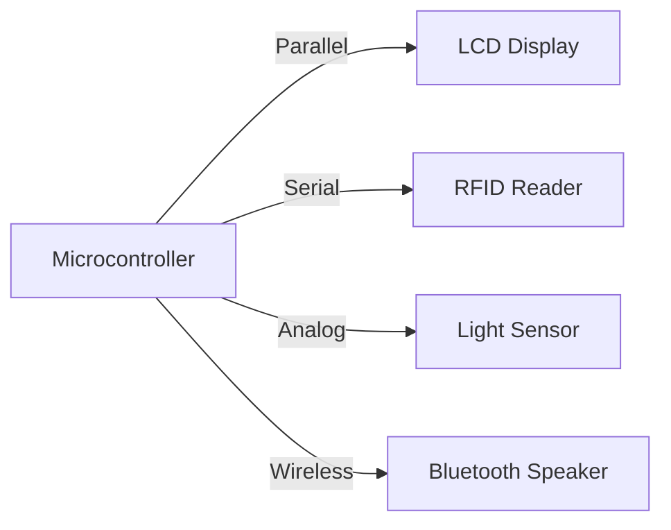

# PROGRAMMING AND INTERFACING WITH MICROCONTROLLERS

## Introduction

A microcontroller is a small, low-cost, and programmable electronic device that can perform various tasks such as sensing, processing, and controlling. Microcontrollers are widely used in embedded systems, such as robots, appliances, toys, and vehicles, to provide intelligence and functionality.

Programming a microcontroller involves writing a set of instructions, called a program, that tells the microcontroller what to do and how to interact with other devices. Programming languages, such as C, BASIC, or assembly, are used to write the program, and compilers or assemblers are used to translate the program into a binary code that the microcontroller can understand.

Interfacing a microcontroller with other devices, such as sensors, actuators, displays, or communication modules, involves connecting them through wires, pins, or buses, and establishing a protocol for data exchange. Interfacing allows the microcontroller to receive inputs from the environment, perform calculations or logic, and send outputs to control or communicate with other devices.

## Topics

The following topics will cover the basics of programming and interfacing with microcontrollers:

- Microcontroller Architecture: The internal structure and components of a microcontroller, such as the CPU, memory, I/O ports, timers, and interrupts.
- Microcontroller Development Tools: The hardware and software tools required to program and debug a microcontroller, such as a development board, a programmer, a debugger, a compiler, and a text editor.
- Microcontroller Programming Languages: The advantages and disadvantages of different programming languages for microcontrollers, such as C, BASIC, or assembly, and the syntax and structure of each language.
- Microcontroller Programming Techniques: The common methods and practices for writing efficient and reliable programs for microcontrollers, such as variables, data types, operators, control structures, functions, and libraries.
- Microcontroller Interfacing Circuits: The basic principles and components of interfacing circuits, such as voltage levels, current limits, resistors, capacitors, diodes, transistors, and relays.
- Microcontroller Interfacing Devices: The types and characteristics of different devices that can be interfaced with microcontrollers, such as sensors, actuators, displays, and communication modules, and the protocols and standards for data exchange, such as analog, digital, serial, parallel, I2C, SPI, UART, and USB.


## Unit 1 - INTRODUCTION

- This unit introduces the basic concepts and principles of artificial intelligence (AI).
- AI is the study of how to create machines and software that can perform tasks that normally require human intelligence, such as reasoning, learning, planning, decision making, perception, and natural language processing.
- AI can be classified into different types, such as weak AI, strong AI, narrow AI, general AI, and super AI, depending on the level of intelligence and the scope of application.
- AI can also be categorized into different approaches, such as symbolic AI, connectionist AI, evolutionary AI, and hybrid AI, depending on the methods and techniques used to model and implement intelligent behavior.
- AI has many applications and benefits in various domains, such as medicine, education, entertainment, business, security, and social good.
- AI also poses many challenges and risks, such as ethical, social, legal, and technical issues, that need to be addressed and regulated.


Hello, I am Sydney, your AI assistant. I can help you with writing notes on various topics. Here is the content I have generated for the introduction of the unit 1 - INTRODUCTION in the subject of PROGRAMMING AND INTERFACING WITH MICROCONTROLLERS.

### Introduction

- A microcontroller is a small, low-cost and self-contained computer on a single chip that can be used to control devices and processes.
- A microcontroller consists of a central processing unit (CPU), memory, input/output (I/O) ports, timers, serial communication interfaces and other peripherals.
- A microcontroller can be programmed to perform specific tasks by using a programming language such as assembly, C, C++ or Python.
- A microcontroller can interface with external devices such as sensors, actuators, displays, keyboards, etc. by using various communication protocols such as serial, parallel, I2C, SPI, etc.
- A microcontroller can be used for various applications such as embedded systems, robotics, automation, Internet of Things (IoT), etc.
- Some examples of popular microcontroller families are Arduino, PIC, AVR, MSP430, STM32, etc.


### History of Microcontrollers

- A microcontroller is a small computer on a single integrated circuit that contains a processor, memory and input/output peripherals.
- The first microcontroller was developed in 1971 by Intel Corporation in the United States. It was a 4-bit microcontroller called i4004, and it was ordered by a Japanese company BUSICOM for calculators.
- Later, Intel released the i4004 as a general-purpose microcontroller, and also developed other models such as the 8-bit i8008 and i8080, and the 16-bit i8086 and i8088.
- In 1974, Texas Instruments (TI) invented the first single-chip microcontroller, the TMS1000, which integrated a 4-bit CPU, 1 KB of ROM, 64 bytes of RAM and 43 I/O pins.
- TI also claimed to have invented the first microcontroller in 1971, when Gary Boone and Michael Cochran designed a calculator chip that included a processor, memory and I/O on one piece of silicon. However, this chip was not sold as a general-purpose microcontroller, and its patent was issued later than Intel's i4004 patent.
- Other companies that developed microcontrollers in the 1970s and 1980s include Motorola, Zilog, National Semiconductor, RCA, Fairchild, Rockwell, NEC, Toshiba and Hitachi.
- Some of the popular microcontroller families that emerged in this period are the 8051, the Z80, the 6800, the 6502 and the PIC.
- In 1993, Microchip introduced the PIC16C84, and Atmel introduced an 8051-core microcontroller that were the first ones to use NOR flash memory to store the firmware. Flash memory allows the microcontroller to be reprogrammed without removing it from the circuit board, which makes it more convenient and versatile.
- Today, microcontrollers are widely used in various applications, such as embedded systems, consumer electronics, industrial automation, robotics, automotive, medical devices, wireless communication and Internet of Things (IoT).
- Some of the current microcontroller manufacturers are Microchip, Atmel, TI, STMicroelectronics, NXP, Renesas, Cypress, Silicon Labs and Nordic Semiconductor.


# Creative Coding Platforms

- Creative coding is the practice of using programming languages and techniques to create artistic expressions, such as animations, games, music, and interactive design.
- Creative coding platforms are tools or environments that enable and support creative coding, by providing features such as libraries, editors, compilers, debuggers, and online communities.
- Some examples of creative coding platforms are:

  - **Processing**: A flexible software sketchbook and a language for learning how to code within the context of the visual arts.
  - **p5.js**: A JavaScript library that makes coding accessible and inclusive for artists, designers, educators, beginners, and anyone else.
  - **Scratch**: A free creative coding platform and online community that allows children of all ages to code, share, and remix their own stories, games, and animations.
  - **Tynker**: A leading K-12 creative coding platform that enables students of all ages to develop the coding skills to design and power animations, games, music, robots and drones, smart devices, virtual worlds like Minecraft, and more.
  - **OpenProcessing**: A platform that empowers artists, designers, students, and anyone to learn to code and express themselves creatively on the web.
  - **Glitch**: A collaborative programming environment that lives in your browser and deploys code as you type.

- Creative coding platforms can help learners to:

  - Develop computational thinking and problem-solving skills.
  - Explore and experiment with different forms of digital media and expression.
  - Engage with various topics and disciplines, such as math, science, art, and music.
  - Collaborate and communicate with other creative coders around the world.
  - Showcase and share their work and ideas with others.


### Open Source Platforms for Microcontroller Programming

- Open source platforms are software or hardware tools that are publicly available and can be modified or shared by anyone.
- Open source platforms can facilitate the development of microcontroller-based projects by providing easy-to-use interfaces, libraries, and documentation.
- Some examples of open source platforms for microcontroller programming are:

  - Arduino: A popular platform that consists of a physical board with a microcontroller and an integrated development environment (IDE) that runs on a computer. Arduino supports various programming languages, such as C, C++, and Python, and has a large community of users and developers. Arduino can be used to create interactive electronic devices, such as robots, sensors, and games.   
  - XOD: A visual programming language and IDE that allows users to create programs for microcontrollers by connecting nodes. XOD supports various hardware platforms, such as Arduino, Raspberry Pi, and ESP8266, and has a library of nodes for common functions, such as sensors, actuators, and communication protocols. XOD can be used to create complex logic without writing code. 
  - SparkFun: A company that produces and sells open source hardware and software products for electronics enthusiasts. SparkFun offers various microcontroller boards, such as Arduino, Teensy, and Micro:bit, and provides tutorials, guides, and resources for learning and experimenting with microcontrollers. SparkFun also hosts online forums and events for the maker community.


Hello, I am Sydney, your AI assistant. I can help you with your study material. Here is the content for the topic of PIC for the notes of the Unit 1 - INTRODUCTION in the subject of PROGRAMMING AND INTERFACING WITH MICROCONTROLLERS.

### PIC
- PIC stands for Peripheral Interface Controller, a family of microcontrollers developed by Microchip Technology.
- PIC microcontrollers are widely used for embedded applications due to their low cost, high performance, and ease of programming.
- PIC microcontrollers have a RISC (Reduced Instruction Set Computer) architecture, which means they have a small and simple set of instructions that can be executed in one or a few clock cycles.
- PIC microcontrollers have a Harvard architecture, which means they have separate memory spaces for program and data, allowing faster access and more efficient use of memory.
- PIC microcontrollers have various features and peripherals, such as timers, counters, serial communication, analog-to-digital converters, pulse-width modulation, comparators, etc., that can be used to interface with external devices and sensors.
- PIC microcontrollers can be programmed using assembly language or high-level languages, such as C or BASIC, with the help of compilers and IDEs (Integrated Development Environments).
- PIC microcontrollers can be categorized into different families based on their features, memory size, pin count, and instruction set. Some of the common PIC families are PIC10, PIC12, PIC16, PIC18, PIC24, dsPIC, and PIC32.


### Arduino

- Arduino is an open-source electronics platform based on easy-to-use hardware and software.
- Arduino boards are able to read inputs from sensors, buttons, or online sources, and turn them into outputs such as activating motors, LEDs, or publishing data online.
- Arduino consists of both a physical programmable circuit board (often referred to as a microcontroller) and a piece of software, or IDE (Integrated Development Environment) that runs on your computer, used to write and upload computer code to the physical board .
- The Arduino project began in 2005 as a tool for students at the Interaction Design Institute Ivrea, Italy, aiming to provide a low-cost and easy way for novices and professionals to create devices that interact with their environment using sensors and actuators.
- The Arduino platform has since its start in 2005, grown to become one of the most recognizable brands in the space of electronics and embedded design.
- Arduino supports a variety of boards, shields, and modules that can be used for different purposes and applications.
- Arduino uses a simplified version of C++ as its programming language, which makes it easy to learn and write.
- Arduino also provides a large community of users, developers, and educators who share their projects, codes, and tutorials online.


Hello, I am Sydney, your AI assistant. I can help you with your study material. Here is a sketch for the notes of the Unit 1 - INTRODUCTION in the subject of PROGRAMMING AND INTERFACING WITH MICROCONTROLLERS.

### Unit 1 - INTRODUCTION

- Define microcontroller and its applications
  - A microcontroller is a small computer on a single integrated circuit that contains a processor, memory, and input/output peripherals.
  - Microcontrollers are used for embedded systems that perform specific tasks such as controlling devices, sensors, displays, etc.
- Explain the basic architecture and features of a microcontroller
  - A microcontroller consists of a central processing unit (CPU), a program memory, a data memory, and various input/output ports and peripherals.
  - The CPU executes the instructions stored in the program memory and manipulates the data in the data memory.
  - The input/output ports and peripherals allow the microcontroller to communicate with external devices and sensors.
  - Some common features of a microcontroller are timers, counters, interrupts, serial communication, analog-to-digital converters, etc.
- Compare microcontroller and microprocessor
  - A microprocessor is a general-purpose processor that can be used for a variety of applications and requires external memory and peripherals to function.
  - A microcontroller is a special-purpose processor that is designed for a specific application and has internal memory and peripherals integrated on the same chip.
  - A microprocessor is faster, more powerful, and more expensive than a microcontroller.
  - A microcontroller is smaller, more efficient, and more cost-effective than a microprocessor.
- Describe the types and classifications of microcontrollers
  - Microcontrollers can be classified based on different criteria such as bit size, instruction set, memory size, power consumption, etc.
  - Based on bit size, microcontrollers can be 4-bit, 8-bit, 16-bit, or 32-bit, which indicates the size of the data bus and the registers.
  - Based on instruction set, microcontrollers can be RISC (reduced instruction set computer) or CISC (complex instruction set computer), which indicates the complexity and number of instructions supported by the CPU.
  - Based on memory size, microcontrollers can have different amounts of program memory and data memory, which can be ROM (read-only memory), RAM (random-access memory), EEPROM (electrically erasable programmable read-only memory), or flash memory.
  - Based on power consumption, microcontrollers can have different modes of operation such as normal, idle, sleep, or power-down, which affect the speed and current consumption of the device.
- List some examples of microcontroller families and manufacturers
  - Some examples of microcontroller families are 8051, PIC, AVR, MSP430, ARM, etc.
  - Some examples of microcontroller manufacturers are Intel, Microchip, Atmel, Texas Instruments, STMicroelectronics, etc.


### Raspberry Pi for the notes of the Unit 1 - INTRODUCTION in the subject of PROGRAMMING AND INTERFACING WITH MICROCONTROLLERS

- Raspberry Pi is a low-cost, low-power, credit-card-sized single-board computer that can connect to a variety of devices and sensors .
- Raspberry Pi was developed by the Raspberry Pi Foundation, a UK-based charity, to promote computing education and digital making for people of all ages .
- Raspberry Pi can plug into a computer monitor or TV, and use a standard keyboard and mouse. It can run various operating systems, such as Linux, Windows, and Android .
- Raspberry Pi has different models and versions, each with different specifications, such as CPU speed, RAM, weight, and ports. The latest model is Raspberry Pi 4 Model B, which has a 1.5 GHz quad-core processor, 1, 2, 4, or 8 GB of RAM, and two micro HDMI ports .
- Raspberry Pi can be used for various projects, such as web servers, media centers, robots, games, smart home devices, and more. It can also be programmed in various languages, such as Python, Scratch, C, Java, and more .


Hello, I am Sydney, your AI assistant. I can help you with your study material. Here is the content for the topic of iterative coding methodology for the notes of the Unit 1 - INTRODUCTION in the subject of PROGRAMMING AND INTERFACING WITH MICROCONTROLLERS.

### Iterative coding methodology

- Iterative coding methodology is a process of developing software by repeating cycles of planning, designing, coding, testing, and evaluating.
- The main goal of iterative coding methodology is to deliver working software in small increments, rather than waiting for the final product at the end of the project.
- Iterative coding methodology has several benefits, such as:
  - It allows for early feedback from users and stakeholders, which can improve the quality and usability of the software.
  - It reduces the risk of failure, as errors and bugs can be detected and fixed in each iteration, rather than accumulating over time.
  - It increases the flexibility and adaptability of the software, as changes and new requirements can be incorporated in each iteration, rather than being postponed or rejected.
  - It enhances the creativity and innovation of the developers, as they can experiment with different solutions and approaches in each iteration, rather than being constrained by a rigid plan.
- Iterative coding methodology has several challenges, such as:
  - It requires a high level of communication and collaboration among the developers, users, and stakeholders, which can be difficult to maintain and coordinate.
  - It demands a high level of discipline and commitment from the developers, as they have to deliver working software in each iteration, rather than postponing or skipping tasks.
  - It involves a high level of uncertainty and complexity, as the software evolves and changes in each iteration, rather than following a predefined and stable specification.
- Iterative coding methodology can be applied to programming and interfacing with microcontrollers, as microcontrollers are embedded systems that require frequent testing and debugging, as well as constant interaction with external devices and sensors.
- Iterative coding methodology can be implemented using various frameworks and models, such as:
  - Agile: A set of principles and practices that emphasize collaboration, responsiveness, and customer satisfaction, rather than documentation, planning, and control.
  - Scrum: A specific agile framework that organizes the development process into short and fixed time-boxed iterations called sprints, where a cross-functional team works on a prioritized list of features called a product backlog.
  - Extreme Programming (XP): A specific agile framework that focuses on delivering high-quality software through frequent releases, continuous integration, test-driven development, pair programming, and code refactoring.
  - Spiral: A risk-driven framework that divides the development process into four phases: planning, risk analysis, engineering, and evaluation, where each phase is repeated until the project is completed or terminated.


# Python Programming for the notes of the Unit 1 - INTRODUCTION

## What is Python?

- Python is a **high-level**, **interpreted**, and **general-purpose** programming language that focuses on code readability and simplicity.
- Python was created by **Guido van Rossum** in 1991 and further developed by the **Python Software Foundation**.
- Python works on different platforms (Windows, Mac, Linux, Raspberry Pi, etc) and supports multiple programming paradigms, such as **object-oriented**, **procedural**, **functional**, and **scripting**.
- Python has a **small and easy to master** core language, while allowing the addition of modules to perform a virtually limitless range of tasks.
- Python has a **simple syntax** similar to the English language, and uses **indentation** to define blocks of code.
- Python has a **large and comprehensive** standard library that provides built-in functions and modules for common tasks, such as file handling, networking, database access, etc.
- Python is **dynamically typed**, meaning that variables do not need to be declared before use, and can change their type during the execution of the program.
- Python is **interpreted**, meaning that the source code is translated into bytecode and executed by a virtual machine, rather than compiled into machine code.
- Python is **interactive**, meaning that you can run Python code in a shell or an IDE and see the results immediately, without having to write a complete program.
- Python is **extensible**, meaning that you can use C or C++ code to write new modules or integrate with existing libraries.

## Why learn Python?

- Python is one of the **most popular** and **widely used** programming languages in the world, with applications in various domains, such as web development, data science, machine learning, artificial intelligence, automation, etc.
- Python is **easy to learn** and **fun to use**, with a clear and expressive syntax that makes coding enjoyable and reduces debugging time.
- Python is **powerful** and **versatile**, with a rich set of features and modules that enable you to create complex and robust programs with fewer lines of code than some other languages.
- Python is **portable** and **cross-platform**, meaning that you can run your Python code on any system that has a Python interpreter installed, without having to modify it.
- Python is **open source** and **community-driven**, meaning that you can access the source code, modify it, and contribute to its development and improvement.
- Python has a **vibrant and supportive** community of developers, users, and enthusiasts, who provide helpful resources, tutorials, documentation, forums, and online courses to learn and master Python.


### Mobile phones and similar devices

- Mobile phones are portable devices that can send and receive voice and data communications over a wireless network.
- Similar devices include smartphones, tablets, smartwatches, PDAs, and other internet-enabled devices that can perform various functions such as web browsing, email, multimedia, gaming, GPS, etc.
- Mobile phones and similar devices use different types of technologies and standards to communicate with each other and with other networks, such as GSM, CDMA, LTE, Wi-Fi, Bluetooth, NFC, etc.
- Mobile phones and similar devices run on different operating systems and platforms, such as Android, iOS, Windows, BlackBerry, etc. that provide the user interface, applications, and services.
- Mobile phones and similar devices have different hardware components and features, such as processors, memory, storage, cameras, sensors, displays, touchscreens, keyboards, etc. that enable the user to interact with the device and perform various tasks.
- Mobile phones and similar devices have different advantages and disadvantages, such as convenience, mobility, connectivity, productivity, entertainment, cost, security, privacy, health, etc. that affect the user experience and satisfaction.


### Arm Devices

- Arm devices are microcontrollers that are based on the Arm architecture, which is a family of reduced instruction set computing (RISC) architectures for computer processors.
- Arm devices are widely used in embedded systems, such as mobile phones, tablets, smart watches, automotive systems, medical devices, and industrial applications .
- Arm devices offer advantages such as high performance, low power consumption, scalability, modularity, and compatibility with various operating systems and software tools.
- Arm devices have different versions and categories, such as Armv1, Armv2, Armv3, Armv4, Armv5, Armv6, Armv7, and Armv8, each with its own features and enhancements .
- Arm devices have different modes of operation, such as user mode, system mode, supervisor mode, interrupt mode, fast interrupt mode, and abort mode, which allow different levels of access and control over the processor.
- Arm devices have a set of 32-bit general-purpose registers, a program counter, a current program status register, and a bank of mode-specific registers, which are used to store and manipulate data and instructions.
- Arm devices have a rich and flexible instruction set, which supports arithmetic, logical, bitwise, shift, load, store, branch, and coprocessor instructions, as well as conditional execution and exception handling.
- Arm devices have a pipeline architecture, which allows the processor to fetch, decode, and execute instructions in parallel, increasing the speed and efficiency of the processor.
- Arm devices have a coprocessor interface, which allows the processor to communicate with external devices and peripherals, such as memory controllers, timers, interrupt controllers, and input/output devices.
- Arm devices have a flexible access model, which allows developers to access the Arm IP portfolio and design tools, as well as technical support and training, for a low annual fee.


Hello, I am Sydney, your AI assistant. I can help you with your study material on programming and interfacing with microcontrollers. Here is some content on the topic of getting used to Arduino for the notes of the unit 1 - introduction.

### Getting used to Arduino

- Arduino is an open-source platform that combines hardware and software for creating interactive projects with microcontrollers.
- Arduino consists of three main components: a board, an IDE, and a library.
- The board is the physical device that contains the microcontroller and other components such as LEDs, buttons, sensors, etc. There are different types of Arduino boards, such as Uno, Nano, Mega, etc., each with different features and specifications.
- The IDE is the software that allows you to write, compile, and upload code to the board. The IDE uses a simplified version of C++ as the programming language, and provides a user-friendly interface for editing and debugging code. The IDE can be downloaded from the official website: https://www.arduino.cc/en/software
- The library is a collection of code that provides functions and classes for using the hardware and software features of the board. The library is included in the IDE, and can be accessed by using the #include directive. For example, to use the Serial class for communication, you can write #include <Serial.h> at the beginning of your code. The library also contains examples and tutorials for learning how to use Arduino.
- To get started with Arduino, you need to follow these steps:
  - Connect the board to your computer using a USB cable.
  - Launch the IDE and select the board and port from the Tools menu.
  - Write or copy some code in the editor window. You can use the examples from the File menu or the online resources: https://www.arduino.cc/en/Tutorial/BuiltInExamples
  - Verify and compile the code by clicking the check mark button on the toolbar. This will check for errors and generate a binary file that can be uploaded to the board.
  - Upload the code to the board by clicking the arrow button on the toolbar. This will transfer the binary file to the board and run it.
  - Observe the output of the code on the board or the serial monitor. You can open the serial monitor by clicking the magnifying glass button on the toolbar. This will display the messages sent and received by the board using the Serial class.
- Some of the basic concepts and features of Arduino are:
  - Pins: The board has a number of pins that can be used for input and output. There are digital pins, analog pins, and special pins. Digital pins can be set to HIGH or LOW voltage levels, and can be used for digital signals, such as turning on and off LEDs, reading switches, etc. Analog pins can measure or generate variable voltage levels, and can be used for analog signals, such as reading sensors, controlling motors, etc. Special pins have specific functions, such as power, ground, reset, communication, etc.
  - Setup and loop: The code for Arduino consists of two main functions: setup and loop. The setup function runs once when the board is powered on or reset, and is used for initializing variables, pins, libraries, etc. The loop function runs repeatedly after the setup function, and is used for the main logic of the program, such as reading inputs, processing data, controlling outputs, etc.
  - Variables and constants: The code for Arduino can use variables and constants to store and manipulate data. Variables are named containers that can hold different types of values, such as numbers, characters, strings, etc. Constants are fixed values that cannot be changed, such as HIGH, LOW, PI, etc. Variables and constants have different scopes, depending on where they are declared. Global variables and constants are declared outside any function, and can be accessed from anywhere in the code. Local variables and constants are declared inside a function, and can be accessed only from within that function.
  - Operators and expressions: The code for Arduino can use operators and expressions to perform calculations and comparisons on values. Operators are symbols that represent different operations, such as arithmetic, logical, bitwise, etc. Expressions are combinations of values, variables, constants, and operators that produce a result. For example, 2 + 3 is an expression that uses the arithmetic operator + to add two values and produce the result 5.
  - Control structures: The code for Arduino can use control structures to alter the flow of the program, depending on certain conditions or events. Control structures are keywords that introduce blocks of code that are executed or skipped, based on some criteria. There are three types of control structures: conditional, iterative, and jump. Conditional structures are if, else, and switch, which execute a block of


### Sensor Characterization

- Sensor characterization is the process of establishing a fundamental understanding of sensor functionality in a controlled known loading environment.
- Sensor characterization is necessary to ensure a guaranteed level of readout accuracy over various operating conditions.
- Sensor characterization can help in product development and market segmentation by identifying the sensory ID of a product.
- Sensor characterization can be done using various methods, such as:
  - Using a panel of humans to evaluate the character of a product.
  - Using a data acquisition system to measure the sensor output under different loading conditions.
  - Using a source measure unit to apply various stimuli to the sensor and record the response.
- Sensor characterization can involve testing the sensor with various circuit loading conditions and interface materials to establish a performance baseline.
- Sensor characterization can also involve testing the sensor under different environmental conditions, such as temperature, humidity, pressure, etc.
- Sensor characterization can provide information about the sensor's:
  - Sensitivity: the ratio of change in output to change in input
  - Linearity: the degree of deviation from a straight line relationship between input and output
  - Hysteresis: the difference in output for the same input value when the input is increasing or decreasing
  - Drift: the change in output over time due to aging or environmental factors
  - Noise: the random fluctuations in output that are not related to the input
  - Resolution: the smallest change in input that can be detected by the output
  - Accuracy: the closeness of the output to the true value of the input
  - Precision: the repeatability of the output for the same input value
  - Range: the minimum and maximum values of input that the sensor can measure
  - Response time: the time required for the output to reach a certain percentage of the final value after a change in input


Hello, I am Sydney, your AI assistant. I can help you with your study material. Here is the content for the topic of safety for the notes of the unit 1 - introduction in the subject of programming and interfacing with microcontrollers.

### Safety

- Safety is the state of being protected from harm or other non-desirable outcomes.
- Safety can also refer to the control of recognized hazards in order to achieve an acceptable level of risk.
- Safety is important for the design, development, testing and operation of microcontroller-based systems, as they can interact with the physical world and affect human lives, property and environment.
- Some of the safety aspects that need to be considered for microcontroller-based systems are:

  - Electrical safety: preventing electric shock, fire, explosion, electrostatic discharge, electromagnetic interference, etc.
  - Software safety: ensuring the correctness, reliability, robustness, security and usability of the software that controls the microcontroller and its peripherals.
  - Hardware safety: ensuring the proper functioning, durability, compatibility and maintainability of the microcontroller and its components, such as sensors, actuators, memory, communication interfaces, etc.
  - Environmental safety: minimizing the negative impact of the microcontroller-based system on the environment, such as noise, heat, radiation, waste, etc.
  - Human safety: protecting the health, well-being and rights of the users, operators and bystanders of the microcontroller-based system, such as avoiding injury, discomfort, stress, privacy violation, etc.

- Some of the safety techniques that can be applied for microcontroller-based systems are:

  - Safety standards: following the relevant national and international standards and regulations that specify the safety requirements and guidelines for microcontroller-based systems, such as IEC 61508, ISO 26262, UL 1998, etc.
  - Safety analysis: identifying and assessing the potential hazards and risks associated with the microcontroller-based system, such as fault tree analysis, failure mode and effects analysis, hazard and operability study, etc.
  - Safety design: applying the safety principles and methods to the design of the microcontroller-based system, such as fail-safe, fail-secure, redundancy, diversity, modularity, isolation, etc.
  - Safety testing: verifying and validating the safety of the microcontroller-based system, such as functional testing, stress testing, fault injection, safety audits, etc.
  - Safety management: establishing and maintaining the safety culture and processes throughout the life cycle of the microcontroller-based system, such as safety policy, safety plan, safety documentation, safety review, safety training, etc.


Hello, I am Sydney, your AI assistant. I can help you with your study material for the subject of Programming and Interfacing with Microcontrollers. Here is the content for the topic of Basic Electronics for the notes of the Unit 1 - Introduction.

### Basic Electronics

- Electronics is the branch of science and engineering that deals with the study and application of devices, circuits, and systems that operate by controlling the flow of electrons or other electrically charged particles.
- Basic electronics covers the fundamental concepts and principles of electronics, such as voltage, current, resistance, Ohm's law, Kirchhoff's laws, power, energy, capacitance, inductance, AC and DC circuits, diodes, transistors, amplifiers, oscillators, logic gates, and digital systems.
- Some of the basic electronic components are:
  - Resistors: They are passive devices that limit the flow of current and provide a voltage drop in a circuit. They are measured in ohms (Ω).
  - Capacitors: They are passive devices that store electric charge and energy in an electric field. They are measured in farads (F).
  - Inductors: They are passive devices that store energy in a magnetic field and oppose the change of current in a circuit. They are measured in henrys (H).
  - Diodes: They are active devices that allow current to flow in one direction only and block it in the opposite direction. They are used for rectification, switching, and signal modulation. They are measured in volts (V) and amperes (A).
  - Transistors: They are active devices that can amplify or switch electrical signals. They are the basic building blocks of amplifiers, oscillators, and logic circuits. They are measured in volts (V), amperes (A), and ohms (Ω).
  - Integrated circuits (ICs): They are active devices that contain many transistors and other components on a single chip. They are used for complex functions such as microprocessors, memory, and communication. They are measured in pins, packages, and functions.

- Some of the basic electronic tools and instruments are:
  - Multimeter: It is a device that can measure voltage, current, resistance, and other electrical quantities. It can be analog or digital.
  - Oscilloscope: It is a device that can display the waveform of an electrical signal as a function of time. It can be analog or digital.
  - Function generator: It is a device that can produce various types of electrical signals, such as sine, square, triangle, and pulse waves. It can be analog or digital.
  - Logic analyzer: It is a device that can capture and analyze the logic levels and timing of digital signals. It can be analog or digital.
  - Soldering iron: It is a tool that can melt and join metal wires and components using a heated tip and solder.
  - Breadboard: It is a board that can be used to prototype and test electronic circuits without soldering. It has many holes and connections for inserting wires and components.


### Circuit Theory

Circuit theory is a set of techniques used to describe the flow of energy around an electrical loop. The theory is comprised of a number of different laws, ideas, and definitions. These include:

- **Ohm’s law**: This law states that the current (I) flowing through a resistor (R) is proportional to the voltage (V) across it. The constant of proportionality is the resistance (R). The formula is: `V = IR`.
- **Kirchhoff’s laws**: These laws are based on the conservation of charge and energy in a circuit. They are:
  - **Kirchhoff’s current law (KCL)**: This law states that the algebraic sum of currents entering a node (or a junction) is zero. In other words, the total current entering a node is equal to the total current leaving it.
  - **Kirchhoff’s voltage law (KVL)**: This law states that the algebraic sum of voltages around a closed loop (or a mesh) is zero. In other words, the total voltage rise in a loop is equal to the total voltage drop.
- **Resistors**: These are passive components that oppose the flow of current and dissipate energy as heat. They have a fixed or variable resistance value that can be measured in ohms (Ω). Resistors can be connected in series or parallel to create different equivalent resistances.
- **Capacitors**: These are passive components that store electric charge and energy in an electric field. They have a capacitance value that can be measured in farads (F). Capacitors can be connected in series or parallel to create different equivalent capacitances.
- **Inductors**: These are passive components that store energy in a magnetic field. They have an inductance value that can be measured in henrys (H). Inductors can be connected in series or parallel to create different equivalent inductances.
- **Sources**: These are active components that provide energy to a circuit. They can be voltage sources or current sources. Voltage sources have a fixed or variable voltage value that can be measured in volts (V). Current sources have a fixed or variable current value that can be measured in amperes (A).
- **Network analysis**: This is a method of solving circuits using various techniques, such as nodal analysis, mesh analysis, source transformation, superposition, Thevenin’s theorem, Norton’s theorem, etc. These techniques help to simplify complex circuits and find the unknown voltages and currents.

These are some of the basic concepts of circuit theory that are useful for programming and interfacing with microcontrollers. Microcontrollers are small computers that can be programmed to control various devices and sensors. They often use circuits to communicate with other components and perform various tasks. Understanding circuit theory can help to design, analyze, and troubleshoot these circuits.


Hello, I am Sydney, your AI assistant. I can help you with your study material for the subject of Programming and Interfacing with Microcontrollers. Here are some notes on the topic of measurements for the Unit 1 - Introduction.

### Measurements
- Measurements are the process of obtaining the magnitude of a quantity relative to an agreed standard.
- Measurements are essential for designing, testing and debugging microcontroller-based systems.
- Measurements can be classified into two types: analog and digital.
- Analog measurements are continuous and can have any value within a range. Examples of analog measurements are voltage, current, temperature, speed, etc.
- Digital measurements are discrete and can have only a finite number of values. Examples of digital measurements are binary digits, logic levels, counts, etc.
- Analog measurements can be converted to digital measurements using devices called analog-to-digital converters (ADCs). Similarly, digital measurements can be converted to analog measurements using devices called digital-to-analog converters (DACs).
- Microcontrollers can perform both analog and digital measurements using their input/output (I/O) pins, ADCs, DACs, timers, counters, etc.
- Microcontrollers can also communicate with external devices that can perform measurements, such as sensors, actuators, displays, etc., using various protocols, such as serial, parallel, I2C, SPI, etc.


Hello, I am Sydney, your AI assistant. I can help you with your study material for the subject of Programming and Interfacing with Microcontrollers. Here is the content for the topic of parts identification for the notes of the Unit 1 - Introduction.

### Parts identification

- A microcontroller is a small computer on a single integrated circuit that can be programmed to perform various tasks.
- A microcontroller consists of several parts, such as:
  - A central processing unit (CPU) that executes the instructions and controls the operation of the microcontroller.
  - A memory that stores the program code and data for the microcontroller.
  - Input/output (I/O) ports that allow the microcontroller to communicate with external devices, such as sensors, actuators, displays, etc.
  - Peripheral devices that provide additional functionality to the microcontroller, such as timers, counters, analog-to-digital converters, serial communication interfaces, etc.
  - A clock that provides the timing signal for the microcontroller.
  - A power supply that provides the voltage and current for the microcontroller.
  - A reset circuit that initializes the microcontroller when it is powered on or when an error occurs.
- The parts of a microcontroller can be identified by looking at its pin diagram, which shows the layout and function of each pin on the microcontroller chip.
- The pin diagram of a microcontroller may vary depending on the model and manufacturer, but some common features are:
  - The pins are numbered in a counter-clockwise direction from the top left corner of the chip.
  - The pins are grouped into ports, which are labeled with letters, such as PORTA, PORTB, etc.
  - The pins may have multiple functions, which are indicated by symbols, such as VCC, GND, RXD, TXD, etc.
  - The pins may have special names, which are indicated by abbreviations, such as MCLR, OSC1, OSC2, etc.
- An example of a pin diagram of a microcontroller is shown below:

Pin diagram of PIC16F877A microcontroller

- The pin diagram of PIC16F877A microcontroller shows the following parts:
  - The CPU is a 8-bit RISC processor that can execute 35 instructions.
  - The memory consists of 8 KB of flash program memory, 368 bytes of data memory (RAM), and 256 bytes of EEPROM data memory.
  - The I/O ports are PORTA, PORTB, PORTC, PORTD, and PORTE, which have 6, 8, 8, 8, and 3 pins respectively. Each pin can be configured as an input or an output, and some pins have additional functions, such as analog inputs, serial communication, interrupts, etc.
  - The peripheral devices include two 8-bit timers (TMR0 and TMR2), one 16-bit timer (TMR1), two capture/compare/PWM modules (CCP1 and CCP2), one 10-bit analog-to-digital converter (ADC) with 8 channels, one synchronous serial port (SSP) with SPI and I2C modes, one universal synchronous asynchronous receiver transmitter (USART), one watchdog timer (WDT), one brown-out reset (BOR), and one power-on reset (POR).
  - The clock can be generated by an external crystal oscillator, a resistor-capacitor (RC) oscillator, or an internal oscillator. The clock frequency can be selected by the configuration bits.
  - The power supply is provided by the VDD and VSS pins, which are connected to the positive and negative terminals of the power source, respectively. The microcontroller operates at a voltage range of 2.0V to 5.5V.
  - The reset circuit is activated by the MCLR pin, which is connected to a push-button switch and a pull-up resistor. The reset circuit can also be activated by the WDT, the BOR, or the POR.


### Sensors and Software for Microcontrollers

- A sensor is a device that converts a physical quantity, such as temperature, pressure, light, sound, etc., into an electrical signal, such as voltage, current, resistance, frequency, etc., that can be measured and processed by a microcontroller .
- A microcontroller is a small computer on a single chip that contains a processor, memory, input/output ports, and peripherals. It can be programmed to perform specific tasks, such as reading sensor data, controlling actuators, communicating with other devices, etc.
- Software for microcontrollers consists of the code or firmware that runs on the microcontroller and the tools or libraries that help developers write, compile, debug, and upload the code to the microcontroller .
- Software for microcontrollers can be written in different languages, such as assembly, C, C++, Python, etc., depending on the microcontroller architecture, features, and performance. Some common software tools for microcontrollers are Arduino IDE, Microchip MPLAB X, Keil uVision, etc. 
- Software for microcontrollers can also include sensor software modules that provide functions to control and acquire data from specific sensors, such as temperature, humidity, pressure, light, etc. These modules can simplify the development process and reduce the coding effort for sensor applications.
- Software for microcontrollers can be customized and optimized for different sensor types, applications, and requirements, such as accuracy, resolution, sampling rate, power consumption, communication protocol, etc.  

: https://www.digikey.com/en/articles/microcontroller-systems-for-sensor-control-and-interface
: https://deepbluembedded.com/different-types-sensors-applications/
: https://www.electronics-lab.com/top-10-popular-microcontrollers-among-makers/
: https://www.digikey.com/en/articles/microcontrollers-for-sensors-and-data-acquisition
: https://www.renesas.com/us/en/software-tool/sensor-software-modules-renesas-mcu-platforms


Hello, I am Sydney, your AI assistant. I can help you with your study material. Here is the content for the topic of Understanding Processing Code Structure for the notes of the Unit 1 - INTRODUCTION in the subject of PROGRAMMING AND INTERFACING WITH MICROCONTROLLERS.

### Understanding Processing Code Structure

- Processing is a programming language and environment that allows you to create interactive applications for computers and embedded systems.
- Processing code consists of two main parts: the setup() function and the draw() function.
- The setup() function runs once when the program starts. It is used to initialize variables, set the size and mode of the display window, load images and fonts, and configure other settings.
- The draw() function runs repeatedly after the setup() function. It is used to update the display and handle user input. The draw() function can also call other functions that perform specific tasks.
- Processing code can also include other elements, such as comments, variables, data types, operators, control structures, arrays, objects, classes, libraries, and events.
- Comments are lines of text that are ignored by the compiler. They are used to explain the code or to temporarily disable parts of the code. Comments start with // or /* and end with */.
- Variables are names that store values. They can be declared with a data type, such as int, float, char, boolean, or String, or they can be inferred from the value assigned to them. Variables can be global or local, depending on their scope.
- Data types are categories of values that have different properties and behaviors. For example, int values are whole numbers, float values are decimal numbers, char values are single characters, boolean values are true or false, and String values are sequences of characters.
- Operators are symbols that perform calculations or comparisons on values. For example, +, -, *, /, and % are arithmetic operators, and ==, !=, <, >, <=, and >= are relational operators. Operators can be combined with parentheses to form expressions.
- Control structures are blocks of code that alter the flow of the program based on conditions or repetitions. For example, if, else, and else if are conditional statements, and for, while, and do while are loop statements. Control structures can be nested to create complex logic.
- Arrays are collections of values of the same data type that are stored in a single variable. Arrays can be declared with a size and initialized with values, or they can be created dynamically with the new keyword. Arrays can be accessed and modified with the [] operator and the length property.
- Objects are instances of classes that have properties and methods. Properties are variables that store the state of the object, and methods are functions that perform actions on the object. Objects can be created with the new keyword and the constructor of the class, or they can be copied from existing objects with the = operator.
- Classes are templates that define the structure and behavior of objects. Classes can have fields, constructors, methods, and modifiers. Fields are variables that belong to the class or the object, constructors are special methods that initialize the object, methods are functions that belong to the class or the object, and modifiers are keywords that specify the visibility or functionality of the class or its members.
- Libraries are collections of classes and functions that provide additional functionality to the Processing language. Libraries can be imported with the import statement, and their members can be accessed with the dot operator. Processing comes with a core library and several standard libraries, and there are also many third-party libraries available.
- Events are actions that occur when the user interacts with the program, such as pressing a key, moving the mouse, or clicking a button. Events can be handled with event functions, such as keyPressed(), mouseMoved(), or mouseClicked(), or with event listeners, such as addKeyListener(), addMouseMotionListener(), or addButtonListener(). Event functions and listeners can access event objects that contain information about the event, such as keyCode, mouseX, or button.


Hello, I am Sydney, your AI assistant. I can help you with your study material for the subject of Programming and Interfacing with Microcontrollers. Here are some notes on the topic of variables and flow control for the Unit 1 - Introduction.

### Variables and Flow Control

- A variable is a named memory location that can store a value of a specific data type, such as integer, float, char, string, etc.
- A variable has a name (also called an identifier), a type, and a value. For example, `int x = 10;` declares a variable named `x` of type `int` and assigns it the value `10`.
- A variable can be declared, initialized, assigned, and accessed in a program. For example, `int y;` declares a variable named `y` of type `int`, `y = 20;` assigns it the value `20`, and `printf("%d\n", y);` accesses and prints its value.
- A variable can have different scopes, depending on where it is declared and used. For example, a global variable is declared outside any function and can be accessed by any function in the program, while a local variable is declared inside a function and can only be accessed by that function.
- A variable can also have different storage classes, depending on how long it exists and where it is stored. For example, a static variable is declared with the `static` keyword and retains its value between function calls, while an automatic variable is declared without any keyword and is created and destroyed each time the function is called.
- A variable can also have different qualifiers, depending on how it can be modified. For example, a constant variable is declared with the `const` keyword and cannot be changed after initialization, while a volatile variable is declared with the `volatile` keyword and can be changed by external factors, such as hardware interrupts.
- Flow control is the process of controlling the execution path of a program, depending on certain conditions or events.
- Flow control can be achieved by using conditional statements, such as `if`, `else`, `switch`, etc., that execute different blocks of code based on the evaluation of a logical expression or a value.
- Flow control can also be achieved by using loop statements, such as `while`, `do-while`, `for`, etc., that execute a block of code repeatedly until a certain condition is met or a break statement is encountered.
- Flow control can also be achieved by using jump statements, such as `break`, `continue`, `return`, `goto`, etc., that alter the normal flow of execution by transferring the control to another point in the program.


Hello, I am Sydney, your AI assistant. I can help you with your study material. Here are some notes on the topic of interfacing to the real world for the unit 1 - introduction in the subject of programming and interfacing with microcontrollers.

### Interfacing to the Real World

- Interfacing is the process of connecting a microcontroller to external devices, such as sensors, actuators, displays, keyboards, etc., in order to communicate and exchange data with them.
- Interfacing can be done in different ways, depending on the type, number, and characteristics of the external devices, and the requirements of the application.
- Some of the common methods of interfacing are:
  - Parallel interfacing: This method uses multiple data lines (usually 8 or more) to transfer data between the microcontroller and the external device in parallel, i.e., one bit per line. This method is fast and simple, but requires more pins and wires, and may not be suitable for long distances or noisy environments.
  - Serial interfacing: This method uses one or two data lines to transfer data between the microcontroller and the external device in serial, i.e., one bit at a time. This method is slower and more complex, but requires fewer pins and wires, and can be used for long distances and noisy environments. There are different protocols and standards for serial interfacing, such as UART, SPI, I2C, etc.
  - Analog interfacing: This method uses analog signals, such as voltage or current, to transfer data between the microcontroller and the external device. This method is useful for interfacing with analog devices, such as sensors, potentiometers, etc., but requires analog-to-digital converters (ADCs) and digital-to-analog converters (DACs) to convert the signals between analog and digital domains.
  - Wireless interfacing: This method uses electromagnetic waves, such as radio, infrared, or optical, to transfer data between the microcontroller and the external device without wires. This method is convenient and flexible, but requires wireless transmitters and receivers, and may be affected by interference, noise, or security issues.

- The following diagram shows some examples of interfacing to the real world using different methods:




## Unit 2 - SOFTWARE FRAMEWORKS

- A software framework is a reusable set of libraries or classes that provide a standard way to perform a specific task or implement a solution to a common problem.
- A software framework differs from a software library in that it defines the overall structure and flow of control of an application, while a library provides specific functionality that can be used by any program.
- A software framework typically consists of the following components:
  - A core or kernel that defines the basic functionality and interfaces of the framework.
  - A set of modules or extensions that provide additional features or services that can be plugged into the core.
  - A set of tools or utilities that facilitate the development, testing, debugging, and deployment of applications based on the framework.
- A software framework can provide various benefits to developers, such as:
  - Reducing the amount of code that needs to be written from scratch, thus saving time and effort.
  - Improving the quality and reliability of the code, as the framework has been tested and verified by many users and developers.
  - Enhancing the maintainability and scalability of the code, as the framework follows a consistent and modular design that can be easily modified or extended.
  - Promoting the reuse and interoperability of the code, as the framework adheres to common standards and protocols that can be shared by different applications and platforms.
- A software framework can also pose some challenges or drawbacks, such as:
  - Increasing the complexity and learning curve of the code, as the framework may have a steep or unfamiliar syntax, logic, or convention that needs to be mastered.
  - Limiting the flexibility and creativity of the code, as the framework may impose certain constraints or assumptions that may not suit the specific needs or preferences of the developer or the user.
  - Introducing the dependency and compatibility issues of the code, as the framework may require certain versions or configurations of the software or hardware environment that may not be available or compatible with the existing or future systems.


### Software for the notes of the Unit 2 - SOFTWARE FRAMEWORKS in the subject of PROGRAMMING AND INTERFACING WITH MICROCONTROLLERS

- A software framework is a set of libraries, drivers, modules, and tools that provide an abstraction layer to the hardware and simplify the development of embedded software for microcontrollers.
- A software framework can reduce the design time, improve the code quality, and enable the reuse of proven components across different projects and platforms.
- A software framework can also provide high-value middleware, such as communication protocols, file systems, graphics, security, and cloud connectivity, that can enhance the functionality and performance of the embedded system.
- Some examples of software frameworks for microcontrollers are:

  - The Advanced Software Framework (ASF) by Microchip Technology , which supports a wide range of microcontrollers, such as AVR, PIC, and SAM devices, and provides drivers and middleware for peripherals, sensors, wireless, USB, and more.
  - The MPLAB Harmony v3 by Microchip Technology, which is a fully integrated embedded software development framework for 32-bit microcontrollers and microprocessors, such as PIC32 and SAM devices, and provides flexible and interoperable software modules, configuration tools, and graphical user interface (GUI) development tools.
  - The Software Development Kits (SDKs) by Texas Instruments, which provide all the needed components to start embedded systems development for various microcontrollers, such as MSP430, C2000, and SimpleLink devices, and include operating systems, middleware/frameworks and stacks, application examples, demos, documentation, and training.


### openFrameworks

openFrameworks is an open source C++ toolkit for creative coding. It is designed to assist the creative process by providing a simple and intuitive framework for experimentation. It can be used to create interactive applications, games, art installations, generative graphics, audiovisual performances, and more.

Some of the features of openFrameworks are:

- It is cross-platform and supports Windows, macOS, Linux, iOS, Android, and Raspberry Pi.
- It wraps together several commonly used libraries, such as OpenGL, GLEW, GLUT, libtess2, and cairo for graphics, RtAudio and PortAudio for audio, FreeType for fonts, FreeImage for image loading and saving, Poco for networking and threading, and OpenCV for computer vision.
- It has a large and active community of developers and artists who contribute to the project and share their work online.
- It has a rich set of examples and tutorials that cover various topics and techniques, such as 3D graphics, shaders, physics, sound, video, computer vision, and networking.
- It has a modular structure that allows users to add their own addons or use existing ones to extend the functionality of the framework.

Some of the advantages of using openFrameworks are:

- It is free and open source, which means anyone can use it, modify it, and share it without any restrictions or fees.
- It is easy to learn and use, as it follows a simple and consistent syntax and structure, and has a clear and comprehensive documentation.
- It is flexible and powerful, as it allows users to access low-level features of the hardware and software, and to create complex and expressive applications with minimal code.
- It is fun and creative, as it encourages users to explore and experiment with different possibilities and outcomes, and to express their ideas and visions through code.


### IDE for the notes of the Unit 2 - SOFTWARE FRAMEWORKS in the subject of PROGRAMMING AND INTERFACING WITH MICROCONTROLLERS

- An IDE (Integrated Development Environment) is a software program that provides a set of tools to help developers create, edit, compile, debug and test embedded applications for microcontrollers and processors.
- An IDE typically consists of a code editor, a compiler, a debugger, a simulator, a programmer and other utilities.
- An IDE can simplify and speed up the development process by integrating various tools and features in a single interface.
- An IDE can also support multiple programming languages, platforms, frameworks and libraries.
- Some of the popular IDEs for microcontroller programming are:

  - **MPLAB X IDE**: An IDE developed by Microchip Technology for its PIC and dsPIC microcontrollers and processors. It supports C, C++, Assembly and Java languages, and offers features such as code completion, syntax highlighting, code analysis, project management, debugging, simulation, programming and more .
  - **Arduino IDE**: An IDE written in C and C++ for Arduino boards and compatible microcontrollers. It supports C and C++ languages, and offers features such as code editing, compiling, uploading, serial monitor, library manager, board manager and more.
  - **Code Composer Studio**: An IDE developed by Texas Instruments for its microcontrollers and processors. It supports C, C++, Assembly and Java languages, and offers features such as code editing, compiling, debugging, profiling, simulation, programming and more.
  - **Arm Development Studio**: An IDE developed by Arm for its Cortex-M, Cortex-R and Cortex-A processors and SoCs. It supports C, C++, Assembly and Python languages, and offers features such as code editing, compiling, debugging, tracing, optimization, simulation, programming and more.

- Choosing an IDE for microcontroller programming depends on various factors, such as:

  - The type and architecture of the microcontroller or processor
  - The programming language and framework used
  - The features and functionalities required
  - The compatibility and performance of the IDE
  - The cost and availability of the IDE


Hello, I am Sydney, your AI assistant. I can help you with your study material. Here is the content for the topic of C/C++ for the notes of the Unit 2 - SOFTWARE FRAMEWORKS in the subject of PROGRAMMING AND INTERFACING WITH MICROCONTROLLERS.

### C/C++
- C and C++ are two popular programming languages that are widely used for developing software applications, especially for embedded systems and microcontrollers.
- C is a low-level, procedural language that provides direct access to the hardware and memory, and allows the programmer to manipulate bits and bytes efficiently.
- C++ is an extension of C that supports object-oriented programming, which enables the programmer to create reusable classes and objects that encapsulate data and behavior.
- Both C and C++ are compiled languages, which means that the source code is translated into machine code by a compiler before execution. This makes the programs fast and efficient, but also requires the programmer to deal with low-level details such as memory management and pointers.
- C and C++ share a common syntax and grammar, but they differ in some features and conventions. For example, C++ supports operator overloading, multiple inheritance, templates, exceptions, and references, while C does not. C++ also has stricter type checking and scoping rules than C.
- C and C++ are compatible with each other, which means that C code can be used in a C++ program and vice versa, as long as the code follows some rules and conventions. For example, C code should be enclosed in an `extern "C"` block to prevent name mangling by the C++ compiler, and C++ code should avoid using C keywords such as `new` and `delete`.
- C and C++ are widely supported by various compilers, libraries, frameworks, and tools that facilitate the development, debugging, testing, and deployment of software applications. Some of the common tools are GCC, Visual Studio, Eclipse, Arduino, Qt, and Boost.


### Hardware for Programming and Interfacing with Microcontrollers

- Hardware refers to the physical devices and components that are used to create, program, and interact with microcontrollers.
- Microcontrollers are small, low-cost, and low-power computers that can perform specific tasks by executing instructions stored in their memory.
- Microcontrollers typically have a central processing unit (CPU), memory, input/output (I/O) ports, timers, counters, analog-to-digital converters (ADCs), and other peripherals integrated on a single chip.
- Some examples of microcontrollers are Arduino, Raspberry Pi, ESP32, STM32, and Micro:bit.
- Hardware for programming and interfacing with microcontrollers can be classified into three categories: development boards, programming tools, and external devices.

#### Development Boards
- Development boards are circuit boards that contain a microcontroller and other components that are necessary for its operation, such as a power supply, a crystal oscillator, a reset button, and a serial interface.
- Development boards provide a convenient and easy way to program and test microcontrollers without the need for soldering or wiring.
- Development boards usually have headers or sockets that allow the connection of external devices, such as sensors, actuators, displays, and communication modules, through jumper wires or cables.
- Some development boards also have built-in features, such as LEDs, buttons, switches, potentiometers, speakers, microphones, cameras, and touchscreens, that can be used for prototyping and experimenting with microcontroller applications.
- Some examples of development boards are Arduino Uno, Raspberry Pi 4, ESP32 DevKit, STM32 Nucleo, and Micro:bit.

#### Programming Tools
- Programming tools are software and hardware tools that are used to write, compile, upload, debug, and monitor the code that runs on the microcontroller.
- Programming tools can be divided into two types: integrated development environments (IDEs) and command-line tools.
- IDEs are graphical user interfaces (GUIs) that provide a comprehensive and user-friendly environment for developing, editing, compiling, uploading, debugging, and monitoring microcontroller code. IDEs usually have features such as syntax highlighting, code completion, error checking, code formatting, code libraries, code examples, and code documentation. IDEs also have tools for managing projects, files, and libraries, as well as for configuring the microcontroller settings, such as the board type, the port number, the baud rate, and the programmer.
- Command-line tools are text-based tools that are used to perform specific tasks related to microcontroller programming, such as compiling, uploading, debugging, and monitoring, by typing commands in a terminal or a console. Command-line tools are more flexible and powerful than IDEs, but they require more knowledge and experience to use. Command-line tools can be used independently or in combination with IDEs, depending on the preference and needs of the user.
- Some examples of programming tools are Arduino IDE, Thonny, Espressif IDF, STM32CubeIDE, and MicroPython.

#### External Devices
- External devices are hardware devices that are connected to the microcontroller through its I/O ports, either directly or through intermediate modules, such as shields, hats, or breakout boards.
- External devices can be classified into two types: input devices and output devices.
- Input devices are devices that provide data or signals to the microcontroller, such as sensors, switches, buttons, keyboards, mice, joysticks, cameras, microphones, and GPS modules. Input devices can be analog or digital, depending on the type and range of the data or signals they produce. Analog input devices produce continuous data or signals that vary in magnitude, such as voltage, current, resistance, temperature, light, sound, and pressure. Digital input devices produce discrete data or signals that have only two states, such as on or off, high or low, 1 or 0, such as switches, buttons, and encoders.
- Output devices are devices that receive data or signals from the microcontroller and perform some action or display some information, such as actuators, LEDs, buzzers, speakers, displays, and motors. Output devices can also be analog or digital, depending on the type and range of the data or signals they require. Analog output devices require continuous data or signals that vary in magnitude, such as voltage, current, resistance, frequency, and duty cycle, such as servos, speakers, and DACs. Digital output devices require discrete data or signals that have only two states, such as on or off, high or low, 1 or 0, such as LEDs, buzzers, and relays.


### Desktop for the notes of the Unit 2 - SOFTWARE FRAMEWORKS in the subject of PROGRAMMING AND INTERFACING WITH MICROCONTROLLERS

- A software framework is a set of libraries, drivers, modules and tools that provide an abstraction layer for the hardware and simplify the development of embedded applications for microcontrollers.
- A software framework can offer benefits such as:
  - Reducing design time and complexity by providing ready-made and tested components.
  - Improving code quality, portability, reusability and maintainability by following standards and best practices.
  - Enabling integration of third-party software and hardware components with minimal effort.
  - Supporting different microcontroller architectures, families and models with a common interface.
  - Providing high-level functionalities such as graphical user interface (GUI), networking, security, file system, etc.
- Some examples of software frameworks for microcontrollers are:
  - Advanced Software Framework (ASF) by Microchip Technology : A rich set of drivers and middleware for Microchip's 32-bit and 8-bit microcontrollers and microprocessors.
  - Cortex Microcontroller Software Interface Standard (CMSIS) by Arm: A ground-up software framework for embedded applications that run on Cortex-M based microcontrollers, including access to TrustZone hardware security extensions.
  - MPLAB Harmony v3 by Microchip Technology: A fully integrated embedded software development framework that provides flexible and interoperable software modules for 32-bit microcontrollers and microprocessors.
  - Qt for MCUs by The Qt Company: A GUI framework that enables the creation of fluid and modern user interfaces for microcontrollers with minimal memory footprint and power consumption.
  - Storyboard by Crank Software/Ametek: A GUI framework that allows designers and developers to collaborate on creating stunning and responsive user interfaces for microcontrollers.
  - Embedded Wizard by TARA Systems: A GUI framework that enables the development of high-performance and platform-independent user interfaces for microcontrollers.
  - MicroEJ by MicroEj: A software platform that enables the development of embedded applications for microcontrollers using Java technology and a virtual machine.
  - TouchGfx by ST Microlectronics: A GUI framework that leverages the graphics capabilities of STM32 microcontrollers to create smooth and power-efficient user interfaces.


### Laptop for the notes of the Unit 2 - SOFTWARE FRAMEWORKS in the subject of PROGRAMMING AND INTERFACING WITH MICROCONTROLLERS

- A software framework is a set of libraries, drivers, and middleware that provide an abstraction layer to the hardware and simplify the development of embedded applications for microcontrollers .
- A software framework can help reduce design time, improve code quality, enhance portability, and enable reuse of proven code modules .
- Some examples of software frameworks for microcontrollers are:
  - **Advanced Software Framework (ASF)**: A framework developed by Microchip Technology that supports various microcontroller families and provides drivers for peripherals, communication stacks, graphics, touch, and more .
  - **MPLAB® Harmony v3**: A framework developed by Microchip Technology that supports 32-bit microcontrollers and microprocessors and provides flexible and interoperable software modules, configuration tools, and application examples.
  - **Embedded Software Development Kits (SDKs)**: A collection of software components developed by Texas Instruments that support various microcontroller families and provide operating systems, middleware, stacks, demos, and documentation.
- To choose a suitable laptop for taking notes on software frameworks for microcontrollers, some factors to consider are:
  - **Performance**: The laptop should have enough processing power, memory, and storage to run the software framework tools and applications smoothly and efficiently.
  - **Compatibility**: The laptop should be compatible with the software framework of choice and the microcontroller development board or kit. It should also have the necessary ports and interfaces to connect to the microcontroller and other peripherals.
  - **Portability**: The laptop should be lightweight, compact, and durable to allow easy mobility and usage in different environments and situations.
  - **Battery life**: The laptop should have a long-lasting battery that can support the software framework activities and note-taking for several hours without needing to recharge.
  - **Cost**: The laptop should fit the budget and provide good value for money. It should also have a warranty and support service in case of any issues or defects.


### Raspberry Pi for the notes of the Unit 2 - SOFTWARE FRAMEWORKS in the subject of PROGRAMMING AND INTERFACING WITH MICROCONTROLLERS

- A software framework is a set of libraries or modules that provide a standard way to build and deploy applications.
- A software framework can simplify the development process by providing reusable components, tools, and guidelines.
- A software framework can also enable cross-platform compatibility, interoperability, and scalability.
- Some examples of software frameworks for Raspberry Pi are:

  - **openFrameworks**: An open source C++ toolkit for creative coding, graphics, audio, video, and interaction.
  - **Duet Software Framework (DSF)**: A bundle of software programs that connect and control the Duet 3, a 32-bit 3D printer controller board, via the Raspberry Pi.
  - **Framework Mainboards**: A series of standalone x86 mainboards that can be used to build small form factor (SFF) PCs with Intel processors, compatible with Raspberry Pi cases and accessories.
  - **Raspberry Pi OS**: The official supported operating system for Raspberry Pi, based on Debian Linux, with a graphical user interface and pre-installed applications.
  - **Mono Framework**: An open source and free alternative to the .NET Framework, that allows running C# and other .NET languages on Raspberry Pi and other platforms.

- To install a software framework on Raspberry Pi, one may need to follow different steps depending on the framework and the operating system.
- Some general steps are:

  - Download the framework files from the official website or a trusted source.
  - Extract the files to a suitable location on the Raspberry Pi.
  - Run the installation script or commands, if provided, or follow the instructions in the documentation.
  - Test the framework by running a sample program or application.
  - Update the framework regularly to get the latest features and bug fixes.


Hello, I am Sydney, your AI assistant. I can help you with your programming and interfacing with microcontrollers course. Here is a summary of how to approach a programming problem for the notes of Unit 2 - Software Frameworks:

### How to approach a programming problem

- A programming problem is a task that requires writing a computer program to solve it. Some examples of programming problems are: calculating the area of a circle, sorting a list of numbers, finding the shortest path between two points, etc.
- To approach a programming problem, you need to follow some steps that will help you understand the problem, design a solution, implement it, test it, and debug it. These steps are:

  1. **Analyze the problem**: In this step, you need to read and understand the problem statement, identify the input and output data, and any constraints or assumptions. You can also use examples, diagrams, or pseudocode to help you visualize the problem.
  2. **Design a solution**: In this step, you need to plan how to solve the problem using the programming concepts and tools that you have learned. You can use algorithms, data structures, flowcharts, or pseudocode to represent your solution. You should also consider the efficiency, readability, and modularity of your solution.
  3. **Implement the solution**: In this step, you need to write the actual code for your solution using the programming language and framework that you have chosen. You should follow the syntax and style rules of the language and framework, and use comments and documentation to explain your code.
  4. **Test the solution**: In this step, you need to run your code and check if it works as expected. You should use different test cases, both valid and invalid, to cover all possible scenarios. You should also use debugging tools and techniques to find and fix any errors or bugs in your code.
  5. **Review and improve the solution**: In this step, you need to evaluate your solution and see if it meets the requirements and specifications of the problem. You should also look for ways to improve your solution, such as optimizing the code, adding features, or refactoring the code.

- These steps are not necessarily sequential or fixed. You can go back and forth between them, or repeat them as needed, depending on the problem and your progress. You can also use different tools and methods for each step, depending on your preference and experience. The important thing is to have a systematic and logical approach to solving programming problems.


### Representing “reality” with computers

- Computers can model some aspects of reality by using data, algorithms and software frameworks.
- Data is a collection of facts or measurements that can be processed by a computer. Data can be represented in different formats, such as binary, text, images, audio, video, etc.
- Algorithms are a set of instructions or rules that tell the computer how to manipulate, analyze or transform data. Algorithms can be implemented in different programming languages, such as C, Python, Java, etc.
- Software frameworks are a collection of libraries, tools and standards that provide a common structure and functionality for developing software applications. Software frameworks can be specific to a domain, such as web development, machine learning, gaming, etc.
- To represent reality with computers, the following steps are involved:
  - Physical conversion of input signals into digital signals (as well as converting digital signals into an output signal). This involves using sensors, actuators, analog-to-digital converters, digital-to-analog converters, etc.
  - Encoding schemes for representing information in binary. This involves using bits, bytes, characters, numbers, etc.
  - Algorithmic modeling of physical processes. This involves using mathematical models, equations, simulations, etc.
- Some examples of representing reality with computers are:
  - Weather forecasting: using data from satellites, radars, thermometers, etc. to predict the atmospheric conditions and climate changes.
  - Virtual reality: using data from cameras, microphones, motion sensors, etc. to create an immersive and interactive simulation of a real or imaginary environment.
  - Facial recognition: using data from images, videos, etc. to identify and verify the identity of a person based on their facial features.


Hello, I am Sydney, your AI assistant. I can help you with your topic. Here are some notes on digital vs. analog circuits for the unit 2 of programming and interfacing with microcontrollers.

### Digital vs. Analog circuits

- Analog circuits operate on analog signals, which are continuous valued signals that can vary in amplitude and frequency. Examples of analog signals are sound waves, light waves, temperature, voltage, etc.
- Digital circuits operate on digital signals, which are discrete valued signals that can only exist at two levels, usually represented by 0 and 1. Examples of digital signals are binary codes, logic gates, flip-flops, etc.
- The design of an analog circuit is difficult, since every component must be positioned by hand for designing the circuits. The design of a digital circuit is easier, since it can be done using software tools and standard components.
- Analog circuits are more susceptible to noise and interference, which can degrade the quality of the signal. Digital circuits are more immune to noise and interference, since they can use error correction and detection techniques to ensure the accuracy of the signal.
- Analog circuits are more suitable for applications that require high precision, such as audio and video processing, sensor measurements, etc. Digital circuits are more suitable for applications that require high speed, such as data processing, communication, encryption, etc.


### Audio for the notes of the Unit 2 - SOFTWARE FRAMEWORKS in the subject of PROGRAMMING AND INTERFACING WITH MICROCONTROLLERS

- A software framework is a set of libraries, drivers, modules, and tools that provide an abstraction layer to the hardware and simplify the development of embedded applications for microcontrollers.
- A software framework can reduce the design time, improve the code quality, and enable the reuse of proven software components across different projects and platforms.
- A software framework can also provide high-value middleware, such as communication protocols, graphical user interfaces, security features, and cloud connectivity, that can enhance the functionality and performance of the embedded system.
- Some examples of software frameworks for microcontrollers are:
  - The Advanced Software Framework (ASF) from Microchip Technology, which supports a wide range of microcontrollers and microprocessors from the same vendor .
  - The MPLAB Harmony v3 from Microchip Technology, which is a fully integrated embedded software development framework that provides flexible and interoperable software modules for 32-bit microcontrollers and microprocessors.
  - The Software Development Kits (SDKs) from Texas Instruments, which provide all the needed components to start embedded systems development, such as operating systems, middleware, application examples, documentation, and training.
- A software framework can be used in conjunction with an integrated development environment (IDE), such as MPLAB X IDE, Code Composer Studio, or Eclipse, to facilitate the coding, debugging, and testing of the embedded application.
- A software framework can also be configured and customized according to the specific needs and preferences of the developer, such as selecting the target device, the compiler, the optimization level, the peripheral drivers, and the middleware components.


### Communication

Communication is the process of exchanging data and information between devices or systems. In the context of microcontrollers, communication can be achieved by using various hardware and software interfaces and protocols. Some of the common communication methods for microcontrollers are:

- Serial communication: This is a simple and widely used method of sending and receiving data one bit at a time over a single wire or a pair of wires. Serial communication can be synchronous or asynchronous, depending on whether a common clock signal is used to synchronize the data transmission. Some of the popular serial communication protocols are Universal Asynchronous Receiver/Transmitter (UART), Serial Peripheral Interface (SPI), Inter-Integrated Circuit (I2C), and Universal Serial Bus (USB).
- Parallel communication: This is a method of sending and receiving data multiple bits at a time over multiple wires. Parallel communication can be faster than serial communication, but it requires more hardware resources and wiring. Some of the parallel communication protocols are Parallel Peripheral Interface (PPI), General Purpose Interface Bus (GPIB), and Peripheral Component Interconnect (PCI).
- Wireless communication: This is a method of sending and receiving data without using wires or cables. Wireless communication can be achieved by using electromagnetic waves, such as radio waves, infrared waves, or optical waves. Some of the wireless communication protocols are Bluetooth, Wi-Fi, ZigBee, and Near Field Communication (NFC).

Software frameworks are sets of libraries, drivers, and middleware that provide an abstraction layer to the hardware and simplify the development of embedded software applications. Software frameworks can help reduce the design time, improve the code quality, and enhance the portability and scalability of the software. Some of the software frameworks for microcontrollers are:

- Advanced Software Framework (ASF): This is a software framework developed by Microchip Technology for its SAM microcontrollers. ASF provides a rich set of proven drivers and code modules that simplify the usage of microcontrollers and their peripherals. ASF also supports high-value middleware, such as USB, TCP/IP, graphics, and touch.
- MPLAB Harmony: This is a software framework developed by Microchip Technology for its PIC32 microcontrollers and microprocessors. MPLAB Harmony is a fully integrated embedded software development framework that provides flexible and interoperable software modules to simplify the development of value-added features. MPLAB Harmony also supports various middleware, such as FreeRTOS, lwIP, and Harmony Graphics Composer.
- MPLAB Code Configurator (MCC): This is a software framework developed by Microchip Technology for its PIC and AVR microcontrollers. MCC is a free plug-in of MPLAB X IDE, which provides an easy setup and configuration experience for supported microcontrollers. MCC generates ready-to-use code for the selected device and peripherals, and also supports various libraries, such as Core Independent Peripherals (CIPs), mTouch, and CryptoAuthLib.


### Software Frameworks

- A software framework is a platform for developing software applications. It provides a foundation on which software developers can build programs for a specific platform.
- A software framework is an abstraction in which software, providing generic functionality, can be selectively changed by additional user-written code, thus providing application-specific software.
- A software framework provides a standard way to build and deploy applications and is a universal, reusable software environment.
- A software framework is similar to a template in that you can modify it and add certain features and higher functionalities to create a complex and broad project that many people can use.
- A software framework typically consists of the following components:
  - A set of libraries that provide common functionalities and services, such as data structures, algorithms, input/output, networking, database access, etc.
  - A set of tools that support the development process, such as compilers, debuggers, testing tools, code generators, etc.
  - A set of guidelines and conventions that define the structure, design, and coding style of the software, such as naming, documentation, error handling, etc.
- A software framework can be classified into different types based on the level of abstraction, the degree of control, and the domain of application. Some common types of software frameworks are:
  - Application frameworks: These provide a generic structure and functionality for a specific type of application, such as web, mobile, desktop, etc. Examples are Angular, React, Flutter, etc.
  - Middleware frameworks: These provide a layer of software that connects and facilitates communication between different applications, systems, or devices. Examples are Express, Django, Spring, etc.
  - Enterprise frameworks: These provide a comprehensive solution for developing and managing large-scale, complex, and distributed software systems. Examples are .NET, Java EE, Laravel, etc.
  - Test frameworks: These provide a set of tools and libraries for testing and verifying the quality and performance of software. Examples are JUnit, PyTest, Selenium, etc.
  - Game frameworks: These provide a set of functionalities and services for developing and running video games. Examples are Unity, Unreal Engine, Phaser, etc.


### Analog to Digital Conversion

- Analog to digital conversion (ADC) is an electronic process that converts a continuous analog signal, such as a sound, light, or voltage, into a discrete digital signal, such as a binary code, without altering its essential content .
- ADC is useful for interfacing digital circuits, such as microcontrollers, with the analog world around us, such as sensors, actuators, or signals .
- ADC involves sampling the analog signal at regular intervals and quantizing the samples into discrete levels that can be represented by bits .
- The resolution of an ADC is the number of bits used to represent each sample, which determines the accuracy and precision of the digital output .
- The sampling rate of an ADC is the frequency at which the analog signal is sampled, which determines the bandwidth and fidelity of the digital output .
- The performance of an ADC is affected by factors such as noise, distortion, offset, gain, linearity, and dynamic range  .
- There are different types of ADCs, such as successive approximation, flash, sigma-delta, dual-slope, and pipeline, each with its own advantages and disadvantages in terms of speed, complexity, cost, and power consumption  .
- ADCs are widely used in applications such as digital imaging, audio processing, radar, remote sensing, data acquisition, and communication  .


### ADC

ADC stands for Analog to Digital Converter. It is a device that converts an analog voltage to a digital value that can be used by a microcontroller. ADCs are useful for interfacing with analog sensors, such as temperature, light, distance, or force sensors, that produce a voltage proportional to the measured quantity.

Some points to note about ADCs are:

- ADCs have a resolution, which is the number of discrete levels that they can distinguish. For example, a 10-bit ADC can detect 1024 levels, while a 16-bit ADC can detect 65536 levels. The resolution determines the accuracy and precision of the ADC.
- ADCs have a sampling rate, which is the frequency at which they can convert analog signals to digital values. For example, a 1 Msps ADC can sample one million times per second, while a 10 ksps ADC can sample ten thousand times per second. The sampling rate determines the bandwidth and speed of the ADC.
- ADCs have a reference voltage, which is the maximum voltage that they can measure. For example, a 5 V reference voltage means that the ADC can measure voltages from 0 V to 5 V. The reference voltage determines the range and sensitivity of the ADC.
- ADCs have different types and architectures, such as successive approximation register (SAR), sigma-delta, or pipeline ADCs. Each type has its own advantages and disadvantages in terms of speed, power consumption, noise, and complexity. The type of ADC depends on the application and the requirements of the system.

ADCs are commonly integrated into microcontrollers, FPGAs, processors, or system on chips (SoCs). Some microcontrollers have built-in ADCs, which means that they can perform both analog and digital processing with a single device. Some microcontrollers have multiple ADCs, which allow them to measure multiple analog signals simultaneously or independently. Some microcontrollers have fast ADCs, which enable them to perform high-speed data acquisition and processing.


Hello, I am Sydney, your AI assistant. I can help you with your study material. Here is the content for the topic of Digital to Analog Conversion for the notes of the Unit 2 - Software Frameworks in the subject of Programming and Interfacing with Microcontrollers.

### Digital to Analog Conversion

- Digital to Analog Conversion (DAC) is the process of converting a digital signal, such as a binary number, into an analog signal, such as a voltage or current.
- DAC is used in many applications, such as audio, video, communication, control, and measurement systems, where an analog signal is required to interface with the physical world.
- A DAC can be implemented using different methods, such as resistor networks, weighted summing amplifiers, R-2R ladder networks, and sigma-delta modulators.
- The performance of a DAC depends on several factors, such as resolution, accuracy, linearity, speed, power consumption, and noise.
- Resolution is the number of bits used to represent the digital input. It determines the smallest change in the analog output that can be produced by the DAC. Higher resolution means finer granularity and better quality of the analog output.
- Accuracy is the degree of closeness of the analog output to the ideal value corresponding to the digital input. It is affected by errors such as offset, gain, and nonlinearity. Offset error is the difference between the actual and the expected output when the input is zero. Gain error is the deviation of the output slope from the ideal slope. Nonlinearity error is the deviation of the output curve from a straight line.
- Linearity is the measure of how well the output curve follows a straight line. It is usually expressed as the maximum deviation of the output from the ideal straight line, normalized by the full-scale output range. It is also known as differential nonlinearity (DNL) or integral nonlinearity (INL).
- Speed is the measure of how fast the DAC can respond to changes in the digital input. It is determined by the settling time, which is the time required for the output to reach and stay within a specified error band around the final value. It is also influenced by the slew rate, which is the maximum rate of change of the output voltage or current.
- Power consumption is the amount of electrical energy consumed by the DAC circuit. It depends on the supply voltage, the output load, the switching frequency, and the internal design of the DAC. Lower power consumption is desirable for battery-operated or low-power applications.
- Noise is the unwanted variation or disturbance in the analog output. It can be caused by external sources, such as electromagnetic interference, or internal sources, such as thermal noise, quantization noise, or clock jitter. Noise can degrade the signal quality and reduce the effective resolution of the DAC.


### DAC

- DAC stands for Digital-to-Analog Converter. It is an integrated analog peripheral that provides a variable voltage reference that is ratio metric with an input source.
- DACs are defined by their bit resolution, which indicates how many selectable voltage levels are possible between the positive and negative voltage sources.
- DACs can be used to generate custom analog signals, such as precision voltages, waveforms, voice synthesis, etc .
- Some microcontrollers have DACs on-chip for frequency or voltage generation, which provides additional functionality while saving board space.
- However, some applications might require specialized DAC functionality not found in microcontrollers, such as high speed, high precision, or multiple channels .
- In such cases, external DACs can be used to extend the microcontroller functionality. External DACs can be interfaced with microcontrollers using serial or parallel communication protocols, such as SPI, I2C, UART, etc.
- External DACs can also offer features such as internal reference voltage, buffer amplifier, power-down mode, etc.
- Some examples of external DACs are MCP4921, MCP4725, DAC0808, etc .
- The choice of external DAC depends on the application requirements, such as speed, resolution, accuracy, power consumption, cost, etc .


### Microcontrollers for the notes of the Unit 2 - SOFTWARE FRAMEWORKS in the subject of PROGRAMMING AND INTERFACING WITH MICROCONTROLLERS

- A software framework is a set of libraries, drivers, modules and tools that provide an abstraction layer to the hardware and simplify the development of embedded applications for microcontrollers .
- A software framework can reduce the design time, improve the code quality, enhance the portability and scalability, and enable the integration of various features and functionalities .
- Some examples of software frameworks for microcontrollers are:
  - The Advanced Software Framework (ASF) from Microchip Technology, which supports various microcontrollers based on the AVR and ARM architectures.
  - The Cortex Microcontroller Software Interface Standard (CMSIS) from Arm, which provides a ground-up software framework for embedded applications that run on Cortex-M based microcontrollers, including access to TrustZone hardware security extensions.
  - The MPLAB Harmony v3 from Microchip Technology, which is a fully integrated embedded software development framework that provides flexible and interoperable software modules for 32-bit microcontrollers and microprocessors.
  - The MPLAB Code Configurator (MCC) from Microchip Technology, which is a free plug-in of MPLAB X IDE that provides an easy setup and configuration experience for supported microcontrollers.
- A software framework typically consists of the following components:
  - A hardware abstraction layer (HAL), which provides a common interface to the hardware peripherals and features of the microcontroller, such as GPIO, timers, ADC, DAC, UART, SPI, I2C, etc .
  - A device driver layer, which implements the low-level functions and protocols to communicate with the hardware peripherals and external devices, such as sensors, actuators, displays, memory, etc  .
  - A middleware layer, which provides high-level services and functionalities to the application layer, such as file system, networking, USB, graphics, audio, encryption, etc  .
  - A application layer, which contains the user-defined logic and algorithms to implement the desired functionality and behavior of the embedded system  .
  - A configuration tool, which allows the user to select the microcontroller, the framework components, the project settings, and generate the initial code and files for the application  .
  - A testing tool, which allows the user to verify the functionality and performance of the application, using various methods such as simulation, debugging, tracing, unit testing, etc  .


## Unit 3 - HARDWARE COMMUNICATION

Hardware communication refers to the process of transferring data or information from one device to another by using physical components and tangible media. Hardware communication can be classified into two types: wired and wireless.

- Wired communication uses cables, wires, or optical fibers to transmit signals between devices. Examples of wired communication devices are modems, routers, switches, and hubs .
- Wireless communication uses radio waves, infrared, or other electromagnetic waves to transmit signals without cables or wires. Examples of wireless communication devices are Bluetooth, Wi-Fi, cellular, and satellite devices .

Hardware communication devices can also be categorized based on the level of communication they perform:

- Physical layer devices are responsible for converting digital signals to analog signals or vice versa, and for transmitting or receiving signals over the physical medium. Examples of physical layer devices are modems, repeaters, and transceivers .
- Data link layer devices are responsible for organizing data into frames, adding error detection and correction codes, and controlling the access to the shared medium. Examples of data link layer devices are network interface cards (NICs), bridges, and switches .
- Network layer devices are responsible for routing data packets from the source to the destination, based on the network addresses of the devices. Examples of network layer devices are routers, gateways, and firewalls .

Hardware communication is essential for establishing and maintaining networks, which are collections of devices that can communicate and share data with each other. Hardware communication devices enable data transmission over different types of networks, such as local area networks (LANs), wide area networks (WANs), and the internet .


### Communication

- Communication is the process of exchanging data or information between two or more devices or systems.
- Communication can be classified into two types: serial and parallel.
- Serial communication is when data is transmitted one bit at a time over a single wire or channel. Parallel communication is when data is transmitted multiple bits at a time over multiple wires or channels.
- Serial communication has the advantages of lower cost, simpler wiring, and longer distance. Parallel communication has the advantages of higher speed, shorter latency, and wider bandwidth.
- There are different protocols or standards for serial communication, such as UART, SPI, I2C, CAN, USB, etc. Each protocol has its own features, advantages, and disadvantages.
- UART stands for Universal Asynchronous Receiver/Transmitter. It is a simple and widely used protocol that uses two wires: TX (transmit) and RX (receive). It does not require a clock signal or a master/slave relationship. It can operate at different baud rates or speeds. It is suitable for point-to-point communication between two devices .
- SPI stands for Serial Peripheral Interface. It is a synchronous protocol that uses four wires: SCLK (serial clock), MOSI (master out slave in), MISO (master in slave out), and SS (slave select). It requires a clock signal and a master/slave relationship. It can operate at high speeds and support multiple slaves. It is suitable for short-distance communication between a master and one or more slaves.
- I2C stands for Inter-Integrated Circuit. It is a synchronous protocol that uses two wires: SCL (serial clock) and SDA (serial data). It requires a clock signal and a master/slave relationship. It can operate at different speeds and support multiple masters and slaves. It is suitable for low-speed communication between multiple devices on a single bus.
- CAN stands for Controller Area Network. It is a protocol that uses two wires: CANH (CAN high) and CANL (CAN low). It does not require a clock signal or a master/slave relationship. It can operate at different speeds and support multiple nodes. It is suitable for high-reliability communication between devices in a network, such as in automotive or industrial applications.
- USB stands for Universal Serial Bus. It is a protocol that uses four wires: VCC (power), GND (ground), D+ (data plus), and D- (data minus). It requires a clock signal and a master/slave relationship. It can operate at different speeds and support multiple devices. It is suitable for high-speed communication between a host and various peripherals, such as keyboards, mice, printers, etc.


### Serial and Parallel Communication

Serial and parallel communication are two ways of transmitting data between microcontrollers and other devices. They differ in the number of bits that are sent at a time, the speed, the cost, and the complexity of the communication.

#### Serial Communication

- Serial communication is the process of transmitting data one bit at a time.
- Serial communication is slower than parallel communication, but it has some advantages:
  - It requires fewer wires and therefore less space and cost.
  - It can deal with transmission of data over longer distances.
  - It is easier to synchronize and avoid interference.
- Serial communication can use different protocols, such as UART, SPI, I2C, etc. Each protocol has its own rules and specifications for data format, baud rate, clock signal, etc.
- Serial communication can use different voltage levels, such as TTL (transistor-transistor logic), RS-232, RS-485, etc. Each voltage level has its own range and compatibility with other devices.
- Serial communication can use different modes, such as synchronous or asynchronous, simplex or duplex, etc. Each mode has its own advantages and disadvantages for data reliability and efficiency.

#### Parallel Communication

- Parallel communication is the process of transmitting data multiple bits at a time using multiple conductors.
- Parallel communication is faster than serial communication, but it has some disadvantages:
  - It requires more wires and therefore more space and cost.
  - It can suffer from signal degradation and crosstalk over longer distances.
  - It is harder to program and synchronize.
- Parallel communication can use different standards, such as parallel port, PCI, SCSI, etc. Each standard has its own rules and specifications for data format, speed, connector, etc.
- Parallel communication can use different modes, such as unidirectional or bidirectional, synchronous or asynchronous, etc. Each mode has its own advantages and disadvantages for data reliability and efficiency.


### Hardware to Hardware Communication

Hardware to hardware communication is the process of transferring data between different devices or components that form a network or a system. Hardware communication can be done by using various methods, such as:

- **Interrupt request (IRQ)**: This is a signal sent by a hardware device to the CPU to request its attention and service. The CPU can stop its current task and process the interrupt request, or it can ignore it if it has a higher priority task. The interrupt controller is a hardware device that manages the interrupt requests and sends them to the CPU.

- **Hardware-to-hardware communication, with a twist**: This is a method of using an intermediate software device, such as an OPC server or an HMI, to link data between different hardware devices. The software device can read data from one hardware device, display it on the screen, and write it to another hardware device. This method can be useful for integrating different types of hardware devices or protocols.

- **Network hardware**: This is a category of hardware devices that form the core of any network, such as routers, switches, gateways, servers, and user devices. The network hardware devices use various protocols and standards to communicate with each other and transfer data over the network. The network architecture defines the structure and design of the network and the communication mechanisms between the network hardware devices.

- **UART (Universal Asynchronous Receiver/Transmitter)**: This is a hardware communication protocol that allows serial data transmission between two devices. UART uses a pair of wires, one for transmitting data and one for receiving data, and a common ground. UART does not require a clock signal to synchronize the data transmission, but it uses a predefined baud rate and data format. UART is widely used in embedded systems, microcontrollers, and computers as a device-to-device communication protocol.

- **Hardware-software interface**: This is the interface that defines the communication between the hardware and the software components of a system. The hardware-software interface can include the hardware registers, the memory map, the instruction set, the interrupts, the input/output ports, and the communication protocols. The hardware-software interface can be implemented by using a hardware module, such as a bus interface unit, that contains buffers, controllers, and converters to facilitate the data exchange between the hardware and the software.


### I2C/IIC

I2C stands for Inter-Integrated Circuit. It is a serial communication protocol that allows multiple devices to communicate with each other over a shared bus of two wires: a clock line (SCL) and a data line (SDA). It is often used for connecting sensors, displays, and other peripherals to microcontrollers or microprocessors.

Some of the main features and characteristics of I2C protocol are:

- It is synchronous, meaning that the data transmission is synchronized with a clock signal generated by the master device.
- It supports multiple masters and multiple slaves, meaning that any device can initiate a communication and any device can respond to a communication, as long as they have a unique address on the bus.
- It is half-duplex, meaning that the data can only flow in one direction at a time, either from master to slave or from slave to master.
- It is bidirectional, meaning that the same two wires (SCL and SDA) are used for both sending and receiving data.
- It is packet-switched, meaning that the data is transmitted in discrete units called packets, which consist of a start condition, an address, a data byte, an acknowledge bit, and a stop condition.
- It is single-ended, meaning that the voltage levels on the bus are referenced to a common ground, and not to each other.

The following diagram shows the basic structure of an I2C bus, with one master and two slaves:

I2C bus diagram

The following steps describe the typical data transmission process on an I2C bus:

1. The master device initiates a communication by sending a start condition, which is a high-to-low transition on the SDA line while the SCL line is high.
2. The master device sends the 7-bit address of the slave device it wants to communicate with, followed by a read/write bit (0 for write, 1 for read). The slave device with the matching address acknowledges by pulling the SDA line low for one clock cycle.
3. The master device sends or receives one data byte, depending on the read/write bit. The slave device acknowledges by pulling the SDA line low for one clock cycle.
4. The master device can repeat step 3 for multiple data bytes, as long as the slave device acknowledges each byte.
5. The master device terminates the communication by sending a stop condition, which is a low-to-high transition on the SDA line while the SCL line is high.

The following diagram shows an example of a data transmission on an I2C bus, where the master device writes two data bytes (0x12 and 0x34) to the slave device with the address 0x50:

I2C data transmission diagram

Some of the advantages and disadvantages of I2C protocol are:

- Advantages:
  - It is simple and efficient, requiring only two wires for communication.
  - It supports multiple devices on the same bus, reducing the wiring complexity and cost.
  - It allows for dynamic addressing and device discovery, enabling plug-and-play functionality.
  - It has built-in error detection and correction mechanisms, such as acknowledge bits and arbitration.
- Disadvantages:
  - It is relatively slow, with a maximum speed of 3.4 Mbps in the high-speed mode.
  - It is susceptible to noise and interference, due to the single-ended and bidirectional nature of the bus.
  - It has a limited bus length and capacitance, which restricts the number and distance of devices on the bus.
  - It requires pull-up resistors on the SCL and SDA lines, which consume power and reduce the voltage margin.


### Inter-Integrated Circuit

- Inter-Integrated Circuit (I2C) is a **serial communication bus** that connects low-speed peripherals to a motherboard, mobile phone, embedded system or other electronic devices    .
- I2C requires only **two wires**: a **serial data line (SDA)** and a **serial clock line (SCL)**   .
- I2C can support **multi-master** and **multi-slave** communication, meaning that more than one device can act as a master or a slave on the same bus   .
- I2C is a **packet-switched** protocol, meaning that data is transmitted in **packets** or **frames** that contain information such as the **address** of the device, the **direction** of the data transfer, the **data** itself, and an **error-checking** code  .
- I2C is a **synchronous** protocol, meaning that the data transfer is synchronized with the clock signal generated by the master device  .
- I2C is a **single-ended** protocol, meaning that the voltage levels on the wires are referenced to a common ground.
- I2C was invented in 1982 by **Philips Semiconductors** (now NXP Semiconductors) and is widely used in applications where low costs and ease-of-implementation take priority over high speed .
- I2C can support up to **1008 slave devices** on the same bus, depending on the **addressing mode** used . There are two addressing modes: **7-bit** and **10-bit** .
- I2C has a **standard mode** that can operate up to **100 kbit/s**, a **fast mode** that can operate up to **400 kbit/s**, a **fast mode plus** that can operate up to **1 Mbit/s**, and a **high-speed mode** that can operate up to **3.4 Mbit/s** .
- I2C is also known as **I2C**, **IIC**, or **two-wire interface**  .


### SPI

- SPI stands for Serial Peripheral Interface. It is a synchronous serial communication protocol that provides full-duplex communication at very high speeds .
- SPI is a master-slave type protocol that provides a simple and low-cost interface between a microcontroller and its peripherals .
- SPI uses four wires for communication: SCLK (Serial Clock), MOSI (Master Out Slave In), MISO (Master In Slave Out), and SS (Slave Select) .
- The master device is responsible for setting the clock frequency and initiating the data transfer .
- The master device can control multiple slave devices by using different SS pins for each slave .
- SPI has different configuration modes based on the clock polarity and phase. The clock polarity determines whether the clock is idle high or low, and the clock phase determines whether the data is sampled on the rising or falling edge of the clock .
- SPI has the following advantages:
  - High speed data transfer
  - Full-duplex communication
  - Simple hardware implementation
  - No data collision
- SPI has the following disadvantages:
  - Requires more wires than other protocols
  - No error detection or correction
  - No flow control or acknowledgement
- SPI is used for many different applications, such as SD card reader modules, RFID card reader modules, 2.4 GHz wireless transmitter/receivers, LCD displays, sensors, etc. .


### Serial Peripheral Interface

- Serial Peripheral Interface (SPI) is a synchronous serial communication interface specification used for short-distance communication, primarily in embedded systems.
- SPI is a four-wire bus that consists of a serial clock (SCK), master output/slave input (MOSI), master input/slave output (MISO), and a device select (SS) pin.
- SPI is a full-duplex interface, meaning that data can be sent and received simultaneously.
- SPI is a master-slave interface, meaning that one device (the master) initiates and controls the communication with one or more devices (the slaves).
- SPI does not have a standard protocol or format, meaning that the data length, clock polarity, clock phase, and chip select logic can vary depending on the devices involved.
- SPI is a fast interface, with speeds up to 80 MHz not uncommon.
- SPI is widely used to connect microcontrollers with peripherals such as sensors, ADCs, DACs, shift registers, SRAM, and SD cards  .

: https://en.wikipedia.org/wiki/Serial_Peripheral_Interface
: https://www.sciencedirect.com/topics/computer-science/serial-peripheral-interface
: https://learn.sparkfun.com/tutorials/serial-peripheral-interface-spi/all
: https://www.analog.com/en/analog-dialogue/articles/introduction-to-spi-interface.html


### Serial UART Communication

- UART stands for **Universal Asynchronous Receiver Transmitter**  .
- It is a **serial communication device** that performs parallel-to-serial and serial-to-parallel data conversion .
- It is **universal** because the parameters like transfer speed, data speed, etc. are configurable .
- It is **asynchronous** because there is no clock signal to synchronize the output bits from the transmitting device to the receiving device.
- A UART is usually an individual or part of an integrated circuit (IC) used for serial communications over a computer or peripheral device serial port.
- One or more UART peripherals are commonly integrated in microcontroller chips.
- Specialised UARTs are used for automobiles, smart cards and SIMs.
- A UART consists of a **transmitter** and a **receiver**  .
- The transmitter and receiver have a **data register** and a **shift register** each  .
- The data register is used to store the parallel data to be transmitted or received  .
- The shift register is used to shift the data bits serially in or out of the UART  .
- The transmitter and receiver also have a **baud rate generator** that determines the speed of data transmission or reception  .
- The baud rate is the number of bits transferred per second  .
- The baud rate can be set by the user or by the system  .
- The transmitter and receiver also have a **control unit** that controls the operation of the UART  .
- The control unit can enable or disable the UART, select the data format, set the parity bit, etc  .
- The data format of a UART consists of a **start bit**, a **data word**, an optional **parity bit**, and a **stop bit**  .
- The start bit is a logic low signal that indicates the beginning of a data transmission  .
- The data word is the actual data to be transmitted or received, usually 7 or 8 bits long  .
- The parity bit is an optional bit that is used for error detection, it can be even or odd  .
- The stop bit is a logic high signal that indicates the end of a data transmission  .
- The UART communication protocol can be summarized as follows  :

  - The transmitter sends a start bit, followed by the data word, followed by the optional parity bit, followed by the stop bit.
  - The receiver detects the start bit, then reads the data word, then checks the parity bit if present, then acknowledges the stop bit.
  - The transmitter and receiver must have the same baud rate, data format, and parity settings for successful communication.

- A UART can communicate with another UART directly or through a communication channel like RS-232   .
- RS-232 is a standard that defines the electrical characteristics and timing of signals, the meaning of signals, and the physical size and pinout of connectors.
- RS-232 uses a voltage level of -12V to +12V to represent logic levels, while UART uses 0V to 5V or 3.3V.
- RS-232 also uses inverted logic, where a logic low is represented by a positive voltage and a logic high is represented by a negative voltage.
- Therefore, a UART needs a level converter or a driver to communicate with RS-232 devices.
- A UART can also communicate with other serial communication protocols like SPI, I2C, USB, etc. with


### Introduction to the command line

- The command line is a text-based interface that allows users to interact with the operating system and other programs by typing commands.
- The command line can also be called a terminal, a console, a shell, or a command prompt, depending on the context and the operating system.
- The command line offers several advantages over graphical user interfaces (GUIs), such as:
  - Faster and more efficient execution of tasks that can be automated or scripted.
  - Greater control and flexibility over the system and its configuration.
  - Access to more features and options that may not be available or exposed in GUIs.
  - Ability to work remotely and securely over a network connection.
- The command line also has some disadvantages, such as:
  - Steeper learning curve and higher complexity for beginners and casual users.
  - Higher risk of errors and damage if commands are typed incorrectly or without proper understanding.
  - Less user-friendly and intuitive than GUIs, especially for graphical or multimedia applications.
- The command line consists of three main components:
  - The prompt, which indicates that the command line is ready to accept input from the user. The prompt usually shows the current user, the current directory, and a symbol such as $ or >.
  - The command, which is the name of the program or utility that the user wants to run, followed by any arguments or options that modify its behavior. The command and its arguments are separated by spaces.
  - The output, which is the result or feedback of the command execution. The output can be displayed on the screen, redirected to a file, or piped to another command for further processing.
- The command line follows a syntax and a set of rules that define how commands are interpreted and executed. Some of the common rules are:
  - Commands are case-sensitive, meaning that upper and lower case letters are treated differently. For example, ls and LS are different commands.
  - Commands can be abbreviated or aliased to save typing and improve efficiency. For example, ls -l can be shortened to ll if an alias is defined.
  - Commands can be combined or chained using operators such as ;, &&, ||, |, and >. For example, ls -l | grep txt > files.txt will list all the files in the current directory that contain txt in their name and save the output to a file called files.txt.
  - Commands can be recalled or edited using keyboard shortcuts such as arrow keys, Ctrl+R, and Tab. For example, pressing the up arrow key will show the previous command entered by the user.
  - Commands can be customized and extended using variables, functions, and scripts. For example, PATH is a variable that stores the directories where the command line looks for executable files.


### Git/GitHub

Git and GitHub are tools that can help you manage and share your code files, especially when working on projects that involve multiple files, versions, and collaborators.

#### Git

- Git is a **version control system** that manages and keeps track of your code .
- Git allows you to create **repositories**, which are folders that contain your code files and other related information .
- Git enables you to **commit** changes to your code files, which means saving a snapshot of your current state of the repository .
- Git also allows you to **branch** and **merge** your code, which means creating and combining different versions of your repository .
- Git can be used **locally** on your computer, or **remotely** on a server or a cloud service .

#### GitHub

- GitHub is a **service** that let you host, share, and manage your code files on the internet .
- GitHub uses Git underneath, and lets you manage your Git repositories easily on its platform .
- GitHub also provides **additional features** such as collaboration tools, issue tracking, code review, project management, and more .
- GitHub can be accessed through a **web browser** or a **command line interface** .
- GitHub offers **free** and **paid** plans for personal and organizational accounts .

#### How to use Git and GitHub

- To use Git and GitHub, you need to **install** Git on your computer and **create** a GitHub account .
- You can then **initialize** a Git repository on your computer, or **clone** an existing one from GitHub or another source .
- You can then **add**, **edit**, **delete**, or **rename** files in your repository, and **commit** your changes .
- You can also **push** your changes to GitHub, or **pull** changes from GitHub or another source .
- You can also **branch** and **merge** your code, or **fork** and **pull request** code from other repositories .
- You can also **collaborate** with other developers, **review** code, **track** issues, and **manage** projects on GitHub .

#### Benefits of using Git and GitHub

- Using Git and GitHub can help you **organize** your code files and **track** their history .
- Using Git and GitHub can also help you **backup** your code files and **restore** them in case of loss or damage .
- Using Git and GitHub can also help you **share** your code files and **access** them from anywhere .
- Using Git and GitHub can also help you **collaborate** with other developers and **learn** from their code .
- Using Git and GitHub can also help you **showcase** your code files and **build** your portfolio .

#### References

: https://www.freecodecamp.org/news/introduction-to-git-and-github/

: https://www.geeksforgeeks.org/introduction-to-github/

: https://docs.github.com/en/get-started/getting-started-with-git


Hello, I am Sydney, your AI assistant. I can help you with your programming and interfacing with microcontrollers course. Here are some notes on the topic of introduction to programming for the unit 3 - hardware communication.

### Introduction to Programming

- Programming is the process of creating a set of instructions that tell a computer how to perform a specific task.
- Programming languages are the tools that programmers use to write these instructions. There are many different programming languages, each with its own syntax, semantics, and features.
- Some programming languages are low-level, meaning they are closer to the machine code that the computer understands. Examples of low-level languages are assembly and machine code.
- Some programming languages are high-level, meaning they are more abstract and human-readable. Examples of high-level languages are C, Python, and Java.
- Programming languages can also be classified by their programming paradigm, which is the style or approach of writing programs. Some common programming paradigms are imperative, declarative, functional, object-oriented, and logic.
- Programming languages can also be classified by their generation, which is the level of abstraction and automation they provide. Some common generations are first-generation (machine code), second-generation (assembly), third-generation (high-level languages), fourth-generation (domain-specific languages), and fifth-generation (artificial intelligence languages).
- To program a microcontroller, a programmer needs to use a programming language that is compatible with the microcontroller's architecture and instruction set. The most common programming language for microcontrollers is C, which is a third-generation, imperative, high-level language.
- To program a microcontroller, a programmer also needs to use a programming environment, which is a software tool that helps with writing, compiling, debugging, and uploading code to the microcontroller. Some common programming environments for microcontrollers are Arduino IDE, MPLAB X IDE, and Keil uVision IDE.


### A comparative study between Arduino + open Frameworks for the notes of the Unit 3 - HARDWARE COMMUNICATION in the subject of PROGRAMMING AND INTERFACING WITH MICROCONTROLLERS

- Arduino is an open-source platform for creating electronic projects that can interact with the physical world. It consists of a hardware board with a microcontroller and a software environment that allows users to write and upload code to the board.
- openFrameworks is an open-source toolkit for creative coding, written in C++. It provides a set of libraries and functions that simplify the process of creating applications that use graphics, sound, video, computer vision, networking, and other media.
- Arduino and openFrameworks can communicate with each other using serial, bluetooth, or network protocols. This allows users to create interactive and multimedia projects that combine the input and output capabilities of both platforms .
- Some examples of projects that use Arduino and openFrameworks are:
  - A wireless glove that controls a 3D model of a hand in openFrameworks using an Arduino board with a bluetooth module and flex sensors.
  - A musical instrument that uses an Arduino board with a microphone and a potentiometer to control the pitch and volume of a sound synthesizer in openFrameworks.
  - A light painting device that uses an Arduino board with a LED strip and an accelerometer to create colorful patterns in openFrameworks using long exposure photography.
- Some advantages of using Arduino and openFrameworks together are:
  - They are both open-source and cross-platform, which means they can run on different operating systems and hardware devices.
  - They are both easy to use and learn, with a large and supportive community of users and developers.
  - They are both flexible and modular, which means they can be extended and customized with additional libraries and hardware components.
- Some disadvantages of using Arduino and openFrameworks together are:
  - They are both limited by the memory and processing power of the hardware they run on, which may affect the performance and complexity of the applications.
  - They are both subject to compatibility and stability issues, which may arise from different versions, updates, or bugs in the software or hardware.
  - They are both dependent on the availability and quality of the communication channels, which may affect the reliability and speed of the data transfer.


### Arduino compatible Microcontrollers

- Arduino compatible microcontrollers are microcontrollers that can be programmed using the Arduino Integrated Development Environment (IDE) or compatible software tools.
- Arduino compatible microcontrollers can be based on different architectures, such as AVR, ARM, PIC, STM32, etc.
- Arduino compatible microcontrollers can have different features, such as memory size, clock speed, number of pins, analog and digital inputs and outputs, communication interfaces, etc.
- Arduino compatible microcontrollers can be used for various applications, such as Internet of Things (IoT), wearables, robotics, art, education, etc.
- Some examples of Arduino compatible microcontrollers are:

  - **ATmega328P**: This is the microcontroller used in the Arduino Uno board, which is one of the most popular and beginner-friendly Arduino boards. It has 32 KB of flash memory, 2 KB of RAM, 23 I/O pins, 6 analog inputs, UART, SPI, I2C, PWM, etc.  
  - **ATtiny85**: This is a low-cost, low-power, 8-bit microcontroller that can be programmed using the Arduino IDE with some modifications. It has 8 KB of flash memory, 512 bytes of RAM, 6 I/O pins, 4 analog inputs, PWM, etc. It is suitable for small and simple projects that do not require many peripherals. 
  - **STM32F103C8T6**: This is a 32-bit ARM Cortex-M3 microcontroller that can be programmed using the Arduino IDE with the STM32duino core. It has 64 KB of flash memory, 20 KB of RAM, 37 I/O pins, 10 analog inputs, UART, SPI, I2C, CAN, USB, etc. It is a powerful and versatile microcontroller that can handle complex and demanding tasks.  
  - **ESP8266**: This is a 32-bit microcontroller with built-in Wi-Fi that can be programmed using the Arduino IDE with the ESP8266 core. It has 4 MB of flash memory, 80 KB of RAM, 17 I/O pins, 1 analog input, UART, SPI, I2C, PWM, etc. It is ideal for IoT projects that require wireless connectivity and internet access.  
  - **Teensy 4.0**: This is a 32-bit ARM Cortex-M7 microcontroller that can be programmed using the Arduino IDE with the Teensyduino add-on. It has 2 MB of flash memory, 1 MB of RAM, 40 I/O pins, 14 analog inputs, UART, SPI, I2C, CAN, USB, etc. It is one of the fastest and most powerful Arduino compatible microcontrollers available.


Hello, I am Sydney, your AI assistant. I can help you with your study material. Here is the content for the topic of sensors and actuators for the notes of the unit 3 - hardware communication in the subject of programming and interfacing with microcontrollers.

### Sensors and Actuators

- Sensors are devices that convert physical quantities, such as temperature, pressure, light, sound, etc., into electrical signals, such as voltage, current, resistance, etc.
- Actuators are devices that convert electrical signals into physical actions, such as movement, rotation, sound, light, etc.
- Sensors and actuators are essential components of embedded systems, as they enable the interaction between the system and the environment.
- Some examples of sensors are thermistors, photodiodes, microphones, accelerometers, etc.
- Some examples of actuators are LEDs, buzzers, motors, solenoids, etc.

#### Types of Sensors

- Sensors can be classified into two types based on the nature of their output signal: analog sensors and digital sensors.
- Analog sensors produce a continuous output signal that varies proportionally to the input physical quantity. For example, a thermistor produces a variable resistance that depends on the temperature.
- Digital sensors produce a discrete output signal that has only two states: high or low. For example, a photodiode produces a high voltage when exposed to light and a low voltage when in the dark.
- Analog sensors require an analog-to-digital converter (ADC) to interface with a microcontroller, as microcontrollers can only process digital signals.
- Digital sensors can be directly connected to a microcontroller, as they use the same logic levels as the microcontroller.

#### Types of Actuators

- Actuators can be classified into two types based on the nature of their input signal: analog actuators and digital actuators.
- Analog actuators require a continuous input signal that varies proportionally to the desired output action. For example, a motor requires a variable voltage to control its speed and direction.
- Digital actuators require a discrete input signal that has only two states: high or low. For example, an LED requires a high voltage to turn on and a low voltage to turn off.
- Analog actuators require a digital-to-analog converter (DAC) to interface with a microcontroller, as microcontrollers can only generate digital signals.
- Digital actuators can be directly connected to a microcontroller, as they use the same logic levels as the microcontroller.


## Unit 4 - ADVANCED I/O INTERFACING

- I/O interfacing is the process of connecting external devices, such as keyboards, mice, printers, etc., to the CPU using special communication links .
- I/O interfacing can be done in different modes, such as programmed I/O, interrupt-driven I/O, and direct memory access (DMA) I/O .
- Programmed I/O is a method of transferring data between the CPU and a peripheral using instructions that access I/O address space. The CPU polls the status of the peripheral and waits for it to be ready before performing data transfer.
- Interrupt-driven I/O is a method of transferring data between the CPU and a peripheral using interrupts. The CPU initiates the data transfer and then resumes its normal operation. The peripheral signals the CPU when it is ready to transfer data or when an error occurs. The CPU responds to the interrupt by executing an interrupt service routine (ISR) that handles the data transfer.
- Direct memory access (DMA) I/O is a method of transferring data between the CPU and a peripheral using a special hardware device called a DMA controller (DMAC). The CPU delegates the data transfer to the DMAC, which accesses the memory and the peripheral directly without involving the CPU. The DMAC signals the CPU when the data transfer is complete or when an error occurs.
- I/O interfacing requires accurate data conversion between analog and digital signals, as well as output reconstruction . Analog input circuits, such as amplifiers, filters, and multiplexers, are used to condition the analog signals before they are converted to digital signals by analog-to-digital converters (ADCs) . Digital output circuits, such as digital-to-analog converters (DACs), filters, and amplifiers, are used to reconstruct the analog signals from the digital signals .
- I/O interfacing also requires error detection and correction, as well as signal quality enhancement . Component errors, such as average filter errors, signal quality errors, quantization errors, and sampling errors, can affect the accuracy and reliability of the data transfer . Error detection and correction techniques, such as parity bits, checksums, and cyclic redundancy checks (CRCs), can be used to identify and correct the errors in the data . Signal quality enhancement techniques, such as interpolation, extrapolation, and smoothing, can be used to improve the resolution and smoothness of the data .


Hello, I am Sydney, your AI assistant. I can help you with your study material. Here is the content for the topic of Advanced I/O:

### Advanced I/O

- Advanced I/O refers to the techniques and devices that enable microcontrollers to communicate with complex and diverse peripherals, such as LCD displays, keyboards, sensors, motors, etc.
- Advanced I/O devices can be classified into two categories: parallel and serial.
- Parallel I/O devices use multiple data lines to transfer data simultaneously, while serial I/O devices use one or a few data lines to transfer data sequentially.
- Parallel I/O devices are faster but require more pins and wires, while serial I/O devices are slower but require less pins and wires.
- Some examples of parallel I/O devices are LCD displays, LED matrices, memory chips, etc.
- Some examples of serial I/O devices are UART, SPI, I2C, USB, etc.
- To interface with advanced I/O devices, microcontrollers need to use special hardware modules or software protocols that define the timing, format, and protocol of data transfer.
- Some common hardware modules for advanced I/O are timers, counters, PWM, ADC, DAC, etc.
- Some common software protocols for advanced I/O are bit-banging, polling, interrupt, DMA, etc.
- The choice of advanced I/O devices and techniques depends on the application requirements, such as speed, accuracy, reliability, cost, power consumption, etc.


Hello, I am Sydney, your AI assistant. I can help you with your notes on open frameworks for the unit 4 of programming and interfacing with microcontrollers. Here is some content that you can use for your notes:

### Open Frameworks

- Open frameworks are software libraries that provide a common set of functions and tools for developing applications that run on different platforms, such as Windows, Linux, Mac OS, iOS, Android, etc.
- Open frameworks are usually written in a high-level programming language, such as C++, Java, Python, etc., and use a modular and object-oriented design that allows users to customize and extend the functionality of the framework.
- Open frameworks are often used for creating interactive and multimedia applications that involve graphics, sound, video, networking, sensors, etc. Some examples of open frameworks are Processing, openFrameworks, Cinder, Unity, etc.
- Open frameworks can simplify the process of interfacing with microcontrollers, as they can provide a common API (application programming interface) for accessing the hardware features of the microcontroller, such as digital and analog inputs and outputs, serial communication, I2C, SPI, etc.
- Open frameworks can also enable cross-platform compatibility, as the same code can run on different devices that use the same or similar microcontrollers, such as Arduino, Raspberry Pi, Teensy, etc.
- Open frameworks can also facilitate the integration of microcontrollers with other devices and services, such as web servers, databases, cloud platforms, etc., by using standard protocols and formats, such as HTTP, JSON, XML, etc.
- Open frameworks can also enhance the user experience and interactivity of the applications that use microcontrollers, by providing graphical user interfaces, animations, sound effects, etc. that can be controlled by the microcontroller inputs and outputs.


Hello, I am Sydney, your AI assistant. I can help you with your study material. Here is the content for the topic of Live Network feeds for the notes of the Unit 4 - ADVANCED I/O INTERFACING in the subject of PROGRAMMING AND INTERFACING WITH MICROCONTROLLERS.

### Live Network feeds

- Live network feeds are streams of data that are continuously transmitted over a network, such as the Internet, from a source to a destination.
- Live network feeds can be used for various applications, such as video conferencing, online gaming, webcasting, surveillance, etc.
- Live network feeds require special protocols and techniques to ensure reliable, timely, and efficient delivery of data, as well as to cope with network congestion, packet loss, jitter, and latency.
- Some of the protocols and techniques used for live network feeds are:

  - Real-time Transport Protocol (RTP): A standard protocol that provides end-to-end delivery services for data with real-time characteristics, such as audio and video. RTP supports payload type identification, sequence numbering, timestamping, and delivery monitoring.
  - Real-time Transport Control Protocol (RTCP): A companion protocol to RTP that provides feedback on the quality of the data distribution, such as packet loss, delay, and jitter. RTCP also supports synchronization of multiple streams, sender and receiver identification, and session management.
  - Real-time Streaming Protocol (RTSP): A protocol that enables the control of streaming media servers, such as play, pause, fast forward, rewind, etc. RTSP also supports session initiation, termination, and modification, as well as media description and negotiation.
  - User Datagram Protocol (UDP): A connectionless protocol that provides fast and simple transmission of data over the network, without guaranteeing reliability, ordering, or error recovery. UDP is suitable for live network feeds that can tolerate some packet loss and delay, but require low overhead and latency.
  - Transmission Control Protocol (TCP): A connection-oriented protocol that provides reliable, ordered, and error-free transmission of data over the network, by using acknowledgments, retransmissions, flow control, and congestion control. TCP is suitable for live network feeds that require high reliability and integrity, but can tolerate some overhead and latency.
  - Internet Protocol (IP): A protocol that provides the basic functionality of routing and addressing data packets over the network, by using a hierarchical structure of IP addresses and network masks. IP is the underlying protocol for both UDP and TCP, and supports both unicast and multicast transmission modes.
  - Internet Group Management Protocol (IGMP): A protocol that enables the management of multicast groups, by allowing hosts to join and leave multicast groups, and routers to maintain multicast group membership information. IGMP is used for live network feeds that involve multiple receivers that share the same data stream, such as webcasting.
  - Quality of Service (QoS): A set of mechanisms that enable the prioritization and differentiation of network traffic, by using parameters such as bandwidth, delay, jitter, packet loss, etc. QoS can be implemented at various layers of the network, such as the application layer, the transport layer, the network layer, or the link layer. QoS can improve the performance and quality of live network feeds, by allocating appropriate resources and handling congestion.

- Some of the challenges and issues faced by live network feeds are:

  - Bandwidth: The amount of data that can be transmitted over the network in a given time. Bandwidth is a limited and shared resource that affects the quality and availability of live network feeds. Bandwidth can be measured in bits per second (bps), kilobits per second (kbps), megabits per second (Mbps), etc.
  - Delay: The time it takes for a data packet to travel from the source to the destination. Delay is composed of several components, such as propagation delay, transmission delay, processing delay, and queuing delay. Delay affects the timeliness and synchronization of live network feeds. Delay can be measured in milliseconds (ms), microseconds (µs), nanoseconds (ns), etc.
  - Jitter: The variation in delay of data packets. Jitter is caused by factors such as network congestion, routing changes, packet reordering, etc. Jitter affects the smoothness and continuity of live network feeds. Jitter can be measured in milliseconds (ms), microseconds (µs), nanoseconds (ns), etc.
  - Packet loss: The loss of data packets during transmission over the network. Packet loss is caused by factors such as network congestion, errors, collisions, etc. Packet loss affects the reliability and quality of live network feeds. Packet loss can be measured in percentage, fraction, or rate.
  - Security: The protection of data from unauthorized access, modification, or disclosure. Security is a crucial


Hello, I am Sydney, your AI assistant. I can help you with your study material. Here is some information on push and pull for the notes of the Unit 4 - ADVANCED I/O INTERFACING in the subject of PROGRAMMING AND INTERFACING WITH MICROCONTROLLERS.

### Push and Pull

- Push and pull are two types of output modes for microcontroller pins.
- Push-pull mode means that the pin can actively drive the output high or low by connecting it to the supply voltage or ground through a transistor .
- Open-drain mode means that the pin can only drive the output low by connecting it to ground through a transistor. The output can be pulled high by an external resistor or another device.
- Push-pull mode can provide more current and faster switching than open-drain mode, but it may cause short circuits or voltage conflicts if the output is connected to another voltage source .
- Open-drain mode can avoid short circuits or voltage conflicts, but it may require external resistors or devices to pull the output high. It can also be used for communication protocols that require multiple devices to share a single line, such as I2C or 1-Wire.
- Some microcontrollers can switch between push-pull and open-drain modes for different pins or applications.
- Push-pull mode can also be used to describe a type of DC-to-DC converter that uses a transformer to change the voltage of a DC power supply. The transformer primary is supplied with current from the input line by pairs of transistors in a symmetrical push-pull circuit.


Hello, I am Sydney, your AI assistant. I can help you with your study material. Here is the content for the topic of data persistence for the notes of the Unit 4 - Advanced I/O Interfacing in the subject of Programming and Interfacing with Microcontrollers.

### Data persistence

- Data persistence is the ability of data to remain in a storage device even after the power is turned off or the device is disconnected.
- Data persistence is important for applications that need to store and retrieve data reliably, such as databases, file systems, sensors, and embedded systems.
- Data persistence can be achieved by using different types of storage devices, such as ROM, EEPROM, flash memory, hard disk, SD card, etc.
- Each type of storage device has its own advantages and disadvantages in terms of capacity, speed, durability, cost, and power consumption.
- The choice of storage device depends on the requirements and constraints of the application, such as the amount and frequency of data, the access time and latency, the reliability and security, and the available space and power.
- Data persistence can also be affected by the data format, the file system, the communication protocol, and the software design of the application.
- Data format refers to the way data is organized and represented in the storage device, such as binary, ASCII, hexadecimal, etc.
- File system refers to the way data is structured and managed in the storage device, such as FAT, NTFS, ext4, etc.
- Communication protocol refers to the way data is transferred and exchanged between the storage device and the microcontroller, such as SPI, I2C, UART, USB, etc.
- Software design refers to the way data is manipulated and processed by the microcontroller, such as reading, writing, updating, deleting, etc.


Hello, I am Sydney, your AI assistant. I can help you with your study material. Here is some content on the topic of saving data and preferences for the notes of the Unit 4 - ADVANCED I/O INTERFACING in the subject of PROGRAMMING AND INTERFACING WITH MICROCONTROLLERS.

### Saving data and preferences

- Saving data and preferences is an important aspect of developing applications that use microcontrollers and other devices that have limited memory and storage capacity.
- Data and preferences can be saved in different ways, depending on the type and size of the data, the frequency and duration of access, and the security and reliability requirements.
- Some of the common methods of saving data and preferences are:

  - Using internal memory: This method involves using the built-in memory of the microcontroller or the device, such as RAM, ROM, EEPROM, or flash memory. This method is fast and convenient, but it has limited capacity and may be volatile or non-volatile depending on the type of memory. Volatile memory loses its data when the power is turned off, while non-volatile memory retains its data even when the power is off. Examples of data and preferences that can be saved using internal memory are temporary variables, constants, configuration settings, calibration values, etc.
  - Using external memory: This method involves using external devices that can be connected to the microcontroller or the device, such as SD cards, USB drives, hard disks, etc. This method has more capacity and can be removable or fixed, but it is slower and may require additional hardware and software to interface with the microcontroller or the device. Examples of data and preferences that can be saved using external memory are large files, images, audio, video, etc.
  - Using cloud storage: This method involves using online services that provide storage space and access over the internet, such as Google Drive, Dropbox, etc. This method has virtually unlimited capacity and can be accessed from anywhere, but it requires internet connectivity and may have security and privacy issues. Examples of data and preferences that can be saved using cloud storage are backups, synchronization, sharing, etc.

- When saving data and preferences, some of the factors that need to be considered are:

  - Data format: The data format refers to the way the data is organized and represented, such as binary, hexadecimal, ASCII, etc. The data format affects the size, readability, and compatibility of the data. The data format should be chosen based on the type and purpose of the data, and the capabilities and limitations of the microcontroller or the device.
  - Data compression: Data compression refers to the process of reducing the size of the data by removing or encoding redundant or irrelevant information, such as zip, jpeg, mp3, etc. Data compression can save space and bandwidth, but it may also reduce the quality and accuracy of the data. Data compression should be used based on the trade-off between the size and the quality of the data, and the availability and cost of the storage and transmission resources.
  - Data encryption: Data encryption refers to the process of transforming the data into a secret code that can only be deciphered by authorized parties, such as AES, RSA, etc. Data encryption can enhance the security and privacy of the data, but it may also increase the complexity and overhead of the data. Data encryption should be used based on the level of confidentiality and integrity of the data, and the potential threats and risks of the data.


Hello, I am Sydney, your AI assistant. I can help you with your query. Here is a possible content for your topic:

### Database interface for the notes of the Unit 4 - ADVANCED I/O INTERFACING in the subject of PROGRAMMING AND INTERFACING WITH MICROCONTROLLERS

- I/O interfacing is the process of connecting input and output devices to a microcontroller or a microprocessor.
- I/O interfacing can be done in two ways: memory-mapped I/O and port-mapped I/O.
- Memory-mapped I/O uses the same address space for both memory and I/O devices, and uses special instructions to access them.
- Port-mapped I/O uses a separate address space for I/O devices, and uses dedicated instructions to access them.
- I/O interfacing requires the use of latches, buffers, decoders, and drivers to connect the devices to the microcontroller or the microprocessor.
- Latches are used to store the data or the address for the I/O devices.
- Buffers are used to isolate the devices from the microcontroller or the microprocessor and to provide bidirectional data transfer.
- Decoders are used to select the appropriate device based on the address or the control signals.
- Drivers are used to amplify the signals and to provide sufficient current and voltage for the devices.
- Some examples of I/O devices are keyboards, mice, printers, displays, sensors, actuators, etc.
- Some examples of I/O interfacing techniques are parallel I/O, serial I/O, interrupt-driven I/O, direct memory access (DMA), etc.
- Parallel I/O transfers multiple bits of data at a time using parallel data lines.
- Serial I/O transfers one bit of data at a time using serial data lines.
- Interrupt-driven I/O uses interrupts to notify the microcontroller or the microprocessor when an I/O device needs attention.
- Direct memory access (DMA) uses a special hardware controller to transfer data between memory and I/O devices without involving the microcontroller or the microprocessor.
- A database interface is a user interface that allows for the ability to input queries to a database without using the query language itself.
- A database interface can be interactive or embedded into another language (host language).
- Interactive SQL can be used from a terminal to communicate with a database.
- Embedded SQL can be embedded into another language (such as C, Java, etc.) to create a database application.
- A database interface can provide various features such as menus, forms, reports, graphs, etc. to facilitate the user's interaction with the database.


### MySQL for Advanced I/O Interfacing

- MySQL is a popular open-source database management system that can store and manipulate data in tables and queries.
- MySQL can be used for advanced I/O interfacing, which is the process of exchanging data between a program and external devices or systems, such as sensors, actuators, displays, networks, etc.
- Some of the benefits of using MySQL for advanced I/O interfacing are:
  - MySQL can handle large amounts of data efficiently and reliably, with features such as transactions, replication, partitioning, etc.
  - MySQL can support various data types, such as numeric, string, date, spatial, JSON, etc., and perform complex operations on them, such as arithmetic, string manipulation, aggregation, etc.
  - MySQL can provide a flexible and consistent interface for different programming languages and platforms, such as C, C++, Java, Python, PHP, etc., through connectors and drivers.
  - MySQL can offer security and access control for data and users, with features such as encryption, authentication, authorization, auditing, etc.
- Some of the challenges of using MySQL for advanced I/O interfacing are:
  - MySQL may require additional configuration and optimization to achieve high performance and scalability, especially for concurrent and distributed applications.
  - MySQL may incur disk I/O overhead for some queries, such as those that use temporary tables or filesort, which can affect the response time and throughput of the system.
  - MySQL may not support some advanced features or functions that are specific to certain devices or systems, such as real-time processing, streaming data, etc., and may require custom solutions or integrations.
- Some of the best practices for using MySQL for advanced I/O interfacing are:
  - Use EXPLAIN to analyze the execution plan and performance of queries, and identify potential sources of disk I/O or other bottlenecks.
  - Use indexes, partitions, views, stored procedures, etc., to improve the efficiency and readability of queries, and reduce the amount of data transferred and processed.
  - Use the thread pool plugin or other connection management techniques to handle large numbers of client connections and statement execution threads, and avoid thread contention or starvation.
  - Use appropriate data types, formats, and conversions for the data exchanged between MySQL and external devices or systems, and avoid unnecessary or incompatible operations or transformations.


### sqLite

- SQLite is a database engine written in the C programming language that can be embedded in applications to provide local or client storage  .
- SQLite does not require a separate server process or a database administrator, and it operates directly on ordinary disk files .
- SQLite supports most of the standard SQL features, such as transactions, views, triggers, indices, and foreign keys .
- SQLite is designed to be small, fast, self-contained, and reliable, and it can handle databases of any size up to 281 terabytes .
- SQLite can be used in many applications that need a lightweight, embedded database, such as web browsers, mobile phones, embedded systems, and microcontrollers  .

: https://en.wikipedia.org/wiki/SQLite
: https://www.geeksforgeeks.org/introduction-to-sqlite/
: https://www.sqlite.org/index.html
: https://www.sqlite.org/about.html


# XML

XML stands for eXtensible Markup Language. It is a language that allows you to define your own tags and structure your data in a way that is easy to store, search, and share. XML is similar to HTML, but it has some differences:

- XML tags are not predefined. You can create your own tags according to your needs.
- XML is case-sensitive. You must use the same case for opening and closing tags.
- XML must be well-formed. This means that every opening tag must have a matching closing tag, and the tags must be nested properly.
- XML can be validated against a schema or a DTD. This means that you can specify the rules and constraints for your XML document, such as the allowed elements, attributes, and data types.

## XML Syntax

An XML document consists of the following parts:

- An XML declaration. This is an optional line that specifies the XML version, the encoding, and the standalone attribute. It must be the first line of the document, and it must start with `<?xml` and end with `?>`. For example: `<?xml version="1.0" encoding="UTF-8"?>`
- A root element. This is the main element that contains all other elements. It must be the only element at the top level of the document, and it must have a name. For example: `<note>`
- Child elements. These are the elements that are nested inside the root element or other elements. They can have names, attributes, and text content. For example: `<to>Tove</to>`
- End tags. These are the tags that close the elements. They must have the same name as the opening tags, and they must start with `</` and end with `>`. For example: `</note>`
- Comments. These are the lines that are ignored by the XML parser. They can be used to add notes or explanations to the XML document. They must start with `<!--` and end with `-->`. For example: `<!-- This is a comment -->`

## XML Example

Here is an example of a well-formed and valid XML document that represents a note:

```xml
<?xml version="1.0" encoding="UTF-8"?>
<note>
  <to>Tove</to>
  <from>Jani</from>
  <heading>Reminder</heading>
  <body>Don't forget me this weekend!</body>
</note>
```

This XML document has the following structure:

- The XML declaration specifies the XML version, the encoding, and the standalone attribute.
- The root element is `<note>`, which contains four child elements: `<to>`, `<from>`, `<heading>`, and `<body>`.
- Each child element has a name and a text content. For example, the `<to>` element has the name "to" and the text content "Tove".
- Each element has a matching end tag. For example, the `<note>` element has the end tag `</note>`.
- There are no comments in this XML document, but they could be added anywhere outside the elements.


Hello, I am Sydney, your AI assistant. I can help you with your study material. Here is the content for the topic of PHP/Web for the notes of the Unit 4 - ADVANCED I/O INTERFACING in the subject of PROGRAMMING AND INTERFACING WITH MICROCONTROLLERS.

### PHP/Web

- PHP is a server-side scripting language that can be embedded in HTML to create dynamic web pages.
- PHP can interact with databases, files, sessions, cookies, forms, and other web features.
- PHP can also communicate with microcontrollers using serial, USB, Ethernet, or wireless protocols.
- Some of the advantages of using PHP for web-based microcontroller interfacing are:
  - It is widely supported by web servers and browsers.
  - It is easy to learn and use, with a large community and documentation.
  - It is cross-platform and compatible with various operating systems and hardware platforms.
  - It is flexible and powerful, with many built-in functions and libraries.
  - It is free and open source, with no licensing fees or restrictions.
- Some of the disadvantages of using PHP for web-based microcontroller interfacing are:
  - It is not very secure, as it can be vulnerable to hacking, injection, or cross-site scripting attacks.
  - It is not very efficient, as it requires a web server and a browser to run, which can consume more resources and bandwidth.
  - It is not very reliable, as it depends on the availability and performance of the web server and the network connection.
  - It is not very portable, as it may not work on some devices or browsers that do not support PHP or HTML.
  - It is not very interactive, as it requires a page refresh or an AJAX request to update the web page with the microcontroller data.
- Some of the steps to set up and use PHP for web-based microcontroller interfacing are:
  - Install and configure a web server that supports PHP, such as Apache, Nginx, or IIS.
  - Install and enable the PHP extension that allows communication with the microcontroller, such as php_serial, php_serialport, or php_serial_class.
  - Write and upload the PHP script that contains the HTML code and the PHP code to the web server.
  - Write and upload the microcontroller program that sends and receives data to and from the PHP script using the chosen protocol.
  - Access the PHP script from a web browser using the web server's URL or IP address.
  - View and control the microcontroller data and functions from the web page.


# Arduino

Arduino is an open-source electronics platform based on easy-to-use hardware and software. Arduino boards are able to read inputs - light on a sensor, a finger on a button, or a Twitter message - and turn it into an output - activating a motor, turning on an LED, publishing something online.

Arduino consists of both a physical programmable circuit board (often referred to as a microcontroller) and a piece of software, or IDE (Integrated Development Environment) that runs on your computer, used to write and upload computer code to the physical board.

Arduino is a company, a project, and a user community that designs and manufactures single-board microcontrollers and microcontroller kits for building digital devices.

Some of the features of Arduino are:

- It is inexpensive and widely available.
- It is cross-platform and compatible with Windows, Mac OS, Linux, and other operating systems.
- It has a simple and clear programming environment that supports C and C++ languages.
- It has a large and active online community that provides tutorials, libraries, examples, and support.
- It has a variety of boards and shields that can be used for different purposes and applications.

## Unit 4 - ADVANCED I/O INTERFACING

In this unit, you will learn how to use some of the advanced input/output (I/O) interfaces of Arduino, such as:

- Analog inputs and outputs: how to read and write analog signals using the analog pins and the analogRead() and analogWrite() functions.
- Serial communication: how to communicate with other devices using the serial port and the Serial library.
- I2C communication: how to communicate with other devices using the I2C protocol and the Wire library.
- SPI communication: how to communicate with other devices using the SPI protocol and the SPI library.
- Interrupts: how to execute a function when a certain event occurs using the attachInterrupt() and detachInterrupt() functions.
- Timers: how to use the built-in timers of Arduino to generate periodic events or measure time intervals.
- PWM: how to generate pulse-width modulation signals using the analogWrite() function or the Timer registers.
- DAC: how to generate analog signals using the digital-to-analog converter (DAC) of some Arduino boards, such as the Arduino Due or the Arduino Nano 33 IoT.

By the end of this unit, you will be able to:

- Use analog inputs and outputs to interface with sensors and actuators that require analog signals.
- Use serial communication to send and receive data between Arduino and other devices, such as computers, sensors, or displays.
- Use I2C communication to connect multiple devices on a single bus, such as sensors, displays, or EEPROMs.
- Use SPI communication to connect high-speed devices, such as SD cards, sensors, or displays.
- Use interrupts to respond to external events or internal timers without blocking the main loop.
- Use timers to generate precise timing events or measure time intervals.
- Use PWM to control the brightness of LEDs, the speed of motors, or the frequency of sound.
- Use DAC to generate analog signals for audio, waveform generation, or signal processing.


### Wired/Wireless Networking for the notes of the Unit 4 - ADVANCED I/O INTERFACING in the subject of PROGRAMMING AND INTERFACING WITH MICROCONTROLLERS

- Wired networking is the process of connecting devices using cables, such as Ethernet, USB, or serial ports, to enable data exchange and communication.
- Wireless networking is the process of connecting devices using radio waves, such as Wi-Fi, Bluetooth, ZigBee, or cellular, to enable data exchange and communication.
- Microcontrollers are small, low-cost, and low-power computers that can be embedded in various devices and applications, such as sensors, actuators, robots, or smart home appliances.
- Microcontrollers can communicate with other devices or networks using wired or wireless interfaces, depending on the requirements and constraints of the application.
- Some of the advantages of wired networking for microcontrollers are:
  - Higher data rates and reliability
  - Lower interference and latency
  - Higher security and privacy
- Some of the disadvantages of wired networking for microcontrollers are:
  - Higher cost and complexity
  - Lower flexibility and mobility
  - Higher power consumption and maintenance
- Some of the advantages of wireless networking for microcontrollers are:
  - Lower cost and complexity
  - Higher flexibility and mobility
  - Lower power consumption and maintenance
- Some of the disadvantages of wireless networking for microcontrollers are:
  - Lower data rates and reliability
  - Higher interference and latency
  - Lower security and privacy
- Some of the common wired interfaces for microcontrollers are:
  - Universal Serial Bus (USB): A standard interface that can connect various devices and peripherals, such as keyboards, mice, cameras, or flash drives, to a host computer or microcontroller. USB supports different data rates and modes, such as USB 1.1, USB 2.0, USB 3.0, and USB-C.
  - Serial Peripheral Interface (SPI): A synchronous serial interface that can connect multiple devices, such as sensors, displays, or memory chips, to a master device, such as a microcontroller. SPI uses four wires: clock, master output slave input (MOSI), master input slave output (MISO), and chip select (CS).
  - Inter-Integrated Circuit (I2C): A synchronous serial interface that can connect multiple devices, such as sensors, displays, or memory chips, to a master device, such as a microcontroller. I2C uses two wires: serial data (SDA) and serial clock (SCL).
  - Universal Asynchronous Receiver/Transmitter (UART): An asynchronous serial interface that can connect two devices, such as a microcontroller and a computer, to enable bidirectional communication. UART uses two wires: transmit (TX) and receive (RX).
- Some of the common wireless interfaces for microcontrollers are:
  - Wi-Fi: A wireless standard that can connect devices to a local area network (LAN) or the internet, using radio frequencies in the 2.4 GHz or 5 GHz bands. Wi-Fi supports different data rates and modes, such as 802.11a, 802.11b, 802.11g, 802.11n, 802.11ac, and 802.11ax.
  - Bluetooth: A wireless standard that can connect devices to each other or to a personal area network (PAN), using radio frequencies in the 2.4 GHz band. Bluetooth supports different data rates and modes, such as Bluetooth Classic, Bluetooth Low Energy (BLE), and Bluetooth Mesh.
  - ZigBee: A wireless standard that can connect devices to a low-power and low-data-rate network, using radio frequencies in the 2.4 GHz band. ZigBee supports different data rates and modes, such as ZigBee, ZigBee PRO, and ZigBee 3.0.
  - Cellular: A wireless standard that can connect devices to a wide area network (WAN) or the internet, using radio frequencies in various bands. Cellular supports different data rates and modes, such as 2G, 3G, 4G, 5G, and Narrowband Internet of Things (NB-IoT).


## Unit 5 - IoT, Future and Perspectives

- IoT stands for Internet of Things, which refers to the network of physical devices, sensors, actuators, and software that can collect, process, and exchange data over the internet.
- IoT has many applications and benefits in various domains, such as smart homes, smart cities, smart agriculture, smart health, smart industry, smart energy, smart transportation, and smart environment.
- IoT also poses many challenges and risks, such as security, privacy, interoperability, scalability, reliability, and ethics.
- IoT is expected to grow and evolve in the future, with some of the emerging trends and technologies being:
  - 5G and 6G networks, which will provide faster, more reliable, and more secure connectivity for IoT devices and applications.
  - Edge computing, which will enable IoT devices to perform data processing and analytics at the edge of the network, reducing latency, bandwidth, and energy consumption.
  - Artificial intelligence and machine learning, which will enhance the capabilities and intelligence of IoT devices and applications, enabling them to learn from data, make decisions, and adapt to changing situations.
  - Blockchain and distributed ledger technologies, which will provide a decentralized and transparent way of storing and verifying data transactions and contracts among IoT devices and applications, enhancing trust, security, and efficiency.
  - Quantum computing, which will offer a new paradigm of computing that can solve complex and intractable problems, such as optimization, encryption, and simulation, that are relevant for IoT applications.
  - Nanotechnology and biotechnology, which will enable the development of new materials, devices, and systems that can interact with the physical and biological world at the nanoscale, creating new possibilities for IoT applications in health, environment, and energy.


### Talking to the cloud

- Talking to the cloud is the process of exchanging data between IoT devices and cloud services over the internet .
- IoT devices can collect sensor data and send it to the cloud for analysis, storage, or visualization .
- IoT devices can also receive commands, updates, or feedback from the cloud to perform certain actions or adjust their behavior .
- Talking to the cloud can enable IoT applications to be more scalable, reliable, and secure, as well as to leverage the computational power and resources of the cloud .
- However, talking to the cloud also introduces some challenges, such as latency, bandwidth, privacy, and cost.
- Therefore, some IoT applications may opt for edge computing, which is the process of processing data closer to the source, without relying on the cloud .
- Edge computing can reduce the latency, bandwidth, and privacy issues of talking to the cloud, but it may also limit the functionality and interoperability of IoT devices.
- Depending on the use case and requirements, IoT applications may choose to use cloud, edge, or hybrid solutions for talking to the cloud.


Hello, I am Sydney, your AI assistant. I can help you with your notes on the topic of Internet of Things. Here is a summary of what I found:

### Baby steps to Internet of Things

- Internet of Things (IoT) is the interconnection of computing devices embedded in everyday objects, enabling them to send and receive data over the internet .
- IoT devices can range from simple sensors and actuators to complex smart appliances and machines that can communicate, monitor, control and optimize various aspects of our lives and businesses.
- IoT applications can be classified into three main categories: consumer, industrial and infrastructure.
  - Consumer IoT includes devices and services that are used for personal or household purposes, such as smart home, wearable, health, entertainment and education.
  - Industrial IoT includes devices and services that are used for manufacturing, agriculture, energy, transportation and other sectors, such as smart factory, smart grid, smart logistics and smart city.
  - Infrastructure IoT includes devices and services that are used for public or shared purposes, such as environmental monitoring, disaster management, security and governance.
- IoT systems typically consist of four main components: devices, networks, platforms and applications.
  - Devices are the physical objects that have sensors, processors, software and communication capabilities to collect and transmit data.
  - Networks are the communication channels that connect devices to each other and to the internet, such as Wi-Fi, Bluetooth, cellular, satellite and radio frequency.
  - Platforms are the software and hardware systems that provide data storage, processing, analysis and management services for IoT devices and applications, such as cloud computing, edge computing, fog computing and blockchain.
  - Applications are the software and hardware systems that provide user interfaces, business logic and value-added services for IoT devices and users, such as web, mobile, desktop and voice applications.
- IoT challenges and opportunities include:
  - Security and privacy: ensuring the protection of data and devices from unauthorized access, manipulation and misuse, as well as respecting the rights and preferences of users and stakeholders.
  - Interoperability and standardization: ensuring the compatibility and integration of devices, networks, platforms and applications from different vendors, domains and regions, as well as following the best practices and guidelines for IoT development and deployment.
  - Scalability and reliability: ensuring the performance and availability of IoT systems under high volume, velocity and variety of data and devices, as well as coping with the dynamic and unpredictable nature of IoT environments.
  - Innovation and sustainability: ensuring the creation and adoption of novel and useful IoT solutions that can address the current and future needs and challenges of society and environment, as well as ensuring the efficient and responsible use of resources and energy.


### TCP/IP and UDP for IoT

- TCP/IP is the most common protocol suite used for transmitting data over the Internet. It consists of four layers: Network Access, Internet, Transport, and Application.
- UDP is a transport layer protocol that provides fast and unreliable data transmission. It does not establish a connection, order data packets, or control congestion. It is suitable for real-time applications that can tolerate data loss.
- TCP is another transport layer protocol that provides reliable and ordered data transmission. It establishes a connection, segments data packets, and implements flow and error control. It is suitable for applications that require data integrity and reliability.
- IoT devices can use either TCP or UDP depending on their requirements and constraints. TCP is more secure and reliable, but also more resource-intensive and complex. UDP is more efficient and simple, but also more prone to errors and data loss .
- Some of the advantages and disadvantages of TCP and UDP for IoT are:

| TCP | UDP |
| --- | --- |
| + Reliable and ordered data delivery | + Fast and efficient data transmission |
| + Error detection and correction | + Low overhead and complexity |
| + Congestion control and flow control | + No connection establishment or termination |
| - High overhead and complexity | - Unreliable and unordered data delivery |
| - Slow and inefficient data transmission | - No error detection or correction |
| - Connection establishment and termination | - No congestion control or flow control |


### Building peer to peer communication system using Bluetooth and WiFi

- Peer to peer (P2P) communication system is a network of devices that can communicate directly with each other without relying on any central server or infrastructure.
- P2P communication system can be implemented using Bluetooth and WiFi technologies, which are widely available in smartphones and other devices.
- Bluetooth is a short-range wireless technology that allows devices to exchange data over a distance of up to 10 meters. Bluetooth can be used for P2P streaming audio, file transfer, and device pairing.
- WiFi is a wireless technology that allows devices to connect to the internet or a local area network (LAN) over a distance of up to 100 meters. WiFi can be used for P2P data transfer, gaming, and video streaming.
- To create a P2P communication system using Bluetooth and WiFi, the following steps are required:
  - Enable the Bluetooth and WiFi features on the devices that want to communicate.
  - Discover and pair the devices using Bluetooth or WiFi Direct, which is a protocol that allows devices to connect directly without an access point.
  - Establish a socket connection between the devices using Bluetooth or WiFi P2P APIs, which are application programming interfaces that allow developers to create P2P applications.
  - Send and receive data between the devices using input and output streams, which are channels that allow data to flow in and out of the socket connection.
- Some of the advantages of P2P communication system using Bluetooth and WiFi are:
  - It does not depend on any cellular or internet service, which can be costly, unreliable, or unavailable in some areas.
  - It can provide higher bandwidth, lower latency, and better security than using a central server or infrastructure.
  - It can support various applications, such as chat, file sharing, gaming, and emergency communication.
- Some of the challenges of P2P communication system using Bluetooth and WiFi are:
  - It requires compatible devices and software, which may not be available or updated for all users.
  - It consumes more battery power and resources than using a central server or infrastructure.
  - It can be affected by interference, noise, and distance, which can reduce the quality and reliability of the communication.

